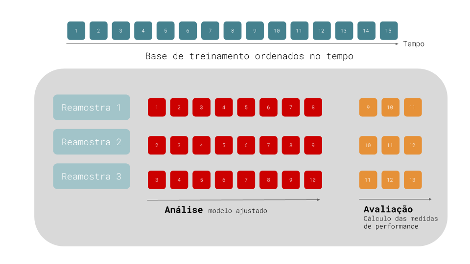

# Considerações Práticas


## Conjuntos de teste e treinamento

A capacidade de um modelo de generalizar só pode ser realmente avaliada quando fazemos previsões de casos novos, para os quais o modelo não foi inicialmente treinado. 

Uma opção bastante utilizada é a de dividir os dados em dois subconjuntos: **conjunto de treinamento** e **conjunto de teste**. O modelo é treinado nos conjuntos de treinamento e testado em novos casos, no conjunto de teste. Podemos então comparar as previsões do modelo com os casos de teste e construir medidas de erro, que irão indicar se o modelo funciona bem para observações inéditas.

A figura \@ref(fig:teste_treinamento) mostra uma série temporal separada em bases de treinamento e teste.

```{r teste_treinamento, fig.cap = "Separação de uma série temporal em base de treinamento e de teste",echo=FALSE, message=FALSE, warning=FALSE}
library(fpp3)
library(tidymodels)
library(modeltime)
library(timetk)

data("us_gasoline")

gasoline_split <- us_gasoline %>%
  tk_tbl() %>% 
  mutate(Week = as.Date(Week)) %>% 
  initial_time_split(prop = 0.7) 

gasoline_split %>% 
    tk_time_series_cv_plan() %>% 
    plot_time_series_cv_plan(Week, Barrels, 
                             .title = "Bases de Teste e Treinamento",
                             .interactive = FALSE,
                             #.line_alpha = 0.5,
                             .line_type = 1,
                             ) 
```
Na porção azul da figura, chamada de base de treinamento, o modelo de previsão é treinado. A partir desse modelo treinado, faremos previsões para o período de teste (vermelho), que são observações inéditas para o modelo, mas são informações conhecidas para o usuário. No exemplo acima, a base de teste é de 30% da série total. O tamanho da base de teste é usualmente de 20%. 

Um modelo que possui uma boa performance na própria base de treinamento não necessariamente será capaz de realizar boas previsões para casos inéditos. O modelo pode estar **sobreajustando** os dados de treinamento, e memorizando o comportamento do período de treinamento, mas sendo incapaz de generalizar bem. Afinal, é possível ajustar perfeitamente um conjunto de dados com um grande número de parâmetros. 

### Funções para dividir uma série temporal

Na figura \@ref(fig:gasoline) podemos visualizar os dados de oferta semanal de gasolina para os EUA.


```{r gasoline, fig.cap="Oferta semanal de produtos de gasolina, EUA"}

library(tidymodels) # contém o pacote rsample
library(fpp3) # contém os dados us_gasoline
library(timetk)

data("us_gasoline")

us_gasoline <- us_gasoline %>%
  tk_tbl() %>% 
  mutate(Week = as.Date(Week))

us_gasoline %>% 
  plot_time_series(Week, Barrels,
                   .title = "Oferta semanal de produtos de gasolina, EUA",
                   .y_lab = "Milhões de barril")

```
No código acima, utilizamos o pacote `rsample` (parte do `tidymodels`), que contém uma série de pacotes para modelagem estatística. Carregamos o pacote `fpp3`, que contém a base de dados `us_gasoline`. Usamos ainda o pacote `timetk`, com algumas funções convenientes para tratamento de séries temporais. Utilizamos a função `tk_tbl()` do pacote `timetk` para converter o objeto `ts` para `data.frame`, e convertemos a coluna de data para um formato que possa ser reconhecido pelas demais funções do pacote `timetk`. 

Para separar os dados em base de treinamento e teste, vamos utilizar o pacote `rsample`. Com a função `initial_split()` podemos criar bases aleatórias de treinamento e teste. Para uma série temporal, como a estrutura temporal dos dados é importante, em vez de uma seleção aleatória, vamos definir bases de treinamento e teste por faixas dos dados. Especificamente, vamos definir que a base de treinamento corresponderá a 70% do total de dados, totalizando 948 observações.

```{r}
gasoline_split <- us_gasoline %>%
  initial_time_split(prop = 0.7) 

gasoline_split
```
O pacote `rsample` oferece duas funções adicionais: `training()` e `testing`, que retorna apenas as observações referentes aquela faixa específica. Podemos ainda visualizar como os dados foram separados utilizando as funções `tk_time_series_cv_plan()` e `plot_time_series_cv_plan()`, que preparam os dados e visualizam o plano de teste e treinamento (figura \@ref(fig:treino_teste_gasolina)).


```{r treino_teste_gasolina, fig.cap="Bases de Teste e Treinamento para dados de gasolina, EUA"}
df_treinamento <- training(gasoline_split)
df_teste <- testing(gasoline_split)

gasoline_split %>% 
    tk_time_series_cv_plan() %>% 
    plot_time_series_cv_plan(Week, Barrels, 
                             .title = "Bases de Teste e Treinamento",
                             .interactive = FALSE,
                             #.line_alpha = 0.5,
                             .line_type = 1,
                             ) 

```


## Transformação de variáveis

Melhorias das previsões podem ser obtidas pela transformação das séries originais. Dados de total de vendas mensais podem ser afetados por efeitos calendários (meses com mais dias possuem naturalmente mais vendas totais). Uma forma de corrigir esta distorção é trabalhar com a média diária de vendas para cada mês.

Dados agregados como produto interno bruto, total de empresas em uma cidade, total de leitos ou número de homicídios são distocidos por um efeito população. Uma transformação bastante popular é o de substituir a variável original por uma medida _per capita_. 

Quando trabalhamos com variáveis monetárias, ajustes pela inflação são fundamentais para realizar comparações justas ao longo do tempo. Para realizar este ajuste, é necessário utilizar um índice de inflação apropriado. 

Outros tipos incluem transformações matemáticas, como a mudança da série original para sua versão logarítima. Para uma série original $y_1,...,y_T$, uma transformação logarítima tomará a forma $w_t = \log(y_t)$. Este tipo de transformação pode ser útil pela sua interpretabilidade, já que muadnças em um valor log são mudanças percentuais na escala original. Se o log na base 10 é utilizado, um aumento de 1 na escala log corresponde a multiplicar a variável original por 10. Contudo, se a variável original possui valores zero ou negativos, este tipo de transformação não é possível. 

### Funções para transformar dados

Antes de aplicar qualquer modelo aos dados, podemos utilizar o pacote `recipes` (parte do pacote `tidymodels`) para criar pequenas receitas de bolo com instruções de pré-processamento dos dados. Ele torna simples tarefas como a criação de variáveis `dummies`, a normalização de variáveis numéricas, a criação de variáveis derivadas da coluna de tempo (como dummy de dia, mês, ano e dia da semana), além de muitas outras operações de _feature engineering_ que são tão importantes, mas por vezes tediosas. E além, das transformações de variáveis, podemos ainda selecionar variáveis e remover colunas com variância zero.

Trabalhando com a base de dados `us_gasoline`, vamos converter os dados originais para sua versão logarítima. Primeiro, com a função `recipe` podemos utilizar uma fórmula para indicar a variável dependente e as variáveis independentes. No caso de uma série temporal univariada, a coluna de tempo (`Week`) pode ser incluida como variável independente. Precisamos ainda indicar qual a base a ser transformada, que será a base de treinamento.

```{r}
receita_gasolina <- us_gasoline %>% recipe(Barrels ~ Week, training(gasoline_split))
receita_gasolina
```
Agora podemos realizar as transformações desejadas. Primeiro vamos utilizar a função `step_log` para criar uma versão log da variável dependente, que é selecionada a partir da função selecionadora `all_outcomes` (alternativamente podemos utilizar o nome da variável).


:::dica
Outros seletores específicos do pacote `recipe` são: `all_numeric_predictors()`, `all_numeric()`,
`all_predictors()` e `all_outcomes`. 
:::


```{r}
receita_gasolina <- receita_gasolina %>% 
  step_log(all_outcomes()) 
```

Na tabela \@ref(tab:tab_gasolina_log) vemos como a função `recipe` transformou a coluna `Barrels` para formato log.

```{r tab_gasolina_log}
receita_gasolina %>% 
  prep() %>% 
  juice() %>% 
  head() %>% 
  knitr::kable()

```


:::dica

O pacote `recipe` permite outras transformações a partir de funções como  `step_meanimpute`, `step_sqrt()`, `step_BoxCox()`, `step_mutate()`, `step_cut() `e  `step_date()`. Uma lista de todas as transformações possíveis pode ser obtida na [documentação](https://recipes.tidymodels.org/reference/) do `recipe`.

:::


## Rodando um modelo simples

Nas próximas seções veremos modelos mais complexos, e mais apropriados para os dados utilizados. Por enquanto, vamos utilizar alguns modelos simples, que podem servir como _benchmarking_ para os modelos por vi. 

### Método da Média

Para este modelo, a previsão de todos os valores futuros é igual a média dos dados históricos. Se deixarmos os dados históricos serem denotados por $y_1,...,y_T$, então os valores futuros serão dados como

$$\hat{y}_{T+h|T} = \bar{y}=\frac{y_1 + ... +y_T}{T}$$

A notação $\hat{y}_{T+h|T}$ pode ser entendido como estimação de $\hat{y}_{T+h}$ baseada nos dados de $y_1,...,y_T$.


### Método Naïve

Para previsões naïve, fazemos a previsão baseada no valor da última observação. Assim,

$$\hat{y}_{T+h|T} = y_T$$

A previsão naïve pode ser ótima quando temos dados de passeio aleatório.


### Método Naïve Sazonal

É um método útil para dados sazonais. Neste caso, cada valor previsto é igual ao último valor observado do mesmo período sazonal do ano (ou o mesmo mês do ano anterior). Formalmente, a previsão para o tempo $T+h$ é escrita como 

$$\hat{y}_{T+h|T} = y_{T+h-m(k+1)}$$
onde $m=\text{período sazonal}$, e $k$ é a parte inteira de $(h-1)/m$ (exemplo, o número de anos completos no período de previsão antes do tempo $T+h$). Assim, com dados mensais, a previsão para todos os meses de fevereiro serão iguais ao valor do último fevereiro observad. Com dados trimestrais, a previsão de todos os segundos trimestres serão iguais ao último segundo trimestre observado.

### Função para ajustar modelos: `parsnip`

Finalmente, após as etapas de pré-processamento dos dados e a criação de um conjunto de treinamento e teste podemos utilizar o pacote `parsnip` para estimar alguns modelos.

O `parsnip` realiza um ótimo trabalho em unificar uma série de diferentes modelos estatísticos e de _machine learning_ em um único ambiente. O pacote é extremamente conveniente porque permite que o usuário utilize uma única forma de se comunicar com diferentes modelos que inicialmente possuiam sintaxes totalmente diferentes ou exigiam dados em diferentes formatos (`matrix`, `ts`, `data.frame`).

Para utilizar o `parsnip`, sempre começamos definindo o modelo. Assim, para estimar uma regressão linear utilizamos a função `linear_reg()` e para estimar um random forest utilizamos a função `rand_forest()`. Contudo, muitos outros modelos estão presentes, como o modelo ARIMA (`arima_reg`), o modelo prophet (`prophet_reg`), Support Vector Machines (`svm_poly` e `svm_rbf`), regressão logística (`logistic_reg`), KNN (`nearest_neighbor`) e muitos outros. Uma lista completa de todos os modelos suportados pode ser encontrada na [documentação](https://parsnip.tidymodels.org/articles/articles/Models.html) do `parsnip`.

O pacote `modeltime` extende o total de modelos para incluir modelos exclusivos de séries temporais. Vamos utilizar ajustar os dados de log de gasolina para o modelo naïve e o modelo naïve sazonal. Primeiro vamos definir o modelo a ser ajustado com a função `naive_reg()`, e fixar o pacote R que contêm a função `naive()` original.


```{r}
modelo_snaive <- naive_reg(
        seasonal_period = 52
    ) %>%
    set_engine("snaive")

modelo_naive <- naive_reg() %>%
    set_engine("naive")

```

Para o modelo Naïve Sazonal, precisamos fixar o parâmetro de período da sazonalidade. Como os dados de gasolina estão em frequência semanal, temos uma sazonalidade bem peculiar, dado que o período de sazonalidade é de em média $365,25/7=52,18$. A maioria dos modelos sazonais só aceitam valores inteiros para a frequência, e mesmo um valor aproximado de 52 períodos pode gerar resultados inadequados. Independemente dessa falha conhecida, vamos utilizar um `seasonal_period = 52` como parâmetro do `naive_reg`.


### Ajustando os modelos

Agora temos os três ingredientes mais importantes para nosso modelo preditivo: (1) temos as bases de treinamento e teste, (2) temos uma receita de bolo com o passo-a-passo do pré-processamento que deve ser aplicado em todas as bases de dados; e (3) declaramos o modelo que deve ser ajustado. Para facilitar a integração de todas essas peças, podemos utilizar o pacote `workflows`, parte da suite `tidymodels`.

Iniciamos um workflow sempre com a função `workflow()`. Adicionamos o modelo definido acima com `add_model()` e a receita que deve ser aplicada aos dados com `add_recipe()`. O último passo é o ajuste do modelo, onde passamos a base de treinamento construída pelo pacote `rsample` para que estimar o modelo naïve e naïve sazonal.


```{r}
workflow_naive <- workflow() %>% 
  add_recipe(receita_gasolina) %>% 
  add_model(modelo_naive) %>% 
  fit(training(gasoline_split))

workflow_snaive <- workflow() %>% 
  add_recipe(receita_gasolina) %>% 
  add_model(modelo_snaive) %>% 
  fit(training(gasoline_split))
```

Para facilitar o trabalho quando temos diversos modelos, podemos criar uma tabela de modelos com a função `modeltime_table()`, parte do pacote `modeltime`. Nela incluimos os arquivos com os modelos ajustados (`workflow_*`). 

```{r}
tbl_modelos <- modeltime_table(
  workflow_snaive,
  workflow_naive
  )
```

Por fim, usamos a função `modeltime_calibrate()` para produzir os valores previstos (_fitted_) para o período de teste e o valor dos resíduos. Mais a frente vamos analisar melhor os resíduos, mas antes vamos observar como os dois modelos realizaram as previsões para a oferta de produtos de gasolina (figura \@ref(fig:forecast-gasoline)). Para tanto usamos a função `modeltime_forecast()`, para preparar um `data.frame` com as previsões e os dados observados, e a função `plot_modeltime_forecast()` para produzir a visualização desejada.

```{r forecast-gasoline, fig.cap="Previsão de métodos naïve para produtos de gasolina nos EUA"}
tbl_calibracao <- tbl_modelos %>% 
  modeltime_calibrate(new_data = testing(gasoline_split))

tbl_calibracao %>% 
  modeltime_forecast(new_data = testing(gasoline_split),
                     actual_data = us_gasoline) %>% 
  plot_modeltime_forecast()

```

A última observação da base de treinamento foi na semana do dia 30 de março de 2009. Naquele dia, o log do total de barris foi de 9,024. O método naïve simplesmente reproduziu este valor para todo o período de teste. Por isso vemos uma reta verde. 

O modelo naïve com sazonalidade é capaz de capturar o comportamento da série surpreendemente bem, uma vez que a série tem um comportamento sazonal bem marcante.

## Valores ajustados e resíduos

Cada observação na série temporal pode ser prevista usando todas as observações anteriores. Chamamos estas novas observações de valores ajustados (`fitted values`), e eles são denotados por $\hat{y}_{t|t-1}$, ou simplesmente $\hat{y}_t$. 

Já os resíduos são a diferença entre os valores observados e os valores ajustados do modelo:

$$e_t = y_t - \hat{y}_t$$
Se os dados foram transformados, é sempre útil olhar os resíduos na escala transformada. Resíduos na escala transformada são chamados de **resíduos da inovação**, e podemos denotar por $w_t - \hat{w}_t$, dado que $w_t = \log{y_t}$. 

Podemos acessar os valores observados, previstos e os resíduos para os dois modelos ao observar a tabela de calibração gerada pela função `modeltime_calibrate()`.

```{r tab_residuos}
tbl_calibracao %>% 
  unnest(.calibration_data) %>% 
  head(10) 
```
 
É sempre útil checar se um modelo capturou de modo adequado as informações dos dados. Para tanto podemos utilizar algumas ferramentas de diagnósticos de resíduos para verificar se:

1. os resíduos são não correlacionados. Se existe correlação entre os resíduos, então existe informação presente nos resíduos que deveria ter sido utilizada para computar as previsões.
 
2. Os resíduos devem ter média zero. Se a média é diferente de zero, então as previsões estão viesadas.

Qualquer previsão que não satisfaz estas propriedades pode ser melhorado. Contudo, isto não significa que um modelo que satisfaça essas condições seja um modelo que não possa ser melhorado. Assim, checar essas informações é uma forma de garantir que o método está utilizando toda a informação dispoível, mas não é uma boa forma de selecionar o método ideal a ser escolhido.

É útil (mas não necessário) que os resíduos também variância constante (a chamada homocedasticidade), e sejam normalmente distribuidos. Estas propriedades tornam os cálculos de intervalo de confiança mais precisos. 

Vamos utilizar a tabela de calibração para plotar os resíduos do modelo naïve sazonal. A figura \@ref(fig:residuo-snaive) mostra os resíduos da previsão de gasolina utilizando o método naïve sazonal.


```{r residuo-snaive, fig.cap="Resíduos do Modelo Naïve Sazonal"}
tbl_calibracao %>% 
  unnest(.calibration_data) %>% 
  filter(.model_desc == "SNAIVE [52]") %>% 
  plot_time_series(Week, .residuals, .title = "Resíduos do Modelo Naïve Sazonal")
```

 Os resíduos parecem ter média zero no início e fim do período de teste, mas entre os anos de 2011 e 2014, temos resíduos que não possuem média zero, o que pode ser o resultado de um comportamento diferente da média história que não está sendo capturado pelo modelo de previsão. Isto pode indicar que as previsões produzidas por este método possuem um viés. É a impressão que temos quando analisamos a figura \@ref(fig:forecast-gasoline)). A previsão parece sempre superestimar o log da oferta de produtos de gasolina. 
 
 Podemos ainda produzir o histograma dos resíduos do método naïve sazonal para verificar se os resíduos possuem uma distribuição que se assemelhe a uma normal. A figura \@ref(fig:hist-naive) parece indicar que os resíduos não são exatamente normais. 

```{r hist-naive, fig.cap="Histograma dos Resíduos de um método Naïve"}
tbl_calibracao %>% 
  unnest(.calibration_data) %>% 
  filter(.model_desc == "SNAIVE [52]") %>% 
  ggplot(aes(x = .residuals)) +
  geom_histogram() + 
  labs(title = "Histograma dos Resíduos de um método Naïve")

```
Resíduos não normais podem indicar que as previsões a partir deste método podem até produzir resultados não viesados, mas os intervalos de confiança estimados podem ser imprecisos, uma vez que o seu cálculo assumem sempre distribuição normal.

Por fim, podemos verificar se os erros são autocorrelacionados utilizando a função de autocorrelação apresentada na seção xxx. A figura \@ref(fig:acf-naive) mostra o correlograma produzido pela função `plog_acf_diagnostics()`.

```{r acf-naive, fig.cap="Correlograma dos resíduos do método naïve aplicado a série de gasolina"}
tbl_calibracao %>% 
  unnest(.calibration_data) %>% 
  filter(.model_desc == "SNAIVE [52]") %>% 
  plot_acf_diagnostics(Week, .residuals, 
                       .show_white_noise_bars = T,
                       .lags = 100,
                       .title = "Correlograma dos resíduos do método naïve aplicado a série de gasolina")

```
O correlograma parece indicar que os resíduos produzidos pelo método naïve são autocorrelacionados e que o modelo pode ser melhorado. A autocorrelação dos resíduos pode ser testada formalmente a partir de alguns testes estatísticos como o teste de Ljung-Box e o teste de Box-Pierce.


### Teste de Ljung-Box

O gráfico da Função de Autocorrelação $r_k$ mostra a autocorrelação para cada lag $k$, e realiza um teste de hipótese que avalia se a autocorrelação $r_k$ é estatísticamente diferente daquilo que se considera um ruido branco. Cada uma destes testes de hipótese carrega a possibilidade de produzir falsos positivos, de modo que alguns valores de autocorrelações moderados, podem ser confundidos com um resíduo com autocorrelação remanescente, mas quando tomamos em conjunto parecem excessivos. Assim, é possível testar se os primeiros $K$ autocorrelações são significativamente diferentes de um ruído branco. 

Um teste para um grupo de autocorrelações foi proposto por @box1970distribution. Este teste é baseado na estatística

$$Q = n(\hat{r}^2_1  + \hat{r}^2_2  + ... + \hat{r}^2_K)$$

onde $K$ é o número máximo de *lags* sendo considerados e $n$ é o número de observações. Se cada $r_k$ é próxima de zero, então $Q$ será pequeno. Se alguns dos valores de $r_k$ são grandes, então $Q$ será grande. @hyndman2018forecasting sugere um valor de $K=10$ para dados não-sazonais, e de $K=2m$, para dados sazonais, onde $m$ é o período de sazonalidade. 

Para um valor elevado de $n$, $Q$ tem uma distribuição chi-quadrado, mas segundo @ljung1978measure, mesmo valores de $n = 100$ pode produzir aproximações não satisfatórias. Eles propõem uma versão modificada do teste de Box-Pierce, chamada de teste Ljung-Box, que define uma estatística de teste cuja distribuição nula é muito mais próxima da distribuição chi-quadrado. A estatística é dada por

$$Q_* = n(n+2)\left( \frac{\hat{r}^2_1}{n-1} + \frac{\hat{r}^2_2}{n-2} + ... + \frac{\hat{r}^2_K}{n-K} \right)$$

Novamente, valores elevados de $Q_*$ sugerem que a autocorrelação não é um produto de ruído branco.

### Função para Teste dos Resíduos

A função `modeltime_residuals_test()` toma os resíduos de cada modelo guardado na tabela de calibração `tbl_calibracao` e retorna uma série de testes estatísticos para os resíduos. A tabela \@ref(tab:tabela-teste-residuos) mostra os resultados dos testes de resíduos produzidos por esta função.


```{r tabela-teste-residuos}
tbl_calibracao %>% 
  modeltime_residuals() %>% 
  modeltime_residuals_test() %>% 
  knitr::kable(caption = "Testes estatísticos para os resíduos")
```

Além dos p-valores dos testes de Pierce-Box e Ljung-Box para autocorrelação, que não rejeitam a presença de autocorrelação, a tabela ainda mostra o resultado para o teste de Durbin-Watson e o p-valor para o teste de Shapiro-Wilks.

O teste de Durbin-Watson também testa a hipótese de autocorrelação, e parece indicar a presença de autocorrelação positiva (valores entre 0 e <2). O teste de Shapiro-Wilks testa mais rigorosamente a hipótese de normalidade dos resíduos, com uma hipótese nula de que os resíduos são normalmente distribuidos. O teste funciona ao calcular a correlação entre os resíduos e os quantis normais. Quanto menor esta correlação, maior a evidência de normalidade. Analisando a tabela, ao nível de significância de 0,05, nossos resíduos não parecem ser normalmente distribuidos, confirmando nossa inspeção visual do histograma dos resíduos.


## Medindo a performance da previsão

O erro de previsão é medido como a diferença entre o valor observado e o previsto e pode ser escrito como 

$$e_{T+h} = y_{T+h} - \hat{y}_{T+h|T}$$
onde os dados de treinamento são dados por $\{y_1, y_2, ..., y_T\}$ e dados de teste são dados por $\{y_{T+1}, y_{T+2},...\}$.

Lembrando que os erros de previsão são a diferença entre dados observados e previstos para o período de teste, enquanto resíduos são a diferença entre dados observados e ajustados no período de treinamento.

### Erros dependentes da escala

Algumas medidas de erro de previsão são dependentes da escala dos dados, não sendo indicados para comparação entre previsões feitas para séries temporais em escalas diferentes.

As medidas de erro dependente de escala mais comuns são o Erro Médio Absoluto (MAE, em inglês) e o Raiz quadrada do Erro Quadrado Médio (RMSE, em inglês):

$$\text{MAE} = \text{média}(|e_t|)$$
$$\text{RMSE} = \sqrt{\text{média}(e_t^2)}$$

### Erros de porcentagem

Erros de porcentagem não dependem da escala da série temporal, sendo utilizando para comparar performance de previsão de séries temporais de escalas diferentes. A médida mais utilizada é o Erro percentual da Média Absoluta (MAPE, em inglês). Esta medida é dada pela fórmula

$$\text{MAPE} = \text{média}(|p_t|)$$
onde $p_t = 100 e_t / y_t$. 

A principal desvantagem deste tipo de medida é apresentar valores infinitos quando o valor de $y_t = 0$ e valores extremos quando $y_t \rightarrow 0$. Este tipo de médida também é assimétrica, na medida que penaliza mais erros negativos em detrimento de erros positivos. Uma medida percentual alternativa é a MAPE simétrica ou sMAPE, que é definida como

$$\text{sMAPE} = \text{média} \left(200 \frac{|y_t - \hat{y}_t|}{y_t + \hat{y}_t}\right)$$

Contudo, se $y_t$ e $\hat{y}_t$ são próximos de zero, a medida também envolve uma fração com denominador próximo de zero. 


### Erros Escalados

Como uma alternativa aos erros de percentagem, @hyndman2006another propõem reescalar os erros baseados na medida de MAE dos dados de treinamento de um método de previsão simples. 

Para uma série temporal sem sazonalidade, uma forma de definir o erro de escala utiliza uma previsão naïve:

$$q_j = \frac{e_j}{\frac{1}{T-1} \sum_{t=2}^T |y_t - y_{t-1}|}$$
Como o numerador e o denominador envolvem valores que estão na escala dos dados originais, $q_j$ é independente da escala dos dados. 

* $q_j < 1$: $q_j$ é produzido por uma previsão melhor que a média de previsão um passo-a-frente do modelo naïve computado nos dados de treinamente. 

* $q_j > 1$ se a previsão é pior.

Para dados com sazonalidade, o erro escalado pode ser definido ao utilizar uma previsão naïve com sazonalidade.

$$q_j = \frac{e_j}{\frac{1}{T-m} \sum_{t=2}^T |y_t - y_{t-m}|}$$
Assim, o Erro Escalado Médio Absoluto (*Mean Absolute Scaled Error*, MASE) é dado por

$$\text{MASE} = \text{média}(|q_j|)$$

Alternativamente podemos calcular o *Root Mean Squared Scaled Error* (RMSSE) como 

$$\text{RMSSE} = \sqrt{\text{média}(q_j^2)}$$

### Função para Medidas de Performance

O pacote [yardstick](https://yardstick.tidymodels.org/) facilita a criação de medidas de performance dos modelos estimados, produzindo as principais medidas de desempenho para problemas de regressão (RMSE, R-Quadrado e outros) e de classificação (matriz de confusão, precisão, acurácia e outros).

O pacote `modeltime` nos fornece a função `modeltime_accuracy()`, que permite utilizar as funções do `yardstick` para objetos do tipo `workflow`. 

A tabela \@ref(tab:medidas-desempenho) mostra as medidas de desempenho de previsão para os dois modelos estimados. Para tanto, passamos a tabela de calibração para a função `modeltime_accuracy()`.


```{r medidas-desempenho}
tbl_calibracao %>%
  modeltime_accuracy(new_data = testing(gasoline_split)) %>% 
  #select(.model_desc, mape, rmse) %>% 
  kableExtra::kable(caption = "Medidas de Desempenho para Previsão Naïve e Naïve com Sazonalidade")

```
Considerando que estamos comparando modelos diferentes aplicados aos mesmos dados, a questão de escala não é relevante. Da mesma forma, independentemente da medida utilizada, os dois modelos parecem produzir resultados semelhantes.

## Métodos de Reamostragem

Métodos de reamostragem são sistemas de simulação empírica que emulam o processo de usar parte dos dados para modelagem e uma parte diferente dos dados para avaliação da performance. O diagrama abaixo ilustra como métodos de reamostragem geralmente operam:


A reamostragem é conduzida apenas na base de treinamento. Para cada reamostragem, os dados são particionados em duas subamostras: uma **base de análise**, onde o modelo é ajustado e uma **base de avaliação**, onde o modelo é avaliado. Estas duas bases são análogas ao conjunto de treinamento e de teste. Utilizamos os termos análise e avaliação para evitar confusões com a divisão inicial entre base de treinamento e de teste.

Um dos métodos mais conhecidos de reamostragem é a validação cruzada. Neste tipo de reamostragem, os dados são aleatoriamente particionados em $V$ conjuntos de tamanho igual (chamados de "folds"). Para $V = 3$ e 1200 observações, podemos atribuir 300 observações para a base de teste e 900 para a base de treinamento. Podemos então selecionar aleatoriamente 300 observações para o conjunto de reamostragem 1, 300 para o conjunto de reamostragem 2 e 300 observações para o conjunto de reamostragem 3.

Para um processo de validação cruzada de 3-folds, para cada interação, um *fold* é guardado para gerar a avaliação do modelo e os outros dois *folds* são utilizados para ajustar o modelo. Este modelo continua para cada *fold*, para que sejam produzidos três conjuntos de medidas de performance. A medida final de performance é a média (ou mediana) das medidas das $V$ replicações.


### Validação Cruzada para Séries Temporais

Para dados de séries temporais, onde existem componentes como tendência e sazonalidade que dependem da ordem das observações, métodos de reamostragem como *cross-validation* e *bootstrap* podem impedir os modelos de estimar estas características.


Uma forma de corrigir este problema é utilizar validação cruzada para séries temporais. O diagrama abaixo mostra a base de treinamento de uma série temporal com 15 observações ordenadas no tempo. A primeira reamostragem possui 11 destas observações, sendo as 8 primeiras amostras reservadas para o **périodo de análise** e as 3 observações seguintes para o **período de avaliação**. Na segunda interação (reamostragem 2), a primeira amostra da base de treinamento é descartada e as bases de análise e avaliação "caminham" um período para frente.




Algumas variações deste método existem: (1) podemos permitir que o conjunto de análise cresça cumulativamente (sem descartar as observações iniciais) e (2) podemos separar as diferentes reamostragens por blocos de semanas ou meses.

### Implementando Validação Cruzada

O pacote `timetk` oferece a função `time_series_cv` para construção de validação cruzada para séries temporais. Além dos dados, a função toma uma série de diferentes parâmetros:

* `initial`: número de observações utilizados no período de análise. 

* `assess`: número de observações utilizadas no período de avaliação.

* `skip`: permite que nem todos as observações sejam utilizadas na base de análise. Para dados diários, um `skip=7` faz com que tenhamos apenas 1 informação por semana.

* `lag`: Incluir uma defasagem entre o período de análise e de avaliação.

* `cumulative`: Se o período de análise deve crescer cumulativamente.

* `slice_limit`: o número máximo de reamostragens a serem retornadas pela função.

Abaixo mostramos um exemplo de `timee_series_cv` com os dados de gasolina. Como temos 26 anos de dados semanais, vamos fixar o período de análise em 18 anos (`initial = "18 years"`), e o período de avaliação em 4 anos (`assess = "4 years"`). Este plano de validação cruzada produziu 104 conjuntos de treinamento de tamanho crescente. A figura \@ref(fig:cross-validation-ts) mostra o gráfico da validação cruzada para quatro destes grupos (slice 1, 20, 30 e 40). Usamos a função `tk_time_series_cv_plan()` para tornar o objeto `cross_validation` um data.frame, e `plot_time_series_cv_plan()` para gerar a visualização. 


```{r cross-validation-ts, fig.cap="Validação Cruzada para Séries Temporais"}
cross_validation <- time_series_cv(
  data = us_gasoline,
  date_var = Week,
  initial = "18 years",
  assess = "4 years",
  cumulative = TRUE
)

cross_validation %>%
  tk_time_series_cv_plan() %>%
  filter(.id %in% c("Slice001", "Slice040", "Slice070", "Slice104")) %>% 
  plot_time_series_cv_plan(Week, Barrels, .facet_ncol = 2, .interactive = FALSE)

```
O pacote `modeltime.resample` fornece a função `modeltime_fit_resamples` para ajustar modelos contidos em uma tabela de modelos (`tbl_modelos`) para todas as reamostragens contidas no objetivo criado com `time_series_cv()`. Vamos ajustar o modelo naïve e naïve sazonal para cada um dos 104 *folds*. 

:::dica
Rodar tantos modelos pode levar um longo tempo. Rodar os modelos em paralelo reduz substancialmente o tempo de execução e pode ser possível com o uso de funções como `parallel_start()`. Para ler mais, visite a [documentação da função](https://business-science.github.io/modeltime/reference/parallel_start.html).
:::

```{r}
library(modeltime.resample)

parallel_start(8)

ajustes_reamostragens <- tbl_modelos %>%
  modeltime_fit_resamples(
    resamples = cross_validation
  )
ajustes_reamostragens
```

Podemos visualizar a performance de cada reamostragem com o uso da figura \@ref(fig:plot-medidas-reamostragem). 


```{r plot-medidas-reamostragem, fig.cap="Gráfico de Medidas de Reamostragem", message=FALSE, warning=FALSE}
ajustes_reamostragens %>%
  plot_modeltime_resamples(
    .point_size  = 1,
    .point_alpha = 0.8,
    .interactive = FALSE,
    .legend_show = F
  )


```
Uma visualização melhor das informações pode ser obtida ao se calcular a média (ou mediana) das medidas de performance dos 104 *folds*. Considerando que nossos dados não possuem zero ou valores próximos de zero na variável dependente, podemos utilizar o MAPE como critério de escolha. Neste caso, o método Naïve com Sazonalidade parece produzir previsões mais precisas.

```{r medidas-reamostragens}
ajustes_reamostragens %>%
  modeltime_resample_accuracy(summary_fns = mean) %>%
  table_modeltime_accuracy()

```

