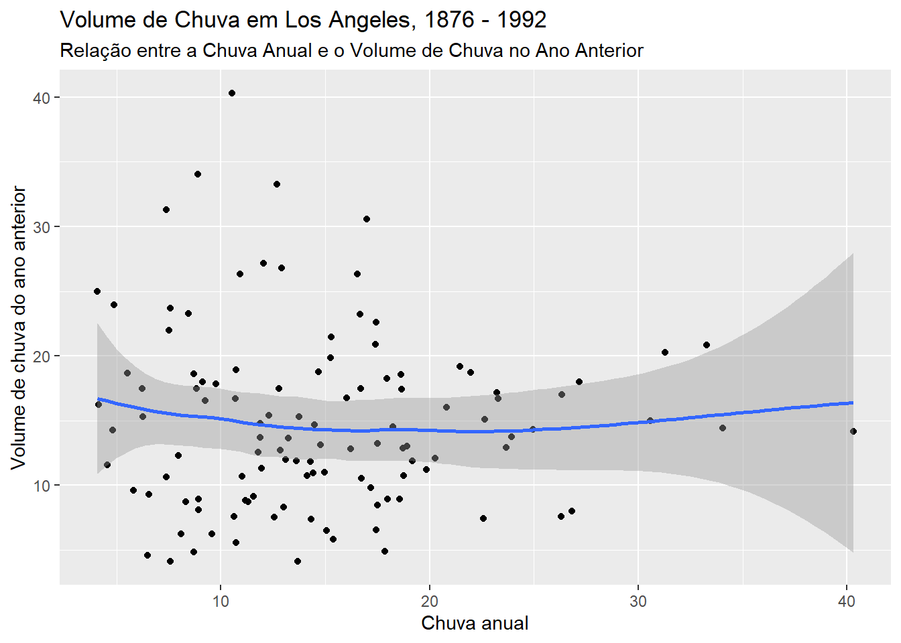
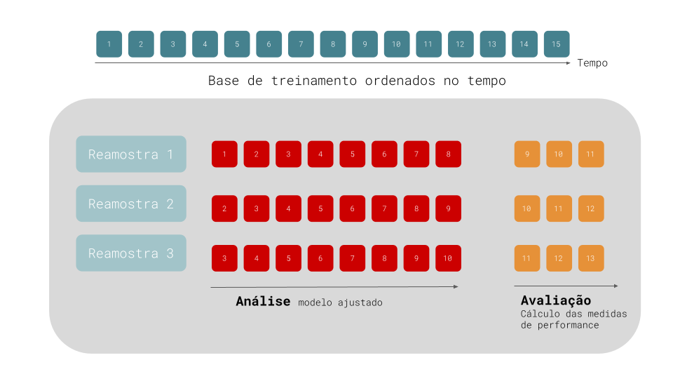
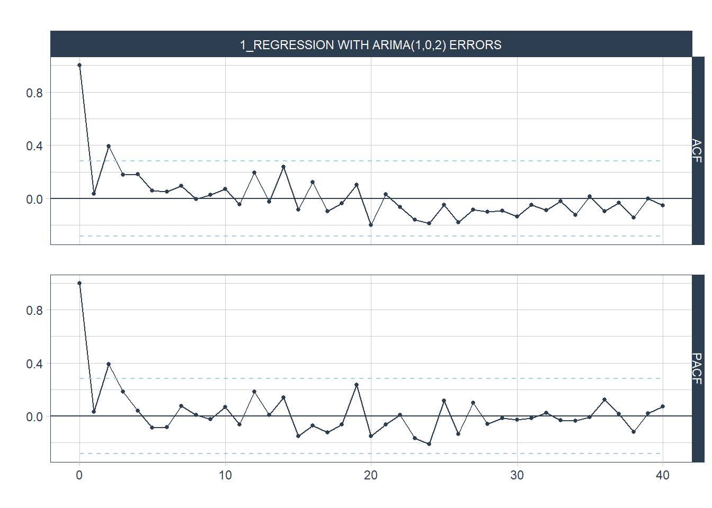

# Prefácio

Este é um livro online que fornece uma breve introdução aos principais métodos de previsão em séries temporais.

R é uma linguagem de programação gratuita e bastante popular para análise estatística.

Este livro é uma tentativa de traduzir o livro online [Forecasting: Principles and Practice](https://otexts.com/fpp3/index.html), que é uma das principais referências para o ensino de previsão com R. Ao mesmo tempo, seus exemplos serão adaptados para os pacotes [timetk](https://business-science.github.io/timetk/) [@R-timetk] e [modetime](https://business-science.github.io/modeltime/index.html) [@R-modeltime]. 

O pacote `modeltime` é uma biblioteca do R que fornece uma estrutura flexível para modelagem, previsão e avaliação de séries temporais. Ele é construído com base em outros pacotes de séries temporais do R, como forecast, prophet e fable, e visa simplificar o processo de modelagem e previsão de séries temporais.

O `modeltime` oferece uma variedade de modelos para a modelagem de séries temporais, incluindo modelos ARIMA, modelos de suavização exponencial, modelos de regressão, modelos de redes neurais, entre outros. Ele também permite que os usuários combinem e comparem vários modelos para selecionar o melhor modelo para uma determinada série temporal.

Além disso, o modeltime possui uma série de funções úteis para visualização de séries temporais, diagnóstico de modelos e avaliação de desempenho de previsão, muitas delas implementadas na biblioteca `timetk`. 

Em resumo, o `modeltime` é uma ferramenta poderosa para modelagem e previsão de séries temporais no R. Ele oferece uma ampla variedade de modelos e funcionalidades para ajudar os usuários a analisar e prever dados de séries temporais com eficácia.
Estes dois pacotes tornam a tarefa de realizar previsão muito conveniente.


## Pré-requisitos

Para acompanhar este livro, o usuário deve ter o R e RStudio instalados na sua máquina. Conhecimento básico dos pacotes `dplyr` e `ggplot2` é recomendado. Outros pacotes e funções do universo `tidyverse` podem ser utilizados ao longo do livro.

Uma breve descrição da instalação do R/RStudio e das principais funções do `tidyverse` pode ser encontrada no Apêndice.


## Sobre o Autor

Meu nome é Robson Oliveira, sou Doutor em Economia pela Universidade Federal da Paraíba e professor efetivo do Instituto Federal da Paraíba.

Você pode me encontrar no meu [site pessoal](https://robsonolima.com.br/), onde discuto temas variados como séries temporais, modelos de causalidade e R em geral.

<!--chapter:end:index.Rmd-->

# Os fundamentos de séries temporais{#intro}

Para que uma criança aprenda a identificar um gato, é preciso que os pais apontem para vários gatos e digam "gato". Essa tarefa pode ser repetida algumas poucas vezes por crianças, mas para um modelo de previsão, essa tarefa não é tão simples, e exige uma grande quantidade de dados para que o modelo seja capaz de generalizar bem para novos casos. Para séries temporais, novos casos são as observações futuras. 

É importante também que os dados sejam representativos dos novos casos e que eles sejam de boa qualidade. Informações com erros de medidas, presença de valores discrepantes (chamados de _outliers_) ou cheio de ruídos, podem gerar previsões de baixa qualidade mesmo que o modelo utilizado seja "adequado".

Modelos podem realizar previsões imprecisas quando quando ele funciona muito bem para os dados de treinamento, mas não é capaz de prever com precisão novas informações. 


## O que pode ser previsto?

## Principais modelos de previsão

## O passo-a-passo de realizar uma previsão


## Um Projeto de Previsão de Ponta a Ponta

O fluxo de trabalho necessário para realizar previsões de uma série temporal seguem uma sequência mais ou menos fixa que começa sempre com a visualização dos dados. 

### Carregando os pacotes necessários

Todo projeto de previsão é iniciado carregando os principais pacotes de manipulação de dados e de previsão. Com o `tidyverse` temos acesso a uma série de funções de manipulação de dados e de visualização. Muitas vezes os dados que temos a disposição não estão em um formato correto ou precisam de pequenos ajustes para serem utilizados pelos modelos preditivos.

O pacote `timetk` contém um conjunto de funções para manipulação, visualização e diagnóstico em séries temporais. Já o pacote `modeltime` possui uma série de funções que tornam conveniente estimar modelos de séries temporais de uma maneira simples e intuitiva.


```r
# Pacotes de manipulação de dados
library(tidyverse)

# Coleção de pacotes para análise de machine learning e estatística
library(tidymodels)

# Pacotes específicos de séries temporais
library(modeltime)
library(timetk)
```

### Dados

Abaixo temos dados diários de acidentes em rodovias federais brasileiras. Vemos que os dados estão no formato desejado: cada linha representa um valor numérico associado a uma data específica.


```r
acidentes <- read_rds("resources/acidentes_estradas_brasil.rds")
acidentes %>% 
  head() %>% 
  knitr::kable(caption = "Base de acidentes em rodovias federais, 2007 a 2021")
```


Table: (\#tab:unnamed-chunk-3)Base de acidentes em rodovias federais, 2007 a 2021

|Date       | acidentes| feriado| semana_natal| covid|
|:----------|---------:|-------:|------------:|-----:|
|2007-01-01 |       421|       1|            0|     0|
|2007-01-02 |       516|       0|            0|     0|
|2007-01-03 |       367|       0|            0|     0|
|2007-01-04 |       315|       0|            0|     0|
|2007-01-05 |       358|       0|            0|     0|
|2007-01-06 |       334|       0|            0|     0|
A função `skim` do pacote `skimr` é uma forma excelente de resumir um banco de dados. 


```r
skimr::skim(acidentes) 
```


Table: (\#tab:unnamed-chunk-4)Data summary

|                         |          |
|:------------------------|:---------|
|Name                     |acidentes |
|Number of rows           |5448      |
|Number of columns        |5         |
|_______________________  |          |
|Column type frequency:   |          |
|Date                     |1         |
|numeric                  |4         |
|________________________ |          |
|Group variables          |None      |


**Variable type: Date**

|skim_variable | n_missing| complete_rate|min        |max        |median     | n_unique|
|:-------------|---------:|-------------:|:----------|:----------|:----------|--------:|
|Date          |         0|             1|2007-01-01 |2021-11-30 |2014-06-16 |     5448|


**Variable type: numeric**

|skim_variable | n_missing| complete_rate|   mean|     sd| p0| p25| p50| p75| p100|hist  |
|:-------------|---------:|-------------:|------:|------:|--:|---:|---:|---:|----:|:-----|
|acidentes     |         0|             1| 351.71| 147.00| 71| 218| 349| 464| 1101|▇▇▃▁▁ |
|feriado       |         0|             1|   0.03|   0.18|  0|   0|   0|   0|    1|▇▁▁▁▁ |
|semana_natal  |         0|             1|   0.02|   0.12|  0|   0|   0|   0|    1|▇▁▁▁▁ |
|covid         |         0|             1|   0.12|   0.32|  0|   0|   0|   0|    1|▇▁▁▁▁ |

Vemos que a coluna de datas está no formato `datetime`, e que a base possui informações de acidentes a partir de primeiro de janeiro de 2007 e fim em 30 de novembro de 2021. A variável dependente (`acidentes`) não possui valores faltantes (*missing values*), assim como valores negativos ou números muito fora do esperado, o que nos leva a crer que a base não precisa de nenhuma manipulação adicional. Em termos de estatísticas descritivas, temos uma média de 352 acidentes por dia; valor mínimo de 71 ocorrências, e máximo de 1101.

A figura \@ref(fig:plot-acidentes) mostra a séries de acidentes em rodovias federais durante 2007 e 2021.


```r
acidentes %>%
  plot_time_series(Date,
                   acidentes,
                   .facet_scales = "free_y",
                   .smooth = F,
                   .title = "")
```

<div class="figure">

```{=html}
<div class="plotly html-widget html-fill-item-overflow-hidden html-fill-item" id="htmlwidget-0c6accf228221b9b0f43" style="width:672px;height:480px;"></div>
<script type="application/json" data-for="htmlwidget-0c6accf228221b9b0f43">{"x":{"data":[{"x":["2007-01-01","2007-01-02","2007-01-03","2007-01-04","2007-01-05","2007-01-06","2007-01-07","2007-01-08","2007-01-09","2007-01-10","2007-01-11","2007-01-12","2007-01-13","2007-01-14","2007-01-15","2007-01-16","2007-01-17","2007-01-18","2007-01-19","2007-01-20","2007-01-21","2007-01-22","2007-01-23","2007-01-24","2007-01-25","2007-01-26","2007-01-27","2007-01-28","2007-01-29","2007-01-30","2007-01-31","2007-02-01","2007-02-02","2007-02-03","2007-02-04","2007-02-05","2007-02-06","2007-02-07","2007-02-08","2007-02-09","2007-02-10","2007-02-11","2007-02-12","2007-02-13","2007-02-14","2007-02-15","2007-02-16","2007-02-17","2007-02-18","2007-02-19","2007-02-20","2007-02-21","2007-02-22","2007-02-23","2007-02-24","2007-02-25","2007-02-26","2007-02-27","2007-02-28","2007-03-01","2007-03-02","2007-03-03","2007-03-04","2007-03-05","2007-03-06","2007-03-07","2007-03-08","2007-03-09","2007-03-10","2007-03-11","2007-03-12","2007-03-13","2007-03-14","2007-03-15","2007-03-16","2007-03-17","2007-03-18","2007-03-19","2007-03-20","2007-03-21","2007-03-22","2007-03-23","2007-03-24","2007-03-25","2007-03-26","2007-03-27","2007-03-28","2007-03-29","2007-03-30","2007-03-31","2007-04-01","2007-04-02","2007-04-03","2007-04-04","2007-04-05","2007-04-06","2007-04-07","2007-04-08","2007-04-09","2007-04-10","2007-04-11","2007-04-12","2007-04-13","2007-04-14","2007-04-15","2007-04-16","2007-04-17","2007-04-18","2007-04-19","2007-04-20","2007-04-21","2007-04-22","2007-04-23","2007-04-24","2007-04-25","2007-04-26","2007-04-27","2007-04-28","2007-04-29","2007-04-30","2007-05-01","2007-05-02","2007-05-03","2007-05-04","2007-05-05","2007-05-06","2007-05-07","2007-05-08","2007-05-09","2007-05-10","2007-05-11","2007-05-12","2007-05-13","2007-05-14","2007-05-15","2007-05-16","2007-05-17","2007-05-18","2007-05-19","2007-05-20","2007-05-21","2007-05-22","2007-05-23","2007-05-24","2007-05-25","2007-05-26","2007-05-27","2007-05-28","2007-05-29","2007-05-30","2007-05-31","2007-06-01","2007-06-02","2007-06-03","2007-06-04","2007-06-05","2007-06-06","2007-06-07","2007-06-08","2007-06-09","2007-06-10","2007-06-11","2007-06-12","2007-06-13","2007-06-14","2007-06-15","2007-06-16","2007-06-17","2007-06-18","2007-06-19","2007-06-20","2007-06-21","2007-06-22","2007-06-23","2007-06-24","2007-06-25","2007-06-26","2007-06-27","2007-06-28","2007-06-29","2007-06-30","2007-07-01","2007-07-02","2007-07-03","2007-07-04","2007-07-05","2007-07-06","2007-07-07","2007-07-08","2007-07-09","2007-07-10","2007-07-11","2007-07-12","2007-07-13","2007-07-14","2007-07-15","2007-07-16","2007-07-17","2007-07-18","2007-07-19","2007-07-20","2007-07-21","2007-07-22","2007-07-23","2007-07-24","2007-07-25","2007-07-26","2007-07-27","2007-07-28","2007-07-29","2007-07-30","2007-07-31","2007-08-01","2007-08-02","2007-08-03","2007-08-04","2007-08-05","2007-08-06","2007-08-07","2007-08-08","2007-08-09","2007-08-10","2007-08-11","2007-08-12","2007-08-13","2007-08-14","2007-08-15","2007-08-16","2007-08-17","2007-08-18","2007-08-19","2007-08-20","2007-08-21","2007-08-22","2007-08-23","2007-08-24","2007-08-25","2007-08-26","2007-08-27","2007-08-28","2007-08-29","2007-08-30","2007-08-31","2007-09-01","2007-09-02","2007-09-03","2007-09-04","2007-09-05","2007-09-06","2007-09-07","2007-09-08","2007-09-09","2007-09-10","2007-09-11","2007-09-12","2007-09-13","2007-09-14","2007-09-15","2007-09-16","2007-09-17","2007-09-18","2007-09-19","2007-09-20","2007-09-21","2007-09-22","2007-09-23","2007-09-24","2007-09-25","2007-09-26","2007-09-27","2007-09-28","2007-09-29","2007-09-30","2007-10-01","2007-10-02","2007-10-03","2007-10-04","2007-10-05","2007-10-06","2007-10-07","2007-10-08","2007-10-09","2007-10-10","2007-10-11","2007-10-12","2007-10-13","2007-10-14","2007-10-15","2007-10-16","2007-10-17","2007-10-18","2007-10-19","2007-10-20","2007-10-21","2007-10-22","2007-10-23","2007-10-24","2007-10-25","2007-10-26","2007-10-27","2007-10-28","2007-10-29","2007-10-30","2007-10-31","2007-11-01","2007-11-02","2007-11-03","2007-11-04","2007-11-05","2007-11-06","2007-11-07","2007-11-08","2007-11-09","2007-11-10","2007-11-11","2007-11-12","2007-11-13","2007-11-14","2007-11-15","2007-11-16","2007-11-17","2007-11-18","2007-11-19","2007-11-20","2007-11-21","2007-11-22","2007-11-23","2007-11-24","2007-11-25","2007-11-26","2007-11-27","2007-11-28","2007-11-29","2007-11-30","2007-12-01","2007-12-02","2007-12-03","2007-12-04","2007-12-05","2007-12-06","2007-12-07","2007-12-08","2007-12-09","2007-12-10","2007-12-11","2007-12-12","2007-12-13","2007-12-14","2007-12-15","2007-12-16","2007-12-17","2007-12-18","2007-12-19","2007-12-20","2007-12-21","2007-12-22","2007-12-23","2007-12-24","2007-12-25","2007-12-26","2007-12-27","2007-12-28","2007-12-29","2007-12-30","2007-12-31","2008-01-01","2008-01-02","2008-01-03","2008-01-04","2008-01-05","2008-01-06","2008-01-07","2008-01-08","2008-01-09","2008-01-10","2008-01-11","2008-01-12","2008-01-13","2008-01-14","2008-01-15","2008-01-16","2008-01-17","2008-01-18","2008-01-19","2008-01-20","2008-01-21","2008-01-22","2008-01-23","2008-01-24","2008-01-25","2008-01-26","2008-01-27","2008-01-28","2008-01-29","2008-01-30","2008-01-31","2008-02-01","2008-02-02","2008-02-03","2008-02-04","2008-02-05","2008-02-06","2008-02-07","2008-02-08","2008-02-09","2008-02-10","2008-02-11","2008-02-12","2008-02-13","2008-02-14","2008-02-15","2008-02-16","2008-02-17","2008-02-18","2008-02-19","2008-02-20","2008-02-21","2008-02-22","2008-02-23","2008-02-24","2008-02-25","2008-02-26","2008-02-27","2008-02-28","2008-02-29","2008-03-01","2008-03-02","2008-03-03","2008-03-04","2008-03-05","2008-03-06","2008-03-07","2008-03-08","2008-03-09","2008-03-10","2008-03-11","2008-03-12","2008-03-13","2008-03-14","2008-03-15","2008-03-16","2008-03-17","2008-03-18","2008-03-19","2008-03-20","2008-03-21","2008-03-22","2008-03-23","2008-03-24","2008-03-25","2008-03-26","2008-03-27","2008-03-28","2008-03-29","2008-03-30","2008-03-31","2008-04-01","2008-04-02","2008-04-03","2008-04-04","2008-04-05","2008-04-06","2008-04-07","2008-04-08","2008-04-09","2008-04-10","2008-04-11","2008-04-12","2008-04-13","2008-04-14","2008-04-15","2008-04-16","2008-04-17","2008-04-18","2008-04-19","2008-04-20","2008-04-21","2008-04-22","2008-04-23","2008-04-24","2008-04-25","2008-04-26","2008-04-27","2008-04-28","2008-04-29","2008-04-30","2008-05-01","2008-05-02","2008-05-03","2008-05-04","2008-05-05","2008-05-06","2008-05-07","2008-05-08","2008-05-09","2008-05-10","2008-05-11","2008-05-12","2008-05-13","2008-05-14","2008-05-15","2008-05-16","2008-05-17","2008-05-18","2008-05-19","2008-05-20","2008-05-21","2008-05-22","2008-05-23","2008-05-24","2008-05-25","2008-05-26","2008-05-27","2008-05-28","2008-05-29","2008-05-30","2008-05-31","2008-06-01","2008-06-02","2008-06-03","2008-06-04","2008-06-05","2008-06-06","2008-06-07","2008-06-08","2008-06-09","2008-06-10","2008-06-11","2008-06-12","2008-06-13","2008-06-14","2008-06-15","2008-06-16","2008-06-17","2008-06-18","2008-06-19","2008-06-20","2008-06-21","2008-06-22","2008-06-23","2008-06-24","2008-06-25","2008-06-26","2008-06-27","2008-06-28","2008-06-29","2008-06-30","2008-07-01","2008-07-02","2008-07-03","2008-07-04","2008-07-05","2008-07-06","2008-07-07","2008-07-08","2008-07-09","2008-07-10","2008-07-11","2008-07-12","2008-07-13","2008-07-14","2008-07-15","2008-07-16","2008-07-17","2008-07-18","2008-07-19","2008-07-20","2008-07-21","2008-07-22","2008-07-23","2008-07-24","2008-07-25","2008-07-26","2008-07-27","2008-07-28","2008-07-29","2008-07-30","2008-07-31","2008-08-01","2008-08-02","2008-08-03","2008-08-04","2008-08-05","2008-08-06","2008-08-07","2008-08-08","2008-08-09","2008-08-10","2008-08-11","2008-08-12","2008-08-13","2008-08-14","2008-08-15","2008-08-16","2008-08-17","2008-08-18","2008-08-19","2008-08-20","2008-08-21","2008-08-22","2008-08-23","2008-08-24","2008-08-25","2008-08-26","2008-08-27","2008-08-28","2008-08-29","2008-08-30","2008-08-31","2008-09-01","2008-09-02","2008-09-03","2008-09-04","2008-09-05","2008-09-06","2008-09-07","2008-09-08","2008-09-09","2008-09-10","2008-09-11","2008-09-12","2008-09-13","2008-09-14","2008-09-15","2008-09-16","2008-09-17","2008-09-18","2008-09-19","2008-09-20","2008-09-21","2008-09-22","2008-09-23","2008-09-24","2008-09-25","2008-09-26","2008-09-27","2008-09-28","2008-09-29","2008-09-30","2008-10-01","2008-10-02","2008-10-03","2008-10-04","2008-10-05","2008-10-06","2008-10-07","2008-10-08","2008-10-09","2008-10-10","2008-10-11","2008-10-12","2008-10-13","2008-10-14","2008-10-15","2008-10-16","2008-10-17","2008-10-18","2008-10-19","2008-10-20","2008-10-21","2008-10-22","2008-10-23","2008-10-24","2008-10-25","2008-10-26","2008-10-27","2008-10-28","2008-10-29","2008-10-30","2008-10-31","2008-11-01","2008-11-02","2008-11-03","2008-11-04","2008-11-05","2008-11-06","2008-11-07","2008-11-08","2008-11-09","2008-11-10","2008-11-11","2008-11-12","2008-11-13","2008-11-14","2008-11-15","2008-11-16","2008-11-17","2008-11-18","2008-11-19","2008-11-20","2008-11-21","2008-11-22","2008-11-23","2008-11-24","2008-11-25","2008-11-26","2008-11-27","2008-11-28","2008-11-29","2008-11-30","2008-12-01","2008-12-02","2008-12-03","2008-12-04","2008-12-05","2008-12-06","2008-12-07","2008-12-08","2008-12-09","2008-12-10","2008-12-11","2008-12-12","2008-12-13","2008-12-14","2008-12-15","2008-12-16","2008-12-17","2008-12-18","2008-12-19","2008-12-20","2008-12-21","2008-12-22","2008-12-23","2008-12-24","2008-12-25","2008-12-26","2008-12-27","2008-12-28","2008-12-29","2008-12-30","2008-12-31","2009-01-01","2009-01-02","2009-01-03","2009-01-04","2009-01-05","2009-01-06","2009-01-07","2009-01-08","2009-01-09","2009-01-10","2009-01-11","2009-01-12","2009-01-13","2009-01-14","2009-01-15","2009-01-16","2009-01-17","2009-01-18","2009-01-19","2009-01-20","2009-01-21","2009-01-22","2009-01-23","2009-01-24","2009-01-25","2009-01-26","2009-01-27","2009-01-28","2009-01-29","2009-01-30","2009-01-31","2009-02-01","2009-02-02","2009-02-03","2009-02-04","2009-02-05","2009-02-06","2009-02-07","2009-02-08","2009-02-09","2009-02-10","2009-02-11","2009-02-12","2009-02-13","2009-02-14","2009-02-15","2009-02-16","2009-02-17","2009-02-18","2009-02-19","2009-02-20","2009-02-21","2009-02-22","2009-02-23","2009-02-24","2009-02-25","2009-02-26","2009-02-27","2009-02-28","2009-03-01","2009-03-02","2009-03-03","2009-03-04","2009-03-05","2009-03-06","2009-03-07","2009-03-08","2009-03-09","2009-03-10","2009-03-11","2009-03-12","2009-03-13","2009-03-14","2009-03-15","2009-03-16","2009-03-17","2009-03-18","2009-03-19","2009-03-20","2009-03-21","2009-03-22","2009-03-23","2009-03-24","2009-03-25","2009-03-26","2009-03-27","2009-03-28","2009-03-29","2009-03-30","2009-03-31","2009-04-01","2009-04-02","2009-04-03","2009-04-04","2009-04-05","2009-04-06","2009-04-07","2009-04-08","2009-04-09","2009-04-10","2009-04-11","2009-04-12","2009-04-13","2009-04-14","2009-04-15","2009-04-16","2009-04-17","2009-04-18","2009-04-19","2009-04-20","2009-04-21","2009-04-22","2009-04-23","2009-04-24","2009-04-25","2009-04-26","2009-04-27","2009-04-28","2009-04-29","2009-04-30","2009-05-01","2009-05-02","2009-05-03","2009-05-04","2009-05-05","2009-05-06","2009-05-07","2009-05-08","2009-05-09","2009-05-10","2009-05-11","2009-05-12","2009-05-13","2009-05-14","2009-05-15","2009-05-16","2009-05-17","2009-05-18","2009-05-19","2009-05-20","2009-05-21","2009-05-22","2009-05-23","2009-05-24","2009-05-25","2009-05-26","2009-05-27","2009-05-28","2009-05-29","2009-05-30","2009-05-31","2009-06-01","2009-06-02","2009-06-03","2009-06-04","2009-06-05","2009-06-06","2009-06-07","2009-06-08","2009-06-09","2009-06-10","2009-06-11","2009-06-12","2009-06-13","2009-06-14","2009-06-15","2009-06-16","2009-06-17","2009-06-18","2009-06-19","2009-06-20","2009-06-21","2009-06-22","2009-06-23","2009-06-24","2009-06-25","2009-06-26","2009-06-27","2009-06-28","2009-06-29","2009-06-30","2009-07-01","2009-07-02","2009-07-03","2009-07-04","2009-07-05","2009-07-06","2009-07-07","2009-07-08","2009-07-09","2009-07-10","2009-07-11","2009-07-12","2009-07-13","2009-07-14","2009-07-15","2009-07-16","2009-07-17","2009-07-18","2009-07-19","2009-07-20","2009-07-21","2009-07-22","2009-07-23","2009-07-24","2009-07-25","2009-07-26","2009-07-27","2009-07-28","2009-07-29","2009-07-30","2009-07-31","2009-08-01","2009-08-02","2009-08-03","2009-08-04","2009-08-05","2009-08-06","2009-08-07","2009-08-08","2009-08-09","2009-08-10","2009-08-11","2009-08-12","2009-08-13","2009-08-14","2009-08-15","2009-08-16","2009-08-17","2009-08-18","2009-08-19","2009-08-20","2009-08-21","2009-08-22","2009-08-23","2009-08-24","2009-08-25","2009-08-26","2009-08-27","2009-08-28","2009-08-29","2009-08-30","2009-08-31","2009-09-01","2009-09-02","2009-09-03","2009-09-04","2009-09-05","2009-09-06","2009-09-07","2009-09-08","2009-09-09","2009-09-10","2009-09-11","2009-09-12","2009-09-13","2009-09-14","2009-09-15","2009-09-16","2009-09-17","2009-09-18","2009-09-19","2009-09-20","2009-09-21","2009-09-22","2009-09-23","2009-09-24","2009-09-25","2009-09-26","2009-09-27","2009-09-28","2009-09-29","2009-09-30","2009-10-01","2009-10-02","2009-10-03","2009-10-04","2009-10-05","2009-10-06","2009-10-07","2009-10-08","2009-10-09","2009-10-10","2009-10-11","2009-10-12","2009-10-13","2009-10-14","2009-10-15","2009-10-16","2009-10-17","2009-10-18","2009-10-19","2009-10-20","2009-10-21","2009-10-22","2009-10-23","2009-10-24","2009-10-25","2009-10-26","2009-10-27","2009-10-28","2009-10-29","2009-10-30","2009-10-31","2009-11-01","2009-11-02","2009-11-03","2009-11-04","2009-11-05","2009-11-06","2009-11-07","2009-11-08","2009-11-09","2009-11-10","2009-11-11","2009-11-12","2009-11-13","2009-11-14","2009-11-15","2009-11-16","2009-11-17","2009-11-18","2009-11-19","2009-11-20","2009-11-21","2009-11-22","2009-11-23","2009-11-24","2009-11-25","2009-11-26","2009-11-27","2009-11-28","2009-11-29","2009-11-30","2009-12-01","2009-12-02","2009-12-03","2009-12-04","2009-12-05","2009-12-06","2009-12-07","2009-12-08","2009-12-09","2009-12-10","2009-12-11","2009-12-12","2009-12-13","2009-12-14","2009-12-15","2009-12-16","2009-12-17","2009-12-18","2009-12-19","2009-12-20","2009-12-21","2009-12-22","2009-12-23","2009-12-24","2009-12-25","2009-12-26","2009-12-27","2009-12-28","2009-12-29","2009-12-30","2009-12-31","2010-01-01","2010-01-02","2010-01-03","2010-01-04","2010-01-05","2010-01-06","2010-01-07","2010-01-08","2010-01-09","2010-01-10","2010-01-11","2010-01-12","2010-01-13","2010-01-14","2010-01-15","2010-01-16","2010-01-17","2010-01-18","2010-01-19","2010-01-20","2010-01-21","2010-01-22","2010-01-23","2010-01-24","2010-01-25","2010-01-26","2010-01-27","2010-01-28","2010-01-29","2010-01-30","2010-01-31","2010-02-01","2010-02-02","2010-02-03","2010-02-04","2010-02-05","2010-02-06","2010-02-07","2010-02-08","2010-02-09","2010-02-10","2010-02-11","2010-02-12","2010-02-13","2010-02-14","2010-02-15","2010-02-16","2010-02-17","2010-02-18","2010-02-19","2010-02-20","2010-02-21","2010-02-22","2010-02-23","2010-02-24","2010-02-25","2010-02-26","2010-02-27","2010-02-28","2010-03-01","2010-03-02","2010-03-03","2010-03-04","2010-03-05","2010-03-06","2010-03-07","2010-03-08","2010-03-09","2010-03-10","2010-03-11","2010-03-12","2010-03-13","2010-03-14","2010-03-15","2010-03-16","2010-03-17","2010-03-18","2010-03-19","2010-03-20","2010-03-21","2010-03-22","2010-03-23","2010-03-24","2010-03-25","2010-03-26","2010-03-27","2010-03-28","2010-03-29","2010-03-30","2010-03-31","2010-04-01","2010-04-02","2010-04-03","2010-04-04","2010-04-05","2010-04-06","2010-04-07","2010-04-08","2010-04-09","2010-04-10","2010-04-11","2010-04-12","2010-04-13","2010-04-14","2010-04-15","2010-04-16","2010-04-17","2010-04-18","2010-04-19","2010-04-20","2010-04-21","2010-04-22","2010-04-23","2010-04-24","2010-04-25","2010-04-26","2010-04-27","2010-04-28","2010-04-29","2010-04-30","2010-05-01","2010-05-02","2010-05-03","2010-05-04","2010-05-05","2010-05-06","2010-05-07","2010-05-08","2010-05-09","2010-05-10","2010-05-11","2010-05-12","2010-05-13","2010-05-14","2010-05-15","2010-05-16","2010-05-17","2010-05-18","2010-05-19","2010-05-20","2010-05-21","2010-05-22","2010-05-23","2010-05-24","2010-05-25","2010-05-26","2010-05-27","2010-05-28","2010-05-29","2010-05-30","2010-05-31","2010-06-01","2010-06-02","2010-06-03","2010-06-04","2010-06-05","2010-06-06","2010-06-07","2010-06-08","2010-06-09","2010-06-10","2010-06-11","2010-06-12","2010-06-13","2010-06-14","2010-06-15","2010-06-16","2010-06-17","2010-06-18","2010-06-19","2010-06-20","2010-06-21","2010-06-22","2010-06-23","2010-06-24","2010-06-25","2010-06-26","2010-06-27","2010-06-28","2010-06-29","2010-06-30","2010-07-01","2010-07-02","2010-07-03","2010-07-04","2010-07-05","2010-07-06","2010-07-07","2010-07-08","2010-07-09","2010-07-10","2010-07-11","2010-07-12","2010-07-13","2010-07-14","2010-07-15","2010-07-16","2010-07-17","2010-07-18","2010-07-19","2010-07-20","2010-07-21","2010-07-22","2010-07-23","2010-07-24","2010-07-25","2010-07-26","2010-07-27","2010-07-28","2010-07-29","2010-07-30","2010-07-31","2010-08-01","2010-08-02","2010-08-03","2010-08-04","2010-08-05","2010-08-06","2010-08-07","2010-08-08","2010-08-09","2010-08-10","2010-08-11","2010-08-12","2010-08-13","2010-08-14","2010-08-15","2010-08-16","2010-08-17","2010-08-18","2010-08-19","2010-08-20","2010-08-21","2010-08-22","2010-08-23","2010-08-24","2010-08-25","2010-08-26","2010-08-27","2010-08-28","2010-08-29","2010-08-30","2010-08-31","2010-09-01","2010-09-02","2010-09-03","2010-09-04","2010-09-05","2010-09-06","2010-09-07","2010-09-08","2010-09-09","2010-09-10","2010-09-11","2010-09-12","2010-09-13","2010-09-14","2010-09-15","2010-09-16","2010-09-17","2010-09-18","2010-09-19","2010-09-20","2010-09-21","2010-09-22","2010-09-23","2010-09-24","2010-09-25","2010-09-26","2010-09-27","2010-09-28","2010-09-29","2010-09-30","2010-10-01","2010-10-02","2010-10-03","2010-10-04","2010-10-05","2010-10-06","2010-10-07","2010-10-08","2010-10-09","2010-10-10","2010-10-11","2010-10-12","2010-10-13","2010-10-14","2010-10-15","2010-10-16","2010-10-17","2010-10-18","2010-10-19","2010-10-20","2010-10-21","2010-10-22","2010-10-23","2010-10-24","2010-10-25","2010-10-26","2010-10-27","2010-10-28","2010-10-29","2010-10-30","2010-10-31","2010-11-01","2010-11-02","2010-11-03","2010-11-04","2010-11-05","2010-11-06","2010-11-07","2010-11-08","2010-11-09","2010-11-10","2010-11-11","2010-11-12","2010-11-13","2010-11-14","2010-11-15","2010-11-16","2010-11-17","2010-11-18","2010-11-19","2010-11-20","2010-11-21","2010-11-22","2010-11-23","2010-11-24","2010-11-25","2010-11-26","2010-11-27","2010-11-28","2010-11-29","2010-11-30","2010-12-01","2010-12-02","2010-12-03","2010-12-04","2010-12-05","2010-12-06","2010-12-07","2010-12-08","2010-12-09","2010-12-10","2010-12-11","2010-12-12","2010-12-13","2010-12-14","2010-12-15","2010-12-16","2010-12-17","2010-12-18","2010-12-19","2010-12-20","2010-12-21","2010-12-22","2010-12-23","2010-12-24","2010-12-25","2010-12-26","2010-12-27","2010-12-28","2010-12-29","2010-12-30","2010-12-31","2011-01-01","2011-01-02","2011-01-03","2011-01-04","2011-01-05","2011-01-06","2011-01-07","2011-01-08","2011-01-09","2011-01-10","2011-01-11","2011-01-12","2011-01-13","2011-01-14","2011-01-15","2011-01-16","2011-01-17","2011-01-18","2011-01-19","2011-01-20","2011-01-21","2011-01-22","2011-01-23","2011-01-24","2011-01-25","2011-01-26","2011-01-27","2011-01-28","2011-01-29","2011-01-30","2011-01-31","2011-02-01","2011-02-02","2011-02-03","2011-02-04","2011-02-05","2011-02-06","2011-02-07","2011-02-08","2011-02-09","2011-02-10","2011-02-11","2011-02-12","2011-02-13","2011-02-14","2011-02-15","2011-02-16","2011-02-17","2011-02-18","2011-02-19","2011-02-20","2011-02-21","2011-02-22","2011-02-23","2011-02-24","2011-02-25","2011-02-26","2011-02-27","2011-02-28","2011-03-01","2011-03-02","2011-03-03","2011-03-04","2011-03-05","2011-03-06","2011-03-07","2011-03-08","2011-03-09","2011-03-10","2011-03-11","2011-03-12","2011-03-13","2011-03-14","2011-03-15","2011-03-16","2011-03-17","2011-03-18","2011-03-19","2011-03-20","2011-03-21","2011-03-22","2011-03-23","2011-03-24","2011-03-25","2011-03-26","2011-03-27","2011-03-28","2011-03-29","2011-03-30","2011-03-31","2011-04-01","2011-04-02","2011-04-03","2011-04-04","2011-04-05","2011-04-06","2011-04-07","2011-04-08","2011-04-09","2011-04-10","2011-04-11","2011-04-12","2011-04-13","2011-04-14","2011-04-15","2011-04-16","2011-04-17","2011-04-18","2011-04-19","2011-04-20","2011-04-21","2011-04-22","2011-04-23","2011-04-24","2011-04-25","2011-04-26","2011-04-27","2011-04-28","2011-04-29","2011-04-30","2011-05-01","2011-05-02","2011-05-03","2011-05-04","2011-05-05","2011-05-06","2011-05-07","2011-05-08","2011-05-09","2011-05-10","2011-05-11","2011-05-12","2011-05-13","2011-05-14","2011-05-15","2011-05-16","2011-05-17","2011-05-18","2011-05-19","2011-05-20","2011-05-21","2011-05-22","2011-05-23","2011-05-24","2011-05-25","2011-05-26","2011-05-27","2011-05-28","2011-05-29","2011-05-30","2011-05-31","2011-06-01","2011-06-02","2011-06-03","2011-06-04","2011-06-05","2011-06-06","2011-06-07","2011-06-08","2011-06-09","2011-06-10","2011-06-11","2011-06-12","2011-06-13","2011-06-14","2011-06-15","2011-06-16","2011-06-17","2011-06-18","2011-06-19","2011-06-20","2011-06-21","2011-06-22","2011-06-23","2011-06-24","2011-06-25","2011-06-26","2011-06-27","2011-06-28","2011-06-29","2011-06-30","2011-07-01","2011-07-02","2011-07-03","2011-07-04","2011-07-05","2011-07-06","2011-07-07","2011-07-08","2011-07-09","2011-07-10","2011-07-11","2011-07-12","2011-07-13","2011-07-14","2011-07-15","2011-07-16","2011-07-17","2011-07-18","2011-07-19","2011-07-20","2011-07-21","2011-07-22","2011-07-23","2011-07-24","2011-07-25","2011-07-26","2011-07-27","2011-07-28","2011-07-29","2011-07-30","2011-07-31","2011-08-01","2011-08-02","2011-08-03","2011-08-04","2011-08-05","2011-08-06","2011-08-07","2011-08-08","2011-08-09","2011-08-10","2011-08-11","2011-08-12","2011-08-13","2011-08-14","2011-08-15","2011-08-16","2011-08-17","2011-08-18","2011-08-19","2011-08-20","2011-08-21","2011-08-22","2011-08-23","2011-08-24","2011-08-25","2011-08-26","2011-08-27","2011-08-28","2011-08-29","2011-08-30","2011-08-31","2011-09-01","2011-09-02","2011-09-03","2011-09-04","2011-09-05","2011-09-06","2011-09-07","2011-09-08","2011-09-09","2011-09-10","2011-09-11","2011-09-12","2011-09-13","2011-09-14","2011-09-15","2011-09-16","2011-09-17","2011-09-18","2011-09-19","2011-09-20","2011-09-21","2011-09-22","2011-09-23","2011-09-24","2011-09-25","2011-09-26","2011-09-27","2011-09-28","2011-09-29","2011-09-30","2011-10-01","2011-10-02","2011-10-03","2011-10-04","2011-10-05","2011-10-06","2011-10-07","2011-10-08","2011-10-09","2011-10-10","2011-10-11","2011-10-12","2011-10-13","2011-10-14","2011-10-15","2011-10-16","2011-10-17","2011-10-18","2011-10-19","2011-10-20","2011-10-21","2011-10-22","2011-10-23","2011-10-24","2011-10-25","2011-10-26","2011-10-27","2011-10-28","2011-10-29","2011-10-30","2011-10-31","2011-11-01","2011-11-02","2011-11-03","2011-11-04","2011-11-05","2011-11-06","2011-11-07","2011-11-08","2011-11-09","2011-11-10","2011-11-11","2011-11-12","2011-11-13","2011-11-14","2011-11-15","2011-11-16","2011-11-17","2011-11-18","2011-11-19","2011-11-20","2011-11-21","2011-11-22","2011-11-23","2011-11-24","2011-11-25","2011-11-26","2011-11-27","2011-11-28","2011-11-29","2011-11-30","2011-12-01","2011-12-02","2011-12-03","2011-12-04","2011-12-05","2011-12-06","2011-12-07","2011-12-08","2011-12-09","2011-12-10","2011-12-11","2011-12-12","2011-12-13","2011-12-14","2011-12-15","2011-12-16","2011-12-17","2011-12-18","2011-12-19","2011-12-20","2011-12-21","2011-12-22","2011-12-23","2011-12-24","2011-12-25","2011-12-26","2011-12-27","2011-12-28","2011-12-29","2011-12-30","2011-12-31","2012-01-01","2012-01-02","2012-01-03","2012-01-04","2012-01-05","2012-01-06","2012-01-07","2012-01-08","2012-01-09","2012-01-10","2012-01-11","2012-01-12","2012-01-13","2012-01-14","2012-01-15","2012-01-16","2012-01-17","2012-01-18","2012-01-19","2012-01-20","2012-01-21","2012-01-22","2012-01-23","2012-01-24","2012-01-25","2012-01-26","2012-01-27","2012-01-28","2012-01-29","2012-01-30","2012-01-31","2012-02-01","2012-02-02","2012-02-03","2012-02-04","2012-02-05","2012-02-06","2012-02-07","2012-02-08","2012-02-09","2012-02-10","2012-02-11","2012-02-12","2012-02-13","2012-02-14","2012-02-15","2012-02-16","2012-02-17","2012-02-18","2012-02-19","2012-02-20","2012-02-21","2012-02-22","2012-02-23","2012-02-24","2012-02-25","2012-02-26","2012-02-27","2012-02-28","2012-02-29","2012-03-01","2012-03-02","2012-03-03","2012-03-04","2012-03-05","2012-03-06","2012-03-07","2012-03-08","2012-03-09","2012-03-10","2012-03-11","2012-03-12","2012-03-13","2012-03-14","2012-03-15","2012-03-16","2012-03-17","2012-03-18","2012-03-19","2012-03-20","2012-03-21","2012-03-22","2012-03-23","2012-03-24","2012-03-25","2012-03-26","2012-03-27","2012-03-28","2012-03-29","2012-03-30","2012-03-31","2012-04-01","2012-04-02","2012-04-03","2012-04-04","2012-04-05","2012-04-06","2012-04-07","2012-04-08","2012-04-09","2012-04-10","2012-04-11","2012-04-12","2012-04-13","2012-04-14","2012-04-15","2012-04-16","2012-04-17","2012-04-18","2012-04-19","2012-04-20","2012-04-21","2012-04-22","2012-04-23","2012-04-24","2012-04-25","2012-04-26","2012-04-27","2012-04-28","2012-04-29","2012-04-30","2012-05-01","2012-05-02","2012-05-03","2012-05-04","2012-05-05","2012-05-06","2012-05-07","2012-05-08","2012-05-09","2012-05-10","2012-05-11","2012-05-12","2012-05-13","2012-05-14","2012-05-15","2012-05-16","2012-05-17","2012-05-18","2012-05-19","2012-05-20","2012-05-21","2012-05-22","2012-05-23","2012-05-24","2012-05-25","2012-05-26","2012-05-27","2012-05-28","2012-05-29","2012-05-30","2012-05-31","2012-06-01","2012-06-02","2012-06-03","2012-06-04","2012-06-05","2012-06-06","2012-06-07","2012-06-08","2012-06-09","2012-06-10","2012-06-11","2012-06-12","2012-06-13","2012-06-14","2012-06-15","2012-06-16","2012-06-17","2012-06-18","2012-06-19","2012-06-20","2012-06-21","2012-06-22","2012-06-23","2012-06-24","2012-06-25","2012-06-26","2012-06-27","2012-06-28","2012-06-29","2012-06-30","2012-07-01","2012-07-02","2012-07-03","2012-07-04","2012-07-05","2012-07-06","2012-07-07","2012-07-08","2012-07-09","2012-07-10","2012-07-11","2012-07-12","2012-07-13","2012-07-14","2012-07-15","2012-07-16","2012-07-17","2012-07-18","2012-07-19","2012-07-20","2012-07-21","2012-07-22","2012-07-23","2012-07-24","2012-07-25","2012-07-26","2012-07-27","2012-07-28","2012-07-29","2012-07-30","2012-07-31","2012-08-01","2012-08-02","2012-08-03","2012-08-04","2012-08-05","2012-08-06","2012-08-07","2012-08-08","2012-08-09","2012-08-10","2012-08-11","2012-08-12","2012-08-13","2012-08-14","2012-08-15","2012-08-16","2012-08-17","2012-08-18","2012-08-19","2012-08-20","2012-08-21","2012-08-22","2012-08-23","2012-08-24","2012-08-25","2012-08-26","2012-08-27","2012-08-28","2012-08-29","2012-08-30","2012-08-31","2012-09-01","2012-09-02","2012-09-03","2012-09-04","2012-09-05","2012-09-06","2012-09-07","2012-09-08","2012-09-09","2012-09-10","2012-09-11","2012-09-12","2012-09-13","2012-09-14","2012-09-15","2012-09-16","2012-09-17","2012-09-18","2012-09-19","2012-09-20","2012-09-21","2012-09-22","2012-09-23","2012-09-24","2012-09-25","2012-09-26","2012-09-27","2012-09-28","2012-09-29","2012-09-30","2012-10-01","2012-10-02","2012-10-03","2012-10-04","2012-10-05","2012-10-06","2012-10-07","2012-10-08","2012-10-09","2012-10-10","2012-10-11","2012-10-12","2012-10-13","2012-10-14","2012-10-15","2012-10-16","2012-10-17","2012-10-18","2012-10-19","2012-10-20","2012-10-21","2012-10-22","2012-10-23","2012-10-24","2012-10-25","2012-10-26","2012-10-27","2012-10-28","2012-10-29","2012-10-30","2012-10-31","2012-11-01","2012-11-02","2012-11-03","2012-11-04","2012-11-05","2012-11-06","2012-11-07","2012-11-08","2012-11-09","2012-11-10","2012-11-11","2012-11-12","2012-11-13","2012-11-14","2012-11-15","2012-11-16","2012-11-17","2012-11-18","2012-11-19","2012-11-20","2012-11-21","2012-11-22","2012-11-23","2012-11-24","2012-11-25","2012-11-26","2012-11-27","2012-11-28","2012-11-29","2012-11-30","2012-12-01","2012-12-02","2012-12-03","2012-12-04","2012-12-05","2012-12-06","2012-12-07","2012-12-08","2012-12-09","2012-12-10","2012-12-11","2012-12-12","2012-12-13","2012-12-14","2012-12-15","2012-12-16","2012-12-17","2012-12-18","2012-12-19","2012-12-20","2012-12-21","2012-12-22","2012-12-23","2012-12-24","2012-12-25","2012-12-26","2012-12-27","2012-12-28","2012-12-29","2012-12-30","2012-12-31","2013-01-01","2013-01-02","2013-01-03","2013-01-04","2013-01-05","2013-01-06","2013-01-07","2013-01-08","2013-01-09","2013-01-10","2013-01-11","2013-01-12","2013-01-13","2013-01-14","2013-01-15","2013-01-16","2013-01-17","2013-01-18","2013-01-19","2013-01-20","2013-01-21","2013-01-22","2013-01-23","2013-01-24","2013-01-25","2013-01-26","2013-01-27","2013-01-28","2013-01-29","2013-01-30","2013-01-31","2013-02-01","2013-02-02","2013-02-03","2013-02-04","2013-02-05","2013-02-06","2013-02-07","2013-02-08","2013-02-09","2013-02-10","2013-02-11","2013-02-12","2013-02-13","2013-02-14","2013-02-15","2013-02-16","2013-02-17","2013-02-18","2013-02-19","2013-02-20","2013-02-21","2013-02-22","2013-02-23","2013-02-24","2013-02-25","2013-02-26","2013-02-27","2013-02-28","2013-03-01","2013-03-02","2013-03-03","2013-03-04","2013-03-05","2013-03-06","2013-03-07","2013-03-08","2013-03-09","2013-03-10","2013-03-11","2013-03-12","2013-03-13","2013-03-14","2013-03-15","2013-03-16","2013-03-17","2013-03-18","2013-03-19","2013-03-20","2013-03-21","2013-03-22","2013-03-23","2013-03-24","2013-03-25","2013-03-26","2013-03-27","2013-03-28","2013-03-29","2013-03-30","2013-03-31","2013-04-01","2013-04-02","2013-04-03","2013-04-04","2013-04-05","2013-04-06","2013-04-07","2013-04-08","2013-04-09","2013-04-10","2013-04-11","2013-04-12","2013-04-13","2013-04-14","2013-04-15","2013-04-16","2013-04-17","2013-04-18","2013-04-19","2013-04-20","2013-04-21","2013-04-22","2013-04-23","2013-04-24","2013-04-25","2013-04-26","2013-04-27","2013-04-28","2013-04-29","2013-04-30","2013-05-01","2013-05-02","2013-05-03","2013-05-04","2013-05-05","2013-05-06","2013-05-07","2013-05-08","2013-05-09","2013-05-10","2013-05-11","2013-05-12","2013-05-13","2013-05-14","2013-05-15","2013-05-16","2013-05-17","2013-05-18","2013-05-19","2013-05-20","2013-05-21","2013-05-22","2013-05-23","2013-05-24","2013-05-25","2013-05-26","2013-05-27","2013-05-28","2013-05-29","2013-05-30","2013-05-31","2013-06-01","2013-06-02","2013-06-03","2013-06-04","2013-06-05","2013-06-06","2013-06-07","2013-06-08","2013-06-09","2013-06-10","2013-06-11","2013-06-12","2013-06-13","2013-06-14","2013-06-15","2013-06-16","2013-06-17","2013-06-18","2013-06-19","2013-06-20","2013-06-21","2013-06-22","2013-06-23","2013-06-24","2013-06-25","2013-06-26","2013-06-27","2013-06-28","2013-06-29","2013-06-30","2013-07-01","2013-07-02","2013-07-03","2013-07-04","2013-07-05","2013-07-06","2013-07-07","2013-07-08","2013-07-09","2013-07-10","2013-07-11","2013-07-12","2013-07-13","2013-07-14","2013-07-15","2013-07-16","2013-07-17","2013-07-18","2013-07-19","2013-07-20","2013-07-21","2013-07-22","2013-07-23","2013-07-24","2013-07-25","2013-07-26","2013-07-27","2013-07-28","2013-07-29","2013-07-30","2013-07-31","2013-08-01","2013-08-02","2013-08-03","2013-08-04","2013-08-05","2013-08-06","2013-08-07","2013-08-08","2013-08-09","2013-08-10","2013-08-11","2013-08-12","2013-08-13","2013-08-14","2013-08-15","2013-08-16","2013-08-17","2013-08-18","2013-08-19","2013-08-20","2013-08-21","2013-08-22","2013-08-23","2013-08-24","2013-08-25","2013-08-26","2013-08-27","2013-08-28","2013-08-29","2013-08-30","2013-08-31","2013-09-01","2013-09-02","2013-09-03","2013-09-04","2013-09-05","2013-09-06","2013-09-07","2013-09-08","2013-09-09","2013-09-10","2013-09-11","2013-09-12","2013-09-13","2013-09-14","2013-09-15","2013-09-16","2013-09-17","2013-09-18","2013-09-19","2013-09-20","2013-09-21","2013-09-22","2013-09-23","2013-09-24","2013-09-25","2013-09-26","2013-09-27","2013-09-28","2013-09-29","2013-09-30","2013-10-01","2013-10-02","2013-10-03","2013-10-04","2013-10-05","2013-10-06","2013-10-07","2013-10-08","2013-10-09","2013-10-10","2013-10-11","2013-10-12","2013-10-13","2013-10-14","2013-10-15","2013-10-16","2013-10-17","2013-10-18","2013-10-19","2013-10-20","2013-10-21","2013-10-22","2013-10-23","2013-10-24","2013-10-25","2013-10-26","2013-10-27","2013-10-28","2013-10-29","2013-10-30","2013-10-31","2013-11-01","2013-11-02","2013-11-03","2013-11-04","2013-11-05","2013-11-06","2013-11-07","2013-11-08","2013-11-09","2013-11-10","2013-11-11","2013-11-12","2013-11-13","2013-11-14","2013-11-15","2013-11-16","2013-11-17","2013-11-18","2013-11-19","2013-11-20","2013-11-21","2013-11-22","2013-11-23","2013-11-24","2013-11-25","2013-11-26","2013-11-27","2013-11-28","2013-11-29","2013-11-30","2013-12-01","2013-12-02","2013-12-03","2013-12-04","2013-12-05","2013-12-06","2013-12-07","2013-12-08","2013-12-09","2013-12-10","2013-12-11","2013-12-12","2013-12-13","2013-12-14","2013-12-15","2013-12-16","2013-12-17","2013-12-18","2013-12-19","2013-12-20","2013-12-21","2013-12-22","2013-12-23","2013-12-24","2013-12-25","2013-12-26","2013-12-27","2013-12-28","2013-12-29","2013-12-30","2013-12-31","2014-01-01","2014-01-02","2014-01-03","2014-01-04","2014-01-05","2014-01-06","2014-01-07","2014-01-08","2014-01-09","2014-01-10","2014-01-11","2014-01-12","2014-01-13","2014-01-14","2014-01-15","2014-01-16","2014-01-17","2014-01-18","2014-01-19","2014-01-20","2014-01-21","2014-01-22","2014-01-23","2014-01-24","2014-01-25","2014-01-26","2014-01-27","2014-01-28","2014-01-29","2014-01-30","2014-01-31","2014-02-01","2014-02-02","2014-02-03","2014-02-04","2014-02-05","2014-02-06","2014-02-07","2014-02-08","2014-02-09","2014-02-10","2014-02-11","2014-02-12","2014-02-13","2014-02-14","2014-02-15","2014-02-16","2014-02-17","2014-02-18","2014-02-19","2014-02-20","2014-02-21","2014-02-22","2014-02-23","2014-02-24","2014-02-25","2014-02-26","2014-02-27","2014-02-28","2014-03-01","2014-03-02","2014-03-03","2014-03-04","2014-03-05","2014-03-06","2014-03-07","2014-03-08","2014-03-09","2014-03-10","2014-03-11","2014-03-12","2014-03-13","2014-03-14","2014-03-15","2014-03-16","2014-03-17","2014-03-18","2014-03-19","2014-03-20","2014-03-21","2014-03-22","2014-03-23","2014-03-24","2014-03-25","2014-03-26","2014-03-27","2014-03-28","2014-03-29","2014-03-30","2014-03-31","2014-04-01","2014-04-02","2014-04-03","2014-04-04","2014-04-05","2014-04-06","2014-04-07","2014-04-08","2014-04-09","2014-04-10","2014-04-11","2014-04-12","2014-04-13","2014-04-14","2014-04-15","2014-04-16","2014-04-17","2014-04-18","2014-04-19","2014-04-20","2014-04-21","2014-04-22","2014-04-23","2014-04-24","2014-04-25","2014-04-26","2014-04-27","2014-04-28","2014-04-29","2014-04-30","2014-05-01","2014-05-02","2014-05-03","2014-05-04","2014-05-05","2014-05-06","2014-05-07","2014-05-08","2014-05-09","2014-05-10","2014-05-11","2014-05-12","2014-05-13","2014-05-14","2014-05-15","2014-05-16","2014-05-17","2014-05-18","2014-05-19","2014-05-20","2014-05-21","2014-05-22","2014-05-23","2014-05-24","2014-05-25","2014-05-26","2014-05-27","2014-05-28","2014-05-29","2014-05-30","2014-05-31","2014-06-01","2014-06-02","2014-06-03","2014-06-04","2014-06-05","2014-06-06","2014-06-07","2014-06-08","2014-06-09","2014-06-10","2014-06-11","2014-06-12","2014-06-13","2014-06-14","2014-06-15","2014-06-16","2014-06-17","2014-06-18","2014-06-19","2014-06-20","2014-06-21","2014-06-22","2014-06-23","2014-06-24","2014-06-25","2014-06-26","2014-06-27","2014-06-28","2014-06-29","2014-06-30","2014-07-01","2014-07-02","2014-07-03","2014-07-04","2014-07-05","2014-07-06","2014-07-07","2014-07-08","2014-07-09","2014-07-10","2014-07-11","2014-07-12","2014-07-13","2014-07-14","2014-07-15","2014-07-16","2014-07-17","2014-07-18","2014-07-19","2014-07-20","2014-07-21","2014-07-22","2014-07-23","2014-07-24","2014-07-25","2014-07-26","2014-07-27","2014-07-28","2014-07-29","2014-07-30","2014-07-31","2014-08-01","2014-08-02","2014-08-03","2014-08-04","2014-08-05","2014-08-06","2014-08-07","2014-08-08","2014-08-09","2014-08-10","2014-08-11","2014-08-12","2014-08-13","2014-08-14","2014-08-15","2014-08-16","2014-08-17","2014-08-18","2014-08-19","2014-08-20","2014-08-21","2014-08-22","2014-08-23","2014-08-24","2014-08-25","2014-08-26","2014-08-27","2014-08-28","2014-08-29","2014-08-30","2014-08-31","2014-09-01","2014-09-02","2014-09-03","2014-09-04","2014-09-05","2014-09-06","2014-09-07","2014-09-08","2014-09-09","2014-09-10","2014-09-11","2014-09-12","2014-09-13","2014-09-14","2014-09-15","2014-09-16","2014-09-17","2014-09-18","2014-09-19","2014-09-20","2014-09-21","2014-09-22","2014-09-23","2014-09-24","2014-09-25","2014-09-26","2014-09-27","2014-09-28","2014-09-29","2014-09-30","2014-10-01","2014-10-02","2014-10-03","2014-10-04","2014-10-05","2014-10-06","2014-10-07","2014-10-08","2014-10-09","2014-10-10","2014-10-11","2014-10-12","2014-10-13","2014-10-14","2014-10-15","2014-10-16","2014-10-17","2014-10-18","2014-10-19","2014-10-20","2014-10-21","2014-10-22","2014-10-23","2014-10-24","2014-10-25","2014-10-26","2014-10-27","2014-10-28","2014-10-29","2014-10-30","2014-10-31","2014-11-01","2014-11-02","2014-11-03","2014-11-04","2014-11-05","2014-11-06","2014-11-07","2014-11-08","2014-11-09","2014-11-10","2014-11-11","2014-11-12","2014-11-13","2014-11-14","2014-11-15","2014-11-16","2014-11-17","2014-11-18","2014-11-19","2014-11-20","2014-11-21","2014-11-22","2014-11-23","2014-11-24","2014-11-25","2014-11-26","2014-11-27","2014-11-28","2014-11-29","2014-11-30","2014-12-01","2014-12-02","2014-12-03","2014-12-04","2014-12-05","2014-12-06","2014-12-07","2014-12-08","2014-12-09","2014-12-10","2014-12-11","2014-12-12","2014-12-13","2014-12-14","2014-12-15","2014-12-16","2014-12-17","2014-12-18","2014-12-19","2014-12-20","2014-12-21","2014-12-22","2014-12-23","2014-12-24","2014-12-25","2014-12-26","2014-12-27","2014-12-28","2014-12-29","2014-12-30","2014-12-31","2015-01-01","2015-01-02","2015-01-03","2015-01-04","2015-01-05","2015-01-06","2015-01-07","2015-01-08","2015-01-09","2015-01-10","2015-01-11","2015-01-12","2015-01-13","2015-01-14","2015-01-15","2015-01-16","2015-01-17","2015-01-18","2015-01-19","2015-01-20","2015-01-21","2015-01-22","2015-01-23","2015-01-24","2015-01-25","2015-01-26","2015-01-27","2015-01-28","2015-01-29","2015-01-30","2015-01-31","2015-02-01","2015-02-02","2015-02-03","2015-02-04","2015-02-05","2015-02-06","2015-02-07","2015-02-08","2015-02-09","2015-02-10","2015-02-11","2015-02-12","2015-02-13","2015-02-14","2015-02-15","2015-02-16","2015-02-17","2015-02-18","2015-02-19","2015-02-20","2015-02-21","2015-02-22","2015-02-23","2015-02-24","2015-02-25","2015-02-26","2015-02-27","2015-02-28","2015-03-01","2015-03-02","2015-03-03","2015-03-04","2015-03-05","2015-03-06","2015-03-07","2015-03-08","2015-03-09","2015-03-10","2015-03-11","2015-03-12","2015-03-13","2015-03-14","2015-03-15","2015-03-16","2015-03-17","2015-03-18","2015-03-19","2015-03-20","2015-03-21","2015-03-22","2015-03-23","2015-03-24","2015-03-25","2015-03-26","2015-03-27","2015-03-28","2015-03-29","2015-03-30","2015-03-31","2015-04-01","2015-04-02","2015-04-03","2015-04-04","2015-04-05","2015-04-06","2015-04-07","2015-04-08","2015-04-09","2015-04-10","2015-04-11","2015-04-12","2015-04-13","2015-04-14","2015-04-15","2015-04-16","2015-04-17","2015-04-18","2015-04-19","2015-04-20","2015-04-21","2015-04-22","2015-04-23","2015-04-24","2015-04-25","2015-04-26","2015-04-27","2015-04-28","2015-04-29","2015-04-30","2015-05-01","2015-05-02","2015-05-03","2015-05-04","2015-05-05","2015-05-06","2015-05-07","2015-05-08","2015-05-09","2015-05-10","2015-05-11","2015-05-12","2015-05-13","2015-05-14","2015-05-15","2015-05-16","2015-05-17","2015-05-18","2015-05-19","2015-05-20","2015-05-21","2015-05-22","2015-05-23","2015-05-24","2015-05-25","2015-05-26","2015-05-27","2015-05-28","2015-05-29","2015-05-30","2015-05-31","2015-06-01","2015-06-02","2015-06-03","2015-06-04","2015-06-05","2015-06-06","2015-06-07","2015-06-08","2015-06-09","2015-06-10","2015-06-11","2015-06-12","2015-06-13","2015-06-14","2015-06-15","2015-06-16","2015-06-17","2015-06-18","2015-06-19","2015-06-20","2015-06-21","2015-06-22","2015-06-23","2015-06-24","2015-06-25","2015-06-26","2015-06-27","2015-06-28","2015-06-29","2015-06-30","2015-07-01","2015-07-02","2015-07-03","2015-07-04","2015-07-05","2015-07-06","2015-07-07","2015-07-08","2015-07-09","2015-07-10","2015-07-11","2015-07-12","2015-07-13","2015-07-14","2015-07-15","2015-07-16","2015-07-17","2015-07-18","2015-07-19","2015-07-20","2015-07-21","2015-07-22","2015-07-23","2015-07-24","2015-07-25","2015-07-26","2015-07-27","2015-07-28","2015-07-29","2015-07-30","2015-07-31","2015-08-01","2015-08-02","2015-08-03","2015-08-04","2015-08-05","2015-08-06","2015-08-07","2015-08-08","2015-08-09","2015-08-10","2015-08-11","2015-08-12","2015-08-13","2015-08-14","2015-08-15","2015-08-16","2015-08-17","2015-08-18","2015-08-19","2015-08-20","2015-08-21","2015-08-22","2015-08-23","2015-08-24","2015-08-25","2015-08-26","2015-08-27","2015-08-28","2015-08-29","2015-08-30","2015-08-31","2015-09-01","2015-09-02","2015-09-03","2015-09-04","2015-09-05","2015-09-06","2015-09-07","2015-09-08","2015-09-09","2015-09-10","2015-09-11","2015-09-12","2015-09-13","2015-09-14","2015-09-15","2015-09-16","2015-09-17","2015-09-18","2015-09-19","2015-09-20","2015-09-21","2015-09-22","2015-09-23","2015-09-24","2015-09-25","2015-09-26","2015-09-27","2015-09-28","2015-09-29","2015-09-30","2015-10-01","2015-10-02","2015-10-03","2015-10-04","2015-10-05","2015-10-06","2015-10-07","2015-10-08","2015-10-09","2015-10-10","2015-10-11","2015-10-12","2015-10-13","2015-10-14","2015-10-15","2015-10-16","2015-10-17","2015-10-18","2015-10-19","2015-10-20","2015-10-21","2015-10-22","2015-10-23","2015-10-24","2015-10-25","2015-10-26","2015-10-27","2015-10-28","2015-10-29","2015-10-30","2015-10-31","2015-11-01","2015-11-02","2015-11-03","2015-11-04","2015-11-05","2015-11-06","2015-11-07","2015-11-08","2015-11-09","2015-11-10","2015-11-11","2015-11-12","2015-11-13","2015-11-14","2015-11-15","2015-11-16","2015-11-17","2015-11-18","2015-11-19","2015-11-20","2015-11-21","2015-11-22","2015-11-23","2015-11-24","2015-11-25","2015-11-26","2015-11-27","2015-11-28","2015-11-29","2015-11-30","2015-12-01","2015-12-02","2015-12-03","2015-12-04","2015-12-05","2015-12-06","2015-12-07","2015-12-08","2015-12-09","2015-12-10","2015-12-11","2015-12-12","2015-12-13","2015-12-14","2015-12-15","2015-12-16","2015-12-17","2015-12-18","2015-12-19","2015-12-20","2015-12-21","2015-12-22","2015-12-23","2015-12-24","2015-12-25","2015-12-26","2015-12-27","2015-12-28","2015-12-29","2015-12-30","2015-12-31","2016-01-01","2016-01-02","2016-01-03","2016-01-04","2016-01-05","2016-01-06","2016-01-07","2016-01-08","2016-01-09","2016-01-10","2016-01-11","2016-01-12","2016-01-13","2016-01-14","2016-01-15","2016-01-16","2016-01-17","2016-01-18","2016-01-19","2016-01-20","2016-01-21","2016-01-22","2016-01-23","2016-01-24","2016-01-25","2016-01-26","2016-01-27","2016-01-28","2016-01-29","2016-01-30","2016-01-31","2016-02-01","2016-02-02","2016-02-03","2016-02-04","2016-02-05","2016-02-06","2016-02-07","2016-02-08","2016-02-09","2016-02-10","2016-02-11","2016-02-12","2016-02-13","2016-02-14","2016-02-15","2016-02-16","2016-02-17","2016-02-18","2016-02-19","2016-02-20","2016-02-21","2016-02-22","2016-02-23","2016-02-24","2016-02-25","2016-02-26","2016-02-27","2016-02-28","2016-02-29","2016-03-01","2016-03-02","2016-03-03","2016-03-04","2016-03-05","2016-03-06","2016-03-07","2016-03-08","2016-03-09","2016-03-10","2016-03-11","2016-03-12","2016-03-13","2016-03-14","2016-03-15","2016-03-16","2016-03-17","2016-03-18","2016-03-19","2016-03-20","2016-03-21","2016-03-22","2016-03-23","2016-03-24","2016-03-25","2016-03-26","2016-03-27","2016-03-28","2016-03-29","2016-03-30","2016-03-31","2016-04-01","2016-04-02","2016-04-03","2016-04-04","2016-04-05","2016-04-06","2016-04-07","2016-04-08","2016-04-09","2016-04-10","2016-04-11","2016-04-12","2016-04-13","2016-04-14","2016-04-15","2016-04-16","2016-04-17","2016-04-18","2016-04-19","2016-04-20","2016-04-21","2016-04-22","2016-04-23","2016-04-24","2016-04-25","2016-04-26","2016-04-27","2016-04-28","2016-04-29","2016-04-30","2016-05-01","2016-05-02","2016-05-03","2016-05-04","2016-05-05","2016-05-06","2016-05-07","2016-05-08","2016-05-09","2016-05-10","2016-05-11","2016-05-12","2016-05-13","2016-05-14","2016-05-15","2016-05-16","2016-05-17","2016-05-18","2016-05-19","2016-05-20","2016-05-21","2016-05-22","2016-05-23","2016-05-24","2016-05-25","2016-05-26","2016-05-27","2016-05-28","2016-05-29","2016-05-30","2016-05-31","2016-06-01","2016-06-02","2016-06-03","2016-06-04","2016-06-05","2016-06-06","2016-06-07","2016-06-08","2016-06-09","2016-06-10","2016-06-11","2016-06-12","2016-06-13","2016-06-14","2016-06-15","2016-06-16","2016-06-17","2016-06-18","2016-06-19","2016-06-20","2016-06-21","2016-06-22","2016-06-23","2016-06-24","2016-06-25","2016-06-26","2016-06-27","2016-06-28","2016-06-29","2016-06-30","2016-07-01","2016-07-02","2016-07-03","2016-07-04","2016-07-05","2016-07-06","2016-07-07","2016-07-08","2016-07-09","2016-07-10","2016-07-11","2016-07-12","2016-07-13","2016-07-14","2016-07-15","2016-07-16","2016-07-17","2016-07-18","2016-07-19","2016-07-20","2016-07-21","2016-07-22","2016-07-23","2016-07-24","2016-07-25","2016-07-26","2016-07-27","2016-07-28","2016-07-29","2016-07-30","2016-07-31","2016-08-01","2016-08-02","2016-08-03","2016-08-04","2016-08-05","2016-08-06","2016-08-07","2016-08-08","2016-08-09","2016-08-10","2016-08-11","2016-08-12","2016-08-13","2016-08-14","2016-08-15","2016-08-16","2016-08-17","2016-08-18","2016-08-19","2016-08-20","2016-08-21","2016-08-22","2016-08-23","2016-08-24","2016-08-25","2016-08-26","2016-08-27","2016-08-28","2016-08-29","2016-08-30","2016-08-31","2016-09-01","2016-09-02","2016-09-03","2016-09-04","2016-09-05","2016-09-06","2016-09-07","2016-09-08","2016-09-09","2016-09-10","2016-09-11","2016-09-12","2016-09-13","2016-09-14","2016-09-15","2016-09-16","2016-09-17","2016-09-18","2016-09-19","2016-09-20","2016-09-21","2016-09-22","2016-09-23","2016-09-24","2016-09-25","2016-09-26","2016-09-27","2016-09-28","2016-09-29","2016-09-30","2016-10-01","2016-10-02","2016-10-03","2016-10-04","2016-10-05","2016-10-06","2016-10-07","2016-10-08","2016-10-09","2016-10-10","2016-10-11","2016-10-12","2016-10-13","2016-10-14","2016-10-15","2016-10-16","2016-10-17","2016-10-18","2016-10-19","2016-10-20","2016-10-21","2016-10-22","2016-10-23","2016-10-24","2016-10-25","2016-10-26","2016-10-27","2016-10-28","2016-10-29","2016-10-30","2016-10-31","2016-11-01","2016-11-02","2016-11-03","2016-11-04","2016-11-05","2016-11-06","2016-11-07","2016-11-08","2016-11-09","2016-11-10","2016-11-11","2016-11-12","2016-11-13","2016-11-14","2016-11-15","2016-11-16","2016-11-17","2016-11-18","2016-11-19","2016-11-20","2016-11-21","2016-11-22","2016-11-23","2016-11-24","2016-11-25","2016-11-26","2016-11-27","2016-11-28","2016-11-29","2016-11-30","2016-12-01","2016-12-02","2016-12-03","2016-12-04","2016-12-05","2016-12-06","2016-12-07","2016-12-08","2016-12-09","2016-12-10","2016-12-11","2016-12-12","2016-12-13","2016-12-14","2016-12-15","2016-12-16","2016-12-17","2016-12-18","2016-12-19","2016-12-20","2016-12-21","2016-12-22","2016-12-23","2016-12-24","2016-12-25","2016-12-26","2016-12-27","2016-12-28","2016-12-29","2016-12-30","2016-12-31","2017-01-01","2017-01-02","2017-01-03","2017-01-04","2017-01-05","2017-01-06","2017-01-07","2017-01-08","2017-01-09","2017-01-10","2017-01-11","2017-01-12","2017-01-13","2017-01-14","2017-01-15","2017-01-16","2017-01-17","2017-01-18","2017-01-19","2017-01-20","2017-01-21","2017-01-22","2017-01-23","2017-01-24","2017-01-25","2017-01-26","2017-01-27","2017-01-28","2017-01-29","2017-01-30","2017-01-31","2017-02-01","2017-02-02","2017-02-03","2017-02-04","2017-02-05","2017-02-06","2017-02-07","2017-02-08","2017-02-09","2017-02-10","2017-02-11","2017-02-12","2017-02-13","2017-02-14","2017-02-15","2017-02-16","2017-02-17","2017-02-18","2017-02-19","2017-02-20","2017-02-21","2017-02-22","2017-02-23","2017-02-24","2017-02-25","2017-02-26","2017-02-27","2017-02-28","2017-03-01","2017-03-02","2017-03-03","2017-03-04","2017-03-05","2017-03-06","2017-03-07","2017-03-08","2017-03-09","2017-03-10","2017-03-11","2017-03-12","2017-03-13","2017-03-14","2017-03-15","2017-03-16","2017-03-17","2017-03-18","2017-03-19","2017-03-20","2017-03-21","2017-03-22","2017-03-23","2017-03-24","2017-03-25","2017-03-26","2017-03-27","2017-03-28","2017-03-29","2017-03-30","2017-03-31","2017-04-01","2017-04-02","2017-04-03","2017-04-04","2017-04-05","2017-04-06","2017-04-07","2017-04-08","2017-04-09","2017-04-10","2017-04-11","2017-04-12","2017-04-13","2017-04-14","2017-04-15","2017-04-16","2017-04-17","2017-04-18","2017-04-19","2017-04-20","2017-04-21","2017-04-22","2017-04-23","2017-04-24","2017-04-25","2017-04-26","2017-04-27","2017-04-28","2017-04-29","2017-04-30","2017-05-01","2017-05-02","2017-05-03","2017-05-04","2017-05-05","2017-05-06","2017-05-07","2017-05-08","2017-05-09","2017-05-10","2017-05-11","2017-05-12","2017-05-13","2017-05-14","2017-05-15","2017-05-16","2017-05-17","2017-05-18","2017-05-19","2017-05-20","2017-05-21","2017-05-22","2017-05-23","2017-05-24","2017-05-25","2017-05-26","2017-05-27","2017-05-28","2017-05-29","2017-05-30","2017-05-31","2017-06-01","2017-06-02","2017-06-03","2017-06-04","2017-06-05","2017-06-06","2017-06-07","2017-06-08","2017-06-09","2017-06-10","2017-06-11","2017-06-12","2017-06-13","2017-06-14","2017-06-15","2017-06-16","2017-06-17","2017-06-18","2017-06-19","2017-06-20","2017-06-21","2017-06-22","2017-06-23","2017-06-24","2017-06-25","2017-06-26","2017-06-27","2017-06-28","2017-06-29","2017-06-30","2017-07-01","2017-07-02","2017-07-03","2017-07-04","2017-07-05","2017-07-06","2017-07-07","2017-07-08","2017-07-09","2017-07-10","2017-07-11","2017-07-12","2017-07-13","2017-07-14","2017-07-15","2017-07-16","2017-07-17","2017-07-18","2017-07-19","2017-07-20","2017-07-21","2017-07-22","2017-07-23","2017-07-24","2017-07-25","2017-07-26","2017-07-27","2017-07-28","2017-07-29","2017-07-30","2017-07-31","2017-08-01","2017-08-02","2017-08-03","2017-08-04","2017-08-05","2017-08-06","2017-08-07","2017-08-08","2017-08-09","2017-08-10","2017-08-11","2017-08-12","2017-08-13","2017-08-14","2017-08-15","2017-08-16","2017-08-17","2017-08-18","2017-08-19","2017-08-20","2017-08-21","2017-08-22","2017-08-23","2017-08-24","2017-08-25","2017-08-26","2017-08-27","2017-08-28","2017-08-29","2017-08-30","2017-08-31","2017-09-01","2017-09-02","2017-09-03","2017-09-04","2017-09-05","2017-09-06","2017-09-07","2017-09-08","2017-09-09","2017-09-10","2017-09-11","2017-09-12","2017-09-13","2017-09-14","2017-09-15","2017-09-16","2017-09-17","2017-09-18","2017-09-19","2017-09-20","2017-09-21","2017-09-22","2017-09-23","2017-09-24","2017-09-25","2017-09-26","2017-09-27","2017-09-28","2017-09-29","2017-09-30","2017-10-01","2017-10-02","2017-10-03","2017-10-04","2017-10-05","2017-10-06","2017-10-07","2017-10-08","2017-10-09","2017-10-10","2017-10-11","2017-10-12","2017-10-13","2017-10-14","2017-10-15","2017-10-16","2017-10-17","2017-10-18","2017-10-19","2017-10-20","2017-10-21","2017-10-22","2017-10-23","2017-10-24","2017-10-25","2017-10-26","2017-10-27","2017-10-28","2017-10-29","2017-10-30","2017-10-31","2017-11-01","2017-11-02","2017-11-03","2017-11-04","2017-11-05","2017-11-06","2017-11-07","2017-11-08","2017-11-09","2017-11-10","2017-11-11","2017-11-12","2017-11-13","2017-11-14","2017-11-15","2017-11-16","2017-11-17","2017-11-18","2017-11-19","2017-11-20","2017-11-21","2017-11-22","2017-11-23","2017-11-24","2017-11-25","2017-11-26","2017-11-27","2017-11-28","2017-11-29","2017-11-30","2017-12-01","2017-12-02","2017-12-03","2017-12-04","2017-12-05","2017-12-06","2017-12-07","2017-12-08","2017-12-09","2017-12-10","2017-12-11","2017-12-12","2017-12-13","2017-12-14","2017-12-15","2017-12-16","2017-12-17","2017-12-18","2017-12-19","2017-12-20","2017-12-21","2017-12-22","2017-12-23","2017-12-24","2017-12-25","2017-12-26","2017-12-27","2017-12-28","2017-12-29","2017-12-30","2017-12-31","2018-01-01","2018-01-02","2018-01-03","2018-01-04","2018-01-05","2018-01-06","2018-01-07","2018-01-08","2018-01-09","2018-01-10","2018-01-11","2018-01-12","2018-01-13","2018-01-14","2018-01-15","2018-01-16","2018-01-17","2018-01-18","2018-01-19","2018-01-20","2018-01-21","2018-01-22","2018-01-23","2018-01-24","2018-01-25","2018-01-26","2018-01-27","2018-01-28","2018-01-29","2018-01-30","2018-01-31","2018-02-01","2018-02-02","2018-02-03","2018-02-04","2018-02-05","2018-02-06","2018-02-07","2018-02-08","2018-02-09","2018-02-10","2018-02-11","2018-02-12","2018-02-13","2018-02-14","2018-02-15","2018-02-16","2018-02-17","2018-02-18","2018-02-19","2018-02-20","2018-02-21","2018-02-22","2018-02-23","2018-02-24","2018-02-25","2018-02-26","2018-02-27","2018-02-28","2018-03-01","2018-03-02","2018-03-03","2018-03-04","2018-03-05","2018-03-06","2018-03-07","2018-03-08","2018-03-09","2018-03-10","2018-03-11","2018-03-12","2018-03-13","2018-03-14","2018-03-15","2018-03-16","2018-03-17","2018-03-18","2018-03-19","2018-03-20","2018-03-21","2018-03-22","2018-03-23","2018-03-24","2018-03-25","2018-03-26","2018-03-27","2018-03-28","2018-03-29","2018-03-30","2018-03-31","2018-04-01","2018-04-02","2018-04-03","2018-04-04","2018-04-05","2018-04-06","2018-04-07","2018-04-08","2018-04-09","2018-04-10","2018-04-11","2018-04-12","2018-04-13","2018-04-14","2018-04-15","2018-04-16","2018-04-17","2018-04-18","2018-04-19","2018-04-20","2018-04-21","2018-04-22","2018-04-23","2018-04-24","2018-04-25","2018-04-26","2018-04-27","2018-04-28","2018-04-29","2018-04-30","2018-05-01","2018-05-02","2018-05-03","2018-05-04","2018-05-05","2018-05-06","2018-05-07","2018-05-08","2018-05-09","2018-05-10","2018-05-11","2018-05-12","2018-05-13","2018-05-14","2018-05-15","2018-05-16","2018-05-17","2018-05-18","2018-05-19","2018-05-20","2018-05-21","2018-05-22","2018-05-23","2018-05-24","2018-05-25","2018-05-26","2018-05-27","2018-05-28","2018-05-29","2018-05-30","2018-05-31","2018-06-01","2018-06-02","2018-06-03","2018-06-04","2018-06-05","2018-06-06","2018-06-07","2018-06-08","2018-06-09","2018-06-10","2018-06-11","2018-06-12","2018-06-13","2018-06-14","2018-06-15","2018-06-16","2018-06-17","2018-06-18","2018-06-19","2018-06-20","2018-06-21","2018-06-22","2018-06-23","2018-06-24","2018-06-25","2018-06-26","2018-06-27","2018-06-28","2018-06-29","2018-06-30","2018-07-01","2018-07-02","2018-07-03","2018-07-04","2018-07-05","2018-07-06","2018-07-07","2018-07-08","2018-07-09","2018-07-10","2018-07-11","2018-07-12","2018-07-13","2018-07-14","2018-07-15","2018-07-16","2018-07-17","2018-07-18","2018-07-19","2018-07-20","2018-07-21","2018-07-22","2018-07-23","2018-07-24","2018-07-25","2018-07-26","2018-07-27","2018-07-28","2018-07-29","2018-07-30","2018-07-31","2018-08-01","2018-08-02","2018-08-03","2018-08-04","2018-08-05","2018-08-06","2018-08-07","2018-08-08","2018-08-09","2018-08-10","2018-08-11","2018-08-12","2018-08-13","2018-08-14","2018-08-15","2018-08-16","2018-08-17","2018-08-18","2018-08-19","2018-08-20","2018-08-21","2018-08-22","2018-08-23","2018-08-24","2018-08-25","2018-08-26","2018-08-27","2018-08-28","2018-08-29","2018-08-30","2018-08-31","2018-09-01","2018-09-02","2018-09-03","2018-09-04","2018-09-05","2018-09-06","2018-09-07","2018-09-08","2018-09-09","2018-09-10","2018-09-11","2018-09-12","2018-09-13","2018-09-14","2018-09-15","2018-09-16","2018-09-17","2018-09-18","2018-09-19","2018-09-20","2018-09-21","2018-09-22","2018-09-23","2018-09-24","2018-09-25","2018-09-26","2018-09-27","2018-09-28","2018-09-29","2018-09-30","2018-10-01","2018-10-02","2018-10-03","2018-10-04","2018-10-05","2018-10-06","2018-10-07","2018-10-08","2018-10-09","2018-10-10","2018-10-11","2018-10-12","2018-10-13","2018-10-14","2018-10-15","2018-10-16","2018-10-17","2018-10-18","2018-10-19","2018-10-20","2018-10-21","2018-10-22","2018-10-23","2018-10-24","2018-10-25","2018-10-26","2018-10-27","2018-10-28","2018-10-29","2018-10-30","2018-10-31","2018-11-01","2018-11-02","2018-11-03","2018-11-04","2018-11-05","2018-11-06","2018-11-07","2018-11-08","2018-11-09","2018-11-10","2018-11-11","2018-11-12","2018-11-13","2018-11-14","2018-11-15","2018-11-16","2018-11-17","2018-11-18","2018-11-19","2018-11-20","2018-11-21","2018-11-22","2018-11-23","2018-11-24","2018-11-25","2018-11-26","2018-11-27","2018-11-28","2018-11-29","2018-11-30","2018-12-01","2018-12-02","2018-12-03","2018-12-04","2018-12-05","2018-12-06","2018-12-07","2018-12-08","2018-12-09","2018-12-10","2018-12-11","2018-12-12","2018-12-13","2018-12-14","2018-12-15","2018-12-16","2018-12-17","2018-12-18","2018-12-19","2018-12-20","2018-12-21","2018-12-22","2018-12-23","2018-12-24","2018-12-25","2018-12-26","2018-12-27","2018-12-28","2018-12-29","2018-12-30","2018-12-31","2019-01-01","2019-01-02","2019-01-03","2019-01-04","2019-01-05","2019-01-06","2019-01-07","2019-01-08","2019-01-09","2019-01-10","2019-01-11","2019-01-12","2019-01-13","2019-01-14","2019-01-15","2019-01-16","2019-01-17","2019-01-18","2019-01-19","2019-01-20","2019-01-21","2019-01-22","2019-01-23","2019-01-24","2019-01-25","2019-01-26","2019-01-27","2019-01-28","2019-01-29","2019-01-30","2019-01-31","2019-02-01","2019-02-02","2019-02-03","2019-02-04","2019-02-05","2019-02-06","2019-02-07","2019-02-08","2019-02-09","2019-02-10","2019-02-11","2019-02-12","2019-02-13","2019-02-14","2019-02-15","2019-02-16","2019-02-17","2019-02-18","2019-02-19","2019-02-20","2019-02-21","2019-02-22","2019-02-23","2019-02-24","2019-02-25","2019-02-26","2019-02-27","2019-02-28","2019-03-01","2019-03-02","2019-03-03","2019-03-04","2019-03-05","2019-03-06","2019-03-07","2019-03-08","2019-03-09","2019-03-10","2019-03-11","2019-03-12","2019-03-13","2019-03-14","2019-03-15","2019-03-16","2019-03-17","2019-03-18","2019-03-19","2019-03-20","2019-03-21","2019-03-22","2019-03-23","2019-03-24","2019-03-25","2019-03-26","2019-03-27","2019-03-28","2019-03-29","2019-03-30","2019-03-31","2019-04-01","2019-04-02","2019-04-03","2019-04-04","2019-04-05","2019-04-06","2019-04-07","2019-04-08","2019-04-09","2019-04-10","2019-04-11","2019-04-12","2019-04-13","2019-04-14","2019-04-15","2019-04-16","2019-04-17","2019-04-18","2019-04-19","2019-04-20","2019-04-21","2019-04-22","2019-04-23","2019-04-24","2019-04-25","2019-04-26","2019-04-27","2019-04-28","2019-04-29","2019-04-30","2019-05-01","2019-05-02","2019-05-03","2019-05-04","2019-05-05","2019-05-06","2019-05-07","2019-05-08","2019-05-09","2019-05-10","2019-05-11","2019-05-12","2019-05-13","2019-05-14","2019-05-15","2019-05-16","2019-05-17","2019-05-18","2019-05-19","2019-05-20","2019-05-21","2019-05-22","2019-05-23","2019-05-24","2019-05-25","2019-05-26","2019-05-27","2019-05-28","2019-05-29","2019-05-30","2019-05-31","2019-06-01","2019-06-02","2019-06-03","2019-06-04","2019-06-05","2019-06-06","2019-06-07","2019-06-08","2019-06-09","2019-06-10","2019-06-11","2019-06-12","2019-06-13","2019-06-14","2019-06-15","2019-06-16","2019-06-17","2019-06-18","2019-06-19","2019-06-20","2019-06-21","2019-06-22","2019-06-23","2019-06-24","2019-06-25","2019-06-26","2019-06-27","2019-06-28","2019-06-29","2019-06-30","2019-07-01","2019-07-02","2019-07-03","2019-07-04","2019-07-05","2019-07-06","2019-07-07","2019-07-08","2019-07-09","2019-07-10","2019-07-11","2019-07-12","2019-07-13","2019-07-14","2019-07-15","2019-07-16","2019-07-17","2019-07-18","2019-07-19","2019-07-20","2019-07-21","2019-07-22","2019-07-23","2019-07-24","2019-07-25","2019-07-26","2019-07-27","2019-07-28","2019-07-29","2019-07-30","2019-07-31","2019-08-01","2019-08-02","2019-08-03","2019-08-04","2019-08-05","2019-08-06","2019-08-07","2019-08-08","2019-08-09","2019-08-10","2019-08-11","2019-08-12","2019-08-13","2019-08-14","2019-08-15","2019-08-16","2019-08-17","2019-08-18","2019-08-19","2019-08-20","2019-08-21","2019-08-22","2019-08-23","2019-08-24","2019-08-25","2019-08-26","2019-08-27","2019-08-28","2019-08-29","2019-08-30","2019-08-31","2019-09-01","2019-09-02","2019-09-03","2019-09-04","2019-09-05","2019-09-06","2019-09-07","2019-09-08","2019-09-09","2019-09-10","2019-09-11","2019-09-12","2019-09-13","2019-09-14","2019-09-15","2019-09-16","2019-09-17","2019-09-18","2019-09-19","2019-09-20","2019-09-21","2019-09-22","2019-09-23","2019-09-24","2019-09-25","2019-09-26","2019-09-27","2019-09-28","2019-09-29","2019-09-30","2019-10-01","2019-10-02","2019-10-03","2019-10-04","2019-10-05","2019-10-06","2019-10-07","2019-10-08","2019-10-09","2019-10-10","2019-10-11","2019-10-12","2019-10-13","2019-10-14","2019-10-15","2019-10-16","2019-10-17","2019-10-18","2019-10-19","2019-10-20","2019-10-21","2019-10-22","2019-10-23","2019-10-24","2019-10-25","2019-10-26","2019-10-27","2019-10-28","2019-10-29","2019-10-30","2019-10-31","2019-11-01","2019-11-02","2019-11-03","2019-11-04","2019-11-05","2019-11-06","2019-11-07","2019-11-08","2019-11-09","2019-11-10","2019-11-11","2019-11-12","2019-11-13","2019-11-14","2019-11-15","2019-11-16","2019-11-17","2019-11-18","2019-11-19","2019-11-20","2019-11-21","2019-11-22","2019-11-23","2019-11-24","2019-11-25","2019-11-26","2019-11-27","2019-11-28","2019-11-29","2019-11-30","2019-12-01","2019-12-02","2019-12-03","2019-12-04","2019-12-05","2019-12-06","2019-12-07","2019-12-08","2019-12-09","2019-12-10","2019-12-11","2019-12-12","2019-12-13","2019-12-14","2019-12-15","2019-12-16","2019-12-17","2019-12-18","2019-12-19","2019-12-20","2019-12-21","2019-12-22","2019-12-23","2019-12-24","2019-12-25","2019-12-26","2019-12-27","2019-12-28","2019-12-29","2019-12-30","2019-12-31","2020-01-01","2020-01-02","2020-01-03","2020-01-04","2020-01-05","2020-01-06","2020-01-07","2020-01-08","2020-01-09","2020-01-10","2020-01-11","2020-01-12","2020-01-13","2020-01-14","2020-01-15","2020-01-16","2020-01-17","2020-01-18","2020-01-19","2020-01-20","2020-01-21","2020-01-22","2020-01-23","2020-01-24","2020-01-25","2020-01-26","2020-01-27","2020-01-28","2020-01-29","2020-01-30","2020-01-31","2020-02-01","2020-02-02","2020-02-03","2020-02-04","2020-02-05","2020-02-06","2020-02-07","2020-02-08","2020-02-09","2020-02-10","2020-02-11","2020-02-12","2020-02-13","2020-02-14","2020-02-15","2020-02-16","2020-02-17","2020-02-18","2020-02-19","2020-02-20","2020-02-21","2020-02-22","2020-02-23","2020-02-24","2020-02-25","2020-02-26","2020-02-27","2020-02-28","2020-02-29","2020-03-01","2020-03-02","2020-03-03","2020-03-04","2020-03-05","2020-03-06","2020-03-07","2020-03-08","2020-03-09","2020-03-10","2020-03-11","2020-03-12","2020-03-13","2020-03-14","2020-03-15","2020-03-16","2020-03-17","2020-03-18","2020-03-19","2020-03-20","2020-03-21","2020-03-22","2020-03-23","2020-03-24","2020-03-25","2020-03-26","2020-03-27","2020-03-28","2020-03-29","2020-03-30","2020-03-31","2020-04-01","2020-04-02","2020-04-03","2020-04-04","2020-04-05","2020-04-06","2020-04-07","2020-04-08","2020-04-09","2020-04-10","2020-04-11","2020-04-12","2020-04-13","2020-04-14","2020-04-15","2020-04-16","2020-04-17","2020-04-18","2020-04-19","2020-04-20","2020-04-21","2020-04-22","2020-04-23","2020-04-24","2020-04-25","2020-04-26","2020-04-27","2020-04-28","2020-04-29","2020-04-30","2020-05-01","2020-05-02","2020-05-03","2020-05-04","2020-05-05","2020-05-06","2020-05-07","2020-05-08","2020-05-09","2020-05-10","2020-05-11","2020-05-12","2020-05-13","2020-05-14","2020-05-15","2020-05-16","2020-05-17","2020-05-18","2020-05-19","2020-05-20","2020-05-21","2020-05-22","2020-05-23","2020-05-24","2020-05-25","2020-05-26","2020-05-27","2020-05-28","2020-05-29","2020-05-30","2020-05-31","2020-06-01","2020-06-02","2020-06-03","2020-06-04","2020-06-05","2020-06-06","2020-06-07","2020-06-08","2020-06-09","2020-06-10","2020-06-11","2020-06-12","2020-06-13","2020-06-14","2020-06-15","2020-06-16","2020-06-17","2020-06-18","2020-06-19","2020-06-20","2020-06-21","2020-06-22","2020-06-23","2020-06-24","2020-06-25","2020-06-26","2020-06-27","2020-06-28","2020-06-29","2020-06-30","2020-07-01","2020-07-02","2020-07-03","2020-07-04","2020-07-05","2020-07-06","2020-07-07","2020-07-08","2020-07-09","2020-07-10","2020-07-11","2020-07-12","2020-07-13","2020-07-14","2020-07-15","2020-07-16","2020-07-17","2020-07-18","2020-07-19","2020-07-20","2020-07-21","2020-07-22","2020-07-23","2020-07-24","2020-07-25","2020-07-26","2020-07-27","2020-07-28","2020-07-29","2020-07-30","2020-07-31","2020-08-01","2020-08-02","2020-08-03","2020-08-04","2020-08-05","2020-08-06","2020-08-07","2020-08-08","2020-08-09","2020-08-10","2020-08-11","2020-08-12","2020-08-13","2020-08-14","2020-08-15","2020-08-16","2020-08-17","2020-08-18","2020-08-19","2020-08-20","2020-08-21","2020-08-22","2020-08-23","2020-08-24","2020-08-25","2020-08-26","2020-08-27","2020-08-28","2020-08-29","2020-08-30","2020-08-31","2020-09-01","2020-09-02","2020-09-03","2020-09-04","2020-09-05","2020-09-06","2020-09-07","2020-09-08","2020-09-09","2020-09-10","2020-09-11","2020-09-12","2020-09-13","2020-09-14","2020-09-15","2020-09-16","2020-09-17","2020-09-18","2020-09-19","2020-09-20","2020-09-21","2020-09-22","2020-09-23","2020-09-24","2020-09-25","2020-09-26","2020-09-27","2020-09-28","2020-09-29","2020-09-30","2020-10-01","2020-10-02","2020-10-03","2020-10-04","2020-10-05","2020-10-06","2020-10-07","2020-10-08","2020-10-09","2020-10-10","2020-10-11","2020-10-12","2020-10-13","2020-10-14","2020-10-15","2020-10-16","2020-10-17","2020-10-18","2020-10-19","2020-10-20","2020-10-21","2020-10-22","2020-10-23","2020-10-24","2020-10-25","2020-10-26","2020-10-27","2020-10-28","2020-10-29","2020-10-30","2020-10-31","2020-11-01","2020-11-02","2020-11-03","2020-11-04","2020-11-05","2020-11-06","2020-11-07","2020-11-08","2020-11-09","2020-11-10","2020-11-11","2020-11-12","2020-11-13","2020-11-14","2020-11-15","2020-11-16","2020-11-17","2020-11-18","2020-11-19","2020-11-20","2020-11-21","2020-11-22","2020-11-23","2020-11-24","2020-11-25","2020-11-26","2020-11-27","2020-11-28","2020-11-29","2020-11-30","2020-12-01","2020-12-02","2020-12-03","2020-12-04","2020-12-05","2020-12-06","2020-12-07","2020-12-08","2020-12-09","2020-12-10","2020-12-11","2020-12-12","2020-12-13","2020-12-14","2020-12-15","2020-12-16","2020-12-17","2020-12-18","2020-12-19","2020-12-20","2020-12-21","2020-12-22","2020-12-23","2020-12-24","2020-12-25","2020-12-26","2020-12-27","2020-12-28","2020-12-29","2020-12-30","2020-12-31","2021-01-01","2021-01-02","2021-01-03","2021-01-04","2021-01-05","2021-01-06","2021-01-07","2021-01-08","2021-01-09","2021-01-10","2021-01-11","2021-01-12","2021-01-13","2021-01-14","2021-01-15","2021-01-16","2021-01-17","2021-01-18","2021-01-19","2021-01-20","2021-01-21","2021-01-22","2021-01-23","2021-01-24","2021-01-25","2021-01-26","2021-01-27","2021-01-28","2021-01-29","2021-01-30","2021-01-31","2021-02-01","2021-02-02","2021-02-03","2021-02-04","2021-02-05","2021-02-06","2021-02-07","2021-02-08","2021-02-09","2021-02-10","2021-02-11","2021-02-12","2021-02-13","2021-02-14","2021-02-15","2021-02-16","2021-02-17","2021-02-18","2021-02-19","2021-02-20","2021-02-21","2021-02-22","2021-02-23","2021-02-24","2021-02-25","2021-02-26","2021-02-27","2021-02-28","2021-03-01","2021-03-02","2021-03-03","2021-03-04","2021-03-05","2021-03-06","2021-03-07","2021-03-08","2021-03-09","2021-03-10","2021-03-11","2021-03-12","2021-03-13","2021-03-14","2021-03-15","2021-03-16","2021-03-17","2021-03-18","2021-03-19","2021-03-20","2021-03-21","2021-03-22","2021-03-23","2021-03-24","2021-03-25","2021-03-26","2021-03-27","2021-03-28","2021-03-29","2021-03-30","2021-03-31","2021-04-01","2021-04-02","2021-04-03","2021-04-04","2021-04-05","2021-04-06","2021-04-07","2021-04-08","2021-04-09","2021-04-10","2021-04-11","2021-04-12","2021-04-13","2021-04-14","2021-04-15","2021-04-16","2021-04-17","2021-04-18","2021-04-19","2021-04-20","2021-04-21","2021-04-22","2021-04-23","2021-04-24","2021-04-25","2021-04-26","2021-04-27","2021-04-28","2021-04-29","2021-04-30","2021-05-01","2021-05-02","2021-05-03","2021-05-04","2021-05-05","2021-05-06","2021-05-07","2021-05-08","2021-05-09","2021-05-10","2021-05-11","2021-05-12","2021-05-13","2021-05-14","2021-05-15","2021-05-16","2021-05-17","2021-05-18","2021-05-19","2021-05-20","2021-05-21","2021-05-22","2021-05-23","2021-05-24","2021-05-25","2021-05-26","2021-05-27","2021-05-28","2021-05-29","2021-05-30","2021-05-31","2021-06-01","2021-06-02","2021-06-03","2021-06-04","2021-06-05","2021-06-06","2021-06-07","2021-06-08","2021-06-09","2021-06-10","2021-06-11","2021-06-12","2021-06-13","2021-06-14","2021-06-15","2021-06-16","2021-06-17","2021-06-18","2021-06-19","2021-06-20","2021-06-21","2021-06-22","2021-06-23","2021-06-24","2021-06-25","2021-06-26","2021-06-27","2021-06-28","2021-06-29","2021-06-30","2021-07-01","2021-07-02","2021-07-03","2021-07-04","2021-07-05","2021-07-06","2021-07-07","2021-07-08","2021-07-09","2021-07-10","2021-07-11","2021-07-12","2021-07-13","2021-07-14","2021-07-15","2021-07-16","2021-07-17","2021-07-18","2021-07-19","2021-07-20","2021-07-21","2021-07-22","2021-07-23","2021-07-24","2021-07-25","2021-07-26","2021-07-27","2021-07-28","2021-07-29","2021-07-30","2021-07-31","2021-08-01","2021-08-02","2021-08-03","2021-08-04","2021-08-05","2021-08-06","2021-08-07","2021-08-08","2021-08-09","2021-08-10","2021-08-11","2021-08-12","2021-08-13","2021-08-14","2021-08-15","2021-08-16","2021-08-17","2021-08-18","2021-08-19","2021-08-20","2021-08-21","2021-08-22","2021-08-23","2021-08-24","2021-08-25","2021-08-26","2021-08-27","2021-08-28","2021-08-29","2021-08-30","2021-08-31","2021-09-01","2021-09-02","2021-09-03","2021-09-04","2021-09-05","2021-09-06","2021-09-07","2021-09-08","2021-09-09","2021-09-10","2021-09-11","2021-09-12","2021-09-13","2021-09-14","2021-09-15","2021-09-16","2021-09-17","2021-09-18","2021-09-19","2021-09-20","2021-09-21","2021-09-22","2021-09-23","2021-09-24","2021-09-25","2021-09-26","2021-09-27","2021-09-28","2021-09-29","2021-09-30","2021-10-01","2021-10-02","2021-10-03","2021-10-04","2021-10-05","2021-10-06","2021-10-07","2021-10-08","2021-10-09","2021-10-10","2021-10-11","2021-10-12","2021-10-13","2021-10-14","2021-10-15","2021-10-16","2021-10-17","2021-10-18","2021-10-19","2021-10-20","2021-10-21","2021-10-22","2021-10-23","2021-10-24","2021-10-25","2021-10-26","2021-10-27","2021-10-28","2021-10-29","2021-10-30","2021-10-31","2021-11-01","2021-11-02","2021-11-03","2021-11-04","2021-11-05","2021-11-06","2021-11-07","2021-11-08","2021-11-09","2021-11-10","2021-11-11","2021-11-12","2021-11-13","2021-11-14","2021-11-15","2021-11-16","2021-11-17","2021-11-18","2021-11-19","2021-11-20","2021-11-21","2021-11-22","2021-11-23","2021-11-24","2021-11-25","2021-11-26","2021-11-27","2021-11-28","2021-11-29","2021-11-30"],"y":[421,516,367,315,358,334,310,284,284,248,286,365,396,342,310,311,261,279,322,376,388,334,270,282,307,389,388,413,366,325,286,311,336,412,358,299,330,310,345,359,388,411,354,290,331,317,531,600,351,266,313,374,285,288,284,302,295,293,304,291,350,325,325,287,264,281,296,361,344,385,313,287,283,304,380,404,376,291,287,309,300,333,347,338,248,246,300,269,342,392,341,262,317,348,547,333,288,646,389,255,256,311,368,363,320,288,267,292,320,376,418,392,291,316,309,314,420,432,341,278,301,276,269,358,349,353,320,313,308,306,350,389,458,323,271,311,289,347,419,364,288,294,334,282,354,362,405,284,285,284,306,435,403,408,283,327,371,368,320,334,394,317,260,271,282,412,359,318,277,284,318,336,421,380,393,368,276,307,333,415,389,323,326,276,274,295,425,460,438,349,310,338,347,377,395,435,391,327,292,312,405,345,437,322,350,315,286,472,425,410,302,279,309,312,355,410,365,297,310,302,305,395,411,438,281,276,294,288,352,364,413,313,281,269,292,316,369,345,262,307,301,292,403,357,325,312,295,332,488,505,350,481,336,285,249,271,329,369,360,356,302,283,359,433,372,393,307,266,304,292,390,403,377,293,279,287,317,348,434,383,354,311,358,447,467,283,469,424,288,296,297,447,365,361,372,316,382,343,409,401,359,322,310,346,483,448,333,462,339,320,293,358,403,413,361,363,329,419,386,326,353,457,339,305,264,294,412,386,393,362,359,280,340,413,432,395,331,371,415,401,517,511,459,384,371,423,428,529,527,442,362,379,388,482,674,710,505,337,385,400,371,459,464,336,208,391,422,351,360,350,446,355,292,337,336,469,482,389,387,339,315,353,434,481,459,418,322,324,334,445,361,391,400,346,399,418,517,585,361,298,296,434,337,348,285,389,325,278,288,319,406,368,397,330,273,315,336,375,367,397,366,317,335,293,466,497,364,321,268,280,335,407,423,428,333,328,373,299,483,467,348,380,333,424,537,327,272,599,395,291,292,355,382,375,357,312,319,351,349,492,487,452,370,340,337,344,440,459,418,397,322,375,367,497,548,420,435,387,331,349,385,406,329,359,376,452,387,458,313,395,333,320,341,378,453,451,457,374,350,367,350,400,423,348,349,347,464,434,339,334,378,334,300,342,365,468,392,411,283,350,324,327,411,402,392,316,333,302,377,415,407,434,353,304,330,328,446,481,376,376,328,315,373,424,371,293,302,317,295,353,451,392,329,332,288,312,335,433,408,353,357,316,355,336,437,361,367,344,323,369,345,437,381,386,357,336,290,331,405,411,397,315,364,335,415,463,402,401,354,372,335,349,451,394,351,349,288,322,322,425,425,332,336,315,337,333,405,451,340,322,338,339,345,489,470,397,436,384,331,400,466,411,422,386,406,348,378,485,491,462,333,312,345,395,581,449,371,332,339,379,430,459,534,383,393,362,384,388,425,488,410,350,351,371,370,497,490,447,386,314,317,344,398,412,361,339,363,363,356,494,390,422,375,301,337,381,508,467,402,446,363,371,417,561,415,442,388,343,346,368,477,467,378,334,323,328,408,451,499,377,375,381,364,368,445,448,392,377,409,382,441,566,507,448,542,476,436,447,550,617,494,480,566,633,407,467,424,431,325,399,473,317,449,516,520,441,311,303,314,434,434,408,397,346,345,372,502,434,428,394,388,404,365,412,374,402,447,355,387,343,430,382,402,383,389,323,373,434,435,449,375,394,378,389,483,460,373,433,344,316,426,649,766,414,320,402,461,362,369,328,321,347,309,357,340,459,435,419,392,369,338,304,463,374,439,397,390,348,329,373,409,408,381,376,358,376,453,489,391,349,394,335,401,450,433,395,429,371,485,606,385,317,639,465,352,356,334,455,412,327,354,400,480,338,407,309,287,344,317,361,500,612,350,408,365,350,349,375,537,467,449,408,351,339,396,515,404,367,356,348,369,392,507,411,407,488,400,380,403,471,478,461,419,359,397,407,510,484,416,405,399,555,460,467,413,459,412,450,375,346,484,453,369,401,375,380,472,540,477,389,384,378,357,367,526,493,464,421,410,371,472,593,534,461,378,361,419,426,509,489,454,403,361,398,436,566,514,442,414,401,389,390,460,462,418,345,348,369,407,479,465,491,359,403,346,416,453,472,419,442,415,413,454,465,438,451,446,412,412,427,444,401,391,372,353,414,463,678,680,531,627,536,430,357,479,433,356,413,374,367,327,549,429,457,496,398,407,377,479,405,422,421,374,401,372,491,462,425,351,392,417,553,625,634,452,620,405,382,448,565,541,380,438,379,367,469,483,452,394,427,441,415,450,534,598,392,442,493,369,392,485,549,442,430,409,377,387,508,470,460,459,361,405,422,506,515,479,420,348,453,388,589,575,513,500,443,434,465,700,660,546,491,460,476,457,567,593,546,432,408,442,563,702,704,623,552,547,726,849,444,485,624,544,490,651,677,301,420,674,535,413,435,408,508,479,474,459,393,407,446,551,514,487,450,386,469,488,540,445,499,484,396,401,407,479,512,459,424,354,405,451,521,513,523,510,519,449,538,757,752,419,357,443,631,499,419,369,388,490,399,432,527,534,458,515,571,460,490,478,540,525,481,462,387,446,410,493,467,541,476,465,401,401,513,545,500,418,435,441,446,544,552,459,473,453,527,750,464,397,864,568,402,365,436,488,533,477,418,346,402,415,546,491,442,426,461,424,457,519,510,433,474,385,413,398,620,555,527,488,442,439,433,645,688,743,600,461,479,473,508,466,474,480,426,438,441,553,585,481,418,436,452,470,552,499,447,503,433,602,515,554,551,566,457,436,455,479,576,519,480,414,438,458,448,548,466,422,503,459,506,468,518,431,419,488,402,402,462,508,456,433,431,394,463,440,598,558,476,536,467,515,532,741,588,558,485,422,462,498,607,547,521,455,407,417,488,575,530,612,471,393,500,436,565,548,536,521,467,433,399,552,514,536,487,400,445,442,544,521,480,438,412,404,464,538,490,481,410,450,465,459,631,750,494,467,580,686,482,524,542,460,471,430,441,477,567,592,518,547,527,406,440,611,564,545,592,557,409,458,655,597,442,462,412,465,566,664,674,515,462,521,513,450,533,497,478,553,392,445,427,515,599,487,464,493,447,430,607,672,506,472,492,467,427,603,605,456,460,447,557,496,710,811,517,624,634,468,406,509,500,494,525,458,521,513,647,523,463,453,468,498,541,587,607,558,560,483,500,549,600,657,625,693,513,646,623,717,685,681,552,572,658,993,861,439,668,551,535,495,637,676,482,776,697,550,473,486,531,540,528,602,477,484,526,631,627,565,548,511,451,492,584,554,535,468,462,431,504,563,553,538,559,449,444,478,572,572,559,470,446,464,529,558,532,509,589,483,472,489,563,540,526,488,478,523,486,584,581,535,587,484,539,614,1002,1101,633,432,529,624,564,526,435,497,400,396,438,444,532,549,443,425,467,484,441,537,542,513,469,475,470,473,559,529,503,532,482,446,474,609,580,531,452,483,469,480,600,522,475,491,516,799,1031,330,428,932,616,446,411,477,530,511,486,464,488,449,520,618,633,523,541,453,443,484,558,563,590,540,432,473,518,638,579,543,497,410,461,499,584,548,479,465,437,502,475,630,591,510,490,564,466,610,661,551,598,469,521,480,525,591,558,438,472,505,659,601,448,450,667,523,457,494,502,597,578,491,480,503,460,509,661,650,571,537,473,476,532,670,638,543,503,435,443,484,627,669,572,492,447,496,508,614,626,623,534,425,485,456,658,566,509,518,499,527,459,613,591,579,494,454,486,457,620,537,529,555,467,416,510,531,504,431,481,479,497,458,590,573,508,474,548,496,468,484,504,529,455,413,484,498,600,556,549,494,441,431,467,626,520,493,493,411,449,441,548,557,577,636,448,472,486,537,616,610,496,572,382,524,568,519,575,535,426,415,465,552,632,541,443,478,430,437,566,588,508,470,479,400,468,491,446,408,448,393,464,454,692,655,527,611,645,495,409,487,505,437,428,471,464,432,541,584,574,529,457,474,496,611,585,528,483,472,550,523,688,692,561,545,502,563,629,672,713,611,552,522,591,646,850,627,588,651,521,502,504,620,508,640,720,467,430,415,587,542,506,555,486,474,447,584,582,453,492,471,467,472,569,505,512,468,433,450,459,568,514,539,497,437,448,456,545,498,511,484,494,460,522,620,517,531,522,443,493,493,800,841,463,342,487,581,443,393,441,410,473,422,433,412,541,530,477,457,402,443,495,572,558,584,576,466,491,536,623,531,480,492,401,461,468,537,459,501,469,441,491,449,533,524,450,489,457,557,832,580,408,872,580,477,466,432,537,511,487,470,443,448,441,612,581,471,496,414,434,498,602,621,441,471,428,482,440,551,512,480,496,483,422,473,637,578,590,620,542,435,470,511,472,486,460,448,407,471,624,487,416,473,404,421,488,584,495,454,508,500,685,521,455,504,639,522,461,420,455,560,536,527,476,445,460,513,658,448,460,491,458,472,491,604,505,462,483,467,423,490,752,727,507,475,447,438,445,600,610,514,553,530,500,497,637,543,518,429,460,461,447,604,501,536,448,436,460,449,589,522,541,470,406,388,442,569,533,561,487,433,414,394,500,469,482,379,318,292,331,331,323,332,304,362,392,422,539,512,430,458,433,479,687,691,421,676,556,423,372,439,529,509,437,447,439,458,489,679,468,476,408,501,454,449,572,516,458,488,451,433,487,629,578,484,498,485,583,823,803,469,623,496,401,463,473,584,523,532,525,512,451,447,569,512,461,474,433,493,645,549,432,580,472,439,454,504,818,616,487,510,484,559,561,456,417,475,462,459,407,395,525,528,553,508,443,451,424,558,553,547,482,427,517,524,661,666,596,492,487,509,555,713,728,584,504,474,568,634,861,958,564,373,423,645,564,575,643,437,277,481,586,463,490,435,466,461,483,448,554,642,538,555,525,492,481,529,618,537,510,532,464,420,461,598,541,512,504,414,426,495,520,525,457,544,449,474,559,787,848,457,335,374,491,436,465,420,383,420,406,444,434,570,455,414,499,472,477,445,655,513,431,506,452,427,456,561,502,502,523,436,449,479,601,526,440,498,424,499,556,567,511,460,508,474,593,801,554,402,820,600,466,432,446,576,522,426,525,475,440,454,637,544,439,465,469,453,485,588,555,480,430,452,453,454,555,474,476,496,513,402,431,578,482,532,534,434,468,491,698,578,549,527,459,490,481,601,503,510,439,438,489,468,671,469,428,533,513,682,555,419,464,640,541,437,511,472,598,572,482,502,517,502,522,555,518,549,505,440,475,513,604,542,479,543,481,457,450,506,554,464,463,404,418,497,619,606,521,528,527,477,399,627,583,548,493,446,489,441,697,558,564,539,491,510,528,640,508,507,524,418,472,450,570,538,521,475,461,473,437,588,603,512,488,438,435,527,520,532,559,474,477,446,451,572,525,512,523,448,421,500,603,572,472,470,452,593,469,711,545,557,543,468,445,498,590,542,509,554,528,453,472,550,556,503,453,441,390,431,595,537,597,501,439,548,483,635,501,455,520,470,468,500,609,531,467,460,469,561,543,588,518,457,447,422,459,515,535,454,417,470,449,432,491,579,476,490,505,488,594,506,618,540,487,535,457,498,663,650,427,751,551,479,438,493,558,548,518,615,539,434,482,562,620,534,556,452,478,574,588,615,525,546,464,535,539,619,631,599,526,532,561,587,790,915,724,680,469,386,533,509,548,405,436,351,435,496,563,517,465,462,420,432,456,558,527,488,528,427,475,495,631,499,464,508,418,477,487,630,474,461,451,438,431,446,562,490,451,495,432,440,481,537,548,522,464,451,474,465,667,594,520,572,433,395,446,511,495,482,485,423,444,549,767,884,450,317,454,527,448,515,520,379,430,434,431,481,549,506,447,505,434,423,433,552,476,481,454,408,419,469,570,468,500,467,440,457,466,569,522,492,451,428,445,403,501,502,503,528,479,572,755,638,380,367,716,535,408,490,448,423,409,459,419,510,420,453,416,452,417,436,426,475,531,546,520,463,373,421,457,538,470,426,392,379,418,478,588,479,470,515,393,426,451,513,509,483,454,435,462,487,514,544,428,457,491,492,434,536,431,400,390,359,444,357,435,419,459,373,423,415,439,481,412,337,450,397,385,428,465,397,422,469,385,451,474,508,477,389,426,352,359,424,501,461,448,392,376,452,491,676,545,518,430,406,394,384,520,491,449,429,434,428,439,516,519,522,410,430,416,444,505,502,475,427,371,373,429,493,457,469,420,382,410,413,498,439,482,456,429,447,429,576,524,474,473,432,382,423,523,476,457,449,389,379,433,544,506,509,449,435,409,382,513,441,440,436,412,395,425,479,510,441,456,411,405,420,488,529,520,446,366,387,442,488,483,505,462,439,401,383,472,506,550,421,403,389,423,491,474,461,428,363,411,401,527,490,466,443,340,447,479,612,489,472,453,381,373,406,484,444,505,430,442,390,389,538,447,483,441,394,383,439,575,543,475,433,407,445,459,527,553,513,428,399,415,509,627,732,604,595,626,485,320,432,367,395,353,415,380,299,363,404,454,370,307,340,345,430,411,453,385,387,366,382,453,430,401,425,343,377,425,458,443,467,416,363,358,369,427,410,348,412,406,378,424,490,474,463,434,384,421,390,600,619,386,337,391,521,389,329,347,333,360,316,317,364,421,396,383,379,344,414,402,479,487,432,469,394,388,356,397,392,360,387,351,361,344,481,509,412,408,320,348,345,451,434,431,440,381,416,580,379,322,621,485,357,351,359,399,422,385,368,340,364,395,450,445,355,356,358,470,427,355,360,367,363,347,393,505,420,356,437,438,388,403,379,484,477,486,491,360,373,423,448,435,381,392,398,399,390,425,442,361,424,368,349,344,451,383,435,385,359,439,379,404,354,437,398,350,362,353,444,379,388,374,351,287,349,416,366,322,348,336,295,316,349,317,294,273,287,240,241,318,346,319,259,255,282,253,311,304,311,256,237,264,270,292,312,339,283,228,281,258,281,326,323,257,224,223,226,304,340,300,261,194,226,262,290,357,335,239,218,245,228,269,307,273,242,235,244,252,301,298,293,265,239,214,228,270,279,286,255,228,219,288,363,402,345,340,377,244,251,279,319,260,244,179,203,240,295,296,303,221,209,194,226,304,329,304,208,200,209,237,291,275,280,229,218,269,259,349,336,287,281,240,234,234,264,251,261,213,226,227,281,256,269,279,243,238,260,276,326,330,286,309,259,229,220,274,309,307,247,205,240,217,273,286,335,274,256,220,277,336,298,302,282,235,220,246,298,308,317,242,227,256,256,298,358,333,269,215,240,275,309,326,317,275,239,232,266,382,426,398,308,298,388,427,312,298,381,294,285,340,290,292,320,396,312,214,206,240,299,359,335,319,287,249,283,343,340,334,300,241,244,280,288,295,288,264,223,233,270,309,291,329,285,234,240,260,342,442,281,218,230,290,257,252,238,235,231,223,256,229,294,310,300,255,208,232,232,240,297,276,285,225,249,247,286,277,306,229,210,243,241,307,344,294,265,225,245,255,295,305,298,229,270,252,363,326,246,373,256,222,203,219,289,304,299,221,236,219,242,311,296,317,276,230,227,238,280,304,286,231,238,263,251,230,245,297,254,242,248,259,362,292,269,247,217,223,240,337,320,362,251,207,217,248,267,313,276,248,216,238,256,322,302,314,220,216,291,260,242,257,319,259,204,258,286,318,343,299,250,258,230,242,288,262,277,237,216,220,256,302,346,298,232,213,253,233,267,272,249,255,216,228,242,283,307,293,240,207,252,230,301,323,310,228,218,234,239,294,336,302,235,210,227,254,274,293,289,264,208,212,219,260,307,307,245,231,198,221,290,281,323,247,206,253,221,267,327,302,320,253,234,230,284,368,302,225,213,204,238,277,306,297,224,227,258,210,269,292,292,235,224,240,219,252,275,286,241,205,189,208,264,308,322,209,227,213,235,246,308,336,226,182,208,235,302,371,275,329,276,243,265,288,327,312,230,239,251,229,279,276,269,220,201,219,241,279,328,260,188,200,196,250,261,299,217,224,203,203,234,258,289,234,255,243,217,240,276,370,371,268,259,242,209,225,222,252,192,208,214,213,268,261,292,238,215,212,218,241,342,332,255,197,187,269,297,353,318,277,247,266,299,271,359,306,258,260,261,314,384,329,308,264,227,271,257,263,237,314,261,234,230,211,240,260,279,246,191,242,228,274,278,328,229,190,207,223,268,244,277,216,195,221,240,233,224,261,222,197,200,217,292,282,300,241,220,204,226,265,315,263,264,213,195,212,277,299,271,213,185,192,255,348,410,296,209,241,246,217,218,236,259,238,220,222,227,272,288,285,236,197,236,245,284,304,319,240,192,217,197,246,278,281,240,230,207,213,235,293,265,228,189,212,271,276,356,281,269,241,242,341,234,242,302,268,211,191,293,307,276,260,233,182,234,256,280,292,267,225,221,210,213,277,302,271,230,213,211,218,280,288,309,241,249,229,224,391,330,315,239,216,199,238,232,313,274,217,200,212,228,274,267,273,276,227,222,230,271,320,252,261,237,265,249,214,276,283,250,205,194,225,294,316,253,214,220,227,238,286,288,282,239,221,196,230,274,298,299,241,177,213,213,237,275,262,230,185,192,159,262,259,278,213,173,186,233,237,300,285,213,177,192,189,260,267,248,205,198,185,208,258,278,315,198,214,229,210,266,282,296,221,217,193,191,239,278,272,231,194,192,213,250,304,291,229,218,237,235,232,225,299,222,179,181,200,248,263,273,226,185,193,209,252,249,273,197,188,181,251,307,367,264,273,229,199,201,261,306,303,223,189,260,265,225,225,293,250,201,209,186,231,271,262,235,187,192,225,269,287,251,229,221,218,186,214,232,246,215,209,183,217,276,302,237,213,232,201,211,219,335,309,260,214,211,214,242,284,271,233,192,207,220,323,300,265,269,188,237,239,305,315,300,217,215,213,245,276,344,316,257,238,249,321,398,450,321,282,260,265,233,272,353,188,223,254,217,247,255,276,231,245,188,207,201,233,252,280,216,168,172,216,246,235,271,211,191,166,193,231,241,241,248,201,215,231,234,268,230,214,196,196,201,314,326,253,189,245,204,177,189,193,207,226,189,208,217,215,231,244,206,204,213,190,233,245,243,183,198,204,204,235,268,241,201,177,194,208,260,232,225,191,197,189,183,241,258,244,218,196,205,266,198,188,235,200,160,155,165,204,237,213,176,156,137,171,220,227,245,166,163,142,154,189,215,220,179,153,153,163,206,203,195,158,180,184,164,203,180,205,185,172,170,160,220,196,221,175,148,157,154,175,207,200,123,126,135,109,100,84,97,96,76,117,130,155,211,202,156,143,179,181,215,229,241,190,182,181,163,198,193,212,175,147,168,154,177,207,211,211,142,176,178,192,227,187,150,161,159,165,236,226,176,161,158,153,140,202,231,185,166,161,158,161,207,193,209,148,155,140,149,174,194,195,171,191,151,186,189,208,196,164,153,155,138,199,221,213,171,173,149,154,229,191,220,158,149,162,148,189,175,209,178,144,146,176,179,217,213,192,171,178,203,230,179,268,166,171,171,167,195,209,203,175,153,161,160,167,211,194,142,161,146,128,174,186,187,136,149,155,166,189,227,234,144,173,167,207,205,184,212,193,159,156,149,170,189,196,169,159,168,188,180,194,177,156,141,169,181,164,167,214,175,149,142,200,227,230,202,172,145,212,195,166,167,242,186,179,130,157,215,213,220,169,144,156,163,208,221,218,160,148,170,181,176,252,256,194,165,178,202,220,255,266,199,170,195,244,258,326,255,186,183,205,194,198,196,181,133,208,164,157,172,180,156,148,132,155,146,144,183,198,168,139,157,163,173,215,204,167,143,136,175,186,170,195,179,159,145,134,167,212,210,162,169,150,150,209,186,205,172,153,163,137,210,252,192,166,155,141,159,177,197,213,176,176,157,175,251,252,215,156,154,160,132,177,199,164,175,162,158,167,196,218,196,182,151,155,164,203,218,197,155,159,150,152,175,236,195,173,149,145,175,207,235,253,175,154,161,150,203,207,218,172,159,190,245,161,166,249,193,129,154,170,164,216,177,150,166,154,173,187,205,186,149,166,165,174,212,252,252,171,158,166,179,215,198,207,188,154,143,162,177,169,200,155,145,117,146,179,190,209,177,169,139,157,211,200,256,169,163,172,169,187,221,248,202,153,182,190,151,182,207,199,161,160,177,175,206,226,206,158,161,146,255,222,205,184,167,176,168,207,220,229,174,160,156,165,217,254,223,175,161,171,177,199,216,219,171,131,152,170,186,224,210,172,153,164,178,205,218,226,166,165,134,153,189,221,225,167,188,160,163,188,217,206,179,147,150,156,225,229,231,159,155,150,181,236,230,258,193,166,176,170,203,191,246,190,177,180,187,219,192,245,165,149,188,185,210,222,242,202,168,182,158,208,230,238,191,161,164,198,238,233,222,191,158,173,175,205,200,230,179,139,166,142,203,237,226,154,198,173,172,218,202,192,174,169,186,179,221,221,233,179,183,167,210,248,186,247,196,152,140,178,200,201,222,177,132,191,193,210,225,243,158,145,169,181,239,269,248,188,167,157,178,205,244,255,207,168,229,198,240,299,232,245,191,172,168,190,183,169,165,164,216,194,187,184,175,158,139,160,171,199,196,213,186,147,150,181,195,202,222,171,163,179,178,161,201,203,181,151,153,142,170,196,230,183,165,176,181,226,207,198,163,177,156,166,187,206,230,195,150,170,185,232,264,221,163,188,182,133,168,198,215,189,174,147,157,222,222,234,196,187,164,174,219,220,193,185,164,168,151,167,128,110,71,97,73,78,101,104,126,90,95,123,95,116,144,133,133,113,122,157,101,136,131,126,118,119,125,146,171,149,116,107,112,119,149,156,149,145,149,115,138,149,136,151,130,130,161,144,164,169,187,129,130,149,114,167,181,153,144,129,103,151,174,171,159,131,131,145,140,163,199,204,135,162,125,142,194,192,194,179,140,164,158,162,156,160,141,130,155,143,183,197,176,145,141,143,139,174,171,180,138,145,128,161,171,218,160,146,138,154,141,194,211,196,146,145,147,135,205,192,203,161,141,141,148,180,196,190,173,138,137,159,203,205,224,186,138,174,138,210,224,245,160,155,181,150,192,219,201,151,136,132,142,191,223,193,177,168,155,140,212,239,241,172,159,179,170,249,270,240,215,180,145,155,204,210,230,160,151,166,174,191,207,231,202,162,160,153,210,219,241,175,147,164,159,216,257,224,175,153,159,174,269,287,254,221,191,144,179,187,211,203,172,168,172,158,193,255,222,184,136,161,171,234,262,220,199,172,131,182,155,223,221,197,157,186,176,236,260,217,188,165,168,172,205,221,231,180,152,174,154,225,221,220,167,161,150,164,203,279,242,205,185,161,184,216,245,279,159,168,200,166,192,290,268,208,197,238,256,197,168,180,169,146,171,180,186,182,220,141,134,160,158,170,222,238,191,170,150,151,221,197,188,159,138,175,130,161,183,205,187,151,136,153,195,235,201,159,159,166,163,209,237,236,162,157,169,167,205,230,203,151,154,153,166,201,195,194,171,148,140,151,185,195,180,150,135,129,150,180,212,192,154,157,157,134,189,167,168,128,121,144,124,176,175,158,124,127,142,139,171,172,159,139,155,157,196,139,160,181,162,145,135,145,172,194,180,159,136,132,159,197,181,181,187,168,151,141,164,148,174,150,133,137,143,233,211,176,156,168,154,169,231,206,243,188,152,168,148,182,207,228,159,154,148,177,200,218,207,137,142,163,158,192,216,181,179,154,187,170,170,222,205,190,178,164,159,190,209,222,174,148,121,151,205,207,217,171,134,162,181,193,219,178,165,149,149,172,203,238,218,186,189,176,177,202,231,264,190,141,156,163,207,215,205,160,154,164,143,173,214,224,170,131,165,164,225,217,218,152,146,160,161,206,250,282,188,178,171,161,189,201,197,161,129,146,159,201,219,207,169,149,157,150,163,224,214,187,152,149,166,220,259,251,198,198,170,172,169,201,228,154,159,160,169,190,217,205,169,134,140,138,187,197,247,164,127,149,164,230,203,233,157,142,139,164,193,281,228,208,168,156,151,195,198,191,174,156,152,153,192,212,224,160,145,168,165,193,236,216,168,146,162,129,158,187,200,173,143,152,168,211,228,189,183,173,130,148,165,206,191,147,142,151,137,185,208,208,156,148],"text":["Date: 2007-01-01<br />.value:  421","Date: 2007-01-02<br />.value:  516","Date: 2007-01-03<br />.value:  367","Date: 2007-01-04<br />.value:  315","Date: 2007-01-05<br />.value:  358","Date: 2007-01-06<br />.value:  334","Date: 2007-01-07<br />.value:  310","Date: 2007-01-08<br />.value:  284","Date: 2007-01-09<br />.value:  284","Date: 2007-01-10<br />.value:  248","Date: 2007-01-11<br />.value:  286","Date: 2007-01-12<br />.value:  365","Date: 2007-01-13<br />.value:  396","Date: 2007-01-14<br />.value:  342","Date: 2007-01-15<br />.value:  310","Date: 2007-01-16<br />.value:  311","Date: 2007-01-17<br />.value:  261","Date: 2007-01-18<br />.value:  279","Date: 2007-01-19<br />.value:  322","Date: 2007-01-20<br />.value:  376","Date: 2007-01-21<br />.value:  388","Date: 2007-01-22<br />.value:  334","Date: 2007-01-23<br />.value:  270","Date: 2007-01-24<br />.value:  282","Date: 2007-01-25<br />.value:  307","Date: 2007-01-26<br />.value:  389","Date: 2007-01-27<br />.value:  388","Date: 2007-01-28<br />.value:  413","Date: 2007-01-29<br />.value:  366","Date: 2007-01-30<br />.value:  325","Date: 2007-01-31<br />.value:  286","Date: 2007-02-01<br />.value:  311","Date: 2007-02-02<br />.value:  336","Date: 2007-02-03<br />.value:  412","Date: 2007-02-04<br />.value:  358","Date: 2007-02-05<br />.value:  299","Date: 2007-02-06<br />.value:  330","Date: 2007-02-07<br />.value:  310","Date: 2007-02-08<br />.value:  345","Date: 2007-02-09<br />.value:  359","Date: 2007-02-10<br />.value:  388","Date: 2007-02-11<br />.value:  411","Date: 2007-02-12<br />.value:  354","Date: 2007-02-13<br />.value:  290","Date: 2007-02-14<br />.value:  331","Date: 2007-02-15<br />.value:  317","Date: 2007-02-16<br />.value:  531","Date: 2007-02-17<br />.value:  600","Date: 2007-02-18<br />.value:  351","Date: 2007-02-19<br />.value:  266","Date: 2007-02-20<br />.value:  313","Date: 2007-02-21<br />.value:  374","Date: 2007-02-22<br />.value:  285","Date: 2007-02-23<br />.value:  288","Date: 2007-02-24<br />.value:  284","Date: 2007-02-25<br />.value:  302","Date: 2007-02-26<br />.value:  295","Date: 2007-02-27<br />.value:  293","Date: 2007-02-28<br />.value:  304","Date: 2007-03-01<br />.value:  291","Date: 2007-03-02<br />.value:  350","Date: 2007-03-03<br />.value:  325","Date: 2007-03-04<br />.value:  325","Date: 2007-03-05<br />.value:  287","Date: 2007-03-06<br />.value:  264","Date: 2007-03-07<br />.value:  281","Date: 2007-03-08<br />.value:  296","Date: 2007-03-09<br />.value:  361","Date: 2007-03-10<br />.value:  344","Date: 2007-03-11<br />.value:  385","Date: 2007-03-12<br />.value:  313","Date: 2007-03-13<br />.value:  287","Date: 2007-03-14<br />.value:  283","Date: 2007-03-15<br />.value:  304","Date: 2007-03-16<br />.value:  380","Date: 2007-03-17<br />.value:  404","Date: 2007-03-18<br />.value:  376","Date: 2007-03-19<br />.value:  291","Date: 2007-03-20<br />.value:  287","Date: 2007-03-21<br />.value:  309","Date: 2007-03-22<br />.value:  300","Date: 2007-03-23<br />.value:  333","Date: 2007-03-24<br />.value:  347","Date: 2007-03-25<br />.value:  338","Date: 2007-03-26<br />.value:  248","Date: 2007-03-27<br />.value:  246","Date: 2007-03-28<br />.value:  300","Date: 2007-03-29<br />.value:  269","Date: 2007-03-30<br />.value:  342","Date: 2007-03-31<br />.value:  392","Date: 2007-04-01<br />.value:  341","Date: 2007-04-02<br />.value:  262","Date: 2007-04-03<br />.value:  317","Date: 2007-04-04<br />.value:  348","Date: 2007-04-05<br />.value:  547","Date: 2007-04-06<br />.value:  333","Date: 2007-04-07<br />.value:  288","Date: 2007-04-08<br />.value:  646","Date: 2007-04-09<br />.value:  389","Date: 2007-04-10<br />.value:  255","Date: 2007-04-11<br />.value:  256","Date: 2007-04-12<br />.value:  311","Date: 2007-04-13<br />.value:  368","Date: 2007-04-14<br />.value:  363","Date: 2007-04-15<br />.value:  320","Date: 2007-04-16<br />.value:  288","Date: 2007-04-17<br />.value:  267","Date: 2007-04-18<br />.value:  292","Date: 2007-04-19<br />.value:  320","Date: 2007-04-20<br />.value:  376","Date: 2007-04-21<br />.value:  418","Date: 2007-04-22<br />.value:  392","Date: 2007-04-23<br />.value:  291","Date: 2007-04-24<br />.value:  316","Date: 2007-04-25<br />.value:  309","Date: 2007-04-26<br />.value:  314","Date: 2007-04-27<br />.value:  420","Date: 2007-04-28<br />.value:  432","Date: 2007-04-29<br />.value:  341","Date: 2007-04-30<br />.value:  278","Date: 2007-05-01<br />.value:  301","Date: 2007-05-02<br />.value:  276","Date: 2007-05-03<br />.value:  269","Date: 2007-05-04<br />.value:  358","Date: 2007-05-05<br />.value:  349","Date: 2007-05-06<br />.value:  353","Date: 2007-05-07<br />.value:  320","Date: 2007-05-08<br />.value:  313","Date: 2007-05-09<br />.value:  308","Date: 2007-05-10<br />.value:  306","Date: 2007-05-11<br />.value:  350","Date: 2007-05-12<br />.value:  389","Date: 2007-05-13<br />.value:  458","Date: 2007-05-14<br />.value:  323","Date: 2007-05-15<br />.value:  271","Date: 2007-05-16<br />.value:  311","Date: 2007-05-17<br />.value:  289","Date: 2007-05-18<br />.value:  347","Date: 2007-05-19<br />.value:  419","Date: 2007-05-20<br />.value:  364","Date: 2007-05-21<br />.value:  288","Date: 2007-05-22<br />.value:  294","Date: 2007-05-23<br />.value:  334","Date: 2007-05-24<br />.value:  282","Date: 2007-05-25<br />.value:  354","Date: 2007-05-26<br />.value:  362","Date: 2007-05-27<br />.value:  405","Date: 2007-05-28<br />.value:  284","Date: 2007-05-29<br />.value:  285","Date: 2007-05-30<br />.value:  284","Date: 2007-05-31<br />.value:  306","Date: 2007-06-01<br />.value:  435","Date: 2007-06-02<br />.value:  403","Date: 2007-06-03<br />.value:  408","Date: 2007-06-04<br />.value:  283","Date: 2007-06-05<br />.value:  327","Date: 2007-06-06<br />.value:  371","Date: 2007-06-07<br />.value:  368","Date: 2007-06-08<br />.value:  320","Date: 2007-06-09<br />.value:  334","Date: 2007-06-10<br />.value:  394","Date: 2007-06-11<br />.value:  317","Date: 2007-06-12<br />.value:  260","Date: 2007-06-13<br />.value:  271","Date: 2007-06-14<br />.value:  282","Date: 2007-06-15<br />.value:  412","Date: 2007-06-16<br />.value:  359","Date: 2007-06-17<br />.value:  318","Date: 2007-06-18<br />.value:  277","Date: 2007-06-19<br />.value:  284","Date: 2007-06-20<br />.value:  318","Date: 2007-06-21<br />.value:  336","Date: 2007-06-22<br />.value:  421","Date: 2007-06-23<br />.value:  380","Date: 2007-06-24<br />.value:  393","Date: 2007-06-25<br />.value:  368","Date: 2007-06-26<br />.value:  276","Date: 2007-06-27<br />.value:  307","Date: 2007-06-28<br />.value:  333","Date: 2007-06-29<br />.value:  415","Date: 2007-06-30<br />.value:  389","Date: 2007-07-01<br />.value:  323","Date: 2007-07-02<br />.value:  326","Date: 2007-07-03<br />.value:  276","Date: 2007-07-04<br />.value:  274","Date: 2007-07-05<br />.value:  295","Date: 2007-07-06<br />.value:  425","Date: 2007-07-07<br />.value:  460","Date: 2007-07-08<br />.value:  438","Date: 2007-07-09<br />.value:  349","Date: 2007-07-10<br />.value:  310","Date: 2007-07-11<br />.value:  338","Date: 2007-07-12<br />.value:  347","Date: 2007-07-13<br />.value:  377","Date: 2007-07-14<br />.value:  395","Date: 2007-07-15<br />.value:  435","Date: 2007-07-16<br />.value:  391","Date: 2007-07-17<br />.value:  327","Date: 2007-07-18<br />.value:  292","Date: 2007-07-19<br />.value:  312","Date: 2007-07-20<br />.value:  405","Date: 2007-07-21<br />.value:  345","Date: 2007-07-22<br />.value:  437","Date: 2007-07-23<br />.value:  322","Date: 2007-07-24<br />.value:  350","Date: 2007-07-25<br />.value:  315","Date: 2007-07-26<br />.value:  286","Date: 2007-07-27<br />.value:  472","Date: 2007-07-28<br />.value:  425","Date: 2007-07-29<br />.value:  410","Date: 2007-07-30<br />.value:  302","Date: 2007-07-31<br />.value:  279","Date: 2007-08-01<br />.value:  309","Date: 2007-08-02<br />.value:  312","Date: 2007-08-03<br />.value:  355","Date: 2007-08-04<br />.value:  410","Date: 2007-08-05<br />.value:  365","Date: 2007-08-06<br />.value:  297","Date: 2007-08-07<br />.value:  310","Date: 2007-08-08<br />.value:  302","Date: 2007-08-09<br />.value:  305","Date: 2007-08-10<br />.value:  395","Date: 2007-08-11<br />.value:  411","Date: 2007-08-12<br />.value:  438","Date: 2007-08-13<br />.value:  281","Date: 2007-08-14<br />.value:  276","Date: 2007-08-15<br />.value:  294","Date: 2007-08-16<br />.value:  288","Date: 2007-08-17<br />.value:  352","Date: 2007-08-18<br />.value:  364","Date: 2007-08-19<br />.value:  413","Date: 2007-08-20<br />.value:  313","Date: 2007-08-21<br />.value:  281","Date: 2007-08-22<br />.value:  269","Date: 2007-08-23<br />.value:  292","Date: 2007-08-24<br />.value:  316","Date: 2007-08-25<br />.value:  369","Date: 2007-08-26<br />.value:  345","Date: 2007-08-27<br />.value:  262","Date: 2007-08-28<br />.value:  307","Date: 2007-08-29<br />.value:  301","Date: 2007-08-30<br />.value:  292","Date: 2007-08-31<br />.value:  403","Date: 2007-09-01<br />.value:  357","Date: 2007-09-02<br />.value:  325","Date: 2007-09-03<br />.value:  312","Date: 2007-09-04<br />.value:  295","Date: 2007-09-05<br />.value:  332","Date: 2007-09-06<br />.value:  488","Date: 2007-09-07<br />.value:  505","Date: 2007-09-08<br />.value:  350","Date: 2007-09-09<br />.value:  481","Date: 2007-09-10<br />.value:  336","Date: 2007-09-11<br />.value:  285","Date: 2007-09-12<br />.value:  249","Date: 2007-09-13<br />.value:  271","Date: 2007-09-14<br />.value:  329","Date: 2007-09-15<br />.value:  369","Date: 2007-09-16<br />.value:  360","Date: 2007-09-17<br />.value:  356","Date: 2007-09-18<br />.value:  302","Date: 2007-09-19<br />.value:  283","Date: 2007-09-20<br />.value:  359","Date: 2007-09-21<br />.value:  433","Date: 2007-09-22<br />.value:  372","Date: 2007-09-23<br />.value:  393","Date: 2007-09-24<br />.value:  307","Date: 2007-09-25<br />.value:  266","Date: 2007-09-26<br />.value:  304","Date: 2007-09-27<br />.value:  292","Date: 2007-09-28<br />.value:  390","Date: 2007-09-29<br />.value:  403","Date: 2007-09-30<br />.value:  377","Date: 2007-10-01<br />.value:  293","Date: 2007-10-02<br />.value:  279","Date: 2007-10-03<br />.value:  287","Date: 2007-10-04<br />.value:  317","Date: 2007-10-05<br />.value:  348","Date: 2007-10-06<br />.value:  434","Date: 2007-10-07<br />.value:  383","Date: 2007-10-08<br />.value:  354","Date: 2007-10-09<br />.value:  311","Date: 2007-10-10<br />.value:  358","Date: 2007-10-11<br />.value:  447","Date: 2007-10-12<br />.value:  467","Date: 2007-10-13<br />.value:  283","Date: 2007-10-14<br />.value:  469","Date: 2007-10-15<br />.value:  424","Date: 2007-10-16<br />.value:  288","Date: 2007-10-17<br />.value:  296","Date: 2007-10-18<br />.value:  297","Date: 2007-10-19<br />.value:  447","Date: 2007-10-20<br />.value:  365","Date: 2007-10-21<br />.value:  361","Date: 2007-10-22<br />.value:  372","Date: 2007-10-23<br />.value:  316","Date: 2007-10-24<br />.value:  382","Date: 2007-10-25<br />.value:  343","Date: 2007-10-26<br />.value:  409","Date: 2007-10-27<br />.value:  401","Date: 2007-10-28<br />.value:  359","Date: 2007-10-29<br />.value:  322","Date: 2007-10-30<br />.value:  310","Date: 2007-10-31<br />.value:  346","Date: 2007-11-01<br />.value:  483","Date: 2007-11-02<br />.value:  448","Date: 2007-11-03<br />.value:  333","Date: 2007-11-04<br />.value:  462","Date: 2007-11-05<br />.value:  339","Date: 2007-11-06<br />.value:  320","Date: 2007-11-07<br />.value:  293","Date: 2007-11-08<br />.value:  358","Date: 2007-11-09<br />.value:  403","Date: 2007-11-10<br />.value:  413","Date: 2007-11-11<br />.value:  361","Date: 2007-11-12<br />.value:  363","Date: 2007-11-13<br />.value:  329","Date: 2007-11-14<br />.value:  419","Date: 2007-11-15<br />.value:  386","Date: 2007-11-16<br />.value:  326","Date: 2007-11-17<br />.value:  353","Date: 2007-11-18<br />.value:  457","Date: 2007-11-19<br />.value:  339","Date: 2007-11-20<br />.value:  305","Date: 2007-11-21<br />.value:  264","Date: 2007-11-22<br />.value:  294","Date: 2007-11-23<br />.value:  412","Date: 2007-11-24<br />.value:  386","Date: 2007-11-25<br />.value:  393","Date: 2007-11-26<br />.value:  362","Date: 2007-11-27<br />.value:  359","Date: 2007-11-28<br />.value:  280","Date: 2007-11-29<br />.value:  340","Date: 2007-11-30<br />.value:  413","Date: 2007-12-01<br />.value:  432","Date: 2007-12-02<br />.value:  395","Date: 2007-12-03<br />.value:  331","Date: 2007-12-04<br />.value:  371","Date: 2007-12-05<br />.value:  415","Date: 2007-12-06<br />.value:  401","Date: 2007-12-07<br />.value:  517","Date: 2007-12-08<br />.value:  511","Date: 2007-12-09<br />.value:  459","Date: 2007-12-10<br />.value:  384","Date: 2007-12-11<br />.value:  371","Date: 2007-12-12<br />.value:  423","Date: 2007-12-13<br />.value:  428","Date: 2007-12-14<br />.value:  529","Date: 2007-12-15<br />.value:  527","Date: 2007-12-16<br />.value:  442","Date: 2007-12-17<br />.value:  362","Date: 2007-12-18<br />.value:  379","Date: 2007-12-19<br />.value:  388","Date: 2007-12-20<br />.value:  482","Date: 2007-12-21<br />.value:  674","Date: 2007-12-22<br />.value:  710","Date: 2007-12-23<br />.value:  505","Date: 2007-12-24<br />.value:  337","Date: 2007-12-25<br />.value:  385","Date: 2007-12-26<br />.value:  400","Date: 2007-12-27<br />.value:  371","Date: 2007-12-28<br />.value:  459","Date: 2007-12-29<br />.value:  464","Date: 2007-12-30<br />.value:  336","Date: 2007-12-31<br />.value:  208","Date: 2008-01-01<br />.value:  391","Date: 2008-01-02<br />.value:  422","Date: 2008-01-03<br />.value:  351","Date: 2008-01-04<br />.value:  360","Date: 2008-01-05<br />.value:  350","Date: 2008-01-06<br />.value:  446","Date: 2008-01-07<br />.value:  355","Date: 2008-01-08<br />.value:  292","Date: 2008-01-09<br />.value:  337","Date: 2008-01-10<br />.value:  336","Date: 2008-01-11<br />.value:  469","Date: 2008-01-12<br />.value:  482","Date: 2008-01-13<br />.value:  389","Date: 2008-01-14<br />.value:  387","Date: 2008-01-15<br />.value:  339","Date: 2008-01-16<br />.value:  315","Date: 2008-01-17<br />.value:  353","Date: 2008-01-18<br />.value:  434","Date: 2008-01-19<br />.value:  481","Date: 2008-01-20<br />.value:  459","Date: 2008-01-21<br />.value:  418","Date: 2008-01-22<br />.value:  322","Date: 2008-01-23<br />.value:  324","Date: 2008-01-24<br />.value:  334","Date: 2008-01-25<br />.value:  445","Date: 2008-01-26<br />.value:  361","Date: 2008-01-27<br />.value:  391","Date: 2008-01-28<br />.value:  400","Date: 2008-01-29<br />.value:  346","Date: 2008-01-30<br />.value:  399","Date: 2008-01-31<br />.value:  418","Date: 2008-02-01<br />.value:  517","Date: 2008-02-02<br />.value:  585","Date: 2008-02-03<br />.value:  361","Date: 2008-02-04<br />.value:  298","Date: 2008-02-05<br />.value:  296","Date: 2008-02-06<br />.value:  434","Date: 2008-02-07<br />.value:  337","Date: 2008-02-08<br />.value:  348","Date: 2008-02-09<br />.value:  285","Date: 2008-02-10<br />.value:  389","Date: 2008-02-11<br />.value:  325","Date: 2008-02-12<br />.value:  278","Date: 2008-02-13<br />.value:  288","Date: 2008-02-14<br />.value:  319","Date: 2008-02-15<br />.value:  406","Date: 2008-02-16<br />.value:  368","Date: 2008-02-17<br />.value:  397","Date: 2008-02-18<br />.value:  330","Date: 2008-02-19<br />.value:  273","Date: 2008-02-20<br />.value:  315","Date: 2008-02-21<br />.value:  336","Date: 2008-02-22<br />.value:  375","Date: 2008-02-23<br />.value:  367","Date: 2008-02-24<br />.value:  397","Date: 2008-02-25<br />.value:  366","Date: 2008-02-26<br />.value:  317","Date: 2008-02-27<br />.value:  335","Date: 2008-02-28<br />.value:  293","Date: 2008-02-29<br />.value:  466","Date: 2008-03-01<br />.value:  497","Date: 2008-03-02<br />.value:  364","Date: 2008-03-03<br />.value:  321","Date: 2008-03-04<br />.value:  268","Date: 2008-03-05<br />.value:  280","Date: 2008-03-06<br />.value:  335","Date: 2008-03-07<br />.value:  407","Date: 2008-03-08<br />.value:  423","Date: 2008-03-09<br />.value:  428","Date: 2008-03-10<br />.value:  333","Date: 2008-03-11<br />.value:  328","Date: 2008-03-12<br />.value:  373","Date: 2008-03-13<br />.value:  299","Date: 2008-03-14<br />.value:  483","Date: 2008-03-15<br />.value:  467","Date: 2008-03-16<br />.value:  348","Date: 2008-03-17<br />.value:  380","Date: 2008-03-18<br />.value:  333","Date: 2008-03-19<br />.value:  424","Date: 2008-03-20<br />.value:  537","Date: 2008-03-21<br />.value:  327","Date: 2008-03-22<br />.value:  272","Date: 2008-03-23<br />.value:  599","Date: 2008-03-24<br />.value:  395","Date: 2008-03-25<br />.value:  291","Date: 2008-03-26<br />.value:  292","Date: 2008-03-27<br />.value:  355","Date: 2008-03-28<br />.value:  382","Date: 2008-03-29<br />.value:  375","Date: 2008-03-30<br />.value:  357","Date: 2008-03-31<br />.value:  312","Date: 2008-04-01<br />.value:  319","Date: 2008-04-02<br />.value:  351","Date: 2008-04-03<br />.value:  349","Date: 2008-04-04<br />.value:  492","Date: 2008-04-05<br />.value:  487","Date: 2008-04-06<br />.value:  452","Date: 2008-04-07<br />.value:  370","Date: 2008-04-08<br />.value:  340","Date: 2008-04-09<br />.value:  337","Date: 2008-04-10<br />.value:  344","Date: 2008-04-11<br />.value:  440","Date: 2008-04-12<br />.value:  459","Date: 2008-04-13<br />.value:  418","Date: 2008-04-14<br />.value:  397","Date: 2008-04-15<br />.value:  322","Date: 2008-04-16<br />.value:  375","Date: 2008-04-17<br />.value:  367","Date: 2008-04-18<br />.value:  497","Date: 2008-04-19<br />.value:  548","Date: 2008-04-20<br />.value:  420","Date: 2008-04-21<br />.value:  435","Date: 2008-04-22<br />.value:  387","Date: 2008-04-23<br />.value:  331","Date: 2008-04-24<br />.value:  349","Date: 2008-04-25<br />.value:  385","Date: 2008-04-26<br />.value:  406","Date: 2008-04-27<br />.value:  329","Date: 2008-04-28<br />.value:  359","Date: 2008-04-29<br />.value:  376","Date: 2008-04-30<br />.value:  452","Date: 2008-05-01<br />.value:  387","Date: 2008-05-02<br />.value:  458","Date: 2008-05-03<br />.value:  313","Date: 2008-05-04<br />.value:  395","Date: 2008-05-05<br />.value:  333","Date: 2008-05-06<br />.value:  320","Date: 2008-05-07<br />.value:  341","Date: 2008-05-08<br />.value:  378","Date: 2008-05-09<br />.value:  453","Date: 2008-05-10<br />.value:  451","Date: 2008-05-11<br />.value:  457","Date: 2008-05-12<br />.value:  374","Date: 2008-05-13<br />.value:  350","Date: 2008-05-14<br />.value:  367","Date: 2008-05-15<br />.value:  350","Date: 2008-05-16<br />.value:  400","Date: 2008-05-17<br />.value:  423","Date: 2008-05-18<br />.value:  348","Date: 2008-05-19<br />.value:  349","Date: 2008-05-20<br />.value:  347","Date: 2008-05-21<br />.value:  464","Date: 2008-05-22<br />.value:  434","Date: 2008-05-23<br />.value:  339","Date: 2008-05-24<br />.value:  334","Date: 2008-05-25<br />.value:  378","Date: 2008-05-26<br />.value:  334","Date: 2008-05-27<br />.value:  300","Date: 2008-05-28<br />.value:  342","Date: 2008-05-29<br />.value:  365","Date: 2008-05-30<br />.value:  468","Date: 2008-05-31<br />.value:  392","Date: 2008-06-01<br />.value:  411","Date: 2008-06-02<br />.value:  283","Date: 2008-06-03<br />.value:  350","Date: 2008-06-04<br />.value:  324","Date: 2008-06-05<br />.value:  327","Date: 2008-06-06<br />.value:  411","Date: 2008-06-07<br />.value:  402","Date: 2008-06-08<br />.value:  392","Date: 2008-06-09<br />.value:  316","Date: 2008-06-10<br />.value:  333","Date: 2008-06-11<br />.value:  302","Date: 2008-06-12<br />.value:  377","Date: 2008-06-13<br />.value:  415","Date: 2008-06-14<br />.value:  407","Date: 2008-06-15<br />.value:  434","Date: 2008-06-16<br />.value:  353","Date: 2008-06-17<br />.value:  304","Date: 2008-06-18<br />.value:  330","Date: 2008-06-19<br />.value:  328","Date: 2008-06-20<br />.value:  446","Date: 2008-06-21<br />.value:  481","Date: 2008-06-22<br />.value:  376","Date: 2008-06-23<br />.value:  376","Date: 2008-06-24<br />.value:  328","Date: 2008-06-25<br />.value:  315","Date: 2008-06-26<br />.value:  373","Date: 2008-06-27<br />.value:  424","Date: 2008-06-28<br />.value:  371","Date: 2008-06-29<br />.value:  293","Date: 2008-06-30<br />.value:  302","Date: 2008-07-01<br />.value:  317","Date: 2008-07-02<br />.value:  295","Date: 2008-07-03<br />.value:  353","Date: 2008-07-04<br />.value:  451","Date: 2008-07-05<br />.value:  392","Date: 2008-07-06<br />.value:  329","Date: 2008-07-07<br />.value:  332","Date: 2008-07-08<br />.value:  288","Date: 2008-07-09<br />.value:  312","Date: 2008-07-10<br />.value:  335","Date: 2008-07-11<br />.value:  433","Date: 2008-07-12<br />.value:  408","Date: 2008-07-13<br />.value:  353","Date: 2008-07-14<br />.value:  357","Date: 2008-07-15<br />.value:  316","Date: 2008-07-16<br />.value:  355","Date: 2008-07-17<br />.value:  336","Date: 2008-07-18<br />.value:  437","Date: 2008-07-19<br />.value:  361","Date: 2008-07-20<br />.value:  367","Date: 2008-07-21<br />.value:  344","Date: 2008-07-22<br />.value:  323","Date: 2008-07-23<br />.value:  369","Date: 2008-07-24<br />.value:  345","Date: 2008-07-25<br />.value:  437","Date: 2008-07-26<br />.value:  381","Date: 2008-07-27<br />.value:  386","Date: 2008-07-28<br />.value:  357","Date: 2008-07-29<br />.value:  336","Date: 2008-07-30<br />.value:  290","Date: 2008-07-31<br />.value:  331","Date: 2008-08-01<br />.value:  405","Date: 2008-08-02<br />.value:  411","Date: 2008-08-03<br />.value:  397","Date: 2008-08-04<br />.value:  315","Date: 2008-08-05<br />.value:  364","Date: 2008-08-06<br />.value:  335","Date: 2008-08-07<br />.value:  415","Date: 2008-08-08<br />.value:  463","Date: 2008-08-09<br />.value:  402","Date: 2008-08-10<br />.value:  401","Date: 2008-08-11<br />.value:  354","Date: 2008-08-12<br />.value:  372","Date: 2008-08-13<br />.value:  335","Date: 2008-08-14<br />.value:  349","Date: 2008-08-15<br />.value:  451","Date: 2008-08-16<br />.value:  394","Date: 2008-08-17<br />.value:  351","Date: 2008-08-18<br />.value:  349","Date: 2008-08-19<br />.value:  288","Date: 2008-08-20<br />.value:  322","Date: 2008-08-21<br />.value:  322","Date: 2008-08-22<br />.value:  425","Date: 2008-08-23<br />.value:  425","Date: 2008-08-24<br />.value:  332","Date: 2008-08-25<br />.value:  336","Date: 2008-08-26<br />.value:  315","Date: 2008-08-27<br />.value:  337","Date: 2008-08-28<br />.value:  333","Date: 2008-08-29<br />.value:  405","Date: 2008-08-30<br />.value:  451","Date: 2008-08-31<br />.value:  340","Date: 2008-09-01<br />.value:  322","Date: 2008-09-02<br />.value:  338","Date: 2008-09-03<br />.value:  339","Date: 2008-09-04<br />.value:  345","Date: 2008-09-05<br />.value:  489","Date: 2008-09-06<br />.value:  470","Date: 2008-09-07<br />.value:  397","Date: 2008-09-08<br />.value:  436","Date: 2008-09-09<br />.value:  384","Date: 2008-09-10<br />.value:  331","Date: 2008-09-11<br />.value:  400","Date: 2008-09-12<br />.value:  466","Date: 2008-09-13<br />.value:  411","Date: 2008-09-14<br />.value:  422","Date: 2008-09-15<br />.value:  386","Date: 2008-09-16<br />.value:  406","Date: 2008-09-17<br />.value:  348","Date: 2008-09-18<br />.value:  378","Date: 2008-09-19<br />.value:  485","Date: 2008-09-20<br />.value:  491","Date: 2008-09-21<br />.value:  462","Date: 2008-09-22<br />.value:  333","Date: 2008-09-23<br />.value:  312","Date: 2008-09-24<br />.value:  345","Date: 2008-09-25<br />.value:  395","Date: 2008-09-26<br />.value:  581","Date: 2008-09-27<br />.value:  449","Date: 2008-09-28<br />.value:  371","Date: 2008-09-29<br />.value:  332","Date: 2008-09-30<br />.value:  339","Date: 2008-10-01<br />.value:  379","Date: 2008-10-02<br />.value:  430","Date: 2008-10-03<br />.value:  459","Date: 2008-10-04<br />.value:  534","Date: 2008-10-05<br />.value:  383","Date: 2008-10-06<br />.value:  393","Date: 2008-10-07<br />.value:  362","Date: 2008-10-08<br />.value:  384","Date: 2008-10-09<br />.value:  388","Date: 2008-10-10<br />.value:  425","Date: 2008-10-11<br />.value:  488","Date: 2008-10-12<br />.value:  410","Date: 2008-10-13<br />.value:  350","Date: 2008-10-14<br />.value:  351","Date: 2008-10-15<br />.value:  371","Date: 2008-10-16<br />.value:  370","Date: 2008-10-17<br />.value:  497","Date: 2008-10-18<br />.value:  490","Date: 2008-10-19<br />.value:  447","Date: 2008-10-20<br />.value:  386","Date: 2008-10-21<br />.value:  314","Date: 2008-10-22<br />.value:  317","Date: 2008-10-23<br />.value:  344","Date: 2008-10-24<br />.value:  398","Date: 2008-10-25<br />.value:  412","Date: 2008-10-26<br />.value:  361","Date: 2008-10-27<br />.value:  339","Date: 2008-10-28<br />.value:  363","Date: 2008-10-29<br />.value:  363","Date: 2008-10-30<br />.value:  356","Date: 2008-10-31<br />.value:  494","Date: 2008-11-01<br />.value:  390","Date: 2008-11-02<br />.value:  422","Date: 2008-11-03<br />.value:  375","Date: 2008-11-04<br />.value:  301","Date: 2008-11-05<br />.value:  337","Date: 2008-11-06<br />.value:  381","Date: 2008-11-07<br />.value:  508","Date: 2008-11-08<br />.value:  467","Date: 2008-11-09<br />.value:  402","Date: 2008-11-10<br />.value:  446","Date: 2008-11-11<br />.value:  363","Date: 2008-11-12<br />.value:  371","Date: 2008-11-13<br />.value:  417","Date: 2008-11-14<br />.value:  561","Date: 2008-11-15<br />.value:  415","Date: 2008-11-16<br />.value:  442","Date: 2008-11-17<br />.value:  388","Date: 2008-11-18<br />.value:  343","Date: 2008-11-19<br />.value:  346","Date: 2008-11-20<br />.value:  368","Date: 2008-11-21<br />.value:  477","Date: 2008-11-22<br />.value:  467","Date: 2008-11-23<br />.value:  378","Date: 2008-11-24<br />.value:  334","Date: 2008-11-25<br />.value:  323","Date: 2008-11-26<br />.value:  328","Date: 2008-11-27<br />.value:  408","Date: 2008-11-28<br />.value:  451","Date: 2008-11-29<br />.value:  499","Date: 2008-11-30<br />.value:  377","Date: 2008-12-01<br />.value:  375","Date: 2008-12-02<br />.value:  381","Date: 2008-12-03<br />.value:  364","Date: 2008-12-04<br />.value:  368","Date: 2008-12-05<br />.value:  445","Date: 2008-12-06<br />.value:  448","Date: 2008-12-07<br />.value:  392","Date: 2008-12-08<br />.value:  377","Date: 2008-12-09<br />.value:  409","Date: 2008-12-10<br />.value:  382","Date: 2008-12-11<br />.value:  441","Date: 2008-12-12<br />.value:  566","Date: 2008-12-13<br />.value:  507","Date: 2008-12-14<br />.value:  448","Date: 2008-12-15<br />.value:  542","Date: 2008-12-16<br />.value:  476","Date: 2008-12-17<br />.value:  436","Date: 2008-12-18<br />.value:  447","Date: 2008-12-19<br />.value:  550","Date: 2008-12-20<br />.value:  617","Date: 2008-12-21<br />.value:  494","Date: 2008-12-22<br />.value:  480","Date: 2008-12-23<br />.value:  566","Date: 2008-12-24<br />.value:  633","Date: 2008-12-25<br />.value:  407","Date: 2008-12-26<br />.value:  467","Date: 2008-12-27<br />.value:  424","Date: 2008-12-28<br />.value:  431","Date: 2008-12-29<br />.value:  325","Date: 2008-12-30<br />.value:  399","Date: 2008-12-31<br />.value:  473","Date: 2009-01-01<br />.value:  317","Date: 2009-01-02<br />.value:  449","Date: 2009-01-03<br />.value:  516","Date: 2009-01-04<br />.value:  520","Date: 2009-01-05<br />.value:  441","Date: 2009-01-06<br />.value:  311","Date: 2009-01-07<br />.value:  303","Date: 2009-01-08<br />.value:  314","Date: 2009-01-09<br />.value:  434","Date: 2009-01-10<br />.value:  434","Date: 2009-01-11<br />.value:  408","Date: 2009-01-12<br />.value:  397","Date: 2009-01-13<br />.value:  346","Date: 2009-01-14<br />.value:  345","Date: 2009-01-15<br />.value:  372","Date: 2009-01-16<br />.value:  502","Date: 2009-01-17<br />.value:  434","Date: 2009-01-18<br />.value:  428","Date: 2009-01-19<br />.value:  394","Date: 2009-01-20<br />.value:  388","Date: 2009-01-21<br />.value:  404","Date: 2009-01-22<br />.value:  365","Date: 2009-01-23<br />.value:  412","Date: 2009-01-24<br />.value:  374","Date: 2009-01-25<br />.value:  402","Date: 2009-01-26<br />.value:  447","Date: 2009-01-27<br />.value:  355","Date: 2009-01-28<br />.value:  387","Date: 2009-01-29<br />.value:  343","Date: 2009-01-30<br />.value:  430","Date: 2009-01-31<br />.value:  382","Date: 2009-02-01<br />.value:  402","Date: 2009-02-02<br />.value:  383","Date: 2009-02-03<br />.value:  389","Date: 2009-02-04<br />.value:  323","Date: 2009-02-05<br />.value:  373","Date: 2009-02-06<br />.value:  434","Date: 2009-02-07<br />.value:  435","Date: 2009-02-08<br />.value:  449","Date: 2009-02-09<br />.value:  375","Date: 2009-02-10<br />.value:  394","Date: 2009-02-11<br />.value:  378","Date: 2009-02-12<br />.value:  389","Date: 2009-02-13<br />.value:  483","Date: 2009-02-14<br />.value:  460","Date: 2009-02-15<br />.value:  373","Date: 2009-02-16<br />.value:  433","Date: 2009-02-17<br />.value:  344","Date: 2009-02-18<br />.value:  316","Date: 2009-02-19<br />.value:  426","Date: 2009-02-20<br />.value:  649","Date: 2009-02-21<br />.value:  766","Date: 2009-02-22<br />.value:  414","Date: 2009-02-23<br />.value:  320","Date: 2009-02-24<br />.value:  402","Date: 2009-02-25<br />.value:  461","Date: 2009-02-26<br />.value:  362","Date: 2009-02-27<br />.value:  369","Date: 2009-02-28<br />.value:  328","Date: 2009-03-01<br />.value:  321","Date: 2009-03-02<br />.value:  347","Date: 2009-03-03<br />.value:  309","Date: 2009-03-04<br />.value:  357","Date: 2009-03-05<br />.value:  340","Date: 2009-03-06<br />.value:  459","Date: 2009-03-07<br />.value:  435","Date: 2009-03-08<br />.value:  419","Date: 2009-03-09<br />.value:  392","Date: 2009-03-10<br />.value:  369","Date: 2009-03-11<br />.value:  338","Date: 2009-03-12<br />.value:  304","Date: 2009-03-13<br />.value:  463","Date: 2009-03-14<br />.value:  374","Date: 2009-03-15<br />.value:  439","Date: 2009-03-16<br />.value:  397","Date: 2009-03-17<br />.value:  390","Date: 2009-03-18<br />.value:  348","Date: 2009-03-19<br />.value:  329","Date: 2009-03-20<br />.value:  373","Date: 2009-03-21<br />.value:  409","Date: 2009-03-22<br />.value:  408","Date: 2009-03-23<br />.value:  381","Date: 2009-03-24<br />.value:  376","Date: 2009-03-25<br />.value:  358","Date: 2009-03-26<br />.value:  376","Date: 2009-03-27<br />.value:  453","Date: 2009-03-28<br />.value:  489","Date: 2009-03-29<br />.value:  391","Date: 2009-03-30<br />.value:  349","Date: 2009-03-31<br />.value:  394","Date: 2009-04-01<br />.value:  335","Date: 2009-04-02<br />.value:  401","Date: 2009-04-03<br />.value:  450","Date: 2009-04-04<br />.value:  433","Date: 2009-04-05<br />.value:  395","Date: 2009-04-06<br />.value:  429","Date: 2009-04-07<br />.value:  371","Date: 2009-04-08<br />.value:  485","Date: 2009-04-09<br />.value:  606","Date: 2009-04-10<br />.value:  385","Date: 2009-04-11<br />.value:  317","Date: 2009-04-12<br />.value:  639","Date: 2009-04-13<br />.value:  465","Date: 2009-04-14<br />.value:  352","Date: 2009-04-15<br />.value:  356","Date: 2009-04-16<br />.value:  334","Date: 2009-04-17<br />.value:  455","Date: 2009-04-18<br />.value:  412","Date: 2009-04-19<br />.value:  327","Date: 2009-04-20<br />.value:  354","Date: 2009-04-21<br />.value:  400","Date: 2009-04-22<br />.value:  480","Date: 2009-04-23<br />.value:  338","Date: 2009-04-24<br />.value:  407","Date: 2009-04-25<br />.value:  309","Date: 2009-04-26<br />.value:  287","Date: 2009-04-27<br />.value:  344","Date: 2009-04-28<br />.value:  317","Date: 2009-04-29<br />.value:  361","Date: 2009-04-30<br />.value:  500","Date: 2009-05-01<br />.value:  612","Date: 2009-05-02<br />.value:  350","Date: 2009-05-03<br />.value:  408","Date: 2009-05-04<br />.value:  365","Date: 2009-05-05<br />.value:  350","Date: 2009-05-06<br />.value:  349","Date: 2009-05-07<br />.value:  375","Date: 2009-05-08<br />.value:  537","Date: 2009-05-09<br />.value:  467","Date: 2009-05-10<br />.value:  449","Date: 2009-05-11<br />.value:  408","Date: 2009-05-12<br />.value:  351","Date: 2009-05-13<br />.value:  339","Date: 2009-05-14<br />.value:  396","Date: 2009-05-15<br />.value:  515","Date: 2009-05-16<br />.value:  404","Date: 2009-05-17<br />.value:  367","Date: 2009-05-18<br />.value:  356","Date: 2009-05-19<br />.value:  348","Date: 2009-05-20<br />.value:  369","Date: 2009-05-21<br />.value:  392","Date: 2009-05-22<br />.value:  507","Date: 2009-05-23<br />.value:  411","Date: 2009-05-24<br />.value:  407","Date: 2009-05-25<br />.value:  488","Date: 2009-05-26<br />.value:  400","Date: 2009-05-27<br />.value:  380","Date: 2009-05-28<br />.value:  403","Date: 2009-05-29<br />.value:  471","Date: 2009-05-30<br />.value:  478","Date: 2009-05-31<br />.value:  461","Date: 2009-06-01<br />.value:  419","Date: 2009-06-02<br />.value:  359","Date: 2009-06-03<br />.value:  397","Date: 2009-06-04<br />.value:  407","Date: 2009-06-05<br />.value:  510","Date: 2009-06-06<br />.value:  484","Date: 2009-06-07<br />.value:  416","Date: 2009-06-08<br />.value:  405","Date: 2009-06-09<br />.value:  399","Date: 2009-06-10<br />.value:  555","Date: 2009-06-11<br />.value:  460","Date: 2009-06-12<br />.value:  467","Date: 2009-06-13<br />.value:  413","Date: 2009-06-14<br />.value:  459","Date: 2009-06-15<br />.value:  412","Date: 2009-06-16<br />.value:  450","Date: 2009-06-17<br />.value:  375","Date: 2009-06-18<br />.value:  346","Date: 2009-06-19<br />.value:  484","Date: 2009-06-20<br />.value:  453","Date: 2009-06-21<br />.value:  369","Date: 2009-06-22<br />.value:  401","Date: 2009-06-23<br />.value:  375","Date: 2009-06-24<br />.value:  380","Date: 2009-06-25<br />.value:  472","Date: 2009-06-26<br />.value:  540","Date: 2009-06-27<br />.value:  477","Date: 2009-06-28<br />.value:  389","Date: 2009-06-29<br />.value:  384","Date: 2009-06-30<br />.value:  378","Date: 2009-07-01<br />.value:  357","Date: 2009-07-02<br />.value:  367","Date: 2009-07-03<br />.value:  526","Date: 2009-07-04<br />.value:  493","Date: 2009-07-05<br />.value:  464","Date: 2009-07-06<br />.value:  421","Date: 2009-07-07<br />.value:  410","Date: 2009-07-08<br />.value:  371","Date: 2009-07-09<br />.value:  472","Date: 2009-07-10<br />.value:  593","Date: 2009-07-11<br />.value:  534","Date: 2009-07-12<br />.value:  461","Date: 2009-07-13<br />.value:  378","Date: 2009-07-14<br />.value:  361","Date: 2009-07-15<br />.value:  419","Date: 2009-07-16<br />.value:  426","Date: 2009-07-17<br />.value:  509","Date: 2009-07-18<br />.value:  489","Date: 2009-07-19<br />.value:  454","Date: 2009-07-20<br />.value:  403","Date: 2009-07-21<br />.value:  361","Date: 2009-07-22<br />.value:  398","Date: 2009-07-23<br />.value:  436","Date: 2009-07-24<br />.value:  566","Date: 2009-07-25<br />.value:  514","Date: 2009-07-26<br />.value:  442","Date: 2009-07-27<br />.value:  414","Date: 2009-07-28<br />.value:  401","Date: 2009-07-29<br />.value:  389","Date: 2009-07-30<br />.value:  390","Date: 2009-07-31<br />.value:  460","Date: 2009-08-01<br />.value:  462","Date: 2009-08-02<br />.value:  418","Date: 2009-08-03<br />.value:  345","Date: 2009-08-04<br />.value:  348","Date: 2009-08-05<br />.value:  369","Date: 2009-08-06<br />.value:  407","Date: 2009-08-07<br />.value:  479","Date: 2009-08-08<br />.value:  465","Date: 2009-08-09<br />.value:  491","Date: 2009-08-10<br />.value:  359","Date: 2009-08-11<br />.value:  403","Date: 2009-08-12<br />.value:  346","Date: 2009-08-13<br />.value:  416","Date: 2009-08-14<br />.value:  453","Date: 2009-08-15<br />.value:  472","Date: 2009-08-16<br />.value:  419","Date: 2009-08-17<br />.value:  442","Date: 2009-08-18<br />.value:  415","Date: 2009-08-19<br />.value:  413","Date: 2009-08-20<br />.value:  454","Date: 2009-08-21<br />.value:  465","Date: 2009-08-22<br />.value:  438","Date: 2009-08-23<br />.value:  451","Date: 2009-08-24<br />.value:  446","Date: 2009-08-25<br />.value:  412","Date: 2009-08-26<br />.value:  412","Date: 2009-08-27<br />.value:  427","Date: 2009-08-28<br />.value:  444","Date: 2009-08-29<br />.value:  401","Date: 2009-08-30<br />.value:  391","Date: 2009-08-31<br />.value:  372","Date: 2009-09-01<br />.value:  353","Date: 2009-09-02<br />.value:  414","Date: 2009-09-03<br />.value:  463","Date: 2009-09-04<br />.value:  678","Date: 2009-09-05<br />.value:  680","Date: 2009-09-06<br />.value:  531","Date: 2009-09-07<br />.value:  627","Date: 2009-09-08<br />.value:  536","Date: 2009-09-09<br />.value:  430","Date: 2009-09-10<br />.value:  357","Date: 2009-09-11<br />.value:  479","Date: 2009-09-12<br />.value:  433","Date: 2009-09-13<br />.value:  356","Date: 2009-09-14<br />.value:  413","Date: 2009-09-15<br />.value:  374","Date: 2009-09-16<br />.value:  367","Date: 2009-09-17<br />.value:  327","Date: 2009-09-18<br />.value:  549","Date: 2009-09-19<br />.value:  429","Date: 2009-09-20<br />.value:  457","Date: 2009-09-21<br />.value:  496","Date: 2009-09-22<br />.value:  398","Date: 2009-09-23<br />.value:  407","Date: 2009-09-24<br />.value:  377","Date: 2009-09-25<br />.value:  479","Date: 2009-09-26<br />.value:  405","Date: 2009-09-27<br />.value:  422","Date: 2009-09-28<br />.value:  421","Date: 2009-09-29<br />.value:  374","Date: 2009-09-30<br />.value:  401","Date: 2009-10-01<br />.value:  372","Date: 2009-10-02<br />.value:  491","Date: 2009-10-03<br />.value:  462","Date: 2009-10-04<br />.value:  425","Date: 2009-10-05<br />.value:  351","Date: 2009-10-06<br />.value:  392","Date: 2009-10-07<br />.value:  417","Date: 2009-10-08<br />.value:  553","Date: 2009-10-09<br />.value:  625","Date: 2009-10-10<br />.value:  634","Date: 2009-10-11<br />.value:  452","Date: 2009-10-12<br />.value:  620","Date: 2009-10-13<br />.value:  405","Date: 2009-10-14<br />.value:  382","Date: 2009-10-15<br />.value:  448","Date: 2009-10-16<br />.value:  565","Date: 2009-10-17<br />.value:  541","Date: 2009-10-18<br />.value:  380","Date: 2009-10-19<br />.value:  438","Date: 2009-10-20<br />.value:  379","Date: 2009-10-21<br />.value:  367","Date: 2009-10-22<br />.value:  469","Date: 2009-10-23<br />.value:  483","Date: 2009-10-24<br />.value:  452","Date: 2009-10-25<br />.value:  394","Date: 2009-10-26<br />.value:  427","Date: 2009-10-27<br />.value:  441","Date: 2009-10-28<br />.value:  415","Date: 2009-10-29<br />.value:  450","Date: 2009-10-30<br />.value:  534","Date: 2009-10-31<br />.value:  598","Date: 2009-11-01<br />.value:  392","Date: 2009-11-02<br />.value:  442","Date: 2009-11-03<br />.value:  493","Date: 2009-11-04<br />.value:  369","Date: 2009-11-05<br />.value:  392","Date: 2009-11-06<br />.value:  485","Date: 2009-11-07<br />.value:  549","Date: 2009-11-08<br />.value:  442","Date: 2009-11-09<br />.value:  430","Date: 2009-11-10<br />.value:  409","Date: 2009-11-11<br />.value:  377","Date: 2009-11-12<br />.value:  387","Date: 2009-11-13<br />.value:  508","Date: 2009-11-14<br />.value:  470","Date: 2009-11-15<br />.value:  460","Date: 2009-11-16<br />.value:  459","Date: 2009-11-17<br />.value:  361","Date: 2009-11-18<br />.value:  405","Date: 2009-11-19<br />.value:  422","Date: 2009-11-20<br />.value:  506","Date: 2009-11-21<br />.value:  515","Date: 2009-11-22<br />.value:  479","Date: 2009-11-23<br />.value:  420","Date: 2009-11-24<br />.value:  348","Date: 2009-11-25<br />.value:  453","Date: 2009-11-26<br />.value:  388","Date: 2009-11-27<br />.value:  589","Date: 2009-11-28<br />.value:  575","Date: 2009-11-29<br />.value:  513","Date: 2009-11-30<br />.value:  500","Date: 2009-12-01<br />.value:  443","Date: 2009-12-02<br />.value:  434","Date: 2009-12-03<br />.value:  465","Date: 2009-12-04<br />.value:  700","Date: 2009-12-05<br />.value:  660","Date: 2009-12-06<br />.value:  546","Date: 2009-12-07<br />.value:  491","Date: 2009-12-08<br />.value:  460","Date: 2009-12-09<br />.value:  476","Date: 2009-12-10<br />.value:  457","Date: 2009-12-11<br />.value:  567","Date: 2009-12-12<br />.value:  593","Date: 2009-12-13<br />.value:  546","Date: 2009-12-14<br />.value:  432","Date: 2009-12-15<br />.value:  408","Date: 2009-12-16<br />.value:  442","Date: 2009-12-17<br />.value:  563","Date: 2009-12-18<br />.value:  702","Date: 2009-12-19<br />.value:  704","Date: 2009-12-20<br />.value:  623","Date: 2009-12-21<br />.value:  552","Date: 2009-12-22<br />.value:  547","Date: 2009-12-23<br />.value:  726","Date: 2009-12-24<br />.value:  849","Date: 2009-12-25<br />.value:  444","Date: 2009-12-26<br />.value:  485","Date: 2009-12-27<br />.value:  624","Date: 2009-12-28<br />.value:  544","Date: 2009-12-29<br />.value:  490","Date: 2009-12-30<br />.value:  651","Date: 2009-12-31<br />.value:  677","Date: 2010-01-01<br />.value:  301","Date: 2010-01-02<br />.value:  420","Date: 2010-01-03<br />.value:  674","Date: 2010-01-04<br />.value:  535","Date: 2010-01-05<br />.value:  413","Date: 2010-01-06<br />.value:  435","Date: 2010-01-07<br />.value:  408","Date: 2010-01-08<br />.value:  508","Date: 2010-01-09<br />.value:  479","Date: 2010-01-10<br />.value:  474","Date: 2010-01-11<br />.value:  459","Date: 2010-01-12<br />.value:  393","Date: 2010-01-13<br />.value:  407","Date: 2010-01-14<br />.value:  446","Date: 2010-01-15<br />.value:  551","Date: 2010-01-16<br />.value:  514","Date: 2010-01-17<br />.value:  487","Date: 2010-01-18<br />.value:  450","Date: 2010-01-19<br />.value:  386","Date: 2010-01-20<br />.value:  469","Date: 2010-01-21<br />.value:  488","Date: 2010-01-22<br />.value:  540","Date: 2010-01-23<br />.value:  445","Date: 2010-01-24<br />.value:  499","Date: 2010-01-25<br />.value:  484","Date: 2010-01-26<br />.value:  396","Date: 2010-01-27<br />.value:  401","Date: 2010-01-28<br />.value:  407","Date: 2010-01-29<br />.value:  479","Date: 2010-01-30<br />.value:  512","Date: 2010-01-31<br />.value:  459","Date: 2010-02-01<br />.value:  424","Date: 2010-02-02<br />.value:  354","Date: 2010-02-03<br />.value:  405","Date: 2010-02-04<br />.value:  451","Date: 2010-02-05<br />.value:  521","Date: 2010-02-06<br />.value:  513","Date: 2010-02-07<br />.value:  523","Date: 2010-02-08<br />.value:  510","Date: 2010-02-09<br />.value:  519","Date: 2010-02-10<br />.value:  449","Date: 2010-02-11<br />.value:  538","Date: 2010-02-12<br />.value:  757","Date: 2010-02-13<br />.value:  752","Date: 2010-02-14<br />.value:  419","Date: 2010-02-15<br />.value:  357","Date: 2010-02-16<br />.value:  443","Date: 2010-02-17<br />.value:  631","Date: 2010-02-18<br />.value:  499","Date: 2010-02-19<br />.value:  419","Date: 2010-02-20<br />.value:  369","Date: 2010-02-21<br />.value:  388","Date: 2010-02-22<br />.value:  490","Date: 2010-02-23<br />.value:  399","Date: 2010-02-24<br />.value:  432","Date: 2010-02-25<br />.value:  527","Date: 2010-02-26<br />.value:  534","Date: 2010-02-27<br />.value:  458","Date: 2010-02-28<br />.value:  515","Date: 2010-03-01<br />.value:  571","Date: 2010-03-02<br />.value:  460","Date: 2010-03-03<br />.value:  490","Date: 2010-03-04<br />.value:  478","Date: 2010-03-05<br />.value:  540","Date: 2010-03-06<br />.value:  525","Date: 2010-03-07<br />.value:  481","Date: 2010-03-08<br />.value:  462","Date: 2010-03-09<br />.value:  387","Date: 2010-03-10<br />.value:  446","Date: 2010-03-11<br />.value:  410","Date: 2010-03-12<br />.value:  493","Date: 2010-03-13<br />.value:  467","Date: 2010-03-14<br />.value:  541","Date: 2010-03-15<br />.value:  476","Date: 2010-03-16<br />.value:  465","Date: 2010-03-17<br />.value:  401","Date: 2010-03-18<br />.value:  401","Date: 2010-03-19<br />.value:  513","Date: 2010-03-20<br />.value:  545","Date: 2010-03-21<br />.value:  500","Date: 2010-03-22<br />.value:  418","Date: 2010-03-23<br />.value:  435","Date: 2010-03-24<br />.value:  441","Date: 2010-03-25<br />.value:  446","Date: 2010-03-26<br />.value:  544","Date: 2010-03-27<br />.value:  552","Date: 2010-03-28<br />.value:  459","Date: 2010-03-29<br />.value:  473","Date: 2010-03-30<br />.value:  453","Date: 2010-03-31<br />.value:  527","Date: 2010-04-01<br />.value:  750","Date: 2010-04-02<br />.value:  464","Date: 2010-04-03<br />.value:  397","Date: 2010-04-04<br />.value:  864","Date: 2010-04-05<br />.value:  568","Date: 2010-04-06<br />.value:  402","Date: 2010-04-07<br />.value:  365","Date: 2010-04-08<br />.value:  436","Date: 2010-04-09<br />.value:  488","Date: 2010-04-10<br />.value:  533","Date: 2010-04-11<br />.value:  477","Date: 2010-04-12<br />.value:  418","Date: 2010-04-13<br />.value:  346","Date: 2010-04-14<br />.value:  402","Date: 2010-04-15<br />.value:  415","Date: 2010-04-16<br />.value:  546","Date: 2010-04-17<br />.value:  491","Date: 2010-04-18<br />.value:  442","Date: 2010-04-19<br />.value:  426","Date: 2010-04-20<br />.value:  461","Date: 2010-04-21<br />.value:  424","Date: 2010-04-22<br />.value:  457","Date: 2010-04-23<br />.value:  519","Date: 2010-04-24<br />.value:  510","Date: 2010-04-25<br />.value:  433","Date: 2010-04-26<br />.value:  474","Date: 2010-04-27<br />.value:  385","Date: 2010-04-28<br />.value:  413","Date: 2010-04-29<br />.value:  398","Date: 2010-04-30<br />.value:  620","Date: 2010-05-01<br />.value:  555","Date: 2010-05-02<br />.value:  527","Date: 2010-05-03<br />.value:  488","Date: 2010-05-04<br />.value:  442","Date: 2010-05-05<br />.value:  439","Date: 2010-05-06<br />.value:  433","Date: 2010-05-07<br />.value:  645","Date: 2010-05-08<br />.value:  688","Date: 2010-05-09<br />.value:  743","Date: 2010-05-10<br />.value:  600","Date: 2010-05-11<br />.value:  461","Date: 2010-05-12<br />.value:  479","Date: 2010-05-13<br />.value:  473","Date: 2010-05-14<br />.value:  508","Date: 2010-05-15<br />.value:  466","Date: 2010-05-16<br />.value:  474","Date: 2010-05-17<br />.value:  480","Date: 2010-05-18<br />.value:  426","Date: 2010-05-19<br />.value:  438","Date: 2010-05-20<br />.value:  441","Date: 2010-05-21<br />.value:  553","Date: 2010-05-22<br />.value:  585","Date: 2010-05-23<br />.value:  481","Date: 2010-05-24<br />.value:  418","Date: 2010-05-25<br />.value:  436","Date: 2010-05-26<br />.value:  452","Date: 2010-05-27<br />.value:  470","Date: 2010-05-28<br />.value:  552","Date: 2010-05-29<br />.value:  499","Date: 2010-05-30<br />.value:  447","Date: 2010-05-31<br />.value:  503","Date: 2010-06-01<br />.value:  433","Date: 2010-06-02<br />.value:  602","Date: 2010-06-03<br />.value:  515","Date: 2010-06-04<br />.value:  554","Date: 2010-06-05<br />.value:  551","Date: 2010-06-06<br />.value:  566","Date: 2010-06-07<br />.value:  457","Date: 2010-06-08<br />.value:  436","Date: 2010-06-09<br />.value:  455","Date: 2010-06-10<br />.value:  479","Date: 2010-06-11<br />.value:  576","Date: 2010-06-12<br />.value:  519","Date: 2010-06-13<br />.value:  480","Date: 2010-06-14<br />.value:  414","Date: 2010-06-15<br />.value:  438","Date: 2010-06-16<br />.value:  458","Date: 2010-06-17<br />.value:  448","Date: 2010-06-18<br />.value:  548","Date: 2010-06-19<br />.value:  466","Date: 2010-06-20<br />.value:  422","Date: 2010-06-21<br />.value:  503","Date: 2010-06-22<br />.value:  459","Date: 2010-06-23<br />.value:  506","Date: 2010-06-24<br />.value:  468","Date: 2010-06-25<br />.value:  518","Date: 2010-06-26<br />.value:  431","Date: 2010-06-27<br />.value:  419","Date: 2010-06-28<br />.value:  488","Date: 2010-06-29<br />.value:  402","Date: 2010-06-30<br />.value:  402","Date: 2010-07-01<br />.value:  462","Date: 2010-07-02<br />.value:  508","Date: 2010-07-03<br />.value:  456","Date: 2010-07-04<br />.value:  433","Date: 2010-07-05<br />.value:  431","Date: 2010-07-06<br />.value:  394","Date: 2010-07-07<br />.value:  463","Date: 2010-07-08<br />.value:  440","Date: 2010-07-09<br />.value:  598","Date: 2010-07-10<br />.value:  558","Date: 2010-07-11<br />.value:  476","Date: 2010-07-12<br />.value:  536","Date: 2010-07-13<br />.value:  467","Date: 2010-07-14<br />.value:  515","Date: 2010-07-15<br />.value:  532","Date: 2010-07-16<br />.value:  741","Date: 2010-07-17<br />.value:  588","Date: 2010-07-18<br />.value:  558","Date: 2010-07-19<br />.value:  485","Date: 2010-07-20<br />.value:  422","Date: 2010-07-21<br />.value:  462","Date: 2010-07-22<br />.value:  498","Date: 2010-07-23<br />.value:  607","Date: 2010-07-24<br />.value:  547","Date: 2010-07-25<br />.value:  521","Date: 2010-07-26<br />.value:  455","Date: 2010-07-27<br />.value:  407","Date: 2010-07-28<br />.value:  417","Date: 2010-07-29<br />.value:  488","Date: 2010-07-30<br />.value:  575","Date: 2010-07-31<br />.value:  530","Date: 2010-08-01<br />.value:  612","Date: 2010-08-02<br />.value:  471","Date: 2010-08-03<br />.value:  393","Date: 2010-08-04<br />.value:  500","Date: 2010-08-05<br />.value:  436","Date: 2010-08-06<br />.value:  565","Date: 2010-08-07<br />.value:  548","Date: 2010-08-08<br />.value:  536","Date: 2010-08-09<br />.value:  521","Date: 2010-08-10<br />.value:  467","Date: 2010-08-11<br />.value:  433","Date: 2010-08-12<br />.value:  399","Date: 2010-08-13<br />.value:  552","Date: 2010-08-14<br />.value:  514","Date: 2010-08-15<br />.value:  536","Date: 2010-08-16<br />.value:  487","Date: 2010-08-17<br />.value:  400","Date: 2010-08-18<br />.value:  445","Date: 2010-08-19<br />.value:  442","Date: 2010-08-20<br />.value:  544","Date: 2010-08-21<br />.value:  521","Date: 2010-08-22<br />.value:  480","Date: 2010-08-23<br />.value:  438","Date: 2010-08-24<br />.value:  412","Date: 2010-08-25<br />.value:  404","Date: 2010-08-26<br />.value:  464","Date: 2010-08-27<br />.value:  538","Date: 2010-08-28<br />.value:  490","Date: 2010-08-29<br />.value:  481","Date: 2010-08-30<br />.value:  410","Date: 2010-08-31<br />.value:  450","Date: 2010-09-01<br />.value:  465","Date: 2010-09-02<br />.value:  459","Date: 2010-09-03<br />.value:  631","Date: 2010-09-04<br />.value:  750","Date: 2010-09-05<br />.value:  494","Date: 2010-09-06<br />.value:  467","Date: 2010-09-07<br />.value:  580","Date: 2010-09-08<br />.value:  686","Date: 2010-09-09<br />.value:  482","Date: 2010-09-10<br />.value:  524","Date: 2010-09-11<br />.value:  542","Date: 2010-09-12<br />.value:  460","Date: 2010-09-13<br />.value:  471","Date: 2010-09-14<br />.value:  430","Date: 2010-09-15<br />.value:  441","Date: 2010-09-16<br />.value:  477","Date: 2010-09-17<br />.value:  567","Date: 2010-09-18<br />.value:  592","Date: 2010-09-19<br />.value:  518","Date: 2010-09-20<br />.value:  547","Date: 2010-09-21<br />.value:  527","Date: 2010-09-22<br />.value:  406","Date: 2010-09-23<br />.value:  440","Date: 2010-09-24<br />.value:  611","Date: 2010-09-25<br />.value:  564","Date: 2010-09-26<br />.value:  545","Date: 2010-09-27<br />.value:  592","Date: 2010-09-28<br />.value:  557","Date: 2010-09-29<br />.value:  409","Date: 2010-09-30<br />.value:  458","Date: 2010-10-01<br />.value:  655","Date: 2010-10-02<br />.value:  597","Date: 2010-10-03<br />.value:  442","Date: 2010-10-04<br />.value:  462","Date: 2010-10-05<br />.value:  412","Date: 2010-10-06<br />.value:  465","Date: 2010-10-07<br />.value:  566","Date: 2010-10-08<br />.value:  664","Date: 2010-10-09<br />.value:  674","Date: 2010-10-10<br />.value:  515","Date: 2010-10-11<br />.value:  462","Date: 2010-10-12<br />.value:  521","Date: 2010-10-13<br />.value:  513","Date: 2010-10-14<br />.value:  450","Date: 2010-10-15<br />.value:  533","Date: 2010-10-16<br />.value:  497","Date: 2010-10-17<br />.value:  478","Date: 2010-10-18<br />.value:  553","Date: 2010-10-19<br />.value:  392","Date: 2010-10-20<br />.value:  445","Date: 2010-10-21<br />.value:  427","Date: 2010-10-22<br />.value:  515","Date: 2010-10-23<br />.value:  599","Date: 2010-10-24<br />.value:  487","Date: 2010-10-25<br />.value:  464","Date: 2010-10-26<br />.value:  493","Date: 2010-10-27<br />.value:  447","Date: 2010-10-28<br />.value:  430","Date: 2010-10-29<br />.value:  607","Date: 2010-10-30<br />.value:  672","Date: 2010-10-31<br />.value:  506","Date: 2010-11-01<br />.value:  472","Date: 2010-11-02<br />.value:  492","Date: 2010-11-03<br />.value:  467","Date: 2010-11-04<br />.value:  427","Date: 2010-11-05<br />.value:  603","Date: 2010-11-06<br />.value:  605","Date: 2010-11-07<br />.value:  456","Date: 2010-11-08<br />.value:  460","Date: 2010-11-09<br />.value:  447","Date: 2010-11-10<br />.value:  557","Date: 2010-11-11<br />.value:  496","Date: 2010-11-12<br />.value:  710","Date: 2010-11-13<br />.value:  811","Date: 2010-11-14<br />.value:  517","Date: 2010-11-15<br />.value:  624","Date: 2010-11-16<br />.value:  634","Date: 2010-11-17<br />.value:  468","Date: 2010-11-18<br />.value:  406","Date: 2010-11-19<br />.value:  509","Date: 2010-11-20<br />.value:  500","Date: 2010-11-21<br />.value:  494","Date: 2010-11-22<br />.value:  525","Date: 2010-11-23<br />.value:  458","Date: 2010-11-24<br />.value:  521","Date: 2010-11-25<br />.value:  513","Date: 2010-11-26<br />.value:  647","Date: 2010-11-27<br />.value:  523","Date: 2010-11-28<br />.value:  463","Date: 2010-11-29<br />.value:  453","Date: 2010-11-30<br />.value:  468","Date: 2010-12-01<br />.value:  498","Date: 2010-12-02<br />.value:  541","Date: 2010-12-03<br />.value:  587","Date: 2010-12-04<br />.value:  607","Date: 2010-12-05<br />.value:  558","Date: 2010-12-06<br />.value:  560","Date: 2010-12-07<br />.value:  483","Date: 2010-12-08<br />.value:  500","Date: 2010-12-09<br />.value:  549","Date: 2010-12-10<br />.value:  600","Date: 2010-12-11<br />.value:  657","Date: 2010-12-12<br />.value:  625","Date: 2010-12-13<br />.value:  693","Date: 2010-12-14<br />.value:  513","Date: 2010-12-15<br />.value:  646","Date: 2010-12-16<br />.value:  623","Date: 2010-12-17<br />.value:  717","Date: 2010-12-18<br />.value:  685","Date: 2010-12-19<br />.value:  681","Date: 2010-12-20<br />.value:  552","Date: 2010-12-21<br />.value:  572","Date: 2010-12-22<br />.value:  658","Date: 2010-12-23<br />.value:  993","Date: 2010-12-24<br />.value:  861","Date: 2010-12-25<br />.value:  439","Date: 2010-12-26<br />.value:  668","Date: 2010-12-27<br />.value:  551","Date: 2010-12-28<br />.value:  535","Date: 2010-12-29<br />.value:  495","Date: 2010-12-30<br />.value:  637","Date: 2010-12-31<br />.value:  676","Date: 2011-01-01<br />.value:  482","Date: 2011-01-02<br />.value:  776","Date: 2011-01-03<br />.value:  697","Date: 2011-01-04<br />.value:  550","Date: 2011-01-05<br />.value:  473","Date: 2011-01-06<br />.value:  486","Date: 2011-01-07<br />.value:  531","Date: 2011-01-08<br />.value:  540","Date: 2011-01-09<br />.value:  528","Date: 2011-01-10<br />.value:  602","Date: 2011-01-11<br />.value:  477","Date: 2011-01-12<br />.value:  484","Date: 2011-01-13<br />.value:  526","Date: 2011-01-14<br />.value:  631","Date: 2011-01-15<br />.value:  627","Date: 2011-01-16<br />.value:  565","Date: 2011-01-17<br />.value:  548","Date: 2011-01-18<br />.value:  511","Date: 2011-01-19<br />.value:  451","Date: 2011-01-20<br />.value:  492","Date: 2011-01-21<br />.value:  584","Date: 2011-01-22<br />.value:  554","Date: 2011-01-23<br />.value:  535","Date: 2011-01-24<br />.value:  468","Date: 2011-01-25<br />.value:  462","Date: 2011-01-26<br />.value:  431","Date: 2011-01-27<br />.value:  504","Date: 2011-01-28<br />.value:  563","Date: 2011-01-29<br />.value:  553","Date: 2011-01-30<br />.value:  538","Date: 2011-01-31<br />.value:  559","Date: 2011-02-01<br />.value:  449","Date: 2011-02-02<br />.value:  444","Date: 2011-02-03<br />.value:  478","Date: 2011-02-04<br />.value:  572","Date: 2011-02-05<br />.value:  572","Date: 2011-02-06<br />.value:  559","Date: 2011-02-07<br />.value:  470","Date: 2011-02-08<br />.value:  446","Date: 2011-02-09<br />.value:  464","Date: 2011-02-10<br />.value:  529","Date: 2011-02-11<br />.value:  558","Date: 2011-02-12<br />.value:  532","Date: 2011-02-13<br />.value:  509","Date: 2011-02-14<br />.value:  589","Date: 2011-02-15<br />.value:  483","Date: 2011-02-16<br />.value:  472","Date: 2011-02-17<br />.value:  489","Date: 2011-02-18<br />.value:  563","Date: 2011-02-19<br />.value:  540","Date: 2011-02-20<br />.value:  526","Date: 2011-02-21<br />.value:  488","Date: 2011-02-22<br />.value:  478","Date: 2011-02-23<br />.value:  523","Date: 2011-02-24<br />.value:  486","Date: 2011-02-25<br />.value:  584","Date: 2011-02-26<br />.value:  581","Date: 2011-02-27<br />.value:  535","Date: 2011-02-28<br />.value:  587","Date: 2011-03-01<br />.value:  484","Date: 2011-03-02<br />.value:  539","Date: 2011-03-03<br />.value:  614","Date: 2011-03-04<br />.value: 1002","Date: 2011-03-05<br />.value: 1101","Date: 2011-03-06<br />.value:  633","Date: 2011-03-07<br />.value:  432","Date: 2011-03-08<br />.value:  529","Date: 2011-03-09<br />.value:  624","Date: 2011-03-10<br />.value:  564","Date: 2011-03-11<br />.value:  526","Date: 2011-03-12<br />.value:  435","Date: 2011-03-13<br />.value:  497","Date: 2011-03-14<br />.value:  400","Date: 2011-03-15<br />.value:  396","Date: 2011-03-16<br />.value:  438","Date: 2011-03-17<br />.value:  444","Date: 2011-03-18<br />.value:  532","Date: 2011-03-19<br />.value:  549","Date: 2011-03-20<br />.value:  443","Date: 2011-03-21<br />.value:  425","Date: 2011-03-22<br />.value:  467","Date: 2011-03-23<br />.value:  484","Date: 2011-03-24<br />.value:  441","Date: 2011-03-25<br />.value:  537","Date: 2011-03-26<br />.value:  542","Date: 2011-03-27<br />.value:  513","Date: 2011-03-28<br />.value:  469","Date: 2011-03-29<br />.value:  475","Date: 2011-03-30<br />.value:  470","Date: 2011-03-31<br />.value:  473","Date: 2011-04-01<br />.value:  559","Date: 2011-04-02<br />.value:  529","Date: 2011-04-03<br />.value:  503","Date: 2011-04-04<br />.value:  532","Date: 2011-04-05<br />.value:  482","Date: 2011-04-06<br />.value:  446","Date: 2011-04-07<br />.value:  474","Date: 2011-04-08<br />.value:  609","Date: 2011-04-09<br />.value:  580","Date: 2011-04-10<br />.value:  531","Date: 2011-04-11<br />.value:  452","Date: 2011-04-12<br />.value:  483","Date: 2011-04-13<br />.value:  469","Date: 2011-04-14<br />.value:  480","Date: 2011-04-15<br />.value:  600","Date: 2011-04-16<br />.value:  522","Date: 2011-04-17<br />.value:  475","Date: 2011-04-18<br />.value:  491","Date: 2011-04-19<br />.value:  516","Date: 2011-04-20<br />.value:  799","Date: 2011-04-21<br />.value: 1031","Date: 2011-04-22<br />.value:  330","Date: 2011-04-23<br />.value:  428","Date: 2011-04-24<br />.value:  932","Date: 2011-04-25<br />.value:  616","Date: 2011-04-26<br />.value:  446","Date: 2011-04-27<br />.value:  411","Date: 2011-04-28<br />.value:  477","Date: 2011-04-29<br />.value:  530","Date: 2011-04-30<br />.value:  511","Date: 2011-05-01<br />.value:  486","Date: 2011-05-02<br />.value:  464","Date: 2011-05-03<br />.value:  488","Date: 2011-05-04<br />.value:  449","Date: 2011-05-05<br />.value:  520","Date: 2011-05-06<br />.value:  618","Date: 2011-05-07<br />.value:  633","Date: 2011-05-08<br />.value:  523","Date: 2011-05-09<br />.value:  541","Date: 2011-05-10<br />.value:  453","Date: 2011-05-11<br />.value:  443","Date: 2011-05-12<br />.value:  484","Date: 2011-05-13<br />.value:  558","Date: 2011-05-14<br />.value:  563","Date: 2011-05-15<br />.value:  590","Date: 2011-05-16<br />.value:  540","Date: 2011-05-17<br />.value:  432","Date: 2011-05-18<br />.value:  473","Date: 2011-05-19<br />.value:  518","Date: 2011-05-20<br />.value:  638","Date: 2011-05-21<br />.value:  579","Date: 2011-05-22<br />.value:  543","Date: 2011-05-23<br />.value:  497","Date: 2011-05-24<br />.value:  410","Date: 2011-05-25<br />.value:  461","Date: 2011-05-26<br />.value:  499","Date: 2011-05-27<br />.value:  584","Date: 2011-05-28<br />.value:  548","Date: 2011-05-29<br />.value:  479","Date: 2011-05-30<br />.value:  465","Date: 2011-05-31<br />.value:  437","Date: 2011-06-01<br />.value:  502","Date: 2011-06-02<br />.value:  475","Date: 2011-06-03<br />.value:  630","Date: 2011-06-04<br />.value:  591","Date: 2011-06-05<br />.value:  510","Date: 2011-06-06<br />.value:  490","Date: 2011-06-07<br />.value:  564","Date: 2011-06-08<br />.value:  466","Date: 2011-06-09<br />.value:  610","Date: 2011-06-10<br />.value:  661","Date: 2011-06-11<br />.value:  551","Date: 2011-06-12<br />.value:  598","Date: 2011-06-13<br />.value:  469","Date: 2011-06-14<br />.value:  521","Date: 2011-06-15<br />.value:  480","Date: 2011-06-16<br />.value:  525","Date: 2011-06-17<br />.value:  591","Date: 2011-06-18<br />.value:  558","Date: 2011-06-19<br />.value:  438","Date: 2011-06-20<br />.value:  472","Date: 2011-06-21<br />.value:  505","Date: 2011-06-22<br />.value:  659","Date: 2011-06-23<br />.value:  601","Date: 2011-06-24<br />.value:  448","Date: 2011-06-25<br />.value:  450","Date: 2011-06-26<br />.value:  667","Date: 2011-06-27<br />.value:  523","Date: 2011-06-28<br />.value:  457","Date: 2011-06-29<br />.value:  494","Date: 2011-06-30<br />.value:  502","Date: 2011-07-01<br />.value:  597","Date: 2011-07-02<br />.value:  578","Date: 2011-07-03<br />.value:  491","Date: 2011-07-04<br />.value:  480","Date: 2011-07-05<br />.value:  503","Date: 2011-07-06<br />.value:  460","Date: 2011-07-07<br />.value:  509","Date: 2011-07-08<br />.value:  661","Date: 2011-07-09<br />.value:  650","Date: 2011-07-10<br />.value:  571","Date: 2011-07-11<br />.value:  537","Date: 2011-07-12<br />.value:  473","Date: 2011-07-13<br />.value:  476","Date: 2011-07-14<br />.value:  532","Date: 2011-07-15<br />.value:  670","Date: 2011-07-16<br />.value:  638","Date: 2011-07-17<br />.value:  543","Date: 2011-07-18<br />.value:  503","Date: 2011-07-19<br />.value:  435","Date: 2011-07-20<br />.value:  443","Date: 2011-07-21<br />.value:  484","Date: 2011-07-22<br />.value:  627","Date: 2011-07-23<br />.value:  669","Date: 2011-07-24<br />.value:  572","Date: 2011-07-25<br />.value:  492","Date: 2011-07-26<br />.value:  447","Date: 2011-07-27<br />.value:  496","Date: 2011-07-28<br />.value:  508","Date: 2011-07-29<br />.value:  614","Date: 2011-07-30<br />.value:  626","Date: 2011-07-31<br />.value:  623","Date: 2011-08-01<br />.value:  534","Date: 2011-08-02<br />.value:  425","Date: 2011-08-03<br />.value:  485","Date: 2011-08-04<br />.value:  456","Date: 2011-08-05<br />.value:  658","Date: 2011-08-06<br />.value:  566","Date: 2011-08-07<br />.value:  509","Date: 2011-08-08<br />.value:  518","Date: 2011-08-09<br />.value:  499","Date: 2011-08-10<br />.value:  527","Date: 2011-08-11<br />.value:  459","Date: 2011-08-12<br />.value:  613","Date: 2011-08-13<br />.value:  591","Date: 2011-08-14<br />.value:  579","Date: 2011-08-15<br />.value:  494","Date: 2011-08-16<br />.value:  454","Date: 2011-08-17<br />.value:  486","Date: 2011-08-18<br />.value:  457","Date: 2011-08-19<br />.value:  620","Date: 2011-08-20<br />.value:  537","Date: 2011-08-21<br />.value:  529","Date: 2011-08-22<br />.value:  555","Date: 2011-08-23<br />.value:  467","Date: 2011-08-24<br />.value:  416","Date: 2011-08-25<br />.value:  510","Date: 2011-08-26<br />.value:  531","Date: 2011-08-27<br />.value:  504","Date: 2011-08-28<br />.value:  431","Date: 2011-08-29<br />.value:  481","Date: 2011-08-30<br />.value:  479","Date: 2011-08-31<br />.value:  497","Date: 2011-09-01<br />.value:  458","Date: 2011-09-02<br />.value:  590","Date: 2011-09-03<br />.value:  573","Date: 2011-09-04<br />.value:  508","Date: 2011-09-05<br />.value:  474","Date: 2011-09-06<br />.value:  548","Date: 2011-09-07<br />.value:  496","Date: 2011-09-08<br />.value:  468","Date: 2011-09-09<br />.value:  484","Date: 2011-09-10<br />.value:  504","Date: 2011-09-11<br />.value:  529","Date: 2011-09-12<br />.value:  455","Date: 2011-09-13<br />.value:  413","Date: 2011-09-14<br />.value:  484","Date: 2011-09-15<br />.value:  498","Date: 2011-09-16<br />.value:  600","Date: 2011-09-17<br />.value:  556","Date: 2011-09-18<br />.value:  549","Date: 2011-09-19<br />.value:  494","Date: 2011-09-20<br />.value:  441","Date: 2011-09-21<br />.value:  431","Date: 2011-09-22<br />.value:  467","Date: 2011-09-23<br />.value:  626","Date: 2011-09-24<br />.value:  520","Date: 2011-09-25<br />.value:  493","Date: 2011-09-26<br />.value:  493","Date: 2011-09-27<br />.value:  411","Date: 2011-09-28<br />.value:  449","Date: 2011-09-29<br />.value:  441","Date: 2011-09-30<br />.value:  548","Date: 2011-10-01<br />.value:  557","Date: 2011-10-02<br />.value:  577","Date: 2011-10-03<br />.value:  636","Date: 2011-10-04<br />.value:  448","Date: 2011-10-05<br />.value:  472","Date: 2011-10-06<br />.value:  486","Date: 2011-10-07<br />.value:  537","Date: 2011-10-08<br />.value:  616","Date: 2011-10-09<br />.value:  610","Date: 2011-10-10<br />.value:  496","Date: 2011-10-11<br />.value:  572","Date: 2011-10-12<br />.value:  382","Date: 2011-10-13<br />.value:  524","Date: 2011-10-14<br />.value:  568","Date: 2011-10-15<br />.value:  519","Date: 2011-10-16<br />.value:  575","Date: 2011-10-17<br />.value:  535","Date: 2011-10-18<br />.value:  426","Date: 2011-10-19<br />.value:  415","Date: 2011-10-20<br />.value:  465","Date: 2011-10-21<br />.value:  552","Date: 2011-10-22<br />.value:  632","Date: 2011-10-23<br />.value:  541","Date: 2011-10-24<br />.value:  443","Date: 2011-10-25<br />.value:  478","Date: 2011-10-26<br />.value:  430","Date: 2011-10-27<br />.value:  437","Date: 2011-10-28<br />.value:  566","Date: 2011-10-29<br />.value:  588","Date: 2011-10-30<br />.value:  508","Date: 2011-10-31<br />.value:  470","Date: 2011-11-01<br />.value:  479","Date: 2011-11-02<br />.value:  400","Date: 2011-11-03<br />.value:  468","Date: 2011-11-04<br />.value:  491","Date: 2011-11-05<br />.value:  446","Date: 2011-11-06<br />.value:  408","Date: 2011-11-07<br />.value:  448","Date: 2011-11-08<br />.value:  393","Date: 2011-11-09<br />.value:  464","Date: 2011-11-10<br />.value:  454","Date: 2011-11-11<br />.value:  692","Date: 2011-11-12<br />.value:  655","Date: 2011-11-13<br />.value:  527","Date: 2011-11-14<br />.value:  611","Date: 2011-11-15<br />.value:  645","Date: 2011-11-16<br />.value:  495","Date: 2011-11-17<br />.value:  409","Date: 2011-11-18<br />.value:  487","Date: 2011-11-19<br />.value:  505","Date: 2011-11-20<br />.value:  437","Date: 2011-11-21<br />.value:  428","Date: 2011-11-22<br />.value:  471","Date: 2011-11-23<br />.value:  464","Date: 2011-11-24<br />.value:  432","Date: 2011-11-25<br />.value:  541","Date: 2011-11-26<br />.value:  584","Date: 2011-11-27<br />.value:  574","Date: 2011-11-28<br />.value:  529","Date: 2011-11-29<br />.value:  457","Date: 2011-11-30<br />.value:  474","Date: 2011-12-01<br />.value:  496","Date: 2011-12-02<br />.value:  611","Date: 2011-12-03<br />.value:  585","Date: 2011-12-04<br />.value:  528","Date: 2011-12-05<br />.value:  483","Date: 2011-12-06<br />.value:  472","Date: 2011-12-07<br />.value:  550","Date: 2011-12-08<br />.value:  523","Date: 2011-12-09<br />.value:  688","Date: 2011-12-10<br />.value:  692","Date: 2011-12-11<br />.value:  561","Date: 2011-12-12<br />.value:  545","Date: 2011-12-13<br />.value:  502","Date: 2011-12-14<br />.value:  563","Date: 2011-12-15<br />.value:  629","Date: 2011-12-16<br />.value:  672","Date: 2011-12-17<br />.value:  713","Date: 2011-12-18<br />.value:  611","Date: 2011-12-19<br />.value:  552","Date: 2011-12-20<br />.value:  522","Date: 2011-12-21<br />.value:  591","Date: 2011-12-22<br />.value:  646","Date: 2011-12-23<br />.value:  850","Date: 2011-12-24<br />.value:  627","Date: 2011-12-25<br />.value:  588","Date: 2011-12-26<br />.value:  651","Date: 2011-12-27<br />.value:  521","Date: 2011-12-28<br />.value:  502","Date: 2011-12-29<br />.value:  504","Date: 2011-12-30<br />.value:  620","Date: 2011-12-31<br />.value:  508","Date: 2012-01-01<br />.value:  640","Date: 2012-01-02<br />.value:  720","Date: 2012-01-03<br />.value:  467","Date: 2012-01-04<br />.value:  430","Date: 2012-01-05<br />.value:  415","Date: 2012-01-06<br />.value:  587","Date: 2012-01-07<br />.value:  542","Date: 2012-01-08<br />.value:  506","Date: 2012-01-09<br />.value:  555","Date: 2012-01-10<br />.value:  486","Date: 2012-01-11<br />.value:  474","Date: 2012-01-12<br />.value:  447","Date: 2012-01-13<br />.value:  584","Date: 2012-01-14<br />.value:  582","Date: 2012-01-15<br />.value:  453","Date: 2012-01-16<br />.value:  492","Date: 2012-01-17<br />.value:  471","Date: 2012-01-18<br />.value:  467","Date: 2012-01-19<br />.value:  472","Date: 2012-01-20<br />.value:  569","Date: 2012-01-21<br />.value:  505","Date: 2012-01-22<br />.value:  512","Date: 2012-01-23<br />.value:  468","Date: 2012-01-24<br />.value:  433","Date: 2012-01-25<br />.value:  450","Date: 2012-01-26<br />.value:  459","Date: 2012-01-27<br />.value:  568","Date: 2012-01-28<br />.value:  514","Date: 2012-01-29<br />.value:  539","Date: 2012-01-30<br />.value:  497","Date: 2012-01-31<br />.value:  437","Date: 2012-02-01<br />.value:  448","Date: 2012-02-02<br />.value:  456","Date: 2012-02-03<br />.value:  545","Date: 2012-02-04<br />.value:  498","Date: 2012-02-05<br />.value:  511","Date: 2012-02-06<br />.value:  484","Date: 2012-02-07<br />.value:  494","Date: 2012-02-08<br />.value:  460","Date: 2012-02-09<br />.value:  522","Date: 2012-02-10<br />.value:  620","Date: 2012-02-11<br />.value:  517","Date: 2012-02-12<br />.value:  531","Date: 2012-02-13<br />.value:  522","Date: 2012-02-14<br />.value:  443","Date: 2012-02-15<br />.value:  493","Date: 2012-02-16<br />.value:  493","Date: 2012-02-17<br />.value:  800","Date: 2012-02-18<br />.value:  841","Date: 2012-02-19<br />.value:  463","Date: 2012-02-20<br />.value:  342","Date: 2012-02-21<br />.value:  487","Date: 2012-02-22<br />.value:  581","Date: 2012-02-23<br />.value:  443","Date: 2012-02-24<br />.value:  393","Date: 2012-02-25<br />.value:  441","Date: 2012-02-26<br />.value:  410","Date: 2012-02-27<br />.value:  473","Date: 2012-02-28<br />.value:  422","Date: 2012-02-29<br />.value:  433","Date: 2012-03-01<br />.value:  412","Date: 2012-03-02<br />.value:  541","Date: 2012-03-03<br />.value:  530","Date: 2012-03-04<br />.value:  477","Date: 2012-03-05<br />.value:  457","Date: 2012-03-06<br />.value:  402","Date: 2012-03-07<br />.value:  443","Date: 2012-03-08<br />.value:  495","Date: 2012-03-09<br />.value:  572","Date: 2012-03-10<br />.value:  558","Date: 2012-03-11<br />.value:  584","Date: 2012-03-12<br />.value:  576","Date: 2012-03-13<br />.value:  466","Date: 2012-03-14<br />.value:  491","Date: 2012-03-15<br />.value:  536","Date: 2012-03-16<br />.value:  623","Date: 2012-03-17<br />.value:  531","Date: 2012-03-18<br />.value:  480","Date: 2012-03-19<br />.value:  492","Date: 2012-03-20<br />.value:  401","Date: 2012-03-21<br />.value:  461","Date: 2012-03-22<br />.value:  468","Date: 2012-03-23<br />.value:  537","Date: 2012-03-24<br />.value:  459","Date: 2012-03-25<br />.value:  501","Date: 2012-03-26<br />.value:  469","Date: 2012-03-27<br />.value:  441","Date: 2012-03-28<br />.value:  491","Date: 2012-03-29<br />.value:  449","Date: 2012-03-30<br />.value:  533","Date: 2012-03-31<br />.value:  524","Date: 2012-04-01<br />.value:  450","Date: 2012-04-02<br />.value:  489","Date: 2012-04-03<br />.value:  457","Date: 2012-04-04<br />.value:  557","Date: 2012-04-05<br />.value:  832","Date: 2012-04-06<br />.value:  580","Date: 2012-04-07<br />.value:  408","Date: 2012-04-08<br />.value:  872","Date: 2012-04-09<br />.value:  580","Date: 2012-04-10<br />.value:  477","Date: 2012-04-11<br />.value:  466","Date: 2012-04-12<br />.value:  432","Date: 2012-04-13<br />.value:  537","Date: 2012-04-14<br />.value:  511","Date: 2012-04-15<br />.value:  487","Date: 2012-04-16<br />.value:  470","Date: 2012-04-17<br />.value:  443","Date: 2012-04-18<br />.value:  448","Date: 2012-04-19<br />.value:  441","Date: 2012-04-20<br />.value:  612","Date: 2012-04-21<br />.value:  581","Date: 2012-04-22<br />.value:  471","Date: 2012-04-23<br />.value:  496","Date: 2012-04-24<br />.value:  414","Date: 2012-04-25<br />.value:  434","Date: 2012-04-26<br />.value:  498","Date: 2012-04-27<br />.value:  602","Date: 2012-04-28<br />.value:  621","Date: 2012-04-29<br />.value:  441","Date: 2012-04-30<br />.value:  471","Date: 2012-05-01<br />.value:  428","Date: 2012-05-02<br />.value:  482","Date: 2012-05-03<br />.value:  440","Date: 2012-05-04<br />.value:  551","Date: 2012-05-05<br />.value:  512","Date: 2012-05-06<br />.value:  480","Date: 2012-05-07<br />.value:  496","Date: 2012-05-08<br />.value:  483","Date: 2012-05-09<br />.value:  422","Date: 2012-05-10<br />.value:  473","Date: 2012-05-11<br />.value:  637","Date: 2012-05-12<br />.value:  578","Date: 2012-05-13<br />.value:  590","Date: 2012-05-14<br />.value:  620","Date: 2012-05-15<br />.value:  542","Date: 2012-05-16<br />.value:  435","Date: 2012-05-17<br />.value:  470","Date: 2012-05-18<br />.value:  511","Date: 2012-05-19<br />.value:  472","Date: 2012-05-20<br />.value:  486","Date: 2012-05-21<br />.value:  460","Date: 2012-05-22<br />.value:  448","Date: 2012-05-23<br />.value:  407","Date: 2012-05-24<br />.value:  471","Date: 2012-05-25<br />.value:  624","Date: 2012-05-26<br />.value:  487","Date: 2012-05-27<br />.value:  416","Date: 2012-05-28<br />.value:  473","Date: 2012-05-29<br />.value:  404","Date: 2012-05-30<br />.value:  421","Date: 2012-05-31<br />.value:  488","Date: 2012-06-01<br />.value:  584","Date: 2012-06-02<br />.value:  495","Date: 2012-06-03<br />.value:  454","Date: 2012-06-04<br />.value:  508","Date: 2012-06-05<br />.value:  500","Date: 2012-06-06<br />.value:  685","Date: 2012-06-07<br />.value:  521","Date: 2012-06-08<br />.value:  455","Date: 2012-06-09<br />.value:  504","Date: 2012-06-10<br />.value:  639","Date: 2012-06-11<br />.value:  522","Date: 2012-06-12<br />.value:  461","Date: 2012-06-13<br />.value:  420","Date: 2012-06-14<br />.value:  455","Date: 2012-06-15<br />.value:  560","Date: 2012-06-16<br />.value:  536","Date: 2012-06-17<br />.value:  527","Date: 2012-06-18<br />.value:  476","Date: 2012-06-19<br />.value:  445","Date: 2012-06-20<br />.value:  460","Date: 2012-06-21<br />.value:  513","Date: 2012-06-22<br />.value:  658","Date: 2012-06-23<br />.value:  448","Date: 2012-06-24<br />.value:  460","Date: 2012-06-25<br />.value:  491","Date: 2012-06-26<br />.value:  458","Date: 2012-06-27<br />.value:  472","Date: 2012-06-28<br />.value:  491","Date: 2012-06-29<br />.value:  604","Date: 2012-06-30<br />.value:  505","Date: 2012-07-01<br />.value:  462","Date: 2012-07-02<br />.value:  483","Date: 2012-07-03<br />.value:  467","Date: 2012-07-04<br />.value:  423","Date: 2012-07-05<br />.value:  490","Date: 2012-07-06<br />.value:  752","Date: 2012-07-07<br />.value:  727","Date: 2012-07-08<br />.value:  507","Date: 2012-07-09<br />.value:  475","Date: 2012-07-10<br />.value:  447","Date: 2012-07-11<br />.value:  438","Date: 2012-07-12<br />.value:  445","Date: 2012-07-13<br />.value:  600","Date: 2012-07-14<br />.value:  610","Date: 2012-07-15<br />.value:  514","Date: 2012-07-16<br />.value:  553","Date: 2012-07-17<br />.value:  530","Date: 2012-07-18<br />.value:  500","Date: 2012-07-19<br />.value:  497","Date: 2012-07-20<br />.value:  637","Date: 2012-07-21<br />.value:  543","Date: 2012-07-22<br />.value:  518","Date: 2012-07-23<br />.value:  429","Date: 2012-07-24<br />.value:  460","Date: 2012-07-25<br />.value:  461","Date: 2012-07-26<br />.value:  447","Date: 2012-07-27<br />.value:  604","Date: 2012-07-28<br />.value:  501","Date: 2012-07-29<br />.value:  536","Date: 2012-07-30<br />.value:  448","Date: 2012-07-31<br />.value:  436","Date: 2012-08-01<br />.value:  460","Date: 2012-08-02<br />.value:  449","Date: 2012-08-03<br />.value:  589","Date: 2012-08-04<br />.value:  522","Date: 2012-08-05<br />.value:  541","Date: 2012-08-06<br />.value:  470","Date: 2012-08-07<br />.value:  406","Date: 2012-08-08<br />.value:  388","Date: 2012-08-09<br />.value:  442","Date: 2012-08-10<br />.value:  569","Date: 2012-08-11<br />.value:  533","Date: 2012-08-12<br />.value:  561","Date: 2012-08-13<br />.value:  487","Date: 2012-08-14<br />.value:  433","Date: 2012-08-15<br />.value:  414","Date: 2012-08-16<br />.value:  394","Date: 2012-08-17<br />.value:  500","Date: 2012-08-18<br />.value:  469","Date: 2012-08-19<br />.value:  482","Date: 2012-08-20<br />.value:  379","Date: 2012-08-21<br />.value:  318","Date: 2012-08-22<br />.value:  292","Date: 2012-08-23<br />.value:  331","Date: 2012-08-24<br />.value:  331","Date: 2012-08-25<br />.value:  323","Date: 2012-08-26<br />.value:  332","Date: 2012-08-27<br />.value:  304","Date: 2012-08-28<br />.value:  362","Date: 2012-08-29<br />.value:  392","Date: 2012-08-30<br />.value:  422","Date: 2012-08-31<br />.value:  539","Date: 2012-09-01<br />.value:  512","Date: 2012-09-02<br />.value:  430","Date: 2012-09-03<br />.value:  458","Date: 2012-09-04<br />.value:  433","Date: 2012-09-05<br />.value:  479","Date: 2012-09-06<br />.value:  687","Date: 2012-09-07<br />.value:  691","Date: 2012-09-08<br />.value:  421","Date: 2012-09-09<br />.value:  676","Date: 2012-09-10<br />.value:  556","Date: 2012-09-11<br />.value:  423","Date: 2012-09-12<br />.value:  372","Date: 2012-09-13<br />.value:  439","Date: 2012-09-14<br />.value:  529","Date: 2012-09-15<br />.value:  509","Date: 2012-09-16<br />.value:  437","Date: 2012-09-17<br />.value:  447","Date: 2012-09-18<br />.value:  439","Date: 2012-09-19<br />.value:  458","Date: 2012-09-20<br />.value:  489","Date: 2012-09-21<br />.value:  679","Date: 2012-09-22<br />.value:  468","Date: 2012-09-23<br />.value:  476","Date: 2012-09-24<br />.value:  408","Date: 2012-09-25<br />.value:  501","Date: 2012-09-26<br />.value:  454","Date: 2012-09-27<br />.value:  449","Date: 2012-09-28<br />.value:  572","Date: 2012-09-29<br />.value:  516","Date: 2012-09-30<br />.value:  458","Date: 2012-10-01<br />.value:  488","Date: 2012-10-02<br />.value:  451","Date: 2012-10-03<br />.value:  433","Date: 2012-10-04<br />.value:  487","Date: 2012-10-05<br />.value:  629","Date: 2012-10-06<br />.value:  578","Date: 2012-10-07<br />.value:  484","Date: 2012-10-08<br />.value:  498","Date: 2012-10-09<br />.value:  485","Date: 2012-10-10<br />.value:  583","Date: 2012-10-11<br />.value:  823","Date: 2012-10-12<br />.value:  803","Date: 2012-10-13<br />.value:  469","Date: 2012-10-14<br />.value:  623","Date: 2012-10-15<br />.value:  496","Date: 2012-10-16<br />.value:  401","Date: 2012-10-17<br />.value:  463","Date: 2012-10-18<br />.value:  473","Date: 2012-10-19<br />.value:  584","Date: 2012-10-20<br />.value:  523","Date: 2012-10-21<br />.value:  532","Date: 2012-10-22<br />.value:  525","Date: 2012-10-23<br />.value:  512","Date: 2012-10-24<br />.value:  451","Date: 2012-10-25<br />.value:  447","Date: 2012-10-26<br />.value:  569","Date: 2012-10-27<br />.value:  512","Date: 2012-10-28<br />.value:  461","Date: 2012-10-29<br />.value:  474","Date: 2012-10-30<br />.value:  433","Date: 2012-10-31<br />.value:  493","Date: 2012-11-01<br />.value:  645","Date: 2012-11-02<br />.value:  549","Date: 2012-11-03<br />.value:  432","Date: 2012-11-04<br />.value:  580","Date: 2012-11-05<br />.value:  472","Date: 2012-11-06<br />.value:  439","Date: 2012-11-07<br />.value:  454","Date: 2012-11-08<br />.value:  504","Date: 2012-11-09<br />.value:  818","Date: 2012-11-10<br />.value:  616","Date: 2012-11-11<br />.value:  487","Date: 2012-11-12<br />.value:  510","Date: 2012-11-13<br />.value:  484","Date: 2012-11-14<br />.value:  559","Date: 2012-11-15<br />.value:  561","Date: 2012-11-16<br />.value:  456","Date: 2012-11-17<br />.value:  417","Date: 2012-11-18<br />.value:  475","Date: 2012-11-19<br />.value:  462","Date: 2012-11-20<br />.value:  459","Date: 2012-11-21<br />.value:  407","Date: 2012-11-22<br />.value:  395","Date: 2012-11-23<br />.value:  525","Date: 2012-11-24<br />.value:  528","Date: 2012-11-25<br />.value:  553","Date: 2012-11-26<br />.value:  508","Date: 2012-11-27<br />.value:  443","Date: 2012-11-28<br />.value:  451","Date: 2012-11-29<br />.value:  424","Date: 2012-11-30<br />.value:  558","Date: 2012-12-01<br />.value:  553","Date: 2012-12-02<br />.value:  547","Date: 2012-12-03<br />.value:  482","Date: 2012-12-04<br />.value:  427","Date: 2012-12-05<br />.value:  517","Date: 2012-12-06<br />.value:  524","Date: 2012-12-07<br />.value:  661","Date: 2012-12-08<br />.value:  666","Date: 2012-12-09<br />.value:  596","Date: 2012-12-10<br />.value:  492","Date: 2012-12-11<br />.value:  487","Date: 2012-12-12<br />.value:  509","Date: 2012-12-13<br />.value:  555","Date: 2012-12-14<br />.value:  713","Date: 2012-12-15<br />.value:  728","Date: 2012-12-16<br />.value:  584","Date: 2012-12-17<br />.value:  504","Date: 2012-12-18<br />.value:  474","Date: 2012-12-19<br />.value:  568","Date: 2012-12-20<br />.value:  634","Date: 2012-12-21<br />.value:  861","Date: 2012-12-22<br />.value:  958","Date: 2012-12-23<br />.value:  564","Date: 2012-12-24<br />.value:  373","Date: 2012-12-25<br />.value:  423","Date: 2012-12-26<br />.value:  645","Date: 2012-12-27<br />.value:  564","Date: 2012-12-28<br />.value:  575","Date: 2012-12-29<br />.value:  643","Date: 2012-12-30<br />.value:  437","Date: 2012-12-31<br />.value:  277","Date: 2013-01-01<br />.value:  481","Date: 2013-01-02<br />.value:  586","Date: 2013-01-03<br />.value:  463","Date: 2013-01-04<br />.value:  490","Date: 2013-01-05<br />.value:  435","Date: 2013-01-06<br />.value:  466","Date: 2013-01-07<br />.value:  461","Date: 2013-01-08<br />.value:  483","Date: 2013-01-09<br />.value:  448","Date: 2013-01-10<br />.value:  554","Date: 2013-01-11<br />.value:  642","Date: 2013-01-12<br />.value:  538","Date: 2013-01-13<br />.value:  555","Date: 2013-01-14<br />.value:  525","Date: 2013-01-15<br />.value:  492","Date: 2013-01-16<br />.value:  481","Date: 2013-01-17<br />.value:  529","Date: 2013-01-18<br />.value:  618","Date: 2013-01-19<br />.value:  537","Date: 2013-01-20<br />.value:  510","Date: 2013-01-21<br />.value:  532","Date: 2013-01-22<br />.value:  464","Date: 2013-01-23<br />.value:  420","Date: 2013-01-24<br />.value:  461","Date: 2013-01-25<br />.value:  598","Date: 2013-01-26<br />.value:  541","Date: 2013-01-27<br />.value:  512","Date: 2013-01-28<br />.value:  504","Date: 2013-01-29<br />.value:  414","Date: 2013-01-30<br />.value:  426","Date: 2013-01-31<br />.value:  495","Date: 2013-02-01<br />.value:  520","Date: 2013-02-02<br />.value:  525","Date: 2013-02-03<br />.value:  457","Date: 2013-02-04<br />.value:  544","Date: 2013-02-05<br />.value:  449","Date: 2013-02-06<br />.value:  474","Date: 2013-02-07<br />.value:  559","Date: 2013-02-08<br />.value:  787","Date: 2013-02-09<br />.value:  848","Date: 2013-02-10<br />.value:  457","Date: 2013-02-11<br />.value:  335","Date: 2013-02-12<br />.value:  374","Date: 2013-02-13<br />.value:  491","Date: 2013-02-14<br />.value:  436","Date: 2013-02-15<br />.value:  465","Date: 2013-02-16<br />.value:  420","Date: 2013-02-17<br />.value:  383","Date: 2013-02-18<br />.value:  420","Date: 2013-02-19<br />.value:  406","Date: 2013-02-20<br />.value:  444","Date: 2013-02-21<br />.value:  434","Date: 2013-02-22<br />.value:  570","Date: 2013-02-23<br />.value:  455","Date: 2013-02-24<br />.value:  414","Date: 2013-02-25<br />.value:  499","Date: 2013-02-26<br />.value:  472","Date: 2013-02-27<br />.value:  477","Date: 2013-02-28<br />.value:  445","Date: 2013-03-01<br />.value:  655","Date: 2013-03-02<br />.value:  513","Date: 2013-03-03<br />.value:  431","Date: 2013-03-04<br />.value:  506","Date: 2013-03-05<br />.value:  452","Date: 2013-03-06<br />.value:  427","Date: 2013-03-07<br />.value:  456","Date: 2013-03-08<br />.value:  561","Date: 2013-03-09<br />.value:  502","Date: 2013-03-10<br />.value:  502","Date: 2013-03-11<br />.value:  523","Date: 2013-03-12<br />.value:  436","Date: 2013-03-13<br />.value:  449","Date: 2013-03-14<br />.value:  479","Date: 2013-03-15<br />.value:  601","Date: 2013-03-16<br />.value:  526","Date: 2013-03-17<br />.value:  440","Date: 2013-03-18<br />.value:  498","Date: 2013-03-19<br />.value:  424","Date: 2013-03-20<br />.value:  499","Date: 2013-03-21<br />.value:  556","Date: 2013-03-22<br />.value:  567","Date: 2013-03-23<br />.value:  511","Date: 2013-03-24<br />.value:  460","Date: 2013-03-25<br />.value:  508","Date: 2013-03-26<br />.value:  474","Date: 2013-03-27<br />.value:  593","Date: 2013-03-28<br />.value:  801","Date: 2013-03-29<br />.value:  554","Date: 2013-03-30<br />.value:  402","Date: 2013-03-31<br />.value:  820","Date: 2013-04-01<br />.value:  600","Date: 2013-04-02<br />.value:  466","Date: 2013-04-03<br />.value:  432","Date: 2013-04-04<br />.value:  446","Date: 2013-04-05<br />.value:  576","Date: 2013-04-06<br />.value:  522","Date: 2013-04-07<br />.value:  426","Date: 2013-04-08<br />.value:  525","Date: 2013-04-09<br />.value:  475","Date: 2013-04-10<br />.value:  440","Date: 2013-04-11<br />.value:  454","Date: 2013-04-12<br />.value:  637","Date: 2013-04-13<br />.value:  544","Date: 2013-04-14<br />.value:  439","Date: 2013-04-15<br />.value:  465","Date: 2013-04-16<br />.value:  469","Date: 2013-04-17<br />.value:  453","Date: 2013-04-18<br />.value:  485","Date: 2013-04-19<br />.value:  588","Date: 2013-04-20<br />.value:  555","Date: 2013-04-21<br />.value:  480","Date: 2013-04-22<br />.value:  430","Date: 2013-04-23<br />.value:  452","Date: 2013-04-24<br />.value:  453","Date: 2013-04-25<br />.value:  454","Date: 2013-04-26<br />.value:  555","Date: 2013-04-27<br />.value:  474","Date: 2013-04-28<br />.value:  476","Date: 2013-04-29<br />.value:  496","Date: 2013-04-30<br />.value:  513","Date: 2013-05-01<br />.value:  402","Date: 2013-05-02<br />.value:  431","Date: 2013-05-03<br />.value:  578","Date: 2013-05-04<br />.value:  482","Date: 2013-05-05<br />.value:  532","Date: 2013-05-06<br />.value:  534","Date: 2013-05-07<br />.value:  434","Date: 2013-05-08<br />.value:  468","Date: 2013-05-09<br />.value:  491","Date: 2013-05-10<br />.value:  698","Date: 2013-05-11<br />.value:  578","Date: 2013-05-12<br />.value:  549","Date: 2013-05-13<br />.value:  527","Date: 2013-05-14<br />.value:  459","Date: 2013-05-15<br />.value:  490","Date: 2013-05-16<br />.value:  481","Date: 2013-05-17<br />.value:  601","Date: 2013-05-18<br />.value:  503","Date: 2013-05-19<br />.value:  510","Date: 2013-05-20<br />.value:  439","Date: 2013-05-21<br />.value:  438","Date: 2013-05-22<br />.value:  489","Date: 2013-05-23<br />.value:  468","Date: 2013-05-24<br />.value:  671","Date: 2013-05-25<br />.value:  469","Date: 2013-05-26<br />.value:  428","Date: 2013-05-27<br />.value:  533","Date: 2013-05-28<br />.value:  513","Date: 2013-05-29<br />.value:  682","Date: 2013-05-30<br />.value:  555","Date: 2013-05-31<br />.value:  419","Date: 2013-06-01<br />.value:  464","Date: 2013-06-02<br />.value:  640","Date: 2013-06-03<br />.value:  541","Date: 2013-06-04<br />.value:  437","Date: 2013-06-05<br />.value:  511","Date: 2013-06-06<br />.value:  472","Date: 2013-06-07<br />.value:  598","Date: 2013-06-08<br />.value:  572","Date: 2013-06-09<br />.value:  482","Date: 2013-06-10<br />.value:  502","Date: 2013-06-11<br />.value:  517","Date: 2013-06-12<br />.value:  502","Date: 2013-06-13<br />.value:  522","Date: 2013-06-14<br />.value:  555","Date: 2013-06-15<br />.value:  518","Date: 2013-06-16<br />.value:  549","Date: 2013-06-17<br />.value:  505","Date: 2013-06-18<br />.value:  440","Date: 2013-06-19<br />.value:  475","Date: 2013-06-20<br />.value:  513","Date: 2013-06-21<br />.value:  604","Date: 2013-06-22<br />.value:  542","Date: 2013-06-23<br />.value:  479","Date: 2013-06-24<br />.value:  543","Date: 2013-06-25<br />.value:  481","Date: 2013-06-26<br />.value:  457","Date: 2013-06-27<br />.value:  450","Date: 2013-06-28<br />.value:  506","Date: 2013-06-29<br />.value:  554","Date: 2013-06-30<br />.value:  464","Date: 2013-07-01<br />.value:  463","Date: 2013-07-02<br />.value:  404","Date: 2013-07-03<br />.value:  418","Date: 2013-07-04<br />.value:  497","Date: 2013-07-05<br />.value:  619","Date: 2013-07-06<br />.value:  606","Date: 2013-07-07<br />.value:  521","Date: 2013-07-08<br />.value:  528","Date: 2013-07-09<br />.value:  527","Date: 2013-07-10<br />.value:  477","Date: 2013-07-11<br />.value:  399","Date: 2013-07-12<br />.value:  627","Date: 2013-07-13<br />.value:  583","Date: 2013-07-14<br />.value:  548","Date: 2013-07-15<br />.value:  493","Date: 2013-07-16<br />.value:  446","Date: 2013-07-17<br />.value:  489","Date: 2013-07-18<br />.value:  441","Date: 2013-07-19<br />.value:  697","Date: 2013-07-20<br />.value:  558","Date: 2013-07-21<br />.value:  564","Date: 2013-07-22<br />.value:  539","Date: 2013-07-23<br />.value:  491","Date: 2013-07-24<br />.value:  510","Date: 2013-07-25<br />.value:  528","Date: 2013-07-26<br />.value:  640","Date: 2013-07-27<br />.value:  508","Date: 2013-07-28<br />.value:  507","Date: 2013-07-29<br />.value:  524","Date: 2013-07-30<br />.value:  418","Date: 2013-07-31<br />.value:  472","Date: 2013-08-01<br />.value:  450","Date: 2013-08-02<br />.value:  570","Date: 2013-08-03<br />.value:  538","Date: 2013-08-04<br />.value:  521","Date: 2013-08-05<br />.value:  475","Date: 2013-08-06<br />.value:  461","Date: 2013-08-07<br />.value:  473","Date: 2013-08-08<br />.value:  437","Date: 2013-08-09<br />.value:  588","Date: 2013-08-10<br />.value:  603","Date: 2013-08-11<br />.value:  512","Date: 2013-08-12<br />.value:  488","Date: 2013-08-13<br />.value:  438","Date: 2013-08-14<br />.value:  435","Date: 2013-08-15<br />.value:  527","Date: 2013-08-16<br />.value:  520","Date: 2013-08-17<br />.value:  532","Date: 2013-08-18<br />.value:  559","Date: 2013-08-19<br />.value:  474","Date: 2013-08-20<br />.value:  477","Date: 2013-08-21<br />.value:  446","Date: 2013-08-22<br />.value:  451","Date: 2013-08-23<br />.value:  572","Date: 2013-08-24<br />.value:  525","Date: 2013-08-25<br />.value:  512","Date: 2013-08-26<br />.value:  523","Date: 2013-08-27<br />.value:  448","Date: 2013-08-28<br />.value:  421","Date: 2013-08-29<br />.value:  500","Date: 2013-08-30<br />.value:  603","Date: 2013-08-31<br />.value:  572","Date: 2013-09-01<br />.value:  472","Date: 2013-09-02<br />.value:  470","Date: 2013-09-03<br />.value:  452","Date: 2013-09-04<br />.value:  593","Date: 2013-09-05<br />.value:  469","Date: 2013-09-06<br />.value:  711","Date: 2013-09-07<br />.value:  545","Date: 2013-09-08<br />.value:  557","Date: 2013-09-09<br />.value:  543","Date: 2013-09-10<br />.value:  468","Date: 2013-09-11<br />.value:  445","Date: 2013-09-12<br />.value:  498","Date: 2013-09-13<br />.value:  590","Date: 2013-09-14<br />.value:  542","Date: 2013-09-15<br />.value:  509","Date: 2013-09-16<br />.value:  554","Date: 2013-09-17<br />.value:  528","Date: 2013-09-18<br />.value:  453","Date: 2013-09-19<br />.value:  472","Date: 2013-09-20<br />.value:  550","Date: 2013-09-21<br />.value:  556","Date: 2013-09-22<br />.value:  503","Date: 2013-09-23<br />.value:  453","Date: 2013-09-24<br />.value:  441","Date: 2013-09-25<br />.value:  390","Date: 2013-09-26<br />.value:  431","Date: 2013-09-27<br />.value:  595","Date: 2013-09-28<br />.value:  537","Date: 2013-09-29<br />.value:  597","Date: 2013-09-30<br />.value:  501","Date: 2013-10-01<br />.value:  439","Date: 2013-10-02<br />.value:  548","Date: 2013-10-03<br />.value:  483","Date: 2013-10-04<br />.value:  635","Date: 2013-10-05<br />.value:  501","Date: 2013-10-06<br />.value:  455","Date: 2013-10-07<br />.value:  520","Date: 2013-10-08<br />.value:  470","Date: 2013-10-09<br />.value:  468","Date: 2013-10-10<br />.value:  500","Date: 2013-10-11<br />.value:  609","Date: 2013-10-12<br />.value:  531","Date: 2013-10-13<br />.value:  467","Date: 2013-10-14<br />.value:  460","Date: 2013-10-15<br />.value:  469","Date: 2013-10-16<br />.value:  561","Date: 2013-10-17<br />.value:  543","Date: 2013-10-18<br />.value:  588","Date: 2013-10-19<br />.value:  518","Date: 2013-10-20<br />.value:  457","Date: 2013-10-21<br />.value:  447","Date: 2013-10-22<br />.value:  422","Date: 2013-10-23<br />.value:  459","Date: 2013-10-24<br />.value:  515","Date: 2013-10-25<br />.value:  535","Date: 2013-10-26<br />.value:  454","Date: 2013-10-27<br />.value:  417","Date: 2013-10-28<br />.value:  470","Date: 2013-10-29<br />.value:  449","Date: 2013-10-30<br />.value:  432","Date: 2013-10-31<br />.value:  491","Date: 2013-11-01<br />.value:  579","Date: 2013-11-02<br />.value:  476","Date: 2013-11-03<br />.value:  490","Date: 2013-11-04<br />.value:  505","Date: 2013-11-05<br />.value:  488","Date: 2013-11-06<br />.value:  594","Date: 2013-11-07<br />.value:  506","Date: 2013-11-08<br />.value:  618","Date: 2013-11-09<br />.value:  540","Date: 2013-11-10<br />.value:  487","Date: 2013-11-11<br />.value:  535","Date: 2013-11-12<br />.value:  457","Date: 2013-11-13<br />.value:  498","Date: 2013-11-14<br />.value:  663","Date: 2013-11-15<br />.value:  650","Date: 2013-11-16<br />.value:  427","Date: 2013-11-17<br />.value:  751","Date: 2013-11-18<br />.value:  551","Date: 2013-11-19<br />.value:  479","Date: 2013-11-20<br />.value:  438","Date: 2013-11-21<br />.value:  493","Date: 2013-11-22<br />.value:  558","Date: 2013-11-23<br />.value:  548","Date: 2013-11-24<br />.value:  518","Date: 2013-11-25<br />.value:  615","Date: 2013-11-26<br />.value:  539","Date: 2013-11-27<br />.value:  434","Date: 2013-11-28<br />.value:  482","Date: 2013-11-29<br />.value:  562","Date: 2013-11-30<br />.value:  620","Date: 2013-12-01<br />.value:  534","Date: 2013-12-02<br />.value:  556","Date: 2013-12-03<br />.value:  452","Date: 2013-12-04<br />.value:  478","Date: 2013-12-05<br />.value:  574","Date: 2013-12-06<br />.value:  588","Date: 2013-12-07<br />.value:  615","Date: 2013-12-08<br />.value:  525","Date: 2013-12-09<br />.value:  546","Date: 2013-12-10<br />.value:  464","Date: 2013-12-11<br />.value:  535","Date: 2013-12-12<br />.value:  539","Date: 2013-12-13<br />.value:  619","Date: 2013-12-14<br />.value:  631","Date: 2013-12-15<br />.value:  599","Date: 2013-12-16<br />.value:  526","Date: 2013-12-17<br />.value:  532","Date: 2013-12-18<br />.value:  561","Date: 2013-12-19<br />.value:  587","Date: 2013-12-20<br />.value:  790","Date: 2013-12-21<br />.value:  915","Date: 2013-12-22<br />.value:  724","Date: 2013-12-23<br />.value:  680","Date: 2013-12-24<br />.value:  469","Date: 2013-12-25<br />.value:  386","Date: 2013-12-26<br />.value:  533","Date: 2013-12-27<br />.value:  509","Date: 2013-12-28<br />.value:  548","Date: 2013-12-29<br />.value:  405","Date: 2013-12-30<br />.value:  436","Date: 2013-12-31<br />.value:  351","Date: 2014-01-01<br />.value:  435","Date: 2014-01-02<br />.value:  496","Date: 2014-01-03<br />.value:  563","Date: 2014-01-04<br />.value:  517","Date: 2014-01-05<br />.value:  465","Date: 2014-01-06<br />.value:  462","Date: 2014-01-07<br />.value:  420","Date: 2014-01-08<br />.value:  432","Date: 2014-01-09<br />.value:  456","Date: 2014-01-10<br />.value:  558","Date: 2014-01-11<br />.value:  527","Date: 2014-01-12<br />.value:  488","Date: 2014-01-13<br />.value:  528","Date: 2014-01-14<br />.value:  427","Date: 2014-01-15<br />.value:  475","Date: 2014-01-16<br />.value:  495","Date: 2014-01-17<br />.value:  631","Date: 2014-01-18<br />.value:  499","Date: 2014-01-19<br />.value:  464","Date: 2014-01-20<br />.value:  508","Date: 2014-01-21<br />.value:  418","Date: 2014-01-22<br />.value:  477","Date: 2014-01-23<br />.value:  487","Date: 2014-01-24<br />.value:  630","Date: 2014-01-25<br />.value:  474","Date: 2014-01-26<br />.value:  461","Date: 2014-01-27<br />.value:  451","Date: 2014-01-28<br />.value:  438","Date: 2014-01-29<br />.value:  431","Date: 2014-01-30<br />.value:  446","Date: 2014-01-31<br />.value:  562","Date: 2014-02-01<br />.value:  490","Date: 2014-02-02<br />.value:  451","Date: 2014-02-03<br />.value:  495","Date: 2014-02-04<br />.value:  432","Date: 2014-02-05<br />.value:  440","Date: 2014-02-06<br />.value:  481","Date: 2014-02-07<br />.value:  537","Date: 2014-02-08<br />.value:  548","Date: 2014-02-09<br />.value:  522","Date: 2014-02-10<br />.value:  464","Date: 2014-02-11<br />.value:  451","Date: 2014-02-12<br />.value:  474","Date: 2014-02-13<br />.value:  465","Date: 2014-02-14<br />.value:  667","Date: 2014-02-15<br />.value:  594","Date: 2014-02-16<br />.value:  520","Date: 2014-02-17<br />.value:  572","Date: 2014-02-18<br />.value:  433","Date: 2014-02-19<br />.value:  395","Date: 2014-02-20<br />.value:  446","Date: 2014-02-21<br />.value:  511","Date: 2014-02-22<br />.value:  495","Date: 2014-02-23<br />.value:  482","Date: 2014-02-24<br />.value:  485","Date: 2014-02-25<br />.value:  423","Date: 2014-02-26<br />.value:  444","Date: 2014-02-27<br />.value:  549","Date: 2014-02-28<br />.value:  767","Date: 2014-03-01<br />.value:  884","Date: 2014-03-02<br />.value:  450","Date: 2014-03-03<br />.value:  317","Date: 2014-03-04<br />.value:  454","Date: 2014-03-05<br />.value:  527","Date: 2014-03-06<br />.value:  448","Date: 2014-03-07<br />.value:  515","Date: 2014-03-08<br />.value:  520","Date: 2014-03-09<br />.value:  379","Date: 2014-03-10<br />.value:  430","Date: 2014-03-11<br />.value:  434","Date: 2014-03-12<br />.value:  431","Date: 2014-03-13<br />.value:  481","Date: 2014-03-14<br />.value:  549","Date: 2014-03-15<br />.value:  506","Date: 2014-03-16<br />.value:  447","Date: 2014-03-17<br />.value:  505","Date: 2014-03-18<br />.value:  434","Date: 2014-03-19<br />.value:  423","Date: 2014-03-20<br />.value:  433","Date: 2014-03-21<br />.value:  552","Date: 2014-03-22<br />.value:  476","Date: 2014-03-23<br />.value:  481","Date: 2014-03-24<br />.value:  454","Date: 2014-03-25<br />.value:  408","Date: 2014-03-26<br />.value:  419","Date: 2014-03-27<br />.value:  469","Date: 2014-03-28<br />.value:  570","Date: 2014-03-29<br />.value:  468","Date: 2014-03-30<br />.value:  500","Date: 2014-03-31<br />.value:  467","Date: 2014-04-01<br />.value:  440","Date: 2014-04-02<br />.value:  457","Date: 2014-04-03<br />.value:  466","Date: 2014-04-04<br />.value:  569","Date: 2014-04-05<br />.value:  522","Date: 2014-04-06<br />.value:  492","Date: 2014-04-07<br />.value:  451","Date: 2014-04-08<br />.value:  428","Date: 2014-04-09<br />.value:  445","Date: 2014-04-10<br />.value:  403","Date: 2014-04-11<br />.value:  501","Date: 2014-04-12<br />.value:  502","Date: 2014-04-13<br />.value:  503","Date: 2014-04-14<br />.value:  528","Date: 2014-04-15<br />.value:  479","Date: 2014-04-16<br />.value:  572","Date: 2014-04-17<br />.value:  755","Date: 2014-04-18<br />.value:  638","Date: 2014-04-19<br />.value:  380","Date: 2014-04-20<br />.value:  367","Date: 2014-04-21<br />.value:  716","Date: 2014-04-22<br />.value:  535","Date: 2014-04-23<br />.value:  408","Date: 2014-04-24<br />.value:  490","Date: 2014-04-25<br />.value:  448","Date: 2014-04-26<br />.value:  423","Date: 2014-04-27<br />.value:  409","Date: 2014-04-28<br />.value:  459","Date: 2014-04-29<br />.value:  419","Date: 2014-04-30<br />.value:  510","Date: 2014-05-01<br />.value:  420","Date: 2014-05-02<br />.value:  453","Date: 2014-05-03<br />.value:  416","Date: 2014-05-04<br />.value:  452","Date: 2014-05-05<br />.value:  417","Date: 2014-05-06<br />.value:  436","Date: 2014-05-07<br />.value:  426","Date: 2014-05-08<br />.value:  475","Date: 2014-05-09<br />.value:  531","Date: 2014-05-10<br />.value:  546","Date: 2014-05-11<br />.value:  520","Date: 2014-05-12<br />.value:  463","Date: 2014-05-13<br />.value:  373","Date: 2014-05-14<br />.value:  421","Date: 2014-05-15<br />.value:  457","Date: 2014-05-16<br />.value:  538","Date: 2014-05-17<br />.value:  470","Date: 2014-05-18<br />.value:  426","Date: 2014-05-19<br />.value:  392","Date: 2014-05-20<br />.value:  379","Date: 2014-05-21<br />.value:  418","Date: 2014-05-22<br />.value:  478","Date: 2014-05-23<br />.value:  588","Date: 2014-05-24<br />.value:  479","Date: 2014-05-25<br />.value:  470","Date: 2014-05-26<br />.value:  515","Date: 2014-05-27<br />.value:  393","Date: 2014-05-28<br />.value:  426","Date: 2014-05-29<br />.value:  451","Date: 2014-05-30<br />.value:  513","Date: 2014-05-31<br />.value:  509","Date: 2014-06-01<br />.value:  483","Date: 2014-06-02<br />.value:  454","Date: 2014-06-03<br />.value:  435","Date: 2014-06-04<br />.value:  462","Date: 2014-06-05<br />.value:  487","Date: 2014-06-06<br />.value:  514","Date: 2014-06-07<br />.value:  544","Date: 2014-06-08<br />.value:  428","Date: 2014-06-09<br />.value:  457","Date: 2014-06-10<br />.value:  491","Date: 2014-06-11<br />.value:  492","Date: 2014-06-12<br />.value:  434","Date: 2014-06-13<br />.value:  536","Date: 2014-06-14<br />.value:  431","Date: 2014-06-15<br />.value:  400","Date: 2014-06-16<br />.value:  390","Date: 2014-06-17<br />.value:  359","Date: 2014-06-18<br />.value:  444","Date: 2014-06-19<br />.value:  357","Date: 2014-06-20<br />.value:  435","Date: 2014-06-21<br />.value:  419","Date: 2014-06-22<br />.value:  459","Date: 2014-06-23<br />.value:  373","Date: 2014-06-24<br />.value:  423","Date: 2014-06-25<br />.value:  415","Date: 2014-06-26<br />.value:  439","Date: 2014-06-27<br />.value:  481","Date: 2014-06-28<br />.value:  412","Date: 2014-06-29<br />.value:  337","Date: 2014-06-30<br />.value:  450","Date: 2014-07-01<br />.value:  397","Date: 2014-07-02<br />.value:  385","Date: 2014-07-03<br />.value:  428","Date: 2014-07-04<br />.value:  465","Date: 2014-07-05<br />.value:  397","Date: 2014-07-06<br />.value:  422","Date: 2014-07-07<br />.value:  469","Date: 2014-07-08<br />.value:  385","Date: 2014-07-09<br />.value:  451","Date: 2014-07-10<br />.value:  474","Date: 2014-07-11<br />.value:  508","Date: 2014-07-12<br />.value:  477","Date: 2014-07-13<br />.value:  389","Date: 2014-07-14<br />.value:  426","Date: 2014-07-15<br />.value:  352","Date: 2014-07-16<br />.value:  359","Date: 2014-07-17<br />.value:  424","Date: 2014-07-18<br />.value:  501","Date: 2014-07-19<br />.value:  461","Date: 2014-07-20<br />.value:  448","Date: 2014-07-21<br />.value:  392","Date: 2014-07-22<br />.value:  376","Date: 2014-07-23<br />.value:  452","Date: 2014-07-24<br />.value:  491","Date: 2014-07-25<br />.value:  676","Date: 2014-07-26<br />.value:  545","Date: 2014-07-27<br />.value:  518","Date: 2014-07-28<br />.value:  430","Date: 2014-07-29<br />.value:  406","Date: 2014-07-30<br />.value:  394","Date: 2014-07-31<br />.value:  384","Date: 2014-08-01<br />.value:  520","Date: 2014-08-02<br />.value:  491","Date: 2014-08-03<br />.value:  449","Date: 2014-08-04<br />.value:  429","Date: 2014-08-05<br />.value:  434","Date: 2014-08-06<br />.value:  428","Date: 2014-08-07<br />.value:  439","Date: 2014-08-08<br />.value:  516","Date: 2014-08-09<br />.value:  519","Date: 2014-08-10<br />.value:  522","Date: 2014-08-11<br />.value:  410","Date: 2014-08-12<br />.value:  430","Date: 2014-08-13<br />.value:  416","Date: 2014-08-14<br />.value:  444","Date: 2014-08-15<br />.value:  505","Date: 2014-08-16<br />.value:  502","Date: 2014-08-17<br />.value:  475","Date: 2014-08-18<br />.value:  427","Date: 2014-08-19<br />.value:  371","Date: 2014-08-20<br />.value:  373","Date: 2014-08-21<br />.value:  429","Date: 2014-08-22<br />.value:  493","Date: 2014-08-23<br />.value:  457","Date: 2014-08-24<br />.value:  469","Date: 2014-08-25<br />.value:  420","Date: 2014-08-26<br />.value:  382","Date: 2014-08-27<br />.value:  410","Date: 2014-08-28<br />.value:  413","Date: 2014-08-29<br />.value:  498","Date: 2014-08-30<br />.value:  439","Date: 2014-08-31<br />.value:  482","Date: 2014-09-01<br />.value:  456","Date: 2014-09-02<br />.value:  429","Date: 2014-09-03<br />.value:  447","Date: 2014-09-04<br />.value:  429","Date: 2014-09-05<br />.value:  576","Date: 2014-09-06<br />.value:  524","Date: 2014-09-07<br />.value:  474","Date: 2014-09-08<br />.value:  473","Date: 2014-09-09<br />.value:  432","Date: 2014-09-10<br />.value:  382","Date: 2014-09-11<br />.value:  423","Date: 2014-09-12<br />.value:  523","Date: 2014-09-13<br />.value:  476","Date: 2014-09-14<br />.value:  457","Date: 2014-09-15<br />.value:  449","Date: 2014-09-16<br />.value:  389","Date: 2014-09-17<br />.value:  379","Date: 2014-09-18<br />.value:  433","Date: 2014-09-19<br />.value:  544","Date: 2014-09-20<br />.value:  506","Date: 2014-09-21<br />.value:  509","Date: 2014-09-22<br />.value:  449","Date: 2014-09-23<br />.value:  435","Date: 2014-09-24<br />.value:  409","Date: 2014-09-25<br />.value:  382","Date: 2014-09-26<br />.value:  513","Date: 2014-09-27<br />.value:  441","Date: 2014-09-28<br />.value:  440","Date: 2014-09-29<br />.value:  436","Date: 2014-09-30<br />.value:  412","Date: 2014-10-01<br />.value:  395","Date: 2014-10-02<br />.value:  425","Date: 2014-10-03<br />.value:  479","Date: 2014-10-04<br />.value:  510","Date: 2014-10-05<br />.value:  441","Date: 2014-10-06<br />.value:  456","Date: 2014-10-07<br />.value:  411","Date: 2014-10-08<br />.value:  405","Date: 2014-10-09<br />.value:  420","Date: 2014-10-10<br />.value:  488","Date: 2014-10-11<br />.value:  529","Date: 2014-10-12<br />.value:  520","Date: 2014-10-13<br />.value:  446","Date: 2014-10-14<br />.value:  366","Date: 2014-10-15<br />.value:  387","Date: 2014-10-16<br />.value:  442","Date: 2014-10-17<br />.value:  488","Date: 2014-10-18<br />.value:  483","Date: 2014-10-19<br />.value:  505","Date: 2014-10-20<br />.value:  462","Date: 2014-10-21<br />.value:  439","Date: 2014-10-22<br />.value:  401","Date: 2014-10-23<br />.value:  383","Date: 2014-10-24<br />.value:  472","Date: 2014-10-25<br />.value:  506","Date: 2014-10-26<br />.value:  550","Date: 2014-10-27<br />.value:  421","Date: 2014-10-28<br />.value:  403","Date: 2014-10-29<br />.value:  389","Date: 2014-10-30<br />.value:  423","Date: 2014-10-31<br />.value:  491","Date: 2014-11-01<br />.value:  474","Date: 2014-11-02<br />.value:  461","Date: 2014-11-03<br />.value:  428","Date: 2014-11-04<br />.value:  363","Date: 2014-11-05<br />.value:  411","Date: 2014-11-06<br />.value:  401","Date: 2014-11-07<br />.value:  527","Date: 2014-11-08<br />.value:  490","Date: 2014-11-09<br />.value:  466","Date: 2014-11-10<br />.value:  443","Date: 2014-11-11<br />.value:  340","Date: 2014-11-12<br />.value:  447","Date: 2014-11-13<br />.value:  479","Date: 2014-11-14<br />.value:  612","Date: 2014-11-15<br />.value:  489","Date: 2014-11-16<br />.value:  472","Date: 2014-11-17<br />.value:  453","Date: 2014-11-18<br />.value:  381","Date: 2014-11-19<br />.value:  373","Date: 2014-11-20<br />.value:  406","Date: 2014-11-21<br />.value:  484","Date: 2014-11-22<br />.value:  444","Date: 2014-11-23<br />.value:  505","Date: 2014-11-24<br />.value:  430","Date: 2014-11-25<br />.value:  442","Date: 2014-11-26<br />.value:  390","Date: 2014-11-27<br />.value:  389","Date: 2014-11-28<br />.value:  538","Date: 2014-11-29<br />.value:  447","Date: 2014-11-30<br />.value:  483","Date: 2014-12-01<br />.value:  441","Date: 2014-12-02<br />.value:  394","Date: 2014-12-03<br />.value:  383","Date: 2014-12-04<br />.value:  439","Date: 2014-12-05<br />.value:  575","Date: 2014-12-06<br />.value:  543","Date: 2014-12-07<br />.value:  475","Date: 2014-12-08<br />.value:  433","Date: 2014-12-09<br />.value:  407","Date: 2014-12-10<br />.value:  445","Date: 2014-12-11<br />.value:  459","Date: 2014-12-12<br />.value:  527","Date: 2014-12-13<br />.value:  553","Date: 2014-12-14<br />.value:  513","Date: 2014-12-15<br />.value:  428","Date: 2014-12-16<br />.value:  399","Date: 2014-12-17<br />.value:  415","Date: 2014-12-18<br />.value:  509","Date: 2014-12-19<br />.value:  627","Date: 2014-12-20<br />.value:  732","Date: 2014-12-21<br />.value:  604","Date: 2014-12-22<br />.value:  595","Date: 2014-12-23<br />.value:  626","Date: 2014-12-24<br />.value:  485","Date: 2014-12-25<br />.value:  320","Date: 2014-12-26<br />.value:  432","Date: 2014-12-27<br />.value:  367","Date: 2014-12-28<br />.value:  395","Date: 2014-12-29<br />.value:  353","Date: 2014-12-30<br />.value:  415","Date: 2014-12-31<br />.value:  380","Date: 2015-01-01<br />.value:  299","Date: 2015-01-02<br />.value:  363","Date: 2015-01-03<br />.value:  404","Date: 2015-01-04<br />.value:  454","Date: 2015-01-05<br />.value:  370","Date: 2015-01-06<br />.value:  307","Date: 2015-01-07<br />.value:  340","Date: 2015-01-08<br />.value:  345","Date: 2015-01-09<br />.value:  430","Date: 2015-01-10<br />.value:  411","Date: 2015-01-11<br />.value:  453","Date: 2015-01-12<br />.value:  385","Date: 2015-01-13<br />.value:  387","Date: 2015-01-14<br />.value:  366","Date: 2015-01-15<br />.value:  382","Date: 2015-01-16<br />.value:  453","Date: 2015-01-17<br />.value:  430","Date: 2015-01-18<br />.value:  401","Date: 2015-01-19<br />.value:  425","Date: 2015-01-20<br />.value:  343","Date: 2015-01-21<br />.value:  377","Date: 2015-01-22<br />.value:  425","Date: 2015-01-23<br />.value:  458","Date: 2015-01-24<br />.value:  443","Date: 2015-01-25<br />.value:  467","Date: 2015-01-26<br />.value:  416","Date: 2015-01-27<br />.value:  363","Date: 2015-01-28<br />.value:  358","Date: 2015-01-29<br />.value:  369","Date: 2015-01-30<br />.value:  427","Date: 2015-01-31<br />.value:  410","Date: 2015-02-01<br />.value:  348","Date: 2015-02-02<br />.value:  412","Date: 2015-02-03<br />.value:  406","Date: 2015-02-04<br />.value:  378","Date: 2015-02-05<br />.value:  424","Date: 2015-02-06<br />.value:  490","Date: 2015-02-07<br />.value:  474","Date: 2015-02-08<br />.value:  463","Date: 2015-02-09<br />.value:  434","Date: 2015-02-10<br />.value:  384","Date: 2015-02-11<br />.value:  421","Date: 2015-02-12<br />.value:  390","Date: 2015-02-13<br />.value:  600","Date: 2015-02-14<br />.value:  619","Date: 2015-02-15<br />.value:  386","Date: 2015-02-16<br />.value:  337","Date: 2015-02-17<br />.value:  391","Date: 2015-02-18<br />.value:  521","Date: 2015-02-19<br />.value:  389","Date: 2015-02-20<br />.value:  329","Date: 2015-02-21<br />.value:  347","Date: 2015-02-22<br />.value:  333","Date: 2015-02-23<br />.value:  360","Date: 2015-02-24<br />.value:  316","Date: 2015-02-25<br />.value:  317","Date: 2015-02-26<br />.value:  364","Date: 2015-02-27<br />.value:  421","Date: 2015-02-28<br />.value:  396","Date: 2015-03-01<br />.value:  383","Date: 2015-03-02<br />.value:  379","Date: 2015-03-03<br />.value:  344","Date: 2015-03-04<br />.value:  414","Date: 2015-03-05<br />.value:  402","Date: 2015-03-06<br />.value:  479","Date: 2015-03-07<br />.value:  487","Date: 2015-03-08<br />.value:  432","Date: 2015-03-09<br />.value:  469","Date: 2015-03-10<br />.value:  394","Date: 2015-03-11<br />.value:  388","Date: 2015-03-12<br />.value:  356","Date: 2015-03-13<br />.value:  397","Date: 2015-03-14<br />.value:  392","Date: 2015-03-15<br />.value:  360","Date: 2015-03-16<br />.value:  387","Date: 2015-03-17<br />.value:  351","Date: 2015-03-18<br />.value:  361","Date: 2015-03-19<br />.value:  344","Date: 2015-03-20<br />.value:  481","Date: 2015-03-21<br />.value:  509","Date: 2015-03-22<br />.value:  412","Date: 2015-03-23<br />.value:  408","Date: 2015-03-24<br />.value:  320","Date: 2015-03-25<br />.value:  348","Date: 2015-03-26<br />.value:  345","Date: 2015-03-27<br />.value:  451","Date: 2015-03-28<br />.value:  434","Date: 2015-03-29<br />.value:  431","Date: 2015-03-30<br />.value:  440","Date: 2015-03-31<br />.value:  381","Date: 2015-04-01<br />.value:  416","Date: 2015-04-02<br />.value:  580","Date: 2015-04-03<br />.value:  379","Date: 2015-04-04<br />.value:  322","Date: 2015-04-05<br />.value:  621","Date: 2015-04-06<br />.value:  485","Date: 2015-04-07<br />.value:  357","Date: 2015-04-08<br />.value:  351","Date: 2015-04-09<br />.value:  359","Date: 2015-04-10<br />.value:  399","Date: 2015-04-11<br />.value:  422","Date: 2015-04-12<br />.value:  385","Date: 2015-04-13<br />.value:  368","Date: 2015-04-14<br />.value:  340","Date: 2015-04-15<br />.value:  364","Date: 2015-04-16<br />.value:  395","Date: 2015-04-17<br />.value:  450","Date: 2015-04-18<br />.value:  445","Date: 2015-04-19<br />.value:  355","Date: 2015-04-20<br />.value:  356","Date: 2015-04-21<br />.value:  358","Date: 2015-04-22<br />.value:  470","Date: 2015-04-23<br />.value:  427","Date: 2015-04-24<br />.value:  355","Date: 2015-04-25<br />.value:  360","Date: 2015-04-26<br />.value:  367","Date: 2015-04-27<br />.value:  363","Date: 2015-04-28<br />.value:  347","Date: 2015-04-29<br />.value:  393","Date: 2015-04-30<br />.value:  505","Date: 2015-05-01<br />.value:  420","Date: 2015-05-02<br />.value:  356","Date: 2015-05-03<br />.value:  437","Date: 2015-05-04<br />.value:  438","Date: 2015-05-05<br />.value:  388","Date: 2015-05-06<br />.value:  403","Date: 2015-05-07<br />.value:  379","Date: 2015-05-08<br />.value:  484","Date: 2015-05-09<br />.value:  477","Date: 2015-05-10<br />.value:  486","Date: 2015-05-11<br />.value:  491","Date: 2015-05-12<br />.value:  360","Date: 2015-05-13<br />.value:  373","Date: 2015-05-14<br />.value:  423","Date: 2015-05-15<br />.value:  448","Date: 2015-05-16<br />.value:  435","Date: 2015-05-17<br />.value:  381","Date: 2015-05-18<br />.value:  392","Date: 2015-05-19<br />.value:  398","Date: 2015-05-20<br />.value:  399","Date: 2015-05-21<br />.value:  390","Date: 2015-05-22<br />.value:  425","Date: 2015-05-23<br />.value:  442","Date: 2015-05-24<br />.value:  361","Date: 2015-05-25<br />.value:  424","Date: 2015-05-26<br />.value:  368","Date: 2015-05-27<br />.value:  349","Date: 2015-05-28<br />.value:  344","Date: 2015-05-29<br />.value:  451","Date: 2015-05-30<br />.value:  383","Date: 2015-05-31<br />.value:  435","Date: 2015-06-01<br />.value:  385","Date: 2015-06-02<br />.value:  359","Date: 2015-06-03<br />.value:  439","Date: 2015-06-04<br />.value:  379","Date: 2015-06-05<br />.value:  404","Date: 2015-06-06<br />.value:  354","Date: 2015-06-07<br />.value:  437","Date: 2015-06-08<br />.value:  398","Date: 2015-06-09<br />.value:  350","Date: 2015-06-10<br />.value:  362","Date: 2015-06-11<br />.value:  353","Date: 2015-06-12<br />.value:  444","Date: 2015-06-13<br />.value:  379","Date: 2015-06-14<br />.value:  388","Date: 2015-06-15<br />.value:  374","Date: 2015-06-16<br />.value:  351","Date: 2015-06-17<br />.value:  287","Date: 2015-06-18<br />.value:  349","Date: 2015-06-19<br />.value:  416","Date: 2015-06-20<br />.value:  366","Date: 2015-06-21<br />.value:  322","Date: 2015-06-22<br />.value:  348","Date: 2015-06-23<br />.value:  336","Date: 2015-06-24<br />.value:  295","Date: 2015-06-25<br />.value:  316","Date: 2015-06-26<br />.value:  349","Date: 2015-06-27<br />.value:  317","Date: 2015-06-28<br />.value:  294","Date: 2015-06-29<br />.value:  273","Date: 2015-06-30<br />.value:  287","Date: 2015-07-01<br />.value:  240","Date: 2015-07-02<br />.value:  241","Date: 2015-07-03<br />.value:  318","Date: 2015-07-04<br />.value:  346","Date: 2015-07-05<br />.value:  319","Date: 2015-07-06<br />.value:  259","Date: 2015-07-07<br />.value:  255","Date: 2015-07-08<br />.value:  282","Date: 2015-07-09<br />.value:  253","Date: 2015-07-10<br />.value:  311","Date: 2015-07-11<br />.value:  304","Date: 2015-07-12<br />.value:  311","Date: 2015-07-13<br />.value:  256","Date: 2015-07-14<br />.value:  237","Date: 2015-07-15<br />.value:  264","Date: 2015-07-16<br />.value:  270","Date: 2015-07-17<br />.value:  292","Date: 2015-07-18<br />.value:  312","Date: 2015-07-19<br />.value:  339","Date: 2015-07-20<br />.value:  283","Date: 2015-07-21<br />.value:  228","Date: 2015-07-22<br />.value:  281","Date: 2015-07-23<br />.value:  258","Date: 2015-07-24<br />.value:  281","Date: 2015-07-25<br />.value:  326","Date: 2015-07-26<br />.value:  323","Date: 2015-07-27<br />.value:  257","Date: 2015-07-28<br />.value:  224","Date: 2015-07-29<br />.value:  223","Date: 2015-07-30<br />.value:  226","Date: 2015-07-31<br />.value:  304","Date: 2015-08-01<br />.value:  340","Date: 2015-08-02<br />.value:  300","Date: 2015-08-03<br />.value:  261","Date: 2015-08-04<br />.value:  194","Date: 2015-08-05<br />.value:  226","Date: 2015-08-06<br />.value:  262","Date: 2015-08-07<br />.value:  290","Date: 2015-08-08<br />.value:  357","Date: 2015-08-09<br />.value:  335","Date: 2015-08-10<br />.value:  239","Date: 2015-08-11<br />.value:  218","Date: 2015-08-12<br />.value:  245","Date: 2015-08-13<br />.value:  228","Date: 2015-08-14<br />.value:  269","Date: 2015-08-15<br />.value:  307","Date: 2015-08-16<br />.value:  273","Date: 2015-08-17<br />.value:  242","Date: 2015-08-18<br />.value:  235","Date: 2015-08-19<br />.value:  244","Date: 2015-08-20<br />.value:  252","Date: 2015-08-21<br />.value:  301","Date: 2015-08-22<br />.value:  298","Date: 2015-08-23<br />.value:  293","Date: 2015-08-24<br />.value:  265","Date: 2015-08-25<br />.value:  239","Date: 2015-08-26<br />.value:  214","Date: 2015-08-27<br />.value:  228","Date: 2015-08-28<br />.value:  270","Date: 2015-08-29<br />.value:  279","Date: 2015-08-30<br />.value:  286","Date: 2015-08-31<br />.value:  255","Date: 2015-09-01<br />.value:  228","Date: 2015-09-02<br />.value:  219","Date: 2015-09-03<br />.value:  288","Date: 2015-09-04<br />.value:  363","Date: 2015-09-05<br />.value:  402","Date: 2015-09-06<br />.value:  345","Date: 2015-09-07<br />.value:  340","Date: 2015-09-08<br />.value:  377","Date: 2015-09-09<br />.value:  244","Date: 2015-09-10<br />.value:  251","Date: 2015-09-11<br />.value:  279","Date: 2015-09-12<br />.value:  319","Date: 2015-09-13<br />.value:  260","Date: 2015-09-14<br />.value:  244","Date: 2015-09-15<br />.value:  179","Date: 2015-09-16<br />.value:  203","Date: 2015-09-17<br />.value:  240","Date: 2015-09-18<br />.value:  295","Date: 2015-09-19<br />.value:  296","Date: 2015-09-20<br />.value:  303","Date: 2015-09-21<br />.value:  221","Date: 2015-09-22<br />.value:  209","Date: 2015-09-23<br />.value:  194","Date: 2015-09-24<br />.value:  226","Date: 2015-09-25<br />.value:  304","Date: 2015-09-26<br />.value:  329","Date: 2015-09-27<br />.value:  304","Date: 2015-09-28<br />.value:  208","Date: 2015-09-29<br />.value:  200","Date: 2015-09-30<br />.value:  209","Date: 2015-10-01<br />.value:  237","Date: 2015-10-02<br />.value:  291","Date: 2015-10-03<br />.value:  275","Date: 2015-10-04<br />.value:  280","Date: 2015-10-05<br />.value:  229","Date: 2015-10-06<br />.value:  218","Date: 2015-10-07<br />.value:  269","Date: 2015-10-08<br />.value:  259","Date: 2015-10-09<br />.value:  349","Date: 2015-10-10<br />.value:  336","Date: 2015-10-11<br />.value:  287","Date: 2015-10-12<br />.value:  281","Date: 2015-10-13<br />.value:  240","Date: 2015-10-14<br />.value:  234","Date: 2015-10-15<br />.value:  234","Date: 2015-10-16<br />.value:  264","Date: 2015-10-17<br />.value:  251","Date: 2015-10-18<br />.value:  261","Date: 2015-10-19<br />.value:  213","Date: 2015-10-20<br />.value:  226","Date: 2015-10-21<br />.value:  227","Date: 2015-10-22<br />.value:  281","Date: 2015-10-23<br />.value:  256","Date: 2015-10-24<br />.value:  269","Date: 2015-10-25<br />.value:  279","Date: 2015-10-26<br />.value:  243","Date: 2015-10-27<br />.value:  238","Date: 2015-10-28<br />.value:  260","Date: 2015-10-29<br />.value:  276","Date: 2015-10-30<br />.value:  326","Date: 2015-10-31<br />.value:  330","Date: 2015-11-01<br />.value:  286","Date: 2015-11-02<br />.value:  309","Date: 2015-11-03<br />.value:  259","Date: 2015-11-04<br />.value:  229","Date: 2015-11-05<br />.value:  220","Date: 2015-11-06<br />.value:  274","Date: 2015-11-07<br />.value:  309","Date: 2015-11-08<br />.value:  307","Date: 2015-11-09<br />.value:  247","Date: 2015-11-10<br />.value:  205","Date: 2015-11-11<br />.value:  240","Date: 2015-11-12<br />.value:  217","Date: 2015-11-13<br />.value:  273","Date: 2015-11-14<br />.value:  286","Date: 2015-11-15<br />.value:  335","Date: 2015-11-16<br />.value:  274","Date: 2015-11-17<br />.value:  256","Date: 2015-11-18<br />.value:  220","Date: 2015-11-19<br />.value:  277","Date: 2015-11-20<br />.value:  336","Date: 2015-11-21<br />.value:  298","Date: 2015-11-22<br />.value:  302","Date: 2015-11-23<br />.value:  282","Date: 2015-11-24<br />.value:  235","Date: 2015-11-25<br />.value:  220","Date: 2015-11-26<br />.value:  246","Date: 2015-11-27<br />.value:  298","Date: 2015-11-28<br />.value:  308","Date: 2015-11-29<br />.value:  317","Date: 2015-11-30<br />.value:  242","Date: 2015-12-01<br />.value:  227","Date: 2015-12-02<br />.value:  256","Date: 2015-12-03<br />.value:  256","Date: 2015-12-04<br />.value:  298","Date: 2015-12-05<br />.value:  358","Date: 2015-12-06<br />.value:  333","Date: 2015-12-07<br />.value:  269","Date: 2015-12-08<br />.value:  215","Date: 2015-12-09<br />.value:  240","Date: 2015-12-10<br />.value:  275","Date: 2015-12-11<br />.value:  309","Date: 2015-12-12<br />.value:  326","Date: 2015-12-13<br />.value:  317","Date: 2015-12-14<br />.value:  275","Date: 2015-12-15<br />.value:  239","Date: 2015-12-16<br />.value:  232","Date: 2015-12-17<br />.value:  266","Date: 2015-12-18<br />.value:  382","Date: 2015-12-19<br />.value:  426","Date: 2015-12-20<br />.value:  398","Date: 2015-12-21<br />.value:  308","Date: 2015-12-22<br />.value:  298","Date: 2015-12-23<br />.value:  388","Date: 2015-12-24<br />.value:  427","Date: 2015-12-25<br />.value:  312","Date: 2015-12-26<br />.value:  298","Date: 2015-12-27<br />.value:  381","Date: 2015-12-28<br />.value:  294","Date: 2015-12-29<br />.value:  285","Date: 2015-12-30<br />.value:  340","Date: 2015-12-31<br />.value:  290","Date: 2016-01-01<br />.value:  292","Date: 2016-01-02<br />.value:  320","Date: 2016-01-03<br />.value:  396","Date: 2016-01-04<br />.value:  312","Date: 2016-01-05<br />.value:  214","Date: 2016-01-06<br />.value:  206","Date: 2016-01-07<br />.value:  240","Date: 2016-01-08<br />.value:  299","Date: 2016-01-09<br />.value:  359","Date: 2016-01-10<br />.value:  335","Date: 2016-01-11<br />.value:  319","Date: 2016-01-12<br />.value:  287","Date: 2016-01-13<br />.value:  249","Date: 2016-01-14<br />.value:  283","Date: 2016-01-15<br />.value:  343","Date: 2016-01-16<br />.value:  340","Date: 2016-01-17<br />.value:  334","Date: 2016-01-18<br />.value:  300","Date: 2016-01-19<br />.value:  241","Date: 2016-01-20<br />.value:  244","Date: 2016-01-21<br />.value:  280","Date: 2016-01-22<br />.value:  288","Date: 2016-01-23<br />.value:  295","Date: 2016-01-24<br />.value:  288","Date: 2016-01-25<br />.value:  264","Date: 2016-01-26<br />.value:  223","Date: 2016-01-27<br />.value:  233","Date: 2016-01-28<br />.value:  270","Date: 2016-01-29<br />.value:  309","Date: 2016-01-30<br />.value:  291","Date: 2016-01-31<br />.value:  329","Date: 2016-02-01<br />.value:  285","Date: 2016-02-02<br />.value:  234","Date: 2016-02-03<br />.value:  240","Date: 2016-02-04<br />.value:  260","Date: 2016-02-05<br />.value:  342","Date: 2016-02-06<br />.value:  442","Date: 2016-02-07<br />.value:  281","Date: 2016-02-08<br />.value:  218","Date: 2016-02-09<br />.value:  230","Date: 2016-02-10<br />.value:  290","Date: 2016-02-11<br />.value:  257","Date: 2016-02-12<br />.value:  252","Date: 2016-02-13<br />.value:  238","Date: 2016-02-14<br />.value:  235","Date: 2016-02-15<br />.value:  231","Date: 2016-02-16<br />.value:  223","Date: 2016-02-17<br />.value:  256","Date: 2016-02-18<br />.value:  229","Date: 2016-02-19<br />.value:  294","Date: 2016-02-20<br />.value:  310","Date: 2016-02-21<br />.value:  300","Date: 2016-02-22<br />.value:  255","Date: 2016-02-23<br />.value:  208","Date: 2016-02-24<br />.value:  232","Date: 2016-02-25<br />.value:  232","Date: 2016-02-26<br />.value:  240","Date: 2016-02-27<br />.value:  297","Date: 2016-02-28<br />.value:  276","Date: 2016-02-29<br />.value:  285","Date: 2016-03-01<br />.value:  225","Date: 2016-03-02<br />.value:  249","Date: 2016-03-03<br />.value:  247","Date: 2016-03-04<br />.value:  286","Date: 2016-03-05<br />.value:  277","Date: 2016-03-06<br />.value:  306","Date: 2016-03-07<br />.value:  229","Date: 2016-03-08<br />.value:  210","Date: 2016-03-09<br />.value:  243","Date: 2016-03-10<br />.value:  241","Date: 2016-03-11<br />.value:  307","Date: 2016-03-12<br />.value:  344","Date: 2016-03-13<br />.value:  294","Date: 2016-03-14<br />.value:  265","Date: 2016-03-15<br />.value:  225","Date: 2016-03-16<br />.value:  245","Date: 2016-03-17<br />.value:  255","Date: 2016-03-18<br />.value:  295","Date: 2016-03-19<br />.value:  305","Date: 2016-03-20<br />.value:  298","Date: 2016-03-21<br />.value:  229","Date: 2016-03-22<br />.value:  270","Date: 2016-03-23<br />.value:  252","Date: 2016-03-24<br />.value:  363","Date: 2016-03-25<br />.value:  326","Date: 2016-03-26<br />.value:  246","Date: 2016-03-27<br />.value:  373","Date: 2016-03-28<br />.value:  256","Date: 2016-03-29<br />.value:  222","Date: 2016-03-30<br />.value:  203","Date: 2016-03-31<br />.value:  219","Date: 2016-04-01<br />.value:  289","Date: 2016-04-02<br />.value:  304","Date: 2016-04-03<br />.value:  299","Date: 2016-04-04<br />.value:  221","Date: 2016-04-05<br />.value:  236","Date: 2016-04-06<br />.value:  219","Date: 2016-04-07<br />.value:  242","Date: 2016-04-08<br />.value:  311","Date: 2016-04-09<br />.value:  296","Date: 2016-04-10<br />.value:  317","Date: 2016-04-11<br />.value:  276","Date: 2016-04-12<br />.value:  230","Date: 2016-04-13<br />.value:  227","Date: 2016-04-14<br />.value:  238","Date: 2016-04-15<br />.value:  280","Date: 2016-04-16<br />.value:  304","Date: 2016-04-17<br />.value:  286","Date: 2016-04-18<br />.value:  231","Date: 2016-04-19<br />.value:  238","Date: 2016-04-20<br />.value:  263","Date: 2016-04-21<br />.value:  251","Date: 2016-04-22<br />.value:  230","Date: 2016-04-23<br />.value:  245","Date: 2016-04-24<br />.value:  297","Date: 2016-04-25<br />.value:  254","Date: 2016-04-26<br />.value:  242","Date: 2016-04-27<br />.value:  248","Date: 2016-04-28<br />.value:  259","Date: 2016-04-29<br />.value:  362","Date: 2016-04-30<br />.value:  292","Date: 2016-05-01<br />.value:  269","Date: 2016-05-02<br />.value:  247","Date: 2016-05-03<br />.value:  217","Date: 2016-05-04<br />.value:  223","Date: 2016-05-05<br />.value:  240","Date: 2016-05-06<br />.value:  337","Date: 2016-05-07<br />.value:  320","Date: 2016-05-08<br />.value:  362","Date: 2016-05-09<br />.value:  251","Date: 2016-05-10<br />.value:  207","Date: 2016-05-11<br />.value:  217","Date: 2016-05-12<br />.value:  248","Date: 2016-05-13<br />.value:  267","Date: 2016-05-14<br />.value:  313","Date: 2016-05-15<br />.value:  276","Date: 2016-05-16<br />.value:  248","Date: 2016-05-17<br />.value:  216","Date: 2016-05-18<br />.value:  238","Date: 2016-05-19<br />.value:  256","Date: 2016-05-20<br />.value:  322","Date: 2016-05-21<br />.value:  302","Date: 2016-05-22<br />.value:  314","Date: 2016-05-23<br />.value:  220","Date: 2016-05-24<br />.value:  216","Date: 2016-05-25<br />.value:  291","Date: 2016-05-26<br />.value:  260","Date: 2016-05-27<br />.value:  242","Date: 2016-05-28<br />.value:  257","Date: 2016-05-29<br />.value:  319","Date: 2016-05-30<br />.value:  259","Date: 2016-05-31<br />.value:  204","Date: 2016-06-01<br />.value:  258","Date: 2016-06-02<br />.value:  286","Date: 2016-06-03<br />.value:  318","Date: 2016-06-04<br />.value:  343","Date: 2016-06-05<br />.value:  299","Date: 2016-06-06<br />.value:  250","Date: 2016-06-07<br />.value:  258","Date: 2016-06-08<br />.value:  230","Date: 2016-06-09<br />.value:  242","Date: 2016-06-10<br />.value:  288","Date: 2016-06-11<br />.value:  262","Date: 2016-06-12<br />.value:  277","Date: 2016-06-13<br />.value:  237","Date: 2016-06-14<br />.value:  216","Date: 2016-06-15<br />.value:  220","Date: 2016-06-16<br />.value:  256","Date: 2016-06-17<br />.value:  302","Date: 2016-06-18<br />.value:  346","Date: 2016-06-19<br />.value:  298","Date: 2016-06-20<br />.value:  232","Date: 2016-06-21<br />.value:  213","Date: 2016-06-22<br />.value:  253","Date: 2016-06-23<br />.value:  233","Date: 2016-06-24<br />.value:  267","Date: 2016-06-25<br />.value:  272","Date: 2016-06-26<br />.value:  249","Date: 2016-06-27<br />.value:  255","Date: 2016-06-28<br />.value:  216","Date: 2016-06-29<br />.value:  228","Date: 2016-06-30<br />.value:  242","Date: 2016-07-01<br />.value:  283","Date: 2016-07-02<br />.value:  307","Date: 2016-07-03<br />.value:  293","Date: 2016-07-04<br />.value:  240","Date: 2016-07-05<br />.value:  207","Date: 2016-07-06<br />.value:  252","Date: 2016-07-07<br />.value:  230","Date: 2016-07-08<br />.value:  301","Date: 2016-07-09<br />.value:  323","Date: 2016-07-10<br />.value:  310","Date: 2016-07-11<br />.value:  228","Date: 2016-07-12<br />.value:  218","Date: 2016-07-13<br />.value:  234","Date: 2016-07-14<br />.value:  239","Date: 2016-07-15<br />.value:  294","Date: 2016-07-16<br />.value:  336","Date: 2016-07-17<br />.value:  302","Date: 2016-07-18<br />.value:  235","Date: 2016-07-19<br />.value:  210","Date: 2016-07-20<br />.value:  227","Date: 2016-07-21<br />.value:  254","Date: 2016-07-22<br />.value:  274","Date: 2016-07-23<br />.value:  293","Date: 2016-07-24<br />.value:  289","Date: 2016-07-25<br />.value:  264","Date: 2016-07-26<br />.value:  208","Date: 2016-07-27<br />.value:  212","Date: 2016-07-28<br />.value:  219","Date: 2016-07-29<br />.value:  260","Date: 2016-07-30<br />.value:  307","Date: 2016-07-31<br />.value:  307","Date: 2016-08-01<br />.value:  245","Date: 2016-08-02<br />.value:  231","Date: 2016-08-03<br />.value:  198","Date: 2016-08-04<br />.value:  221","Date: 2016-08-05<br />.value:  290","Date: 2016-08-06<br />.value:  281","Date: 2016-08-07<br />.value:  323","Date: 2016-08-08<br />.value:  247","Date: 2016-08-09<br />.value:  206","Date: 2016-08-10<br />.value:  253","Date: 2016-08-11<br />.value:  221","Date: 2016-08-12<br />.value:  267","Date: 2016-08-13<br />.value:  327","Date: 2016-08-14<br />.value:  302","Date: 2016-08-15<br />.value:  320","Date: 2016-08-16<br />.value:  253","Date: 2016-08-17<br />.value:  234","Date: 2016-08-18<br />.value:  230","Date: 2016-08-19<br />.value:  284","Date: 2016-08-20<br />.value:  368","Date: 2016-08-21<br />.value:  302","Date: 2016-08-22<br />.value:  225","Date: 2016-08-23<br />.value:  213","Date: 2016-08-24<br />.value:  204","Date: 2016-08-25<br />.value:  238","Date: 2016-08-26<br />.value:  277","Date: 2016-08-27<br />.value:  306","Date: 2016-08-28<br />.value:  297","Date: 2016-08-29<br />.value:  224","Date: 2016-08-30<br />.value:  227","Date: 2016-08-31<br />.value:  258","Date: 2016-09-01<br />.value:  210","Date: 2016-09-02<br />.value:  269","Date: 2016-09-03<br />.value:  292","Date: 2016-09-04<br />.value:  292","Date: 2016-09-05<br />.value:  235","Date: 2016-09-06<br />.value:  224","Date: 2016-09-07<br />.value:  240","Date: 2016-09-08<br />.value:  219","Date: 2016-09-09<br />.value:  252","Date: 2016-09-10<br />.value:  275","Date: 2016-09-11<br />.value:  286","Date: 2016-09-12<br />.value:  241","Date: 2016-09-13<br />.value:  205","Date: 2016-09-14<br />.value:  189","Date: 2016-09-15<br />.value:  208","Date: 2016-09-16<br />.value:  264","Date: 2016-09-17<br />.value:  308","Date: 2016-09-18<br />.value:  322","Date: 2016-09-19<br />.value:  209","Date: 2016-09-20<br />.value:  227","Date: 2016-09-21<br />.value:  213","Date: 2016-09-22<br />.value:  235","Date: 2016-09-23<br />.value:  246","Date: 2016-09-24<br />.value:  308","Date: 2016-09-25<br />.value:  336","Date: 2016-09-26<br />.value:  226","Date: 2016-09-27<br />.value:  182","Date: 2016-09-28<br />.value:  208","Date: 2016-09-29<br />.value:  235","Date: 2016-09-30<br />.value:  302","Date: 2016-10-01<br />.value:  371","Date: 2016-10-02<br />.value:  275","Date: 2016-10-03<br />.value:  329","Date: 2016-10-04<br />.value:  276","Date: 2016-10-05<br />.value:  243","Date: 2016-10-06<br />.value:  265","Date: 2016-10-07<br />.value:  288","Date: 2016-10-08<br />.value:  327","Date: 2016-10-09<br />.value:  312","Date: 2016-10-10<br />.value:  230","Date: 2016-10-11<br />.value:  239","Date: 2016-10-12<br />.value:  251","Date: 2016-10-13<br />.value:  229","Date: 2016-10-14<br />.value:  279","Date: 2016-10-15<br />.value:  276","Date: 2016-10-16<br />.value:  269","Date: 2016-10-17<br />.value:  220","Date: 2016-10-18<br />.value:  201","Date: 2016-10-19<br />.value:  219","Date: 2016-10-20<br />.value:  241","Date: 2016-10-21<br />.value:  279","Date: 2016-10-22<br />.value:  328","Date: 2016-10-23<br />.value:  260","Date: 2016-10-24<br />.value:  188","Date: 2016-10-25<br />.value:  200","Date: 2016-10-26<br />.value:  196","Date: 2016-10-27<br />.value:  250","Date: 2016-10-28<br />.value:  261","Date: 2016-10-29<br />.value:  299","Date: 2016-10-30<br />.value:  217","Date: 2016-10-31<br />.value:  224","Date: 2016-11-01<br />.value:  203","Date: 2016-11-02<br />.value:  203","Date: 2016-11-03<br />.value:  234","Date: 2016-11-04<br />.value:  258","Date: 2016-11-05<br />.value:  289","Date: 2016-11-06<br />.value:  234","Date: 2016-11-07<br />.value:  255","Date: 2016-11-08<br />.value:  243","Date: 2016-11-09<br />.value:  217","Date: 2016-11-10<br />.value:  240","Date: 2016-11-11<br />.value:  276","Date: 2016-11-12<br />.value:  370","Date: 2016-11-13<br />.value:  371","Date: 2016-11-14<br />.value:  268","Date: 2016-11-15<br />.value:  259","Date: 2016-11-16<br />.value:  242","Date: 2016-11-17<br />.value:  209","Date: 2016-11-18<br />.value:  225","Date: 2016-11-19<br />.value:  222","Date: 2016-11-20<br />.value:  252","Date: 2016-11-21<br />.value:  192","Date: 2016-11-22<br />.value:  208","Date: 2016-11-23<br />.value:  214","Date: 2016-11-24<br />.value:  213","Date: 2016-11-25<br />.value:  268","Date: 2016-11-26<br />.value:  261","Date: 2016-11-27<br />.value:  292","Date: 2016-11-28<br />.value:  238","Date: 2016-11-29<br />.value:  215","Date: 2016-11-30<br />.value:  212","Date: 2016-12-01<br />.value:  218","Date: 2016-12-02<br />.value:  241","Date: 2016-12-03<br />.value:  342","Date: 2016-12-04<br />.value:  332","Date: 2016-12-05<br />.value:  255","Date: 2016-12-06<br />.value:  197","Date: 2016-12-07<br />.value:  187","Date: 2016-12-08<br />.value:  269","Date: 2016-12-09<br />.value:  297","Date: 2016-12-10<br />.value:  353","Date: 2016-12-11<br />.value:  318","Date: 2016-12-12<br />.value:  277","Date: 2016-12-13<br />.value:  247","Date: 2016-12-14<br />.value:  266","Date: 2016-12-15<br />.value:  299","Date: 2016-12-16<br />.value:  271","Date: 2016-12-17<br />.value:  359","Date: 2016-12-18<br />.value:  306","Date: 2016-12-19<br />.value:  258","Date: 2016-12-20<br />.value:  260","Date: 2016-12-21<br />.value:  261","Date: 2016-12-22<br />.value:  314","Date: 2016-12-23<br />.value:  384","Date: 2016-12-24<br />.value:  329","Date: 2016-12-25<br />.value:  308","Date: 2016-12-26<br />.value:  264","Date: 2016-12-27<br />.value:  227","Date: 2016-12-28<br />.value:  271","Date: 2016-12-29<br />.value:  257","Date: 2016-12-30<br />.value:  263","Date: 2016-12-31<br />.value:  237","Date: 2017-01-01<br />.value:  314","Date: 2017-01-02<br />.value:  261","Date: 2017-01-03<br />.value:  234","Date: 2017-01-04<br />.value:  230","Date: 2017-01-05<br />.value:  211","Date: 2017-01-06<br />.value:  240","Date: 2017-01-07<br />.value:  260","Date: 2017-01-08<br />.value:  279","Date: 2017-01-09<br />.value:  246","Date: 2017-01-10<br />.value:  191","Date: 2017-01-11<br />.value:  242","Date: 2017-01-12<br />.value:  228","Date: 2017-01-13<br />.value:  274","Date: 2017-01-14<br />.value:  278","Date: 2017-01-15<br />.value:  328","Date: 2017-01-16<br />.value:  229","Date: 2017-01-17<br />.value:  190","Date: 2017-01-18<br />.value:  207","Date: 2017-01-19<br />.value:  223","Date: 2017-01-20<br />.value:  268","Date: 2017-01-21<br />.value:  244","Date: 2017-01-22<br />.value:  277","Date: 2017-01-23<br />.value:  216","Date: 2017-01-24<br />.value:  195","Date: 2017-01-25<br />.value:  221","Date: 2017-01-26<br />.value:  240","Date: 2017-01-27<br />.value:  233","Date: 2017-01-28<br />.value:  224","Date: 2017-01-29<br />.value:  261","Date: 2017-01-30<br />.value:  222","Date: 2017-01-31<br />.value:  197","Date: 2017-02-01<br />.value:  200","Date: 2017-02-02<br />.value:  217","Date: 2017-02-03<br />.value:  292","Date: 2017-02-04<br />.value:  282","Date: 2017-02-05<br />.value:  300","Date: 2017-02-06<br />.value:  241","Date: 2017-02-07<br />.value:  220","Date: 2017-02-08<br />.value:  204","Date: 2017-02-09<br />.value:  226","Date: 2017-02-10<br />.value:  265","Date: 2017-02-11<br />.value:  315","Date: 2017-02-12<br />.value:  263","Date: 2017-02-13<br />.value:  264","Date: 2017-02-14<br />.value:  213","Date: 2017-02-15<br />.value:  195","Date: 2017-02-16<br />.value:  212","Date: 2017-02-17<br />.value:  277","Date: 2017-02-18<br />.value:  299","Date: 2017-02-19<br />.value:  271","Date: 2017-02-20<br />.value:  213","Date: 2017-02-21<br />.value:  185","Date: 2017-02-22<br />.value:  192","Date: 2017-02-23<br />.value:  255","Date: 2017-02-24<br />.value:  348","Date: 2017-02-25<br />.value:  410","Date: 2017-02-26<br />.value:  296","Date: 2017-02-27<br />.value:  209","Date: 2017-02-28<br />.value:  241","Date: 2017-03-01<br />.value:  246","Date: 2017-03-02<br />.value:  217","Date: 2017-03-03<br />.value:  218","Date: 2017-03-04<br />.value:  236","Date: 2017-03-05<br />.value:  259","Date: 2017-03-06<br />.value:  238","Date: 2017-03-07<br />.value:  220","Date: 2017-03-08<br />.value:  222","Date: 2017-03-09<br />.value:  227","Date: 2017-03-10<br />.value:  272","Date: 2017-03-11<br />.value:  288","Date: 2017-03-12<br />.value:  285","Date: 2017-03-13<br />.value:  236","Date: 2017-03-14<br />.value:  197","Date: 2017-03-15<br />.value:  236","Date: 2017-03-16<br />.value:  245","Date: 2017-03-17<br />.value:  284","Date: 2017-03-18<br />.value:  304","Date: 2017-03-19<br />.value:  319","Date: 2017-03-20<br />.value:  240","Date: 2017-03-21<br />.value:  192","Date: 2017-03-22<br />.value:  217","Date: 2017-03-23<br />.value:  197","Date: 2017-03-24<br />.value:  246","Date: 2017-03-25<br />.value:  278","Date: 2017-03-26<br />.value:  281","Date: 2017-03-27<br />.value:  240","Date: 2017-03-28<br />.value:  230","Date: 2017-03-29<br />.value:  207","Date: 2017-03-30<br />.value:  213","Date: 2017-03-31<br />.value:  235","Date: 2017-04-01<br />.value:  293","Date: 2017-04-02<br />.value:  265","Date: 2017-04-03<br />.value:  228","Date: 2017-04-04<br />.value:  189","Date: 2017-04-05<br />.value:  212","Date: 2017-04-06<br />.value:  271","Date: 2017-04-07<br />.value:  276","Date: 2017-04-08<br />.value:  356","Date: 2017-04-09<br />.value:  281","Date: 2017-04-10<br />.value:  269","Date: 2017-04-11<br />.value:  241","Date: 2017-04-12<br />.value:  242","Date: 2017-04-13<br />.value:  341","Date: 2017-04-14<br />.value:  234","Date: 2017-04-15<br />.value:  242","Date: 2017-04-16<br />.value:  302","Date: 2017-04-17<br />.value:  268","Date: 2017-04-18<br />.value:  211","Date: 2017-04-19<br />.value:  191","Date: 2017-04-20<br />.value:  293","Date: 2017-04-21<br />.value:  307","Date: 2017-04-22<br />.value:  276","Date: 2017-04-23<br />.value:  260","Date: 2017-04-24<br />.value:  233","Date: 2017-04-25<br />.value:  182","Date: 2017-04-26<br />.value:  234","Date: 2017-04-27<br />.value:  256","Date: 2017-04-28<br />.value:  280","Date: 2017-04-29<br />.value:  292","Date: 2017-04-30<br />.value:  267","Date: 2017-05-01<br />.value:  225","Date: 2017-05-02<br />.value:  221","Date: 2017-05-03<br />.value:  210","Date: 2017-05-04<br />.value:  213","Date: 2017-05-05<br />.value:  277","Date: 2017-05-06<br />.value:  302","Date: 2017-05-07<br />.value:  271","Date: 2017-05-08<br />.value:  230","Date: 2017-05-09<br />.value:  213","Date: 2017-05-10<br />.value:  211","Date: 2017-05-11<br />.value:  218","Date: 2017-05-12<br />.value:  280","Date: 2017-05-13<br />.value:  288","Date: 2017-05-14<br />.value:  309","Date: 2017-05-15<br />.value:  241","Date: 2017-05-16<br />.value:  249","Date: 2017-05-17<br />.value:  229","Date: 2017-05-18<br />.value:  224","Date: 2017-05-19<br />.value:  391","Date: 2017-05-20<br />.value:  330","Date: 2017-05-21<br />.value:  315","Date: 2017-05-22<br />.value:  239","Date: 2017-05-23<br />.value:  216","Date: 2017-05-24<br />.value:  199","Date: 2017-05-25<br />.value:  238","Date: 2017-05-26<br />.value:  232","Date: 2017-05-27<br />.value:  313","Date: 2017-05-28<br />.value:  274","Date: 2017-05-29<br />.value:  217","Date: 2017-05-30<br />.value:  200","Date: 2017-05-31<br />.value:  212","Date: 2017-06-01<br />.value:  228","Date: 2017-06-02<br />.value:  274","Date: 2017-06-03<br />.value:  267","Date: 2017-06-04<br />.value:  273","Date: 2017-06-05<br />.value:  276","Date: 2017-06-06<br />.value:  227","Date: 2017-06-07<br />.value:  222","Date: 2017-06-08<br />.value:  230","Date: 2017-06-09<br />.value:  271","Date: 2017-06-10<br />.value:  320","Date: 2017-06-11<br />.value:  252","Date: 2017-06-12<br />.value:  261","Date: 2017-06-13<br />.value:  237","Date: 2017-06-14<br />.value:  265","Date: 2017-06-15<br />.value:  249","Date: 2017-06-16<br />.value:  214","Date: 2017-06-17<br />.value:  276","Date: 2017-06-18<br />.value:  283","Date: 2017-06-19<br />.value:  250","Date: 2017-06-20<br />.value:  205","Date: 2017-06-21<br />.value:  194","Date: 2017-06-22<br />.value:  225","Date: 2017-06-23<br />.value:  294","Date: 2017-06-24<br />.value:  316","Date: 2017-06-25<br />.value:  253","Date: 2017-06-26<br />.value:  214","Date: 2017-06-27<br />.value:  220","Date: 2017-06-28<br />.value:  227","Date: 2017-06-29<br />.value:  238","Date: 2017-06-30<br />.value:  286","Date: 2017-07-01<br />.value:  288","Date: 2017-07-02<br />.value:  282","Date: 2017-07-03<br />.value:  239","Date: 2017-07-04<br />.value:  221","Date: 2017-07-05<br />.value:  196","Date: 2017-07-06<br />.value:  230","Date: 2017-07-07<br />.value:  274","Date: 2017-07-08<br />.value:  298","Date: 2017-07-09<br />.value:  299","Date: 2017-07-10<br />.value:  241","Date: 2017-07-11<br />.value:  177","Date: 2017-07-12<br />.value:  213","Date: 2017-07-13<br />.value:  213","Date: 2017-07-14<br />.value:  237","Date: 2017-07-15<br />.value:  275","Date: 2017-07-16<br />.value:  262","Date: 2017-07-17<br />.value:  230","Date: 2017-07-18<br />.value:  185","Date: 2017-07-19<br />.value:  192","Date: 2017-07-20<br />.value:  159","Date: 2017-07-21<br />.value:  262","Date: 2017-07-22<br />.value:  259","Date: 2017-07-23<br />.value:  278","Date: 2017-07-24<br />.value:  213","Date: 2017-07-25<br />.value:  173","Date: 2017-07-26<br />.value:  186","Date: 2017-07-27<br />.value:  233","Date: 2017-07-28<br />.value:  237","Date: 2017-07-29<br />.value:  300","Date: 2017-07-30<br />.value:  285","Date: 2017-07-31<br />.value:  213","Date: 2017-08-01<br />.value:  177","Date: 2017-08-02<br />.value:  192","Date: 2017-08-03<br />.value:  189","Date: 2017-08-04<br />.value:  260","Date: 2017-08-05<br />.value:  267","Date: 2017-08-06<br />.value:  248","Date: 2017-08-07<br />.value:  205","Date: 2017-08-08<br />.value:  198","Date: 2017-08-09<br />.value:  185","Date: 2017-08-10<br />.value:  208","Date: 2017-08-11<br />.value:  258","Date: 2017-08-12<br />.value:  278","Date: 2017-08-13<br />.value:  315","Date: 2017-08-14<br />.value:  198","Date: 2017-08-15<br />.value:  214","Date: 2017-08-16<br />.value:  229","Date: 2017-08-17<br />.value:  210","Date: 2017-08-18<br />.value:  266","Date: 2017-08-19<br />.value:  282","Date: 2017-08-20<br />.value:  296","Date: 2017-08-21<br />.value:  221","Date: 2017-08-22<br />.value:  217","Date: 2017-08-23<br />.value:  193","Date: 2017-08-24<br />.value:  191","Date: 2017-08-25<br />.value:  239","Date: 2017-08-26<br />.value:  278","Date: 2017-08-27<br />.value:  272","Date: 2017-08-28<br />.value:  231","Date: 2017-08-29<br />.value:  194","Date: 2017-08-30<br />.value:  192","Date: 2017-08-31<br />.value:  213","Date: 2017-09-01<br />.value:  250","Date: 2017-09-02<br />.value:  304","Date: 2017-09-03<br />.value:  291","Date: 2017-09-04<br />.value:  229","Date: 2017-09-05<br />.value:  218","Date: 2017-09-06<br />.value:  237","Date: 2017-09-07<br />.value:  235","Date: 2017-09-08<br />.value:  232","Date: 2017-09-09<br />.value:  225","Date: 2017-09-10<br />.value:  299","Date: 2017-09-11<br />.value:  222","Date: 2017-09-12<br />.value:  179","Date: 2017-09-13<br />.value:  181","Date: 2017-09-14<br />.value:  200","Date: 2017-09-15<br />.value:  248","Date: 2017-09-16<br />.value:  263","Date: 2017-09-17<br />.value:  273","Date: 2017-09-18<br />.value:  226","Date: 2017-09-19<br />.value:  185","Date: 2017-09-20<br />.value:  193","Date: 2017-09-21<br />.value:  209","Date: 2017-09-22<br />.value:  252","Date: 2017-09-23<br />.value:  249","Date: 2017-09-24<br />.value:  273","Date: 2017-09-25<br />.value:  197","Date: 2017-09-26<br />.value:  188","Date: 2017-09-27<br />.value:  181","Date: 2017-09-28<br />.value:  251","Date: 2017-09-29<br />.value:  307","Date: 2017-09-30<br />.value:  367","Date: 2017-10-01<br />.value:  264","Date: 2017-10-02<br />.value:  273","Date: 2017-10-03<br />.value:  229","Date: 2017-10-04<br />.value:  199","Date: 2017-10-05<br />.value:  201","Date: 2017-10-06<br />.value:  261","Date: 2017-10-07<br />.value:  306","Date: 2017-10-08<br />.value:  303","Date: 2017-10-09<br />.value:  223","Date: 2017-10-10<br />.value:  189","Date: 2017-10-11<br />.value:  260","Date: 2017-10-12<br />.value:  265","Date: 2017-10-13<br />.value:  225","Date: 2017-10-14<br />.value:  225","Date: 2017-10-15<br />.value:  293","Date: 2017-10-16<br />.value:  250","Date: 2017-10-17<br />.value:  201","Date: 2017-10-18<br />.value:  209","Date: 2017-10-19<br />.value:  186","Date: 2017-10-20<br />.value:  231","Date: 2017-10-21<br />.value:  271","Date: 2017-10-22<br />.value:  262","Date: 2017-10-23<br />.value:  235","Date: 2017-10-24<br />.value:  187","Date: 2017-10-25<br />.value:  192","Date: 2017-10-26<br />.value:  225","Date: 2017-10-27<br />.value:  269","Date: 2017-10-28<br />.value:  287","Date: 2017-10-29<br />.value:  251","Date: 2017-10-30<br />.value:  229","Date: 2017-10-31<br />.value:  221","Date: 2017-11-01<br />.value:  218","Date: 2017-11-02<br />.value:  186","Date: 2017-11-03<br />.value:  214","Date: 2017-11-04<br />.value:  232","Date: 2017-11-05<br />.value:  246","Date: 2017-11-06<br />.value:  215","Date: 2017-11-07<br />.value:  209","Date: 2017-11-08<br />.value:  183","Date: 2017-11-09<br />.value:  217","Date: 2017-11-10<br />.value:  276","Date: 2017-11-11<br />.value:  302","Date: 2017-11-12<br />.value:  237","Date: 2017-11-13<br />.value:  213","Date: 2017-11-14<br />.value:  232","Date: 2017-11-15<br />.value:  201","Date: 2017-11-16<br />.value:  211","Date: 2017-11-17<br />.value:  219","Date: 2017-11-18<br />.value:  335","Date: 2017-11-19<br />.value:  309","Date: 2017-11-20<br />.value:  260","Date: 2017-11-21<br />.value:  214","Date: 2017-11-22<br />.value:  211","Date: 2017-11-23<br />.value:  214","Date: 2017-11-24<br />.value:  242","Date: 2017-11-25<br />.value:  284","Date: 2017-11-26<br />.value:  271","Date: 2017-11-27<br />.value:  233","Date: 2017-11-28<br />.value:  192","Date: 2017-11-29<br />.value:  207","Date: 2017-11-30<br />.value:  220","Date: 2017-12-01<br />.value:  323","Date: 2017-12-02<br />.value:  300","Date: 2017-12-03<br />.value:  265","Date: 2017-12-04<br />.value:  269","Date: 2017-12-05<br />.value:  188","Date: 2017-12-06<br />.value:  237","Date: 2017-12-07<br />.value:  239","Date: 2017-12-08<br />.value:  305","Date: 2017-12-09<br />.value:  315","Date: 2017-12-10<br />.value:  300","Date: 2017-12-11<br />.value:  217","Date: 2017-12-12<br />.value:  215","Date: 2017-12-13<br />.value:  213","Date: 2017-12-14<br />.value:  245","Date: 2017-12-15<br />.value:  276","Date: 2017-12-16<br />.value:  344","Date: 2017-12-17<br />.value:  316","Date: 2017-12-18<br />.value:  257","Date: 2017-12-19<br />.value:  238","Date: 2017-12-20<br />.value:  249","Date: 2017-12-21<br />.value:  321","Date: 2017-12-22<br />.value:  398","Date: 2017-12-23<br />.value:  450","Date: 2017-12-24<br />.value:  321","Date: 2017-12-25<br />.value:  282","Date: 2017-12-26<br />.value:  260","Date: 2017-12-27<br />.value:  265","Date: 2017-12-28<br />.value:  233","Date: 2017-12-29<br />.value:  272","Date: 2017-12-30<br />.value:  353","Date: 2017-12-31<br />.value:  188","Date: 2018-01-01<br />.value:  223","Date: 2018-01-02<br />.value:  254","Date: 2018-01-03<br />.value:  217","Date: 2018-01-04<br />.value:  247","Date: 2018-01-05<br />.value:  255","Date: 2018-01-06<br />.value:  276","Date: 2018-01-07<br />.value:  231","Date: 2018-01-08<br />.value:  245","Date: 2018-01-09<br />.value:  188","Date: 2018-01-10<br />.value:  207","Date: 2018-01-11<br />.value:  201","Date: 2018-01-12<br />.value:  233","Date: 2018-01-13<br />.value:  252","Date: 2018-01-14<br />.value:  280","Date: 2018-01-15<br />.value:  216","Date: 2018-01-16<br />.value:  168","Date: 2018-01-17<br />.value:  172","Date: 2018-01-18<br />.value:  216","Date: 2018-01-19<br />.value:  246","Date: 2018-01-20<br />.value:  235","Date: 2018-01-21<br />.value:  271","Date: 2018-01-22<br />.value:  211","Date: 2018-01-23<br />.value:  191","Date: 2018-01-24<br />.value:  166","Date: 2018-01-25<br />.value:  193","Date: 2018-01-26<br />.value:  231","Date: 2018-01-27<br />.value:  241","Date: 2018-01-28<br />.value:  241","Date: 2018-01-29<br />.value:  248","Date: 2018-01-30<br />.value:  201","Date: 2018-01-31<br />.value:  215","Date: 2018-02-01<br />.value:  231","Date: 2018-02-02<br />.value:  234","Date: 2018-02-03<br />.value:  268","Date: 2018-02-04<br />.value:  230","Date: 2018-02-05<br />.value:  214","Date: 2018-02-06<br />.value:  196","Date: 2018-02-07<br />.value:  196","Date: 2018-02-08<br />.value:  201","Date: 2018-02-09<br />.value:  314","Date: 2018-02-10<br />.value:  326","Date: 2018-02-11<br />.value:  253","Date: 2018-02-12<br />.value:  189","Date: 2018-02-13<br />.value:  245","Date: 2018-02-14<br />.value:  204","Date: 2018-02-15<br />.value:  177","Date: 2018-02-16<br />.value:  189","Date: 2018-02-17<br />.value:  193","Date: 2018-02-18<br />.value:  207","Date: 2018-02-19<br />.value:  226","Date: 2018-02-20<br />.value:  189","Date: 2018-02-21<br />.value:  208","Date: 2018-02-22<br />.value:  217","Date: 2018-02-23<br />.value:  215","Date: 2018-02-24<br />.value:  231","Date: 2018-02-25<br />.value:  244","Date: 2018-02-26<br />.value:  206","Date: 2018-02-27<br />.value:  204","Date: 2018-02-28<br />.value:  213","Date: 2018-03-01<br />.value:  190","Date: 2018-03-02<br />.value:  233","Date: 2018-03-03<br />.value:  245","Date: 2018-03-04<br />.value:  243","Date: 2018-03-05<br />.value:  183","Date: 2018-03-06<br />.value:  198","Date: 2018-03-07<br />.value:  204","Date: 2018-03-08<br />.value:  204","Date: 2018-03-09<br />.value:  235","Date: 2018-03-10<br />.value:  268","Date: 2018-03-11<br />.value:  241","Date: 2018-03-12<br />.value:  201","Date: 2018-03-13<br />.value:  177","Date: 2018-03-14<br />.value:  194","Date: 2018-03-15<br />.value:  208","Date: 2018-03-16<br />.value:  260","Date: 2018-03-17<br />.value:  232","Date: 2018-03-18<br />.value:  225","Date: 2018-03-19<br />.value:  191","Date: 2018-03-20<br />.value:  197","Date: 2018-03-21<br />.value:  189","Date: 2018-03-22<br />.value:  183","Date: 2018-03-23<br />.value:  241","Date: 2018-03-24<br />.value:  258","Date: 2018-03-25<br />.value:  244","Date: 2018-03-26<br />.value:  218","Date: 2018-03-27<br />.value:  196","Date: 2018-03-28<br />.value:  205","Date: 2018-03-29<br />.value:  266","Date: 2018-03-30<br />.value:  198","Date: 2018-03-31<br />.value:  188","Date: 2018-04-01<br />.value:  235","Date: 2018-04-02<br />.value:  200","Date: 2018-04-03<br />.value:  160","Date: 2018-04-04<br />.value:  155","Date: 2018-04-05<br />.value:  165","Date: 2018-04-06<br />.value:  204","Date: 2018-04-07<br />.value:  237","Date: 2018-04-08<br />.value:  213","Date: 2018-04-09<br />.value:  176","Date: 2018-04-10<br />.value:  156","Date: 2018-04-11<br />.value:  137","Date: 2018-04-12<br />.value:  171","Date: 2018-04-13<br />.value:  220","Date: 2018-04-14<br />.value:  227","Date: 2018-04-15<br />.value:  245","Date: 2018-04-16<br />.value:  166","Date: 2018-04-17<br />.value:  163","Date: 2018-04-18<br />.value:  142","Date: 2018-04-19<br />.value:  154","Date: 2018-04-20<br />.value:  189","Date: 2018-04-21<br />.value:  215","Date: 2018-04-22<br />.value:  220","Date: 2018-04-23<br />.value:  179","Date: 2018-04-24<br />.value:  153","Date: 2018-04-25<br />.value:  153","Date: 2018-04-26<br />.value:  163","Date: 2018-04-27<br />.value:  206","Date: 2018-04-28<br />.value:  203","Date: 2018-04-29<br />.value:  195","Date: 2018-04-30<br />.value:  158","Date: 2018-05-01<br />.value:  180","Date: 2018-05-02<br />.value:  184","Date: 2018-05-03<br />.value:  164","Date: 2018-05-04<br />.value:  203","Date: 2018-05-05<br />.value:  180","Date: 2018-05-06<br />.value:  205","Date: 2018-05-07<br />.value:  185","Date: 2018-05-08<br />.value:  172","Date: 2018-05-09<br />.value:  170","Date: 2018-05-10<br />.value:  160","Date: 2018-05-11<br />.value:  220","Date: 2018-05-12<br />.value:  196","Date: 2018-05-13<br />.value:  221","Date: 2018-05-14<br />.value:  175","Date: 2018-05-15<br />.value:  148","Date: 2018-05-16<br />.value:  157","Date: 2018-05-17<br />.value:  154","Date: 2018-05-18<br />.value:  175","Date: 2018-05-19<br />.value:  207","Date: 2018-05-20<br />.value:  200","Date: 2018-05-21<br />.value:  123","Date: 2018-05-22<br />.value:  126","Date: 2018-05-23<br />.value:  135","Date: 2018-05-24<br />.value:  109","Date: 2018-05-25<br />.value:  100","Date: 2018-05-26<br />.value:   84","Date: 2018-05-27<br />.value:   97","Date: 2018-05-28<br />.value:   96","Date: 2018-05-29<br />.value:   76","Date: 2018-05-30<br />.value:  117","Date: 2018-05-31<br />.value:  130","Date: 2018-06-01<br />.value:  155","Date: 2018-06-02<br />.value:  211","Date: 2018-06-03<br />.value:  202","Date: 2018-06-04<br />.value:  156","Date: 2018-06-05<br />.value:  143","Date: 2018-06-06<br />.value:  179","Date: 2018-06-07<br />.value:  181","Date: 2018-06-08<br />.value:  215","Date: 2018-06-09<br />.value:  229","Date: 2018-06-10<br />.value:  241","Date: 2018-06-11<br />.value:  190","Date: 2018-06-12<br />.value:  182","Date: 2018-06-13<br />.value:  181","Date: 2018-06-14<br />.value:  163","Date: 2018-06-15<br />.value:  198","Date: 2018-06-16<br />.value:  193","Date: 2018-06-17<br />.value:  212","Date: 2018-06-18<br />.value:  175","Date: 2018-06-19<br />.value:  147","Date: 2018-06-20<br />.value:  168","Date: 2018-06-21<br />.value:  154","Date: 2018-06-22<br />.value:  177","Date: 2018-06-23<br />.value:  207","Date: 2018-06-24<br />.value:  211","Date: 2018-06-25<br />.value:  211","Date: 2018-06-26<br />.value:  142","Date: 2018-06-27<br />.value:  176","Date: 2018-06-28<br />.value:  178","Date: 2018-06-29<br />.value:  192","Date: 2018-06-30<br />.value:  227","Date: 2018-07-01<br />.value:  187","Date: 2018-07-02<br />.value:  150","Date: 2018-07-03<br />.value:  161","Date: 2018-07-04<br />.value:  159","Date: 2018-07-05<br />.value:  165","Date: 2018-07-06<br />.value:  236","Date: 2018-07-07<br />.value:  226","Date: 2018-07-08<br />.value:  176","Date: 2018-07-09<br />.value:  161","Date: 2018-07-10<br />.value:  158","Date: 2018-07-11<br />.value:  153","Date: 2018-07-12<br />.value:  140","Date: 2018-07-13<br />.value:  202","Date: 2018-07-14<br />.value:  231","Date: 2018-07-15<br />.value:  185","Date: 2018-07-16<br />.value:  166","Date: 2018-07-17<br />.value:  161","Date: 2018-07-18<br />.value:  158","Date: 2018-07-19<br />.value:  161","Date: 2018-07-20<br />.value:  207","Date: 2018-07-21<br />.value:  193","Date: 2018-07-22<br />.value:  209","Date: 2018-07-23<br />.value:  148","Date: 2018-07-24<br />.value:  155","Date: 2018-07-25<br />.value:  140","Date: 2018-07-26<br />.value:  149","Date: 2018-07-27<br />.value:  174","Date: 2018-07-28<br />.value:  194","Date: 2018-07-29<br />.value:  195","Date: 2018-07-30<br />.value:  171","Date: 2018-07-31<br />.value:  191","Date: 2018-08-01<br />.value:  151","Date: 2018-08-02<br />.value:  186","Date: 2018-08-03<br />.value:  189","Date: 2018-08-04<br />.value:  208","Date: 2018-08-05<br />.value:  196","Date: 2018-08-06<br />.value:  164","Date: 2018-08-07<br />.value:  153","Date: 2018-08-08<br />.value:  155","Date: 2018-08-09<br />.value:  138","Date: 2018-08-10<br />.value:  199","Date: 2018-08-11<br />.value:  221","Date: 2018-08-12<br />.value:  213","Date: 2018-08-13<br />.value:  171","Date: 2018-08-14<br />.value:  173","Date: 2018-08-15<br />.value:  149","Date: 2018-08-16<br />.value:  154","Date: 2018-08-17<br />.value:  229","Date: 2018-08-18<br />.value:  191","Date: 2018-08-19<br />.value:  220","Date: 2018-08-20<br />.value:  158","Date: 2018-08-21<br />.value:  149","Date: 2018-08-22<br />.value:  162","Date: 2018-08-23<br />.value:  148","Date: 2018-08-24<br />.value:  189","Date: 2018-08-25<br />.value:  175","Date: 2018-08-26<br />.value:  209","Date: 2018-08-27<br />.value:  178","Date: 2018-08-28<br />.value:  144","Date: 2018-08-29<br />.value:  146","Date: 2018-08-30<br />.value:  176","Date: 2018-08-31<br />.value:  179","Date: 2018-09-01<br />.value:  217","Date: 2018-09-02<br />.value:  213","Date: 2018-09-03<br />.value:  192","Date: 2018-09-04<br />.value:  171","Date: 2018-09-05<br />.value:  178","Date: 2018-09-06<br />.value:  203","Date: 2018-09-07<br />.value:  230","Date: 2018-09-08<br />.value:  179","Date: 2018-09-09<br />.value:  268","Date: 2018-09-10<br />.value:  166","Date: 2018-09-11<br />.value:  171","Date: 2018-09-12<br />.value:  171","Date: 2018-09-13<br />.value:  167","Date: 2018-09-14<br />.value:  195","Date: 2018-09-15<br />.value:  209","Date: 2018-09-16<br />.value:  203","Date: 2018-09-17<br />.value:  175","Date: 2018-09-18<br />.value:  153","Date: 2018-09-19<br />.value:  161","Date: 2018-09-20<br />.value:  160","Date: 2018-09-21<br />.value:  167","Date: 2018-09-22<br />.value:  211","Date: 2018-09-23<br />.value:  194","Date: 2018-09-24<br />.value:  142","Date: 2018-09-25<br />.value:  161","Date: 2018-09-26<br />.value:  146","Date: 2018-09-27<br />.value:  128","Date: 2018-09-28<br />.value:  174","Date: 2018-09-29<br />.value:  186","Date: 2018-09-30<br />.value:  187","Date: 2018-10-01<br />.value:  136","Date: 2018-10-02<br />.value:  149","Date: 2018-10-03<br />.value:  155","Date: 2018-10-04<br />.value:  166","Date: 2018-10-05<br />.value:  189","Date: 2018-10-06<br />.value:  227","Date: 2018-10-07<br />.value:  234","Date: 2018-10-08<br />.value:  144","Date: 2018-10-09<br />.value:  173","Date: 2018-10-10<br />.value:  167","Date: 2018-10-11<br />.value:  207","Date: 2018-10-12<br />.value:  205","Date: 2018-10-13<br />.value:  184","Date: 2018-10-14<br />.value:  212","Date: 2018-10-15<br />.value:  193","Date: 2018-10-16<br />.value:  159","Date: 2018-10-17<br />.value:  156","Date: 2018-10-18<br />.value:  149","Date: 2018-10-19<br />.value:  170","Date: 2018-10-20<br />.value:  189","Date: 2018-10-21<br />.value:  196","Date: 2018-10-22<br />.value:  169","Date: 2018-10-23<br />.value:  159","Date: 2018-10-24<br />.value:  168","Date: 2018-10-25<br />.value:  188","Date: 2018-10-26<br />.value:  180","Date: 2018-10-27<br />.value:  194","Date: 2018-10-28<br />.value:  177","Date: 2018-10-29<br />.value:  156","Date: 2018-10-30<br />.value:  141","Date: 2018-10-31<br />.value:  169","Date: 2018-11-01<br />.value:  181","Date: 2018-11-02<br />.value:  164","Date: 2018-11-03<br />.value:  167","Date: 2018-11-04<br />.value:  214","Date: 2018-11-05<br />.value:  175","Date: 2018-11-06<br />.value:  149","Date: 2018-11-07<br />.value:  142","Date: 2018-11-08<br />.value:  200","Date: 2018-11-09<br />.value:  227","Date: 2018-11-10<br />.value:  230","Date: 2018-11-11<br />.value:  202","Date: 2018-11-12<br />.value:  172","Date: 2018-11-13<br />.value:  145","Date: 2018-11-14<br />.value:  212","Date: 2018-11-15<br />.value:  195","Date: 2018-11-16<br />.value:  166","Date: 2018-11-17<br />.value:  167","Date: 2018-11-18<br />.value:  242","Date: 2018-11-19<br />.value:  186","Date: 2018-11-20<br />.value:  179","Date: 2018-11-21<br />.value:  130","Date: 2018-11-22<br />.value:  157","Date: 2018-11-23<br />.value:  215","Date: 2018-11-24<br />.value:  213","Date: 2018-11-25<br />.value:  220","Date: 2018-11-26<br />.value:  169","Date: 2018-11-27<br />.value:  144","Date: 2018-11-28<br />.value:  156","Date: 2018-11-29<br />.value:  163","Date: 2018-11-30<br />.value:  208","Date: 2018-12-01<br />.value:  221","Date: 2018-12-02<br />.value:  218","Date: 2018-12-03<br />.value:  160","Date: 2018-12-04<br />.value:  148","Date: 2018-12-05<br />.value:  170","Date: 2018-12-06<br />.value:  181","Date: 2018-12-07<br />.value:  176","Date: 2018-12-08<br />.value:  252","Date: 2018-12-09<br />.value:  256","Date: 2018-12-10<br />.value:  194","Date: 2018-12-11<br />.value:  165","Date: 2018-12-12<br />.value:  178","Date: 2018-12-13<br />.value:  202","Date: 2018-12-14<br />.value:  220","Date: 2018-12-15<br />.value:  255","Date: 2018-12-16<br />.value:  266","Date: 2018-12-17<br />.value:  199","Date: 2018-12-18<br />.value:  170","Date: 2018-12-19<br />.value:  195","Date: 2018-12-20<br />.value:  244","Date: 2018-12-21<br />.value:  258","Date: 2018-12-22<br />.value:  326","Date: 2018-12-23<br />.value:  255","Date: 2018-12-24<br />.value:  186","Date: 2018-12-25<br />.value:  183","Date: 2018-12-26<br />.value:  205","Date: 2018-12-27<br />.value:  194","Date: 2018-12-28<br />.value:  198","Date: 2018-12-29<br />.value:  196","Date: 2018-12-30<br />.value:  181","Date: 2018-12-31<br />.value:  133","Date: 2019-01-01<br />.value:  208","Date: 2019-01-02<br />.value:  164","Date: 2019-01-03<br />.value:  157","Date: 2019-01-04<br />.value:  172","Date: 2019-01-05<br />.value:  180","Date: 2019-01-06<br />.value:  156","Date: 2019-01-07<br />.value:  148","Date: 2019-01-08<br />.value:  132","Date: 2019-01-09<br />.value:  155","Date: 2019-01-10<br />.value:  146","Date: 2019-01-11<br />.value:  144","Date: 2019-01-12<br />.value:  183","Date: 2019-01-13<br />.value:  198","Date: 2019-01-14<br />.value:  168","Date: 2019-01-15<br />.value:  139","Date: 2019-01-16<br />.value:  157","Date: 2019-01-17<br />.value:  163","Date: 2019-01-18<br />.value:  173","Date: 2019-01-19<br />.value:  215","Date: 2019-01-20<br />.value:  204","Date: 2019-01-21<br />.value:  167","Date: 2019-01-22<br />.value:  143","Date: 2019-01-23<br />.value:  136","Date: 2019-01-24<br />.value:  175","Date: 2019-01-25<br />.value:  186","Date: 2019-01-26<br />.value:  170","Date: 2019-01-27<br />.value:  195","Date: 2019-01-28<br />.value:  179","Date: 2019-01-29<br />.value:  159","Date: 2019-01-30<br />.value:  145","Date: 2019-01-31<br />.value:  134","Date: 2019-02-01<br />.value:  167","Date: 2019-02-02<br />.value:  212","Date: 2019-02-03<br />.value:  210","Date: 2019-02-04<br />.value:  162","Date: 2019-02-05<br />.value:  169","Date: 2019-02-06<br />.value:  150","Date: 2019-02-07<br />.value:  150","Date: 2019-02-08<br />.value:  209","Date: 2019-02-09<br />.value:  186","Date: 2019-02-10<br />.value:  205","Date: 2019-02-11<br />.value:  172","Date: 2019-02-12<br />.value:  153","Date: 2019-02-13<br />.value:  163","Date: 2019-02-14<br />.value:  137","Date: 2019-02-15<br />.value:  210","Date: 2019-02-16<br />.value:  252","Date: 2019-02-17<br />.value:  192","Date: 2019-02-18<br />.value:  166","Date: 2019-02-19<br />.value:  155","Date: 2019-02-20<br />.value:  141","Date: 2019-02-21<br />.value:  159","Date: 2019-02-22<br />.value:  177","Date: 2019-02-23<br />.value:  197","Date: 2019-02-24<br />.value:  213","Date: 2019-02-25<br />.value:  176","Date: 2019-02-26<br />.value:  176","Date: 2019-02-27<br />.value:  157","Date: 2019-02-28<br />.value:  175","Date: 2019-03-01<br />.value:  251","Date: 2019-03-02<br />.value:  252","Date: 2019-03-03<br />.value:  215","Date: 2019-03-04<br />.value:  156","Date: 2019-03-05<br />.value:  154","Date: 2019-03-06<br />.value:  160","Date: 2019-03-07<br />.value:  132","Date: 2019-03-08<br />.value:  177","Date: 2019-03-09<br />.value:  199","Date: 2019-03-10<br />.value:  164","Date: 2019-03-11<br />.value:  175","Date: 2019-03-12<br />.value:  162","Date: 2019-03-13<br />.value:  158","Date: 2019-03-14<br />.value:  167","Date: 2019-03-15<br />.value:  196","Date: 2019-03-16<br />.value:  218","Date: 2019-03-17<br />.value:  196","Date: 2019-03-18<br />.value:  182","Date: 2019-03-19<br />.value:  151","Date: 2019-03-20<br />.value:  155","Date: 2019-03-21<br />.value:  164","Date: 2019-03-22<br />.value:  203","Date: 2019-03-23<br />.value:  218","Date: 2019-03-24<br />.value:  197","Date: 2019-03-25<br />.value:  155","Date: 2019-03-26<br />.value:  159","Date: 2019-03-27<br />.value:  150","Date: 2019-03-28<br />.value:  152","Date: 2019-03-29<br />.value:  175","Date: 2019-03-30<br />.value:  236","Date: 2019-03-31<br />.value:  195","Date: 2019-04-01<br />.value:  173","Date: 2019-04-02<br />.value:  149","Date: 2019-04-03<br />.value:  145","Date: 2019-04-04<br />.value:  175","Date: 2019-04-05<br />.value:  207","Date: 2019-04-06<br />.value:  235","Date: 2019-04-07<br />.value:  253","Date: 2019-04-08<br />.value:  175","Date: 2019-04-09<br />.value:  154","Date: 2019-04-10<br />.value:  161","Date: 2019-04-11<br />.value:  150","Date: 2019-04-12<br />.value:  203","Date: 2019-04-13<br />.value:  207","Date: 2019-04-14<br />.value:  218","Date: 2019-04-15<br />.value:  172","Date: 2019-04-16<br />.value:  159","Date: 2019-04-17<br />.value:  190","Date: 2019-04-18<br />.value:  245","Date: 2019-04-19<br />.value:  161","Date: 2019-04-20<br />.value:  166","Date: 2019-04-21<br />.value:  249","Date: 2019-04-22<br />.value:  193","Date: 2019-04-23<br />.value:  129","Date: 2019-04-24<br />.value:  154","Date: 2019-04-25<br />.value:  170","Date: 2019-04-26<br />.value:  164","Date: 2019-04-27<br />.value:  216","Date: 2019-04-28<br />.value:  177","Date: 2019-04-29<br />.value:  150","Date: 2019-04-30<br />.value:  166","Date: 2019-05-01<br />.value:  154","Date: 2019-05-02<br />.value:  173","Date: 2019-05-03<br />.value:  187","Date: 2019-05-04<br />.value:  205","Date: 2019-05-05<br />.value:  186","Date: 2019-05-06<br />.value:  149","Date: 2019-05-07<br />.value:  166","Date: 2019-05-08<br />.value:  165","Date: 2019-05-09<br />.value:  174","Date: 2019-05-10<br />.value:  212","Date: 2019-05-11<br />.value:  252","Date: 2019-05-12<br />.value:  252","Date: 2019-05-13<br />.value:  171","Date: 2019-05-14<br />.value:  158","Date: 2019-05-15<br />.value:  166","Date: 2019-05-16<br />.value:  179","Date: 2019-05-17<br />.value:  215","Date: 2019-05-18<br />.value:  198","Date: 2019-05-19<br />.value:  207","Date: 2019-05-20<br />.value:  188","Date: 2019-05-21<br />.value:  154","Date: 2019-05-22<br />.value:  143","Date: 2019-05-23<br />.value:  162","Date: 2019-05-24<br />.value:  177","Date: 2019-05-25<br />.value:  169","Date: 2019-05-26<br />.value:  200","Date: 2019-05-27<br />.value:  155","Date: 2019-05-28<br />.value:  145","Date: 2019-05-29<br />.value:  117","Date: 2019-05-30<br />.value:  146","Date: 2019-05-31<br />.value:  179","Date: 2019-06-01<br />.value:  190","Date: 2019-06-02<br />.value:  209","Date: 2019-06-03<br />.value:  177","Date: 2019-06-04<br />.value:  169","Date: 2019-06-05<br />.value:  139","Date: 2019-06-06<br />.value:  157","Date: 2019-06-07<br />.value:  211","Date: 2019-06-08<br />.value:  200","Date: 2019-06-09<br />.value:  256","Date: 2019-06-10<br />.value:  169","Date: 2019-06-11<br />.value:  163","Date: 2019-06-12<br />.value:  172","Date: 2019-06-13<br />.value:  169","Date: 2019-06-14<br />.value:  187","Date: 2019-06-15<br />.value:  221","Date: 2019-06-16<br />.value:  248","Date: 2019-06-17<br />.value:  202","Date: 2019-06-18<br />.value:  153","Date: 2019-06-19<br />.value:  182","Date: 2019-06-20<br />.value:  190","Date: 2019-06-21<br />.value:  151","Date: 2019-06-22<br />.value:  182","Date: 2019-06-23<br />.value:  207","Date: 2019-06-24<br />.value:  199","Date: 2019-06-25<br />.value:  161","Date: 2019-06-26<br />.value:  160","Date: 2019-06-27<br />.value:  177","Date: 2019-06-28<br />.value:  175","Date: 2019-06-29<br />.value:  206","Date: 2019-06-30<br />.value:  226","Date: 2019-07-01<br />.value:  206","Date: 2019-07-02<br />.value:  158","Date: 2019-07-03<br />.value:  161","Date: 2019-07-04<br />.value:  146","Date: 2019-07-05<br />.value:  255","Date: 2019-07-06<br />.value:  222","Date: 2019-07-07<br />.value:  205","Date: 2019-07-08<br />.value:  184","Date: 2019-07-09<br />.value:  167","Date: 2019-07-10<br />.value:  176","Date: 2019-07-11<br />.value:  168","Date: 2019-07-12<br />.value:  207","Date: 2019-07-13<br />.value:  220","Date: 2019-07-14<br />.value:  229","Date: 2019-07-15<br />.value:  174","Date: 2019-07-16<br />.value:  160","Date: 2019-07-17<br />.value:  156","Date: 2019-07-18<br />.value:  165","Date: 2019-07-19<br />.value:  217","Date: 2019-07-20<br />.value:  254","Date: 2019-07-21<br />.value:  223","Date: 2019-07-22<br />.value:  175","Date: 2019-07-23<br />.value:  161","Date: 2019-07-24<br />.value:  171","Date: 2019-07-25<br />.value:  177","Date: 2019-07-26<br />.value:  199","Date: 2019-07-27<br />.value:  216","Date: 2019-07-28<br />.value:  219","Date: 2019-07-29<br />.value:  171","Date: 2019-07-30<br />.value:  131","Date: 2019-07-31<br />.value:  152","Date: 2019-08-01<br />.value:  170","Date: 2019-08-02<br />.value:  186","Date: 2019-08-03<br />.value:  224","Date: 2019-08-04<br />.value:  210","Date: 2019-08-05<br />.value:  172","Date: 2019-08-06<br />.value:  153","Date: 2019-08-07<br />.value:  164","Date: 2019-08-08<br />.value:  178","Date: 2019-08-09<br />.value:  205","Date: 2019-08-10<br />.value:  218","Date: 2019-08-11<br />.value:  226","Date: 2019-08-12<br />.value:  166","Date: 2019-08-13<br />.value:  165","Date: 2019-08-14<br />.value:  134","Date: 2019-08-15<br />.value:  153","Date: 2019-08-16<br />.value:  189","Date: 2019-08-17<br />.value:  221","Date: 2019-08-18<br />.value:  225","Date: 2019-08-19<br />.value:  167","Date: 2019-08-20<br />.value:  188","Date: 2019-08-21<br />.value:  160","Date: 2019-08-22<br />.value:  163","Date: 2019-08-23<br />.value:  188","Date: 2019-08-24<br />.value:  217","Date: 2019-08-25<br />.value:  206","Date: 2019-08-26<br />.value:  179","Date: 2019-08-27<br />.value:  147","Date: 2019-08-28<br />.value:  150","Date: 2019-08-29<br />.value:  156","Date: 2019-08-30<br />.value:  225","Date: 2019-08-31<br />.value:  229","Date: 2019-09-01<br />.value:  231","Date: 2019-09-02<br />.value:  159","Date: 2019-09-03<br />.value:  155","Date: 2019-09-04<br />.value:  150","Date: 2019-09-05<br />.value:  181","Date: 2019-09-06<br />.value:  236","Date: 2019-09-07<br />.value:  230","Date: 2019-09-08<br />.value:  258","Date: 2019-09-09<br />.value:  193","Date: 2019-09-10<br />.value:  166","Date: 2019-09-11<br />.value:  176","Date: 2019-09-12<br />.value:  170","Date: 2019-09-13<br />.value:  203","Date: 2019-09-14<br />.value:  191","Date: 2019-09-15<br />.value:  246","Date: 2019-09-16<br />.value:  190","Date: 2019-09-17<br />.value:  177","Date: 2019-09-18<br />.value:  180","Date: 2019-09-19<br />.value:  187","Date: 2019-09-20<br />.value:  219","Date: 2019-09-21<br />.value:  192","Date: 2019-09-22<br />.value:  245","Date: 2019-09-23<br />.value:  165","Date: 2019-09-24<br />.value:  149","Date: 2019-09-25<br />.value:  188","Date: 2019-09-26<br />.value:  185","Date: 2019-09-27<br />.value:  210","Date: 2019-09-28<br />.value:  222","Date: 2019-09-29<br />.value:  242","Date: 2019-09-30<br />.value:  202","Date: 2019-10-01<br />.value:  168","Date: 2019-10-02<br />.value:  182","Date: 2019-10-03<br />.value:  158","Date: 2019-10-04<br />.value:  208","Date: 2019-10-05<br />.value:  230","Date: 2019-10-06<br />.value:  238","Date: 2019-10-07<br />.value:  191","Date: 2019-10-08<br />.value:  161","Date: 2019-10-09<br />.value:  164","Date: 2019-10-10<br />.value:  198","Date: 2019-10-11<br />.value:  238","Date: 2019-10-12<br />.value:  233","Date: 2019-10-13<br />.value:  222","Date: 2019-10-14<br />.value:  191","Date: 2019-10-15<br />.value:  158","Date: 2019-10-16<br />.value:  173","Date: 2019-10-17<br />.value:  175","Date: 2019-10-18<br />.value:  205","Date: 2019-10-19<br />.value:  200","Date: 2019-10-20<br />.value:  230","Date: 2019-10-21<br />.value:  179","Date: 2019-10-22<br />.value:  139","Date: 2019-10-23<br />.value:  166","Date: 2019-10-24<br />.value:  142","Date: 2019-10-25<br />.value:  203","Date: 2019-10-26<br />.value:  237","Date: 2019-10-27<br />.value:  226","Date: 2019-10-28<br />.value:  154","Date: 2019-10-29<br />.value:  198","Date: 2019-10-30<br />.value:  173","Date: 2019-10-31<br />.value:  172","Date: 2019-11-01<br />.value:  218","Date: 2019-11-02<br />.value:  202","Date: 2019-11-03<br />.value:  192","Date: 2019-11-04<br />.value:  174","Date: 2019-11-05<br />.value:  169","Date: 2019-11-06<br />.value:  186","Date: 2019-11-07<br />.value:  179","Date: 2019-11-08<br />.value:  221","Date: 2019-11-09<br />.value:  221","Date: 2019-11-10<br />.value:  233","Date: 2019-11-11<br />.value:  179","Date: 2019-11-12<br />.value:  183","Date: 2019-11-13<br />.value:  167","Date: 2019-11-14<br />.value:  210","Date: 2019-11-15<br />.value:  248","Date: 2019-11-16<br />.value:  186","Date: 2019-11-17<br />.value:  247","Date: 2019-11-18<br />.value:  196","Date: 2019-11-19<br />.value:  152","Date: 2019-11-20<br />.value:  140","Date: 2019-11-21<br />.value:  178","Date: 2019-11-22<br />.value:  200","Date: 2019-11-23<br />.value:  201","Date: 2019-11-24<br />.value:  222","Date: 2019-11-25<br />.value:  177","Date: 2019-11-26<br />.value:  132","Date: 2019-11-27<br />.value:  191","Date: 2019-11-28<br />.value:  193","Date: 2019-11-29<br />.value:  210","Date: 2019-11-30<br />.value:  225","Date: 2019-12-01<br />.value:  243","Date: 2019-12-02<br />.value:  158","Date: 2019-12-03<br />.value:  145","Date: 2019-12-04<br />.value:  169","Date: 2019-12-05<br />.value:  181","Date: 2019-12-06<br />.value:  239","Date: 2019-12-07<br />.value:  269","Date: 2019-12-08<br />.value:  248","Date: 2019-12-09<br />.value:  188","Date: 2019-12-10<br />.value:  167","Date: 2019-12-11<br />.value:  157","Date: 2019-12-12<br />.value:  178","Date: 2019-12-13<br />.value:  205","Date: 2019-12-14<br />.value:  244","Date: 2019-12-15<br />.value:  255","Date: 2019-12-16<br />.value:  207","Date: 2019-12-17<br />.value:  168","Date: 2019-12-18<br />.value:  229","Date: 2019-12-19<br />.value:  198","Date: 2019-12-20<br />.value:  240","Date: 2019-12-21<br />.value:  299","Date: 2019-12-22<br />.value:  232","Date: 2019-12-23<br />.value:  245","Date: 2019-12-24<br />.value:  191","Date: 2019-12-25<br />.value:  172","Date: 2019-12-26<br />.value:  168","Date: 2019-12-27<br />.value:  190","Date: 2019-12-28<br />.value:  183","Date: 2019-12-29<br />.value:  169","Date: 2019-12-30<br />.value:  165","Date: 2019-12-31<br />.value:  164","Date: 2020-01-01<br />.value:  216","Date: 2020-01-02<br />.value:  194","Date: 2020-01-03<br />.value:  187","Date: 2020-01-04<br />.value:  184","Date: 2020-01-05<br />.value:  175","Date: 2020-01-06<br />.value:  158","Date: 2020-01-07<br />.value:  139","Date: 2020-01-08<br />.value:  160","Date: 2020-01-09<br />.value:  171","Date: 2020-01-10<br />.value:  199","Date: 2020-01-11<br />.value:  196","Date: 2020-01-12<br />.value:  213","Date: 2020-01-13<br />.value:  186","Date: 2020-01-14<br />.value:  147","Date: 2020-01-15<br />.value:  150","Date: 2020-01-16<br />.value:  181","Date: 2020-01-17<br />.value:  195","Date: 2020-01-18<br />.value:  202","Date: 2020-01-19<br />.value:  222","Date: 2020-01-20<br />.value:  171","Date: 2020-01-21<br />.value:  163","Date: 2020-01-22<br />.value:  179","Date: 2020-01-23<br />.value:  178","Date: 2020-01-24<br />.value:  161","Date: 2020-01-25<br />.value:  201","Date: 2020-01-26<br />.value:  203","Date: 2020-01-27<br />.value:  181","Date: 2020-01-28<br />.value:  151","Date: 2020-01-29<br />.value:  153","Date: 2020-01-30<br />.value:  142","Date: 2020-01-31<br />.value:  170","Date: 2020-02-01<br />.value:  196","Date: 2020-02-02<br />.value:  230","Date: 2020-02-03<br />.value:  183","Date: 2020-02-04<br />.value:  165","Date: 2020-02-05<br />.value:  176","Date: 2020-02-06<br />.value:  181","Date: 2020-02-07<br />.value:  226","Date: 2020-02-08<br />.value:  207","Date: 2020-02-09<br />.value:  198","Date: 2020-02-10<br />.value:  163","Date: 2020-02-11<br />.value:  177","Date: 2020-02-12<br />.value:  156","Date: 2020-02-13<br />.value:  166","Date: 2020-02-14<br />.value:  187","Date: 2020-02-15<br />.value:  206","Date: 2020-02-16<br />.value:  230","Date: 2020-02-17<br />.value:  195","Date: 2020-02-18<br />.value:  150","Date: 2020-02-19<br />.value:  170","Date: 2020-02-20<br />.value:  185","Date: 2020-02-21<br />.value:  232","Date: 2020-02-22<br />.value:  264","Date: 2020-02-23<br />.value:  221","Date: 2020-02-24<br />.value:  163","Date: 2020-02-25<br />.value:  188","Date: 2020-02-26<br />.value:  182","Date: 2020-02-27<br />.value:  133","Date: 2020-02-28<br />.value:  168","Date: 2020-02-29<br />.value:  198","Date: 2020-03-01<br />.value:  215","Date: 2020-03-02<br />.value:  189","Date: 2020-03-03<br />.value:  174","Date: 2020-03-04<br />.value:  147","Date: 2020-03-05<br />.value:  157","Date: 2020-03-06<br />.value:  222","Date: 2020-03-07<br />.value:  222","Date: 2020-03-08<br />.value:  234","Date: 2020-03-09<br />.value:  196","Date: 2020-03-10<br />.value:  187","Date: 2020-03-11<br />.value:  164","Date: 2020-03-12<br />.value:  174","Date: 2020-03-13<br />.value:  219","Date: 2020-03-14<br />.value:  220","Date: 2020-03-15<br />.value:  193","Date: 2020-03-16<br />.value:  185","Date: 2020-03-17<br />.value:  164","Date: 2020-03-18<br />.value:  168","Date: 2020-03-19<br />.value:  151","Date: 2020-03-20<br />.value:  167","Date: 2020-03-21<br />.value:  128","Date: 2020-03-22<br />.value:  110","Date: 2020-03-23<br />.value:   71","Date: 2020-03-24<br />.value:   97","Date: 2020-03-25<br />.value:   73","Date: 2020-03-26<br />.value:   78","Date: 2020-03-27<br />.value:  101","Date: 2020-03-28<br />.value:  104","Date: 2020-03-29<br />.value:  126","Date: 2020-03-30<br />.value:   90","Date: 2020-03-31<br />.value:   95","Date: 2020-04-01<br />.value:  123","Date: 2020-04-02<br />.value:   95","Date: 2020-04-03<br />.value:  116","Date: 2020-04-04<br />.value:  144","Date: 2020-04-05<br />.value:  133","Date: 2020-04-06<br />.value:  133","Date: 2020-04-07<br />.value:  113","Date: 2020-04-08<br />.value:  122","Date: 2020-04-09<br />.value:  157","Date: 2020-04-10<br />.value:  101","Date: 2020-04-11<br />.value:  136","Date: 2020-04-12<br />.value:  131","Date: 2020-04-13<br />.value:  126","Date: 2020-04-14<br />.value:  118","Date: 2020-04-15<br />.value:  119","Date: 2020-04-16<br />.value:  125","Date: 2020-04-17<br />.value:  146","Date: 2020-04-18<br />.value:  171","Date: 2020-04-19<br />.value:  149","Date: 2020-04-20<br />.value:  116","Date: 2020-04-21<br />.value:  107","Date: 2020-04-22<br />.value:  112","Date: 2020-04-23<br />.value:  119","Date: 2020-04-24<br />.value:  149","Date: 2020-04-25<br />.value:  156","Date: 2020-04-26<br />.value:  149","Date: 2020-04-27<br />.value:  145","Date: 2020-04-28<br />.value:  149","Date: 2020-04-29<br />.value:  115","Date: 2020-04-30<br />.value:  138","Date: 2020-05-01<br />.value:  149","Date: 2020-05-02<br />.value:  136","Date: 2020-05-03<br />.value:  151","Date: 2020-05-04<br />.value:  130","Date: 2020-05-05<br />.value:  130","Date: 2020-05-06<br />.value:  161","Date: 2020-05-07<br />.value:  144","Date: 2020-05-08<br />.value:  164","Date: 2020-05-09<br />.value:  169","Date: 2020-05-10<br />.value:  187","Date: 2020-05-11<br />.value:  129","Date: 2020-05-12<br />.value:  130","Date: 2020-05-13<br />.value:  149","Date: 2020-05-14<br />.value:  114","Date: 2020-05-15<br />.value:  167","Date: 2020-05-16<br />.value:  181","Date: 2020-05-17<br />.value:  153","Date: 2020-05-18<br />.value:  144","Date: 2020-05-19<br />.value:  129","Date: 2020-05-20<br />.value:  103","Date: 2020-05-21<br />.value:  151","Date: 2020-05-22<br />.value:  174","Date: 2020-05-23<br />.value:  171","Date: 2020-05-24<br />.value:  159","Date: 2020-05-25<br />.value:  131","Date: 2020-05-26<br />.value:  131","Date: 2020-05-27<br />.value:  145","Date: 2020-05-28<br />.value:  140","Date: 2020-05-29<br />.value:  163","Date: 2020-05-30<br />.value:  199","Date: 2020-05-31<br />.value:  204","Date: 2020-06-01<br />.value:  135","Date: 2020-06-02<br />.value:  162","Date: 2020-06-03<br />.value:  125","Date: 2020-06-04<br />.value:  142","Date: 2020-06-05<br />.value:  194","Date: 2020-06-06<br />.value:  192","Date: 2020-06-07<br />.value:  194","Date: 2020-06-08<br />.value:  179","Date: 2020-06-09<br />.value:  140","Date: 2020-06-10<br />.value:  164","Date: 2020-06-11<br />.value:  158","Date: 2020-06-12<br />.value:  162","Date: 2020-06-13<br />.value:  156","Date: 2020-06-14<br />.value:  160","Date: 2020-06-15<br />.value:  141","Date: 2020-06-16<br />.value:  130","Date: 2020-06-17<br />.value:  155","Date: 2020-06-18<br />.value:  143","Date: 2020-06-19<br />.value:  183","Date: 2020-06-20<br />.value:  197","Date: 2020-06-21<br />.value:  176","Date: 2020-06-22<br />.value:  145","Date: 2020-06-23<br />.value:  141","Date: 2020-06-24<br />.value:  143","Date: 2020-06-25<br />.value:  139","Date: 2020-06-26<br />.value:  174","Date: 2020-06-27<br />.value:  171","Date: 2020-06-28<br />.value:  180","Date: 2020-06-29<br />.value:  138","Date: 2020-06-30<br />.value:  145","Date: 2020-07-01<br />.value:  128","Date: 2020-07-02<br />.value:  161","Date: 2020-07-03<br />.value:  171","Date: 2020-07-04<br />.value:  218","Date: 2020-07-05<br />.value:  160","Date: 2020-07-06<br />.value:  146","Date: 2020-07-07<br />.value:  138","Date: 2020-07-08<br />.value:  154","Date: 2020-07-09<br />.value:  141","Date: 2020-07-10<br />.value:  194","Date: 2020-07-11<br />.value:  211","Date: 2020-07-12<br />.value:  196","Date: 2020-07-13<br />.value:  146","Date: 2020-07-14<br />.value:  145","Date: 2020-07-15<br />.value:  147","Date: 2020-07-16<br />.value:  135","Date: 2020-07-17<br />.value:  205","Date: 2020-07-18<br />.value:  192","Date: 2020-07-19<br />.value:  203","Date: 2020-07-20<br />.value:  161","Date: 2020-07-21<br />.value:  141","Date: 2020-07-22<br />.value:  141","Date: 2020-07-23<br />.value:  148","Date: 2020-07-24<br />.value:  180","Date: 2020-07-25<br />.value:  196","Date: 2020-07-26<br />.value:  190","Date: 2020-07-27<br />.value:  173","Date: 2020-07-28<br />.value:  138","Date: 2020-07-29<br />.value:  137","Date: 2020-07-30<br />.value:  159","Date: 2020-07-31<br />.value:  203","Date: 2020-08-01<br />.value:  205","Date: 2020-08-02<br />.value:  224","Date: 2020-08-03<br />.value:  186","Date: 2020-08-04<br />.value:  138","Date: 2020-08-05<br />.value:  174","Date: 2020-08-06<br />.value:  138","Date: 2020-08-07<br />.value:  210","Date: 2020-08-08<br />.value:  224","Date: 2020-08-09<br />.value:  245","Date: 2020-08-10<br />.value:  160","Date: 2020-08-11<br />.value:  155","Date: 2020-08-12<br />.value:  181","Date: 2020-08-13<br />.value:  150","Date: 2020-08-14<br />.value:  192","Date: 2020-08-15<br />.value:  219","Date: 2020-08-16<br />.value:  201","Date: 2020-08-17<br />.value:  151","Date: 2020-08-18<br />.value:  136","Date: 2020-08-19<br />.value:  132","Date: 2020-08-20<br />.value:  142","Date: 2020-08-21<br />.value:  191","Date: 2020-08-22<br />.value:  223","Date: 2020-08-23<br />.value:  193","Date: 2020-08-24<br />.value:  177","Date: 2020-08-25<br />.value:  168","Date: 2020-08-26<br />.value:  155","Date: 2020-08-27<br />.value:  140","Date: 2020-08-28<br />.value:  212","Date: 2020-08-29<br />.value:  239","Date: 2020-08-30<br />.value:  241","Date: 2020-08-31<br />.value:  172","Date: 2020-09-01<br />.value:  159","Date: 2020-09-02<br />.value:  179","Date: 2020-09-03<br />.value:  170","Date: 2020-09-04<br />.value:  249","Date: 2020-09-05<br />.value:  270","Date: 2020-09-06<br />.value:  240","Date: 2020-09-07<br />.value:  215","Date: 2020-09-08<br />.value:  180","Date: 2020-09-09<br />.value:  145","Date: 2020-09-10<br />.value:  155","Date: 2020-09-11<br />.value:  204","Date: 2020-09-12<br />.value:  210","Date: 2020-09-13<br />.value:  230","Date: 2020-09-14<br />.value:  160","Date: 2020-09-15<br />.value:  151","Date: 2020-09-16<br />.value:  166","Date: 2020-09-17<br />.value:  174","Date: 2020-09-18<br />.value:  191","Date: 2020-09-19<br />.value:  207","Date: 2020-09-20<br />.value:  231","Date: 2020-09-21<br />.value:  202","Date: 2020-09-22<br />.value:  162","Date: 2020-09-23<br />.value:  160","Date: 2020-09-24<br />.value:  153","Date: 2020-09-25<br />.value:  210","Date: 2020-09-26<br />.value:  219","Date: 2020-09-27<br />.value:  241","Date: 2020-09-28<br />.value:  175","Date: 2020-09-29<br />.value:  147","Date: 2020-09-30<br />.value:  164","Date: 2020-10-01<br />.value:  159","Date: 2020-10-02<br />.value:  216","Date: 2020-10-03<br />.value:  257","Date: 2020-10-04<br />.value:  224","Date: 2020-10-05<br />.value:  175","Date: 2020-10-06<br />.value:  153","Date: 2020-10-07<br />.value:  159","Date: 2020-10-08<br />.value:  174","Date: 2020-10-09<br />.value:  269","Date: 2020-10-10<br />.value:  287","Date: 2020-10-11<br />.value:  254","Date: 2020-10-12<br />.value:  221","Date: 2020-10-13<br />.value:  191","Date: 2020-10-14<br />.value:  144","Date: 2020-10-15<br />.value:  179","Date: 2020-10-16<br />.value:  187","Date: 2020-10-17<br />.value:  211","Date: 2020-10-18<br />.value:  203","Date: 2020-10-19<br />.value:  172","Date: 2020-10-20<br />.value:  168","Date: 2020-10-21<br />.value:  172","Date: 2020-10-22<br />.value:  158","Date: 2020-10-23<br />.value:  193","Date: 2020-10-24<br />.value:  255","Date: 2020-10-25<br />.value:  222","Date: 2020-10-26<br />.value:  184","Date: 2020-10-27<br />.value:  136","Date: 2020-10-28<br />.value:  161","Date: 2020-10-29<br />.value:  171","Date: 2020-10-30<br />.value:  234","Date: 2020-10-31<br />.value:  262","Date: 2020-11-01<br />.value:  220","Date: 2020-11-02<br />.value:  199","Date: 2020-11-03<br />.value:  172","Date: 2020-11-04<br />.value:  131","Date: 2020-11-05<br />.value:  182","Date: 2020-11-06<br />.value:  155","Date: 2020-11-07<br />.value:  223","Date: 2020-11-08<br />.value:  221","Date: 2020-11-09<br />.value:  197","Date: 2020-11-10<br />.value:  157","Date: 2020-11-11<br />.value:  186","Date: 2020-11-12<br />.value:  176","Date: 2020-11-13<br />.value:  236","Date: 2020-11-14<br />.value:  260","Date: 2020-11-15<br />.value:  217","Date: 2020-11-16<br />.value:  188","Date: 2020-11-17<br />.value:  165","Date: 2020-11-18<br />.value:  168","Date: 2020-11-19<br />.value:  172","Date: 2020-11-20<br />.value:  205","Date: 2020-11-21<br />.value:  221","Date: 2020-11-22<br />.value:  231","Date: 2020-11-23<br />.value:  180","Date: 2020-11-24<br />.value:  152","Date: 2020-11-25<br />.value:  174","Date: 2020-11-26<br />.value:  154","Date: 2020-11-27<br />.value:  225","Date: 2020-11-28<br />.value:  221","Date: 2020-11-29<br />.value:  220","Date: 2020-11-30<br />.value:  167","Date: 2020-12-01<br />.value:  161","Date: 2020-12-02<br />.value:  150","Date: 2020-12-03<br />.value:  164","Date: 2020-12-04<br />.value:  203","Date: 2020-12-05<br />.value:  279","Date: 2020-12-06<br />.value:  242","Date: 2020-12-07<br />.value:  205","Date: 2020-12-08<br />.value:  185","Date: 2020-12-09<br />.value:  161","Date: 2020-12-10<br />.value:  184","Date: 2020-12-11<br />.value:  216","Date: 2020-12-12<br />.value:  245","Date: 2020-12-13<br />.value:  279","Date: 2020-12-14<br />.value:  159","Date: 2020-12-15<br />.value:  168","Date: 2020-12-16<br />.value:  200","Date: 2020-12-17<br />.value:  166","Date: 2020-12-18<br />.value:  192","Date: 2020-12-19<br />.value:  290","Date: 2020-12-20<br />.value:  268","Date: 2020-12-21<br />.value:  208","Date: 2020-12-22<br />.value:  197","Date: 2020-12-23<br />.value:  238","Date: 2020-12-24<br />.value:  256","Date: 2020-12-25<br />.value:  197","Date: 2020-12-26<br />.value:  168","Date: 2020-12-27<br />.value:  180","Date: 2020-12-28<br />.value:  169","Date: 2020-12-29<br />.value:  146","Date: 2020-12-30<br />.value:  171","Date: 2020-12-31<br />.value:  180","Date: 2021-01-01<br />.value:  186","Date: 2021-01-02<br />.value:  182","Date: 2021-01-03<br />.value:  220","Date: 2021-01-04<br />.value:  141","Date: 2021-01-05<br />.value:  134","Date: 2021-01-06<br />.value:  160","Date: 2021-01-07<br />.value:  158","Date: 2021-01-08<br />.value:  170","Date: 2021-01-09<br />.value:  222","Date: 2021-01-10<br />.value:  238","Date: 2021-01-11<br />.value:  191","Date: 2021-01-12<br />.value:  170","Date: 2021-01-13<br />.value:  150","Date: 2021-01-14<br />.value:  151","Date: 2021-01-15<br />.value:  221","Date: 2021-01-16<br />.value:  197","Date: 2021-01-17<br />.value:  188","Date: 2021-01-18<br />.value:  159","Date: 2021-01-19<br />.value:  138","Date: 2021-01-20<br />.value:  175","Date: 2021-01-21<br />.value:  130","Date: 2021-01-22<br />.value:  161","Date: 2021-01-23<br />.value:  183","Date: 2021-01-24<br />.value:  205","Date: 2021-01-25<br />.value:  187","Date: 2021-01-26<br />.value:  151","Date: 2021-01-27<br />.value:  136","Date: 2021-01-28<br />.value:  153","Date: 2021-01-29<br />.value:  195","Date: 2021-01-30<br />.value:  235","Date: 2021-01-31<br />.value:  201","Date: 2021-02-01<br />.value:  159","Date: 2021-02-02<br />.value:  159","Date: 2021-02-03<br />.value:  166","Date: 2021-02-04<br />.value:  163","Date: 2021-02-05<br />.value:  209","Date: 2021-02-06<br />.value:  237","Date: 2021-02-07<br />.value:  236","Date: 2021-02-08<br />.value:  162","Date: 2021-02-09<br />.value:  157","Date: 2021-02-10<br />.value:  169","Date: 2021-02-11<br />.value:  167","Date: 2021-02-12<br />.value:  205","Date: 2021-02-13<br />.value:  230","Date: 2021-02-14<br />.value:  203","Date: 2021-02-15<br />.value:  151","Date: 2021-02-16<br />.value:  154","Date: 2021-02-17<br />.value:  153","Date: 2021-02-18<br />.value:  166","Date: 2021-02-19<br />.value:  201","Date: 2021-02-20<br />.value:  195","Date: 2021-02-21<br />.value:  194","Date: 2021-02-22<br />.value:  171","Date: 2021-02-23<br />.value:  148","Date: 2021-02-24<br />.value:  140","Date: 2021-02-25<br />.value:  151","Date: 2021-02-26<br />.value:  185","Date: 2021-02-27<br />.value:  195","Date: 2021-02-28<br />.value:  180","Date: 2021-03-01<br />.value:  150","Date: 2021-03-02<br />.value:  135","Date: 2021-03-03<br />.value:  129","Date: 2021-03-04<br />.value:  150","Date: 2021-03-05<br />.value:  180","Date: 2021-03-06<br />.value:  212","Date: 2021-03-07<br />.value:  192","Date: 2021-03-08<br />.value:  154","Date: 2021-03-09<br />.value:  157","Date: 2021-03-10<br />.value:  157","Date: 2021-03-11<br />.value:  134","Date: 2021-03-12<br />.value:  189","Date: 2021-03-13<br />.value:  167","Date: 2021-03-14<br />.value:  168","Date: 2021-03-15<br />.value:  128","Date: 2021-03-16<br />.value:  121","Date: 2021-03-17<br />.value:  144","Date: 2021-03-18<br />.value:  124","Date: 2021-03-19<br />.value:  176","Date: 2021-03-20<br />.value:  175","Date: 2021-03-21<br />.value:  158","Date: 2021-03-22<br />.value:  124","Date: 2021-03-23<br />.value:  127","Date: 2021-03-24<br />.value:  142","Date: 2021-03-25<br />.value:  139","Date: 2021-03-26<br />.value:  171","Date: 2021-03-27<br />.value:  172","Date: 2021-03-28<br />.value:  159","Date: 2021-03-29<br />.value:  139","Date: 2021-03-30<br />.value:  155","Date: 2021-03-31<br />.value:  157","Date: 2021-04-01<br />.value:  196","Date: 2021-04-02<br />.value:  139","Date: 2021-04-03<br />.value:  160","Date: 2021-04-04<br />.value:  181","Date: 2021-04-05<br />.value:  162","Date: 2021-04-06<br />.value:  145","Date: 2021-04-07<br />.value:  135","Date: 2021-04-08<br />.value:  145","Date: 2021-04-09<br />.value:  172","Date: 2021-04-10<br />.value:  194","Date: 2021-04-11<br />.value:  180","Date: 2021-04-12<br />.value:  159","Date: 2021-04-13<br />.value:  136","Date: 2021-04-14<br />.value:  132","Date: 2021-04-15<br />.value:  159","Date: 2021-04-16<br />.value:  197","Date: 2021-04-17<br />.value:  181","Date: 2021-04-18<br />.value:  181","Date: 2021-04-19<br />.value:  187","Date: 2021-04-20<br />.value:  168","Date: 2021-04-21<br />.value:  151","Date: 2021-04-22<br />.value:  141","Date: 2021-04-23<br />.value:  164","Date: 2021-04-24<br />.value:  148","Date: 2021-04-25<br />.value:  174","Date: 2021-04-26<br />.value:  150","Date: 2021-04-27<br />.value:  133","Date: 2021-04-28<br />.value:  137","Date: 2021-04-29<br />.value:  143","Date: 2021-04-30<br />.value:  233","Date: 2021-05-01<br />.value:  211","Date: 2021-05-02<br />.value:  176","Date: 2021-05-03<br />.value:  156","Date: 2021-05-04<br />.value:  168","Date: 2021-05-05<br />.value:  154","Date: 2021-05-06<br />.value:  169","Date: 2021-05-07<br />.value:  231","Date: 2021-05-08<br />.value:  206","Date: 2021-05-09<br />.value:  243","Date: 2021-05-10<br />.value:  188","Date: 2021-05-11<br />.value:  152","Date: 2021-05-12<br />.value:  168","Date: 2021-05-13<br />.value:  148","Date: 2021-05-14<br />.value:  182","Date: 2021-05-15<br />.value:  207","Date: 2021-05-16<br />.value:  228","Date: 2021-05-17<br />.value:  159","Date: 2021-05-18<br />.value:  154","Date: 2021-05-19<br />.value:  148","Date: 2021-05-20<br />.value:  177","Date: 2021-05-21<br />.value:  200","Date: 2021-05-22<br />.value:  218","Date: 2021-05-23<br />.value:  207","Date: 2021-05-24<br />.value:  137","Date: 2021-05-25<br />.value:  142","Date: 2021-05-26<br />.value:  163","Date: 2021-05-27<br />.value:  158","Date: 2021-05-28<br />.value:  192","Date: 2021-05-29<br />.value:  216","Date: 2021-05-30<br />.value:  181","Date: 2021-05-31<br />.value:  179","Date: 2021-06-01<br />.value:  154","Date: 2021-06-02<br />.value:  187","Date: 2021-06-03<br />.value:  170","Date: 2021-06-04<br />.value:  170","Date: 2021-06-05<br />.value:  222","Date: 2021-06-06<br />.value:  205","Date: 2021-06-07<br />.value:  190","Date: 2021-06-08<br />.value:  178","Date: 2021-06-09<br />.value:  164","Date: 2021-06-10<br />.value:  159","Date: 2021-06-11<br />.value:  190","Date: 2021-06-12<br />.value:  209","Date: 2021-06-13<br />.value:  222","Date: 2021-06-14<br />.value:  174","Date: 2021-06-15<br />.value:  148","Date: 2021-06-16<br />.value:  121","Date: 2021-06-17<br />.value:  151","Date: 2021-06-18<br />.value:  205","Date: 2021-06-19<br />.value:  207","Date: 2021-06-20<br />.value:  217","Date: 2021-06-21<br />.value:  171","Date: 2021-06-22<br />.value:  134","Date: 2021-06-23<br />.value:  162","Date: 2021-06-24<br />.value:  181","Date: 2021-06-25<br />.value:  193","Date: 2021-06-26<br />.value:  219","Date: 2021-06-27<br />.value:  178","Date: 2021-06-28<br />.value:  165","Date: 2021-06-29<br />.value:  149","Date: 2021-06-30<br />.value:  149","Date: 2021-07-01<br />.value:  172","Date: 2021-07-02<br />.value:  203","Date: 2021-07-03<br />.value:  238","Date: 2021-07-04<br />.value:  218","Date: 2021-07-05<br />.value:  186","Date: 2021-07-06<br />.value:  189","Date: 2021-07-07<br />.value:  176","Date: 2021-07-08<br />.value:  177","Date: 2021-07-09<br />.value:  202","Date: 2021-07-10<br />.value:  231","Date: 2021-07-11<br />.value:  264","Date: 2021-07-12<br />.value:  190","Date: 2021-07-13<br />.value:  141","Date: 2021-07-14<br />.value:  156","Date: 2021-07-15<br />.value:  163","Date: 2021-07-16<br />.value:  207","Date: 2021-07-17<br />.value:  215","Date: 2021-07-18<br />.value:  205","Date: 2021-07-19<br />.value:  160","Date: 2021-07-20<br />.value:  154","Date: 2021-07-21<br />.value:  164","Date: 2021-07-22<br />.value:  143","Date: 2021-07-23<br />.value:  173","Date: 2021-07-24<br />.value:  214","Date: 2021-07-25<br />.value:  224","Date: 2021-07-26<br />.value:  170","Date: 2021-07-27<br />.value:  131","Date: 2021-07-28<br />.value:  165","Date: 2021-07-29<br />.value:  164","Date: 2021-07-30<br />.value:  225","Date: 2021-07-31<br />.value:  217","Date: 2021-08-01<br />.value:  218","Date: 2021-08-02<br />.value:  152","Date: 2021-08-03<br />.value:  146","Date: 2021-08-04<br />.value:  160","Date: 2021-08-05<br />.value:  161","Date: 2021-08-06<br />.value:  206","Date: 2021-08-07<br />.value:  250","Date: 2021-08-08<br />.value:  282","Date: 2021-08-09<br />.value:  188","Date: 2021-08-10<br />.value:  178","Date: 2021-08-11<br />.value:  171","Date: 2021-08-12<br />.value:  161","Date: 2021-08-13<br />.value:  189","Date: 2021-08-14<br />.value:  201","Date: 2021-08-15<br />.value:  197","Date: 2021-08-16<br />.value:  161","Date: 2021-08-17<br />.value:  129","Date: 2021-08-18<br />.value:  146","Date: 2021-08-19<br />.value:  159","Date: 2021-08-20<br />.value:  201","Date: 2021-08-21<br />.value:  219","Date: 2021-08-22<br />.value:  207","Date: 2021-08-23<br />.value:  169","Date: 2021-08-24<br />.value:  149","Date: 2021-08-25<br />.value:  157","Date: 2021-08-26<br />.value:  150","Date: 2021-08-27<br />.value:  163","Date: 2021-08-28<br />.value:  224","Date: 2021-08-29<br />.value:  214","Date: 2021-08-30<br />.value:  187","Date: 2021-08-31<br />.value:  152","Date: 2021-09-01<br />.value:  149","Date: 2021-09-02<br />.value:  166","Date: 2021-09-03<br />.value:  220","Date: 2021-09-04<br />.value:  259","Date: 2021-09-05<br />.value:  251","Date: 2021-09-06<br />.value:  198","Date: 2021-09-07<br />.value:  198","Date: 2021-09-08<br />.value:  170","Date: 2021-09-09<br />.value:  172","Date: 2021-09-10<br />.value:  169","Date: 2021-09-11<br />.value:  201","Date: 2021-09-12<br />.value:  228","Date: 2021-09-13<br />.value:  154","Date: 2021-09-14<br />.value:  159","Date: 2021-09-15<br />.value:  160","Date: 2021-09-16<br />.value:  169","Date: 2021-09-17<br />.value:  190","Date: 2021-09-18<br />.value:  217","Date: 2021-09-19<br />.value:  205","Date: 2021-09-20<br />.value:  169","Date: 2021-09-21<br />.value:  134","Date: 2021-09-22<br />.value:  140","Date: 2021-09-23<br />.value:  138","Date: 2021-09-24<br />.value:  187","Date: 2021-09-25<br />.value:  197","Date: 2021-09-26<br />.value:  247","Date: 2021-09-27<br />.value:  164","Date: 2021-09-28<br />.value:  127","Date: 2021-09-29<br />.value:  149","Date: 2021-09-30<br />.value:  164","Date: 2021-10-01<br />.value:  230","Date: 2021-10-02<br />.value:  203","Date: 2021-10-03<br />.value:  233","Date: 2021-10-04<br />.value:  157","Date: 2021-10-05<br />.value:  142","Date: 2021-10-06<br />.value:  139","Date: 2021-10-07<br />.value:  164","Date: 2021-10-08<br />.value:  193","Date: 2021-10-09<br />.value:  281","Date: 2021-10-10<br />.value:  228","Date: 2021-10-11<br />.value:  208","Date: 2021-10-12<br />.value:  168","Date: 2021-10-13<br />.value:  156","Date: 2021-10-14<br />.value:  151","Date: 2021-10-15<br />.value:  195","Date: 2021-10-16<br />.value:  198","Date: 2021-10-17<br />.value:  191","Date: 2021-10-18<br />.value:  174","Date: 2021-10-19<br />.value:  156","Date: 2021-10-20<br />.value:  152","Date: 2021-10-21<br />.value:  153","Date: 2021-10-22<br />.value:  192","Date: 2021-10-23<br />.value:  212","Date: 2021-10-24<br />.value:  224","Date: 2021-10-25<br />.value:  160","Date: 2021-10-26<br />.value:  145","Date: 2021-10-27<br />.value:  168","Date: 2021-10-28<br />.value:  165","Date: 2021-10-29<br />.value:  193","Date: 2021-10-30<br />.value:  236","Date: 2021-10-31<br />.value:  216","Date: 2021-11-01<br />.value:  168","Date: 2021-11-02<br />.value:  146","Date: 2021-11-03<br />.value:  162","Date: 2021-11-04<br />.value:  129","Date: 2021-11-05<br />.value:  158","Date: 2021-11-06<br />.value:  187","Date: 2021-11-07<br />.value:  200","Date: 2021-11-08<br />.value:  173","Date: 2021-11-09<br />.value:  143","Date: 2021-11-10<br />.value:  152","Date: 2021-11-11<br />.value:  168","Date: 2021-11-12<br />.value:  211","Date: 2021-11-13<br />.value:  228","Date: 2021-11-14<br />.value:  189","Date: 2021-11-15<br />.value:  183","Date: 2021-11-16<br />.value:  173","Date: 2021-11-17<br />.value:  130","Date: 2021-11-18<br />.value:  148","Date: 2021-11-19<br />.value:  165","Date: 2021-11-20<br />.value:  206","Date: 2021-11-21<br />.value:  191","Date: 2021-11-22<br />.value:  147","Date: 2021-11-23<br />.value:  142","Date: 2021-11-24<br />.value:  151","Date: 2021-11-25<br />.value:  137","Date: 2021-11-26<br />.value:  185","Date: 2021-11-27<br />.value:  208","Date: 2021-11-28<br />.value:  208","Date: 2021-11-29<br />.value:  156","Date: 2021-11-30<br />.value:  148"],"type":"scatter","mode":"lines","line":{"width":1.88976377952756,"color":"rgba(44,62,80,1)","dash":"solid"},"hoveron":"points","showlegend":false,"xaxis":"x","yaxis":"y","hoverinfo":"text","frame":null}],"layout":{"margin":{"t":26.2283105022831,"r":7.30593607305936,"b":25.5707762557078,"l":28.4931506849315},"plot_bgcolor":"rgba(255,255,255,1)","paper_bgcolor":"rgba(255,255,255,1)","font":{"color":"rgba(44,62,80,1)","family":"","size":14.6118721461187},"xaxis":{"domain":[0,1],"automargin":true,"type":"date","autorange":true,"range":["2006-04-03","2022-08-29"],"tickmode":"auto","ticktext":["2010","2015","2020"],"tickvals":[14610,16436,18262],"categoryorder":"array","categoryarray":["2010","2015","2020"],"nticks":null,"ticks":"outside","tickcolor":"rgba(204,204,204,1)","ticklen":3.65296803652968,"tickwidth":0,"showticklabels":true,"tickfont":{"color":"rgba(44,62,80,1)","family":"","size":11.689497716895},"tickangle":-0,"showline":false,"linecolor":null,"linewidth":0,"showgrid":true,"gridcolor":"rgba(204,204,204,1)","gridwidth":0,"zeroline":false,"anchor":"y","title":{"text":"","font":{"color":"rgba(44,62,80,1)","family":"","size":14.6118721461187}},"hoverformat":".2f"},"yaxis":{"domain":[0,1],"automargin":true,"type":"linear","autorange":true,"range":[19.5,1152.5],"tickmode":"auto","ticktext":["300","600","900"],"tickvals":[300,600,900],"categoryorder":"array","categoryarray":["300","600","900"],"nticks":null,"ticks":"outside","tickcolor":"rgba(204,204,204,1)","ticklen":3.65296803652968,"tickwidth":0,"showticklabels":true,"tickfont":{"color":"rgba(44,62,80,1)","family":"","size":11.689497716895},"tickangle":-0,"showline":false,"linecolor":null,"linewidth":0,"showgrid":true,"gridcolor":"rgba(204,204,204,1)","gridwidth":0,"zeroline":false,"anchor":"x","title":{"text":"","font":{"color":"rgba(44,62,80,1)","family":"","size":14.6118721461187}},"hoverformat":".2f"},"shapes":[{"type":"rect","fillcolor":"transparent","line":{"color":"rgba(44,62,80,1)","width":0,"linetype":"solid"},"yref":"paper","xref":"paper","x0":0,"x1":1,"y0":0,"y1":1}],"showlegend":false,"legend":{"bgcolor":"rgba(255,255,255,1)","bordercolor":"transparent","borderwidth":0,"font":{"color":"rgba(44,62,80,1)","family":"","size":11.689497716895}},"hovermode":"closest","barmode":"relative"},"config":{"doubleClick":"reset","modeBarButtonsToAdd":["hoverclosest","hovercompare"],"showSendToCloud":false},"source":"A","attrs":{"50ac6bb96f24":{"x":{},"y":{},"type":"scatter"}},"cur_data":"50ac6bb96f24","visdat":{"50ac6bb96f24":["function (y) ","x"]},"highlight":{"on":"plotly_click","persistent":false,"dynamic":false,"selectize":false,"opacityDim":0.2,"selected":{"opacity":1},"debounce":0},"shinyEvents":["plotly_hover","plotly_click","plotly_selected","plotly_relayout","plotly_brushed","plotly_brushing","plotly_clickannotation","plotly_doubleclick","plotly_deselect","plotly_afterplot","plotly_sunburstclick"],"base_url":"https://plot.ly"},"evals":[],"jsHooks":[]}</script>
```

<p class="caption">(\#fig:plot-acidentes)Acidentes diários em rodovias federais brasileiras, 2007-2021</p>
</div>

Podemos fazer algumas observações sobre a série:

* É possível identificar dias com um número muito elevado de acidentes (*outliers*). Estes valores estão associados a datas como Natal e carnaval.

* É possível identificar algumas mudanças de padrão que representam quebras estruturais na série. A primeira ocorreu em 2015, e representou uma mudança na forma como os acidentes eram reportados. Após 2015, acidentes sem vítimas não precisavam da presença de agentes rodoviários federais para serem registrados.

* Em março de 2020 temos outra mudança abrupta no comportamento da série, que foi associada às primeiras medidas de prevenção contra o COVID-19.

Para não termos que lidar com as mudanças estruturais ocorridas na série, vamos utilizar apenas os últimos 12 meses de dados para realizar as previsões. 

A figura \@ref(fig:plot-acidentes-12) mostra a série limitada ao período entre novembro de 2020 e novembro de 2021. A série possui 366 observações, o que parece suficiente para realizar uma previsão simples. 


```r
df <- acidentes %>% 
  filter_by_time(
    .start_date = last(Date) %-time% "12 month",
    .end_date = "end"
  ) 
  

df %>%
  plot_time_series(Date,
                   acidentes,
                   .facet_scales = "free_y",
                   .smooth = F)
```

<div class="figure">

```{=html}
<div class="plotly html-widget html-fill-item-overflow-hidden html-fill-item" id="htmlwidget-1cad65f9b4b971787012" style="width:672px;height:480px;"></div>
<script type="application/json" data-for="htmlwidget-1cad65f9b4b971787012">{"x":{"data":[{"x":["2020-11-30","2020-12-01","2020-12-02","2020-12-03","2020-12-04","2020-12-05","2020-12-06","2020-12-07","2020-12-08","2020-12-09","2020-12-10","2020-12-11","2020-12-12","2020-12-13","2020-12-14","2020-12-15","2020-12-16","2020-12-17","2020-12-18","2020-12-19","2020-12-20","2020-12-21","2020-12-22","2020-12-23","2020-12-24","2020-12-25","2020-12-26","2020-12-27","2020-12-28","2020-12-29","2020-12-30","2020-12-31","2021-01-01","2021-01-02","2021-01-03","2021-01-04","2021-01-05","2021-01-06","2021-01-07","2021-01-08","2021-01-09","2021-01-10","2021-01-11","2021-01-12","2021-01-13","2021-01-14","2021-01-15","2021-01-16","2021-01-17","2021-01-18","2021-01-19","2021-01-20","2021-01-21","2021-01-22","2021-01-23","2021-01-24","2021-01-25","2021-01-26","2021-01-27","2021-01-28","2021-01-29","2021-01-30","2021-01-31","2021-02-01","2021-02-02","2021-02-03","2021-02-04","2021-02-05","2021-02-06","2021-02-07","2021-02-08","2021-02-09","2021-02-10","2021-02-11","2021-02-12","2021-02-13","2021-02-14","2021-02-15","2021-02-16","2021-02-17","2021-02-18","2021-02-19","2021-02-20","2021-02-21","2021-02-22","2021-02-23","2021-02-24","2021-02-25","2021-02-26","2021-02-27","2021-02-28","2021-03-01","2021-03-02","2021-03-03","2021-03-04","2021-03-05","2021-03-06","2021-03-07","2021-03-08","2021-03-09","2021-03-10","2021-03-11","2021-03-12","2021-03-13","2021-03-14","2021-03-15","2021-03-16","2021-03-17","2021-03-18","2021-03-19","2021-03-20","2021-03-21","2021-03-22","2021-03-23","2021-03-24","2021-03-25","2021-03-26","2021-03-27","2021-03-28","2021-03-29","2021-03-30","2021-03-31","2021-04-01","2021-04-02","2021-04-03","2021-04-04","2021-04-05","2021-04-06","2021-04-07","2021-04-08","2021-04-09","2021-04-10","2021-04-11","2021-04-12","2021-04-13","2021-04-14","2021-04-15","2021-04-16","2021-04-17","2021-04-18","2021-04-19","2021-04-20","2021-04-21","2021-04-22","2021-04-23","2021-04-24","2021-04-25","2021-04-26","2021-04-27","2021-04-28","2021-04-29","2021-04-30","2021-05-01","2021-05-02","2021-05-03","2021-05-04","2021-05-05","2021-05-06","2021-05-07","2021-05-08","2021-05-09","2021-05-10","2021-05-11","2021-05-12","2021-05-13","2021-05-14","2021-05-15","2021-05-16","2021-05-17","2021-05-18","2021-05-19","2021-05-20","2021-05-21","2021-05-22","2021-05-23","2021-05-24","2021-05-25","2021-05-26","2021-05-27","2021-05-28","2021-05-29","2021-05-30","2021-05-31","2021-06-01","2021-06-02","2021-06-03","2021-06-04","2021-06-05","2021-06-06","2021-06-07","2021-06-08","2021-06-09","2021-06-10","2021-06-11","2021-06-12","2021-06-13","2021-06-14","2021-06-15","2021-06-16","2021-06-17","2021-06-18","2021-06-19","2021-06-20","2021-06-21","2021-06-22","2021-06-23","2021-06-24","2021-06-25","2021-06-26","2021-06-27","2021-06-28","2021-06-29","2021-06-30","2021-07-01","2021-07-02","2021-07-03","2021-07-04","2021-07-05","2021-07-06","2021-07-07","2021-07-08","2021-07-09","2021-07-10","2021-07-11","2021-07-12","2021-07-13","2021-07-14","2021-07-15","2021-07-16","2021-07-17","2021-07-18","2021-07-19","2021-07-20","2021-07-21","2021-07-22","2021-07-23","2021-07-24","2021-07-25","2021-07-26","2021-07-27","2021-07-28","2021-07-29","2021-07-30","2021-07-31","2021-08-01","2021-08-02","2021-08-03","2021-08-04","2021-08-05","2021-08-06","2021-08-07","2021-08-08","2021-08-09","2021-08-10","2021-08-11","2021-08-12","2021-08-13","2021-08-14","2021-08-15","2021-08-16","2021-08-17","2021-08-18","2021-08-19","2021-08-20","2021-08-21","2021-08-22","2021-08-23","2021-08-24","2021-08-25","2021-08-26","2021-08-27","2021-08-28","2021-08-29","2021-08-30","2021-08-31","2021-09-01","2021-09-02","2021-09-03","2021-09-04","2021-09-05","2021-09-06","2021-09-07","2021-09-08","2021-09-09","2021-09-10","2021-09-11","2021-09-12","2021-09-13","2021-09-14","2021-09-15","2021-09-16","2021-09-17","2021-09-18","2021-09-19","2021-09-20","2021-09-21","2021-09-22","2021-09-23","2021-09-24","2021-09-25","2021-09-26","2021-09-27","2021-09-28","2021-09-29","2021-09-30","2021-10-01","2021-10-02","2021-10-03","2021-10-04","2021-10-05","2021-10-06","2021-10-07","2021-10-08","2021-10-09","2021-10-10","2021-10-11","2021-10-12","2021-10-13","2021-10-14","2021-10-15","2021-10-16","2021-10-17","2021-10-18","2021-10-19","2021-10-20","2021-10-21","2021-10-22","2021-10-23","2021-10-24","2021-10-25","2021-10-26","2021-10-27","2021-10-28","2021-10-29","2021-10-30","2021-10-31","2021-11-01","2021-11-02","2021-11-03","2021-11-04","2021-11-05","2021-11-06","2021-11-07","2021-11-08","2021-11-09","2021-11-10","2021-11-11","2021-11-12","2021-11-13","2021-11-14","2021-11-15","2021-11-16","2021-11-17","2021-11-18","2021-11-19","2021-11-20","2021-11-21","2021-11-22","2021-11-23","2021-11-24","2021-11-25","2021-11-26","2021-11-27","2021-11-28","2021-11-29","2021-11-30"],"y":[167,161,150,164,203,279,242,205,185,161,184,216,245,279,159,168,200,166,192,290,268,208,197,238,256,197,168,180,169,146,171,180,186,182,220,141,134,160,158,170,222,238,191,170,150,151,221,197,188,159,138,175,130,161,183,205,187,151,136,153,195,235,201,159,159,166,163,209,237,236,162,157,169,167,205,230,203,151,154,153,166,201,195,194,171,148,140,151,185,195,180,150,135,129,150,180,212,192,154,157,157,134,189,167,168,128,121,144,124,176,175,158,124,127,142,139,171,172,159,139,155,157,196,139,160,181,162,145,135,145,172,194,180,159,136,132,159,197,181,181,187,168,151,141,164,148,174,150,133,137,143,233,211,176,156,168,154,169,231,206,243,188,152,168,148,182,207,228,159,154,148,177,200,218,207,137,142,163,158,192,216,181,179,154,187,170,170,222,205,190,178,164,159,190,209,222,174,148,121,151,205,207,217,171,134,162,181,193,219,178,165,149,149,172,203,238,218,186,189,176,177,202,231,264,190,141,156,163,207,215,205,160,154,164,143,173,214,224,170,131,165,164,225,217,218,152,146,160,161,206,250,282,188,178,171,161,189,201,197,161,129,146,159,201,219,207,169,149,157,150,163,224,214,187,152,149,166,220,259,251,198,198,170,172,169,201,228,154,159,160,169,190,217,205,169,134,140,138,187,197,247,164,127,149,164,230,203,233,157,142,139,164,193,281,228,208,168,156,151,195,198,191,174,156,152,153,192,212,224,160,145,168,165,193,236,216,168,146,162,129,158,187,200,173,143,152,168,211,228,189,183,173,130,148,165,206,191,147,142,151,137,185,208,208,156,148],"text":["Date: 2020-11-30<br />.value: 167","Date: 2020-12-01<br />.value: 161","Date: 2020-12-02<br />.value: 150","Date: 2020-12-03<br />.value: 164","Date: 2020-12-04<br />.value: 203","Date: 2020-12-05<br />.value: 279","Date: 2020-12-06<br />.value: 242","Date: 2020-12-07<br />.value: 205","Date: 2020-12-08<br />.value: 185","Date: 2020-12-09<br />.value: 161","Date: 2020-12-10<br />.value: 184","Date: 2020-12-11<br />.value: 216","Date: 2020-12-12<br />.value: 245","Date: 2020-12-13<br />.value: 279","Date: 2020-12-14<br />.value: 159","Date: 2020-12-15<br />.value: 168","Date: 2020-12-16<br />.value: 200","Date: 2020-12-17<br />.value: 166","Date: 2020-12-18<br />.value: 192","Date: 2020-12-19<br />.value: 290","Date: 2020-12-20<br />.value: 268","Date: 2020-12-21<br />.value: 208","Date: 2020-12-22<br />.value: 197","Date: 2020-12-23<br />.value: 238","Date: 2020-12-24<br />.value: 256","Date: 2020-12-25<br />.value: 197","Date: 2020-12-26<br />.value: 168","Date: 2020-12-27<br />.value: 180","Date: 2020-12-28<br />.value: 169","Date: 2020-12-29<br />.value: 146","Date: 2020-12-30<br />.value: 171","Date: 2020-12-31<br />.value: 180","Date: 2021-01-01<br />.value: 186","Date: 2021-01-02<br />.value: 182","Date: 2021-01-03<br />.value: 220","Date: 2021-01-04<br />.value: 141","Date: 2021-01-05<br />.value: 134","Date: 2021-01-06<br />.value: 160","Date: 2021-01-07<br />.value: 158","Date: 2021-01-08<br />.value: 170","Date: 2021-01-09<br />.value: 222","Date: 2021-01-10<br />.value: 238","Date: 2021-01-11<br />.value: 191","Date: 2021-01-12<br />.value: 170","Date: 2021-01-13<br />.value: 150","Date: 2021-01-14<br />.value: 151","Date: 2021-01-15<br />.value: 221","Date: 2021-01-16<br />.value: 197","Date: 2021-01-17<br />.value: 188","Date: 2021-01-18<br />.value: 159","Date: 2021-01-19<br />.value: 138","Date: 2021-01-20<br />.value: 175","Date: 2021-01-21<br />.value: 130","Date: 2021-01-22<br />.value: 161","Date: 2021-01-23<br />.value: 183","Date: 2021-01-24<br />.value: 205","Date: 2021-01-25<br />.value: 187","Date: 2021-01-26<br />.value: 151","Date: 2021-01-27<br />.value: 136","Date: 2021-01-28<br />.value: 153","Date: 2021-01-29<br />.value: 195","Date: 2021-01-30<br />.value: 235","Date: 2021-01-31<br />.value: 201","Date: 2021-02-01<br />.value: 159","Date: 2021-02-02<br />.value: 159","Date: 2021-02-03<br />.value: 166","Date: 2021-02-04<br />.value: 163","Date: 2021-02-05<br />.value: 209","Date: 2021-02-06<br />.value: 237","Date: 2021-02-07<br />.value: 236","Date: 2021-02-08<br />.value: 162","Date: 2021-02-09<br />.value: 157","Date: 2021-02-10<br />.value: 169","Date: 2021-02-11<br />.value: 167","Date: 2021-02-12<br />.value: 205","Date: 2021-02-13<br />.value: 230","Date: 2021-02-14<br />.value: 203","Date: 2021-02-15<br />.value: 151","Date: 2021-02-16<br />.value: 154","Date: 2021-02-17<br />.value: 153","Date: 2021-02-18<br />.value: 166","Date: 2021-02-19<br />.value: 201","Date: 2021-02-20<br />.value: 195","Date: 2021-02-21<br />.value: 194","Date: 2021-02-22<br />.value: 171","Date: 2021-02-23<br />.value: 148","Date: 2021-02-24<br />.value: 140","Date: 2021-02-25<br />.value: 151","Date: 2021-02-26<br />.value: 185","Date: 2021-02-27<br />.value: 195","Date: 2021-02-28<br />.value: 180","Date: 2021-03-01<br />.value: 150","Date: 2021-03-02<br />.value: 135","Date: 2021-03-03<br />.value: 129","Date: 2021-03-04<br />.value: 150","Date: 2021-03-05<br />.value: 180","Date: 2021-03-06<br />.value: 212","Date: 2021-03-07<br />.value: 192","Date: 2021-03-08<br />.value: 154","Date: 2021-03-09<br />.value: 157","Date: 2021-03-10<br />.value: 157","Date: 2021-03-11<br />.value: 134","Date: 2021-03-12<br />.value: 189","Date: 2021-03-13<br />.value: 167","Date: 2021-03-14<br />.value: 168","Date: 2021-03-15<br />.value: 128","Date: 2021-03-16<br />.value: 121","Date: 2021-03-17<br />.value: 144","Date: 2021-03-18<br />.value: 124","Date: 2021-03-19<br />.value: 176","Date: 2021-03-20<br />.value: 175","Date: 2021-03-21<br />.value: 158","Date: 2021-03-22<br />.value: 124","Date: 2021-03-23<br />.value: 127","Date: 2021-03-24<br />.value: 142","Date: 2021-03-25<br />.value: 139","Date: 2021-03-26<br />.value: 171","Date: 2021-03-27<br />.value: 172","Date: 2021-03-28<br />.value: 159","Date: 2021-03-29<br />.value: 139","Date: 2021-03-30<br />.value: 155","Date: 2021-03-31<br />.value: 157","Date: 2021-04-01<br />.value: 196","Date: 2021-04-02<br />.value: 139","Date: 2021-04-03<br />.value: 160","Date: 2021-04-04<br />.value: 181","Date: 2021-04-05<br />.value: 162","Date: 2021-04-06<br />.value: 145","Date: 2021-04-07<br />.value: 135","Date: 2021-04-08<br />.value: 145","Date: 2021-04-09<br />.value: 172","Date: 2021-04-10<br />.value: 194","Date: 2021-04-11<br />.value: 180","Date: 2021-04-12<br />.value: 159","Date: 2021-04-13<br />.value: 136","Date: 2021-04-14<br />.value: 132","Date: 2021-04-15<br />.value: 159","Date: 2021-04-16<br />.value: 197","Date: 2021-04-17<br />.value: 181","Date: 2021-04-18<br />.value: 181","Date: 2021-04-19<br />.value: 187","Date: 2021-04-20<br />.value: 168","Date: 2021-04-21<br />.value: 151","Date: 2021-04-22<br />.value: 141","Date: 2021-04-23<br />.value: 164","Date: 2021-04-24<br />.value: 148","Date: 2021-04-25<br />.value: 174","Date: 2021-04-26<br />.value: 150","Date: 2021-04-27<br />.value: 133","Date: 2021-04-28<br />.value: 137","Date: 2021-04-29<br />.value: 143","Date: 2021-04-30<br />.value: 233","Date: 2021-05-01<br />.value: 211","Date: 2021-05-02<br />.value: 176","Date: 2021-05-03<br />.value: 156","Date: 2021-05-04<br />.value: 168","Date: 2021-05-05<br />.value: 154","Date: 2021-05-06<br />.value: 169","Date: 2021-05-07<br />.value: 231","Date: 2021-05-08<br />.value: 206","Date: 2021-05-09<br />.value: 243","Date: 2021-05-10<br />.value: 188","Date: 2021-05-11<br />.value: 152","Date: 2021-05-12<br />.value: 168","Date: 2021-05-13<br />.value: 148","Date: 2021-05-14<br />.value: 182","Date: 2021-05-15<br />.value: 207","Date: 2021-05-16<br />.value: 228","Date: 2021-05-17<br />.value: 159","Date: 2021-05-18<br />.value: 154","Date: 2021-05-19<br />.value: 148","Date: 2021-05-20<br />.value: 177","Date: 2021-05-21<br />.value: 200","Date: 2021-05-22<br />.value: 218","Date: 2021-05-23<br />.value: 207","Date: 2021-05-24<br />.value: 137","Date: 2021-05-25<br />.value: 142","Date: 2021-05-26<br />.value: 163","Date: 2021-05-27<br />.value: 158","Date: 2021-05-28<br />.value: 192","Date: 2021-05-29<br />.value: 216","Date: 2021-05-30<br />.value: 181","Date: 2021-05-31<br />.value: 179","Date: 2021-06-01<br />.value: 154","Date: 2021-06-02<br />.value: 187","Date: 2021-06-03<br />.value: 170","Date: 2021-06-04<br />.value: 170","Date: 2021-06-05<br />.value: 222","Date: 2021-06-06<br />.value: 205","Date: 2021-06-07<br />.value: 190","Date: 2021-06-08<br />.value: 178","Date: 2021-06-09<br />.value: 164","Date: 2021-06-10<br />.value: 159","Date: 2021-06-11<br />.value: 190","Date: 2021-06-12<br />.value: 209","Date: 2021-06-13<br />.value: 222","Date: 2021-06-14<br />.value: 174","Date: 2021-06-15<br />.value: 148","Date: 2021-06-16<br />.value: 121","Date: 2021-06-17<br />.value: 151","Date: 2021-06-18<br />.value: 205","Date: 2021-06-19<br />.value: 207","Date: 2021-06-20<br />.value: 217","Date: 2021-06-21<br />.value: 171","Date: 2021-06-22<br />.value: 134","Date: 2021-06-23<br />.value: 162","Date: 2021-06-24<br />.value: 181","Date: 2021-06-25<br />.value: 193","Date: 2021-06-26<br />.value: 219","Date: 2021-06-27<br />.value: 178","Date: 2021-06-28<br />.value: 165","Date: 2021-06-29<br />.value: 149","Date: 2021-06-30<br />.value: 149","Date: 2021-07-01<br />.value: 172","Date: 2021-07-02<br />.value: 203","Date: 2021-07-03<br />.value: 238","Date: 2021-07-04<br />.value: 218","Date: 2021-07-05<br />.value: 186","Date: 2021-07-06<br />.value: 189","Date: 2021-07-07<br />.value: 176","Date: 2021-07-08<br />.value: 177","Date: 2021-07-09<br />.value: 202","Date: 2021-07-10<br />.value: 231","Date: 2021-07-11<br />.value: 264","Date: 2021-07-12<br />.value: 190","Date: 2021-07-13<br />.value: 141","Date: 2021-07-14<br />.value: 156","Date: 2021-07-15<br />.value: 163","Date: 2021-07-16<br />.value: 207","Date: 2021-07-17<br />.value: 215","Date: 2021-07-18<br />.value: 205","Date: 2021-07-19<br />.value: 160","Date: 2021-07-20<br />.value: 154","Date: 2021-07-21<br />.value: 164","Date: 2021-07-22<br />.value: 143","Date: 2021-07-23<br />.value: 173","Date: 2021-07-24<br />.value: 214","Date: 2021-07-25<br />.value: 224","Date: 2021-07-26<br />.value: 170","Date: 2021-07-27<br />.value: 131","Date: 2021-07-28<br />.value: 165","Date: 2021-07-29<br />.value: 164","Date: 2021-07-30<br />.value: 225","Date: 2021-07-31<br />.value: 217","Date: 2021-08-01<br />.value: 218","Date: 2021-08-02<br />.value: 152","Date: 2021-08-03<br />.value: 146","Date: 2021-08-04<br />.value: 160","Date: 2021-08-05<br />.value: 161","Date: 2021-08-06<br />.value: 206","Date: 2021-08-07<br />.value: 250","Date: 2021-08-08<br />.value: 282","Date: 2021-08-09<br />.value: 188","Date: 2021-08-10<br />.value: 178","Date: 2021-08-11<br />.value: 171","Date: 2021-08-12<br />.value: 161","Date: 2021-08-13<br />.value: 189","Date: 2021-08-14<br />.value: 201","Date: 2021-08-15<br />.value: 197","Date: 2021-08-16<br />.value: 161","Date: 2021-08-17<br />.value: 129","Date: 2021-08-18<br />.value: 146","Date: 2021-08-19<br />.value: 159","Date: 2021-08-20<br />.value: 201","Date: 2021-08-21<br />.value: 219","Date: 2021-08-22<br />.value: 207","Date: 2021-08-23<br />.value: 169","Date: 2021-08-24<br />.value: 149","Date: 2021-08-25<br />.value: 157","Date: 2021-08-26<br />.value: 150","Date: 2021-08-27<br />.value: 163","Date: 2021-08-28<br />.value: 224","Date: 2021-08-29<br />.value: 214","Date: 2021-08-30<br />.value: 187","Date: 2021-08-31<br />.value: 152","Date: 2021-09-01<br />.value: 149","Date: 2021-09-02<br />.value: 166","Date: 2021-09-03<br />.value: 220","Date: 2021-09-04<br />.value: 259","Date: 2021-09-05<br />.value: 251","Date: 2021-09-06<br />.value: 198","Date: 2021-09-07<br />.value: 198","Date: 2021-09-08<br />.value: 170","Date: 2021-09-09<br />.value: 172","Date: 2021-09-10<br />.value: 169","Date: 2021-09-11<br />.value: 201","Date: 2021-09-12<br />.value: 228","Date: 2021-09-13<br />.value: 154","Date: 2021-09-14<br />.value: 159","Date: 2021-09-15<br />.value: 160","Date: 2021-09-16<br />.value: 169","Date: 2021-09-17<br />.value: 190","Date: 2021-09-18<br />.value: 217","Date: 2021-09-19<br />.value: 205","Date: 2021-09-20<br />.value: 169","Date: 2021-09-21<br />.value: 134","Date: 2021-09-22<br />.value: 140","Date: 2021-09-23<br />.value: 138","Date: 2021-09-24<br />.value: 187","Date: 2021-09-25<br />.value: 197","Date: 2021-09-26<br />.value: 247","Date: 2021-09-27<br />.value: 164","Date: 2021-09-28<br />.value: 127","Date: 2021-09-29<br />.value: 149","Date: 2021-09-30<br />.value: 164","Date: 2021-10-01<br />.value: 230","Date: 2021-10-02<br />.value: 203","Date: 2021-10-03<br />.value: 233","Date: 2021-10-04<br />.value: 157","Date: 2021-10-05<br />.value: 142","Date: 2021-10-06<br />.value: 139","Date: 2021-10-07<br />.value: 164","Date: 2021-10-08<br />.value: 193","Date: 2021-10-09<br />.value: 281","Date: 2021-10-10<br />.value: 228","Date: 2021-10-11<br />.value: 208","Date: 2021-10-12<br />.value: 168","Date: 2021-10-13<br />.value: 156","Date: 2021-10-14<br />.value: 151","Date: 2021-10-15<br />.value: 195","Date: 2021-10-16<br />.value: 198","Date: 2021-10-17<br />.value: 191","Date: 2021-10-18<br />.value: 174","Date: 2021-10-19<br />.value: 156","Date: 2021-10-20<br />.value: 152","Date: 2021-10-21<br />.value: 153","Date: 2021-10-22<br />.value: 192","Date: 2021-10-23<br />.value: 212","Date: 2021-10-24<br />.value: 224","Date: 2021-10-25<br />.value: 160","Date: 2021-10-26<br />.value: 145","Date: 2021-10-27<br />.value: 168","Date: 2021-10-28<br />.value: 165","Date: 2021-10-29<br />.value: 193","Date: 2021-10-30<br />.value: 236","Date: 2021-10-31<br />.value: 216","Date: 2021-11-01<br />.value: 168","Date: 2021-11-02<br />.value: 146","Date: 2021-11-03<br />.value: 162","Date: 2021-11-04<br />.value: 129","Date: 2021-11-05<br />.value: 158","Date: 2021-11-06<br />.value: 187","Date: 2021-11-07<br />.value: 200","Date: 2021-11-08<br />.value: 173","Date: 2021-11-09<br />.value: 143","Date: 2021-11-10<br />.value: 152","Date: 2021-11-11<br />.value: 168","Date: 2021-11-12<br />.value: 211","Date: 2021-11-13<br />.value: 228","Date: 2021-11-14<br />.value: 189","Date: 2021-11-15<br />.value: 183","Date: 2021-11-16<br />.value: 173","Date: 2021-11-17<br />.value: 130","Date: 2021-11-18<br />.value: 148","Date: 2021-11-19<br />.value: 165","Date: 2021-11-20<br />.value: 206","Date: 2021-11-21<br />.value: 191","Date: 2021-11-22<br />.value: 147","Date: 2021-11-23<br />.value: 142","Date: 2021-11-24<br />.value: 151","Date: 2021-11-25<br />.value: 137","Date: 2021-11-26<br />.value: 185","Date: 2021-11-27<br />.value: 208","Date: 2021-11-28<br />.value: 208","Date: 2021-11-29<br />.value: 156","Date: 2021-11-30<br />.value: 148"],"type":"scatter","mode":"lines","line":{"width":1.88976377952756,"color":"rgba(44,62,80,1)","dash":"solid"},"hoveron":"points","showlegend":false,"xaxis":"x","yaxis":"y","hoverinfo":"text","frame":null}],"layout":{"margin":{"t":43.7625570776256,"r":7.30593607305936,"b":25.5707762557078,"l":28.4931506849315},"plot_bgcolor":"rgba(255,255,255,1)","paper_bgcolor":"rgba(255,255,255,1)","font":{"color":"rgba(44,62,80,1)","family":"","size":14.6118721461187},"title":{"text":"Time Series Plot","font":{"color":"rgba(44,62,80,1)","family":"","size":17.5342465753425},"x":0,"xref":"paper"},"xaxis":{"domain":[0,1],"automargin":true,"type":"date","autorange":true,"range":["2020-11-11","2021-12-18"],"tickmode":"auto","ticktext":["jan 2021","abr 2021","jul 2021","out 2021"],"tickvals":[18628,18718,18809,18901],"categoryorder":"array","categoryarray":["jan 2021","abr 2021","jul 2021","out 2021"],"nticks":null,"ticks":"outside","tickcolor":"rgba(204,204,204,1)","ticklen":3.65296803652968,"tickwidth":0,"showticklabels":true,"tickfont":{"color":"rgba(44,62,80,1)","family":"","size":11.689497716895},"tickangle":-0,"showline":false,"linecolor":null,"linewidth":0,"showgrid":true,"gridcolor":"rgba(204,204,204,1)","gridwidth":0,"zeroline":false,"anchor":"y","title":{"text":"","font":{"color":"rgba(44,62,80,1)","family":"","size":14.6118721461187}},"hoverformat":".2f"},"yaxis":{"domain":[0,1],"automargin":true,"type":"linear","autorange":true,"range":[112.55,298.45],"tickmode":"auto","ticktext":["150","200","250"],"tickvals":[150,200,250],"categoryorder":"array","categoryarray":["150","200","250"],"nticks":null,"ticks":"outside","tickcolor":"rgba(204,204,204,1)","ticklen":3.65296803652968,"tickwidth":0,"showticklabels":true,"tickfont":{"color":"rgba(44,62,80,1)","family":"","size":11.689497716895},"tickangle":-0,"showline":false,"linecolor":null,"linewidth":0,"showgrid":true,"gridcolor":"rgba(204,204,204,1)","gridwidth":0,"zeroline":false,"anchor":"x","title":{"text":"","font":{"color":"rgba(44,62,80,1)","family":"","size":14.6118721461187}},"hoverformat":".2f"},"shapes":[{"type":"rect","fillcolor":"transparent","line":{"color":"rgba(44,62,80,1)","width":0,"linetype":"solid"},"yref":"paper","xref":"paper","x0":0,"x1":1,"y0":0,"y1":1}],"showlegend":false,"legend":{"bgcolor":"rgba(255,255,255,1)","bordercolor":"transparent","borderwidth":0,"font":{"color":"rgba(44,62,80,1)","family":"","size":11.689497716895}},"hovermode":"closest","barmode":"relative"},"config":{"doubleClick":"reset","modeBarButtonsToAdd":["hoverclosest","hovercompare"],"showSendToCloud":false},"source":"A","attrs":{"50ac46b22948":{"x":{},"y":{},"type":"scatter"}},"cur_data":"50ac46b22948","visdat":{"50ac46b22948":["function (y) ","x"]},"highlight":{"on":"plotly_click","persistent":false,"dynamic":false,"selectize":false,"opacityDim":0.2,"selected":{"opacity":1},"debounce":0},"shinyEvents":["plotly_hover","plotly_click","plotly_selected","plotly_relayout","plotly_brushed","plotly_brushing","plotly_clickannotation","plotly_doubleclick","plotly_deselect","plotly_afterplot","plotly_sunburstclick"],"base_url":"https://plot.ly"},"evals":[],"jsHooks":[]}</script>
```

<p class="caption">(\#fig:plot-acidentes-12)Total de acidentes em rodovias federais no Brasil</p>
</div>

Observando apenas os últimos 12 meses temos uma visão melhor do comportamento dos dados. É possível observar que existe um padrão sazonal na série, com certos dias da semana apresentando um número elevado de acidentes.

Para melhor entender estes padrões sazonais, a figura \@ref(fig:plot-seasonal-diag) mostra o resultado da função `plot_seasonal_diagnostics()`. 


```r
df %>%
  plot_seasonal_diagnostics(Date, acidentes)
```

```
## Warning: The following aesthetics were dropped during statistical transformation:
## y_plotlyDomain
## ℹ This can happen when ggplot fails to infer the correct grouping structure
##   in the data.
## ℹ Did you forget to specify a `group` aesthetic or to convert a numerical
##   variable into a factor?
## The following aesthetics were dropped during statistical transformation:
## y_plotlyDomain
## ℹ This can happen when ggplot fails to infer the correct grouping structure
##   in the data.
## ℹ Did you forget to specify a `group` aesthetic or to convert a numerical
##   variable into a factor?
## The following aesthetics were dropped during statistical transformation:
## y_plotlyDomain
## ℹ This can happen when ggplot fails to infer the correct grouping structure
##   in the data.
## ℹ Did you forget to specify a `group` aesthetic or to convert a numerical
##   variable into a factor?
## The following aesthetics were dropped during statistical transformation:
## y_plotlyDomain
## ℹ This can happen when ggplot fails to infer the correct grouping structure
##   in the data.
## ℹ Did you forget to specify a `group` aesthetic or to convert a numerical
##   variable into a factor?
```

<div class="figure">

```{=html}
<div class="plotly html-widget html-fill-item-overflow-hidden html-fill-item" id="htmlwidget-95710422fcf7338fb846" style="width:672px;height:480px;"></div>
<script type="application/json" data-for="htmlwidget-95710422fcf7338fb846">{"x":{"data":[{"x":[2,2,2,2,2,2,2,2,2,2,2,2,2,2,2,2,2,2,2,2,2,2,2,2,2,2,2,2,2,2,2,2,2,2,2,2,2,2,2,2,2,2,2,2,2,2,2,2,2,2,2,2,2,3,3,3,3,3,3,3,3,3,3,3,3,3,3,3,3,3,3,3,3,3,3,3,3,3,3,3,3,3,3,3,3,3,3,3,3,3,3,3,3,3,3,3,3,3,3,3,3,3,3,3,3,3,4,4,4,4,4,4,4,4,4,4,4,4,4,4,4,4,4,4,4,4,4,4,4,4,4,4,4,4,4,4,4,4,4,4,4,4,4,4,4,4,4,4,4,4,4,4,4,4,4,4,4,4,5,5,5,5,5,5,5,5,5,5,5,5,5,5,5,5,5,5,5,5,5,5,5,5,5,5,5,5,5,5,5,5,5,5,5,5,5,5,5,5,5,5,5,5,5,5,5,5,5,5,5,5,6,6,6,6,6,6,6,6,6,6,6,6,6,6,6,6,6,6,6,6,6,6,6,6,6,6,6,6,6,6,6,6,6,6,6,6,6,6,6,6,6,6,6,6,6,6,6,6,6,6,6,6,7,7,7,7,7,7,7,7,7,7,7,7,7,7,7,7,7,7,7,7,7,7,7,7,7,7,7,7,7,7,7,7,7,7,7,7,7,7,7,7,7,7,7,7,7,7,7,7,7,7,7,7,1,1,1,1,1,1,1,1,1,1,1,1,1,1,1,1,1,1,1,1,1,1,1,1,1,1,1,1,1,1,1,1,1,1,1,1,1,1,1,1,1,1,1,1,1,1,1,1,1,1,1,1],"y":[167,150,179,187,156,124,171,191,159,190,159,156,152,168,171,137,159,128,174,141,162,186,157,187,150,170,151,159,205,154,190,198,169,139,165,159,187,160,162,188,188,173,161,169,208,164,154,169,174,160,208,183,147,159,168,148,127,170,145,136,154,151,168,157,121,148,134,155,189,141,168,154,157,152,148,185,135,178,197,198,134,134,149,142,168,133,146,146,143,142,149,142,154,159,129,131,138,127,146,173,145,154,161,152,156,178,200,238,129,132,157,142,149,160,157,144,140,157,151,152,163,135,176,171,136,154,165,150,161,146,130,187,156,160,121,162,162,151,137,156,150,171,148,140,166,149,170,160,168,149,164,164,168,153,139,175,152,169,161,124,256,159,184,164,161,148,166,148,166,168,169,145,151,163,134,143,164,151,167,159,158,150,137,139,196,169,138,141,143,163,150,170,153,129,153,151,172,158,177,151,181,164,180,164,165,177,159,166,130,172,173,192,197,171,192,164,207,187,230,202,197,203,206,189,203,176,220,233,180,172,221,193,161,225,195,182,189,216,192,163,170,139,170,190,209,205,195,231,165,158,200,201,205,185,186,169,193,193,201,185,211,190,160,182,172,175,183,148,168,231,279,208,201,290,259,181,215,194,197,207,201,245,206,224,222,203,167,222,197,230,209,211,250,216,228,219,206,217,238,212,214,217,198,219,218,195,212,236,207,281,237,235,187,195,268,279,207,191,197,168,159,224,158,181,174,189,207,200,216,220,228,181,264,205,205,214,242,228,203,224,192,180,251,205,238,218,247,178,176,218,282,191,217,194,208,180,228,222,180,188,233,243,236,181,205,201],"hoverinfo":"y","type":"box","fillcolor":"rgba(255,255,255,1)","marker":{"opacity":null,"outliercolor":"rgba(0,0,0,1)","line":{"width":1.88976377952756,"color":"rgba(0,0,0,1)"},"size":5.66929133858268},"line":{"color":"rgba(44,62,80,1)","width":null},"showlegend":false,"xaxis":"x","yaxis":"y","frame":null},{"x":[48,48,48,48,48,48,48,49,49,49,49,49,49,49,50,50,50,50,50,50,50,51,51,51,51,51,51,51,52,52,52,52,52,52,52,53,53,1,1,1,1,1,1,1,2,2,2,2,2,2,2,3,3,3,3,3,3,3,4,4,4,4,4,4,4,5,5,5,5,5,5,5,6,6,6,6,6,6,6,7,7,7,7,7,7,7,8,8,8,8,8,8,8,9,9,9,9,9,9,9,10,10,10,10,10,10,10,11,11,11,11,11,11,11,12,12,12,12,12,12,12,13,13,13,13,13,13,13,14,14,14,14,14,14,14,15,15,15,15,15,15,15,16,16,16,16,16,16,16,17,17,17,17,17,17,17,18,18,18,18,18,18,18,19,19,19,19,19,19,19,20,20,20,20,20,20,20,21,21,21,21,21,21,21,22,22,22,22,22,22,22,23,23,23,23,23,23,23,24,24,24,24,24,24,24,25,25,25,25,25,25,25,26,26,26,26,26,26,26,27,27,27,27,27,27,27,28,28,28,28,28,28,28,29,29,29,29,29,29,29,30,30,30,30,30,30,30,31,31,31,31,31,31,31,32,32,32,32,32,32,32,33,33,33,33,33,33,33,34,34,34,34,34,34,34,35,35,35,35,35,35,35,36,36,36,36,36,36,36,37,37,37,37,37,37,37,38,38,38,38,38,38,38,39,39,39,39,39,39,39,40,40,40,40,40,40,40,41,41,41,41,41,41,41,42,42,42,42,42,42,42,43,43,43,43,43,43,43,44,44,44,44,44,44,44,45,45,45,45,45,45,45,46,46,46,46,46,46,46,47,47,47,47,47,47,47],"y":[167,185,148,161,208,208,156,242,185,205,150,164,279,203,161,184,159,216,168,245,279,290,268,197,208,200,166,192,238,180,256,169,197,168,146,171,180,182,220,134,141,160,186,158,238,191,170,151,170,222,150,197,188,159,221,138,175,130,183,205,187,136,153,161,151,195,235,159,159,166,201,163,237,236,162,157,167,169,209,205,230,153,166,154,203,151,201,151,195,140,194,171,148,135,129,185,150,195,150,180,134,212,157,192,154,180,157,189,167,128,168,121,144,124,142,176,139,127,175,158,124,171,159,172,196,139,155,157,162,160,145,181,139,135,145,194,159,180,159,172,136,132,181,187,168,151,197,141,181,164,148,174,150,137,133,143,156,176,168,169,154,233,211,206,243,188,152,168,231,148,177,182,207,159,228,154,148,200,218,207,137,142,158,163,187,154,170,192,181,216,179,205,159,190,170,178,222,164,222,174,190,148,209,121,151,207,162,217,181,171,205,134,219,178,165,193,149,149,172,203,189,238,176,218,177,186,202,190,231,264,141,156,163,160,207,143,154,215,164,205,173,170,214,164,131,224,165,152,146,225,218,160,217,161,282,188,250,178,206,171,161,189,161,201,197,159,129,146,219,207,169,201,149,150,157,166,214,187,149,152,224,163,198,220,172,198,259,170,251,169,201,159,169,228,154,160,205,140,169,190,138,134,217,187,164,149,197,164,247,127,203,142,233,139,157,230,164,228,208,193,281,168,156,151,198,174,191,156,195,152,153,212,224,192,165,160,145,168,193,168,236,146,216,162,129,187,200,158,173,168,143,152,211,228,189,148,173,130,183,191,147,165,142,206,137,151],"hoverinfo":"y","type":"box","fillcolor":"rgba(255,255,255,1)","marker":{"opacity":null,"outliercolor":"rgba(0,0,0,1)","line":{"width":1.88976377952756,"color":"rgba(0,0,0,1)"},"size":5.66929133858268},"line":{"color":"rgba(44,62,80,1)","width":null},"showlegend":false,"xaxis":"x2","yaxis":"y2","frame":null},{"x":[11,11,11,11,11,11,11,11,11,11,11,11,11,11,11,11,11,11,11,11,11,11,11,11,11,11,11,11,11,11,11,12,12,12,12,12,12,12,12,12,12,12,12,12,12,12,12,12,12,12,12,12,12,12,12,12,12,12,12,12,12,12,1,1,1,1,1,1,1,1,1,1,1,1,1,1,1,1,1,1,1,1,1,1,1,1,1,1,1,1,1,1,1,2,2,2,2,2,2,2,2,2,2,2,2,2,2,2,2,2,2,2,2,2,2,2,2,2,2,2,2,3,3,3,3,3,3,3,3,3,3,3,3,3,3,3,3,3,3,3,3,3,3,3,3,3,3,3,3,3,3,3,4,4,4,4,4,4,4,4,4,4,4,4,4,4,4,4,4,4,4,4,4,4,4,4,4,4,4,4,4,4,5,5,5,5,5,5,5,5,5,5,5,5,5,5,5,5,5,5,5,5,5,5,5,5,5,5,5,5,5,5,5,6,6,6,6,6,6,6,6,6,6,6,6,6,6,6,6,6,6,6,6,6,6,6,6,6,6,6,6,6,6,7,7,7,7,7,7,7,7,7,7,7,7,7,7,7,7,7,7,7,7,7,7,7,7,7,7,7,7,7,7,7,8,8,8,8,8,8,8,8,8,8,8,8,8,8,8,8,8,8,8,8,8,8,8,8,8,8,8,8,8,8,8,9,9,9,9,9,9,9,9,9,9,9,9,9,9,9,9,9,9,9,9,9,9,9,9,9,9,9,9,9,9,10,10,10,10,10,10,10,10,10,10,10,10,10,10,10,10,10,10,10,10,10,10,10,10,10,10,10,10,10,10,10],"y":[206,228,148,129,130,162,152,143,173,168,146,168,187,185,148,158,211,200,151,142,191,208,137,189,208,165,173,167,183,156,147,279,197,164,150,245,242,169,184,203,200,168,192,208,185,216,279,238,161,290,159,256,268,161,205,168,180,197,180,166,146,171,158,170,134,238,222,160,191,183,175,141,186,205,130,159,182,170,161,138,220,150,187,188,151,151,201,221,136,197,153,235,195,237,236,163,162,209,157,201,166,169,148,195,153,159,167,194,166,159,205,171,154,230,140,203,151,151,185,195,180,167,168,128,189,157,129,121,171,157,150,144,172,134,154,180,159,139,124,212,139,135,127,192,155,157,142,158,124,150,176,175,172,194,145,162,180,141,145,159,164,135,181,196,148,151,181,139,174,150,187,160,136,133,168,181,132,137,159,143,197,233,243,188,168,152,206,154,176,142,218,169,156,148,207,231,168,182,137,200,154,207,163,148,228,158,177,159,192,211,179,216,181,170,187,209,164,170,121,222,159,190,151,174,190,178,222,148,193,134,205,149,219,162,217,149,178,181,171,205,165,154,207,186,190,202,189,141,231,176,172,264,177,205,203,224,143,160,238,170,173,154,218,156,214,164,217,163,131,207,165,215,164,225,161,171,282,161,152,157,188,206,146,189,178,250,160,201,149,219,146,197,150,207,159,161,163,169,201,129,224,218,152,214,187,201,170,251,149,228,172,198,166,154,169,198,259,159,187,134,217,160,197,140,205,220,247,138,169,190,164,149,127,169,164,193,142,203,208,281,139,233,168,228,164,157,230,224,153,174,195,160,192,156,198,156,212,152,191,151,145,216,165,168,193,236],"hoverinfo":"y","type":"box","fillcolor":"rgba(255,255,255,1)","marker":{"opacity":null,"outliercolor":"rgba(0,0,0,1)","line":{"width":1.88976377952756,"color":"rgba(0,0,0,1)"},"size":5.66929133858268},"line":{"color":"rgba(44,62,80,1)","width":null},"showlegend":false,"xaxis":"x3","yaxis":"y3","frame":null},{"x":[4,4,4,4,4,4,4,4,4,4,4,4,4,4,4,4,4,4,4,4,4,4,4,4,4,4,4,4,4,4,4,4,4,4,4,4,4,4,4,4,4,4,4,4,4,4,4,4,4,4,4,4,4,4,4,4,4,4,4,4,4,4,4,4,4,4,4,4,4,4,4,4,4,4,4,4,4,4,4,4,4,4,4,4,4,4,4,4,4,4,4,4,4,1,1,1,1,1,1,1,1,1,1,1,1,1,1,1,1,1,1,1,1,1,1,1,1,1,1,1,1,1,1,1,1,1,1,1,1,1,1,1,1,1,1,1,1,1,1,1,1,1,1,1,1,1,1,1,1,1,1,1,1,1,1,1,1,1,1,1,1,1,1,1,1,1,1,1,1,1,1,1,1,1,1,1,1,1,1,1,1,1,1,2,2,2,2,2,2,2,2,2,2,2,2,2,2,2,2,2,2,2,2,2,2,2,2,2,2,2,2,2,2,2,2,2,2,2,2,2,2,2,2,2,2,2,2,2,2,2,2,2,2,2,2,2,2,2,2,2,2,2,2,2,2,2,2,2,2,2,2,2,2,2,2,2,2,2,2,2,2,2,2,2,2,2,2,2,2,2,2,2,2,2,3,3,3,3,3,3,3,3,3,3,3,3,3,3,3,3,3,3,3,3,3,3,3,3,3,3,3,3,3,3,3,3,3,3,3,3,3,3,3,3,3,3,3,3,3,3,3,3,3,3,3,3,3,3,3,3,3,3,3,3,3,3,3,3,3,3,3,3,3,3,3,3,3,3,3,3,3,3,3,3,3,3,3,3,3,3,3,3,3,3,3,3],"y":[279,242,216,245,203,148,168,164,151,198,228,224,281,164,129,142,153,279,184,233,168,228,187,191,185,168,197,165,290,168,148,156,145,212,256,236,161,216,206,200,230,150,191,168,192,268,166,143,156,203,142,162,152,197,189,151,195,200,238,158,211,205,173,185,168,157,208,130,193,161,208,173,193,139,156,165,152,208,180,192,208,137,174,160,180,159,146,147,146,169,171,183,167,186,182,220,150,157,151,157,221,170,141,134,160,124,134,189,158,176,191,167,170,175,144,168,222,158,197,128,238,124,188,121,130,127,159,187,161,142,138,157,183,139,175,235,205,171,201,212,155,172,159,192,150,159,159,154,180,139,166,230,169,129,163,203,167,162,209,151,205,157,237,136,185,148,236,153,195,140,194,195,151,151,171,201,154,180,195,153,150,166,135,139,159,197,136,160,135,132,181,145,159,174,162,172,187,150,145,194,168,181,180,151,196,181,190,141,176,222,187,164,156,205,170,148,168,190,170,206,154,178,168,243,169,164,148,188,231,133,182,152,211,137,207,205,148,143,228,207,121,233,159,217,151,174,171,192,142,218,209,134,163,207,222,159,158,137,200,154,216,181,165,148,162,179,149,177,181,154,149,178,193,219,203,149,238,166,218,220,169,186,259,282,218,189,251,188,152,146,198,178,250,160,198,171,190,161,170,161,141,206,172,189,156,264,169,201,163,159,201,197,207,160,228,161,176,169,154,129,177,190,219,146,202,217,207,159,231,205,169,201,164,164,149,224,143,134,157,170,173,140,150,215,214,138,163,205,164,187,224,160,127,197,214,154,149,247,187,172,217,152,131,164,165,225],"hoverinfo":"y","type":"box","fillcolor":"rgba(255,255,255,1)","marker":{"opacity":null,"outliercolor":"rgba(0,0,0,1)","line":{"width":1.88976377952756,"color":"rgba(0,0,0,1)"},"size":5.66929133858268},"line":{"color":"rgba(44,62,80,1)","width":null},"showlegend":false,"xaxis":"x4","yaxis":"y4","frame":null}],"layout":{"margin":{"t":55.4520547945205,"r":7.30593607305936,"b":25.5707762557078,"l":28.4931506849315},"plot_bgcolor":"rgba(255,255,255,1)","paper_bgcolor":"rgba(255,255,255,1)","font":{"color":"rgba(44,62,80,1)","family":"","size":14.6118721461187},"title":{"text":"Seasonal Diagnostics","font":{"color":"rgba(44,62,80,1)","family":"","size":17.5342465753425},"x":0,"xref":"paper"},"xaxis":{"domain":[0,1],"automargin":true,"type":"linear","autorange":false,"range":[0.4,7.6],"tickmode":"array","ticktext":["domingo","segunda-feira","terça-feira","quarta-feira","quinta-feira","sexta-feira","sábado"],"tickvals":[1,2,3,4,5,6,7],"categoryorder":"array","categoryarray":["domingo","segunda-feira","terça-feira","quarta-feira","quinta-feira","sexta-feira","sábado"],"nticks":null,"ticks":"outside","tickcolor":"rgba(204,204,204,1)","ticklen":3.65296803652968,"tickwidth":0,"showticklabels":true,"tickfont":{"color":"rgba(44,62,80,1)","family":"","size":11.689497716895},"tickangle":-0,"showline":false,"linecolor":null,"linewidth":0,"showgrid":true,"gridcolor":"rgba(204,204,204,1)","gridwidth":0,"zeroline":false,"anchor":"y","title":"","hoverformat":".2f"},"yaxis":{"domain":[0.790410509473987,1],"automargin":true,"type":"linear","autorange":false,"range":[112.55,298.45],"tickmode":"array","ticktext":["150","200","250"],"tickvals":[150,200,250],"categoryorder":"array","categoryarray":["150","200","250"],"nticks":null,"ticks":"outside","tickcolor":"rgba(204,204,204,1)","ticklen":3.65296803652968,"tickwidth":0,"showticklabels":true,"tickfont":{"color":"rgba(44,62,80,1)","family":"","size":11.689497716895},"tickangle":-0,"showline":false,"linecolor":null,"linewidth":0,"showgrid":true,"gridcolor":"rgba(204,204,204,1)","gridwidth":0,"zeroline":false,"anchor":"x","title":"","hoverformat":".2f"},"shapes":[{"type":"rect","fillcolor":"transparent","line":{"color":"rgba(44,62,80,1)","width":0,"linetype":"solid"},"yref":"paper","xref":"paper","x0":0,"x1":1,"y0":0.790410509473987,"y1":1},{"type":"rect","fillcolor":"rgba(44,62,80,1)","line":{"color":"rgba(44,62,80,1)","width":0,"linetype":"solid"},"yref":"paper","xref":"paper","x0":0,"x1":1,"y0":0,"y1":24.9730178497302,"yanchor":1,"ysizemode":"pixel"},{"type":"rect","fillcolor":"transparent","line":{"color":"rgba(44,62,80,1)","width":0,"linetype":"solid"},"yref":"paper","xref":"paper","x0":0,"x1":1,"y0":0.540410509473987,"y1":0.709589490526013},{"type":"rect","fillcolor":"rgba(44,62,80,1)","line":{"color":"rgba(44,62,80,1)","width":0,"linetype":"solid"},"yref":"paper","xref":"paper","x0":0,"x1":1,"y0":0,"y1":24.9730178497302,"yanchor":0.709589490526013,"ysizemode":"pixel"},{"type":"rect","fillcolor":"transparent","line":{"color":"rgba(44,62,80,1)","width":0,"linetype":"solid"},"yref":"paper","xref":"paper","x0":0,"x1":1,"y0":0.290410509473987,"y1":0.459589490526013},{"type":"rect","fillcolor":"rgba(44,62,80,1)","line":{"color":"rgba(44,62,80,1)","width":0,"linetype":"solid"},"yref":"paper","xref":"paper","x0":0,"x1":1,"y0":0,"y1":24.9730178497302,"yanchor":0.459589490526013,"ysizemode":"pixel"},{"type":"rect","fillcolor":"transparent","line":{"color":"rgba(44,62,80,1)","width":0,"linetype":"solid"},"yref":"paper","xref":"paper","x0":0,"x1":1,"y0":0,"y1":0.209589490526013},{"type":"rect","fillcolor":"rgba(44,62,80,1)","line":{"color":"rgba(44,62,80,1)","width":0,"linetype":"solid"},"yref":"paper","xref":"paper","x0":0,"x1":1,"y0":0,"y1":24.9730178497302,"yanchor":0.209589490526013,"ysizemode":"pixel"}],"annotations":[{"text":"wday.lbl","x":0.5,"y":1,"showarrow":false,"ax":0,"ay":0,"font":{"color":"rgba(255,255,255,1)","family":"","size":11.689497716895},"xref":"paper","yref":"paper","textangle":-0,"xanchor":"center","yanchor":"bottom"},{"text":"week","x":0.5,"y":0.709589490526013,"showarrow":false,"ax":0,"ay":0,"font":{"color":"rgba(255,255,255,1)","family":"","size":11.689497716895},"xref":"paper","yref":"paper","textangle":-0,"xanchor":"center","yanchor":"bottom"},{"text":"month.lbl","x":0.5,"y":0.459589490526013,"showarrow":false,"ax":0,"ay":0,"font":{"color":"rgba(255,255,255,1)","family":"","size":11.689497716895},"xref":"paper","yref":"paper","textangle":-0,"xanchor":"center","yanchor":"bottom"},{"text":"quarter","x":0.5,"y":0.209589490526013,"showarrow":false,"ax":0,"ay":0,"font":{"color":"rgba(255,255,255,1)","family":"","size":11.689497716895},"xref":"paper","yref":"paper","textangle":-0,"xanchor":"center","yanchor":"bottom"}],"xaxis2":{"type":"linear","autorange":false,"range":[0.4,53.6],"tickmode":"array","ticktext":["1","2","3","4","5","6","7","8","9","10","11","12","13","14","15","16","17","18","19","20","21","22","23","24","25","26","27","28","29","30","31","32","33","34","35","36","37","38","39","40","41","42","43","44","45","46","47","48","49","50","51","52","53"],"tickvals":[1,2,3,4,5,6,7,8,9,10,11,12,13,14,15,16,17,18,19,20,21,22,23,24,25,26,27,28,29,30,31,32,33,34,35,36,37,38,39,40,41,42,43,44,45,46,47,48,49,50,51,52,53],"categoryorder":"array","categoryarray":["1","2","3","4","5","6","7","8","9","10","11","12","13","14","15","16","17","18","19","20","21","22","23","24","25","26","27","28","29","30","31","32","33","34","35","36","37","38","39","40","41","42","43","44","45","46","47","48","49","50","51","52","53"],"nticks":null,"ticks":"outside","tickcolor":"rgba(204,204,204,1)","ticklen":3.65296803652968,"tickwidth":0,"showticklabels":true,"tickfont":{"color":"rgba(44,62,80,1)","family":"","size":11.689497716895},"tickangle":-0,"showline":false,"linecolor":null,"linewidth":0,"showgrid":true,"domain":[0,1],"gridcolor":"rgba(204,204,204,1)","gridwidth":0,"zeroline":false,"anchor":"y2","title":"","hoverformat":".2f"},"yaxis2":{"type":"linear","autorange":false,"range":[112.55,298.45],"tickmode":"array","ticktext":["150","200","250"],"tickvals":[150,200,250],"categoryorder":"array","categoryarray":["150","200","250"],"nticks":null,"ticks":"outside","tickcolor":"rgba(204,204,204,1)","ticklen":3.65296803652968,"tickwidth":0,"showticklabels":true,"tickfont":{"color":"rgba(44,62,80,1)","family":"","size":11.689497716895},"tickangle":-0,"showline":false,"linecolor":null,"linewidth":0,"showgrid":true,"domain":[0.540410509473987,0.709589490526013],"gridcolor":"rgba(204,204,204,1)","gridwidth":0,"zeroline":false,"anchor":"x2","title":"","hoverformat":".2f"},"xaxis3":{"type":"linear","autorange":false,"range":[0.4,12.6],"tickmode":"array","ticktext":["janeiro","fevereiro","março","abril","maio","junho","julho","agosto","setembro","outubro","novembro","dezembro"],"tickvals":[1,2,3,4,5,6,7,8,9,10,11,12],"categoryorder":"array","categoryarray":["janeiro","fevereiro","março","abril","maio","junho","julho","agosto","setembro","outubro","novembro","dezembro"],"nticks":null,"ticks":"outside","tickcolor":"rgba(204,204,204,1)","ticklen":3.65296803652968,"tickwidth":0,"showticklabels":true,"tickfont":{"color":"rgba(44,62,80,1)","family":"","size":11.689497716895},"tickangle":-0,"showline":false,"linecolor":null,"linewidth":0,"showgrid":true,"domain":[0,1],"gridcolor":"rgba(204,204,204,1)","gridwidth":0,"zeroline":false,"anchor":"y3","title":"","hoverformat":".2f"},"yaxis3":{"type":"linear","autorange":false,"range":[112.55,298.45],"tickmode":"array","ticktext":["150","200","250"],"tickvals":[150,200,250],"categoryorder":"array","categoryarray":["150","200","250"],"nticks":null,"ticks":"outside","tickcolor":"rgba(204,204,204,1)","ticklen":3.65296803652968,"tickwidth":0,"showticklabels":true,"tickfont":{"color":"rgba(44,62,80,1)","family":"","size":11.689497716895},"tickangle":-0,"showline":false,"linecolor":null,"linewidth":0,"showgrid":true,"domain":[0.290410509473987,0.459589490526013],"gridcolor":"rgba(204,204,204,1)","gridwidth":0,"zeroline":false,"anchor":"x3","title":"","hoverformat":".2f"},"xaxis4":{"type":"linear","autorange":false,"range":[0.4,4.6],"tickmode":"array","ticktext":["1","2","3","4"],"tickvals":[1,2,3,4],"categoryorder":"array","categoryarray":["1","2","3","4"],"nticks":null,"ticks":"outside","tickcolor":"rgba(204,204,204,1)","ticklen":3.65296803652968,"tickwidth":0,"showticklabels":true,"tickfont":{"color":"rgba(44,62,80,1)","family":"","size":11.689497716895},"tickangle":-0,"showline":false,"linecolor":null,"linewidth":0,"showgrid":true,"domain":[0,1],"gridcolor":"rgba(204,204,204,1)","gridwidth":0,"zeroline":false,"anchor":"y4","title":"","hoverformat":".2f"},"yaxis4":{"type":"linear","autorange":false,"range":[112.55,298.45],"tickmode":"array","ticktext":["150","200","250"],"tickvals":[150,200,250],"categoryorder":"array","categoryarray":["150","200","250"],"nticks":null,"ticks":"outside","tickcolor":"rgba(204,204,204,1)","ticklen":3.65296803652968,"tickwidth":0,"showticklabels":true,"tickfont":{"color":"rgba(44,62,80,1)","family":"","size":11.689497716895},"tickangle":-0,"showline":false,"linecolor":null,"linewidth":0,"showgrid":true,"domain":[0,0.209589490526013],"gridcolor":"rgba(204,204,204,1)","gridwidth":0,"zeroline":false,"anchor":"x4","title":"","hoverformat":".2f"},"showlegend":false,"legend":{"bgcolor":"rgba(255,255,255,1)","bordercolor":"transparent","borderwidth":0,"font":{"color":"rgba(44,62,80,1)","family":"","size":11.689497716895}},"hovermode":"closest","barmode":"relative"},"config":{"doubleClick":"reset","modeBarButtonsToAdd":["hoverclosest","hovercompare"],"showSendToCloud":false},"source":"A","attrs":{"50acda91088":{"x":{},"y":{},"type":"box"}},"cur_data":"50acda91088","visdat":{"50acda91088":["function (y) ","x"]},"highlight":{"on":"plotly_click","persistent":false,"dynamic":false,"selectize":false,"opacityDim":0.2,"selected":{"opacity":1},"debounce":0},"shinyEvents":["plotly_hover","plotly_click","plotly_selected","plotly_relayout","plotly_brushed","plotly_brushing","plotly_clickannotation","plotly_doubleclick","plotly_deselect","plotly_afterplot","plotly_sunburstclick"],"base_url":"https://plot.ly"},"evals":[],"jsHooks":[]}</script>
```

<p class="caption">(\#fig:plot-seasonal-diag)Padrão sazonal da série de acidentes de trânsito</p>
</div>
É possível observar que os sábados e domingos possuem um número de acidentes maior do que a média. Assim, como as terças-feiras estão associadas com um menor número de acidentes.

A figura \@ref(fig:acf-acidentes) mostra a correlação entre as observações atuais e suas defasagens. Assim, o dia anterior representa o *lag 1*, assim como o mesmo dia da semana passada representa o *lag 7*. Este tipo de gráfico se chama correlogramo e será explicado melhor na seção xxx. 


```r
df %>%
  plot_acf_diagnostics(Date, acidentes, .lag = 100, .show_white_noise_bars = T)
```

```
## Warning: `gather_()` was deprecated in tidyr 1.2.0.
## ℹ Please use `gather()` instead.
## ℹ The deprecated feature was likely used in the plotly package.
##   Please report the issue at <]8;;https://github.com/plotly/plotly.R/issueshttps://github.com/plotly/plotly.R/issues]8;;>.
```

<div class="figure">

```{=html}
<div class="plotly html-widget html-fill-item-overflow-hidden html-fill-item" id="htmlwidget-78cfa61d5a84d6fac5d8" style="width:672px;height:480px;"></div>
<script type="application/json" data-for="htmlwidget-78cfa61d5a84d6fac5d8">{"x":{"data":[{"x":[-5,105],"y":[0,0],"text":"yintercept: 0","type":"scatter","mode":"lines","line":{"width":null,"color":"rgba(44,62,80,1)","dash":"solid"},"hoveron":"points","showlegend":false,"xaxis":"x","yaxis":"y","hoverinfo":"text","frame":null},{"x":[-5,105],"y":[0,0],"text":"yintercept: 0","type":"scatter","mode":"lines","line":{"width":null,"color":"rgba(44,62,80,1)","dash":"solid"},"hoveron":"points","showlegend":false,"xaxis":"x","yaxis":"y2","hoverinfo":"text","frame":null},{"visible":false,"showlegend":false,"xaxis":"x","yaxis":"y","hoverinfo":"text","mode":"","frame":null},{"visible":false,"showlegend":false,"xaxis":"x","yaxis":"y2","hoverinfo":"text","mode":"","frame":null},{"x":[0,1,2,3,4,5,6,7,8,9,10,11,12,13,14,15,16,17,18,19,20,21,22,23,24,25,26,27,28,29,30,31,32,33,34,35,36,37,38,39,40,41,42,43,44,45,46,47,48,49,50,51,52,53,54,55,56,57,58,59,60,61,62,63,64,65,66,67,68,69,70,71,72,73,74,75,76,77,78,79,80,81,82,83,84,85,86,87,88,89,90,91,92,93,94,95,96,97,98,99,100],"y":[1,0.530843418694251,0.0107678640284235,-0.307752195133551,-0.309677263868139,-0.0166199350344312,0.378644483256124,0.604429183792699,0.371370352942052,-0.0613333513185414,-0.34186515911479,-0.326533154676868,-0.0534395500545734,0.342411121338422,0.553265573190569,0.346543234492702,-0.101296381874357,-0.367996889978681,-0.336943695441873,-0.0577161824370158,0.304948781626857,0.530154902752889,0.312225031050304,-0.0816353351492267,-0.370930880655803,-0.377524182620767,-0.0746245172063834,0.353904337948384,0.538705927475297,0.31918632966755,-0.0745280244055122,-0.356952351166167,-0.367141138151279,-0.0751064453519897,0.308693689225981,0.528391964998357,0.318471519811523,-0.0836732963254778,-0.357864514811018,-0.405497356978539,-0.125507350334154,0.269839401158957,0.45023574038827,0.23188440917662,-0.119820975749687,-0.38030333444494,-0.401899551988863,-0.147340414665237,0.255916683686379,0.464663498824497,0.276301718673042,-0.0792751922012393,-0.359222315550298,-0.358982300871855,-0.0969685322377509,0.273406838734446,0.495529280412549,0.272572377388328,-0.0715987563745662,-0.333646336236219,-0.331640100539,-0.0865012467417545,0.283053208781893,0.471578701078975,0.259653980840229,-0.0804274567067448,-0.351408570610464,-0.369106383086732,-0.131509454144795,0.19900481828202,0.372742088788887,0.212398144841163,-0.127022592073151,-0.370681377593902,-0.400226904001041,-0.139298899176127,0.177541829401559,0.35516249676099,0.16673512986167,-0.142292657216797,-0.356615469767258,-0.3854610791605,-0.146567932229411,0.169986410775019,0.35164534789584,0.187820176384656,-0.106751774232142,-0.368763614191758,-0.397021783392101,-0.162271115806275,0.176542445188749,0.366432582760732,0.195761969325023,-0.106705023162574,-0.337718115587418,-0.356282588890998,-0.144588821688186,0.145650142415201,0.312701465079939,0.162475729056366,-0.126201935866254],"text":["lag:   0<br />value:  1.0000000000<br />name: #2c3e50","lag:   1<br />value:  0.5308434187<br />name: #2c3e50","lag:   2<br />value:  0.0107678640<br />name: #2c3e50","lag:   3<br />value: -0.3077521951<br />name: #2c3e50","lag:   4<br />value: -0.3096772639<br />name: #2c3e50","lag:   5<br />value: -0.0166199350<br />name: #2c3e50","lag:   6<br />value:  0.3786444833<br />name: #2c3e50","lag:   7<br />value:  0.6044291838<br />name: #2c3e50","lag:   8<br />value:  0.3713703529<br />name: #2c3e50","lag:   9<br />value: -0.0613333513<br />name: #2c3e50","lag:  10<br />value: -0.3418651591<br />name: #2c3e50","lag:  11<br />value: -0.3265331547<br />name: #2c3e50","lag:  12<br />value: -0.0534395501<br />name: #2c3e50","lag:  13<br />value:  0.3424111213<br />name: #2c3e50","lag:  14<br />value:  0.5532655732<br />name: #2c3e50","lag:  15<br />value:  0.3465432345<br />name: #2c3e50","lag:  16<br />value: -0.1012963819<br />name: #2c3e50","lag:  17<br />value: -0.3679968900<br />name: #2c3e50","lag:  18<br />value: -0.3369436954<br />name: #2c3e50","lag:  19<br />value: -0.0577161824<br />name: #2c3e50","lag:  20<br />value:  0.3049487816<br />name: #2c3e50","lag:  21<br />value:  0.5301549028<br />name: #2c3e50","lag:  22<br />value:  0.3122250311<br />name: #2c3e50","lag:  23<br />value: -0.0816353351<br />name: #2c3e50","lag:  24<br />value: -0.3709308807<br />name: #2c3e50","lag:  25<br />value: -0.3775241826<br />name: #2c3e50","lag:  26<br />value: -0.0746245172<br />name: #2c3e50","lag:  27<br />value:  0.3539043379<br />name: #2c3e50","lag:  28<br />value:  0.5387059275<br />name: #2c3e50","lag:  29<br />value:  0.3191863297<br />name: #2c3e50","lag:  30<br />value: -0.0745280244<br />name: #2c3e50","lag:  31<br />value: -0.3569523512<br />name: #2c3e50","lag:  32<br />value: -0.3671411382<br />name: #2c3e50","lag:  33<br />value: -0.0751064454<br />name: #2c3e50","lag:  34<br />value:  0.3086936892<br />name: #2c3e50","lag:  35<br />value:  0.5283919650<br />name: #2c3e50","lag:  36<br />value:  0.3184715198<br />name: #2c3e50","lag:  37<br />value: -0.0836732963<br />name: #2c3e50","lag:  38<br />value: -0.3578645148<br />name: #2c3e50","lag:  39<br />value: -0.4054973570<br />name: #2c3e50","lag:  40<br />value: -0.1255073503<br />name: #2c3e50","lag:  41<br />value:  0.2698394012<br />name: #2c3e50","lag:  42<br />value:  0.4502357404<br />name: #2c3e50","lag:  43<br />value:  0.2318844092<br />name: #2c3e50","lag:  44<br />value: -0.1198209757<br />name: #2c3e50","lag:  45<br />value: -0.3803033344<br />name: #2c3e50","lag:  46<br />value: -0.4018995520<br />name: #2c3e50","lag:  47<br />value: -0.1473404147<br />name: #2c3e50","lag:  48<br />value:  0.2559166837<br />name: #2c3e50","lag:  49<br />value:  0.4646634988<br />name: #2c3e50","lag:  50<br />value:  0.2763017187<br />name: #2c3e50","lag:  51<br />value: -0.0792751922<br />name: #2c3e50","lag:  52<br />value: -0.3592223156<br />name: #2c3e50","lag:  53<br />value: -0.3589823009<br />name: #2c3e50","lag:  54<br />value: -0.0969685322<br />name: #2c3e50","lag:  55<br />value:  0.2734068387<br />name: #2c3e50","lag:  56<br />value:  0.4955292804<br />name: #2c3e50","lag:  57<br />value:  0.2725723774<br />name: #2c3e50","lag:  58<br />value: -0.0715987564<br />name: #2c3e50","lag:  59<br />value: -0.3336463362<br />name: #2c3e50","lag:  60<br />value: -0.3316401005<br />name: #2c3e50","lag:  61<br />value: -0.0865012467<br />name: #2c3e50","lag:  62<br />value:  0.2830532088<br />name: #2c3e50","lag:  63<br />value:  0.4715787011<br />name: #2c3e50","lag:  64<br />value:  0.2596539808<br />name: #2c3e50","lag:  65<br />value: -0.0804274567<br />name: #2c3e50","lag:  66<br />value: -0.3514085706<br />name: #2c3e50","lag:  67<br />value: -0.3691063831<br />name: #2c3e50","lag:  68<br />value: -0.1315094541<br />name: #2c3e50","lag:  69<br />value:  0.1990048183<br />name: #2c3e50","lag:  70<br />value:  0.3727420888<br />name: #2c3e50","lag:  71<br />value:  0.2123981448<br />name: #2c3e50","lag:  72<br />value: -0.1270225921<br />name: #2c3e50","lag:  73<br />value: -0.3706813776<br />name: #2c3e50","lag:  74<br />value: -0.4002269040<br />name: #2c3e50","lag:  75<br />value: -0.1392988992<br />name: #2c3e50","lag:  76<br />value:  0.1775418294<br />name: #2c3e50","lag:  77<br />value:  0.3551624968<br />name: #2c3e50","lag:  78<br />value:  0.1667351299<br />name: #2c3e50","lag:  79<br />value: -0.1422926572<br />name: #2c3e50","lag:  80<br />value: -0.3566154698<br />name: #2c3e50","lag:  81<br />value: -0.3854610792<br />name: #2c3e50","lag:  82<br />value: -0.1465679322<br />name: #2c3e50","lag:  83<br />value:  0.1699864108<br />name: #2c3e50","lag:  84<br />value:  0.3516453479<br />name: #2c3e50","lag:  85<br />value:  0.1878201764<br />name: #2c3e50","lag:  86<br />value: -0.1067517742<br />name: #2c3e50","lag:  87<br />value: -0.3687636142<br />name: #2c3e50","lag:  88<br />value: -0.3970217834<br />name: #2c3e50","lag:  89<br />value: -0.1622711158<br />name: #2c3e50","lag:  90<br />value:  0.1765424452<br />name: #2c3e50","lag:  91<br />value:  0.3664325828<br />name: #2c3e50","lag:  92<br />value:  0.1957619693<br />name: #2c3e50","lag:  93<br />value: -0.1067050232<br />name: #2c3e50","lag:  94<br />value: -0.3377181156<br />name: #2c3e50","lag:  95<br />value: -0.3562825889<br />name: #2c3e50","lag:  96<br />value: -0.1445888217<br />name: #2c3e50","lag:  97<br />value:  0.1456501424<br />name: #2c3e50","lag:  98<br />value:  0.3127014651<br />name: #2c3e50","lag:  99<br />value:  0.1624757291<br />name: #2c3e50","lag: 100<br />value: -0.1262019359<br />name: #2c3e50"],"type":"scatter","mode":"lines+markers","line":{"width":1.88976377952756,"color":"rgba(44,62,80,1)","dash":"solid"},"hoveron":"points","showlegend":false,"xaxis":"x","yaxis":"y","hoverinfo":"text","marker":{"autocolorscale":false,"color":"rgba(44,62,80,1)","opacity":1,"size":3.77952755905512,"symbol":"circle","line":{"width":1.88976377952756,"color":"rgba(44,62,80,1)"}},"frame":null},{"x":[0,1,2,3,4,5,6,7,8,9,10,11,12,13,14,15,16,17,18,19,20,21,22,23,24,25,26,27,28,29,30,31,32,33,34,35,36,37,38,39,40,41,42,43,44,45,46,47,48,49,50,51,52,53,54,55,56,57,58,59,60,61,62,63,64,65,66,67,68,69,70,71,72,73,74,75,76,77,78,79,80,81,82,83,84,85,86,87,88,89,90,91,92,93,94,95,96,97,98,99,100],"y":[1,0.530843418694251,-0.37736686768386,-0.187201171005712,-0.00746350154880253,0.199990659296531,0.315552607578128,0.305292498551856,-0.0807869916341848,-0.120343604499893,-0.0481625429207369,-0.0231486083095818,0.0083203716270211,0.161782138184006,0.148391654802415,-0.0276000083494094,-0.137996981741223,0.000296360635698248,-0.0124261893086937,0.00567402646337391,0.0417964506260435,0.157877032118624,-0.0819308490178658,0.0263967335438471,-0.0693173462070834,-0.0814975057828957,0.0517028985831651,0.191697872599377,0.0144374272728917,-0.0215698715495162,0.0261126850121277,-0.0134344640589211,-0.0833356228555985,0.0344810953408452,0.00861024756265703,0.124445892002693,-0.0502654764203249,0.0039374229194919,-0.0218364806742822,-0.11920237874906,-0.0234629280098615,0.014242190423611,-0.0727691555693967,-0.0452895670492679,0.0542442785557058,-0.0397257994786688,-0.0467763144696046,-0.0142904776653578,0.0305689627068423,0.0619308899431897,0.0066030477625655,0.0658745656924322,-0.0157885540532076,0.0623492328404424,-0.00292453094602158,0.0053967460099556,0.084449210350861,-0.0746129200202139,0.0749427802009285,-0.0276203028230496,0.0798296034566855,-0.0283707261671244,0.01327080253085,-0.0223798744219352,-0.0601936405306147,0.0256818721435427,-0.0363609339816046,-0.0308989997895294,-0.0706958517444046,-0.0740511547712959,-0.0355743997062103,-0.0427282761815787,-0.0226471533587821,-0.00341384705666645,-0.0236966430397997,0.0401965918037254,-0.0670396788987334,-0.01338735705823,-0.082593001016772,0.020366899703322,0.0402508327259526,-0.0382758119211094,0.0063009494237846,-0.0448011100402943,0.0314980121276414,-0.0371318149771581,-0.00304034024688396,-0.083575235922132,-0.0150359378859538,-0.0394987466300041,0.0272048624700776,0.0421527736182437,-0.0445673513530108,0.0235136524844389,-0.00863106772667457,0.0565782429272281,-0.020858924683026,-0.0364007240175146,-0.025185751427151,0.00592737821799395,-0.00407128175725579],"text":["lag:   0<br />value:  1.0000000000<br />name: #2c3e50","lag:   1<br />value:  0.5308434187<br />name: #2c3e50","lag:   2<br />value: -0.3773668677<br />name: #2c3e50","lag:   3<br />value: -0.1872011710<br />name: #2c3e50","lag:   4<br />value: -0.0074635015<br />name: #2c3e50","lag:   5<br />value:  0.1999906593<br />name: #2c3e50","lag:   6<br />value:  0.3155526076<br />name: #2c3e50","lag:   7<br />value:  0.3052924986<br />name: #2c3e50","lag:   8<br />value: -0.0807869916<br />name: #2c3e50","lag:   9<br />value: -0.1203436045<br />name: #2c3e50","lag:  10<br />value: -0.0481625429<br />name: #2c3e50","lag:  11<br />value: -0.0231486083<br />name: #2c3e50","lag:  12<br />value:  0.0083203716<br />name: #2c3e50","lag:  13<br />value:  0.1617821382<br />name: #2c3e50","lag:  14<br />value:  0.1483916548<br />name: #2c3e50","lag:  15<br />value: -0.0276000083<br />name: #2c3e50","lag:  16<br />value: -0.1379969817<br />name: #2c3e50","lag:  17<br />value:  0.0002963606<br />name: #2c3e50","lag:  18<br />value: -0.0124261893<br />name: #2c3e50","lag:  19<br />value:  0.0056740265<br />name: #2c3e50","lag:  20<br />value:  0.0417964506<br />name: #2c3e50","lag:  21<br />value:  0.1578770321<br />name: #2c3e50","lag:  22<br />value: -0.0819308490<br />name: #2c3e50","lag:  23<br />value:  0.0263967335<br />name: #2c3e50","lag:  24<br />value: -0.0693173462<br />name: #2c3e50","lag:  25<br />value: -0.0814975058<br />name: #2c3e50","lag:  26<br />value:  0.0517028986<br />name: #2c3e50","lag:  27<br />value:  0.1916978726<br />name: #2c3e50","lag:  28<br />value:  0.0144374273<br />name: #2c3e50","lag:  29<br />value: -0.0215698715<br />name: #2c3e50","lag:  30<br />value:  0.0261126850<br />name: #2c3e50","lag:  31<br />value: -0.0134344641<br />name: #2c3e50","lag:  32<br />value: -0.0833356229<br />name: #2c3e50","lag:  33<br />value:  0.0344810953<br />name: #2c3e50","lag:  34<br />value:  0.0086102476<br />name: #2c3e50","lag:  35<br />value:  0.1244458920<br />name: #2c3e50","lag:  36<br />value: -0.0502654764<br />name: #2c3e50","lag:  37<br />value:  0.0039374229<br />name: #2c3e50","lag:  38<br />value: -0.0218364807<br />name: #2c3e50","lag:  39<br />value: -0.1192023787<br />name: #2c3e50","lag:  40<br />value: -0.0234629280<br />name: #2c3e50","lag:  41<br />value:  0.0142421904<br />name: #2c3e50","lag:  42<br />value: -0.0727691556<br />name: #2c3e50","lag:  43<br />value: -0.0452895670<br />name: #2c3e50","lag:  44<br />value:  0.0542442786<br />name: #2c3e50","lag:  45<br />value: -0.0397257995<br />name: #2c3e50","lag:  46<br />value: -0.0467763145<br />name: #2c3e50","lag:  47<br />value: -0.0142904777<br />name: #2c3e50","lag:  48<br />value:  0.0305689627<br />name: #2c3e50","lag:  49<br />value:  0.0619308899<br />name: #2c3e50","lag:  50<br />value:  0.0066030478<br />name: #2c3e50","lag:  51<br />value:  0.0658745657<br />name: #2c3e50","lag:  52<br />value: -0.0157885541<br />name: #2c3e50","lag:  53<br />value:  0.0623492328<br />name: #2c3e50","lag:  54<br />value: -0.0029245309<br />name: #2c3e50","lag:  55<br />value:  0.0053967460<br />name: #2c3e50","lag:  56<br />value:  0.0844492104<br />name: #2c3e50","lag:  57<br />value: -0.0746129200<br />name: #2c3e50","lag:  58<br />value:  0.0749427802<br />name: #2c3e50","lag:  59<br />value: -0.0276203028<br />name: #2c3e50","lag:  60<br />value:  0.0798296035<br />name: #2c3e50","lag:  61<br />value: -0.0283707262<br />name: #2c3e50","lag:  62<br />value:  0.0132708025<br />name: #2c3e50","lag:  63<br />value: -0.0223798744<br />name: #2c3e50","lag:  64<br />value: -0.0601936405<br />name: #2c3e50","lag:  65<br />value:  0.0256818721<br />name: #2c3e50","lag:  66<br />value: -0.0363609340<br />name: #2c3e50","lag:  67<br />value: -0.0308989998<br />name: #2c3e50","lag:  68<br />value: -0.0706958517<br />name: #2c3e50","lag:  69<br />value: -0.0740511548<br />name: #2c3e50","lag:  70<br />value: -0.0355743997<br />name: #2c3e50","lag:  71<br />value: -0.0427282762<br />name: #2c3e50","lag:  72<br />value: -0.0226471534<br />name: #2c3e50","lag:  73<br />value: -0.0034138471<br />name: #2c3e50","lag:  74<br />value: -0.0236966430<br />name: #2c3e50","lag:  75<br />value:  0.0401965918<br />name: #2c3e50","lag:  76<br />value: -0.0670396789<br />name: #2c3e50","lag:  77<br />value: -0.0133873571<br />name: #2c3e50","lag:  78<br />value: -0.0825930010<br />name: #2c3e50","lag:  79<br />value:  0.0203668997<br />name: #2c3e50","lag:  80<br />value:  0.0402508327<br />name: #2c3e50","lag:  81<br />value: -0.0382758119<br />name: #2c3e50","lag:  82<br />value:  0.0063009494<br />name: #2c3e50","lag:  83<br />value: -0.0448011100<br />name: #2c3e50","lag:  84<br />value:  0.0314980121<br />name: #2c3e50","lag:  85<br />value: -0.0371318150<br />name: #2c3e50","lag:  86<br />value: -0.0030403402<br />name: #2c3e50","lag:  87<br />value: -0.0835752359<br />name: #2c3e50","lag:  88<br />value: -0.0150359379<br />name: #2c3e50","lag:  89<br />value: -0.0394987466<br />name: #2c3e50","lag:  90<br />value:  0.0272048625<br />name: #2c3e50","lag:  91<br />value:  0.0421527736<br />name: #2c3e50","lag:  92<br />value: -0.0445673514<br />name: #2c3e50","lag:  93<br />value:  0.0235136525<br />name: #2c3e50","lag:  94<br />value: -0.0086310677<br />name: #2c3e50","lag:  95<br />value:  0.0565782429<br />name: #2c3e50","lag:  96<br />value: -0.0208589247<br />name: #2c3e50","lag:  97<br />value: -0.0364007240<br />name: #2c3e50","lag:  98<br />value: -0.0251857514<br />name: #2c3e50","lag:  99<br />value:  0.0059273782<br />name: #2c3e50","lag: 100<br />value: -0.0040712818<br />name: #2c3e50"],"type":"scatter","mode":"lines+markers","line":{"width":1.88976377952756,"color":"rgba(44,62,80,1)","dash":"solid"},"hoveron":"points","showlegend":false,"xaxis":"x","yaxis":"y2","hoverinfo":"text","marker":{"autocolorscale":false,"color":"rgba(44,62,80,1)","opacity":1,"size":3.77952755905512,"symbol":"circle","line":{"width":1.88976377952756,"color":"rgba(44,62,80,1)"}},"frame":null},{"x":[0,1,2,3,4,5,6,7,8,9,10,11,12,13,14,15,16,17,18,19,20,21,22,23,24,25,26,27,28,29,30,31,32,33,34,35,36,37,38,39,40,41,42,43,44,45,46,47,48,49,50,51,52,53,54,55,56,57,58,59,60,61,62,63,64,65,66,67,68,69,70,71,72,73,74,75,76,77,78,79,80,81,82,83,84,85,86,87,88,89,90,91,92,93,94,95,96,97,98,99,100],"y":[0.104541674697863,0.104541674697863,0.104541674697863,0.104541674697863,0.104541674697863,0.104541674697863,0.104541674697863,0.104541674697863,0.104541674697863,0.104541674697863,0.104541674697863,0.104541674697863,0.104541674697863,0.104541674697863,0.104541674697863,0.104541674697863,0.104541674697863,0.104541674697863,0.104541674697863,0.104541674697863,0.104541674697863,0.104541674697863,0.104541674697863,0.104541674697863,0.104541674697863,0.104541674697863,0.104541674697863,0.104541674697863,0.104541674697863,0.104541674697863,0.104541674697863,0.104541674697863,0.104541674697863,0.104541674697863,0.104541674697863,0.104541674697863,0.104541674697863,0.104541674697863,0.104541674697863,0.104541674697863,0.104541674697863,0.104541674697863,0.104541674697863,0.104541674697863,0.104541674697863,0.104541674697863,0.104541674697863,0.104541674697863,0.104541674697863,0.104541674697863,0.104541674697863,0.104541674697863,0.104541674697863,0.104541674697863,0.104541674697863,0.104541674697863,0.104541674697863,0.104541674697863,0.104541674697863,0.104541674697863,0.104541674697863,0.104541674697863,0.104541674697863,0.104541674697863,0.104541674697863,0.104541674697863,0.104541674697863,0.104541674697863,0.104541674697863,0.104541674697863,0.104541674697863,0.104541674697863,0.104541674697863,0.104541674697863,0.104541674697863,0.104541674697863,0.104541674697863,0.104541674697863,0.104541674697863,0.104541674697863,0.104541674697863,0.104541674697863,0.104541674697863,0.104541674697863,0.104541674697863,0.104541674697863,0.104541674697863,0.104541674697863,0.104541674697863,0.104541674697863,0.104541674697863,0.104541674697863,0.104541674697863,0.104541674697863,0.104541674697863,0.104541674697863,0.104541674697863,0.104541674697863,0.104541674697863,0.104541674697863,0.104541674697863],"text":["lag:   0<br />.white_noise_upper: 0.1045417<br />name: #A6CEE3","lag:   1<br />.white_noise_upper: 0.1045417<br />name: #A6CEE3","lag:   2<br />.white_noise_upper: 0.1045417<br />name: #A6CEE3","lag:   3<br />.white_noise_upper: 0.1045417<br />name: #A6CEE3","lag:   4<br />.white_noise_upper: 0.1045417<br />name: #A6CEE3","lag:   5<br />.white_noise_upper: 0.1045417<br />name: #A6CEE3","lag:   6<br />.white_noise_upper: 0.1045417<br />name: #A6CEE3","lag:   7<br />.white_noise_upper: 0.1045417<br />name: #A6CEE3","lag:   8<br />.white_noise_upper: 0.1045417<br />name: #A6CEE3","lag:   9<br />.white_noise_upper: 0.1045417<br />name: #A6CEE3","lag:  10<br />.white_noise_upper: 0.1045417<br />name: #A6CEE3","lag:  11<br />.white_noise_upper: 0.1045417<br />name: #A6CEE3","lag:  12<br />.white_noise_upper: 0.1045417<br />name: #A6CEE3","lag:  13<br />.white_noise_upper: 0.1045417<br />name: #A6CEE3","lag:  14<br />.white_noise_upper: 0.1045417<br />name: #A6CEE3","lag:  15<br />.white_noise_upper: 0.1045417<br />name: #A6CEE3","lag:  16<br />.white_noise_upper: 0.1045417<br />name: #A6CEE3","lag:  17<br />.white_noise_upper: 0.1045417<br />name: #A6CEE3","lag:  18<br />.white_noise_upper: 0.1045417<br />name: #A6CEE3","lag:  19<br />.white_noise_upper: 0.1045417<br />name: #A6CEE3","lag:  20<br />.white_noise_upper: 0.1045417<br />name: #A6CEE3","lag:  21<br />.white_noise_upper: 0.1045417<br />name: #A6CEE3","lag:  22<br />.white_noise_upper: 0.1045417<br />name: #A6CEE3","lag:  23<br />.white_noise_upper: 0.1045417<br />name: #A6CEE3","lag:  24<br />.white_noise_upper: 0.1045417<br />name: #A6CEE3","lag:  25<br />.white_noise_upper: 0.1045417<br />name: #A6CEE3","lag:  26<br />.white_noise_upper: 0.1045417<br />name: #A6CEE3","lag:  27<br />.white_noise_upper: 0.1045417<br />name: #A6CEE3","lag:  28<br />.white_noise_upper: 0.1045417<br />name: #A6CEE3","lag:  29<br />.white_noise_upper: 0.1045417<br />name: #A6CEE3","lag:  30<br />.white_noise_upper: 0.1045417<br />name: #A6CEE3","lag:  31<br />.white_noise_upper: 0.1045417<br />name: #A6CEE3","lag:  32<br />.white_noise_upper: 0.1045417<br />name: #A6CEE3","lag:  33<br />.white_noise_upper: 0.1045417<br />name: #A6CEE3","lag:  34<br />.white_noise_upper: 0.1045417<br />name: #A6CEE3","lag:  35<br />.white_noise_upper: 0.1045417<br />name: #A6CEE3","lag:  36<br />.white_noise_upper: 0.1045417<br />name: #A6CEE3","lag:  37<br />.white_noise_upper: 0.1045417<br />name: #A6CEE3","lag:  38<br />.white_noise_upper: 0.1045417<br />name: #A6CEE3","lag:  39<br />.white_noise_upper: 0.1045417<br />name: #A6CEE3","lag:  40<br />.white_noise_upper: 0.1045417<br />name: #A6CEE3","lag:  41<br />.white_noise_upper: 0.1045417<br />name: #A6CEE3","lag:  42<br />.white_noise_upper: 0.1045417<br />name: #A6CEE3","lag:  43<br />.white_noise_upper: 0.1045417<br />name: #A6CEE3","lag:  44<br />.white_noise_upper: 0.1045417<br />name: #A6CEE3","lag:  45<br />.white_noise_upper: 0.1045417<br />name: #A6CEE3","lag:  46<br />.white_noise_upper: 0.1045417<br />name: #A6CEE3","lag:  47<br />.white_noise_upper: 0.1045417<br />name: #A6CEE3","lag:  48<br />.white_noise_upper: 0.1045417<br />name: #A6CEE3","lag:  49<br />.white_noise_upper: 0.1045417<br />name: #A6CEE3","lag:  50<br />.white_noise_upper: 0.1045417<br />name: #A6CEE3","lag:  51<br />.white_noise_upper: 0.1045417<br />name: #A6CEE3","lag:  52<br />.white_noise_upper: 0.1045417<br />name: #A6CEE3","lag:  53<br />.white_noise_upper: 0.1045417<br />name: #A6CEE3","lag:  54<br />.white_noise_upper: 0.1045417<br />name: #A6CEE3","lag:  55<br />.white_noise_upper: 0.1045417<br />name: #A6CEE3","lag:  56<br />.white_noise_upper: 0.1045417<br />name: #A6CEE3","lag:  57<br />.white_noise_upper: 0.1045417<br />name: #A6CEE3","lag:  58<br />.white_noise_upper: 0.1045417<br />name: #A6CEE3","lag:  59<br />.white_noise_upper: 0.1045417<br />name: #A6CEE3","lag:  60<br />.white_noise_upper: 0.1045417<br />name: #A6CEE3","lag:  61<br />.white_noise_upper: 0.1045417<br />name: #A6CEE3","lag:  62<br />.white_noise_upper: 0.1045417<br />name: #A6CEE3","lag:  63<br />.white_noise_upper: 0.1045417<br />name: #A6CEE3","lag:  64<br />.white_noise_upper: 0.1045417<br />name: #A6CEE3","lag:  65<br />.white_noise_upper: 0.1045417<br />name: #A6CEE3","lag:  66<br />.white_noise_upper: 0.1045417<br />name: #A6CEE3","lag:  67<br />.white_noise_upper: 0.1045417<br />name: #A6CEE3","lag:  68<br />.white_noise_upper: 0.1045417<br />name: #A6CEE3","lag:  69<br />.white_noise_upper: 0.1045417<br />name: #A6CEE3","lag:  70<br />.white_noise_upper: 0.1045417<br />name: #A6CEE3","lag:  71<br />.white_noise_upper: 0.1045417<br />name: #A6CEE3","lag:  72<br />.white_noise_upper: 0.1045417<br />name: #A6CEE3","lag:  73<br />.white_noise_upper: 0.1045417<br />name: #A6CEE3","lag:  74<br />.white_noise_upper: 0.1045417<br />name: #A6CEE3","lag:  75<br />.white_noise_upper: 0.1045417<br />name: #A6CEE3","lag:  76<br />.white_noise_upper: 0.1045417<br />name: #A6CEE3","lag:  77<br />.white_noise_upper: 0.1045417<br />name: #A6CEE3","lag:  78<br />.white_noise_upper: 0.1045417<br />name: #A6CEE3","lag:  79<br />.white_noise_upper: 0.1045417<br />name: #A6CEE3","lag:  80<br />.white_noise_upper: 0.1045417<br />name: #A6CEE3","lag:  81<br />.white_noise_upper: 0.1045417<br />name: #A6CEE3","lag:  82<br />.white_noise_upper: 0.1045417<br />name: #A6CEE3","lag:  83<br />.white_noise_upper: 0.1045417<br />name: #A6CEE3","lag:  84<br />.white_noise_upper: 0.1045417<br />name: #A6CEE3","lag:  85<br />.white_noise_upper: 0.1045417<br />name: #A6CEE3","lag:  86<br />.white_noise_upper: 0.1045417<br />name: #A6CEE3","lag:  87<br />.white_noise_upper: 0.1045417<br />name: #A6CEE3","lag:  88<br />.white_noise_upper: 0.1045417<br />name: #A6CEE3","lag:  89<br />.white_noise_upper: 0.1045417<br />name: #A6CEE3","lag:  90<br />.white_noise_upper: 0.1045417<br />name: #A6CEE3","lag:  91<br />.white_noise_upper: 0.1045417<br />name: #A6CEE3","lag:  92<br />.white_noise_upper: 0.1045417<br />name: #A6CEE3","lag:  93<br />.white_noise_upper: 0.1045417<br />name: #A6CEE3","lag:  94<br />.white_noise_upper: 0.1045417<br />name: #A6CEE3","lag:  95<br />.white_noise_upper: 0.1045417<br />name: #A6CEE3","lag:  96<br />.white_noise_upper: 0.1045417<br />name: #A6CEE3","lag:  97<br />.white_noise_upper: 0.1045417<br />name: #A6CEE3","lag:  98<br />.white_noise_upper: 0.1045417<br />name: #A6CEE3","lag:  99<br />.white_noise_upper: 0.1045417<br />name: #A6CEE3","lag: 100<br />.white_noise_upper: 0.1045417<br />name: #A6CEE3"],"type":"scatter","mode":"lines","line":{"width":null,"color":"rgba(166,206,227,1)","dash":"dash"},"hoveron":"points","showlegend":false,"xaxis":"x","yaxis":"y","hoverinfo":"text","frame":null},{"x":[0,1,2,3,4,5,6,7,8,9,10,11,12,13,14,15,16,17,18,19,20,21,22,23,24,25,26,27,28,29,30,31,32,33,34,35,36,37,38,39,40,41,42,43,44,45,46,47,48,49,50,51,52,53,54,55,56,57,58,59,60,61,62,63,64,65,66,67,68,69,70,71,72,73,74,75,76,77,78,79,80,81,82,83,84,85,86,87,88,89,90,91,92,93,94,95,96,97,98,99,100],"y":[0.104541674697863,0.104541674697863,0.104541674697863,0.104541674697863,0.104541674697863,0.104541674697863,0.104541674697863,0.104541674697863,0.104541674697863,0.104541674697863,0.104541674697863,0.104541674697863,0.104541674697863,0.104541674697863,0.104541674697863,0.104541674697863,0.104541674697863,0.104541674697863,0.104541674697863,0.104541674697863,0.104541674697863,0.104541674697863,0.104541674697863,0.104541674697863,0.104541674697863,0.104541674697863,0.104541674697863,0.104541674697863,0.104541674697863,0.104541674697863,0.104541674697863,0.104541674697863,0.104541674697863,0.104541674697863,0.104541674697863,0.104541674697863,0.104541674697863,0.104541674697863,0.104541674697863,0.104541674697863,0.104541674697863,0.104541674697863,0.104541674697863,0.104541674697863,0.104541674697863,0.104541674697863,0.104541674697863,0.104541674697863,0.104541674697863,0.104541674697863,0.104541674697863,0.104541674697863,0.104541674697863,0.104541674697863,0.104541674697863,0.104541674697863,0.104541674697863,0.104541674697863,0.104541674697863,0.104541674697863,0.104541674697863,0.104541674697863,0.104541674697863,0.104541674697863,0.104541674697863,0.104541674697863,0.104541674697863,0.104541674697863,0.104541674697863,0.104541674697863,0.104541674697863,0.104541674697863,0.104541674697863,0.104541674697863,0.104541674697863,0.104541674697863,0.104541674697863,0.104541674697863,0.104541674697863,0.104541674697863,0.104541674697863,0.104541674697863,0.104541674697863,0.104541674697863,0.104541674697863,0.104541674697863,0.104541674697863,0.104541674697863,0.104541674697863,0.104541674697863,0.104541674697863,0.104541674697863,0.104541674697863,0.104541674697863,0.104541674697863,0.104541674697863,0.104541674697863,0.104541674697863,0.104541674697863,0.104541674697863,0.104541674697863],"text":["lag:   0<br />.white_noise_upper: 0.1045417<br />name: #A6CEE3","lag:   1<br />.white_noise_upper: 0.1045417<br />name: #A6CEE3","lag:   2<br />.white_noise_upper: 0.1045417<br />name: #A6CEE3","lag:   3<br />.white_noise_upper: 0.1045417<br />name: #A6CEE3","lag:   4<br />.white_noise_upper: 0.1045417<br />name: #A6CEE3","lag:   5<br />.white_noise_upper: 0.1045417<br />name: #A6CEE3","lag:   6<br />.white_noise_upper: 0.1045417<br />name: #A6CEE3","lag:   7<br />.white_noise_upper: 0.1045417<br />name: #A6CEE3","lag:   8<br />.white_noise_upper: 0.1045417<br />name: #A6CEE3","lag:   9<br />.white_noise_upper: 0.1045417<br />name: #A6CEE3","lag:  10<br />.white_noise_upper: 0.1045417<br />name: #A6CEE3","lag:  11<br />.white_noise_upper: 0.1045417<br />name: #A6CEE3","lag:  12<br />.white_noise_upper: 0.1045417<br />name: #A6CEE3","lag:  13<br />.white_noise_upper: 0.1045417<br />name: #A6CEE3","lag:  14<br />.white_noise_upper: 0.1045417<br />name: #A6CEE3","lag:  15<br />.white_noise_upper: 0.1045417<br />name: #A6CEE3","lag:  16<br />.white_noise_upper: 0.1045417<br />name: #A6CEE3","lag:  17<br />.white_noise_upper: 0.1045417<br />name: #A6CEE3","lag:  18<br />.white_noise_upper: 0.1045417<br />name: #A6CEE3","lag:  19<br />.white_noise_upper: 0.1045417<br />name: #A6CEE3","lag:  20<br />.white_noise_upper: 0.1045417<br />name: #A6CEE3","lag:  21<br />.white_noise_upper: 0.1045417<br />name: #A6CEE3","lag:  22<br />.white_noise_upper: 0.1045417<br />name: #A6CEE3","lag:  23<br />.white_noise_upper: 0.1045417<br />name: #A6CEE3","lag:  24<br />.white_noise_upper: 0.1045417<br />name: #A6CEE3","lag:  25<br />.white_noise_upper: 0.1045417<br />name: #A6CEE3","lag:  26<br />.white_noise_upper: 0.1045417<br />name: #A6CEE3","lag:  27<br />.white_noise_upper: 0.1045417<br />name: #A6CEE3","lag:  28<br />.white_noise_upper: 0.1045417<br />name: #A6CEE3","lag:  29<br />.white_noise_upper: 0.1045417<br />name: #A6CEE3","lag:  30<br />.white_noise_upper: 0.1045417<br />name: #A6CEE3","lag:  31<br />.white_noise_upper: 0.1045417<br />name: #A6CEE3","lag:  32<br />.white_noise_upper: 0.1045417<br />name: #A6CEE3","lag:  33<br />.white_noise_upper: 0.1045417<br />name: #A6CEE3","lag:  34<br />.white_noise_upper: 0.1045417<br />name: #A6CEE3","lag:  35<br />.white_noise_upper: 0.1045417<br />name: #A6CEE3","lag:  36<br />.white_noise_upper: 0.1045417<br />name: #A6CEE3","lag:  37<br />.white_noise_upper: 0.1045417<br />name: #A6CEE3","lag:  38<br />.white_noise_upper: 0.1045417<br />name: #A6CEE3","lag:  39<br />.white_noise_upper: 0.1045417<br />name: #A6CEE3","lag:  40<br />.white_noise_upper: 0.1045417<br />name: #A6CEE3","lag:  41<br />.white_noise_upper: 0.1045417<br />name: #A6CEE3","lag:  42<br />.white_noise_upper: 0.1045417<br />name: #A6CEE3","lag:  43<br />.white_noise_upper: 0.1045417<br />name: #A6CEE3","lag:  44<br />.white_noise_upper: 0.1045417<br />name: #A6CEE3","lag:  45<br />.white_noise_upper: 0.1045417<br />name: #A6CEE3","lag:  46<br />.white_noise_upper: 0.1045417<br />name: #A6CEE3","lag:  47<br />.white_noise_upper: 0.1045417<br />name: #A6CEE3","lag:  48<br />.white_noise_upper: 0.1045417<br />name: #A6CEE3","lag:  49<br />.white_noise_upper: 0.1045417<br />name: #A6CEE3","lag:  50<br />.white_noise_upper: 0.1045417<br />name: #A6CEE3","lag:  51<br />.white_noise_upper: 0.1045417<br />name: #A6CEE3","lag:  52<br />.white_noise_upper: 0.1045417<br />name: #A6CEE3","lag:  53<br />.white_noise_upper: 0.1045417<br />name: #A6CEE3","lag:  54<br />.white_noise_upper: 0.1045417<br />name: #A6CEE3","lag:  55<br />.white_noise_upper: 0.1045417<br />name: #A6CEE3","lag:  56<br />.white_noise_upper: 0.1045417<br />name: #A6CEE3","lag:  57<br />.white_noise_upper: 0.1045417<br />name: #A6CEE3","lag:  58<br />.white_noise_upper: 0.1045417<br />name: #A6CEE3","lag:  59<br />.white_noise_upper: 0.1045417<br />name: #A6CEE3","lag:  60<br />.white_noise_upper: 0.1045417<br />name: #A6CEE3","lag:  61<br />.white_noise_upper: 0.1045417<br />name: #A6CEE3","lag:  62<br />.white_noise_upper: 0.1045417<br />name: #A6CEE3","lag:  63<br />.white_noise_upper: 0.1045417<br />name: #A6CEE3","lag:  64<br />.white_noise_upper: 0.1045417<br />name: #A6CEE3","lag:  65<br />.white_noise_upper: 0.1045417<br />name: #A6CEE3","lag:  66<br />.white_noise_upper: 0.1045417<br />name: #A6CEE3","lag:  67<br />.white_noise_upper: 0.1045417<br />name: #A6CEE3","lag:  68<br />.white_noise_upper: 0.1045417<br />name: #A6CEE3","lag:  69<br />.white_noise_upper: 0.1045417<br />name: #A6CEE3","lag:  70<br />.white_noise_upper: 0.1045417<br />name: #A6CEE3","lag:  71<br />.white_noise_upper: 0.1045417<br />name: #A6CEE3","lag:  72<br />.white_noise_upper: 0.1045417<br />name: #A6CEE3","lag:  73<br />.white_noise_upper: 0.1045417<br />name: #A6CEE3","lag:  74<br />.white_noise_upper: 0.1045417<br />name: #A6CEE3","lag:  75<br />.white_noise_upper: 0.1045417<br />name: #A6CEE3","lag:  76<br />.white_noise_upper: 0.1045417<br />name: #A6CEE3","lag:  77<br />.white_noise_upper: 0.1045417<br />name: #A6CEE3","lag:  78<br />.white_noise_upper: 0.1045417<br />name: #A6CEE3","lag:  79<br />.white_noise_upper: 0.1045417<br />name: #A6CEE3","lag:  80<br />.white_noise_upper: 0.1045417<br />name: #A6CEE3","lag:  81<br />.white_noise_upper: 0.1045417<br />name: #A6CEE3","lag:  82<br />.white_noise_upper: 0.1045417<br />name: #A6CEE3","lag:  83<br />.white_noise_upper: 0.1045417<br />name: #A6CEE3","lag:  84<br />.white_noise_upper: 0.1045417<br />name: #A6CEE3","lag:  85<br />.white_noise_upper: 0.1045417<br />name: #A6CEE3","lag:  86<br />.white_noise_upper: 0.1045417<br />name: #A6CEE3","lag:  87<br />.white_noise_upper: 0.1045417<br />name: #A6CEE3","lag:  88<br />.white_noise_upper: 0.1045417<br />name: #A6CEE3","lag:  89<br />.white_noise_upper: 0.1045417<br />name: #A6CEE3","lag:  90<br />.white_noise_upper: 0.1045417<br />name: #A6CEE3","lag:  91<br />.white_noise_upper: 0.1045417<br />name: #A6CEE3","lag:  92<br />.white_noise_upper: 0.1045417<br />name: #A6CEE3","lag:  93<br />.white_noise_upper: 0.1045417<br />name: #A6CEE3","lag:  94<br />.white_noise_upper: 0.1045417<br />name: #A6CEE3","lag:  95<br />.white_noise_upper: 0.1045417<br />name: #A6CEE3","lag:  96<br />.white_noise_upper: 0.1045417<br />name: #A6CEE3","lag:  97<br />.white_noise_upper: 0.1045417<br />name: #A6CEE3","lag:  98<br />.white_noise_upper: 0.1045417<br />name: #A6CEE3","lag:  99<br />.white_noise_upper: 0.1045417<br />name: #A6CEE3","lag: 100<br />.white_noise_upper: 0.1045417<br />name: #A6CEE3"],"type":"scatter","mode":"lines","line":{"width":null,"color":"rgba(166,206,227,1)","dash":"dash"},"hoveron":"points","showlegend":false,"xaxis":"x","yaxis":"y2","hoverinfo":"text","frame":null},{"x":[0,1,2,3,4,5,6,7,8,9,10,11,12,13,14,15,16,17,18,19,20,21,22,23,24,25,26,27,28,29,30,31,32,33,34,35,36,37,38,39,40,41,42,43,44,45,46,47,48,49,50,51,52,53,54,55,56,57,58,59,60,61,62,63,64,65,66,67,68,69,70,71,72,73,74,75,76,77,78,79,80,81,82,83,84,85,86,87,88,89,90,91,92,93,94,95,96,97,98,99,100],"y":[-0.104541674697863,-0.104541674697863,-0.104541674697863,-0.104541674697863,-0.104541674697863,-0.104541674697863,-0.104541674697863,-0.104541674697863,-0.104541674697863,-0.104541674697863,-0.104541674697863,-0.104541674697863,-0.104541674697863,-0.104541674697863,-0.104541674697863,-0.104541674697863,-0.104541674697863,-0.104541674697863,-0.104541674697863,-0.104541674697863,-0.104541674697863,-0.104541674697863,-0.104541674697863,-0.104541674697863,-0.104541674697863,-0.104541674697863,-0.104541674697863,-0.104541674697863,-0.104541674697863,-0.104541674697863,-0.104541674697863,-0.104541674697863,-0.104541674697863,-0.104541674697863,-0.104541674697863,-0.104541674697863,-0.104541674697863,-0.104541674697863,-0.104541674697863,-0.104541674697863,-0.104541674697863,-0.104541674697863,-0.104541674697863,-0.104541674697863,-0.104541674697863,-0.104541674697863,-0.104541674697863,-0.104541674697863,-0.104541674697863,-0.104541674697863,-0.104541674697863,-0.104541674697863,-0.104541674697863,-0.104541674697863,-0.104541674697863,-0.104541674697863,-0.104541674697863,-0.104541674697863,-0.104541674697863,-0.104541674697863,-0.104541674697863,-0.104541674697863,-0.104541674697863,-0.104541674697863,-0.104541674697863,-0.104541674697863,-0.104541674697863,-0.104541674697863,-0.104541674697863,-0.104541674697863,-0.104541674697863,-0.104541674697863,-0.104541674697863,-0.104541674697863,-0.104541674697863,-0.104541674697863,-0.104541674697863,-0.104541674697863,-0.104541674697863,-0.104541674697863,-0.104541674697863,-0.104541674697863,-0.104541674697863,-0.104541674697863,-0.104541674697863,-0.104541674697863,-0.104541674697863,-0.104541674697863,-0.104541674697863,-0.104541674697863,-0.104541674697863,-0.104541674697863,-0.104541674697863,-0.104541674697863,-0.104541674697863,-0.104541674697863,-0.104541674697863,-0.104541674697863,-0.104541674697863,-0.104541674697863,-0.104541674697863],"text":["lag:   0<br />.white_noise_lower: -0.1045417<br />name: #A6CEE3","lag:   1<br />.white_noise_lower: -0.1045417<br />name: #A6CEE3","lag:   2<br />.white_noise_lower: -0.1045417<br />name: #A6CEE3","lag:   3<br />.white_noise_lower: -0.1045417<br />name: #A6CEE3","lag:   4<br />.white_noise_lower: -0.1045417<br />name: #A6CEE3","lag:   5<br />.white_noise_lower: -0.1045417<br />name: #A6CEE3","lag:   6<br />.white_noise_lower: -0.1045417<br />name: #A6CEE3","lag:   7<br />.white_noise_lower: -0.1045417<br />name: #A6CEE3","lag:   8<br />.white_noise_lower: -0.1045417<br />name: #A6CEE3","lag:   9<br />.white_noise_lower: -0.1045417<br />name: #A6CEE3","lag:  10<br />.white_noise_lower: -0.1045417<br />name: #A6CEE3","lag:  11<br />.white_noise_lower: -0.1045417<br />name: #A6CEE3","lag:  12<br />.white_noise_lower: -0.1045417<br />name: #A6CEE3","lag:  13<br />.white_noise_lower: -0.1045417<br />name: #A6CEE3","lag:  14<br />.white_noise_lower: -0.1045417<br />name: #A6CEE3","lag:  15<br />.white_noise_lower: -0.1045417<br />name: #A6CEE3","lag:  16<br />.white_noise_lower: -0.1045417<br />name: #A6CEE3","lag:  17<br />.white_noise_lower: -0.1045417<br />name: #A6CEE3","lag:  18<br />.white_noise_lower: -0.1045417<br />name: #A6CEE3","lag:  19<br />.white_noise_lower: -0.1045417<br />name: #A6CEE3","lag:  20<br />.white_noise_lower: -0.1045417<br />name: #A6CEE3","lag:  21<br />.white_noise_lower: -0.1045417<br />name: #A6CEE3","lag:  22<br />.white_noise_lower: -0.1045417<br />name: #A6CEE3","lag:  23<br />.white_noise_lower: -0.1045417<br />name: #A6CEE3","lag:  24<br />.white_noise_lower: -0.1045417<br />name: #A6CEE3","lag:  25<br />.white_noise_lower: -0.1045417<br />name: #A6CEE3","lag:  26<br />.white_noise_lower: -0.1045417<br />name: #A6CEE3","lag:  27<br />.white_noise_lower: -0.1045417<br />name: #A6CEE3","lag:  28<br />.white_noise_lower: -0.1045417<br />name: #A6CEE3","lag:  29<br />.white_noise_lower: -0.1045417<br />name: #A6CEE3","lag:  30<br />.white_noise_lower: -0.1045417<br />name: #A6CEE3","lag:  31<br />.white_noise_lower: -0.1045417<br />name: #A6CEE3","lag:  32<br />.white_noise_lower: -0.1045417<br />name: #A6CEE3","lag:  33<br />.white_noise_lower: -0.1045417<br />name: #A6CEE3","lag:  34<br />.white_noise_lower: -0.1045417<br />name: #A6CEE3","lag:  35<br />.white_noise_lower: -0.1045417<br />name: #A6CEE3","lag:  36<br />.white_noise_lower: -0.1045417<br />name: #A6CEE3","lag:  37<br />.white_noise_lower: -0.1045417<br />name: #A6CEE3","lag:  38<br />.white_noise_lower: -0.1045417<br />name: #A6CEE3","lag:  39<br />.white_noise_lower: -0.1045417<br />name: #A6CEE3","lag:  40<br />.white_noise_lower: -0.1045417<br />name: #A6CEE3","lag:  41<br />.white_noise_lower: -0.1045417<br />name: #A6CEE3","lag:  42<br />.white_noise_lower: -0.1045417<br />name: #A6CEE3","lag:  43<br />.white_noise_lower: -0.1045417<br />name: #A6CEE3","lag:  44<br />.white_noise_lower: -0.1045417<br />name: #A6CEE3","lag:  45<br />.white_noise_lower: -0.1045417<br />name: #A6CEE3","lag:  46<br />.white_noise_lower: -0.1045417<br />name: #A6CEE3","lag:  47<br />.white_noise_lower: -0.1045417<br />name: #A6CEE3","lag:  48<br />.white_noise_lower: -0.1045417<br />name: #A6CEE3","lag:  49<br />.white_noise_lower: -0.1045417<br />name: #A6CEE3","lag:  50<br />.white_noise_lower: -0.1045417<br />name: #A6CEE3","lag:  51<br />.white_noise_lower: -0.1045417<br />name: #A6CEE3","lag:  52<br />.white_noise_lower: -0.1045417<br />name: #A6CEE3","lag:  53<br />.white_noise_lower: -0.1045417<br />name: #A6CEE3","lag:  54<br />.white_noise_lower: -0.1045417<br />name: #A6CEE3","lag:  55<br />.white_noise_lower: -0.1045417<br />name: #A6CEE3","lag:  56<br />.white_noise_lower: -0.1045417<br />name: #A6CEE3","lag:  57<br />.white_noise_lower: -0.1045417<br />name: #A6CEE3","lag:  58<br />.white_noise_lower: -0.1045417<br />name: #A6CEE3","lag:  59<br />.white_noise_lower: -0.1045417<br />name: #A6CEE3","lag:  60<br />.white_noise_lower: -0.1045417<br />name: #A6CEE3","lag:  61<br />.white_noise_lower: -0.1045417<br />name: #A6CEE3","lag:  62<br />.white_noise_lower: -0.1045417<br />name: #A6CEE3","lag:  63<br />.white_noise_lower: -0.1045417<br />name: #A6CEE3","lag:  64<br />.white_noise_lower: -0.1045417<br />name: #A6CEE3","lag:  65<br />.white_noise_lower: -0.1045417<br />name: #A6CEE3","lag:  66<br />.white_noise_lower: -0.1045417<br />name: #A6CEE3","lag:  67<br />.white_noise_lower: -0.1045417<br />name: #A6CEE3","lag:  68<br />.white_noise_lower: -0.1045417<br />name: #A6CEE3","lag:  69<br />.white_noise_lower: -0.1045417<br />name: #A6CEE3","lag:  70<br />.white_noise_lower: -0.1045417<br />name: #A6CEE3","lag:  71<br />.white_noise_lower: -0.1045417<br />name: #A6CEE3","lag:  72<br />.white_noise_lower: -0.1045417<br />name: #A6CEE3","lag:  73<br />.white_noise_lower: -0.1045417<br />name: #A6CEE3","lag:  74<br />.white_noise_lower: -0.1045417<br />name: #A6CEE3","lag:  75<br />.white_noise_lower: -0.1045417<br />name: #A6CEE3","lag:  76<br />.white_noise_lower: -0.1045417<br />name: #A6CEE3","lag:  77<br />.white_noise_lower: -0.1045417<br />name: #A6CEE3","lag:  78<br />.white_noise_lower: -0.1045417<br />name: #A6CEE3","lag:  79<br />.white_noise_lower: -0.1045417<br />name: #A6CEE3","lag:  80<br />.white_noise_lower: -0.1045417<br />name: #A6CEE3","lag:  81<br />.white_noise_lower: -0.1045417<br />name: #A6CEE3","lag:  82<br />.white_noise_lower: -0.1045417<br />name: #A6CEE3","lag:  83<br />.white_noise_lower: -0.1045417<br />name: #A6CEE3","lag:  84<br />.white_noise_lower: -0.1045417<br />name: #A6CEE3","lag:  85<br />.white_noise_lower: -0.1045417<br />name: #A6CEE3","lag:  86<br />.white_noise_lower: -0.1045417<br />name: #A6CEE3","lag:  87<br />.white_noise_lower: -0.1045417<br />name: #A6CEE3","lag:  88<br />.white_noise_lower: -0.1045417<br />name: #A6CEE3","lag:  89<br />.white_noise_lower: -0.1045417<br />name: #A6CEE3","lag:  90<br />.white_noise_lower: -0.1045417<br />name: #A6CEE3","lag:  91<br />.white_noise_lower: -0.1045417<br />name: #A6CEE3","lag:  92<br />.white_noise_lower: -0.1045417<br />name: #A6CEE3","lag:  93<br />.white_noise_lower: -0.1045417<br />name: #A6CEE3","lag:  94<br />.white_noise_lower: -0.1045417<br />name: #A6CEE3","lag:  95<br />.white_noise_lower: -0.1045417<br />name: #A6CEE3","lag:  96<br />.white_noise_lower: -0.1045417<br />name: #A6CEE3","lag:  97<br />.white_noise_lower: -0.1045417<br />name: #A6CEE3","lag:  98<br />.white_noise_lower: -0.1045417<br />name: #A6CEE3","lag:  99<br />.white_noise_lower: -0.1045417<br />name: #A6CEE3","lag: 100<br />.white_noise_lower: -0.1045417<br />name: #A6CEE3"],"type":"scatter","mode":"lines","line":{"width":null,"color":"rgba(166,206,227,1)","dash":"dash"},"hoveron":"points","showlegend":false,"xaxis":"x","yaxis":"y","hoverinfo":"text","frame":null},{"x":[0,1,2,3,4,5,6,7,8,9,10,11,12,13,14,15,16,17,18,19,20,21,22,23,24,25,26,27,28,29,30,31,32,33,34,35,36,37,38,39,40,41,42,43,44,45,46,47,48,49,50,51,52,53,54,55,56,57,58,59,60,61,62,63,64,65,66,67,68,69,70,71,72,73,74,75,76,77,78,79,80,81,82,83,84,85,86,87,88,89,90,91,92,93,94,95,96,97,98,99,100],"y":[-0.104541674697863,-0.104541674697863,-0.104541674697863,-0.104541674697863,-0.104541674697863,-0.104541674697863,-0.104541674697863,-0.104541674697863,-0.104541674697863,-0.104541674697863,-0.104541674697863,-0.104541674697863,-0.104541674697863,-0.104541674697863,-0.104541674697863,-0.104541674697863,-0.104541674697863,-0.104541674697863,-0.104541674697863,-0.104541674697863,-0.104541674697863,-0.104541674697863,-0.104541674697863,-0.104541674697863,-0.104541674697863,-0.104541674697863,-0.104541674697863,-0.104541674697863,-0.104541674697863,-0.104541674697863,-0.104541674697863,-0.104541674697863,-0.104541674697863,-0.104541674697863,-0.104541674697863,-0.104541674697863,-0.104541674697863,-0.104541674697863,-0.104541674697863,-0.104541674697863,-0.104541674697863,-0.104541674697863,-0.104541674697863,-0.104541674697863,-0.104541674697863,-0.104541674697863,-0.104541674697863,-0.104541674697863,-0.104541674697863,-0.104541674697863,-0.104541674697863,-0.104541674697863,-0.104541674697863,-0.104541674697863,-0.104541674697863,-0.104541674697863,-0.104541674697863,-0.104541674697863,-0.104541674697863,-0.104541674697863,-0.104541674697863,-0.104541674697863,-0.104541674697863,-0.104541674697863,-0.104541674697863,-0.104541674697863,-0.104541674697863,-0.104541674697863,-0.104541674697863,-0.104541674697863,-0.104541674697863,-0.104541674697863,-0.104541674697863,-0.104541674697863,-0.104541674697863,-0.104541674697863,-0.104541674697863,-0.104541674697863,-0.104541674697863,-0.104541674697863,-0.104541674697863,-0.104541674697863,-0.104541674697863,-0.104541674697863,-0.104541674697863,-0.104541674697863,-0.104541674697863,-0.104541674697863,-0.104541674697863,-0.104541674697863,-0.104541674697863,-0.104541674697863,-0.104541674697863,-0.104541674697863,-0.104541674697863,-0.104541674697863,-0.104541674697863,-0.104541674697863,-0.104541674697863,-0.104541674697863,-0.104541674697863],"text":["lag:   0<br />.white_noise_lower: -0.1045417<br />name: #A6CEE3","lag:   1<br />.white_noise_lower: -0.1045417<br />name: #A6CEE3","lag:   2<br />.white_noise_lower: -0.1045417<br />name: #A6CEE3","lag:   3<br />.white_noise_lower: -0.1045417<br />name: #A6CEE3","lag:   4<br />.white_noise_lower: -0.1045417<br />name: #A6CEE3","lag:   5<br />.white_noise_lower: -0.1045417<br />name: #A6CEE3","lag:   6<br />.white_noise_lower: -0.1045417<br />name: #A6CEE3","lag:   7<br />.white_noise_lower: -0.1045417<br />name: #A6CEE3","lag:   8<br />.white_noise_lower: -0.1045417<br />name: #A6CEE3","lag:   9<br />.white_noise_lower: -0.1045417<br />name: #A6CEE3","lag:  10<br />.white_noise_lower: -0.1045417<br />name: #A6CEE3","lag:  11<br />.white_noise_lower: -0.1045417<br />name: #A6CEE3","lag:  12<br />.white_noise_lower: -0.1045417<br />name: #A6CEE3","lag:  13<br />.white_noise_lower: -0.1045417<br />name: #A6CEE3","lag:  14<br />.white_noise_lower: -0.1045417<br />name: #A6CEE3","lag:  15<br />.white_noise_lower: -0.1045417<br />name: #A6CEE3","lag:  16<br />.white_noise_lower: -0.1045417<br />name: #A6CEE3","lag:  17<br />.white_noise_lower: -0.1045417<br />name: #A6CEE3","lag:  18<br />.white_noise_lower: -0.1045417<br />name: #A6CEE3","lag:  19<br />.white_noise_lower: -0.1045417<br />name: #A6CEE3","lag:  20<br />.white_noise_lower: -0.1045417<br />name: #A6CEE3","lag:  21<br />.white_noise_lower: -0.1045417<br />name: #A6CEE3","lag:  22<br />.white_noise_lower: -0.1045417<br />name: #A6CEE3","lag:  23<br />.white_noise_lower: -0.1045417<br />name: #A6CEE3","lag:  24<br />.white_noise_lower: -0.1045417<br />name: #A6CEE3","lag:  25<br />.white_noise_lower: -0.1045417<br />name: #A6CEE3","lag:  26<br />.white_noise_lower: -0.1045417<br />name: #A6CEE3","lag:  27<br />.white_noise_lower: -0.1045417<br />name: #A6CEE3","lag:  28<br />.white_noise_lower: -0.1045417<br />name: #A6CEE3","lag:  29<br />.white_noise_lower: -0.1045417<br />name: #A6CEE3","lag:  30<br />.white_noise_lower: -0.1045417<br />name: #A6CEE3","lag:  31<br />.white_noise_lower: -0.1045417<br />name: #A6CEE3","lag:  32<br />.white_noise_lower: -0.1045417<br />name: #A6CEE3","lag:  33<br />.white_noise_lower: -0.1045417<br />name: #A6CEE3","lag:  34<br />.white_noise_lower: -0.1045417<br />name: #A6CEE3","lag:  35<br />.white_noise_lower: -0.1045417<br />name: #A6CEE3","lag:  36<br />.white_noise_lower: -0.1045417<br />name: #A6CEE3","lag:  37<br />.white_noise_lower: -0.1045417<br />name: #A6CEE3","lag:  38<br />.white_noise_lower: -0.1045417<br />name: #A6CEE3","lag:  39<br />.white_noise_lower: -0.1045417<br />name: #A6CEE3","lag:  40<br />.white_noise_lower: -0.1045417<br />name: #A6CEE3","lag:  41<br />.white_noise_lower: -0.1045417<br />name: #A6CEE3","lag:  42<br />.white_noise_lower: -0.1045417<br />name: #A6CEE3","lag:  43<br />.white_noise_lower: -0.1045417<br />name: #A6CEE3","lag:  44<br />.white_noise_lower: -0.1045417<br />name: #A6CEE3","lag:  45<br />.white_noise_lower: -0.1045417<br />name: #A6CEE3","lag:  46<br />.white_noise_lower: -0.1045417<br />name: #A6CEE3","lag:  47<br />.white_noise_lower: -0.1045417<br />name: #A6CEE3","lag:  48<br />.white_noise_lower: -0.1045417<br />name: #A6CEE3","lag:  49<br />.white_noise_lower: -0.1045417<br />name: #A6CEE3","lag:  50<br />.white_noise_lower: -0.1045417<br />name: #A6CEE3","lag:  51<br />.white_noise_lower: -0.1045417<br />name: #A6CEE3","lag:  52<br />.white_noise_lower: -0.1045417<br />name: #A6CEE3","lag:  53<br />.white_noise_lower: -0.1045417<br />name: #A6CEE3","lag:  54<br />.white_noise_lower: -0.1045417<br />name: #A6CEE3","lag:  55<br />.white_noise_lower: -0.1045417<br />name: #A6CEE3","lag:  56<br />.white_noise_lower: -0.1045417<br />name: #A6CEE3","lag:  57<br />.white_noise_lower: -0.1045417<br />name: #A6CEE3","lag:  58<br />.white_noise_lower: -0.1045417<br />name: #A6CEE3","lag:  59<br />.white_noise_lower: -0.1045417<br />name: #A6CEE3","lag:  60<br />.white_noise_lower: -0.1045417<br />name: #A6CEE3","lag:  61<br />.white_noise_lower: -0.1045417<br />name: #A6CEE3","lag:  62<br />.white_noise_lower: -0.1045417<br />name: #A6CEE3","lag:  63<br />.white_noise_lower: -0.1045417<br />name: #A6CEE3","lag:  64<br />.white_noise_lower: -0.1045417<br />name: #A6CEE3","lag:  65<br />.white_noise_lower: -0.1045417<br />name: #A6CEE3","lag:  66<br />.white_noise_lower: -0.1045417<br />name: #A6CEE3","lag:  67<br />.white_noise_lower: -0.1045417<br />name: #A6CEE3","lag:  68<br />.white_noise_lower: -0.1045417<br />name: #A6CEE3","lag:  69<br />.white_noise_lower: -0.1045417<br />name: #A6CEE3","lag:  70<br />.white_noise_lower: -0.1045417<br />name: #A6CEE3","lag:  71<br />.white_noise_lower: -0.1045417<br />name: #A6CEE3","lag:  72<br />.white_noise_lower: -0.1045417<br />name: #A6CEE3","lag:  73<br />.white_noise_lower: -0.1045417<br />name: #A6CEE3","lag:  74<br />.white_noise_lower: -0.1045417<br />name: #A6CEE3","lag:  75<br />.white_noise_lower: -0.1045417<br />name: #A6CEE3","lag:  76<br />.white_noise_lower: -0.1045417<br />name: #A6CEE3","lag:  77<br />.white_noise_lower: -0.1045417<br />name: #A6CEE3","lag:  78<br />.white_noise_lower: -0.1045417<br />name: #A6CEE3","lag:  79<br />.white_noise_lower: -0.1045417<br />name: #A6CEE3","lag:  80<br />.white_noise_lower: -0.1045417<br />name: #A6CEE3","lag:  81<br />.white_noise_lower: -0.1045417<br />name: #A6CEE3","lag:  82<br />.white_noise_lower: -0.1045417<br />name: #A6CEE3","lag:  83<br />.white_noise_lower: -0.1045417<br />name: #A6CEE3","lag:  84<br />.white_noise_lower: -0.1045417<br />name: #A6CEE3","lag:  85<br />.white_noise_lower: -0.1045417<br />name: #A6CEE3","lag:  86<br />.white_noise_lower: -0.1045417<br />name: #A6CEE3","lag:  87<br />.white_noise_lower: -0.1045417<br />name: #A6CEE3","lag:  88<br />.white_noise_lower: -0.1045417<br />name: #A6CEE3","lag:  89<br />.white_noise_lower: -0.1045417<br />name: #A6CEE3","lag:  90<br />.white_noise_lower: -0.1045417<br />name: #A6CEE3","lag:  91<br />.white_noise_lower: -0.1045417<br />name: #A6CEE3","lag:  92<br />.white_noise_lower: -0.1045417<br />name: #A6CEE3","lag:  93<br />.white_noise_lower: -0.1045417<br />name: #A6CEE3","lag:  94<br />.white_noise_lower: -0.1045417<br />name: #A6CEE3","lag:  95<br />.white_noise_lower: -0.1045417<br />name: #A6CEE3","lag:  96<br />.white_noise_lower: -0.1045417<br />name: #A6CEE3","lag:  97<br />.white_noise_lower: -0.1045417<br />name: #A6CEE3","lag:  98<br />.white_noise_lower: -0.1045417<br />name: #A6CEE3","lag:  99<br />.white_noise_lower: -0.1045417<br />name: #A6CEE3","lag: 100<br />.white_noise_lower: -0.1045417<br />name: #A6CEE3"],"type":"scatter","mode":"lines","line":{"width":null,"color":"rgba(166,206,227,1)","dash":"dash"},"hoveron":"points","showlegend":false,"xaxis":"x","yaxis":"y2","hoverinfo":"text","frame":null}],"layout":{"margin":{"t":55.4520547945205,"r":7.30593607305936,"b":40.1826484018265,"l":43.1050228310502},"plot_bgcolor":"rgba(255,255,255,1)","paper_bgcolor":"rgba(255,255,255,1)","font":{"color":"rgba(44,62,80,1)","family":"","size":14.6118721461187},"title":{"text":"Lag Diagnostics","font":{"color":"rgba(44,62,80,1)","family":"","size":17.5342465753425},"x":0,"xref":"paper"},"xaxis":{"domain":[0,1],"automargin":true,"type":"linear","autorange":true,"range":[-5,105],"tickmode":"auto","ticktext":["0","25","50","75","100"],"tickvals":[0,25,50,75,100],"categoryorder":"array","categoryarray":["0","25","50","75","100"],"nticks":null,"ticks":"outside","tickcolor":"rgba(204,204,204,1)","ticklen":3.65296803652968,"tickwidth":0,"showticklabels":true,"tickfont":{"color":"rgba(44,62,80,1)","family":"","size":11.689497716895},"tickangle":-0,"showline":false,"linecolor":null,"linewidth":0,"showgrid":true,"gridcolor":"rgba(204,204,204,1)","gridwidth":0,"zeroline":false,"anchor":"y2","title":"","hoverformat":".2f"},"annotations":[{"text":"Lag","x":0.5,"y":0,"showarrow":false,"ax":0,"ay":0,"font":{"color":"rgba(44,62,80,1)","family":"","size":14.6118721461187},"xref":"paper","yref":"paper","textangle":-0,"xanchor":"center","yanchor":"top","annotationType":"axis","yshift":-21.9178082191781},{"text":"Correlation","x":0,"y":0.5,"showarrow":false,"ax":0,"ay":0,"font":{"color":"rgba(44,62,80,1)","family":"","size":14.6118721461187},"xref":"paper","yref":"paper","textangle":-90,"xanchor":"right","yanchor":"center","annotationType":"axis","xshift":-27.7625570776256},{"text":"ACF","x":0.5,"y":1,"showarrow":false,"ax":0,"ay":0,"font":{"color":"rgba(255,255,255,1)","family":"","size":11.689497716895},"xref":"paper","yref":"paper","textangle":-0,"xanchor":"center","yanchor":"bottom"},{"text":"PACF","x":0.5,"y":0.468721910617337,"showarrow":false,"ax":0,"ay":0,"font":{"color":"rgba(255,255,255,1)","family":"","size":11.689497716895},"xref":"paper","yref":"paper","textangle":-0,"xanchor":"center","yanchor":"bottom"}],"yaxis":{"domain":[0.531278089382663,1],"automargin":true,"type":"linear","autorange":true,"range":[-0.475772224827466,1.07027486784893],"tickmode":"auto","ticktext":["0.0","0.5","1.0"],"tickvals":[0,0.5,1],"categoryorder":"array","categoryarray":["0.0","0.5","1.0"],"nticks":null,"ticks":"outside","tickcolor":"rgba(204,204,204,1)","ticklen":3.65296803652968,"tickwidth":0,"showticklabels":true,"tickfont":{"color":"rgba(44,62,80,1)","family":"","size":11.689497716895},"tickangle":-0,"showline":false,"linecolor":null,"linewidth":0,"showgrid":true,"gridcolor":"rgba(204,204,204,1)","gridwidth":0,"zeroline":false,"anchor":"x","title":"","hoverformat":".2f"},"shapes":[{"type":"rect","fillcolor":"transparent","line":{"color":"rgba(44,62,80,1)","width":0,"linetype":"solid"},"yref":"paper","xref":"paper","x0":0,"x1":1,"y0":0.531278089382663,"y1":1},{"type":"rect","fillcolor":"rgba(44,62,80,1)","line":{"color":"rgba(44,62,80,1)","width":0,"linetype":"solid"},"yref":"paper","xref":"paper","x0":0,"x1":1,"y0":0,"y1":24.9730178497302,"yanchor":1,"ysizemode":"pixel"},{"type":"rect","fillcolor":"transparent","line":{"color":"rgba(44,62,80,1)","width":0,"linetype":"solid"},"yref":"paper","xref":"paper","x0":0,"x1":1,"y0":0,"y1":0.468721910617337},{"type":"rect","fillcolor":"rgba(44,62,80,1)","line":{"color":"rgba(44,62,80,1)","width":0,"linetype":"solid"},"yref":"paper","xref":"paper","x0":0,"x1":1,"y0":0,"y1":24.9730178497302,"yanchor":0.468721910617337,"ysizemode":"pixel"}],"yaxis2":{"type":"linear","autorange":true,"range":[-0.475772224827466,1.07027486784893],"tickmode":"auto","ticktext":["0.0","0.5","1.0"],"tickvals":[0,0.5,1],"categoryorder":"array","categoryarray":["0.0","0.5","1.0"],"nticks":null,"ticks":"outside","tickcolor":"rgba(204,204,204,1)","ticklen":3.65296803652968,"tickwidth":0,"showticklabels":true,"tickfont":{"color":"rgba(44,62,80,1)","family":"","size":11.689497716895},"tickangle":-0,"showline":false,"linecolor":null,"linewidth":0,"showgrid":true,"domain":[0,0.468721910617337],"gridcolor":"rgba(204,204,204,1)","gridwidth":0,"zeroline":false,"anchor":"x","title":"","hoverformat":".2f"},"showlegend":false,"legend":{"bgcolor":"rgba(255,255,255,1)","bordercolor":"transparent","borderwidth":0,"font":{"color":"rgba(44,62,80,1)","family":"","size":11.689497716895}},"hovermode":"closest","barmode":"relative"},"config":{"doubleClick":"reset","modeBarButtonsToAdd":["hoverclosest","hovercompare"],"showSendToCloud":false},"source":"A","attrs":{"50ac6de7e7c":{"yintercept":{},"type":"scatter"},"50ac86d15":{"y":{}},"50ac1e296b56":{"x":{},"y":{},"colour":{}},"50ac2a243ec":{"x":{},"y":{},"colour":{}},"50acb593672":{"x":{},"y":{},"colour":{}},"50ac627d3b09":{"x":{},"y":{},"colour":{}}},"cur_data":"50ac6de7e7c","visdat":{"50ac6de7e7c":["function (y) ","x"],"50ac86d15":["function (y) ","x"],"50ac1e296b56":["function (y) ","x"],"50ac2a243ec":["function (y) ","x"],"50acb593672":["function (y) ","x"],"50ac627d3b09":["function (y) ","x"]},"highlight":{"on":"plotly_click","persistent":false,"dynamic":false,"selectize":false,"opacityDim":0.2,"selected":{"opacity":1},"debounce":0},"shinyEvents":["plotly_hover","plotly_click","plotly_selected","plotly_relayout","plotly_brushed","plotly_brushing","plotly_clickannotation","plotly_doubleclick","plotly_deselect","plotly_afterplot","plotly_sunburstclick"],"base_url":"https://plot.ly"},"evals":[],"jsHooks":[]}</script>
```

<p class="caption">(\#fig:acf-acidentes)Correlograma da série de acidentes de trânsito</p>
</div>
A figura confirma nossas suspeitas de que a série de acidentes tem um padrão bem distinto de sazonalidade. Especificamente, uma sazonalidade de 7 dias, que é associada com séries que possuem efeito de dia da semana.


### Criando uma base de treinamento

Antes de iniciar a modelagem da série temporal, é boa prática dividir a série em dois blocos: o primeiro bloco (chamado de base de treinamento) é onde o modelo aprenderá o comportamento dos acidentes. O segundo bloco (chamado de base de teste) é onde veremos se o modelo fez um bom trabalho em reproduzir o comportamento. Uma explicação mais profunda sobre como realizar essa divisão para séries temporais pode ser encontrada na seção xxxx.

A figura \@ref(fig:treino-teste) mostra a base de treinamento e teste. Utilizaremos os primeiros 8 meses para treinar o modelo e testaremos sua capacidade preditiva ao comparar a previsão com o que foi observado nos últimos 4 meses.


```r
splits_br <- df %>%
  time_series_split(date_var = Date,
                    assess = "4 months",
                    cumulative = TRUE
  )

# visualizar base de treino e teste
splits_br %>%
  tk_time_series_cv_plan() %>%
  plot_time_series_cv_plan(Date, acidentes)
```

<div class="figure">

```{=html}
<div class="plotly html-widget html-fill-item-overflow-hidden html-fill-item" id="htmlwidget-da0fdad6ee4343aa68ad" style="width:672px;height:480px;"></div>
<script type="application/json" data-for="htmlwidget-da0fdad6ee4343aa68ad">{"x":{"data":[{"x":["2020-11-30","2020-12-01","2020-12-02","2020-12-03","2020-12-04","2020-12-05","2020-12-06","2020-12-07","2020-12-08","2020-12-09","2020-12-10","2020-12-11","2020-12-12","2020-12-13","2020-12-14","2020-12-15","2020-12-16","2020-12-17","2020-12-18","2020-12-19","2020-12-20","2020-12-21","2020-12-22","2020-12-23","2020-12-24","2020-12-25","2020-12-26","2020-12-27","2020-12-28","2020-12-29","2020-12-30","2020-12-31","2021-01-01","2021-01-02","2021-01-03","2021-01-04","2021-01-05","2021-01-06","2021-01-07","2021-01-08","2021-01-09","2021-01-10","2021-01-11","2021-01-12","2021-01-13","2021-01-14","2021-01-15","2021-01-16","2021-01-17","2021-01-18","2021-01-19","2021-01-20","2021-01-21","2021-01-22","2021-01-23","2021-01-24","2021-01-25","2021-01-26","2021-01-27","2021-01-28","2021-01-29","2021-01-30","2021-01-31","2021-02-01","2021-02-02","2021-02-03","2021-02-04","2021-02-05","2021-02-06","2021-02-07","2021-02-08","2021-02-09","2021-02-10","2021-02-11","2021-02-12","2021-02-13","2021-02-14","2021-02-15","2021-02-16","2021-02-17","2021-02-18","2021-02-19","2021-02-20","2021-02-21","2021-02-22","2021-02-23","2021-02-24","2021-02-25","2021-02-26","2021-02-27","2021-02-28","2021-03-01","2021-03-02","2021-03-03","2021-03-04","2021-03-05","2021-03-06","2021-03-07","2021-03-08","2021-03-09","2021-03-10","2021-03-11","2021-03-12","2021-03-13","2021-03-14","2021-03-15","2021-03-16","2021-03-17","2021-03-18","2021-03-19","2021-03-20","2021-03-21","2021-03-22","2021-03-23","2021-03-24","2021-03-25","2021-03-26","2021-03-27","2021-03-28","2021-03-29","2021-03-30","2021-03-31","2021-04-01","2021-04-02","2021-04-03","2021-04-04","2021-04-05","2021-04-06","2021-04-07","2021-04-08","2021-04-09","2021-04-10","2021-04-11","2021-04-12","2021-04-13","2021-04-14","2021-04-15","2021-04-16","2021-04-17","2021-04-18","2021-04-19","2021-04-20","2021-04-21","2021-04-22","2021-04-23","2021-04-24","2021-04-25","2021-04-26","2021-04-27","2021-04-28","2021-04-29","2021-04-30","2021-05-01","2021-05-02","2021-05-03","2021-05-04","2021-05-05","2021-05-06","2021-05-07","2021-05-08","2021-05-09","2021-05-10","2021-05-11","2021-05-12","2021-05-13","2021-05-14","2021-05-15","2021-05-16","2021-05-17","2021-05-18","2021-05-19","2021-05-20","2021-05-21","2021-05-22","2021-05-23","2021-05-24","2021-05-25","2021-05-26","2021-05-27","2021-05-28","2021-05-29","2021-05-30","2021-05-31","2021-06-01","2021-06-02","2021-06-03","2021-06-04","2021-06-05","2021-06-06","2021-06-07","2021-06-08","2021-06-09","2021-06-10","2021-06-11","2021-06-12","2021-06-13","2021-06-14","2021-06-15","2021-06-16","2021-06-17","2021-06-18","2021-06-19","2021-06-20","2021-06-21","2021-06-22","2021-06-23","2021-06-24","2021-06-25","2021-06-26","2021-06-27","2021-06-28","2021-06-29","2021-06-30","2021-07-01","2021-07-02","2021-07-03","2021-07-04","2021-07-05","2021-07-06","2021-07-07","2021-07-08","2021-07-09","2021-07-10","2021-07-11","2021-07-12","2021-07-13","2021-07-14","2021-07-15","2021-07-16","2021-07-17","2021-07-18","2021-07-19","2021-07-20","2021-07-21","2021-07-22","2021-07-23","2021-07-24","2021-07-25","2021-07-26","2021-07-27","2021-07-28","2021-07-29","2021-07-30","2021-07-31","2021-08-01","2021-08-02"],"y":[167,161,150,164,203,279,242,205,185,161,184,216,245,279,159,168,200,166,192,290,268,208,197,238,256,197,168,180,169,146,171,180,186,182,220,141,134,160,158,170,222,238,191,170,150,151,221,197,188,159,138,175,130,161,183,205,187,151,136,153,195,235,201,159,159,166,163,209,237,236,162,157,169,167,205,230,203,151,154,153,166,201,195,194,171,148,140,151,185,195,180,150,135,129,150,180,212,192,154,157,157,134,189,167,168,128,121,144,124,176,175,158,124,127,142,139,171,172,159,139,155,157,196,139,160,181,162,145,135,145,172,194,180,159,136,132,159,197,181,181,187,168,151,141,164,148,174,150,133,137,143,233,211,176,156,168,154,169,231,206,243,188,152,168,148,182,207,228,159,154,148,177,200,218,207,137,142,163,158,192,216,181,179,154,187,170,170,222,205,190,178,164,159,190,209,222,174,148,121,151,205,207,217,171,134,162,181,193,219,178,165,149,149,172,203,238,218,186,189,176,177,202,231,264,190,141,156,163,207,215,205,160,154,164,143,173,214,224,170,131,165,164,225,217,218,152],"text":["Date: 2020-11-30<br />.value: 167<br />.color_mod: training<br />.color_mod: training","Date: 2020-12-01<br />.value: 161<br />.color_mod: training<br />.color_mod: training","Date: 2020-12-02<br />.value: 150<br />.color_mod: training<br />.color_mod: training","Date: 2020-12-03<br />.value: 164<br />.color_mod: training<br />.color_mod: training","Date: 2020-12-04<br />.value: 203<br />.color_mod: training<br />.color_mod: training","Date: 2020-12-05<br />.value: 279<br />.color_mod: training<br />.color_mod: training","Date: 2020-12-06<br />.value: 242<br />.color_mod: training<br />.color_mod: training","Date: 2020-12-07<br />.value: 205<br />.color_mod: training<br />.color_mod: training","Date: 2020-12-08<br />.value: 185<br />.color_mod: training<br />.color_mod: training","Date: 2020-12-09<br />.value: 161<br />.color_mod: training<br />.color_mod: training","Date: 2020-12-10<br />.value: 184<br />.color_mod: training<br />.color_mod: training","Date: 2020-12-11<br />.value: 216<br />.color_mod: training<br />.color_mod: training","Date: 2020-12-12<br />.value: 245<br />.color_mod: training<br />.color_mod: training","Date: 2020-12-13<br />.value: 279<br />.color_mod: training<br />.color_mod: training","Date: 2020-12-14<br />.value: 159<br />.color_mod: training<br />.color_mod: training","Date: 2020-12-15<br />.value: 168<br />.color_mod: training<br />.color_mod: training","Date: 2020-12-16<br />.value: 200<br />.color_mod: training<br />.color_mod: training","Date: 2020-12-17<br />.value: 166<br />.color_mod: training<br />.color_mod: training","Date: 2020-12-18<br />.value: 192<br />.color_mod: training<br />.color_mod: training","Date: 2020-12-19<br />.value: 290<br />.color_mod: training<br />.color_mod: training","Date: 2020-12-20<br />.value: 268<br />.color_mod: training<br />.color_mod: training","Date: 2020-12-21<br />.value: 208<br />.color_mod: training<br />.color_mod: training","Date: 2020-12-22<br />.value: 197<br />.color_mod: training<br />.color_mod: training","Date: 2020-12-23<br />.value: 238<br />.color_mod: training<br />.color_mod: training","Date: 2020-12-24<br />.value: 256<br />.color_mod: training<br />.color_mod: training","Date: 2020-12-25<br />.value: 197<br />.color_mod: training<br />.color_mod: training","Date: 2020-12-26<br />.value: 168<br />.color_mod: training<br />.color_mod: training","Date: 2020-12-27<br />.value: 180<br />.color_mod: training<br />.color_mod: training","Date: 2020-12-28<br />.value: 169<br />.color_mod: training<br />.color_mod: training","Date: 2020-12-29<br />.value: 146<br />.color_mod: training<br />.color_mod: training","Date: 2020-12-30<br />.value: 171<br />.color_mod: training<br />.color_mod: training","Date: 2020-12-31<br />.value: 180<br />.color_mod: training<br />.color_mod: training","Date: 2021-01-01<br />.value: 186<br />.color_mod: training<br />.color_mod: training","Date: 2021-01-02<br />.value: 182<br />.color_mod: training<br />.color_mod: training","Date: 2021-01-03<br />.value: 220<br />.color_mod: training<br />.color_mod: training","Date: 2021-01-04<br />.value: 141<br />.color_mod: training<br />.color_mod: training","Date: 2021-01-05<br />.value: 134<br />.color_mod: training<br />.color_mod: training","Date: 2021-01-06<br />.value: 160<br />.color_mod: training<br />.color_mod: training","Date: 2021-01-07<br />.value: 158<br />.color_mod: training<br />.color_mod: training","Date: 2021-01-08<br />.value: 170<br />.color_mod: training<br />.color_mod: training","Date: 2021-01-09<br />.value: 222<br />.color_mod: training<br />.color_mod: training","Date: 2021-01-10<br />.value: 238<br />.color_mod: training<br />.color_mod: training","Date: 2021-01-11<br />.value: 191<br />.color_mod: training<br />.color_mod: training","Date: 2021-01-12<br />.value: 170<br />.color_mod: training<br />.color_mod: training","Date: 2021-01-13<br />.value: 150<br />.color_mod: training<br />.color_mod: training","Date: 2021-01-14<br />.value: 151<br />.color_mod: training<br />.color_mod: training","Date: 2021-01-15<br />.value: 221<br />.color_mod: training<br />.color_mod: training","Date: 2021-01-16<br />.value: 197<br />.color_mod: training<br />.color_mod: training","Date: 2021-01-17<br />.value: 188<br />.color_mod: training<br />.color_mod: training","Date: 2021-01-18<br />.value: 159<br />.color_mod: training<br />.color_mod: training","Date: 2021-01-19<br />.value: 138<br />.color_mod: training<br />.color_mod: training","Date: 2021-01-20<br />.value: 175<br />.color_mod: training<br />.color_mod: training","Date: 2021-01-21<br />.value: 130<br />.color_mod: training<br />.color_mod: training","Date: 2021-01-22<br />.value: 161<br />.color_mod: training<br />.color_mod: training","Date: 2021-01-23<br />.value: 183<br />.color_mod: training<br />.color_mod: training","Date: 2021-01-24<br />.value: 205<br />.color_mod: training<br />.color_mod: training","Date: 2021-01-25<br />.value: 187<br />.color_mod: training<br />.color_mod: training","Date: 2021-01-26<br />.value: 151<br />.color_mod: training<br />.color_mod: training","Date: 2021-01-27<br />.value: 136<br />.color_mod: training<br />.color_mod: training","Date: 2021-01-28<br />.value: 153<br />.color_mod: training<br />.color_mod: training","Date: 2021-01-29<br />.value: 195<br />.color_mod: training<br />.color_mod: training","Date: 2021-01-30<br />.value: 235<br />.color_mod: training<br />.color_mod: training","Date: 2021-01-31<br />.value: 201<br />.color_mod: training<br />.color_mod: training","Date: 2021-02-01<br />.value: 159<br />.color_mod: training<br />.color_mod: training","Date: 2021-02-02<br />.value: 159<br />.color_mod: training<br />.color_mod: training","Date: 2021-02-03<br />.value: 166<br />.color_mod: training<br />.color_mod: training","Date: 2021-02-04<br />.value: 163<br />.color_mod: training<br />.color_mod: training","Date: 2021-02-05<br />.value: 209<br />.color_mod: training<br />.color_mod: training","Date: 2021-02-06<br />.value: 237<br />.color_mod: training<br />.color_mod: training","Date: 2021-02-07<br />.value: 236<br />.color_mod: training<br />.color_mod: training","Date: 2021-02-08<br />.value: 162<br />.color_mod: training<br />.color_mod: training","Date: 2021-02-09<br />.value: 157<br />.color_mod: training<br />.color_mod: training","Date: 2021-02-10<br />.value: 169<br />.color_mod: training<br />.color_mod: training","Date: 2021-02-11<br />.value: 167<br />.color_mod: training<br />.color_mod: training","Date: 2021-02-12<br />.value: 205<br />.color_mod: training<br />.color_mod: training","Date: 2021-02-13<br />.value: 230<br />.color_mod: training<br />.color_mod: training","Date: 2021-02-14<br />.value: 203<br />.color_mod: training<br />.color_mod: training","Date: 2021-02-15<br />.value: 151<br />.color_mod: training<br />.color_mod: training","Date: 2021-02-16<br />.value: 154<br />.color_mod: training<br />.color_mod: training","Date: 2021-02-17<br />.value: 153<br />.color_mod: training<br />.color_mod: training","Date: 2021-02-18<br />.value: 166<br />.color_mod: training<br />.color_mod: training","Date: 2021-02-19<br />.value: 201<br />.color_mod: training<br />.color_mod: training","Date: 2021-02-20<br />.value: 195<br />.color_mod: training<br />.color_mod: training","Date: 2021-02-21<br />.value: 194<br />.color_mod: training<br />.color_mod: training","Date: 2021-02-22<br />.value: 171<br />.color_mod: training<br />.color_mod: training","Date: 2021-02-23<br />.value: 148<br />.color_mod: training<br />.color_mod: training","Date: 2021-02-24<br />.value: 140<br />.color_mod: training<br />.color_mod: training","Date: 2021-02-25<br />.value: 151<br />.color_mod: training<br />.color_mod: training","Date: 2021-02-26<br />.value: 185<br />.color_mod: training<br />.color_mod: training","Date: 2021-02-27<br />.value: 195<br />.color_mod: training<br />.color_mod: training","Date: 2021-02-28<br />.value: 180<br />.color_mod: training<br />.color_mod: training","Date: 2021-03-01<br />.value: 150<br />.color_mod: training<br />.color_mod: training","Date: 2021-03-02<br />.value: 135<br />.color_mod: training<br />.color_mod: training","Date: 2021-03-03<br />.value: 129<br />.color_mod: training<br />.color_mod: training","Date: 2021-03-04<br />.value: 150<br />.color_mod: training<br />.color_mod: training","Date: 2021-03-05<br />.value: 180<br />.color_mod: training<br />.color_mod: training","Date: 2021-03-06<br />.value: 212<br />.color_mod: training<br />.color_mod: training","Date: 2021-03-07<br />.value: 192<br />.color_mod: training<br />.color_mod: training","Date: 2021-03-08<br />.value: 154<br />.color_mod: training<br />.color_mod: training","Date: 2021-03-09<br />.value: 157<br />.color_mod: training<br />.color_mod: training","Date: 2021-03-10<br />.value: 157<br />.color_mod: training<br />.color_mod: training","Date: 2021-03-11<br />.value: 134<br />.color_mod: training<br />.color_mod: training","Date: 2021-03-12<br />.value: 189<br />.color_mod: training<br />.color_mod: training","Date: 2021-03-13<br />.value: 167<br />.color_mod: training<br />.color_mod: training","Date: 2021-03-14<br />.value: 168<br />.color_mod: training<br />.color_mod: training","Date: 2021-03-15<br />.value: 128<br />.color_mod: training<br />.color_mod: training","Date: 2021-03-16<br />.value: 121<br />.color_mod: training<br />.color_mod: training","Date: 2021-03-17<br />.value: 144<br />.color_mod: training<br />.color_mod: training","Date: 2021-03-18<br />.value: 124<br />.color_mod: training<br />.color_mod: training","Date: 2021-03-19<br />.value: 176<br />.color_mod: training<br />.color_mod: training","Date: 2021-03-20<br />.value: 175<br />.color_mod: training<br />.color_mod: training","Date: 2021-03-21<br />.value: 158<br />.color_mod: training<br />.color_mod: training","Date: 2021-03-22<br />.value: 124<br />.color_mod: training<br />.color_mod: training","Date: 2021-03-23<br />.value: 127<br />.color_mod: training<br />.color_mod: training","Date: 2021-03-24<br />.value: 142<br />.color_mod: training<br />.color_mod: training","Date: 2021-03-25<br />.value: 139<br />.color_mod: training<br />.color_mod: training","Date: 2021-03-26<br />.value: 171<br />.color_mod: training<br />.color_mod: training","Date: 2021-03-27<br />.value: 172<br />.color_mod: training<br />.color_mod: training","Date: 2021-03-28<br />.value: 159<br />.color_mod: training<br />.color_mod: training","Date: 2021-03-29<br />.value: 139<br />.color_mod: training<br />.color_mod: training","Date: 2021-03-30<br />.value: 155<br />.color_mod: training<br />.color_mod: training","Date: 2021-03-31<br />.value: 157<br />.color_mod: training<br />.color_mod: training","Date: 2021-04-01<br />.value: 196<br />.color_mod: training<br />.color_mod: training","Date: 2021-04-02<br />.value: 139<br />.color_mod: training<br />.color_mod: training","Date: 2021-04-03<br />.value: 160<br />.color_mod: training<br />.color_mod: training","Date: 2021-04-04<br />.value: 181<br />.color_mod: training<br />.color_mod: training","Date: 2021-04-05<br />.value: 162<br />.color_mod: training<br />.color_mod: training","Date: 2021-04-06<br />.value: 145<br />.color_mod: training<br />.color_mod: training","Date: 2021-04-07<br />.value: 135<br />.color_mod: training<br />.color_mod: training","Date: 2021-04-08<br />.value: 145<br />.color_mod: training<br />.color_mod: training","Date: 2021-04-09<br />.value: 172<br />.color_mod: training<br />.color_mod: training","Date: 2021-04-10<br />.value: 194<br />.color_mod: training<br />.color_mod: training","Date: 2021-04-11<br />.value: 180<br />.color_mod: training<br />.color_mod: training","Date: 2021-04-12<br />.value: 159<br />.color_mod: training<br />.color_mod: training","Date: 2021-04-13<br />.value: 136<br />.color_mod: training<br />.color_mod: training","Date: 2021-04-14<br />.value: 132<br />.color_mod: training<br />.color_mod: training","Date: 2021-04-15<br />.value: 159<br />.color_mod: training<br />.color_mod: training","Date: 2021-04-16<br />.value: 197<br />.color_mod: training<br />.color_mod: training","Date: 2021-04-17<br />.value: 181<br />.color_mod: training<br />.color_mod: training","Date: 2021-04-18<br />.value: 181<br />.color_mod: training<br />.color_mod: training","Date: 2021-04-19<br />.value: 187<br />.color_mod: training<br />.color_mod: training","Date: 2021-04-20<br />.value: 168<br />.color_mod: training<br />.color_mod: training","Date: 2021-04-21<br />.value: 151<br />.color_mod: training<br />.color_mod: training","Date: 2021-04-22<br />.value: 141<br />.color_mod: training<br />.color_mod: training","Date: 2021-04-23<br />.value: 164<br />.color_mod: training<br />.color_mod: training","Date: 2021-04-24<br />.value: 148<br />.color_mod: training<br />.color_mod: training","Date: 2021-04-25<br />.value: 174<br />.color_mod: training<br />.color_mod: training","Date: 2021-04-26<br />.value: 150<br />.color_mod: training<br />.color_mod: training","Date: 2021-04-27<br />.value: 133<br />.color_mod: training<br />.color_mod: training","Date: 2021-04-28<br />.value: 137<br />.color_mod: training<br />.color_mod: training","Date: 2021-04-29<br />.value: 143<br />.color_mod: training<br />.color_mod: training","Date: 2021-04-30<br />.value: 233<br />.color_mod: training<br />.color_mod: training","Date: 2021-05-01<br />.value: 211<br />.color_mod: training<br />.color_mod: training","Date: 2021-05-02<br />.value: 176<br />.color_mod: training<br />.color_mod: training","Date: 2021-05-03<br />.value: 156<br />.color_mod: training<br />.color_mod: training","Date: 2021-05-04<br />.value: 168<br />.color_mod: training<br />.color_mod: training","Date: 2021-05-05<br />.value: 154<br />.color_mod: training<br />.color_mod: training","Date: 2021-05-06<br />.value: 169<br />.color_mod: training<br />.color_mod: training","Date: 2021-05-07<br />.value: 231<br />.color_mod: training<br />.color_mod: training","Date: 2021-05-08<br />.value: 206<br />.color_mod: training<br />.color_mod: training","Date: 2021-05-09<br />.value: 243<br />.color_mod: training<br />.color_mod: training","Date: 2021-05-10<br />.value: 188<br />.color_mod: training<br />.color_mod: training","Date: 2021-05-11<br />.value: 152<br />.color_mod: training<br />.color_mod: training","Date: 2021-05-12<br />.value: 168<br />.color_mod: training<br />.color_mod: training","Date: 2021-05-13<br />.value: 148<br />.color_mod: training<br />.color_mod: training","Date: 2021-05-14<br />.value: 182<br />.color_mod: training<br />.color_mod: training","Date: 2021-05-15<br />.value: 207<br />.color_mod: training<br />.color_mod: training","Date: 2021-05-16<br />.value: 228<br />.color_mod: training<br />.color_mod: training","Date: 2021-05-17<br />.value: 159<br />.color_mod: training<br />.color_mod: training","Date: 2021-05-18<br />.value: 154<br />.color_mod: training<br />.color_mod: training","Date: 2021-05-19<br />.value: 148<br />.color_mod: training<br />.color_mod: training","Date: 2021-05-20<br />.value: 177<br />.color_mod: training<br />.color_mod: training","Date: 2021-05-21<br />.value: 200<br />.color_mod: training<br />.color_mod: training","Date: 2021-05-22<br />.value: 218<br />.color_mod: training<br />.color_mod: training","Date: 2021-05-23<br />.value: 207<br />.color_mod: training<br />.color_mod: training","Date: 2021-05-24<br />.value: 137<br />.color_mod: training<br />.color_mod: training","Date: 2021-05-25<br />.value: 142<br />.color_mod: training<br />.color_mod: training","Date: 2021-05-26<br />.value: 163<br />.color_mod: training<br />.color_mod: training","Date: 2021-05-27<br />.value: 158<br />.color_mod: training<br />.color_mod: training","Date: 2021-05-28<br />.value: 192<br />.color_mod: training<br />.color_mod: training","Date: 2021-05-29<br />.value: 216<br />.color_mod: training<br />.color_mod: training","Date: 2021-05-30<br />.value: 181<br />.color_mod: training<br />.color_mod: training","Date: 2021-05-31<br />.value: 179<br />.color_mod: training<br />.color_mod: training","Date: 2021-06-01<br />.value: 154<br />.color_mod: training<br />.color_mod: training","Date: 2021-06-02<br />.value: 187<br />.color_mod: training<br />.color_mod: training","Date: 2021-06-03<br />.value: 170<br />.color_mod: training<br />.color_mod: training","Date: 2021-06-04<br />.value: 170<br />.color_mod: training<br />.color_mod: training","Date: 2021-06-05<br />.value: 222<br />.color_mod: training<br />.color_mod: training","Date: 2021-06-06<br />.value: 205<br />.color_mod: training<br />.color_mod: training","Date: 2021-06-07<br />.value: 190<br />.color_mod: training<br />.color_mod: training","Date: 2021-06-08<br />.value: 178<br />.color_mod: training<br />.color_mod: training","Date: 2021-06-09<br />.value: 164<br />.color_mod: training<br />.color_mod: training","Date: 2021-06-10<br />.value: 159<br />.color_mod: training<br />.color_mod: training","Date: 2021-06-11<br />.value: 190<br />.color_mod: training<br />.color_mod: training","Date: 2021-06-12<br />.value: 209<br />.color_mod: training<br />.color_mod: training","Date: 2021-06-13<br />.value: 222<br />.color_mod: training<br />.color_mod: training","Date: 2021-06-14<br />.value: 174<br />.color_mod: training<br />.color_mod: training","Date: 2021-06-15<br />.value: 148<br />.color_mod: training<br />.color_mod: training","Date: 2021-06-16<br />.value: 121<br />.color_mod: training<br />.color_mod: training","Date: 2021-06-17<br />.value: 151<br />.color_mod: training<br />.color_mod: training","Date: 2021-06-18<br />.value: 205<br />.color_mod: training<br />.color_mod: training","Date: 2021-06-19<br />.value: 207<br />.color_mod: training<br />.color_mod: training","Date: 2021-06-20<br />.value: 217<br />.color_mod: training<br />.color_mod: training","Date: 2021-06-21<br />.value: 171<br />.color_mod: training<br />.color_mod: training","Date: 2021-06-22<br />.value: 134<br />.color_mod: training<br />.color_mod: training","Date: 2021-06-23<br />.value: 162<br />.color_mod: training<br />.color_mod: training","Date: 2021-06-24<br />.value: 181<br />.color_mod: training<br />.color_mod: training","Date: 2021-06-25<br />.value: 193<br />.color_mod: training<br />.color_mod: training","Date: 2021-06-26<br />.value: 219<br />.color_mod: training<br />.color_mod: training","Date: 2021-06-27<br />.value: 178<br />.color_mod: training<br />.color_mod: training","Date: 2021-06-28<br />.value: 165<br />.color_mod: training<br />.color_mod: training","Date: 2021-06-29<br />.value: 149<br />.color_mod: training<br />.color_mod: training","Date: 2021-06-30<br />.value: 149<br />.color_mod: training<br />.color_mod: training","Date: 2021-07-01<br />.value: 172<br />.color_mod: training<br />.color_mod: training","Date: 2021-07-02<br />.value: 203<br />.color_mod: training<br />.color_mod: training","Date: 2021-07-03<br />.value: 238<br />.color_mod: training<br />.color_mod: training","Date: 2021-07-04<br />.value: 218<br />.color_mod: training<br />.color_mod: training","Date: 2021-07-05<br />.value: 186<br />.color_mod: training<br />.color_mod: training","Date: 2021-07-06<br />.value: 189<br />.color_mod: training<br />.color_mod: training","Date: 2021-07-07<br />.value: 176<br />.color_mod: training<br />.color_mod: training","Date: 2021-07-08<br />.value: 177<br />.color_mod: training<br />.color_mod: training","Date: 2021-07-09<br />.value: 202<br />.color_mod: training<br />.color_mod: training","Date: 2021-07-10<br />.value: 231<br />.color_mod: training<br />.color_mod: training","Date: 2021-07-11<br />.value: 264<br />.color_mod: training<br />.color_mod: training","Date: 2021-07-12<br />.value: 190<br />.color_mod: training<br />.color_mod: training","Date: 2021-07-13<br />.value: 141<br />.color_mod: training<br />.color_mod: training","Date: 2021-07-14<br />.value: 156<br />.color_mod: training<br />.color_mod: training","Date: 2021-07-15<br />.value: 163<br />.color_mod: training<br />.color_mod: training","Date: 2021-07-16<br />.value: 207<br />.color_mod: training<br />.color_mod: training","Date: 2021-07-17<br />.value: 215<br />.color_mod: training<br />.color_mod: training","Date: 2021-07-18<br />.value: 205<br />.color_mod: training<br />.color_mod: training","Date: 2021-07-19<br />.value: 160<br />.color_mod: training<br />.color_mod: training","Date: 2021-07-20<br />.value: 154<br />.color_mod: training<br />.color_mod: training","Date: 2021-07-21<br />.value: 164<br />.color_mod: training<br />.color_mod: training","Date: 2021-07-22<br />.value: 143<br />.color_mod: training<br />.color_mod: training","Date: 2021-07-23<br />.value: 173<br />.color_mod: training<br />.color_mod: training","Date: 2021-07-24<br />.value: 214<br />.color_mod: training<br />.color_mod: training","Date: 2021-07-25<br />.value: 224<br />.color_mod: training<br />.color_mod: training","Date: 2021-07-26<br />.value: 170<br />.color_mod: training<br />.color_mod: training","Date: 2021-07-27<br />.value: 131<br />.color_mod: training<br />.color_mod: training","Date: 2021-07-28<br />.value: 165<br />.color_mod: training<br />.color_mod: training","Date: 2021-07-29<br />.value: 164<br />.color_mod: training<br />.color_mod: training","Date: 2021-07-30<br />.value: 225<br />.color_mod: training<br />.color_mod: training","Date: 2021-07-31<br />.value: 217<br />.color_mod: training<br />.color_mod: training","Date: 2021-08-01<br />.value: 218<br />.color_mod: training<br />.color_mod: training","Date: 2021-08-02<br />.value: 152<br />.color_mod: training<br />.color_mod: training"],"type":"scatter","mode":"lines","line":{"width":1.88976377952756,"color":"rgba(44,62,80,1)","dash":"solid"},"hoveron":"points","name":"training","legendgroup":"training","showlegend":true,"xaxis":"x","yaxis":"y","hoverinfo":"text","frame":null},{"x":["2021-08-03","2021-08-04","2021-08-05","2021-08-06","2021-08-07","2021-08-08","2021-08-09","2021-08-10","2021-08-11","2021-08-12","2021-08-13","2021-08-14","2021-08-15","2021-08-16","2021-08-17","2021-08-18","2021-08-19","2021-08-20","2021-08-21","2021-08-22","2021-08-23","2021-08-24","2021-08-25","2021-08-26","2021-08-27","2021-08-28","2021-08-29","2021-08-30","2021-08-31","2021-09-01","2021-09-02","2021-09-03","2021-09-04","2021-09-05","2021-09-06","2021-09-07","2021-09-08","2021-09-09","2021-09-10","2021-09-11","2021-09-12","2021-09-13","2021-09-14","2021-09-15","2021-09-16","2021-09-17","2021-09-18","2021-09-19","2021-09-20","2021-09-21","2021-09-22","2021-09-23","2021-09-24","2021-09-25","2021-09-26","2021-09-27","2021-09-28","2021-09-29","2021-09-30","2021-10-01","2021-10-02","2021-10-03","2021-10-04","2021-10-05","2021-10-06","2021-10-07","2021-10-08","2021-10-09","2021-10-10","2021-10-11","2021-10-12","2021-10-13","2021-10-14","2021-10-15","2021-10-16","2021-10-17","2021-10-18","2021-10-19","2021-10-20","2021-10-21","2021-10-22","2021-10-23","2021-10-24","2021-10-25","2021-10-26","2021-10-27","2021-10-28","2021-10-29","2021-10-30","2021-10-31","2021-11-01","2021-11-02","2021-11-03","2021-11-04","2021-11-05","2021-11-06","2021-11-07","2021-11-08","2021-11-09","2021-11-10","2021-11-11","2021-11-12","2021-11-13","2021-11-14","2021-11-15","2021-11-16","2021-11-17","2021-11-18","2021-11-19","2021-11-20","2021-11-21","2021-11-22","2021-11-23","2021-11-24","2021-11-25","2021-11-26","2021-11-27","2021-11-28","2021-11-29","2021-11-30"],"y":[146,160,161,206,250,282,188,178,171,161,189,201,197,161,129,146,159,201,219,207,169,149,157,150,163,224,214,187,152,149,166,220,259,251,198,198,170,172,169,201,228,154,159,160,169,190,217,205,169,134,140,138,187,197,247,164,127,149,164,230,203,233,157,142,139,164,193,281,228,208,168,156,151,195,198,191,174,156,152,153,192,212,224,160,145,168,165,193,236,216,168,146,162,129,158,187,200,173,143,152,168,211,228,189,183,173,130,148,165,206,191,147,142,151,137,185,208,208,156,148],"text":["Date: 2021-08-03<br />.value: 146<br />.color_mod: testing<br />.color_mod: testing","Date: 2021-08-04<br />.value: 160<br />.color_mod: testing<br />.color_mod: testing","Date: 2021-08-05<br />.value: 161<br />.color_mod: testing<br />.color_mod: testing","Date: 2021-08-06<br />.value: 206<br />.color_mod: testing<br />.color_mod: testing","Date: 2021-08-07<br />.value: 250<br />.color_mod: testing<br />.color_mod: testing","Date: 2021-08-08<br />.value: 282<br />.color_mod: testing<br />.color_mod: testing","Date: 2021-08-09<br />.value: 188<br />.color_mod: testing<br />.color_mod: testing","Date: 2021-08-10<br />.value: 178<br />.color_mod: testing<br />.color_mod: testing","Date: 2021-08-11<br />.value: 171<br />.color_mod: testing<br />.color_mod: testing","Date: 2021-08-12<br />.value: 161<br />.color_mod: testing<br />.color_mod: testing","Date: 2021-08-13<br />.value: 189<br />.color_mod: testing<br />.color_mod: testing","Date: 2021-08-14<br />.value: 201<br />.color_mod: testing<br />.color_mod: testing","Date: 2021-08-15<br />.value: 197<br />.color_mod: testing<br />.color_mod: testing","Date: 2021-08-16<br />.value: 161<br />.color_mod: testing<br />.color_mod: testing","Date: 2021-08-17<br />.value: 129<br />.color_mod: testing<br />.color_mod: testing","Date: 2021-08-18<br />.value: 146<br />.color_mod: testing<br />.color_mod: testing","Date: 2021-08-19<br />.value: 159<br />.color_mod: testing<br />.color_mod: testing","Date: 2021-08-20<br />.value: 201<br />.color_mod: testing<br />.color_mod: testing","Date: 2021-08-21<br />.value: 219<br />.color_mod: testing<br />.color_mod: testing","Date: 2021-08-22<br />.value: 207<br />.color_mod: testing<br />.color_mod: testing","Date: 2021-08-23<br />.value: 169<br />.color_mod: testing<br />.color_mod: testing","Date: 2021-08-24<br />.value: 149<br />.color_mod: testing<br />.color_mod: testing","Date: 2021-08-25<br />.value: 157<br />.color_mod: testing<br />.color_mod: testing","Date: 2021-08-26<br />.value: 150<br />.color_mod: testing<br />.color_mod: testing","Date: 2021-08-27<br />.value: 163<br />.color_mod: testing<br />.color_mod: testing","Date: 2021-08-28<br />.value: 224<br />.color_mod: testing<br />.color_mod: testing","Date: 2021-08-29<br />.value: 214<br />.color_mod: testing<br />.color_mod: testing","Date: 2021-08-30<br />.value: 187<br />.color_mod: testing<br />.color_mod: testing","Date: 2021-08-31<br />.value: 152<br />.color_mod: testing<br />.color_mod: testing","Date: 2021-09-01<br />.value: 149<br />.color_mod: testing<br />.color_mod: testing","Date: 2021-09-02<br />.value: 166<br />.color_mod: testing<br />.color_mod: testing","Date: 2021-09-03<br />.value: 220<br />.color_mod: testing<br />.color_mod: testing","Date: 2021-09-04<br />.value: 259<br />.color_mod: testing<br />.color_mod: testing","Date: 2021-09-05<br />.value: 251<br />.color_mod: testing<br />.color_mod: testing","Date: 2021-09-06<br />.value: 198<br />.color_mod: testing<br />.color_mod: testing","Date: 2021-09-07<br />.value: 198<br />.color_mod: testing<br />.color_mod: testing","Date: 2021-09-08<br />.value: 170<br />.color_mod: testing<br />.color_mod: testing","Date: 2021-09-09<br />.value: 172<br />.color_mod: testing<br />.color_mod: testing","Date: 2021-09-10<br />.value: 169<br />.color_mod: testing<br />.color_mod: testing","Date: 2021-09-11<br />.value: 201<br />.color_mod: testing<br />.color_mod: testing","Date: 2021-09-12<br />.value: 228<br />.color_mod: testing<br />.color_mod: testing","Date: 2021-09-13<br />.value: 154<br />.color_mod: testing<br />.color_mod: testing","Date: 2021-09-14<br />.value: 159<br />.color_mod: testing<br />.color_mod: testing","Date: 2021-09-15<br />.value: 160<br />.color_mod: testing<br />.color_mod: testing","Date: 2021-09-16<br />.value: 169<br />.color_mod: testing<br />.color_mod: testing","Date: 2021-09-17<br />.value: 190<br />.color_mod: testing<br />.color_mod: testing","Date: 2021-09-18<br />.value: 217<br />.color_mod: testing<br />.color_mod: testing","Date: 2021-09-19<br />.value: 205<br />.color_mod: testing<br />.color_mod: testing","Date: 2021-09-20<br />.value: 169<br />.color_mod: testing<br />.color_mod: testing","Date: 2021-09-21<br />.value: 134<br />.color_mod: testing<br />.color_mod: testing","Date: 2021-09-22<br />.value: 140<br />.color_mod: testing<br />.color_mod: testing","Date: 2021-09-23<br />.value: 138<br />.color_mod: testing<br />.color_mod: testing","Date: 2021-09-24<br />.value: 187<br />.color_mod: testing<br />.color_mod: testing","Date: 2021-09-25<br />.value: 197<br />.color_mod: testing<br />.color_mod: testing","Date: 2021-09-26<br />.value: 247<br />.color_mod: testing<br />.color_mod: testing","Date: 2021-09-27<br />.value: 164<br />.color_mod: testing<br />.color_mod: testing","Date: 2021-09-28<br />.value: 127<br />.color_mod: testing<br />.color_mod: testing","Date: 2021-09-29<br />.value: 149<br />.color_mod: testing<br />.color_mod: testing","Date: 2021-09-30<br />.value: 164<br />.color_mod: testing<br />.color_mod: testing","Date: 2021-10-01<br />.value: 230<br />.color_mod: testing<br />.color_mod: testing","Date: 2021-10-02<br />.value: 203<br />.color_mod: testing<br />.color_mod: testing","Date: 2021-10-03<br />.value: 233<br />.color_mod: testing<br />.color_mod: testing","Date: 2021-10-04<br />.value: 157<br />.color_mod: testing<br />.color_mod: testing","Date: 2021-10-05<br />.value: 142<br />.color_mod: testing<br />.color_mod: testing","Date: 2021-10-06<br />.value: 139<br />.color_mod: testing<br />.color_mod: testing","Date: 2021-10-07<br />.value: 164<br />.color_mod: testing<br />.color_mod: testing","Date: 2021-10-08<br />.value: 193<br />.color_mod: testing<br />.color_mod: testing","Date: 2021-10-09<br />.value: 281<br />.color_mod: testing<br />.color_mod: testing","Date: 2021-10-10<br />.value: 228<br />.color_mod: testing<br />.color_mod: testing","Date: 2021-10-11<br />.value: 208<br />.color_mod: testing<br />.color_mod: testing","Date: 2021-10-12<br />.value: 168<br />.color_mod: testing<br />.color_mod: testing","Date: 2021-10-13<br />.value: 156<br />.color_mod: testing<br />.color_mod: testing","Date: 2021-10-14<br />.value: 151<br />.color_mod: testing<br />.color_mod: testing","Date: 2021-10-15<br />.value: 195<br />.color_mod: testing<br />.color_mod: testing","Date: 2021-10-16<br />.value: 198<br />.color_mod: testing<br />.color_mod: testing","Date: 2021-10-17<br />.value: 191<br />.color_mod: testing<br />.color_mod: testing","Date: 2021-10-18<br />.value: 174<br />.color_mod: testing<br />.color_mod: testing","Date: 2021-10-19<br />.value: 156<br />.color_mod: testing<br />.color_mod: testing","Date: 2021-10-20<br />.value: 152<br />.color_mod: testing<br />.color_mod: testing","Date: 2021-10-21<br />.value: 153<br />.color_mod: testing<br />.color_mod: testing","Date: 2021-10-22<br />.value: 192<br />.color_mod: testing<br />.color_mod: testing","Date: 2021-10-23<br />.value: 212<br />.color_mod: testing<br />.color_mod: testing","Date: 2021-10-24<br />.value: 224<br />.color_mod: testing<br />.color_mod: testing","Date: 2021-10-25<br />.value: 160<br />.color_mod: testing<br />.color_mod: testing","Date: 2021-10-26<br />.value: 145<br />.color_mod: testing<br />.color_mod: testing","Date: 2021-10-27<br />.value: 168<br />.color_mod: testing<br />.color_mod: testing","Date: 2021-10-28<br />.value: 165<br />.color_mod: testing<br />.color_mod: testing","Date: 2021-10-29<br />.value: 193<br />.color_mod: testing<br />.color_mod: testing","Date: 2021-10-30<br />.value: 236<br />.color_mod: testing<br />.color_mod: testing","Date: 2021-10-31<br />.value: 216<br />.color_mod: testing<br />.color_mod: testing","Date: 2021-11-01<br />.value: 168<br />.color_mod: testing<br />.color_mod: testing","Date: 2021-11-02<br />.value: 146<br />.color_mod: testing<br />.color_mod: testing","Date: 2021-11-03<br />.value: 162<br />.color_mod: testing<br />.color_mod: testing","Date: 2021-11-04<br />.value: 129<br />.color_mod: testing<br />.color_mod: testing","Date: 2021-11-05<br />.value: 158<br />.color_mod: testing<br />.color_mod: testing","Date: 2021-11-06<br />.value: 187<br />.color_mod: testing<br />.color_mod: testing","Date: 2021-11-07<br />.value: 200<br />.color_mod: testing<br />.color_mod: testing","Date: 2021-11-08<br />.value: 173<br />.color_mod: testing<br />.color_mod: testing","Date: 2021-11-09<br />.value: 143<br />.color_mod: testing<br />.color_mod: testing","Date: 2021-11-10<br />.value: 152<br />.color_mod: testing<br />.color_mod: testing","Date: 2021-11-11<br />.value: 168<br />.color_mod: testing<br />.color_mod: testing","Date: 2021-11-12<br />.value: 211<br />.color_mod: testing<br />.color_mod: testing","Date: 2021-11-13<br />.value: 228<br />.color_mod: testing<br />.color_mod: testing","Date: 2021-11-14<br />.value: 189<br />.color_mod: testing<br />.color_mod: testing","Date: 2021-11-15<br />.value: 183<br />.color_mod: testing<br />.color_mod: testing","Date: 2021-11-16<br />.value: 173<br />.color_mod: testing<br />.color_mod: testing","Date: 2021-11-17<br />.value: 130<br />.color_mod: testing<br />.color_mod: testing","Date: 2021-11-18<br />.value: 148<br />.color_mod: testing<br />.color_mod: testing","Date: 2021-11-19<br />.value: 165<br />.color_mod: testing<br />.color_mod: testing","Date: 2021-11-20<br />.value: 206<br />.color_mod: testing<br />.color_mod: testing","Date: 2021-11-21<br />.value: 191<br />.color_mod: testing<br />.color_mod: testing","Date: 2021-11-22<br />.value: 147<br />.color_mod: testing<br />.color_mod: testing","Date: 2021-11-23<br />.value: 142<br />.color_mod: testing<br />.color_mod: testing","Date: 2021-11-24<br />.value: 151<br />.color_mod: testing<br />.color_mod: testing","Date: 2021-11-25<br />.value: 137<br />.color_mod: testing<br />.color_mod: testing","Date: 2021-11-26<br />.value: 185<br />.color_mod: testing<br />.color_mod: testing","Date: 2021-11-27<br />.value: 208<br />.color_mod: testing<br />.color_mod: testing","Date: 2021-11-28<br />.value: 208<br />.color_mod: testing<br />.color_mod: testing","Date: 2021-11-29<br />.value: 156<br />.color_mod: testing<br />.color_mod: testing","Date: 2021-11-30<br />.value: 148<br />.color_mod: testing<br />.color_mod: testing"],"type":"scatter","mode":"lines","line":{"width":1.88976377952756,"color":"rgba(227,26,28,1)","dash":"solid"},"hoveron":"points","name":"testing","legendgroup":"testing","showlegend":true,"xaxis":"x","yaxis":"y","hoverinfo":"text","frame":null}],"layout":{"margin":{"t":55.4520547945205,"r":7.30593607305936,"b":25.5707762557078,"l":28.4931506849315},"plot_bgcolor":"rgba(255,255,255,1)","paper_bgcolor":"rgba(255,255,255,1)","font":{"color":"rgba(44,62,80,1)","family":"","size":14.6118721461187},"title":{"text":"Time Series Cross Validation Plan","font":{"color":"rgba(44,62,80,1)","family":"","size":17.5342465753425},"x":0,"xref":"paper"},"xaxis":{"domain":[0,1],"automargin":true,"type":"date","autorange":true,"range":["2020-11-11","2021-12-18"],"tickmode":"auto","ticktext":["jan 2021","abr 2021","jul 2021","out 2021"],"tickvals":[18628,18718,18809,18901],"categoryorder":"array","categoryarray":["jan 2021","abr 2021","jul 2021","out 2021"],"nticks":null,"ticks":"outside","tickcolor":"rgba(204,204,204,1)","ticklen":3.65296803652968,"tickwidth":0,"showticklabels":true,"tickfont":{"color":"rgba(44,62,80,1)","family":"","size":11.689497716895},"tickangle":-0,"showline":false,"linecolor":null,"linewidth":0,"showgrid":true,"gridcolor":"rgba(204,204,204,1)","gridwidth":0,"zeroline":false,"anchor":"y","title":"","hoverformat":".2f"},"yaxis":{"domain":[0,1],"automargin":true,"type":"linear","autorange":true,"range":[112.55,298.45],"tickmode":"auto","ticktext":["150","200","250"],"tickvals":[150,200,250],"categoryorder":"array","categoryarray":["150","200","250"],"nticks":null,"ticks":"outside","tickcolor":"rgba(204,204,204,1)","ticklen":3.65296803652968,"tickwidth":0,"showticklabels":true,"tickfont":{"color":"rgba(44,62,80,1)","family":"","size":11.689497716895},"tickangle":-0,"showline":false,"linecolor":null,"linewidth":0,"showgrid":true,"gridcolor":"rgba(204,204,204,1)","gridwidth":0,"zeroline":false,"anchor":"x","title":"","hoverformat":".2f"},"shapes":[{"type":"rect","fillcolor":"transparent","line":{"color":"rgba(44,62,80,1)","width":0,"linetype":"solid"},"yref":"paper","xref":"paper","x0":0,"x1":1,"y0":0,"y1":1},{"type":"rect","fillcolor":"rgba(44,62,80,1)","line":{"color":"rgba(44,62,80,1)","width":0,"linetype":"solid"},"yref":"paper","xref":"paper","x0":0,"x1":1,"y0":0,"y1":24.9730178497302,"yanchor":1,"ysizemode":"pixel"}],"annotations":[{"text":"Slice1","x":0.5,"y":1,"showarrow":false,"ax":0,"ay":0,"font":{"color":"rgba(255,255,255,1)","family":"","size":11.689497716895},"xref":"paper","yref":"paper","textangle":-0,"xanchor":"center","yanchor":"bottom"}],"showlegend":true,"legend":{"bgcolor":"rgba(255,255,255,1)","bordercolor":"transparent","borderwidth":0,"font":{"color":"rgba(44,62,80,1)","family":"","size":11.689497716895},"title":{"text":"Legend","font":{"color":"rgba(44,62,80,1)","family":"","size":14.6118721461187}}},"hovermode":"closest","barmode":"relative"},"config":{"doubleClick":"reset","modeBarButtonsToAdd":["hoverclosest","hovercompare"],"showSendToCloud":false},"source":"A","attrs":{"50ac77c517e7":{"x":{},"y":{},"colour":{},"type":"scatter"}},"cur_data":"50ac77c517e7","visdat":{"50ac77c517e7":["function (y) ","x"]},"highlight":{"on":"plotly_click","persistent":false,"dynamic":false,"selectize":false,"opacityDim":0.2,"selected":{"opacity":1},"debounce":0},"shinyEvents":["plotly_hover","plotly_click","plotly_selected","plotly_relayout","plotly_brushed","plotly_brushing","plotly_clickannotation","plotly_doubleclick","plotly_deselect","plotly_afterplot","plotly_sunburstclick"],"base_url":"https://plot.ly"},"evals":[],"jsHooks":[]}</script>
```

<p class="caption">(\#fig:treino-teste)Série de treinamento e teste </p>
</div>

Um grande perigo de qualquer modelo de série temporal é a de que ele esteja sobre-ajustando os dados, ou seja, simplesmente imitando o comportamento visto no período de treinamento e sendo incapaz de generalizar para períodos futuros. Podemos minimizar este risco ao criar várias bases de treino e teste. Este processo de reamostragem será melhor explicado na seção xxx. 

A figura \@ref(fig:cv-acidentes) mostra que criamos 4 reamostragens diferentes.


```r
splits_reamostra_br <- df %>%
  time_series_cv(Date,
                 assess = "4 months",
                 skip = "2 months",
                 cumulative = TRUE,
                 slice_limit =4)
splits_reamostra_br %>%
  tk_time_series_cv_plan() %>%
  plot_time_series_cv_plan(Date, acidentes)
```

<div class="figure">

```{=html}
<div class="plotly html-widget html-fill-item-overflow-hidden html-fill-item" id="htmlwidget-fac9069a578d953b2768" style="width:672px;height:480px;"></div>
<script type="application/json" data-for="htmlwidget-fac9069a578d953b2768">{"x":{"data":[{"x":["2020-11-30","2020-12-01","2020-12-02","2020-12-03","2020-12-04","2020-12-05","2020-12-06","2020-12-07","2020-12-08","2020-12-09","2020-12-10","2020-12-11","2020-12-12","2020-12-13","2020-12-14","2020-12-15","2020-12-16","2020-12-17","2020-12-18","2020-12-19","2020-12-20","2020-12-21","2020-12-22","2020-12-23","2020-12-24","2020-12-25","2020-12-26","2020-12-27","2020-12-28","2020-12-29","2020-12-30","2020-12-31","2021-01-01","2021-01-02","2021-01-03","2021-01-04","2021-01-05","2021-01-06","2021-01-07","2021-01-08","2021-01-09","2021-01-10","2021-01-11","2021-01-12","2021-01-13","2021-01-14","2021-01-15","2021-01-16","2021-01-17","2021-01-18","2021-01-19","2021-01-20","2021-01-21","2021-01-22","2021-01-23","2021-01-24","2021-01-25","2021-01-26","2021-01-27","2021-01-28","2021-01-29","2021-01-30","2021-01-31","2021-02-01","2021-02-02","2021-02-03","2021-02-04","2021-02-05","2021-02-06","2021-02-07","2021-02-08","2021-02-09","2021-02-10","2021-02-11","2021-02-12","2021-02-13","2021-02-14","2021-02-15","2021-02-16","2021-02-17","2021-02-18","2021-02-19","2021-02-20","2021-02-21","2021-02-22","2021-02-23","2021-02-24","2021-02-25","2021-02-26","2021-02-27","2021-02-28","2021-03-01","2021-03-02","2021-03-03","2021-03-04","2021-03-05","2021-03-06","2021-03-07","2021-03-08","2021-03-09","2021-03-10","2021-03-11","2021-03-12","2021-03-13","2021-03-14","2021-03-15","2021-03-16","2021-03-17","2021-03-18","2021-03-19","2021-03-20","2021-03-21","2021-03-22","2021-03-23","2021-03-24","2021-03-25","2021-03-26","2021-03-27","2021-03-28","2021-03-29","2021-03-30","2021-03-31","2021-04-01","2021-04-02","2021-04-03","2021-04-04","2021-04-05","2021-04-06","2021-04-07","2021-04-08","2021-04-09","2021-04-10","2021-04-11","2021-04-12","2021-04-13","2021-04-14","2021-04-15","2021-04-16","2021-04-17","2021-04-18","2021-04-19","2021-04-20","2021-04-21","2021-04-22","2021-04-23","2021-04-24","2021-04-25","2021-04-26","2021-04-27","2021-04-28","2021-04-29","2021-04-30","2021-05-01","2021-05-02","2021-05-03","2021-05-04","2021-05-05","2021-05-06","2021-05-07","2021-05-08","2021-05-09","2021-05-10","2021-05-11","2021-05-12","2021-05-13","2021-05-14","2021-05-15","2021-05-16","2021-05-17","2021-05-18","2021-05-19","2021-05-20","2021-05-21","2021-05-22","2021-05-23","2021-05-24","2021-05-25","2021-05-26","2021-05-27","2021-05-28","2021-05-29","2021-05-30","2021-05-31","2021-06-01","2021-06-02","2021-06-03","2021-06-04","2021-06-05","2021-06-06","2021-06-07","2021-06-08","2021-06-09","2021-06-10","2021-06-11","2021-06-12","2021-06-13","2021-06-14","2021-06-15","2021-06-16","2021-06-17","2021-06-18","2021-06-19","2021-06-20","2021-06-21","2021-06-22","2021-06-23","2021-06-24","2021-06-25","2021-06-26","2021-06-27","2021-06-28","2021-06-29","2021-06-30","2021-07-01","2021-07-02","2021-07-03","2021-07-04","2021-07-05","2021-07-06","2021-07-07","2021-07-08","2021-07-09","2021-07-10","2021-07-11","2021-07-12","2021-07-13","2021-07-14","2021-07-15","2021-07-16","2021-07-17","2021-07-18","2021-07-19","2021-07-20","2021-07-21","2021-07-22","2021-07-23","2021-07-24","2021-07-25","2021-07-26","2021-07-27","2021-07-28","2021-07-29","2021-07-30","2021-07-31","2021-08-01","2021-08-02"],"y":[167,161,150,164,203,279,242,205,185,161,184,216,245,279,159,168,200,166,192,290,268,208,197,238,256,197,168,180,169,146,171,180,186,182,220,141,134,160,158,170,222,238,191,170,150,151,221,197,188,159,138,175,130,161,183,205,187,151,136,153,195,235,201,159,159,166,163,209,237,236,162,157,169,167,205,230,203,151,154,153,166,201,195,194,171,148,140,151,185,195,180,150,135,129,150,180,212,192,154,157,157,134,189,167,168,128,121,144,124,176,175,158,124,127,142,139,171,172,159,139,155,157,196,139,160,181,162,145,135,145,172,194,180,159,136,132,159,197,181,181,187,168,151,141,164,148,174,150,133,137,143,233,211,176,156,168,154,169,231,206,243,188,152,168,148,182,207,228,159,154,148,177,200,218,207,137,142,163,158,192,216,181,179,154,187,170,170,222,205,190,178,164,159,190,209,222,174,148,121,151,205,207,217,171,134,162,181,193,219,178,165,149,149,172,203,238,218,186,189,176,177,202,231,264,190,141,156,163,207,215,205,160,154,164,143,173,214,224,170,131,165,164,225,217,218,152],"text":["Date: 2020-11-30<br />.value: 167<br />.color_mod: training<br />.color_mod: training","Date: 2020-12-01<br />.value: 161<br />.color_mod: training<br />.color_mod: training","Date: 2020-12-02<br />.value: 150<br />.color_mod: training<br />.color_mod: training","Date: 2020-12-03<br />.value: 164<br />.color_mod: training<br />.color_mod: training","Date: 2020-12-04<br />.value: 203<br />.color_mod: training<br />.color_mod: training","Date: 2020-12-05<br />.value: 279<br />.color_mod: training<br />.color_mod: training","Date: 2020-12-06<br />.value: 242<br />.color_mod: training<br />.color_mod: training","Date: 2020-12-07<br />.value: 205<br />.color_mod: training<br />.color_mod: training","Date: 2020-12-08<br />.value: 185<br />.color_mod: training<br />.color_mod: training","Date: 2020-12-09<br />.value: 161<br />.color_mod: training<br />.color_mod: training","Date: 2020-12-10<br />.value: 184<br />.color_mod: training<br />.color_mod: training","Date: 2020-12-11<br />.value: 216<br />.color_mod: training<br />.color_mod: training","Date: 2020-12-12<br />.value: 245<br />.color_mod: training<br />.color_mod: training","Date: 2020-12-13<br />.value: 279<br />.color_mod: training<br />.color_mod: training","Date: 2020-12-14<br />.value: 159<br />.color_mod: training<br />.color_mod: training","Date: 2020-12-15<br />.value: 168<br />.color_mod: training<br />.color_mod: training","Date: 2020-12-16<br />.value: 200<br />.color_mod: training<br />.color_mod: training","Date: 2020-12-17<br />.value: 166<br />.color_mod: training<br />.color_mod: training","Date: 2020-12-18<br />.value: 192<br />.color_mod: training<br />.color_mod: training","Date: 2020-12-19<br />.value: 290<br />.color_mod: training<br />.color_mod: training","Date: 2020-12-20<br />.value: 268<br />.color_mod: training<br />.color_mod: training","Date: 2020-12-21<br />.value: 208<br />.color_mod: training<br />.color_mod: training","Date: 2020-12-22<br />.value: 197<br />.color_mod: training<br />.color_mod: training","Date: 2020-12-23<br />.value: 238<br />.color_mod: training<br />.color_mod: training","Date: 2020-12-24<br />.value: 256<br />.color_mod: training<br />.color_mod: training","Date: 2020-12-25<br />.value: 197<br />.color_mod: training<br />.color_mod: training","Date: 2020-12-26<br />.value: 168<br />.color_mod: training<br />.color_mod: training","Date: 2020-12-27<br />.value: 180<br />.color_mod: training<br />.color_mod: training","Date: 2020-12-28<br />.value: 169<br />.color_mod: training<br />.color_mod: training","Date: 2020-12-29<br />.value: 146<br />.color_mod: training<br />.color_mod: training","Date: 2020-12-30<br />.value: 171<br />.color_mod: training<br />.color_mod: training","Date: 2020-12-31<br />.value: 180<br />.color_mod: training<br />.color_mod: training","Date: 2021-01-01<br />.value: 186<br />.color_mod: training<br />.color_mod: training","Date: 2021-01-02<br />.value: 182<br />.color_mod: training<br />.color_mod: training","Date: 2021-01-03<br />.value: 220<br />.color_mod: training<br />.color_mod: training","Date: 2021-01-04<br />.value: 141<br />.color_mod: training<br />.color_mod: training","Date: 2021-01-05<br />.value: 134<br />.color_mod: training<br />.color_mod: training","Date: 2021-01-06<br />.value: 160<br />.color_mod: training<br />.color_mod: training","Date: 2021-01-07<br />.value: 158<br />.color_mod: training<br />.color_mod: training","Date: 2021-01-08<br />.value: 170<br />.color_mod: training<br />.color_mod: training","Date: 2021-01-09<br />.value: 222<br />.color_mod: training<br />.color_mod: training","Date: 2021-01-10<br />.value: 238<br />.color_mod: training<br />.color_mod: training","Date: 2021-01-11<br />.value: 191<br />.color_mod: training<br />.color_mod: training","Date: 2021-01-12<br />.value: 170<br />.color_mod: training<br />.color_mod: training","Date: 2021-01-13<br />.value: 150<br />.color_mod: training<br />.color_mod: training","Date: 2021-01-14<br />.value: 151<br />.color_mod: training<br />.color_mod: training","Date: 2021-01-15<br />.value: 221<br />.color_mod: training<br />.color_mod: training","Date: 2021-01-16<br />.value: 197<br />.color_mod: training<br />.color_mod: training","Date: 2021-01-17<br />.value: 188<br />.color_mod: training<br />.color_mod: training","Date: 2021-01-18<br />.value: 159<br />.color_mod: training<br />.color_mod: training","Date: 2021-01-19<br />.value: 138<br />.color_mod: training<br />.color_mod: training","Date: 2021-01-20<br />.value: 175<br />.color_mod: training<br />.color_mod: training","Date: 2021-01-21<br />.value: 130<br />.color_mod: training<br />.color_mod: training","Date: 2021-01-22<br />.value: 161<br />.color_mod: training<br />.color_mod: training","Date: 2021-01-23<br />.value: 183<br />.color_mod: training<br />.color_mod: training","Date: 2021-01-24<br />.value: 205<br />.color_mod: training<br />.color_mod: training","Date: 2021-01-25<br />.value: 187<br />.color_mod: training<br />.color_mod: training","Date: 2021-01-26<br />.value: 151<br />.color_mod: training<br />.color_mod: training","Date: 2021-01-27<br />.value: 136<br />.color_mod: training<br />.color_mod: training","Date: 2021-01-28<br />.value: 153<br />.color_mod: training<br />.color_mod: training","Date: 2021-01-29<br />.value: 195<br />.color_mod: training<br />.color_mod: training","Date: 2021-01-30<br />.value: 235<br />.color_mod: training<br />.color_mod: training","Date: 2021-01-31<br />.value: 201<br />.color_mod: training<br />.color_mod: training","Date: 2021-02-01<br />.value: 159<br />.color_mod: training<br />.color_mod: training","Date: 2021-02-02<br />.value: 159<br />.color_mod: training<br />.color_mod: training","Date: 2021-02-03<br />.value: 166<br />.color_mod: training<br />.color_mod: training","Date: 2021-02-04<br />.value: 163<br />.color_mod: training<br />.color_mod: training","Date: 2021-02-05<br />.value: 209<br />.color_mod: training<br />.color_mod: training","Date: 2021-02-06<br />.value: 237<br />.color_mod: training<br />.color_mod: training","Date: 2021-02-07<br />.value: 236<br />.color_mod: training<br />.color_mod: training","Date: 2021-02-08<br />.value: 162<br />.color_mod: training<br />.color_mod: training","Date: 2021-02-09<br />.value: 157<br />.color_mod: training<br />.color_mod: training","Date: 2021-02-10<br />.value: 169<br />.color_mod: training<br />.color_mod: training","Date: 2021-02-11<br />.value: 167<br />.color_mod: training<br />.color_mod: training","Date: 2021-02-12<br />.value: 205<br />.color_mod: training<br />.color_mod: training","Date: 2021-02-13<br />.value: 230<br />.color_mod: training<br />.color_mod: training","Date: 2021-02-14<br />.value: 203<br />.color_mod: training<br />.color_mod: training","Date: 2021-02-15<br />.value: 151<br />.color_mod: training<br />.color_mod: training","Date: 2021-02-16<br />.value: 154<br />.color_mod: training<br />.color_mod: training","Date: 2021-02-17<br />.value: 153<br />.color_mod: training<br />.color_mod: training","Date: 2021-02-18<br />.value: 166<br />.color_mod: training<br />.color_mod: training","Date: 2021-02-19<br />.value: 201<br />.color_mod: training<br />.color_mod: training","Date: 2021-02-20<br />.value: 195<br />.color_mod: training<br />.color_mod: training","Date: 2021-02-21<br />.value: 194<br />.color_mod: training<br />.color_mod: training","Date: 2021-02-22<br />.value: 171<br />.color_mod: training<br />.color_mod: training","Date: 2021-02-23<br />.value: 148<br />.color_mod: training<br />.color_mod: training","Date: 2021-02-24<br />.value: 140<br />.color_mod: training<br />.color_mod: training","Date: 2021-02-25<br />.value: 151<br />.color_mod: training<br />.color_mod: training","Date: 2021-02-26<br />.value: 185<br />.color_mod: training<br />.color_mod: training","Date: 2021-02-27<br />.value: 195<br />.color_mod: training<br />.color_mod: training","Date: 2021-02-28<br />.value: 180<br />.color_mod: training<br />.color_mod: training","Date: 2021-03-01<br />.value: 150<br />.color_mod: training<br />.color_mod: training","Date: 2021-03-02<br />.value: 135<br />.color_mod: training<br />.color_mod: training","Date: 2021-03-03<br />.value: 129<br />.color_mod: training<br />.color_mod: training","Date: 2021-03-04<br />.value: 150<br />.color_mod: training<br />.color_mod: training","Date: 2021-03-05<br />.value: 180<br />.color_mod: training<br />.color_mod: training","Date: 2021-03-06<br />.value: 212<br />.color_mod: training<br />.color_mod: training","Date: 2021-03-07<br />.value: 192<br />.color_mod: training<br />.color_mod: training","Date: 2021-03-08<br />.value: 154<br />.color_mod: training<br />.color_mod: training","Date: 2021-03-09<br />.value: 157<br />.color_mod: training<br />.color_mod: training","Date: 2021-03-10<br />.value: 157<br />.color_mod: training<br />.color_mod: training","Date: 2021-03-11<br />.value: 134<br />.color_mod: training<br />.color_mod: training","Date: 2021-03-12<br />.value: 189<br />.color_mod: training<br />.color_mod: training","Date: 2021-03-13<br />.value: 167<br />.color_mod: training<br />.color_mod: training","Date: 2021-03-14<br />.value: 168<br />.color_mod: training<br />.color_mod: training","Date: 2021-03-15<br />.value: 128<br />.color_mod: training<br />.color_mod: training","Date: 2021-03-16<br />.value: 121<br />.color_mod: training<br />.color_mod: training","Date: 2021-03-17<br />.value: 144<br />.color_mod: training<br />.color_mod: training","Date: 2021-03-18<br />.value: 124<br />.color_mod: training<br />.color_mod: training","Date: 2021-03-19<br />.value: 176<br />.color_mod: training<br />.color_mod: training","Date: 2021-03-20<br />.value: 175<br />.color_mod: training<br />.color_mod: training","Date: 2021-03-21<br />.value: 158<br />.color_mod: training<br />.color_mod: training","Date: 2021-03-22<br />.value: 124<br />.color_mod: training<br />.color_mod: training","Date: 2021-03-23<br />.value: 127<br />.color_mod: training<br />.color_mod: training","Date: 2021-03-24<br />.value: 142<br />.color_mod: training<br />.color_mod: training","Date: 2021-03-25<br />.value: 139<br />.color_mod: training<br />.color_mod: training","Date: 2021-03-26<br />.value: 171<br />.color_mod: training<br />.color_mod: training","Date: 2021-03-27<br />.value: 172<br />.color_mod: training<br />.color_mod: training","Date: 2021-03-28<br />.value: 159<br />.color_mod: training<br />.color_mod: training","Date: 2021-03-29<br />.value: 139<br />.color_mod: training<br />.color_mod: training","Date: 2021-03-30<br />.value: 155<br />.color_mod: training<br />.color_mod: training","Date: 2021-03-31<br />.value: 157<br />.color_mod: training<br />.color_mod: training","Date: 2021-04-01<br />.value: 196<br />.color_mod: training<br />.color_mod: training","Date: 2021-04-02<br />.value: 139<br />.color_mod: training<br />.color_mod: training","Date: 2021-04-03<br />.value: 160<br />.color_mod: training<br />.color_mod: training","Date: 2021-04-04<br />.value: 181<br />.color_mod: training<br />.color_mod: training","Date: 2021-04-05<br />.value: 162<br />.color_mod: training<br />.color_mod: training","Date: 2021-04-06<br />.value: 145<br />.color_mod: training<br />.color_mod: training","Date: 2021-04-07<br />.value: 135<br />.color_mod: training<br />.color_mod: training","Date: 2021-04-08<br />.value: 145<br />.color_mod: training<br />.color_mod: training","Date: 2021-04-09<br />.value: 172<br />.color_mod: training<br />.color_mod: training","Date: 2021-04-10<br />.value: 194<br />.color_mod: training<br />.color_mod: training","Date: 2021-04-11<br />.value: 180<br />.color_mod: training<br />.color_mod: training","Date: 2021-04-12<br />.value: 159<br />.color_mod: training<br />.color_mod: training","Date: 2021-04-13<br />.value: 136<br />.color_mod: training<br />.color_mod: training","Date: 2021-04-14<br />.value: 132<br />.color_mod: training<br />.color_mod: training","Date: 2021-04-15<br />.value: 159<br />.color_mod: training<br />.color_mod: training","Date: 2021-04-16<br />.value: 197<br />.color_mod: training<br />.color_mod: training","Date: 2021-04-17<br />.value: 181<br />.color_mod: training<br />.color_mod: training","Date: 2021-04-18<br />.value: 181<br />.color_mod: training<br />.color_mod: training","Date: 2021-04-19<br />.value: 187<br />.color_mod: training<br />.color_mod: training","Date: 2021-04-20<br />.value: 168<br />.color_mod: training<br />.color_mod: training","Date: 2021-04-21<br />.value: 151<br />.color_mod: training<br />.color_mod: training","Date: 2021-04-22<br />.value: 141<br />.color_mod: training<br />.color_mod: training","Date: 2021-04-23<br />.value: 164<br />.color_mod: training<br />.color_mod: training","Date: 2021-04-24<br />.value: 148<br />.color_mod: training<br />.color_mod: training","Date: 2021-04-25<br />.value: 174<br />.color_mod: training<br />.color_mod: training","Date: 2021-04-26<br />.value: 150<br />.color_mod: training<br />.color_mod: training","Date: 2021-04-27<br />.value: 133<br />.color_mod: training<br />.color_mod: training","Date: 2021-04-28<br />.value: 137<br />.color_mod: training<br />.color_mod: training","Date: 2021-04-29<br />.value: 143<br />.color_mod: training<br />.color_mod: training","Date: 2021-04-30<br />.value: 233<br />.color_mod: training<br />.color_mod: training","Date: 2021-05-01<br />.value: 211<br />.color_mod: training<br />.color_mod: training","Date: 2021-05-02<br />.value: 176<br />.color_mod: training<br />.color_mod: training","Date: 2021-05-03<br />.value: 156<br />.color_mod: training<br />.color_mod: training","Date: 2021-05-04<br />.value: 168<br />.color_mod: training<br />.color_mod: training","Date: 2021-05-05<br />.value: 154<br />.color_mod: training<br />.color_mod: training","Date: 2021-05-06<br />.value: 169<br />.color_mod: training<br />.color_mod: training","Date: 2021-05-07<br />.value: 231<br />.color_mod: training<br />.color_mod: training","Date: 2021-05-08<br />.value: 206<br />.color_mod: training<br />.color_mod: training","Date: 2021-05-09<br />.value: 243<br />.color_mod: training<br />.color_mod: training","Date: 2021-05-10<br />.value: 188<br />.color_mod: training<br />.color_mod: training","Date: 2021-05-11<br />.value: 152<br />.color_mod: training<br />.color_mod: training","Date: 2021-05-12<br />.value: 168<br />.color_mod: training<br />.color_mod: training","Date: 2021-05-13<br />.value: 148<br />.color_mod: training<br />.color_mod: training","Date: 2021-05-14<br />.value: 182<br />.color_mod: training<br />.color_mod: training","Date: 2021-05-15<br />.value: 207<br />.color_mod: training<br />.color_mod: training","Date: 2021-05-16<br />.value: 228<br />.color_mod: training<br />.color_mod: training","Date: 2021-05-17<br />.value: 159<br />.color_mod: training<br />.color_mod: training","Date: 2021-05-18<br />.value: 154<br />.color_mod: training<br />.color_mod: training","Date: 2021-05-19<br />.value: 148<br />.color_mod: training<br />.color_mod: training","Date: 2021-05-20<br />.value: 177<br />.color_mod: training<br />.color_mod: training","Date: 2021-05-21<br />.value: 200<br />.color_mod: training<br />.color_mod: training","Date: 2021-05-22<br />.value: 218<br />.color_mod: training<br />.color_mod: training","Date: 2021-05-23<br />.value: 207<br />.color_mod: training<br />.color_mod: training","Date: 2021-05-24<br />.value: 137<br />.color_mod: training<br />.color_mod: training","Date: 2021-05-25<br />.value: 142<br />.color_mod: training<br />.color_mod: training","Date: 2021-05-26<br />.value: 163<br />.color_mod: training<br />.color_mod: training","Date: 2021-05-27<br />.value: 158<br />.color_mod: training<br />.color_mod: training","Date: 2021-05-28<br />.value: 192<br />.color_mod: training<br />.color_mod: training","Date: 2021-05-29<br />.value: 216<br />.color_mod: training<br />.color_mod: training","Date: 2021-05-30<br />.value: 181<br />.color_mod: training<br />.color_mod: training","Date: 2021-05-31<br />.value: 179<br />.color_mod: training<br />.color_mod: training","Date: 2021-06-01<br />.value: 154<br />.color_mod: training<br />.color_mod: training","Date: 2021-06-02<br />.value: 187<br />.color_mod: training<br />.color_mod: training","Date: 2021-06-03<br />.value: 170<br />.color_mod: training<br />.color_mod: training","Date: 2021-06-04<br />.value: 170<br />.color_mod: training<br />.color_mod: training","Date: 2021-06-05<br />.value: 222<br />.color_mod: training<br />.color_mod: training","Date: 2021-06-06<br />.value: 205<br />.color_mod: training<br />.color_mod: training","Date: 2021-06-07<br />.value: 190<br />.color_mod: training<br />.color_mod: training","Date: 2021-06-08<br />.value: 178<br />.color_mod: training<br />.color_mod: training","Date: 2021-06-09<br />.value: 164<br />.color_mod: training<br />.color_mod: training","Date: 2021-06-10<br />.value: 159<br />.color_mod: training<br />.color_mod: training","Date: 2021-06-11<br />.value: 190<br />.color_mod: training<br />.color_mod: training","Date: 2021-06-12<br />.value: 209<br />.color_mod: training<br />.color_mod: training","Date: 2021-06-13<br />.value: 222<br />.color_mod: training<br />.color_mod: training","Date: 2021-06-14<br />.value: 174<br />.color_mod: training<br />.color_mod: training","Date: 2021-06-15<br />.value: 148<br />.color_mod: training<br />.color_mod: training","Date: 2021-06-16<br />.value: 121<br />.color_mod: training<br />.color_mod: training","Date: 2021-06-17<br />.value: 151<br />.color_mod: training<br />.color_mod: training","Date: 2021-06-18<br />.value: 205<br />.color_mod: training<br />.color_mod: training","Date: 2021-06-19<br />.value: 207<br />.color_mod: training<br />.color_mod: training","Date: 2021-06-20<br />.value: 217<br />.color_mod: training<br />.color_mod: training","Date: 2021-06-21<br />.value: 171<br />.color_mod: training<br />.color_mod: training","Date: 2021-06-22<br />.value: 134<br />.color_mod: training<br />.color_mod: training","Date: 2021-06-23<br />.value: 162<br />.color_mod: training<br />.color_mod: training","Date: 2021-06-24<br />.value: 181<br />.color_mod: training<br />.color_mod: training","Date: 2021-06-25<br />.value: 193<br />.color_mod: training<br />.color_mod: training","Date: 2021-06-26<br />.value: 219<br />.color_mod: training<br />.color_mod: training","Date: 2021-06-27<br />.value: 178<br />.color_mod: training<br />.color_mod: training","Date: 2021-06-28<br />.value: 165<br />.color_mod: training<br />.color_mod: training","Date: 2021-06-29<br />.value: 149<br />.color_mod: training<br />.color_mod: training","Date: 2021-06-30<br />.value: 149<br />.color_mod: training<br />.color_mod: training","Date: 2021-07-01<br />.value: 172<br />.color_mod: training<br />.color_mod: training","Date: 2021-07-02<br />.value: 203<br />.color_mod: training<br />.color_mod: training","Date: 2021-07-03<br />.value: 238<br />.color_mod: training<br />.color_mod: training","Date: 2021-07-04<br />.value: 218<br />.color_mod: training<br />.color_mod: training","Date: 2021-07-05<br />.value: 186<br />.color_mod: training<br />.color_mod: training","Date: 2021-07-06<br />.value: 189<br />.color_mod: training<br />.color_mod: training","Date: 2021-07-07<br />.value: 176<br />.color_mod: training<br />.color_mod: training","Date: 2021-07-08<br />.value: 177<br />.color_mod: training<br />.color_mod: training","Date: 2021-07-09<br />.value: 202<br />.color_mod: training<br />.color_mod: training","Date: 2021-07-10<br />.value: 231<br />.color_mod: training<br />.color_mod: training","Date: 2021-07-11<br />.value: 264<br />.color_mod: training<br />.color_mod: training","Date: 2021-07-12<br />.value: 190<br />.color_mod: training<br />.color_mod: training","Date: 2021-07-13<br />.value: 141<br />.color_mod: training<br />.color_mod: training","Date: 2021-07-14<br />.value: 156<br />.color_mod: training<br />.color_mod: training","Date: 2021-07-15<br />.value: 163<br />.color_mod: training<br />.color_mod: training","Date: 2021-07-16<br />.value: 207<br />.color_mod: training<br />.color_mod: training","Date: 2021-07-17<br />.value: 215<br />.color_mod: training<br />.color_mod: training","Date: 2021-07-18<br />.value: 205<br />.color_mod: training<br />.color_mod: training","Date: 2021-07-19<br />.value: 160<br />.color_mod: training<br />.color_mod: training","Date: 2021-07-20<br />.value: 154<br />.color_mod: training<br />.color_mod: training","Date: 2021-07-21<br />.value: 164<br />.color_mod: training<br />.color_mod: training","Date: 2021-07-22<br />.value: 143<br />.color_mod: training<br />.color_mod: training","Date: 2021-07-23<br />.value: 173<br />.color_mod: training<br />.color_mod: training","Date: 2021-07-24<br />.value: 214<br />.color_mod: training<br />.color_mod: training","Date: 2021-07-25<br />.value: 224<br />.color_mod: training<br />.color_mod: training","Date: 2021-07-26<br />.value: 170<br />.color_mod: training<br />.color_mod: training","Date: 2021-07-27<br />.value: 131<br />.color_mod: training<br />.color_mod: training","Date: 2021-07-28<br />.value: 165<br />.color_mod: training<br />.color_mod: training","Date: 2021-07-29<br />.value: 164<br />.color_mod: training<br />.color_mod: training","Date: 2021-07-30<br />.value: 225<br />.color_mod: training<br />.color_mod: training","Date: 2021-07-31<br />.value: 217<br />.color_mod: training<br />.color_mod: training","Date: 2021-08-01<br />.value: 218<br />.color_mod: training<br />.color_mod: training","Date: 2021-08-02<br />.value: 152<br />.color_mod: training<br />.color_mod: training"],"type":"scatter","mode":"lines","line":{"width":1.88976377952756,"color":"rgba(44,62,80,1)","dash":"solid"},"hoveron":"points","name":"training","legendgroup":"training","showlegend":true,"xaxis":"x","yaxis":"y","hoverinfo":"text","frame":null},{"x":["2020-11-30","2020-12-01","2020-12-02","2020-12-03","2020-12-04","2020-12-05","2020-12-06","2020-12-07","2020-12-08","2020-12-09","2020-12-10","2020-12-11","2020-12-12","2020-12-13","2020-12-14","2020-12-15","2020-12-16","2020-12-17","2020-12-18","2020-12-19","2020-12-20","2020-12-21","2020-12-22","2020-12-23","2020-12-24","2020-12-25","2020-12-26","2020-12-27","2020-12-28","2020-12-29","2020-12-30","2020-12-31","2021-01-01","2021-01-02","2021-01-03","2021-01-04","2021-01-05","2021-01-06","2021-01-07","2021-01-08","2021-01-09","2021-01-10","2021-01-11","2021-01-12","2021-01-13","2021-01-14","2021-01-15","2021-01-16","2021-01-17","2021-01-18","2021-01-19","2021-01-20","2021-01-21","2021-01-22","2021-01-23","2021-01-24","2021-01-25","2021-01-26","2021-01-27","2021-01-28","2021-01-29","2021-01-30","2021-01-31","2021-02-01","2021-02-02","2021-02-03","2021-02-04","2021-02-05","2021-02-06","2021-02-07","2021-02-08","2021-02-09","2021-02-10","2021-02-11","2021-02-12","2021-02-13","2021-02-14","2021-02-15","2021-02-16","2021-02-17","2021-02-18","2021-02-19","2021-02-20","2021-02-21","2021-02-22","2021-02-23","2021-02-24","2021-02-25","2021-02-26","2021-02-27","2021-02-28","2021-03-01","2021-03-02","2021-03-03","2021-03-04","2021-03-05","2021-03-06","2021-03-07","2021-03-08","2021-03-09","2021-03-10","2021-03-11","2021-03-12","2021-03-13","2021-03-14","2021-03-15","2021-03-16","2021-03-17","2021-03-18","2021-03-19","2021-03-20","2021-03-21","2021-03-22","2021-03-23","2021-03-24","2021-03-25","2021-03-26","2021-03-27","2021-03-28","2021-03-29","2021-03-30","2021-03-31","2021-04-01","2021-04-02","2021-04-03","2021-04-04","2021-04-05","2021-04-06","2021-04-07","2021-04-08","2021-04-09","2021-04-10","2021-04-11","2021-04-12","2021-04-13","2021-04-14","2021-04-15","2021-04-16","2021-04-17","2021-04-18","2021-04-19","2021-04-20","2021-04-21","2021-04-22","2021-04-23","2021-04-24","2021-04-25","2021-04-26","2021-04-27","2021-04-28","2021-04-29","2021-04-30","2021-05-01","2021-05-02","2021-05-03","2021-05-04","2021-05-05","2021-05-06","2021-05-07","2021-05-08","2021-05-09","2021-05-10","2021-05-11","2021-05-12","2021-05-13","2021-05-14","2021-05-15","2021-05-16","2021-05-17","2021-05-18","2021-05-19","2021-05-20","2021-05-21","2021-05-22","2021-05-23","2021-05-24","2021-05-25","2021-05-26","2021-05-27","2021-05-28","2021-05-29","2021-05-30","2021-05-31","2021-06-01","2021-06-02"],"y":[167,161,150,164,203,279,242,205,185,161,184,216,245,279,159,168,200,166,192,290,268,208,197,238,256,197,168,180,169,146,171,180,186,182,220,141,134,160,158,170,222,238,191,170,150,151,221,197,188,159,138,175,130,161,183,205,187,151,136,153,195,235,201,159,159,166,163,209,237,236,162,157,169,167,205,230,203,151,154,153,166,201,195,194,171,148,140,151,185,195,180,150,135,129,150,180,212,192,154,157,157,134,189,167,168,128,121,144,124,176,175,158,124,127,142,139,171,172,159,139,155,157,196,139,160,181,162,145,135,145,172,194,180,159,136,132,159,197,181,181,187,168,151,141,164,148,174,150,133,137,143,233,211,176,156,168,154,169,231,206,243,188,152,168,148,182,207,228,159,154,148,177,200,218,207,137,142,163,158,192,216,181,179,154,187],"text":["Date: 2020-11-30<br />.value: 167<br />.color_mod: training<br />.color_mod: training","Date: 2020-12-01<br />.value: 161<br />.color_mod: training<br />.color_mod: training","Date: 2020-12-02<br />.value: 150<br />.color_mod: training<br />.color_mod: training","Date: 2020-12-03<br />.value: 164<br />.color_mod: training<br />.color_mod: training","Date: 2020-12-04<br />.value: 203<br />.color_mod: training<br />.color_mod: training","Date: 2020-12-05<br />.value: 279<br />.color_mod: training<br />.color_mod: training","Date: 2020-12-06<br />.value: 242<br />.color_mod: training<br />.color_mod: training","Date: 2020-12-07<br />.value: 205<br />.color_mod: training<br />.color_mod: training","Date: 2020-12-08<br />.value: 185<br />.color_mod: training<br />.color_mod: training","Date: 2020-12-09<br />.value: 161<br />.color_mod: training<br />.color_mod: training","Date: 2020-12-10<br />.value: 184<br />.color_mod: training<br />.color_mod: training","Date: 2020-12-11<br />.value: 216<br />.color_mod: training<br />.color_mod: training","Date: 2020-12-12<br />.value: 245<br />.color_mod: training<br />.color_mod: training","Date: 2020-12-13<br />.value: 279<br />.color_mod: training<br />.color_mod: training","Date: 2020-12-14<br />.value: 159<br />.color_mod: training<br />.color_mod: training","Date: 2020-12-15<br />.value: 168<br />.color_mod: training<br />.color_mod: training","Date: 2020-12-16<br />.value: 200<br />.color_mod: training<br />.color_mod: training","Date: 2020-12-17<br />.value: 166<br />.color_mod: training<br />.color_mod: training","Date: 2020-12-18<br />.value: 192<br />.color_mod: training<br />.color_mod: training","Date: 2020-12-19<br />.value: 290<br />.color_mod: training<br />.color_mod: training","Date: 2020-12-20<br />.value: 268<br />.color_mod: training<br />.color_mod: training","Date: 2020-12-21<br />.value: 208<br />.color_mod: training<br />.color_mod: training","Date: 2020-12-22<br />.value: 197<br />.color_mod: training<br />.color_mod: training","Date: 2020-12-23<br />.value: 238<br />.color_mod: training<br />.color_mod: training","Date: 2020-12-24<br />.value: 256<br />.color_mod: training<br />.color_mod: training","Date: 2020-12-25<br />.value: 197<br />.color_mod: training<br />.color_mod: training","Date: 2020-12-26<br />.value: 168<br />.color_mod: training<br />.color_mod: training","Date: 2020-12-27<br />.value: 180<br />.color_mod: training<br />.color_mod: training","Date: 2020-12-28<br />.value: 169<br />.color_mod: training<br />.color_mod: training","Date: 2020-12-29<br />.value: 146<br />.color_mod: training<br />.color_mod: training","Date: 2020-12-30<br />.value: 171<br />.color_mod: training<br />.color_mod: training","Date: 2020-12-31<br />.value: 180<br />.color_mod: training<br />.color_mod: training","Date: 2021-01-01<br />.value: 186<br />.color_mod: training<br />.color_mod: training","Date: 2021-01-02<br />.value: 182<br />.color_mod: training<br />.color_mod: training","Date: 2021-01-03<br />.value: 220<br />.color_mod: training<br />.color_mod: training","Date: 2021-01-04<br />.value: 141<br />.color_mod: training<br />.color_mod: training","Date: 2021-01-05<br />.value: 134<br />.color_mod: training<br />.color_mod: training","Date: 2021-01-06<br />.value: 160<br />.color_mod: training<br />.color_mod: training","Date: 2021-01-07<br />.value: 158<br />.color_mod: training<br />.color_mod: training","Date: 2021-01-08<br />.value: 170<br />.color_mod: training<br />.color_mod: training","Date: 2021-01-09<br />.value: 222<br />.color_mod: training<br />.color_mod: training","Date: 2021-01-10<br />.value: 238<br />.color_mod: training<br />.color_mod: training","Date: 2021-01-11<br />.value: 191<br />.color_mod: training<br />.color_mod: training","Date: 2021-01-12<br />.value: 170<br />.color_mod: training<br />.color_mod: training","Date: 2021-01-13<br />.value: 150<br />.color_mod: training<br />.color_mod: training","Date: 2021-01-14<br />.value: 151<br />.color_mod: training<br />.color_mod: training","Date: 2021-01-15<br />.value: 221<br />.color_mod: training<br />.color_mod: training","Date: 2021-01-16<br />.value: 197<br />.color_mod: training<br />.color_mod: training","Date: 2021-01-17<br />.value: 188<br />.color_mod: training<br />.color_mod: training","Date: 2021-01-18<br />.value: 159<br />.color_mod: training<br />.color_mod: training","Date: 2021-01-19<br />.value: 138<br />.color_mod: training<br />.color_mod: training","Date: 2021-01-20<br />.value: 175<br />.color_mod: training<br />.color_mod: training","Date: 2021-01-21<br />.value: 130<br />.color_mod: training<br />.color_mod: training","Date: 2021-01-22<br />.value: 161<br />.color_mod: training<br />.color_mod: training","Date: 2021-01-23<br />.value: 183<br />.color_mod: training<br />.color_mod: training","Date: 2021-01-24<br />.value: 205<br />.color_mod: training<br />.color_mod: training","Date: 2021-01-25<br />.value: 187<br />.color_mod: training<br />.color_mod: training","Date: 2021-01-26<br />.value: 151<br />.color_mod: training<br />.color_mod: training","Date: 2021-01-27<br />.value: 136<br />.color_mod: training<br />.color_mod: training","Date: 2021-01-28<br />.value: 153<br />.color_mod: training<br />.color_mod: training","Date: 2021-01-29<br />.value: 195<br />.color_mod: training<br />.color_mod: training","Date: 2021-01-30<br />.value: 235<br />.color_mod: training<br />.color_mod: training","Date: 2021-01-31<br />.value: 201<br />.color_mod: training<br />.color_mod: training","Date: 2021-02-01<br />.value: 159<br />.color_mod: training<br />.color_mod: training","Date: 2021-02-02<br />.value: 159<br />.color_mod: training<br />.color_mod: training","Date: 2021-02-03<br />.value: 166<br />.color_mod: training<br />.color_mod: training","Date: 2021-02-04<br />.value: 163<br />.color_mod: training<br />.color_mod: training","Date: 2021-02-05<br />.value: 209<br />.color_mod: training<br />.color_mod: training","Date: 2021-02-06<br />.value: 237<br />.color_mod: training<br />.color_mod: training","Date: 2021-02-07<br />.value: 236<br />.color_mod: training<br />.color_mod: training","Date: 2021-02-08<br />.value: 162<br />.color_mod: training<br />.color_mod: training","Date: 2021-02-09<br />.value: 157<br />.color_mod: training<br />.color_mod: training","Date: 2021-02-10<br />.value: 169<br />.color_mod: training<br />.color_mod: training","Date: 2021-02-11<br />.value: 167<br />.color_mod: training<br />.color_mod: training","Date: 2021-02-12<br />.value: 205<br />.color_mod: training<br />.color_mod: training","Date: 2021-02-13<br />.value: 230<br />.color_mod: training<br />.color_mod: training","Date: 2021-02-14<br />.value: 203<br />.color_mod: training<br />.color_mod: training","Date: 2021-02-15<br />.value: 151<br />.color_mod: training<br />.color_mod: training","Date: 2021-02-16<br />.value: 154<br />.color_mod: training<br />.color_mod: training","Date: 2021-02-17<br />.value: 153<br />.color_mod: training<br />.color_mod: training","Date: 2021-02-18<br />.value: 166<br />.color_mod: training<br />.color_mod: training","Date: 2021-02-19<br />.value: 201<br />.color_mod: training<br />.color_mod: training","Date: 2021-02-20<br />.value: 195<br />.color_mod: training<br />.color_mod: training","Date: 2021-02-21<br />.value: 194<br />.color_mod: training<br />.color_mod: training","Date: 2021-02-22<br />.value: 171<br />.color_mod: training<br />.color_mod: training","Date: 2021-02-23<br />.value: 148<br />.color_mod: training<br />.color_mod: training","Date: 2021-02-24<br />.value: 140<br />.color_mod: training<br />.color_mod: training","Date: 2021-02-25<br />.value: 151<br />.color_mod: training<br />.color_mod: training","Date: 2021-02-26<br />.value: 185<br />.color_mod: training<br />.color_mod: training","Date: 2021-02-27<br />.value: 195<br />.color_mod: training<br />.color_mod: training","Date: 2021-02-28<br />.value: 180<br />.color_mod: training<br />.color_mod: training","Date: 2021-03-01<br />.value: 150<br />.color_mod: training<br />.color_mod: training","Date: 2021-03-02<br />.value: 135<br />.color_mod: training<br />.color_mod: training","Date: 2021-03-03<br />.value: 129<br />.color_mod: training<br />.color_mod: training","Date: 2021-03-04<br />.value: 150<br />.color_mod: training<br />.color_mod: training","Date: 2021-03-05<br />.value: 180<br />.color_mod: training<br />.color_mod: training","Date: 2021-03-06<br />.value: 212<br />.color_mod: training<br />.color_mod: training","Date: 2021-03-07<br />.value: 192<br />.color_mod: training<br />.color_mod: training","Date: 2021-03-08<br />.value: 154<br />.color_mod: training<br />.color_mod: training","Date: 2021-03-09<br />.value: 157<br />.color_mod: training<br />.color_mod: training","Date: 2021-03-10<br />.value: 157<br />.color_mod: training<br />.color_mod: training","Date: 2021-03-11<br />.value: 134<br />.color_mod: training<br />.color_mod: training","Date: 2021-03-12<br />.value: 189<br />.color_mod: training<br />.color_mod: training","Date: 2021-03-13<br />.value: 167<br />.color_mod: training<br />.color_mod: training","Date: 2021-03-14<br />.value: 168<br />.color_mod: training<br />.color_mod: training","Date: 2021-03-15<br />.value: 128<br />.color_mod: training<br />.color_mod: training","Date: 2021-03-16<br />.value: 121<br />.color_mod: training<br />.color_mod: training","Date: 2021-03-17<br />.value: 144<br />.color_mod: training<br />.color_mod: training","Date: 2021-03-18<br />.value: 124<br />.color_mod: training<br />.color_mod: training","Date: 2021-03-19<br />.value: 176<br />.color_mod: training<br />.color_mod: training","Date: 2021-03-20<br />.value: 175<br />.color_mod: training<br />.color_mod: training","Date: 2021-03-21<br />.value: 158<br />.color_mod: training<br />.color_mod: training","Date: 2021-03-22<br />.value: 124<br />.color_mod: training<br />.color_mod: training","Date: 2021-03-23<br />.value: 127<br />.color_mod: training<br />.color_mod: training","Date: 2021-03-24<br />.value: 142<br />.color_mod: training<br />.color_mod: training","Date: 2021-03-25<br />.value: 139<br />.color_mod: training<br />.color_mod: training","Date: 2021-03-26<br />.value: 171<br />.color_mod: training<br />.color_mod: training","Date: 2021-03-27<br />.value: 172<br />.color_mod: training<br />.color_mod: training","Date: 2021-03-28<br />.value: 159<br />.color_mod: training<br />.color_mod: training","Date: 2021-03-29<br />.value: 139<br />.color_mod: training<br />.color_mod: training","Date: 2021-03-30<br />.value: 155<br />.color_mod: training<br />.color_mod: training","Date: 2021-03-31<br />.value: 157<br />.color_mod: training<br />.color_mod: training","Date: 2021-04-01<br />.value: 196<br />.color_mod: training<br />.color_mod: training","Date: 2021-04-02<br />.value: 139<br />.color_mod: training<br />.color_mod: training","Date: 2021-04-03<br />.value: 160<br />.color_mod: training<br />.color_mod: training","Date: 2021-04-04<br />.value: 181<br />.color_mod: training<br />.color_mod: training","Date: 2021-04-05<br />.value: 162<br />.color_mod: training<br />.color_mod: training","Date: 2021-04-06<br />.value: 145<br />.color_mod: training<br />.color_mod: training","Date: 2021-04-07<br />.value: 135<br />.color_mod: training<br />.color_mod: training","Date: 2021-04-08<br />.value: 145<br />.color_mod: training<br />.color_mod: training","Date: 2021-04-09<br />.value: 172<br />.color_mod: training<br />.color_mod: training","Date: 2021-04-10<br />.value: 194<br />.color_mod: training<br />.color_mod: training","Date: 2021-04-11<br />.value: 180<br />.color_mod: training<br />.color_mod: training","Date: 2021-04-12<br />.value: 159<br />.color_mod: training<br />.color_mod: training","Date: 2021-04-13<br />.value: 136<br />.color_mod: training<br />.color_mod: training","Date: 2021-04-14<br />.value: 132<br />.color_mod: training<br />.color_mod: training","Date: 2021-04-15<br />.value: 159<br />.color_mod: training<br />.color_mod: training","Date: 2021-04-16<br />.value: 197<br />.color_mod: training<br />.color_mod: training","Date: 2021-04-17<br />.value: 181<br />.color_mod: training<br />.color_mod: training","Date: 2021-04-18<br />.value: 181<br />.color_mod: training<br />.color_mod: training","Date: 2021-04-19<br />.value: 187<br />.color_mod: training<br />.color_mod: training","Date: 2021-04-20<br />.value: 168<br />.color_mod: training<br />.color_mod: training","Date: 2021-04-21<br />.value: 151<br />.color_mod: training<br />.color_mod: training","Date: 2021-04-22<br />.value: 141<br />.color_mod: training<br />.color_mod: training","Date: 2021-04-23<br />.value: 164<br />.color_mod: training<br />.color_mod: training","Date: 2021-04-24<br />.value: 148<br />.color_mod: training<br />.color_mod: training","Date: 2021-04-25<br />.value: 174<br />.color_mod: training<br />.color_mod: training","Date: 2021-04-26<br />.value: 150<br />.color_mod: training<br />.color_mod: training","Date: 2021-04-27<br />.value: 133<br />.color_mod: training<br />.color_mod: training","Date: 2021-04-28<br />.value: 137<br />.color_mod: training<br />.color_mod: training","Date: 2021-04-29<br />.value: 143<br />.color_mod: training<br />.color_mod: training","Date: 2021-04-30<br />.value: 233<br />.color_mod: training<br />.color_mod: training","Date: 2021-05-01<br />.value: 211<br />.color_mod: training<br />.color_mod: training","Date: 2021-05-02<br />.value: 176<br />.color_mod: training<br />.color_mod: training","Date: 2021-05-03<br />.value: 156<br />.color_mod: training<br />.color_mod: training","Date: 2021-05-04<br />.value: 168<br />.color_mod: training<br />.color_mod: training","Date: 2021-05-05<br />.value: 154<br />.color_mod: training<br />.color_mod: training","Date: 2021-05-06<br />.value: 169<br />.color_mod: training<br />.color_mod: training","Date: 2021-05-07<br />.value: 231<br />.color_mod: training<br />.color_mod: training","Date: 2021-05-08<br />.value: 206<br />.color_mod: training<br />.color_mod: training","Date: 2021-05-09<br />.value: 243<br />.color_mod: training<br />.color_mod: training","Date: 2021-05-10<br />.value: 188<br />.color_mod: training<br />.color_mod: training","Date: 2021-05-11<br />.value: 152<br />.color_mod: training<br />.color_mod: training","Date: 2021-05-12<br />.value: 168<br />.color_mod: training<br />.color_mod: training","Date: 2021-05-13<br />.value: 148<br />.color_mod: training<br />.color_mod: training","Date: 2021-05-14<br />.value: 182<br />.color_mod: training<br />.color_mod: training","Date: 2021-05-15<br />.value: 207<br />.color_mod: training<br />.color_mod: training","Date: 2021-05-16<br />.value: 228<br />.color_mod: training<br />.color_mod: training","Date: 2021-05-17<br />.value: 159<br />.color_mod: training<br />.color_mod: training","Date: 2021-05-18<br />.value: 154<br />.color_mod: training<br />.color_mod: training","Date: 2021-05-19<br />.value: 148<br />.color_mod: training<br />.color_mod: training","Date: 2021-05-20<br />.value: 177<br />.color_mod: training<br />.color_mod: training","Date: 2021-05-21<br />.value: 200<br />.color_mod: training<br />.color_mod: training","Date: 2021-05-22<br />.value: 218<br />.color_mod: training<br />.color_mod: training","Date: 2021-05-23<br />.value: 207<br />.color_mod: training<br />.color_mod: training","Date: 2021-05-24<br />.value: 137<br />.color_mod: training<br />.color_mod: training","Date: 2021-05-25<br />.value: 142<br />.color_mod: training<br />.color_mod: training","Date: 2021-05-26<br />.value: 163<br />.color_mod: training<br />.color_mod: training","Date: 2021-05-27<br />.value: 158<br />.color_mod: training<br />.color_mod: training","Date: 2021-05-28<br />.value: 192<br />.color_mod: training<br />.color_mod: training","Date: 2021-05-29<br />.value: 216<br />.color_mod: training<br />.color_mod: training","Date: 2021-05-30<br />.value: 181<br />.color_mod: training<br />.color_mod: training","Date: 2021-05-31<br />.value: 179<br />.color_mod: training<br />.color_mod: training","Date: 2021-06-01<br />.value: 154<br />.color_mod: training<br />.color_mod: training","Date: 2021-06-02<br />.value: 187<br />.color_mod: training<br />.color_mod: training"],"type":"scatter","mode":"lines","line":{"width":1.88976377952756,"color":"rgba(44,62,80,1)","dash":"solid"},"hoveron":"points","name":"training","legendgroup":"training","showlegend":false,"xaxis":"x","yaxis":"y2","hoverinfo":"text","frame":null},{"x":["2020-11-30","2020-12-01","2020-12-02","2020-12-03","2020-12-04","2020-12-05","2020-12-06","2020-12-07","2020-12-08","2020-12-09","2020-12-10","2020-12-11","2020-12-12","2020-12-13","2020-12-14","2020-12-15","2020-12-16","2020-12-17","2020-12-18","2020-12-19","2020-12-20","2020-12-21","2020-12-22","2020-12-23","2020-12-24","2020-12-25","2020-12-26","2020-12-27","2020-12-28","2020-12-29","2020-12-30","2020-12-31","2021-01-01","2021-01-02","2021-01-03","2021-01-04","2021-01-05","2021-01-06","2021-01-07","2021-01-08","2021-01-09","2021-01-10","2021-01-11","2021-01-12","2021-01-13","2021-01-14","2021-01-15","2021-01-16","2021-01-17","2021-01-18","2021-01-19","2021-01-20","2021-01-21","2021-01-22","2021-01-23","2021-01-24","2021-01-25","2021-01-26","2021-01-27","2021-01-28","2021-01-29","2021-01-30","2021-01-31","2021-02-01","2021-02-02","2021-02-03","2021-02-04","2021-02-05","2021-02-06","2021-02-07","2021-02-08","2021-02-09","2021-02-10","2021-02-11","2021-02-12","2021-02-13","2021-02-14","2021-02-15","2021-02-16","2021-02-17","2021-02-18","2021-02-19","2021-02-20","2021-02-21","2021-02-22","2021-02-23","2021-02-24","2021-02-25","2021-02-26","2021-02-27","2021-02-28","2021-03-01","2021-03-02","2021-03-03","2021-03-04","2021-03-05","2021-03-06","2021-03-07","2021-03-08","2021-03-09","2021-03-10","2021-03-11","2021-03-12","2021-03-13","2021-03-14","2021-03-15","2021-03-16","2021-03-17","2021-03-18","2021-03-19","2021-03-20","2021-03-21","2021-03-22","2021-03-23","2021-03-24","2021-03-25","2021-03-26","2021-03-27","2021-03-28","2021-03-29","2021-03-30","2021-03-31","2021-04-01","2021-04-02"],"y":[167,161,150,164,203,279,242,205,185,161,184,216,245,279,159,168,200,166,192,290,268,208,197,238,256,197,168,180,169,146,171,180,186,182,220,141,134,160,158,170,222,238,191,170,150,151,221,197,188,159,138,175,130,161,183,205,187,151,136,153,195,235,201,159,159,166,163,209,237,236,162,157,169,167,205,230,203,151,154,153,166,201,195,194,171,148,140,151,185,195,180,150,135,129,150,180,212,192,154,157,157,134,189,167,168,128,121,144,124,176,175,158,124,127,142,139,171,172,159,139,155,157,196,139],"text":["Date: 2020-11-30<br />.value: 167<br />.color_mod: training<br />.color_mod: training","Date: 2020-12-01<br />.value: 161<br />.color_mod: training<br />.color_mod: training","Date: 2020-12-02<br />.value: 150<br />.color_mod: training<br />.color_mod: training","Date: 2020-12-03<br />.value: 164<br />.color_mod: training<br />.color_mod: training","Date: 2020-12-04<br />.value: 203<br />.color_mod: training<br />.color_mod: training","Date: 2020-12-05<br />.value: 279<br />.color_mod: training<br />.color_mod: training","Date: 2020-12-06<br />.value: 242<br />.color_mod: training<br />.color_mod: training","Date: 2020-12-07<br />.value: 205<br />.color_mod: training<br />.color_mod: training","Date: 2020-12-08<br />.value: 185<br />.color_mod: training<br />.color_mod: training","Date: 2020-12-09<br />.value: 161<br />.color_mod: training<br />.color_mod: training","Date: 2020-12-10<br />.value: 184<br />.color_mod: training<br />.color_mod: training","Date: 2020-12-11<br />.value: 216<br />.color_mod: training<br />.color_mod: training","Date: 2020-12-12<br />.value: 245<br />.color_mod: training<br />.color_mod: training","Date: 2020-12-13<br />.value: 279<br />.color_mod: training<br />.color_mod: training","Date: 2020-12-14<br />.value: 159<br />.color_mod: training<br />.color_mod: training","Date: 2020-12-15<br />.value: 168<br />.color_mod: training<br />.color_mod: training","Date: 2020-12-16<br />.value: 200<br />.color_mod: training<br />.color_mod: training","Date: 2020-12-17<br />.value: 166<br />.color_mod: training<br />.color_mod: training","Date: 2020-12-18<br />.value: 192<br />.color_mod: training<br />.color_mod: training","Date: 2020-12-19<br />.value: 290<br />.color_mod: training<br />.color_mod: training","Date: 2020-12-20<br />.value: 268<br />.color_mod: training<br />.color_mod: training","Date: 2020-12-21<br />.value: 208<br />.color_mod: training<br />.color_mod: training","Date: 2020-12-22<br />.value: 197<br />.color_mod: training<br />.color_mod: training","Date: 2020-12-23<br />.value: 238<br />.color_mod: training<br />.color_mod: training","Date: 2020-12-24<br />.value: 256<br />.color_mod: training<br />.color_mod: training","Date: 2020-12-25<br />.value: 197<br />.color_mod: training<br />.color_mod: training","Date: 2020-12-26<br />.value: 168<br />.color_mod: training<br />.color_mod: training","Date: 2020-12-27<br />.value: 180<br />.color_mod: training<br />.color_mod: training","Date: 2020-12-28<br />.value: 169<br />.color_mod: training<br />.color_mod: training","Date: 2020-12-29<br />.value: 146<br />.color_mod: training<br />.color_mod: training","Date: 2020-12-30<br />.value: 171<br />.color_mod: training<br />.color_mod: training","Date: 2020-12-31<br />.value: 180<br />.color_mod: training<br />.color_mod: training","Date: 2021-01-01<br />.value: 186<br />.color_mod: training<br />.color_mod: training","Date: 2021-01-02<br />.value: 182<br />.color_mod: training<br />.color_mod: training","Date: 2021-01-03<br />.value: 220<br />.color_mod: training<br />.color_mod: training","Date: 2021-01-04<br />.value: 141<br />.color_mod: training<br />.color_mod: training","Date: 2021-01-05<br />.value: 134<br />.color_mod: training<br />.color_mod: training","Date: 2021-01-06<br />.value: 160<br />.color_mod: training<br />.color_mod: training","Date: 2021-01-07<br />.value: 158<br />.color_mod: training<br />.color_mod: training","Date: 2021-01-08<br />.value: 170<br />.color_mod: training<br />.color_mod: training","Date: 2021-01-09<br />.value: 222<br />.color_mod: training<br />.color_mod: training","Date: 2021-01-10<br />.value: 238<br />.color_mod: training<br />.color_mod: training","Date: 2021-01-11<br />.value: 191<br />.color_mod: training<br />.color_mod: training","Date: 2021-01-12<br />.value: 170<br />.color_mod: training<br />.color_mod: training","Date: 2021-01-13<br />.value: 150<br />.color_mod: training<br />.color_mod: training","Date: 2021-01-14<br />.value: 151<br />.color_mod: training<br />.color_mod: training","Date: 2021-01-15<br />.value: 221<br />.color_mod: training<br />.color_mod: training","Date: 2021-01-16<br />.value: 197<br />.color_mod: training<br />.color_mod: training","Date: 2021-01-17<br />.value: 188<br />.color_mod: training<br />.color_mod: training","Date: 2021-01-18<br />.value: 159<br />.color_mod: training<br />.color_mod: training","Date: 2021-01-19<br />.value: 138<br />.color_mod: training<br />.color_mod: training","Date: 2021-01-20<br />.value: 175<br />.color_mod: training<br />.color_mod: training","Date: 2021-01-21<br />.value: 130<br />.color_mod: training<br />.color_mod: training","Date: 2021-01-22<br />.value: 161<br />.color_mod: training<br />.color_mod: training","Date: 2021-01-23<br />.value: 183<br />.color_mod: training<br />.color_mod: training","Date: 2021-01-24<br />.value: 205<br />.color_mod: training<br />.color_mod: training","Date: 2021-01-25<br />.value: 187<br />.color_mod: training<br />.color_mod: training","Date: 2021-01-26<br />.value: 151<br />.color_mod: training<br />.color_mod: training","Date: 2021-01-27<br />.value: 136<br />.color_mod: training<br />.color_mod: training","Date: 2021-01-28<br />.value: 153<br />.color_mod: training<br />.color_mod: training","Date: 2021-01-29<br />.value: 195<br />.color_mod: training<br />.color_mod: training","Date: 2021-01-30<br />.value: 235<br />.color_mod: training<br />.color_mod: training","Date: 2021-01-31<br />.value: 201<br />.color_mod: training<br />.color_mod: training","Date: 2021-02-01<br />.value: 159<br />.color_mod: training<br />.color_mod: training","Date: 2021-02-02<br />.value: 159<br />.color_mod: training<br />.color_mod: training","Date: 2021-02-03<br />.value: 166<br />.color_mod: training<br />.color_mod: training","Date: 2021-02-04<br />.value: 163<br />.color_mod: training<br />.color_mod: training","Date: 2021-02-05<br />.value: 209<br />.color_mod: training<br />.color_mod: training","Date: 2021-02-06<br />.value: 237<br />.color_mod: training<br />.color_mod: training","Date: 2021-02-07<br />.value: 236<br />.color_mod: training<br />.color_mod: training","Date: 2021-02-08<br />.value: 162<br />.color_mod: training<br />.color_mod: training","Date: 2021-02-09<br />.value: 157<br />.color_mod: training<br />.color_mod: training","Date: 2021-02-10<br />.value: 169<br />.color_mod: training<br />.color_mod: training","Date: 2021-02-11<br />.value: 167<br />.color_mod: training<br />.color_mod: training","Date: 2021-02-12<br />.value: 205<br />.color_mod: training<br />.color_mod: training","Date: 2021-02-13<br />.value: 230<br />.color_mod: training<br />.color_mod: training","Date: 2021-02-14<br />.value: 203<br />.color_mod: training<br />.color_mod: training","Date: 2021-02-15<br />.value: 151<br />.color_mod: training<br />.color_mod: training","Date: 2021-02-16<br />.value: 154<br />.color_mod: training<br />.color_mod: training","Date: 2021-02-17<br />.value: 153<br />.color_mod: training<br />.color_mod: training","Date: 2021-02-18<br />.value: 166<br />.color_mod: training<br />.color_mod: training","Date: 2021-02-19<br />.value: 201<br />.color_mod: training<br />.color_mod: training","Date: 2021-02-20<br />.value: 195<br />.color_mod: training<br />.color_mod: training","Date: 2021-02-21<br />.value: 194<br />.color_mod: training<br />.color_mod: training","Date: 2021-02-22<br />.value: 171<br />.color_mod: training<br />.color_mod: training","Date: 2021-02-23<br />.value: 148<br />.color_mod: training<br />.color_mod: training","Date: 2021-02-24<br />.value: 140<br />.color_mod: training<br />.color_mod: training","Date: 2021-02-25<br />.value: 151<br />.color_mod: training<br />.color_mod: training","Date: 2021-02-26<br />.value: 185<br />.color_mod: training<br />.color_mod: training","Date: 2021-02-27<br />.value: 195<br />.color_mod: training<br />.color_mod: training","Date: 2021-02-28<br />.value: 180<br />.color_mod: training<br />.color_mod: training","Date: 2021-03-01<br />.value: 150<br />.color_mod: training<br />.color_mod: training","Date: 2021-03-02<br />.value: 135<br />.color_mod: training<br />.color_mod: training","Date: 2021-03-03<br />.value: 129<br />.color_mod: training<br />.color_mod: training","Date: 2021-03-04<br />.value: 150<br />.color_mod: training<br />.color_mod: training","Date: 2021-03-05<br />.value: 180<br />.color_mod: training<br />.color_mod: training","Date: 2021-03-06<br />.value: 212<br />.color_mod: training<br />.color_mod: training","Date: 2021-03-07<br />.value: 192<br />.color_mod: training<br />.color_mod: training","Date: 2021-03-08<br />.value: 154<br />.color_mod: training<br />.color_mod: training","Date: 2021-03-09<br />.value: 157<br />.color_mod: training<br />.color_mod: training","Date: 2021-03-10<br />.value: 157<br />.color_mod: training<br />.color_mod: training","Date: 2021-03-11<br />.value: 134<br />.color_mod: training<br />.color_mod: training","Date: 2021-03-12<br />.value: 189<br />.color_mod: training<br />.color_mod: training","Date: 2021-03-13<br />.value: 167<br />.color_mod: training<br />.color_mod: training","Date: 2021-03-14<br />.value: 168<br />.color_mod: training<br />.color_mod: training","Date: 2021-03-15<br />.value: 128<br />.color_mod: training<br />.color_mod: training","Date: 2021-03-16<br />.value: 121<br />.color_mod: training<br />.color_mod: training","Date: 2021-03-17<br />.value: 144<br />.color_mod: training<br />.color_mod: training","Date: 2021-03-18<br />.value: 124<br />.color_mod: training<br />.color_mod: training","Date: 2021-03-19<br />.value: 176<br />.color_mod: training<br />.color_mod: training","Date: 2021-03-20<br />.value: 175<br />.color_mod: training<br />.color_mod: training","Date: 2021-03-21<br />.value: 158<br />.color_mod: training<br />.color_mod: training","Date: 2021-03-22<br />.value: 124<br />.color_mod: training<br />.color_mod: training","Date: 2021-03-23<br />.value: 127<br />.color_mod: training<br />.color_mod: training","Date: 2021-03-24<br />.value: 142<br />.color_mod: training<br />.color_mod: training","Date: 2021-03-25<br />.value: 139<br />.color_mod: training<br />.color_mod: training","Date: 2021-03-26<br />.value: 171<br />.color_mod: training<br />.color_mod: training","Date: 2021-03-27<br />.value: 172<br />.color_mod: training<br />.color_mod: training","Date: 2021-03-28<br />.value: 159<br />.color_mod: training<br />.color_mod: training","Date: 2021-03-29<br />.value: 139<br />.color_mod: training<br />.color_mod: training","Date: 2021-03-30<br />.value: 155<br />.color_mod: training<br />.color_mod: training","Date: 2021-03-31<br />.value: 157<br />.color_mod: training<br />.color_mod: training","Date: 2021-04-01<br />.value: 196<br />.color_mod: training<br />.color_mod: training","Date: 2021-04-02<br />.value: 139<br />.color_mod: training<br />.color_mod: training"],"type":"scatter","mode":"lines","line":{"width":1.88976377952756,"color":"rgba(44,62,80,1)","dash":"solid"},"hoveron":"points","name":"training","legendgroup":"training","showlegend":false,"xaxis":"x","yaxis":"y3","hoverinfo":"text","frame":null},{"x":["2020-11-30","2020-12-01","2020-12-02","2020-12-03","2020-12-04","2020-12-05","2020-12-06","2020-12-07","2020-12-08","2020-12-09","2020-12-10","2020-12-11","2020-12-12","2020-12-13","2020-12-14","2020-12-15","2020-12-16","2020-12-17","2020-12-18","2020-12-19","2020-12-20","2020-12-21","2020-12-22","2020-12-23","2020-12-24","2020-12-25","2020-12-26","2020-12-27","2020-12-28","2020-12-29","2020-12-30","2020-12-31","2021-01-01","2021-01-02","2021-01-03","2021-01-04","2021-01-05","2021-01-06","2021-01-07","2021-01-08","2021-01-09","2021-01-10","2021-01-11","2021-01-12","2021-01-13","2021-01-14","2021-01-15","2021-01-16","2021-01-17","2021-01-18","2021-01-19","2021-01-20","2021-01-21","2021-01-22","2021-01-23","2021-01-24","2021-01-25","2021-01-26","2021-01-27","2021-01-28","2021-01-29","2021-01-30","2021-01-31"],"y":[167,161,150,164,203,279,242,205,185,161,184,216,245,279,159,168,200,166,192,290,268,208,197,238,256,197,168,180,169,146,171,180,186,182,220,141,134,160,158,170,222,238,191,170,150,151,221,197,188,159,138,175,130,161,183,205,187,151,136,153,195,235,201],"text":["Date: 2020-11-30<br />.value: 167<br />.color_mod: training<br />.color_mod: training","Date: 2020-12-01<br />.value: 161<br />.color_mod: training<br />.color_mod: training","Date: 2020-12-02<br />.value: 150<br />.color_mod: training<br />.color_mod: training","Date: 2020-12-03<br />.value: 164<br />.color_mod: training<br />.color_mod: training","Date: 2020-12-04<br />.value: 203<br />.color_mod: training<br />.color_mod: training","Date: 2020-12-05<br />.value: 279<br />.color_mod: training<br />.color_mod: training","Date: 2020-12-06<br />.value: 242<br />.color_mod: training<br />.color_mod: training","Date: 2020-12-07<br />.value: 205<br />.color_mod: training<br />.color_mod: training","Date: 2020-12-08<br />.value: 185<br />.color_mod: training<br />.color_mod: training","Date: 2020-12-09<br />.value: 161<br />.color_mod: training<br />.color_mod: training","Date: 2020-12-10<br />.value: 184<br />.color_mod: training<br />.color_mod: training","Date: 2020-12-11<br />.value: 216<br />.color_mod: training<br />.color_mod: training","Date: 2020-12-12<br />.value: 245<br />.color_mod: training<br />.color_mod: training","Date: 2020-12-13<br />.value: 279<br />.color_mod: training<br />.color_mod: training","Date: 2020-12-14<br />.value: 159<br />.color_mod: training<br />.color_mod: training","Date: 2020-12-15<br />.value: 168<br />.color_mod: training<br />.color_mod: training","Date: 2020-12-16<br />.value: 200<br />.color_mod: training<br />.color_mod: training","Date: 2020-12-17<br />.value: 166<br />.color_mod: training<br />.color_mod: training","Date: 2020-12-18<br />.value: 192<br />.color_mod: training<br />.color_mod: training","Date: 2020-12-19<br />.value: 290<br />.color_mod: training<br />.color_mod: training","Date: 2020-12-20<br />.value: 268<br />.color_mod: training<br />.color_mod: training","Date: 2020-12-21<br />.value: 208<br />.color_mod: training<br />.color_mod: training","Date: 2020-12-22<br />.value: 197<br />.color_mod: training<br />.color_mod: training","Date: 2020-12-23<br />.value: 238<br />.color_mod: training<br />.color_mod: training","Date: 2020-12-24<br />.value: 256<br />.color_mod: training<br />.color_mod: training","Date: 2020-12-25<br />.value: 197<br />.color_mod: training<br />.color_mod: training","Date: 2020-12-26<br />.value: 168<br />.color_mod: training<br />.color_mod: training","Date: 2020-12-27<br />.value: 180<br />.color_mod: training<br />.color_mod: training","Date: 2020-12-28<br />.value: 169<br />.color_mod: training<br />.color_mod: training","Date: 2020-12-29<br />.value: 146<br />.color_mod: training<br />.color_mod: training","Date: 2020-12-30<br />.value: 171<br />.color_mod: training<br />.color_mod: training","Date: 2020-12-31<br />.value: 180<br />.color_mod: training<br />.color_mod: training","Date: 2021-01-01<br />.value: 186<br />.color_mod: training<br />.color_mod: training","Date: 2021-01-02<br />.value: 182<br />.color_mod: training<br />.color_mod: training","Date: 2021-01-03<br />.value: 220<br />.color_mod: training<br />.color_mod: training","Date: 2021-01-04<br />.value: 141<br />.color_mod: training<br />.color_mod: training","Date: 2021-01-05<br />.value: 134<br />.color_mod: training<br />.color_mod: training","Date: 2021-01-06<br />.value: 160<br />.color_mod: training<br />.color_mod: training","Date: 2021-01-07<br />.value: 158<br />.color_mod: training<br />.color_mod: training","Date: 2021-01-08<br />.value: 170<br />.color_mod: training<br />.color_mod: training","Date: 2021-01-09<br />.value: 222<br />.color_mod: training<br />.color_mod: training","Date: 2021-01-10<br />.value: 238<br />.color_mod: training<br />.color_mod: training","Date: 2021-01-11<br />.value: 191<br />.color_mod: training<br />.color_mod: training","Date: 2021-01-12<br />.value: 170<br />.color_mod: training<br />.color_mod: training","Date: 2021-01-13<br />.value: 150<br />.color_mod: training<br />.color_mod: training","Date: 2021-01-14<br />.value: 151<br />.color_mod: training<br />.color_mod: training","Date: 2021-01-15<br />.value: 221<br />.color_mod: training<br />.color_mod: training","Date: 2021-01-16<br />.value: 197<br />.color_mod: training<br />.color_mod: training","Date: 2021-01-17<br />.value: 188<br />.color_mod: training<br />.color_mod: training","Date: 2021-01-18<br />.value: 159<br />.color_mod: training<br />.color_mod: training","Date: 2021-01-19<br />.value: 138<br />.color_mod: training<br />.color_mod: training","Date: 2021-01-20<br />.value: 175<br />.color_mod: training<br />.color_mod: training","Date: 2021-01-21<br />.value: 130<br />.color_mod: training<br />.color_mod: training","Date: 2021-01-22<br />.value: 161<br />.color_mod: training<br />.color_mod: training","Date: 2021-01-23<br />.value: 183<br />.color_mod: training<br />.color_mod: training","Date: 2021-01-24<br />.value: 205<br />.color_mod: training<br />.color_mod: training","Date: 2021-01-25<br />.value: 187<br />.color_mod: training<br />.color_mod: training","Date: 2021-01-26<br />.value: 151<br />.color_mod: training<br />.color_mod: training","Date: 2021-01-27<br />.value: 136<br />.color_mod: training<br />.color_mod: training","Date: 2021-01-28<br />.value: 153<br />.color_mod: training<br />.color_mod: training","Date: 2021-01-29<br />.value: 195<br />.color_mod: training<br />.color_mod: training","Date: 2021-01-30<br />.value: 235<br />.color_mod: training<br />.color_mod: training","Date: 2021-01-31<br />.value: 201<br />.color_mod: training<br />.color_mod: training"],"type":"scatter","mode":"lines","line":{"width":1.88976377952756,"color":"rgba(44,62,80,1)","dash":"solid"},"hoveron":"points","name":"training","legendgroup":"training","showlegend":false,"xaxis":"x","yaxis":"y4","hoverinfo":"text","frame":null},{"x":["2021-08-03","2021-08-04","2021-08-05","2021-08-06","2021-08-07","2021-08-08","2021-08-09","2021-08-10","2021-08-11","2021-08-12","2021-08-13","2021-08-14","2021-08-15","2021-08-16","2021-08-17","2021-08-18","2021-08-19","2021-08-20","2021-08-21","2021-08-22","2021-08-23","2021-08-24","2021-08-25","2021-08-26","2021-08-27","2021-08-28","2021-08-29","2021-08-30","2021-08-31","2021-09-01","2021-09-02","2021-09-03","2021-09-04","2021-09-05","2021-09-06","2021-09-07","2021-09-08","2021-09-09","2021-09-10","2021-09-11","2021-09-12","2021-09-13","2021-09-14","2021-09-15","2021-09-16","2021-09-17","2021-09-18","2021-09-19","2021-09-20","2021-09-21","2021-09-22","2021-09-23","2021-09-24","2021-09-25","2021-09-26","2021-09-27","2021-09-28","2021-09-29","2021-09-30","2021-10-01","2021-10-02","2021-10-03","2021-10-04","2021-10-05","2021-10-06","2021-10-07","2021-10-08","2021-10-09","2021-10-10","2021-10-11","2021-10-12","2021-10-13","2021-10-14","2021-10-15","2021-10-16","2021-10-17","2021-10-18","2021-10-19","2021-10-20","2021-10-21","2021-10-22","2021-10-23","2021-10-24","2021-10-25","2021-10-26","2021-10-27","2021-10-28","2021-10-29","2021-10-30","2021-10-31","2021-11-01","2021-11-02","2021-11-03","2021-11-04","2021-11-05","2021-11-06","2021-11-07","2021-11-08","2021-11-09","2021-11-10","2021-11-11","2021-11-12","2021-11-13","2021-11-14","2021-11-15","2021-11-16","2021-11-17","2021-11-18","2021-11-19","2021-11-20","2021-11-21","2021-11-22","2021-11-23","2021-11-24","2021-11-25","2021-11-26","2021-11-27","2021-11-28","2021-11-29","2021-11-30"],"y":[146,160,161,206,250,282,188,178,171,161,189,201,197,161,129,146,159,201,219,207,169,149,157,150,163,224,214,187,152,149,166,220,259,251,198,198,170,172,169,201,228,154,159,160,169,190,217,205,169,134,140,138,187,197,247,164,127,149,164,230,203,233,157,142,139,164,193,281,228,208,168,156,151,195,198,191,174,156,152,153,192,212,224,160,145,168,165,193,236,216,168,146,162,129,158,187,200,173,143,152,168,211,228,189,183,173,130,148,165,206,191,147,142,151,137,185,208,208,156,148],"text":["Date: 2021-08-03<br />.value: 146<br />.color_mod: testing<br />.color_mod: testing","Date: 2021-08-04<br />.value: 160<br />.color_mod: testing<br />.color_mod: testing","Date: 2021-08-05<br />.value: 161<br />.color_mod: testing<br />.color_mod: testing","Date: 2021-08-06<br />.value: 206<br />.color_mod: testing<br />.color_mod: testing","Date: 2021-08-07<br />.value: 250<br />.color_mod: testing<br />.color_mod: testing","Date: 2021-08-08<br />.value: 282<br />.color_mod: testing<br />.color_mod: testing","Date: 2021-08-09<br />.value: 188<br />.color_mod: testing<br />.color_mod: testing","Date: 2021-08-10<br />.value: 178<br />.color_mod: testing<br />.color_mod: testing","Date: 2021-08-11<br />.value: 171<br />.color_mod: testing<br />.color_mod: testing","Date: 2021-08-12<br />.value: 161<br />.color_mod: testing<br />.color_mod: testing","Date: 2021-08-13<br />.value: 189<br />.color_mod: testing<br />.color_mod: testing","Date: 2021-08-14<br />.value: 201<br />.color_mod: testing<br />.color_mod: testing","Date: 2021-08-15<br />.value: 197<br />.color_mod: testing<br />.color_mod: testing","Date: 2021-08-16<br />.value: 161<br />.color_mod: testing<br />.color_mod: testing","Date: 2021-08-17<br />.value: 129<br />.color_mod: testing<br />.color_mod: testing","Date: 2021-08-18<br />.value: 146<br />.color_mod: testing<br />.color_mod: testing","Date: 2021-08-19<br />.value: 159<br />.color_mod: testing<br />.color_mod: testing","Date: 2021-08-20<br />.value: 201<br />.color_mod: testing<br />.color_mod: testing","Date: 2021-08-21<br />.value: 219<br />.color_mod: testing<br />.color_mod: testing","Date: 2021-08-22<br />.value: 207<br />.color_mod: testing<br />.color_mod: testing","Date: 2021-08-23<br />.value: 169<br />.color_mod: testing<br />.color_mod: testing","Date: 2021-08-24<br />.value: 149<br />.color_mod: testing<br />.color_mod: testing","Date: 2021-08-25<br />.value: 157<br />.color_mod: testing<br />.color_mod: testing","Date: 2021-08-26<br />.value: 150<br />.color_mod: testing<br />.color_mod: testing","Date: 2021-08-27<br />.value: 163<br />.color_mod: testing<br />.color_mod: testing","Date: 2021-08-28<br />.value: 224<br />.color_mod: testing<br />.color_mod: testing","Date: 2021-08-29<br />.value: 214<br />.color_mod: testing<br />.color_mod: testing","Date: 2021-08-30<br />.value: 187<br />.color_mod: testing<br />.color_mod: testing","Date: 2021-08-31<br />.value: 152<br />.color_mod: testing<br />.color_mod: testing","Date: 2021-09-01<br />.value: 149<br />.color_mod: testing<br />.color_mod: testing","Date: 2021-09-02<br />.value: 166<br />.color_mod: testing<br />.color_mod: testing","Date: 2021-09-03<br />.value: 220<br />.color_mod: testing<br />.color_mod: testing","Date: 2021-09-04<br />.value: 259<br />.color_mod: testing<br />.color_mod: testing","Date: 2021-09-05<br />.value: 251<br />.color_mod: testing<br />.color_mod: testing","Date: 2021-09-06<br />.value: 198<br />.color_mod: testing<br />.color_mod: testing","Date: 2021-09-07<br />.value: 198<br />.color_mod: testing<br />.color_mod: testing","Date: 2021-09-08<br />.value: 170<br />.color_mod: testing<br />.color_mod: testing","Date: 2021-09-09<br />.value: 172<br />.color_mod: testing<br />.color_mod: testing","Date: 2021-09-10<br />.value: 169<br />.color_mod: testing<br />.color_mod: testing","Date: 2021-09-11<br />.value: 201<br />.color_mod: testing<br />.color_mod: testing","Date: 2021-09-12<br />.value: 228<br />.color_mod: testing<br />.color_mod: testing","Date: 2021-09-13<br />.value: 154<br />.color_mod: testing<br />.color_mod: testing","Date: 2021-09-14<br />.value: 159<br />.color_mod: testing<br />.color_mod: testing","Date: 2021-09-15<br />.value: 160<br />.color_mod: testing<br />.color_mod: testing","Date: 2021-09-16<br />.value: 169<br />.color_mod: testing<br />.color_mod: testing","Date: 2021-09-17<br />.value: 190<br />.color_mod: testing<br />.color_mod: testing","Date: 2021-09-18<br />.value: 217<br />.color_mod: testing<br />.color_mod: testing","Date: 2021-09-19<br />.value: 205<br />.color_mod: testing<br />.color_mod: testing","Date: 2021-09-20<br />.value: 169<br />.color_mod: testing<br />.color_mod: testing","Date: 2021-09-21<br />.value: 134<br />.color_mod: testing<br />.color_mod: testing","Date: 2021-09-22<br />.value: 140<br />.color_mod: testing<br />.color_mod: testing","Date: 2021-09-23<br />.value: 138<br />.color_mod: testing<br />.color_mod: testing","Date: 2021-09-24<br />.value: 187<br />.color_mod: testing<br />.color_mod: testing","Date: 2021-09-25<br />.value: 197<br />.color_mod: testing<br />.color_mod: testing","Date: 2021-09-26<br />.value: 247<br />.color_mod: testing<br />.color_mod: testing","Date: 2021-09-27<br />.value: 164<br />.color_mod: testing<br />.color_mod: testing","Date: 2021-09-28<br />.value: 127<br />.color_mod: testing<br />.color_mod: testing","Date: 2021-09-29<br />.value: 149<br />.color_mod: testing<br />.color_mod: testing","Date: 2021-09-30<br />.value: 164<br />.color_mod: testing<br />.color_mod: testing","Date: 2021-10-01<br />.value: 230<br />.color_mod: testing<br />.color_mod: testing","Date: 2021-10-02<br />.value: 203<br />.color_mod: testing<br />.color_mod: testing","Date: 2021-10-03<br />.value: 233<br />.color_mod: testing<br />.color_mod: testing","Date: 2021-10-04<br />.value: 157<br />.color_mod: testing<br />.color_mod: testing","Date: 2021-10-05<br />.value: 142<br />.color_mod: testing<br />.color_mod: testing","Date: 2021-10-06<br />.value: 139<br />.color_mod: testing<br />.color_mod: testing","Date: 2021-10-07<br />.value: 164<br />.color_mod: testing<br />.color_mod: testing","Date: 2021-10-08<br />.value: 193<br />.color_mod: testing<br />.color_mod: testing","Date: 2021-10-09<br />.value: 281<br />.color_mod: testing<br />.color_mod: testing","Date: 2021-10-10<br />.value: 228<br />.color_mod: testing<br />.color_mod: testing","Date: 2021-10-11<br />.value: 208<br />.color_mod: testing<br />.color_mod: testing","Date: 2021-10-12<br />.value: 168<br />.color_mod: testing<br />.color_mod: testing","Date: 2021-10-13<br />.value: 156<br />.color_mod: testing<br />.color_mod: testing","Date: 2021-10-14<br />.value: 151<br />.color_mod: testing<br />.color_mod: testing","Date: 2021-10-15<br />.value: 195<br />.color_mod: testing<br />.color_mod: testing","Date: 2021-10-16<br />.value: 198<br />.color_mod: testing<br />.color_mod: testing","Date: 2021-10-17<br />.value: 191<br />.color_mod: testing<br />.color_mod: testing","Date: 2021-10-18<br />.value: 174<br />.color_mod: testing<br />.color_mod: testing","Date: 2021-10-19<br />.value: 156<br />.color_mod: testing<br />.color_mod: testing","Date: 2021-10-20<br />.value: 152<br />.color_mod: testing<br />.color_mod: testing","Date: 2021-10-21<br />.value: 153<br />.color_mod: testing<br />.color_mod: testing","Date: 2021-10-22<br />.value: 192<br />.color_mod: testing<br />.color_mod: testing","Date: 2021-10-23<br />.value: 212<br />.color_mod: testing<br />.color_mod: testing","Date: 2021-10-24<br />.value: 224<br />.color_mod: testing<br />.color_mod: testing","Date: 2021-10-25<br />.value: 160<br />.color_mod: testing<br />.color_mod: testing","Date: 2021-10-26<br />.value: 145<br />.color_mod: testing<br />.color_mod: testing","Date: 2021-10-27<br />.value: 168<br />.color_mod: testing<br />.color_mod: testing","Date: 2021-10-28<br />.value: 165<br />.color_mod: testing<br />.color_mod: testing","Date: 2021-10-29<br />.value: 193<br />.color_mod: testing<br />.color_mod: testing","Date: 2021-10-30<br />.value: 236<br />.color_mod: testing<br />.color_mod: testing","Date: 2021-10-31<br />.value: 216<br />.color_mod: testing<br />.color_mod: testing","Date: 2021-11-01<br />.value: 168<br />.color_mod: testing<br />.color_mod: testing","Date: 2021-11-02<br />.value: 146<br />.color_mod: testing<br />.color_mod: testing","Date: 2021-11-03<br />.value: 162<br />.color_mod: testing<br />.color_mod: testing","Date: 2021-11-04<br />.value: 129<br />.color_mod: testing<br />.color_mod: testing","Date: 2021-11-05<br />.value: 158<br />.color_mod: testing<br />.color_mod: testing","Date: 2021-11-06<br />.value: 187<br />.color_mod: testing<br />.color_mod: testing","Date: 2021-11-07<br />.value: 200<br />.color_mod: testing<br />.color_mod: testing","Date: 2021-11-08<br />.value: 173<br />.color_mod: testing<br />.color_mod: testing","Date: 2021-11-09<br />.value: 143<br />.color_mod: testing<br />.color_mod: testing","Date: 2021-11-10<br />.value: 152<br />.color_mod: testing<br />.color_mod: testing","Date: 2021-11-11<br />.value: 168<br />.color_mod: testing<br />.color_mod: testing","Date: 2021-11-12<br />.value: 211<br />.color_mod: testing<br />.color_mod: testing","Date: 2021-11-13<br />.value: 228<br />.color_mod: testing<br />.color_mod: testing","Date: 2021-11-14<br />.value: 189<br />.color_mod: testing<br />.color_mod: testing","Date: 2021-11-15<br />.value: 183<br />.color_mod: testing<br />.color_mod: testing","Date: 2021-11-16<br />.value: 173<br />.color_mod: testing<br />.color_mod: testing","Date: 2021-11-17<br />.value: 130<br />.color_mod: testing<br />.color_mod: testing","Date: 2021-11-18<br />.value: 148<br />.color_mod: testing<br />.color_mod: testing","Date: 2021-11-19<br />.value: 165<br />.color_mod: testing<br />.color_mod: testing","Date: 2021-11-20<br />.value: 206<br />.color_mod: testing<br />.color_mod: testing","Date: 2021-11-21<br />.value: 191<br />.color_mod: testing<br />.color_mod: testing","Date: 2021-11-22<br />.value: 147<br />.color_mod: testing<br />.color_mod: testing","Date: 2021-11-23<br />.value: 142<br />.color_mod: testing<br />.color_mod: testing","Date: 2021-11-24<br />.value: 151<br />.color_mod: testing<br />.color_mod: testing","Date: 2021-11-25<br />.value: 137<br />.color_mod: testing<br />.color_mod: testing","Date: 2021-11-26<br />.value: 185<br />.color_mod: testing<br />.color_mod: testing","Date: 2021-11-27<br />.value: 208<br />.color_mod: testing<br />.color_mod: testing","Date: 2021-11-28<br />.value: 208<br />.color_mod: testing<br />.color_mod: testing","Date: 2021-11-29<br />.value: 156<br />.color_mod: testing<br />.color_mod: testing","Date: 2021-11-30<br />.value: 148<br />.color_mod: testing<br />.color_mod: testing"],"type":"scatter","mode":"lines","line":{"width":1.88976377952756,"color":"rgba(227,26,28,1)","dash":"solid"},"hoveron":"points","name":"testing","legendgroup":"testing","showlegend":true,"xaxis":"x","yaxis":"y","hoverinfo":"text","frame":null},{"x":["2021-06-03","2021-06-04","2021-06-05","2021-06-06","2021-06-07","2021-06-08","2021-06-09","2021-06-10","2021-06-11","2021-06-12","2021-06-13","2021-06-14","2021-06-15","2021-06-16","2021-06-17","2021-06-18","2021-06-19","2021-06-20","2021-06-21","2021-06-22","2021-06-23","2021-06-24","2021-06-25","2021-06-26","2021-06-27","2021-06-28","2021-06-29","2021-06-30","2021-07-01","2021-07-02","2021-07-03","2021-07-04","2021-07-05","2021-07-06","2021-07-07","2021-07-08","2021-07-09","2021-07-10","2021-07-11","2021-07-12","2021-07-13","2021-07-14","2021-07-15","2021-07-16","2021-07-17","2021-07-18","2021-07-19","2021-07-20","2021-07-21","2021-07-22","2021-07-23","2021-07-24","2021-07-25","2021-07-26","2021-07-27","2021-07-28","2021-07-29","2021-07-30","2021-07-31","2021-08-01","2021-08-02","2021-08-03","2021-08-04","2021-08-05","2021-08-06","2021-08-07","2021-08-08","2021-08-09","2021-08-10","2021-08-11","2021-08-12","2021-08-13","2021-08-14","2021-08-15","2021-08-16","2021-08-17","2021-08-18","2021-08-19","2021-08-20","2021-08-21","2021-08-22","2021-08-23","2021-08-24","2021-08-25","2021-08-26","2021-08-27","2021-08-28","2021-08-29","2021-08-30","2021-08-31","2021-09-01","2021-09-02","2021-09-03","2021-09-04","2021-09-05","2021-09-06","2021-09-07","2021-09-08","2021-09-09","2021-09-10","2021-09-11","2021-09-12","2021-09-13","2021-09-14","2021-09-15","2021-09-16","2021-09-17","2021-09-18","2021-09-19","2021-09-20","2021-09-21","2021-09-22","2021-09-23","2021-09-24","2021-09-25","2021-09-26","2021-09-27","2021-09-28","2021-09-29","2021-09-30"],"y":[170,170,222,205,190,178,164,159,190,209,222,174,148,121,151,205,207,217,171,134,162,181,193,219,178,165,149,149,172,203,238,218,186,189,176,177,202,231,264,190,141,156,163,207,215,205,160,154,164,143,173,214,224,170,131,165,164,225,217,218,152,146,160,161,206,250,282,188,178,171,161,189,201,197,161,129,146,159,201,219,207,169,149,157,150,163,224,214,187,152,149,166,220,259,251,198,198,170,172,169,201,228,154,159,160,169,190,217,205,169,134,140,138,187,197,247,164,127,149,164],"text":["Date: 2021-06-03<br />.value: 170<br />.color_mod: testing<br />.color_mod: testing","Date: 2021-06-04<br />.value: 170<br />.color_mod: testing<br />.color_mod: testing","Date: 2021-06-05<br />.value: 222<br />.color_mod: testing<br />.color_mod: testing","Date: 2021-06-06<br />.value: 205<br />.color_mod: testing<br />.color_mod: testing","Date: 2021-06-07<br />.value: 190<br />.color_mod: testing<br />.color_mod: testing","Date: 2021-06-08<br />.value: 178<br />.color_mod: testing<br />.color_mod: testing","Date: 2021-06-09<br />.value: 164<br />.color_mod: testing<br />.color_mod: testing","Date: 2021-06-10<br />.value: 159<br />.color_mod: testing<br />.color_mod: testing","Date: 2021-06-11<br />.value: 190<br />.color_mod: testing<br />.color_mod: testing","Date: 2021-06-12<br />.value: 209<br />.color_mod: testing<br />.color_mod: testing","Date: 2021-06-13<br />.value: 222<br />.color_mod: testing<br />.color_mod: testing","Date: 2021-06-14<br />.value: 174<br />.color_mod: testing<br />.color_mod: testing","Date: 2021-06-15<br />.value: 148<br />.color_mod: testing<br />.color_mod: testing","Date: 2021-06-16<br />.value: 121<br />.color_mod: testing<br />.color_mod: testing","Date: 2021-06-17<br />.value: 151<br />.color_mod: testing<br />.color_mod: testing","Date: 2021-06-18<br />.value: 205<br />.color_mod: testing<br />.color_mod: testing","Date: 2021-06-19<br />.value: 207<br />.color_mod: testing<br />.color_mod: testing","Date: 2021-06-20<br />.value: 217<br />.color_mod: testing<br />.color_mod: testing","Date: 2021-06-21<br />.value: 171<br />.color_mod: testing<br />.color_mod: testing","Date: 2021-06-22<br />.value: 134<br />.color_mod: testing<br />.color_mod: testing","Date: 2021-06-23<br />.value: 162<br />.color_mod: testing<br />.color_mod: testing","Date: 2021-06-24<br />.value: 181<br />.color_mod: testing<br />.color_mod: testing","Date: 2021-06-25<br />.value: 193<br />.color_mod: testing<br />.color_mod: testing","Date: 2021-06-26<br />.value: 219<br />.color_mod: testing<br />.color_mod: testing","Date: 2021-06-27<br />.value: 178<br />.color_mod: testing<br />.color_mod: testing","Date: 2021-06-28<br />.value: 165<br />.color_mod: testing<br />.color_mod: testing","Date: 2021-06-29<br />.value: 149<br />.color_mod: testing<br />.color_mod: testing","Date: 2021-06-30<br />.value: 149<br />.color_mod: testing<br />.color_mod: testing","Date: 2021-07-01<br />.value: 172<br />.color_mod: testing<br />.color_mod: testing","Date: 2021-07-02<br />.value: 203<br />.color_mod: testing<br />.color_mod: testing","Date: 2021-07-03<br />.value: 238<br />.color_mod: testing<br />.color_mod: testing","Date: 2021-07-04<br />.value: 218<br />.color_mod: testing<br />.color_mod: testing","Date: 2021-07-05<br />.value: 186<br />.color_mod: testing<br />.color_mod: testing","Date: 2021-07-06<br />.value: 189<br />.color_mod: testing<br />.color_mod: testing","Date: 2021-07-07<br />.value: 176<br />.color_mod: testing<br />.color_mod: testing","Date: 2021-07-08<br />.value: 177<br />.color_mod: testing<br />.color_mod: testing","Date: 2021-07-09<br />.value: 202<br />.color_mod: testing<br />.color_mod: testing","Date: 2021-07-10<br />.value: 231<br />.color_mod: testing<br />.color_mod: testing","Date: 2021-07-11<br />.value: 264<br />.color_mod: testing<br />.color_mod: testing","Date: 2021-07-12<br />.value: 190<br />.color_mod: testing<br />.color_mod: testing","Date: 2021-07-13<br />.value: 141<br />.color_mod: testing<br />.color_mod: testing","Date: 2021-07-14<br />.value: 156<br />.color_mod: testing<br />.color_mod: testing","Date: 2021-07-15<br />.value: 163<br />.color_mod: testing<br />.color_mod: testing","Date: 2021-07-16<br />.value: 207<br />.color_mod: testing<br />.color_mod: testing","Date: 2021-07-17<br />.value: 215<br />.color_mod: testing<br />.color_mod: testing","Date: 2021-07-18<br />.value: 205<br />.color_mod: testing<br />.color_mod: testing","Date: 2021-07-19<br />.value: 160<br />.color_mod: testing<br />.color_mod: testing","Date: 2021-07-20<br />.value: 154<br />.color_mod: testing<br />.color_mod: testing","Date: 2021-07-21<br />.value: 164<br />.color_mod: testing<br />.color_mod: testing","Date: 2021-07-22<br />.value: 143<br />.color_mod: testing<br />.color_mod: testing","Date: 2021-07-23<br />.value: 173<br />.color_mod: testing<br />.color_mod: testing","Date: 2021-07-24<br />.value: 214<br />.color_mod: testing<br />.color_mod: testing","Date: 2021-07-25<br />.value: 224<br />.color_mod: testing<br />.color_mod: testing","Date: 2021-07-26<br />.value: 170<br />.color_mod: testing<br />.color_mod: testing","Date: 2021-07-27<br />.value: 131<br />.color_mod: testing<br />.color_mod: testing","Date: 2021-07-28<br />.value: 165<br />.color_mod: testing<br />.color_mod: testing","Date: 2021-07-29<br />.value: 164<br />.color_mod: testing<br />.color_mod: testing","Date: 2021-07-30<br />.value: 225<br />.color_mod: testing<br />.color_mod: testing","Date: 2021-07-31<br />.value: 217<br />.color_mod: testing<br />.color_mod: testing","Date: 2021-08-01<br />.value: 218<br />.color_mod: testing<br />.color_mod: testing","Date: 2021-08-02<br />.value: 152<br />.color_mod: testing<br />.color_mod: testing","Date: 2021-08-03<br />.value: 146<br />.color_mod: testing<br />.color_mod: testing","Date: 2021-08-04<br />.value: 160<br />.color_mod: testing<br />.color_mod: testing","Date: 2021-08-05<br />.value: 161<br />.color_mod: testing<br />.color_mod: testing","Date: 2021-08-06<br />.value: 206<br />.color_mod: testing<br />.color_mod: testing","Date: 2021-08-07<br />.value: 250<br />.color_mod: testing<br />.color_mod: testing","Date: 2021-08-08<br />.value: 282<br />.color_mod: testing<br />.color_mod: testing","Date: 2021-08-09<br />.value: 188<br />.color_mod: testing<br />.color_mod: testing","Date: 2021-08-10<br />.value: 178<br />.color_mod: testing<br />.color_mod: testing","Date: 2021-08-11<br />.value: 171<br />.color_mod: testing<br />.color_mod: testing","Date: 2021-08-12<br />.value: 161<br />.color_mod: testing<br />.color_mod: testing","Date: 2021-08-13<br />.value: 189<br />.color_mod: testing<br />.color_mod: testing","Date: 2021-08-14<br />.value: 201<br />.color_mod: testing<br />.color_mod: testing","Date: 2021-08-15<br />.value: 197<br />.color_mod: testing<br />.color_mod: testing","Date: 2021-08-16<br />.value: 161<br />.color_mod: testing<br />.color_mod: testing","Date: 2021-08-17<br />.value: 129<br />.color_mod: testing<br />.color_mod: testing","Date: 2021-08-18<br />.value: 146<br />.color_mod: testing<br />.color_mod: testing","Date: 2021-08-19<br />.value: 159<br />.color_mod: testing<br />.color_mod: testing","Date: 2021-08-20<br />.value: 201<br />.color_mod: testing<br />.color_mod: testing","Date: 2021-08-21<br />.value: 219<br />.color_mod: testing<br />.color_mod: testing","Date: 2021-08-22<br />.value: 207<br />.color_mod: testing<br />.color_mod: testing","Date: 2021-08-23<br />.value: 169<br />.color_mod: testing<br />.color_mod: testing","Date: 2021-08-24<br />.value: 149<br />.color_mod: testing<br />.color_mod: testing","Date: 2021-08-25<br />.value: 157<br />.color_mod: testing<br />.color_mod: testing","Date: 2021-08-26<br />.value: 150<br />.color_mod: testing<br />.color_mod: testing","Date: 2021-08-27<br />.value: 163<br />.color_mod: testing<br />.color_mod: testing","Date: 2021-08-28<br />.value: 224<br />.color_mod: testing<br />.color_mod: testing","Date: 2021-08-29<br />.value: 214<br />.color_mod: testing<br />.color_mod: testing","Date: 2021-08-30<br />.value: 187<br />.color_mod: testing<br />.color_mod: testing","Date: 2021-08-31<br />.value: 152<br />.color_mod: testing<br />.color_mod: testing","Date: 2021-09-01<br />.value: 149<br />.color_mod: testing<br />.color_mod: testing","Date: 2021-09-02<br />.value: 166<br />.color_mod: testing<br />.color_mod: testing","Date: 2021-09-03<br />.value: 220<br />.color_mod: testing<br />.color_mod: testing","Date: 2021-09-04<br />.value: 259<br />.color_mod: testing<br />.color_mod: testing","Date: 2021-09-05<br />.value: 251<br />.color_mod: testing<br />.color_mod: testing","Date: 2021-09-06<br />.value: 198<br />.color_mod: testing<br />.color_mod: testing","Date: 2021-09-07<br />.value: 198<br />.color_mod: testing<br />.color_mod: testing","Date: 2021-09-08<br />.value: 170<br />.color_mod: testing<br />.color_mod: testing","Date: 2021-09-09<br />.value: 172<br />.color_mod: testing<br />.color_mod: testing","Date: 2021-09-10<br />.value: 169<br />.color_mod: testing<br />.color_mod: testing","Date: 2021-09-11<br />.value: 201<br />.color_mod: testing<br />.color_mod: testing","Date: 2021-09-12<br />.value: 228<br />.color_mod: testing<br />.color_mod: testing","Date: 2021-09-13<br />.value: 154<br />.color_mod: testing<br />.color_mod: testing","Date: 2021-09-14<br />.value: 159<br />.color_mod: testing<br />.color_mod: testing","Date: 2021-09-15<br />.value: 160<br />.color_mod: testing<br />.color_mod: testing","Date: 2021-09-16<br />.value: 169<br />.color_mod: testing<br />.color_mod: testing","Date: 2021-09-17<br />.value: 190<br />.color_mod: testing<br />.color_mod: testing","Date: 2021-09-18<br />.value: 217<br />.color_mod: testing<br />.color_mod: testing","Date: 2021-09-19<br />.value: 205<br />.color_mod: testing<br />.color_mod: testing","Date: 2021-09-20<br />.value: 169<br />.color_mod: testing<br />.color_mod: testing","Date: 2021-09-21<br />.value: 134<br />.color_mod: testing<br />.color_mod: testing","Date: 2021-09-22<br />.value: 140<br />.color_mod: testing<br />.color_mod: testing","Date: 2021-09-23<br />.value: 138<br />.color_mod: testing<br />.color_mod: testing","Date: 2021-09-24<br />.value: 187<br />.color_mod: testing<br />.color_mod: testing","Date: 2021-09-25<br />.value: 197<br />.color_mod: testing<br />.color_mod: testing","Date: 2021-09-26<br />.value: 247<br />.color_mod: testing<br />.color_mod: testing","Date: 2021-09-27<br />.value: 164<br />.color_mod: testing<br />.color_mod: testing","Date: 2021-09-28<br />.value: 127<br />.color_mod: testing<br />.color_mod: testing","Date: 2021-09-29<br />.value: 149<br />.color_mod: testing<br />.color_mod: testing","Date: 2021-09-30<br />.value: 164<br />.color_mod: testing<br />.color_mod: testing"],"type":"scatter","mode":"lines","line":{"width":1.88976377952756,"color":"rgba(227,26,28,1)","dash":"solid"},"hoveron":"points","name":"testing","legendgroup":"testing","showlegend":false,"xaxis":"x","yaxis":"y2","hoverinfo":"text","frame":null},{"x":["2021-04-03","2021-04-04","2021-04-05","2021-04-06","2021-04-07","2021-04-08","2021-04-09","2021-04-10","2021-04-11","2021-04-12","2021-04-13","2021-04-14","2021-04-15","2021-04-16","2021-04-17","2021-04-18","2021-04-19","2021-04-20","2021-04-21","2021-04-22","2021-04-23","2021-04-24","2021-04-25","2021-04-26","2021-04-27","2021-04-28","2021-04-29","2021-04-30","2021-05-01","2021-05-02","2021-05-03","2021-05-04","2021-05-05","2021-05-06","2021-05-07","2021-05-08","2021-05-09","2021-05-10","2021-05-11","2021-05-12","2021-05-13","2021-05-14","2021-05-15","2021-05-16","2021-05-17","2021-05-18","2021-05-19","2021-05-20","2021-05-21","2021-05-22","2021-05-23","2021-05-24","2021-05-25","2021-05-26","2021-05-27","2021-05-28","2021-05-29","2021-05-30","2021-05-31","2021-06-01","2021-06-02","2021-06-03","2021-06-04","2021-06-05","2021-06-06","2021-06-07","2021-06-08","2021-06-09","2021-06-10","2021-06-11","2021-06-12","2021-06-13","2021-06-14","2021-06-15","2021-06-16","2021-06-17","2021-06-18","2021-06-19","2021-06-20","2021-06-21","2021-06-22","2021-06-23","2021-06-24","2021-06-25","2021-06-26","2021-06-27","2021-06-28","2021-06-29","2021-06-30","2021-07-01","2021-07-02","2021-07-03","2021-07-04","2021-07-05","2021-07-06","2021-07-07","2021-07-08","2021-07-09","2021-07-10","2021-07-11","2021-07-12","2021-07-13","2021-07-14","2021-07-15","2021-07-16","2021-07-17","2021-07-18","2021-07-19","2021-07-20","2021-07-21","2021-07-22","2021-07-23","2021-07-24","2021-07-25","2021-07-26","2021-07-27","2021-07-28","2021-07-29","2021-07-30","2021-07-31"],"y":[160,181,162,145,135,145,172,194,180,159,136,132,159,197,181,181,187,168,151,141,164,148,174,150,133,137,143,233,211,176,156,168,154,169,231,206,243,188,152,168,148,182,207,228,159,154,148,177,200,218,207,137,142,163,158,192,216,181,179,154,187,170,170,222,205,190,178,164,159,190,209,222,174,148,121,151,205,207,217,171,134,162,181,193,219,178,165,149,149,172,203,238,218,186,189,176,177,202,231,264,190,141,156,163,207,215,205,160,154,164,143,173,214,224,170,131,165,164,225,217],"text":["Date: 2021-04-03<br />.value: 160<br />.color_mod: testing<br />.color_mod: testing","Date: 2021-04-04<br />.value: 181<br />.color_mod: testing<br />.color_mod: testing","Date: 2021-04-05<br />.value: 162<br />.color_mod: testing<br />.color_mod: testing","Date: 2021-04-06<br />.value: 145<br />.color_mod: testing<br />.color_mod: testing","Date: 2021-04-07<br />.value: 135<br />.color_mod: testing<br />.color_mod: testing","Date: 2021-04-08<br />.value: 145<br />.color_mod: testing<br />.color_mod: testing","Date: 2021-04-09<br />.value: 172<br />.color_mod: testing<br />.color_mod: testing","Date: 2021-04-10<br />.value: 194<br />.color_mod: testing<br />.color_mod: testing","Date: 2021-04-11<br />.value: 180<br />.color_mod: testing<br />.color_mod: testing","Date: 2021-04-12<br />.value: 159<br />.color_mod: testing<br />.color_mod: testing","Date: 2021-04-13<br />.value: 136<br />.color_mod: testing<br />.color_mod: testing","Date: 2021-04-14<br />.value: 132<br />.color_mod: testing<br />.color_mod: testing","Date: 2021-04-15<br />.value: 159<br />.color_mod: testing<br />.color_mod: testing","Date: 2021-04-16<br />.value: 197<br />.color_mod: testing<br />.color_mod: testing","Date: 2021-04-17<br />.value: 181<br />.color_mod: testing<br />.color_mod: testing","Date: 2021-04-18<br />.value: 181<br />.color_mod: testing<br />.color_mod: testing","Date: 2021-04-19<br />.value: 187<br />.color_mod: testing<br />.color_mod: testing","Date: 2021-04-20<br />.value: 168<br />.color_mod: testing<br />.color_mod: testing","Date: 2021-04-21<br />.value: 151<br />.color_mod: testing<br />.color_mod: testing","Date: 2021-04-22<br />.value: 141<br />.color_mod: testing<br />.color_mod: testing","Date: 2021-04-23<br />.value: 164<br />.color_mod: testing<br />.color_mod: testing","Date: 2021-04-24<br />.value: 148<br />.color_mod: testing<br />.color_mod: testing","Date: 2021-04-25<br />.value: 174<br />.color_mod: testing<br />.color_mod: testing","Date: 2021-04-26<br />.value: 150<br />.color_mod: testing<br />.color_mod: testing","Date: 2021-04-27<br />.value: 133<br />.color_mod: testing<br />.color_mod: testing","Date: 2021-04-28<br />.value: 137<br />.color_mod: testing<br />.color_mod: testing","Date: 2021-04-29<br />.value: 143<br />.color_mod: testing<br />.color_mod: testing","Date: 2021-04-30<br />.value: 233<br />.color_mod: testing<br />.color_mod: testing","Date: 2021-05-01<br />.value: 211<br />.color_mod: testing<br />.color_mod: testing","Date: 2021-05-02<br />.value: 176<br />.color_mod: testing<br />.color_mod: testing","Date: 2021-05-03<br />.value: 156<br />.color_mod: testing<br />.color_mod: testing","Date: 2021-05-04<br />.value: 168<br />.color_mod: testing<br />.color_mod: testing","Date: 2021-05-05<br />.value: 154<br />.color_mod: testing<br />.color_mod: testing","Date: 2021-05-06<br />.value: 169<br />.color_mod: testing<br />.color_mod: testing","Date: 2021-05-07<br />.value: 231<br />.color_mod: testing<br />.color_mod: testing","Date: 2021-05-08<br />.value: 206<br />.color_mod: testing<br />.color_mod: testing","Date: 2021-05-09<br />.value: 243<br />.color_mod: testing<br />.color_mod: testing","Date: 2021-05-10<br />.value: 188<br />.color_mod: testing<br />.color_mod: testing","Date: 2021-05-11<br />.value: 152<br />.color_mod: testing<br />.color_mod: testing","Date: 2021-05-12<br />.value: 168<br />.color_mod: testing<br />.color_mod: testing","Date: 2021-05-13<br />.value: 148<br />.color_mod: testing<br />.color_mod: testing","Date: 2021-05-14<br />.value: 182<br />.color_mod: testing<br />.color_mod: testing","Date: 2021-05-15<br />.value: 207<br />.color_mod: testing<br />.color_mod: testing","Date: 2021-05-16<br />.value: 228<br />.color_mod: testing<br />.color_mod: testing","Date: 2021-05-17<br />.value: 159<br />.color_mod: testing<br />.color_mod: testing","Date: 2021-05-18<br />.value: 154<br />.color_mod: testing<br />.color_mod: testing","Date: 2021-05-19<br />.value: 148<br />.color_mod: testing<br />.color_mod: testing","Date: 2021-05-20<br />.value: 177<br />.color_mod: testing<br />.color_mod: testing","Date: 2021-05-21<br />.value: 200<br />.color_mod: testing<br />.color_mod: testing","Date: 2021-05-22<br />.value: 218<br />.color_mod: testing<br />.color_mod: testing","Date: 2021-05-23<br />.value: 207<br />.color_mod: testing<br />.color_mod: testing","Date: 2021-05-24<br />.value: 137<br />.color_mod: testing<br />.color_mod: testing","Date: 2021-05-25<br />.value: 142<br />.color_mod: testing<br />.color_mod: testing","Date: 2021-05-26<br />.value: 163<br />.color_mod: testing<br />.color_mod: testing","Date: 2021-05-27<br />.value: 158<br />.color_mod: testing<br />.color_mod: testing","Date: 2021-05-28<br />.value: 192<br />.color_mod: testing<br />.color_mod: testing","Date: 2021-05-29<br />.value: 216<br />.color_mod: testing<br />.color_mod: testing","Date: 2021-05-30<br />.value: 181<br />.color_mod: testing<br />.color_mod: testing","Date: 2021-05-31<br />.value: 179<br />.color_mod: testing<br />.color_mod: testing","Date: 2021-06-01<br />.value: 154<br />.color_mod: testing<br />.color_mod: testing","Date: 2021-06-02<br />.value: 187<br />.color_mod: testing<br />.color_mod: testing","Date: 2021-06-03<br />.value: 170<br />.color_mod: testing<br />.color_mod: testing","Date: 2021-06-04<br />.value: 170<br />.color_mod: testing<br />.color_mod: testing","Date: 2021-06-05<br />.value: 222<br />.color_mod: testing<br />.color_mod: testing","Date: 2021-06-06<br />.value: 205<br />.color_mod: testing<br />.color_mod: testing","Date: 2021-06-07<br />.value: 190<br />.color_mod: testing<br />.color_mod: testing","Date: 2021-06-08<br />.value: 178<br />.color_mod: testing<br />.color_mod: testing","Date: 2021-06-09<br />.value: 164<br />.color_mod: testing<br />.color_mod: testing","Date: 2021-06-10<br />.value: 159<br />.color_mod: testing<br />.color_mod: testing","Date: 2021-06-11<br />.value: 190<br />.color_mod: testing<br />.color_mod: testing","Date: 2021-06-12<br />.value: 209<br />.color_mod: testing<br />.color_mod: testing","Date: 2021-06-13<br />.value: 222<br />.color_mod: testing<br />.color_mod: testing","Date: 2021-06-14<br />.value: 174<br />.color_mod: testing<br />.color_mod: testing","Date: 2021-06-15<br />.value: 148<br />.color_mod: testing<br />.color_mod: testing","Date: 2021-06-16<br />.value: 121<br />.color_mod: testing<br />.color_mod: testing","Date: 2021-06-17<br />.value: 151<br />.color_mod: testing<br />.color_mod: testing","Date: 2021-06-18<br />.value: 205<br />.color_mod: testing<br />.color_mod: testing","Date: 2021-06-19<br />.value: 207<br />.color_mod: testing<br />.color_mod: testing","Date: 2021-06-20<br />.value: 217<br />.color_mod: testing<br />.color_mod: testing","Date: 2021-06-21<br />.value: 171<br />.color_mod: testing<br />.color_mod: testing","Date: 2021-06-22<br />.value: 134<br />.color_mod: testing<br />.color_mod: testing","Date: 2021-06-23<br />.value: 162<br />.color_mod: testing<br />.color_mod: testing","Date: 2021-06-24<br />.value: 181<br />.color_mod: testing<br />.color_mod: testing","Date: 2021-06-25<br />.value: 193<br />.color_mod: testing<br />.color_mod: testing","Date: 2021-06-26<br />.value: 219<br />.color_mod: testing<br />.color_mod: testing","Date: 2021-06-27<br />.value: 178<br />.color_mod: testing<br />.color_mod: testing","Date: 2021-06-28<br />.value: 165<br />.color_mod: testing<br />.color_mod: testing","Date: 2021-06-29<br />.value: 149<br />.color_mod: testing<br />.color_mod: testing","Date: 2021-06-30<br />.value: 149<br />.color_mod: testing<br />.color_mod: testing","Date: 2021-07-01<br />.value: 172<br />.color_mod: testing<br />.color_mod: testing","Date: 2021-07-02<br />.value: 203<br />.color_mod: testing<br />.color_mod: testing","Date: 2021-07-03<br />.value: 238<br />.color_mod: testing<br />.color_mod: testing","Date: 2021-07-04<br />.value: 218<br />.color_mod: testing<br />.color_mod: testing","Date: 2021-07-05<br />.value: 186<br />.color_mod: testing<br />.color_mod: testing","Date: 2021-07-06<br />.value: 189<br />.color_mod: testing<br />.color_mod: testing","Date: 2021-07-07<br />.value: 176<br />.color_mod: testing<br />.color_mod: testing","Date: 2021-07-08<br />.value: 177<br />.color_mod: testing<br />.color_mod: testing","Date: 2021-07-09<br />.value: 202<br />.color_mod: testing<br />.color_mod: testing","Date: 2021-07-10<br />.value: 231<br />.color_mod: testing<br />.color_mod: testing","Date: 2021-07-11<br />.value: 264<br />.color_mod: testing<br />.color_mod: testing","Date: 2021-07-12<br />.value: 190<br />.color_mod: testing<br />.color_mod: testing","Date: 2021-07-13<br />.value: 141<br />.color_mod: testing<br />.color_mod: testing","Date: 2021-07-14<br />.value: 156<br />.color_mod: testing<br />.color_mod: testing","Date: 2021-07-15<br />.value: 163<br />.color_mod: testing<br />.color_mod: testing","Date: 2021-07-16<br />.value: 207<br />.color_mod: testing<br />.color_mod: testing","Date: 2021-07-17<br />.value: 215<br />.color_mod: testing<br />.color_mod: testing","Date: 2021-07-18<br />.value: 205<br />.color_mod: testing<br />.color_mod: testing","Date: 2021-07-19<br />.value: 160<br />.color_mod: testing<br />.color_mod: testing","Date: 2021-07-20<br />.value: 154<br />.color_mod: testing<br />.color_mod: testing","Date: 2021-07-21<br />.value: 164<br />.color_mod: testing<br />.color_mod: testing","Date: 2021-07-22<br />.value: 143<br />.color_mod: testing<br />.color_mod: testing","Date: 2021-07-23<br />.value: 173<br />.color_mod: testing<br />.color_mod: testing","Date: 2021-07-24<br />.value: 214<br />.color_mod: testing<br />.color_mod: testing","Date: 2021-07-25<br />.value: 224<br />.color_mod: testing<br />.color_mod: testing","Date: 2021-07-26<br />.value: 170<br />.color_mod: testing<br />.color_mod: testing","Date: 2021-07-27<br />.value: 131<br />.color_mod: testing<br />.color_mod: testing","Date: 2021-07-28<br />.value: 165<br />.color_mod: testing<br />.color_mod: testing","Date: 2021-07-29<br />.value: 164<br />.color_mod: testing<br />.color_mod: testing","Date: 2021-07-30<br />.value: 225<br />.color_mod: testing<br />.color_mod: testing","Date: 2021-07-31<br />.value: 217<br />.color_mod: testing<br />.color_mod: testing"],"type":"scatter","mode":"lines","line":{"width":1.88976377952756,"color":"rgba(227,26,28,1)","dash":"solid"},"hoveron":"points","name":"testing","legendgroup":"testing","showlegend":false,"xaxis":"x","yaxis":"y3","hoverinfo":"text","frame":null},{"x":["2021-02-01","2021-02-02","2021-02-03","2021-02-04","2021-02-05","2021-02-06","2021-02-07","2021-02-08","2021-02-09","2021-02-10","2021-02-11","2021-02-12","2021-02-13","2021-02-14","2021-02-15","2021-02-16","2021-02-17","2021-02-18","2021-02-19","2021-02-20","2021-02-21","2021-02-22","2021-02-23","2021-02-24","2021-02-25","2021-02-26","2021-02-27","2021-02-28","2021-03-01","2021-03-02","2021-03-03","2021-03-04","2021-03-05","2021-03-06","2021-03-07","2021-03-08","2021-03-09","2021-03-10","2021-03-11","2021-03-12","2021-03-13","2021-03-14","2021-03-15","2021-03-16","2021-03-17","2021-03-18","2021-03-19","2021-03-20","2021-03-21","2021-03-22","2021-03-23","2021-03-24","2021-03-25","2021-03-26","2021-03-27","2021-03-28","2021-03-29","2021-03-30","2021-03-31","2021-04-01","2021-04-02","2021-04-03","2021-04-04","2021-04-05","2021-04-06","2021-04-07","2021-04-08","2021-04-09","2021-04-10","2021-04-11","2021-04-12","2021-04-13","2021-04-14","2021-04-15","2021-04-16","2021-04-17","2021-04-18","2021-04-19","2021-04-20","2021-04-21","2021-04-22","2021-04-23","2021-04-24","2021-04-25","2021-04-26","2021-04-27","2021-04-28","2021-04-29","2021-04-30","2021-05-01","2021-05-02","2021-05-03","2021-05-04","2021-05-05","2021-05-06","2021-05-07","2021-05-08","2021-05-09","2021-05-10","2021-05-11","2021-05-12","2021-05-13","2021-05-14","2021-05-15","2021-05-16","2021-05-17","2021-05-18","2021-05-19","2021-05-20","2021-05-21","2021-05-22","2021-05-23","2021-05-24","2021-05-25","2021-05-26","2021-05-27","2021-05-28","2021-05-29","2021-05-30","2021-05-31"],"y":[159,159,166,163,209,237,236,162,157,169,167,205,230,203,151,154,153,166,201,195,194,171,148,140,151,185,195,180,150,135,129,150,180,212,192,154,157,157,134,189,167,168,128,121,144,124,176,175,158,124,127,142,139,171,172,159,139,155,157,196,139,160,181,162,145,135,145,172,194,180,159,136,132,159,197,181,181,187,168,151,141,164,148,174,150,133,137,143,233,211,176,156,168,154,169,231,206,243,188,152,168,148,182,207,228,159,154,148,177,200,218,207,137,142,163,158,192,216,181,179],"text":["Date: 2021-02-01<br />.value: 159<br />.color_mod: testing<br />.color_mod: testing","Date: 2021-02-02<br />.value: 159<br />.color_mod: testing<br />.color_mod: testing","Date: 2021-02-03<br />.value: 166<br />.color_mod: testing<br />.color_mod: testing","Date: 2021-02-04<br />.value: 163<br />.color_mod: testing<br />.color_mod: testing","Date: 2021-02-05<br />.value: 209<br />.color_mod: testing<br />.color_mod: testing","Date: 2021-02-06<br />.value: 237<br />.color_mod: testing<br />.color_mod: testing","Date: 2021-02-07<br />.value: 236<br />.color_mod: testing<br />.color_mod: testing","Date: 2021-02-08<br />.value: 162<br />.color_mod: testing<br />.color_mod: testing","Date: 2021-02-09<br />.value: 157<br />.color_mod: testing<br />.color_mod: testing","Date: 2021-02-10<br />.value: 169<br />.color_mod: testing<br />.color_mod: testing","Date: 2021-02-11<br />.value: 167<br />.color_mod: testing<br />.color_mod: testing","Date: 2021-02-12<br />.value: 205<br />.color_mod: testing<br />.color_mod: testing","Date: 2021-02-13<br />.value: 230<br />.color_mod: testing<br />.color_mod: testing","Date: 2021-02-14<br />.value: 203<br />.color_mod: testing<br />.color_mod: testing","Date: 2021-02-15<br />.value: 151<br />.color_mod: testing<br />.color_mod: testing","Date: 2021-02-16<br />.value: 154<br />.color_mod: testing<br />.color_mod: testing","Date: 2021-02-17<br />.value: 153<br />.color_mod: testing<br />.color_mod: testing","Date: 2021-02-18<br />.value: 166<br />.color_mod: testing<br />.color_mod: testing","Date: 2021-02-19<br />.value: 201<br />.color_mod: testing<br />.color_mod: testing","Date: 2021-02-20<br />.value: 195<br />.color_mod: testing<br />.color_mod: testing","Date: 2021-02-21<br />.value: 194<br />.color_mod: testing<br />.color_mod: testing","Date: 2021-02-22<br />.value: 171<br />.color_mod: testing<br />.color_mod: testing","Date: 2021-02-23<br />.value: 148<br />.color_mod: testing<br />.color_mod: testing","Date: 2021-02-24<br />.value: 140<br />.color_mod: testing<br />.color_mod: testing","Date: 2021-02-25<br />.value: 151<br />.color_mod: testing<br />.color_mod: testing","Date: 2021-02-26<br />.value: 185<br />.color_mod: testing<br />.color_mod: testing","Date: 2021-02-27<br />.value: 195<br />.color_mod: testing<br />.color_mod: testing","Date: 2021-02-28<br />.value: 180<br />.color_mod: testing<br />.color_mod: testing","Date: 2021-03-01<br />.value: 150<br />.color_mod: testing<br />.color_mod: testing","Date: 2021-03-02<br />.value: 135<br />.color_mod: testing<br />.color_mod: testing","Date: 2021-03-03<br />.value: 129<br />.color_mod: testing<br />.color_mod: testing","Date: 2021-03-04<br />.value: 150<br />.color_mod: testing<br />.color_mod: testing","Date: 2021-03-05<br />.value: 180<br />.color_mod: testing<br />.color_mod: testing","Date: 2021-03-06<br />.value: 212<br />.color_mod: testing<br />.color_mod: testing","Date: 2021-03-07<br />.value: 192<br />.color_mod: testing<br />.color_mod: testing","Date: 2021-03-08<br />.value: 154<br />.color_mod: testing<br />.color_mod: testing","Date: 2021-03-09<br />.value: 157<br />.color_mod: testing<br />.color_mod: testing","Date: 2021-03-10<br />.value: 157<br />.color_mod: testing<br />.color_mod: testing","Date: 2021-03-11<br />.value: 134<br />.color_mod: testing<br />.color_mod: testing","Date: 2021-03-12<br />.value: 189<br />.color_mod: testing<br />.color_mod: testing","Date: 2021-03-13<br />.value: 167<br />.color_mod: testing<br />.color_mod: testing","Date: 2021-03-14<br />.value: 168<br />.color_mod: testing<br />.color_mod: testing","Date: 2021-03-15<br />.value: 128<br />.color_mod: testing<br />.color_mod: testing","Date: 2021-03-16<br />.value: 121<br />.color_mod: testing<br />.color_mod: testing","Date: 2021-03-17<br />.value: 144<br />.color_mod: testing<br />.color_mod: testing","Date: 2021-03-18<br />.value: 124<br />.color_mod: testing<br />.color_mod: testing","Date: 2021-03-19<br />.value: 176<br />.color_mod: testing<br />.color_mod: testing","Date: 2021-03-20<br />.value: 175<br />.color_mod: testing<br />.color_mod: testing","Date: 2021-03-21<br />.value: 158<br />.color_mod: testing<br />.color_mod: testing","Date: 2021-03-22<br />.value: 124<br />.color_mod: testing<br />.color_mod: testing","Date: 2021-03-23<br />.value: 127<br />.color_mod: testing<br />.color_mod: testing","Date: 2021-03-24<br />.value: 142<br />.color_mod: testing<br />.color_mod: testing","Date: 2021-03-25<br />.value: 139<br />.color_mod: testing<br />.color_mod: testing","Date: 2021-03-26<br />.value: 171<br />.color_mod: testing<br />.color_mod: testing","Date: 2021-03-27<br />.value: 172<br />.color_mod: testing<br />.color_mod: testing","Date: 2021-03-28<br />.value: 159<br />.color_mod: testing<br />.color_mod: testing","Date: 2021-03-29<br />.value: 139<br />.color_mod: testing<br />.color_mod: testing","Date: 2021-03-30<br />.value: 155<br />.color_mod: testing<br />.color_mod: testing","Date: 2021-03-31<br />.value: 157<br />.color_mod: testing<br />.color_mod: testing","Date: 2021-04-01<br />.value: 196<br />.color_mod: testing<br />.color_mod: testing","Date: 2021-04-02<br />.value: 139<br />.color_mod: testing<br />.color_mod: testing","Date: 2021-04-03<br />.value: 160<br />.color_mod: testing<br />.color_mod: testing","Date: 2021-04-04<br />.value: 181<br />.color_mod: testing<br />.color_mod: testing","Date: 2021-04-05<br />.value: 162<br />.color_mod: testing<br />.color_mod: testing","Date: 2021-04-06<br />.value: 145<br />.color_mod: testing<br />.color_mod: testing","Date: 2021-04-07<br />.value: 135<br />.color_mod: testing<br />.color_mod: testing","Date: 2021-04-08<br />.value: 145<br />.color_mod: testing<br />.color_mod: testing","Date: 2021-04-09<br />.value: 172<br />.color_mod: testing<br />.color_mod: testing","Date: 2021-04-10<br />.value: 194<br />.color_mod: testing<br />.color_mod: testing","Date: 2021-04-11<br />.value: 180<br />.color_mod: testing<br />.color_mod: testing","Date: 2021-04-12<br />.value: 159<br />.color_mod: testing<br />.color_mod: testing","Date: 2021-04-13<br />.value: 136<br />.color_mod: testing<br />.color_mod: testing","Date: 2021-04-14<br />.value: 132<br />.color_mod: testing<br />.color_mod: testing","Date: 2021-04-15<br />.value: 159<br />.color_mod: testing<br />.color_mod: testing","Date: 2021-04-16<br />.value: 197<br />.color_mod: testing<br />.color_mod: testing","Date: 2021-04-17<br />.value: 181<br />.color_mod: testing<br />.color_mod: testing","Date: 2021-04-18<br />.value: 181<br />.color_mod: testing<br />.color_mod: testing","Date: 2021-04-19<br />.value: 187<br />.color_mod: testing<br />.color_mod: testing","Date: 2021-04-20<br />.value: 168<br />.color_mod: testing<br />.color_mod: testing","Date: 2021-04-21<br />.value: 151<br />.color_mod: testing<br />.color_mod: testing","Date: 2021-04-22<br />.value: 141<br />.color_mod: testing<br />.color_mod: testing","Date: 2021-04-23<br />.value: 164<br />.color_mod: testing<br />.color_mod: testing","Date: 2021-04-24<br />.value: 148<br />.color_mod: testing<br />.color_mod: testing","Date: 2021-04-25<br />.value: 174<br />.color_mod: testing<br />.color_mod: testing","Date: 2021-04-26<br />.value: 150<br />.color_mod: testing<br />.color_mod: testing","Date: 2021-04-27<br />.value: 133<br />.color_mod: testing<br />.color_mod: testing","Date: 2021-04-28<br />.value: 137<br />.color_mod: testing<br />.color_mod: testing","Date: 2021-04-29<br />.value: 143<br />.color_mod: testing<br />.color_mod: testing","Date: 2021-04-30<br />.value: 233<br />.color_mod: testing<br />.color_mod: testing","Date: 2021-05-01<br />.value: 211<br />.color_mod: testing<br />.color_mod: testing","Date: 2021-05-02<br />.value: 176<br />.color_mod: testing<br />.color_mod: testing","Date: 2021-05-03<br />.value: 156<br />.color_mod: testing<br />.color_mod: testing","Date: 2021-05-04<br />.value: 168<br />.color_mod: testing<br />.color_mod: testing","Date: 2021-05-05<br />.value: 154<br />.color_mod: testing<br />.color_mod: testing","Date: 2021-05-06<br />.value: 169<br />.color_mod: testing<br />.color_mod: testing","Date: 2021-05-07<br />.value: 231<br />.color_mod: testing<br />.color_mod: testing","Date: 2021-05-08<br />.value: 206<br />.color_mod: testing<br />.color_mod: testing","Date: 2021-05-09<br />.value: 243<br />.color_mod: testing<br />.color_mod: testing","Date: 2021-05-10<br />.value: 188<br />.color_mod: testing<br />.color_mod: testing","Date: 2021-05-11<br />.value: 152<br />.color_mod: testing<br />.color_mod: testing","Date: 2021-05-12<br />.value: 168<br />.color_mod: testing<br />.color_mod: testing","Date: 2021-05-13<br />.value: 148<br />.color_mod: testing<br />.color_mod: testing","Date: 2021-05-14<br />.value: 182<br />.color_mod: testing<br />.color_mod: testing","Date: 2021-05-15<br />.value: 207<br />.color_mod: testing<br />.color_mod: testing","Date: 2021-05-16<br />.value: 228<br />.color_mod: testing<br />.color_mod: testing","Date: 2021-05-17<br />.value: 159<br />.color_mod: testing<br />.color_mod: testing","Date: 2021-05-18<br />.value: 154<br />.color_mod: testing<br />.color_mod: testing","Date: 2021-05-19<br />.value: 148<br />.color_mod: testing<br />.color_mod: testing","Date: 2021-05-20<br />.value: 177<br />.color_mod: testing<br />.color_mod: testing","Date: 2021-05-21<br />.value: 200<br />.color_mod: testing<br />.color_mod: testing","Date: 2021-05-22<br />.value: 218<br />.color_mod: testing<br />.color_mod: testing","Date: 2021-05-23<br />.value: 207<br />.color_mod: testing<br />.color_mod: testing","Date: 2021-05-24<br />.value: 137<br />.color_mod: testing<br />.color_mod: testing","Date: 2021-05-25<br />.value: 142<br />.color_mod: testing<br />.color_mod: testing","Date: 2021-05-26<br />.value: 163<br />.color_mod: testing<br />.color_mod: testing","Date: 2021-05-27<br />.value: 158<br />.color_mod: testing<br />.color_mod: testing","Date: 2021-05-28<br />.value: 192<br />.color_mod: testing<br />.color_mod: testing","Date: 2021-05-29<br />.value: 216<br />.color_mod: testing<br />.color_mod: testing","Date: 2021-05-30<br />.value: 181<br />.color_mod: testing<br />.color_mod: testing","Date: 2021-05-31<br />.value: 179<br />.color_mod: testing<br />.color_mod: testing"],"type":"scatter","mode":"lines","line":{"width":1.88976377952756,"color":"rgba(227,26,28,1)","dash":"solid"},"hoveron":"points","name":"testing","legendgroup":"testing","showlegend":false,"xaxis":"x","yaxis":"y4","hoverinfo":"text","frame":null}],"layout":{"margin":{"t":55.4520547945205,"r":7.30593607305936,"b":25.5707762557078,"l":28.4931506849315},"plot_bgcolor":"rgba(255,255,255,1)","paper_bgcolor":"rgba(255,255,255,1)","font":{"color":"rgba(44,62,80,1)","family":"","size":14.6118721461187},"title":{"text":"Time Series Cross Validation Plan","font":{"color":"rgba(44,62,80,1)","family":"","size":17.5342465753425},"x":0,"xref":"paper"},"xaxis":{"domain":[0,1],"automargin":true,"type":"date","autorange":true,"range":["2020-11-11","2021-12-18"],"tickmode":"auto","ticktext":["jan 2021","abr 2021","jul 2021","out 2021"],"tickvals":[18628,18718,18809,18901],"categoryorder":"array","categoryarray":["jan 2021","abr 2021","jul 2021","out 2021"],"nticks":null,"ticks":"outside","tickcolor":"rgba(204,204,204,1)","ticklen":3.65296803652968,"tickwidth":0,"showticklabels":true,"tickfont":{"color":"rgba(44,62,80,1)","family":"","size":11.689497716895},"tickangle":-0,"showline":false,"linecolor":null,"linewidth":0,"showgrid":true,"gridcolor":"rgba(204,204,204,1)","gridwidth":0,"zeroline":false,"anchor":"y4","title":"","hoverformat":".2f"},"yaxis":{"domain":[0.781278089382663,1],"automargin":true,"type":"linear","autorange":true,"range":[112.55,298.45],"tickmode":"auto","ticktext":["150","200","250"],"tickvals":[150,200,250],"categoryorder":"array","categoryarray":["150","200","250"],"nticks":null,"ticks":"outside","tickcolor":"rgba(204,204,204,1)","ticklen":3.65296803652968,"tickwidth":0,"showticklabels":true,"tickfont":{"color":"rgba(44,62,80,1)","family":"","size":11.689497716895},"tickangle":-0,"showline":false,"linecolor":null,"linewidth":0,"showgrid":true,"gridcolor":"rgba(204,204,204,1)","gridwidth":0,"zeroline":false,"anchor":"x","title":"","hoverformat":".2f"},"shapes":[{"type":"rect","fillcolor":"transparent","line":{"color":"rgba(44,62,80,1)","width":0,"linetype":"solid"},"yref":"paper","xref":"paper","x0":0,"x1":1,"y0":0.781278089382663,"y1":1},{"type":"rect","fillcolor":"rgba(44,62,80,1)","line":{"color":"rgba(44,62,80,1)","width":0,"linetype":"solid"},"yref":"paper","xref":"paper","x0":0,"x1":1,"y0":0,"y1":24.9730178497302,"yanchor":1,"ysizemode":"pixel"},{"type":"rect","fillcolor":"transparent","line":{"color":"rgba(44,62,80,1)","width":0,"linetype":"solid"},"yref":"paper","xref":"paper","x0":0,"x1":1,"y0":0.531278089382663,"y1":0.718721910617337},{"type":"rect","fillcolor":"rgba(44,62,80,1)","line":{"color":"rgba(44,62,80,1)","width":0,"linetype":"solid"},"yref":"paper","xref":"paper","x0":0,"x1":1,"y0":0,"y1":24.9730178497302,"yanchor":0.718721910617337,"ysizemode":"pixel"},{"type":"rect","fillcolor":"transparent","line":{"color":"rgba(44,62,80,1)","width":0,"linetype":"solid"},"yref":"paper","xref":"paper","x0":0,"x1":1,"y0":0.281278089382663,"y1":0.468721910617337},{"type":"rect","fillcolor":"rgba(44,62,80,1)","line":{"color":"rgba(44,62,80,1)","width":0,"linetype":"solid"},"yref":"paper","xref":"paper","x0":0,"x1":1,"y0":0,"y1":24.9730178497302,"yanchor":0.468721910617337,"ysizemode":"pixel"},{"type":"rect","fillcolor":"transparent","line":{"color":"rgba(44,62,80,1)","width":0,"linetype":"solid"},"yref":"paper","xref":"paper","x0":0,"x1":1,"y0":0,"y1":0.218721910617337},{"type":"rect","fillcolor":"rgba(44,62,80,1)","line":{"color":"rgba(44,62,80,1)","width":0,"linetype":"solid"},"yref":"paper","xref":"paper","x0":0,"x1":1,"y0":0,"y1":24.9730178497302,"yanchor":0.218721910617337,"ysizemode":"pixel"}],"annotations":[{"text":"Slice1","x":0.5,"y":1,"showarrow":false,"ax":0,"ay":0,"font":{"color":"rgba(255,255,255,1)","family":"","size":11.689497716895},"xref":"paper","yref":"paper","textangle":-0,"xanchor":"center","yanchor":"bottom"},{"text":"Slice2","x":0.5,"y":0.718721910617337,"showarrow":false,"ax":0,"ay":0,"font":{"color":"rgba(255,255,255,1)","family":"","size":11.689497716895},"xref":"paper","yref":"paper","textangle":-0,"xanchor":"center","yanchor":"bottom"},{"text":"Slice3","x":0.5,"y":0.468721910617337,"showarrow":false,"ax":0,"ay":0,"font":{"color":"rgba(255,255,255,1)","family":"","size":11.689497716895},"xref":"paper","yref":"paper","textangle":-0,"xanchor":"center","yanchor":"bottom"},{"text":"Slice4","x":0.5,"y":0.218721910617337,"showarrow":false,"ax":0,"ay":0,"font":{"color":"rgba(255,255,255,1)","family":"","size":11.689497716895},"xref":"paper","yref":"paper","textangle":-0,"xanchor":"center","yanchor":"bottom"}],"yaxis2":{"type":"linear","autorange":true,"range":[112.55,298.45],"tickmode":"auto","ticktext":["150","200","250"],"tickvals":[150,200,250],"categoryorder":"array","categoryarray":["150","200","250"],"nticks":null,"ticks":"outside","tickcolor":"rgba(204,204,204,1)","ticklen":3.65296803652968,"tickwidth":0,"showticklabels":true,"tickfont":{"color":"rgba(44,62,80,1)","family":"","size":11.689497716895},"tickangle":-0,"showline":false,"linecolor":null,"linewidth":0,"showgrid":true,"domain":[0.531278089382663,0.718721910617337],"gridcolor":"rgba(204,204,204,1)","gridwidth":0,"zeroline":false,"anchor":"x","title":"","hoverformat":".2f"},"yaxis3":{"type":"linear","autorange":true,"range":[112.55,298.45],"tickmode":"auto","ticktext":["150","200","250"],"tickvals":[150,200,250],"categoryorder":"array","categoryarray":["150","200","250"],"nticks":null,"ticks":"outside","tickcolor":"rgba(204,204,204,1)","ticklen":3.65296803652968,"tickwidth":0,"showticklabels":true,"tickfont":{"color":"rgba(44,62,80,1)","family":"","size":11.689497716895},"tickangle":-0,"showline":false,"linecolor":null,"linewidth":0,"showgrid":true,"domain":[0.281278089382663,0.468721910617337],"gridcolor":"rgba(204,204,204,1)","gridwidth":0,"zeroline":false,"anchor":"x","title":"","hoverformat":".2f"},"yaxis4":{"type":"linear","autorange":true,"range":[112.55,298.45],"tickmode":"auto","ticktext":["150","200","250"],"tickvals":[150,200,250],"categoryorder":"array","categoryarray":["150","200","250"],"nticks":null,"ticks":"outside","tickcolor":"rgba(204,204,204,1)","ticklen":3.65296803652968,"tickwidth":0,"showticklabels":true,"tickfont":{"color":"rgba(44,62,80,1)","family":"","size":11.689497716895},"tickangle":-0,"showline":false,"linecolor":null,"linewidth":0,"showgrid":true,"domain":[0,0.218721910617337],"gridcolor":"rgba(204,204,204,1)","gridwidth":0,"zeroline":false,"anchor":"x","title":"","hoverformat":".2f"},"showlegend":true,"legend":{"bgcolor":"rgba(255,255,255,1)","bordercolor":"transparent","borderwidth":0,"font":{"color":"rgba(44,62,80,1)","family":"","size":11.689497716895},"title":{"text":"Legend","font":{"color":"rgba(44,62,80,1)","family":"","size":14.6118721461187}}},"hovermode":"closest","barmode":"relative"},"config":{"doubleClick":"reset","modeBarButtonsToAdd":["hoverclosest","hovercompare"],"showSendToCloud":false},"source":"A","attrs":{"50ac6c4a5a63":{"x":{},"y":{},"colour":{},"type":"scatter"}},"cur_data":"50ac6c4a5a63","visdat":{"50ac6c4a5a63":["function (y) ","x"]},"highlight":{"on":"plotly_click","persistent":false,"dynamic":false,"selectize":false,"opacityDim":0.2,"selected":{"opacity":1},"debounce":0},"shinyEvents":["plotly_hover","plotly_click","plotly_selected","plotly_relayout","plotly_brushed","plotly_brushing","plotly_clickannotation","plotly_doubleclick","plotly_deselect","plotly_afterplot","plotly_sunburstclick"],"base_url":"https://plot.ly"},"evals":[],"jsHooks":[]}</script>
```

<p class="caption">(\#fig:cv-acidentes)Cross-validation para série de acidentes</p>
</div>

### Fórmula

Vimos que nossa série possui um padrão sazonal bastante distinto, além de ser influenciada por dias importantes do calendário como Natal e carnaval. Portanto, um modelo que pretenda capturar bem o comportamento dos acidentes de trânsito deve incorporar essas informações.

Assim, vamos criar variáveis indicativas para o dia da semana, o semestre, o trimestre, a semana do ano, o dia do ano e o dia do trimestre, além das variáveis indicativas de feriado. Na seção xxx será explicado em detalhes o processo de criação destas variáveis com o pacote `recipe`.


```r
# formula para modelos de séries temporais
# precisa uma coluna de data como covariada

receita_ts <- recipe(acidentes ~ Date + ., data = training(splits_br)) %>%
  step_timeseries_signature(Date) %>%
  step_rm(matches("(xts$)|(iso$)|(^.pm)")) %>%
  step_holiday(Date) %>%
  step_zv(all_predictors()) %>%
  step_mutate(Date_month = factor(Date_month, ordered = TRUE)) %>%
  step_dummy(all_nominal_predictors())

receita_ts %>% 
  prep() %>% 
  bake(new_data = NULL) %>% 
  head() %>% 
  knitr::kable(caption = "Base de dados com novas variáveis")
```

```
## Warning: `terms_select()` was deprecated in recipes 0.1.17.
## ℹ Please use `recipes_eval_select()` instead.
## ℹ The deprecated feature was likely used in the timetk package.
##   Please report the issue at
##   <]8;;https://github.com/business-science/timetk/issueshttps://github.com/business-science/timetk/issues]8;;>.
```


Table: (\#tab:unnamed-chunk-5)Base de dados com novas variáveis

|Date       | feriado| semana_natal| acidentes| Date_index.num| Date_year| Date_half| Date_quarter| Date_day| Date_wday| Date_mday| Date_qday| Date_yday| Date_mweek| Date_week| Date_week2| Date_week3| Date_week4| Date_mday7| Date_LaborDay| Date_NewYearsDay| Date_ChristmasDay| Date_month_1| Date_month_2| Date_month_3| Date_month_4| Date_month_5| Date_month_6| Date_month_7| Date_month_8| Date_month_9| Date_month.lbl_01| Date_month.lbl_02| Date_month.lbl_03| Date_month.lbl_04| Date_month.lbl_05| Date_month.lbl_06| Date_month.lbl_07| Date_month.lbl_08| Date_month.lbl_09| Date_month.lbl_10| Date_month.lbl_11| Date_wday.lbl_1| Date_wday.lbl_2| Date_wday.lbl_3| Date_wday.lbl_4| Date_wday.lbl_5| Date_wday.lbl_6|
|:----------|-------:|------------:|---------:|--------------:|---------:|---------:|------------:|--------:|---------:|---------:|---------:|---------:|----------:|---------:|----------:|----------:|----------:|----------:|-------------:|----------------:|-----------------:|------------:|------------:|------------:|------------:|------------:|------------:|------------:|------------:|------------:|-----------------:|-----------------:|-----------------:|-----------------:|-----------------:|-----------------:|-----------------:|-----------------:|-----------------:|-----------------:|-----------------:|---------------:|---------------:|---------------:|---------------:|---------------:|---------------:|
|2020-11-30 |       0|            0|       167|     1606694400|      2020|         2|            4|       30|         2|        30|        61|       335|          5|        48|          0|          0|          0|          5|             0|                0|                 0|    0.3853373|    0.1740777|   -0.1511417|   -0.4113767|   -0.5012804|   -0.4281744|   -0.2751787|   -0.1308926|   -0.0408164|         0.3763089|         0.2281037|        -0.0418121|        -0.3017184|        -0.4518689|        -0.4627381|        -0.3701419|        -0.2388798|        -0.1236175|        -0.0491049|        -0.0130968|      -0.3779645|       0.0000000|       0.4082483|      -0.5640761|       0.4364358|      -0.1973855|
|2020-12-01 |       0|            0|       161|     1606780800|      2020|         2|            4|        1|         3|         1|        62|       336|          5|        48|          0|          0|          0|          1|             0|                0|                 0|    0.4954337|    0.5222330|    0.4534252|    0.3365809|    0.2148345|    0.1167748|    0.0526938|    0.0186989|    0.0045352|         0.4599331|         0.5018282|         0.4599331|         0.3687669|         0.2616083|         0.1641974|         0.0904791|         0.0430767|         0.0172126|         0.0054561|         0.0011906|      -0.1889822|      -0.3273268|       0.4082483|       0.0805823|      -0.5455447|       0.4934638|
|2020-12-02 |       0|            0|       150|     1606867200|      2020|         2|            4|        2|         4|         2|        63|       337|          1|        49|          1|          1|          1|          1|             0|                0|                 0|    0.4954337|    0.5222330|    0.4534252|    0.3365809|    0.2148345|    0.1167748|    0.0526938|    0.0186989|    0.0045352|         0.4599331|         0.5018282|         0.4599331|         0.3687669|         0.2616083|         0.1641974|         0.0904791|         0.0430767|         0.0172126|         0.0054561|         0.0011906|       0.0000000|      -0.4364358|       0.0000000|       0.4834938|       0.0000000|      -0.6579517|
|2020-12-03 |       0|            0|       164|     1606953600|      2020|         2|            4|        3|         5|         3|        64|       338|          1|        49|          1|          1|          1|          1|             0|                0|                 0|    0.4954337|    0.5222330|    0.4534252|    0.3365809|    0.2148345|    0.1167748|    0.0526938|    0.0186989|    0.0045352|         0.4599331|         0.5018282|         0.4599331|         0.3687669|         0.2616083|         0.1641974|         0.0904791|         0.0430767|         0.0172126|         0.0054561|         0.0011906|       0.1889822|      -0.3273268|      -0.4082483|       0.0805823|       0.5455447|       0.4934638|
|2020-12-04 |       0|            0|       203|     1607040000|      2020|         2|            4|        4|         6|         4|        65|       339|          1|        49|          1|          1|          1|          1|             0|                0|                 0|    0.4954337|    0.5222330|    0.4534252|    0.3365809|    0.2148345|    0.1167748|    0.0526938|    0.0186989|    0.0045352|         0.4599331|         0.5018282|         0.4599331|         0.3687669|         0.2616083|         0.1641974|         0.0904791|         0.0430767|         0.0172126|         0.0054561|         0.0011906|       0.3779645|       0.0000000|      -0.4082483|      -0.5640761|      -0.4364358|      -0.1973855|
|2020-12-05 |       0|            0|       279|     1607126400|      2020|         2|            4|        5|         7|         5|        66|       340|          1|        49|          1|          1|          1|          1|             0|                0|                 0|    0.4954337|    0.5222330|    0.4534252|    0.3365809|    0.2148345|    0.1167748|    0.0526938|    0.0186989|    0.0045352|         0.4599331|         0.5018282|         0.4599331|         0.3687669|         0.2616083|         0.1641974|         0.0904791|         0.0430767|         0.0172126|         0.0054561|         0.0011906|       0.5669467|       0.5455447|       0.4082483|       0.2417469|       0.1091089|       0.0328976|


### Especificando o modelo

Com o pacote `modeltime` podemos especificar o modelo a ser utilizado. O primeiro modelo de previsão será o SNAIVE, ou modelo Naïve Sazonal. Este é um modelo extremamente simples que repete o último valor observado em um dia da semana para todos os valores futuros. Assim, se a última segunda-feira observada produziu 200 acidentes, ele irá repetir 200 em todas as segundas-feiras futuras. Este é um modelo simples, mas serve como um modelo de comparação (*baseline*) para modelos mais complexos.

O nosso segundo modelo é um modelo de Regressão com Erros Arima, que será explicado em detalhes na seção xxx. Para melhorar a previsão do modelo, realizaremos um procedimento de *boosting* dos resíduos do modelo (explicado na seção xxx).

O modelo de Regressão com Erros Arima *Boosted* possui uma série de hiperparâmetros que precisam ser definidos antes do modelo ser ajustado. A escolha destes hiperparâmetros pode produzir modelos com melhor ou pior performance. 


```r
# modelo regressao com erros arima boosted
spec_snaive <- naive_reg() %>% 
  set_engine("snaive")


spec_regarima <- arima_boost(  mtry           = tune(),
                               trees          = 1000,
                               min_n          = tune(),
                               tree_depth     = tune(),
                               learn_rate     = tune(),
                               loss_reduction = tune()
                               #sample_size    = tune()
) %>%
  set_engine("auto_arima_xgboost")

wflw_regarima <- workflow() %>%
  add_model(spec_regarima) %>%
  add_recipe(receita_ts)
```

Para escolhermos o melhor conjuntos de hiperparâmetros precisamos adotar um processo de *tuning*, que será melhor explicado na seção xxx. Abaixo utilizamos as quatro reamostragens construídas na seção xxx para rodar um número bastante elevado de modelos: para cada um das quatro reamostragens, vamos estimar um modelo para cada combinação de hiperparâmetro. 


```r
# Encontrar melhores hiperparâmetros ----
# tune regarima
set.seed(3333)
tune_results_regarima <- tune_grid(
  object     = wflw_regarima,
  resamples  = splits_reamostra_br,
  param_info = parameters(wflw_regarima),
  grid       = 5,
  control    = control_grid(verbose = FALSE,
                            allow_par = TRUE,
                            parallel_over = "everything")
)
```

Abaixo vemos que para a primeira reamostragem (*Slice1*) ajustamos o modelo cinco vezes para diferentes valores dos hiperparâmetros `mtry`, `min_n`, `tree_depth` e `learn_rate`. 


```r
tune_results_regarima %>% 
  unnest(cols = ".metrics") %>% 
  filter(.metric == "rmse") %>% 
  head()
```

```
## # A tibble: 6 × 12
##   splits            id      mtry min_n tree_de…¹ learn…² loss_…³ .metric .esti…⁴
##   <list>            <chr>  <int> <int>     <int>   <dbl>   <dbl> <chr>   <chr>  
## 1 <split [246/120]> Slice1    35    30        15 2.75e-9 5.33e-9 rmse    standa…
## 2 <split [246/120]> Slice1    14    11         7 7.31e-9 8.76e-8 rmse    standa…
## 3 <split [246/120]> Slice1     7    37         6 5.77e-2 1.49e+1 rmse    standa…
## 4 <split [246/120]> Slice1    23     7        10 4.44e-5 9.67e-3 rmse    standa…
## 5 <split [246/120]> Slice1    44    24         2 7.96e-7 2.98e-4 rmse    standa…
## 6 <split [185/120]> Slice2    35    30        15 2.75e-9 5.33e-9 rmse    standa…
## # … with 3 more variables: .estimate <dbl>, .config <chr>, .notes <list>, and
## #   abbreviated variable names ¹​tree_depth, ²​learn_rate, ³​loss_reduction,
## #   ⁴​.estimator
```
Podemos tomar uma média do erro de previsão das 4 reamostragens. Ao encontrarmos os hiperparâmetros que produzem o modelo com menor erro (diferença entre o observado e o previsto) podemos ajustar o modelo sobre toda a base de treinamento. Podemos chamar este procedimento de finalização do modelo.


```r
regarima_tuned_best <- tune_results_regarima %>%
  select_best("rmse")

regarima_tuned_best %>% 
  knitr::kable(caption = "Conjunto de hiperparâmetros que produziu modelo com melhor performance")
```


Table: (\#tab:unnamed-chunk-9)Conjunto de hiperparâmetros que produziu modelo com melhor performance

| mtry| min_n| tree_depth| learn_rate| loss_reduction|.config              |
|----:|-----:|----------:|----------:|--------------:|:--------------------|
|   23|     7|         10|   4.44e-05|      0.0096693|Preprocessor1_Model4 |

Abaixo temos a saída do melhor modelo de Regressão com Erros Arima. Uma explicação mais profunda sobre a interpretação da saída do modelo pode ser encontrada na seção xxx.


```r
wflw_fit_regarima <- wflw_regarima %>%
  finalize_workflow(parameters = regarima_tuned_best) %>%
  fit(training(splits_br))
```

```
## frequency = 7 observations per 1 week
```

```r
wflw_fit_regarima
```

```
## ══ Workflow [trained] ════════════════════════════════════════════════════════
## Preprocessor: Recipe
## Model: arima_boost()
## 
## ── Preprocessor ──────────────────────────────────────────────────────────────
## 6 Recipe Steps
## 
## • step_timeseries_signature()
## • step_rm()
## • step_holiday()
## • step_zv()
## • step_mutate()
## • step_dummy()
## 
## ── Model ─────────────────────────────────────────────────────────────────────
## ARIMA(1,0,0)(0,1,1)[7] w/ XGBoost Errors
## ---
## Model 1: Auto ARIMA
## Series: outcome 
## ARIMA(1,0,0)(0,1,1)[7] 
## 
## Coefficients:
##          ar1     sma1
##       0.4699  -0.8331
## s.e.  0.0634   0.0623
## 
## sigma^2 = 441.4:  log likelihood = -1070.12
## AIC=2146.25   AICc=2146.35   BIC=2156.68
## 
## ---
## Model 2: XGBoost Errors
## 
## xgboost::xgb.train(params = list(eta = 4.43507367237661e-05, 
##     max_depth = 10L, gamma = 0.00966926536984491, colsample_bytree = 1, 
##     colsample_bynode = 0.5, min_child_weight = 7L, subsample = 1), 
##     data = x$data, nrounds = 1000, watchlist = x$watchlist, verbose = 0, 
##     objective = "reg:squarederror", nthread = 1)
```

Abaixo estimamos o modelo SNAIVE. Este modelo não possui hiperparâmetros e pode ser ajustado diretamente sobre a base de treinamento.


```r
wflw_fit_snaive <- workflow() %>% 
  add_recipe(receita_ts) %>% 
  add_model(spec_snaive) %>% 
  fit(training(splits_br))
```

```
## frequency = 7 observations per 1 week
```

### Previsão

Por fim, podemos realizar as previsões dos modelos estimados. É sempre interessante realizar uma primeira previsão para o período de teste para verificar como o modelo se comporta quando comparamos sua previsão com dados que foram observados mas não utilizados durante o treinamento. A seção xxx explica em detalhes como podemos utilizar modelos para realizar previsões.

A figura \@ref(fig:previsao-acidentes) mostra uma comparação entre os valores previstos e observados.


```r
tbl_calibracao <- modeltime_table(wflw_fit_regarima, wflw_fit_snaive) %>%
  modeltime_calibrate(testing(splits_br)) 

tbl_calibracao %>% 
  modeltime_forecast(
    new_data = testing(splits_br),
    actual_data = df,
    keep_data = TRUE
  ) %>% 
  filter_by_time(Date, 
                 .start_date = last(Date) %-time% "3 month",
                 .end_date = "end") %>% 
  plot_modeltime_forecast(.legend_max_width = 10, .title = "")
```

<div class="figure">

```{=html}
<div class="plotly html-widget html-fill-item-overflow-hidden html-fill-item" id="htmlwidget-535627c64ab8084adce5" style="width:672px;height:480px;"></div>
<script type="application/json" data-for="htmlwidget-535627c64ab8084adce5">{"x":{"data":[{"x":["2021-08-30","2021-08-31","2021-09-01","2021-09-02","2021-09-03","2021-09-04","2021-09-05","2021-09-06","2021-09-07","2021-09-08","2021-09-09","2021-09-10","2021-09-11","2021-09-12","2021-09-13","2021-09-14","2021-09-15","2021-09-16","2021-09-17","2021-09-18","2021-09-19","2021-09-20","2021-09-21","2021-09-22","2021-09-23","2021-09-24","2021-09-25","2021-09-26","2021-09-27","2021-09-28","2021-09-29","2021-09-30","2021-10-01","2021-10-02","2021-10-03","2021-10-04","2021-10-05","2021-10-06","2021-10-07","2021-10-08","2021-10-09","2021-10-10","2021-10-11","2021-10-12","2021-10-13","2021-10-14","2021-10-15","2021-10-16","2021-10-17","2021-10-18","2021-10-19","2021-10-20","2021-10-21","2021-10-22","2021-10-23","2021-10-24","2021-10-25","2021-10-26","2021-10-27","2021-10-28","2021-10-29","2021-10-30","2021-10-31","2021-11-01","2021-11-02","2021-11-03","2021-11-04","2021-11-05","2021-11-06","2021-11-07","2021-11-08","2021-11-09","2021-11-10","2021-11-11","2021-11-12","2021-11-13","2021-11-14","2021-11-15","2021-11-16","2021-11-17","2021-11-18","2021-11-19","2021-11-20","2021-11-21","2021-11-22","2021-11-23","2021-11-24","2021-11-25","2021-11-26","2021-11-27","2021-11-28","2021-11-29","2021-11-30","2021-11-30","2021-11-29","2021-11-28","2021-11-27","2021-11-26","2021-11-25","2021-11-24","2021-11-23","2021-11-22","2021-11-21","2021-11-20","2021-11-19","2021-11-18","2021-11-17","2021-11-16","2021-11-15","2021-11-14","2021-11-13","2021-11-12","2021-11-11","2021-11-10","2021-11-09","2021-11-08","2021-11-07","2021-11-06","2021-11-05","2021-11-04","2021-11-03","2021-11-02","2021-11-01","2021-10-31","2021-10-30","2021-10-29","2021-10-28","2021-10-27","2021-10-26","2021-10-25","2021-10-24","2021-10-23","2021-10-22","2021-10-21","2021-10-20","2021-10-19","2021-10-18","2021-10-17","2021-10-16","2021-10-15","2021-10-14","2021-10-13","2021-10-12","2021-10-11","2021-10-10","2021-10-09","2021-10-08","2021-10-07","2021-10-06","2021-10-05","2021-10-04","2021-10-03","2021-10-02","2021-10-01","2021-09-30","2021-09-29","2021-09-28","2021-09-27","2021-09-26","2021-09-25","2021-09-24","2021-09-23","2021-09-22","2021-09-21","2021-09-20","2021-09-19","2021-09-18","2021-09-17","2021-09-16","2021-09-15","2021-09-14","2021-09-13","2021-09-12","2021-09-11","2021-09-10","2021-09-09","2021-09-08","2021-09-07","2021-09-06","2021-09-05","2021-09-04","2021-09-03","2021-09-02","2021-09-01","2021-08-31","2021-08-30","2021-08-30"],"y":[null,null,null,null,null,null,null,null,null,null,null,null,null,null,null,null,null,null,null,null,null,null,null,null,null,null,null,null,null,null,null,null,null,null,null,null,null,null,null,null,null,null,null,null,null,null,null,null,null,null,null,null,null,null,null,null,null,null,null,null,null,null,null,null,null,null,null,null,null,null,null,null,null,null,null,null,null,null,null,null,null,null,null,null,null,null,null,null,null,null,null,null,null,null,null,null,null,null,null,null,null,null,null,null,null,null,null,null,null,null,null,null,null,null,null,null,null,null,null,null,null,null,null,null,null,null,null,null,null,null,null,null,null,null,null,null,null,null,null,null,null,null,null,null,null,null,null,null,null,null,null,null,null,null,null,null,null,null,null,null,null,null,null,null,null,null,null,null,null,null,null,null,null,null,null,null,null,null,null,null,null,null,null,null,null,null,null],"text":[".index: 2021-08-30<br />.value: 187.0000<br />.conf_lo:        NA<br />.conf_hi:       NA<br />.model_desc: ACTUAL",".index: 2021-08-31<br />.value: 152.0000<br />.conf_lo:        NA<br />.conf_hi:       NA<br />.model_desc: ACTUAL",".index: 2021-09-01<br />.value: 149.0000<br />.conf_lo:        NA<br />.conf_hi:       NA<br />.model_desc: ACTUAL",".index: 2021-09-02<br />.value: 166.0000<br />.conf_lo:        NA<br />.conf_hi:       NA<br />.model_desc: ACTUAL",".index: 2021-09-03<br />.value: 220.0000<br />.conf_lo:        NA<br />.conf_hi:       NA<br />.model_desc: ACTUAL",".index: 2021-09-04<br />.value: 259.0000<br />.conf_lo:        NA<br />.conf_hi:       NA<br />.model_desc: ACTUAL",".index: 2021-09-05<br />.value: 251.0000<br />.conf_lo:        NA<br />.conf_hi:       NA<br />.model_desc: ACTUAL",".index: 2021-09-06<br />.value: 198.0000<br />.conf_lo:        NA<br />.conf_hi:       NA<br />.model_desc: ACTUAL",".index: 2021-09-07<br />.value: 198.0000<br />.conf_lo:        NA<br />.conf_hi:       NA<br />.model_desc: ACTUAL",".index: 2021-09-08<br />.value: 170.0000<br />.conf_lo:        NA<br />.conf_hi:       NA<br />.model_desc: ACTUAL",".index: 2021-09-09<br />.value: 172.0000<br />.conf_lo:        NA<br />.conf_hi:       NA<br />.model_desc: ACTUAL",".index: 2021-09-10<br />.value: 169.0000<br />.conf_lo:        NA<br />.conf_hi:       NA<br />.model_desc: ACTUAL",".index: 2021-09-11<br />.value: 201.0000<br />.conf_lo:        NA<br />.conf_hi:       NA<br />.model_desc: ACTUAL",".index: 2021-09-12<br />.value: 228.0000<br />.conf_lo:        NA<br />.conf_hi:       NA<br />.model_desc: ACTUAL",".index: 2021-09-13<br />.value: 154.0000<br />.conf_lo:        NA<br />.conf_hi:       NA<br />.model_desc: ACTUAL",".index: 2021-09-14<br />.value: 159.0000<br />.conf_lo:        NA<br />.conf_hi:       NA<br />.model_desc: ACTUAL",".index: 2021-09-15<br />.value: 160.0000<br />.conf_lo:        NA<br />.conf_hi:       NA<br />.model_desc: ACTUAL",".index: 2021-09-16<br />.value: 169.0000<br />.conf_lo:        NA<br />.conf_hi:       NA<br />.model_desc: ACTUAL",".index: 2021-09-17<br />.value: 190.0000<br />.conf_lo:        NA<br />.conf_hi:       NA<br />.model_desc: ACTUAL",".index: 2021-09-18<br />.value: 217.0000<br />.conf_lo:        NA<br />.conf_hi:       NA<br />.model_desc: ACTUAL",".index: 2021-09-19<br />.value: 205.0000<br />.conf_lo:        NA<br />.conf_hi:       NA<br />.model_desc: ACTUAL",".index: 2021-09-20<br />.value: 169.0000<br />.conf_lo:        NA<br />.conf_hi:       NA<br />.model_desc: ACTUAL",".index: 2021-09-21<br />.value: 134.0000<br />.conf_lo:        NA<br />.conf_hi:       NA<br />.model_desc: ACTUAL",".index: 2021-09-22<br />.value: 140.0000<br />.conf_lo:        NA<br />.conf_hi:       NA<br />.model_desc: ACTUAL",".index: 2021-09-23<br />.value: 138.0000<br />.conf_lo:        NA<br />.conf_hi:       NA<br />.model_desc: ACTUAL",".index: 2021-09-24<br />.value: 187.0000<br />.conf_lo:        NA<br />.conf_hi:       NA<br />.model_desc: ACTUAL",".index: 2021-09-25<br />.value: 197.0000<br />.conf_lo:        NA<br />.conf_hi:       NA<br />.model_desc: ACTUAL",".index: 2021-09-26<br />.value: 247.0000<br />.conf_lo:        NA<br />.conf_hi:       NA<br />.model_desc: ACTUAL",".index: 2021-09-27<br />.value: 164.0000<br />.conf_lo:        NA<br />.conf_hi:       NA<br />.model_desc: ACTUAL",".index: 2021-09-28<br />.value: 127.0000<br />.conf_lo:        NA<br />.conf_hi:       NA<br />.model_desc: ACTUAL",".index: 2021-09-29<br />.value: 149.0000<br />.conf_lo:        NA<br />.conf_hi:       NA<br />.model_desc: ACTUAL",".index: 2021-09-30<br />.value: 164.0000<br />.conf_lo:        NA<br />.conf_hi:       NA<br />.model_desc: ACTUAL",".index: 2021-10-01<br />.value: 230.0000<br />.conf_lo:        NA<br />.conf_hi:       NA<br />.model_desc: ACTUAL",".index: 2021-10-02<br />.value: 203.0000<br />.conf_lo:        NA<br />.conf_hi:       NA<br />.model_desc: ACTUAL",".index: 2021-10-03<br />.value: 233.0000<br />.conf_lo:        NA<br />.conf_hi:       NA<br />.model_desc: ACTUAL",".index: 2021-10-04<br />.value: 157.0000<br />.conf_lo:        NA<br />.conf_hi:       NA<br />.model_desc: ACTUAL",".index: 2021-10-05<br />.value: 142.0000<br />.conf_lo:        NA<br />.conf_hi:       NA<br />.model_desc: ACTUAL",".index: 2021-10-06<br />.value: 139.0000<br />.conf_lo:        NA<br />.conf_hi:       NA<br />.model_desc: ACTUAL",".index: 2021-10-07<br />.value: 164.0000<br />.conf_lo:        NA<br />.conf_hi:       NA<br />.model_desc: ACTUAL",".index: 2021-10-08<br />.value: 193.0000<br />.conf_lo:        NA<br />.conf_hi:       NA<br />.model_desc: ACTUAL",".index: 2021-10-09<br />.value: 281.0000<br />.conf_lo:        NA<br />.conf_hi:       NA<br />.model_desc: ACTUAL",".index: 2021-10-10<br />.value: 228.0000<br />.conf_lo:        NA<br />.conf_hi:       NA<br />.model_desc: ACTUAL",".index: 2021-10-11<br />.value: 208.0000<br />.conf_lo:        NA<br />.conf_hi:       NA<br />.model_desc: ACTUAL",".index: 2021-10-12<br />.value: 168.0000<br />.conf_lo:        NA<br />.conf_hi:       NA<br />.model_desc: ACTUAL",".index: 2021-10-13<br />.value: 156.0000<br />.conf_lo:        NA<br />.conf_hi:       NA<br />.model_desc: ACTUAL",".index: 2021-10-14<br />.value: 151.0000<br />.conf_lo:        NA<br />.conf_hi:       NA<br />.model_desc: ACTUAL",".index: 2021-10-15<br />.value: 195.0000<br />.conf_lo:        NA<br />.conf_hi:       NA<br />.model_desc: ACTUAL",".index: 2021-10-16<br />.value: 198.0000<br />.conf_lo:        NA<br />.conf_hi:       NA<br />.model_desc: ACTUAL",".index: 2021-10-17<br />.value: 191.0000<br />.conf_lo:        NA<br />.conf_hi:       NA<br />.model_desc: ACTUAL",".index: 2021-10-18<br />.value: 174.0000<br />.conf_lo:        NA<br />.conf_hi:       NA<br />.model_desc: ACTUAL",".index: 2021-10-19<br />.value: 156.0000<br />.conf_lo:        NA<br />.conf_hi:       NA<br />.model_desc: ACTUAL",".index: 2021-10-20<br />.value: 152.0000<br />.conf_lo:        NA<br />.conf_hi:       NA<br />.model_desc: ACTUAL",".index: 2021-10-21<br />.value: 153.0000<br />.conf_lo:        NA<br />.conf_hi:       NA<br />.model_desc: ACTUAL",".index: 2021-10-22<br />.value: 192.0000<br />.conf_lo:        NA<br />.conf_hi:       NA<br />.model_desc: ACTUAL",".index: 2021-10-23<br />.value: 212.0000<br />.conf_lo:        NA<br />.conf_hi:       NA<br />.model_desc: ACTUAL",".index: 2021-10-24<br />.value: 224.0000<br />.conf_lo:        NA<br />.conf_hi:       NA<br />.model_desc: ACTUAL",".index: 2021-10-25<br />.value: 160.0000<br />.conf_lo:        NA<br />.conf_hi:       NA<br />.model_desc: ACTUAL",".index: 2021-10-26<br />.value: 145.0000<br />.conf_lo:        NA<br />.conf_hi:       NA<br />.model_desc: ACTUAL",".index: 2021-10-27<br />.value: 168.0000<br />.conf_lo:        NA<br />.conf_hi:       NA<br />.model_desc: ACTUAL",".index: 2021-10-28<br />.value: 165.0000<br />.conf_lo:        NA<br />.conf_hi:       NA<br />.model_desc: ACTUAL",".index: 2021-10-29<br />.value: 193.0000<br />.conf_lo:        NA<br />.conf_hi:       NA<br />.model_desc: ACTUAL",".index: 2021-10-30<br />.value: 236.0000<br />.conf_lo:        NA<br />.conf_hi:       NA<br />.model_desc: ACTUAL",".index: 2021-10-31<br />.value: 216.0000<br />.conf_lo:        NA<br />.conf_hi:       NA<br />.model_desc: ACTUAL",".index: 2021-11-01<br />.value: 168.0000<br />.conf_lo:        NA<br />.conf_hi:       NA<br />.model_desc: ACTUAL",".index: 2021-11-02<br />.value: 146.0000<br />.conf_lo:        NA<br />.conf_hi:       NA<br />.model_desc: ACTUAL",".index: 2021-11-03<br />.value: 162.0000<br />.conf_lo:        NA<br />.conf_hi:       NA<br />.model_desc: ACTUAL",".index: 2021-11-04<br />.value: 129.0000<br />.conf_lo:        NA<br />.conf_hi:       NA<br />.model_desc: ACTUAL",".index: 2021-11-05<br />.value: 158.0000<br />.conf_lo:        NA<br />.conf_hi:       NA<br />.model_desc: ACTUAL",".index: 2021-11-06<br />.value: 187.0000<br />.conf_lo:        NA<br />.conf_hi:       NA<br />.model_desc: ACTUAL",".index: 2021-11-07<br />.value: 200.0000<br />.conf_lo:        NA<br />.conf_hi:       NA<br />.model_desc: ACTUAL",".index: 2021-11-08<br />.value: 173.0000<br />.conf_lo:        NA<br />.conf_hi:       NA<br />.model_desc: ACTUAL",".index: 2021-11-09<br />.value: 143.0000<br />.conf_lo:        NA<br />.conf_hi:       NA<br />.model_desc: ACTUAL",".index: 2021-11-10<br />.value: 152.0000<br />.conf_lo:        NA<br />.conf_hi:       NA<br />.model_desc: ACTUAL",".index: 2021-11-11<br />.value: 168.0000<br />.conf_lo:        NA<br />.conf_hi:       NA<br />.model_desc: ACTUAL",".index: 2021-11-12<br />.value: 211.0000<br />.conf_lo:        NA<br />.conf_hi:       NA<br />.model_desc: ACTUAL",".index: 2021-11-13<br />.value: 228.0000<br />.conf_lo:        NA<br />.conf_hi:       NA<br />.model_desc: ACTUAL",".index: 2021-11-14<br />.value: 189.0000<br />.conf_lo:        NA<br />.conf_hi:       NA<br />.model_desc: ACTUAL",".index: 2021-11-15<br />.value: 183.0000<br />.conf_lo:        NA<br />.conf_hi:       NA<br />.model_desc: ACTUAL",".index: 2021-11-16<br />.value: 173.0000<br />.conf_lo:        NA<br />.conf_hi:       NA<br />.model_desc: ACTUAL",".index: 2021-11-17<br />.value: 130.0000<br />.conf_lo:        NA<br />.conf_hi:       NA<br />.model_desc: ACTUAL",".index: 2021-11-18<br />.value: 148.0000<br />.conf_lo:        NA<br />.conf_hi:       NA<br />.model_desc: ACTUAL",".index: 2021-11-19<br />.value: 165.0000<br />.conf_lo:        NA<br />.conf_hi:       NA<br />.model_desc: ACTUAL",".index: 2021-11-20<br />.value: 206.0000<br />.conf_lo:        NA<br />.conf_hi:       NA<br />.model_desc: ACTUAL",".index: 2021-11-21<br />.value: 191.0000<br />.conf_lo:        NA<br />.conf_hi:       NA<br />.model_desc: ACTUAL",".index: 2021-11-22<br />.value: 147.0000<br />.conf_lo:        NA<br />.conf_hi:       NA<br />.model_desc: ACTUAL",".index: 2021-11-23<br />.value: 142.0000<br />.conf_lo:        NA<br />.conf_hi:       NA<br />.model_desc: ACTUAL",".index: 2021-11-24<br />.value: 151.0000<br />.conf_lo:        NA<br />.conf_hi:       NA<br />.model_desc: ACTUAL",".index: 2021-11-25<br />.value: 137.0000<br />.conf_lo:        NA<br />.conf_hi:       NA<br />.model_desc: ACTUAL",".index: 2021-11-26<br />.value: 185.0000<br />.conf_lo:        NA<br />.conf_hi:       NA<br />.model_desc: ACTUAL",".index: 2021-11-27<br />.value: 208.0000<br />.conf_lo:        NA<br />.conf_hi:       NA<br />.model_desc: ACTUAL",".index: 2021-11-28<br />.value: 208.0000<br />.conf_lo:        NA<br />.conf_hi:       NA<br />.model_desc: ACTUAL",".index: 2021-11-29<br />.value: 156.0000<br />.conf_lo:        NA<br />.conf_hi:       NA<br />.model_desc: ACTUAL",".index: 2021-11-30<br />.value: 148.0000<br />.conf_lo:        NA<br />.conf_hi:       NA<br />.model_desc: ACTUAL",".index: 2021-11-30<br />.value: 148.0000<br />.conf_lo:        NA<br />.conf_hi:       NA<br />.model_desc: ACTUAL",".index: 2021-11-29<br />.value: 156.0000<br />.conf_lo:        NA<br />.conf_hi:       NA<br />.model_desc: ACTUAL",".index: 2021-11-28<br />.value: 208.0000<br />.conf_lo:        NA<br />.conf_hi:       NA<br />.model_desc: ACTUAL",".index: 2021-11-27<br />.value: 208.0000<br />.conf_lo:        NA<br />.conf_hi:       NA<br />.model_desc: ACTUAL",".index: 2021-11-26<br />.value: 185.0000<br />.conf_lo:        NA<br />.conf_hi:       NA<br />.model_desc: ACTUAL",".index: 2021-11-25<br />.value: 137.0000<br />.conf_lo:        NA<br />.conf_hi:       NA<br />.model_desc: ACTUAL",".index: 2021-11-24<br />.value: 151.0000<br />.conf_lo:        NA<br />.conf_hi:       NA<br />.model_desc: ACTUAL",".index: 2021-11-23<br />.value: 142.0000<br />.conf_lo:        NA<br />.conf_hi:       NA<br />.model_desc: ACTUAL",".index: 2021-11-22<br />.value: 147.0000<br />.conf_lo:        NA<br />.conf_hi:       NA<br />.model_desc: ACTUAL",".index: 2021-11-21<br />.value: 191.0000<br />.conf_lo:        NA<br />.conf_hi:       NA<br />.model_desc: ACTUAL",".index: 2021-11-20<br />.value: 206.0000<br />.conf_lo:        NA<br />.conf_hi:       NA<br />.model_desc: ACTUAL",".index: 2021-11-19<br />.value: 165.0000<br />.conf_lo:        NA<br />.conf_hi:       NA<br />.model_desc: ACTUAL",".index: 2021-11-18<br />.value: 148.0000<br />.conf_lo:        NA<br />.conf_hi:       NA<br />.model_desc: ACTUAL",".index: 2021-11-17<br />.value: 130.0000<br />.conf_lo:        NA<br />.conf_hi:       NA<br />.model_desc: ACTUAL",".index: 2021-11-16<br />.value: 173.0000<br />.conf_lo:        NA<br />.conf_hi:       NA<br />.model_desc: ACTUAL",".index: 2021-11-15<br />.value: 183.0000<br />.conf_lo:        NA<br />.conf_hi:       NA<br />.model_desc: ACTUAL",".index: 2021-11-14<br />.value: 189.0000<br />.conf_lo:        NA<br />.conf_hi:       NA<br />.model_desc: ACTUAL",".index: 2021-11-13<br />.value: 228.0000<br />.conf_lo:        NA<br />.conf_hi:       NA<br />.model_desc: ACTUAL",".index: 2021-11-12<br />.value: 211.0000<br />.conf_lo:        NA<br />.conf_hi:       NA<br />.model_desc: ACTUAL",".index: 2021-11-11<br />.value: 168.0000<br />.conf_lo:        NA<br />.conf_hi:       NA<br />.model_desc: ACTUAL",".index: 2021-11-10<br />.value: 152.0000<br />.conf_lo:        NA<br />.conf_hi:       NA<br />.model_desc: ACTUAL",".index: 2021-11-09<br />.value: 143.0000<br />.conf_lo:        NA<br />.conf_hi:       NA<br />.model_desc: ACTUAL",".index: 2021-11-08<br />.value: 173.0000<br />.conf_lo:        NA<br />.conf_hi:       NA<br />.model_desc: ACTUAL",".index: 2021-11-07<br />.value: 200.0000<br />.conf_lo:        NA<br />.conf_hi:       NA<br />.model_desc: ACTUAL",".index: 2021-11-06<br />.value: 187.0000<br />.conf_lo:        NA<br />.conf_hi:       NA<br />.model_desc: ACTUAL",".index: 2021-11-05<br />.value: 158.0000<br />.conf_lo:        NA<br />.conf_hi:       NA<br />.model_desc: ACTUAL",".index: 2021-11-04<br />.value: 129.0000<br />.conf_lo:        NA<br />.conf_hi:       NA<br />.model_desc: ACTUAL",".index: 2021-11-03<br />.value: 162.0000<br />.conf_lo:        NA<br />.conf_hi:       NA<br />.model_desc: ACTUAL",".index: 2021-11-02<br />.value: 146.0000<br />.conf_lo:        NA<br />.conf_hi:       NA<br />.model_desc: ACTUAL",".index: 2021-11-01<br />.value: 168.0000<br />.conf_lo:        NA<br />.conf_hi:       NA<br />.model_desc: ACTUAL",".index: 2021-10-31<br />.value: 216.0000<br />.conf_lo:        NA<br />.conf_hi:       NA<br />.model_desc: ACTUAL",".index: 2021-10-30<br />.value: 236.0000<br />.conf_lo:        NA<br />.conf_hi:       NA<br />.model_desc: ACTUAL",".index: 2021-10-29<br />.value: 193.0000<br />.conf_lo:        NA<br />.conf_hi:       NA<br />.model_desc: ACTUAL",".index: 2021-10-28<br />.value: 165.0000<br />.conf_lo:        NA<br />.conf_hi:       NA<br />.model_desc: ACTUAL",".index: 2021-10-27<br />.value: 168.0000<br />.conf_lo:        NA<br />.conf_hi:       NA<br />.model_desc: ACTUAL",".index: 2021-10-26<br />.value: 145.0000<br />.conf_lo:        NA<br />.conf_hi:       NA<br />.model_desc: ACTUAL",".index: 2021-10-25<br />.value: 160.0000<br />.conf_lo:        NA<br />.conf_hi:       NA<br />.model_desc: ACTUAL",".index: 2021-10-24<br />.value: 224.0000<br />.conf_lo:        NA<br />.conf_hi:       NA<br />.model_desc: ACTUAL",".index: 2021-10-23<br />.value: 212.0000<br />.conf_lo:        NA<br />.conf_hi:       NA<br />.model_desc: ACTUAL",".index: 2021-10-22<br />.value: 192.0000<br />.conf_lo:        NA<br />.conf_hi:       NA<br />.model_desc: ACTUAL",".index: 2021-10-21<br />.value: 153.0000<br />.conf_lo:        NA<br />.conf_hi:       NA<br />.model_desc: ACTUAL",".index: 2021-10-20<br />.value: 152.0000<br />.conf_lo:        NA<br />.conf_hi:       NA<br />.model_desc: ACTUAL",".index: 2021-10-19<br />.value: 156.0000<br />.conf_lo:        NA<br />.conf_hi:       NA<br />.model_desc: ACTUAL",".index: 2021-10-18<br />.value: 174.0000<br />.conf_lo:        NA<br />.conf_hi:       NA<br />.model_desc: ACTUAL",".index: 2021-10-17<br />.value: 191.0000<br />.conf_lo:        NA<br />.conf_hi:       NA<br />.model_desc: ACTUAL",".index: 2021-10-16<br />.value: 198.0000<br />.conf_lo:        NA<br />.conf_hi:       NA<br />.model_desc: ACTUAL",".index: 2021-10-15<br />.value: 195.0000<br />.conf_lo:        NA<br />.conf_hi:       NA<br />.model_desc: ACTUAL",".index: 2021-10-14<br />.value: 151.0000<br />.conf_lo:        NA<br />.conf_hi:       NA<br />.model_desc: ACTUAL",".index: 2021-10-13<br />.value: 156.0000<br />.conf_lo:        NA<br />.conf_hi:       NA<br />.model_desc: ACTUAL",".index: 2021-10-12<br />.value: 168.0000<br />.conf_lo:        NA<br />.conf_hi:       NA<br />.model_desc: ACTUAL",".index: 2021-10-11<br />.value: 208.0000<br />.conf_lo:        NA<br />.conf_hi:       NA<br />.model_desc: ACTUAL",".index: 2021-10-10<br />.value: 228.0000<br />.conf_lo:        NA<br />.conf_hi:       NA<br />.model_desc: ACTUAL",".index: 2021-10-09<br />.value: 281.0000<br />.conf_lo:        NA<br />.conf_hi:       NA<br />.model_desc: ACTUAL",".index: 2021-10-08<br />.value: 193.0000<br />.conf_lo:        NA<br />.conf_hi:       NA<br />.model_desc: ACTUAL",".index: 2021-10-07<br />.value: 164.0000<br />.conf_lo:        NA<br />.conf_hi:       NA<br />.model_desc: ACTUAL",".index: 2021-10-06<br />.value: 139.0000<br />.conf_lo:        NA<br />.conf_hi:       NA<br />.model_desc: ACTUAL",".index: 2021-10-05<br />.value: 142.0000<br />.conf_lo:        NA<br />.conf_hi:       NA<br />.model_desc: ACTUAL",".index: 2021-10-04<br />.value: 157.0000<br />.conf_lo:        NA<br />.conf_hi:       NA<br />.model_desc: ACTUAL",".index: 2021-10-03<br />.value: 233.0000<br />.conf_lo:        NA<br />.conf_hi:       NA<br />.model_desc: ACTUAL",".index: 2021-10-02<br />.value: 203.0000<br />.conf_lo:        NA<br />.conf_hi:       NA<br />.model_desc: ACTUAL",".index: 2021-10-01<br />.value: 230.0000<br />.conf_lo:        NA<br />.conf_hi:       NA<br />.model_desc: ACTUAL",".index: 2021-09-30<br />.value: 164.0000<br />.conf_lo:        NA<br />.conf_hi:       NA<br />.model_desc: ACTUAL",".index: 2021-09-29<br />.value: 149.0000<br />.conf_lo:        NA<br />.conf_hi:       NA<br />.model_desc: ACTUAL",".index: 2021-09-28<br />.value: 127.0000<br />.conf_lo:        NA<br />.conf_hi:       NA<br />.model_desc: ACTUAL",".index: 2021-09-27<br />.value: 164.0000<br />.conf_lo:        NA<br />.conf_hi:       NA<br />.model_desc: ACTUAL",".index: 2021-09-26<br />.value: 247.0000<br />.conf_lo:        NA<br />.conf_hi:       NA<br />.model_desc: ACTUAL",".index: 2021-09-25<br />.value: 197.0000<br />.conf_lo:        NA<br />.conf_hi:       NA<br />.model_desc: ACTUAL",".index: 2021-09-24<br />.value: 187.0000<br />.conf_lo:        NA<br />.conf_hi:       NA<br />.model_desc: ACTUAL",".index: 2021-09-23<br />.value: 138.0000<br />.conf_lo:        NA<br />.conf_hi:       NA<br />.model_desc: ACTUAL",".index: 2021-09-22<br />.value: 140.0000<br />.conf_lo:        NA<br />.conf_hi:       NA<br />.model_desc: ACTUAL",".index: 2021-09-21<br />.value: 134.0000<br />.conf_lo:        NA<br />.conf_hi:       NA<br />.model_desc: ACTUAL",".index: 2021-09-20<br />.value: 169.0000<br />.conf_lo:        NA<br />.conf_hi:       NA<br />.model_desc: ACTUAL",".index: 2021-09-19<br />.value: 205.0000<br />.conf_lo:        NA<br />.conf_hi:       NA<br />.model_desc: ACTUAL",".index: 2021-09-18<br />.value: 217.0000<br />.conf_lo:        NA<br />.conf_hi:       NA<br />.model_desc: ACTUAL",".index: 2021-09-17<br />.value: 190.0000<br />.conf_lo:        NA<br />.conf_hi:       NA<br />.model_desc: ACTUAL",".index: 2021-09-16<br />.value: 169.0000<br />.conf_lo:        NA<br />.conf_hi:       NA<br />.model_desc: ACTUAL",".index: 2021-09-15<br />.value: 160.0000<br />.conf_lo:        NA<br />.conf_hi:       NA<br />.model_desc: ACTUAL",".index: 2021-09-14<br />.value: 159.0000<br />.conf_lo:        NA<br />.conf_hi:       NA<br />.model_desc: ACTUAL",".index: 2021-09-13<br />.value: 154.0000<br />.conf_lo:        NA<br />.conf_hi:       NA<br />.model_desc: ACTUAL",".index: 2021-09-12<br />.value: 228.0000<br />.conf_lo:        NA<br />.conf_hi:       NA<br />.model_desc: ACTUAL",".index: 2021-09-11<br />.value: 201.0000<br />.conf_lo:        NA<br />.conf_hi:       NA<br />.model_desc: ACTUAL",".index: 2021-09-10<br />.value: 169.0000<br />.conf_lo:        NA<br />.conf_hi:       NA<br />.model_desc: ACTUAL",".index: 2021-09-09<br />.value: 172.0000<br />.conf_lo:        NA<br />.conf_hi:       NA<br />.model_desc: ACTUAL",".index: 2021-09-08<br />.value: 170.0000<br />.conf_lo:        NA<br />.conf_hi:       NA<br />.model_desc: ACTUAL",".index: 2021-09-07<br />.value: 198.0000<br />.conf_lo:        NA<br />.conf_hi:       NA<br />.model_desc: ACTUAL",".index: 2021-09-06<br />.value: 198.0000<br />.conf_lo:        NA<br />.conf_hi:       NA<br />.model_desc: ACTUAL",".index: 2021-09-05<br />.value: 251.0000<br />.conf_lo:        NA<br />.conf_hi:       NA<br />.model_desc: ACTUAL",".index: 2021-09-04<br />.value: 259.0000<br />.conf_lo:        NA<br />.conf_hi:       NA<br />.model_desc: ACTUAL",".index: 2021-09-03<br />.value: 220.0000<br />.conf_lo:        NA<br />.conf_hi:       NA<br />.model_desc: ACTUAL",".index: 2021-09-02<br />.value: 166.0000<br />.conf_lo:        NA<br />.conf_hi:       NA<br />.model_desc: ACTUAL",".index: 2021-09-01<br />.value: 149.0000<br />.conf_lo:        NA<br />.conf_hi:       NA<br />.model_desc: ACTUAL",".index: 2021-08-31<br />.value: 152.0000<br />.conf_lo:        NA<br />.conf_hi:       NA<br />.model_desc: ACTUAL",".index: 2021-08-30<br />.value: 187.0000<br />.conf_lo:        NA<br />.conf_hi:       NA<br />.model_desc: ACTUAL",".index: 2021-08-30<br />.value: 187.0000<br />.conf_lo:        NA<br />.conf_hi:       NA<br />.model_desc: ACTUAL"],"type":"scatter","mode":"lines","line":{"width":null,"color":"rgba(44,62,80,0.2)","dash":"none"},"fill":"toself","fillcolor":"rgba(51,51,51,0.2)","hoveron":"points","name":"ACTUAL","legendgroup":"ACTUAL","showlegend":true,"xaxis":"x","yaxis":"y","hoverinfo":"text","frame":null},{"x":["2021-08-30","2021-08-31","2021-09-01","2021-09-02","2021-09-03","2021-09-04","2021-09-05","2021-09-06","2021-09-07","2021-09-08","2021-09-09","2021-09-10","2021-09-11","2021-09-12","2021-09-13","2021-09-14","2021-09-15","2021-09-16","2021-09-17","2021-09-18","2021-09-19","2021-09-20","2021-09-21","2021-09-22","2021-09-23","2021-09-24","2021-09-25","2021-09-26","2021-09-27","2021-09-28","2021-09-29","2021-09-30","2021-10-01","2021-10-02","2021-10-03","2021-10-04","2021-10-05","2021-10-06","2021-10-07","2021-10-08","2021-10-09","2021-10-10","2021-10-11","2021-10-12","2021-10-13","2021-10-14","2021-10-15","2021-10-16","2021-10-17","2021-10-18","2021-10-19","2021-10-20","2021-10-21","2021-10-22","2021-10-23","2021-10-24","2021-10-25","2021-10-26","2021-10-27","2021-10-28","2021-10-29","2021-10-30","2021-10-31","2021-11-01","2021-11-02","2021-11-03","2021-11-04","2021-11-05","2021-11-06","2021-11-07","2021-11-08","2021-11-09","2021-11-10","2021-11-11","2021-11-12","2021-11-13","2021-11-14","2021-11-15","2021-11-16","2021-11-17","2021-11-18","2021-11-19","2021-11-20","2021-11-21","2021-11-22","2021-11-23","2021-11-24","2021-11-25","2021-11-26","2021-11-27","2021-11-28","2021-11-29","2021-11-30","2021-11-30","2021-11-29","2021-11-28","2021-11-27","2021-11-26","2021-11-25","2021-11-24","2021-11-23","2021-11-22","2021-11-21","2021-11-20","2021-11-19","2021-11-18","2021-11-17","2021-11-16","2021-11-15","2021-11-14","2021-11-13","2021-11-12","2021-11-11","2021-11-10","2021-11-09","2021-11-08","2021-11-07","2021-11-06","2021-11-05","2021-11-04","2021-11-03","2021-11-02","2021-11-01","2021-10-31","2021-10-30","2021-10-29","2021-10-28","2021-10-27","2021-10-26","2021-10-25","2021-10-24","2021-10-23","2021-10-22","2021-10-21","2021-10-20","2021-10-19","2021-10-18","2021-10-17","2021-10-16","2021-10-15","2021-10-14","2021-10-13","2021-10-12","2021-10-11","2021-10-10","2021-10-09","2021-10-08","2021-10-07","2021-10-06","2021-10-05","2021-10-04","2021-10-03","2021-10-02","2021-10-01","2021-09-30","2021-09-29","2021-09-28","2021-09-27","2021-09-26","2021-09-25","2021-09-24","2021-09-23","2021-09-22","2021-09-21","2021-09-20","2021-09-19","2021-09-18","2021-09-17","2021-09-16","2021-09-15","2021-09-14","2021-09-13","2021-09-12","2021-09-11","2021-09-10","2021-09-09","2021-09-08","2021-09-07","2021-09-06","2021-09-05","2021-09-04","2021-09-03","2021-09-02","2021-09-01","2021-08-31","2021-08-30","2021-08-30"],"y":[131.178087015494,111.764702911927,121.870562865012,124.908531058905,161.735241012464,178.814810693186,177.917806988342,131.345636636039,112.25905621119,121.957294599201,125.025977005724,161.810711520116,178.773398757142,178.199489479756,130.88432055719,111.492529258829,121.871881202855,124.835813572178,161.620549099846,178.585599690838,177.727045124269,130.936314910723,111.607232869368,121.834370092549,124.803634186754,161.43417059104,178.456802845163,177.425300991035,130.888621777369,111.543818712932,121.705904827513,124.755127122174,161.71188135664,178.902487278147,177.919335609174,131.314036399199,112.010536611777,122.053079740204,125.119404961834,161.706505077286,178.804946124716,178.186991101003,131.02008712299,111.576637119752,121.789223090806,124.771728714476,161.639048891468,178.566481381817,177.639605497814,130.946958944275,111.546159640652,121.789040640988,124.708602657089,161.570221500798,178.562998444004,177.677114074922,130.973063916041,111.505791858536,121.917530314126,124.962063302765,161.819181518955,178.740625560446,177.66676107595,130.977909475638,111.84202212165,121.823082641758,124.887041141758,161.754737155838,178.838413953943,178.173625415064,131.537736028506,112.147397280436,121.928806499638,124.918487300644,161.766035395069,178.757850170297,178.220876341558,130.891509011461,111.500507102114,121.878079489865,124.823901792536,161.615834610863,178.641135573549,177.741662269331,130.874218404366,111.548356876474,121.855058924355,124.783306886921,161.681005077763,178.661491036577,177.715708916879,131.231611996962,111.737980634671,186.333492415279,205.82712377757,252.311220697487,253.257002817185,236.276516858371,199.378818667529,196.450570704963,186.143868657082,205.469730184974,252.337174049939,253.236647354157,236.211346391471,199.419413573144,196.473591270473,186.096018882722,205.487020792069,252.816388122166,253.353361950905,236.361547175677,199.513999081252,196.524318280246,186.742909061044,206.133247809114,252.769137195672,253.433925734551,236.350248936446,199.482552922366,196.418594422366,186.437533902258,205.573421256246,252.262272856558,253.336137341054,236.414693299564,199.557575083373,196.513042094734,186.101303639144,205.568575696649,252.27262585553,253.158510224612,236.165733281406,199.304114437698,196.384552421596,186.14167142126,205.542470724883,252.235117278422,253.161993162425,236.234560672076,199.367240495084,196.384734871414,186.17214890036,205.615598903598,252.782502881611,253.400457905324,236.302016857894,199.714916742442,196.648591520812,186.606048392385,205.909548179807,252.514847389783,253.497999058755,236.307393137248,199.350638902782,196.301416608121,186.13933049354,205.484133557977,252.020812771643,253.052314625771,236.029682371648,199.399145967363,196.429881873157,186.202744649977,205.531826691331,252.322556904877,253.181111471446,236.216060880454,199.431325352786,196.467392983463,186.088041039437,205.479832337798,252.795001260365,253.36891053775,236.406223300724,199.621488786333,196.55280637981,186.854567991798,205.941148416647,252.51331876895,253.410322473794,236.330752793072,199.504042839513,196.46607464562,186.360214692536,205.773598796102,131.178087015494],"text":[".index: 2021-08-30<br />.value: 168.4758<br />.conf_lo: 131.17809<br />.conf_hi: 205.7736<br />.model_desc: 1_ARIMA...",".index: 2021-08-31<br />.value: 149.0625<br />.conf_lo: 111.76470<br />.conf_hi: 186.3602<br />.model_desc: 1_ARIMA...",".index: 2021-09-01<br />.value: 159.1683<br />.conf_lo: 121.87056<br />.conf_hi: 196.4661<br />.model_desc: 1_ARIMA...",".index: 2021-09-02<br />.value: 162.2063<br />.conf_lo: 124.90853<br />.conf_hi: 199.5040<br />.model_desc: 1_ARIMA...",".index: 2021-09-03<br />.value: 199.0330<br />.conf_lo: 161.73524<br />.conf_hi: 236.3308<br />.model_desc: 1_ARIMA...",".index: 2021-09-04<br />.value: 216.1126<br />.conf_lo: 178.81481<br />.conf_hi: 253.4103<br />.model_desc: 1_ARIMA...",".index: 2021-09-05<br />.value: 215.2156<br />.conf_lo: 177.91781<br />.conf_hi: 252.5133<br />.model_desc: 1_ARIMA...",".index: 2021-09-06<br />.value: 168.6434<br />.conf_lo: 131.34564<br />.conf_hi: 205.9411<br />.model_desc: 1_ARIMA...",".index: 2021-09-07<br />.value: 149.5568<br />.conf_lo: 112.25906<br />.conf_hi: 186.8546<br />.model_desc: 1_ARIMA...",".index: 2021-09-08<br />.value: 159.2551<br />.conf_lo: 121.95729<br />.conf_hi: 196.5528<br />.model_desc: 1_ARIMA...",".index: 2021-09-09<br />.value: 162.3237<br />.conf_lo: 125.02598<br />.conf_hi: 199.6215<br />.model_desc: 1_ARIMA...",".index: 2021-09-10<br />.value: 199.1085<br />.conf_lo: 161.81071<br />.conf_hi: 236.4062<br />.model_desc: 1_ARIMA...",".index: 2021-09-11<br />.value: 216.0712<br />.conf_lo: 178.77340<br />.conf_hi: 253.3689<br />.model_desc: 1_ARIMA...",".index: 2021-09-12<br />.value: 215.4972<br />.conf_lo: 178.19949<br />.conf_hi: 252.7950<br />.model_desc: 1_ARIMA...",".index: 2021-09-13<br />.value: 168.1821<br />.conf_lo: 130.88432<br />.conf_hi: 205.4798<br />.model_desc: 1_ARIMA...",".index: 2021-09-14<br />.value: 148.7903<br />.conf_lo: 111.49253<br />.conf_hi: 186.0880<br />.model_desc: 1_ARIMA...",".index: 2021-09-15<br />.value: 159.1696<br />.conf_lo: 121.87188<br />.conf_hi: 196.4674<br />.model_desc: 1_ARIMA...",".index: 2021-09-16<br />.value: 162.1336<br />.conf_lo: 124.83581<br />.conf_hi: 199.4313<br />.model_desc: 1_ARIMA...",".index: 2021-09-17<br />.value: 198.9183<br />.conf_lo: 161.62055<br />.conf_hi: 236.2161<br />.model_desc: 1_ARIMA...",".index: 2021-09-18<br />.value: 215.8834<br />.conf_lo: 178.58560<br />.conf_hi: 253.1811<br />.model_desc: 1_ARIMA...",".index: 2021-09-19<br />.value: 215.0248<br />.conf_lo: 177.72705<br />.conf_hi: 252.3226<br />.model_desc: 1_ARIMA...",".index: 2021-09-20<br />.value: 168.2341<br />.conf_lo: 130.93631<br />.conf_hi: 205.5318<br />.model_desc: 1_ARIMA...",".index: 2021-09-21<br />.value: 148.9050<br />.conf_lo: 111.60723<br />.conf_hi: 186.2027<br />.model_desc: 1_ARIMA...",".index: 2021-09-22<br />.value: 159.1321<br />.conf_lo: 121.83437<br />.conf_hi: 196.4299<br />.model_desc: 1_ARIMA...",".index: 2021-09-23<br />.value: 162.1014<br />.conf_lo: 124.80363<br />.conf_hi: 199.3991<br />.model_desc: 1_ARIMA...",".index: 2021-09-24<br />.value: 198.7319<br />.conf_lo: 161.43417<br />.conf_hi: 236.0297<br />.model_desc: 1_ARIMA...",".index: 2021-09-25<br />.value: 215.7546<br />.conf_lo: 178.45680<br />.conf_hi: 253.0523<br />.model_desc: 1_ARIMA...",".index: 2021-09-26<br />.value: 214.7231<br />.conf_lo: 177.42530<br />.conf_hi: 252.0208<br />.model_desc: 1_ARIMA...",".index: 2021-09-27<br />.value: 168.1864<br />.conf_lo: 130.88862<br />.conf_hi: 205.4841<br />.model_desc: 1_ARIMA...",".index: 2021-09-28<br />.value: 148.8416<br />.conf_lo: 111.54382<br />.conf_hi: 186.1393<br />.model_desc: 1_ARIMA...",".index: 2021-09-29<br />.value: 159.0037<br />.conf_lo: 121.70590<br />.conf_hi: 196.3014<br />.model_desc: 1_ARIMA...",".index: 2021-09-30<br />.value: 162.0529<br />.conf_lo: 124.75513<br />.conf_hi: 199.3506<br />.model_desc: 1_ARIMA...",".index: 2021-10-01<br />.value: 199.0096<br />.conf_lo: 161.71188<br />.conf_hi: 236.3074<br />.model_desc: 1_ARIMA...",".index: 2021-10-02<br />.value: 216.2002<br />.conf_lo: 178.90249<br />.conf_hi: 253.4980<br />.model_desc: 1_ARIMA...",".index: 2021-10-03<br />.value: 215.2171<br />.conf_lo: 177.91934<br />.conf_hi: 252.5148<br />.model_desc: 1_ARIMA...",".index: 2021-10-04<br />.value: 168.6118<br />.conf_lo: 131.31404<br />.conf_hi: 205.9095<br />.model_desc: 1_ARIMA...",".index: 2021-10-05<br />.value: 149.3083<br />.conf_lo: 112.01054<br />.conf_hi: 186.6060<br />.model_desc: 1_ARIMA...",".index: 2021-10-06<br />.value: 159.3508<br />.conf_lo: 122.05308<br />.conf_hi: 196.6486<br />.model_desc: 1_ARIMA...",".index: 2021-10-07<br />.value: 162.4172<br />.conf_lo: 125.11940<br />.conf_hi: 199.7149<br />.model_desc: 1_ARIMA...",".index: 2021-10-08<br />.value: 199.0043<br />.conf_lo: 161.70651<br />.conf_hi: 236.3020<br />.model_desc: 1_ARIMA...",".index: 2021-10-09<br />.value: 216.1027<br />.conf_lo: 178.80495<br />.conf_hi: 253.4005<br />.model_desc: 1_ARIMA...",".index: 2021-10-10<br />.value: 215.4847<br />.conf_lo: 178.18699<br />.conf_hi: 252.7825<br />.model_desc: 1_ARIMA...",".index: 2021-10-11<br />.value: 168.3178<br />.conf_lo: 131.02009<br />.conf_hi: 205.6156<br />.model_desc: 1_ARIMA...",".index: 2021-10-12<br />.value: 148.8744<br />.conf_lo: 111.57664<br />.conf_hi: 186.1721<br />.model_desc: 1_ARIMA...",".index: 2021-10-13<br />.value: 159.0870<br />.conf_lo: 121.78922<br />.conf_hi: 196.3847<br />.model_desc: 1_ARIMA...",".index: 2021-10-14<br />.value: 162.0695<br />.conf_lo: 124.77173<br />.conf_hi: 199.3672<br />.model_desc: 1_ARIMA...",".index: 2021-10-15<br />.value: 198.9368<br />.conf_lo: 161.63905<br />.conf_hi: 236.2346<br />.model_desc: 1_ARIMA...",".index: 2021-10-16<br />.value: 215.8642<br />.conf_lo: 178.56648<br />.conf_hi: 253.1620<br />.model_desc: 1_ARIMA...",".index: 2021-10-17<br />.value: 214.9374<br />.conf_lo: 177.63961<br />.conf_hi: 252.2351<br />.model_desc: 1_ARIMA...",".index: 2021-10-18<br />.value: 168.2447<br />.conf_lo: 130.94696<br />.conf_hi: 205.5425<br />.model_desc: 1_ARIMA...",".index: 2021-10-19<br />.value: 148.8439<br />.conf_lo: 111.54616<br />.conf_hi: 186.1417<br />.model_desc: 1_ARIMA...",".index: 2021-10-20<br />.value: 159.0868<br />.conf_lo: 121.78904<br />.conf_hi: 196.3846<br />.model_desc: 1_ARIMA...",".index: 2021-10-21<br />.value: 162.0064<br />.conf_lo: 124.70860<br />.conf_hi: 199.3041<br />.model_desc: 1_ARIMA...",".index: 2021-10-22<br />.value: 198.8680<br />.conf_lo: 161.57022<br />.conf_hi: 236.1657<br />.model_desc: 1_ARIMA...",".index: 2021-10-23<br />.value: 215.8608<br />.conf_lo: 178.56300<br />.conf_hi: 253.1585<br />.model_desc: 1_ARIMA...",".index: 2021-10-24<br />.value: 214.9749<br />.conf_lo: 177.67711<br />.conf_hi: 252.2726<br />.model_desc: 1_ARIMA...",".index: 2021-10-25<br />.value: 168.2708<br />.conf_lo: 130.97306<br />.conf_hi: 205.5686<br />.model_desc: 1_ARIMA...",".index: 2021-10-26<br />.value: 148.8035<br />.conf_lo: 111.50579<br />.conf_hi: 186.1013<br />.model_desc: 1_ARIMA...",".index: 2021-10-27<br />.value: 159.2153<br />.conf_lo: 121.91753<br />.conf_hi: 196.5130<br />.model_desc: 1_ARIMA...",".index: 2021-10-28<br />.value: 162.2598<br />.conf_lo: 124.96206<br />.conf_hi: 199.5576<br />.model_desc: 1_ARIMA...",".index: 2021-10-29<br />.value: 199.1169<br />.conf_lo: 161.81918<br />.conf_hi: 236.4147<br />.model_desc: 1_ARIMA...",".index: 2021-10-30<br />.value: 216.0384<br />.conf_lo: 178.74063<br />.conf_hi: 253.3361<br />.model_desc: 1_ARIMA...",".index: 2021-10-31<br />.value: 214.9645<br />.conf_lo: 177.66676<br />.conf_hi: 252.2623<br />.model_desc: 1_ARIMA...",".index: 2021-11-01<br />.value: 168.2757<br />.conf_lo: 130.97791<br />.conf_hi: 205.5734<br />.model_desc: 1_ARIMA...",".index: 2021-11-02<br />.value: 149.1398<br />.conf_lo: 111.84202<br />.conf_hi: 186.4375<br />.model_desc: 1_ARIMA...",".index: 2021-11-03<br />.value: 159.1208<br />.conf_lo: 121.82308<br />.conf_hi: 196.4186<br />.model_desc: 1_ARIMA...",".index: 2021-11-04<br />.value: 162.1848<br />.conf_lo: 124.88704<br />.conf_hi: 199.4826<br />.model_desc: 1_ARIMA...",".index: 2021-11-05<br />.value: 199.0525<br />.conf_lo: 161.75474<br />.conf_hi: 236.3502<br />.model_desc: 1_ARIMA...",".index: 2021-11-06<br />.value: 216.1362<br />.conf_lo: 178.83841<br />.conf_hi: 253.4339<br />.model_desc: 1_ARIMA...",".index: 2021-11-07<br />.value: 215.4714<br />.conf_lo: 178.17363<br />.conf_hi: 252.7691<br />.model_desc: 1_ARIMA...",".index: 2021-11-08<br />.value: 168.8355<br />.conf_lo: 131.53774<br />.conf_hi: 206.1332<br />.model_desc: 1_ARIMA...",".index: 2021-11-09<br />.value: 149.4452<br />.conf_lo: 112.14740<br />.conf_hi: 186.7429<br />.model_desc: 1_ARIMA...",".index: 2021-11-10<br />.value: 159.2266<br />.conf_lo: 121.92881<br />.conf_hi: 196.5243<br />.model_desc: 1_ARIMA...",".index: 2021-11-11<br />.value: 162.2162<br />.conf_lo: 124.91849<br />.conf_hi: 199.5140<br />.model_desc: 1_ARIMA...",".index: 2021-11-12<br />.value: 199.0638<br />.conf_lo: 161.76604<br />.conf_hi: 236.3615<br />.model_desc: 1_ARIMA...",".index: 2021-11-13<br />.value: 216.0556<br />.conf_lo: 178.75785<br />.conf_hi: 253.3534<br />.model_desc: 1_ARIMA...",".index: 2021-11-14<br />.value: 215.5186<br />.conf_lo: 178.22088<br />.conf_hi: 252.8164<br />.model_desc: 1_ARIMA...",".index: 2021-11-15<br />.value: 168.1893<br />.conf_lo: 130.89151<br />.conf_hi: 205.4870<br />.model_desc: 1_ARIMA...",".index: 2021-11-16<br />.value: 148.7983<br />.conf_lo: 111.50051<br />.conf_hi: 186.0960<br />.model_desc: 1_ARIMA...",".index: 2021-11-17<br />.value: 159.1758<br />.conf_lo: 121.87808<br />.conf_hi: 196.4736<br />.model_desc: 1_ARIMA...",".index: 2021-11-18<br />.value: 162.1217<br />.conf_lo: 124.82390<br />.conf_hi: 199.4194<br />.model_desc: 1_ARIMA...",".index: 2021-11-19<br />.value: 198.9136<br />.conf_lo: 161.61583<br />.conf_hi: 236.2113<br />.model_desc: 1_ARIMA...",".index: 2021-11-20<br />.value: 215.9389<br />.conf_lo: 178.64114<br />.conf_hi: 253.2366<br />.model_desc: 1_ARIMA...",".index: 2021-11-21<br />.value: 215.0394<br />.conf_lo: 177.74166<br />.conf_hi: 252.3372<br />.model_desc: 1_ARIMA...",".index: 2021-11-22<br />.value: 168.1720<br />.conf_lo: 130.87422<br />.conf_hi: 205.4697<br />.model_desc: 1_ARIMA...",".index: 2021-11-23<br />.value: 148.8461<br />.conf_lo: 111.54836<br />.conf_hi: 186.1439<br />.model_desc: 1_ARIMA...",".index: 2021-11-24<br />.value: 159.1528<br />.conf_lo: 121.85506<br />.conf_hi: 196.4506<br />.model_desc: 1_ARIMA...",".index: 2021-11-25<br />.value: 162.0811<br />.conf_lo: 124.78331<br />.conf_hi: 199.3788<br />.model_desc: 1_ARIMA...",".index: 2021-11-26<br />.value: 198.9788<br />.conf_lo: 161.68101<br />.conf_hi: 236.2765<br />.model_desc: 1_ARIMA...",".index: 2021-11-27<br />.value: 215.9592<br />.conf_lo: 178.66149<br />.conf_hi: 253.2570<br />.model_desc: 1_ARIMA...",".index: 2021-11-28<br />.value: 215.0135<br />.conf_lo: 177.71571<br />.conf_hi: 252.3112<br />.model_desc: 1_ARIMA...",".index: 2021-11-29<br />.value: 168.5294<br />.conf_lo: 131.23161<br />.conf_hi: 205.8271<br />.model_desc: 1_ARIMA...",".index: 2021-11-30<br />.value: 149.0357<br />.conf_lo: 111.73798<br />.conf_hi: 186.3335<br />.model_desc: 1_ARIMA...",".index: 2021-11-30<br />.value: 149.0357<br />.conf_lo: 111.73798<br />.conf_hi: 186.3335<br />.model_desc: 1_ARIMA...",".index: 2021-11-29<br />.value: 168.5294<br />.conf_lo: 131.23161<br />.conf_hi: 205.8271<br />.model_desc: 1_ARIMA...",".index: 2021-11-28<br />.value: 215.0135<br />.conf_lo: 177.71571<br />.conf_hi: 252.3112<br />.model_desc: 1_ARIMA...",".index: 2021-11-27<br />.value: 215.9592<br />.conf_lo: 178.66149<br />.conf_hi: 253.2570<br />.model_desc: 1_ARIMA...",".index: 2021-11-26<br />.value: 198.9788<br />.conf_lo: 161.68101<br />.conf_hi: 236.2765<br />.model_desc: 1_ARIMA...",".index: 2021-11-25<br />.value: 162.0811<br />.conf_lo: 124.78331<br />.conf_hi: 199.3788<br />.model_desc: 1_ARIMA...",".index: 2021-11-24<br />.value: 159.1528<br />.conf_lo: 121.85506<br />.conf_hi: 196.4506<br />.model_desc: 1_ARIMA...",".index: 2021-11-23<br />.value: 148.8461<br />.conf_lo: 111.54836<br />.conf_hi: 186.1439<br />.model_desc: 1_ARIMA...",".index: 2021-11-22<br />.value: 168.1720<br />.conf_lo: 130.87422<br />.conf_hi: 205.4697<br />.model_desc: 1_ARIMA...",".index: 2021-11-21<br />.value: 215.0394<br />.conf_lo: 177.74166<br />.conf_hi: 252.3372<br />.model_desc: 1_ARIMA...",".index: 2021-11-20<br />.value: 215.9389<br />.conf_lo: 178.64114<br />.conf_hi: 253.2366<br />.model_desc: 1_ARIMA...",".index: 2021-11-19<br />.value: 198.9136<br />.conf_lo: 161.61583<br />.conf_hi: 236.2113<br />.model_desc: 1_ARIMA...",".index: 2021-11-18<br />.value: 162.1217<br />.conf_lo: 124.82390<br />.conf_hi: 199.4194<br />.model_desc: 1_ARIMA...",".index: 2021-11-17<br />.value: 159.1758<br />.conf_lo: 121.87808<br />.conf_hi: 196.4736<br />.model_desc: 1_ARIMA...",".index: 2021-11-16<br />.value: 148.7983<br />.conf_lo: 111.50051<br />.conf_hi: 186.0960<br />.model_desc: 1_ARIMA...",".index: 2021-11-15<br />.value: 168.1893<br />.conf_lo: 130.89151<br />.conf_hi: 205.4870<br />.model_desc: 1_ARIMA...",".index: 2021-11-14<br />.value: 215.5186<br />.conf_lo: 178.22088<br />.conf_hi: 252.8164<br />.model_desc: 1_ARIMA...",".index: 2021-11-13<br />.value: 216.0556<br />.conf_lo: 178.75785<br />.conf_hi: 253.3534<br />.model_desc: 1_ARIMA...",".index: 2021-11-12<br />.value: 199.0638<br />.conf_lo: 161.76604<br />.conf_hi: 236.3615<br />.model_desc: 1_ARIMA...",".index: 2021-11-11<br />.value: 162.2162<br />.conf_lo: 124.91849<br />.conf_hi: 199.5140<br />.model_desc: 1_ARIMA...",".index: 2021-11-10<br />.value: 159.2266<br />.conf_lo: 121.92881<br />.conf_hi: 196.5243<br />.model_desc: 1_ARIMA...",".index: 2021-11-09<br />.value: 149.4452<br />.conf_lo: 112.14740<br />.conf_hi: 186.7429<br />.model_desc: 1_ARIMA...",".index: 2021-11-08<br />.value: 168.8355<br />.conf_lo: 131.53774<br />.conf_hi: 206.1332<br />.model_desc: 1_ARIMA...",".index: 2021-11-07<br />.value: 215.4714<br />.conf_lo: 178.17363<br />.conf_hi: 252.7691<br />.model_desc: 1_ARIMA...",".index: 2021-11-06<br />.value: 216.1362<br />.conf_lo: 178.83841<br />.conf_hi: 253.4339<br />.model_desc: 1_ARIMA...",".index: 2021-11-05<br />.value: 199.0525<br />.conf_lo: 161.75474<br />.conf_hi: 236.3502<br />.model_desc: 1_ARIMA...",".index: 2021-11-04<br />.value: 162.1848<br />.conf_lo: 124.88704<br />.conf_hi: 199.4826<br />.model_desc: 1_ARIMA...",".index: 2021-11-03<br />.value: 159.1208<br />.conf_lo: 121.82308<br />.conf_hi: 196.4186<br />.model_desc: 1_ARIMA...",".index: 2021-11-02<br />.value: 149.1398<br />.conf_lo: 111.84202<br />.conf_hi: 186.4375<br />.model_desc: 1_ARIMA...",".index: 2021-11-01<br />.value: 168.2757<br />.conf_lo: 130.97791<br />.conf_hi: 205.5734<br />.model_desc: 1_ARIMA...",".index: 2021-10-31<br />.value: 214.9645<br />.conf_lo: 177.66676<br />.conf_hi: 252.2623<br />.model_desc: 1_ARIMA...",".index: 2021-10-30<br />.value: 216.0384<br />.conf_lo: 178.74063<br />.conf_hi: 253.3361<br />.model_desc: 1_ARIMA...",".index: 2021-10-29<br />.value: 199.1169<br />.conf_lo: 161.81918<br />.conf_hi: 236.4147<br />.model_desc: 1_ARIMA...",".index: 2021-10-28<br />.value: 162.2598<br />.conf_lo: 124.96206<br />.conf_hi: 199.5576<br />.model_desc: 1_ARIMA...",".index: 2021-10-27<br />.value: 159.2153<br />.conf_lo: 121.91753<br />.conf_hi: 196.5130<br />.model_desc: 1_ARIMA...",".index: 2021-10-26<br />.value: 148.8035<br />.conf_lo: 111.50579<br />.conf_hi: 186.1013<br />.model_desc: 1_ARIMA...",".index: 2021-10-25<br />.value: 168.2708<br />.conf_lo: 130.97306<br />.conf_hi: 205.5686<br />.model_desc: 1_ARIMA...",".index: 2021-10-24<br />.value: 214.9749<br />.conf_lo: 177.67711<br />.conf_hi: 252.2726<br />.model_desc: 1_ARIMA...",".index: 2021-10-23<br />.value: 215.8608<br />.conf_lo: 178.56300<br />.conf_hi: 253.1585<br />.model_desc: 1_ARIMA...",".index: 2021-10-22<br />.value: 198.8680<br />.conf_lo: 161.57022<br />.conf_hi: 236.1657<br />.model_desc: 1_ARIMA...",".index: 2021-10-21<br />.value: 162.0064<br />.conf_lo: 124.70860<br />.conf_hi: 199.3041<br />.model_desc: 1_ARIMA...",".index: 2021-10-20<br />.value: 159.0868<br />.conf_lo: 121.78904<br />.conf_hi: 196.3846<br />.model_desc: 1_ARIMA...",".index: 2021-10-19<br />.value: 148.8439<br />.conf_lo: 111.54616<br />.conf_hi: 186.1417<br />.model_desc: 1_ARIMA...",".index: 2021-10-18<br />.value: 168.2447<br />.conf_lo: 130.94696<br />.conf_hi: 205.5425<br />.model_desc: 1_ARIMA...",".index: 2021-10-17<br />.value: 214.9374<br />.conf_lo: 177.63961<br />.conf_hi: 252.2351<br />.model_desc: 1_ARIMA...",".index: 2021-10-16<br />.value: 215.8642<br />.conf_lo: 178.56648<br />.conf_hi: 253.1620<br />.model_desc: 1_ARIMA...",".index: 2021-10-15<br />.value: 198.9368<br />.conf_lo: 161.63905<br />.conf_hi: 236.2346<br />.model_desc: 1_ARIMA...",".index: 2021-10-14<br />.value: 162.0695<br />.conf_lo: 124.77173<br />.conf_hi: 199.3672<br />.model_desc: 1_ARIMA...",".index: 2021-10-13<br />.value: 159.0870<br />.conf_lo: 121.78922<br />.conf_hi: 196.3847<br />.model_desc: 1_ARIMA...",".index: 2021-10-12<br />.value: 148.8744<br />.conf_lo: 111.57664<br />.conf_hi: 186.1721<br />.model_desc: 1_ARIMA...",".index: 2021-10-11<br />.value: 168.3178<br />.conf_lo: 131.02009<br />.conf_hi: 205.6156<br />.model_desc: 1_ARIMA...",".index: 2021-10-10<br />.value: 215.4847<br />.conf_lo: 178.18699<br />.conf_hi: 252.7825<br />.model_desc: 1_ARIMA...",".index: 2021-10-09<br />.value: 216.1027<br />.conf_lo: 178.80495<br />.conf_hi: 253.4005<br />.model_desc: 1_ARIMA...",".index: 2021-10-08<br />.value: 199.0043<br />.conf_lo: 161.70651<br />.conf_hi: 236.3020<br />.model_desc: 1_ARIMA...",".index: 2021-10-07<br />.value: 162.4172<br />.conf_lo: 125.11940<br />.conf_hi: 199.7149<br />.model_desc: 1_ARIMA...",".index: 2021-10-06<br />.value: 159.3508<br />.conf_lo: 122.05308<br />.conf_hi: 196.6486<br />.model_desc: 1_ARIMA...",".index: 2021-10-05<br />.value: 149.3083<br />.conf_lo: 112.01054<br />.conf_hi: 186.6060<br />.model_desc: 1_ARIMA...",".index: 2021-10-04<br />.value: 168.6118<br />.conf_lo: 131.31404<br />.conf_hi: 205.9095<br />.model_desc: 1_ARIMA...",".index: 2021-10-03<br />.value: 215.2171<br />.conf_lo: 177.91934<br />.conf_hi: 252.5148<br />.model_desc: 1_ARIMA...",".index: 2021-10-02<br />.value: 216.2002<br />.conf_lo: 178.90249<br />.conf_hi: 253.4980<br />.model_desc: 1_ARIMA...",".index: 2021-10-01<br />.value: 199.0096<br />.conf_lo: 161.71188<br />.conf_hi: 236.3074<br />.model_desc: 1_ARIMA...",".index: 2021-09-30<br />.value: 162.0529<br />.conf_lo: 124.75513<br />.conf_hi: 199.3506<br />.model_desc: 1_ARIMA...",".index: 2021-09-29<br />.value: 159.0037<br />.conf_lo: 121.70590<br />.conf_hi: 196.3014<br />.model_desc: 1_ARIMA...",".index: 2021-09-28<br />.value: 148.8416<br />.conf_lo: 111.54382<br />.conf_hi: 186.1393<br />.model_desc: 1_ARIMA...",".index: 2021-09-27<br />.value: 168.1864<br />.conf_lo: 130.88862<br />.conf_hi: 205.4841<br />.model_desc: 1_ARIMA...",".index: 2021-09-26<br />.value: 214.7231<br />.conf_lo: 177.42530<br />.conf_hi: 252.0208<br />.model_desc: 1_ARIMA...",".index: 2021-09-25<br />.value: 215.7546<br />.conf_lo: 178.45680<br />.conf_hi: 253.0523<br />.model_desc: 1_ARIMA...",".index: 2021-09-24<br />.value: 198.7319<br />.conf_lo: 161.43417<br />.conf_hi: 236.0297<br />.model_desc: 1_ARIMA...",".index: 2021-09-23<br />.value: 162.1014<br />.conf_lo: 124.80363<br />.conf_hi: 199.3991<br />.model_desc: 1_ARIMA...",".index: 2021-09-22<br />.value: 159.1321<br />.conf_lo: 121.83437<br />.conf_hi: 196.4299<br />.model_desc: 1_ARIMA...",".index: 2021-09-21<br />.value: 148.9050<br />.conf_lo: 111.60723<br />.conf_hi: 186.2027<br />.model_desc: 1_ARIMA...",".index: 2021-09-20<br />.value: 168.2341<br />.conf_lo: 130.93631<br />.conf_hi: 205.5318<br />.model_desc: 1_ARIMA...",".index: 2021-09-19<br />.value: 215.0248<br />.conf_lo: 177.72705<br />.conf_hi: 252.3226<br />.model_desc: 1_ARIMA...",".index: 2021-09-18<br />.value: 215.8834<br />.conf_lo: 178.58560<br />.conf_hi: 253.1811<br />.model_desc: 1_ARIMA...",".index: 2021-09-17<br />.value: 198.9183<br />.conf_lo: 161.62055<br />.conf_hi: 236.2161<br />.model_desc: 1_ARIMA...",".index: 2021-09-16<br />.value: 162.1336<br />.conf_lo: 124.83581<br />.conf_hi: 199.4313<br />.model_desc: 1_ARIMA...",".index: 2021-09-15<br />.value: 159.1696<br />.conf_lo: 121.87188<br />.conf_hi: 196.4674<br />.model_desc: 1_ARIMA...",".index: 2021-09-14<br />.value: 148.7903<br />.conf_lo: 111.49253<br />.conf_hi: 186.0880<br />.model_desc: 1_ARIMA...",".index: 2021-09-13<br />.value: 168.1821<br />.conf_lo: 130.88432<br />.conf_hi: 205.4798<br />.model_desc: 1_ARIMA...",".index: 2021-09-12<br />.value: 215.4972<br />.conf_lo: 178.19949<br />.conf_hi: 252.7950<br />.model_desc: 1_ARIMA...",".index: 2021-09-11<br />.value: 216.0712<br />.conf_lo: 178.77340<br />.conf_hi: 253.3689<br />.model_desc: 1_ARIMA...",".index: 2021-09-10<br />.value: 199.1085<br />.conf_lo: 161.81071<br />.conf_hi: 236.4062<br />.model_desc: 1_ARIMA...",".index: 2021-09-09<br />.value: 162.3237<br />.conf_lo: 125.02598<br />.conf_hi: 199.6215<br />.model_desc: 1_ARIMA...",".index: 2021-09-08<br />.value: 159.2551<br />.conf_lo: 121.95729<br />.conf_hi: 196.5528<br />.model_desc: 1_ARIMA...",".index: 2021-09-07<br />.value: 149.5568<br />.conf_lo: 112.25906<br />.conf_hi: 186.8546<br />.model_desc: 1_ARIMA...",".index: 2021-09-06<br />.value: 168.6434<br />.conf_lo: 131.34564<br />.conf_hi: 205.9411<br />.model_desc: 1_ARIMA...",".index: 2021-09-05<br />.value: 215.2156<br />.conf_lo: 177.91781<br />.conf_hi: 252.5133<br />.model_desc: 1_ARIMA...",".index: 2021-09-04<br />.value: 216.1126<br />.conf_lo: 178.81481<br />.conf_hi: 253.4103<br />.model_desc: 1_ARIMA...",".index: 2021-09-03<br />.value: 199.0330<br />.conf_lo: 161.73524<br />.conf_hi: 236.3308<br />.model_desc: 1_ARIMA...",".index: 2021-09-02<br />.value: 162.2063<br />.conf_lo: 124.90853<br />.conf_hi: 199.5040<br />.model_desc: 1_ARIMA...",".index: 2021-09-01<br />.value: 159.1683<br />.conf_lo: 121.87056<br />.conf_hi: 196.4661<br />.model_desc: 1_ARIMA...",".index: 2021-08-31<br />.value: 149.0625<br />.conf_lo: 111.76470<br />.conf_hi: 186.3602<br />.model_desc: 1_ARIMA...",".index: 2021-08-30<br />.value: 168.4758<br />.conf_lo: 131.17809<br />.conf_hi: 205.7736<br />.model_desc: 1_ARIMA...",".index: 2021-08-30<br />.value: 168.4758<br />.conf_lo: 131.17809<br />.conf_hi: 205.7736<br />.model_desc: 1_ARIMA..."],"type":"scatter","mode":"lines","line":{"width":null,"color":"rgba(227,26,28,0.2)","dash":"none"},"fill":"toself","fillcolor":"rgba(51,51,51,0.2)","hoveron":"points","name":"1_ARIMA...","legendgroup":"1_ARIMA...","showlegend":true,"xaxis":"x","yaxis":"y","hoverinfo":"text","frame":null},{"x":["2021-08-30","2021-08-31","2021-09-01","2021-09-02","2021-09-03","2021-09-04","2021-09-05","2021-09-06","2021-09-07","2021-09-08","2021-09-09","2021-09-10","2021-09-11","2021-09-12","2021-09-13","2021-09-14","2021-09-15","2021-09-16","2021-09-17","2021-09-18","2021-09-19","2021-09-20","2021-09-21","2021-09-22","2021-09-23","2021-09-24","2021-09-25","2021-09-26","2021-09-27","2021-09-28","2021-09-29","2021-09-30","2021-10-01","2021-10-02","2021-10-03","2021-10-04","2021-10-05","2021-10-06","2021-10-07","2021-10-08","2021-10-09","2021-10-10","2021-10-11","2021-10-12","2021-10-13","2021-10-14","2021-10-15","2021-10-16","2021-10-17","2021-10-18","2021-10-19","2021-10-20","2021-10-21","2021-10-22","2021-10-23","2021-10-24","2021-10-25","2021-10-26","2021-10-27","2021-10-28","2021-10-29","2021-10-30","2021-10-31","2021-11-01","2021-11-02","2021-11-03","2021-11-04","2021-11-05","2021-11-06","2021-11-07","2021-11-08","2021-11-09","2021-11-10","2021-11-11","2021-11-12","2021-11-13","2021-11-14","2021-11-15","2021-11-16","2021-11-17","2021-11-18","2021-11-19","2021-11-20","2021-11-21","2021-11-22","2021-11-23","2021-11-24","2021-11-25","2021-11-26","2021-11-27","2021-11-28","2021-11-29","2021-11-30","2021-11-30","2021-11-30","2021-11-29","2021-11-28","2021-11-27","2021-11-26","2021-11-25","2021-11-24","2021-11-23","2021-11-22","2021-11-21","2021-11-20","2021-11-19","2021-11-18","2021-11-17","2021-11-16","2021-11-15","2021-11-14","2021-11-13","2021-11-12","2021-11-11","2021-11-10","2021-11-09","2021-11-08","2021-11-07","2021-11-06","2021-11-05","2021-11-04","2021-11-03","2021-11-02","2021-11-01","2021-10-31","2021-10-30","2021-10-29","2021-10-28","2021-10-27","2021-10-26","2021-10-25","2021-10-24","2021-10-23","2021-10-22","2021-10-21","2021-10-20","2021-10-19","2021-10-18","2021-10-17","2021-10-16","2021-10-15","2021-10-14","2021-10-13","2021-10-12","2021-10-11","2021-10-10","2021-10-09","2021-10-08","2021-10-07","2021-10-06","2021-10-05","2021-10-04","2021-10-03","2021-10-02","2021-10-01","2021-09-30","2021-09-29","2021-09-28","2021-09-27","2021-09-26","2021-09-25","2021-09-24","2021-09-23","2021-09-22","2021-09-21","2021-09-20","2021-09-19","2021-09-18","2021-09-17","2021-09-16","2021-09-15","2021-09-14","2021-09-13","2021-09-12","2021-09-11","2021-09-10","2021-09-09","2021-09-08","2021-09-07","2021-09-06","2021-09-05","2021-09-04","2021-09-03","2021-09-02","2021-09-01","2021-08-31","2021-08-30","2021-08-30"],"y":[101.979409607851,80.9794096078512,114.979409607851,113.979409607851,174.979409607851,166.979409607851,167.979409607851,101.979409607851,80.9794096078512,114.979409607851,113.979409607851,174.979409607851,166.979409607851,167.979409607851,101.979409607851,80.9794096078512,114.979409607851,113.979409607851,174.979409607851,166.979409607851,167.979409607851,101.979409607851,80.9794096078512,114.979409607851,113.979409607851,174.979409607851,166.979409607851,167.979409607851,101.979409607851,80.9794096078512,114.979409607851,113.979409607851,174.979409607851,166.979409607851,167.979409607851,101.979409607851,80.9794096078512,114.979409607851,113.979409607851,174.979409607851,166.979409607851,167.979409607851,101.979409607851,80.9794096078512,114.979409607851,113.979409607851,174.979409607851,166.979409607851,167.979409607851,101.979409607851,80.9794096078512,114.979409607851,113.979409607851,174.979409607851,166.979409607851,167.979409607851,101.979409607851,80.9794096078512,114.979409607851,113.979409607851,174.979409607851,166.979409607851,167.979409607851,101.979409607851,80.9794096078512,114.979409607851,113.979409607851,174.979409607851,166.979409607851,167.979409607851,101.979409607851,80.9794096078512,114.979409607851,113.979409607851,174.979409607851,166.979409607851,167.979409607851,101.979409607851,80.9794096078512,114.979409607851,113.979409607851,174.979409607851,166.979409607851,167.979409607851,101.979409607851,80.9794096078512,114.979409607851,113.979409607851,174.979409607851,166.979409607851,167.979409607851,101.979409607851,80.9794096078512,80.9794096078512,181.020590392149,202.020590392149,268.020590392149,267.020590392149,275.020590392149,214.020590392149,215.020590392149,181.020590392149,202.020590392149,268.020590392149,267.020590392149,275.020590392149,214.020590392149,215.020590392149,181.020590392149,202.020590392149,268.020590392149,267.020590392149,275.020590392149,214.020590392149,215.020590392149,181.020590392149,202.020590392149,268.020590392149,267.020590392149,275.020590392149,214.020590392149,215.020590392149,181.020590392149,202.020590392149,268.020590392149,267.020590392149,275.020590392149,214.020590392149,215.020590392149,181.020590392149,202.020590392149,268.020590392149,267.020590392149,275.020590392149,214.020590392149,215.020590392149,181.020590392149,202.020590392149,268.020590392149,267.020590392149,275.020590392149,214.020590392149,215.020590392149,181.020590392149,202.020590392149,268.020590392149,267.020590392149,275.020590392149,214.020590392149,215.020590392149,181.020590392149,202.020590392149,268.020590392149,267.020590392149,275.020590392149,214.020590392149,215.020590392149,181.020590392149,202.020590392149,268.020590392149,267.020590392149,275.020590392149,214.020590392149,215.020590392149,181.020590392149,202.020590392149,268.020590392149,267.020590392149,275.020590392149,214.020590392149,215.020590392149,181.020590392149,202.020590392149,268.020590392149,267.020590392149,275.020590392149,214.020590392149,215.020590392149,181.020590392149,202.020590392149,268.020590392149,267.020590392149,275.020590392149,214.020590392149,215.020590392149,181.020590392149,202.020590392149,101.979409607851],"text":[".index: 2021-08-30<br />.value: 152.0000<br />.conf_lo: 101.97941<br />.conf_hi: 202.0206<br />.model_desc: 2_SNAIV...",".index: 2021-08-31<br />.value: 131.0000<br />.conf_lo:  80.97941<br />.conf_hi: 181.0206<br />.model_desc: 2_SNAIV...",".index: 2021-09-01<br />.value: 165.0000<br />.conf_lo: 114.97941<br />.conf_hi: 215.0206<br />.model_desc: 2_SNAIV...",".index: 2021-09-02<br />.value: 164.0000<br />.conf_lo: 113.97941<br />.conf_hi: 214.0206<br />.model_desc: 2_SNAIV...",".index: 2021-09-03<br />.value: 225.0000<br />.conf_lo: 174.97941<br />.conf_hi: 275.0206<br />.model_desc: 2_SNAIV...",".index: 2021-09-04<br />.value: 217.0000<br />.conf_lo: 166.97941<br />.conf_hi: 267.0206<br />.model_desc: 2_SNAIV...",".index: 2021-09-05<br />.value: 218.0000<br />.conf_lo: 167.97941<br />.conf_hi: 268.0206<br />.model_desc: 2_SNAIV...",".index: 2021-09-06<br />.value: 152.0000<br />.conf_lo: 101.97941<br />.conf_hi: 202.0206<br />.model_desc: 2_SNAIV...",".index: 2021-09-07<br />.value: 131.0000<br />.conf_lo:  80.97941<br />.conf_hi: 181.0206<br />.model_desc: 2_SNAIV...",".index: 2021-09-08<br />.value: 165.0000<br />.conf_lo: 114.97941<br />.conf_hi: 215.0206<br />.model_desc: 2_SNAIV...",".index: 2021-09-09<br />.value: 164.0000<br />.conf_lo: 113.97941<br />.conf_hi: 214.0206<br />.model_desc: 2_SNAIV...",".index: 2021-09-10<br />.value: 225.0000<br />.conf_lo: 174.97941<br />.conf_hi: 275.0206<br />.model_desc: 2_SNAIV...",".index: 2021-09-11<br />.value: 217.0000<br />.conf_lo: 166.97941<br />.conf_hi: 267.0206<br />.model_desc: 2_SNAIV...",".index: 2021-09-12<br />.value: 218.0000<br />.conf_lo: 167.97941<br />.conf_hi: 268.0206<br />.model_desc: 2_SNAIV...",".index: 2021-09-13<br />.value: 152.0000<br />.conf_lo: 101.97941<br />.conf_hi: 202.0206<br />.model_desc: 2_SNAIV...",".index: 2021-09-14<br />.value: 131.0000<br />.conf_lo:  80.97941<br />.conf_hi: 181.0206<br />.model_desc: 2_SNAIV...",".index: 2021-09-15<br />.value: 165.0000<br />.conf_lo: 114.97941<br />.conf_hi: 215.0206<br />.model_desc: 2_SNAIV...",".index: 2021-09-16<br />.value: 164.0000<br />.conf_lo: 113.97941<br />.conf_hi: 214.0206<br />.model_desc: 2_SNAIV...",".index: 2021-09-17<br />.value: 225.0000<br />.conf_lo: 174.97941<br />.conf_hi: 275.0206<br />.model_desc: 2_SNAIV...",".index: 2021-09-18<br />.value: 217.0000<br />.conf_lo: 166.97941<br />.conf_hi: 267.0206<br />.model_desc: 2_SNAIV...",".index: 2021-09-19<br />.value: 218.0000<br />.conf_lo: 167.97941<br />.conf_hi: 268.0206<br />.model_desc: 2_SNAIV...",".index: 2021-09-20<br />.value: 152.0000<br />.conf_lo: 101.97941<br />.conf_hi: 202.0206<br />.model_desc: 2_SNAIV...",".index: 2021-09-21<br />.value: 131.0000<br />.conf_lo:  80.97941<br />.conf_hi: 181.0206<br />.model_desc: 2_SNAIV...",".index: 2021-09-22<br />.value: 165.0000<br />.conf_lo: 114.97941<br />.conf_hi: 215.0206<br />.model_desc: 2_SNAIV...",".index: 2021-09-23<br />.value: 164.0000<br />.conf_lo: 113.97941<br />.conf_hi: 214.0206<br />.model_desc: 2_SNAIV...",".index: 2021-09-24<br />.value: 225.0000<br />.conf_lo: 174.97941<br />.conf_hi: 275.0206<br />.model_desc: 2_SNAIV...",".index: 2021-09-25<br />.value: 217.0000<br />.conf_lo: 166.97941<br />.conf_hi: 267.0206<br />.model_desc: 2_SNAIV...",".index: 2021-09-26<br />.value: 218.0000<br />.conf_lo: 167.97941<br />.conf_hi: 268.0206<br />.model_desc: 2_SNAIV...",".index: 2021-09-27<br />.value: 152.0000<br />.conf_lo: 101.97941<br />.conf_hi: 202.0206<br />.model_desc: 2_SNAIV...",".index: 2021-09-28<br />.value: 131.0000<br />.conf_lo:  80.97941<br />.conf_hi: 181.0206<br />.model_desc: 2_SNAIV...",".index: 2021-09-29<br />.value: 165.0000<br />.conf_lo: 114.97941<br />.conf_hi: 215.0206<br />.model_desc: 2_SNAIV...",".index: 2021-09-30<br />.value: 164.0000<br />.conf_lo: 113.97941<br />.conf_hi: 214.0206<br />.model_desc: 2_SNAIV...",".index: 2021-10-01<br />.value: 225.0000<br />.conf_lo: 174.97941<br />.conf_hi: 275.0206<br />.model_desc: 2_SNAIV...",".index: 2021-10-02<br />.value: 217.0000<br />.conf_lo: 166.97941<br />.conf_hi: 267.0206<br />.model_desc: 2_SNAIV...",".index: 2021-10-03<br />.value: 218.0000<br />.conf_lo: 167.97941<br />.conf_hi: 268.0206<br />.model_desc: 2_SNAIV...",".index: 2021-10-04<br />.value: 152.0000<br />.conf_lo: 101.97941<br />.conf_hi: 202.0206<br />.model_desc: 2_SNAIV...",".index: 2021-10-05<br />.value: 131.0000<br />.conf_lo:  80.97941<br />.conf_hi: 181.0206<br />.model_desc: 2_SNAIV...",".index: 2021-10-06<br />.value: 165.0000<br />.conf_lo: 114.97941<br />.conf_hi: 215.0206<br />.model_desc: 2_SNAIV...",".index: 2021-10-07<br />.value: 164.0000<br />.conf_lo: 113.97941<br />.conf_hi: 214.0206<br />.model_desc: 2_SNAIV...",".index: 2021-10-08<br />.value: 225.0000<br />.conf_lo: 174.97941<br />.conf_hi: 275.0206<br />.model_desc: 2_SNAIV...",".index: 2021-10-09<br />.value: 217.0000<br />.conf_lo: 166.97941<br />.conf_hi: 267.0206<br />.model_desc: 2_SNAIV...",".index: 2021-10-10<br />.value: 218.0000<br />.conf_lo: 167.97941<br />.conf_hi: 268.0206<br />.model_desc: 2_SNAIV...",".index: 2021-10-11<br />.value: 152.0000<br />.conf_lo: 101.97941<br />.conf_hi: 202.0206<br />.model_desc: 2_SNAIV...",".index: 2021-10-12<br />.value: 131.0000<br />.conf_lo:  80.97941<br />.conf_hi: 181.0206<br />.model_desc: 2_SNAIV...",".index: 2021-10-13<br />.value: 165.0000<br />.conf_lo: 114.97941<br />.conf_hi: 215.0206<br />.model_desc: 2_SNAIV...",".index: 2021-10-14<br />.value: 164.0000<br />.conf_lo: 113.97941<br />.conf_hi: 214.0206<br />.model_desc: 2_SNAIV...",".index: 2021-10-15<br />.value: 225.0000<br />.conf_lo: 174.97941<br />.conf_hi: 275.0206<br />.model_desc: 2_SNAIV...",".index: 2021-10-16<br />.value: 217.0000<br />.conf_lo: 166.97941<br />.conf_hi: 267.0206<br />.model_desc: 2_SNAIV...",".index: 2021-10-17<br />.value: 218.0000<br />.conf_lo: 167.97941<br />.conf_hi: 268.0206<br />.model_desc: 2_SNAIV...",".index: 2021-10-18<br />.value: 152.0000<br />.conf_lo: 101.97941<br />.conf_hi: 202.0206<br />.model_desc: 2_SNAIV...",".index: 2021-10-19<br />.value: 131.0000<br />.conf_lo:  80.97941<br />.conf_hi: 181.0206<br />.model_desc: 2_SNAIV...",".index: 2021-10-20<br />.value: 165.0000<br />.conf_lo: 114.97941<br />.conf_hi: 215.0206<br />.model_desc: 2_SNAIV...",".index: 2021-10-21<br />.value: 164.0000<br />.conf_lo: 113.97941<br />.conf_hi: 214.0206<br />.model_desc: 2_SNAIV...",".index: 2021-10-22<br />.value: 225.0000<br />.conf_lo: 174.97941<br />.conf_hi: 275.0206<br />.model_desc: 2_SNAIV...",".index: 2021-10-23<br />.value: 217.0000<br />.conf_lo: 166.97941<br />.conf_hi: 267.0206<br />.model_desc: 2_SNAIV...",".index: 2021-10-24<br />.value: 218.0000<br />.conf_lo: 167.97941<br />.conf_hi: 268.0206<br />.model_desc: 2_SNAIV...",".index: 2021-10-25<br />.value: 152.0000<br />.conf_lo: 101.97941<br />.conf_hi: 202.0206<br />.model_desc: 2_SNAIV...",".index: 2021-10-26<br />.value: 131.0000<br />.conf_lo:  80.97941<br />.conf_hi: 181.0206<br />.model_desc: 2_SNAIV...",".index: 2021-10-27<br />.value: 165.0000<br />.conf_lo: 114.97941<br />.conf_hi: 215.0206<br />.model_desc: 2_SNAIV...",".index: 2021-10-28<br />.value: 164.0000<br />.conf_lo: 113.97941<br />.conf_hi: 214.0206<br />.model_desc: 2_SNAIV...",".index: 2021-10-29<br />.value: 225.0000<br />.conf_lo: 174.97941<br />.conf_hi: 275.0206<br />.model_desc: 2_SNAIV...",".index: 2021-10-30<br />.value: 217.0000<br />.conf_lo: 166.97941<br />.conf_hi: 267.0206<br />.model_desc: 2_SNAIV...",".index: 2021-10-31<br />.value: 218.0000<br />.conf_lo: 167.97941<br />.conf_hi: 268.0206<br />.model_desc: 2_SNAIV...",".index: 2021-11-01<br />.value: 152.0000<br />.conf_lo: 101.97941<br />.conf_hi: 202.0206<br />.model_desc: 2_SNAIV...",".index: 2021-11-02<br />.value: 131.0000<br />.conf_lo:  80.97941<br />.conf_hi: 181.0206<br />.model_desc: 2_SNAIV...",".index: 2021-11-03<br />.value: 165.0000<br />.conf_lo: 114.97941<br />.conf_hi: 215.0206<br />.model_desc: 2_SNAIV...",".index: 2021-11-04<br />.value: 164.0000<br />.conf_lo: 113.97941<br />.conf_hi: 214.0206<br />.model_desc: 2_SNAIV...",".index: 2021-11-05<br />.value: 225.0000<br />.conf_lo: 174.97941<br />.conf_hi: 275.0206<br />.model_desc: 2_SNAIV...",".index: 2021-11-06<br />.value: 217.0000<br />.conf_lo: 166.97941<br />.conf_hi: 267.0206<br />.model_desc: 2_SNAIV...",".index: 2021-11-07<br />.value: 218.0000<br />.conf_lo: 167.97941<br />.conf_hi: 268.0206<br />.model_desc: 2_SNAIV...",".index: 2021-11-08<br />.value: 152.0000<br />.conf_lo: 101.97941<br />.conf_hi: 202.0206<br />.model_desc: 2_SNAIV...",".index: 2021-11-09<br />.value: 131.0000<br />.conf_lo:  80.97941<br />.conf_hi: 181.0206<br />.model_desc: 2_SNAIV...",".index: 2021-11-10<br />.value: 165.0000<br />.conf_lo: 114.97941<br />.conf_hi: 215.0206<br />.model_desc: 2_SNAIV...",".index: 2021-11-11<br />.value: 164.0000<br />.conf_lo: 113.97941<br />.conf_hi: 214.0206<br />.model_desc: 2_SNAIV...",".index: 2021-11-12<br />.value: 225.0000<br />.conf_lo: 174.97941<br />.conf_hi: 275.0206<br />.model_desc: 2_SNAIV...",".index: 2021-11-13<br />.value: 217.0000<br />.conf_lo: 166.97941<br />.conf_hi: 267.0206<br />.model_desc: 2_SNAIV...",".index: 2021-11-14<br />.value: 218.0000<br />.conf_lo: 167.97941<br />.conf_hi: 268.0206<br />.model_desc: 2_SNAIV...",".index: 2021-11-15<br />.value: 152.0000<br />.conf_lo: 101.97941<br />.conf_hi: 202.0206<br />.model_desc: 2_SNAIV...",".index: 2021-11-16<br />.value: 131.0000<br />.conf_lo:  80.97941<br />.conf_hi: 181.0206<br />.model_desc: 2_SNAIV...",".index: 2021-11-17<br />.value: 165.0000<br />.conf_lo: 114.97941<br />.conf_hi: 215.0206<br />.model_desc: 2_SNAIV...",".index: 2021-11-18<br />.value: 164.0000<br />.conf_lo: 113.97941<br />.conf_hi: 214.0206<br />.model_desc: 2_SNAIV...",".index: 2021-11-19<br />.value: 225.0000<br />.conf_lo: 174.97941<br />.conf_hi: 275.0206<br />.model_desc: 2_SNAIV...",".index: 2021-11-20<br />.value: 217.0000<br />.conf_lo: 166.97941<br />.conf_hi: 267.0206<br />.model_desc: 2_SNAIV...",".index: 2021-11-21<br />.value: 218.0000<br />.conf_lo: 167.97941<br />.conf_hi: 268.0206<br />.model_desc: 2_SNAIV...",".index: 2021-11-22<br />.value: 152.0000<br />.conf_lo: 101.97941<br />.conf_hi: 202.0206<br />.model_desc: 2_SNAIV...",".index: 2021-11-23<br />.value: 131.0000<br />.conf_lo:  80.97941<br />.conf_hi: 181.0206<br />.model_desc: 2_SNAIV...",".index: 2021-11-24<br />.value: 165.0000<br />.conf_lo: 114.97941<br />.conf_hi: 215.0206<br />.model_desc: 2_SNAIV...",".index: 2021-11-25<br />.value: 164.0000<br />.conf_lo: 113.97941<br />.conf_hi: 214.0206<br />.model_desc: 2_SNAIV...",".index: 2021-11-26<br />.value: 225.0000<br />.conf_lo: 174.97941<br />.conf_hi: 275.0206<br />.model_desc: 2_SNAIV...",".index: 2021-11-27<br />.value: 217.0000<br />.conf_lo: 166.97941<br />.conf_hi: 267.0206<br />.model_desc: 2_SNAIV...",".index: 2021-11-28<br />.value: 218.0000<br />.conf_lo: 167.97941<br />.conf_hi: 268.0206<br />.model_desc: 2_SNAIV...",".index: 2021-11-29<br />.value: 152.0000<br />.conf_lo: 101.97941<br />.conf_hi: 202.0206<br />.model_desc: 2_SNAIV...",".index: 2021-11-30<br />.value: 131.0000<br />.conf_lo:  80.97941<br />.conf_hi: 181.0206<br />.model_desc: 2_SNAIV...",".index: 2021-11-30<br />.value: 131.0000<br />.conf_lo:  80.97941<br />.conf_hi: 181.0206<br />.model_desc: 2_SNAIV...",".index: 2021-11-30<br />.value: 131.0000<br />.conf_lo:  80.97941<br />.conf_hi: 181.0206<br />.model_desc: 2_SNAIV...",".index: 2021-11-29<br />.value: 152.0000<br />.conf_lo: 101.97941<br />.conf_hi: 202.0206<br />.model_desc: 2_SNAIV...",".index: 2021-11-28<br />.value: 218.0000<br />.conf_lo: 167.97941<br />.conf_hi: 268.0206<br />.model_desc: 2_SNAIV...",".index: 2021-11-27<br />.value: 217.0000<br />.conf_lo: 166.97941<br />.conf_hi: 267.0206<br />.model_desc: 2_SNAIV...",".index: 2021-11-26<br />.value: 225.0000<br />.conf_lo: 174.97941<br />.conf_hi: 275.0206<br />.model_desc: 2_SNAIV...",".index: 2021-11-25<br />.value: 164.0000<br />.conf_lo: 113.97941<br />.conf_hi: 214.0206<br />.model_desc: 2_SNAIV...",".index: 2021-11-24<br />.value: 165.0000<br />.conf_lo: 114.97941<br />.conf_hi: 215.0206<br />.model_desc: 2_SNAIV...",".index: 2021-11-23<br />.value: 131.0000<br />.conf_lo:  80.97941<br />.conf_hi: 181.0206<br />.model_desc: 2_SNAIV...",".index: 2021-11-22<br />.value: 152.0000<br />.conf_lo: 101.97941<br />.conf_hi: 202.0206<br />.model_desc: 2_SNAIV...",".index: 2021-11-21<br />.value: 218.0000<br />.conf_lo: 167.97941<br />.conf_hi: 268.0206<br />.model_desc: 2_SNAIV...",".index: 2021-11-20<br />.value: 217.0000<br />.conf_lo: 166.97941<br />.conf_hi: 267.0206<br />.model_desc: 2_SNAIV...",".index: 2021-11-19<br />.value: 225.0000<br />.conf_lo: 174.97941<br />.conf_hi: 275.0206<br />.model_desc: 2_SNAIV...",".index: 2021-11-18<br />.value: 164.0000<br />.conf_lo: 113.97941<br />.conf_hi: 214.0206<br />.model_desc: 2_SNAIV...",".index: 2021-11-17<br />.value: 165.0000<br />.conf_lo: 114.97941<br />.conf_hi: 215.0206<br />.model_desc: 2_SNAIV...",".index: 2021-11-16<br />.value: 131.0000<br />.conf_lo:  80.97941<br />.conf_hi: 181.0206<br />.model_desc: 2_SNAIV...",".index: 2021-11-15<br />.value: 152.0000<br />.conf_lo: 101.97941<br />.conf_hi: 202.0206<br />.model_desc: 2_SNAIV...",".index: 2021-11-14<br />.value: 218.0000<br />.conf_lo: 167.97941<br />.conf_hi: 268.0206<br />.model_desc: 2_SNAIV...",".index: 2021-11-13<br />.value: 217.0000<br />.conf_lo: 166.97941<br />.conf_hi: 267.0206<br />.model_desc: 2_SNAIV...",".index: 2021-11-12<br />.value: 225.0000<br />.conf_lo: 174.97941<br />.conf_hi: 275.0206<br />.model_desc: 2_SNAIV...",".index: 2021-11-11<br />.value: 164.0000<br />.conf_lo: 113.97941<br />.conf_hi: 214.0206<br />.model_desc: 2_SNAIV...",".index: 2021-11-10<br />.value: 165.0000<br />.conf_lo: 114.97941<br />.conf_hi: 215.0206<br />.model_desc: 2_SNAIV...",".index: 2021-11-09<br />.value: 131.0000<br />.conf_lo:  80.97941<br />.conf_hi: 181.0206<br />.model_desc: 2_SNAIV...",".index: 2021-11-08<br />.value: 152.0000<br />.conf_lo: 101.97941<br />.conf_hi: 202.0206<br />.model_desc: 2_SNAIV...",".index: 2021-11-07<br />.value: 218.0000<br />.conf_lo: 167.97941<br />.conf_hi: 268.0206<br />.model_desc: 2_SNAIV...",".index: 2021-11-06<br />.value: 217.0000<br />.conf_lo: 166.97941<br />.conf_hi: 267.0206<br />.model_desc: 2_SNAIV...",".index: 2021-11-05<br />.value: 225.0000<br />.conf_lo: 174.97941<br />.conf_hi: 275.0206<br />.model_desc: 2_SNAIV...",".index: 2021-11-04<br />.value: 164.0000<br />.conf_lo: 113.97941<br />.conf_hi: 214.0206<br />.model_desc: 2_SNAIV...",".index: 2021-11-03<br />.value: 165.0000<br />.conf_lo: 114.97941<br />.conf_hi: 215.0206<br />.model_desc: 2_SNAIV...",".index: 2021-11-02<br />.value: 131.0000<br />.conf_lo:  80.97941<br />.conf_hi: 181.0206<br />.model_desc: 2_SNAIV...",".index: 2021-11-01<br />.value: 152.0000<br />.conf_lo: 101.97941<br />.conf_hi: 202.0206<br />.model_desc: 2_SNAIV...",".index: 2021-10-31<br />.value: 218.0000<br />.conf_lo: 167.97941<br />.conf_hi: 268.0206<br />.model_desc: 2_SNAIV...",".index: 2021-10-30<br />.value: 217.0000<br />.conf_lo: 166.97941<br />.conf_hi: 267.0206<br />.model_desc: 2_SNAIV...",".index: 2021-10-29<br />.value: 225.0000<br />.conf_lo: 174.97941<br />.conf_hi: 275.0206<br />.model_desc: 2_SNAIV...",".index: 2021-10-28<br />.value: 164.0000<br />.conf_lo: 113.97941<br />.conf_hi: 214.0206<br />.model_desc: 2_SNAIV...",".index: 2021-10-27<br />.value: 165.0000<br />.conf_lo: 114.97941<br />.conf_hi: 215.0206<br />.model_desc: 2_SNAIV...",".index: 2021-10-26<br />.value: 131.0000<br />.conf_lo:  80.97941<br />.conf_hi: 181.0206<br />.model_desc: 2_SNAIV...",".index: 2021-10-25<br />.value: 152.0000<br />.conf_lo: 101.97941<br />.conf_hi: 202.0206<br />.model_desc: 2_SNAIV...",".index: 2021-10-24<br />.value: 218.0000<br />.conf_lo: 167.97941<br />.conf_hi: 268.0206<br />.model_desc: 2_SNAIV...",".index: 2021-10-23<br />.value: 217.0000<br />.conf_lo: 166.97941<br />.conf_hi: 267.0206<br />.model_desc: 2_SNAIV...",".index: 2021-10-22<br />.value: 225.0000<br />.conf_lo: 174.97941<br />.conf_hi: 275.0206<br />.model_desc: 2_SNAIV...",".index: 2021-10-21<br />.value: 164.0000<br />.conf_lo: 113.97941<br />.conf_hi: 214.0206<br />.model_desc: 2_SNAIV...",".index: 2021-10-20<br />.value: 165.0000<br />.conf_lo: 114.97941<br />.conf_hi: 215.0206<br />.model_desc: 2_SNAIV...",".index: 2021-10-19<br />.value: 131.0000<br />.conf_lo:  80.97941<br />.conf_hi: 181.0206<br />.model_desc: 2_SNAIV...",".index: 2021-10-18<br />.value: 152.0000<br />.conf_lo: 101.97941<br />.conf_hi: 202.0206<br />.model_desc: 2_SNAIV...",".index: 2021-10-17<br />.value: 218.0000<br />.conf_lo: 167.97941<br />.conf_hi: 268.0206<br />.model_desc: 2_SNAIV...",".index: 2021-10-16<br />.value: 217.0000<br />.conf_lo: 166.97941<br />.conf_hi: 267.0206<br />.model_desc: 2_SNAIV...",".index: 2021-10-15<br />.value: 225.0000<br />.conf_lo: 174.97941<br />.conf_hi: 275.0206<br />.model_desc: 2_SNAIV...",".index: 2021-10-14<br />.value: 164.0000<br />.conf_lo: 113.97941<br />.conf_hi: 214.0206<br />.model_desc: 2_SNAIV...",".index: 2021-10-13<br />.value: 165.0000<br />.conf_lo: 114.97941<br />.conf_hi: 215.0206<br />.model_desc: 2_SNAIV...",".index: 2021-10-12<br />.value: 131.0000<br />.conf_lo:  80.97941<br />.conf_hi: 181.0206<br />.model_desc: 2_SNAIV...",".index: 2021-10-11<br />.value: 152.0000<br />.conf_lo: 101.97941<br />.conf_hi: 202.0206<br />.model_desc: 2_SNAIV...",".index: 2021-10-10<br />.value: 218.0000<br />.conf_lo: 167.97941<br />.conf_hi: 268.0206<br />.model_desc: 2_SNAIV...",".index: 2021-10-09<br />.value: 217.0000<br />.conf_lo: 166.97941<br />.conf_hi: 267.0206<br />.model_desc: 2_SNAIV...",".index: 2021-10-08<br />.value: 225.0000<br />.conf_lo: 174.97941<br />.conf_hi: 275.0206<br />.model_desc: 2_SNAIV...",".index: 2021-10-07<br />.value: 164.0000<br />.conf_lo: 113.97941<br />.conf_hi: 214.0206<br />.model_desc: 2_SNAIV...",".index: 2021-10-06<br />.value: 165.0000<br />.conf_lo: 114.97941<br />.conf_hi: 215.0206<br />.model_desc: 2_SNAIV...",".index: 2021-10-05<br />.value: 131.0000<br />.conf_lo:  80.97941<br />.conf_hi: 181.0206<br />.model_desc: 2_SNAIV...",".index: 2021-10-04<br />.value: 152.0000<br />.conf_lo: 101.97941<br />.conf_hi: 202.0206<br />.model_desc: 2_SNAIV...",".index: 2021-10-03<br />.value: 218.0000<br />.conf_lo: 167.97941<br />.conf_hi: 268.0206<br />.model_desc: 2_SNAIV...",".index: 2021-10-02<br />.value: 217.0000<br />.conf_lo: 166.97941<br />.conf_hi: 267.0206<br />.model_desc: 2_SNAIV...",".index: 2021-10-01<br />.value: 225.0000<br />.conf_lo: 174.97941<br />.conf_hi: 275.0206<br />.model_desc: 2_SNAIV...",".index: 2021-09-30<br />.value: 164.0000<br />.conf_lo: 113.97941<br />.conf_hi: 214.0206<br />.model_desc: 2_SNAIV...",".index: 2021-09-29<br />.value: 165.0000<br />.conf_lo: 114.97941<br />.conf_hi: 215.0206<br />.model_desc: 2_SNAIV...",".index: 2021-09-28<br />.value: 131.0000<br />.conf_lo:  80.97941<br />.conf_hi: 181.0206<br />.model_desc: 2_SNAIV...",".index: 2021-09-27<br />.value: 152.0000<br />.conf_lo: 101.97941<br />.conf_hi: 202.0206<br />.model_desc: 2_SNAIV...",".index: 2021-09-26<br />.value: 218.0000<br />.conf_lo: 167.97941<br />.conf_hi: 268.0206<br />.model_desc: 2_SNAIV...",".index: 2021-09-25<br />.value: 217.0000<br />.conf_lo: 166.97941<br />.conf_hi: 267.0206<br />.model_desc: 2_SNAIV...",".index: 2021-09-24<br />.value: 225.0000<br />.conf_lo: 174.97941<br />.conf_hi: 275.0206<br />.model_desc: 2_SNAIV...",".index: 2021-09-23<br />.value: 164.0000<br />.conf_lo: 113.97941<br />.conf_hi: 214.0206<br />.model_desc: 2_SNAIV...",".index: 2021-09-22<br />.value: 165.0000<br />.conf_lo: 114.97941<br />.conf_hi: 215.0206<br />.model_desc: 2_SNAIV...",".index: 2021-09-21<br />.value: 131.0000<br />.conf_lo:  80.97941<br />.conf_hi: 181.0206<br />.model_desc: 2_SNAIV...",".index: 2021-09-20<br />.value: 152.0000<br />.conf_lo: 101.97941<br />.conf_hi: 202.0206<br />.model_desc: 2_SNAIV...",".index: 2021-09-19<br />.value: 218.0000<br />.conf_lo: 167.97941<br />.conf_hi: 268.0206<br />.model_desc: 2_SNAIV...",".index: 2021-09-18<br />.value: 217.0000<br />.conf_lo: 166.97941<br />.conf_hi: 267.0206<br />.model_desc: 2_SNAIV...",".index: 2021-09-17<br />.value: 225.0000<br />.conf_lo: 174.97941<br />.conf_hi: 275.0206<br />.model_desc: 2_SNAIV...",".index: 2021-09-16<br />.value: 164.0000<br />.conf_lo: 113.97941<br />.conf_hi: 214.0206<br />.model_desc: 2_SNAIV...",".index: 2021-09-15<br />.value: 165.0000<br />.conf_lo: 114.97941<br />.conf_hi: 215.0206<br />.model_desc: 2_SNAIV...",".index: 2021-09-14<br />.value: 131.0000<br />.conf_lo:  80.97941<br />.conf_hi: 181.0206<br />.model_desc: 2_SNAIV...",".index: 2021-09-13<br />.value: 152.0000<br />.conf_lo: 101.97941<br />.conf_hi: 202.0206<br />.model_desc: 2_SNAIV...",".index: 2021-09-12<br />.value: 218.0000<br />.conf_lo: 167.97941<br />.conf_hi: 268.0206<br />.model_desc: 2_SNAIV...",".index: 2021-09-11<br />.value: 217.0000<br />.conf_lo: 166.97941<br />.conf_hi: 267.0206<br />.model_desc: 2_SNAIV...",".index: 2021-09-10<br />.value: 225.0000<br />.conf_lo: 174.97941<br />.conf_hi: 275.0206<br />.model_desc: 2_SNAIV...",".index: 2021-09-09<br />.value: 164.0000<br />.conf_lo: 113.97941<br />.conf_hi: 214.0206<br />.model_desc: 2_SNAIV...",".index: 2021-09-08<br />.value: 165.0000<br />.conf_lo: 114.97941<br />.conf_hi: 215.0206<br />.model_desc: 2_SNAIV...",".index: 2021-09-07<br />.value: 131.0000<br />.conf_lo:  80.97941<br />.conf_hi: 181.0206<br />.model_desc: 2_SNAIV...",".index: 2021-09-06<br />.value: 152.0000<br />.conf_lo: 101.97941<br />.conf_hi: 202.0206<br />.model_desc: 2_SNAIV...",".index: 2021-09-05<br />.value: 218.0000<br />.conf_lo: 167.97941<br />.conf_hi: 268.0206<br />.model_desc: 2_SNAIV...",".index: 2021-09-04<br />.value: 217.0000<br />.conf_lo: 166.97941<br />.conf_hi: 267.0206<br />.model_desc: 2_SNAIV...",".index: 2021-09-03<br />.value: 225.0000<br />.conf_lo: 174.97941<br />.conf_hi: 275.0206<br />.model_desc: 2_SNAIV...",".index: 2021-09-02<br />.value: 164.0000<br />.conf_lo: 113.97941<br />.conf_hi: 214.0206<br />.model_desc: 2_SNAIV...",".index: 2021-09-01<br />.value: 165.0000<br />.conf_lo: 114.97941<br />.conf_hi: 215.0206<br />.model_desc: 2_SNAIV...",".index: 2021-08-31<br />.value: 131.0000<br />.conf_lo:  80.97941<br />.conf_hi: 181.0206<br />.model_desc: 2_SNAIV...",".index: 2021-08-30<br />.value: 152.0000<br />.conf_lo: 101.97941<br />.conf_hi: 202.0206<br />.model_desc: 2_SNAIV...",".index: 2021-08-30<br />.value: 152.0000<br />.conf_lo: 101.97941<br />.conf_hi: 202.0206<br />.model_desc: 2_SNAIV..."],"type":"scatter","mode":"lines","line":{"width":null,"color":"rgba(24,188,156,0.2)","dash":"none"},"fill":"toself","fillcolor":"rgba(51,51,51,0.2)","hoveron":"points","name":"2_SNAIV...","legendgroup":"2_SNAIV...","showlegend":true,"xaxis":"x","yaxis":"y","hoverinfo":"text","frame":null},{"x":["2021-08-30","2021-08-31","2021-09-01","2021-09-02","2021-09-03","2021-09-04","2021-09-05","2021-09-06","2021-09-07","2021-09-08","2021-09-09","2021-09-10","2021-09-11","2021-09-12","2021-09-13","2021-09-14","2021-09-15","2021-09-16","2021-09-17","2021-09-18","2021-09-19","2021-09-20","2021-09-21","2021-09-22","2021-09-23","2021-09-24","2021-09-25","2021-09-26","2021-09-27","2021-09-28","2021-09-29","2021-09-30","2021-10-01","2021-10-02","2021-10-03","2021-10-04","2021-10-05","2021-10-06","2021-10-07","2021-10-08","2021-10-09","2021-10-10","2021-10-11","2021-10-12","2021-10-13","2021-10-14","2021-10-15","2021-10-16","2021-10-17","2021-10-18","2021-10-19","2021-10-20","2021-10-21","2021-10-22","2021-10-23","2021-10-24","2021-10-25","2021-10-26","2021-10-27","2021-10-28","2021-10-29","2021-10-30","2021-10-31","2021-11-01","2021-11-02","2021-11-03","2021-11-04","2021-11-05","2021-11-06","2021-11-07","2021-11-08","2021-11-09","2021-11-10","2021-11-11","2021-11-12","2021-11-13","2021-11-14","2021-11-15","2021-11-16","2021-11-17","2021-11-18","2021-11-19","2021-11-20","2021-11-21","2021-11-22","2021-11-23","2021-11-24","2021-11-25","2021-11-26","2021-11-27","2021-11-28","2021-11-29","2021-11-30"],"y":[187,152,149,166,220,259,251,198,198,170,172,169,201,228,154,159,160,169,190,217,205,169,134,140,138,187,197,247,164,127,149,164,230,203,233,157,142,139,164,193,281,228,208,168,156,151,195,198,191,174,156,152,153,192,212,224,160,145,168,165,193,236,216,168,146,162,129,158,187,200,173,143,152,168,211,228,189,183,173,130,148,165,206,191,147,142,151,137,185,208,208,156,148],"text":[".index: 2021-08-30<br />.value: 187.0000<br />.color_mod: ACTUAL<br />.color_mod: ACTUAL",".index: 2021-08-31<br />.value: 152.0000<br />.color_mod: ACTUAL<br />.color_mod: ACTUAL",".index: 2021-09-01<br />.value: 149.0000<br />.color_mod: ACTUAL<br />.color_mod: ACTUAL",".index: 2021-09-02<br />.value: 166.0000<br />.color_mod: ACTUAL<br />.color_mod: ACTUAL",".index: 2021-09-03<br />.value: 220.0000<br />.color_mod: ACTUAL<br />.color_mod: ACTUAL",".index: 2021-09-04<br />.value: 259.0000<br />.color_mod: ACTUAL<br />.color_mod: ACTUAL",".index: 2021-09-05<br />.value: 251.0000<br />.color_mod: ACTUAL<br />.color_mod: ACTUAL",".index: 2021-09-06<br />.value: 198.0000<br />.color_mod: ACTUAL<br />.color_mod: ACTUAL",".index: 2021-09-07<br />.value: 198.0000<br />.color_mod: ACTUAL<br />.color_mod: ACTUAL",".index: 2021-09-08<br />.value: 170.0000<br />.color_mod: ACTUAL<br />.color_mod: ACTUAL",".index: 2021-09-09<br />.value: 172.0000<br />.color_mod: ACTUAL<br />.color_mod: ACTUAL",".index: 2021-09-10<br />.value: 169.0000<br />.color_mod: ACTUAL<br />.color_mod: ACTUAL",".index: 2021-09-11<br />.value: 201.0000<br />.color_mod: ACTUAL<br />.color_mod: ACTUAL",".index: 2021-09-12<br />.value: 228.0000<br />.color_mod: ACTUAL<br />.color_mod: ACTUAL",".index: 2021-09-13<br />.value: 154.0000<br />.color_mod: ACTUAL<br />.color_mod: ACTUAL",".index: 2021-09-14<br />.value: 159.0000<br />.color_mod: ACTUAL<br />.color_mod: ACTUAL",".index: 2021-09-15<br />.value: 160.0000<br />.color_mod: ACTUAL<br />.color_mod: ACTUAL",".index: 2021-09-16<br />.value: 169.0000<br />.color_mod: ACTUAL<br />.color_mod: ACTUAL",".index: 2021-09-17<br />.value: 190.0000<br />.color_mod: ACTUAL<br />.color_mod: ACTUAL",".index: 2021-09-18<br />.value: 217.0000<br />.color_mod: ACTUAL<br />.color_mod: ACTUAL",".index: 2021-09-19<br />.value: 205.0000<br />.color_mod: ACTUAL<br />.color_mod: ACTUAL",".index: 2021-09-20<br />.value: 169.0000<br />.color_mod: ACTUAL<br />.color_mod: ACTUAL",".index: 2021-09-21<br />.value: 134.0000<br />.color_mod: ACTUAL<br />.color_mod: ACTUAL",".index: 2021-09-22<br />.value: 140.0000<br />.color_mod: ACTUAL<br />.color_mod: ACTUAL",".index: 2021-09-23<br />.value: 138.0000<br />.color_mod: ACTUAL<br />.color_mod: ACTUAL",".index: 2021-09-24<br />.value: 187.0000<br />.color_mod: ACTUAL<br />.color_mod: ACTUAL",".index: 2021-09-25<br />.value: 197.0000<br />.color_mod: ACTUAL<br />.color_mod: ACTUAL",".index: 2021-09-26<br />.value: 247.0000<br />.color_mod: ACTUAL<br />.color_mod: ACTUAL",".index: 2021-09-27<br />.value: 164.0000<br />.color_mod: ACTUAL<br />.color_mod: ACTUAL",".index: 2021-09-28<br />.value: 127.0000<br />.color_mod: ACTUAL<br />.color_mod: ACTUAL",".index: 2021-09-29<br />.value: 149.0000<br />.color_mod: ACTUAL<br />.color_mod: ACTUAL",".index: 2021-09-30<br />.value: 164.0000<br />.color_mod: ACTUAL<br />.color_mod: ACTUAL",".index: 2021-10-01<br />.value: 230.0000<br />.color_mod: ACTUAL<br />.color_mod: ACTUAL",".index: 2021-10-02<br />.value: 203.0000<br />.color_mod: ACTUAL<br />.color_mod: ACTUAL",".index: 2021-10-03<br />.value: 233.0000<br />.color_mod: ACTUAL<br />.color_mod: ACTUAL",".index: 2021-10-04<br />.value: 157.0000<br />.color_mod: ACTUAL<br />.color_mod: ACTUAL",".index: 2021-10-05<br />.value: 142.0000<br />.color_mod: ACTUAL<br />.color_mod: ACTUAL",".index: 2021-10-06<br />.value: 139.0000<br />.color_mod: ACTUAL<br />.color_mod: ACTUAL",".index: 2021-10-07<br />.value: 164.0000<br />.color_mod: ACTUAL<br />.color_mod: ACTUAL",".index: 2021-10-08<br />.value: 193.0000<br />.color_mod: ACTUAL<br />.color_mod: ACTUAL",".index: 2021-10-09<br />.value: 281.0000<br />.color_mod: ACTUAL<br />.color_mod: ACTUAL",".index: 2021-10-10<br />.value: 228.0000<br />.color_mod: ACTUAL<br />.color_mod: ACTUAL",".index: 2021-10-11<br />.value: 208.0000<br />.color_mod: ACTUAL<br />.color_mod: ACTUAL",".index: 2021-10-12<br />.value: 168.0000<br />.color_mod: ACTUAL<br />.color_mod: ACTUAL",".index: 2021-10-13<br />.value: 156.0000<br />.color_mod: ACTUAL<br />.color_mod: ACTUAL",".index: 2021-10-14<br />.value: 151.0000<br />.color_mod: ACTUAL<br />.color_mod: ACTUAL",".index: 2021-10-15<br />.value: 195.0000<br />.color_mod: ACTUAL<br />.color_mod: ACTUAL",".index: 2021-10-16<br />.value: 198.0000<br />.color_mod: ACTUAL<br />.color_mod: ACTUAL",".index: 2021-10-17<br />.value: 191.0000<br />.color_mod: ACTUAL<br />.color_mod: ACTUAL",".index: 2021-10-18<br />.value: 174.0000<br />.color_mod: ACTUAL<br />.color_mod: ACTUAL",".index: 2021-10-19<br />.value: 156.0000<br />.color_mod: ACTUAL<br />.color_mod: ACTUAL",".index: 2021-10-20<br />.value: 152.0000<br />.color_mod: ACTUAL<br />.color_mod: ACTUAL",".index: 2021-10-21<br />.value: 153.0000<br />.color_mod: ACTUAL<br />.color_mod: ACTUAL",".index: 2021-10-22<br />.value: 192.0000<br />.color_mod: ACTUAL<br />.color_mod: ACTUAL",".index: 2021-10-23<br />.value: 212.0000<br />.color_mod: ACTUAL<br />.color_mod: ACTUAL",".index: 2021-10-24<br />.value: 224.0000<br />.color_mod: ACTUAL<br />.color_mod: ACTUAL",".index: 2021-10-25<br />.value: 160.0000<br />.color_mod: ACTUAL<br />.color_mod: ACTUAL",".index: 2021-10-26<br />.value: 145.0000<br />.color_mod: ACTUAL<br />.color_mod: ACTUAL",".index: 2021-10-27<br />.value: 168.0000<br />.color_mod: ACTUAL<br />.color_mod: ACTUAL",".index: 2021-10-28<br />.value: 165.0000<br />.color_mod: ACTUAL<br />.color_mod: ACTUAL",".index: 2021-10-29<br />.value: 193.0000<br />.color_mod: ACTUAL<br />.color_mod: ACTUAL",".index: 2021-10-30<br />.value: 236.0000<br />.color_mod: ACTUAL<br />.color_mod: ACTUAL",".index: 2021-10-31<br />.value: 216.0000<br />.color_mod: ACTUAL<br />.color_mod: ACTUAL",".index: 2021-11-01<br />.value: 168.0000<br />.color_mod: ACTUAL<br />.color_mod: ACTUAL",".index: 2021-11-02<br />.value: 146.0000<br />.color_mod: ACTUAL<br />.color_mod: ACTUAL",".index: 2021-11-03<br />.value: 162.0000<br />.color_mod: ACTUAL<br />.color_mod: ACTUAL",".index: 2021-11-04<br />.value: 129.0000<br />.color_mod: ACTUAL<br />.color_mod: ACTUAL",".index: 2021-11-05<br />.value: 158.0000<br />.color_mod: ACTUAL<br />.color_mod: ACTUAL",".index: 2021-11-06<br />.value: 187.0000<br />.color_mod: ACTUAL<br />.color_mod: ACTUAL",".index: 2021-11-07<br />.value: 200.0000<br />.color_mod: ACTUAL<br />.color_mod: ACTUAL",".index: 2021-11-08<br />.value: 173.0000<br />.color_mod: ACTUAL<br />.color_mod: ACTUAL",".index: 2021-11-09<br />.value: 143.0000<br />.color_mod: ACTUAL<br />.color_mod: ACTUAL",".index: 2021-11-10<br />.value: 152.0000<br />.color_mod: ACTUAL<br />.color_mod: ACTUAL",".index: 2021-11-11<br />.value: 168.0000<br />.color_mod: ACTUAL<br />.color_mod: ACTUAL",".index: 2021-11-12<br />.value: 211.0000<br />.color_mod: ACTUAL<br />.color_mod: ACTUAL",".index: 2021-11-13<br />.value: 228.0000<br />.color_mod: ACTUAL<br />.color_mod: ACTUAL",".index: 2021-11-14<br />.value: 189.0000<br />.color_mod: ACTUAL<br />.color_mod: ACTUAL",".index: 2021-11-15<br />.value: 183.0000<br />.color_mod: ACTUAL<br />.color_mod: ACTUAL",".index: 2021-11-16<br />.value: 173.0000<br />.color_mod: ACTUAL<br />.color_mod: ACTUAL",".index: 2021-11-17<br />.value: 130.0000<br />.color_mod: ACTUAL<br />.color_mod: ACTUAL",".index: 2021-11-18<br />.value: 148.0000<br />.color_mod: ACTUAL<br />.color_mod: ACTUAL",".index: 2021-11-19<br />.value: 165.0000<br />.color_mod: ACTUAL<br />.color_mod: ACTUAL",".index: 2021-11-20<br />.value: 206.0000<br />.color_mod: ACTUAL<br />.color_mod: ACTUAL",".index: 2021-11-21<br />.value: 191.0000<br />.color_mod: ACTUAL<br />.color_mod: ACTUAL",".index: 2021-11-22<br />.value: 147.0000<br />.color_mod: ACTUAL<br />.color_mod: ACTUAL",".index: 2021-11-23<br />.value: 142.0000<br />.color_mod: ACTUAL<br />.color_mod: ACTUAL",".index: 2021-11-24<br />.value: 151.0000<br />.color_mod: ACTUAL<br />.color_mod: ACTUAL",".index: 2021-11-25<br />.value: 137.0000<br />.color_mod: ACTUAL<br />.color_mod: ACTUAL",".index: 2021-11-26<br />.value: 185.0000<br />.color_mod: ACTUAL<br />.color_mod: ACTUAL",".index: 2021-11-27<br />.value: 208.0000<br />.color_mod: ACTUAL<br />.color_mod: ACTUAL",".index: 2021-11-28<br />.value: 208.0000<br />.color_mod: ACTUAL<br />.color_mod: ACTUAL",".index: 2021-11-29<br />.value: 156.0000<br />.color_mod: ACTUAL<br />.color_mod: ACTUAL",".index: 2021-11-30<br />.value: 148.0000<br />.color_mod: ACTUAL<br />.color_mod: ACTUAL"],"type":"scatter","mode":"lines","line":{"width":1.88976377952756,"color":"rgba(44,62,80,1)","dash":"solid"},"hoveron":"points","name":"ACTUAL","legendgroup":"ACTUAL","showlegend":false,"xaxis":"x","yaxis":"y","hoverinfo":"text","frame":null},{"x":["2021-08-30","2021-08-31","2021-09-01","2021-09-02","2021-09-03","2021-09-04","2021-09-05","2021-09-06","2021-09-07","2021-09-08","2021-09-09","2021-09-10","2021-09-11","2021-09-12","2021-09-13","2021-09-14","2021-09-15","2021-09-16","2021-09-17","2021-09-18","2021-09-19","2021-09-20","2021-09-21","2021-09-22","2021-09-23","2021-09-24","2021-09-25","2021-09-26","2021-09-27","2021-09-28","2021-09-29","2021-09-30","2021-10-01","2021-10-02","2021-10-03","2021-10-04","2021-10-05","2021-10-06","2021-10-07","2021-10-08","2021-10-09","2021-10-10","2021-10-11","2021-10-12","2021-10-13","2021-10-14","2021-10-15","2021-10-16","2021-10-17","2021-10-18","2021-10-19","2021-10-20","2021-10-21","2021-10-22","2021-10-23","2021-10-24","2021-10-25","2021-10-26","2021-10-27","2021-10-28","2021-10-29","2021-10-30","2021-10-31","2021-11-01","2021-11-02","2021-11-03","2021-11-04","2021-11-05","2021-11-06","2021-11-07","2021-11-08","2021-11-09","2021-11-10","2021-11-11","2021-11-12","2021-11-13","2021-11-14","2021-11-15","2021-11-16","2021-11-17","2021-11-18","2021-11-19","2021-11-20","2021-11-21","2021-11-22","2021-11-23","2021-11-24","2021-11-25","2021-11-26","2021-11-27","2021-11-28","2021-11-29","2021-11-30"],"y":[168.475842905798,149.062458802232,159.168318755316,162.206286949209,199.032996902768,216.11256658349,215.215562878646,168.643392526343,149.556812101494,159.255050489505,162.323732896028,199.10846741042,216.071154647446,215.497245370061,168.182076447494,148.790285149133,159.169637093159,162.133569462482,198.91830499015,215.883355581142,215.024801014573,168.234070801027,148.904988759673,159.132125982853,162.101390077059,198.731926481344,215.754558735467,214.723056881339,168.186377667673,148.841574603236,159.003660717817,162.052883012478,199.009637246944,216.200243168451,215.217091499478,168.611792289503,149.308292502081,159.350835630508,162.417160852138,199.00426096759,216.10270201502,215.484746991307,168.317843013294,148.874393010056,159.08697898111,162.06948460478,198.936804781772,215.864237272121,214.937361388118,168.244714834579,148.843915530956,159.086796531292,162.006358547394,198.867977391102,215.860754334308,214.974869965226,168.270819806345,148.80354774884,159.21528620443,162.259819193069,199.116937409259,216.03838145075,214.964516966254,168.275665365942,149.139778011954,159.120838532062,162.184797032062,199.052493046142,216.136169844247,215.471381305368,168.83549191881,149.44515317074,159.226562389942,162.216243190948,199.063791285373,216.055606060601,215.518632231862,168.189264901765,148.798262992418,159.175835380169,162.12165768284,198.913590501167,215.938891463853,215.039418159635,168.17197429467,148.846112766778,159.152814814659,162.081062777225,198.978760968067,215.959246926881,215.013464807183,168.529367887266,149.035736524975],"text":[".index: 2021-08-30<br />.value: 168.4758<br />.color_mod: 1_ARIMA...<br />.color_mod: 1_ARIMA...",".index: 2021-08-31<br />.value: 149.0625<br />.color_mod: 1_ARIMA...<br />.color_mod: 1_ARIMA...",".index: 2021-09-01<br />.value: 159.1683<br />.color_mod: 1_ARIMA...<br />.color_mod: 1_ARIMA...",".index: 2021-09-02<br />.value: 162.2063<br />.color_mod: 1_ARIMA...<br />.color_mod: 1_ARIMA...",".index: 2021-09-03<br />.value: 199.0330<br />.color_mod: 1_ARIMA...<br />.color_mod: 1_ARIMA...",".index: 2021-09-04<br />.value: 216.1126<br />.color_mod: 1_ARIMA...<br />.color_mod: 1_ARIMA...",".index: 2021-09-05<br />.value: 215.2156<br />.color_mod: 1_ARIMA...<br />.color_mod: 1_ARIMA...",".index: 2021-09-06<br />.value: 168.6434<br />.color_mod: 1_ARIMA...<br />.color_mod: 1_ARIMA...",".index: 2021-09-07<br />.value: 149.5568<br />.color_mod: 1_ARIMA...<br />.color_mod: 1_ARIMA...",".index: 2021-09-08<br />.value: 159.2551<br />.color_mod: 1_ARIMA...<br />.color_mod: 1_ARIMA...",".index: 2021-09-09<br />.value: 162.3237<br />.color_mod: 1_ARIMA...<br />.color_mod: 1_ARIMA...",".index: 2021-09-10<br />.value: 199.1085<br />.color_mod: 1_ARIMA...<br />.color_mod: 1_ARIMA...",".index: 2021-09-11<br />.value: 216.0712<br />.color_mod: 1_ARIMA...<br />.color_mod: 1_ARIMA...",".index: 2021-09-12<br />.value: 215.4972<br />.color_mod: 1_ARIMA...<br />.color_mod: 1_ARIMA...",".index: 2021-09-13<br />.value: 168.1821<br />.color_mod: 1_ARIMA...<br />.color_mod: 1_ARIMA...",".index: 2021-09-14<br />.value: 148.7903<br />.color_mod: 1_ARIMA...<br />.color_mod: 1_ARIMA...",".index: 2021-09-15<br />.value: 159.1696<br />.color_mod: 1_ARIMA...<br />.color_mod: 1_ARIMA...",".index: 2021-09-16<br />.value: 162.1336<br />.color_mod: 1_ARIMA...<br />.color_mod: 1_ARIMA...",".index: 2021-09-17<br />.value: 198.9183<br />.color_mod: 1_ARIMA...<br />.color_mod: 1_ARIMA...",".index: 2021-09-18<br />.value: 215.8834<br />.color_mod: 1_ARIMA...<br />.color_mod: 1_ARIMA...",".index: 2021-09-19<br />.value: 215.0248<br />.color_mod: 1_ARIMA...<br />.color_mod: 1_ARIMA...",".index: 2021-09-20<br />.value: 168.2341<br />.color_mod: 1_ARIMA...<br />.color_mod: 1_ARIMA...",".index: 2021-09-21<br />.value: 148.9050<br />.color_mod: 1_ARIMA...<br />.color_mod: 1_ARIMA...",".index: 2021-09-22<br />.value: 159.1321<br />.color_mod: 1_ARIMA...<br />.color_mod: 1_ARIMA...",".index: 2021-09-23<br />.value: 162.1014<br />.color_mod: 1_ARIMA...<br />.color_mod: 1_ARIMA...",".index: 2021-09-24<br />.value: 198.7319<br />.color_mod: 1_ARIMA...<br />.color_mod: 1_ARIMA...",".index: 2021-09-25<br />.value: 215.7546<br />.color_mod: 1_ARIMA...<br />.color_mod: 1_ARIMA...",".index: 2021-09-26<br />.value: 214.7231<br />.color_mod: 1_ARIMA...<br />.color_mod: 1_ARIMA...",".index: 2021-09-27<br />.value: 168.1864<br />.color_mod: 1_ARIMA...<br />.color_mod: 1_ARIMA...",".index: 2021-09-28<br />.value: 148.8416<br />.color_mod: 1_ARIMA...<br />.color_mod: 1_ARIMA...",".index: 2021-09-29<br />.value: 159.0037<br />.color_mod: 1_ARIMA...<br />.color_mod: 1_ARIMA...",".index: 2021-09-30<br />.value: 162.0529<br />.color_mod: 1_ARIMA...<br />.color_mod: 1_ARIMA...",".index: 2021-10-01<br />.value: 199.0096<br />.color_mod: 1_ARIMA...<br />.color_mod: 1_ARIMA...",".index: 2021-10-02<br />.value: 216.2002<br />.color_mod: 1_ARIMA...<br />.color_mod: 1_ARIMA...",".index: 2021-10-03<br />.value: 215.2171<br />.color_mod: 1_ARIMA...<br />.color_mod: 1_ARIMA...",".index: 2021-10-04<br />.value: 168.6118<br />.color_mod: 1_ARIMA...<br />.color_mod: 1_ARIMA...",".index: 2021-10-05<br />.value: 149.3083<br />.color_mod: 1_ARIMA...<br />.color_mod: 1_ARIMA...",".index: 2021-10-06<br />.value: 159.3508<br />.color_mod: 1_ARIMA...<br />.color_mod: 1_ARIMA...",".index: 2021-10-07<br />.value: 162.4172<br />.color_mod: 1_ARIMA...<br />.color_mod: 1_ARIMA...",".index: 2021-10-08<br />.value: 199.0043<br />.color_mod: 1_ARIMA...<br />.color_mod: 1_ARIMA...",".index: 2021-10-09<br />.value: 216.1027<br />.color_mod: 1_ARIMA...<br />.color_mod: 1_ARIMA...",".index: 2021-10-10<br />.value: 215.4847<br />.color_mod: 1_ARIMA...<br />.color_mod: 1_ARIMA...",".index: 2021-10-11<br />.value: 168.3178<br />.color_mod: 1_ARIMA...<br />.color_mod: 1_ARIMA...",".index: 2021-10-12<br />.value: 148.8744<br />.color_mod: 1_ARIMA...<br />.color_mod: 1_ARIMA...",".index: 2021-10-13<br />.value: 159.0870<br />.color_mod: 1_ARIMA...<br />.color_mod: 1_ARIMA...",".index: 2021-10-14<br />.value: 162.0695<br />.color_mod: 1_ARIMA...<br />.color_mod: 1_ARIMA...",".index: 2021-10-15<br />.value: 198.9368<br />.color_mod: 1_ARIMA...<br />.color_mod: 1_ARIMA...",".index: 2021-10-16<br />.value: 215.8642<br />.color_mod: 1_ARIMA...<br />.color_mod: 1_ARIMA...",".index: 2021-10-17<br />.value: 214.9374<br />.color_mod: 1_ARIMA...<br />.color_mod: 1_ARIMA...",".index: 2021-10-18<br />.value: 168.2447<br />.color_mod: 1_ARIMA...<br />.color_mod: 1_ARIMA...",".index: 2021-10-19<br />.value: 148.8439<br />.color_mod: 1_ARIMA...<br />.color_mod: 1_ARIMA...",".index: 2021-10-20<br />.value: 159.0868<br />.color_mod: 1_ARIMA...<br />.color_mod: 1_ARIMA...",".index: 2021-10-21<br />.value: 162.0064<br />.color_mod: 1_ARIMA...<br />.color_mod: 1_ARIMA...",".index: 2021-10-22<br />.value: 198.8680<br />.color_mod: 1_ARIMA...<br />.color_mod: 1_ARIMA...",".index: 2021-10-23<br />.value: 215.8608<br />.color_mod: 1_ARIMA...<br />.color_mod: 1_ARIMA...",".index: 2021-10-24<br />.value: 214.9749<br />.color_mod: 1_ARIMA...<br />.color_mod: 1_ARIMA...",".index: 2021-10-25<br />.value: 168.2708<br />.color_mod: 1_ARIMA...<br />.color_mod: 1_ARIMA...",".index: 2021-10-26<br />.value: 148.8035<br />.color_mod: 1_ARIMA...<br />.color_mod: 1_ARIMA...",".index: 2021-10-27<br />.value: 159.2153<br />.color_mod: 1_ARIMA...<br />.color_mod: 1_ARIMA...",".index: 2021-10-28<br />.value: 162.2598<br />.color_mod: 1_ARIMA...<br />.color_mod: 1_ARIMA...",".index: 2021-10-29<br />.value: 199.1169<br />.color_mod: 1_ARIMA...<br />.color_mod: 1_ARIMA...",".index: 2021-10-30<br />.value: 216.0384<br />.color_mod: 1_ARIMA...<br />.color_mod: 1_ARIMA...",".index: 2021-10-31<br />.value: 214.9645<br />.color_mod: 1_ARIMA...<br />.color_mod: 1_ARIMA...",".index: 2021-11-01<br />.value: 168.2757<br />.color_mod: 1_ARIMA...<br />.color_mod: 1_ARIMA...",".index: 2021-11-02<br />.value: 149.1398<br />.color_mod: 1_ARIMA...<br />.color_mod: 1_ARIMA...",".index: 2021-11-03<br />.value: 159.1208<br />.color_mod: 1_ARIMA...<br />.color_mod: 1_ARIMA...",".index: 2021-11-04<br />.value: 162.1848<br />.color_mod: 1_ARIMA...<br />.color_mod: 1_ARIMA...",".index: 2021-11-05<br />.value: 199.0525<br />.color_mod: 1_ARIMA...<br />.color_mod: 1_ARIMA...",".index: 2021-11-06<br />.value: 216.1362<br />.color_mod: 1_ARIMA...<br />.color_mod: 1_ARIMA...",".index: 2021-11-07<br />.value: 215.4714<br />.color_mod: 1_ARIMA...<br />.color_mod: 1_ARIMA...",".index: 2021-11-08<br />.value: 168.8355<br />.color_mod: 1_ARIMA...<br />.color_mod: 1_ARIMA...",".index: 2021-11-09<br />.value: 149.4452<br />.color_mod: 1_ARIMA...<br />.color_mod: 1_ARIMA...",".index: 2021-11-10<br />.value: 159.2266<br />.color_mod: 1_ARIMA...<br />.color_mod: 1_ARIMA...",".index: 2021-11-11<br />.value: 162.2162<br />.color_mod: 1_ARIMA...<br />.color_mod: 1_ARIMA...",".index: 2021-11-12<br />.value: 199.0638<br />.color_mod: 1_ARIMA...<br />.color_mod: 1_ARIMA...",".index: 2021-11-13<br />.value: 216.0556<br />.color_mod: 1_ARIMA...<br />.color_mod: 1_ARIMA...",".index: 2021-11-14<br />.value: 215.5186<br />.color_mod: 1_ARIMA...<br />.color_mod: 1_ARIMA...",".index: 2021-11-15<br />.value: 168.1893<br />.color_mod: 1_ARIMA...<br />.color_mod: 1_ARIMA...",".index: 2021-11-16<br />.value: 148.7983<br />.color_mod: 1_ARIMA...<br />.color_mod: 1_ARIMA...",".index: 2021-11-17<br />.value: 159.1758<br />.color_mod: 1_ARIMA...<br />.color_mod: 1_ARIMA...",".index: 2021-11-18<br />.value: 162.1217<br />.color_mod: 1_ARIMA...<br />.color_mod: 1_ARIMA...",".index: 2021-11-19<br />.value: 198.9136<br />.color_mod: 1_ARIMA...<br />.color_mod: 1_ARIMA...",".index: 2021-11-20<br />.value: 215.9389<br />.color_mod: 1_ARIMA...<br />.color_mod: 1_ARIMA...",".index: 2021-11-21<br />.value: 215.0394<br />.color_mod: 1_ARIMA...<br />.color_mod: 1_ARIMA...",".index: 2021-11-22<br />.value: 168.1720<br />.color_mod: 1_ARIMA...<br />.color_mod: 1_ARIMA...",".index: 2021-11-23<br />.value: 148.8461<br />.color_mod: 1_ARIMA...<br />.color_mod: 1_ARIMA...",".index: 2021-11-24<br />.value: 159.1528<br />.color_mod: 1_ARIMA...<br />.color_mod: 1_ARIMA...",".index: 2021-11-25<br />.value: 162.0811<br />.color_mod: 1_ARIMA...<br />.color_mod: 1_ARIMA...",".index: 2021-11-26<br />.value: 198.9788<br />.color_mod: 1_ARIMA...<br />.color_mod: 1_ARIMA...",".index: 2021-11-27<br />.value: 215.9592<br />.color_mod: 1_ARIMA...<br />.color_mod: 1_ARIMA...",".index: 2021-11-28<br />.value: 215.0135<br />.color_mod: 1_ARIMA...<br />.color_mod: 1_ARIMA...",".index: 2021-11-29<br />.value: 168.5294<br />.color_mod: 1_ARIMA...<br />.color_mod: 1_ARIMA...",".index: 2021-11-30<br />.value: 149.0357<br />.color_mod: 1_ARIMA...<br />.color_mod: 1_ARIMA..."],"type":"scatter","mode":"lines","line":{"width":1.88976377952756,"color":"rgba(227,26,28,1)","dash":"solid"},"hoveron":"points","name":"1_ARIMA...","legendgroup":"1_ARIMA...","showlegend":false,"xaxis":"x","yaxis":"y","hoverinfo":"text","frame":null},{"x":["2021-08-30","2021-08-31","2021-09-01","2021-09-02","2021-09-03","2021-09-04","2021-09-05","2021-09-06","2021-09-07","2021-09-08","2021-09-09","2021-09-10","2021-09-11","2021-09-12","2021-09-13","2021-09-14","2021-09-15","2021-09-16","2021-09-17","2021-09-18","2021-09-19","2021-09-20","2021-09-21","2021-09-22","2021-09-23","2021-09-24","2021-09-25","2021-09-26","2021-09-27","2021-09-28","2021-09-29","2021-09-30","2021-10-01","2021-10-02","2021-10-03","2021-10-04","2021-10-05","2021-10-06","2021-10-07","2021-10-08","2021-10-09","2021-10-10","2021-10-11","2021-10-12","2021-10-13","2021-10-14","2021-10-15","2021-10-16","2021-10-17","2021-10-18","2021-10-19","2021-10-20","2021-10-21","2021-10-22","2021-10-23","2021-10-24","2021-10-25","2021-10-26","2021-10-27","2021-10-28","2021-10-29","2021-10-30","2021-10-31","2021-11-01","2021-11-02","2021-11-03","2021-11-04","2021-11-05","2021-11-06","2021-11-07","2021-11-08","2021-11-09","2021-11-10","2021-11-11","2021-11-12","2021-11-13","2021-11-14","2021-11-15","2021-11-16","2021-11-17","2021-11-18","2021-11-19","2021-11-20","2021-11-21","2021-11-22","2021-11-23","2021-11-24","2021-11-25","2021-11-26","2021-11-27","2021-11-28","2021-11-29","2021-11-30"],"y":[152,131,165,164,225,217,218,152,131,165,164,225,217,218,152,131,165,164,225,217,218,152,131,165,164,225,217,218,152,131,165,164,225,217,218,152,131,165,164,225,217,218,152,131,165,164,225,217,218,152,131,165,164,225,217,218,152,131,165,164,225,217,218,152,131,165,164,225,217,218,152,131,165,164,225,217,218,152,131,165,164,225,217,218,152,131,165,164,225,217,218,152,131],"text":[".index: 2021-08-30<br />.value: 152.0000<br />.color_mod: 2_SNAIV...<br />.color_mod: 2_SNAIV...",".index: 2021-08-31<br />.value: 131.0000<br />.color_mod: 2_SNAIV...<br />.color_mod: 2_SNAIV...",".index: 2021-09-01<br />.value: 165.0000<br />.color_mod: 2_SNAIV...<br />.color_mod: 2_SNAIV...",".index: 2021-09-02<br />.value: 164.0000<br />.color_mod: 2_SNAIV...<br />.color_mod: 2_SNAIV...",".index: 2021-09-03<br />.value: 225.0000<br />.color_mod: 2_SNAIV...<br />.color_mod: 2_SNAIV...",".index: 2021-09-04<br />.value: 217.0000<br />.color_mod: 2_SNAIV...<br />.color_mod: 2_SNAIV...",".index: 2021-09-05<br />.value: 218.0000<br />.color_mod: 2_SNAIV...<br />.color_mod: 2_SNAIV...",".index: 2021-09-06<br />.value: 152.0000<br />.color_mod: 2_SNAIV...<br />.color_mod: 2_SNAIV...",".index: 2021-09-07<br />.value: 131.0000<br />.color_mod: 2_SNAIV...<br />.color_mod: 2_SNAIV...",".index: 2021-09-08<br />.value: 165.0000<br />.color_mod: 2_SNAIV...<br />.color_mod: 2_SNAIV...",".index: 2021-09-09<br />.value: 164.0000<br />.color_mod: 2_SNAIV...<br />.color_mod: 2_SNAIV...",".index: 2021-09-10<br />.value: 225.0000<br />.color_mod: 2_SNAIV...<br />.color_mod: 2_SNAIV...",".index: 2021-09-11<br />.value: 217.0000<br />.color_mod: 2_SNAIV...<br />.color_mod: 2_SNAIV...",".index: 2021-09-12<br />.value: 218.0000<br />.color_mod: 2_SNAIV...<br />.color_mod: 2_SNAIV...",".index: 2021-09-13<br />.value: 152.0000<br />.color_mod: 2_SNAIV...<br />.color_mod: 2_SNAIV...",".index: 2021-09-14<br />.value: 131.0000<br />.color_mod: 2_SNAIV...<br />.color_mod: 2_SNAIV...",".index: 2021-09-15<br />.value: 165.0000<br />.color_mod: 2_SNAIV...<br />.color_mod: 2_SNAIV...",".index: 2021-09-16<br />.value: 164.0000<br />.color_mod: 2_SNAIV...<br />.color_mod: 2_SNAIV...",".index: 2021-09-17<br />.value: 225.0000<br />.color_mod: 2_SNAIV...<br />.color_mod: 2_SNAIV...",".index: 2021-09-18<br />.value: 217.0000<br />.color_mod: 2_SNAIV...<br />.color_mod: 2_SNAIV...",".index: 2021-09-19<br />.value: 218.0000<br />.color_mod: 2_SNAIV...<br />.color_mod: 2_SNAIV...",".index: 2021-09-20<br />.value: 152.0000<br />.color_mod: 2_SNAIV...<br />.color_mod: 2_SNAIV...",".index: 2021-09-21<br />.value: 131.0000<br />.color_mod: 2_SNAIV...<br />.color_mod: 2_SNAIV...",".index: 2021-09-22<br />.value: 165.0000<br />.color_mod: 2_SNAIV...<br />.color_mod: 2_SNAIV...",".index: 2021-09-23<br />.value: 164.0000<br />.color_mod: 2_SNAIV...<br />.color_mod: 2_SNAIV...",".index: 2021-09-24<br />.value: 225.0000<br />.color_mod: 2_SNAIV...<br />.color_mod: 2_SNAIV...",".index: 2021-09-25<br />.value: 217.0000<br />.color_mod: 2_SNAIV...<br />.color_mod: 2_SNAIV...",".index: 2021-09-26<br />.value: 218.0000<br />.color_mod: 2_SNAIV...<br />.color_mod: 2_SNAIV...",".index: 2021-09-27<br />.value: 152.0000<br />.color_mod: 2_SNAIV...<br />.color_mod: 2_SNAIV...",".index: 2021-09-28<br />.value: 131.0000<br />.color_mod: 2_SNAIV...<br />.color_mod: 2_SNAIV...",".index: 2021-09-29<br />.value: 165.0000<br />.color_mod: 2_SNAIV...<br />.color_mod: 2_SNAIV...",".index: 2021-09-30<br />.value: 164.0000<br />.color_mod: 2_SNAIV...<br />.color_mod: 2_SNAIV...",".index: 2021-10-01<br />.value: 225.0000<br />.color_mod: 2_SNAIV...<br />.color_mod: 2_SNAIV...",".index: 2021-10-02<br />.value: 217.0000<br />.color_mod: 2_SNAIV...<br />.color_mod: 2_SNAIV...",".index: 2021-10-03<br />.value: 218.0000<br />.color_mod: 2_SNAIV...<br />.color_mod: 2_SNAIV...",".index: 2021-10-04<br />.value: 152.0000<br />.color_mod: 2_SNAIV...<br />.color_mod: 2_SNAIV...",".index: 2021-10-05<br />.value: 131.0000<br />.color_mod: 2_SNAIV...<br />.color_mod: 2_SNAIV...",".index: 2021-10-06<br />.value: 165.0000<br />.color_mod: 2_SNAIV...<br />.color_mod: 2_SNAIV...",".index: 2021-10-07<br />.value: 164.0000<br />.color_mod: 2_SNAIV...<br />.color_mod: 2_SNAIV...",".index: 2021-10-08<br />.value: 225.0000<br />.color_mod: 2_SNAIV...<br />.color_mod: 2_SNAIV...",".index: 2021-10-09<br />.value: 217.0000<br />.color_mod: 2_SNAIV...<br />.color_mod: 2_SNAIV...",".index: 2021-10-10<br />.value: 218.0000<br />.color_mod: 2_SNAIV...<br />.color_mod: 2_SNAIV...",".index: 2021-10-11<br />.value: 152.0000<br />.color_mod: 2_SNAIV...<br />.color_mod: 2_SNAIV...",".index: 2021-10-12<br />.value: 131.0000<br />.color_mod: 2_SNAIV...<br />.color_mod: 2_SNAIV...",".index: 2021-10-13<br />.value: 165.0000<br />.color_mod: 2_SNAIV...<br />.color_mod: 2_SNAIV...",".index: 2021-10-14<br />.value: 164.0000<br />.color_mod: 2_SNAIV...<br />.color_mod: 2_SNAIV...",".index: 2021-10-15<br />.value: 225.0000<br />.color_mod: 2_SNAIV...<br />.color_mod: 2_SNAIV...",".index: 2021-10-16<br />.value: 217.0000<br />.color_mod: 2_SNAIV...<br />.color_mod: 2_SNAIV...",".index: 2021-10-17<br />.value: 218.0000<br />.color_mod: 2_SNAIV...<br />.color_mod: 2_SNAIV...",".index: 2021-10-18<br />.value: 152.0000<br />.color_mod: 2_SNAIV...<br />.color_mod: 2_SNAIV...",".index: 2021-10-19<br />.value: 131.0000<br />.color_mod: 2_SNAIV...<br />.color_mod: 2_SNAIV...",".index: 2021-10-20<br />.value: 165.0000<br />.color_mod: 2_SNAIV...<br />.color_mod: 2_SNAIV...",".index: 2021-10-21<br />.value: 164.0000<br />.color_mod: 2_SNAIV...<br />.color_mod: 2_SNAIV...",".index: 2021-10-22<br />.value: 225.0000<br />.color_mod: 2_SNAIV...<br />.color_mod: 2_SNAIV...",".index: 2021-10-23<br />.value: 217.0000<br />.color_mod: 2_SNAIV...<br />.color_mod: 2_SNAIV...",".index: 2021-10-24<br />.value: 218.0000<br />.color_mod: 2_SNAIV...<br />.color_mod: 2_SNAIV...",".index: 2021-10-25<br />.value: 152.0000<br />.color_mod: 2_SNAIV...<br />.color_mod: 2_SNAIV...",".index: 2021-10-26<br />.value: 131.0000<br />.color_mod: 2_SNAIV...<br />.color_mod: 2_SNAIV...",".index: 2021-10-27<br />.value: 165.0000<br />.color_mod: 2_SNAIV...<br />.color_mod: 2_SNAIV...",".index: 2021-10-28<br />.value: 164.0000<br />.color_mod: 2_SNAIV...<br />.color_mod: 2_SNAIV...",".index: 2021-10-29<br />.value: 225.0000<br />.color_mod: 2_SNAIV...<br />.color_mod: 2_SNAIV...",".index: 2021-10-30<br />.value: 217.0000<br />.color_mod: 2_SNAIV...<br />.color_mod: 2_SNAIV...",".index: 2021-10-31<br />.value: 218.0000<br />.color_mod: 2_SNAIV...<br />.color_mod: 2_SNAIV...",".index: 2021-11-01<br />.value: 152.0000<br />.color_mod: 2_SNAIV...<br />.color_mod: 2_SNAIV...",".index: 2021-11-02<br />.value: 131.0000<br />.color_mod: 2_SNAIV...<br />.color_mod: 2_SNAIV...",".index: 2021-11-03<br />.value: 165.0000<br />.color_mod: 2_SNAIV...<br />.color_mod: 2_SNAIV...",".index: 2021-11-04<br />.value: 164.0000<br />.color_mod: 2_SNAIV...<br />.color_mod: 2_SNAIV...",".index: 2021-11-05<br />.value: 225.0000<br />.color_mod: 2_SNAIV...<br />.color_mod: 2_SNAIV...",".index: 2021-11-06<br />.value: 217.0000<br />.color_mod: 2_SNAIV...<br />.color_mod: 2_SNAIV...",".index: 2021-11-07<br />.value: 218.0000<br />.color_mod: 2_SNAIV...<br />.color_mod: 2_SNAIV...",".index: 2021-11-08<br />.value: 152.0000<br />.color_mod: 2_SNAIV...<br />.color_mod: 2_SNAIV...",".index: 2021-11-09<br />.value: 131.0000<br />.color_mod: 2_SNAIV...<br />.color_mod: 2_SNAIV...",".index: 2021-11-10<br />.value: 165.0000<br />.color_mod: 2_SNAIV...<br />.color_mod: 2_SNAIV...",".index: 2021-11-11<br />.value: 164.0000<br />.color_mod: 2_SNAIV...<br />.color_mod: 2_SNAIV...",".index: 2021-11-12<br />.value: 225.0000<br />.color_mod: 2_SNAIV...<br />.color_mod: 2_SNAIV...",".index: 2021-11-13<br />.value: 217.0000<br />.color_mod: 2_SNAIV...<br />.color_mod: 2_SNAIV...",".index: 2021-11-14<br />.value: 218.0000<br />.color_mod: 2_SNAIV...<br />.color_mod: 2_SNAIV...",".index: 2021-11-15<br />.value: 152.0000<br />.color_mod: 2_SNAIV...<br />.color_mod: 2_SNAIV...",".index: 2021-11-16<br />.value: 131.0000<br />.color_mod: 2_SNAIV...<br />.color_mod: 2_SNAIV...",".index: 2021-11-17<br />.value: 165.0000<br />.color_mod: 2_SNAIV...<br />.color_mod: 2_SNAIV...",".index: 2021-11-18<br />.value: 164.0000<br />.color_mod: 2_SNAIV...<br />.color_mod: 2_SNAIV...",".index: 2021-11-19<br />.value: 225.0000<br />.color_mod: 2_SNAIV...<br />.color_mod: 2_SNAIV...",".index: 2021-11-20<br />.value: 217.0000<br />.color_mod: 2_SNAIV...<br />.color_mod: 2_SNAIV...",".index: 2021-11-21<br />.value: 218.0000<br />.color_mod: 2_SNAIV...<br />.color_mod: 2_SNAIV...",".index: 2021-11-22<br />.value: 152.0000<br />.color_mod: 2_SNAIV...<br />.color_mod: 2_SNAIV...",".index: 2021-11-23<br />.value: 131.0000<br />.color_mod: 2_SNAIV...<br />.color_mod: 2_SNAIV...",".index: 2021-11-24<br />.value: 165.0000<br />.color_mod: 2_SNAIV...<br />.color_mod: 2_SNAIV...",".index: 2021-11-25<br />.value: 164.0000<br />.color_mod: 2_SNAIV...<br />.color_mod: 2_SNAIV...",".index: 2021-11-26<br />.value: 225.0000<br />.color_mod: 2_SNAIV...<br />.color_mod: 2_SNAIV...",".index: 2021-11-27<br />.value: 217.0000<br />.color_mod: 2_SNAIV...<br />.color_mod: 2_SNAIV...",".index: 2021-11-28<br />.value: 218.0000<br />.color_mod: 2_SNAIV...<br />.color_mod: 2_SNAIV...",".index: 2021-11-29<br />.value: 152.0000<br />.color_mod: 2_SNAIV...<br />.color_mod: 2_SNAIV...",".index: 2021-11-30<br />.value: 131.0000<br />.color_mod: 2_SNAIV...<br />.color_mod: 2_SNAIV..."],"type":"scatter","mode":"lines","line":{"width":1.88976377952756,"color":"rgba(24,188,156,1)","dash":"solid"},"hoveron":"points","name":"2_SNAIV...","legendgroup":"2_SNAIV...","showlegend":false,"xaxis":"x","yaxis":"y","hoverinfo":"text","frame":null}],"layout":{"margin":{"t":26.2283105022831,"r":7.30593607305936,"b":25.5707762557078,"l":28.4931506849315},"plot_bgcolor":"rgba(255,255,255,1)","paper_bgcolor":"rgba(255,255,255,1)","font":{"color":"rgba(44,62,80,1)","family":"","size":14.6118721461187},"xaxis":{"domain":[0,1],"automargin":true,"type":"date","autorange":true,"range":["2021-08-25","2021-12-04"],"tickmode":"auto","ticktext":["set","out","nov","dez"],"tickvals":[18871,18901,18932,18962],"categoryorder":"array","categoryarray":["set","out","nov","dez"],"nticks":null,"ticks":"outside","tickcolor":"rgba(204,204,204,1)","ticklen":3.65296803652968,"tickwidth":0,"showticklabels":true,"tickfont":{"color":"rgba(44,62,80,1)","family":"","size":11.689497716895},"tickangle":-0,"showline":false,"linecolor":null,"linewidth":0,"showgrid":true,"gridcolor":"rgba(204,204,204,1)","gridwidth":0,"zeroline":false,"anchor":"y","title":{"text":"","font":{"color":"rgba(44,62,80,1)","family":"","size":14.6118721461187}},"hoverformat":".2f"},"yaxis":{"domain":[0,1],"automargin":true,"type":"linear","autorange":true,"range":[70.9783800882437,291.001029519607],"tickmode":"auto","ticktext":["100","150","200","250"],"tickvals":[100,150,200,250],"categoryorder":"array","categoryarray":["100","150","200","250"],"nticks":null,"ticks":"outside","tickcolor":"rgba(204,204,204,1)","ticklen":3.65296803652968,"tickwidth":0,"showticklabels":true,"tickfont":{"color":"rgba(44,62,80,1)","family":"","size":11.689497716895},"tickangle":-0,"showline":false,"linecolor":null,"linewidth":0,"showgrid":true,"gridcolor":"rgba(204,204,204,1)","gridwidth":0,"zeroline":false,"anchor":"x","title":{"text":"","font":{"color":"rgba(44,62,80,1)","family":"","size":14.6118721461187}},"hoverformat":".2f"},"shapes":[{"type":"rect","fillcolor":"transparent","line":{"color":"rgba(44,62,80,1)","width":0,"linetype":"solid"},"yref":"paper","xref":"paper","x0":0,"x1":1,"y0":0,"y1":1}],"showlegend":true,"legend":{"bgcolor":"rgba(255,255,255,1)","bordercolor":"transparent","borderwidth":0,"font":{"color":"rgba(44,62,80,1)","family":"","size":11.689497716895},"title":{"text":"Legend","font":{"color":"rgba(44,62,80,1)","family":"","size":14.6118721461187}}},"hovermode":"closest","barmode":"relative"},"config":{"doubleClick":"reset","modeBarButtonsToAdd":["hoverclosest","hovercompare"],"showSendToCloud":false},"source":"A","attrs":{"50ac240444":{"x":{},"y":{},"ymin":{},"ymax":{},"colour":{},"type":"scatter"},"50ac128071cd":{"x":{},"y":{},"colour":{}}},"cur_data":"50ac240444","visdat":{"50ac240444":["function (y) ","x"],"50ac128071cd":["function (y) ","x"]},"highlight":{"on":"plotly_click","persistent":false,"dynamic":false,"selectize":false,"opacityDim":0.2,"selected":{"opacity":1},"debounce":0},"shinyEvents":["plotly_hover","plotly_click","plotly_selected","plotly_relayout","plotly_brushed","plotly_brushing","plotly_clickannotation","plotly_doubleclick","plotly_deselect","plotly_afterplot","plotly_sunburstclick"],"base_url":"https://plot.ly"},"evals":[],"jsHooks":[]}</script>
```

<p class="caption">(\#fig:previsao-acidentes)Previsão de acidentes em rodovias federais brasileiras</p>
</div>

### Performance do modelo

Ambos os modelos parecem ter capturado bem o padrão sazonal da série, mas inspeções visuais das previsões podem ser enganosas. Assim, podemos utilizar medidas de desempenho do modelo que são construídas a partir da comparação entre os valores previstos e observados. A seção xxx traz uma explicação detalhada das medidas de desempenho mais utilizadas, assim como as vantagens e desvantagens de cada uma.

A tabela abaixo mostra diferentes medidas de performance obtida pelos modelos. Valores menores das medidas representam modelos com menor erro (com exceção do `rsq`). Assim, para todas as medidas utilizadas, o modelo mais complexo (Regressão com Erros Arima), a previsão foi melhor do que a do modelo *baseline* SNAIVE.


```r
tbl_calibracao %>%
  modeltime_accuracy() %>% 
  table_modeltime_accuracy()
```

```
## Warning: `bindFillRole()` only works on htmltools::tag() objects (e.g., div(),
## p(), etc.), not objects of type 'shiny.tag.list'.
```

```{=html}
<div id="htmlwidget-420ddeb4b7b722100db8" class="reactable html-widget " style="width:auto;height:auto;"></div>
<script type="application/json" data-for="htmlwidget-420ddeb4b7b722100db8">{"x":{"tag":{"name":"Reactable","attribs":{"data":{".model_id":[1,2],".model_desc":["ARIMA(1,0,0)(0,1,1)[7] W/ XGBOOST ERRORS","SNAIVE [7]"],".type":["Test","Test"],"mae":[14.16,19.67],"mape":[7.77,10.94],"mase":[0.56,0.77],"smape":[7.71,10.86],"rmse":[18.99,25.47],"rsq":[0.67,0.52]},"columns":[{"accessor":".model_id","name":".model_id","type":"numeric"},{"accessor":".model_desc","name":".model_desc","type":"character"},{"accessor":".type","name":".type","type":"character"},{"accessor":"mae","name":"mae","type":"numeric"},{"accessor":"mape","name":"mape","type":"numeric"},{"accessor":"mase","name":"mase","type":"numeric"},{"accessor":"smape","name":"smape","type":"numeric"},{"accessor":"rmse","name":"rmse","type":"numeric"},{"accessor":"rsq","name":"rsq","type":"numeric"}],"searchable":true,"defaultPageSize":10,"paginationType":"numbers","showPageInfo":true,"minRows":1,"defaultExpanded":true,"showSortable":true,"dataKey":"1983e26c6f2de0cf93125c53392b94b0"},"children":[]},"class":"reactR_markup"},"evals":[],"jsHooks":[]}</script>
```

Assim, podemos utilizar o modelo de Regressão com Erros ARIMA para realizar previsões para o futuro. 


<!--chapter:end:01-intro.Rmd-->

# Características de Séries Temporais

Séries temporais se referem a dados observados em diferentes pontos no tempo. O uso de métodos estatísticos convencionais como o de regressão linear dependem e suposições de que as observações são independentes entre si, uma hipótese que não faz sentido quando se trabalha com observações no tempo: cada observação está correlacionada com as observações mais próximas no tempo. Assim, um choque no valor da ação que ocorre ontem tem efeitos no preço da ação hoje. 

Na economia observamos a taxa semanal de juros, o preço de fechamento das ações, o índice de preço mensal, as vendas anuais, e por ai vai. Em meteorologia, observamos as temperaturas médias diárias, a precipitação anual, índices de seca e outros. Na agricultura temos o registro anual da colheita e da produção de leite, erosão do solo e valor das exportações. A lista de áreas em que séries temporais podem ser estudadas não tem fim. 

O objetivo da análise de séries temporais são de: (1) entender ou modelar os mecanismos que produzem a série observada e (2) prever valores futuros de uma série com base na história da série, e quando possível, com relação a outras séries ou fatores.

## Objeto `ts`

Uma série temporal pode ser representada como uma lista de números em sequência, onde cada número é uma informação sobre um período específico de tempo. No R, essas informações podem ser registradas como objetos `ts`.

A tabela \@ref(tab:tabela-generica) mostra um exemplo de dados anuais para o período entre 2012 e 2016.


Table: (\#tab:tabela-generica)Informações no Tempo

|  Ano| Observações|
|----:|-----------:|
| 2012|         123|
| 2013|          39|
| 2014|          78|
| 2015|          52|
| 2016|         110|

Podemos transformar as informações acima em um objeto `ts` utilizando a função `ts()`:


```r
y <- ts(c(123,39,78,52,110), start = 2012)
y
```

```
## Time Series:
## Start = 2012 
## End = 2016 
## Frequency = 1 
## [1] 123  39  78  52 110
```

Se seus dados são anuais, com uma observação por ano, você precisa apenas fornecer o ano inicio (ou o ano final).

Para observações que são mais frequentes que uma vez ao ano, é preciso fornecer um argumento de frequência (`frequency`). Por exemplo, se seus dados são mensais, então ele pode ser convertido para um objeto `ts` da seguinte maneira:


```r
dados_mensais <- c(10, 30, 50, 70, 90)
y <- ts(dados_mensais, start = 2015, frequency = 12)
y
```

```
##      Jan Feb Mar Apr May
## 2015  10  30  50  70  90
```

Dados também podem ser observados como um objetivo do tipo `data.frame`. Neste caso, existe uma coluna de dados com as observações e outra coluna no formato de dados.


### Frequências de uma série temporal

A frequência é o número de observações antes que o padrão sazonal se repita. Quando usamos a função `ts` no R, podemos utilizar as seguintes frequências:


Table: (\#tab:tabela-frequencia)Frequências de uma Série Temporal

|Dados      | Frequência|
|:----------|----------:|
|Anual      |          1|
|Trimestral |          4|
|Mensal     |         12|
|Semanal    |         52|

Em relação ao padrão semanal, na verdade temos $365.25/7 = 52.18$ semanas em média em um ano, e não 52 semanas. Contudo, a maioria das funções que utilizam a função `ts` exigem que a `frequency` seja fornecida como um número inteiro.

Se a frequência de observações é maior do que uma vez por semana, existem algumas formas de lidar com a situação. Por exemplo, dados diários podem ter um padrão de sazonalidade semanal (`frequency = 7`) ou uma sazonalidade anual (`frequency = 365.25`). De modo similar, dados que são observados por minuto, podem ter um padrão sazonal a cada hora (`frequency = 60`), uma sazonalidade diária (`frequency = 1440`, ou $24 \times 60$), uma sazonalidade semanal (`frequency = 10080`, ou $24 \times 60 \times 7$) e anual (`frequency = 525960`, ou $24 \times 60 \times 365.25$).

Para utilizar um objeto `ts` nestes casos, é preciso decidir que desses padrões sazonais é mais importante. Contudo, o R permite lidar com dados com múltiplas sazonalidades utilizando técnicas mais avançadas.


## Gráficos de Séries Temporais

Para séries temporais, o gráfico apropriado mostra as observações no tempo, com observações consecutivas sendo unidas por uma linha reta. A figura \@ref(fig:fig-passageiros) mostra um exemplo de um gráfico de séries temporais.


```r
library(fpp)
library(tidyverse)


autoplot(ausair) + 
  ggtitle("Total de Passageiros aéreos registrados na Australia, 1970-2009") +
  xlab("Ano") +
  ylab("Milhões")
```

<div class="figure">

<p class="caption">(\#fig:fig-passageiros)Total de passageiros semanais na Compainha Áerea Ansett</p>
</div>

Os dados fazem parte do pacote `fpp`, que acompanha o livro **Forecasting: Principles and Practice**. Com a função `autoplot()`, produzimos gráficos no tempo a partir de objetos `ts`. 

### Convertendo tk para data.frame

Objetos `ts` podem não ser tão conveniente de trabalhar quanto objetos `data.frame` ou `tibble`. Quando trabalhamos com estes formatos, as informações de data e horário ficam em uma coluna específica. 

O pacote `timetk` possui uma série de funções convenientes para converter objetos `ts` para outros formatos:

* `tk_tbl`: converte o objeto `ts` para um objeto `tibble` (objeto equivalente a um dataframe). 

* `tk_ts` faz o caminho inverso. 

Abaixo convertemos `ausair` utilizando a função `tk_tbl()`. 


```r
library(timetk)
dados_passageiros <- ausair %>% 
  # converte ts em tibble
  tk_tbl()

dados_passageiros  %>%  tail() %>% 
  knitr::kable()
```


| index|    value|
|-----:|--------:|
|  2004| 41.59655|
|  2005| 44.65732|
|  2006| 46.95177|
|  2007| 48.72884|
|  2008| 51.48843|
|  2009| 50.02697|


:::dica
O mesmo resultado de `tk_tbl()` pode ser obtido com o código: `dados_passageiros <- data.frame(data = time(ausair), passageiros = matrix(ausair))`
:::


Com `dados_passageiros` no formato `data.frame` é possível produzir um gráfico de séries temporais utilizando o pacote `timetk` e sua função `plot_time_series()`. Para tanto, informamos a coluna de data e de variável dependente (figura \@ref(fig:passageiros-ggplot)).


```r
library(timetk)
dados_passageiros %>% 
  plot_time_series(.date_var = index, # variável de data
                   .value = value,    # variável dependente
                   # title, y_lab e x_lab são opções de customização
                   .title = "Total anual de passageiros aéreos na Australia, 1970-2009",
                   .y_lab = "Em milhões",
                   .x_lab = "Ano")
```

<div class="figure">

```{=html}
<div class="plotly html-widget html-fill-item-overflow-hidden html-fill-item" id="htmlwidget-3c9000f1f393c1b10897" style="width:672px;height:480px;"></div>
<script type="application/json" data-for="htmlwidget-3c9000f1f393c1b10897">{"x":{"data":[{"x":[1970,1971,1972,1973,1974,1975,1976,1977,1978,1979,1980,1981,1982,1983,1984,1985,1986,1987,1988,1989,1990,1991,1992,1993,1994,1995,1996,1997,1998,1999,2000,2001,2002,2003,2004,2005,2006,2007,2008,2009],"y":[7.3187,7.3266,7.7956,9.3846,10.6647,11.0551,10.8643,11.3065,12.1223,13.0225,13.6488,13.2195,13.1879,12.6015,13.2368,14.4121,15.4973,16.8802,18.8163,15.1143,17.5534,21.8601,23.8866,26.9293,26.8885,28.8314,30.0751,30.9535,30.1857,31.5797,32.577569,33.477398,39.021581,41.386432,41.596552,44.657324,46.951775,48.728837,51.488427,50.026967],"text":["index: 1970<br />.value:  7.31870","index: 1971<br />.value:  7.32660","index: 1972<br />.value:  7.79560","index: 1973<br />.value:  9.38460","index: 1974<br />.value: 10.66470","index: 1975<br />.value: 11.05510","index: 1976<br />.value: 10.86430","index: 1977<br />.value: 11.30650","index: 1978<br />.value: 12.12230","index: 1979<br />.value: 13.02250","index: 1980<br />.value: 13.64880","index: 1981<br />.value: 13.21950","index: 1982<br />.value: 13.18790","index: 1983<br />.value: 12.60150","index: 1984<br />.value: 13.23680","index: 1985<br />.value: 14.41210","index: 1986<br />.value: 15.49730","index: 1987<br />.value: 16.88020","index: 1988<br />.value: 18.81630","index: 1989<br />.value: 15.11430","index: 1990<br />.value: 17.55340","index: 1991<br />.value: 21.86010","index: 1992<br />.value: 23.88660","index: 1993<br />.value: 26.92930","index: 1994<br />.value: 26.88850","index: 1995<br />.value: 28.83140","index: 1996<br />.value: 30.07510","index: 1997<br />.value: 30.95350","index: 1998<br />.value: 30.18570","index: 1999<br />.value: 31.57970","index: 2000<br />.value: 32.57757","index: 2001<br />.value: 33.47740","index: 2002<br />.value: 39.02158","index: 2003<br />.value: 41.38643","index: 2004<br />.value: 41.59655","index: 2005<br />.value: 44.65732","index: 2006<br />.value: 46.95177","index: 2007<br />.value: 48.72884","index: 2008<br />.value: 51.48843","index: 2009<br />.value: 50.02697"],"type":"scatter","mode":"lines","line":{"width":1.88976377952756,"color":"rgba(44,62,80,1)","dash":"solid"},"hoveron":"points","showlegend":false,"xaxis":"x","yaxis":"y","hoverinfo":"text","frame":null},{"x":[1970,1971,1972,1973,1974,1975,1976,1977,1978,1979,1980,1981,1982,1983,1984,1985,1986,1987,1988,1989,1990,1991,1992,1993,1994,1995,1996,1997,1998,1999,2000,2001,2002,2003,2004,2005,2006,2007,2008,2009],"y":[8.11480317459917,8.42370356201467,8.76087950347158,9.11728390678416,9.48386967976668,9.8543161145467,10.2364718843892,10.6425439688147,11.0847393473436,11.5752649994962,12.0515389859657,12.4818030027004,12.9244994821034,13.4380708565781,14.0809595585275,14.8672186508959,15.7595834307839,16.7395196818293,17.78849318767,18.8879697319437,20.0879724576773,21.4186937131681,22.8318530899592,24.279170179594,25.7123645736156,27.1393151891273,28.6044558023873,30.1143382936716,31.6755145432564,33.2945364314177,34.9629118066585,36.6703286309339,38.4206089546979,40.2175748284042,42.065048302507,43.964987748174,45.9162091968425,47.9178211893709,49.9689322666177,52.0686509694413],"text":["index: 1970<br />.value_smooth:  8.114803","index: 1971<br />.value_smooth:  8.423704","index: 1972<br />.value_smooth:  8.760880","index: 1973<br />.value_smooth:  9.117284","index: 1974<br />.value_smooth:  9.483870","index: 1975<br />.value_smooth:  9.854316","index: 1976<br />.value_smooth: 10.236472","index: 1977<br />.value_smooth: 10.642544","index: 1978<br />.value_smooth: 11.084739","index: 1979<br />.value_smooth: 11.575265","index: 1980<br />.value_smooth: 12.051539","index: 1981<br />.value_smooth: 12.481803","index: 1982<br />.value_smooth: 12.924499","index: 1983<br />.value_smooth: 13.438071","index: 1984<br />.value_smooth: 14.080960","index: 1985<br />.value_smooth: 14.867219","index: 1986<br />.value_smooth: 15.759583","index: 1987<br />.value_smooth: 16.739520","index: 1988<br />.value_smooth: 17.788493","index: 1989<br />.value_smooth: 18.887970","index: 1990<br />.value_smooth: 20.087972","index: 1991<br />.value_smooth: 21.418694","index: 1992<br />.value_smooth: 22.831853","index: 1993<br />.value_smooth: 24.279170","index: 1994<br />.value_smooth: 25.712365","index: 1995<br />.value_smooth: 27.139315","index: 1996<br />.value_smooth: 28.604456","index: 1997<br />.value_smooth: 30.114338","index: 1998<br />.value_smooth: 31.675515","index: 1999<br />.value_smooth: 33.294536","index: 2000<br />.value_smooth: 34.962912","index: 2001<br />.value_smooth: 36.670329","index: 2002<br />.value_smooth: 38.420609","index: 2003<br />.value_smooth: 40.217575","index: 2004<br />.value_smooth: 42.065048","index: 2005<br />.value_smooth: 43.964988","index: 2006<br />.value_smooth: 45.916209","index: 2007<br />.value_smooth: 47.917821","index: 2008<br />.value_smooth: 49.968932","index: 2009<br />.value_smooth: 52.068651"],"type":"scatter","mode":"lines","line":{"width":3.77952755905512,"color":"rgba(51,102,255,1)","dash":"solid"},"hoveron":"points","showlegend":false,"xaxis":"x","yaxis":"y","hoverinfo":"text","frame":null}],"layout":{"margin":{"t":43.7625570776256,"r":7.30593607305936,"b":40.1826484018265,"l":37.2602739726027},"plot_bgcolor":"rgba(255,255,255,1)","paper_bgcolor":"rgba(255,255,255,1)","font":{"color":"rgba(44,62,80,1)","family":"","size":14.6118721461187},"title":{"text":"Total anual de passageiros aéreos na Australia, 1970-2009","font":{"color":"rgba(44,62,80,1)","family":"","size":17.5342465753425},"x":0,"xref":"paper"},"xaxis":{"domain":[0,1],"automargin":true,"type":"linear","autorange":true,"range":[1968.05,2010.95],"tickmode":"auto","ticktext":["1970","1980","1990","2000","2010"],"tickvals":[1970,1980,1990,2000,2010],"categoryorder":"array","categoryarray":["1970","1980","1990","2000","2010"],"nticks":null,"ticks":"outside","tickcolor":"rgba(204,204,204,1)","ticklen":3.65296803652968,"tickwidth":0,"showticklabels":true,"tickfont":{"color":"rgba(44,62,80,1)","family":"","size":11.689497716895},"tickangle":-0,"showline":false,"linecolor":null,"linewidth":0,"showgrid":true,"gridcolor":"rgba(204,204,204,1)","gridwidth":0,"zeroline":false,"anchor":"y","title":{"text":"Ano","font":{"color":"rgba(44,62,80,1)","family":"","size":14.6118721461187}},"hoverformat":".2f"},"yaxis":{"domain":[0,1],"automargin":true,"type":"linear","autorange":true,"range":[5.08120245152794,54.3061485179133],"tickmode":"auto","ticktext":["10","20","30","40","50"],"tickvals":[10,20,30,40,50],"categoryorder":"array","categoryarray":["10","20","30","40","50"],"nticks":null,"ticks":"outside","tickcolor":"rgba(204,204,204,1)","ticklen":3.65296803652968,"tickwidth":0,"showticklabels":true,"tickfont":{"color":"rgba(44,62,80,1)","family":"","size":11.689497716895},"tickangle":-0,"showline":false,"linecolor":null,"linewidth":0,"showgrid":true,"gridcolor":"rgba(204,204,204,1)","gridwidth":0,"zeroline":false,"anchor":"x","title":{"text":"Em milhões","font":{"color":"rgba(44,62,80,1)","family":"","size":14.6118721461187}},"hoverformat":".2f"},"shapes":[{"type":"rect","fillcolor":"transparent","line":{"color":"rgba(44,62,80,1)","width":0,"linetype":"solid"},"yref":"paper","xref":"paper","x0":0,"x1":1,"y0":0,"y1":1}],"showlegend":false,"legend":{"bgcolor":"rgba(255,255,255,1)","bordercolor":"transparent","borderwidth":0,"font":{"color":"rgba(44,62,80,1)","family":"","size":11.689497716895}},"hovermode":"closest","barmode":"relative"},"config":{"doubleClick":"reset","modeBarButtonsToAdd":["hoverclosest","hovercompare"],"showSendToCloud":false},"source":"A","attrs":{"50ac6e4d7c68":{"x":{},"y":{},"type":"scatter"},"50ac1fa855f5":{"x":{},"y":{}}},"cur_data":"50ac6e4d7c68","visdat":{"50ac6e4d7c68":["function (y) ","x"],"50ac1fa855f5":["function (y) ","x"]},"highlight":{"on":"plotly_click","persistent":false,"dynamic":false,"selectize":false,"opacityDim":0.2,"selected":{"opacity":1},"debounce":0},"shinyEvents":["plotly_hover","plotly_click","plotly_selected","plotly_relayout","plotly_brushed","plotly_brushing","plotly_clickannotation","plotly_doubleclick","plotly_deselect","plotly_afterplot","plotly_sunburstclick"],"base_url":"https://plot.ly"},"evals":[],"jsHooks":[]}</script>
```

<p class="caption">(\#fig:passageiros-ggplot)Total anual de passageiros na Australia</p>
</div>


Independemente da forma como o gráfico é produzido, ele revela algumas características interessantes:

* Em 1989 houve uma redução abrupta no número de passageiro transportados.

* O mesmo ocorre me 2008/2009. 

* Existe uma tendência geral de aumento no número de passageiros.

* Como os dados são anuais, não podemos observar padrões sazonais dentro de um ano.

* Para realizar previsão dessa série, todas essas características precisam ser levadas em conta. 

:::dica
Uma alternativa à função `plot_time_series()` para produzir gráficos de séries temporais, 
é o pacote `ggplot2`. Por exemplo, é possível gerar o mesmo gráfico acima com o código `ggplot(aes(x = index, y = value)) + geom_line()` após carregar o pacote com `library(ggplot2)`. 
:::


## Padrões das Séries Temporais

Séries temporais podem ser descritas por seu padrão de comportamento. Usamos palavras como **tendência**, **sazonalidade** e **padrão cíclico** para descrever esses padrões. Modelos de previsão tentam utilizar estes padrões para realizar previsões.


### Série Sem Padrão

Na figura \@ref(fig:chuva-la) vemos a média de precipitação na cidade americana de Los Angelos durante o período de 1878 a 1992. Estes dados estão no pacote `TSA`, que acompanha o livro @cryer2008time. 


```r
library(TSA)

data(larain)

larain_tbl <- larain %>% 
  tk_tbl() %>% 
  rename(chuva_anual = value,
         data = index)

larain_tbl %>% 
  plot_time_series(.date_var = data,
                   .value = chuva_anual,
                   .title = "Chuva Anual em Los Angeles, 1878 - 1992",
                   .x_lab = "",
                   .y_lab = "Precipitação em polegadas")
```

<div class="figure">

```{=html}
<div class="plotly html-widget html-fill-item-overflow-hidden html-fill-item" id="htmlwidget-c0d60483df0a85ce0241" style="width:672px;height:480px;"></div>
<script type="application/json" data-for="htmlwidget-c0d60483df0a85ce0241">{"x":{"data":[{"x":[1878,1879,1880,1881,1882,1883,1884,1885,1886,1887,1888,1889,1890,1891,1892,1893,1894,1895,1896,1897,1898,1899,1900,1901,1902,1903,1904,1905,1906,1907,1908,1909,1910,1911,1912,1913,1914,1915,1916,1917,1918,1919,1920,1921,1922,1923,1924,1925,1926,1927,1928,1929,1930,1931,1932,1933,1934,1935,1936,1937,1938,1939,1940,1941,1942,1943,1944,1945,1946,1947,1948,1949,1950,1951,1952,1953,1954,1955,1956,1957,1958,1959,1960,1961,1962,1963,1964,1965,1966,1967,1968,1969,1970,1971,1972,1973,1974,1975,1976,1977,1978,1979,1980,1981,1982,1983,1984,1985,1986,1987,1988,1989,1990,1991,1992],"y":[20.86,17.41,18.65,5.53,10.74,14.14,40.29,10.53,16.72,16.02,20.82,33.26,12.69,12.84,18.72,21.96,7.51,12.55,11.8,14.28,4.83,8.69,11.3,11.96,13.12,14.77,11.88,19.19,21.46,15.3,13.74,23.92,4.89,17.85,9.78,17.17,23.21,16.67,23.29,8.45,17.49,8.82,11.18,19.85,15.27,6.25,8.11,8.94,18.56,18.63,8.69,8.32,13.02,18.93,10.72,18.76,14.67,14.49,18.24,17.97,27.16,12.06,20.26,31.28,7.4,22.57,17.45,12.78,16.22,4.13,7.59,10.63,7.38,14.33,24.95,4.08,13.69,11.89,13.62,13.24,17.49,6.23,9.57,5.83,15.37,12.31,7.98,26.81,12.91,23.66,7.58,26.32,16.54,9.26,6.54,17.45,16.69,10.7,11.01,14.97,30.57,17,26.33,10.92,14.41,34.04,8.9,8.92,18,9.11,11.57,4.56,6.49,15.07,22.65],"text":["data: 1878<br />.value: 20.86","data: 1879<br />.value: 17.41","data: 1880<br />.value: 18.65","data: 1881<br />.value:  5.53","data: 1882<br />.value: 10.74","data: 1883<br />.value: 14.14","data: 1884<br />.value: 40.29","data: 1885<br />.value: 10.53","data: 1886<br />.value: 16.72","data: 1887<br />.value: 16.02","data: 1888<br />.value: 20.82","data: 1889<br />.value: 33.26","data: 1890<br />.value: 12.69","data: 1891<br />.value: 12.84","data: 1892<br />.value: 18.72","data: 1893<br />.value: 21.96","data: 1894<br />.value:  7.51","data: 1895<br />.value: 12.55","data: 1896<br />.value: 11.80","data: 1897<br />.value: 14.28","data: 1898<br />.value:  4.83","data: 1899<br />.value:  8.69","data: 1900<br />.value: 11.30","data: 1901<br />.value: 11.96","data: 1902<br />.value: 13.12","data: 1903<br />.value: 14.77","data: 1904<br />.value: 11.88","data: 1905<br />.value: 19.19","data: 1906<br />.value: 21.46","data: 1907<br />.value: 15.30","data: 1908<br />.value: 13.74","data: 1909<br />.value: 23.92","data: 1910<br />.value:  4.89","data: 1911<br />.value: 17.85","data: 1912<br />.value:  9.78","data: 1913<br />.value: 17.17","data: 1914<br />.value: 23.21","data: 1915<br />.value: 16.67","data: 1916<br />.value: 23.29","data: 1917<br />.value:  8.45","data: 1918<br />.value: 17.49","data: 1919<br />.value:  8.82","data: 1920<br />.value: 11.18","data: 1921<br />.value: 19.85","data: 1922<br />.value: 15.27","data: 1923<br />.value:  6.25","data: 1924<br />.value:  8.11","data: 1925<br />.value:  8.94","data: 1926<br />.value: 18.56","data: 1927<br />.value: 18.63","data: 1928<br />.value:  8.69","data: 1929<br />.value:  8.32","data: 1930<br />.value: 13.02","data: 1931<br />.value: 18.93","data: 1932<br />.value: 10.72","data: 1933<br />.value: 18.76","data: 1934<br />.value: 14.67","data: 1935<br />.value: 14.49","data: 1936<br />.value: 18.24","data: 1937<br />.value: 17.97","data: 1938<br />.value: 27.16","data: 1939<br />.value: 12.06","data: 1940<br />.value: 20.26","data: 1941<br />.value: 31.28","data: 1942<br />.value:  7.40","data: 1943<br />.value: 22.57","data: 1944<br />.value: 17.45","data: 1945<br />.value: 12.78","data: 1946<br />.value: 16.22","data: 1947<br />.value:  4.13","data: 1948<br />.value:  7.59","data: 1949<br />.value: 10.63","data: 1950<br />.value:  7.38","data: 1951<br />.value: 14.33","data: 1952<br />.value: 24.95","data: 1953<br />.value:  4.08","data: 1954<br />.value: 13.69","data: 1955<br />.value: 11.89","data: 1956<br />.value: 13.62","data: 1957<br />.value: 13.24","data: 1958<br />.value: 17.49","data: 1959<br />.value:  6.23","data: 1960<br />.value:  9.57","data: 1961<br />.value:  5.83","data: 1962<br />.value: 15.37","data: 1963<br />.value: 12.31","data: 1964<br />.value:  7.98","data: 1965<br />.value: 26.81","data: 1966<br />.value: 12.91","data: 1967<br />.value: 23.66","data: 1968<br />.value:  7.58","data: 1969<br />.value: 26.32","data: 1970<br />.value: 16.54","data: 1971<br />.value:  9.26","data: 1972<br />.value:  6.54","data: 1973<br />.value: 17.45","data: 1974<br />.value: 16.69","data: 1975<br />.value: 10.70","data: 1976<br />.value: 11.01","data: 1977<br />.value: 14.97","data: 1978<br />.value: 30.57","data: 1979<br />.value: 17.00","data: 1980<br />.value: 26.33","data: 1981<br />.value: 10.92","data: 1982<br />.value: 14.41","data: 1983<br />.value: 34.04","data: 1984<br />.value:  8.90","data: 1985<br />.value:  8.92","data: 1986<br />.value: 18.00","data: 1987<br />.value:  9.11","data: 1988<br />.value: 11.57","data: 1989<br />.value:  4.56","data: 1990<br />.value:  6.49","data: 1991<br />.value: 15.07","data: 1992<br />.value: 22.65"],"type":"scatter","mode":"lines","line":{"width":1.88976377952756,"color":"rgba(44,62,80,1)","dash":"solid"},"hoveron":"points","showlegend":false,"xaxis":"x","yaxis":"y","hoverinfo":"text","frame":null},{"x":[1878,1879,1880,1881,1882,1883,1884,1885,1886,1887,1888,1889,1890,1891,1892,1893,1894,1895,1896,1897,1898,1899,1900,1901,1902,1903,1904,1905,1906,1907,1908,1909,1910,1911,1912,1913,1914,1915,1916,1917,1918,1919,1920,1921,1922,1923,1924,1925,1926,1927,1928,1929,1930,1931,1932,1933,1934,1935,1936,1937,1938,1939,1940,1941,1942,1943,1944,1945,1946,1947,1948,1949,1950,1951,1952,1953,1954,1955,1956,1957,1958,1959,1960,1961,1962,1963,1964,1965,1966,1967,1968,1969,1970,1971,1972,1973,1974,1975,1976,1977,1978,1979,1980,1981,1982,1983,1984,1985,1986,1987,1988,1989,1990,1991,1992],"y":[18.1151040768383,17.9127619286995,17.7155273786566,17.5234867630937,17.3367264183947,17.1553326809434,16.979391887124,16.8089903733202,16.644214475916,16.4851505312953,16.3318848758422,16.1845038459405,16.0430937779741,15.9077410083271,15.7785318733833,15.6556402092206,15.5390395620757,15.4285158335707,15.3238549253275,15.2248427389683,15.131265176115,15.0429081383898,14.9595575274148,14.8809992448119,14.8070191922032,14.7374032712109,14.6719373834569,14.6104074305632,14.5525993141521,14.5057036797449,14.4757803262427,14.4609188853366,14.4592089887177,14.4687402680771,14.487602355106,14.5138848814954,14.5456774789365,14.5810697791205,14.6181514137383,14.6550120144813,14.6897412130404,14.7204286411069,14.7451639303717,14.7620367125262,14.7760623191911,14.7928826824991,14.811527334909,14.8310258088795,14.8504076368695,14.8687023513375,14.8849394847425,14.8981485695432,14.9073591381983,14.9116007231665,14.9099028569067,14.9012950718777,14.884806900538,14.8594678753466,14.8225834095545,14.7735550272271,14.7145564270445,14.6477613076866,14.5753433678336,14.4994763061654,14.4223338213621,14.3460896121037,14.2729173770703,14.204990814942,14.1444836243987,14.0935695041205,14.0544221527875,14.0292152690797,14.0201225516771,14.024261341944,14.0365039480708,14.0556565189761,14.0805252035791,14.1099161507986,14.1426355095535,14.1774894287628,14.2132840573453,14.24882554422,14.2829200383057,14.3143736885215,14.3419926437862,14.3645830530187,14.3809510651379,14.3937767697323,14.4066321830878,14.4196613441694,14.4330082919424,14.4468170653719,14.461231703423,14.4763962450608,14.4924547292505,14.5095511949573,14.5278296811462,14.5474342267824,14.5685088708311,14.5911976522573,14.6156446100263,14.6414150706386,14.667963477963,14.6952675470168,14.7233049928175,14.7520535303824,14.7814908747289,14.8115947408743,14.8423428438362,14.8737128986317,14.9056826202783,14.9382297237935,14.9713319241945,15.0049669364987,15.0391124757235],"text":["data: 1878<br />.value_smooth: 18.11510","data: 1879<br />.value_smooth: 17.91276","data: 1880<br />.value_smooth: 17.71553","data: 1881<br />.value_smooth: 17.52349","data: 1882<br />.value_smooth: 17.33673","data: 1883<br />.value_smooth: 17.15533","data: 1884<br />.value_smooth: 16.97939","data: 1885<br />.value_smooth: 16.80899","data: 1886<br />.value_smooth: 16.64421","data: 1887<br />.value_smooth: 16.48515","data: 1888<br />.value_smooth: 16.33188","data: 1889<br />.value_smooth: 16.18450","data: 1890<br />.value_smooth: 16.04309","data: 1891<br />.value_smooth: 15.90774","data: 1892<br />.value_smooth: 15.77853","data: 1893<br />.value_smooth: 15.65564","data: 1894<br />.value_smooth: 15.53904","data: 1895<br />.value_smooth: 15.42852","data: 1896<br />.value_smooth: 15.32385","data: 1897<br />.value_smooth: 15.22484","data: 1898<br />.value_smooth: 15.13127","data: 1899<br />.value_smooth: 15.04291","data: 1900<br />.value_smooth: 14.95956","data: 1901<br />.value_smooth: 14.88100","data: 1902<br />.value_smooth: 14.80702","data: 1903<br />.value_smooth: 14.73740","data: 1904<br />.value_smooth: 14.67194","data: 1905<br />.value_smooth: 14.61041","data: 1906<br />.value_smooth: 14.55260","data: 1907<br />.value_smooth: 14.50570","data: 1908<br />.value_smooth: 14.47578","data: 1909<br />.value_smooth: 14.46092","data: 1910<br />.value_smooth: 14.45921","data: 1911<br />.value_smooth: 14.46874","data: 1912<br />.value_smooth: 14.48760","data: 1913<br />.value_smooth: 14.51388","data: 1914<br />.value_smooth: 14.54568","data: 1915<br />.value_smooth: 14.58107","data: 1916<br />.value_smooth: 14.61815","data: 1917<br />.value_smooth: 14.65501","data: 1918<br />.value_smooth: 14.68974","data: 1919<br />.value_smooth: 14.72043","data: 1920<br />.value_smooth: 14.74516","data: 1921<br />.value_smooth: 14.76204","data: 1922<br />.value_smooth: 14.77606","data: 1923<br />.value_smooth: 14.79288","data: 1924<br />.value_smooth: 14.81153","data: 1925<br />.value_smooth: 14.83103","data: 1926<br />.value_smooth: 14.85041","data: 1927<br />.value_smooth: 14.86870","data: 1928<br />.value_smooth: 14.88494","data: 1929<br />.value_smooth: 14.89815","data: 1930<br />.value_smooth: 14.90736","data: 1931<br />.value_smooth: 14.91160","data: 1932<br />.value_smooth: 14.90990","data: 1933<br />.value_smooth: 14.90130","data: 1934<br />.value_smooth: 14.88481","data: 1935<br />.value_smooth: 14.85947","data: 1936<br />.value_smooth: 14.82258","data: 1937<br />.value_smooth: 14.77356","data: 1938<br />.value_smooth: 14.71456","data: 1939<br />.value_smooth: 14.64776","data: 1940<br />.value_smooth: 14.57534","data: 1941<br />.value_smooth: 14.49948","data: 1942<br />.value_smooth: 14.42233","data: 1943<br />.value_smooth: 14.34609","data: 1944<br />.value_smooth: 14.27292","data: 1945<br />.value_smooth: 14.20499","data: 1946<br />.value_smooth: 14.14448","data: 1947<br />.value_smooth: 14.09357","data: 1948<br />.value_smooth: 14.05442","data: 1949<br />.value_smooth: 14.02922","data: 1950<br />.value_smooth: 14.02012","data: 1951<br />.value_smooth: 14.02426","data: 1952<br />.value_smooth: 14.03650","data: 1953<br />.value_smooth: 14.05566","data: 1954<br />.value_smooth: 14.08053","data: 1955<br />.value_smooth: 14.10992","data: 1956<br />.value_smooth: 14.14264","data: 1957<br />.value_smooth: 14.17749","data: 1958<br />.value_smooth: 14.21328","data: 1959<br />.value_smooth: 14.24883","data: 1960<br />.value_smooth: 14.28292","data: 1961<br />.value_smooth: 14.31437","data: 1962<br />.value_smooth: 14.34199","data: 1963<br />.value_smooth: 14.36458","data: 1964<br />.value_smooth: 14.38095","data: 1965<br />.value_smooth: 14.39378","data: 1966<br />.value_smooth: 14.40663","data: 1967<br />.value_smooth: 14.41966","data: 1968<br />.value_smooth: 14.43301","data: 1969<br />.value_smooth: 14.44682","data: 1970<br />.value_smooth: 14.46123","data: 1971<br />.value_smooth: 14.47640","data: 1972<br />.value_smooth: 14.49245","data: 1973<br />.value_smooth: 14.50955","data: 1974<br />.value_smooth: 14.52783","data: 1975<br />.value_smooth: 14.54743","data: 1976<br />.value_smooth: 14.56851","data: 1977<br />.value_smooth: 14.59120","data: 1978<br />.value_smooth: 14.61564","data: 1979<br />.value_smooth: 14.64142","data: 1980<br />.value_smooth: 14.66796","data: 1981<br />.value_smooth: 14.69527","data: 1982<br />.value_smooth: 14.72330","data: 1983<br />.value_smooth: 14.75205","data: 1984<br />.value_smooth: 14.78149","data: 1985<br />.value_smooth: 14.81159","data: 1986<br />.value_smooth: 14.84234","data: 1987<br />.value_smooth: 14.87371","data: 1988<br />.value_smooth: 14.90568","data: 1989<br />.value_smooth: 14.93823","data: 1990<br />.value_smooth: 14.97133","data: 1991<br />.value_smooth: 15.00497","data: 1992<br />.value_smooth: 15.03911"],"type":"scatter","mode":"lines","line":{"width":3.77952755905512,"color":"rgba(51,102,255,1)","dash":"solid"},"hoveron":"points","showlegend":false,"xaxis":"x","yaxis":"y","hoverinfo":"text","frame":null}],"layout":{"margin":{"t":43.7625570776256,"r":7.30593607305936,"b":25.5707762557078,"l":37.2602739726027},"plot_bgcolor":"rgba(255,255,255,1)","paper_bgcolor":"rgba(255,255,255,1)","font":{"color":"rgba(44,62,80,1)","family":"","size":14.6118721461187},"title":{"text":"Chuva Anual em Los Angeles, 1878 - 1992","font":{"color":"rgba(44,62,80,1)","family":"","size":17.5342465753425},"x":0,"xref":"paper"},"xaxis":{"domain":[0,1],"automargin":true,"type":"linear","autorange":true,"range":[1872.3,1997.7],"tickmode":"auto","ticktext":["1875","1900","1925","1950","1975"],"tickvals":[1875,1900,1925,1950,1975],"categoryorder":"array","categoryarray":["1875","1900","1925","1950","1975"],"nticks":null,"ticks":"outside","tickcolor":"rgba(204,204,204,1)","ticklen":3.65296803652968,"tickwidth":0,"showticklabels":true,"tickfont":{"color":"rgba(44,62,80,1)","family":"","size":11.689497716895},"tickangle":-0,"showline":false,"linecolor":null,"linewidth":0,"showgrid":true,"gridcolor":"rgba(204,204,204,1)","gridwidth":0,"zeroline":false,"anchor":"y","title":{"text":"","font":{"color":"rgba(44,62,80,1)","family":"","size":14.6118721461187}},"hoverformat":".2f"},"yaxis":{"domain":[0,1],"automargin":true,"type":"linear","autorange":true,"range":[2.2695,42.1005],"tickmode":"auto","ticktext":["10","20","30","40"],"tickvals":[10,20,30,40],"categoryorder":"array","categoryarray":["10","20","30","40"],"nticks":null,"ticks":"outside","tickcolor":"rgba(204,204,204,1)","ticklen":3.65296803652968,"tickwidth":0,"showticklabels":true,"tickfont":{"color":"rgba(44,62,80,1)","family":"","size":11.689497716895},"tickangle":-0,"showline":false,"linecolor":null,"linewidth":0,"showgrid":true,"gridcolor":"rgba(204,204,204,1)","gridwidth":0,"zeroline":false,"anchor":"x","title":{"text":"Precipitação em polegadas","font":{"color":"rgba(44,62,80,1)","family":"","size":14.6118721461187}},"hoverformat":".2f"},"shapes":[{"type":"rect","fillcolor":"transparent","line":{"color":"rgba(44,62,80,1)","width":0,"linetype":"solid"},"yref":"paper","xref":"paper","x0":0,"x1":1,"y0":0,"y1":1}],"showlegend":false,"legend":{"bgcolor":"rgba(255,255,255,1)","bordercolor":"transparent","borderwidth":0,"font":{"color":"rgba(44,62,80,1)","family":"","size":11.689497716895}},"hovermode":"closest","barmode":"relative"},"config":{"doubleClick":"reset","modeBarButtonsToAdd":["hoverclosest","hovercompare"],"showSendToCloud":false},"source":"A","attrs":{"50ac6e51d53":{"x":{},"y":{},"type":"scatter"},"50ac8f75057":{"x":{},"y":{}}},"cur_data":"50ac6e51d53","visdat":{"50ac6e51d53":["function (y) ","x"],"50ac8f75057":["function (y) ","x"]},"highlight":{"on":"plotly_click","persistent":false,"dynamic":false,"selectize":false,"opacityDim":0.2,"selected":{"opacity":1},"debounce":0},"shinyEvents":["plotly_hover","plotly_click","plotly_selected","plotly_relayout","plotly_brushed","plotly_brushing","plotly_clickannotation","plotly_doubleclick","plotly_deselect","plotly_afterplot","plotly_sunburstclick"],"base_url":"https://plot.ly"},"evals":[],"jsHooks":[]}</script>
```

<p class="caption">(\#fig:chuva-la)Padrão de Chuvas em Los Angeles</p>
</div>

É possível perceber uma variação no volume de chuvas ao longo dos anos -- alguns anos com um volume de chuva mais alto, outros mais baixo. 

Estamos interessados se os valores da chuva estão relacionados entre si. Será que ao conhecer o comportamento da chuva em um conjunto de anos podemos prever o que ocorrerá em anos consecutivos? 

Para responder esta questão, podemos criar uma variável relativa a chuva do ano anterior e compara-la com a chuva no ano corrente utilizando a função `lag()`. Na figura \@ref(fig:dispersao) exibimos as duas informações lado a lado com um gráfico de dispersão. 


```r
larain_tbl <- larain_tbl %>% 
  mutate(chuva_ano_anterior = lag(chuva_anual)) 

larain_tbl %>% 
  ggplot(aes(x = chuva_anual, y = chuva_ano_anterior)) + 
  geom_point() + 
  geom_smooth() +
  labs(x = "Chuva anual",
       y = "Volume de chuva do ano anterior",
       title = "Volume de Chuva em Los Angeles, 1876 - 1992",
       subtitle = "Relação entre a Chuva Anual e o Volume de Chuva no Ano Anterior")
```

<div class="figure">

<p class="caption">(\#fig:dispersao)Relação entre chuva atual e o volume de chuva do ano anterior</p>
</div>

É possível observar que é perfeitamente possível que um ano com um elevado volume de chuvas seja seguido por um ano com baixo volume, e vice-versa. Assim, o volume de chuva que ocorre em um ano não explica muito bem o comportamento da chuva nos anos seguintes. 

Essa série não parece ter nenhum tipo de tendência, que indicaria que o volume de chuva está aumentando ou diminuindo ao longo do tempo. Não parece existir correlação entre a chuva de um ano e do ano anterior, de modo que podemos ter um ano com um volume muito alto de chuva e no ano seguinte, um volume baixo. De um ponto de vista de modelagem e de previsão, está não é uma série muito interessante.


### Uma Série com Padrão

A figura \@ref(fig:grafico-coelhos) mostra uma série de total anual de coelhos canadenses para o périodo entre 1905-1934. 


```r
data(hare)
hare_df <- hare %>% 
  tk_tbl() %>% 
  rename(data = index,
         ambudancia_coelhos = value)
  
hare_df %>% 
  plot_time_series(.date_var = data,
                   .value = ambudancia_coelhos,
                   .smooth = FALSE,
                   .x_lab = "Ano",
                   .y_lab = "Ambundância de Coelhos",
                   .title = "Ambundância de Coelhos Canadenses, 1905-1934")
```

<div class="figure">

```{=html}
<div class="plotly html-widget html-fill-item-overflow-hidden html-fill-item" id="htmlwidget-abcf756d15e63257a37c" style="width:672px;height:480px;"></div>
<script type="application/json" data-for="htmlwidget-abcf756d15e63257a37c">{"x":{"data":[{"x":[1905,1906,1907,1908,1909,1910,1911,1912,1913,1914,1915,1916,1917,1918,1919,1920,1921,1922,1923,1924,1925,1926,1927,1928,1929,1930,1931,1932,1933,1934,1935],"y":[50,20,20,22,27,50,55,78,70,59,28,20,15,15,25,35,65,78,82,65,26,15,10,1,2,3,22,75,95,78,20],"text":["data: 1905<br />.value: 50","data: 1906<br />.value: 20","data: 1907<br />.value: 20","data: 1908<br />.value: 22","data: 1909<br />.value: 27","data: 1910<br />.value: 50","data: 1911<br />.value: 55","data: 1912<br />.value: 78","data: 1913<br />.value: 70","data: 1914<br />.value: 59","data: 1915<br />.value: 28","data: 1916<br />.value: 20","data: 1917<br />.value: 15","data: 1918<br />.value: 15","data: 1919<br />.value: 25","data: 1920<br />.value: 35","data: 1921<br />.value: 65","data: 1922<br />.value: 78","data: 1923<br />.value: 82","data: 1924<br />.value: 65","data: 1925<br />.value: 26","data: 1926<br />.value: 15","data: 1927<br />.value: 10","data: 1928<br />.value:  1","data: 1929<br />.value:  2","data: 1930<br />.value:  3","data: 1931<br />.value: 22","data: 1932<br />.value: 75","data: 1933<br />.value: 95","data: 1934<br />.value: 78","data: 1935<br />.value: 20"],"type":"scatter","mode":"lines","line":{"width":1.88976377952756,"color":"rgba(44,62,80,1)","dash":"solid"},"hoveron":"points","showlegend":false,"xaxis":"x","yaxis":"y","hoverinfo":"text","frame":null}],"layout":{"margin":{"t":43.7625570776256,"r":7.30593607305936,"b":40.1826484018265,"l":37.2602739726027},"plot_bgcolor":"rgba(255,255,255,1)","paper_bgcolor":"rgba(255,255,255,1)","font":{"color":"rgba(44,62,80,1)","family":"","size":14.6118721461187},"title":{"text":"Ambundância de Coelhos Canadenses, 1905-1934","font":{"color":"rgba(44,62,80,1)","family":"","size":17.5342465753425},"x":0,"xref":"paper"},"xaxis":{"domain":[0,1],"automargin":true,"type":"linear","autorange":true,"range":[1903.5,1936.5],"tickmode":"auto","ticktext":["1910","1920","1930"],"tickvals":[1910,1920,1930],"categoryorder":"array","categoryarray":["1910","1920","1930"],"nticks":null,"ticks":"outside","tickcolor":"rgba(204,204,204,1)","ticklen":3.65296803652968,"tickwidth":0,"showticklabels":true,"tickfont":{"color":"rgba(44,62,80,1)","family":"","size":11.689497716895},"tickangle":-0,"showline":false,"linecolor":null,"linewidth":0,"showgrid":true,"gridcolor":"rgba(204,204,204,1)","gridwidth":0,"zeroline":false,"anchor":"y","title":{"text":"Ano","font":{"color":"rgba(44,62,80,1)","family":"","size":14.6118721461187}},"hoverformat":".2f"},"yaxis":{"domain":[0,1],"automargin":true,"type":"linear","autorange":true,"range":[-3.7,99.7],"tickmode":"auto","ticktext":["0","25","50","75"],"tickvals":[0,25,50,75],"categoryorder":"array","categoryarray":["0","25","50","75"],"nticks":null,"ticks":"outside","tickcolor":"rgba(204,204,204,1)","ticklen":3.65296803652968,"tickwidth":0,"showticklabels":true,"tickfont":{"color":"rgba(44,62,80,1)","family":"","size":11.689497716895},"tickangle":-0,"showline":false,"linecolor":null,"linewidth":0,"showgrid":true,"gridcolor":"rgba(204,204,204,1)","gridwidth":0,"zeroline":false,"anchor":"x","title":{"text":"Ambundância de Coelhos","font":{"color":"rgba(44,62,80,1)","family":"","size":14.6118721461187}},"hoverformat":".2f"},"shapes":[{"type":"rect","fillcolor":"transparent","line":{"color":"rgba(44,62,80,1)","width":0,"linetype":"solid"},"yref":"paper","xref":"paper","x0":0,"x1":1,"y0":0,"y1":1}],"showlegend":false,"legend":{"bgcolor":"rgba(255,255,255,1)","bordercolor":"transparent","borderwidth":0,"font":{"color":"rgba(44,62,80,1)","family":"","size":11.689497716895}},"hovermode":"closest","barmode":"relative"},"config":{"doubleClick":"reset","modeBarButtonsToAdd":["hoverclosest","hovercompare"],"showSendToCloud":false},"source":"A","attrs":{"50ac36924e21":{"x":{},"y":{},"type":"scatter"}},"cur_data":"50ac36924e21","visdat":{"50ac36924e21":["function (y) ","x"]},"highlight":{"on":"plotly_click","persistent":false,"dynamic":false,"selectize":false,"opacityDim":0.2,"selected":{"opacity":1},"debounce":0},"shinyEvents":["plotly_hover","plotly_click","plotly_selected","plotly_relayout","plotly_brushed","plotly_brushing","plotly_clickannotation","plotly_doubleclick","plotly_deselect","plotly_afterplot","plotly_sunburstclick"],"base_url":"https://plot.ly"},"evals":[],"jsHooks":[]}</script>
```

<p class="caption">(\#fig:grafico-coelhos)Ambundância de Coelhos Canadenses</p>
</div>

Diferentemente da série de chuva em Los Angeles, as observações de um ano estão correlacionadas de maneira muito próxima com aquelas observadas no ano anterior. Um número grande em um ano é seguido de um número semelhante no ano seguinte. 

Na figura \@ref(dispersao-coelhos) é possível observar com mais clareza como existe uma relação entre a ambudância de coelhos de anos consecutivos. 


```r
hare_df %>% 
  mutate(ambudancia_ano_anterior = lag(ambudancia_coelhos)) %>% 
  ggplot(aes(x = ambudancia_coelhos, y = ambudancia_ano_anterior)) + 
  geom_point() + 
  geom_smooth()
```

<div class="figure">

<p class="caption">(\#fig:dispersao-coelhos)Correlação entre ambundância de coelhos de anos consecutivos</p>
</div>


### Sazonalidade

Um **padrão sazonal** ocorre quando uma série é afetada por fatores sazonais como o tempo do ano ou o dia da semana. Sazonalidade é sempre de uma frequência conhecida e fixa. 


A figura \@ref(fig:tempdub) mostra uma série temporal de temperatura mensais registradas para uma cidade no estado americano do Iowa. 


```r
data(tempdub)

tempdub %>%
  tk_tbl() %>% 
  rename(data = index, 
         temperatura = value) %>% 
  plot_time_series(.date_var = data,
                   .value = temperatura,
                   .x_lab = "Ano",
                   .y_lab = "Temperatura",
                   .title = "Temperatura Média Mensal no Estado do Iowa, 1964-1976")
```

<div class="figure">

```{=html}
<div class="plotly html-widget html-fill-item-overflow-hidden html-fill-item" id="htmlwidget-f02af151aedd07fccbce" style="width:672px;height:480px;"></div>
<script type="application/json" data-for="htmlwidget-f02af151aedd07fccbce">{"x":{"data":[{"x":[1964,1964.08333333333,1964.16666666667,1964.25,1964.33333333333,1964.41666666667,1964.5,1964.58333333333,1964.66666666667,1964.75,1964.83333333333,1964.91666666667,1965,1965.08333333333,1965.16666666667,1965.25,1965.33333333333,1965.41666666667,1965.5,1965.58333333333,1965.66666666667,1965.75,1965.83333333333,1965.91666666667,1966,1966.08333333333,1966.16666666667,1966.25,1966.33333333333,1966.41666666667,1966.5,1966.58333333333,1966.66666666667,1966.75,1966.83333333333,1966.91666666667,1967,1967.08333333333,1967.16666666667,1967.25,1967.33333333333,1967.41666666667,1967.5,1967.58333333333,1967.66666666667,1967.75,1967.83333333333,1967.91666666667,1968,1968.08333333333,1968.16666666667,1968.25,1968.33333333333,1968.41666666667,1968.5,1968.58333333333,1968.66666666667,1968.75,1968.83333333333,1968.91666666667,1969,1969.08333333333,1969.16666666667,1969.25,1969.33333333333,1969.41666666667,1969.5,1969.58333333333,1969.66666666667,1969.75,1969.83333333333,1969.91666666667,1970,1970.08333333333,1970.16666666667,1970.25,1970.33333333333,1970.41666666667,1970.5,1970.58333333333,1970.66666666667,1970.75,1970.83333333333,1970.91666666667,1971,1971.08333333333,1971.16666666667,1971.25,1971.33333333333,1971.41666666667,1971.5,1971.58333333333,1971.66666666667,1971.75,1971.83333333333,1971.91666666667,1972,1972.08333333333,1972.16666666667,1972.25,1972.33333333333,1972.41666666667,1972.5,1972.58333333333,1972.66666666667,1972.75,1972.83333333333,1972.91666666667,1973,1973.08333333333,1973.16666666667,1973.25,1973.33333333333,1973.41666666667,1973.5,1973.58333333333,1973.66666666667,1973.75,1973.83333333333,1973.91666666667,1974,1974.08333333333,1974.16666666667,1974.25,1974.33333333333,1974.41666666667,1974.5,1974.58333333333,1974.66666666667,1974.75,1974.83333333333,1974.91666666667,1975,1975.08333333333,1975.16666666667,1975.25,1975.33333333333,1975.41666666667,1975.5,1975.58333333333,1975.66666666667,1975.75,1975.83333333333,1975.91666666667],"y":[24.7,25.7,30.6,47.5,62.9,68.5,73.7,67.9,61.1,48.5,39.6,20,16.1,19.1,24.2,45.4,61.3,66.5,72.1,68.4,60.2,50.9,37.4,31.1,10.4,21.6,37.4,44.7,53.2,68,73.7,68.2,60.7,50.2,37.2,24.6,21.5,14.7,35,48.3,54,68.2,69.6,65.7,60.8,49.1,33.2,26,19.1,20.6,40.2,50,55.3,67.7,70.7,70.3,60.6,50.7,35.8,20.7,14,24.1,29.4,46.6,58.6,62.2,72.1,71.7,61.9,47.6,34.2,20.4,8.4,19,31.4,48.7,61.6,68.1,72.2,70.6,62.5,52.7,36.7,23.8,11.2,20,29.6,47.7,55.8,73.2,68,67.1,64.9,57.1,37.6,27.7,13.4,17.2,30.8,43.7,62.3,66.4,70.2,71.6,62.1,46,32.7,17.3,22.5,25.7,42.3,45.2,55.5,68.9,72.3,72.3,62.5,55.6,38,20.4,17.6,20.5,34.2,49.2,54.8,63.8,74,67.1,57.7,50.8,36.8,25.5,20.4,19.6,24.6,41.3,61.8,68.5,72,71.1,57.3,52.5,40.6,26.2],"text":["data: jan 1964<br />.value: 24.7","data: fev 1964<br />.value: 25.7","data: mar 1964<br />.value: 30.6","data: abr 1964<br />.value: 47.5","data: mai 1964<br />.value: 62.9","data: jun 1964<br />.value: 68.5","data: jul 1964<br />.value: 73.7","data: ago 1964<br />.value: 67.9","data: set 1964<br />.value: 61.1","data: out 1964<br />.value: 48.5","data: nov 1964<br />.value: 39.6","data: dez 1964<br />.value: 20.0","data: jan 1965<br />.value: 16.1","data: fev 1965<br />.value: 19.1","data: mar 1965<br />.value: 24.2","data: abr 1965<br />.value: 45.4","data: mai 1965<br />.value: 61.3","data: jun 1965<br />.value: 66.5","data: jul 1965<br />.value: 72.1","data: ago 1965<br />.value: 68.4","data: set 1965<br />.value: 60.2","data: out 1965<br />.value: 50.9","data: nov 1965<br />.value: 37.4","data: dez 1965<br />.value: 31.1","data: jan 1966<br />.value: 10.4","data: fev 1966<br />.value: 21.6","data: mar 1966<br />.value: 37.4","data: abr 1966<br />.value: 44.7","data: mai 1966<br />.value: 53.2","data: jun 1966<br />.value: 68.0","data: jul 1966<br />.value: 73.7","data: ago 1966<br />.value: 68.2","data: set 1966<br />.value: 60.7","data: out 1966<br />.value: 50.2","data: nov 1966<br />.value: 37.2","data: dez 1966<br />.value: 24.6","data: jan 1967<br />.value: 21.5","data: fev 1967<br />.value: 14.7","data: mar 1967<br />.value: 35.0","data: abr 1967<br />.value: 48.3","data: mai 1967<br />.value: 54.0","data: jun 1967<br />.value: 68.2","data: jul 1967<br />.value: 69.6","data: ago 1967<br />.value: 65.7","data: set 1967<br />.value: 60.8","data: out 1967<br />.value: 49.1","data: nov 1967<br />.value: 33.2","data: dez 1967<br />.value: 26.0","data: jan 1968<br />.value: 19.1","data: fev 1968<br />.value: 20.6","data: mar 1968<br />.value: 40.2","data: abr 1968<br />.value: 50.0","data: mai 1968<br />.value: 55.3","data: jun 1968<br />.value: 67.7","data: jul 1968<br />.value: 70.7","data: ago 1968<br />.value: 70.3","data: set 1968<br />.value: 60.6","data: out 1968<br />.value: 50.7","data: nov 1968<br />.value: 35.8","data: dez 1968<br />.value: 20.7","data: jan 1969<br />.value: 14.0","data: fev 1969<br />.value: 24.1","data: mar 1969<br />.value: 29.4","data: abr 1969<br />.value: 46.6","data: mai 1969<br />.value: 58.6","data: jun 1969<br />.value: 62.2","data: jul 1969<br />.value: 72.1","data: ago 1969<br />.value: 71.7","data: set 1969<br />.value: 61.9","data: out 1969<br />.value: 47.6","data: nov 1969<br />.value: 34.2","data: dez 1969<br />.value: 20.4","data: jan 1970<br />.value:  8.4","data: fev 1970<br />.value: 19.0","data: mar 1970<br />.value: 31.4","data: abr 1970<br />.value: 48.7","data: mai 1970<br />.value: 61.6","data: jun 1970<br />.value: 68.1","data: jul 1970<br />.value: 72.2","data: ago 1970<br />.value: 70.6","data: set 1970<br />.value: 62.5","data: out 1970<br />.value: 52.7","data: nov 1970<br />.value: 36.7","data: dez 1970<br />.value: 23.8","data: jan 1971<br />.value: 11.2","data: fev 1971<br />.value: 20.0","data: mar 1971<br />.value: 29.6","data: abr 1971<br />.value: 47.7","data: mai 1971<br />.value: 55.8","data: jun 1971<br />.value: 73.2","data: jul 1971<br />.value: 68.0","data: ago 1971<br />.value: 67.1","data: set 1971<br />.value: 64.9","data: out 1971<br />.value: 57.1","data: nov 1971<br />.value: 37.6","data: dez 1971<br />.value: 27.7","data: jan 1972<br />.value: 13.4","data: fev 1972<br />.value: 17.2","data: mar 1972<br />.value: 30.8","data: abr 1972<br />.value: 43.7","data: mai 1972<br />.value: 62.3","data: jun 1972<br />.value: 66.4","data: jul 1972<br />.value: 70.2","data: ago 1972<br />.value: 71.6","data: set 1972<br />.value: 62.1","data: out 1972<br />.value: 46.0","data: nov 1972<br />.value: 32.7","data: dez 1972<br />.value: 17.3","data: jan 1973<br />.value: 22.5","data: fev 1973<br />.value: 25.7","data: mar 1973<br />.value: 42.3","data: abr 1973<br />.value: 45.2","data: mai 1973<br />.value: 55.5","data: jun 1973<br />.value: 68.9","data: jul 1973<br />.value: 72.3","data: ago 1973<br />.value: 72.3","data: set 1973<br />.value: 62.5","data: out 1973<br />.value: 55.6","data: nov 1973<br />.value: 38.0","data: dez 1973<br />.value: 20.4","data: jan 1974<br />.value: 17.6","data: fev 1974<br />.value: 20.5","data: mar 1974<br />.value: 34.2","data: abr 1974<br />.value: 49.2","data: mai 1974<br />.value: 54.8","data: jun 1974<br />.value: 63.8","data: jul 1974<br />.value: 74.0","data: ago 1974<br />.value: 67.1","data: set 1974<br />.value: 57.7","data: out 1974<br />.value: 50.8","data: nov 1974<br />.value: 36.8","data: dez 1974<br />.value: 25.5","data: jan 1975<br />.value: 20.4","data: fev 1975<br />.value: 19.6","data: mar 1975<br />.value: 24.6","data: abr 1975<br />.value: 41.3","data: mai 1975<br />.value: 61.8","data: jun 1975<br />.value: 68.5","data: jul 1975<br />.value: 72.0","data: ago 1975<br />.value: 71.1","data: set 1975<br />.value: 57.3","data: out 1975<br />.value: 52.5","data: nov 1975<br />.value: 40.6","data: dez 1975<br />.value: 26.2"],"type":"scatter","mode":"lines","line":{"width":1.88976377952756,"color":"rgba(44,62,80,1)","dash":"solid"},"hoveron":"points","showlegend":false,"xaxis":"x","yaxis":"y","hoverinfo":"text","frame":null},{"x":[1964,1964.08333333333,1964.16666666667,1964.25,1964.33333333333,1964.41666666667,1964.5,1964.58333333333,1964.66666666667,1964.75,1964.83333333333,1964.91666666667,1965,1965.08333333333,1965.16666666667,1965.25,1965.33333333333,1965.41666666667,1965.5,1965.58333333333,1965.66666666667,1965.75,1965.83333333333,1965.91666666667,1966,1966.08333333333,1966.16666666667,1966.25,1966.33333333333,1966.41666666667,1966.5,1966.58333333333,1966.66666666667,1966.75,1966.83333333333,1966.91666666667,1967,1967.08333333333,1967.16666666667,1967.25,1967.33333333333,1967.41666666667,1967.5,1967.58333333333,1967.66666666667,1967.75,1967.83333333333,1967.91666666667,1968,1968.08333333333,1968.16666666667,1968.25,1968.33333333333,1968.41666666667,1968.5,1968.58333333333,1968.66666666667,1968.75,1968.83333333333,1968.91666666667,1969,1969.08333333333,1969.16666666667,1969.25,1969.33333333333,1969.41666666667,1969.5,1969.58333333333,1969.66666666667,1969.75,1969.83333333333,1969.91666666667,1970,1970.08333333333,1970.16666666667,1970.25,1970.33333333333,1970.41666666667,1970.5,1970.58333333333,1970.66666666667,1970.75,1970.83333333333,1970.91666666667,1971,1971.08333333333,1971.16666666667,1971.25,1971.33333333333,1971.41666666667,1971.5,1971.58333333333,1971.66666666667,1971.75,1971.83333333333,1971.91666666667,1972,1972.08333333333,1972.16666666667,1972.25,1972.33333333333,1972.41666666667,1972.5,1972.58333333333,1972.66666666667,1972.75,1972.83333333333,1972.91666666667,1973,1973.08333333333,1973.16666666667,1973.25,1973.33333333333,1973.41666666667,1973.5,1973.58333333333,1973.66666666667,1973.75,1973.83333333333,1973.91666666667,1974,1974.08333333333,1974.16666666667,1974.25,1974.33333333333,1974.41666666667,1974.5,1974.58333333333,1974.66666666667,1974.75,1974.83333333333,1974.91666666667,1975,1975.08333333333,1975.16666666667,1975.25,1975.33333333333,1975.41666666667,1975.5,1975.58333333333,1975.66666666667,1975.75,1975.83333333333,1975.91666666667],"y":[44.9909877364804,45.0582839447496,45.1242620189075,45.1888328670963,45.2519073974583,45.3133965181358,45.3732111372711,45.4312621630064,45.4874605034841,45.5417170668464,45.5939427612355,45.6440484947938,45.6919451756635,45.7375437119869,45.7807550119064,45.8214899835641,45.8596595351023,45.8951745746634,45.9278044834885,45.9574838464683,45.9843713772188,46.0086257893561,46.0304057964961,46.0498701122551,46.067177450249,46.082486524094,46.095956047406,46.1077447338013,46.1180112968958,46.1269144503056,46.1346129076468,46.1412653825355,46.1470305885877,46.1520672394195,46.156534048647,46.1605897298862,46.1622103781564,46.1595787377004,46.1531634959695,46.1434333404151,46.1308569584886,46.1159030376414,46.0990402653249,46.0807373289903,46.0614629160893,46.041685714073,46.0218744103929,46.0024976925003,45.9840242478468,45.9669227638835,45.951661928062,45.9387104278335,45.9285369506496,45.9216101839615,45.9149270752836,45.9054585281744,45.8936341641515,45.8798836047325,45.864636471435,45.8483223857764,45.8313709692744,45.8142118434466,45.7972746298105,45.7809889498837,45.7657844251837,45.7520906772282,45.7403373275347,45.7309539976208,45.7243703090041,45.7210158832021,45.7213203417324,45.7257133061125,45.7348501035458,45.748756022655,45.7669156270872,45.7888134804894,45.8139341465087,45.8417621887921,45.8717821709867,45.9034786567394,45.9363362096973,45.9698393935074,46.0034727718168,46.0367209082726,46.0690683665217,46.0999997102112,46.1289995029881,46.1555523084995,46.1791426903923,46.1992552123137,46.2163692682857,46.2315148333322,46.2450023426026,46.2571422312467,46.268244934414,46.2786208872541,46.2885805249165,46.298434282551,46.308492595307,46.3190658983343,46.3304646267823,46.3429992158006,46.356980100539,46.3727177161468,46.3905224977739,46.4107048805697,46.4335752996838,46.4594441902659,46.4872477619203,46.515718935925,46.5448632149397,46.574686101624,46.6051930986378,46.6363897086407,46.6682814342924,46.7008737782526,46.7341722431811,46.7681823317377,46.8029095465819,46.8383593903735,46.8745373657723,46.911448975438,46.9490997220302,46.9874951082088,47.0266406366333,47.0665418099636,47.1071967123717,47.1486022586641,47.1907621974522,47.2336802773472,47.2773602469605,47.3218058549035,47.3670208497873,47.4130089802234,47.459773994823,47.5073196421976,47.5556496709584,47.6047678297167,47.6546778670838,47.7053835316712,47.75688857209,47.8091967369517,47.8623117748675,47.9162374344488],"text":["data: jan 1964<br />.value_smooth: 44.99099","data: fev 1964<br />.value_smooth: 45.05828","data: mar 1964<br />.value_smooth: 45.12426","data: abr 1964<br />.value_smooth: 45.18883","data: mai 1964<br />.value_smooth: 45.25191","data: jun 1964<br />.value_smooth: 45.31340","data: jul 1964<br />.value_smooth: 45.37321","data: ago 1964<br />.value_smooth: 45.43126","data: set 1964<br />.value_smooth: 45.48746","data: out 1964<br />.value_smooth: 45.54172","data: nov 1964<br />.value_smooth: 45.59394","data: dez 1964<br />.value_smooth: 45.64405","data: jan 1965<br />.value_smooth: 45.69195","data: fev 1965<br />.value_smooth: 45.73754","data: mar 1965<br />.value_smooth: 45.78076","data: abr 1965<br />.value_smooth: 45.82149","data: mai 1965<br />.value_smooth: 45.85966","data: jun 1965<br />.value_smooth: 45.89517","data: jul 1965<br />.value_smooth: 45.92780","data: ago 1965<br />.value_smooth: 45.95748","data: set 1965<br />.value_smooth: 45.98437","data: out 1965<br />.value_smooth: 46.00863","data: nov 1965<br />.value_smooth: 46.03041","data: dez 1965<br />.value_smooth: 46.04987","data: jan 1966<br />.value_smooth: 46.06718","data: fev 1966<br />.value_smooth: 46.08249","data: mar 1966<br />.value_smooth: 46.09596","data: abr 1966<br />.value_smooth: 46.10774","data: mai 1966<br />.value_smooth: 46.11801","data: jun 1966<br />.value_smooth: 46.12691","data: jul 1966<br />.value_smooth: 46.13461","data: ago 1966<br />.value_smooth: 46.14127","data: set 1966<br />.value_smooth: 46.14703","data: out 1966<br />.value_smooth: 46.15207","data: nov 1966<br />.value_smooth: 46.15653","data: dez 1966<br />.value_smooth: 46.16059","data: jan 1967<br />.value_smooth: 46.16221","data: fev 1967<br />.value_smooth: 46.15958","data: mar 1967<br />.value_smooth: 46.15316","data: abr 1967<br />.value_smooth: 46.14343","data: mai 1967<br />.value_smooth: 46.13086","data: jun 1967<br />.value_smooth: 46.11590","data: jul 1967<br />.value_smooth: 46.09904","data: ago 1967<br />.value_smooth: 46.08074","data: set 1967<br />.value_smooth: 46.06146","data: out 1967<br />.value_smooth: 46.04169","data: nov 1967<br />.value_smooth: 46.02187","data: dez 1967<br />.value_smooth: 46.00250","data: jan 1968<br />.value_smooth: 45.98402","data: fev 1968<br />.value_smooth: 45.96692","data: mar 1968<br />.value_smooth: 45.95166","data: abr 1968<br />.value_smooth: 45.93871","data: mai 1968<br />.value_smooth: 45.92854","data: jun 1968<br />.value_smooth: 45.92161","data: jul 1968<br />.value_smooth: 45.91493","data: ago 1968<br />.value_smooth: 45.90546","data: set 1968<br />.value_smooth: 45.89363","data: out 1968<br />.value_smooth: 45.87988","data: nov 1968<br />.value_smooth: 45.86464","data: dez 1968<br />.value_smooth: 45.84832","data: jan 1969<br />.value_smooth: 45.83137","data: fev 1969<br />.value_smooth: 45.81421","data: mar 1969<br />.value_smooth: 45.79727","data: abr 1969<br />.value_smooth: 45.78099","data: mai 1969<br />.value_smooth: 45.76578","data: jun 1969<br />.value_smooth: 45.75209","data: jul 1969<br />.value_smooth: 45.74034","data: ago 1969<br />.value_smooth: 45.73095","data: set 1969<br />.value_smooth: 45.72437","data: out 1969<br />.value_smooth: 45.72102","data: nov 1969<br />.value_smooth: 45.72132","data: dez 1969<br />.value_smooth: 45.72571","data: jan 1970<br />.value_smooth: 45.73485","data: fev 1970<br />.value_smooth: 45.74876","data: mar 1970<br />.value_smooth: 45.76692","data: abr 1970<br />.value_smooth: 45.78881","data: mai 1970<br />.value_smooth: 45.81393","data: jun 1970<br />.value_smooth: 45.84176","data: jul 1970<br />.value_smooth: 45.87178","data: ago 1970<br />.value_smooth: 45.90348","data: set 1970<br />.value_smooth: 45.93634","data: out 1970<br />.value_smooth: 45.96984","data: nov 1970<br />.value_smooth: 46.00347","data: dez 1970<br />.value_smooth: 46.03672","data: jan 1971<br />.value_smooth: 46.06907","data: fev 1971<br />.value_smooth: 46.10000","data: mar 1971<br />.value_smooth: 46.12900","data: abr 1971<br />.value_smooth: 46.15555","data: mai 1971<br />.value_smooth: 46.17914","data: jun 1971<br />.value_smooth: 46.19926","data: jul 1971<br />.value_smooth: 46.21637","data: ago 1971<br />.value_smooth: 46.23151","data: set 1971<br />.value_smooth: 46.24500","data: out 1971<br />.value_smooth: 46.25714","data: nov 1971<br />.value_smooth: 46.26824","data: dez 1971<br />.value_smooth: 46.27862","data: jan 1972<br />.value_smooth: 46.28858","data: fev 1972<br />.value_smooth: 46.29843","data: mar 1972<br />.value_smooth: 46.30849","data: abr 1972<br />.value_smooth: 46.31907","data: mai 1972<br />.value_smooth: 46.33046","data: jun 1972<br />.value_smooth: 46.34300","data: jul 1972<br />.value_smooth: 46.35698","data: ago 1972<br />.value_smooth: 46.37272","data: set 1972<br />.value_smooth: 46.39052","data: out 1972<br />.value_smooth: 46.41070","data: nov 1972<br />.value_smooth: 46.43358","data: dez 1972<br />.value_smooth: 46.45944","data: jan 1973<br />.value_smooth: 46.48725","data: fev 1973<br />.value_smooth: 46.51572","data: mar 1973<br />.value_smooth: 46.54486","data: abr 1973<br />.value_smooth: 46.57469","data: mai 1973<br />.value_smooth: 46.60519","data: jun 1973<br />.value_smooth: 46.63639","data: jul 1973<br />.value_smooth: 46.66828","data: ago 1973<br />.value_smooth: 46.70087","data: set 1973<br />.value_smooth: 46.73417","data: out 1973<br />.value_smooth: 46.76818","data: nov 1973<br />.value_smooth: 46.80291","data: dez 1973<br />.value_smooth: 46.83836","data: jan 1974<br />.value_smooth: 46.87454","data: fev 1974<br />.value_smooth: 46.91145","data: mar 1974<br />.value_smooth: 46.94910","data: abr 1974<br />.value_smooth: 46.98750","data: mai 1974<br />.value_smooth: 47.02664","data: jun 1974<br />.value_smooth: 47.06654","data: jul 1974<br />.value_smooth: 47.10720","data: ago 1974<br />.value_smooth: 47.14860","data: set 1974<br />.value_smooth: 47.19076","data: out 1974<br />.value_smooth: 47.23368","data: nov 1974<br />.value_smooth: 47.27736","data: dez 1974<br />.value_smooth: 47.32181","data: jan 1975<br />.value_smooth: 47.36702","data: fev 1975<br />.value_smooth: 47.41301","data: mar 1975<br />.value_smooth: 47.45977","data: abr 1975<br />.value_smooth: 47.50732","data: mai 1975<br />.value_smooth: 47.55565","data: jun 1975<br />.value_smooth: 47.60477","data: jul 1975<br />.value_smooth: 47.65468","data: ago 1975<br />.value_smooth: 47.70538","data: set 1975<br />.value_smooth: 47.75689","data: out 1975<br />.value_smooth: 47.80920","data: nov 1975<br />.value_smooth: 47.86231","data: dez 1975<br />.value_smooth: 47.91624"],"type":"scatter","mode":"lines","line":{"width":3.77952755905512,"color":"rgba(51,102,255,1)","dash":"solid"},"hoveron":"points","showlegend":false,"xaxis":"x","yaxis":"y","hoverinfo":"text","frame":null}],"layout":{"margin":{"t":43.7625570776256,"r":7.30593607305936,"b":40.1826484018265,"l":37.2602739726027},"plot_bgcolor":"rgba(255,255,255,1)","paper_bgcolor":"rgba(255,255,255,1)","font":{"color":"rgba(44,62,80,1)","family":"","size":14.6118721461187},"title":{"text":"Temperatura Média Mensal no Estado do Iowa, 1964-1976","font":{"color":"rgba(44,62,80,1)","family":"","size":17.5342465753425},"x":0,"xref":"paper"},"xaxis":{"domain":[0,1],"automargin":true,"type":"linear","autorange":true,"range":[1963.40416666667,1976.5125],"tickmode":"auto","ticktext":["jan 1964","jan 1966","jan 1968","jan 1970","jan 1972","jan 1974","jan 1976"],"tickvals":[1964,1966,1968,1970,1972,1974,1976],"categoryorder":"array","categoryarray":["jan 1964","jan 1966","jan 1968","jan 1970","jan 1972","jan 1974","jan 1976"],"nticks":null,"ticks":"outside","tickcolor":"rgba(204,204,204,1)","ticklen":3.65296803652968,"tickwidth":0,"showticklabels":true,"tickfont":{"color":"rgba(44,62,80,1)","family":"","size":11.689497716895},"tickangle":-0,"showline":false,"linecolor":null,"linewidth":0,"showgrid":true,"gridcolor":"rgba(204,204,204,1)","gridwidth":0,"zeroline":false,"anchor":"y","title":{"text":"Ano","font":{"color":"rgba(44,62,80,1)","family":"","size":14.6118721461187}},"hoverformat":".2f"},"yaxis":{"domain":[0,1],"automargin":true,"type":"linear","autorange":true,"range":[5.12,77.28],"tickmode":"auto","ticktext":["20","40","60"],"tickvals":[20,40,60],"categoryorder":"array","categoryarray":["20","40","60"],"nticks":null,"ticks":"outside","tickcolor":"rgba(204,204,204,1)","ticklen":3.65296803652968,"tickwidth":0,"showticklabels":true,"tickfont":{"color":"rgba(44,62,80,1)","family":"","size":11.689497716895},"tickangle":-0,"showline":false,"linecolor":null,"linewidth":0,"showgrid":true,"gridcolor":"rgba(204,204,204,1)","gridwidth":0,"zeroline":false,"anchor":"x","title":{"text":"Temperatura","font":{"color":"rgba(44,62,80,1)","family":"","size":14.6118721461187}},"hoverformat":".2f"},"shapes":[{"type":"rect","fillcolor":"transparent","line":{"color":"rgba(44,62,80,1)","width":0,"linetype":"solid"},"yref":"paper","xref":"paper","x0":0,"x1":1,"y0":0,"y1":1}],"showlegend":false,"legend":{"bgcolor":"rgba(255,255,255,1)","bordercolor":"transparent","borderwidth":0,"font":{"color":"rgba(44,62,80,1)","family":"","size":11.689497716895}},"hovermode":"closest","barmode":"relative"},"config":{"doubleClick":"reset","modeBarButtonsToAdd":["hoverclosest","hovercompare"],"showSendToCloud":false},"source":"A","attrs":{"50ac28c5825":{"x":{},"y":{},"type":"scatter"},"50ac2e0a1ba":{"x":{},"y":{}}},"cur_data":"50ac28c5825","visdat":{"50ac28c5825":["function (y) ","x"],"50ac2e0a1ba":["function (y) ","x"]},"highlight":{"on":"plotly_click","persistent":false,"dynamic":false,"selectize":false,"opacityDim":0.2,"selected":{"opacity":1},"debounce":0},"shinyEvents":["plotly_hover","plotly_click","plotly_selected","plotly_relayout","plotly_brushed","plotly_brushing","plotly_clickannotation","plotly_doubleclick","plotly_deselect","plotly_afterplot","plotly_sunburstclick"],"base_url":"https://plot.ly"},"evals":[],"jsHooks":[]}</script>
```

<p class="caption">(\#fig:tempdub)Temperatura média anual em Iowa</p>
</div>

Nela observamos uma movimento sazonal muito regular. Sazonalidade para valores mensais ocorre quando observações que são separadas por 12 meses estão relacionados de alguma maneira. Assim, as temperaturas em janeiro de 1910 estão relacionadas com as temperaturas de janeiro de 1911, 1912 e assim por diante. Todos os meses de janeiro e fevereiro são muito frios e são similares em valores de temperatura. O que não quer dizer que todos os meses de janeiro terão a mesma temperatura, ou os meses de junho terão sempre a mesma temperatura média. 

Se desejarmos prever os valores futuros de temperatura em Iowa, precisamos de um modelo capture estas similaridades entre temperaturas dos mesmos meses. 

Abaixo vemos um outro exemplo de série sazonal (figura \@ref(fig:figura-diabetes)). Ela exibe uma série de vendas de drogas contra diabetes nos EUA. A série possui um comportamento sazonal bastante marcante.


```r
a10_df <- a10 %>% 
  tk_tbl() %>% 
  rename(data = index,
         vendas_drogas = value)


a10_df %>% 
  plot_time_series(data, vendas_drogas,
                   .x_lab = "Ano",
                   .y_lab = "Milhões de US$",
                   .title = "Vendas de Drogas Anti-diabéticos")
```

<div class="figure">

```{=html}
<div class="plotly html-widget html-fill-item-overflow-hidden html-fill-item" id="htmlwidget-d30e172531185bcce68a" style="width:672px;height:480px;"></div>
<script type="application/json" data-for="htmlwidget-d30e172531185bcce68a">{"x":{"data":[{"x":[1991.5,1991.58333333333,1991.66666666667,1991.75,1991.83333333333,1991.91666666667,1992,1992.08333333333,1992.16666666667,1992.25,1992.33333333333,1992.41666666667,1992.5,1992.58333333333,1992.66666666667,1992.75,1992.83333333333,1992.91666666667,1993,1993.08333333333,1993.16666666667,1993.25,1993.33333333333,1993.41666666667,1993.5,1993.58333333333,1993.66666666667,1993.75,1993.83333333333,1993.91666666667,1994,1994.08333333333,1994.16666666667,1994.25,1994.33333333333,1994.41666666667,1994.5,1994.58333333333,1994.66666666667,1994.75,1994.83333333333,1994.91666666667,1995,1995.08333333333,1995.16666666667,1995.25,1995.33333333333,1995.41666666667,1995.5,1995.58333333333,1995.66666666667,1995.75,1995.83333333333,1995.91666666667,1996,1996.08333333333,1996.16666666667,1996.25,1996.33333333333,1996.41666666667,1996.5,1996.58333333333,1996.66666666667,1996.75,1996.83333333333,1996.91666666667,1997,1997.08333333333,1997.16666666667,1997.25,1997.33333333333,1997.41666666667,1997.5,1997.58333333333,1997.66666666667,1997.75,1997.83333333333,1997.91666666667,1998,1998.08333333333,1998.16666666667,1998.25,1998.33333333333,1998.41666666667,1998.5,1998.58333333333,1998.66666666667,1998.75,1998.83333333333,1998.91666666667,1999,1999.08333333333,1999.16666666667,1999.25,1999.33333333333,1999.41666666667,1999.5,1999.58333333333,1999.66666666667,1999.75,1999.83333333333,1999.91666666667,2000,2000.08333333333,2000.16666666667,2000.25,2000.33333333333,2000.41666666667,2000.5,2000.58333333333,2000.66666666667,2000.75,2000.83333333333,2000.91666666667,2001,2001.08333333333,2001.16666666667,2001.25,2001.33333333333,2001.41666666667,2001.5,2001.58333333333,2001.66666666667,2001.75,2001.83333333333,2001.91666666667,2002,2002.08333333333,2002.16666666667,2002.25,2002.33333333333,2002.41666666667,2002.5,2002.58333333333,2002.66666666667,2002.75,2002.83333333333,2002.91666666667,2003,2003.08333333333,2003.16666666667,2003.25,2003.33333333333,2003.41666666667,2003.5,2003.58333333333,2003.66666666667,2003.75,2003.83333333333,2003.91666666667,2004,2004.08333333333,2004.16666666667,2004.25,2004.33333333333,2004.41666666667,2004.5,2004.58333333333,2004.66666666667,2004.75,2004.83333333333,2004.91666666667,2005,2005.08333333333,2005.16666666667,2005.25,2005.33333333333,2005.41666666667,2005.5,2005.58333333333,2005.66666666667,2005.75,2005.83333333333,2005.91666666667,2006,2006.08333333333,2006.16666666667,2006.25,2006.33333333333,2006.41666666667,2006.5,2006.58333333333,2006.66666666667,2006.75,2006.83333333333,2006.91666666667,2007,2007.08333333333,2007.16666666667,2007.25,2007.33333333333,2007.41666666667,2007.5,2007.58333333333,2007.66666666667,2007.75,2007.83333333333,2007.91666666667,2008,2008.08333333333,2008.16666666667,2008.25,2008.33333333333,2008.41666666667],"y":[3.526591,3.180891,3.252221,3.611003,3.565869,4.306371,5.088335,2.81452,2.985811,3.20478,3.127578,3.270523,3.73785082,3.55877609,3.77720173,3.92449042,4.38653092,5.81054917,6.19206769,3.45085699,3.77230686,3.7343029,3.90539892,4.04968714,4.31556552,4.56218455,4.60866203,4.66785129,5.09384145,7.1799622,6.73147308,3.84127758,4.39407557,4.07534073,4.5406449,4.64561508,4.75260653,5.35060467,5.20445484,5.3016513,5.77374216,6.20459348,6.74948382,4.21606735,4.94934946,4.8230449,5.19475419,5.17078711,5.25674157,5.85527729,5.49072901,6.11529323,6.08847284,7.41659792,8.32945212,5.06979585,5.26255667,5.59712628,6.110296,5.68916084,6.48684933,6.30056933,6.46747574,6.82862939,6.64907826,8.60693721,8.52447101,5.27791837,5.71430345,6.21452908,6.41192919,6.66771564,7.05083102,6.70491861,7.25098761,7.81973318,7.39810106,10.09623339,8.79851303,5.91826076,6.53449298,6.67573561,7.06420058,7.38338118,7.81349587,7.43189221,8.27511722,8.26044138,8.59615575,10.55893902,10.3914156,6.42153456,8.06261937,7.2977391,7.93691594,8.16532298,8.71742046,9.07096378,9.17711337,9.25188674,9.93313643,11.53297428,12.51146235,7.45719853,8.59119084,8.47400037,9.3868026,9.56039945,10.8342948,10.64375083,9.90816186,11.7100413,11.34015074,12.07913184,14.49758109,8.04927477,10.31289116,9.75335821,10.85038183,9.96171916,11.44360144,11.65923889,10.64705979,12.65213444,13.67446631,12.96573509,16.30026927,9.05348536,10.00244879,10.78875007,12.10670515,10.95410107,12.84456587,12.19649985,12.85474787,13.54200436,13.28764,15.13491784,16.82834968,9.80021461,10.81699371,10.65422256,12.51232269,12.16120969,12.9980462,12.51727568,13.26865761,14.73362169,13.66938174,16.50396561,18.00376795,11.93802987,12.9979001,12.88264507,13.94344681,13.9894722,15.33909742,15.37076394,16.142005,16.685754,17.636728,18.869325,20.778723,12.154552,13.402392,14.459239,14.795102,15.705248,15.82955,17.554701,18.100864,17.496668,19.347265,20.031291,23.486694,12.536987,15.467018,14.233539,17.783058,16.291602,16.980282,18.612189,16.623343,21.430241,23.575517,23.334206,28.038383,16.763869,19.792754,16.427305,21.000742,20.681002,21.83489,23.93020353,22.93035694,23.26333992,25.25003022,25.80609,29.665356,21.654285,18.264945,23.107677,22.91251,19.43174],"text":["data: jul 1991<br />.value:  3.526591","data: ago 1991<br />.value:  3.180891","data: set 1991<br />.value:  3.252221","data: out 1991<br />.value:  3.611003","data: nov 1991<br />.value:  3.565869","data: dez 1991<br />.value:  4.306371","data: jan 1992<br />.value:  5.088335","data: fev 1992<br />.value:  2.814520","data: mar 1992<br />.value:  2.985811","data: abr 1992<br />.value:  3.204780","data: mai 1992<br />.value:  3.127578","data: jun 1992<br />.value:  3.270523","data: jul 1992<br />.value:  3.737851","data: ago 1992<br />.value:  3.558776","data: set 1992<br />.value:  3.777202","data: out 1992<br />.value:  3.924490","data: nov 1992<br />.value:  4.386531","data: dez 1992<br />.value:  5.810549","data: jan 1993<br />.value:  6.192068","data: fev 1993<br />.value:  3.450857","data: mar 1993<br />.value:  3.772307","data: abr 1993<br />.value:  3.734303","data: mai 1993<br />.value:  3.905399","data: jun 1993<br />.value:  4.049687","data: jul 1993<br />.value:  4.315566","data: ago 1993<br />.value:  4.562185","data: set 1993<br />.value:  4.608662","data: out 1993<br />.value:  4.667851","data: nov 1993<br />.value:  5.093841","data: dez 1993<br />.value:  7.179962","data: jan 1994<br />.value:  6.731473","data: fev 1994<br />.value:  3.841278","data: mar 1994<br />.value:  4.394076","data: abr 1994<br />.value:  4.075341","data: mai 1994<br />.value:  4.540645","data: jun 1994<br />.value:  4.645615","data: jul 1994<br />.value:  4.752607","data: ago 1994<br />.value:  5.350605","data: set 1994<br />.value:  5.204455","data: out 1994<br />.value:  5.301651","data: nov 1994<br />.value:  5.773742","data: dez 1994<br />.value:  6.204593","data: jan 1995<br />.value:  6.749484","data: fev 1995<br />.value:  4.216067","data: mar 1995<br />.value:  4.949349","data: abr 1995<br />.value:  4.823045","data: mai 1995<br />.value:  5.194754","data: jun 1995<br />.value:  5.170787","data: jul 1995<br />.value:  5.256742","data: ago 1995<br />.value:  5.855277","data: set 1995<br />.value:  5.490729","data: out 1995<br />.value:  6.115293","data: nov 1995<br />.value:  6.088473","data: dez 1995<br />.value:  7.416598","data: jan 1996<br />.value:  8.329452","data: fev 1996<br />.value:  5.069796","data: mar 1996<br />.value:  5.262557","data: abr 1996<br />.value:  5.597126","data: mai 1996<br />.value:  6.110296","data: jun 1996<br />.value:  5.689161","data: jul 1996<br />.value:  6.486849","data: ago 1996<br />.value:  6.300569","data: set 1996<br />.value:  6.467476","data: out 1996<br />.value:  6.828629","data: nov 1996<br />.value:  6.649078","data: dez 1996<br />.value:  8.606937","data: jan 1997<br />.value:  8.524471","data: fev 1997<br />.value:  5.277918","data: mar 1997<br />.value:  5.714303","data: abr 1997<br />.value:  6.214529","data: mai 1997<br />.value:  6.411929","data: jun 1997<br />.value:  6.667716","data: jul 1997<br />.value:  7.050831","data: ago 1997<br />.value:  6.704919","data: set 1997<br />.value:  7.250988","data: out 1997<br />.value:  7.819733","data: nov 1997<br />.value:  7.398101","data: dez 1997<br />.value: 10.096233","data: jan 1998<br />.value:  8.798513","data: fev 1998<br />.value:  5.918261","data: mar 1998<br />.value:  6.534493","data: abr 1998<br />.value:  6.675736","data: mai 1998<br />.value:  7.064201","data: jun 1998<br />.value:  7.383381","data: jul 1998<br />.value:  7.813496","data: ago 1998<br />.value:  7.431892","data: set 1998<br />.value:  8.275117","data: out 1998<br />.value:  8.260441","data: nov 1998<br />.value:  8.596156","data: dez 1998<br />.value: 10.558939","data: jan 1999<br />.value: 10.391416","data: fev 1999<br />.value:  6.421535","data: mar 1999<br />.value:  8.062619","data: abr 1999<br />.value:  7.297739","data: mai 1999<br />.value:  7.936916","data: jun 1999<br />.value:  8.165323","data: jul 1999<br />.value:  8.717420","data: ago 1999<br />.value:  9.070964","data: set 1999<br />.value:  9.177113","data: out 1999<br />.value:  9.251887","data: nov 1999<br />.value:  9.933136","data: dez 1999<br />.value: 11.532974","data: jan 2000<br />.value: 12.511462","data: fev 2000<br />.value:  7.457199","data: mar 2000<br />.value:  8.591191","data: abr 2000<br />.value:  8.474000","data: mai 2000<br />.value:  9.386803","data: jun 2000<br />.value:  9.560399","data: jul 2000<br />.value: 10.834295","data: ago 2000<br />.value: 10.643751","data: set 2000<br />.value:  9.908162","data: out 2000<br />.value: 11.710041","data: nov 2000<br />.value: 11.340151","data: dez 2000<br />.value: 12.079132","data: jan 2001<br />.value: 14.497581","data: fev 2001<br />.value:  8.049275","data: mar 2001<br />.value: 10.312891","data: abr 2001<br />.value:  9.753358","data: mai 2001<br />.value: 10.850382","data: jun 2001<br />.value:  9.961719","data: jul 2001<br />.value: 11.443601","data: ago 2001<br />.value: 11.659239","data: set 2001<br />.value: 10.647060","data: out 2001<br />.value: 12.652134","data: nov 2001<br />.value: 13.674466","data: dez 2001<br />.value: 12.965735","data: jan 2002<br />.value: 16.300269","data: fev 2002<br />.value:  9.053485","data: mar 2002<br />.value: 10.002449","data: abr 2002<br />.value: 10.788750","data: mai 2002<br />.value: 12.106705","data: jun 2002<br />.value: 10.954101","data: jul 2002<br />.value: 12.844566","data: ago 2002<br />.value: 12.196500","data: set 2002<br />.value: 12.854748","data: out 2002<br />.value: 13.542004","data: nov 2002<br />.value: 13.287640","data: dez 2002<br />.value: 15.134918","data: jan 2003<br />.value: 16.828350","data: fev 2003<br />.value:  9.800215","data: mar 2003<br />.value: 10.816994","data: abr 2003<br />.value: 10.654223","data: mai 2003<br />.value: 12.512323","data: jun 2003<br />.value: 12.161210","data: jul 2003<br />.value: 12.998046","data: ago 2003<br />.value: 12.517276","data: set 2003<br />.value: 13.268658","data: out 2003<br />.value: 14.733622","data: nov 2003<br />.value: 13.669382","data: dez 2003<br />.value: 16.503966","data: jan 2004<br />.value: 18.003768","data: fev 2004<br />.value: 11.938030","data: mar 2004<br />.value: 12.997900","data: abr 2004<br />.value: 12.882645","data: mai 2004<br />.value: 13.943447","data: jun 2004<br />.value: 13.989472","data: jul 2004<br />.value: 15.339097","data: ago 2004<br />.value: 15.370764","data: set 2004<br />.value: 16.142005","data: out 2004<br />.value: 16.685754","data: nov 2004<br />.value: 17.636728","data: dez 2004<br />.value: 18.869325","data: jan 2005<br />.value: 20.778723","data: fev 2005<br />.value: 12.154552","data: mar 2005<br />.value: 13.402392","data: abr 2005<br />.value: 14.459239","data: mai 2005<br />.value: 14.795102","data: jun 2005<br />.value: 15.705248","data: jul 2005<br />.value: 15.829550","data: ago 2005<br />.value: 17.554701","data: set 2005<br />.value: 18.100864","data: out 2005<br />.value: 17.496668","data: nov 2005<br />.value: 19.347265","data: dez 2005<br />.value: 20.031291","data: jan 2006<br />.value: 23.486694","data: fev 2006<br />.value: 12.536987","data: mar 2006<br />.value: 15.467018","data: abr 2006<br />.value: 14.233539","data: mai 2006<br />.value: 17.783058","data: jun 2006<br />.value: 16.291602","data: jul 2006<br />.value: 16.980282","data: ago 2006<br />.value: 18.612189","data: set 2006<br />.value: 16.623343","data: out 2006<br />.value: 21.430241","data: nov 2006<br />.value: 23.575517","data: dez 2006<br />.value: 23.334206","data: jan 2007<br />.value: 28.038383","data: fev 2007<br />.value: 16.763869","data: mar 2007<br />.value: 19.792754","data: abr 2007<br />.value: 16.427305","data: mai 2007<br />.value: 21.000742","data: jun 2007<br />.value: 20.681002","data: jul 2007<br />.value: 21.834890","data: ago 2007<br />.value: 23.930204","data: set 2007<br />.value: 22.930357","data: out 2007<br />.value: 23.263340","data: nov 2007<br />.value: 25.250030","data: dez 2007<br />.value: 25.806090","data: jan 2008<br />.value: 29.665356","data: fev 2008<br />.value: 21.654285","data: mar 2008<br />.value: 18.264945","data: abr 2008<br />.value: 23.107677","data: mai 2008<br />.value: 22.912510","data: jun 2008<br />.value: 19.431740"],"type":"scatter","mode":"lines","line":{"width":1.88976377952756,"color":"rgba(44,62,80,1)","dash":"solid"},"hoveron":"points","showlegend":false,"xaxis":"x","yaxis":"y","hoverinfo":"text","frame":null},{"x":[1991.5,1991.58333333333,1991.66666666667,1991.75,1991.83333333333,1991.91666666667,1992,1992.08333333333,1992.16666666667,1992.25,1992.33333333333,1992.41666666667,1992.5,1992.58333333333,1992.66666666667,1992.75,1992.83333333333,1992.91666666667,1993,1993.08333333333,1993.16666666667,1993.25,1993.33333333333,1993.41666666667,1993.5,1993.58333333333,1993.66666666667,1993.75,1993.83333333333,1993.91666666667,1994,1994.08333333333,1994.16666666667,1994.25,1994.33333333333,1994.41666666667,1994.5,1994.58333333333,1994.66666666667,1994.75,1994.83333333333,1994.91666666667,1995,1995.08333333333,1995.16666666667,1995.25,1995.33333333333,1995.41666666667,1995.5,1995.58333333333,1995.66666666667,1995.75,1995.83333333333,1995.91666666667,1996,1996.08333333333,1996.16666666667,1996.25,1996.33333333333,1996.41666666667,1996.5,1996.58333333333,1996.66666666667,1996.75,1996.83333333333,1996.91666666667,1997,1997.08333333333,1997.16666666667,1997.25,1997.33333333333,1997.41666666667,1997.5,1997.58333333333,1997.66666666667,1997.75,1997.83333333333,1997.91666666667,1998,1998.08333333333,1998.16666666667,1998.25,1998.33333333333,1998.41666666667,1998.5,1998.58333333333,1998.66666666667,1998.75,1998.83333333333,1998.91666666667,1999,1999.08333333333,1999.16666666667,1999.25,1999.33333333333,1999.41666666667,1999.5,1999.58333333333,1999.66666666667,1999.75,1999.83333333333,1999.91666666667,2000,2000.08333333333,2000.16666666667,2000.25,2000.33333333333,2000.41666666667,2000.5,2000.58333333333,2000.66666666667,2000.75,2000.83333333333,2000.91666666667,2001,2001.08333333333,2001.16666666667,2001.25,2001.33333333333,2001.41666666667,2001.5,2001.58333333333,2001.66666666667,2001.75,2001.83333333333,2001.91666666667,2002,2002.08333333333,2002.16666666667,2002.25,2002.33333333333,2002.41666666667,2002.5,2002.58333333333,2002.66666666667,2002.75,2002.83333333333,2002.91666666667,2003,2003.08333333333,2003.16666666667,2003.25,2003.33333333333,2003.41666666667,2003.5,2003.58333333333,2003.66666666667,2003.75,2003.83333333333,2003.91666666667,2004,2004.08333333333,2004.16666666667,2004.25,2004.33333333333,2004.41666666667,2004.5,2004.58333333333,2004.66666666667,2004.75,2004.83333333333,2004.91666666667,2005,2005.08333333333,2005.16666666667,2005.25,2005.33333333333,2005.41666666667,2005.5,2005.58333333333,2005.66666666667,2005.75,2005.83333333333,2005.91666666667,2006,2006.08333333333,2006.16666666667,2006.25,2006.33333333333,2006.41666666667,2006.5,2006.58333333333,2006.66666666667,2006.75,2006.83333333333,2006.91666666667,2007,2007.08333333333,2007.16666666667,2007.25,2007.33333333333,2007.41666666667,2007.5,2007.58333333333,2007.66666666667,2007.75,2007.83333333333,2007.91666666667,2008,2008.08333333333,2008.16666666667,2008.25,2008.33333333333,2008.41666666667],"y":[3.50855076871815,3.54111288429248,3.5742047138012,3.6078228819775,3.64196401355459,3.67662473326567,3.71180166584393,3.74749143602257,3.7836906685348,3.82039598811381,3.85760401949281,3.89531138740499,3.93351471658355,3.9722106317617,4.01139575767263,4.05106671904954,4.09122014062564,4.13185264713411,4.17296086330817,4.21454141388101,4.25659092358583,4.29910601715583,4.34208331932422,4.38551945482418,4.42941104838892,4.47375472475165,4.51854149020145,4.56376972293427,4.60944710554352,4.65558132062263,4.70218005076504,4.74925097856415,4.7968017866134,4.84484015750623,4.89337377383604,4.94241031819628,4.99195747318036,5.04202292138171,5.09261434539377,5.14373942780995,5.19540585122368,5.24762129822839,5.30039345141751,5.35372999338446,5.40763860672267,5.46212697402556,5.51720277788656,5.57287370089911,5.62914742565661,5.68603163475251,5.74353401078022,5.8013897871533,5.85935441736343,5.91746591412123,5.97576229013733,6.03428155812234,6.0930617307869,6.15214082084163,6.21155684099714,6.27134780396407,6.33155172245304,6.39220660917466,6.45335047683957,6.51502133815839,6.57725720584174,6.64009609260024,6.70357601114453,6.76773497418521,6.83261099443292,6.89824208459828,6.96466625739192,7.03192152552445,7.1000459017065,7.1690773986487,7.23905402906166,7.31001380565602,7.38199474114239,7.45510502610958,7.52939198024972,7.60480230992846,7.68128272151143,7.75877992136429,7.83724061585266,7.91661151134219,7.99683931419851,8.07787073078728,8.15965246747412,8.24213123062468,8.3252537266046,8.40896666177952,8.49321674251508,8.57795067517692,8.66311516613068,8.74865692174199,8.83452264837651,8.92065905239987,9.00701284017771,9.09353071807566,9.18015939245938,9.2668455696945,9.35353595614666,9.4401772581815,9.52665738278617,9.61294839420894,9.69912323470715,9.78525484653816,9.8714161719593,9.95768015322792,10.0441197326014,10.130807852337,10.2178174546921,10.3052214819241,10.3930928762903,10.481504580048,10.5705295354546,10.6602406847675,10.7507109702439,10.8420133341413,10.9342207187169,11.0274060662281,11.1216423189323,11.2170024190868,11.3135593089489,11.4113859307761,11.5105552268255,11.6111401393546,11.7132136106208,11.8168485828813,11.9210977043502,12.0250628290088,12.1288907077653,12.2327280915277,12.3367217312043,12.4410183777032,12.5457647819326,12.6511076948006,12.7571938672155,12.8641700500854,12.9721829943184,13.0813794508227,13.1919061705064,13.3039099042778,13.4175374030451,13.5329354177162,13.6502506991996,13.7696299984032,13.8912200662352,14.0151676536039,14.1416195114174,14.2707223905838,14.4026230420114,14.5374682166082,14.6754046652824,14.8155153949947,14.9568015438997,15.0992870596969,15.2429958900856,15.3879519827653,15.5341792854352,15.681701745795,15.8305433115439,15.9807279303813,16.1322795500066,16.2852221181194,16.4395795824188,16.5953758906044,16.7526349903756,16.9113808294317,17.0716373554721,17.2334285161963,17.3967782593037,17.5617105324936,17.7282492834655,17.8964184599187,18.0662420095526,18.2377438800667,18.4109480191604,18.585878374533,18.762558893884,18.9409716903447,19.1210765846953,19.3028640861087,19.4863247037579,19.6714489468158,19.8582273244551,20.0466503458489,20.23670852017,20.4283923565913,20.6216923642857,20.816599052426,21.0131029301853,21.2111945067363,21.4108642912519,21.6121027929051,21.8149005208687,22.0192479843156,22.2251356924188,22.4325541543511,22.6414938792853,22.8519453763945,23.0638991548514,23.277345723829,23.4922755925001,23.7086792700377],"text":["data: jul 1991<br />.value_smooth:  3.508551","data: ago 1991<br />.value_smooth:  3.541113","data: set 1991<br />.value_smooth:  3.574205","data: out 1991<br />.value_smooth:  3.607823","data: nov 1991<br />.value_smooth:  3.641964","data: dez 1991<br />.value_smooth:  3.676625","data: jan 1992<br />.value_smooth:  3.711802","data: fev 1992<br />.value_smooth:  3.747491","data: mar 1992<br />.value_smooth:  3.783691","data: abr 1992<br />.value_smooth:  3.820396","data: mai 1992<br />.value_smooth:  3.857604","data: jun 1992<br />.value_smooth:  3.895311","data: jul 1992<br />.value_smooth:  3.933515","data: ago 1992<br />.value_smooth:  3.972211","data: set 1992<br />.value_smooth:  4.011396","data: out 1992<br />.value_smooth:  4.051067","data: nov 1992<br />.value_smooth:  4.091220","data: dez 1992<br />.value_smooth:  4.131853","data: jan 1993<br />.value_smooth:  4.172961","data: fev 1993<br />.value_smooth:  4.214541","data: mar 1993<br />.value_smooth:  4.256591","data: abr 1993<br />.value_smooth:  4.299106","data: mai 1993<br />.value_smooth:  4.342083","data: jun 1993<br />.value_smooth:  4.385519","data: jul 1993<br />.value_smooth:  4.429411","data: ago 1993<br />.value_smooth:  4.473755","data: set 1993<br />.value_smooth:  4.518541","data: out 1993<br />.value_smooth:  4.563770","data: nov 1993<br />.value_smooth:  4.609447","data: dez 1993<br />.value_smooth:  4.655581","data: jan 1994<br />.value_smooth:  4.702180","data: fev 1994<br />.value_smooth:  4.749251","data: mar 1994<br />.value_smooth:  4.796802","data: abr 1994<br />.value_smooth:  4.844840","data: mai 1994<br />.value_smooth:  4.893374","data: jun 1994<br />.value_smooth:  4.942410","data: jul 1994<br />.value_smooth:  4.991957","data: ago 1994<br />.value_smooth:  5.042023","data: set 1994<br />.value_smooth:  5.092614","data: out 1994<br />.value_smooth:  5.143739","data: nov 1994<br />.value_smooth:  5.195406","data: dez 1994<br />.value_smooth:  5.247621","data: jan 1995<br />.value_smooth:  5.300393","data: fev 1995<br />.value_smooth:  5.353730","data: mar 1995<br />.value_smooth:  5.407639","data: abr 1995<br />.value_smooth:  5.462127","data: mai 1995<br />.value_smooth:  5.517203","data: jun 1995<br />.value_smooth:  5.572874","data: jul 1995<br />.value_smooth:  5.629147","data: ago 1995<br />.value_smooth:  5.686032","data: set 1995<br />.value_smooth:  5.743534","data: out 1995<br />.value_smooth:  5.801390","data: nov 1995<br />.value_smooth:  5.859354","data: dez 1995<br />.value_smooth:  5.917466","data: jan 1996<br />.value_smooth:  5.975762","data: fev 1996<br />.value_smooth:  6.034282","data: mar 1996<br />.value_smooth:  6.093062","data: abr 1996<br />.value_smooth:  6.152141","data: mai 1996<br />.value_smooth:  6.211557","data: jun 1996<br />.value_smooth:  6.271348","data: jul 1996<br />.value_smooth:  6.331552","data: ago 1996<br />.value_smooth:  6.392207","data: set 1996<br />.value_smooth:  6.453350","data: out 1996<br />.value_smooth:  6.515021","data: nov 1996<br />.value_smooth:  6.577257","data: dez 1996<br />.value_smooth:  6.640096","data: jan 1997<br />.value_smooth:  6.703576","data: fev 1997<br />.value_smooth:  6.767735","data: mar 1997<br />.value_smooth:  6.832611","data: abr 1997<br />.value_smooth:  6.898242","data: mai 1997<br />.value_smooth:  6.964666","data: jun 1997<br />.value_smooth:  7.031922","data: jul 1997<br />.value_smooth:  7.100046","data: ago 1997<br />.value_smooth:  7.169077","data: set 1997<br />.value_smooth:  7.239054","data: out 1997<br />.value_smooth:  7.310014","data: nov 1997<br />.value_smooth:  7.381995","data: dez 1997<br />.value_smooth:  7.455105","data: jan 1998<br />.value_smooth:  7.529392","data: fev 1998<br />.value_smooth:  7.604802","data: mar 1998<br />.value_smooth:  7.681283","data: abr 1998<br />.value_smooth:  7.758780","data: mai 1998<br />.value_smooth:  7.837241","data: jun 1998<br />.value_smooth:  7.916612","data: jul 1998<br />.value_smooth:  7.996839","data: ago 1998<br />.value_smooth:  8.077871","data: set 1998<br />.value_smooth:  8.159652","data: out 1998<br />.value_smooth:  8.242131","data: nov 1998<br />.value_smooth:  8.325254","data: dez 1998<br />.value_smooth:  8.408967","data: jan 1999<br />.value_smooth:  8.493217","data: fev 1999<br />.value_smooth:  8.577951","data: mar 1999<br />.value_smooth:  8.663115","data: abr 1999<br />.value_smooth:  8.748657","data: mai 1999<br />.value_smooth:  8.834523","data: jun 1999<br />.value_smooth:  8.920659","data: jul 1999<br />.value_smooth:  9.007013","data: ago 1999<br />.value_smooth:  9.093531","data: set 1999<br />.value_smooth:  9.180159","data: out 1999<br />.value_smooth:  9.266846","data: nov 1999<br />.value_smooth:  9.353536","data: dez 1999<br />.value_smooth:  9.440177","data: jan 2000<br />.value_smooth:  9.526657","data: fev 2000<br />.value_smooth:  9.612948","data: mar 2000<br />.value_smooth:  9.699123","data: abr 2000<br />.value_smooth:  9.785255","data: mai 2000<br />.value_smooth:  9.871416","data: jun 2000<br />.value_smooth:  9.957680","data: jul 2000<br />.value_smooth: 10.044120","data: ago 2000<br />.value_smooth: 10.130808","data: set 2000<br />.value_smooth: 10.217817","data: out 2000<br />.value_smooth: 10.305221","data: nov 2000<br />.value_smooth: 10.393093","data: dez 2000<br />.value_smooth: 10.481505","data: jan 2001<br />.value_smooth: 10.570530","data: fev 2001<br />.value_smooth: 10.660241","data: mar 2001<br />.value_smooth: 10.750711","data: abr 2001<br />.value_smooth: 10.842013","data: mai 2001<br />.value_smooth: 10.934221","data: jun 2001<br />.value_smooth: 11.027406","data: jul 2001<br />.value_smooth: 11.121642","data: ago 2001<br />.value_smooth: 11.217002","data: set 2001<br />.value_smooth: 11.313559","data: out 2001<br />.value_smooth: 11.411386","data: nov 2001<br />.value_smooth: 11.510555","data: dez 2001<br />.value_smooth: 11.611140","data: jan 2002<br />.value_smooth: 11.713214","data: fev 2002<br />.value_smooth: 11.816849","data: mar 2002<br />.value_smooth: 11.921098","data: abr 2002<br />.value_smooth: 12.025063","data: mai 2002<br />.value_smooth: 12.128891","data: jun 2002<br />.value_smooth: 12.232728","data: jul 2002<br />.value_smooth: 12.336722","data: ago 2002<br />.value_smooth: 12.441018","data: set 2002<br />.value_smooth: 12.545765","data: out 2002<br />.value_smooth: 12.651108","data: nov 2002<br />.value_smooth: 12.757194","data: dez 2002<br />.value_smooth: 12.864170","data: jan 2003<br />.value_smooth: 12.972183","data: fev 2003<br />.value_smooth: 13.081379","data: mar 2003<br />.value_smooth: 13.191906","data: abr 2003<br />.value_smooth: 13.303910","data: mai 2003<br />.value_smooth: 13.417537","data: jun 2003<br />.value_smooth: 13.532935","data: jul 2003<br />.value_smooth: 13.650251","data: ago 2003<br />.value_smooth: 13.769630","data: set 2003<br />.value_smooth: 13.891220","data: out 2003<br />.value_smooth: 14.015168","data: nov 2003<br />.value_smooth: 14.141620","data: dez 2003<br />.value_smooth: 14.270722","data: jan 2004<br />.value_smooth: 14.402623","data: fev 2004<br />.value_smooth: 14.537468","data: mar 2004<br />.value_smooth: 14.675405","data: abr 2004<br />.value_smooth: 14.815515","data: mai 2004<br />.value_smooth: 14.956802","data: jun 2004<br />.value_smooth: 15.099287","data: jul 2004<br />.value_smooth: 15.242996","data: ago 2004<br />.value_smooth: 15.387952","data: set 2004<br />.value_smooth: 15.534179","data: out 2004<br />.value_smooth: 15.681702","data: nov 2004<br />.value_smooth: 15.830543","data: dez 2004<br />.value_smooth: 15.980728","data: jan 2005<br />.value_smooth: 16.132280","data: fev 2005<br />.value_smooth: 16.285222","data: mar 2005<br />.value_smooth: 16.439580","data: abr 2005<br />.value_smooth: 16.595376","data: mai 2005<br />.value_smooth: 16.752635","data: jun 2005<br />.value_smooth: 16.911381","data: jul 2005<br />.value_smooth: 17.071637","data: ago 2005<br />.value_smooth: 17.233429","data: set 2005<br />.value_smooth: 17.396778","data: out 2005<br />.value_smooth: 17.561711","data: nov 2005<br />.value_smooth: 17.728249","data: dez 2005<br />.value_smooth: 17.896418","data: jan 2006<br />.value_smooth: 18.066242","data: fev 2006<br />.value_smooth: 18.237744","data: mar 2006<br />.value_smooth: 18.410948","data: abr 2006<br />.value_smooth: 18.585878","data: mai 2006<br />.value_smooth: 18.762559","data: jun 2006<br />.value_smooth: 18.940972","data: jul 2006<br />.value_smooth: 19.121077","data: ago 2006<br />.value_smooth: 19.302864","data: set 2006<br />.value_smooth: 19.486325","data: out 2006<br />.value_smooth: 19.671449","data: nov 2006<br />.value_smooth: 19.858227","data: dez 2006<br />.value_smooth: 20.046650","data: jan 2007<br />.value_smooth: 20.236709","data: fev 2007<br />.value_smooth: 20.428392","data: mar 2007<br />.value_smooth: 20.621692","data: abr 2007<br />.value_smooth: 20.816599","data: mai 2007<br />.value_smooth: 21.013103","data: jun 2007<br />.value_smooth: 21.211195","data: jul 2007<br />.value_smooth: 21.410864","data: ago 2007<br />.value_smooth: 21.612103","data: set 2007<br />.value_smooth: 21.814901","data: out 2007<br />.value_smooth: 22.019248","data: nov 2007<br />.value_smooth: 22.225136","data: dez 2007<br />.value_smooth: 22.432554","data: jan 2008<br />.value_smooth: 22.641494","data: fev 2008<br />.value_smooth: 22.851945","data: mar 2008<br />.value_smooth: 23.063899","data: abr 2008<br />.value_smooth: 23.277346","data: mai 2008<br />.value_smooth: 23.492276","data: jun 2008<br />.value_smooth: 23.708679"],"type":"scatter","mode":"lines","line":{"width":3.77952755905512,"color":"rgba(51,102,255,1)","dash":"solid"},"hoveron":"points","showlegend":false,"xaxis":"x","yaxis":"y","hoverinfo":"text","frame":null}],"layout":{"margin":{"t":43.7625570776256,"r":7.30593607305936,"b":40.1826484018265,"l":37.2602739726027},"plot_bgcolor":"rgba(255,255,255,1)","paper_bgcolor":"rgba(255,255,255,1)","font":{"color":"rgba(44,62,80,1)","family":"","size":14.6118721461187},"title":{"text":"Vendas de Drogas Anti-diabéticos","font":{"color":"rgba(44,62,80,1)","family":"","size":17.5342465753425},"x":0,"xref":"paper"},"xaxis":{"domain":[0,1],"automargin":true,"type":"linear","autorange":true,"range":[1990.65416666667,2009.2625],"tickmode":"auto","ticktext":["jan 1995","jan 2000","jan 2005"],"tickvals":[1995,2000,2005],"categoryorder":"array","categoryarray":["jan 1995","jan 2000","jan 2005"],"nticks":null,"ticks":"outside","tickcolor":"rgba(204,204,204,1)","ticklen":3.65296803652968,"tickwidth":0,"showticklabels":true,"tickfont":{"color":"rgba(44,62,80,1)","family":"","size":11.689497716895},"tickangle":-0,"showline":false,"linecolor":null,"linewidth":0,"showgrid":true,"gridcolor":"rgba(204,204,204,1)","gridwidth":0,"zeroline":false,"anchor":"y","title":{"text":"Ano","font":{"color":"rgba(44,62,80,1)","family":"","size":14.6118721461187}},"hoverformat":".2f"},"yaxis":{"domain":[0,1],"automargin":true,"type":"linear","autorange":true,"range":[1.4719782,31.0078978],"tickmode":"auto","ticktext":["10","20","30"],"tickvals":[10,20,30],"categoryorder":"array","categoryarray":["10","20","30"],"nticks":null,"ticks":"outside","tickcolor":"rgba(204,204,204,1)","ticklen":3.65296803652968,"tickwidth":0,"showticklabels":true,"tickfont":{"color":"rgba(44,62,80,1)","family":"","size":11.689497716895},"tickangle":-0,"showline":false,"linecolor":null,"linewidth":0,"showgrid":true,"gridcolor":"rgba(204,204,204,1)","gridwidth":0,"zeroline":false,"anchor":"x","title":{"text":"Milhões de US$","font":{"color":"rgba(44,62,80,1)","family":"","size":14.6118721461187}},"hoverformat":".2f"},"shapes":[{"type":"rect","fillcolor":"transparent","line":{"color":"rgba(44,62,80,1)","width":0,"linetype":"solid"},"yref":"paper","xref":"paper","x0":0,"x1":1,"y0":0,"y1":1}],"showlegend":false,"legend":{"bgcolor":"rgba(255,255,255,1)","bordercolor":"transparent","borderwidth":0,"font":{"color":"rgba(44,62,80,1)","family":"","size":11.689497716895}},"hovermode":"closest","barmode":"relative"},"config":{"doubleClick":"reset","modeBarButtonsToAdd":["hoverclosest","hovercompare"],"showSendToCloud":false},"source":"A","attrs":{"50ac57206b88":{"x":{},"y":{},"type":"scatter"},"50ac43cb3bdd":{"x":{},"y":{}}},"cur_data":"50ac57206b88","visdat":{"50ac57206b88":["function (y) ","x"],"50ac43cb3bdd":["function (y) ","x"]},"highlight":{"on":"plotly_click","persistent":false,"dynamic":false,"selectize":false,"opacityDim":0.2,"selected":{"opacity":1},"debounce":0},"shinyEvents":["plotly_hover","plotly_click","plotly_selected","plotly_relayout","plotly_brushed","plotly_brushing","plotly_clickannotation","plotly_doubleclick","plotly_deselect","plotly_afterplot","plotly_sunburstclick"],"base_url":"https://plot.ly"},"evals":[],"jsHooks":[]}</script>
```

<p class="caption">(\#fig:figura-diabetes)Vendas de Medicamento contra diabetes</p>
</div>

Como temos uma série mensal de vendas de drogas ao longo dos anos, podemos verificar o comportamento a sazonalidade dentro dos anos, trimestres e meses. O pacote `timetk` oferece uma a função `plot_seasonal_diagnostics()`, que produz uma série de sub-séries sazonais. A figura \@ref(fig:seasonal_timetk) a saída desta função.


```r
library(timetk)

a10_df %>% 
  plot_seasonal_diagnostics(data, vendas_drogas, .interactive = F)
```

<div class="figure">

<p class="caption">(\#fig:seasonal_timetk)Gráfico sazonal das vendas mensais de medicamentos contra diabetes</p>
</div>

A figura nos permite observar o padrão sazonal com mais clareza, e é especialmente útil para entender o padrão interno dentro de um ano, assim como encontrar anos com mudanças de padrão. Especificamente observamos um aumento significativo da venda de drogas no início do ano.


### Tendência

A série de vendas de drogas também exibe um padrão de tendência. Uma tendência ocorre quando existe um aumento (ou redução) de longo prazo nos dados. A tendência não precisa ser linear, e muitas vezes pode apresentar mudanças de direção, que ocorrem quando uma tendência de aumento se converte em uma tendência de queda. 

A figura \@ref(fig:cafe) mostra outra série com padrão forte de tendência crescente.


```r
cafe %>% 
  tk_tbl() %>% 
  plot_time_series(index, value,
                   .title = "Gastos Trimestrais com consumo fora do domicílio, Australia",
                   .x_lab = "Ano",
                   .y_lab = "Milhões")
```

<div class="figure">

```{=html}
<div class="plotly html-widget html-fill-item-overflow-hidden html-fill-item" id="htmlwidget-c76e94301785013778cc" style="width:672px;height:480px;"></div>
<script type="application/json" data-for="htmlwidget-c76e94301785013778cc">{"x":{"data":[{"x":[1982.25,1982.5,1982.75,1983,1983.25,1983.5,1983.75,1984,1984.25,1984.5,1984.75,1985,1985.25,1985.5,1985.75,1986,1986.25,1986.5,1986.75,1987,1987.25,1987.5,1987.75,1988,1988.25,1988.5,1988.75,1989,1989.25,1989.5,1989.75,1990,1990.25,1990.5,1990.75,1991,1991.25,1991.5,1991.75,1992,1992.25,1992.5,1992.75,1993,1993.25,1993.5,1993.75,1994,1994.25,1994.5,1994.75,1995,1995.25,1995.5,1995.75,1996,1996.25,1996.5,1996.75,1997,1997.25,1997.5,1997.75,1998,1998.25,1998.5,1998.75,1999,1999.25,1999.5,1999.75,2000,2000.25,2000.5,2000.75,2001,2001.25,2001.5,2001.75,2002,2002.25,2002.5,2002.75,2003,2003.25,2003.5,2003.75,2004,2004.25,2004.5,2004.75,2005,2005.25,2005.5,2005.75,2006,2006.25,2006.5,2006.75,2007,2007.25,2007.5,2007.75,2008,2008.25,2008.5,2008.75,2009,2009.25,2009.5,2009.75,2010,2010.25,2010.5,2010.75],"y":[1013.2,1011.9,1166.2,1082.5,1058.7,1118.1,1223.7,1163.7,1178.8,1196.7,1349.1,1233.5,1272.8,1369.7,1563.1,1437.5,1512.8,1602.1,1797.4,1640.3,1665.5,1775,1985,1816.4,1877.9,1975.1,2114.9,2106.7,2125.6,2253.7,2543.9,2462.2,2412.5,2455.4,2630.2,2446.1,2419.3,2564.9,2941,2735.9,2729.9,2680.9,2913.3,2625.7,2541.8,2654.1,2993.7,2901.3,2815.3,3071.5,3320.3,3156.8,3196.1,3330.2,3675.5,3521.1,3424,3388.7,3502.4,3387.6,3425.1,3492,3695.2,3377,3339.1,3456.5,3769.6,3613.8,3715.4,3714.1,4088,3828.7,3809.3,4079.1,4415.7,4330,4285,4419.2,4582.8,4290.8,4367.2,4574,4862.5,4616.4,4800.7,5146.6,5765.1,5533.8,5478.4,5649.8,5796.3,5240.2,5366.8,5528.2,6095.9,5647.7,5915.2,6101.1,6520,6228,6413.3,6615.8,7003,6409.6,6414.8,6500.8,7024.6,6691,6991.6,7291.9,8068,7450.7,7608.3,8316.8,8426.5],"text":["index: 1982 Q2<br />.value: 1013.2","index: 1982 Q3<br />.value: 1011.9","index: 1982 Q4<br />.value: 1166.2","index: 1983 Q1<br />.value: 1082.5","index: 1983 Q2<br />.value: 1058.7","index: 1983 Q3<br />.value: 1118.1","index: 1983 Q4<br />.value: 1223.7","index: 1984 Q1<br />.value: 1163.7","index: 1984 Q2<br />.value: 1178.8","index: 1984 Q3<br />.value: 1196.7","index: 1984 Q4<br />.value: 1349.1","index: 1985 Q1<br />.value: 1233.5","index: 1985 Q2<br />.value: 1272.8","index: 1985 Q3<br />.value: 1369.7","index: 1985 Q4<br />.value: 1563.1","index: 1986 Q1<br />.value: 1437.5","index: 1986 Q2<br />.value: 1512.8","index: 1986 Q3<br />.value: 1602.1","index: 1986 Q4<br />.value: 1797.4","index: 1987 Q1<br />.value: 1640.3","index: 1987 Q2<br />.value: 1665.5","index: 1987 Q3<br />.value: 1775.0","index: 1987 Q4<br />.value: 1985.0","index: 1988 Q1<br />.value: 1816.4","index: 1988 Q2<br />.value: 1877.9","index: 1988 Q3<br />.value: 1975.1","index: 1988 Q4<br />.value: 2114.9","index: 1989 Q1<br />.value: 2106.7","index: 1989 Q2<br />.value: 2125.6","index: 1989 Q3<br />.value: 2253.7","index: 1989 Q4<br />.value: 2543.9","index: 1990 Q1<br />.value: 2462.2","index: 1990 Q2<br />.value: 2412.5","index: 1990 Q3<br />.value: 2455.4","index: 1990 Q4<br />.value: 2630.2","index: 1991 Q1<br />.value: 2446.1","index: 1991 Q2<br />.value: 2419.3","index: 1991 Q3<br />.value: 2564.9","index: 1991 Q4<br />.value: 2941.0","index: 1992 Q1<br />.value: 2735.9","index: 1992 Q2<br />.value: 2729.9","index: 1992 Q3<br />.value: 2680.9","index: 1992 Q4<br />.value: 2913.3","index: 1993 Q1<br />.value: 2625.7","index: 1993 Q2<br />.value: 2541.8","index: 1993 Q3<br />.value: 2654.1","index: 1993 Q4<br />.value: 2993.7","index: 1994 Q1<br />.value: 2901.3","index: 1994 Q2<br />.value: 2815.3","index: 1994 Q3<br />.value: 3071.5","index: 1994 Q4<br />.value: 3320.3","index: 1995 Q1<br />.value: 3156.8","index: 1995 Q2<br />.value: 3196.1","index: 1995 Q3<br />.value: 3330.2","index: 1995 Q4<br />.value: 3675.5","index: 1996 Q1<br />.value: 3521.1","index: 1996 Q2<br />.value: 3424.0","index: 1996 Q3<br />.value: 3388.7","index: 1996 Q4<br />.value: 3502.4","index: 1997 Q1<br />.value: 3387.6","index: 1997 Q2<br />.value: 3425.1","index: 1997 Q3<br />.value: 3492.0","index: 1997 Q4<br />.value: 3695.2","index: 1998 Q1<br />.value: 3377.0","index: 1998 Q2<br />.value: 3339.1","index: 1998 Q3<br />.value: 3456.5","index: 1998 Q4<br />.value: 3769.6","index: 1999 Q1<br />.value: 3613.8","index: 1999 Q2<br />.value: 3715.4","index: 1999 Q3<br />.value: 3714.1","index: 1999 Q4<br />.value: 4088.0","index: 2000 Q1<br />.value: 3828.7","index: 2000 Q2<br />.value: 3809.3","index: 2000 Q3<br />.value: 4079.1","index: 2000 Q4<br />.value: 4415.7","index: 2001 Q1<br />.value: 4330.0","index: 2001 Q2<br />.value: 4285.0","index: 2001 Q3<br />.value: 4419.2","index: 2001 Q4<br />.value: 4582.8","index: 2002 Q1<br />.value: 4290.8","index: 2002 Q2<br />.value: 4367.2","index: 2002 Q3<br />.value: 4574.0","index: 2002 Q4<br />.value: 4862.5","index: 2003 Q1<br />.value: 4616.4","index: 2003 Q2<br />.value: 4800.7","index: 2003 Q3<br />.value: 5146.6","index: 2003 Q4<br />.value: 5765.1","index: 2004 Q1<br />.value: 5533.8","index: 2004 Q2<br />.value: 5478.4","index: 2004 Q3<br />.value: 5649.8","index: 2004 Q4<br />.value: 5796.3","index: 2005 Q1<br />.value: 5240.2","index: 2005 Q2<br />.value: 5366.8","index: 2005 Q3<br />.value: 5528.2","index: 2005 Q4<br />.value: 6095.9","index: 2006 Q1<br />.value: 5647.7","index: 2006 Q2<br />.value: 5915.2","index: 2006 Q3<br />.value: 6101.1","index: 2006 Q4<br />.value: 6520.0","index: 2007 Q1<br />.value: 6228.0","index: 2007 Q2<br />.value: 6413.3","index: 2007 Q3<br />.value: 6615.8","index: 2007 Q4<br />.value: 7003.0","index: 2008 Q1<br />.value: 6409.6","index: 2008 Q2<br />.value: 6414.8","index: 2008 Q3<br />.value: 6500.8","index: 2008 Q4<br />.value: 7024.6","index: 2009 Q1<br />.value: 6691.0","index: 2009 Q2<br />.value: 6991.6","index: 2009 Q3<br />.value: 7291.9","index: 2009 Q4<br />.value: 8068.0","index: 2010 Q1<br />.value: 7450.7","index: 2010 Q2<br />.value: 7608.3","index: 2010 Q3<br />.value: 8316.8","index: 2010 Q4<br />.value: 8426.5"],"type":"scatter","mode":"lines","line":{"width":1.88976377952756,"color":"rgba(44,62,80,1)","dash":"solid"},"hoveron":"points","showlegend":false,"xaxis":"x","yaxis":"y","hoverinfo":"text","frame":null},{"x":[1982.25,1982.5,1982.75,1983,1983.25,1983.5,1983.75,1984,1984.25,1984.5,1984.75,1985,1985.25,1985.5,1985.75,1986,1986.25,1986.5,1986.75,1987,1987.25,1987.5,1987.75,1988,1988.25,1988.5,1988.75,1989,1989.25,1989.5,1989.75,1990,1990.25,1990.5,1990.75,1991,1991.25,1991.5,1991.75,1992,1992.25,1992.5,1992.75,1993,1993.25,1993.5,1993.75,1994,1994.25,1994.5,1994.75,1995,1995.25,1995.5,1995.75,1996,1996.25,1996.5,1996.75,1997,1997.25,1997.5,1997.75,1998,1998.25,1998.5,1998.75,1999,1999.25,1999.5,1999.75,2000,2000.25,2000.5,2000.75,2001,2001.25,2001.5,2001.75,2002,2002.25,2002.5,2002.75,2003,2003.25,2003.5,2003.75,2004,2004.25,2004.5,2004.75,2005,2005.25,2005.5,2005.75,2006,2006.25,2006.5,2006.75,2007,2007.25,2007.5,2007.75,2008,2008.25,2008.5,2008.75,2009,2009.25,2009.5,2009.75,2010,2010.25,2010.5,2010.75],"y":[875.148437527053,922.311794341926,969.372982176329,1016.33560770246,1063.2032775925,1109.97959851867,1156.66817715314,1203.27262016811,1249.79653423578,1296.24352602834,1342.61720221799,1388.92116947693,1435.15903447733,1481.33440389141,1527.45088439135,1573.50626580998,1619.49201133094,1665.40223765269,1711.23106147366,1756.9725994923,1802.62096840707,1848.17028491641,1893.61466571876,1938.94822751257,1984.16508699628,2029.25936086835,2074.22516582722,2119.05661857133,2163.74783579914,2208.51696338098,2253.54401207413,2298.76589590743,2344.11952890974,2389.5418251099,2434.96969853675,2480.34006321915,2525.58983318593,2570.65592246595,2615.47524508804,2659.98471508107,2704.12124647386,2747.82175329528,2791.02314957416,2833.66234933935,2874.38354852216,2912.22411485288,2947.71072005878,2981.37003586718,3013.72873400536,3045.31348620062,3076.65096418026,3108.26783967158,3140.69078440186,3174.44647009841,3210.06156848852,3248.06275129948,3288.9766902586,3333.33005709316,3379.29756280047,3424.8575903778,3470.24231955243,3515.68393005162,3561.41460160263,3607.66651393274,3654.67184676921,3702.66277983931,3751.87149287031,3802.53016558947,3854.87097772406,3909.12610900135,3965.5277391486,4024.30804789308,4085.69921496207,4148.97128916609,4213.28501688789,4278.70862421304,4345.31033722712,4413.15838201571,4482.32098466437,4552.86637125867,4624.8627678842,4698.37840062653,4773.48149557122,4850.24027880386,4928.72297641002,5008.99781447526,5091.13301908517,5174.96554454074,5260.29135211928,5347.11717837086,5435.44975984557,5525.29583309345,5616.66213466459,5709.55540110905,5803.98236897691,5899.94977481822,5997.46435518306,6096.5328466215,6197.16198568361,6299.35850891945,6403.12915287911,6508.45959671719,6615.32949553912,6723.73654982115,6833.67846003954,6945.15292667054,7058.15765019041,7172.69033107539,7288.74866980175,7406.33036684574,7525.4331226836,7646.0546377916,7768.192612646,7891.84474772303,8017.00874349897],"text":["index: 1982 Q2<br />.value_smooth:  875.1484","index: 1982 Q3<br />.value_smooth:  922.3118","index: 1982 Q4<br />.value_smooth:  969.3730","index: 1983 Q1<br />.value_smooth: 1016.3356","index: 1983 Q2<br />.value_smooth: 1063.2033","index: 1983 Q3<br />.value_smooth: 1109.9796","index: 1983 Q4<br />.value_smooth: 1156.6682","index: 1984 Q1<br />.value_smooth: 1203.2726","index: 1984 Q2<br />.value_smooth: 1249.7965","index: 1984 Q3<br />.value_smooth: 1296.2435","index: 1984 Q4<br />.value_smooth: 1342.6172","index: 1985 Q1<br />.value_smooth: 1388.9212","index: 1985 Q2<br />.value_smooth: 1435.1590","index: 1985 Q3<br />.value_smooth: 1481.3344","index: 1985 Q4<br />.value_smooth: 1527.4509","index: 1986 Q1<br />.value_smooth: 1573.5063","index: 1986 Q2<br />.value_smooth: 1619.4920","index: 1986 Q3<br />.value_smooth: 1665.4022","index: 1986 Q4<br />.value_smooth: 1711.2311","index: 1987 Q1<br />.value_smooth: 1756.9726","index: 1987 Q2<br />.value_smooth: 1802.6210","index: 1987 Q3<br />.value_smooth: 1848.1703","index: 1987 Q4<br />.value_smooth: 1893.6147","index: 1988 Q1<br />.value_smooth: 1938.9482","index: 1988 Q2<br />.value_smooth: 1984.1651","index: 1988 Q3<br />.value_smooth: 2029.2594","index: 1988 Q4<br />.value_smooth: 2074.2252","index: 1989 Q1<br />.value_smooth: 2119.0566","index: 1989 Q2<br />.value_smooth: 2163.7478","index: 1989 Q3<br />.value_smooth: 2208.5170","index: 1989 Q4<br />.value_smooth: 2253.5440","index: 1990 Q1<br />.value_smooth: 2298.7659","index: 1990 Q2<br />.value_smooth: 2344.1195","index: 1990 Q3<br />.value_smooth: 2389.5418","index: 1990 Q4<br />.value_smooth: 2434.9697","index: 1991 Q1<br />.value_smooth: 2480.3401","index: 1991 Q2<br />.value_smooth: 2525.5898","index: 1991 Q3<br />.value_smooth: 2570.6559","index: 1991 Q4<br />.value_smooth: 2615.4752","index: 1992 Q1<br />.value_smooth: 2659.9847","index: 1992 Q2<br />.value_smooth: 2704.1212","index: 1992 Q3<br />.value_smooth: 2747.8218","index: 1992 Q4<br />.value_smooth: 2791.0231","index: 1993 Q1<br />.value_smooth: 2833.6623","index: 1993 Q2<br />.value_smooth: 2874.3835","index: 1993 Q3<br />.value_smooth: 2912.2241","index: 1993 Q4<br />.value_smooth: 2947.7107","index: 1994 Q1<br />.value_smooth: 2981.3700","index: 1994 Q2<br />.value_smooth: 3013.7287","index: 1994 Q3<br />.value_smooth: 3045.3135","index: 1994 Q4<br />.value_smooth: 3076.6510","index: 1995 Q1<br />.value_smooth: 3108.2678","index: 1995 Q2<br />.value_smooth: 3140.6908","index: 1995 Q3<br />.value_smooth: 3174.4465","index: 1995 Q4<br />.value_smooth: 3210.0616","index: 1996 Q1<br />.value_smooth: 3248.0628","index: 1996 Q2<br />.value_smooth: 3288.9767","index: 1996 Q3<br />.value_smooth: 3333.3301","index: 1996 Q4<br />.value_smooth: 3379.2976","index: 1997 Q1<br />.value_smooth: 3424.8576","index: 1997 Q2<br />.value_smooth: 3470.2423","index: 1997 Q3<br />.value_smooth: 3515.6839","index: 1997 Q4<br />.value_smooth: 3561.4146","index: 1998 Q1<br />.value_smooth: 3607.6665","index: 1998 Q2<br />.value_smooth: 3654.6718","index: 1998 Q3<br />.value_smooth: 3702.6628","index: 1998 Q4<br />.value_smooth: 3751.8715","index: 1999 Q1<br />.value_smooth: 3802.5302","index: 1999 Q2<br />.value_smooth: 3854.8710","index: 1999 Q3<br />.value_smooth: 3909.1261","index: 1999 Q4<br />.value_smooth: 3965.5277","index: 2000 Q1<br />.value_smooth: 4024.3080","index: 2000 Q2<br />.value_smooth: 4085.6992","index: 2000 Q3<br />.value_smooth: 4148.9713","index: 2000 Q4<br />.value_smooth: 4213.2850","index: 2001 Q1<br />.value_smooth: 4278.7086","index: 2001 Q2<br />.value_smooth: 4345.3103","index: 2001 Q3<br />.value_smooth: 4413.1584","index: 2001 Q4<br />.value_smooth: 4482.3210","index: 2002 Q1<br />.value_smooth: 4552.8664","index: 2002 Q2<br />.value_smooth: 4624.8628","index: 2002 Q3<br />.value_smooth: 4698.3784","index: 2002 Q4<br />.value_smooth: 4773.4815","index: 2003 Q1<br />.value_smooth: 4850.2403","index: 2003 Q2<br />.value_smooth: 4928.7230","index: 2003 Q3<br />.value_smooth: 5008.9978","index: 2003 Q4<br />.value_smooth: 5091.1330","index: 2004 Q1<br />.value_smooth: 5174.9655","index: 2004 Q2<br />.value_smooth: 5260.2914","index: 2004 Q3<br />.value_smooth: 5347.1172","index: 2004 Q4<br />.value_smooth: 5435.4498","index: 2005 Q1<br />.value_smooth: 5525.2958","index: 2005 Q2<br />.value_smooth: 5616.6621","index: 2005 Q3<br />.value_smooth: 5709.5554","index: 2005 Q4<br />.value_smooth: 5803.9824","index: 2006 Q1<br />.value_smooth: 5899.9498","index: 2006 Q2<br />.value_smooth: 5997.4644","index: 2006 Q3<br />.value_smooth: 6096.5328","index: 2006 Q4<br />.value_smooth: 6197.1620","index: 2007 Q1<br />.value_smooth: 6299.3585","index: 2007 Q2<br />.value_smooth: 6403.1292","index: 2007 Q3<br />.value_smooth: 6508.4596","index: 2007 Q4<br />.value_smooth: 6615.3295","index: 2008 Q1<br />.value_smooth: 6723.7365","index: 2008 Q2<br />.value_smooth: 6833.6785","index: 2008 Q3<br />.value_smooth: 6945.1529","index: 2008 Q4<br />.value_smooth: 7058.1577","index: 2009 Q1<br />.value_smooth: 7172.6903","index: 2009 Q2<br />.value_smooth: 7288.7487","index: 2009 Q3<br />.value_smooth: 7406.3304","index: 2009 Q4<br />.value_smooth: 7525.4331","index: 2010 Q1<br />.value_smooth: 7646.0546","index: 2010 Q2<br />.value_smooth: 7768.1926","index: 2010 Q3<br />.value_smooth: 7891.8447","index: 2010 Q4<br />.value_smooth: 8017.0087"],"type":"scatter","mode":"lines","line":{"width":3.77952755905512,"color":"rgba(51,102,255,1)","dash":"solid"},"hoveron":"points","showlegend":false,"xaxis":"x","yaxis":"y","hoverinfo":"text","frame":null}],"layout":{"margin":{"t":43.7625570776256,"r":7.30593607305936,"b":40.1826484018265,"l":48.9497716894977},"plot_bgcolor":"rgba(255,255,255,1)","paper_bgcolor":"rgba(255,255,255,1)","font":{"color":"rgba(44,62,80,1)","family":"","size":14.6118721461187},"title":{"text":"Gastos Trimestrais com consumo fora do domicílio, Australia","font":{"color":"rgba(44,62,80,1)","family":"","size":17.5342465753425},"x":0,"xref":"paper"},"xaxis":{"domain":[0,1],"automargin":true,"type":"linear","autorange":true,"range":[1980.825,2012.175],"tickmode":"auto","ticktext":["1985-1","1990-1","1995-1","2000-1","2005-1","2010-1"],"tickvals":[1985,1990,1995,2000,2005,2010],"categoryorder":"array","categoryarray":["1985-1","1990-1","1995-1","2000-1","2005-1","2010-1"],"nticks":null,"ticks":"outside","tickcolor":"rgba(204,204,204,1)","ticklen":3.65296803652968,"tickwidth":0,"showticklabels":true,"tickfont":{"color":"rgba(44,62,80,1)","family":"","size":11.689497716895},"tickangle":-0,"showline":false,"linecolor":null,"linewidth":0,"showgrid":true,"gridcolor":"rgba(204,204,204,1)","gridwidth":0,"zeroline":false,"anchor":"y","title":{"text":"Ano","font":{"color":"rgba(44,62,80,1)","family":"","size":14.6118721461187}},"hoverformat":".2f"},"yaxis":{"domain":[0,1],"automargin":true,"type":"linear","autorange":true,"range":[497.580859403405,8804.06757812365],"tickmode":"auto","ticktext":["2000","4000","6000","8000"],"tickvals":[2000,4000,6000,8000],"categoryorder":"array","categoryarray":["2000","4000","6000","8000"],"nticks":null,"ticks":"outside","tickcolor":"rgba(204,204,204,1)","ticklen":3.65296803652968,"tickwidth":0,"showticklabels":true,"tickfont":{"color":"rgba(44,62,80,1)","family":"","size":11.689497716895},"tickangle":-0,"showline":false,"linecolor":null,"linewidth":0,"showgrid":true,"gridcolor":"rgba(204,204,204,1)","gridwidth":0,"zeroline":false,"anchor":"x","title":{"text":"Milhões","font":{"color":"rgba(44,62,80,1)","family":"","size":14.6118721461187}},"hoverformat":".2f"},"shapes":[{"type":"rect","fillcolor":"transparent","line":{"color":"rgba(44,62,80,1)","width":0,"linetype":"solid"},"yref":"paper","xref":"paper","x0":0,"x1":1,"y0":0,"y1":1}],"showlegend":false,"legend":{"bgcolor":"rgba(255,255,255,1)","bordercolor":"transparent","borderwidth":0,"font":{"color":"rgba(44,62,80,1)","family":"","size":11.689497716895}},"hovermode":"closest","barmode":"relative"},"config":{"doubleClick":"reset","modeBarButtonsToAdd":["hoverclosest","hovercompare"],"showSendToCloud":false},"source":"A","attrs":{"50ac4d634c98":{"x":{},"y":{},"type":"scatter"},"50ac5baa6c24":{"x":{},"y":{}}},"cur_data":"50ac4d634c98","visdat":{"50ac4d634c98":["function (y) ","x"],"50ac5baa6c24":["function (y) ","x"]},"highlight":{"on":"plotly_click","persistent":false,"dynamic":false,"selectize":false,"opacityDim":0.2,"selected":{"opacity":1},"debounce":0},"shinyEvents":["plotly_hover","plotly_click","plotly_selected","plotly_relayout","plotly_brushed","plotly_brushing","plotly_clickannotation","plotly_doubleclick","plotly_deselect","plotly_afterplot","plotly_sunburstclick"],"base_url":"https://plot.ly"},"evals":[],"jsHooks":[]}</script>
```

<p class="caption">(\#fig:cafe)Gastos com consumo fora do domicílio na Australia</p>
</div>

Os gastos dos australianos com consumo fora do domicílio (cafés e restaurantes) tem uma tendência crescente durante todo  o período. Ela também exibe um comportamento sazonal dentro de um mesmo ano.

### Padrão Cíclico

Um comportamento cíclico surge quando os dados exibem um padrão de altas e quedas que lembra a sazonalidade, mas ao contrário desta, o ciclo não possui frequência fixa. Muitos confundem o comportamento sazonal, mas eles são bem diferentes. Se a flutuação não tem frequência fixa, temos um ciclo; se a frequência não se altera e está associada com algum aspecto do calendario, então o padrão é sazonal. 

Em geral, o tamanho médio dos ciclos é maior que o comprimento de um padrão sazonal, e a magnitude dos ciclos tende a variar mais do que a magnitude do padrão sazonal. Além disto, as flutuações dos ciclos são o resultado, quase sempre, de condições econômicas, e estão relacionadas ao ciclo de negócios. A duração dessas flutuações tendem a ser de no mínimo 2 anos.

A figura \@ref(fig:electrical) mostra informações sobre a fabricação de equipamentos elétricos na zona do Euro. 


```r
elecequip %>% 
  tk_tbl() %>% 
  plot_time_series(index, value,
                   .title = "Equipamentos Elétricos Produzidos na Área do Euro",
                   .x_lab = "Ano",
                   .y_lab = "Índice 2005 = 100")
```

<div class="figure">

```{=html}
<div class="plotly html-widget html-fill-item-overflow-hidden html-fill-item" id="htmlwidget-feb96b975f3c7796ffa7" style="width:672px;height:480px;"></div>
<script type="application/json" data-for="htmlwidget-feb96b975f3c7796ffa7">{"x":{"data":[{"x":[1996,1996.08333333333,1996.16666666667,1996.25,1996.33333333333,1996.41666666667,1996.5,1996.58333333333,1996.66666666667,1996.75,1996.83333333333,1996.91666666667,1997,1997.08333333333,1997.16666666667,1997.25,1997.33333333333,1997.41666666667,1997.5,1997.58333333333,1997.66666666667,1997.75,1997.83333333333,1997.91666666667,1998,1998.08333333333,1998.16666666667,1998.25,1998.33333333333,1998.41666666667,1998.5,1998.58333333333,1998.66666666667,1998.75,1998.83333333333,1998.91666666667,1999,1999.08333333333,1999.16666666667,1999.25,1999.33333333333,1999.41666666667,1999.5,1999.58333333333,1999.66666666667,1999.75,1999.83333333333,1999.91666666667,2000,2000.08333333333,2000.16666666667,2000.25,2000.33333333333,2000.41666666667,2000.5,2000.58333333333,2000.66666666667,2000.75,2000.83333333333,2000.91666666667,2001,2001.08333333333,2001.16666666667,2001.25,2001.33333333333,2001.41666666667,2001.5,2001.58333333333,2001.66666666667,2001.75,2001.83333333333,2001.91666666667,2002,2002.08333333333,2002.16666666667,2002.25,2002.33333333333,2002.41666666667,2002.5,2002.58333333333,2002.66666666667,2002.75,2002.83333333333,2002.91666666667,2003,2003.08333333333,2003.16666666667,2003.25,2003.33333333333,2003.41666666667,2003.5,2003.58333333333,2003.66666666667,2003.75,2003.83333333333,2003.91666666667,2004,2004.08333333333,2004.16666666667,2004.25,2004.33333333333,2004.41666666667,2004.5,2004.58333333333,2004.66666666667,2004.75,2004.83333333333,2004.91666666667,2005,2005.08333333333,2005.16666666667,2005.25,2005.33333333333,2005.41666666667,2005.5,2005.58333333333,2005.66666666667,2005.75,2005.83333333333,2005.91666666667,2006,2006.08333333333,2006.16666666667,2006.25,2006.33333333333,2006.41666666667,2006.5,2006.58333333333,2006.66666666667,2006.75,2006.83333333333,2006.91666666667,2007,2007.08333333333,2007.16666666667,2007.25,2007.33333333333,2007.41666666667,2007.5,2007.58333333333,2007.66666666667,2007.75,2007.83333333333,2007.91666666667,2008,2008.08333333333,2008.16666666667,2008.25,2008.33333333333,2008.41666666667,2008.5,2008.58333333333,2008.66666666667,2008.75,2008.83333333333,2008.91666666667,2009,2009.08333333333,2009.16666666667,2009.25,2009.33333333333,2009.41666666667,2009.5,2009.58333333333,2009.66666666667,2009.75,2009.83333333333,2009.91666666667,2010,2010.08333333333,2010.16666666667,2010.25,2010.33333333333,2010.41666666667,2010.5,2010.58333333333,2010.66666666667,2010.75,2010.83333333333,2010.91666666667,2011,2011.08333333333,2011.16666666667,2011.25,2011.33333333333,2011.41666666667,2011.5,2011.58333333333,2011.66666666667,2011.75,2011.83333333333],"y":[79.43,75.86,86.4,72.67,74.93,83.88,79.88,62.47,85.5,83.19,84.29,89.79,78.72,77.49,89.94,81.35,78.76,89.59,83.75,69.87,91.18,89.52,91.12,92.97,81.97,85.26,93.09,81.19,85.74,91.24,83.56,66.45,93.45,86.03,86.91,93.42,81.68,81.68,91.35,79.55,87.08,96.71,98.1,79.22,103.68,101,99.52,111.94,95.42,98.49,116.37,101.09,104.2,114.79,107.75,96.23,123.65,116.24,117,128.75,100.69,102.99,119.21,92.56,98.86,111.26,96.25,79.81,102.18,96.28,101.38,109.97,89.66,89.23,104.36,87.17,89.43,102.25,88.26,75.73,99.6,96.57,96.22,101.12,89.45,86.87,98.94,85.62,85.31,101.22,91.93,77.01,104.5,99.83,101.1,109.16,89.93,92.73,105.22,91.56,92.6,104.46,96.28,79.61,105.55,99.15,99.81,113.72,91.73,90.45,105.56,92.15,91.23,108.95,99.33,83.3,110.85,104.99,107.1,114.38,99.09,99.73,116.05,103.51,102.99,119.45,107.98,90.5,121.85,117.12,113.66,120.35,103.92,103.97,125.63,104.69,108.36,123.09,108.88,93.98,121.94,116.79,115.78,127.28,109.35,105.64,121.3,108.62,103.13,117.84,103.62,89.22,109.41,103.93,100.07,101.15,77.33,75.01,86.31,74.09,74.09,85.58,79.84,65.24,87.92,84.45,87.93,102.42,79.16,78.4,94.32,84.45,84.92,103.18,89.42,77.66,95.68,94.03,100.99,101.26,91.47,87.66,103.33,88.56,92.32,102.21,92.8,76.44,94,91.67,91.98],"text":["index: jan 1996<br />.value:  79.43","index: fev 1996<br />.value:  75.86","index: mar 1996<br />.value:  86.40","index: abr 1996<br />.value:  72.67","index: mai 1996<br />.value:  74.93","index: jun 1996<br />.value:  83.88","index: jul 1996<br />.value:  79.88","index: ago 1996<br />.value:  62.47","index: set 1996<br />.value:  85.50","index: out 1996<br />.value:  83.19","index: nov 1996<br />.value:  84.29","index: dez 1996<br />.value:  89.79","index: jan 1997<br />.value:  78.72","index: fev 1997<br />.value:  77.49","index: mar 1997<br />.value:  89.94","index: abr 1997<br />.value:  81.35","index: mai 1997<br />.value:  78.76","index: jun 1997<br />.value:  89.59","index: jul 1997<br />.value:  83.75","index: ago 1997<br />.value:  69.87","index: set 1997<br />.value:  91.18","index: out 1997<br />.value:  89.52","index: nov 1997<br />.value:  91.12","index: dez 1997<br />.value:  92.97","index: jan 1998<br />.value:  81.97","index: fev 1998<br />.value:  85.26","index: mar 1998<br />.value:  93.09","index: abr 1998<br />.value:  81.19","index: mai 1998<br />.value:  85.74","index: jun 1998<br />.value:  91.24","index: jul 1998<br />.value:  83.56","index: ago 1998<br />.value:  66.45","index: set 1998<br />.value:  93.45","index: out 1998<br />.value:  86.03","index: nov 1998<br />.value:  86.91","index: dez 1998<br />.value:  93.42","index: jan 1999<br />.value:  81.68","index: fev 1999<br />.value:  81.68","index: mar 1999<br />.value:  91.35","index: abr 1999<br />.value:  79.55","index: mai 1999<br />.value:  87.08","index: jun 1999<br />.value:  96.71","index: jul 1999<br />.value:  98.10","index: ago 1999<br />.value:  79.22","index: set 1999<br />.value: 103.68","index: out 1999<br />.value: 101.00","index: nov 1999<br />.value:  99.52","index: dez 1999<br />.value: 111.94","index: jan 2000<br />.value:  95.42","index: fev 2000<br />.value:  98.49","index: mar 2000<br />.value: 116.37","index: abr 2000<br />.value: 101.09","index: mai 2000<br />.value: 104.20","index: jun 2000<br />.value: 114.79","index: jul 2000<br />.value: 107.75","index: ago 2000<br />.value:  96.23","index: set 2000<br />.value: 123.65","index: out 2000<br />.value: 116.24","index: nov 2000<br />.value: 117.00","index: dez 2000<br />.value: 128.75","index: jan 2001<br />.value: 100.69","index: fev 2001<br />.value: 102.99","index: mar 2001<br />.value: 119.21","index: abr 2001<br />.value:  92.56","index: mai 2001<br />.value:  98.86","index: jun 2001<br />.value: 111.26","index: jul 2001<br />.value:  96.25","index: ago 2001<br />.value:  79.81","index: set 2001<br />.value: 102.18","index: out 2001<br />.value:  96.28","index: nov 2001<br />.value: 101.38","index: dez 2001<br />.value: 109.97","index: jan 2002<br />.value:  89.66","index: fev 2002<br />.value:  89.23","index: mar 2002<br />.value: 104.36","index: abr 2002<br />.value:  87.17","index: mai 2002<br />.value:  89.43","index: jun 2002<br />.value: 102.25","index: jul 2002<br />.value:  88.26","index: ago 2002<br />.value:  75.73","index: set 2002<br />.value:  99.60","index: out 2002<br />.value:  96.57","index: nov 2002<br />.value:  96.22","index: dez 2002<br />.value: 101.12","index: jan 2003<br />.value:  89.45","index: fev 2003<br />.value:  86.87","index: mar 2003<br />.value:  98.94","index: abr 2003<br />.value:  85.62","index: mai 2003<br />.value:  85.31","index: jun 2003<br />.value: 101.22","index: jul 2003<br />.value:  91.93","index: ago 2003<br />.value:  77.01","index: set 2003<br />.value: 104.50","index: out 2003<br />.value:  99.83","index: nov 2003<br />.value: 101.10","index: dez 2003<br />.value: 109.16","index: jan 2004<br />.value:  89.93","index: fev 2004<br />.value:  92.73","index: mar 2004<br />.value: 105.22","index: abr 2004<br />.value:  91.56","index: mai 2004<br />.value:  92.60","index: jun 2004<br />.value: 104.46","index: jul 2004<br />.value:  96.28","index: ago 2004<br />.value:  79.61","index: set 2004<br />.value: 105.55","index: out 2004<br />.value:  99.15","index: nov 2004<br />.value:  99.81","index: dez 2004<br />.value: 113.72","index: jan 2005<br />.value:  91.73","index: fev 2005<br />.value:  90.45","index: mar 2005<br />.value: 105.56","index: abr 2005<br />.value:  92.15","index: mai 2005<br />.value:  91.23","index: jun 2005<br />.value: 108.95","index: jul 2005<br />.value:  99.33","index: ago 2005<br />.value:  83.30","index: set 2005<br />.value: 110.85","index: out 2005<br />.value: 104.99","index: nov 2005<br />.value: 107.10","index: dez 2005<br />.value: 114.38","index: jan 2006<br />.value:  99.09","index: fev 2006<br />.value:  99.73","index: mar 2006<br />.value: 116.05","index: abr 2006<br />.value: 103.51","index: mai 2006<br />.value: 102.99","index: jun 2006<br />.value: 119.45","index: jul 2006<br />.value: 107.98","index: ago 2006<br />.value:  90.50","index: set 2006<br />.value: 121.85","index: out 2006<br />.value: 117.12","index: nov 2006<br />.value: 113.66","index: dez 2006<br />.value: 120.35","index: jan 2007<br />.value: 103.92","index: fev 2007<br />.value: 103.97","index: mar 2007<br />.value: 125.63","index: abr 2007<br />.value: 104.69","index: mai 2007<br />.value: 108.36","index: jun 2007<br />.value: 123.09","index: jul 2007<br />.value: 108.88","index: ago 2007<br />.value:  93.98","index: set 2007<br />.value: 121.94","index: out 2007<br />.value: 116.79","index: nov 2007<br />.value: 115.78","index: dez 2007<br />.value: 127.28","index: jan 2008<br />.value: 109.35","index: fev 2008<br />.value: 105.64","index: mar 2008<br />.value: 121.30","index: abr 2008<br />.value: 108.62","index: mai 2008<br />.value: 103.13","index: jun 2008<br />.value: 117.84","index: jul 2008<br />.value: 103.62","index: ago 2008<br />.value:  89.22","index: set 2008<br />.value: 109.41","index: out 2008<br />.value: 103.93","index: nov 2008<br />.value: 100.07","index: dez 2008<br />.value: 101.15","index: jan 2009<br />.value:  77.33","index: fev 2009<br />.value:  75.01","index: mar 2009<br />.value:  86.31","index: abr 2009<br />.value:  74.09","index: mai 2009<br />.value:  74.09","index: jun 2009<br />.value:  85.58","index: jul 2009<br />.value:  79.84","index: ago 2009<br />.value:  65.24","index: set 2009<br />.value:  87.92","index: out 2009<br />.value:  84.45","index: nov 2009<br />.value:  87.93","index: dez 2009<br />.value: 102.42","index: jan 2010<br />.value:  79.16","index: fev 2010<br />.value:  78.40","index: mar 2010<br />.value:  94.32","index: abr 2010<br />.value:  84.45","index: mai 2010<br />.value:  84.92","index: jun 2010<br />.value: 103.18","index: jul 2010<br />.value:  89.42","index: ago 2010<br />.value:  77.66","index: set 2010<br />.value:  95.68","index: out 2010<br />.value:  94.03","index: nov 2010<br />.value: 100.99","index: dez 2010<br />.value: 101.26","index: jan 2011<br />.value:  91.47","index: fev 2011<br />.value:  87.66","index: mar 2011<br />.value: 103.33","index: abr 2011<br />.value:  88.56","index: mai 2011<br />.value:  92.32","index: jun 2011<br />.value: 102.21","index: jul 2011<br />.value:  92.80","index: ago 2011<br />.value:  76.44","index: set 2011<br />.value:  94.00","index: out 2011<br />.value:  91.67","index: nov 2011<br />.value:  91.98"],"type":"scatter","mode":"lines","line":{"width":1.88976377952756,"color":"rgba(44,62,80,1)","dash":"solid"},"hoveron":"points","showlegend":false,"xaxis":"x","yaxis":"y","hoverinfo":"text","frame":null},{"x":[1996,1996.08333333333,1996.16666666667,1996.25,1996.33333333333,1996.41666666667,1996.5,1996.58333333333,1996.66666666667,1996.75,1996.83333333333,1996.91666666667,1997,1997.08333333333,1997.16666666667,1997.25,1997.33333333333,1997.41666666667,1997.5,1997.58333333333,1997.66666666667,1997.75,1997.83333333333,1997.91666666667,1998,1998.08333333333,1998.16666666667,1998.25,1998.33333333333,1998.41666666667,1998.5,1998.58333333333,1998.66666666667,1998.75,1998.83333333333,1998.91666666667,1999,1999.08333333333,1999.16666666667,1999.25,1999.33333333333,1999.41666666667,1999.5,1999.58333333333,1999.66666666667,1999.75,1999.83333333333,1999.91666666667,2000,2000.08333333333,2000.16666666667,2000.25,2000.33333333333,2000.41666666667,2000.5,2000.58333333333,2000.66666666667,2000.75,2000.83333333333,2000.91666666667,2001,2001.08333333333,2001.16666666667,2001.25,2001.33333333333,2001.41666666667,2001.5,2001.58333333333,2001.66666666667,2001.75,2001.83333333333,2001.91666666667,2002,2002.08333333333,2002.16666666667,2002.25,2002.33333333333,2002.41666666667,2002.5,2002.58333333333,2002.66666666667,2002.75,2002.83333333333,2002.91666666667,2003,2003.08333333333,2003.16666666667,2003.25,2003.33333333333,2003.41666666667,2003.5,2003.58333333333,2003.66666666667,2003.75,2003.83333333333,2003.91666666667,2004,2004.08333333333,2004.16666666667,2004.25,2004.33333333333,2004.41666666667,2004.5,2004.58333333333,2004.66666666667,2004.75,2004.83333333333,2004.91666666667,2005,2005.08333333333,2005.16666666667,2005.25,2005.33333333333,2005.41666666667,2005.5,2005.58333333333,2005.66666666667,2005.75,2005.83333333333,2005.91666666667,2006,2006.08333333333,2006.16666666667,2006.25,2006.33333333333,2006.41666666667,2006.5,2006.58333333333,2006.66666666667,2006.75,2006.83333333333,2006.91666666667,2007,2007.08333333333,2007.16666666667,2007.25,2007.33333333333,2007.41666666667,2007.5,2007.58333333333,2007.66666666667,2007.75,2007.83333333333,2007.91666666667,2008,2008.08333333333,2008.16666666667,2008.25,2008.33333333333,2008.41666666667,2008.5,2008.58333333333,2008.66666666667,2008.75,2008.83333333333,2008.91666666667,2009,2009.08333333333,2009.16666666667,2009.25,2009.33333333333,2009.41666666667,2009.5,2009.58333333333,2009.66666666667,2009.75,2009.83333333333,2009.91666666667,2010,2010.08333333333,2010.16666666667,2010.25,2010.33333333333,2010.41666666667,2010.5,2010.58333333333,2010.66666666667,2010.75,2010.83333333333,2010.91666666667,2011,2011.08333333333,2011.16666666667,2011.25,2011.33333333333,2011.41666666667,2011.5,2011.58333333333,2011.66666666667,2011.75,2011.83333333333],"y":[74.585069265236,75.2466865822438,75.9003909534922,76.5460667010196,77.1835981468648,77.8128696130661,78.4337654216622,79.0461698946917,79.6499673541932,80.245042122205,80.831278520766,81.4085608719145,81.9767734976892,82.5358007201286,83.0855268612713,83.6258362431558,84.1566131878208,84.6777420173047,85.1891070536462,85.6905926188838,86.1820830350561,86.6634626242015,87.1346157083588,87.5954266095664,88.0449331110253,88.4824676258845,88.9083564211053,89.3229257636485,89.7265019204753,90.1194111585466,90.5019797448235,90.8745339462671,91.2374000298384,91.5909042624983,91.9353729112081,92.2711322429286,92.5985085246209,92.9178280232461,93.2294170057651,93.5336017391391,93.8307084903291,94.121063526296,94.404993114001,94.6828235204051,94.9548810124692,95.2214918571545,95.482982321422,95.7396786722327,95.9865107071032,96.2186386454587,96.4367343871225,96.6414698319184,96.8335168796697,97.0135474302001,97.1822333833332,97.3402466388923,97.4882590967012,97.6269426565833,97.7569692183622,97.8790106818614,97.9937389469045,98.101825913315,98.2039434809165,98.3007635495325,98.3929580189865,98.4811987891021,98.5661577597029,98.6485068306124,98.7289179016541,98.8080628726516,98.8866136434284,98.9652421138081,99.0253956923976,99.0502706128446,99.0431620125336,99.0073650288491,98.9461747991755,98.8628864608973,98.7607951513991,98.6431960080653,98.5133841682804,98.3746547694288,98.2303029488953,98.083623844064,97.9379125923196,97.7964643310466,97.6625741976294,97.5395373294526,97.4306488639005,97.3392039383578,97.2684976902089,97.2218252568383,97.2024817756304,97.2137623839699,97.2589622192411,97.3413764188285,97.4724758691051,97.6580956087147,97.8930770034486,98.1722614190978,98.4904902214534,98.8426047763065,99.2234464494483,99.6278566066699,100.050676613762,100.486747836517,100.930911640724,101.378009392176,101.822882456663,102.260372199977,102.685319987908,103.092567186248,103.476955160788,103.833325277318,104.156518901631,104.441377399516,104.682742136766,104.875454479172,105.014355792524,105.094287442613,105.134122264324,105.156628420816,105.162490270297,105.152392170972,105.127018481047,105.08705355873,105.033181762225,104.966087449739,104.886454979479,104.79496870965,104.692312998459,104.579172204113,104.456230684816,104.324172798776,104.183682904199,104.03544535929,103.880144522257,103.718464751305,103.551090404641,103.378705840471,103.201995417,103.021643492436,102.838334424985,102.652752572852,102.46234705384,102.264006854549,102.057576136385,101.842899060751,101.619819789051,101.388182482692,101.147831303075,100.898610411607,100.640363969691,100.372936138732,100.096171080134,99.809912955301,99.5140059256383,99.2082941525499,98.8926217974402,98.5668330217135,98.2307719867743,97.8842828540268,97.5272097848756,97.159396940725,96.7806884829793,96.3909285730429,95.9899613723203,95.5776310422159,95.1546886697025,94.7220055738183,94.2796062640655,93.8275152499459,93.3657570409617,92.8943561466149,92.4133370764076,91.9227243398417,91.4225424464194,90.9128159056427,90.3935692270136,89.8648269200343,89.3266134942066,88.7789534590327,88.2218713240147,87.6553915986545,87.0795387924542,86.4943374149159,85.8998119755416,85.2959869838333,84.6828869492931,84.0605363814231,83.4289597897253],"text":["index: jan 1996<br />.value_smooth:  74.58507","index: fev 1996<br />.value_smooth:  75.24669","index: mar 1996<br />.value_smooth:  75.90039","index: abr 1996<br />.value_smooth:  76.54607","index: mai 1996<br />.value_smooth:  77.18360","index: jun 1996<br />.value_smooth:  77.81287","index: jul 1996<br />.value_smooth:  78.43377","index: ago 1996<br />.value_smooth:  79.04617","index: set 1996<br />.value_smooth:  79.64997","index: out 1996<br />.value_smooth:  80.24504","index: nov 1996<br />.value_smooth:  80.83128","index: dez 1996<br />.value_smooth:  81.40856","index: jan 1997<br />.value_smooth:  81.97677","index: fev 1997<br />.value_smooth:  82.53580","index: mar 1997<br />.value_smooth:  83.08553","index: abr 1997<br />.value_smooth:  83.62584","index: mai 1997<br />.value_smooth:  84.15661","index: jun 1997<br />.value_smooth:  84.67774","index: jul 1997<br />.value_smooth:  85.18911","index: ago 1997<br />.value_smooth:  85.69059","index: set 1997<br />.value_smooth:  86.18208","index: out 1997<br />.value_smooth:  86.66346","index: nov 1997<br />.value_smooth:  87.13462","index: dez 1997<br />.value_smooth:  87.59543","index: jan 1998<br />.value_smooth:  88.04493","index: fev 1998<br />.value_smooth:  88.48247","index: mar 1998<br />.value_smooth:  88.90836","index: abr 1998<br />.value_smooth:  89.32293","index: mai 1998<br />.value_smooth:  89.72650","index: jun 1998<br />.value_smooth:  90.11941","index: jul 1998<br />.value_smooth:  90.50198","index: ago 1998<br />.value_smooth:  90.87453","index: set 1998<br />.value_smooth:  91.23740","index: out 1998<br />.value_smooth:  91.59090","index: nov 1998<br />.value_smooth:  91.93537","index: dez 1998<br />.value_smooth:  92.27113","index: jan 1999<br />.value_smooth:  92.59851","index: fev 1999<br />.value_smooth:  92.91783","index: mar 1999<br />.value_smooth:  93.22942","index: abr 1999<br />.value_smooth:  93.53360","index: mai 1999<br />.value_smooth:  93.83071","index: jun 1999<br />.value_smooth:  94.12106","index: jul 1999<br />.value_smooth:  94.40499","index: ago 1999<br />.value_smooth:  94.68282","index: set 1999<br />.value_smooth:  94.95488","index: out 1999<br />.value_smooth:  95.22149","index: nov 1999<br />.value_smooth:  95.48298","index: dez 1999<br />.value_smooth:  95.73968","index: jan 2000<br />.value_smooth:  95.98651","index: fev 2000<br />.value_smooth:  96.21864","index: mar 2000<br />.value_smooth:  96.43673","index: abr 2000<br />.value_smooth:  96.64147","index: mai 2000<br />.value_smooth:  96.83352","index: jun 2000<br />.value_smooth:  97.01355","index: jul 2000<br />.value_smooth:  97.18223","index: ago 2000<br />.value_smooth:  97.34025","index: set 2000<br />.value_smooth:  97.48826","index: out 2000<br />.value_smooth:  97.62694","index: nov 2000<br />.value_smooth:  97.75697","index: dez 2000<br />.value_smooth:  97.87901","index: jan 2001<br />.value_smooth:  97.99374","index: fev 2001<br />.value_smooth:  98.10183","index: mar 2001<br />.value_smooth:  98.20394","index: abr 2001<br />.value_smooth:  98.30076","index: mai 2001<br />.value_smooth:  98.39296","index: jun 2001<br />.value_smooth:  98.48120","index: jul 2001<br />.value_smooth:  98.56616","index: ago 2001<br />.value_smooth:  98.64851","index: set 2001<br />.value_smooth:  98.72892","index: out 2001<br />.value_smooth:  98.80806","index: nov 2001<br />.value_smooth:  98.88661","index: dez 2001<br />.value_smooth:  98.96524","index: jan 2002<br />.value_smooth:  99.02540","index: fev 2002<br />.value_smooth:  99.05027","index: mar 2002<br />.value_smooth:  99.04316","index: abr 2002<br />.value_smooth:  99.00737","index: mai 2002<br />.value_smooth:  98.94617","index: jun 2002<br />.value_smooth:  98.86289","index: jul 2002<br />.value_smooth:  98.76080","index: ago 2002<br />.value_smooth:  98.64320","index: set 2002<br />.value_smooth:  98.51338","index: out 2002<br />.value_smooth:  98.37465","index: nov 2002<br />.value_smooth:  98.23030","index: dez 2002<br />.value_smooth:  98.08362","index: jan 2003<br />.value_smooth:  97.93791","index: fev 2003<br />.value_smooth:  97.79646","index: mar 2003<br />.value_smooth:  97.66257","index: abr 2003<br />.value_smooth:  97.53954","index: mai 2003<br />.value_smooth:  97.43065","index: jun 2003<br />.value_smooth:  97.33920","index: jul 2003<br />.value_smooth:  97.26850","index: ago 2003<br />.value_smooth:  97.22183","index: set 2003<br />.value_smooth:  97.20248","index: out 2003<br />.value_smooth:  97.21376","index: nov 2003<br />.value_smooth:  97.25896","index: dez 2003<br />.value_smooth:  97.34138","index: jan 2004<br />.value_smooth:  97.47248","index: fev 2004<br />.value_smooth:  97.65810","index: mar 2004<br />.value_smooth:  97.89308","index: abr 2004<br />.value_smooth:  98.17226","index: mai 2004<br />.value_smooth:  98.49049","index: jun 2004<br />.value_smooth:  98.84260","index: jul 2004<br />.value_smooth:  99.22345","index: ago 2004<br />.value_smooth:  99.62786","index: set 2004<br />.value_smooth: 100.05068","index: out 2004<br />.value_smooth: 100.48675","index: nov 2004<br />.value_smooth: 100.93091","index: dez 2004<br />.value_smooth: 101.37801","index: jan 2005<br />.value_smooth: 101.82288","index: fev 2005<br />.value_smooth: 102.26037","index: mar 2005<br />.value_smooth: 102.68532","index: abr 2005<br />.value_smooth: 103.09257","index: mai 2005<br />.value_smooth: 103.47696","index: jun 2005<br />.value_smooth: 103.83333","index: jul 2005<br />.value_smooth: 104.15652","index: ago 2005<br />.value_smooth: 104.44138","index: set 2005<br />.value_smooth: 104.68274","index: out 2005<br />.value_smooth: 104.87545","index: nov 2005<br />.value_smooth: 105.01436","index: dez 2005<br />.value_smooth: 105.09429","index: jan 2006<br />.value_smooth: 105.13412","index: fev 2006<br />.value_smooth: 105.15663","index: mar 2006<br />.value_smooth: 105.16249","index: abr 2006<br />.value_smooth: 105.15239","index: mai 2006<br />.value_smooth: 105.12702","index: jun 2006<br />.value_smooth: 105.08705","index: jul 2006<br />.value_smooth: 105.03318","index: ago 2006<br />.value_smooth: 104.96609","index: set 2006<br />.value_smooth: 104.88645","index: out 2006<br />.value_smooth: 104.79497","index: nov 2006<br />.value_smooth: 104.69231","index: dez 2006<br />.value_smooth: 104.57917","index: jan 2007<br />.value_smooth: 104.45623","index: fev 2007<br />.value_smooth: 104.32417","index: mar 2007<br />.value_smooth: 104.18368","index: abr 2007<br />.value_smooth: 104.03545","index: mai 2007<br />.value_smooth: 103.88014","index: jun 2007<br />.value_smooth: 103.71846","index: jul 2007<br />.value_smooth: 103.55109","index: ago 2007<br />.value_smooth: 103.37871","index: set 2007<br />.value_smooth: 103.20200","index: out 2007<br />.value_smooth: 103.02164","index: nov 2007<br />.value_smooth: 102.83833","index: dez 2007<br />.value_smooth: 102.65275","index: jan 2008<br />.value_smooth: 102.46235","index: fev 2008<br />.value_smooth: 102.26401","index: mar 2008<br />.value_smooth: 102.05758","index: abr 2008<br />.value_smooth: 101.84290","index: mai 2008<br />.value_smooth: 101.61982","index: jun 2008<br />.value_smooth: 101.38818","index: jul 2008<br />.value_smooth: 101.14783","index: ago 2008<br />.value_smooth: 100.89861","index: set 2008<br />.value_smooth: 100.64036","index: out 2008<br />.value_smooth: 100.37294","index: nov 2008<br />.value_smooth: 100.09617","index: dez 2008<br />.value_smooth:  99.80991","index: jan 2009<br />.value_smooth:  99.51401","index: fev 2009<br />.value_smooth:  99.20829","index: mar 2009<br />.value_smooth:  98.89262","index: abr 2009<br />.value_smooth:  98.56683","index: mai 2009<br />.value_smooth:  98.23077","index: jun 2009<br />.value_smooth:  97.88428","index: jul 2009<br />.value_smooth:  97.52721","index: ago 2009<br />.value_smooth:  97.15940","index: set 2009<br />.value_smooth:  96.78069","index: out 2009<br />.value_smooth:  96.39093","index: nov 2009<br />.value_smooth:  95.98996","index: dez 2009<br />.value_smooth:  95.57763","index: jan 2010<br />.value_smooth:  95.15469","index: fev 2010<br />.value_smooth:  94.72201","index: mar 2010<br />.value_smooth:  94.27961","index: abr 2010<br />.value_smooth:  93.82752","index: mai 2010<br />.value_smooth:  93.36576","index: jun 2010<br />.value_smooth:  92.89436","index: jul 2010<br />.value_smooth:  92.41334","index: ago 2010<br />.value_smooth:  91.92272","index: set 2010<br />.value_smooth:  91.42254","index: out 2010<br />.value_smooth:  90.91282","index: nov 2010<br />.value_smooth:  90.39357","index: dez 2010<br />.value_smooth:  89.86483","index: jan 2011<br />.value_smooth:  89.32661","index: fev 2011<br />.value_smooth:  88.77895","index: mar 2011<br />.value_smooth:  88.22187","index: abr 2011<br />.value_smooth:  87.65539","index: mai 2011<br />.value_smooth:  87.07954","index: jun 2011<br />.value_smooth:  86.49434","index: jul 2011<br />.value_smooth:  85.89981","index: ago 2011<br />.value_smooth:  85.29599","index: set 2011<br />.value_smooth:  84.68289","index: out 2011<br />.value_smooth:  84.06054","index: nov 2011<br />.value_smooth:  83.42896"],"type":"scatter","mode":"lines","line":{"width":3.77952755905512,"color":"rgba(51,102,255,1)","dash":"solid"},"hoveron":"points","showlegend":false,"xaxis":"x","yaxis":"y","hoverinfo":"text","frame":null}],"layout":{"margin":{"t":43.7625570776256,"r":7.30593607305936,"b":40.1826484018265,"l":43.1050228310502},"plot_bgcolor":"rgba(255,255,255,1)","paper_bgcolor":"rgba(255,255,255,1)","font":{"color":"rgba(44,62,80,1)","family":"","size":14.6118721461187},"title":{"text":"Equipamentos Elétricos Produzidos na Área do Euro","font":{"color":"rgba(44,62,80,1)","family":"","size":17.5342465753425},"x":0,"xref":"paper"},"xaxis":{"domain":[0,1],"automargin":true,"type":"linear","autorange":true,"range":[1995.20833333333,2012.625],"tickmode":"auto","ticktext":["jan 2000","jan 2005","jan 2010"],"tickvals":[2000,2005,2010],"categoryorder":"array","categoryarray":["jan 2000","jan 2005","jan 2010"],"nticks":null,"ticks":"outside","tickcolor":"rgba(204,204,204,1)","ticklen":3.65296803652968,"tickwidth":0,"showticklabels":true,"tickfont":{"color":"rgba(44,62,80,1)","family":"","size":11.689497716895},"tickangle":-0,"showline":false,"linecolor":null,"linewidth":0,"showgrid":true,"gridcolor":"rgba(204,204,204,1)","gridwidth":0,"zeroline":false,"anchor":"y","title":{"text":"Ano","font":{"color":"rgba(44,62,80,1)","family":"","size":14.6118721461187}},"hoverformat":".2f"},"yaxis":{"domain":[0,1],"automargin":true,"type":"linear","autorange":true,"range":[59.156,132.064],"tickmode":"auto","ticktext":["60","80","100","120"],"tickvals":[60,80,100,120],"categoryorder":"array","categoryarray":["60","80","100","120"],"nticks":null,"ticks":"outside","tickcolor":"rgba(204,204,204,1)","ticklen":3.65296803652968,"tickwidth":0,"showticklabels":true,"tickfont":{"color":"rgba(44,62,80,1)","family":"","size":11.689497716895},"tickangle":-0,"showline":false,"linecolor":null,"linewidth":0,"showgrid":true,"gridcolor":"rgba(204,204,204,1)","gridwidth":0,"zeroline":false,"anchor":"x","title":{"text":"Índice 2005 = 100","font":{"color":"rgba(44,62,80,1)","family":"","size":14.6118721461187}},"hoverformat":".2f"},"shapes":[{"type":"rect","fillcolor":"transparent","line":{"color":"rgba(44,62,80,1)","width":0,"linetype":"solid"},"yref":"paper","xref":"paper","x0":0,"x1":1,"y0":0,"y1":1}],"showlegend":false,"legend":{"bgcolor":"rgba(255,255,255,1)","bordercolor":"transparent","borderwidth":0,"font":{"color":"rgba(44,62,80,1)","family":"","size":11.689497716895}},"hovermode":"closest","barmode":"relative"},"config":{"doubleClick":"reset","modeBarButtonsToAdd":["hoverclosest","hovercompare"],"showSendToCloud":false},"source":"A","attrs":{"50ac76e9709c":{"x":{},"y":{},"type":"scatter"},"50ac3121b93":{"x":{},"y":{}}},"cur_data":"50ac76e9709c","visdat":{"50ac76e9709c":["function (y) ","x"],"50ac3121b93":["function (y) ","x"]},"highlight":{"on":"plotly_click","persistent":false,"dynamic":false,"selectize":false,"opacityDim":0.2,"selected":{"opacity":1},"debounce":0},"shinyEvents":["plotly_hover","plotly_click","plotly_selected","plotly_relayout","plotly_brushed","plotly_brushing","plotly_clickannotation","plotly_doubleclick","plotly_deselect","plotly_afterplot","plotly_sunburstclick"],"base_url":"https://plot.ly"},"evals":[],"jsHooks":[]}</script>
```

<p class="caption">(\#fig:electrical)Equipamentos elétricos produzidos na zona do Euro</p>
</div>

É possível observar um padrão sazonal dentro de cada ano, mas também um forte comportamento cíclico com um período de cerca 5 anos ou mais.


## Decomposição

Vimos que uma série de tempo possui três padrões básicos: tendência, sazonalidade e ciclo. Uma série de métodos são utilizados para separar estes padrões em componentes individuais.  Geralmente, os componentes de ciclo e tendência são exibidos em conjunto (e chamados apenas de tendência), de modo que uma série temporal pode ser vista como composta de três partes: um componente de ciclo-tendência, um componente de sazonalidade e o resto. 

:::dica
Algumas séries, sobretudo de alta frequência (minutos, dias, semanas), podem exibir múltiplos componentes de sazonalidade, correspondentes a diferentes períodos sazonais.
:::


### Decomposição STL

A Decomposição de Tendência e Sazonalidade usando Loess (STL em inglês) é um método versáil e robusto para decomposição dos componentes de séries temporais. Uma das suas vantagens é a possibilidade de decompor qualquer tipo de sazonalidade, e não apenas mensal e trimestral como outros métodos.

A decomposição STL é implementada no R com a função `stat::stl()`. O pacote  `timetk` fornece uma versão conveniente desta função com `plot_stl_diagnostics()`. A função `plot_stl_diagnostics()` tem dois parâmetros principais:

* `.frequency`: parâmetro que permite ajustar o componente sazonal. Para a série acima, os dados são mensais, de modo que temos uma frequência de 12.

* `.trend`: parâmetro que ajusta a janela de tendência. Uma inspeção parece indicar que os ciclos duram cerca de cinco anos em média.

O valor padrão destes dois parâmetros é `"auto`, que permite que a função calcule automaticamente o período de sazonalidade e a janela de tendência. Vamos aplicar esta função aos dados de equipamentos elétricos produzidos na zona do Euro (\@ref(fig:electrical)). A figura \@ref(fig:decomp-stl) mostra o resultado desta decomposição STL.


```r
elecequip_df <- elecequip %>% 
  tk_tbl() %>% 
  mutate(index = as.Date(index))

elecequip_df %>% 
  plot_stl_diagnostics(index, value,
                       .title = "Decomposição STL da Série de Produção de Equipamentos Elétricos",.facet_scales = "free_y")
```

<div class="figure">

```{=html}
<div class="plotly html-widget html-fill-item-overflow-hidden html-fill-item" id="htmlwidget-863f1390943163b3baf4" style="width:672px;height:480px;"></div>
<script type="application/json" data-for="htmlwidget-863f1390943163b3baf4">{"x":{"data":[{"x":[9496,9527,9556,9587,9617,9648,9678,9709,9740,9770,9801,9831,9862,9893,9921,9952,9982,10013,10043,10074,10105,10135,10166,10196,10227,10258,10286,10317,10347,10378,10408,10439,10470,10500,10531,10561,10592,10623,10651,10682,10712,10743,10773,10804,10835,10865,10896,10926,10957,10988,11017,11048,11078,11109,11139,11170,11201,11231,11262,11292,11323,11354,11382,11413,11443,11474,11504,11535,11566,11596,11627,11657,11688,11719,11747,11778,11808,11839,11869,11900,11931,11961,11992,12022,12053,12084,12112,12143,12173,12204,12234,12265,12296,12326,12357,12387,12418,12449,12478,12509,12539,12570,12600,12631,12662,12692,12723,12753,12784,12815,12843,12874,12904,12935,12965,12996,13027,13057,13088,13118,13149,13180,13208,13239,13269,13300,13330,13361,13392,13422,13453,13483,13514,13545,13573,13604,13634,13665,13695,13726,13757,13787,13818,13848,13879,13910,13939,13970,14000,14031,14061,14092,14123,14153,14184,14214,14245,14276,14304,14335,14365,14396,14426,14457,14488,14518,14549,14579,14610,14641,14669,14700,14730,14761,14791,14822,14853,14883,14914,14944,14975,15006,15034,15065,15095,15126,15156,15187,15218,15248,15279],"y":[79.43,75.86,86.4,72.67,74.93,83.88,79.88,62.47,85.5,83.19,84.29,89.79,78.72,77.49,89.94,81.35,78.76,89.59,83.75,69.87,91.18,89.52,91.12,92.97,81.97,85.26,93.09,81.19,85.74,91.24,83.56,66.45,93.45,86.03,86.91,93.42,81.68,81.68,91.35,79.55,87.08,96.71,98.1,79.22,103.68,101,99.52,111.94,95.42,98.49,116.37,101.09,104.2,114.79,107.75,96.23,123.65,116.24,117,128.75,100.69,102.99,119.21,92.56,98.86,111.26,96.25,79.81,102.18,96.28,101.38,109.97,89.66,89.23,104.36,87.17,89.43,102.25,88.26,75.73,99.6,96.57,96.22,101.12,89.45,86.87,98.94,85.62,85.31,101.22,91.93,77.01,104.5,99.83,101.1,109.16,89.93,92.73,105.22,91.56,92.6,104.46,96.28,79.61,105.55,99.15,99.81,113.72,91.73,90.45,105.56,92.15,91.23,108.95,99.33,83.3,110.85,104.99,107.1,114.38,99.09,99.73,116.05,103.51,102.99,119.45,107.98,90.5,121.85,117.12,113.66,120.35,103.92,103.97,125.63,104.69,108.36,123.09,108.88,93.98,121.94,116.79,115.78,127.28,109.35,105.64,121.3,108.62,103.13,117.84,103.62,89.22,109.41,103.93,100.07,101.15,77.33,75.01,86.31,74.09,74.09,85.58,79.84,65.24,87.92,84.45,87.93,102.42,79.16,78.4,94.32,84.45,84.92,103.18,89.42,77.66,95.68,94.03,100.99,101.26,91.47,87.66,103.33,88.56,92.32,102.21,92.8,76.44,94,91.67,91.98],"text":["index: 1996-01-01<br />.group_value:  79.430000000","index: 1996-02-01<br />.group_value:  75.860000000","index: 1996-03-01<br />.group_value:  86.400000000","index: 1996-04-01<br />.group_value:  72.670000000","index: 1996-05-01<br />.group_value:  74.930000000","index: 1996-06-01<br />.group_value:  83.880000000","index: 1996-07-01<br />.group_value:  79.880000000","index: 1996-08-01<br />.group_value:  62.470000000","index: 1996-09-01<br />.group_value:  85.500000000","index: 1996-10-01<br />.group_value:  83.190000000","index: 1996-11-01<br />.group_value:  84.290000000","index: 1996-12-01<br />.group_value:  89.790000000","index: 1997-01-01<br />.group_value:  78.720000000","index: 1997-02-01<br />.group_value:  77.490000000","index: 1997-03-01<br />.group_value:  89.940000000","index: 1997-04-01<br />.group_value:  81.350000000","index: 1997-05-01<br />.group_value:  78.760000000","index: 1997-06-01<br />.group_value:  89.590000000","index: 1997-07-01<br />.group_value:  83.750000000","index: 1997-08-01<br />.group_value:  69.870000000","index: 1997-09-01<br />.group_value:  91.180000000","index: 1997-10-01<br />.group_value:  89.520000000","index: 1997-11-01<br />.group_value:  91.120000000","index: 1997-12-01<br />.group_value:  92.970000000","index: 1998-01-01<br />.group_value:  81.970000000","index: 1998-02-01<br />.group_value:  85.260000000","index: 1998-03-01<br />.group_value:  93.090000000","index: 1998-04-01<br />.group_value:  81.190000000","index: 1998-05-01<br />.group_value:  85.740000000","index: 1998-06-01<br />.group_value:  91.240000000","index: 1998-07-01<br />.group_value:  83.560000000","index: 1998-08-01<br />.group_value:  66.450000000","index: 1998-09-01<br />.group_value:  93.450000000","index: 1998-10-01<br />.group_value:  86.030000000","index: 1998-11-01<br />.group_value:  86.910000000","index: 1998-12-01<br />.group_value:  93.420000000","index: 1999-01-01<br />.group_value:  81.680000000","index: 1999-02-01<br />.group_value:  81.680000000","index: 1999-03-01<br />.group_value:  91.350000000","index: 1999-04-01<br />.group_value:  79.550000000","index: 1999-05-01<br />.group_value:  87.080000000","index: 1999-06-01<br />.group_value:  96.710000000","index: 1999-07-01<br />.group_value:  98.100000000","index: 1999-08-01<br />.group_value:  79.220000000","index: 1999-09-01<br />.group_value: 103.680000000","index: 1999-10-01<br />.group_value: 101.000000000","index: 1999-11-01<br />.group_value:  99.520000000","index: 1999-12-01<br />.group_value: 111.940000000","index: 2000-01-01<br />.group_value:  95.420000000","index: 2000-02-01<br />.group_value:  98.490000000","index: 2000-03-01<br />.group_value: 116.370000000","index: 2000-04-01<br />.group_value: 101.090000000","index: 2000-05-01<br />.group_value: 104.200000000","index: 2000-06-01<br />.group_value: 114.790000000","index: 2000-07-01<br />.group_value: 107.750000000","index: 2000-08-01<br />.group_value:  96.230000000","index: 2000-09-01<br />.group_value: 123.650000000","index: 2000-10-01<br />.group_value: 116.240000000","index: 2000-11-01<br />.group_value: 117.000000000","index: 2000-12-01<br />.group_value: 128.750000000","index: 2001-01-01<br />.group_value: 100.690000000","index: 2001-02-01<br />.group_value: 102.990000000","index: 2001-03-01<br />.group_value: 119.210000000","index: 2001-04-01<br />.group_value:  92.560000000","index: 2001-05-01<br />.group_value:  98.860000000","index: 2001-06-01<br />.group_value: 111.260000000","index: 2001-07-01<br />.group_value:  96.250000000","index: 2001-08-01<br />.group_value:  79.810000000","index: 2001-09-01<br />.group_value: 102.180000000","index: 2001-10-01<br />.group_value:  96.280000000","index: 2001-11-01<br />.group_value: 101.380000000","index: 2001-12-01<br />.group_value: 109.970000000","index: 2002-01-01<br />.group_value:  89.660000000","index: 2002-02-01<br />.group_value:  89.230000000","index: 2002-03-01<br />.group_value: 104.360000000","index: 2002-04-01<br />.group_value:  87.170000000","index: 2002-05-01<br />.group_value:  89.430000000","index: 2002-06-01<br />.group_value: 102.250000000","index: 2002-07-01<br />.group_value:  88.260000000","index: 2002-08-01<br />.group_value:  75.730000000","index: 2002-09-01<br />.group_value:  99.600000000","index: 2002-10-01<br />.group_value:  96.570000000","index: 2002-11-01<br />.group_value:  96.220000000","index: 2002-12-01<br />.group_value: 101.120000000","index: 2003-01-01<br />.group_value:  89.450000000","index: 2003-02-01<br />.group_value:  86.870000000","index: 2003-03-01<br />.group_value:  98.940000000","index: 2003-04-01<br />.group_value:  85.620000000","index: 2003-05-01<br />.group_value:  85.310000000","index: 2003-06-01<br />.group_value: 101.220000000","index: 2003-07-01<br />.group_value:  91.930000000","index: 2003-08-01<br />.group_value:  77.010000000","index: 2003-09-01<br />.group_value: 104.500000000","index: 2003-10-01<br />.group_value:  99.830000000","index: 2003-11-01<br />.group_value: 101.100000000","index: 2003-12-01<br />.group_value: 109.160000000","index: 2004-01-01<br />.group_value:  89.930000000","index: 2004-02-01<br />.group_value:  92.730000000","index: 2004-03-01<br />.group_value: 105.220000000","index: 2004-04-01<br />.group_value:  91.560000000","index: 2004-05-01<br />.group_value:  92.600000000","index: 2004-06-01<br />.group_value: 104.460000000","index: 2004-07-01<br />.group_value:  96.280000000","index: 2004-08-01<br />.group_value:  79.610000000","index: 2004-09-01<br />.group_value: 105.550000000","index: 2004-10-01<br />.group_value:  99.150000000","index: 2004-11-01<br />.group_value:  99.810000000","index: 2004-12-01<br />.group_value: 113.720000000","index: 2005-01-01<br />.group_value:  91.730000000","index: 2005-02-01<br />.group_value:  90.450000000","index: 2005-03-01<br />.group_value: 105.560000000","index: 2005-04-01<br />.group_value:  92.150000000","index: 2005-05-01<br />.group_value:  91.230000000","index: 2005-06-01<br />.group_value: 108.950000000","index: 2005-07-01<br />.group_value:  99.330000000","index: 2005-08-01<br />.group_value:  83.300000000","index: 2005-09-01<br />.group_value: 110.850000000","index: 2005-10-01<br />.group_value: 104.990000000","index: 2005-11-01<br />.group_value: 107.100000000","index: 2005-12-01<br />.group_value: 114.380000000","index: 2006-01-01<br />.group_value:  99.090000000","index: 2006-02-01<br />.group_value:  99.730000000","index: 2006-03-01<br />.group_value: 116.050000000","index: 2006-04-01<br />.group_value: 103.510000000","index: 2006-05-01<br />.group_value: 102.990000000","index: 2006-06-01<br />.group_value: 119.450000000","index: 2006-07-01<br />.group_value: 107.980000000","index: 2006-08-01<br />.group_value:  90.500000000","index: 2006-09-01<br />.group_value: 121.850000000","index: 2006-10-01<br />.group_value: 117.120000000","index: 2006-11-01<br />.group_value: 113.660000000","index: 2006-12-01<br />.group_value: 120.350000000","index: 2007-01-01<br />.group_value: 103.920000000","index: 2007-02-01<br />.group_value: 103.970000000","index: 2007-03-01<br />.group_value: 125.630000000","index: 2007-04-01<br />.group_value: 104.690000000","index: 2007-05-01<br />.group_value: 108.360000000","index: 2007-06-01<br />.group_value: 123.090000000","index: 2007-07-01<br />.group_value: 108.880000000","index: 2007-08-01<br />.group_value:  93.980000000","index: 2007-09-01<br />.group_value: 121.940000000","index: 2007-10-01<br />.group_value: 116.790000000","index: 2007-11-01<br />.group_value: 115.780000000","index: 2007-12-01<br />.group_value: 127.280000000","index: 2008-01-01<br />.group_value: 109.350000000","index: 2008-02-01<br />.group_value: 105.640000000","index: 2008-03-01<br />.group_value: 121.300000000","index: 2008-04-01<br />.group_value: 108.620000000","index: 2008-05-01<br />.group_value: 103.130000000","index: 2008-06-01<br />.group_value: 117.840000000","index: 2008-07-01<br />.group_value: 103.620000000","index: 2008-08-01<br />.group_value:  89.220000000","index: 2008-09-01<br />.group_value: 109.410000000","index: 2008-10-01<br />.group_value: 103.930000000","index: 2008-11-01<br />.group_value: 100.070000000","index: 2008-12-01<br />.group_value: 101.150000000","index: 2009-01-01<br />.group_value:  77.330000000","index: 2009-02-01<br />.group_value:  75.010000000","index: 2009-03-01<br />.group_value:  86.310000000","index: 2009-04-01<br />.group_value:  74.090000000","index: 2009-05-01<br />.group_value:  74.090000000","index: 2009-06-01<br />.group_value:  85.580000000","index: 2009-07-01<br />.group_value:  79.840000000","index: 2009-08-01<br />.group_value:  65.240000000","index: 2009-09-01<br />.group_value:  87.920000000","index: 2009-10-01<br />.group_value:  84.450000000","index: 2009-11-01<br />.group_value:  87.930000000","index: 2009-12-01<br />.group_value: 102.420000000","index: 2010-01-01<br />.group_value:  79.160000000","index: 2010-02-01<br />.group_value:  78.400000000","index: 2010-03-01<br />.group_value:  94.320000000","index: 2010-04-01<br />.group_value:  84.450000000","index: 2010-05-01<br />.group_value:  84.920000000","index: 2010-06-01<br />.group_value: 103.180000000","index: 2010-07-01<br />.group_value:  89.420000000","index: 2010-08-01<br />.group_value:  77.660000000","index: 2010-09-01<br />.group_value:  95.680000000","index: 2010-10-01<br />.group_value:  94.030000000","index: 2010-11-01<br />.group_value: 100.990000000","index: 2010-12-01<br />.group_value: 101.260000000","index: 2011-01-01<br />.group_value:  91.470000000","index: 2011-02-01<br />.group_value:  87.660000000","index: 2011-03-01<br />.group_value: 103.330000000","index: 2011-04-01<br />.group_value:  88.560000000","index: 2011-05-01<br />.group_value:  92.320000000","index: 2011-06-01<br />.group_value: 102.210000000","index: 2011-07-01<br />.group_value:  92.800000000","index: 2011-08-01<br />.group_value:  76.440000000","index: 2011-09-01<br />.group_value:  94.000000000","index: 2011-10-01<br />.group_value:  91.670000000","index: 2011-11-01<br />.group_value:  91.980000000"],"type":"scatter","mode":"lines","line":{"width":1.88976377952756,"color":"rgba(44,62,80,1)","dash":"solid"},"hoveron":"points","showlegend":false,"xaxis":"x","yaxis":"y","hoverinfo":"text","frame":null},{"x":[9496,9527,9556,9587,9617,9648,9678,9709,9740,9770,9801,9831,9862,9893,9921,9952,9982,10013,10043,10074,10105,10135,10166,10196,10227,10258,10286,10317,10347,10378,10408,10439,10470,10500,10531,10561,10592,10623,10651,10682,10712,10743,10773,10804,10835,10865,10896,10926,10957,10988,11017,11048,11078,11109,11139,11170,11201,11231,11262,11292,11323,11354,11382,11413,11443,11474,11504,11535,11566,11596,11627,11657,11688,11719,11747,11778,11808,11839,11869,11900,11931,11961,11992,12022,12053,12084,12112,12143,12173,12204,12234,12265,12296,12326,12357,12387,12418,12449,12478,12509,12539,12570,12600,12631,12662,12692,12723,12753,12784,12815,12843,12874,12904,12935,12965,12996,13027,13057,13088,13118,13149,13180,13208,13239,13269,13300,13330,13361,13392,13422,13453,13483,13514,13545,13573,13604,13634,13665,13695,13726,13757,13787,13818,13848,13879,13910,13939,13970,14000,14031,14061,14092,14123,14153,14184,14214,14245,14276,14304,14335,14365,14396,14426,14457,14488,14518,14549,14579,14610,14641,14669,14700,14730,14761,14791,14822,14853,14883,14914,14944,14975,15006,15034,15065,15095,15126,15156,15187,15218,15248,15279],"y":[-4.18178256669638,-4.83007173825188,8.39738961025415,-5.82568872182134,-4.29095865265313,8.38819617315658,-1.38577601150948,-17.3921580735598,6.42333438340808,2.26386202161484,2.90016575155098,9.53348795423852,-4.18178256669638,-4.83007173825188,8.39738961025415,-5.82568872182134,-4.29095865265313,8.38819617315658,-1.38577601150948,-17.3921580735598,6.42333438340808,2.26386202161484,2.90016575155098,9.53348795423852,-4.18178256669638,-4.83007173825188,8.39738961025415,-5.82568872182134,-4.29095865265313,8.38819617315658,-1.38577601150948,-17.3921580735598,6.42333438340808,2.26386202161484,2.90016575155098,9.53348795423852,-4.18178256669638,-4.83007173825188,8.39738961025415,-5.82568872182134,-4.29095865265313,8.38819617315658,-1.38577601150948,-17.3921580735598,6.42333438340808,2.26386202161484,2.90016575155098,9.53348795423852,-4.18178256669638,-4.83007173825188,8.39738961025415,-5.82568872182134,-4.29095865265313,8.38819617315658,-1.38577601150948,-17.3921580735598,6.42333438340808,2.26386202161484,2.90016575155098,9.53348795423852,-4.18178256669638,-4.83007173825188,8.39738961025415,-5.82568872182134,-4.29095865265313,8.38819617315658,-1.38577601150948,-17.3921580735598,6.42333438340808,2.26386202161484,2.90016575155098,9.53348795423852,-4.18178256669638,-4.83007173825188,8.39738961025415,-5.82568872182134,-4.29095865265313,8.38819617315658,-1.38577601150948,-17.3921580735598,6.42333438340808,2.26386202161484,2.90016575155098,9.53348795423852,-4.18178256669638,-4.83007173825188,8.39738961025415,-5.82568872182134,-4.29095865265313,8.38819617315658,-1.38577601150948,-17.3921580735598,6.42333438340808,2.26386202161484,2.90016575155098,9.53348795423852,-4.18178256669638,-4.83007173825188,8.39738961025415,-5.82568872182134,-4.29095865265313,8.38819617315658,-1.38577601150948,-17.3921580735598,6.42333438340808,2.26386202161484,2.90016575155098,9.53348795423852,-4.18178256669638,-4.83007173825188,8.39738961025415,-5.82568872182134,-4.29095865265313,8.38819617315658,-1.38577601150948,-17.3921580735598,6.42333438340808,2.26386202161484,2.90016575155098,9.53348795423852,-4.18178256669638,-4.83007173825188,8.39738961025415,-5.82568872182134,-4.29095865265313,8.38819617315658,-1.38577601150948,-17.3921580735598,6.42333438340808,2.26386202161484,2.90016575155098,9.53348795423852,-4.18178256669638,-4.83007173825188,8.39738961025415,-5.82568872182134,-4.29095865265313,8.38819617315658,-1.38577601150948,-17.3921580735598,6.42333438340808,2.26386202161484,2.90016575155098,9.53348795423852,-4.18178256669638,-4.83007173825188,8.39738961025415,-5.82568872182134,-4.29095865265313,8.38819617315658,-1.38577601150948,-17.3921580735598,6.42333438340808,2.26386202161484,2.90016575155098,9.53348795423852,-4.18178256669638,-4.83007173825188,8.39738961025415,-5.82568872182134,-4.29095865265313,8.38819617315658,-1.38577601150948,-17.3921580735598,6.42333438340808,2.26386202161484,2.90016575155098,9.53348795423852,-4.18178256669638,-4.83007173825188,8.39738961025415,-5.82568872182134,-4.29095865265313,8.38819617315658,-1.38577601150948,-17.3921580735598,6.42333438340808,2.26386202161484,2.90016575155098,9.53348795423852,-4.18178256669638,-4.83007173825188,8.39738961025415,-5.82568872182134,-4.29095865265313,8.38819617315658,-1.38577601150948,-17.3921580735598,6.42333438340808,2.26386202161484,2.90016575155098],"text":["index: 1996-01-01<br />.group_value:  -4.181782567","index: 1996-02-01<br />.group_value:  -4.830071738","index: 1996-03-01<br />.group_value:   8.397389610","index: 1996-04-01<br />.group_value:  -5.825688722","index: 1996-05-01<br />.group_value:  -4.290958653","index: 1996-06-01<br />.group_value:   8.388196173","index: 1996-07-01<br />.group_value:  -1.385776012","index: 1996-08-01<br />.group_value: -17.392158074","index: 1996-09-01<br />.group_value:   6.423334383","index: 1996-10-01<br />.group_value:   2.263862022","index: 1996-11-01<br />.group_value:   2.900165752","index: 1996-12-01<br />.group_value:   9.533487954","index: 1997-01-01<br />.group_value:  -4.181782567","index: 1997-02-01<br />.group_value:  -4.830071738","index: 1997-03-01<br />.group_value:   8.397389610","index: 1997-04-01<br />.group_value:  -5.825688722","index: 1997-05-01<br />.group_value:  -4.290958653","index: 1997-06-01<br />.group_value:   8.388196173","index: 1997-07-01<br />.group_value:  -1.385776012","index: 1997-08-01<br />.group_value: -17.392158074","index: 1997-09-01<br />.group_value:   6.423334383","index: 1997-10-01<br />.group_value:   2.263862022","index: 1997-11-01<br />.group_value:   2.900165752","index: 1997-12-01<br />.group_value:   9.533487954","index: 1998-01-01<br />.group_value:  -4.181782567","index: 1998-02-01<br />.group_value:  -4.830071738","index: 1998-03-01<br />.group_value:   8.397389610","index: 1998-04-01<br />.group_value:  -5.825688722","index: 1998-05-01<br />.group_value:  -4.290958653","index: 1998-06-01<br />.group_value:   8.388196173","index: 1998-07-01<br />.group_value:  -1.385776012","index: 1998-08-01<br />.group_value: -17.392158074","index: 1998-09-01<br />.group_value:   6.423334383","index: 1998-10-01<br />.group_value:   2.263862022","index: 1998-11-01<br />.group_value:   2.900165752","index: 1998-12-01<br />.group_value:   9.533487954","index: 1999-01-01<br />.group_value:  -4.181782567","index: 1999-02-01<br />.group_value:  -4.830071738","index: 1999-03-01<br />.group_value:   8.397389610","index: 1999-04-01<br />.group_value:  -5.825688722","index: 1999-05-01<br />.group_value:  -4.290958653","index: 1999-06-01<br />.group_value:   8.388196173","index: 1999-07-01<br />.group_value:  -1.385776012","index: 1999-08-01<br />.group_value: -17.392158074","index: 1999-09-01<br />.group_value:   6.423334383","index: 1999-10-01<br />.group_value:   2.263862022","index: 1999-11-01<br />.group_value:   2.900165752","index: 1999-12-01<br />.group_value:   9.533487954","index: 2000-01-01<br />.group_value:  -4.181782567","index: 2000-02-01<br />.group_value:  -4.830071738","index: 2000-03-01<br />.group_value:   8.397389610","index: 2000-04-01<br />.group_value:  -5.825688722","index: 2000-05-01<br />.group_value:  -4.290958653","index: 2000-06-01<br />.group_value:   8.388196173","index: 2000-07-01<br />.group_value:  -1.385776012","index: 2000-08-01<br />.group_value: -17.392158074","index: 2000-09-01<br />.group_value:   6.423334383","index: 2000-10-01<br />.group_value:   2.263862022","index: 2000-11-01<br />.group_value:   2.900165752","index: 2000-12-01<br />.group_value:   9.533487954","index: 2001-01-01<br />.group_value:  -4.181782567","index: 2001-02-01<br />.group_value:  -4.830071738","index: 2001-03-01<br />.group_value:   8.397389610","index: 2001-04-01<br />.group_value:  -5.825688722","index: 2001-05-01<br />.group_value:  -4.290958653","index: 2001-06-01<br />.group_value:   8.388196173","index: 2001-07-01<br />.group_value:  -1.385776012","index: 2001-08-01<br />.group_value: -17.392158074","index: 2001-09-01<br />.group_value:   6.423334383","index: 2001-10-01<br />.group_value:   2.263862022","index: 2001-11-01<br />.group_value:   2.900165752","index: 2001-12-01<br />.group_value:   9.533487954","index: 2002-01-01<br />.group_value:  -4.181782567","index: 2002-02-01<br />.group_value:  -4.830071738","index: 2002-03-01<br />.group_value:   8.397389610","index: 2002-04-01<br />.group_value:  -5.825688722","index: 2002-05-01<br />.group_value:  -4.290958653","index: 2002-06-01<br />.group_value:   8.388196173","index: 2002-07-01<br />.group_value:  -1.385776012","index: 2002-08-01<br />.group_value: -17.392158074","index: 2002-09-01<br />.group_value:   6.423334383","index: 2002-10-01<br />.group_value:   2.263862022","index: 2002-11-01<br />.group_value:   2.900165752","index: 2002-12-01<br />.group_value:   9.533487954","index: 2003-01-01<br />.group_value:  -4.181782567","index: 2003-02-01<br />.group_value:  -4.830071738","index: 2003-03-01<br />.group_value:   8.397389610","index: 2003-04-01<br />.group_value:  -5.825688722","index: 2003-05-01<br />.group_value:  -4.290958653","index: 2003-06-01<br />.group_value:   8.388196173","index: 2003-07-01<br />.group_value:  -1.385776012","index: 2003-08-01<br />.group_value: -17.392158074","index: 2003-09-01<br />.group_value:   6.423334383","index: 2003-10-01<br />.group_value:   2.263862022","index: 2003-11-01<br />.group_value:   2.900165752","index: 2003-12-01<br />.group_value:   9.533487954","index: 2004-01-01<br />.group_value:  -4.181782567","index: 2004-02-01<br />.group_value:  -4.830071738","index: 2004-03-01<br />.group_value:   8.397389610","index: 2004-04-01<br />.group_value:  -5.825688722","index: 2004-05-01<br />.group_value:  -4.290958653","index: 2004-06-01<br />.group_value:   8.388196173","index: 2004-07-01<br />.group_value:  -1.385776012","index: 2004-08-01<br />.group_value: -17.392158074","index: 2004-09-01<br />.group_value:   6.423334383","index: 2004-10-01<br />.group_value:   2.263862022","index: 2004-11-01<br />.group_value:   2.900165752","index: 2004-12-01<br />.group_value:   9.533487954","index: 2005-01-01<br />.group_value:  -4.181782567","index: 2005-02-01<br />.group_value:  -4.830071738","index: 2005-03-01<br />.group_value:   8.397389610","index: 2005-04-01<br />.group_value:  -5.825688722","index: 2005-05-01<br />.group_value:  -4.290958653","index: 2005-06-01<br />.group_value:   8.388196173","index: 2005-07-01<br />.group_value:  -1.385776012","index: 2005-08-01<br />.group_value: -17.392158074","index: 2005-09-01<br />.group_value:   6.423334383","index: 2005-10-01<br />.group_value:   2.263862022","index: 2005-11-01<br />.group_value:   2.900165752","index: 2005-12-01<br />.group_value:   9.533487954","index: 2006-01-01<br />.group_value:  -4.181782567","index: 2006-02-01<br />.group_value:  -4.830071738","index: 2006-03-01<br />.group_value:   8.397389610","index: 2006-04-01<br />.group_value:  -5.825688722","index: 2006-05-01<br />.group_value:  -4.290958653","index: 2006-06-01<br />.group_value:   8.388196173","index: 2006-07-01<br />.group_value:  -1.385776012","index: 2006-08-01<br />.group_value: -17.392158074","index: 2006-09-01<br />.group_value:   6.423334383","index: 2006-10-01<br />.group_value:   2.263862022","index: 2006-11-01<br />.group_value:   2.900165752","index: 2006-12-01<br />.group_value:   9.533487954","index: 2007-01-01<br />.group_value:  -4.181782567","index: 2007-02-01<br />.group_value:  -4.830071738","index: 2007-03-01<br />.group_value:   8.397389610","index: 2007-04-01<br />.group_value:  -5.825688722","index: 2007-05-01<br />.group_value:  -4.290958653","index: 2007-06-01<br />.group_value:   8.388196173","index: 2007-07-01<br />.group_value:  -1.385776012","index: 2007-08-01<br />.group_value: -17.392158074","index: 2007-09-01<br />.group_value:   6.423334383","index: 2007-10-01<br />.group_value:   2.263862022","index: 2007-11-01<br />.group_value:   2.900165752","index: 2007-12-01<br />.group_value:   9.533487954","index: 2008-01-01<br />.group_value:  -4.181782567","index: 2008-02-01<br />.group_value:  -4.830071738","index: 2008-03-01<br />.group_value:   8.397389610","index: 2008-04-01<br />.group_value:  -5.825688722","index: 2008-05-01<br />.group_value:  -4.290958653","index: 2008-06-01<br />.group_value:   8.388196173","index: 2008-07-01<br />.group_value:  -1.385776012","index: 2008-08-01<br />.group_value: -17.392158074","index: 2008-09-01<br />.group_value:   6.423334383","index: 2008-10-01<br />.group_value:   2.263862022","index: 2008-11-01<br />.group_value:   2.900165752","index: 2008-12-01<br />.group_value:   9.533487954","index: 2009-01-01<br />.group_value:  -4.181782567","index: 2009-02-01<br />.group_value:  -4.830071738","index: 2009-03-01<br />.group_value:   8.397389610","index: 2009-04-01<br />.group_value:  -5.825688722","index: 2009-05-01<br />.group_value:  -4.290958653","index: 2009-06-01<br />.group_value:   8.388196173","index: 2009-07-01<br />.group_value:  -1.385776012","index: 2009-08-01<br />.group_value: -17.392158074","index: 2009-09-01<br />.group_value:   6.423334383","index: 2009-10-01<br />.group_value:   2.263862022","index: 2009-11-01<br />.group_value:   2.900165752","index: 2009-12-01<br />.group_value:   9.533487954","index: 2010-01-01<br />.group_value:  -4.181782567","index: 2010-02-01<br />.group_value:  -4.830071738","index: 2010-03-01<br />.group_value:   8.397389610","index: 2010-04-01<br />.group_value:  -5.825688722","index: 2010-05-01<br />.group_value:  -4.290958653","index: 2010-06-01<br />.group_value:   8.388196173","index: 2010-07-01<br />.group_value:  -1.385776012","index: 2010-08-01<br />.group_value: -17.392158074","index: 2010-09-01<br />.group_value:   6.423334383","index: 2010-10-01<br />.group_value:   2.263862022","index: 2010-11-01<br />.group_value:   2.900165752","index: 2010-12-01<br />.group_value:   9.533487954","index: 2011-01-01<br />.group_value:  -4.181782567","index: 2011-02-01<br />.group_value:  -4.830071738","index: 2011-03-01<br />.group_value:   8.397389610","index: 2011-04-01<br />.group_value:  -5.825688722","index: 2011-05-01<br />.group_value:  -4.290958653","index: 2011-06-01<br />.group_value:   8.388196173","index: 2011-07-01<br />.group_value:  -1.385776012","index: 2011-08-01<br />.group_value: -17.392158074","index: 2011-09-01<br />.group_value:   6.423334383","index: 2011-10-01<br />.group_value:   2.263862022","index: 2011-11-01<br />.group_value:   2.900165752"],"type":"scatter","mode":"lines","line":{"width":1.88976377952756,"color":"rgba(44,62,80,1)","dash":"solid"},"hoveron":"points","showlegend":false,"xaxis":"x","yaxis":"y2","hoverinfo":"text","frame":null},{"x":[9496,9527,9556,9587,9617,9648,9678,9709,9740,9770,9801,9831,9862,9893,9921,9952,9982,10013,10043,10074,10105,10135,10166,10196,10227,10258,10286,10317,10347,10378,10408,10439,10470,10500,10531,10561,10592,10623,10651,10682,10712,10743,10773,10804,10835,10865,10896,10926,10957,10988,11017,11048,11078,11109,11139,11170,11201,11231,11262,11292,11323,11354,11382,11413,11443,11474,11504,11535,11566,11596,11627,11657,11688,11719,11747,11778,11808,11839,11869,11900,11931,11961,11992,12022,12053,12084,12112,12143,12173,12204,12234,12265,12296,12326,12357,12387,12418,12449,12478,12509,12539,12570,12600,12631,12662,12692,12723,12753,12784,12815,12843,12874,12904,12935,12965,12996,13027,13057,13088,13118,13149,13180,13208,13239,13269,13300,13330,13361,13392,13422,13453,13483,13514,13545,13573,13604,13634,13665,13695,13726,13757,13787,13818,13848,13879,13910,13939,13970,14000,14031,14061,14092,14123,14153,14184,14214,14245,14276,14304,14335,14365,14396,14426,14457,14488,14518,14549,14579,14610,14641,14669,14700,14730,14761,14791,14822,14853,14883,14914,14944,14975,15006,15034,15065,15095,15126,15156,15187,15218,15248,15279],"y":[78.3604030541418,78.6587027124248,78.9570023707078,79.2553020289909,79.5536016872739,79.8519013455569,80.1502010038399,80.4540286197385,80.7578562356371,81.0616838515356,81.3655114674342,81.6693390833328,81.9731666992314,82.287604529415,82.6020423595985,82.9164801897821,83.2309180199657,83.5453558501493,83.8597936803329,84.1946652325567,84.5295367847804,84.8644083370042,85.199279889228,85.5341514414518,85.8690229936755,86.2375124695519,86.6060019454282,86.9744914213045,87.3429808971808,87.7114703730572,88.0799598489335,88.6000694478965,89.1201790468596,89.6402886458227,90.1603982447857,90.6805078437488,91.2006174427118,91.7238838679055,92.2471502930991,92.7704167182927,93.2936831434863,93.8169495686799,94.3402159938735,94.6634864341165,94.9867568743594,95.3100273146023,95.6332977548453,95.9565681950882,96.2798386353311,96.5017657501764,96.7236928650217,96.945619979867,97.1675470947123,97.3894742095576,97.6114013244029,97.7563441560435,97.9012869876841,98.0462298193247,98.1911726509653,98.3361154826059,98.4810583142465,98.4613463884488,98.4416344626512,98.4219225368536,98.402210611056,98.3824986852584,98.3627867594608,98.1442739708674,97.925761182274,97.7072483936806,97.4887356050873,97.2702228164939,97.0517100279005,96.8094681185767,96.5672262092528,96.3249842999289,96.0827423906051,95.8405004812812,95.5982585719574,95.516307482038,95.4343563921185,95.3524053021991,95.2704542122797,95.1885031223603,95.1065520324409,95.1291403890996,95.1517287457584,95.1743171024171,95.1969054590759,95.2194938157347,95.2420821723934,95.3842993062259,95.5265164400584,95.6687335738908,95.8109507077233,95.9531678415558,96.0953849753883,96.3696775363611,96.6439700973339,96.9182626583067,97.1925552192795,97.4668477802524,97.7411403412252,98.1151504790515,98.4891606168778,98.8631707547041,99.2371808925304,99.6111910303567,99.985201168183,100.397036492937,100.808871817692,101.220707142446,101.632542467201,102.044377791955,102.456213116709,102.876608142129,103.297003167548,103.717398192968,104.137793218387,104.558188243807,104.978583269226,105.379179112124,105.779774955023,106.180370797921,106.580966640819,106.981562483718,107.382158326616,107.651059718771,107.919961110927,108.188862503082,108.457763895237,108.726665287392,108.995566679548,109.094436957117,109.193307234685,109.292177512254,109.391047789823,109.489918067392,109.588788344961,109.40265070671,109.216513068458,109.030375430207,108.844237791955,108.658100153704,108.471962515452,107.90089749008,107.329832464708,106.758767439336,106.187702413964,105.616637388592,105.045572363221,104.518967830182,103.992363297143,103.465758764104,102.939154231066,102.412549698027,101.885945164988,101.48309656732,101.080247969652,100.677399371984,100.274550774316,99.8717021766476,99.4688535789795,99.0924119689228,98.7159703588662,98.3395287488095,97.9630871387529,97.5866455286962,97.2102039186396,96.8085761615321,96.4069484044246,96.0053206473171,95.6036928902096,95.2020651331021,94.8004373759946,94.4168575200497,94.0332776641049,93.64969780816,93.2661179522151,92.8825380962702,92.4989582403253,92.1469046901179,91.7948511399104,91.442797589703,91.0907440394955,90.7386904892881,90.3866369390807,90.0611047879852,89.7355726368897,89.4100404857942,89.0845083346987],"text":["index: 1996-01-01<br />.group_value:  78.360403054","index: 1996-02-01<br />.group_value:  78.658702712","index: 1996-03-01<br />.group_value:  78.957002371","index: 1996-04-01<br />.group_value:  79.255302029","index: 1996-05-01<br />.group_value:  79.553601687","index: 1996-06-01<br />.group_value:  79.851901346","index: 1996-07-01<br />.group_value:  80.150201004","index: 1996-08-01<br />.group_value:  80.454028620","index: 1996-09-01<br />.group_value:  80.757856236","index: 1996-10-01<br />.group_value:  81.061683852","index: 1996-11-01<br />.group_value:  81.365511467","index: 1996-12-01<br />.group_value:  81.669339083","index: 1997-01-01<br />.group_value:  81.973166699","index: 1997-02-01<br />.group_value:  82.287604529","index: 1997-03-01<br />.group_value:  82.602042360","index: 1997-04-01<br />.group_value:  82.916480190","index: 1997-05-01<br />.group_value:  83.230918020","index: 1997-06-01<br />.group_value:  83.545355850","index: 1997-07-01<br />.group_value:  83.859793680","index: 1997-08-01<br />.group_value:  84.194665233","index: 1997-09-01<br />.group_value:  84.529536785","index: 1997-10-01<br />.group_value:  84.864408337","index: 1997-11-01<br />.group_value:  85.199279889","index: 1997-12-01<br />.group_value:  85.534151441","index: 1998-01-01<br />.group_value:  85.869022994","index: 1998-02-01<br />.group_value:  86.237512470","index: 1998-03-01<br />.group_value:  86.606001945","index: 1998-04-01<br />.group_value:  86.974491421","index: 1998-05-01<br />.group_value:  87.342980897","index: 1998-06-01<br />.group_value:  87.711470373","index: 1998-07-01<br />.group_value:  88.079959849","index: 1998-08-01<br />.group_value:  88.600069448","index: 1998-09-01<br />.group_value:  89.120179047","index: 1998-10-01<br />.group_value:  89.640288646","index: 1998-11-01<br />.group_value:  90.160398245","index: 1998-12-01<br />.group_value:  90.680507844","index: 1999-01-01<br />.group_value:  91.200617443","index: 1999-02-01<br />.group_value:  91.723883868","index: 1999-03-01<br />.group_value:  92.247150293","index: 1999-04-01<br />.group_value:  92.770416718","index: 1999-05-01<br />.group_value:  93.293683143","index: 1999-06-01<br />.group_value:  93.816949569","index: 1999-07-01<br />.group_value:  94.340215994","index: 1999-08-01<br />.group_value:  94.663486434","index: 1999-09-01<br />.group_value:  94.986756874","index: 1999-10-01<br />.group_value:  95.310027315","index: 1999-11-01<br />.group_value:  95.633297755","index: 1999-12-01<br />.group_value:  95.956568195","index: 2000-01-01<br />.group_value:  96.279838635","index: 2000-02-01<br />.group_value:  96.501765750","index: 2000-03-01<br />.group_value:  96.723692865","index: 2000-04-01<br />.group_value:  96.945619980","index: 2000-05-01<br />.group_value:  97.167547095","index: 2000-06-01<br />.group_value:  97.389474210","index: 2000-07-01<br />.group_value:  97.611401324","index: 2000-08-01<br />.group_value:  97.756344156","index: 2000-09-01<br />.group_value:  97.901286988","index: 2000-10-01<br />.group_value:  98.046229819","index: 2000-11-01<br />.group_value:  98.191172651","index: 2000-12-01<br />.group_value:  98.336115483","index: 2001-01-01<br />.group_value:  98.481058314","index: 2001-02-01<br />.group_value:  98.461346388","index: 2001-03-01<br />.group_value:  98.441634463","index: 2001-04-01<br />.group_value:  98.421922537","index: 2001-05-01<br />.group_value:  98.402210611","index: 2001-06-01<br />.group_value:  98.382498685","index: 2001-07-01<br />.group_value:  98.362786759","index: 2001-08-01<br />.group_value:  98.144273971","index: 2001-09-01<br />.group_value:  97.925761182","index: 2001-10-01<br />.group_value:  97.707248394","index: 2001-11-01<br />.group_value:  97.488735605","index: 2001-12-01<br />.group_value:  97.270222816","index: 2002-01-01<br />.group_value:  97.051710028","index: 2002-02-01<br />.group_value:  96.809468119","index: 2002-03-01<br />.group_value:  96.567226209","index: 2002-04-01<br />.group_value:  96.324984300","index: 2002-05-01<br />.group_value:  96.082742391","index: 2002-06-01<br />.group_value:  95.840500481","index: 2002-07-01<br />.group_value:  95.598258572","index: 2002-08-01<br />.group_value:  95.516307482","index: 2002-09-01<br />.group_value:  95.434356392","index: 2002-10-01<br />.group_value:  95.352405302","index: 2002-11-01<br />.group_value:  95.270454212","index: 2002-12-01<br />.group_value:  95.188503122","index: 2003-01-01<br />.group_value:  95.106552032","index: 2003-02-01<br />.group_value:  95.129140389","index: 2003-03-01<br />.group_value:  95.151728746","index: 2003-04-01<br />.group_value:  95.174317102","index: 2003-05-01<br />.group_value:  95.196905459","index: 2003-06-01<br />.group_value:  95.219493816","index: 2003-07-01<br />.group_value:  95.242082172","index: 2003-08-01<br />.group_value:  95.384299306","index: 2003-09-01<br />.group_value:  95.526516440","index: 2003-10-01<br />.group_value:  95.668733574","index: 2003-11-01<br />.group_value:  95.810950708","index: 2003-12-01<br />.group_value:  95.953167842","index: 2004-01-01<br />.group_value:  96.095384975","index: 2004-02-01<br />.group_value:  96.369677536","index: 2004-03-01<br />.group_value:  96.643970097","index: 2004-04-01<br />.group_value:  96.918262658","index: 2004-05-01<br />.group_value:  97.192555219","index: 2004-06-01<br />.group_value:  97.466847780","index: 2004-07-01<br />.group_value:  97.741140341","index: 2004-08-01<br />.group_value:  98.115150479","index: 2004-09-01<br />.group_value:  98.489160617","index: 2004-10-01<br />.group_value:  98.863170755","index: 2004-11-01<br />.group_value:  99.237180893","index: 2004-12-01<br />.group_value:  99.611191030","index: 2005-01-01<br />.group_value:  99.985201168","index: 2005-02-01<br />.group_value: 100.397036493","index: 2005-03-01<br />.group_value: 100.808871818","index: 2005-04-01<br />.group_value: 101.220707142","index: 2005-05-01<br />.group_value: 101.632542467","index: 2005-06-01<br />.group_value: 102.044377792","index: 2005-07-01<br />.group_value: 102.456213117","index: 2005-08-01<br />.group_value: 102.876608142","index: 2005-09-01<br />.group_value: 103.297003168","index: 2005-10-01<br />.group_value: 103.717398193","index: 2005-11-01<br />.group_value: 104.137793218","index: 2005-12-01<br />.group_value: 104.558188244","index: 2006-01-01<br />.group_value: 104.978583269","index: 2006-02-01<br />.group_value: 105.379179112","index: 2006-03-01<br />.group_value: 105.779774955","index: 2006-04-01<br />.group_value: 106.180370798","index: 2006-05-01<br />.group_value: 106.580966641","index: 2006-06-01<br />.group_value: 106.981562484","index: 2006-07-01<br />.group_value: 107.382158327","index: 2006-08-01<br />.group_value: 107.651059719","index: 2006-09-01<br />.group_value: 107.919961111","index: 2006-10-01<br />.group_value: 108.188862503","index: 2006-11-01<br />.group_value: 108.457763895","index: 2006-12-01<br />.group_value: 108.726665287","index: 2007-01-01<br />.group_value: 108.995566680","index: 2007-02-01<br />.group_value: 109.094436957","index: 2007-03-01<br />.group_value: 109.193307235","index: 2007-04-01<br />.group_value: 109.292177512","index: 2007-05-01<br />.group_value: 109.391047790","index: 2007-06-01<br />.group_value: 109.489918067","index: 2007-07-01<br />.group_value: 109.588788345","index: 2007-08-01<br />.group_value: 109.402650707","index: 2007-09-01<br />.group_value: 109.216513068","index: 2007-10-01<br />.group_value: 109.030375430","index: 2007-11-01<br />.group_value: 108.844237792","index: 2007-12-01<br />.group_value: 108.658100154","index: 2008-01-01<br />.group_value: 108.471962515","index: 2008-02-01<br />.group_value: 107.900897490","index: 2008-03-01<br />.group_value: 107.329832465","index: 2008-04-01<br />.group_value: 106.758767439","index: 2008-05-01<br />.group_value: 106.187702414","index: 2008-06-01<br />.group_value: 105.616637389","index: 2008-07-01<br />.group_value: 105.045572363","index: 2008-08-01<br />.group_value: 104.518967830","index: 2008-09-01<br />.group_value: 103.992363297","index: 2008-10-01<br />.group_value: 103.465758764","index: 2008-11-01<br />.group_value: 102.939154231","index: 2008-12-01<br />.group_value: 102.412549698","index: 2009-01-01<br />.group_value: 101.885945165","index: 2009-02-01<br />.group_value: 101.483096567","index: 2009-03-01<br />.group_value: 101.080247970","index: 2009-04-01<br />.group_value: 100.677399372","index: 2009-05-01<br />.group_value: 100.274550774","index: 2009-06-01<br />.group_value:  99.871702177","index: 2009-07-01<br />.group_value:  99.468853579","index: 2009-08-01<br />.group_value:  99.092411969","index: 2009-09-01<br />.group_value:  98.715970359","index: 2009-10-01<br />.group_value:  98.339528749","index: 2009-11-01<br />.group_value:  97.963087139","index: 2009-12-01<br />.group_value:  97.586645529","index: 2010-01-01<br />.group_value:  97.210203919","index: 2010-02-01<br />.group_value:  96.808576162","index: 2010-03-01<br />.group_value:  96.406948404","index: 2010-04-01<br />.group_value:  96.005320647","index: 2010-05-01<br />.group_value:  95.603692890","index: 2010-06-01<br />.group_value:  95.202065133","index: 2010-07-01<br />.group_value:  94.800437376","index: 2010-08-01<br />.group_value:  94.416857520","index: 2010-09-01<br />.group_value:  94.033277664","index: 2010-10-01<br />.group_value:  93.649697808","index: 2010-11-01<br />.group_value:  93.266117952","index: 2010-12-01<br />.group_value:  92.882538096","index: 2011-01-01<br />.group_value:  92.498958240","index: 2011-02-01<br />.group_value:  92.146904690","index: 2011-03-01<br />.group_value:  91.794851140","index: 2011-04-01<br />.group_value:  91.442797590","index: 2011-05-01<br />.group_value:  91.090744039","index: 2011-06-01<br />.group_value:  90.738690489","index: 2011-07-01<br />.group_value:  90.386636939","index: 2011-08-01<br />.group_value:  90.061104788","index: 2011-09-01<br />.group_value:  89.735572637","index: 2011-10-01<br />.group_value:  89.410040486","index: 2011-11-01<br />.group_value:  89.084508335"],"type":"scatter","mode":"lines","line":{"width":1.88976377952756,"color":"rgba(44,62,80,1)","dash":"solid"},"hoveron":"points","showlegend":false,"xaxis":"x","yaxis":"y3","hoverinfo":"text","frame":null},{"x":[9496,9527,9556,9587,9617,9648,9678,9709,9740,9770,9801,9831,9862,9893,9921,9952,9982,10013,10043,10074,10105,10135,10166,10196,10227,10258,10286,10317,10347,10378,10408,10439,10470,10500,10531,10561,10592,10623,10651,10682,10712,10743,10773,10804,10835,10865,10896,10926,10957,10988,11017,11048,11078,11109,11139,11170,11201,11231,11262,11292,11323,11354,11382,11413,11443,11474,11504,11535,11566,11596,11627,11657,11688,11719,11747,11778,11808,11839,11869,11900,11931,11961,11992,12022,12053,12084,12112,12143,12173,12204,12234,12265,12296,12326,12357,12387,12418,12449,12478,12509,12539,12570,12600,12631,12662,12692,12723,12753,12784,12815,12843,12874,12904,12935,12965,12996,13027,13057,13088,13118,13149,13180,13208,13239,13269,13300,13330,13361,13392,13422,13453,13483,13514,13545,13573,13604,13634,13665,13695,13726,13757,13787,13818,13848,13879,13910,13939,13970,14000,14031,14061,14092,14123,14153,14184,14214,14245,14276,14304,14335,14365,14396,14426,14457,14488,14518,14549,14579,14610,14641,14669,14700,14730,14761,14791,14822,14853,14883,14914,14944,14975,15006,15034,15065,15095,15126,15156,15187,15218,15248,15279],"y":[5.25137951255459,2.03136902582708,-0.954391980961987,-0.759613307169516,-0.33264303462073,-4.36009751871349,1.11557500766956,-0.591870546178669,-1.68119061904514,-0.135545873150477,0.0243227810148028,-1.41282703757132,0.928615867465012,0.0324672088369198,-1.0594319698527,4.2592085320392,-0.179959367312591,-2.34355202330589,1.27598233117658,3.06749284100316,0.227128831811484,2.39172964138093,3.02055435922102,-2.09763939569029,0.28275957302084,3.85255926870003,-1.91339155568234,0.0411973005168278,2.6879777554723,-4.85966654621375,-3.13418383742399,-4.7579113743367,-2.09351343026766,-5.8741506674375,-6.15056399633671,-6.79399579798731,-5.33883487601545,-5.21381212965356,-9.29453990335323,-7.39472799647135,-1.92272449083316,-5.4951457418365,5.14556001763596,1.94867163944338,2.26990874223254,3.42611066378284,0.986536493603751,6.44994385067328,3.32194393136525,6.81830598807545,11.2489175247241,9.97006874195431,11.3234115579408,9.01232961728579,11.5243746871065,15.8658139175163,19.3253786289078,15.9299081590604,15.9086615974837,20.8803965631556,6.39072425244991,9.35872534980304,12.3709759270946,-0.0362338150322756,4.74874804159714,4.48930514158504,-0.727010747951283,-0.942115897307559,-2.16909556568208,-3.69111041529547,0.991098643361752,3.16628922926759,-3.20992746120413,-2.74939638032477,-0.604615819506947,-3.3292955781076,-2.36178373795195,-1.97869665443781,-5.95248256044789,-2.39414940847813,-2.25769077552663,-1.04626732381398,-1.9506199638307,-3.60199107659882,-1.4747694657445,-3.42906865084775,-4.60911835601254,-3.72862838059581,-5.59594680642277,-2.38768998889124,-1.92630616088393,-0.982141232666052,2.55014917653357,1.89740440449431,2.38888354072569,3.67334420420568,-1.98360240869188,1.19039420189081,0.178640292411941,0.467426063514608,-0.301596566626415,-1.39504395340894,-0.075364329715697,-1.11299240549165,0.637504999714139,-1.97703277631894,-2.32734664408139,4.57532101540477,-4.07341860148662,-5.1169647546855,-3.64626142794592,-3.2450184206248,-6.1115838145474,-1.4825739651115,-1.74043710519982,-2.18445006856892,1.12966244904372,-0.991260214582482,0.0620410300619199,0.288323801954931,-1.70680070252961,-0.819107373872427,1.8728354347232,3.15531792390037,0.699992011833828,4.08024134312579,1.98361768489353,0.241098354788591,7.50670450566541,6.66727547530337,2.30207035321193,2.08984675836912,-0.89378411285125,-0.294365218864641,8.03930315506041,1.22351120956701,3.25991086282991,5.21188575945129,0.676987666548456,1.96950736685028,6.30015254813385,5.49576254817858,4.03559645649389,9.08841189205782,5.0598200512442,2.56917424817165,5.57277792503754,7.68692128248497,1.2332562386887,3.83516643825092,-0.0397963517110753,2.09319024337799,-1.00569768055119,-1.79962078571921,-5.76931998261665,-10.7960376522655,-20.3741625982918,-21.6430248290682,-23.1676375799061,-20.7617106501625,-21.8935921216626,-22.6798983498042,-18.24307756747,-16.460253895363,-17.2193047422743,-16.1533907704244,-12.9332528903038,-4.70013348293473,-13.8684213519432,-13.5785044232802,-10.4843380146787,-5.72963192549575,-6.39273423755647,-0.41026130625869,-3.99466136448514,0.635300553510092,-4.77661204751293,-1.88355982977481,4.82371629623393,-1.15602605050873,3.15282432637106,0.343167048134006,3.13775924983541,2.94289113211835,5.52021461315758,3.0831133375553,3.79913907242882,3.77105328557465,-2.15890702029776,-0.00390250740903753,-0.00467408624969323],"text":["index: 1996-01-01<br />.group_value:   5.251379513","index: 1996-02-01<br />.group_value:   2.031369026","index: 1996-03-01<br />.group_value:  -0.954391981","index: 1996-04-01<br />.group_value:  -0.759613307","index: 1996-05-01<br />.group_value:  -0.332643035","index: 1996-06-01<br />.group_value:  -4.360097519","index: 1996-07-01<br />.group_value:   1.115575008","index: 1996-08-01<br />.group_value:  -0.591870546","index: 1996-09-01<br />.group_value:  -1.681190619","index: 1996-10-01<br />.group_value:  -0.135545873","index: 1996-11-01<br />.group_value:   0.024322781","index: 1996-12-01<br />.group_value:  -1.412827038","index: 1997-01-01<br />.group_value:   0.928615867","index: 1997-02-01<br />.group_value:   0.032467209","index: 1997-03-01<br />.group_value:  -1.059431970","index: 1997-04-01<br />.group_value:   4.259208532","index: 1997-05-01<br />.group_value:  -0.179959367","index: 1997-06-01<br />.group_value:  -2.343552023","index: 1997-07-01<br />.group_value:   1.275982331","index: 1997-08-01<br />.group_value:   3.067492841","index: 1997-09-01<br />.group_value:   0.227128832","index: 1997-10-01<br />.group_value:   2.391729641","index: 1997-11-01<br />.group_value:   3.020554359","index: 1997-12-01<br />.group_value:  -2.097639396","index: 1998-01-01<br />.group_value:   0.282759573","index: 1998-02-01<br />.group_value:   3.852559269","index: 1998-03-01<br />.group_value:  -1.913391556","index: 1998-04-01<br />.group_value:   0.041197301","index: 1998-05-01<br />.group_value:   2.687977755","index: 1998-06-01<br />.group_value:  -4.859666546","index: 1998-07-01<br />.group_value:  -3.134183837","index: 1998-08-01<br />.group_value:  -4.757911374","index: 1998-09-01<br />.group_value:  -2.093513430","index: 1998-10-01<br />.group_value:  -5.874150667","index: 1998-11-01<br />.group_value:  -6.150563996","index: 1998-12-01<br />.group_value:  -6.793995798","index: 1999-01-01<br />.group_value:  -5.338834876","index: 1999-02-01<br />.group_value:  -5.213812130","index: 1999-03-01<br />.group_value:  -9.294539903","index: 1999-04-01<br />.group_value:  -7.394727996","index: 1999-05-01<br />.group_value:  -1.922724491","index: 1999-06-01<br />.group_value:  -5.495145742","index: 1999-07-01<br />.group_value:   5.145560018","index: 1999-08-01<br />.group_value:   1.948671639","index: 1999-09-01<br />.group_value:   2.269908742","index: 1999-10-01<br />.group_value:   3.426110664","index: 1999-11-01<br />.group_value:   0.986536494","index: 1999-12-01<br />.group_value:   6.449943851","index: 2000-01-01<br />.group_value:   3.321943931","index: 2000-02-01<br />.group_value:   6.818305988","index: 2000-03-01<br />.group_value:  11.248917525","index: 2000-04-01<br />.group_value:   9.970068742","index: 2000-05-01<br />.group_value:  11.323411558","index: 2000-06-01<br />.group_value:   9.012329617","index: 2000-07-01<br />.group_value:  11.524374687","index: 2000-08-01<br />.group_value:  15.865813918","index: 2000-09-01<br />.group_value:  19.325378629","index: 2000-10-01<br />.group_value:  15.929908159","index: 2000-11-01<br />.group_value:  15.908661597","index: 2000-12-01<br />.group_value:  20.880396563","index: 2001-01-01<br />.group_value:   6.390724252","index: 2001-02-01<br />.group_value:   9.358725350","index: 2001-03-01<br />.group_value:  12.370975927","index: 2001-04-01<br />.group_value:  -0.036233815","index: 2001-05-01<br />.group_value:   4.748748042","index: 2001-06-01<br />.group_value:   4.489305142","index: 2001-07-01<br />.group_value:  -0.727010748","index: 2001-08-01<br />.group_value:  -0.942115897","index: 2001-09-01<br />.group_value:  -2.169095566","index: 2001-10-01<br />.group_value:  -3.691110415","index: 2001-11-01<br />.group_value:   0.991098643","index: 2001-12-01<br />.group_value:   3.166289229","index: 2002-01-01<br />.group_value:  -3.209927461","index: 2002-02-01<br />.group_value:  -2.749396380","index: 2002-03-01<br />.group_value:  -0.604615820","index: 2002-04-01<br />.group_value:  -3.329295578","index: 2002-05-01<br />.group_value:  -2.361783738","index: 2002-06-01<br />.group_value:  -1.978696654","index: 2002-07-01<br />.group_value:  -5.952482560","index: 2002-08-01<br />.group_value:  -2.394149408","index: 2002-09-01<br />.group_value:  -2.257690776","index: 2002-10-01<br />.group_value:  -1.046267324","index: 2002-11-01<br />.group_value:  -1.950619964","index: 2002-12-01<br />.group_value:  -3.601991077","index: 2003-01-01<br />.group_value:  -1.474769466","index: 2003-02-01<br />.group_value:  -3.429068651","index: 2003-03-01<br />.group_value:  -4.609118356","index: 2003-04-01<br />.group_value:  -3.728628381","index: 2003-05-01<br />.group_value:  -5.595946806","index: 2003-06-01<br />.group_value:  -2.387689989","index: 2003-07-01<br />.group_value:  -1.926306161","index: 2003-08-01<br />.group_value:  -0.982141233","index: 2003-09-01<br />.group_value:   2.550149177","index: 2003-10-01<br />.group_value:   1.897404404","index: 2003-11-01<br />.group_value:   2.388883541","index: 2003-12-01<br />.group_value:   3.673344204","index: 2004-01-01<br />.group_value:  -1.983602409","index: 2004-02-01<br />.group_value:   1.190394202","index: 2004-03-01<br />.group_value:   0.178640292","index: 2004-04-01<br />.group_value:   0.467426064","index: 2004-05-01<br />.group_value:  -0.301596567","index: 2004-06-01<br />.group_value:  -1.395043953","index: 2004-07-01<br />.group_value:  -0.075364330","index: 2004-08-01<br />.group_value:  -1.112992405","index: 2004-09-01<br />.group_value:   0.637505000","index: 2004-10-01<br />.group_value:  -1.977032776","index: 2004-11-01<br />.group_value:  -2.327346644","index: 2004-12-01<br />.group_value:   4.575321015","index: 2005-01-01<br />.group_value:  -4.073418601","index: 2005-02-01<br />.group_value:  -5.116964755","index: 2005-03-01<br />.group_value:  -3.646261428","index: 2005-04-01<br />.group_value:  -3.245018421","index: 2005-05-01<br />.group_value:  -6.111583815","index: 2005-06-01<br />.group_value:  -1.482573965","index: 2005-07-01<br />.group_value:  -1.740437105","index: 2005-08-01<br />.group_value:  -2.184450069","index: 2005-09-01<br />.group_value:   1.129662449","index: 2005-10-01<br />.group_value:  -0.991260215","index: 2005-11-01<br />.group_value:   0.062041030","index: 2005-12-01<br />.group_value:   0.288323802","index: 2006-01-01<br />.group_value:  -1.706800703","index: 2006-02-01<br />.group_value:  -0.819107374","index: 2006-03-01<br />.group_value:   1.872835435","index: 2006-04-01<br />.group_value:   3.155317924","index: 2006-05-01<br />.group_value:   0.699992012","index: 2006-06-01<br />.group_value:   4.080241343","index: 2006-07-01<br />.group_value:   1.983617685","index: 2006-08-01<br />.group_value:   0.241098355","index: 2006-09-01<br />.group_value:   7.506704506","index: 2006-10-01<br />.group_value:   6.667275475","index: 2006-11-01<br />.group_value:   2.302070353","index: 2006-12-01<br />.group_value:   2.089846758","index: 2007-01-01<br />.group_value:  -0.893784113","index: 2007-02-01<br />.group_value:  -0.294365219","index: 2007-03-01<br />.group_value:   8.039303155","index: 2007-04-01<br />.group_value:   1.223511210","index: 2007-05-01<br />.group_value:   3.259910863","index: 2007-06-01<br />.group_value:   5.211885759","index: 2007-07-01<br />.group_value:   0.676987667","index: 2007-08-01<br />.group_value:   1.969507367","index: 2007-09-01<br />.group_value:   6.300152548","index: 2007-10-01<br />.group_value:   5.495762548","index: 2007-11-01<br />.group_value:   4.035596456","index: 2007-12-01<br />.group_value:   9.088411892","index: 2008-01-01<br />.group_value:   5.059820051","index: 2008-02-01<br />.group_value:   2.569174248","index: 2008-03-01<br />.group_value:   5.572777925","index: 2008-04-01<br />.group_value:   7.686921282","index: 2008-05-01<br />.group_value:   1.233256239","index: 2008-06-01<br />.group_value:   3.835166438","index: 2008-07-01<br />.group_value:  -0.039796352","index: 2008-08-01<br />.group_value:   2.093190243","index: 2008-09-01<br />.group_value:  -1.005697681","index: 2008-10-01<br />.group_value:  -1.799620786","index: 2008-11-01<br />.group_value:  -5.769319983","index: 2008-12-01<br />.group_value: -10.796037652","index: 2009-01-01<br />.group_value: -20.374162598","index: 2009-02-01<br />.group_value: -21.643024829","index: 2009-03-01<br />.group_value: -23.167637580","index: 2009-04-01<br />.group_value: -20.761710650","index: 2009-05-01<br />.group_value: -21.893592122","index: 2009-06-01<br />.group_value: -22.679898350","index: 2009-07-01<br />.group_value: -18.243077567","index: 2009-08-01<br />.group_value: -16.460253895","index: 2009-09-01<br />.group_value: -17.219304742","index: 2009-10-01<br />.group_value: -16.153390770","index: 2009-11-01<br />.group_value: -12.933252890","index: 2009-12-01<br />.group_value:  -4.700133483","index: 2010-01-01<br />.group_value: -13.868421352","index: 2010-02-01<br />.group_value: -13.578504423","index: 2010-03-01<br />.group_value: -10.484338015","index: 2010-04-01<br />.group_value:  -5.729631925","index: 2010-05-01<br />.group_value:  -6.392734238","index: 2010-06-01<br />.group_value:  -0.410261306","index: 2010-07-01<br />.group_value:  -3.994661364","index: 2010-08-01<br />.group_value:   0.635300554","index: 2010-09-01<br />.group_value:  -4.776612048","index: 2010-10-01<br />.group_value:  -1.883559830","index: 2010-11-01<br />.group_value:   4.823716296","index: 2010-12-01<br />.group_value:  -1.156026051","index: 2011-01-01<br />.group_value:   3.152824326","index: 2011-02-01<br />.group_value:   0.343167048","index: 2011-03-01<br />.group_value:   3.137759250","index: 2011-04-01<br />.group_value:   2.942891132","index: 2011-05-01<br />.group_value:   5.520214613","index: 2011-06-01<br />.group_value:   3.083113338","index: 2011-07-01<br />.group_value:   3.799139072","index: 2011-08-01<br />.group_value:   3.771053286","index: 2011-09-01<br />.group_value:  -2.158907020","index: 2011-10-01<br />.group_value:  -0.003902507","index: 2011-11-01<br />.group_value:  -0.004674086"],"type":"scatter","mode":"lines","line":{"width":1.88976377952756,"color":"rgba(44,62,80,1)","dash":"solid"},"hoveron":"points","showlegend":false,"xaxis":"x","yaxis":"y4","hoverinfo":"text","frame":null},{"x":[9496,9527,9556,9587,9617,9648,9678,9709,9740,9770,9801,9831,9862,9893,9921,9952,9982,10013,10043,10074,10105,10135,10166,10196,10227,10258,10286,10317,10347,10378,10408,10439,10470,10500,10531,10561,10592,10623,10651,10682,10712,10743,10773,10804,10835,10865,10896,10926,10957,10988,11017,11048,11078,11109,11139,11170,11201,11231,11262,11292,11323,11354,11382,11413,11443,11474,11504,11535,11566,11596,11627,11657,11688,11719,11747,11778,11808,11839,11869,11900,11931,11961,11992,12022,12053,12084,12112,12143,12173,12204,12234,12265,12296,12326,12357,12387,12418,12449,12478,12509,12539,12570,12600,12631,12662,12692,12723,12753,12784,12815,12843,12874,12904,12935,12965,12996,13027,13057,13088,13118,13149,13180,13208,13239,13269,13300,13330,13361,13392,13422,13453,13483,13514,13545,13573,13604,13634,13665,13695,13726,13757,13787,13818,13848,13879,13910,13939,13970,14000,14031,14061,14092,14123,14153,14184,14214,14245,14276,14304,14335,14365,14396,14426,14457,14488,14518,14549,14579,14610,14641,14669,14700,14730,14761,14791,14822,14853,14883,14914,14944,14975,15006,15034,15065,15095,15126,15156,15187,15218,15248,15279],"y":[83.6117825666964,80.6900717382519,78.0026103897459,78.4956887218213,79.2209586526531,75.4918038268434,81.2657760115095,79.8621580735598,79.0766656165919,80.9261379783852,81.389834248449,80.2565120457615,82.9017825666964,82.3200717382519,81.5426103897458,87.1756887218213,83.0509586526531,81.2018038268434,85.1357760115095,87.2621580735598,84.7566656165919,87.2561379783852,88.219834248449,83.4365120457615,86.1517825666964,90.0900717382519,84.6926103897459,87.0156887218213,90.0309586526531,82.8518038268434,84.9457760115095,83.8421580735598,87.0266656165919,83.7661379783852,84.009834248449,83.8865120457615,85.8617825666964,86.5100717382519,82.9526103897458,85.3756887218213,91.3709586526531,88.3218038268434,99.4857760115095,96.6121580735598,97.2566656165919,98.7361379783852,96.619834248449,102.406512045761,99.6017825666964,103.320071738252,107.972610389746,106.915688721821,108.490958652653,106.401803826843,109.135776011509,113.62215807356,117.226665616592,113.976137978385,114.099834248449,119.216512045761,104.871782566696,107.820071738252,110.812610389746,98.3856887218213,103.150958652653,102.871803826843,97.6357760115095,97.2021580735598,95.7566656165919,94.0161379783852,98.479834248449,100.436512045761,93.8417825666964,94.0600717382519,95.9626103897458,92.9956887218213,93.7209586526531,93.8618038268434,89.6457760115095,93.1221580735598,93.1766656165919,94.3061379783852,93.319834248449,91.5865120457615,93.6317825666964,91.7000717382519,90.5426103897458,91.4456887218213,89.6009586526531,92.8318038268434,93.3157760115095,94.4021580735598,98.0766656165919,97.5661379783852,98.199834248449,99.6265120457615,94.1117825666964,97.5600717382519,96.8226103897458,97.3856887218213,96.8909586526531,96.0718038268434,97.6657760115095,97.0021580735598,99.1266656165919,96.8861379783852,96.909834248449,104.186512045761,95.9117825666964,95.2800717382519,97.1626103897459,97.9756887218213,95.5209586526531,100.561803826843,100.715776011509,100.69215807356,104.426665616592,102.726137978385,104.199834248449,104.846512045761,103.271782566696,104.560071738252,107.652610389746,109.335688721821,107.280958652653,111.061803826843,109.365776011509,107.89215807356,115.426665616592,114.856137978385,110.759834248449,110.816512045761,108.101782566696,108.800071738252,117.232610389746,110.515688721821,112.650958652653,114.701803826843,110.265776011509,111.37215807356,115.516665616592,114.526137978385,112.879834248449,117.746512045761,113.531782566696,110.470071738252,112.902610389746,114.445688721821,107.420958652653,109.451803826843,105.005776011509,106.61215807356,102.986665616592,101.666137978385,97.169834248449,91.6165120457615,81.5117825666964,79.8400717382519,77.9126103897459,79.9156887218213,78.3809586526531,77.1918038268434,81.2257760115095,82.6321580735598,81.4966656165919,82.1861379783852,85.029834248449,92.8865120457615,83.3417825666964,83.2300717382519,85.9226103897458,90.2756887218213,89.2109586526531,94.7918038268434,90.8057760115095,95.0521580735598,89.2566656165919,91.7661379783852,98.089834248449,91.7265120457615,95.6517825666964,92.4900717382519,94.9326103897458,94.3856887218213,96.6109586526531,93.8218038268434,94.1857760115095,93.8321580735598,87.5766656165919,89.4061379783852,89.079834248449],"text":["index: 1996-01-01<br />.group_value:  83.611782567","index: 1996-02-01<br />.group_value:  80.690071738","index: 1996-03-01<br />.group_value:  78.002610390","index: 1996-04-01<br />.group_value:  78.495688722","index: 1996-05-01<br />.group_value:  79.220958653","index: 1996-06-01<br />.group_value:  75.491803827","index: 1996-07-01<br />.group_value:  81.265776012","index: 1996-08-01<br />.group_value:  79.862158074","index: 1996-09-01<br />.group_value:  79.076665617","index: 1996-10-01<br />.group_value:  80.926137978","index: 1996-11-01<br />.group_value:  81.389834248","index: 1996-12-01<br />.group_value:  80.256512046","index: 1997-01-01<br />.group_value:  82.901782567","index: 1997-02-01<br />.group_value:  82.320071738","index: 1997-03-01<br />.group_value:  81.542610390","index: 1997-04-01<br />.group_value:  87.175688722","index: 1997-05-01<br />.group_value:  83.050958653","index: 1997-06-01<br />.group_value:  81.201803827","index: 1997-07-01<br />.group_value:  85.135776012","index: 1997-08-01<br />.group_value:  87.262158074","index: 1997-09-01<br />.group_value:  84.756665617","index: 1997-10-01<br />.group_value:  87.256137978","index: 1997-11-01<br />.group_value:  88.219834248","index: 1997-12-01<br />.group_value:  83.436512046","index: 1998-01-01<br />.group_value:  86.151782567","index: 1998-02-01<br />.group_value:  90.090071738","index: 1998-03-01<br />.group_value:  84.692610390","index: 1998-04-01<br />.group_value:  87.015688722","index: 1998-05-01<br />.group_value:  90.030958653","index: 1998-06-01<br />.group_value:  82.851803827","index: 1998-07-01<br />.group_value:  84.945776012","index: 1998-08-01<br />.group_value:  83.842158074","index: 1998-09-01<br />.group_value:  87.026665617","index: 1998-10-01<br />.group_value:  83.766137978","index: 1998-11-01<br />.group_value:  84.009834248","index: 1998-12-01<br />.group_value:  83.886512046","index: 1999-01-01<br />.group_value:  85.861782567","index: 1999-02-01<br />.group_value:  86.510071738","index: 1999-03-01<br />.group_value:  82.952610390","index: 1999-04-01<br />.group_value:  85.375688722","index: 1999-05-01<br />.group_value:  91.370958653","index: 1999-06-01<br />.group_value:  88.321803827","index: 1999-07-01<br />.group_value:  99.485776012","index: 1999-08-01<br />.group_value:  96.612158074","index: 1999-09-01<br />.group_value:  97.256665617","index: 1999-10-01<br />.group_value:  98.736137978","index: 1999-11-01<br />.group_value:  96.619834248","index: 1999-12-01<br />.group_value: 102.406512046","index: 2000-01-01<br />.group_value:  99.601782567","index: 2000-02-01<br />.group_value: 103.320071738","index: 2000-03-01<br />.group_value: 107.972610390","index: 2000-04-01<br />.group_value: 106.915688722","index: 2000-05-01<br />.group_value: 108.490958653","index: 2000-06-01<br />.group_value: 106.401803827","index: 2000-07-01<br />.group_value: 109.135776012","index: 2000-08-01<br />.group_value: 113.622158074","index: 2000-09-01<br />.group_value: 117.226665617","index: 2000-10-01<br />.group_value: 113.976137978","index: 2000-11-01<br />.group_value: 114.099834248","index: 2000-12-01<br />.group_value: 119.216512046","index: 2001-01-01<br />.group_value: 104.871782567","index: 2001-02-01<br />.group_value: 107.820071738","index: 2001-03-01<br />.group_value: 110.812610390","index: 2001-04-01<br />.group_value:  98.385688722","index: 2001-05-01<br />.group_value: 103.150958653","index: 2001-06-01<br />.group_value: 102.871803827","index: 2001-07-01<br />.group_value:  97.635776012","index: 2001-08-01<br />.group_value:  97.202158074","index: 2001-09-01<br />.group_value:  95.756665617","index: 2001-10-01<br />.group_value:  94.016137978","index: 2001-11-01<br />.group_value:  98.479834248","index: 2001-12-01<br />.group_value: 100.436512046","index: 2002-01-01<br />.group_value:  93.841782567","index: 2002-02-01<br />.group_value:  94.060071738","index: 2002-03-01<br />.group_value:  95.962610390","index: 2002-04-01<br />.group_value:  92.995688722","index: 2002-05-01<br />.group_value:  93.720958653","index: 2002-06-01<br />.group_value:  93.861803827","index: 2002-07-01<br />.group_value:  89.645776012","index: 2002-08-01<br />.group_value:  93.122158074","index: 2002-09-01<br />.group_value:  93.176665617","index: 2002-10-01<br />.group_value:  94.306137978","index: 2002-11-01<br />.group_value:  93.319834248","index: 2002-12-01<br />.group_value:  91.586512046","index: 2003-01-01<br />.group_value:  93.631782567","index: 2003-02-01<br />.group_value:  91.700071738","index: 2003-03-01<br />.group_value:  90.542610390","index: 2003-04-01<br />.group_value:  91.445688722","index: 2003-05-01<br />.group_value:  89.600958653","index: 2003-06-01<br />.group_value:  92.831803827","index: 2003-07-01<br />.group_value:  93.315776012","index: 2003-08-01<br />.group_value:  94.402158074","index: 2003-09-01<br />.group_value:  98.076665617","index: 2003-10-01<br />.group_value:  97.566137978","index: 2003-11-01<br />.group_value:  98.199834248","index: 2003-12-01<br />.group_value:  99.626512046","index: 2004-01-01<br />.group_value:  94.111782567","index: 2004-02-01<br />.group_value:  97.560071738","index: 2004-03-01<br />.group_value:  96.822610390","index: 2004-04-01<br />.group_value:  97.385688722","index: 2004-05-01<br />.group_value:  96.890958653","index: 2004-06-01<br />.group_value:  96.071803827","index: 2004-07-01<br />.group_value:  97.665776012","index: 2004-08-01<br />.group_value:  97.002158074","index: 2004-09-01<br />.group_value:  99.126665617","index: 2004-10-01<br />.group_value:  96.886137978","index: 2004-11-01<br />.group_value:  96.909834248","index: 2004-12-01<br />.group_value: 104.186512046","index: 2005-01-01<br />.group_value:  95.911782567","index: 2005-02-01<br />.group_value:  95.280071738","index: 2005-03-01<br />.group_value:  97.162610390","index: 2005-04-01<br />.group_value:  97.975688722","index: 2005-05-01<br />.group_value:  95.520958653","index: 2005-06-01<br />.group_value: 100.561803827","index: 2005-07-01<br />.group_value: 100.715776012","index: 2005-08-01<br />.group_value: 100.692158074","index: 2005-09-01<br />.group_value: 104.426665617","index: 2005-10-01<br />.group_value: 102.726137978","index: 2005-11-01<br />.group_value: 104.199834248","index: 2005-12-01<br />.group_value: 104.846512046","index: 2006-01-01<br />.group_value: 103.271782567","index: 2006-02-01<br />.group_value: 104.560071738","index: 2006-03-01<br />.group_value: 107.652610390","index: 2006-04-01<br />.group_value: 109.335688722","index: 2006-05-01<br />.group_value: 107.280958653","index: 2006-06-01<br />.group_value: 111.061803827","index: 2006-07-01<br />.group_value: 109.365776012","index: 2006-08-01<br />.group_value: 107.892158074","index: 2006-09-01<br />.group_value: 115.426665617","index: 2006-10-01<br />.group_value: 114.856137978","index: 2006-11-01<br />.group_value: 110.759834248","index: 2006-12-01<br />.group_value: 110.816512046","index: 2007-01-01<br />.group_value: 108.101782567","index: 2007-02-01<br />.group_value: 108.800071738","index: 2007-03-01<br />.group_value: 117.232610390","index: 2007-04-01<br />.group_value: 110.515688722","index: 2007-05-01<br />.group_value: 112.650958653","index: 2007-06-01<br />.group_value: 114.701803827","index: 2007-07-01<br />.group_value: 110.265776012","index: 2007-08-01<br />.group_value: 111.372158074","index: 2007-09-01<br />.group_value: 115.516665617","index: 2007-10-01<br />.group_value: 114.526137978","index: 2007-11-01<br />.group_value: 112.879834248","index: 2007-12-01<br />.group_value: 117.746512046","index: 2008-01-01<br />.group_value: 113.531782567","index: 2008-02-01<br />.group_value: 110.470071738","index: 2008-03-01<br />.group_value: 112.902610390","index: 2008-04-01<br />.group_value: 114.445688722","index: 2008-05-01<br />.group_value: 107.420958653","index: 2008-06-01<br />.group_value: 109.451803827","index: 2008-07-01<br />.group_value: 105.005776012","index: 2008-08-01<br />.group_value: 106.612158074","index: 2008-09-01<br />.group_value: 102.986665617","index: 2008-10-01<br />.group_value: 101.666137978","index: 2008-11-01<br />.group_value:  97.169834248","index: 2008-12-01<br />.group_value:  91.616512046","index: 2009-01-01<br />.group_value:  81.511782567","index: 2009-02-01<br />.group_value:  79.840071738","index: 2009-03-01<br />.group_value:  77.912610390","index: 2009-04-01<br />.group_value:  79.915688722","index: 2009-05-01<br />.group_value:  78.380958653","index: 2009-06-01<br />.group_value:  77.191803827","index: 2009-07-01<br />.group_value:  81.225776012","index: 2009-08-01<br />.group_value:  82.632158074","index: 2009-09-01<br />.group_value:  81.496665617","index: 2009-10-01<br />.group_value:  82.186137978","index: 2009-11-01<br />.group_value:  85.029834248","index: 2009-12-01<br />.group_value:  92.886512046","index: 2010-01-01<br />.group_value:  83.341782567","index: 2010-02-01<br />.group_value:  83.230071738","index: 2010-03-01<br />.group_value:  85.922610390","index: 2010-04-01<br />.group_value:  90.275688722","index: 2010-05-01<br />.group_value:  89.210958653","index: 2010-06-01<br />.group_value:  94.791803827","index: 2010-07-01<br />.group_value:  90.805776012","index: 2010-08-01<br />.group_value:  95.052158074","index: 2010-09-01<br />.group_value:  89.256665617","index: 2010-10-01<br />.group_value:  91.766137978","index: 2010-11-01<br />.group_value:  98.089834248","index: 2010-12-01<br />.group_value:  91.726512046","index: 2011-01-01<br />.group_value:  95.651782567","index: 2011-02-01<br />.group_value:  92.490071738","index: 2011-03-01<br />.group_value:  94.932610390","index: 2011-04-01<br />.group_value:  94.385688722","index: 2011-05-01<br />.group_value:  96.610958653","index: 2011-06-01<br />.group_value:  93.821803827","index: 2011-07-01<br />.group_value:  94.185776012","index: 2011-08-01<br />.group_value:  93.832158074","index: 2011-09-01<br />.group_value:  87.576665617","index: 2011-10-01<br />.group_value:  89.406137978","index: 2011-11-01<br />.group_value:  89.079834248"],"type":"scatter","mode":"lines","line":{"width":1.88976377952756,"color":"rgba(44,62,80,1)","dash":"solid"},"hoveron":"points","showlegend":false,"xaxis":"x","yaxis":"y5","hoverinfo":"text","frame":null}],"layout":{"margin":{"t":55.4520547945205,"r":7.30593607305936,"b":25.5707762557078,"l":28.4931506849315},"plot_bgcolor":"rgba(255,255,255,1)","paper_bgcolor":"rgba(255,255,255,1)","font":{"color":"rgba(44,62,80,1)","family":"","size":14.6118721461187},"title":{"text":"Decomposição STL da Série de Produção de Equipamentos Elétricos","font":{"color":"rgba(44,62,80,1)","family":"","size":17.5342465753425},"x":0,"xref":"paper"},"xaxis":{"domain":[0,1],"automargin":true,"type":"linear","autorange":false,"range":[9206.85,15568.15],"tickmode":"array","ticktext":["2000","2005","2010"],"tickvals":[10957,12784,14610],"categoryorder":"array","categoryarray":["2000","2005","2010"],"nticks":null,"ticks":"outside","tickcolor":"rgba(204,204,204,1)","ticklen":3.65296803652968,"tickwidth":0,"showticklabels":true,"tickfont":{"color":"rgba(44,62,80,1)","family":"","size":11.689497716895},"tickangle":-0,"showline":false,"linecolor":null,"linewidth":0,"showgrid":true,"gridcolor":"rgba(204,204,204,1)","gridwidth":0,"zeroline":false,"anchor":"y5","title":"","hoverformat":".2f"},"yaxis":{"domain":[0.831278089382663,1],"automargin":true,"type":"linear","autorange":false,"range":[59.156,132.064],"tickmode":"array","ticktext":["60","80","100","120"],"tickvals":[60,80,100,120],"categoryorder":"array","categoryarray":["60","80","100","120"],"nticks":null,"ticks":"outside","tickcolor":"rgba(204,204,204,1)","ticklen":3.65296803652968,"tickwidth":0,"showticklabels":true,"tickfont":{"color":"rgba(44,62,80,1)","family":"","size":11.689497716895},"tickangle":-0,"showline":false,"linecolor":null,"linewidth":0,"showgrid":true,"gridcolor":"rgba(204,204,204,1)","gridwidth":0,"zeroline":false,"anchor":"x","title":"","hoverformat":".2f"},"shapes":[{"type":"rect","fillcolor":"transparent","line":{"color":"rgba(44,62,80,1)","width":0,"linetype":"solid"},"yref":"paper","xref":"paper","x0":0,"x1":1,"y0":0.831278089382663,"y1":1},{"type":"rect","fillcolor":"rgba(44,62,80,1)","line":{"color":"rgba(44,62,80,1)","width":0,"linetype":"solid"},"yref":"paper","xref":"paper","x0":0,"x1":1,"y0":0,"y1":24.9730178497302,"yanchor":1,"ysizemode":"pixel"},{"type":"rect","fillcolor":"transparent","line":{"color":"rgba(44,62,80,1)","width":0,"linetype":"solid"},"yref":"paper","xref":"paper","x0":0,"x1":1,"y0":0.631278089382663,"y1":0.768721910617337},{"type":"rect","fillcolor":"rgba(44,62,80,1)","line":{"color":"rgba(44,62,80,1)","width":0,"linetype":"solid"},"yref":"paper","xref":"paper","x0":0,"x1":1,"y0":0,"y1":24.9730178497302,"yanchor":0.768721910617337,"ysizemode":"pixel"},{"type":"rect","fillcolor":"transparent","line":{"color":"rgba(44,62,80,1)","width":0,"linetype":"solid"},"yref":"paper","xref":"paper","x0":0,"x1":1,"y0":0.431278089382663,"y1":0.568721910617337},{"type":"rect","fillcolor":"rgba(44,62,80,1)","line":{"color":"rgba(44,62,80,1)","width":0,"linetype":"solid"},"yref":"paper","xref":"paper","x0":0,"x1":1,"y0":0,"y1":24.9730178497302,"yanchor":0.568721910617337,"ysizemode":"pixel"},{"type":"rect","fillcolor":"transparent","line":{"color":"rgba(44,62,80,1)","width":0,"linetype":"solid"},"yref":"paper","xref":"paper","x0":0,"x1":1,"y0":0.231278089382663,"y1":0.368721910617337},{"type":"rect","fillcolor":"rgba(44,62,80,1)","line":{"color":"rgba(44,62,80,1)","width":0,"linetype":"solid"},"yref":"paper","xref":"paper","x0":0,"x1":1,"y0":0,"y1":24.9730178497302,"yanchor":0.368721910617337,"ysizemode":"pixel"},{"type":"rect","fillcolor":"transparent","line":{"color":"rgba(44,62,80,1)","width":0,"linetype":"solid"},"yref":"paper","xref":"paper","x0":0,"x1":1,"y0":0,"y1":0.168721910617337},{"type":"rect","fillcolor":"rgba(44,62,80,1)","line":{"color":"rgba(44,62,80,1)","width":0,"linetype":"solid"},"yref":"paper","xref":"paper","x0":0,"x1":1,"y0":0,"y1":24.9730178497302,"yanchor":0.168721910617337,"ysizemode":"pixel"}],"annotations":[{"text":"observed","x":0.5,"y":1,"showarrow":false,"ax":0,"ay":0,"font":{"color":"rgba(255,255,255,1)","family":"","size":11.689497716895},"xref":"paper","yref":"paper","textangle":-0,"xanchor":"center","yanchor":"bottom"},{"text":"season","x":0.5,"y":0.768721910617337,"showarrow":false,"ax":0,"ay":0,"font":{"color":"rgba(255,255,255,1)","family":"","size":11.689497716895},"xref":"paper","yref":"paper","textangle":-0,"xanchor":"center","yanchor":"bottom"},{"text":"trend","x":0.5,"y":0.568721910617337,"showarrow":false,"ax":0,"ay":0,"font":{"color":"rgba(255,255,255,1)","family":"","size":11.689497716895},"xref":"paper","yref":"paper","textangle":-0,"xanchor":"center","yanchor":"bottom"},{"text":"remainder","x":0.5,"y":0.368721910617337,"showarrow":false,"ax":0,"ay":0,"font":{"color":"rgba(255,255,255,1)","family":"","size":11.689497716895},"xref":"paper","yref":"paper","textangle":-0,"xanchor":"center","yanchor":"bottom"},{"text":"seasadj","x":0.5,"y":0.168721910617337,"showarrow":false,"ax":0,"ay":0,"font":{"color":"rgba(255,255,255,1)","family":"","size":11.689497716895},"xref":"paper","yref":"paper","textangle":-0,"xanchor":"center","yanchor":"bottom"}],"yaxis2":{"type":"linear","autorange":false,"range":[-18.7384403749497,10.8797702556284],"tickmode":"array","ticktext":["-10","0","10"],"tickvals":[-10,0,10],"categoryorder":"array","categoryarray":["-10","0","10"],"nticks":null,"ticks":"outside","tickcolor":"rgba(204,204,204,1)","ticklen":3.65296803652968,"tickwidth":0,"showticklabels":true,"tickfont":{"color":"rgba(44,62,80,1)","family":"","size":11.689497716895},"tickangle":-0,"showline":false,"linecolor":null,"linewidth":0,"showgrid":true,"domain":[0.631278089382663,0.768721910617337],"gridcolor":"rgba(204,204,204,1)","gridwidth":0,"zeroline":false,"anchor":"x","title":"","hoverformat":".2f"},"yaxis3":{"type":"linear","autorange":false,"range":[76.7989837896008,111.150207609502],"tickmode":"array","ticktext":["80","90","100","110"],"tickvals":[80,90,100,110],"categoryorder":"array","categoryarray":["80","90","100","110"],"nticks":null,"ticks":"outside","tickcolor":"rgba(204,204,204,1)","ticklen":3.65296803652968,"tickwidth":0,"showticklabels":true,"tickfont":{"color":"rgba(44,62,80,1)","family":"","size":11.689497716895},"tickangle":-0,"showline":false,"linecolor":null,"linewidth":0,"showgrid":true,"domain":[0.431278089382663,0.568721910617337],"gridcolor":"rgba(204,204,204,1)","gridwidth":0,"zeroline":false,"anchor":"x","title":"","hoverformat":".2f"},"yaxis4":{"type":"linear","autorange":false,"range":[-25.3700392870592,23.0827982703087],"tickmode":"array","ticktext":["-20","-10","0","10","20"],"tickvals":[-20,-10,-3.5527136788005e-15,10,20],"categoryorder":"array","categoryarray":["-20","-10","0","10","20"],"nticks":null,"ticks":"outside","tickcolor":"rgba(204,204,204,1)","ticklen":3.65296803652968,"tickwidth":0,"showticklabels":true,"tickfont":{"color":"rgba(44,62,80,1)","family":"","size":11.689497716895},"tickangle":-0,"showline":false,"linecolor":null,"linewidth":0,"showgrid":true,"domain":[0.231278089382663,0.368721910617337],"gridcolor":"rgba(204,204,204,1)","gridwidth":0,"zeroline":false,"anchor":"x","title":"","hoverformat":".2f"},"yaxis5":{"type":"linear","autorange":false,"range":[73.3055684158975,121.402747456707],"tickmode":"array","ticktext":["80","90","100","110","120"],"tickvals":[80,90,100,110,120],"categoryorder":"array","categoryarray":["80","90","100","110","120"],"nticks":null,"ticks":"outside","tickcolor":"rgba(204,204,204,1)","ticklen":3.65296803652968,"tickwidth":0,"showticklabels":true,"tickfont":{"color":"rgba(44,62,80,1)","family":"","size":11.689497716895},"tickangle":-0,"showline":false,"linecolor":null,"linewidth":0,"showgrid":true,"domain":[0,0.168721910617337],"gridcolor":"rgba(204,204,204,1)","gridwidth":0,"zeroline":false,"anchor":"x","title":"","hoverformat":".2f"},"showlegend":false,"legend":{"bgcolor":"rgba(255,255,255,1)","bordercolor":"transparent","borderwidth":0,"font":{"color":"rgba(44,62,80,1)","family":"","size":11.689497716895}},"hovermode":"closest","barmode":"relative"},"config":{"doubleClick":"reset","modeBarButtonsToAdd":["hoverclosest","hovercompare"],"showSendToCloud":false},"source":"A","attrs":{"50ac4d1d49e3":{"x":{},"y":{},"type":"scatter"}},"cur_data":"50ac4d1d49e3","visdat":{"50ac4d1d49e3":["function (y) ","x"]},"highlight":{"on":"plotly_click","persistent":false,"dynamic":false,"selectize":false,"opacityDim":0.2,"selected":{"opacity":1},"debounce":0},"shinyEvents":["plotly_hover","plotly_click","plotly_selected","plotly_relayout","plotly_brushed","plotly_brushing","plotly_clickannotation","plotly_doubleclick","plotly_deselect","plotly_afterplot","plotly_sunburstclick"],"base_url":"https://plot.ly"},"evals":[],"jsHooks":[]}</script>
```

<p class="caption">(\#fig:decomp-stl)Decomposição STL da Série de Produção de Equipamentos Elétricos</p>
</div>
Na figura vemos cinco séries: (1) a série observada; (2) o componente sazonal extraído; (3) o ciclo-tendência; (4) o resto, que representa a série filtrada da sua tendência e sazonalidade; e a série ajustada sazonalmente.


<!--chapter:end:02-series_temporais.Rmd-->

# Modelos Estatísticos

O objetivo principal da análise de séries temporais é desenvolver modelos matemáticos que ofereçam uma descrição plausível do dado amostral. Nós vamos assumir que uma série temporal pode ser definida como uma coleção de variáveis aleatórias indexadas de acordo com a ordem que elas são obtidas no tempo. 

Por exemplo, podemos considerar uma série temporal como uma sequência de variáveis aleatórias $y_1, y_2, y_3, ...$, onde a variável aleatória $y_1$ denota o valor tomado de uma série no primeiro período do tempo, a variável $y_2$ denota o valor para o segundo período no tempo, e assim em diante.  Em geral, uma coleção de variáveis aleatórias, $\{Y_t\}$, indexada por $t$ é referida como um **processo estocástico**. 


## Ruído Branco

Ruído branco é um tipo muito simples de série gerada como uma coleção de variáveis aleatoriamente não correlacionadas, $w_t$, com média 0 e variância finita $\sigma^2_w$. A figura \@ref(fig:ruido-branco) mostra uma série desse tipo.


```r
ruido_branco = rnorm(200,0,1)
df = data.frame(ruido_branco = as.matrix(ruido_branco), x = time(ruido_branco)) 


df %>% 
  ggplot(aes(x = x, y = ruido_branco)) +
  geom_line() + 
  labs(x = "Tempo", y = "y",
       title = "Série Temporal do Tipo Ruido Branco")
```

<div class="figure">

<p class="caption">(\#fig:ruido-branco)Série Temporal do Tipo Ruído Branco</p>
</div>


## Média Móvel e Filtro

Podemos substituir a série de ruído branco $w_t$ por uma média móvel que suaviza a série. Por exemplo, considere substituir $w_t$ por uma média dos seus valores atuais e dos seus valores vizinhos no passado e no futuro. Assim, deixe que:

$$v_t = \frac{1}{3} (w_{t-1} + w_t + w_{t+1})$$

que faz com que a série tenha a aparência mostrada na figura \@ref(fig:media-movel). 


```r
df <- df %>% 
  mutate(media_movel = stats::filter(ruido_branco, sides = 2, filter = rep(1/3, 3)))

df %>% 
  ggplot(aes(x = x, y = media_movel)) +
  geom_line() + 
  labs(x = "Tempo", y = "y",
       title = "Série Temporal de Média Móvel")
```

<div class="figure">

<p class="caption">(\#fig:media-movel)Série temporal de Média Móvel</p>
</div>

Uma inspeção da série mostra uma versão mais suavizada do gráfico de ruído branco é produzida, refletindo o fato que oscilações grandes são menos aparentes. 

## Autoregressões

Suponha que consideremos possamos calcular uma série $y$ como uma equação de segunda-ordem da série de ruídos brancos $w_t$:

$$y_t = y_{t-1} - 0.9y_{t-2} + w_t$$

para $t=1,2,...,500$. 

A equação acima representa uma regressão ou previsão dos valores atuais $x_t$ de uma série temporal como uma função dos dois valores passados da série, e portanto, o termo autoregressivo é sugerido para este modelo. 

Temos aqui um problema com os valores iniciais da série uma vez que as condições iniciais são importantes ($x_0$ e $x_{-1}$). Mas, assumindo que temos estes valores, podemos gerar uma sequência de valores apenas substituindo estes valores iniciais na equação acima. O resultado é exibindo na figura \@ref(fig:autoregressivo).


```r
ruido_branco <- rnorm(250,0,1)
# as primeiras 50 observações são excluídas para evitar problemas de startup
autoregressivo <- stats::filter(ruido_branco, filter=c(1,-.9), method = "recursive")[-(1:50)]

df <- df %>% 
  mutate(autoregressivo = autoregressivo)

df %>% 
  ggplot(aes(x = x)) +
  geom_line(aes(y = autoregressivo)) + 
  labs(x = "Tempo", y = "y",
       title = "Autogressivo")
```

<div class="figure">

<p class="caption">(\#fig:autoregressivo)Série Temporal Autoregressiva</p>
</div>

O modelo autoregressivo acima mostra um comportamento periódico. O modelo autoregressivo acima e suas generalizações podem ser utilizados como um modelo explicativo para muitos tipos de séries observadas.


## Random Walk com Drift

Um modelo para analisar tendências, como as vistas em temperaturas globais, é o _random walk com drift_. Intuitivamente, em cada período do tempo, a variável toma um passo independente para cima ou para baixo, por isso o termo *random walk*. 

A variável vai subir ou descer? A probabilidade dos dois eventos é igual. Uma analogia comumente utilizada é a de um bêbado caminhando em zig-zag pela rua enquanto tenta se mover em frente: o caminho que ele segue é uma caminhada aleatória ou _random walk_. 

Assim, o modelo de random walk pode ser definido pela equação:

$$y_t = \delta + y_{t-1} + w_t$$

para $t = 1,2,...,...$ com condições iniciais $y_0 = 0$ e onde $w_t$é um ruido branco. A constante $\delta$ é chamada de drift, e quando $\delta = 0$, chamamos o modelo simplesmente de *random walk*.  Quando $\delta =0$, o valor da série em $t$ é o valor da variável no tempo $t-1$ mais um movimento completamente aleatório determinado por $w_t$.  Note que podemos reescrever a equação do random walk com drift ao acumular a soma de vários ruídos brancos:

$$x_t = \delta t + \sum_{j=1}^t w_t$$

para $t = 1,2,...$. Ou seja, a série é uma soma de passos erráticos. O random walk é um processo que fornece um bom modelo para fenômenos tão diversos quanto preço de ações ou a posição de particulas pequenas suspensas em um flúido (movimento Browniano).

A figura \@ref(fig:random-walk) mostra 500 observações geradas a partir de um modelo com $\delta= 0$, $\delta = 0.2$ e  $\delta_w = 1$. 


```r
set.seed(154)

ruido_branco  = rnorm(200)
random_walk = cumsum(ruido_branco)
ruido_branco_drift = ruido_branco + 0.2
random_walk_drift = cumsum(ruido_branco_drift)

df <- df %>% 
  mutate(random_walk = random_walk) %>% 
  mutate(random_walk_drift = random_walk_drift)

df %>% 
  ggplot(aes(x = x)) + 
  geom_line(aes(y = random_walk, color = "Random Walk")) +
  geom_line(aes(y = random_walk_drift, color = "Random Walk com Drift")) +
  labs(x = "Tempo", y = "",
       title = "Random Walk",
       subtitle = "Random Walk sem Drift e Random Walk com Drift",
       color = "Modelo:")
```

<div class="figure">

<p class="caption">(\#fig:random-walk)Série Temporal com Random Walk</p>
</div>


## Sinal no Ruído

Muitos modelos realistas para gerar séries temporais assumem um sinal com algum tipo de variação periódica que é contaminada pela adição de um ruído aleatório. Por exemplo, considere um modelo do tipo:

$$y_t = 2 \cos \left(2 \pi \frac{t + 15}{50}\right) + w_t$$

para $t = 1,2,...,200$, onde o primeiro termo é o sinal. Abaixo temos um modelo aditivo simples na forma de $y_t = s_t + w_t$, onde $s_t$ denota algum sinal desconhecido e $w_t$ denota um ruído branco. O problema de detectar um sinal e então extrair $s_t$ é de grande interesse. Em economia, o sinal pode ser uma tendência ou um componente sazonal da série. 


```r
curva_onda = 2*cos(2*pi*1:200/50 + .6*pi)
df <- df %>% 
  mutate(curva_onda = curva_onda,
         curva_onda_ruido = curva_onda + ruido_branco,
         curva_onda_ruido_forte = curva_onda + 5*ruido_branco)


p1 <- df %>% 
  ggplot(aes(x = x, y = curva_onda)) +
  geom_line() +
  labs(title = "Curva em Onda", y = "", x = "")

p2 <- df %>% 
  ggplot(aes(x = x, y = curva_onda_ruido)) + 
  geom_line() +
  labs(title = "Curva em Onda  + Ruído", y = "", x = "")


p3 <- df %>% 
  ggplot(aes(x = x, y = curva_onda_ruido_forte)) +
  geom_line() +
  labs(title = "Curva em Onda + Ruído Forte", y = "", x = "")

  
gridExtra::grid.arrange(p1, p2, p3)
```

<div class="figure">

<p class="caption">(\#fig:sinal)Séries Temporais com diferentes sinais</p>
</div>


<!--chapter:end:03-modelos.Rmd-->

# Conceitos Teóricos

Aqui vamos descrever alguns conceitos fundamentais sobre a teoria de séries temporais. Em particular, entender o que é um processo estocástico, a média, a função de covariância, processos estocásticos e a função de autocorrelação.


## Média, Variâncias e Covariâncias

Agora vamos introduzir várias medidas teoricas utilizadas para descrever como séries temporais se comportam. Como é usual em estatística, a descrição completa da série envolve uma função de distribuição multivariada a amostra conjunta dos valores $y_1, y_2, ..., y_n$, enquanto que uma descrição mais econômica pode ser obtida em termos das funções média e de autocorrelação. Como a correlação é uma característica essencial da análise de séries temporais, as medidas de descrição mais úteis são aquelas expressadas em termos função de autocorrelação e função de autovariância.

Vamos discutir alguns conceitos importantes relacionados a todos os tipo de modelos estatísticos de série temporal. Especificamente podemos utilizar algumas medidas para descrever uma série temporal.

## Função Média

A função média descreve o valor esperado de uma série temporal. Assim, para um processo estocástico $\{ Y_t\}$, a função média é definida como:

$$\mu_t = E(Y_t)$$
para $t = 0,1,2,...$. Assim, $\mu_t$ é o valor esperado do processo no tempo $t$. 

**Exemplo 1: Função Média de Média Móvel**

Para uma media móvel dada por $\frac{1}{3}(w_{t-1} + w_t + w_{t+1})$, seu valor esperado (função média) é igual a zero, $\mu_y = 0$. Assim, a função média ao redor de zero descreve bem o comportamento geral da média móvel. O mesmo pode ser dito do ruído branco.


```r
df %>% 
  ggplot(aes(x = x, y = ruido_branco)) + 
  geom_line(aes(color = "Ruído Branco")) + 
  geom_hline(aes(yintercept = 0, color = "Função Média"), linetype = 2, size = 1.5) +
  labs(x = "Tempo", y = "",
       title = "Média Móvel",
       subtitle = "Função Média da Média Móvel é Zero",
       color = "") +
  theme(legend.position = "bottom")
```

```
## Warning: Using `size` aesthetic for lines was deprecated in ggplot2 3.4.0.
## ℹ Please use `linewidth` instead.
```

<div class="figure">

<p class="caption">(\#fig:ruido_media)Função Média de um ruído branco</p>
</div>

**Exemplo 2: Função Média de Random Walk com Drift**

Para um *random walk com drift* qual a função média? Dado que este modelo é dado por $y_t = \delta t + \sum_{j=1}^t w_t$, como $E(w_t) = 0$ e como $\delta$ é uma constante, temos


$$\mu(yt) = \delta t$$

Assim, a função média de uma *random walk com drift* é uma linha reta com inclinação $\delta$. Uma comparação de uma random walk com drift e sua função média pode ser vista na figura \@ref(fig:random-media).


```r
df %>% 
  # criar a função média da random walk
  mutate(funcao_media_random_walk = .2*x) %>% 
  ggplot(aes(x = x)) + 
  geom_line(aes(y = random_walk_drift, color = "Random Walk com Drift")) +
  geom_line(aes(y = funcao_media_random_walk, color = "Função Média"), linetype = 2, size = 1.5) +
  labs(x = "Tempo", y = "",
       title = "Random Walk com Drift Delta = 0.2",
       subtitle = "A função Média é uma linha Reta com Inclinação Delta = 0.2",
       color = "Modelo:")
```

<div class="figure">

<p class="caption">(\#fig:random-media)Função média de uma série random walk com drift</p>
</div>


**Exemplo 3: Função Média de um Sinal mais Ruído**

A função média para um modelo aditivo na forma $y_t = s_t + w_t$ é obtido por:


$$\mu_{yt} = E(y_t) = E[2 \cos(2\pi \frac{2t + 15}{50}) + w_t]$$

Novamente, $E(w_t) = 0$ e os demais termos são constantes, logo:

$$\mu_{yt} = E(y_t) = 2 \cos(2\pi \frac{2t + 15}{50})$$
A média móvel é apenas o sinal sem o ruído. 


```r
df %>% 
  ggplot(aes(x = x)) +
  geom_line(aes(y = curva_onda, color = "Função Média"), size = 1.5, linetype = 2) +
  geom_line(aes(y = curva_onda_ruido, color = "Sinal com Ruído")) + 
  labs(title = "Curva em Onda e Sua Função Média",
       subtitle = "A função Média é o Sinal sem Ruído",
       color = "") +
  theme(legend.position = "bottom")
```

<div class="figure">

<p class="caption">(\#fig:sinal_media)Função Média de uma série com sinal</p>
</div>


## Função de Autocovariância

A função de autocovariância mostra a covariância de um processo consigo mesmo em dois pontos diferentes no tempo. Assim, para uma série mensal de preços, a função de autocovariância mostra a relação entre $y_{jan}$ e $y_{fev}$, que são os valores observados de preço para janeiro e fevereiro, respectivamente.

A função de autocovariância $\gamma_{t,s}$ é definida como:

$$\gamma_{t,s} = Cov(Y_t, Y_s)$$

para $t,s=0,1,2,...$

Onde $Cov(Y_t,Y_s) = E[(Y_t - \mu_t)(Y_s - \mu_s)] = E[Y_t Y_s) - \mu_t \mu_s$.

Portanto, a autocovariância mede a dependência linear entre dois pontos na mesma série observadas em pontos diferentes. Séries que são muito suavizadas exibem funções de autocovariância que permanecem altas mesmo quando o $t$ e o $s$ estão muito longes entre si. Séries com muita agitação tendem a ter funções de autocovariância que são próximas de zero para valores muito distantes entre si. 

Lembre que se $s = t$, ou seja, se estivermos comparando uma observação no tempo consigo mesmo, a autovariância se reduz ao valor de variância, porque

$$\gamma_{y}(t,t) = E[(y_t - \mu_t)^2] = \text{Var}(x_t)$$

**Exemplo 1: Autocovariância de Ruído Branco**

Para uma série temporal ruído branco $w_t$ que tem $E(w_t)=0$, temos que

$$\gamma_w = Cov(w_s, w_t) = 0$$

para $s \neq t$. Assim, a relação linear entre duas observações é zero. O valor de uma observação num ponto no tempo não influencia em nada os valores observados nos demais pontos do tempo.


**Exemplo 2: Autocovariância de uma Média Móvel**

Considere nosso exemplo de uma média móvel. Assim, 

$$\gamma_v (s,t) = cov(v_s, v_t) = cov \{ \frac{1}{3}(w_{s-1} + w_s + w_{s+1}), \frac{1}{3}(w_{t-1} + w_t + w_{t+1}) \}$$

Quando $s = t$, temos

$$\gamma_v (s,t) = \frac{1}{9}cov\{(w_{t-1} + w_t + w_{t+1}), (w_{t-1} + w_t + w_{t+1}) \}$$

$$\gamma_v (s,t) = \frac{1}{9}\[ cov(w_{t-1}, w_{t-1} + cov(w_{t} + w_t) + cov(w_{t+1} + w_{t+1}) \]$$

$$\gamma_v (s,t) = \frac{3}{9} \sigma^2_w$$

O mesmo exercício pode ser feito para $s = t + 1$, quando analisamos observações que estão distantes uma observação entre si (janeiro e março, por exemplo), onde $\gamma_v (t + 1, t) = \frac{2}{9}\sigma^2_w$. Quando as observaçãos estão separadas por dois períodos, $|s-t| = 2$, temos $\gamma_v(s,t) = \frac{1}{9}\sigma^2_w$, e quando as observações estão separadas por mais de dois períodos, $|s-t| > 2$, temos $\gamma_v(s,t) = 0$. 

Assim, quando suavizamos um ruído branco utilizando uma média móvel, adicionamos um pouco de covariância, mas esta dependência linear se reduz com o aumento da separação entre os valores. Assim, a relação entre janeiro e fevereiro é mais forte que a relação entre janeiro e março. Contudo, a relação entre janeiro e abril seria igual a zero, dado que $| \text{Jan} - \text{Abr} | > 2$.


**Exemplo 3: Autocovariância de um Random Walk**

Para um modelo random walk, $y_t = \sum_{j = 1}^t w_t$, temos que

$$\gamma_y (s,t) = cov(y_s, y_t) = cov \left( \sum_{j=1}^2 w_j, \sum_{k=1}^t w_t\right) = \min\{s,t\} \sigma^2_w$$

porque o $w_t$ são variáveis não correlacionadas entre si. Nota que, diferentemente dos exemplos anteriores, a função autocovariância de uma _random walk_ depende no valor em particular de $s$ e $t$, e não na separação entre as observações ou no *lag*. Perceba também que a variãncia de uma random walk, $var(y_t) = t \sigma^2_w$, aumenta sem limites quando $t$ cresce. O efeito desta variância pode ser observada na figura para o random walk. Conforme $t$ aumenta, mais e mais a variável se distancia da sua função média $\delta t$.


```r
df %>% 
  # criar a função média da random walk
  mutate(funcao_media_random_walk = .2*x) %>% 
  ggplot(aes(x = x)) + 
  geom_line(aes(y = random_walk_drift, color = "Random Walk com Drift")) +
  geom_line(aes(y = funcao_media_random_walk, color = "Função Média"), linetype = 2, size = 1.5) +
  labs(x = "Tempo", y = "",
       title = "Random Walk com Drift Delta = 0.2",
       subtitle = "Quanto maior o t, maior a distância entre a Série e sua Função Média",
       color = "Modelo:") + 
  theme(legend.position = "bottom")
```

<div class="figure">

<p class="caption">(\#fig:cov-random-walk)Autocovariância de uma random walk com drift</p>
</div>

## A Função de Autocorrelação (FAC)

A correlação mensura a relação linear entre duas variáveis. A autocorrelação por sua vez mede a relação linear entre valores defasados ( _lagged_ ) de uma série temporal.

Uma forma de mensurar como um valor se relaciona a um valor passado é utilizando a Função de Autocorrelação (FAC), ou ACF em inglês. Ela mede a previsibilidade linear da série no tempo $t$, usando apenas os valores de $y_s$. A função de autocorrelação é definida como

$$\rho (s,t) = \frac{\gamma(s,t)}{\sqrt{\gamma(s,s)\gamma(t,t)}}$$

O valor de $\rho$, a covariância, esta sempre no intervalo $[-1,1]$. Se pudermos prever $y_t$ perfeitamente a partir de $y_s$ através de uma relação linear $y_t = \beta_0 + \beta_1 y_s$, então a correlação será $+1$ quando $\beta_1 > 0$, e a correlação será $-1$ quando $\beta_1 <0$. Portanto, temos uma medida grosseira da nossa habilidade de prever a série no tempo $t$ utilizando os valores no tempo $s$.

Vamos observar esse comportamento na prática utilizando os dados trimestrais de produção de cerveja. A figura \@ref(fig:beer) mostra a série.


```r
beer2 <- window(ausbeer, start=1992)

autoplot(beer2) +
  ggtitle("Produção trimestral de Cerveja, Australia") +
  ylab("") + xlab("Ano")
```

<div class="figure">

<p class="caption">(\#fig:beer)Produção trimestral de cerveja</p>
</div>

É possível observar que os dados possuem um comportamento sazonal bem marcante. Vamos visualizar esse comportamento utilizando o correlograma, o gráfico que nos retorna os coeficientes de autocorrelação.


```r
library(forecast)


ggAcf(beer2)
```

<div class="figure">

<p class="caption">(\#fig:beer-auto)Função de autocorrelação para a produção trimestral de cerveja</p>
</div>

O gráfico parece mostrar:

* O $r_4$ é maior que outros _lags_. Isso é um resultado do padrão sazonal da série.  Os picos tendem a ser separados por quatro trimestres e os vales tendem a ser separados por quatro trimestres.

* $r_2$ é mais negativo que outros _lags_ porque os vales e picos tendem a ser separados por dois trimestres.

* A linha azul indica se a correlação é significamente diferente de zero. 

### Tendência e sazonalidade em Correlogramas

Quando os dados possuem uma tendência, as autocorrelações para pequenas defasagens é grande e positiva porque as observações próximas no tempo possuem valores semelhantes.

Assim, o ACF de uma série com tendência tende a ter valores positivos que lentamente decaem conforme o número de valores defasados (lags) aumenta.

A demanda por energia elétrica na australia (figura \@ref(fig:energia-aus)) possui um misto de padrão sazonal e tendência.


```r
aelec <- window(elec, start=1980)
autoplot(aelec) + xlab("Year") + ylab("GWh")
```

<div class="figure">

<p class="caption">(\#fig:energia-aus)Demanda por Energia Elétrica na Australia, 1980-1995</p>
</div>

E a função de autocorrelação da série (figura \@ref(fig:acf-energia)) tem um decaimento lento devido a tendência, enquanto possui pequenas ondas, que ocorrem devido ao comportamento sazonal da série.


```r
ggAcf(aelec, lag=48)
```

<div class="figure">

<p class="caption">(\#fig:acf-energia)ACF da demanda australiana por energia elétrica</p>
</div>

O pacote `timetk` fornece uma função para gerar o correlograma.


```r
aelec_df <- data.frame(electrical_demand = matrix(aelec),
           date = time(aelec)) %>% 
  mutate(date = as.Date(date))


aelec_df %>% 
  plot_acf_diagnostics(date, electrical_demand,
                       .show_white_noise_bars = T,
                       .interactive = F)
```

```
## Max lag exceeds data available. Using max lag: 187
```


A figura ilustra além do ACF, a função de autocorrelação parcial (PACF, em inglês) que será melhor explicada na seção xxx.


### A Função de Covariância-Cruzada e de Correlação-Cruzada

De maneira geral, gostariamos de medir a previsibilidade de uma outra série $y_t$ a partir da série $x_s$. Assumindo que ambas as séries tem variância finita, nós temos a seguinte definição para a função de covariância cruzada:

$$\gamma_{x,y}(s,t) = cov(x_s, y_t) = E[(x_s - \mu_{xs})]$$

A função de correlação cruzada (FCC) é dada por:

$$\rho_{xy}(s,t) = \frac{\gamma_{xt}(s,t)}{\sqrt{\gamma_{x}(s,s) \gamma_{y}(t,t)}}$$

Podemos inclusive extender a ideia acima para o caso de mais de duas séries. 

O pacote `timetk` oferece um banco de dados de vendas semanais na rede walmart, com informações de vendas semanais para diferentes departamentos de lojas selecionadas da rede. O banco de dados ainda possui covariadas adicionais como `isHoliday`, que indica se a semana específica possui um feriado, `Temperature`, que indica a temperatura média da semana e `Fuel_Price`, que indica o preço do combustível naquela semana. Abaixo uma pequena amostra dos dados disponíveis:


```r
walmart_sales_weekly %>% 
  head() %>% 
  knitr::kable(caption = "Vendas semanais das lojas walmart")
```


Table: (\#tab:walmart)Vendas semanais das lojas walmart

|id  | Store| Dept|Date       | Weekly_Sales|IsHoliday |Type |   Size| Temperature| Fuel_Price| MarkDown1| MarkDown2| MarkDown3| MarkDown4| MarkDown5|      CPI| Unemployment|
|:---|-----:|----:|:----------|------------:|:---------|:----|------:|-----------:|----------:|---------:|---------:|---------:|---------:|---------:|--------:|------------:|
|1_1 |     1|    1|2010-02-05 |     24924.50|FALSE     |A    | 151315|       42.31|      2.572|        NA|        NA|        NA|        NA|        NA| 211.0964|        8.106|
|1_1 |     1|    1|2010-02-12 |     46039.49|TRUE      |A    | 151315|       38.51|      2.548|        NA|        NA|        NA|        NA|        NA| 211.2422|        8.106|
|1_1 |     1|    1|2010-02-19 |     41595.55|FALSE     |A    | 151315|       39.93|      2.514|        NA|        NA|        NA|        NA|        NA| 211.2891|        8.106|
|1_1 |     1|    1|2010-02-26 |     19403.54|FALSE     |A    | 151315|       46.63|      2.561|        NA|        NA|        NA|        NA|        NA| 211.3196|        8.106|
|1_1 |     1|    1|2010-03-05 |     21827.90|FALSE     |A    | 151315|       46.50|      2.625|        NA|        NA|        NA|        NA|        NA| 211.3501|        8.106|
|1_1 |     1|    1|2010-03-12 |     21043.39|FALSE     |A    | 151315|       57.79|      2.667|        NA|        NA|        NA|        NA|        NA| 211.3806|        8.106|

Na figura \@ref(fig:walmart-11) exibimos a série de vendas no tempo apenas para o departamento 1 da loja 1.


```r
walmart_sales_weekly %>% 
  filter(id == "1_1") %>% 
  plot_time_series(Date, Weekly_Sales, .interactive = F)
```

<div class="figure">

<p class="caption">(\#fig:walmart-11)Vendas semanais do Departamento 1 da Loja na Walmart</p>
</div>

Observamos alguns picos de vendas semanais que devem estar correlacionados a períodos de feriado. As vendas devem estar relacionadas ainda com a temperatura média e o preço do combustível naquela semana. Como temos acesso as covariadas `Temperature` e `Fuel_Price` podemos calcular não apenas o ACF, mas também a Função de Correlação-Cruzada com essas duas variáveis. Para tanto, vamos utilizar o parâmetro `.ccf_vars` na função `plot_acf_diagnostics` para incluir estas duas variáveis na análise.


```r
walmart_sales_weekly %>% 
  group_by(id) %>% 
  select(id, Date, Weekly_Sales, Temperature, Fuel_Price) %>% 
  plot_acf_diagnostics(Date, Weekly_Sales, # Calcular ACF & PACF
                       .ccf_vars = c(Temperature, Fuel_Price), # CCF
                       .lags = "3 months",
                       .interactive = FALSE)
```

<div class="figure">

<p class="caption">(\#fig:ccf-walmart)Correlação Cruzada de Vendas Semanais com Temperatura e Preço de Combustível</p>
</div>

A função exibe o ACF e PACF de cada um dos departamentos de cada loja Walmart, além de calcular a correlação cruzada com temperatura e preço de combustíveis.

Uma análise da figura \@ref(fig:ccf-walmart) sugere algumas relações curiosas, como a relação entre os valores de vendas semanais e valores passados de temperatura. A relação com temperatura pode ser diferente a depender da localização geográfica da loja, uma vez que em estados frios, baixas temperaturas associadas ao período de inverno podem desestimular a ida de clientes às lojas físicas, enquanto que em estados quentes, esse padrão não seria observado. Além disto, é possível que essa relação entre vendas e temperatura esteja sendo intermediada pelo padrão sazonal de vendas mais fortes no fim do ano.

É importante destacar que o padrão da correlação cruzada é afetado pela estrutura das duas séries e a tendência que cada uma tem. É preferível sempre remover a tendência das séries ou levar em consideração a estrutura do ARIMA univariado da variável $x$ antes de aplicar um gráfico de CCF. 


<!--chapter:end:04-conceitos.Rmd-->

# Considerações Práticas

Neste capítulo vamos discutir alguns aspectos do processo de criação de previsões de séries temporais. 

Na seção \@ref(conjuntos-de-teste-e-treinamento) vamos analisar como é possível criar conjuntos de teste e treinamento a partir de dados de séries temporais. Ao separar os dados em séries em períodos de treinamento e teste, podemos comparar valores previstos por um modelo com valores reais que não foram utilizados durante o processo de treinamento. Uma boa previsão para fora da amostra garante que o modelo é capaz de generalizar bem o comportamento da série, e não está apenas memorizando certos comportamentos. Este procedimento é facilitado com o uso do pacote `rsample`.

Na seção \@ref(transformacao-dados) vamos entender que antes de estimar os modelos de previsão, um extensivo processo de ajuste dos dados pode ser crucial para produzir bons resultados. Este processo passar pela identificação e correção de valores extremos (*outliers*), por ajustes em dados faltantes (*missing values*), criação de variáveis como *dummies* de feriado ou a transformação da variável original para sua versão em logarítimo. Cada uma dessas escolhas exige do analista a capacidade de ponderar prós e contras e um íntimo conhecimento dos dados utilizados. O pacote `recipes` fornece uma séries de funções convenientes para o ajuste dos dados.

Na seção \@ref(rodando-um-modelo-simples) vamos mostrar como podemos utilizar o pacote `modeltime` para ajustar dois modelos simples de séries temporais.

Após o ajuste do modelo, uma análise dos resíduos é importante para avaliar a qualidade do modelo ajustado. Na seção \@ref(analise-residuos) vamos investigar como a análise de normalidade dos resíduos e a autocorrelação podem nos ajudar na busca por um modelo com bom ajuste.

Na seção \@ref(medindo-performance) vamos discutir como medir a performance de um modelo de previsão a partir dos seus erros de previsão. Para tanto, vamos analisar asss principais medidas utilizadas e como implementa-las no nosso *workflow* utilizando o pacote `yardstick`.

Por fim, na seção \@ref(metodos-reamostragem) vamos investigar o papel dos métodos de reamostragem no processo de previsão de séries temporais.


## Conjuntos de teste e treinamento


A capacidade de um modelo de generalizar só pode ser realmente avaliada quando fazemos previsões de casos novos, para os quais o modelo não foi inicialmente treinado. 

Uma opção bastante utilizada é a de dividir os dados em dois subconjuntos: **conjunto de treinamento** e **conjunto de teste**. O modelo é treinado nos conjuntos de treinamento e testado em novos casos, chamado de conjunto de teste. Podemos então comparar as previsões do modelo com os casos de teste e construir medidas de erro, que irão indicar se o modelo funciona bem para observações inéditas.

A figura \@ref(fig:teste-treinamento) mostra uma série temporal separada em bases de treinamento e teste.

<div class="figure">

<p class="caption">(\#fig:teste-treinamento)Separação de uma série temporal em base de treinamento e de teste</p>
</div>
Na porção azul da figura, chamada de base de treinamento, o modelo de previsão é treinado. A partir desse modelo treinado, faremos previsões para o período de teste (vermelho), que são observações inéditas para o modelo, mas são informações conhecidas para o usuário. No exemplo acima, a base de teste é de 30% da série total. Como regra de bolso podemos definir o tamanho da base de teste em ao menos 20% dos dados totais. 

Um modelo que possui uma boa performance na própria base de treinamento não necessariamente será capaz de realizar boas previsões para casos inéditos. O modelo pode estar **sobreajustando** os dados de treinamento, e memorizando o comportamento do período de treinamento, mas sendo incapaz de generalizar bem para novos casos. 

### Funções para dividir uma série temporal

Na figura \@ref(fig:gasoline) podemos visualizar os dados de oferta semanal de gasolina para os EUA. Estes dados são parte do pacote `fpp3`.


```r
library(tidymodels) # contém o pacote rsample, yardstick e recipes
library(fpp3) # contém os dados us_gasoline
library(timetk)

data("us_gasoline")

us_gasoline <- us_gasoline %>%
  tk_tbl() %>% 
  mutate(Week = as.Date(Week))
```

```
## Warning in tk_tbl.data.frame(.): Warning: No index to preserve. Object otherwise
## converted to tibble successfully.
```

```r
us_gasoline %>% 
  plot_time_series(Week, Barrels,
                   .title = "Oferta semanal de produtos de gasolina, EUA",
                   .y_lab = "Milhões de barril")
```

<div class="figure">

```{=html}
<div class="plotly html-widget html-fill-item-overflow-hidden html-fill-item" id="htmlwidget-659a37a8a2481b47ba30" style="width:672px;height:480px;"></div>
<script type="application/json" data-for="htmlwidget-659a37a8a2481b47ba30">{"x":{"data":[{"x":["1991-02-04","1991-02-11","1991-02-18","1991-02-25","1991-03-04","1991-03-11","1991-03-18","1991-03-25","1991-04-01","1991-04-08","1991-04-15","1991-04-22","1991-04-29","1991-05-06","1991-05-13","1991-05-20","1991-05-27","1991-06-03","1991-06-10","1991-06-17","1991-06-24","1991-07-01","1991-07-08","1991-07-15","1991-07-22","1991-07-29","1991-08-05","1991-08-12","1991-08-19","1991-08-26","1991-09-02","1991-09-09","1991-09-16","1991-09-23","1991-09-30","1991-10-07","1991-10-14","1991-10-21","1991-10-28","1991-11-04","1991-11-11","1991-11-18","1991-11-25","1991-12-02","1991-12-09","1991-12-16","1991-12-23","1991-12-30","1992-01-06","1992-01-13","1992-01-20","1992-01-27","1992-02-03","1992-02-10","1992-02-17","1992-02-24","1992-03-02","1992-03-09","1992-03-16","1992-03-23","1992-03-30","1992-04-06","1992-04-13","1992-04-20","1992-04-27","1992-05-04","1992-05-11","1992-05-18","1992-05-25","1992-06-01","1992-06-08","1992-06-15","1992-06-22","1992-06-29","1992-07-06","1992-07-13","1992-07-20","1992-07-27","1992-08-03","1992-08-10","1992-08-17","1992-08-24","1992-08-31","1992-09-07","1992-09-14","1992-09-21","1992-09-28","1992-10-05","1992-10-12","1992-10-19","1992-10-26","1992-11-02","1992-11-09","1992-11-16","1992-11-23","1992-11-30","1992-12-07","1992-12-14","1992-12-21","1992-12-28","1993-01-04","1993-01-11","1993-01-18","1993-01-25","1993-02-01","1993-02-08","1993-02-15","1993-02-22","1993-03-01","1993-03-08","1993-03-15","1993-03-22","1993-03-29","1993-04-05","1993-04-12","1993-04-19","1993-04-26","1993-05-03","1993-05-10","1993-05-17","1993-05-24","1993-05-31","1993-06-07","1993-06-14","1993-06-21","1993-06-28","1993-07-05","1993-07-12","1993-07-19","1993-07-26","1993-08-02","1993-08-09","1993-08-16","1993-08-23","1993-08-30","1993-09-06","1993-09-13","1993-09-20","1993-09-27","1993-10-04","1993-10-11","1993-10-18","1993-10-25","1993-11-01","1993-11-08","1993-11-15","1993-11-22","1993-11-29","1993-12-06","1993-12-13","1993-12-20","1993-12-27","1994-01-03","1994-01-10","1994-01-17","1994-01-24","1994-01-31","1994-02-07","1994-02-14","1994-02-21","1994-02-28","1994-03-07","1994-03-14","1994-03-21","1994-03-28","1994-04-04","1994-04-11","1994-04-18","1994-04-25","1994-05-02","1994-05-09","1994-05-16","1994-05-23","1994-05-30","1994-06-06","1994-06-13","1994-06-20","1994-06-27","1994-07-04","1994-07-11","1994-07-18","1994-07-25","1994-08-01","1994-08-08","1994-08-15","1994-08-22","1994-08-29","1994-09-05","1994-09-12","1994-09-19","1994-09-26","1994-10-03","1994-10-10","1994-10-17","1994-10-24","1994-10-31","1994-11-07","1994-11-14","1994-11-21","1994-11-28","1994-12-05","1994-12-12","1994-12-19","1994-12-26","1995-01-02","1995-01-09","1995-01-16","1995-01-23","1995-01-30","1995-02-06","1995-02-13","1995-02-20","1995-02-27","1995-03-06","1995-03-13","1995-03-20","1995-03-27","1995-04-03","1995-04-10","1995-04-17","1995-04-24","1995-05-01","1995-05-08","1995-05-15","1995-05-22","1995-05-29","1995-06-05","1995-06-12","1995-06-19","1995-06-26","1995-07-03","1995-07-10","1995-07-17","1995-07-24","1995-07-31","1995-08-07","1995-08-14","1995-08-21","1995-08-28","1995-09-04","1995-09-11","1995-09-18","1995-09-25","1995-10-02","1995-10-09","1995-10-16","1995-10-23","1995-10-30","1995-11-06","1995-11-13","1995-11-20","1995-11-27","1995-12-04","1995-12-11","1995-12-18","1995-12-25","1996-01-01","1996-01-08","1996-01-15","1996-01-22","1996-01-29","1996-02-05","1996-02-12","1996-02-19","1996-02-26","1996-03-04","1996-03-11","1996-03-18","1996-03-25","1996-04-01","1996-04-08","1996-04-15","1996-04-22","1996-04-29","1996-05-06","1996-05-13","1996-05-20","1996-05-27","1996-06-03","1996-06-10","1996-06-17","1996-06-24","1996-07-01","1996-07-08","1996-07-15","1996-07-22","1996-07-29","1996-08-05","1996-08-12","1996-08-19","1996-08-26","1996-09-02","1996-09-09","1996-09-16","1996-09-23","1996-09-30","1996-10-07","1996-10-14","1996-10-21","1996-10-28","1996-11-04","1996-11-11","1996-11-18","1996-11-25","1996-12-02","1996-12-09","1996-12-16","1996-12-23","1996-12-30","1997-01-06","1997-01-13","1997-01-20","1997-01-27","1997-02-03","1997-02-10","1997-02-17","1997-02-24","1997-03-03","1997-03-10","1997-03-17","1997-03-24","1997-03-31","1997-04-07","1997-04-14","1997-04-21","1997-04-28","1997-05-05","1997-05-12","1997-05-19","1997-05-26","1997-06-02","1997-06-09","1997-06-16","1997-06-23","1997-06-30","1997-07-07","1997-07-14","1997-07-21","1997-07-28","1997-08-04","1997-08-11","1997-08-18","1997-08-25","1997-09-01","1997-09-08","1997-09-15","1997-09-22","1997-09-29","1997-10-06","1997-10-13","1997-10-20","1997-10-27","1997-11-03","1997-11-10","1997-11-17","1997-11-24","1997-12-01","1997-12-08","1997-12-15","1997-12-22","1997-12-29","1998-01-05","1998-01-12","1998-01-19","1998-01-26","1998-02-02","1998-02-09","1998-02-16","1998-02-23","1998-03-02","1998-03-09","1998-03-16","1998-03-23","1998-03-30","1998-04-06","1998-04-13","1998-04-20","1998-04-27","1998-05-04","1998-05-11","1998-05-18","1998-05-25","1998-06-01","1998-06-08","1998-06-15","1998-06-22","1998-06-29","1998-07-06","1998-07-13","1998-07-20","1998-07-27","1998-08-03","1998-08-10","1998-08-17","1998-08-24","1998-08-31","1998-09-07","1998-09-14","1998-09-21","1998-09-28","1998-10-05","1998-10-12","1998-10-19","1998-10-26","1998-11-02","1998-11-09","1998-11-16","1998-11-23","1998-11-30","1998-12-07","1998-12-14","1998-12-21","1998-12-28","1999-01-04","1999-01-11","1999-01-18","1999-01-25","1999-02-01","1999-02-08","1999-02-15","1999-02-22","1999-03-01","1999-03-08","1999-03-15","1999-03-22","1999-03-29","1999-04-05","1999-04-12","1999-04-19","1999-04-26","1999-05-03","1999-05-10","1999-05-17","1999-05-24","1999-05-31","1999-06-07","1999-06-14","1999-06-21","1999-06-28","1999-07-05","1999-07-12","1999-07-19","1999-07-26","1999-08-02","1999-08-09","1999-08-16","1999-08-23","1999-08-30","1999-09-06","1999-09-13","1999-09-20","1999-09-27","1999-10-04","1999-10-11","1999-10-18","1999-10-25","1999-11-01","1999-11-08","1999-11-15","1999-11-22","1999-11-29","1999-12-06","1999-12-13","1999-12-20","1999-12-27","2000-01-03","2000-01-10","2000-01-17","2000-01-24","2000-01-31","2000-02-07","2000-02-14","2000-02-21","2000-02-28","2000-03-06","2000-03-13","2000-03-20","2000-03-27","2000-04-03","2000-04-10","2000-04-17","2000-04-24","2000-05-01","2000-05-08","2000-05-15","2000-05-22","2000-05-29","2000-06-05","2000-06-12","2000-06-19","2000-06-26","2000-07-03","2000-07-10","2000-07-17","2000-07-24","2000-07-31","2000-08-07","2000-08-14","2000-08-21","2000-08-28","2000-09-04","2000-09-11","2000-09-18","2000-09-25","2000-10-02","2000-10-09","2000-10-16","2000-10-23","2000-10-30","2000-11-06","2000-11-13","2000-11-20","2000-11-27","2000-12-04","2000-12-11","2000-12-18","2000-12-25","2001-01-01","2001-01-08","2001-01-15","2001-01-22","2001-01-29","2001-02-05","2001-02-12","2001-02-19","2001-02-26","2001-03-05","2001-03-12","2001-03-19","2001-03-26","2001-04-02","2001-04-09","2001-04-16","2001-04-23","2001-04-30","2001-05-07","2001-05-14","2001-05-21","2001-05-28","2001-06-04","2001-06-11","2001-06-18","2001-06-25","2001-07-02","2001-07-09","2001-07-16","2001-07-23","2001-07-30","2001-08-06","2001-08-13","2001-08-20","2001-08-27","2001-09-03","2001-09-10","2001-09-17","2001-09-24","2001-10-01","2001-10-08","2001-10-15","2001-10-22","2001-10-29","2001-11-05","2001-11-12","2001-11-19","2001-11-26","2001-12-03","2001-12-10","2001-12-17","2001-12-24","2001-12-31","2002-01-07","2002-01-14","2002-01-21","2002-01-28","2002-02-04","2002-02-11","2002-02-18","2002-02-25","2002-03-04","2002-03-11","2002-03-18","2002-03-25","2002-04-01","2002-04-08","2002-04-15","2002-04-22","2002-04-29","2002-05-06","2002-05-13","2002-05-20","2002-05-27","2002-06-03","2002-06-10","2002-06-17","2002-06-24","2002-07-01","2002-07-08","2002-07-15","2002-07-22","2002-07-29","2002-08-05","2002-08-12","2002-08-19","2002-08-26","2002-09-02","2002-09-09","2002-09-16","2002-09-23","2002-09-30","2002-10-07","2002-10-14","2002-10-21","2002-10-28","2002-11-04","2002-11-11","2002-11-18","2002-11-25","2002-12-02","2002-12-09","2002-12-16","2002-12-23","2002-12-30","2003-01-06","2003-01-13","2003-01-20","2003-01-27","2003-02-03","2003-02-10","2003-02-17","2003-02-24","2003-03-03","2003-03-10","2003-03-17","2003-03-24","2003-03-31","2003-04-07","2003-04-14","2003-04-21","2003-04-28","2003-05-05","2003-05-12","2003-05-19","2003-05-26","2003-06-02","2003-06-09","2003-06-16","2003-06-23","2003-06-30","2003-07-07","2003-07-14","2003-07-21","2003-07-28","2003-08-04","2003-08-11","2003-08-18","2003-08-25","2003-09-01","2003-09-08","2003-09-15","2003-09-22","2003-09-29","2003-10-06","2003-10-13","2003-10-20","2003-10-27","2003-11-03","2003-11-10","2003-11-17","2003-11-24","2003-12-01","2003-12-08","2003-12-15","2003-12-22","2003-12-29","2004-01-05","2004-01-12","2004-01-19","2004-01-26","2004-02-02","2004-02-09","2004-02-16","2004-02-23","2004-03-01","2004-03-08","2004-03-15","2004-03-22","2004-03-29","2004-04-05","2004-04-12","2004-04-19","2004-04-26","2004-05-03","2004-05-10","2004-05-17","2004-05-24","2004-05-31","2004-06-07","2004-06-14","2004-06-21","2004-06-28","2004-07-05","2004-07-12","2004-07-19","2004-07-26","2004-08-02","2004-08-09","2004-08-16","2004-08-23","2004-08-30","2004-09-06","2004-09-13","2004-09-20","2004-09-27","2004-10-04","2004-10-11","2004-10-18","2004-10-25","2004-11-01","2004-11-08","2004-11-15","2004-11-22","2004-11-29","2004-12-06","2004-12-13","2004-12-20","2004-12-27","2005-01-03","2005-01-10","2005-01-17","2005-01-24","2005-01-31","2005-02-07","2005-02-14","2005-02-21","2005-02-28","2005-03-07","2005-03-14","2005-03-21","2005-03-28","2005-04-04","2005-04-11","2005-04-18","2005-04-25","2005-05-02","2005-05-09","2005-05-16","2005-05-23","2005-05-30","2005-06-06","2005-06-13","2005-06-20","2005-06-27","2005-07-04","2005-07-11","2005-07-18","2005-07-25","2005-08-01","2005-08-08","2005-08-15","2005-08-22","2005-08-29","2005-09-05","2005-09-12","2005-09-19","2005-09-26","2005-10-03","2005-10-10","2005-10-17","2005-10-24","2005-10-31","2005-11-07","2005-11-14","2005-11-21","2005-11-28","2005-12-05","2005-12-12","2005-12-19","2005-12-26","2006-01-02","2006-01-09","2006-01-16","2006-01-23","2006-01-30","2006-02-06","2006-02-13","2006-02-20","2006-02-27","2006-03-06","2006-03-13","2006-03-20","2006-03-27","2006-04-03","2006-04-10","2006-04-17","2006-04-24","2006-05-01","2006-05-08","2006-05-15","2006-05-22","2006-05-29","2006-06-05","2006-06-12","2006-06-19","2006-06-26","2006-07-03","2006-07-10","2006-07-17","2006-07-24","2006-07-31","2006-08-07","2006-08-14","2006-08-21","2006-08-28","2006-09-04","2006-09-11","2006-09-18","2006-09-25","2006-10-02","2006-10-09","2006-10-16","2006-10-23","2006-10-30","2006-11-06","2006-11-13","2006-11-20","2006-11-27","2006-12-04","2006-12-11","2006-12-18","2006-12-25","2007-01-01","2007-01-08","2007-01-15","2007-01-22","2007-01-29","2007-02-05","2007-02-12","2007-02-19","2007-02-26","2007-03-05","2007-03-12","2007-03-19","2007-03-26","2007-04-02","2007-04-09","2007-04-16","2007-04-23","2007-04-30","2007-05-07","2007-05-14","2007-05-21","2007-05-28","2007-06-04","2007-06-11","2007-06-18","2007-06-25","2007-07-02","2007-07-09","2007-07-16","2007-07-23","2007-07-30","2007-08-06","2007-08-13","2007-08-20","2007-08-27","2007-09-03","2007-09-10","2007-09-17","2007-09-24","2007-10-01","2007-10-08","2007-10-15","2007-10-22","2007-10-29","2007-11-05","2007-11-12","2007-11-19","2007-11-26","2007-12-03","2007-12-10","2007-12-17","2007-12-24","2007-12-31","2008-01-07","2008-01-14","2008-01-21","2008-01-28","2008-02-04","2008-02-11","2008-02-18","2008-02-25","2008-03-03","2008-03-10","2008-03-17","2008-03-24","2008-03-31","2008-04-07","2008-04-14","2008-04-21","2008-04-28","2008-05-05","2008-05-12","2008-05-19","2008-05-26","2008-06-02","2008-06-09","2008-06-16","2008-06-23","2008-06-30","2008-07-07","2008-07-14","2008-07-21","2008-07-28","2008-08-04","2008-08-11","2008-08-18","2008-08-25","2008-09-01","2008-09-08","2008-09-15","2008-09-22","2008-09-29","2008-10-06","2008-10-13","2008-10-20","2008-10-27","2008-11-03","2008-11-10","2008-11-17","2008-11-24","2008-12-01","2008-12-08","2008-12-15","2008-12-22","2008-12-29","2009-01-05","2009-01-12","2009-01-19","2009-01-26","2009-02-02","2009-02-09","2009-02-16","2009-02-23","2009-03-02","2009-03-09","2009-03-16","2009-03-23","2009-03-30","2009-04-06","2009-04-13","2009-04-20","2009-04-27","2009-05-04","2009-05-11","2009-05-18","2009-05-25","2009-06-01","2009-06-08","2009-06-15","2009-06-22","2009-06-29","2009-07-06","2009-07-13","2009-07-20","2009-07-27","2009-08-03","2009-08-10","2009-08-17","2009-08-24","2009-08-31","2009-09-07","2009-09-14","2009-09-21","2009-09-28","2009-10-05","2009-10-12","2009-10-19","2009-10-26","2009-11-02","2009-11-09","2009-11-16","2009-11-23","2009-11-30","2009-12-07","2009-12-14","2009-12-21","2009-12-28","2010-01-04","2010-01-11","2010-01-18","2010-01-25","2010-02-01","2010-02-08","2010-02-15","2010-02-22","2010-03-01","2010-03-08","2010-03-15","2010-03-22","2010-03-29","2010-04-05","2010-04-12","2010-04-19","2010-04-26","2010-05-03","2010-05-10","2010-05-17","2010-05-24","2010-05-31","2010-06-07","2010-06-14","2010-06-21","2010-06-28","2010-07-05","2010-07-12","2010-07-19","2010-07-26","2010-08-02","2010-08-09","2010-08-16","2010-08-23","2010-08-30","2010-09-06","2010-09-13","2010-09-20","2010-09-27","2010-10-04","2010-10-11","2010-10-18","2010-10-25","2010-11-01","2010-11-08","2010-11-15","2010-11-22","2010-11-29","2010-12-06","2010-12-13","2010-12-20","2010-12-27","2011-01-03","2011-01-10","2011-01-17","2011-01-24","2011-01-31","2011-02-07","2011-02-14","2011-02-21","2011-02-28","2011-03-07","2011-03-14","2011-03-21","2011-03-28","2011-04-04","2011-04-11","2011-04-18","2011-04-25","2011-05-02","2011-05-09","2011-05-16","2011-05-23","2011-05-30","2011-06-06","2011-06-13","2011-06-20","2011-06-27","2011-07-04","2011-07-11","2011-07-18","2011-07-25","2011-08-01","2011-08-08","2011-08-15","2011-08-22","2011-08-29","2011-09-05","2011-09-12","2011-09-19","2011-09-26","2011-10-03","2011-10-10","2011-10-17","2011-10-24","2011-10-31","2011-11-07","2011-11-14","2011-11-21","2011-11-28","2011-12-05","2011-12-12","2011-12-19","2011-12-26","2012-01-02","2012-01-09","2012-01-16","2012-01-23","2012-01-30","2012-02-06","2012-02-13","2012-02-20","2012-02-27","2012-03-05","2012-03-12","2012-03-19","2012-03-26","2012-04-02","2012-04-09","2012-04-16","2012-04-23","2012-04-30","2012-05-07","2012-05-14","2012-05-21","2012-05-28","2012-06-04","2012-06-11","2012-06-18","2012-06-25","2012-07-02","2012-07-09","2012-07-16","2012-07-23","2012-07-30","2012-08-06","2012-08-13","2012-08-20","2012-08-27","2012-09-03","2012-09-10","2012-09-17","2012-09-24","2012-10-01","2012-10-08","2012-10-15","2012-10-22","2012-10-29","2012-11-05","2012-11-12","2012-11-19","2012-11-26","2012-12-03","2012-12-10","2012-12-17","2012-12-24","2012-12-31","2013-01-07","2013-01-14","2013-01-21","2013-01-28","2013-02-04","2013-02-11","2013-02-18","2013-02-25","2013-03-04","2013-03-11","2013-03-18","2013-03-25","2013-04-01","2013-04-08","2013-04-15","2013-04-22","2013-04-29","2013-05-06","2013-05-13","2013-05-20","2013-05-27","2013-06-03","2013-06-10","2013-06-17","2013-06-24","2013-07-01","2013-07-08","2013-07-15","2013-07-22","2013-07-29","2013-08-05","2013-08-12","2013-08-19","2013-08-26","2013-09-02","2013-09-09","2013-09-16","2013-09-23","2013-09-30","2013-10-07","2013-10-14","2013-10-21","2013-10-28","2013-11-04","2013-11-11","2013-11-18","2013-11-25","2013-12-02","2013-12-09","2013-12-16","2013-12-23","2013-12-30","2014-01-06","2014-01-13","2014-01-20","2014-01-27","2014-02-03","2014-02-10","2014-02-17","2014-02-24","2014-03-03","2014-03-10","2014-03-17","2014-03-24","2014-03-31","2014-04-07","2014-04-14","2014-04-21","2014-04-28","2014-05-05","2014-05-12","2014-05-19","2014-05-26","2014-06-02","2014-06-09","2014-06-16","2014-06-23","2014-06-30","2014-07-07","2014-07-14","2014-07-21","2014-07-28","2014-08-04","2014-08-11","2014-08-18","2014-08-25","2014-09-01","2014-09-08","2014-09-15","2014-09-22","2014-09-29","2014-10-06","2014-10-13","2014-10-20","2014-10-27","2014-11-03","2014-11-10","2014-11-17","2014-11-24","2014-12-01","2014-12-08","2014-12-15","2014-12-22","2014-12-29","2015-01-05","2015-01-12","2015-01-19","2015-01-26","2015-02-02","2015-02-09","2015-02-16","2015-02-23","2015-03-02","2015-03-09","2015-03-16","2015-03-23","2015-03-30","2015-04-06","2015-04-13","2015-04-20","2015-04-27","2015-05-04","2015-05-11","2015-05-18","2015-05-25","2015-06-01","2015-06-08","2015-06-15","2015-06-22","2015-06-29","2015-07-06","2015-07-13","2015-07-20","2015-07-27","2015-08-03","2015-08-10","2015-08-17","2015-08-24","2015-08-31","2015-09-07","2015-09-14","2015-09-21","2015-09-28","2015-10-05","2015-10-12","2015-10-19","2015-10-26","2015-11-02","2015-11-09","2015-11-16","2015-11-23","2015-11-30","2015-12-07","2015-12-14","2015-12-21","2015-12-28","2016-01-04","2016-01-11","2016-01-18","2016-01-25","2016-02-01","2016-02-08","2016-02-15","2016-02-22","2016-02-29","2016-03-07","2016-03-14","2016-03-21","2016-03-28","2016-04-04","2016-04-11","2016-04-18","2016-04-25","2016-05-02","2016-05-09","2016-05-16","2016-05-23","2016-05-30","2016-06-06","2016-06-13","2016-06-20","2016-06-27","2016-07-04","2016-07-11","2016-07-18","2016-07-25","2016-08-01","2016-08-08","2016-08-15","2016-08-22","2016-08-29","2016-09-05","2016-09-12","2016-09-19","2016-09-26","2016-10-03","2016-10-10","2016-10-17","2016-10-24","2016-10-31","2016-11-07","2016-11-14","2016-11-21","2016-11-28","2016-12-05","2016-12-12","2016-12-19","2016-12-26","2017-01-02","2017-01-09","2017-01-16"],"y":[6.621,6.433,6.582,7.224,6.875,6.947,7.328,6.777,7.503,6.916,7.045,6.956,6.976,7.185,6.899,7.396,7.287,7.22,7.651,7.72,7.543,7.961,7.327,7.38,7.501,7.605,7.584,7.401,7.505,7.427,6.993,7.402,7.391,7.088,6.949,7.506,7.396,7.421,7.159,7.379,7.369,6.652,6.769,6.828,7.344,7.447,7.186,6.642,6.788,6.783,7.037,7.112,7.039,6.576,7.002,6.77,7.002,6.806,7.221,7.379,7.027,7.744,6.464,7.376,7.899,7.318,7.174,7.086,7.774,7.104,7.129,7.407,7.701,7.572,7.813,7.422,7.792,7.433,7.796,7.7,7.365,7.814,7.326,7.473,7.181,7.286,7.293,7.514,7.204,7.276,7.509,6.923,7.056,7.24,7.138,7.432,7.354,7.4,7.596,7.358,6.852,6.726,7.131,6.603,7.322,6.779,7.325,6.961,7.188,7.1,7.239,7.194,6.964,6.797,7.561,7.392,7.47,7.657,7.649,7.295,7.364,7.018,7.74,7.392,7.804,7.868,7.578,8.113,7.916,7.336,8.033,7.581,8.187,7.629,7.386,7.889,7.478,7.485,7.387,7.276,7.613,7.704,7.788,7.64,7.552,7.992,6.845,7.43,8.074,7.684,7.411,7.567,7.124,7.124,7.157,6.321,6.953,7.487,6.993,7.372,7.286,7.214,7.521,7.481,7.398,7.187,7.72,7.042,7.892,6.824,7.552,7.938,8.028,7.461,7.77,7.65,7.909,7.93,7.562,8.006,7.523,7.581,7.638,8.187,7.836,7.75,8.061,6.955,7.601,7.763,7.733,7.515,7.562,8.143,8.204,7.432,7.377,7.929,7.431,7.593,8.229,7.933,8.278,7.718,7.134,7.534,7.26,6.976,7.267,7.132,7.398,7.67,7.194,7.548,7.834,7.797,8.195,7.588,7.543,8.156,7.731,7.539,8.052,8.183,7.797,8.46,8.055,7.971,8.489,8.238,7.996,7.866,8.483,8.213,8.402,7.628,8.411,8.206,7.825,8.078,8.249,7.821,7.257,8.106,7.879,7.712,8.103,7.449,8.477,8.021,7.84,7.439,7.949,7.489,8.115,7.035,7.958,7.513,6.949,7.393,7.513,7.52,7.868,7.826,7.338,7.877,7.757,7.9,7.568,7.28,7.804,7.433,8.079,7.592,8.267,7.512,8.08,7.836,7.946,7.957,7.956,8.563,8.015,7.968,8.152,8.067,8.279,7.722,7.818,8.364,8.369,7.843,7.537,8,7.619,7.935,7.637,7.958,7.991,7.682,7.804,8.073,7.883,7.37,7.706,8.355,8.051,7.74,7.122,7.44,7.408,7.265,7.125,7.013,7.53,8.011,7.779,7.417,8.125,7.729,7.492,8.115,7.791,7.914,7.922,8.224,7.765,8.253,8.088,8.154,7.59,8.009,8.557,8.234,8.489,8.606,8.595,8.6,8.29,8.253,8.539,7.922,8.695,8.053,8.215,7.746,8.14,8.379,8.221,8.315,7.741,8.355,8.025,7.793,8.043,7.578,8.437,7.955,8.151,8.201,7.832,7.673,7.779,7.94,7.67,7.673,8.201,8.005,7.662,7.744,8.103,7.753,7.996,8.992,8.031,8.303,8.118,8.19,7.503,8.524,8.337,8.205,8.312,8.103,8.16,8.644,8.755,8.234,8.749,8.125,8.997,8.317,8.981,8.288,8.607,8.713,8.722,7.873,8.359,8.058,8.797,8.049,8.099,8.36,8.195,7.711,8.381,8.313,8.162,8.314,8.588,8.153,8.519,7.385,7.81,8.186,7.866,7.532,8.756,7.948,8.316,8.273,8.451,8.367,8.337,7.959,7.878,8.066,8.923,7.825,8.059,8.761,8.275,8.401,8.193,8.827,8.522,9.045,9.076,8.679,8.622,8.639,8.537,8.644,8.519,8.415,8.81,8.778,8.593,8.504,8.865,8.557,8.433,8.406,8.521,8.532,8.333,8.416,8.404,8.416,7.67,8.557,8.638,8.59,8.851,7.907,7.543,7.919,8.385,7.642,8.375,8.524,8.072,7.608,8.662,8.201,8.384,7.896,8.655,8.557,8.616,8.302,8.679,8.242,8.408,9.075,8.863,8.403,8.895,8.475,8.62,8.519,8.844,8.361,8.614,8.759,8.813,8.786,8.96,8.644,8.573,8.814,8.153,7.819,8.34,8.663,8.604,8.942,8.78,8.216,8.419,8.063,8.233,8.711,8.475,8.4,8.693,7.825,8.225,7.894,7.338,8.589,8.032,7.85,8.187,8.489,8.425,8.484,8.475,8.507,8.306,8.438,8.708,8.404,8.665,8.275,8.917,8.27,8.809,8.428,8.393,8.921,9.036,8.622,9.095,9.176,9.007,8.959,8.671,9.035,8.943,8.612,8.529,8.969,7.834,8.514,8.5,8.766,8.619,8.702,8.797,8.771,8.612,8.868,8.517,8.327,8.622,8.888,8.86,8.288,8.359,8.049,8.184,8.223,8.117,8.428,8.729,8.782,8.277,8.713,8.621,8.386,8.865,8.84,8.684,8.699,8.521,8.548,9.19,8.685,8.778,9.004,8.771,8.752,9.172,9.004,8.985,9.056,9.093,9.297,9.27,8.939,9.173,9.135,8.844,8.899,8.625,8.582,8.895,9.09,8.653,9.022,9.324,8.759,8.54,8.667,9.06,8.616,8.854,9.063,8.989,8.411,8.335,8.645,8.793,8.551,8.106,8.454,8.619,8.421,9.02,8.596,8.666,8.284,8.458,8.64,8.737,8.358,8.834,8.894,8.992,9.299,8.516,8.529,8.88,8.833,9.476,9.05,8.763,9.177,9.563,9.303,9.381,9.325,9.668,9.337,8.886,8.974,9.166,8.69,9.19,9.156,8.754,9.413,9.316,8.995,9.232,8.725,8.979,8.776,8.93,9.166,8.726,8.686,8.411,8.426,8.543,8.514,8.627,8.727,8.796,8.97,8.968,9.044,8.818,8.731,9.249,9.338,8.973,9.255,8.926,9.373,9.119,9.154,9.259,9.045,9.219,9.194,9.199,9.398,9.3,8.84,9.31,9.263,9.472,9.521,9.424,9.267,9.453,9.234,9.005,8.922,8.915,8.917,9.177,8.883,8.977,9.217,9.237,8.988,9.204,9.107,9.268,9.068,9.329,9.287,8.71,8.695,8.881,8.848,8.837,8.825,8.898,8.884,9.014,9.131,9.069,9.075,9.095,9.089,9.17,9.306,9.024,9.175,9.269,9.443,9.461,9.451,9.528,9.313,9.367,9.721,9.391,9.415,9.449,9.586,9.483,9.408,9.471,9.406,9.027,8.636,8.819,8.836,8.84,8.783,8.961,8.981,9.045,9.246,9.151,9.124,9.189,9.221,9.268,9.326,9.249,9.358,8.95,8.859,8.826,8.879,8.967,9.083,9.046,8.951,9.057,9.106,9.1,9.054,9.063,9.297,9.1,9.012,9.099,9.346,9.327,9.193,9.43,9.367,9.413,9.429,9.54,9.645,9.621,9.569,9.573,9.639,9.697,9.53,9.571,9.61,9.622,9.368,9.229,9.287,9.081,9.242,9.298,9.511,9.499,9.256,9.11,9.149,9.32,9.477,9.394,9.491,9.229,9.247,9.201,9.06,9.008,9.09,9.136,9.061,9.198,9.121,9.191,9.158,9.24,9.25,9.491,9.472,9.247,9.163,9.26,9.344,9.404,9.433,9.485,9.495,9.487,9.591,9.575,9.557,9.663,9.71,9.688,9.662,9.575,9.572,9.762,9.626,9.577,9.393,9.247,9.235,9.12,9.2,9.253,9.373,9.355,9.367,9.187,9.222,9.356,9.266,9.348,9.287,9.446,9.286,9.304,9.116,8.964,8.94,8.916,9.02,9.125,9.045,9.071,9.131,9.071,9.116,9.33,9.286,9.338,9.215,9.189,9.311,9.343,9.359,9.373,9.129,9.411,9.251,9.334,9.357,9.347,9.344,9.342,9.468,9.484,9.446,9.423,9.411,9.424,9.09,8.907,8.741,8.73,8.691,8.894,9.065,9.057,9.095,9.002,8.962,8.844,8.933,9.015,9.175,8.867,9.106,8.99,8.758,8.641,8.65,9.015,9.006,8.908,9.01,9.204,8.972,8.955,9.1,9.125,9.024,8.944,9.136,9.151,8.923,8.911,9.232,9.538,9.02,9.141,9.354,9.129,9.053,9.229,9.163,9.255,9.171,9.199,8.951,9.205,9.105,9.478,9.283,9.001,8.79,9.126,9.269,9.256,8.95,8.858,9.015,8.844,9.015,9.092,8.943,9.012,8.963,9.045,9.074,8.741,8.74,8.602,8.619,8.613,8.766,8.521,9.064,8.882,8.992,8.849,9.087,9.06,9.076,9.325,9.152,9.29,9.282,9.14,9.092,9.099,9.174,9.194,9.338,9.241,9.462,9.449,9.08,9.435,9.632,9.477,9.236,9.459,9.375,9.386,9.263,9.019,8.847,9.383,8.989,8.812,8.891,9.358,9.015,9.056,8.952,8.829,8.867,9.171,9.349,9.213,9.399,8.853,8.819,8.775,8.632,8.549,8.524,8.81,9.101,9.162,9.192,8.83,9.074,8.866,8.853,9.181,9.062,9.148,8.943,8.826,9.048,9.025,9.431,9.163,9.37,9.319,9.261,9.309,9.016,9.028,8.999,9.215,9.244,9.195,9.009,9.229,8.956,8.848,8.858,8.964,8.959,9.01,8.598,8.501,8.518,8.671,8.625,8.592,8.769,8.574,8.666,8.879,8.923,8.556,8.179,7.996,8.098,8.018,8.039,8.167,8.628,8.363,8.262,8.415,8.379,8.71,8.783,8.681,8.775,8.496,8.692,8.864,8.971,8.633,8.931,8.648,9.13,8.693,8.846,9.001,8.917,8.628,8.66,8.82,8.839,9.308,9.081,9.064,9.177,8.695,8.632,8.77,8.633,8.587,8.729,8.493,8.844,8.307,8.908,8.898,8.427,8.354,8.488,8.618,8.608,8.518,8.01,8.32,8.431,8.501,8.415,8.404,8.437,8.597,8.364,8.627,8.324,8.399,8.523,8.477,8.383,8.75,8.415,8.445,8.341,8.79,8.956,8.822,8.648,8.84,8.894,9.294,9.299,8.729,8.982,9.147,9.246,9.19,9.2,9.031,9.094,8.605,9.028,8.846,8.527,8.846,9.077,8.797,9.054,9.292,9.032,8.924,8.909,8.873,8.348,9.016,9.176,8.893,8.274,8.021,8.059,8.584,8.452,8.325,8.03,8.535,8.411,8.949,8.512,9.002,8.713,8.996,8.616,8.43,8.693,8.719,9.191,9.174,9.31,9.104,8.624,9.258,8.813,9.168,8.935,9.057,8.792,9.006,9.359,8.922,8.775,9.1,9.48,8.611,8.707,8.781,8.66,8.645,9.043,8.836,8.867,9.162,9.005,9.194,9.254,9.425,8.549,9.373,9.518,9.614,8.809,8.875,8.851,9.022,8.442,8.282,8.809,8.915,8.63,8.515,9.26,8.619,9.435,8.61,8.914,9.185,8.92,8.785,9.201,9.261,9.734,8.978,9.6,9.176,9.655,9.731,9.532,9.404,9.749,9.339,9.687,9.686,9.705,9.189,9.438,9.017,8.983,9.215,9.021,8.958,9.137,9.157,9.343,9.184,9.388,9.054,8.921,9.281,9.42,9.22,9.185,9.395,8.159,8.5,9.079,8.941,8.341,9.122,9.203,9.576,9.121,9.411,9.458,9.503,9.244,9.224,9.633,9.444,9.315,9.502,9.658,9.755,9.516,9.716,9.568,9.762,9.815,9.709,9.755,9.671,9.785,9.797,9.752,9.769,9.762,9.659,9.511,9.595,9.406,9.65,8.88,9.39,9.264,8.798,9.118,9.183,9.213,9.359,9.024,9.08,8.757,8.874,9.269,9.278,8.465,8.47,8.069,8.039],"text":["Week: 1991-02-04<br />.value: 6.621","Week: 1991-02-11<br />.value: 6.433","Week: 1991-02-18<br />.value: 6.582","Week: 1991-02-25<br />.value: 7.224","Week: 1991-03-04<br />.value: 6.875","Week: 1991-03-11<br />.value: 6.947","Week: 1991-03-18<br />.value: 7.328","Week: 1991-03-25<br />.value: 6.777","Week: 1991-04-01<br />.value: 7.503","Week: 1991-04-08<br />.value: 6.916","Week: 1991-04-15<br />.value: 7.045","Week: 1991-04-22<br />.value: 6.956","Week: 1991-04-29<br />.value: 6.976","Week: 1991-05-06<br />.value: 7.185","Week: 1991-05-13<br />.value: 6.899","Week: 1991-05-20<br />.value: 7.396","Week: 1991-05-27<br />.value: 7.287","Week: 1991-06-03<br />.value: 7.220","Week: 1991-06-10<br />.value: 7.651","Week: 1991-06-17<br />.value: 7.720","Week: 1991-06-24<br />.value: 7.543","Week: 1991-07-01<br />.value: 7.961","Week: 1991-07-08<br />.value: 7.327","Week: 1991-07-15<br />.value: 7.380","Week: 1991-07-22<br />.value: 7.501","Week: 1991-07-29<br />.value: 7.605","Week: 1991-08-05<br />.value: 7.584","Week: 1991-08-12<br />.value: 7.401","Week: 1991-08-19<br />.value: 7.505","Week: 1991-08-26<br />.value: 7.427","Week: 1991-09-02<br />.value: 6.993","Week: 1991-09-09<br />.value: 7.402","Week: 1991-09-16<br />.value: 7.391","Week: 1991-09-23<br />.value: 7.088","Week: 1991-09-30<br />.value: 6.949","Week: 1991-10-07<br />.value: 7.506","Week: 1991-10-14<br />.value: 7.396","Week: 1991-10-21<br />.value: 7.421","Week: 1991-10-28<br />.value: 7.159","Week: 1991-11-04<br />.value: 7.379","Week: 1991-11-11<br />.value: 7.369","Week: 1991-11-18<br />.value: 6.652","Week: 1991-11-25<br />.value: 6.769","Week: 1991-12-02<br />.value: 6.828","Week: 1991-12-09<br />.value: 7.344","Week: 1991-12-16<br />.value: 7.447","Week: 1991-12-23<br />.value: 7.186","Week: 1991-12-30<br />.value: 6.642","Week: 1992-01-06<br />.value: 6.788","Week: 1992-01-13<br />.value: 6.783","Week: 1992-01-20<br />.value: 7.037","Week: 1992-01-27<br />.value: 7.112","Week: 1992-02-03<br />.value: 7.039","Week: 1992-02-10<br />.value: 6.576","Week: 1992-02-17<br />.value: 7.002","Week: 1992-02-24<br />.value: 6.770","Week: 1992-03-02<br />.value: 7.002","Week: 1992-03-09<br />.value: 6.806","Week: 1992-03-16<br />.value: 7.221","Week: 1992-03-23<br />.value: 7.379","Week: 1992-03-30<br />.value: 7.027","Week: 1992-04-06<br />.value: 7.744","Week: 1992-04-13<br />.value: 6.464","Week: 1992-04-20<br />.value: 7.376","Week: 1992-04-27<br />.value: 7.899","Week: 1992-05-04<br />.value: 7.318","Week: 1992-05-11<br />.value: 7.174","Week: 1992-05-18<br />.value: 7.086","Week: 1992-05-25<br />.value: 7.774","Week: 1992-06-01<br />.value: 7.104","Week: 1992-06-08<br />.value: 7.129","Week: 1992-06-15<br />.value: 7.407","Week: 1992-06-22<br />.value: 7.701","Week: 1992-06-29<br />.value: 7.572","Week: 1992-07-06<br />.value: 7.813","Week: 1992-07-13<br />.value: 7.422","Week: 1992-07-20<br />.value: 7.792","Week: 1992-07-27<br />.value: 7.433","Week: 1992-08-03<br />.value: 7.796","Week: 1992-08-10<br />.value: 7.700","Week: 1992-08-17<br />.value: 7.365","Week: 1992-08-24<br />.value: 7.814","Week: 1992-08-31<br />.value: 7.326","Week: 1992-09-07<br />.value: 7.473","Week: 1992-09-14<br />.value: 7.181","Week: 1992-09-21<br />.value: 7.286","Week: 1992-09-28<br />.value: 7.293","Week: 1992-10-05<br />.value: 7.514","Week: 1992-10-12<br />.value: 7.204","Week: 1992-10-19<br />.value: 7.276","Week: 1992-10-26<br />.value: 7.509","Week: 1992-11-02<br />.value: 6.923","Week: 1992-11-09<br />.value: 7.056","Week: 1992-11-16<br />.value: 7.240","Week: 1992-11-23<br />.value: 7.138","Week: 1992-11-30<br />.value: 7.432","Week: 1992-12-07<br />.value: 7.354","Week: 1992-12-14<br />.value: 7.400","Week: 1992-12-21<br />.value: 7.596","Week: 1992-12-28<br />.value: 7.358","Week: 1993-01-04<br />.value: 6.852","Week: 1993-01-11<br />.value: 6.726","Week: 1993-01-18<br />.value: 7.131","Week: 1993-01-25<br />.value: 6.603","Week: 1993-02-01<br />.value: 7.322","Week: 1993-02-08<br />.value: 6.779","Week: 1993-02-15<br />.value: 7.325","Week: 1993-02-22<br />.value: 6.961","Week: 1993-03-01<br />.value: 7.188","Week: 1993-03-08<br />.value: 7.100","Week: 1993-03-15<br />.value: 7.239","Week: 1993-03-22<br />.value: 7.194","Week: 1993-03-29<br />.value: 6.964","Week: 1993-04-05<br />.value: 6.797","Week: 1993-04-12<br />.value: 7.561","Week: 1993-04-19<br />.value: 7.392","Week: 1993-04-26<br />.value: 7.470","Week: 1993-05-03<br />.value: 7.657","Week: 1993-05-10<br />.value: 7.649","Week: 1993-05-17<br />.value: 7.295","Week: 1993-05-24<br />.value: 7.364","Week: 1993-05-31<br />.value: 7.018","Week: 1993-06-07<br />.value: 7.740","Week: 1993-06-14<br />.value: 7.392","Week: 1993-06-21<br />.value: 7.804","Week: 1993-06-28<br />.value: 7.868","Week: 1993-07-05<br />.value: 7.578","Week: 1993-07-12<br />.value: 8.113","Week: 1993-07-19<br />.value: 7.916","Week: 1993-07-26<br />.value: 7.336","Week: 1993-08-02<br />.value: 8.033","Week: 1993-08-09<br />.value: 7.581","Week: 1993-08-16<br />.value: 8.187","Week: 1993-08-23<br />.value: 7.629","Week: 1993-08-30<br />.value: 7.386","Week: 1993-09-06<br />.value: 7.889","Week: 1993-09-13<br />.value: 7.478","Week: 1993-09-20<br />.value: 7.485","Week: 1993-09-27<br />.value: 7.387","Week: 1993-10-04<br />.value: 7.276","Week: 1993-10-11<br />.value: 7.613","Week: 1993-10-18<br />.value: 7.704","Week: 1993-10-25<br />.value: 7.788","Week: 1993-11-01<br />.value: 7.640","Week: 1993-11-08<br />.value: 7.552","Week: 1993-11-15<br />.value: 7.992","Week: 1993-11-22<br />.value: 6.845","Week: 1993-11-29<br />.value: 7.430","Week: 1993-12-06<br />.value: 8.074","Week: 1993-12-13<br />.value: 7.684","Week: 1993-12-20<br />.value: 7.411","Week: 1993-12-27<br />.value: 7.567","Week: 1994-01-03<br />.value: 7.124","Week: 1994-01-10<br />.value: 7.124","Week: 1994-01-17<br />.value: 7.157","Week: 1994-01-24<br />.value: 6.321","Week: 1994-01-31<br />.value: 6.953","Week: 1994-02-07<br />.value: 7.487","Week: 1994-02-14<br />.value: 6.993","Week: 1994-02-21<br />.value: 7.372","Week: 1994-02-28<br />.value: 7.286","Week: 1994-03-07<br />.value: 7.214","Week: 1994-03-14<br />.value: 7.521","Week: 1994-03-21<br />.value: 7.481","Week: 1994-03-28<br />.value: 7.398","Week: 1994-04-04<br />.value: 7.187","Week: 1994-04-11<br />.value: 7.720","Week: 1994-04-18<br />.value: 7.042","Week: 1994-04-25<br />.value: 7.892","Week: 1994-05-02<br />.value: 6.824","Week: 1994-05-09<br />.value: 7.552","Week: 1994-05-16<br />.value: 7.938","Week: 1994-05-23<br />.value: 8.028","Week: 1994-05-30<br />.value: 7.461","Week: 1994-06-06<br />.value: 7.770","Week: 1994-06-13<br />.value: 7.650","Week: 1994-06-20<br />.value: 7.909","Week: 1994-06-27<br />.value: 7.930","Week: 1994-07-04<br />.value: 7.562","Week: 1994-07-11<br />.value: 8.006","Week: 1994-07-18<br />.value: 7.523","Week: 1994-07-25<br />.value: 7.581","Week: 1994-08-01<br />.value: 7.638","Week: 1994-08-08<br />.value: 8.187","Week: 1994-08-15<br />.value: 7.836","Week: 1994-08-22<br />.value: 7.750","Week: 1994-08-29<br />.value: 8.061","Week: 1994-09-05<br />.value: 6.955","Week: 1994-09-12<br />.value: 7.601","Week: 1994-09-19<br />.value: 7.763","Week: 1994-09-26<br />.value: 7.733","Week: 1994-10-03<br />.value: 7.515","Week: 1994-10-10<br />.value: 7.562","Week: 1994-10-17<br />.value: 8.143","Week: 1994-10-24<br />.value: 8.204","Week: 1994-10-31<br />.value: 7.432","Week: 1994-11-07<br />.value: 7.377","Week: 1994-11-14<br />.value: 7.929","Week: 1994-11-21<br />.value: 7.431","Week: 1994-11-28<br />.value: 7.593","Week: 1994-12-05<br />.value: 8.229","Week: 1994-12-12<br />.value: 7.933","Week: 1994-12-19<br />.value: 8.278","Week: 1994-12-26<br />.value: 7.718","Week: 1995-01-02<br />.value: 7.134","Week: 1995-01-09<br />.value: 7.534","Week: 1995-01-16<br />.value: 7.260","Week: 1995-01-23<br />.value: 6.976","Week: 1995-01-30<br />.value: 7.267","Week: 1995-02-06<br />.value: 7.132","Week: 1995-02-13<br />.value: 7.398","Week: 1995-02-20<br />.value: 7.670","Week: 1995-02-27<br />.value: 7.194","Week: 1995-03-06<br />.value: 7.548","Week: 1995-03-13<br />.value: 7.834","Week: 1995-03-20<br />.value: 7.797","Week: 1995-03-27<br />.value: 8.195","Week: 1995-04-03<br />.value: 7.588","Week: 1995-04-10<br />.value: 7.543","Week: 1995-04-17<br />.value: 8.156","Week: 1995-04-24<br />.value: 7.731","Week: 1995-05-01<br />.value: 7.539","Week: 1995-05-08<br />.value: 8.052","Week: 1995-05-15<br />.value: 8.183","Week: 1995-05-22<br />.value: 7.797","Week: 1995-05-29<br />.value: 8.460","Week: 1995-06-05<br />.value: 8.055","Week: 1995-06-12<br />.value: 7.971","Week: 1995-06-19<br />.value: 8.489","Week: 1995-06-26<br />.value: 8.238","Week: 1995-07-03<br />.value: 7.996","Week: 1995-07-10<br />.value: 7.866","Week: 1995-07-17<br />.value: 8.483","Week: 1995-07-24<br />.value: 8.213","Week: 1995-07-31<br />.value: 8.402","Week: 1995-08-07<br />.value: 7.628","Week: 1995-08-14<br />.value: 8.411","Week: 1995-08-21<br />.value: 8.206","Week: 1995-08-28<br />.value: 7.825","Week: 1995-09-04<br />.value: 8.078","Week: 1995-09-11<br />.value: 8.249","Week: 1995-09-18<br />.value: 7.821","Week: 1995-09-25<br />.value: 7.257","Week: 1995-10-02<br />.value: 8.106","Week: 1995-10-09<br />.value: 7.879","Week: 1995-10-16<br />.value: 7.712","Week: 1995-10-23<br />.value: 8.103","Week: 1995-10-30<br />.value: 7.449","Week: 1995-11-06<br />.value: 8.477","Week: 1995-11-13<br />.value: 8.021","Week: 1995-11-20<br />.value: 7.840","Week: 1995-11-27<br />.value: 7.439","Week: 1995-12-04<br />.value: 7.949","Week: 1995-12-11<br />.value: 7.489","Week: 1995-12-18<br />.value: 8.115","Week: 1995-12-25<br />.value: 7.035","Week: 1996-01-01<br />.value: 7.958","Week: 1996-01-08<br />.value: 7.513","Week: 1996-01-15<br />.value: 6.949","Week: 1996-01-22<br />.value: 7.393","Week: 1996-01-29<br />.value: 7.513","Week: 1996-02-05<br />.value: 7.520","Week: 1996-02-12<br />.value: 7.868","Week: 1996-02-19<br />.value: 7.826","Week: 1996-02-26<br />.value: 7.338","Week: 1996-03-04<br />.value: 7.877","Week: 1996-03-11<br />.value: 7.757","Week: 1996-03-18<br />.value: 7.900","Week: 1996-03-25<br />.value: 7.568","Week: 1996-04-01<br />.value: 7.280","Week: 1996-04-08<br />.value: 7.804","Week: 1996-04-15<br />.value: 7.433","Week: 1996-04-22<br />.value: 8.079","Week: 1996-04-29<br />.value: 7.592","Week: 1996-05-06<br />.value: 8.267","Week: 1996-05-13<br />.value: 7.512","Week: 1996-05-20<br />.value: 8.080","Week: 1996-05-27<br />.value: 7.836","Week: 1996-06-03<br />.value: 7.946","Week: 1996-06-10<br />.value: 7.957","Week: 1996-06-17<br />.value: 7.956","Week: 1996-06-24<br />.value: 8.563","Week: 1996-07-01<br />.value: 8.015","Week: 1996-07-08<br />.value: 7.968","Week: 1996-07-15<br />.value: 8.152","Week: 1996-07-22<br />.value: 8.067","Week: 1996-07-29<br />.value: 8.279","Week: 1996-08-05<br />.value: 7.722","Week: 1996-08-12<br />.value: 7.818","Week: 1996-08-19<br />.value: 8.364","Week: 1996-08-26<br />.value: 8.369","Week: 1996-09-02<br />.value: 7.843","Week: 1996-09-09<br />.value: 7.537","Week: 1996-09-16<br />.value: 8.000","Week: 1996-09-23<br />.value: 7.619","Week: 1996-09-30<br />.value: 7.935","Week: 1996-10-07<br />.value: 7.637","Week: 1996-10-14<br />.value: 7.958","Week: 1996-10-21<br />.value: 7.991","Week: 1996-10-28<br />.value: 7.682","Week: 1996-11-04<br />.value: 7.804","Week: 1996-11-11<br />.value: 8.073","Week: 1996-11-18<br />.value: 7.883","Week: 1996-11-25<br />.value: 7.370","Week: 1996-12-02<br />.value: 7.706","Week: 1996-12-09<br />.value: 8.355","Week: 1996-12-16<br />.value: 8.051","Week: 1996-12-23<br />.value: 7.740","Week: 1996-12-30<br />.value: 7.122","Week: 1997-01-06<br />.value: 7.440","Week: 1997-01-13<br />.value: 7.408","Week: 1997-01-20<br />.value: 7.265","Week: 1997-01-27<br />.value: 7.125","Week: 1997-02-03<br />.value: 7.013","Week: 1997-02-10<br />.value: 7.530","Week: 1997-02-17<br />.value: 8.011","Week: 1997-02-24<br />.value: 7.779","Week: 1997-03-03<br />.value: 7.417","Week: 1997-03-10<br />.value: 8.125","Week: 1997-03-17<br />.value: 7.729","Week: 1997-03-24<br />.value: 7.492","Week: 1997-03-31<br />.value: 8.115","Week: 1997-04-07<br />.value: 7.791","Week: 1997-04-14<br />.value: 7.914","Week: 1997-04-21<br />.value: 7.922","Week: 1997-04-28<br />.value: 8.224","Week: 1997-05-05<br />.value: 7.765","Week: 1997-05-12<br />.value: 8.253","Week: 1997-05-19<br />.value: 8.088","Week: 1997-05-26<br />.value: 8.154","Week: 1997-06-02<br />.value: 7.590","Week: 1997-06-09<br />.value: 8.009","Week: 1997-06-16<br />.value: 8.557","Week: 1997-06-23<br />.value: 8.234","Week: 1997-06-30<br />.value: 8.489","Week: 1997-07-07<br />.value: 8.606","Week: 1997-07-14<br />.value: 8.595","Week: 1997-07-21<br />.value: 8.600","Week: 1997-07-28<br />.value: 8.290","Week: 1997-08-04<br />.value: 8.253","Week: 1997-08-11<br />.value: 8.539","Week: 1997-08-18<br />.value: 7.922","Week: 1997-08-25<br />.value: 8.695","Week: 1997-09-01<br />.value: 8.053","Week: 1997-09-08<br />.value: 8.215","Week: 1997-09-15<br />.value: 7.746","Week: 1997-09-22<br />.value: 8.140","Week: 1997-09-29<br />.value: 8.379","Week: 1997-10-06<br />.value: 8.221","Week: 1997-10-13<br />.value: 8.315","Week: 1997-10-20<br />.value: 7.741","Week: 1997-10-27<br />.value: 8.355","Week: 1997-11-03<br />.value: 8.025","Week: 1997-11-10<br />.value: 7.793","Week: 1997-11-17<br />.value: 8.043","Week: 1997-11-24<br />.value: 7.578","Week: 1997-12-01<br />.value: 8.437","Week: 1997-12-08<br />.value: 7.955","Week: 1997-12-15<br />.value: 8.151","Week: 1997-12-22<br />.value: 8.201","Week: 1997-12-29<br />.value: 7.832","Week: 1998-01-05<br />.value: 7.673","Week: 1998-01-12<br />.value: 7.779","Week: 1998-01-19<br />.value: 7.940","Week: 1998-01-26<br />.value: 7.670","Week: 1998-02-02<br />.value: 7.673","Week: 1998-02-09<br />.value: 8.201","Week: 1998-02-16<br />.value: 8.005","Week: 1998-02-23<br />.value: 7.662","Week: 1998-03-02<br />.value: 7.744","Week: 1998-03-09<br />.value: 8.103","Week: 1998-03-16<br />.value: 7.753","Week: 1998-03-23<br />.value: 7.996","Week: 1998-03-30<br />.value: 8.992","Week: 1998-04-06<br />.value: 8.031","Week: 1998-04-13<br />.value: 8.303","Week: 1998-04-20<br />.value: 8.118","Week: 1998-04-27<br />.value: 8.190","Week: 1998-05-04<br />.value: 7.503","Week: 1998-05-11<br />.value: 8.524","Week: 1998-05-18<br />.value: 8.337","Week: 1998-05-25<br />.value: 8.205","Week: 1998-06-01<br />.value: 8.312","Week: 1998-06-08<br />.value: 8.103","Week: 1998-06-15<br />.value: 8.160","Week: 1998-06-22<br />.value: 8.644","Week: 1998-06-29<br />.value: 8.755","Week: 1998-07-06<br />.value: 8.234","Week: 1998-07-13<br />.value: 8.749","Week: 1998-07-20<br />.value: 8.125","Week: 1998-07-27<br />.value: 8.997","Week: 1998-08-03<br />.value: 8.317","Week: 1998-08-10<br />.value: 8.981","Week: 1998-08-17<br />.value: 8.288","Week: 1998-08-24<br />.value: 8.607","Week: 1998-08-31<br />.value: 8.713","Week: 1998-09-07<br />.value: 8.722","Week: 1998-09-14<br />.value: 7.873","Week: 1998-09-21<br />.value: 8.359","Week: 1998-09-28<br />.value: 8.058","Week: 1998-10-05<br />.value: 8.797","Week: 1998-10-12<br />.value: 8.049","Week: 1998-10-19<br />.value: 8.099","Week: 1998-10-26<br />.value: 8.360","Week: 1998-11-02<br />.value: 8.195","Week: 1998-11-09<br />.value: 7.711","Week: 1998-11-16<br />.value: 8.381","Week: 1998-11-23<br />.value: 8.313","Week: 1998-11-30<br />.value: 8.162","Week: 1998-12-07<br />.value: 8.314","Week: 1998-12-14<br />.value: 8.588","Week: 1998-12-21<br />.value: 8.153","Week: 1998-12-28<br />.value: 8.519","Week: 1999-01-04<br />.value: 7.385","Week: 1999-01-11<br />.value: 7.810","Week: 1999-01-18<br />.value: 8.186","Week: 1999-01-25<br />.value: 7.866","Week: 1999-02-01<br />.value: 7.532","Week: 1999-02-08<br />.value: 8.756","Week: 1999-02-15<br />.value: 7.948","Week: 1999-02-22<br />.value: 8.316","Week: 1999-03-01<br />.value: 8.273","Week: 1999-03-08<br />.value: 8.451","Week: 1999-03-15<br />.value: 8.367","Week: 1999-03-22<br />.value: 8.337","Week: 1999-03-29<br />.value: 7.959","Week: 1999-04-05<br />.value: 7.878","Week: 1999-04-12<br />.value: 8.066","Week: 1999-04-19<br />.value: 8.923","Week: 1999-04-26<br />.value: 7.825","Week: 1999-05-03<br />.value: 8.059","Week: 1999-05-10<br />.value: 8.761","Week: 1999-05-17<br />.value: 8.275","Week: 1999-05-24<br />.value: 8.401","Week: 1999-05-31<br />.value: 8.193","Week: 1999-06-07<br />.value: 8.827","Week: 1999-06-14<br />.value: 8.522","Week: 1999-06-21<br />.value: 9.045","Week: 1999-06-28<br />.value: 9.076","Week: 1999-07-05<br />.value: 8.679","Week: 1999-07-12<br />.value: 8.622","Week: 1999-07-19<br />.value: 8.639","Week: 1999-07-26<br />.value: 8.537","Week: 1999-08-02<br />.value: 8.644","Week: 1999-08-09<br />.value: 8.519","Week: 1999-08-16<br />.value: 8.415","Week: 1999-08-23<br />.value: 8.810","Week: 1999-08-30<br />.value: 8.778","Week: 1999-09-06<br />.value: 8.593","Week: 1999-09-13<br />.value: 8.504","Week: 1999-09-20<br />.value: 8.865","Week: 1999-09-27<br />.value: 8.557","Week: 1999-10-04<br />.value: 8.433","Week: 1999-10-11<br />.value: 8.406","Week: 1999-10-18<br />.value: 8.521","Week: 1999-10-25<br />.value: 8.532","Week: 1999-11-01<br />.value: 8.333","Week: 1999-11-08<br />.value: 8.416","Week: 1999-11-15<br />.value: 8.404","Week: 1999-11-22<br />.value: 8.416","Week: 1999-11-29<br />.value: 7.670","Week: 1999-12-06<br />.value: 8.557","Week: 1999-12-13<br />.value: 8.638","Week: 1999-12-20<br />.value: 8.590","Week: 1999-12-27<br />.value: 8.851","Week: 2000-01-03<br />.value: 7.907","Week: 2000-01-10<br />.value: 7.543","Week: 2000-01-17<br />.value: 7.919","Week: 2000-01-24<br />.value: 8.385","Week: 2000-01-31<br />.value: 7.642","Week: 2000-02-07<br />.value: 8.375","Week: 2000-02-14<br />.value: 8.524","Week: 2000-02-21<br />.value: 8.072","Week: 2000-02-28<br />.value: 7.608","Week: 2000-03-06<br />.value: 8.662","Week: 2000-03-13<br />.value: 8.201","Week: 2000-03-20<br />.value: 8.384","Week: 2000-03-27<br />.value: 7.896","Week: 2000-04-03<br />.value: 8.655","Week: 2000-04-10<br />.value: 8.557","Week: 2000-04-17<br />.value: 8.616","Week: 2000-04-24<br />.value: 8.302","Week: 2000-05-01<br />.value: 8.679","Week: 2000-05-08<br />.value: 8.242","Week: 2000-05-15<br />.value: 8.408","Week: 2000-05-22<br />.value: 9.075","Week: 2000-05-29<br />.value: 8.863","Week: 2000-06-05<br />.value: 8.403","Week: 2000-06-12<br />.value: 8.895","Week: 2000-06-19<br />.value: 8.475","Week: 2000-06-26<br />.value: 8.620","Week: 2000-07-03<br />.value: 8.519","Week: 2000-07-10<br />.value: 8.844","Week: 2000-07-17<br />.value: 8.361","Week: 2000-07-24<br />.value: 8.614","Week: 2000-07-31<br />.value: 8.759","Week: 2000-08-07<br />.value: 8.813","Week: 2000-08-14<br />.value: 8.786","Week: 2000-08-21<br />.value: 8.960","Week: 2000-08-28<br />.value: 8.644","Week: 2000-09-04<br />.value: 8.573","Week: 2000-09-11<br />.value: 8.814","Week: 2000-09-18<br />.value: 8.153","Week: 2000-09-25<br />.value: 7.819","Week: 2000-10-02<br />.value: 8.340","Week: 2000-10-09<br />.value: 8.663","Week: 2000-10-16<br />.value: 8.604","Week: 2000-10-23<br />.value: 8.942","Week: 2000-10-30<br />.value: 8.780","Week: 2000-11-06<br />.value: 8.216","Week: 2000-11-13<br />.value: 8.419","Week: 2000-11-20<br />.value: 8.063","Week: 2000-11-27<br />.value: 8.233","Week: 2000-12-04<br />.value: 8.711","Week: 2000-12-11<br />.value: 8.475","Week: 2000-12-18<br />.value: 8.400","Week: 2000-12-25<br />.value: 8.693","Week: 2001-01-01<br />.value: 7.825","Week: 2001-01-08<br />.value: 8.225","Week: 2001-01-15<br />.value: 7.894","Week: 2001-01-22<br />.value: 7.338","Week: 2001-01-29<br />.value: 8.589","Week: 2001-02-05<br />.value: 8.032","Week: 2001-02-12<br />.value: 7.850","Week: 2001-02-19<br />.value: 8.187","Week: 2001-02-26<br />.value: 8.489","Week: 2001-03-05<br />.value: 8.425","Week: 2001-03-12<br />.value: 8.484","Week: 2001-03-19<br />.value: 8.475","Week: 2001-03-26<br />.value: 8.507","Week: 2001-04-02<br />.value: 8.306","Week: 2001-04-09<br />.value: 8.438","Week: 2001-04-16<br />.value: 8.708","Week: 2001-04-23<br />.value: 8.404","Week: 2001-04-30<br />.value: 8.665","Week: 2001-05-07<br />.value: 8.275","Week: 2001-05-14<br />.value: 8.917","Week: 2001-05-21<br />.value: 8.270","Week: 2001-05-28<br />.value: 8.809","Week: 2001-06-04<br />.value: 8.428","Week: 2001-06-11<br />.value: 8.393","Week: 2001-06-18<br />.value: 8.921","Week: 2001-06-25<br />.value: 9.036","Week: 2001-07-02<br />.value: 8.622","Week: 2001-07-09<br />.value: 9.095","Week: 2001-07-16<br />.value: 9.176","Week: 2001-07-23<br />.value: 9.007","Week: 2001-07-30<br />.value: 8.959","Week: 2001-08-06<br />.value: 8.671","Week: 2001-08-13<br />.value: 9.035","Week: 2001-08-20<br />.value: 8.943","Week: 2001-08-27<br />.value: 8.612","Week: 2001-09-03<br />.value: 8.529","Week: 2001-09-10<br />.value: 8.969","Week: 2001-09-17<br />.value: 7.834","Week: 2001-09-24<br />.value: 8.514","Week: 2001-10-01<br />.value: 8.500","Week: 2001-10-08<br />.value: 8.766","Week: 2001-10-15<br />.value: 8.619","Week: 2001-10-22<br />.value: 8.702","Week: 2001-10-29<br />.value: 8.797","Week: 2001-11-05<br />.value: 8.771","Week: 2001-11-12<br />.value: 8.612","Week: 2001-11-19<br />.value: 8.868","Week: 2001-11-26<br />.value: 8.517","Week: 2001-12-03<br />.value: 8.327","Week: 2001-12-10<br />.value: 8.622","Week: 2001-12-17<br />.value: 8.888","Week: 2001-12-24<br />.value: 8.860","Week: 2001-12-31<br />.value: 8.288","Week: 2002-01-07<br />.value: 8.359","Week: 2002-01-14<br />.value: 8.049","Week: 2002-01-21<br />.value: 8.184","Week: 2002-01-28<br />.value: 8.223","Week: 2002-02-04<br />.value: 8.117","Week: 2002-02-11<br />.value: 8.428","Week: 2002-02-18<br />.value: 8.729","Week: 2002-02-25<br />.value: 8.782","Week: 2002-03-04<br />.value: 8.277","Week: 2002-03-11<br />.value: 8.713","Week: 2002-03-18<br />.value: 8.621","Week: 2002-03-25<br />.value: 8.386","Week: 2002-04-01<br />.value: 8.865","Week: 2002-04-08<br />.value: 8.840","Week: 2002-04-15<br />.value: 8.684","Week: 2002-04-22<br />.value: 8.699","Week: 2002-04-29<br />.value: 8.521","Week: 2002-05-06<br />.value: 8.548","Week: 2002-05-13<br />.value: 9.190","Week: 2002-05-20<br />.value: 8.685","Week: 2002-05-27<br />.value: 8.778","Week: 2002-06-03<br />.value: 9.004","Week: 2002-06-10<br />.value: 8.771","Week: 2002-06-17<br />.value: 8.752","Week: 2002-06-24<br />.value: 9.172","Week: 2002-07-01<br />.value: 9.004","Week: 2002-07-08<br />.value: 8.985","Week: 2002-07-15<br />.value: 9.056","Week: 2002-07-22<br />.value: 9.093","Week: 2002-07-29<br />.value: 9.297","Week: 2002-08-05<br />.value: 9.270","Week: 2002-08-12<br />.value: 8.939","Week: 2002-08-19<br />.value: 9.173","Week: 2002-08-26<br />.value: 9.135","Week: 2002-09-02<br />.value: 8.844","Week: 2002-09-09<br />.value: 8.899","Week: 2002-09-16<br />.value: 8.625","Week: 2002-09-23<br />.value: 8.582","Week: 2002-09-30<br />.value: 8.895","Week: 2002-10-07<br />.value: 9.090","Week: 2002-10-14<br />.value: 8.653","Week: 2002-10-21<br />.value: 9.022","Week: 2002-10-28<br />.value: 9.324","Week: 2002-11-04<br />.value: 8.759","Week: 2002-11-11<br />.value: 8.540","Week: 2002-11-18<br />.value: 8.667","Week: 2002-11-25<br />.value: 9.060","Week: 2002-12-02<br />.value: 8.616","Week: 2002-12-09<br />.value: 8.854","Week: 2002-12-16<br />.value: 9.063","Week: 2002-12-23<br />.value: 8.989","Week: 2002-12-30<br />.value: 8.411","Week: 2003-01-06<br />.value: 8.335","Week: 2003-01-13<br />.value: 8.645","Week: 2003-01-20<br />.value: 8.793","Week: 2003-01-27<br />.value: 8.551","Week: 2003-02-03<br />.value: 8.106","Week: 2003-02-10<br />.value: 8.454","Week: 2003-02-17<br />.value: 8.619","Week: 2003-02-24<br />.value: 8.421","Week: 2003-03-03<br />.value: 9.020","Week: 2003-03-10<br />.value: 8.596","Week: 2003-03-17<br />.value: 8.666","Week: 2003-03-24<br />.value: 8.284","Week: 2003-03-31<br />.value: 8.458","Week: 2003-04-07<br />.value: 8.640","Week: 2003-04-14<br />.value: 8.737","Week: 2003-04-21<br />.value: 8.358","Week: 2003-04-28<br />.value: 8.834","Week: 2003-05-05<br />.value: 8.894","Week: 2003-05-12<br />.value: 8.992","Week: 2003-05-19<br />.value: 9.299","Week: 2003-05-26<br />.value: 8.516","Week: 2003-06-02<br />.value: 8.529","Week: 2003-06-09<br />.value: 8.880","Week: 2003-06-16<br />.value: 8.833","Week: 2003-06-23<br />.value: 9.476","Week: 2003-06-30<br />.value: 9.050","Week: 2003-07-07<br />.value: 8.763","Week: 2003-07-14<br />.value: 9.177","Week: 2003-07-21<br />.value: 9.563","Week: 2003-07-28<br />.value: 9.303","Week: 2003-08-04<br />.value: 9.381","Week: 2003-08-11<br />.value: 9.325","Week: 2003-08-18<br />.value: 9.668","Week: 2003-08-25<br />.value: 9.337","Week: 2003-09-01<br />.value: 8.886","Week: 2003-09-08<br />.value: 8.974","Week: 2003-09-15<br />.value: 9.166","Week: 2003-09-22<br />.value: 8.690","Week: 2003-09-29<br />.value: 9.190","Week: 2003-10-06<br />.value: 9.156","Week: 2003-10-13<br />.value: 8.754","Week: 2003-10-20<br />.value: 9.413","Week: 2003-10-27<br />.value: 9.316","Week: 2003-11-03<br />.value: 8.995","Week: 2003-11-10<br />.value: 9.232","Week: 2003-11-17<br />.value: 8.725","Week: 2003-11-24<br />.value: 8.979","Week: 2003-12-01<br />.value: 8.776","Week: 2003-12-08<br />.value: 8.930","Week: 2003-12-15<br />.value: 9.166","Week: 2003-12-22<br />.value: 8.726","Week: 2003-12-29<br />.value: 8.686","Week: 2004-01-05<br />.value: 8.411","Week: 2004-01-12<br />.value: 8.426","Week: 2004-01-19<br />.value: 8.543","Week: 2004-01-26<br />.value: 8.514","Week: 2004-02-02<br />.value: 8.627","Week: 2004-02-09<br />.value: 8.727","Week: 2004-02-16<br />.value: 8.796","Week: 2004-02-23<br />.value: 8.970","Week: 2004-03-01<br />.value: 8.968","Week: 2004-03-08<br />.value: 9.044","Week: 2004-03-15<br />.value: 8.818","Week: 2004-03-22<br />.value: 8.731","Week: 2004-03-29<br />.value: 9.249","Week: 2004-04-05<br />.value: 9.338","Week: 2004-04-12<br />.value: 8.973","Week: 2004-04-19<br />.value: 9.255","Week: 2004-04-26<br />.value: 8.926","Week: 2004-05-03<br />.value: 9.373","Week: 2004-05-10<br />.value: 9.119","Week: 2004-05-17<br />.value: 9.154","Week: 2004-05-24<br />.value: 9.259","Week: 2004-05-31<br />.value: 9.045","Week: 2004-06-07<br />.value: 9.219","Week: 2004-06-14<br />.value: 9.194","Week: 2004-06-21<br />.value: 9.199","Week: 2004-06-28<br />.value: 9.398","Week: 2004-07-05<br />.value: 9.300","Week: 2004-07-12<br />.value: 8.840","Week: 2004-07-19<br />.value: 9.310","Week: 2004-07-26<br />.value: 9.263","Week: 2004-08-02<br />.value: 9.472","Week: 2004-08-09<br />.value: 9.521","Week: 2004-08-16<br />.value: 9.424","Week: 2004-08-23<br />.value: 9.267","Week: 2004-08-30<br />.value: 9.453","Week: 2004-09-06<br />.value: 9.234","Week: 2004-09-13<br />.value: 9.005","Week: 2004-09-20<br />.value: 8.922","Week: 2004-09-27<br />.value: 8.915","Week: 2004-10-04<br />.value: 8.917","Week: 2004-10-11<br />.value: 9.177","Week: 2004-10-18<br />.value: 8.883","Week: 2004-10-25<br />.value: 8.977","Week: 2004-11-01<br />.value: 9.217","Week: 2004-11-08<br />.value: 9.237","Week: 2004-11-15<br />.value: 8.988","Week: 2004-11-22<br />.value: 9.204","Week: 2004-11-29<br />.value: 9.107","Week: 2004-12-06<br />.value: 9.268","Week: 2004-12-13<br />.value: 9.068","Week: 2004-12-20<br />.value: 9.329","Week: 2004-12-27<br />.value: 9.287","Week: 2005-01-03<br />.value: 8.710","Week: 2005-01-10<br />.value: 8.695","Week: 2005-01-17<br />.value: 8.881","Week: 2005-01-24<br />.value: 8.848","Week: 2005-01-31<br />.value: 8.837","Week: 2005-02-07<br />.value: 8.825","Week: 2005-02-14<br />.value: 8.898","Week: 2005-02-21<br />.value: 8.884","Week: 2005-02-28<br />.value: 9.014","Week: 2005-03-07<br />.value: 9.131","Week: 2005-03-14<br />.value: 9.069","Week: 2005-03-21<br />.value: 9.075","Week: 2005-03-28<br />.value: 9.095","Week: 2005-04-04<br />.value: 9.089","Week: 2005-04-11<br />.value: 9.170","Week: 2005-04-18<br />.value: 9.306","Week: 2005-04-25<br />.value: 9.024","Week: 2005-05-02<br />.value: 9.175","Week: 2005-05-09<br />.value: 9.269","Week: 2005-05-16<br />.value: 9.443","Week: 2005-05-23<br />.value: 9.461","Week: 2005-05-30<br />.value: 9.451","Week: 2005-06-06<br />.value: 9.528","Week: 2005-06-13<br />.value: 9.313","Week: 2005-06-20<br />.value: 9.367","Week: 2005-06-27<br />.value: 9.721","Week: 2005-07-04<br />.value: 9.391","Week: 2005-07-11<br />.value: 9.415","Week: 2005-07-18<br />.value: 9.449","Week: 2005-07-25<br />.value: 9.586","Week: 2005-08-01<br />.value: 9.483","Week: 2005-08-08<br />.value: 9.408","Week: 2005-08-15<br />.value: 9.471","Week: 2005-08-22<br />.value: 9.406","Week: 2005-08-29<br />.value: 9.027","Week: 2005-09-05<br />.value: 8.636","Week: 2005-09-12<br />.value: 8.819","Week: 2005-09-19<br />.value: 8.836","Week: 2005-09-26<br />.value: 8.840","Week: 2005-10-03<br />.value: 8.783","Week: 2005-10-10<br />.value: 8.961","Week: 2005-10-17<br />.value: 8.981","Week: 2005-10-24<br />.value: 9.045","Week: 2005-10-31<br />.value: 9.246","Week: 2005-11-07<br />.value: 9.151","Week: 2005-11-14<br />.value: 9.124","Week: 2005-11-21<br />.value: 9.189","Week: 2005-11-28<br />.value: 9.221","Week: 2005-12-05<br />.value: 9.268","Week: 2005-12-12<br />.value: 9.326","Week: 2005-12-19<br />.value: 9.249","Week: 2005-12-26<br />.value: 9.358","Week: 2006-01-02<br />.value: 8.950","Week: 2006-01-09<br />.value: 8.859","Week: 2006-01-16<br />.value: 8.826","Week: 2006-01-23<br />.value: 8.879","Week: 2006-01-30<br />.value: 8.967","Week: 2006-02-06<br />.value: 9.083","Week: 2006-02-13<br />.value: 9.046","Week: 2006-02-20<br />.value: 8.951","Week: 2006-02-27<br />.value: 9.057","Week: 2006-03-06<br />.value: 9.106","Week: 2006-03-13<br />.value: 9.100","Week: 2006-03-20<br />.value: 9.054","Week: 2006-03-27<br />.value: 9.063","Week: 2006-04-03<br />.value: 9.297","Week: 2006-04-10<br />.value: 9.100","Week: 2006-04-17<br />.value: 9.012","Week: 2006-04-24<br />.value: 9.099","Week: 2006-05-01<br />.value: 9.346","Week: 2006-05-08<br />.value: 9.327","Week: 2006-05-15<br />.value: 9.193","Week: 2006-05-22<br />.value: 9.430","Week: 2006-05-29<br />.value: 9.367","Week: 2006-06-05<br />.value: 9.413","Week: 2006-06-12<br />.value: 9.429","Week: 2006-06-19<br />.value: 9.540","Week: 2006-06-26<br />.value: 9.645","Week: 2006-07-03<br />.value: 9.621","Week: 2006-07-10<br />.value: 9.569","Week: 2006-07-17<br />.value: 9.573","Week: 2006-07-24<br />.value: 9.639","Week: 2006-07-31<br />.value: 9.697","Week: 2006-08-07<br />.value: 9.530","Week: 2006-08-14<br />.value: 9.571","Week: 2006-08-21<br />.value: 9.610","Week: 2006-08-28<br />.value: 9.622","Week: 2006-09-04<br />.value: 9.368","Week: 2006-09-11<br />.value: 9.229","Week: 2006-09-18<br />.value: 9.287","Week: 2006-09-25<br />.value: 9.081","Week: 2006-10-02<br />.value: 9.242","Week: 2006-10-09<br />.value: 9.298","Week: 2006-10-16<br />.value: 9.511","Week: 2006-10-23<br />.value: 9.499","Week: 2006-10-30<br />.value: 9.256","Week: 2006-11-06<br />.value: 9.110","Week: 2006-11-13<br />.value: 9.149","Week: 2006-11-20<br />.value: 9.320","Week: 2006-11-27<br />.value: 9.477","Week: 2006-12-04<br />.value: 9.394","Week: 2006-12-11<br />.value: 9.491","Week: 2006-12-18<br />.value: 9.229","Week: 2006-12-25<br />.value: 9.247","Week: 2007-01-01<br />.value: 9.201","Week: 2007-01-08<br />.value: 9.060","Week: 2007-01-15<br />.value: 9.008","Week: 2007-01-22<br />.value: 9.090","Week: 2007-01-29<br />.value: 9.136","Week: 2007-02-05<br />.value: 9.061","Week: 2007-02-12<br />.value: 9.198","Week: 2007-02-19<br />.value: 9.121","Week: 2007-02-26<br />.value: 9.191","Week: 2007-03-05<br />.value: 9.158","Week: 2007-03-12<br />.value: 9.240","Week: 2007-03-19<br />.value: 9.250","Week: 2007-03-26<br />.value: 9.491","Week: 2007-04-02<br />.value: 9.472","Week: 2007-04-09<br />.value: 9.247","Week: 2007-04-16<br />.value: 9.163","Week: 2007-04-23<br />.value: 9.260","Week: 2007-04-30<br />.value: 9.344","Week: 2007-05-07<br />.value: 9.404","Week: 2007-05-14<br />.value: 9.433","Week: 2007-05-21<br />.value: 9.485","Week: 2007-05-28<br />.value: 9.495","Week: 2007-06-04<br />.value: 9.487","Week: 2007-06-11<br />.value: 9.591","Week: 2007-06-18<br />.value: 9.575","Week: 2007-06-25<br />.value: 9.557","Week: 2007-07-02<br />.value: 9.663","Week: 2007-07-09<br />.value: 9.710","Week: 2007-07-16<br />.value: 9.688","Week: 2007-07-23<br />.value: 9.662","Week: 2007-07-30<br />.value: 9.575","Week: 2007-08-06<br />.value: 9.572","Week: 2007-08-13<br />.value: 9.762","Week: 2007-08-20<br />.value: 9.626","Week: 2007-08-27<br />.value: 9.577","Week: 2007-09-03<br />.value: 9.393","Week: 2007-09-10<br />.value: 9.247","Week: 2007-09-17<br />.value: 9.235","Week: 2007-09-24<br />.value: 9.120","Week: 2007-10-01<br />.value: 9.200","Week: 2007-10-08<br />.value: 9.253","Week: 2007-10-15<br />.value: 9.373","Week: 2007-10-22<br />.value: 9.355","Week: 2007-10-29<br />.value: 9.367","Week: 2007-11-05<br />.value: 9.187","Week: 2007-11-12<br />.value: 9.222","Week: 2007-11-19<br />.value: 9.356","Week: 2007-11-26<br />.value: 9.266","Week: 2007-12-03<br />.value: 9.348","Week: 2007-12-10<br />.value: 9.287","Week: 2007-12-17<br />.value: 9.446","Week: 2007-12-24<br />.value: 9.286","Week: 2007-12-31<br />.value: 9.304","Week: 2008-01-07<br />.value: 9.116","Week: 2008-01-14<br />.value: 8.964","Week: 2008-01-21<br />.value: 8.940","Week: 2008-01-28<br />.value: 8.916","Week: 2008-02-04<br />.value: 9.020","Week: 2008-02-11<br />.value: 9.125","Week: 2008-02-18<br />.value: 9.045","Week: 2008-02-25<br />.value: 9.071","Week: 2008-03-03<br />.value: 9.131","Week: 2008-03-10<br />.value: 9.071","Week: 2008-03-17<br />.value: 9.116","Week: 2008-03-24<br />.value: 9.330","Week: 2008-03-31<br />.value: 9.286","Week: 2008-04-07<br />.value: 9.338","Week: 2008-04-14<br />.value: 9.215","Week: 2008-04-21<br />.value: 9.189","Week: 2008-04-28<br />.value: 9.311","Week: 2008-05-05<br />.value: 9.343","Week: 2008-05-12<br />.value: 9.359","Week: 2008-05-19<br />.value: 9.373","Week: 2008-05-26<br />.value: 9.129","Week: 2008-06-02<br />.value: 9.411","Week: 2008-06-09<br />.value: 9.251","Week: 2008-06-16<br />.value: 9.334","Week: 2008-06-23<br />.value: 9.357","Week: 2008-06-30<br />.value: 9.347","Week: 2008-07-07<br />.value: 9.344","Week: 2008-07-14<br />.value: 9.342","Week: 2008-07-21<br />.value: 9.468","Week: 2008-07-28<br />.value: 9.484","Week: 2008-08-04<br />.value: 9.446","Week: 2008-08-11<br />.value: 9.423","Week: 2008-08-18<br />.value: 9.411","Week: 2008-08-25<br />.value: 9.424","Week: 2008-09-01<br />.value: 9.090","Week: 2008-09-08<br />.value: 8.907","Week: 2008-09-15<br />.value: 8.741","Week: 2008-09-22<br />.value: 8.730","Week: 2008-09-29<br />.value: 8.691","Week: 2008-10-06<br />.value: 8.894","Week: 2008-10-13<br />.value: 9.065","Week: 2008-10-20<br />.value: 9.057","Week: 2008-10-27<br />.value: 9.095","Week: 2008-11-03<br />.value: 9.002","Week: 2008-11-10<br />.value: 8.962","Week: 2008-11-17<br />.value: 8.844","Week: 2008-11-24<br />.value: 8.933","Week: 2008-12-01<br />.value: 9.015","Week: 2008-12-08<br />.value: 9.175","Week: 2008-12-15<br />.value: 8.867","Week: 2008-12-22<br />.value: 9.106","Week: 2008-12-29<br />.value: 8.990","Week: 2009-01-05<br />.value: 8.758","Week: 2009-01-12<br />.value: 8.641","Week: 2009-01-19<br />.value: 8.650","Week: 2009-01-26<br />.value: 9.015","Week: 2009-02-02<br />.value: 9.006","Week: 2009-02-09<br />.value: 8.908","Week: 2009-02-16<br />.value: 9.010","Week: 2009-02-23<br />.value: 9.204","Week: 2009-03-02<br />.value: 8.972","Week: 2009-03-09<br />.value: 8.955","Week: 2009-03-16<br />.value: 9.100","Week: 2009-03-23<br />.value: 9.125","Week: 2009-03-30<br />.value: 9.024","Week: 2009-04-06<br />.value: 8.944","Week: 2009-04-13<br />.value: 9.136","Week: 2009-04-20<br />.value: 9.151","Week: 2009-04-27<br />.value: 8.923","Week: 2009-05-04<br />.value: 8.911","Week: 2009-05-11<br />.value: 9.232","Week: 2009-05-18<br />.value: 9.538","Week: 2009-05-25<br />.value: 9.020","Week: 2009-06-01<br />.value: 9.141","Week: 2009-06-08<br />.value: 9.354","Week: 2009-06-15<br />.value: 9.129","Week: 2009-06-22<br />.value: 9.053","Week: 2009-06-29<br />.value: 9.229","Week: 2009-07-06<br />.value: 9.163","Week: 2009-07-13<br />.value: 9.255","Week: 2009-07-20<br />.value: 9.171","Week: 2009-07-27<br />.value: 9.199","Week: 2009-08-03<br />.value: 8.951","Week: 2009-08-10<br />.value: 9.205","Week: 2009-08-17<br />.value: 9.105","Week: 2009-08-24<br />.value: 9.478","Week: 2009-08-31<br />.value: 9.283","Week: 2009-09-07<br />.value: 9.001","Week: 2009-09-14<br />.value: 8.790","Week: 2009-09-21<br />.value: 9.126","Week: 2009-09-28<br />.value: 9.269","Week: 2009-10-05<br />.value: 9.256","Week: 2009-10-12<br />.value: 8.950","Week: 2009-10-19<br />.value: 8.858","Week: 2009-10-26<br />.value: 9.015","Week: 2009-11-02<br />.value: 8.844","Week: 2009-11-09<br />.value: 9.015","Week: 2009-11-16<br />.value: 9.092","Week: 2009-11-23<br />.value: 8.943","Week: 2009-11-30<br />.value: 9.012","Week: 2009-12-07<br />.value: 8.963","Week: 2009-12-14<br />.value: 9.045","Week: 2009-12-21<br />.value: 9.074","Week: 2009-12-28<br />.value: 8.741","Week: 2010-01-04<br />.value: 8.740","Week: 2010-01-11<br />.value: 8.602","Week: 2010-01-18<br />.value: 8.619","Week: 2010-01-25<br />.value: 8.613","Week: 2010-02-01<br />.value: 8.766","Week: 2010-02-08<br />.value: 8.521","Week: 2010-02-15<br />.value: 9.064","Week: 2010-02-22<br />.value: 8.882","Week: 2010-03-01<br />.value: 8.992","Week: 2010-03-08<br />.value: 8.849","Week: 2010-03-15<br />.value: 9.087","Week: 2010-03-22<br />.value: 9.060","Week: 2010-03-29<br />.value: 9.076","Week: 2010-04-05<br />.value: 9.325","Week: 2010-04-12<br />.value: 9.152","Week: 2010-04-19<br />.value: 9.290","Week: 2010-04-26<br />.value: 9.282","Week: 2010-05-03<br />.value: 9.140","Week: 2010-05-10<br />.value: 9.092","Week: 2010-05-17<br />.value: 9.099","Week: 2010-05-24<br />.value: 9.174","Week: 2010-05-31<br />.value: 9.194","Week: 2010-06-07<br />.value: 9.338","Week: 2010-06-14<br />.value: 9.241","Week: 2010-06-21<br />.value: 9.462","Week: 2010-06-28<br />.value: 9.449","Week: 2010-07-05<br />.value: 9.080","Week: 2010-07-12<br />.value: 9.435","Week: 2010-07-19<br />.value: 9.632","Week: 2010-07-26<br />.value: 9.477","Week: 2010-08-02<br />.value: 9.236","Week: 2010-08-09<br />.value: 9.459","Week: 2010-08-16<br />.value: 9.375","Week: 2010-08-23<br />.value: 9.386","Week: 2010-08-30<br />.value: 9.263","Week: 2010-09-06<br />.value: 9.019","Week: 2010-09-13<br />.value: 8.847","Week: 2010-09-20<br />.value: 9.383","Week: 2010-09-27<br />.value: 8.989","Week: 2010-10-04<br />.value: 8.812","Week: 2010-10-11<br />.value: 8.891","Week: 2010-10-18<br />.value: 9.358","Week: 2010-10-25<br />.value: 9.015","Week: 2010-11-01<br />.value: 9.056","Week: 2010-11-08<br />.value: 8.952","Week: 2010-11-15<br />.value: 8.829","Week: 2010-11-22<br />.value: 8.867","Week: 2010-11-29<br />.value: 9.171","Week: 2010-12-06<br />.value: 9.349","Week: 2010-12-13<br />.value: 9.213","Week: 2010-12-20<br />.value: 9.399","Week: 2010-12-27<br />.value: 8.853","Week: 2011-01-03<br />.value: 8.819","Week: 2011-01-10<br />.value: 8.775","Week: 2011-01-17<br />.value: 8.632","Week: 2011-01-24<br />.value: 8.549","Week: 2011-01-31<br />.value: 8.524","Week: 2011-02-07<br />.value: 8.810","Week: 2011-02-14<br />.value: 9.101","Week: 2011-02-21<br />.value: 9.162","Week: 2011-02-28<br />.value: 9.192","Week: 2011-03-07<br />.value: 8.830","Week: 2011-03-14<br />.value: 9.074","Week: 2011-03-21<br />.value: 8.866","Week: 2011-03-28<br />.value: 8.853","Week: 2011-04-04<br />.value: 9.181","Week: 2011-04-11<br />.value: 9.062","Week: 2011-04-18<br />.value: 9.148","Week: 2011-04-25<br />.value: 8.943","Week: 2011-05-02<br />.value: 8.826","Week: 2011-05-09<br />.value: 9.048","Week: 2011-05-16<br />.value: 9.025","Week: 2011-05-23<br />.value: 9.431","Week: 2011-05-30<br />.value: 9.163","Week: 2011-06-06<br />.value: 9.370","Week: 2011-06-13<br />.value: 9.319","Week: 2011-06-20<br />.value: 9.261","Week: 2011-06-27<br />.value: 9.309","Week: 2011-07-04<br />.value: 9.016","Week: 2011-07-11<br />.value: 9.028","Week: 2011-07-18<br />.value: 8.999","Week: 2011-07-25<br />.value: 9.215","Week: 2011-08-01<br />.value: 9.244","Week: 2011-08-08<br />.value: 9.195","Week: 2011-08-15<br />.value: 9.009","Week: 2011-08-22<br />.value: 9.229","Week: 2011-08-29<br />.value: 8.956","Week: 2011-09-05<br />.value: 8.848","Week: 2011-09-12<br />.value: 8.858","Week: 2011-09-19<br />.value: 8.964","Week: 2011-09-26<br />.value: 8.959","Week: 2011-10-03<br />.value: 9.010","Week: 2011-10-10<br />.value: 8.598","Week: 2011-10-17<br />.value: 8.501","Week: 2011-10-24<br />.value: 8.518","Week: 2011-10-31<br />.value: 8.671","Week: 2011-11-07<br />.value: 8.625","Week: 2011-11-14<br />.value: 8.592","Week: 2011-11-21<br />.value: 8.769","Week: 2011-11-28<br />.value: 8.574","Week: 2011-12-05<br />.value: 8.666","Week: 2011-12-12<br />.value: 8.879","Week: 2011-12-19<br />.value: 8.923","Week: 2011-12-26<br />.value: 8.556","Week: 2012-01-02<br />.value: 8.179","Week: 2012-01-09<br />.value: 7.996","Week: 2012-01-16<br />.value: 8.098","Week: 2012-01-23<br />.value: 8.018","Week: 2012-01-30<br />.value: 8.039","Week: 2012-02-06<br />.value: 8.167","Week: 2012-02-13<br />.value: 8.628","Week: 2012-02-20<br />.value: 8.363","Week: 2012-02-27<br />.value: 8.262","Week: 2012-03-05<br />.value: 8.415","Week: 2012-03-12<br />.value: 8.379","Week: 2012-03-19<br />.value: 8.710","Week: 2012-03-26<br />.value: 8.783","Week: 2012-04-02<br />.value: 8.681","Week: 2012-04-09<br />.value: 8.775","Week: 2012-04-16<br />.value: 8.496","Week: 2012-04-23<br />.value: 8.692","Week: 2012-04-30<br />.value: 8.864","Week: 2012-05-07<br />.value: 8.971","Week: 2012-05-14<br />.value: 8.633","Week: 2012-05-21<br />.value: 8.931","Week: 2012-05-28<br />.value: 8.648","Week: 2012-06-04<br />.value: 9.130","Week: 2012-06-11<br />.value: 8.693","Week: 2012-06-18<br />.value: 8.846","Week: 2012-06-25<br />.value: 9.001","Week: 2012-07-02<br />.value: 8.917","Week: 2012-07-09<br />.value: 8.628","Week: 2012-07-16<br />.value: 8.660","Week: 2012-07-23<br />.value: 8.820","Week: 2012-07-30<br />.value: 8.839","Week: 2012-08-06<br />.value: 9.308","Week: 2012-08-13<br />.value: 9.081","Week: 2012-08-20<br />.value: 9.064","Week: 2012-08-27<br />.value: 9.177","Week: 2012-09-03<br />.value: 8.695","Week: 2012-09-10<br />.value: 8.632","Week: 2012-09-17<br />.value: 8.770","Week: 2012-09-24<br />.value: 8.633","Week: 2012-10-01<br />.value: 8.587","Week: 2012-10-08<br />.value: 8.729","Week: 2012-10-15<br />.value: 8.493","Week: 2012-10-22<br />.value: 8.844","Week: 2012-10-29<br />.value: 8.307","Week: 2012-11-05<br />.value: 8.908","Week: 2012-11-12<br />.value: 8.898","Week: 2012-11-19<br />.value: 8.427","Week: 2012-11-26<br />.value: 8.354","Week: 2012-12-03<br />.value: 8.488","Week: 2012-12-10<br />.value: 8.618","Week: 2012-12-17<br />.value: 8.608","Week: 2012-12-24<br />.value: 8.518","Week: 2012-12-31<br />.value: 8.010","Week: 2013-01-07<br />.value: 8.320","Week: 2013-01-14<br />.value: 8.431","Week: 2013-01-21<br />.value: 8.501","Week: 2013-01-28<br />.value: 8.415","Week: 2013-02-04<br />.value: 8.404","Week: 2013-02-11<br />.value: 8.437","Week: 2013-02-18<br />.value: 8.597","Week: 2013-02-25<br />.value: 8.364","Week: 2013-03-04<br />.value: 8.627","Week: 2013-03-11<br />.value: 8.324","Week: 2013-03-18<br />.value: 8.399","Week: 2013-03-25<br />.value: 8.523","Week: 2013-04-01<br />.value: 8.477","Week: 2013-04-08<br />.value: 8.383","Week: 2013-04-15<br />.value: 8.750","Week: 2013-04-22<br />.value: 8.415","Week: 2013-04-29<br />.value: 8.445","Week: 2013-05-06<br />.value: 8.341","Week: 2013-05-13<br />.value: 8.790","Week: 2013-05-20<br />.value: 8.956","Week: 2013-05-27<br />.value: 8.822","Week: 2013-06-03<br />.value: 8.648","Week: 2013-06-10<br />.value: 8.840","Week: 2013-06-17<br />.value: 8.894","Week: 2013-06-24<br />.value: 9.294","Week: 2013-07-01<br />.value: 9.299","Week: 2013-07-08<br />.value: 8.729","Week: 2013-07-15<br />.value: 8.982","Week: 2013-07-22<br />.value: 9.147","Week: 2013-07-29<br />.value: 9.246","Week: 2013-08-05<br />.value: 9.190","Week: 2013-08-12<br />.value: 9.200","Week: 2013-08-19<br />.value: 9.031","Week: 2013-08-26<br />.value: 9.094","Week: 2013-09-02<br />.value: 8.605","Week: 2013-09-09<br />.value: 9.028","Week: 2013-09-16<br />.value: 8.846","Week: 2013-09-23<br />.value: 8.527","Week: 2013-09-30<br />.value: 8.846","Week: 2013-10-07<br />.value: 9.077","Week: 2013-10-14<br />.value: 8.797","Week: 2013-10-21<br />.value: 9.054","Week: 2013-10-28<br />.value: 9.292","Week: 2013-11-04<br />.value: 9.032","Week: 2013-11-11<br />.value: 8.924","Week: 2013-11-18<br />.value: 8.909","Week: 2013-11-25<br />.value: 8.873","Week: 2013-12-02<br />.value: 8.348","Week: 2013-12-09<br />.value: 9.016","Week: 2013-12-16<br />.value: 9.176","Week: 2013-12-23<br />.value: 8.893","Week: 2013-12-30<br />.value: 8.274","Week: 2014-01-06<br />.value: 8.021","Week: 2014-01-13<br />.value: 8.059","Week: 2014-01-20<br />.value: 8.584","Week: 2014-01-27<br />.value: 8.452","Week: 2014-02-03<br />.value: 8.325","Week: 2014-02-10<br />.value: 8.030","Week: 2014-02-17<br />.value: 8.535","Week: 2014-02-24<br />.value: 8.411","Week: 2014-03-03<br />.value: 8.949","Week: 2014-03-10<br />.value: 8.512","Week: 2014-03-17<br />.value: 9.002","Week: 2014-03-24<br />.value: 8.713","Week: 2014-03-31<br />.value: 8.996","Week: 2014-04-07<br />.value: 8.616","Week: 2014-04-14<br />.value: 8.430","Week: 2014-04-21<br />.value: 8.693","Week: 2014-04-28<br />.value: 8.719","Week: 2014-05-05<br />.value: 9.191","Week: 2014-05-12<br />.value: 9.174","Week: 2014-05-19<br />.value: 9.310","Week: 2014-05-26<br />.value: 9.104","Week: 2014-06-02<br />.value: 8.624","Week: 2014-06-09<br />.value: 9.258","Week: 2014-06-16<br />.value: 8.813","Week: 2014-06-23<br />.value: 9.168","Week: 2014-06-30<br />.value: 8.935","Week: 2014-07-07<br />.value: 9.057","Week: 2014-07-14<br />.value: 8.792","Week: 2014-07-21<br />.value: 9.006","Week: 2014-07-28<br />.value: 9.359","Week: 2014-08-04<br />.value: 8.922","Week: 2014-08-11<br />.value: 8.775","Week: 2014-08-18<br />.value: 9.100","Week: 2014-08-25<br />.value: 9.480","Week: 2014-09-01<br />.value: 8.611","Week: 2014-09-08<br />.value: 8.707","Week: 2014-09-15<br />.value: 8.781","Week: 2014-09-22<br />.value: 8.660","Week: 2014-09-29<br />.value: 8.645","Week: 2014-10-06<br />.value: 9.043","Week: 2014-10-13<br />.value: 8.836","Week: 2014-10-20<br />.value: 8.867","Week: 2014-10-27<br />.value: 9.162","Week: 2014-11-03<br />.value: 9.005","Week: 2014-11-10<br />.value: 9.194","Week: 2014-11-17<br />.value: 9.254","Week: 2014-11-24<br />.value: 9.425","Week: 2014-12-01<br />.value: 8.549","Week: 2014-12-08<br />.value: 9.373","Week: 2014-12-15<br />.value: 9.518","Week: 2014-12-22<br />.value: 9.614","Week: 2014-12-29<br />.value: 8.809","Week: 2015-01-05<br />.value: 8.875","Week: 2015-01-12<br />.value: 8.851","Week: 2015-01-19<br />.value: 9.022","Week: 2015-01-26<br />.value: 8.442","Week: 2015-02-02<br />.value: 8.282","Week: 2015-02-09<br />.value: 8.809","Week: 2015-02-16<br />.value: 8.915","Week: 2015-02-23<br />.value: 8.630","Week: 2015-03-02<br />.value: 8.515","Week: 2015-03-09<br />.value: 9.260","Week: 2015-03-16<br />.value: 8.619","Week: 2015-03-23<br />.value: 9.435","Week: 2015-03-30<br />.value: 8.610","Week: 2015-04-06<br />.value: 8.914","Week: 2015-04-13<br />.value: 9.185","Week: 2015-04-20<br />.value: 8.920","Week: 2015-04-27<br />.value: 8.785","Week: 2015-05-04<br />.value: 9.201","Week: 2015-05-11<br />.value: 9.261","Week: 2015-05-18<br />.value: 9.734","Week: 2015-05-25<br />.value: 8.978","Week: 2015-06-01<br />.value: 9.600","Week: 2015-06-08<br />.value: 9.176","Week: 2015-06-15<br />.value: 9.655","Week: 2015-06-22<br />.value: 9.731","Week: 2015-06-29<br />.value: 9.532","Week: 2015-07-06<br />.value: 9.404","Week: 2015-07-13<br />.value: 9.749","Week: 2015-07-20<br />.value: 9.339","Week: 2015-07-27<br />.value: 9.687","Week: 2015-08-03<br />.value: 9.686","Week: 2015-08-10<br />.value: 9.705","Week: 2015-08-17<br />.value: 9.189","Week: 2015-08-24<br />.value: 9.438","Week: 2015-08-31<br />.value: 9.017","Week: 2015-09-07<br />.value: 8.983","Week: 2015-09-14<br />.value: 9.215","Week: 2015-09-21<br />.value: 9.021","Week: 2015-09-28<br />.value: 8.958","Week: 2015-10-05<br />.value: 9.137","Week: 2015-10-12<br />.value: 9.157","Week: 2015-10-19<br />.value: 9.343","Week: 2015-10-26<br />.value: 9.184","Week: 2015-11-02<br />.value: 9.388","Week: 2015-11-09<br />.value: 9.054","Week: 2015-11-16<br />.value: 8.921","Week: 2015-11-23<br />.value: 9.281","Week: 2015-11-30<br />.value: 9.420","Week: 2015-12-07<br />.value: 9.220","Week: 2015-12-14<br />.value: 9.185","Week: 2015-12-21<br />.value: 9.395","Week: 2015-12-28<br />.value: 8.159","Week: 2016-01-04<br />.value: 8.500","Week: 2016-01-11<br />.value: 9.079","Week: 2016-01-18<br />.value: 8.941","Week: 2016-01-25<br />.value: 8.341","Week: 2016-02-01<br />.value: 9.122","Week: 2016-02-08<br />.value: 9.203","Week: 2016-02-15<br />.value: 9.576","Week: 2016-02-22<br />.value: 9.121","Week: 2016-02-29<br />.value: 9.411","Week: 2016-03-07<br />.value: 9.458","Week: 2016-03-14<br />.value: 9.503","Week: 2016-03-21<br />.value: 9.244","Week: 2016-03-28<br />.value: 9.224","Week: 2016-04-04<br />.value: 9.633","Week: 2016-04-11<br />.value: 9.444","Week: 2016-04-18<br />.value: 9.315","Week: 2016-04-25<br />.value: 9.502","Week: 2016-05-02<br />.value: 9.658","Week: 2016-05-09<br />.value: 9.755","Week: 2016-05-16<br />.value: 9.516","Week: 2016-05-23<br />.value: 9.716","Week: 2016-05-30<br />.value: 9.568","Week: 2016-06-06<br />.value: 9.762","Week: 2016-06-13<br />.value: 9.815","Week: 2016-06-20<br />.value: 9.709","Week: 2016-06-27<br />.value: 9.755","Week: 2016-07-04<br />.value: 9.671","Week: 2016-07-11<br />.value: 9.785","Week: 2016-07-18<br />.value: 9.797","Week: 2016-07-25<br />.value: 9.752","Week: 2016-08-01<br />.value: 9.769","Week: 2016-08-08<br />.value: 9.762","Week: 2016-08-15<br />.value: 9.659","Week: 2016-08-22<br />.value: 9.511","Week: 2016-08-29<br />.value: 9.595","Week: 2016-09-05<br />.value: 9.406","Week: 2016-09-12<br />.value: 9.650","Week: 2016-09-19<br />.value: 8.880","Week: 2016-09-26<br />.value: 9.390","Week: 2016-10-03<br />.value: 9.264","Week: 2016-10-10<br />.value: 8.798","Week: 2016-10-17<br />.value: 9.118","Week: 2016-10-24<br />.value: 9.183","Week: 2016-10-31<br />.value: 9.213","Week: 2016-11-07<br />.value: 9.359","Week: 2016-11-14<br />.value: 9.024","Week: 2016-11-21<br />.value: 9.080","Week: 2016-11-28<br />.value: 8.757","Week: 2016-12-05<br />.value: 8.874","Week: 2016-12-12<br />.value: 9.269","Week: 2016-12-19<br />.value: 9.278","Week: 2016-12-26<br />.value: 8.465","Week: 2017-01-02<br />.value: 8.470","Week: 2017-01-09<br />.value: 8.069","Week: 2017-01-16<br />.value: 8.039"],"type":"scatter","mode":"lines","line":{"width":1.88976377952756,"color":"rgba(44,62,80,1)","dash":"solid"},"hoveron":"points","showlegend":false,"xaxis":"x","yaxis":"y","hoverinfo":"text","frame":null},{"x":["1991-02-04","1991-02-11","1991-02-18","1991-02-25","1991-03-04","1991-03-11","1991-03-18","1991-03-25","1991-04-01","1991-04-08","1991-04-15","1991-04-22","1991-04-29","1991-05-06","1991-05-13","1991-05-20","1991-05-27","1991-06-03","1991-06-10","1991-06-17","1991-06-24","1991-07-01","1991-07-08","1991-07-15","1991-07-22","1991-07-29","1991-08-05","1991-08-12","1991-08-19","1991-08-26","1991-09-02","1991-09-09","1991-09-16","1991-09-23","1991-09-30","1991-10-07","1991-10-14","1991-10-21","1991-10-28","1991-11-04","1991-11-11","1991-11-18","1991-11-25","1991-12-02","1991-12-09","1991-12-16","1991-12-23","1991-12-30","1992-01-06","1992-01-13","1992-01-20","1992-01-27","1992-02-03","1992-02-10","1992-02-17","1992-02-24","1992-03-02","1992-03-09","1992-03-16","1992-03-23","1992-03-30","1992-04-06","1992-04-13","1992-04-20","1992-04-27","1992-05-04","1992-05-11","1992-05-18","1992-05-25","1992-06-01","1992-06-08","1992-06-15","1992-06-22","1992-06-29","1992-07-06","1992-07-13","1992-07-20","1992-07-27","1992-08-03","1992-08-10","1992-08-17","1992-08-24","1992-08-31","1992-09-07","1992-09-14","1992-09-21","1992-09-28","1992-10-05","1992-10-12","1992-10-19","1992-10-26","1992-11-02","1992-11-09","1992-11-16","1992-11-23","1992-11-30","1992-12-07","1992-12-14","1992-12-21","1992-12-28","1993-01-04","1993-01-11","1993-01-18","1993-01-25","1993-02-01","1993-02-08","1993-02-15","1993-02-22","1993-03-01","1993-03-08","1993-03-15","1993-03-22","1993-03-29","1993-04-05","1993-04-12","1993-04-19","1993-04-26","1993-05-03","1993-05-10","1993-05-17","1993-05-24","1993-05-31","1993-06-07","1993-06-14","1993-06-21","1993-06-28","1993-07-05","1993-07-12","1993-07-19","1993-07-26","1993-08-02","1993-08-09","1993-08-16","1993-08-23","1993-08-30","1993-09-06","1993-09-13","1993-09-20","1993-09-27","1993-10-04","1993-10-11","1993-10-18","1993-10-25","1993-11-01","1993-11-08","1993-11-15","1993-11-22","1993-11-29","1993-12-06","1993-12-13","1993-12-20","1993-12-27","1994-01-03","1994-01-10","1994-01-17","1994-01-24","1994-01-31","1994-02-07","1994-02-14","1994-02-21","1994-02-28","1994-03-07","1994-03-14","1994-03-21","1994-03-28","1994-04-04","1994-04-11","1994-04-18","1994-04-25","1994-05-02","1994-05-09","1994-05-16","1994-05-23","1994-05-30","1994-06-06","1994-06-13","1994-06-20","1994-06-27","1994-07-04","1994-07-11","1994-07-18","1994-07-25","1994-08-01","1994-08-08","1994-08-15","1994-08-22","1994-08-29","1994-09-05","1994-09-12","1994-09-19","1994-09-26","1994-10-03","1994-10-10","1994-10-17","1994-10-24","1994-10-31","1994-11-07","1994-11-14","1994-11-21","1994-11-28","1994-12-05","1994-12-12","1994-12-19","1994-12-26","1995-01-02","1995-01-09","1995-01-16","1995-01-23","1995-01-30","1995-02-06","1995-02-13","1995-02-20","1995-02-27","1995-03-06","1995-03-13","1995-03-20","1995-03-27","1995-04-03","1995-04-10","1995-04-17","1995-04-24","1995-05-01","1995-05-08","1995-05-15","1995-05-22","1995-05-29","1995-06-05","1995-06-12","1995-06-19","1995-06-26","1995-07-03","1995-07-10","1995-07-17","1995-07-24","1995-07-31","1995-08-07","1995-08-14","1995-08-21","1995-08-28","1995-09-04","1995-09-11","1995-09-18","1995-09-25","1995-10-02","1995-10-09","1995-10-16","1995-10-23","1995-10-30","1995-11-06","1995-11-13","1995-11-20","1995-11-27","1995-12-04","1995-12-11","1995-12-18","1995-12-25","1996-01-01","1996-01-08","1996-01-15","1996-01-22","1996-01-29","1996-02-05","1996-02-12","1996-02-19","1996-02-26","1996-03-04","1996-03-11","1996-03-18","1996-03-25","1996-04-01","1996-04-08","1996-04-15","1996-04-22","1996-04-29","1996-05-06","1996-05-13","1996-05-20","1996-05-27","1996-06-03","1996-06-10","1996-06-17","1996-06-24","1996-07-01","1996-07-08","1996-07-15","1996-07-22","1996-07-29","1996-08-05","1996-08-12","1996-08-19","1996-08-26","1996-09-02","1996-09-09","1996-09-16","1996-09-23","1996-09-30","1996-10-07","1996-10-14","1996-10-21","1996-10-28","1996-11-04","1996-11-11","1996-11-18","1996-11-25","1996-12-02","1996-12-09","1996-12-16","1996-12-23","1996-12-30","1997-01-06","1997-01-13","1997-01-20","1997-01-27","1997-02-03","1997-02-10","1997-02-17","1997-02-24","1997-03-03","1997-03-10","1997-03-17","1997-03-24","1997-03-31","1997-04-07","1997-04-14","1997-04-21","1997-04-28","1997-05-05","1997-05-12","1997-05-19","1997-05-26","1997-06-02","1997-06-09","1997-06-16","1997-06-23","1997-06-30","1997-07-07","1997-07-14","1997-07-21","1997-07-28","1997-08-04","1997-08-11","1997-08-18","1997-08-25","1997-09-01","1997-09-08","1997-09-15","1997-09-22","1997-09-29","1997-10-06","1997-10-13","1997-10-20","1997-10-27","1997-11-03","1997-11-10","1997-11-17","1997-11-24","1997-12-01","1997-12-08","1997-12-15","1997-12-22","1997-12-29","1998-01-05","1998-01-12","1998-01-19","1998-01-26","1998-02-02","1998-02-09","1998-02-16","1998-02-23","1998-03-02","1998-03-09","1998-03-16","1998-03-23","1998-03-30","1998-04-06","1998-04-13","1998-04-20","1998-04-27","1998-05-04","1998-05-11","1998-05-18","1998-05-25","1998-06-01","1998-06-08","1998-06-15","1998-06-22","1998-06-29","1998-07-06","1998-07-13","1998-07-20","1998-07-27","1998-08-03","1998-08-10","1998-08-17","1998-08-24","1998-08-31","1998-09-07","1998-09-14","1998-09-21","1998-09-28","1998-10-05","1998-10-12","1998-10-19","1998-10-26","1998-11-02","1998-11-09","1998-11-16","1998-11-23","1998-11-30","1998-12-07","1998-12-14","1998-12-21","1998-12-28","1999-01-04","1999-01-11","1999-01-18","1999-01-25","1999-02-01","1999-02-08","1999-02-15","1999-02-22","1999-03-01","1999-03-08","1999-03-15","1999-03-22","1999-03-29","1999-04-05","1999-04-12","1999-04-19","1999-04-26","1999-05-03","1999-05-10","1999-05-17","1999-05-24","1999-05-31","1999-06-07","1999-06-14","1999-06-21","1999-06-28","1999-07-05","1999-07-12","1999-07-19","1999-07-26","1999-08-02","1999-08-09","1999-08-16","1999-08-23","1999-08-30","1999-09-06","1999-09-13","1999-09-20","1999-09-27","1999-10-04","1999-10-11","1999-10-18","1999-10-25","1999-11-01","1999-11-08","1999-11-15","1999-11-22","1999-11-29","1999-12-06","1999-12-13","1999-12-20","1999-12-27","2000-01-03","2000-01-10","2000-01-17","2000-01-24","2000-01-31","2000-02-07","2000-02-14","2000-02-21","2000-02-28","2000-03-06","2000-03-13","2000-03-20","2000-03-27","2000-04-03","2000-04-10","2000-04-17","2000-04-24","2000-05-01","2000-05-08","2000-05-15","2000-05-22","2000-05-29","2000-06-05","2000-06-12","2000-06-19","2000-06-26","2000-07-03","2000-07-10","2000-07-17","2000-07-24","2000-07-31","2000-08-07","2000-08-14","2000-08-21","2000-08-28","2000-09-04","2000-09-11","2000-09-18","2000-09-25","2000-10-02","2000-10-09","2000-10-16","2000-10-23","2000-10-30","2000-11-06","2000-11-13","2000-11-20","2000-11-27","2000-12-04","2000-12-11","2000-12-18","2000-12-25","2001-01-01","2001-01-08","2001-01-15","2001-01-22","2001-01-29","2001-02-05","2001-02-12","2001-02-19","2001-02-26","2001-03-05","2001-03-12","2001-03-19","2001-03-26","2001-04-02","2001-04-09","2001-04-16","2001-04-23","2001-04-30","2001-05-07","2001-05-14","2001-05-21","2001-05-28","2001-06-04","2001-06-11","2001-06-18","2001-06-25","2001-07-02","2001-07-09","2001-07-16","2001-07-23","2001-07-30","2001-08-06","2001-08-13","2001-08-20","2001-08-27","2001-09-03","2001-09-10","2001-09-17","2001-09-24","2001-10-01","2001-10-08","2001-10-15","2001-10-22","2001-10-29","2001-11-05","2001-11-12","2001-11-19","2001-11-26","2001-12-03","2001-12-10","2001-12-17","2001-12-24","2001-12-31","2002-01-07","2002-01-14","2002-01-21","2002-01-28","2002-02-04","2002-02-11","2002-02-18","2002-02-25","2002-03-04","2002-03-11","2002-03-18","2002-03-25","2002-04-01","2002-04-08","2002-04-15","2002-04-22","2002-04-29","2002-05-06","2002-05-13","2002-05-20","2002-05-27","2002-06-03","2002-06-10","2002-06-17","2002-06-24","2002-07-01","2002-07-08","2002-07-15","2002-07-22","2002-07-29","2002-08-05","2002-08-12","2002-08-19","2002-08-26","2002-09-02","2002-09-09","2002-09-16","2002-09-23","2002-09-30","2002-10-07","2002-10-14","2002-10-21","2002-10-28","2002-11-04","2002-11-11","2002-11-18","2002-11-25","2002-12-02","2002-12-09","2002-12-16","2002-12-23","2002-12-30","2003-01-06","2003-01-13","2003-01-20","2003-01-27","2003-02-03","2003-02-10","2003-02-17","2003-02-24","2003-03-03","2003-03-10","2003-03-17","2003-03-24","2003-03-31","2003-04-07","2003-04-14","2003-04-21","2003-04-28","2003-05-05","2003-05-12","2003-05-19","2003-05-26","2003-06-02","2003-06-09","2003-06-16","2003-06-23","2003-06-30","2003-07-07","2003-07-14","2003-07-21","2003-07-28","2003-08-04","2003-08-11","2003-08-18","2003-08-25","2003-09-01","2003-09-08","2003-09-15","2003-09-22","2003-09-29","2003-10-06","2003-10-13","2003-10-20","2003-10-27","2003-11-03","2003-11-10","2003-11-17","2003-11-24","2003-12-01","2003-12-08","2003-12-15","2003-12-22","2003-12-29","2004-01-05","2004-01-12","2004-01-19","2004-01-26","2004-02-02","2004-02-09","2004-02-16","2004-02-23","2004-03-01","2004-03-08","2004-03-15","2004-03-22","2004-03-29","2004-04-05","2004-04-12","2004-04-19","2004-04-26","2004-05-03","2004-05-10","2004-05-17","2004-05-24","2004-05-31","2004-06-07","2004-06-14","2004-06-21","2004-06-28","2004-07-05","2004-07-12","2004-07-19","2004-07-26","2004-08-02","2004-08-09","2004-08-16","2004-08-23","2004-08-30","2004-09-06","2004-09-13","2004-09-20","2004-09-27","2004-10-04","2004-10-11","2004-10-18","2004-10-25","2004-11-01","2004-11-08","2004-11-15","2004-11-22","2004-11-29","2004-12-06","2004-12-13","2004-12-20","2004-12-27","2005-01-03","2005-01-10","2005-01-17","2005-01-24","2005-01-31","2005-02-07","2005-02-14","2005-02-21","2005-02-28","2005-03-07","2005-03-14","2005-03-21","2005-03-28","2005-04-04","2005-04-11","2005-04-18","2005-04-25","2005-05-02","2005-05-09","2005-05-16","2005-05-23","2005-05-30","2005-06-06","2005-06-13","2005-06-20","2005-06-27","2005-07-04","2005-07-11","2005-07-18","2005-07-25","2005-08-01","2005-08-08","2005-08-15","2005-08-22","2005-08-29","2005-09-05","2005-09-12","2005-09-19","2005-09-26","2005-10-03","2005-10-10","2005-10-17","2005-10-24","2005-10-31","2005-11-07","2005-11-14","2005-11-21","2005-11-28","2005-12-05","2005-12-12","2005-12-19","2005-12-26","2006-01-02","2006-01-09","2006-01-16","2006-01-23","2006-01-30","2006-02-06","2006-02-13","2006-02-20","2006-02-27","2006-03-06","2006-03-13","2006-03-20","2006-03-27","2006-04-03","2006-04-10","2006-04-17","2006-04-24","2006-05-01","2006-05-08","2006-05-15","2006-05-22","2006-05-29","2006-06-05","2006-06-12","2006-06-19","2006-06-26","2006-07-03","2006-07-10","2006-07-17","2006-07-24","2006-07-31","2006-08-07","2006-08-14","2006-08-21","2006-08-28","2006-09-04","2006-09-11","2006-09-18","2006-09-25","2006-10-02","2006-10-09","2006-10-16","2006-10-23","2006-10-30","2006-11-06","2006-11-13","2006-11-20","2006-11-27","2006-12-04","2006-12-11","2006-12-18","2006-12-25","2007-01-01","2007-01-08","2007-01-15","2007-01-22","2007-01-29","2007-02-05","2007-02-12","2007-02-19","2007-02-26","2007-03-05","2007-03-12","2007-03-19","2007-03-26","2007-04-02","2007-04-09","2007-04-16","2007-04-23","2007-04-30","2007-05-07","2007-05-14","2007-05-21","2007-05-28","2007-06-04","2007-06-11","2007-06-18","2007-06-25","2007-07-02","2007-07-09","2007-07-16","2007-07-23","2007-07-30","2007-08-06","2007-08-13","2007-08-20","2007-08-27","2007-09-03","2007-09-10","2007-09-17","2007-09-24","2007-10-01","2007-10-08","2007-10-15","2007-10-22","2007-10-29","2007-11-05","2007-11-12","2007-11-19","2007-11-26","2007-12-03","2007-12-10","2007-12-17","2007-12-24","2007-12-31","2008-01-07","2008-01-14","2008-01-21","2008-01-28","2008-02-04","2008-02-11","2008-02-18","2008-02-25","2008-03-03","2008-03-10","2008-03-17","2008-03-24","2008-03-31","2008-04-07","2008-04-14","2008-04-21","2008-04-28","2008-05-05","2008-05-12","2008-05-19","2008-05-26","2008-06-02","2008-06-09","2008-06-16","2008-06-23","2008-06-30","2008-07-07","2008-07-14","2008-07-21","2008-07-28","2008-08-04","2008-08-11","2008-08-18","2008-08-25","2008-09-01","2008-09-08","2008-09-15","2008-09-22","2008-09-29","2008-10-06","2008-10-13","2008-10-20","2008-10-27","2008-11-03","2008-11-10","2008-11-17","2008-11-24","2008-12-01","2008-12-08","2008-12-15","2008-12-22","2008-12-29","2009-01-05","2009-01-12","2009-01-19","2009-01-26","2009-02-02","2009-02-09","2009-02-16","2009-02-23","2009-03-02","2009-03-09","2009-03-16","2009-03-23","2009-03-30","2009-04-06","2009-04-13","2009-04-20","2009-04-27","2009-05-04","2009-05-11","2009-05-18","2009-05-25","2009-06-01","2009-06-08","2009-06-15","2009-06-22","2009-06-29","2009-07-06","2009-07-13","2009-07-20","2009-07-27","2009-08-03","2009-08-10","2009-08-17","2009-08-24","2009-08-31","2009-09-07","2009-09-14","2009-09-21","2009-09-28","2009-10-05","2009-10-12","2009-10-19","2009-10-26","2009-11-02","2009-11-09","2009-11-16","2009-11-23","2009-11-30","2009-12-07","2009-12-14","2009-12-21","2009-12-28","2010-01-04","2010-01-11","2010-01-18","2010-01-25","2010-02-01","2010-02-08","2010-02-15","2010-02-22","2010-03-01","2010-03-08","2010-03-15","2010-03-22","2010-03-29","2010-04-05","2010-04-12","2010-04-19","2010-04-26","2010-05-03","2010-05-10","2010-05-17","2010-05-24","2010-05-31","2010-06-07","2010-06-14","2010-06-21","2010-06-28","2010-07-05","2010-07-12","2010-07-19","2010-07-26","2010-08-02","2010-08-09","2010-08-16","2010-08-23","2010-08-30","2010-09-06","2010-09-13","2010-09-20","2010-09-27","2010-10-04","2010-10-11","2010-10-18","2010-10-25","2010-11-01","2010-11-08","2010-11-15","2010-11-22","2010-11-29","2010-12-06","2010-12-13","2010-12-20","2010-12-27","2011-01-03","2011-01-10","2011-01-17","2011-01-24","2011-01-31","2011-02-07","2011-02-14","2011-02-21","2011-02-28","2011-03-07","2011-03-14","2011-03-21","2011-03-28","2011-04-04","2011-04-11","2011-04-18","2011-04-25","2011-05-02","2011-05-09","2011-05-16","2011-05-23","2011-05-30","2011-06-06","2011-06-13","2011-06-20","2011-06-27","2011-07-04","2011-07-11","2011-07-18","2011-07-25","2011-08-01","2011-08-08","2011-08-15","2011-08-22","2011-08-29","2011-09-05","2011-09-12","2011-09-19","2011-09-26","2011-10-03","2011-10-10","2011-10-17","2011-10-24","2011-10-31","2011-11-07","2011-11-14","2011-11-21","2011-11-28","2011-12-05","2011-12-12","2011-12-19","2011-12-26","2012-01-02","2012-01-09","2012-01-16","2012-01-23","2012-01-30","2012-02-06","2012-02-13","2012-02-20","2012-02-27","2012-03-05","2012-03-12","2012-03-19","2012-03-26","2012-04-02","2012-04-09","2012-04-16","2012-04-23","2012-04-30","2012-05-07","2012-05-14","2012-05-21","2012-05-28","2012-06-04","2012-06-11","2012-06-18","2012-06-25","2012-07-02","2012-07-09","2012-07-16","2012-07-23","2012-07-30","2012-08-06","2012-08-13","2012-08-20","2012-08-27","2012-09-03","2012-09-10","2012-09-17","2012-09-24","2012-10-01","2012-10-08","2012-10-15","2012-10-22","2012-10-29","2012-11-05","2012-11-12","2012-11-19","2012-11-26","2012-12-03","2012-12-10","2012-12-17","2012-12-24","2012-12-31","2013-01-07","2013-01-14","2013-01-21","2013-01-28","2013-02-04","2013-02-11","2013-02-18","2013-02-25","2013-03-04","2013-03-11","2013-03-18","2013-03-25","2013-04-01","2013-04-08","2013-04-15","2013-04-22","2013-04-29","2013-05-06","2013-05-13","2013-05-20","2013-05-27","2013-06-03","2013-06-10","2013-06-17","2013-06-24","2013-07-01","2013-07-08","2013-07-15","2013-07-22","2013-07-29","2013-08-05","2013-08-12","2013-08-19","2013-08-26","2013-09-02","2013-09-09","2013-09-16","2013-09-23","2013-09-30","2013-10-07","2013-10-14","2013-10-21","2013-10-28","2013-11-04","2013-11-11","2013-11-18","2013-11-25","2013-12-02","2013-12-09","2013-12-16","2013-12-23","2013-12-30","2014-01-06","2014-01-13","2014-01-20","2014-01-27","2014-02-03","2014-02-10","2014-02-17","2014-02-24","2014-03-03","2014-03-10","2014-03-17","2014-03-24","2014-03-31","2014-04-07","2014-04-14","2014-04-21","2014-04-28","2014-05-05","2014-05-12","2014-05-19","2014-05-26","2014-06-02","2014-06-09","2014-06-16","2014-06-23","2014-06-30","2014-07-07","2014-07-14","2014-07-21","2014-07-28","2014-08-04","2014-08-11","2014-08-18","2014-08-25","2014-09-01","2014-09-08","2014-09-15","2014-09-22","2014-09-29","2014-10-06","2014-10-13","2014-10-20","2014-10-27","2014-11-03","2014-11-10","2014-11-17","2014-11-24","2014-12-01","2014-12-08","2014-12-15","2014-12-22","2014-12-29","2015-01-05","2015-01-12","2015-01-19","2015-01-26","2015-02-02","2015-02-09","2015-02-16","2015-02-23","2015-03-02","2015-03-09","2015-03-16","2015-03-23","2015-03-30","2015-04-06","2015-04-13","2015-04-20","2015-04-27","2015-05-04","2015-05-11","2015-05-18","2015-05-25","2015-06-01","2015-06-08","2015-06-15","2015-06-22","2015-06-29","2015-07-06","2015-07-13","2015-07-20","2015-07-27","2015-08-03","2015-08-10","2015-08-17","2015-08-24","2015-08-31","2015-09-07","2015-09-14","2015-09-21","2015-09-28","2015-10-05","2015-10-12","2015-10-19","2015-10-26","2015-11-02","2015-11-09","2015-11-16","2015-11-23","2015-11-30","2015-12-07","2015-12-14","2015-12-21","2015-12-28","2016-01-04","2016-01-11","2016-01-18","2016-01-25","2016-02-01","2016-02-08","2016-02-15","2016-02-22","2016-02-29","2016-03-07","2016-03-14","2016-03-21","2016-03-28","2016-04-04","2016-04-11","2016-04-18","2016-04-25","2016-05-02","2016-05-09","2016-05-16","2016-05-23","2016-05-30","2016-06-06","2016-06-13","2016-06-20","2016-06-27","2016-07-04","2016-07-11","2016-07-18","2016-07-25","2016-08-01","2016-08-08","2016-08-15","2016-08-22","2016-08-29","2016-09-05","2016-09-12","2016-09-19","2016-09-26","2016-10-03","2016-10-10","2016-10-17","2016-10-24","2016-10-31","2016-11-07","2016-11-14","2016-11-21","2016-11-28","2016-12-05","2016-12-12","2016-12-19","2016-12-26","2017-01-02","2017-01-09","2017-01-16"],"y":[7.07386793129638,7.07688977279601,7.07991082188817,7.0829310807143,7.08595055141589,7.08896923613438,7.09198713701126,7.09500425618797,7.09802059580598,7.10103615800676,7.10405094493176,7.10706495872246,7.11007820152031,7.11309067546678,7.11610238270333,7.11911332537142,7.12212350561253,7.1251329255681,7.12814158737961,7.13114949318851,7.13415664513628,7.13716304536436,7.14016869601424,7.14317359922736,7.1461777571452,7.14918117190922,7.15218384566088,7.15518578054164,7.15818697869296,7.16118744225632,7.16418717337317,7.16718617418497,7.17018444683319,7.1731819934593,7.17617881620475,7.17917491721101,7.18217029861955,7.18516496257182,7.18815891120929,7.19115214667342,7.19414467110568,7.19713648664752,7.20012759544042,7.20311799962583,7.20610770134522,7.20909670274005,7.21208500595179,7.21507261312189,7.21805952639183,7.22104574790306,7.22403127979705,7.22701612421526,7.23000028329915,7.23298375919019,7.23596655402984,7.23894866995957,7.24193010912084,7.2449108736551,7.24789096570383,7.25087038740848,7.25384914091052,7.25682722835142,7.25980465187264,7.26278141361563,7.26575751572187,7.26873296033282,7.27170774958993,7.27468188563468,7.27765537060852,7.28062820665292,7.28360039590935,7.28657194051926,7.28954284262412,7.2925131043654,7.29548272788454,7.29845171532303,7.30142006882232,7.30438779052388,7.30735488256916,7.31032134709963,7.31328718625676,7.31625240218201,7.31921699701684,7.32218097290272,7.3251443319811,7.32810707639345,7.33106920828125,7.33403072978593,7.33699164304898,7.33995195021185,7.34291165341601,7.34587075480292,7.34882925651405,7.35178716069085,7.35474446947479,7.35770118500733,7.36065730942995,7.36361284488409,7.36656779351123,7.36952215745282,7.37247593885033,7.37542913984523,7.37838176257897,7.38133380919302,7.38428528182885,7.38723618262791,7.39018651373167,7.39313627728159,7.39608547541914,7.39903411028578,7.40198218402297,7.40492969877218,7.40787665667486,7.41082305987249,7.41376891050652,7.41671421071842,7.41965896264966,7.42260316844168,7.42554683023597,7.42848995017398,7.43143253039717,7.43437457304701,7.43731608026496,7.44025705419249,7.44319749697105,7.44613741074212,7.44907679764715,7.45201565982761,7.45495399942495,7.45789181858065,7.46082911943617,7.46376590413297,7.46670217481251,7.46963793361626,7.47257318268568,7.47550792416224,7.47844216018739,7.4813758929026,7.48430912444933,7.48724185696905,7.49017409260322,7.4931058334933,7.49603708178076,7.49896783960706,7.50189810911366,7.50482789244202,7.50775719173362,7.5106860091299,7.51361434677235,7.51654220680241,7.51946959136155,7.52239650259124,7.52532294263294,7.52824891362811,7.53117441771821,7.53409945704472,7.53702403374908,7.53994814997277,7.54287180785725,7.54579500954398,7.54871775717442,7.55164005289004,7.5545618988323,7.55748329714266,7.5604042499626,7.56332475943356,7.56624482769702,7.56916445689443,7.57208364916727,7.57500240665699,7.57792084356418,7.58083906852446,7.58375707533186,7.58667485778038,7.58959240966405,7.59250972477688,7.59542679691289,7.5983436198661,7.60126018743052,7.60417649340017,7.60709253156908,7.61000829573124,7.61292377968069,7.61583897721144,7.61875388211751,7.62166848819291,7.62458278923166,7.62749677902778,7.63041045137528,7.63332380006819,7.63623681890051,7.63914950166628,7.64206184215949,7.64497383417418,7.64788547150436,7.65079674794404,7.65370765728724,7.65661819332798,7.65952834986028,7.66243812067815,7.66534749957562,7.66825648034669,7.67116505678539,7.67407322268573,7.67698097184173,7.6798882980474,7.68279519509677,7.68570165678385,7.68860767690266,7.69151324924721,7.69441836761152,7.69732302578962,7.70022721757551,7.70313093676321,7.70603417714675,7.70893693252013,7.71183919667738,7.71474096341251,7.71764222651954,7.72054297979248,7.72344321702536,7.72634293201219,7.72924211854699,7.73214077042377,7.73503888143655,7.73793644537936,7.7408334560462,7.74372990723109,7.74662579272805,7.7495211063311,7.75241584183426,7.75530999303153,7.75820355371695,7.76109651768452,7.76398887872827,7.76688063064221,7.76977176722035,7.77266228225672,7.77555216954533,7.7784414228802,7.78133003605535,7.78421800286478,7.78710531710253,7.78999197256261,7.79287796303903,7.79576328232581,7.79864792421698,7.80153188250654,7.80441515098851,7.80729772345691,7.81017959370576,7.81306075552907,7.81594120272086,7.81882092907516,7.82169992838597,7.82457819444731,7.8274557210532,7.83033250199766,7.83320853107471,7.83608380207836,7.83895830880262,7.84183204504152,7.84470500458908,7.8475771812393,7.85044856878621,7.85331916102383,7.85618895174616,7.85905793474724,7.86192610382107,7.86479345276167,7.86765997536307,7.87052566541927,7.8733905167243,7.87625452307216,7.87911767825689,7.88197997607249,7.88484141031299,7.88770197477239,7.89056166324472,7.893420469524,7.89627838740423,7.89913541067945,7.90199153314366,7.90484674859088,7.90770105081514,7.91055443361043,7.9134068907708,7.91625841609025,7.91910900336279,7.92195864638245,7.92480733894324,7.92765507483919,7.93050184786429,7.93334765181258,7.93619248047808,7.93903632765479,7.94187918713674,7.94472105271794,7.94756191819241,7.95040177735417,7.95324062399723,7.95607845191561,7.95891525490333,7.9617510267544,7.96458576126285,7.96741945222269,7.97025209342793,7.9730836786726,7.97591420175071,7.97874365645628,7.98157203658332,7.98439933592585,7.9872255482779,7.99005066743347,7.99287468718658,7.99569760133126,7.99851940366151,8.00134008797136,8.00415964805482,8.00697807770591,8.00979537071865,8.01261152088705,8.01542652200513,8.01824036786691,8.0210530522664,8.02386456899763,8.02667491185461,8.02948407463135,8.03229205112187,8.0350988351202,8.03790442042035,8.04070880081633,8.04351197010216,8.04631392207186,8.04911465051945,8.05191414923894,8.05471241202435,8.0575094326697,8.060305204969,8.06310123033065,8.0658989929587,8.06869846084067,8.07149960196409,8.07430238431647,8.07710677588535,8.07991274465824,8.08272025862266,8.08552928576613,8.08833979407619,8.09115175154034,8.09396512614611,8.09677988588103,8.09959599873262,8.10241343268839,8.10523215573587,8.10805213586259,8.11087334105605,8.1136957393038,8.11651929859334,8.1193439869122,8.1221697722479,8.12499662258797,8.12782450591993,8.13065339023128,8.13348324350958,8.13631403374232,8.13914572891704,8.14197829702125,8.14481170604249,8.14764592396826,8.15048091878609,8.15331665848351,8.15615311104804,8.15899024446719,8.16182802672849,8.16466642581947,8.16750540972764,8.17034494644053,8.17318500394565,8.17602555023054,8.1788665532827,8.18170798108968,8.18454980163898,8.18739198291813,8.19023449291464,8.19307729961606,8.19592037100988,8.19876367508364,8.20160717982486,8.20445085322106,8.20729466325977,8.2101385779285,8.21298256521477,8.21582659310612,8.21867062959005,8.22151464265411,8.22435860028578,8.22720247047263,8.23004622120214,8.23288982046187,8.23573323623931,8.238576436522,8.24141938929745,8.2442620625532,8.24710442427675,8.24994644245564,8.25278808507739,8.25562932012951,8.25847011559953,8.26131043947497,8.26415025974335,8.2669895443922,8.26982826140904,8.27266637878139,8.27550386449676,8.2783406865427,8.2811768129067,8.28401221157631,8.28684685053903,8.28968069778239,8.29251372129392,8.29534588906114,8.29817716907156,8.30100752931271,8.30383693777211,8.30666536243729,8.30949277129576,8.31231913233505,8.31514441354268,8.31796858290617,8.32079160841305,8.32361345805083,8.32643409980704,8.3292535016692,8.33207163162483,8.33488845766145,8.33770394776659,8.34051806992777,8.34333079213251,8.34614208236833,8.34895190862275,8.3517602388833,8.3545670411375,8.35737228337287,8.36017593357693,8.36297795973721,8.36577832984121,8.36857701187648,8.37137397383053,8.37416918369088,8.37696260944506,8.37975421908058,8.38254398058498,8.38533186194576,8.38811783115045,8.39090185618658,8.39368390504166,8.39646394570322,8.39924194615879,8.40201787439587,8.404791698402,8.4075633861647,8.41033290567148,8.41310022490988,8.41586531186741,8.41862813453159,8.42138866088995,8.42414685893001,8.42690269663929,8.42965614200531,8.4324071630156,8.43515572765767,8.43790180391906,8.44064535978727,8.44338636324984,8.44612478229428,8.44886058490811,8.45159373907887,8.45432421279407,8.45705197404123,8.45977699080788,8.46249923108153,8.46521866284971,8.46793525409995,8.47064897281975,8.47335978699666,8.47606766461818,8.47877257367183,8.48147448214515,8.48417335802566,8.48686916930087,8.4895618839583,8.49225146998548,8.49493789536994,8.49762112809919,8.50030113616076,8.50297788754216,8.50565135023092,8.50832149221457,8.51098828148061,8.51365168601659,8.51631167381001,8.5189682128484,8.52162127111928,8.52427081661017,8.5269168173086,8.52955924120209,8.53219805627816,8.53483323052433,8.53747440507149,8.54013107692672,8.54280299789185,8.54548991976869,8.54819159435909,8.55090777346485,8.55363820888781,8.5563826524298,8.55914085589262,8.56191257107812,8.56469754978811,8.56749554382441,8.57030630498886,8.57312958508328,8.57596513590949,8.57881270926932,8.58167205696459,8.58454293079712,8.58742508256875,8.59031826408129,8.59322222713657,8.59613672353641,8.59906150508264,8.60199632357708,8.60494093082157,8.60789507861791,8.61085851876795,8.61383100307349,8.61681228333637,8.61980211135841,8.62280023894144,8.62580641788728,8.62882039999775,8.63184193707468,8.63487078091989,8.63790668333521,8.64094939612247,8.64399867108348,8.64705426002007,8.65011591473407,8.6531833870273,8.65625642870159,8.65933479155876,8.66241822740063,8.66550648802903,8.66859932524579,8.67169649085272,8.67479773665166,8.67790281444443,8.68101147603284,8.68412347321873,8.68723855780393,8.69035648159025,8.69347699637952,8.69659985397357,8.69972480617422,8.70285160478329,8.70598000160261,8.709109748434,8.71224059707929,8.71537229934031,8.71850460701887,8.7216372719168,8.72477004583593,8.72790268057808,8.73103492794507,8.73416653973874,8.7372972677609,8.74042686381338,8.743555079698,8.7466816672166,8.74980637817098,8.75292896436298,8.75604917759442,8.75916676966713,8.76228149238294,8.76539309754365,8.76850133695111,8.77160596240714,8.77470672571355,8.77780337867217,8.78089567308484,8.78398336075337,8.78706619347959,8.79014392306531,8.79321630131238,8.7962830800226,8.79934401099782,8.80239884603984,8.8054473369505,8.80848923553162,8.81152429358503,8.81455226291254,8.81757289531598,8.82058594259719,8.82359115655798,8.82658828900017,8.82957709172559,8.83255731653608,8.83552871523344,8.83849103961951,8.84144404149611,8.84438747266506,8.8473210849282,8.85024463008733,8.8531578599443,8.85606052630092,8.85895238095902,8.86183317572041,8.86470266238694,8.86756059276041,8.87040671864267,8.87324079183552,8.8760625641408,8.87887178736033,8.88166821329593,8.88445159374943,8.88722168052266,8.88997822541743,8.89272098023557,8.89544969677891,8.89816412684928,8.90086402224849,8.90354913477836,8.90621921624074,8.90887401843744,8.91151329317028,8.91413679224109,8.91674426745169,8.91933547060391,8.92191015349958,8.92446806794051,8.92700896572853,8.92953259866547,8.93203871855316,8.9345270771934,8.93699742638804,8.93944951793889,8.94188310364779,8.94429793531654,8.94669376474699,8.94907034374094,8.95142742410024,8.9537647576267,8.95608209612214,8.9583791913884,8.96065579522729,8.96291165944064,8.96514653583028,8.96736017619803,8.96955233234571,8.97172275607515,8.97387119918818,8.97599741348661,8.97810115077228,8.980182162847,8.9822402015126,8.98427501857091,8.98628636582376,8.98827399507296,8.99023765812033,8.99217710676771,8.99409209281693,8.99598236806979,8.99784768432814,8.99968779339378,9.00150244706855,9.00329139715428,9.00505439545278,9.00680215719844,9.00854552666708,9.01028444922271,9.01201887022935,9.01374873505099,9.01547398905164,9.01719457759532,9.01891044604602,9.02062153976776,9.02232780412454,9.02402918448037,9.02572562619925,9.0274170746452,9.02910347518222,9.03078477317431,9.0324609139855,9.03413184297977,9.03579750552114,9.03745784697362,9.03911281270121,9.04076234806793,9.04240639843777,9.04404490917475,9.04567782564286,9.04730509320613,9.04892665722856,9.05054246307414,9.0521524561069,9.05375658169083,9.05535478518995,9.05694701196826,9.05853320738977,9.06011331681849,9.06168728561842,9.06325505915357,9.06481658278794,9.06637180188556,9.06792066181041,9.06946310792651,9.07099908559787,9.07252854018849,9.07405141706238,9.07556766158355,9.07707721911601,9.07858003502375,9.0800760546708,9.08156522342115,9.08304748663881,9.08452278968779,9.0859910779321,9.08745229673575,9.08890639146273,9.09035330747707,9.09179299014276,9.09322538482381,9.09465043688424,9.09606809168804,9.09747829459922,9.0988809909818,9.10027612619977,9.10166364561715,9.10304349459794,9.10441561850616,9.1057799627058,9.10713647256087,9.10848509343539,9.10982577069335,9.11115844969877,9.11248307581566,9.11379959440801,9.11510795083984,9.11640809047515,9.11769995867795,9.11898350081226,9.12025866224206,9.12152538833138,9.12278362444422,9.12403331594459,9.12527440819649,9.12650684656393,9.12773057641092,9.12894554310147,9.13015169199958,9.13134896846926,9.13253731787451,9.13371668557935,9.13488701694778,9.13604825734381,9.13720035213144,9.13834324667469,9.13947688633755,9.14060121648404,9.14171618247817,9.14282172968393,9.14391780346535,9.14500434918642,9.14608131221115,9.14714863790355,9.14820627162763,9.14925415874739,9.15029224462684,9.15132047462999,9.15233879412084,9.15334714846341,9.15434548302169,9.15533374315971,9.15631187424145,9.15727982163094,9.15823753069217,9.15918494678916,9.16012201528591,9.16104868154643,9.16196489093473,9.16287058881481,9.16376572055068,9.16465023150635,9.16552406704582,9.16638717253311,9.16723949333221,9.16808097480714,9.1689115623219,9.16973120124051,9.17053983692696,9.17133741474527,9.17212388005943,9.17289917823347,9.17366325463138,9.17441605461718,9.17515752355487,9.17588760680845,9.17660624974194,9.17731339771934,9.17800899610466,9.1786929902619,9.17936532555508,9.1800259473482,9.18067480100527,9.18131183189029,9.18193698536727,9.18255020680022,9.18315144155315,9.18374063499006,9.18431773247496,9.18488267937185,9.18543542104475,9.18597590285767,9.1865040701746,9.18701986835955,9.18752324277655,9.18801413878958,9.18849250176265,9.18895827705979,9.18941141004498,9.18985184608224,9.19027953053557,9.190694408769,9.19109642614651,9.19148552803211,9.19186165978982,9.19222476678365,9.19257479437759,9.19291168793565,9.19323539282185,9.19354585440019,9.19384301803468,9.19412682908932,9.19439723292812,9.19465417491509,9.19489760041423,9.19512745478956,9.19533684769961,9.19551912433724,9.19567458336789,9.19580352345705,9.19590624327016,9.19598304147269,9.1960342167301,9.19606006770785,9.19606089307142,9.19603699148625,9.1959886616178,9.19591620213155,9.19581991169296,9.19570008896748,9.19555703262058,9.19539104131772,9.19520241372436,9.19499144850596,9.19475844432799,9.19450369985591,9.19422751375518,9.19393018469126,9.19361201132961,9.1932732923357,9.19291432637499,9.19253541211294,9.19213684821501,9.19171893334667,9.19128196617337,9.19082624536058,9.19035206957376,9.18985973747838,9.18934954773988,9.18882179902375,9.18827678999543,9.18771481932039,9.1871361856641,9.18654118769201,9.18593012406959,9.1853032934623,9.18466099453559,9.18400352595494,9.18333118638581,9.18264427449365,9.18194308894392,9.18122792840211,9.18049909153365,9.17975687700402,9.17900158347868,9.17823350962308,9.17745295410269,9.17666021558298,9.17585559272941,9.17503938420742,9.17421188868251,9.17337340482011,9.17252423128569,9.17166466674472,9.17079500986266,9.16991555930496,9.1690266137371,9.16812847182453,9.16722143223272,9.16630579362712,9.16538185467321,9.16444991403643,9.16351027038226,9.16256322237615,9.16160906868357,9.16064810796999,9.15968063890085,9.15870696014163,9.15772737035778,9.15674216821476,9.15575165237805,9.1547561215131,9.15375587428538,9.15275120936034,9.15174242540345,9.15072982108017,9.14971369505596,9.14869434599628,9.14767207256661,9.14664717343239,9.14561994725909,9.14459069271216,9.14355970845709,9.14252729315932,9.14149374548432,9.14045936409755,9.13942444766447,9.13838929485055,9.13735420432124,9.13631947474201,9.13528540477832,9.13425229309564,9.13322043835941,9.13219013923512,9.13116169438822,9.13013540248416,9.12911156218841,9.12809047216644,9.12707243108371,9.12605773760568,9.1250466903978,9.12403958812556,9.12303672945439,9.12203841304977,9.12104493757716,9.12005660170202,9.11907370408982,9.11809654340601,9.11712541831605,9.11616062748542,9.11520246957956,9.11425124326395,9.11330724720405,9.11237078006531,9.1114421405132,9.11052162721318,9.10960953883071,9.10870617403126,9.10781183148029,9.10692680984326,9.10605140778562,9.10518592397286,9.10433065707041,9.10348590574376,9.10265196865835,9.10182914447966,9.10101773187314,9.10021802950425,9.09943033603846,9.09865495014123,9.09789217047802,9.0971422957143,9.09640562451552,9.09568245554715,9.09497308747465,9.09427781896348,9.09359694867911,9.09293077528699,9.09227959745259,9.09164371384137,9.09102342311879,9.09041902395031,9.08983081500141,9.08925909493752,9.08870416242413,9.08816631612669,9.08764585471067,9.08714307684152,9.08665828118471,9.0861917664057,9.08574383116995,9.08531477414293,9.08490489399009,9.0845144893769,9.08414385896883,9.08379330143132,9.08346311542985,9.08315359962987,9.08286505269686,9.08259777329626,9.08235206009355,9.08212821175418,9.08192652694362,9.08174730432732,9.08159084257076,9.08144344343171,9.08129124352848,9.08113429381728,9.08097264525435,9.0808063487959,9.08063545539818,9.08046001601739,9.08028008160978,9.08009570313156,9.07990693153896,9.07971381778821,9.07951641283554,9.07931476763717,9.07910893314932,9.07889896032823,9.07868490013012,9.07846680351122,9.07824472142775,9.07801870483594,9.07778880469201,9.0775550719522,9.07731755757273,9.07707631250982,9.07683138771969,9.07658283415859,9.07633070278274,9.07607504454835,9.07581591041166,9.07555335132889,9.07528741825627,9.07501816215003,9.07474563396639,9.07446988466158,9.07419096519182,9.07390892651335,9.07362381958238,9.07333569535515,9.07304460478788,9.07275059883679,9.07245372845811,9.07215404460808,9.07185159824291,9.07154644031884,9.07123862179208,9.07092819361887,9.07061520675542,9.07029971215798,9.06998176078276,9.06966140358599,9.0693386915239,9.06901367555271,9.06868640662865,9.06835693570794,9.06802531374682,9.0676915917015,9.06735582052823,9.06701805118321,9.06667833462268,9.06633672180286,9.06599326367999,9.06564801121027,9.06530101534996,9.06495232705526,9.06460199728241,9.06425007698763,9.06389661712715,9.0635416686572,9.06318528253399,9.06282750971377,9.06246840115275,9.06210800780715,9.06174638063322,9.06138357058716,9.06101962862522,9.06065460570361,9.06028855277857,9.05992152080631,9.05955356074307,9.05918472354507,9.05881506016854,9.0584446215697,9.05807345870478,9.05770162253001,9.05732916400161,9.05695613407581,9.05658258370884,9.05620856385692,9.05583412547628,9.05545931952314,9.05508419695373,9.05470880872429,9.05433320579102,9.05395743911017,9.05358155963795,9.0532056183306,9.05282966614433,9.05245375403538,9.05207793295997,9.05170225387434,9.05132676773469,9.05095152549727,9.0505765781183,9.050201976554,9.0498277717606,9.04945401469432,9.0490807563114,9.04870804756806,9.04833593942053,9.04796448282503,9.04759372873778,9.04722372811502,9.04685453191298,9.04648619108787,9.04611875659592,9.04575227939337,9.04538681043643,9.04502240068133,9.0446591010843,9.04429696260157,9.04393603618937,9.04357637280391,9.04321802340142,9.04286103893814,9.04250547037028,9.04215136865408,9.04179878474576,9.04144776960155,9.04109837417767,9.04075064943035,9.04040464631581,9.04006041579028,9.03971800881,9.03937747633118,9.03903886931005,9.03870223870284,9.03836763546577,9.03803511055508,9.03770471492698,9.0373764995377,9.03705051534347,9.03672681330052,9.03640544436507,9.03608645949335,9.03576990964159,9.035455845766,9.03514431882283,9.03483537976829,9.0345290795586,9.03422546915001,9.03392459949873,9.03362652156098,9.03333128629301,9.03303894465103,9.03274954759126,9.03246314606994,9.03217979104329,9.03189953346754,9.03162242429891,9.03134851449363,9.03107785500793,9.03081049679804,9.03054649082017,9.03028588803056,9.03002873938543,9.02977509584101,9.02952500835352,9.0292785278792,9.02903570537426,9.02879659179494,9.02856086470656,9.02832815273552,9.02809843342966,9.02787168433681,9.02764788300481,9.0274270069815,9.02720903381471,9.02699394105228,9.02678170624204,9.02657230693183,9.02636572066949,9.02616192500285,9.02596089747975,9.02576261564803,9.02556705705551,9.02537419925004,9.02518401977945,9.02499649619159,9.02481160603427,9.02462932685535,9.02444963620265,9.02427251162401,9.02409793066728,9.02392587088028,9.02375630981085,9.02358922500682,9.02342459401604,9.02326239438634,9.02310260366555,9.02294519940152,9.02279015914207,9.02263746043504,9.02248708082827,9.0223389978696,9.02219318910686,9.02204963208789,9.02190830436051,9.02176918347258,9.02163224697193,9.02149747240638,9.02136483732378,9.02123431927197,9.02110589579877,9.02097954445203,9.02085524277958,9.02073296832926,9.02061269864891,9.02049441128635,9.02037808378942,9.02026369370597,9.02015121858383,9.02004063597083,9.01993192341481,9.01982505846361,9.01972001866506,9.019616781567,9.01951532471725,9.01941562566367,9.01931766195409,9.01922141113634,9.01912685075825,9.01903395836768,9.01894271151243,9.01885308774037,9.01876506459932,9.01867861963712,9.0185937304016,9.0185103744406,9.01842852930196,9.01834817253351,9.01826928168309,9.01819183429853,9.01811580792767,9.01804118011836,9.01796792841841,9.01789603037567,9.01782546353798,9.01775620545317,9.01768823366907,9.01762152573353,9.01755605919437,9.01749181159944,9.01742876049658,9.0173668834336,9.01730615795836,9.01724656161869,9.01718807196243,9.01713066653741,9.01707432289146,9.01701901857243,9.01696473112814,9.01691143810645,9.01685911705517,9.01680774552215,9.01675730105522,9.01670776120222,9.01665910351099,9.01661130552936,9.01656434480517,9.01651819888625,9.01647284532044,9.01642826165557,9.01638442543949,9.01634131422003,9.01629890554502,9.0162571769623,9.0162161060197,9.01617567026507,9.01613584724623,9.01609661451103,9.0160579496073,9.01601983008287,9.01598223348559,9.01594513736329,9.01590851926379,9.01587235673495,9.0158366273246,9.01580130858056,9.01576637805069,9.01573181328281,9.01569759182476,9.01566369122438,9.0156300890295,9.01559676278795,9.01556369004759,9.01553084835623,9.01549821526172,9.01546576831189,9.01543348505458,9.01540134303762,9.01536931980886,9.01533739291612,9.01530553990725,9.01527373833007,9.01524196573243,9.01521019966216,9.0151784176671,9.01514659729508,9.01511471609394,9.01508275161151,9.01505068139564,9.01501848299415,9.01498613395488,9.01495361182568,9.01492089415437,9.01488795848879,9.01485478237678,9.01482134336617,9.0147876190048,9.01475358684051,9.01471922442113,9.0146845092945,9.01464941900845,9.01461393111082,9.01457802314944,9.01454167267216,9.0145048572268,9.01446755436121,9.01442974162322,9.01439139656066,9.01435249672138,9.0143130196532,9.01427294290397,9.01423224402151,9.01419090055368,9.0141488900483,9.0141061900532,9.01406277811623,9.01401863178521],"text":["Week: 1991-02-04<br />.value_smooth: 7.073868","Week: 1991-02-11<br />.value_smooth: 7.076890","Week: 1991-02-18<br />.value_smooth: 7.079911","Week: 1991-02-25<br />.value_smooth: 7.082931","Week: 1991-03-04<br />.value_smooth: 7.085951","Week: 1991-03-11<br />.value_smooth: 7.088969","Week: 1991-03-18<br />.value_smooth: 7.091987","Week: 1991-03-25<br />.value_smooth: 7.095004","Week: 1991-04-01<br />.value_smooth: 7.098021","Week: 1991-04-08<br />.value_smooth: 7.101036","Week: 1991-04-15<br />.value_smooth: 7.104051","Week: 1991-04-22<br />.value_smooth: 7.107065","Week: 1991-04-29<br />.value_smooth: 7.110078","Week: 1991-05-06<br />.value_smooth: 7.113091","Week: 1991-05-13<br />.value_smooth: 7.116102","Week: 1991-05-20<br />.value_smooth: 7.119113","Week: 1991-05-27<br />.value_smooth: 7.122124","Week: 1991-06-03<br />.value_smooth: 7.125133","Week: 1991-06-10<br />.value_smooth: 7.128142","Week: 1991-06-17<br />.value_smooth: 7.131149","Week: 1991-06-24<br />.value_smooth: 7.134157","Week: 1991-07-01<br />.value_smooth: 7.137163","Week: 1991-07-08<br />.value_smooth: 7.140169","Week: 1991-07-15<br />.value_smooth: 7.143174","Week: 1991-07-22<br />.value_smooth: 7.146178","Week: 1991-07-29<br />.value_smooth: 7.149181","Week: 1991-08-05<br />.value_smooth: 7.152184","Week: 1991-08-12<br />.value_smooth: 7.155186","Week: 1991-08-19<br />.value_smooth: 7.158187","Week: 1991-08-26<br />.value_smooth: 7.161187","Week: 1991-09-02<br />.value_smooth: 7.164187","Week: 1991-09-09<br />.value_smooth: 7.167186","Week: 1991-09-16<br />.value_smooth: 7.170184","Week: 1991-09-23<br />.value_smooth: 7.173182","Week: 1991-09-30<br />.value_smooth: 7.176179","Week: 1991-10-07<br />.value_smooth: 7.179175","Week: 1991-10-14<br />.value_smooth: 7.182170","Week: 1991-10-21<br />.value_smooth: 7.185165","Week: 1991-10-28<br />.value_smooth: 7.188159","Week: 1991-11-04<br />.value_smooth: 7.191152","Week: 1991-11-11<br />.value_smooth: 7.194145","Week: 1991-11-18<br />.value_smooth: 7.197136","Week: 1991-11-25<br />.value_smooth: 7.200128","Week: 1991-12-02<br />.value_smooth: 7.203118","Week: 1991-12-09<br />.value_smooth: 7.206108","Week: 1991-12-16<br />.value_smooth: 7.209097","Week: 1991-12-23<br />.value_smooth: 7.212085","Week: 1991-12-30<br />.value_smooth: 7.215073","Week: 1992-01-06<br />.value_smooth: 7.218060","Week: 1992-01-13<br />.value_smooth: 7.221046","Week: 1992-01-20<br />.value_smooth: 7.224031","Week: 1992-01-27<br />.value_smooth: 7.227016","Week: 1992-02-03<br />.value_smooth: 7.230000","Week: 1992-02-10<br />.value_smooth: 7.232984","Week: 1992-02-17<br />.value_smooth: 7.235967","Week: 1992-02-24<br />.value_smooth: 7.238949","Week: 1992-03-02<br />.value_smooth: 7.241930","Week: 1992-03-09<br />.value_smooth: 7.244911","Week: 1992-03-16<br />.value_smooth: 7.247891","Week: 1992-03-23<br />.value_smooth: 7.250870","Week: 1992-03-30<br />.value_smooth: 7.253849","Week: 1992-04-06<br />.value_smooth: 7.256827","Week: 1992-04-13<br />.value_smooth: 7.259805","Week: 1992-04-20<br />.value_smooth: 7.262781","Week: 1992-04-27<br />.value_smooth: 7.265758","Week: 1992-05-04<br />.value_smooth: 7.268733","Week: 1992-05-11<br />.value_smooth: 7.271708","Week: 1992-05-18<br />.value_smooth: 7.274682","Week: 1992-05-25<br />.value_smooth: 7.277655","Week: 1992-06-01<br />.value_smooth: 7.280628","Week: 1992-06-08<br />.value_smooth: 7.283600","Week: 1992-06-15<br />.value_smooth: 7.286572","Week: 1992-06-22<br />.value_smooth: 7.289543","Week: 1992-06-29<br />.value_smooth: 7.292513","Week: 1992-07-06<br />.value_smooth: 7.295483","Week: 1992-07-13<br />.value_smooth: 7.298452","Week: 1992-07-20<br />.value_smooth: 7.301420","Week: 1992-07-27<br />.value_smooth: 7.304388","Week: 1992-08-03<br />.value_smooth: 7.307355","Week: 1992-08-10<br />.value_smooth: 7.310321","Week: 1992-08-17<br />.value_smooth: 7.313287","Week: 1992-08-24<br />.value_smooth: 7.316252","Week: 1992-08-31<br />.value_smooth: 7.319217","Week: 1992-09-07<br />.value_smooth: 7.322181","Week: 1992-09-14<br />.value_smooth: 7.325144","Week: 1992-09-21<br />.value_smooth: 7.328107","Week: 1992-09-28<br />.value_smooth: 7.331069","Week: 1992-10-05<br />.value_smooth: 7.334031","Week: 1992-10-12<br />.value_smooth: 7.336992","Week: 1992-10-19<br />.value_smooth: 7.339952","Week: 1992-10-26<br />.value_smooth: 7.342912","Week: 1992-11-02<br />.value_smooth: 7.345871","Week: 1992-11-09<br />.value_smooth: 7.348829","Week: 1992-11-16<br />.value_smooth: 7.351787","Week: 1992-11-23<br />.value_smooth: 7.354744","Week: 1992-11-30<br />.value_smooth: 7.357701","Week: 1992-12-07<br />.value_smooth: 7.360657","Week: 1992-12-14<br />.value_smooth: 7.363613","Week: 1992-12-21<br />.value_smooth: 7.366568","Week: 1992-12-28<br />.value_smooth: 7.369522","Week: 1993-01-04<br />.value_smooth: 7.372476","Week: 1993-01-11<br />.value_smooth: 7.375429","Week: 1993-01-18<br />.value_smooth: 7.378382","Week: 1993-01-25<br />.value_smooth: 7.381334","Week: 1993-02-01<br />.value_smooth: 7.384285","Week: 1993-02-08<br />.value_smooth: 7.387236","Week: 1993-02-15<br />.value_smooth: 7.390187","Week: 1993-02-22<br />.value_smooth: 7.393136","Week: 1993-03-01<br />.value_smooth: 7.396085","Week: 1993-03-08<br />.value_smooth: 7.399034","Week: 1993-03-15<br />.value_smooth: 7.401982","Week: 1993-03-22<br />.value_smooth: 7.404930","Week: 1993-03-29<br />.value_smooth: 7.407877","Week: 1993-04-05<br />.value_smooth: 7.410823","Week: 1993-04-12<br />.value_smooth: 7.413769","Week: 1993-04-19<br />.value_smooth: 7.416714","Week: 1993-04-26<br />.value_smooth: 7.419659","Week: 1993-05-03<br />.value_smooth: 7.422603","Week: 1993-05-10<br />.value_smooth: 7.425547","Week: 1993-05-17<br />.value_smooth: 7.428490","Week: 1993-05-24<br />.value_smooth: 7.431433","Week: 1993-05-31<br />.value_smooth: 7.434375","Week: 1993-06-07<br />.value_smooth: 7.437316","Week: 1993-06-14<br />.value_smooth: 7.440257","Week: 1993-06-21<br />.value_smooth: 7.443197","Week: 1993-06-28<br />.value_smooth: 7.446137","Week: 1993-07-05<br />.value_smooth: 7.449077","Week: 1993-07-12<br />.value_smooth: 7.452016","Week: 1993-07-19<br />.value_smooth: 7.454954","Week: 1993-07-26<br />.value_smooth: 7.457892","Week: 1993-08-02<br />.value_smooth: 7.460829","Week: 1993-08-09<br />.value_smooth: 7.463766","Week: 1993-08-16<br />.value_smooth: 7.466702","Week: 1993-08-23<br />.value_smooth: 7.469638","Week: 1993-08-30<br />.value_smooth: 7.472573","Week: 1993-09-06<br />.value_smooth: 7.475508","Week: 1993-09-13<br />.value_smooth: 7.478442","Week: 1993-09-20<br />.value_smooth: 7.481376","Week: 1993-09-27<br />.value_smooth: 7.484309","Week: 1993-10-04<br />.value_smooth: 7.487242","Week: 1993-10-11<br />.value_smooth: 7.490174","Week: 1993-10-18<br />.value_smooth: 7.493106","Week: 1993-10-25<br />.value_smooth: 7.496037","Week: 1993-11-01<br />.value_smooth: 7.498968","Week: 1993-11-08<br />.value_smooth: 7.501898","Week: 1993-11-15<br />.value_smooth: 7.504828","Week: 1993-11-22<br />.value_smooth: 7.507757","Week: 1993-11-29<br />.value_smooth: 7.510686","Week: 1993-12-06<br />.value_smooth: 7.513614","Week: 1993-12-13<br />.value_smooth: 7.516542","Week: 1993-12-20<br />.value_smooth: 7.519470","Week: 1993-12-27<br />.value_smooth: 7.522397","Week: 1994-01-03<br />.value_smooth: 7.525323","Week: 1994-01-10<br />.value_smooth: 7.528249","Week: 1994-01-17<br />.value_smooth: 7.531174","Week: 1994-01-24<br />.value_smooth: 7.534099","Week: 1994-01-31<br />.value_smooth: 7.537024","Week: 1994-02-07<br />.value_smooth: 7.539948","Week: 1994-02-14<br />.value_smooth: 7.542872","Week: 1994-02-21<br />.value_smooth: 7.545795","Week: 1994-02-28<br />.value_smooth: 7.548718","Week: 1994-03-07<br />.value_smooth: 7.551640","Week: 1994-03-14<br />.value_smooth: 7.554562","Week: 1994-03-21<br />.value_smooth: 7.557483","Week: 1994-03-28<br />.value_smooth: 7.560404","Week: 1994-04-04<br />.value_smooth: 7.563325","Week: 1994-04-11<br />.value_smooth: 7.566245","Week: 1994-04-18<br />.value_smooth: 7.569164","Week: 1994-04-25<br />.value_smooth: 7.572084","Week: 1994-05-02<br />.value_smooth: 7.575002","Week: 1994-05-09<br />.value_smooth: 7.577921","Week: 1994-05-16<br />.value_smooth: 7.580839","Week: 1994-05-23<br />.value_smooth: 7.583757","Week: 1994-05-30<br />.value_smooth: 7.586675","Week: 1994-06-06<br />.value_smooth: 7.589592","Week: 1994-06-13<br />.value_smooth: 7.592510","Week: 1994-06-20<br />.value_smooth: 7.595427","Week: 1994-06-27<br />.value_smooth: 7.598344","Week: 1994-07-04<br />.value_smooth: 7.601260","Week: 1994-07-11<br />.value_smooth: 7.604176","Week: 1994-07-18<br />.value_smooth: 7.607093","Week: 1994-07-25<br />.value_smooth: 7.610008","Week: 1994-08-01<br />.value_smooth: 7.612924","Week: 1994-08-08<br />.value_smooth: 7.615839","Week: 1994-08-15<br />.value_smooth: 7.618754","Week: 1994-08-22<br />.value_smooth: 7.621668","Week: 1994-08-29<br />.value_smooth: 7.624583","Week: 1994-09-05<br />.value_smooth: 7.627497","Week: 1994-09-12<br />.value_smooth: 7.630410","Week: 1994-09-19<br />.value_smooth: 7.633324","Week: 1994-09-26<br />.value_smooth: 7.636237","Week: 1994-10-03<br />.value_smooth: 7.639150","Week: 1994-10-10<br />.value_smooth: 7.642062","Week: 1994-10-17<br />.value_smooth: 7.644974","Week: 1994-10-24<br />.value_smooth: 7.647885","Week: 1994-10-31<br />.value_smooth: 7.650797","Week: 1994-11-07<br />.value_smooth: 7.653708","Week: 1994-11-14<br />.value_smooth: 7.656618","Week: 1994-11-21<br />.value_smooth: 7.659528","Week: 1994-11-28<br />.value_smooth: 7.662438","Week: 1994-12-05<br />.value_smooth: 7.665347","Week: 1994-12-12<br />.value_smooth: 7.668256","Week: 1994-12-19<br />.value_smooth: 7.671165","Week: 1994-12-26<br />.value_smooth: 7.674073","Week: 1995-01-02<br />.value_smooth: 7.676981","Week: 1995-01-09<br />.value_smooth: 7.679888","Week: 1995-01-16<br />.value_smooth: 7.682795","Week: 1995-01-23<br />.value_smooth: 7.685702","Week: 1995-01-30<br />.value_smooth: 7.688608","Week: 1995-02-06<br />.value_smooth: 7.691513","Week: 1995-02-13<br />.value_smooth: 7.694418","Week: 1995-02-20<br />.value_smooth: 7.697323","Week: 1995-02-27<br />.value_smooth: 7.700227","Week: 1995-03-06<br />.value_smooth: 7.703131","Week: 1995-03-13<br />.value_smooth: 7.706034","Week: 1995-03-20<br />.value_smooth: 7.708937","Week: 1995-03-27<br />.value_smooth: 7.711839","Week: 1995-04-03<br />.value_smooth: 7.714741","Week: 1995-04-10<br />.value_smooth: 7.717642","Week: 1995-04-17<br />.value_smooth: 7.720543","Week: 1995-04-24<br />.value_smooth: 7.723443","Week: 1995-05-01<br />.value_smooth: 7.726343","Week: 1995-05-08<br />.value_smooth: 7.729242","Week: 1995-05-15<br />.value_smooth: 7.732141","Week: 1995-05-22<br />.value_smooth: 7.735039","Week: 1995-05-29<br />.value_smooth: 7.737936","Week: 1995-06-05<br />.value_smooth: 7.740833","Week: 1995-06-12<br />.value_smooth: 7.743730","Week: 1995-06-19<br />.value_smooth: 7.746626","Week: 1995-06-26<br />.value_smooth: 7.749521","Week: 1995-07-03<br />.value_smooth: 7.752416","Week: 1995-07-10<br />.value_smooth: 7.755310","Week: 1995-07-17<br />.value_smooth: 7.758204","Week: 1995-07-24<br />.value_smooth: 7.761097","Week: 1995-07-31<br />.value_smooth: 7.763989","Week: 1995-08-07<br />.value_smooth: 7.766881","Week: 1995-08-14<br />.value_smooth: 7.769772","Week: 1995-08-21<br />.value_smooth: 7.772662","Week: 1995-08-28<br />.value_smooth: 7.775552","Week: 1995-09-04<br />.value_smooth: 7.778441","Week: 1995-09-11<br />.value_smooth: 7.781330","Week: 1995-09-18<br />.value_smooth: 7.784218","Week: 1995-09-25<br />.value_smooth: 7.787105","Week: 1995-10-02<br />.value_smooth: 7.789992","Week: 1995-10-09<br />.value_smooth: 7.792878","Week: 1995-10-16<br />.value_smooth: 7.795763","Week: 1995-10-23<br />.value_smooth: 7.798648","Week: 1995-10-30<br />.value_smooth: 7.801532","Week: 1995-11-06<br />.value_smooth: 7.804415","Week: 1995-11-13<br />.value_smooth: 7.807298","Week: 1995-11-20<br />.value_smooth: 7.810180","Week: 1995-11-27<br />.value_smooth: 7.813061","Week: 1995-12-04<br />.value_smooth: 7.815941","Week: 1995-12-11<br />.value_smooth: 7.818821","Week: 1995-12-18<br />.value_smooth: 7.821700","Week: 1995-12-25<br />.value_smooth: 7.824578","Week: 1996-01-01<br />.value_smooth: 7.827456","Week: 1996-01-08<br />.value_smooth: 7.830333","Week: 1996-01-15<br />.value_smooth: 7.833209","Week: 1996-01-22<br />.value_smooth: 7.836084","Week: 1996-01-29<br />.value_smooth: 7.838958","Week: 1996-02-05<br />.value_smooth: 7.841832","Week: 1996-02-12<br />.value_smooth: 7.844705","Week: 1996-02-19<br />.value_smooth: 7.847577","Week: 1996-02-26<br />.value_smooth: 7.850449","Week: 1996-03-04<br />.value_smooth: 7.853319","Week: 1996-03-11<br />.value_smooth: 7.856189","Week: 1996-03-18<br />.value_smooth: 7.859058","Week: 1996-03-25<br />.value_smooth: 7.861926","Week: 1996-04-01<br />.value_smooth: 7.864793","Week: 1996-04-08<br />.value_smooth: 7.867660","Week: 1996-04-15<br />.value_smooth: 7.870526","Week: 1996-04-22<br />.value_smooth: 7.873391","Week: 1996-04-29<br />.value_smooth: 7.876255","Week: 1996-05-06<br />.value_smooth: 7.879118","Week: 1996-05-13<br />.value_smooth: 7.881980","Week: 1996-05-20<br />.value_smooth: 7.884841","Week: 1996-05-27<br />.value_smooth: 7.887702","Week: 1996-06-03<br />.value_smooth: 7.890562","Week: 1996-06-10<br />.value_smooth: 7.893420","Week: 1996-06-17<br />.value_smooth: 7.896278","Week: 1996-06-24<br />.value_smooth: 7.899135","Week: 1996-07-01<br />.value_smooth: 7.901992","Week: 1996-07-08<br />.value_smooth: 7.904847","Week: 1996-07-15<br />.value_smooth: 7.907701","Week: 1996-07-22<br />.value_smooth: 7.910554","Week: 1996-07-29<br />.value_smooth: 7.913407","Week: 1996-08-05<br />.value_smooth: 7.916258","Week: 1996-08-12<br />.value_smooth: 7.919109","Week: 1996-08-19<br />.value_smooth: 7.921959","Week: 1996-08-26<br />.value_smooth: 7.924807","Week: 1996-09-02<br />.value_smooth: 7.927655","Week: 1996-09-09<br />.value_smooth: 7.930502","Week: 1996-09-16<br />.value_smooth: 7.933348","Week: 1996-09-23<br />.value_smooth: 7.936192","Week: 1996-09-30<br />.value_smooth: 7.939036","Week: 1996-10-07<br />.value_smooth: 7.941879","Week: 1996-10-14<br />.value_smooth: 7.944721","Week: 1996-10-21<br />.value_smooth: 7.947562","Week: 1996-10-28<br />.value_smooth: 7.950402","Week: 1996-11-04<br />.value_smooth: 7.953241","Week: 1996-11-11<br />.value_smooth: 7.956078","Week: 1996-11-18<br />.value_smooth: 7.958915","Week: 1996-11-25<br />.value_smooth: 7.961751","Week: 1996-12-02<br />.value_smooth: 7.964586","Week: 1996-12-09<br />.value_smooth: 7.967419","Week: 1996-12-16<br />.value_smooth: 7.970252","Week: 1996-12-23<br />.value_smooth: 7.973084","Week: 1996-12-30<br />.value_smooth: 7.975914","Week: 1997-01-06<br />.value_smooth: 7.978744","Week: 1997-01-13<br />.value_smooth: 7.981572","Week: 1997-01-20<br />.value_smooth: 7.984399","Week: 1997-01-27<br />.value_smooth: 7.987226","Week: 1997-02-03<br />.value_smooth: 7.990051","Week: 1997-02-10<br />.value_smooth: 7.992875","Week: 1997-02-17<br />.value_smooth: 7.995698","Week: 1997-02-24<br />.value_smooth: 7.998519","Week: 1997-03-03<br />.value_smooth: 8.001340","Week: 1997-03-10<br />.value_smooth: 8.004160","Week: 1997-03-17<br />.value_smooth: 8.006978","Week: 1997-03-24<br />.value_smooth: 8.009795","Week: 1997-03-31<br />.value_smooth: 8.012612","Week: 1997-04-07<br />.value_smooth: 8.015427","Week: 1997-04-14<br />.value_smooth: 8.018240","Week: 1997-04-21<br />.value_smooth: 8.021053","Week: 1997-04-28<br />.value_smooth: 8.023865","Week: 1997-05-05<br />.value_smooth: 8.026675","Week: 1997-05-12<br />.value_smooth: 8.029484","Week: 1997-05-19<br />.value_smooth: 8.032292","Week: 1997-05-26<br />.value_smooth: 8.035099","Week: 1997-06-02<br />.value_smooth: 8.037904","Week: 1997-06-09<br />.value_smooth: 8.040709","Week: 1997-06-16<br />.value_smooth: 8.043512","Week: 1997-06-23<br />.value_smooth: 8.046314","Week: 1997-06-30<br />.value_smooth: 8.049115","Week: 1997-07-07<br />.value_smooth: 8.051914","Week: 1997-07-14<br />.value_smooth: 8.054712","Week: 1997-07-21<br />.value_smooth: 8.057509","Week: 1997-07-28<br />.value_smooth: 8.060305","Week: 1997-08-04<br />.value_smooth: 8.063101","Week: 1997-08-11<br />.value_smooth: 8.065899","Week: 1997-08-18<br />.value_smooth: 8.068698","Week: 1997-08-25<br />.value_smooth: 8.071500","Week: 1997-09-01<br />.value_smooth: 8.074302","Week: 1997-09-08<br />.value_smooth: 8.077107","Week: 1997-09-15<br />.value_smooth: 8.079913","Week: 1997-09-22<br />.value_smooth: 8.082720","Week: 1997-09-29<br />.value_smooth: 8.085529","Week: 1997-10-06<br />.value_smooth: 8.088340","Week: 1997-10-13<br />.value_smooth: 8.091152","Week: 1997-10-20<br />.value_smooth: 8.093965","Week: 1997-10-27<br />.value_smooth: 8.096780","Week: 1997-11-03<br />.value_smooth: 8.099596","Week: 1997-11-10<br />.value_smooth: 8.102413","Week: 1997-11-17<br />.value_smooth: 8.105232","Week: 1997-11-24<br />.value_smooth: 8.108052","Week: 1997-12-01<br />.value_smooth: 8.110873","Week: 1997-12-08<br />.value_smooth: 8.113696","Week: 1997-12-15<br />.value_smooth: 8.116519","Week: 1997-12-22<br />.value_smooth: 8.119344","Week: 1997-12-29<br />.value_smooth: 8.122170","Week: 1998-01-05<br />.value_smooth: 8.124997","Week: 1998-01-12<br />.value_smooth: 8.127825","Week: 1998-01-19<br />.value_smooth: 8.130653","Week: 1998-01-26<br />.value_smooth: 8.133483","Week: 1998-02-02<br />.value_smooth: 8.136314","Week: 1998-02-09<br />.value_smooth: 8.139146","Week: 1998-02-16<br />.value_smooth: 8.141978","Week: 1998-02-23<br />.value_smooth: 8.144812","Week: 1998-03-02<br />.value_smooth: 8.147646","Week: 1998-03-09<br />.value_smooth: 8.150481","Week: 1998-03-16<br />.value_smooth: 8.153317","Week: 1998-03-23<br />.value_smooth: 8.156153","Week: 1998-03-30<br />.value_smooth: 8.158990","Week: 1998-04-06<br />.value_smooth: 8.161828","Week: 1998-04-13<br />.value_smooth: 8.164666","Week: 1998-04-20<br />.value_smooth: 8.167505","Week: 1998-04-27<br />.value_smooth: 8.170345","Week: 1998-05-04<br />.value_smooth: 8.173185","Week: 1998-05-11<br />.value_smooth: 8.176026","Week: 1998-05-18<br />.value_smooth: 8.178867","Week: 1998-05-25<br />.value_smooth: 8.181708","Week: 1998-06-01<br />.value_smooth: 8.184550","Week: 1998-06-08<br />.value_smooth: 8.187392","Week: 1998-06-15<br />.value_smooth: 8.190234","Week: 1998-06-22<br />.value_smooth: 8.193077","Week: 1998-06-29<br />.value_smooth: 8.195920","Week: 1998-07-06<br />.value_smooth: 8.198764","Week: 1998-07-13<br />.value_smooth: 8.201607","Week: 1998-07-20<br />.value_smooth: 8.204451","Week: 1998-07-27<br />.value_smooth: 8.207295","Week: 1998-08-03<br />.value_smooth: 8.210139","Week: 1998-08-10<br />.value_smooth: 8.212983","Week: 1998-08-17<br />.value_smooth: 8.215827","Week: 1998-08-24<br />.value_smooth: 8.218671","Week: 1998-08-31<br />.value_smooth: 8.221515","Week: 1998-09-07<br />.value_smooth: 8.224359","Week: 1998-09-14<br />.value_smooth: 8.227202","Week: 1998-09-21<br />.value_smooth: 8.230046","Week: 1998-09-28<br />.value_smooth: 8.232890","Week: 1998-10-05<br />.value_smooth: 8.235733","Week: 1998-10-12<br />.value_smooth: 8.238576","Week: 1998-10-19<br />.value_smooth: 8.241419","Week: 1998-10-26<br />.value_smooth: 8.244262","Week: 1998-11-02<br />.value_smooth: 8.247104","Week: 1998-11-09<br />.value_smooth: 8.249946","Week: 1998-11-16<br />.value_smooth: 8.252788","Week: 1998-11-23<br />.value_smooth: 8.255629","Week: 1998-11-30<br />.value_smooth: 8.258470","Week: 1998-12-07<br />.value_smooth: 8.261310","Week: 1998-12-14<br />.value_smooth: 8.264150","Week: 1998-12-21<br />.value_smooth: 8.266990","Week: 1998-12-28<br />.value_smooth: 8.269828","Week: 1999-01-04<br />.value_smooth: 8.272666","Week: 1999-01-11<br />.value_smooth: 8.275504","Week: 1999-01-18<br />.value_smooth: 8.278341","Week: 1999-01-25<br />.value_smooth: 8.281177","Week: 1999-02-01<br />.value_smooth: 8.284012","Week: 1999-02-08<br />.value_smooth: 8.286847","Week: 1999-02-15<br />.value_smooth: 8.289681","Week: 1999-02-22<br />.value_smooth: 8.292514","Week: 1999-03-01<br />.value_smooth: 8.295346","Week: 1999-03-08<br />.value_smooth: 8.298177","Week: 1999-03-15<br />.value_smooth: 8.301008","Week: 1999-03-22<br />.value_smooth: 8.303837","Week: 1999-03-29<br />.value_smooth: 8.306665","Week: 1999-04-05<br />.value_smooth: 8.309493","Week: 1999-04-12<br />.value_smooth: 8.312319","Week: 1999-04-19<br />.value_smooth: 8.315144","Week: 1999-04-26<br />.value_smooth: 8.317969","Week: 1999-05-03<br />.value_smooth: 8.320792","Week: 1999-05-10<br />.value_smooth: 8.323613","Week: 1999-05-17<br />.value_smooth: 8.326434","Week: 1999-05-24<br />.value_smooth: 8.329254","Week: 1999-05-31<br />.value_smooth: 8.332072","Week: 1999-06-07<br />.value_smooth: 8.334888","Week: 1999-06-14<br />.value_smooth: 8.337704","Week: 1999-06-21<br />.value_smooth: 8.340518","Week: 1999-06-28<br />.value_smooth: 8.343331","Week: 1999-07-05<br />.value_smooth: 8.346142","Week: 1999-07-12<br />.value_smooth: 8.348952","Week: 1999-07-19<br />.value_smooth: 8.351760","Week: 1999-07-26<br />.value_smooth: 8.354567","Week: 1999-08-02<br />.value_smooth: 8.357372","Week: 1999-08-09<br />.value_smooth: 8.360176","Week: 1999-08-16<br />.value_smooth: 8.362978","Week: 1999-08-23<br />.value_smooth: 8.365778","Week: 1999-08-30<br />.value_smooth: 8.368577","Week: 1999-09-06<br />.value_smooth: 8.371374","Week: 1999-09-13<br />.value_smooth: 8.374169","Week: 1999-09-20<br />.value_smooth: 8.376963","Week: 1999-09-27<br />.value_smooth: 8.379754","Week: 1999-10-04<br />.value_smooth: 8.382544","Week: 1999-10-11<br />.value_smooth: 8.385332","Week: 1999-10-18<br />.value_smooth: 8.388118","Week: 1999-10-25<br />.value_smooth: 8.390902","Week: 1999-11-01<br />.value_smooth: 8.393684","Week: 1999-11-08<br />.value_smooth: 8.396464","Week: 1999-11-15<br />.value_smooth: 8.399242","Week: 1999-11-22<br />.value_smooth: 8.402018","Week: 1999-11-29<br />.value_smooth: 8.404792","Week: 1999-12-06<br />.value_smooth: 8.407563","Week: 1999-12-13<br />.value_smooth: 8.410333","Week: 1999-12-20<br />.value_smooth: 8.413100","Week: 1999-12-27<br />.value_smooth: 8.415865","Week: 2000-01-03<br />.value_smooth: 8.418628","Week: 2000-01-10<br />.value_smooth: 8.421389","Week: 2000-01-17<br />.value_smooth: 8.424147","Week: 2000-01-24<br />.value_smooth: 8.426903","Week: 2000-01-31<br />.value_smooth: 8.429656","Week: 2000-02-07<br />.value_smooth: 8.432407","Week: 2000-02-14<br />.value_smooth: 8.435156","Week: 2000-02-21<br />.value_smooth: 8.437902","Week: 2000-02-28<br />.value_smooth: 8.440645","Week: 2000-03-06<br />.value_smooth: 8.443386","Week: 2000-03-13<br />.value_smooth: 8.446125","Week: 2000-03-20<br />.value_smooth: 8.448861","Week: 2000-03-27<br />.value_smooth: 8.451594","Week: 2000-04-03<br />.value_smooth: 8.454324","Week: 2000-04-10<br />.value_smooth: 8.457052","Week: 2000-04-17<br />.value_smooth: 8.459777","Week: 2000-04-24<br />.value_smooth: 8.462499","Week: 2000-05-01<br />.value_smooth: 8.465219","Week: 2000-05-08<br />.value_smooth: 8.467935","Week: 2000-05-15<br />.value_smooth: 8.470649","Week: 2000-05-22<br />.value_smooth: 8.473360","Week: 2000-05-29<br />.value_smooth: 8.476068","Week: 2000-06-05<br />.value_smooth: 8.478773","Week: 2000-06-12<br />.value_smooth: 8.481474","Week: 2000-06-19<br />.value_smooth: 8.484173","Week: 2000-06-26<br />.value_smooth: 8.486869","Week: 2000-07-03<br />.value_smooth: 8.489562","Week: 2000-07-10<br />.value_smooth: 8.492251","Week: 2000-07-17<br />.value_smooth: 8.494938","Week: 2000-07-24<br />.value_smooth: 8.497621","Week: 2000-07-31<br />.value_smooth: 8.500301","Week: 2000-08-07<br />.value_smooth: 8.502978","Week: 2000-08-14<br />.value_smooth: 8.505651","Week: 2000-08-21<br />.value_smooth: 8.508321","Week: 2000-08-28<br />.value_smooth: 8.510988","Week: 2000-09-04<br />.value_smooth: 8.513652","Week: 2000-09-11<br />.value_smooth: 8.516312","Week: 2000-09-18<br />.value_smooth: 8.518968","Week: 2000-09-25<br />.value_smooth: 8.521621","Week: 2000-10-02<br />.value_smooth: 8.524271","Week: 2000-10-09<br />.value_smooth: 8.526917","Week: 2000-10-16<br />.value_smooth: 8.529559","Week: 2000-10-23<br />.value_smooth: 8.532198","Week: 2000-10-30<br />.value_smooth: 8.534833","Week: 2000-11-06<br />.value_smooth: 8.537474","Week: 2000-11-13<br />.value_smooth: 8.540131","Week: 2000-11-20<br />.value_smooth: 8.542803","Week: 2000-11-27<br />.value_smooth: 8.545490","Week: 2000-12-04<br />.value_smooth: 8.548192","Week: 2000-12-11<br />.value_smooth: 8.550908","Week: 2000-12-18<br />.value_smooth: 8.553638","Week: 2000-12-25<br />.value_smooth: 8.556383","Week: 2001-01-01<br />.value_smooth: 8.559141","Week: 2001-01-08<br />.value_smooth: 8.561913","Week: 2001-01-15<br />.value_smooth: 8.564698","Week: 2001-01-22<br />.value_smooth: 8.567496","Week: 2001-01-29<br />.value_smooth: 8.570306","Week: 2001-02-05<br />.value_smooth: 8.573130","Week: 2001-02-12<br />.value_smooth: 8.575965","Week: 2001-02-19<br />.value_smooth: 8.578813","Week: 2001-02-26<br />.value_smooth: 8.581672","Week: 2001-03-05<br />.value_smooth: 8.584543","Week: 2001-03-12<br />.value_smooth: 8.587425","Week: 2001-03-19<br />.value_smooth: 8.590318","Week: 2001-03-26<br />.value_smooth: 8.593222","Week: 2001-04-02<br />.value_smooth: 8.596137","Week: 2001-04-09<br />.value_smooth: 8.599062","Week: 2001-04-16<br />.value_smooth: 8.601996","Week: 2001-04-23<br />.value_smooth: 8.604941","Week: 2001-04-30<br />.value_smooth: 8.607895","Week: 2001-05-07<br />.value_smooth: 8.610859","Week: 2001-05-14<br />.value_smooth: 8.613831","Week: 2001-05-21<br />.value_smooth: 8.616812","Week: 2001-05-28<br />.value_smooth: 8.619802","Week: 2001-06-04<br />.value_smooth: 8.622800","Week: 2001-06-11<br />.value_smooth: 8.625806","Week: 2001-06-18<br />.value_smooth: 8.628820","Week: 2001-06-25<br />.value_smooth: 8.631842","Week: 2001-07-02<br />.value_smooth: 8.634871","Week: 2001-07-09<br />.value_smooth: 8.637907","Week: 2001-07-16<br />.value_smooth: 8.640949","Week: 2001-07-23<br />.value_smooth: 8.643999","Week: 2001-07-30<br />.value_smooth: 8.647054","Week: 2001-08-06<br />.value_smooth: 8.650116","Week: 2001-08-13<br />.value_smooth: 8.653183","Week: 2001-08-20<br />.value_smooth: 8.656256","Week: 2001-08-27<br />.value_smooth: 8.659335","Week: 2001-09-03<br />.value_smooth: 8.662418","Week: 2001-09-10<br />.value_smooth: 8.665506","Week: 2001-09-17<br />.value_smooth: 8.668599","Week: 2001-09-24<br />.value_smooth: 8.671696","Week: 2001-10-01<br />.value_smooth: 8.674798","Week: 2001-10-08<br />.value_smooth: 8.677903","Week: 2001-10-15<br />.value_smooth: 8.681011","Week: 2001-10-22<br />.value_smooth: 8.684123","Week: 2001-10-29<br />.value_smooth: 8.687239","Week: 2001-11-05<br />.value_smooth: 8.690356","Week: 2001-11-12<br />.value_smooth: 8.693477","Week: 2001-11-19<br />.value_smooth: 8.696600","Week: 2001-11-26<br />.value_smooth: 8.699725","Week: 2001-12-03<br />.value_smooth: 8.702852","Week: 2001-12-10<br />.value_smooth: 8.705980","Week: 2001-12-17<br />.value_smooth: 8.709110","Week: 2001-12-24<br />.value_smooth: 8.712241","Week: 2001-12-31<br />.value_smooth: 8.715372","Week: 2002-01-07<br />.value_smooth: 8.718505","Week: 2002-01-14<br />.value_smooth: 8.721637","Week: 2002-01-21<br />.value_smooth: 8.724770","Week: 2002-01-28<br />.value_smooth: 8.727903","Week: 2002-02-04<br />.value_smooth: 8.731035","Week: 2002-02-11<br />.value_smooth: 8.734167","Week: 2002-02-18<br />.value_smooth: 8.737297","Week: 2002-02-25<br />.value_smooth: 8.740427","Week: 2002-03-04<br />.value_smooth: 8.743555","Week: 2002-03-11<br />.value_smooth: 8.746682","Week: 2002-03-18<br />.value_smooth: 8.749806","Week: 2002-03-25<br />.value_smooth: 8.752929","Week: 2002-04-01<br />.value_smooth: 8.756049","Week: 2002-04-08<br />.value_smooth: 8.759167","Week: 2002-04-15<br />.value_smooth: 8.762281","Week: 2002-04-22<br />.value_smooth: 8.765393","Week: 2002-04-29<br />.value_smooth: 8.768501","Week: 2002-05-06<br />.value_smooth: 8.771606","Week: 2002-05-13<br />.value_smooth: 8.774707","Week: 2002-05-20<br />.value_smooth: 8.777803","Week: 2002-05-27<br />.value_smooth: 8.780896","Week: 2002-06-03<br />.value_smooth: 8.783983","Week: 2002-06-10<br />.value_smooth: 8.787066","Week: 2002-06-17<br />.value_smooth: 8.790144","Week: 2002-06-24<br />.value_smooth: 8.793216","Week: 2002-07-01<br />.value_smooth: 8.796283","Week: 2002-07-08<br />.value_smooth: 8.799344","Week: 2002-07-15<br />.value_smooth: 8.802399","Week: 2002-07-22<br />.value_smooth: 8.805447","Week: 2002-07-29<br />.value_smooth: 8.808489","Week: 2002-08-05<br />.value_smooth: 8.811524","Week: 2002-08-12<br />.value_smooth: 8.814552","Week: 2002-08-19<br />.value_smooth: 8.817573","Week: 2002-08-26<br />.value_smooth: 8.820586","Week: 2002-09-02<br />.value_smooth: 8.823591","Week: 2002-09-09<br />.value_smooth: 8.826588","Week: 2002-09-16<br />.value_smooth: 8.829577","Week: 2002-09-23<br />.value_smooth: 8.832557","Week: 2002-09-30<br />.value_smooth: 8.835529","Week: 2002-10-07<br />.value_smooth: 8.838491","Week: 2002-10-14<br />.value_smooth: 8.841444","Week: 2002-10-21<br />.value_smooth: 8.844387","Week: 2002-10-28<br />.value_smooth: 8.847321","Week: 2002-11-04<br />.value_smooth: 8.850245","Week: 2002-11-11<br />.value_smooth: 8.853158","Week: 2002-11-18<br />.value_smooth: 8.856061","Week: 2002-11-25<br />.value_smooth: 8.858952","Week: 2002-12-02<br />.value_smooth: 8.861833","Week: 2002-12-09<br />.value_smooth: 8.864703","Week: 2002-12-16<br />.value_smooth: 8.867561","Week: 2002-12-23<br />.value_smooth: 8.870407","Week: 2002-12-30<br />.value_smooth: 8.873241","Week: 2003-01-06<br />.value_smooth: 8.876063","Week: 2003-01-13<br />.value_smooth: 8.878872","Week: 2003-01-20<br />.value_smooth: 8.881668","Week: 2003-01-27<br />.value_smooth: 8.884452","Week: 2003-02-03<br />.value_smooth: 8.887222","Week: 2003-02-10<br />.value_smooth: 8.889978","Week: 2003-02-17<br />.value_smooth: 8.892721","Week: 2003-02-24<br />.value_smooth: 8.895450","Week: 2003-03-03<br />.value_smooth: 8.898164","Week: 2003-03-10<br />.value_smooth: 8.900864","Week: 2003-03-17<br />.value_smooth: 8.903549","Week: 2003-03-24<br />.value_smooth: 8.906219","Week: 2003-03-31<br />.value_smooth: 8.908874","Week: 2003-04-07<br />.value_smooth: 8.911513","Week: 2003-04-14<br />.value_smooth: 8.914137","Week: 2003-04-21<br />.value_smooth: 8.916744","Week: 2003-04-28<br />.value_smooth: 8.919335","Week: 2003-05-05<br />.value_smooth: 8.921910","Week: 2003-05-12<br />.value_smooth: 8.924468","Week: 2003-05-19<br />.value_smooth: 8.927009","Week: 2003-05-26<br />.value_smooth: 8.929533","Week: 2003-06-02<br />.value_smooth: 8.932039","Week: 2003-06-09<br />.value_smooth: 8.934527","Week: 2003-06-16<br />.value_smooth: 8.936997","Week: 2003-06-23<br />.value_smooth: 8.939450","Week: 2003-06-30<br />.value_smooth: 8.941883","Week: 2003-07-07<br />.value_smooth: 8.944298","Week: 2003-07-14<br />.value_smooth: 8.946694","Week: 2003-07-21<br />.value_smooth: 8.949070","Week: 2003-07-28<br />.value_smooth: 8.951427","Week: 2003-08-04<br />.value_smooth: 8.953765","Week: 2003-08-11<br />.value_smooth: 8.956082","Week: 2003-08-18<br />.value_smooth: 8.958379","Week: 2003-08-25<br />.value_smooth: 8.960656","Week: 2003-09-01<br />.value_smooth: 8.962912","Week: 2003-09-08<br />.value_smooth: 8.965147","Week: 2003-09-15<br />.value_smooth: 8.967360","Week: 2003-09-22<br />.value_smooth: 8.969552","Week: 2003-09-29<br />.value_smooth: 8.971723","Week: 2003-10-06<br />.value_smooth: 8.973871","Week: 2003-10-13<br />.value_smooth: 8.975997","Week: 2003-10-20<br />.value_smooth: 8.978101","Week: 2003-10-27<br />.value_smooth: 8.980182","Week: 2003-11-03<br />.value_smooth: 8.982240","Week: 2003-11-10<br />.value_smooth: 8.984275","Week: 2003-11-17<br />.value_smooth: 8.986286","Week: 2003-11-24<br />.value_smooth: 8.988274","Week: 2003-12-01<br />.value_smooth: 8.990238","Week: 2003-12-08<br />.value_smooth: 8.992177","Week: 2003-12-15<br />.value_smooth: 8.994092","Week: 2003-12-22<br />.value_smooth: 8.995982","Week: 2003-12-29<br />.value_smooth: 8.997848","Week: 2004-01-05<br />.value_smooth: 8.999688","Week: 2004-01-12<br />.value_smooth: 9.001502","Week: 2004-01-19<br />.value_smooth: 9.003291","Week: 2004-01-26<br />.value_smooth: 9.005054","Week: 2004-02-02<br />.value_smooth: 9.006802","Week: 2004-02-09<br />.value_smooth: 9.008546","Week: 2004-02-16<br />.value_smooth: 9.010284","Week: 2004-02-23<br />.value_smooth: 9.012019","Week: 2004-03-01<br />.value_smooth: 9.013749","Week: 2004-03-08<br />.value_smooth: 9.015474","Week: 2004-03-15<br />.value_smooth: 9.017195","Week: 2004-03-22<br />.value_smooth: 9.018910","Week: 2004-03-29<br />.value_smooth: 9.020622","Week: 2004-04-05<br />.value_smooth: 9.022328","Week: 2004-04-12<br />.value_smooth: 9.024029","Week: 2004-04-19<br />.value_smooth: 9.025726","Week: 2004-04-26<br />.value_smooth: 9.027417","Week: 2004-05-03<br />.value_smooth: 9.029103","Week: 2004-05-10<br />.value_smooth: 9.030785","Week: 2004-05-17<br />.value_smooth: 9.032461","Week: 2004-05-24<br />.value_smooth: 9.034132","Week: 2004-05-31<br />.value_smooth: 9.035798","Week: 2004-06-07<br />.value_smooth: 9.037458","Week: 2004-06-14<br />.value_smooth: 9.039113","Week: 2004-06-21<br />.value_smooth: 9.040762","Week: 2004-06-28<br />.value_smooth: 9.042406","Week: 2004-07-05<br />.value_smooth: 9.044045","Week: 2004-07-12<br />.value_smooth: 9.045678","Week: 2004-07-19<br />.value_smooth: 9.047305","Week: 2004-07-26<br />.value_smooth: 9.048927","Week: 2004-08-02<br />.value_smooth: 9.050542","Week: 2004-08-09<br />.value_smooth: 9.052152","Week: 2004-08-16<br />.value_smooth: 9.053757","Week: 2004-08-23<br />.value_smooth: 9.055355","Week: 2004-08-30<br />.value_smooth: 9.056947","Week: 2004-09-06<br />.value_smooth: 9.058533","Week: 2004-09-13<br />.value_smooth: 9.060113","Week: 2004-09-20<br />.value_smooth: 9.061687","Week: 2004-09-27<br />.value_smooth: 9.063255","Week: 2004-10-04<br />.value_smooth: 9.064817","Week: 2004-10-11<br />.value_smooth: 9.066372","Week: 2004-10-18<br />.value_smooth: 9.067921","Week: 2004-10-25<br />.value_smooth: 9.069463","Week: 2004-11-01<br />.value_smooth: 9.070999","Week: 2004-11-08<br />.value_smooth: 9.072529","Week: 2004-11-15<br />.value_smooth: 9.074051","Week: 2004-11-22<br />.value_smooth: 9.075568","Week: 2004-11-29<br />.value_smooth: 9.077077","Week: 2004-12-06<br />.value_smooth: 9.078580","Week: 2004-12-13<br />.value_smooth: 9.080076","Week: 2004-12-20<br />.value_smooth: 9.081565","Week: 2004-12-27<br />.value_smooth: 9.083047","Week: 2005-01-03<br />.value_smooth: 9.084523","Week: 2005-01-10<br />.value_smooth: 9.085991","Week: 2005-01-17<br />.value_smooth: 9.087452","Week: 2005-01-24<br />.value_smooth: 9.088906","Week: 2005-01-31<br />.value_smooth: 9.090353","Week: 2005-02-07<br />.value_smooth: 9.091793","Week: 2005-02-14<br />.value_smooth: 9.093225","Week: 2005-02-21<br />.value_smooth: 9.094650","Week: 2005-02-28<br />.value_smooth: 9.096068","Week: 2005-03-07<br />.value_smooth: 9.097478","Week: 2005-03-14<br />.value_smooth: 9.098881","Week: 2005-03-21<br />.value_smooth: 9.100276","Week: 2005-03-28<br />.value_smooth: 9.101664","Week: 2005-04-04<br />.value_smooth: 9.103043","Week: 2005-04-11<br />.value_smooth: 9.104416","Week: 2005-04-18<br />.value_smooth: 9.105780","Week: 2005-04-25<br />.value_smooth: 9.107136","Week: 2005-05-02<br />.value_smooth: 9.108485","Week: 2005-05-09<br />.value_smooth: 9.109826","Week: 2005-05-16<br />.value_smooth: 9.111158","Week: 2005-05-23<br />.value_smooth: 9.112483","Week: 2005-05-30<br />.value_smooth: 9.113800","Week: 2005-06-06<br />.value_smooth: 9.115108","Week: 2005-06-13<br />.value_smooth: 9.116408","Week: 2005-06-20<br />.value_smooth: 9.117700","Week: 2005-06-27<br />.value_smooth: 9.118984","Week: 2005-07-04<br />.value_smooth: 9.120259","Week: 2005-07-11<br />.value_smooth: 9.121525","Week: 2005-07-18<br />.value_smooth: 9.122784","Week: 2005-07-25<br />.value_smooth: 9.124033","Week: 2005-08-01<br />.value_smooth: 9.125274","Week: 2005-08-08<br />.value_smooth: 9.126507","Week: 2005-08-15<br />.value_smooth: 9.127731","Week: 2005-08-22<br />.value_smooth: 9.128946","Week: 2005-08-29<br />.value_smooth: 9.130152","Week: 2005-09-05<br />.value_smooth: 9.131349","Week: 2005-09-12<br />.value_smooth: 9.132537","Week: 2005-09-19<br />.value_smooth: 9.133717","Week: 2005-09-26<br />.value_smooth: 9.134887","Week: 2005-10-03<br />.value_smooth: 9.136048","Week: 2005-10-10<br />.value_smooth: 9.137200","Week: 2005-10-17<br />.value_smooth: 9.138343","Week: 2005-10-24<br />.value_smooth: 9.139477","Week: 2005-10-31<br />.value_smooth: 9.140601","Week: 2005-11-07<br />.value_smooth: 9.141716","Week: 2005-11-14<br />.value_smooth: 9.142822","Week: 2005-11-21<br />.value_smooth: 9.143918","Week: 2005-11-28<br />.value_smooth: 9.145004","Week: 2005-12-05<br />.value_smooth: 9.146081","Week: 2005-12-12<br />.value_smooth: 9.147149","Week: 2005-12-19<br />.value_smooth: 9.148206","Week: 2005-12-26<br />.value_smooth: 9.149254","Week: 2006-01-02<br />.value_smooth: 9.150292","Week: 2006-01-09<br />.value_smooth: 9.151320","Week: 2006-01-16<br />.value_smooth: 9.152339","Week: 2006-01-23<br />.value_smooth: 9.153347","Week: 2006-01-30<br />.value_smooth: 9.154345","Week: 2006-02-06<br />.value_smooth: 9.155334","Week: 2006-02-13<br />.value_smooth: 9.156312","Week: 2006-02-20<br />.value_smooth: 9.157280","Week: 2006-02-27<br />.value_smooth: 9.158238","Week: 2006-03-06<br />.value_smooth: 9.159185","Week: 2006-03-13<br />.value_smooth: 9.160122","Week: 2006-03-20<br />.value_smooth: 9.161049","Week: 2006-03-27<br />.value_smooth: 9.161965","Week: 2006-04-03<br />.value_smooth: 9.162871","Week: 2006-04-10<br />.value_smooth: 9.163766","Week: 2006-04-17<br />.value_smooth: 9.164650","Week: 2006-04-24<br />.value_smooth: 9.165524","Week: 2006-05-01<br />.value_smooth: 9.166387","Week: 2006-05-08<br />.value_smooth: 9.167239","Week: 2006-05-15<br />.value_smooth: 9.168081","Week: 2006-05-22<br />.value_smooth: 9.168912","Week: 2006-05-29<br />.value_smooth: 9.169731","Week: 2006-06-05<br />.value_smooth: 9.170540","Week: 2006-06-12<br />.value_smooth: 9.171337","Week: 2006-06-19<br />.value_smooth: 9.172124","Week: 2006-06-26<br />.value_smooth: 9.172899","Week: 2006-07-03<br />.value_smooth: 9.173663","Week: 2006-07-10<br />.value_smooth: 9.174416","Week: 2006-07-17<br />.value_smooth: 9.175158","Week: 2006-07-24<br />.value_smooth: 9.175888","Week: 2006-07-31<br />.value_smooth: 9.176606","Week: 2006-08-07<br />.value_smooth: 9.177313","Week: 2006-08-14<br />.value_smooth: 9.178009","Week: 2006-08-21<br />.value_smooth: 9.178693","Week: 2006-08-28<br />.value_smooth: 9.179365","Week: 2006-09-04<br />.value_smooth: 9.180026","Week: 2006-09-11<br />.value_smooth: 9.180675","Week: 2006-09-18<br />.value_smooth: 9.181312","Week: 2006-09-25<br />.value_smooth: 9.181937","Week: 2006-10-02<br />.value_smooth: 9.182550","Week: 2006-10-09<br />.value_smooth: 9.183151","Week: 2006-10-16<br />.value_smooth: 9.183741","Week: 2006-10-23<br />.value_smooth: 9.184318","Week: 2006-10-30<br />.value_smooth: 9.184883","Week: 2006-11-06<br />.value_smooth: 9.185435","Week: 2006-11-13<br />.value_smooth: 9.185976","Week: 2006-11-20<br />.value_smooth: 9.186504","Week: 2006-11-27<br />.value_smooth: 9.187020","Week: 2006-12-04<br />.value_smooth: 9.187523","Week: 2006-12-11<br />.value_smooth: 9.188014","Week: 2006-12-18<br />.value_smooth: 9.188493","Week: 2006-12-25<br />.value_smooth: 9.188958","Week: 2007-01-01<br />.value_smooth: 9.189411","Week: 2007-01-08<br />.value_smooth: 9.189852","Week: 2007-01-15<br />.value_smooth: 9.190280","Week: 2007-01-22<br />.value_smooth: 9.190694","Week: 2007-01-29<br />.value_smooth: 9.191096","Week: 2007-02-05<br />.value_smooth: 9.191486","Week: 2007-02-12<br />.value_smooth: 9.191862","Week: 2007-02-19<br />.value_smooth: 9.192225","Week: 2007-02-26<br />.value_smooth: 9.192575","Week: 2007-03-05<br />.value_smooth: 9.192912","Week: 2007-03-12<br />.value_smooth: 9.193235","Week: 2007-03-19<br />.value_smooth: 9.193546","Week: 2007-03-26<br />.value_smooth: 9.193843","Week: 2007-04-02<br />.value_smooth: 9.194127","Week: 2007-04-09<br />.value_smooth: 9.194397","Week: 2007-04-16<br />.value_smooth: 9.194654","Week: 2007-04-23<br />.value_smooth: 9.194898","Week: 2007-04-30<br />.value_smooth: 9.195127","Week: 2007-05-07<br />.value_smooth: 9.195337","Week: 2007-05-14<br />.value_smooth: 9.195519","Week: 2007-05-21<br />.value_smooth: 9.195675","Week: 2007-05-28<br />.value_smooth: 9.195804","Week: 2007-06-04<br />.value_smooth: 9.195906","Week: 2007-06-11<br />.value_smooth: 9.195983","Week: 2007-06-18<br />.value_smooth: 9.196034","Week: 2007-06-25<br />.value_smooth: 9.196060","Week: 2007-07-02<br />.value_smooth: 9.196061","Week: 2007-07-09<br />.value_smooth: 9.196037","Week: 2007-07-16<br />.value_smooth: 9.195989","Week: 2007-07-23<br />.value_smooth: 9.195916","Week: 2007-07-30<br />.value_smooth: 9.195820","Week: 2007-08-06<br />.value_smooth: 9.195700","Week: 2007-08-13<br />.value_smooth: 9.195557","Week: 2007-08-20<br />.value_smooth: 9.195391","Week: 2007-08-27<br />.value_smooth: 9.195202","Week: 2007-09-03<br />.value_smooth: 9.194991","Week: 2007-09-10<br />.value_smooth: 9.194758","Week: 2007-09-17<br />.value_smooth: 9.194504","Week: 2007-09-24<br />.value_smooth: 9.194228","Week: 2007-10-01<br />.value_smooth: 9.193930","Week: 2007-10-08<br />.value_smooth: 9.193612","Week: 2007-10-15<br />.value_smooth: 9.193273","Week: 2007-10-22<br />.value_smooth: 9.192914","Week: 2007-10-29<br />.value_smooth: 9.192535","Week: 2007-11-05<br />.value_smooth: 9.192137","Week: 2007-11-12<br />.value_smooth: 9.191719","Week: 2007-11-19<br />.value_smooth: 9.191282","Week: 2007-11-26<br />.value_smooth: 9.190826","Week: 2007-12-03<br />.value_smooth: 9.190352","Week: 2007-12-10<br />.value_smooth: 9.189860","Week: 2007-12-17<br />.value_smooth: 9.189350","Week: 2007-12-24<br />.value_smooth: 9.188822","Week: 2007-12-31<br />.value_smooth: 9.188277","Week: 2008-01-07<br />.value_smooth: 9.187715","Week: 2008-01-14<br />.value_smooth: 9.187136","Week: 2008-01-21<br />.value_smooth: 9.186541","Week: 2008-01-28<br />.value_smooth: 9.185930","Week: 2008-02-04<br />.value_smooth: 9.185303","Week: 2008-02-11<br />.value_smooth: 9.184661","Week: 2008-02-18<br />.value_smooth: 9.184004","Week: 2008-02-25<br />.value_smooth: 9.183331","Week: 2008-03-03<br />.value_smooth: 9.182644","Week: 2008-03-10<br />.value_smooth: 9.181943","Week: 2008-03-17<br />.value_smooth: 9.181228","Week: 2008-03-24<br />.value_smooth: 9.180499","Week: 2008-03-31<br />.value_smooth: 9.179757","Week: 2008-04-07<br />.value_smooth: 9.179002","Week: 2008-04-14<br />.value_smooth: 9.178234","Week: 2008-04-21<br />.value_smooth: 9.177453","Week: 2008-04-28<br />.value_smooth: 9.176660","Week: 2008-05-05<br />.value_smooth: 9.175856","Week: 2008-05-12<br />.value_smooth: 9.175039","Week: 2008-05-19<br />.value_smooth: 9.174212","Week: 2008-05-26<br />.value_smooth: 9.173373","Week: 2008-06-02<br />.value_smooth: 9.172524","Week: 2008-06-09<br />.value_smooth: 9.171665","Week: 2008-06-16<br />.value_smooth: 9.170795","Week: 2008-06-23<br />.value_smooth: 9.169916","Week: 2008-06-30<br />.value_smooth: 9.169027","Week: 2008-07-07<br />.value_smooth: 9.168128","Week: 2008-07-14<br />.value_smooth: 9.167221","Week: 2008-07-21<br />.value_smooth: 9.166306","Week: 2008-07-28<br />.value_smooth: 9.165382","Week: 2008-08-04<br />.value_smooth: 9.164450","Week: 2008-08-11<br />.value_smooth: 9.163510","Week: 2008-08-18<br />.value_smooth: 9.162563","Week: 2008-08-25<br />.value_smooth: 9.161609","Week: 2008-09-01<br />.value_smooth: 9.160648","Week: 2008-09-08<br />.value_smooth: 9.159681","Week: 2008-09-15<br />.value_smooth: 9.158707","Week: 2008-09-22<br />.value_smooth: 9.157727","Week: 2008-09-29<br />.value_smooth: 9.156742","Week: 2008-10-06<br />.value_smooth: 9.155752","Week: 2008-10-13<br />.value_smooth: 9.154756","Week: 2008-10-20<br />.value_smooth: 9.153756","Week: 2008-10-27<br />.value_smooth: 9.152751","Week: 2008-11-03<br />.value_smooth: 9.151742","Week: 2008-11-10<br />.value_smooth: 9.150730","Week: 2008-11-17<br />.value_smooth: 9.149714","Week: 2008-11-24<br />.value_smooth: 9.148694","Week: 2008-12-01<br />.value_smooth: 9.147672","Week: 2008-12-08<br />.value_smooth: 9.146647","Week: 2008-12-15<br />.value_smooth: 9.145620","Week: 2008-12-22<br />.value_smooth: 9.144591","Week: 2008-12-29<br />.value_smooth: 9.143560","Week: 2009-01-05<br />.value_smooth: 9.142527","Week: 2009-01-12<br />.value_smooth: 9.141494","Week: 2009-01-19<br />.value_smooth: 9.140459","Week: 2009-01-26<br />.value_smooth: 9.139424","Week: 2009-02-02<br />.value_smooth: 9.138389","Week: 2009-02-09<br />.value_smooth: 9.137354","Week: 2009-02-16<br />.value_smooth: 9.136319","Week: 2009-02-23<br />.value_smooth: 9.135285","Week: 2009-03-02<br />.value_smooth: 9.134252","Week: 2009-03-09<br />.value_smooth: 9.133220","Week: 2009-03-16<br />.value_smooth: 9.132190","Week: 2009-03-23<br />.value_smooth: 9.131162","Week: 2009-03-30<br />.value_smooth: 9.130135","Week: 2009-04-06<br />.value_smooth: 9.129112","Week: 2009-04-13<br />.value_smooth: 9.128090","Week: 2009-04-20<br />.value_smooth: 9.127072","Week: 2009-04-27<br />.value_smooth: 9.126058","Week: 2009-05-04<br />.value_smooth: 9.125047","Week: 2009-05-11<br />.value_smooth: 9.124040","Week: 2009-05-18<br />.value_smooth: 9.123037","Week: 2009-05-25<br />.value_smooth: 9.122038","Week: 2009-06-01<br />.value_smooth: 9.121045","Week: 2009-06-08<br />.value_smooth: 9.120057","Week: 2009-06-15<br />.value_smooth: 9.119074","Week: 2009-06-22<br />.value_smooth: 9.118097","Week: 2009-06-29<br />.value_smooth: 9.117125","Week: 2009-07-06<br />.value_smooth: 9.116161","Week: 2009-07-13<br />.value_smooth: 9.115202","Week: 2009-07-20<br />.value_smooth: 9.114251","Week: 2009-07-27<br />.value_smooth: 9.113307","Week: 2009-08-03<br />.value_smooth: 9.112371","Week: 2009-08-10<br />.value_smooth: 9.111442","Week: 2009-08-17<br />.value_smooth: 9.110522","Week: 2009-08-24<br />.value_smooth: 9.109610","Week: 2009-08-31<br />.value_smooth: 9.108706","Week: 2009-09-07<br />.value_smooth: 9.107812","Week: 2009-09-14<br />.value_smooth: 9.106927","Week: 2009-09-21<br />.value_smooth: 9.106051","Week: 2009-09-28<br />.value_smooth: 9.105186","Week: 2009-10-05<br />.value_smooth: 9.104331","Week: 2009-10-12<br />.value_smooth: 9.103486","Week: 2009-10-19<br />.value_smooth: 9.102652","Week: 2009-10-26<br />.value_smooth: 9.101829","Week: 2009-11-02<br />.value_smooth: 9.101018","Week: 2009-11-09<br />.value_smooth: 9.100218","Week: 2009-11-16<br />.value_smooth: 9.099430","Week: 2009-11-23<br />.value_smooth: 9.098655","Week: 2009-11-30<br />.value_smooth: 9.097892","Week: 2009-12-07<br />.value_smooth: 9.097142","Week: 2009-12-14<br />.value_smooth: 9.096406","Week: 2009-12-21<br />.value_smooth: 9.095682","Week: 2009-12-28<br />.value_smooth: 9.094973","Week: 2010-01-04<br />.value_smooth: 9.094278","Week: 2010-01-11<br />.value_smooth: 9.093597","Week: 2010-01-18<br />.value_smooth: 9.092931","Week: 2010-01-25<br />.value_smooth: 9.092280","Week: 2010-02-01<br />.value_smooth: 9.091644","Week: 2010-02-08<br />.value_smooth: 9.091023","Week: 2010-02-15<br />.value_smooth: 9.090419","Week: 2010-02-22<br />.value_smooth: 9.089831","Week: 2010-03-01<br />.value_smooth: 9.089259","Week: 2010-03-08<br />.value_smooth: 9.088704","Week: 2010-03-15<br />.value_smooth: 9.088166","Week: 2010-03-22<br />.value_smooth: 9.087646","Week: 2010-03-29<br />.value_smooth: 9.087143","Week: 2010-04-05<br />.value_smooth: 9.086658","Week: 2010-04-12<br />.value_smooth: 9.086192","Week: 2010-04-19<br />.value_smooth: 9.085744","Week: 2010-04-26<br />.value_smooth: 9.085315","Week: 2010-05-03<br />.value_smooth: 9.084905","Week: 2010-05-10<br />.value_smooth: 9.084514","Week: 2010-05-17<br />.value_smooth: 9.084144","Week: 2010-05-24<br />.value_smooth: 9.083793","Week: 2010-05-31<br />.value_smooth: 9.083463","Week: 2010-06-07<br />.value_smooth: 9.083154","Week: 2010-06-14<br />.value_smooth: 9.082865","Week: 2010-06-21<br />.value_smooth: 9.082598","Week: 2010-06-28<br />.value_smooth: 9.082352","Week: 2010-07-05<br />.value_smooth: 9.082128","Week: 2010-07-12<br />.value_smooth: 9.081927","Week: 2010-07-19<br />.value_smooth: 9.081747","Week: 2010-07-26<br />.value_smooth: 9.081591","Week: 2010-08-02<br />.value_smooth: 9.081443","Week: 2010-08-09<br />.value_smooth: 9.081291","Week: 2010-08-16<br />.value_smooth: 9.081134","Week: 2010-08-23<br />.value_smooth: 9.080973","Week: 2010-08-30<br />.value_smooth: 9.080806","Week: 2010-09-06<br />.value_smooth: 9.080635","Week: 2010-09-13<br />.value_smooth: 9.080460","Week: 2010-09-20<br />.value_smooth: 9.080280","Week: 2010-09-27<br />.value_smooth: 9.080096","Week: 2010-10-04<br />.value_smooth: 9.079907","Week: 2010-10-11<br />.value_smooth: 9.079714","Week: 2010-10-18<br />.value_smooth: 9.079516","Week: 2010-10-25<br />.value_smooth: 9.079315","Week: 2010-11-01<br />.value_smooth: 9.079109","Week: 2010-11-08<br />.value_smooth: 9.078899","Week: 2010-11-15<br />.value_smooth: 9.078685","Week: 2010-11-22<br />.value_smooth: 9.078467","Week: 2010-11-29<br />.value_smooth: 9.078245","Week: 2010-12-06<br />.value_smooth: 9.078019","Week: 2010-12-13<br />.value_smooth: 9.077789","Week: 2010-12-20<br />.value_smooth: 9.077555","Week: 2010-12-27<br />.value_smooth: 9.077318","Week: 2011-01-03<br />.value_smooth: 9.077076","Week: 2011-01-10<br />.value_smooth: 9.076831","Week: 2011-01-17<br />.value_smooth: 9.076583","Week: 2011-01-24<br />.value_smooth: 9.076331","Week: 2011-01-31<br />.value_smooth: 9.076075","Week: 2011-02-07<br />.value_smooth: 9.075816","Week: 2011-02-14<br />.value_smooth: 9.075553","Week: 2011-02-21<br />.value_smooth: 9.075287","Week: 2011-02-28<br />.value_smooth: 9.075018","Week: 2011-03-07<br />.value_smooth: 9.074746","Week: 2011-03-14<br />.value_smooth: 9.074470","Week: 2011-03-21<br />.value_smooth: 9.074191","Week: 2011-03-28<br />.value_smooth: 9.073909","Week: 2011-04-04<br />.value_smooth: 9.073624","Week: 2011-04-11<br />.value_smooth: 9.073336","Week: 2011-04-18<br />.value_smooth: 9.073045","Week: 2011-04-25<br />.value_smooth: 9.072751","Week: 2011-05-02<br />.value_smooth: 9.072454","Week: 2011-05-09<br />.value_smooth: 9.072154","Week: 2011-05-16<br />.value_smooth: 9.071852","Week: 2011-05-23<br />.value_smooth: 9.071546","Week: 2011-05-30<br />.value_smooth: 9.071239","Week: 2011-06-06<br />.value_smooth: 9.070928","Week: 2011-06-13<br />.value_smooth: 9.070615","Week: 2011-06-20<br />.value_smooth: 9.070300","Week: 2011-06-27<br />.value_smooth: 9.069982","Week: 2011-07-04<br />.value_smooth: 9.069661","Week: 2011-07-11<br />.value_smooth: 9.069339","Week: 2011-07-18<br />.value_smooth: 9.069014","Week: 2011-07-25<br />.value_smooth: 9.068686","Week: 2011-08-01<br />.value_smooth: 9.068357","Week: 2011-08-08<br />.value_smooth: 9.068025","Week: 2011-08-15<br />.value_smooth: 9.067692","Week: 2011-08-22<br />.value_smooth: 9.067356","Week: 2011-08-29<br />.value_smooth: 9.067018","Week: 2011-09-05<br />.value_smooth: 9.066678","Week: 2011-09-12<br />.value_smooth: 9.066337","Week: 2011-09-19<br />.value_smooth: 9.065993","Week: 2011-09-26<br />.value_smooth: 9.065648","Week: 2011-10-03<br />.value_smooth: 9.065301","Week: 2011-10-10<br />.value_smooth: 9.064952","Week: 2011-10-17<br />.value_smooth: 9.064602","Week: 2011-10-24<br />.value_smooth: 9.064250","Week: 2011-10-31<br />.value_smooth: 9.063897","Week: 2011-11-07<br />.value_smooth: 9.063542","Week: 2011-11-14<br />.value_smooth: 9.063185","Week: 2011-11-21<br />.value_smooth: 9.062828","Week: 2011-11-28<br />.value_smooth: 9.062468","Week: 2011-12-05<br />.value_smooth: 9.062108","Week: 2011-12-12<br />.value_smooth: 9.061746","Week: 2011-12-19<br />.value_smooth: 9.061384","Week: 2011-12-26<br />.value_smooth: 9.061020","Week: 2012-01-02<br />.value_smooth: 9.060655","Week: 2012-01-09<br />.value_smooth: 9.060289","Week: 2012-01-16<br />.value_smooth: 9.059922","Week: 2012-01-23<br />.value_smooth: 9.059554","Week: 2012-01-30<br />.value_smooth: 9.059185","Week: 2012-02-06<br />.value_smooth: 9.058815","Week: 2012-02-13<br />.value_smooth: 9.058445","Week: 2012-02-20<br />.value_smooth: 9.058073","Week: 2012-02-27<br />.value_smooth: 9.057702","Week: 2012-03-05<br />.value_smooth: 9.057329","Week: 2012-03-12<br />.value_smooth: 9.056956","Week: 2012-03-19<br />.value_smooth: 9.056583","Week: 2012-03-26<br />.value_smooth: 9.056209","Week: 2012-04-02<br />.value_smooth: 9.055834","Week: 2012-04-09<br />.value_smooth: 9.055459","Week: 2012-04-16<br />.value_smooth: 9.055084","Week: 2012-04-23<br />.value_smooth: 9.054709","Week: 2012-04-30<br />.value_smooth: 9.054333","Week: 2012-05-07<br />.value_smooth: 9.053957","Week: 2012-05-14<br />.value_smooth: 9.053582","Week: 2012-05-21<br />.value_smooth: 9.053206","Week: 2012-05-28<br />.value_smooth: 9.052830","Week: 2012-06-04<br />.value_smooth: 9.052454","Week: 2012-06-11<br />.value_smooth: 9.052078","Week: 2012-06-18<br />.value_smooth: 9.051702","Week: 2012-06-25<br />.value_smooth: 9.051327","Week: 2012-07-02<br />.value_smooth: 9.050952","Week: 2012-07-09<br />.value_smooth: 9.050577","Week: 2012-07-16<br />.value_smooth: 9.050202","Week: 2012-07-23<br />.value_smooth: 9.049828","Week: 2012-07-30<br />.value_smooth: 9.049454","Week: 2012-08-06<br />.value_smooth: 9.049081","Week: 2012-08-13<br />.value_smooth: 9.048708","Week: 2012-08-20<br />.value_smooth: 9.048336","Week: 2012-08-27<br />.value_smooth: 9.047964","Week: 2012-09-03<br />.value_smooth: 9.047594","Week: 2012-09-10<br />.value_smooth: 9.047224","Week: 2012-09-17<br />.value_smooth: 9.046855","Week: 2012-09-24<br />.value_smooth: 9.046486","Week: 2012-10-01<br />.value_smooth: 9.046119","Week: 2012-10-08<br />.value_smooth: 9.045752","Week: 2012-10-15<br />.value_smooth: 9.045387","Week: 2012-10-22<br />.value_smooth: 9.045022","Week: 2012-10-29<br />.value_smooth: 9.044659","Week: 2012-11-05<br />.value_smooth: 9.044297","Week: 2012-11-12<br />.value_smooth: 9.043936","Week: 2012-11-19<br />.value_smooth: 9.043576","Week: 2012-11-26<br />.value_smooth: 9.043218","Week: 2012-12-03<br />.value_smooth: 9.042861","Week: 2012-12-10<br />.value_smooth: 9.042505","Week: 2012-12-17<br />.value_smooth: 9.042151","Week: 2012-12-24<br />.value_smooth: 9.041799","Week: 2012-12-31<br />.value_smooth: 9.041448","Week: 2013-01-07<br />.value_smooth: 9.041098","Week: 2013-01-14<br />.value_smooth: 9.040751","Week: 2013-01-21<br />.value_smooth: 9.040405","Week: 2013-01-28<br />.value_smooth: 9.040060","Week: 2013-02-04<br />.value_smooth: 9.039718","Week: 2013-02-11<br />.value_smooth: 9.039377","Week: 2013-02-18<br />.value_smooth: 9.039039","Week: 2013-02-25<br />.value_smooth: 9.038702","Week: 2013-03-04<br />.value_smooth: 9.038368","Week: 2013-03-11<br />.value_smooth: 9.038035","Week: 2013-03-18<br />.value_smooth: 9.037705","Week: 2013-03-25<br />.value_smooth: 9.037376","Week: 2013-04-01<br />.value_smooth: 9.037051","Week: 2013-04-08<br />.value_smooth: 9.036727","Week: 2013-04-15<br />.value_smooth: 9.036405","Week: 2013-04-22<br />.value_smooth: 9.036086","Week: 2013-04-29<br />.value_smooth: 9.035770","Week: 2013-05-06<br />.value_smooth: 9.035456","Week: 2013-05-13<br />.value_smooth: 9.035144","Week: 2013-05-20<br />.value_smooth: 9.034835","Week: 2013-05-27<br />.value_smooth: 9.034529","Week: 2013-06-03<br />.value_smooth: 9.034225","Week: 2013-06-10<br />.value_smooth: 9.033925","Week: 2013-06-17<br />.value_smooth: 9.033627","Week: 2013-06-24<br />.value_smooth: 9.033331","Week: 2013-07-01<br />.value_smooth: 9.033039","Week: 2013-07-08<br />.value_smooth: 9.032750","Week: 2013-07-15<br />.value_smooth: 9.032463","Week: 2013-07-22<br />.value_smooth: 9.032180","Week: 2013-07-29<br />.value_smooth: 9.031900","Week: 2013-08-05<br />.value_smooth: 9.031622","Week: 2013-08-12<br />.value_smooth: 9.031349","Week: 2013-08-19<br />.value_smooth: 9.031078","Week: 2013-08-26<br />.value_smooth: 9.030810","Week: 2013-09-02<br />.value_smooth: 9.030546","Week: 2013-09-09<br />.value_smooth: 9.030286","Week: 2013-09-16<br />.value_smooth: 9.030029","Week: 2013-09-23<br />.value_smooth: 9.029775","Week: 2013-09-30<br />.value_smooth: 9.029525","Week: 2013-10-07<br />.value_smooth: 9.029279","Week: 2013-10-14<br />.value_smooth: 9.029036","Week: 2013-10-21<br />.value_smooth: 9.028797","Week: 2013-10-28<br />.value_smooth: 9.028561","Week: 2013-11-04<br />.value_smooth: 9.028328","Week: 2013-11-11<br />.value_smooth: 9.028098","Week: 2013-11-18<br />.value_smooth: 9.027872","Week: 2013-11-25<br />.value_smooth: 9.027648","Week: 2013-12-02<br />.value_smooth: 9.027427","Week: 2013-12-09<br />.value_smooth: 9.027209","Week: 2013-12-16<br />.value_smooth: 9.026994","Week: 2013-12-23<br />.value_smooth: 9.026782","Week: 2013-12-30<br />.value_smooth: 9.026572","Week: 2014-01-06<br />.value_smooth: 9.026366","Week: 2014-01-13<br />.value_smooth: 9.026162","Week: 2014-01-20<br />.value_smooth: 9.025961","Week: 2014-01-27<br />.value_smooth: 9.025763","Week: 2014-02-03<br />.value_smooth: 9.025567","Week: 2014-02-10<br />.value_smooth: 9.025374","Week: 2014-02-17<br />.value_smooth: 9.025184","Week: 2014-02-24<br />.value_smooth: 9.024996","Week: 2014-03-03<br />.value_smooth: 9.024812","Week: 2014-03-10<br />.value_smooth: 9.024629","Week: 2014-03-17<br />.value_smooth: 9.024450","Week: 2014-03-24<br />.value_smooth: 9.024273","Week: 2014-03-31<br />.value_smooth: 9.024098","Week: 2014-04-07<br />.value_smooth: 9.023926","Week: 2014-04-14<br />.value_smooth: 9.023756","Week: 2014-04-21<br />.value_smooth: 9.023589","Week: 2014-04-28<br />.value_smooth: 9.023425","Week: 2014-05-05<br />.value_smooth: 9.023262","Week: 2014-05-12<br />.value_smooth: 9.023103","Week: 2014-05-19<br />.value_smooth: 9.022945","Week: 2014-05-26<br />.value_smooth: 9.022790","Week: 2014-06-02<br />.value_smooth: 9.022637","Week: 2014-06-09<br />.value_smooth: 9.022487","Week: 2014-06-16<br />.value_smooth: 9.022339","Week: 2014-06-23<br />.value_smooth: 9.022193","Week: 2014-06-30<br />.value_smooth: 9.022050","Week: 2014-07-07<br />.value_smooth: 9.021908","Week: 2014-07-14<br />.value_smooth: 9.021769","Week: 2014-07-21<br />.value_smooth: 9.021632","Week: 2014-07-28<br />.value_smooth: 9.021497","Week: 2014-08-04<br />.value_smooth: 9.021365","Week: 2014-08-11<br />.value_smooth: 9.021234","Week: 2014-08-18<br />.value_smooth: 9.021106","Week: 2014-08-25<br />.value_smooth: 9.020980","Week: 2014-09-01<br />.value_smooth: 9.020855","Week: 2014-09-08<br />.value_smooth: 9.020733","Week: 2014-09-15<br />.value_smooth: 9.020613","Week: 2014-09-22<br />.value_smooth: 9.020494","Week: 2014-09-29<br />.value_smooth: 9.020378","Week: 2014-10-06<br />.value_smooth: 9.020264","Week: 2014-10-13<br />.value_smooth: 9.020151","Week: 2014-10-20<br />.value_smooth: 9.020041","Week: 2014-10-27<br />.value_smooth: 9.019932","Week: 2014-11-03<br />.value_smooth: 9.019825","Week: 2014-11-10<br />.value_smooth: 9.019720","Week: 2014-11-17<br />.value_smooth: 9.019617","Week: 2014-11-24<br />.value_smooth: 9.019515","Week: 2014-12-01<br />.value_smooth: 9.019416","Week: 2014-12-08<br />.value_smooth: 9.019318","Week: 2014-12-15<br />.value_smooth: 9.019221","Week: 2014-12-22<br />.value_smooth: 9.019127","Week: 2014-12-29<br />.value_smooth: 9.019034","Week: 2015-01-05<br />.value_smooth: 9.018943","Week: 2015-01-12<br />.value_smooth: 9.018853","Week: 2015-01-19<br />.value_smooth: 9.018765","Week: 2015-01-26<br />.value_smooth: 9.018679","Week: 2015-02-02<br />.value_smooth: 9.018594","Week: 2015-02-09<br />.value_smooth: 9.018510","Week: 2015-02-16<br />.value_smooth: 9.018429","Week: 2015-02-23<br />.value_smooth: 9.018348","Week: 2015-03-02<br />.value_smooth: 9.018269","Week: 2015-03-09<br />.value_smooth: 9.018192","Week: 2015-03-16<br />.value_smooth: 9.018116","Week: 2015-03-23<br />.value_smooth: 9.018041","Week: 2015-03-30<br />.value_smooth: 9.017968","Week: 2015-04-06<br />.value_smooth: 9.017896","Week: 2015-04-13<br />.value_smooth: 9.017825","Week: 2015-04-20<br />.value_smooth: 9.017756","Week: 2015-04-27<br />.value_smooth: 9.017688","Week: 2015-05-04<br />.value_smooth: 9.017622","Week: 2015-05-11<br />.value_smooth: 9.017556","Week: 2015-05-18<br />.value_smooth: 9.017492","Week: 2015-05-25<br />.value_smooth: 9.017429","Week: 2015-06-01<br />.value_smooth: 9.017367","Week: 2015-06-08<br />.value_smooth: 9.017306","Week: 2015-06-15<br />.value_smooth: 9.017247","Week: 2015-06-22<br />.value_smooth: 9.017188","Week: 2015-06-29<br />.value_smooth: 9.017131","Week: 2015-07-06<br />.value_smooth: 9.017074","Week: 2015-07-13<br />.value_smooth: 9.017019","Week: 2015-07-20<br />.value_smooth: 9.016965","Week: 2015-07-27<br />.value_smooth: 9.016911","Week: 2015-08-03<br />.value_smooth: 9.016859","Week: 2015-08-10<br />.value_smooth: 9.016808","Week: 2015-08-17<br />.value_smooth: 9.016757","Week: 2015-08-24<br />.value_smooth: 9.016708","Week: 2015-08-31<br />.value_smooth: 9.016659","Week: 2015-09-07<br />.value_smooth: 9.016611","Week: 2015-09-14<br />.value_smooth: 9.016564","Week: 2015-09-21<br />.value_smooth: 9.016518","Week: 2015-09-28<br />.value_smooth: 9.016473","Week: 2015-10-05<br />.value_smooth: 9.016428","Week: 2015-10-12<br />.value_smooth: 9.016384","Week: 2015-10-19<br />.value_smooth: 9.016341","Week: 2015-10-26<br />.value_smooth: 9.016299","Week: 2015-11-02<br />.value_smooth: 9.016257","Week: 2015-11-09<br />.value_smooth: 9.016216","Week: 2015-11-16<br />.value_smooth: 9.016176","Week: 2015-11-23<br />.value_smooth: 9.016136","Week: 2015-11-30<br />.value_smooth: 9.016097","Week: 2015-12-07<br />.value_smooth: 9.016058","Week: 2015-12-14<br />.value_smooth: 9.016020","Week: 2015-12-21<br />.value_smooth: 9.015982","Week: 2015-12-28<br />.value_smooth: 9.015945","Week: 2016-01-04<br />.value_smooth: 9.015909","Week: 2016-01-11<br />.value_smooth: 9.015872","Week: 2016-01-18<br />.value_smooth: 9.015837","Week: 2016-01-25<br />.value_smooth: 9.015801","Week: 2016-02-01<br />.value_smooth: 9.015766","Week: 2016-02-08<br />.value_smooth: 9.015732","Week: 2016-02-15<br />.value_smooth: 9.015698","Week: 2016-02-22<br />.value_smooth: 9.015664","Week: 2016-02-29<br />.value_smooth: 9.015630","Week: 2016-03-07<br />.value_smooth: 9.015597","Week: 2016-03-14<br />.value_smooth: 9.015564","Week: 2016-03-21<br />.value_smooth: 9.015531","Week: 2016-03-28<br />.value_smooth: 9.015498","Week: 2016-04-04<br />.value_smooth: 9.015466","Week: 2016-04-11<br />.value_smooth: 9.015433","Week: 2016-04-18<br />.value_smooth: 9.015401","Week: 2016-04-25<br />.value_smooth: 9.015369","Week: 2016-05-02<br />.value_smooth: 9.015337","Week: 2016-05-09<br />.value_smooth: 9.015306","Week: 2016-05-16<br />.value_smooth: 9.015274","Week: 2016-05-23<br />.value_smooth: 9.015242","Week: 2016-05-30<br />.value_smooth: 9.015210","Week: 2016-06-06<br />.value_smooth: 9.015178","Week: 2016-06-13<br />.value_smooth: 9.015147","Week: 2016-06-20<br />.value_smooth: 9.015115","Week: 2016-06-27<br />.value_smooth: 9.015083","Week: 2016-07-04<br />.value_smooth: 9.015051","Week: 2016-07-11<br />.value_smooth: 9.015018","Week: 2016-07-18<br />.value_smooth: 9.014986","Week: 2016-07-25<br />.value_smooth: 9.014954","Week: 2016-08-01<br />.value_smooth: 9.014921","Week: 2016-08-08<br />.value_smooth: 9.014888","Week: 2016-08-15<br />.value_smooth: 9.014855","Week: 2016-08-22<br />.value_smooth: 9.014821","Week: 2016-08-29<br />.value_smooth: 9.014788","Week: 2016-09-05<br />.value_smooth: 9.014754","Week: 2016-09-12<br />.value_smooth: 9.014719","Week: 2016-09-19<br />.value_smooth: 9.014685","Week: 2016-09-26<br />.value_smooth: 9.014649","Week: 2016-10-03<br />.value_smooth: 9.014614","Week: 2016-10-10<br />.value_smooth: 9.014578","Week: 2016-10-17<br />.value_smooth: 9.014542","Week: 2016-10-24<br />.value_smooth: 9.014505","Week: 2016-10-31<br />.value_smooth: 9.014468","Week: 2016-11-07<br />.value_smooth: 9.014430","Week: 2016-11-14<br />.value_smooth: 9.014391","Week: 2016-11-21<br />.value_smooth: 9.014352","Week: 2016-11-28<br />.value_smooth: 9.014313","Week: 2016-12-05<br />.value_smooth: 9.014273","Week: 2016-12-12<br />.value_smooth: 9.014232","Week: 2016-12-19<br />.value_smooth: 9.014191","Week: 2016-12-26<br />.value_smooth: 9.014149","Week: 2017-01-02<br />.value_smooth: 9.014106","Week: 2017-01-09<br />.value_smooth: 9.014063","Week: 2017-01-16<br />.value_smooth: 9.014019"],"type":"scatter","mode":"lines","line":{"width":3.77952755905512,"color":"rgba(51,102,255,1)","dash":"solid"},"hoveron":"points","showlegend":false,"xaxis":"x","yaxis":"y","hoverinfo":"text","frame":null}],"layout":{"margin":{"t":43.7625570776256,"r":7.30593607305936,"b":25.5707762557078,"l":31.4155251141553},"plot_bgcolor":"rgba(255,255,255,1)","paper_bgcolor":"rgba(255,255,255,1)","font":{"color":"rgba(44,62,80,1)","family":"","size":14.6118721461187},"title":{"text":"Oferta semanal de produtos de gasolina, EUA","font":{"color":"rgba(44,62,80,1)","family":"","size":17.5342465753425},"x":0,"xref":"paper"},"xaxis":{"domain":[0,1],"automargin":true,"type":"date","autorange":true,"range":["1989-10-18","2018-05-04"],"tickmode":"auto","ticktext":["1990","2000","2010"],"tickvals":[7305,10957,14610],"categoryorder":"array","categoryarray":["1990","2000","2010"],"nticks":null,"ticks":"outside","tickcolor":"rgba(204,204,204,1)","ticklen":3.65296803652968,"tickwidth":0,"showticklabels":true,"tickfont":{"color":"rgba(44,62,80,1)","family":"","size":11.689497716895},"tickangle":-0,"showline":false,"linecolor":null,"linewidth":0,"showgrid":true,"gridcolor":"rgba(204,204,204,1)","gridwidth":0,"zeroline":false,"anchor":"y","title":{"text":"","font":{"color":"rgba(44,62,80,1)","family":"","size":14.6118721461187}},"hoverformat":".2f"},"yaxis":{"domain":[0,1],"automargin":true,"type":"linear","autorange":true,"range":[6.1463,9.9897],"tickmode":"auto","ticktext":["7","8","9"],"tickvals":[7,8,9],"categoryorder":"array","categoryarray":["7","8","9"],"nticks":null,"ticks":"outside","tickcolor":"rgba(204,204,204,1)","ticklen":3.65296803652968,"tickwidth":0,"showticklabels":true,"tickfont":{"color":"rgba(44,62,80,1)","family":"","size":11.689497716895},"tickangle":-0,"showline":false,"linecolor":null,"linewidth":0,"showgrid":true,"gridcolor":"rgba(204,204,204,1)","gridwidth":0,"zeroline":false,"anchor":"x","title":{"text":"Milhões de barril","font":{"color":"rgba(44,62,80,1)","family":"","size":14.6118721461187}},"hoverformat":".2f"},"shapes":[{"type":"rect","fillcolor":"transparent","line":{"color":"rgba(44,62,80,1)","width":0,"linetype":"solid"},"yref":"paper","xref":"paper","x0":0,"x1":1,"y0":0,"y1":1}],"showlegend":false,"legend":{"bgcolor":"rgba(255,255,255,1)","bordercolor":"transparent","borderwidth":0,"font":{"color":"rgba(44,62,80,1)","family":"","size":11.689497716895}},"hovermode":"closest","barmode":"relative"},"config":{"doubleClick":"reset","modeBarButtonsToAdd":["hoverclosest","hovercompare"],"showSendToCloud":false},"source":"A","attrs":{"50ac4fd21c3b":{"x":{},"y":{},"type":"scatter"},"50ac3ab74eea":{"x":{},"y":{}}},"cur_data":"50ac4fd21c3b","visdat":{"50ac4fd21c3b":["function (y) ","x"],"50ac3ab74eea":["function (y) ","x"]},"highlight":{"on":"plotly_click","persistent":false,"dynamic":false,"selectize":false,"opacityDim":0.2,"selected":{"opacity":1},"debounce":0},"shinyEvents":["plotly_hover","plotly_click","plotly_selected","plotly_relayout","plotly_brushed","plotly_brushing","plotly_clickannotation","plotly_doubleclick","plotly_deselect","plotly_afterplot","plotly_sunburstclick"],"base_url":"https://plot.ly"},"evals":[],"jsHooks":[]}</script>
```

<p class="caption">(\#fig:gasoline)Oferta semanal de produtos de gasolina, EUA</p>
</div>
No código acima, carregamos o pacote `tidymodels` (que contém os pacotes `rsample`, `recipes` e `yardstick` que serão utilizados ao longo do capítulo). Carregamos ainda o pacote `timetk`, que possui funções convenientes para tratamento de séries temporais, como a função `tk_tbl()`, que converte o objeto `ts` para `data.frame`.

Para separar os dados em base de treinamento e teste, vamos utilizar o pacote `rsample`. Com a função `initial_split()` podemos criar bases aleatórias de treinamento e teste. Contudo, para uma série temporal, como a estrutura temporal dos dados é importante, em vez de uma seleção aleatória dos valores que farão parte do conjunto de teste e do conjunto de treinamento, vamos definir estes conjuntos a partir de faixas temporais. Especificamente, vamos definir que a base de treinamento corresponderá aos primeiros 70% das observações, totalizando 948 observações.


```r
gasoline_split <- us_gasoline %>%
  initial_time_split(prop = 0.7) 

gasoline_split
```

```
## <Training/Testing/Total>
## <948/407/1355>
```


O objeto `gasoline_split` é uma lista com informações dos dados de treinamento e de teste. Podemos utilizar as funções `training()` e `testing` do pacote `rsample` para acessar apenas as observações referentes aquela faixa específica. Abaixo, temos um resumo dos dados de teste utilizando a função `testing(gasoline_split)`. Observe que as observações só tem inicio em abril de 2009.


```r
testing(gasoline_split) %>% 
  head()
```

```
## # A tibble: 6 × 2
##   Week       Barrels
##   <date>       <dbl>
## 1 2009-04-06    8.94
## 2 2009-04-13    9.14
## 3 2009-04-20    9.15
## 4 2009-04-27    8.92
## 5 2009-05-04    8.91
## 6 2009-05-11    9.23
```


Podemos ainda visualizar como o período de treinamento e teste utilizando as funções `tk_time_series_cv_plan()` e `plot_time_series_cv_plan()`, que preparam os dados e visualizam o plano de teste e treinamento (figura \@ref(fig:treino-teste-gasolina)). 


```r
df_treinamento <- training(gasoline_split)
df_teste <- testing(gasoline_split)

gasoline_split %>% 
    tk_time_series_cv_plan() %>% 
    plot_time_series_cv_plan(Week, Barrels, 
                             .title = "Bases de Teste e Treinamento",
                             .interactive = FALSE,
                             #.line_alpha = 0.5,
                             .line_type = 1,
                             ) 
```

<div class="figure">

<p class="caption">(\#fig:treino-teste-gasolina)Bases de Teste e Treinamento para dados de gasolina, EUA</p>
</div>

Na seção \@ref(rodando-um-modelo-simples) vamos utilizar a base de treinamento criada acima para estimar alguns modelos de séries temporais. Na seção \@ref(medindo-performance), utilizaremos a base de teste para avaliar os erros cometidos por estes modelos.


## Transformação de variáveis {#transformacao-dados}

Melhorias das previsões podem ser obtidas pela transformação das séries originais. Dados de total de vendas mensais podem ser afetados por efeitos calendários (meses com mais dias possuem naturalmente mais vendas totais). Uma forma de corrigir esta distorção é trabalhar com a média diária de vendas para cada mês.

Dados agregados como produto interno bruto, total de empresas em uma cidade, total de leitos ou número de homicídios são distocidos por um efeito população. Uma transformação bastante popular é o de substituir a variável original por uma medida _per capita_. 

Quando trabalhamos com variáveis monetárias como faturamento e arrecadação, ajustes pela inflação são fundamentais para realizar comparações justas ao longo do tempo. Para realizar este ajuste, é necessário utilizar um índice de inflação apropriado. 

Outras transformações úteis incluem transformações matemáticas, como a mudança da série original para sua versão logarítima. Para uma série original $y_1,...,y_T$, uma transformação logarítima tomará a forma $w_t = \log(y_t)$. Este tipo de transformação pode ser útil pela sua interpretabilidade, já que mudanças em um valor *log* são mudanças percentuais na escala original. Se o log na base 10 é utilizado, um aumento de 1 na escala log corresponde a multiplicar a variável original por 10. Contudo, se a variável original possui valores zero ou negativos, este tipo de transformação não é possível. 

Podemos ainda estar interessados em adicionar variáveis indicativas (*dummies*) para dia da semana, dia do mês ou feriados importantes no ano. Com isto, podemos capturar algum efeito sazonal ou efeito de calendário que não seria possível sem a adição destas variáveis. *Dummies* podem ainda ser utilizadas para indicar que determinadas observações são *outliers*, ou seja, representam desvios significativos do padrão normal da série temporal. 

Por fim, a série temporal a ser prevista pode estar incompleta. Essas informações faltantes (*missing values*) podem ser preenchidas com a utilização de métodos de imputação de dados. Contudo, utilizar métodos de imputação exige do analista um profundo conhecimento dos dados. Se os dados faltantes são aleatórios ou muito próximo disso, a imputação simples dos dados não oferece custos importantes. 


### Funções para transformar dados 

Antes de aplicar qualquer modelo aos dados, podemos utilizar o pacote `recipes` (parte do pacote `tidymodels`) para criar pequenas receitas de bolo com instruções de pré-processamento dos dados. Ele torna simples tarefas como a criação de variáveis `dummies`, a normalização de variáveis numéricas, a criação de variáveis derivadas da coluna de tempo (como dummy de dia, mês, ano e dia da semana), além de muitas outras operações de _feature engineering_ que são tão importantes, mas por vezes tediosas. 

Trabalhando com a base de dados `us_gasoline`, vamos converter os dados originais para sua versão logarítima. Primeiro, com a função `recipe` podemos utilizar uma fórmula para indicar a variável dependente e as variáveis independentes. No caso de uma série temporal univariada, a coluna de tempo (`Week`) pode ser incluida como variável independente. Precisamos ainda indicar qual a base a ser transformada, que será a base de treinamento.


```r
receita_gasolina <- us_gasoline %>% recipe(Barrels ~ Week, training(gasoline_split))
receita_gasolina
```

```
## Recipe
## 
## Inputs:
## 
##       role #variables
##    outcome          1
##  predictor          1
```
Agora podemos realizar as transformações desejadas. Primeiro vamos utilizar a função `step_log` para criar uma versão log da variável dependente, que é selecionada a partir da função selecionadora `all_outcomes` (alternativamente podemos utilizar o nome da variável).


:::dica
Outros seletores específicos do pacote `recipe` são: `all_numeric_predictors()`, `all_numeric()`,
`all_predictors()` e `all_outcomes`. 
:::


```r
receita_gasolina <- receita_gasolina %>% 
  step_log(all_outcomes()) 
```

Na tabela \@ref(tab:tab_gasolina_log) vemos como a função `recipe` transformou a coluna `Barrels` para formato log.


```r
receita_gasolina %>% 
  prep() %>% 
  juice() %>% 
  head() %>% 
  knitr::kable()
```


|Week       |  Barrels|
|:----------|--------:|
|1991-02-04 | 1.890246|
|1991-02-11 | 1.861441|
|1991-02-18 | 1.884339|
|1991-02-25 | 1.977409|
|1991-03-04 | 1.927892|
|1991-03-11 | 1.938310|


:::dica

O pacote `recipe` permite outras transformações a partir de funções como  `step_meanimpute`, `step_sqrt()`, `step_BoxCox()`, `step_mutate()`, `step_cut() `e  `step_date()`. Uma lista de todas as transformações possíveis pode ser obtida na [documentação](https://recipes.tidymodels.org/reference/) do `recipe`.

:::


## Rodando um modelo simples

Nas próximas seções veremos modelos mais complexos e mais apropriados para os dados utilizados. Por enquanto, vamos utilizar alguns modelos simples, que podem servir como _benchmarking_ para os modelos por vi. 

### Método da Média

Para este modelo, a previsão de todos os valores futuros é igual a média dos dados históricos. Se deixarmos os dados históricos serem denotados por $y_1,...,y_T$, então os valores futuros serão dados como

$$\hat{y}_{T+h|T} = \bar{y}=\frac{y_1 + ... +y_T}{T}$$

A notação $\hat{y}_{T+h|T}$ pode ser entendido como estimação de $\hat{y}_{T+h}$ baseada nos dados de $y_1,...,y_T$.


### Método Naïve

Para previsões naïve, fazemos a previsão baseada no valor da última observação. Assim,

$$\hat{y}_{T+h|T} = y_T$$

A previsão naïve pode ser ótima quando temos dados de passeio aleatório.


### Método Naïve Sazonal

É um método útil para dados sazonais. Neste caso, cada valor previsto é igual ao último valor observado do mesmo período sazonal do ano (ou o mesmo mês do ano anterior). Formalmente, a previsão para o tempo $T+h$ é escrita como 

$$\hat{y}_{T+h|T} = y_{T+h-m(k+1)}$$
onde $m=\text{período sazonal}$, e $k$ é a parte inteira de $(h-1)/m$ (exemplo, o número de anos completos no período de previsão antes do tempo $T+h$). Assim, com dados mensais, a previsão para todos os meses de fevereiro serão iguais ao valor do último fevereiro observad. Com dados trimestrais, a previsão de todos os segundos trimestres serão iguais ao último segundo trimestre observado.

### Função para ajustar modelos: `parsnip`

Finalmente, após as etapas de pré-processamento dos dados e a criação de um conjunto de treinamento e teste podemos utilizar o pacote `parsnip` para estimar alguns modelos.

O `parsnip` realiza um ótimo trabalho em unificar uma série de diferentes modelos estatísticos e de _machine learning_ em um único ambiente. O pacote é extremamente conveniente porque permite que o usuário utilize uma única forma de se comunicar com diferentes modelos que inicialmente possuiam sintaxes totalmente diferentes ou exigiam dados em diferentes formatos (`matrix`, `ts`, `data.frame`).

Para utilizar o `parsnip`, sempre começamos definindo o modelo. Assim, para estimar uma regressão linear utilizamos a função `linear_reg()` e para estimar um random forest utilizamos a função `rand_forest()`. Contudo, muitos outros modelos estão presentes, como o modelo ARIMA (`arima_reg`), o modelo prophet (`prophet_reg`), Support Vector Machines (`svm_poly` e `svm_rbf`), regressão logística (`logistic_reg`), KNN (`nearest_neighbor`) e muitos outros. Uma lista completa de todos os modelos suportados pode ser encontrada na [documentação](https://parsnip.tidymodels.org/articles/articles/Models.html) do `parsnip`.

O pacote `modeltime` extende o total de modelos para incluir modelos exclusivos de séries temporais. Vamos utilizar ajustar os dados de log de gasolina para o modelo naïve e o modelo naïve sazonal. Primeiro vamos definir o modelo a ser ajustado com a função `naive_reg()`, e fixar o pacote R que contêm a função `naive()` original.


```r
modelo_media <- window_reg() %>% 
  set_engine("window_function",
             window_function = mean)

modelo_snaive <- naive_reg(
        seasonal_period = 52
    ) %>%
    set_engine("snaive")

modelo_naive <- naive_reg() %>%
    set_engine("naive")
```

Para o modelo Naïve Sazonal, precisamos fixar o parâmetro de período da sazonalidade. Como os dados de gasolina estão em frequência semanal, temos uma sazonalidade bem peculiar, dado que o período de sazonalidade é de em média $365,25/7=52,18$. A maioria dos modelos sazonais só aceitam valores inteiros para a frequência, e mesmo um valor aproximado de 52 períodos pode gerar resultados inadequados. Independemente dessa falha conhecida, vamos utilizar um `seasonal_period = 52` como parâmetro do `naive_reg`.


### Ajustando os modelos

Agora temos os três ingredientes mais importantes para nosso modelo preditivo: (1) temos as bases de treinamento e teste, (2) temos uma receita de bolo com o passo-a-passo do pré-processamento que deve ser aplicado em todas as bases de dados; e (3) declaramos o modelo que deve ser ajustado. Para facilitar a integração de todas essas peças, podemos utilizar o pacote `workflows`, parte da suite `tidymodels`.

Iniciamos um workflow sempre com a função `workflow()`. Adicionamos o modelo definido acima com `add_model()` e a receita que deve ser aplicada aos dados com `add_recipe()`. O último passo é o ajuste do modelo, onde passamos a base de treinamento construída pelo pacote `rsample` para estimar o modelo naïve e naïve sazonal.


```r
workflow_media <- workflow() %>% 
  add_recipe(receita_gasolina) %>% 
  add_model(modelo_media) %>% 
  fit(training(gasoline_split))
```

```
## window_reg: Using window_size = Inf
```

```r
workflow_naive <- workflow() %>% 
  add_recipe(receita_gasolina) %>% 
  add_model(modelo_naive) %>% 
  fit(training(gasoline_split))

workflow_snaive <- workflow() %>% 
  add_recipe(receita_gasolina) %>% 
  add_model(modelo_snaive) %>% 
  fit(training(gasoline_split))
```

Para facilitar o trabalho quando temos diversos modelos, podemos criar uma tabela de modelos com a função `modeltime_table()`, parte do pacote `modeltime`. Nela incluimos os arquivos com os modelos ajustados (`workflow_*`). 


```r
tbl_modelos <- modeltime_table(
  workflow_media,
  workflow_snaive,
  workflow_naive
  )
```

Por fim, usamos a função `modeltime_calibrate()` para produzir os valores previstos (_fitted_) para o período de teste e o valor dos resíduos. Mais a frente vamos analisar melhor os resíduos, mas antes vamos observar como os dois modelos realizaram as previsões para a oferta de produtos de gasolina (figura \@ref(fig:forecast-gasoline)). Para tanto usamos a função `modeltime_forecast()`, para preparar um `data.frame` com as previsões e os dados observados, e a função `plot_modeltime_forecast()` para produzir a visualização desejada.


```r
tbl_calibracao <- tbl_modelos %>% 
  modeltime_calibrate(new_data = testing(gasoline_split))

tbl_calibracao %>% 
  modeltime_forecast(new_data = testing(gasoline_split),
                     actual_data = us_gasoline) %>% 
  plot_modeltime_forecast()
```

<div class="figure">

```{=html}
<div class="plotly html-widget html-fill-item-overflow-hidden html-fill-item" id="htmlwidget-0af344a97694c19e85c6" style="width:672px;height:480px;"></div>
<script type="application/json" data-for="htmlwidget-0af344a97694c19e85c6">{"x":{"data":[{"x":["1991-02-04","1991-02-11","1991-02-18","1991-02-25","1991-03-04","1991-03-11","1991-03-18","1991-03-25","1991-04-01","1991-04-08","1991-04-15","1991-04-22","1991-04-29","1991-05-06","1991-05-13","1991-05-20","1991-05-27","1991-06-03","1991-06-10","1991-06-17","1991-06-24","1991-07-01","1991-07-08","1991-07-15","1991-07-22","1991-07-29","1991-08-05","1991-08-12","1991-08-19","1991-08-26","1991-09-02","1991-09-09","1991-09-16","1991-09-23","1991-09-30","1991-10-07","1991-10-14","1991-10-21","1991-10-28","1991-11-04","1991-11-11","1991-11-18","1991-11-25","1991-12-02","1991-12-09","1991-12-16","1991-12-23","1991-12-30","1992-01-06","1992-01-13","1992-01-20","1992-01-27","1992-02-03","1992-02-10","1992-02-17","1992-02-24","1992-03-02","1992-03-09","1992-03-16","1992-03-23","1992-03-30","1992-04-06","1992-04-13","1992-04-20","1992-04-27","1992-05-04","1992-05-11","1992-05-18","1992-05-25","1992-06-01","1992-06-08","1992-06-15","1992-06-22","1992-06-29","1992-07-06","1992-07-13","1992-07-20","1992-07-27","1992-08-03","1992-08-10","1992-08-17","1992-08-24","1992-08-31","1992-09-07","1992-09-14","1992-09-21","1992-09-28","1992-10-05","1992-10-12","1992-10-19","1992-10-26","1992-11-02","1992-11-09","1992-11-16","1992-11-23","1992-11-30","1992-12-07","1992-12-14","1992-12-21","1992-12-28","1993-01-04","1993-01-11","1993-01-18","1993-01-25","1993-02-01","1993-02-08","1993-02-15","1993-02-22","1993-03-01","1993-03-08","1993-03-15","1993-03-22","1993-03-29","1993-04-05","1993-04-12","1993-04-19","1993-04-26","1993-05-03","1993-05-10","1993-05-17","1993-05-24","1993-05-31","1993-06-07","1993-06-14","1993-06-21","1993-06-28","1993-07-05","1993-07-12","1993-07-19","1993-07-26","1993-08-02","1993-08-09","1993-08-16","1993-08-23","1993-08-30","1993-09-06","1993-09-13","1993-09-20","1993-09-27","1993-10-04","1993-10-11","1993-10-18","1993-10-25","1993-11-01","1993-11-08","1993-11-15","1993-11-22","1993-11-29","1993-12-06","1993-12-13","1993-12-20","1993-12-27","1994-01-03","1994-01-10","1994-01-17","1994-01-24","1994-01-31","1994-02-07","1994-02-14","1994-02-21","1994-02-28","1994-03-07","1994-03-14","1994-03-21","1994-03-28","1994-04-04","1994-04-11","1994-04-18","1994-04-25","1994-05-02","1994-05-09","1994-05-16","1994-05-23","1994-05-30","1994-06-06","1994-06-13","1994-06-20","1994-06-27","1994-07-04","1994-07-11","1994-07-18","1994-07-25","1994-08-01","1994-08-08","1994-08-15","1994-08-22","1994-08-29","1994-09-05","1994-09-12","1994-09-19","1994-09-26","1994-10-03","1994-10-10","1994-10-17","1994-10-24","1994-10-31","1994-11-07","1994-11-14","1994-11-21","1994-11-28","1994-12-05","1994-12-12","1994-12-19","1994-12-26","1995-01-02","1995-01-09","1995-01-16","1995-01-23","1995-01-30","1995-02-06","1995-02-13","1995-02-20","1995-02-27","1995-03-06","1995-03-13","1995-03-20","1995-03-27","1995-04-03","1995-04-10","1995-04-17","1995-04-24","1995-05-01","1995-05-08","1995-05-15","1995-05-22","1995-05-29","1995-06-05","1995-06-12","1995-06-19","1995-06-26","1995-07-03","1995-07-10","1995-07-17","1995-07-24","1995-07-31","1995-08-07","1995-08-14","1995-08-21","1995-08-28","1995-09-04","1995-09-11","1995-09-18","1995-09-25","1995-10-02","1995-10-09","1995-10-16","1995-10-23","1995-10-30","1995-11-06","1995-11-13","1995-11-20","1995-11-27","1995-12-04","1995-12-11","1995-12-18","1995-12-25","1996-01-01","1996-01-08","1996-01-15","1996-01-22","1996-01-29","1996-02-05","1996-02-12","1996-02-19","1996-02-26","1996-03-04","1996-03-11","1996-03-18","1996-03-25","1996-04-01","1996-04-08","1996-04-15","1996-04-22","1996-04-29","1996-05-06","1996-05-13","1996-05-20","1996-05-27","1996-06-03","1996-06-10","1996-06-17","1996-06-24","1996-07-01","1996-07-08","1996-07-15","1996-07-22","1996-07-29","1996-08-05","1996-08-12","1996-08-19","1996-08-26","1996-09-02","1996-09-09","1996-09-16","1996-09-23","1996-09-30","1996-10-07","1996-10-14","1996-10-21","1996-10-28","1996-11-04","1996-11-11","1996-11-18","1996-11-25","1996-12-02","1996-12-09","1996-12-16","1996-12-23","1996-12-30","1997-01-06","1997-01-13","1997-01-20","1997-01-27","1997-02-03","1997-02-10","1997-02-17","1997-02-24","1997-03-03","1997-03-10","1997-03-17","1997-03-24","1997-03-31","1997-04-07","1997-04-14","1997-04-21","1997-04-28","1997-05-05","1997-05-12","1997-05-19","1997-05-26","1997-06-02","1997-06-09","1997-06-16","1997-06-23","1997-06-30","1997-07-07","1997-07-14","1997-07-21","1997-07-28","1997-08-04","1997-08-11","1997-08-18","1997-08-25","1997-09-01","1997-09-08","1997-09-15","1997-09-22","1997-09-29","1997-10-06","1997-10-13","1997-10-20","1997-10-27","1997-11-03","1997-11-10","1997-11-17","1997-11-24","1997-12-01","1997-12-08","1997-12-15","1997-12-22","1997-12-29","1998-01-05","1998-01-12","1998-01-19","1998-01-26","1998-02-02","1998-02-09","1998-02-16","1998-02-23","1998-03-02","1998-03-09","1998-03-16","1998-03-23","1998-03-30","1998-04-06","1998-04-13","1998-04-20","1998-04-27","1998-05-04","1998-05-11","1998-05-18","1998-05-25","1998-06-01","1998-06-08","1998-06-15","1998-06-22","1998-06-29","1998-07-06","1998-07-13","1998-07-20","1998-07-27","1998-08-03","1998-08-10","1998-08-17","1998-08-24","1998-08-31","1998-09-07","1998-09-14","1998-09-21","1998-09-28","1998-10-05","1998-10-12","1998-10-19","1998-10-26","1998-11-02","1998-11-09","1998-11-16","1998-11-23","1998-11-30","1998-12-07","1998-12-14","1998-12-21","1998-12-28","1999-01-04","1999-01-11","1999-01-18","1999-01-25","1999-02-01","1999-02-08","1999-02-15","1999-02-22","1999-03-01","1999-03-08","1999-03-15","1999-03-22","1999-03-29","1999-04-05","1999-04-12","1999-04-19","1999-04-26","1999-05-03","1999-05-10","1999-05-17","1999-05-24","1999-05-31","1999-06-07","1999-06-14","1999-06-21","1999-06-28","1999-07-05","1999-07-12","1999-07-19","1999-07-26","1999-08-02","1999-08-09","1999-08-16","1999-08-23","1999-08-30","1999-09-06","1999-09-13","1999-09-20","1999-09-27","1999-10-04","1999-10-11","1999-10-18","1999-10-25","1999-11-01","1999-11-08","1999-11-15","1999-11-22","1999-11-29","1999-12-06","1999-12-13","1999-12-20","1999-12-27","2000-01-03","2000-01-10","2000-01-17","2000-01-24","2000-01-31","2000-02-07","2000-02-14","2000-02-21","2000-02-28","2000-03-06","2000-03-13","2000-03-20","2000-03-27","2000-04-03","2000-04-10","2000-04-17","2000-04-24","2000-05-01","2000-05-08","2000-05-15","2000-05-22","2000-05-29","2000-06-05","2000-06-12","2000-06-19","2000-06-26","2000-07-03","2000-07-10","2000-07-17","2000-07-24","2000-07-31","2000-08-07","2000-08-14","2000-08-21","2000-08-28","2000-09-04","2000-09-11","2000-09-18","2000-09-25","2000-10-02","2000-10-09","2000-10-16","2000-10-23","2000-10-30","2000-11-06","2000-11-13","2000-11-20","2000-11-27","2000-12-04","2000-12-11","2000-12-18","2000-12-25","2001-01-01","2001-01-08","2001-01-15","2001-01-22","2001-01-29","2001-02-05","2001-02-12","2001-02-19","2001-02-26","2001-03-05","2001-03-12","2001-03-19","2001-03-26","2001-04-02","2001-04-09","2001-04-16","2001-04-23","2001-04-30","2001-05-07","2001-05-14","2001-05-21","2001-05-28","2001-06-04","2001-06-11","2001-06-18","2001-06-25","2001-07-02","2001-07-09","2001-07-16","2001-07-23","2001-07-30","2001-08-06","2001-08-13","2001-08-20","2001-08-27","2001-09-03","2001-09-10","2001-09-17","2001-09-24","2001-10-01","2001-10-08","2001-10-15","2001-10-22","2001-10-29","2001-11-05","2001-11-12","2001-11-19","2001-11-26","2001-12-03","2001-12-10","2001-12-17","2001-12-24","2001-12-31","2002-01-07","2002-01-14","2002-01-21","2002-01-28","2002-02-04","2002-02-11","2002-02-18","2002-02-25","2002-03-04","2002-03-11","2002-03-18","2002-03-25","2002-04-01","2002-04-08","2002-04-15","2002-04-22","2002-04-29","2002-05-06","2002-05-13","2002-05-20","2002-05-27","2002-06-03","2002-06-10","2002-06-17","2002-06-24","2002-07-01","2002-07-08","2002-07-15","2002-07-22","2002-07-29","2002-08-05","2002-08-12","2002-08-19","2002-08-26","2002-09-02","2002-09-09","2002-09-16","2002-09-23","2002-09-30","2002-10-07","2002-10-14","2002-10-21","2002-10-28","2002-11-04","2002-11-11","2002-11-18","2002-11-25","2002-12-02","2002-12-09","2002-12-16","2002-12-23","2002-12-30","2003-01-06","2003-01-13","2003-01-20","2003-01-27","2003-02-03","2003-02-10","2003-02-17","2003-02-24","2003-03-03","2003-03-10","2003-03-17","2003-03-24","2003-03-31","2003-04-07","2003-04-14","2003-04-21","2003-04-28","2003-05-05","2003-05-12","2003-05-19","2003-05-26","2003-06-02","2003-06-09","2003-06-16","2003-06-23","2003-06-30","2003-07-07","2003-07-14","2003-07-21","2003-07-28","2003-08-04","2003-08-11","2003-08-18","2003-08-25","2003-09-01","2003-09-08","2003-09-15","2003-09-22","2003-09-29","2003-10-06","2003-10-13","2003-10-20","2003-10-27","2003-11-03","2003-11-10","2003-11-17","2003-11-24","2003-12-01","2003-12-08","2003-12-15","2003-12-22","2003-12-29","2004-01-05","2004-01-12","2004-01-19","2004-01-26","2004-02-02","2004-02-09","2004-02-16","2004-02-23","2004-03-01","2004-03-08","2004-03-15","2004-03-22","2004-03-29","2004-04-05","2004-04-12","2004-04-19","2004-04-26","2004-05-03","2004-05-10","2004-05-17","2004-05-24","2004-05-31","2004-06-07","2004-06-14","2004-06-21","2004-06-28","2004-07-05","2004-07-12","2004-07-19","2004-07-26","2004-08-02","2004-08-09","2004-08-16","2004-08-23","2004-08-30","2004-09-06","2004-09-13","2004-09-20","2004-09-27","2004-10-04","2004-10-11","2004-10-18","2004-10-25","2004-11-01","2004-11-08","2004-11-15","2004-11-22","2004-11-29","2004-12-06","2004-12-13","2004-12-20","2004-12-27","2005-01-03","2005-01-10","2005-01-17","2005-01-24","2005-01-31","2005-02-07","2005-02-14","2005-02-21","2005-02-28","2005-03-07","2005-03-14","2005-03-21","2005-03-28","2005-04-04","2005-04-11","2005-04-18","2005-04-25","2005-05-02","2005-05-09","2005-05-16","2005-05-23","2005-05-30","2005-06-06","2005-06-13","2005-06-20","2005-06-27","2005-07-04","2005-07-11","2005-07-18","2005-07-25","2005-08-01","2005-08-08","2005-08-15","2005-08-22","2005-08-29","2005-09-05","2005-09-12","2005-09-19","2005-09-26","2005-10-03","2005-10-10","2005-10-17","2005-10-24","2005-10-31","2005-11-07","2005-11-14","2005-11-21","2005-11-28","2005-12-05","2005-12-12","2005-12-19","2005-12-26","2006-01-02","2006-01-09","2006-01-16","2006-01-23","2006-01-30","2006-02-06","2006-02-13","2006-02-20","2006-02-27","2006-03-06","2006-03-13","2006-03-20","2006-03-27","2006-04-03","2006-04-10","2006-04-17","2006-04-24","2006-05-01","2006-05-08","2006-05-15","2006-05-22","2006-05-29","2006-06-05","2006-06-12","2006-06-19","2006-06-26","2006-07-03","2006-07-10","2006-07-17","2006-07-24","2006-07-31","2006-08-07","2006-08-14","2006-08-21","2006-08-28","2006-09-04","2006-09-11","2006-09-18","2006-09-25","2006-10-02","2006-10-09","2006-10-16","2006-10-23","2006-10-30","2006-11-06","2006-11-13","2006-11-20","2006-11-27","2006-12-04","2006-12-11","2006-12-18","2006-12-25","2007-01-01","2007-01-08","2007-01-15","2007-01-22","2007-01-29","2007-02-05","2007-02-12","2007-02-19","2007-02-26","2007-03-05","2007-03-12","2007-03-19","2007-03-26","2007-04-02","2007-04-09","2007-04-16","2007-04-23","2007-04-30","2007-05-07","2007-05-14","2007-05-21","2007-05-28","2007-06-04","2007-06-11","2007-06-18","2007-06-25","2007-07-02","2007-07-09","2007-07-16","2007-07-23","2007-07-30","2007-08-06","2007-08-13","2007-08-20","2007-08-27","2007-09-03","2007-09-10","2007-09-17","2007-09-24","2007-10-01","2007-10-08","2007-10-15","2007-10-22","2007-10-29","2007-11-05","2007-11-12","2007-11-19","2007-11-26","2007-12-03","2007-12-10","2007-12-17","2007-12-24","2007-12-31","2008-01-07","2008-01-14","2008-01-21","2008-01-28","2008-02-04","2008-02-11","2008-02-18","2008-02-25","2008-03-03","2008-03-10","2008-03-17","2008-03-24","2008-03-31","2008-04-07","2008-04-14","2008-04-21","2008-04-28","2008-05-05","2008-05-12","2008-05-19","2008-05-26","2008-06-02","2008-06-09","2008-06-16","2008-06-23","2008-06-30","2008-07-07","2008-07-14","2008-07-21","2008-07-28","2008-08-04","2008-08-11","2008-08-18","2008-08-25","2008-09-01","2008-09-08","2008-09-15","2008-09-22","2008-09-29","2008-10-06","2008-10-13","2008-10-20","2008-10-27","2008-11-03","2008-11-10","2008-11-17","2008-11-24","2008-12-01","2008-12-08","2008-12-15","2008-12-22","2008-12-29","2009-01-05","2009-01-12","2009-01-19","2009-01-26","2009-02-02","2009-02-09","2009-02-16","2009-02-23","2009-03-02","2009-03-09","2009-03-16","2009-03-23","2009-03-30","2009-04-06","2009-04-13","2009-04-20","2009-04-27","2009-05-04","2009-05-11","2009-05-18","2009-05-25","2009-06-01","2009-06-08","2009-06-15","2009-06-22","2009-06-29","2009-07-06","2009-07-13","2009-07-20","2009-07-27","2009-08-03","2009-08-10","2009-08-17","2009-08-24","2009-08-31","2009-09-07","2009-09-14","2009-09-21","2009-09-28","2009-10-05","2009-10-12","2009-10-19","2009-10-26","2009-11-02","2009-11-09","2009-11-16","2009-11-23","2009-11-30","2009-12-07","2009-12-14","2009-12-21","2009-12-28","2010-01-04","2010-01-11","2010-01-18","2010-01-25","2010-02-01","2010-02-08","2010-02-15","2010-02-22","2010-03-01","2010-03-08","2010-03-15","2010-03-22","2010-03-29","2010-04-05","2010-04-12","2010-04-19","2010-04-26","2010-05-03","2010-05-10","2010-05-17","2010-05-24","2010-05-31","2010-06-07","2010-06-14","2010-06-21","2010-06-28","2010-07-05","2010-07-12","2010-07-19","2010-07-26","2010-08-02","2010-08-09","2010-08-16","2010-08-23","2010-08-30","2010-09-06","2010-09-13","2010-09-20","2010-09-27","2010-10-04","2010-10-11","2010-10-18","2010-10-25","2010-11-01","2010-11-08","2010-11-15","2010-11-22","2010-11-29","2010-12-06","2010-12-13","2010-12-20","2010-12-27","2011-01-03","2011-01-10","2011-01-17","2011-01-24","2011-01-31","2011-02-07","2011-02-14","2011-02-21","2011-02-28","2011-03-07","2011-03-14","2011-03-21","2011-03-28","2011-04-04","2011-04-11","2011-04-18","2011-04-25","2011-05-02","2011-05-09","2011-05-16","2011-05-23","2011-05-30","2011-06-06","2011-06-13","2011-06-20","2011-06-27","2011-07-04","2011-07-11","2011-07-18","2011-07-25","2011-08-01","2011-08-08","2011-08-15","2011-08-22","2011-08-29","2011-09-05","2011-09-12","2011-09-19","2011-09-26","2011-10-03","2011-10-10","2011-10-17","2011-10-24","2011-10-31","2011-11-07","2011-11-14","2011-11-21","2011-11-28","2011-12-05","2011-12-12","2011-12-19","2011-12-26","2012-01-02","2012-01-09","2012-01-16","2012-01-23","2012-01-30","2012-02-06","2012-02-13","2012-02-20","2012-02-27","2012-03-05","2012-03-12","2012-03-19","2012-03-26","2012-04-02","2012-04-09","2012-04-16","2012-04-23","2012-04-30","2012-05-07","2012-05-14","2012-05-21","2012-05-28","2012-06-04","2012-06-11","2012-06-18","2012-06-25","2012-07-02","2012-07-09","2012-07-16","2012-07-23","2012-07-30","2012-08-06","2012-08-13","2012-08-20","2012-08-27","2012-09-03","2012-09-10","2012-09-17","2012-09-24","2012-10-01","2012-10-08","2012-10-15","2012-10-22","2012-10-29","2012-11-05","2012-11-12","2012-11-19","2012-11-26","2012-12-03","2012-12-10","2012-12-17","2012-12-24","2012-12-31","2013-01-07","2013-01-14","2013-01-21","2013-01-28","2013-02-04","2013-02-11","2013-02-18","2013-02-25","2013-03-04","2013-03-11","2013-03-18","2013-03-25","2013-04-01","2013-04-08","2013-04-15","2013-04-22","2013-04-29","2013-05-06","2013-05-13","2013-05-20","2013-05-27","2013-06-03","2013-06-10","2013-06-17","2013-06-24","2013-07-01","2013-07-08","2013-07-15","2013-07-22","2013-07-29","2013-08-05","2013-08-12","2013-08-19","2013-08-26","2013-09-02","2013-09-09","2013-09-16","2013-09-23","2013-09-30","2013-10-07","2013-10-14","2013-10-21","2013-10-28","2013-11-04","2013-11-11","2013-11-18","2013-11-25","2013-12-02","2013-12-09","2013-12-16","2013-12-23","2013-12-30","2014-01-06","2014-01-13","2014-01-20","2014-01-27","2014-02-03","2014-02-10","2014-02-17","2014-02-24","2014-03-03","2014-03-10","2014-03-17","2014-03-24","2014-03-31","2014-04-07","2014-04-14","2014-04-21","2014-04-28","2014-05-05","2014-05-12","2014-05-19","2014-05-26","2014-06-02","2014-06-09","2014-06-16","2014-06-23","2014-06-30","2014-07-07","2014-07-14","2014-07-21","2014-07-28","2014-08-04","2014-08-11","2014-08-18","2014-08-25","2014-09-01","2014-09-08","2014-09-15","2014-09-22","2014-09-29","2014-10-06","2014-10-13","2014-10-20","2014-10-27","2014-11-03","2014-11-10","2014-11-17","2014-11-24","2014-12-01","2014-12-08","2014-12-15","2014-12-22","2014-12-29","2015-01-05","2015-01-12","2015-01-19","2015-01-26","2015-02-02","2015-02-09","2015-02-16","2015-02-23","2015-03-02","2015-03-09","2015-03-16","2015-03-23","2015-03-30","2015-04-06","2015-04-13","2015-04-20","2015-04-27","2015-05-04","2015-05-11","2015-05-18","2015-05-25","2015-06-01","2015-06-08","2015-06-15","2015-06-22","2015-06-29","2015-07-06","2015-07-13","2015-07-20","2015-07-27","2015-08-03","2015-08-10","2015-08-17","2015-08-24","2015-08-31","2015-09-07","2015-09-14","2015-09-21","2015-09-28","2015-10-05","2015-10-12","2015-10-19","2015-10-26","2015-11-02","2015-11-09","2015-11-16","2015-11-23","2015-11-30","2015-12-07","2015-12-14","2015-12-21","2015-12-28","2016-01-04","2016-01-11","2016-01-18","2016-01-25","2016-02-01","2016-02-08","2016-02-15","2016-02-22","2016-02-29","2016-03-07","2016-03-14","2016-03-21","2016-03-28","2016-04-04","2016-04-11","2016-04-18","2016-04-25","2016-05-02","2016-05-09","2016-05-16","2016-05-23","2016-05-30","2016-06-06","2016-06-13","2016-06-20","2016-06-27","2016-07-04","2016-07-11","2016-07-18","2016-07-25","2016-08-01","2016-08-08","2016-08-15","2016-08-22","2016-08-29","2016-09-05","2016-09-12","2016-09-19","2016-09-26","2016-10-03","2016-10-10","2016-10-17","2016-10-24","2016-10-31","2016-11-07","2016-11-14","2016-11-21","2016-11-28","2016-12-05","2016-12-12","2016-12-19","2016-12-26","2017-01-02","2017-01-09","2017-01-16","2017-01-16","2017-01-09","2017-01-02","2016-12-26","2016-12-19","2016-12-12","2016-12-05","2016-11-28","2016-11-21","2016-11-14","2016-11-07","2016-10-31","2016-10-24","2016-10-17","2016-10-10","2016-10-03","2016-09-26","2016-09-19","2016-09-12","2016-09-05","2016-08-29","2016-08-22","2016-08-15","2016-08-08","2016-08-01","2016-07-25","2016-07-18","2016-07-11","2016-07-04","2016-06-27","2016-06-20","2016-06-13","2016-06-06","2016-05-30","2016-05-23","2016-05-16","2016-05-09","2016-05-02","2016-04-25","2016-04-18","2016-04-11","2016-04-04","2016-03-28","2016-03-21","2016-03-14","2016-03-07","2016-02-29","2016-02-22","2016-02-15","2016-02-08","2016-02-01","2016-01-25","2016-01-18","2016-01-11","2016-01-04","2015-12-28","2015-12-21","2015-12-14","2015-12-07","2015-11-30","2015-11-23","2015-11-16","2015-11-09","2015-11-02","2015-10-26","2015-10-19","2015-10-12","2015-10-05","2015-09-28","2015-09-21","2015-09-14","2015-09-07","2015-08-31","2015-08-24","2015-08-17","2015-08-10","2015-08-03","2015-07-27","2015-07-20","2015-07-13","2015-07-06","2015-06-29","2015-06-22","2015-06-15","2015-06-08","2015-06-01","2015-05-25","2015-05-18","2015-05-11","2015-05-04","2015-04-27","2015-04-20","2015-04-13","2015-04-06","2015-03-30","2015-03-23","2015-03-16","2015-03-09","2015-03-02","2015-02-23","2015-02-16","2015-02-09","2015-02-02","2015-01-26","2015-01-19","2015-01-12","2015-01-05","2014-12-29","2014-12-22","2014-12-15","2014-12-08","2014-12-01","2014-11-24","2014-11-17","2014-11-10","2014-11-03","2014-10-27","2014-10-20","2014-10-13","2014-10-06","2014-09-29","2014-09-22","2014-09-15","2014-09-08","2014-09-01","2014-08-25","2014-08-18","2014-08-11","2014-08-04","2014-07-28","2014-07-21","2014-07-14","2014-07-07","2014-06-30","2014-06-23","2014-06-16","2014-06-09","2014-06-02","2014-05-26","2014-05-19","2014-05-12","2014-05-05","2014-04-28","2014-04-21","2014-04-14","2014-04-07","2014-03-31","2014-03-24","2014-03-17","2014-03-10","2014-03-03","2014-02-24","2014-02-17","2014-02-10","2014-02-03","2014-01-27","2014-01-20","2014-01-13","2014-01-06","2013-12-30","2013-12-23","2013-12-16","2013-12-09","2013-12-02","2013-11-25","2013-11-18","2013-11-11","2013-11-04","2013-10-28","2013-10-21","2013-10-14","2013-10-07","2013-09-30","2013-09-23","2013-09-16","2013-09-09","2013-09-02","2013-08-26","2013-08-19","2013-08-12","2013-08-05","2013-07-29","2013-07-22","2013-07-15","2013-07-08","2013-07-01","2013-06-24","2013-06-17","2013-06-10","2013-06-03","2013-05-27","2013-05-20","2013-05-13","2013-05-06","2013-04-29","2013-04-22","2013-04-15","2013-04-08","2013-04-01","2013-03-25","2013-03-18","2013-03-11","2013-03-04","2013-02-25","2013-02-18","2013-02-11","2013-02-04","2013-01-28","2013-01-21","2013-01-14","2013-01-07","2012-12-31","2012-12-24","2012-12-17","2012-12-10","2012-12-03","2012-11-26","2012-11-19","2012-11-12","2012-11-05","2012-10-29","2012-10-22","2012-10-15","2012-10-08","2012-10-01","2012-09-24","2012-09-17","2012-09-10","2012-09-03","2012-08-27","2012-08-20","2012-08-13","2012-08-06","2012-07-30","2012-07-23","2012-07-16","2012-07-09","2012-07-02","2012-06-25","2012-06-18","2012-06-11","2012-06-04","2012-05-28","2012-05-21","2012-05-14","2012-05-07","2012-04-30","2012-04-23","2012-04-16","2012-04-09","2012-04-02","2012-03-26","2012-03-19","2012-03-12","2012-03-05","2012-02-27","2012-02-20","2012-02-13","2012-02-06","2012-01-30","2012-01-23","2012-01-16","2012-01-09","2012-01-02","2011-12-26","2011-12-19","2011-12-12","2011-12-05","2011-11-28","2011-11-21","2011-11-14","2011-11-07","2011-10-31","2011-10-24","2011-10-17","2011-10-10","2011-10-03","2011-09-26","2011-09-19","2011-09-12","2011-09-05","2011-08-29","2011-08-22","2011-08-15","2011-08-08","2011-08-01","2011-07-25","2011-07-18","2011-07-11","2011-07-04","2011-06-27","2011-06-20","2011-06-13","2011-06-06","2011-05-30","2011-05-23","2011-05-16","2011-05-09","2011-05-02","2011-04-25","2011-04-18","2011-04-11","2011-04-04","2011-03-28","2011-03-21","2011-03-14","2011-03-07","2011-02-28","2011-02-21","2011-02-14","2011-02-07","2011-01-31","2011-01-24","2011-01-17","2011-01-10","2011-01-03","2010-12-27","2010-12-20","2010-12-13","2010-12-06","2010-11-29","2010-11-22","2010-11-15","2010-11-08","2010-11-01","2010-10-25","2010-10-18","2010-10-11","2010-10-04","2010-09-27","2010-09-20","2010-09-13","2010-09-06","2010-08-30","2010-08-23","2010-08-16","2010-08-09","2010-08-02","2010-07-26","2010-07-19","2010-07-12","2010-07-05","2010-06-28","2010-06-21","2010-06-14","2010-06-07","2010-05-31","2010-05-24","2010-05-17","2010-05-10","2010-05-03","2010-04-26","2010-04-19","2010-04-12","2010-04-05","2010-03-29","2010-03-22","2010-03-15","2010-03-08","2010-03-01","2010-02-22","2010-02-15","2010-02-08","2010-02-01","2010-01-25","2010-01-18","2010-01-11","2010-01-04","2009-12-28","2009-12-21","2009-12-14","2009-12-07","2009-11-30","2009-11-23","2009-11-16","2009-11-09","2009-11-02","2009-10-26","2009-10-19","2009-10-12","2009-10-05","2009-09-28","2009-09-21","2009-09-14","2009-09-07","2009-08-31","2009-08-24","2009-08-17","2009-08-10","2009-08-03","2009-07-27","2009-07-20","2009-07-13","2009-07-06","2009-06-29","2009-06-22","2009-06-15","2009-06-08","2009-06-01","2009-05-25","2009-05-18","2009-05-11","2009-05-04","2009-04-27","2009-04-20","2009-04-13","2009-04-06","2009-03-30","2009-03-23","2009-03-16","2009-03-09","2009-03-02","2009-02-23","2009-02-16","2009-02-09","2009-02-02","2009-01-26","2009-01-19","2009-01-12","2009-01-05","2008-12-29","2008-12-22","2008-12-15","2008-12-08","2008-12-01","2008-11-24","2008-11-17","2008-11-10","2008-11-03","2008-10-27","2008-10-20","2008-10-13","2008-10-06","2008-09-29","2008-09-22","2008-09-15","2008-09-08","2008-09-01","2008-08-25","2008-08-18","2008-08-11","2008-08-04","2008-07-28","2008-07-21","2008-07-14","2008-07-07","2008-06-30","2008-06-23","2008-06-16","2008-06-09","2008-06-02","2008-05-26","2008-05-19","2008-05-12","2008-05-05","2008-04-28","2008-04-21","2008-04-14","2008-04-07","2008-03-31","2008-03-24","2008-03-17","2008-03-10","2008-03-03","2008-02-25","2008-02-18","2008-02-11","2008-02-04","2008-01-28","2008-01-21","2008-01-14","2008-01-07","2007-12-31","2007-12-24","2007-12-17","2007-12-10","2007-12-03","2007-11-26","2007-11-19","2007-11-12","2007-11-05","2007-10-29","2007-10-22","2007-10-15","2007-10-08","2007-10-01","2007-09-24","2007-09-17","2007-09-10","2007-09-03","2007-08-27","2007-08-20","2007-08-13","2007-08-06","2007-07-30","2007-07-23","2007-07-16","2007-07-09","2007-07-02","2007-06-25","2007-06-18","2007-06-11","2007-06-04","2007-05-28","2007-05-21","2007-05-14","2007-05-07","2007-04-30","2007-04-23","2007-04-16","2007-04-09","2007-04-02","2007-03-26","2007-03-19","2007-03-12","2007-03-05","2007-02-26","2007-02-19","2007-02-12","2007-02-05","2007-01-29","2007-01-22","2007-01-15","2007-01-08","2007-01-01","2006-12-25","2006-12-18","2006-12-11","2006-12-04","2006-11-27","2006-11-20","2006-11-13","2006-11-06","2006-10-30","2006-10-23","2006-10-16","2006-10-09","2006-10-02","2006-09-25","2006-09-18","2006-09-11","2006-09-04","2006-08-28","2006-08-21","2006-08-14","2006-08-07","2006-07-31","2006-07-24","2006-07-17","2006-07-10","2006-07-03","2006-06-26","2006-06-19","2006-06-12","2006-06-05","2006-05-29","2006-05-22","2006-05-15","2006-05-08","2006-05-01","2006-04-24","2006-04-17","2006-04-10","2006-04-03","2006-03-27","2006-03-20","2006-03-13","2006-03-06","2006-02-27","2006-02-20","2006-02-13","2006-02-06","2006-01-30","2006-01-23","2006-01-16","2006-01-09","2006-01-02","2005-12-26","2005-12-19","2005-12-12","2005-12-05","2005-11-28","2005-11-21","2005-11-14","2005-11-07","2005-10-31","2005-10-24","2005-10-17","2005-10-10","2005-10-03","2005-09-26","2005-09-19","2005-09-12","2005-09-05","2005-08-29","2005-08-22","2005-08-15","2005-08-08","2005-08-01","2005-07-25","2005-07-18","2005-07-11","2005-07-04","2005-06-27","2005-06-20","2005-06-13","2005-06-06","2005-05-30","2005-05-23","2005-05-16","2005-05-09","2005-05-02","2005-04-25","2005-04-18","2005-04-11","2005-04-04","2005-03-28","2005-03-21","2005-03-14","2005-03-07","2005-02-28","2005-02-21","2005-02-14","2005-02-07","2005-01-31","2005-01-24","2005-01-17","2005-01-10","2005-01-03","2004-12-27","2004-12-20","2004-12-13","2004-12-06","2004-11-29","2004-11-22","2004-11-15","2004-11-08","2004-11-01","2004-10-25","2004-10-18","2004-10-11","2004-10-04","2004-09-27","2004-09-20","2004-09-13","2004-09-06","2004-08-30","2004-08-23","2004-08-16","2004-08-09","2004-08-02","2004-07-26","2004-07-19","2004-07-12","2004-07-05","2004-06-28","2004-06-21","2004-06-14","2004-06-07","2004-05-31","2004-05-24","2004-05-17","2004-05-10","2004-05-03","2004-04-26","2004-04-19","2004-04-12","2004-04-05","2004-03-29","2004-03-22","2004-03-15","2004-03-08","2004-03-01","2004-02-23","2004-02-16","2004-02-09","2004-02-02","2004-01-26","2004-01-19","2004-01-12","2004-01-05","2003-12-29","2003-12-22","2003-12-15","2003-12-08","2003-12-01","2003-11-24","2003-11-17","2003-11-10","2003-11-03","2003-10-27","2003-10-20","2003-10-13","2003-10-06","2003-09-29","2003-09-22","2003-09-15","2003-09-08","2003-09-01","2003-08-25","2003-08-18","2003-08-11","2003-08-04","2003-07-28","2003-07-21","2003-07-14","2003-07-07","2003-06-30","2003-06-23","2003-06-16","2003-06-09","2003-06-02","2003-05-26","2003-05-19","2003-05-12","2003-05-05","2003-04-28","2003-04-21","2003-04-14","2003-04-07","2003-03-31","2003-03-24","2003-03-17","2003-03-10","2003-03-03","2003-02-24","2003-02-17","2003-02-10","2003-02-03","2003-01-27","2003-01-20","2003-01-13","2003-01-06","2002-12-30","2002-12-23","2002-12-16","2002-12-09","2002-12-02","2002-11-25","2002-11-18","2002-11-11","2002-11-04","2002-10-28","2002-10-21","2002-10-14","2002-10-07","2002-09-30","2002-09-23","2002-09-16","2002-09-09","2002-09-02","2002-08-26","2002-08-19","2002-08-12","2002-08-05","2002-07-29","2002-07-22","2002-07-15","2002-07-08","2002-07-01","2002-06-24","2002-06-17","2002-06-10","2002-06-03","2002-05-27","2002-05-20","2002-05-13","2002-05-06","2002-04-29","2002-04-22","2002-04-15","2002-04-08","2002-04-01","2002-03-25","2002-03-18","2002-03-11","2002-03-04","2002-02-25","2002-02-18","2002-02-11","2002-02-04","2002-01-28","2002-01-21","2002-01-14","2002-01-07","2001-12-31","2001-12-24","2001-12-17","2001-12-10","2001-12-03","2001-11-26","2001-11-19","2001-11-12","2001-11-05","2001-10-29","2001-10-22","2001-10-15","2001-10-08","2001-10-01","2001-09-24","2001-09-17","2001-09-10","2001-09-03","2001-08-27","2001-08-20","2001-08-13","2001-08-06","2001-07-30","2001-07-23","2001-07-16","2001-07-09","2001-07-02","2001-06-25","2001-06-18","2001-06-11","2001-06-04","2001-05-28","2001-05-21","2001-05-14","2001-05-07","2001-04-30","2001-04-23","2001-04-16","2001-04-09","2001-04-02","2001-03-26","2001-03-19","2001-03-12","2001-03-05","2001-02-26","2001-02-19","2001-02-12","2001-02-05","2001-01-29","2001-01-22","2001-01-15","2001-01-08","2001-01-01","2000-12-25","2000-12-18","2000-12-11","2000-12-04","2000-11-27","2000-11-20","2000-11-13","2000-11-06","2000-10-30","2000-10-23","2000-10-16","2000-10-09","2000-10-02","2000-09-25","2000-09-18","2000-09-11","2000-09-04","2000-08-28","2000-08-21","2000-08-14","2000-08-07","2000-07-31","2000-07-24","2000-07-17","2000-07-10","2000-07-03","2000-06-26","2000-06-19","2000-06-12","2000-06-05","2000-05-29","2000-05-22","2000-05-15","2000-05-08","2000-05-01","2000-04-24","2000-04-17","2000-04-10","2000-04-03","2000-03-27","2000-03-20","2000-03-13","2000-03-06","2000-02-28","2000-02-21","2000-02-14","2000-02-07","2000-01-31","2000-01-24","2000-01-17","2000-01-10","2000-01-03","1999-12-27","1999-12-20","1999-12-13","1999-12-06","1999-11-29","1999-11-22","1999-11-15","1999-11-08","1999-11-01","1999-10-25","1999-10-18","1999-10-11","1999-10-04","1999-09-27","1999-09-20","1999-09-13","1999-09-06","1999-08-30","1999-08-23","1999-08-16","1999-08-09","1999-08-02","1999-07-26","1999-07-19","1999-07-12","1999-07-05","1999-06-28","1999-06-21","1999-06-14","1999-06-07","1999-05-31","1999-05-24","1999-05-17","1999-05-10","1999-05-03","1999-04-26","1999-04-19","1999-04-12","1999-04-05","1999-03-29","1999-03-22","1999-03-15","1999-03-08","1999-03-01","1999-02-22","1999-02-15","1999-02-08","1999-02-01","1999-01-25","1999-01-18","1999-01-11","1999-01-04","1998-12-28","1998-12-21","1998-12-14","1998-12-07","1998-11-30","1998-11-23","1998-11-16","1998-11-09","1998-11-02","1998-10-26","1998-10-19","1998-10-12","1998-10-05","1998-09-28","1998-09-21","1998-09-14","1998-09-07","1998-08-31","1998-08-24","1998-08-17","1998-08-10","1998-08-03","1998-07-27","1998-07-20","1998-07-13","1998-07-06","1998-06-29","1998-06-22","1998-06-15","1998-06-08","1998-06-01","1998-05-25","1998-05-18","1998-05-11","1998-05-04","1998-04-27","1998-04-20","1998-04-13","1998-04-06","1998-03-30","1998-03-23","1998-03-16","1998-03-09","1998-03-02","1998-02-23","1998-02-16","1998-02-09","1998-02-02","1998-01-26","1998-01-19","1998-01-12","1998-01-05","1997-12-29","1997-12-22","1997-12-15","1997-12-08","1997-12-01","1997-11-24","1997-11-17","1997-11-10","1997-11-03","1997-10-27","1997-10-20","1997-10-13","1997-10-06","1997-09-29","1997-09-22","1997-09-15","1997-09-08","1997-09-01","1997-08-25","1997-08-18","1997-08-11","1997-08-04","1997-07-28","1997-07-21","1997-07-14","1997-07-07","1997-06-30","1997-06-23","1997-06-16","1997-06-09","1997-06-02","1997-05-26","1997-05-19","1997-05-12","1997-05-05","1997-04-28","1997-04-21","1997-04-14","1997-04-07","1997-03-31","1997-03-24","1997-03-17","1997-03-10","1997-03-03","1997-02-24","1997-02-17","1997-02-10","1997-02-03","1997-01-27","1997-01-20","1997-01-13","1997-01-06","1996-12-30","1996-12-23","1996-12-16","1996-12-09","1996-12-02","1996-11-25","1996-11-18","1996-11-11","1996-11-04","1996-10-28","1996-10-21","1996-10-14","1996-10-07","1996-09-30","1996-09-23","1996-09-16","1996-09-09","1996-09-02","1996-08-26","1996-08-19","1996-08-12","1996-08-05","1996-07-29","1996-07-22","1996-07-15","1996-07-08","1996-07-01","1996-06-24","1996-06-17","1996-06-10","1996-06-03","1996-05-27","1996-05-20","1996-05-13","1996-05-06","1996-04-29","1996-04-22","1996-04-15","1996-04-08","1996-04-01","1996-03-25","1996-03-18","1996-03-11","1996-03-04","1996-02-26","1996-02-19","1996-02-12","1996-02-05","1996-01-29","1996-01-22","1996-01-15","1996-01-08","1996-01-01","1995-12-25","1995-12-18","1995-12-11","1995-12-04","1995-11-27","1995-11-20","1995-11-13","1995-11-06","1995-10-30","1995-10-23","1995-10-16","1995-10-09","1995-10-02","1995-09-25","1995-09-18","1995-09-11","1995-09-04","1995-08-28","1995-08-21","1995-08-14","1995-08-07","1995-07-31","1995-07-24","1995-07-17","1995-07-10","1995-07-03","1995-06-26","1995-06-19","1995-06-12","1995-06-05","1995-05-29","1995-05-22","1995-05-15","1995-05-08","1995-05-01","1995-04-24","1995-04-17","1995-04-10","1995-04-03","1995-03-27","1995-03-20","1995-03-13","1995-03-06","1995-02-27","1995-02-20","1995-02-13","1995-02-06","1995-01-30","1995-01-23","1995-01-16","1995-01-09","1995-01-02","1994-12-26","1994-12-19","1994-12-12","1994-12-05","1994-11-28","1994-11-21","1994-11-14","1994-11-07","1994-10-31","1994-10-24","1994-10-17","1994-10-10","1994-10-03","1994-09-26","1994-09-19","1994-09-12","1994-09-05","1994-08-29","1994-08-22","1994-08-15","1994-08-08","1994-08-01","1994-07-25","1994-07-18","1994-07-11","1994-07-04","1994-06-27","1994-06-20","1994-06-13","1994-06-06","1994-05-30","1994-05-23","1994-05-16","1994-05-09","1994-05-02","1994-04-25","1994-04-18","1994-04-11","1994-04-04","1994-03-28","1994-03-21","1994-03-14","1994-03-07","1994-02-28","1994-02-21","1994-02-14","1994-02-07","1994-01-31","1994-01-24","1994-01-17","1994-01-10","1994-01-03","1993-12-27","1993-12-20","1993-12-13","1993-12-06","1993-11-29","1993-11-22","1993-11-15","1993-11-08","1993-11-01","1993-10-25","1993-10-18","1993-10-11","1993-10-04","1993-09-27","1993-09-20","1993-09-13","1993-09-06","1993-08-30","1993-08-23","1993-08-16","1993-08-09","1993-08-02","1993-07-26","1993-07-19","1993-07-12","1993-07-05","1993-06-28","1993-06-21","1993-06-14","1993-06-07","1993-05-31","1993-05-24","1993-05-17","1993-05-10","1993-05-03","1993-04-26","1993-04-19","1993-04-12","1993-04-05","1993-03-29","1993-03-22","1993-03-15","1993-03-08","1993-03-01","1993-02-22","1993-02-15","1993-02-08","1993-02-01","1993-01-25","1993-01-18","1993-01-11","1993-01-04","1992-12-28","1992-12-21","1992-12-14","1992-12-07","1992-11-30","1992-11-23","1992-11-16","1992-11-09","1992-11-02","1992-10-26","1992-10-19","1992-10-12","1992-10-05","1992-09-28","1992-09-21","1992-09-14","1992-09-07","1992-08-31","1992-08-24","1992-08-17","1992-08-10","1992-08-03","1992-07-27","1992-07-20","1992-07-13","1992-07-06","1992-06-29","1992-06-22","1992-06-15","1992-06-08","1992-06-01","1992-05-25","1992-05-18","1992-05-11","1992-05-04","1992-04-27","1992-04-20","1992-04-13","1992-04-06","1992-03-30","1992-03-23","1992-03-16","1992-03-09","1992-03-02","1992-02-24","1992-02-17","1992-02-10","1992-02-03","1992-01-27","1992-01-20","1992-01-13","1992-01-06","1991-12-30","1991-12-23","1991-12-16","1991-12-09","1991-12-02","1991-11-25","1991-11-18","1991-11-11","1991-11-04","1991-10-28","1991-10-21","1991-10-14","1991-10-07","1991-09-30","1991-09-23","1991-09-16","1991-09-09","1991-09-02","1991-08-26","1991-08-19","1991-08-12","1991-08-05","1991-07-29","1991-07-22","1991-07-15","1991-07-08","1991-07-01","1991-06-24","1991-06-17","1991-06-10","1991-06-03","1991-05-27","1991-05-20","1991-05-13","1991-05-06","1991-04-29","1991-04-22","1991-04-15","1991-04-08","1991-04-01","1991-03-25","1991-03-18","1991-03-11","1991-03-04","1991-02-25","1991-02-18","1991-02-11","1991-02-04","1991-02-04"],"y":[null,null,null,null,null,null,null,null,null,null,null,null,null,null,null,null,null,null,null,null,null,null,null,null,null,null,null,null,null,null,null,null,null,null,null,null,null,null,null,null,null,null,null,null,null,null,null,null,null,null,null,null,null,null,null,null,null,null,null,null,null,null,null,null,null,null,null,null,null,null,null,null,null,null,null,null,null,null,null,null,null,null,null,null,null,null,null,null,null,null,null,null,null,null,null,null,null,null,null,null,null,null,null,null,null,null,null,null,null,null,null,null,null,null,null,null,null,null,null,null,null,null,null,null,null,null,null,null,null,null,null,null,null,null,null,null,null,null,null,null,null,null,null,null,null,null,null,null,null,null,null,null,null,null,null,null,null,null,null,null,null,null,null,null,null,null,null,null,null,null,null,null,null,null,null,null,null,null,null,null,null,null,null,null,null,null,null,null,null,null,null,null,null,null,null,null,null,null,null,null,null,null,null,null,null,null,null,null,null,null,null,null,null,null,null,null,null,null,null,null,null,null,null,null,null,null,null,null,null,null,null,null,null,null,null,null,null,null,null,null,null,null,null,null,null,null,null,null,null,null,null,null,null,null,null,null,null,null,null,null,null,null,null,null,null,null,null,null,null,null,null,null,null,null,null,null,null,null,null,null,null,null,null,null,null,null,null,null,null,null,null,null,null,null,null,null,null,null,null,null,null,null,null,null,null,null,null,null,null,null,null,null,null,null,null,null,null,null,null,null,null,null,null,null,null,null,null,null,null,null,null,null,null,null,null,null,null,null,null,null,null,null,null,null,null,null,null,null,null,null,null,null,null,null,null,null,null,null,null,null,null,null,null,null,null,null,null,null,null,null,null,null,null,null,null,null,null,null,null,null,null,null,null,null,null,null,null,null,null,null,null,null,null,null,null,null,null,null,null,null,null,null,null,null,null,null,null,null,null,null,null,null,null,null,null,null,null,null,null,null,null,null,null,null,null,null,null,null,null,null,null,null,null,null,null,null,null,null,null,null,null,null,null,null,null,null,null,null,null,null,null,null,null,null,null,null,null,null,null,null,null,null,null,null,null,null,null,null,null,null,null,null,null,null,null,null,null,null,null,null,null,null,null,null,null,null,null,null,null,null,null,null,null,null,null,null,null,null,null,null,null,null,null,null,null,null,null,null,null,null,null,null,null,null,null,null,null,null,null,null,null,null,null,null,null,null,null,null,null,null,null,null,null,null,null,null,null,null,null,null,null,null,null,null,null,null,null,null,null,null,null,null,null,null,null,null,null,null,null,null,null,null,null,null,null,null,null,null,null,null,null,null,null,null,null,null,null,null,null,null,null,null,null,null,null,null,null,null,null,null,null,null,null,null,null,null,null,null,null,null,null,null,null,null,null,null,null,null,null,null,null,null,null,null,null,null,null,null,null,null,null,null,null,null,null,null,null,null,null,null,null,null,null,null,null,null,null,null,null,null,null,null,null,null,null,null,null,null,null,null,null,null,null,null,null,null,null,null,null,null,null,null,null,null,null,null,null,null,null,null,null,null,null,null,null,null,null,null,null,null,null,null,null,null,null,null,null,null,null,null,null,null,null,null,null,null,null,null,null,null,null,null,null,null,null,null,null,null,null,null,null,null,null,null,null,null,null,null,null,null,null,null,null,null,null,null,null,null,null,null,null,null,null,null,null,null,null,null,null,null,null,null,null,null,null,null,null,null,null,null,null,null,null,null,null,null,null,null,null,null,null,null,null,null,null,null,null,null,null,null,null,null,null,null,null,null,null,null,null,null,null,null,null,null,null,null,null,null,null,null,null,null,null,null,null,null,null,null,null,null,null,null,null,null,null,null,null,null,null,null,null,null,null,null,null,null,null,null,null,null,null,null,null,null,null,null,null,null,null,null,null,null,null,null,null,null,null,null,null,null,null,null,null,null,null,null,null,null,null,null,null,null,null,null,null,null,null,null,null,null,null,null,null,null,null,null,null,null,null,null,null,null,null,null,null,null,null,null,null,null,null,null,null,null,null,null,null,null,null,null,null,null,null,null,null,null,null,null,null,null,null,null,null,null,null,null,null,null,null,null,null,null,null,null,null,null,null,null,null,null,null,null,null,null,null,null,null,null,null,null,null,null,null,null,null,null,null,null,null,null,null,null,null,null,null,null,null,null,null,null,null,null,null,null,null,null,null,null,null,null,null,null,null,null,null,null,null,null,null,null,null,null,null,null,null,null,null,null,null,null,null,null,null,null,null,null,null,null,null,null,null,null,null,null,null,null,null,null,null,null,null,null,null,null,null,null,null,null,null,null,null,null,null,null,null,null,null,null,null,null,null,null,null,null,null,null,null,null,null,null,null,null,null,null,null,null,null,null,null,null,null,null,null,null,null,null,null,null,null,null,null,null,null,null,null,null,null,null,null,null,null,null,null,null,null,null,null,null,null,null,null,null,null,null,null,null,null,null,null,null,null,null,null,null,null,null,null,null,null,null,null,null,null,null,null,null,null,null,null,null,null,null,null,null,null,null,null,null,null,null,null,null,null,null,null,null,null,null,null,null,null,null,null,null,null,null,null,null,null,null,null,null,null,null,null,null,null,null,null,null,null,null,null,null,null,null,null,null,null,null,null,null,null,null,null,null,null,null,null,null,null,null,null,null,null,null,null,null,null,null,null,null,null,null,null,null,null,null,null,null,null,null,null,null,null,null,null,null,null,null,null,null,null,null,null,null,null,null,null,null,null,null,null,null,null,null,null,null,null,null,null,null,null,null,null,null,null,null,null,null,null,null,null,null,null,null,null,null,null,null,null,null,null,null,null,null,null,null,null,null,null,null,null,null,null,null,null,null,null,null,null,null,null,null,null,null,null,null,null,null,null,null,null,null,null,null,null,null,null,null,null,null,null,null,null,null,null,null,null,null,null,null,null,null,null,null,null,null,null,null,null,null,null,null,null,null,null,null,null,null,null,null,null,null,null,null,null,null,null,null,null,null,null,null,null,null,null,null,null,null,null,null,null,null,null,null,null,null,null,null,null,null,null,null,null,null,null,null,null,null,null,null,null,null,null,null,null,null,null,null,null,null,null,null,null,null,null,null,null,null,null,null,null,null,null,null,null,null,null,null,null,null,null,null,null,null,null,null,null,null,null,null,null,null,null,null,null,null,null,null,null,null,null,null,null,null,null,null,null,null,null,null,null,null,null,null,null,null,null,null,null,null,null,null,null,null,null,null,null,null,null,null,null,null,null,null,null,null,null,null,null,null,null,null,null,null,null,null,null,null,null,null,null,null,null,null,null,null,null,null,null,null,null,null,null,null,null,null,null,null,null,null,null,null,null,null,null,null,null,null,null,null,null,null,null,null,null,null,null,null,null,null,null,null,null,null,null,null,null,null,null,null,null,null,null,null,null,null,null,null,null,null,null,null,null,null,null,null,null,null,null,null,null,null,null,null,null,null,null,null,null,null,null,null,null,null,null,null,null,null,null,null,null,null,null,null,null,null,null,null,null,null,null,null,null,null,null,null,null,null,null,null,null,null,null,null,null,null,null,null,null,null,null,null,null,null,null,null,null,null,null,null,null,null,null,null,null,null,null,null,null,null,null,null,null,null,null,null,null,null,null,null,null,null,null,null,null,null,null,null,null,null,null,null,null,null,null,null,null,null,null,null,null,null,null,null,null,null,null,null,null,null,null,null,null,null,null,null,null,null,null,null,null,null,null,null,null,null,null,null,null,null,null,null,null,null,null,null,null,null,null,null,null,null,null,null,null,null,null,null,null,null,null,null,null,null,null,null,null,null,null,null,null,null,null,null,null,null,null,null,null,null,null,null,null,null,null,null,null,null,null,null,null,null,null,null,null,null,null,null,null,null,null,null,null,null,null,null,null,null,null,null,null,null,null,null,null,null,null,null,null,null,null,null,null,null,null,null,null,null,null,null,null,null,null,null,null,null,null,null,null,null,null,null,null,null,null,null,null,null,null,null,null,null,null,null,null,null,null,null,null,null,null,null,null,null,null,null,null,null,null,null,null,null,null,null,null,null,null,null,null,null,null,null,null,null,null,null,null,null,null,null,null,null,null,null,null,null,null,null,null,null,null,null,null,null,null,null,null,null,null,null,null,null,null,null,null,null,null,null,null,null,null,null,null,null,null,null,null,null,null,null,null,null,null,null,null,null,null,null,null,null,null,null,null,null,null,null,null,null,null,null,null,null,null,null,null,null,null,null,null,null,null,null,null,null,null,null,null,null,null,null,null,null,null,null,null,null,null,null,null,null,null,null,null,null,null,null,null,null,null,null,null,null,null,null,null,null,null,null,null,null,null,null,null,null,null,null,null,null,null,null,null,null,null,null,null,null,null,null,null,null,null,null,null,null,null,null,null,null,null,null,null,null,null,null,null,null,null,null,null,null,null,null,null,null,null,null,null,null,null,null,null,null,null,null,null,null,null,null,null,null,null,null,null,null,null,null,null,null,null,null,null,null,null,null,null,null,null,null,null,null,null,null,null,null,null,null,null,null,null,null,null,null,null,null,null,null,null,null,null,null,null,null,null,null,null,null,null,null,null,null,null,null,null,null,null,null,null,null,null,null,null,null,null,null,null,null,null,null,null,null,null,null,null,null,null,null,null,null,null,null,null,null,null,null,null,null,null,null,null,null,null,null,null,null,null,null,null,null,null,null,null,null,null,null,null,null,null,null,null,null,null,null,null,null,null,null,null,null,null,null,null,null,null,null,null,null,null,null,null,null,null,null,null,null,null,null,null,null,null,null,null,null,null,null,null,null,null,null,null,null,null,null,null,null,null,null,null,null,null,null,null,null,null,null,null,null,null,null,null,null,null,null,null,null,null,null,null,null,null,null,null,null,null,null,null,null,null,null,null,null,null,null,null,null,null,null,null,null,null,null,null,null,null,null,null,null,null,null,null,null,null,null,null,null,null,null,null,null,null,null,null,null,null,null,null,null,null,null,null,null,null,null,null,null,null,null,null,null,null,null,null,null,null,null,null,null,null,null,null,null,null,null,null,null,null,null,null,null,null,null,null,null,null,null,null,null,null,null,null,null,null,null,null,null,null,null,null,null,null,null,null,null,null,null,null,null,null,null,null,null,null,null,null,null,null,null,null,null,null,null,null,null,null,null,null,null,null,null,null,null,null,null,null,null,null,null,null,null,null,null,null,null,null,null,null,null,null,null,null,null,null,null,null,null,null,null,null,null,null,null,null,null,null,null,null,null,null,null,null,null,null,null,null,null,null,null,null,null,null,null,null,null,null,null,null,null,null,null,null,null,null,null,null,null,null,null,null,null,null,null,null,null,null,null,null,null,null,null,null,null,null,null,null,null,null,null,null,null,null,null,null,null,null,null,null,null,null,null,null,null,null,null,null,null,null,null,null,null,null,null,null,null,null,null,null,null,null,null,null,null,null,null,null,null,null,null,null,null,null,null,null,null,null,null,null,null,null,null,null,null,null,null,null,null,null,null,null,null,null,null,null,null,null,null,null,null,null,null,null,null,null,null,null,null,null,null,null,null,null,null,null,null,null,null,null,null,null,null,null,null,null,null,null,null,null,null,null,null,null,null,null,null,null,null,null,null,null,null,null,null,null,null,null,null,null,null,null,null,null,null,null,null,null,null,null,null,null,null,null,null,null,null,null,null,null,null,null,null,null,null,null,null,null,null,null,null,null,null,null,null,null,null,null,null,null,null,null,null,null,null,null,null,null,null,null,null,null,null,null,null,null,null,null,null,null,null,null,null,null,null,null,null,null,null,null,null,null,null,null,null,null,null,null,null,null,null,null,null,null,null,null,null,null,null,null,null,null,null,null,null,null,null,null,null,null,null,null,null,null,null,null,null,null,null,null,null,null,null,null,null,null,null,null,null,null,null,null,null,null,null,null,null,null,null,null,null,null,null,null,null,null,null,null,null,null,null,null,null,null,null,null,null,null,null,null,null,null,null,null,null,null,null,null,null,null,null,null,null,null,null,null,null,null,null,null,null,null,null,null,null,null,null,null,null,null,null,null,null,null,null,null,null,null,null,null,null,null,null,null,null,null,null,null,null,null,null,null,null,null,null,null,null,null,null,null,null,null,null,null,null,null,null,null,null,null,null,null,null,null,null,null,null,null,null,null,null,null,null,null],"text":[".index: 1991-02-04<br />.value: 1.890246<br />.conf_lo:       NA<br />.conf_hi:       NA<br />.model_desc: ACTUAL",".index: 1991-02-11<br />.value: 1.861441<br />.conf_lo:       NA<br />.conf_hi:       NA<br />.model_desc: ACTUAL",".index: 1991-02-18<br />.value: 1.884339<br />.conf_lo:       NA<br />.conf_hi:       NA<br />.model_desc: ACTUAL",".index: 1991-02-25<br />.value: 1.977409<br />.conf_lo:       NA<br />.conf_hi:       NA<br />.model_desc: ACTUAL",".index: 1991-03-04<br />.value: 1.927892<br />.conf_lo:       NA<br />.conf_hi:       NA<br />.model_desc: ACTUAL",".index: 1991-03-11<br />.value: 1.938310<br />.conf_lo:       NA<br />.conf_hi:       NA<br />.model_desc: ACTUAL",".index: 1991-03-18<br />.value: 1.991703<br />.conf_lo:       NA<br />.conf_hi:       NA<br />.model_desc: ACTUAL",".index: 1991-03-25<br />.value: 1.913535<br />.conf_lo:       NA<br />.conf_hi:       NA<br />.model_desc: ACTUAL",".index: 1991-04-01<br />.value: 2.015303<br />.conf_lo:       NA<br />.conf_hi:       NA<br />.model_desc: ACTUAL",".index: 1991-04-08<br />.value: 1.933838<br />.conf_lo:       NA<br />.conf_hi:       NA<br />.model_desc: ACTUAL",".index: 1991-04-15<br />.value: 1.952318<br />.conf_lo:       NA<br />.conf_hi:       NA<br />.model_desc: ACTUAL",".index: 1991-04-22<br />.value: 1.939605<br />.conf_lo:       NA<br />.conf_hi:       NA<br />.model_desc: ACTUAL",".index: 1991-04-29<br />.value: 1.942476<br />.conf_lo:       NA<br />.conf_hi:       NA<br />.model_desc: ACTUAL",".index: 1991-05-06<br />.value: 1.971996<br />.conf_lo:       NA<br />.conf_hi:       NA<br />.model_desc: ACTUAL",".index: 1991-05-13<br />.value: 1.931376<br />.conf_lo:       NA<br />.conf_hi:       NA<br />.model_desc: ACTUAL",".index: 1991-05-20<br />.value: 2.000939<br />.conf_lo:       NA<br />.conf_hi:       NA<br />.model_desc: ACTUAL",".index: 1991-05-27<br />.value: 1.986092<br />.conf_lo:       NA<br />.conf_hi:       NA<br />.model_desc: ACTUAL",".index: 1991-06-03<br />.value: 1.976855<br />.conf_lo:       NA<br />.conf_hi:       NA<br />.model_desc: ACTUAL",".index: 1991-06-10<br />.value: 2.034836<br />.conf_lo:       NA<br />.conf_hi:       NA<br />.model_desc: ACTUAL",".index: 1991-06-17<br />.value: 2.043814<br />.conf_lo:       NA<br />.conf_hi:       NA<br />.model_desc: ACTUAL",".index: 1991-06-24<br />.value: 2.020620<br />.conf_lo:       NA<br />.conf_hi:       NA<br />.model_desc: ACTUAL",".index: 1991-07-01<br />.value: 2.074555<br />.conf_lo:       NA<br />.conf_hi:       NA<br />.model_desc: ACTUAL",".index: 1991-07-08<br />.value: 1.991566<br />.conf_lo:       NA<br />.conf_hi:       NA<br />.model_desc: ACTUAL",".index: 1991-07-15<br />.value: 1.998774<br />.conf_lo:       NA<br />.conf_hi:       NA<br />.model_desc: ACTUAL",".index: 1991-07-22<br />.value: 2.015036<br />.conf_lo:       NA<br />.conf_hi:       NA<br />.model_desc: ACTUAL",".index: 1991-07-29<br />.value: 2.028806<br />.conf_lo:       NA<br />.conf_hi:       NA<br />.model_desc: ACTUAL",".index: 1991-08-05<br />.value: 2.026041<br />.conf_lo:       NA<br />.conf_hi:       NA<br />.model_desc: ACTUAL",".index: 1991-08-12<br />.value: 2.001615<br />.conf_lo:       NA<br />.conf_hi:       NA<br />.model_desc: ACTUAL",".index: 1991-08-19<br />.value: 2.015569<br />.conf_lo:       NA<br />.conf_hi:       NA<br />.model_desc: ACTUAL",".index: 1991-08-26<br />.value: 2.005122<br />.conf_lo:       NA<br />.conf_hi:       NA<br />.model_desc: ACTUAL",".index: 1991-09-02<br />.value: 1.944910<br />.conf_lo:       NA<br />.conf_hi:       NA<br />.model_desc: ACTUAL",".index: 1991-09-09<br />.value: 2.001750<br />.conf_lo:       NA<br />.conf_hi:       NA<br />.model_desc: ACTUAL",".index: 1991-09-16<br />.value: 2.000263<br />.conf_lo:       NA<br />.conf_hi:       NA<br />.model_desc: ACTUAL",".index: 1991-09-23<br />.value: 1.958403<br />.conf_lo:       NA<br />.conf_hi:       NA<br />.model_desc: ACTUAL",".index: 1991-09-30<br />.value: 1.938598<br />.conf_lo:       NA<br />.conf_hi:       NA<br />.model_desc: ACTUAL",".index: 1991-10-07<br />.value: 2.015703<br />.conf_lo:       NA<br />.conf_hi:       NA<br />.model_desc: ACTUAL",".index: 1991-10-14<br />.value: 2.000939<br />.conf_lo:       NA<br />.conf_hi:       NA<br />.model_desc: ACTUAL",".index: 1991-10-21<br />.value: 2.004314<br />.conf_lo:       NA<br />.conf_hi:       NA<br />.model_desc: ACTUAL",".index: 1991-10-28<br />.value: 1.968370<br />.conf_lo:       NA<br />.conf_hi:       NA<br />.model_desc: ACTUAL",".index: 1991-11-04<br />.value: 1.998638<br />.conf_lo:       NA<br />.conf_hi:       NA<br />.model_desc: ACTUAL",".index: 1991-11-11<br />.value: 1.997282<br />.conf_lo:       NA<br />.conf_hi:       NA<br />.model_desc: ACTUAL",".index: 1991-11-18<br />.value: 1.894918<br />.conf_lo:       NA<br />.conf_hi:       NA<br />.model_desc: ACTUAL",".index: 1991-11-25<br />.value: 1.912353<br />.conf_lo:       NA<br />.conf_hi:       NA<br />.model_desc: ACTUAL",".index: 1991-12-02<br />.value: 1.921032<br />.conf_lo:       NA<br />.conf_hi:       NA<br />.model_desc: ACTUAL",".index: 1991-12-09<br />.value: 1.993884<br />.conf_lo:       NA<br />.conf_hi:       NA<br />.model_desc: ACTUAL",".index: 1991-12-16<br />.value: 2.007811<br />.conf_lo:       NA<br />.conf_hi:       NA<br />.model_desc: ACTUAL",".index: 1991-12-23<br />.value: 1.972135<br />.conf_lo:       NA<br />.conf_hi:       NA<br />.model_desc: ACTUAL",".index: 1991-12-30<br />.value: 1.893413<br />.conf_lo:       NA<br />.conf_hi:       NA<br />.model_desc: ACTUAL",".index: 1992-01-06<br />.value: 1.915156<br />.conf_lo:       NA<br />.conf_hi:       NA<br />.model_desc: ACTUAL",".index: 1992-01-13<br />.value: 1.914419<br />.conf_lo:       NA<br />.conf_hi:       NA<br />.model_desc: ACTUAL",".index: 1992-01-20<br />.value: 1.951182<br />.conf_lo:       NA<br />.conf_hi:       NA<br />.model_desc: ACTUAL",".index: 1992-01-27<br />.value: 1.961783<br />.conf_lo:       NA<br />.conf_hi:       NA<br />.model_desc: ACTUAL",".index: 1992-02-03<br />.value: 1.951466<br />.conf_lo:       NA<br />.conf_hi:       NA<br />.model_desc: ACTUAL",".index: 1992-02-10<br />.value: 1.883427<br />.conf_lo:       NA<br />.conf_hi:       NA<br />.model_desc: ACTUAL",".index: 1992-02-17<br />.value: 1.946196<br />.conf_lo:       NA<br />.conf_hi:       NA<br />.model_desc: ACTUAL",".index: 1992-02-24<br />.value: 1.912501<br />.conf_lo:       NA<br />.conf_hi:       NA<br />.model_desc: ACTUAL",".index: 1992-03-02<br />.value: 1.946196<br />.conf_lo:       NA<br />.conf_hi:       NA<br />.model_desc: ACTUAL",".index: 1992-03-09<br />.value: 1.917805<br />.conf_lo:       NA<br />.conf_hi:       NA<br />.model_desc: ACTUAL",".index: 1992-03-16<br />.value: 1.976993<br />.conf_lo:       NA<br />.conf_hi:       NA<br />.model_desc: ACTUAL",".index: 1992-03-23<br />.value: 1.998638<br />.conf_lo:       NA<br />.conf_hi:       NA<br />.model_desc: ACTUAL",".index: 1992-03-30<br />.value: 1.949760<br />.conf_lo:       NA<br />.conf_hi:       NA<br />.model_desc: ACTUAL",".index: 1992-04-06<br />.value: 2.046918<br />.conf_lo:       NA<br />.conf_hi:       NA<br />.model_desc: ACTUAL",".index: 1992-04-13<br />.value: 1.866248<br />.conf_lo:       NA<br />.conf_hi:       NA<br />.model_desc: ACTUAL",".index: 1992-04-20<br />.value: 1.998231<br />.conf_lo:       NA<br />.conf_hi:       NA<br />.model_desc: ACTUAL",".index: 1992-04-27<br />.value: 2.066736<br />.conf_lo:       NA<br />.conf_hi:       NA<br />.model_desc: ACTUAL",".index: 1992-05-04<br />.value: 1.990337<br />.conf_lo:       NA<br />.conf_hi:       NA<br />.model_desc: ACTUAL",".index: 1992-05-11<br />.value: 1.970463<br />.conf_lo:       NA<br />.conf_hi:       NA<br />.model_desc: ACTUAL",".index: 1992-05-18<br />.value: 1.958121<br />.conf_lo:       NA<br />.conf_hi:       NA<br />.model_desc: ACTUAL",".index: 1992-05-25<br />.value: 2.050785<br />.conf_lo:       NA<br />.conf_hi:       NA<br />.model_desc: ACTUAL",".index: 1992-06-01<br />.value: 1.960658<br />.conf_lo:       NA<br />.conf_hi:       NA<br />.model_desc: ACTUAL",".index: 1992-06-08<br />.value: 1.964171<br />.conf_lo:       NA<br />.conf_hi:       NA<br />.model_desc: ACTUAL",".index: 1992-06-15<br />.value: 2.002425<br />.conf_lo:       NA<br />.conf_hi:       NA<br />.model_desc: ACTUAL",".index: 1992-06-22<br />.value: 2.041350<br />.conf_lo:       NA<br />.conf_hi:       NA<br />.model_desc: ACTUAL",".index: 1992-06-29<br />.value: 2.024457<br />.conf_lo:       NA<br />.conf_hi:       NA<br />.model_desc: ACTUAL",".index: 1992-07-06<br />.value: 2.055789<br />.conf_lo:       NA<br />.conf_hi:       NA<br />.model_desc: ACTUAL",".index: 1992-07-13<br />.value: 2.004449<br />.conf_lo:       NA<br />.conf_hi:       NA<br />.model_desc: ACTUAL",".index: 1992-07-20<br />.value: 2.053098<br />.conf_lo:       NA<br />.conf_hi:       NA<br />.model_desc: ACTUAL",".index: 1992-07-27<br />.value: 2.005930<br />.conf_lo:       NA<br />.conf_hi:       NA<br />.model_desc: ACTUAL",".index: 1992-08-03<br />.value: 2.053611<br />.conf_lo:       NA<br />.conf_hi:       NA<br />.model_desc: ACTUAL",".index: 1992-08-10<br />.value: 2.041220<br />.conf_lo:       NA<br />.conf_hi:       NA<br />.model_desc: ACTUAL",".index: 1992-08-17<br />.value: 1.996739<br />.conf_lo:       NA<br />.conf_hi:       NA<br />.model_desc: ACTUAL",".index: 1992-08-24<br />.value: 2.055917<br />.conf_lo:       NA<br />.conf_hi:       NA<br />.model_desc: ACTUAL",".index: 1992-08-31<br />.value: 1.991430<br />.conf_lo:       NA<br />.conf_hi:       NA<br />.model_desc: ACTUAL",".index: 1992-09-07<br />.value: 2.011297<br />.conf_lo:       NA<br />.conf_hi:       NA<br />.model_desc: ACTUAL",".index: 1992-09-14<br />.value: 1.971439<br />.conf_lo:       NA<br />.conf_hi:       NA<br />.model_desc: ACTUAL",".index: 1992-09-21<br />.value: 1.985955<br />.conf_lo:       NA<br />.conf_hi:       NA<br />.model_desc: ACTUAL",".index: 1992-09-28<br />.value: 1.986915<br />.conf_lo:       NA<br />.conf_hi:       NA<br />.model_desc: ACTUAL",".index: 1992-10-05<br />.value: 2.016768<br />.conf_lo:       NA<br />.conf_hi:       NA<br />.model_desc: ACTUAL",".index: 1992-10-12<br />.value: 1.974636<br />.conf_lo:       NA<br />.conf_hi:       NA<br />.model_desc: ACTUAL",".index: 1992-10-19<br />.value: 1.984581<br />.conf_lo:       NA<br />.conf_hi:       NA<br />.model_desc: ACTUAL",".index: 1992-10-26<br />.value: 2.016102<br />.conf_lo:       NA<br />.conf_hi:       NA<br />.model_desc: ACTUAL",".index: 1992-11-02<br />.value: 1.934849<br />.conf_lo:       NA<br />.conf_hi:       NA<br />.model_desc: ACTUAL",".index: 1992-11-09<br />.value: 1.953878<br />.conf_lo:       NA<br />.conf_hi:       NA<br />.model_desc: ACTUAL",".index: 1992-11-16<br />.value: 1.979621<br />.conf_lo:       NA<br />.conf_hi:       NA<br />.model_desc: ACTUAL",".index: 1992-11-23<br />.value: 1.965433<br />.conf_lo:       NA<br />.conf_hi:       NA<br />.model_desc: ACTUAL",".index: 1992-11-30<br />.value: 2.005795<br />.conf_lo:       NA<br />.conf_hi:       NA<br />.model_desc: ACTUAL",".index: 1992-12-07<br />.value: 1.995244<br />.conf_lo:       NA<br />.conf_hi:       NA<br />.model_desc: ACTUAL",".index: 1992-12-14<br />.value: 2.001480<br />.conf_lo:       NA<br />.conf_hi:       NA<br />.model_desc: ACTUAL",".index: 1992-12-21<br />.value: 2.027622<br />.conf_lo:       NA<br />.conf_hi:       NA<br />.model_desc: ACTUAL",".index: 1992-12-28<br />.value: 1.995788<br />.conf_lo:       NA<br />.conf_hi:       NA<br />.model_desc: ACTUAL",".index: 1993-01-04<br />.value: 1.924541<br />.conf_lo:       NA<br />.conf_hi:       NA<br />.model_desc: ACTUAL",".index: 1993-01-11<br />.value: 1.905981<br />.conf_lo:       NA<br />.conf_hi:       NA<br />.model_desc: ACTUAL",".index: 1993-01-18<br />.value: 1.964451<br />.conf_lo:       NA<br />.conf_hi:       NA<br />.model_desc: ACTUAL",".index: 1993-01-25<br />.value: 1.887524<br />.conf_lo:       NA<br />.conf_hi:       NA<br />.model_desc: ACTUAL",".index: 1993-02-01<br />.value: 1.990884<br />.conf_lo:       NA<br />.conf_hi:       NA<br />.model_desc: ACTUAL",".index: 1993-02-08<br />.value: 1.913830<br />.conf_lo:       NA<br />.conf_hi:       NA<br />.model_desc: ACTUAL",".index: 1993-02-15<br />.value: 1.991293<br />.conf_lo:       NA<br />.conf_hi:       NA<br />.model_desc: ACTUAL",".index: 1993-02-22<br />.value: 1.940323<br />.conf_lo:       NA<br />.conf_hi:       NA<br />.model_desc: ACTUAL",".index: 1993-03-01<br />.value: 1.972413<br />.conf_lo:       NA<br />.conf_hi:       NA<br />.model_desc: ACTUAL",".index: 1993-03-08<br />.value: 1.960095<br />.conf_lo:       NA<br />.conf_hi:       NA<br />.model_desc: ACTUAL",".index: 1993-03-15<br />.value: 1.979483<br />.conf_lo:       NA<br />.conf_hi:       NA<br />.model_desc: ACTUAL",".index: 1993-03-22<br />.value: 1.973247<br />.conf_lo:       NA<br />.conf_hi:       NA<br />.model_desc: ACTUAL",".index: 1993-03-29<br />.value: 1.940754<br />.conf_lo:       NA<br />.conf_hi:       NA<br />.model_desc: ACTUAL",".index: 1993-04-05<br />.value: 1.916481<br />.conf_lo:       NA<br />.conf_hi:       NA<br />.model_desc: ACTUAL",".index: 1993-04-12<br />.value: 2.023003<br />.conf_lo:       NA<br />.conf_hi:       NA<br />.model_desc: ACTUAL",".index: 1993-04-19<br />.value: 2.000398<br />.conf_lo:       NA<br />.conf_hi:       NA<br />.model_desc: ACTUAL",".index: 1993-04-26<br />.value: 2.010895<br />.conf_lo:       NA<br />.conf_hi:       NA<br />.model_desc: ACTUAL",".index: 1993-05-03<br />.value: 2.035620<br />.conf_lo:       NA<br />.conf_hi:       NA<br />.model_desc: ACTUAL",".index: 1993-05-10<br />.value: 2.034575<br />.conf_lo:       NA<br />.conf_hi:       NA<br />.model_desc: ACTUAL",".index: 1993-05-17<br />.value: 1.987189<br />.conf_lo:       NA<br />.conf_hi:       NA<br />.model_desc: ACTUAL",".index: 1993-05-24<br />.value: 1.996603<br />.conf_lo:       NA<br />.conf_hi:       NA<br />.model_desc: ACTUAL",".index: 1993-05-31<br />.value: 1.948478<br />.conf_lo:       NA<br />.conf_hi:       NA<br />.model_desc: ACTUAL",".index: 1993-06-07<br />.value: 2.046402<br />.conf_lo:       NA<br />.conf_hi:       NA<br />.model_desc: ACTUAL",".index: 1993-06-14<br />.value: 2.000398<br />.conf_lo:       NA<br />.conf_hi:       NA<br />.model_desc: ACTUAL",".index: 1993-06-21<br />.value: 2.054636<br />.conf_lo:       NA<br />.conf_hi:       NA<br />.model_desc: ACTUAL",".index: 1993-06-28<br />.value: 2.062804<br />.conf_lo:       NA<br />.conf_hi:       NA<br />.model_desc: ACTUAL",".index: 1993-07-05<br />.value: 2.025249<br />.conf_lo:       NA<br />.conf_hi:       NA<br />.model_desc: ACTUAL",".index: 1993-07-12<br />.value: 2.093468<br />.conf_lo:       NA<br />.conf_hi:       NA<br />.model_desc: ACTUAL",".index: 1993-07-19<br />.value: 2.068886<br />.conf_lo:       NA<br />.conf_hi:       NA<br />.model_desc: ACTUAL",".index: 1993-07-26<br />.value: 1.992794<br />.conf_lo:       NA<br />.conf_hi:       NA<br />.model_desc: ACTUAL",".index: 1993-08-02<br />.value: 2.083558<br />.conf_lo:       NA<br />.conf_hi:       NA<br />.model_desc: ACTUAL",".index: 1993-08-09<br />.value: 2.025645<br />.conf_lo:       NA<br />.conf_hi:       NA<br />.model_desc: ACTUAL",".index: 1993-08-16<br />.value: 2.102548<br />.conf_lo:       NA<br />.conf_hi:       NA<br />.model_desc: ACTUAL",".index: 1993-08-23<br />.value: 2.031957<br />.conf_lo:       NA<br />.conf_hi:       NA<br />.model_desc: ACTUAL",".index: 1993-08-30<br />.value: 1.999586<br />.conf_lo:       NA<br />.conf_hi:       NA<br />.model_desc: ACTUAL",".index: 1993-09-06<br />.value: 2.065469<br />.conf_lo:       NA<br />.conf_hi:       NA<br />.model_desc: ACTUAL",".index: 1993-09-13<br />.value: 2.011965<br />.conf_lo:       NA<br />.conf_hi:       NA<br />.model_desc: ACTUAL",".index: 1993-09-20<br />.value: 2.012901<br />.conf_lo:       NA<br />.conf_hi:       NA<br />.model_desc: ACTUAL",".index: 1993-09-27<br />.value: 1.999722<br />.conf_lo:       NA<br />.conf_hi:       NA<br />.model_desc: ACTUAL",".index: 1993-10-04<br />.value: 1.984581<br />.conf_lo:       NA<br />.conf_hi:       NA<br />.model_desc: ACTUAL",".index: 1993-10-11<br />.value: 2.029857<br />.conf_lo:       NA<br />.conf_hi:       NA<br />.model_desc: ACTUAL",".index: 1993-10-18<br />.value: 2.041740<br />.conf_lo:       NA<br />.conf_hi:       NA<br />.model_desc: ACTUAL",".index: 1993-10-25<br />.value: 2.052584<br />.conf_lo:       NA<br />.conf_hi:       NA<br />.model_desc: ACTUAL",".index: 1993-11-01<br />.value: 2.033398<br />.conf_lo:       NA<br />.conf_hi:       NA<br />.model_desc: ACTUAL",".index: 1993-11-08<br />.value: 2.021812<br />.conf_lo:       NA<br />.conf_hi:       NA<br />.model_desc: ACTUAL",".index: 1993-11-15<br />.value: 2.078441<br />.conf_lo:       NA<br />.conf_hi:       NA<br />.model_desc: ACTUAL",".index: 1993-11-22<br />.value: 1.923518<br />.conf_lo:       NA<br />.conf_hi:       NA<br />.model_desc: ACTUAL",".index: 1993-11-29<br />.value: 2.005526<br />.conf_lo:       NA<br />.conf_hi:       NA<br />.model_desc: ACTUAL",".index: 1993-12-06<br />.value: 2.088649<br />.conf_lo:       NA<br />.conf_hi:       NA<br />.model_desc: ACTUAL",".index: 1993-12-13<br />.value: 2.039140<br />.conf_lo:       NA<br />.conf_hi:       NA<br />.model_desc: ACTUAL",".index: 1993-12-20<br />.value: 2.002965<br />.conf_lo:       NA<br />.conf_hi:       NA<br />.model_desc: ACTUAL",".index: 1993-12-27<br />.value: 2.023797<br />.conf_lo:       NA<br />.conf_hi:       NA<br />.model_desc: ACTUAL",".index: 1994-01-03<br />.value: 1.963469<br />.conf_lo:       NA<br />.conf_hi:       NA<br />.model_desc: ACTUAL",".index: 1994-01-10<br />.value: 1.963469<br />.conf_lo:       NA<br />.conf_hi:       NA<br />.model_desc: ACTUAL",".index: 1994-01-17<br />.value: 1.968091<br />.conf_lo:       NA<br />.conf_hi:       NA<br />.model_desc: ACTUAL",".index: 1994-01-24<br />.value: 1.843877<br />.conf_lo:       NA<br />.conf_hi:       NA<br />.model_desc: ACTUAL",".index: 1994-01-31<br />.value: 1.939173<br />.conf_lo:       NA<br />.conf_hi:       NA<br />.model_desc: ACTUAL",".index: 1994-02-07<br />.value: 2.013168<br />.conf_lo:       NA<br />.conf_hi:       NA<br />.model_desc: ACTUAL",".index: 1994-02-14<br />.value: 1.944910<br />.conf_lo:       NA<br />.conf_hi:       NA<br />.model_desc: ACTUAL",".index: 1994-02-21<br />.value: 1.997689<br />.conf_lo:       NA<br />.conf_hi:       NA<br />.model_desc: ACTUAL",".index: 1994-02-28<br />.value: 1.985955<br />.conf_lo:       NA<br />.conf_hi:       NA<br />.model_desc: ACTUAL",".index: 1994-03-07<br />.value: 1.976024<br />.conf_lo:       NA<br />.conf_hi:       NA<br />.model_desc: ACTUAL",".index: 1994-03-14<br />.value: 2.017699<br />.conf_lo:       NA<br />.conf_hi:       NA<br />.model_desc: ACTUAL",".index: 1994-03-21<br />.value: 2.012366<br />.conf_lo:       NA<br />.conf_hi:       NA<br />.model_desc: ACTUAL",".index: 1994-03-28<br />.value: 2.001210<br />.conf_lo:       NA<br />.conf_hi:       NA<br />.model_desc: ACTUAL",".index: 1994-04-04<br />.value: 1.972274<br />.conf_lo:       NA<br />.conf_hi:       NA<br />.model_desc: ACTUAL",".index: 1994-04-11<br />.value: 2.043814<br />.conf_lo:       NA<br />.conf_hi:       NA<br />.model_desc: ACTUAL",".index: 1994-04-18<br />.value: 1.951892<br />.conf_lo:       NA<br />.conf_hi:       NA<br />.model_desc: ACTUAL",".index: 1994-04-25<br />.value: 2.065850<br />.conf_lo:       NA<br />.conf_hi:       NA<br />.model_desc: ACTUAL",".index: 1994-05-02<br />.value: 1.920446<br />.conf_lo:       NA<br />.conf_hi:       NA<br />.model_desc: ACTUAL",".index: 1994-05-09<br />.value: 2.021812<br />.conf_lo:       NA<br />.conf_hi:       NA<br />.model_desc: ACTUAL",".index: 1994-05-16<br />.value: 2.071661<br />.conf_lo:       NA<br />.conf_hi:       NA<br />.model_desc: ACTUAL",".index: 1994-05-23<br />.value: 2.082935<br />.conf_lo:       NA<br />.conf_hi:       NA<br />.model_desc: ACTUAL",".index: 1994-05-30<br />.value: 2.009689<br />.conf_lo:       NA<br />.conf_hi:       NA<br />.model_desc: ACTUAL",".index: 1994-06-06<br />.value: 2.050270<br />.conf_lo:       NA<br />.conf_hi:       NA<br />.model_desc: ACTUAL",".index: 1994-06-13<br />.value: 2.034706<br />.conf_lo:       NA<br />.conf_hi:       NA<br />.model_desc: ACTUAL",".index: 1994-06-20<br />.value: 2.068001<br />.conf_lo:       NA<br />.conf_hi:       NA<br />.model_desc: ACTUAL",".index: 1994-06-27<br />.value: 2.070653<br />.conf_lo:       NA<br />.conf_hi:       NA<br />.model_desc: ACTUAL",".index: 1994-07-04<br />.value: 2.023136<br />.conf_lo:       NA<br />.conf_hi:       NA<br />.model_desc: ACTUAL",".index: 1994-07-11<br />.value: 2.080191<br />.conf_lo:       NA<br />.conf_hi:       NA<br />.model_desc: ACTUAL",".index: 1994-07-18<br />.value: 2.017965<br />.conf_lo:       NA<br />.conf_hi:       NA<br />.model_desc: ACTUAL",".index: 1994-07-25<br />.value: 2.025645<br />.conf_lo:       NA<br />.conf_hi:       NA<br />.model_desc: ACTUAL",".index: 1994-08-01<br />.value: 2.033136<br />.conf_lo:       NA<br />.conf_hi:       NA<br />.model_desc: ACTUAL",".index: 1994-08-08<br />.value: 2.102548<br />.conf_lo:       NA<br />.conf_hi:       NA<br />.model_desc: ACTUAL",".index: 1994-08-15<br />.value: 2.058729<br />.conf_lo:       NA<br />.conf_hi:       NA<br />.model_desc: ACTUAL",".index: 1994-08-22<br />.value: 2.047693<br />.conf_lo:       NA<br />.conf_hi:       NA<br />.model_desc: ACTUAL",".index: 1994-08-29<br />.value: 2.087038<br />.conf_lo:       NA<br />.conf_hi:       NA<br />.model_desc: ACTUAL",".index: 1994-09-05<br />.value: 1.939461<br />.conf_lo:       NA<br />.conf_hi:       NA<br />.model_desc: ACTUAL",".index: 1994-09-12<br />.value: 2.028280<br />.conf_lo:       NA<br />.conf_hi:       NA<br />.model_desc: ACTUAL",".index: 1994-09-19<br />.value: 2.049369<br />.conf_lo:       NA<br />.conf_hi:       NA<br />.model_desc: ACTUAL",".index: 1994-09-26<br />.value: 2.045497<br />.conf_lo:       NA<br />.conf_hi:       NA<br />.model_desc: ACTUAL",".index: 1994-10-03<br />.value: 2.016901<br />.conf_lo:       NA<br />.conf_hi:       NA<br />.model_desc: ACTUAL",".index: 1994-10-10<br />.value: 2.023136<br />.conf_lo:       NA<br />.conf_hi:       NA<br />.model_desc: ACTUAL",".index: 1994-10-17<br />.value: 2.097159<br />.conf_lo:       NA<br />.conf_hi:       NA<br />.model_desc: ACTUAL",".index: 1994-10-24<br />.value: 2.104622<br />.conf_lo:       NA<br />.conf_hi:       NA<br />.model_desc: ACTUAL",".index: 1994-10-31<br />.value: 2.005795<br />.conf_lo:       NA<br />.conf_hi:       NA<br />.model_desc: ACTUAL",".index: 1994-11-07<br />.value: 1.998367<br />.conf_lo:       NA<br />.conf_hi:       NA<br />.model_desc: ACTUAL",".index: 1994-11-14<br />.value: 2.070527<br />.conf_lo:       NA<br />.conf_hi:       NA<br />.model_desc: ACTUAL",".index: 1994-11-21<br />.value: 2.005660<br />.conf_lo:       NA<br />.conf_hi:       NA<br />.model_desc: ACTUAL",".index: 1994-11-28<br />.value: 2.027227<br />.conf_lo:       NA<br />.conf_hi:       NA<br />.model_desc: ACTUAL",".index: 1994-12-05<br />.value: 2.107665<br />.conf_lo:       NA<br />.conf_hi:       NA<br />.model_desc: ACTUAL",".index: 1994-12-12<br />.value: 2.071031<br />.conf_lo:       NA<br />.conf_hi:       NA<br />.model_desc: ACTUAL",".index: 1994-12-19<br />.value: 2.113601<br />.conf_lo:       NA<br />.conf_hi:       NA<br />.model_desc: ACTUAL",".index: 1994-12-26<br />.value: 2.043555<br />.conf_lo:       NA<br />.conf_hi:       NA<br />.model_desc: ACTUAL",".index: 1995-01-02<br />.value: 1.964872<br />.conf_lo:       NA<br />.conf_hi:       NA<br />.model_desc: ACTUAL",".index: 1995-01-09<br />.value: 2.019426<br />.conf_lo:       NA<br />.conf_hi:       NA<br />.model_desc: ACTUAL",".index: 1995-01-16<br />.value: 1.982380<br />.conf_lo:       NA<br />.conf_hi:       NA<br />.model_desc: ACTUAL",".index: 1995-01-23<br />.value: 1.942476<br />.conf_lo:       NA<br />.conf_hi:       NA<br />.model_desc: ACTUAL",".index: 1995-01-30<br />.value: 1.983344<br />.conf_lo:       NA<br />.conf_hi:       NA<br />.model_desc: ACTUAL",".index: 1995-02-06<br />.value: 1.964592<br />.conf_lo:       NA<br />.conf_hi:       NA<br />.model_desc: ACTUAL",".index: 1995-02-13<br />.value: 2.001210<br />.conf_lo:       NA<br />.conf_hi:       NA<br />.model_desc: ACTUAL",".index: 1995-02-20<br />.value: 2.037317<br />.conf_lo:       NA<br />.conf_hi:       NA<br />.model_desc: ACTUAL",".index: 1995-02-27<br />.value: 1.973247<br />.conf_lo:       NA<br />.conf_hi:       NA<br />.model_desc: ACTUAL",".index: 1995-03-06<br />.value: 2.021283<br />.conf_lo:       NA<br />.conf_hi:       NA<br />.model_desc: ACTUAL",".index: 1995-03-13<br />.value: 2.058473<br />.conf_lo:       NA<br />.conf_hi:       NA<br />.model_desc: ACTUAL",".index: 1995-03-20<br />.value: 2.053739<br />.conf_lo:       NA<br />.conf_hi:       NA<br />.model_desc: ACTUAL",".index: 1995-03-27<br />.value: 2.103524<br />.conf_lo:       NA<br />.conf_hi:       NA<br />.model_desc: ACTUAL",".index: 1995-04-03<br />.value: 2.026568<br />.conf_lo:       NA<br />.conf_hi:       NA<br />.model_desc: ACTUAL",".index: 1995-04-10<br />.value: 2.020620<br />.conf_lo:       NA<br />.conf_hi:       NA<br />.model_desc: ACTUAL",".index: 1995-04-17<br />.value: 2.098754<br />.conf_lo:       NA<br />.conf_hi:       NA<br />.model_desc: ACTUAL",".index: 1995-04-24<br />.value: 2.045238<br />.conf_lo:       NA<br />.conf_hi:       NA<br />.model_desc: ACTUAL",".index: 1995-05-01<br />.value: 2.020090<br />.conf_lo:       NA<br />.conf_hi:       NA<br />.model_desc: ACTUAL",".index: 1995-05-08<br />.value: 2.085921<br />.conf_lo:       NA<br />.conf_hi:       NA<br />.model_desc: ACTUAL",".index: 1995-05-15<br />.value: 2.102059<br />.conf_lo:       NA<br />.conf_hi:       NA<br />.model_desc: ACTUAL",".index: 1995-05-22<br />.value: 2.053739<br />.conf_lo:       NA<br />.conf_hi:       NA<br />.model_desc: ACTUAL",".index: 1995-05-29<br />.value: 2.135349<br />.conf_lo:       NA<br />.conf_hi:       NA<br />.model_desc: ACTUAL",".index: 1995-06-05<br />.value: 2.086293<br />.conf_lo:       NA<br />.conf_hi:       NA<br />.model_desc: ACTUAL",".index: 1995-06-12<br />.value: 2.075810<br />.conf_lo:       NA<br />.conf_hi:       NA<br />.model_desc: ACTUAL",".index: 1995-06-19<br />.value: 2.138771<br />.conf_lo:       NA<br />.conf_hi:       NA<br />.model_desc: ACTUAL",".index: 1995-06-26<br />.value: 2.108758<br />.conf_lo:       NA<br />.conf_hi:       NA<br />.model_desc: ACTUAL",".index: 1995-07-03<br />.value: 2.078941<br />.conf_lo:       NA<br />.conf_hi:       NA<br />.model_desc: ACTUAL",".index: 1995-07-10<br />.value: 2.062550<br />.conf_lo:       NA<br />.conf_hi:       NA<br />.model_desc: ACTUAL",".index: 1995-07-17<br />.value: 2.138064<br />.conf_lo:       NA<br />.conf_hi:       NA<br />.model_desc: ACTUAL",".index: 1995-07-24<br />.value: 2.105718<br />.conf_lo:       NA<br />.conf_hi:       NA<br />.model_desc: ACTUAL",".index: 1995-07-31<br />.value: 2.128470<br />.conf_lo:       NA<br />.conf_hi:       NA<br />.model_desc: ACTUAL",".index: 1995-08-07<br />.value: 2.031826<br />.conf_lo:       NA<br />.conf_hi:       NA<br />.model_desc: ACTUAL",".index: 1995-08-14<br />.value: 2.129540<br />.conf_lo:       NA<br />.conf_hi:       NA<br />.model_desc: ACTUAL",".index: 1995-08-21<br />.value: 2.104866<br />.conf_lo:       NA<br />.conf_hi:       NA<br />.model_desc: ACTUAL",".index: 1995-08-28<br />.value: 2.057324<br />.conf_lo:       NA<br />.conf_hi:       NA<br />.model_desc: ACTUAL",".index: 1995-09-04<br />.value: 2.089144<br />.conf_lo:       NA<br />.conf_hi:       NA<br />.model_desc: ACTUAL",".index: 1995-09-11<br />.value: 2.110092<br />.conf_lo:       NA<br />.conf_hi:       NA<br />.model_desc: ACTUAL",".index: 1995-09-18<br />.value: 2.056812<br />.conf_lo:       NA<br />.conf_hi:       NA<br />.model_desc: ACTUAL",".index: 1995-09-25<br />.value: 1.981967<br />.conf_lo:       NA<br />.conf_hi:       NA<br />.model_desc: ACTUAL",".index: 1995-10-02<br />.value: 2.092605<br />.conf_lo:       NA<br />.conf_hi:       NA<br />.model_desc: ACTUAL",".index: 1995-10-09<br />.value: 2.064201<br />.conf_lo:       NA<br />.conf_hi:       NA<br />.model_desc: ACTUAL",".index: 1995-10-16<br />.value: 2.042778<br />.conf_lo:       NA<br />.conf_hi:       NA<br />.model_desc: ACTUAL",".index: 1995-10-23<br />.value: 2.092234<br />.conf_lo:       NA<br />.conf_hi:       NA<br />.model_desc: ACTUAL",".index: 1995-10-30<br />.value: 2.008080<br />.conf_lo:       NA<br />.conf_hi:       NA<br />.model_desc: ACTUAL",".index: 1995-11-06<br />.value: 2.137357<br />.conf_lo:       NA<br />.conf_hi:       NA<br />.model_desc: ACTUAL",".index: 1995-11-13<br />.value: 2.082063<br />.conf_lo:       NA<br />.conf_hi:       NA<br />.model_desc: ACTUAL",".index: 1995-11-20<br />.value: 2.059239<br />.conf_lo:       NA<br />.conf_hi:       NA<br />.model_desc: ACTUAL",".index: 1995-11-27<br />.value: 2.006736<br />.conf_lo:       NA<br />.conf_hi:       NA<br />.model_desc: ACTUAL",".index: 1995-12-04<br />.value: 2.073046<br />.conf_lo:       NA<br />.conf_hi:       NA<br />.model_desc: ACTUAL",".index: 1995-12-11<br />.value: 2.013435<br />.conf_lo:       NA<br />.conf_hi:       NA<br />.model_desc: ACTUAL",".index: 1995-12-18<br />.value: 2.093714<br />.conf_lo:       NA<br />.conf_hi:       NA<br />.model_desc: ACTUAL",".index: 1995-12-25<br />.value: 1.950898<br />.conf_lo:       NA<br />.conf_hi:       NA<br />.model_desc: ACTUAL",".index: 1996-01-01<br />.value: 2.074178<br />.conf_lo:       NA<br />.conf_hi:       NA<br />.model_desc: ACTUAL",".index: 1996-01-08<br />.value: 2.016635<br />.conf_lo:       NA<br />.conf_hi:       NA<br />.model_desc: ACTUAL",".index: 1996-01-15<br />.value: 1.938598<br />.conf_lo:       NA<br />.conf_hi:       NA<br />.model_desc: ACTUAL",".index: 1996-01-22<br />.value: 2.000534<br />.conf_lo:       NA<br />.conf_hi:       NA<br />.model_desc: ACTUAL",".index: 1996-01-29<br />.value: 2.016635<br />.conf_lo:       NA<br />.conf_hi:       NA<br />.model_desc: ACTUAL",".index: 1996-02-05<br />.value: 2.017566<br />.conf_lo:       NA<br />.conf_hi:       NA<br />.model_desc: ACTUAL",".index: 1996-02-12<br />.value: 2.062804<br />.conf_lo:       NA<br />.conf_hi:       NA<br />.model_desc: ACTUAL",".index: 1996-02-19<br />.value: 2.057452<br />.conf_lo:       NA<br />.conf_hi:       NA<br />.model_desc: ACTUAL",".index: 1996-02-26<br />.value: 1.993066<br />.conf_lo:       NA<br />.conf_hi:       NA<br />.model_desc: ACTUAL",".index: 1996-03-04<br />.value: 2.063947<br />.conf_lo:       NA<br />.conf_hi:       NA<br />.model_desc: ACTUAL",".index: 1996-03-11<br />.value: 2.048596<br />.conf_lo:       NA<br />.conf_hi:       NA<br />.model_desc: ACTUAL",".index: 1996-03-18<br />.value: 2.066863<br />.conf_lo:       NA<br />.conf_hi:       NA<br />.model_desc: ACTUAL",".index: 1996-03-25<br />.value: 2.023929<br />.conf_lo:       NA<br />.conf_hi:       NA<br />.model_desc: ACTUAL",".index: 1996-04-01<br />.value: 1.985131<br />.conf_lo:       NA<br />.conf_hi:       NA<br />.model_desc: ACTUAL",".index: 1996-04-08<br />.value: 2.054636<br />.conf_lo:       NA<br />.conf_hi:       NA<br />.model_desc: ACTUAL",".index: 1996-04-15<br />.value: 2.005930<br />.conf_lo:       NA<br />.conf_hi:       NA<br />.model_desc: ACTUAL",".index: 1996-04-22<br />.value: 2.089268<br />.conf_lo:       NA<br />.conf_hi:       NA<br />.model_desc: ACTUAL",".index: 1996-04-29<br />.value: 2.027095<br />.conf_lo:       NA<br />.conf_hi:       NA<br />.model_desc: ACTUAL",".index: 1996-05-06<br />.value: 2.112272<br />.conf_lo:       NA<br />.conf_hi:       NA<br />.model_desc: ACTUAL",".index: 1996-05-13<br />.value: 2.016502<br />.conf_lo:       NA<br />.conf_hi:       NA<br />.model_desc: ACTUAL",".index: 1996-05-20<br />.value: 2.089392<br />.conf_lo:       NA<br />.conf_hi:       NA<br />.model_desc: ACTUAL",".index: 1996-05-27<br />.value: 2.058729<br />.conf_lo:       NA<br />.conf_hi:       NA<br />.model_desc: ACTUAL",".index: 1996-06-03<br />.value: 2.072669<br />.conf_lo:       NA<br />.conf_hi:       NA<br />.model_desc: ACTUAL",".index: 1996-06-10<br />.value: 2.074052<br />.conf_lo:       NA<br />.conf_hi:       NA<br />.model_desc: ACTUAL",".index: 1996-06-17<br />.value: 2.073926<br />.conf_lo:       NA<br />.conf_hi:       NA<br />.model_desc: ACTUAL",".index: 1996-06-24<br />.value: 2.147451<br />.conf_lo:       NA<br />.conf_hi:       NA<br />.model_desc: ACTUAL",".index: 1996-07-01<br />.value: 2.081315<br />.conf_lo:       NA<br />.conf_hi:       NA<br />.model_desc: ACTUAL",".index: 1996-07-08<br />.value: 2.075434<br />.conf_lo:       NA<br />.conf_hi:       NA<br />.model_desc: ACTUAL",".index: 1996-07-15<br />.value: 2.098263<br />.conf_lo:       NA<br />.conf_hi:       NA<br />.model_desc: ACTUAL",".index: 1996-07-22<br />.value: 2.087782<br />.conf_lo:       NA<br />.conf_hi:       NA<br />.model_desc: ACTUAL",".index: 1996-07-29<br />.value: 2.113722<br />.conf_lo:       NA<br />.conf_hi:       NA<br />.model_desc: ACTUAL",".index: 1996-08-05<br />.value: 2.044073<br />.conf_lo:       NA<br />.conf_hi:       NA<br />.model_desc: ACTUAL",".index: 1996-08-12<br />.value: 2.056429<br />.conf_lo:       NA<br />.conf_hi:       NA<br />.model_desc: ACTUAL",".index: 1996-08-19<br />.value: 2.123937<br />.conf_lo:       NA<br />.conf_hi:       NA<br />.model_desc: ACTUAL",".index: 1996-08-26<br />.value: 2.124534<br />.conf_lo:       NA<br />.conf_hi:       NA<br />.model_desc: ACTUAL",".index: 1996-09-02<br />.value: 2.059621<br />.conf_lo:       NA<br />.conf_hi:       NA<br />.model_desc: ACTUAL",".index: 1996-09-09<br />.value: 2.019824<br />.conf_lo:       NA<br />.conf_hi:       NA<br />.model_desc: ACTUAL",".index: 1996-09-16<br />.value: 2.079442<br />.conf_lo:       NA<br />.conf_hi:       NA<br />.model_desc: ACTUAL",".index: 1996-09-23<br />.value: 2.030645<br />.conf_lo:       NA<br />.conf_hi:       NA<br />.model_desc: ACTUAL",".index: 1996-09-30<br />.value: 2.071283<br />.conf_lo:       NA<br />.conf_hi:       NA<br />.model_desc: ACTUAL",".index: 1996-10-07<br />.value: 2.033005<br />.conf_lo:       NA<br />.conf_hi:       NA<br />.model_desc: ACTUAL",".index: 1996-10-14<br />.value: 2.074178<br />.conf_lo:       NA<br />.conf_hi:       NA<br />.model_desc: ACTUAL",".index: 1996-10-21<br />.value: 2.078316<br />.conf_lo:       NA<br />.conf_hi:       NA<br />.model_desc: ACTUAL",".index: 1996-10-28<br />.value: 2.038880<br />.conf_lo:       NA<br />.conf_hi:       NA<br />.model_desc: ACTUAL",".index: 1996-11-04<br />.value: 2.054636<br />.conf_lo:       NA<br />.conf_hi:       NA<br />.model_desc: ACTUAL",".index: 1996-11-11<br />.value: 2.088525<br />.conf_lo:       NA<br />.conf_hi:       NA<br />.model_desc: ACTUAL",".index: 1996-11-18<br />.value: 2.064709<br />.conf_lo:       NA<br />.conf_hi:       NA<br />.model_desc: ACTUAL",".index: 1996-11-25<br />.value: 1.997418<br />.conf_lo:       NA<br />.conf_hi:       NA<br />.model_desc: ACTUAL",".index: 1996-12-02<br />.value: 2.041999<br />.conf_lo:       NA<br />.conf_hi:       NA<br />.model_desc: ACTUAL",".index: 1996-12-09<br />.value: 2.122860<br />.conf_lo:       NA<br />.conf_hi:       NA<br />.model_desc: ACTUAL",".index: 1996-12-16<br />.value: 2.085796<br />.conf_lo:       NA<br />.conf_hi:       NA<br />.model_desc: ACTUAL",".index: 1996-12-23<br />.value: 2.046402<br />.conf_lo:       NA<br />.conf_hi:       NA<br />.model_desc: ACTUAL",".index: 1996-12-30<br />.value: 1.963189<br />.conf_lo:       NA<br />.conf_hi:       NA<br />.model_desc: ACTUAL",".index: 1997-01-06<br />.value: 2.006871<br />.conf_lo:       NA<br />.conf_hi:       NA<br />.model_desc: ACTUAL",".index: 1997-01-13<br />.value: 2.002560<br />.conf_lo:       NA<br />.conf_hi:       NA<br />.model_desc: ACTUAL",".index: 1997-01-20<br />.value: 1.983068<br />.conf_lo:       NA<br />.conf_hi:       NA<br />.model_desc: ACTUAL",".index: 1997-01-27<br />.value: 1.963610<br />.conf_lo:       NA<br />.conf_hi:       NA<br />.model_desc: ACTUAL",".index: 1997-02-03<br />.value: 1.947766<br />.conf_lo:       NA<br />.conf_hi:       NA<br />.model_desc: ACTUAL",".index: 1997-02-10<br />.value: 2.018895<br />.conf_lo:       NA<br />.conf_hi:       NA<br />.model_desc: ACTUAL",".index: 1997-02-17<br />.value: 2.080816<br />.conf_lo:       NA<br />.conf_hi:       NA<br />.model_desc: ACTUAL",".index: 1997-02-24<br />.value: 2.051428<br />.conf_lo:       NA<br />.conf_hi:       NA<br />.model_desc: ACTUAL",".index: 1997-03-03<br />.value: 2.003775<br />.conf_lo:       NA<br />.conf_hi:       NA<br />.model_desc: ACTUAL",".index: 1997-03-10<br />.value: 2.094946<br />.conf_lo:       NA<br />.conf_hi:       NA<br />.model_desc: ACTUAL",".index: 1997-03-17<br />.value: 2.044979<br />.conf_lo:       NA<br />.conf_hi:       NA<br />.model_desc: ACTUAL",".index: 1997-03-24<br />.value: 2.013836<br />.conf_lo:       NA<br />.conf_hi:       NA<br />.model_desc: ACTUAL",".index: 1997-03-31<br />.value: 2.093714<br />.conf_lo:       NA<br />.conf_hi:       NA<br />.model_desc: ACTUAL",".index: 1997-04-07<br />.value: 2.052969<br />.conf_lo:       NA<br />.conf_hi:       NA<br />.model_desc: ACTUAL",".index: 1997-04-14<br />.value: 2.068633<br />.conf_lo:       NA<br />.conf_hi:       NA<br />.model_desc: ACTUAL",".index: 1997-04-21<br />.value: 2.069644<br />.conf_lo:       NA<br />.conf_hi:       NA<br />.model_desc: ACTUAL",".index: 1997-04-28<br />.value: 2.107057<br />.conf_lo:       NA<br />.conf_hi:       NA<br />.model_desc: ACTUAL",".index: 1997-05-05<br />.value: 2.049626<br />.conf_lo:       NA<br />.conf_hi:       NA<br />.model_desc: ACTUAL",".index: 1997-05-12<br />.value: 2.110577<br />.conf_lo:       NA<br />.conf_hi:       NA<br />.model_desc: ACTUAL",".index: 1997-05-19<br />.value: 2.090381<br />.conf_lo:       NA<br />.conf_hi:       NA<br />.model_desc: ACTUAL",".index: 1997-05-26<br />.value: 2.098509<br />.conf_lo:       NA<br />.conf_hi:       NA<br />.model_desc: ACTUAL",".index: 1997-06-02<br />.value: 2.026832<br />.conf_lo:       NA<br />.conf_hi:       NA<br />.model_desc: ACTUAL",".index: 1997-06-09<br />.value: 2.080566<br />.conf_lo:       NA<br />.conf_hi:       NA<br />.model_desc: ACTUAL",".index: 1997-06-16<br />.value: 2.146750<br />.conf_lo:       NA<br />.conf_hi:       NA<br />.model_desc: ACTUAL",".index: 1997-06-23<br />.value: 2.108272<br />.conf_lo:       NA<br />.conf_hi:       NA<br />.model_desc: ACTUAL",".index: 1997-06-30<br />.value: 2.138771<br />.conf_lo:       NA<br />.conf_hi:       NA<br />.model_desc: ACTUAL",".index: 1997-07-07<br />.value: 2.152460<br />.conf_lo:       NA<br />.conf_hi:       NA<br />.model_desc: ACTUAL",".index: 1997-07-14<br />.value: 2.151181<br />.conf_lo:       NA<br />.conf_hi:       NA<br />.model_desc: ACTUAL",".index: 1997-07-21<br />.value: 2.151762<br />.conf_lo:       NA<br />.conf_hi:       NA<br />.model_desc: ACTUAL",".index: 1997-07-28<br />.value: 2.115050<br />.conf_lo:       NA<br />.conf_hi:       NA<br />.model_desc: ACTUAL",".index: 1997-08-04<br />.value: 2.110577<br />.conf_lo:       NA<br />.conf_hi:       NA<br />.model_desc: ACTUAL",".index: 1997-08-11<br />.value: 2.144644<br />.conf_lo:       NA<br />.conf_hi:       NA<br />.model_desc: ACTUAL",".index: 1997-08-18<br />.value: 2.069644<br />.conf_lo:       NA<br />.conf_hi:       NA<br />.model_desc: ACTUAL",".index: 1997-08-25<br />.value: 2.162748<br />.conf_lo:       NA<br />.conf_hi:       NA<br />.model_desc: ACTUAL",".index: 1997-09-01<br />.value: 2.086045<br />.conf_lo:       NA<br />.conf_hi:       NA<br />.model_desc: ACTUAL",".index: 1997-09-08<br />.value: 2.105962<br />.conf_lo:       NA<br />.conf_hi:       NA<br />.model_desc: ACTUAL",".index: 1997-09-15<br />.value: 2.047177<br />.conf_lo:       NA<br />.conf_hi:       NA<br />.model_desc: ACTUAL",".index: 1997-09-22<br />.value: 2.096790<br />.conf_lo:       NA<br />.conf_hi:       NA<br />.model_desc: ACTUAL",".index: 1997-09-29<br />.value: 2.125729<br />.conf_lo:       NA<br />.conf_hi:       NA<br />.model_desc: ACTUAL",".index: 1997-10-06<br />.value: 2.106692<br />.conf_lo:       NA<br />.conf_hi:       NA<br />.model_desc: ACTUAL",".index: 1997-10-13<br />.value: 2.118061<br />.conf_lo:       NA<br />.conf_hi:       NA<br />.model_desc: ACTUAL",".index: 1997-10-20<br />.value: 2.046531<br />.conf_lo:       NA<br />.conf_hi:       NA<br />.model_desc: ACTUAL",".index: 1997-10-27<br />.value: 2.122860<br />.conf_lo:       NA<br />.conf_hi:       NA<br />.model_desc: ACTUAL",".index: 1997-11-03<br />.value: 2.082562<br />.conf_lo:       NA<br />.conf_hi:       NA<br />.model_desc: ACTUAL",".index: 1997-11-10<br />.value: 2.053226<br />.conf_lo:       NA<br />.conf_hi:       NA<br />.model_desc: ACTUAL",".index: 1997-11-17<br />.value: 2.084802<br />.conf_lo:       NA<br />.conf_hi:       NA<br />.model_desc: ACTUAL",".index: 1997-11-24<br />.value: 2.025249<br />.conf_lo:       NA<br />.conf_hi:       NA<br />.model_desc: ACTUAL",".index: 1997-12-01<br />.value: 2.132627<br />.conf_lo:       NA<br />.conf_hi:       NA<br />.model_desc: ACTUAL",".index: 1997-12-08<br />.value: 2.073801<br />.conf_lo:       NA<br />.conf_hi:       NA<br />.model_desc: ACTUAL",".index: 1997-12-15<br />.value: 2.098141<br />.conf_lo:       NA<br />.conf_hi:       NA<br />.model_desc: ACTUAL",".index: 1997-12-22<br />.value: 2.104256<br />.conf_lo:       NA<br />.conf_hi:       NA<br />.model_desc: ACTUAL",".index: 1997-12-29<br />.value: 2.058218<br />.conf_lo:       NA<br />.conf_hi:       NA<br />.model_desc: ACTUAL",".index: 1998-01-05<br />.value: 2.037708<br />.conf_lo:       NA<br />.conf_hi:       NA<br />.model_desc: ACTUAL",".index: 1998-01-12<br />.value: 2.051428<br />.conf_lo:       NA<br />.conf_hi:       NA<br />.model_desc: ACTUAL",".index: 1998-01-19<br />.value: 2.071913<br />.conf_lo:       NA<br />.conf_hi:       NA<br />.model_desc: ACTUAL",".index: 1998-01-26<br />.value: 2.037317<br />.conf_lo:       NA<br />.conf_hi:       NA<br />.model_desc: ACTUAL",".index: 1998-02-02<br />.value: 2.037708<br />.conf_lo:       NA<br />.conf_hi:       NA<br />.model_desc: ACTUAL",".index: 1998-02-09<br />.value: 2.104256<br />.conf_lo:       NA<br />.conf_hi:       NA<br />.model_desc: ACTUAL",".index: 1998-02-16<br />.value: 2.080066<br />.conf_lo:       NA<br />.conf_hi:       NA<br />.model_desc: ACTUAL",".index: 1998-02-23<br />.value: 2.036273<br />.conf_lo:       NA<br />.conf_hi:       NA<br />.model_desc: ACTUAL",".index: 1998-03-02<br />.value: 2.046918<br />.conf_lo:       NA<br />.conf_hi:       NA<br />.model_desc: ACTUAL",".index: 1998-03-09<br />.value: 2.092234<br />.conf_lo:       NA<br />.conf_hi:       NA<br />.model_desc: ACTUAL",".index: 1998-03-16<br />.value: 2.048080<br />.conf_lo:       NA<br />.conf_hi:       NA<br />.model_desc: ACTUAL",".index: 1998-03-23<br />.value: 2.078941<br />.conf_lo:       NA<br />.conf_hi:       NA<br />.model_desc: ACTUAL",".index: 1998-03-30<br />.value: 2.196335<br />.conf_lo:       NA<br />.conf_hi:       NA<br />.model_desc: ACTUAL",".index: 1998-04-06<br />.value: 2.083309<br />.conf_lo:       NA<br />.conf_hi:       NA<br />.model_desc: ACTUAL",".index: 1998-04-13<br />.value: 2.116617<br />.conf_lo:       NA<br />.conf_hi:       NA<br />.model_desc: ACTUAL",".index: 1998-04-20<br />.value: 2.094084<br />.conf_lo:       NA<br />.conf_hi:       NA<br />.model_desc: ACTUAL",".index: 1998-04-27<br />.value: 2.102914<br />.conf_lo:       NA<br />.conf_hi:       NA<br />.model_desc: ACTUAL",".index: 1998-05-04<br />.value: 2.015303<br />.conf_lo:       NA<br />.conf_hi:       NA<br />.model_desc: ACTUAL",".index: 1998-05-11<br />.value: 2.142886<br />.conf_lo:       NA<br />.conf_hi:       NA<br />.model_desc: ACTUAL",".index: 1998-05-18<br />.value: 2.120703<br />.conf_lo:       NA<br />.conf_hi:       NA<br />.model_desc: ACTUAL",".index: 1998-05-25<br />.value: 2.104744<br />.conf_lo:       NA<br />.conf_hi:       NA<br />.model_desc: ACTUAL",".index: 1998-06-01<br />.value: 2.117700<br />.conf_lo:       NA<br />.conf_hi:       NA<br />.model_desc: ACTUAL",".index: 1998-06-08<br />.value: 2.092234<br />.conf_lo:       NA<br />.conf_hi:       NA<br />.model_desc: ACTUAL",".index: 1998-06-15<br />.value: 2.099244<br />.conf_lo:       NA<br />.conf_hi:       NA<br />.model_desc: ACTUAL",".index: 1998-06-22<br />.value: 2.156865<br />.conf_lo:       NA<br />.conf_hi:       NA<br />.model_desc: ACTUAL",".index: 1998-06-29<br />.value: 2.169625<br />.conf_lo:       NA<br />.conf_hi:       NA<br />.model_desc: ACTUAL",".index: 1998-07-06<br />.value: 2.108272<br />.conf_lo:       NA<br />.conf_hi:       NA<br />.model_desc: ACTUAL",".index: 1998-07-13<br />.value: 2.168939<br />.conf_lo:       NA<br />.conf_hi:       NA<br />.model_desc: ACTUAL",".index: 1998-07-20<br />.value: 2.094946<br />.conf_lo:       NA<br />.conf_hi:       NA<br />.model_desc: ACTUAL",".index: 1998-07-27<br />.value: 2.196891<br />.conf_lo:       NA<br />.conf_hi:       NA<br />.model_desc: ACTUAL",".index: 1998-08-03<br />.value: 2.118302<br />.conf_lo:       NA<br />.conf_hi:       NA<br />.model_desc: ACTUAL",".index: 1998-08-10<br />.value: 2.195111<br />.conf_lo:       NA<br />.conf_hi:       NA<br />.model_desc: ACTUAL",".index: 1998-08-17<br />.value: 2.114809<br />.conf_lo:       NA<br />.conf_hi:       NA<br />.model_desc: ACTUAL",".index: 1998-08-24<br />.value: 2.152576<br />.conf_lo:       NA<br />.conf_hi:       NA<br />.model_desc: ACTUAL",".index: 1998-08-31<br />.value: 2.164816<br />.conf_lo:       NA<br />.conf_hi:       NA<br />.model_desc: ACTUAL",".index: 1998-09-07<br />.value: 2.165849<br />.conf_lo:       NA<br />.conf_hi:       NA<br />.model_desc: ACTUAL",".index: 1998-09-14<br />.value: 2.063439<br />.conf_lo:       NA<br />.conf_hi:       NA<br />.model_desc: ACTUAL",".index: 1998-09-21<br />.value: 2.123339<br />.conf_lo:       NA<br />.conf_hi:       NA<br />.model_desc: ACTUAL",".index: 1998-09-28<br />.value: 2.086665<br />.conf_lo:       NA<br />.conf_hi:       NA<br />.model_desc: ACTUAL",".index: 1998-10-05<br />.value: 2.174411<br />.conf_lo:       NA<br />.conf_hi:       NA<br />.model_desc: ACTUAL",".index: 1998-10-12<br />.value: 2.085548<br />.conf_lo:       NA<br />.conf_hi:       NA<br />.model_desc: ACTUAL",".index: 1998-10-19<br />.value: 2.091741<br />.conf_lo:       NA<br />.conf_hi:       NA<br />.model_desc: ACTUAL",".index: 1998-10-26<br />.value: 2.123458<br />.conf_lo:       NA<br />.conf_hi:       NA<br />.model_desc: ACTUAL",".index: 1998-11-02<br />.value: 2.103524<br />.conf_lo:       NA<br />.conf_hi:       NA<br />.model_desc: ACTUAL",".index: 1998-11-09<br />.value: 2.042648<br />.conf_lo:       NA<br />.conf_hi:       NA<br />.model_desc: ACTUAL",".index: 1998-11-16<br />.value: 2.125967<br />.conf_lo:       NA<br />.conf_hi:       NA<br />.model_desc: ACTUAL",".index: 1998-11-23<br />.value: 2.117821<br />.conf_lo:       NA<br />.conf_hi:       NA<br />.model_desc: ACTUAL",".index: 1998-11-30<br />.value: 2.099489<br />.conf_lo:       NA<br />.conf_hi:       NA<br />.model_desc: ACTUAL",".index: 1998-12-07<br />.value: 2.117941<br />.conf_lo:       NA<br />.conf_hi:       NA<br />.model_desc: ACTUAL",".index: 1998-12-14<br />.value: 2.150366<br />.conf_lo:       NA<br />.conf_hi:       NA<br />.model_desc: ACTUAL",".index: 1998-12-21<br />.value: 2.098386<br />.conf_lo:       NA<br />.conf_hi:       NA<br />.model_desc: ACTUAL",".index: 1998-12-28<br />.value: 2.142299<br />.conf_lo:       NA<br />.conf_hi:       NA<br />.model_desc: ACTUAL",".index: 1999-01-04<br />.value: 1.999451<br />.conf_lo:       NA<br />.conf_hi:       NA<br />.model_desc: ACTUAL",".index: 1999-01-11<br />.value: 2.055405<br />.conf_lo:       NA<br />.conf_hi:       NA<br />.model_desc: ACTUAL",".index: 1999-01-18<br />.value: 2.102425<br />.conf_lo:       NA<br />.conf_hi:       NA<br />.model_desc: ACTUAL",".index: 1999-01-25<br />.value: 2.062550<br />.conf_lo:       NA<br />.conf_hi:       NA<br />.model_desc: ACTUAL",".index: 1999-02-01<br />.value: 2.019161<br />.conf_lo:       NA<br />.conf_hi:       NA<br />.model_desc: ACTUAL",".index: 1999-02-08<br />.value: 2.169739<br />.conf_lo:       NA<br />.conf_hi:       NA<br />.model_desc: ACTUAL",".index: 1999-02-15<br />.value: 2.072920<br />.conf_lo:       NA<br />.conf_hi:       NA<br />.model_desc: ACTUAL",".index: 1999-02-22<br />.value: 2.118181<br />.conf_lo:       NA<br />.conf_hi:       NA<br />.model_desc: ACTUAL",".index: 1999-03-01<br />.value: 2.112997<br />.conf_lo:       NA<br />.conf_hi:       NA<br />.model_desc: ACTUAL",".index: 1999-03-08<br />.value: 2.134285<br />.conf_lo:       NA<br />.conf_hi:       NA<br />.model_desc: ACTUAL",".index: 1999-03-15<br />.value: 2.124295<br />.conf_lo:       NA<br />.conf_hi:       NA<br />.model_desc: ACTUAL",".index: 1999-03-22<br />.value: 2.120703<br />.conf_lo:       NA<br />.conf_hi:       NA<br />.model_desc: ACTUAL",".index: 1999-03-29<br />.value: 2.074303<br />.conf_lo:       NA<br />.conf_hi:       NA<br />.model_desc: ACTUAL",".index: 1999-04-05<br />.value: 2.064074<br />.conf_lo:       NA<br />.conf_hi:       NA<br />.model_desc: ACTUAL",".index: 1999-04-12<br />.value: 2.087658<br />.conf_lo:       NA<br />.conf_hi:       NA<br />.model_desc: ACTUAL",".index: 1999-04-19<br />.value: 2.188632<br />.conf_lo:       NA<br />.conf_hi:       NA<br />.model_desc: ACTUAL",".index: 1999-04-26<br />.value: 2.057324<br />.conf_lo:       NA<br />.conf_hi:       NA<br />.model_desc: ACTUAL",".index: 1999-05-03<br />.value: 2.086789<br />.conf_lo:       NA<br />.conf_hi:       NA<br />.model_desc: ACTUAL",".index: 1999-05-10<br />.value: 2.170310<br />.conf_lo:       NA<br />.conf_hi:       NA<br />.model_desc: ACTUAL",".index: 1999-05-17<br />.value: 2.113239<br />.conf_lo:       NA<br />.conf_hi:       NA<br />.model_desc: ACTUAL",".index: 1999-05-24<br />.value: 2.128351<br />.conf_lo:       NA<br />.conf_hi:       NA<br />.model_desc: ACTUAL",".index: 1999-05-31<br />.value: 2.103280<br />.conf_lo:       NA<br />.conf_hi:       NA<br />.model_desc: ACTUAL",".index: 1999-06-07<br />.value: 2.177815<br />.conf_lo:       NA<br />.conf_hi:       NA<br />.model_desc: ACTUAL",".index: 1999-06-14<br />.value: 2.142651<br />.conf_lo:       NA<br />.conf_hi:       NA<br />.model_desc: ACTUAL",".index: 1999-06-21<br />.value: 2.202212<br />.conf_lo:       NA<br />.conf_hi:       NA<br />.model_desc: ACTUAL",".index: 1999-06-28<br />.value: 2.205634<br />.conf_lo:       NA<br />.conf_hi:       NA<br />.model_desc: ACTUAL",".index: 1999-07-05<br />.value: 2.160906<br />.conf_lo:       NA<br />.conf_hi:       NA<br />.model_desc: ACTUAL",".index: 1999-07-12<br />.value: 2.154317<br />.conf_lo:       NA<br />.conf_hi:       NA<br />.model_desc: ACTUAL",".index: 1999-07-19<br />.value: 2.156287<br />.conf_lo:       NA<br />.conf_hi:       NA<br />.model_desc: ACTUAL",".index: 1999-07-26<br />.value: 2.144410<br />.conf_lo:       NA<br />.conf_hi:       NA<br />.model_desc: ACTUAL",".index: 1999-08-02<br />.value: 2.156865<br />.conf_lo:       NA<br />.conf_hi:       NA<br />.model_desc: ACTUAL",".index: 1999-08-09<br />.value: 2.142299<br />.conf_lo:       NA<br />.conf_hi:       NA<br />.model_desc: ACTUAL",".index: 1999-08-16<br />.value: 2.130016<br />.conf_lo:       NA<br />.conf_hi:       NA<br />.model_desc: ACTUAL",".index: 1999-08-23<br />.value: 2.175887<br />.conf_lo:       NA<br />.conf_hi:       NA<br />.model_desc: ACTUAL",".index: 1999-08-30<br />.value: 2.172249<br />.conf_lo:       NA<br />.conf_hi:       NA<br />.model_desc: ACTUAL",".index: 1999-09-06<br />.value: 2.150948<br />.conf_lo:       NA<br />.conf_hi:       NA<br />.model_desc: ACTUAL",".index: 1999-09-13<br />.value: 2.140537<br />.conf_lo:       NA<br />.conf_hi:       NA<br />.model_desc: ACTUAL",".index: 1999-09-20<br />.value: 2.182111<br />.conf_lo:       NA<br />.conf_hi:       NA<br />.model_desc: ACTUAL",".index: 1999-09-27<br />.value: 2.146750<br />.conf_lo:       NA<br />.conf_hi:       NA<br />.model_desc: ACTUAL",".index: 1999-10-04<br />.value: 2.132153<br />.conf_lo:       NA<br />.conf_hi:       NA<br />.model_desc: ACTUAL",".index: 1999-10-11<br />.value: 2.128946<br />.conf_lo:       NA<br />.conf_hi:       NA<br />.model_desc: ACTUAL",".index: 1999-10-18<br />.value: 2.142534<br />.conf_lo:       NA<br />.conf_hi:       NA<br />.model_desc: ACTUAL",".index: 1999-10-25<br />.value: 2.143824<br />.conf_lo:       NA<br />.conf_hi:       NA<br />.model_desc: ACTUAL",".index: 1999-11-01<br />.value: 2.120224<br />.conf_lo:       NA<br />.conf_hi:       NA<br />.model_desc: ACTUAL",".index: 1999-11-08<br />.value: 2.130135<br />.conf_lo:       NA<br />.conf_hi:       NA<br />.model_desc: ACTUAL",".index: 1999-11-15<br />.value: 2.128708<br />.conf_lo:       NA<br />.conf_hi:       NA<br />.model_desc: ACTUAL",".index: 1999-11-22<br />.value: 2.130135<br />.conf_lo:       NA<br />.conf_hi:       NA<br />.model_desc: ACTUAL",".index: 1999-11-29<br />.value: 2.037317<br />.conf_lo:       NA<br />.conf_hi:       NA<br />.model_desc: ACTUAL",".index: 1999-12-06<br />.value: 2.146750<br />.conf_lo:       NA<br />.conf_hi:       NA<br />.model_desc: ACTUAL",".index: 1999-12-13<br />.value: 2.156171<br />.conf_lo:       NA<br />.conf_hi:       NA<br />.model_desc: ACTUAL",".index: 1999-12-20<br />.value: 2.150599<br />.conf_lo:       NA<br />.conf_hi:       NA<br />.model_desc: ACTUAL",".index: 1999-12-27<br />.value: 2.180530<br />.conf_lo:       NA<br />.conf_hi:       NA<br />.model_desc: ACTUAL",".index: 2000-01-03<br />.value: 2.067748<br />.conf_lo:       NA<br />.conf_hi:       NA<br />.model_desc: ACTUAL",".index: 2000-01-10<br />.value: 2.020620<br />.conf_lo:       NA<br />.conf_hi:       NA<br />.model_desc: ACTUAL",".index: 2000-01-17<br />.value: 2.069265<br />.conf_lo:       NA<br />.conf_hi:       NA<br />.model_desc: ACTUAL",".index: 2000-01-24<br />.value: 2.126444<br />.conf_lo:       NA<br />.conf_hi:       NA<br />.model_desc: ACTUAL",".index: 2000-01-31<br />.value: 2.033659<br />.conf_lo:       NA<br />.conf_hi:       NA<br />.model_desc: ACTUAL",".index: 2000-02-07<br />.value: 2.125251<br />.conf_lo:       NA<br />.conf_hi:       NA<br />.model_desc: ACTUAL",".index: 2000-02-14<br />.value: 2.142886<br />.conf_lo:       NA<br />.conf_hi:       NA<br />.model_desc: ACTUAL",".index: 2000-02-21<br />.value: 2.088401<br />.conf_lo:       NA<br />.conf_hi:       NA<br />.model_desc: ACTUAL",".index: 2000-02-28<br />.value: 2.029200<br />.conf_lo:       NA<br />.conf_hi:       NA<br />.model_desc: ACTUAL",".index: 2000-03-06<br />.value: 2.158946<br />.conf_lo:       NA<br />.conf_hi:       NA<br />.model_desc: ACTUAL",".index: 2000-03-13<br />.value: 2.104256<br />.conf_lo:       NA<br />.conf_hi:       NA<br />.model_desc: ACTUAL",".index: 2000-03-20<br />.value: 2.126325<br />.conf_lo:       NA<br />.conf_hi:       NA<br />.model_desc: ACTUAL",".index: 2000-03-27<br />.value: 2.066356<br />.conf_lo:       NA<br />.conf_hi:       NA<br />.model_desc: ACTUAL",".index: 2000-04-03<br />.value: 2.158137<br />.conf_lo:       NA<br />.conf_hi:       NA<br />.model_desc: ACTUAL",".index: 2000-04-10<br />.value: 2.146750<br />.conf_lo:       NA<br />.conf_hi:       NA<br />.model_desc: ACTUAL",".index: 2000-04-17<br />.value: 2.153621<br />.conf_lo:       NA<br />.conf_hi:       NA<br />.model_desc: ACTUAL",".index: 2000-04-24<br />.value: 2.116496<br />.conf_lo:       NA<br />.conf_hi:       NA<br />.model_desc: ACTUAL",".index: 2000-05-01<br />.value: 2.160906<br />.conf_lo:       NA<br />.conf_hi:       NA<br />.model_desc: ACTUAL",".index: 2000-05-08<br />.value: 2.109243<br />.conf_lo:       NA<br />.conf_hi:       NA<br />.model_desc: ACTUAL",".index: 2000-05-15<br />.value: 2.129184<br />.conf_lo:       NA<br />.conf_hi:       NA<br />.model_desc: ACTUAL",".index: 2000-05-22<br />.value: 2.205523<br />.conf_lo:       NA<br />.conf_hi:       NA<br />.model_desc: ACTUAL",".index: 2000-05-29<br />.value: 2.181885<br />.conf_lo:       NA<br />.conf_hi:       NA<br />.model_desc: ACTUAL",".index: 2000-06-05<br />.value: 2.128589<br />.conf_lo:       NA<br />.conf_hi:       NA<br />.model_desc: ACTUAL",".index: 2000-06-12<br />.value: 2.185489<br />.conf_lo:       NA<br />.conf_hi:       NA<br />.model_desc: ACTUAL",".index: 2000-06-19<br />.value: 2.137121<br />.conf_lo:       NA<br />.conf_hi:       NA<br />.model_desc: ACTUAL",".index: 2000-06-26<br />.value: 2.154085<br />.conf_lo:       NA<br />.conf_hi:       NA<br />.model_desc: ACTUAL",".index: 2000-07-03<br />.value: 2.142299<br />.conf_lo:       NA<br />.conf_hi:       NA<br />.model_desc: ACTUAL",".index: 2000-07-10<br />.value: 2.179739<br />.conf_lo:       NA<br />.conf_hi:       NA<br />.model_desc: ACTUAL",".index: 2000-07-17<br />.value: 2.123578<br />.conf_lo:       NA<br />.conf_hi:       NA<br />.model_desc: ACTUAL",".index: 2000-07-24<br />.value: 2.153389<br />.conf_lo:       NA<br />.conf_hi:       NA<br />.model_desc: ACTUAL",".index: 2000-07-31<br />.value: 2.170082<br />.conf_lo:       NA<br />.conf_hi:       NA<br />.model_desc: ACTUAL",".index: 2000-08-07<br />.value: 2.176228<br />.conf_lo:       NA<br />.conf_hi:       NA<br />.model_desc: ACTUAL",".index: 2000-08-14<br />.value: 2.173160<br />.conf_lo:       NA<br />.conf_hi:       NA<br />.model_desc: ACTUAL",".index: 2000-08-21<br />.value: 2.192770<br />.conf_lo:       NA<br />.conf_hi:       NA<br />.model_desc: ACTUAL",".index: 2000-08-28<br />.value: 2.156865<br />.conf_lo:       NA<br />.conf_hi:       NA<br />.model_desc: ACTUAL",".index: 2000-09-04<br />.value: 2.148618<br />.conf_lo:       NA<br />.conf_hi:       NA<br />.model_desc: ACTUAL",".index: 2000-09-11<br />.value: 2.176341<br />.conf_lo:       NA<br />.conf_hi:       NA<br />.model_desc: ACTUAL",".index: 2000-09-18<br />.value: 2.098386<br />.conf_lo:       NA<br />.conf_hi:       NA<br />.model_desc: ACTUAL",".index: 2000-09-25<br />.value: 2.056557<br />.conf_lo:       NA<br />.conf_hi:       NA<br />.model_desc: ACTUAL",".index: 2000-10-02<br />.value: 2.121063<br />.conf_lo:       NA<br />.conf_hi:       NA<br />.model_desc: ACTUAL",".index: 2000-10-09<br />.value: 2.159061<br />.conf_lo:       NA<br />.conf_hi:       NA<br />.model_desc: ACTUAL",".index: 2000-10-16<br />.value: 2.152227<br />.conf_lo:       NA<br />.conf_hi:       NA<br />.model_desc: ACTUAL",".index: 2000-10-23<br />.value: 2.190759<br />.conf_lo:       NA<br />.conf_hi:       NA<br />.model_desc: ACTUAL",".index: 2000-10-30<br />.value: 2.172476<br />.conf_lo:       NA<br />.conf_hi:       NA<br />.model_desc: ACTUAL",".index: 2000-11-06<br />.value: 2.106083<br />.conf_lo:       NA<br />.conf_hi:       NA<br />.model_desc: ACTUAL",".index: 2000-11-13<br />.value: 2.130491<br />.conf_lo:       NA<br />.conf_hi:       NA<br />.model_desc: ACTUAL",".index: 2000-11-20<br />.value: 2.087286<br />.conf_lo:       NA<br />.conf_hi:       NA<br />.model_desc: ACTUAL",".index: 2000-11-27<br />.value: 2.108150<br />.conf_lo:       NA<br />.conf_hi:       NA<br />.model_desc: ACTUAL",".index: 2000-12-04<br />.value: 2.164587<br />.conf_lo:       NA<br />.conf_hi:       NA<br />.model_desc: ACTUAL",".index: 2000-12-11<br />.value: 2.137121<br />.conf_lo:       NA<br />.conf_hi:       NA<br />.model_desc: ACTUAL",".index: 2000-12-18<br />.value: 2.128232<br />.conf_lo:       NA<br />.conf_hi:       NA<br />.model_desc: ACTUAL",".index: 2000-12-25<br />.value: 2.162518<br />.conf_lo:       NA<br />.conf_hi:       NA<br />.model_desc: ACTUAL",".index: 2001-01-01<br />.value: 2.057324<br />.conf_lo:       NA<br />.conf_hi:       NA<br />.model_desc: ACTUAL",".index: 2001-01-08<br />.value: 2.107178<br />.conf_lo:       NA<br />.conf_hi:       NA<br />.model_desc: ACTUAL",".index: 2001-01-15<br />.value: 2.066103<br />.conf_lo:       NA<br />.conf_hi:       NA<br />.model_desc: ACTUAL",".index: 2001-01-22<br />.value: 1.993066<br />.conf_lo:       NA<br />.conf_hi:       NA<br />.model_desc: ACTUAL",".index: 2001-01-29<br />.value: 2.150482<br />.conf_lo:       NA<br />.conf_hi:       NA<br />.model_desc: ACTUAL",".index: 2001-02-05<br />.value: 2.083434<br />.conf_lo:       NA<br />.conf_hi:       NA<br />.model_desc: ACTUAL",".index: 2001-02-12<br />.value: 2.060514<br />.conf_lo:       NA<br />.conf_hi:       NA<br />.model_desc: ACTUAL",".index: 2001-02-19<br />.value: 2.102548<br />.conf_lo:       NA<br />.conf_hi:       NA<br />.model_desc: ACTUAL",".index: 2001-02-26<br />.value: 2.138771<br />.conf_lo:       NA<br />.conf_hi:       NA<br />.model_desc: ACTUAL",".index: 2001-03-05<br />.value: 2.131203<br />.conf_lo:       NA<br />.conf_hi:       NA<br />.model_desc: ACTUAL",".index: 2001-03-12<br />.value: 2.138182<br />.conf_lo:       NA<br />.conf_hi:       NA<br />.model_desc: ACTUAL",".index: 2001-03-19<br />.value: 2.137121<br />.conf_lo:       NA<br />.conf_hi:       NA<br />.model_desc: ACTUAL",".index: 2001-03-26<br />.value: 2.140889<br />.conf_lo:       NA<br />.conf_hi:       NA<br />.model_desc: ACTUAL",".index: 2001-04-02<br />.value: 2.116978<br />.conf_lo:       NA<br />.conf_hi:       NA<br />.model_desc: ACTUAL",".index: 2001-04-09<br />.value: 2.132745<br />.conf_lo:       NA<br />.conf_hi:       NA<br />.model_desc: ACTUAL",".index: 2001-04-16<br />.value: 2.164242<br />.conf_lo:       NA<br />.conf_hi:       NA<br />.model_desc: ACTUAL",".index: 2001-04-23<br />.value: 2.128708<br />.conf_lo:       NA<br />.conf_hi:       NA<br />.model_desc: ACTUAL",".index: 2001-04-30<br />.value: 2.159292<br />.conf_lo:       NA<br />.conf_hi:       NA<br />.model_desc: ACTUAL",".index: 2001-05-07<br />.value: 2.113239<br />.conf_lo:       NA<br />.conf_hi:       NA<br />.model_desc: ACTUAL",".index: 2001-05-14<br />.value: 2.187960<br />.conf_lo:       NA<br />.conf_hi:       NA<br />.model_desc: ACTUAL",".index: 2001-05-21<br />.value: 2.112635<br />.conf_lo:       NA<br />.conf_hi:       NA<br />.model_desc: ACTUAL",".index: 2001-05-28<br />.value: 2.175774<br />.conf_lo:       NA<br />.conf_hi:       NA<br />.model_desc: ACTUAL",".index: 2001-06-04<br />.value: 2.131559<br />.conf_lo:       NA<br />.conf_hi:       NA<br />.model_desc: ACTUAL",".index: 2001-06-11<br />.value: 2.127398<br />.conf_lo:       NA<br />.conf_hi:       NA<br />.model_desc: ACTUAL",".index: 2001-06-18<br />.value: 2.188408<br />.conf_lo:       NA<br />.conf_hi:       NA<br />.model_desc: ACTUAL",".index: 2001-06-25<br />.value: 2.201217<br />.conf_lo:       NA<br />.conf_hi:       NA<br />.model_desc: ACTUAL",".index: 2001-07-02<br />.value: 2.154317<br />.conf_lo:       NA<br />.conf_hi:       NA<br />.model_desc: ACTUAL",".index: 2001-07-09<br />.value: 2.207725<br />.conf_lo:       NA<br />.conf_hi:       NA<br />.model_desc: ACTUAL",".index: 2001-07-16<br />.value: 2.216591<br />.conf_lo:       NA<br />.conf_hi:       NA<br />.model_desc: ACTUAL",".index: 2001-07-23<br />.value: 2.198002<br />.conf_lo:       NA<br />.conf_hi:       NA<br />.model_desc: ACTUAL",".index: 2001-07-30<br />.value: 2.192659<br />.conf_lo:       NA<br />.conf_hi:       NA<br />.model_desc: ACTUAL",".index: 2001-08-06<br />.value: 2.159984<br />.conf_lo:       NA<br />.conf_hi:       NA<br />.model_desc: ACTUAL",".index: 2001-08-13<br />.value: 2.201106<br />.conf_lo:       NA<br />.conf_hi:       NA<br />.model_desc: ACTUAL",".index: 2001-08-20<br />.value: 2.190871<br />.conf_lo:       NA<br />.conf_hi:       NA<br />.model_desc: ACTUAL",".index: 2001-08-27<br />.value: 2.153157<br />.conf_lo:       NA<br />.conf_hi:       NA<br />.model_desc: ACTUAL",".index: 2001-09-03<br />.value: 2.143472<br />.conf_lo:       NA<br />.conf_hi:       NA<br />.model_desc: ACTUAL",".index: 2001-09-10<br />.value: 2.193774<br />.conf_lo:       NA<br />.conf_hi:       NA<br />.model_desc: ACTUAL",".index: 2001-09-17<br />.value: 2.058473<br />.conf_lo:       NA<br />.conf_hi:       NA<br />.model_desc: ACTUAL",".index: 2001-09-24<br />.value: 2.141712<br />.conf_lo:       NA<br />.conf_hi:       NA<br />.model_desc: ACTUAL",".index: 2001-10-01<br />.value: 2.140066<br />.conf_lo:       NA<br />.conf_hi:       NA<br />.model_desc: ACTUAL",".index: 2001-10-08<br />.value: 2.170881<br />.conf_lo:       NA<br />.conf_hi:       NA<br />.model_desc: ACTUAL",".index: 2001-10-15<br />.value: 2.153969<br />.conf_lo:       NA<br />.conf_hi:       NA<br />.model_desc: ACTUAL",".index: 2001-10-22<br />.value: 2.163553<br />.conf_lo:       NA<br />.conf_hi:       NA<br />.model_desc: ACTUAL",".index: 2001-10-29<br />.value: 2.174411<br />.conf_lo:       NA<br />.conf_hi:       NA<br />.model_desc: ACTUAL",".index: 2001-11-05<br />.value: 2.171451<br />.conf_lo:       NA<br />.conf_hi:       NA<br />.model_desc: ACTUAL",".index: 2001-11-12<br />.value: 2.153157<br />.conf_lo:       NA<br />.conf_hi:       NA<br />.model_desc: ACTUAL",".index: 2001-11-19<br />.value: 2.182449<br />.conf_lo:       NA<br />.conf_hi:       NA<br />.model_desc: ACTUAL",".index: 2001-11-26<br />.value: 2.142064<br />.conf_lo:       NA<br />.conf_hi:       NA<br />.model_desc: ACTUAL",".index: 2001-12-03<br />.value: 2.119503<br />.conf_lo:       NA<br />.conf_hi:       NA<br />.model_desc: ACTUAL",".index: 2001-12-10<br />.value: 2.154317<br />.conf_lo:       NA<br />.conf_hi:       NA<br />.model_desc: ACTUAL",".index: 2001-12-17<br />.value: 2.184702<br />.conf_lo:       NA<br />.conf_hi:       NA<br />.model_desc: ACTUAL",".index: 2001-12-24<br />.value: 2.181547<br />.conf_lo:       NA<br />.conf_hi:       NA<br />.model_desc: ACTUAL",".index: 2001-12-31<br />.value: 2.114809<br />.conf_lo:       NA<br />.conf_hi:       NA<br />.model_desc: ACTUAL",".index: 2002-01-07<br />.value: 2.123339<br />.conf_lo:       NA<br />.conf_hi:       NA<br />.model_desc: ACTUAL",".index: 2002-01-14<br />.value: 2.085548<br />.conf_lo:       NA<br />.conf_hi:       NA<br />.model_desc: ACTUAL",".index: 2002-01-21<br />.value: 2.102181<br />.conf_lo:       NA<br />.conf_hi:       NA<br />.model_desc: ACTUAL",".index: 2002-01-28<br />.value: 2.106935<br />.conf_lo:       NA<br />.conf_hi:       NA<br />.model_desc: ACTUAL",".index: 2002-02-04<br />.value: 2.093961<br />.conf_lo:       NA<br />.conf_hi:       NA<br />.model_desc: ACTUAL",".index: 2002-02-11<br />.value: 2.131559<br />.conf_lo:       NA<br />.conf_hi:       NA<br />.model_desc: ACTUAL",".index: 2002-02-18<br />.value: 2.166651<br />.conf_lo:       NA<br />.conf_hi:       NA<br />.model_desc: ACTUAL",".index: 2002-02-25<br />.value: 2.172704<br />.conf_lo:       NA<br />.conf_hi:       NA<br />.model_desc: ACTUAL",".index: 2002-03-04<br />.value: 2.113481<br />.conf_lo:       NA<br />.conf_hi:       NA<br />.model_desc: ACTUAL",".index: 2002-03-11<br />.value: 2.164816<br />.conf_lo:       NA<br />.conf_hi:       NA<br />.model_desc: ACTUAL",".index: 2002-03-18<br />.value: 2.154201<br />.conf_lo:       NA<br />.conf_hi:       NA<br />.model_desc: ACTUAL",".index: 2002-03-25<br />.value: 2.126564<br />.conf_lo:       NA<br />.conf_hi:       NA<br />.model_desc: ACTUAL",".index: 2002-04-01<br />.value: 2.182111<br />.conf_lo:       NA<br />.conf_hi:       NA<br />.model_desc: ACTUAL",".index: 2002-04-08<br />.value: 2.179287<br />.conf_lo:       NA<br />.conf_hi:       NA<br />.model_desc: ACTUAL",".index: 2002-04-15<br />.value: 2.161482<br />.conf_lo:       NA<br />.conf_hi:       NA<br />.model_desc: ACTUAL",".index: 2002-04-22<br />.value: 2.163208<br />.conf_lo:       NA<br />.conf_hi:       NA<br />.model_desc: ACTUAL",".index: 2002-04-29<br />.value: 2.142534<br />.conf_lo:       NA<br />.conf_hi:       NA<br />.model_desc: ACTUAL",".index: 2002-05-06<br />.value: 2.145697<br />.conf_lo:       NA<br />.conf_hi:       NA<br />.model_desc: ACTUAL",".index: 2002-05-13<br />.value: 2.218116<br />.conf_lo:       NA<br />.conf_hi:       NA<br />.model_desc: ACTUAL",".index: 2002-05-20<br />.value: 2.161597<br />.conf_lo:       NA<br />.conf_hi:       NA<br />.model_desc: ACTUAL",".index: 2002-05-27<br />.value: 2.172249<br />.conf_lo:       NA<br />.conf_hi:       NA<br />.model_desc: ACTUAL",".index: 2002-06-03<br />.value: 2.197669<br />.conf_lo:       NA<br />.conf_hi:       NA<br />.model_desc: ACTUAL",".index: 2002-06-10<br />.value: 2.171451<br />.conf_lo:       NA<br />.conf_hi:       NA<br />.model_desc: ACTUAL",".index: 2002-06-17<br />.value: 2.169282<br />.conf_lo:       NA<br />.conf_hi:       NA<br />.model_desc: ACTUAL",".index: 2002-06-24<br />.value: 2.216155<br />.conf_lo:       NA<br />.conf_hi:       NA<br />.model_desc: ACTUAL",".index: 2002-07-01<br />.value: 2.197669<br />.conf_lo:       NA<br />.conf_hi:       NA<br />.model_desc: ACTUAL",".index: 2002-07-08<br />.value: 2.195557<br />.conf_lo:       NA<br />.conf_hi:       NA<br />.model_desc: ACTUAL",".index: 2002-07-15<br />.value: 2.203428<br />.conf_lo:       NA<br />.conf_hi:       NA<br />.model_desc: ACTUAL",".index: 2002-07-22<br />.value: 2.207505<br />.conf_lo:       NA<br />.conf_hi:       NA<br />.model_desc: ACTUAL",".index: 2002-07-29<br />.value: 2.229692<br />.conf_lo:       NA<br />.conf_hi:       NA<br />.model_desc: ACTUAL",".index: 2002-08-05<br />.value: 2.226783<br />.conf_lo:       NA<br />.conf_hi:       NA<br />.model_desc: ACTUAL",".index: 2002-08-12<br />.value: 2.190424<br />.conf_lo:       NA<br />.conf_hi:       NA<br />.model_desc: ACTUAL",".index: 2002-08-19<br />.value: 2.216264<br />.conf_lo:       NA<br />.conf_hi:       NA<br />.model_desc: ACTUAL",".index: 2002-08-26<br />.value: 2.212113<br />.conf_lo:       NA<br />.conf_hi:       NA<br />.model_desc: ACTUAL",".index: 2002-09-02<br />.value: 2.179739<br />.conf_lo:       NA<br />.conf_hi:       NA<br />.model_desc: ACTUAL",".index: 2002-09-09<br />.value: 2.185939<br />.conf_lo:       NA<br />.conf_hi:       NA<br />.model_desc: ACTUAL",".index: 2002-09-16<br />.value: 2.154665<br />.conf_lo:       NA<br />.conf_hi:       NA<br />.model_desc: ACTUAL",".index: 2002-09-23<br />.value: 2.149667<br />.conf_lo:       NA<br />.conf_hi:       NA<br />.model_desc: ACTUAL",".index: 2002-09-30<br />.value: 2.185489<br />.conf_lo:       NA<br />.conf_hi:       NA<br />.model_desc: ACTUAL",".index: 2002-10-07<br />.value: 2.207175<br />.conf_lo:       NA<br />.conf_hi:       NA<br />.model_desc: ACTUAL",".index: 2002-10-14<br />.value: 2.157906<br />.conf_lo:       NA<br />.conf_hi:       NA<br />.model_desc: ACTUAL",".index: 2002-10-21<br />.value: 2.199666<br />.conf_lo:       NA<br />.conf_hi:       NA<br />.model_desc: ACTUAL",".index: 2002-10-28<br />.value: 2.232592<br />.conf_lo:       NA<br />.conf_hi:       NA<br />.model_desc: ACTUAL",".index: 2002-11-04<br />.value: 2.170082<br />.conf_lo:       NA<br />.conf_hi:       NA<br />.model_desc: ACTUAL",".index: 2002-11-11<br />.value: 2.144761<br />.conf_lo:       NA<br />.conf_hi:       NA<br />.model_desc: ACTUAL",".index: 2002-11-18<br />.value: 2.159523<br />.conf_lo:       NA<br />.conf_hi:       NA<br />.model_desc: ACTUAL",".index: 2002-11-25<br />.value: 2.203869<br />.conf_lo:       NA<br />.conf_hi:       NA<br />.model_desc: ACTUAL",".index: 2002-12-02<br />.value: 2.153621<br />.conf_lo:       NA<br />.conf_hi:       NA<br />.model_desc: ACTUAL",".index: 2002-12-09<br />.value: 2.180869<br />.conf_lo:       NA<br />.conf_hi:       NA<br />.model_desc: ACTUAL",".index: 2002-12-16<br />.value: 2.204200<br />.conf_lo:       NA<br />.conf_hi:       NA<br />.model_desc: ACTUAL",".index: 2002-12-23<br />.value: 2.196002<br />.conf_lo:       NA<br />.conf_hi:       NA<br />.model_desc: ACTUAL",".index: 2002-12-30<br />.value: 2.129540<br />.conf_lo:       NA<br />.conf_hi:       NA<br />.model_desc: ACTUAL",".index: 2003-01-06<br />.value: 2.120464<br />.conf_lo:       NA<br />.conf_hi:       NA<br />.model_desc: ACTUAL",".index: 2003-01-13<br />.value: 2.156981<br />.conf_lo:       NA<br />.conf_hi:       NA<br />.model_desc: ACTUAL",".index: 2003-01-20<br />.value: 2.173956<br />.conf_lo:       NA<br />.conf_hi:       NA<br />.model_desc: ACTUAL",".index: 2003-01-27<br />.value: 2.146048<br />.conf_lo:       NA<br />.conf_hi:       NA<br />.model_desc: ACTUAL",".index: 2003-02-03<br />.value: 2.092605<br />.conf_lo:       NA<br />.conf_hi:       NA<br />.model_desc: ACTUAL",".index: 2003-02-10<br />.value: 2.134640<br />.conf_lo:       NA<br />.conf_hi:       NA<br />.model_desc: ACTUAL",".index: 2003-02-17<br />.value: 2.153969<br />.conf_lo:       NA<br />.conf_hi:       NA<br />.model_desc: ACTUAL",".index: 2003-02-24<br />.value: 2.130729<br />.conf_lo:       NA<br />.conf_hi:       NA<br />.model_desc: ACTUAL",".index: 2003-03-03<br />.value: 2.199444<br />.conf_lo:       NA<br />.conf_hi:       NA<br />.model_desc: ACTUAL",".index: 2003-03-10<br />.value: 2.151297<br />.conf_lo:       NA<br />.conf_hi:       NA<br />.model_desc: ACTUAL",".index: 2003-03-17<br />.value: 2.159407<br />.conf_lo:       NA<br />.conf_hi:       NA<br />.model_desc: ACTUAL",".index: 2003-03-24<br />.value: 2.114326<br />.conf_lo:       NA<br />.conf_hi:       NA<br />.model_desc: ACTUAL",".index: 2003-03-31<br />.value: 2.135113<br />.conf_lo:       NA<br />.conf_hi:       NA<br />.model_desc: ACTUAL",".index: 2003-04-07<br />.value: 2.156403<br />.conf_lo:       NA<br />.conf_hi:       NA<br />.model_desc: ACTUAL",".index: 2003-04-14<br />.value: 2.167567<br />.conf_lo:       NA<br />.conf_hi:       NA<br />.model_desc: ACTUAL",".index: 2003-04-21<br />.value: 2.123219<br />.conf_lo:       NA<br />.conf_hi:       NA<br />.model_desc: ACTUAL",".index: 2003-04-28<br />.value: 2.178608<br />.conf_lo:       NA<br />.conf_hi:       NA<br />.model_desc: ACTUAL",".index: 2003-05-05<br />.value: 2.185377<br />.conf_lo:       NA<br />.conf_hi:       NA<br />.model_desc: ACTUAL",".index: 2003-05-12<br />.value: 2.196335<br />.conf_lo:       NA<br />.conf_hi:       NA<br />.model_desc: ACTUAL",".index: 2003-05-19<br />.value: 2.229907<br />.conf_lo:       NA<br />.conf_hi:       NA<br />.model_desc: ACTUAL",".index: 2003-05-26<br />.value: 2.141947<br />.conf_lo:       NA<br />.conf_hi:       NA<br />.model_desc: ACTUAL",".index: 2003-06-02<br />.value: 2.143472<br />.conf_lo:       NA<br />.conf_hi:       NA<br />.model_desc: ACTUAL",".index: 2003-06-09<br />.value: 2.183802<br />.conf_lo:       NA<br />.conf_hi:       NA<br />.model_desc: ACTUAL",".index: 2003-06-16<br />.value: 2.178495<br />.conf_lo:       NA<br />.conf_hi:       NA<br />.model_desc: ACTUAL",".index: 2003-06-23<br />.value: 2.248762<br />.conf_lo:       NA<br />.conf_hi:       NA<br />.model_desc: ACTUAL",".index: 2003-06-30<br />.value: 2.202765<br />.conf_lo:       NA<br />.conf_hi:       NA<br />.model_desc: ACTUAL",".index: 2003-07-07<br />.value: 2.170538<br />.conf_lo:       NA<br />.conf_hi:       NA<br />.model_desc: ACTUAL",".index: 2003-07-14<br />.value: 2.216700<br />.conf_lo:       NA<br />.conf_hi:       NA<br />.model_desc: ACTUAL",".index: 2003-07-21<br />.value: 2.257901<br />.conf_lo:       NA<br />.conf_hi:       NA<br />.model_desc: ACTUAL",".index: 2003-07-28<br />.value: 2.230337<br />.conf_lo:       NA<br />.conf_hi:       NA<br />.model_desc: ACTUAL",".index: 2003-08-04<br />.value: 2.238686<br />.conf_lo:       NA<br />.conf_hi:       NA<br />.model_desc: ACTUAL",".index: 2003-08-11<br />.value: 2.232699<br />.conf_lo:       NA<br />.conf_hi:       NA<br />.model_desc: ACTUAL",".index: 2003-08-18<br />.value: 2.268821<br />.conf_lo:       NA<br />.conf_hi:       NA<br />.model_desc: ACTUAL",".index: 2003-08-25<br />.value: 2.233985<br />.conf_lo:       NA<br />.conf_hi:       NA<br />.model_desc: ACTUAL",".index: 2003-09-01<br />.value: 2.184477<br />.conf_lo:       NA<br />.conf_hi:       NA<br />.model_desc: ACTUAL",".index: 2003-09-08<br />.value: 2.194332<br />.conf_lo:       NA<br />.conf_hi:       NA<br />.model_desc: ACTUAL",".index: 2003-09-15<br />.value: 2.215501<br />.conf_lo:       NA<br />.conf_hi:       NA<br />.model_desc: ACTUAL",".index: 2003-09-22<br />.value: 2.162173<br />.conf_lo:       NA<br />.conf_hi:       NA<br />.model_desc: ACTUAL",".index: 2003-09-29<br />.value: 2.218116<br />.conf_lo:       NA<br />.conf_hi:       NA<br />.model_desc: ACTUAL",".index: 2003-10-06<br />.value: 2.214409<br />.conf_lo:       NA<br />.conf_hi:       NA<br />.model_desc: ACTUAL",".index: 2003-10-13<br />.value: 2.169511<br />.conf_lo:       NA<br />.conf_hi:       NA<br />.model_desc: ACTUAL",".index: 2003-10-20<br />.value: 2.242092<br />.conf_lo:       NA<br />.conf_hi:       NA<br />.model_desc: ACTUAL",".index: 2003-10-27<br />.value: 2.231733<br />.conf_lo:       NA<br />.conf_hi:       NA<br />.model_desc: ACTUAL",".index: 2003-11-03<br />.value: 2.196669<br />.conf_lo:       NA<br />.conf_hi:       NA<br />.model_desc: ACTUAL",".index: 2003-11-10<br />.value: 2.222676<br />.conf_lo:       NA<br />.conf_hi:       NA<br />.model_desc: ACTUAL",".index: 2003-11-17<br />.value: 2.166192<br />.conf_lo:       NA<br />.conf_hi:       NA<br />.model_desc: ACTUAL",".index: 2003-11-24<br />.value: 2.194889<br />.conf_lo:       NA<br />.conf_hi:       NA<br />.model_desc: ACTUAL",".index: 2003-12-01<br />.value: 2.172021<br />.conf_lo:       NA<br />.conf_hi:       NA<br />.model_desc: ACTUAL",".index: 2003-12-08<br />.value: 2.189416<br />.conf_lo:       NA<br />.conf_hi:       NA<br />.model_desc: ACTUAL",".index: 2003-12-15<br />.value: 2.215501<br />.conf_lo:       NA<br />.conf_hi:       NA<br />.model_desc: ACTUAL",".index: 2003-12-22<br />.value: 2.166307<br />.conf_lo:       NA<br />.conf_hi:       NA<br />.model_desc: ACTUAL",".index: 2003-12-29<br />.value: 2.161713<br />.conf_lo:       NA<br />.conf_hi:       NA<br />.model_desc: ACTUAL",".index: 2004-01-05<br />.value: 2.129540<br />.conf_lo:       NA<br />.conf_hi:       NA<br />.model_desc: ACTUAL",".index: 2004-01-12<br />.value: 2.131322<br />.conf_lo:       NA<br />.conf_hi:       NA<br />.model_desc: ACTUAL",".index: 2004-01-19<br />.value: 2.145112<br />.conf_lo:       NA<br />.conf_hi:       NA<br />.model_desc: ACTUAL",".index: 2004-01-26<br />.value: 2.141712<br />.conf_lo:       NA<br />.conf_hi:       NA<br />.model_desc: ACTUAL",".index: 2004-02-02<br />.value: 2.154897<br />.conf_lo:       NA<br />.conf_hi:       NA<br />.model_desc: ACTUAL",".index: 2004-02-09<br />.value: 2.166422<br />.conf_lo:       NA<br />.conf_hi:       NA<br />.model_desc: ACTUAL",".index: 2004-02-16<br />.value: 2.174297<br />.conf_lo:       NA<br />.conf_hi:       NA<br />.model_desc: ACTUAL",".index: 2004-02-23<br />.value: 2.193886<br />.conf_lo:       NA<br />.conf_hi:       NA<br />.model_desc: ACTUAL",".index: 2004-03-01<br />.value: 2.193663<br />.conf_lo:       NA<br />.conf_hi:       NA<br />.model_desc: ACTUAL",".index: 2004-03-08<br />.value: 2.202102<br />.conf_lo:       NA<br />.conf_hi:       NA<br />.model_desc: ACTUAL",".index: 2004-03-15<br />.value: 2.176795<br />.conf_lo:       NA<br />.conf_hi:       NA<br />.model_desc: ACTUAL",".index: 2004-03-22<br />.value: 2.166880<br />.conf_lo:       NA<br />.conf_hi:       NA<br />.model_desc: ACTUAL",".index: 2004-03-29<br />.value: 2.224515<br />.conf_lo:       NA<br />.conf_hi:       NA<br />.model_desc: ACTUAL",".index: 2004-04-05<br />.value: 2.234092<br />.conf_lo:       NA<br />.conf_hi:       NA<br />.model_desc: ACTUAL",".index: 2004-04-12<br />.value: 2.194220<br />.conf_lo:       NA<br />.conf_hi:       NA<br />.model_desc: ACTUAL",".index: 2004-04-19<br />.value: 2.225164<br />.conf_lo:       NA<br />.conf_hi:       NA<br />.model_desc: ACTUAL",".index: 2004-04-26<br />.value: 2.188968<br />.conf_lo:       NA<br />.conf_hi:       NA<br />.model_desc: ACTUAL",".index: 2004-05-03<br />.value: 2.237833<br />.conf_lo:       NA<br />.conf_hi:       NA<br />.model_desc: ACTUAL",".index: 2004-05-10<br />.value: 2.210360<br />.conf_lo:       NA<br />.conf_hi:       NA<br />.model_desc: ACTUAL",".index: 2004-05-17<br />.value: 2.214191<br />.conf_lo:       NA<br />.conf_hi:       NA<br />.model_desc: ACTUAL",".index: 2004-05-24<br />.value: 2.225596<br />.conf_lo:       NA<br />.conf_hi:       NA<br />.model_desc: ACTUAL",".index: 2004-05-31<br />.value: 2.202212<br />.conf_lo:       NA<br />.conf_hi:       NA<br />.model_desc: ACTUAL",".index: 2004-06-07<br />.value: 2.221267<br />.conf_lo:       NA<br />.conf_hi:       NA<br />.model_desc: ACTUAL",".index: 2004-06-14<br />.value: 2.218551<br />.conf_lo:       NA<br />.conf_hi:       NA<br />.model_desc: ACTUAL",".index: 2004-06-21<br />.value: 2.219095<br />.conf_lo:       NA<br />.conf_hi:       NA<br />.model_desc: ACTUAL",".index: 2004-06-28<br />.value: 2.240497<br />.conf_lo:       NA<br />.conf_hi:       NA<br />.model_desc: ACTUAL",".index: 2004-07-05<br />.value: 2.230014<br />.conf_lo:       NA<br />.conf_hi:       NA<br />.model_desc: ACTUAL",".index: 2004-07-12<br />.value: 2.179287<br />.conf_lo:       NA<br />.conf_hi:       NA<br />.model_desc: ACTUAL",".index: 2004-07-19<br />.value: 2.231089<br />.conf_lo:       NA<br />.conf_hi:       NA<br />.model_desc: ACTUAL",".index: 2004-07-26<br />.value: 2.226028<br />.conf_lo:       NA<br />.conf_hi:       NA<br />.model_desc: ACTUAL",".index: 2004-08-02<br />.value: 2.248340<br />.conf_lo:       NA<br />.conf_hi:       NA<br />.model_desc: ACTUAL",".index: 2004-08-09<br />.value: 2.253500<br />.conf_lo:       NA<br />.conf_hi:       NA<br />.model_desc: ACTUAL",".index: 2004-08-16<br />.value: 2.243260<br />.conf_lo:       NA<br />.conf_hi:       NA<br />.model_desc: ACTUAL",".index: 2004-08-23<br />.value: 2.226460<br />.conf_lo:       NA<br />.conf_hi:       NA<br />.model_desc: ACTUAL",".index: 2004-08-30<br />.value: 2.246332<br />.conf_lo:       NA<br />.conf_hi:       NA<br />.model_desc: ACTUAL",".index: 2004-09-06<br />.value: 2.222892<br />.conf_lo:       NA<br />.conf_hi:       NA<br />.model_desc: ACTUAL",".index: 2004-09-13<br />.value: 2.197780<br />.conf_lo:       NA<br />.conf_hi:       NA<br />.model_desc: ACTUAL",".index: 2004-09-20<br />.value: 2.188520<br />.conf_lo:       NA<br />.conf_hi:       NA<br />.model_desc: ACTUAL",".index: 2004-09-27<br />.value: 2.187735<br />.conf_lo:       NA<br />.conf_hi:       NA<br />.model_desc: ACTUAL",".index: 2004-10-04<br />.value: 2.187960<br />.conf_lo:       NA<br />.conf_hi:       NA<br />.model_desc: ACTUAL",".index: 2004-10-11<br />.value: 2.216700<br />.conf_lo:       NA<br />.conf_hi:       NA<br />.model_desc: ACTUAL",".index: 2004-10-18<br />.value: 2.184139<br />.conf_lo:       NA<br />.conf_hi:       NA<br />.model_desc: ACTUAL",".index: 2004-10-25<br />.value: 2.194666<br />.conf_lo:       NA<br />.conf_hi:       NA<br />.model_desc: ACTUAL",".index: 2004-11-01<br />.value: 2.221050<br />.conf_lo:       NA<br />.conf_hi:       NA<br />.model_desc: ACTUAL",".index: 2004-11-08<br />.value: 2.223217<br />.conf_lo:       NA<br />.conf_hi:       NA<br />.model_desc: ACTUAL",".index: 2004-11-15<br />.value: 2.195890<br />.conf_lo:       NA<br />.conf_hi:       NA<br />.model_desc: ACTUAL",".index: 2004-11-22<br />.value: 2.219638<br />.conf_lo:       NA<br />.conf_hi:       NA<br />.model_desc: ACTUAL",".index: 2004-11-29<br />.value: 2.209043<br />.conf_lo:       NA<br />.conf_hi:       NA<br />.model_desc: ACTUAL",".index: 2004-12-06<br />.value: 2.226568<br />.conf_lo:       NA<br />.conf_hi:       NA<br />.model_desc: ACTUAL",".index: 2004-12-13<br />.value: 2.204752<br />.conf_lo:       NA<br />.conf_hi:       NA<br />.model_desc: ACTUAL",".index: 2004-12-20<br />.value: 2.233128<br />.conf_lo:       NA<br />.conf_hi:       NA<br />.model_desc: ACTUAL",".index: 2004-12-27<br />.value: 2.228616<br />.conf_lo:       NA<br />.conf_hi:       NA<br />.model_desc: ACTUAL",".index: 2005-01-03<br />.value: 2.164472<br />.conf_lo:       NA<br />.conf_hi:       NA<br />.model_desc: ACTUAL",".index: 2005-01-10<br />.value: 2.162748<br />.conf_lo:       NA<br />.conf_hi:       NA<br />.model_desc: ACTUAL",".index: 2005-01-17<br />.value: 2.183914<br />.conf_lo:       NA<br />.conf_hi:       NA<br />.model_desc: ACTUAL",".index: 2005-01-24<br />.value: 2.180191<br />.conf_lo:       NA<br />.conf_hi:       NA<br />.model_desc: ACTUAL",".index: 2005-01-31<br />.value: 2.178947<br />.conf_lo:       NA<br />.conf_hi:       NA<br />.model_desc: ACTUAL",".index: 2005-02-07<br />.value: 2.177589<br />.conf_lo:       NA<br />.conf_hi:       NA<br />.model_desc: ACTUAL",".index: 2005-02-14<br />.value: 2.185827<br />.conf_lo:       NA<br />.conf_hi:       NA<br />.model_desc: ACTUAL",".index: 2005-02-21<br />.value: 2.184252<br />.conf_lo:       NA<br />.conf_hi:       NA<br />.model_desc: ACTUAL",".index: 2005-02-28<br />.value: 2.198779<br />.conf_lo:       NA<br />.conf_hi:       NA<br />.model_desc: ACTUAL",".index: 2005-03-07<br />.value: 2.211675<br />.conf_lo:       NA<br />.conf_hi:       NA<br />.model_desc: ACTUAL",".index: 2005-03-14<br />.value: 2.204862<br />.conf_lo:       NA<br />.conf_hi:       NA<br />.model_desc: ACTUAL",".index: 2005-03-21<br />.value: 2.205523<br />.conf_lo:       NA<br />.conf_hi:       NA<br />.model_desc: ACTUAL",".index: 2005-03-28<br />.value: 2.207725<br />.conf_lo:       NA<br />.conf_hi:       NA<br />.model_desc: ACTUAL",".index: 2005-04-04<br />.value: 2.207065<br />.conf_lo:       NA<br />.conf_hi:       NA<br />.model_desc: ACTUAL",".index: 2005-04-11<br />.value: 2.215937<br />.conf_lo:       NA<br />.conf_hi:       NA<br />.model_desc: ACTUAL",".index: 2005-04-18<br />.value: 2.230659<br />.conf_lo:       NA<br />.conf_hi:       NA<br />.model_desc: ACTUAL",".index: 2005-04-25<br />.value: 2.199888<br />.conf_lo:       NA<br />.conf_hi:       NA<br />.model_desc: ACTUAL",".index: 2005-05-02<br />.value: 2.216482<br />.conf_lo:       NA<br />.conf_hi:       NA<br />.model_desc: ACTUAL",".index: 2005-05-09<br />.value: 2.226675<br />.conf_lo:       NA<br />.conf_hi:       NA<br />.model_desc: ACTUAL",".index: 2005-05-16<br />.value: 2.245274<br />.conf_lo:       NA<br />.conf_hi:       NA<br />.model_desc: ACTUAL",".index: 2005-05-23<br />.value: 2.247178<br />.conf_lo:       NA<br />.conf_hi:       NA<br />.model_desc: ACTUAL",".index: 2005-05-30<br />.value: 2.246121<br />.conf_lo:       NA<br />.conf_hi:       NA<br />.model_desc: ACTUAL",".index: 2005-06-06<br />.value: 2.254235<br />.conf_lo:       NA<br />.conf_hi:       NA<br />.model_desc: ACTUAL",".index: 2005-06-13<br />.value: 2.231411<br />.conf_lo:       NA<br />.conf_hi:       NA<br />.model_desc: ACTUAL",".index: 2005-06-20<br />.value: 2.237193<br />.conf_lo:       NA<br />.conf_hi:       NA<br />.model_desc: ACTUAL",".index: 2005-06-27<br />.value: 2.274288<br />.conf_lo:       NA<br />.conf_hi:       NA<br />.model_desc: ACTUAL",".index: 2005-07-04<br />.value: 2.239752<br />.conf_lo:       NA<br />.conf_hi:       NA<br />.model_desc: ACTUAL",".index: 2005-07-11<br />.value: 2.242304<br />.conf_lo:       NA<br />.conf_hi:       NA<br />.model_desc: ACTUAL",".index: 2005-07-18<br />.value: 2.245909<br />.conf_lo:       NA<br />.conf_hi:       NA<br />.model_desc: ACTUAL",".index: 2005-07-25<br />.value: 2.260304<br />.conf_lo:       NA<br />.conf_hi:       NA<br />.model_desc: ACTUAL",".index: 2005-08-01<br />.value: 2.249501<br />.conf_lo:       NA<br />.conf_hi:       NA<br />.model_desc: ACTUAL",".index: 2005-08-08<br />.value: 2.241560<br />.conf_lo:       NA<br />.conf_hi:       NA<br />.model_desc: ACTUAL",".index: 2005-08-15<br />.value: 2.248234<br />.conf_lo:       NA<br />.conf_hi:       NA<br />.model_desc: ACTUAL",".index: 2005-08-22<br />.value: 2.241348<br />.conf_lo:       NA<br />.conf_hi:       NA<br />.model_desc: ACTUAL",".index: 2005-08-29<br />.value: 2.200220<br />.conf_lo:       NA<br />.conf_hi:       NA<br />.model_desc: ACTUAL",".index: 2005-09-05<br />.value: 2.155940<br />.conf_lo:       NA<br />.conf_hi:       NA<br />.model_desc: ACTUAL",".index: 2005-09-12<br />.value: 2.176908<br />.conf_lo:       NA<br />.conf_hi:       NA<br />.model_desc: ACTUAL",".index: 2005-09-19<br />.value: 2.178834<br />.conf_lo:       NA<br />.conf_hi:       NA<br />.model_desc: ACTUAL",".index: 2005-09-26<br />.value: 2.179287<br />.conf_lo:       NA<br />.conf_hi:       NA<br />.model_desc: ACTUAL",".index: 2005-10-03<br />.value: 2.172818<br />.conf_lo:       NA<br />.conf_hi:       NA<br />.model_desc: ACTUAL",".index: 2005-10-10<br />.value: 2.192882<br />.conf_lo:       NA<br />.conf_hi:       NA<br />.model_desc: ACTUAL",".index: 2005-10-17<br />.value: 2.195111<br />.conf_lo:       NA<br />.conf_hi:       NA<br />.model_desc: ACTUAL",".index: 2005-10-24<br />.value: 2.202212<br />.conf_lo:       NA<br />.conf_hi:       NA<br />.model_desc: ACTUAL",".index: 2005-10-31<br />.value: 2.224191<br />.conf_lo:       NA<br />.conf_hi:       NA<br />.model_desc: ACTUAL",".index: 2005-11-07<br />.value: 2.213863<br />.conf_lo:       NA<br />.conf_hi:       NA<br />.model_desc: ACTUAL",".index: 2005-11-14<br />.value: 2.210908<br />.conf_lo:       NA<br />.conf_hi:       NA<br />.model_desc: ACTUAL",".index: 2005-11-21<br />.value: 2.218007<br />.conf_lo:       NA<br />.conf_hi:       NA<br />.model_desc: ACTUAL",".index: 2005-11-28<br />.value: 2.221483<br />.conf_lo:       NA<br />.conf_hi:       NA<br />.model_desc: ACTUAL",".index: 2005-12-05<br />.value: 2.226568<br />.conf_lo:       NA<br />.conf_hi:       NA<br />.model_desc: ACTUAL",".index: 2005-12-12<br />.value: 2.232806<br />.conf_lo:       NA<br />.conf_hi:       NA<br />.model_desc: ACTUAL",".index: 2005-12-19<br />.value: 2.224515<br />.conf_lo:       NA<br />.conf_hi:       NA<br />.model_desc: ACTUAL",".index: 2005-12-26<br />.value: 2.236232<br />.conf_lo:       NA<br />.conf_hi:       NA<br />.model_desc: ACTUAL",".index: 2006-01-02<br />.value: 2.191654<br />.conf_lo:       NA<br />.conf_hi:       NA<br />.model_desc: ACTUAL",".index: 2006-01-09<br />.value: 2.181434<br />.conf_lo:       NA<br />.conf_hi:       NA<br />.model_desc: ACTUAL",".index: 2006-01-16<br />.value: 2.177702<br />.conf_lo:       NA<br />.conf_hi:       NA<br />.model_desc: ACTUAL",".index: 2006-01-23<br />.value: 2.183689<br />.conf_lo:       NA<br />.conf_hi:       NA<br />.model_desc: ACTUAL",".index: 2006-01-30<br />.value: 2.193551<br />.conf_lo:       NA<br />.conf_hi:       NA<br />.model_desc: ACTUAL",".index: 2006-02-06<br />.value: 2.206405<br />.conf_lo:       NA<br />.conf_hi:       NA<br />.model_desc: ACTUAL",".index: 2006-02-13<br />.value: 2.202323<br />.conf_lo:       NA<br />.conf_hi:       NA<br />.model_desc: ACTUAL",".index: 2006-02-20<br />.value: 2.191765<br />.conf_lo:       NA<br />.conf_hi:       NA<br />.model_desc: ACTUAL",".index: 2006-02-27<br />.value: 2.203538<br />.conf_lo:       NA<br />.conf_hi:       NA<br />.model_desc: ACTUAL",".index: 2006-03-06<br />.value: 2.208934<br />.conf_lo:       NA<br />.conf_hi:       NA<br />.model_desc: ACTUAL",".index: 2006-03-13<br />.value: 2.208274<br />.conf_lo:       NA<br />.conf_hi:       NA<br />.model_desc: ACTUAL",".index: 2006-03-20<br />.value: 2.203207<br />.conf_lo:       NA<br />.conf_hi:       NA<br />.model_desc: ACTUAL",".index: 2006-03-27<br />.value: 2.204200<br />.conf_lo:       NA<br />.conf_hi:       NA<br />.model_desc: ACTUAL",".index: 2006-04-03<br />.value: 2.229692<br />.conf_lo:       NA<br />.conf_hi:       NA<br />.model_desc: ACTUAL",".index: 2006-04-10<br />.value: 2.208274<br />.conf_lo:       NA<br />.conf_hi:       NA<br />.model_desc: ACTUAL",".index: 2006-04-17<br />.value: 2.198557<br />.conf_lo:       NA<br />.conf_hi:       NA<br />.model_desc: ACTUAL",".index: 2006-04-24<br />.value: 2.208165<br />.conf_lo:       NA<br />.conf_hi:       NA<br />.model_desc: ACTUAL",".index: 2006-05-01<br />.value: 2.234948<br />.conf_lo:       NA<br />.conf_hi:       NA<br />.model_desc: ACTUAL",".index: 2006-05-08<br />.value: 2.232913<br />.conf_lo:       NA<br />.conf_hi:       NA<br />.model_desc: ACTUAL",".index: 2006-05-15<br />.value: 2.218442<br />.conf_lo:       NA<br />.conf_hi:       NA<br />.model_desc: ACTUAL",".index: 2006-05-22<br />.value: 2.243896<br />.conf_lo:       NA<br />.conf_hi:       NA<br />.model_desc: ACTUAL",".index: 2006-05-29<br />.value: 2.237193<br />.conf_lo:       NA<br />.conf_hi:       NA<br />.model_desc: ACTUAL",".index: 2006-06-05<br />.value: 2.242092<br />.conf_lo:       NA<br />.conf_hi:       NA<br />.model_desc: ACTUAL",".index: 2006-06-12<br />.value: 2.243790<br />.conf_lo:       NA<br />.conf_hi:       NA<br />.model_desc: ACTUAL",".index: 2006-06-19<br />.value: 2.255493<br />.conf_lo:       NA<br />.conf_hi:       NA<br />.model_desc: ACTUAL",".index: 2006-06-26<br />.value: 2.266440<br />.conf_lo:       NA<br />.conf_hi:       NA<br />.model_desc: ACTUAL",".index: 2006-07-03<br />.value: 2.263948<br />.conf_lo:       NA<br />.conf_hi:       NA<br />.model_desc: ACTUAL",".index: 2006-07-10<br />.value: 2.258529<br />.conf_lo:       NA<br />.conf_hi:       NA<br />.model_desc: ACTUAL",".index: 2006-07-17<br />.value: 2.258947<br />.conf_lo:       NA<br />.conf_hi:       NA<br />.model_desc: ACTUAL",".index: 2006-07-24<br />.value: 2.265817<br />.conf_lo:       NA<br />.conf_hi:       NA<br />.model_desc: ACTUAL",".index: 2006-07-31<br />.value: 2.271817<br />.conf_lo:       NA<br />.conf_hi:       NA<br />.model_desc: ACTUAL",".index: 2006-08-07<br />.value: 2.254445<br />.conf_lo:       NA<br />.conf_hi:       NA<br />.model_desc: ACTUAL",".index: 2006-08-14<br />.value: 2.258738<br />.conf_lo:       NA<br />.conf_hi:       NA<br />.model_desc: ACTUAL",".index: 2006-08-21<br />.value: 2.262804<br />.conf_lo:       NA<br />.conf_hi:       NA<br />.model_desc: ACTUAL",".index: 2006-08-28<br />.value: 2.264052<br />.conf_lo:       NA<br />.conf_hi:       NA<br />.model_desc: ACTUAL",".index: 2006-09-04<br />.value: 2.237300<br />.conf_lo:       NA<br />.conf_hi:       NA<br />.model_desc: ACTUAL",".index: 2006-09-11<br />.value: 2.222351<br />.conf_lo:       NA<br />.conf_hi:       NA<br />.model_desc: ACTUAL",".index: 2006-09-18<br />.value: 2.228616<br />.conf_lo:       NA<br />.conf_hi:       NA<br />.model_desc: ACTUAL",".index: 2006-09-25<br />.value: 2.206184<br />.conf_lo:       NA<br />.conf_hi:       NA<br />.model_desc: ACTUAL",".index: 2006-10-02<br />.value: 2.223758<br />.conf_lo:       NA<br />.conf_hi:       NA<br />.model_desc: ACTUAL",".index: 2006-10-09<br />.value: 2.229799<br />.conf_lo:       NA<br />.conf_hi:       NA<br />.model_desc: ACTUAL",".index: 2006-10-16<br />.value: 2.252449<br />.conf_lo:       NA<br />.conf_hi:       NA<br />.model_desc: ACTUAL",".index: 2006-10-23<br />.value: 2.251187<br />.conf_lo:       NA<br />.conf_hi:       NA<br />.model_desc: ACTUAL",".index: 2006-10-30<br />.value: 2.225272<br />.conf_lo:       NA<br />.conf_hi:       NA<br />.model_desc: ACTUAL",".index: 2006-11-06<br />.value: 2.209373<br />.conf_lo:       NA<br />.conf_hi:       NA<br />.model_desc: ACTUAL",".index: 2006-11-13<br />.value: 2.213645<br />.conf_lo:       NA<br />.conf_hi:       NA<br />.model_desc: ACTUAL",".index: 2006-11-20<br />.value: 2.232163<br />.conf_lo:       NA<br />.conf_hi:       NA<br />.model_desc: ACTUAL",".index: 2006-11-27<br />.value: 2.248868<br />.conf_lo:       NA<br />.conf_hi:       NA<br />.model_desc: ACTUAL",".index: 2006-12-04<br />.value: 2.240071<br />.conf_lo:       NA<br />.conf_hi:       NA<br />.model_desc: ACTUAL",".index: 2006-12-11<br />.value: 2.250344<br />.conf_lo:       NA<br />.conf_hi:       NA<br />.model_desc: ACTUAL",".index: 2006-12-18<br />.value: 2.222351<br />.conf_lo:       NA<br />.conf_hi:       NA<br />.model_desc: ACTUAL",".index: 2006-12-25<br />.value: 2.224299<br />.conf_lo:       NA<br />.conf_hi:       NA<br />.model_desc: ACTUAL",".index: 2007-01-01<br />.value: 2.219312<br />.conf_lo:       NA<br />.conf_hi:       NA<br />.model_desc: ACTUAL",".index: 2007-01-08<br />.value: 2.203869<br />.conf_lo:       NA<br />.conf_hi:       NA<br />.model_desc: ACTUAL",".index: 2007-01-15<br />.value: 2.198113<br />.conf_lo:       NA<br />.conf_hi:       NA<br />.model_desc: ACTUAL",".index: 2007-01-22<br />.value: 2.207175<br />.conf_lo:       NA<br />.conf_hi:       NA<br />.model_desc: ACTUAL",".index: 2007-01-29<br />.value: 2.212223<br />.conf_lo:       NA<br />.conf_hi:       NA<br />.model_desc: ACTUAL",".index: 2007-02-05<br />.value: 2.203979<br />.conf_lo:       NA<br />.conf_hi:       NA<br />.model_desc: ACTUAL",".index: 2007-02-12<br />.value: 2.218986<br />.conf_lo:       NA<br />.conf_hi:       NA<br />.model_desc: ACTUAL",".index: 2007-02-19<br />.value: 2.210579<br />.conf_lo:       NA<br />.conf_hi:       NA<br />.model_desc: ACTUAL",".index: 2007-02-26<br />.value: 2.218225<br />.conf_lo:       NA<br />.conf_hi:       NA<br />.model_desc: ACTUAL",".index: 2007-03-05<br />.value: 2.214628<br />.conf_lo:       NA<br />.conf_hi:       NA<br />.model_desc: ACTUAL",".index: 2007-03-12<br />.value: 2.223542<br />.conf_lo:       NA<br />.conf_hi:       NA<br />.model_desc: ACTUAL",".index: 2007-03-19<br />.value: 2.224624<br />.conf_lo:       NA<br />.conf_hi:       NA<br />.model_desc: ACTUAL",".index: 2007-03-26<br />.value: 2.250344<br />.conf_lo:       NA<br />.conf_hi:       NA<br />.model_desc: ACTUAL",".index: 2007-04-02<br />.value: 2.248340<br />.conf_lo:       NA<br />.conf_hi:       NA<br />.model_desc: ACTUAL",".index: 2007-04-09<br />.value: 2.224299<br />.conf_lo:       NA<br />.conf_hi:       NA<br />.model_desc: ACTUAL",".index: 2007-04-16<br />.value: 2.215174<br />.conf_lo:       NA<br />.conf_hi:       NA<br />.model_desc: ACTUAL",".index: 2007-04-23<br />.value: 2.225704<br />.conf_lo:       NA<br />.conf_hi:       NA<br />.model_desc: ACTUAL",".index: 2007-04-30<br />.value: 2.234734<br />.conf_lo:       NA<br />.conf_hi:       NA<br />.model_desc: ACTUAL",".index: 2007-05-07<br />.value: 2.241135<br />.conf_lo:       NA<br />.conf_hi:       NA<br />.model_desc: ACTUAL",".index: 2007-05-14<br />.value: 2.244214<br />.conf_lo:       NA<br />.conf_hi:       NA<br />.model_desc: ACTUAL",".index: 2007-05-21<br />.value: 2.249712<br />.conf_lo:       NA<br />.conf_hi:       NA<br />.model_desc: ACTUAL",".index: 2007-05-28<br />.value: 2.250765<br />.conf_lo:       NA<br />.conf_hi:       NA<br />.model_desc: ACTUAL",".index: 2007-06-04<br />.value: 2.249922<br />.conf_lo:       NA<br />.conf_hi:       NA<br />.model_desc: ACTUAL",".index: 2007-06-11<br />.value: 2.260825<br />.conf_lo:       NA<br />.conf_hi:       NA<br />.model_desc: ACTUAL",".index: 2007-06-18<br />.value: 2.259156<br />.conf_lo:       NA<br />.conf_hi:       NA<br />.model_desc: ACTUAL",".index: 2007-06-25<br />.value: 2.257274<br />.conf_lo:       NA<br />.conf_hi:       NA<br />.model_desc: ACTUAL",".index: 2007-07-02<br />.value: 2.268304<br />.conf_lo:       NA<br />.conf_hi:       NA<br />.model_desc: ACTUAL",".index: 2007-07-09<br />.value: 2.273156<br />.conf_lo:       NA<br />.conf_hi:       NA<br />.model_desc: ACTUAL",".index: 2007-07-16<br />.value: 2.270888<br />.conf_lo:       NA<br />.conf_hi:       NA<br />.model_desc: ACTUAL",".index: 2007-07-23<br />.value: 2.268201<br />.conf_lo:       NA<br />.conf_hi:       NA<br />.model_desc: ACTUAL",".index: 2007-07-30<br />.value: 2.259156<br />.conf_lo:       NA<br />.conf_hi:       NA<br />.model_desc: ACTUAL",".index: 2007-08-06<br />.value: 2.258842<br />.conf_lo:       NA<br />.conf_hi:       NA<br />.model_desc: ACTUAL",".index: 2007-08-13<br />.value: 2.278497<br />.conf_lo:       NA<br />.conf_hi:       NA<br />.model_desc: ACTUAL",".index: 2007-08-20<br />.value: 2.264468<br />.conf_lo:       NA<br />.conf_hi:       NA<br />.model_desc: ACTUAL",".index: 2007-08-27<br />.value: 2.259364<br />.conf_lo:       NA<br />.conf_hi:       NA<br />.model_desc: ACTUAL",".index: 2007-09-03<br />.value: 2.239965<br />.conf_lo:       NA<br />.conf_hi:       NA<br />.model_desc: ACTUAL",".index: 2007-09-10<br />.value: 2.224299<br />.conf_lo:       NA<br />.conf_hi:       NA<br />.model_desc: ACTUAL",".index: 2007-09-17<br />.value: 2.223001<br />.conf_lo:       NA<br />.conf_hi:       NA<br />.model_desc: ACTUAL",".index: 2007-09-24<br />.value: 2.210470<br />.conf_lo:       NA<br />.conf_hi:       NA<br />.model_desc: ACTUAL",".index: 2007-10-01<br />.value: 2.219203<br />.conf_lo:       NA<br />.conf_hi:       NA<br />.model_desc: ACTUAL",".index: 2007-10-08<br />.value: 2.224948<br />.conf_lo:       NA<br />.conf_hi:       NA<br />.model_desc: ACTUAL",".index: 2007-10-15<br />.value: 2.237833<br />.conf_lo:       NA<br />.conf_hi:       NA<br />.model_desc: ACTUAL",".index: 2007-10-22<br />.value: 2.235911<br />.conf_lo:       NA<br />.conf_hi:       NA<br />.model_desc: ACTUAL",".index: 2007-10-29<br />.value: 2.237193<br />.conf_lo:       NA<br />.conf_hi:       NA<br />.model_desc: ACTUAL",".index: 2007-11-05<br />.value: 2.217789<br />.conf_lo:       NA<br />.conf_hi:       NA<br />.model_desc: ACTUAL",".index: 2007-11-12<br />.value: 2.221592<br />.conf_lo:       NA<br />.conf_hi:       NA<br />.model_desc: ACTUAL",".index: 2007-11-19<br />.value: 2.236018<br />.conf_lo:       NA<br />.conf_hi:       NA<br />.model_desc: ACTUAL",".index: 2007-11-26<br />.value: 2.226352<br />.conf_lo:       NA<br />.conf_hi:       NA<br />.model_desc: ACTUAL",".index: 2007-12-03<br />.value: 2.235162<br />.conf_lo:       NA<br />.conf_hi:       NA<br />.model_desc: ACTUAL",".index: 2007-12-10<br />.value: 2.228616<br />.conf_lo:       NA<br />.conf_hi:       NA<br />.model_desc: ACTUAL",".index: 2007-12-17<br />.value: 2.245591<br />.conf_lo:       NA<br />.conf_hi:       NA<br />.model_desc: ACTUAL",".index: 2007-12-24<br />.value: 2.228508<br />.conf_lo:       NA<br />.conf_hi:       NA<br />.model_desc: ACTUAL",".index: 2007-12-31<br />.value: 2.230444<br />.conf_lo:       NA<br />.conf_hi:       NA<br />.model_desc: ACTUAL",".index: 2008-01-07<br />.value: 2.210031<br />.conf_lo:       NA<br />.conf_hi:       NA<br />.model_desc: ACTUAL",".index: 2008-01-14<br />.value: 2.193217<br />.conf_lo:       NA<br />.conf_hi:       NA<br />.model_desc: ACTUAL",".index: 2008-01-21<br />.value: 2.190536<br />.conf_lo:       NA<br />.conf_hi:       NA<br />.model_desc: ACTUAL",".index: 2008-01-28<br />.value: 2.187847<br />.conf_lo:       NA<br />.conf_hi:       NA<br />.model_desc: ACTUAL",".index: 2008-02-04<br />.value: 2.199444<br />.conf_lo:       NA<br />.conf_hi:       NA<br />.model_desc: ACTUAL",".index: 2008-02-11<br />.value: 2.211018<br />.conf_lo:       NA<br />.conf_hi:       NA<br />.model_desc: ACTUAL",".index: 2008-02-18<br />.value: 2.202212<br />.conf_lo:       NA<br />.conf_hi:       NA<br />.model_desc: ACTUAL",".index: 2008-02-25<br />.value: 2.205083<br />.conf_lo:       NA<br />.conf_hi:       NA<br />.model_desc: ACTUAL",".index: 2008-03-03<br />.value: 2.211675<br />.conf_lo:       NA<br />.conf_hi:       NA<br />.model_desc: ACTUAL",".index: 2008-03-10<br />.value: 2.205083<br />.conf_lo:       NA<br />.conf_hi:       NA<br />.model_desc: ACTUAL",".index: 2008-03-17<br />.value: 2.210031<br />.conf_lo:       NA<br />.conf_hi:       NA<br />.model_desc: ACTUAL",".index: 2008-03-24<br />.value: 2.233235<br />.conf_lo:       NA<br />.conf_hi:       NA<br />.model_desc: ACTUAL",".index: 2008-03-31<br />.value: 2.228508<br />.conf_lo:       NA<br />.conf_hi:       NA<br />.model_desc: ACTUAL",".index: 2008-04-07<br />.value: 2.234092<br />.conf_lo:       NA<br />.conf_hi:       NA<br />.model_desc: ACTUAL",".index: 2008-04-14<br />.value: 2.220833<br />.conf_lo:       NA<br />.conf_hi:       NA<br />.model_desc: ACTUAL",".index: 2008-04-21<br />.value: 2.218007<br />.conf_lo:       NA<br />.conf_hi:       NA<br />.model_desc: ACTUAL",".index: 2008-04-28<br />.value: 2.231196<br />.conf_lo:       NA<br />.conf_hi:       NA<br />.model_desc: ACTUAL",".index: 2008-05-05<br />.value: 2.234627<br />.conf_lo:       NA<br />.conf_hi:       NA<br />.model_desc: ACTUAL",".index: 2008-05-12<br />.value: 2.236338<br />.conf_lo:       NA<br />.conf_hi:       NA<br />.model_desc: ACTUAL",".index: 2008-05-19<br />.value: 2.237833<br />.conf_lo:       NA<br />.conf_hi:       NA<br />.model_desc: ACTUAL",".index: 2008-05-26<br />.value: 2.211456<br />.conf_lo:       NA<br />.conf_hi:       NA<br />.model_desc: ACTUAL",".index: 2008-06-02<br />.value: 2.241879<br />.conf_lo:       NA<br />.conf_hi:       NA<br />.model_desc: ACTUAL",".index: 2008-06-09<br />.value: 2.224732<br />.conf_lo:       NA<br />.conf_hi:       NA<br />.model_desc: ACTUAL",".index: 2008-06-16<br />.value: 2.233664<br />.conf_lo:       NA<br />.conf_hi:       NA<br />.model_desc: ACTUAL",".index: 2008-06-23<br />.value: 2.236125<br />.conf_lo:       NA<br />.conf_hi:       NA<br />.model_desc: ACTUAL",".index: 2008-06-30<br />.value: 2.235055<br />.conf_lo:       NA<br />.conf_hi:       NA<br />.model_desc: ACTUAL",".index: 2008-07-07<br />.value: 2.234734<br />.conf_lo:       NA<br />.conf_hi:       NA<br />.model_desc: ACTUAL",".index: 2008-07-14<br />.value: 2.234520<br />.conf_lo:       NA<br />.conf_hi:       NA<br />.model_desc: ACTUAL",".index: 2008-07-21<br />.value: 2.247918<br />.conf_lo:       NA<br />.conf_hi:       NA<br />.model_desc: ACTUAL",".index: 2008-07-28<br />.value: 2.249606<br />.conf_lo:       NA<br />.conf_hi:       NA<br />.model_desc: ACTUAL",".index: 2008-08-04<br />.value: 2.245591<br />.conf_lo:       NA<br />.conf_hi:       NA<br />.model_desc: ACTUAL",".index: 2008-08-11<br />.value: 2.243154<br />.conf_lo:       NA<br />.conf_hi:       NA<br />.model_desc: ACTUAL",".index: 2008-08-18<br />.value: 2.241879<br />.conf_lo:       NA<br />.conf_hi:       NA<br />.model_desc: ACTUAL",".index: 2008-08-25<br />.value: 2.243260<br />.conf_lo:       NA<br />.conf_hi:       NA<br />.model_desc: ACTUAL",".index: 2008-09-01<br />.value: 2.207175<br />.conf_lo:       NA<br />.conf_hi:       NA<br />.model_desc: ACTUAL",".index: 2008-09-08<br />.value: 2.186837<br />.conf_lo:       NA<br />.conf_hi:       NA<br />.model_desc: ACTUAL",".index: 2008-09-15<br />.value: 2.168025<br />.conf_lo:       NA<br />.conf_hi:       NA<br />.model_desc: ACTUAL",".index: 2008-09-22<br />.value: 2.166765<br />.conf_lo:       NA<br />.conf_hi:       NA<br />.model_desc: ACTUAL",".index: 2008-09-29<br />.value: 2.162288<br />.conf_lo:       NA<br />.conf_hi:       NA<br />.model_desc: ACTUAL",".index: 2008-10-06<br />.value: 2.185377<br />.conf_lo:       NA<br />.conf_hi:       NA<br />.model_desc: ACTUAL",".index: 2008-10-13<br />.value: 2.204421<br />.conf_lo:       NA<br />.conf_hi:       NA<br />.model_desc: ACTUAL",".index: 2008-10-20<br />.value: 2.203538<br />.conf_lo:       NA<br />.conf_hi:       NA<br />.model_desc: ACTUAL",".index: 2008-10-27<br />.value: 2.207725<br />.conf_lo:       NA<br />.conf_hi:       NA<br />.model_desc: ACTUAL",".index: 2008-11-03<br />.value: 2.197447<br />.conf_lo:       NA<br />.conf_hi:       NA<br />.model_desc: ACTUAL",".index: 2008-11-10<br />.value: 2.192993<br />.conf_lo:       NA<br />.conf_hi:       NA<br />.model_desc: ACTUAL",".index: 2008-11-17<br />.value: 2.179739<br />.conf_lo:       NA<br />.conf_hi:       NA<br />.model_desc: ACTUAL",".index: 2008-11-24<br />.value: 2.189752<br />.conf_lo:       NA<br />.conf_hi:       NA<br />.model_desc: ACTUAL",".index: 2008-12-01<br />.value: 2.198890<br />.conf_lo:       NA<br />.conf_hi:       NA<br />.model_desc: ACTUAL",".index: 2008-12-08<br />.value: 2.216482<br />.conf_lo:       NA<br />.conf_hi:       NA<br />.model_desc: ACTUAL",".index: 2008-12-15<br />.value: 2.182337<br />.conf_lo:       NA<br />.conf_hi:       NA<br />.model_desc: ACTUAL",".index: 2008-12-22<br />.value: 2.208934<br />.conf_lo:       NA<br />.conf_hi:       NA<br />.model_desc: ACTUAL",".index: 2008-12-29<br />.value: 2.196113<br />.conf_lo:       NA<br />.conf_hi:       NA<br />.model_desc: ACTUAL",".index: 2009-01-05<br />.value: 2.169968<br />.conf_lo:       NA<br />.conf_hi:       NA<br />.model_desc: ACTUAL",".index: 2009-01-12<br />.value: 2.156518<br />.conf_lo:       NA<br />.conf_hi:       NA<br />.model_desc: ACTUAL",".index: 2009-01-19<br />.value: 2.157559<br />.conf_lo:       NA<br />.conf_hi:       NA<br />.model_desc: ACTUAL",".index: 2009-01-26<br />.value: 2.198890<br />.conf_lo:       NA<br />.conf_hi:       NA<br />.model_desc: ACTUAL",".index: 2009-02-02<br />.value: 2.197891<br />.conf_lo:       NA<br />.conf_hi:       NA<br />.model_desc: ACTUAL",".index: 2009-02-09<br />.value: 2.186950<br />.conf_lo:       NA<br />.conf_hi:       NA<br />.model_desc: ACTUAL",".index: 2009-02-16<br />.value: 2.198335<br />.conf_lo:       NA<br />.conf_hi:       NA<br />.model_desc: ACTUAL",".index: 2009-02-23<br />.value: 2.219638<br />.conf_lo:       NA<br />.conf_hi:       NA<br />.model_desc: ACTUAL",".index: 2009-03-02<br />.value: 2.194109<br />.conf_lo:       NA<br />.conf_hi:       NA<br />.model_desc: ACTUAL",".index: 2009-03-09<br />.value: 2.192212<br />.conf_lo:       NA<br />.conf_hi:       NA<br />.model_desc: ACTUAL",".index: 2009-03-16<br />.value: 2.208274<br />.conf_lo:       NA<br />.conf_hi:       NA<br />.model_desc: ACTUAL",".index: 2009-03-23<br />.value: 2.211018<br />.conf_lo:       NA<br />.conf_hi:       NA<br />.model_desc: ACTUAL",".index: 2009-03-30<br />.value: 2.199888<br />.conf_lo:       NA<br />.conf_hi:       NA<br />.model_desc: ACTUAL",".index: 2009-04-06<br />.value: 2.190983<br />.conf_lo:       NA<br />.conf_hi:       NA<br />.model_desc: ACTUAL",".index: 2009-04-13<br />.value: 2.212223<br />.conf_lo:       NA<br />.conf_hi:       NA<br />.model_desc: ACTUAL",".index: 2009-04-20<br />.value: 2.213863<br />.conf_lo:       NA<br />.conf_hi:       NA<br />.model_desc: ACTUAL",".index: 2009-04-27<br />.value: 2.188632<br />.conf_lo:       NA<br />.conf_hi:       NA<br />.model_desc: ACTUAL",".index: 2009-05-04<br />.value: 2.187286<br />.conf_lo:       NA<br />.conf_hi:       NA<br />.model_desc: ACTUAL",".index: 2009-05-11<br />.value: 2.222676<br />.conf_lo:       NA<br />.conf_hi:       NA<br />.model_desc: ACTUAL",".index: 2009-05-18<br />.value: 2.255284<br />.conf_lo:       NA<br />.conf_hi:       NA<br />.model_desc: ACTUAL",".index: 2009-05-25<br />.value: 2.199444<br />.conf_lo:       NA<br />.conf_hi:       NA<br />.model_desc: ACTUAL",".index: 2009-06-01<br />.value: 2.212770<br />.conf_lo:       NA<br />.conf_hi:       NA<br />.model_desc: ACTUAL",".index: 2009-06-08<br />.value: 2.235804<br />.conf_lo:       NA<br />.conf_hi:       NA<br />.model_desc: ACTUAL",".index: 2009-06-15<br />.value: 2.211456<br />.conf_lo:       NA<br />.conf_hi:       NA<br />.model_desc: ACTUAL",".index: 2009-06-22<br />.value: 2.203096<br />.conf_lo:       NA<br />.conf_hi:       NA<br />.model_desc: ACTUAL",".index: 2009-06-29<br />.value: 2.222351<br />.conf_lo:       NA<br />.conf_hi:       NA<br />.model_desc: ACTUAL",".index: 2009-07-06<br />.value: 2.215174<br />.conf_lo:       NA<br />.conf_hi:       NA<br />.model_desc: ACTUAL",".index: 2009-07-13<br />.value: 2.225164<br />.conf_lo:       NA<br />.conf_hi:       NA<br />.model_desc: ACTUAL",".index: 2009-07-20<br />.value: 2.216046<br />.conf_lo:       NA<br />.conf_hi:       NA<br />.model_desc: ACTUAL",".index: 2009-07-27<br />.value: 2.219095<br />.conf_lo:       NA<br />.conf_hi:       NA<br />.model_desc: ACTUAL",".index: 2009-08-03<br />.value: 2.191765<br />.conf_lo:       NA<br />.conf_hi:       NA<br />.model_desc: ACTUAL",".index: 2009-08-10<br />.value: 2.219747<br />.conf_lo:       NA<br />.conf_hi:       NA<br />.model_desc: ACTUAL",".index: 2009-08-17<br />.value: 2.208824<br />.conf_lo:       NA<br />.conf_hi:       NA<br />.model_desc: ACTUAL",".index: 2009-08-24<br />.value: 2.248973<br />.conf_lo:       NA<br />.conf_hi:       NA<br />.model_desc: ACTUAL",".index: 2009-08-31<br />.value: 2.228185<br />.conf_lo:       NA<br />.conf_hi:       NA<br />.model_desc: ACTUAL",".index: 2009-09-07<br />.value: 2.197336<br />.conf_lo:       NA<br />.conf_hi:       NA<br />.model_desc: ACTUAL",".index: 2009-09-14<br />.value: 2.173615<br />.conf_lo:       NA<br />.conf_hi:       NA<br />.model_desc: ACTUAL",".index: 2009-09-21<br />.value: 2.211127<br />.conf_lo:       NA<br />.conf_hi:       NA<br />.model_desc: ACTUAL",".index: 2009-09-28<br />.value: 2.226675<br />.conf_lo:       NA<br />.conf_hi:       NA<br />.model_desc: ACTUAL",".index: 2009-10-05<br />.value: 2.225272<br />.conf_lo:       NA<br />.conf_hi:       NA<br />.model_desc: ACTUAL",".index: 2009-10-12<br />.value: 2.191654<br />.conf_lo:       NA<br />.conf_hi:       NA<br />.model_desc: ACTUAL",".index: 2009-10-19<br />.value: 2.181321<br />.conf_lo:       NA<br />.conf_hi:       NA<br />.model_desc: ACTUAL",".index: 2009-10-26<br />.value: 2.198890<br />.conf_lo:       NA<br />.conf_hi:       NA<br />.model_desc: ACTUAL",".index: 2009-11-02<br />.value: 2.179739<br />.conf_lo:       NA<br />.conf_hi:       NA<br />.model_desc: ACTUAL",".index: 2009-11-09<br />.value: 2.198890<br />.conf_lo:       NA<br />.conf_hi:       NA<br />.model_desc: ACTUAL",".index: 2009-11-16<br />.value: 2.207395<br />.conf_lo:       NA<br />.conf_hi:       NA<br />.model_desc: ACTUAL",".index: 2009-11-23<br />.value: 2.190871<br />.conf_lo:       NA<br />.conf_hi:       NA<br />.model_desc: ACTUAL",".index: 2009-11-30<br />.value: 2.198557<br />.conf_lo:       NA<br />.conf_hi:       NA<br />.model_desc: ACTUAL",".index: 2009-12-07<br />.value: 2.193105<br />.conf_lo:       NA<br />.conf_hi:       NA<br />.model_desc: ACTUAL",".index: 2009-12-14<br />.value: 2.202212<br />.conf_lo:       NA<br />.conf_hi:       NA<br />.model_desc: ACTUAL",".index: 2009-12-21<br />.value: 2.205413<br />.conf_lo:       NA<br />.conf_hi:       NA<br />.model_desc: ACTUAL",".index: 2009-12-28<br />.value: 2.168025<br />.conf_lo:       NA<br />.conf_hi:       NA<br />.model_desc: ACTUAL",".index: 2010-01-04<br />.value: 2.167910<br />.conf_lo:       NA<br />.conf_hi:       NA<br />.model_desc: ACTUAL",".index: 2010-01-11<br />.value: 2.151995<br />.conf_lo:       NA<br />.conf_hi:       NA<br />.model_desc: ACTUAL",".index: 2010-01-18<br />.value: 2.153969<br />.conf_lo:       NA<br />.conf_hi:       NA<br />.model_desc: ACTUAL",".index: 2010-01-25<br />.value: 2.153273<br />.conf_lo:       NA<br />.conf_hi:       NA<br />.model_desc: ACTUAL",".index: 2010-02-01<br />.value: 2.170881<br />.conf_lo:       NA<br />.conf_hi:       NA<br />.model_desc: ACTUAL",".index: 2010-02-08<br />.value: 2.142534<br />.conf_lo:       NA<br />.conf_hi:       NA<br />.model_desc: ACTUAL",".index: 2010-02-15<br />.value: 2.204311<br />.conf_lo:       NA<br />.conf_hi:       NA<br />.model_desc: ACTUAL",".index: 2010-02-22<br />.value: 2.184027<br />.conf_lo:       NA<br />.conf_hi:       NA<br />.model_desc: ACTUAL",".index: 2010-03-01<br />.value: 2.196335<br />.conf_lo:       NA<br />.conf_hi:       NA<br />.model_desc: ACTUAL",".index: 2010-03-08<br />.value: 2.180304<br />.conf_lo:       NA<br />.conf_hi:       NA<br />.model_desc: ACTUAL",".index: 2010-03-15<br />.value: 2.206845<br />.conf_lo:       NA<br />.conf_hi:       NA<br />.model_desc: ACTUAL",".index: 2010-03-22<br />.value: 2.203869<br />.conf_lo:       NA<br />.conf_hi:       NA<br />.model_desc: ACTUAL",".index: 2010-03-29<br />.value: 2.205634<br />.conf_lo:       NA<br />.conf_hi:       NA<br />.model_desc: ACTUAL",".index: 2010-04-05<br />.value: 2.232699<br />.conf_lo:       NA<br />.conf_hi:       NA<br />.model_desc: ACTUAL",".index: 2010-04-12<br />.value: 2.213972<br />.conf_lo:       NA<br />.conf_hi:       NA<br />.model_desc: ACTUAL",".index: 2010-04-19<br />.value: 2.228939<br />.conf_lo:       NA<br />.conf_hi:       NA<br />.model_desc: ACTUAL",".index: 2010-04-26<br />.value: 2.228077<br />.conf_lo:       NA<br />.conf_hi:       NA<br />.model_desc: ACTUAL",".index: 2010-05-03<br />.value: 2.212660<br />.conf_lo:       NA<br />.conf_hi:       NA<br />.model_desc: ACTUAL",".index: 2010-05-10<br />.value: 2.207395<br />.conf_lo:       NA<br />.conf_hi:       NA<br />.model_desc: ACTUAL",".index: 2010-05-17<br />.value: 2.208165<br />.conf_lo:       NA<br />.conf_hi:       NA<br />.model_desc: ACTUAL",".index: 2010-05-24<br />.value: 2.216373<br />.conf_lo:       NA<br />.conf_hi:       NA<br />.model_desc: ACTUAL",".index: 2010-05-31<br />.value: 2.218551<br />.conf_lo:       NA<br />.conf_hi:       NA<br />.model_desc: ACTUAL",".index: 2010-06-07<br />.value: 2.234092<br />.conf_lo:       NA<br />.conf_hi:       NA<br />.model_desc: ACTUAL",".index: 2010-06-14<br />.value: 2.223650<br />.conf_lo:       NA<br />.conf_hi:       NA<br />.model_desc: ACTUAL",".index: 2010-06-21<br />.value: 2.247284<br />.conf_lo:       NA<br />.conf_hi:       NA<br />.model_desc: ACTUAL",".index: 2010-06-28<br />.value: 2.245909<br />.conf_lo:       NA<br />.conf_hi:       NA<br />.model_desc: ACTUAL",".index: 2010-07-05<br />.value: 2.206074<br />.conf_lo:       NA<br />.conf_hi:       NA<br />.model_desc: ACTUAL",".index: 2010-07-12<br />.value: 2.244426<br />.conf_lo:       NA<br />.conf_hi:       NA<br />.model_desc: ACTUAL",".index: 2010-07-19<br />.value: 2.265091<br />.conf_lo:       NA<br />.conf_hi:       NA<br />.model_desc: ACTUAL",".index: 2010-07-26<br />.value: 2.248868<br />.conf_lo:       NA<br />.conf_hi:       NA<br />.model_desc: ACTUAL",".index: 2010-08-02<br />.value: 2.223109<br />.conf_lo:       NA<br />.conf_hi:       NA<br />.model_desc: ACTUAL",".index: 2010-08-09<br />.value: 2.246967<br />.conf_lo:       NA<br />.conf_hi:       NA<br />.model_desc: ACTUAL",".index: 2010-08-16<br />.value: 2.238047<br />.conf_lo:       NA<br />.conf_hi:       NA<br />.model_desc: ACTUAL",".index: 2010-08-23<br />.value: 2.239219<br />.conf_lo:       NA<br />.conf_hi:       NA<br />.model_desc: ACTUAL",".index: 2010-08-30<br />.value: 2.226028<br />.conf_lo:       NA<br />.conf_hi:       NA<br />.model_desc: ACTUAL",".index: 2010-09-06<br />.value: 2.199333<br />.conf_lo:       NA<br />.conf_hi:       NA<br />.model_desc: ACTUAL",".index: 2010-09-13<br />.value: 2.180078<br />.conf_lo:       NA<br />.conf_hi:       NA<br />.model_desc: ACTUAL",".index: 2010-09-20<br />.value: 2.238900<br />.conf_lo:       NA<br />.conf_hi:       NA<br />.model_desc: ACTUAL",".index: 2010-09-27<br />.value: 2.196002<br />.conf_lo:       NA<br />.conf_hi:       NA<br />.model_desc: ACTUAL",".index: 2010-10-04<br />.value: 2.176114<br />.conf_lo:       NA<br />.conf_hi:       NA<br />.model_desc: ACTUAL",".index: 2010-10-11<br />.value: 2.185040<br />.conf_lo:       NA<br />.conf_hi:       NA<br />.model_desc: ACTUAL",".index: 2010-10-18<br />.value: 2.236232<br />.conf_lo:       NA<br />.conf_hi:       NA<br />.model_desc: ACTUAL",".index: 2010-10-25<br />.value: 2.198890<br />.conf_lo:       NA<br />.conf_hi:       NA<br />.model_desc: ACTUAL",".index: 2010-11-01<br />.value: 2.203428<br />.conf_lo:       NA<br />.conf_hi:       NA<br />.model_desc: ACTUAL",".index: 2010-11-08<br />.value: 2.191877<br />.conf_lo:       NA<br />.conf_hi:       NA<br />.model_desc: ACTUAL",".index: 2010-11-15<br />.value: 2.178042<br />.conf_lo:       NA<br />.conf_hi:       NA<br />.model_desc: ACTUAL",".index: 2010-11-22<br />.value: 2.182337<br />.conf_lo:       NA<br />.conf_hi:       NA<br />.model_desc: ACTUAL",".index: 2010-11-29<br />.value: 2.216046<br />.conf_lo:       NA<br />.conf_hi:       NA<br />.model_desc: ACTUAL",".index: 2010-12-06<br />.value: 2.235269<br />.conf_lo:       NA<br />.conf_hi:       NA<br />.model_desc: ACTUAL",".index: 2010-12-13<br />.value: 2.220616<br />.conf_lo:       NA<br />.conf_hi:       NA<br />.model_desc: ACTUAL",".index: 2010-12-20<br />.value: 2.240603<br />.conf_lo:       NA<br />.conf_hi:       NA<br />.model_desc: ACTUAL",".index: 2010-12-27<br />.value: 2.180756<br />.conf_lo:       NA<br />.conf_hi:       NA<br />.model_desc: ACTUAL",".index: 2011-01-03<br />.value: 2.176908<br />.conf_lo:       NA<br />.conf_hi:       NA<br />.model_desc: ACTUAL",".index: 2011-01-10<br />.value: 2.171907<br />.conf_lo:       NA<br />.conf_hi:       NA<br />.model_desc: ACTUAL",".index: 2011-01-17<br />.value: 2.155476<br />.conf_lo:       NA<br />.conf_hi:       NA<br />.model_desc: ACTUAL",".index: 2011-01-24<br />.value: 2.145814<br />.conf_lo:       NA<br />.conf_hi:       NA<br />.model_desc: ACTUAL",".index: 2011-01-31<br />.value: 2.142886<br />.conf_lo:       NA<br />.conf_hi:       NA<br />.model_desc: ACTUAL",".index: 2011-02-07<br />.value: 2.175887<br />.conf_lo:       NA<br />.conf_hi:       NA<br />.model_desc: ACTUAL",".index: 2011-02-14<br />.value: 2.208384<br />.conf_lo:       NA<br />.conf_hi:       NA<br />.model_desc: ACTUAL",".index: 2011-02-21<br />.value: 2.215064<br />.conf_lo:       NA<br />.conf_hi:       NA<br />.model_desc: ACTUAL",".index: 2011-02-28<br />.value: 2.218334<br />.conf_lo:       NA<br />.conf_hi:       NA<br />.model_desc: ACTUAL",".index: 2011-03-07<br />.value: 2.178155<br />.conf_lo:       NA<br />.conf_hi:       NA<br />.model_desc: ACTUAL",".index: 2011-03-14<br />.value: 2.205413<br />.conf_lo:       NA<br />.conf_hi:       NA<br />.model_desc: ACTUAL",".index: 2011-03-21<br />.value: 2.182224<br />.conf_lo:       NA<br />.conf_hi:       NA<br />.model_desc: ACTUAL",".index: 2011-03-28<br />.value: 2.180756<br />.conf_lo:       NA<br />.conf_hi:       NA<br />.model_desc: ACTUAL",".index: 2011-04-04<br />.value: 2.217136<br />.conf_lo:       NA<br />.conf_hi:       NA<br />.model_desc: ACTUAL",".index: 2011-04-11<br />.value: 2.204090<br />.conf_lo:       NA<br />.conf_hi:       NA<br />.model_desc: ACTUAL",".index: 2011-04-18<br />.value: 2.213535<br />.conf_lo:       NA<br />.conf_hi:       NA<br />.model_desc: ACTUAL",".index: 2011-04-25<br />.value: 2.190871<br />.conf_lo:       NA<br />.conf_hi:       NA<br />.model_desc: ACTUAL",".index: 2011-05-02<br />.value: 2.177702<br />.conf_lo:       NA<br />.conf_hi:       NA<br />.model_desc: ACTUAL",".index: 2011-05-09<br />.value: 2.202544<br />.conf_lo:       NA<br />.conf_hi:       NA<br />.model_desc: ACTUAL",".index: 2011-05-16<br />.value: 2.199999<br />.conf_lo:       NA<br />.conf_hi:       NA<br />.model_desc: ACTUAL",".index: 2011-05-23<br />.value: 2.244002<br />.conf_lo:       NA<br />.conf_hi:       NA<br />.model_desc: ACTUAL",".index: 2011-05-30<br />.value: 2.215174<br />.conf_lo:       NA<br />.conf_hi:       NA<br />.model_desc: ACTUAL",".index: 2011-06-06<br />.value: 2.237513<br />.conf_lo:       NA<br />.conf_hi:       NA<br />.model_desc: ACTUAL",".index: 2011-06-13<br />.value: 2.232055<br />.conf_lo:       NA<br />.conf_hi:       NA<br />.model_desc: ACTUAL",".index: 2011-06-20<br />.value: 2.225812<br />.conf_lo:       NA<br />.conf_hi:       NA<br />.model_desc: ACTUAL",".index: 2011-06-27<br />.value: 2.230982<br />.conf_lo:       NA<br />.conf_hi:       NA<br />.model_desc: ACTUAL",".index: 2011-07-04<br />.value: 2.199001<br />.conf_lo:       NA<br />.conf_hi:       NA<br />.model_desc: ACTUAL",".index: 2011-07-11<br />.value: 2.200331<br />.conf_lo:       NA<br />.conf_hi:       NA<br />.model_desc: ACTUAL",".index: 2011-07-18<br />.value: 2.197113<br />.conf_lo:       NA<br />.conf_hi:       NA<br />.model_desc: ACTUAL",".index: 2011-07-25<br />.value: 2.220833<br />.conf_lo:       NA<br />.conf_hi:       NA<br />.model_desc: ACTUAL",".index: 2011-08-01<br />.value: 2.223975<br />.conf_lo:       NA<br />.conf_hi:       NA<br />.model_desc: ACTUAL",".index: 2011-08-08<br />.value: 2.218660<br />.conf_lo:       NA<br />.conf_hi:       NA<br />.model_desc: ACTUAL",".index: 2011-08-15<br />.value: 2.198224<br />.conf_lo:       NA<br />.conf_hi:       NA<br />.model_desc: ACTUAL",".index: 2011-08-22<br />.value: 2.222351<br />.conf_lo:       NA<br />.conf_hi:       NA<br />.model_desc: ACTUAL",".index: 2011-08-29<br />.value: 2.192324<br />.conf_lo:       NA<br />.conf_hi:       NA<br />.model_desc: ACTUAL",".index: 2011-09-05<br />.value: 2.180191<br />.conf_lo:       NA<br />.conf_hi:       NA<br />.model_desc: ACTUAL",".index: 2011-09-12<br />.value: 2.181321<br />.conf_lo:       NA<br />.conf_hi:       NA<br />.model_desc: ACTUAL",".index: 2011-09-19<br />.value: 2.193217<br />.conf_lo:       NA<br />.conf_hi:       NA<br />.model_desc: ACTUAL",".index: 2011-09-26<br />.value: 2.192659<br />.conf_lo:       NA<br />.conf_hi:       NA<br />.model_desc: ACTUAL",".index: 2011-10-03<br />.value: 2.198335<br />.conf_lo:       NA<br />.conf_hi:       NA<br />.model_desc: ACTUAL",".index: 2011-10-10<br />.value: 2.151530<br />.conf_lo:       NA<br />.conf_hi:       NA<br />.model_desc: ACTUAL",".index: 2011-10-17<br />.value: 2.140184<br />.conf_lo:       NA<br />.conf_hi:       NA<br />.model_desc: ACTUAL",".index: 2011-10-24<br />.value: 2.142182<br />.conf_lo:       NA<br />.conf_hi:       NA<br />.model_desc: ACTUAL",".index: 2011-10-31<br />.value: 2.159984<br />.conf_lo:       NA<br />.conf_hi:       NA<br />.model_desc: ACTUAL",".index: 2011-11-07<br />.value: 2.154665<br />.conf_lo:       NA<br />.conf_hi:       NA<br />.model_desc: ACTUAL",".index: 2011-11-14<br />.value: 2.150832<br />.conf_lo:       NA<br />.conf_hi:       NA<br />.model_desc: ACTUAL",".index: 2011-11-21<br />.value: 2.171223<br />.conf_lo:       NA<br />.conf_hi:       NA<br />.model_desc: ACTUAL",".index: 2011-11-28<br />.value: 2.148734<br />.conf_lo:       NA<br />.conf_hi:       NA<br />.model_desc: ACTUAL",".index: 2011-12-05<br />.value: 2.159407<br />.conf_lo:       NA<br />.conf_hi:       NA<br />.model_desc: ACTUAL",".index: 2011-12-12<br />.value: 2.183689<br />.conf_lo:       NA<br />.conf_hi:       NA<br />.model_desc: ACTUAL",".index: 2011-12-19<br />.value: 2.188632<br />.conf_lo:       NA<br />.conf_hi:       NA<br />.model_desc: ACTUAL",".index: 2011-12-26<br />.value: 2.146633<br />.conf_lo:       NA<br />.conf_hi:       NA<br />.model_desc: ACTUAL",".index: 2012-01-02<br />.value: 2.101570<br />.conf_lo:       NA<br />.conf_hi:       NA<br />.model_desc: ACTUAL",".index: 2012-01-09<br />.value: 2.078941<br />.conf_lo:       NA<br />.conf_hi:       NA<br />.model_desc: ACTUAL",".index: 2012-01-16<br />.value: 2.091617<br />.conf_lo:       NA<br />.conf_hi:       NA<br />.model_desc: ACTUAL",".index: 2012-01-23<br />.value: 2.081689<br />.conf_lo:       NA<br />.conf_hi:       NA<br />.model_desc: ACTUAL",".index: 2012-01-30<br />.value: 2.084305<br />.conf_lo:       NA<br />.conf_hi:       NA<br />.model_desc: ACTUAL",".index: 2012-02-06<br />.value: 2.100102<br />.conf_lo:       NA<br />.conf_hi:       NA<br />.model_desc: ACTUAL",".index: 2012-02-13<br />.value: 2.155013<br />.conf_lo:       NA<br />.conf_hi:       NA<br />.model_desc: ACTUAL",".index: 2012-02-20<br />.value: 2.123817<br />.conf_lo:       NA<br />.conf_hi:       NA<br />.model_desc: ACTUAL",".index: 2012-02-27<br />.value: 2.111667<br />.conf_lo:       NA<br />.conf_hi:       NA<br />.model_desc: ACTUAL",".index: 2012-03-05<br />.value: 2.130016<br />.conf_lo:       NA<br />.conf_hi:       NA<br />.model_desc: ACTUAL",".index: 2012-03-12<br />.value: 2.125729<br />.conf_lo:       NA<br />.conf_hi:       NA<br />.model_desc: ACTUAL",".index: 2012-03-19<br />.value: 2.164472<br />.conf_lo:       NA<br />.conf_hi:       NA<br />.model_desc: ACTUAL",".index: 2012-03-26<br />.value: 2.172818<br />.conf_lo:       NA<br />.conf_hi:       NA<br />.model_desc: ACTUAL",".index: 2012-04-02<br />.value: 2.161137<br />.conf_lo:       NA<br />.conf_hi:       NA<br />.model_desc: ACTUAL",".index: 2012-04-09<br />.value: 2.171907<br />.conf_lo:       NA<br />.conf_hi:       NA<br />.model_desc: ACTUAL",".index: 2012-04-16<br />.value: 2.139595<br />.conf_lo:       NA<br />.conf_hi:       NA<br />.model_desc: ACTUAL",".index: 2012-04-23<br />.value: 2.162403<br />.conf_lo:       NA<br />.conf_hi:       NA<br />.model_desc: ACTUAL",".index: 2012-04-30<br />.value: 2.181998<br />.conf_lo:       NA<br />.conf_hi:       NA<br />.model_desc: ACTUAL",".index: 2012-05-07<br />.value: 2.193997<br />.conf_lo:       NA<br />.conf_hi:       NA<br />.model_desc: ACTUAL",".index: 2012-05-14<br />.value: 2.155592<br />.conf_lo:       NA<br />.conf_hi:       NA<br />.model_desc: ACTUAL",".index: 2012-05-21<br />.value: 2.189528<br />.conf_lo:       NA<br />.conf_hi:       NA<br />.model_desc: ACTUAL",".index: 2012-05-28<br />.value: 2.157328<br />.conf_lo:       NA<br />.conf_hi:       NA<br />.model_desc: ACTUAL",".index: 2012-06-04<br />.value: 2.211566<br />.conf_lo:       NA<br />.conf_hi:       NA<br />.model_desc: ACTUAL",".index: 2012-06-11<br />.value: 2.162518<br />.conf_lo:       NA<br />.conf_hi:       NA<br />.model_desc: ACTUAL",".index: 2012-06-18<br />.value: 2.179965<br />.conf_lo:       NA<br />.conf_hi:       NA<br />.model_desc: ACTUAL",".index: 2012-06-25<br />.value: 2.197336<br />.conf_lo:       NA<br />.conf_hi:       NA<br />.model_desc: ACTUAL",".index: 2012-07-02<br />.value: 2.187960<br />.conf_lo:       NA<br />.conf_hi:       NA<br />.model_desc: ACTUAL",".index: 2012-07-09<br />.value: 2.155013<br />.conf_lo:       NA<br />.conf_hi:       NA<br />.model_desc: ACTUAL",".index: 2012-07-16<br />.value: 2.158715<br />.conf_lo:       NA<br />.conf_hi:       NA<br />.model_desc: ACTUAL",".index: 2012-07-23<br />.value: 2.177022<br />.conf_lo:       NA<br />.conf_hi:       NA<br />.model_desc: ACTUAL",".index: 2012-07-30<br />.value: 2.179174<br />.conf_lo:       NA<br />.conf_hi:       NA<br />.model_desc: ACTUAL",".index: 2012-08-06<br />.value: 2.230874<br />.conf_lo:       NA<br />.conf_hi:       NA<br />.model_desc: ACTUAL",".index: 2012-08-13<br />.value: 2.206184<br />.conf_lo:       NA<br />.conf_hi:       NA<br />.model_desc: ACTUAL",".index: 2012-08-20<br />.value: 2.204311<br />.conf_lo:       NA<br />.conf_hi:       NA<br />.model_desc: ACTUAL",".index: 2012-08-27<br />.value: 2.216700<br />.conf_lo:       NA<br />.conf_hi:       NA<br />.model_desc: ACTUAL",".index: 2012-09-03<br />.value: 2.162748<br />.conf_lo:       NA<br />.conf_hi:       NA<br />.model_desc: ACTUAL",".index: 2012-09-10<br />.value: 2.155476<br />.conf_lo:       NA<br />.conf_hi:       NA<br />.model_desc: ACTUAL",".index: 2012-09-17<br />.value: 2.171337<br />.conf_lo:       NA<br />.conf_hi:       NA<br />.model_desc: ACTUAL",".index: 2012-09-24<br />.value: 2.155592<br />.conf_lo:       NA<br />.conf_hi:       NA<br />.model_desc: ACTUAL",".index: 2012-10-01<br />.value: 2.150249<br />.conf_lo:       NA<br />.conf_hi:       NA<br />.model_desc: ACTUAL",".index: 2012-10-08<br />.value: 2.166651<br />.conf_lo:       NA<br />.conf_hi:       NA<br />.model_desc: ACTUAL",".index: 2012-10-15<br />.value: 2.139242<br />.conf_lo:       NA<br />.conf_hi:       NA<br />.model_desc: ACTUAL",".index: 2012-10-22<br />.value: 2.179739<br />.conf_lo:       NA<br />.conf_hi:       NA<br />.model_desc: ACTUAL",".index: 2012-10-29<br />.value: 2.117099<br />.conf_lo:       NA<br />.conf_hi:       NA<br />.model_desc: ACTUAL",".index: 2012-11-05<br />.value: 2.186950<br />.conf_lo:       NA<br />.conf_hi:       NA<br />.model_desc: ACTUAL",".index: 2012-11-12<br />.value: 2.185827<br />.conf_lo:       NA<br />.conf_hi:       NA<br />.model_desc: ACTUAL",".index: 2012-11-19<br />.value: 2.131441<br />.conf_lo:       NA<br />.conf_hi:       NA<br />.model_desc: ACTUAL",".index: 2012-11-26<br />.value: 2.122740<br />.conf_lo:       NA<br />.conf_hi:       NA<br />.model_desc: ACTUAL",".index: 2012-12-03<br />.value: 2.138653<br />.conf_lo:       NA<br />.conf_hi:       NA<br />.model_desc: ACTUAL",".index: 2012-12-10<br />.value: 2.153853<br />.conf_lo:       NA<br />.conf_hi:       NA<br />.model_desc: ACTUAL",".index: 2012-12-17<br />.value: 2.152692<br />.conf_lo:       NA<br />.conf_hi:       NA<br />.model_desc: ACTUAL",".index: 2012-12-24<br />.value: 2.142182<br />.conf_lo:       NA<br />.conf_hi:       NA<br />.model_desc: ACTUAL",".index: 2012-12-31<br />.value: 2.080691<br />.conf_lo:       NA<br />.conf_hi:       NA<br />.model_desc: ACTUAL",".index: 2013-01-07<br />.value: 2.118662<br />.conf_lo:       NA<br />.conf_hi:       NA<br />.model_desc: ACTUAL",".index: 2013-01-14<br />.value: 2.131915<br />.conf_lo:       NA<br />.conf_hi:       NA<br />.model_desc: ACTUAL",".index: 2013-01-21<br />.value: 2.140184<br />.conf_lo:       NA<br />.conf_hi:       NA<br />.model_desc: ACTUAL",".index: 2013-01-28<br />.value: 2.130016<br />.conf_lo:       NA<br />.conf_hi:       NA<br />.model_desc: ACTUAL",".index: 2013-02-04<br />.value: 2.128708<br />.conf_lo:       NA<br />.conf_hi:       NA<br />.model_desc: ACTUAL",".index: 2013-02-11<br />.value: 2.132627<br />.conf_lo:       NA<br />.conf_hi:       NA<br />.model_desc: ACTUAL",".index: 2013-02-18<br />.value: 2.151413<br />.conf_lo:       NA<br />.conf_hi:       NA<br />.model_desc: ACTUAL",".index: 2013-02-25<br />.value: 2.123937<br />.conf_lo:       NA<br />.conf_hi:       NA<br />.model_desc: ACTUAL",".index: 2013-03-04<br />.value: 2.154897<br />.conf_lo:       NA<br />.conf_hi:       NA<br />.model_desc: ACTUAL",".index: 2013-03-11<br />.value: 2.119143<br />.conf_lo:       NA<br />.conf_hi:       NA<br />.model_desc: ACTUAL",".index: 2013-03-18<br />.value: 2.128113<br />.conf_lo:       NA<br />.conf_hi:       NA<br />.model_desc: ACTUAL",".index: 2013-03-25<br />.value: 2.142768<br />.conf_lo:       NA<br />.conf_hi:       NA<br />.model_desc: ACTUAL",".index: 2013-04-01<br />.value: 2.137357<br />.conf_lo:       NA<br />.conf_hi:       NA<br />.model_desc: ACTUAL",".index: 2013-04-08<br />.value: 2.126206<br />.conf_lo:       NA<br />.conf_hi:       NA<br />.model_desc: ACTUAL",".index: 2013-04-15<br />.value: 2.169054<br />.conf_lo:       NA<br />.conf_hi:       NA<br />.model_desc: ACTUAL",".index: 2013-04-22<br />.value: 2.130016<br />.conf_lo:       NA<br />.conf_hi:       NA<br />.model_desc: ACTUAL",".index: 2013-04-29<br />.value: 2.133575<br />.conf_lo:       NA<br />.conf_hi:       NA<br />.model_desc: ACTUAL",".index: 2013-05-06<br />.value: 2.121183<br />.conf_lo:       NA<br />.conf_hi:       NA<br />.model_desc: ACTUAL",".index: 2013-05-13<br />.value: 2.173615<br />.conf_lo:       NA<br />.conf_hi:       NA<br />.model_desc: ACTUAL",".index: 2013-05-20<br />.value: 2.192324<br />.conf_lo:       NA<br />.conf_hi:       NA<br />.model_desc: ACTUAL",".index: 2013-05-27<br />.value: 2.177249<br />.conf_lo:       NA<br />.conf_hi:       NA<br />.model_desc: ACTUAL",".index: 2013-06-03<br />.value: 2.157328<br />.conf_lo:       NA<br />.conf_hi:       NA<br />.model_desc: ACTUAL",".index: 2013-06-10<br />.value: 2.179287<br />.conf_lo:       NA<br />.conf_hi:       NA<br />.model_desc: ACTUAL",".index: 2013-06-17<br />.value: 2.185377<br />.conf_lo:       NA<br />.conf_hi:       NA<br />.model_desc: ACTUAL",".index: 2013-06-24<br />.value: 2.229369<br />.conf_lo:       NA<br />.conf_hi:       NA<br />.model_desc: ACTUAL",".index: 2013-07-01<br />.value: 2.229907<br />.conf_lo:       NA<br />.conf_hi:       NA<br />.model_desc: ACTUAL",".index: 2013-07-08<br />.value: 2.166651<br />.conf_lo:       NA<br />.conf_hi:       NA<br />.model_desc: ACTUAL",".index: 2013-07-15<br />.value: 2.195223<br />.conf_lo:       NA<br />.conf_hi:       NA<br />.model_desc: ACTUAL",".index: 2013-07-22<br />.value: 2.213426<br />.conf_lo:       NA<br />.conf_hi:       NA<br />.model_desc: ACTUAL",".index: 2013-07-29<br />.value: 2.224191<br />.conf_lo:       NA<br />.conf_hi:       NA<br />.model_desc: ACTUAL",".index: 2013-08-05<br />.value: 2.218116<br />.conf_lo:       NA<br />.conf_hi:       NA<br />.model_desc: ACTUAL",".index: 2013-08-12<br />.value: 2.219203<br />.conf_lo:       NA<br />.conf_hi:       NA<br />.model_desc: ACTUAL",".index: 2013-08-19<br />.value: 2.200663<br />.conf_lo:       NA<br />.conf_hi:       NA<br />.model_desc: ACTUAL",".index: 2013-08-26<br />.value: 2.207615<br />.conf_lo:       NA<br />.conf_hi:       NA<br />.model_desc: ACTUAL",".index: 2013-09-02<br />.value: 2.152343<br />.conf_lo:       NA<br />.conf_hi:       NA<br />.model_desc: ACTUAL",".index: 2013-09-09<br />.value: 2.200331<br />.conf_lo:       NA<br />.conf_hi:       NA<br />.model_desc: ACTUAL",".index: 2013-09-16<br />.value: 2.179965<br />.conf_lo:       NA<br />.conf_hi:       NA<br />.model_desc: ACTUAL",".index: 2013-09-23<br />.value: 2.143238<br />.conf_lo:       NA<br />.conf_hi:       NA<br />.model_desc: ACTUAL",".index: 2013-09-30<br />.value: 2.179965<br />.conf_lo:       NA<br />.conf_hi:       NA<br />.model_desc: ACTUAL",".index: 2013-10-07<br />.value: 2.205744<br />.conf_lo:       NA<br />.conf_hi:       NA<br />.model_desc: ACTUAL",".index: 2013-10-14<br />.value: 2.174411<br />.conf_lo:       NA<br />.conf_hi:       NA<br />.model_desc: ACTUAL",".index: 2013-10-21<br />.value: 2.203207<br />.conf_lo:       NA<br />.conf_hi:       NA<br />.model_desc: ACTUAL",".index: 2013-10-28<br />.value: 2.229154<br />.conf_lo:       NA<br />.conf_hi:       NA<br />.model_desc: ACTUAL",".index: 2013-11-04<br />.value: 2.200774<br />.conf_lo:       NA<br />.conf_hi:       NA<br />.model_desc: ACTUAL",".index: 2013-11-11<br />.value: 2.188744<br />.conf_lo:       NA<br />.conf_hi:       NA<br />.model_desc: ACTUAL",".index: 2013-11-18<br />.value: 2.187062<br />.conf_lo:       NA<br />.conf_hi:       NA<br />.model_desc: ACTUAL",".index: 2013-11-25<br />.value: 2.183013<br />.conf_lo:       NA<br />.conf_hi:       NA<br />.model_desc: ACTUAL",".index: 2013-12-02<br />.value: 2.122022<br />.conf_lo:       NA<br />.conf_hi:       NA<br />.model_desc: ACTUAL",".index: 2013-12-09<br />.value: 2.199001<br />.conf_lo:       NA<br />.conf_hi:       NA<br />.model_desc: ACTUAL",".index: 2013-12-16<br />.value: 2.216591<br />.conf_lo:       NA<br />.conf_hi:       NA<br />.model_desc: ACTUAL",".index: 2013-12-23<br />.value: 2.185264<br />.conf_lo:       NA<br />.conf_hi:       NA<br />.model_desc: ACTUAL",".index: 2013-12-30<br />.value: 2.113118<br />.conf_lo:       NA<br />.conf_hi:       NA<br />.model_desc: ACTUAL",".index: 2014-01-06<br />.value: 2.082063<br />.conf_lo:       NA<br />.conf_hi:       NA<br />.model_desc: ACTUAL",".index: 2014-01-13<br />.value: 2.086789<br />.conf_lo:       NA<br />.conf_hi:       NA<br />.model_desc: ACTUAL",".index: 2014-01-20<br />.value: 2.149900<br />.conf_lo:       NA<br />.conf_hi:       NA<br />.model_desc: ACTUAL",".index: 2014-01-27<br />.value: 2.134403<br />.conf_lo:       NA<br />.conf_hi:       NA<br />.model_desc: ACTUAL",".index: 2014-02-03<br />.value: 2.119263<br />.conf_lo:       NA<br />.conf_hi:       NA<br />.model_desc: ACTUAL",".index: 2014-02-10<br />.value: 2.083185<br />.conf_lo:       NA<br />.conf_hi:       NA<br />.model_desc: ACTUAL",".index: 2014-02-17<br />.value: 2.144175<br />.conf_lo:       NA<br />.conf_hi:       NA<br />.model_desc: ACTUAL",".index: 2014-02-24<br />.value: 2.129540<br />.conf_lo:       NA<br />.conf_hi:       NA<br />.model_desc: ACTUAL",".index: 2014-03-03<br />.value: 2.191542<br />.conf_lo:       NA<br />.conf_hi:       NA<br />.model_desc: ACTUAL",".index: 2014-03-10<br />.value: 2.141477<br />.conf_lo:       NA<br />.conf_hi:       NA<br />.model_desc: ACTUAL",".index: 2014-03-17<br />.value: 2.197447<br />.conf_lo:       NA<br />.conf_hi:       NA<br />.model_desc: ACTUAL",".index: 2014-03-24<br />.value: 2.164816<br />.conf_lo:       NA<br />.conf_hi:       NA<br />.model_desc: ACTUAL",".index: 2014-03-31<br />.value: 2.196780<br />.conf_lo:       NA<br />.conf_hi:       NA<br />.model_desc: ACTUAL",".index: 2014-04-07<br />.value: 2.153621<br />.conf_lo:       NA<br />.conf_hi:       NA<br />.model_desc: ACTUAL",".index: 2014-04-14<br />.value: 2.131797<br />.conf_lo:       NA<br />.conf_hi:       NA<br />.model_desc: ACTUAL",".index: 2014-04-21<br />.value: 2.162518<br />.conf_lo:       NA<br />.conf_hi:       NA<br />.model_desc: ACTUAL",".index: 2014-04-28<br />.value: 2.165505<br />.conf_lo:       NA<br />.conf_hi:       NA<br />.model_desc: ACTUAL",".index: 2014-05-05<br />.value: 2.218225<br />.conf_lo:       NA<br />.conf_hi:       NA<br />.model_desc: ACTUAL",".index: 2014-05-12<br />.value: 2.216373<br />.conf_lo:       NA<br />.conf_hi:       NA<br />.model_desc: ACTUAL",".index: 2014-05-19<br />.value: 2.231089<br />.conf_lo:       NA<br />.conf_hi:       NA<br />.model_desc: ACTUAL",".index: 2014-05-26<br />.value: 2.208714<br />.conf_lo:       NA<br />.conf_hi:       NA<br />.model_desc: ACTUAL",".index: 2014-06-02<br />.value: 2.154549<br />.conf_lo:       NA<br />.conf_hi:       NA<br />.model_desc: ACTUAL",".index: 2014-06-09<br />.value: 2.225488<br />.conf_lo:       NA<br />.conf_hi:       NA<br />.model_desc: ACTUAL",".index: 2014-06-16<br />.value: 2.176228<br />.conf_lo:       NA<br />.conf_hi:       NA<br />.model_desc: ACTUAL",".index: 2014-06-23<br />.value: 2.215719<br />.conf_lo:       NA<br />.conf_hi:       NA<br />.model_desc: ACTUAL",".index: 2014-06-30<br />.value: 2.189976<br />.conf_lo:       NA<br />.conf_hi:       NA<br />.model_desc: ACTUAL",".index: 2014-07-07<br />.value: 2.203538<br />.conf_lo:       NA<br />.conf_hi:       NA<br />.model_desc: ACTUAL",".index: 2014-07-14<br />.value: 2.173842<br />.conf_lo:       NA<br />.conf_hi:       NA<br />.model_desc: ACTUAL",".index: 2014-07-21<br />.value: 2.197891<br />.conf_lo:       NA<br />.conf_hi:       NA<br />.model_desc: ACTUAL",".index: 2014-07-28<br />.value: 2.236338<br />.conf_lo:       NA<br />.conf_hi:       NA<br />.model_desc: ACTUAL",".index: 2014-08-04<br />.value: 2.188520<br />.conf_lo:       NA<br />.conf_hi:       NA<br />.model_desc: ACTUAL",".index: 2014-08-11<br />.value: 2.171907<br />.conf_lo:       NA<br />.conf_hi:       NA<br />.model_desc: ACTUAL",".index: 2014-08-18<br />.value: 2.208274<br />.conf_lo:       NA<br />.conf_hi:       NA<br />.model_desc: ACTUAL",".index: 2014-08-25<br />.value: 2.249184<br />.conf_lo:       NA<br />.conf_hi:       NA<br />.model_desc: ACTUAL",".index: 2014-09-01<br />.value: 2.153040<br />.conf_lo:       NA<br />.conf_hi:       NA<br />.model_desc: ACTUAL",".index: 2014-09-08<br />.value: 2.164127<br />.conf_lo:       NA<br />.conf_hi:       NA<br />.model_desc: ACTUAL",".index: 2014-09-15<br />.value: 2.172590<br />.conf_lo:       NA<br />.conf_hi:       NA<br />.model_desc: ACTUAL",".index: 2014-09-22<br />.value: 2.158715<br />.conf_lo:       NA<br />.conf_hi:       NA<br />.model_desc: ACTUAL",".index: 2014-09-29<br />.value: 2.156981<br />.conf_lo:       NA<br />.conf_hi:       NA<br />.model_desc: ACTUAL",".index: 2014-10-06<br />.value: 2.201991<br />.conf_lo:       NA<br />.conf_hi:       NA<br />.model_desc: ACTUAL",".index: 2014-10-13<br />.value: 2.178834<br />.conf_lo:       NA<br />.conf_hi:       NA<br />.model_desc: ACTUAL",".index: 2014-10-20<br />.value: 2.182337<br />.conf_lo:       NA<br />.conf_hi:       NA<br />.model_desc: ACTUAL",".index: 2014-10-27<br />.value: 2.215064<br />.conf_lo:       NA<br />.conf_hi:       NA<br />.model_desc: ACTUAL",".index: 2014-11-03<br />.value: 2.197780<br />.conf_lo:       NA<br />.conf_hi:       NA<br />.model_desc: ACTUAL",".index: 2014-11-10<br />.value: 2.218551<br />.conf_lo:       NA<br />.conf_hi:       NA<br />.model_desc: ACTUAL",".index: 2014-11-17<br />.value: 2.225056<br />.conf_lo:       NA<br />.conf_hi:       NA<br />.model_desc: ACTUAL",".index: 2014-11-24<br />.value: 2.243366<br />.conf_lo:       NA<br />.conf_hi:       NA<br />.model_desc: ACTUAL",".index: 2014-12-01<br />.value: 2.145814<br />.conf_lo:       NA<br />.conf_hi:       NA<br />.model_desc: ACTUAL",".index: 2014-12-08<br />.value: 2.237833<br />.conf_lo:       NA<br />.conf_hi:       NA<br />.model_desc: ACTUAL",".index: 2014-12-15<br />.value: 2.253185<br />.conf_lo:       NA<br />.conf_hi:       NA<br />.model_desc: ACTUAL",".index: 2014-12-22<br />.value: 2.263220<br />.conf_lo:       NA<br />.conf_hi:       NA<br />.model_desc: ACTUAL",".index: 2014-12-29<br />.value: 2.175774<br />.conf_lo:       NA<br />.conf_hi:       NA<br />.model_desc: ACTUAL",".index: 2015-01-05<br />.value: 2.183238<br />.conf_lo:       NA<br />.conf_hi:       NA<br />.model_desc: ACTUAL",".index: 2015-01-12<br />.value: 2.180530<br />.conf_lo:       NA<br />.conf_hi:       NA<br />.model_desc: ACTUAL",".index: 2015-01-19<br />.value: 2.199666<br />.conf_lo:       NA<br />.conf_hi:       NA<br />.model_desc: ACTUAL",".index: 2015-01-26<br />.value: 2.133219<br />.conf_lo:       NA<br />.conf_hi:       NA<br />.model_desc: ACTUAL",".index: 2015-02-02<br />.value: 2.114084<br />.conf_lo:       NA<br />.conf_hi:       NA<br />.model_desc: ACTUAL",".index: 2015-02-09<br />.value: 2.175774<br />.conf_lo:       NA<br />.conf_hi:       NA<br />.model_desc: ACTUAL",".index: 2015-02-16<br />.value: 2.187735<br />.conf_lo:       NA<br />.conf_hi:       NA<br />.model_desc: ACTUAL",".index: 2015-02-23<br />.value: 2.155245<br />.conf_lo:       NA<br />.conf_hi:       NA<br />.model_desc: ACTUAL",".index: 2015-03-02<br />.value: 2.141829<br />.conf_lo:       NA<br />.conf_hi:       NA<br />.model_desc: ACTUAL",".index: 2015-03-09<br />.value: 2.225704<br />.conf_lo:       NA<br />.conf_hi:       NA<br />.model_desc: ACTUAL",".index: 2015-03-16<br />.value: 2.153969<br />.conf_lo:       NA<br />.conf_hi:       NA<br />.model_desc: ACTUAL",".index: 2015-03-23<br />.value: 2.244426<br />.conf_lo:       NA<br />.conf_hi:       NA<br />.model_desc: ACTUAL",".index: 2015-03-30<br />.value: 2.152924<br />.conf_lo:       NA<br />.conf_hi:       NA<br />.model_desc: ACTUAL",".index: 2015-04-06<br />.value: 2.187623<br />.conf_lo:       NA<br />.conf_hi:       NA<br />.model_desc: ACTUAL",".index: 2015-04-13<br />.value: 2.217572<br />.conf_lo:       NA<br />.conf_hi:       NA<br />.model_desc: ACTUAL",".index: 2015-04-20<br />.value: 2.188296<br />.conf_lo:       NA<br />.conf_hi:       NA<br />.model_desc: ACTUAL",".index: 2015-04-27<br />.value: 2.173046<br />.conf_lo:       NA<br />.conf_hi:       NA<br />.model_desc: ACTUAL",".index: 2015-05-04<br />.value: 2.219312<br />.conf_lo:       NA<br />.conf_hi:       NA<br />.model_desc: ACTUAL",".index: 2015-05-11<br />.value: 2.225812<br />.conf_lo:       NA<br />.conf_hi:       NA<br />.model_desc: ACTUAL",".index: 2015-05-18<br />.value: 2.275625<br />.conf_lo:       NA<br />.conf_hi:       NA<br />.model_desc: ACTUAL",".index: 2015-05-25<br />.value: 2.194777<br />.conf_lo:       NA<br />.conf_hi:       NA<br />.model_desc: ACTUAL",".index: 2015-06-01<br />.value: 2.261763<br />.conf_lo:       NA<br />.conf_hi:       NA<br />.model_desc: ACTUAL",".index: 2015-06-08<br />.value: 2.216591<br />.conf_lo:       NA<br />.conf_hi:       NA<br />.model_desc: ACTUAL",".index: 2015-06-15<br />.value: 2.267476<br />.conf_lo:       NA<br />.conf_hi:       NA<br />.model_desc: ACTUAL",".index: 2015-06-22<br />.value: 2.275317<br />.conf_lo:       NA<br />.conf_hi:       NA<br />.model_desc: ACTUAL",".index: 2015-06-29<br />.value: 2.254655<br />.conf_lo:       NA<br />.conf_hi:       NA<br />.model_desc: ACTUAL",".index: 2015-07-06<br />.value: 2.241135<br />.conf_lo:       NA<br />.conf_hi:       NA<br />.model_desc: ACTUAL",".index: 2015-07-13<br />.value: 2.277165<br />.conf_lo:       NA<br />.conf_hi:       NA<br />.model_desc: ACTUAL",".index: 2015-07-20<br />.value: 2.234199<br />.conf_lo:       NA<br />.conf_hi:       NA<br />.model_desc: ACTUAL",".index: 2015-07-27<br />.value: 2.270785<br />.conf_lo:       NA<br />.conf_hi:       NA<br />.model_desc: ACTUAL",".index: 2015-08-03<br />.value: 2.270682<br />.conf_lo:       NA<br />.conf_hi:       NA<br />.model_desc: ACTUAL",".index: 2015-08-10<br />.value: 2.272641<br />.conf_lo:       NA<br />.conf_hi:       NA<br />.model_desc: ACTUAL",".index: 2015-08-17<br />.value: 2.218007<br />.conf_lo:       NA<br />.conf_hi:       NA<br />.model_desc: ACTUAL",".index: 2015-08-24<br />.value: 2.244744<br />.conf_lo:       NA<br />.conf_hi:       NA<br />.model_desc: ACTUAL",".index: 2015-08-31<br />.value: 2.199112<br />.conf_lo:       NA<br />.conf_hi:       NA<br />.model_desc: ACTUAL",".index: 2015-09-07<br />.value: 2.195334<br />.conf_lo:       NA<br />.conf_hi:       NA<br />.model_desc: ACTUAL",".index: 2015-09-14<br />.value: 2.220833<br />.conf_lo:       NA<br />.conf_hi:       NA<br />.model_desc: ACTUAL",".index: 2015-09-21<br />.value: 2.199555<br />.conf_lo:       NA<br />.conf_hi:       NA<br />.model_desc: ACTUAL",".index: 2015-09-28<br />.value: 2.192547<br />.conf_lo:       NA<br />.conf_hi:       NA<br />.model_desc: ACTUAL",".index: 2015-10-05<br />.value: 2.212332<br />.conf_lo:       NA<br />.conf_hi:       NA<br />.model_desc: ACTUAL",".index: 2015-10-12<br />.value: 2.214519<br />.conf_lo:       NA<br />.conf_hi:       NA<br />.model_desc: ACTUAL",".index: 2015-10-19<br />.value: 2.234627<br />.conf_lo:       NA<br />.conf_hi:       NA<br />.model_desc: ACTUAL",".index: 2015-10-26<br />.value: 2.217463<br />.conf_lo:       NA<br />.conf_hi:       NA<br />.model_desc: ACTUAL",".index: 2015-11-02<br />.value: 2.239432<br />.conf_lo:       NA<br />.conf_hi:       NA<br />.model_desc: ACTUAL",".index: 2015-11-09<br />.value: 2.203207<br />.conf_lo:       NA<br />.conf_hi:       NA<br />.model_desc: ACTUAL",".index: 2015-11-16<br />.value: 2.188408<br />.conf_lo:       NA<br />.conf_hi:       NA<br />.model_desc: ACTUAL",".index: 2015-11-23<br />.value: 2.227969<br />.conf_lo:       NA<br />.conf_hi:       NA<br />.model_desc: ACTUAL",".index: 2015-11-30<br />.value: 2.242835<br />.conf_lo:       NA<br />.conf_hi:       NA<br />.model_desc: ACTUAL",".index: 2015-12-07<br />.value: 2.221375<br />.conf_lo:       NA<br />.conf_hi:       NA<br />.model_desc: ACTUAL",".index: 2015-12-14<br />.value: 2.217572<br />.conf_lo:       NA<br />.conf_hi:       NA<br />.model_desc: ACTUAL",".index: 2015-12-21<br />.value: 2.240178<br />.conf_lo:       NA<br />.conf_hi:       NA<br />.model_desc: ACTUAL",".index: 2015-12-28<br />.value: 2.099122<br />.conf_lo:       NA<br />.conf_hi:       NA<br />.model_desc: ACTUAL",".index: 2016-01-04<br />.value: 2.140066<br />.conf_lo:       NA<br />.conf_hi:       NA<br />.model_desc: ACTUAL",".index: 2016-01-11<br />.value: 2.205964<br />.conf_lo:       NA<br />.conf_hi:       NA<br />.model_desc: ACTUAL",".index: 2016-01-18<br />.value: 2.190647<br />.conf_lo:       NA<br />.conf_hi:       NA<br />.model_desc: ACTUAL",".index: 2016-01-25<br />.value: 2.121183<br />.conf_lo:       NA<br />.conf_hi:       NA<br />.model_desc: ACTUAL",".index: 2016-02-01<br />.value: 2.210689<br />.conf_lo:       NA<br />.conf_hi:       NA<br />.model_desc: ACTUAL",".index: 2016-02-08<br />.value: 2.219530<br />.conf_lo:       NA<br />.conf_hi:       NA<br />.model_desc: ACTUAL",".index: 2016-02-15<br />.value: 2.259260<br />.conf_lo:       NA<br />.conf_hi:       NA<br />.model_desc: ACTUAL",".index: 2016-02-22<br />.value: 2.210579<br />.conf_lo:       NA<br />.conf_hi:       NA<br />.model_desc: ACTUAL",".index: 2016-02-29<br />.value: 2.241879<br />.conf_lo:       NA<br />.conf_hi:       NA<br />.model_desc: ACTUAL",".index: 2016-03-07<br />.value: 2.246861<br />.conf_lo:       NA<br />.conf_hi:       NA<br />.model_desc: ACTUAL",".index: 2016-03-14<br />.value: 2.251608<br />.conf_lo:       NA<br />.conf_hi:       NA<br />.model_desc: ACTUAL",".index: 2016-03-21<br />.value: 2.223975<br />.conf_lo:       NA<br />.conf_hi:       NA<br />.model_desc: ACTUAL",".index: 2016-03-28<br />.value: 2.221809<br />.conf_lo:       NA<br />.conf_hi:       NA<br />.model_desc: ACTUAL",".index: 2016-04-04<br />.value: 2.265195<br />.conf_lo:       NA<br />.conf_hi:       NA<br />.model_desc: ACTUAL",".index: 2016-04-11<br />.value: 2.245380<br />.conf_lo:       NA<br />.conf_hi:       NA<br />.model_desc: ACTUAL",".index: 2016-04-18<br />.value: 2.231626<br />.conf_lo:       NA<br />.conf_hi:       NA<br />.model_desc: ACTUAL",".index: 2016-04-25<br />.value: 2.251502<br />.conf_lo:       NA<br />.conf_hi:       NA<br />.model_desc: ACTUAL",".index: 2016-05-02<br />.value: 2.267787<br />.conf_lo:       NA<br />.conf_hi:       NA<br />.model_desc: ACTUAL",".index: 2016-05-09<br />.value: 2.277780<br />.conf_lo:       NA<br />.conf_hi:       NA<br />.model_desc: ACTUAL",".index: 2016-05-16<br />.value: 2.252975<br />.conf_lo:       NA<br />.conf_hi:       NA<br />.model_desc: ACTUAL",".index: 2016-05-23<br />.value: 2.273774<br />.conf_lo:       NA<br />.conf_hi:       NA<br />.model_desc: ACTUAL",".index: 2016-05-30<br />.value: 2.258424<br />.conf_lo:       NA<br />.conf_hi:       NA<br />.model_desc: ACTUAL",".index: 2016-06-06<br />.value: 2.278497<br />.conf_lo:       NA<br />.conf_hi:       NA<br />.model_desc: ACTUAL",".index: 2016-06-13<br />.value: 2.283912<br />.conf_lo:       NA<br />.conf_hi:       NA<br />.model_desc: ACTUAL",".index: 2016-06-20<br />.value: 2.273053<br />.conf_lo:       NA<br />.conf_hi:       NA<br />.model_desc: ACTUAL",".index: 2016-06-27<br />.value: 2.277780<br />.conf_lo:       NA<br />.conf_hi:       NA<br />.model_desc: ACTUAL",".index: 2016-07-04<br />.value: 2.269132<br />.conf_lo:       NA<br />.conf_hi:       NA<br />.model_desc: ACTUAL",".index: 2016-07-11<br />.value: 2.280851<br />.conf_lo:       NA<br />.conf_hi:       NA<br />.model_desc: ACTUAL",".index: 2016-07-18<br />.value: 2.282076<br />.conf_lo:       NA<br />.conf_hi:       NA<br />.model_desc: ACTUAL",".index: 2016-07-25<br />.value: 2.277472<br />.conf_lo:       NA<br />.conf_hi:       NA<br />.model_desc: ACTUAL",".index: 2016-08-01<br />.value: 2.279214<br />.conf_lo:       NA<br />.conf_hi:       NA<br />.model_desc: ACTUAL",".index: 2016-08-08<br />.value: 2.278497<br />.conf_lo:       NA<br />.conf_hi:       NA<br />.model_desc: ACTUAL",".index: 2016-08-15<br />.value: 2.267890<br />.conf_lo:       NA<br />.conf_hi:       NA<br />.model_desc: ACTUAL",".index: 2016-08-22<br />.value: 2.252449<br />.conf_lo:       NA<br />.conf_hi:       NA<br />.model_desc: ACTUAL",".index: 2016-08-29<br />.value: 2.261242<br />.conf_lo:       NA<br />.conf_hi:       NA<br />.model_desc: ACTUAL",".index: 2016-09-05<br />.value: 2.241348<br />.conf_lo:       NA<br />.conf_hi:       NA<br />.model_desc: ACTUAL",".index: 2016-09-12<br />.value: 2.266958<br />.conf_lo:       NA<br />.conf_hi:       NA<br />.model_desc: ACTUAL",".index: 2016-09-19<br />.value: 2.183802<br />.conf_lo:       NA<br />.conf_hi:       NA<br />.model_desc: ACTUAL",".index: 2016-09-26<br />.value: 2.239645<br />.conf_lo:       NA<br />.conf_hi:       NA<br />.model_desc: ACTUAL",".index: 2016-10-03<br />.value: 2.226136<br />.conf_lo:       NA<br />.conf_hi:       NA<br />.model_desc: ACTUAL",".index: 2016-10-10<br />.value: 2.174524<br />.conf_lo:       NA<br />.conf_hi:       NA<br />.model_desc: ACTUAL",".index: 2016-10-17<br />.value: 2.210250<br />.conf_lo:       NA<br />.conf_hi:       NA<br />.model_desc: ACTUAL",".index: 2016-10-24<br />.value: 2.217354<br />.conf_lo:       NA<br />.conf_hi:       NA<br />.model_desc: ACTUAL",".index: 2016-10-31<br />.value: 2.220616<br />.conf_lo:       NA<br />.conf_hi:       NA<br />.model_desc: ACTUAL",".index: 2016-11-07<br />.value: 2.236338<br />.conf_lo:       NA<br />.conf_hi:       NA<br />.model_desc: ACTUAL",".index: 2016-11-14<br />.value: 2.199888<br />.conf_lo:       NA<br />.conf_hi:       NA<br />.model_desc: ACTUAL",".index: 2016-11-21<br />.value: 2.206074<br />.conf_lo:       NA<br />.conf_hi:       NA<br />.model_desc: ACTUAL",".index: 2016-11-28<br />.value: 2.169853<br />.conf_lo:       NA<br />.conf_hi:       NA<br />.model_desc: ACTUAL",".index: 2016-12-05<br />.value: 2.183126<br />.conf_lo:       NA<br />.conf_hi:       NA<br />.model_desc: ACTUAL",".index: 2016-12-12<br />.value: 2.226675<br />.conf_lo:       NA<br />.conf_hi:       NA<br />.model_desc: ACTUAL",".index: 2016-12-19<br />.value: 2.227646<br />.conf_lo:       NA<br />.conf_hi:       NA<br />.model_desc: ACTUAL",".index: 2016-12-26<br />.value: 2.135940<br />.conf_lo:       NA<br />.conf_hi:       NA<br />.model_desc: ACTUAL",".index: 2017-01-02<br />.value: 2.136531<br />.conf_lo:       NA<br />.conf_hi:       NA<br />.model_desc: ACTUAL",".index: 2017-01-09<br />.value: 2.088030<br />.conf_lo:       NA<br />.conf_hi:       NA<br />.model_desc: ACTUAL",".index: 2017-01-16<br />.value: 2.084305<br />.conf_lo:       NA<br />.conf_hi:       NA<br />.model_desc: ACTUAL",".index: 2017-01-16<br />.value: 2.084305<br />.conf_lo:       NA<br />.conf_hi:       NA<br />.model_desc: ACTUAL",".index: 2017-01-09<br />.value: 2.088030<br />.conf_lo:       NA<br />.conf_hi:       NA<br />.model_desc: ACTUAL",".index: 2017-01-02<br />.value: 2.136531<br />.conf_lo:       NA<br />.conf_hi:       NA<br />.model_desc: ACTUAL",".index: 2016-12-26<br />.value: 2.135940<br />.conf_lo:       NA<br />.conf_hi:       NA<br />.model_desc: ACTUAL",".index: 2016-12-19<br />.value: 2.227646<br />.conf_lo:       NA<br />.conf_hi:       NA<br />.model_desc: ACTUAL",".index: 2016-12-12<br />.value: 2.226675<br />.conf_lo:       NA<br />.conf_hi:       NA<br />.model_desc: ACTUAL",".index: 2016-12-05<br />.value: 2.183126<br />.conf_lo:       NA<br />.conf_hi:       NA<br />.model_desc: ACTUAL",".index: 2016-11-28<br />.value: 2.169853<br />.conf_lo:       NA<br />.conf_hi:       NA<br />.model_desc: ACTUAL",".index: 2016-11-21<br />.value: 2.206074<br />.conf_lo:       NA<br />.conf_hi:       NA<br />.model_desc: ACTUAL",".index: 2016-11-14<br />.value: 2.199888<br />.conf_lo:       NA<br />.conf_hi:       NA<br />.model_desc: ACTUAL",".index: 2016-11-07<br />.value: 2.236338<br />.conf_lo:       NA<br />.conf_hi:       NA<br />.model_desc: ACTUAL",".index: 2016-10-31<br />.value: 2.220616<br />.conf_lo:       NA<br />.conf_hi:       NA<br />.model_desc: ACTUAL",".index: 2016-10-24<br />.value: 2.217354<br />.conf_lo:       NA<br />.conf_hi:       NA<br />.model_desc: ACTUAL",".index: 2016-10-17<br />.value: 2.210250<br />.conf_lo:       NA<br />.conf_hi:       NA<br />.model_desc: ACTUAL",".index: 2016-10-10<br />.value: 2.174524<br />.conf_lo:       NA<br />.conf_hi:       NA<br />.model_desc: ACTUAL",".index: 2016-10-03<br />.value: 2.226136<br />.conf_lo:       NA<br />.conf_hi:       NA<br />.model_desc: ACTUAL",".index: 2016-09-26<br />.value: 2.239645<br />.conf_lo:       NA<br />.conf_hi:       NA<br />.model_desc: ACTUAL",".index: 2016-09-19<br />.value: 2.183802<br />.conf_lo:       NA<br />.conf_hi:       NA<br />.model_desc: ACTUAL",".index: 2016-09-12<br />.value: 2.266958<br />.conf_lo:       NA<br />.conf_hi:       NA<br />.model_desc: ACTUAL",".index: 2016-09-05<br />.value: 2.241348<br />.conf_lo:       NA<br />.conf_hi:       NA<br />.model_desc: ACTUAL",".index: 2016-08-29<br />.value: 2.261242<br />.conf_lo:       NA<br />.conf_hi:       NA<br />.model_desc: ACTUAL",".index: 2016-08-22<br />.value: 2.252449<br />.conf_lo:       NA<br />.conf_hi:       NA<br />.model_desc: ACTUAL",".index: 2016-08-15<br />.value: 2.267890<br />.conf_lo:       NA<br />.conf_hi:       NA<br />.model_desc: ACTUAL",".index: 2016-08-08<br />.value: 2.278497<br />.conf_lo:       NA<br />.conf_hi:       NA<br />.model_desc: ACTUAL",".index: 2016-08-01<br />.value: 2.279214<br />.conf_lo:       NA<br />.conf_hi:       NA<br />.model_desc: ACTUAL",".index: 2016-07-25<br />.value: 2.277472<br />.conf_lo:       NA<br />.conf_hi:       NA<br />.model_desc: ACTUAL",".index: 2016-07-18<br />.value: 2.282076<br />.conf_lo:       NA<br />.conf_hi:       NA<br />.model_desc: ACTUAL",".index: 2016-07-11<br />.value: 2.280851<br />.conf_lo:       NA<br />.conf_hi:       NA<br />.model_desc: ACTUAL",".index: 2016-07-04<br />.value: 2.269132<br />.conf_lo:       NA<br />.conf_hi:       NA<br />.model_desc: ACTUAL",".index: 2016-06-27<br />.value: 2.277780<br />.conf_lo:       NA<br />.conf_hi:       NA<br />.model_desc: ACTUAL",".index: 2016-06-20<br />.value: 2.273053<br />.conf_lo:       NA<br />.conf_hi:       NA<br />.model_desc: ACTUAL",".index: 2016-06-13<br />.value: 2.283912<br />.conf_lo:       NA<br />.conf_hi:       NA<br />.model_desc: ACTUAL",".index: 2016-06-06<br />.value: 2.278497<br />.conf_lo:       NA<br />.conf_hi:       NA<br />.model_desc: ACTUAL",".index: 2016-05-30<br />.value: 2.258424<br />.conf_lo:       NA<br />.conf_hi:       NA<br />.model_desc: ACTUAL",".index: 2016-05-23<br />.value: 2.273774<br />.conf_lo:       NA<br />.conf_hi:       NA<br />.model_desc: ACTUAL",".index: 2016-05-16<br />.value: 2.252975<br />.conf_lo:       NA<br />.conf_hi:       NA<br />.model_desc: ACTUAL",".index: 2016-05-09<br />.value: 2.277780<br />.conf_lo:       NA<br />.conf_hi:       NA<br />.model_desc: ACTUAL",".index: 2016-05-02<br />.value: 2.267787<br />.conf_lo:       NA<br />.conf_hi:       NA<br />.model_desc: ACTUAL",".index: 2016-04-25<br />.value: 2.251502<br />.conf_lo:       NA<br />.conf_hi:       NA<br />.model_desc: ACTUAL",".index: 2016-04-18<br />.value: 2.231626<br />.conf_lo:       NA<br />.conf_hi:       NA<br />.model_desc: ACTUAL",".index: 2016-04-11<br />.value: 2.245380<br />.conf_lo:       NA<br />.conf_hi:       NA<br />.model_desc: ACTUAL",".index: 2016-04-04<br />.value: 2.265195<br />.conf_lo:       NA<br />.conf_hi:       NA<br />.model_desc: ACTUAL",".index: 2016-03-28<br />.value: 2.221809<br />.conf_lo:       NA<br />.conf_hi:       NA<br />.model_desc: ACTUAL",".index: 2016-03-21<br />.value: 2.223975<br />.conf_lo:       NA<br />.conf_hi:       NA<br />.model_desc: ACTUAL",".index: 2016-03-14<br />.value: 2.251608<br />.conf_lo:       NA<br />.conf_hi:       NA<br />.model_desc: ACTUAL",".index: 2016-03-07<br />.value: 2.246861<br />.conf_lo:       NA<br />.conf_hi:       NA<br />.model_desc: ACTUAL",".index: 2016-02-29<br />.value: 2.241879<br />.conf_lo:       NA<br />.conf_hi:       NA<br />.model_desc: ACTUAL",".index: 2016-02-22<br />.value: 2.210579<br />.conf_lo:       NA<br />.conf_hi:       NA<br />.model_desc: ACTUAL",".index: 2016-02-15<br />.value: 2.259260<br />.conf_lo:       NA<br />.conf_hi:       NA<br />.model_desc: ACTUAL",".index: 2016-02-08<br />.value: 2.219530<br />.conf_lo:       NA<br />.conf_hi:       NA<br />.model_desc: ACTUAL",".index: 2016-02-01<br />.value: 2.210689<br />.conf_lo:       NA<br />.conf_hi:       NA<br />.model_desc: ACTUAL",".index: 2016-01-25<br />.value: 2.121183<br />.conf_lo:       NA<br />.conf_hi:       NA<br />.model_desc: ACTUAL",".index: 2016-01-18<br />.value: 2.190647<br />.conf_lo:       NA<br />.conf_hi:       NA<br />.model_desc: ACTUAL",".index: 2016-01-11<br />.value: 2.205964<br />.conf_lo:       NA<br />.conf_hi:       NA<br />.model_desc: ACTUAL",".index: 2016-01-04<br />.value: 2.140066<br />.conf_lo:       NA<br />.conf_hi:       NA<br />.model_desc: ACTUAL",".index: 2015-12-28<br />.value: 2.099122<br />.conf_lo:       NA<br />.conf_hi:       NA<br />.model_desc: ACTUAL",".index: 2015-12-21<br />.value: 2.240178<br />.conf_lo:       NA<br />.conf_hi:       NA<br />.model_desc: ACTUAL",".index: 2015-12-14<br />.value: 2.217572<br />.conf_lo:       NA<br />.conf_hi:       NA<br />.model_desc: ACTUAL",".index: 2015-12-07<br />.value: 2.221375<br />.conf_lo:       NA<br />.conf_hi:       NA<br />.model_desc: ACTUAL",".index: 2015-11-30<br />.value: 2.242835<br />.conf_lo:       NA<br />.conf_hi:       NA<br />.model_desc: ACTUAL",".index: 2015-11-23<br />.value: 2.227969<br />.conf_lo:       NA<br />.conf_hi:       NA<br />.model_desc: ACTUAL",".index: 2015-11-16<br />.value: 2.188408<br />.conf_lo:       NA<br />.conf_hi:       NA<br />.model_desc: ACTUAL",".index: 2015-11-09<br />.value: 2.203207<br />.conf_lo:       NA<br />.conf_hi:       NA<br />.model_desc: ACTUAL",".index: 2015-11-02<br />.value: 2.239432<br />.conf_lo:       NA<br />.conf_hi:       NA<br />.model_desc: ACTUAL",".index: 2015-10-26<br />.value: 2.217463<br />.conf_lo:       NA<br />.conf_hi:       NA<br />.model_desc: ACTUAL",".index: 2015-10-19<br />.value: 2.234627<br />.conf_lo:       NA<br />.conf_hi:       NA<br />.model_desc: ACTUAL",".index: 2015-10-12<br />.value: 2.214519<br />.conf_lo:       NA<br />.conf_hi:       NA<br />.model_desc: ACTUAL",".index: 2015-10-05<br />.value: 2.212332<br />.conf_lo:       NA<br />.conf_hi:       NA<br />.model_desc: ACTUAL",".index: 2015-09-28<br />.value: 2.192547<br />.conf_lo:       NA<br />.conf_hi:       NA<br />.model_desc: ACTUAL",".index: 2015-09-21<br />.value: 2.199555<br />.conf_lo:       NA<br />.conf_hi:       NA<br />.model_desc: ACTUAL",".index: 2015-09-14<br />.value: 2.220833<br />.conf_lo:       NA<br />.conf_hi:       NA<br />.model_desc: ACTUAL",".index: 2015-09-07<br />.value: 2.195334<br />.conf_lo:       NA<br />.conf_hi:       NA<br />.model_desc: ACTUAL",".index: 2015-08-31<br />.value: 2.199112<br />.conf_lo:       NA<br />.conf_hi:       NA<br />.model_desc: ACTUAL",".index: 2015-08-24<br />.value: 2.244744<br />.conf_lo:       NA<br />.conf_hi:       NA<br />.model_desc: ACTUAL",".index: 2015-08-17<br />.value: 2.218007<br />.conf_lo:       NA<br />.conf_hi:       NA<br />.model_desc: ACTUAL",".index: 2015-08-10<br />.value: 2.272641<br />.conf_lo:       NA<br />.conf_hi:       NA<br />.model_desc: ACTUAL",".index: 2015-08-03<br />.value: 2.270682<br />.conf_lo:       NA<br />.conf_hi:       NA<br />.model_desc: ACTUAL",".index: 2015-07-27<br />.value: 2.270785<br />.conf_lo:       NA<br />.conf_hi:       NA<br />.model_desc: ACTUAL",".index: 2015-07-20<br />.value: 2.234199<br />.conf_lo:       NA<br />.conf_hi:       NA<br />.model_desc: ACTUAL",".index: 2015-07-13<br />.value: 2.277165<br />.conf_lo:       NA<br />.conf_hi:       NA<br />.model_desc: ACTUAL",".index: 2015-07-06<br />.value: 2.241135<br />.conf_lo:       NA<br />.conf_hi:       NA<br />.model_desc: ACTUAL",".index: 2015-06-29<br />.value: 2.254655<br />.conf_lo:       NA<br />.conf_hi:       NA<br />.model_desc: ACTUAL",".index: 2015-06-22<br />.value: 2.275317<br />.conf_lo:       NA<br />.conf_hi:       NA<br />.model_desc: ACTUAL",".index: 2015-06-15<br />.value: 2.267476<br />.conf_lo:       NA<br />.conf_hi:       NA<br />.model_desc: ACTUAL",".index: 2015-06-08<br />.value: 2.216591<br />.conf_lo:       NA<br />.conf_hi:       NA<br />.model_desc: ACTUAL",".index: 2015-06-01<br />.value: 2.261763<br />.conf_lo:       NA<br />.conf_hi:       NA<br />.model_desc: ACTUAL",".index: 2015-05-25<br />.value: 2.194777<br />.conf_lo:       NA<br />.conf_hi:       NA<br />.model_desc: ACTUAL",".index: 2015-05-18<br />.value: 2.275625<br />.conf_lo:       NA<br />.conf_hi:       NA<br />.model_desc: ACTUAL",".index: 2015-05-11<br />.value: 2.225812<br />.conf_lo:       NA<br />.conf_hi:       NA<br />.model_desc: ACTUAL",".index: 2015-05-04<br />.value: 2.219312<br />.conf_lo:       NA<br />.conf_hi:       NA<br />.model_desc: ACTUAL",".index: 2015-04-27<br />.value: 2.173046<br />.conf_lo:       NA<br />.conf_hi:       NA<br />.model_desc: ACTUAL",".index: 2015-04-20<br />.value: 2.188296<br />.conf_lo:       NA<br />.conf_hi:       NA<br />.model_desc: ACTUAL",".index: 2015-04-13<br />.value: 2.217572<br />.conf_lo:       NA<br />.conf_hi:       NA<br />.model_desc: ACTUAL",".index: 2015-04-06<br />.value: 2.187623<br />.conf_lo:       NA<br />.conf_hi:       NA<br />.model_desc: ACTUAL",".index: 2015-03-30<br />.value: 2.152924<br />.conf_lo:       NA<br />.conf_hi:       NA<br />.model_desc: ACTUAL",".index: 2015-03-23<br />.value: 2.244426<br />.conf_lo:       NA<br />.conf_hi:       NA<br />.model_desc: ACTUAL",".index: 2015-03-16<br />.value: 2.153969<br />.conf_lo:       NA<br />.conf_hi:       NA<br />.model_desc: ACTUAL",".index: 2015-03-09<br />.value: 2.225704<br />.conf_lo:       NA<br />.conf_hi:       NA<br />.model_desc: ACTUAL",".index: 2015-03-02<br />.value: 2.141829<br />.conf_lo:       NA<br />.conf_hi:       NA<br />.model_desc: ACTUAL",".index: 2015-02-23<br />.value: 2.155245<br />.conf_lo:       NA<br />.conf_hi:       NA<br />.model_desc: ACTUAL",".index: 2015-02-16<br />.value: 2.187735<br />.conf_lo:       NA<br />.conf_hi:       NA<br />.model_desc: ACTUAL",".index: 2015-02-09<br />.value: 2.175774<br />.conf_lo:       NA<br />.conf_hi:       NA<br />.model_desc: ACTUAL",".index: 2015-02-02<br />.value: 2.114084<br />.conf_lo:       NA<br />.conf_hi:       NA<br />.model_desc: ACTUAL",".index: 2015-01-26<br />.value: 2.133219<br />.conf_lo:       NA<br />.conf_hi:       NA<br />.model_desc: ACTUAL",".index: 2015-01-19<br />.value: 2.199666<br />.conf_lo:       NA<br />.conf_hi:       NA<br />.model_desc: ACTUAL",".index: 2015-01-12<br />.value: 2.180530<br />.conf_lo:       NA<br />.conf_hi:       NA<br />.model_desc: ACTUAL",".index: 2015-01-05<br />.value: 2.183238<br />.conf_lo:       NA<br />.conf_hi:       NA<br />.model_desc: ACTUAL",".index: 2014-12-29<br />.value: 2.175774<br />.conf_lo:       NA<br />.conf_hi:       NA<br />.model_desc: ACTUAL",".index: 2014-12-22<br />.value: 2.263220<br />.conf_lo:       NA<br />.conf_hi:       NA<br />.model_desc: ACTUAL",".index: 2014-12-15<br />.value: 2.253185<br />.conf_lo:       NA<br />.conf_hi:       NA<br />.model_desc: ACTUAL",".index: 2014-12-08<br />.value: 2.237833<br />.conf_lo:       NA<br />.conf_hi:       NA<br />.model_desc: ACTUAL",".index: 2014-12-01<br />.value: 2.145814<br />.conf_lo:       NA<br />.conf_hi:       NA<br />.model_desc: ACTUAL",".index: 2014-11-24<br />.value: 2.243366<br />.conf_lo:       NA<br />.conf_hi:       NA<br />.model_desc: ACTUAL",".index: 2014-11-17<br />.value: 2.225056<br />.conf_lo:       NA<br />.conf_hi:       NA<br />.model_desc: ACTUAL",".index: 2014-11-10<br />.value: 2.218551<br />.conf_lo:       NA<br />.conf_hi:       NA<br />.model_desc: ACTUAL",".index: 2014-11-03<br />.value: 2.197780<br />.conf_lo:       NA<br />.conf_hi:       NA<br />.model_desc: ACTUAL",".index: 2014-10-27<br />.value: 2.215064<br />.conf_lo:       NA<br />.conf_hi:       NA<br />.model_desc: ACTUAL",".index: 2014-10-20<br />.value: 2.182337<br />.conf_lo:       NA<br />.conf_hi:       NA<br />.model_desc: ACTUAL",".index: 2014-10-13<br />.value: 2.178834<br />.conf_lo:       NA<br />.conf_hi:       NA<br />.model_desc: ACTUAL",".index: 2014-10-06<br />.value: 2.201991<br />.conf_lo:       NA<br />.conf_hi:       NA<br />.model_desc: ACTUAL",".index: 2014-09-29<br />.value: 2.156981<br />.conf_lo:       NA<br />.conf_hi:       NA<br />.model_desc: ACTUAL",".index: 2014-09-22<br />.value: 2.158715<br />.conf_lo:       NA<br />.conf_hi:       NA<br />.model_desc: ACTUAL",".index: 2014-09-15<br />.value: 2.172590<br />.conf_lo:       NA<br />.conf_hi:       NA<br />.model_desc: ACTUAL",".index: 2014-09-08<br />.value: 2.164127<br />.conf_lo:       NA<br />.conf_hi:       NA<br />.model_desc: ACTUAL",".index: 2014-09-01<br />.value: 2.153040<br />.conf_lo:       NA<br />.conf_hi:       NA<br />.model_desc: ACTUAL",".index: 2014-08-25<br />.value: 2.249184<br />.conf_lo:       NA<br />.conf_hi:       NA<br />.model_desc: ACTUAL",".index: 2014-08-18<br />.value: 2.208274<br />.conf_lo:       NA<br />.conf_hi:       NA<br />.model_desc: ACTUAL",".index: 2014-08-11<br />.value: 2.171907<br />.conf_lo:       NA<br />.conf_hi:       NA<br />.model_desc: ACTUAL",".index: 2014-08-04<br />.value: 2.188520<br />.conf_lo:       NA<br />.conf_hi:       NA<br />.model_desc: ACTUAL",".index: 2014-07-28<br />.value: 2.236338<br />.conf_lo:       NA<br />.conf_hi:       NA<br />.model_desc: ACTUAL",".index: 2014-07-21<br />.value: 2.197891<br />.conf_lo:       NA<br />.conf_hi:       NA<br />.model_desc: ACTUAL",".index: 2014-07-14<br />.value: 2.173842<br />.conf_lo:       NA<br />.conf_hi:       NA<br />.model_desc: ACTUAL",".index: 2014-07-07<br />.value: 2.203538<br />.conf_lo:       NA<br />.conf_hi:       NA<br />.model_desc: ACTUAL",".index: 2014-06-30<br />.value: 2.189976<br />.conf_lo:       NA<br />.conf_hi:       NA<br />.model_desc: ACTUAL",".index: 2014-06-23<br />.value: 2.215719<br />.conf_lo:       NA<br />.conf_hi:       NA<br />.model_desc: ACTUAL",".index: 2014-06-16<br />.value: 2.176228<br />.conf_lo:       NA<br />.conf_hi:       NA<br />.model_desc: ACTUAL",".index: 2014-06-09<br />.value: 2.225488<br />.conf_lo:       NA<br />.conf_hi:       NA<br />.model_desc: ACTUAL",".index: 2014-06-02<br />.value: 2.154549<br />.conf_lo:       NA<br />.conf_hi:       NA<br />.model_desc: ACTUAL",".index: 2014-05-26<br />.value: 2.208714<br />.conf_lo:       NA<br />.conf_hi:       NA<br />.model_desc: ACTUAL",".index: 2014-05-19<br />.value: 2.231089<br />.conf_lo:       NA<br />.conf_hi:       NA<br />.model_desc: ACTUAL",".index: 2014-05-12<br />.value: 2.216373<br />.conf_lo:       NA<br />.conf_hi:       NA<br />.model_desc: ACTUAL",".index: 2014-05-05<br />.value: 2.218225<br />.conf_lo:       NA<br />.conf_hi:       NA<br />.model_desc: ACTUAL",".index: 2014-04-28<br />.value: 2.165505<br />.conf_lo:       NA<br />.conf_hi:       NA<br />.model_desc: ACTUAL",".index: 2014-04-21<br />.value: 2.162518<br />.conf_lo:       NA<br />.conf_hi:       NA<br />.model_desc: ACTUAL",".index: 2014-04-14<br />.value: 2.131797<br />.conf_lo:       NA<br />.conf_hi:       NA<br />.model_desc: ACTUAL",".index: 2014-04-07<br />.value: 2.153621<br />.conf_lo:       NA<br />.conf_hi:       NA<br />.model_desc: ACTUAL",".index: 2014-03-31<br />.value: 2.196780<br />.conf_lo:       NA<br />.conf_hi:       NA<br />.model_desc: ACTUAL",".index: 2014-03-24<br />.value: 2.164816<br />.conf_lo:       NA<br />.conf_hi:       NA<br />.model_desc: ACTUAL",".index: 2014-03-17<br />.value: 2.197447<br />.conf_lo:       NA<br />.conf_hi:       NA<br />.model_desc: ACTUAL",".index: 2014-03-10<br />.value: 2.141477<br />.conf_lo:       NA<br />.conf_hi:       NA<br />.model_desc: ACTUAL",".index: 2014-03-03<br />.value: 2.191542<br />.conf_lo:       NA<br />.conf_hi:       NA<br />.model_desc: ACTUAL",".index: 2014-02-24<br />.value: 2.129540<br />.conf_lo:       NA<br />.conf_hi:       NA<br />.model_desc: ACTUAL",".index: 2014-02-17<br />.value: 2.144175<br />.conf_lo:       NA<br />.conf_hi:       NA<br />.model_desc: ACTUAL",".index: 2014-02-10<br />.value: 2.083185<br />.conf_lo:       NA<br />.conf_hi:       NA<br />.model_desc: ACTUAL",".index: 2014-02-03<br />.value: 2.119263<br />.conf_lo:       NA<br />.conf_hi:       NA<br />.model_desc: ACTUAL",".index: 2014-01-27<br />.value: 2.134403<br />.conf_lo:       NA<br />.conf_hi:       NA<br />.model_desc: ACTUAL",".index: 2014-01-20<br />.value: 2.149900<br />.conf_lo:       NA<br />.conf_hi:       NA<br />.model_desc: ACTUAL",".index: 2014-01-13<br />.value: 2.086789<br />.conf_lo:       NA<br />.conf_hi:       NA<br />.model_desc: ACTUAL",".index: 2014-01-06<br />.value: 2.082063<br />.conf_lo:       NA<br />.conf_hi:       NA<br />.model_desc: ACTUAL",".index: 2013-12-30<br />.value: 2.113118<br />.conf_lo:       NA<br />.conf_hi:       NA<br />.model_desc: ACTUAL",".index: 2013-12-23<br />.value: 2.185264<br />.conf_lo:       NA<br />.conf_hi:       NA<br />.model_desc: ACTUAL",".index: 2013-12-16<br />.value: 2.216591<br />.conf_lo:       NA<br />.conf_hi:       NA<br />.model_desc: ACTUAL",".index: 2013-12-09<br />.value: 2.199001<br />.conf_lo:       NA<br />.conf_hi:       NA<br />.model_desc: ACTUAL",".index: 2013-12-02<br />.value: 2.122022<br />.conf_lo:       NA<br />.conf_hi:       NA<br />.model_desc: ACTUAL",".index: 2013-11-25<br />.value: 2.183013<br />.conf_lo:       NA<br />.conf_hi:       NA<br />.model_desc: ACTUAL",".index: 2013-11-18<br />.value: 2.187062<br />.conf_lo:       NA<br />.conf_hi:       NA<br />.model_desc: ACTUAL",".index: 2013-11-11<br />.value: 2.188744<br />.conf_lo:       NA<br />.conf_hi:       NA<br />.model_desc: ACTUAL",".index: 2013-11-04<br />.value: 2.200774<br />.conf_lo:       NA<br />.conf_hi:       NA<br />.model_desc: ACTUAL",".index: 2013-10-28<br />.value: 2.229154<br />.conf_lo:       NA<br />.conf_hi:       NA<br />.model_desc: ACTUAL",".index: 2013-10-21<br />.value: 2.203207<br />.conf_lo:       NA<br />.conf_hi:       NA<br />.model_desc: ACTUAL",".index: 2013-10-14<br />.value: 2.174411<br />.conf_lo:       NA<br />.conf_hi:       NA<br />.model_desc: ACTUAL",".index: 2013-10-07<br />.value: 2.205744<br />.conf_lo:       NA<br />.conf_hi:       NA<br />.model_desc: ACTUAL",".index: 2013-09-30<br />.value: 2.179965<br />.conf_lo:       NA<br />.conf_hi:       NA<br />.model_desc: ACTUAL",".index: 2013-09-23<br />.value: 2.143238<br />.conf_lo:       NA<br />.conf_hi:       NA<br />.model_desc: ACTUAL",".index: 2013-09-16<br />.value: 2.179965<br />.conf_lo:       NA<br />.conf_hi:       NA<br />.model_desc: ACTUAL",".index: 2013-09-09<br />.value: 2.200331<br />.conf_lo:       NA<br />.conf_hi:       NA<br />.model_desc: ACTUAL",".index: 2013-09-02<br />.value: 2.152343<br />.conf_lo:       NA<br />.conf_hi:       NA<br />.model_desc: ACTUAL",".index: 2013-08-26<br />.value: 2.207615<br />.conf_lo:       NA<br />.conf_hi:       NA<br />.model_desc: ACTUAL",".index: 2013-08-19<br />.value: 2.200663<br />.conf_lo:       NA<br />.conf_hi:       NA<br />.model_desc: ACTUAL",".index: 2013-08-12<br />.value: 2.219203<br />.conf_lo:       NA<br />.conf_hi:       NA<br />.model_desc: ACTUAL",".index: 2013-08-05<br />.value: 2.218116<br />.conf_lo:       NA<br />.conf_hi:       NA<br />.model_desc: ACTUAL",".index: 2013-07-29<br />.value: 2.224191<br />.conf_lo:       NA<br />.conf_hi:       NA<br />.model_desc: ACTUAL",".index: 2013-07-22<br />.value: 2.213426<br />.conf_lo:       NA<br />.conf_hi:       NA<br />.model_desc: ACTUAL",".index: 2013-07-15<br />.value: 2.195223<br />.conf_lo:       NA<br />.conf_hi:       NA<br />.model_desc: ACTUAL",".index: 2013-07-08<br />.value: 2.166651<br />.conf_lo:       NA<br />.conf_hi:       NA<br />.model_desc: ACTUAL",".index: 2013-07-01<br />.value: 2.229907<br />.conf_lo:       NA<br />.conf_hi:       NA<br />.model_desc: ACTUAL",".index: 2013-06-24<br />.value: 2.229369<br />.conf_lo:       NA<br />.conf_hi:       NA<br />.model_desc: ACTUAL",".index: 2013-06-17<br />.value: 2.185377<br />.conf_lo:       NA<br />.conf_hi:       NA<br />.model_desc: ACTUAL",".index: 2013-06-10<br />.value: 2.179287<br />.conf_lo:       NA<br />.conf_hi:       NA<br />.model_desc: ACTUAL",".index: 2013-06-03<br />.value: 2.157328<br />.conf_lo:       NA<br />.conf_hi:       NA<br />.model_desc: ACTUAL",".index: 2013-05-27<br />.value: 2.177249<br />.conf_lo:       NA<br />.conf_hi:       NA<br />.model_desc: ACTUAL",".index: 2013-05-20<br />.value: 2.192324<br />.conf_lo:       NA<br />.conf_hi:       NA<br />.model_desc: ACTUAL",".index: 2013-05-13<br />.value: 2.173615<br />.conf_lo:       NA<br />.conf_hi:       NA<br />.model_desc: ACTUAL",".index: 2013-05-06<br />.value: 2.121183<br />.conf_lo:       NA<br />.conf_hi:       NA<br />.model_desc: ACTUAL",".index: 2013-04-29<br />.value: 2.133575<br />.conf_lo:       NA<br />.conf_hi:       NA<br />.model_desc: ACTUAL",".index: 2013-04-22<br />.value: 2.130016<br />.conf_lo:       NA<br />.conf_hi:       NA<br />.model_desc: ACTUAL",".index: 2013-04-15<br />.value: 2.169054<br />.conf_lo:       NA<br />.conf_hi:       NA<br />.model_desc: ACTUAL",".index: 2013-04-08<br />.value: 2.126206<br />.conf_lo:       NA<br />.conf_hi:       NA<br />.model_desc: ACTUAL",".index: 2013-04-01<br />.value: 2.137357<br />.conf_lo:       NA<br />.conf_hi:       NA<br />.model_desc: ACTUAL",".index: 2013-03-25<br />.value: 2.142768<br />.conf_lo:       NA<br />.conf_hi:       NA<br />.model_desc: ACTUAL",".index: 2013-03-18<br />.value: 2.128113<br />.conf_lo:       NA<br />.conf_hi:       NA<br />.model_desc: ACTUAL",".index: 2013-03-11<br />.value: 2.119143<br />.conf_lo:       NA<br />.conf_hi:       NA<br />.model_desc: ACTUAL",".index: 2013-03-04<br />.value: 2.154897<br />.conf_lo:       NA<br />.conf_hi:       NA<br />.model_desc: ACTUAL",".index: 2013-02-25<br />.value: 2.123937<br />.conf_lo:       NA<br />.conf_hi:       NA<br />.model_desc: ACTUAL",".index: 2013-02-18<br />.value: 2.151413<br />.conf_lo:       NA<br />.conf_hi:       NA<br />.model_desc: ACTUAL",".index: 2013-02-11<br />.value: 2.132627<br />.conf_lo:       NA<br />.conf_hi:       NA<br />.model_desc: ACTUAL",".index: 2013-02-04<br />.value: 2.128708<br />.conf_lo:       NA<br />.conf_hi:       NA<br />.model_desc: ACTUAL",".index: 2013-01-28<br />.value: 2.130016<br />.conf_lo:       NA<br />.conf_hi:       NA<br />.model_desc: ACTUAL",".index: 2013-01-21<br />.value: 2.140184<br />.conf_lo:       NA<br />.conf_hi:       NA<br />.model_desc: ACTUAL",".index: 2013-01-14<br />.value: 2.131915<br />.conf_lo:       NA<br />.conf_hi:       NA<br />.model_desc: ACTUAL",".index: 2013-01-07<br />.value: 2.118662<br />.conf_lo:       NA<br />.conf_hi:       NA<br />.model_desc: ACTUAL",".index: 2012-12-31<br />.value: 2.080691<br />.conf_lo:       NA<br />.conf_hi:       NA<br />.model_desc: ACTUAL",".index: 2012-12-24<br />.value: 2.142182<br />.conf_lo:       NA<br />.conf_hi:       NA<br />.model_desc: ACTUAL",".index: 2012-12-17<br />.value: 2.152692<br />.conf_lo:       NA<br />.conf_hi:       NA<br />.model_desc: ACTUAL",".index: 2012-12-10<br />.value: 2.153853<br />.conf_lo:       NA<br />.conf_hi:       NA<br />.model_desc: ACTUAL",".index: 2012-12-03<br />.value: 2.138653<br />.conf_lo:       NA<br />.conf_hi:       NA<br />.model_desc: ACTUAL",".index: 2012-11-26<br />.value: 2.122740<br />.conf_lo:       NA<br />.conf_hi:       NA<br />.model_desc: ACTUAL",".index: 2012-11-19<br />.value: 2.131441<br />.conf_lo:       NA<br />.conf_hi:       NA<br />.model_desc: ACTUAL",".index: 2012-11-12<br />.value: 2.185827<br />.conf_lo:       NA<br />.conf_hi:       NA<br />.model_desc: ACTUAL",".index: 2012-11-05<br />.value: 2.186950<br />.conf_lo:       NA<br />.conf_hi:       NA<br />.model_desc: ACTUAL",".index: 2012-10-29<br />.value: 2.117099<br />.conf_lo:       NA<br />.conf_hi:       NA<br />.model_desc: ACTUAL",".index: 2012-10-22<br />.value: 2.179739<br />.conf_lo:       NA<br />.conf_hi:       NA<br />.model_desc: ACTUAL",".index: 2012-10-15<br />.value: 2.139242<br />.conf_lo:       NA<br />.conf_hi:       NA<br />.model_desc: ACTUAL",".index: 2012-10-08<br />.value: 2.166651<br />.conf_lo:       NA<br />.conf_hi:       NA<br />.model_desc: ACTUAL",".index: 2012-10-01<br />.value: 2.150249<br />.conf_lo:       NA<br />.conf_hi:       NA<br />.model_desc: ACTUAL",".index: 2012-09-24<br />.value: 2.155592<br />.conf_lo:       NA<br />.conf_hi:       NA<br />.model_desc: ACTUAL",".index: 2012-09-17<br />.value: 2.171337<br />.conf_lo:       NA<br />.conf_hi:       NA<br />.model_desc: ACTUAL",".index: 2012-09-10<br />.value: 2.155476<br />.conf_lo:       NA<br />.conf_hi:       NA<br />.model_desc: ACTUAL",".index: 2012-09-03<br />.value: 2.162748<br />.conf_lo:       NA<br />.conf_hi:       NA<br />.model_desc: ACTUAL",".index: 2012-08-27<br />.value: 2.216700<br />.conf_lo:       NA<br />.conf_hi:       NA<br />.model_desc: ACTUAL",".index: 2012-08-20<br />.value: 2.204311<br />.conf_lo:       NA<br />.conf_hi:       NA<br />.model_desc: ACTUAL",".index: 2012-08-13<br />.value: 2.206184<br />.conf_lo:       NA<br />.conf_hi:       NA<br />.model_desc: ACTUAL",".index: 2012-08-06<br />.value: 2.230874<br />.conf_lo:       NA<br />.conf_hi:       NA<br />.model_desc: ACTUAL",".index: 2012-07-30<br />.value: 2.179174<br />.conf_lo:       NA<br />.conf_hi:       NA<br />.model_desc: ACTUAL",".index: 2012-07-23<br />.value: 2.177022<br />.conf_lo:       NA<br />.conf_hi:       NA<br />.model_desc: ACTUAL",".index: 2012-07-16<br />.value: 2.158715<br />.conf_lo:       NA<br />.conf_hi:       NA<br />.model_desc: ACTUAL",".index: 2012-07-09<br />.value: 2.155013<br />.conf_lo:       NA<br />.conf_hi:       NA<br />.model_desc: ACTUAL",".index: 2012-07-02<br />.value: 2.187960<br />.conf_lo:       NA<br />.conf_hi:       NA<br />.model_desc: ACTUAL",".index: 2012-06-25<br />.value: 2.197336<br />.conf_lo:       NA<br />.conf_hi:       NA<br />.model_desc: ACTUAL",".index: 2012-06-18<br />.value: 2.179965<br />.conf_lo:       NA<br />.conf_hi:       NA<br />.model_desc: ACTUAL",".index: 2012-06-11<br />.value: 2.162518<br />.conf_lo:       NA<br />.conf_hi:       NA<br />.model_desc: ACTUAL",".index: 2012-06-04<br />.value: 2.211566<br />.conf_lo:       NA<br />.conf_hi:       NA<br />.model_desc: ACTUAL",".index: 2012-05-28<br />.value: 2.157328<br />.conf_lo:       NA<br />.conf_hi:       NA<br />.model_desc: ACTUAL",".index: 2012-05-21<br />.value: 2.189528<br />.conf_lo:       NA<br />.conf_hi:       NA<br />.model_desc: ACTUAL",".index: 2012-05-14<br />.value: 2.155592<br />.conf_lo:       NA<br />.conf_hi:       NA<br />.model_desc: ACTUAL",".index: 2012-05-07<br />.value: 2.193997<br />.conf_lo:       NA<br />.conf_hi:       NA<br />.model_desc: ACTUAL",".index: 2012-04-30<br />.value: 2.181998<br />.conf_lo:       NA<br />.conf_hi:       NA<br />.model_desc: ACTUAL",".index: 2012-04-23<br />.value: 2.162403<br />.conf_lo:       NA<br />.conf_hi:       NA<br />.model_desc: ACTUAL",".index: 2012-04-16<br />.value: 2.139595<br />.conf_lo:       NA<br />.conf_hi:       NA<br />.model_desc: ACTUAL",".index: 2012-04-09<br />.value: 2.171907<br />.conf_lo:       NA<br />.conf_hi:       NA<br />.model_desc: ACTUAL",".index: 2012-04-02<br />.value: 2.161137<br />.conf_lo:       NA<br />.conf_hi:       NA<br />.model_desc: ACTUAL",".index: 2012-03-26<br />.value: 2.172818<br />.conf_lo:       NA<br />.conf_hi:       NA<br />.model_desc: ACTUAL",".index: 2012-03-19<br />.value: 2.164472<br />.conf_lo:       NA<br />.conf_hi:       NA<br />.model_desc: ACTUAL",".index: 2012-03-12<br />.value: 2.125729<br />.conf_lo:       NA<br />.conf_hi:       NA<br />.model_desc: ACTUAL",".index: 2012-03-05<br />.value: 2.130016<br />.conf_lo:       NA<br />.conf_hi:       NA<br />.model_desc: ACTUAL",".index: 2012-02-27<br />.value: 2.111667<br />.conf_lo:       NA<br />.conf_hi:       NA<br />.model_desc: ACTUAL",".index: 2012-02-20<br />.value: 2.123817<br />.conf_lo:       NA<br />.conf_hi:       NA<br />.model_desc: ACTUAL",".index: 2012-02-13<br />.value: 2.155013<br />.conf_lo:       NA<br />.conf_hi:       NA<br />.model_desc: ACTUAL",".index: 2012-02-06<br />.value: 2.100102<br />.conf_lo:       NA<br />.conf_hi:       NA<br />.model_desc: ACTUAL",".index: 2012-01-30<br />.value: 2.084305<br />.conf_lo:       NA<br />.conf_hi:       NA<br />.model_desc: ACTUAL",".index: 2012-01-23<br />.value: 2.081689<br />.conf_lo:       NA<br />.conf_hi:       NA<br />.model_desc: ACTUAL",".index: 2012-01-16<br />.value: 2.091617<br />.conf_lo:       NA<br />.conf_hi:       NA<br />.model_desc: ACTUAL",".index: 2012-01-09<br />.value: 2.078941<br />.conf_lo:       NA<br />.conf_hi:       NA<br />.model_desc: ACTUAL",".index: 2012-01-02<br />.value: 2.101570<br />.conf_lo:       NA<br />.conf_hi:       NA<br />.model_desc: ACTUAL",".index: 2011-12-26<br />.value: 2.146633<br />.conf_lo:       NA<br />.conf_hi:       NA<br />.model_desc: ACTUAL",".index: 2011-12-19<br />.value: 2.188632<br />.conf_lo:       NA<br />.conf_hi:       NA<br />.model_desc: ACTUAL",".index: 2011-12-12<br />.value: 2.183689<br />.conf_lo:       NA<br />.conf_hi:       NA<br />.model_desc: ACTUAL",".index: 2011-12-05<br />.value: 2.159407<br />.conf_lo:       NA<br />.conf_hi:       NA<br />.model_desc: ACTUAL",".index: 2011-11-28<br />.value: 2.148734<br />.conf_lo:       NA<br />.conf_hi:       NA<br />.model_desc: ACTUAL",".index: 2011-11-21<br />.value: 2.171223<br />.conf_lo:       NA<br />.conf_hi:       NA<br />.model_desc: ACTUAL",".index: 2011-11-14<br />.value: 2.150832<br />.conf_lo:       NA<br />.conf_hi:       NA<br />.model_desc: ACTUAL",".index: 2011-11-07<br />.value: 2.154665<br />.conf_lo:       NA<br />.conf_hi:       NA<br />.model_desc: ACTUAL",".index: 2011-10-31<br />.value: 2.159984<br />.conf_lo:       NA<br />.conf_hi:       NA<br />.model_desc: ACTUAL",".index: 2011-10-24<br />.value: 2.142182<br />.conf_lo:       NA<br />.conf_hi:       NA<br />.model_desc: ACTUAL",".index: 2011-10-17<br />.value: 2.140184<br />.conf_lo:       NA<br />.conf_hi:       NA<br />.model_desc: ACTUAL",".index: 2011-10-10<br />.value: 2.151530<br />.conf_lo:       NA<br />.conf_hi:       NA<br />.model_desc: ACTUAL",".index: 2011-10-03<br />.value: 2.198335<br />.conf_lo:       NA<br />.conf_hi:       NA<br />.model_desc: ACTUAL",".index: 2011-09-26<br />.value: 2.192659<br />.conf_lo:       NA<br />.conf_hi:       NA<br />.model_desc: ACTUAL",".index: 2011-09-19<br />.value: 2.193217<br />.conf_lo:       NA<br />.conf_hi:       NA<br />.model_desc: ACTUAL",".index: 2011-09-12<br />.value: 2.181321<br />.conf_lo:       NA<br />.conf_hi:       NA<br />.model_desc: ACTUAL",".index: 2011-09-05<br />.value: 2.180191<br />.conf_lo:       NA<br />.conf_hi:       NA<br />.model_desc: ACTUAL",".index: 2011-08-29<br />.value: 2.192324<br />.conf_lo:       NA<br />.conf_hi:       NA<br />.model_desc: ACTUAL",".index: 2011-08-22<br />.value: 2.222351<br />.conf_lo:       NA<br />.conf_hi:       NA<br />.model_desc: ACTUAL",".index: 2011-08-15<br />.value: 2.198224<br />.conf_lo:       NA<br />.conf_hi:       NA<br />.model_desc: ACTUAL",".index: 2011-08-08<br />.value: 2.218660<br />.conf_lo:       NA<br />.conf_hi:       NA<br />.model_desc: ACTUAL",".index: 2011-08-01<br />.value: 2.223975<br />.conf_lo:       NA<br />.conf_hi:       NA<br />.model_desc: ACTUAL",".index: 2011-07-25<br />.value: 2.220833<br />.conf_lo:       NA<br />.conf_hi:       NA<br />.model_desc: ACTUAL",".index: 2011-07-18<br />.value: 2.197113<br />.conf_lo:       NA<br />.conf_hi:       NA<br />.model_desc: ACTUAL",".index: 2011-07-11<br />.value: 2.200331<br />.conf_lo:       NA<br />.conf_hi:       NA<br />.model_desc: ACTUAL",".index: 2011-07-04<br />.value: 2.199001<br />.conf_lo:       NA<br />.conf_hi:       NA<br />.model_desc: ACTUAL",".index: 2011-06-27<br />.value: 2.230982<br />.conf_lo:       NA<br />.conf_hi:       NA<br />.model_desc: ACTUAL",".index: 2011-06-20<br />.value: 2.225812<br />.conf_lo:       NA<br />.conf_hi:       NA<br />.model_desc: ACTUAL",".index: 2011-06-13<br />.value: 2.232055<br />.conf_lo:       NA<br />.conf_hi:       NA<br />.model_desc: ACTUAL",".index: 2011-06-06<br />.value: 2.237513<br />.conf_lo:       NA<br />.conf_hi:       NA<br />.model_desc: ACTUAL",".index: 2011-05-30<br />.value: 2.215174<br />.conf_lo:       NA<br />.conf_hi:       NA<br />.model_desc: ACTUAL",".index: 2011-05-23<br />.value: 2.244002<br />.conf_lo:       NA<br />.conf_hi:       NA<br />.model_desc: ACTUAL",".index: 2011-05-16<br />.value: 2.199999<br />.conf_lo:       NA<br />.conf_hi:       NA<br />.model_desc: ACTUAL",".index: 2011-05-09<br />.value: 2.202544<br />.conf_lo:       NA<br />.conf_hi:       NA<br />.model_desc: ACTUAL",".index: 2011-05-02<br />.value: 2.177702<br />.conf_lo:       NA<br />.conf_hi:       NA<br />.model_desc: ACTUAL",".index: 2011-04-25<br />.value: 2.190871<br />.conf_lo:       NA<br />.conf_hi:       NA<br />.model_desc: ACTUAL",".index: 2011-04-18<br />.value: 2.213535<br />.conf_lo:       NA<br />.conf_hi:       NA<br />.model_desc: ACTUAL",".index: 2011-04-11<br />.value: 2.204090<br />.conf_lo:       NA<br />.conf_hi:       NA<br />.model_desc: ACTUAL",".index: 2011-04-04<br />.value: 2.217136<br />.conf_lo:       NA<br />.conf_hi:       NA<br />.model_desc: ACTUAL",".index: 2011-03-28<br />.value: 2.180756<br />.conf_lo:       NA<br />.conf_hi:       NA<br />.model_desc: ACTUAL",".index: 2011-03-21<br />.value: 2.182224<br />.conf_lo:       NA<br />.conf_hi:       NA<br />.model_desc: ACTUAL",".index: 2011-03-14<br />.value: 2.205413<br />.conf_lo:       NA<br />.conf_hi:       NA<br />.model_desc: ACTUAL",".index: 2011-03-07<br />.value: 2.178155<br />.conf_lo:       NA<br />.conf_hi:       NA<br />.model_desc: ACTUAL",".index: 2011-02-28<br />.value: 2.218334<br />.conf_lo:       NA<br />.conf_hi:       NA<br />.model_desc: ACTUAL",".index: 2011-02-21<br />.value: 2.215064<br />.conf_lo:       NA<br />.conf_hi:       NA<br />.model_desc: ACTUAL",".index: 2011-02-14<br />.value: 2.208384<br />.conf_lo:       NA<br />.conf_hi:       NA<br />.model_desc: ACTUAL",".index: 2011-02-07<br />.value: 2.175887<br />.conf_lo:       NA<br />.conf_hi:       NA<br />.model_desc: ACTUAL",".index: 2011-01-31<br />.value: 2.142886<br />.conf_lo:       NA<br />.conf_hi:       NA<br />.model_desc: ACTUAL",".index: 2011-01-24<br />.value: 2.145814<br />.conf_lo:       NA<br />.conf_hi:       NA<br />.model_desc: ACTUAL",".index: 2011-01-17<br />.value: 2.155476<br />.conf_lo:       NA<br />.conf_hi:       NA<br />.model_desc: ACTUAL",".index: 2011-01-10<br />.value: 2.171907<br />.conf_lo:       NA<br />.conf_hi:       NA<br />.model_desc: ACTUAL",".index: 2011-01-03<br />.value: 2.176908<br />.conf_lo:       NA<br />.conf_hi:       NA<br />.model_desc: ACTUAL",".index: 2010-12-27<br />.value: 2.180756<br />.conf_lo:       NA<br />.conf_hi:       NA<br />.model_desc: ACTUAL",".index: 2010-12-20<br />.value: 2.240603<br />.conf_lo:       NA<br />.conf_hi:       NA<br />.model_desc: ACTUAL",".index: 2010-12-13<br />.value: 2.220616<br />.conf_lo:       NA<br />.conf_hi:       NA<br />.model_desc: ACTUAL",".index: 2010-12-06<br />.value: 2.235269<br />.conf_lo:       NA<br />.conf_hi:       NA<br />.model_desc: ACTUAL",".index: 2010-11-29<br />.value: 2.216046<br />.conf_lo:       NA<br />.conf_hi:       NA<br />.model_desc: ACTUAL",".index: 2010-11-22<br />.value: 2.182337<br />.conf_lo:       NA<br />.conf_hi:       NA<br />.model_desc: ACTUAL",".index: 2010-11-15<br />.value: 2.178042<br />.conf_lo:       NA<br />.conf_hi:       NA<br />.model_desc: ACTUAL",".index: 2010-11-08<br />.value: 2.191877<br />.conf_lo:       NA<br />.conf_hi:       NA<br />.model_desc: ACTUAL",".index: 2010-11-01<br />.value: 2.203428<br />.conf_lo:       NA<br />.conf_hi:       NA<br />.model_desc: ACTUAL",".index: 2010-10-25<br />.value: 2.198890<br />.conf_lo:       NA<br />.conf_hi:       NA<br />.model_desc: ACTUAL",".index: 2010-10-18<br />.value: 2.236232<br />.conf_lo:       NA<br />.conf_hi:       NA<br />.model_desc: ACTUAL",".index: 2010-10-11<br />.value: 2.185040<br />.conf_lo:       NA<br />.conf_hi:       NA<br />.model_desc: ACTUAL",".index: 2010-10-04<br />.value: 2.176114<br />.conf_lo:       NA<br />.conf_hi:       NA<br />.model_desc: ACTUAL",".index: 2010-09-27<br />.value: 2.196002<br />.conf_lo:       NA<br />.conf_hi:       NA<br />.model_desc: ACTUAL",".index: 2010-09-20<br />.value: 2.238900<br />.conf_lo:       NA<br />.conf_hi:       NA<br />.model_desc: ACTUAL",".index: 2010-09-13<br />.value: 2.180078<br />.conf_lo:       NA<br />.conf_hi:       NA<br />.model_desc: ACTUAL",".index: 2010-09-06<br />.value: 2.199333<br />.conf_lo:       NA<br />.conf_hi:       NA<br />.model_desc: ACTUAL",".index: 2010-08-30<br />.value: 2.226028<br />.conf_lo:       NA<br />.conf_hi:       NA<br />.model_desc: ACTUAL",".index: 2010-08-23<br />.value: 2.239219<br />.conf_lo:       NA<br />.conf_hi:       NA<br />.model_desc: ACTUAL",".index: 2010-08-16<br />.value: 2.238047<br />.conf_lo:       NA<br />.conf_hi:       NA<br />.model_desc: ACTUAL",".index: 2010-08-09<br />.value: 2.246967<br />.conf_lo:       NA<br />.conf_hi:       NA<br />.model_desc: ACTUAL",".index: 2010-08-02<br />.value: 2.223109<br />.conf_lo:       NA<br />.conf_hi:       NA<br />.model_desc: ACTUAL",".index: 2010-07-26<br />.value: 2.248868<br />.conf_lo:       NA<br />.conf_hi:       NA<br />.model_desc: ACTUAL",".index: 2010-07-19<br />.value: 2.265091<br />.conf_lo:       NA<br />.conf_hi:       NA<br />.model_desc: ACTUAL",".index: 2010-07-12<br />.value: 2.244426<br />.conf_lo:       NA<br />.conf_hi:       NA<br />.model_desc: ACTUAL",".index: 2010-07-05<br />.value: 2.206074<br />.conf_lo:       NA<br />.conf_hi:       NA<br />.model_desc: ACTUAL",".index: 2010-06-28<br />.value: 2.245909<br />.conf_lo:       NA<br />.conf_hi:       NA<br />.model_desc: ACTUAL",".index: 2010-06-21<br />.value: 2.247284<br />.conf_lo:       NA<br />.conf_hi:       NA<br />.model_desc: ACTUAL",".index: 2010-06-14<br />.value: 2.223650<br />.conf_lo:       NA<br />.conf_hi:       NA<br />.model_desc: ACTUAL",".index: 2010-06-07<br />.value: 2.234092<br />.conf_lo:       NA<br />.conf_hi:       NA<br />.model_desc: ACTUAL",".index: 2010-05-31<br />.value: 2.218551<br />.conf_lo:       NA<br />.conf_hi:       NA<br />.model_desc: ACTUAL",".index: 2010-05-24<br />.value: 2.216373<br />.conf_lo:       NA<br />.conf_hi:       NA<br />.model_desc: ACTUAL",".index: 2010-05-17<br />.value: 2.208165<br />.conf_lo:       NA<br />.conf_hi:       NA<br />.model_desc: ACTUAL",".index: 2010-05-10<br />.value: 2.207395<br />.conf_lo:       NA<br />.conf_hi:       NA<br />.model_desc: ACTUAL",".index: 2010-05-03<br />.value: 2.212660<br />.conf_lo:       NA<br />.conf_hi:       NA<br />.model_desc: ACTUAL",".index: 2010-04-26<br />.value: 2.228077<br />.conf_lo:       NA<br />.conf_hi:       NA<br />.model_desc: ACTUAL",".index: 2010-04-19<br />.value: 2.228939<br />.conf_lo:       NA<br />.conf_hi:       NA<br />.model_desc: ACTUAL",".index: 2010-04-12<br />.value: 2.213972<br />.conf_lo:       NA<br />.conf_hi:       NA<br />.model_desc: ACTUAL",".index: 2010-04-05<br />.value: 2.232699<br />.conf_lo:       NA<br />.conf_hi:       NA<br />.model_desc: ACTUAL",".index: 2010-03-29<br />.value: 2.205634<br />.conf_lo:       NA<br />.conf_hi:       NA<br />.model_desc: ACTUAL",".index: 2010-03-22<br />.value: 2.203869<br />.conf_lo:       NA<br />.conf_hi:       NA<br />.model_desc: ACTUAL",".index: 2010-03-15<br />.value: 2.206845<br />.conf_lo:       NA<br />.conf_hi:       NA<br />.model_desc: ACTUAL",".index: 2010-03-08<br />.value: 2.180304<br />.conf_lo:       NA<br />.conf_hi:       NA<br />.model_desc: ACTUAL",".index: 2010-03-01<br />.value: 2.196335<br />.conf_lo:       NA<br />.conf_hi:       NA<br />.model_desc: ACTUAL",".index: 2010-02-22<br />.value: 2.184027<br />.conf_lo:       NA<br />.conf_hi:       NA<br />.model_desc: ACTUAL",".index: 2010-02-15<br />.value: 2.204311<br />.conf_lo:       NA<br />.conf_hi:       NA<br />.model_desc: ACTUAL",".index: 2010-02-08<br />.value: 2.142534<br />.conf_lo:       NA<br />.conf_hi:       NA<br />.model_desc: ACTUAL",".index: 2010-02-01<br />.value: 2.170881<br />.conf_lo:       NA<br />.conf_hi:       NA<br />.model_desc: ACTUAL",".index: 2010-01-25<br />.value: 2.153273<br />.conf_lo:       NA<br />.conf_hi:       NA<br />.model_desc: ACTUAL",".index: 2010-01-18<br />.value: 2.153969<br />.conf_lo:       NA<br />.conf_hi:       NA<br />.model_desc: ACTUAL",".index: 2010-01-11<br />.value: 2.151995<br />.conf_lo:       NA<br />.conf_hi:       NA<br />.model_desc: ACTUAL",".index: 2010-01-04<br />.value: 2.167910<br />.conf_lo:       NA<br />.conf_hi:       NA<br />.model_desc: ACTUAL",".index: 2009-12-28<br />.value: 2.168025<br />.conf_lo:       NA<br />.conf_hi:       NA<br />.model_desc: ACTUAL",".index: 2009-12-21<br />.value: 2.205413<br />.conf_lo:       NA<br />.conf_hi:       NA<br />.model_desc: ACTUAL",".index: 2009-12-14<br />.value: 2.202212<br />.conf_lo:       NA<br />.conf_hi:       NA<br />.model_desc: ACTUAL",".index: 2009-12-07<br />.value: 2.193105<br />.conf_lo:       NA<br />.conf_hi:       NA<br />.model_desc: ACTUAL",".index: 2009-11-30<br />.value: 2.198557<br />.conf_lo:       NA<br />.conf_hi:       NA<br />.model_desc: ACTUAL",".index: 2009-11-23<br />.value: 2.190871<br />.conf_lo:       NA<br />.conf_hi:       NA<br />.model_desc: ACTUAL",".index: 2009-11-16<br />.value: 2.207395<br />.conf_lo:       NA<br />.conf_hi:       NA<br />.model_desc: ACTUAL",".index: 2009-11-09<br />.value: 2.198890<br />.conf_lo:       NA<br />.conf_hi:       NA<br />.model_desc: ACTUAL",".index: 2009-11-02<br />.value: 2.179739<br />.conf_lo:       NA<br />.conf_hi:       NA<br />.model_desc: ACTUAL",".index: 2009-10-26<br />.value: 2.198890<br />.conf_lo:       NA<br />.conf_hi:       NA<br />.model_desc: ACTUAL",".index: 2009-10-19<br />.value: 2.181321<br />.conf_lo:       NA<br />.conf_hi:       NA<br />.model_desc: ACTUAL",".index: 2009-10-12<br />.value: 2.191654<br />.conf_lo:       NA<br />.conf_hi:       NA<br />.model_desc: ACTUAL",".index: 2009-10-05<br />.value: 2.225272<br />.conf_lo:       NA<br />.conf_hi:       NA<br />.model_desc: ACTUAL",".index: 2009-09-28<br />.value: 2.226675<br />.conf_lo:       NA<br />.conf_hi:       NA<br />.model_desc: ACTUAL",".index: 2009-09-21<br />.value: 2.211127<br />.conf_lo:       NA<br />.conf_hi:       NA<br />.model_desc: ACTUAL",".index: 2009-09-14<br />.value: 2.173615<br />.conf_lo:       NA<br />.conf_hi:       NA<br />.model_desc: ACTUAL",".index: 2009-09-07<br />.value: 2.197336<br />.conf_lo:       NA<br />.conf_hi:       NA<br />.model_desc: ACTUAL",".index: 2009-08-31<br />.value: 2.228185<br />.conf_lo:       NA<br />.conf_hi:       NA<br />.model_desc: ACTUAL",".index: 2009-08-24<br />.value: 2.248973<br />.conf_lo:       NA<br />.conf_hi:       NA<br />.model_desc: ACTUAL",".index: 2009-08-17<br />.value: 2.208824<br />.conf_lo:       NA<br />.conf_hi:       NA<br />.model_desc: ACTUAL",".index: 2009-08-10<br />.value: 2.219747<br />.conf_lo:       NA<br />.conf_hi:       NA<br />.model_desc: ACTUAL",".index: 2009-08-03<br />.value: 2.191765<br />.conf_lo:       NA<br />.conf_hi:       NA<br />.model_desc: ACTUAL",".index: 2009-07-27<br />.value: 2.219095<br />.conf_lo:       NA<br />.conf_hi:       NA<br />.model_desc: ACTUAL",".index: 2009-07-20<br />.value: 2.216046<br />.conf_lo:       NA<br />.conf_hi:       NA<br />.model_desc: ACTUAL",".index: 2009-07-13<br />.value: 2.225164<br />.conf_lo:       NA<br />.conf_hi:       NA<br />.model_desc: ACTUAL",".index: 2009-07-06<br />.value: 2.215174<br />.conf_lo:       NA<br />.conf_hi:       NA<br />.model_desc: ACTUAL",".index: 2009-06-29<br />.value: 2.222351<br />.conf_lo:       NA<br />.conf_hi:       NA<br />.model_desc: ACTUAL",".index: 2009-06-22<br />.value: 2.203096<br />.conf_lo:       NA<br />.conf_hi:       NA<br />.model_desc: ACTUAL",".index: 2009-06-15<br />.value: 2.211456<br />.conf_lo:       NA<br />.conf_hi:       NA<br />.model_desc: ACTUAL",".index: 2009-06-08<br />.value: 2.235804<br />.conf_lo:       NA<br />.conf_hi:       NA<br />.model_desc: ACTUAL",".index: 2009-06-01<br />.value: 2.212770<br />.conf_lo:       NA<br />.conf_hi:       NA<br />.model_desc: ACTUAL",".index: 2009-05-25<br />.value: 2.199444<br />.conf_lo:       NA<br />.conf_hi:       NA<br />.model_desc: ACTUAL",".index: 2009-05-18<br />.value: 2.255284<br />.conf_lo:       NA<br />.conf_hi:       NA<br />.model_desc: ACTUAL",".index: 2009-05-11<br />.value: 2.222676<br />.conf_lo:       NA<br />.conf_hi:       NA<br />.model_desc: ACTUAL",".index: 2009-05-04<br />.value: 2.187286<br />.conf_lo:       NA<br />.conf_hi:       NA<br />.model_desc: ACTUAL",".index: 2009-04-27<br />.value: 2.188632<br />.conf_lo:       NA<br />.conf_hi:       NA<br />.model_desc: ACTUAL",".index: 2009-04-20<br />.value: 2.213863<br />.conf_lo:       NA<br />.conf_hi:       NA<br />.model_desc: ACTUAL",".index: 2009-04-13<br />.value: 2.212223<br />.conf_lo:       NA<br />.conf_hi:       NA<br />.model_desc: ACTUAL",".index: 2009-04-06<br />.value: 2.190983<br />.conf_lo:       NA<br />.conf_hi:       NA<br />.model_desc: ACTUAL",".index: 2009-03-30<br />.value: 2.199888<br />.conf_lo:       NA<br />.conf_hi:       NA<br />.model_desc: ACTUAL",".index: 2009-03-23<br />.value: 2.211018<br />.conf_lo:       NA<br />.conf_hi:       NA<br />.model_desc: ACTUAL",".index: 2009-03-16<br />.value: 2.208274<br />.conf_lo:       NA<br />.conf_hi:       NA<br />.model_desc: ACTUAL",".index: 2009-03-09<br />.value: 2.192212<br />.conf_lo:       NA<br />.conf_hi:       NA<br />.model_desc: ACTUAL",".index: 2009-03-02<br />.value: 2.194109<br />.conf_lo:       NA<br />.conf_hi:       NA<br />.model_desc: ACTUAL",".index: 2009-02-23<br />.value: 2.219638<br />.conf_lo:       NA<br />.conf_hi:       NA<br />.model_desc: ACTUAL",".index: 2009-02-16<br />.value: 2.198335<br />.conf_lo:       NA<br />.conf_hi:       NA<br />.model_desc: ACTUAL",".index: 2009-02-09<br />.value: 2.186950<br />.conf_lo:       NA<br />.conf_hi:       NA<br />.model_desc: ACTUAL",".index: 2009-02-02<br />.value: 2.197891<br />.conf_lo:       NA<br />.conf_hi:       NA<br />.model_desc: ACTUAL",".index: 2009-01-26<br />.value: 2.198890<br />.conf_lo:       NA<br />.conf_hi:       NA<br />.model_desc: ACTUAL",".index: 2009-01-19<br />.value: 2.157559<br />.conf_lo:       NA<br />.conf_hi:       NA<br />.model_desc: ACTUAL",".index: 2009-01-12<br />.value: 2.156518<br />.conf_lo:       NA<br />.conf_hi:       NA<br />.model_desc: ACTUAL",".index: 2009-01-05<br />.value: 2.169968<br />.conf_lo:       NA<br />.conf_hi:       NA<br />.model_desc: ACTUAL",".index: 2008-12-29<br />.value: 2.196113<br />.conf_lo:       NA<br />.conf_hi:       NA<br />.model_desc: ACTUAL",".index: 2008-12-22<br />.value: 2.208934<br />.conf_lo:       NA<br />.conf_hi:       NA<br />.model_desc: ACTUAL",".index: 2008-12-15<br />.value: 2.182337<br />.conf_lo:       NA<br />.conf_hi:       NA<br />.model_desc: ACTUAL",".index: 2008-12-08<br />.value: 2.216482<br />.conf_lo:       NA<br />.conf_hi:       NA<br />.model_desc: ACTUAL",".index: 2008-12-01<br />.value: 2.198890<br />.conf_lo:       NA<br />.conf_hi:       NA<br />.model_desc: ACTUAL",".index: 2008-11-24<br />.value: 2.189752<br />.conf_lo:       NA<br />.conf_hi:       NA<br />.model_desc: ACTUAL",".index: 2008-11-17<br />.value: 2.179739<br />.conf_lo:       NA<br />.conf_hi:       NA<br />.model_desc: ACTUAL",".index: 2008-11-10<br />.value: 2.192993<br />.conf_lo:       NA<br />.conf_hi:       NA<br />.model_desc: ACTUAL",".index: 2008-11-03<br />.value: 2.197447<br />.conf_lo:       NA<br />.conf_hi:       NA<br />.model_desc: ACTUAL",".index: 2008-10-27<br />.value: 2.207725<br />.conf_lo:       NA<br />.conf_hi:       NA<br />.model_desc: ACTUAL",".index: 2008-10-20<br />.value: 2.203538<br />.conf_lo:       NA<br />.conf_hi:       NA<br />.model_desc: ACTUAL",".index: 2008-10-13<br />.value: 2.204421<br />.conf_lo:       NA<br />.conf_hi:       NA<br />.model_desc: ACTUAL",".index: 2008-10-06<br />.value: 2.185377<br />.conf_lo:       NA<br />.conf_hi:       NA<br />.model_desc: ACTUAL",".index: 2008-09-29<br />.value: 2.162288<br />.conf_lo:       NA<br />.conf_hi:       NA<br />.model_desc: ACTUAL",".index: 2008-09-22<br />.value: 2.166765<br />.conf_lo:       NA<br />.conf_hi:       NA<br />.model_desc: ACTUAL",".index: 2008-09-15<br />.value: 2.168025<br />.conf_lo:       NA<br />.conf_hi:       NA<br />.model_desc: ACTUAL",".index: 2008-09-08<br />.value: 2.186837<br />.conf_lo:       NA<br />.conf_hi:       NA<br />.model_desc: ACTUAL",".index: 2008-09-01<br />.value: 2.207175<br />.conf_lo:       NA<br />.conf_hi:       NA<br />.model_desc: ACTUAL",".index: 2008-08-25<br />.value: 2.243260<br />.conf_lo:       NA<br />.conf_hi:       NA<br />.model_desc: ACTUAL",".index: 2008-08-18<br />.value: 2.241879<br />.conf_lo:       NA<br />.conf_hi:       NA<br />.model_desc: ACTUAL",".index: 2008-08-11<br />.value: 2.243154<br />.conf_lo:       NA<br />.conf_hi:       NA<br />.model_desc: ACTUAL",".index: 2008-08-04<br />.value: 2.245591<br />.conf_lo:       NA<br />.conf_hi:       NA<br />.model_desc: ACTUAL",".index: 2008-07-28<br />.value: 2.249606<br />.conf_lo:       NA<br />.conf_hi:       NA<br />.model_desc: ACTUAL",".index: 2008-07-21<br />.value: 2.247918<br />.conf_lo:       NA<br />.conf_hi:       NA<br />.model_desc: ACTUAL",".index: 2008-07-14<br />.value: 2.234520<br />.conf_lo:       NA<br />.conf_hi:       NA<br />.model_desc: ACTUAL",".index: 2008-07-07<br />.value: 2.234734<br />.conf_lo:       NA<br />.conf_hi:       NA<br />.model_desc: ACTUAL",".index: 2008-06-30<br />.value: 2.235055<br />.conf_lo:       NA<br />.conf_hi:       NA<br />.model_desc: ACTUAL",".index: 2008-06-23<br />.value: 2.236125<br />.conf_lo:       NA<br />.conf_hi:       NA<br />.model_desc: ACTUAL",".index: 2008-06-16<br />.value: 2.233664<br />.conf_lo:       NA<br />.conf_hi:       NA<br />.model_desc: ACTUAL",".index: 2008-06-09<br />.value: 2.224732<br />.conf_lo:       NA<br />.conf_hi:       NA<br />.model_desc: ACTUAL",".index: 2008-06-02<br />.value: 2.241879<br />.conf_lo:       NA<br />.conf_hi:       NA<br />.model_desc: ACTUAL",".index: 2008-05-26<br />.value: 2.211456<br />.conf_lo:       NA<br />.conf_hi:       NA<br />.model_desc: ACTUAL",".index: 2008-05-19<br />.value: 2.237833<br />.conf_lo:       NA<br />.conf_hi:       NA<br />.model_desc: ACTUAL",".index: 2008-05-12<br />.value: 2.236338<br />.conf_lo:       NA<br />.conf_hi:       NA<br />.model_desc: ACTUAL",".index: 2008-05-05<br />.value: 2.234627<br />.conf_lo:       NA<br />.conf_hi:       NA<br />.model_desc: ACTUAL",".index: 2008-04-28<br />.value: 2.231196<br />.conf_lo:       NA<br />.conf_hi:       NA<br />.model_desc: ACTUAL",".index: 2008-04-21<br />.value: 2.218007<br />.conf_lo:       NA<br />.conf_hi:       NA<br />.model_desc: ACTUAL",".index: 2008-04-14<br />.value: 2.220833<br />.conf_lo:       NA<br />.conf_hi:       NA<br />.model_desc: ACTUAL",".index: 2008-04-07<br />.value: 2.234092<br />.conf_lo:       NA<br />.conf_hi:       NA<br />.model_desc: ACTUAL",".index: 2008-03-31<br />.value: 2.228508<br />.conf_lo:       NA<br />.conf_hi:       NA<br />.model_desc: ACTUAL",".index: 2008-03-24<br />.value: 2.233235<br />.conf_lo:       NA<br />.conf_hi:       NA<br />.model_desc: ACTUAL",".index: 2008-03-17<br />.value: 2.210031<br />.conf_lo:       NA<br />.conf_hi:       NA<br />.model_desc: ACTUAL",".index: 2008-03-10<br />.value: 2.205083<br />.conf_lo:       NA<br />.conf_hi:       NA<br />.model_desc: ACTUAL",".index: 2008-03-03<br />.value: 2.211675<br />.conf_lo:       NA<br />.conf_hi:       NA<br />.model_desc: ACTUAL",".index: 2008-02-25<br />.value: 2.205083<br />.conf_lo:       NA<br />.conf_hi:       NA<br />.model_desc: ACTUAL",".index: 2008-02-18<br />.value: 2.202212<br />.conf_lo:       NA<br />.conf_hi:       NA<br />.model_desc: ACTUAL",".index: 2008-02-11<br />.value: 2.211018<br />.conf_lo:       NA<br />.conf_hi:       NA<br />.model_desc: ACTUAL",".index: 2008-02-04<br />.value: 2.199444<br />.conf_lo:       NA<br />.conf_hi:       NA<br />.model_desc: ACTUAL",".index: 2008-01-28<br />.value: 2.187847<br />.conf_lo:       NA<br />.conf_hi:       NA<br />.model_desc: ACTUAL",".index: 2008-01-21<br />.value: 2.190536<br />.conf_lo:       NA<br />.conf_hi:       NA<br />.model_desc: ACTUAL",".index: 2008-01-14<br />.value: 2.193217<br />.conf_lo:       NA<br />.conf_hi:       NA<br />.model_desc: ACTUAL",".index: 2008-01-07<br />.value: 2.210031<br />.conf_lo:       NA<br />.conf_hi:       NA<br />.model_desc: ACTUAL",".index: 2007-12-31<br />.value: 2.230444<br />.conf_lo:       NA<br />.conf_hi:       NA<br />.model_desc: ACTUAL",".index: 2007-12-24<br />.value: 2.228508<br />.conf_lo:       NA<br />.conf_hi:       NA<br />.model_desc: ACTUAL",".index: 2007-12-17<br />.value: 2.245591<br />.conf_lo:       NA<br />.conf_hi:       NA<br />.model_desc: ACTUAL",".index: 2007-12-10<br />.value: 2.228616<br />.conf_lo:       NA<br />.conf_hi:       NA<br />.model_desc: ACTUAL",".index: 2007-12-03<br />.value: 2.235162<br />.conf_lo:       NA<br />.conf_hi:       NA<br />.model_desc: ACTUAL",".index: 2007-11-26<br />.value: 2.226352<br />.conf_lo:       NA<br />.conf_hi:       NA<br />.model_desc: ACTUAL",".index: 2007-11-19<br />.value: 2.236018<br />.conf_lo:       NA<br />.conf_hi:       NA<br />.model_desc: ACTUAL",".index: 2007-11-12<br />.value: 2.221592<br />.conf_lo:       NA<br />.conf_hi:       NA<br />.model_desc: ACTUAL",".index: 2007-11-05<br />.value: 2.217789<br />.conf_lo:       NA<br />.conf_hi:       NA<br />.model_desc: ACTUAL",".index: 2007-10-29<br />.value: 2.237193<br />.conf_lo:       NA<br />.conf_hi:       NA<br />.model_desc: ACTUAL",".index: 2007-10-22<br />.value: 2.235911<br />.conf_lo:       NA<br />.conf_hi:       NA<br />.model_desc: ACTUAL",".index: 2007-10-15<br />.value: 2.237833<br />.conf_lo:       NA<br />.conf_hi:       NA<br />.model_desc: ACTUAL",".index: 2007-10-08<br />.value: 2.224948<br />.conf_lo:       NA<br />.conf_hi:       NA<br />.model_desc: ACTUAL",".index: 2007-10-01<br />.value: 2.219203<br />.conf_lo:       NA<br />.conf_hi:       NA<br />.model_desc: ACTUAL",".index: 2007-09-24<br />.value: 2.210470<br />.conf_lo:       NA<br />.conf_hi:       NA<br />.model_desc: ACTUAL",".index: 2007-09-17<br />.value: 2.223001<br />.conf_lo:       NA<br />.conf_hi:       NA<br />.model_desc: ACTUAL",".index: 2007-09-10<br />.value: 2.224299<br />.conf_lo:       NA<br />.conf_hi:       NA<br />.model_desc: ACTUAL",".index: 2007-09-03<br />.value: 2.239965<br />.conf_lo:       NA<br />.conf_hi:       NA<br />.model_desc: ACTUAL",".index: 2007-08-27<br />.value: 2.259364<br />.conf_lo:       NA<br />.conf_hi:       NA<br />.model_desc: ACTUAL",".index: 2007-08-20<br />.value: 2.264468<br />.conf_lo:       NA<br />.conf_hi:       NA<br />.model_desc: ACTUAL",".index: 2007-08-13<br />.value: 2.278497<br />.conf_lo:       NA<br />.conf_hi:       NA<br />.model_desc: ACTUAL",".index: 2007-08-06<br />.value: 2.258842<br />.conf_lo:       NA<br />.conf_hi:       NA<br />.model_desc: ACTUAL",".index: 2007-07-30<br />.value: 2.259156<br />.conf_lo:       NA<br />.conf_hi:       NA<br />.model_desc: ACTUAL",".index: 2007-07-23<br />.value: 2.268201<br />.conf_lo:       NA<br />.conf_hi:       NA<br />.model_desc: ACTUAL",".index: 2007-07-16<br />.value: 2.270888<br />.conf_lo:       NA<br />.conf_hi:       NA<br />.model_desc: ACTUAL",".index: 2007-07-09<br />.value: 2.273156<br />.conf_lo:       NA<br />.conf_hi:       NA<br />.model_desc: ACTUAL",".index: 2007-07-02<br />.value: 2.268304<br />.conf_lo:       NA<br />.conf_hi:       NA<br />.model_desc: ACTUAL",".index: 2007-06-25<br />.value: 2.257274<br />.conf_lo:       NA<br />.conf_hi:       NA<br />.model_desc: ACTUAL",".index: 2007-06-18<br />.value: 2.259156<br />.conf_lo:       NA<br />.conf_hi:       NA<br />.model_desc: ACTUAL",".index: 2007-06-11<br />.value: 2.260825<br />.conf_lo:       NA<br />.conf_hi:       NA<br />.model_desc: ACTUAL",".index: 2007-06-04<br />.value: 2.249922<br />.conf_lo:       NA<br />.conf_hi:       NA<br />.model_desc: ACTUAL",".index: 2007-05-28<br />.value: 2.250765<br />.conf_lo:       NA<br />.conf_hi:       NA<br />.model_desc: ACTUAL",".index: 2007-05-21<br />.value: 2.249712<br />.conf_lo:       NA<br />.conf_hi:       NA<br />.model_desc: ACTUAL",".index: 2007-05-14<br />.value: 2.244214<br />.conf_lo:       NA<br />.conf_hi:       NA<br />.model_desc: ACTUAL",".index: 2007-05-07<br />.value: 2.241135<br />.conf_lo:       NA<br />.conf_hi:       NA<br />.model_desc: ACTUAL",".index: 2007-04-30<br />.value: 2.234734<br />.conf_lo:       NA<br />.conf_hi:       NA<br />.model_desc: ACTUAL",".index: 2007-04-23<br />.value: 2.225704<br />.conf_lo:       NA<br />.conf_hi:       NA<br />.model_desc: ACTUAL",".index: 2007-04-16<br />.value: 2.215174<br />.conf_lo:       NA<br />.conf_hi:       NA<br />.model_desc: ACTUAL",".index: 2007-04-09<br />.value: 2.224299<br />.conf_lo:       NA<br />.conf_hi:       NA<br />.model_desc: ACTUAL",".index: 2007-04-02<br />.value: 2.248340<br />.conf_lo:       NA<br />.conf_hi:       NA<br />.model_desc: ACTUAL",".index: 2007-03-26<br />.value: 2.250344<br />.conf_lo:       NA<br />.conf_hi:       NA<br />.model_desc: ACTUAL",".index: 2007-03-19<br />.value: 2.224624<br />.conf_lo:       NA<br />.conf_hi:       NA<br />.model_desc: ACTUAL",".index: 2007-03-12<br />.value: 2.223542<br />.conf_lo:       NA<br />.conf_hi:       NA<br />.model_desc: ACTUAL",".index: 2007-03-05<br />.value: 2.214628<br />.conf_lo:       NA<br />.conf_hi:       NA<br />.model_desc: ACTUAL",".index: 2007-02-26<br />.value: 2.218225<br />.conf_lo:       NA<br />.conf_hi:       NA<br />.model_desc: ACTUAL",".index: 2007-02-19<br />.value: 2.210579<br />.conf_lo:       NA<br />.conf_hi:       NA<br />.model_desc: ACTUAL",".index: 2007-02-12<br />.value: 2.218986<br />.conf_lo:       NA<br />.conf_hi:       NA<br />.model_desc: ACTUAL",".index: 2007-02-05<br />.value: 2.203979<br />.conf_lo:       NA<br />.conf_hi:       NA<br />.model_desc: ACTUAL",".index: 2007-01-29<br />.value: 2.212223<br />.conf_lo:       NA<br />.conf_hi:       NA<br />.model_desc: ACTUAL",".index: 2007-01-22<br />.value: 2.207175<br />.conf_lo:       NA<br />.conf_hi:       NA<br />.model_desc: ACTUAL",".index: 2007-01-15<br />.value: 2.198113<br />.conf_lo:       NA<br />.conf_hi:       NA<br />.model_desc: ACTUAL",".index: 2007-01-08<br />.value: 2.203869<br />.conf_lo:       NA<br />.conf_hi:       NA<br />.model_desc: ACTUAL",".index: 2007-01-01<br />.value: 2.219312<br />.conf_lo:       NA<br />.conf_hi:       NA<br />.model_desc: ACTUAL",".index: 2006-12-25<br />.value: 2.224299<br />.conf_lo:       NA<br />.conf_hi:       NA<br />.model_desc: ACTUAL",".index: 2006-12-18<br />.value: 2.222351<br />.conf_lo:       NA<br />.conf_hi:       NA<br />.model_desc: ACTUAL",".index: 2006-12-11<br />.value: 2.250344<br />.conf_lo:       NA<br />.conf_hi:       NA<br />.model_desc: ACTUAL",".index: 2006-12-04<br />.value: 2.240071<br />.conf_lo:       NA<br />.conf_hi:       NA<br />.model_desc: ACTUAL",".index: 2006-11-27<br />.value: 2.248868<br />.conf_lo:       NA<br />.conf_hi:       NA<br />.model_desc: ACTUAL",".index: 2006-11-20<br />.value: 2.232163<br />.conf_lo:       NA<br />.conf_hi:       NA<br />.model_desc: ACTUAL",".index: 2006-11-13<br />.value: 2.213645<br />.conf_lo:       NA<br />.conf_hi:       NA<br />.model_desc: ACTUAL",".index: 2006-11-06<br />.value: 2.209373<br />.conf_lo:       NA<br />.conf_hi:       NA<br />.model_desc: ACTUAL",".index: 2006-10-30<br />.value: 2.225272<br />.conf_lo:       NA<br />.conf_hi:       NA<br />.model_desc: ACTUAL",".index: 2006-10-23<br />.value: 2.251187<br />.conf_lo:       NA<br />.conf_hi:       NA<br />.model_desc: ACTUAL",".index: 2006-10-16<br />.value: 2.252449<br />.conf_lo:       NA<br />.conf_hi:       NA<br />.model_desc: ACTUAL",".index: 2006-10-09<br />.value: 2.229799<br />.conf_lo:       NA<br />.conf_hi:       NA<br />.model_desc: ACTUAL",".index: 2006-10-02<br />.value: 2.223758<br />.conf_lo:       NA<br />.conf_hi:       NA<br />.model_desc: ACTUAL",".index: 2006-09-25<br />.value: 2.206184<br />.conf_lo:       NA<br />.conf_hi:       NA<br />.model_desc: ACTUAL",".index: 2006-09-18<br />.value: 2.228616<br />.conf_lo:       NA<br />.conf_hi:       NA<br />.model_desc: ACTUAL",".index: 2006-09-11<br />.value: 2.222351<br />.conf_lo:       NA<br />.conf_hi:       NA<br />.model_desc: ACTUAL",".index: 2006-09-04<br />.value: 2.237300<br />.conf_lo:       NA<br />.conf_hi:       NA<br />.model_desc: ACTUAL",".index: 2006-08-28<br />.value: 2.264052<br />.conf_lo:       NA<br />.conf_hi:       NA<br />.model_desc: ACTUAL",".index: 2006-08-21<br />.value: 2.262804<br />.conf_lo:       NA<br />.conf_hi:       NA<br />.model_desc: ACTUAL",".index: 2006-08-14<br />.value: 2.258738<br />.conf_lo:       NA<br />.conf_hi:       NA<br />.model_desc: ACTUAL",".index: 2006-08-07<br />.value: 2.254445<br />.conf_lo:       NA<br />.conf_hi:       NA<br />.model_desc: ACTUAL",".index: 2006-07-31<br />.value: 2.271817<br />.conf_lo:       NA<br />.conf_hi:       NA<br />.model_desc: ACTUAL",".index: 2006-07-24<br />.value: 2.265817<br />.conf_lo:       NA<br />.conf_hi:       NA<br />.model_desc: ACTUAL",".index: 2006-07-17<br />.value: 2.258947<br />.conf_lo:       NA<br />.conf_hi:       NA<br />.model_desc: ACTUAL",".index: 2006-07-10<br />.value: 2.258529<br />.conf_lo:       NA<br />.conf_hi:       NA<br />.model_desc: ACTUAL",".index: 2006-07-03<br />.value: 2.263948<br />.conf_lo:       NA<br />.conf_hi:       NA<br />.model_desc: ACTUAL",".index: 2006-06-26<br />.value: 2.266440<br />.conf_lo:       NA<br />.conf_hi:       NA<br />.model_desc: ACTUAL",".index: 2006-06-19<br />.value: 2.255493<br />.conf_lo:       NA<br />.conf_hi:       NA<br />.model_desc: ACTUAL",".index: 2006-06-12<br />.value: 2.243790<br />.conf_lo:       NA<br />.conf_hi:       NA<br />.model_desc: ACTUAL",".index: 2006-06-05<br />.value: 2.242092<br />.conf_lo:       NA<br />.conf_hi:       NA<br />.model_desc: ACTUAL",".index: 2006-05-29<br />.value: 2.237193<br />.conf_lo:       NA<br />.conf_hi:       NA<br />.model_desc: ACTUAL",".index: 2006-05-22<br />.value: 2.243896<br />.conf_lo:       NA<br />.conf_hi:       NA<br />.model_desc: ACTUAL",".index: 2006-05-15<br />.value: 2.218442<br />.conf_lo:       NA<br />.conf_hi:       NA<br />.model_desc: ACTUAL",".index: 2006-05-08<br />.value: 2.232913<br />.conf_lo:       NA<br />.conf_hi:       NA<br />.model_desc: ACTUAL",".index: 2006-05-01<br />.value: 2.234948<br />.conf_lo:       NA<br />.conf_hi:       NA<br />.model_desc: ACTUAL",".index: 2006-04-24<br />.value: 2.208165<br />.conf_lo:       NA<br />.conf_hi:       NA<br />.model_desc: ACTUAL",".index: 2006-04-17<br />.value: 2.198557<br />.conf_lo:       NA<br />.conf_hi:       NA<br />.model_desc: ACTUAL",".index: 2006-04-10<br />.value: 2.208274<br />.conf_lo:       NA<br />.conf_hi:       NA<br />.model_desc: ACTUAL",".index: 2006-04-03<br />.value: 2.229692<br />.conf_lo:       NA<br />.conf_hi:       NA<br />.model_desc: ACTUAL",".index: 2006-03-27<br />.value: 2.204200<br />.conf_lo:       NA<br />.conf_hi:       NA<br />.model_desc: ACTUAL",".index: 2006-03-20<br />.value: 2.203207<br />.conf_lo:       NA<br />.conf_hi:       NA<br />.model_desc: ACTUAL",".index: 2006-03-13<br />.value: 2.208274<br />.conf_lo:       NA<br />.conf_hi:       NA<br />.model_desc: ACTUAL",".index: 2006-03-06<br />.value: 2.208934<br />.conf_lo:       NA<br />.conf_hi:       NA<br />.model_desc: ACTUAL",".index: 2006-02-27<br />.value: 2.203538<br />.conf_lo:       NA<br />.conf_hi:       NA<br />.model_desc: ACTUAL",".index: 2006-02-20<br />.value: 2.191765<br />.conf_lo:       NA<br />.conf_hi:       NA<br />.model_desc: ACTUAL",".index: 2006-02-13<br />.value: 2.202323<br />.conf_lo:       NA<br />.conf_hi:       NA<br />.model_desc: ACTUAL",".index: 2006-02-06<br />.value: 2.206405<br />.conf_lo:       NA<br />.conf_hi:       NA<br />.model_desc: ACTUAL",".index: 2006-01-30<br />.value: 2.193551<br />.conf_lo:       NA<br />.conf_hi:       NA<br />.model_desc: ACTUAL",".index: 2006-01-23<br />.value: 2.183689<br />.conf_lo:       NA<br />.conf_hi:       NA<br />.model_desc: ACTUAL",".index: 2006-01-16<br />.value: 2.177702<br />.conf_lo:       NA<br />.conf_hi:       NA<br />.model_desc: ACTUAL",".index: 2006-01-09<br />.value: 2.181434<br />.conf_lo:       NA<br />.conf_hi:       NA<br />.model_desc: ACTUAL",".index: 2006-01-02<br />.value: 2.191654<br />.conf_lo:       NA<br />.conf_hi:       NA<br />.model_desc: ACTUAL",".index: 2005-12-26<br />.value: 2.236232<br />.conf_lo:       NA<br />.conf_hi:       NA<br />.model_desc: ACTUAL",".index: 2005-12-19<br />.value: 2.224515<br />.conf_lo:       NA<br />.conf_hi:       NA<br />.model_desc: ACTUAL",".index: 2005-12-12<br />.value: 2.232806<br />.conf_lo:       NA<br />.conf_hi:       NA<br />.model_desc: ACTUAL",".index: 2005-12-05<br />.value: 2.226568<br />.conf_lo:       NA<br />.conf_hi:       NA<br />.model_desc: ACTUAL",".index: 2005-11-28<br />.value: 2.221483<br />.conf_lo:       NA<br />.conf_hi:       NA<br />.model_desc: ACTUAL",".index: 2005-11-21<br />.value: 2.218007<br />.conf_lo:       NA<br />.conf_hi:       NA<br />.model_desc: ACTUAL",".index: 2005-11-14<br />.value: 2.210908<br />.conf_lo:       NA<br />.conf_hi:       NA<br />.model_desc: ACTUAL",".index: 2005-11-07<br />.value: 2.213863<br />.conf_lo:       NA<br />.conf_hi:       NA<br />.model_desc: ACTUAL",".index: 2005-10-31<br />.value: 2.224191<br />.conf_lo:       NA<br />.conf_hi:       NA<br />.model_desc: ACTUAL",".index: 2005-10-24<br />.value: 2.202212<br />.conf_lo:       NA<br />.conf_hi:       NA<br />.model_desc: ACTUAL",".index: 2005-10-17<br />.value: 2.195111<br />.conf_lo:       NA<br />.conf_hi:       NA<br />.model_desc: ACTUAL",".index: 2005-10-10<br />.value: 2.192882<br />.conf_lo:       NA<br />.conf_hi:       NA<br />.model_desc: ACTUAL",".index: 2005-10-03<br />.value: 2.172818<br />.conf_lo:       NA<br />.conf_hi:       NA<br />.model_desc: ACTUAL",".index: 2005-09-26<br />.value: 2.179287<br />.conf_lo:       NA<br />.conf_hi:       NA<br />.model_desc: ACTUAL",".index: 2005-09-19<br />.value: 2.178834<br />.conf_lo:       NA<br />.conf_hi:       NA<br />.model_desc: ACTUAL",".index: 2005-09-12<br />.value: 2.176908<br />.conf_lo:       NA<br />.conf_hi:       NA<br />.model_desc: ACTUAL",".index: 2005-09-05<br />.value: 2.155940<br />.conf_lo:       NA<br />.conf_hi:       NA<br />.model_desc: ACTUAL",".index: 2005-08-29<br />.value: 2.200220<br />.conf_lo:       NA<br />.conf_hi:       NA<br />.model_desc: ACTUAL",".index: 2005-08-22<br />.value: 2.241348<br />.conf_lo:       NA<br />.conf_hi:       NA<br />.model_desc: ACTUAL",".index: 2005-08-15<br />.value: 2.248234<br />.conf_lo:       NA<br />.conf_hi:       NA<br />.model_desc: ACTUAL",".index: 2005-08-08<br />.value: 2.241560<br />.conf_lo:       NA<br />.conf_hi:       NA<br />.model_desc: ACTUAL",".index: 2005-08-01<br />.value: 2.249501<br />.conf_lo:       NA<br />.conf_hi:       NA<br />.model_desc: ACTUAL",".index: 2005-07-25<br />.value: 2.260304<br />.conf_lo:       NA<br />.conf_hi:       NA<br />.model_desc: ACTUAL",".index: 2005-07-18<br />.value: 2.245909<br />.conf_lo:       NA<br />.conf_hi:       NA<br />.model_desc: ACTUAL",".index: 2005-07-11<br />.value: 2.242304<br />.conf_lo:       NA<br />.conf_hi:       NA<br />.model_desc: ACTUAL",".index: 2005-07-04<br />.value: 2.239752<br />.conf_lo:       NA<br />.conf_hi:       NA<br />.model_desc: ACTUAL",".index: 2005-06-27<br />.value: 2.274288<br />.conf_lo:       NA<br />.conf_hi:       NA<br />.model_desc: ACTUAL",".index: 2005-06-20<br />.value: 2.237193<br />.conf_lo:       NA<br />.conf_hi:       NA<br />.model_desc: ACTUAL",".index: 2005-06-13<br />.value: 2.231411<br />.conf_lo:       NA<br />.conf_hi:       NA<br />.model_desc: ACTUAL",".index: 2005-06-06<br />.value: 2.254235<br />.conf_lo:       NA<br />.conf_hi:       NA<br />.model_desc: ACTUAL",".index: 2005-05-30<br />.value: 2.246121<br />.conf_lo:       NA<br />.conf_hi:       NA<br />.model_desc: ACTUAL",".index: 2005-05-23<br />.value: 2.247178<br />.conf_lo:       NA<br />.conf_hi:       NA<br />.model_desc: ACTUAL",".index: 2005-05-16<br />.value: 2.245274<br />.conf_lo:       NA<br />.conf_hi:       NA<br />.model_desc: ACTUAL",".index: 2005-05-09<br />.value: 2.226675<br />.conf_lo:       NA<br />.conf_hi:       NA<br />.model_desc: ACTUAL",".index: 2005-05-02<br />.value: 2.216482<br />.conf_lo:       NA<br />.conf_hi:       NA<br />.model_desc: ACTUAL",".index: 2005-04-25<br />.value: 2.199888<br />.conf_lo:       NA<br />.conf_hi:       NA<br />.model_desc: ACTUAL",".index: 2005-04-18<br />.value: 2.230659<br />.conf_lo:       NA<br />.conf_hi:       NA<br />.model_desc: ACTUAL",".index: 2005-04-11<br />.value: 2.215937<br />.conf_lo:       NA<br />.conf_hi:       NA<br />.model_desc: ACTUAL",".index: 2005-04-04<br />.value: 2.207065<br />.conf_lo:       NA<br />.conf_hi:       NA<br />.model_desc: ACTUAL",".index: 2005-03-28<br />.value: 2.207725<br />.conf_lo:       NA<br />.conf_hi:       NA<br />.model_desc: ACTUAL",".index: 2005-03-21<br />.value: 2.205523<br />.conf_lo:       NA<br />.conf_hi:       NA<br />.model_desc: ACTUAL",".index: 2005-03-14<br />.value: 2.204862<br />.conf_lo:       NA<br />.conf_hi:       NA<br />.model_desc: ACTUAL",".index: 2005-03-07<br />.value: 2.211675<br />.conf_lo:       NA<br />.conf_hi:       NA<br />.model_desc: ACTUAL",".index: 2005-02-28<br />.value: 2.198779<br />.conf_lo:       NA<br />.conf_hi:       NA<br />.model_desc: ACTUAL",".index: 2005-02-21<br />.value: 2.184252<br />.conf_lo:       NA<br />.conf_hi:       NA<br />.model_desc: ACTUAL",".index: 2005-02-14<br />.value: 2.185827<br />.conf_lo:       NA<br />.conf_hi:       NA<br />.model_desc: ACTUAL",".index: 2005-02-07<br />.value: 2.177589<br />.conf_lo:       NA<br />.conf_hi:       NA<br />.model_desc: ACTUAL",".index: 2005-01-31<br />.value: 2.178947<br />.conf_lo:       NA<br />.conf_hi:       NA<br />.model_desc: ACTUAL",".index: 2005-01-24<br />.value: 2.180191<br />.conf_lo:       NA<br />.conf_hi:       NA<br />.model_desc: ACTUAL",".index: 2005-01-17<br />.value: 2.183914<br />.conf_lo:       NA<br />.conf_hi:       NA<br />.model_desc: ACTUAL",".index: 2005-01-10<br />.value: 2.162748<br />.conf_lo:       NA<br />.conf_hi:       NA<br />.model_desc: ACTUAL",".index: 2005-01-03<br />.value: 2.164472<br />.conf_lo:       NA<br />.conf_hi:       NA<br />.model_desc: ACTUAL",".index: 2004-12-27<br />.value: 2.228616<br />.conf_lo:       NA<br />.conf_hi:       NA<br />.model_desc: ACTUAL",".index: 2004-12-20<br />.value: 2.233128<br />.conf_lo:       NA<br />.conf_hi:       NA<br />.model_desc: ACTUAL",".index: 2004-12-13<br />.value: 2.204752<br />.conf_lo:       NA<br />.conf_hi:       NA<br />.model_desc: ACTUAL",".index: 2004-12-06<br />.value: 2.226568<br />.conf_lo:       NA<br />.conf_hi:       NA<br />.model_desc: ACTUAL",".index: 2004-11-29<br />.value: 2.209043<br />.conf_lo:       NA<br />.conf_hi:       NA<br />.model_desc: ACTUAL",".index: 2004-11-22<br />.value: 2.219638<br />.conf_lo:       NA<br />.conf_hi:       NA<br />.model_desc: ACTUAL",".index: 2004-11-15<br />.value: 2.195890<br />.conf_lo:       NA<br />.conf_hi:       NA<br />.model_desc: ACTUAL",".index: 2004-11-08<br />.value: 2.223217<br />.conf_lo:       NA<br />.conf_hi:       NA<br />.model_desc: ACTUAL",".index: 2004-11-01<br />.value: 2.221050<br />.conf_lo:       NA<br />.conf_hi:       NA<br />.model_desc: ACTUAL",".index: 2004-10-25<br />.value: 2.194666<br />.conf_lo:       NA<br />.conf_hi:       NA<br />.model_desc: ACTUAL",".index: 2004-10-18<br />.value: 2.184139<br />.conf_lo:       NA<br />.conf_hi:       NA<br />.model_desc: ACTUAL",".index: 2004-10-11<br />.value: 2.216700<br />.conf_lo:       NA<br />.conf_hi:       NA<br />.model_desc: ACTUAL",".index: 2004-10-04<br />.value: 2.187960<br />.conf_lo:       NA<br />.conf_hi:       NA<br />.model_desc: ACTUAL",".index: 2004-09-27<br />.value: 2.187735<br />.conf_lo:       NA<br />.conf_hi:       NA<br />.model_desc: ACTUAL",".index: 2004-09-20<br />.value: 2.188520<br />.conf_lo:       NA<br />.conf_hi:       NA<br />.model_desc: ACTUAL",".index: 2004-09-13<br />.value: 2.197780<br />.conf_lo:       NA<br />.conf_hi:       NA<br />.model_desc: ACTUAL",".index: 2004-09-06<br />.value: 2.222892<br />.conf_lo:       NA<br />.conf_hi:       NA<br />.model_desc: ACTUAL",".index: 2004-08-30<br />.value: 2.246332<br />.conf_lo:       NA<br />.conf_hi:       NA<br />.model_desc: ACTUAL",".index: 2004-08-23<br />.value: 2.226460<br />.conf_lo:       NA<br />.conf_hi:       NA<br />.model_desc: ACTUAL",".index: 2004-08-16<br />.value: 2.243260<br />.conf_lo:       NA<br />.conf_hi:       NA<br />.model_desc: ACTUAL",".index: 2004-08-09<br />.value: 2.253500<br />.conf_lo:       NA<br />.conf_hi:       NA<br />.model_desc: ACTUAL",".index: 2004-08-02<br />.value: 2.248340<br />.conf_lo:       NA<br />.conf_hi:       NA<br />.model_desc: ACTUAL",".index: 2004-07-26<br />.value: 2.226028<br />.conf_lo:       NA<br />.conf_hi:       NA<br />.model_desc: ACTUAL",".index: 2004-07-19<br />.value: 2.231089<br />.conf_lo:       NA<br />.conf_hi:       NA<br />.model_desc: ACTUAL",".index: 2004-07-12<br />.value: 2.179287<br />.conf_lo:       NA<br />.conf_hi:       NA<br />.model_desc: ACTUAL",".index: 2004-07-05<br />.value: 2.230014<br />.conf_lo:       NA<br />.conf_hi:       NA<br />.model_desc: ACTUAL",".index: 2004-06-28<br />.value: 2.240497<br />.conf_lo:       NA<br />.conf_hi:       NA<br />.model_desc: ACTUAL",".index: 2004-06-21<br />.value: 2.219095<br />.conf_lo:       NA<br />.conf_hi:       NA<br />.model_desc: ACTUAL",".index: 2004-06-14<br />.value: 2.218551<br />.conf_lo:       NA<br />.conf_hi:       NA<br />.model_desc: ACTUAL",".index: 2004-06-07<br />.value: 2.221267<br />.conf_lo:       NA<br />.conf_hi:       NA<br />.model_desc: ACTUAL",".index: 2004-05-31<br />.value: 2.202212<br />.conf_lo:       NA<br />.conf_hi:       NA<br />.model_desc: ACTUAL",".index: 2004-05-24<br />.value: 2.225596<br />.conf_lo:       NA<br />.conf_hi:       NA<br />.model_desc: ACTUAL",".index: 2004-05-17<br />.value: 2.214191<br />.conf_lo:       NA<br />.conf_hi:       NA<br />.model_desc: ACTUAL",".index: 2004-05-10<br />.value: 2.210360<br />.conf_lo:       NA<br />.conf_hi:       NA<br />.model_desc: ACTUAL",".index: 2004-05-03<br />.value: 2.237833<br />.conf_lo:       NA<br />.conf_hi:       NA<br />.model_desc: ACTUAL",".index: 2004-04-26<br />.value: 2.188968<br />.conf_lo:       NA<br />.conf_hi:       NA<br />.model_desc: ACTUAL",".index: 2004-04-19<br />.value: 2.225164<br />.conf_lo:       NA<br />.conf_hi:       NA<br />.model_desc: ACTUAL",".index: 2004-04-12<br />.value: 2.194220<br />.conf_lo:       NA<br />.conf_hi:       NA<br />.model_desc: ACTUAL",".index: 2004-04-05<br />.value: 2.234092<br />.conf_lo:       NA<br />.conf_hi:       NA<br />.model_desc: ACTUAL",".index: 2004-03-29<br />.value: 2.224515<br />.conf_lo:       NA<br />.conf_hi:       NA<br />.model_desc: ACTUAL",".index: 2004-03-22<br />.value: 2.166880<br />.conf_lo:       NA<br />.conf_hi:       NA<br />.model_desc: ACTUAL",".index: 2004-03-15<br />.value: 2.176795<br />.conf_lo:       NA<br />.conf_hi:       NA<br />.model_desc: ACTUAL",".index: 2004-03-08<br />.value: 2.202102<br />.conf_lo:       NA<br />.conf_hi:       NA<br />.model_desc: ACTUAL",".index: 2004-03-01<br />.value: 2.193663<br />.conf_lo:       NA<br />.conf_hi:       NA<br />.model_desc: ACTUAL",".index: 2004-02-23<br />.value: 2.193886<br />.conf_lo:       NA<br />.conf_hi:       NA<br />.model_desc: ACTUAL",".index: 2004-02-16<br />.value: 2.174297<br />.conf_lo:       NA<br />.conf_hi:       NA<br />.model_desc: ACTUAL",".index: 2004-02-09<br />.value: 2.166422<br />.conf_lo:       NA<br />.conf_hi:       NA<br />.model_desc: ACTUAL",".index: 2004-02-02<br />.value: 2.154897<br />.conf_lo:       NA<br />.conf_hi:       NA<br />.model_desc: ACTUAL",".index: 2004-01-26<br />.value: 2.141712<br />.conf_lo:       NA<br />.conf_hi:       NA<br />.model_desc: ACTUAL",".index: 2004-01-19<br />.value: 2.145112<br />.conf_lo:       NA<br />.conf_hi:       NA<br />.model_desc: ACTUAL",".index: 2004-01-12<br />.value: 2.131322<br />.conf_lo:       NA<br />.conf_hi:       NA<br />.model_desc: ACTUAL",".index: 2004-01-05<br />.value: 2.129540<br />.conf_lo:       NA<br />.conf_hi:       NA<br />.model_desc: ACTUAL",".index: 2003-12-29<br />.value: 2.161713<br />.conf_lo:       NA<br />.conf_hi:       NA<br />.model_desc: ACTUAL",".index: 2003-12-22<br />.value: 2.166307<br />.conf_lo:       NA<br />.conf_hi:       NA<br />.model_desc: ACTUAL",".index: 2003-12-15<br />.value: 2.215501<br />.conf_lo:       NA<br />.conf_hi:       NA<br />.model_desc: ACTUAL",".index: 2003-12-08<br />.value: 2.189416<br />.conf_lo:       NA<br />.conf_hi:       NA<br />.model_desc: ACTUAL",".index: 2003-12-01<br />.value: 2.172021<br />.conf_lo:       NA<br />.conf_hi:       NA<br />.model_desc: ACTUAL",".index: 2003-11-24<br />.value: 2.194889<br />.conf_lo:       NA<br />.conf_hi:       NA<br />.model_desc: ACTUAL",".index: 2003-11-17<br />.value: 2.166192<br />.conf_lo:       NA<br />.conf_hi:       NA<br />.model_desc: ACTUAL",".index: 2003-11-10<br />.value: 2.222676<br />.conf_lo:       NA<br />.conf_hi:       NA<br />.model_desc: ACTUAL",".index: 2003-11-03<br />.value: 2.196669<br />.conf_lo:       NA<br />.conf_hi:       NA<br />.model_desc: ACTUAL",".index: 2003-10-27<br />.value: 2.231733<br />.conf_lo:       NA<br />.conf_hi:       NA<br />.model_desc: ACTUAL",".index: 2003-10-20<br />.value: 2.242092<br />.conf_lo:       NA<br />.conf_hi:       NA<br />.model_desc: ACTUAL",".index: 2003-10-13<br />.value: 2.169511<br />.conf_lo:       NA<br />.conf_hi:       NA<br />.model_desc: ACTUAL",".index: 2003-10-06<br />.value: 2.214409<br />.conf_lo:       NA<br />.conf_hi:       NA<br />.model_desc: ACTUAL",".index: 2003-09-29<br />.value: 2.218116<br />.conf_lo:       NA<br />.conf_hi:       NA<br />.model_desc: ACTUAL",".index: 2003-09-22<br />.value: 2.162173<br />.conf_lo:       NA<br />.conf_hi:       NA<br />.model_desc: ACTUAL",".index: 2003-09-15<br />.value: 2.215501<br />.conf_lo:       NA<br />.conf_hi:       NA<br />.model_desc: ACTUAL",".index: 2003-09-08<br />.value: 2.194332<br />.conf_lo:       NA<br />.conf_hi:       NA<br />.model_desc: ACTUAL",".index: 2003-09-01<br />.value: 2.184477<br />.conf_lo:       NA<br />.conf_hi:       NA<br />.model_desc: ACTUAL",".index: 2003-08-25<br />.value: 2.233985<br />.conf_lo:       NA<br />.conf_hi:       NA<br />.model_desc: ACTUAL",".index: 2003-08-18<br />.value: 2.268821<br />.conf_lo:       NA<br />.conf_hi:       NA<br />.model_desc: ACTUAL",".index: 2003-08-11<br />.value: 2.232699<br />.conf_lo:       NA<br />.conf_hi:       NA<br />.model_desc: ACTUAL",".index: 2003-08-04<br />.value: 2.238686<br />.conf_lo:       NA<br />.conf_hi:       NA<br />.model_desc: ACTUAL",".index: 2003-07-28<br />.value: 2.230337<br />.conf_lo:       NA<br />.conf_hi:       NA<br />.model_desc: ACTUAL",".index: 2003-07-21<br />.value: 2.257901<br />.conf_lo:       NA<br />.conf_hi:       NA<br />.model_desc: ACTUAL",".index: 2003-07-14<br />.value: 2.216700<br />.conf_lo:       NA<br />.conf_hi:       NA<br />.model_desc: ACTUAL",".index: 2003-07-07<br />.value: 2.170538<br />.conf_lo:       NA<br />.conf_hi:       NA<br />.model_desc: ACTUAL",".index: 2003-06-30<br />.value: 2.202765<br />.conf_lo:       NA<br />.conf_hi:       NA<br />.model_desc: ACTUAL",".index: 2003-06-23<br />.value: 2.248762<br />.conf_lo:       NA<br />.conf_hi:       NA<br />.model_desc: ACTUAL",".index: 2003-06-16<br />.value: 2.178495<br />.conf_lo:       NA<br />.conf_hi:       NA<br />.model_desc: ACTUAL",".index: 2003-06-09<br />.value: 2.183802<br />.conf_lo:       NA<br />.conf_hi:       NA<br />.model_desc: ACTUAL",".index: 2003-06-02<br />.value: 2.143472<br />.conf_lo:       NA<br />.conf_hi:       NA<br />.model_desc: ACTUAL",".index: 2003-05-26<br />.value: 2.141947<br />.conf_lo:       NA<br />.conf_hi:       NA<br />.model_desc: ACTUAL",".index: 2003-05-19<br />.value: 2.229907<br />.conf_lo:       NA<br />.conf_hi:       NA<br />.model_desc: ACTUAL",".index: 2003-05-12<br />.value: 2.196335<br />.conf_lo:       NA<br />.conf_hi:       NA<br />.model_desc: ACTUAL",".index: 2003-05-05<br />.value: 2.185377<br />.conf_lo:       NA<br />.conf_hi:       NA<br />.model_desc: ACTUAL",".index: 2003-04-28<br />.value: 2.178608<br />.conf_lo:       NA<br />.conf_hi:       NA<br />.model_desc: ACTUAL",".index: 2003-04-21<br />.value: 2.123219<br />.conf_lo:       NA<br />.conf_hi:       NA<br />.model_desc: ACTUAL",".index: 2003-04-14<br />.value: 2.167567<br />.conf_lo:       NA<br />.conf_hi:       NA<br />.model_desc: ACTUAL",".index: 2003-04-07<br />.value: 2.156403<br />.conf_lo:       NA<br />.conf_hi:       NA<br />.model_desc: ACTUAL",".index: 2003-03-31<br />.value: 2.135113<br />.conf_lo:       NA<br />.conf_hi:       NA<br />.model_desc: ACTUAL",".index: 2003-03-24<br />.value: 2.114326<br />.conf_lo:       NA<br />.conf_hi:       NA<br />.model_desc: ACTUAL",".index: 2003-03-17<br />.value: 2.159407<br />.conf_lo:       NA<br />.conf_hi:       NA<br />.model_desc: ACTUAL",".index: 2003-03-10<br />.value: 2.151297<br />.conf_lo:       NA<br />.conf_hi:       NA<br />.model_desc: ACTUAL",".index: 2003-03-03<br />.value: 2.199444<br />.conf_lo:       NA<br />.conf_hi:       NA<br />.model_desc: ACTUAL",".index: 2003-02-24<br />.value: 2.130729<br />.conf_lo:       NA<br />.conf_hi:       NA<br />.model_desc: ACTUAL",".index: 2003-02-17<br />.value: 2.153969<br />.conf_lo:       NA<br />.conf_hi:       NA<br />.model_desc: ACTUAL",".index: 2003-02-10<br />.value: 2.134640<br />.conf_lo:       NA<br />.conf_hi:       NA<br />.model_desc: ACTUAL",".index: 2003-02-03<br />.value: 2.092605<br />.conf_lo:       NA<br />.conf_hi:       NA<br />.model_desc: ACTUAL",".index: 2003-01-27<br />.value: 2.146048<br />.conf_lo:       NA<br />.conf_hi:       NA<br />.model_desc: ACTUAL",".index: 2003-01-20<br />.value: 2.173956<br />.conf_lo:       NA<br />.conf_hi:       NA<br />.model_desc: ACTUAL",".index: 2003-01-13<br />.value: 2.156981<br />.conf_lo:       NA<br />.conf_hi:       NA<br />.model_desc: ACTUAL",".index: 2003-01-06<br />.value: 2.120464<br />.conf_lo:       NA<br />.conf_hi:       NA<br />.model_desc: ACTUAL",".index: 2002-12-30<br />.value: 2.129540<br />.conf_lo:       NA<br />.conf_hi:       NA<br />.model_desc: ACTUAL",".index: 2002-12-23<br />.value: 2.196002<br />.conf_lo:       NA<br />.conf_hi:       NA<br />.model_desc: ACTUAL",".index: 2002-12-16<br />.value: 2.204200<br />.conf_lo:       NA<br />.conf_hi:       NA<br />.model_desc: ACTUAL",".index: 2002-12-09<br />.value: 2.180869<br />.conf_lo:       NA<br />.conf_hi:       NA<br />.model_desc: ACTUAL",".index: 2002-12-02<br />.value: 2.153621<br />.conf_lo:       NA<br />.conf_hi:       NA<br />.model_desc: ACTUAL",".index: 2002-11-25<br />.value: 2.203869<br />.conf_lo:       NA<br />.conf_hi:       NA<br />.model_desc: ACTUAL",".index: 2002-11-18<br />.value: 2.159523<br />.conf_lo:       NA<br />.conf_hi:       NA<br />.model_desc: ACTUAL",".index: 2002-11-11<br />.value: 2.144761<br />.conf_lo:       NA<br />.conf_hi:       NA<br />.model_desc: ACTUAL",".index: 2002-11-04<br />.value: 2.170082<br />.conf_lo:       NA<br />.conf_hi:       NA<br />.model_desc: ACTUAL",".index: 2002-10-28<br />.value: 2.232592<br />.conf_lo:       NA<br />.conf_hi:       NA<br />.model_desc: ACTUAL",".index: 2002-10-21<br />.value: 2.199666<br />.conf_lo:       NA<br />.conf_hi:       NA<br />.model_desc: ACTUAL",".index: 2002-10-14<br />.value: 2.157906<br />.conf_lo:       NA<br />.conf_hi:       NA<br />.model_desc: ACTUAL",".index: 2002-10-07<br />.value: 2.207175<br />.conf_lo:       NA<br />.conf_hi:       NA<br />.model_desc: ACTUAL",".index: 2002-09-30<br />.value: 2.185489<br />.conf_lo:       NA<br />.conf_hi:       NA<br />.model_desc: ACTUAL",".index: 2002-09-23<br />.value: 2.149667<br />.conf_lo:       NA<br />.conf_hi:       NA<br />.model_desc: ACTUAL",".index: 2002-09-16<br />.value: 2.154665<br />.conf_lo:       NA<br />.conf_hi:       NA<br />.model_desc: ACTUAL",".index: 2002-09-09<br />.value: 2.185939<br />.conf_lo:       NA<br />.conf_hi:       NA<br />.model_desc: ACTUAL",".index: 2002-09-02<br />.value: 2.179739<br />.conf_lo:       NA<br />.conf_hi:       NA<br />.model_desc: ACTUAL",".index: 2002-08-26<br />.value: 2.212113<br />.conf_lo:       NA<br />.conf_hi:       NA<br />.model_desc: ACTUAL",".index: 2002-08-19<br />.value: 2.216264<br />.conf_lo:       NA<br />.conf_hi:       NA<br />.model_desc: ACTUAL",".index: 2002-08-12<br />.value: 2.190424<br />.conf_lo:       NA<br />.conf_hi:       NA<br />.model_desc: ACTUAL",".index: 2002-08-05<br />.value: 2.226783<br />.conf_lo:       NA<br />.conf_hi:       NA<br />.model_desc: ACTUAL",".index: 2002-07-29<br />.value: 2.229692<br />.conf_lo:       NA<br />.conf_hi:       NA<br />.model_desc: ACTUAL",".index: 2002-07-22<br />.value: 2.207505<br />.conf_lo:       NA<br />.conf_hi:       NA<br />.model_desc: ACTUAL",".index: 2002-07-15<br />.value: 2.203428<br />.conf_lo:       NA<br />.conf_hi:       NA<br />.model_desc: ACTUAL",".index: 2002-07-08<br />.value: 2.195557<br />.conf_lo:       NA<br />.conf_hi:       NA<br />.model_desc: ACTUAL",".index: 2002-07-01<br />.value: 2.197669<br />.conf_lo:       NA<br />.conf_hi:       NA<br />.model_desc: ACTUAL",".index: 2002-06-24<br />.value: 2.216155<br />.conf_lo:       NA<br />.conf_hi:       NA<br />.model_desc: ACTUAL",".index: 2002-06-17<br />.value: 2.169282<br />.conf_lo:       NA<br />.conf_hi:       NA<br />.model_desc: ACTUAL",".index: 2002-06-10<br />.value: 2.171451<br />.conf_lo:       NA<br />.conf_hi:       NA<br />.model_desc: ACTUAL",".index: 2002-06-03<br />.value: 2.197669<br />.conf_lo:       NA<br />.conf_hi:       NA<br />.model_desc: ACTUAL",".index: 2002-05-27<br />.value: 2.172249<br />.conf_lo:       NA<br />.conf_hi:       NA<br />.model_desc: ACTUAL",".index: 2002-05-20<br />.value: 2.161597<br />.conf_lo:       NA<br />.conf_hi:       NA<br />.model_desc: ACTUAL",".index: 2002-05-13<br />.value: 2.218116<br />.conf_lo:       NA<br />.conf_hi:       NA<br />.model_desc: ACTUAL",".index: 2002-05-06<br />.value: 2.145697<br />.conf_lo:       NA<br />.conf_hi:       NA<br />.model_desc: ACTUAL",".index: 2002-04-29<br />.value: 2.142534<br />.conf_lo:       NA<br />.conf_hi:       NA<br />.model_desc: ACTUAL",".index: 2002-04-22<br />.value: 2.163208<br />.conf_lo:       NA<br />.conf_hi:       NA<br />.model_desc: ACTUAL",".index: 2002-04-15<br />.value: 2.161482<br />.conf_lo:       NA<br />.conf_hi:       NA<br />.model_desc: ACTUAL",".index: 2002-04-08<br />.value: 2.179287<br />.conf_lo:       NA<br />.conf_hi:       NA<br />.model_desc: ACTUAL",".index: 2002-04-01<br />.value: 2.182111<br />.conf_lo:       NA<br />.conf_hi:       NA<br />.model_desc: ACTUAL",".index: 2002-03-25<br />.value: 2.126564<br />.conf_lo:       NA<br />.conf_hi:       NA<br />.model_desc: ACTUAL",".index: 2002-03-18<br />.value: 2.154201<br />.conf_lo:       NA<br />.conf_hi:       NA<br />.model_desc: ACTUAL",".index: 2002-03-11<br />.value: 2.164816<br />.conf_lo:       NA<br />.conf_hi:       NA<br />.model_desc: ACTUAL",".index: 2002-03-04<br />.value: 2.113481<br />.conf_lo:       NA<br />.conf_hi:       NA<br />.model_desc: ACTUAL",".index: 2002-02-25<br />.value: 2.172704<br />.conf_lo:       NA<br />.conf_hi:       NA<br />.model_desc: ACTUAL",".index: 2002-02-18<br />.value: 2.166651<br />.conf_lo:       NA<br />.conf_hi:       NA<br />.model_desc: ACTUAL",".index: 2002-02-11<br />.value: 2.131559<br />.conf_lo:       NA<br />.conf_hi:       NA<br />.model_desc: ACTUAL",".index: 2002-02-04<br />.value: 2.093961<br />.conf_lo:       NA<br />.conf_hi:       NA<br />.model_desc: ACTUAL",".index: 2002-01-28<br />.value: 2.106935<br />.conf_lo:       NA<br />.conf_hi:       NA<br />.model_desc: ACTUAL",".index: 2002-01-21<br />.value: 2.102181<br />.conf_lo:       NA<br />.conf_hi:       NA<br />.model_desc: ACTUAL",".index: 2002-01-14<br />.value: 2.085548<br />.conf_lo:       NA<br />.conf_hi:       NA<br />.model_desc: ACTUAL",".index: 2002-01-07<br />.value: 2.123339<br />.conf_lo:       NA<br />.conf_hi:       NA<br />.model_desc: ACTUAL",".index: 2001-12-31<br />.value: 2.114809<br />.conf_lo:       NA<br />.conf_hi:       NA<br />.model_desc: ACTUAL",".index: 2001-12-24<br />.value: 2.181547<br />.conf_lo:       NA<br />.conf_hi:       NA<br />.model_desc: ACTUAL",".index: 2001-12-17<br />.value: 2.184702<br />.conf_lo:       NA<br />.conf_hi:       NA<br />.model_desc: ACTUAL",".index: 2001-12-10<br />.value: 2.154317<br />.conf_lo:       NA<br />.conf_hi:       NA<br />.model_desc: ACTUAL",".index: 2001-12-03<br />.value: 2.119503<br />.conf_lo:       NA<br />.conf_hi:       NA<br />.model_desc: ACTUAL",".index: 2001-11-26<br />.value: 2.142064<br />.conf_lo:       NA<br />.conf_hi:       NA<br />.model_desc: ACTUAL",".index: 2001-11-19<br />.value: 2.182449<br />.conf_lo:       NA<br />.conf_hi:       NA<br />.model_desc: ACTUAL",".index: 2001-11-12<br />.value: 2.153157<br />.conf_lo:       NA<br />.conf_hi:       NA<br />.model_desc: ACTUAL",".index: 2001-11-05<br />.value: 2.171451<br />.conf_lo:       NA<br />.conf_hi:       NA<br />.model_desc: ACTUAL",".index: 2001-10-29<br />.value: 2.174411<br />.conf_lo:       NA<br />.conf_hi:       NA<br />.model_desc: ACTUAL",".index: 2001-10-22<br />.value: 2.163553<br />.conf_lo:       NA<br />.conf_hi:       NA<br />.model_desc: ACTUAL",".index: 2001-10-15<br />.value: 2.153969<br />.conf_lo:       NA<br />.conf_hi:       NA<br />.model_desc: ACTUAL",".index: 2001-10-08<br />.value: 2.170881<br />.conf_lo:       NA<br />.conf_hi:       NA<br />.model_desc: ACTUAL",".index: 2001-10-01<br />.value: 2.140066<br />.conf_lo:       NA<br />.conf_hi:       NA<br />.model_desc: ACTUAL",".index: 2001-09-24<br />.value: 2.141712<br />.conf_lo:       NA<br />.conf_hi:       NA<br />.model_desc: ACTUAL",".index: 2001-09-17<br />.value: 2.058473<br />.conf_lo:       NA<br />.conf_hi:       NA<br />.model_desc: ACTUAL",".index: 2001-09-10<br />.value: 2.193774<br />.conf_lo:       NA<br />.conf_hi:       NA<br />.model_desc: ACTUAL",".index: 2001-09-03<br />.value: 2.143472<br />.conf_lo:       NA<br />.conf_hi:       NA<br />.model_desc: ACTUAL",".index: 2001-08-27<br />.value: 2.153157<br />.conf_lo:       NA<br />.conf_hi:       NA<br />.model_desc: ACTUAL",".index: 2001-08-20<br />.value: 2.190871<br />.conf_lo:       NA<br />.conf_hi:       NA<br />.model_desc: ACTUAL",".index: 2001-08-13<br />.value: 2.201106<br />.conf_lo:       NA<br />.conf_hi:       NA<br />.model_desc: ACTUAL",".index: 2001-08-06<br />.value: 2.159984<br />.conf_lo:       NA<br />.conf_hi:       NA<br />.model_desc: ACTUAL",".index: 2001-07-30<br />.value: 2.192659<br />.conf_lo:       NA<br />.conf_hi:       NA<br />.model_desc: ACTUAL",".index: 2001-07-23<br />.value: 2.198002<br />.conf_lo:       NA<br />.conf_hi:       NA<br />.model_desc: ACTUAL",".index: 2001-07-16<br />.value: 2.216591<br />.conf_lo:       NA<br />.conf_hi:       NA<br />.model_desc: ACTUAL",".index: 2001-07-09<br />.value: 2.207725<br />.conf_lo:       NA<br />.conf_hi:       NA<br />.model_desc: ACTUAL",".index: 2001-07-02<br />.value: 2.154317<br />.conf_lo:       NA<br />.conf_hi:       NA<br />.model_desc: ACTUAL",".index: 2001-06-25<br />.value: 2.201217<br />.conf_lo:       NA<br />.conf_hi:       NA<br />.model_desc: ACTUAL",".index: 2001-06-18<br />.value: 2.188408<br />.conf_lo:       NA<br />.conf_hi:       NA<br />.model_desc: ACTUAL",".index: 2001-06-11<br />.value: 2.127398<br />.conf_lo:       NA<br />.conf_hi:       NA<br />.model_desc: ACTUAL",".index: 2001-06-04<br />.value: 2.131559<br />.conf_lo:       NA<br />.conf_hi:       NA<br />.model_desc: ACTUAL",".index: 2001-05-28<br />.value: 2.175774<br />.conf_lo:       NA<br />.conf_hi:       NA<br />.model_desc: ACTUAL",".index: 2001-05-21<br />.value: 2.112635<br />.conf_lo:       NA<br />.conf_hi:       NA<br />.model_desc: ACTUAL",".index: 2001-05-14<br />.value: 2.187960<br />.conf_lo:       NA<br />.conf_hi:       NA<br />.model_desc: ACTUAL",".index: 2001-05-07<br />.value: 2.113239<br />.conf_lo:       NA<br />.conf_hi:       NA<br />.model_desc: ACTUAL",".index: 2001-04-30<br />.value: 2.159292<br />.conf_lo:       NA<br />.conf_hi:       NA<br />.model_desc: ACTUAL",".index: 2001-04-23<br />.value: 2.128708<br />.conf_lo:       NA<br />.conf_hi:       NA<br />.model_desc: ACTUAL",".index: 2001-04-16<br />.value: 2.164242<br />.conf_lo:       NA<br />.conf_hi:       NA<br />.model_desc: ACTUAL",".index: 2001-04-09<br />.value: 2.132745<br />.conf_lo:       NA<br />.conf_hi:       NA<br />.model_desc: ACTUAL",".index: 2001-04-02<br />.value: 2.116978<br />.conf_lo:       NA<br />.conf_hi:       NA<br />.model_desc: ACTUAL",".index: 2001-03-26<br />.value: 2.140889<br />.conf_lo:       NA<br />.conf_hi:       NA<br />.model_desc: ACTUAL",".index: 2001-03-19<br />.value: 2.137121<br />.conf_lo:       NA<br />.conf_hi:       NA<br />.model_desc: ACTUAL",".index: 2001-03-12<br />.value: 2.138182<br />.conf_lo:       NA<br />.conf_hi:       NA<br />.model_desc: ACTUAL",".index: 2001-03-05<br />.value: 2.131203<br />.conf_lo:       NA<br />.conf_hi:       NA<br />.model_desc: ACTUAL",".index: 2001-02-26<br />.value: 2.138771<br />.conf_lo:       NA<br />.conf_hi:       NA<br />.model_desc: ACTUAL",".index: 2001-02-19<br />.value: 2.102548<br />.conf_lo:       NA<br />.conf_hi:       NA<br />.model_desc: ACTUAL",".index: 2001-02-12<br />.value: 2.060514<br />.conf_lo:       NA<br />.conf_hi:       NA<br />.model_desc: ACTUAL",".index: 2001-02-05<br />.value: 2.083434<br />.conf_lo:       NA<br />.conf_hi:       NA<br />.model_desc: ACTUAL",".index: 2001-01-29<br />.value: 2.150482<br />.conf_lo:       NA<br />.conf_hi:       NA<br />.model_desc: ACTUAL",".index: 2001-01-22<br />.value: 1.993066<br />.conf_lo:       NA<br />.conf_hi:       NA<br />.model_desc: ACTUAL",".index: 2001-01-15<br />.value: 2.066103<br />.conf_lo:       NA<br />.conf_hi:       NA<br />.model_desc: ACTUAL",".index: 2001-01-08<br />.value: 2.107178<br />.conf_lo:       NA<br />.conf_hi:       NA<br />.model_desc: ACTUAL",".index: 2001-01-01<br />.value: 2.057324<br />.conf_lo:       NA<br />.conf_hi:       NA<br />.model_desc: ACTUAL",".index: 2000-12-25<br />.value: 2.162518<br />.conf_lo:       NA<br />.conf_hi:       NA<br />.model_desc: ACTUAL",".index: 2000-12-18<br />.value: 2.128232<br />.conf_lo:       NA<br />.conf_hi:       NA<br />.model_desc: ACTUAL",".index: 2000-12-11<br />.value: 2.137121<br />.conf_lo:       NA<br />.conf_hi:       NA<br />.model_desc: ACTUAL",".index: 2000-12-04<br />.value: 2.164587<br />.conf_lo:       NA<br />.conf_hi:       NA<br />.model_desc: ACTUAL",".index: 2000-11-27<br />.value: 2.108150<br />.conf_lo:       NA<br />.conf_hi:       NA<br />.model_desc: ACTUAL",".index: 2000-11-20<br />.value: 2.087286<br />.conf_lo:       NA<br />.conf_hi:       NA<br />.model_desc: ACTUAL",".index: 2000-11-13<br />.value: 2.130491<br />.conf_lo:       NA<br />.conf_hi:       NA<br />.model_desc: ACTUAL",".index: 2000-11-06<br />.value: 2.106083<br />.conf_lo:       NA<br />.conf_hi:       NA<br />.model_desc: ACTUAL",".index: 2000-10-30<br />.value: 2.172476<br />.conf_lo:       NA<br />.conf_hi:       NA<br />.model_desc: ACTUAL",".index: 2000-10-23<br />.value: 2.190759<br />.conf_lo:       NA<br />.conf_hi:       NA<br />.model_desc: ACTUAL",".index: 2000-10-16<br />.value: 2.152227<br />.conf_lo:       NA<br />.conf_hi:       NA<br />.model_desc: ACTUAL",".index: 2000-10-09<br />.value: 2.159061<br />.conf_lo:       NA<br />.conf_hi:       NA<br />.model_desc: ACTUAL",".index: 2000-10-02<br />.value: 2.121063<br />.conf_lo:       NA<br />.conf_hi:       NA<br />.model_desc: ACTUAL",".index: 2000-09-25<br />.value: 2.056557<br />.conf_lo:       NA<br />.conf_hi:       NA<br />.model_desc: ACTUAL",".index: 2000-09-18<br />.value: 2.098386<br />.conf_lo:       NA<br />.conf_hi:       NA<br />.model_desc: ACTUAL",".index: 2000-09-11<br />.value: 2.176341<br />.conf_lo:       NA<br />.conf_hi:       NA<br />.model_desc: ACTUAL",".index: 2000-09-04<br />.value: 2.148618<br />.conf_lo:       NA<br />.conf_hi:       NA<br />.model_desc: ACTUAL",".index: 2000-08-28<br />.value: 2.156865<br />.conf_lo:       NA<br />.conf_hi:       NA<br />.model_desc: ACTUAL",".index: 2000-08-21<br />.value: 2.192770<br />.conf_lo:       NA<br />.conf_hi:       NA<br />.model_desc: ACTUAL",".index: 2000-08-14<br />.value: 2.173160<br />.conf_lo:       NA<br />.conf_hi:       NA<br />.model_desc: ACTUAL",".index: 2000-08-07<br />.value: 2.176228<br />.conf_lo:       NA<br />.conf_hi:       NA<br />.model_desc: ACTUAL",".index: 2000-07-31<br />.value: 2.170082<br />.conf_lo:       NA<br />.conf_hi:       NA<br />.model_desc: ACTUAL",".index: 2000-07-24<br />.value: 2.153389<br />.conf_lo:       NA<br />.conf_hi:       NA<br />.model_desc: ACTUAL",".index: 2000-07-17<br />.value: 2.123578<br />.conf_lo:       NA<br />.conf_hi:       NA<br />.model_desc: ACTUAL",".index: 2000-07-10<br />.value: 2.179739<br />.conf_lo:       NA<br />.conf_hi:       NA<br />.model_desc: ACTUAL",".index: 2000-07-03<br />.value: 2.142299<br />.conf_lo:       NA<br />.conf_hi:       NA<br />.model_desc: ACTUAL",".index: 2000-06-26<br />.value: 2.154085<br />.conf_lo:       NA<br />.conf_hi:       NA<br />.model_desc: ACTUAL",".index: 2000-06-19<br />.value: 2.137121<br />.conf_lo:       NA<br />.conf_hi:       NA<br />.model_desc: ACTUAL",".index: 2000-06-12<br />.value: 2.185489<br />.conf_lo:       NA<br />.conf_hi:       NA<br />.model_desc: ACTUAL",".index: 2000-06-05<br />.value: 2.128589<br />.conf_lo:       NA<br />.conf_hi:       NA<br />.model_desc: ACTUAL",".index: 2000-05-29<br />.value: 2.181885<br />.conf_lo:       NA<br />.conf_hi:       NA<br />.model_desc: ACTUAL",".index: 2000-05-22<br />.value: 2.205523<br />.conf_lo:       NA<br />.conf_hi:       NA<br />.model_desc: ACTUAL",".index: 2000-05-15<br />.value: 2.129184<br />.conf_lo:       NA<br />.conf_hi:       NA<br />.model_desc: ACTUAL",".index: 2000-05-08<br />.value: 2.109243<br />.conf_lo:       NA<br />.conf_hi:       NA<br />.model_desc: ACTUAL",".index: 2000-05-01<br />.value: 2.160906<br />.conf_lo:       NA<br />.conf_hi:       NA<br />.model_desc: ACTUAL",".index: 2000-04-24<br />.value: 2.116496<br />.conf_lo:       NA<br />.conf_hi:       NA<br />.model_desc: ACTUAL",".index: 2000-04-17<br />.value: 2.153621<br />.conf_lo:       NA<br />.conf_hi:       NA<br />.model_desc: ACTUAL",".index: 2000-04-10<br />.value: 2.146750<br />.conf_lo:       NA<br />.conf_hi:       NA<br />.model_desc: ACTUAL",".index: 2000-04-03<br />.value: 2.158137<br />.conf_lo:       NA<br />.conf_hi:       NA<br />.model_desc: ACTUAL",".index: 2000-03-27<br />.value: 2.066356<br />.conf_lo:       NA<br />.conf_hi:       NA<br />.model_desc: ACTUAL",".index: 2000-03-20<br />.value: 2.126325<br />.conf_lo:       NA<br />.conf_hi:       NA<br />.model_desc: ACTUAL",".index: 2000-03-13<br />.value: 2.104256<br />.conf_lo:       NA<br />.conf_hi:       NA<br />.model_desc: ACTUAL",".index: 2000-03-06<br />.value: 2.158946<br />.conf_lo:       NA<br />.conf_hi:       NA<br />.model_desc: ACTUAL",".index: 2000-02-28<br />.value: 2.029200<br />.conf_lo:       NA<br />.conf_hi:       NA<br />.model_desc: ACTUAL",".index: 2000-02-21<br />.value: 2.088401<br />.conf_lo:       NA<br />.conf_hi:       NA<br />.model_desc: ACTUAL",".index: 2000-02-14<br />.value: 2.142886<br />.conf_lo:       NA<br />.conf_hi:       NA<br />.model_desc: ACTUAL",".index: 2000-02-07<br />.value: 2.125251<br />.conf_lo:       NA<br />.conf_hi:       NA<br />.model_desc: ACTUAL",".index: 2000-01-31<br />.value: 2.033659<br />.conf_lo:       NA<br />.conf_hi:       NA<br />.model_desc: ACTUAL",".index: 2000-01-24<br />.value: 2.126444<br />.conf_lo:       NA<br />.conf_hi:       NA<br />.model_desc: ACTUAL",".index: 2000-01-17<br />.value: 2.069265<br />.conf_lo:       NA<br />.conf_hi:       NA<br />.model_desc: ACTUAL",".index: 2000-01-10<br />.value: 2.020620<br />.conf_lo:       NA<br />.conf_hi:       NA<br />.model_desc: ACTUAL",".index: 2000-01-03<br />.value: 2.067748<br />.conf_lo:       NA<br />.conf_hi:       NA<br />.model_desc: ACTUAL",".index: 1999-12-27<br />.value: 2.180530<br />.conf_lo:       NA<br />.conf_hi:       NA<br />.model_desc: ACTUAL",".index: 1999-12-20<br />.value: 2.150599<br />.conf_lo:       NA<br />.conf_hi:       NA<br />.model_desc: ACTUAL",".index: 1999-12-13<br />.value: 2.156171<br />.conf_lo:       NA<br />.conf_hi:       NA<br />.model_desc: ACTUAL",".index: 1999-12-06<br />.value: 2.146750<br />.conf_lo:       NA<br />.conf_hi:       NA<br />.model_desc: ACTUAL",".index: 1999-11-29<br />.value: 2.037317<br />.conf_lo:       NA<br />.conf_hi:       NA<br />.model_desc: ACTUAL",".index: 1999-11-22<br />.value: 2.130135<br />.conf_lo:       NA<br />.conf_hi:       NA<br />.model_desc: ACTUAL",".index: 1999-11-15<br />.value: 2.128708<br />.conf_lo:       NA<br />.conf_hi:       NA<br />.model_desc: ACTUAL",".index: 1999-11-08<br />.value: 2.130135<br />.conf_lo:       NA<br />.conf_hi:       NA<br />.model_desc: ACTUAL",".index: 1999-11-01<br />.value: 2.120224<br />.conf_lo:       NA<br />.conf_hi:       NA<br />.model_desc: ACTUAL",".index: 1999-10-25<br />.value: 2.143824<br />.conf_lo:       NA<br />.conf_hi:       NA<br />.model_desc: ACTUAL",".index: 1999-10-18<br />.value: 2.142534<br />.conf_lo:       NA<br />.conf_hi:       NA<br />.model_desc: ACTUAL",".index: 1999-10-11<br />.value: 2.128946<br />.conf_lo:       NA<br />.conf_hi:       NA<br />.model_desc: ACTUAL",".index: 1999-10-04<br />.value: 2.132153<br />.conf_lo:       NA<br />.conf_hi:       NA<br />.model_desc: ACTUAL",".index: 1999-09-27<br />.value: 2.146750<br />.conf_lo:       NA<br />.conf_hi:       NA<br />.model_desc: ACTUAL",".index: 1999-09-20<br />.value: 2.182111<br />.conf_lo:       NA<br />.conf_hi:       NA<br />.model_desc: ACTUAL",".index: 1999-09-13<br />.value: 2.140537<br />.conf_lo:       NA<br />.conf_hi:       NA<br />.model_desc: ACTUAL",".index: 1999-09-06<br />.value: 2.150948<br />.conf_lo:       NA<br />.conf_hi:       NA<br />.model_desc: ACTUAL",".index: 1999-08-30<br />.value: 2.172249<br />.conf_lo:       NA<br />.conf_hi:       NA<br />.model_desc: ACTUAL",".index: 1999-08-23<br />.value: 2.175887<br />.conf_lo:       NA<br />.conf_hi:       NA<br />.model_desc: ACTUAL",".index: 1999-08-16<br />.value: 2.130016<br />.conf_lo:       NA<br />.conf_hi:       NA<br />.model_desc: ACTUAL",".index: 1999-08-09<br />.value: 2.142299<br />.conf_lo:       NA<br />.conf_hi:       NA<br />.model_desc: ACTUAL",".index: 1999-08-02<br />.value: 2.156865<br />.conf_lo:       NA<br />.conf_hi:       NA<br />.model_desc: ACTUAL",".index: 1999-07-26<br />.value: 2.144410<br />.conf_lo:       NA<br />.conf_hi:       NA<br />.model_desc: ACTUAL",".index: 1999-07-19<br />.value: 2.156287<br />.conf_lo:       NA<br />.conf_hi:       NA<br />.model_desc: ACTUAL",".index: 1999-07-12<br />.value: 2.154317<br />.conf_lo:       NA<br />.conf_hi:       NA<br />.model_desc: ACTUAL",".index: 1999-07-05<br />.value: 2.160906<br />.conf_lo:       NA<br />.conf_hi:       NA<br />.model_desc: ACTUAL",".index: 1999-06-28<br />.value: 2.205634<br />.conf_lo:       NA<br />.conf_hi:       NA<br />.model_desc: ACTUAL",".index: 1999-06-21<br />.value: 2.202212<br />.conf_lo:       NA<br />.conf_hi:       NA<br />.model_desc: ACTUAL",".index: 1999-06-14<br />.value: 2.142651<br />.conf_lo:       NA<br />.conf_hi:       NA<br />.model_desc: ACTUAL",".index: 1999-06-07<br />.value: 2.177815<br />.conf_lo:       NA<br />.conf_hi:       NA<br />.model_desc: ACTUAL",".index: 1999-05-31<br />.value: 2.103280<br />.conf_lo:       NA<br />.conf_hi:       NA<br />.model_desc: ACTUAL",".index: 1999-05-24<br />.value: 2.128351<br />.conf_lo:       NA<br />.conf_hi:       NA<br />.model_desc: ACTUAL",".index: 1999-05-17<br />.value: 2.113239<br />.conf_lo:       NA<br />.conf_hi:       NA<br />.model_desc: ACTUAL",".index: 1999-05-10<br />.value: 2.170310<br />.conf_lo:       NA<br />.conf_hi:       NA<br />.model_desc: ACTUAL",".index: 1999-05-03<br />.value: 2.086789<br />.conf_lo:       NA<br />.conf_hi:       NA<br />.model_desc: ACTUAL",".index: 1999-04-26<br />.value: 2.057324<br />.conf_lo:       NA<br />.conf_hi:       NA<br />.model_desc: ACTUAL",".index: 1999-04-19<br />.value: 2.188632<br />.conf_lo:       NA<br />.conf_hi:       NA<br />.model_desc: ACTUAL",".index: 1999-04-12<br />.value: 2.087658<br />.conf_lo:       NA<br />.conf_hi:       NA<br />.model_desc: ACTUAL",".index: 1999-04-05<br />.value: 2.064074<br />.conf_lo:       NA<br />.conf_hi:       NA<br />.model_desc: ACTUAL",".index: 1999-03-29<br />.value: 2.074303<br />.conf_lo:       NA<br />.conf_hi:       NA<br />.model_desc: ACTUAL",".index: 1999-03-22<br />.value: 2.120703<br />.conf_lo:       NA<br />.conf_hi:       NA<br />.model_desc: ACTUAL",".index: 1999-03-15<br />.value: 2.124295<br />.conf_lo:       NA<br />.conf_hi:       NA<br />.model_desc: ACTUAL",".index: 1999-03-08<br />.value: 2.134285<br />.conf_lo:       NA<br />.conf_hi:       NA<br />.model_desc: ACTUAL",".index: 1999-03-01<br />.value: 2.112997<br />.conf_lo:       NA<br />.conf_hi:       NA<br />.model_desc: ACTUAL",".index: 1999-02-22<br />.value: 2.118181<br />.conf_lo:       NA<br />.conf_hi:       NA<br />.model_desc: ACTUAL",".index: 1999-02-15<br />.value: 2.072920<br />.conf_lo:       NA<br />.conf_hi:       NA<br />.model_desc: ACTUAL",".index: 1999-02-08<br />.value: 2.169739<br />.conf_lo:       NA<br />.conf_hi:       NA<br />.model_desc: ACTUAL",".index: 1999-02-01<br />.value: 2.019161<br />.conf_lo:       NA<br />.conf_hi:       NA<br />.model_desc: ACTUAL",".index: 1999-01-25<br />.value: 2.062550<br />.conf_lo:       NA<br />.conf_hi:       NA<br />.model_desc: ACTUAL",".index: 1999-01-18<br />.value: 2.102425<br />.conf_lo:       NA<br />.conf_hi:       NA<br />.model_desc: ACTUAL",".index: 1999-01-11<br />.value: 2.055405<br />.conf_lo:       NA<br />.conf_hi:       NA<br />.model_desc: ACTUAL",".index: 1999-01-04<br />.value: 1.999451<br />.conf_lo:       NA<br />.conf_hi:       NA<br />.model_desc: ACTUAL",".index: 1998-12-28<br />.value: 2.142299<br />.conf_lo:       NA<br />.conf_hi:       NA<br />.model_desc: ACTUAL",".index: 1998-12-21<br />.value: 2.098386<br />.conf_lo:       NA<br />.conf_hi:       NA<br />.model_desc: ACTUAL",".index: 1998-12-14<br />.value: 2.150366<br />.conf_lo:       NA<br />.conf_hi:       NA<br />.model_desc: ACTUAL",".index: 1998-12-07<br />.value: 2.117941<br />.conf_lo:       NA<br />.conf_hi:       NA<br />.model_desc: ACTUAL",".index: 1998-11-30<br />.value: 2.099489<br />.conf_lo:       NA<br />.conf_hi:       NA<br />.model_desc: ACTUAL",".index: 1998-11-23<br />.value: 2.117821<br />.conf_lo:       NA<br />.conf_hi:       NA<br />.model_desc: ACTUAL",".index: 1998-11-16<br />.value: 2.125967<br />.conf_lo:       NA<br />.conf_hi:       NA<br />.model_desc: ACTUAL",".index: 1998-11-09<br />.value: 2.042648<br />.conf_lo:       NA<br />.conf_hi:       NA<br />.model_desc: ACTUAL",".index: 1998-11-02<br />.value: 2.103524<br />.conf_lo:       NA<br />.conf_hi:       NA<br />.model_desc: ACTUAL",".index: 1998-10-26<br />.value: 2.123458<br />.conf_lo:       NA<br />.conf_hi:       NA<br />.model_desc: ACTUAL",".index: 1998-10-19<br />.value: 2.091741<br />.conf_lo:       NA<br />.conf_hi:       NA<br />.model_desc: ACTUAL",".index: 1998-10-12<br />.value: 2.085548<br />.conf_lo:       NA<br />.conf_hi:       NA<br />.model_desc: ACTUAL",".index: 1998-10-05<br />.value: 2.174411<br />.conf_lo:       NA<br />.conf_hi:       NA<br />.model_desc: ACTUAL",".index: 1998-09-28<br />.value: 2.086665<br />.conf_lo:       NA<br />.conf_hi:       NA<br />.model_desc: ACTUAL",".index: 1998-09-21<br />.value: 2.123339<br />.conf_lo:       NA<br />.conf_hi:       NA<br />.model_desc: ACTUAL",".index: 1998-09-14<br />.value: 2.063439<br />.conf_lo:       NA<br />.conf_hi:       NA<br />.model_desc: ACTUAL",".index: 1998-09-07<br />.value: 2.165849<br />.conf_lo:       NA<br />.conf_hi:       NA<br />.model_desc: ACTUAL",".index: 1998-08-31<br />.value: 2.164816<br />.conf_lo:       NA<br />.conf_hi:       NA<br />.model_desc: ACTUAL",".index: 1998-08-24<br />.value: 2.152576<br />.conf_lo:       NA<br />.conf_hi:       NA<br />.model_desc: ACTUAL",".index: 1998-08-17<br />.value: 2.114809<br />.conf_lo:       NA<br />.conf_hi:       NA<br />.model_desc: ACTUAL",".index: 1998-08-10<br />.value: 2.195111<br />.conf_lo:       NA<br />.conf_hi:       NA<br />.model_desc: ACTUAL",".index: 1998-08-03<br />.value: 2.118302<br />.conf_lo:       NA<br />.conf_hi:       NA<br />.model_desc: ACTUAL",".index: 1998-07-27<br />.value: 2.196891<br />.conf_lo:       NA<br />.conf_hi:       NA<br />.model_desc: ACTUAL",".index: 1998-07-20<br />.value: 2.094946<br />.conf_lo:       NA<br />.conf_hi:       NA<br />.model_desc: ACTUAL",".index: 1998-07-13<br />.value: 2.168939<br />.conf_lo:       NA<br />.conf_hi:       NA<br />.model_desc: ACTUAL",".index: 1998-07-06<br />.value: 2.108272<br />.conf_lo:       NA<br />.conf_hi:       NA<br />.model_desc: ACTUAL",".index: 1998-06-29<br />.value: 2.169625<br />.conf_lo:       NA<br />.conf_hi:       NA<br />.model_desc: ACTUAL",".index: 1998-06-22<br />.value: 2.156865<br />.conf_lo:       NA<br />.conf_hi:       NA<br />.model_desc: ACTUAL",".index: 1998-06-15<br />.value: 2.099244<br />.conf_lo:       NA<br />.conf_hi:       NA<br />.model_desc: ACTUAL",".index: 1998-06-08<br />.value: 2.092234<br />.conf_lo:       NA<br />.conf_hi:       NA<br />.model_desc: ACTUAL",".index: 1998-06-01<br />.value: 2.117700<br />.conf_lo:       NA<br />.conf_hi:       NA<br />.model_desc: ACTUAL",".index: 1998-05-25<br />.value: 2.104744<br />.conf_lo:       NA<br />.conf_hi:       NA<br />.model_desc: ACTUAL",".index: 1998-05-18<br />.value: 2.120703<br />.conf_lo:       NA<br />.conf_hi:       NA<br />.model_desc: ACTUAL",".index: 1998-05-11<br />.value: 2.142886<br />.conf_lo:       NA<br />.conf_hi:       NA<br />.model_desc: ACTUAL",".index: 1998-05-04<br />.value: 2.015303<br />.conf_lo:       NA<br />.conf_hi:       NA<br />.model_desc: ACTUAL",".index: 1998-04-27<br />.value: 2.102914<br />.conf_lo:       NA<br />.conf_hi:       NA<br />.model_desc: ACTUAL",".index: 1998-04-20<br />.value: 2.094084<br />.conf_lo:       NA<br />.conf_hi:       NA<br />.model_desc: ACTUAL",".index: 1998-04-13<br />.value: 2.116617<br />.conf_lo:       NA<br />.conf_hi:       NA<br />.model_desc: ACTUAL",".index: 1998-04-06<br />.value: 2.083309<br />.conf_lo:       NA<br />.conf_hi:       NA<br />.model_desc: ACTUAL",".index: 1998-03-30<br />.value: 2.196335<br />.conf_lo:       NA<br />.conf_hi:       NA<br />.model_desc: ACTUAL",".index: 1998-03-23<br />.value: 2.078941<br />.conf_lo:       NA<br />.conf_hi:       NA<br />.model_desc: ACTUAL",".index: 1998-03-16<br />.value: 2.048080<br />.conf_lo:       NA<br />.conf_hi:       NA<br />.model_desc: ACTUAL",".index: 1998-03-09<br />.value: 2.092234<br />.conf_lo:       NA<br />.conf_hi:       NA<br />.model_desc: ACTUAL",".index: 1998-03-02<br />.value: 2.046918<br />.conf_lo:       NA<br />.conf_hi:       NA<br />.model_desc: ACTUAL",".index: 1998-02-23<br />.value: 2.036273<br />.conf_lo:       NA<br />.conf_hi:       NA<br />.model_desc: ACTUAL",".index: 1998-02-16<br />.value: 2.080066<br />.conf_lo:       NA<br />.conf_hi:       NA<br />.model_desc: ACTUAL",".index: 1998-02-09<br />.value: 2.104256<br />.conf_lo:       NA<br />.conf_hi:       NA<br />.model_desc: ACTUAL",".index: 1998-02-02<br />.value: 2.037708<br />.conf_lo:       NA<br />.conf_hi:       NA<br />.model_desc: ACTUAL",".index: 1998-01-26<br />.value: 2.037317<br />.conf_lo:       NA<br />.conf_hi:       NA<br />.model_desc: ACTUAL",".index: 1998-01-19<br />.value: 2.071913<br />.conf_lo:       NA<br />.conf_hi:       NA<br />.model_desc: ACTUAL",".index: 1998-01-12<br />.value: 2.051428<br />.conf_lo:       NA<br />.conf_hi:       NA<br />.model_desc: ACTUAL",".index: 1998-01-05<br />.value: 2.037708<br />.conf_lo:       NA<br />.conf_hi:       NA<br />.model_desc: ACTUAL",".index: 1997-12-29<br />.value: 2.058218<br />.conf_lo:       NA<br />.conf_hi:       NA<br />.model_desc: ACTUAL",".index: 1997-12-22<br />.value: 2.104256<br />.conf_lo:       NA<br />.conf_hi:       NA<br />.model_desc: ACTUAL",".index: 1997-12-15<br />.value: 2.098141<br />.conf_lo:       NA<br />.conf_hi:       NA<br />.model_desc: ACTUAL",".index: 1997-12-08<br />.value: 2.073801<br />.conf_lo:       NA<br />.conf_hi:       NA<br />.model_desc: ACTUAL",".index: 1997-12-01<br />.value: 2.132627<br />.conf_lo:       NA<br />.conf_hi:       NA<br />.model_desc: ACTUAL",".index: 1997-11-24<br />.value: 2.025249<br />.conf_lo:       NA<br />.conf_hi:       NA<br />.model_desc: ACTUAL",".index: 1997-11-17<br />.value: 2.084802<br />.conf_lo:       NA<br />.conf_hi:       NA<br />.model_desc: ACTUAL",".index: 1997-11-10<br />.value: 2.053226<br />.conf_lo:       NA<br />.conf_hi:       NA<br />.model_desc: ACTUAL",".index: 1997-11-03<br />.value: 2.082562<br />.conf_lo:       NA<br />.conf_hi:       NA<br />.model_desc: ACTUAL",".index: 1997-10-27<br />.value: 2.122860<br />.conf_lo:       NA<br />.conf_hi:       NA<br />.model_desc: ACTUAL",".index: 1997-10-20<br />.value: 2.046531<br />.conf_lo:       NA<br />.conf_hi:       NA<br />.model_desc: ACTUAL",".index: 1997-10-13<br />.value: 2.118061<br />.conf_lo:       NA<br />.conf_hi:       NA<br />.model_desc: ACTUAL",".index: 1997-10-06<br />.value: 2.106692<br />.conf_lo:       NA<br />.conf_hi:       NA<br />.model_desc: ACTUAL",".index: 1997-09-29<br />.value: 2.125729<br />.conf_lo:       NA<br />.conf_hi:       NA<br />.model_desc: ACTUAL",".index: 1997-09-22<br />.value: 2.096790<br />.conf_lo:       NA<br />.conf_hi:       NA<br />.model_desc: ACTUAL",".index: 1997-09-15<br />.value: 2.047177<br />.conf_lo:       NA<br />.conf_hi:       NA<br />.model_desc: ACTUAL",".index: 1997-09-08<br />.value: 2.105962<br />.conf_lo:       NA<br />.conf_hi:       NA<br />.model_desc: ACTUAL",".index: 1997-09-01<br />.value: 2.086045<br />.conf_lo:       NA<br />.conf_hi:       NA<br />.model_desc: ACTUAL",".index: 1997-08-25<br />.value: 2.162748<br />.conf_lo:       NA<br />.conf_hi:       NA<br />.model_desc: ACTUAL",".index: 1997-08-18<br />.value: 2.069644<br />.conf_lo:       NA<br />.conf_hi:       NA<br />.model_desc: ACTUAL",".index: 1997-08-11<br />.value: 2.144644<br />.conf_lo:       NA<br />.conf_hi:       NA<br />.model_desc: ACTUAL",".index: 1997-08-04<br />.value: 2.110577<br />.conf_lo:       NA<br />.conf_hi:       NA<br />.model_desc: ACTUAL",".index: 1997-07-28<br />.value: 2.115050<br />.conf_lo:       NA<br />.conf_hi:       NA<br />.model_desc: ACTUAL",".index: 1997-07-21<br />.value: 2.151762<br />.conf_lo:       NA<br />.conf_hi:       NA<br />.model_desc: ACTUAL",".index: 1997-07-14<br />.value: 2.151181<br />.conf_lo:       NA<br />.conf_hi:       NA<br />.model_desc: ACTUAL",".index: 1997-07-07<br />.value: 2.152460<br />.conf_lo:       NA<br />.conf_hi:       NA<br />.model_desc: ACTUAL",".index: 1997-06-30<br />.value: 2.138771<br />.conf_lo:       NA<br />.conf_hi:       NA<br />.model_desc: ACTUAL",".index: 1997-06-23<br />.value: 2.108272<br />.conf_lo:       NA<br />.conf_hi:       NA<br />.model_desc: ACTUAL",".index: 1997-06-16<br />.value: 2.146750<br />.conf_lo:       NA<br />.conf_hi:       NA<br />.model_desc: ACTUAL",".index: 1997-06-09<br />.value: 2.080566<br />.conf_lo:       NA<br />.conf_hi:       NA<br />.model_desc: ACTUAL",".index: 1997-06-02<br />.value: 2.026832<br />.conf_lo:       NA<br />.conf_hi:       NA<br />.model_desc: ACTUAL",".index: 1997-05-26<br />.value: 2.098509<br />.conf_lo:       NA<br />.conf_hi:       NA<br />.model_desc: ACTUAL",".index: 1997-05-19<br />.value: 2.090381<br />.conf_lo:       NA<br />.conf_hi:       NA<br />.model_desc: ACTUAL",".index: 1997-05-12<br />.value: 2.110577<br />.conf_lo:       NA<br />.conf_hi:       NA<br />.model_desc: ACTUAL",".index: 1997-05-05<br />.value: 2.049626<br />.conf_lo:       NA<br />.conf_hi:       NA<br />.model_desc: ACTUAL",".index: 1997-04-28<br />.value: 2.107057<br />.conf_lo:       NA<br />.conf_hi:       NA<br />.model_desc: ACTUAL",".index: 1997-04-21<br />.value: 2.069644<br />.conf_lo:       NA<br />.conf_hi:       NA<br />.model_desc: ACTUAL",".index: 1997-04-14<br />.value: 2.068633<br />.conf_lo:       NA<br />.conf_hi:       NA<br />.model_desc: ACTUAL",".index: 1997-04-07<br />.value: 2.052969<br />.conf_lo:       NA<br />.conf_hi:       NA<br />.model_desc: ACTUAL",".index: 1997-03-31<br />.value: 2.093714<br />.conf_lo:       NA<br />.conf_hi:       NA<br />.model_desc: ACTUAL",".index: 1997-03-24<br />.value: 2.013836<br />.conf_lo:       NA<br />.conf_hi:       NA<br />.model_desc: ACTUAL",".index: 1997-03-17<br />.value: 2.044979<br />.conf_lo:       NA<br />.conf_hi:       NA<br />.model_desc: ACTUAL",".index: 1997-03-10<br />.value: 2.094946<br />.conf_lo:       NA<br />.conf_hi:       NA<br />.model_desc: ACTUAL",".index: 1997-03-03<br />.value: 2.003775<br />.conf_lo:       NA<br />.conf_hi:       NA<br />.model_desc: ACTUAL",".index: 1997-02-24<br />.value: 2.051428<br />.conf_lo:       NA<br />.conf_hi:       NA<br />.model_desc: ACTUAL",".index: 1997-02-17<br />.value: 2.080816<br />.conf_lo:       NA<br />.conf_hi:       NA<br />.model_desc: ACTUAL",".index: 1997-02-10<br />.value: 2.018895<br />.conf_lo:       NA<br />.conf_hi:       NA<br />.model_desc: ACTUAL",".index: 1997-02-03<br />.value: 1.947766<br />.conf_lo:       NA<br />.conf_hi:       NA<br />.model_desc: ACTUAL",".index: 1997-01-27<br />.value: 1.963610<br />.conf_lo:       NA<br />.conf_hi:       NA<br />.model_desc: ACTUAL",".index: 1997-01-20<br />.value: 1.983068<br />.conf_lo:       NA<br />.conf_hi:       NA<br />.model_desc: ACTUAL",".index: 1997-01-13<br />.value: 2.002560<br />.conf_lo:       NA<br />.conf_hi:       NA<br />.model_desc: ACTUAL",".index: 1997-01-06<br />.value: 2.006871<br />.conf_lo:       NA<br />.conf_hi:       NA<br />.model_desc: ACTUAL",".index: 1996-12-30<br />.value: 1.963189<br />.conf_lo:       NA<br />.conf_hi:       NA<br />.model_desc: ACTUAL",".index: 1996-12-23<br />.value: 2.046402<br />.conf_lo:       NA<br />.conf_hi:       NA<br />.model_desc: ACTUAL",".index: 1996-12-16<br />.value: 2.085796<br />.conf_lo:       NA<br />.conf_hi:       NA<br />.model_desc: ACTUAL",".index: 1996-12-09<br />.value: 2.122860<br />.conf_lo:       NA<br />.conf_hi:       NA<br />.model_desc: ACTUAL",".index: 1996-12-02<br />.value: 2.041999<br />.conf_lo:       NA<br />.conf_hi:       NA<br />.model_desc: ACTUAL",".index: 1996-11-25<br />.value: 1.997418<br />.conf_lo:       NA<br />.conf_hi:       NA<br />.model_desc: ACTUAL",".index: 1996-11-18<br />.value: 2.064709<br />.conf_lo:       NA<br />.conf_hi:       NA<br />.model_desc: ACTUAL",".index: 1996-11-11<br />.value: 2.088525<br />.conf_lo:       NA<br />.conf_hi:       NA<br />.model_desc: ACTUAL",".index: 1996-11-04<br />.value: 2.054636<br />.conf_lo:       NA<br />.conf_hi:       NA<br />.model_desc: ACTUAL",".index: 1996-10-28<br />.value: 2.038880<br />.conf_lo:       NA<br />.conf_hi:       NA<br />.model_desc: ACTUAL",".index: 1996-10-21<br />.value: 2.078316<br />.conf_lo:       NA<br />.conf_hi:       NA<br />.model_desc: ACTUAL",".index: 1996-10-14<br />.value: 2.074178<br />.conf_lo:       NA<br />.conf_hi:       NA<br />.model_desc: ACTUAL",".index: 1996-10-07<br />.value: 2.033005<br />.conf_lo:       NA<br />.conf_hi:       NA<br />.model_desc: ACTUAL",".index: 1996-09-30<br />.value: 2.071283<br />.conf_lo:       NA<br />.conf_hi:       NA<br />.model_desc: ACTUAL",".index: 1996-09-23<br />.value: 2.030645<br />.conf_lo:       NA<br />.conf_hi:       NA<br />.model_desc: ACTUAL",".index: 1996-09-16<br />.value: 2.079442<br />.conf_lo:       NA<br />.conf_hi:       NA<br />.model_desc: ACTUAL",".index: 1996-09-09<br />.value: 2.019824<br />.conf_lo:       NA<br />.conf_hi:       NA<br />.model_desc: ACTUAL",".index: 1996-09-02<br />.value: 2.059621<br />.conf_lo:       NA<br />.conf_hi:       NA<br />.model_desc: ACTUAL",".index: 1996-08-26<br />.value: 2.124534<br />.conf_lo:       NA<br />.conf_hi:       NA<br />.model_desc: ACTUAL",".index: 1996-08-19<br />.value: 2.123937<br />.conf_lo:       NA<br />.conf_hi:       NA<br />.model_desc: ACTUAL",".index: 1996-08-12<br />.value: 2.056429<br />.conf_lo:       NA<br />.conf_hi:       NA<br />.model_desc: ACTUAL",".index: 1996-08-05<br />.value: 2.044073<br />.conf_lo:       NA<br />.conf_hi:       NA<br />.model_desc: ACTUAL",".index: 1996-07-29<br />.value: 2.113722<br />.conf_lo:       NA<br />.conf_hi:       NA<br />.model_desc: ACTUAL",".index: 1996-07-22<br />.value: 2.087782<br />.conf_lo:       NA<br />.conf_hi:       NA<br />.model_desc: ACTUAL",".index: 1996-07-15<br />.value: 2.098263<br />.conf_lo:       NA<br />.conf_hi:       NA<br />.model_desc: ACTUAL",".index: 1996-07-08<br />.value: 2.075434<br />.conf_lo:       NA<br />.conf_hi:       NA<br />.model_desc: ACTUAL",".index: 1996-07-01<br />.value: 2.081315<br />.conf_lo:       NA<br />.conf_hi:       NA<br />.model_desc: ACTUAL",".index: 1996-06-24<br />.value: 2.147451<br />.conf_lo:       NA<br />.conf_hi:       NA<br />.model_desc: ACTUAL",".index: 1996-06-17<br />.value: 2.073926<br />.conf_lo:       NA<br />.conf_hi:       NA<br />.model_desc: ACTUAL",".index: 1996-06-10<br />.value: 2.074052<br />.conf_lo:       NA<br />.conf_hi:       NA<br />.model_desc: ACTUAL",".index: 1996-06-03<br />.value: 2.072669<br />.conf_lo:       NA<br />.conf_hi:       NA<br />.model_desc: ACTUAL",".index: 1996-05-27<br />.value: 2.058729<br />.conf_lo:       NA<br />.conf_hi:       NA<br />.model_desc: ACTUAL",".index: 1996-05-20<br />.value: 2.089392<br />.conf_lo:       NA<br />.conf_hi:       NA<br />.model_desc: ACTUAL",".index: 1996-05-13<br />.value: 2.016502<br />.conf_lo:       NA<br />.conf_hi:       NA<br />.model_desc: ACTUAL",".index: 1996-05-06<br />.value: 2.112272<br />.conf_lo:       NA<br />.conf_hi:       NA<br />.model_desc: ACTUAL",".index: 1996-04-29<br />.value: 2.027095<br />.conf_lo:       NA<br />.conf_hi:       NA<br />.model_desc: ACTUAL",".index: 1996-04-22<br />.value: 2.089268<br />.conf_lo:       NA<br />.conf_hi:       NA<br />.model_desc: ACTUAL",".index: 1996-04-15<br />.value: 2.005930<br />.conf_lo:       NA<br />.conf_hi:       NA<br />.model_desc: ACTUAL",".index: 1996-04-08<br />.value: 2.054636<br />.conf_lo:       NA<br />.conf_hi:       NA<br />.model_desc: ACTUAL",".index: 1996-04-01<br />.value: 1.985131<br />.conf_lo:       NA<br />.conf_hi:       NA<br />.model_desc: ACTUAL",".index: 1996-03-25<br />.value: 2.023929<br />.conf_lo:       NA<br />.conf_hi:       NA<br />.model_desc: ACTUAL",".index: 1996-03-18<br />.value: 2.066863<br />.conf_lo:       NA<br />.conf_hi:       NA<br />.model_desc: ACTUAL",".index: 1996-03-11<br />.value: 2.048596<br />.conf_lo:       NA<br />.conf_hi:       NA<br />.model_desc: ACTUAL",".index: 1996-03-04<br />.value: 2.063947<br />.conf_lo:       NA<br />.conf_hi:       NA<br />.model_desc: ACTUAL",".index: 1996-02-26<br />.value: 1.993066<br />.conf_lo:       NA<br />.conf_hi:       NA<br />.model_desc: ACTUAL",".index: 1996-02-19<br />.value: 2.057452<br />.conf_lo:       NA<br />.conf_hi:       NA<br />.model_desc: ACTUAL",".index: 1996-02-12<br />.value: 2.062804<br />.conf_lo:       NA<br />.conf_hi:       NA<br />.model_desc: ACTUAL",".index: 1996-02-05<br />.value: 2.017566<br />.conf_lo:       NA<br />.conf_hi:       NA<br />.model_desc: ACTUAL",".index: 1996-01-29<br />.value: 2.016635<br />.conf_lo:       NA<br />.conf_hi:       NA<br />.model_desc: ACTUAL",".index: 1996-01-22<br />.value: 2.000534<br />.conf_lo:       NA<br />.conf_hi:       NA<br />.model_desc: ACTUAL",".index: 1996-01-15<br />.value: 1.938598<br />.conf_lo:       NA<br />.conf_hi:       NA<br />.model_desc: ACTUAL",".index: 1996-01-08<br />.value: 2.016635<br />.conf_lo:       NA<br />.conf_hi:       NA<br />.model_desc: ACTUAL",".index: 1996-01-01<br />.value: 2.074178<br />.conf_lo:       NA<br />.conf_hi:       NA<br />.model_desc: ACTUAL",".index: 1995-12-25<br />.value: 1.950898<br />.conf_lo:       NA<br />.conf_hi:       NA<br />.model_desc: ACTUAL",".index: 1995-12-18<br />.value: 2.093714<br />.conf_lo:       NA<br />.conf_hi:       NA<br />.model_desc: ACTUAL",".index: 1995-12-11<br />.value: 2.013435<br />.conf_lo:       NA<br />.conf_hi:       NA<br />.model_desc: ACTUAL",".index: 1995-12-04<br />.value: 2.073046<br />.conf_lo:       NA<br />.conf_hi:       NA<br />.model_desc: ACTUAL",".index: 1995-11-27<br />.value: 2.006736<br />.conf_lo:       NA<br />.conf_hi:       NA<br />.model_desc: ACTUAL",".index: 1995-11-20<br />.value: 2.059239<br />.conf_lo:       NA<br />.conf_hi:       NA<br />.model_desc: ACTUAL",".index: 1995-11-13<br />.value: 2.082063<br />.conf_lo:       NA<br />.conf_hi:       NA<br />.model_desc: ACTUAL",".index: 1995-11-06<br />.value: 2.137357<br />.conf_lo:       NA<br />.conf_hi:       NA<br />.model_desc: ACTUAL",".index: 1995-10-30<br />.value: 2.008080<br />.conf_lo:       NA<br />.conf_hi:       NA<br />.model_desc: ACTUAL",".index: 1995-10-23<br />.value: 2.092234<br />.conf_lo:       NA<br />.conf_hi:       NA<br />.model_desc: ACTUAL",".index: 1995-10-16<br />.value: 2.042778<br />.conf_lo:       NA<br />.conf_hi:       NA<br />.model_desc: ACTUAL",".index: 1995-10-09<br />.value: 2.064201<br />.conf_lo:       NA<br />.conf_hi:       NA<br />.model_desc: ACTUAL",".index: 1995-10-02<br />.value: 2.092605<br />.conf_lo:       NA<br />.conf_hi:       NA<br />.model_desc: ACTUAL",".index: 1995-09-25<br />.value: 1.981967<br />.conf_lo:       NA<br />.conf_hi:       NA<br />.model_desc: ACTUAL",".index: 1995-09-18<br />.value: 2.056812<br />.conf_lo:       NA<br />.conf_hi:       NA<br />.model_desc: ACTUAL",".index: 1995-09-11<br />.value: 2.110092<br />.conf_lo:       NA<br />.conf_hi:       NA<br />.model_desc: ACTUAL",".index: 1995-09-04<br />.value: 2.089144<br />.conf_lo:       NA<br />.conf_hi:       NA<br />.model_desc: ACTUAL",".index: 1995-08-28<br />.value: 2.057324<br />.conf_lo:       NA<br />.conf_hi:       NA<br />.model_desc: ACTUAL",".index: 1995-08-21<br />.value: 2.104866<br />.conf_lo:       NA<br />.conf_hi:       NA<br />.model_desc: ACTUAL",".index: 1995-08-14<br />.value: 2.129540<br />.conf_lo:       NA<br />.conf_hi:       NA<br />.model_desc: ACTUAL",".index: 1995-08-07<br />.value: 2.031826<br />.conf_lo:       NA<br />.conf_hi:       NA<br />.model_desc: ACTUAL",".index: 1995-07-31<br />.value: 2.128470<br />.conf_lo:       NA<br />.conf_hi:       NA<br />.model_desc: ACTUAL",".index: 1995-07-24<br />.value: 2.105718<br />.conf_lo:       NA<br />.conf_hi:       NA<br />.model_desc: ACTUAL",".index: 1995-07-17<br />.value: 2.138064<br />.conf_lo:       NA<br />.conf_hi:       NA<br />.model_desc: ACTUAL",".index: 1995-07-10<br />.value: 2.062550<br />.conf_lo:       NA<br />.conf_hi:       NA<br />.model_desc: ACTUAL",".index: 1995-07-03<br />.value: 2.078941<br />.conf_lo:       NA<br />.conf_hi:       NA<br />.model_desc: ACTUAL",".index: 1995-06-26<br />.value: 2.108758<br />.conf_lo:       NA<br />.conf_hi:       NA<br />.model_desc: ACTUAL",".index: 1995-06-19<br />.value: 2.138771<br />.conf_lo:       NA<br />.conf_hi:       NA<br />.model_desc: ACTUAL",".index: 1995-06-12<br />.value: 2.075810<br />.conf_lo:       NA<br />.conf_hi:       NA<br />.model_desc: ACTUAL",".index: 1995-06-05<br />.value: 2.086293<br />.conf_lo:       NA<br />.conf_hi:       NA<br />.model_desc: ACTUAL",".index: 1995-05-29<br />.value: 2.135349<br />.conf_lo:       NA<br />.conf_hi:       NA<br />.model_desc: ACTUAL",".index: 1995-05-22<br />.value: 2.053739<br />.conf_lo:       NA<br />.conf_hi:       NA<br />.model_desc: ACTUAL",".index: 1995-05-15<br />.value: 2.102059<br />.conf_lo:       NA<br />.conf_hi:       NA<br />.model_desc: ACTUAL",".index: 1995-05-08<br />.value: 2.085921<br />.conf_lo:       NA<br />.conf_hi:       NA<br />.model_desc: ACTUAL",".index: 1995-05-01<br />.value: 2.020090<br />.conf_lo:       NA<br />.conf_hi:       NA<br />.model_desc: ACTUAL",".index: 1995-04-24<br />.value: 2.045238<br />.conf_lo:       NA<br />.conf_hi:       NA<br />.model_desc: ACTUAL",".index: 1995-04-17<br />.value: 2.098754<br />.conf_lo:       NA<br />.conf_hi:       NA<br />.model_desc: ACTUAL",".index: 1995-04-10<br />.value: 2.020620<br />.conf_lo:       NA<br />.conf_hi:       NA<br />.model_desc: ACTUAL",".index: 1995-04-03<br />.value: 2.026568<br />.conf_lo:       NA<br />.conf_hi:       NA<br />.model_desc: ACTUAL",".index: 1995-03-27<br />.value: 2.103524<br />.conf_lo:       NA<br />.conf_hi:       NA<br />.model_desc: ACTUAL",".index: 1995-03-20<br />.value: 2.053739<br />.conf_lo:       NA<br />.conf_hi:       NA<br />.model_desc: ACTUAL",".index: 1995-03-13<br />.value: 2.058473<br />.conf_lo:       NA<br />.conf_hi:       NA<br />.model_desc: ACTUAL",".index: 1995-03-06<br />.value: 2.021283<br />.conf_lo:       NA<br />.conf_hi:       NA<br />.model_desc: ACTUAL",".index: 1995-02-27<br />.value: 1.973247<br />.conf_lo:       NA<br />.conf_hi:       NA<br />.model_desc: ACTUAL",".index: 1995-02-20<br />.value: 2.037317<br />.conf_lo:       NA<br />.conf_hi:       NA<br />.model_desc: ACTUAL",".index: 1995-02-13<br />.value: 2.001210<br />.conf_lo:       NA<br />.conf_hi:       NA<br />.model_desc: ACTUAL",".index: 1995-02-06<br />.value: 1.964592<br />.conf_lo:       NA<br />.conf_hi:       NA<br />.model_desc: ACTUAL",".index: 1995-01-30<br />.value: 1.983344<br />.conf_lo:       NA<br />.conf_hi:       NA<br />.model_desc: ACTUAL",".index: 1995-01-23<br />.value: 1.942476<br />.conf_lo:       NA<br />.conf_hi:       NA<br />.model_desc: ACTUAL",".index: 1995-01-16<br />.value: 1.982380<br />.conf_lo:       NA<br />.conf_hi:       NA<br />.model_desc: ACTUAL",".index: 1995-01-09<br />.value: 2.019426<br />.conf_lo:       NA<br />.conf_hi:       NA<br />.model_desc: ACTUAL",".index: 1995-01-02<br />.value: 1.964872<br />.conf_lo:       NA<br />.conf_hi:       NA<br />.model_desc: ACTUAL",".index: 1994-12-26<br />.value: 2.043555<br />.conf_lo:       NA<br />.conf_hi:       NA<br />.model_desc: ACTUAL",".index: 1994-12-19<br />.value: 2.113601<br />.conf_lo:       NA<br />.conf_hi:       NA<br />.model_desc: ACTUAL",".index: 1994-12-12<br />.value: 2.071031<br />.conf_lo:       NA<br />.conf_hi:       NA<br />.model_desc: ACTUAL",".index: 1994-12-05<br />.value: 2.107665<br />.conf_lo:       NA<br />.conf_hi:       NA<br />.model_desc: ACTUAL",".index: 1994-11-28<br />.value: 2.027227<br />.conf_lo:       NA<br />.conf_hi:       NA<br />.model_desc: ACTUAL",".index: 1994-11-21<br />.value: 2.005660<br />.conf_lo:       NA<br />.conf_hi:       NA<br />.model_desc: ACTUAL",".index: 1994-11-14<br />.value: 2.070527<br />.conf_lo:       NA<br />.conf_hi:       NA<br />.model_desc: ACTUAL",".index: 1994-11-07<br />.value: 1.998367<br />.conf_lo:       NA<br />.conf_hi:       NA<br />.model_desc: ACTUAL",".index: 1994-10-31<br />.value: 2.005795<br />.conf_lo:       NA<br />.conf_hi:       NA<br />.model_desc: ACTUAL",".index: 1994-10-24<br />.value: 2.104622<br />.conf_lo:       NA<br />.conf_hi:       NA<br />.model_desc: ACTUAL",".index: 1994-10-17<br />.value: 2.097159<br />.conf_lo:       NA<br />.conf_hi:       NA<br />.model_desc: ACTUAL",".index: 1994-10-10<br />.value: 2.023136<br />.conf_lo:       NA<br />.conf_hi:       NA<br />.model_desc: ACTUAL",".index: 1994-10-03<br />.value: 2.016901<br />.conf_lo:       NA<br />.conf_hi:       NA<br />.model_desc: ACTUAL",".index: 1994-09-26<br />.value: 2.045497<br />.conf_lo:       NA<br />.conf_hi:       NA<br />.model_desc: ACTUAL",".index: 1994-09-19<br />.value: 2.049369<br />.conf_lo:       NA<br />.conf_hi:       NA<br />.model_desc: ACTUAL",".index: 1994-09-12<br />.value: 2.028280<br />.conf_lo:       NA<br />.conf_hi:       NA<br />.model_desc: ACTUAL",".index: 1994-09-05<br />.value: 1.939461<br />.conf_lo:       NA<br />.conf_hi:       NA<br />.model_desc: ACTUAL",".index: 1994-08-29<br />.value: 2.087038<br />.conf_lo:       NA<br />.conf_hi:       NA<br />.model_desc: ACTUAL",".index: 1994-08-22<br />.value: 2.047693<br />.conf_lo:       NA<br />.conf_hi:       NA<br />.model_desc: ACTUAL",".index: 1994-08-15<br />.value: 2.058729<br />.conf_lo:       NA<br />.conf_hi:       NA<br />.model_desc: ACTUAL",".index: 1994-08-08<br />.value: 2.102548<br />.conf_lo:       NA<br />.conf_hi:       NA<br />.model_desc: ACTUAL",".index: 1994-08-01<br />.value: 2.033136<br />.conf_lo:       NA<br />.conf_hi:       NA<br />.model_desc: ACTUAL",".index: 1994-07-25<br />.value: 2.025645<br />.conf_lo:       NA<br />.conf_hi:       NA<br />.model_desc: ACTUAL",".index: 1994-07-18<br />.value: 2.017965<br />.conf_lo:       NA<br />.conf_hi:       NA<br />.model_desc: ACTUAL",".index: 1994-07-11<br />.value: 2.080191<br />.conf_lo:       NA<br />.conf_hi:       NA<br />.model_desc: ACTUAL",".index: 1994-07-04<br />.value: 2.023136<br />.conf_lo:       NA<br />.conf_hi:       NA<br />.model_desc: ACTUAL",".index: 1994-06-27<br />.value: 2.070653<br />.conf_lo:       NA<br />.conf_hi:       NA<br />.model_desc: ACTUAL",".index: 1994-06-20<br />.value: 2.068001<br />.conf_lo:       NA<br />.conf_hi:       NA<br />.model_desc: ACTUAL",".index: 1994-06-13<br />.value: 2.034706<br />.conf_lo:       NA<br />.conf_hi:       NA<br />.model_desc: ACTUAL",".index: 1994-06-06<br />.value: 2.050270<br />.conf_lo:       NA<br />.conf_hi:       NA<br />.model_desc: ACTUAL",".index: 1994-05-30<br />.value: 2.009689<br />.conf_lo:       NA<br />.conf_hi:       NA<br />.model_desc: ACTUAL",".index: 1994-05-23<br />.value: 2.082935<br />.conf_lo:       NA<br />.conf_hi:       NA<br />.model_desc: ACTUAL",".index: 1994-05-16<br />.value: 2.071661<br />.conf_lo:       NA<br />.conf_hi:       NA<br />.model_desc: ACTUAL",".index: 1994-05-09<br />.value: 2.021812<br />.conf_lo:       NA<br />.conf_hi:       NA<br />.model_desc: ACTUAL",".index: 1994-05-02<br />.value: 1.920446<br />.conf_lo:       NA<br />.conf_hi:       NA<br />.model_desc: ACTUAL",".index: 1994-04-25<br />.value: 2.065850<br />.conf_lo:       NA<br />.conf_hi:       NA<br />.model_desc: ACTUAL",".index: 1994-04-18<br />.value: 1.951892<br />.conf_lo:       NA<br />.conf_hi:       NA<br />.model_desc: ACTUAL",".index: 1994-04-11<br />.value: 2.043814<br />.conf_lo:       NA<br />.conf_hi:       NA<br />.model_desc: ACTUAL",".index: 1994-04-04<br />.value: 1.972274<br />.conf_lo:       NA<br />.conf_hi:       NA<br />.model_desc: ACTUAL",".index: 1994-03-28<br />.value: 2.001210<br />.conf_lo:       NA<br />.conf_hi:       NA<br />.model_desc: ACTUAL",".index: 1994-03-21<br />.value: 2.012366<br />.conf_lo:       NA<br />.conf_hi:       NA<br />.model_desc: ACTUAL",".index: 1994-03-14<br />.value: 2.017699<br />.conf_lo:       NA<br />.conf_hi:       NA<br />.model_desc: ACTUAL",".index: 1994-03-07<br />.value: 1.976024<br />.conf_lo:       NA<br />.conf_hi:       NA<br />.model_desc: ACTUAL",".index: 1994-02-28<br />.value: 1.985955<br />.conf_lo:       NA<br />.conf_hi:       NA<br />.model_desc: ACTUAL",".index: 1994-02-21<br />.value: 1.997689<br />.conf_lo:       NA<br />.conf_hi:       NA<br />.model_desc: ACTUAL",".index: 1994-02-14<br />.value: 1.944910<br />.conf_lo:       NA<br />.conf_hi:       NA<br />.model_desc: ACTUAL",".index: 1994-02-07<br />.value: 2.013168<br />.conf_lo:       NA<br />.conf_hi:       NA<br />.model_desc: ACTUAL",".index: 1994-01-31<br />.value: 1.939173<br />.conf_lo:       NA<br />.conf_hi:       NA<br />.model_desc: ACTUAL",".index: 1994-01-24<br />.value: 1.843877<br />.conf_lo:       NA<br />.conf_hi:       NA<br />.model_desc: ACTUAL",".index: 1994-01-17<br />.value: 1.968091<br />.conf_lo:       NA<br />.conf_hi:       NA<br />.model_desc: ACTUAL",".index: 1994-01-10<br />.value: 1.963469<br />.conf_lo:       NA<br />.conf_hi:       NA<br />.model_desc: ACTUAL",".index: 1994-01-03<br />.value: 1.963469<br />.conf_lo:       NA<br />.conf_hi:       NA<br />.model_desc: ACTUAL",".index: 1993-12-27<br />.value: 2.023797<br />.conf_lo:       NA<br />.conf_hi:       NA<br />.model_desc: ACTUAL",".index: 1993-12-20<br />.value: 2.002965<br />.conf_lo:       NA<br />.conf_hi:       NA<br />.model_desc: ACTUAL",".index: 1993-12-13<br />.value: 2.039140<br />.conf_lo:       NA<br />.conf_hi:       NA<br />.model_desc: ACTUAL",".index: 1993-12-06<br />.value: 2.088649<br />.conf_lo:       NA<br />.conf_hi:       NA<br />.model_desc: ACTUAL",".index: 1993-11-29<br />.value: 2.005526<br />.conf_lo:       NA<br />.conf_hi:       NA<br />.model_desc: ACTUAL",".index: 1993-11-22<br />.value: 1.923518<br />.conf_lo:       NA<br />.conf_hi:       NA<br />.model_desc: ACTUAL",".index: 1993-11-15<br />.value: 2.078441<br />.conf_lo:       NA<br />.conf_hi:       NA<br />.model_desc: ACTUAL",".index: 1993-11-08<br />.value: 2.021812<br />.conf_lo:       NA<br />.conf_hi:       NA<br />.model_desc: ACTUAL",".index: 1993-11-01<br />.value: 2.033398<br />.conf_lo:       NA<br />.conf_hi:       NA<br />.model_desc: ACTUAL",".index: 1993-10-25<br />.value: 2.052584<br />.conf_lo:       NA<br />.conf_hi:       NA<br />.model_desc: ACTUAL",".index: 1993-10-18<br />.value: 2.041740<br />.conf_lo:       NA<br />.conf_hi:       NA<br />.model_desc: ACTUAL",".index: 1993-10-11<br />.value: 2.029857<br />.conf_lo:       NA<br />.conf_hi:       NA<br />.model_desc: ACTUAL",".index: 1993-10-04<br />.value: 1.984581<br />.conf_lo:       NA<br />.conf_hi:       NA<br />.model_desc: ACTUAL",".index: 1993-09-27<br />.value: 1.999722<br />.conf_lo:       NA<br />.conf_hi:       NA<br />.model_desc: ACTUAL",".index: 1993-09-20<br />.value: 2.012901<br />.conf_lo:       NA<br />.conf_hi:       NA<br />.model_desc: ACTUAL",".index: 1993-09-13<br />.value: 2.011965<br />.conf_lo:       NA<br />.conf_hi:       NA<br />.model_desc: ACTUAL",".index: 1993-09-06<br />.value: 2.065469<br />.conf_lo:       NA<br />.conf_hi:       NA<br />.model_desc: ACTUAL",".index: 1993-08-30<br />.value: 1.999586<br />.conf_lo:       NA<br />.conf_hi:       NA<br />.model_desc: ACTUAL",".index: 1993-08-23<br />.value: 2.031957<br />.conf_lo:       NA<br />.conf_hi:       NA<br />.model_desc: ACTUAL",".index: 1993-08-16<br />.value: 2.102548<br />.conf_lo:       NA<br />.conf_hi:       NA<br />.model_desc: ACTUAL",".index: 1993-08-09<br />.value: 2.025645<br />.conf_lo:       NA<br />.conf_hi:       NA<br />.model_desc: ACTUAL",".index: 1993-08-02<br />.value: 2.083558<br />.conf_lo:       NA<br />.conf_hi:       NA<br />.model_desc: ACTUAL",".index: 1993-07-26<br />.value: 1.992794<br />.conf_lo:       NA<br />.conf_hi:       NA<br />.model_desc: ACTUAL",".index: 1993-07-19<br />.value: 2.068886<br />.conf_lo:       NA<br />.conf_hi:       NA<br />.model_desc: ACTUAL",".index: 1993-07-12<br />.value: 2.093468<br />.conf_lo:       NA<br />.conf_hi:       NA<br />.model_desc: ACTUAL",".index: 1993-07-05<br />.value: 2.025249<br />.conf_lo:       NA<br />.conf_hi:       NA<br />.model_desc: ACTUAL",".index: 1993-06-28<br />.value: 2.062804<br />.conf_lo:       NA<br />.conf_hi:       NA<br />.model_desc: ACTUAL",".index: 1993-06-21<br />.value: 2.054636<br />.conf_lo:       NA<br />.conf_hi:       NA<br />.model_desc: ACTUAL",".index: 1993-06-14<br />.value: 2.000398<br />.conf_lo:       NA<br />.conf_hi:       NA<br />.model_desc: ACTUAL",".index: 1993-06-07<br />.value: 2.046402<br />.conf_lo:       NA<br />.conf_hi:       NA<br />.model_desc: ACTUAL",".index: 1993-05-31<br />.value: 1.948478<br />.conf_lo:       NA<br />.conf_hi:       NA<br />.model_desc: ACTUAL",".index: 1993-05-24<br />.value: 1.996603<br />.conf_lo:       NA<br />.conf_hi:       NA<br />.model_desc: ACTUAL",".index: 1993-05-17<br />.value: 1.987189<br />.conf_lo:       NA<br />.conf_hi:       NA<br />.model_desc: ACTUAL",".index: 1993-05-10<br />.value: 2.034575<br />.conf_lo:       NA<br />.conf_hi:       NA<br />.model_desc: ACTUAL",".index: 1993-05-03<br />.value: 2.035620<br />.conf_lo:       NA<br />.conf_hi:       NA<br />.model_desc: ACTUAL",".index: 1993-04-26<br />.value: 2.010895<br />.conf_lo:       NA<br />.conf_hi:       NA<br />.model_desc: ACTUAL",".index: 1993-04-19<br />.value: 2.000398<br />.conf_lo:       NA<br />.conf_hi:       NA<br />.model_desc: ACTUAL",".index: 1993-04-12<br />.value: 2.023003<br />.conf_lo:       NA<br />.conf_hi:       NA<br />.model_desc: ACTUAL",".index: 1993-04-05<br />.value: 1.916481<br />.conf_lo:       NA<br />.conf_hi:       NA<br />.model_desc: ACTUAL",".index: 1993-03-29<br />.value: 1.940754<br />.conf_lo:       NA<br />.conf_hi:       NA<br />.model_desc: ACTUAL",".index: 1993-03-22<br />.value: 1.973247<br />.conf_lo:       NA<br />.conf_hi:       NA<br />.model_desc: ACTUAL",".index: 1993-03-15<br />.value: 1.979483<br />.conf_lo:       NA<br />.conf_hi:       NA<br />.model_desc: ACTUAL",".index: 1993-03-08<br />.value: 1.960095<br />.conf_lo:       NA<br />.conf_hi:       NA<br />.model_desc: ACTUAL",".index: 1993-03-01<br />.value: 1.972413<br />.conf_lo:       NA<br />.conf_hi:       NA<br />.model_desc: ACTUAL",".index: 1993-02-22<br />.value: 1.940323<br />.conf_lo:       NA<br />.conf_hi:       NA<br />.model_desc: ACTUAL",".index: 1993-02-15<br />.value: 1.991293<br />.conf_lo:       NA<br />.conf_hi:       NA<br />.model_desc: ACTUAL",".index: 1993-02-08<br />.value: 1.913830<br />.conf_lo:       NA<br />.conf_hi:       NA<br />.model_desc: ACTUAL",".index: 1993-02-01<br />.value: 1.990884<br />.conf_lo:       NA<br />.conf_hi:       NA<br />.model_desc: ACTUAL",".index: 1993-01-25<br />.value: 1.887524<br />.conf_lo:       NA<br />.conf_hi:       NA<br />.model_desc: ACTUAL",".index: 1993-01-18<br />.value: 1.964451<br />.conf_lo:       NA<br />.conf_hi:       NA<br />.model_desc: ACTUAL",".index: 1993-01-11<br />.value: 1.905981<br />.conf_lo:       NA<br />.conf_hi:       NA<br />.model_desc: ACTUAL",".index: 1993-01-04<br />.value: 1.924541<br />.conf_lo:       NA<br />.conf_hi:       NA<br />.model_desc: ACTUAL",".index: 1992-12-28<br />.value: 1.995788<br />.conf_lo:       NA<br />.conf_hi:       NA<br />.model_desc: ACTUAL",".index: 1992-12-21<br />.value: 2.027622<br />.conf_lo:       NA<br />.conf_hi:       NA<br />.model_desc: ACTUAL",".index: 1992-12-14<br />.value: 2.001480<br />.conf_lo:       NA<br />.conf_hi:       NA<br />.model_desc: ACTUAL",".index: 1992-12-07<br />.value: 1.995244<br />.conf_lo:       NA<br />.conf_hi:       NA<br />.model_desc: ACTUAL",".index: 1992-11-30<br />.value: 2.005795<br />.conf_lo:       NA<br />.conf_hi:       NA<br />.model_desc: ACTUAL",".index: 1992-11-23<br />.value: 1.965433<br />.conf_lo:       NA<br />.conf_hi:       NA<br />.model_desc: ACTUAL",".index: 1992-11-16<br />.value: 1.979621<br />.conf_lo:       NA<br />.conf_hi:       NA<br />.model_desc: ACTUAL",".index: 1992-11-09<br />.value: 1.953878<br />.conf_lo:       NA<br />.conf_hi:       NA<br />.model_desc: ACTUAL",".index: 1992-11-02<br />.value: 1.934849<br />.conf_lo:       NA<br />.conf_hi:       NA<br />.model_desc: ACTUAL",".index: 1992-10-26<br />.value: 2.016102<br />.conf_lo:       NA<br />.conf_hi:       NA<br />.model_desc: ACTUAL",".index: 1992-10-19<br />.value: 1.984581<br />.conf_lo:       NA<br />.conf_hi:       NA<br />.model_desc: ACTUAL",".index: 1992-10-12<br />.value: 1.974636<br />.conf_lo:       NA<br />.conf_hi:       NA<br />.model_desc: ACTUAL",".index: 1992-10-05<br />.value: 2.016768<br />.conf_lo:       NA<br />.conf_hi:       NA<br />.model_desc: ACTUAL",".index: 1992-09-28<br />.value: 1.986915<br />.conf_lo:       NA<br />.conf_hi:       NA<br />.model_desc: ACTUAL",".index: 1992-09-21<br />.value: 1.985955<br />.conf_lo:       NA<br />.conf_hi:       NA<br />.model_desc: ACTUAL",".index: 1992-09-14<br />.value: 1.971439<br />.conf_lo:       NA<br />.conf_hi:       NA<br />.model_desc: ACTUAL",".index: 1992-09-07<br />.value: 2.011297<br />.conf_lo:       NA<br />.conf_hi:       NA<br />.model_desc: ACTUAL",".index: 1992-08-31<br />.value: 1.991430<br />.conf_lo:       NA<br />.conf_hi:       NA<br />.model_desc: ACTUAL",".index: 1992-08-24<br />.value: 2.055917<br />.conf_lo:       NA<br />.conf_hi:       NA<br />.model_desc: ACTUAL",".index: 1992-08-17<br />.value: 1.996739<br />.conf_lo:       NA<br />.conf_hi:       NA<br />.model_desc: ACTUAL",".index: 1992-08-10<br />.value: 2.041220<br />.conf_lo:       NA<br />.conf_hi:       NA<br />.model_desc: ACTUAL",".index: 1992-08-03<br />.value: 2.053611<br />.conf_lo:       NA<br />.conf_hi:       NA<br />.model_desc: ACTUAL",".index: 1992-07-27<br />.value: 2.005930<br />.conf_lo:       NA<br />.conf_hi:       NA<br />.model_desc: ACTUAL",".index: 1992-07-20<br />.value: 2.053098<br />.conf_lo:       NA<br />.conf_hi:       NA<br />.model_desc: ACTUAL",".index: 1992-07-13<br />.value: 2.004449<br />.conf_lo:       NA<br />.conf_hi:       NA<br />.model_desc: ACTUAL",".index: 1992-07-06<br />.value: 2.055789<br />.conf_lo:       NA<br />.conf_hi:       NA<br />.model_desc: ACTUAL",".index: 1992-06-29<br />.value: 2.024457<br />.conf_lo:       NA<br />.conf_hi:       NA<br />.model_desc: ACTUAL",".index: 1992-06-22<br />.value: 2.041350<br />.conf_lo:       NA<br />.conf_hi:       NA<br />.model_desc: ACTUAL",".index: 1992-06-15<br />.value: 2.002425<br />.conf_lo:       NA<br />.conf_hi:       NA<br />.model_desc: ACTUAL",".index: 1992-06-08<br />.value: 1.964171<br />.conf_lo:       NA<br />.conf_hi:       NA<br />.model_desc: ACTUAL",".index: 1992-06-01<br />.value: 1.960658<br />.conf_lo:       NA<br />.conf_hi:       NA<br />.model_desc: ACTUAL",".index: 1992-05-25<br />.value: 2.050785<br />.conf_lo:       NA<br />.conf_hi:       NA<br />.model_desc: ACTUAL",".index: 1992-05-18<br />.value: 1.958121<br />.conf_lo:       NA<br />.conf_hi:       NA<br />.model_desc: ACTUAL",".index: 1992-05-11<br />.value: 1.970463<br />.conf_lo:       NA<br />.conf_hi:       NA<br />.model_desc: ACTUAL",".index: 1992-05-04<br />.value: 1.990337<br />.conf_lo:       NA<br />.conf_hi:       NA<br />.model_desc: ACTUAL",".index: 1992-04-27<br />.value: 2.066736<br />.conf_lo:       NA<br />.conf_hi:       NA<br />.model_desc: ACTUAL",".index: 1992-04-20<br />.value: 1.998231<br />.conf_lo:       NA<br />.conf_hi:       NA<br />.model_desc: ACTUAL",".index: 1992-04-13<br />.value: 1.866248<br />.conf_lo:       NA<br />.conf_hi:       NA<br />.model_desc: ACTUAL",".index: 1992-04-06<br />.value: 2.046918<br />.conf_lo:       NA<br />.conf_hi:       NA<br />.model_desc: ACTUAL",".index: 1992-03-30<br />.value: 1.949760<br />.conf_lo:       NA<br />.conf_hi:       NA<br />.model_desc: ACTUAL",".index: 1992-03-23<br />.value: 1.998638<br />.conf_lo:       NA<br />.conf_hi:       NA<br />.model_desc: ACTUAL",".index: 1992-03-16<br />.value: 1.976993<br />.conf_lo:       NA<br />.conf_hi:       NA<br />.model_desc: ACTUAL",".index: 1992-03-09<br />.value: 1.917805<br />.conf_lo:       NA<br />.conf_hi:       NA<br />.model_desc: ACTUAL",".index: 1992-03-02<br />.value: 1.946196<br />.conf_lo:       NA<br />.conf_hi:       NA<br />.model_desc: ACTUAL",".index: 1992-02-24<br />.value: 1.912501<br />.conf_lo:       NA<br />.conf_hi:       NA<br />.model_desc: ACTUAL",".index: 1992-02-17<br />.value: 1.946196<br />.conf_lo:       NA<br />.conf_hi:       NA<br />.model_desc: ACTUAL",".index: 1992-02-10<br />.value: 1.883427<br />.conf_lo:       NA<br />.conf_hi:       NA<br />.model_desc: ACTUAL",".index: 1992-02-03<br />.value: 1.951466<br />.conf_lo:       NA<br />.conf_hi:       NA<br />.model_desc: ACTUAL",".index: 1992-01-27<br />.value: 1.961783<br />.conf_lo:       NA<br />.conf_hi:       NA<br />.model_desc: ACTUAL",".index: 1992-01-20<br />.value: 1.951182<br />.conf_lo:       NA<br />.conf_hi:       NA<br />.model_desc: ACTUAL",".index: 1992-01-13<br />.value: 1.914419<br />.conf_lo:       NA<br />.conf_hi:       NA<br />.model_desc: ACTUAL",".index: 1992-01-06<br />.value: 1.915156<br />.conf_lo:       NA<br />.conf_hi:       NA<br />.model_desc: ACTUAL",".index: 1991-12-30<br />.value: 1.893413<br />.conf_lo:       NA<br />.conf_hi:       NA<br />.model_desc: ACTUAL",".index: 1991-12-23<br />.value: 1.972135<br />.conf_lo:       NA<br />.conf_hi:       NA<br />.model_desc: ACTUAL",".index: 1991-12-16<br />.value: 2.007811<br />.conf_lo:       NA<br />.conf_hi:       NA<br />.model_desc: ACTUAL",".index: 1991-12-09<br />.value: 1.993884<br />.conf_lo:       NA<br />.conf_hi:       NA<br />.model_desc: ACTUAL",".index: 1991-12-02<br />.value: 1.921032<br />.conf_lo:       NA<br />.conf_hi:       NA<br />.model_desc: ACTUAL",".index: 1991-11-25<br />.value: 1.912353<br />.conf_lo:       NA<br />.conf_hi:       NA<br />.model_desc: ACTUAL",".index: 1991-11-18<br />.value: 1.894918<br />.conf_lo:       NA<br />.conf_hi:       NA<br />.model_desc: ACTUAL",".index: 1991-11-11<br />.value: 1.997282<br />.conf_lo:       NA<br />.conf_hi:       NA<br />.model_desc: ACTUAL",".index: 1991-11-04<br />.value: 1.998638<br />.conf_lo:       NA<br />.conf_hi:       NA<br />.model_desc: ACTUAL",".index: 1991-10-28<br />.value: 1.968370<br />.conf_lo:       NA<br />.conf_hi:       NA<br />.model_desc: ACTUAL",".index: 1991-10-21<br />.value: 2.004314<br />.conf_lo:       NA<br />.conf_hi:       NA<br />.model_desc: ACTUAL",".index: 1991-10-14<br />.value: 2.000939<br />.conf_lo:       NA<br />.conf_hi:       NA<br />.model_desc: ACTUAL",".index: 1991-10-07<br />.value: 2.015703<br />.conf_lo:       NA<br />.conf_hi:       NA<br />.model_desc: ACTUAL",".index: 1991-09-30<br />.value: 1.938598<br />.conf_lo:       NA<br />.conf_hi:       NA<br />.model_desc: ACTUAL",".index: 1991-09-23<br />.value: 1.958403<br />.conf_lo:       NA<br />.conf_hi:       NA<br />.model_desc: ACTUAL",".index: 1991-09-16<br />.value: 2.000263<br />.conf_lo:       NA<br />.conf_hi:       NA<br />.model_desc: ACTUAL",".index: 1991-09-09<br />.value: 2.001750<br />.conf_lo:       NA<br />.conf_hi:       NA<br />.model_desc: ACTUAL",".index: 1991-09-02<br />.value: 1.944910<br />.conf_lo:       NA<br />.conf_hi:       NA<br />.model_desc: ACTUAL",".index: 1991-08-26<br />.value: 2.005122<br />.conf_lo:       NA<br />.conf_hi:       NA<br />.model_desc: ACTUAL",".index: 1991-08-19<br />.value: 2.015569<br />.conf_lo:       NA<br />.conf_hi:       NA<br />.model_desc: ACTUAL",".index: 1991-08-12<br />.value: 2.001615<br />.conf_lo:       NA<br />.conf_hi:       NA<br />.model_desc: ACTUAL",".index: 1991-08-05<br />.value: 2.026041<br />.conf_lo:       NA<br />.conf_hi:       NA<br />.model_desc: ACTUAL",".index: 1991-07-29<br />.value: 2.028806<br />.conf_lo:       NA<br />.conf_hi:       NA<br />.model_desc: ACTUAL",".index: 1991-07-22<br />.value: 2.015036<br />.conf_lo:       NA<br />.conf_hi:       NA<br />.model_desc: ACTUAL",".index: 1991-07-15<br />.value: 1.998774<br />.conf_lo:       NA<br />.conf_hi:       NA<br />.model_desc: ACTUAL",".index: 1991-07-08<br />.value: 1.991566<br />.conf_lo:       NA<br />.conf_hi:       NA<br />.model_desc: ACTUAL",".index: 1991-07-01<br />.value: 2.074555<br />.conf_lo:       NA<br />.conf_hi:       NA<br />.model_desc: ACTUAL",".index: 1991-06-24<br />.value: 2.020620<br />.conf_lo:       NA<br />.conf_hi:       NA<br />.model_desc: ACTUAL",".index: 1991-06-17<br />.value: 2.043814<br />.conf_lo:       NA<br />.conf_hi:       NA<br />.model_desc: ACTUAL",".index: 1991-06-10<br />.value: 2.034836<br />.conf_lo:       NA<br />.conf_hi:       NA<br />.model_desc: ACTUAL",".index: 1991-06-03<br />.value: 1.976855<br />.conf_lo:       NA<br />.conf_hi:       NA<br />.model_desc: ACTUAL",".index: 1991-05-27<br />.value: 1.986092<br />.conf_lo:       NA<br />.conf_hi:       NA<br />.model_desc: ACTUAL",".index: 1991-05-20<br />.value: 2.000939<br />.conf_lo:       NA<br />.conf_hi:       NA<br />.model_desc: ACTUAL",".index: 1991-05-13<br />.value: 1.931376<br />.conf_lo:       NA<br />.conf_hi:       NA<br />.model_desc: ACTUAL",".index: 1991-05-06<br />.value: 1.971996<br />.conf_lo:       NA<br />.conf_hi:       NA<br />.model_desc: ACTUAL",".index: 1991-04-29<br />.value: 1.942476<br />.conf_lo:       NA<br />.conf_hi:       NA<br />.model_desc: ACTUAL",".index: 1991-04-22<br />.value: 1.939605<br />.conf_lo:       NA<br />.conf_hi:       NA<br />.model_desc: ACTUAL",".index: 1991-04-15<br />.value: 1.952318<br />.conf_lo:       NA<br />.conf_hi:       NA<br />.model_desc: ACTUAL",".index: 1991-04-08<br />.value: 1.933838<br />.conf_lo:       NA<br />.conf_hi:       NA<br />.model_desc: ACTUAL",".index: 1991-04-01<br />.value: 2.015303<br />.conf_lo:       NA<br />.conf_hi:       NA<br />.model_desc: ACTUAL",".index: 1991-03-25<br />.value: 1.913535<br />.conf_lo:       NA<br />.conf_hi:       NA<br />.model_desc: ACTUAL",".index: 1991-03-18<br />.value: 1.991703<br />.conf_lo:       NA<br />.conf_hi:       NA<br />.model_desc: ACTUAL",".index: 1991-03-11<br />.value: 1.938310<br />.conf_lo:       NA<br />.conf_hi:       NA<br />.model_desc: ACTUAL",".index: 1991-03-04<br />.value: 1.927892<br />.conf_lo:       NA<br />.conf_hi:       NA<br />.model_desc: ACTUAL",".index: 1991-02-25<br />.value: 1.977409<br />.conf_lo:       NA<br />.conf_hi:       NA<br />.model_desc: ACTUAL",".index: 1991-02-18<br />.value: 1.884339<br />.conf_lo:       NA<br />.conf_hi:       NA<br />.model_desc: ACTUAL",".index: 1991-02-11<br />.value: 1.861441<br />.conf_lo:       NA<br />.conf_hi:       NA<br />.model_desc: ACTUAL",".index: 1991-02-04<br />.value: 1.890246<br />.conf_lo:       NA<br />.conf_hi:       NA<br />.model_desc: ACTUAL",".index: 1991-02-04<br />.value: 1.890246<br />.conf_lo:       NA<br />.conf_hi:       NA<br />.model_desc: ACTUAL"],"type":"scatter","mode":"lines","line":{"width":null,"color":"rgba(44,62,80,0.2)","dash":"none"},"fill":"toself","fillcolor":"rgba(51,51,51,0.2)","hoveron":"points","name":"ACTUAL","legendgroup":"ACTUAL","showlegend":true,"xaxis":"x","yaxis":"y","hoverinfo":"text","frame":null},{"x":["2009-04-06","2009-04-13","2009-04-20","2009-04-27","2009-05-04","2009-05-11","2009-05-18","2009-05-25","2009-06-01","2009-06-08","2009-06-15","2009-06-22","2009-06-29","2009-07-06","2009-07-13","2009-07-20","2009-07-27","2009-08-03","2009-08-10","2009-08-17","2009-08-24","2009-08-31","2009-09-07","2009-09-14","2009-09-21","2009-09-28","2009-10-05","2009-10-12","2009-10-19","2009-10-26","2009-11-02","2009-11-09","2009-11-16","2009-11-23","2009-11-30","2009-12-07","2009-12-14","2009-12-21","2009-12-28","2010-01-04","2010-01-11","2010-01-18","2010-01-25","2010-02-01","2010-02-08","2010-02-15","2010-02-22","2010-03-01","2010-03-08","2010-03-15","2010-03-22","2010-03-29","2010-04-05","2010-04-12","2010-04-19","2010-04-26","2010-05-03","2010-05-10","2010-05-17","2010-05-24","2010-05-31","2010-06-07","2010-06-14","2010-06-21","2010-06-28","2010-07-05","2010-07-12","2010-07-19","2010-07-26","2010-08-02","2010-08-09","2010-08-16","2010-08-23","2010-08-30","2010-09-06","2010-09-13","2010-09-20","2010-09-27","2010-10-04","2010-10-11","2010-10-18","2010-10-25","2010-11-01","2010-11-08","2010-11-15","2010-11-22","2010-11-29","2010-12-06","2010-12-13","2010-12-20","2010-12-27","2011-01-03","2011-01-10","2011-01-17","2011-01-24","2011-01-31","2011-02-07","2011-02-14","2011-02-21","2011-02-28","2011-03-07","2011-03-14","2011-03-21","2011-03-28","2011-04-04","2011-04-11","2011-04-18","2011-04-25","2011-05-02","2011-05-09","2011-05-16","2011-05-23","2011-05-30","2011-06-06","2011-06-13","2011-06-20","2011-06-27","2011-07-04","2011-07-11","2011-07-18","2011-07-25","2011-08-01","2011-08-08","2011-08-15","2011-08-22","2011-08-29","2011-09-05","2011-09-12","2011-09-19","2011-09-26","2011-10-03","2011-10-10","2011-10-17","2011-10-24","2011-10-31","2011-11-07","2011-11-14","2011-11-21","2011-11-28","2011-12-05","2011-12-12","2011-12-19","2011-12-26","2012-01-02","2012-01-09","2012-01-16","2012-01-23","2012-01-30","2012-02-06","2012-02-13","2012-02-20","2012-02-27","2012-03-05","2012-03-12","2012-03-19","2012-03-26","2012-04-02","2012-04-09","2012-04-16","2012-04-23","2012-04-30","2012-05-07","2012-05-14","2012-05-21","2012-05-28","2012-06-04","2012-06-11","2012-06-18","2012-06-25","2012-07-02","2012-07-09","2012-07-16","2012-07-23","2012-07-30","2012-08-06","2012-08-13","2012-08-20","2012-08-27","2012-09-03","2012-09-10","2012-09-17","2012-09-24","2012-10-01","2012-10-08","2012-10-15","2012-10-22","2012-10-29","2012-11-05","2012-11-12","2012-11-19","2012-11-26","2012-12-03","2012-12-10","2012-12-17","2012-12-24","2012-12-31","2013-01-07","2013-01-14","2013-01-21","2013-01-28","2013-02-04","2013-02-11","2013-02-18","2013-02-25","2013-03-04","2013-03-11","2013-03-18","2013-03-25","2013-04-01","2013-04-08","2013-04-15","2013-04-22","2013-04-29","2013-05-06","2013-05-13","2013-05-20","2013-05-27","2013-06-03","2013-06-10","2013-06-17","2013-06-24","2013-07-01","2013-07-08","2013-07-15","2013-07-22","2013-07-29","2013-08-05","2013-08-12","2013-08-19","2013-08-26","2013-09-02","2013-09-09","2013-09-16","2013-09-23","2013-09-30","2013-10-07","2013-10-14","2013-10-21","2013-10-28","2013-11-04","2013-11-11","2013-11-18","2013-11-25","2013-12-02","2013-12-09","2013-12-16","2013-12-23","2013-12-30","2014-01-06","2014-01-13","2014-01-20","2014-01-27","2014-02-03","2014-02-10","2014-02-17","2014-02-24","2014-03-03","2014-03-10","2014-03-17","2014-03-24","2014-03-31","2014-04-07","2014-04-14","2014-04-21","2014-04-28","2014-05-05","2014-05-12","2014-05-19","2014-05-26","2014-06-02","2014-06-09","2014-06-16","2014-06-23","2014-06-30","2014-07-07","2014-07-14","2014-07-21","2014-07-28","2014-08-04","2014-08-11","2014-08-18","2014-08-25","2014-09-01","2014-09-08","2014-09-15","2014-09-22","2014-09-29","2014-10-06","2014-10-13","2014-10-20","2014-10-27","2014-11-03","2014-11-10","2014-11-17","2014-11-24","2014-12-01","2014-12-08","2014-12-15","2014-12-22","2014-12-29","2015-01-05","2015-01-12","2015-01-19","2015-01-26","2015-02-02","2015-02-09","2015-02-16","2015-02-23","2015-03-02","2015-03-09","2015-03-16","2015-03-23","2015-03-30","2015-04-06","2015-04-13","2015-04-20","2015-04-27","2015-05-04","2015-05-11","2015-05-18","2015-05-25","2015-06-01","2015-06-08","2015-06-15","2015-06-22","2015-06-29","2015-07-06","2015-07-13","2015-07-20","2015-07-27","2015-08-03","2015-08-10","2015-08-17","2015-08-24","2015-08-31","2015-09-07","2015-09-14","2015-09-21","2015-09-28","2015-10-05","2015-10-12","2015-10-19","2015-10-26","2015-11-02","2015-11-09","2015-11-16","2015-11-23","2015-11-30","2015-12-07","2015-12-14","2015-12-21","2015-12-28","2016-01-04","2016-01-11","2016-01-18","2016-01-25","2016-02-01","2016-02-08","2016-02-15","2016-02-22","2016-02-29","2016-03-07","2016-03-14","2016-03-21","2016-03-28","2016-04-04","2016-04-11","2016-04-18","2016-04-25","2016-05-02","2016-05-09","2016-05-16","2016-05-23","2016-05-30","2016-06-06","2016-06-13","2016-06-20","2016-06-27","2016-07-04","2016-07-11","2016-07-18","2016-07-25","2016-08-01","2016-08-08","2016-08-15","2016-08-22","2016-08-29","2016-09-05","2016-09-12","2016-09-19","2016-09-26","2016-10-03","2016-10-10","2016-10-17","2016-10-24","2016-10-31","2016-11-07","2016-11-14","2016-11-21","2016-11-28","2016-12-05","2016-12-12","2016-12-19","2016-12-26","2017-01-02","2017-01-09","2017-01-16","2017-01-16","2017-01-09","2017-01-02","2016-12-26","2016-12-19","2016-12-12","2016-12-05","2016-11-28","2016-11-21","2016-11-14","2016-11-07","2016-10-31","2016-10-24","2016-10-17","2016-10-10","2016-10-03","2016-09-26","2016-09-19","2016-09-12","2016-09-05","2016-08-29","2016-08-22","2016-08-15","2016-08-08","2016-08-01","2016-07-25","2016-07-18","2016-07-11","2016-07-04","2016-06-27","2016-06-20","2016-06-13","2016-06-06","2016-05-30","2016-05-23","2016-05-16","2016-05-09","2016-05-02","2016-04-25","2016-04-18","2016-04-11","2016-04-04","2016-03-28","2016-03-21","2016-03-14","2016-03-07","2016-02-29","2016-02-22","2016-02-15","2016-02-08","2016-02-01","2016-01-25","2016-01-18","2016-01-11","2016-01-04","2015-12-28","2015-12-21","2015-12-14","2015-12-07","2015-11-30","2015-11-23","2015-11-16","2015-11-09","2015-11-02","2015-10-26","2015-10-19","2015-10-12","2015-10-05","2015-09-28","2015-09-21","2015-09-14","2015-09-07","2015-08-31","2015-08-24","2015-08-17","2015-08-10","2015-08-03","2015-07-27","2015-07-20","2015-07-13","2015-07-06","2015-06-29","2015-06-22","2015-06-15","2015-06-08","2015-06-01","2015-05-25","2015-05-18","2015-05-11","2015-05-04","2015-04-27","2015-04-20","2015-04-13","2015-04-06","2015-03-30","2015-03-23","2015-03-16","2015-03-09","2015-03-02","2015-02-23","2015-02-16","2015-02-09","2015-02-02","2015-01-26","2015-01-19","2015-01-12","2015-01-05","2014-12-29","2014-12-22","2014-12-15","2014-12-08","2014-12-01","2014-11-24","2014-11-17","2014-11-10","2014-11-03","2014-10-27","2014-10-20","2014-10-13","2014-10-06","2014-09-29","2014-09-22","2014-09-15","2014-09-08","2014-09-01","2014-08-25","2014-08-18","2014-08-11","2014-08-04","2014-07-28","2014-07-21","2014-07-14","2014-07-07","2014-06-30","2014-06-23","2014-06-16","2014-06-09","2014-06-02","2014-05-26","2014-05-19","2014-05-12","2014-05-05","2014-04-28","2014-04-21","2014-04-14","2014-04-07","2014-03-31","2014-03-24","2014-03-17","2014-03-10","2014-03-03","2014-02-24","2014-02-17","2014-02-10","2014-02-03","2014-01-27","2014-01-20","2014-01-13","2014-01-06","2013-12-30","2013-12-23","2013-12-16","2013-12-09","2013-12-02","2013-11-25","2013-11-18","2013-11-11","2013-11-04","2013-10-28","2013-10-21","2013-10-14","2013-10-07","2013-09-30","2013-09-23","2013-09-16","2013-09-09","2013-09-02","2013-08-26","2013-08-19","2013-08-12","2013-08-05","2013-07-29","2013-07-22","2013-07-15","2013-07-08","2013-07-01","2013-06-24","2013-06-17","2013-06-10","2013-06-03","2013-05-27","2013-05-20","2013-05-13","2013-05-06","2013-04-29","2013-04-22","2013-04-15","2013-04-08","2013-04-01","2013-03-25","2013-03-18","2013-03-11","2013-03-04","2013-02-25","2013-02-18","2013-02-11","2013-02-04","2013-01-28","2013-01-21","2013-01-14","2013-01-07","2012-12-31","2012-12-24","2012-12-17","2012-12-10","2012-12-03","2012-11-26","2012-11-19","2012-11-12","2012-11-05","2012-10-29","2012-10-22","2012-10-15","2012-10-08","2012-10-01","2012-09-24","2012-09-17","2012-09-10","2012-09-03","2012-08-27","2012-08-20","2012-08-13","2012-08-06","2012-07-30","2012-07-23","2012-07-16","2012-07-09","2012-07-02","2012-06-25","2012-06-18","2012-06-11","2012-06-04","2012-05-28","2012-05-21","2012-05-14","2012-05-07","2012-04-30","2012-04-23","2012-04-16","2012-04-09","2012-04-02","2012-03-26","2012-03-19","2012-03-12","2012-03-05","2012-02-27","2012-02-20","2012-02-13","2012-02-06","2012-01-30","2012-01-23","2012-01-16","2012-01-09","2012-01-02","2011-12-26","2011-12-19","2011-12-12","2011-12-05","2011-11-28","2011-11-21","2011-11-14","2011-11-07","2011-10-31","2011-10-24","2011-10-17","2011-10-10","2011-10-03","2011-09-26","2011-09-19","2011-09-12","2011-09-05","2011-08-29","2011-08-22","2011-08-15","2011-08-08","2011-08-01","2011-07-25","2011-07-18","2011-07-11","2011-07-04","2011-06-27","2011-06-20","2011-06-13","2011-06-06","2011-05-30","2011-05-23","2011-05-16","2011-05-09","2011-05-02","2011-04-25","2011-04-18","2011-04-11","2011-04-04","2011-03-28","2011-03-21","2011-03-14","2011-03-07","2011-02-28","2011-02-21","2011-02-14","2011-02-07","2011-01-31","2011-01-24","2011-01-17","2011-01-10","2011-01-03","2010-12-27","2010-12-20","2010-12-13","2010-12-06","2010-11-29","2010-11-22","2010-11-15","2010-11-08","2010-11-01","2010-10-25","2010-10-18","2010-10-11","2010-10-04","2010-09-27","2010-09-20","2010-09-13","2010-09-06","2010-08-30","2010-08-23","2010-08-16","2010-08-09","2010-08-02","2010-07-26","2010-07-19","2010-07-12","2010-07-05","2010-06-28","2010-06-21","2010-06-14","2010-06-07","2010-05-31","2010-05-24","2010-05-17","2010-05-10","2010-05-03","2010-04-26","2010-04-19","2010-04-12","2010-04-05","2010-03-29","2010-03-22","2010-03-15","2010-03-08","2010-03-01","2010-02-22","2010-02-15","2010-02-08","2010-02-01","2010-01-25","2010-01-18","2010-01-11","2010-01-04","2009-12-28","2009-12-21","2009-12-14","2009-12-07","2009-11-30","2009-11-23","2009-11-16","2009-11-09","2009-11-02","2009-10-26","2009-10-19","2009-10-12","2009-10-05","2009-09-28","2009-09-21","2009-09-14","2009-09-07","2009-08-31","2009-08-24","2009-08-17","2009-08-10","2009-08-03","2009-07-27","2009-07-20","2009-07-13","2009-07-06","2009-06-29","2009-06-22","2009-06-15","2009-06-08","2009-06-01","2009-05-25","2009-05-18","2009-05-11","2009-05-04","2009-04-27","2009-04-20","2009-04-13","2009-04-06","2009-04-06"],"y":[1.95415518061287,1.95415518061287,1.95415518061287,1.95415518061287,1.95415518061287,1.95415518061287,1.95415518061287,1.95415518061287,1.95415518061287,1.95415518061287,1.95415518061287,1.95415518061287,1.95415518061287,1.95415518061287,1.95415518061287,1.95415518061287,1.95415518061287,1.95415518061287,1.95415518061287,1.95415518061287,1.95415518061287,1.95415518061287,1.95415518061287,1.95415518061287,1.95415518061287,1.95415518061287,1.95415518061287,1.95415518061287,1.95415518061287,1.95415518061287,1.95415518061287,1.95415518061287,1.95415518061287,1.95415518061287,1.95415518061287,1.95415518061287,1.95415518061287,1.95415518061287,1.95415518061287,1.95415518061287,1.95415518061287,1.95415518061287,1.95415518061287,1.95415518061287,1.95415518061287,1.95415518061287,1.95415518061287,1.95415518061287,1.95415518061287,1.95415518061287,1.95415518061287,1.95415518061287,1.95415518061287,1.95415518061287,1.95415518061287,1.95415518061287,1.95415518061287,1.95415518061287,1.95415518061287,1.95415518061287,1.95415518061287,1.95415518061287,1.95415518061287,1.95415518061287,1.95415518061287,1.95415518061287,1.95415518061287,1.95415518061287,1.95415518061287,1.95415518061287,1.95415518061287,1.95415518061287,1.95415518061287,1.95415518061287,1.95415518061287,1.95415518061287,1.95415518061287,1.95415518061287,1.95415518061287,1.95415518061287,1.95415518061287,1.95415518061287,1.95415518061287,1.95415518061287,1.95415518061287,1.95415518061287,1.95415518061287,1.95415518061287,1.95415518061287,1.95415518061287,1.95415518061287,1.95415518061287,1.95415518061287,1.95415518061287,1.95415518061287,1.95415518061287,1.95415518061287,1.95415518061287,1.95415518061287,1.95415518061287,1.95415518061287,1.95415518061287,1.95415518061287,1.95415518061287,1.95415518061287,1.95415518061287,1.95415518061287,1.95415518061287,1.95415518061287,1.95415518061287,1.95415518061287,1.95415518061287,1.95415518061287,1.95415518061287,1.95415518061287,1.95415518061287,1.95415518061287,1.95415518061287,1.95415518061287,1.95415518061287,1.95415518061287,1.95415518061287,1.95415518061287,1.95415518061287,1.95415518061287,1.95415518061287,1.95415518061287,1.95415518061287,1.95415518061287,1.95415518061287,1.95415518061287,1.95415518061287,1.95415518061287,1.95415518061287,1.95415518061287,1.95415518061287,1.95415518061287,1.95415518061287,1.95415518061287,1.95415518061287,1.95415518061287,1.95415518061287,1.95415518061287,1.95415518061287,1.95415518061287,1.95415518061287,1.95415518061287,1.95415518061287,1.95415518061287,1.95415518061287,1.95415518061287,1.95415518061287,1.95415518061287,1.95415518061287,1.95415518061287,1.95415518061287,1.95415518061287,1.95415518061287,1.95415518061287,1.95415518061287,1.95415518061287,1.95415518061287,1.95415518061287,1.95415518061287,1.95415518061287,1.95415518061287,1.95415518061287,1.95415518061287,1.95415518061287,1.95415518061287,1.95415518061287,1.95415518061287,1.95415518061287,1.95415518061287,1.95415518061287,1.95415518061287,1.95415518061287,1.95415518061287,1.95415518061287,1.95415518061287,1.95415518061287,1.95415518061287,1.95415518061287,1.95415518061287,1.95415518061287,1.95415518061287,1.95415518061287,1.95415518061287,1.95415518061287,1.95415518061287,1.95415518061287,1.95415518061287,1.95415518061287,1.95415518061287,1.95415518061287,1.95415518061287,1.95415518061287,1.95415518061287,1.95415518061287,1.95415518061287,1.95415518061287,1.95415518061287,1.95415518061287,1.95415518061287,1.95415518061287,1.95415518061287,1.95415518061287,1.95415518061287,1.95415518061287,1.95415518061287,1.95415518061287,1.95415518061287,1.95415518061287,1.95415518061287,1.95415518061287,1.95415518061287,1.95415518061287,1.95415518061287,1.95415518061287,1.95415518061287,1.95415518061287,1.95415518061287,1.95415518061287,1.95415518061287,1.95415518061287,1.95415518061287,1.95415518061287,1.95415518061287,1.95415518061287,1.95415518061287,1.95415518061287,1.95415518061287,1.95415518061287,1.95415518061287,1.95415518061287,1.95415518061287,1.95415518061287,1.95415518061287,1.95415518061287,1.95415518061287,1.95415518061287,1.95415518061287,1.95415518061287,1.95415518061287,1.95415518061287,1.95415518061287,1.95415518061287,1.95415518061287,1.95415518061287,1.95415518061287,1.95415518061287,1.95415518061287,1.95415518061287,1.95415518061287,1.95415518061287,1.95415518061287,1.95415518061287,1.95415518061287,1.95415518061287,1.95415518061287,1.95415518061287,1.95415518061287,1.95415518061287,1.95415518061287,1.95415518061287,1.95415518061287,1.95415518061287,1.95415518061287,1.95415518061287,1.95415518061287,1.95415518061287,1.95415518061287,1.95415518061287,1.95415518061287,1.95415518061287,1.95415518061287,1.95415518061287,1.95415518061287,1.95415518061287,1.95415518061287,1.95415518061287,1.95415518061287,1.95415518061287,1.95415518061287,1.95415518061287,1.95415518061287,1.95415518061287,1.95415518061287,1.95415518061287,1.95415518061287,1.95415518061287,1.95415518061287,1.95415518061287,1.95415518061287,1.95415518061287,1.95415518061287,1.95415518061287,1.95415518061287,1.95415518061287,1.95415518061287,1.95415518061287,1.95415518061287,1.95415518061287,1.95415518061287,1.95415518061287,1.95415518061287,1.95415518061287,1.95415518061287,1.95415518061287,1.95415518061287,1.95415518061287,1.95415518061287,1.95415518061287,1.95415518061287,1.95415518061287,1.95415518061287,1.95415518061287,1.95415518061287,1.95415518061287,1.95415518061287,1.95415518061287,1.95415518061287,1.95415518061287,1.95415518061287,1.95415518061287,1.95415518061287,1.95415518061287,1.95415518061287,1.95415518061287,1.95415518061287,1.95415518061287,1.95415518061287,1.95415518061287,1.95415518061287,1.95415518061287,1.95415518061287,1.95415518061287,1.95415518061287,1.95415518061287,1.95415518061287,1.95415518061287,1.95415518061287,1.95415518061287,1.95415518061287,1.95415518061287,1.95415518061287,1.95415518061287,1.95415518061287,1.95415518061287,1.95415518061287,1.95415518061287,1.95415518061287,1.95415518061287,1.95415518061287,1.95415518061287,1.95415518061287,1.95415518061287,1.95415518061287,1.95415518061287,1.95415518061287,1.95415518061287,1.95415518061287,1.95415518061287,1.95415518061287,1.95415518061287,1.95415518061287,1.95415518061287,1.95415518061287,1.95415518061287,1.95415518061287,1.95415518061287,1.95415518061287,1.95415518061287,1.95415518061287,1.95415518061287,1.95415518061287,1.95415518061287,1.95415518061287,1.95415518061287,1.95415518061287,1.95415518061287,1.95415518061287,1.95415518061287,1.95415518061287,1.95415518061287,1.95415518061287,1.95415518061287,1.95415518061287,1.95415518061287,1.95415518061287,1.95415518061287,1.95415518061287,1.95415518061287,1.95415518061287,1.95415518061287,1.95415518061287,1.95415518061287,1.95415518061287,1.95415518061287,1.95415518061287,1.95415518061287,1.95415518061287,1.95415518061287,1.95415518061287,1.95415518061287,1.95415518061287,1.95415518061287,2.28698824161513,2.28698824161513,2.28698824161513,2.28698824161513,2.28698824161513,2.28698824161513,2.28698824161513,2.28698824161513,2.28698824161513,2.28698824161513,2.28698824161513,2.28698824161513,2.28698824161513,2.28698824161513,2.28698824161513,2.28698824161513,2.28698824161513,2.28698824161513,2.28698824161513,2.28698824161513,2.28698824161513,2.28698824161513,2.28698824161513,2.28698824161513,2.28698824161513,2.28698824161513,2.28698824161513,2.28698824161513,2.28698824161513,2.28698824161513,2.28698824161513,2.28698824161513,2.28698824161513,2.28698824161513,2.28698824161513,2.28698824161513,2.28698824161513,2.28698824161513,2.28698824161513,2.28698824161513,2.28698824161513,2.28698824161513,2.28698824161513,2.28698824161513,2.28698824161513,2.28698824161513,2.28698824161513,2.28698824161513,2.28698824161513,2.28698824161513,2.28698824161513,2.28698824161513,2.28698824161513,2.28698824161513,2.28698824161513,2.28698824161513,2.28698824161513,2.28698824161513,2.28698824161513,2.28698824161513,2.28698824161513,2.28698824161513,2.28698824161513,2.28698824161513,2.28698824161513,2.28698824161513,2.28698824161513,2.28698824161513,2.28698824161513,2.28698824161513,2.28698824161513,2.28698824161513,2.28698824161513,2.28698824161513,2.28698824161513,2.28698824161513,2.28698824161513,2.28698824161513,2.28698824161513,2.28698824161513,2.28698824161513,2.28698824161513,2.28698824161513,2.28698824161513,2.28698824161513,2.28698824161513,2.28698824161513,2.28698824161513,2.28698824161513,2.28698824161513,2.28698824161513,2.28698824161513,2.28698824161513,2.28698824161513,2.28698824161513,2.28698824161513,2.28698824161513,2.28698824161513,2.28698824161513,2.28698824161513,2.28698824161513,2.28698824161513,2.28698824161513,2.28698824161513,2.28698824161513,2.28698824161513,2.28698824161513,2.28698824161513,2.28698824161513,2.28698824161513,2.28698824161513,2.28698824161513,2.28698824161513,2.28698824161513,2.28698824161513,2.28698824161513,2.28698824161513,2.28698824161513,2.28698824161513,2.28698824161513,2.28698824161513,2.28698824161513,2.28698824161513,2.28698824161513,2.28698824161513,2.28698824161513,2.28698824161513,2.28698824161513,2.28698824161513,2.28698824161513,2.28698824161513,2.28698824161513,2.28698824161513,2.28698824161513,2.28698824161513,2.28698824161513,2.28698824161513,2.28698824161513,2.28698824161513,2.28698824161513,2.28698824161513,2.28698824161513,2.28698824161513,2.28698824161513,2.28698824161513,2.28698824161513,2.28698824161513,2.28698824161513,2.28698824161513,2.28698824161513,2.28698824161513,2.28698824161513,2.28698824161513,2.28698824161513,2.28698824161513,2.28698824161513,2.28698824161513,2.28698824161513,2.28698824161513,2.28698824161513,2.28698824161513,2.28698824161513,2.28698824161513,2.28698824161513,2.28698824161513,2.28698824161513,2.28698824161513,2.28698824161513,2.28698824161513,2.28698824161513,2.28698824161513,2.28698824161513,2.28698824161513,2.28698824161513,2.28698824161513,2.28698824161513,2.28698824161513,2.28698824161513,2.28698824161513,2.28698824161513,2.28698824161513,2.28698824161513,2.28698824161513,2.28698824161513,2.28698824161513,2.28698824161513,2.28698824161513,2.28698824161513,2.28698824161513,2.28698824161513,2.28698824161513,2.28698824161513,2.28698824161513,2.28698824161513,2.28698824161513,2.28698824161513,2.28698824161513,2.28698824161513,2.28698824161513,2.28698824161513,2.28698824161513,2.28698824161513,2.28698824161513,2.28698824161513,2.28698824161513,2.28698824161513,2.28698824161513,2.28698824161513,2.28698824161513,2.28698824161513,2.28698824161513,2.28698824161513,2.28698824161513,2.28698824161513,2.28698824161513,2.28698824161513,2.28698824161513,2.28698824161513,2.28698824161513,2.28698824161513,2.28698824161513,2.28698824161513,2.28698824161513,2.28698824161513,2.28698824161513,2.28698824161513,2.28698824161513,2.28698824161513,2.28698824161513,2.28698824161513,2.28698824161513,2.28698824161513,2.28698824161513,2.28698824161513,2.28698824161513,2.28698824161513,2.28698824161513,2.28698824161513,2.28698824161513,2.28698824161513,2.28698824161513,2.28698824161513,2.28698824161513,2.28698824161513,2.28698824161513,2.28698824161513,2.28698824161513,2.28698824161513,2.28698824161513,2.28698824161513,2.28698824161513,2.28698824161513,2.28698824161513,2.28698824161513,2.28698824161513,2.28698824161513,2.28698824161513,2.28698824161513,2.28698824161513,2.28698824161513,2.28698824161513,2.28698824161513,2.28698824161513,2.28698824161513,2.28698824161513,2.28698824161513,2.28698824161513,2.28698824161513,2.28698824161513,2.28698824161513,2.28698824161513,2.28698824161513,2.28698824161513,2.28698824161513,2.28698824161513,2.28698824161513,2.28698824161513,2.28698824161513,2.28698824161513,2.28698824161513,2.28698824161513,2.28698824161513,2.28698824161513,2.28698824161513,2.28698824161513,2.28698824161513,2.28698824161513,2.28698824161513,2.28698824161513,2.28698824161513,2.28698824161513,2.28698824161513,2.28698824161513,2.28698824161513,2.28698824161513,2.28698824161513,2.28698824161513,2.28698824161513,2.28698824161513,2.28698824161513,2.28698824161513,2.28698824161513,2.28698824161513,2.28698824161513,2.28698824161513,2.28698824161513,2.28698824161513,2.28698824161513,2.28698824161513,2.28698824161513,2.28698824161513,2.28698824161513,2.28698824161513,2.28698824161513,2.28698824161513,2.28698824161513,2.28698824161513,2.28698824161513,2.28698824161513,2.28698824161513,2.28698824161513,2.28698824161513,2.28698824161513,2.28698824161513,2.28698824161513,2.28698824161513,2.28698824161513,2.28698824161513,2.28698824161513,2.28698824161513,2.28698824161513,2.28698824161513,2.28698824161513,2.28698824161513,2.28698824161513,2.28698824161513,2.28698824161513,2.28698824161513,2.28698824161513,2.28698824161513,2.28698824161513,2.28698824161513,2.28698824161513,2.28698824161513,2.28698824161513,2.28698824161513,2.28698824161513,2.28698824161513,2.28698824161513,2.28698824161513,2.28698824161513,2.28698824161513,2.28698824161513,2.28698824161513,2.28698824161513,2.28698824161513,2.28698824161513,2.28698824161513,2.28698824161513,2.28698824161513,2.28698824161513,2.28698824161513,2.28698824161513,2.28698824161513,2.28698824161513,2.28698824161513,2.28698824161513,2.28698824161513,2.28698824161513,2.28698824161513,2.28698824161513,2.28698824161513,2.28698824161513,2.28698824161513,2.28698824161513,2.28698824161513,2.28698824161513,2.28698824161513,2.28698824161513,2.28698824161513,2.28698824161513,2.28698824161513,2.28698824161513,2.28698824161513,2.28698824161513,2.28698824161513,2.28698824161513,2.28698824161513,2.28698824161513,2.28698824161513,2.28698824161513,2.28698824161513,2.28698824161513,2.28698824161513,2.28698824161513,2.28698824161513,2.28698824161513,2.28698824161513,2.28698824161513,2.28698824161513,2.28698824161513,2.28698824161513,2.28698824161513,2.28698824161513,2.28698824161513,2.28698824161513,2.28698824161513,1.95415518061287],"text":[".index: 2009-04-06<br />.value: 2.120572<br />.conf_lo: 1.954155<br />.conf_hi: 2.286988<br />.model_desc: 1_WINDOW FUNC [INF]",".index: 2009-04-13<br />.value: 2.120572<br />.conf_lo: 1.954155<br />.conf_hi: 2.286988<br />.model_desc: 1_WINDOW FUNC [INF]",".index: 2009-04-20<br />.value: 2.120572<br />.conf_lo: 1.954155<br />.conf_hi: 2.286988<br />.model_desc: 1_WINDOW FUNC [INF]",".index: 2009-04-27<br />.value: 2.120572<br />.conf_lo: 1.954155<br />.conf_hi: 2.286988<br />.model_desc: 1_WINDOW FUNC [INF]",".index: 2009-05-04<br />.value: 2.120572<br />.conf_lo: 1.954155<br />.conf_hi: 2.286988<br />.model_desc: 1_WINDOW FUNC [INF]",".index: 2009-05-11<br />.value: 2.120572<br />.conf_lo: 1.954155<br />.conf_hi: 2.286988<br />.model_desc: 1_WINDOW FUNC [INF]",".index: 2009-05-18<br />.value: 2.120572<br />.conf_lo: 1.954155<br />.conf_hi: 2.286988<br />.model_desc: 1_WINDOW FUNC [INF]",".index: 2009-05-25<br />.value: 2.120572<br />.conf_lo: 1.954155<br />.conf_hi: 2.286988<br />.model_desc: 1_WINDOW FUNC [INF]",".index: 2009-06-01<br />.value: 2.120572<br />.conf_lo: 1.954155<br />.conf_hi: 2.286988<br />.model_desc: 1_WINDOW FUNC [INF]",".index: 2009-06-08<br />.value: 2.120572<br />.conf_lo: 1.954155<br />.conf_hi: 2.286988<br />.model_desc: 1_WINDOW FUNC [INF]",".index: 2009-06-15<br />.value: 2.120572<br />.conf_lo: 1.954155<br />.conf_hi: 2.286988<br />.model_desc: 1_WINDOW FUNC [INF]",".index: 2009-06-22<br />.value: 2.120572<br />.conf_lo: 1.954155<br />.conf_hi: 2.286988<br />.model_desc: 1_WINDOW FUNC [INF]",".index: 2009-06-29<br />.value: 2.120572<br />.conf_lo: 1.954155<br />.conf_hi: 2.286988<br />.model_desc: 1_WINDOW FUNC [INF]",".index: 2009-07-06<br />.value: 2.120572<br />.conf_lo: 1.954155<br />.conf_hi: 2.286988<br />.model_desc: 1_WINDOW FUNC [INF]",".index: 2009-07-13<br />.value: 2.120572<br />.conf_lo: 1.954155<br />.conf_hi: 2.286988<br />.model_desc: 1_WINDOW FUNC [INF]",".index: 2009-07-20<br />.value: 2.120572<br />.conf_lo: 1.954155<br />.conf_hi: 2.286988<br />.model_desc: 1_WINDOW FUNC [INF]",".index: 2009-07-27<br />.value: 2.120572<br />.conf_lo: 1.954155<br />.conf_hi: 2.286988<br />.model_desc: 1_WINDOW FUNC [INF]",".index: 2009-08-03<br />.value: 2.120572<br />.conf_lo: 1.954155<br />.conf_hi: 2.286988<br />.model_desc: 1_WINDOW FUNC [INF]",".index: 2009-08-10<br />.value: 2.120572<br />.conf_lo: 1.954155<br />.conf_hi: 2.286988<br />.model_desc: 1_WINDOW FUNC [INF]",".index: 2009-08-17<br />.value: 2.120572<br />.conf_lo: 1.954155<br />.conf_hi: 2.286988<br />.model_desc: 1_WINDOW FUNC [INF]",".index: 2009-08-24<br />.value: 2.120572<br />.conf_lo: 1.954155<br />.conf_hi: 2.286988<br />.model_desc: 1_WINDOW FUNC [INF]",".index: 2009-08-31<br />.value: 2.120572<br />.conf_lo: 1.954155<br />.conf_hi: 2.286988<br />.model_desc: 1_WINDOW FUNC [INF]",".index: 2009-09-07<br />.value: 2.120572<br />.conf_lo: 1.954155<br />.conf_hi: 2.286988<br />.model_desc: 1_WINDOW FUNC [INF]",".index: 2009-09-14<br />.value: 2.120572<br />.conf_lo: 1.954155<br />.conf_hi: 2.286988<br />.model_desc: 1_WINDOW FUNC [INF]",".index: 2009-09-21<br />.value: 2.120572<br />.conf_lo: 1.954155<br />.conf_hi: 2.286988<br />.model_desc: 1_WINDOW FUNC [INF]",".index: 2009-09-28<br />.value: 2.120572<br />.conf_lo: 1.954155<br />.conf_hi: 2.286988<br />.model_desc: 1_WINDOW FUNC [INF]",".index: 2009-10-05<br />.value: 2.120572<br />.conf_lo: 1.954155<br />.conf_hi: 2.286988<br />.model_desc: 1_WINDOW FUNC [INF]",".index: 2009-10-12<br />.value: 2.120572<br />.conf_lo: 1.954155<br />.conf_hi: 2.286988<br />.model_desc: 1_WINDOW FUNC [INF]",".index: 2009-10-19<br />.value: 2.120572<br />.conf_lo: 1.954155<br />.conf_hi: 2.286988<br />.model_desc: 1_WINDOW FUNC [INF]",".index: 2009-10-26<br />.value: 2.120572<br />.conf_lo: 1.954155<br />.conf_hi: 2.286988<br />.model_desc: 1_WINDOW FUNC [INF]",".index: 2009-11-02<br />.value: 2.120572<br />.conf_lo: 1.954155<br />.conf_hi: 2.286988<br />.model_desc: 1_WINDOW FUNC [INF]",".index: 2009-11-09<br />.value: 2.120572<br />.conf_lo: 1.954155<br />.conf_hi: 2.286988<br />.model_desc: 1_WINDOW FUNC [INF]",".index: 2009-11-16<br />.value: 2.120572<br />.conf_lo: 1.954155<br />.conf_hi: 2.286988<br />.model_desc: 1_WINDOW FUNC [INF]",".index: 2009-11-23<br />.value: 2.120572<br />.conf_lo: 1.954155<br />.conf_hi: 2.286988<br />.model_desc: 1_WINDOW FUNC [INF]",".index: 2009-11-30<br />.value: 2.120572<br />.conf_lo: 1.954155<br />.conf_hi: 2.286988<br />.model_desc: 1_WINDOW FUNC [INF]",".index: 2009-12-07<br />.value: 2.120572<br />.conf_lo: 1.954155<br />.conf_hi: 2.286988<br />.model_desc: 1_WINDOW FUNC [INF]",".index: 2009-12-14<br />.value: 2.120572<br />.conf_lo: 1.954155<br />.conf_hi: 2.286988<br />.model_desc: 1_WINDOW FUNC [INF]",".index: 2009-12-21<br />.value: 2.120572<br />.conf_lo: 1.954155<br />.conf_hi: 2.286988<br />.model_desc: 1_WINDOW FUNC [INF]",".index: 2009-12-28<br />.value: 2.120572<br />.conf_lo: 1.954155<br />.conf_hi: 2.286988<br />.model_desc: 1_WINDOW FUNC [INF]",".index: 2010-01-04<br />.value: 2.120572<br />.conf_lo: 1.954155<br />.conf_hi: 2.286988<br />.model_desc: 1_WINDOW FUNC [INF]",".index: 2010-01-11<br />.value: 2.120572<br />.conf_lo: 1.954155<br />.conf_hi: 2.286988<br />.model_desc: 1_WINDOW FUNC [INF]",".index: 2010-01-18<br />.value: 2.120572<br />.conf_lo: 1.954155<br />.conf_hi: 2.286988<br />.model_desc: 1_WINDOW FUNC [INF]",".index: 2010-01-25<br />.value: 2.120572<br />.conf_lo: 1.954155<br />.conf_hi: 2.286988<br />.model_desc: 1_WINDOW FUNC [INF]",".index: 2010-02-01<br />.value: 2.120572<br />.conf_lo: 1.954155<br />.conf_hi: 2.286988<br />.model_desc: 1_WINDOW FUNC [INF]",".index: 2010-02-08<br />.value: 2.120572<br />.conf_lo: 1.954155<br />.conf_hi: 2.286988<br />.model_desc: 1_WINDOW FUNC [INF]",".index: 2010-02-15<br />.value: 2.120572<br />.conf_lo: 1.954155<br />.conf_hi: 2.286988<br />.model_desc: 1_WINDOW FUNC [INF]",".index: 2010-02-22<br />.value: 2.120572<br />.conf_lo: 1.954155<br />.conf_hi: 2.286988<br />.model_desc: 1_WINDOW FUNC [INF]",".index: 2010-03-01<br />.value: 2.120572<br />.conf_lo: 1.954155<br />.conf_hi: 2.286988<br />.model_desc: 1_WINDOW FUNC [INF]",".index: 2010-03-08<br />.value: 2.120572<br />.conf_lo: 1.954155<br />.conf_hi: 2.286988<br />.model_desc: 1_WINDOW FUNC [INF]",".index: 2010-03-15<br />.value: 2.120572<br />.conf_lo: 1.954155<br />.conf_hi: 2.286988<br />.model_desc: 1_WINDOW FUNC [INF]",".index: 2010-03-22<br />.value: 2.120572<br />.conf_lo: 1.954155<br />.conf_hi: 2.286988<br />.model_desc: 1_WINDOW FUNC [INF]",".index: 2010-03-29<br />.value: 2.120572<br />.conf_lo: 1.954155<br />.conf_hi: 2.286988<br />.model_desc: 1_WINDOW FUNC [INF]",".index: 2010-04-05<br />.value: 2.120572<br />.conf_lo: 1.954155<br />.conf_hi: 2.286988<br />.model_desc: 1_WINDOW FUNC [INF]",".index: 2010-04-12<br />.value: 2.120572<br />.conf_lo: 1.954155<br />.conf_hi: 2.286988<br />.model_desc: 1_WINDOW FUNC [INF]",".index: 2010-04-19<br />.value: 2.120572<br />.conf_lo: 1.954155<br />.conf_hi: 2.286988<br />.model_desc: 1_WINDOW FUNC [INF]",".index: 2010-04-26<br />.value: 2.120572<br />.conf_lo: 1.954155<br />.conf_hi: 2.286988<br />.model_desc: 1_WINDOW FUNC [INF]",".index: 2010-05-03<br />.value: 2.120572<br />.conf_lo: 1.954155<br />.conf_hi: 2.286988<br />.model_desc: 1_WINDOW FUNC [INF]",".index: 2010-05-10<br />.value: 2.120572<br />.conf_lo: 1.954155<br />.conf_hi: 2.286988<br />.model_desc: 1_WINDOW FUNC [INF]",".index: 2010-05-17<br />.value: 2.120572<br />.conf_lo: 1.954155<br />.conf_hi: 2.286988<br />.model_desc: 1_WINDOW FUNC [INF]",".index: 2010-05-24<br />.value: 2.120572<br />.conf_lo: 1.954155<br />.conf_hi: 2.286988<br />.model_desc: 1_WINDOW FUNC [INF]",".index: 2010-05-31<br />.value: 2.120572<br />.conf_lo: 1.954155<br />.conf_hi: 2.286988<br />.model_desc: 1_WINDOW FUNC [INF]",".index: 2010-06-07<br />.value: 2.120572<br />.conf_lo: 1.954155<br />.conf_hi: 2.286988<br />.model_desc: 1_WINDOW FUNC [INF]",".index: 2010-06-14<br />.value: 2.120572<br />.conf_lo: 1.954155<br />.conf_hi: 2.286988<br />.model_desc: 1_WINDOW FUNC [INF]",".index: 2010-06-21<br />.value: 2.120572<br />.conf_lo: 1.954155<br />.conf_hi: 2.286988<br />.model_desc: 1_WINDOW FUNC [INF]",".index: 2010-06-28<br />.value: 2.120572<br />.conf_lo: 1.954155<br />.conf_hi: 2.286988<br />.model_desc: 1_WINDOW FUNC [INF]",".index: 2010-07-05<br />.value: 2.120572<br />.conf_lo: 1.954155<br />.conf_hi: 2.286988<br />.model_desc: 1_WINDOW FUNC [INF]",".index: 2010-07-12<br />.value: 2.120572<br />.conf_lo: 1.954155<br />.conf_hi: 2.286988<br />.model_desc: 1_WINDOW FUNC [INF]",".index: 2010-07-19<br />.value: 2.120572<br />.conf_lo: 1.954155<br />.conf_hi: 2.286988<br />.model_desc: 1_WINDOW FUNC [INF]",".index: 2010-07-26<br />.value: 2.120572<br />.conf_lo: 1.954155<br />.conf_hi: 2.286988<br />.model_desc: 1_WINDOW FUNC [INF]",".index: 2010-08-02<br />.value: 2.120572<br />.conf_lo: 1.954155<br />.conf_hi: 2.286988<br />.model_desc: 1_WINDOW FUNC [INF]",".index: 2010-08-09<br />.value: 2.120572<br />.conf_lo: 1.954155<br />.conf_hi: 2.286988<br />.model_desc: 1_WINDOW FUNC [INF]",".index: 2010-08-16<br />.value: 2.120572<br />.conf_lo: 1.954155<br />.conf_hi: 2.286988<br />.model_desc: 1_WINDOW FUNC [INF]",".index: 2010-08-23<br />.value: 2.120572<br />.conf_lo: 1.954155<br />.conf_hi: 2.286988<br />.model_desc: 1_WINDOW FUNC [INF]",".index: 2010-08-30<br />.value: 2.120572<br />.conf_lo: 1.954155<br />.conf_hi: 2.286988<br />.model_desc: 1_WINDOW FUNC [INF]",".index: 2010-09-06<br />.value: 2.120572<br />.conf_lo: 1.954155<br />.conf_hi: 2.286988<br />.model_desc: 1_WINDOW FUNC [INF]",".index: 2010-09-13<br />.value: 2.120572<br />.conf_lo: 1.954155<br />.conf_hi: 2.286988<br />.model_desc: 1_WINDOW FUNC [INF]",".index: 2010-09-20<br />.value: 2.120572<br />.conf_lo: 1.954155<br />.conf_hi: 2.286988<br />.model_desc: 1_WINDOW FUNC [INF]",".index: 2010-09-27<br />.value: 2.120572<br />.conf_lo: 1.954155<br />.conf_hi: 2.286988<br />.model_desc: 1_WINDOW FUNC [INF]",".index: 2010-10-04<br />.value: 2.120572<br />.conf_lo: 1.954155<br />.conf_hi: 2.286988<br />.model_desc: 1_WINDOW FUNC [INF]",".index: 2010-10-11<br />.value: 2.120572<br />.conf_lo: 1.954155<br />.conf_hi: 2.286988<br />.model_desc: 1_WINDOW FUNC [INF]",".index: 2010-10-18<br />.value: 2.120572<br />.conf_lo: 1.954155<br />.conf_hi: 2.286988<br />.model_desc: 1_WINDOW FUNC [INF]",".index: 2010-10-25<br />.value: 2.120572<br />.conf_lo: 1.954155<br />.conf_hi: 2.286988<br />.model_desc: 1_WINDOW FUNC [INF]",".index: 2010-11-01<br />.value: 2.120572<br />.conf_lo: 1.954155<br />.conf_hi: 2.286988<br />.model_desc: 1_WINDOW FUNC [INF]",".index: 2010-11-08<br />.value: 2.120572<br />.conf_lo: 1.954155<br />.conf_hi: 2.286988<br />.model_desc: 1_WINDOW FUNC [INF]",".index: 2010-11-15<br />.value: 2.120572<br />.conf_lo: 1.954155<br />.conf_hi: 2.286988<br />.model_desc: 1_WINDOW FUNC [INF]",".index: 2010-11-22<br />.value: 2.120572<br />.conf_lo: 1.954155<br />.conf_hi: 2.286988<br />.model_desc: 1_WINDOW FUNC [INF]",".index: 2010-11-29<br />.value: 2.120572<br />.conf_lo: 1.954155<br />.conf_hi: 2.286988<br />.model_desc: 1_WINDOW FUNC [INF]",".index: 2010-12-06<br />.value: 2.120572<br />.conf_lo: 1.954155<br />.conf_hi: 2.286988<br />.model_desc: 1_WINDOW FUNC [INF]",".index: 2010-12-13<br />.value: 2.120572<br />.conf_lo: 1.954155<br />.conf_hi: 2.286988<br />.model_desc: 1_WINDOW FUNC [INF]",".index: 2010-12-20<br />.value: 2.120572<br />.conf_lo: 1.954155<br />.conf_hi: 2.286988<br />.model_desc: 1_WINDOW FUNC [INF]",".index: 2010-12-27<br />.value: 2.120572<br />.conf_lo: 1.954155<br />.conf_hi: 2.286988<br />.model_desc: 1_WINDOW FUNC [INF]",".index: 2011-01-03<br />.value: 2.120572<br />.conf_lo: 1.954155<br />.conf_hi: 2.286988<br />.model_desc: 1_WINDOW FUNC [INF]",".index: 2011-01-10<br />.value: 2.120572<br />.conf_lo: 1.954155<br />.conf_hi: 2.286988<br />.model_desc: 1_WINDOW FUNC [INF]",".index: 2011-01-17<br />.value: 2.120572<br />.conf_lo: 1.954155<br />.conf_hi: 2.286988<br />.model_desc: 1_WINDOW FUNC [INF]",".index: 2011-01-24<br />.value: 2.120572<br />.conf_lo: 1.954155<br />.conf_hi: 2.286988<br />.model_desc: 1_WINDOW FUNC [INF]",".index: 2011-01-31<br />.value: 2.120572<br />.conf_lo: 1.954155<br />.conf_hi: 2.286988<br />.model_desc: 1_WINDOW FUNC [INF]",".index: 2011-02-07<br />.value: 2.120572<br />.conf_lo: 1.954155<br />.conf_hi: 2.286988<br />.model_desc: 1_WINDOW FUNC [INF]",".index: 2011-02-14<br />.value: 2.120572<br />.conf_lo: 1.954155<br />.conf_hi: 2.286988<br />.model_desc: 1_WINDOW FUNC [INF]",".index: 2011-02-21<br />.value: 2.120572<br />.conf_lo: 1.954155<br />.conf_hi: 2.286988<br />.model_desc: 1_WINDOW FUNC [INF]",".index: 2011-02-28<br />.value: 2.120572<br />.conf_lo: 1.954155<br />.conf_hi: 2.286988<br />.model_desc: 1_WINDOW FUNC [INF]",".index: 2011-03-07<br />.value: 2.120572<br />.conf_lo: 1.954155<br />.conf_hi: 2.286988<br />.model_desc: 1_WINDOW FUNC [INF]",".index: 2011-03-14<br />.value: 2.120572<br />.conf_lo: 1.954155<br />.conf_hi: 2.286988<br />.model_desc: 1_WINDOW FUNC [INF]",".index: 2011-03-21<br />.value: 2.120572<br />.conf_lo: 1.954155<br />.conf_hi: 2.286988<br />.model_desc: 1_WINDOW FUNC [INF]",".index: 2011-03-28<br />.value: 2.120572<br />.conf_lo: 1.954155<br />.conf_hi: 2.286988<br />.model_desc: 1_WINDOW FUNC [INF]",".index: 2011-04-04<br />.value: 2.120572<br />.conf_lo: 1.954155<br />.conf_hi: 2.286988<br />.model_desc: 1_WINDOW FUNC [INF]",".index: 2011-04-11<br />.value: 2.120572<br />.conf_lo: 1.954155<br />.conf_hi: 2.286988<br />.model_desc: 1_WINDOW FUNC [INF]",".index: 2011-04-18<br />.value: 2.120572<br />.conf_lo: 1.954155<br />.conf_hi: 2.286988<br />.model_desc: 1_WINDOW FUNC [INF]",".index: 2011-04-25<br />.value: 2.120572<br />.conf_lo: 1.954155<br />.conf_hi: 2.286988<br />.model_desc: 1_WINDOW FUNC [INF]",".index: 2011-05-02<br />.value: 2.120572<br />.conf_lo: 1.954155<br />.conf_hi: 2.286988<br />.model_desc: 1_WINDOW FUNC [INF]",".index: 2011-05-09<br />.value: 2.120572<br />.conf_lo: 1.954155<br />.conf_hi: 2.286988<br />.model_desc: 1_WINDOW FUNC [INF]",".index: 2011-05-16<br />.value: 2.120572<br />.conf_lo: 1.954155<br />.conf_hi: 2.286988<br />.model_desc: 1_WINDOW FUNC [INF]",".index: 2011-05-23<br />.value: 2.120572<br />.conf_lo: 1.954155<br />.conf_hi: 2.286988<br />.model_desc: 1_WINDOW FUNC [INF]",".index: 2011-05-30<br />.value: 2.120572<br />.conf_lo: 1.954155<br />.conf_hi: 2.286988<br />.model_desc: 1_WINDOW FUNC [INF]",".index: 2011-06-06<br />.value: 2.120572<br />.conf_lo: 1.954155<br />.conf_hi: 2.286988<br />.model_desc: 1_WINDOW FUNC [INF]",".index: 2011-06-13<br />.value: 2.120572<br />.conf_lo: 1.954155<br />.conf_hi: 2.286988<br />.model_desc: 1_WINDOW FUNC [INF]",".index: 2011-06-20<br />.value: 2.120572<br />.conf_lo: 1.954155<br />.conf_hi: 2.286988<br />.model_desc: 1_WINDOW FUNC [INF]",".index: 2011-06-27<br />.value: 2.120572<br />.conf_lo: 1.954155<br />.conf_hi: 2.286988<br />.model_desc: 1_WINDOW FUNC [INF]",".index: 2011-07-04<br />.value: 2.120572<br />.conf_lo: 1.954155<br />.conf_hi: 2.286988<br />.model_desc: 1_WINDOW FUNC [INF]",".index: 2011-07-11<br />.value: 2.120572<br />.conf_lo: 1.954155<br />.conf_hi: 2.286988<br />.model_desc: 1_WINDOW FUNC [INF]",".index: 2011-07-18<br />.value: 2.120572<br />.conf_lo: 1.954155<br />.conf_hi: 2.286988<br />.model_desc: 1_WINDOW FUNC [INF]",".index: 2011-07-25<br />.value: 2.120572<br />.conf_lo: 1.954155<br />.conf_hi: 2.286988<br />.model_desc: 1_WINDOW FUNC [INF]",".index: 2011-08-01<br />.value: 2.120572<br />.conf_lo: 1.954155<br />.conf_hi: 2.286988<br />.model_desc: 1_WINDOW FUNC [INF]",".index: 2011-08-08<br />.value: 2.120572<br />.conf_lo: 1.954155<br />.conf_hi: 2.286988<br />.model_desc: 1_WINDOW FUNC [INF]",".index: 2011-08-15<br />.value: 2.120572<br />.conf_lo: 1.954155<br />.conf_hi: 2.286988<br />.model_desc: 1_WINDOW FUNC [INF]",".index: 2011-08-22<br />.value: 2.120572<br />.conf_lo: 1.954155<br />.conf_hi: 2.286988<br />.model_desc: 1_WINDOW FUNC [INF]",".index: 2011-08-29<br />.value: 2.120572<br />.conf_lo: 1.954155<br />.conf_hi: 2.286988<br />.model_desc: 1_WINDOW FUNC [INF]",".index: 2011-09-05<br />.value: 2.120572<br />.conf_lo: 1.954155<br />.conf_hi: 2.286988<br />.model_desc: 1_WINDOW FUNC [INF]",".index: 2011-09-12<br />.value: 2.120572<br />.conf_lo: 1.954155<br />.conf_hi: 2.286988<br />.model_desc: 1_WINDOW FUNC [INF]",".index: 2011-09-19<br />.value: 2.120572<br />.conf_lo: 1.954155<br />.conf_hi: 2.286988<br />.model_desc: 1_WINDOW FUNC [INF]",".index: 2011-09-26<br />.value: 2.120572<br />.conf_lo: 1.954155<br />.conf_hi: 2.286988<br />.model_desc: 1_WINDOW FUNC [INF]",".index: 2011-10-03<br />.value: 2.120572<br />.conf_lo: 1.954155<br />.conf_hi: 2.286988<br />.model_desc: 1_WINDOW FUNC [INF]",".index: 2011-10-10<br />.value: 2.120572<br />.conf_lo: 1.954155<br />.conf_hi: 2.286988<br />.model_desc: 1_WINDOW FUNC [INF]",".index: 2011-10-17<br />.value: 2.120572<br />.conf_lo: 1.954155<br />.conf_hi: 2.286988<br />.model_desc: 1_WINDOW FUNC [INF]",".index: 2011-10-24<br />.value: 2.120572<br />.conf_lo: 1.954155<br />.conf_hi: 2.286988<br />.model_desc: 1_WINDOW FUNC [INF]",".index: 2011-10-31<br />.value: 2.120572<br />.conf_lo: 1.954155<br />.conf_hi: 2.286988<br />.model_desc: 1_WINDOW FUNC [INF]",".index: 2011-11-07<br />.value: 2.120572<br />.conf_lo: 1.954155<br />.conf_hi: 2.286988<br />.model_desc: 1_WINDOW FUNC [INF]",".index: 2011-11-14<br />.value: 2.120572<br />.conf_lo: 1.954155<br />.conf_hi: 2.286988<br />.model_desc: 1_WINDOW FUNC [INF]",".index: 2011-11-21<br />.value: 2.120572<br />.conf_lo: 1.954155<br />.conf_hi: 2.286988<br />.model_desc: 1_WINDOW FUNC [INF]",".index: 2011-11-28<br />.value: 2.120572<br />.conf_lo: 1.954155<br />.conf_hi: 2.286988<br />.model_desc: 1_WINDOW FUNC [INF]",".index: 2011-12-05<br />.value: 2.120572<br />.conf_lo: 1.954155<br />.conf_hi: 2.286988<br />.model_desc: 1_WINDOW FUNC [INF]",".index: 2011-12-12<br />.value: 2.120572<br />.conf_lo: 1.954155<br />.conf_hi: 2.286988<br />.model_desc: 1_WINDOW FUNC [INF]",".index: 2011-12-19<br />.value: 2.120572<br />.conf_lo: 1.954155<br />.conf_hi: 2.286988<br />.model_desc: 1_WINDOW FUNC [INF]",".index: 2011-12-26<br />.value: 2.120572<br />.conf_lo: 1.954155<br />.conf_hi: 2.286988<br />.model_desc: 1_WINDOW FUNC [INF]",".index: 2012-01-02<br />.value: 2.120572<br />.conf_lo: 1.954155<br />.conf_hi: 2.286988<br />.model_desc: 1_WINDOW FUNC [INF]",".index: 2012-01-09<br />.value: 2.120572<br />.conf_lo: 1.954155<br />.conf_hi: 2.286988<br />.model_desc: 1_WINDOW FUNC [INF]",".index: 2012-01-16<br />.value: 2.120572<br />.conf_lo: 1.954155<br />.conf_hi: 2.286988<br />.model_desc: 1_WINDOW FUNC [INF]",".index: 2012-01-23<br />.value: 2.120572<br />.conf_lo: 1.954155<br />.conf_hi: 2.286988<br />.model_desc: 1_WINDOW FUNC [INF]",".index: 2012-01-30<br />.value: 2.120572<br />.conf_lo: 1.954155<br />.conf_hi: 2.286988<br />.model_desc: 1_WINDOW FUNC [INF]",".index: 2012-02-06<br />.value: 2.120572<br />.conf_lo: 1.954155<br />.conf_hi: 2.286988<br />.model_desc: 1_WINDOW FUNC [INF]",".index: 2012-02-13<br />.value: 2.120572<br />.conf_lo: 1.954155<br />.conf_hi: 2.286988<br />.model_desc: 1_WINDOW FUNC [INF]",".index: 2012-02-20<br />.value: 2.120572<br />.conf_lo: 1.954155<br />.conf_hi: 2.286988<br />.model_desc: 1_WINDOW FUNC [INF]",".index: 2012-02-27<br />.value: 2.120572<br />.conf_lo: 1.954155<br />.conf_hi: 2.286988<br />.model_desc: 1_WINDOW FUNC [INF]",".index: 2012-03-05<br />.value: 2.120572<br />.conf_lo: 1.954155<br />.conf_hi: 2.286988<br />.model_desc: 1_WINDOW FUNC [INF]",".index: 2012-03-12<br />.value: 2.120572<br />.conf_lo: 1.954155<br />.conf_hi: 2.286988<br />.model_desc: 1_WINDOW FUNC [INF]",".index: 2012-03-19<br />.value: 2.120572<br />.conf_lo: 1.954155<br />.conf_hi: 2.286988<br />.model_desc: 1_WINDOW FUNC [INF]",".index: 2012-03-26<br />.value: 2.120572<br />.conf_lo: 1.954155<br />.conf_hi: 2.286988<br />.model_desc: 1_WINDOW FUNC [INF]",".index: 2012-04-02<br />.value: 2.120572<br />.conf_lo: 1.954155<br />.conf_hi: 2.286988<br />.model_desc: 1_WINDOW FUNC [INF]",".index: 2012-04-09<br />.value: 2.120572<br />.conf_lo: 1.954155<br />.conf_hi: 2.286988<br />.model_desc: 1_WINDOW FUNC [INF]",".index: 2012-04-16<br />.value: 2.120572<br />.conf_lo: 1.954155<br />.conf_hi: 2.286988<br />.model_desc: 1_WINDOW FUNC [INF]",".index: 2012-04-23<br />.value: 2.120572<br />.conf_lo: 1.954155<br />.conf_hi: 2.286988<br />.model_desc: 1_WINDOW FUNC [INF]",".index: 2012-04-30<br />.value: 2.120572<br />.conf_lo: 1.954155<br />.conf_hi: 2.286988<br />.model_desc: 1_WINDOW FUNC [INF]",".index: 2012-05-07<br />.value: 2.120572<br />.conf_lo: 1.954155<br />.conf_hi: 2.286988<br />.model_desc: 1_WINDOW FUNC [INF]",".index: 2012-05-14<br />.value: 2.120572<br />.conf_lo: 1.954155<br />.conf_hi: 2.286988<br />.model_desc: 1_WINDOW FUNC [INF]",".index: 2012-05-21<br />.value: 2.120572<br />.conf_lo: 1.954155<br />.conf_hi: 2.286988<br />.model_desc: 1_WINDOW FUNC [INF]",".index: 2012-05-28<br />.value: 2.120572<br />.conf_lo: 1.954155<br />.conf_hi: 2.286988<br />.model_desc: 1_WINDOW FUNC [INF]",".index: 2012-06-04<br />.value: 2.120572<br />.conf_lo: 1.954155<br />.conf_hi: 2.286988<br />.model_desc: 1_WINDOW FUNC [INF]",".index: 2012-06-11<br />.value: 2.120572<br />.conf_lo: 1.954155<br />.conf_hi: 2.286988<br />.model_desc: 1_WINDOW FUNC [INF]",".index: 2012-06-18<br />.value: 2.120572<br />.conf_lo: 1.954155<br />.conf_hi: 2.286988<br />.model_desc: 1_WINDOW FUNC [INF]",".index: 2012-06-25<br />.value: 2.120572<br />.conf_lo: 1.954155<br />.conf_hi: 2.286988<br />.model_desc: 1_WINDOW FUNC [INF]",".index: 2012-07-02<br />.value: 2.120572<br />.conf_lo: 1.954155<br />.conf_hi: 2.286988<br />.model_desc: 1_WINDOW FUNC [INF]",".index: 2012-07-09<br />.value: 2.120572<br />.conf_lo: 1.954155<br />.conf_hi: 2.286988<br />.model_desc: 1_WINDOW FUNC [INF]",".index: 2012-07-16<br />.value: 2.120572<br />.conf_lo: 1.954155<br />.conf_hi: 2.286988<br />.model_desc: 1_WINDOW FUNC [INF]",".index: 2012-07-23<br />.value: 2.120572<br />.conf_lo: 1.954155<br />.conf_hi: 2.286988<br />.model_desc: 1_WINDOW FUNC [INF]",".index: 2012-07-30<br />.value: 2.120572<br />.conf_lo: 1.954155<br />.conf_hi: 2.286988<br />.model_desc: 1_WINDOW FUNC [INF]",".index: 2012-08-06<br />.value: 2.120572<br />.conf_lo: 1.954155<br />.conf_hi: 2.286988<br />.model_desc: 1_WINDOW FUNC [INF]",".index: 2012-08-13<br />.value: 2.120572<br />.conf_lo: 1.954155<br />.conf_hi: 2.286988<br />.model_desc: 1_WINDOW FUNC [INF]",".index: 2012-08-20<br />.value: 2.120572<br />.conf_lo: 1.954155<br />.conf_hi: 2.286988<br />.model_desc: 1_WINDOW FUNC [INF]",".index: 2012-08-27<br />.value: 2.120572<br />.conf_lo: 1.954155<br />.conf_hi: 2.286988<br />.model_desc: 1_WINDOW FUNC [INF]",".index: 2012-09-03<br />.value: 2.120572<br />.conf_lo: 1.954155<br />.conf_hi: 2.286988<br />.model_desc: 1_WINDOW FUNC [INF]",".index: 2012-09-10<br />.value: 2.120572<br />.conf_lo: 1.954155<br />.conf_hi: 2.286988<br />.model_desc: 1_WINDOW FUNC [INF]",".index: 2012-09-17<br />.value: 2.120572<br />.conf_lo: 1.954155<br />.conf_hi: 2.286988<br />.model_desc: 1_WINDOW FUNC [INF]",".index: 2012-09-24<br />.value: 2.120572<br />.conf_lo: 1.954155<br />.conf_hi: 2.286988<br />.model_desc: 1_WINDOW FUNC [INF]",".index: 2012-10-01<br />.value: 2.120572<br />.conf_lo: 1.954155<br />.conf_hi: 2.286988<br />.model_desc: 1_WINDOW FUNC [INF]",".index: 2012-10-08<br />.value: 2.120572<br />.conf_lo: 1.954155<br />.conf_hi: 2.286988<br />.model_desc: 1_WINDOW FUNC [INF]",".index: 2012-10-15<br />.value: 2.120572<br />.conf_lo: 1.954155<br />.conf_hi: 2.286988<br />.model_desc: 1_WINDOW FUNC [INF]",".index: 2012-10-22<br />.value: 2.120572<br />.conf_lo: 1.954155<br />.conf_hi: 2.286988<br />.model_desc: 1_WINDOW FUNC [INF]",".index: 2012-10-29<br />.value: 2.120572<br />.conf_lo: 1.954155<br />.conf_hi: 2.286988<br />.model_desc: 1_WINDOW FUNC [INF]",".index: 2012-11-05<br />.value: 2.120572<br />.conf_lo: 1.954155<br />.conf_hi: 2.286988<br />.model_desc: 1_WINDOW FUNC [INF]",".index: 2012-11-12<br />.value: 2.120572<br />.conf_lo: 1.954155<br />.conf_hi: 2.286988<br />.model_desc: 1_WINDOW FUNC [INF]",".index: 2012-11-19<br />.value: 2.120572<br />.conf_lo: 1.954155<br />.conf_hi: 2.286988<br />.model_desc: 1_WINDOW FUNC [INF]",".index: 2012-11-26<br />.value: 2.120572<br />.conf_lo: 1.954155<br />.conf_hi: 2.286988<br />.model_desc: 1_WINDOW FUNC [INF]",".index: 2012-12-03<br />.value: 2.120572<br />.conf_lo: 1.954155<br />.conf_hi: 2.286988<br />.model_desc: 1_WINDOW FUNC [INF]",".index: 2012-12-10<br />.value: 2.120572<br />.conf_lo: 1.954155<br />.conf_hi: 2.286988<br />.model_desc: 1_WINDOW FUNC [INF]",".index: 2012-12-17<br />.value: 2.120572<br />.conf_lo: 1.954155<br />.conf_hi: 2.286988<br />.model_desc: 1_WINDOW FUNC [INF]",".index: 2012-12-24<br />.value: 2.120572<br />.conf_lo: 1.954155<br />.conf_hi: 2.286988<br />.model_desc: 1_WINDOW FUNC [INF]",".index: 2012-12-31<br />.value: 2.120572<br />.conf_lo: 1.954155<br />.conf_hi: 2.286988<br />.model_desc: 1_WINDOW FUNC [INF]",".index: 2013-01-07<br />.value: 2.120572<br />.conf_lo: 1.954155<br />.conf_hi: 2.286988<br />.model_desc: 1_WINDOW FUNC [INF]",".index: 2013-01-14<br />.value: 2.120572<br />.conf_lo: 1.954155<br />.conf_hi: 2.286988<br />.model_desc: 1_WINDOW FUNC [INF]",".index: 2013-01-21<br />.value: 2.120572<br />.conf_lo: 1.954155<br />.conf_hi: 2.286988<br />.model_desc: 1_WINDOW FUNC [INF]",".index: 2013-01-28<br />.value: 2.120572<br />.conf_lo: 1.954155<br />.conf_hi: 2.286988<br />.model_desc: 1_WINDOW FUNC [INF]",".index: 2013-02-04<br />.value: 2.120572<br />.conf_lo: 1.954155<br />.conf_hi: 2.286988<br />.model_desc: 1_WINDOW FUNC [INF]",".index: 2013-02-11<br />.value: 2.120572<br />.conf_lo: 1.954155<br />.conf_hi: 2.286988<br />.model_desc: 1_WINDOW FUNC [INF]",".index: 2013-02-18<br />.value: 2.120572<br />.conf_lo: 1.954155<br />.conf_hi: 2.286988<br />.model_desc: 1_WINDOW FUNC [INF]",".index: 2013-02-25<br />.value: 2.120572<br />.conf_lo: 1.954155<br />.conf_hi: 2.286988<br />.model_desc: 1_WINDOW FUNC [INF]",".index: 2013-03-04<br />.value: 2.120572<br />.conf_lo: 1.954155<br />.conf_hi: 2.286988<br />.model_desc: 1_WINDOW FUNC [INF]",".index: 2013-03-11<br />.value: 2.120572<br />.conf_lo: 1.954155<br />.conf_hi: 2.286988<br />.model_desc: 1_WINDOW FUNC [INF]",".index: 2013-03-18<br />.value: 2.120572<br />.conf_lo: 1.954155<br />.conf_hi: 2.286988<br />.model_desc: 1_WINDOW FUNC [INF]",".index: 2013-03-25<br />.value: 2.120572<br />.conf_lo: 1.954155<br />.conf_hi: 2.286988<br />.model_desc: 1_WINDOW FUNC [INF]",".index: 2013-04-01<br />.value: 2.120572<br />.conf_lo: 1.954155<br />.conf_hi: 2.286988<br />.model_desc: 1_WINDOW FUNC [INF]",".index: 2013-04-08<br />.value: 2.120572<br />.conf_lo: 1.954155<br />.conf_hi: 2.286988<br />.model_desc: 1_WINDOW FUNC [INF]",".index: 2013-04-15<br />.value: 2.120572<br />.conf_lo: 1.954155<br />.conf_hi: 2.286988<br />.model_desc: 1_WINDOW FUNC [INF]",".index: 2013-04-22<br />.value: 2.120572<br />.conf_lo: 1.954155<br />.conf_hi: 2.286988<br />.model_desc: 1_WINDOW FUNC [INF]",".index: 2013-04-29<br />.value: 2.120572<br />.conf_lo: 1.954155<br />.conf_hi: 2.286988<br />.model_desc: 1_WINDOW FUNC [INF]",".index: 2013-05-06<br />.value: 2.120572<br />.conf_lo: 1.954155<br />.conf_hi: 2.286988<br />.model_desc: 1_WINDOW FUNC [INF]",".index: 2013-05-13<br />.value: 2.120572<br />.conf_lo: 1.954155<br />.conf_hi: 2.286988<br />.model_desc: 1_WINDOW FUNC [INF]",".index: 2013-05-20<br />.value: 2.120572<br />.conf_lo: 1.954155<br />.conf_hi: 2.286988<br />.model_desc: 1_WINDOW FUNC [INF]",".index: 2013-05-27<br />.value: 2.120572<br />.conf_lo: 1.954155<br />.conf_hi: 2.286988<br />.model_desc: 1_WINDOW FUNC [INF]",".index: 2013-06-03<br />.value: 2.120572<br />.conf_lo: 1.954155<br />.conf_hi: 2.286988<br />.model_desc: 1_WINDOW FUNC [INF]",".index: 2013-06-10<br />.value: 2.120572<br />.conf_lo: 1.954155<br />.conf_hi: 2.286988<br />.model_desc: 1_WINDOW FUNC [INF]",".index: 2013-06-17<br />.value: 2.120572<br />.conf_lo: 1.954155<br />.conf_hi: 2.286988<br />.model_desc: 1_WINDOW FUNC [INF]",".index: 2013-06-24<br />.value: 2.120572<br />.conf_lo: 1.954155<br />.conf_hi: 2.286988<br />.model_desc: 1_WINDOW FUNC [INF]",".index: 2013-07-01<br />.value: 2.120572<br />.conf_lo: 1.954155<br />.conf_hi: 2.286988<br />.model_desc: 1_WINDOW FUNC [INF]",".index: 2013-07-08<br />.value: 2.120572<br />.conf_lo: 1.954155<br />.conf_hi: 2.286988<br />.model_desc: 1_WINDOW FUNC [INF]",".index: 2013-07-15<br />.value: 2.120572<br />.conf_lo: 1.954155<br />.conf_hi: 2.286988<br />.model_desc: 1_WINDOW FUNC [INF]",".index: 2013-07-22<br />.value: 2.120572<br />.conf_lo: 1.954155<br />.conf_hi: 2.286988<br />.model_desc: 1_WINDOW FUNC [INF]",".index: 2013-07-29<br />.value: 2.120572<br />.conf_lo: 1.954155<br />.conf_hi: 2.286988<br />.model_desc: 1_WINDOW FUNC [INF]",".index: 2013-08-05<br />.value: 2.120572<br />.conf_lo: 1.954155<br />.conf_hi: 2.286988<br />.model_desc: 1_WINDOW FUNC [INF]",".index: 2013-08-12<br />.value: 2.120572<br />.conf_lo: 1.954155<br />.conf_hi: 2.286988<br />.model_desc: 1_WINDOW FUNC [INF]",".index: 2013-08-19<br />.value: 2.120572<br />.conf_lo: 1.954155<br />.conf_hi: 2.286988<br />.model_desc: 1_WINDOW FUNC [INF]",".index: 2013-08-26<br />.value: 2.120572<br />.conf_lo: 1.954155<br />.conf_hi: 2.286988<br />.model_desc: 1_WINDOW FUNC [INF]",".index: 2013-09-02<br />.value: 2.120572<br />.conf_lo: 1.954155<br />.conf_hi: 2.286988<br />.model_desc: 1_WINDOW FUNC [INF]",".index: 2013-09-09<br />.value: 2.120572<br />.conf_lo: 1.954155<br />.conf_hi: 2.286988<br />.model_desc: 1_WINDOW FUNC [INF]",".index: 2013-09-16<br />.value: 2.120572<br />.conf_lo: 1.954155<br />.conf_hi: 2.286988<br />.model_desc: 1_WINDOW FUNC [INF]",".index: 2013-09-23<br />.value: 2.120572<br />.conf_lo: 1.954155<br />.conf_hi: 2.286988<br />.model_desc: 1_WINDOW FUNC [INF]",".index: 2013-09-30<br />.value: 2.120572<br />.conf_lo: 1.954155<br />.conf_hi: 2.286988<br />.model_desc: 1_WINDOW FUNC [INF]",".index: 2013-10-07<br />.value: 2.120572<br />.conf_lo: 1.954155<br />.conf_hi: 2.286988<br />.model_desc: 1_WINDOW FUNC [INF]",".index: 2013-10-14<br />.value: 2.120572<br />.conf_lo: 1.954155<br />.conf_hi: 2.286988<br />.model_desc: 1_WINDOW FUNC [INF]",".index: 2013-10-21<br />.value: 2.120572<br />.conf_lo: 1.954155<br />.conf_hi: 2.286988<br />.model_desc: 1_WINDOW FUNC [INF]",".index: 2013-10-28<br />.value: 2.120572<br />.conf_lo: 1.954155<br />.conf_hi: 2.286988<br />.model_desc: 1_WINDOW FUNC [INF]",".index: 2013-11-04<br />.value: 2.120572<br />.conf_lo: 1.954155<br />.conf_hi: 2.286988<br />.model_desc: 1_WINDOW FUNC [INF]",".index: 2013-11-11<br />.value: 2.120572<br />.conf_lo: 1.954155<br />.conf_hi: 2.286988<br />.model_desc: 1_WINDOW FUNC [INF]",".index: 2013-11-18<br />.value: 2.120572<br />.conf_lo: 1.954155<br />.conf_hi: 2.286988<br />.model_desc: 1_WINDOW FUNC [INF]",".index: 2013-11-25<br />.value: 2.120572<br />.conf_lo: 1.954155<br />.conf_hi: 2.286988<br />.model_desc: 1_WINDOW FUNC [INF]",".index: 2013-12-02<br />.value: 2.120572<br />.conf_lo: 1.954155<br />.conf_hi: 2.286988<br />.model_desc: 1_WINDOW FUNC [INF]",".index: 2013-12-09<br />.value: 2.120572<br />.conf_lo: 1.954155<br />.conf_hi: 2.286988<br />.model_desc: 1_WINDOW FUNC [INF]",".index: 2013-12-16<br />.value: 2.120572<br />.conf_lo: 1.954155<br />.conf_hi: 2.286988<br />.model_desc: 1_WINDOW FUNC [INF]",".index: 2013-12-23<br />.value: 2.120572<br />.conf_lo: 1.954155<br />.conf_hi: 2.286988<br />.model_desc: 1_WINDOW FUNC [INF]",".index: 2013-12-30<br />.value: 2.120572<br />.conf_lo: 1.954155<br />.conf_hi: 2.286988<br />.model_desc: 1_WINDOW FUNC [INF]",".index: 2014-01-06<br />.value: 2.120572<br />.conf_lo: 1.954155<br />.conf_hi: 2.286988<br />.model_desc: 1_WINDOW FUNC [INF]",".index: 2014-01-13<br />.value: 2.120572<br />.conf_lo: 1.954155<br />.conf_hi: 2.286988<br />.model_desc: 1_WINDOW FUNC [INF]",".index: 2014-01-20<br />.value: 2.120572<br />.conf_lo: 1.954155<br />.conf_hi: 2.286988<br />.model_desc: 1_WINDOW FUNC [INF]",".index: 2014-01-27<br />.value: 2.120572<br />.conf_lo: 1.954155<br />.conf_hi: 2.286988<br />.model_desc: 1_WINDOW FUNC [INF]",".index: 2014-02-03<br />.value: 2.120572<br />.conf_lo: 1.954155<br />.conf_hi: 2.286988<br />.model_desc: 1_WINDOW FUNC [INF]",".index: 2014-02-10<br />.value: 2.120572<br />.conf_lo: 1.954155<br />.conf_hi: 2.286988<br />.model_desc: 1_WINDOW FUNC [INF]",".index: 2014-02-17<br />.value: 2.120572<br />.conf_lo: 1.954155<br />.conf_hi: 2.286988<br />.model_desc: 1_WINDOW FUNC [INF]",".index: 2014-02-24<br />.value: 2.120572<br />.conf_lo: 1.954155<br />.conf_hi: 2.286988<br />.model_desc: 1_WINDOW FUNC [INF]",".index: 2014-03-03<br />.value: 2.120572<br />.conf_lo: 1.954155<br />.conf_hi: 2.286988<br />.model_desc: 1_WINDOW FUNC [INF]",".index: 2014-03-10<br />.value: 2.120572<br />.conf_lo: 1.954155<br />.conf_hi: 2.286988<br />.model_desc: 1_WINDOW FUNC [INF]",".index: 2014-03-17<br />.value: 2.120572<br />.conf_lo: 1.954155<br />.conf_hi: 2.286988<br />.model_desc: 1_WINDOW FUNC [INF]",".index: 2014-03-24<br />.value: 2.120572<br />.conf_lo: 1.954155<br />.conf_hi: 2.286988<br />.model_desc: 1_WINDOW FUNC [INF]",".index: 2014-03-31<br />.value: 2.120572<br />.conf_lo: 1.954155<br />.conf_hi: 2.286988<br />.model_desc: 1_WINDOW FUNC [INF]",".index: 2014-04-07<br />.value: 2.120572<br />.conf_lo: 1.954155<br />.conf_hi: 2.286988<br />.model_desc: 1_WINDOW FUNC [INF]",".index: 2014-04-14<br />.value: 2.120572<br />.conf_lo: 1.954155<br />.conf_hi: 2.286988<br />.model_desc: 1_WINDOW FUNC [INF]",".index: 2014-04-21<br />.value: 2.120572<br />.conf_lo: 1.954155<br />.conf_hi: 2.286988<br />.model_desc: 1_WINDOW FUNC [INF]",".index: 2014-04-28<br />.value: 2.120572<br />.conf_lo: 1.954155<br />.conf_hi: 2.286988<br />.model_desc: 1_WINDOW FUNC [INF]",".index: 2014-05-05<br />.value: 2.120572<br />.conf_lo: 1.954155<br />.conf_hi: 2.286988<br />.model_desc: 1_WINDOW FUNC [INF]",".index: 2014-05-12<br />.value: 2.120572<br />.conf_lo: 1.954155<br />.conf_hi: 2.286988<br />.model_desc: 1_WINDOW FUNC [INF]",".index: 2014-05-19<br />.value: 2.120572<br />.conf_lo: 1.954155<br />.conf_hi: 2.286988<br />.model_desc: 1_WINDOW FUNC [INF]",".index: 2014-05-26<br />.value: 2.120572<br />.conf_lo: 1.954155<br />.conf_hi: 2.286988<br />.model_desc: 1_WINDOW FUNC [INF]",".index: 2014-06-02<br />.value: 2.120572<br />.conf_lo: 1.954155<br />.conf_hi: 2.286988<br />.model_desc: 1_WINDOW FUNC [INF]",".index: 2014-06-09<br />.value: 2.120572<br />.conf_lo: 1.954155<br />.conf_hi: 2.286988<br />.model_desc: 1_WINDOW FUNC [INF]",".index: 2014-06-16<br />.value: 2.120572<br />.conf_lo: 1.954155<br />.conf_hi: 2.286988<br />.model_desc: 1_WINDOW FUNC [INF]",".index: 2014-06-23<br />.value: 2.120572<br />.conf_lo: 1.954155<br />.conf_hi: 2.286988<br />.model_desc: 1_WINDOW FUNC [INF]",".index: 2014-06-30<br />.value: 2.120572<br />.conf_lo: 1.954155<br />.conf_hi: 2.286988<br />.model_desc: 1_WINDOW FUNC [INF]",".index: 2014-07-07<br />.value: 2.120572<br />.conf_lo: 1.954155<br />.conf_hi: 2.286988<br />.model_desc: 1_WINDOW FUNC [INF]",".index: 2014-07-14<br />.value: 2.120572<br />.conf_lo: 1.954155<br />.conf_hi: 2.286988<br />.model_desc: 1_WINDOW FUNC [INF]",".index: 2014-07-21<br />.value: 2.120572<br />.conf_lo: 1.954155<br />.conf_hi: 2.286988<br />.model_desc: 1_WINDOW FUNC [INF]",".index: 2014-07-28<br />.value: 2.120572<br />.conf_lo: 1.954155<br />.conf_hi: 2.286988<br />.model_desc: 1_WINDOW FUNC [INF]",".index: 2014-08-04<br />.value: 2.120572<br />.conf_lo: 1.954155<br />.conf_hi: 2.286988<br />.model_desc: 1_WINDOW FUNC [INF]",".index: 2014-08-11<br />.value: 2.120572<br />.conf_lo: 1.954155<br />.conf_hi: 2.286988<br />.model_desc: 1_WINDOW FUNC [INF]",".index: 2014-08-18<br />.value: 2.120572<br />.conf_lo: 1.954155<br />.conf_hi: 2.286988<br />.model_desc: 1_WINDOW FUNC [INF]",".index: 2014-08-25<br />.value: 2.120572<br />.conf_lo: 1.954155<br />.conf_hi: 2.286988<br />.model_desc: 1_WINDOW FUNC [INF]",".index: 2014-09-01<br />.value: 2.120572<br />.conf_lo: 1.954155<br />.conf_hi: 2.286988<br />.model_desc: 1_WINDOW FUNC [INF]",".index: 2014-09-08<br />.value: 2.120572<br />.conf_lo: 1.954155<br />.conf_hi: 2.286988<br />.model_desc: 1_WINDOW FUNC [INF]",".index: 2014-09-15<br />.value: 2.120572<br />.conf_lo: 1.954155<br />.conf_hi: 2.286988<br />.model_desc: 1_WINDOW FUNC [INF]",".index: 2014-09-22<br />.value: 2.120572<br />.conf_lo: 1.954155<br />.conf_hi: 2.286988<br />.model_desc: 1_WINDOW FUNC [INF]",".index: 2014-09-29<br />.value: 2.120572<br />.conf_lo: 1.954155<br />.conf_hi: 2.286988<br />.model_desc: 1_WINDOW FUNC [INF]",".index: 2014-10-06<br />.value: 2.120572<br />.conf_lo: 1.954155<br />.conf_hi: 2.286988<br />.model_desc: 1_WINDOW FUNC [INF]",".index: 2014-10-13<br />.value: 2.120572<br />.conf_lo: 1.954155<br />.conf_hi: 2.286988<br />.model_desc: 1_WINDOW FUNC [INF]",".index: 2014-10-20<br />.value: 2.120572<br />.conf_lo: 1.954155<br />.conf_hi: 2.286988<br />.model_desc: 1_WINDOW FUNC [INF]",".index: 2014-10-27<br />.value: 2.120572<br />.conf_lo: 1.954155<br />.conf_hi: 2.286988<br />.model_desc: 1_WINDOW FUNC [INF]",".index: 2014-11-03<br />.value: 2.120572<br />.conf_lo: 1.954155<br />.conf_hi: 2.286988<br />.model_desc: 1_WINDOW FUNC [INF]",".index: 2014-11-10<br />.value: 2.120572<br />.conf_lo: 1.954155<br />.conf_hi: 2.286988<br />.model_desc: 1_WINDOW FUNC [INF]",".index: 2014-11-17<br />.value: 2.120572<br />.conf_lo: 1.954155<br />.conf_hi: 2.286988<br />.model_desc: 1_WINDOW FUNC [INF]",".index: 2014-11-24<br />.value: 2.120572<br />.conf_lo: 1.954155<br />.conf_hi: 2.286988<br />.model_desc: 1_WINDOW FUNC [INF]",".index: 2014-12-01<br />.value: 2.120572<br />.conf_lo: 1.954155<br />.conf_hi: 2.286988<br />.model_desc: 1_WINDOW FUNC [INF]",".index: 2014-12-08<br />.value: 2.120572<br />.conf_lo: 1.954155<br />.conf_hi: 2.286988<br />.model_desc: 1_WINDOW FUNC [INF]",".index: 2014-12-15<br />.value: 2.120572<br />.conf_lo: 1.954155<br />.conf_hi: 2.286988<br />.model_desc: 1_WINDOW FUNC [INF]",".index: 2014-12-22<br />.value: 2.120572<br />.conf_lo: 1.954155<br />.conf_hi: 2.286988<br />.model_desc: 1_WINDOW FUNC [INF]",".index: 2014-12-29<br />.value: 2.120572<br />.conf_lo: 1.954155<br />.conf_hi: 2.286988<br />.model_desc: 1_WINDOW FUNC [INF]",".index: 2015-01-05<br />.value: 2.120572<br />.conf_lo: 1.954155<br />.conf_hi: 2.286988<br />.model_desc: 1_WINDOW FUNC [INF]",".index: 2015-01-12<br />.value: 2.120572<br />.conf_lo: 1.954155<br />.conf_hi: 2.286988<br />.model_desc: 1_WINDOW FUNC [INF]",".index: 2015-01-19<br />.value: 2.120572<br />.conf_lo: 1.954155<br />.conf_hi: 2.286988<br />.model_desc: 1_WINDOW FUNC [INF]",".index: 2015-01-26<br />.value: 2.120572<br />.conf_lo: 1.954155<br />.conf_hi: 2.286988<br />.model_desc: 1_WINDOW FUNC [INF]",".index: 2015-02-02<br />.value: 2.120572<br />.conf_lo: 1.954155<br />.conf_hi: 2.286988<br />.model_desc: 1_WINDOW FUNC [INF]",".index: 2015-02-09<br />.value: 2.120572<br />.conf_lo: 1.954155<br />.conf_hi: 2.286988<br />.model_desc: 1_WINDOW FUNC [INF]",".index: 2015-02-16<br />.value: 2.120572<br />.conf_lo: 1.954155<br />.conf_hi: 2.286988<br />.model_desc: 1_WINDOW FUNC [INF]",".index: 2015-02-23<br />.value: 2.120572<br />.conf_lo: 1.954155<br />.conf_hi: 2.286988<br />.model_desc: 1_WINDOW FUNC [INF]",".index: 2015-03-02<br />.value: 2.120572<br />.conf_lo: 1.954155<br />.conf_hi: 2.286988<br />.model_desc: 1_WINDOW FUNC [INF]",".index: 2015-03-09<br />.value: 2.120572<br />.conf_lo: 1.954155<br />.conf_hi: 2.286988<br />.model_desc: 1_WINDOW FUNC [INF]",".index: 2015-03-16<br />.value: 2.120572<br />.conf_lo: 1.954155<br />.conf_hi: 2.286988<br />.model_desc: 1_WINDOW FUNC [INF]",".index: 2015-03-23<br />.value: 2.120572<br />.conf_lo: 1.954155<br />.conf_hi: 2.286988<br />.model_desc: 1_WINDOW FUNC [INF]",".index: 2015-03-30<br />.value: 2.120572<br />.conf_lo: 1.954155<br />.conf_hi: 2.286988<br />.model_desc: 1_WINDOW FUNC [INF]",".index: 2015-04-06<br />.value: 2.120572<br />.conf_lo: 1.954155<br />.conf_hi: 2.286988<br />.model_desc: 1_WINDOW FUNC [INF]",".index: 2015-04-13<br />.value: 2.120572<br />.conf_lo: 1.954155<br />.conf_hi: 2.286988<br />.model_desc: 1_WINDOW FUNC [INF]",".index: 2015-04-20<br />.value: 2.120572<br />.conf_lo: 1.954155<br />.conf_hi: 2.286988<br />.model_desc: 1_WINDOW FUNC [INF]",".index: 2015-04-27<br />.value: 2.120572<br />.conf_lo: 1.954155<br />.conf_hi: 2.286988<br />.model_desc: 1_WINDOW FUNC [INF]",".index: 2015-05-04<br />.value: 2.120572<br />.conf_lo: 1.954155<br />.conf_hi: 2.286988<br />.model_desc: 1_WINDOW FUNC [INF]",".index: 2015-05-11<br />.value: 2.120572<br />.conf_lo: 1.954155<br />.conf_hi: 2.286988<br />.model_desc: 1_WINDOW FUNC [INF]",".index: 2015-05-18<br />.value: 2.120572<br />.conf_lo: 1.954155<br />.conf_hi: 2.286988<br />.model_desc: 1_WINDOW FUNC [INF]",".index: 2015-05-25<br />.value: 2.120572<br />.conf_lo: 1.954155<br />.conf_hi: 2.286988<br />.model_desc: 1_WINDOW FUNC [INF]",".index: 2015-06-01<br />.value: 2.120572<br />.conf_lo: 1.954155<br />.conf_hi: 2.286988<br />.model_desc: 1_WINDOW FUNC [INF]",".index: 2015-06-08<br />.value: 2.120572<br />.conf_lo: 1.954155<br />.conf_hi: 2.286988<br />.model_desc: 1_WINDOW FUNC [INF]",".index: 2015-06-15<br />.value: 2.120572<br />.conf_lo: 1.954155<br />.conf_hi: 2.286988<br />.model_desc: 1_WINDOW FUNC [INF]",".index: 2015-06-22<br />.value: 2.120572<br />.conf_lo: 1.954155<br />.conf_hi: 2.286988<br />.model_desc: 1_WINDOW FUNC [INF]",".index: 2015-06-29<br />.value: 2.120572<br />.conf_lo: 1.954155<br />.conf_hi: 2.286988<br />.model_desc: 1_WINDOW FUNC [INF]",".index: 2015-07-06<br />.value: 2.120572<br />.conf_lo: 1.954155<br />.conf_hi: 2.286988<br />.model_desc: 1_WINDOW FUNC [INF]",".index: 2015-07-13<br />.value: 2.120572<br />.conf_lo: 1.954155<br />.conf_hi: 2.286988<br />.model_desc: 1_WINDOW FUNC [INF]",".index: 2015-07-20<br />.value: 2.120572<br />.conf_lo: 1.954155<br />.conf_hi: 2.286988<br />.model_desc: 1_WINDOW FUNC [INF]",".index: 2015-07-27<br />.value: 2.120572<br />.conf_lo: 1.954155<br />.conf_hi: 2.286988<br />.model_desc: 1_WINDOW FUNC [INF]",".index: 2015-08-03<br />.value: 2.120572<br />.conf_lo: 1.954155<br />.conf_hi: 2.286988<br />.model_desc: 1_WINDOW FUNC [INF]",".index: 2015-08-10<br />.value: 2.120572<br />.conf_lo: 1.954155<br />.conf_hi: 2.286988<br />.model_desc: 1_WINDOW FUNC [INF]",".index: 2015-08-17<br />.value: 2.120572<br />.conf_lo: 1.954155<br />.conf_hi: 2.286988<br />.model_desc: 1_WINDOW FUNC [INF]",".index: 2015-08-24<br />.value: 2.120572<br />.conf_lo: 1.954155<br />.conf_hi: 2.286988<br />.model_desc: 1_WINDOW FUNC [INF]",".index: 2015-08-31<br />.value: 2.120572<br />.conf_lo: 1.954155<br />.conf_hi: 2.286988<br />.model_desc: 1_WINDOW FUNC [INF]",".index: 2015-09-07<br />.value: 2.120572<br />.conf_lo: 1.954155<br />.conf_hi: 2.286988<br />.model_desc: 1_WINDOW FUNC [INF]",".index: 2015-09-14<br />.value: 2.120572<br />.conf_lo: 1.954155<br />.conf_hi: 2.286988<br />.model_desc: 1_WINDOW FUNC [INF]",".index: 2015-09-21<br />.value: 2.120572<br />.conf_lo: 1.954155<br />.conf_hi: 2.286988<br />.model_desc: 1_WINDOW FUNC [INF]",".index: 2015-09-28<br />.value: 2.120572<br />.conf_lo: 1.954155<br />.conf_hi: 2.286988<br />.model_desc: 1_WINDOW FUNC [INF]",".index: 2015-10-05<br />.value: 2.120572<br />.conf_lo: 1.954155<br />.conf_hi: 2.286988<br />.model_desc: 1_WINDOW FUNC [INF]",".index: 2015-10-12<br />.value: 2.120572<br />.conf_lo: 1.954155<br />.conf_hi: 2.286988<br />.model_desc: 1_WINDOW FUNC [INF]",".index: 2015-10-19<br />.value: 2.120572<br />.conf_lo: 1.954155<br />.conf_hi: 2.286988<br />.model_desc: 1_WINDOW FUNC [INF]",".index: 2015-10-26<br />.value: 2.120572<br />.conf_lo: 1.954155<br />.conf_hi: 2.286988<br />.model_desc: 1_WINDOW FUNC [INF]",".index: 2015-11-02<br />.value: 2.120572<br />.conf_lo: 1.954155<br />.conf_hi: 2.286988<br />.model_desc: 1_WINDOW FUNC [INF]",".index: 2015-11-09<br />.value: 2.120572<br />.conf_lo: 1.954155<br />.conf_hi: 2.286988<br />.model_desc: 1_WINDOW FUNC [INF]",".index: 2015-11-16<br />.value: 2.120572<br />.conf_lo: 1.954155<br />.conf_hi: 2.286988<br />.model_desc: 1_WINDOW FUNC [INF]",".index: 2015-11-23<br />.value: 2.120572<br />.conf_lo: 1.954155<br />.conf_hi: 2.286988<br />.model_desc: 1_WINDOW FUNC [INF]",".index: 2015-11-30<br />.value: 2.120572<br />.conf_lo: 1.954155<br />.conf_hi: 2.286988<br />.model_desc: 1_WINDOW FUNC [INF]",".index: 2015-12-07<br />.value: 2.120572<br />.conf_lo: 1.954155<br />.conf_hi: 2.286988<br />.model_desc: 1_WINDOW FUNC [INF]",".index: 2015-12-14<br />.value: 2.120572<br />.conf_lo: 1.954155<br />.conf_hi: 2.286988<br />.model_desc: 1_WINDOW FUNC [INF]",".index: 2015-12-21<br />.value: 2.120572<br />.conf_lo: 1.954155<br />.conf_hi: 2.286988<br />.model_desc: 1_WINDOW FUNC [INF]",".index: 2015-12-28<br />.value: 2.120572<br />.conf_lo: 1.954155<br />.conf_hi: 2.286988<br />.model_desc: 1_WINDOW FUNC [INF]",".index: 2016-01-04<br />.value: 2.120572<br />.conf_lo: 1.954155<br />.conf_hi: 2.286988<br />.model_desc: 1_WINDOW FUNC [INF]",".index: 2016-01-11<br />.value: 2.120572<br />.conf_lo: 1.954155<br />.conf_hi: 2.286988<br />.model_desc: 1_WINDOW FUNC [INF]",".index: 2016-01-18<br />.value: 2.120572<br />.conf_lo: 1.954155<br />.conf_hi: 2.286988<br />.model_desc: 1_WINDOW FUNC [INF]",".index: 2016-01-25<br />.value: 2.120572<br />.conf_lo: 1.954155<br />.conf_hi: 2.286988<br />.model_desc: 1_WINDOW FUNC [INF]",".index: 2016-02-01<br />.value: 2.120572<br />.conf_lo: 1.954155<br />.conf_hi: 2.286988<br />.model_desc: 1_WINDOW FUNC [INF]",".index: 2016-02-08<br />.value: 2.120572<br />.conf_lo: 1.954155<br />.conf_hi: 2.286988<br />.model_desc: 1_WINDOW FUNC [INF]",".index: 2016-02-15<br />.value: 2.120572<br />.conf_lo: 1.954155<br />.conf_hi: 2.286988<br />.model_desc: 1_WINDOW FUNC [INF]",".index: 2016-02-22<br />.value: 2.120572<br />.conf_lo: 1.954155<br />.conf_hi: 2.286988<br />.model_desc: 1_WINDOW FUNC [INF]",".index: 2016-02-29<br />.value: 2.120572<br />.conf_lo: 1.954155<br />.conf_hi: 2.286988<br />.model_desc: 1_WINDOW FUNC [INF]",".index: 2016-03-07<br />.value: 2.120572<br />.conf_lo: 1.954155<br />.conf_hi: 2.286988<br />.model_desc: 1_WINDOW FUNC [INF]",".index: 2016-03-14<br />.value: 2.120572<br />.conf_lo: 1.954155<br />.conf_hi: 2.286988<br />.model_desc: 1_WINDOW FUNC [INF]",".index: 2016-03-21<br />.value: 2.120572<br />.conf_lo: 1.954155<br />.conf_hi: 2.286988<br />.model_desc: 1_WINDOW FUNC [INF]",".index: 2016-03-28<br />.value: 2.120572<br />.conf_lo: 1.954155<br />.conf_hi: 2.286988<br />.model_desc: 1_WINDOW FUNC [INF]",".index: 2016-04-04<br />.value: 2.120572<br />.conf_lo: 1.954155<br />.conf_hi: 2.286988<br />.model_desc: 1_WINDOW FUNC [INF]",".index: 2016-04-11<br />.value: 2.120572<br />.conf_lo: 1.954155<br />.conf_hi: 2.286988<br />.model_desc: 1_WINDOW FUNC [INF]",".index: 2016-04-18<br />.value: 2.120572<br />.conf_lo: 1.954155<br />.conf_hi: 2.286988<br />.model_desc: 1_WINDOW FUNC [INF]",".index: 2016-04-25<br />.value: 2.120572<br />.conf_lo: 1.954155<br />.conf_hi: 2.286988<br />.model_desc: 1_WINDOW FUNC [INF]",".index: 2016-05-02<br />.value: 2.120572<br />.conf_lo: 1.954155<br />.conf_hi: 2.286988<br />.model_desc: 1_WINDOW FUNC [INF]",".index: 2016-05-09<br />.value: 2.120572<br />.conf_lo: 1.954155<br />.conf_hi: 2.286988<br />.model_desc: 1_WINDOW FUNC [INF]",".index: 2016-05-16<br />.value: 2.120572<br />.conf_lo: 1.954155<br />.conf_hi: 2.286988<br />.model_desc: 1_WINDOW FUNC [INF]",".index: 2016-05-23<br />.value: 2.120572<br />.conf_lo: 1.954155<br />.conf_hi: 2.286988<br />.model_desc: 1_WINDOW FUNC [INF]",".index: 2016-05-30<br />.value: 2.120572<br />.conf_lo: 1.954155<br />.conf_hi: 2.286988<br />.model_desc: 1_WINDOW FUNC [INF]",".index: 2016-06-06<br />.value: 2.120572<br />.conf_lo: 1.954155<br />.conf_hi: 2.286988<br />.model_desc: 1_WINDOW FUNC [INF]",".index: 2016-06-13<br />.value: 2.120572<br />.conf_lo: 1.954155<br />.conf_hi: 2.286988<br />.model_desc: 1_WINDOW FUNC [INF]",".index: 2016-06-20<br />.value: 2.120572<br />.conf_lo: 1.954155<br />.conf_hi: 2.286988<br />.model_desc: 1_WINDOW FUNC [INF]",".index: 2016-06-27<br />.value: 2.120572<br />.conf_lo: 1.954155<br />.conf_hi: 2.286988<br />.model_desc: 1_WINDOW FUNC [INF]",".index: 2016-07-04<br />.value: 2.120572<br />.conf_lo: 1.954155<br />.conf_hi: 2.286988<br />.model_desc: 1_WINDOW FUNC [INF]",".index: 2016-07-11<br />.value: 2.120572<br />.conf_lo: 1.954155<br />.conf_hi: 2.286988<br />.model_desc: 1_WINDOW FUNC [INF]",".index: 2016-07-18<br />.value: 2.120572<br />.conf_lo: 1.954155<br />.conf_hi: 2.286988<br />.model_desc: 1_WINDOW FUNC [INF]",".index: 2016-07-25<br />.value: 2.120572<br />.conf_lo: 1.954155<br />.conf_hi: 2.286988<br />.model_desc: 1_WINDOW FUNC [INF]",".index: 2016-08-01<br />.value: 2.120572<br />.conf_lo: 1.954155<br />.conf_hi: 2.286988<br />.model_desc: 1_WINDOW FUNC [INF]",".index: 2016-08-08<br />.value: 2.120572<br />.conf_lo: 1.954155<br />.conf_hi: 2.286988<br />.model_desc: 1_WINDOW FUNC [INF]",".index: 2016-08-15<br />.value: 2.120572<br />.conf_lo: 1.954155<br />.conf_hi: 2.286988<br />.model_desc: 1_WINDOW FUNC [INF]",".index: 2016-08-22<br />.value: 2.120572<br />.conf_lo: 1.954155<br />.conf_hi: 2.286988<br />.model_desc: 1_WINDOW FUNC [INF]",".index: 2016-08-29<br />.value: 2.120572<br />.conf_lo: 1.954155<br />.conf_hi: 2.286988<br />.model_desc: 1_WINDOW FUNC [INF]",".index: 2016-09-05<br />.value: 2.120572<br />.conf_lo: 1.954155<br />.conf_hi: 2.286988<br />.model_desc: 1_WINDOW FUNC [INF]",".index: 2016-09-12<br />.value: 2.120572<br />.conf_lo: 1.954155<br />.conf_hi: 2.286988<br />.model_desc: 1_WINDOW FUNC [INF]",".index: 2016-09-19<br />.value: 2.120572<br />.conf_lo: 1.954155<br />.conf_hi: 2.286988<br />.model_desc: 1_WINDOW FUNC [INF]",".index: 2016-09-26<br />.value: 2.120572<br />.conf_lo: 1.954155<br />.conf_hi: 2.286988<br />.model_desc: 1_WINDOW FUNC [INF]",".index: 2016-10-03<br />.value: 2.120572<br />.conf_lo: 1.954155<br />.conf_hi: 2.286988<br />.model_desc: 1_WINDOW FUNC [INF]",".index: 2016-10-10<br />.value: 2.120572<br />.conf_lo: 1.954155<br />.conf_hi: 2.286988<br />.model_desc: 1_WINDOW FUNC [INF]",".index: 2016-10-17<br />.value: 2.120572<br />.conf_lo: 1.954155<br />.conf_hi: 2.286988<br />.model_desc: 1_WINDOW FUNC [INF]",".index: 2016-10-24<br />.value: 2.120572<br />.conf_lo: 1.954155<br />.conf_hi: 2.286988<br />.model_desc: 1_WINDOW FUNC [INF]",".index: 2016-10-31<br />.value: 2.120572<br />.conf_lo: 1.954155<br />.conf_hi: 2.286988<br />.model_desc: 1_WINDOW FUNC [INF]",".index: 2016-11-07<br />.value: 2.120572<br />.conf_lo: 1.954155<br />.conf_hi: 2.286988<br />.model_desc: 1_WINDOW FUNC [INF]",".index: 2016-11-14<br />.value: 2.120572<br />.conf_lo: 1.954155<br />.conf_hi: 2.286988<br />.model_desc: 1_WINDOW FUNC [INF]",".index: 2016-11-21<br />.value: 2.120572<br />.conf_lo: 1.954155<br />.conf_hi: 2.286988<br />.model_desc: 1_WINDOW FUNC [INF]",".index: 2016-11-28<br />.value: 2.120572<br />.conf_lo: 1.954155<br />.conf_hi: 2.286988<br />.model_desc: 1_WINDOW FUNC [INF]",".index: 2016-12-05<br />.value: 2.120572<br />.conf_lo: 1.954155<br />.conf_hi: 2.286988<br />.model_desc: 1_WINDOW FUNC [INF]",".index: 2016-12-12<br />.value: 2.120572<br />.conf_lo: 1.954155<br />.conf_hi: 2.286988<br />.model_desc: 1_WINDOW FUNC [INF]",".index: 2016-12-19<br />.value: 2.120572<br />.conf_lo: 1.954155<br />.conf_hi: 2.286988<br />.model_desc: 1_WINDOW FUNC [INF]",".index: 2016-12-26<br />.value: 2.120572<br />.conf_lo: 1.954155<br />.conf_hi: 2.286988<br />.model_desc: 1_WINDOW FUNC [INF]",".index: 2017-01-02<br />.value: 2.120572<br />.conf_lo: 1.954155<br />.conf_hi: 2.286988<br />.model_desc: 1_WINDOW FUNC [INF]",".index: 2017-01-09<br />.value: 2.120572<br />.conf_lo: 1.954155<br />.conf_hi: 2.286988<br />.model_desc: 1_WINDOW FUNC [INF]",".index: 2017-01-16<br />.value: 2.120572<br />.conf_lo: 1.954155<br />.conf_hi: 2.286988<br />.model_desc: 1_WINDOW FUNC [INF]",".index: 2017-01-16<br />.value: 2.120572<br />.conf_lo: 1.954155<br />.conf_hi: 2.286988<br />.model_desc: 1_WINDOW FUNC [INF]",".index: 2017-01-09<br />.value: 2.120572<br />.conf_lo: 1.954155<br />.conf_hi: 2.286988<br />.model_desc: 1_WINDOW FUNC [INF]",".index: 2017-01-02<br />.value: 2.120572<br />.conf_lo: 1.954155<br />.conf_hi: 2.286988<br />.model_desc: 1_WINDOW FUNC [INF]",".index: 2016-12-26<br />.value: 2.120572<br />.conf_lo: 1.954155<br />.conf_hi: 2.286988<br />.model_desc: 1_WINDOW FUNC [INF]",".index: 2016-12-19<br />.value: 2.120572<br />.conf_lo: 1.954155<br />.conf_hi: 2.286988<br />.model_desc: 1_WINDOW FUNC [INF]",".index: 2016-12-12<br />.value: 2.120572<br />.conf_lo: 1.954155<br />.conf_hi: 2.286988<br />.model_desc: 1_WINDOW FUNC [INF]",".index: 2016-12-05<br />.value: 2.120572<br />.conf_lo: 1.954155<br />.conf_hi: 2.286988<br />.model_desc: 1_WINDOW FUNC [INF]",".index: 2016-11-28<br />.value: 2.120572<br />.conf_lo: 1.954155<br />.conf_hi: 2.286988<br />.model_desc: 1_WINDOW FUNC [INF]",".index: 2016-11-21<br />.value: 2.120572<br />.conf_lo: 1.954155<br />.conf_hi: 2.286988<br />.model_desc: 1_WINDOW FUNC [INF]",".index: 2016-11-14<br />.value: 2.120572<br />.conf_lo: 1.954155<br />.conf_hi: 2.286988<br />.model_desc: 1_WINDOW FUNC [INF]",".index: 2016-11-07<br />.value: 2.120572<br />.conf_lo: 1.954155<br />.conf_hi: 2.286988<br />.model_desc: 1_WINDOW FUNC [INF]",".index: 2016-10-31<br />.value: 2.120572<br />.conf_lo: 1.954155<br />.conf_hi: 2.286988<br />.model_desc: 1_WINDOW FUNC [INF]",".index: 2016-10-24<br />.value: 2.120572<br />.conf_lo: 1.954155<br />.conf_hi: 2.286988<br />.model_desc: 1_WINDOW FUNC [INF]",".index: 2016-10-17<br />.value: 2.120572<br />.conf_lo: 1.954155<br />.conf_hi: 2.286988<br />.model_desc: 1_WINDOW FUNC [INF]",".index: 2016-10-10<br />.value: 2.120572<br />.conf_lo: 1.954155<br />.conf_hi: 2.286988<br />.model_desc: 1_WINDOW FUNC [INF]",".index: 2016-10-03<br />.value: 2.120572<br />.conf_lo: 1.954155<br />.conf_hi: 2.286988<br />.model_desc: 1_WINDOW FUNC [INF]",".index: 2016-09-26<br />.value: 2.120572<br />.conf_lo: 1.954155<br />.conf_hi: 2.286988<br />.model_desc: 1_WINDOW FUNC [INF]",".index: 2016-09-19<br />.value: 2.120572<br />.conf_lo: 1.954155<br />.conf_hi: 2.286988<br />.model_desc: 1_WINDOW FUNC [INF]",".index: 2016-09-12<br />.value: 2.120572<br />.conf_lo: 1.954155<br />.conf_hi: 2.286988<br />.model_desc: 1_WINDOW FUNC [INF]",".index: 2016-09-05<br />.value: 2.120572<br />.conf_lo: 1.954155<br />.conf_hi: 2.286988<br />.model_desc: 1_WINDOW FUNC [INF]",".index: 2016-08-29<br />.value: 2.120572<br />.conf_lo: 1.954155<br />.conf_hi: 2.286988<br />.model_desc: 1_WINDOW FUNC [INF]",".index: 2016-08-22<br />.value: 2.120572<br />.conf_lo: 1.954155<br />.conf_hi: 2.286988<br />.model_desc: 1_WINDOW FUNC [INF]",".index: 2016-08-15<br />.value: 2.120572<br />.conf_lo: 1.954155<br />.conf_hi: 2.286988<br />.model_desc: 1_WINDOW FUNC [INF]",".index: 2016-08-08<br />.value: 2.120572<br />.conf_lo: 1.954155<br />.conf_hi: 2.286988<br />.model_desc: 1_WINDOW FUNC [INF]",".index: 2016-08-01<br />.value: 2.120572<br />.conf_lo: 1.954155<br />.conf_hi: 2.286988<br />.model_desc: 1_WINDOW FUNC [INF]",".index: 2016-07-25<br />.value: 2.120572<br />.conf_lo: 1.954155<br />.conf_hi: 2.286988<br />.model_desc: 1_WINDOW FUNC [INF]",".index: 2016-07-18<br />.value: 2.120572<br />.conf_lo: 1.954155<br />.conf_hi: 2.286988<br />.model_desc: 1_WINDOW FUNC [INF]",".index: 2016-07-11<br />.value: 2.120572<br />.conf_lo: 1.954155<br />.conf_hi: 2.286988<br />.model_desc: 1_WINDOW FUNC [INF]",".index: 2016-07-04<br />.value: 2.120572<br />.conf_lo: 1.954155<br />.conf_hi: 2.286988<br />.model_desc: 1_WINDOW FUNC [INF]",".index: 2016-06-27<br />.value: 2.120572<br />.conf_lo: 1.954155<br />.conf_hi: 2.286988<br />.model_desc: 1_WINDOW FUNC [INF]",".index: 2016-06-20<br />.value: 2.120572<br />.conf_lo: 1.954155<br />.conf_hi: 2.286988<br />.model_desc: 1_WINDOW FUNC [INF]",".index: 2016-06-13<br />.value: 2.120572<br />.conf_lo: 1.954155<br />.conf_hi: 2.286988<br />.model_desc: 1_WINDOW FUNC [INF]",".index: 2016-06-06<br />.value: 2.120572<br />.conf_lo: 1.954155<br />.conf_hi: 2.286988<br />.model_desc: 1_WINDOW FUNC [INF]",".index: 2016-05-30<br />.value: 2.120572<br />.conf_lo: 1.954155<br />.conf_hi: 2.286988<br />.model_desc: 1_WINDOW FUNC [INF]",".index: 2016-05-23<br />.value: 2.120572<br />.conf_lo: 1.954155<br />.conf_hi: 2.286988<br />.model_desc: 1_WINDOW FUNC [INF]",".index: 2016-05-16<br />.value: 2.120572<br />.conf_lo: 1.954155<br />.conf_hi: 2.286988<br />.model_desc: 1_WINDOW FUNC [INF]",".index: 2016-05-09<br />.value: 2.120572<br />.conf_lo: 1.954155<br />.conf_hi: 2.286988<br />.model_desc: 1_WINDOW FUNC [INF]",".index: 2016-05-02<br />.value: 2.120572<br />.conf_lo: 1.954155<br />.conf_hi: 2.286988<br />.model_desc: 1_WINDOW FUNC [INF]",".index: 2016-04-25<br />.value: 2.120572<br />.conf_lo: 1.954155<br />.conf_hi: 2.286988<br />.model_desc: 1_WINDOW FUNC [INF]",".index: 2016-04-18<br />.value: 2.120572<br />.conf_lo: 1.954155<br />.conf_hi: 2.286988<br />.model_desc: 1_WINDOW FUNC [INF]",".index: 2016-04-11<br />.value: 2.120572<br />.conf_lo: 1.954155<br />.conf_hi: 2.286988<br />.model_desc: 1_WINDOW FUNC [INF]",".index: 2016-04-04<br />.value: 2.120572<br />.conf_lo: 1.954155<br />.conf_hi: 2.286988<br />.model_desc: 1_WINDOW FUNC [INF]",".index: 2016-03-28<br />.value: 2.120572<br />.conf_lo: 1.954155<br />.conf_hi: 2.286988<br />.model_desc: 1_WINDOW FUNC [INF]",".index: 2016-03-21<br />.value: 2.120572<br />.conf_lo: 1.954155<br />.conf_hi: 2.286988<br />.model_desc: 1_WINDOW FUNC [INF]",".index: 2016-03-14<br />.value: 2.120572<br />.conf_lo: 1.954155<br />.conf_hi: 2.286988<br />.model_desc: 1_WINDOW FUNC [INF]",".index: 2016-03-07<br />.value: 2.120572<br />.conf_lo: 1.954155<br />.conf_hi: 2.286988<br />.model_desc: 1_WINDOW FUNC [INF]",".index: 2016-02-29<br />.value: 2.120572<br />.conf_lo: 1.954155<br />.conf_hi: 2.286988<br />.model_desc: 1_WINDOW FUNC [INF]",".index: 2016-02-22<br />.value: 2.120572<br />.conf_lo: 1.954155<br />.conf_hi: 2.286988<br />.model_desc: 1_WINDOW FUNC [INF]",".index: 2016-02-15<br />.value: 2.120572<br />.conf_lo: 1.954155<br />.conf_hi: 2.286988<br />.model_desc: 1_WINDOW FUNC [INF]",".index: 2016-02-08<br />.value: 2.120572<br />.conf_lo: 1.954155<br />.conf_hi: 2.286988<br />.model_desc: 1_WINDOW FUNC [INF]",".index: 2016-02-01<br />.value: 2.120572<br />.conf_lo: 1.954155<br />.conf_hi: 2.286988<br />.model_desc: 1_WINDOW FUNC [INF]",".index: 2016-01-25<br />.value: 2.120572<br />.conf_lo: 1.954155<br />.conf_hi: 2.286988<br />.model_desc: 1_WINDOW FUNC [INF]",".index: 2016-01-18<br />.value: 2.120572<br />.conf_lo: 1.954155<br />.conf_hi: 2.286988<br />.model_desc: 1_WINDOW FUNC [INF]",".index: 2016-01-11<br />.value: 2.120572<br />.conf_lo: 1.954155<br />.conf_hi: 2.286988<br />.model_desc: 1_WINDOW FUNC [INF]",".index: 2016-01-04<br />.value: 2.120572<br />.conf_lo: 1.954155<br />.conf_hi: 2.286988<br />.model_desc: 1_WINDOW FUNC [INF]",".index: 2015-12-28<br />.value: 2.120572<br />.conf_lo: 1.954155<br />.conf_hi: 2.286988<br />.model_desc: 1_WINDOW FUNC [INF]",".index: 2015-12-21<br />.value: 2.120572<br />.conf_lo: 1.954155<br />.conf_hi: 2.286988<br />.model_desc: 1_WINDOW FUNC [INF]",".index: 2015-12-14<br />.value: 2.120572<br />.conf_lo: 1.954155<br />.conf_hi: 2.286988<br />.model_desc: 1_WINDOW FUNC [INF]",".index: 2015-12-07<br />.value: 2.120572<br />.conf_lo: 1.954155<br />.conf_hi: 2.286988<br />.model_desc: 1_WINDOW FUNC [INF]",".index: 2015-11-30<br />.value: 2.120572<br />.conf_lo: 1.954155<br />.conf_hi: 2.286988<br />.model_desc: 1_WINDOW FUNC [INF]",".index: 2015-11-23<br />.value: 2.120572<br />.conf_lo: 1.954155<br />.conf_hi: 2.286988<br />.model_desc: 1_WINDOW FUNC [INF]",".index: 2015-11-16<br />.value: 2.120572<br />.conf_lo: 1.954155<br />.conf_hi: 2.286988<br />.model_desc: 1_WINDOW FUNC [INF]",".index: 2015-11-09<br />.value: 2.120572<br />.conf_lo: 1.954155<br />.conf_hi: 2.286988<br />.model_desc: 1_WINDOW FUNC [INF]",".index: 2015-11-02<br />.value: 2.120572<br />.conf_lo: 1.954155<br />.conf_hi: 2.286988<br />.model_desc: 1_WINDOW FUNC [INF]",".index: 2015-10-26<br />.value: 2.120572<br />.conf_lo: 1.954155<br />.conf_hi: 2.286988<br />.model_desc: 1_WINDOW FUNC [INF]",".index: 2015-10-19<br />.value: 2.120572<br />.conf_lo: 1.954155<br />.conf_hi: 2.286988<br />.model_desc: 1_WINDOW FUNC [INF]",".index: 2015-10-12<br />.value: 2.120572<br />.conf_lo: 1.954155<br />.conf_hi: 2.286988<br />.model_desc: 1_WINDOW FUNC [INF]",".index: 2015-10-05<br />.value: 2.120572<br />.conf_lo: 1.954155<br />.conf_hi: 2.286988<br />.model_desc: 1_WINDOW FUNC [INF]",".index: 2015-09-28<br />.value: 2.120572<br />.conf_lo: 1.954155<br />.conf_hi: 2.286988<br />.model_desc: 1_WINDOW FUNC [INF]",".index: 2015-09-21<br />.value: 2.120572<br />.conf_lo: 1.954155<br />.conf_hi: 2.286988<br />.model_desc: 1_WINDOW FUNC [INF]",".index: 2015-09-14<br />.value: 2.120572<br />.conf_lo: 1.954155<br />.conf_hi: 2.286988<br />.model_desc: 1_WINDOW FUNC [INF]",".index: 2015-09-07<br />.value: 2.120572<br />.conf_lo: 1.954155<br />.conf_hi: 2.286988<br />.model_desc: 1_WINDOW FUNC [INF]",".index: 2015-08-31<br />.value: 2.120572<br />.conf_lo: 1.954155<br />.conf_hi: 2.286988<br />.model_desc: 1_WINDOW FUNC [INF]",".index: 2015-08-24<br />.value: 2.120572<br />.conf_lo: 1.954155<br />.conf_hi: 2.286988<br />.model_desc: 1_WINDOW FUNC [INF]",".index: 2015-08-17<br />.value: 2.120572<br />.conf_lo: 1.954155<br />.conf_hi: 2.286988<br />.model_desc: 1_WINDOW FUNC [INF]",".index: 2015-08-10<br />.value: 2.120572<br />.conf_lo: 1.954155<br />.conf_hi: 2.286988<br />.model_desc: 1_WINDOW FUNC [INF]",".index: 2015-08-03<br />.value: 2.120572<br />.conf_lo: 1.954155<br />.conf_hi: 2.286988<br />.model_desc: 1_WINDOW FUNC [INF]",".index: 2015-07-27<br />.value: 2.120572<br />.conf_lo: 1.954155<br />.conf_hi: 2.286988<br />.model_desc: 1_WINDOW FUNC [INF]",".index: 2015-07-20<br />.value: 2.120572<br />.conf_lo: 1.954155<br />.conf_hi: 2.286988<br />.model_desc: 1_WINDOW FUNC [INF]",".index: 2015-07-13<br />.value: 2.120572<br />.conf_lo: 1.954155<br />.conf_hi: 2.286988<br />.model_desc: 1_WINDOW FUNC [INF]",".index: 2015-07-06<br />.value: 2.120572<br />.conf_lo: 1.954155<br />.conf_hi: 2.286988<br />.model_desc: 1_WINDOW FUNC [INF]",".index: 2015-06-29<br />.value: 2.120572<br />.conf_lo: 1.954155<br />.conf_hi: 2.286988<br />.model_desc: 1_WINDOW FUNC [INF]",".index: 2015-06-22<br />.value: 2.120572<br />.conf_lo: 1.954155<br />.conf_hi: 2.286988<br />.model_desc: 1_WINDOW FUNC [INF]",".index: 2015-06-15<br />.value: 2.120572<br />.conf_lo: 1.954155<br />.conf_hi: 2.286988<br />.model_desc: 1_WINDOW FUNC [INF]",".index: 2015-06-08<br />.value: 2.120572<br />.conf_lo: 1.954155<br />.conf_hi: 2.286988<br />.model_desc: 1_WINDOW FUNC [INF]",".index: 2015-06-01<br />.value: 2.120572<br />.conf_lo: 1.954155<br />.conf_hi: 2.286988<br />.model_desc: 1_WINDOW FUNC [INF]",".index: 2015-05-25<br />.value: 2.120572<br />.conf_lo: 1.954155<br />.conf_hi: 2.286988<br />.model_desc: 1_WINDOW FUNC [INF]",".index: 2015-05-18<br />.value: 2.120572<br />.conf_lo: 1.954155<br />.conf_hi: 2.286988<br />.model_desc: 1_WINDOW FUNC [INF]",".index: 2015-05-11<br />.value: 2.120572<br />.conf_lo: 1.954155<br />.conf_hi: 2.286988<br />.model_desc: 1_WINDOW FUNC [INF]",".index: 2015-05-04<br />.value: 2.120572<br />.conf_lo: 1.954155<br />.conf_hi: 2.286988<br />.model_desc: 1_WINDOW FUNC [INF]",".index: 2015-04-27<br />.value: 2.120572<br />.conf_lo: 1.954155<br />.conf_hi: 2.286988<br />.model_desc: 1_WINDOW FUNC [INF]",".index: 2015-04-20<br />.value: 2.120572<br />.conf_lo: 1.954155<br />.conf_hi: 2.286988<br />.model_desc: 1_WINDOW FUNC [INF]",".index: 2015-04-13<br />.value: 2.120572<br />.conf_lo: 1.954155<br />.conf_hi: 2.286988<br />.model_desc: 1_WINDOW FUNC [INF]",".index: 2015-04-06<br />.value: 2.120572<br />.conf_lo: 1.954155<br />.conf_hi: 2.286988<br />.model_desc: 1_WINDOW FUNC [INF]",".index: 2015-03-30<br />.value: 2.120572<br />.conf_lo: 1.954155<br />.conf_hi: 2.286988<br />.model_desc: 1_WINDOW FUNC [INF]",".index: 2015-03-23<br />.value: 2.120572<br />.conf_lo: 1.954155<br />.conf_hi: 2.286988<br />.model_desc: 1_WINDOW FUNC [INF]",".index: 2015-03-16<br />.value: 2.120572<br />.conf_lo: 1.954155<br />.conf_hi: 2.286988<br />.model_desc: 1_WINDOW FUNC [INF]",".index: 2015-03-09<br />.value: 2.120572<br />.conf_lo: 1.954155<br />.conf_hi: 2.286988<br />.model_desc: 1_WINDOW FUNC [INF]",".index: 2015-03-02<br />.value: 2.120572<br />.conf_lo: 1.954155<br />.conf_hi: 2.286988<br />.model_desc: 1_WINDOW FUNC [INF]",".index: 2015-02-23<br />.value: 2.120572<br />.conf_lo: 1.954155<br />.conf_hi: 2.286988<br />.model_desc: 1_WINDOW FUNC [INF]",".index: 2015-02-16<br />.value: 2.120572<br />.conf_lo: 1.954155<br />.conf_hi: 2.286988<br />.model_desc: 1_WINDOW FUNC [INF]",".index: 2015-02-09<br />.value: 2.120572<br />.conf_lo: 1.954155<br />.conf_hi: 2.286988<br />.model_desc: 1_WINDOW FUNC [INF]",".index: 2015-02-02<br />.value: 2.120572<br />.conf_lo: 1.954155<br />.conf_hi: 2.286988<br />.model_desc: 1_WINDOW FUNC [INF]",".index: 2015-01-26<br />.value: 2.120572<br />.conf_lo: 1.954155<br />.conf_hi: 2.286988<br />.model_desc: 1_WINDOW FUNC [INF]",".index: 2015-01-19<br />.value: 2.120572<br />.conf_lo: 1.954155<br />.conf_hi: 2.286988<br />.model_desc: 1_WINDOW FUNC [INF]",".index: 2015-01-12<br />.value: 2.120572<br />.conf_lo: 1.954155<br />.conf_hi: 2.286988<br />.model_desc: 1_WINDOW FUNC [INF]",".index: 2015-01-05<br />.value: 2.120572<br />.conf_lo: 1.954155<br />.conf_hi: 2.286988<br />.model_desc: 1_WINDOW FUNC [INF]",".index: 2014-12-29<br />.value: 2.120572<br />.conf_lo: 1.954155<br />.conf_hi: 2.286988<br />.model_desc: 1_WINDOW FUNC [INF]",".index: 2014-12-22<br />.value: 2.120572<br />.conf_lo: 1.954155<br />.conf_hi: 2.286988<br />.model_desc: 1_WINDOW FUNC [INF]",".index: 2014-12-15<br />.value: 2.120572<br />.conf_lo: 1.954155<br />.conf_hi: 2.286988<br />.model_desc: 1_WINDOW FUNC [INF]",".index: 2014-12-08<br />.value: 2.120572<br />.conf_lo: 1.954155<br />.conf_hi: 2.286988<br />.model_desc: 1_WINDOW FUNC [INF]",".index: 2014-12-01<br />.value: 2.120572<br />.conf_lo: 1.954155<br />.conf_hi: 2.286988<br />.model_desc: 1_WINDOW FUNC [INF]",".index: 2014-11-24<br />.value: 2.120572<br />.conf_lo: 1.954155<br />.conf_hi: 2.286988<br />.model_desc: 1_WINDOW FUNC [INF]",".index: 2014-11-17<br />.value: 2.120572<br />.conf_lo: 1.954155<br />.conf_hi: 2.286988<br />.model_desc: 1_WINDOW FUNC [INF]",".index: 2014-11-10<br />.value: 2.120572<br />.conf_lo: 1.954155<br />.conf_hi: 2.286988<br />.model_desc: 1_WINDOW FUNC [INF]",".index: 2014-11-03<br />.value: 2.120572<br />.conf_lo: 1.954155<br />.conf_hi: 2.286988<br />.model_desc: 1_WINDOW FUNC [INF]",".index: 2014-10-27<br />.value: 2.120572<br />.conf_lo: 1.954155<br />.conf_hi: 2.286988<br />.model_desc: 1_WINDOW FUNC [INF]",".index: 2014-10-20<br />.value: 2.120572<br />.conf_lo: 1.954155<br />.conf_hi: 2.286988<br />.model_desc: 1_WINDOW FUNC [INF]",".index: 2014-10-13<br />.value: 2.120572<br />.conf_lo: 1.954155<br />.conf_hi: 2.286988<br />.model_desc: 1_WINDOW FUNC [INF]",".index: 2014-10-06<br />.value: 2.120572<br />.conf_lo: 1.954155<br />.conf_hi: 2.286988<br />.model_desc: 1_WINDOW FUNC [INF]",".index: 2014-09-29<br />.value: 2.120572<br />.conf_lo: 1.954155<br />.conf_hi: 2.286988<br />.model_desc: 1_WINDOW FUNC [INF]",".index: 2014-09-22<br />.value: 2.120572<br />.conf_lo: 1.954155<br />.conf_hi: 2.286988<br />.model_desc: 1_WINDOW FUNC [INF]",".index: 2014-09-15<br />.value: 2.120572<br />.conf_lo: 1.954155<br />.conf_hi: 2.286988<br />.model_desc: 1_WINDOW FUNC [INF]",".index: 2014-09-08<br />.value: 2.120572<br />.conf_lo: 1.954155<br />.conf_hi: 2.286988<br />.model_desc: 1_WINDOW FUNC [INF]",".index: 2014-09-01<br />.value: 2.120572<br />.conf_lo: 1.954155<br />.conf_hi: 2.286988<br />.model_desc: 1_WINDOW FUNC [INF]",".index: 2014-08-25<br />.value: 2.120572<br />.conf_lo: 1.954155<br />.conf_hi: 2.286988<br />.model_desc: 1_WINDOW FUNC [INF]",".index: 2014-08-18<br />.value: 2.120572<br />.conf_lo: 1.954155<br />.conf_hi: 2.286988<br />.model_desc: 1_WINDOW FUNC [INF]",".index: 2014-08-11<br />.value: 2.120572<br />.conf_lo: 1.954155<br />.conf_hi: 2.286988<br />.model_desc: 1_WINDOW FUNC [INF]",".index: 2014-08-04<br />.value: 2.120572<br />.conf_lo: 1.954155<br />.conf_hi: 2.286988<br />.model_desc: 1_WINDOW FUNC [INF]",".index: 2014-07-28<br />.value: 2.120572<br />.conf_lo: 1.954155<br />.conf_hi: 2.286988<br />.model_desc: 1_WINDOW FUNC [INF]",".index: 2014-07-21<br />.value: 2.120572<br />.conf_lo: 1.954155<br />.conf_hi: 2.286988<br />.model_desc: 1_WINDOW FUNC [INF]",".index: 2014-07-14<br />.value: 2.120572<br />.conf_lo: 1.954155<br />.conf_hi: 2.286988<br />.model_desc: 1_WINDOW FUNC [INF]",".index: 2014-07-07<br />.value: 2.120572<br />.conf_lo: 1.954155<br />.conf_hi: 2.286988<br />.model_desc: 1_WINDOW FUNC [INF]",".index: 2014-06-30<br />.value: 2.120572<br />.conf_lo: 1.954155<br />.conf_hi: 2.286988<br />.model_desc: 1_WINDOW FUNC [INF]",".index: 2014-06-23<br />.value: 2.120572<br />.conf_lo: 1.954155<br />.conf_hi: 2.286988<br />.model_desc: 1_WINDOW FUNC [INF]",".index: 2014-06-16<br />.value: 2.120572<br />.conf_lo: 1.954155<br />.conf_hi: 2.286988<br />.model_desc: 1_WINDOW FUNC [INF]",".index: 2014-06-09<br />.value: 2.120572<br />.conf_lo: 1.954155<br />.conf_hi: 2.286988<br />.model_desc: 1_WINDOW FUNC [INF]",".index: 2014-06-02<br />.value: 2.120572<br />.conf_lo: 1.954155<br />.conf_hi: 2.286988<br />.model_desc: 1_WINDOW FUNC [INF]",".index: 2014-05-26<br />.value: 2.120572<br />.conf_lo: 1.954155<br />.conf_hi: 2.286988<br />.model_desc: 1_WINDOW FUNC [INF]",".index: 2014-05-19<br />.value: 2.120572<br />.conf_lo: 1.954155<br />.conf_hi: 2.286988<br />.model_desc: 1_WINDOW FUNC [INF]",".index: 2014-05-12<br />.value: 2.120572<br />.conf_lo: 1.954155<br />.conf_hi: 2.286988<br />.model_desc: 1_WINDOW FUNC [INF]",".index: 2014-05-05<br />.value: 2.120572<br />.conf_lo: 1.954155<br />.conf_hi: 2.286988<br />.model_desc: 1_WINDOW FUNC [INF]",".index: 2014-04-28<br />.value: 2.120572<br />.conf_lo: 1.954155<br />.conf_hi: 2.286988<br />.model_desc: 1_WINDOW FUNC [INF]",".index: 2014-04-21<br />.value: 2.120572<br />.conf_lo: 1.954155<br />.conf_hi: 2.286988<br />.model_desc: 1_WINDOW FUNC [INF]",".index: 2014-04-14<br />.value: 2.120572<br />.conf_lo: 1.954155<br />.conf_hi: 2.286988<br />.model_desc: 1_WINDOW FUNC [INF]",".index: 2014-04-07<br />.value: 2.120572<br />.conf_lo: 1.954155<br />.conf_hi: 2.286988<br />.model_desc: 1_WINDOW FUNC [INF]",".index: 2014-03-31<br />.value: 2.120572<br />.conf_lo: 1.954155<br />.conf_hi: 2.286988<br />.model_desc: 1_WINDOW FUNC [INF]",".index: 2014-03-24<br />.value: 2.120572<br />.conf_lo: 1.954155<br />.conf_hi: 2.286988<br />.model_desc: 1_WINDOW FUNC [INF]",".index: 2014-03-17<br />.value: 2.120572<br />.conf_lo: 1.954155<br />.conf_hi: 2.286988<br />.model_desc: 1_WINDOW FUNC [INF]",".index: 2014-03-10<br />.value: 2.120572<br />.conf_lo: 1.954155<br />.conf_hi: 2.286988<br />.model_desc: 1_WINDOW FUNC [INF]",".index: 2014-03-03<br />.value: 2.120572<br />.conf_lo: 1.954155<br />.conf_hi: 2.286988<br />.model_desc: 1_WINDOW FUNC [INF]",".index: 2014-02-24<br />.value: 2.120572<br />.conf_lo: 1.954155<br />.conf_hi: 2.286988<br />.model_desc: 1_WINDOW FUNC [INF]",".index: 2014-02-17<br />.value: 2.120572<br />.conf_lo: 1.954155<br />.conf_hi: 2.286988<br />.model_desc: 1_WINDOW FUNC [INF]",".index: 2014-02-10<br />.value: 2.120572<br />.conf_lo: 1.954155<br />.conf_hi: 2.286988<br />.model_desc: 1_WINDOW FUNC [INF]",".index: 2014-02-03<br />.value: 2.120572<br />.conf_lo: 1.954155<br />.conf_hi: 2.286988<br />.model_desc: 1_WINDOW FUNC [INF]",".index: 2014-01-27<br />.value: 2.120572<br />.conf_lo: 1.954155<br />.conf_hi: 2.286988<br />.model_desc: 1_WINDOW FUNC [INF]",".index: 2014-01-20<br />.value: 2.120572<br />.conf_lo: 1.954155<br />.conf_hi: 2.286988<br />.model_desc: 1_WINDOW FUNC [INF]",".index: 2014-01-13<br />.value: 2.120572<br />.conf_lo: 1.954155<br />.conf_hi: 2.286988<br />.model_desc: 1_WINDOW FUNC [INF]",".index: 2014-01-06<br />.value: 2.120572<br />.conf_lo: 1.954155<br />.conf_hi: 2.286988<br />.model_desc: 1_WINDOW FUNC [INF]",".index: 2013-12-30<br />.value: 2.120572<br />.conf_lo: 1.954155<br />.conf_hi: 2.286988<br />.model_desc: 1_WINDOW FUNC [INF]",".index: 2013-12-23<br />.value: 2.120572<br />.conf_lo: 1.954155<br />.conf_hi: 2.286988<br />.model_desc: 1_WINDOW FUNC [INF]",".index: 2013-12-16<br />.value: 2.120572<br />.conf_lo: 1.954155<br />.conf_hi: 2.286988<br />.model_desc: 1_WINDOW FUNC [INF]",".index: 2013-12-09<br />.value: 2.120572<br />.conf_lo: 1.954155<br />.conf_hi: 2.286988<br />.model_desc: 1_WINDOW FUNC [INF]",".index: 2013-12-02<br />.value: 2.120572<br />.conf_lo: 1.954155<br />.conf_hi: 2.286988<br />.model_desc: 1_WINDOW FUNC [INF]",".index: 2013-11-25<br />.value: 2.120572<br />.conf_lo: 1.954155<br />.conf_hi: 2.286988<br />.model_desc: 1_WINDOW FUNC [INF]",".index: 2013-11-18<br />.value: 2.120572<br />.conf_lo: 1.954155<br />.conf_hi: 2.286988<br />.model_desc: 1_WINDOW FUNC [INF]",".index: 2013-11-11<br />.value: 2.120572<br />.conf_lo: 1.954155<br />.conf_hi: 2.286988<br />.model_desc: 1_WINDOW FUNC [INF]",".index: 2013-11-04<br />.value: 2.120572<br />.conf_lo: 1.954155<br />.conf_hi: 2.286988<br />.model_desc: 1_WINDOW FUNC [INF]",".index: 2013-10-28<br />.value: 2.120572<br />.conf_lo: 1.954155<br />.conf_hi: 2.286988<br />.model_desc: 1_WINDOW FUNC [INF]",".index: 2013-10-21<br />.value: 2.120572<br />.conf_lo: 1.954155<br />.conf_hi: 2.286988<br />.model_desc: 1_WINDOW FUNC [INF]",".index: 2013-10-14<br />.value: 2.120572<br />.conf_lo: 1.954155<br />.conf_hi: 2.286988<br />.model_desc: 1_WINDOW FUNC [INF]",".index: 2013-10-07<br />.value: 2.120572<br />.conf_lo: 1.954155<br />.conf_hi: 2.286988<br />.model_desc: 1_WINDOW FUNC [INF]",".index: 2013-09-30<br />.value: 2.120572<br />.conf_lo: 1.954155<br />.conf_hi: 2.286988<br />.model_desc: 1_WINDOW FUNC [INF]",".index: 2013-09-23<br />.value: 2.120572<br />.conf_lo: 1.954155<br />.conf_hi: 2.286988<br />.model_desc: 1_WINDOW FUNC [INF]",".index: 2013-09-16<br />.value: 2.120572<br />.conf_lo: 1.954155<br />.conf_hi: 2.286988<br />.model_desc: 1_WINDOW FUNC [INF]",".index: 2013-09-09<br />.value: 2.120572<br />.conf_lo: 1.954155<br />.conf_hi: 2.286988<br />.model_desc: 1_WINDOW FUNC [INF]",".index: 2013-09-02<br />.value: 2.120572<br />.conf_lo: 1.954155<br />.conf_hi: 2.286988<br />.model_desc: 1_WINDOW FUNC [INF]",".index: 2013-08-26<br />.value: 2.120572<br />.conf_lo: 1.954155<br />.conf_hi: 2.286988<br />.model_desc: 1_WINDOW FUNC [INF]",".index: 2013-08-19<br />.value: 2.120572<br />.conf_lo: 1.954155<br />.conf_hi: 2.286988<br />.model_desc: 1_WINDOW FUNC [INF]",".index: 2013-08-12<br />.value: 2.120572<br />.conf_lo: 1.954155<br />.conf_hi: 2.286988<br />.model_desc: 1_WINDOW FUNC [INF]",".index: 2013-08-05<br />.value: 2.120572<br />.conf_lo: 1.954155<br />.conf_hi: 2.286988<br />.model_desc: 1_WINDOW FUNC [INF]",".index: 2013-07-29<br />.value: 2.120572<br />.conf_lo: 1.954155<br />.conf_hi: 2.286988<br />.model_desc: 1_WINDOW FUNC [INF]",".index: 2013-07-22<br />.value: 2.120572<br />.conf_lo: 1.954155<br />.conf_hi: 2.286988<br />.model_desc: 1_WINDOW FUNC [INF]",".index: 2013-07-15<br />.value: 2.120572<br />.conf_lo: 1.954155<br />.conf_hi: 2.286988<br />.model_desc: 1_WINDOW FUNC [INF]",".index: 2013-07-08<br />.value: 2.120572<br />.conf_lo: 1.954155<br />.conf_hi: 2.286988<br />.model_desc: 1_WINDOW FUNC [INF]",".index: 2013-07-01<br />.value: 2.120572<br />.conf_lo: 1.954155<br />.conf_hi: 2.286988<br />.model_desc: 1_WINDOW FUNC [INF]",".index: 2013-06-24<br />.value: 2.120572<br />.conf_lo: 1.954155<br />.conf_hi: 2.286988<br />.model_desc: 1_WINDOW FUNC [INF]",".index: 2013-06-17<br />.value: 2.120572<br />.conf_lo: 1.954155<br />.conf_hi: 2.286988<br />.model_desc: 1_WINDOW FUNC [INF]",".index: 2013-06-10<br />.value: 2.120572<br />.conf_lo: 1.954155<br />.conf_hi: 2.286988<br />.model_desc: 1_WINDOW FUNC [INF]",".index: 2013-06-03<br />.value: 2.120572<br />.conf_lo: 1.954155<br />.conf_hi: 2.286988<br />.model_desc: 1_WINDOW FUNC [INF]",".index: 2013-05-27<br />.value: 2.120572<br />.conf_lo: 1.954155<br />.conf_hi: 2.286988<br />.model_desc: 1_WINDOW FUNC [INF]",".index: 2013-05-20<br />.value: 2.120572<br />.conf_lo: 1.954155<br />.conf_hi: 2.286988<br />.model_desc: 1_WINDOW FUNC [INF]",".index: 2013-05-13<br />.value: 2.120572<br />.conf_lo: 1.954155<br />.conf_hi: 2.286988<br />.model_desc: 1_WINDOW FUNC [INF]",".index: 2013-05-06<br />.value: 2.120572<br />.conf_lo: 1.954155<br />.conf_hi: 2.286988<br />.model_desc: 1_WINDOW FUNC [INF]",".index: 2013-04-29<br />.value: 2.120572<br />.conf_lo: 1.954155<br />.conf_hi: 2.286988<br />.model_desc: 1_WINDOW FUNC [INF]",".index: 2013-04-22<br />.value: 2.120572<br />.conf_lo: 1.954155<br />.conf_hi: 2.286988<br />.model_desc: 1_WINDOW FUNC [INF]",".index: 2013-04-15<br />.value: 2.120572<br />.conf_lo: 1.954155<br />.conf_hi: 2.286988<br />.model_desc: 1_WINDOW FUNC [INF]",".index: 2013-04-08<br />.value: 2.120572<br />.conf_lo: 1.954155<br />.conf_hi: 2.286988<br />.model_desc: 1_WINDOW FUNC [INF]",".index: 2013-04-01<br />.value: 2.120572<br />.conf_lo: 1.954155<br />.conf_hi: 2.286988<br />.model_desc: 1_WINDOW FUNC [INF]",".index: 2013-03-25<br />.value: 2.120572<br />.conf_lo: 1.954155<br />.conf_hi: 2.286988<br />.model_desc: 1_WINDOW FUNC [INF]",".index: 2013-03-18<br />.value: 2.120572<br />.conf_lo: 1.954155<br />.conf_hi: 2.286988<br />.model_desc: 1_WINDOW FUNC [INF]",".index: 2013-03-11<br />.value: 2.120572<br />.conf_lo: 1.954155<br />.conf_hi: 2.286988<br />.model_desc: 1_WINDOW FUNC [INF]",".index: 2013-03-04<br />.value: 2.120572<br />.conf_lo: 1.954155<br />.conf_hi: 2.286988<br />.model_desc: 1_WINDOW FUNC [INF]",".index: 2013-02-25<br />.value: 2.120572<br />.conf_lo: 1.954155<br />.conf_hi: 2.286988<br />.model_desc: 1_WINDOW FUNC [INF]",".index: 2013-02-18<br />.value: 2.120572<br />.conf_lo: 1.954155<br />.conf_hi: 2.286988<br />.model_desc: 1_WINDOW FUNC [INF]",".index: 2013-02-11<br />.value: 2.120572<br />.conf_lo: 1.954155<br />.conf_hi: 2.286988<br />.model_desc: 1_WINDOW FUNC [INF]",".index: 2013-02-04<br />.value: 2.120572<br />.conf_lo: 1.954155<br />.conf_hi: 2.286988<br />.model_desc: 1_WINDOW FUNC [INF]",".index: 2013-01-28<br />.value: 2.120572<br />.conf_lo: 1.954155<br />.conf_hi: 2.286988<br />.model_desc: 1_WINDOW FUNC [INF]",".index: 2013-01-21<br />.value: 2.120572<br />.conf_lo: 1.954155<br />.conf_hi: 2.286988<br />.model_desc: 1_WINDOW FUNC [INF]",".index: 2013-01-14<br />.value: 2.120572<br />.conf_lo: 1.954155<br />.conf_hi: 2.286988<br />.model_desc: 1_WINDOW FUNC [INF]",".index: 2013-01-07<br />.value: 2.120572<br />.conf_lo: 1.954155<br />.conf_hi: 2.286988<br />.model_desc: 1_WINDOW FUNC [INF]",".index: 2012-12-31<br />.value: 2.120572<br />.conf_lo: 1.954155<br />.conf_hi: 2.286988<br />.model_desc: 1_WINDOW FUNC [INF]",".index: 2012-12-24<br />.value: 2.120572<br />.conf_lo: 1.954155<br />.conf_hi: 2.286988<br />.model_desc: 1_WINDOW FUNC [INF]",".index: 2012-12-17<br />.value: 2.120572<br />.conf_lo: 1.954155<br />.conf_hi: 2.286988<br />.model_desc: 1_WINDOW FUNC [INF]",".index: 2012-12-10<br />.value: 2.120572<br />.conf_lo: 1.954155<br />.conf_hi: 2.286988<br />.model_desc: 1_WINDOW FUNC [INF]",".index: 2012-12-03<br />.value: 2.120572<br />.conf_lo: 1.954155<br />.conf_hi: 2.286988<br />.model_desc: 1_WINDOW FUNC [INF]",".index: 2012-11-26<br />.value: 2.120572<br />.conf_lo: 1.954155<br />.conf_hi: 2.286988<br />.model_desc: 1_WINDOW FUNC [INF]",".index: 2012-11-19<br />.value: 2.120572<br />.conf_lo: 1.954155<br />.conf_hi: 2.286988<br />.model_desc: 1_WINDOW FUNC [INF]",".index: 2012-11-12<br />.value: 2.120572<br />.conf_lo: 1.954155<br />.conf_hi: 2.286988<br />.model_desc: 1_WINDOW FUNC [INF]",".index: 2012-11-05<br />.value: 2.120572<br />.conf_lo: 1.954155<br />.conf_hi: 2.286988<br />.model_desc: 1_WINDOW FUNC [INF]",".index: 2012-10-29<br />.value: 2.120572<br />.conf_lo: 1.954155<br />.conf_hi: 2.286988<br />.model_desc: 1_WINDOW FUNC [INF]",".index: 2012-10-22<br />.value: 2.120572<br />.conf_lo: 1.954155<br />.conf_hi: 2.286988<br />.model_desc: 1_WINDOW FUNC [INF]",".index: 2012-10-15<br />.value: 2.120572<br />.conf_lo: 1.954155<br />.conf_hi: 2.286988<br />.model_desc: 1_WINDOW FUNC [INF]",".index: 2012-10-08<br />.value: 2.120572<br />.conf_lo: 1.954155<br />.conf_hi: 2.286988<br />.model_desc: 1_WINDOW FUNC [INF]",".index: 2012-10-01<br />.value: 2.120572<br />.conf_lo: 1.954155<br />.conf_hi: 2.286988<br />.model_desc: 1_WINDOW FUNC [INF]",".index: 2012-09-24<br />.value: 2.120572<br />.conf_lo: 1.954155<br />.conf_hi: 2.286988<br />.model_desc: 1_WINDOW FUNC [INF]",".index: 2012-09-17<br />.value: 2.120572<br />.conf_lo: 1.954155<br />.conf_hi: 2.286988<br />.model_desc: 1_WINDOW FUNC [INF]",".index: 2012-09-10<br />.value: 2.120572<br />.conf_lo: 1.954155<br />.conf_hi: 2.286988<br />.model_desc: 1_WINDOW FUNC [INF]",".index: 2012-09-03<br />.value: 2.120572<br />.conf_lo: 1.954155<br />.conf_hi: 2.286988<br />.model_desc: 1_WINDOW FUNC [INF]",".index: 2012-08-27<br />.value: 2.120572<br />.conf_lo: 1.954155<br />.conf_hi: 2.286988<br />.model_desc: 1_WINDOW FUNC [INF]",".index: 2012-08-20<br />.value: 2.120572<br />.conf_lo: 1.954155<br />.conf_hi: 2.286988<br />.model_desc: 1_WINDOW FUNC [INF]",".index: 2012-08-13<br />.value: 2.120572<br />.conf_lo: 1.954155<br />.conf_hi: 2.286988<br />.model_desc: 1_WINDOW FUNC [INF]",".index: 2012-08-06<br />.value: 2.120572<br />.conf_lo: 1.954155<br />.conf_hi: 2.286988<br />.model_desc: 1_WINDOW FUNC [INF]",".index: 2012-07-30<br />.value: 2.120572<br />.conf_lo: 1.954155<br />.conf_hi: 2.286988<br />.model_desc: 1_WINDOW FUNC [INF]",".index: 2012-07-23<br />.value: 2.120572<br />.conf_lo: 1.954155<br />.conf_hi: 2.286988<br />.model_desc: 1_WINDOW FUNC [INF]",".index: 2012-07-16<br />.value: 2.120572<br />.conf_lo: 1.954155<br />.conf_hi: 2.286988<br />.model_desc: 1_WINDOW FUNC [INF]",".index: 2012-07-09<br />.value: 2.120572<br />.conf_lo: 1.954155<br />.conf_hi: 2.286988<br />.model_desc: 1_WINDOW FUNC [INF]",".index: 2012-07-02<br />.value: 2.120572<br />.conf_lo: 1.954155<br />.conf_hi: 2.286988<br />.model_desc: 1_WINDOW FUNC [INF]",".index: 2012-06-25<br />.value: 2.120572<br />.conf_lo: 1.954155<br />.conf_hi: 2.286988<br />.model_desc: 1_WINDOW FUNC [INF]",".index: 2012-06-18<br />.value: 2.120572<br />.conf_lo: 1.954155<br />.conf_hi: 2.286988<br />.model_desc: 1_WINDOW FUNC [INF]",".index: 2012-06-11<br />.value: 2.120572<br />.conf_lo: 1.954155<br />.conf_hi: 2.286988<br />.model_desc: 1_WINDOW FUNC [INF]",".index: 2012-06-04<br />.value: 2.120572<br />.conf_lo: 1.954155<br />.conf_hi: 2.286988<br />.model_desc: 1_WINDOW FUNC [INF]",".index: 2012-05-28<br />.value: 2.120572<br />.conf_lo: 1.954155<br />.conf_hi: 2.286988<br />.model_desc: 1_WINDOW FUNC [INF]",".index: 2012-05-21<br />.value: 2.120572<br />.conf_lo: 1.954155<br />.conf_hi: 2.286988<br />.model_desc: 1_WINDOW FUNC [INF]",".index: 2012-05-14<br />.value: 2.120572<br />.conf_lo: 1.954155<br />.conf_hi: 2.286988<br />.model_desc: 1_WINDOW FUNC [INF]",".index: 2012-05-07<br />.value: 2.120572<br />.conf_lo: 1.954155<br />.conf_hi: 2.286988<br />.model_desc: 1_WINDOW FUNC [INF]",".index: 2012-04-30<br />.value: 2.120572<br />.conf_lo: 1.954155<br />.conf_hi: 2.286988<br />.model_desc: 1_WINDOW FUNC [INF]",".index: 2012-04-23<br />.value: 2.120572<br />.conf_lo: 1.954155<br />.conf_hi: 2.286988<br />.model_desc: 1_WINDOW FUNC [INF]",".index: 2012-04-16<br />.value: 2.120572<br />.conf_lo: 1.954155<br />.conf_hi: 2.286988<br />.model_desc: 1_WINDOW FUNC [INF]",".index: 2012-04-09<br />.value: 2.120572<br />.conf_lo: 1.954155<br />.conf_hi: 2.286988<br />.model_desc: 1_WINDOW FUNC [INF]",".index: 2012-04-02<br />.value: 2.120572<br />.conf_lo: 1.954155<br />.conf_hi: 2.286988<br />.model_desc: 1_WINDOW FUNC [INF]",".index: 2012-03-26<br />.value: 2.120572<br />.conf_lo: 1.954155<br />.conf_hi: 2.286988<br />.model_desc: 1_WINDOW FUNC [INF]",".index: 2012-03-19<br />.value: 2.120572<br />.conf_lo: 1.954155<br />.conf_hi: 2.286988<br />.model_desc: 1_WINDOW FUNC [INF]",".index: 2012-03-12<br />.value: 2.120572<br />.conf_lo: 1.954155<br />.conf_hi: 2.286988<br />.model_desc: 1_WINDOW FUNC [INF]",".index: 2012-03-05<br />.value: 2.120572<br />.conf_lo: 1.954155<br />.conf_hi: 2.286988<br />.model_desc: 1_WINDOW FUNC [INF]",".index: 2012-02-27<br />.value: 2.120572<br />.conf_lo: 1.954155<br />.conf_hi: 2.286988<br />.model_desc: 1_WINDOW FUNC [INF]",".index: 2012-02-20<br />.value: 2.120572<br />.conf_lo: 1.954155<br />.conf_hi: 2.286988<br />.model_desc: 1_WINDOW FUNC [INF]",".index: 2012-02-13<br />.value: 2.120572<br />.conf_lo: 1.954155<br />.conf_hi: 2.286988<br />.model_desc: 1_WINDOW FUNC [INF]",".index: 2012-02-06<br />.value: 2.120572<br />.conf_lo: 1.954155<br />.conf_hi: 2.286988<br />.model_desc: 1_WINDOW FUNC [INF]",".index: 2012-01-30<br />.value: 2.120572<br />.conf_lo: 1.954155<br />.conf_hi: 2.286988<br />.model_desc: 1_WINDOW FUNC [INF]",".index: 2012-01-23<br />.value: 2.120572<br />.conf_lo: 1.954155<br />.conf_hi: 2.286988<br />.model_desc: 1_WINDOW FUNC [INF]",".index: 2012-01-16<br />.value: 2.120572<br />.conf_lo: 1.954155<br />.conf_hi: 2.286988<br />.model_desc: 1_WINDOW FUNC [INF]",".index: 2012-01-09<br />.value: 2.120572<br />.conf_lo: 1.954155<br />.conf_hi: 2.286988<br />.model_desc: 1_WINDOW FUNC [INF]",".index: 2012-01-02<br />.value: 2.120572<br />.conf_lo: 1.954155<br />.conf_hi: 2.286988<br />.model_desc: 1_WINDOW FUNC [INF]",".index: 2011-12-26<br />.value: 2.120572<br />.conf_lo: 1.954155<br />.conf_hi: 2.286988<br />.model_desc: 1_WINDOW FUNC [INF]",".index: 2011-12-19<br />.value: 2.120572<br />.conf_lo: 1.954155<br />.conf_hi: 2.286988<br />.model_desc: 1_WINDOW FUNC [INF]",".index: 2011-12-12<br />.value: 2.120572<br />.conf_lo: 1.954155<br />.conf_hi: 2.286988<br />.model_desc: 1_WINDOW FUNC [INF]",".index: 2011-12-05<br />.value: 2.120572<br />.conf_lo: 1.954155<br />.conf_hi: 2.286988<br />.model_desc: 1_WINDOW FUNC [INF]",".index: 2011-11-28<br />.value: 2.120572<br />.conf_lo: 1.954155<br />.conf_hi: 2.286988<br />.model_desc: 1_WINDOW FUNC [INF]",".index: 2011-11-21<br />.value: 2.120572<br />.conf_lo: 1.954155<br />.conf_hi: 2.286988<br />.model_desc: 1_WINDOW FUNC [INF]",".index: 2011-11-14<br />.value: 2.120572<br />.conf_lo: 1.954155<br />.conf_hi: 2.286988<br />.model_desc: 1_WINDOW FUNC [INF]",".index: 2011-11-07<br />.value: 2.120572<br />.conf_lo: 1.954155<br />.conf_hi: 2.286988<br />.model_desc: 1_WINDOW FUNC [INF]",".index: 2011-10-31<br />.value: 2.120572<br />.conf_lo: 1.954155<br />.conf_hi: 2.286988<br />.model_desc: 1_WINDOW FUNC [INF]",".index: 2011-10-24<br />.value: 2.120572<br />.conf_lo: 1.954155<br />.conf_hi: 2.286988<br />.model_desc: 1_WINDOW FUNC [INF]",".index: 2011-10-17<br />.value: 2.120572<br />.conf_lo: 1.954155<br />.conf_hi: 2.286988<br />.model_desc: 1_WINDOW FUNC [INF]",".index: 2011-10-10<br />.value: 2.120572<br />.conf_lo: 1.954155<br />.conf_hi: 2.286988<br />.model_desc: 1_WINDOW FUNC [INF]",".index: 2011-10-03<br />.value: 2.120572<br />.conf_lo: 1.954155<br />.conf_hi: 2.286988<br />.model_desc: 1_WINDOW FUNC [INF]",".index: 2011-09-26<br />.value: 2.120572<br />.conf_lo: 1.954155<br />.conf_hi: 2.286988<br />.model_desc: 1_WINDOW FUNC [INF]",".index: 2011-09-19<br />.value: 2.120572<br />.conf_lo: 1.954155<br />.conf_hi: 2.286988<br />.model_desc: 1_WINDOW FUNC [INF]",".index: 2011-09-12<br />.value: 2.120572<br />.conf_lo: 1.954155<br />.conf_hi: 2.286988<br />.model_desc: 1_WINDOW FUNC [INF]",".index: 2011-09-05<br />.value: 2.120572<br />.conf_lo: 1.954155<br />.conf_hi: 2.286988<br />.model_desc: 1_WINDOW FUNC [INF]",".index: 2011-08-29<br />.value: 2.120572<br />.conf_lo: 1.954155<br />.conf_hi: 2.286988<br />.model_desc: 1_WINDOW FUNC [INF]",".index: 2011-08-22<br />.value: 2.120572<br />.conf_lo: 1.954155<br />.conf_hi: 2.286988<br />.model_desc: 1_WINDOW FUNC [INF]",".index: 2011-08-15<br />.value: 2.120572<br />.conf_lo: 1.954155<br />.conf_hi: 2.286988<br />.model_desc: 1_WINDOW FUNC [INF]",".index: 2011-08-08<br />.value: 2.120572<br />.conf_lo: 1.954155<br />.conf_hi: 2.286988<br />.model_desc: 1_WINDOW FUNC [INF]",".index: 2011-08-01<br />.value: 2.120572<br />.conf_lo: 1.954155<br />.conf_hi: 2.286988<br />.model_desc: 1_WINDOW FUNC [INF]",".index: 2011-07-25<br />.value: 2.120572<br />.conf_lo: 1.954155<br />.conf_hi: 2.286988<br />.model_desc: 1_WINDOW FUNC [INF]",".index: 2011-07-18<br />.value: 2.120572<br />.conf_lo: 1.954155<br />.conf_hi: 2.286988<br />.model_desc: 1_WINDOW FUNC [INF]",".index: 2011-07-11<br />.value: 2.120572<br />.conf_lo: 1.954155<br />.conf_hi: 2.286988<br />.model_desc: 1_WINDOW FUNC [INF]",".index: 2011-07-04<br />.value: 2.120572<br />.conf_lo: 1.954155<br />.conf_hi: 2.286988<br />.model_desc: 1_WINDOW FUNC [INF]",".index: 2011-06-27<br />.value: 2.120572<br />.conf_lo: 1.954155<br />.conf_hi: 2.286988<br />.model_desc: 1_WINDOW FUNC [INF]",".index: 2011-06-20<br />.value: 2.120572<br />.conf_lo: 1.954155<br />.conf_hi: 2.286988<br />.model_desc: 1_WINDOW FUNC [INF]",".index: 2011-06-13<br />.value: 2.120572<br />.conf_lo: 1.954155<br />.conf_hi: 2.286988<br />.model_desc: 1_WINDOW FUNC [INF]",".index: 2011-06-06<br />.value: 2.120572<br />.conf_lo: 1.954155<br />.conf_hi: 2.286988<br />.model_desc: 1_WINDOW FUNC [INF]",".index: 2011-05-30<br />.value: 2.120572<br />.conf_lo: 1.954155<br />.conf_hi: 2.286988<br />.model_desc: 1_WINDOW FUNC [INF]",".index: 2011-05-23<br />.value: 2.120572<br />.conf_lo: 1.954155<br />.conf_hi: 2.286988<br />.model_desc: 1_WINDOW FUNC [INF]",".index: 2011-05-16<br />.value: 2.120572<br />.conf_lo: 1.954155<br />.conf_hi: 2.286988<br />.model_desc: 1_WINDOW FUNC [INF]",".index: 2011-05-09<br />.value: 2.120572<br />.conf_lo: 1.954155<br />.conf_hi: 2.286988<br />.model_desc: 1_WINDOW FUNC [INF]",".index: 2011-05-02<br />.value: 2.120572<br />.conf_lo: 1.954155<br />.conf_hi: 2.286988<br />.model_desc: 1_WINDOW FUNC [INF]",".index: 2011-04-25<br />.value: 2.120572<br />.conf_lo: 1.954155<br />.conf_hi: 2.286988<br />.model_desc: 1_WINDOW FUNC [INF]",".index: 2011-04-18<br />.value: 2.120572<br />.conf_lo: 1.954155<br />.conf_hi: 2.286988<br />.model_desc: 1_WINDOW FUNC [INF]",".index: 2011-04-11<br />.value: 2.120572<br />.conf_lo: 1.954155<br />.conf_hi: 2.286988<br />.model_desc: 1_WINDOW FUNC [INF]",".index: 2011-04-04<br />.value: 2.120572<br />.conf_lo: 1.954155<br />.conf_hi: 2.286988<br />.model_desc: 1_WINDOW FUNC [INF]",".index: 2011-03-28<br />.value: 2.120572<br />.conf_lo: 1.954155<br />.conf_hi: 2.286988<br />.model_desc: 1_WINDOW FUNC [INF]",".index: 2011-03-21<br />.value: 2.120572<br />.conf_lo: 1.954155<br />.conf_hi: 2.286988<br />.model_desc: 1_WINDOW FUNC [INF]",".index: 2011-03-14<br />.value: 2.120572<br />.conf_lo: 1.954155<br />.conf_hi: 2.286988<br />.model_desc: 1_WINDOW FUNC [INF]",".index: 2011-03-07<br />.value: 2.120572<br />.conf_lo: 1.954155<br />.conf_hi: 2.286988<br />.model_desc: 1_WINDOW FUNC [INF]",".index: 2011-02-28<br />.value: 2.120572<br />.conf_lo: 1.954155<br />.conf_hi: 2.286988<br />.model_desc: 1_WINDOW FUNC [INF]",".index: 2011-02-21<br />.value: 2.120572<br />.conf_lo: 1.954155<br />.conf_hi: 2.286988<br />.model_desc: 1_WINDOW FUNC [INF]",".index: 2011-02-14<br />.value: 2.120572<br />.conf_lo: 1.954155<br />.conf_hi: 2.286988<br />.model_desc: 1_WINDOW FUNC [INF]",".index: 2011-02-07<br />.value: 2.120572<br />.conf_lo: 1.954155<br />.conf_hi: 2.286988<br />.model_desc: 1_WINDOW FUNC [INF]",".index: 2011-01-31<br />.value: 2.120572<br />.conf_lo: 1.954155<br />.conf_hi: 2.286988<br />.model_desc: 1_WINDOW FUNC [INF]",".index: 2011-01-24<br />.value: 2.120572<br />.conf_lo: 1.954155<br />.conf_hi: 2.286988<br />.model_desc: 1_WINDOW FUNC [INF]",".index: 2011-01-17<br />.value: 2.120572<br />.conf_lo: 1.954155<br />.conf_hi: 2.286988<br />.model_desc: 1_WINDOW FUNC [INF]",".index: 2011-01-10<br />.value: 2.120572<br />.conf_lo: 1.954155<br />.conf_hi: 2.286988<br />.model_desc: 1_WINDOW FUNC [INF]",".index: 2011-01-03<br />.value: 2.120572<br />.conf_lo: 1.954155<br />.conf_hi: 2.286988<br />.model_desc: 1_WINDOW FUNC [INF]",".index: 2010-12-27<br />.value: 2.120572<br />.conf_lo: 1.954155<br />.conf_hi: 2.286988<br />.model_desc: 1_WINDOW FUNC [INF]",".index: 2010-12-20<br />.value: 2.120572<br />.conf_lo: 1.954155<br />.conf_hi: 2.286988<br />.model_desc: 1_WINDOW FUNC [INF]",".index: 2010-12-13<br />.value: 2.120572<br />.conf_lo: 1.954155<br />.conf_hi: 2.286988<br />.model_desc: 1_WINDOW FUNC [INF]",".index: 2010-12-06<br />.value: 2.120572<br />.conf_lo: 1.954155<br />.conf_hi: 2.286988<br />.model_desc: 1_WINDOW FUNC [INF]",".index: 2010-11-29<br />.value: 2.120572<br />.conf_lo: 1.954155<br />.conf_hi: 2.286988<br />.model_desc: 1_WINDOW FUNC [INF]",".index: 2010-11-22<br />.value: 2.120572<br />.conf_lo: 1.954155<br />.conf_hi: 2.286988<br />.model_desc: 1_WINDOW FUNC [INF]",".index: 2010-11-15<br />.value: 2.120572<br />.conf_lo: 1.954155<br />.conf_hi: 2.286988<br />.model_desc: 1_WINDOW FUNC [INF]",".index: 2010-11-08<br />.value: 2.120572<br />.conf_lo: 1.954155<br />.conf_hi: 2.286988<br />.model_desc: 1_WINDOW FUNC [INF]",".index: 2010-11-01<br />.value: 2.120572<br />.conf_lo: 1.954155<br />.conf_hi: 2.286988<br />.model_desc: 1_WINDOW FUNC [INF]",".index: 2010-10-25<br />.value: 2.120572<br />.conf_lo: 1.954155<br />.conf_hi: 2.286988<br />.model_desc: 1_WINDOW FUNC [INF]",".index: 2010-10-18<br />.value: 2.120572<br />.conf_lo: 1.954155<br />.conf_hi: 2.286988<br />.model_desc: 1_WINDOW FUNC [INF]",".index: 2010-10-11<br />.value: 2.120572<br />.conf_lo: 1.954155<br />.conf_hi: 2.286988<br />.model_desc: 1_WINDOW FUNC [INF]",".index: 2010-10-04<br />.value: 2.120572<br />.conf_lo: 1.954155<br />.conf_hi: 2.286988<br />.model_desc: 1_WINDOW FUNC [INF]",".index: 2010-09-27<br />.value: 2.120572<br />.conf_lo: 1.954155<br />.conf_hi: 2.286988<br />.model_desc: 1_WINDOW FUNC [INF]",".index: 2010-09-20<br />.value: 2.120572<br />.conf_lo: 1.954155<br />.conf_hi: 2.286988<br />.model_desc: 1_WINDOW FUNC [INF]",".index: 2010-09-13<br />.value: 2.120572<br />.conf_lo: 1.954155<br />.conf_hi: 2.286988<br />.model_desc: 1_WINDOW FUNC [INF]",".index: 2010-09-06<br />.value: 2.120572<br />.conf_lo: 1.954155<br />.conf_hi: 2.286988<br />.model_desc: 1_WINDOW FUNC [INF]",".index: 2010-08-30<br />.value: 2.120572<br />.conf_lo: 1.954155<br />.conf_hi: 2.286988<br />.model_desc: 1_WINDOW FUNC [INF]",".index: 2010-08-23<br />.value: 2.120572<br />.conf_lo: 1.954155<br />.conf_hi: 2.286988<br />.model_desc: 1_WINDOW FUNC [INF]",".index: 2010-08-16<br />.value: 2.120572<br />.conf_lo: 1.954155<br />.conf_hi: 2.286988<br />.model_desc: 1_WINDOW FUNC [INF]",".index: 2010-08-09<br />.value: 2.120572<br />.conf_lo: 1.954155<br />.conf_hi: 2.286988<br />.model_desc: 1_WINDOW FUNC [INF]",".index: 2010-08-02<br />.value: 2.120572<br />.conf_lo: 1.954155<br />.conf_hi: 2.286988<br />.model_desc: 1_WINDOW FUNC [INF]",".index: 2010-07-26<br />.value: 2.120572<br />.conf_lo: 1.954155<br />.conf_hi: 2.286988<br />.model_desc: 1_WINDOW FUNC [INF]",".index: 2010-07-19<br />.value: 2.120572<br />.conf_lo: 1.954155<br />.conf_hi: 2.286988<br />.model_desc: 1_WINDOW FUNC [INF]",".index: 2010-07-12<br />.value: 2.120572<br />.conf_lo: 1.954155<br />.conf_hi: 2.286988<br />.model_desc: 1_WINDOW FUNC [INF]",".index: 2010-07-05<br />.value: 2.120572<br />.conf_lo: 1.954155<br />.conf_hi: 2.286988<br />.model_desc: 1_WINDOW FUNC [INF]",".index: 2010-06-28<br />.value: 2.120572<br />.conf_lo: 1.954155<br />.conf_hi: 2.286988<br />.model_desc: 1_WINDOW FUNC [INF]",".index: 2010-06-21<br />.value: 2.120572<br />.conf_lo: 1.954155<br />.conf_hi: 2.286988<br />.model_desc: 1_WINDOW FUNC [INF]",".index: 2010-06-14<br />.value: 2.120572<br />.conf_lo: 1.954155<br />.conf_hi: 2.286988<br />.model_desc: 1_WINDOW FUNC [INF]",".index: 2010-06-07<br />.value: 2.120572<br />.conf_lo: 1.954155<br />.conf_hi: 2.286988<br />.model_desc: 1_WINDOW FUNC [INF]",".index: 2010-05-31<br />.value: 2.120572<br />.conf_lo: 1.954155<br />.conf_hi: 2.286988<br />.model_desc: 1_WINDOW FUNC [INF]",".index: 2010-05-24<br />.value: 2.120572<br />.conf_lo: 1.954155<br />.conf_hi: 2.286988<br />.model_desc: 1_WINDOW FUNC [INF]",".index: 2010-05-17<br />.value: 2.120572<br />.conf_lo: 1.954155<br />.conf_hi: 2.286988<br />.model_desc: 1_WINDOW FUNC [INF]",".index: 2010-05-10<br />.value: 2.120572<br />.conf_lo: 1.954155<br />.conf_hi: 2.286988<br />.model_desc: 1_WINDOW FUNC [INF]",".index: 2010-05-03<br />.value: 2.120572<br />.conf_lo: 1.954155<br />.conf_hi: 2.286988<br />.model_desc: 1_WINDOW FUNC [INF]",".index: 2010-04-26<br />.value: 2.120572<br />.conf_lo: 1.954155<br />.conf_hi: 2.286988<br />.model_desc: 1_WINDOW FUNC [INF]",".index: 2010-04-19<br />.value: 2.120572<br />.conf_lo: 1.954155<br />.conf_hi: 2.286988<br />.model_desc: 1_WINDOW FUNC [INF]",".index: 2010-04-12<br />.value: 2.120572<br />.conf_lo: 1.954155<br />.conf_hi: 2.286988<br />.model_desc: 1_WINDOW FUNC [INF]",".index: 2010-04-05<br />.value: 2.120572<br />.conf_lo: 1.954155<br />.conf_hi: 2.286988<br />.model_desc: 1_WINDOW FUNC [INF]",".index: 2010-03-29<br />.value: 2.120572<br />.conf_lo: 1.954155<br />.conf_hi: 2.286988<br />.model_desc: 1_WINDOW FUNC [INF]",".index: 2010-03-22<br />.value: 2.120572<br />.conf_lo: 1.954155<br />.conf_hi: 2.286988<br />.model_desc: 1_WINDOW FUNC [INF]",".index: 2010-03-15<br />.value: 2.120572<br />.conf_lo: 1.954155<br />.conf_hi: 2.286988<br />.model_desc: 1_WINDOW FUNC [INF]",".index: 2010-03-08<br />.value: 2.120572<br />.conf_lo: 1.954155<br />.conf_hi: 2.286988<br />.model_desc: 1_WINDOW FUNC [INF]",".index: 2010-03-01<br />.value: 2.120572<br />.conf_lo: 1.954155<br />.conf_hi: 2.286988<br />.model_desc: 1_WINDOW FUNC [INF]",".index: 2010-02-22<br />.value: 2.120572<br />.conf_lo: 1.954155<br />.conf_hi: 2.286988<br />.model_desc: 1_WINDOW FUNC [INF]",".index: 2010-02-15<br />.value: 2.120572<br />.conf_lo: 1.954155<br />.conf_hi: 2.286988<br />.model_desc: 1_WINDOW FUNC [INF]",".index: 2010-02-08<br />.value: 2.120572<br />.conf_lo: 1.954155<br />.conf_hi: 2.286988<br />.model_desc: 1_WINDOW FUNC [INF]",".index: 2010-02-01<br />.value: 2.120572<br />.conf_lo: 1.954155<br />.conf_hi: 2.286988<br />.model_desc: 1_WINDOW FUNC [INF]",".index: 2010-01-25<br />.value: 2.120572<br />.conf_lo: 1.954155<br />.conf_hi: 2.286988<br />.model_desc: 1_WINDOW FUNC [INF]",".index: 2010-01-18<br />.value: 2.120572<br />.conf_lo: 1.954155<br />.conf_hi: 2.286988<br />.model_desc: 1_WINDOW FUNC [INF]",".index: 2010-01-11<br />.value: 2.120572<br />.conf_lo: 1.954155<br />.conf_hi: 2.286988<br />.model_desc: 1_WINDOW FUNC [INF]",".index: 2010-01-04<br />.value: 2.120572<br />.conf_lo: 1.954155<br />.conf_hi: 2.286988<br />.model_desc: 1_WINDOW FUNC [INF]",".index: 2009-12-28<br />.value: 2.120572<br />.conf_lo: 1.954155<br />.conf_hi: 2.286988<br />.model_desc: 1_WINDOW FUNC [INF]",".index: 2009-12-21<br />.value: 2.120572<br />.conf_lo: 1.954155<br />.conf_hi: 2.286988<br />.model_desc: 1_WINDOW FUNC [INF]",".index: 2009-12-14<br />.value: 2.120572<br />.conf_lo: 1.954155<br />.conf_hi: 2.286988<br />.model_desc: 1_WINDOW FUNC [INF]",".index: 2009-12-07<br />.value: 2.120572<br />.conf_lo: 1.954155<br />.conf_hi: 2.286988<br />.model_desc: 1_WINDOW FUNC [INF]",".index: 2009-11-30<br />.value: 2.120572<br />.conf_lo: 1.954155<br />.conf_hi: 2.286988<br />.model_desc: 1_WINDOW FUNC [INF]",".index: 2009-11-23<br />.value: 2.120572<br />.conf_lo: 1.954155<br />.conf_hi: 2.286988<br />.model_desc: 1_WINDOW FUNC [INF]",".index: 2009-11-16<br />.value: 2.120572<br />.conf_lo: 1.954155<br />.conf_hi: 2.286988<br />.model_desc: 1_WINDOW FUNC [INF]",".index: 2009-11-09<br />.value: 2.120572<br />.conf_lo: 1.954155<br />.conf_hi: 2.286988<br />.model_desc: 1_WINDOW FUNC [INF]",".index: 2009-11-02<br />.value: 2.120572<br />.conf_lo: 1.954155<br />.conf_hi: 2.286988<br />.model_desc: 1_WINDOW FUNC [INF]",".index: 2009-10-26<br />.value: 2.120572<br />.conf_lo: 1.954155<br />.conf_hi: 2.286988<br />.model_desc: 1_WINDOW FUNC [INF]",".index: 2009-10-19<br />.value: 2.120572<br />.conf_lo: 1.954155<br />.conf_hi: 2.286988<br />.model_desc: 1_WINDOW FUNC [INF]",".index: 2009-10-12<br />.value: 2.120572<br />.conf_lo: 1.954155<br />.conf_hi: 2.286988<br />.model_desc: 1_WINDOW FUNC [INF]",".index: 2009-10-05<br />.value: 2.120572<br />.conf_lo: 1.954155<br />.conf_hi: 2.286988<br />.model_desc: 1_WINDOW FUNC [INF]",".index: 2009-09-28<br />.value: 2.120572<br />.conf_lo: 1.954155<br />.conf_hi: 2.286988<br />.model_desc: 1_WINDOW FUNC [INF]",".index: 2009-09-21<br />.value: 2.120572<br />.conf_lo: 1.954155<br />.conf_hi: 2.286988<br />.model_desc: 1_WINDOW FUNC [INF]",".index: 2009-09-14<br />.value: 2.120572<br />.conf_lo: 1.954155<br />.conf_hi: 2.286988<br />.model_desc: 1_WINDOW FUNC [INF]",".index: 2009-09-07<br />.value: 2.120572<br />.conf_lo: 1.954155<br />.conf_hi: 2.286988<br />.model_desc: 1_WINDOW FUNC [INF]",".index: 2009-08-31<br />.value: 2.120572<br />.conf_lo: 1.954155<br />.conf_hi: 2.286988<br />.model_desc: 1_WINDOW FUNC [INF]",".index: 2009-08-24<br />.value: 2.120572<br />.conf_lo: 1.954155<br />.conf_hi: 2.286988<br />.model_desc: 1_WINDOW FUNC [INF]",".index: 2009-08-17<br />.value: 2.120572<br />.conf_lo: 1.954155<br />.conf_hi: 2.286988<br />.model_desc: 1_WINDOW FUNC [INF]",".index: 2009-08-10<br />.value: 2.120572<br />.conf_lo: 1.954155<br />.conf_hi: 2.286988<br />.model_desc: 1_WINDOW FUNC [INF]",".index: 2009-08-03<br />.value: 2.120572<br />.conf_lo: 1.954155<br />.conf_hi: 2.286988<br />.model_desc: 1_WINDOW FUNC [INF]",".index: 2009-07-27<br />.value: 2.120572<br />.conf_lo: 1.954155<br />.conf_hi: 2.286988<br />.model_desc: 1_WINDOW FUNC [INF]",".index: 2009-07-20<br />.value: 2.120572<br />.conf_lo: 1.954155<br />.conf_hi: 2.286988<br />.model_desc: 1_WINDOW FUNC [INF]",".index: 2009-07-13<br />.value: 2.120572<br />.conf_lo: 1.954155<br />.conf_hi: 2.286988<br />.model_desc: 1_WINDOW FUNC [INF]",".index: 2009-07-06<br />.value: 2.120572<br />.conf_lo: 1.954155<br />.conf_hi: 2.286988<br />.model_desc: 1_WINDOW FUNC [INF]",".index: 2009-06-29<br />.value: 2.120572<br />.conf_lo: 1.954155<br />.conf_hi: 2.286988<br />.model_desc: 1_WINDOW FUNC [INF]",".index: 2009-06-22<br />.value: 2.120572<br />.conf_lo: 1.954155<br />.conf_hi: 2.286988<br />.model_desc: 1_WINDOW FUNC [INF]",".index: 2009-06-15<br />.value: 2.120572<br />.conf_lo: 1.954155<br />.conf_hi: 2.286988<br />.model_desc: 1_WINDOW FUNC [INF]",".index: 2009-06-08<br />.value: 2.120572<br />.conf_lo: 1.954155<br />.conf_hi: 2.286988<br />.model_desc: 1_WINDOW FUNC [INF]",".index: 2009-06-01<br />.value: 2.120572<br />.conf_lo: 1.954155<br />.conf_hi: 2.286988<br />.model_desc: 1_WINDOW FUNC [INF]",".index: 2009-05-25<br />.value: 2.120572<br />.conf_lo: 1.954155<br />.conf_hi: 2.286988<br />.model_desc: 1_WINDOW FUNC [INF]",".index: 2009-05-18<br />.value: 2.120572<br />.conf_lo: 1.954155<br />.conf_hi: 2.286988<br />.model_desc: 1_WINDOW FUNC [INF]",".index: 2009-05-11<br />.value: 2.120572<br />.conf_lo: 1.954155<br />.conf_hi: 2.286988<br />.model_desc: 1_WINDOW FUNC [INF]",".index: 2009-05-04<br />.value: 2.120572<br />.conf_lo: 1.954155<br />.conf_hi: 2.286988<br />.model_desc: 1_WINDOW FUNC [INF]",".index: 2009-04-27<br />.value: 2.120572<br />.conf_lo: 1.954155<br />.conf_hi: 2.286988<br />.model_desc: 1_WINDOW FUNC [INF]",".index: 2009-04-20<br />.value: 2.120572<br />.conf_lo: 1.954155<br />.conf_hi: 2.286988<br />.model_desc: 1_WINDOW FUNC [INF]",".index: 2009-04-13<br />.value: 2.120572<br />.conf_lo: 1.954155<br />.conf_hi: 2.286988<br />.model_desc: 1_WINDOW FUNC [INF]",".index: 2009-04-06<br />.value: 2.120572<br />.conf_lo: 1.954155<br />.conf_hi: 2.286988<br />.model_desc: 1_WINDOW FUNC [INF]",".index: 2009-04-06<br />.value: 2.120572<br />.conf_lo: 1.954155<br />.conf_hi: 2.286988<br />.model_desc: 1_WINDOW FUNC [INF]"],"type":"scatter","mode":"lines","line":{"width":null,"color":"rgba(227,26,28,0.2)","dash":"none"},"fill":"toself","fillcolor":"rgba(51,51,51,0.2)","hoveron":"points","name":"1_WINDOW FUNC [INF]","legendgroup":"1_WINDOW FUNC [INF]","showlegend":true,"xaxis":"x","yaxis":"y","hoverinfo":"text","frame":null},{"x":["2009-04-06","2009-04-13","2009-04-20","2009-04-27","2009-05-04","2009-05-11","2009-05-18","2009-05-25","2009-06-01","2009-06-08","2009-06-15","2009-06-22","2009-06-29","2009-07-06","2009-07-13","2009-07-20","2009-07-27","2009-08-03","2009-08-10","2009-08-17","2009-08-24","2009-08-31","2009-09-07","2009-09-14","2009-09-21","2009-09-28","2009-10-05","2009-10-12","2009-10-19","2009-10-26","2009-11-02","2009-11-09","2009-11-16","2009-11-23","2009-11-30","2009-12-07","2009-12-14","2009-12-21","2009-12-28","2010-01-04","2010-01-11","2010-01-18","2010-01-25","2010-02-01","2010-02-08","2010-02-15","2010-02-22","2010-03-01","2010-03-08","2010-03-15","2010-03-22","2010-03-29","2010-04-05","2010-04-12","2010-04-19","2010-04-26","2010-05-03","2010-05-10","2010-05-17","2010-05-24","2010-05-31","2010-06-07","2010-06-14","2010-06-21","2010-06-28","2010-07-05","2010-07-12","2010-07-19","2010-07-26","2010-08-02","2010-08-09","2010-08-16","2010-08-23","2010-08-30","2010-09-06","2010-09-13","2010-09-20","2010-09-27","2010-10-04","2010-10-11","2010-10-18","2010-10-25","2010-11-01","2010-11-08","2010-11-15","2010-11-22","2010-11-29","2010-12-06","2010-12-13","2010-12-20","2010-12-27","2011-01-03","2011-01-10","2011-01-17","2011-01-24","2011-01-31","2011-02-07","2011-02-14","2011-02-21","2011-02-28","2011-03-07","2011-03-14","2011-03-21","2011-03-28","2011-04-04","2011-04-11","2011-04-18","2011-04-25","2011-05-02","2011-05-09","2011-05-16","2011-05-23","2011-05-30","2011-06-06","2011-06-13","2011-06-20","2011-06-27","2011-07-04","2011-07-11","2011-07-18","2011-07-25","2011-08-01","2011-08-08","2011-08-15","2011-08-22","2011-08-29","2011-09-05","2011-09-12","2011-09-19","2011-09-26","2011-10-03","2011-10-10","2011-10-17","2011-10-24","2011-10-31","2011-11-07","2011-11-14","2011-11-21","2011-11-28","2011-12-05","2011-12-12","2011-12-19","2011-12-26","2012-01-02","2012-01-09","2012-01-16","2012-01-23","2012-01-30","2012-02-06","2012-02-13","2012-02-20","2012-02-27","2012-03-05","2012-03-12","2012-03-19","2012-03-26","2012-04-02","2012-04-09","2012-04-16","2012-04-23","2012-04-30","2012-05-07","2012-05-14","2012-05-21","2012-05-28","2012-06-04","2012-06-11","2012-06-18","2012-06-25","2012-07-02","2012-07-09","2012-07-16","2012-07-23","2012-07-30","2012-08-06","2012-08-13","2012-08-20","2012-08-27","2012-09-03","2012-09-10","2012-09-17","2012-09-24","2012-10-01","2012-10-08","2012-10-15","2012-10-22","2012-10-29","2012-11-05","2012-11-12","2012-11-19","2012-11-26","2012-12-03","2012-12-10","2012-12-17","2012-12-24","2012-12-31","2013-01-07","2013-01-14","2013-01-21","2013-01-28","2013-02-04","2013-02-11","2013-02-18","2013-02-25","2013-03-04","2013-03-11","2013-03-18","2013-03-25","2013-04-01","2013-04-08","2013-04-15","2013-04-22","2013-04-29","2013-05-06","2013-05-13","2013-05-20","2013-05-27","2013-06-03","2013-06-10","2013-06-17","2013-06-24","2013-07-01","2013-07-08","2013-07-15","2013-07-22","2013-07-29","2013-08-05","2013-08-12","2013-08-19","2013-08-26","2013-09-02","2013-09-09","2013-09-16","2013-09-23","2013-09-30","2013-10-07","2013-10-14","2013-10-21","2013-10-28","2013-11-04","2013-11-11","2013-11-18","2013-11-25","2013-12-02","2013-12-09","2013-12-16","2013-12-23","2013-12-30","2014-01-06","2014-01-13","2014-01-20","2014-01-27","2014-02-03","2014-02-10","2014-02-17","2014-02-24","2014-03-03","2014-03-10","2014-03-17","2014-03-24","2014-03-31","2014-04-07","2014-04-14","2014-04-21","2014-04-28","2014-05-05","2014-05-12","2014-05-19","2014-05-26","2014-06-02","2014-06-09","2014-06-16","2014-06-23","2014-06-30","2014-07-07","2014-07-14","2014-07-21","2014-07-28","2014-08-04","2014-08-11","2014-08-18","2014-08-25","2014-09-01","2014-09-08","2014-09-15","2014-09-22","2014-09-29","2014-10-06","2014-10-13","2014-10-20","2014-10-27","2014-11-03","2014-11-10","2014-11-17","2014-11-24","2014-12-01","2014-12-08","2014-12-15","2014-12-22","2014-12-29","2015-01-05","2015-01-12","2015-01-19","2015-01-26","2015-02-02","2015-02-09","2015-02-16","2015-02-23","2015-03-02","2015-03-09","2015-03-16","2015-03-23","2015-03-30","2015-04-06","2015-04-13","2015-04-20","2015-04-27","2015-05-04","2015-05-11","2015-05-18","2015-05-25","2015-06-01","2015-06-08","2015-06-15","2015-06-22","2015-06-29","2015-07-06","2015-07-13","2015-07-20","2015-07-27","2015-08-03","2015-08-10","2015-08-17","2015-08-24","2015-08-31","2015-09-07","2015-09-14","2015-09-21","2015-09-28","2015-10-05","2015-10-12","2015-10-19","2015-10-26","2015-11-02","2015-11-09","2015-11-16","2015-11-23","2015-11-30","2015-12-07","2015-12-14","2015-12-21","2015-12-28","2016-01-04","2016-01-11","2016-01-18","2016-01-25","2016-02-01","2016-02-08","2016-02-15","2016-02-22","2016-02-29","2016-03-07","2016-03-14","2016-03-21","2016-03-28","2016-04-04","2016-04-11","2016-04-18","2016-04-25","2016-05-02","2016-05-09","2016-05-16","2016-05-23","2016-05-30","2016-06-06","2016-06-13","2016-06-20","2016-06-27","2016-07-04","2016-07-11","2016-07-18","2016-07-25","2016-08-01","2016-08-08","2016-08-15","2016-08-22","2016-08-29","2016-09-05","2016-09-12","2016-09-19","2016-09-26","2016-10-03","2016-10-10","2016-10-17","2016-10-24","2016-10-31","2016-11-07","2016-11-14","2016-11-21","2016-11-28","2016-12-05","2016-12-12","2016-12-19","2016-12-26","2017-01-02","2017-01-09","2017-01-16","2017-01-16","2017-01-09","2017-01-02","2016-12-26","2016-12-19","2016-12-12","2016-12-05","2016-11-28","2016-11-21","2016-11-14","2016-11-07","2016-10-31","2016-10-24","2016-10-17","2016-10-10","2016-10-03","2016-09-26","2016-09-19","2016-09-12","2016-09-05","2016-08-29","2016-08-22","2016-08-15","2016-08-08","2016-08-01","2016-07-25","2016-07-18","2016-07-11","2016-07-04","2016-06-27","2016-06-20","2016-06-13","2016-06-06","2016-05-30","2016-05-23","2016-05-16","2016-05-09","2016-05-02","2016-04-25","2016-04-18","2016-04-11","2016-04-04","2016-03-28","2016-03-21","2016-03-14","2016-03-07","2016-02-29","2016-02-22","2016-02-15","2016-02-08","2016-02-01","2016-01-25","2016-01-18","2016-01-11","2016-01-04","2015-12-28","2015-12-21","2015-12-14","2015-12-07","2015-11-30","2015-11-23","2015-11-16","2015-11-09","2015-11-02","2015-10-26","2015-10-19","2015-10-12","2015-10-05","2015-09-28","2015-09-21","2015-09-14","2015-09-07","2015-08-31","2015-08-24","2015-08-17","2015-08-10","2015-08-03","2015-07-27","2015-07-20","2015-07-13","2015-07-06","2015-06-29","2015-06-22","2015-06-15","2015-06-08","2015-06-01","2015-05-25","2015-05-18","2015-05-11","2015-05-04","2015-04-27","2015-04-20","2015-04-13","2015-04-06","2015-03-30","2015-03-23","2015-03-16","2015-03-09","2015-03-02","2015-02-23","2015-02-16","2015-02-09","2015-02-02","2015-01-26","2015-01-19","2015-01-12","2015-01-05","2014-12-29","2014-12-22","2014-12-15","2014-12-08","2014-12-01","2014-11-24","2014-11-17","2014-11-10","2014-11-03","2014-10-27","2014-10-20","2014-10-13","2014-10-06","2014-09-29","2014-09-22","2014-09-15","2014-09-08","2014-09-01","2014-08-25","2014-08-18","2014-08-11","2014-08-04","2014-07-28","2014-07-21","2014-07-14","2014-07-07","2014-06-30","2014-06-23","2014-06-16","2014-06-09","2014-06-02","2014-05-26","2014-05-19","2014-05-12","2014-05-05","2014-04-28","2014-04-21","2014-04-14","2014-04-07","2014-03-31","2014-03-24","2014-03-17","2014-03-10","2014-03-03","2014-02-24","2014-02-17","2014-02-10","2014-02-03","2014-01-27","2014-01-20","2014-01-13","2014-01-06","2013-12-30","2013-12-23","2013-12-16","2013-12-09","2013-12-02","2013-11-25","2013-11-18","2013-11-11","2013-11-04","2013-10-28","2013-10-21","2013-10-14","2013-10-07","2013-09-30","2013-09-23","2013-09-16","2013-09-09","2013-09-02","2013-08-26","2013-08-19","2013-08-12","2013-08-05","2013-07-29","2013-07-22","2013-07-15","2013-07-08","2013-07-01","2013-06-24","2013-06-17","2013-06-10","2013-06-03","2013-05-27","2013-05-20","2013-05-13","2013-05-06","2013-04-29","2013-04-22","2013-04-15","2013-04-08","2013-04-01","2013-03-25","2013-03-18","2013-03-11","2013-03-04","2013-02-25","2013-02-18","2013-02-11","2013-02-04","2013-01-28","2013-01-21","2013-01-14","2013-01-07","2012-12-31","2012-12-24","2012-12-17","2012-12-10","2012-12-03","2012-11-26","2012-11-19","2012-11-12","2012-11-05","2012-10-29","2012-10-22","2012-10-15","2012-10-08","2012-10-01","2012-09-24","2012-09-17","2012-09-10","2012-09-03","2012-08-27","2012-08-20","2012-08-13","2012-08-06","2012-07-30","2012-07-23","2012-07-16","2012-07-09","2012-07-02","2012-06-25","2012-06-18","2012-06-11","2012-06-04","2012-05-28","2012-05-21","2012-05-14","2012-05-07","2012-04-30","2012-04-23","2012-04-16","2012-04-09","2012-04-02","2012-03-26","2012-03-19","2012-03-12","2012-03-05","2012-02-27","2012-02-20","2012-02-13","2012-02-06","2012-01-30","2012-01-23","2012-01-16","2012-01-09","2012-01-02","2011-12-26","2011-12-19","2011-12-12","2011-12-05","2011-11-28","2011-11-21","2011-11-14","2011-11-07","2011-10-31","2011-10-24","2011-10-17","2011-10-10","2011-10-03","2011-09-26","2011-09-19","2011-09-12","2011-09-05","2011-08-29","2011-08-22","2011-08-15","2011-08-08","2011-08-01","2011-07-25","2011-07-18","2011-07-11","2011-07-04","2011-06-27","2011-06-20","2011-06-13","2011-06-06","2011-05-30","2011-05-23","2011-05-16","2011-05-09","2011-05-02","2011-04-25","2011-04-18","2011-04-11","2011-04-04","2011-03-28","2011-03-21","2011-03-14","2011-03-07","2011-02-28","2011-02-21","2011-02-14","2011-02-07","2011-01-31","2011-01-24","2011-01-17","2011-01-10","2011-01-03","2010-12-27","2010-12-20","2010-12-13","2010-12-06","2010-11-29","2010-11-22","2010-11-15","2010-11-08","2010-11-01","2010-10-25","2010-10-18","2010-10-11","2010-10-04","2010-09-27","2010-09-20","2010-09-13","2010-09-06","2010-08-30","2010-08-23","2010-08-16","2010-08-09","2010-08-02","2010-07-26","2010-07-19","2010-07-12","2010-07-05","2010-06-28","2010-06-21","2010-06-14","2010-06-07","2010-05-31","2010-05-24","2010-05-17","2010-05-10","2010-05-03","2010-04-26","2010-04-19","2010-04-12","2010-04-05","2010-03-29","2010-03-22","2010-03-15","2010-03-08","2010-03-01","2010-02-22","2010-02-15","2010-02-08","2010-02-01","2010-01-25","2010-01-18","2010-01-11","2010-01-04","2009-12-28","2009-12-21","2009-12-14","2009-12-07","2009-11-30","2009-11-23","2009-11-16","2009-11-09","2009-11-02","2009-10-26","2009-10-19","2009-10-12","2009-10-05","2009-09-28","2009-09-21","2009-09-14","2009-09-07","2009-08-31","2009-08-24","2009-08-17","2009-08-10","2009-08-03","2009-07-27","2009-07-20","2009-07-13","2009-07-06","2009-06-29","2009-06-22","2009-06-15","2009-06-08","2009-06-01","2009-05-25","2009-05-18","2009-05-11","2009-05-04","2009-04-27","2009-04-20","2009-04-13","2009-04-06","2009-04-06"],"y":[2.14954378475001,2.13628427932305,2.13345880472001,2.14664818510766,2.15007908801208,2.15179013537638,2.15328490396561,2.12690784778421,2.15733090607791,2.14018334199045,2.14911533572889,2.15157641449504,2.15050712440171,2.15018611428714,2.14997205028118,2.163369379853,2.16505785640442,2.16104305967519,2.15860519742588,2.15733090607791,2.15871131511049,2.12262659639065,2.102289172651,2.08347628779961,2.08221705805278,2.07773969565659,2.10082858028977,2.11987253240808,2.11898962759408,2.12317650017135,2.11289846307201,2.10844510456522,2.09519095119646,2.10520397292097,2.11434154485654,2.1319340821419,2.09778820859913,2.12438522511385,2.11156453668479,2.08541925658047,2.07197000506053,2.07301100914505,2.11434154485654,2.11334271008064,2.10240143759639,2.11378675982151,2.13508986037438,2.10956030485923,2.10766372371394,2.12372610172407,2.12646958766982,2.11533938295697,2.14954378475001,2.13628427932305,2.13345880472001,2.14664818510766,2.15007908801208,2.15179013537638,2.15328490396561,2.12690784778421,2.15733090607791,2.14018334199045,2.14911533572889,2.15157641449504,2.15050712440171,2.15018611428714,2.14997205028118,2.163369379853,2.16505785640442,2.16104305967519,2.15860519742588,2.15733090607791,2.15871131511049,2.12262659639065,2.102289172651,2.08347628779961,2.08221705805278,2.07773969565659,2.10082858028977,2.11987253240808,2.11898962759408,2.12317650017135,2.11289846307201,2.10844510456522,2.09519095119646,2.10520397292097,2.11434154485654,2.1319340821419,2.09778820859913,2.12438522511385,2.11156453668479,2.08541925658047,2.07197000506053,2.07301100914505,2.11434154485654,2.11334271008064,2.10240143759639,2.11378675982151,2.13508986037438,2.10956030485923,2.10766372371394,2.12372610172407,2.12646958766982,2.11533938295697,2.14954378475001,2.13628427932305,2.13345880472001,2.14664818510766,2.15007908801208,2.15179013537638,2.15328490396561,2.12690784778421,2.15733090607791,2.14018334199045,2.14911533572889,2.15157641449504,2.15050712440171,2.15018611428714,2.14997205028118,2.163369379853,2.16505785640442,2.16104305967519,2.15860519742588,2.15733090607791,2.15871131511049,2.12262659639065,2.102289172651,2.08347628779961,2.08221705805278,2.07773969565659,2.10082858028977,2.11987253240808,2.11898962759408,2.12317650017135,2.11289846307201,2.10844510456522,2.09519095119646,2.10520397292097,2.11434154485654,2.1319340821419,2.09778820859913,2.12438522511385,2.11156453668479,2.08541925658047,2.07197000506053,2.07301100914505,2.11434154485654,2.11334271008064,2.10240143759639,2.11378675982151,2.13508986037438,2.10956030485923,2.10766372371394,2.12372610172407,2.12646958766982,2.11533938295697,2.14954378475001,2.13628427932305,2.13345880472001,2.14664818510766,2.15007908801208,2.15179013537638,2.15328490396561,2.12690784778421,2.15733090607791,2.14018334199045,2.14911533572889,2.15157641449504,2.15050712440171,2.15018611428714,2.14997205028118,2.163369379853,2.16505785640442,2.16104305967519,2.15860519742588,2.15733090607791,2.15871131511049,2.12262659639065,2.102289172651,2.08347628779961,2.08221705805278,2.07773969565659,2.10082858028977,2.11987253240808,2.11898962759408,2.12317650017135,2.11289846307201,2.10844510456522,2.09519095119646,2.10520397292097,2.11434154485654,2.1319340821419,2.09778820859913,2.12438522511385,2.11156453668479,2.08541925658047,2.07197000506053,2.07301100914505,2.11434154485654,2.11334271008064,2.10240143759639,2.11378675982151,2.13508986037438,2.10956030485923,2.10766372371394,2.12372610172407,2.12646958766982,2.11533938295697,2.14954378475001,2.13628427932305,2.13345880472001,2.14664818510766,2.15007908801208,2.15179013537638,2.15328490396561,2.12690784778421,2.15733090607791,2.14018334199045,2.14911533572889,2.15157641449504,2.15050712440171,2.15018611428714,2.14997205028118,2.163369379853,2.16505785640442,2.16104305967519,2.15860519742588,2.15733090607791,2.15871131511049,2.12262659639065,2.102289172651,2.08347628779961,2.08221705805278,2.07773969565659,2.10082858028977,2.11987253240808,2.11898962759408,2.12317650017135,2.11289846307201,2.10844510456522,2.09519095119646,2.10520397292097,2.11434154485654,2.1319340821419,2.09778820859913,2.12438522511385,2.11156453668479,2.08541925658047,2.07197000506053,2.07301100914505,2.11434154485654,2.11334271008064,2.10240143759639,2.11378675982151,2.13508986037438,2.10956030485923,2.10766372371394,2.12372610172407,2.12646958766982,2.11533938295697,2.14954378475001,2.13628427932305,2.13345880472001,2.14664818510766,2.15007908801208,2.15179013537638,2.15328490396561,2.12690784778421,2.15733090607791,2.14018334199045,2.14911533572889,2.15157641449504,2.15050712440171,2.15018611428714,2.14997205028118,2.163369379853,2.16505785640442,2.16104305967519,2.15860519742588,2.15733090607791,2.15871131511049,2.12262659639065,2.102289172651,2.08347628779961,2.08221705805278,2.07773969565659,2.10082858028977,2.11987253240808,2.11898962759408,2.12317650017135,2.11289846307201,2.10844510456522,2.09519095119646,2.10520397292097,2.11434154485654,2.1319340821419,2.09778820859913,2.12438522511385,2.11156453668479,2.08541925658047,2.07197000506053,2.07301100914505,2.11434154485654,2.11334271008064,2.10240143759639,2.11378675982151,2.13508986037438,2.10956030485923,2.10766372371394,2.12372610172407,2.12646958766982,2.11533938295697,2.14954378475001,2.13628427932305,2.13345880472001,2.14664818510766,2.15007908801208,2.15179013537638,2.15328490396561,2.12690784778421,2.15733090607791,2.14018334199045,2.14911533572889,2.15157641449504,2.15050712440171,2.15018611428714,2.14997205028118,2.163369379853,2.16505785640442,2.16104305967519,2.15860519742588,2.15733090607791,2.15871131511049,2.12262659639065,2.102289172651,2.08347628779961,2.08221705805278,2.07773969565659,2.10082858028977,2.11987253240808,2.11898962759408,2.12317650017135,2.11289846307201,2.10844510456522,2.09519095119646,2.10520397292097,2.11434154485654,2.1319340821419,2.09778820859913,2.12438522511385,2.11156453668479,2.08541925658047,2.07197000506053,2.07301100914505,2.11434154485654,2.11334271008064,2.10240143759639,2.11378675982151,2.13508986037438,2.10956030485923,2.10766372371394,2.12372610172407,2.12646958766982,2.11533938295697,2.14954378475001,2.13628427932305,2.13345880472001,2.14664818510766,2.15007908801208,2.15179013537638,2.15328490396561,2.12690784778421,2.15733090607791,2.14018334199045,2.14911533572889,2.15157641449504,2.15050712440171,2.15018611428714,2.14997205028118,2.163369379853,2.16505785640442,2.16104305967519,2.15860519742588,2.15733090607791,2.15871131511049,2.12262659639065,2.102289172651,2.08347628779961,2.08221705805278,2.07773969565659,2.10082858028977,2.11987253240808,2.11898962759408,2.12317650017135,2.11289846307201,2.10844510456522,2.09519095119646,2.10520397292097,2.11434154485654,2.1319340821419,2.09778820859913,2.12438522511385,2.11156453668479,2.08541925658047,2.07197000506053,2.07301100914505,2.11434154485654,2.28343816845402,2.24210763274252,2.241066628658,2.25451588017794,2.28066116028227,2.29348184871133,2.26688483219661,2.30103070573937,2.28343816845402,2.27430059651844,2.26428757479394,2.27754172816269,2.28199508666948,2.29227312376882,2.28808625119155,2.28896915600555,2.26992520388724,2.24683631925406,2.25131368165025,2.25257291139709,2.27138579624847,2.29172321998812,2.32780793870797,2.32642752967539,2.32770182102336,2.33013968327266,2.33415448000189,2.33246600345047,2.31906867387865,2.31928273788461,2.31960374799918,2.32067303809251,2.31821195932636,2.30927996558792,2.32642752967539,2.29600447138168,2.32238152756308,2.32088675897386,2.31917571160955,2.31574480870513,2.30255542831748,2.30538090292052,2.31864040834748,2.28443600655444,2.29556621126729,2.29282272532154,2.27676034731141,2.2786569284567,2.30418648397186,2.28288338341898,2.27149806119386,2.28243933367812,2.28343816845402,2.24210763274252,2.241066628658,2.25451588017794,2.28066116028227,2.29348184871133,2.26688483219661,2.30103070573937,2.28343816845402,2.27430059651844,2.26428757479394,2.27754172816269,2.28199508666948,2.29227312376882,2.28808625119155,2.28896915600555,2.26992520388724,2.24683631925406,2.25131368165025,2.25257291139709,2.27138579624847,2.29172321998812,2.32780793870797,2.32642752967539,2.32770182102336,2.33013968327266,2.33415448000189,2.33246600345047,2.31906867387865,2.31928273788461,2.31960374799918,2.32067303809251,2.31821195932636,2.30927996558792,2.32642752967539,2.29600447138168,2.32238152756308,2.32088675897386,2.31917571160955,2.31574480870513,2.30255542831748,2.30538090292052,2.31864040834748,2.28443600655444,2.29556621126729,2.29282272532154,2.27676034731141,2.2786569284567,2.30418648397186,2.28288338341898,2.27149806119386,2.28243933367812,2.28343816845402,2.24210763274252,2.241066628658,2.25451588017794,2.28066116028227,2.29348184871133,2.26688483219661,2.30103070573937,2.28343816845402,2.27430059651844,2.26428757479394,2.27754172816269,2.28199508666948,2.29227312376882,2.28808625119155,2.28896915600555,2.26992520388724,2.24683631925406,2.25131368165025,2.25257291139709,2.27138579624847,2.29172321998812,2.32780793870797,2.32642752967539,2.32770182102336,2.33013968327266,2.33415448000189,2.33246600345047,2.31906867387865,2.31928273788461,2.31960374799918,2.32067303809251,2.31821195932636,2.30927996558792,2.32642752967539,2.29600447138168,2.32238152756308,2.32088675897386,2.31917571160955,2.31574480870513,2.30255542831748,2.30538090292052,2.31864040834748,2.28443600655444,2.29556621126729,2.29282272532154,2.27676034731141,2.2786569284567,2.30418648397186,2.28288338341898,2.27149806119386,2.28243933367812,2.28343816845402,2.24210763274252,2.241066628658,2.25451588017794,2.28066116028227,2.29348184871133,2.26688483219661,2.30103070573937,2.28343816845402,2.27430059651844,2.26428757479394,2.27754172816269,2.28199508666948,2.29227312376882,2.28808625119155,2.28896915600555,2.26992520388724,2.24683631925406,2.25131368165025,2.25257291139709,2.27138579624847,2.29172321998812,2.32780793870797,2.32642752967539,2.32770182102336,2.33013968327266,2.33415448000189,2.33246600345047,2.31906867387865,2.31928273788461,2.31960374799918,2.32067303809251,2.31821195932636,2.30927996558792,2.32642752967539,2.29600447138168,2.32238152756308,2.32088675897386,2.31917571160955,2.31574480870513,2.30255542831748,2.30538090292052,2.31864040834748,2.28443600655444,2.29556621126729,2.29282272532154,2.27676034731141,2.2786569284567,2.30418648397186,2.28288338341898,2.27149806119386,2.28243933367812,2.28343816845402,2.24210763274252,2.241066628658,2.25451588017794,2.28066116028227,2.29348184871133,2.26688483219661,2.30103070573937,2.28343816845402,2.27430059651844,2.26428757479394,2.27754172816269,2.28199508666948,2.29227312376882,2.28808625119155,2.28896915600555,2.26992520388724,2.24683631925406,2.25131368165025,2.25257291139709,2.27138579624847,2.29172321998812,2.32780793870797,2.32642752967539,2.32770182102336,2.33013968327266,2.33415448000189,2.33246600345047,2.31906867387865,2.31928273788461,2.31960374799918,2.32067303809251,2.31821195932636,2.30927996558792,2.32642752967539,2.29600447138168,2.32238152756308,2.32088675897386,2.31917571160955,2.31574480870513,2.30255542831748,2.30538090292052,2.31864040834748,2.28443600655444,2.29556621126729,2.29282272532154,2.27676034731141,2.2786569284567,2.30418648397186,2.28288338341898,2.27149806119386,2.28243933367812,2.28343816845402,2.24210763274252,2.241066628658,2.25451588017794,2.28066116028227,2.29348184871133,2.26688483219661,2.30103070573937,2.28343816845402,2.27430059651844,2.26428757479394,2.27754172816269,2.28199508666948,2.29227312376882,2.28808625119155,2.28896915600555,2.26992520388724,2.24683631925406,2.25131368165025,2.25257291139709,2.27138579624847,2.29172321998812,2.32780793870797,2.32642752967539,2.32770182102336,2.33013968327266,2.33415448000189,2.33246600345047,2.31906867387865,2.31928273788461,2.31960374799918,2.32067303809251,2.31821195932636,2.30927996558792,2.32642752967539,2.29600447138168,2.32238152756308,2.32088675897386,2.31917571160955,2.31574480870513,2.30255542831748,2.30538090292052,2.31864040834748,2.28443600655444,2.29556621126729,2.29282272532154,2.27676034731141,2.2786569284567,2.30418648397186,2.28288338341898,2.27149806119386,2.28243933367812,2.28343816845402,2.24210763274252,2.241066628658,2.25451588017794,2.28066116028227,2.29348184871133,2.26688483219661,2.30103070573937,2.28343816845402,2.27430059651844,2.26428757479394,2.27754172816269,2.28199508666948,2.29227312376882,2.28808625119155,2.28896915600555,2.26992520388724,2.24683631925406,2.25131368165025,2.25257291139709,2.27138579624847,2.29172321998812,2.32780793870797,2.32642752967539,2.32770182102336,2.33013968327266,2.33415448000189,2.33246600345047,2.31906867387865,2.31928273788461,2.31960374799918,2.32067303809251,2.31821195932636,2.30927996558792,2.32642752967539,2.29600447138168,2.32238152756308,2.32088675897386,2.31917571160955,2.31574480870513,2.30255542831748,2.30538090292052,2.31864040834748,2.28443600655444,2.29556621126729,2.29282272532154,2.27676034731141,2.2786569284567,2.30418648397186,2.28288338341898,2.27149806119386,2.28243933367812,2.28343816845402,2.24210763274252,2.241066628658,2.25451588017794,2.28066116028227,2.29348184871133,2.26688483219661,2.30103070573937,2.28343816845402,2.27430059651844,2.26428757479394,2.27754172816269,2.28199508666948,2.29227312376882,2.28808625119155,2.28896915600555,2.26992520388724,2.24683631925406,2.25131368165025,2.25257291139709,2.27138579624847,2.29172321998812,2.32780793870797,2.32642752967539,2.32770182102336,2.33013968327266,2.33415448000189,2.33246600345047,2.31906867387865,2.31928273788461,2.31960374799918,2.32067303809251,2.31821195932636,2.30927996558792,2.32642752967539,2.29600447138168,2.32238152756308,2.32088675897386,2.31917571160955,2.31574480870513,2.30255542831748,2.30538090292052,2.31864040834748,2.14954378475001],"text":[".index: 2009-04-06<br />.value: 2.234092<br />.conf_lo: 2.149544<br />.conf_hi: 2.318640<br />.model_desc: 2_SNAIVE [52]",".index: 2009-04-13<br />.value: 2.220833<br />.conf_lo: 2.136284<br />.conf_hi: 2.305381<br />.model_desc: 2_SNAIVE [52]",".index: 2009-04-20<br />.value: 2.218007<br />.conf_lo: 2.133459<br />.conf_hi: 2.302555<br />.model_desc: 2_SNAIVE [52]",".index: 2009-04-27<br />.value: 2.231196<br />.conf_lo: 2.146648<br />.conf_hi: 2.315745<br />.model_desc: 2_SNAIVE [52]",".index: 2009-05-04<br />.value: 2.234627<br />.conf_lo: 2.150079<br />.conf_hi: 2.319176<br />.model_desc: 2_SNAIVE [52]",".index: 2009-05-11<br />.value: 2.236338<br />.conf_lo: 2.151790<br />.conf_hi: 2.320887<br />.model_desc: 2_SNAIVE [52]",".index: 2009-05-18<br />.value: 2.237833<br />.conf_lo: 2.153285<br />.conf_hi: 2.322382<br />.model_desc: 2_SNAIVE [52]",".index: 2009-05-25<br />.value: 2.211456<br />.conf_lo: 2.126908<br />.conf_hi: 2.296004<br />.model_desc: 2_SNAIVE [52]",".index: 2009-06-01<br />.value: 2.241879<br />.conf_lo: 2.157331<br />.conf_hi: 2.326428<br />.model_desc: 2_SNAIVE [52]",".index: 2009-06-08<br />.value: 2.224732<br />.conf_lo: 2.140183<br />.conf_hi: 2.309280<br />.model_desc: 2_SNAIVE [52]",".index: 2009-06-15<br />.value: 2.233664<br />.conf_lo: 2.149115<br />.conf_hi: 2.318212<br />.model_desc: 2_SNAIVE [52]",".index: 2009-06-22<br />.value: 2.236125<br />.conf_lo: 2.151576<br />.conf_hi: 2.320673<br />.model_desc: 2_SNAIVE [52]",".index: 2009-06-29<br />.value: 2.235055<br />.conf_lo: 2.150507<br />.conf_hi: 2.319604<br />.model_desc: 2_SNAIVE [52]",".index: 2009-07-06<br />.value: 2.234734<br />.conf_lo: 2.150186<br />.conf_hi: 2.319283<br />.model_desc: 2_SNAIVE [52]",".index: 2009-07-13<br />.value: 2.234520<br />.conf_lo: 2.149972<br />.conf_hi: 2.319069<br />.model_desc: 2_SNAIVE [52]",".index: 2009-07-20<br />.value: 2.247918<br />.conf_lo: 2.163369<br />.conf_hi: 2.332466<br />.model_desc: 2_SNAIVE [52]",".index: 2009-07-27<br />.value: 2.249606<br />.conf_lo: 2.165058<br />.conf_hi: 2.334154<br />.model_desc: 2_SNAIVE [52]",".index: 2009-08-03<br />.value: 2.245591<br />.conf_lo: 2.161043<br />.conf_hi: 2.330140<br />.model_desc: 2_SNAIVE [52]",".index: 2009-08-10<br />.value: 2.243154<br />.conf_lo: 2.158605<br />.conf_hi: 2.327702<br />.model_desc: 2_SNAIVE [52]",".index: 2009-08-17<br />.value: 2.241879<br />.conf_lo: 2.157331<br />.conf_hi: 2.326428<br />.model_desc: 2_SNAIVE [52]",".index: 2009-08-24<br />.value: 2.243260<br />.conf_lo: 2.158711<br />.conf_hi: 2.327808<br />.model_desc: 2_SNAIVE [52]",".index: 2009-08-31<br />.value: 2.207175<br />.conf_lo: 2.122627<br />.conf_hi: 2.291723<br />.model_desc: 2_SNAIVE [52]",".index: 2009-09-07<br />.value: 2.186837<br />.conf_lo: 2.102289<br />.conf_hi: 2.271386<br />.model_desc: 2_SNAIVE [52]",".index: 2009-09-14<br />.value: 2.168025<br />.conf_lo: 2.083476<br />.conf_hi: 2.252573<br />.model_desc: 2_SNAIVE [52]",".index: 2009-09-21<br />.value: 2.166765<br />.conf_lo: 2.082217<br />.conf_hi: 2.251314<br />.model_desc: 2_SNAIVE [52]",".index: 2009-09-28<br />.value: 2.162288<br />.conf_lo: 2.077740<br />.conf_hi: 2.246836<br />.model_desc: 2_SNAIVE [52]",".index: 2009-10-05<br />.value: 2.185377<br />.conf_lo: 2.100829<br />.conf_hi: 2.269925<br />.model_desc: 2_SNAIVE [52]",".index: 2009-10-12<br />.value: 2.204421<br />.conf_lo: 2.119873<br />.conf_hi: 2.288969<br />.model_desc: 2_SNAIVE [52]",".index: 2009-10-19<br />.value: 2.203538<br />.conf_lo: 2.118990<br />.conf_hi: 2.288086<br />.model_desc: 2_SNAIVE [52]",".index: 2009-10-26<br />.value: 2.207725<br />.conf_lo: 2.123177<br />.conf_hi: 2.292273<br />.model_desc: 2_SNAIVE [52]",".index: 2009-11-02<br />.value: 2.197447<br />.conf_lo: 2.112898<br />.conf_hi: 2.281995<br />.model_desc: 2_SNAIVE [52]",".index: 2009-11-09<br />.value: 2.192993<br />.conf_lo: 2.108445<br />.conf_hi: 2.277542<br />.model_desc: 2_SNAIVE [52]",".index: 2009-11-16<br />.value: 2.179739<br />.conf_lo: 2.095191<br />.conf_hi: 2.264288<br />.model_desc: 2_SNAIVE [52]",".index: 2009-11-23<br />.value: 2.189752<br />.conf_lo: 2.105204<br />.conf_hi: 2.274301<br />.model_desc: 2_SNAIVE [52]",".index: 2009-11-30<br />.value: 2.198890<br />.conf_lo: 2.114342<br />.conf_hi: 2.283438<br />.model_desc: 2_SNAIVE [52]",".index: 2009-12-07<br />.value: 2.216482<br />.conf_lo: 2.131934<br />.conf_hi: 2.301031<br />.model_desc: 2_SNAIVE [52]",".index: 2009-12-14<br />.value: 2.182337<br />.conf_lo: 2.097788<br />.conf_hi: 2.266885<br />.model_desc: 2_SNAIVE [52]",".index: 2009-12-21<br />.value: 2.208934<br />.conf_lo: 2.124385<br />.conf_hi: 2.293482<br />.model_desc: 2_SNAIVE [52]",".index: 2009-12-28<br />.value: 2.196113<br />.conf_lo: 2.111565<br />.conf_hi: 2.280661<br />.model_desc: 2_SNAIVE [52]",".index: 2010-01-04<br />.value: 2.169968<br />.conf_lo: 2.085419<br />.conf_hi: 2.254516<br />.model_desc: 2_SNAIVE [52]",".index: 2010-01-11<br />.value: 2.156518<br />.conf_lo: 2.071970<br />.conf_hi: 2.241067<br />.model_desc: 2_SNAIVE [52]",".index: 2010-01-18<br />.value: 2.157559<br />.conf_lo: 2.073011<br />.conf_hi: 2.242108<br />.model_desc: 2_SNAIVE [52]",".index: 2010-01-25<br />.value: 2.198890<br />.conf_lo: 2.114342<br />.conf_hi: 2.283438<br />.model_desc: 2_SNAIVE [52]",".index: 2010-02-01<br />.value: 2.197891<br />.conf_lo: 2.113343<br />.conf_hi: 2.282439<br />.model_desc: 2_SNAIVE [52]",".index: 2010-02-08<br />.value: 2.186950<br />.conf_lo: 2.102401<br />.conf_hi: 2.271498<br />.model_desc: 2_SNAIVE [52]",".index: 2010-02-15<br />.value: 2.198335<br />.conf_lo: 2.113787<br />.conf_hi: 2.282883<br />.model_desc: 2_SNAIVE [52]",".index: 2010-02-22<br />.value: 2.219638<br />.conf_lo: 2.135090<br />.conf_hi: 2.304186<br />.model_desc: 2_SNAIVE [52]",".index: 2010-03-01<br />.value: 2.194109<br />.conf_lo: 2.109560<br />.conf_hi: 2.278657<br />.model_desc: 2_SNAIVE [52]",".index: 2010-03-08<br />.value: 2.192212<br />.conf_lo: 2.107664<br />.conf_hi: 2.276760<br />.model_desc: 2_SNAIVE [52]",".index: 2010-03-15<br />.value: 2.208274<br />.conf_lo: 2.123726<br />.conf_hi: 2.292823<br />.model_desc: 2_SNAIVE [52]",".index: 2010-03-22<br />.value: 2.211018<br />.conf_lo: 2.126470<br />.conf_hi: 2.295566<br />.model_desc: 2_SNAIVE [52]",".index: 2010-03-29<br />.value: 2.199888<br />.conf_lo: 2.115339<br />.conf_hi: 2.284436<br />.model_desc: 2_SNAIVE [52]",".index: 2010-04-05<br />.value: 2.234092<br />.conf_lo: 2.149544<br />.conf_hi: 2.318640<br />.model_desc: 2_SNAIVE [52]",".index: 2010-04-12<br />.value: 2.220833<br />.conf_lo: 2.136284<br />.conf_hi: 2.305381<br />.model_desc: 2_SNAIVE [52]",".index: 2010-04-19<br />.value: 2.218007<br />.conf_lo: 2.133459<br />.conf_hi: 2.302555<br />.model_desc: 2_SNAIVE [52]",".index: 2010-04-26<br />.value: 2.231196<br />.conf_lo: 2.146648<br />.conf_hi: 2.315745<br />.model_desc: 2_SNAIVE [52]",".index: 2010-05-03<br />.value: 2.234627<br />.conf_lo: 2.150079<br />.conf_hi: 2.319176<br />.model_desc: 2_SNAIVE [52]",".index: 2010-05-10<br />.value: 2.236338<br />.conf_lo: 2.151790<br />.conf_hi: 2.320887<br />.model_desc: 2_SNAIVE [52]",".index: 2010-05-17<br />.value: 2.237833<br />.conf_lo: 2.153285<br />.conf_hi: 2.322382<br />.model_desc: 2_SNAIVE [52]",".index: 2010-05-24<br />.value: 2.211456<br />.conf_lo: 2.126908<br />.conf_hi: 2.296004<br />.model_desc: 2_SNAIVE [52]",".index: 2010-05-31<br />.value: 2.241879<br />.conf_lo: 2.157331<br />.conf_hi: 2.326428<br />.model_desc: 2_SNAIVE [52]",".index: 2010-06-07<br />.value: 2.224732<br />.conf_lo: 2.140183<br />.conf_hi: 2.309280<br />.model_desc: 2_SNAIVE [52]",".index: 2010-06-14<br />.value: 2.233664<br />.conf_lo: 2.149115<br />.conf_hi: 2.318212<br />.model_desc: 2_SNAIVE [52]",".index: 2010-06-21<br />.value: 2.236125<br />.conf_lo: 2.151576<br />.conf_hi: 2.320673<br />.model_desc: 2_SNAIVE [52]",".index: 2010-06-28<br />.value: 2.235055<br />.conf_lo: 2.150507<br />.conf_hi: 2.319604<br />.model_desc: 2_SNAIVE [52]",".index: 2010-07-05<br />.value: 2.234734<br />.conf_lo: 2.150186<br />.conf_hi: 2.319283<br />.model_desc: 2_SNAIVE [52]",".index: 2010-07-12<br />.value: 2.234520<br />.conf_lo: 2.149972<br />.conf_hi: 2.319069<br />.model_desc: 2_SNAIVE [52]",".index: 2010-07-19<br />.value: 2.247918<br />.conf_lo: 2.163369<br />.conf_hi: 2.332466<br />.model_desc: 2_SNAIVE [52]",".index: 2010-07-26<br />.value: 2.249606<br />.conf_lo: 2.165058<br />.conf_hi: 2.334154<br />.model_desc: 2_SNAIVE [52]",".index: 2010-08-02<br />.value: 2.245591<br />.conf_lo: 2.161043<br />.conf_hi: 2.330140<br />.model_desc: 2_SNAIVE [52]",".index: 2010-08-09<br />.value: 2.243154<br />.conf_lo: 2.158605<br />.conf_hi: 2.327702<br />.model_desc: 2_SNAIVE [52]",".index: 2010-08-16<br />.value: 2.241879<br />.conf_lo: 2.157331<br />.conf_hi: 2.326428<br />.model_desc: 2_SNAIVE [52]",".index: 2010-08-23<br />.value: 2.243260<br />.conf_lo: 2.158711<br />.conf_hi: 2.327808<br />.model_desc: 2_SNAIVE [52]",".index: 2010-08-30<br />.value: 2.207175<br />.conf_lo: 2.122627<br />.conf_hi: 2.291723<br />.model_desc: 2_SNAIVE [52]",".index: 2010-09-06<br />.value: 2.186837<br />.conf_lo: 2.102289<br />.conf_hi: 2.271386<br />.model_desc: 2_SNAIVE [52]",".index: 2010-09-13<br />.value: 2.168025<br />.conf_lo: 2.083476<br />.conf_hi: 2.252573<br />.model_desc: 2_SNAIVE [52]",".index: 2010-09-20<br />.value: 2.166765<br />.conf_lo: 2.082217<br />.conf_hi: 2.251314<br />.model_desc: 2_SNAIVE [52]",".index: 2010-09-27<br />.value: 2.162288<br />.conf_lo: 2.077740<br />.conf_hi: 2.246836<br />.model_desc: 2_SNAIVE [52]",".index: 2010-10-04<br />.value: 2.185377<br />.conf_lo: 2.100829<br />.conf_hi: 2.269925<br />.model_desc: 2_SNAIVE [52]",".index: 2010-10-11<br />.value: 2.204421<br />.conf_lo: 2.119873<br />.conf_hi: 2.288969<br />.model_desc: 2_SNAIVE [52]",".index: 2010-10-18<br />.value: 2.203538<br />.conf_lo: 2.118990<br />.conf_hi: 2.288086<br />.model_desc: 2_SNAIVE [52]",".index: 2010-10-25<br />.value: 2.207725<br />.conf_lo: 2.123177<br />.conf_hi: 2.292273<br />.model_desc: 2_SNAIVE [52]",".index: 2010-11-01<br />.value: 2.197447<br />.conf_lo: 2.112898<br />.conf_hi: 2.281995<br />.model_desc: 2_SNAIVE [52]",".index: 2010-11-08<br />.value: 2.192993<br />.conf_lo: 2.108445<br />.conf_hi: 2.277542<br />.model_desc: 2_SNAIVE [52]",".index: 2010-11-15<br />.value: 2.179739<br />.conf_lo: 2.095191<br />.conf_hi: 2.264288<br />.model_desc: 2_SNAIVE [52]",".index: 2010-11-22<br />.value: 2.189752<br />.conf_lo: 2.105204<br />.conf_hi: 2.274301<br />.model_desc: 2_SNAIVE [52]",".index: 2010-11-29<br />.value: 2.198890<br />.conf_lo: 2.114342<br />.conf_hi: 2.283438<br />.model_desc: 2_SNAIVE [52]",".index: 2010-12-06<br />.value: 2.216482<br />.conf_lo: 2.131934<br />.conf_hi: 2.301031<br />.model_desc: 2_SNAIVE [52]",".index: 2010-12-13<br />.value: 2.182337<br />.conf_lo: 2.097788<br />.conf_hi: 2.266885<br />.model_desc: 2_SNAIVE [52]",".index: 2010-12-20<br />.value: 2.208934<br />.conf_lo: 2.124385<br />.conf_hi: 2.293482<br />.model_desc: 2_SNAIVE [52]",".index: 2010-12-27<br />.value: 2.196113<br />.conf_lo: 2.111565<br />.conf_hi: 2.280661<br />.model_desc: 2_SNAIVE [52]",".index: 2011-01-03<br />.value: 2.169968<br />.conf_lo: 2.085419<br />.conf_hi: 2.254516<br />.model_desc: 2_SNAIVE [52]",".index: 2011-01-10<br />.value: 2.156518<br />.conf_lo: 2.071970<br />.conf_hi: 2.241067<br />.model_desc: 2_SNAIVE [52]",".index: 2011-01-17<br />.value: 2.157559<br />.conf_lo: 2.073011<br />.conf_hi: 2.242108<br />.model_desc: 2_SNAIVE [52]",".index: 2011-01-24<br />.value: 2.198890<br />.conf_lo: 2.114342<br />.conf_hi: 2.283438<br />.model_desc: 2_SNAIVE [52]",".index: 2011-01-31<br />.value: 2.197891<br />.conf_lo: 2.113343<br />.conf_hi: 2.282439<br />.model_desc: 2_SNAIVE [52]",".index: 2011-02-07<br />.value: 2.186950<br />.conf_lo: 2.102401<br />.conf_hi: 2.271498<br />.model_desc: 2_SNAIVE [52]",".index: 2011-02-14<br />.value: 2.198335<br />.conf_lo: 2.113787<br />.conf_hi: 2.282883<br />.model_desc: 2_SNAIVE [52]",".index: 2011-02-21<br />.value: 2.219638<br />.conf_lo: 2.135090<br />.conf_hi: 2.304186<br />.model_desc: 2_SNAIVE [52]",".index: 2011-02-28<br />.value: 2.194109<br />.conf_lo: 2.109560<br />.conf_hi: 2.278657<br />.model_desc: 2_SNAIVE [52]",".index: 2011-03-07<br />.value: 2.192212<br />.conf_lo: 2.107664<br />.conf_hi: 2.276760<br />.model_desc: 2_SNAIVE [52]",".index: 2011-03-14<br />.value: 2.208274<br />.conf_lo: 2.123726<br />.conf_hi: 2.292823<br />.model_desc: 2_SNAIVE [52]",".index: 2011-03-21<br />.value: 2.211018<br />.conf_lo: 2.126470<br />.conf_hi: 2.295566<br />.model_desc: 2_SNAIVE [52]",".index: 2011-03-28<br />.value: 2.199888<br />.conf_lo: 2.115339<br />.conf_hi: 2.284436<br />.model_desc: 2_SNAIVE [52]",".index: 2011-04-04<br />.value: 2.234092<br />.conf_lo: 2.149544<br />.conf_hi: 2.318640<br />.model_desc: 2_SNAIVE [52]",".index: 2011-04-11<br />.value: 2.220833<br />.conf_lo: 2.136284<br />.conf_hi: 2.305381<br />.model_desc: 2_SNAIVE [52]",".index: 2011-04-18<br />.value: 2.218007<br />.conf_lo: 2.133459<br />.conf_hi: 2.302555<br />.model_desc: 2_SNAIVE [52]",".index: 2011-04-25<br />.value: 2.231196<br />.conf_lo: 2.146648<br />.conf_hi: 2.315745<br />.model_desc: 2_SNAIVE [52]",".index: 2011-05-02<br />.value: 2.234627<br />.conf_lo: 2.150079<br />.conf_hi: 2.319176<br />.model_desc: 2_SNAIVE [52]",".index: 2011-05-09<br />.value: 2.236338<br />.conf_lo: 2.151790<br />.conf_hi: 2.320887<br />.model_desc: 2_SNAIVE [52]",".index: 2011-05-16<br />.value: 2.237833<br />.conf_lo: 2.153285<br />.conf_hi: 2.322382<br />.model_desc: 2_SNAIVE [52]",".index: 2011-05-23<br />.value: 2.211456<br />.conf_lo: 2.126908<br />.conf_hi: 2.296004<br />.model_desc: 2_SNAIVE [52]",".index: 2011-05-30<br />.value: 2.241879<br />.conf_lo: 2.157331<br />.conf_hi: 2.326428<br />.model_desc: 2_SNAIVE [52]",".index: 2011-06-06<br />.value: 2.224732<br />.conf_lo: 2.140183<br />.conf_hi: 2.309280<br />.model_desc: 2_SNAIVE [52]",".index: 2011-06-13<br />.value: 2.233664<br />.conf_lo: 2.149115<br />.conf_hi: 2.318212<br />.model_desc: 2_SNAIVE [52]",".index: 2011-06-20<br />.value: 2.236125<br />.conf_lo: 2.151576<br />.conf_hi: 2.320673<br />.model_desc: 2_SNAIVE [52]",".index: 2011-06-27<br />.value: 2.235055<br />.conf_lo: 2.150507<br />.conf_hi: 2.319604<br />.model_desc: 2_SNAIVE [52]",".index: 2011-07-04<br />.value: 2.234734<br />.conf_lo: 2.150186<br />.conf_hi: 2.319283<br />.model_desc: 2_SNAIVE [52]",".index: 2011-07-11<br />.value: 2.234520<br />.conf_lo: 2.149972<br />.conf_hi: 2.319069<br />.model_desc: 2_SNAIVE [52]",".index: 2011-07-18<br />.value: 2.247918<br />.conf_lo: 2.163369<br />.conf_hi: 2.332466<br />.model_desc: 2_SNAIVE [52]",".index: 2011-07-25<br />.value: 2.249606<br />.conf_lo: 2.165058<br />.conf_hi: 2.334154<br />.model_desc: 2_SNAIVE [52]",".index: 2011-08-01<br />.value: 2.245591<br />.conf_lo: 2.161043<br />.conf_hi: 2.330140<br />.model_desc: 2_SNAIVE [52]",".index: 2011-08-08<br />.value: 2.243154<br />.conf_lo: 2.158605<br />.conf_hi: 2.327702<br />.model_desc: 2_SNAIVE [52]",".index: 2011-08-15<br />.value: 2.241879<br />.conf_lo: 2.157331<br />.conf_hi: 2.326428<br />.model_desc: 2_SNAIVE [52]",".index: 2011-08-22<br />.value: 2.243260<br />.conf_lo: 2.158711<br />.conf_hi: 2.327808<br />.model_desc: 2_SNAIVE [52]",".index: 2011-08-29<br />.value: 2.207175<br />.conf_lo: 2.122627<br />.conf_hi: 2.291723<br />.model_desc: 2_SNAIVE [52]",".index: 2011-09-05<br />.value: 2.186837<br />.conf_lo: 2.102289<br />.conf_hi: 2.271386<br />.model_desc: 2_SNAIVE [52]",".index: 2011-09-12<br />.value: 2.168025<br />.conf_lo: 2.083476<br />.conf_hi: 2.252573<br />.model_desc: 2_SNAIVE [52]",".index: 2011-09-19<br />.value: 2.166765<br />.conf_lo: 2.082217<br />.conf_hi: 2.251314<br />.model_desc: 2_SNAIVE [52]",".index: 2011-09-26<br />.value: 2.162288<br />.conf_lo: 2.077740<br />.conf_hi: 2.246836<br />.model_desc: 2_SNAIVE [52]",".index: 2011-10-03<br />.value: 2.185377<br />.conf_lo: 2.100829<br />.conf_hi: 2.269925<br />.model_desc: 2_SNAIVE [52]",".index: 2011-10-10<br />.value: 2.204421<br />.conf_lo: 2.119873<br />.conf_hi: 2.288969<br />.model_desc: 2_SNAIVE [52]",".index: 2011-10-17<br />.value: 2.203538<br />.conf_lo: 2.118990<br />.conf_hi: 2.288086<br />.model_desc: 2_SNAIVE [52]",".index: 2011-10-24<br />.value: 2.207725<br />.conf_lo: 2.123177<br />.conf_hi: 2.292273<br />.model_desc: 2_SNAIVE [52]",".index: 2011-10-31<br />.value: 2.197447<br />.conf_lo: 2.112898<br />.conf_hi: 2.281995<br />.model_desc: 2_SNAIVE [52]",".index: 2011-11-07<br />.value: 2.192993<br />.conf_lo: 2.108445<br />.conf_hi: 2.277542<br />.model_desc: 2_SNAIVE [52]",".index: 2011-11-14<br />.value: 2.179739<br />.conf_lo: 2.095191<br />.conf_hi: 2.264288<br />.model_desc: 2_SNAIVE [52]",".index: 2011-11-21<br />.value: 2.189752<br />.conf_lo: 2.105204<br />.conf_hi: 2.274301<br />.model_desc: 2_SNAIVE [52]",".index: 2011-11-28<br />.value: 2.198890<br />.conf_lo: 2.114342<br />.conf_hi: 2.283438<br />.model_desc: 2_SNAIVE [52]",".index: 2011-12-05<br />.value: 2.216482<br />.conf_lo: 2.131934<br />.conf_hi: 2.301031<br />.model_desc: 2_SNAIVE [52]",".index: 2011-12-12<br />.value: 2.182337<br />.conf_lo: 2.097788<br />.conf_hi: 2.266885<br />.model_desc: 2_SNAIVE [52]",".index: 2011-12-19<br />.value: 2.208934<br />.conf_lo: 2.124385<br />.conf_hi: 2.293482<br />.model_desc: 2_SNAIVE [52]",".index: 2011-12-26<br />.value: 2.196113<br />.conf_lo: 2.111565<br />.conf_hi: 2.280661<br />.model_desc: 2_SNAIVE [52]",".index: 2012-01-02<br />.value: 2.169968<br />.conf_lo: 2.085419<br />.conf_hi: 2.254516<br />.model_desc: 2_SNAIVE [52]",".index: 2012-01-09<br />.value: 2.156518<br />.conf_lo: 2.071970<br />.conf_hi: 2.241067<br />.model_desc: 2_SNAIVE [52]",".index: 2012-01-16<br />.value: 2.157559<br />.conf_lo: 2.073011<br />.conf_hi: 2.242108<br />.model_desc: 2_SNAIVE [52]",".index: 2012-01-23<br />.value: 2.198890<br />.conf_lo: 2.114342<br />.conf_hi: 2.283438<br />.model_desc: 2_SNAIVE [52]",".index: 2012-01-30<br />.value: 2.197891<br />.conf_lo: 2.113343<br />.conf_hi: 2.282439<br />.model_desc: 2_SNAIVE [52]",".index: 2012-02-06<br />.value: 2.186950<br />.conf_lo: 2.102401<br />.conf_hi: 2.271498<br />.model_desc: 2_SNAIVE [52]",".index: 2012-02-13<br />.value: 2.198335<br />.conf_lo: 2.113787<br />.conf_hi: 2.282883<br />.model_desc: 2_SNAIVE [52]",".index: 2012-02-20<br />.value: 2.219638<br />.conf_lo: 2.135090<br />.conf_hi: 2.304186<br />.model_desc: 2_SNAIVE [52]",".index: 2012-02-27<br />.value: 2.194109<br />.conf_lo: 2.109560<br />.conf_hi: 2.278657<br />.model_desc: 2_SNAIVE [52]",".index: 2012-03-05<br />.value: 2.192212<br />.conf_lo: 2.107664<br />.conf_hi: 2.276760<br />.model_desc: 2_SNAIVE [52]",".index: 2012-03-12<br />.value: 2.208274<br />.conf_lo: 2.123726<br />.conf_hi: 2.292823<br />.model_desc: 2_SNAIVE [52]",".index: 2012-03-19<br />.value: 2.211018<br />.conf_lo: 2.126470<br />.conf_hi: 2.295566<br />.model_desc: 2_SNAIVE [52]",".index: 2012-03-26<br />.value: 2.199888<br />.conf_lo: 2.115339<br />.conf_hi: 2.284436<br />.model_desc: 2_SNAIVE [52]",".index: 2012-04-02<br />.value: 2.234092<br />.conf_lo: 2.149544<br />.conf_hi: 2.318640<br />.model_desc: 2_SNAIVE [52]",".index: 2012-04-09<br />.value: 2.220833<br />.conf_lo: 2.136284<br />.conf_hi: 2.305381<br />.model_desc: 2_SNAIVE [52]",".index: 2012-04-16<br />.value: 2.218007<br />.conf_lo: 2.133459<br />.conf_hi: 2.302555<br />.model_desc: 2_SNAIVE [52]",".index: 2012-04-23<br />.value: 2.231196<br />.conf_lo: 2.146648<br />.conf_hi: 2.315745<br />.model_desc: 2_SNAIVE [52]",".index: 2012-04-30<br />.value: 2.234627<br />.conf_lo: 2.150079<br />.conf_hi: 2.319176<br />.model_desc: 2_SNAIVE [52]",".index: 2012-05-07<br />.value: 2.236338<br />.conf_lo: 2.151790<br />.conf_hi: 2.320887<br />.model_desc: 2_SNAIVE [52]",".index: 2012-05-14<br />.value: 2.237833<br />.conf_lo: 2.153285<br />.conf_hi: 2.322382<br />.model_desc: 2_SNAIVE [52]",".index: 2012-05-21<br />.value: 2.211456<br />.conf_lo: 2.126908<br />.conf_hi: 2.296004<br />.model_desc: 2_SNAIVE [52]",".index: 2012-05-28<br />.value: 2.241879<br />.conf_lo: 2.157331<br />.conf_hi: 2.326428<br />.model_desc: 2_SNAIVE [52]",".index: 2012-06-04<br />.value: 2.224732<br />.conf_lo: 2.140183<br />.conf_hi: 2.309280<br />.model_desc: 2_SNAIVE [52]",".index: 2012-06-11<br />.value: 2.233664<br />.conf_lo: 2.149115<br />.conf_hi: 2.318212<br />.model_desc: 2_SNAIVE [52]",".index: 2012-06-18<br />.value: 2.236125<br />.conf_lo: 2.151576<br />.conf_hi: 2.320673<br />.model_desc: 2_SNAIVE [52]",".index: 2012-06-25<br />.value: 2.235055<br />.conf_lo: 2.150507<br />.conf_hi: 2.319604<br />.model_desc: 2_SNAIVE [52]",".index: 2012-07-02<br />.value: 2.234734<br />.conf_lo: 2.150186<br />.conf_hi: 2.319283<br />.model_desc: 2_SNAIVE [52]",".index: 2012-07-09<br />.value: 2.234520<br />.conf_lo: 2.149972<br />.conf_hi: 2.319069<br />.model_desc: 2_SNAIVE [52]",".index: 2012-07-16<br />.value: 2.247918<br />.conf_lo: 2.163369<br />.conf_hi: 2.332466<br />.model_desc: 2_SNAIVE [52]",".index: 2012-07-23<br />.value: 2.249606<br />.conf_lo: 2.165058<br />.conf_hi: 2.334154<br />.model_desc: 2_SNAIVE [52]",".index: 2012-07-30<br />.value: 2.245591<br />.conf_lo: 2.161043<br />.conf_hi: 2.330140<br />.model_desc: 2_SNAIVE [52]",".index: 2012-08-06<br />.value: 2.243154<br />.conf_lo: 2.158605<br />.conf_hi: 2.327702<br />.model_desc: 2_SNAIVE [52]",".index: 2012-08-13<br />.value: 2.241879<br />.conf_lo: 2.157331<br />.conf_hi: 2.326428<br />.model_desc: 2_SNAIVE [52]",".index: 2012-08-20<br />.value: 2.243260<br />.conf_lo: 2.158711<br />.conf_hi: 2.327808<br />.model_desc: 2_SNAIVE [52]",".index: 2012-08-27<br />.value: 2.207175<br />.conf_lo: 2.122627<br />.conf_hi: 2.291723<br />.model_desc: 2_SNAIVE [52]",".index: 2012-09-03<br />.value: 2.186837<br />.conf_lo: 2.102289<br />.conf_hi: 2.271386<br />.model_desc: 2_SNAIVE [52]",".index: 2012-09-10<br />.value: 2.168025<br />.conf_lo: 2.083476<br />.conf_hi: 2.252573<br />.model_desc: 2_SNAIVE [52]",".index: 2012-09-17<br />.value: 2.166765<br />.conf_lo: 2.082217<br />.conf_hi: 2.251314<br />.model_desc: 2_SNAIVE [52]",".index: 2012-09-24<br />.value: 2.162288<br />.conf_lo: 2.077740<br />.conf_hi: 2.246836<br />.model_desc: 2_SNAIVE [52]",".index: 2012-10-01<br />.value: 2.185377<br />.conf_lo: 2.100829<br />.conf_hi: 2.269925<br />.model_desc: 2_SNAIVE [52]",".index: 2012-10-08<br />.value: 2.204421<br />.conf_lo: 2.119873<br />.conf_hi: 2.288969<br />.model_desc: 2_SNAIVE [52]",".index: 2012-10-15<br />.value: 2.203538<br />.conf_lo: 2.118990<br />.conf_hi: 2.288086<br />.model_desc: 2_SNAIVE [52]",".index: 2012-10-22<br />.value: 2.207725<br />.conf_lo: 2.123177<br />.conf_hi: 2.292273<br />.model_desc: 2_SNAIVE [52]",".index: 2012-10-29<br />.value: 2.197447<br />.conf_lo: 2.112898<br />.conf_hi: 2.281995<br />.model_desc: 2_SNAIVE [52]",".index: 2012-11-05<br />.value: 2.192993<br />.conf_lo: 2.108445<br />.conf_hi: 2.277542<br />.model_desc: 2_SNAIVE [52]",".index: 2012-11-12<br />.value: 2.179739<br />.conf_lo: 2.095191<br />.conf_hi: 2.264288<br />.model_desc: 2_SNAIVE [52]",".index: 2012-11-19<br />.value: 2.189752<br />.conf_lo: 2.105204<br />.conf_hi: 2.274301<br />.model_desc: 2_SNAIVE [52]",".index: 2012-11-26<br />.value: 2.198890<br />.conf_lo: 2.114342<br />.conf_hi: 2.283438<br />.model_desc: 2_SNAIVE [52]",".index: 2012-12-03<br />.value: 2.216482<br />.conf_lo: 2.131934<br />.conf_hi: 2.301031<br />.model_desc: 2_SNAIVE [52]",".index: 2012-12-10<br />.value: 2.182337<br />.conf_lo: 2.097788<br />.conf_hi: 2.266885<br />.model_desc: 2_SNAIVE [52]",".index: 2012-12-17<br />.value: 2.208934<br />.conf_lo: 2.124385<br />.conf_hi: 2.293482<br />.model_desc: 2_SNAIVE [52]",".index: 2012-12-24<br />.value: 2.196113<br />.conf_lo: 2.111565<br />.conf_hi: 2.280661<br />.model_desc: 2_SNAIVE [52]",".index: 2012-12-31<br />.value: 2.169968<br />.conf_lo: 2.085419<br />.conf_hi: 2.254516<br />.model_desc: 2_SNAIVE [52]",".index: 2013-01-07<br />.value: 2.156518<br />.conf_lo: 2.071970<br />.conf_hi: 2.241067<br />.model_desc: 2_SNAIVE [52]",".index: 2013-01-14<br />.value: 2.157559<br />.conf_lo: 2.073011<br />.conf_hi: 2.242108<br />.model_desc: 2_SNAIVE [52]",".index: 2013-01-21<br />.value: 2.198890<br />.conf_lo: 2.114342<br />.conf_hi: 2.283438<br />.model_desc: 2_SNAIVE [52]",".index: 2013-01-28<br />.value: 2.197891<br />.conf_lo: 2.113343<br />.conf_hi: 2.282439<br />.model_desc: 2_SNAIVE [52]",".index: 2013-02-04<br />.value: 2.186950<br />.conf_lo: 2.102401<br />.conf_hi: 2.271498<br />.model_desc: 2_SNAIVE [52]",".index: 2013-02-11<br />.value: 2.198335<br />.conf_lo: 2.113787<br />.conf_hi: 2.282883<br />.model_desc: 2_SNAIVE [52]",".index: 2013-02-18<br />.value: 2.219638<br />.conf_lo: 2.135090<br />.conf_hi: 2.304186<br />.model_desc: 2_SNAIVE [52]",".index: 2013-02-25<br />.value: 2.194109<br />.conf_lo: 2.109560<br />.conf_hi: 2.278657<br />.model_desc: 2_SNAIVE [52]",".index: 2013-03-04<br />.value: 2.192212<br />.conf_lo: 2.107664<br />.conf_hi: 2.276760<br />.model_desc: 2_SNAIVE [52]",".index: 2013-03-11<br />.value: 2.208274<br />.conf_lo: 2.123726<br />.conf_hi: 2.292823<br />.model_desc: 2_SNAIVE [52]",".index: 2013-03-18<br />.value: 2.211018<br />.conf_lo: 2.126470<br />.conf_hi: 2.295566<br />.model_desc: 2_SNAIVE [52]",".index: 2013-03-25<br />.value: 2.199888<br />.conf_lo: 2.115339<br />.conf_hi: 2.284436<br />.model_desc: 2_SNAIVE [52]",".index: 2013-04-01<br />.value: 2.234092<br />.conf_lo: 2.149544<br />.conf_hi: 2.318640<br />.model_desc: 2_SNAIVE [52]",".index: 2013-04-08<br />.value: 2.220833<br />.conf_lo: 2.136284<br />.conf_hi: 2.305381<br />.model_desc: 2_SNAIVE [52]",".index: 2013-04-15<br />.value: 2.218007<br />.conf_lo: 2.133459<br />.conf_hi: 2.302555<br />.model_desc: 2_SNAIVE [52]",".index: 2013-04-22<br />.value: 2.231196<br />.conf_lo: 2.146648<br />.conf_hi: 2.315745<br />.model_desc: 2_SNAIVE [52]",".index: 2013-04-29<br />.value: 2.234627<br />.conf_lo: 2.150079<br />.conf_hi: 2.319176<br />.model_desc: 2_SNAIVE [52]",".index: 2013-05-06<br />.value: 2.236338<br />.conf_lo: 2.151790<br />.conf_hi: 2.320887<br />.model_desc: 2_SNAIVE [52]",".index: 2013-05-13<br />.value: 2.237833<br />.conf_lo: 2.153285<br />.conf_hi: 2.322382<br />.model_desc: 2_SNAIVE [52]",".index: 2013-05-20<br />.value: 2.211456<br />.conf_lo: 2.126908<br />.conf_hi: 2.296004<br />.model_desc: 2_SNAIVE [52]",".index: 2013-05-27<br />.value: 2.241879<br />.conf_lo: 2.157331<br />.conf_hi: 2.326428<br />.model_desc: 2_SNAIVE [52]",".index: 2013-06-03<br />.value: 2.224732<br />.conf_lo: 2.140183<br />.conf_hi: 2.309280<br />.model_desc: 2_SNAIVE [52]",".index: 2013-06-10<br />.value: 2.233664<br />.conf_lo: 2.149115<br />.conf_hi: 2.318212<br />.model_desc: 2_SNAIVE [52]",".index: 2013-06-17<br />.value: 2.236125<br />.conf_lo: 2.151576<br />.conf_hi: 2.320673<br />.model_desc: 2_SNAIVE [52]",".index: 2013-06-24<br />.value: 2.235055<br />.conf_lo: 2.150507<br />.conf_hi: 2.319604<br />.model_desc: 2_SNAIVE [52]",".index: 2013-07-01<br />.value: 2.234734<br />.conf_lo: 2.150186<br />.conf_hi: 2.319283<br />.model_desc: 2_SNAIVE [52]",".index: 2013-07-08<br />.value: 2.234520<br />.conf_lo: 2.149972<br />.conf_hi: 2.319069<br />.model_desc: 2_SNAIVE [52]",".index: 2013-07-15<br />.value: 2.247918<br />.conf_lo: 2.163369<br />.conf_hi: 2.332466<br />.model_desc: 2_SNAIVE [52]",".index: 2013-07-22<br />.value: 2.249606<br />.conf_lo: 2.165058<br />.conf_hi: 2.334154<br />.model_desc: 2_SNAIVE [52]",".index: 2013-07-29<br />.value: 2.245591<br />.conf_lo: 2.161043<br />.conf_hi: 2.330140<br />.model_desc: 2_SNAIVE [52]",".index: 2013-08-05<br />.value: 2.243154<br />.conf_lo: 2.158605<br />.conf_hi: 2.327702<br />.model_desc: 2_SNAIVE [52]",".index: 2013-08-12<br />.value: 2.241879<br />.conf_lo: 2.157331<br />.conf_hi: 2.326428<br />.model_desc: 2_SNAIVE [52]",".index: 2013-08-19<br />.value: 2.243260<br />.conf_lo: 2.158711<br />.conf_hi: 2.327808<br />.model_desc: 2_SNAIVE [52]",".index: 2013-08-26<br />.value: 2.207175<br />.conf_lo: 2.122627<br />.conf_hi: 2.291723<br />.model_desc: 2_SNAIVE [52]",".index: 2013-09-02<br />.value: 2.186837<br />.conf_lo: 2.102289<br />.conf_hi: 2.271386<br />.model_desc: 2_SNAIVE [52]",".index: 2013-09-09<br />.value: 2.168025<br />.conf_lo: 2.083476<br />.conf_hi: 2.252573<br />.model_desc: 2_SNAIVE [52]",".index: 2013-09-16<br />.value: 2.166765<br />.conf_lo: 2.082217<br />.conf_hi: 2.251314<br />.model_desc: 2_SNAIVE [52]",".index: 2013-09-23<br />.value: 2.162288<br />.conf_lo: 2.077740<br />.conf_hi: 2.246836<br />.model_desc: 2_SNAIVE [52]",".index: 2013-09-30<br />.value: 2.185377<br />.conf_lo: 2.100829<br />.conf_hi: 2.269925<br />.model_desc: 2_SNAIVE [52]",".index: 2013-10-07<br />.value: 2.204421<br />.conf_lo: 2.119873<br />.conf_hi: 2.288969<br />.model_desc: 2_SNAIVE [52]",".index: 2013-10-14<br />.value: 2.203538<br />.conf_lo: 2.118990<br />.conf_hi: 2.288086<br />.model_desc: 2_SNAIVE [52]",".index: 2013-10-21<br />.value: 2.207725<br />.conf_lo: 2.123177<br />.conf_hi: 2.292273<br />.model_desc: 2_SNAIVE [52]",".index: 2013-10-28<br />.value: 2.197447<br />.conf_lo: 2.112898<br />.conf_hi: 2.281995<br />.model_desc: 2_SNAIVE [52]",".index: 2013-11-04<br />.value: 2.192993<br />.conf_lo: 2.108445<br />.conf_hi: 2.277542<br />.model_desc: 2_SNAIVE [52]",".index: 2013-11-11<br />.value: 2.179739<br />.conf_lo: 2.095191<br />.conf_hi: 2.264288<br />.model_desc: 2_SNAIVE [52]",".index: 2013-11-18<br />.value: 2.189752<br />.conf_lo: 2.105204<br />.conf_hi: 2.274301<br />.model_desc: 2_SNAIVE [52]",".index: 2013-11-25<br />.value: 2.198890<br />.conf_lo: 2.114342<br />.conf_hi: 2.283438<br />.model_desc: 2_SNAIVE [52]",".index: 2013-12-02<br />.value: 2.216482<br />.conf_lo: 2.131934<br />.conf_hi: 2.301031<br />.model_desc: 2_SNAIVE [52]",".index: 2013-12-09<br />.value: 2.182337<br />.conf_lo: 2.097788<br />.conf_hi: 2.266885<br />.model_desc: 2_SNAIVE [52]",".index: 2013-12-16<br />.value: 2.208934<br />.conf_lo: 2.124385<br />.conf_hi: 2.293482<br />.model_desc: 2_SNAIVE [52]",".index: 2013-12-23<br />.value: 2.196113<br />.conf_lo: 2.111565<br />.conf_hi: 2.280661<br />.model_desc: 2_SNAIVE [52]",".index: 2013-12-30<br />.value: 2.169968<br />.conf_lo: 2.085419<br />.conf_hi: 2.254516<br />.model_desc: 2_SNAIVE [52]",".index: 2014-01-06<br />.value: 2.156518<br />.conf_lo: 2.071970<br />.conf_hi: 2.241067<br />.model_desc: 2_SNAIVE [52]",".index: 2014-01-13<br />.value: 2.157559<br />.conf_lo: 2.073011<br />.conf_hi: 2.242108<br />.model_desc: 2_SNAIVE [52]",".index: 2014-01-20<br />.value: 2.198890<br />.conf_lo: 2.114342<br />.conf_hi: 2.283438<br />.model_desc: 2_SNAIVE [52]",".index: 2014-01-27<br />.value: 2.197891<br />.conf_lo: 2.113343<br />.conf_hi: 2.282439<br />.model_desc: 2_SNAIVE [52]",".index: 2014-02-03<br />.value: 2.186950<br />.conf_lo: 2.102401<br />.conf_hi: 2.271498<br />.model_desc: 2_SNAIVE [52]",".index: 2014-02-10<br />.value: 2.198335<br />.conf_lo: 2.113787<br />.conf_hi: 2.282883<br />.model_desc: 2_SNAIVE [52]",".index: 2014-02-17<br />.value: 2.219638<br />.conf_lo: 2.135090<br />.conf_hi: 2.304186<br />.model_desc: 2_SNAIVE [52]",".index: 2014-02-24<br />.value: 2.194109<br />.conf_lo: 2.109560<br />.conf_hi: 2.278657<br />.model_desc: 2_SNAIVE [52]",".index: 2014-03-03<br />.value: 2.192212<br />.conf_lo: 2.107664<br />.conf_hi: 2.276760<br />.model_desc: 2_SNAIVE [52]",".index: 2014-03-10<br />.value: 2.208274<br />.conf_lo: 2.123726<br />.conf_hi: 2.292823<br />.model_desc: 2_SNAIVE [52]",".index: 2014-03-17<br />.value: 2.211018<br />.conf_lo: 2.126470<br />.conf_hi: 2.295566<br />.model_desc: 2_SNAIVE [52]",".index: 2014-03-24<br />.value: 2.199888<br />.conf_lo: 2.115339<br />.conf_hi: 2.284436<br />.model_desc: 2_SNAIVE [52]",".index: 2014-03-31<br />.value: 2.234092<br />.conf_lo: 2.149544<br />.conf_hi: 2.318640<br />.model_desc: 2_SNAIVE [52]",".index: 2014-04-07<br />.value: 2.220833<br />.conf_lo: 2.136284<br />.conf_hi: 2.305381<br />.model_desc: 2_SNAIVE [52]",".index: 2014-04-14<br />.value: 2.218007<br />.conf_lo: 2.133459<br />.conf_hi: 2.302555<br />.model_desc: 2_SNAIVE [52]",".index: 2014-04-21<br />.value: 2.231196<br />.conf_lo: 2.146648<br />.conf_hi: 2.315745<br />.model_desc: 2_SNAIVE [52]",".index: 2014-04-28<br />.value: 2.234627<br />.conf_lo: 2.150079<br />.conf_hi: 2.319176<br />.model_desc: 2_SNAIVE [52]",".index: 2014-05-05<br />.value: 2.236338<br />.conf_lo: 2.151790<br />.conf_hi: 2.320887<br />.model_desc: 2_SNAIVE [52]",".index: 2014-05-12<br />.value: 2.237833<br />.conf_lo: 2.153285<br />.conf_hi: 2.322382<br />.model_desc: 2_SNAIVE [52]",".index: 2014-05-19<br />.value: 2.211456<br />.conf_lo: 2.126908<br />.conf_hi: 2.296004<br />.model_desc: 2_SNAIVE [52]",".index: 2014-05-26<br />.value: 2.241879<br />.conf_lo: 2.157331<br />.conf_hi: 2.326428<br />.model_desc: 2_SNAIVE [52]",".index: 2014-06-02<br />.value: 2.224732<br />.conf_lo: 2.140183<br />.conf_hi: 2.309280<br />.model_desc: 2_SNAIVE [52]",".index: 2014-06-09<br />.value: 2.233664<br />.conf_lo: 2.149115<br />.conf_hi: 2.318212<br />.model_desc: 2_SNAIVE [52]",".index: 2014-06-16<br />.value: 2.236125<br />.conf_lo: 2.151576<br />.conf_hi: 2.320673<br />.model_desc: 2_SNAIVE [52]",".index: 2014-06-23<br />.value: 2.235055<br />.conf_lo: 2.150507<br />.conf_hi: 2.319604<br />.model_desc: 2_SNAIVE [52]",".index: 2014-06-30<br />.value: 2.234734<br />.conf_lo: 2.150186<br />.conf_hi: 2.319283<br />.model_desc: 2_SNAIVE [52]",".index: 2014-07-07<br />.value: 2.234520<br />.conf_lo: 2.149972<br />.conf_hi: 2.319069<br />.model_desc: 2_SNAIVE [52]",".index: 2014-07-14<br />.value: 2.247918<br />.conf_lo: 2.163369<br />.conf_hi: 2.332466<br />.model_desc: 2_SNAIVE [52]",".index: 2014-07-21<br />.value: 2.249606<br />.conf_lo: 2.165058<br />.conf_hi: 2.334154<br />.model_desc: 2_SNAIVE [52]",".index: 2014-07-28<br />.value: 2.245591<br />.conf_lo: 2.161043<br />.conf_hi: 2.330140<br />.model_desc: 2_SNAIVE [52]",".index: 2014-08-04<br />.value: 2.243154<br />.conf_lo: 2.158605<br />.conf_hi: 2.327702<br />.model_desc: 2_SNAIVE [52]",".index: 2014-08-11<br />.value: 2.241879<br />.conf_lo: 2.157331<br />.conf_hi: 2.326428<br />.model_desc: 2_SNAIVE [52]",".index: 2014-08-18<br />.value: 2.243260<br />.conf_lo: 2.158711<br />.conf_hi: 2.327808<br />.model_desc: 2_SNAIVE [52]",".index: 2014-08-25<br />.value: 2.207175<br />.conf_lo: 2.122627<br />.conf_hi: 2.291723<br />.model_desc: 2_SNAIVE [52]",".index: 2014-09-01<br />.value: 2.186837<br />.conf_lo: 2.102289<br />.conf_hi: 2.271386<br />.model_desc: 2_SNAIVE [52]",".index: 2014-09-08<br />.value: 2.168025<br />.conf_lo: 2.083476<br />.conf_hi: 2.252573<br />.model_desc: 2_SNAIVE [52]",".index: 2014-09-15<br />.value: 2.166765<br />.conf_lo: 2.082217<br />.conf_hi: 2.251314<br />.model_desc: 2_SNAIVE [52]",".index: 2014-09-22<br />.value: 2.162288<br />.conf_lo: 2.077740<br />.conf_hi: 2.246836<br />.model_desc: 2_SNAIVE [52]",".index: 2014-09-29<br />.value: 2.185377<br />.conf_lo: 2.100829<br />.conf_hi: 2.269925<br />.model_desc: 2_SNAIVE [52]",".index: 2014-10-06<br />.value: 2.204421<br />.conf_lo: 2.119873<br />.conf_hi: 2.288969<br />.model_desc: 2_SNAIVE [52]",".index: 2014-10-13<br />.value: 2.203538<br />.conf_lo: 2.118990<br />.conf_hi: 2.288086<br />.model_desc: 2_SNAIVE [52]",".index: 2014-10-20<br />.value: 2.207725<br />.conf_lo: 2.123177<br />.conf_hi: 2.292273<br />.model_desc: 2_SNAIVE [52]",".index: 2014-10-27<br />.value: 2.197447<br />.conf_lo: 2.112898<br />.conf_hi: 2.281995<br />.model_desc: 2_SNAIVE [52]",".index: 2014-11-03<br />.value: 2.192993<br />.conf_lo: 2.108445<br />.conf_hi: 2.277542<br />.model_desc: 2_SNAIVE [52]",".index: 2014-11-10<br />.value: 2.179739<br />.conf_lo: 2.095191<br />.conf_hi: 2.264288<br />.model_desc: 2_SNAIVE [52]",".index: 2014-11-17<br />.value: 2.189752<br />.conf_lo: 2.105204<br />.conf_hi: 2.274301<br />.model_desc: 2_SNAIVE [52]",".index: 2014-11-24<br />.value: 2.198890<br />.conf_lo: 2.114342<br />.conf_hi: 2.283438<br />.model_desc: 2_SNAIVE [52]",".index: 2014-12-01<br />.value: 2.216482<br />.conf_lo: 2.131934<br />.conf_hi: 2.301031<br />.model_desc: 2_SNAIVE [52]",".index: 2014-12-08<br />.value: 2.182337<br />.conf_lo: 2.097788<br />.conf_hi: 2.266885<br />.model_desc: 2_SNAIVE [52]",".index: 2014-12-15<br />.value: 2.208934<br />.conf_lo: 2.124385<br />.conf_hi: 2.293482<br />.model_desc: 2_SNAIVE [52]",".index: 2014-12-22<br />.value: 2.196113<br />.conf_lo: 2.111565<br />.conf_hi: 2.280661<br />.model_desc: 2_SNAIVE [52]",".index: 2014-12-29<br />.value: 2.169968<br />.conf_lo: 2.085419<br />.conf_hi: 2.254516<br />.model_desc: 2_SNAIVE [52]",".index: 2015-01-05<br />.value: 2.156518<br />.conf_lo: 2.071970<br />.conf_hi: 2.241067<br />.model_desc: 2_SNAIVE [52]",".index: 2015-01-12<br />.value: 2.157559<br />.conf_lo: 2.073011<br />.conf_hi: 2.242108<br />.model_desc: 2_SNAIVE [52]",".index: 2015-01-19<br />.value: 2.198890<br />.conf_lo: 2.114342<br />.conf_hi: 2.283438<br />.model_desc: 2_SNAIVE [52]",".index: 2015-01-26<br />.value: 2.197891<br />.conf_lo: 2.113343<br />.conf_hi: 2.282439<br />.model_desc: 2_SNAIVE [52]",".index: 2015-02-02<br />.value: 2.186950<br />.conf_lo: 2.102401<br />.conf_hi: 2.271498<br />.model_desc: 2_SNAIVE [52]",".index: 2015-02-09<br />.value: 2.198335<br />.conf_lo: 2.113787<br />.conf_hi: 2.282883<br />.model_desc: 2_SNAIVE [52]",".index: 2015-02-16<br />.value: 2.219638<br />.conf_lo: 2.135090<br />.conf_hi: 2.304186<br />.model_desc: 2_SNAIVE [52]",".index: 2015-02-23<br />.value: 2.194109<br />.conf_lo: 2.109560<br />.conf_hi: 2.278657<br />.model_desc: 2_SNAIVE [52]",".index: 2015-03-02<br />.value: 2.192212<br />.conf_lo: 2.107664<br />.conf_hi: 2.276760<br />.model_desc: 2_SNAIVE [52]",".index: 2015-03-09<br />.value: 2.208274<br />.conf_lo: 2.123726<br />.conf_hi: 2.292823<br />.model_desc: 2_SNAIVE [52]",".index: 2015-03-16<br />.value: 2.211018<br />.conf_lo: 2.126470<br />.conf_hi: 2.295566<br />.model_desc: 2_SNAIVE [52]",".index: 2015-03-23<br />.value: 2.199888<br />.conf_lo: 2.115339<br />.conf_hi: 2.284436<br />.model_desc: 2_SNAIVE [52]",".index: 2015-03-30<br />.value: 2.234092<br />.conf_lo: 2.149544<br />.conf_hi: 2.318640<br />.model_desc: 2_SNAIVE [52]",".index: 2015-04-06<br />.value: 2.220833<br />.conf_lo: 2.136284<br />.conf_hi: 2.305381<br />.model_desc: 2_SNAIVE [52]",".index: 2015-04-13<br />.value: 2.218007<br />.conf_lo: 2.133459<br />.conf_hi: 2.302555<br />.model_desc: 2_SNAIVE [52]",".index: 2015-04-20<br />.value: 2.231196<br />.conf_lo: 2.146648<br />.conf_hi: 2.315745<br />.model_desc: 2_SNAIVE [52]",".index: 2015-04-27<br />.value: 2.234627<br />.conf_lo: 2.150079<br />.conf_hi: 2.319176<br />.model_desc: 2_SNAIVE [52]",".index: 2015-05-04<br />.value: 2.236338<br />.conf_lo: 2.151790<br />.conf_hi: 2.320887<br />.model_desc: 2_SNAIVE [52]",".index: 2015-05-11<br />.value: 2.237833<br />.conf_lo: 2.153285<br />.conf_hi: 2.322382<br />.model_desc: 2_SNAIVE [52]",".index: 2015-05-18<br />.value: 2.211456<br />.conf_lo: 2.126908<br />.conf_hi: 2.296004<br />.model_desc: 2_SNAIVE [52]",".index: 2015-05-25<br />.value: 2.241879<br />.conf_lo: 2.157331<br />.conf_hi: 2.326428<br />.model_desc: 2_SNAIVE [52]",".index: 2015-06-01<br />.value: 2.224732<br />.conf_lo: 2.140183<br />.conf_hi: 2.309280<br />.model_desc: 2_SNAIVE [52]",".index: 2015-06-08<br />.value: 2.233664<br />.conf_lo: 2.149115<br />.conf_hi: 2.318212<br />.model_desc: 2_SNAIVE [52]",".index: 2015-06-15<br />.value: 2.236125<br />.conf_lo: 2.151576<br />.conf_hi: 2.320673<br />.model_desc: 2_SNAIVE [52]",".index: 2015-06-22<br />.value: 2.235055<br />.conf_lo: 2.150507<br />.conf_hi: 2.319604<br />.model_desc: 2_SNAIVE [52]",".index: 2015-06-29<br />.value: 2.234734<br />.conf_lo: 2.150186<br />.conf_hi: 2.319283<br />.model_desc: 2_SNAIVE [52]",".index: 2015-07-06<br />.value: 2.234520<br />.conf_lo: 2.149972<br />.conf_hi: 2.319069<br />.model_desc: 2_SNAIVE [52]",".index: 2015-07-13<br />.value: 2.247918<br />.conf_lo: 2.163369<br />.conf_hi: 2.332466<br />.model_desc: 2_SNAIVE [52]",".index: 2015-07-20<br />.value: 2.249606<br />.conf_lo: 2.165058<br />.conf_hi: 2.334154<br />.model_desc: 2_SNAIVE [52]",".index: 2015-07-27<br />.value: 2.245591<br />.conf_lo: 2.161043<br />.conf_hi: 2.330140<br />.model_desc: 2_SNAIVE [52]",".index: 2015-08-03<br />.value: 2.243154<br />.conf_lo: 2.158605<br />.conf_hi: 2.327702<br />.model_desc: 2_SNAIVE [52]",".index: 2015-08-10<br />.value: 2.241879<br />.conf_lo: 2.157331<br />.conf_hi: 2.326428<br />.model_desc: 2_SNAIVE [52]",".index: 2015-08-17<br />.value: 2.243260<br />.conf_lo: 2.158711<br />.conf_hi: 2.327808<br />.model_desc: 2_SNAIVE [52]",".index: 2015-08-24<br />.value: 2.207175<br />.conf_lo: 2.122627<br />.conf_hi: 2.291723<br />.model_desc: 2_SNAIVE [52]",".index: 2015-08-31<br />.value: 2.186837<br />.conf_lo: 2.102289<br />.conf_hi: 2.271386<br />.model_desc: 2_SNAIVE [52]",".index: 2015-09-07<br />.value: 2.168025<br />.conf_lo: 2.083476<br />.conf_hi: 2.252573<br />.model_desc: 2_SNAIVE [52]",".index: 2015-09-14<br />.value: 2.166765<br />.conf_lo: 2.082217<br />.conf_hi: 2.251314<br />.model_desc: 2_SNAIVE [52]",".index: 2015-09-21<br />.value: 2.162288<br />.conf_lo: 2.077740<br />.conf_hi: 2.246836<br />.model_desc: 2_SNAIVE [52]",".index: 2015-09-28<br />.value: 2.185377<br />.conf_lo: 2.100829<br />.conf_hi: 2.269925<br />.model_desc: 2_SNAIVE [52]",".index: 2015-10-05<br />.value: 2.204421<br />.conf_lo: 2.119873<br />.conf_hi: 2.288969<br />.model_desc: 2_SNAIVE [52]",".index: 2015-10-12<br />.value: 2.203538<br />.conf_lo: 2.118990<br />.conf_hi: 2.288086<br />.model_desc: 2_SNAIVE [52]",".index: 2015-10-19<br />.value: 2.207725<br />.conf_lo: 2.123177<br />.conf_hi: 2.292273<br />.model_desc: 2_SNAIVE [52]",".index: 2015-10-26<br />.value: 2.197447<br />.conf_lo: 2.112898<br />.conf_hi: 2.281995<br />.model_desc: 2_SNAIVE [52]",".index: 2015-11-02<br />.value: 2.192993<br />.conf_lo: 2.108445<br />.conf_hi: 2.277542<br />.model_desc: 2_SNAIVE [52]",".index: 2015-11-09<br />.value: 2.179739<br />.conf_lo: 2.095191<br />.conf_hi: 2.264288<br />.model_desc: 2_SNAIVE [52]",".index: 2015-11-16<br />.value: 2.189752<br />.conf_lo: 2.105204<br />.conf_hi: 2.274301<br />.model_desc: 2_SNAIVE [52]",".index: 2015-11-23<br />.value: 2.198890<br />.conf_lo: 2.114342<br />.conf_hi: 2.283438<br />.model_desc: 2_SNAIVE [52]",".index: 2015-11-30<br />.value: 2.216482<br />.conf_lo: 2.131934<br />.conf_hi: 2.301031<br />.model_desc: 2_SNAIVE [52]",".index: 2015-12-07<br />.value: 2.182337<br />.conf_lo: 2.097788<br />.conf_hi: 2.266885<br />.model_desc: 2_SNAIVE [52]",".index: 2015-12-14<br />.value: 2.208934<br />.conf_lo: 2.124385<br />.conf_hi: 2.293482<br />.model_desc: 2_SNAIVE [52]",".index: 2015-12-21<br />.value: 2.196113<br />.conf_lo: 2.111565<br />.conf_hi: 2.280661<br />.model_desc: 2_SNAIVE [52]",".index: 2015-12-28<br />.value: 2.169968<br />.conf_lo: 2.085419<br />.conf_hi: 2.254516<br />.model_desc: 2_SNAIVE [52]",".index: 2016-01-04<br />.value: 2.156518<br />.conf_lo: 2.071970<br />.conf_hi: 2.241067<br />.model_desc: 2_SNAIVE [52]",".index: 2016-01-11<br />.value: 2.157559<br />.conf_lo: 2.073011<br />.conf_hi: 2.242108<br />.model_desc: 2_SNAIVE [52]",".index: 2016-01-18<br />.value: 2.198890<br />.conf_lo: 2.114342<br />.conf_hi: 2.283438<br />.model_desc: 2_SNAIVE [52]",".index: 2016-01-25<br />.value: 2.197891<br />.conf_lo: 2.113343<br />.conf_hi: 2.282439<br />.model_desc: 2_SNAIVE [52]",".index: 2016-02-01<br />.value: 2.186950<br />.conf_lo: 2.102401<br />.conf_hi: 2.271498<br />.model_desc: 2_SNAIVE [52]",".index: 2016-02-08<br />.value: 2.198335<br />.conf_lo: 2.113787<br />.conf_hi: 2.282883<br />.model_desc: 2_SNAIVE [52]",".index: 2016-02-15<br />.value: 2.219638<br />.conf_lo: 2.135090<br />.conf_hi: 2.304186<br />.model_desc: 2_SNAIVE [52]",".index: 2016-02-22<br />.value: 2.194109<br />.conf_lo: 2.109560<br />.conf_hi: 2.278657<br />.model_desc: 2_SNAIVE [52]",".index: 2016-02-29<br />.value: 2.192212<br />.conf_lo: 2.107664<br />.conf_hi: 2.276760<br />.model_desc: 2_SNAIVE [52]",".index: 2016-03-07<br />.value: 2.208274<br />.conf_lo: 2.123726<br />.conf_hi: 2.292823<br />.model_desc: 2_SNAIVE [52]",".index: 2016-03-14<br />.value: 2.211018<br />.conf_lo: 2.126470<br />.conf_hi: 2.295566<br />.model_desc: 2_SNAIVE [52]",".index: 2016-03-21<br />.value: 2.199888<br />.conf_lo: 2.115339<br />.conf_hi: 2.284436<br />.model_desc: 2_SNAIVE [52]",".index: 2016-03-28<br />.value: 2.234092<br />.conf_lo: 2.149544<br />.conf_hi: 2.318640<br />.model_desc: 2_SNAIVE [52]",".index: 2016-04-04<br />.value: 2.220833<br />.conf_lo: 2.136284<br />.conf_hi: 2.305381<br />.model_desc: 2_SNAIVE [52]",".index: 2016-04-11<br />.value: 2.218007<br />.conf_lo: 2.133459<br />.conf_hi: 2.302555<br />.model_desc: 2_SNAIVE [52]",".index: 2016-04-18<br />.value: 2.231196<br />.conf_lo: 2.146648<br />.conf_hi: 2.315745<br />.model_desc: 2_SNAIVE [52]",".index: 2016-04-25<br />.value: 2.234627<br />.conf_lo: 2.150079<br />.conf_hi: 2.319176<br />.model_desc: 2_SNAIVE [52]",".index: 2016-05-02<br />.value: 2.236338<br />.conf_lo: 2.151790<br />.conf_hi: 2.320887<br />.model_desc: 2_SNAIVE [52]",".index: 2016-05-09<br />.value: 2.237833<br />.conf_lo: 2.153285<br />.conf_hi: 2.322382<br />.model_desc: 2_SNAIVE [52]",".index: 2016-05-16<br />.value: 2.211456<br />.conf_lo: 2.126908<br />.conf_hi: 2.296004<br />.model_desc: 2_SNAIVE [52]",".index: 2016-05-23<br />.value: 2.241879<br />.conf_lo: 2.157331<br />.conf_hi: 2.326428<br />.model_desc: 2_SNAIVE [52]",".index: 2016-05-30<br />.value: 2.224732<br />.conf_lo: 2.140183<br />.conf_hi: 2.309280<br />.model_desc: 2_SNAIVE [52]",".index: 2016-06-06<br />.value: 2.233664<br />.conf_lo: 2.149115<br />.conf_hi: 2.318212<br />.model_desc: 2_SNAIVE [52]",".index: 2016-06-13<br />.value: 2.236125<br />.conf_lo: 2.151576<br />.conf_hi: 2.320673<br />.model_desc: 2_SNAIVE [52]",".index: 2016-06-20<br />.value: 2.235055<br />.conf_lo: 2.150507<br />.conf_hi: 2.319604<br />.model_desc: 2_SNAIVE [52]",".index: 2016-06-27<br />.value: 2.234734<br />.conf_lo: 2.150186<br />.conf_hi: 2.319283<br />.model_desc: 2_SNAIVE [52]",".index: 2016-07-04<br />.value: 2.234520<br />.conf_lo: 2.149972<br />.conf_hi: 2.319069<br />.model_desc: 2_SNAIVE [52]",".index: 2016-07-11<br />.value: 2.247918<br />.conf_lo: 2.163369<br />.conf_hi: 2.332466<br />.model_desc: 2_SNAIVE [52]",".index: 2016-07-18<br />.value: 2.249606<br />.conf_lo: 2.165058<br />.conf_hi: 2.334154<br />.model_desc: 2_SNAIVE [52]",".index: 2016-07-25<br />.value: 2.245591<br />.conf_lo: 2.161043<br />.conf_hi: 2.330140<br />.model_desc: 2_SNAIVE [52]",".index: 2016-08-01<br />.value: 2.243154<br />.conf_lo: 2.158605<br />.conf_hi: 2.327702<br />.model_desc: 2_SNAIVE [52]",".index: 2016-08-08<br />.value: 2.241879<br />.conf_lo: 2.157331<br />.conf_hi: 2.326428<br />.model_desc: 2_SNAIVE [52]",".index: 2016-08-15<br />.value: 2.243260<br />.conf_lo: 2.158711<br />.conf_hi: 2.327808<br />.model_desc: 2_SNAIVE [52]",".index: 2016-08-22<br />.value: 2.207175<br />.conf_lo: 2.122627<br />.conf_hi: 2.291723<br />.model_desc: 2_SNAIVE [52]",".index: 2016-08-29<br />.value: 2.186837<br />.conf_lo: 2.102289<br />.conf_hi: 2.271386<br />.model_desc: 2_SNAIVE [52]",".index: 2016-09-05<br />.value: 2.168025<br />.conf_lo: 2.083476<br />.conf_hi: 2.252573<br />.model_desc: 2_SNAIVE [52]",".index: 2016-09-12<br />.value: 2.166765<br />.conf_lo: 2.082217<br />.conf_hi: 2.251314<br />.model_desc: 2_SNAIVE [52]",".index: 2016-09-19<br />.value: 2.162288<br />.conf_lo: 2.077740<br />.conf_hi: 2.246836<br />.model_desc: 2_SNAIVE [52]",".index: 2016-09-26<br />.value: 2.185377<br />.conf_lo: 2.100829<br />.conf_hi: 2.269925<br />.model_desc: 2_SNAIVE [52]",".index: 2016-10-03<br />.value: 2.204421<br />.conf_lo: 2.119873<br />.conf_hi: 2.288969<br />.model_desc: 2_SNAIVE [52]",".index: 2016-10-10<br />.value: 2.203538<br />.conf_lo: 2.118990<br />.conf_hi: 2.288086<br />.model_desc: 2_SNAIVE [52]",".index: 2016-10-17<br />.value: 2.207725<br />.conf_lo: 2.123177<br />.conf_hi: 2.292273<br />.model_desc: 2_SNAIVE [52]",".index: 2016-10-24<br />.value: 2.197447<br />.conf_lo: 2.112898<br />.conf_hi: 2.281995<br />.model_desc: 2_SNAIVE [52]",".index: 2016-10-31<br />.value: 2.192993<br />.conf_lo: 2.108445<br />.conf_hi: 2.277542<br />.model_desc: 2_SNAIVE [52]",".index: 2016-11-07<br />.value: 2.179739<br />.conf_lo: 2.095191<br />.conf_hi: 2.264288<br />.model_desc: 2_SNAIVE [52]",".index: 2016-11-14<br />.value: 2.189752<br />.conf_lo: 2.105204<br />.conf_hi: 2.274301<br />.model_desc: 2_SNAIVE [52]",".index: 2016-11-21<br />.value: 2.198890<br />.conf_lo: 2.114342<br />.conf_hi: 2.283438<br />.model_desc: 2_SNAIVE [52]",".index: 2016-11-28<br />.value: 2.216482<br />.conf_lo: 2.131934<br />.conf_hi: 2.301031<br />.model_desc: 2_SNAIVE [52]",".index: 2016-12-05<br />.value: 2.182337<br />.conf_lo: 2.097788<br />.conf_hi: 2.266885<br />.model_desc: 2_SNAIVE [52]",".index: 2016-12-12<br />.value: 2.208934<br />.conf_lo: 2.124385<br />.conf_hi: 2.293482<br />.model_desc: 2_SNAIVE [52]",".index: 2016-12-19<br />.value: 2.196113<br />.conf_lo: 2.111565<br />.conf_hi: 2.280661<br />.model_desc: 2_SNAIVE [52]",".index: 2016-12-26<br />.value: 2.169968<br />.conf_lo: 2.085419<br />.conf_hi: 2.254516<br />.model_desc: 2_SNAIVE [52]",".index: 2017-01-02<br />.value: 2.156518<br />.conf_lo: 2.071970<br />.conf_hi: 2.241067<br />.model_desc: 2_SNAIVE [52]",".index: 2017-01-09<br />.value: 2.157559<br />.conf_lo: 2.073011<br />.conf_hi: 2.242108<br />.model_desc: 2_SNAIVE [52]",".index: 2017-01-16<br />.value: 2.198890<br />.conf_lo: 2.114342<br />.conf_hi: 2.283438<br />.model_desc: 2_SNAIVE [52]",".index: 2017-01-16<br />.value: 2.198890<br />.conf_lo: 2.114342<br />.conf_hi: 2.283438<br />.model_desc: 2_SNAIVE [52]",".index: 2017-01-09<br />.value: 2.157559<br />.conf_lo: 2.073011<br />.conf_hi: 2.242108<br />.model_desc: 2_SNAIVE [52]",".index: 2017-01-02<br />.value: 2.156518<br />.conf_lo: 2.071970<br />.conf_hi: 2.241067<br />.model_desc: 2_SNAIVE [52]",".index: 2016-12-26<br />.value: 2.169968<br />.conf_lo: 2.085419<br />.conf_hi: 2.254516<br />.model_desc: 2_SNAIVE [52]",".index: 2016-12-19<br />.value: 2.196113<br />.conf_lo: 2.111565<br />.conf_hi: 2.280661<br />.model_desc: 2_SNAIVE [52]",".index: 2016-12-12<br />.value: 2.208934<br />.conf_lo: 2.124385<br />.conf_hi: 2.293482<br />.model_desc: 2_SNAIVE [52]",".index: 2016-12-05<br />.value: 2.182337<br />.conf_lo: 2.097788<br />.conf_hi: 2.266885<br />.model_desc: 2_SNAIVE [52]",".index: 2016-11-28<br />.value: 2.216482<br />.conf_lo: 2.131934<br />.conf_hi: 2.301031<br />.model_desc: 2_SNAIVE [52]",".index: 2016-11-21<br />.value: 2.198890<br />.conf_lo: 2.114342<br />.conf_hi: 2.283438<br />.model_desc: 2_SNAIVE [52]",".index: 2016-11-14<br />.value: 2.189752<br />.conf_lo: 2.105204<br />.conf_hi: 2.274301<br />.model_desc: 2_SNAIVE [52]",".index: 2016-11-07<br />.value: 2.179739<br />.conf_lo: 2.095191<br />.conf_hi: 2.264288<br />.model_desc: 2_SNAIVE [52]",".index: 2016-10-31<br />.value: 2.192993<br />.conf_lo: 2.108445<br />.conf_hi: 2.277542<br />.model_desc: 2_SNAIVE [52]",".index: 2016-10-24<br />.value: 2.197447<br />.conf_lo: 2.112898<br />.conf_hi: 2.281995<br />.model_desc: 2_SNAIVE [52]",".index: 2016-10-17<br />.value: 2.207725<br />.conf_lo: 2.123177<br />.conf_hi: 2.292273<br />.model_desc: 2_SNAIVE [52]",".index: 2016-10-10<br />.value: 2.203538<br />.conf_lo: 2.118990<br />.conf_hi: 2.288086<br />.model_desc: 2_SNAIVE [52]",".index: 2016-10-03<br />.value: 2.204421<br />.conf_lo: 2.119873<br />.conf_hi: 2.288969<br />.model_desc: 2_SNAIVE [52]",".index: 2016-09-26<br />.value: 2.185377<br />.conf_lo: 2.100829<br />.conf_hi: 2.269925<br />.model_desc: 2_SNAIVE [52]",".index: 2016-09-19<br />.value: 2.162288<br />.conf_lo: 2.077740<br />.conf_hi: 2.246836<br />.model_desc: 2_SNAIVE [52]",".index: 2016-09-12<br />.value: 2.166765<br />.conf_lo: 2.082217<br />.conf_hi: 2.251314<br />.model_desc: 2_SNAIVE [52]",".index: 2016-09-05<br />.value: 2.168025<br />.conf_lo: 2.083476<br />.conf_hi: 2.252573<br />.model_desc: 2_SNAIVE [52]",".index: 2016-08-29<br />.value: 2.186837<br />.conf_lo: 2.102289<br />.conf_hi: 2.271386<br />.model_desc: 2_SNAIVE [52]",".index: 2016-08-22<br />.value: 2.207175<br />.conf_lo: 2.122627<br />.conf_hi: 2.291723<br />.model_desc: 2_SNAIVE [52]",".index: 2016-08-15<br />.value: 2.243260<br />.conf_lo: 2.158711<br />.conf_hi: 2.327808<br />.model_desc: 2_SNAIVE [52]",".index: 2016-08-08<br />.value: 2.241879<br />.conf_lo: 2.157331<br />.conf_hi: 2.326428<br />.model_desc: 2_SNAIVE [52]",".index: 2016-08-01<br />.value: 2.243154<br />.conf_lo: 2.158605<br />.conf_hi: 2.327702<br />.model_desc: 2_SNAIVE [52]",".index: 2016-07-25<br />.value: 2.245591<br />.conf_lo: 2.161043<br />.conf_hi: 2.330140<br />.model_desc: 2_SNAIVE [52]",".index: 2016-07-18<br />.value: 2.249606<br />.conf_lo: 2.165058<br />.conf_hi: 2.334154<br />.model_desc: 2_SNAIVE [52]",".index: 2016-07-11<br />.value: 2.247918<br />.conf_lo: 2.163369<br />.conf_hi: 2.332466<br />.model_desc: 2_SNAIVE [52]",".index: 2016-07-04<br />.value: 2.234520<br />.conf_lo: 2.149972<br />.conf_hi: 2.319069<br />.model_desc: 2_SNAIVE [52]",".index: 2016-06-27<br />.value: 2.234734<br />.conf_lo: 2.150186<br />.conf_hi: 2.319283<br />.model_desc: 2_SNAIVE [52]",".index: 2016-06-20<br />.value: 2.235055<br />.conf_lo: 2.150507<br />.conf_hi: 2.319604<br />.model_desc: 2_SNAIVE [52]",".index: 2016-06-13<br />.value: 2.236125<br />.conf_lo: 2.151576<br />.conf_hi: 2.320673<br />.model_desc: 2_SNAIVE [52]",".index: 2016-06-06<br />.value: 2.233664<br />.conf_lo: 2.149115<br />.conf_hi: 2.318212<br />.model_desc: 2_SNAIVE [52]",".index: 2016-05-30<br />.value: 2.224732<br />.conf_lo: 2.140183<br />.conf_hi: 2.309280<br />.model_desc: 2_SNAIVE [52]",".index: 2016-05-23<br />.value: 2.241879<br />.conf_lo: 2.157331<br />.conf_hi: 2.326428<br />.model_desc: 2_SNAIVE [52]",".index: 2016-05-16<br />.value: 2.211456<br />.conf_lo: 2.126908<br />.conf_hi: 2.296004<br />.model_desc: 2_SNAIVE [52]",".index: 2016-05-09<br />.value: 2.237833<br />.conf_lo: 2.153285<br />.conf_hi: 2.322382<br />.model_desc: 2_SNAIVE [52]",".index: 2016-05-02<br />.value: 2.236338<br />.conf_lo: 2.151790<br />.conf_hi: 2.320887<br />.model_desc: 2_SNAIVE [52]",".index: 2016-04-25<br />.value: 2.234627<br />.conf_lo: 2.150079<br />.conf_hi: 2.319176<br />.model_desc: 2_SNAIVE [52]",".index: 2016-04-18<br />.value: 2.231196<br />.conf_lo: 2.146648<br />.conf_hi: 2.315745<br />.model_desc: 2_SNAIVE [52]",".index: 2016-04-11<br />.value: 2.218007<br />.conf_lo: 2.133459<br />.conf_hi: 2.302555<br />.model_desc: 2_SNAIVE [52]",".index: 2016-04-04<br />.value: 2.220833<br />.conf_lo: 2.136284<br />.conf_hi: 2.305381<br />.model_desc: 2_SNAIVE [52]",".index: 2016-03-28<br />.value: 2.234092<br />.conf_lo: 2.149544<br />.conf_hi: 2.318640<br />.model_desc: 2_SNAIVE [52]",".index: 2016-03-21<br />.value: 2.199888<br />.conf_lo: 2.115339<br />.conf_hi: 2.284436<br />.model_desc: 2_SNAIVE [52]",".index: 2016-03-14<br />.value: 2.211018<br />.conf_lo: 2.126470<br />.conf_hi: 2.295566<br />.model_desc: 2_SNAIVE [52]",".index: 2016-03-07<br />.value: 2.208274<br />.conf_lo: 2.123726<br />.conf_hi: 2.292823<br />.model_desc: 2_SNAIVE [52]",".index: 2016-02-29<br />.value: 2.192212<br />.conf_lo: 2.107664<br />.conf_hi: 2.276760<br />.model_desc: 2_SNAIVE [52]",".index: 2016-02-22<br />.value: 2.194109<br />.conf_lo: 2.109560<br />.conf_hi: 2.278657<br />.model_desc: 2_SNAIVE [52]",".index: 2016-02-15<br />.value: 2.219638<br />.conf_lo: 2.135090<br />.conf_hi: 2.304186<br />.model_desc: 2_SNAIVE [52]",".index: 2016-02-08<br />.value: 2.198335<br />.conf_lo: 2.113787<br />.conf_hi: 2.282883<br />.model_desc: 2_SNAIVE [52]",".index: 2016-02-01<br />.value: 2.186950<br />.conf_lo: 2.102401<br />.conf_hi: 2.271498<br />.model_desc: 2_SNAIVE [52]",".index: 2016-01-25<br />.value: 2.197891<br />.conf_lo: 2.113343<br />.conf_hi: 2.282439<br />.model_desc: 2_SNAIVE [52]",".index: 2016-01-18<br />.value: 2.198890<br />.conf_lo: 2.114342<br />.conf_hi: 2.283438<br />.model_desc: 2_SNAIVE [52]",".index: 2016-01-11<br />.value: 2.157559<br />.conf_lo: 2.073011<br />.conf_hi: 2.242108<br />.model_desc: 2_SNAIVE [52]",".index: 2016-01-04<br />.value: 2.156518<br />.conf_lo: 2.071970<br />.conf_hi: 2.241067<br />.model_desc: 2_SNAIVE [52]",".index: 2015-12-28<br />.value: 2.169968<br />.conf_lo: 2.085419<br />.conf_hi: 2.254516<br />.model_desc: 2_SNAIVE [52]",".index: 2015-12-21<br />.value: 2.196113<br />.conf_lo: 2.111565<br />.conf_hi: 2.280661<br />.model_desc: 2_SNAIVE [52]",".index: 2015-12-14<br />.value: 2.208934<br />.conf_lo: 2.124385<br />.conf_hi: 2.293482<br />.model_desc: 2_SNAIVE [52]",".index: 2015-12-07<br />.value: 2.182337<br />.conf_lo: 2.097788<br />.conf_hi: 2.266885<br />.model_desc: 2_SNAIVE [52]",".index: 2015-11-30<br />.value: 2.216482<br />.conf_lo: 2.131934<br />.conf_hi: 2.301031<br />.model_desc: 2_SNAIVE [52]",".index: 2015-11-23<br />.value: 2.198890<br />.conf_lo: 2.114342<br />.conf_hi: 2.283438<br />.model_desc: 2_SNAIVE [52]",".index: 2015-11-16<br />.value: 2.189752<br />.conf_lo: 2.105204<br />.conf_hi: 2.274301<br />.model_desc: 2_SNAIVE [52]",".index: 2015-11-09<br />.value: 2.179739<br />.conf_lo: 2.095191<br />.conf_hi: 2.264288<br />.model_desc: 2_SNAIVE [52]",".index: 2015-11-02<br />.value: 2.192993<br />.conf_lo: 2.108445<br />.conf_hi: 2.277542<br />.model_desc: 2_SNAIVE [52]",".index: 2015-10-26<br />.value: 2.197447<br />.conf_lo: 2.112898<br />.conf_hi: 2.281995<br />.model_desc: 2_SNAIVE [52]",".index: 2015-10-19<br />.value: 2.207725<br />.conf_lo: 2.123177<br />.conf_hi: 2.292273<br />.model_desc: 2_SNAIVE [52]",".index: 2015-10-12<br />.value: 2.203538<br />.conf_lo: 2.118990<br />.conf_hi: 2.288086<br />.model_desc: 2_SNAIVE [52]",".index: 2015-10-05<br />.value: 2.204421<br />.conf_lo: 2.119873<br />.conf_hi: 2.288969<br />.model_desc: 2_SNAIVE [52]",".index: 2015-09-28<br />.value: 2.185377<br />.conf_lo: 2.100829<br />.conf_hi: 2.269925<br />.model_desc: 2_SNAIVE [52]",".index: 2015-09-21<br />.value: 2.162288<br />.conf_lo: 2.077740<br />.conf_hi: 2.246836<br />.model_desc: 2_SNAIVE [52]",".index: 2015-09-14<br />.value: 2.166765<br />.conf_lo: 2.082217<br />.conf_hi: 2.251314<br />.model_desc: 2_SNAIVE [52]",".index: 2015-09-07<br />.value: 2.168025<br />.conf_lo: 2.083476<br />.conf_hi: 2.252573<br />.model_desc: 2_SNAIVE [52]",".index: 2015-08-31<br />.value: 2.186837<br />.conf_lo: 2.102289<br />.conf_hi: 2.271386<br />.model_desc: 2_SNAIVE [52]",".index: 2015-08-24<br />.value: 2.207175<br />.conf_lo: 2.122627<br />.conf_hi: 2.291723<br />.model_desc: 2_SNAIVE [52]",".index: 2015-08-17<br />.value: 2.243260<br />.conf_lo: 2.158711<br />.conf_hi: 2.327808<br />.model_desc: 2_SNAIVE [52]",".index: 2015-08-10<br />.value: 2.241879<br />.conf_lo: 2.157331<br />.conf_hi: 2.326428<br />.model_desc: 2_SNAIVE [52]",".index: 2015-08-03<br />.value: 2.243154<br />.conf_lo: 2.158605<br />.conf_hi: 2.327702<br />.model_desc: 2_SNAIVE [52]",".index: 2015-07-27<br />.value: 2.245591<br />.conf_lo: 2.161043<br />.conf_hi: 2.330140<br />.model_desc: 2_SNAIVE [52]",".index: 2015-07-20<br />.value: 2.249606<br />.conf_lo: 2.165058<br />.conf_hi: 2.334154<br />.model_desc: 2_SNAIVE [52]",".index: 2015-07-13<br />.value: 2.247918<br />.conf_lo: 2.163369<br />.conf_hi: 2.332466<br />.model_desc: 2_SNAIVE [52]",".index: 2015-07-06<br />.value: 2.234520<br />.conf_lo: 2.149972<br />.conf_hi: 2.319069<br />.model_desc: 2_SNAIVE [52]",".index: 2015-06-29<br />.value: 2.234734<br />.conf_lo: 2.150186<br />.conf_hi: 2.319283<br />.model_desc: 2_SNAIVE [52]",".index: 2015-06-22<br />.value: 2.235055<br />.conf_lo: 2.150507<br />.conf_hi: 2.319604<br />.model_desc: 2_SNAIVE [52]",".index: 2015-06-15<br />.value: 2.236125<br />.conf_lo: 2.151576<br />.conf_hi: 2.320673<br />.model_desc: 2_SNAIVE [52]",".index: 2015-06-08<br />.value: 2.233664<br />.conf_lo: 2.149115<br />.conf_hi: 2.318212<br />.model_desc: 2_SNAIVE [52]",".index: 2015-06-01<br />.value: 2.224732<br />.conf_lo: 2.140183<br />.conf_hi: 2.309280<br />.model_desc: 2_SNAIVE [52]",".index: 2015-05-25<br />.value: 2.241879<br />.conf_lo: 2.157331<br />.conf_hi: 2.326428<br />.model_desc: 2_SNAIVE [52]",".index: 2015-05-18<br />.value: 2.211456<br />.conf_lo: 2.126908<br />.conf_hi: 2.296004<br />.model_desc: 2_SNAIVE [52]",".index: 2015-05-11<br />.value: 2.237833<br />.conf_lo: 2.153285<br />.conf_hi: 2.322382<br />.model_desc: 2_SNAIVE [52]",".index: 2015-05-04<br />.value: 2.236338<br />.conf_lo: 2.151790<br />.conf_hi: 2.320887<br />.model_desc: 2_SNAIVE [52]",".index: 2015-04-27<br />.value: 2.234627<br />.conf_lo: 2.150079<br />.conf_hi: 2.319176<br />.model_desc: 2_SNAIVE [52]",".index: 2015-04-20<br />.value: 2.231196<br />.conf_lo: 2.146648<br />.conf_hi: 2.315745<br />.model_desc: 2_SNAIVE [52]",".index: 2015-04-13<br />.value: 2.218007<br />.conf_lo: 2.133459<br />.conf_hi: 2.302555<br />.model_desc: 2_SNAIVE [52]",".index: 2015-04-06<br />.value: 2.220833<br />.conf_lo: 2.136284<br />.conf_hi: 2.305381<br />.model_desc: 2_SNAIVE [52]",".index: 2015-03-30<br />.value: 2.234092<br />.conf_lo: 2.149544<br />.conf_hi: 2.318640<br />.model_desc: 2_SNAIVE [52]",".index: 2015-03-23<br />.value: 2.199888<br />.conf_lo: 2.115339<br />.conf_hi: 2.284436<br />.model_desc: 2_SNAIVE [52]",".index: 2015-03-16<br />.value: 2.211018<br />.conf_lo: 2.126470<br />.conf_hi: 2.295566<br />.model_desc: 2_SNAIVE [52]",".index: 2015-03-09<br />.value: 2.208274<br />.conf_lo: 2.123726<br />.conf_hi: 2.292823<br />.model_desc: 2_SNAIVE [52]",".index: 2015-03-02<br />.value: 2.192212<br />.conf_lo: 2.107664<br />.conf_hi: 2.276760<br />.model_desc: 2_SNAIVE [52]",".index: 2015-02-23<br />.value: 2.194109<br />.conf_lo: 2.109560<br />.conf_hi: 2.278657<br />.model_desc: 2_SNAIVE [52]",".index: 2015-02-16<br />.value: 2.219638<br />.conf_lo: 2.135090<br />.conf_hi: 2.304186<br />.model_desc: 2_SNAIVE [52]",".index: 2015-02-09<br />.value: 2.198335<br />.conf_lo: 2.113787<br />.conf_hi: 2.282883<br />.model_desc: 2_SNAIVE [52]",".index: 2015-02-02<br />.value: 2.186950<br />.conf_lo: 2.102401<br />.conf_hi: 2.271498<br />.model_desc: 2_SNAIVE [52]",".index: 2015-01-26<br />.value: 2.197891<br />.conf_lo: 2.113343<br />.conf_hi: 2.282439<br />.model_desc: 2_SNAIVE [52]",".index: 2015-01-19<br />.value: 2.198890<br />.conf_lo: 2.114342<br />.conf_hi: 2.283438<br />.model_desc: 2_SNAIVE [52]",".index: 2015-01-12<br />.value: 2.157559<br />.conf_lo: 2.073011<br />.conf_hi: 2.242108<br />.model_desc: 2_SNAIVE [52]",".index: 2015-01-05<br />.value: 2.156518<br />.conf_lo: 2.071970<br />.conf_hi: 2.241067<br />.model_desc: 2_SNAIVE [52]",".index: 2014-12-29<br />.value: 2.169968<br />.conf_lo: 2.085419<br />.conf_hi: 2.254516<br />.model_desc: 2_SNAIVE [52]",".index: 2014-12-22<br />.value: 2.196113<br />.conf_lo: 2.111565<br />.conf_hi: 2.280661<br />.model_desc: 2_SNAIVE [52]",".index: 2014-12-15<br />.value: 2.208934<br />.conf_lo: 2.124385<br />.conf_hi: 2.293482<br />.model_desc: 2_SNAIVE [52]",".index: 2014-12-08<br />.value: 2.182337<br />.conf_lo: 2.097788<br />.conf_hi: 2.266885<br />.model_desc: 2_SNAIVE [52]",".index: 2014-12-01<br />.value: 2.216482<br />.conf_lo: 2.131934<br />.conf_hi: 2.301031<br />.model_desc: 2_SNAIVE [52]",".index: 2014-11-24<br />.value: 2.198890<br />.conf_lo: 2.114342<br />.conf_hi: 2.283438<br />.model_desc: 2_SNAIVE [52]",".index: 2014-11-17<br />.value: 2.189752<br />.conf_lo: 2.105204<br />.conf_hi: 2.274301<br />.model_desc: 2_SNAIVE [52]",".index: 2014-11-10<br />.value: 2.179739<br />.conf_lo: 2.095191<br />.conf_hi: 2.264288<br />.model_desc: 2_SNAIVE [52]",".index: 2014-11-03<br />.value: 2.192993<br />.conf_lo: 2.108445<br />.conf_hi: 2.277542<br />.model_desc: 2_SNAIVE [52]",".index: 2014-10-27<br />.value: 2.197447<br />.conf_lo: 2.112898<br />.conf_hi: 2.281995<br />.model_desc: 2_SNAIVE [52]",".index: 2014-10-20<br />.value: 2.207725<br />.conf_lo: 2.123177<br />.conf_hi: 2.292273<br />.model_desc: 2_SNAIVE [52]",".index: 2014-10-13<br />.value: 2.203538<br />.conf_lo: 2.118990<br />.conf_hi: 2.288086<br />.model_desc: 2_SNAIVE [52]",".index: 2014-10-06<br />.value: 2.204421<br />.conf_lo: 2.119873<br />.conf_hi: 2.288969<br />.model_desc: 2_SNAIVE [52]",".index: 2014-09-29<br />.value: 2.185377<br />.conf_lo: 2.100829<br />.conf_hi: 2.269925<br />.model_desc: 2_SNAIVE [52]",".index: 2014-09-22<br />.value: 2.162288<br />.conf_lo: 2.077740<br />.conf_hi: 2.246836<br />.model_desc: 2_SNAIVE [52]",".index: 2014-09-15<br />.value: 2.166765<br />.conf_lo: 2.082217<br />.conf_hi: 2.251314<br />.model_desc: 2_SNAIVE [52]",".index: 2014-09-08<br />.value: 2.168025<br />.conf_lo: 2.083476<br />.conf_hi: 2.252573<br />.model_desc: 2_SNAIVE [52]",".index: 2014-09-01<br />.value: 2.186837<br />.conf_lo: 2.102289<br />.conf_hi: 2.271386<br />.model_desc: 2_SNAIVE [52]",".index: 2014-08-25<br />.value: 2.207175<br />.conf_lo: 2.122627<br />.conf_hi: 2.291723<br />.model_desc: 2_SNAIVE [52]",".index: 2014-08-18<br />.value: 2.243260<br />.conf_lo: 2.158711<br />.conf_hi: 2.327808<br />.model_desc: 2_SNAIVE [52]",".index: 2014-08-11<br />.value: 2.241879<br />.conf_lo: 2.157331<br />.conf_hi: 2.326428<br />.model_desc: 2_SNAIVE [52]",".index: 2014-08-04<br />.value: 2.243154<br />.conf_lo: 2.158605<br />.conf_hi: 2.327702<br />.model_desc: 2_SNAIVE [52]",".index: 2014-07-28<br />.value: 2.245591<br />.conf_lo: 2.161043<br />.conf_hi: 2.330140<br />.model_desc: 2_SNAIVE [52]",".index: 2014-07-21<br />.value: 2.249606<br />.conf_lo: 2.165058<br />.conf_hi: 2.334154<br />.model_desc: 2_SNAIVE [52]",".index: 2014-07-14<br />.value: 2.247918<br />.conf_lo: 2.163369<br />.conf_hi: 2.332466<br />.model_desc: 2_SNAIVE [52]",".index: 2014-07-07<br />.value: 2.234520<br />.conf_lo: 2.149972<br />.conf_hi: 2.319069<br />.model_desc: 2_SNAIVE [52]",".index: 2014-06-30<br />.value: 2.234734<br />.conf_lo: 2.150186<br />.conf_hi: 2.319283<br />.model_desc: 2_SNAIVE [52]",".index: 2014-06-23<br />.value: 2.235055<br />.conf_lo: 2.150507<br />.conf_hi: 2.319604<br />.model_desc: 2_SNAIVE [52]",".index: 2014-06-16<br />.value: 2.236125<br />.conf_lo: 2.151576<br />.conf_hi: 2.320673<br />.model_desc: 2_SNAIVE [52]",".index: 2014-06-09<br />.value: 2.233664<br />.conf_lo: 2.149115<br />.conf_hi: 2.318212<br />.model_desc: 2_SNAIVE [52]",".index: 2014-06-02<br />.value: 2.224732<br />.conf_lo: 2.140183<br />.conf_hi: 2.309280<br />.model_desc: 2_SNAIVE [52]",".index: 2014-05-26<br />.value: 2.241879<br />.conf_lo: 2.157331<br />.conf_hi: 2.326428<br />.model_desc: 2_SNAIVE [52]",".index: 2014-05-19<br />.value: 2.211456<br />.conf_lo: 2.126908<br />.conf_hi: 2.296004<br />.model_desc: 2_SNAIVE [52]",".index: 2014-05-12<br />.value: 2.237833<br />.conf_lo: 2.153285<br />.conf_hi: 2.322382<br />.model_desc: 2_SNAIVE [52]",".index: 2014-05-05<br />.value: 2.236338<br />.conf_lo: 2.151790<br />.conf_hi: 2.320887<br />.model_desc: 2_SNAIVE [52]",".index: 2014-04-28<br />.value: 2.234627<br />.conf_lo: 2.150079<br />.conf_hi: 2.319176<br />.model_desc: 2_SNAIVE [52]",".index: 2014-04-21<br />.value: 2.231196<br />.conf_lo: 2.146648<br />.conf_hi: 2.315745<br />.model_desc: 2_SNAIVE [52]",".index: 2014-04-14<br />.value: 2.218007<br />.conf_lo: 2.133459<br />.conf_hi: 2.302555<br />.model_desc: 2_SNAIVE [52]",".index: 2014-04-07<br />.value: 2.220833<br />.conf_lo: 2.136284<br />.conf_hi: 2.305381<br />.model_desc: 2_SNAIVE [52]",".index: 2014-03-31<br />.value: 2.234092<br />.conf_lo: 2.149544<br />.conf_hi: 2.318640<br />.model_desc: 2_SNAIVE [52]",".index: 2014-03-24<br />.value: 2.199888<br />.conf_lo: 2.115339<br />.conf_hi: 2.284436<br />.model_desc: 2_SNAIVE [52]",".index: 2014-03-17<br />.value: 2.211018<br />.conf_lo: 2.126470<br />.conf_hi: 2.295566<br />.model_desc: 2_SNAIVE [52]",".index: 2014-03-10<br />.value: 2.208274<br />.conf_lo: 2.123726<br />.conf_hi: 2.292823<br />.model_desc: 2_SNAIVE [52]",".index: 2014-03-03<br />.value: 2.192212<br />.conf_lo: 2.107664<br />.conf_hi: 2.276760<br />.model_desc: 2_SNAIVE [52]",".index: 2014-02-24<br />.value: 2.194109<br />.conf_lo: 2.109560<br />.conf_hi: 2.278657<br />.model_desc: 2_SNAIVE [52]",".index: 2014-02-17<br />.value: 2.219638<br />.conf_lo: 2.135090<br />.conf_hi: 2.304186<br />.model_desc: 2_SNAIVE [52]",".index: 2014-02-10<br />.value: 2.198335<br />.conf_lo: 2.113787<br />.conf_hi: 2.282883<br />.model_desc: 2_SNAIVE [52]",".index: 2014-02-03<br />.value: 2.186950<br />.conf_lo: 2.102401<br />.conf_hi: 2.271498<br />.model_desc: 2_SNAIVE [52]",".index: 2014-01-27<br />.value: 2.197891<br />.conf_lo: 2.113343<br />.conf_hi: 2.282439<br />.model_desc: 2_SNAIVE [52]",".index: 2014-01-20<br />.value: 2.198890<br />.conf_lo: 2.114342<br />.conf_hi: 2.283438<br />.model_desc: 2_SNAIVE [52]",".index: 2014-01-13<br />.value: 2.157559<br />.conf_lo: 2.073011<br />.conf_hi: 2.242108<br />.model_desc: 2_SNAIVE [52]",".index: 2014-01-06<br />.value: 2.156518<br />.conf_lo: 2.071970<br />.conf_hi: 2.241067<br />.model_desc: 2_SNAIVE [52]",".index: 2013-12-30<br />.value: 2.169968<br />.conf_lo: 2.085419<br />.conf_hi: 2.254516<br />.model_desc: 2_SNAIVE [52]",".index: 2013-12-23<br />.value: 2.196113<br />.conf_lo: 2.111565<br />.conf_hi: 2.280661<br />.model_desc: 2_SNAIVE [52]",".index: 2013-12-16<br />.value: 2.208934<br />.conf_lo: 2.124385<br />.conf_hi: 2.293482<br />.model_desc: 2_SNAIVE [52]",".index: 2013-12-09<br />.value: 2.182337<br />.conf_lo: 2.097788<br />.conf_hi: 2.266885<br />.model_desc: 2_SNAIVE [52]",".index: 2013-12-02<br />.value: 2.216482<br />.conf_lo: 2.131934<br />.conf_hi: 2.301031<br />.model_desc: 2_SNAIVE [52]",".index: 2013-11-25<br />.value: 2.198890<br />.conf_lo: 2.114342<br />.conf_hi: 2.283438<br />.model_desc: 2_SNAIVE [52]",".index: 2013-11-18<br />.value: 2.189752<br />.conf_lo: 2.105204<br />.conf_hi: 2.274301<br />.model_desc: 2_SNAIVE [52]",".index: 2013-11-11<br />.value: 2.179739<br />.conf_lo: 2.095191<br />.conf_hi: 2.264288<br />.model_desc: 2_SNAIVE [52]",".index: 2013-11-04<br />.value: 2.192993<br />.conf_lo: 2.108445<br />.conf_hi: 2.277542<br />.model_desc: 2_SNAIVE [52]",".index: 2013-10-28<br />.value: 2.197447<br />.conf_lo: 2.112898<br />.conf_hi: 2.281995<br />.model_desc: 2_SNAIVE [52]",".index: 2013-10-21<br />.value: 2.207725<br />.conf_lo: 2.123177<br />.conf_hi: 2.292273<br />.model_desc: 2_SNAIVE [52]",".index: 2013-10-14<br />.value: 2.203538<br />.conf_lo: 2.118990<br />.conf_hi: 2.288086<br />.model_desc: 2_SNAIVE [52]",".index: 2013-10-07<br />.value: 2.204421<br />.conf_lo: 2.119873<br />.conf_hi: 2.288969<br />.model_desc: 2_SNAIVE [52]",".index: 2013-09-30<br />.value: 2.185377<br />.conf_lo: 2.100829<br />.conf_hi: 2.269925<br />.model_desc: 2_SNAIVE [52]",".index: 2013-09-23<br />.value: 2.162288<br />.conf_lo: 2.077740<br />.conf_hi: 2.246836<br />.model_desc: 2_SNAIVE [52]",".index: 2013-09-16<br />.value: 2.166765<br />.conf_lo: 2.082217<br />.conf_hi: 2.251314<br />.model_desc: 2_SNAIVE [52]",".index: 2013-09-09<br />.value: 2.168025<br />.conf_lo: 2.083476<br />.conf_hi: 2.252573<br />.model_desc: 2_SNAIVE [52]",".index: 2013-09-02<br />.value: 2.186837<br />.conf_lo: 2.102289<br />.conf_hi: 2.271386<br />.model_desc: 2_SNAIVE [52]",".index: 2013-08-26<br />.value: 2.207175<br />.conf_lo: 2.122627<br />.conf_hi: 2.291723<br />.model_desc: 2_SNAIVE [52]",".index: 2013-08-19<br />.value: 2.243260<br />.conf_lo: 2.158711<br />.conf_hi: 2.327808<br />.model_desc: 2_SNAIVE [52]",".index: 2013-08-12<br />.value: 2.241879<br />.conf_lo: 2.157331<br />.conf_hi: 2.326428<br />.model_desc: 2_SNAIVE [52]",".index: 2013-08-05<br />.value: 2.243154<br />.conf_lo: 2.158605<br />.conf_hi: 2.327702<br />.model_desc: 2_SNAIVE [52]",".index: 2013-07-29<br />.value: 2.245591<br />.conf_lo: 2.161043<br />.conf_hi: 2.330140<br />.model_desc: 2_SNAIVE [52]",".index: 2013-07-22<br />.value: 2.249606<br />.conf_lo: 2.165058<br />.conf_hi: 2.334154<br />.model_desc: 2_SNAIVE [52]",".index: 2013-07-15<br />.value: 2.247918<br />.conf_lo: 2.163369<br />.conf_hi: 2.332466<br />.model_desc: 2_SNAIVE [52]",".index: 2013-07-08<br />.value: 2.234520<br />.conf_lo: 2.149972<br />.conf_hi: 2.319069<br />.model_desc: 2_SNAIVE [52]",".index: 2013-07-01<br />.value: 2.234734<br />.conf_lo: 2.150186<br />.conf_hi: 2.319283<br />.model_desc: 2_SNAIVE [52]",".index: 2013-06-24<br />.value: 2.235055<br />.conf_lo: 2.150507<br />.conf_hi: 2.319604<br />.model_desc: 2_SNAIVE [52]",".index: 2013-06-17<br />.value: 2.236125<br />.conf_lo: 2.151576<br />.conf_hi: 2.320673<br />.model_desc: 2_SNAIVE [52]",".index: 2013-06-10<br />.value: 2.233664<br />.conf_lo: 2.149115<br />.conf_hi: 2.318212<br />.model_desc: 2_SNAIVE [52]",".index: 2013-06-03<br />.value: 2.224732<br />.conf_lo: 2.140183<br />.conf_hi: 2.309280<br />.model_desc: 2_SNAIVE [52]",".index: 2013-05-27<br />.value: 2.241879<br />.conf_lo: 2.157331<br />.conf_hi: 2.326428<br />.model_desc: 2_SNAIVE [52]",".index: 2013-05-20<br />.value: 2.211456<br />.conf_lo: 2.126908<br />.conf_hi: 2.296004<br />.model_desc: 2_SNAIVE [52]",".index: 2013-05-13<br />.value: 2.237833<br />.conf_lo: 2.153285<br />.conf_hi: 2.322382<br />.model_desc: 2_SNAIVE [52]",".index: 2013-05-06<br />.value: 2.236338<br />.conf_lo: 2.151790<br />.conf_hi: 2.320887<br />.model_desc: 2_SNAIVE [52]",".index: 2013-04-29<br />.value: 2.234627<br />.conf_lo: 2.150079<br />.conf_hi: 2.319176<br />.model_desc: 2_SNAIVE [52]",".index: 2013-04-22<br />.value: 2.231196<br />.conf_lo: 2.146648<br />.conf_hi: 2.315745<br />.model_desc: 2_SNAIVE [52]",".index: 2013-04-15<br />.value: 2.218007<br />.conf_lo: 2.133459<br />.conf_hi: 2.302555<br />.model_desc: 2_SNAIVE [52]",".index: 2013-04-08<br />.value: 2.220833<br />.conf_lo: 2.136284<br />.conf_hi: 2.305381<br />.model_desc: 2_SNAIVE [52]",".index: 2013-04-01<br />.value: 2.234092<br />.conf_lo: 2.149544<br />.conf_hi: 2.318640<br />.model_desc: 2_SNAIVE [52]",".index: 2013-03-25<br />.value: 2.199888<br />.conf_lo: 2.115339<br />.conf_hi: 2.284436<br />.model_desc: 2_SNAIVE [52]",".index: 2013-03-18<br />.value: 2.211018<br />.conf_lo: 2.126470<br />.conf_hi: 2.295566<br />.model_desc: 2_SNAIVE [52]",".index: 2013-03-11<br />.value: 2.208274<br />.conf_lo: 2.123726<br />.conf_hi: 2.292823<br />.model_desc: 2_SNAIVE [52]",".index: 2013-03-04<br />.value: 2.192212<br />.conf_lo: 2.107664<br />.conf_hi: 2.276760<br />.model_desc: 2_SNAIVE [52]",".index: 2013-02-25<br />.value: 2.194109<br />.conf_lo: 2.109560<br />.conf_hi: 2.278657<br />.model_desc: 2_SNAIVE [52]",".index: 2013-02-18<br />.value: 2.219638<br />.conf_lo: 2.135090<br />.conf_hi: 2.304186<br />.model_desc: 2_SNAIVE [52]",".index: 2013-02-11<br />.value: 2.198335<br />.conf_lo: 2.113787<br />.conf_hi: 2.282883<br />.model_desc: 2_SNAIVE [52]",".index: 2013-02-04<br />.value: 2.186950<br />.conf_lo: 2.102401<br />.conf_hi: 2.271498<br />.model_desc: 2_SNAIVE [52]",".index: 2013-01-28<br />.value: 2.197891<br />.conf_lo: 2.113343<br />.conf_hi: 2.282439<br />.model_desc: 2_SNAIVE [52]",".index: 2013-01-21<br />.value: 2.198890<br />.conf_lo: 2.114342<br />.conf_hi: 2.283438<br />.model_desc: 2_SNAIVE [52]",".index: 2013-01-14<br />.value: 2.157559<br />.conf_lo: 2.073011<br />.conf_hi: 2.242108<br />.model_desc: 2_SNAIVE [52]",".index: 2013-01-07<br />.value: 2.156518<br />.conf_lo: 2.071970<br />.conf_hi: 2.241067<br />.model_desc: 2_SNAIVE [52]",".index: 2012-12-31<br />.value: 2.169968<br />.conf_lo: 2.085419<br />.conf_hi: 2.254516<br />.model_desc: 2_SNAIVE [52]",".index: 2012-12-24<br />.value: 2.196113<br />.conf_lo: 2.111565<br />.conf_hi: 2.280661<br />.model_desc: 2_SNAIVE [52]",".index: 2012-12-17<br />.value: 2.208934<br />.conf_lo: 2.124385<br />.conf_hi: 2.293482<br />.model_desc: 2_SNAIVE [52]",".index: 2012-12-10<br />.value: 2.182337<br />.conf_lo: 2.097788<br />.conf_hi: 2.266885<br />.model_desc: 2_SNAIVE [52]",".index: 2012-12-03<br />.value: 2.216482<br />.conf_lo: 2.131934<br />.conf_hi: 2.301031<br />.model_desc: 2_SNAIVE [52]",".index: 2012-11-26<br />.value: 2.198890<br />.conf_lo: 2.114342<br />.conf_hi: 2.283438<br />.model_desc: 2_SNAIVE [52]",".index: 2012-11-19<br />.value: 2.189752<br />.conf_lo: 2.105204<br />.conf_hi: 2.274301<br />.model_desc: 2_SNAIVE [52]",".index: 2012-11-12<br />.value: 2.179739<br />.conf_lo: 2.095191<br />.conf_hi: 2.264288<br />.model_desc: 2_SNAIVE [52]",".index: 2012-11-05<br />.value: 2.192993<br />.conf_lo: 2.108445<br />.conf_hi: 2.277542<br />.model_desc: 2_SNAIVE [52]",".index: 2012-10-29<br />.value: 2.197447<br />.conf_lo: 2.112898<br />.conf_hi: 2.281995<br />.model_desc: 2_SNAIVE [52]",".index: 2012-10-22<br />.value: 2.207725<br />.conf_lo: 2.123177<br />.conf_hi: 2.292273<br />.model_desc: 2_SNAIVE [52]",".index: 2012-10-15<br />.value: 2.203538<br />.conf_lo: 2.118990<br />.conf_hi: 2.288086<br />.model_desc: 2_SNAIVE [52]",".index: 2012-10-08<br />.value: 2.204421<br />.conf_lo: 2.119873<br />.conf_hi: 2.288969<br />.model_desc: 2_SNAIVE [52]",".index: 2012-10-01<br />.value: 2.185377<br />.conf_lo: 2.100829<br />.conf_hi: 2.269925<br />.model_desc: 2_SNAIVE [52]",".index: 2012-09-24<br />.value: 2.162288<br />.conf_lo: 2.077740<br />.conf_hi: 2.246836<br />.model_desc: 2_SNAIVE [52]",".index: 2012-09-17<br />.value: 2.166765<br />.conf_lo: 2.082217<br />.conf_hi: 2.251314<br />.model_desc: 2_SNAIVE [52]",".index: 2012-09-10<br />.value: 2.168025<br />.conf_lo: 2.083476<br />.conf_hi: 2.252573<br />.model_desc: 2_SNAIVE [52]",".index: 2012-09-03<br />.value: 2.186837<br />.conf_lo: 2.102289<br />.conf_hi: 2.271386<br />.model_desc: 2_SNAIVE [52]",".index: 2012-08-27<br />.value: 2.207175<br />.conf_lo: 2.122627<br />.conf_hi: 2.291723<br />.model_desc: 2_SNAIVE [52]",".index: 2012-08-20<br />.value: 2.243260<br />.conf_lo: 2.158711<br />.conf_hi: 2.327808<br />.model_desc: 2_SNAIVE [52]",".index: 2012-08-13<br />.value: 2.241879<br />.conf_lo: 2.157331<br />.conf_hi: 2.326428<br />.model_desc: 2_SNAIVE [52]",".index: 2012-08-06<br />.value: 2.243154<br />.conf_lo: 2.158605<br />.conf_hi: 2.327702<br />.model_desc: 2_SNAIVE [52]",".index: 2012-07-30<br />.value: 2.245591<br />.conf_lo: 2.161043<br />.conf_hi: 2.330140<br />.model_desc: 2_SNAIVE [52]",".index: 2012-07-23<br />.value: 2.249606<br />.conf_lo: 2.165058<br />.conf_hi: 2.334154<br />.model_desc: 2_SNAIVE [52]",".index: 2012-07-16<br />.value: 2.247918<br />.conf_lo: 2.163369<br />.conf_hi: 2.332466<br />.model_desc: 2_SNAIVE [52]",".index: 2012-07-09<br />.value: 2.234520<br />.conf_lo: 2.149972<br />.conf_hi: 2.319069<br />.model_desc: 2_SNAIVE [52]",".index: 2012-07-02<br />.value: 2.234734<br />.conf_lo: 2.150186<br />.conf_hi: 2.319283<br />.model_desc: 2_SNAIVE [52]",".index: 2012-06-25<br />.value: 2.235055<br />.conf_lo: 2.150507<br />.conf_hi: 2.319604<br />.model_desc: 2_SNAIVE [52]",".index: 2012-06-18<br />.value: 2.236125<br />.conf_lo: 2.151576<br />.conf_hi: 2.320673<br />.model_desc: 2_SNAIVE [52]",".index: 2012-06-11<br />.value: 2.233664<br />.conf_lo: 2.149115<br />.conf_hi: 2.318212<br />.model_desc: 2_SNAIVE [52]",".index: 2012-06-04<br />.value: 2.224732<br />.conf_lo: 2.140183<br />.conf_hi: 2.309280<br />.model_desc: 2_SNAIVE [52]",".index: 2012-05-28<br />.value: 2.241879<br />.conf_lo: 2.157331<br />.conf_hi: 2.326428<br />.model_desc: 2_SNAIVE [52]",".index: 2012-05-21<br />.value: 2.211456<br />.conf_lo: 2.126908<br />.conf_hi: 2.296004<br />.model_desc: 2_SNAIVE [52]",".index: 2012-05-14<br />.value: 2.237833<br />.conf_lo: 2.153285<br />.conf_hi: 2.322382<br />.model_desc: 2_SNAIVE [52]",".index: 2012-05-07<br />.value: 2.236338<br />.conf_lo: 2.151790<br />.conf_hi: 2.320887<br />.model_desc: 2_SNAIVE [52]",".index: 2012-04-30<br />.value: 2.234627<br />.conf_lo: 2.150079<br />.conf_hi: 2.319176<br />.model_desc: 2_SNAIVE [52]",".index: 2012-04-23<br />.value: 2.231196<br />.conf_lo: 2.146648<br />.conf_hi: 2.315745<br />.model_desc: 2_SNAIVE [52]",".index: 2012-04-16<br />.value: 2.218007<br />.conf_lo: 2.133459<br />.conf_hi: 2.302555<br />.model_desc: 2_SNAIVE [52]",".index: 2012-04-09<br />.value: 2.220833<br />.conf_lo: 2.136284<br />.conf_hi: 2.305381<br />.model_desc: 2_SNAIVE [52]",".index: 2012-04-02<br />.value: 2.234092<br />.conf_lo: 2.149544<br />.conf_hi: 2.318640<br />.model_desc: 2_SNAIVE [52]",".index: 2012-03-26<br />.value: 2.199888<br />.conf_lo: 2.115339<br />.conf_hi: 2.284436<br />.model_desc: 2_SNAIVE [52]",".index: 2012-03-19<br />.value: 2.211018<br />.conf_lo: 2.126470<br />.conf_hi: 2.295566<br />.model_desc: 2_SNAIVE [52]",".index: 2012-03-12<br />.value: 2.208274<br />.conf_lo: 2.123726<br />.conf_hi: 2.292823<br />.model_desc: 2_SNAIVE [52]",".index: 2012-03-05<br />.value: 2.192212<br />.conf_lo: 2.107664<br />.conf_hi: 2.276760<br />.model_desc: 2_SNAIVE [52]",".index: 2012-02-27<br />.value: 2.194109<br />.conf_lo: 2.109560<br />.conf_hi: 2.278657<br />.model_desc: 2_SNAIVE [52]",".index: 2012-02-20<br />.value: 2.219638<br />.conf_lo: 2.135090<br />.conf_hi: 2.304186<br />.model_desc: 2_SNAIVE [52]",".index: 2012-02-13<br />.value: 2.198335<br />.conf_lo: 2.113787<br />.conf_hi: 2.282883<br />.model_desc: 2_SNAIVE [52]",".index: 2012-02-06<br />.value: 2.186950<br />.conf_lo: 2.102401<br />.conf_hi: 2.271498<br />.model_desc: 2_SNAIVE [52]",".index: 2012-01-30<br />.value: 2.197891<br />.conf_lo: 2.113343<br />.conf_hi: 2.282439<br />.model_desc: 2_SNAIVE [52]",".index: 2012-01-23<br />.value: 2.198890<br />.conf_lo: 2.114342<br />.conf_hi: 2.283438<br />.model_desc: 2_SNAIVE [52]",".index: 2012-01-16<br />.value: 2.157559<br />.conf_lo: 2.073011<br />.conf_hi: 2.242108<br />.model_desc: 2_SNAIVE [52]",".index: 2012-01-09<br />.value: 2.156518<br />.conf_lo: 2.071970<br />.conf_hi: 2.241067<br />.model_desc: 2_SNAIVE [52]",".index: 2012-01-02<br />.value: 2.169968<br />.conf_lo: 2.085419<br />.conf_hi: 2.254516<br />.model_desc: 2_SNAIVE [52]",".index: 2011-12-26<br />.value: 2.196113<br />.conf_lo: 2.111565<br />.conf_hi: 2.280661<br />.model_desc: 2_SNAIVE [52]",".index: 2011-12-19<br />.value: 2.208934<br />.conf_lo: 2.124385<br />.conf_hi: 2.293482<br />.model_desc: 2_SNAIVE [52]",".index: 2011-12-12<br />.value: 2.182337<br />.conf_lo: 2.097788<br />.conf_hi: 2.266885<br />.model_desc: 2_SNAIVE [52]",".index: 2011-12-05<br />.value: 2.216482<br />.conf_lo: 2.131934<br />.conf_hi: 2.301031<br />.model_desc: 2_SNAIVE [52]",".index: 2011-11-28<br />.value: 2.198890<br />.conf_lo: 2.114342<br />.conf_hi: 2.283438<br />.model_desc: 2_SNAIVE [52]",".index: 2011-11-21<br />.value: 2.189752<br />.conf_lo: 2.105204<br />.conf_hi: 2.274301<br />.model_desc: 2_SNAIVE [52]",".index: 2011-11-14<br />.value: 2.179739<br />.conf_lo: 2.095191<br />.conf_hi: 2.264288<br />.model_desc: 2_SNAIVE [52]",".index: 2011-11-07<br />.value: 2.192993<br />.conf_lo: 2.108445<br />.conf_hi: 2.277542<br />.model_desc: 2_SNAIVE [52]",".index: 2011-10-31<br />.value: 2.197447<br />.conf_lo: 2.112898<br />.conf_hi: 2.281995<br />.model_desc: 2_SNAIVE [52]",".index: 2011-10-24<br />.value: 2.207725<br />.conf_lo: 2.123177<br />.conf_hi: 2.292273<br />.model_desc: 2_SNAIVE [52]",".index: 2011-10-17<br />.value: 2.203538<br />.conf_lo: 2.118990<br />.conf_hi: 2.288086<br />.model_desc: 2_SNAIVE [52]",".index: 2011-10-10<br />.value: 2.204421<br />.conf_lo: 2.119873<br />.conf_hi: 2.288969<br />.model_desc: 2_SNAIVE [52]",".index: 2011-10-03<br />.value: 2.185377<br />.conf_lo: 2.100829<br />.conf_hi: 2.269925<br />.model_desc: 2_SNAIVE [52]",".index: 2011-09-26<br />.value: 2.162288<br />.conf_lo: 2.077740<br />.conf_hi: 2.246836<br />.model_desc: 2_SNAIVE [52]",".index: 2011-09-19<br />.value: 2.166765<br />.conf_lo: 2.082217<br />.conf_hi: 2.251314<br />.model_desc: 2_SNAIVE [52]",".index: 2011-09-12<br />.value: 2.168025<br />.conf_lo: 2.083476<br />.conf_hi: 2.252573<br />.model_desc: 2_SNAIVE [52]",".index: 2011-09-05<br />.value: 2.186837<br />.conf_lo: 2.102289<br />.conf_hi: 2.271386<br />.model_desc: 2_SNAIVE [52]",".index: 2011-08-29<br />.value: 2.207175<br />.conf_lo: 2.122627<br />.conf_hi: 2.291723<br />.model_desc: 2_SNAIVE [52]",".index: 2011-08-22<br />.value: 2.243260<br />.conf_lo: 2.158711<br />.conf_hi: 2.327808<br />.model_desc: 2_SNAIVE [52]",".index: 2011-08-15<br />.value: 2.241879<br />.conf_lo: 2.157331<br />.conf_hi: 2.326428<br />.model_desc: 2_SNAIVE [52]",".index: 2011-08-08<br />.value: 2.243154<br />.conf_lo: 2.158605<br />.conf_hi: 2.327702<br />.model_desc: 2_SNAIVE [52]",".index: 2011-08-01<br />.value: 2.245591<br />.conf_lo: 2.161043<br />.conf_hi: 2.330140<br />.model_desc: 2_SNAIVE [52]",".index: 2011-07-25<br />.value: 2.249606<br />.conf_lo: 2.165058<br />.conf_hi: 2.334154<br />.model_desc: 2_SNAIVE [52]",".index: 2011-07-18<br />.value: 2.247918<br />.conf_lo: 2.163369<br />.conf_hi: 2.332466<br />.model_desc: 2_SNAIVE [52]",".index: 2011-07-11<br />.value: 2.234520<br />.conf_lo: 2.149972<br />.conf_hi: 2.319069<br />.model_desc: 2_SNAIVE [52]",".index: 2011-07-04<br />.value: 2.234734<br />.conf_lo: 2.150186<br />.conf_hi: 2.319283<br />.model_desc: 2_SNAIVE [52]",".index: 2011-06-27<br />.value: 2.235055<br />.conf_lo: 2.150507<br />.conf_hi: 2.319604<br />.model_desc: 2_SNAIVE [52]",".index: 2011-06-20<br />.value: 2.236125<br />.conf_lo: 2.151576<br />.conf_hi: 2.320673<br />.model_desc: 2_SNAIVE [52]",".index: 2011-06-13<br />.value: 2.233664<br />.conf_lo: 2.149115<br />.conf_hi: 2.318212<br />.model_desc: 2_SNAIVE [52]",".index: 2011-06-06<br />.value: 2.224732<br />.conf_lo: 2.140183<br />.conf_hi: 2.309280<br />.model_desc: 2_SNAIVE [52]",".index: 2011-05-30<br />.value: 2.241879<br />.conf_lo: 2.157331<br />.conf_hi: 2.326428<br />.model_desc: 2_SNAIVE [52]",".index: 2011-05-23<br />.value: 2.211456<br />.conf_lo: 2.126908<br />.conf_hi: 2.296004<br />.model_desc: 2_SNAIVE [52]",".index: 2011-05-16<br />.value: 2.237833<br />.conf_lo: 2.153285<br />.conf_hi: 2.322382<br />.model_desc: 2_SNAIVE [52]",".index: 2011-05-09<br />.value: 2.236338<br />.conf_lo: 2.151790<br />.conf_hi: 2.320887<br />.model_desc: 2_SNAIVE [52]",".index: 2011-05-02<br />.value: 2.234627<br />.conf_lo: 2.150079<br />.conf_hi: 2.319176<br />.model_desc: 2_SNAIVE [52]",".index: 2011-04-25<br />.value: 2.231196<br />.conf_lo: 2.146648<br />.conf_hi: 2.315745<br />.model_desc: 2_SNAIVE [52]",".index: 2011-04-18<br />.value: 2.218007<br />.conf_lo: 2.133459<br />.conf_hi: 2.302555<br />.model_desc: 2_SNAIVE [52]",".index: 2011-04-11<br />.value: 2.220833<br />.conf_lo: 2.136284<br />.conf_hi: 2.305381<br />.model_desc: 2_SNAIVE [52]",".index: 2011-04-04<br />.value: 2.234092<br />.conf_lo: 2.149544<br />.conf_hi: 2.318640<br />.model_desc: 2_SNAIVE [52]",".index: 2011-03-28<br />.value: 2.199888<br />.conf_lo: 2.115339<br />.conf_hi: 2.284436<br />.model_desc: 2_SNAIVE [52]",".index: 2011-03-21<br />.value: 2.211018<br />.conf_lo: 2.126470<br />.conf_hi: 2.295566<br />.model_desc: 2_SNAIVE [52]",".index: 2011-03-14<br />.value: 2.208274<br />.conf_lo: 2.123726<br />.conf_hi: 2.292823<br />.model_desc: 2_SNAIVE [52]",".index: 2011-03-07<br />.value: 2.192212<br />.conf_lo: 2.107664<br />.conf_hi: 2.276760<br />.model_desc: 2_SNAIVE [52]",".index: 2011-02-28<br />.value: 2.194109<br />.conf_lo: 2.109560<br />.conf_hi: 2.278657<br />.model_desc: 2_SNAIVE [52]",".index: 2011-02-21<br />.value: 2.219638<br />.conf_lo: 2.135090<br />.conf_hi: 2.304186<br />.model_desc: 2_SNAIVE [52]",".index: 2011-02-14<br />.value: 2.198335<br />.conf_lo: 2.113787<br />.conf_hi: 2.282883<br />.model_desc: 2_SNAIVE [52]",".index: 2011-02-07<br />.value: 2.186950<br />.conf_lo: 2.102401<br />.conf_hi: 2.271498<br />.model_desc: 2_SNAIVE [52]",".index: 2011-01-31<br />.value: 2.197891<br />.conf_lo: 2.113343<br />.conf_hi: 2.282439<br />.model_desc: 2_SNAIVE [52]",".index: 2011-01-24<br />.value: 2.198890<br />.conf_lo: 2.114342<br />.conf_hi: 2.283438<br />.model_desc: 2_SNAIVE [52]",".index: 2011-01-17<br />.value: 2.157559<br />.conf_lo: 2.073011<br />.conf_hi: 2.242108<br />.model_desc: 2_SNAIVE [52]",".index: 2011-01-10<br />.value: 2.156518<br />.conf_lo: 2.071970<br />.conf_hi: 2.241067<br />.model_desc: 2_SNAIVE [52]",".index: 2011-01-03<br />.value: 2.169968<br />.conf_lo: 2.085419<br />.conf_hi: 2.254516<br />.model_desc: 2_SNAIVE [52]",".index: 2010-12-27<br />.value: 2.196113<br />.conf_lo: 2.111565<br />.conf_hi: 2.280661<br />.model_desc: 2_SNAIVE [52]",".index: 2010-12-20<br />.value: 2.208934<br />.conf_lo: 2.124385<br />.conf_hi: 2.293482<br />.model_desc: 2_SNAIVE [52]",".index: 2010-12-13<br />.value: 2.182337<br />.conf_lo: 2.097788<br />.conf_hi: 2.266885<br />.model_desc: 2_SNAIVE [52]",".index: 2010-12-06<br />.value: 2.216482<br />.conf_lo: 2.131934<br />.conf_hi: 2.301031<br />.model_desc: 2_SNAIVE [52]",".index: 2010-11-29<br />.value: 2.198890<br />.conf_lo: 2.114342<br />.conf_hi: 2.283438<br />.model_desc: 2_SNAIVE [52]",".index: 2010-11-22<br />.value: 2.189752<br />.conf_lo: 2.105204<br />.conf_hi: 2.274301<br />.model_desc: 2_SNAIVE [52]",".index: 2010-11-15<br />.value: 2.179739<br />.conf_lo: 2.095191<br />.conf_hi: 2.264288<br />.model_desc: 2_SNAIVE [52]",".index: 2010-11-08<br />.value: 2.192993<br />.conf_lo: 2.108445<br />.conf_hi: 2.277542<br />.model_desc: 2_SNAIVE [52]",".index: 2010-11-01<br />.value: 2.197447<br />.conf_lo: 2.112898<br />.conf_hi: 2.281995<br />.model_desc: 2_SNAIVE [52]",".index: 2010-10-25<br />.value: 2.207725<br />.conf_lo: 2.123177<br />.conf_hi: 2.292273<br />.model_desc: 2_SNAIVE [52]",".index: 2010-10-18<br />.value: 2.203538<br />.conf_lo: 2.118990<br />.conf_hi: 2.288086<br />.model_desc: 2_SNAIVE [52]",".index: 2010-10-11<br />.value: 2.204421<br />.conf_lo: 2.119873<br />.conf_hi: 2.288969<br />.model_desc: 2_SNAIVE [52]",".index: 2010-10-04<br />.value: 2.185377<br />.conf_lo: 2.100829<br />.conf_hi: 2.269925<br />.model_desc: 2_SNAIVE [52]",".index: 2010-09-27<br />.value: 2.162288<br />.conf_lo: 2.077740<br />.conf_hi: 2.246836<br />.model_desc: 2_SNAIVE [52]",".index: 2010-09-20<br />.value: 2.166765<br />.conf_lo: 2.082217<br />.conf_hi: 2.251314<br />.model_desc: 2_SNAIVE [52]",".index: 2010-09-13<br />.value: 2.168025<br />.conf_lo: 2.083476<br />.conf_hi: 2.252573<br />.model_desc: 2_SNAIVE [52]",".index: 2010-09-06<br />.value: 2.186837<br />.conf_lo: 2.102289<br />.conf_hi: 2.271386<br />.model_desc: 2_SNAIVE [52]",".index: 2010-08-30<br />.value: 2.207175<br />.conf_lo: 2.122627<br />.conf_hi: 2.291723<br />.model_desc: 2_SNAIVE [52]",".index: 2010-08-23<br />.value: 2.243260<br />.conf_lo: 2.158711<br />.conf_hi: 2.327808<br />.model_desc: 2_SNAIVE [52]",".index: 2010-08-16<br />.value: 2.241879<br />.conf_lo: 2.157331<br />.conf_hi: 2.326428<br />.model_desc: 2_SNAIVE [52]",".index: 2010-08-09<br />.value: 2.243154<br />.conf_lo: 2.158605<br />.conf_hi: 2.327702<br />.model_desc: 2_SNAIVE [52]",".index: 2010-08-02<br />.value: 2.245591<br />.conf_lo: 2.161043<br />.conf_hi: 2.330140<br />.model_desc: 2_SNAIVE [52]",".index: 2010-07-26<br />.value: 2.249606<br />.conf_lo: 2.165058<br />.conf_hi: 2.334154<br />.model_desc: 2_SNAIVE [52]",".index: 2010-07-19<br />.value: 2.247918<br />.conf_lo: 2.163369<br />.conf_hi: 2.332466<br />.model_desc: 2_SNAIVE [52]",".index: 2010-07-12<br />.value: 2.234520<br />.conf_lo: 2.149972<br />.conf_hi: 2.319069<br />.model_desc: 2_SNAIVE [52]",".index: 2010-07-05<br />.value: 2.234734<br />.conf_lo: 2.150186<br />.conf_hi: 2.319283<br />.model_desc: 2_SNAIVE [52]",".index: 2010-06-28<br />.value: 2.235055<br />.conf_lo: 2.150507<br />.conf_hi: 2.319604<br />.model_desc: 2_SNAIVE [52]",".index: 2010-06-21<br />.value: 2.236125<br />.conf_lo: 2.151576<br />.conf_hi: 2.320673<br />.model_desc: 2_SNAIVE [52]",".index: 2010-06-14<br />.value: 2.233664<br />.conf_lo: 2.149115<br />.conf_hi: 2.318212<br />.model_desc: 2_SNAIVE [52]",".index: 2010-06-07<br />.value: 2.224732<br />.conf_lo: 2.140183<br />.conf_hi: 2.309280<br />.model_desc: 2_SNAIVE [52]",".index: 2010-05-31<br />.value: 2.241879<br />.conf_lo: 2.157331<br />.conf_hi: 2.326428<br />.model_desc: 2_SNAIVE [52]",".index: 2010-05-24<br />.value: 2.211456<br />.conf_lo: 2.126908<br />.conf_hi: 2.296004<br />.model_desc: 2_SNAIVE [52]",".index: 2010-05-17<br />.value: 2.237833<br />.conf_lo: 2.153285<br />.conf_hi: 2.322382<br />.model_desc: 2_SNAIVE [52]",".index: 2010-05-10<br />.value: 2.236338<br />.conf_lo: 2.151790<br />.conf_hi: 2.320887<br />.model_desc: 2_SNAIVE [52]",".index: 2010-05-03<br />.value: 2.234627<br />.conf_lo: 2.150079<br />.conf_hi: 2.319176<br />.model_desc: 2_SNAIVE [52]",".index: 2010-04-26<br />.value: 2.231196<br />.conf_lo: 2.146648<br />.conf_hi: 2.315745<br />.model_desc: 2_SNAIVE [52]",".index: 2010-04-19<br />.value: 2.218007<br />.conf_lo: 2.133459<br />.conf_hi: 2.302555<br />.model_desc: 2_SNAIVE [52]",".index: 2010-04-12<br />.value: 2.220833<br />.conf_lo: 2.136284<br />.conf_hi: 2.305381<br />.model_desc: 2_SNAIVE [52]",".index: 2010-04-05<br />.value: 2.234092<br />.conf_lo: 2.149544<br />.conf_hi: 2.318640<br />.model_desc: 2_SNAIVE [52]",".index: 2010-03-29<br />.value: 2.199888<br />.conf_lo: 2.115339<br />.conf_hi: 2.284436<br />.model_desc: 2_SNAIVE [52]",".index: 2010-03-22<br />.value: 2.211018<br />.conf_lo: 2.126470<br />.conf_hi: 2.295566<br />.model_desc: 2_SNAIVE [52]",".index: 2010-03-15<br />.value: 2.208274<br />.conf_lo: 2.123726<br />.conf_hi: 2.292823<br />.model_desc: 2_SNAIVE [52]",".index: 2010-03-08<br />.value: 2.192212<br />.conf_lo: 2.107664<br />.conf_hi: 2.276760<br />.model_desc: 2_SNAIVE [52]",".index: 2010-03-01<br />.value: 2.194109<br />.conf_lo: 2.109560<br />.conf_hi: 2.278657<br />.model_desc: 2_SNAIVE [52]",".index: 2010-02-22<br />.value: 2.219638<br />.conf_lo: 2.135090<br />.conf_hi: 2.304186<br />.model_desc: 2_SNAIVE [52]",".index: 2010-02-15<br />.value: 2.198335<br />.conf_lo: 2.113787<br />.conf_hi: 2.282883<br />.model_desc: 2_SNAIVE [52]",".index: 2010-02-08<br />.value: 2.186950<br />.conf_lo: 2.102401<br />.conf_hi: 2.271498<br />.model_desc: 2_SNAIVE [52]",".index: 2010-02-01<br />.value: 2.197891<br />.conf_lo: 2.113343<br />.conf_hi: 2.282439<br />.model_desc: 2_SNAIVE [52]",".index: 2010-01-25<br />.value: 2.198890<br />.conf_lo: 2.114342<br />.conf_hi: 2.283438<br />.model_desc: 2_SNAIVE [52]",".index: 2010-01-18<br />.value: 2.157559<br />.conf_lo: 2.073011<br />.conf_hi: 2.242108<br />.model_desc: 2_SNAIVE [52]",".index: 2010-01-11<br />.value: 2.156518<br />.conf_lo: 2.071970<br />.conf_hi: 2.241067<br />.model_desc: 2_SNAIVE [52]",".index: 2010-01-04<br />.value: 2.169968<br />.conf_lo: 2.085419<br />.conf_hi: 2.254516<br />.model_desc: 2_SNAIVE [52]",".index: 2009-12-28<br />.value: 2.196113<br />.conf_lo: 2.111565<br />.conf_hi: 2.280661<br />.model_desc: 2_SNAIVE [52]",".index: 2009-12-21<br />.value: 2.208934<br />.conf_lo: 2.124385<br />.conf_hi: 2.293482<br />.model_desc: 2_SNAIVE [52]",".index: 2009-12-14<br />.value: 2.182337<br />.conf_lo: 2.097788<br />.conf_hi: 2.266885<br />.model_desc: 2_SNAIVE [52]",".index: 2009-12-07<br />.value: 2.216482<br />.conf_lo: 2.131934<br />.conf_hi: 2.301031<br />.model_desc: 2_SNAIVE [52]",".index: 2009-11-30<br />.value: 2.198890<br />.conf_lo: 2.114342<br />.conf_hi: 2.283438<br />.model_desc: 2_SNAIVE [52]",".index: 2009-11-23<br />.value: 2.189752<br />.conf_lo: 2.105204<br />.conf_hi: 2.274301<br />.model_desc: 2_SNAIVE [52]",".index: 2009-11-16<br />.value: 2.179739<br />.conf_lo: 2.095191<br />.conf_hi: 2.264288<br />.model_desc: 2_SNAIVE [52]",".index: 2009-11-09<br />.value: 2.192993<br />.conf_lo: 2.108445<br />.conf_hi: 2.277542<br />.model_desc: 2_SNAIVE [52]",".index: 2009-11-02<br />.value: 2.197447<br />.conf_lo: 2.112898<br />.conf_hi: 2.281995<br />.model_desc: 2_SNAIVE [52]",".index: 2009-10-26<br />.value: 2.207725<br />.conf_lo: 2.123177<br />.conf_hi: 2.292273<br />.model_desc: 2_SNAIVE [52]",".index: 2009-10-19<br />.value: 2.203538<br />.conf_lo: 2.118990<br />.conf_hi: 2.288086<br />.model_desc: 2_SNAIVE [52]",".index: 2009-10-12<br />.value: 2.204421<br />.conf_lo: 2.119873<br />.conf_hi: 2.288969<br />.model_desc: 2_SNAIVE [52]",".index: 2009-10-05<br />.value: 2.185377<br />.conf_lo: 2.100829<br />.conf_hi: 2.269925<br />.model_desc: 2_SNAIVE [52]",".index: 2009-09-28<br />.value: 2.162288<br />.conf_lo: 2.077740<br />.conf_hi: 2.246836<br />.model_desc: 2_SNAIVE [52]",".index: 2009-09-21<br />.value: 2.166765<br />.conf_lo: 2.082217<br />.conf_hi: 2.251314<br />.model_desc: 2_SNAIVE [52]",".index: 2009-09-14<br />.value: 2.168025<br />.conf_lo: 2.083476<br />.conf_hi: 2.252573<br />.model_desc: 2_SNAIVE [52]",".index: 2009-09-07<br />.value: 2.186837<br />.conf_lo: 2.102289<br />.conf_hi: 2.271386<br />.model_desc: 2_SNAIVE [52]",".index: 2009-08-31<br />.value: 2.207175<br />.conf_lo: 2.122627<br />.conf_hi: 2.291723<br />.model_desc: 2_SNAIVE [52]",".index: 2009-08-24<br />.value: 2.243260<br />.conf_lo: 2.158711<br />.conf_hi: 2.327808<br />.model_desc: 2_SNAIVE [52]",".index: 2009-08-17<br />.value: 2.241879<br />.conf_lo: 2.157331<br />.conf_hi: 2.326428<br />.model_desc: 2_SNAIVE [52]",".index: 2009-08-10<br />.value: 2.243154<br />.conf_lo: 2.158605<br />.conf_hi: 2.327702<br />.model_desc: 2_SNAIVE [52]",".index: 2009-08-03<br />.value: 2.245591<br />.conf_lo: 2.161043<br />.conf_hi: 2.330140<br />.model_desc: 2_SNAIVE [52]",".index: 2009-07-27<br />.value: 2.249606<br />.conf_lo: 2.165058<br />.conf_hi: 2.334154<br />.model_desc: 2_SNAIVE [52]",".index: 2009-07-20<br />.value: 2.247918<br />.conf_lo: 2.163369<br />.conf_hi: 2.332466<br />.model_desc: 2_SNAIVE [52]",".index: 2009-07-13<br />.value: 2.234520<br />.conf_lo: 2.149972<br />.conf_hi: 2.319069<br />.model_desc: 2_SNAIVE [52]",".index: 2009-07-06<br />.value: 2.234734<br />.conf_lo: 2.150186<br />.conf_hi: 2.319283<br />.model_desc: 2_SNAIVE [52]",".index: 2009-06-29<br />.value: 2.235055<br />.conf_lo: 2.150507<br />.conf_hi: 2.319604<br />.model_desc: 2_SNAIVE [52]",".index: 2009-06-22<br />.value: 2.236125<br />.conf_lo: 2.151576<br />.conf_hi: 2.320673<br />.model_desc: 2_SNAIVE [52]",".index: 2009-06-15<br />.value: 2.233664<br />.conf_lo: 2.149115<br />.conf_hi: 2.318212<br />.model_desc: 2_SNAIVE [52]",".index: 2009-06-08<br />.value: 2.224732<br />.conf_lo: 2.140183<br />.conf_hi: 2.309280<br />.model_desc: 2_SNAIVE [52]",".index: 2009-06-01<br />.value: 2.241879<br />.conf_lo: 2.157331<br />.conf_hi: 2.326428<br />.model_desc: 2_SNAIVE [52]",".index: 2009-05-25<br />.value: 2.211456<br />.conf_lo: 2.126908<br />.conf_hi: 2.296004<br />.model_desc: 2_SNAIVE [52]",".index: 2009-05-18<br />.value: 2.237833<br />.conf_lo: 2.153285<br />.conf_hi: 2.322382<br />.model_desc: 2_SNAIVE [52]",".index: 2009-05-11<br />.value: 2.236338<br />.conf_lo: 2.151790<br />.conf_hi: 2.320887<br />.model_desc: 2_SNAIVE [52]",".index: 2009-05-04<br />.value: 2.234627<br />.conf_lo: 2.150079<br />.conf_hi: 2.319176<br />.model_desc: 2_SNAIVE [52]",".index: 2009-04-27<br />.value: 2.231196<br />.conf_lo: 2.146648<br />.conf_hi: 2.315745<br />.model_desc: 2_SNAIVE [52]",".index: 2009-04-20<br />.value: 2.218007<br />.conf_lo: 2.133459<br />.conf_hi: 2.302555<br />.model_desc: 2_SNAIVE [52]",".index: 2009-04-13<br />.value: 2.220833<br />.conf_lo: 2.136284<br />.conf_hi: 2.305381<br />.model_desc: 2_SNAIVE [52]",".index: 2009-04-06<br />.value: 2.234092<br />.conf_lo: 2.149544<br />.conf_hi: 2.318640<br />.model_desc: 2_SNAIVE [52]",".index: 2009-04-06<br />.value: 2.234092<br />.conf_lo: 2.149544<br />.conf_hi: 2.318640<br />.model_desc: 2_SNAIVE [52]"],"type":"scatter","mode":"lines","line":{"width":null,"color":"rgba(24,188,156,0.2)","dash":"none"},"fill":"toself","fillcolor":"rgba(51,51,51,0.2)","hoveron":"points","name":"2_SNAIVE [52]","legendgroup":"2_SNAIVE [52]","showlegend":true,"xaxis":"x","yaxis":"y","hoverinfo":"text","frame":null},{"x":["2009-04-06","2009-04-13","2009-04-20","2009-04-27","2009-05-04","2009-05-11","2009-05-18","2009-05-25","2009-06-01","2009-06-08","2009-06-15","2009-06-22","2009-06-29","2009-07-06","2009-07-13","2009-07-20","2009-07-27","2009-08-03","2009-08-10","2009-08-17","2009-08-24","2009-08-31","2009-09-07","2009-09-14","2009-09-21","2009-09-28","2009-10-05","2009-10-12","2009-10-19","2009-10-26","2009-11-02","2009-11-09","2009-11-16","2009-11-23","2009-11-30","2009-12-07","2009-12-14","2009-12-21","2009-12-28","2010-01-04","2010-01-11","2010-01-18","2010-01-25","2010-02-01","2010-02-08","2010-02-15","2010-02-22","2010-03-01","2010-03-08","2010-03-15","2010-03-22","2010-03-29","2010-04-05","2010-04-12","2010-04-19","2010-04-26","2010-05-03","2010-05-10","2010-05-17","2010-05-24","2010-05-31","2010-06-07","2010-06-14","2010-06-21","2010-06-28","2010-07-05","2010-07-12","2010-07-19","2010-07-26","2010-08-02","2010-08-09","2010-08-16","2010-08-23","2010-08-30","2010-09-06","2010-09-13","2010-09-20","2010-09-27","2010-10-04","2010-10-11","2010-10-18","2010-10-25","2010-11-01","2010-11-08","2010-11-15","2010-11-22","2010-11-29","2010-12-06","2010-12-13","2010-12-20","2010-12-27","2011-01-03","2011-01-10","2011-01-17","2011-01-24","2011-01-31","2011-02-07","2011-02-14","2011-02-21","2011-02-28","2011-03-07","2011-03-14","2011-03-21","2011-03-28","2011-04-04","2011-04-11","2011-04-18","2011-04-25","2011-05-02","2011-05-09","2011-05-16","2011-05-23","2011-05-30","2011-06-06","2011-06-13","2011-06-20","2011-06-27","2011-07-04","2011-07-11","2011-07-18","2011-07-25","2011-08-01","2011-08-08","2011-08-15","2011-08-22","2011-08-29","2011-09-05","2011-09-12","2011-09-19","2011-09-26","2011-10-03","2011-10-10","2011-10-17","2011-10-24","2011-10-31","2011-11-07","2011-11-14","2011-11-21","2011-11-28","2011-12-05","2011-12-12","2011-12-19","2011-12-26","2012-01-02","2012-01-09","2012-01-16","2012-01-23","2012-01-30","2012-02-06","2012-02-13","2012-02-20","2012-02-27","2012-03-05","2012-03-12","2012-03-19","2012-03-26","2012-04-02","2012-04-09","2012-04-16","2012-04-23","2012-04-30","2012-05-07","2012-05-14","2012-05-21","2012-05-28","2012-06-04","2012-06-11","2012-06-18","2012-06-25","2012-07-02","2012-07-09","2012-07-16","2012-07-23","2012-07-30","2012-08-06","2012-08-13","2012-08-20","2012-08-27","2012-09-03","2012-09-10","2012-09-17","2012-09-24","2012-10-01","2012-10-08","2012-10-15","2012-10-22","2012-10-29","2012-11-05","2012-11-12","2012-11-19","2012-11-26","2012-12-03","2012-12-10","2012-12-17","2012-12-24","2012-12-31","2013-01-07","2013-01-14","2013-01-21","2013-01-28","2013-02-04","2013-02-11","2013-02-18","2013-02-25","2013-03-04","2013-03-11","2013-03-18","2013-03-25","2013-04-01","2013-04-08","2013-04-15","2013-04-22","2013-04-29","2013-05-06","2013-05-13","2013-05-20","2013-05-27","2013-06-03","2013-06-10","2013-06-17","2013-06-24","2013-07-01","2013-07-08","2013-07-15","2013-07-22","2013-07-29","2013-08-05","2013-08-12","2013-08-19","2013-08-26","2013-09-02","2013-09-09","2013-09-16","2013-09-23","2013-09-30","2013-10-07","2013-10-14","2013-10-21","2013-10-28","2013-11-04","2013-11-11","2013-11-18","2013-11-25","2013-12-02","2013-12-09","2013-12-16","2013-12-23","2013-12-30","2014-01-06","2014-01-13","2014-01-20","2014-01-27","2014-02-03","2014-02-10","2014-02-17","2014-02-24","2014-03-03","2014-03-10","2014-03-17","2014-03-24","2014-03-31","2014-04-07","2014-04-14","2014-04-21","2014-04-28","2014-05-05","2014-05-12","2014-05-19","2014-05-26","2014-06-02","2014-06-09","2014-06-16","2014-06-23","2014-06-30","2014-07-07","2014-07-14","2014-07-21","2014-07-28","2014-08-04","2014-08-11","2014-08-18","2014-08-25","2014-09-01","2014-09-08","2014-09-15","2014-09-22","2014-09-29","2014-10-06","2014-10-13","2014-10-20","2014-10-27","2014-11-03","2014-11-10","2014-11-17","2014-11-24","2014-12-01","2014-12-08","2014-12-15","2014-12-22","2014-12-29","2015-01-05","2015-01-12","2015-01-19","2015-01-26","2015-02-02","2015-02-09","2015-02-16","2015-02-23","2015-03-02","2015-03-09","2015-03-16","2015-03-23","2015-03-30","2015-04-06","2015-04-13","2015-04-20","2015-04-27","2015-05-04","2015-05-11","2015-05-18","2015-05-25","2015-06-01","2015-06-08","2015-06-15","2015-06-22","2015-06-29","2015-07-06","2015-07-13","2015-07-20","2015-07-27","2015-08-03","2015-08-10","2015-08-17","2015-08-24","2015-08-31","2015-09-07","2015-09-14","2015-09-21","2015-09-28","2015-10-05","2015-10-12","2015-10-19","2015-10-26","2015-11-02","2015-11-09","2015-11-16","2015-11-23","2015-11-30","2015-12-07","2015-12-14","2015-12-21","2015-12-28","2016-01-04","2016-01-11","2016-01-18","2016-01-25","2016-02-01","2016-02-08","2016-02-15","2016-02-22","2016-02-29","2016-03-07","2016-03-14","2016-03-21","2016-03-28","2016-04-04","2016-04-11","2016-04-18","2016-04-25","2016-05-02","2016-05-09","2016-05-16","2016-05-23","2016-05-30","2016-06-06","2016-06-13","2016-06-20","2016-06-27","2016-07-04","2016-07-11","2016-07-18","2016-07-25","2016-08-01","2016-08-08","2016-08-15","2016-08-22","2016-08-29","2016-09-05","2016-09-12","2016-09-19","2016-09-26","2016-10-03","2016-10-10","2016-10-17","2016-10-24","2016-10-31","2016-11-07","2016-11-14","2016-11-21","2016-11-28","2016-12-05","2016-12-12","2016-12-19","2016-12-26","2017-01-02","2017-01-09","2017-01-16","2017-01-16","2017-01-16","2017-01-09","2017-01-02","2016-12-26","2016-12-19","2016-12-12","2016-12-05","2016-11-28","2016-11-21","2016-11-14","2016-11-07","2016-10-31","2016-10-24","2016-10-17","2016-10-10","2016-10-03","2016-09-26","2016-09-19","2016-09-12","2016-09-05","2016-08-29","2016-08-22","2016-08-15","2016-08-08","2016-08-01","2016-07-25","2016-07-18","2016-07-11","2016-07-04","2016-06-27","2016-06-20","2016-06-13","2016-06-06","2016-05-30","2016-05-23","2016-05-16","2016-05-09","2016-05-02","2016-04-25","2016-04-18","2016-04-11","2016-04-04","2016-03-28","2016-03-21","2016-03-14","2016-03-07","2016-02-29","2016-02-22","2016-02-15","2016-02-08","2016-02-01","2016-01-25","2016-01-18","2016-01-11","2016-01-04","2015-12-28","2015-12-21","2015-12-14","2015-12-07","2015-11-30","2015-11-23","2015-11-16","2015-11-09","2015-11-02","2015-10-26","2015-10-19","2015-10-12","2015-10-05","2015-09-28","2015-09-21","2015-09-14","2015-09-07","2015-08-31","2015-08-24","2015-08-17","2015-08-10","2015-08-03","2015-07-27","2015-07-20","2015-07-13","2015-07-06","2015-06-29","2015-06-22","2015-06-15","2015-06-08","2015-06-01","2015-05-25","2015-05-18","2015-05-11","2015-05-04","2015-04-27","2015-04-20","2015-04-13","2015-04-06","2015-03-30","2015-03-23","2015-03-16","2015-03-09","2015-03-02","2015-02-23","2015-02-16","2015-02-09","2015-02-02","2015-01-26","2015-01-19","2015-01-12","2015-01-05","2014-12-29","2014-12-22","2014-12-15","2014-12-08","2014-12-01","2014-11-24","2014-11-17","2014-11-10","2014-11-03","2014-10-27","2014-10-20","2014-10-13","2014-10-06","2014-09-29","2014-09-22","2014-09-15","2014-09-08","2014-09-01","2014-08-25","2014-08-18","2014-08-11","2014-08-04","2014-07-28","2014-07-21","2014-07-14","2014-07-07","2014-06-30","2014-06-23","2014-06-16","2014-06-09","2014-06-02","2014-05-26","2014-05-19","2014-05-12","2014-05-05","2014-04-28","2014-04-21","2014-04-14","2014-04-07","2014-03-31","2014-03-24","2014-03-17","2014-03-10","2014-03-03","2014-02-24","2014-02-17","2014-02-10","2014-02-03","2014-01-27","2014-01-20","2014-01-13","2014-01-06","2013-12-30","2013-12-23","2013-12-16","2013-12-09","2013-12-02","2013-11-25","2013-11-18","2013-11-11","2013-11-04","2013-10-28","2013-10-21","2013-10-14","2013-10-07","2013-09-30","2013-09-23","2013-09-16","2013-09-09","2013-09-02","2013-08-26","2013-08-19","2013-08-12","2013-08-05","2013-07-29","2013-07-22","2013-07-15","2013-07-08","2013-07-01","2013-06-24","2013-06-17","2013-06-10","2013-06-03","2013-05-27","2013-05-20","2013-05-13","2013-05-06","2013-04-29","2013-04-22","2013-04-15","2013-04-08","2013-04-01","2013-03-25","2013-03-18","2013-03-11","2013-03-04","2013-02-25","2013-02-18","2013-02-11","2013-02-04","2013-01-28","2013-01-21","2013-01-14","2013-01-07","2012-12-31","2012-12-24","2012-12-17","2012-12-10","2012-12-03","2012-11-26","2012-11-19","2012-11-12","2012-11-05","2012-10-29","2012-10-22","2012-10-15","2012-10-08","2012-10-01","2012-09-24","2012-09-17","2012-09-10","2012-09-03","2012-08-27","2012-08-20","2012-08-13","2012-08-06","2012-07-30","2012-07-23","2012-07-16","2012-07-09","2012-07-02","2012-06-25","2012-06-18","2012-06-11","2012-06-04","2012-05-28","2012-05-21","2012-05-14","2012-05-07","2012-04-30","2012-04-23","2012-04-16","2012-04-09","2012-04-02","2012-03-26","2012-03-19","2012-03-12","2012-03-05","2012-02-27","2012-02-20","2012-02-13","2012-02-06","2012-01-30","2012-01-23","2012-01-16","2012-01-09","2012-01-02","2011-12-26","2011-12-19","2011-12-12","2011-12-05","2011-11-28","2011-11-21","2011-11-14","2011-11-07","2011-10-31","2011-10-24","2011-10-17","2011-10-10","2011-10-03","2011-09-26","2011-09-19","2011-09-12","2011-09-05","2011-08-29","2011-08-22","2011-08-15","2011-08-08","2011-08-01","2011-07-25","2011-07-18","2011-07-11","2011-07-04","2011-06-27","2011-06-20","2011-06-13","2011-06-06","2011-05-30","2011-05-23","2011-05-16","2011-05-09","2011-05-02","2011-04-25","2011-04-18","2011-04-11","2011-04-04","2011-03-28","2011-03-21","2011-03-14","2011-03-07","2011-02-28","2011-02-21","2011-02-14","2011-02-07","2011-01-31","2011-01-24","2011-01-17","2011-01-10","2011-01-03","2010-12-27","2010-12-20","2010-12-13","2010-12-06","2010-11-29","2010-11-22","2010-11-15","2010-11-08","2010-11-01","2010-10-25","2010-10-18","2010-10-11","2010-10-04","2010-09-27","2010-09-20","2010-09-13","2010-09-06","2010-08-30","2010-08-23","2010-08-16","2010-08-09","2010-08-02","2010-07-26","2010-07-19","2010-07-12","2010-07-05","2010-06-28","2010-06-21","2010-06-14","2010-06-07","2010-05-31","2010-05-24","2010-05-17","2010-05-10","2010-05-03","2010-04-26","2010-04-19","2010-04-12","2010-04-05","2010-03-29","2010-03-22","2010-03-15","2010-03-08","2010-03-01","2010-02-22","2010-02-15","2010-02-08","2010-02-01","2010-01-25","2010-01-18","2010-01-11","2010-01-04","2009-12-28","2009-12-21","2009-12-14","2009-12-07","2009-11-30","2009-11-23","2009-11-16","2009-11-09","2009-11-02","2009-10-26","2009-10-19","2009-10-12","2009-10-05","2009-09-28","2009-09-21","2009-09-14","2009-09-07","2009-08-31","2009-08-24","2009-08-17","2009-08-10","2009-08-03","2009-07-27","2009-07-20","2009-07-13","2009-07-06","2009-06-29","2009-06-22","2009-06-15","2009-06-08","2009-06-01","2009-05-25","2009-05-18","2009-05-11","2009-05-04","2009-04-27","2009-04-20","2009-04-13","2009-04-06","2009-04-06"],"y":[2.11413468730519,2.11413468730519,2.11413468730519,2.11413468730519,2.11413468730519,2.11413468730519,2.11413468730519,2.11413468730519,2.11413468730519,2.11413468730519,2.11413468730519,2.11413468730519,2.11413468730519,2.11413468730519,2.11413468730519,2.11413468730519,2.11413468730519,2.11413468730519,2.11413468730519,2.11413468730519,2.11413468730519,2.11413468730519,2.11413468730519,2.11413468730519,2.11413468730519,2.11413468730519,2.11413468730519,2.11413468730519,2.11413468730519,2.11413468730519,2.11413468730519,2.11413468730519,2.11413468730519,2.11413468730519,2.11413468730519,2.11413468730519,2.11413468730519,2.11413468730519,2.11413468730519,2.11413468730519,2.11413468730519,2.11413468730519,2.11413468730519,2.11413468730519,2.11413468730519,2.11413468730519,2.11413468730519,2.11413468730519,2.11413468730519,2.11413468730519,2.11413468730519,2.11413468730519,2.11413468730519,2.11413468730519,2.11413468730519,2.11413468730519,2.11413468730519,2.11413468730519,2.11413468730519,2.11413468730519,2.11413468730519,2.11413468730519,2.11413468730519,2.11413468730519,2.11413468730519,2.11413468730519,2.11413468730519,2.11413468730519,2.11413468730519,2.11413468730519,2.11413468730519,2.11413468730519,2.11413468730519,2.11413468730519,2.11413468730519,2.11413468730519,2.11413468730519,2.11413468730519,2.11413468730519,2.11413468730519,2.11413468730519,2.11413468730519,2.11413468730519,2.11413468730519,2.11413468730519,2.11413468730519,2.11413468730519,2.11413468730519,2.11413468730519,2.11413468730519,2.11413468730519,2.11413468730519,2.11413468730519,2.11413468730519,2.11413468730519,2.11413468730519,2.11413468730519,2.11413468730519,2.11413468730519,2.11413468730519,2.11413468730519,2.11413468730519,2.11413468730519,2.11413468730519,2.11413468730519,2.11413468730519,2.11413468730519,2.11413468730519,2.11413468730519,2.11413468730519,2.11413468730519,2.11413468730519,2.11413468730519,2.11413468730519,2.11413468730519,2.11413468730519,2.11413468730519,2.11413468730519,2.11413468730519,2.11413468730519,2.11413468730519,2.11413468730519,2.11413468730519,2.11413468730519,2.11413468730519,2.11413468730519,2.11413468730519,2.11413468730519,2.11413468730519,2.11413468730519,2.11413468730519,2.11413468730519,2.11413468730519,2.11413468730519,2.11413468730519,2.11413468730519,2.11413468730519,2.11413468730519,2.11413468730519,2.11413468730519,2.11413468730519,2.11413468730519,2.11413468730519,2.11413468730519,2.11413468730519,2.11413468730519,2.11413468730519,2.11413468730519,2.11413468730519,2.11413468730519,2.11413468730519,2.11413468730519,2.11413468730519,2.11413468730519,2.11413468730519,2.11413468730519,2.11413468730519,2.11413468730519,2.11413468730519,2.11413468730519,2.11413468730519,2.11413468730519,2.11413468730519,2.11413468730519,2.11413468730519,2.11413468730519,2.11413468730519,2.11413468730519,2.11413468730519,2.11413468730519,2.11413468730519,2.11413468730519,2.11413468730519,2.11413468730519,2.11413468730519,2.11413468730519,2.11413468730519,2.11413468730519,2.11413468730519,2.11413468730519,2.11413468730519,2.11413468730519,2.11413468730519,2.11413468730519,2.11413468730519,2.11413468730519,2.11413468730519,2.11413468730519,2.11413468730519,2.11413468730519,2.11413468730519,2.11413468730519,2.11413468730519,2.11413468730519,2.11413468730519,2.11413468730519,2.11413468730519,2.11413468730519,2.11413468730519,2.11413468730519,2.11413468730519,2.11413468730519,2.11413468730519,2.11413468730519,2.11413468730519,2.11413468730519,2.11413468730519,2.11413468730519,2.11413468730519,2.11413468730519,2.11413468730519,2.11413468730519,2.11413468730519,2.11413468730519,2.11413468730519,2.11413468730519,2.11413468730519,2.11413468730519,2.11413468730519,2.11413468730519,2.11413468730519,2.11413468730519,2.11413468730519,2.11413468730519,2.11413468730519,2.11413468730519,2.11413468730519,2.11413468730519,2.11413468730519,2.11413468730519,2.11413468730519,2.11413468730519,2.11413468730519,2.11413468730519,2.11413468730519,2.11413468730519,2.11413468730519,2.11413468730519,2.11413468730519,2.11413468730519,2.11413468730519,2.11413468730519,2.11413468730519,2.11413468730519,2.11413468730519,2.11413468730519,2.11413468730519,2.11413468730519,2.11413468730519,2.11413468730519,2.11413468730519,2.11413468730519,2.11413468730519,2.11413468730519,2.11413468730519,2.11413468730519,2.11413468730519,2.11413468730519,2.11413468730519,2.11413468730519,2.11413468730519,2.11413468730519,2.11413468730519,2.11413468730519,2.11413468730519,2.11413468730519,2.11413468730519,2.11413468730519,2.11413468730519,2.11413468730519,2.11413468730519,2.11413468730519,2.11413468730519,2.11413468730519,2.11413468730519,2.11413468730519,2.11413468730519,2.11413468730519,2.11413468730519,2.11413468730519,2.11413468730519,2.11413468730519,2.11413468730519,2.11413468730519,2.11413468730519,2.11413468730519,2.11413468730519,2.11413468730519,2.11413468730519,2.11413468730519,2.11413468730519,2.11413468730519,2.11413468730519,2.11413468730519,2.11413468730519,2.11413468730519,2.11413468730519,2.11413468730519,2.11413468730519,2.11413468730519,2.11413468730519,2.11413468730519,2.11413468730519,2.11413468730519,2.11413468730519,2.11413468730519,2.11413468730519,2.11413468730519,2.11413468730519,2.11413468730519,2.11413468730519,2.11413468730519,2.11413468730519,2.11413468730519,2.11413468730519,2.11413468730519,2.11413468730519,2.11413468730519,2.11413468730519,2.11413468730519,2.11413468730519,2.11413468730519,2.11413468730519,2.11413468730519,2.11413468730519,2.11413468730519,2.11413468730519,2.11413468730519,2.11413468730519,2.11413468730519,2.11413468730519,2.11413468730519,2.11413468730519,2.11413468730519,2.11413468730519,2.11413468730519,2.11413468730519,2.11413468730519,2.11413468730519,2.11413468730519,2.11413468730519,2.11413468730519,2.11413468730519,2.11413468730519,2.11413468730519,2.11413468730519,2.11413468730519,2.11413468730519,2.11413468730519,2.11413468730519,2.11413468730519,2.11413468730519,2.11413468730519,2.11413468730519,2.11413468730519,2.11413468730519,2.11413468730519,2.11413468730519,2.11413468730519,2.11413468730519,2.11413468730519,2.11413468730519,2.11413468730519,2.11413468730519,2.11413468730519,2.11413468730519,2.11413468730519,2.11413468730519,2.11413468730519,2.11413468730519,2.11413468730519,2.11413468730519,2.11413468730519,2.11413468730519,2.11413468730519,2.11413468730519,2.11413468730519,2.11413468730519,2.11413468730519,2.11413468730519,2.11413468730519,2.11413468730519,2.11413468730519,2.11413468730519,2.11413468730519,2.11413468730519,2.11413468730519,2.11413468730519,2.11413468730519,2.11413468730519,2.11413468730519,2.11413468730519,2.11413468730519,2.11413468730519,2.11413468730519,2.11413468730519,2.11413468730519,2.11413468730519,2.11413468730519,2.11413468730519,2.11413468730519,2.11413468730519,2.11413468730519,2.11413468730519,2.11413468730519,2.11413468730519,2.11413468730519,2.11413468730519,2.28564070220621,2.28564070220621,2.28564070220621,2.28564070220621,2.28564070220621,2.28564070220621,2.28564070220621,2.28564070220621,2.28564070220621,2.28564070220621,2.28564070220621,2.28564070220621,2.28564070220621,2.28564070220621,2.28564070220621,2.28564070220621,2.28564070220621,2.28564070220621,2.28564070220621,2.28564070220621,2.28564070220621,2.28564070220621,2.28564070220621,2.28564070220621,2.28564070220621,2.28564070220621,2.28564070220621,2.28564070220621,2.28564070220621,2.28564070220621,2.28564070220621,2.28564070220621,2.28564070220621,2.28564070220621,2.28564070220621,2.28564070220621,2.28564070220621,2.28564070220621,2.28564070220621,2.28564070220621,2.28564070220621,2.28564070220621,2.28564070220621,2.28564070220621,2.28564070220621,2.28564070220621,2.28564070220621,2.28564070220621,2.28564070220621,2.28564070220621,2.28564070220621,2.28564070220621,2.28564070220621,2.28564070220621,2.28564070220621,2.28564070220621,2.28564070220621,2.28564070220621,2.28564070220621,2.28564070220621,2.28564070220621,2.28564070220621,2.28564070220621,2.28564070220621,2.28564070220621,2.28564070220621,2.28564070220621,2.28564070220621,2.28564070220621,2.28564070220621,2.28564070220621,2.28564070220621,2.28564070220621,2.28564070220621,2.28564070220621,2.28564070220621,2.28564070220621,2.28564070220621,2.28564070220621,2.28564070220621,2.28564070220621,2.28564070220621,2.28564070220621,2.28564070220621,2.28564070220621,2.28564070220621,2.28564070220621,2.28564070220621,2.28564070220621,2.28564070220621,2.28564070220621,2.28564070220621,2.28564070220621,2.28564070220621,2.28564070220621,2.28564070220621,2.28564070220621,2.28564070220621,2.28564070220621,2.28564070220621,2.28564070220621,2.28564070220621,2.28564070220621,2.28564070220621,2.28564070220621,2.28564070220621,2.28564070220621,2.28564070220621,2.28564070220621,2.28564070220621,2.28564070220621,2.28564070220621,2.28564070220621,2.28564070220621,2.28564070220621,2.28564070220621,2.28564070220621,2.28564070220621,2.28564070220621,2.28564070220621,2.28564070220621,2.28564070220621,2.28564070220621,2.28564070220621,2.28564070220621,2.28564070220621,2.28564070220621,2.28564070220621,2.28564070220621,2.28564070220621,2.28564070220621,2.28564070220621,2.28564070220621,2.28564070220621,2.28564070220621,2.28564070220621,2.28564070220621,2.28564070220621,2.28564070220621,2.28564070220621,2.28564070220621,2.28564070220621,2.28564070220621,2.28564070220621,2.28564070220621,2.28564070220621,2.28564070220621,2.28564070220621,2.28564070220621,2.28564070220621,2.28564070220621,2.28564070220621,2.28564070220621,2.28564070220621,2.28564070220621,2.28564070220621,2.28564070220621,2.28564070220621,2.28564070220621,2.28564070220621,2.28564070220621,2.28564070220621,2.28564070220621,2.28564070220621,2.28564070220621,2.28564070220621,2.28564070220621,2.28564070220621,2.28564070220621,2.28564070220621,2.28564070220621,2.28564070220621,2.28564070220621,2.28564070220621,2.28564070220621,2.28564070220621,2.28564070220621,2.28564070220621,2.28564070220621,2.28564070220621,2.28564070220621,2.28564070220621,2.28564070220621,2.28564070220621,2.28564070220621,2.28564070220621,2.28564070220621,2.28564070220621,2.28564070220621,2.28564070220621,2.28564070220621,2.28564070220621,2.28564070220621,2.28564070220621,2.28564070220621,2.28564070220621,2.28564070220621,2.28564070220621,2.28564070220621,2.28564070220621,2.28564070220621,2.28564070220621,2.28564070220621,2.28564070220621,2.28564070220621,2.28564070220621,2.28564070220621,2.28564070220621,2.28564070220621,2.28564070220621,2.28564070220621,2.28564070220621,2.28564070220621,2.28564070220621,2.28564070220621,2.28564070220621,2.28564070220621,2.28564070220621,2.28564070220621,2.28564070220621,2.28564070220621,2.28564070220621,2.28564070220621,2.28564070220621,2.28564070220621,2.28564070220621,2.28564070220621,2.28564070220621,2.28564070220621,2.28564070220621,2.28564070220621,2.28564070220621,2.28564070220621,2.28564070220621,2.28564070220621,2.28564070220621,2.28564070220621,2.28564070220621,2.28564070220621,2.28564070220621,2.28564070220621,2.28564070220621,2.28564070220621,2.28564070220621,2.28564070220621,2.28564070220621,2.28564070220621,2.28564070220621,2.28564070220621,2.28564070220621,2.28564070220621,2.28564070220621,2.28564070220621,2.28564070220621,2.28564070220621,2.28564070220621,2.28564070220621,2.28564070220621,2.28564070220621,2.28564070220621,2.28564070220621,2.28564070220621,2.28564070220621,2.28564070220621,2.28564070220621,2.28564070220621,2.28564070220621,2.28564070220621,2.28564070220621,2.28564070220621,2.28564070220621,2.28564070220621,2.28564070220621,2.28564070220621,2.28564070220621,2.28564070220621,2.28564070220621,2.28564070220621,2.28564070220621,2.28564070220621,2.28564070220621,2.28564070220621,2.28564070220621,2.28564070220621,2.28564070220621,2.28564070220621,2.28564070220621,2.28564070220621,2.28564070220621,2.28564070220621,2.28564070220621,2.28564070220621,2.28564070220621,2.28564070220621,2.28564070220621,2.28564070220621,2.28564070220621,2.28564070220621,2.28564070220621,2.28564070220621,2.28564070220621,2.28564070220621,2.28564070220621,2.28564070220621,2.28564070220621,2.28564070220621,2.28564070220621,2.28564070220621,2.28564070220621,2.28564070220621,2.28564070220621,2.28564070220621,2.28564070220621,2.28564070220621,2.28564070220621,2.28564070220621,2.28564070220621,2.28564070220621,2.28564070220621,2.28564070220621,2.28564070220621,2.28564070220621,2.28564070220621,2.28564070220621,2.28564070220621,2.28564070220621,2.28564070220621,2.28564070220621,2.28564070220621,2.28564070220621,2.28564070220621,2.28564070220621,2.28564070220621,2.28564070220621,2.28564070220621,2.28564070220621,2.28564070220621,2.28564070220621,2.28564070220621,2.28564070220621,2.28564070220621,2.28564070220621,2.28564070220621,2.28564070220621,2.28564070220621,2.28564070220621,2.28564070220621,2.28564070220621,2.28564070220621,2.28564070220621,2.28564070220621,2.28564070220621,2.28564070220621,2.28564070220621,2.28564070220621,2.28564070220621,2.28564070220621,2.28564070220621,2.28564070220621,2.28564070220621,2.28564070220621,2.28564070220621,2.28564070220621,2.28564070220621,2.28564070220621,2.28564070220621,2.28564070220621,2.28564070220621,2.28564070220621,2.28564070220621,2.28564070220621,2.28564070220621,2.28564070220621,2.28564070220621,2.28564070220621,2.28564070220621,2.28564070220621,2.28564070220621,2.28564070220621,2.28564070220621,2.28564070220621,2.28564070220621,2.28564070220621,2.28564070220621,2.28564070220621,2.28564070220621,2.28564070220621,2.28564070220621,2.28564070220621,2.28564070220621,2.28564070220621,2.28564070220621,2.28564070220621,2.28564070220621,2.28564070220621,2.28564070220621,2.28564070220621,2.28564070220621,2.28564070220621,2.28564070220621,2.28564070220621,2.28564070220621,2.28564070220621,2.28564070220621,2.28564070220621,2.28564070220621,2.28564070220621,2.11413468730519],"text":[".index: 2009-04-06<br />.value: 2.199888<br />.conf_lo: 2.114135<br />.conf_hi: 2.285641<br />.model_desc: 3_NAIVE",".index: 2009-04-13<br />.value: 2.199888<br />.conf_lo: 2.114135<br />.conf_hi: 2.285641<br />.model_desc: 3_NAIVE",".index: 2009-04-20<br />.value: 2.199888<br />.conf_lo: 2.114135<br />.conf_hi: 2.285641<br />.model_desc: 3_NAIVE",".index: 2009-04-27<br />.value: 2.199888<br />.conf_lo: 2.114135<br />.conf_hi: 2.285641<br />.model_desc: 3_NAIVE",".index: 2009-05-04<br />.value: 2.199888<br />.conf_lo: 2.114135<br />.conf_hi: 2.285641<br />.model_desc: 3_NAIVE",".index: 2009-05-11<br />.value: 2.199888<br />.conf_lo: 2.114135<br />.conf_hi: 2.285641<br />.model_desc: 3_NAIVE",".index: 2009-05-18<br />.value: 2.199888<br />.conf_lo: 2.114135<br />.conf_hi: 2.285641<br />.model_desc: 3_NAIVE",".index: 2009-05-25<br />.value: 2.199888<br />.conf_lo: 2.114135<br />.conf_hi: 2.285641<br />.model_desc: 3_NAIVE",".index: 2009-06-01<br />.value: 2.199888<br />.conf_lo: 2.114135<br />.conf_hi: 2.285641<br />.model_desc: 3_NAIVE",".index: 2009-06-08<br />.value: 2.199888<br />.conf_lo: 2.114135<br />.conf_hi: 2.285641<br />.model_desc: 3_NAIVE",".index: 2009-06-15<br />.value: 2.199888<br />.conf_lo: 2.114135<br />.conf_hi: 2.285641<br />.model_desc: 3_NAIVE",".index: 2009-06-22<br />.value: 2.199888<br />.conf_lo: 2.114135<br />.conf_hi: 2.285641<br />.model_desc: 3_NAIVE",".index: 2009-06-29<br />.value: 2.199888<br />.conf_lo: 2.114135<br />.conf_hi: 2.285641<br />.model_desc: 3_NAIVE",".index: 2009-07-06<br />.value: 2.199888<br />.conf_lo: 2.114135<br />.conf_hi: 2.285641<br />.model_desc: 3_NAIVE",".index: 2009-07-13<br />.value: 2.199888<br />.conf_lo: 2.114135<br />.conf_hi: 2.285641<br />.model_desc: 3_NAIVE",".index: 2009-07-20<br />.value: 2.199888<br />.conf_lo: 2.114135<br />.conf_hi: 2.285641<br />.model_desc: 3_NAIVE",".index: 2009-07-27<br />.value: 2.199888<br />.conf_lo: 2.114135<br />.conf_hi: 2.285641<br />.model_desc: 3_NAIVE",".index: 2009-08-03<br />.value: 2.199888<br />.conf_lo: 2.114135<br />.conf_hi: 2.285641<br />.model_desc: 3_NAIVE",".index: 2009-08-10<br />.value: 2.199888<br />.conf_lo: 2.114135<br />.conf_hi: 2.285641<br />.model_desc: 3_NAIVE",".index: 2009-08-17<br />.value: 2.199888<br />.conf_lo: 2.114135<br />.conf_hi: 2.285641<br />.model_desc: 3_NAIVE",".index: 2009-08-24<br />.value: 2.199888<br />.conf_lo: 2.114135<br />.conf_hi: 2.285641<br />.model_desc: 3_NAIVE",".index: 2009-08-31<br />.value: 2.199888<br />.conf_lo: 2.114135<br />.conf_hi: 2.285641<br />.model_desc: 3_NAIVE",".index: 2009-09-07<br />.value: 2.199888<br />.conf_lo: 2.114135<br />.conf_hi: 2.285641<br />.model_desc: 3_NAIVE",".index: 2009-09-14<br />.value: 2.199888<br />.conf_lo: 2.114135<br />.conf_hi: 2.285641<br />.model_desc: 3_NAIVE",".index: 2009-09-21<br />.value: 2.199888<br />.conf_lo: 2.114135<br />.conf_hi: 2.285641<br />.model_desc: 3_NAIVE",".index: 2009-09-28<br />.value: 2.199888<br />.conf_lo: 2.114135<br />.conf_hi: 2.285641<br />.model_desc: 3_NAIVE",".index: 2009-10-05<br />.value: 2.199888<br />.conf_lo: 2.114135<br />.conf_hi: 2.285641<br />.model_desc: 3_NAIVE",".index: 2009-10-12<br />.value: 2.199888<br />.conf_lo: 2.114135<br />.conf_hi: 2.285641<br />.model_desc: 3_NAIVE",".index: 2009-10-19<br />.value: 2.199888<br />.conf_lo: 2.114135<br />.conf_hi: 2.285641<br />.model_desc: 3_NAIVE",".index: 2009-10-26<br />.value: 2.199888<br />.conf_lo: 2.114135<br />.conf_hi: 2.285641<br />.model_desc: 3_NAIVE",".index: 2009-11-02<br />.value: 2.199888<br />.conf_lo: 2.114135<br />.conf_hi: 2.285641<br />.model_desc: 3_NAIVE",".index: 2009-11-09<br />.value: 2.199888<br />.conf_lo: 2.114135<br />.conf_hi: 2.285641<br />.model_desc: 3_NAIVE",".index: 2009-11-16<br />.value: 2.199888<br />.conf_lo: 2.114135<br />.conf_hi: 2.285641<br />.model_desc: 3_NAIVE",".index: 2009-11-23<br />.value: 2.199888<br />.conf_lo: 2.114135<br />.conf_hi: 2.285641<br />.model_desc: 3_NAIVE",".index: 2009-11-30<br />.value: 2.199888<br />.conf_lo: 2.114135<br />.conf_hi: 2.285641<br />.model_desc: 3_NAIVE",".index: 2009-12-07<br />.value: 2.199888<br />.conf_lo: 2.114135<br />.conf_hi: 2.285641<br />.model_desc: 3_NAIVE",".index: 2009-12-14<br />.value: 2.199888<br />.conf_lo: 2.114135<br />.conf_hi: 2.285641<br />.model_desc: 3_NAIVE",".index: 2009-12-21<br />.value: 2.199888<br />.conf_lo: 2.114135<br />.conf_hi: 2.285641<br />.model_desc: 3_NAIVE",".index: 2009-12-28<br />.value: 2.199888<br />.conf_lo: 2.114135<br />.conf_hi: 2.285641<br />.model_desc: 3_NAIVE",".index: 2010-01-04<br />.value: 2.199888<br />.conf_lo: 2.114135<br />.conf_hi: 2.285641<br />.model_desc: 3_NAIVE",".index: 2010-01-11<br />.value: 2.199888<br />.conf_lo: 2.114135<br />.conf_hi: 2.285641<br />.model_desc: 3_NAIVE",".index: 2010-01-18<br />.value: 2.199888<br />.conf_lo: 2.114135<br />.conf_hi: 2.285641<br />.model_desc: 3_NAIVE",".index: 2010-01-25<br />.value: 2.199888<br />.conf_lo: 2.114135<br />.conf_hi: 2.285641<br />.model_desc: 3_NAIVE",".index: 2010-02-01<br />.value: 2.199888<br />.conf_lo: 2.114135<br />.conf_hi: 2.285641<br />.model_desc: 3_NAIVE",".index: 2010-02-08<br />.value: 2.199888<br />.conf_lo: 2.114135<br />.conf_hi: 2.285641<br />.model_desc: 3_NAIVE",".index: 2010-02-15<br />.value: 2.199888<br />.conf_lo: 2.114135<br />.conf_hi: 2.285641<br />.model_desc: 3_NAIVE",".index: 2010-02-22<br />.value: 2.199888<br />.conf_lo: 2.114135<br />.conf_hi: 2.285641<br />.model_desc: 3_NAIVE",".index: 2010-03-01<br />.value: 2.199888<br />.conf_lo: 2.114135<br />.conf_hi: 2.285641<br />.model_desc: 3_NAIVE",".index: 2010-03-08<br />.value: 2.199888<br />.conf_lo: 2.114135<br />.conf_hi: 2.285641<br />.model_desc: 3_NAIVE",".index: 2010-03-15<br />.value: 2.199888<br />.conf_lo: 2.114135<br />.conf_hi: 2.285641<br />.model_desc: 3_NAIVE",".index: 2010-03-22<br />.value: 2.199888<br />.conf_lo: 2.114135<br />.conf_hi: 2.285641<br />.model_desc: 3_NAIVE",".index: 2010-03-29<br />.value: 2.199888<br />.conf_lo: 2.114135<br />.conf_hi: 2.285641<br />.model_desc: 3_NAIVE",".index: 2010-04-05<br />.value: 2.199888<br />.conf_lo: 2.114135<br />.conf_hi: 2.285641<br />.model_desc: 3_NAIVE",".index: 2010-04-12<br />.value: 2.199888<br />.conf_lo: 2.114135<br />.conf_hi: 2.285641<br />.model_desc: 3_NAIVE",".index: 2010-04-19<br />.value: 2.199888<br />.conf_lo: 2.114135<br />.conf_hi: 2.285641<br />.model_desc: 3_NAIVE",".index: 2010-04-26<br />.value: 2.199888<br />.conf_lo: 2.114135<br />.conf_hi: 2.285641<br />.model_desc: 3_NAIVE",".index: 2010-05-03<br />.value: 2.199888<br />.conf_lo: 2.114135<br />.conf_hi: 2.285641<br />.model_desc: 3_NAIVE",".index: 2010-05-10<br />.value: 2.199888<br />.conf_lo: 2.114135<br />.conf_hi: 2.285641<br />.model_desc: 3_NAIVE",".index: 2010-05-17<br />.value: 2.199888<br />.conf_lo: 2.114135<br />.conf_hi: 2.285641<br />.model_desc: 3_NAIVE",".index: 2010-05-24<br />.value: 2.199888<br />.conf_lo: 2.114135<br />.conf_hi: 2.285641<br />.model_desc: 3_NAIVE",".index: 2010-05-31<br />.value: 2.199888<br />.conf_lo: 2.114135<br />.conf_hi: 2.285641<br />.model_desc: 3_NAIVE",".index: 2010-06-07<br />.value: 2.199888<br />.conf_lo: 2.114135<br />.conf_hi: 2.285641<br />.model_desc: 3_NAIVE",".index: 2010-06-14<br />.value: 2.199888<br />.conf_lo: 2.114135<br />.conf_hi: 2.285641<br />.model_desc: 3_NAIVE",".index: 2010-06-21<br />.value: 2.199888<br />.conf_lo: 2.114135<br />.conf_hi: 2.285641<br />.model_desc: 3_NAIVE",".index: 2010-06-28<br />.value: 2.199888<br />.conf_lo: 2.114135<br />.conf_hi: 2.285641<br />.model_desc: 3_NAIVE",".index: 2010-07-05<br />.value: 2.199888<br />.conf_lo: 2.114135<br />.conf_hi: 2.285641<br />.model_desc: 3_NAIVE",".index: 2010-07-12<br />.value: 2.199888<br />.conf_lo: 2.114135<br />.conf_hi: 2.285641<br />.model_desc: 3_NAIVE",".index: 2010-07-19<br />.value: 2.199888<br />.conf_lo: 2.114135<br />.conf_hi: 2.285641<br />.model_desc: 3_NAIVE",".index: 2010-07-26<br />.value: 2.199888<br />.conf_lo: 2.114135<br />.conf_hi: 2.285641<br />.model_desc: 3_NAIVE",".index: 2010-08-02<br />.value: 2.199888<br />.conf_lo: 2.114135<br />.conf_hi: 2.285641<br />.model_desc: 3_NAIVE",".index: 2010-08-09<br />.value: 2.199888<br />.conf_lo: 2.114135<br />.conf_hi: 2.285641<br />.model_desc: 3_NAIVE",".index: 2010-08-16<br />.value: 2.199888<br />.conf_lo: 2.114135<br />.conf_hi: 2.285641<br />.model_desc: 3_NAIVE",".index: 2010-08-23<br />.value: 2.199888<br />.conf_lo: 2.114135<br />.conf_hi: 2.285641<br />.model_desc: 3_NAIVE",".index: 2010-08-30<br />.value: 2.199888<br />.conf_lo: 2.114135<br />.conf_hi: 2.285641<br />.model_desc: 3_NAIVE",".index: 2010-09-06<br />.value: 2.199888<br />.conf_lo: 2.114135<br />.conf_hi: 2.285641<br />.model_desc: 3_NAIVE",".index: 2010-09-13<br />.value: 2.199888<br />.conf_lo: 2.114135<br />.conf_hi: 2.285641<br />.model_desc: 3_NAIVE",".index: 2010-09-20<br />.value: 2.199888<br />.conf_lo: 2.114135<br />.conf_hi: 2.285641<br />.model_desc: 3_NAIVE",".index: 2010-09-27<br />.value: 2.199888<br />.conf_lo: 2.114135<br />.conf_hi: 2.285641<br />.model_desc: 3_NAIVE",".index: 2010-10-04<br />.value: 2.199888<br />.conf_lo: 2.114135<br />.conf_hi: 2.285641<br />.model_desc: 3_NAIVE",".index: 2010-10-11<br />.value: 2.199888<br />.conf_lo: 2.114135<br />.conf_hi: 2.285641<br />.model_desc: 3_NAIVE",".index: 2010-10-18<br />.value: 2.199888<br />.conf_lo: 2.114135<br />.conf_hi: 2.285641<br />.model_desc: 3_NAIVE",".index: 2010-10-25<br />.value: 2.199888<br />.conf_lo: 2.114135<br />.conf_hi: 2.285641<br />.model_desc: 3_NAIVE",".index: 2010-11-01<br />.value: 2.199888<br />.conf_lo: 2.114135<br />.conf_hi: 2.285641<br />.model_desc: 3_NAIVE",".index: 2010-11-08<br />.value: 2.199888<br />.conf_lo: 2.114135<br />.conf_hi: 2.285641<br />.model_desc: 3_NAIVE",".index: 2010-11-15<br />.value: 2.199888<br />.conf_lo: 2.114135<br />.conf_hi: 2.285641<br />.model_desc: 3_NAIVE",".index: 2010-11-22<br />.value: 2.199888<br />.conf_lo: 2.114135<br />.conf_hi: 2.285641<br />.model_desc: 3_NAIVE",".index: 2010-11-29<br />.value: 2.199888<br />.conf_lo: 2.114135<br />.conf_hi: 2.285641<br />.model_desc: 3_NAIVE",".index: 2010-12-06<br />.value: 2.199888<br />.conf_lo: 2.114135<br />.conf_hi: 2.285641<br />.model_desc: 3_NAIVE",".index: 2010-12-13<br />.value: 2.199888<br />.conf_lo: 2.114135<br />.conf_hi: 2.285641<br />.model_desc: 3_NAIVE",".index: 2010-12-20<br />.value: 2.199888<br />.conf_lo: 2.114135<br />.conf_hi: 2.285641<br />.model_desc: 3_NAIVE",".index: 2010-12-27<br />.value: 2.199888<br />.conf_lo: 2.114135<br />.conf_hi: 2.285641<br />.model_desc: 3_NAIVE",".index: 2011-01-03<br />.value: 2.199888<br />.conf_lo: 2.114135<br />.conf_hi: 2.285641<br />.model_desc: 3_NAIVE",".index: 2011-01-10<br />.value: 2.199888<br />.conf_lo: 2.114135<br />.conf_hi: 2.285641<br />.model_desc: 3_NAIVE",".index: 2011-01-17<br />.value: 2.199888<br />.conf_lo: 2.114135<br />.conf_hi: 2.285641<br />.model_desc: 3_NAIVE",".index: 2011-01-24<br />.value: 2.199888<br />.conf_lo: 2.114135<br />.conf_hi: 2.285641<br />.model_desc: 3_NAIVE",".index: 2011-01-31<br />.value: 2.199888<br />.conf_lo: 2.114135<br />.conf_hi: 2.285641<br />.model_desc: 3_NAIVE",".index: 2011-02-07<br />.value: 2.199888<br />.conf_lo: 2.114135<br />.conf_hi: 2.285641<br />.model_desc: 3_NAIVE",".index: 2011-02-14<br />.value: 2.199888<br />.conf_lo: 2.114135<br />.conf_hi: 2.285641<br />.model_desc: 3_NAIVE",".index: 2011-02-21<br />.value: 2.199888<br />.conf_lo: 2.114135<br />.conf_hi: 2.285641<br />.model_desc: 3_NAIVE",".index: 2011-02-28<br />.value: 2.199888<br />.conf_lo: 2.114135<br />.conf_hi: 2.285641<br />.model_desc: 3_NAIVE",".index: 2011-03-07<br />.value: 2.199888<br />.conf_lo: 2.114135<br />.conf_hi: 2.285641<br />.model_desc: 3_NAIVE",".index: 2011-03-14<br />.value: 2.199888<br />.conf_lo: 2.114135<br />.conf_hi: 2.285641<br />.model_desc: 3_NAIVE",".index: 2011-03-21<br />.value: 2.199888<br />.conf_lo: 2.114135<br />.conf_hi: 2.285641<br />.model_desc: 3_NAIVE",".index: 2011-03-28<br />.value: 2.199888<br />.conf_lo: 2.114135<br />.conf_hi: 2.285641<br />.model_desc: 3_NAIVE",".index: 2011-04-04<br />.value: 2.199888<br />.conf_lo: 2.114135<br />.conf_hi: 2.285641<br />.model_desc: 3_NAIVE",".index: 2011-04-11<br />.value: 2.199888<br />.conf_lo: 2.114135<br />.conf_hi: 2.285641<br />.model_desc: 3_NAIVE",".index: 2011-04-18<br />.value: 2.199888<br />.conf_lo: 2.114135<br />.conf_hi: 2.285641<br />.model_desc: 3_NAIVE",".index: 2011-04-25<br />.value: 2.199888<br />.conf_lo: 2.114135<br />.conf_hi: 2.285641<br />.model_desc: 3_NAIVE",".index: 2011-05-02<br />.value: 2.199888<br />.conf_lo: 2.114135<br />.conf_hi: 2.285641<br />.model_desc: 3_NAIVE",".index: 2011-05-09<br />.value: 2.199888<br />.conf_lo: 2.114135<br />.conf_hi: 2.285641<br />.model_desc: 3_NAIVE",".index: 2011-05-16<br />.value: 2.199888<br />.conf_lo: 2.114135<br />.conf_hi: 2.285641<br />.model_desc: 3_NAIVE",".index: 2011-05-23<br />.value: 2.199888<br />.conf_lo: 2.114135<br />.conf_hi: 2.285641<br />.model_desc: 3_NAIVE",".index: 2011-05-30<br />.value: 2.199888<br />.conf_lo: 2.114135<br />.conf_hi: 2.285641<br />.model_desc: 3_NAIVE",".index: 2011-06-06<br />.value: 2.199888<br />.conf_lo: 2.114135<br />.conf_hi: 2.285641<br />.model_desc: 3_NAIVE",".index: 2011-06-13<br />.value: 2.199888<br />.conf_lo: 2.114135<br />.conf_hi: 2.285641<br />.model_desc: 3_NAIVE",".index: 2011-06-20<br />.value: 2.199888<br />.conf_lo: 2.114135<br />.conf_hi: 2.285641<br />.model_desc: 3_NAIVE",".index: 2011-06-27<br />.value: 2.199888<br />.conf_lo: 2.114135<br />.conf_hi: 2.285641<br />.model_desc: 3_NAIVE",".index: 2011-07-04<br />.value: 2.199888<br />.conf_lo: 2.114135<br />.conf_hi: 2.285641<br />.model_desc: 3_NAIVE",".index: 2011-07-11<br />.value: 2.199888<br />.conf_lo: 2.114135<br />.conf_hi: 2.285641<br />.model_desc: 3_NAIVE",".index: 2011-07-18<br />.value: 2.199888<br />.conf_lo: 2.114135<br />.conf_hi: 2.285641<br />.model_desc: 3_NAIVE",".index: 2011-07-25<br />.value: 2.199888<br />.conf_lo: 2.114135<br />.conf_hi: 2.285641<br />.model_desc: 3_NAIVE",".index: 2011-08-01<br />.value: 2.199888<br />.conf_lo: 2.114135<br />.conf_hi: 2.285641<br />.model_desc: 3_NAIVE",".index: 2011-08-08<br />.value: 2.199888<br />.conf_lo: 2.114135<br />.conf_hi: 2.285641<br />.model_desc: 3_NAIVE",".index: 2011-08-15<br />.value: 2.199888<br />.conf_lo: 2.114135<br />.conf_hi: 2.285641<br />.model_desc: 3_NAIVE",".index: 2011-08-22<br />.value: 2.199888<br />.conf_lo: 2.114135<br />.conf_hi: 2.285641<br />.model_desc: 3_NAIVE",".index: 2011-08-29<br />.value: 2.199888<br />.conf_lo: 2.114135<br />.conf_hi: 2.285641<br />.model_desc: 3_NAIVE",".index: 2011-09-05<br />.value: 2.199888<br />.conf_lo: 2.114135<br />.conf_hi: 2.285641<br />.model_desc: 3_NAIVE",".index: 2011-09-12<br />.value: 2.199888<br />.conf_lo: 2.114135<br />.conf_hi: 2.285641<br />.model_desc: 3_NAIVE",".index: 2011-09-19<br />.value: 2.199888<br />.conf_lo: 2.114135<br />.conf_hi: 2.285641<br />.model_desc: 3_NAIVE",".index: 2011-09-26<br />.value: 2.199888<br />.conf_lo: 2.114135<br />.conf_hi: 2.285641<br />.model_desc: 3_NAIVE",".index: 2011-10-03<br />.value: 2.199888<br />.conf_lo: 2.114135<br />.conf_hi: 2.285641<br />.model_desc: 3_NAIVE",".index: 2011-10-10<br />.value: 2.199888<br />.conf_lo: 2.114135<br />.conf_hi: 2.285641<br />.model_desc: 3_NAIVE",".index: 2011-10-17<br />.value: 2.199888<br />.conf_lo: 2.114135<br />.conf_hi: 2.285641<br />.model_desc: 3_NAIVE",".index: 2011-10-24<br />.value: 2.199888<br />.conf_lo: 2.114135<br />.conf_hi: 2.285641<br />.model_desc: 3_NAIVE",".index: 2011-10-31<br />.value: 2.199888<br />.conf_lo: 2.114135<br />.conf_hi: 2.285641<br />.model_desc: 3_NAIVE",".index: 2011-11-07<br />.value: 2.199888<br />.conf_lo: 2.114135<br />.conf_hi: 2.285641<br />.model_desc: 3_NAIVE",".index: 2011-11-14<br />.value: 2.199888<br />.conf_lo: 2.114135<br />.conf_hi: 2.285641<br />.model_desc: 3_NAIVE",".index: 2011-11-21<br />.value: 2.199888<br />.conf_lo: 2.114135<br />.conf_hi: 2.285641<br />.model_desc: 3_NAIVE",".index: 2011-11-28<br />.value: 2.199888<br />.conf_lo: 2.114135<br />.conf_hi: 2.285641<br />.model_desc: 3_NAIVE",".index: 2011-12-05<br />.value: 2.199888<br />.conf_lo: 2.114135<br />.conf_hi: 2.285641<br />.model_desc: 3_NAIVE",".index: 2011-12-12<br />.value: 2.199888<br />.conf_lo: 2.114135<br />.conf_hi: 2.285641<br />.model_desc: 3_NAIVE",".index: 2011-12-19<br />.value: 2.199888<br />.conf_lo: 2.114135<br />.conf_hi: 2.285641<br />.model_desc: 3_NAIVE",".index: 2011-12-26<br />.value: 2.199888<br />.conf_lo: 2.114135<br />.conf_hi: 2.285641<br />.model_desc: 3_NAIVE",".index: 2012-01-02<br />.value: 2.199888<br />.conf_lo: 2.114135<br />.conf_hi: 2.285641<br />.model_desc: 3_NAIVE",".index: 2012-01-09<br />.value: 2.199888<br />.conf_lo: 2.114135<br />.conf_hi: 2.285641<br />.model_desc: 3_NAIVE",".index: 2012-01-16<br />.value: 2.199888<br />.conf_lo: 2.114135<br />.conf_hi: 2.285641<br />.model_desc: 3_NAIVE",".index: 2012-01-23<br />.value: 2.199888<br />.conf_lo: 2.114135<br />.conf_hi: 2.285641<br />.model_desc: 3_NAIVE",".index: 2012-01-30<br />.value: 2.199888<br />.conf_lo: 2.114135<br />.conf_hi: 2.285641<br />.model_desc: 3_NAIVE",".index: 2012-02-06<br />.value: 2.199888<br />.conf_lo: 2.114135<br />.conf_hi: 2.285641<br />.model_desc: 3_NAIVE",".index: 2012-02-13<br />.value: 2.199888<br />.conf_lo: 2.114135<br />.conf_hi: 2.285641<br />.model_desc: 3_NAIVE",".index: 2012-02-20<br />.value: 2.199888<br />.conf_lo: 2.114135<br />.conf_hi: 2.285641<br />.model_desc: 3_NAIVE",".index: 2012-02-27<br />.value: 2.199888<br />.conf_lo: 2.114135<br />.conf_hi: 2.285641<br />.model_desc: 3_NAIVE",".index: 2012-03-05<br />.value: 2.199888<br />.conf_lo: 2.114135<br />.conf_hi: 2.285641<br />.model_desc: 3_NAIVE",".index: 2012-03-12<br />.value: 2.199888<br />.conf_lo: 2.114135<br />.conf_hi: 2.285641<br />.model_desc: 3_NAIVE",".index: 2012-03-19<br />.value: 2.199888<br />.conf_lo: 2.114135<br />.conf_hi: 2.285641<br />.model_desc: 3_NAIVE",".index: 2012-03-26<br />.value: 2.199888<br />.conf_lo: 2.114135<br />.conf_hi: 2.285641<br />.model_desc: 3_NAIVE",".index: 2012-04-02<br />.value: 2.199888<br />.conf_lo: 2.114135<br />.conf_hi: 2.285641<br />.model_desc: 3_NAIVE",".index: 2012-04-09<br />.value: 2.199888<br />.conf_lo: 2.114135<br />.conf_hi: 2.285641<br />.model_desc: 3_NAIVE",".index: 2012-04-16<br />.value: 2.199888<br />.conf_lo: 2.114135<br />.conf_hi: 2.285641<br />.model_desc: 3_NAIVE",".index: 2012-04-23<br />.value: 2.199888<br />.conf_lo: 2.114135<br />.conf_hi: 2.285641<br />.model_desc: 3_NAIVE",".index: 2012-04-30<br />.value: 2.199888<br />.conf_lo: 2.114135<br />.conf_hi: 2.285641<br />.model_desc: 3_NAIVE",".index: 2012-05-07<br />.value: 2.199888<br />.conf_lo: 2.114135<br />.conf_hi: 2.285641<br />.model_desc: 3_NAIVE",".index: 2012-05-14<br />.value: 2.199888<br />.conf_lo: 2.114135<br />.conf_hi: 2.285641<br />.model_desc: 3_NAIVE",".index: 2012-05-21<br />.value: 2.199888<br />.conf_lo: 2.114135<br />.conf_hi: 2.285641<br />.model_desc: 3_NAIVE",".index: 2012-05-28<br />.value: 2.199888<br />.conf_lo: 2.114135<br />.conf_hi: 2.285641<br />.model_desc: 3_NAIVE",".index: 2012-06-04<br />.value: 2.199888<br />.conf_lo: 2.114135<br />.conf_hi: 2.285641<br />.model_desc: 3_NAIVE",".index: 2012-06-11<br />.value: 2.199888<br />.conf_lo: 2.114135<br />.conf_hi: 2.285641<br />.model_desc: 3_NAIVE",".index: 2012-06-18<br />.value: 2.199888<br />.conf_lo: 2.114135<br />.conf_hi: 2.285641<br />.model_desc: 3_NAIVE",".index: 2012-06-25<br />.value: 2.199888<br />.conf_lo: 2.114135<br />.conf_hi: 2.285641<br />.model_desc: 3_NAIVE",".index: 2012-07-02<br />.value: 2.199888<br />.conf_lo: 2.114135<br />.conf_hi: 2.285641<br />.model_desc: 3_NAIVE",".index: 2012-07-09<br />.value: 2.199888<br />.conf_lo: 2.114135<br />.conf_hi: 2.285641<br />.model_desc: 3_NAIVE",".index: 2012-07-16<br />.value: 2.199888<br />.conf_lo: 2.114135<br />.conf_hi: 2.285641<br />.model_desc: 3_NAIVE",".index: 2012-07-23<br />.value: 2.199888<br />.conf_lo: 2.114135<br />.conf_hi: 2.285641<br />.model_desc: 3_NAIVE",".index: 2012-07-30<br />.value: 2.199888<br />.conf_lo: 2.114135<br />.conf_hi: 2.285641<br />.model_desc: 3_NAIVE",".index: 2012-08-06<br />.value: 2.199888<br />.conf_lo: 2.114135<br />.conf_hi: 2.285641<br />.model_desc: 3_NAIVE",".index: 2012-08-13<br />.value: 2.199888<br />.conf_lo: 2.114135<br />.conf_hi: 2.285641<br />.model_desc: 3_NAIVE",".index: 2012-08-20<br />.value: 2.199888<br />.conf_lo: 2.114135<br />.conf_hi: 2.285641<br />.model_desc: 3_NAIVE",".index: 2012-08-27<br />.value: 2.199888<br />.conf_lo: 2.114135<br />.conf_hi: 2.285641<br />.model_desc: 3_NAIVE",".index: 2012-09-03<br />.value: 2.199888<br />.conf_lo: 2.114135<br />.conf_hi: 2.285641<br />.model_desc: 3_NAIVE",".index: 2012-09-10<br />.value: 2.199888<br />.conf_lo: 2.114135<br />.conf_hi: 2.285641<br />.model_desc: 3_NAIVE",".index: 2012-09-17<br />.value: 2.199888<br />.conf_lo: 2.114135<br />.conf_hi: 2.285641<br />.model_desc: 3_NAIVE",".index: 2012-09-24<br />.value: 2.199888<br />.conf_lo: 2.114135<br />.conf_hi: 2.285641<br />.model_desc: 3_NAIVE",".index: 2012-10-01<br />.value: 2.199888<br />.conf_lo: 2.114135<br />.conf_hi: 2.285641<br />.model_desc: 3_NAIVE",".index: 2012-10-08<br />.value: 2.199888<br />.conf_lo: 2.114135<br />.conf_hi: 2.285641<br />.model_desc: 3_NAIVE",".index: 2012-10-15<br />.value: 2.199888<br />.conf_lo: 2.114135<br />.conf_hi: 2.285641<br />.model_desc: 3_NAIVE",".index: 2012-10-22<br />.value: 2.199888<br />.conf_lo: 2.114135<br />.conf_hi: 2.285641<br />.model_desc: 3_NAIVE",".index: 2012-10-29<br />.value: 2.199888<br />.conf_lo: 2.114135<br />.conf_hi: 2.285641<br />.model_desc: 3_NAIVE",".index: 2012-11-05<br />.value: 2.199888<br />.conf_lo: 2.114135<br />.conf_hi: 2.285641<br />.model_desc: 3_NAIVE",".index: 2012-11-12<br />.value: 2.199888<br />.conf_lo: 2.114135<br />.conf_hi: 2.285641<br />.model_desc: 3_NAIVE",".index: 2012-11-19<br />.value: 2.199888<br />.conf_lo: 2.114135<br />.conf_hi: 2.285641<br />.model_desc: 3_NAIVE",".index: 2012-11-26<br />.value: 2.199888<br />.conf_lo: 2.114135<br />.conf_hi: 2.285641<br />.model_desc: 3_NAIVE",".index: 2012-12-03<br />.value: 2.199888<br />.conf_lo: 2.114135<br />.conf_hi: 2.285641<br />.model_desc: 3_NAIVE",".index: 2012-12-10<br />.value: 2.199888<br />.conf_lo: 2.114135<br />.conf_hi: 2.285641<br />.model_desc: 3_NAIVE",".index: 2012-12-17<br />.value: 2.199888<br />.conf_lo: 2.114135<br />.conf_hi: 2.285641<br />.model_desc: 3_NAIVE",".index: 2012-12-24<br />.value: 2.199888<br />.conf_lo: 2.114135<br />.conf_hi: 2.285641<br />.model_desc: 3_NAIVE",".index: 2012-12-31<br />.value: 2.199888<br />.conf_lo: 2.114135<br />.conf_hi: 2.285641<br />.model_desc: 3_NAIVE",".index: 2013-01-07<br />.value: 2.199888<br />.conf_lo: 2.114135<br />.conf_hi: 2.285641<br />.model_desc: 3_NAIVE",".index: 2013-01-14<br />.value: 2.199888<br />.conf_lo: 2.114135<br />.conf_hi: 2.285641<br />.model_desc: 3_NAIVE",".index: 2013-01-21<br />.value: 2.199888<br />.conf_lo: 2.114135<br />.conf_hi: 2.285641<br />.model_desc: 3_NAIVE",".index: 2013-01-28<br />.value: 2.199888<br />.conf_lo: 2.114135<br />.conf_hi: 2.285641<br />.model_desc: 3_NAIVE",".index: 2013-02-04<br />.value: 2.199888<br />.conf_lo: 2.114135<br />.conf_hi: 2.285641<br />.model_desc: 3_NAIVE",".index: 2013-02-11<br />.value: 2.199888<br />.conf_lo: 2.114135<br />.conf_hi: 2.285641<br />.model_desc: 3_NAIVE",".index: 2013-02-18<br />.value: 2.199888<br />.conf_lo: 2.114135<br />.conf_hi: 2.285641<br />.model_desc: 3_NAIVE",".index: 2013-02-25<br />.value: 2.199888<br />.conf_lo: 2.114135<br />.conf_hi: 2.285641<br />.model_desc: 3_NAIVE",".index: 2013-03-04<br />.value: 2.199888<br />.conf_lo: 2.114135<br />.conf_hi: 2.285641<br />.model_desc: 3_NAIVE",".index: 2013-03-11<br />.value: 2.199888<br />.conf_lo: 2.114135<br />.conf_hi: 2.285641<br />.model_desc: 3_NAIVE",".index: 2013-03-18<br />.value: 2.199888<br />.conf_lo: 2.114135<br />.conf_hi: 2.285641<br />.model_desc: 3_NAIVE",".index: 2013-03-25<br />.value: 2.199888<br />.conf_lo: 2.114135<br />.conf_hi: 2.285641<br />.model_desc: 3_NAIVE",".index: 2013-04-01<br />.value: 2.199888<br />.conf_lo: 2.114135<br />.conf_hi: 2.285641<br />.model_desc: 3_NAIVE",".index: 2013-04-08<br />.value: 2.199888<br />.conf_lo: 2.114135<br />.conf_hi: 2.285641<br />.model_desc: 3_NAIVE",".index: 2013-04-15<br />.value: 2.199888<br />.conf_lo: 2.114135<br />.conf_hi: 2.285641<br />.model_desc: 3_NAIVE",".index: 2013-04-22<br />.value: 2.199888<br />.conf_lo: 2.114135<br />.conf_hi: 2.285641<br />.model_desc: 3_NAIVE",".index: 2013-04-29<br />.value: 2.199888<br />.conf_lo: 2.114135<br />.conf_hi: 2.285641<br />.model_desc: 3_NAIVE",".index: 2013-05-06<br />.value: 2.199888<br />.conf_lo: 2.114135<br />.conf_hi: 2.285641<br />.model_desc: 3_NAIVE",".index: 2013-05-13<br />.value: 2.199888<br />.conf_lo: 2.114135<br />.conf_hi: 2.285641<br />.model_desc: 3_NAIVE",".index: 2013-05-20<br />.value: 2.199888<br />.conf_lo: 2.114135<br />.conf_hi: 2.285641<br />.model_desc: 3_NAIVE",".index: 2013-05-27<br />.value: 2.199888<br />.conf_lo: 2.114135<br />.conf_hi: 2.285641<br />.model_desc: 3_NAIVE",".index: 2013-06-03<br />.value: 2.199888<br />.conf_lo: 2.114135<br />.conf_hi: 2.285641<br />.model_desc: 3_NAIVE",".index: 2013-06-10<br />.value: 2.199888<br />.conf_lo: 2.114135<br />.conf_hi: 2.285641<br />.model_desc: 3_NAIVE",".index: 2013-06-17<br />.value: 2.199888<br />.conf_lo: 2.114135<br />.conf_hi: 2.285641<br />.model_desc: 3_NAIVE",".index: 2013-06-24<br />.value: 2.199888<br />.conf_lo: 2.114135<br />.conf_hi: 2.285641<br />.model_desc: 3_NAIVE",".index: 2013-07-01<br />.value: 2.199888<br />.conf_lo: 2.114135<br />.conf_hi: 2.285641<br />.model_desc: 3_NAIVE",".index: 2013-07-08<br />.value: 2.199888<br />.conf_lo: 2.114135<br />.conf_hi: 2.285641<br />.model_desc: 3_NAIVE",".index: 2013-07-15<br />.value: 2.199888<br />.conf_lo: 2.114135<br />.conf_hi: 2.285641<br />.model_desc: 3_NAIVE",".index: 2013-07-22<br />.value: 2.199888<br />.conf_lo: 2.114135<br />.conf_hi: 2.285641<br />.model_desc: 3_NAIVE",".index: 2013-07-29<br />.value: 2.199888<br />.conf_lo: 2.114135<br />.conf_hi: 2.285641<br />.model_desc: 3_NAIVE",".index: 2013-08-05<br />.value: 2.199888<br />.conf_lo: 2.114135<br />.conf_hi: 2.285641<br />.model_desc: 3_NAIVE",".index: 2013-08-12<br />.value: 2.199888<br />.conf_lo: 2.114135<br />.conf_hi: 2.285641<br />.model_desc: 3_NAIVE",".index: 2013-08-19<br />.value: 2.199888<br />.conf_lo: 2.114135<br />.conf_hi: 2.285641<br />.model_desc: 3_NAIVE",".index: 2013-08-26<br />.value: 2.199888<br />.conf_lo: 2.114135<br />.conf_hi: 2.285641<br />.model_desc: 3_NAIVE",".index: 2013-09-02<br />.value: 2.199888<br />.conf_lo: 2.114135<br />.conf_hi: 2.285641<br />.model_desc: 3_NAIVE",".index: 2013-09-09<br />.value: 2.199888<br />.conf_lo: 2.114135<br />.conf_hi: 2.285641<br />.model_desc: 3_NAIVE",".index: 2013-09-16<br />.value: 2.199888<br />.conf_lo: 2.114135<br />.conf_hi: 2.285641<br />.model_desc: 3_NAIVE",".index: 2013-09-23<br />.value: 2.199888<br />.conf_lo: 2.114135<br />.conf_hi: 2.285641<br />.model_desc: 3_NAIVE",".index: 2013-09-30<br />.value: 2.199888<br />.conf_lo: 2.114135<br />.conf_hi: 2.285641<br />.model_desc: 3_NAIVE",".index: 2013-10-07<br />.value: 2.199888<br />.conf_lo: 2.114135<br />.conf_hi: 2.285641<br />.model_desc: 3_NAIVE",".index: 2013-10-14<br />.value: 2.199888<br />.conf_lo: 2.114135<br />.conf_hi: 2.285641<br />.model_desc: 3_NAIVE",".index: 2013-10-21<br />.value: 2.199888<br />.conf_lo: 2.114135<br />.conf_hi: 2.285641<br />.model_desc: 3_NAIVE",".index: 2013-10-28<br />.value: 2.199888<br />.conf_lo: 2.114135<br />.conf_hi: 2.285641<br />.model_desc: 3_NAIVE",".index: 2013-11-04<br />.value: 2.199888<br />.conf_lo: 2.114135<br />.conf_hi: 2.285641<br />.model_desc: 3_NAIVE",".index: 2013-11-11<br />.value: 2.199888<br />.conf_lo: 2.114135<br />.conf_hi: 2.285641<br />.model_desc: 3_NAIVE",".index: 2013-11-18<br />.value: 2.199888<br />.conf_lo: 2.114135<br />.conf_hi: 2.285641<br />.model_desc: 3_NAIVE",".index: 2013-11-25<br />.value: 2.199888<br />.conf_lo: 2.114135<br />.conf_hi: 2.285641<br />.model_desc: 3_NAIVE",".index: 2013-12-02<br />.value: 2.199888<br />.conf_lo: 2.114135<br />.conf_hi: 2.285641<br />.model_desc: 3_NAIVE",".index: 2013-12-09<br />.value: 2.199888<br />.conf_lo: 2.114135<br />.conf_hi: 2.285641<br />.model_desc: 3_NAIVE",".index: 2013-12-16<br />.value: 2.199888<br />.conf_lo: 2.114135<br />.conf_hi: 2.285641<br />.model_desc: 3_NAIVE",".index: 2013-12-23<br />.value: 2.199888<br />.conf_lo: 2.114135<br />.conf_hi: 2.285641<br />.model_desc: 3_NAIVE",".index: 2013-12-30<br />.value: 2.199888<br />.conf_lo: 2.114135<br />.conf_hi: 2.285641<br />.model_desc: 3_NAIVE",".index: 2014-01-06<br />.value: 2.199888<br />.conf_lo: 2.114135<br />.conf_hi: 2.285641<br />.model_desc: 3_NAIVE",".index: 2014-01-13<br />.value: 2.199888<br />.conf_lo: 2.114135<br />.conf_hi: 2.285641<br />.model_desc: 3_NAIVE",".index: 2014-01-20<br />.value: 2.199888<br />.conf_lo: 2.114135<br />.conf_hi: 2.285641<br />.model_desc: 3_NAIVE",".index: 2014-01-27<br />.value: 2.199888<br />.conf_lo: 2.114135<br />.conf_hi: 2.285641<br />.model_desc: 3_NAIVE",".index: 2014-02-03<br />.value: 2.199888<br />.conf_lo: 2.114135<br />.conf_hi: 2.285641<br />.model_desc: 3_NAIVE",".index: 2014-02-10<br />.value: 2.199888<br />.conf_lo: 2.114135<br />.conf_hi: 2.285641<br />.model_desc: 3_NAIVE",".index: 2014-02-17<br />.value: 2.199888<br />.conf_lo: 2.114135<br />.conf_hi: 2.285641<br />.model_desc: 3_NAIVE",".index: 2014-02-24<br />.value: 2.199888<br />.conf_lo: 2.114135<br />.conf_hi: 2.285641<br />.model_desc: 3_NAIVE",".index: 2014-03-03<br />.value: 2.199888<br />.conf_lo: 2.114135<br />.conf_hi: 2.285641<br />.model_desc: 3_NAIVE",".index: 2014-03-10<br />.value: 2.199888<br />.conf_lo: 2.114135<br />.conf_hi: 2.285641<br />.model_desc: 3_NAIVE",".index: 2014-03-17<br />.value: 2.199888<br />.conf_lo: 2.114135<br />.conf_hi: 2.285641<br />.model_desc: 3_NAIVE",".index: 2014-03-24<br />.value: 2.199888<br />.conf_lo: 2.114135<br />.conf_hi: 2.285641<br />.model_desc: 3_NAIVE",".index: 2014-03-31<br />.value: 2.199888<br />.conf_lo: 2.114135<br />.conf_hi: 2.285641<br />.model_desc: 3_NAIVE",".index: 2014-04-07<br />.value: 2.199888<br />.conf_lo: 2.114135<br />.conf_hi: 2.285641<br />.model_desc: 3_NAIVE",".index: 2014-04-14<br />.value: 2.199888<br />.conf_lo: 2.114135<br />.conf_hi: 2.285641<br />.model_desc: 3_NAIVE",".index: 2014-04-21<br />.value: 2.199888<br />.conf_lo: 2.114135<br />.conf_hi: 2.285641<br />.model_desc: 3_NAIVE",".index: 2014-04-28<br />.value: 2.199888<br />.conf_lo: 2.114135<br />.conf_hi: 2.285641<br />.model_desc: 3_NAIVE",".index: 2014-05-05<br />.value: 2.199888<br />.conf_lo: 2.114135<br />.conf_hi: 2.285641<br />.model_desc: 3_NAIVE",".index: 2014-05-12<br />.value: 2.199888<br />.conf_lo: 2.114135<br />.conf_hi: 2.285641<br />.model_desc: 3_NAIVE",".index: 2014-05-19<br />.value: 2.199888<br />.conf_lo: 2.114135<br />.conf_hi: 2.285641<br />.model_desc: 3_NAIVE",".index: 2014-05-26<br />.value: 2.199888<br />.conf_lo: 2.114135<br />.conf_hi: 2.285641<br />.model_desc: 3_NAIVE",".index: 2014-06-02<br />.value: 2.199888<br />.conf_lo: 2.114135<br />.conf_hi: 2.285641<br />.model_desc: 3_NAIVE",".index: 2014-06-09<br />.value: 2.199888<br />.conf_lo: 2.114135<br />.conf_hi: 2.285641<br />.model_desc: 3_NAIVE",".index: 2014-06-16<br />.value: 2.199888<br />.conf_lo: 2.114135<br />.conf_hi: 2.285641<br />.model_desc: 3_NAIVE",".index: 2014-06-23<br />.value: 2.199888<br />.conf_lo: 2.114135<br />.conf_hi: 2.285641<br />.model_desc: 3_NAIVE",".index: 2014-06-30<br />.value: 2.199888<br />.conf_lo: 2.114135<br />.conf_hi: 2.285641<br />.model_desc: 3_NAIVE",".index: 2014-07-07<br />.value: 2.199888<br />.conf_lo: 2.114135<br />.conf_hi: 2.285641<br />.model_desc: 3_NAIVE",".index: 2014-07-14<br />.value: 2.199888<br />.conf_lo: 2.114135<br />.conf_hi: 2.285641<br />.model_desc: 3_NAIVE",".index: 2014-07-21<br />.value: 2.199888<br />.conf_lo: 2.114135<br />.conf_hi: 2.285641<br />.model_desc: 3_NAIVE",".index: 2014-07-28<br />.value: 2.199888<br />.conf_lo: 2.114135<br />.conf_hi: 2.285641<br />.model_desc: 3_NAIVE",".index: 2014-08-04<br />.value: 2.199888<br />.conf_lo: 2.114135<br />.conf_hi: 2.285641<br />.model_desc: 3_NAIVE",".index: 2014-08-11<br />.value: 2.199888<br />.conf_lo: 2.114135<br />.conf_hi: 2.285641<br />.model_desc: 3_NAIVE",".index: 2014-08-18<br />.value: 2.199888<br />.conf_lo: 2.114135<br />.conf_hi: 2.285641<br />.model_desc: 3_NAIVE",".index: 2014-08-25<br />.value: 2.199888<br />.conf_lo: 2.114135<br />.conf_hi: 2.285641<br />.model_desc: 3_NAIVE",".index: 2014-09-01<br />.value: 2.199888<br />.conf_lo: 2.114135<br />.conf_hi: 2.285641<br />.model_desc: 3_NAIVE",".index: 2014-09-08<br />.value: 2.199888<br />.conf_lo: 2.114135<br />.conf_hi: 2.285641<br />.model_desc: 3_NAIVE",".index: 2014-09-15<br />.value: 2.199888<br />.conf_lo: 2.114135<br />.conf_hi: 2.285641<br />.model_desc: 3_NAIVE",".index: 2014-09-22<br />.value: 2.199888<br />.conf_lo: 2.114135<br />.conf_hi: 2.285641<br />.model_desc: 3_NAIVE",".index: 2014-09-29<br />.value: 2.199888<br />.conf_lo: 2.114135<br />.conf_hi: 2.285641<br />.model_desc: 3_NAIVE",".index: 2014-10-06<br />.value: 2.199888<br />.conf_lo: 2.114135<br />.conf_hi: 2.285641<br />.model_desc: 3_NAIVE",".index: 2014-10-13<br />.value: 2.199888<br />.conf_lo: 2.114135<br />.conf_hi: 2.285641<br />.model_desc: 3_NAIVE",".index: 2014-10-20<br />.value: 2.199888<br />.conf_lo: 2.114135<br />.conf_hi: 2.285641<br />.model_desc: 3_NAIVE",".index: 2014-10-27<br />.value: 2.199888<br />.conf_lo: 2.114135<br />.conf_hi: 2.285641<br />.model_desc: 3_NAIVE",".index: 2014-11-03<br />.value: 2.199888<br />.conf_lo: 2.114135<br />.conf_hi: 2.285641<br />.model_desc: 3_NAIVE",".index: 2014-11-10<br />.value: 2.199888<br />.conf_lo: 2.114135<br />.conf_hi: 2.285641<br />.model_desc: 3_NAIVE",".index: 2014-11-17<br />.value: 2.199888<br />.conf_lo: 2.114135<br />.conf_hi: 2.285641<br />.model_desc: 3_NAIVE",".index: 2014-11-24<br />.value: 2.199888<br />.conf_lo: 2.114135<br />.conf_hi: 2.285641<br />.model_desc: 3_NAIVE",".index: 2014-12-01<br />.value: 2.199888<br />.conf_lo: 2.114135<br />.conf_hi: 2.285641<br />.model_desc: 3_NAIVE",".index: 2014-12-08<br />.value: 2.199888<br />.conf_lo: 2.114135<br />.conf_hi: 2.285641<br />.model_desc: 3_NAIVE",".index: 2014-12-15<br />.value: 2.199888<br />.conf_lo: 2.114135<br />.conf_hi: 2.285641<br />.model_desc: 3_NAIVE",".index: 2014-12-22<br />.value: 2.199888<br />.conf_lo: 2.114135<br />.conf_hi: 2.285641<br />.model_desc: 3_NAIVE",".index: 2014-12-29<br />.value: 2.199888<br />.conf_lo: 2.114135<br />.conf_hi: 2.285641<br />.model_desc: 3_NAIVE",".index: 2015-01-05<br />.value: 2.199888<br />.conf_lo: 2.114135<br />.conf_hi: 2.285641<br />.model_desc: 3_NAIVE",".index: 2015-01-12<br />.value: 2.199888<br />.conf_lo: 2.114135<br />.conf_hi: 2.285641<br />.model_desc: 3_NAIVE",".index: 2015-01-19<br />.value: 2.199888<br />.conf_lo: 2.114135<br />.conf_hi: 2.285641<br />.model_desc: 3_NAIVE",".index: 2015-01-26<br />.value: 2.199888<br />.conf_lo: 2.114135<br />.conf_hi: 2.285641<br />.model_desc: 3_NAIVE",".index: 2015-02-02<br />.value: 2.199888<br />.conf_lo: 2.114135<br />.conf_hi: 2.285641<br />.model_desc: 3_NAIVE",".index: 2015-02-09<br />.value: 2.199888<br />.conf_lo: 2.114135<br />.conf_hi: 2.285641<br />.model_desc: 3_NAIVE",".index: 2015-02-16<br />.value: 2.199888<br />.conf_lo: 2.114135<br />.conf_hi: 2.285641<br />.model_desc: 3_NAIVE",".index: 2015-02-23<br />.value: 2.199888<br />.conf_lo: 2.114135<br />.conf_hi: 2.285641<br />.model_desc: 3_NAIVE",".index: 2015-03-02<br />.value: 2.199888<br />.conf_lo: 2.114135<br />.conf_hi: 2.285641<br />.model_desc: 3_NAIVE",".index: 2015-03-09<br />.value: 2.199888<br />.conf_lo: 2.114135<br />.conf_hi: 2.285641<br />.model_desc: 3_NAIVE",".index: 2015-03-16<br />.value: 2.199888<br />.conf_lo: 2.114135<br />.conf_hi: 2.285641<br />.model_desc: 3_NAIVE",".index: 2015-03-23<br />.value: 2.199888<br />.conf_lo: 2.114135<br />.conf_hi: 2.285641<br />.model_desc: 3_NAIVE",".index: 2015-03-30<br />.value: 2.199888<br />.conf_lo: 2.114135<br />.conf_hi: 2.285641<br />.model_desc: 3_NAIVE",".index: 2015-04-06<br />.value: 2.199888<br />.conf_lo: 2.114135<br />.conf_hi: 2.285641<br />.model_desc: 3_NAIVE",".index: 2015-04-13<br />.value: 2.199888<br />.conf_lo: 2.114135<br />.conf_hi: 2.285641<br />.model_desc: 3_NAIVE",".index: 2015-04-20<br />.value: 2.199888<br />.conf_lo: 2.114135<br />.conf_hi: 2.285641<br />.model_desc: 3_NAIVE",".index: 2015-04-27<br />.value: 2.199888<br />.conf_lo: 2.114135<br />.conf_hi: 2.285641<br />.model_desc: 3_NAIVE",".index: 2015-05-04<br />.value: 2.199888<br />.conf_lo: 2.114135<br />.conf_hi: 2.285641<br />.model_desc: 3_NAIVE",".index: 2015-05-11<br />.value: 2.199888<br />.conf_lo: 2.114135<br />.conf_hi: 2.285641<br />.model_desc: 3_NAIVE",".index: 2015-05-18<br />.value: 2.199888<br />.conf_lo: 2.114135<br />.conf_hi: 2.285641<br />.model_desc: 3_NAIVE",".index: 2015-05-25<br />.value: 2.199888<br />.conf_lo: 2.114135<br />.conf_hi: 2.285641<br />.model_desc: 3_NAIVE",".index: 2015-06-01<br />.value: 2.199888<br />.conf_lo: 2.114135<br />.conf_hi: 2.285641<br />.model_desc: 3_NAIVE",".index: 2015-06-08<br />.value: 2.199888<br />.conf_lo: 2.114135<br />.conf_hi: 2.285641<br />.model_desc: 3_NAIVE",".index: 2015-06-15<br />.value: 2.199888<br />.conf_lo: 2.114135<br />.conf_hi: 2.285641<br />.model_desc: 3_NAIVE",".index: 2015-06-22<br />.value: 2.199888<br />.conf_lo: 2.114135<br />.conf_hi: 2.285641<br />.model_desc: 3_NAIVE",".index: 2015-06-29<br />.value: 2.199888<br />.conf_lo: 2.114135<br />.conf_hi: 2.285641<br />.model_desc: 3_NAIVE",".index: 2015-07-06<br />.value: 2.199888<br />.conf_lo: 2.114135<br />.conf_hi: 2.285641<br />.model_desc: 3_NAIVE",".index: 2015-07-13<br />.value: 2.199888<br />.conf_lo: 2.114135<br />.conf_hi: 2.285641<br />.model_desc: 3_NAIVE",".index: 2015-07-20<br />.value: 2.199888<br />.conf_lo: 2.114135<br />.conf_hi: 2.285641<br />.model_desc: 3_NAIVE",".index: 2015-07-27<br />.value: 2.199888<br />.conf_lo: 2.114135<br />.conf_hi: 2.285641<br />.model_desc: 3_NAIVE",".index: 2015-08-03<br />.value: 2.199888<br />.conf_lo: 2.114135<br />.conf_hi: 2.285641<br />.model_desc: 3_NAIVE",".index: 2015-08-10<br />.value: 2.199888<br />.conf_lo: 2.114135<br />.conf_hi: 2.285641<br />.model_desc: 3_NAIVE",".index: 2015-08-17<br />.value: 2.199888<br />.conf_lo: 2.114135<br />.conf_hi: 2.285641<br />.model_desc: 3_NAIVE",".index: 2015-08-24<br />.value: 2.199888<br />.conf_lo: 2.114135<br />.conf_hi: 2.285641<br />.model_desc: 3_NAIVE",".index: 2015-08-31<br />.value: 2.199888<br />.conf_lo: 2.114135<br />.conf_hi: 2.285641<br />.model_desc: 3_NAIVE",".index: 2015-09-07<br />.value: 2.199888<br />.conf_lo: 2.114135<br />.conf_hi: 2.285641<br />.model_desc: 3_NAIVE",".index: 2015-09-14<br />.value: 2.199888<br />.conf_lo: 2.114135<br />.conf_hi: 2.285641<br />.model_desc: 3_NAIVE",".index: 2015-09-21<br />.value: 2.199888<br />.conf_lo: 2.114135<br />.conf_hi: 2.285641<br />.model_desc: 3_NAIVE",".index: 2015-09-28<br />.value: 2.199888<br />.conf_lo: 2.114135<br />.conf_hi: 2.285641<br />.model_desc: 3_NAIVE",".index: 2015-10-05<br />.value: 2.199888<br />.conf_lo: 2.114135<br />.conf_hi: 2.285641<br />.model_desc: 3_NAIVE",".index: 2015-10-12<br />.value: 2.199888<br />.conf_lo: 2.114135<br />.conf_hi: 2.285641<br />.model_desc: 3_NAIVE",".index: 2015-10-19<br />.value: 2.199888<br />.conf_lo: 2.114135<br />.conf_hi: 2.285641<br />.model_desc: 3_NAIVE",".index: 2015-10-26<br />.value: 2.199888<br />.conf_lo: 2.114135<br />.conf_hi: 2.285641<br />.model_desc: 3_NAIVE",".index: 2015-11-02<br />.value: 2.199888<br />.conf_lo: 2.114135<br />.conf_hi: 2.285641<br />.model_desc: 3_NAIVE",".index: 2015-11-09<br />.value: 2.199888<br />.conf_lo: 2.114135<br />.conf_hi: 2.285641<br />.model_desc: 3_NAIVE",".index: 2015-11-16<br />.value: 2.199888<br />.conf_lo: 2.114135<br />.conf_hi: 2.285641<br />.model_desc: 3_NAIVE",".index: 2015-11-23<br />.value: 2.199888<br />.conf_lo: 2.114135<br />.conf_hi: 2.285641<br />.model_desc: 3_NAIVE",".index: 2015-11-30<br />.value: 2.199888<br />.conf_lo: 2.114135<br />.conf_hi: 2.285641<br />.model_desc: 3_NAIVE",".index: 2015-12-07<br />.value: 2.199888<br />.conf_lo: 2.114135<br />.conf_hi: 2.285641<br />.model_desc: 3_NAIVE",".index: 2015-12-14<br />.value: 2.199888<br />.conf_lo: 2.114135<br />.conf_hi: 2.285641<br />.model_desc: 3_NAIVE",".index: 2015-12-21<br />.value: 2.199888<br />.conf_lo: 2.114135<br />.conf_hi: 2.285641<br />.model_desc: 3_NAIVE",".index: 2015-12-28<br />.value: 2.199888<br />.conf_lo: 2.114135<br />.conf_hi: 2.285641<br />.model_desc: 3_NAIVE",".index: 2016-01-04<br />.value: 2.199888<br />.conf_lo: 2.114135<br />.conf_hi: 2.285641<br />.model_desc: 3_NAIVE",".index: 2016-01-11<br />.value: 2.199888<br />.conf_lo: 2.114135<br />.conf_hi: 2.285641<br />.model_desc: 3_NAIVE",".index: 2016-01-18<br />.value: 2.199888<br />.conf_lo: 2.114135<br />.conf_hi: 2.285641<br />.model_desc: 3_NAIVE",".index: 2016-01-25<br />.value: 2.199888<br />.conf_lo: 2.114135<br />.conf_hi: 2.285641<br />.model_desc: 3_NAIVE",".index: 2016-02-01<br />.value: 2.199888<br />.conf_lo: 2.114135<br />.conf_hi: 2.285641<br />.model_desc: 3_NAIVE",".index: 2016-02-08<br />.value: 2.199888<br />.conf_lo: 2.114135<br />.conf_hi: 2.285641<br />.model_desc: 3_NAIVE",".index: 2016-02-15<br />.value: 2.199888<br />.conf_lo: 2.114135<br />.conf_hi: 2.285641<br />.model_desc: 3_NAIVE",".index: 2016-02-22<br />.value: 2.199888<br />.conf_lo: 2.114135<br />.conf_hi: 2.285641<br />.model_desc: 3_NAIVE",".index: 2016-02-29<br />.value: 2.199888<br />.conf_lo: 2.114135<br />.conf_hi: 2.285641<br />.model_desc: 3_NAIVE",".index: 2016-03-07<br />.value: 2.199888<br />.conf_lo: 2.114135<br />.conf_hi: 2.285641<br />.model_desc: 3_NAIVE",".index: 2016-03-14<br />.value: 2.199888<br />.conf_lo: 2.114135<br />.conf_hi: 2.285641<br />.model_desc: 3_NAIVE",".index: 2016-03-21<br />.value: 2.199888<br />.conf_lo: 2.114135<br />.conf_hi: 2.285641<br />.model_desc: 3_NAIVE",".index: 2016-03-28<br />.value: 2.199888<br />.conf_lo: 2.114135<br />.conf_hi: 2.285641<br />.model_desc: 3_NAIVE",".index: 2016-04-04<br />.value: 2.199888<br />.conf_lo: 2.114135<br />.conf_hi: 2.285641<br />.model_desc: 3_NAIVE",".index: 2016-04-11<br />.value: 2.199888<br />.conf_lo: 2.114135<br />.conf_hi: 2.285641<br />.model_desc: 3_NAIVE",".index: 2016-04-18<br />.value: 2.199888<br />.conf_lo: 2.114135<br />.conf_hi: 2.285641<br />.model_desc: 3_NAIVE",".index: 2016-04-25<br />.value: 2.199888<br />.conf_lo: 2.114135<br />.conf_hi: 2.285641<br />.model_desc: 3_NAIVE",".index: 2016-05-02<br />.value: 2.199888<br />.conf_lo: 2.114135<br />.conf_hi: 2.285641<br />.model_desc: 3_NAIVE",".index: 2016-05-09<br />.value: 2.199888<br />.conf_lo: 2.114135<br />.conf_hi: 2.285641<br />.model_desc: 3_NAIVE",".index: 2016-05-16<br />.value: 2.199888<br />.conf_lo: 2.114135<br />.conf_hi: 2.285641<br />.model_desc: 3_NAIVE",".index: 2016-05-23<br />.value: 2.199888<br />.conf_lo: 2.114135<br />.conf_hi: 2.285641<br />.model_desc: 3_NAIVE",".index: 2016-05-30<br />.value: 2.199888<br />.conf_lo: 2.114135<br />.conf_hi: 2.285641<br />.model_desc: 3_NAIVE",".index: 2016-06-06<br />.value: 2.199888<br />.conf_lo: 2.114135<br />.conf_hi: 2.285641<br />.model_desc: 3_NAIVE",".index: 2016-06-13<br />.value: 2.199888<br />.conf_lo: 2.114135<br />.conf_hi: 2.285641<br />.model_desc: 3_NAIVE",".index: 2016-06-20<br />.value: 2.199888<br />.conf_lo: 2.114135<br />.conf_hi: 2.285641<br />.model_desc: 3_NAIVE",".index: 2016-06-27<br />.value: 2.199888<br />.conf_lo: 2.114135<br />.conf_hi: 2.285641<br />.model_desc: 3_NAIVE",".index: 2016-07-04<br />.value: 2.199888<br />.conf_lo: 2.114135<br />.conf_hi: 2.285641<br />.model_desc: 3_NAIVE",".index: 2016-07-11<br />.value: 2.199888<br />.conf_lo: 2.114135<br />.conf_hi: 2.285641<br />.model_desc: 3_NAIVE",".index: 2016-07-18<br />.value: 2.199888<br />.conf_lo: 2.114135<br />.conf_hi: 2.285641<br />.model_desc: 3_NAIVE",".index: 2016-07-25<br />.value: 2.199888<br />.conf_lo: 2.114135<br />.conf_hi: 2.285641<br />.model_desc: 3_NAIVE",".index: 2016-08-01<br />.value: 2.199888<br />.conf_lo: 2.114135<br />.conf_hi: 2.285641<br />.model_desc: 3_NAIVE",".index: 2016-08-08<br />.value: 2.199888<br />.conf_lo: 2.114135<br />.conf_hi: 2.285641<br />.model_desc: 3_NAIVE",".index: 2016-08-15<br />.value: 2.199888<br />.conf_lo: 2.114135<br />.conf_hi: 2.285641<br />.model_desc: 3_NAIVE",".index: 2016-08-22<br />.value: 2.199888<br />.conf_lo: 2.114135<br />.conf_hi: 2.285641<br />.model_desc: 3_NAIVE",".index: 2016-08-29<br />.value: 2.199888<br />.conf_lo: 2.114135<br />.conf_hi: 2.285641<br />.model_desc: 3_NAIVE",".index: 2016-09-05<br />.value: 2.199888<br />.conf_lo: 2.114135<br />.conf_hi: 2.285641<br />.model_desc: 3_NAIVE",".index: 2016-09-12<br />.value: 2.199888<br />.conf_lo: 2.114135<br />.conf_hi: 2.285641<br />.model_desc: 3_NAIVE",".index: 2016-09-19<br />.value: 2.199888<br />.conf_lo: 2.114135<br />.conf_hi: 2.285641<br />.model_desc: 3_NAIVE",".index: 2016-09-26<br />.value: 2.199888<br />.conf_lo: 2.114135<br />.conf_hi: 2.285641<br />.model_desc: 3_NAIVE",".index: 2016-10-03<br />.value: 2.199888<br />.conf_lo: 2.114135<br />.conf_hi: 2.285641<br />.model_desc: 3_NAIVE",".index: 2016-10-10<br />.value: 2.199888<br />.conf_lo: 2.114135<br />.conf_hi: 2.285641<br />.model_desc: 3_NAIVE",".index: 2016-10-17<br />.value: 2.199888<br />.conf_lo: 2.114135<br />.conf_hi: 2.285641<br />.model_desc: 3_NAIVE",".index: 2016-10-24<br />.value: 2.199888<br />.conf_lo: 2.114135<br />.conf_hi: 2.285641<br />.model_desc: 3_NAIVE",".index: 2016-10-31<br />.value: 2.199888<br />.conf_lo: 2.114135<br />.conf_hi: 2.285641<br />.model_desc: 3_NAIVE",".index: 2016-11-07<br />.value: 2.199888<br />.conf_lo: 2.114135<br />.conf_hi: 2.285641<br />.model_desc: 3_NAIVE",".index: 2016-11-14<br />.value: 2.199888<br />.conf_lo: 2.114135<br />.conf_hi: 2.285641<br />.model_desc: 3_NAIVE",".index: 2016-11-21<br />.value: 2.199888<br />.conf_lo: 2.114135<br />.conf_hi: 2.285641<br />.model_desc: 3_NAIVE",".index: 2016-11-28<br />.value: 2.199888<br />.conf_lo: 2.114135<br />.conf_hi: 2.285641<br />.model_desc: 3_NAIVE",".index: 2016-12-05<br />.value: 2.199888<br />.conf_lo: 2.114135<br />.conf_hi: 2.285641<br />.model_desc: 3_NAIVE",".index: 2016-12-12<br />.value: 2.199888<br />.conf_lo: 2.114135<br />.conf_hi: 2.285641<br />.model_desc: 3_NAIVE",".index: 2016-12-19<br />.value: 2.199888<br />.conf_lo: 2.114135<br />.conf_hi: 2.285641<br />.model_desc: 3_NAIVE",".index: 2016-12-26<br />.value: 2.199888<br />.conf_lo: 2.114135<br />.conf_hi: 2.285641<br />.model_desc: 3_NAIVE",".index: 2017-01-02<br />.value: 2.199888<br />.conf_lo: 2.114135<br />.conf_hi: 2.285641<br />.model_desc: 3_NAIVE",".index: 2017-01-09<br />.value: 2.199888<br />.conf_lo: 2.114135<br />.conf_hi: 2.285641<br />.model_desc: 3_NAIVE",".index: 2017-01-16<br />.value: 2.199888<br />.conf_lo: 2.114135<br />.conf_hi: 2.285641<br />.model_desc: 3_NAIVE",".index: 2017-01-16<br />.value: 2.199888<br />.conf_lo: 2.114135<br />.conf_hi: 2.285641<br />.model_desc: 3_NAIVE",".index: 2017-01-16<br />.value: 2.199888<br />.conf_lo: 2.114135<br />.conf_hi: 2.285641<br />.model_desc: 3_NAIVE",".index: 2017-01-09<br />.value: 2.199888<br />.conf_lo: 2.114135<br />.conf_hi: 2.285641<br />.model_desc: 3_NAIVE",".index: 2017-01-02<br />.value: 2.199888<br />.conf_lo: 2.114135<br />.conf_hi: 2.285641<br />.model_desc: 3_NAIVE",".index: 2016-12-26<br />.value: 2.199888<br />.conf_lo: 2.114135<br />.conf_hi: 2.285641<br />.model_desc: 3_NAIVE",".index: 2016-12-19<br />.value: 2.199888<br />.conf_lo: 2.114135<br />.conf_hi: 2.285641<br />.model_desc: 3_NAIVE",".index: 2016-12-12<br />.value: 2.199888<br />.conf_lo: 2.114135<br />.conf_hi: 2.285641<br />.model_desc: 3_NAIVE",".index: 2016-12-05<br />.value: 2.199888<br />.conf_lo: 2.114135<br />.conf_hi: 2.285641<br />.model_desc: 3_NAIVE",".index: 2016-11-28<br />.value: 2.199888<br />.conf_lo: 2.114135<br />.conf_hi: 2.285641<br />.model_desc: 3_NAIVE",".index: 2016-11-21<br />.value: 2.199888<br />.conf_lo: 2.114135<br />.conf_hi: 2.285641<br />.model_desc: 3_NAIVE",".index: 2016-11-14<br />.value: 2.199888<br />.conf_lo: 2.114135<br />.conf_hi: 2.285641<br />.model_desc: 3_NAIVE",".index: 2016-11-07<br />.value: 2.199888<br />.conf_lo: 2.114135<br />.conf_hi: 2.285641<br />.model_desc: 3_NAIVE",".index: 2016-10-31<br />.value: 2.199888<br />.conf_lo: 2.114135<br />.conf_hi: 2.285641<br />.model_desc: 3_NAIVE",".index: 2016-10-24<br />.value: 2.199888<br />.conf_lo: 2.114135<br />.conf_hi: 2.285641<br />.model_desc: 3_NAIVE",".index: 2016-10-17<br />.value: 2.199888<br />.conf_lo: 2.114135<br />.conf_hi: 2.285641<br />.model_desc: 3_NAIVE",".index: 2016-10-10<br />.value: 2.199888<br />.conf_lo: 2.114135<br />.conf_hi: 2.285641<br />.model_desc: 3_NAIVE",".index: 2016-10-03<br />.value: 2.199888<br />.conf_lo: 2.114135<br />.conf_hi: 2.285641<br />.model_desc: 3_NAIVE",".index: 2016-09-26<br />.value: 2.199888<br />.conf_lo: 2.114135<br />.conf_hi: 2.285641<br />.model_desc: 3_NAIVE",".index: 2016-09-19<br />.value: 2.199888<br />.conf_lo: 2.114135<br />.conf_hi: 2.285641<br />.model_desc: 3_NAIVE",".index: 2016-09-12<br />.value: 2.199888<br />.conf_lo: 2.114135<br />.conf_hi: 2.285641<br />.model_desc: 3_NAIVE",".index: 2016-09-05<br />.value: 2.199888<br />.conf_lo: 2.114135<br />.conf_hi: 2.285641<br />.model_desc: 3_NAIVE",".index: 2016-08-29<br />.value: 2.199888<br />.conf_lo: 2.114135<br />.conf_hi: 2.285641<br />.model_desc: 3_NAIVE",".index: 2016-08-22<br />.value: 2.199888<br />.conf_lo: 2.114135<br />.conf_hi: 2.285641<br />.model_desc: 3_NAIVE",".index: 2016-08-15<br />.value: 2.199888<br />.conf_lo: 2.114135<br />.conf_hi: 2.285641<br />.model_desc: 3_NAIVE",".index: 2016-08-08<br />.value: 2.199888<br />.conf_lo: 2.114135<br />.conf_hi: 2.285641<br />.model_desc: 3_NAIVE",".index: 2016-08-01<br />.value: 2.199888<br />.conf_lo: 2.114135<br />.conf_hi: 2.285641<br />.model_desc: 3_NAIVE",".index: 2016-07-25<br />.value: 2.199888<br />.conf_lo: 2.114135<br />.conf_hi: 2.285641<br />.model_desc: 3_NAIVE",".index: 2016-07-18<br />.value: 2.199888<br />.conf_lo: 2.114135<br />.conf_hi: 2.285641<br />.model_desc: 3_NAIVE",".index: 2016-07-11<br />.value: 2.199888<br />.conf_lo: 2.114135<br />.conf_hi: 2.285641<br />.model_desc: 3_NAIVE",".index: 2016-07-04<br />.value: 2.199888<br />.conf_lo: 2.114135<br />.conf_hi: 2.285641<br />.model_desc: 3_NAIVE",".index: 2016-06-27<br />.value: 2.199888<br />.conf_lo: 2.114135<br />.conf_hi: 2.285641<br />.model_desc: 3_NAIVE",".index: 2016-06-20<br />.value: 2.199888<br />.conf_lo: 2.114135<br />.conf_hi: 2.285641<br />.model_desc: 3_NAIVE",".index: 2016-06-13<br />.value: 2.199888<br />.conf_lo: 2.114135<br />.conf_hi: 2.285641<br />.model_desc: 3_NAIVE",".index: 2016-06-06<br />.value: 2.199888<br />.conf_lo: 2.114135<br />.conf_hi: 2.285641<br />.model_desc: 3_NAIVE",".index: 2016-05-30<br />.value: 2.199888<br />.conf_lo: 2.114135<br />.conf_hi: 2.285641<br />.model_desc: 3_NAIVE",".index: 2016-05-23<br />.value: 2.199888<br />.conf_lo: 2.114135<br />.conf_hi: 2.285641<br />.model_desc: 3_NAIVE",".index: 2016-05-16<br />.value: 2.199888<br />.conf_lo: 2.114135<br />.conf_hi: 2.285641<br />.model_desc: 3_NAIVE",".index: 2016-05-09<br />.value: 2.199888<br />.conf_lo: 2.114135<br />.conf_hi: 2.285641<br />.model_desc: 3_NAIVE",".index: 2016-05-02<br />.value: 2.199888<br />.conf_lo: 2.114135<br />.conf_hi: 2.285641<br />.model_desc: 3_NAIVE",".index: 2016-04-25<br />.value: 2.199888<br />.conf_lo: 2.114135<br />.conf_hi: 2.285641<br />.model_desc: 3_NAIVE",".index: 2016-04-18<br />.value: 2.199888<br />.conf_lo: 2.114135<br />.conf_hi: 2.285641<br />.model_desc: 3_NAIVE",".index: 2016-04-11<br />.value: 2.199888<br />.conf_lo: 2.114135<br />.conf_hi: 2.285641<br />.model_desc: 3_NAIVE",".index: 2016-04-04<br />.value: 2.199888<br />.conf_lo: 2.114135<br />.conf_hi: 2.285641<br />.model_desc: 3_NAIVE",".index: 2016-03-28<br />.value: 2.199888<br />.conf_lo: 2.114135<br />.conf_hi: 2.285641<br />.model_desc: 3_NAIVE",".index: 2016-03-21<br />.value: 2.199888<br />.conf_lo: 2.114135<br />.conf_hi: 2.285641<br />.model_desc: 3_NAIVE",".index: 2016-03-14<br />.value: 2.199888<br />.conf_lo: 2.114135<br />.conf_hi: 2.285641<br />.model_desc: 3_NAIVE",".index: 2016-03-07<br />.value: 2.199888<br />.conf_lo: 2.114135<br />.conf_hi: 2.285641<br />.model_desc: 3_NAIVE",".index: 2016-02-29<br />.value: 2.199888<br />.conf_lo: 2.114135<br />.conf_hi: 2.285641<br />.model_desc: 3_NAIVE",".index: 2016-02-22<br />.value: 2.199888<br />.conf_lo: 2.114135<br />.conf_hi: 2.285641<br />.model_desc: 3_NAIVE",".index: 2016-02-15<br />.value: 2.199888<br />.conf_lo: 2.114135<br />.conf_hi: 2.285641<br />.model_desc: 3_NAIVE",".index: 2016-02-08<br />.value: 2.199888<br />.conf_lo: 2.114135<br />.conf_hi: 2.285641<br />.model_desc: 3_NAIVE",".index: 2016-02-01<br />.value: 2.199888<br />.conf_lo: 2.114135<br />.conf_hi: 2.285641<br />.model_desc: 3_NAIVE",".index: 2016-01-25<br />.value: 2.199888<br />.conf_lo: 2.114135<br />.conf_hi: 2.285641<br />.model_desc: 3_NAIVE",".index: 2016-01-18<br />.value: 2.199888<br />.conf_lo: 2.114135<br />.conf_hi: 2.285641<br />.model_desc: 3_NAIVE",".index: 2016-01-11<br />.value: 2.199888<br />.conf_lo: 2.114135<br />.conf_hi: 2.285641<br />.model_desc: 3_NAIVE",".index: 2016-01-04<br />.value: 2.199888<br />.conf_lo: 2.114135<br />.conf_hi: 2.285641<br />.model_desc: 3_NAIVE",".index: 2015-12-28<br />.value: 2.199888<br />.conf_lo: 2.114135<br />.conf_hi: 2.285641<br />.model_desc: 3_NAIVE",".index: 2015-12-21<br />.value: 2.199888<br />.conf_lo: 2.114135<br />.conf_hi: 2.285641<br />.model_desc: 3_NAIVE",".index: 2015-12-14<br />.value: 2.199888<br />.conf_lo: 2.114135<br />.conf_hi: 2.285641<br />.model_desc: 3_NAIVE",".index: 2015-12-07<br />.value: 2.199888<br />.conf_lo: 2.114135<br />.conf_hi: 2.285641<br />.model_desc: 3_NAIVE",".index: 2015-11-30<br />.value: 2.199888<br />.conf_lo: 2.114135<br />.conf_hi: 2.285641<br />.model_desc: 3_NAIVE",".index: 2015-11-23<br />.value: 2.199888<br />.conf_lo: 2.114135<br />.conf_hi: 2.285641<br />.model_desc: 3_NAIVE",".index: 2015-11-16<br />.value: 2.199888<br />.conf_lo: 2.114135<br />.conf_hi: 2.285641<br />.model_desc: 3_NAIVE",".index: 2015-11-09<br />.value: 2.199888<br />.conf_lo: 2.114135<br />.conf_hi: 2.285641<br />.model_desc: 3_NAIVE",".index: 2015-11-02<br />.value: 2.199888<br />.conf_lo: 2.114135<br />.conf_hi: 2.285641<br />.model_desc: 3_NAIVE",".index: 2015-10-26<br />.value: 2.199888<br />.conf_lo: 2.114135<br />.conf_hi: 2.285641<br />.model_desc: 3_NAIVE",".index: 2015-10-19<br />.value: 2.199888<br />.conf_lo: 2.114135<br />.conf_hi: 2.285641<br />.model_desc: 3_NAIVE",".index: 2015-10-12<br />.value: 2.199888<br />.conf_lo: 2.114135<br />.conf_hi: 2.285641<br />.model_desc: 3_NAIVE",".index: 2015-10-05<br />.value: 2.199888<br />.conf_lo: 2.114135<br />.conf_hi: 2.285641<br />.model_desc: 3_NAIVE",".index: 2015-09-28<br />.value: 2.199888<br />.conf_lo: 2.114135<br />.conf_hi: 2.285641<br />.model_desc: 3_NAIVE",".index: 2015-09-21<br />.value: 2.199888<br />.conf_lo: 2.114135<br />.conf_hi: 2.285641<br />.model_desc: 3_NAIVE",".index: 2015-09-14<br />.value: 2.199888<br />.conf_lo: 2.114135<br />.conf_hi: 2.285641<br />.model_desc: 3_NAIVE",".index: 2015-09-07<br />.value: 2.199888<br />.conf_lo: 2.114135<br />.conf_hi: 2.285641<br />.model_desc: 3_NAIVE",".index: 2015-08-31<br />.value: 2.199888<br />.conf_lo: 2.114135<br />.conf_hi: 2.285641<br />.model_desc: 3_NAIVE",".index: 2015-08-24<br />.value: 2.199888<br />.conf_lo: 2.114135<br />.conf_hi: 2.285641<br />.model_desc: 3_NAIVE",".index: 2015-08-17<br />.value: 2.199888<br />.conf_lo: 2.114135<br />.conf_hi: 2.285641<br />.model_desc: 3_NAIVE",".index: 2015-08-10<br />.value: 2.199888<br />.conf_lo: 2.114135<br />.conf_hi: 2.285641<br />.model_desc: 3_NAIVE",".index: 2015-08-03<br />.value: 2.199888<br />.conf_lo: 2.114135<br />.conf_hi: 2.285641<br />.model_desc: 3_NAIVE",".index: 2015-07-27<br />.value: 2.199888<br />.conf_lo: 2.114135<br />.conf_hi: 2.285641<br />.model_desc: 3_NAIVE",".index: 2015-07-20<br />.value: 2.199888<br />.conf_lo: 2.114135<br />.conf_hi: 2.285641<br />.model_desc: 3_NAIVE",".index: 2015-07-13<br />.value: 2.199888<br />.conf_lo: 2.114135<br />.conf_hi: 2.285641<br />.model_desc: 3_NAIVE",".index: 2015-07-06<br />.value: 2.199888<br />.conf_lo: 2.114135<br />.conf_hi: 2.285641<br />.model_desc: 3_NAIVE",".index: 2015-06-29<br />.value: 2.199888<br />.conf_lo: 2.114135<br />.conf_hi: 2.285641<br />.model_desc: 3_NAIVE",".index: 2015-06-22<br />.value: 2.199888<br />.conf_lo: 2.114135<br />.conf_hi: 2.285641<br />.model_desc: 3_NAIVE",".index: 2015-06-15<br />.value: 2.199888<br />.conf_lo: 2.114135<br />.conf_hi: 2.285641<br />.model_desc: 3_NAIVE",".index: 2015-06-08<br />.value: 2.199888<br />.conf_lo: 2.114135<br />.conf_hi: 2.285641<br />.model_desc: 3_NAIVE",".index: 2015-06-01<br />.value: 2.199888<br />.conf_lo: 2.114135<br />.conf_hi: 2.285641<br />.model_desc: 3_NAIVE",".index: 2015-05-25<br />.value: 2.199888<br />.conf_lo: 2.114135<br />.conf_hi: 2.285641<br />.model_desc: 3_NAIVE",".index: 2015-05-18<br />.value: 2.199888<br />.conf_lo: 2.114135<br />.conf_hi: 2.285641<br />.model_desc: 3_NAIVE",".index: 2015-05-11<br />.value: 2.199888<br />.conf_lo: 2.114135<br />.conf_hi: 2.285641<br />.model_desc: 3_NAIVE",".index: 2015-05-04<br />.value: 2.199888<br />.conf_lo: 2.114135<br />.conf_hi: 2.285641<br />.model_desc: 3_NAIVE",".index: 2015-04-27<br />.value: 2.199888<br />.conf_lo: 2.114135<br />.conf_hi: 2.285641<br />.model_desc: 3_NAIVE",".index: 2015-04-20<br />.value: 2.199888<br />.conf_lo: 2.114135<br />.conf_hi: 2.285641<br />.model_desc: 3_NAIVE",".index: 2015-04-13<br />.value: 2.199888<br />.conf_lo: 2.114135<br />.conf_hi: 2.285641<br />.model_desc: 3_NAIVE",".index: 2015-04-06<br />.value: 2.199888<br />.conf_lo: 2.114135<br />.conf_hi: 2.285641<br />.model_desc: 3_NAIVE",".index: 2015-03-30<br />.value: 2.199888<br />.conf_lo: 2.114135<br />.conf_hi: 2.285641<br />.model_desc: 3_NAIVE",".index: 2015-03-23<br />.value: 2.199888<br />.conf_lo: 2.114135<br />.conf_hi: 2.285641<br />.model_desc: 3_NAIVE",".index: 2015-03-16<br />.value: 2.199888<br />.conf_lo: 2.114135<br />.conf_hi: 2.285641<br />.model_desc: 3_NAIVE",".index: 2015-03-09<br />.value: 2.199888<br />.conf_lo: 2.114135<br />.conf_hi: 2.285641<br />.model_desc: 3_NAIVE",".index: 2015-03-02<br />.value: 2.199888<br />.conf_lo: 2.114135<br />.conf_hi: 2.285641<br />.model_desc: 3_NAIVE",".index: 2015-02-23<br />.value: 2.199888<br />.conf_lo: 2.114135<br />.conf_hi: 2.285641<br />.model_desc: 3_NAIVE",".index: 2015-02-16<br />.value: 2.199888<br />.conf_lo: 2.114135<br />.conf_hi: 2.285641<br />.model_desc: 3_NAIVE",".index: 2015-02-09<br />.value: 2.199888<br />.conf_lo: 2.114135<br />.conf_hi: 2.285641<br />.model_desc: 3_NAIVE",".index: 2015-02-02<br />.value: 2.199888<br />.conf_lo: 2.114135<br />.conf_hi: 2.285641<br />.model_desc: 3_NAIVE",".index: 2015-01-26<br />.value: 2.199888<br />.conf_lo: 2.114135<br />.conf_hi: 2.285641<br />.model_desc: 3_NAIVE",".index: 2015-01-19<br />.value: 2.199888<br />.conf_lo: 2.114135<br />.conf_hi: 2.285641<br />.model_desc: 3_NAIVE",".index: 2015-01-12<br />.value: 2.199888<br />.conf_lo: 2.114135<br />.conf_hi: 2.285641<br />.model_desc: 3_NAIVE",".index: 2015-01-05<br />.value: 2.199888<br />.conf_lo: 2.114135<br />.conf_hi: 2.285641<br />.model_desc: 3_NAIVE",".index: 2014-12-29<br />.value: 2.199888<br />.conf_lo: 2.114135<br />.conf_hi: 2.285641<br />.model_desc: 3_NAIVE",".index: 2014-12-22<br />.value: 2.199888<br />.conf_lo: 2.114135<br />.conf_hi: 2.285641<br />.model_desc: 3_NAIVE",".index: 2014-12-15<br />.value: 2.199888<br />.conf_lo: 2.114135<br />.conf_hi: 2.285641<br />.model_desc: 3_NAIVE",".index: 2014-12-08<br />.value: 2.199888<br />.conf_lo: 2.114135<br />.conf_hi: 2.285641<br />.model_desc: 3_NAIVE",".index: 2014-12-01<br />.value: 2.199888<br />.conf_lo: 2.114135<br />.conf_hi: 2.285641<br />.model_desc: 3_NAIVE",".index: 2014-11-24<br />.value: 2.199888<br />.conf_lo: 2.114135<br />.conf_hi: 2.285641<br />.model_desc: 3_NAIVE",".index: 2014-11-17<br />.value: 2.199888<br />.conf_lo: 2.114135<br />.conf_hi: 2.285641<br />.model_desc: 3_NAIVE",".index: 2014-11-10<br />.value: 2.199888<br />.conf_lo: 2.114135<br />.conf_hi: 2.285641<br />.model_desc: 3_NAIVE",".index: 2014-11-03<br />.value: 2.199888<br />.conf_lo: 2.114135<br />.conf_hi: 2.285641<br />.model_desc: 3_NAIVE",".index: 2014-10-27<br />.value: 2.199888<br />.conf_lo: 2.114135<br />.conf_hi: 2.285641<br />.model_desc: 3_NAIVE",".index: 2014-10-20<br />.value: 2.199888<br />.conf_lo: 2.114135<br />.conf_hi: 2.285641<br />.model_desc: 3_NAIVE",".index: 2014-10-13<br />.value: 2.199888<br />.conf_lo: 2.114135<br />.conf_hi: 2.285641<br />.model_desc: 3_NAIVE",".index: 2014-10-06<br />.value: 2.199888<br />.conf_lo: 2.114135<br />.conf_hi: 2.285641<br />.model_desc: 3_NAIVE",".index: 2014-09-29<br />.value: 2.199888<br />.conf_lo: 2.114135<br />.conf_hi: 2.285641<br />.model_desc: 3_NAIVE",".index: 2014-09-22<br />.value: 2.199888<br />.conf_lo: 2.114135<br />.conf_hi: 2.285641<br />.model_desc: 3_NAIVE",".index: 2014-09-15<br />.value: 2.199888<br />.conf_lo: 2.114135<br />.conf_hi: 2.285641<br />.model_desc: 3_NAIVE",".index: 2014-09-08<br />.value: 2.199888<br />.conf_lo: 2.114135<br />.conf_hi: 2.285641<br />.model_desc: 3_NAIVE",".index: 2014-09-01<br />.value: 2.199888<br />.conf_lo: 2.114135<br />.conf_hi: 2.285641<br />.model_desc: 3_NAIVE",".index: 2014-08-25<br />.value: 2.199888<br />.conf_lo: 2.114135<br />.conf_hi: 2.285641<br />.model_desc: 3_NAIVE",".index: 2014-08-18<br />.value: 2.199888<br />.conf_lo: 2.114135<br />.conf_hi: 2.285641<br />.model_desc: 3_NAIVE",".index: 2014-08-11<br />.value: 2.199888<br />.conf_lo: 2.114135<br />.conf_hi: 2.285641<br />.model_desc: 3_NAIVE",".index: 2014-08-04<br />.value: 2.199888<br />.conf_lo: 2.114135<br />.conf_hi: 2.285641<br />.model_desc: 3_NAIVE",".index: 2014-07-28<br />.value: 2.199888<br />.conf_lo: 2.114135<br />.conf_hi: 2.285641<br />.model_desc: 3_NAIVE",".index: 2014-07-21<br />.value: 2.199888<br />.conf_lo: 2.114135<br />.conf_hi: 2.285641<br />.model_desc: 3_NAIVE",".index: 2014-07-14<br />.value: 2.199888<br />.conf_lo: 2.114135<br />.conf_hi: 2.285641<br />.model_desc: 3_NAIVE",".index: 2014-07-07<br />.value: 2.199888<br />.conf_lo: 2.114135<br />.conf_hi: 2.285641<br />.model_desc: 3_NAIVE",".index: 2014-06-30<br />.value: 2.199888<br />.conf_lo: 2.114135<br />.conf_hi: 2.285641<br />.model_desc: 3_NAIVE",".index: 2014-06-23<br />.value: 2.199888<br />.conf_lo: 2.114135<br />.conf_hi: 2.285641<br />.model_desc: 3_NAIVE",".index: 2014-06-16<br />.value: 2.199888<br />.conf_lo: 2.114135<br />.conf_hi: 2.285641<br />.model_desc: 3_NAIVE",".index: 2014-06-09<br />.value: 2.199888<br />.conf_lo: 2.114135<br />.conf_hi: 2.285641<br />.model_desc: 3_NAIVE",".index: 2014-06-02<br />.value: 2.199888<br />.conf_lo: 2.114135<br />.conf_hi: 2.285641<br />.model_desc: 3_NAIVE",".index: 2014-05-26<br />.value: 2.199888<br />.conf_lo: 2.114135<br />.conf_hi: 2.285641<br />.model_desc: 3_NAIVE",".index: 2014-05-19<br />.value: 2.199888<br />.conf_lo: 2.114135<br />.conf_hi: 2.285641<br />.model_desc: 3_NAIVE",".index: 2014-05-12<br />.value: 2.199888<br />.conf_lo: 2.114135<br />.conf_hi: 2.285641<br />.model_desc: 3_NAIVE",".index: 2014-05-05<br />.value: 2.199888<br />.conf_lo: 2.114135<br />.conf_hi: 2.285641<br />.model_desc: 3_NAIVE",".index: 2014-04-28<br />.value: 2.199888<br />.conf_lo: 2.114135<br />.conf_hi: 2.285641<br />.model_desc: 3_NAIVE",".index: 2014-04-21<br />.value: 2.199888<br />.conf_lo: 2.114135<br />.conf_hi: 2.285641<br />.model_desc: 3_NAIVE",".index: 2014-04-14<br />.value: 2.199888<br />.conf_lo: 2.114135<br />.conf_hi: 2.285641<br />.model_desc: 3_NAIVE",".index: 2014-04-07<br />.value: 2.199888<br />.conf_lo: 2.114135<br />.conf_hi: 2.285641<br />.model_desc: 3_NAIVE",".index: 2014-03-31<br />.value: 2.199888<br />.conf_lo: 2.114135<br />.conf_hi: 2.285641<br />.model_desc: 3_NAIVE",".index: 2014-03-24<br />.value: 2.199888<br />.conf_lo: 2.114135<br />.conf_hi: 2.285641<br />.model_desc: 3_NAIVE",".index: 2014-03-17<br />.value: 2.199888<br />.conf_lo: 2.114135<br />.conf_hi: 2.285641<br />.model_desc: 3_NAIVE",".index: 2014-03-10<br />.value: 2.199888<br />.conf_lo: 2.114135<br />.conf_hi: 2.285641<br />.model_desc: 3_NAIVE",".index: 2014-03-03<br />.value: 2.199888<br />.conf_lo: 2.114135<br />.conf_hi: 2.285641<br />.model_desc: 3_NAIVE",".index: 2014-02-24<br />.value: 2.199888<br />.conf_lo: 2.114135<br />.conf_hi: 2.285641<br />.model_desc: 3_NAIVE",".index: 2014-02-17<br />.value: 2.199888<br />.conf_lo: 2.114135<br />.conf_hi: 2.285641<br />.model_desc: 3_NAIVE",".index: 2014-02-10<br />.value: 2.199888<br />.conf_lo: 2.114135<br />.conf_hi: 2.285641<br />.model_desc: 3_NAIVE",".index: 2014-02-03<br />.value: 2.199888<br />.conf_lo: 2.114135<br />.conf_hi: 2.285641<br />.model_desc: 3_NAIVE",".index: 2014-01-27<br />.value: 2.199888<br />.conf_lo: 2.114135<br />.conf_hi: 2.285641<br />.model_desc: 3_NAIVE",".index: 2014-01-20<br />.value: 2.199888<br />.conf_lo: 2.114135<br />.conf_hi: 2.285641<br />.model_desc: 3_NAIVE",".index: 2014-01-13<br />.value: 2.199888<br />.conf_lo: 2.114135<br />.conf_hi: 2.285641<br />.model_desc: 3_NAIVE",".index: 2014-01-06<br />.value: 2.199888<br />.conf_lo: 2.114135<br />.conf_hi: 2.285641<br />.model_desc: 3_NAIVE",".index: 2013-12-30<br />.value: 2.199888<br />.conf_lo: 2.114135<br />.conf_hi: 2.285641<br />.model_desc: 3_NAIVE",".index: 2013-12-23<br />.value: 2.199888<br />.conf_lo: 2.114135<br />.conf_hi: 2.285641<br />.model_desc: 3_NAIVE",".index: 2013-12-16<br />.value: 2.199888<br />.conf_lo: 2.114135<br />.conf_hi: 2.285641<br />.model_desc: 3_NAIVE",".index: 2013-12-09<br />.value: 2.199888<br />.conf_lo: 2.114135<br />.conf_hi: 2.285641<br />.model_desc: 3_NAIVE",".index: 2013-12-02<br />.value: 2.199888<br />.conf_lo: 2.114135<br />.conf_hi: 2.285641<br />.model_desc: 3_NAIVE",".index: 2013-11-25<br />.value: 2.199888<br />.conf_lo: 2.114135<br />.conf_hi: 2.285641<br />.model_desc: 3_NAIVE",".index: 2013-11-18<br />.value: 2.199888<br />.conf_lo: 2.114135<br />.conf_hi: 2.285641<br />.model_desc: 3_NAIVE",".index: 2013-11-11<br />.value: 2.199888<br />.conf_lo: 2.114135<br />.conf_hi: 2.285641<br />.model_desc: 3_NAIVE",".index: 2013-11-04<br />.value: 2.199888<br />.conf_lo: 2.114135<br />.conf_hi: 2.285641<br />.model_desc: 3_NAIVE",".index: 2013-10-28<br />.value: 2.199888<br />.conf_lo: 2.114135<br />.conf_hi: 2.285641<br />.model_desc: 3_NAIVE",".index: 2013-10-21<br />.value: 2.199888<br />.conf_lo: 2.114135<br />.conf_hi: 2.285641<br />.model_desc: 3_NAIVE",".index: 2013-10-14<br />.value: 2.199888<br />.conf_lo: 2.114135<br />.conf_hi: 2.285641<br />.model_desc: 3_NAIVE",".index: 2013-10-07<br />.value: 2.199888<br />.conf_lo: 2.114135<br />.conf_hi: 2.285641<br />.model_desc: 3_NAIVE",".index: 2013-09-30<br />.value: 2.199888<br />.conf_lo: 2.114135<br />.conf_hi: 2.285641<br />.model_desc: 3_NAIVE",".index: 2013-09-23<br />.value: 2.199888<br />.conf_lo: 2.114135<br />.conf_hi: 2.285641<br />.model_desc: 3_NAIVE",".index: 2013-09-16<br />.value: 2.199888<br />.conf_lo: 2.114135<br />.conf_hi: 2.285641<br />.model_desc: 3_NAIVE",".index: 2013-09-09<br />.value: 2.199888<br />.conf_lo: 2.114135<br />.conf_hi: 2.285641<br />.model_desc: 3_NAIVE",".index: 2013-09-02<br />.value: 2.199888<br />.conf_lo: 2.114135<br />.conf_hi: 2.285641<br />.model_desc: 3_NAIVE",".index: 2013-08-26<br />.value: 2.199888<br />.conf_lo: 2.114135<br />.conf_hi: 2.285641<br />.model_desc: 3_NAIVE",".index: 2013-08-19<br />.value: 2.199888<br />.conf_lo: 2.114135<br />.conf_hi: 2.285641<br />.model_desc: 3_NAIVE",".index: 2013-08-12<br />.value: 2.199888<br />.conf_lo: 2.114135<br />.conf_hi: 2.285641<br />.model_desc: 3_NAIVE",".index: 2013-08-05<br />.value: 2.199888<br />.conf_lo: 2.114135<br />.conf_hi: 2.285641<br />.model_desc: 3_NAIVE",".index: 2013-07-29<br />.value: 2.199888<br />.conf_lo: 2.114135<br />.conf_hi: 2.285641<br />.model_desc: 3_NAIVE",".index: 2013-07-22<br />.value: 2.199888<br />.conf_lo: 2.114135<br />.conf_hi: 2.285641<br />.model_desc: 3_NAIVE",".index: 2013-07-15<br />.value: 2.199888<br />.conf_lo: 2.114135<br />.conf_hi: 2.285641<br />.model_desc: 3_NAIVE",".index: 2013-07-08<br />.value: 2.199888<br />.conf_lo: 2.114135<br />.conf_hi: 2.285641<br />.model_desc: 3_NAIVE",".index: 2013-07-01<br />.value: 2.199888<br />.conf_lo: 2.114135<br />.conf_hi: 2.285641<br />.model_desc: 3_NAIVE",".index: 2013-06-24<br />.value: 2.199888<br />.conf_lo: 2.114135<br />.conf_hi: 2.285641<br />.model_desc: 3_NAIVE",".index: 2013-06-17<br />.value: 2.199888<br />.conf_lo: 2.114135<br />.conf_hi: 2.285641<br />.model_desc: 3_NAIVE",".index: 2013-06-10<br />.value: 2.199888<br />.conf_lo: 2.114135<br />.conf_hi: 2.285641<br />.model_desc: 3_NAIVE",".index: 2013-06-03<br />.value: 2.199888<br />.conf_lo: 2.114135<br />.conf_hi: 2.285641<br />.model_desc: 3_NAIVE",".index: 2013-05-27<br />.value: 2.199888<br />.conf_lo: 2.114135<br />.conf_hi: 2.285641<br />.model_desc: 3_NAIVE",".index: 2013-05-20<br />.value: 2.199888<br />.conf_lo: 2.114135<br />.conf_hi: 2.285641<br />.model_desc: 3_NAIVE",".index: 2013-05-13<br />.value: 2.199888<br />.conf_lo: 2.114135<br />.conf_hi: 2.285641<br />.model_desc: 3_NAIVE",".index: 2013-05-06<br />.value: 2.199888<br />.conf_lo: 2.114135<br />.conf_hi: 2.285641<br />.model_desc: 3_NAIVE",".index: 2013-04-29<br />.value: 2.199888<br />.conf_lo: 2.114135<br />.conf_hi: 2.285641<br />.model_desc: 3_NAIVE",".index: 2013-04-22<br />.value: 2.199888<br />.conf_lo: 2.114135<br />.conf_hi: 2.285641<br />.model_desc: 3_NAIVE",".index: 2013-04-15<br />.value: 2.199888<br />.conf_lo: 2.114135<br />.conf_hi: 2.285641<br />.model_desc: 3_NAIVE",".index: 2013-04-08<br />.value: 2.199888<br />.conf_lo: 2.114135<br />.conf_hi: 2.285641<br />.model_desc: 3_NAIVE",".index: 2013-04-01<br />.value: 2.199888<br />.conf_lo: 2.114135<br />.conf_hi: 2.285641<br />.model_desc: 3_NAIVE",".index: 2013-03-25<br />.value: 2.199888<br />.conf_lo: 2.114135<br />.conf_hi: 2.285641<br />.model_desc: 3_NAIVE",".index: 2013-03-18<br />.value: 2.199888<br />.conf_lo: 2.114135<br />.conf_hi: 2.285641<br />.model_desc: 3_NAIVE",".index: 2013-03-11<br />.value: 2.199888<br />.conf_lo: 2.114135<br />.conf_hi: 2.285641<br />.model_desc: 3_NAIVE",".index: 2013-03-04<br />.value: 2.199888<br />.conf_lo: 2.114135<br />.conf_hi: 2.285641<br />.model_desc: 3_NAIVE",".index: 2013-02-25<br />.value: 2.199888<br />.conf_lo: 2.114135<br />.conf_hi: 2.285641<br />.model_desc: 3_NAIVE",".index: 2013-02-18<br />.value: 2.199888<br />.conf_lo: 2.114135<br />.conf_hi: 2.285641<br />.model_desc: 3_NAIVE",".index: 2013-02-11<br />.value: 2.199888<br />.conf_lo: 2.114135<br />.conf_hi: 2.285641<br />.model_desc: 3_NAIVE",".index: 2013-02-04<br />.value: 2.199888<br />.conf_lo: 2.114135<br />.conf_hi: 2.285641<br />.model_desc: 3_NAIVE",".index: 2013-01-28<br />.value: 2.199888<br />.conf_lo: 2.114135<br />.conf_hi: 2.285641<br />.model_desc: 3_NAIVE",".index: 2013-01-21<br />.value: 2.199888<br />.conf_lo: 2.114135<br />.conf_hi: 2.285641<br />.model_desc: 3_NAIVE",".index: 2013-01-14<br />.value: 2.199888<br />.conf_lo: 2.114135<br />.conf_hi: 2.285641<br />.model_desc: 3_NAIVE",".index: 2013-01-07<br />.value: 2.199888<br />.conf_lo: 2.114135<br />.conf_hi: 2.285641<br />.model_desc: 3_NAIVE",".index: 2012-12-31<br />.value: 2.199888<br />.conf_lo: 2.114135<br />.conf_hi: 2.285641<br />.model_desc: 3_NAIVE",".index: 2012-12-24<br />.value: 2.199888<br />.conf_lo: 2.114135<br />.conf_hi: 2.285641<br />.model_desc: 3_NAIVE",".index: 2012-12-17<br />.value: 2.199888<br />.conf_lo: 2.114135<br />.conf_hi: 2.285641<br />.model_desc: 3_NAIVE",".index: 2012-12-10<br />.value: 2.199888<br />.conf_lo: 2.114135<br />.conf_hi: 2.285641<br />.model_desc: 3_NAIVE",".index: 2012-12-03<br />.value: 2.199888<br />.conf_lo: 2.114135<br />.conf_hi: 2.285641<br />.model_desc: 3_NAIVE",".index: 2012-11-26<br />.value: 2.199888<br />.conf_lo: 2.114135<br />.conf_hi: 2.285641<br />.model_desc: 3_NAIVE",".index: 2012-11-19<br />.value: 2.199888<br />.conf_lo: 2.114135<br />.conf_hi: 2.285641<br />.model_desc: 3_NAIVE",".index: 2012-11-12<br />.value: 2.199888<br />.conf_lo: 2.114135<br />.conf_hi: 2.285641<br />.model_desc: 3_NAIVE",".index: 2012-11-05<br />.value: 2.199888<br />.conf_lo: 2.114135<br />.conf_hi: 2.285641<br />.model_desc: 3_NAIVE",".index: 2012-10-29<br />.value: 2.199888<br />.conf_lo: 2.114135<br />.conf_hi: 2.285641<br />.model_desc: 3_NAIVE",".index: 2012-10-22<br />.value: 2.199888<br />.conf_lo: 2.114135<br />.conf_hi: 2.285641<br />.model_desc: 3_NAIVE",".index: 2012-10-15<br />.value: 2.199888<br />.conf_lo: 2.114135<br />.conf_hi: 2.285641<br />.model_desc: 3_NAIVE",".index: 2012-10-08<br />.value: 2.199888<br />.conf_lo: 2.114135<br />.conf_hi: 2.285641<br />.model_desc: 3_NAIVE",".index: 2012-10-01<br />.value: 2.199888<br />.conf_lo: 2.114135<br />.conf_hi: 2.285641<br />.model_desc: 3_NAIVE",".index: 2012-09-24<br />.value: 2.199888<br />.conf_lo: 2.114135<br />.conf_hi: 2.285641<br />.model_desc: 3_NAIVE",".index: 2012-09-17<br />.value: 2.199888<br />.conf_lo: 2.114135<br />.conf_hi: 2.285641<br />.model_desc: 3_NAIVE",".index: 2012-09-10<br />.value: 2.199888<br />.conf_lo: 2.114135<br />.conf_hi: 2.285641<br />.model_desc: 3_NAIVE",".index: 2012-09-03<br />.value: 2.199888<br />.conf_lo: 2.114135<br />.conf_hi: 2.285641<br />.model_desc: 3_NAIVE",".index: 2012-08-27<br />.value: 2.199888<br />.conf_lo: 2.114135<br />.conf_hi: 2.285641<br />.model_desc: 3_NAIVE",".index: 2012-08-20<br />.value: 2.199888<br />.conf_lo: 2.114135<br />.conf_hi: 2.285641<br />.model_desc: 3_NAIVE",".index: 2012-08-13<br />.value: 2.199888<br />.conf_lo: 2.114135<br />.conf_hi: 2.285641<br />.model_desc: 3_NAIVE",".index: 2012-08-06<br />.value: 2.199888<br />.conf_lo: 2.114135<br />.conf_hi: 2.285641<br />.model_desc: 3_NAIVE",".index: 2012-07-30<br />.value: 2.199888<br />.conf_lo: 2.114135<br />.conf_hi: 2.285641<br />.model_desc: 3_NAIVE",".index: 2012-07-23<br />.value: 2.199888<br />.conf_lo: 2.114135<br />.conf_hi: 2.285641<br />.model_desc: 3_NAIVE",".index: 2012-07-16<br />.value: 2.199888<br />.conf_lo: 2.114135<br />.conf_hi: 2.285641<br />.model_desc: 3_NAIVE",".index: 2012-07-09<br />.value: 2.199888<br />.conf_lo: 2.114135<br />.conf_hi: 2.285641<br />.model_desc: 3_NAIVE",".index: 2012-07-02<br />.value: 2.199888<br />.conf_lo: 2.114135<br />.conf_hi: 2.285641<br />.model_desc: 3_NAIVE",".index: 2012-06-25<br />.value: 2.199888<br />.conf_lo: 2.114135<br />.conf_hi: 2.285641<br />.model_desc: 3_NAIVE",".index: 2012-06-18<br />.value: 2.199888<br />.conf_lo: 2.114135<br />.conf_hi: 2.285641<br />.model_desc: 3_NAIVE",".index: 2012-06-11<br />.value: 2.199888<br />.conf_lo: 2.114135<br />.conf_hi: 2.285641<br />.model_desc: 3_NAIVE",".index: 2012-06-04<br />.value: 2.199888<br />.conf_lo: 2.114135<br />.conf_hi: 2.285641<br />.model_desc: 3_NAIVE",".index: 2012-05-28<br />.value: 2.199888<br />.conf_lo: 2.114135<br />.conf_hi: 2.285641<br />.model_desc: 3_NAIVE",".index: 2012-05-21<br />.value: 2.199888<br />.conf_lo: 2.114135<br />.conf_hi: 2.285641<br />.model_desc: 3_NAIVE",".index: 2012-05-14<br />.value: 2.199888<br />.conf_lo: 2.114135<br />.conf_hi: 2.285641<br />.model_desc: 3_NAIVE",".index: 2012-05-07<br />.value: 2.199888<br />.conf_lo: 2.114135<br />.conf_hi: 2.285641<br />.model_desc: 3_NAIVE",".index: 2012-04-30<br />.value: 2.199888<br />.conf_lo: 2.114135<br />.conf_hi: 2.285641<br />.model_desc: 3_NAIVE",".index: 2012-04-23<br />.value: 2.199888<br />.conf_lo: 2.114135<br />.conf_hi: 2.285641<br />.model_desc: 3_NAIVE",".index: 2012-04-16<br />.value: 2.199888<br />.conf_lo: 2.114135<br />.conf_hi: 2.285641<br />.model_desc: 3_NAIVE",".index: 2012-04-09<br />.value: 2.199888<br />.conf_lo: 2.114135<br />.conf_hi: 2.285641<br />.model_desc: 3_NAIVE",".index: 2012-04-02<br />.value: 2.199888<br />.conf_lo: 2.114135<br />.conf_hi: 2.285641<br />.model_desc: 3_NAIVE",".index: 2012-03-26<br />.value: 2.199888<br />.conf_lo: 2.114135<br />.conf_hi: 2.285641<br />.model_desc: 3_NAIVE",".index: 2012-03-19<br />.value: 2.199888<br />.conf_lo: 2.114135<br />.conf_hi: 2.285641<br />.model_desc: 3_NAIVE",".index: 2012-03-12<br />.value: 2.199888<br />.conf_lo: 2.114135<br />.conf_hi: 2.285641<br />.model_desc: 3_NAIVE",".index: 2012-03-05<br />.value: 2.199888<br />.conf_lo: 2.114135<br />.conf_hi: 2.285641<br />.model_desc: 3_NAIVE",".index: 2012-02-27<br />.value: 2.199888<br />.conf_lo: 2.114135<br />.conf_hi: 2.285641<br />.model_desc: 3_NAIVE",".index: 2012-02-20<br />.value: 2.199888<br />.conf_lo: 2.114135<br />.conf_hi: 2.285641<br />.model_desc: 3_NAIVE",".index: 2012-02-13<br />.value: 2.199888<br />.conf_lo: 2.114135<br />.conf_hi: 2.285641<br />.model_desc: 3_NAIVE",".index: 2012-02-06<br />.value: 2.199888<br />.conf_lo: 2.114135<br />.conf_hi: 2.285641<br />.model_desc: 3_NAIVE",".index: 2012-01-30<br />.value: 2.199888<br />.conf_lo: 2.114135<br />.conf_hi: 2.285641<br />.model_desc: 3_NAIVE",".index: 2012-01-23<br />.value: 2.199888<br />.conf_lo: 2.114135<br />.conf_hi: 2.285641<br />.model_desc: 3_NAIVE",".index: 2012-01-16<br />.value: 2.199888<br />.conf_lo: 2.114135<br />.conf_hi: 2.285641<br />.model_desc: 3_NAIVE",".index: 2012-01-09<br />.value: 2.199888<br />.conf_lo: 2.114135<br />.conf_hi: 2.285641<br />.model_desc: 3_NAIVE",".index: 2012-01-02<br />.value: 2.199888<br />.conf_lo: 2.114135<br />.conf_hi: 2.285641<br />.model_desc: 3_NAIVE",".index: 2011-12-26<br />.value: 2.199888<br />.conf_lo: 2.114135<br />.conf_hi: 2.285641<br />.model_desc: 3_NAIVE",".index: 2011-12-19<br />.value: 2.199888<br />.conf_lo: 2.114135<br />.conf_hi: 2.285641<br />.model_desc: 3_NAIVE",".index: 2011-12-12<br />.value: 2.199888<br />.conf_lo: 2.114135<br />.conf_hi: 2.285641<br />.model_desc: 3_NAIVE",".index: 2011-12-05<br />.value: 2.199888<br />.conf_lo: 2.114135<br />.conf_hi: 2.285641<br />.model_desc: 3_NAIVE",".index: 2011-11-28<br />.value: 2.199888<br />.conf_lo: 2.114135<br />.conf_hi: 2.285641<br />.model_desc: 3_NAIVE",".index: 2011-11-21<br />.value: 2.199888<br />.conf_lo: 2.114135<br />.conf_hi: 2.285641<br />.model_desc: 3_NAIVE",".index: 2011-11-14<br />.value: 2.199888<br />.conf_lo: 2.114135<br />.conf_hi: 2.285641<br />.model_desc: 3_NAIVE",".index: 2011-11-07<br />.value: 2.199888<br />.conf_lo: 2.114135<br />.conf_hi: 2.285641<br />.model_desc: 3_NAIVE",".index: 2011-10-31<br />.value: 2.199888<br />.conf_lo: 2.114135<br />.conf_hi: 2.285641<br />.model_desc: 3_NAIVE",".index: 2011-10-24<br />.value: 2.199888<br />.conf_lo: 2.114135<br />.conf_hi: 2.285641<br />.model_desc: 3_NAIVE",".index: 2011-10-17<br />.value: 2.199888<br />.conf_lo: 2.114135<br />.conf_hi: 2.285641<br />.model_desc: 3_NAIVE",".index: 2011-10-10<br />.value: 2.199888<br />.conf_lo: 2.114135<br />.conf_hi: 2.285641<br />.model_desc: 3_NAIVE",".index: 2011-10-03<br />.value: 2.199888<br />.conf_lo: 2.114135<br />.conf_hi: 2.285641<br />.model_desc: 3_NAIVE",".index: 2011-09-26<br />.value: 2.199888<br />.conf_lo: 2.114135<br />.conf_hi: 2.285641<br />.model_desc: 3_NAIVE",".index: 2011-09-19<br />.value: 2.199888<br />.conf_lo: 2.114135<br />.conf_hi: 2.285641<br />.model_desc: 3_NAIVE",".index: 2011-09-12<br />.value: 2.199888<br />.conf_lo: 2.114135<br />.conf_hi: 2.285641<br />.model_desc: 3_NAIVE",".index: 2011-09-05<br />.value: 2.199888<br />.conf_lo: 2.114135<br />.conf_hi: 2.285641<br />.model_desc: 3_NAIVE",".index: 2011-08-29<br />.value: 2.199888<br />.conf_lo: 2.114135<br />.conf_hi: 2.285641<br />.model_desc: 3_NAIVE",".index: 2011-08-22<br />.value: 2.199888<br />.conf_lo: 2.114135<br />.conf_hi: 2.285641<br />.model_desc: 3_NAIVE",".index: 2011-08-15<br />.value: 2.199888<br />.conf_lo: 2.114135<br />.conf_hi: 2.285641<br />.model_desc: 3_NAIVE",".index: 2011-08-08<br />.value: 2.199888<br />.conf_lo: 2.114135<br />.conf_hi: 2.285641<br />.model_desc: 3_NAIVE",".index: 2011-08-01<br />.value: 2.199888<br />.conf_lo: 2.114135<br />.conf_hi: 2.285641<br />.model_desc: 3_NAIVE",".index: 2011-07-25<br />.value: 2.199888<br />.conf_lo: 2.114135<br />.conf_hi: 2.285641<br />.model_desc: 3_NAIVE",".index: 2011-07-18<br />.value: 2.199888<br />.conf_lo: 2.114135<br />.conf_hi: 2.285641<br />.model_desc: 3_NAIVE",".index: 2011-07-11<br />.value: 2.199888<br />.conf_lo: 2.114135<br />.conf_hi: 2.285641<br />.model_desc: 3_NAIVE",".index: 2011-07-04<br />.value: 2.199888<br />.conf_lo: 2.114135<br />.conf_hi: 2.285641<br />.model_desc: 3_NAIVE",".index: 2011-06-27<br />.value: 2.199888<br />.conf_lo: 2.114135<br />.conf_hi: 2.285641<br />.model_desc: 3_NAIVE",".index: 2011-06-20<br />.value: 2.199888<br />.conf_lo: 2.114135<br />.conf_hi: 2.285641<br />.model_desc: 3_NAIVE",".index: 2011-06-13<br />.value: 2.199888<br />.conf_lo: 2.114135<br />.conf_hi: 2.285641<br />.model_desc: 3_NAIVE",".index: 2011-06-06<br />.value: 2.199888<br />.conf_lo: 2.114135<br />.conf_hi: 2.285641<br />.model_desc: 3_NAIVE",".index: 2011-05-30<br />.value: 2.199888<br />.conf_lo: 2.114135<br />.conf_hi: 2.285641<br />.model_desc: 3_NAIVE",".index: 2011-05-23<br />.value: 2.199888<br />.conf_lo: 2.114135<br />.conf_hi: 2.285641<br />.model_desc: 3_NAIVE",".index: 2011-05-16<br />.value: 2.199888<br />.conf_lo: 2.114135<br />.conf_hi: 2.285641<br />.model_desc: 3_NAIVE",".index: 2011-05-09<br />.value: 2.199888<br />.conf_lo: 2.114135<br />.conf_hi: 2.285641<br />.model_desc: 3_NAIVE",".index: 2011-05-02<br />.value: 2.199888<br />.conf_lo: 2.114135<br />.conf_hi: 2.285641<br />.model_desc: 3_NAIVE",".index: 2011-04-25<br />.value: 2.199888<br />.conf_lo: 2.114135<br />.conf_hi: 2.285641<br />.model_desc: 3_NAIVE",".index: 2011-04-18<br />.value: 2.199888<br />.conf_lo: 2.114135<br />.conf_hi: 2.285641<br />.model_desc: 3_NAIVE",".index: 2011-04-11<br />.value: 2.199888<br />.conf_lo: 2.114135<br />.conf_hi: 2.285641<br />.model_desc: 3_NAIVE",".index: 2011-04-04<br />.value: 2.199888<br />.conf_lo: 2.114135<br />.conf_hi: 2.285641<br />.model_desc: 3_NAIVE",".index: 2011-03-28<br />.value: 2.199888<br />.conf_lo: 2.114135<br />.conf_hi: 2.285641<br />.model_desc: 3_NAIVE",".index: 2011-03-21<br />.value: 2.199888<br />.conf_lo: 2.114135<br />.conf_hi: 2.285641<br />.model_desc: 3_NAIVE",".index: 2011-03-14<br />.value: 2.199888<br />.conf_lo: 2.114135<br />.conf_hi: 2.285641<br />.model_desc: 3_NAIVE",".index: 2011-03-07<br />.value: 2.199888<br />.conf_lo: 2.114135<br />.conf_hi: 2.285641<br />.model_desc: 3_NAIVE",".index: 2011-02-28<br />.value: 2.199888<br />.conf_lo: 2.114135<br />.conf_hi: 2.285641<br />.model_desc: 3_NAIVE",".index: 2011-02-21<br />.value: 2.199888<br />.conf_lo: 2.114135<br />.conf_hi: 2.285641<br />.model_desc: 3_NAIVE",".index: 2011-02-14<br />.value: 2.199888<br />.conf_lo: 2.114135<br />.conf_hi: 2.285641<br />.model_desc: 3_NAIVE",".index: 2011-02-07<br />.value: 2.199888<br />.conf_lo: 2.114135<br />.conf_hi: 2.285641<br />.model_desc: 3_NAIVE",".index: 2011-01-31<br />.value: 2.199888<br />.conf_lo: 2.114135<br />.conf_hi: 2.285641<br />.model_desc: 3_NAIVE",".index: 2011-01-24<br />.value: 2.199888<br />.conf_lo: 2.114135<br />.conf_hi: 2.285641<br />.model_desc: 3_NAIVE",".index: 2011-01-17<br />.value: 2.199888<br />.conf_lo: 2.114135<br />.conf_hi: 2.285641<br />.model_desc: 3_NAIVE",".index: 2011-01-10<br />.value: 2.199888<br />.conf_lo: 2.114135<br />.conf_hi: 2.285641<br />.model_desc: 3_NAIVE",".index: 2011-01-03<br />.value: 2.199888<br />.conf_lo: 2.114135<br />.conf_hi: 2.285641<br />.model_desc: 3_NAIVE",".index: 2010-12-27<br />.value: 2.199888<br />.conf_lo: 2.114135<br />.conf_hi: 2.285641<br />.model_desc: 3_NAIVE",".index: 2010-12-20<br />.value: 2.199888<br />.conf_lo: 2.114135<br />.conf_hi: 2.285641<br />.model_desc: 3_NAIVE",".index: 2010-12-13<br />.value: 2.199888<br />.conf_lo: 2.114135<br />.conf_hi: 2.285641<br />.model_desc: 3_NAIVE",".index: 2010-12-06<br />.value: 2.199888<br />.conf_lo: 2.114135<br />.conf_hi: 2.285641<br />.model_desc: 3_NAIVE",".index: 2010-11-29<br />.value: 2.199888<br />.conf_lo: 2.114135<br />.conf_hi: 2.285641<br />.model_desc: 3_NAIVE",".index: 2010-11-22<br />.value: 2.199888<br />.conf_lo: 2.114135<br />.conf_hi: 2.285641<br />.model_desc: 3_NAIVE",".index: 2010-11-15<br />.value: 2.199888<br />.conf_lo: 2.114135<br />.conf_hi: 2.285641<br />.model_desc: 3_NAIVE",".index: 2010-11-08<br />.value: 2.199888<br />.conf_lo: 2.114135<br />.conf_hi: 2.285641<br />.model_desc: 3_NAIVE",".index: 2010-11-01<br />.value: 2.199888<br />.conf_lo: 2.114135<br />.conf_hi: 2.285641<br />.model_desc: 3_NAIVE",".index: 2010-10-25<br />.value: 2.199888<br />.conf_lo: 2.114135<br />.conf_hi: 2.285641<br />.model_desc: 3_NAIVE",".index: 2010-10-18<br />.value: 2.199888<br />.conf_lo: 2.114135<br />.conf_hi: 2.285641<br />.model_desc: 3_NAIVE",".index: 2010-10-11<br />.value: 2.199888<br />.conf_lo: 2.114135<br />.conf_hi: 2.285641<br />.model_desc: 3_NAIVE",".index: 2010-10-04<br />.value: 2.199888<br />.conf_lo: 2.114135<br />.conf_hi: 2.285641<br />.model_desc: 3_NAIVE",".index: 2010-09-27<br />.value: 2.199888<br />.conf_lo: 2.114135<br />.conf_hi: 2.285641<br />.model_desc: 3_NAIVE",".index: 2010-09-20<br />.value: 2.199888<br />.conf_lo: 2.114135<br />.conf_hi: 2.285641<br />.model_desc: 3_NAIVE",".index: 2010-09-13<br />.value: 2.199888<br />.conf_lo: 2.114135<br />.conf_hi: 2.285641<br />.model_desc: 3_NAIVE",".index: 2010-09-06<br />.value: 2.199888<br />.conf_lo: 2.114135<br />.conf_hi: 2.285641<br />.model_desc: 3_NAIVE",".index: 2010-08-30<br />.value: 2.199888<br />.conf_lo: 2.114135<br />.conf_hi: 2.285641<br />.model_desc: 3_NAIVE",".index: 2010-08-23<br />.value: 2.199888<br />.conf_lo: 2.114135<br />.conf_hi: 2.285641<br />.model_desc: 3_NAIVE",".index: 2010-08-16<br />.value: 2.199888<br />.conf_lo: 2.114135<br />.conf_hi: 2.285641<br />.model_desc: 3_NAIVE",".index: 2010-08-09<br />.value: 2.199888<br />.conf_lo: 2.114135<br />.conf_hi: 2.285641<br />.model_desc: 3_NAIVE",".index: 2010-08-02<br />.value: 2.199888<br />.conf_lo: 2.114135<br />.conf_hi: 2.285641<br />.model_desc: 3_NAIVE",".index: 2010-07-26<br />.value: 2.199888<br />.conf_lo: 2.114135<br />.conf_hi: 2.285641<br />.model_desc: 3_NAIVE",".index: 2010-07-19<br />.value: 2.199888<br />.conf_lo: 2.114135<br />.conf_hi: 2.285641<br />.model_desc: 3_NAIVE",".index: 2010-07-12<br />.value: 2.199888<br />.conf_lo: 2.114135<br />.conf_hi: 2.285641<br />.model_desc: 3_NAIVE",".index: 2010-07-05<br />.value: 2.199888<br />.conf_lo: 2.114135<br />.conf_hi: 2.285641<br />.model_desc: 3_NAIVE",".index: 2010-06-28<br />.value: 2.199888<br />.conf_lo: 2.114135<br />.conf_hi: 2.285641<br />.model_desc: 3_NAIVE",".index: 2010-06-21<br />.value: 2.199888<br />.conf_lo: 2.114135<br />.conf_hi: 2.285641<br />.model_desc: 3_NAIVE",".index: 2010-06-14<br />.value: 2.199888<br />.conf_lo: 2.114135<br />.conf_hi: 2.285641<br />.model_desc: 3_NAIVE",".index: 2010-06-07<br />.value: 2.199888<br />.conf_lo: 2.114135<br />.conf_hi: 2.285641<br />.model_desc: 3_NAIVE",".index: 2010-05-31<br />.value: 2.199888<br />.conf_lo: 2.114135<br />.conf_hi: 2.285641<br />.model_desc: 3_NAIVE",".index: 2010-05-24<br />.value: 2.199888<br />.conf_lo: 2.114135<br />.conf_hi: 2.285641<br />.model_desc: 3_NAIVE",".index: 2010-05-17<br />.value: 2.199888<br />.conf_lo: 2.114135<br />.conf_hi: 2.285641<br />.model_desc: 3_NAIVE",".index: 2010-05-10<br />.value: 2.199888<br />.conf_lo: 2.114135<br />.conf_hi: 2.285641<br />.model_desc: 3_NAIVE",".index: 2010-05-03<br />.value: 2.199888<br />.conf_lo: 2.114135<br />.conf_hi: 2.285641<br />.model_desc: 3_NAIVE",".index: 2010-04-26<br />.value: 2.199888<br />.conf_lo: 2.114135<br />.conf_hi: 2.285641<br />.model_desc: 3_NAIVE",".index: 2010-04-19<br />.value: 2.199888<br />.conf_lo: 2.114135<br />.conf_hi: 2.285641<br />.model_desc: 3_NAIVE",".index: 2010-04-12<br />.value: 2.199888<br />.conf_lo: 2.114135<br />.conf_hi: 2.285641<br />.model_desc: 3_NAIVE",".index: 2010-04-05<br />.value: 2.199888<br />.conf_lo: 2.114135<br />.conf_hi: 2.285641<br />.model_desc: 3_NAIVE",".index: 2010-03-29<br />.value: 2.199888<br />.conf_lo: 2.114135<br />.conf_hi: 2.285641<br />.model_desc: 3_NAIVE",".index: 2010-03-22<br />.value: 2.199888<br />.conf_lo: 2.114135<br />.conf_hi: 2.285641<br />.model_desc: 3_NAIVE",".index: 2010-03-15<br />.value: 2.199888<br />.conf_lo: 2.114135<br />.conf_hi: 2.285641<br />.model_desc: 3_NAIVE",".index: 2010-03-08<br />.value: 2.199888<br />.conf_lo: 2.114135<br />.conf_hi: 2.285641<br />.model_desc: 3_NAIVE",".index: 2010-03-01<br />.value: 2.199888<br />.conf_lo: 2.114135<br />.conf_hi: 2.285641<br />.model_desc: 3_NAIVE",".index: 2010-02-22<br />.value: 2.199888<br />.conf_lo: 2.114135<br />.conf_hi: 2.285641<br />.model_desc: 3_NAIVE",".index: 2010-02-15<br />.value: 2.199888<br />.conf_lo: 2.114135<br />.conf_hi: 2.285641<br />.model_desc: 3_NAIVE",".index: 2010-02-08<br />.value: 2.199888<br />.conf_lo: 2.114135<br />.conf_hi: 2.285641<br />.model_desc: 3_NAIVE",".index: 2010-02-01<br />.value: 2.199888<br />.conf_lo: 2.114135<br />.conf_hi: 2.285641<br />.model_desc: 3_NAIVE",".index: 2010-01-25<br />.value: 2.199888<br />.conf_lo: 2.114135<br />.conf_hi: 2.285641<br />.model_desc: 3_NAIVE",".index: 2010-01-18<br />.value: 2.199888<br />.conf_lo: 2.114135<br />.conf_hi: 2.285641<br />.model_desc: 3_NAIVE",".index: 2010-01-11<br />.value: 2.199888<br />.conf_lo: 2.114135<br />.conf_hi: 2.285641<br />.model_desc: 3_NAIVE",".index: 2010-01-04<br />.value: 2.199888<br />.conf_lo: 2.114135<br />.conf_hi: 2.285641<br />.model_desc: 3_NAIVE",".index: 2009-12-28<br />.value: 2.199888<br />.conf_lo: 2.114135<br />.conf_hi: 2.285641<br />.model_desc: 3_NAIVE",".index: 2009-12-21<br />.value: 2.199888<br />.conf_lo: 2.114135<br />.conf_hi: 2.285641<br />.model_desc: 3_NAIVE",".index: 2009-12-14<br />.value: 2.199888<br />.conf_lo: 2.114135<br />.conf_hi: 2.285641<br />.model_desc: 3_NAIVE",".index: 2009-12-07<br />.value: 2.199888<br />.conf_lo: 2.114135<br />.conf_hi: 2.285641<br />.model_desc: 3_NAIVE",".index: 2009-11-30<br />.value: 2.199888<br />.conf_lo: 2.114135<br />.conf_hi: 2.285641<br />.model_desc: 3_NAIVE",".index: 2009-11-23<br />.value: 2.199888<br />.conf_lo: 2.114135<br />.conf_hi: 2.285641<br />.model_desc: 3_NAIVE",".index: 2009-11-16<br />.value: 2.199888<br />.conf_lo: 2.114135<br />.conf_hi: 2.285641<br />.model_desc: 3_NAIVE",".index: 2009-11-09<br />.value: 2.199888<br />.conf_lo: 2.114135<br />.conf_hi: 2.285641<br />.model_desc: 3_NAIVE",".index: 2009-11-02<br />.value: 2.199888<br />.conf_lo: 2.114135<br />.conf_hi: 2.285641<br />.model_desc: 3_NAIVE",".index: 2009-10-26<br />.value: 2.199888<br />.conf_lo: 2.114135<br />.conf_hi: 2.285641<br />.model_desc: 3_NAIVE",".index: 2009-10-19<br />.value: 2.199888<br />.conf_lo: 2.114135<br />.conf_hi: 2.285641<br />.model_desc: 3_NAIVE",".index: 2009-10-12<br />.value: 2.199888<br />.conf_lo: 2.114135<br />.conf_hi: 2.285641<br />.model_desc: 3_NAIVE",".index: 2009-10-05<br />.value: 2.199888<br />.conf_lo: 2.114135<br />.conf_hi: 2.285641<br />.model_desc: 3_NAIVE",".index: 2009-09-28<br />.value: 2.199888<br />.conf_lo: 2.114135<br />.conf_hi: 2.285641<br />.model_desc: 3_NAIVE",".index: 2009-09-21<br />.value: 2.199888<br />.conf_lo: 2.114135<br />.conf_hi: 2.285641<br />.model_desc: 3_NAIVE",".index: 2009-09-14<br />.value: 2.199888<br />.conf_lo: 2.114135<br />.conf_hi: 2.285641<br />.model_desc: 3_NAIVE",".index: 2009-09-07<br />.value: 2.199888<br />.conf_lo: 2.114135<br />.conf_hi: 2.285641<br />.model_desc: 3_NAIVE",".index: 2009-08-31<br />.value: 2.199888<br />.conf_lo: 2.114135<br />.conf_hi: 2.285641<br />.model_desc: 3_NAIVE",".index: 2009-08-24<br />.value: 2.199888<br />.conf_lo: 2.114135<br />.conf_hi: 2.285641<br />.model_desc: 3_NAIVE",".index: 2009-08-17<br />.value: 2.199888<br />.conf_lo: 2.114135<br />.conf_hi: 2.285641<br />.model_desc: 3_NAIVE",".index: 2009-08-10<br />.value: 2.199888<br />.conf_lo: 2.114135<br />.conf_hi: 2.285641<br />.model_desc: 3_NAIVE",".index: 2009-08-03<br />.value: 2.199888<br />.conf_lo: 2.114135<br />.conf_hi: 2.285641<br />.model_desc: 3_NAIVE",".index: 2009-07-27<br />.value: 2.199888<br />.conf_lo: 2.114135<br />.conf_hi: 2.285641<br />.model_desc: 3_NAIVE",".index: 2009-07-20<br />.value: 2.199888<br />.conf_lo: 2.114135<br />.conf_hi: 2.285641<br />.model_desc: 3_NAIVE",".index: 2009-07-13<br />.value: 2.199888<br />.conf_lo: 2.114135<br />.conf_hi: 2.285641<br />.model_desc: 3_NAIVE",".index: 2009-07-06<br />.value: 2.199888<br />.conf_lo: 2.114135<br />.conf_hi: 2.285641<br />.model_desc: 3_NAIVE",".index: 2009-06-29<br />.value: 2.199888<br />.conf_lo: 2.114135<br />.conf_hi: 2.285641<br />.model_desc: 3_NAIVE",".index: 2009-06-22<br />.value: 2.199888<br />.conf_lo: 2.114135<br />.conf_hi: 2.285641<br />.model_desc: 3_NAIVE",".index: 2009-06-15<br />.value: 2.199888<br />.conf_lo: 2.114135<br />.conf_hi: 2.285641<br />.model_desc: 3_NAIVE",".index: 2009-06-08<br />.value: 2.199888<br />.conf_lo: 2.114135<br />.conf_hi: 2.285641<br />.model_desc: 3_NAIVE",".index: 2009-06-01<br />.value: 2.199888<br />.conf_lo: 2.114135<br />.conf_hi: 2.285641<br />.model_desc: 3_NAIVE",".index: 2009-05-25<br />.value: 2.199888<br />.conf_lo: 2.114135<br />.conf_hi: 2.285641<br />.model_desc: 3_NAIVE",".index: 2009-05-18<br />.value: 2.199888<br />.conf_lo: 2.114135<br />.conf_hi: 2.285641<br />.model_desc: 3_NAIVE",".index: 2009-05-11<br />.value: 2.199888<br />.conf_lo: 2.114135<br />.conf_hi: 2.285641<br />.model_desc: 3_NAIVE",".index: 2009-05-04<br />.value: 2.199888<br />.conf_lo: 2.114135<br />.conf_hi: 2.285641<br />.model_desc: 3_NAIVE",".index: 2009-04-27<br />.value: 2.199888<br />.conf_lo: 2.114135<br />.conf_hi: 2.285641<br />.model_desc: 3_NAIVE",".index: 2009-04-20<br />.value: 2.199888<br />.conf_lo: 2.114135<br />.conf_hi: 2.285641<br />.model_desc: 3_NAIVE",".index: 2009-04-13<br />.value: 2.199888<br />.conf_lo: 2.114135<br />.conf_hi: 2.285641<br />.model_desc: 3_NAIVE",".index: 2009-04-06<br />.value: 2.199888<br />.conf_lo: 2.114135<br />.conf_hi: 2.285641<br />.model_desc: 3_NAIVE",".index: 2009-04-06<br />.value: 2.199888<br />.conf_lo: 2.114135<br />.conf_hi: 2.285641<br />.model_desc: 3_NAIVE"],"type":"scatter","mode":"lines","line":{"width":null,"color":"rgba(204,190,147,0.2)","dash":"none"},"fill":"toself","fillcolor":"rgba(51,51,51,0.2)","hoveron":"points","name":"3_NAIVE","legendgroup":"3_NAIVE","showlegend":true,"xaxis":"x","yaxis":"y","hoverinfo":"text","frame":null},{"x":["1991-02-04","1991-02-11","1991-02-18","1991-02-25","1991-03-04","1991-03-11","1991-03-18","1991-03-25","1991-04-01","1991-04-08","1991-04-15","1991-04-22","1991-04-29","1991-05-06","1991-05-13","1991-05-20","1991-05-27","1991-06-03","1991-06-10","1991-06-17","1991-06-24","1991-07-01","1991-07-08","1991-07-15","1991-07-22","1991-07-29","1991-08-05","1991-08-12","1991-08-19","1991-08-26","1991-09-02","1991-09-09","1991-09-16","1991-09-23","1991-09-30","1991-10-07","1991-10-14","1991-10-21","1991-10-28","1991-11-04","1991-11-11","1991-11-18","1991-11-25","1991-12-02","1991-12-09","1991-12-16","1991-12-23","1991-12-30","1992-01-06","1992-01-13","1992-01-20","1992-01-27","1992-02-03","1992-02-10","1992-02-17","1992-02-24","1992-03-02","1992-03-09","1992-03-16","1992-03-23","1992-03-30","1992-04-06","1992-04-13","1992-04-20","1992-04-27","1992-05-04","1992-05-11","1992-05-18","1992-05-25","1992-06-01","1992-06-08","1992-06-15","1992-06-22","1992-06-29","1992-07-06","1992-07-13","1992-07-20","1992-07-27","1992-08-03","1992-08-10","1992-08-17","1992-08-24","1992-08-31","1992-09-07","1992-09-14","1992-09-21","1992-09-28","1992-10-05","1992-10-12","1992-10-19","1992-10-26","1992-11-02","1992-11-09","1992-11-16","1992-11-23","1992-11-30","1992-12-07","1992-12-14","1992-12-21","1992-12-28","1993-01-04","1993-01-11","1993-01-18","1993-01-25","1993-02-01","1993-02-08","1993-02-15","1993-02-22","1993-03-01","1993-03-08","1993-03-15","1993-03-22","1993-03-29","1993-04-05","1993-04-12","1993-04-19","1993-04-26","1993-05-03","1993-05-10","1993-05-17","1993-05-24","1993-05-31","1993-06-07","1993-06-14","1993-06-21","1993-06-28","1993-07-05","1993-07-12","1993-07-19","1993-07-26","1993-08-02","1993-08-09","1993-08-16","1993-08-23","1993-08-30","1993-09-06","1993-09-13","1993-09-20","1993-09-27","1993-10-04","1993-10-11","1993-10-18","1993-10-25","1993-11-01","1993-11-08","1993-11-15","1993-11-22","1993-11-29","1993-12-06","1993-12-13","1993-12-20","1993-12-27","1994-01-03","1994-01-10","1994-01-17","1994-01-24","1994-01-31","1994-02-07","1994-02-14","1994-02-21","1994-02-28","1994-03-07","1994-03-14","1994-03-21","1994-03-28","1994-04-04","1994-04-11","1994-04-18","1994-04-25","1994-05-02","1994-05-09","1994-05-16","1994-05-23","1994-05-30","1994-06-06","1994-06-13","1994-06-20","1994-06-27","1994-07-04","1994-07-11","1994-07-18","1994-07-25","1994-08-01","1994-08-08","1994-08-15","1994-08-22","1994-08-29","1994-09-05","1994-09-12","1994-09-19","1994-09-26","1994-10-03","1994-10-10","1994-10-17","1994-10-24","1994-10-31","1994-11-07","1994-11-14","1994-11-21","1994-11-28","1994-12-05","1994-12-12","1994-12-19","1994-12-26","1995-01-02","1995-01-09","1995-01-16","1995-01-23","1995-01-30","1995-02-06","1995-02-13","1995-02-20","1995-02-27","1995-03-06","1995-03-13","1995-03-20","1995-03-27","1995-04-03","1995-04-10","1995-04-17","1995-04-24","1995-05-01","1995-05-08","1995-05-15","1995-05-22","1995-05-29","1995-06-05","1995-06-12","1995-06-19","1995-06-26","1995-07-03","1995-07-10","1995-07-17","1995-07-24","1995-07-31","1995-08-07","1995-08-14","1995-08-21","1995-08-28","1995-09-04","1995-09-11","1995-09-18","1995-09-25","1995-10-02","1995-10-09","1995-10-16","1995-10-23","1995-10-30","1995-11-06","1995-11-13","1995-11-20","1995-11-27","1995-12-04","1995-12-11","1995-12-18","1995-12-25","1996-01-01","1996-01-08","1996-01-15","1996-01-22","1996-01-29","1996-02-05","1996-02-12","1996-02-19","1996-02-26","1996-03-04","1996-03-11","1996-03-18","1996-03-25","1996-04-01","1996-04-08","1996-04-15","1996-04-22","1996-04-29","1996-05-06","1996-05-13","1996-05-20","1996-05-27","1996-06-03","1996-06-10","1996-06-17","1996-06-24","1996-07-01","1996-07-08","1996-07-15","1996-07-22","1996-07-29","1996-08-05","1996-08-12","1996-08-19","1996-08-26","1996-09-02","1996-09-09","1996-09-16","1996-09-23","1996-09-30","1996-10-07","1996-10-14","1996-10-21","1996-10-28","1996-11-04","1996-11-11","1996-11-18","1996-11-25","1996-12-02","1996-12-09","1996-12-16","1996-12-23","1996-12-30","1997-01-06","1997-01-13","1997-01-20","1997-01-27","1997-02-03","1997-02-10","1997-02-17","1997-02-24","1997-03-03","1997-03-10","1997-03-17","1997-03-24","1997-03-31","1997-04-07","1997-04-14","1997-04-21","1997-04-28","1997-05-05","1997-05-12","1997-05-19","1997-05-26","1997-06-02","1997-06-09","1997-06-16","1997-06-23","1997-06-30","1997-07-07","1997-07-14","1997-07-21","1997-07-28","1997-08-04","1997-08-11","1997-08-18","1997-08-25","1997-09-01","1997-09-08","1997-09-15","1997-09-22","1997-09-29","1997-10-06","1997-10-13","1997-10-20","1997-10-27","1997-11-03","1997-11-10","1997-11-17","1997-11-24","1997-12-01","1997-12-08","1997-12-15","1997-12-22","1997-12-29","1998-01-05","1998-01-12","1998-01-19","1998-01-26","1998-02-02","1998-02-09","1998-02-16","1998-02-23","1998-03-02","1998-03-09","1998-03-16","1998-03-23","1998-03-30","1998-04-06","1998-04-13","1998-04-20","1998-04-27","1998-05-04","1998-05-11","1998-05-18","1998-05-25","1998-06-01","1998-06-08","1998-06-15","1998-06-22","1998-06-29","1998-07-06","1998-07-13","1998-07-20","1998-07-27","1998-08-03","1998-08-10","1998-08-17","1998-08-24","1998-08-31","1998-09-07","1998-09-14","1998-09-21","1998-09-28","1998-10-05","1998-10-12","1998-10-19","1998-10-26","1998-11-02","1998-11-09","1998-11-16","1998-11-23","1998-11-30","1998-12-07","1998-12-14","1998-12-21","1998-12-28","1999-01-04","1999-01-11","1999-01-18","1999-01-25","1999-02-01","1999-02-08","1999-02-15","1999-02-22","1999-03-01","1999-03-08","1999-03-15","1999-03-22","1999-03-29","1999-04-05","1999-04-12","1999-04-19","1999-04-26","1999-05-03","1999-05-10","1999-05-17","1999-05-24","1999-05-31","1999-06-07","1999-06-14","1999-06-21","1999-06-28","1999-07-05","1999-07-12","1999-07-19","1999-07-26","1999-08-02","1999-08-09","1999-08-16","1999-08-23","1999-08-30","1999-09-06","1999-09-13","1999-09-20","1999-09-27","1999-10-04","1999-10-11","1999-10-18","1999-10-25","1999-11-01","1999-11-08","1999-11-15","1999-11-22","1999-11-29","1999-12-06","1999-12-13","1999-12-20","1999-12-27","2000-01-03","2000-01-10","2000-01-17","2000-01-24","2000-01-31","2000-02-07","2000-02-14","2000-02-21","2000-02-28","2000-03-06","2000-03-13","2000-03-20","2000-03-27","2000-04-03","2000-04-10","2000-04-17","2000-04-24","2000-05-01","2000-05-08","2000-05-15","2000-05-22","2000-05-29","2000-06-05","2000-06-12","2000-06-19","2000-06-26","2000-07-03","2000-07-10","2000-07-17","2000-07-24","2000-07-31","2000-08-07","2000-08-14","2000-08-21","2000-08-28","2000-09-04","2000-09-11","2000-09-18","2000-09-25","2000-10-02","2000-10-09","2000-10-16","2000-10-23","2000-10-30","2000-11-06","2000-11-13","2000-11-20","2000-11-27","2000-12-04","2000-12-11","2000-12-18","2000-12-25","2001-01-01","2001-01-08","2001-01-15","2001-01-22","2001-01-29","2001-02-05","2001-02-12","2001-02-19","2001-02-26","2001-03-05","2001-03-12","2001-03-19","2001-03-26","2001-04-02","2001-04-09","2001-04-16","2001-04-23","2001-04-30","2001-05-07","2001-05-14","2001-05-21","2001-05-28","2001-06-04","2001-06-11","2001-06-18","2001-06-25","2001-07-02","2001-07-09","2001-07-16","2001-07-23","2001-07-30","2001-08-06","2001-08-13","2001-08-20","2001-08-27","2001-09-03","2001-09-10","2001-09-17","2001-09-24","2001-10-01","2001-10-08","2001-10-15","2001-10-22","2001-10-29","2001-11-05","2001-11-12","2001-11-19","2001-11-26","2001-12-03","2001-12-10","2001-12-17","2001-12-24","2001-12-31","2002-01-07","2002-01-14","2002-01-21","2002-01-28","2002-02-04","2002-02-11","2002-02-18","2002-02-25","2002-03-04","2002-03-11","2002-03-18","2002-03-25","2002-04-01","2002-04-08","2002-04-15","2002-04-22","2002-04-29","2002-05-06","2002-05-13","2002-05-20","2002-05-27","2002-06-03","2002-06-10","2002-06-17","2002-06-24","2002-07-01","2002-07-08","2002-07-15","2002-07-22","2002-07-29","2002-08-05","2002-08-12","2002-08-19","2002-08-26","2002-09-02","2002-09-09","2002-09-16","2002-09-23","2002-09-30","2002-10-07","2002-10-14","2002-10-21","2002-10-28","2002-11-04","2002-11-11","2002-11-18","2002-11-25","2002-12-02","2002-12-09","2002-12-16","2002-12-23","2002-12-30","2003-01-06","2003-01-13","2003-01-20","2003-01-27","2003-02-03","2003-02-10","2003-02-17","2003-02-24","2003-03-03","2003-03-10","2003-03-17","2003-03-24","2003-03-31","2003-04-07","2003-04-14","2003-04-21","2003-04-28","2003-05-05","2003-05-12","2003-05-19","2003-05-26","2003-06-02","2003-06-09","2003-06-16","2003-06-23","2003-06-30","2003-07-07","2003-07-14","2003-07-21","2003-07-28","2003-08-04","2003-08-11","2003-08-18","2003-08-25","2003-09-01","2003-09-08","2003-09-15","2003-09-22","2003-09-29","2003-10-06","2003-10-13","2003-10-20","2003-10-27","2003-11-03","2003-11-10","2003-11-17","2003-11-24","2003-12-01","2003-12-08","2003-12-15","2003-12-22","2003-12-29","2004-01-05","2004-01-12","2004-01-19","2004-01-26","2004-02-02","2004-02-09","2004-02-16","2004-02-23","2004-03-01","2004-03-08","2004-03-15","2004-03-22","2004-03-29","2004-04-05","2004-04-12","2004-04-19","2004-04-26","2004-05-03","2004-05-10","2004-05-17","2004-05-24","2004-05-31","2004-06-07","2004-06-14","2004-06-21","2004-06-28","2004-07-05","2004-07-12","2004-07-19","2004-07-26","2004-08-02","2004-08-09","2004-08-16","2004-08-23","2004-08-30","2004-09-06","2004-09-13","2004-09-20","2004-09-27","2004-10-04","2004-10-11","2004-10-18","2004-10-25","2004-11-01","2004-11-08","2004-11-15","2004-11-22","2004-11-29","2004-12-06","2004-12-13","2004-12-20","2004-12-27","2005-01-03","2005-01-10","2005-01-17","2005-01-24","2005-01-31","2005-02-07","2005-02-14","2005-02-21","2005-02-28","2005-03-07","2005-03-14","2005-03-21","2005-03-28","2005-04-04","2005-04-11","2005-04-18","2005-04-25","2005-05-02","2005-05-09","2005-05-16","2005-05-23","2005-05-30","2005-06-06","2005-06-13","2005-06-20","2005-06-27","2005-07-04","2005-07-11","2005-07-18","2005-07-25","2005-08-01","2005-08-08","2005-08-15","2005-08-22","2005-08-29","2005-09-05","2005-09-12","2005-09-19","2005-09-26","2005-10-03","2005-10-10","2005-10-17","2005-10-24","2005-10-31","2005-11-07","2005-11-14","2005-11-21","2005-11-28","2005-12-05","2005-12-12","2005-12-19","2005-12-26","2006-01-02","2006-01-09","2006-01-16","2006-01-23","2006-01-30","2006-02-06","2006-02-13","2006-02-20","2006-02-27","2006-03-06","2006-03-13","2006-03-20","2006-03-27","2006-04-03","2006-04-10","2006-04-17","2006-04-24","2006-05-01","2006-05-08","2006-05-15","2006-05-22","2006-05-29","2006-06-05","2006-06-12","2006-06-19","2006-06-26","2006-07-03","2006-07-10","2006-07-17","2006-07-24","2006-07-31","2006-08-07","2006-08-14","2006-08-21","2006-08-28","2006-09-04","2006-09-11","2006-09-18","2006-09-25","2006-10-02","2006-10-09","2006-10-16","2006-10-23","2006-10-30","2006-11-06","2006-11-13","2006-11-20","2006-11-27","2006-12-04","2006-12-11","2006-12-18","2006-12-25","2007-01-01","2007-01-08","2007-01-15","2007-01-22","2007-01-29","2007-02-05","2007-02-12","2007-02-19","2007-02-26","2007-03-05","2007-03-12","2007-03-19","2007-03-26","2007-04-02","2007-04-09","2007-04-16","2007-04-23","2007-04-30","2007-05-07","2007-05-14","2007-05-21","2007-05-28","2007-06-04","2007-06-11","2007-06-18","2007-06-25","2007-07-02","2007-07-09","2007-07-16","2007-07-23","2007-07-30","2007-08-06","2007-08-13","2007-08-20","2007-08-27","2007-09-03","2007-09-10","2007-09-17","2007-09-24","2007-10-01","2007-10-08","2007-10-15","2007-10-22","2007-10-29","2007-11-05","2007-11-12","2007-11-19","2007-11-26","2007-12-03","2007-12-10","2007-12-17","2007-12-24","2007-12-31","2008-01-07","2008-01-14","2008-01-21","2008-01-28","2008-02-04","2008-02-11","2008-02-18","2008-02-25","2008-03-03","2008-03-10","2008-03-17","2008-03-24","2008-03-31","2008-04-07","2008-04-14","2008-04-21","2008-04-28","2008-05-05","2008-05-12","2008-05-19","2008-05-26","2008-06-02","2008-06-09","2008-06-16","2008-06-23","2008-06-30","2008-07-07","2008-07-14","2008-07-21","2008-07-28","2008-08-04","2008-08-11","2008-08-18","2008-08-25","2008-09-01","2008-09-08","2008-09-15","2008-09-22","2008-09-29","2008-10-06","2008-10-13","2008-10-20","2008-10-27","2008-11-03","2008-11-10","2008-11-17","2008-11-24","2008-12-01","2008-12-08","2008-12-15","2008-12-22","2008-12-29","2009-01-05","2009-01-12","2009-01-19","2009-01-26","2009-02-02","2009-02-09","2009-02-16","2009-02-23","2009-03-02","2009-03-09","2009-03-16","2009-03-23","2009-03-30","2009-04-06","2009-04-13","2009-04-20","2009-04-27","2009-05-04","2009-05-11","2009-05-18","2009-05-25","2009-06-01","2009-06-08","2009-06-15","2009-06-22","2009-06-29","2009-07-06","2009-07-13","2009-07-20","2009-07-27","2009-08-03","2009-08-10","2009-08-17","2009-08-24","2009-08-31","2009-09-07","2009-09-14","2009-09-21","2009-09-28","2009-10-05","2009-10-12","2009-10-19","2009-10-26","2009-11-02","2009-11-09","2009-11-16","2009-11-23","2009-11-30","2009-12-07","2009-12-14","2009-12-21","2009-12-28","2010-01-04","2010-01-11","2010-01-18","2010-01-25","2010-02-01","2010-02-08","2010-02-15","2010-02-22","2010-03-01","2010-03-08","2010-03-15","2010-03-22","2010-03-29","2010-04-05","2010-04-12","2010-04-19","2010-04-26","2010-05-03","2010-05-10","2010-05-17","2010-05-24","2010-05-31","2010-06-07","2010-06-14","2010-06-21","2010-06-28","2010-07-05","2010-07-12","2010-07-19","2010-07-26","2010-08-02","2010-08-09","2010-08-16","2010-08-23","2010-08-30","2010-09-06","2010-09-13","2010-09-20","2010-09-27","2010-10-04","2010-10-11","2010-10-18","2010-10-25","2010-11-01","2010-11-08","2010-11-15","2010-11-22","2010-11-29","2010-12-06","2010-12-13","2010-12-20","2010-12-27","2011-01-03","2011-01-10","2011-01-17","2011-01-24","2011-01-31","2011-02-07","2011-02-14","2011-02-21","2011-02-28","2011-03-07","2011-03-14","2011-03-21","2011-03-28","2011-04-04","2011-04-11","2011-04-18","2011-04-25","2011-05-02","2011-05-09","2011-05-16","2011-05-23","2011-05-30","2011-06-06","2011-06-13","2011-06-20","2011-06-27","2011-07-04","2011-07-11","2011-07-18","2011-07-25","2011-08-01","2011-08-08","2011-08-15","2011-08-22","2011-08-29","2011-09-05","2011-09-12","2011-09-19","2011-09-26","2011-10-03","2011-10-10","2011-10-17","2011-10-24","2011-10-31","2011-11-07","2011-11-14","2011-11-21","2011-11-28","2011-12-05","2011-12-12","2011-12-19","2011-12-26","2012-01-02","2012-01-09","2012-01-16","2012-01-23","2012-01-30","2012-02-06","2012-02-13","2012-02-20","2012-02-27","2012-03-05","2012-03-12","2012-03-19","2012-03-26","2012-04-02","2012-04-09","2012-04-16","2012-04-23","2012-04-30","2012-05-07","2012-05-14","2012-05-21","2012-05-28","2012-06-04","2012-06-11","2012-06-18","2012-06-25","2012-07-02","2012-07-09","2012-07-16","2012-07-23","2012-07-30","2012-08-06","2012-08-13","2012-08-20","2012-08-27","2012-09-03","2012-09-10","2012-09-17","2012-09-24","2012-10-01","2012-10-08","2012-10-15","2012-10-22","2012-10-29","2012-11-05","2012-11-12","2012-11-19","2012-11-26","2012-12-03","2012-12-10","2012-12-17","2012-12-24","2012-12-31","2013-01-07","2013-01-14","2013-01-21","2013-01-28","2013-02-04","2013-02-11","2013-02-18","2013-02-25","2013-03-04","2013-03-11","2013-03-18","2013-03-25","2013-04-01","2013-04-08","2013-04-15","2013-04-22","2013-04-29","2013-05-06","2013-05-13","2013-05-20","2013-05-27","2013-06-03","2013-06-10","2013-06-17","2013-06-24","2013-07-01","2013-07-08","2013-07-15","2013-07-22","2013-07-29","2013-08-05","2013-08-12","2013-08-19","2013-08-26","2013-09-02","2013-09-09","2013-09-16","2013-09-23","2013-09-30","2013-10-07","2013-10-14","2013-10-21","2013-10-28","2013-11-04","2013-11-11","2013-11-18","2013-11-25","2013-12-02","2013-12-09","2013-12-16","2013-12-23","2013-12-30","2014-01-06","2014-01-13","2014-01-20","2014-01-27","2014-02-03","2014-02-10","2014-02-17","2014-02-24","2014-03-03","2014-03-10","2014-03-17","2014-03-24","2014-03-31","2014-04-07","2014-04-14","2014-04-21","2014-04-28","2014-05-05","2014-05-12","2014-05-19","2014-05-26","2014-06-02","2014-06-09","2014-06-16","2014-06-23","2014-06-30","2014-07-07","2014-07-14","2014-07-21","2014-07-28","2014-08-04","2014-08-11","2014-08-18","2014-08-25","2014-09-01","2014-09-08","2014-09-15","2014-09-22","2014-09-29","2014-10-06","2014-10-13","2014-10-20","2014-10-27","2014-11-03","2014-11-10","2014-11-17","2014-11-24","2014-12-01","2014-12-08","2014-12-15","2014-12-22","2014-12-29","2015-01-05","2015-01-12","2015-01-19","2015-01-26","2015-02-02","2015-02-09","2015-02-16","2015-02-23","2015-03-02","2015-03-09","2015-03-16","2015-03-23","2015-03-30","2015-04-06","2015-04-13","2015-04-20","2015-04-27","2015-05-04","2015-05-11","2015-05-18","2015-05-25","2015-06-01","2015-06-08","2015-06-15","2015-06-22","2015-06-29","2015-07-06","2015-07-13","2015-07-20","2015-07-27","2015-08-03","2015-08-10","2015-08-17","2015-08-24","2015-08-31","2015-09-07","2015-09-14","2015-09-21","2015-09-28","2015-10-05","2015-10-12","2015-10-19","2015-10-26","2015-11-02","2015-11-09","2015-11-16","2015-11-23","2015-11-30","2015-12-07","2015-12-14","2015-12-21","2015-12-28","2016-01-04","2016-01-11","2016-01-18","2016-01-25","2016-02-01","2016-02-08","2016-02-15","2016-02-22","2016-02-29","2016-03-07","2016-03-14","2016-03-21","2016-03-28","2016-04-04","2016-04-11","2016-04-18","2016-04-25","2016-05-02","2016-05-09","2016-05-16","2016-05-23","2016-05-30","2016-06-06","2016-06-13","2016-06-20","2016-06-27","2016-07-04","2016-07-11","2016-07-18","2016-07-25","2016-08-01","2016-08-08","2016-08-15","2016-08-22","2016-08-29","2016-09-05","2016-09-12","2016-09-19","2016-09-26","2016-10-03","2016-10-10","2016-10-17","2016-10-24","2016-10-31","2016-11-07","2016-11-14","2016-11-21","2016-11-28","2016-12-05","2016-12-12","2016-12-19","2016-12-26","2017-01-02","2017-01-09","2017-01-16"],"y":[1.89024641594271,1.86144099242886,1.88433865052115,1.97740881611468,1.92789164355263,1.93830991171074,1.99170262737183,1.91353452615398,2.01530294056359,1.93383756782104,1.95231814535064,1.93960459649204,1.94247568660668,1.97199551953099,1.93137647356397,2.00093931352488,1.98609193868815,1.97685495290473,2.03483635824971,2.04381436403668,2.02061998087149,2.07455462010644,1.99156615517783,1.99877363861238,2.0150363449875,2.02880592571126,2.02604076495272,2.00161512621533,2.01556946508543,2.00512200868716,1.94490964872173,2.00175023396396,2.00026304380275,1.95840321330278,1.93859776433219,2.01570270071283,2.00093931352488,2.004313818988,1.96837030641405,1.99863812807623,1.99728201178486,1.89491756133068,1.91235336552647,1.92103180493219,1.99388365331819,2.00781126672851,1.97213468869133,1.89341312295455,1.91515634737198,1.91441948196394,1.95118194298441,1.9617834982116,1.95146611462599,1.88342665775388,1.94619582253247,1.91250108692418,1.94619582253247,1.91780457607871,1.97699344746904,1.99863812807623,1.94975987221006,2.04691834997428,1.86624832121879,1.99823148625429,2.06673616918228,1.99033706659702,1.97046337911009,1.95812100644328,2.05078483243003,1.96065800568987,1.96417097213549,2.00242549903115,2.04135019055711,2.02445723334708,2.05578901301461,2.00444856263841,2.05309756634023,2.00592954574316,2.05361078164531,2.04122032885964,1.99673904991459,2.05591699663288,1.99142966435662,2.01129652494815,1.97143864912818,1.98595469858637,1.9869149840021,2.01676794715178,1.97463642731371,1.98458126065588,2.01610230111775,1.93484920169589,1.95387831870449,1.97962120639763,1.96543262506797,2.00579500151154,1.99524438287908,2.00148000021012,2.02762179295004,1.99578815668258,1.92454058046187,1.90598061331808,1.96445147704617,1.88752409121243,1.99088351469804,1.91382959844883,1.99129315490313,1.94032314218653,1.97241296892131,1.96009478404727,1.979483075311,1.97324734527343,1.94075402190594,1.9164813383645,2.02300345657613,2.00039833433938,2.01089499914473,2.03562026213099,2.03457492033973,1.98718918197475,1.99660326337083,1.94847827716102,2.04640168760164,2.00039833433938,2.05463642276086,2.06280390052681,2.02524931259641,2.09346771341293,2.06888602774032,1.99279373495416,2.08355805719168,2.02564511707417,2.10254753039431,2.03195677510809,1.99958631643037,2.06546938411295,2.01196537655492,2.01290101787159,1.9997216985466,1.98458126065588,2.02985731232408,2.04173967449582,2.05258408750995,2.03339760317843,2.0218124288432,2.07844104134625,1.92351845874041,2.00552585872967,2.08864902243075,2.03914024490631,2.00296538296922,2.02379668771238,1.96346936542742,1.96346936542742,1.96809089875646,1.84387742349016,1.93917322111688,2.01316818324855,1.94490964872173,1.99768903980758,1.98595469858637,1.97602358248135,2.01769910784427,2.01236647289027,2.00120969341026,1.97227383848631,2.04381436403668,1.95189222073286,2.06584958816037,1.92044581018938,2.0218124288432,2.07166135436087,2.08293543093409,2.00968945348938,2.05027016437956,2.03470564783844,2.06800135153728,2.07065303564676,2.02313570546874,2.08019126057038,2.01796499457808,2.02564511707417,2.03313578880332,2.10254753039431,2.05872850008229,2.04769284336526,2.08703761830146,1.93946082537541,2.0282798175839,2.04936885742354,2.0454968856269,2.01690102320494,2.02313570546874,2.09715866248499,2.10462184021013,2.00579500151154,1.99836705190217,2.07052692429026,2.00566043917533,2.0272267702311,2.10766450062358,2.07103127431987,2.11360139332654,2.04355526311543,1.9648720869367,2.01942610926985,1.9823798288367,1.94247568660668,1.9833435516345,1.96459170000089,2.00120969341026,2.03731661537916,1.97324734527343,2.0212826275063,2.05847323524364,2.05373904432746,2.10352421219579,2.02656805207277,2.02061998087149,2.09875385271221,2.04523822033834,2.02008954722956,2.08592050777755,2.10205883154524,2.05373904432746,2.13534917361813,2.08629301662894,2.07580995544579,2.13877120775583,2.10875759601389,2.07894141663815,2.06254967400962,2.1380641608256,2.10571826475806,2.12846977274719,2.03182568773817,2.1295403729803,2.10486559401999,2.05732373642622,2.08914431714122,2.11009198087859,2.05681242361947,1.981966520296,2.09260452820612,2.06420099226355,2.04277755730824,2.09223436347859,2.00807979519414,2.13735661362627,2.08206310238479,2.05923883436232,2.0067364312092,2.07304613459098,2.01343527726723,2.09371420096655,1.95089769056635,2.07417771200474,2.01663485338702,1.93859776433219,2.00053360657496,2.01663485338702,2.01756613796175,2.06280390052681,2.05745152378822,1.99306632593309,2.06394712072119,2.04859566150873,2.06686275947298,2.02392883174958,1.98513086220859,2.05463642276086,2.00592954574316,2.08926810249757,2.02709506130763,2.11227168627054,2.01650174190596,2.089391872533,2.05872850008229,2.07266865739241,2.0740520443954,2.07392636099173,2.14745059604406,2.08131478606152,2.0754335202823,2.09826329592042,2.08778166595484,2.11372218815667,2.04407339784204,2.05642876737076,2.12393678156639,2.12453440305074,2.05962141423053,2.01982422486133,2.07944154167984,2.03064512749087,2.07128335397837,2.03300485590625,2.07417771200474,2.07831590839233,2.03887992992371,2.05463642276086,2.08852516041288,2.06470854207777,1.99741770620125,2.04199924620397,2.12286016204736,2.08579630731784,2.04640168760164,1.96318858485559,2.006870848845,2.00256049734388,1.98306829702225,1.96360972615471,1.94776556955477,2.0188950418118,2.08081559723298,2.05142779522464,2.00377466275442,2.0949457282158,2.04497948812473,2.01383578458184,2.09371420096655,2.05296922134872,2.06863334296323,2.06964369919972,2.10705670871281,2.04962645660065,2.11057677061055,2.09038148171817,2.09850860439706,2.02683159140754,2.08056590934155,2.14674966143592,2.10827192334771,2.13877120775583,2.15245963441641,2.15118063883481,2.15176220325946,2.1150499691472,2.11057677061055,2.14464390492547,2.06964369919972,2.16274814780625,2.08604469281341,2.10596175148923,2.04717658109256,2.09679018001445,2.12572857563115,2.10669185617,2.11806111264489,2.04653087822258,2.12286016204736,2.08256166901608,2.05322589486142,2.08480214792193,2.02524931259641,2.13262679518349,2.07380066178975,2.09814061911232,2.10425609805427,2.05821790522821,2.03770767319553,2.05142779522464,2.07191327525904,2.03731661537916,2.03770767319553,2.10425609805427,2.08006634644868,2.03627304627846,2.04691834997428,2.09223436347859,2.04807986523682,2.07894141663815,2.19633529315134,2.08330905320633,2.11661689527989,2.09408381841671,2.10291389786498,2.01530294056359,2.14288571423637,2.12070343942848,2.10474372454205,2.11770025379693,2.09223436347859,2.09924416897602,2.15686543864464,2.16962496573782,2.10827192334771,2.16893940812413,2.0949457282158,2.19689118843498,2.11830161288655,2.19511123468881,2.11480868551713,2.15257582566734,2.16481616324915,2.16584856942057,2.06343918420233,2.12333880271702,2.08666538676916,2.17441075427054,2.0855478601116,2.09174059726685,2.12345842709661,2.10352421219579,2.04264788085082,2.12596723911677,2.11782055454895,2.09948923698361,2.11794084083045,2.15036588001653,2.09838595768077,2.1422989630607,1.99945091598334,2.05540496385159,2.10242537807021,2.06254967400962,2.01916061079491,2.16973917966062,2.07292032468957,2.11818136999577,2.11299720020805,2.13428477756235,2.12429539731346,2.12070343942848,2.07430336382371,2.06407406454871,2.08765769645118,2.18863221291801,2.05732373642622,2.08678947934237,2.17031005368423,2.11323892126313,2.12835074638271,2.10328013115968,2.1778152060381,2.14265105507772,2.20221211884726,2.2056335669176,2.16090631466211,2.15431707632494,2.15628683537675,2.14440965802817,2.15686543864464,2.1422989630607,2.13001582764277,2.17588743994809,2.17224859126604,2.15094791833109,2.14053664103965,2.18211093952617,2.14674966143592,2.1321525805925,2.12894573658293,2.14253370484582,2.1438238006091,2.12022353540007,2.13013465599535,2.12870778298275,2.13013465599535,2.03731661537916,2.14674966143592,2.15617107453851,2.15059873599616,2.18053044698674,2.06774844308879,2.02061998087149,2.06926493522828,2.12644439527517,2.03365934902471,2.12525107771113,2.14288571423637,2.08840128305131,2.02920032524309,2.15894564279243,2.10425609805427,2.12632512757869,2.06635630213118,2.15813718862817,2.14674966143592,2.15362093985409,2.11649644963085,2.16090631466211,2.10924303291663,2.12918363357465,2.20552338015091,2.18188530775626,2.12858878494608,2.1854893211178,2.13712065326651,2.1540850846756,2.1422989630607,2.1797392629952,2.12357803716792,2.15338878663192,2.17008174318095,2.17622790411752,2.17315954555359,2.19277022698684,2.15686543864464,2.14861772969662,2.1763413664198,2.09838595768077,2.05655666914238,2.12106321637066,2.159061082908,2.15222721140548,2.19075927781179,2.17247640764703,2.10608347262626,2.13049105635553,2.08728569570289,2.10815046831629,2.16458659483675,2.13712065326651,2.12823170584927,2.16251810409693,2.05732373642622,2.10717829665144,2.06610297724066,1.99306632593309,2.15048231478409,2.08343356294937,2.06051353179432,2.10254753039431,2.13877120775583,2.13120347623843,2.13818203670244,2.13712065326651,2.14088935399375,2.11697814520856,2.13274531370215,2.1642421433723,2.12870778298275,2.15929192316757,2.11323892126313,2.18795956715274,2.1126345090356,2.17577392612766,2.13155949594194,2.12739802510069,2.18840804793165,2.20121659860576,2.15431707632494,2.20772481197009,2.21659137982707,2.19800205280161,2.19265861361544,2.15998412439502,2.20110592404419,2.19087110336404,2.15315657950212,2.14347212133697,2.19377418713587,2.05847323524364,2.14171186740596,2.14006616349627,2.17088060199662,2.15396906866526,2.16355288429849,2.17441075427054,2.17145082496924,2.15315657950212,2.18244929175406,2.14206416615894,2.11950324725368,2.15431707632494,2.18470205233733,2.18154676461699,2.11480868551713,2.12333880271702,2.0855478601116,2.10218102864933,2.10693510598876,2.09396062777904,2.13155949594194,2.16665081575321,2.17270417213953,2.11348058390326,2.16481616324915,2.15420108722779,2.12656364874857,2.18211093952617,2.17928687664955,2.16148225201605,2.1632080765254,2.14253370484582,2.1456973374569,2.2181159363676,2.16159739969307,2.17224859126604,2.19766892304449,2.17145082496924,2.16928224567963,2.21615536499566,2.19766892304449,2.19555652023552,2.20342752146083,2.20750488674378,2.22969176747372,2.22678337957776,2.19042372610572,2.21626438652752,2.21211318982997,2.1797392629952,2.18593891087473,2.15466496291742,2.14966698656933,2.1854893211178,2.20717490818939,2.1579060816246,2.1996660389862,2.23259172117351,2.17008174318095,2.14476100780048,2.15952271015221,2.20386912005489,2.15362093985409,2.18086933430995,2.20420019107264,2.19600160759126,2.1295403729803,2.12046351620276,2.15698111913525,2.17395595039687,2.14604823517382,2.09260452820612,2.1346397021446,2.15396906866526,2.13072858604786,2.19944433407453,2.15129697878026,2.15940732331772,2.11432594353334,2.1351127390503,2.15640258281596,2.16756688131596,2.12321916402572,2.17860791317433,2.1853768920885,2.19633529315134,2.22990686749606,2.14194674703123,2.14347212133697,2.18380155700408,2.178494707763,2.24876228629654,2.20276475771183,2.17053831207371,2.21670035383688,2.25790148536741,2.23033692878642,2.23868636714381,2.23269896552988,2.26882146284124,2.23398500150179,2.18447700451372,2.19433150755379,2.21550098608693,2.1621729392773,2.2181159363676,2.21440940209032,2.1695107387687,2.24209171256508,2.23173335202209,2.1966688674025,2.22267570976574,2.16619246808849,2.19488851753867,2.17202072297293,2.18941639488841,2.21550098608693,2.16630707470142,2.16171253411263,2.1295403729803,2.13132216355682,2.14511223416948,2.14171186740596,2.15489682009444,2.16642166818117,2.17429707269251,2.1938856760707,2.19366268576986,2.20210155441572,2.17679508693575,2.16687991082867,2.22451543757212,2.23409209654875,2.19422006831592,2.22516394602546,2.18896836620708,2.23783321576435,2.21036014895153,2.21419094223145,2.22559605146591,2.20221211884726,2.22126657181646,2.21855109738404,2.21909478249502,2.24049690068062,2.23001440015921,2.17928687664955,2.23108909128898,2.22602797027189,2.24834007814165,2.25349988530355,2.24325962690923,2.22645970260455,2.24633215144325,2.2228923240848,2.19777997862792,2.18852013670607,2.1877352513151,2.18795956715274,2.21670035383688,2.18413933778756,2.19466575077455,2.22104960501153,2.22321715761047,2.19589035432308,2.21963817217312,2.20904334858568,2.22656760657013,2.20475173264528,2.23312782797882,2.22861557279387,2.16447179086441,2.16274814780625,2.18391416327637,2.18019144477998,2.17894745253587,2.17758860281936,2.18582653238385,2.18425190603218,2.19877892426846,2.2116752176342,2.20486200446543,2.20552338015091,2.20772481197009,2.20706489113663,2.21593728626837,2.23065935342246,2.1998876947557,2.21648239394063,2.2266754988937,2.24527372628093,2.24717808572231,2.24612055601292,2.254234832053,2.23141127353952,2.23719287422699,2.27428849383893,2.23975178382248,2.24230416210912,2.24590891580049,2.26030370073744,2.24950072190159,2.24156039115627,2.24823449824396,2.24134778352286,2.20022008631602,2.15593951265256,2.17690848490604,2.17883428555787,2.17928687664955,2.17281803493498,2.19288182790208,2.19511123468881,2.20221211884726,2.22419102556603,2.21386316293324,2.21090830442214,2.21800711651875,2.221483491557,2.22656760657013,2.23280619838613,2.22451543757212,2.23623159244402,2.19165353228676,2.1814338914299,2.17770191084736,2.18368893805019,2.19355117196991,2.20640453452008,2.20232267105565,2.1917652578888,2.20353793939281,2.20893353691259,2.2082744135228,2.20320664901377,2.20420019107264,2.22969176747372,2.2082744135228,2.19855702257,2.20816451737455,2.23494844427823,2.23291341974473,2.21844232488162,2.24389609664537,2.23719287422699,2.24209171256508,2.24379004648354,2.2554934854602,2.26643964635769,2.26394820937913,2.25852870679713,2.25894663596422,2.26581736880183,2.27181655932241,2.25444471766611,2.25873769321377,2.2628042229822,2.26405214327726,2.23729962629542,2.22235070028344,2.22861557279387,2.20618431870769,2.22375831244807,2.22979932326839,2.25244902350025,2.25118652990805,2.22527198989138,2.20937271127187,2.2136445836974,2.2321626286975,2.24886781048806,2.2400711876048,2.25034398114835,2.22235070028344,2.2242991745955,2.21931217380022,2.20386912005489,2.19811307139733,2.20717490818939,2.21222265291365,2.20397948923992,2.21898606911773,2.21057944719802,2.21822474437597,2.2146278142349,2.22354188565359,2.22462355152433,2.25034398114835,2.24834007814165,2.2242991745955,2.21517363598308,2.22570404865809,2.23473442608587,2.24113513067782,2.24421417966772,2.24971160338698,2.25076534426425,2.24992244041074,2.26082515874581,2.25915553506671,2.25727387028404,2.26830415901717,2.27315628230323,2.27088800625079,2.26820066613221,2.25915553506671,2.25884217004613,2.27849729746496,2.26446777088092,2.25936439053948,2.23996473101238,2.2242991745955,2.2230006136512,2.21046980408624,2.21920348405499,2.22494782326689,2.23783321576435,2.23591095972605,2.23719287422699,2.21778944128933,2.22159193378451,2.23601784872193,2.22635178699446,2.23516241667661,2.22861557279387,2.24559137147393,2.22850788959773,2.23044441521636,2.21003111138344,2.19321655593868,2.19053558918542,2.18784741552362,2.19944433407453,2.21101789946856,2.20221211884726,2.20508251163281,2.2116752176342,2.20508251163281,2.21003111138344,2.23323501485925,2.22850788959773,2.23409209654875,2.22083259112179,2.21800711651875,2.23119649690639,2.23462739981082,2.23633844717512,2.23783321576435,2.21145615958294,2.24187921787665,2.22473165378918,2.23366364752762,2.23612472629378,2.23505543620045,2.23473442608587,2.23452036207992,2.24791769165174,2.24960616820316,2.24559137147393,2.24315350922462,2.24187921787665,2.24325962690923,2.20717490818939,2.18683748444973,2.16802459959835,2.16676536985151,2.16228800745532,2.1853768920885,2.20442084420681,2.20353793939281,2.20772481197009,2.19744677487074,2.19299341636395,2.1797392629952,2.1897522847197,2.19888985665528,2.21648239394063,2.18233652039787,2.20893353691259,2.19611284848353,2.16996756837921,2.15651831685926,2.15755932094379,2.19888985665528,2.19789102187938,2.18694974939512,2.19833507162025,2.21963817217312,2.19410861665796,2.19221203551268,2.2082744135228,2.21101789946856,2.1998876947557,2.19098291641274,2.21222265291365,2.21386316293324,2.18863221291801,2.18728646863058,2.22267570976574,2.25528381987603,2.19944433407453,2.21276978867168,2.23580405930369,2.21145615958294,2.2030961944933,2.22235070028344,2.21517363598308,2.22516394602546,2.21604633157681,2.21909478249502,2.1917652578888,2.21974681468504,2.20882371317957,2.2489733235454,2.2281847704178,2.19733568227495,2.17361471169709,2.21112748250521,2.2266754988937,2.22527198989138,2.19165353228676,2.18132100550101,2.19888985665528,2.1797392629952,2.19888985665528,2.2073949059903,2.19087110336404,2.19855702257,2.19310499237522,2.20221211884726,2.20541318124177,2.16802459959835,2.16791018966744,2.15199473436154,2.15396906866526,2.15327268980704,2.17088060199662,2.14253370484582,2.20431052372571,2.18402675686991,2.19633529315134,2.18030445828521,2.20684482071321,2.20386912005489,2.2056335669176,2.23269896552988,2.21397243463744,2.22893855282575,2.22807704081898,2.21266038546606,2.2073949059903,2.20816451737455,2.21637339617498,2.21855109738404,2.23409209654875,2.2236501049059,2.24728377720896,2.24590891580049,2.2060741926132,2.24442617882051,2.26509088856647,2.24886781048806,2.22310889149225,2.24696666923103,2.23804657185647,2.23921921737223,2.22602797027189,2.19933346318357,2.18007841850125,2.23889954130791,2.19600160759126,2.1761144289401,2.185039529139,2.23623159244402,2.19888985665528,2.20342752146083,2.19187697100962,2.17804175791945,2.18233652039787,2.21604633157681,2.23526938570918,2.22061553012679,2.24060330063816,2.18075638462891,2.17690848490604,2.17190676935193,2.15547622795583,2.1458143170441,2.14288571423637,2.17588743994809,2.20838429759522,2.21506449546455,2.21833354054645,2.17815501461587,2.20541318124177,2.18222373632286,2.18075638462891,2.21713613116156,2.20408984624495,2.21353527616053,2.19087110336404,2.17770191084736,2.20254373881382,2.19999850421894,2.24400213556175,2.21517363598308,2.23751309625033,2.23205532680352,2.22581203418813,2.23098167413435,2.19900077673748,2.20033085895529,2.19711346005181,2.22083259112179,2.22397469241213,2.21865985805628,2.1982240776693,2.22235070028344,2.19232369873651,2.18019144477998,2.18132100550101,2.19321655593868,2.19265861361544,2.19833507162025,2.15152961807409,2.14018380363522,2.14218157150102,2.15998412439502,2.15466496291742,2.15083153776651,2.17122277479722,2.14873436817579,2.15940732331772,2.18368893805019,2.18863221291801,2.14663279122016,2.10156989375284,2.07894141663815,2.09161711760997,2.08168901422032,2.08430469734582,2.10010164437614,2.15501272852691,2.12381721439939,2.11166668897457,2.13001582764277,2.12572857563115,2.16447179086441,2.17281803493498,2.16113672940967,2.17190676935193,2.13959546449958,2.16240306239418,2.18199813000493,2.19399715257715,2.15559206925339,2.18952837070175,2.15732808033691,2.21156569460688,2.16251810409693,2.17996537944614,2.19733568227495,2.18795956715274,2.15501272852691,2.15871472257434,2.1770218700187,2.17917374807881,2.23087424544005,2.20618431870769,2.20431052372571,2.21670035383688,2.16274814780625,2.15547622795583,2.17133680638409,2.15559206925339,2.15024943169035,2.16665081575321,2.13924229479787,2.1797392629952,2.11709853285693,2.18694974939512,2.18582653238385,2.13144083679022,2.12274046607498,2.13865340131168,2.15385303919365,2.15269200341943,2.14218157150102,2.08069076108027,2.11866225483312,2.13191538894054,2.14018380363522,2.13001582764277,2.12870778298275,2.13262679518349,2.15141330519231,2.12393678156639,2.15489682009444,2.11914290853139,2.12811265114349,2.14276839154016,2.13735661362627,2.12620584565572,2.16905370036952,2.13001582764277,2.13357455025976,2.12118311325947,2.17361471169709,2.19232369873651,2.17724860168275,2.15732808033691,2.17928687664955,2.1853768920885,2.22936903066279,2.22990686749606,2.16665081575321,2.19522257466555,2.21342595667423,2.22419102556603,2.2181159363676,2.21920348405499,2.20066310326866,2.20761485540282,2.1523434296635,2.20033085895529,2.17996537944614,2.14323759975991,2.17996537944614,2.20574374154449,2.17441075427054,2.20320664901377,2.22915381490816,2.20077382684736,2.18874427657029,2.18706200173851,2.1830129578532,2.12202198921495,2.19900077673748,2.21659137982707,2.1852644504175,2.11311806803922,2.08206310238479,2.08678947934237,2.1499000053284,2.13440309975381,2.11926303586651,2.08318452795867,2.1441753562464,2.1295403729803,2.19154179420072,2.14147693259929,2.19744677487074,2.16481616324915,2.19678003409707,2.15362093985409,2.13179677201376,2.16251810409693,2.16550455244568,2.21822474437597,2.21637339617498,2.23108909128898,2.20871387738398,2.15454901416664,2.22548804260908,2.17622790411752,2.21571915997238,2.18997614861139,2.20353793939281,2.17384221710132,2.19789102187938,2.23633844717512,2.18852013670607,2.17190676935193,2.2082744135228,2.24918431626693,2.15304045571403,2.16412729984648,2.17259029637786,2.15871472257434,2.15698111913525,2.20199097775834,2.17883428555787,2.18233652039787,2.21506449546455,2.19777997862792,2.21855109738404,2.22505589048481,2.24336573333407,2.1458143170441,2.23783321576435,2.25318474269892,2.26322036947177,2.17577392612766,2.18323833536148,2.18053044698674,2.1996660389862,2.13321924736031,2.11408448512338,2.17577392612766,2.1877352513151,2.15524450509534,2.14182931411465,2.22570404865809,2.15396906866526,2.24442617882051,2.15292431843964,2.18762307452436,2.21757171866709,2.18829594659192,2.17304572163906,2.21931217380022,2.22581203418813,2.27562491141126,2.19477714035974,2.26176309847379,2.21659137982707,2.26747591588048,2.27531666583985,2.2546545592365,2.24113513067782,2.27716471564713,2.23419918012758,2.27078478044425,2.27068154398104,2.27264121662097,2.21800711651875,2.2447440933042,2.19911168451777,2.19533390224707,2.22083259112179,2.1995551926745,2.19254698778511,2.21233210401648,2.2145186141256,2.23462739981082,2.21746283957721,2.23943227798878,2.20320664901377,2.18840804793165,2.22796929961326,2.24283508858827,2.2213750375685,2.21757171866709,2.24017763286543,2.09912161244666,2.14006616349627,2.20596405438962,2.19064743975318,2.12118311325947,2.21068907828951,2.21952951785672,2.25925996825567,2.21057944719802,2.24187921787665,2.24686094422168,2.25160753822918,2.22397469241213,2.22180878296676,2.26519470377549,2.24537961922327,2.23162600405355,2.25150230276473,2.26778658745135,2.27777997407507,2.25297459244071,2.27377401113993,2.25842419720828,2.27849729746496,2.28391182772842,2.27305329038801,2.27777997407507,2.26913171673483,2.28085060084804,2.28207621636251,2.27747239217897,2.27921410667081,2.27849729746496,2.26789012319716,2.25244902350025,2.26124212945966,2.24134778352286,2.26695791535089,2.18380155700408,2.23964529322017,2.22613592083064,2.17452442292653,2.21025048179125,2.21735394863139,2.22061553012679,2.23633844717512,2.1998876947557,2.2060741926132,2.16985338054009,2.18312565295672,2.2266754988937,2.22764600632955,2.1359400155851,2.13653050866396,2.08802955886637,2.08430469734582],"text":[".index: 1991-02-04<br />.value: 1.890246<br />.color_mod: ACTUAL<br />.color_mod: ACTUAL",".index: 1991-02-11<br />.value: 1.861441<br />.color_mod: ACTUAL<br />.color_mod: ACTUAL",".index: 1991-02-18<br />.value: 1.884339<br />.color_mod: ACTUAL<br />.color_mod: ACTUAL",".index: 1991-02-25<br />.value: 1.977409<br />.color_mod: ACTUAL<br />.color_mod: ACTUAL",".index: 1991-03-04<br />.value: 1.927892<br />.color_mod: ACTUAL<br />.color_mod: ACTUAL",".index: 1991-03-11<br />.value: 1.938310<br />.color_mod: ACTUAL<br />.color_mod: ACTUAL",".index: 1991-03-18<br />.value: 1.991703<br />.color_mod: ACTUAL<br />.color_mod: ACTUAL",".index: 1991-03-25<br />.value: 1.913535<br />.color_mod: ACTUAL<br />.color_mod: ACTUAL",".index: 1991-04-01<br />.value: 2.015303<br />.color_mod: ACTUAL<br />.color_mod: ACTUAL",".index: 1991-04-08<br />.value: 1.933838<br />.color_mod: ACTUAL<br />.color_mod: ACTUAL",".index: 1991-04-15<br />.value: 1.952318<br />.color_mod: ACTUAL<br />.color_mod: ACTUAL",".index: 1991-04-22<br />.value: 1.939605<br />.color_mod: ACTUAL<br />.color_mod: ACTUAL",".index: 1991-04-29<br />.value: 1.942476<br />.color_mod: ACTUAL<br />.color_mod: ACTUAL",".index: 1991-05-06<br />.value: 1.971996<br />.color_mod: ACTUAL<br />.color_mod: ACTUAL",".index: 1991-05-13<br />.value: 1.931376<br />.color_mod: ACTUAL<br />.color_mod: ACTUAL",".index: 1991-05-20<br />.value: 2.000939<br />.color_mod: ACTUAL<br />.color_mod: ACTUAL",".index: 1991-05-27<br />.value: 1.986092<br />.color_mod: ACTUAL<br />.color_mod: ACTUAL",".index: 1991-06-03<br />.value: 1.976855<br />.color_mod: ACTUAL<br />.color_mod: ACTUAL",".index: 1991-06-10<br />.value: 2.034836<br />.color_mod: ACTUAL<br />.color_mod: ACTUAL",".index: 1991-06-17<br />.value: 2.043814<br />.color_mod: ACTUAL<br />.color_mod: ACTUAL",".index: 1991-06-24<br />.value: 2.020620<br />.color_mod: ACTUAL<br />.color_mod: ACTUAL",".index: 1991-07-01<br />.value: 2.074555<br />.color_mod: ACTUAL<br />.color_mod: ACTUAL",".index: 1991-07-08<br />.value: 1.991566<br />.color_mod: ACTUAL<br />.color_mod: ACTUAL",".index: 1991-07-15<br />.value: 1.998774<br />.color_mod: ACTUAL<br />.color_mod: ACTUAL",".index: 1991-07-22<br />.value: 2.015036<br />.color_mod: ACTUAL<br />.color_mod: ACTUAL",".index: 1991-07-29<br />.value: 2.028806<br />.color_mod: ACTUAL<br />.color_mod: ACTUAL",".index: 1991-08-05<br />.value: 2.026041<br />.color_mod: ACTUAL<br />.color_mod: ACTUAL",".index: 1991-08-12<br />.value: 2.001615<br />.color_mod: ACTUAL<br />.color_mod: ACTUAL",".index: 1991-08-19<br />.value: 2.015569<br />.color_mod: ACTUAL<br />.color_mod: ACTUAL",".index: 1991-08-26<br />.value: 2.005122<br />.color_mod: ACTUAL<br />.color_mod: ACTUAL",".index: 1991-09-02<br />.value: 1.944910<br />.color_mod: ACTUAL<br />.color_mod: ACTUAL",".index: 1991-09-09<br />.value: 2.001750<br />.color_mod: ACTUAL<br />.color_mod: ACTUAL",".index: 1991-09-16<br />.value: 2.000263<br />.color_mod: ACTUAL<br />.color_mod: ACTUAL",".index: 1991-09-23<br />.value: 1.958403<br />.color_mod: ACTUAL<br />.color_mod: ACTUAL",".index: 1991-09-30<br />.value: 1.938598<br />.color_mod: ACTUAL<br />.color_mod: ACTUAL",".index: 1991-10-07<br />.value: 2.015703<br />.color_mod: ACTUAL<br />.color_mod: ACTUAL",".index: 1991-10-14<br />.value: 2.000939<br />.color_mod: ACTUAL<br />.color_mod: ACTUAL",".index: 1991-10-21<br />.value: 2.004314<br />.color_mod: ACTUAL<br />.color_mod: ACTUAL",".index: 1991-10-28<br />.value: 1.968370<br />.color_mod: ACTUAL<br />.color_mod: ACTUAL",".index: 1991-11-04<br />.value: 1.998638<br />.color_mod: ACTUAL<br />.color_mod: ACTUAL",".index: 1991-11-11<br />.value: 1.997282<br />.color_mod: ACTUAL<br />.color_mod: ACTUAL",".index: 1991-11-18<br />.value: 1.894918<br />.color_mod: ACTUAL<br />.color_mod: ACTUAL",".index: 1991-11-25<br />.value: 1.912353<br />.color_mod: ACTUAL<br />.color_mod: ACTUAL",".index: 1991-12-02<br />.value: 1.921032<br />.color_mod: ACTUAL<br />.color_mod: ACTUAL",".index: 1991-12-09<br />.value: 1.993884<br />.color_mod: ACTUAL<br />.color_mod: ACTUAL",".index: 1991-12-16<br />.value: 2.007811<br />.color_mod: ACTUAL<br />.color_mod: ACTUAL",".index: 1991-12-23<br />.value: 1.972135<br />.color_mod: ACTUAL<br />.color_mod: ACTUAL",".index: 1991-12-30<br />.value: 1.893413<br />.color_mod: ACTUAL<br />.color_mod: ACTUAL",".index: 1992-01-06<br />.value: 1.915156<br />.color_mod: ACTUAL<br />.color_mod: ACTUAL",".index: 1992-01-13<br />.value: 1.914419<br />.color_mod: ACTUAL<br />.color_mod: ACTUAL",".index: 1992-01-20<br />.value: 1.951182<br />.color_mod: ACTUAL<br />.color_mod: ACTUAL",".index: 1992-01-27<br />.value: 1.961783<br />.color_mod: ACTUAL<br />.color_mod: ACTUAL",".index: 1992-02-03<br />.value: 1.951466<br />.color_mod: ACTUAL<br />.color_mod: ACTUAL",".index: 1992-02-10<br />.value: 1.883427<br />.color_mod: ACTUAL<br />.color_mod: ACTUAL",".index: 1992-02-17<br />.value: 1.946196<br />.color_mod: ACTUAL<br />.color_mod: ACTUAL",".index: 1992-02-24<br />.value: 1.912501<br />.color_mod: ACTUAL<br />.color_mod: ACTUAL",".index: 1992-03-02<br />.value: 1.946196<br />.color_mod: ACTUAL<br />.color_mod: ACTUAL",".index: 1992-03-09<br />.value: 1.917805<br />.color_mod: ACTUAL<br />.color_mod: ACTUAL",".index: 1992-03-16<br />.value: 1.976993<br />.color_mod: ACTUAL<br />.color_mod: ACTUAL",".index: 1992-03-23<br />.value: 1.998638<br />.color_mod: ACTUAL<br />.color_mod: ACTUAL",".index: 1992-03-30<br />.value: 1.949760<br />.color_mod: ACTUAL<br />.color_mod: ACTUAL",".index: 1992-04-06<br />.value: 2.046918<br />.color_mod: ACTUAL<br />.color_mod: ACTUAL",".index: 1992-04-13<br />.value: 1.866248<br />.color_mod: ACTUAL<br />.color_mod: ACTUAL",".index: 1992-04-20<br />.value: 1.998231<br />.color_mod: ACTUAL<br />.color_mod: ACTUAL",".index: 1992-04-27<br />.value: 2.066736<br />.color_mod: ACTUAL<br />.color_mod: ACTUAL",".index: 1992-05-04<br />.value: 1.990337<br />.color_mod: ACTUAL<br />.color_mod: ACTUAL",".index: 1992-05-11<br />.value: 1.970463<br />.color_mod: ACTUAL<br />.color_mod: ACTUAL",".index: 1992-05-18<br />.value: 1.958121<br />.color_mod: ACTUAL<br />.color_mod: ACTUAL",".index: 1992-05-25<br />.value: 2.050785<br />.color_mod: ACTUAL<br />.color_mod: ACTUAL",".index: 1992-06-01<br />.value: 1.960658<br />.color_mod: ACTUAL<br />.color_mod: ACTUAL",".index: 1992-06-08<br />.value: 1.964171<br />.color_mod: ACTUAL<br />.color_mod: ACTUAL",".index: 1992-06-15<br />.value: 2.002425<br />.color_mod: ACTUAL<br />.color_mod: ACTUAL",".index: 1992-06-22<br />.value: 2.041350<br />.color_mod: ACTUAL<br />.color_mod: ACTUAL",".index: 1992-06-29<br />.value: 2.024457<br />.color_mod: ACTUAL<br />.color_mod: ACTUAL",".index: 1992-07-06<br />.value: 2.055789<br />.color_mod: ACTUAL<br />.color_mod: ACTUAL",".index: 1992-07-13<br />.value: 2.004449<br />.color_mod: ACTUAL<br />.color_mod: ACTUAL",".index: 1992-07-20<br />.value: 2.053098<br />.color_mod: ACTUAL<br />.color_mod: ACTUAL",".index: 1992-07-27<br />.value: 2.005930<br />.color_mod: ACTUAL<br />.color_mod: ACTUAL",".index: 1992-08-03<br />.value: 2.053611<br />.color_mod: ACTUAL<br />.color_mod: ACTUAL",".index: 1992-08-10<br />.value: 2.041220<br />.color_mod: ACTUAL<br />.color_mod: ACTUAL",".index: 1992-08-17<br />.value: 1.996739<br />.color_mod: ACTUAL<br />.color_mod: ACTUAL",".index: 1992-08-24<br />.value: 2.055917<br />.color_mod: ACTUAL<br />.color_mod: ACTUAL",".index: 1992-08-31<br />.value: 1.991430<br />.color_mod: ACTUAL<br />.color_mod: ACTUAL",".index: 1992-09-07<br />.value: 2.011297<br />.color_mod: ACTUAL<br />.color_mod: ACTUAL",".index: 1992-09-14<br />.value: 1.971439<br />.color_mod: ACTUAL<br />.color_mod: ACTUAL",".index: 1992-09-21<br />.value: 1.985955<br />.color_mod: ACTUAL<br />.color_mod: ACTUAL",".index: 1992-09-28<br />.value: 1.986915<br />.color_mod: ACTUAL<br />.color_mod: ACTUAL",".index: 1992-10-05<br />.value: 2.016768<br />.color_mod: ACTUAL<br />.color_mod: ACTUAL",".index: 1992-10-12<br />.value: 1.974636<br />.color_mod: ACTUAL<br />.color_mod: ACTUAL",".index: 1992-10-19<br />.value: 1.984581<br />.color_mod: ACTUAL<br />.color_mod: ACTUAL",".index: 1992-10-26<br />.value: 2.016102<br />.color_mod: ACTUAL<br />.color_mod: ACTUAL",".index: 1992-11-02<br />.value: 1.934849<br />.color_mod: ACTUAL<br />.color_mod: ACTUAL",".index: 1992-11-09<br />.value: 1.953878<br />.color_mod: ACTUAL<br />.color_mod: ACTUAL",".index: 1992-11-16<br />.value: 1.979621<br />.color_mod: ACTUAL<br />.color_mod: ACTUAL",".index: 1992-11-23<br />.value: 1.965433<br />.color_mod: ACTUAL<br />.color_mod: ACTUAL",".index: 1992-11-30<br />.value: 2.005795<br />.color_mod: ACTUAL<br />.color_mod: ACTUAL",".index: 1992-12-07<br />.value: 1.995244<br />.color_mod: ACTUAL<br />.color_mod: ACTUAL",".index: 1992-12-14<br />.value: 2.001480<br />.color_mod: ACTUAL<br />.color_mod: ACTUAL",".index: 1992-12-21<br />.value: 2.027622<br />.color_mod: ACTUAL<br />.color_mod: ACTUAL",".index: 1992-12-28<br />.value: 1.995788<br />.color_mod: ACTUAL<br />.color_mod: ACTUAL",".index: 1993-01-04<br />.value: 1.924541<br />.color_mod: ACTUAL<br />.color_mod: ACTUAL",".index: 1993-01-11<br />.value: 1.905981<br />.color_mod: ACTUAL<br />.color_mod: ACTUAL",".index: 1993-01-18<br />.value: 1.964451<br />.color_mod: ACTUAL<br />.color_mod: ACTUAL",".index: 1993-01-25<br />.value: 1.887524<br />.color_mod: ACTUAL<br />.color_mod: ACTUAL",".index: 1993-02-01<br />.value: 1.990884<br />.color_mod: ACTUAL<br />.color_mod: ACTUAL",".index: 1993-02-08<br />.value: 1.913830<br />.color_mod: ACTUAL<br />.color_mod: ACTUAL",".index: 1993-02-15<br />.value: 1.991293<br />.color_mod: ACTUAL<br />.color_mod: ACTUAL",".index: 1993-02-22<br />.value: 1.940323<br />.color_mod: ACTUAL<br />.color_mod: ACTUAL",".index: 1993-03-01<br />.value: 1.972413<br />.color_mod: ACTUAL<br />.color_mod: ACTUAL",".index: 1993-03-08<br />.value: 1.960095<br />.color_mod: ACTUAL<br />.color_mod: ACTUAL",".index: 1993-03-15<br />.value: 1.979483<br />.color_mod: ACTUAL<br />.color_mod: ACTUAL",".index: 1993-03-22<br />.value: 1.973247<br />.color_mod: ACTUAL<br />.color_mod: ACTUAL",".index: 1993-03-29<br />.value: 1.940754<br />.color_mod: ACTUAL<br />.color_mod: ACTUAL",".index: 1993-04-05<br />.value: 1.916481<br />.color_mod: ACTUAL<br />.color_mod: ACTUAL",".index: 1993-04-12<br />.value: 2.023003<br />.color_mod: ACTUAL<br />.color_mod: ACTUAL",".index: 1993-04-19<br />.value: 2.000398<br />.color_mod: ACTUAL<br />.color_mod: ACTUAL",".index: 1993-04-26<br />.value: 2.010895<br />.color_mod: ACTUAL<br />.color_mod: ACTUAL",".index: 1993-05-03<br />.value: 2.035620<br />.color_mod: ACTUAL<br />.color_mod: ACTUAL",".index: 1993-05-10<br />.value: 2.034575<br />.color_mod: ACTUAL<br />.color_mod: ACTUAL",".index: 1993-05-17<br />.value: 1.987189<br />.color_mod: ACTUAL<br />.color_mod: ACTUAL",".index: 1993-05-24<br />.value: 1.996603<br />.color_mod: ACTUAL<br />.color_mod: ACTUAL",".index: 1993-05-31<br />.value: 1.948478<br />.color_mod: ACTUAL<br />.color_mod: ACTUAL",".index: 1993-06-07<br />.value: 2.046402<br />.color_mod: ACTUAL<br />.color_mod: ACTUAL",".index: 1993-06-14<br />.value: 2.000398<br />.color_mod: ACTUAL<br />.color_mod: ACTUAL",".index: 1993-06-21<br />.value: 2.054636<br />.color_mod: ACTUAL<br />.color_mod: ACTUAL",".index: 1993-06-28<br />.value: 2.062804<br />.color_mod: ACTUAL<br />.color_mod: ACTUAL",".index: 1993-07-05<br />.value: 2.025249<br />.color_mod: ACTUAL<br />.color_mod: ACTUAL",".index: 1993-07-12<br />.value: 2.093468<br />.color_mod: ACTUAL<br />.color_mod: ACTUAL",".index: 1993-07-19<br />.value: 2.068886<br />.color_mod: ACTUAL<br />.color_mod: ACTUAL",".index: 1993-07-26<br />.value: 1.992794<br />.color_mod: ACTUAL<br />.color_mod: ACTUAL",".index: 1993-08-02<br />.value: 2.083558<br />.color_mod: ACTUAL<br />.color_mod: ACTUAL",".index: 1993-08-09<br />.value: 2.025645<br />.color_mod: ACTUAL<br />.color_mod: ACTUAL",".index: 1993-08-16<br />.value: 2.102548<br />.color_mod: ACTUAL<br />.color_mod: ACTUAL",".index: 1993-08-23<br />.value: 2.031957<br />.color_mod: ACTUAL<br />.color_mod: ACTUAL",".index: 1993-08-30<br />.value: 1.999586<br />.color_mod: ACTUAL<br />.color_mod: ACTUAL",".index: 1993-09-06<br />.value: 2.065469<br />.color_mod: ACTUAL<br />.color_mod: ACTUAL",".index: 1993-09-13<br />.value: 2.011965<br />.color_mod: ACTUAL<br />.color_mod: ACTUAL",".index: 1993-09-20<br />.value: 2.012901<br />.color_mod: ACTUAL<br />.color_mod: ACTUAL",".index: 1993-09-27<br />.value: 1.999722<br />.color_mod: ACTUAL<br />.color_mod: ACTUAL",".index: 1993-10-04<br />.value: 1.984581<br />.color_mod: ACTUAL<br />.color_mod: ACTUAL",".index: 1993-10-11<br />.value: 2.029857<br />.color_mod: ACTUAL<br />.color_mod: ACTUAL",".index: 1993-10-18<br />.value: 2.041740<br />.color_mod: ACTUAL<br />.color_mod: ACTUAL",".index: 1993-10-25<br />.value: 2.052584<br />.color_mod: ACTUAL<br />.color_mod: ACTUAL",".index: 1993-11-01<br />.value: 2.033398<br />.color_mod: ACTUAL<br />.color_mod: ACTUAL",".index: 1993-11-08<br />.value: 2.021812<br />.color_mod: ACTUAL<br />.color_mod: ACTUAL",".index: 1993-11-15<br />.value: 2.078441<br />.color_mod: ACTUAL<br />.color_mod: ACTUAL",".index: 1993-11-22<br />.value: 1.923518<br />.color_mod: ACTUAL<br />.color_mod: ACTUAL",".index: 1993-11-29<br />.value: 2.005526<br />.color_mod: ACTUAL<br />.color_mod: ACTUAL",".index: 1993-12-06<br />.value: 2.088649<br />.color_mod: ACTUAL<br />.color_mod: ACTUAL",".index: 1993-12-13<br />.value: 2.039140<br />.color_mod: ACTUAL<br />.color_mod: ACTUAL",".index: 1993-12-20<br />.value: 2.002965<br />.color_mod: ACTUAL<br />.color_mod: ACTUAL",".index: 1993-12-27<br />.value: 2.023797<br />.color_mod: ACTUAL<br />.color_mod: ACTUAL",".index: 1994-01-03<br />.value: 1.963469<br />.color_mod: ACTUAL<br />.color_mod: ACTUAL",".index: 1994-01-10<br />.value: 1.963469<br />.color_mod: ACTUAL<br />.color_mod: ACTUAL",".index: 1994-01-17<br />.value: 1.968091<br />.color_mod: ACTUAL<br />.color_mod: ACTUAL",".index: 1994-01-24<br />.value: 1.843877<br />.color_mod: ACTUAL<br />.color_mod: ACTUAL",".index: 1994-01-31<br />.value: 1.939173<br />.color_mod: ACTUAL<br />.color_mod: ACTUAL",".index: 1994-02-07<br />.value: 2.013168<br />.color_mod: ACTUAL<br />.color_mod: ACTUAL",".index: 1994-02-14<br />.value: 1.944910<br />.color_mod: ACTUAL<br />.color_mod: ACTUAL",".index: 1994-02-21<br />.value: 1.997689<br />.color_mod: ACTUAL<br />.color_mod: ACTUAL",".index: 1994-02-28<br />.value: 1.985955<br />.color_mod: ACTUAL<br />.color_mod: ACTUAL",".index: 1994-03-07<br />.value: 1.976024<br />.color_mod: ACTUAL<br />.color_mod: ACTUAL",".index: 1994-03-14<br />.value: 2.017699<br />.color_mod: ACTUAL<br />.color_mod: ACTUAL",".index: 1994-03-21<br />.value: 2.012366<br />.color_mod: ACTUAL<br />.color_mod: ACTUAL",".index: 1994-03-28<br />.value: 2.001210<br />.color_mod: ACTUAL<br />.color_mod: ACTUAL",".index: 1994-04-04<br />.value: 1.972274<br />.color_mod: ACTUAL<br />.color_mod: ACTUAL",".index: 1994-04-11<br />.value: 2.043814<br />.color_mod: ACTUAL<br />.color_mod: ACTUAL",".index: 1994-04-18<br />.value: 1.951892<br />.color_mod: ACTUAL<br />.color_mod: ACTUAL",".index: 1994-04-25<br />.value: 2.065850<br />.color_mod: ACTUAL<br />.color_mod: ACTUAL",".index: 1994-05-02<br />.value: 1.920446<br />.color_mod: ACTUAL<br />.color_mod: ACTUAL",".index: 1994-05-09<br />.value: 2.021812<br />.color_mod: ACTUAL<br />.color_mod: ACTUAL",".index: 1994-05-16<br />.value: 2.071661<br />.color_mod: ACTUAL<br />.color_mod: ACTUAL",".index: 1994-05-23<br />.value: 2.082935<br />.color_mod: ACTUAL<br />.color_mod: ACTUAL",".index: 1994-05-30<br />.value: 2.009689<br />.color_mod: ACTUAL<br />.color_mod: ACTUAL",".index: 1994-06-06<br />.value: 2.050270<br />.color_mod: ACTUAL<br />.color_mod: ACTUAL",".index: 1994-06-13<br />.value: 2.034706<br />.color_mod: ACTUAL<br />.color_mod: ACTUAL",".index: 1994-06-20<br />.value: 2.068001<br />.color_mod: ACTUAL<br />.color_mod: ACTUAL",".index: 1994-06-27<br />.value: 2.070653<br />.color_mod: ACTUAL<br />.color_mod: ACTUAL",".index: 1994-07-04<br />.value: 2.023136<br />.color_mod: ACTUAL<br />.color_mod: ACTUAL",".index: 1994-07-11<br />.value: 2.080191<br />.color_mod: ACTUAL<br />.color_mod: ACTUAL",".index: 1994-07-18<br />.value: 2.017965<br />.color_mod: ACTUAL<br />.color_mod: ACTUAL",".index: 1994-07-25<br />.value: 2.025645<br />.color_mod: ACTUAL<br />.color_mod: ACTUAL",".index: 1994-08-01<br />.value: 2.033136<br />.color_mod: ACTUAL<br />.color_mod: ACTUAL",".index: 1994-08-08<br />.value: 2.102548<br />.color_mod: ACTUAL<br />.color_mod: ACTUAL",".index: 1994-08-15<br />.value: 2.058729<br />.color_mod: ACTUAL<br />.color_mod: ACTUAL",".index: 1994-08-22<br />.value: 2.047693<br />.color_mod: ACTUAL<br />.color_mod: ACTUAL",".index: 1994-08-29<br />.value: 2.087038<br />.color_mod: ACTUAL<br />.color_mod: ACTUAL",".index: 1994-09-05<br />.value: 1.939461<br />.color_mod: ACTUAL<br />.color_mod: ACTUAL",".index: 1994-09-12<br />.value: 2.028280<br />.color_mod: ACTUAL<br />.color_mod: ACTUAL",".index: 1994-09-19<br />.value: 2.049369<br />.color_mod: ACTUAL<br />.color_mod: ACTUAL",".index: 1994-09-26<br />.value: 2.045497<br />.color_mod: ACTUAL<br />.color_mod: ACTUAL",".index: 1994-10-03<br />.value: 2.016901<br />.color_mod: ACTUAL<br />.color_mod: ACTUAL",".index: 1994-10-10<br />.value: 2.023136<br />.color_mod: ACTUAL<br />.color_mod: ACTUAL",".index: 1994-10-17<br />.value: 2.097159<br />.color_mod: ACTUAL<br />.color_mod: ACTUAL",".index: 1994-10-24<br />.value: 2.104622<br />.color_mod: ACTUAL<br />.color_mod: ACTUAL",".index: 1994-10-31<br />.value: 2.005795<br />.color_mod: ACTUAL<br />.color_mod: ACTUAL",".index: 1994-11-07<br />.value: 1.998367<br />.color_mod: ACTUAL<br />.color_mod: ACTUAL",".index: 1994-11-14<br />.value: 2.070527<br />.color_mod: ACTUAL<br />.color_mod: ACTUAL",".index: 1994-11-21<br />.value: 2.005660<br />.color_mod: ACTUAL<br />.color_mod: ACTUAL",".index: 1994-11-28<br />.value: 2.027227<br />.color_mod: ACTUAL<br />.color_mod: ACTUAL",".index: 1994-12-05<br />.value: 2.107665<br />.color_mod: ACTUAL<br />.color_mod: ACTUAL",".index: 1994-12-12<br />.value: 2.071031<br />.color_mod: ACTUAL<br />.color_mod: ACTUAL",".index: 1994-12-19<br />.value: 2.113601<br />.color_mod: ACTUAL<br />.color_mod: ACTUAL",".index: 1994-12-26<br />.value: 2.043555<br />.color_mod: ACTUAL<br />.color_mod: ACTUAL",".index: 1995-01-02<br />.value: 1.964872<br />.color_mod: ACTUAL<br />.color_mod: ACTUAL",".index: 1995-01-09<br />.value: 2.019426<br />.color_mod: ACTUAL<br />.color_mod: ACTUAL",".index: 1995-01-16<br />.value: 1.982380<br />.color_mod: ACTUAL<br />.color_mod: ACTUAL",".index: 1995-01-23<br />.value: 1.942476<br />.color_mod: ACTUAL<br />.color_mod: ACTUAL",".index: 1995-01-30<br />.value: 1.983344<br />.color_mod: ACTUAL<br />.color_mod: ACTUAL",".index: 1995-02-06<br />.value: 1.964592<br />.color_mod: ACTUAL<br />.color_mod: ACTUAL",".index: 1995-02-13<br />.value: 2.001210<br />.color_mod: ACTUAL<br />.color_mod: ACTUAL",".index: 1995-02-20<br />.value: 2.037317<br />.color_mod: ACTUAL<br />.color_mod: ACTUAL",".index: 1995-02-27<br />.value: 1.973247<br />.color_mod: ACTUAL<br />.color_mod: ACTUAL",".index: 1995-03-06<br />.value: 2.021283<br />.color_mod: ACTUAL<br />.color_mod: ACTUAL",".index: 1995-03-13<br />.value: 2.058473<br />.color_mod: ACTUAL<br />.color_mod: ACTUAL",".index: 1995-03-20<br />.value: 2.053739<br />.color_mod: ACTUAL<br />.color_mod: ACTUAL",".index: 1995-03-27<br />.value: 2.103524<br />.color_mod: ACTUAL<br />.color_mod: ACTUAL",".index: 1995-04-03<br />.value: 2.026568<br />.color_mod: ACTUAL<br />.color_mod: ACTUAL",".index: 1995-04-10<br />.value: 2.020620<br />.color_mod: ACTUAL<br />.color_mod: ACTUAL",".index: 1995-04-17<br />.value: 2.098754<br />.color_mod: ACTUAL<br />.color_mod: ACTUAL",".index: 1995-04-24<br />.value: 2.045238<br />.color_mod: ACTUAL<br />.color_mod: ACTUAL",".index: 1995-05-01<br />.value: 2.020090<br />.color_mod: ACTUAL<br />.color_mod: ACTUAL",".index: 1995-05-08<br />.value: 2.085921<br />.color_mod: ACTUAL<br />.color_mod: ACTUAL",".index: 1995-05-15<br />.value: 2.102059<br />.color_mod: ACTUAL<br />.color_mod: ACTUAL",".index: 1995-05-22<br />.value: 2.053739<br />.color_mod: ACTUAL<br />.color_mod: ACTUAL",".index: 1995-05-29<br />.value: 2.135349<br />.color_mod: ACTUAL<br />.color_mod: ACTUAL",".index: 1995-06-05<br />.value: 2.086293<br />.color_mod: ACTUAL<br />.color_mod: ACTUAL",".index: 1995-06-12<br />.value: 2.075810<br />.color_mod: ACTUAL<br />.color_mod: ACTUAL",".index: 1995-06-19<br />.value: 2.138771<br />.color_mod: ACTUAL<br />.color_mod: ACTUAL",".index: 1995-06-26<br />.value: 2.108758<br />.color_mod: ACTUAL<br />.color_mod: ACTUAL",".index: 1995-07-03<br />.value: 2.078941<br />.color_mod: ACTUAL<br />.color_mod: ACTUAL",".index: 1995-07-10<br />.value: 2.062550<br />.color_mod: ACTUAL<br />.color_mod: ACTUAL",".index: 1995-07-17<br />.value: 2.138064<br />.color_mod: ACTUAL<br />.color_mod: ACTUAL",".index: 1995-07-24<br />.value: 2.105718<br />.color_mod: ACTUAL<br />.color_mod: ACTUAL",".index: 1995-07-31<br />.value: 2.128470<br />.color_mod: ACTUAL<br />.color_mod: ACTUAL",".index: 1995-08-07<br />.value: 2.031826<br />.color_mod: ACTUAL<br />.color_mod: ACTUAL",".index: 1995-08-14<br />.value: 2.129540<br />.color_mod: ACTUAL<br />.color_mod: ACTUAL",".index: 1995-08-21<br />.value: 2.104866<br />.color_mod: ACTUAL<br />.color_mod: ACTUAL",".index: 1995-08-28<br />.value: 2.057324<br />.color_mod: ACTUAL<br />.color_mod: ACTUAL",".index: 1995-09-04<br />.value: 2.089144<br />.color_mod: ACTUAL<br />.color_mod: ACTUAL",".index: 1995-09-11<br />.value: 2.110092<br />.color_mod: ACTUAL<br />.color_mod: ACTUAL",".index: 1995-09-18<br />.value: 2.056812<br />.color_mod: ACTUAL<br />.color_mod: ACTUAL",".index: 1995-09-25<br />.value: 1.981967<br />.color_mod: ACTUAL<br />.color_mod: ACTUAL",".index: 1995-10-02<br />.value: 2.092605<br />.color_mod: ACTUAL<br />.color_mod: ACTUAL",".index: 1995-10-09<br />.value: 2.064201<br />.color_mod: ACTUAL<br />.color_mod: ACTUAL",".index: 1995-10-16<br />.value: 2.042778<br />.color_mod: ACTUAL<br />.color_mod: ACTUAL",".index: 1995-10-23<br />.value: 2.092234<br />.color_mod: ACTUAL<br />.color_mod: ACTUAL",".index: 1995-10-30<br />.value: 2.008080<br />.color_mod: ACTUAL<br />.color_mod: ACTUAL",".index: 1995-11-06<br />.value: 2.137357<br />.color_mod: ACTUAL<br />.color_mod: ACTUAL",".index: 1995-11-13<br />.value: 2.082063<br />.color_mod: ACTUAL<br />.color_mod: ACTUAL",".index: 1995-11-20<br />.value: 2.059239<br />.color_mod: ACTUAL<br />.color_mod: ACTUAL",".index: 1995-11-27<br />.value: 2.006736<br />.color_mod: ACTUAL<br />.color_mod: ACTUAL",".index: 1995-12-04<br />.value: 2.073046<br />.color_mod: ACTUAL<br />.color_mod: ACTUAL",".index: 1995-12-11<br />.value: 2.013435<br />.color_mod: ACTUAL<br />.color_mod: ACTUAL",".index: 1995-12-18<br />.value: 2.093714<br />.color_mod: ACTUAL<br />.color_mod: ACTUAL",".index: 1995-12-25<br />.value: 1.950898<br />.color_mod: ACTUAL<br />.color_mod: ACTUAL",".index: 1996-01-01<br />.value: 2.074178<br />.color_mod: ACTUAL<br />.color_mod: ACTUAL",".index: 1996-01-08<br />.value: 2.016635<br />.color_mod: ACTUAL<br />.color_mod: ACTUAL",".index: 1996-01-15<br />.value: 1.938598<br />.color_mod: ACTUAL<br />.color_mod: ACTUAL",".index: 1996-01-22<br />.value: 2.000534<br />.color_mod: ACTUAL<br />.color_mod: ACTUAL",".index: 1996-01-29<br />.value: 2.016635<br />.color_mod: ACTUAL<br />.color_mod: ACTUAL",".index: 1996-02-05<br />.value: 2.017566<br />.color_mod: ACTUAL<br />.color_mod: ACTUAL",".index: 1996-02-12<br />.value: 2.062804<br />.color_mod: ACTUAL<br />.color_mod: ACTUAL",".index: 1996-02-19<br />.value: 2.057452<br />.color_mod: ACTUAL<br />.color_mod: ACTUAL",".index: 1996-02-26<br />.value: 1.993066<br />.color_mod: ACTUAL<br />.color_mod: ACTUAL",".index: 1996-03-04<br />.value: 2.063947<br />.color_mod: ACTUAL<br />.color_mod: ACTUAL",".index: 1996-03-11<br />.value: 2.048596<br />.color_mod: ACTUAL<br />.color_mod: ACTUAL",".index: 1996-03-18<br />.value: 2.066863<br />.color_mod: ACTUAL<br />.color_mod: ACTUAL",".index: 1996-03-25<br />.value: 2.023929<br />.color_mod: ACTUAL<br />.color_mod: ACTUAL",".index: 1996-04-01<br />.value: 1.985131<br />.color_mod: ACTUAL<br />.color_mod: ACTUAL",".index: 1996-04-08<br />.value: 2.054636<br />.color_mod: ACTUAL<br />.color_mod: ACTUAL",".index: 1996-04-15<br />.value: 2.005930<br />.color_mod: ACTUAL<br />.color_mod: ACTUAL",".index: 1996-04-22<br />.value: 2.089268<br />.color_mod: ACTUAL<br />.color_mod: ACTUAL",".index: 1996-04-29<br />.value: 2.027095<br />.color_mod: ACTUAL<br />.color_mod: ACTUAL",".index: 1996-05-06<br />.value: 2.112272<br />.color_mod: ACTUAL<br />.color_mod: ACTUAL",".index: 1996-05-13<br />.value: 2.016502<br />.color_mod: ACTUAL<br />.color_mod: ACTUAL",".index: 1996-05-20<br />.value: 2.089392<br />.color_mod: ACTUAL<br />.color_mod: ACTUAL",".index: 1996-05-27<br />.value: 2.058729<br />.color_mod: ACTUAL<br />.color_mod: ACTUAL",".index: 1996-06-03<br />.value: 2.072669<br />.color_mod: ACTUAL<br />.color_mod: ACTUAL",".index: 1996-06-10<br />.value: 2.074052<br />.color_mod: ACTUAL<br />.color_mod: ACTUAL",".index: 1996-06-17<br />.value: 2.073926<br />.color_mod: ACTUAL<br />.color_mod: ACTUAL",".index: 1996-06-24<br />.value: 2.147451<br />.color_mod: ACTUAL<br />.color_mod: ACTUAL",".index: 1996-07-01<br />.value: 2.081315<br />.color_mod: ACTUAL<br />.color_mod: ACTUAL",".index: 1996-07-08<br />.value: 2.075434<br />.color_mod: ACTUAL<br />.color_mod: ACTUAL",".index: 1996-07-15<br />.value: 2.098263<br />.color_mod: ACTUAL<br />.color_mod: ACTUAL",".index: 1996-07-22<br />.value: 2.087782<br />.color_mod: ACTUAL<br />.color_mod: ACTUAL",".index: 1996-07-29<br />.value: 2.113722<br />.color_mod: ACTUAL<br />.color_mod: ACTUAL",".index: 1996-08-05<br />.value: 2.044073<br />.color_mod: ACTUAL<br />.color_mod: ACTUAL",".index: 1996-08-12<br />.value: 2.056429<br />.color_mod: ACTUAL<br />.color_mod: ACTUAL",".index: 1996-08-19<br />.value: 2.123937<br />.color_mod: ACTUAL<br />.color_mod: ACTUAL",".index: 1996-08-26<br />.value: 2.124534<br />.color_mod: ACTUAL<br />.color_mod: ACTUAL",".index: 1996-09-02<br />.value: 2.059621<br />.color_mod: ACTUAL<br />.color_mod: ACTUAL",".index: 1996-09-09<br />.value: 2.019824<br />.color_mod: ACTUAL<br />.color_mod: ACTUAL",".index: 1996-09-16<br />.value: 2.079442<br />.color_mod: ACTUAL<br />.color_mod: ACTUAL",".index: 1996-09-23<br />.value: 2.030645<br />.color_mod: ACTUAL<br />.color_mod: ACTUAL",".index: 1996-09-30<br />.value: 2.071283<br />.color_mod: ACTUAL<br />.color_mod: ACTUAL",".index: 1996-10-07<br />.value: 2.033005<br />.color_mod: ACTUAL<br />.color_mod: ACTUAL",".index: 1996-10-14<br />.value: 2.074178<br />.color_mod: ACTUAL<br />.color_mod: ACTUAL",".index: 1996-10-21<br />.value: 2.078316<br />.color_mod: ACTUAL<br />.color_mod: ACTUAL",".index: 1996-10-28<br />.value: 2.038880<br />.color_mod: ACTUAL<br />.color_mod: ACTUAL",".index: 1996-11-04<br />.value: 2.054636<br />.color_mod: ACTUAL<br />.color_mod: ACTUAL",".index: 1996-11-11<br />.value: 2.088525<br />.color_mod: ACTUAL<br />.color_mod: ACTUAL",".index: 1996-11-18<br />.value: 2.064709<br />.color_mod: ACTUAL<br />.color_mod: ACTUAL",".index: 1996-11-25<br />.value: 1.997418<br />.color_mod: ACTUAL<br />.color_mod: ACTUAL",".index: 1996-12-02<br />.value: 2.041999<br />.color_mod: ACTUAL<br />.color_mod: ACTUAL",".index: 1996-12-09<br />.value: 2.122860<br />.color_mod: ACTUAL<br />.color_mod: ACTUAL",".index: 1996-12-16<br />.value: 2.085796<br />.color_mod: ACTUAL<br />.color_mod: ACTUAL",".index: 1996-12-23<br />.value: 2.046402<br />.color_mod: ACTUAL<br />.color_mod: ACTUAL",".index: 1996-12-30<br />.value: 1.963189<br />.color_mod: ACTUAL<br />.color_mod: ACTUAL",".index: 1997-01-06<br />.value: 2.006871<br />.color_mod: ACTUAL<br />.color_mod: ACTUAL",".index: 1997-01-13<br />.value: 2.002560<br />.color_mod: ACTUAL<br />.color_mod: ACTUAL",".index: 1997-01-20<br />.value: 1.983068<br />.color_mod: ACTUAL<br />.color_mod: ACTUAL",".index: 1997-01-27<br />.value: 1.963610<br />.color_mod: ACTUAL<br />.color_mod: ACTUAL",".index: 1997-02-03<br />.value: 1.947766<br />.color_mod: ACTUAL<br />.color_mod: ACTUAL",".index: 1997-02-10<br />.value: 2.018895<br />.color_mod: ACTUAL<br />.color_mod: ACTUAL",".index: 1997-02-17<br />.value: 2.080816<br />.color_mod: ACTUAL<br />.color_mod: ACTUAL",".index: 1997-02-24<br />.value: 2.051428<br />.color_mod: ACTUAL<br />.color_mod: ACTUAL",".index: 1997-03-03<br />.value: 2.003775<br />.color_mod: ACTUAL<br />.color_mod: ACTUAL",".index: 1997-03-10<br />.value: 2.094946<br />.color_mod: ACTUAL<br />.color_mod: ACTUAL",".index: 1997-03-17<br />.value: 2.044979<br />.color_mod: ACTUAL<br />.color_mod: ACTUAL",".index: 1997-03-24<br />.value: 2.013836<br />.color_mod: ACTUAL<br />.color_mod: ACTUAL",".index: 1997-03-31<br />.value: 2.093714<br />.color_mod: ACTUAL<br />.color_mod: ACTUAL",".index: 1997-04-07<br />.value: 2.052969<br />.color_mod: ACTUAL<br />.color_mod: ACTUAL",".index: 1997-04-14<br />.value: 2.068633<br />.color_mod: ACTUAL<br />.color_mod: ACTUAL",".index: 1997-04-21<br />.value: 2.069644<br />.color_mod: ACTUAL<br />.color_mod: ACTUAL",".index: 1997-04-28<br />.value: 2.107057<br />.color_mod: ACTUAL<br />.color_mod: ACTUAL",".index: 1997-05-05<br />.value: 2.049626<br />.color_mod: ACTUAL<br />.color_mod: ACTUAL",".index: 1997-05-12<br />.value: 2.110577<br />.color_mod: ACTUAL<br />.color_mod: ACTUAL",".index: 1997-05-19<br />.value: 2.090381<br />.color_mod: ACTUAL<br />.color_mod: ACTUAL",".index: 1997-05-26<br />.value: 2.098509<br />.color_mod: ACTUAL<br />.color_mod: ACTUAL",".index: 1997-06-02<br />.value: 2.026832<br />.color_mod: ACTUAL<br />.color_mod: ACTUAL",".index: 1997-06-09<br />.value: 2.080566<br />.color_mod: ACTUAL<br />.color_mod: ACTUAL",".index: 1997-06-16<br />.value: 2.146750<br />.color_mod: ACTUAL<br />.color_mod: ACTUAL",".index: 1997-06-23<br />.value: 2.108272<br />.color_mod: ACTUAL<br />.color_mod: ACTUAL",".index: 1997-06-30<br />.value: 2.138771<br />.color_mod: ACTUAL<br />.color_mod: ACTUAL",".index: 1997-07-07<br />.value: 2.152460<br />.color_mod: ACTUAL<br />.color_mod: ACTUAL",".index: 1997-07-14<br />.value: 2.151181<br />.color_mod: ACTUAL<br />.color_mod: ACTUAL",".index: 1997-07-21<br />.value: 2.151762<br />.color_mod: ACTUAL<br />.color_mod: ACTUAL",".index: 1997-07-28<br />.value: 2.115050<br />.color_mod: ACTUAL<br />.color_mod: ACTUAL",".index: 1997-08-04<br />.value: 2.110577<br />.color_mod: ACTUAL<br />.color_mod: ACTUAL",".index: 1997-08-11<br />.value: 2.144644<br />.color_mod: ACTUAL<br />.color_mod: ACTUAL",".index: 1997-08-18<br />.value: 2.069644<br />.color_mod: ACTUAL<br />.color_mod: ACTUAL",".index: 1997-08-25<br />.value: 2.162748<br />.color_mod: ACTUAL<br />.color_mod: ACTUAL",".index: 1997-09-01<br />.value: 2.086045<br />.color_mod: ACTUAL<br />.color_mod: ACTUAL",".index: 1997-09-08<br />.value: 2.105962<br />.color_mod: ACTUAL<br />.color_mod: ACTUAL",".index: 1997-09-15<br />.value: 2.047177<br />.color_mod: ACTUAL<br />.color_mod: ACTUAL",".index: 1997-09-22<br />.value: 2.096790<br />.color_mod: ACTUAL<br />.color_mod: ACTUAL",".index: 1997-09-29<br />.value: 2.125729<br />.color_mod: ACTUAL<br />.color_mod: ACTUAL",".index: 1997-10-06<br />.value: 2.106692<br />.color_mod: ACTUAL<br />.color_mod: ACTUAL",".index: 1997-10-13<br />.value: 2.118061<br />.color_mod: ACTUAL<br />.color_mod: ACTUAL",".index: 1997-10-20<br />.value: 2.046531<br />.color_mod: ACTUAL<br />.color_mod: ACTUAL",".index: 1997-10-27<br />.value: 2.122860<br />.color_mod: ACTUAL<br />.color_mod: ACTUAL",".index: 1997-11-03<br />.value: 2.082562<br />.color_mod: ACTUAL<br />.color_mod: ACTUAL",".index: 1997-11-10<br />.value: 2.053226<br />.color_mod: ACTUAL<br />.color_mod: ACTUAL",".index: 1997-11-17<br />.value: 2.084802<br />.color_mod: ACTUAL<br />.color_mod: ACTUAL",".index: 1997-11-24<br />.value: 2.025249<br />.color_mod: ACTUAL<br />.color_mod: ACTUAL",".index: 1997-12-01<br />.value: 2.132627<br />.color_mod: ACTUAL<br />.color_mod: ACTUAL",".index: 1997-12-08<br />.value: 2.073801<br />.color_mod: ACTUAL<br />.color_mod: ACTUAL",".index: 1997-12-15<br />.value: 2.098141<br />.color_mod: ACTUAL<br />.color_mod: ACTUAL",".index: 1997-12-22<br />.value: 2.104256<br />.color_mod: ACTUAL<br />.color_mod: ACTUAL",".index: 1997-12-29<br />.value: 2.058218<br />.color_mod: ACTUAL<br />.color_mod: ACTUAL",".index: 1998-01-05<br />.value: 2.037708<br />.color_mod: ACTUAL<br />.color_mod: ACTUAL",".index: 1998-01-12<br />.value: 2.051428<br />.color_mod: ACTUAL<br />.color_mod: ACTUAL",".index: 1998-01-19<br />.value: 2.071913<br />.color_mod: ACTUAL<br />.color_mod: ACTUAL",".index: 1998-01-26<br />.value: 2.037317<br />.color_mod: ACTUAL<br />.color_mod: ACTUAL",".index: 1998-02-02<br />.value: 2.037708<br />.color_mod: ACTUAL<br />.color_mod: ACTUAL",".index: 1998-02-09<br />.value: 2.104256<br />.color_mod: ACTUAL<br />.color_mod: ACTUAL",".index: 1998-02-16<br />.value: 2.080066<br />.color_mod: ACTUAL<br />.color_mod: ACTUAL",".index: 1998-02-23<br />.value: 2.036273<br />.color_mod: ACTUAL<br />.color_mod: ACTUAL",".index: 1998-03-02<br />.value: 2.046918<br />.color_mod: ACTUAL<br />.color_mod: ACTUAL",".index: 1998-03-09<br />.value: 2.092234<br />.color_mod: ACTUAL<br />.color_mod: ACTUAL",".index: 1998-03-16<br />.value: 2.048080<br />.color_mod: ACTUAL<br />.color_mod: ACTUAL",".index: 1998-03-23<br />.value: 2.078941<br />.color_mod: ACTUAL<br />.color_mod: ACTUAL",".index: 1998-03-30<br />.value: 2.196335<br />.color_mod: ACTUAL<br />.color_mod: ACTUAL",".index: 1998-04-06<br />.value: 2.083309<br />.color_mod: ACTUAL<br />.color_mod: ACTUAL",".index: 1998-04-13<br />.value: 2.116617<br />.color_mod: ACTUAL<br />.color_mod: ACTUAL",".index: 1998-04-20<br />.value: 2.094084<br />.color_mod: ACTUAL<br />.color_mod: ACTUAL",".index: 1998-04-27<br />.value: 2.102914<br />.color_mod: ACTUAL<br />.color_mod: ACTUAL",".index: 1998-05-04<br />.value: 2.015303<br />.color_mod: ACTUAL<br />.color_mod: ACTUAL",".index: 1998-05-11<br />.value: 2.142886<br />.color_mod: ACTUAL<br />.color_mod: ACTUAL",".index: 1998-05-18<br />.value: 2.120703<br />.color_mod: ACTUAL<br />.color_mod: ACTUAL",".index: 1998-05-25<br />.value: 2.104744<br />.color_mod: ACTUAL<br />.color_mod: ACTUAL",".index: 1998-06-01<br />.value: 2.117700<br />.color_mod: ACTUAL<br />.color_mod: ACTUAL",".index: 1998-06-08<br />.value: 2.092234<br />.color_mod: ACTUAL<br />.color_mod: ACTUAL",".index: 1998-06-15<br />.value: 2.099244<br />.color_mod: ACTUAL<br />.color_mod: ACTUAL",".index: 1998-06-22<br />.value: 2.156865<br />.color_mod: ACTUAL<br />.color_mod: ACTUAL",".index: 1998-06-29<br />.value: 2.169625<br />.color_mod: ACTUAL<br />.color_mod: ACTUAL",".index: 1998-07-06<br />.value: 2.108272<br />.color_mod: ACTUAL<br />.color_mod: ACTUAL",".index: 1998-07-13<br />.value: 2.168939<br />.color_mod: ACTUAL<br />.color_mod: ACTUAL",".index: 1998-07-20<br />.value: 2.094946<br />.color_mod: ACTUAL<br />.color_mod: ACTUAL",".index: 1998-07-27<br />.value: 2.196891<br />.color_mod: ACTUAL<br />.color_mod: ACTUAL",".index: 1998-08-03<br />.value: 2.118302<br />.color_mod: ACTUAL<br />.color_mod: ACTUAL",".index: 1998-08-10<br />.value: 2.195111<br />.color_mod: ACTUAL<br />.color_mod: ACTUAL",".index: 1998-08-17<br />.value: 2.114809<br />.color_mod: ACTUAL<br />.color_mod: ACTUAL",".index: 1998-08-24<br />.value: 2.152576<br />.color_mod: ACTUAL<br />.color_mod: ACTUAL",".index: 1998-08-31<br />.value: 2.164816<br />.color_mod: ACTUAL<br />.color_mod: ACTUAL",".index: 1998-09-07<br />.value: 2.165849<br />.color_mod: ACTUAL<br />.color_mod: ACTUAL",".index: 1998-09-14<br />.value: 2.063439<br />.color_mod: ACTUAL<br />.color_mod: ACTUAL",".index: 1998-09-21<br />.value: 2.123339<br />.color_mod: ACTUAL<br />.color_mod: ACTUAL",".index: 1998-09-28<br />.value: 2.086665<br />.color_mod: ACTUAL<br />.color_mod: ACTUAL",".index: 1998-10-05<br />.value: 2.174411<br />.color_mod: ACTUAL<br />.color_mod: ACTUAL",".index: 1998-10-12<br />.value: 2.085548<br />.color_mod: ACTUAL<br />.color_mod: ACTUAL",".index: 1998-10-19<br />.value: 2.091741<br />.color_mod: ACTUAL<br />.color_mod: ACTUAL",".index: 1998-10-26<br />.value: 2.123458<br />.color_mod: ACTUAL<br />.color_mod: ACTUAL",".index: 1998-11-02<br />.value: 2.103524<br />.color_mod: ACTUAL<br />.color_mod: ACTUAL",".index: 1998-11-09<br />.value: 2.042648<br />.color_mod: ACTUAL<br />.color_mod: ACTUAL",".index: 1998-11-16<br />.value: 2.125967<br />.color_mod: ACTUAL<br />.color_mod: ACTUAL",".index: 1998-11-23<br />.value: 2.117821<br />.color_mod: ACTUAL<br />.color_mod: ACTUAL",".index: 1998-11-30<br />.value: 2.099489<br />.color_mod: ACTUAL<br />.color_mod: ACTUAL",".index: 1998-12-07<br />.value: 2.117941<br />.color_mod: ACTUAL<br />.color_mod: ACTUAL",".index: 1998-12-14<br />.value: 2.150366<br />.color_mod: ACTUAL<br />.color_mod: ACTUAL",".index: 1998-12-21<br />.value: 2.098386<br />.color_mod: ACTUAL<br />.color_mod: ACTUAL",".index: 1998-12-28<br />.value: 2.142299<br />.color_mod: ACTUAL<br />.color_mod: ACTUAL",".index: 1999-01-04<br />.value: 1.999451<br />.color_mod: ACTUAL<br />.color_mod: ACTUAL",".index: 1999-01-11<br />.value: 2.055405<br />.color_mod: ACTUAL<br />.color_mod: ACTUAL",".index: 1999-01-18<br />.value: 2.102425<br />.color_mod: ACTUAL<br />.color_mod: ACTUAL",".index: 1999-01-25<br />.value: 2.062550<br />.color_mod: ACTUAL<br />.color_mod: ACTUAL",".index: 1999-02-01<br />.value: 2.019161<br />.color_mod: ACTUAL<br />.color_mod: ACTUAL",".index: 1999-02-08<br />.value: 2.169739<br />.color_mod: ACTUAL<br />.color_mod: ACTUAL",".index: 1999-02-15<br />.value: 2.072920<br />.color_mod: ACTUAL<br />.color_mod: ACTUAL",".index: 1999-02-22<br />.value: 2.118181<br />.color_mod: ACTUAL<br />.color_mod: ACTUAL",".index: 1999-03-01<br />.value: 2.112997<br />.color_mod: ACTUAL<br />.color_mod: ACTUAL",".index: 1999-03-08<br />.value: 2.134285<br />.color_mod: ACTUAL<br />.color_mod: ACTUAL",".index: 1999-03-15<br />.value: 2.124295<br />.color_mod: ACTUAL<br />.color_mod: ACTUAL",".index: 1999-03-22<br />.value: 2.120703<br />.color_mod: ACTUAL<br />.color_mod: ACTUAL",".index: 1999-03-29<br />.value: 2.074303<br />.color_mod: ACTUAL<br />.color_mod: ACTUAL",".index: 1999-04-05<br />.value: 2.064074<br />.color_mod: ACTUAL<br />.color_mod: ACTUAL",".index: 1999-04-12<br />.value: 2.087658<br />.color_mod: ACTUAL<br />.color_mod: ACTUAL",".index: 1999-04-19<br />.value: 2.188632<br />.color_mod: ACTUAL<br />.color_mod: ACTUAL",".index: 1999-04-26<br />.value: 2.057324<br />.color_mod: ACTUAL<br />.color_mod: ACTUAL",".index: 1999-05-03<br />.value: 2.086789<br />.color_mod: ACTUAL<br />.color_mod: ACTUAL",".index: 1999-05-10<br />.value: 2.170310<br />.color_mod: ACTUAL<br />.color_mod: ACTUAL",".index: 1999-05-17<br />.value: 2.113239<br />.color_mod: ACTUAL<br />.color_mod: ACTUAL",".index: 1999-05-24<br />.value: 2.128351<br />.color_mod: ACTUAL<br />.color_mod: ACTUAL",".index: 1999-05-31<br />.value: 2.103280<br />.color_mod: ACTUAL<br />.color_mod: ACTUAL",".index: 1999-06-07<br />.value: 2.177815<br />.color_mod: ACTUAL<br />.color_mod: ACTUAL",".index: 1999-06-14<br />.value: 2.142651<br />.color_mod: ACTUAL<br />.color_mod: ACTUAL",".index: 1999-06-21<br />.value: 2.202212<br />.color_mod: ACTUAL<br />.color_mod: ACTUAL",".index: 1999-06-28<br />.value: 2.205634<br />.color_mod: ACTUAL<br />.color_mod: ACTUAL",".index: 1999-07-05<br />.value: 2.160906<br />.color_mod: ACTUAL<br />.color_mod: ACTUAL",".index: 1999-07-12<br />.value: 2.154317<br />.color_mod: ACTUAL<br />.color_mod: ACTUAL",".index: 1999-07-19<br />.value: 2.156287<br />.color_mod: ACTUAL<br />.color_mod: ACTUAL",".index: 1999-07-26<br />.value: 2.144410<br />.color_mod: ACTUAL<br />.color_mod: ACTUAL",".index: 1999-08-02<br />.value: 2.156865<br />.color_mod: ACTUAL<br />.color_mod: ACTUAL",".index: 1999-08-09<br />.value: 2.142299<br />.color_mod: ACTUAL<br />.color_mod: ACTUAL",".index: 1999-08-16<br />.value: 2.130016<br />.color_mod: ACTUAL<br />.color_mod: ACTUAL",".index: 1999-08-23<br />.value: 2.175887<br />.color_mod: ACTUAL<br />.color_mod: ACTUAL",".index: 1999-08-30<br />.value: 2.172249<br />.color_mod: ACTUAL<br />.color_mod: ACTUAL",".index: 1999-09-06<br />.value: 2.150948<br />.color_mod: ACTUAL<br />.color_mod: ACTUAL",".index: 1999-09-13<br />.value: 2.140537<br />.color_mod: ACTUAL<br />.color_mod: ACTUAL",".index: 1999-09-20<br />.value: 2.182111<br />.color_mod: ACTUAL<br />.color_mod: ACTUAL",".index: 1999-09-27<br />.value: 2.146750<br />.color_mod: ACTUAL<br />.color_mod: ACTUAL",".index: 1999-10-04<br />.value: 2.132153<br />.color_mod: ACTUAL<br />.color_mod: ACTUAL",".index: 1999-10-11<br />.value: 2.128946<br />.color_mod: ACTUAL<br />.color_mod: ACTUAL",".index: 1999-10-18<br />.value: 2.142534<br />.color_mod: ACTUAL<br />.color_mod: ACTUAL",".index: 1999-10-25<br />.value: 2.143824<br />.color_mod: ACTUAL<br />.color_mod: ACTUAL",".index: 1999-11-01<br />.value: 2.120224<br />.color_mod: ACTUAL<br />.color_mod: ACTUAL",".index: 1999-11-08<br />.value: 2.130135<br />.color_mod: ACTUAL<br />.color_mod: ACTUAL",".index: 1999-11-15<br />.value: 2.128708<br />.color_mod: ACTUAL<br />.color_mod: ACTUAL",".index: 1999-11-22<br />.value: 2.130135<br />.color_mod: ACTUAL<br />.color_mod: ACTUAL",".index: 1999-11-29<br />.value: 2.037317<br />.color_mod: ACTUAL<br />.color_mod: ACTUAL",".index: 1999-12-06<br />.value: 2.146750<br />.color_mod: ACTUAL<br />.color_mod: ACTUAL",".index: 1999-12-13<br />.value: 2.156171<br />.color_mod: ACTUAL<br />.color_mod: ACTUAL",".index: 1999-12-20<br />.value: 2.150599<br />.color_mod: ACTUAL<br />.color_mod: ACTUAL",".index: 1999-12-27<br />.value: 2.180530<br />.color_mod: ACTUAL<br />.color_mod: ACTUAL",".index: 2000-01-03<br />.value: 2.067748<br />.color_mod: ACTUAL<br />.color_mod: ACTUAL",".index: 2000-01-10<br />.value: 2.020620<br />.color_mod: ACTUAL<br />.color_mod: ACTUAL",".index: 2000-01-17<br />.value: 2.069265<br />.color_mod: ACTUAL<br />.color_mod: ACTUAL",".index: 2000-01-24<br />.value: 2.126444<br />.color_mod: ACTUAL<br />.color_mod: ACTUAL",".index: 2000-01-31<br />.value: 2.033659<br />.color_mod: ACTUAL<br />.color_mod: ACTUAL",".index: 2000-02-07<br />.value: 2.125251<br />.color_mod: ACTUAL<br />.color_mod: ACTUAL",".index: 2000-02-14<br />.value: 2.142886<br />.color_mod: ACTUAL<br />.color_mod: ACTUAL",".index: 2000-02-21<br />.value: 2.088401<br />.color_mod: ACTUAL<br />.color_mod: ACTUAL",".index: 2000-02-28<br />.value: 2.029200<br />.color_mod: ACTUAL<br />.color_mod: ACTUAL",".index: 2000-03-06<br />.value: 2.158946<br />.color_mod: ACTUAL<br />.color_mod: ACTUAL",".index: 2000-03-13<br />.value: 2.104256<br />.color_mod: ACTUAL<br />.color_mod: ACTUAL",".index: 2000-03-20<br />.value: 2.126325<br />.color_mod: ACTUAL<br />.color_mod: ACTUAL",".index: 2000-03-27<br />.value: 2.066356<br />.color_mod: ACTUAL<br />.color_mod: ACTUAL",".index: 2000-04-03<br />.value: 2.158137<br />.color_mod: ACTUAL<br />.color_mod: ACTUAL",".index: 2000-04-10<br />.value: 2.146750<br />.color_mod: ACTUAL<br />.color_mod: ACTUAL",".index: 2000-04-17<br />.value: 2.153621<br />.color_mod: ACTUAL<br />.color_mod: ACTUAL",".index: 2000-04-24<br />.value: 2.116496<br />.color_mod: ACTUAL<br />.color_mod: ACTUAL",".index: 2000-05-01<br />.value: 2.160906<br />.color_mod: ACTUAL<br />.color_mod: ACTUAL",".index: 2000-05-08<br />.value: 2.109243<br />.color_mod: ACTUAL<br />.color_mod: ACTUAL",".index: 2000-05-15<br />.value: 2.129184<br />.color_mod: ACTUAL<br />.color_mod: ACTUAL",".index: 2000-05-22<br />.value: 2.205523<br />.color_mod: ACTUAL<br />.color_mod: ACTUAL",".index: 2000-05-29<br />.value: 2.181885<br />.color_mod: ACTUAL<br />.color_mod: ACTUAL",".index: 2000-06-05<br />.value: 2.128589<br />.color_mod: ACTUAL<br />.color_mod: ACTUAL",".index: 2000-06-12<br />.value: 2.185489<br />.color_mod: ACTUAL<br />.color_mod: ACTUAL",".index: 2000-06-19<br />.value: 2.137121<br />.color_mod: ACTUAL<br />.color_mod: ACTUAL",".index: 2000-06-26<br />.value: 2.154085<br />.color_mod: ACTUAL<br />.color_mod: ACTUAL",".index: 2000-07-03<br />.value: 2.142299<br />.color_mod: ACTUAL<br />.color_mod: ACTUAL",".index: 2000-07-10<br />.value: 2.179739<br />.color_mod: ACTUAL<br />.color_mod: ACTUAL",".index: 2000-07-17<br />.value: 2.123578<br />.color_mod: ACTUAL<br />.color_mod: ACTUAL",".index: 2000-07-24<br />.value: 2.153389<br />.color_mod: ACTUAL<br />.color_mod: ACTUAL",".index: 2000-07-31<br />.value: 2.170082<br />.color_mod: ACTUAL<br />.color_mod: ACTUAL",".index: 2000-08-07<br />.value: 2.176228<br />.color_mod: ACTUAL<br />.color_mod: ACTUAL",".index: 2000-08-14<br />.value: 2.173160<br />.color_mod: ACTUAL<br />.color_mod: ACTUAL",".index: 2000-08-21<br />.value: 2.192770<br />.color_mod: ACTUAL<br />.color_mod: ACTUAL",".index: 2000-08-28<br />.value: 2.156865<br />.color_mod: ACTUAL<br />.color_mod: ACTUAL",".index: 2000-09-04<br />.value: 2.148618<br />.color_mod: ACTUAL<br />.color_mod: ACTUAL",".index: 2000-09-11<br />.value: 2.176341<br />.color_mod: ACTUAL<br />.color_mod: ACTUAL",".index: 2000-09-18<br />.value: 2.098386<br />.color_mod: ACTUAL<br />.color_mod: ACTUAL",".index: 2000-09-25<br />.value: 2.056557<br />.color_mod: ACTUAL<br />.color_mod: ACTUAL",".index: 2000-10-02<br />.value: 2.121063<br />.color_mod: ACTUAL<br />.color_mod: ACTUAL",".index: 2000-10-09<br />.value: 2.159061<br />.color_mod: ACTUAL<br />.color_mod: ACTUAL",".index: 2000-10-16<br />.value: 2.152227<br />.color_mod: ACTUAL<br />.color_mod: ACTUAL",".index: 2000-10-23<br />.value: 2.190759<br />.color_mod: ACTUAL<br />.color_mod: ACTUAL",".index: 2000-10-30<br />.value: 2.172476<br />.color_mod: ACTUAL<br />.color_mod: ACTUAL",".index: 2000-11-06<br />.value: 2.106083<br />.color_mod: ACTUAL<br />.color_mod: ACTUAL",".index: 2000-11-13<br />.value: 2.130491<br />.color_mod: ACTUAL<br />.color_mod: ACTUAL",".index: 2000-11-20<br />.value: 2.087286<br />.color_mod: ACTUAL<br />.color_mod: ACTUAL",".index: 2000-11-27<br />.value: 2.108150<br />.color_mod: ACTUAL<br />.color_mod: ACTUAL",".index: 2000-12-04<br />.value: 2.164587<br />.color_mod: ACTUAL<br />.color_mod: ACTUAL",".index: 2000-12-11<br />.value: 2.137121<br />.color_mod: ACTUAL<br />.color_mod: ACTUAL",".index: 2000-12-18<br />.value: 2.128232<br />.color_mod: ACTUAL<br />.color_mod: ACTUAL",".index: 2000-12-25<br />.value: 2.162518<br />.color_mod: ACTUAL<br />.color_mod: ACTUAL",".index: 2001-01-01<br />.value: 2.057324<br />.color_mod: ACTUAL<br />.color_mod: ACTUAL",".index: 2001-01-08<br />.value: 2.107178<br />.color_mod: ACTUAL<br />.color_mod: ACTUAL",".index: 2001-01-15<br />.value: 2.066103<br />.color_mod: ACTUAL<br />.color_mod: ACTUAL",".index: 2001-01-22<br />.value: 1.993066<br />.color_mod: ACTUAL<br />.color_mod: ACTUAL",".index: 2001-01-29<br />.value: 2.150482<br />.color_mod: ACTUAL<br />.color_mod: ACTUAL",".index: 2001-02-05<br />.value: 2.083434<br />.color_mod: ACTUAL<br />.color_mod: ACTUAL",".index: 2001-02-12<br />.value: 2.060514<br />.color_mod: ACTUAL<br />.color_mod: ACTUAL",".index: 2001-02-19<br />.value: 2.102548<br />.color_mod: ACTUAL<br />.color_mod: ACTUAL",".index: 2001-02-26<br />.value: 2.138771<br />.color_mod: ACTUAL<br />.color_mod: ACTUAL",".index: 2001-03-05<br />.value: 2.131203<br />.color_mod: ACTUAL<br />.color_mod: ACTUAL",".index: 2001-03-12<br />.value: 2.138182<br />.color_mod: ACTUAL<br />.color_mod: ACTUAL",".index: 2001-03-19<br />.value: 2.137121<br />.color_mod: ACTUAL<br />.color_mod: ACTUAL",".index: 2001-03-26<br />.value: 2.140889<br />.color_mod: ACTUAL<br />.color_mod: ACTUAL",".index: 2001-04-02<br />.value: 2.116978<br />.color_mod: ACTUAL<br />.color_mod: ACTUAL",".index: 2001-04-09<br />.value: 2.132745<br />.color_mod: ACTUAL<br />.color_mod: ACTUAL",".index: 2001-04-16<br />.value: 2.164242<br />.color_mod: ACTUAL<br />.color_mod: ACTUAL",".index: 2001-04-23<br />.value: 2.128708<br />.color_mod: ACTUAL<br />.color_mod: ACTUAL",".index: 2001-04-30<br />.value: 2.159292<br />.color_mod: ACTUAL<br />.color_mod: ACTUAL",".index: 2001-05-07<br />.value: 2.113239<br />.color_mod: ACTUAL<br />.color_mod: ACTUAL",".index: 2001-05-14<br />.value: 2.187960<br />.color_mod: ACTUAL<br />.color_mod: ACTUAL",".index: 2001-05-21<br />.value: 2.112635<br />.color_mod: ACTUAL<br />.color_mod: ACTUAL",".index: 2001-05-28<br />.value: 2.175774<br />.color_mod: ACTUAL<br />.color_mod: ACTUAL",".index: 2001-06-04<br />.value: 2.131559<br />.color_mod: ACTUAL<br />.color_mod: ACTUAL",".index: 2001-06-11<br />.value: 2.127398<br />.color_mod: ACTUAL<br />.color_mod: ACTUAL",".index: 2001-06-18<br />.value: 2.188408<br />.color_mod: ACTUAL<br />.color_mod: ACTUAL",".index: 2001-06-25<br />.value: 2.201217<br />.color_mod: ACTUAL<br />.color_mod: ACTUAL",".index: 2001-07-02<br />.value: 2.154317<br />.color_mod: ACTUAL<br />.color_mod: ACTUAL",".index: 2001-07-09<br />.value: 2.207725<br />.color_mod: ACTUAL<br />.color_mod: ACTUAL",".index: 2001-07-16<br />.value: 2.216591<br />.color_mod: ACTUAL<br />.color_mod: ACTUAL",".index: 2001-07-23<br />.value: 2.198002<br />.color_mod: ACTUAL<br />.color_mod: ACTUAL",".index: 2001-07-30<br />.value: 2.192659<br />.color_mod: ACTUAL<br />.color_mod: ACTUAL",".index: 2001-08-06<br />.value: 2.159984<br />.color_mod: ACTUAL<br />.color_mod: ACTUAL",".index: 2001-08-13<br />.value: 2.201106<br />.color_mod: ACTUAL<br />.color_mod: ACTUAL",".index: 2001-08-20<br />.value: 2.190871<br />.color_mod: ACTUAL<br />.color_mod: ACTUAL",".index: 2001-08-27<br />.value: 2.153157<br />.color_mod: ACTUAL<br />.color_mod: ACTUAL",".index: 2001-09-03<br />.value: 2.143472<br />.color_mod: ACTUAL<br />.color_mod: ACTUAL",".index: 2001-09-10<br />.value: 2.193774<br />.color_mod: ACTUAL<br />.color_mod: ACTUAL",".index: 2001-09-17<br />.value: 2.058473<br />.color_mod: ACTUAL<br />.color_mod: ACTUAL",".index: 2001-09-24<br />.value: 2.141712<br />.color_mod: ACTUAL<br />.color_mod: ACTUAL",".index: 2001-10-01<br />.value: 2.140066<br />.color_mod: ACTUAL<br />.color_mod: ACTUAL",".index: 2001-10-08<br />.value: 2.170881<br />.color_mod: ACTUAL<br />.color_mod: ACTUAL",".index: 2001-10-15<br />.value: 2.153969<br />.color_mod: ACTUAL<br />.color_mod: ACTUAL",".index: 2001-10-22<br />.value: 2.163553<br />.color_mod: ACTUAL<br />.color_mod: ACTUAL",".index: 2001-10-29<br />.value: 2.174411<br />.color_mod: ACTUAL<br />.color_mod: ACTUAL",".index: 2001-11-05<br />.value: 2.171451<br />.color_mod: ACTUAL<br />.color_mod: ACTUAL",".index: 2001-11-12<br />.value: 2.153157<br />.color_mod: ACTUAL<br />.color_mod: ACTUAL",".index: 2001-11-19<br />.value: 2.182449<br />.color_mod: ACTUAL<br />.color_mod: ACTUAL",".index: 2001-11-26<br />.value: 2.142064<br />.color_mod: ACTUAL<br />.color_mod: ACTUAL",".index: 2001-12-03<br />.value: 2.119503<br />.color_mod: ACTUAL<br />.color_mod: ACTUAL",".index: 2001-12-10<br />.value: 2.154317<br />.color_mod: ACTUAL<br />.color_mod: ACTUAL",".index: 2001-12-17<br />.value: 2.184702<br />.color_mod: ACTUAL<br />.color_mod: ACTUAL",".index: 2001-12-24<br />.value: 2.181547<br />.color_mod: ACTUAL<br />.color_mod: ACTUAL",".index: 2001-12-31<br />.value: 2.114809<br />.color_mod: ACTUAL<br />.color_mod: ACTUAL",".index: 2002-01-07<br />.value: 2.123339<br />.color_mod: ACTUAL<br />.color_mod: ACTUAL",".index: 2002-01-14<br />.value: 2.085548<br />.color_mod: ACTUAL<br />.color_mod: ACTUAL",".index: 2002-01-21<br />.value: 2.102181<br />.color_mod: ACTUAL<br />.color_mod: ACTUAL",".index: 2002-01-28<br />.value: 2.106935<br />.color_mod: ACTUAL<br />.color_mod: ACTUAL",".index: 2002-02-04<br />.value: 2.093961<br />.color_mod: ACTUAL<br />.color_mod: ACTUAL",".index: 2002-02-11<br />.value: 2.131559<br />.color_mod: ACTUAL<br />.color_mod: ACTUAL",".index: 2002-02-18<br />.value: 2.166651<br />.color_mod: ACTUAL<br />.color_mod: ACTUAL",".index: 2002-02-25<br />.value: 2.172704<br />.color_mod: ACTUAL<br />.color_mod: ACTUAL",".index: 2002-03-04<br />.value: 2.113481<br />.color_mod: ACTUAL<br />.color_mod: ACTUAL",".index: 2002-03-11<br />.value: 2.164816<br />.color_mod: ACTUAL<br />.color_mod: ACTUAL",".index: 2002-03-18<br />.value: 2.154201<br />.color_mod: ACTUAL<br />.color_mod: ACTUAL",".index: 2002-03-25<br />.value: 2.126564<br />.color_mod: ACTUAL<br />.color_mod: ACTUAL",".index: 2002-04-01<br />.value: 2.182111<br />.color_mod: ACTUAL<br />.color_mod: ACTUAL",".index: 2002-04-08<br />.value: 2.179287<br />.color_mod: ACTUAL<br />.color_mod: ACTUAL",".index: 2002-04-15<br />.value: 2.161482<br />.color_mod: ACTUAL<br />.color_mod: ACTUAL",".index: 2002-04-22<br />.value: 2.163208<br />.color_mod: ACTUAL<br />.color_mod: ACTUAL",".index: 2002-04-29<br />.value: 2.142534<br />.color_mod: ACTUAL<br />.color_mod: ACTUAL",".index: 2002-05-06<br />.value: 2.145697<br />.color_mod: ACTUAL<br />.color_mod: ACTUAL",".index: 2002-05-13<br />.value: 2.218116<br />.color_mod: ACTUAL<br />.color_mod: ACTUAL",".index: 2002-05-20<br />.value: 2.161597<br />.color_mod: ACTUAL<br />.color_mod: ACTUAL",".index: 2002-05-27<br />.value: 2.172249<br />.color_mod: ACTUAL<br />.color_mod: ACTUAL",".index: 2002-06-03<br />.value: 2.197669<br />.color_mod: ACTUAL<br />.color_mod: ACTUAL",".index: 2002-06-10<br />.value: 2.171451<br />.color_mod: ACTUAL<br />.color_mod: ACTUAL",".index: 2002-06-17<br />.value: 2.169282<br />.color_mod: ACTUAL<br />.color_mod: ACTUAL",".index: 2002-06-24<br />.value: 2.216155<br />.color_mod: ACTUAL<br />.color_mod: ACTUAL",".index: 2002-07-01<br />.value: 2.197669<br />.color_mod: ACTUAL<br />.color_mod: ACTUAL",".index: 2002-07-08<br />.value: 2.195557<br />.color_mod: ACTUAL<br />.color_mod: ACTUAL",".index: 2002-07-15<br />.value: 2.203428<br />.color_mod: ACTUAL<br />.color_mod: ACTUAL",".index: 2002-07-22<br />.value: 2.207505<br />.color_mod: ACTUAL<br />.color_mod: ACTUAL",".index: 2002-07-29<br />.value: 2.229692<br />.color_mod: ACTUAL<br />.color_mod: ACTUAL",".index: 2002-08-05<br />.value: 2.226783<br />.color_mod: ACTUAL<br />.color_mod: ACTUAL",".index: 2002-08-12<br />.value: 2.190424<br />.color_mod: ACTUAL<br />.color_mod: ACTUAL",".index: 2002-08-19<br />.value: 2.216264<br />.color_mod: ACTUAL<br />.color_mod: ACTUAL",".index: 2002-08-26<br />.value: 2.212113<br />.color_mod: ACTUAL<br />.color_mod: ACTUAL",".index: 2002-09-02<br />.value: 2.179739<br />.color_mod: ACTUAL<br />.color_mod: ACTUAL",".index: 2002-09-09<br />.value: 2.185939<br />.color_mod: ACTUAL<br />.color_mod: ACTUAL",".index: 2002-09-16<br />.value: 2.154665<br />.color_mod: ACTUAL<br />.color_mod: ACTUAL",".index: 2002-09-23<br />.value: 2.149667<br />.color_mod: ACTUAL<br />.color_mod: ACTUAL",".index: 2002-09-30<br />.value: 2.185489<br />.color_mod: ACTUAL<br />.color_mod: ACTUAL",".index: 2002-10-07<br />.value: 2.207175<br />.color_mod: ACTUAL<br />.color_mod: ACTUAL",".index: 2002-10-14<br />.value: 2.157906<br />.color_mod: ACTUAL<br />.color_mod: ACTUAL",".index: 2002-10-21<br />.value: 2.199666<br />.color_mod: ACTUAL<br />.color_mod: ACTUAL",".index: 2002-10-28<br />.value: 2.232592<br />.color_mod: ACTUAL<br />.color_mod: ACTUAL",".index: 2002-11-04<br />.value: 2.170082<br />.color_mod: ACTUAL<br />.color_mod: ACTUAL",".index: 2002-11-11<br />.value: 2.144761<br />.color_mod: ACTUAL<br />.color_mod: ACTUAL",".index: 2002-11-18<br />.value: 2.159523<br />.color_mod: ACTUAL<br />.color_mod: ACTUAL",".index: 2002-11-25<br />.value: 2.203869<br />.color_mod: ACTUAL<br />.color_mod: ACTUAL",".index: 2002-12-02<br />.value: 2.153621<br />.color_mod: ACTUAL<br />.color_mod: ACTUAL",".index: 2002-12-09<br />.value: 2.180869<br />.color_mod: ACTUAL<br />.color_mod: ACTUAL",".index: 2002-12-16<br />.value: 2.204200<br />.color_mod: ACTUAL<br />.color_mod: ACTUAL",".index: 2002-12-23<br />.value: 2.196002<br />.color_mod: ACTUAL<br />.color_mod: ACTUAL",".index: 2002-12-30<br />.value: 2.129540<br />.color_mod: ACTUAL<br />.color_mod: ACTUAL",".index: 2003-01-06<br />.value: 2.120464<br />.color_mod: ACTUAL<br />.color_mod: ACTUAL",".index: 2003-01-13<br />.value: 2.156981<br />.color_mod: ACTUAL<br />.color_mod: ACTUAL",".index: 2003-01-20<br />.value: 2.173956<br />.color_mod: ACTUAL<br />.color_mod: ACTUAL",".index: 2003-01-27<br />.value: 2.146048<br />.color_mod: ACTUAL<br />.color_mod: ACTUAL",".index: 2003-02-03<br />.value: 2.092605<br />.color_mod: ACTUAL<br />.color_mod: ACTUAL",".index: 2003-02-10<br />.value: 2.134640<br />.color_mod: ACTUAL<br />.color_mod: ACTUAL",".index: 2003-02-17<br />.value: 2.153969<br />.color_mod: ACTUAL<br />.color_mod: ACTUAL",".index: 2003-02-24<br />.value: 2.130729<br />.color_mod: ACTUAL<br />.color_mod: ACTUAL",".index: 2003-03-03<br />.value: 2.199444<br />.color_mod: ACTUAL<br />.color_mod: ACTUAL",".index: 2003-03-10<br />.value: 2.151297<br />.color_mod: ACTUAL<br />.color_mod: ACTUAL",".index: 2003-03-17<br />.value: 2.159407<br />.color_mod: ACTUAL<br />.color_mod: ACTUAL",".index: 2003-03-24<br />.value: 2.114326<br />.color_mod: ACTUAL<br />.color_mod: ACTUAL",".index: 2003-03-31<br />.value: 2.135113<br />.color_mod: ACTUAL<br />.color_mod: ACTUAL",".index: 2003-04-07<br />.value: 2.156403<br />.color_mod: ACTUAL<br />.color_mod: ACTUAL",".index: 2003-04-14<br />.value: 2.167567<br />.color_mod: ACTUAL<br />.color_mod: ACTUAL",".index: 2003-04-21<br />.value: 2.123219<br />.color_mod: ACTUAL<br />.color_mod: ACTUAL",".index: 2003-04-28<br />.value: 2.178608<br />.color_mod: ACTUAL<br />.color_mod: ACTUAL",".index: 2003-05-05<br />.value: 2.185377<br />.color_mod: ACTUAL<br />.color_mod: ACTUAL",".index: 2003-05-12<br />.value: 2.196335<br />.color_mod: ACTUAL<br />.color_mod: ACTUAL",".index: 2003-05-19<br />.value: 2.229907<br />.color_mod: ACTUAL<br />.color_mod: ACTUAL",".index: 2003-05-26<br />.value: 2.141947<br />.color_mod: ACTUAL<br />.color_mod: ACTUAL",".index: 2003-06-02<br />.value: 2.143472<br />.color_mod: ACTUAL<br />.color_mod: ACTUAL",".index: 2003-06-09<br />.value: 2.183802<br />.color_mod: ACTUAL<br />.color_mod: ACTUAL",".index: 2003-06-16<br />.value: 2.178495<br />.color_mod: ACTUAL<br />.color_mod: ACTUAL",".index: 2003-06-23<br />.value: 2.248762<br />.color_mod: ACTUAL<br />.color_mod: ACTUAL",".index: 2003-06-30<br />.value: 2.202765<br />.color_mod: ACTUAL<br />.color_mod: ACTUAL",".index: 2003-07-07<br />.value: 2.170538<br />.color_mod: ACTUAL<br />.color_mod: ACTUAL",".index: 2003-07-14<br />.value: 2.216700<br />.color_mod: ACTUAL<br />.color_mod: ACTUAL",".index: 2003-07-21<br />.value: 2.257901<br />.color_mod: ACTUAL<br />.color_mod: ACTUAL",".index: 2003-07-28<br />.value: 2.230337<br />.color_mod: ACTUAL<br />.color_mod: ACTUAL",".index: 2003-08-04<br />.value: 2.238686<br />.color_mod: ACTUAL<br />.color_mod: ACTUAL",".index: 2003-08-11<br />.value: 2.232699<br />.color_mod: ACTUAL<br />.color_mod: ACTUAL",".index: 2003-08-18<br />.value: 2.268821<br />.color_mod: ACTUAL<br />.color_mod: ACTUAL",".index: 2003-08-25<br />.value: 2.233985<br />.color_mod: ACTUAL<br />.color_mod: ACTUAL",".index: 2003-09-01<br />.value: 2.184477<br />.color_mod: ACTUAL<br />.color_mod: ACTUAL",".index: 2003-09-08<br />.value: 2.194332<br />.color_mod: ACTUAL<br />.color_mod: ACTUAL",".index: 2003-09-15<br />.value: 2.215501<br />.color_mod: ACTUAL<br />.color_mod: ACTUAL",".index: 2003-09-22<br />.value: 2.162173<br />.color_mod: ACTUAL<br />.color_mod: ACTUAL",".index: 2003-09-29<br />.value: 2.218116<br />.color_mod: ACTUAL<br />.color_mod: ACTUAL",".index: 2003-10-06<br />.value: 2.214409<br />.color_mod: ACTUAL<br />.color_mod: ACTUAL",".index: 2003-10-13<br />.value: 2.169511<br />.color_mod: ACTUAL<br />.color_mod: ACTUAL",".index: 2003-10-20<br />.value: 2.242092<br />.color_mod: ACTUAL<br />.color_mod: ACTUAL",".index: 2003-10-27<br />.value: 2.231733<br />.color_mod: ACTUAL<br />.color_mod: ACTUAL",".index: 2003-11-03<br />.value: 2.196669<br />.color_mod: ACTUAL<br />.color_mod: ACTUAL",".index: 2003-11-10<br />.value: 2.222676<br />.color_mod: ACTUAL<br />.color_mod: ACTUAL",".index: 2003-11-17<br />.value: 2.166192<br />.color_mod: ACTUAL<br />.color_mod: ACTUAL",".index: 2003-11-24<br />.value: 2.194889<br />.color_mod: ACTUAL<br />.color_mod: ACTUAL",".index: 2003-12-01<br />.value: 2.172021<br />.color_mod: ACTUAL<br />.color_mod: ACTUAL",".index: 2003-12-08<br />.value: 2.189416<br />.color_mod: ACTUAL<br />.color_mod: ACTUAL",".index: 2003-12-15<br />.value: 2.215501<br />.color_mod: ACTUAL<br />.color_mod: ACTUAL",".index: 2003-12-22<br />.value: 2.166307<br />.color_mod: ACTUAL<br />.color_mod: ACTUAL",".index: 2003-12-29<br />.value: 2.161713<br />.color_mod: ACTUAL<br />.color_mod: ACTUAL",".index: 2004-01-05<br />.value: 2.129540<br />.color_mod: ACTUAL<br />.color_mod: ACTUAL",".index: 2004-01-12<br />.value: 2.131322<br />.color_mod: ACTUAL<br />.color_mod: ACTUAL",".index: 2004-01-19<br />.value: 2.145112<br />.color_mod: ACTUAL<br />.color_mod: ACTUAL",".index: 2004-01-26<br />.value: 2.141712<br />.color_mod: ACTUAL<br />.color_mod: ACTUAL",".index: 2004-02-02<br />.value: 2.154897<br />.color_mod: ACTUAL<br />.color_mod: ACTUAL",".index: 2004-02-09<br />.value: 2.166422<br />.color_mod: ACTUAL<br />.color_mod: ACTUAL",".index: 2004-02-16<br />.value: 2.174297<br />.color_mod: ACTUAL<br />.color_mod: ACTUAL",".index: 2004-02-23<br />.value: 2.193886<br />.color_mod: ACTUAL<br />.color_mod: ACTUAL",".index: 2004-03-01<br />.value: 2.193663<br />.color_mod: ACTUAL<br />.color_mod: ACTUAL",".index: 2004-03-08<br />.value: 2.202102<br />.color_mod: ACTUAL<br />.color_mod: ACTUAL",".index: 2004-03-15<br />.value: 2.176795<br />.color_mod: ACTUAL<br />.color_mod: ACTUAL",".index: 2004-03-22<br />.value: 2.166880<br />.color_mod: ACTUAL<br />.color_mod: ACTUAL",".index: 2004-03-29<br />.value: 2.224515<br />.color_mod: ACTUAL<br />.color_mod: ACTUAL",".index: 2004-04-05<br />.value: 2.234092<br />.color_mod: ACTUAL<br />.color_mod: ACTUAL",".index: 2004-04-12<br />.value: 2.194220<br />.color_mod: ACTUAL<br />.color_mod: ACTUAL",".index: 2004-04-19<br />.value: 2.225164<br />.color_mod: ACTUAL<br />.color_mod: ACTUAL",".index: 2004-04-26<br />.value: 2.188968<br />.color_mod: ACTUAL<br />.color_mod: ACTUAL",".index: 2004-05-03<br />.value: 2.237833<br />.color_mod: ACTUAL<br />.color_mod: ACTUAL",".index: 2004-05-10<br />.value: 2.210360<br />.color_mod: ACTUAL<br />.color_mod: ACTUAL",".index: 2004-05-17<br />.value: 2.214191<br />.color_mod: ACTUAL<br />.color_mod: ACTUAL",".index: 2004-05-24<br />.value: 2.225596<br />.color_mod: ACTUAL<br />.color_mod: ACTUAL",".index: 2004-05-31<br />.value: 2.202212<br />.color_mod: ACTUAL<br />.color_mod: ACTUAL",".index: 2004-06-07<br />.value: 2.221267<br />.color_mod: ACTUAL<br />.color_mod: ACTUAL",".index: 2004-06-14<br />.value: 2.218551<br />.color_mod: ACTUAL<br />.color_mod: ACTUAL",".index: 2004-06-21<br />.value: 2.219095<br />.color_mod: ACTUAL<br />.color_mod: ACTUAL",".index: 2004-06-28<br />.value: 2.240497<br />.color_mod: ACTUAL<br />.color_mod: ACTUAL",".index: 2004-07-05<br />.value: 2.230014<br />.color_mod: ACTUAL<br />.color_mod: ACTUAL",".index: 2004-07-12<br />.value: 2.179287<br />.color_mod: ACTUAL<br />.color_mod: ACTUAL",".index: 2004-07-19<br />.value: 2.231089<br />.color_mod: ACTUAL<br />.color_mod: ACTUAL",".index: 2004-07-26<br />.value: 2.226028<br />.color_mod: ACTUAL<br />.color_mod: ACTUAL",".index: 2004-08-02<br />.value: 2.248340<br />.color_mod: ACTUAL<br />.color_mod: ACTUAL",".index: 2004-08-09<br />.value: 2.253500<br />.color_mod: ACTUAL<br />.color_mod: ACTUAL",".index: 2004-08-16<br />.value: 2.243260<br />.color_mod: ACTUAL<br />.color_mod: ACTUAL",".index: 2004-08-23<br />.value: 2.226460<br />.color_mod: ACTUAL<br />.color_mod: ACTUAL",".index: 2004-08-30<br />.value: 2.246332<br />.color_mod: ACTUAL<br />.color_mod: ACTUAL",".index: 2004-09-06<br />.value: 2.222892<br />.color_mod: ACTUAL<br />.color_mod: ACTUAL",".index: 2004-09-13<br />.value: 2.197780<br />.color_mod: ACTUAL<br />.color_mod: ACTUAL",".index: 2004-09-20<br />.value: 2.188520<br />.color_mod: ACTUAL<br />.color_mod: ACTUAL",".index: 2004-09-27<br />.value: 2.187735<br />.color_mod: ACTUAL<br />.color_mod: ACTUAL",".index: 2004-10-04<br />.value: 2.187960<br />.color_mod: ACTUAL<br />.color_mod: ACTUAL",".index: 2004-10-11<br />.value: 2.216700<br />.color_mod: ACTUAL<br />.color_mod: ACTUAL",".index: 2004-10-18<br />.value: 2.184139<br />.color_mod: ACTUAL<br />.color_mod: ACTUAL",".index: 2004-10-25<br />.value: 2.194666<br />.color_mod: ACTUAL<br />.color_mod: ACTUAL",".index: 2004-11-01<br />.value: 2.221050<br />.color_mod: ACTUAL<br />.color_mod: ACTUAL",".index: 2004-11-08<br />.value: 2.223217<br />.color_mod: ACTUAL<br />.color_mod: ACTUAL",".index: 2004-11-15<br />.value: 2.195890<br />.color_mod: ACTUAL<br />.color_mod: ACTUAL",".index: 2004-11-22<br />.value: 2.219638<br />.color_mod: ACTUAL<br />.color_mod: ACTUAL",".index: 2004-11-29<br />.value: 2.209043<br />.color_mod: ACTUAL<br />.color_mod: ACTUAL",".index: 2004-12-06<br />.value: 2.226568<br />.color_mod: ACTUAL<br />.color_mod: ACTUAL",".index: 2004-12-13<br />.value: 2.204752<br />.color_mod: ACTUAL<br />.color_mod: ACTUAL",".index: 2004-12-20<br />.value: 2.233128<br />.color_mod: ACTUAL<br />.color_mod: ACTUAL",".index: 2004-12-27<br />.value: 2.228616<br />.color_mod: ACTUAL<br />.color_mod: ACTUAL",".index: 2005-01-03<br />.value: 2.164472<br />.color_mod: ACTUAL<br />.color_mod: ACTUAL",".index: 2005-01-10<br />.value: 2.162748<br />.color_mod: ACTUAL<br />.color_mod: ACTUAL",".index: 2005-01-17<br />.value: 2.183914<br />.color_mod: ACTUAL<br />.color_mod: ACTUAL",".index: 2005-01-24<br />.value: 2.180191<br />.color_mod: ACTUAL<br />.color_mod: ACTUAL",".index: 2005-01-31<br />.value: 2.178947<br />.color_mod: ACTUAL<br />.color_mod: ACTUAL",".index: 2005-02-07<br />.value: 2.177589<br />.color_mod: ACTUAL<br />.color_mod: ACTUAL",".index: 2005-02-14<br />.value: 2.185827<br />.color_mod: ACTUAL<br />.color_mod: ACTUAL",".index: 2005-02-21<br />.value: 2.184252<br />.color_mod: ACTUAL<br />.color_mod: ACTUAL",".index: 2005-02-28<br />.value: 2.198779<br />.color_mod: ACTUAL<br />.color_mod: ACTUAL",".index: 2005-03-07<br />.value: 2.211675<br />.color_mod: ACTUAL<br />.color_mod: ACTUAL",".index: 2005-03-14<br />.value: 2.204862<br />.color_mod: ACTUAL<br />.color_mod: ACTUAL",".index: 2005-03-21<br />.value: 2.205523<br />.color_mod: ACTUAL<br />.color_mod: ACTUAL",".index: 2005-03-28<br />.value: 2.207725<br />.color_mod: ACTUAL<br />.color_mod: ACTUAL",".index: 2005-04-04<br />.value: 2.207065<br />.color_mod: ACTUAL<br />.color_mod: ACTUAL",".index: 2005-04-11<br />.value: 2.215937<br />.color_mod: ACTUAL<br />.color_mod: ACTUAL",".index: 2005-04-18<br />.value: 2.230659<br />.color_mod: ACTUAL<br />.color_mod: ACTUAL",".index: 2005-04-25<br />.value: 2.199888<br />.color_mod: ACTUAL<br />.color_mod: ACTUAL",".index: 2005-05-02<br />.value: 2.216482<br />.color_mod: ACTUAL<br />.color_mod: ACTUAL",".index: 2005-05-09<br />.value: 2.226675<br />.color_mod: ACTUAL<br />.color_mod: ACTUAL",".index: 2005-05-16<br />.value: 2.245274<br />.color_mod: ACTUAL<br />.color_mod: ACTUAL",".index: 2005-05-23<br />.value: 2.247178<br />.color_mod: ACTUAL<br />.color_mod: ACTUAL",".index: 2005-05-30<br />.value: 2.246121<br />.color_mod: ACTUAL<br />.color_mod: ACTUAL",".index: 2005-06-06<br />.value: 2.254235<br />.color_mod: ACTUAL<br />.color_mod: ACTUAL",".index: 2005-06-13<br />.value: 2.231411<br />.color_mod: ACTUAL<br />.color_mod: ACTUAL",".index: 2005-06-20<br />.value: 2.237193<br />.color_mod: ACTUAL<br />.color_mod: ACTUAL",".index: 2005-06-27<br />.value: 2.274288<br />.color_mod: ACTUAL<br />.color_mod: ACTUAL",".index: 2005-07-04<br />.value: 2.239752<br />.color_mod: ACTUAL<br />.color_mod: ACTUAL",".index: 2005-07-11<br />.value: 2.242304<br />.color_mod: ACTUAL<br />.color_mod: ACTUAL",".index: 2005-07-18<br />.value: 2.245909<br />.color_mod: ACTUAL<br />.color_mod: ACTUAL",".index: 2005-07-25<br />.value: 2.260304<br />.color_mod: ACTUAL<br />.color_mod: ACTUAL",".index: 2005-08-01<br />.value: 2.249501<br />.color_mod: ACTUAL<br />.color_mod: ACTUAL",".index: 2005-08-08<br />.value: 2.241560<br />.color_mod: ACTUAL<br />.color_mod: ACTUAL",".index: 2005-08-15<br />.value: 2.248234<br />.color_mod: ACTUAL<br />.color_mod: ACTUAL",".index: 2005-08-22<br />.value: 2.241348<br />.color_mod: ACTUAL<br />.color_mod: ACTUAL",".index: 2005-08-29<br />.value: 2.200220<br />.color_mod: ACTUAL<br />.color_mod: ACTUAL",".index: 2005-09-05<br />.value: 2.155940<br />.color_mod: ACTUAL<br />.color_mod: ACTUAL",".index: 2005-09-12<br />.value: 2.176908<br />.color_mod: ACTUAL<br />.color_mod: ACTUAL",".index: 2005-09-19<br />.value: 2.178834<br />.color_mod: ACTUAL<br />.color_mod: ACTUAL",".index: 2005-09-26<br />.value: 2.179287<br />.color_mod: ACTUAL<br />.color_mod: ACTUAL",".index: 2005-10-03<br />.value: 2.172818<br />.color_mod: ACTUAL<br />.color_mod: ACTUAL",".index: 2005-10-10<br />.value: 2.192882<br />.color_mod: ACTUAL<br />.color_mod: ACTUAL",".index: 2005-10-17<br />.value: 2.195111<br />.color_mod: ACTUAL<br />.color_mod: ACTUAL",".index: 2005-10-24<br />.value: 2.202212<br />.color_mod: ACTUAL<br />.color_mod: ACTUAL",".index: 2005-10-31<br />.value: 2.224191<br />.color_mod: ACTUAL<br />.color_mod: ACTUAL",".index: 2005-11-07<br />.value: 2.213863<br />.color_mod: ACTUAL<br />.color_mod: ACTUAL",".index: 2005-11-14<br />.value: 2.210908<br />.color_mod: ACTUAL<br />.color_mod: ACTUAL",".index: 2005-11-21<br />.value: 2.218007<br />.color_mod: ACTUAL<br />.color_mod: ACTUAL",".index: 2005-11-28<br />.value: 2.221483<br />.color_mod: ACTUAL<br />.color_mod: ACTUAL",".index: 2005-12-05<br />.value: 2.226568<br />.color_mod: ACTUAL<br />.color_mod: ACTUAL",".index: 2005-12-12<br />.value: 2.232806<br />.color_mod: ACTUAL<br />.color_mod: ACTUAL",".index: 2005-12-19<br />.value: 2.224515<br />.color_mod: ACTUAL<br />.color_mod: ACTUAL",".index: 2005-12-26<br />.value: 2.236232<br />.color_mod: ACTUAL<br />.color_mod: ACTUAL",".index: 2006-01-02<br />.value: 2.191654<br />.color_mod: ACTUAL<br />.color_mod: ACTUAL",".index: 2006-01-09<br />.value: 2.181434<br />.color_mod: ACTUAL<br />.color_mod: ACTUAL",".index: 2006-01-16<br />.value: 2.177702<br />.color_mod: ACTUAL<br />.color_mod: ACTUAL",".index: 2006-01-23<br />.value: 2.183689<br />.color_mod: ACTUAL<br />.color_mod: ACTUAL",".index: 2006-01-30<br />.value: 2.193551<br />.color_mod: ACTUAL<br />.color_mod: ACTUAL",".index: 2006-02-06<br />.value: 2.206405<br />.color_mod: ACTUAL<br />.color_mod: ACTUAL",".index: 2006-02-13<br />.value: 2.202323<br />.color_mod: ACTUAL<br />.color_mod: ACTUAL",".index: 2006-02-20<br />.value: 2.191765<br />.color_mod: ACTUAL<br />.color_mod: ACTUAL",".index: 2006-02-27<br />.value: 2.203538<br />.color_mod: ACTUAL<br />.color_mod: ACTUAL",".index: 2006-03-06<br />.value: 2.208934<br />.color_mod: ACTUAL<br />.color_mod: ACTUAL",".index: 2006-03-13<br />.value: 2.208274<br />.color_mod: ACTUAL<br />.color_mod: ACTUAL",".index: 2006-03-20<br />.value: 2.203207<br />.color_mod: ACTUAL<br />.color_mod: ACTUAL",".index: 2006-03-27<br />.value: 2.204200<br />.color_mod: ACTUAL<br />.color_mod: ACTUAL",".index: 2006-04-03<br />.value: 2.229692<br />.color_mod: ACTUAL<br />.color_mod: ACTUAL",".index: 2006-04-10<br />.value: 2.208274<br />.color_mod: ACTUAL<br />.color_mod: ACTUAL",".index: 2006-04-17<br />.value: 2.198557<br />.color_mod: ACTUAL<br />.color_mod: ACTUAL",".index: 2006-04-24<br />.value: 2.208165<br />.color_mod: ACTUAL<br />.color_mod: ACTUAL",".index: 2006-05-01<br />.value: 2.234948<br />.color_mod: ACTUAL<br />.color_mod: ACTUAL",".index: 2006-05-08<br />.value: 2.232913<br />.color_mod: ACTUAL<br />.color_mod: ACTUAL",".index: 2006-05-15<br />.value: 2.218442<br />.color_mod: ACTUAL<br />.color_mod: ACTUAL",".index: 2006-05-22<br />.value: 2.243896<br />.color_mod: ACTUAL<br />.color_mod: ACTUAL",".index: 2006-05-29<br />.value: 2.237193<br />.color_mod: ACTUAL<br />.color_mod: ACTUAL",".index: 2006-06-05<br />.value: 2.242092<br />.color_mod: ACTUAL<br />.color_mod: ACTUAL",".index: 2006-06-12<br />.value: 2.243790<br />.color_mod: ACTUAL<br />.color_mod: ACTUAL",".index: 2006-06-19<br />.value: 2.255493<br />.color_mod: ACTUAL<br />.color_mod: ACTUAL",".index: 2006-06-26<br />.value: 2.266440<br />.color_mod: ACTUAL<br />.color_mod: ACTUAL",".index: 2006-07-03<br />.value: 2.263948<br />.color_mod: ACTUAL<br />.color_mod: ACTUAL",".index: 2006-07-10<br />.value: 2.258529<br />.color_mod: ACTUAL<br />.color_mod: ACTUAL",".index: 2006-07-17<br />.value: 2.258947<br />.color_mod: ACTUAL<br />.color_mod: ACTUAL",".index: 2006-07-24<br />.value: 2.265817<br />.color_mod: ACTUAL<br />.color_mod: ACTUAL",".index: 2006-07-31<br />.value: 2.271817<br />.color_mod: ACTUAL<br />.color_mod: ACTUAL",".index: 2006-08-07<br />.value: 2.254445<br />.color_mod: ACTUAL<br />.color_mod: ACTUAL",".index: 2006-08-14<br />.value: 2.258738<br />.color_mod: ACTUAL<br />.color_mod: ACTUAL",".index: 2006-08-21<br />.value: 2.262804<br />.color_mod: ACTUAL<br />.color_mod: ACTUAL",".index: 2006-08-28<br />.value: 2.264052<br />.color_mod: ACTUAL<br />.color_mod: ACTUAL",".index: 2006-09-04<br />.value: 2.237300<br />.color_mod: ACTUAL<br />.color_mod: ACTUAL",".index: 2006-09-11<br />.value: 2.222351<br />.color_mod: ACTUAL<br />.color_mod: ACTUAL",".index: 2006-09-18<br />.value: 2.228616<br />.color_mod: ACTUAL<br />.color_mod: ACTUAL",".index: 2006-09-25<br />.value: 2.206184<br />.color_mod: ACTUAL<br />.color_mod: ACTUAL",".index: 2006-10-02<br />.value: 2.223758<br />.color_mod: ACTUAL<br />.color_mod: ACTUAL",".index: 2006-10-09<br />.value: 2.229799<br />.color_mod: ACTUAL<br />.color_mod: ACTUAL",".index: 2006-10-16<br />.value: 2.252449<br />.color_mod: ACTUAL<br />.color_mod: ACTUAL",".index: 2006-10-23<br />.value: 2.251187<br />.color_mod: ACTUAL<br />.color_mod: ACTUAL",".index: 2006-10-30<br />.value: 2.225272<br />.color_mod: ACTUAL<br />.color_mod: ACTUAL",".index: 2006-11-06<br />.value: 2.209373<br />.color_mod: ACTUAL<br />.color_mod: ACTUAL",".index: 2006-11-13<br />.value: 2.213645<br />.color_mod: ACTUAL<br />.color_mod: ACTUAL",".index: 2006-11-20<br />.value: 2.232163<br />.color_mod: ACTUAL<br />.color_mod: ACTUAL",".index: 2006-11-27<br />.value: 2.248868<br />.color_mod: ACTUAL<br />.color_mod: ACTUAL",".index: 2006-12-04<br />.value: 2.240071<br />.color_mod: ACTUAL<br />.color_mod: ACTUAL",".index: 2006-12-11<br />.value: 2.250344<br />.color_mod: ACTUAL<br />.color_mod: ACTUAL",".index: 2006-12-18<br />.value: 2.222351<br />.color_mod: ACTUAL<br />.color_mod: ACTUAL",".index: 2006-12-25<br />.value: 2.224299<br />.color_mod: ACTUAL<br />.color_mod: ACTUAL",".index: 2007-01-01<br />.value: 2.219312<br />.color_mod: ACTUAL<br />.color_mod: ACTUAL",".index: 2007-01-08<br />.value: 2.203869<br />.color_mod: ACTUAL<br />.color_mod: ACTUAL",".index: 2007-01-15<br />.value: 2.198113<br />.color_mod: ACTUAL<br />.color_mod: ACTUAL",".index: 2007-01-22<br />.value: 2.207175<br />.color_mod: ACTUAL<br />.color_mod: ACTUAL",".index: 2007-01-29<br />.value: 2.212223<br />.color_mod: ACTUAL<br />.color_mod: ACTUAL",".index: 2007-02-05<br />.value: 2.203979<br />.color_mod: ACTUAL<br />.color_mod: ACTUAL",".index: 2007-02-12<br />.value: 2.218986<br />.color_mod: ACTUAL<br />.color_mod: ACTUAL",".index: 2007-02-19<br />.value: 2.210579<br />.color_mod: ACTUAL<br />.color_mod: ACTUAL",".index: 2007-02-26<br />.value: 2.218225<br />.color_mod: ACTUAL<br />.color_mod: ACTUAL",".index: 2007-03-05<br />.value: 2.214628<br />.color_mod: ACTUAL<br />.color_mod: ACTUAL",".index: 2007-03-12<br />.value: 2.223542<br />.color_mod: ACTUAL<br />.color_mod: ACTUAL",".index: 2007-03-19<br />.value: 2.224624<br />.color_mod: ACTUAL<br />.color_mod: ACTUAL",".index: 2007-03-26<br />.value: 2.250344<br />.color_mod: ACTUAL<br />.color_mod: ACTUAL",".index: 2007-04-02<br />.value: 2.248340<br />.color_mod: ACTUAL<br />.color_mod: ACTUAL",".index: 2007-04-09<br />.value: 2.224299<br />.color_mod: ACTUAL<br />.color_mod: ACTUAL",".index: 2007-04-16<br />.value: 2.215174<br />.color_mod: ACTUAL<br />.color_mod: ACTUAL",".index: 2007-04-23<br />.value: 2.225704<br />.color_mod: ACTUAL<br />.color_mod: ACTUAL",".index: 2007-04-30<br />.value: 2.234734<br />.color_mod: ACTUAL<br />.color_mod: ACTUAL",".index: 2007-05-07<br />.value: 2.241135<br />.color_mod: ACTUAL<br />.color_mod: ACTUAL",".index: 2007-05-14<br />.value: 2.244214<br />.color_mod: ACTUAL<br />.color_mod: ACTUAL",".index: 2007-05-21<br />.value: 2.249712<br />.color_mod: ACTUAL<br />.color_mod: ACTUAL",".index: 2007-05-28<br />.value: 2.250765<br />.color_mod: ACTUAL<br />.color_mod: ACTUAL",".index: 2007-06-04<br />.value: 2.249922<br />.color_mod: ACTUAL<br />.color_mod: ACTUAL",".index: 2007-06-11<br />.value: 2.260825<br />.color_mod: ACTUAL<br />.color_mod: ACTUAL",".index: 2007-06-18<br />.value: 2.259156<br />.color_mod: ACTUAL<br />.color_mod: ACTUAL",".index: 2007-06-25<br />.value: 2.257274<br />.color_mod: ACTUAL<br />.color_mod: ACTUAL",".index: 2007-07-02<br />.value: 2.268304<br />.color_mod: ACTUAL<br />.color_mod: ACTUAL",".index: 2007-07-09<br />.value: 2.273156<br />.color_mod: ACTUAL<br />.color_mod: ACTUAL",".index: 2007-07-16<br />.value: 2.270888<br />.color_mod: ACTUAL<br />.color_mod: ACTUAL",".index: 2007-07-23<br />.value: 2.268201<br />.color_mod: ACTUAL<br />.color_mod: ACTUAL",".index: 2007-07-30<br />.value: 2.259156<br />.color_mod: ACTUAL<br />.color_mod: ACTUAL",".index: 2007-08-06<br />.value: 2.258842<br />.color_mod: ACTUAL<br />.color_mod: ACTUAL",".index: 2007-08-13<br />.value: 2.278497<br />.color_mod: ACTUAL<br />.color_mod: ACTUAL",".index: 2007-08-20<br />.value: 2.264468<br />.color_mod: ACTUAL<br />.color_mod: ACTUAL",".index: 2007-08-27<br />.value: 2.259364<br />.color_mod: ACTUAL<br />.color_mod: ACTUAL",".index: 2007-09-03<br />.value: 2.239965<br />.color_mod: ACTUAL<br />.color_mod: ACTUAL",".index: 2007-09-10<br />.value: 2.224299<br />.color_mod: ACTUAL<br />.color_mod: ACTUAL",".index: 2007-09-17<br />.value: 2.223001<br />.color_mod: ACTUAL<br />.color_mod: ACTUAL",".index: 2007-09-24<br />.value: 2.210470<br />.color_mod: ACTUAL<br />.color_mod: ACTUAL",".index: 2007-10-01<br />.value: 2.219203<br />.color_mod: ACTUAL<br />.color_mod: ACTUAL",".index: 2007-10-08<br />.value: 2.224948<br />.color_mod: ACTUAL<br />.color_mod: ACTUAL",".index: 2007-10-15<br />.value: 2.237833<br />.color_mod: ACTUAL<br />.color_mod: ACTUAL",".index: 2007-10-22<br />.value: 2.235911<br />.color_mod: ACTUAL<br />.color_mod: ACTUAL",".index: 2007-10-29<br />.value: 2.237193<br />.color_mod: ACTUAL<br />.color_mod: ACTUAL",".index: 2007-11-05<br />.value: 2.217789<br />.color_mod: ACTUAL<br />.color_mod: ACTUAL",".index: 2007-11-12<br />.value: 2.221592<br />.color_mod: ACTUAL<br />.color_mod: ACTUAL",".index: 2007-11-19<br />.value: 2.236018<br />.color_mod: ACTUAL<br />.color_mod: ACTUAL",".index: 2007-11-26<br />.value: 2.226352<br />.color_mod: ACTUAL<br />.color_mod: ACTUAL",".index: 2007-12-03<br />.value: 2.235162<br />.color_mod: ACTUAL<br />.color_mod: ACTUAL",".index: 2007-12-10<br />.value: 2.228616<br />.color_mod: ACTUAL<br />.color_mod: ACTUAL",".index: 2007-12-17<br />.value: 2.245591<br />.color_mod: ACTUAL<br />.color_mod: ACTUAL",".index: 2007-12-24<br />.value: 2.228508<br />.color_mod: ACTUAL<br />.color_mod: ACTUAL",".index: 2007-12-31<br />.value: 2.230444<br />.color_mod: ACTUAL<br />.color_mod: ACTUAL",".index: 2008-01-07<br />.value: 2.210031<br />.color_mod: ACTUAL<br />.color_mod: ACTUAL",".index: 2008-01-14<br />.value: 2.193217<br />.color_mod: ACTUAL<br />.color_mod: ACTUAL",".index: 2008-01-21<br />.value: 2.190536<br />.color_mod: ACTUAL<br />.color_mod: ACTUAL",".index: 2008-01-28<br />.value: 2.187847<br />.color_mod: ACTUAL<br />.color_mod: ACTUAL",".index: 2008-02-04<br />.value: 2.199444<br />.color_mod: ACTUAL<br />.color_mod: ACTUAL",".index: 2008-02-11<br />.value: 2.211018<br />.color_mod: ACTUAL<br />.color_mod: ACTUAL",".index: 2008-02-18<br />.value: 2.202212<br />.color_mod: ACTUAL<br />.color_mod: ACTUAL",".index: 2008-02-25<br />.value: 2.205083<br />.color_mod: ACTUAL<br />.color_mod: ACTUAL",".index: 2008-03-03<br />.value: 2.211675<br />.color_mod: ACTUAL<br />.color_mod: ACTUAL",".index: 2008-03-10<br />.value: 2.205083<br />.color_mod: ACTUAL<br />.color_mod: ACTUAL",".index: 2008-03-17<br />.value: 2.210031<br />.color_mod: ACTUAL<br />.color_mod: ACTUAL",".index: 2008-03-24<br />.value: 2.233235<br />.color_mod: ACTUAL<br />.color_mod: ACTUAL",".index: 2008-03-31<br />.value: 2.228508<br />.color_mod: ACTUAL<br />.color_mod: ACTUAL",".index: 2008-04-07<br />.value: 2.234092<br />.color_mod: ACTUAL<br />.color_mod: ACTUAL",".index: 2008-04-14<br />.value: 2.220833<br />.color_mod: ACTUAL<br />.color_mod: ACTUAL",".index: 2008-04-21<br />.value: 2.218007<br />.color_mod: ACTUAL<br />.color_mod: ACTUAL",".index: 2008-04-28<br />.value: 2.231196<br />.color_mod: ACTUAL<br />.color_mod: ACTUAL",".index: 2008-05-05<br />.value: 2.234627<br />.color_mod: ACTUAL<br />.color_mod: ACTUAL",".index: 2008-05-12<br />.value: 2.236338<br />.color_mod: ACTUAL<br />.color_mod: ACTUAL",".index: 2008-05-19<br />.value: 2.237833<br />.color_mod: ACTUAL<br />.color_mod: ACTUAL",".index: 2008-05-26<br />.value: 2.211456<br />.color_mod: ACTUAL<br />.color_mod: ACTUAL",".index: 2008-06-02<br />.value: 2.241879<br />.color_mod: ACTUAL<br />.color_mod: ACTUAL",".index: 2008-06-09<br />.value: 2.224732<br />.color_mod: ACTUAL<br />.color_mod: ACTUAL",".index: 2008-06-16<br />.value: 2.233664<br />.color_mod: ACTUAL<br />.color_mod: ACTUAL",".index: 2008-06-23<br />.value: 2.236125<br />.color_mod: ACTUAL<br />.color_mod: ACTUAL",".index: 2008-06-30<br />.value: 2.235055<br />.color_mod: ACTUAL<br />.color_mod: ACTUAL",".index: 2008-07-07<br />.value: 2.234734<br />.color_mod: ACTUAL<br />.color_mod: ACTUAL",".index: 2008-07-14<br />.value: 2.234520<br />.color_mod: ACTUAL<br />.color_mod: ACTUAL",".index: 2008-07-21<br />.value: 2.247918<br />.color_mod: ACTUAL<br />.color_mod: ACTUAL",".index: 2008-07-28<br />.value: 2.249606<br />.color_mod: ACTUAL<br />.color_mod: ACTUAL",".index: 2008-08-04<br />.value: 2.245591<br />.color_mod: ACTUAL<br />.color_mod: ACTUAL",".index: 2008-08-11<br />.value: 2.243154<br />.color_mod: ACTUAL<br />.color_mod: ACTUAL",".index: 2008-08-18<br />.value: 2.241879<br />.color_mod: ACTUAL<br />.color_mod: ACTUAL",".index: 2008-08-25<br />.value: 2.243260<br />.color_mod: ACTUAL<br />.color_mod: ACTUAL",".index: 2008-09-01<br />.value: 2.207175<br />.color_mod: ACTUAL<br />.color_mod: ACTUAL",".index: 2008-09-08<br />.value: 2.186837<br />.color_mod: ACTUAL<br />.color_mod: ACTUAL",".index: 2008-09-15<br />.value: 2.168025<br />.color_mod: ACTUAL<br />.color_mod: ACTUAL",".index: 2008-09-22<br />.value: 2.166765<br />.color_mod: ACTUAL<br />.color_mod: ACTUAL",".index: 2008-09-29<br />.value: 2.162288<br />.color_mod: ACTUAL<br />.color_mod: ACTUAL",".index: 2008-10-06<br />.value: 2.185377<br />.color_mod: ACTUAL<br />.color_mod: ACTUAL",".index: 2008-10-13<br />.value: 2.204421<br />.color_mod: ACTUAL<br />.color_mod: ACTUAL",".index: 2008-10-20<br />.value: 2.203538<br />.color_mod: ACTUAL<br />.color_mod: ACTUAL",".index: 2008-10-27<br />.value: 2.207725<br />.color_mod: ACTUAL<br />.color_mod: ACTUAL",".index: 2008-11-03<br />.value: 2.197447<br />.color_mod: ACTUAL<br />.color_mod: ACTUAL",".index: 2008-11-10<br />.value: 2.192993<br />.color_mod: ACTUAL<br />.color_mod: ACTUAL",".index: 2008-11-17<br />.value: 2.179739<br />.color_mod: ACTUAL<br />.color_mod: ACTUAL",".index: 2008-11-24<br />.value: 2.189752<br />.color_mod: ACTUAL<br />.color_mod: ACTUAL",".index: 2008-12-01<br />.value: 2.198890<br />.color_mod: ACTUAL<br />.color_mod: ACTUAL",".index: 2008-12-08<br />.value: 2.216482<br />.color_mod: ACTUAL<br />.color_mod: ACTUAL",".index: 2008-12-15<br />.value: 2.182337<br />.color_mod: ACTUAL<br />.color_mod: ACTUAL",".index: 2008-12-22<br />.value: 2.208934<br />.color_mod: ACTUAL<br />.color_mod: ACTUAL",".index: 2008-12-29<br />.value: 2.196113<br />.color_mod: ACTUAL<br />.color_mod: ACTUAL",".index: 2009-01-05<br />.value: 2.169968<br />.color_mod: ACTUAL<br />.color_mod: ACTUAL",".index: 2009-01-12<br />.value: 2.156518<br />.color_mod: ACTUAL<br />.color_mod: ACTUAL",".index: 2009-01-19<br />.value: 2.157559<br />.color_mod: ACTUAL<br />.color_mod: ACTUAL",".index: 2009-01-26<br />.value: 2.198890<br />.color_mod: ACTUAL<br />.color_mod: ACTUAL",".index: 2009-02-02<br />.value: 2.197891<br />.color_mod: ACTUAL<br />.color_mod: ACTUAL",".index: 2009-02-09<br />.value: 2.186950<br />.color_mod: ACTUAL<br />.color_mod: ACTUAL",".index: 2009-02-16<br />.value: 2.198335<br />.color_mod: ACTUAL<br />.color_mod: ACTUAL",".index: 2009-02-23<br />.value: 2.219638<br />.color_mod: ACTUAL<br />.color_mod: ACTUAL",".index: 2009-03-02<br />.value: 2.194109<br />.color_mod: ACTUAL<br />.color_mod: ACTUAL",".index: 2009-03-09<br />.value: 2.192212<br />.color_mod: ACTUAL<br />.color_mod: ACTUAL",".index: 2009-03-16<br />.value: 2.208274<br />.color_mod: ACTUAL<br />.color_mod: ACTUAL",".index: 2009-03-23<br />.value: 2.211018<br />.color_mod: ACTUAL<br />.color_mod: ACTUAL",".index: 2009-03-30<br />.value: 2.199888<br />.color_mod: ACTUAL<br />.color_mod: ACTUAL",".index: 2009-04-06<br />.value: 2.190983<br />.color_mod: ACTUAL<br />.color_mod: ACTUAL",".index: 2009-04-13<br />.value: 2.212223<br />.color_mod: ACTUAL<br />.color_mod: ACTUAL",".index: 2009-04-20<br />.value: 2.213863<br />.color_mod: ACTUAL<br />.color_mod: ACTUAL",".index: 2009-04-27<br />.value: 2.188632<br />.color_mod: ACTUAL<br />.color_mod: ACTUAL",".index: 2009-05-04<br />.value: 2.187286<br />.color_mod: ACTUAL<br />.color_mod: ACTUAL",".index: 2009-05-11<br />.value: 2.222676<br />.color_mod: ACTUAL<br />.color_mod: ACTUAL",".index: 2009-05-18<br />.value: 2.255284<br />.color_mod: ACTUAL<br />.color_mod: ACTUAL",".index: 2009-05-25<br />.value: 2.199444<br />.color_mod: ACTUAL<br />.color_mod: ACTUAL",".index: 2009-06-01<br />.value: 2.212770<br />.color_mod: ACTUAL<br />.color_mod: ACTUAL",".index: 2009-06-08<br />.value: 2.235804<br />.color_mod: ACTUAL<br />.color_mod: ACTUAL",".index: 2009-06-15<br />.value: 2.211456<br />.color_mod: ACTUAL<br />.color_mod: ACTUAL",".index: 2009-06-22<br />.value: 2.203096<br />.color_mod: ACTUAL<br />.color_mod: ACTUAL",".index: 2009-06-29<br />.value: 2.222351<br />.color_mod: ACTUAL<br />.color_mod: ACTUAL",".index: 2009-07-06<br />.value: 2.215174<br />.color_mod: ACTUAL<br />.color_mod: ACTUAL",".index: 2009-07-13<br />.value: 2.225164<br />.color_mod: ACTUAL<br />.color_mod: ACTUAL",".index: 2009-07-20<br />.value: 2.216046<br />.color_mod: ACTUAL<br />.color_mod: ACTUAL",".index: 2009-07-27<br />.value: 2.219095<br />.color_mod: ACTUAL<br />.color_mod: ACTUAL",".index: 2009-08-03<br />.value: 2.191765<br />.color_mod: ACTUAL<br />.color_mod: ACTUAL",".index: 2009-08-10<br />.value: 2.219747<br />.color_mod: ACTUAL<br />.color_mod: ACTUAL",".index: 2009-08-17<br />.value: 2.208824<br />.color_mod: ACTUAL<br />.color_mod: ACTUAL",".index: 2009-08-24<br />.value: 2.248973<br />.color_mod: ACTUAL<br />.color_mod: ACTUAL",".index: 2009-08-31<br />.value: 2.228185<br />.color_mod: ACTUAL<br />.color_mod: ACTUAL",".index: 2009-09-07<br />.value: 2.197336<br />.color_mod: ACTUAL<br />.color_mod: ACTUAL",".index: 2009-09-14<br />.value: 2.173615<br />.color_mod: ACTUAL<br />.color_mod: ACTUAL",".index: 2009-09-21<br />.value: 2.211127<br />.color_mod: ACTUAL<br />.color_mod: ACTUAL",".index: 2009-09-28<br />.value: 2.226675<br />.color_mod: ACTUAL<br />.color_mod: ACTUAL",".index: 2009-10-05<br />.value: 2.225272<br />.color_mod: ACTUAL<br />.color_mod: ACTUAL",".index: 2009-10-12<br />.value: 2.191654<br />.color_mod: ACTUAL<br />.color_mod: ACTUAL",".index: 2009-10-19<br />.value: 2.181321<br />.color_mod: ACTUAL<br />.color_mod: ACTUAL",".index: 2009-10-26<br />.value: 2.198890<br />.color_mod: ACTUAL<br />.color_mod: ACTUAL",".index: 2009-11-02<br />.value: 2.179739<br />.color_mod: ACTUAL<br />.color_mod: ACTUAL",".index: 2009-11-09<br />.value: 2.198890<br />.color_mod: ACTUAL<br />.color_mod: ACTUAL",".index: 2009-11-16<br />.value: 2.207395<br />.color_mod: ACTUAL<br />.color_mod: ACTUAL",".index: 2009-11-23<br />.value: 2.190871<br />.color_mod: ACTUAL<br />.color_mod: ACTUAL",".index: 2009-11-30<br />.value: 2.198557<br />.color_mod: ACTUAL<br />.color_mod: ACTUAL",".index: 2009-12-07<br />.value: 2.193105<br />.color_mod: ACTUAL<br />.color_mod: ACTUAL",".index: 2009-12-14<br />.value: 2.202212<br />.color_mod: ACTUAL<br />.color_mod: ACTUAL",".index: 2009-12-21<br />.value: 2.205413<br />.color_mod: ACTUAL<br />.color_mod: ACTUAL",".index: 2009-12-28<br />.value: 2.168025<br />.color_mod: ACTUAL<br />.color_mod: ACTUAL",".index: 2010-01-04<br />.value: 2.167910<br />.color_mod: ACTUAL<br />.color_mod: ACTUAL",".index: 2010-01-11<br />.value: 2.151995<br />.color_mod: ACTUAL<br />.color_mod: ACTUAL",".index: 2010-01-18<br />.value: 2.153969<br />.color_mod: ACTUAL<br />.color_mod: ACTUAL",".index: 2010-01-25<br />.value: 2.153273<br />.color_mod: ACTUAL<br />.color_mod: ACTUAL",".index: 2010-02-01<br />.value: 2.170881<br />.color_mod: ACTUAL<br />.color_mod: ACTUAL",".index: 2010-02-08<br />.value: 2.142534<br />.color_mod: ACTUAL<br />.color_mod: ACTUAL",".index: 2010-02-15<br />.value: 2.204311<br />.color_mod: ACTUAL<br />.color_mod: ACTUAL",".index: 2010-02-22<br />.value: 2.184027<br />.color_mod: ACTUAL<br />.color_mod: ACTUAL",".index: 2010-03-01<br />.value: 2.196335<br />.color_mod: ACTUAL<br />.color_mod: ACTUAL",".index: 2010-03-08<br />.value: 2.180304<br />.color_mod: ACTUAL<br />.color_mod: ACTUAL",".index: 2010-03-15<br />.value: 2.206845<br />.color_mod: ACTUAL<br />.color_mod: ACTUAL",".index: 2010-03-22<br />.value: 2.203869<br />.color_mod: ACTUAL<br />.color_mod: ACTUAL",".index: 2010-03-29<br />.value: 2.205634<br />.color_mod: ACTUAL<br />.color_mod: ACTUAL",".index: 2010-04-05<br />.value: 2.232699<br />.color_mod: ACTUAL<br />.color_mod: ACTUAL",".index: 2010-04-12<br />.value: 2.213972<br />.color_mod: ACTUAL<br />.color_mod: ACTUAL",".index: 2010-04-19<br />.value: 2.228939<br />.color_mod: ACTUAL<br />.color_mod: ACTUAL",".index: 2010-04-26<br />.value: 2.228077<br />.color_mod: ACTUAL<br />.color_mod: ACTUAL",".index: 2010-05-03<br />.value: 2.212660<br />.color_mod: ACTUAL<br />.color_mod: ACTUAL",".index: 2010-05-10<br />.value: 2.207395<br />.color_mod: ACTUAL<br />.color_mod: ACTUAL",".index: 2010-05-17<br />.value: 2.208165<br />.color_mod: ACTUAL<br />.color_mod: ACTUAL",".index: 2010-05-24<br />.value: 2.216373<br />.color_mod: ACTUAL<br />.color_mod: ACTUAL",".index: 2010-05-31<br />.value: 2.218551<br />.color_mod: ACTUAL<br />.color_mod: ACTUAL",".index: 2010-06-07<br />.value: 2.234092<br />.color_mod: ACTUAL<br />.color_mod: ACTUAL",".index: 2010-06-14<br />.value: 2.223650<br />.color_mod: ACTUAL<br />.color_mod: ACTUAL",".index: 2010-06-21<br />.value: 2.247284<br />.color_mod: ACTUAL<br />.color_mod: ACTUAL",".index: 2010-06-28<br />.value: 2.245909<br />.color_mod: ACTUAL<br />.color_mod: ACTUAL",".index: 2010-07-05<br />.value: 2.206074<br />.color_mod: ACTUAL<br />.color_mod: ACTUAL",".index: 2010-07-12<br />.value: 2.244426<br />.color_mod: ACTUAL<br />.color_mod: ACTUAL",".index: 2010-07-19<br />.value: 2.265091<br />.color_mod: ACTUAL<br />.color_mod: ACTUAL",".index: 2010-07-26<br />.value: 2.248868<br />.color_mod: ACTUAL<br />.color_mod: ACTUAL",".index: 2010-08-02<br />.value: 2.223109<br />.color_mod: ACTUAL<br />.color_mod: ACTUAL",".index: 2010-08-09<br />.value: 2.246967<br />.color_mod: ACTUAL<br />.color_mod: ACTUAL",".index: 2010-08-16<br />.value: 2.238047<br />.color_mod: ACTUAL<br />.color_mod: ACTUAL",".index: 2010-08-23<br />.value: 2.239219<br />.color_mod: ACTUAL<br />.color_mod: ACTUAL",".index: 2010-08-30<br />.value: 2.226028<br />.color_mod: ACTUAL<br />.color_mod: ACTUAL",".index: 2010-09-06<br />.value: 2.199333<br />.color_mod: ACTUAL<br />.color_mod: ACTUAL",".index: 2010-09-13<br />.value: 2.180078<br />.color_mod: ACTUAL<br />.color_mod: ACTUAL",".index: 2010-09-20<br />.value: 2.238900<br />.color_mod: ACTUAL<br />.color_mod: ACTUAL",".index: 2010-09-27<br />.value: 2.196002<br />.color_mod: ACTUAL<br />.color_mod: ACTUAL",".index: 2010-10-04<br />.value: 2.176114<br />.color_mod: ACTUAL<br />.color_mod: ACTUAL",".index: 2010-10-11<br />.value: 2.185040<br />.color_mod: ACTUAL<br />.color_mod: ACTUAL",".index: 2010-10-18<br />.value: 2.236232<br />.color_mod: ACTUAL<br />.color_mod: ACTUAL",".index: 2010-10-25<br />.value: 2.198890<br />.color_mod: ACTUAL<br />.color_mod: ACTUAL",".index: 2010-11-01<br />.value: 2.203428<br />.color_mod: ACTUAL<br />.color_mod: ACTUAL",".index: 2010-11-08<br />.value: 2.191877<br />.color_mod: ACTUAL<br />.color_mod: ACTUAL",".index: 2010-11-15<br />.value: 2.178042<br />.color_mod: ACTUAL<br />.color_mod: ACTUAL",".index: 2010-11-22<br />.value: 2.182337<br />.color_mod: ACTUAL<br />.color_mod: ACTUAL",".index: 2010-11-29<br />.value: 2.216046<br />.color_mod: ACTUAL<br />.color_mod: ACTUAL",".index: 2010-12-06<br />.value: 2.235269<br />.color_mod: ACTUAL<br />.color_mod: ACTUAL",".index: 2010-12-13<br />.value: 2.220616<br />.color_mod: ACTUAL<br />.color_mod: ACTUAL",".index: 2010-12-20<br />.value: 2.240603<br />.color_mod: ACTUAL<br />.color_mod: ACTUAL",".index: 2010-12-27<br />.value: 2.180756<br />.color_mod: ACTUAL<br />.color_mod: ACTUAL",".index: 2011-01-03<br />.value: 2.176908<br />.color_mod: ACTUAL<br />.color_mod: ACTUAL",".index: 2011-01-10<br />.value: 2.171907<br />.color_mod: ACTUAL<br />.color_mod: ACTUAL",".index: 2011-01-17<br />.value: 2.155476<br />.color_mod: ACTUAL<br />.color_mod: ACTUAL",".index: 2011-01-24<br />.value: 2.145814<br />.color_mod: ACTUAL<br />.color_mod: ACTUAL",".index: 2011-01-31<br />.value: 2.142886<br />.color_mod: ACTUAL<br />.color_mod: ACTUAL",".index: 2011-02-07<br />.value: 2.175887<br />.color_mod: ACTUAL<br />.color_mod: ACTUAL",".index: 2011-02-14<br />.value: 2.208384<br />.color_mod: ACTUAL<br />.color_mod: ACTUAL",".index: 2011-02-21<br />.value: 2.215064<br />.color_mod: ACTUAL<br />.color_mod: ACTUAL",".index: 2011-02-28<br />.value: 2.218334<br />.color_mod: ACTUAL<br />.color_mod: ACTUAL",".index: 2011-03-07<br />.value: 2.178155<br />.color_mod: ACTUAL<br />.color_mod: ACTUAL",".index: 2011-03-14<br />.value: 2.205413<br />.color_mod: ACTUAL<br />.color_mod: ACTUAL",".index: 2011-03-21<br />.value: 2.182224<br />.color_mod: ACTUAL<br />.color_mod: ACTUAL",".index: 2011-03-28<br />.value: 2.180756<br />.color_mod: ACTUAL<br />.color_mod: ACTUAL",".index: 2011-04-04<br />.value: 2.217136<br />.color_mod: ACTUAL<br />.color_mod: ACTUAL",".index: 2011-04-11<br />.value: 2.204090<br />.color_mod: ACTUAL<br />.color_mod: ACTUAL",".index: 2011-04-18<br />.value: 2.213535<br />.color_mod: ACTUAL<br />.color_mod: ACTUAL",".index: 2011-04-25<br />.value: 2.190871<br />.color_mod: ACTUAL<br />.color_mod: ACTUAL",".index: 2011-05-02<br />.value: 2.177702<br />.color_mod: ACTUAL<br />.color_mod: ACTUAL",".index: 2011-05-09<br />.value: 2.202544<br />.color_mod: ACTUAL<br />.color_mod: ACTUAL",".index: 2011-05-16<br />.value: 2.199999<br />.color_mod: ACTUAL<br />.color_mod: ACTUAL",".index: 2011-05-23<br />.value: 2.244002<br />.color_mod: ACTUAL<br />.color_mod: ACTUAL",".index: 2011-05-30<br />.value: 2.215174<br />.color_mod: ACTUAL<br />.color_mod: ACTUAL",".index: 2011-06-06<br />.value: 2.237513<br />.color_mod: ACTUAL<br />.color_mod: ACTUAL",".index: 2011-06-13<br />.value: 2.232055<br />.color_mod: ACTUAL<br />.color_mod: ACTUAL",".index: 2011-06-20<br />.value: 2.225812<br />.color_mod: ACTUAL<br />.color_mod: ACTUAL",".index: 2011-06-27<br />.value: 2.230982<br />.color_mod: ACTUAL<br />.color_mod: ACTUAL",".index: 2011-07-04<br />.value: 2.199001<br />.color_mod: ACTUAL<br />.color_mod: ACTUAL",".index: 2011-07-11<br />.value: 2.200331<br />.color_mod: ACTUAL<br />.color_mod: ACTUAL",".index: 2011-07-18<br />.value: 2.197113<br />.color_mod: ACTUAL<br />.color_mod: ACTUAL",".index: 2011-07-25<br />.value: 2.220833<br />.color_mod: ACTUAL<br />.color_mod: ACTUAL",".index: 2011-08-01<br />.value: 2.223975<br />.color_mod: ACTUAL<br />.color_mod: ACTUAL",".index: 2011-08-08<br />.value: 2.218660<br />.color_mod: ACTUAL<br />.color_mod: ACTUAL",".index: 2011-08-15<br />.value: 2.198224<br />.color_mod: ACTUAL<br />.color_mod: ACTUAL",".index: 2011-08-22<br />.value: 2.222351<br />.color_mod: ACTUAL<br />.color_mod: ACTUAL",".index: 2011-08-29<br />.value: 2.192324<br />.color_mod: ACTUAL<br />.color_mod: ACTUAL",".index: 2011-09-05<br />.value: 2.180191<br />.color_mod: ACTUAL<br />.color_mod: ACTUAL",".index: 2011-09-12<br />.value: 2.181321<br />.color_mod: ACTUAL<br />.color_mod: ACTUAL",".index: 2011-09-19<br />.value: 2.193217<br />.color_mod: ACTUAL<br />.color_mod: ACTUAL",".index: 2011-09-26<br />.value: 2.192659<br />.color_mod: ACTUAL<br />.color_mod: ACTUAL",".index: 2011-10-03<br />.value: 2.198335<br />.color_mod: ACTUAL<br />.color_mod: ACTUAL",".index: 2011-10-10<br />.value: 2.151530<br />.color_mod: ACTUAL<br />.color_mod: ACTUAL",".index: 2011-10-17<br />.value: 2.140184<br />.color_mod: ACTUAL<br />.color_mod: ACTUAL",".index: 2011-10-24<br />.value: 2.142182<br />.color_mod: ACTUAL<br />.color_mod: ACTUAL",".index: 2011-10-31<br />.value: 2.159984<br />.color_mod: ACTUAL<br />.color_mod: ACTUAL",".index: 2011-11-07<br />.value: 2.154665<br />.color_mod: ACTUAL<br />.color_mod: ACTUAL",".index: 2011-11-14<br />.value: 2.150832<br />.color_mod: ACTUAL<br />.color_mod: ACTUAL",".index: 2011-11-21<br />.value: 2.171223<br />.color_mod: ACTUAL<br />.color_mod: ACTUAL",".index: 2011-11-28<br />.value: 2.148734<br />.color_mod: ACTUAL<br />.color_mod: ACTUAL",".index: 2011-12-05<br />.value: 2.159407<br />.color_mod: ACTUAL<br />.color_mod: ACTUAL",".index: 2011-12-12<br />.value: 2.183689<br />.color_mod: ACTUAL<br />.color_mod: ACTUAL",".index: 2011-12-19<br />.value: 2.188632<br />.color_mod: ACTUAL<br />.color_mod: ACTUAL",".index: 2011-12-26<br />.value: 2.146633<br />.color_mod: ACTUAL<br />.color_mod: ACTUAL",".index: 2012-01-02<br />.value: 2.101570<br />.color_mod: ACTUAL<br />.color_mod: ACTUAL",".index: 2012-01-09<br />.value: 2.078941<br />.color_mod: ACTUAL<br />.color_mod: ACTUAL",".index: 2012-01-16<br />.value: 2.091617<br />.color_mod: ACTUAL<br />.color_mod: ACTUAL",".index: 2012-01-23<br />.value: 2.081689<br />.color_mod: ACTUAL<br />.color_mod: ACTUAL",".index: 2012-01-30<br />.value: 2.084305<br />.color_mod: ACTUAL<br />.color_mod: ACTUAL",".index: 2012-02-06<br />.value: 2.100102<br />.color_mod: ACTUAL<br />.color_mod: ACTUAL",".index: 2012-02-13<br />.value: 2.155013<br />.color_mod: ACTUAL<br />.color_mod: ACTUAL",".index: 2012-02-20<br />.value: 2.123817<br />.color_mod: ACTUAL<br />.color_mod: ACTUAL",".index: 2012-02-27<br />.value: 2.111667<br />.color_mod: ACTUAL<br />.color_mod: ACTUAL",".index: 2012-03-05<br />.value: 2.130016<br />.color_mod: ACTUAL<br />.color_mod: ACTUAL",".index: 2012-03-12<br />.value: 2.125729<br />.color_mod: ACTUAL<br />.color_mod: ACTUAL",".index: 2012-03-19<br />.value: 2.164472<br />.color_mod: ACTUAL<br />.color_mod: ACTUAL",".index: 2012-03-26<br />.value: 2.172818<br />.color_mod: ACTUAL<br />.color_mod: ACTUAL",".index: 2012-04-02<br />.value: 2.161137<br />.color_mod: ACTUAL<br />.color_mod: ACTUAL",".index: 2012-04-09<br />.value: 2.171907<br />.color_mod: ACTUAL<br />.color_mod: ACTUAL",".index: 2012-04-16<br />.value: 2.139595<br />.color_mod: ACTUAL<br />.color_mod: ACTUAL",".index: 2012-04-23<br />.value: 2.162403<br />.color_mod: ACTUAL<br />.color_mod: ACTUAL",".index: 2012-04-30<br />.value: 2.181998<br />.color_mod: ACTUAL<br />.color_mod: ACTUAL",".index: 2012-05-07<br />.value: 2.193997<br />.color_mod: ACTUAL<br />.color_mod: ACTUAL",".index: 2012-05-14<br />.value: 2.155592<br />.color_mod: ACTUAL<br />.color_mod: ACTUAL",".index: 2012-05-21<br />.value: 2.189528<br />.color_mod: ACTUAL<br />.color_mod: ACTUAL",".index: 2012-05-28<br />.value: 2.157328<br />.color_mod: ACTUAL<br />.color_mod: ACTUAL",".index: 2012-06-04<br />.value: 2.211566<br />.color_mod: ACTUAL<br />.color_mod: ACTUAL",".index: 2012-06-11<br />.value: 2.162518<br />.color_mod: ACTUAL<br />.color_mod: ACTUAL",".index: 2012-06-18<br />.value: 2.179965<br />.color_mod: ACTUAL<br />.color_mod: ACTUAL",".index: 2012-06-25<br />.value: 2.197336<br />.color_mod: ACTUAL<br />.color_mod: ACTUAL",".index: 2012-07-02<br />.value: 2.187960<br />.color_mod: ACTUAL<br />.color_mod: ACTUAL",".index: 2012-07-09<br />.value: 2.155013<br />.color_mod: ACTUAL<br />.color_mod: ACTUAL",".index: 2012-07-16<br />.value: 2.158715<br />.color_mod: ACTUAL<br />.color_mod: ACTUAL",".index: 2012-07-23<br />.value: 2.177022<br />.color_mod: ACTUAL<br />.color_mod: ACTUAL",".index: 2012-07-30<br />.value: 2.179174<br />.color_mod: ACTUAL<br />.color_mod: ACTUAL",".index: 2012-08-06<br />.value: 2.230874<br />.color_mod: ACTUAL<br />.color_mod: ACTUAL",".index: 2012-08-13<br />.value: 2.206184<br />.color_mod: ACTUAL<br />.color_mod: ACTUAL",".index: 2012-08-20<br />.value: 2.204311<br />.color_mod: ACTUAL<br />.color_mod: ACTUAL",".index: 2012-08-27<br />.value: 2.216700<br />.color_mod: ACTUAL<br />.color_mod: ACTUAL",".index: 2012-09-03<br />.value: 2.162748<br />.color_mod: ACTUAL<br />.color_mod: ACTUAL",".index: 2012-09-10<br />.value: 2.155476<br />.color_mod: ACTUAL<br />.color_mod: ACTUAL",".index: 2012-09-17<br />.value: 2.171337<br />.color_mod: ACTUAL<br />.color_mod: ACTUAL",".index: 2012-09-24<br />.value: 2.155592<br />.color_mod: ACTUAL<br />.color_mod: ACTUAL",".index: 2012-10-01<br />.value: 2.150249<br />.color_mod: ACTUAL<br />.color_mod: ACTUAL",".index: 2012-10-08<br />.value: 2.166651<br />.color_mod: ACTUAL<br />.color_mod: ACTUAL",".index: 2012-10-15<br />.value: 2.139242<br />.color_mod: ACTUAL<br />.color_mod: ACTUAL",".index: 2012-10-22<br />.value: 2.179739<br />.color_mod: ACTUAL<br />.color_mod: ACTUAL",".index: 2012-10-29<br />.value: 2.117099<br />.color_mod: ACTUAL<br />.color_mod: ACTUAL",".index: 2012-11-05<br />.value: 2.186950<br />.color_mod: ACTUAL<br />.color_mod: ACTUAL",".index: 2012-11-12<br />.value: 2.185827<br />.color_mod: ACTUAL<br />.color_mod: ACTUAL",".index: 2012-11-19<br />.value: 2.131441<br />.color_mod: ACTUAL<br />.color_mod: ACTUAL",".index: 2012-11-26<br />.value: 2.122740<br />.color_mod: ACTUAL<br />.color_mod: ACTUAL",".index: 2012-12-03<br />.value: 2.138653<br />.color_mod: ACTUAL<br />.color_mod: ACTUAL",".index: 2012-12-10<br />.value: 2.153853<br />.color_mod: ACTUAL<br />.color_mod: ACTUAL",".index: 2012-12-17<br />.value: 2.152692<br />.color_mod: ACTUAL<br />.color_mod: ACTUAL",".index: 2012-12-24<br />.value: 2.142182<br />.color_mod: ACTUAL<br />.color_mod: ACTUAL",".index: 2012-12-31<br />.value: 2.080691<br />.color_mod: ACTUAL<br />.color_mod: ACTUAL",".index: 2013-01-07<br />.value: 2.118662<br />.color_mod: ACTUAL<br />.color_mod: ACTUAL",".index: 2013-01-14<br />.value: 2.131915<br />.color_mod: ACTUAL<br />.color_mod: ACTUAL",".index: 2013-01-21<br />.value: 2.140184<br />.color_mod: ACTUAL<br />.color_mod: ACTUAL",".index: 2013-01-28<br />.value: 2.130016<br />.color_mod: ACTUAL<br />.color_mod: ACTUAL",".index: 2013-02-04<br />.value: 2.128708<br />.color_mod: ACTUAL<br />.color_mod: ACTUAL",".index: 2013-02-11<br />.value: 2.132627<br />.color_mod: ACTUAL<br />.color_mod: ACTUAL",".index: 2013-02-18<br />.value: 2.151413<br />.color_mod: ACTUAL<br />.color_mod: ACTUAL",".index: 2013-02-25<br />.value: 2.123937<br />.color_mod: ACTUAL<br />.color_mod: ACTUAL",".index: 2013-03-04<br />.value: 2.154897<br />.color_mod: ACTUAL<br />.color_mod: ACTUAL",".index: 2013-03-11<br />.value: 2.119143<br />.color_mod: ACTUAL<br />.color_mod: ACTUAL",".index: 2013-03-18<br />.value: 2.128113<br />.color_mod: ACTUAL<br />.color_mod: ACTUAL",".index: 2013-03-25<br />.value: 2.142768<br />.color_mod: ACTUAL<br />.color_mod: ACTUAL",".index: 2013-04-01<br />.value: 2.137357<br />.color_mod: ACTUAL<br />.color_mod: ACTUAL",".index: 2013-04-08<br />.value: 2.126206<br />.color_mod: ACTUAL<br />.color_mod: ACTUAL",".index: 2013-04-15<br />.value: 2.169054<br />.color_mod: ACTUAL<br />.color_mod: ACTUAL",".index: 2013-04-22<br />.value: 2.130016<br />.color_mod: ACTUAL<br />.color_mod: ACTUAL",".index: 2013-04-29<br />.value: 2.133575<br />.color_mod: ACTUAL<br />.color_mod: ACTUAL",".index: 2013-05-06<br />.value: 2.121183<br />.color_mod: ACTUAL<br />.color_mod: ACTUAL",".index: 2013-05-13<br />.value: 2.173615<br />.color_mod: ACTUAL<br />.color_mod: ACTUAL",".index: 2013-05-20<br />.value: 2.192324<br />.color_mod: ACTUAL<br />.color_mod: ACTUAL",".index: 2013-05-27<br />.value: 2.177249<br />.color_mod: ACTUAL<br />.color_mod: ACTUAL",".index: 2013-06-03<br />.value: 2.157328<br />.color_mod: ACTUAL<br />.color_mod: ACTUAL",".index: 2013-06-10<br />.value: 2.179287<br />.color_mod: ACTUAL<br />.color_mod: ACTUAL",".index: 2013-06-17<br />.value: 2.185377<br />.color_mod: ACTUAL<br />.color_mod: ACTUAL",".index: 2013-06-24<br />.value: 2.229369<br />.color_mod: ACTUAL<br />.color_mod: ACTUAL",".index: 2013-07-01<br />.value: 2.229907<br />.color_mod: ACTUAL<br />.color_mod: ACTUAL",".index: 2013-07-08<br />.value: 2.166651<br />.color_mod: ACTUAL<br />.color_mod: ACTUAL",".index: 2013-07-15<br />.value: 2.195223<br />.color_mod: ACTUAL<br />.color_mod: ACTUAL",".index: 2013-07-22<br />.value: 2.213426<br />.color_mod: ACTUAL<br />.color_mod: ACTUAL",".index: 2013-07-29<br />.value: 2.224191<br />.color_mod: ACTUAL<br />.color_mod: ACTUAL",".index: 2013-08-05<br />.value: 2.218116<br />.color_mod: ACTUAL<br />.color_mod: ACTUAL",".index: 2013-08-12<br />.value: 2.219203<br />.color_mod: ACTUAL<br />.color_mod: ACTUAL",".index: 2013-08-19<br />.value: 2.200663<br />.color_mod: ACTUAL<br />.color_mod: ACTUAL",".index: 2013-08-26<br />.value: 2.207615<br />.color_mod: ACTUAL<br />.color_mod: ACTUAL",".index: 2013-09-02<br />.value: 2.152343<br />.color_mod: ACTUAL<br />.color_mod: ACTUAL",".index: 2013-09-09<br />.value: 2.200331<br />.color_mod: ACTUAL<br />.color_mod: ACTUAL",".index: 2013-09-16<br />.value: 2.179965<br />.color_mod: ACTUAL<br />.color_mod: ACTUAL",".index: 2013-09-23<br />.value: 2.143238<br />.color_mod: ACTUAL<br />.color_mod: ACTUAL",".index: 2013-09-30<br />.value: 2.179965<br />.color_mod: ACTUAL<br />.color_mod: ACTUAL",".index: 2013-10-07<br />.value: 2.205744<br />.color_mod: ACTUAL<br />.color_mod: ACTUAL",".index: 2013-10-14<br />.value: 2.174411<br />.color_mod: ACTUAL<br />.color_mod: ACTUAL",".index: 2013-10-21<br />.value: 2.203207<br />.color_mod: ACTUAL<br />.color_mod: ACTUAL",".index: 2013-10-28<br />.value: 2.229154<br />.color_mod: ACTUAL<br />.color_mod: ACTUAL",".index: 2013-11-04<br />.value: 2.200774<br />.color_mod: ACTUAL<br />.color_mod: ACTUAL",".index: 2013-11-11<br />.value: 2.188744<br />.color_mod: ACTUAL<br />.color_mod: ACTUAL",".index: 2013-11-18<br />.value: 2.187062<br />.color_mod: ACTUAL<br />.color_mod: ACTUAL",".index: 2013-11-25<br />.value: 2.183013<br />.color_mod: ACTUAL<br />.color_mod: ACTUAL",".index: 2013-12-02<br />.value: 2.122022<br />.color_mod: ACTUAL<br />.color_mod: ACTUAL",".index: 2013-12-09<br />.value: 2.199001<br />.color_mod: ACTUAL<br />.color_mod: ACTUAL",".index: 2013-12-16<br />.value: 2.216591<br />.color_mod: ACTUAL<br />.color_mod: ACTUAL",".index: 2013-12-23<br />.value: 2.185264<br />.color_mod: ACTUAL<br />.color_mod: ACTUAL",".index: 2013-12-30<br />.value: 2.113118<br />.color_mod: ACTUAL<br />.color_mod: ACTUAL",".index: 2014-01-06<br />.value: 2.082063<br />.color_mod: ACTUAL<br />.color_mod: ACTUAL",".index: 2014-01-13<br />.value: 2.086789<br />.color_mod: ACTUAL<br />.color_mod: ACTUAL",".index: 2014-01-20<br />.value: 2.149900<br />.color_mod: ACTUAL<br />.color_mod: ACTUAL",".index: 2014-01-27<br />.value: 2.134403<br />.color_mod: ACTUAL<br />.color_mod: ACTUAL",".index: 2014-02-03<br />.value: 2.119263<br />.color_mod: ACTUAL<br />.color_mod: ACTUAL",".index: 2014-02-10<br />.value: 2.083185<br />.color_mod: ACTUAL<br />.color_mod: ACTUAL",".index: 2014-02-17<br />.value: 2.144175<br />.color_mod: ACTUAL<br />.color_mod: ACTUAL",".index: 2014-02-24<br />.value: 2.129540<br />.color_mod: ACTUAL<br />.color_mod: ACTUAL",".index: 2014-03-03<br />.value: 2.191542<br />.color_mod: ACTUAL<br />.color_mod: ACTUAL",".index: 2014-03-10<br />.value: 2.141477<br />.color_mod: ACTUAL<br />.color_mod: ACTUAL",".index: 2014-03-17<br />.value: 2.197447<br />.color_mod: ACTUAL<br />.color_mod: ACTUAL",".index: 2014-03-24<br />.value: 2.164816<br />.color_mod: ACTUAL<br />.color_mod: ACTUAL",".index: 2014-03-31<br />.value: 2.196780<br />.color_mod: ACTUAL<br />.color_mod: ACTUAL",".index: 2014-04-07<br />.value: 2.153621<br />.color_mod: ACTUAL<br />.color_mod: ACTUAL",".index: 2014-04-14<br />.value: 2.131797<br />.color_mod: ACTUAL<br />.color_mod: ACTUAL",".index: 2014-04-21<br />.value: 2.162518<br />.color_mod: ACTUAL<br />.color_mod: ACTUAL",".index: 2014-04-28<br />.value: 2.165505<br />.color_mod: ACTUAL<br />.color_mod: ACTUAL",".index: 2014-05-05<br />.value: 2.218225<br />.color_mod: ACTUAL<br />.color_mod: ACTUAL",".index: 2014-05-12<br />.value: 2.216373<br />.color_mod: ACTUAL<br />.color_mod: ACTUAL",".index: 2014-05-19<br />.value: 2.231089<br />.color_mod: ACTUAL<br />.color_mod: ACTUAL",".index: 2014-05-26<br />.value: 2.208714<br />.color_mod: ACTUAL<br />.color_mod: ACTUAL",".index: 2014-06-02<br />.value: 2.154549<br />.color_mod: ACTUAL<br />.color_mod: ACTUAL",".index: 2014-06-09<br />.value: 2.225488<br />.color_mod: ACTUAL<br />.color_mod: ACTUAL",".index: 2014-06-16<br />.value: 2.176228<br />.color_mod: ACTUAL<br />.color_mod: ACTUAL",".index: 2014-06-23<br />.value: 2.215719<br />.color_mod: ACTUAL<br />.color_mod: ACTUAL",".index: 2014-06-30<br />.value: 2.189976<br />.color_mod: ACTUAL<br />.color_mod: ACTUAL",".index: 2014-07-07<br />.value: 2.203538<br />.color_mod: ACTUAL<br />.color_mod: ACTUAL",".index: 2014-07-14<br />.value: 2.173842<br />.color_mod: ACTUAL<br />.color_mod: ACTUAL",".index: 2014-07-21<br />.value: 2.197891<br />.color_mod: ACTUAL<br />.color_mod: ACTUAL",".index: 2014-07-28<br />.value: 2.236338<br />.color_mod: ACTUAL<br />.color_mod: ACTUAL",".index: 2014-08-04<br />.value: 2.188520<br />.color_mod: ACTUAL<br />.color_mod: ACTUAL",".index: 2014-08-11<br />.value: 2.171907<br />.color_mod: ACTUAL<br />.color_mod: ACTUAL",".index: 2014-08-18<br />.value: 2.208274<br />.color_mod: ACTUAL<br />.color_mod: ACTUAL",".index: 2014-08-25<br />.value: 2.249184<br />.color_mod: ACTUAL<br />.color_mod: ACTUAL",".index: 2014-09-01<br />.value: 2.153040<br />.color_mod: ACTUAL<br />.color_mod: ACTUAL",".index: 2014-09-08<br />.value: 2.164127<br />.color_mod: ACTUAL<br />.color_mod: ACTUAL",".index: 2014-09-15<br />.value: 2.172590<br />.color_mod: ACTUAL<br />.color_mod: ACTUAL",".index: 2014-09-22<br />.value: 2.158715<br />.color_mod: ACTUAL<br />.color_mod: ACTUAL",".index: 2014-09-29<br />.value: 2.156981<br />.color_mod: ACTUAL<br />.color_mod: ACTUAL",".index: 2014-10-06<br />.value: 2.201991<br />.color_mod: ACTUAL<br />.color_mod: ACTUAL",".index: 2014-10-13<br />.value: 2.178834<br />.color_mod: ACTUAL<br />.color_mod: ACTUAL",".index: 2014-10-20<br />.value: 2.182337<br />.color_mod: ACTUAL<br />.color_mod: ACTUAL",".index: 2014-10-27<br />.value: 2.215064<br />.color_mod: ACTUAL<br />.color_mod: ACTUAL",".index: 2014-11-03<br />.value: 2.197780<br />.color_mod: ACTUAL<br />.color_mod: ACTUAL",".index: 2014-11-10<br />.value: 2.218551<br />.color_mod: ACTUAL<br />.color_mod: ACTUAL",".index: 2014-11-17<br />.value: 2.225056<br />.color_mod: ACTUAL<br />.color_mod: ACTUAL",".index: 2014-11-24<br />.value: 2.243366<br />.color_mod: ACTUAL<br />.color_mod: ACTUAL",".index: 2014-12-01<br />.value: 2.145814<br />.color_mod: ACTUAL<br />.color_mod: ACTUAL",".index: 2014-12-08<br />.value: 2.237833<br />.color_mod: ACTUAL<br />.color_mod: ACTUAL",".index: 2014-12-15<br />.value: 2.253185<br />.color_mod: ACTUAL<br />.color_mod: ACTUAL",".index: 2014-12-22<br />.value: 2.263220<br />.color_mod: ACTUAL<br />.color_mod: ACTUAL",".index: 2014-12-29<br />.value: 2.175774<br />.color_mod: ACTUAL<br />.color_mod: ACTUAL",".index: 2015-01-05<br />.value: 2.183238<br />.color_mod: ACTUAL<br />.color_mod: ACTUAL",".index: 2015-01-12<br />.value: 2.180530<br />.color_mod: ACTUAL<br />.color_mod: ACTUAL",".index: 2015-01-19<br />.value: 2.199666<br />.color_mod: ACTUAL<br />.color_mod: ACTUAL",".index: 2015-01-26<br />.value: 2.133219<br />.color_mod: ACTUAL<br />.color_mod: ACTUAL",".index: 2015-02-02<br />.value: 2.114084<br />.color_mod: ACTUAL<br />.color_mod: ACTUAL",".index: 2015-02-09<br />.value: 2.175774<br />.color_mod: ACTUAL<br />.color_mod: ACTUAL",".index: 2015-02-16<br />.value: 2.187735<br />.color_mod: ACTUAL<br />.color_mod: ACTUAL",".index: 2015-02-23<br />.value: 2.155245<br />.color_mod: ACTUAL<br />.color_mod: ACTUAL",".index: 2015-03-02<br />.value: 2.141829<br />.color_mod: ACTUAL<br />.color_mod: ACTUAL",".index: 2015-03-09<br />.value: 2.225704<br />.color_mod: ACTUAL<br />.color_mod: ACTUAL",".index: 2015-03-16<br />.value: 2.153969<br />.color_mod: ACTUAL<br />.color_mod: ACTUAL",".index: 2015-03-23<br />.value: 2.244426<br />.color_mod: ACTUAL<br />.color_mod: ACTUAL",".index: 2015-03-30<br />.value: 2.152924<br />.color_mod: ACTUAL<br />.color_mod: ACTUAL",".index: 2015-04-06<br />.value: 2.187623<br />.color_mod: ACTUAL<br />.color_mod: ACTUAL",".index: 2015-04-13<br />.value: 2.217572<br />.color_mod: ACTUAL<br />.color_mod: ACTUAL",".index: 2015-04-20<br />.value: 2.188296<br />.color_mod: ACTUAL<br />.color_mod: ACTUAL",".index: 2015-04-27<br />.value: 2.173046<br />.color_mod: ACTUAL<br />.color_mod: ACTUAL",".index: 2015-05-04<br />.value: 2.219312<br />.color_mod: ACTUAL<br />.color_mod: ACTUAL",".index: 2015-05-11<br />.value: 2.225812<br />.color_mod: ACTUAL<br />.color_mod: ACTUAL",".index: 2015-05-18<br />.value: 2.275625<br />.color_mod: ACTUAL<br />.color_mod: ACTUAL",".index: 2015-05-25<br />.value: 2.194777<br />.color_mod: ACTUAL<br />.color_mod: ACTUAL",".index: 2015-06-01<br />.value: 2.261763<br />.color_mod: ACTUAL<br />.color_mod: ACTUAL",".index: 2015-06-08<br />.value: 2.216591<br />.color_mod: ACTUAL<br />.color_mod: ACTUAL",".index: 2015-06-15<br />.value: 2.267476<br />.color_mod: ACTUAL<br />.color_mod: ACTUAL",".index: 2015-06-22<br />.value: 2.275317<br />.color_mod: ACTUAL<br />.color_mod: ACTUAL",".index: 2015-06-29<br />.value: 2.254655<br />.color_mod: ACTUAL<br />.color_mod: ACTUAL",".index: 2015-07-06<br />.value: 2.241135<br />.color_mod: ACTUAL<br />.color_mod: ACTUAL",".index: 2015-07-13<br />.value: 2.277165<br />.color_mod: ACTUAL<br />.color_mod: ACTUAL",".index: 2015-07-20<br />.value: 2.234199<br />.color_mod: ACTUAL<br />.color_mod: ACTUAL",".index: 2015-07-27<br />.value: 2.270785<br />.color_mod: ACTUAL<br />.color_mod: ACTUAL",".index: 2015-08-03<br />.value: 2.270682<br />.color_mod: ACTUAL<br />.color_mod: ACTUAL",".index: 2015-08-10<br />.value: 2.272641<br />.color_mod: ACTUAL<br />.color_mod: ACTUAL",".index: 2015-08-17<br />.value: 2.218007<br />.color_mod: ACTUAL<br />.color_mod: ACTUAL",".index: 2015-08-24<br />.value: 2.244744<br />.color_mod: ACTUAL<br />.color_mod: ACTUAL",".index: 2015-08-31<br />.value: 2.199112<br />.color_mod: ACTUAL<br />.color_mod: ACTUAL",".index: 2015-09-07<br />.value: 2.195334<br />.color_mod: ACTUAL<br />.color_mod: ACTUAL",".index: 2015-09-14<br />.value: 2.220833<br />.color_mod: ACTUAL<br />.color_mod: ACTUAL",".index: 2015-09-21<br />.value: 2.199555<br />.color_mod: ACTUAL<br />.color_mod: ACTUAL",".index: 2015-09-28<br />.value: 2.192547<br />.color_mod: ACTUAL<br />.color_mod: ACTUAL",".index: 2015-10-05<br />.value: 2.212332<br />.color_mod: ACTUAL<br />.color_mod: ACTUAL",".index: 2015-10-12<br />.value: 2.214519<br />.color_mod: ACTUAL<br />.color_mod: ACTUAL",".index: 2015-10-19<br />.value: 2.234627<br />.color_mod: ACTUAL<br />.color_mod: ACTUAL",".index: 2015-10-26<br />.value: 2.217463<br />.color_mod: ACTUAL<br />.color_mod: ACTUAL",".index: 2015-11-02<br />.value: 2.239432<br />.color_mod: ACTUAL<br />.color_mod: ACTUAL",".index: 2015-11-09<br />.value: 2.203207<br />.color_mod: ACTUAL<br />.color_mod: ACTUAL",".index: 2015-11-16<br />.value: 2.188408<br />.color_mod: ACTUAL<br />.color_mod: ACTUAL",".index: 2015-11-23<br />.value: 2.227969<br />.color_mod: ACTUAL<br />.color_mod: ACTUAL",".index: 2015-11-30<br />.value: 2.242835<br />.color_mod: ACTUAL<br />.color_mod: ACTUAL",".index: 2015-12-07<br />.value: 2.221375<br />.color_mod: ACTUAL<br />.color_mod: ACTUAL",".index: 2015-12-14<br />.value: 2.217572<br />.color_mod: ACTUAL<br />.color_mod: ACTUAL",".index: 2015-12-21<br />.value: 2.240178<br />.color_mod: ACTUAL<br />.color_mod: ACTUAL",".index: 2015-12-28<br />.value: 2.099122<br />.color_mod: ACTUAL<br />.color_mod: ACTUAL",".index: 2016-01-04<br />.value: 2.140066<br />.color_mod: ACTUAL<br />.color_mod: ACTUAL",".index: 2016-01-11<br />.value: 2.205964<br />.color_mod: ACTUAL<br />.color_mod: ACTUAL",".index: 2016-01-18<br />.value: 2.190647<br />.color_mod: ACTUAL<br />.color_mod: ACTUAL",".index: 2016-01-25<br />.value: 2.121183<br />.color_mod: ACTUAL<br />.color_mod: ACTUAL",".index: 2016-02-01<br />.value: 2.210689<br />.color_mod: ACTUAL<br />.color_mod: ACTUAL",".index: 2016-02-08<br />.value: 2.219530<br />.color_mod: ACTUAL<br />.color_mod: ACTUAL",".index: 2016-02-15<br />.value: 2.259260<br />.color_mod: ACTUAL<br />.color_mod: ACTUAL",".index: 2016-02-22<br />.value: 2.210579<br />.color_mod: ACTUAL<br />.color_mod: ACTUAL",".index: 2016-02-29<br />.value: 2.241879<br />.color_mod: ACTUAL<br />.color_mod: ACTUAL",".index: 2016-03-07<br />.value: 2.246861<br />.color_mod: ACTUAL<br />.color_mod: ACTUAL",".index: 2016-03-14<br />.value: 2.251608<br />.color_mod: ACTUAL<br />.color_mod: ACTUAL",".index: 2016-03-21<br />.value: 2.223975<br />.color_mod: ACTUAL<br />.color_mod: ACTUAL",".index: 2016-03-28<br />.value: 2.221809<br />.color_mod: ACTUAL<br />.color_mod: ACTUAL",".index: 2016-04-04<br />.value: 2.265195<br />.color_mod: ACTUAL<br />.color_mod: ACTUAL",".index: 2016-04-11<br />.value: 2.245380<br />.color_mod: ACTUAL<br />.color_mod: ACTUAL",".index: 2016-04-18<br />.value: 2.231626<br />.color_mod: ACTUAL<br />.color_mod: ACTUAL",".index: 2016-04-25<br />.value: 2.251502<br />.color_mod: ACTUAL<br />.color_mod: ACTUAL",".index: 2016-05-02<br />.value: 2.267787<br />.color_mod: ACTUAL<br />.color_mod: ACTUAL",".index: 2016-05-09<br />.value: 2.277780<br />.color_mod: ACTUAL<br />.color_mod: ACTUAL",".index: 2016-05-16<br />.value: 2.252975<br />.color_mod: ACTUAL<br />.color_mod: ACTUAL",".index: 2016-05-23<br />.value: 2.273774<br />.color_mod: ACTUAL<br />.color_mod: ACTUAL",".index: 2016-05-30<br />.value: 2.258424<br />.color_mod: ACTUAL<br />.color_mod: ACTUAL",".index: 2016-06-06<br />.value: 2.278497<br />.color_mod: ACTUAL<br />.color_mod: ACTUAL",".index: 2016-06-13<br />.value: 2.283912<br />.color_mod: ACTUAL<br />.color_mod: ACTUAL",".index: 2016-06-20<br />.value: 2.273053<br />.color_mod: ACTUAL<br />.color_mod: ACTUAL",".index: 2016-06-27<br />.value: 2.277780<br />.color_mod: ACTUAL<br />.color_mod: ACTUAL",".index: 2016-07-04<br />.value: 2.269132<br />.color_mod: ACTUAL<br />.color_mod: ACTUAL",".index: 2016-07-11<br />.value: 2.280851<br />.color_mod: ACTUAL<br />.color_mod: ACTUAL",".index: 2016-07-18<br />.value: 2.282076<br />.color_mod: ACTUAL<br />.color_mod: ACTUAL",".index: 2016-07-25<br />.value: 2.277472<br />.color_mod: ACTUAL<br />.color_mod: ACTUAL",".index: 2016-08-01<br />.value: 2.279214<br />.color_mod: ACTUAL<br />.color_mod: ACTUAL",".index: 2016-08-08<br />.value: 2.278497<br />.color_mod: ACTUAL<br />.color_mod: ACTUAL",".index: 2016-08-15<br />.value: 2.267890<br />.color_mod: ACTUAL<br />.color_mod: ACTUAL",".index: 2016-08-22<br />.value: 2.252449<br />.color_mod: ACTUAL<br />.color_mod: ACTUAL",".index: 2016-08-29<br />.value: 2.261242<br />.color_mod: ACTUAL<br />.color_mod: ACTUAL",".index: 2016-09-05<br />.value: 2.241348<br />.color_mod: ACTUAL<br />.color_mod: ACTUAL",".index: 2016-09-12<br />.value: 2.266958<br />.color_mod: ACTUAL<br />.color_mod: ACTUAL",".index: 2016-09-19<br />.value: 2.183802<br />.color_mod: ACTUAL<br />.color_mod: ACTUAL",".index: 2016-09-26<br />.value: 2.239645<br />.color_mod: ACTUAL<br />.color_mod: ACTUAL",".index: 2016-10-03<br />.value: 2.226136<br />.color_mod: ACTUAL<br />.color_mod: ACTUAL",".index: 2016-10-10<br />.value: 2.174524<br />.color_mod: ACTUAL<br />.color_mod: ACTUAL",".index: 2016-10-17<br />.value: 2.210250<br />.color_mod: ACTUAL<br />.color_mod: ACTUAL",".index: 2016-10-24<br />.value: 2.217354<br />.color_mod: ACTUAL<br />.color_mod: ACTUAL",".index: 2016-10-31<br />.value: 2.220616<br />.color_mod: ACTUAL<br />.color_mod: ACTUAL",".index: 2016-11-07<br />.value: 2.236338<br />.color_mod: ACTUAL<br />.color_mod: ACTUAL",".index: 2016-11-14<br />.value: 2.199888<br />.color_mod: ACTUAL<br />.color_mod: ACTUAL",".index: 2016-11-21<br />.value: 2.206074<br />.color_mod: ACTUAL<br />.color_mod: ACTUAL",".index: 2016-11-28<br />.value: 2.169853<br />.color_mod: ACTUAL<br />.color_mod: ACTUAL",".index: 2016-12-05<br />.value: 2.183126<br />.color_mod: ACTUAL<br />.color_mod: ACTUAL",".index: 2016-12-12<br />.value: 2.226675<br />.color_mod: ACTUAL<br />.color_mod: ACTUAL",".index: 2016-12-19<br />.value: 2.227646<br />.color_mod: ACTUAL<br />.color_mod: ACTUAL",".index: 2016-12-26<br />.value: 2.135940<br />.color_mod: ACTUAL<br />.color_mod: ACTUAL",".index: 2017-01-02<br />.value: 2.136531<br />.color_mod: ACTUAL<br />.color_mod: ACTUAL",".index: 2017-01-09<br />.value: 2.088030<br />.color_mod: ACTUAL<br />.color_mod: ACTUAL",".index: 2017-01-16<br />.value: 2.084305<br />.color_mod: ACTUAL<br />.color_mod: ACTUAL"],"type":"scatter","mode":"lines","line":{"width":1.88976377952756,"color":"rgba(44,62,80,1)","dash":"solid"},"hoveron":"points","name":"ACTUAL","legendgroup":"ACTUAL","showlegend":false,"xaxis":"x","yaxis":"y","hoverinfo":"text","frame":null},{"x":["2009-04-06","2009-04-13","2009-04-20","2009-04-27","2009-05-04","2009-05-11","2009-05-18","2009-05-25","2009-06-01","2009-06-08","2009-06-15","2009-06-22","2009-06-29","2009-07-06","2009-07-13","2009-07-20","2009-07-27","2009-08-03","2009-08-10","2009-08-17","2009-08-24","2009-08-31","2009-09-07","2009-09-14","2009-09-21","2009-09-28","2009-10-05","2009-10-12","2009-10-19","2009-10-26","2009-11-02","2009-11-09","2009-11-16","2009-11-23","2009-11-30","2009-12-07","2009-12-14","2009-12-21","2009-12-28","2010-01-04","2010-01-11","2010-01-18","2010-01-25","2010-02-01","2010-02-08","2010-02-15","2010-02-22","2010-03-01","2010-03-08","2010-03-15","2010-03-22","2010-03-29","2010-04-05","2010-04-12","2010-04-19","2010-04-26","2010-05-03","2010-05-10","2010-05-17","2010-05-24","2010-05-31","2010-06-07","2010-06-14","2010-06-21","2010-06-28","2010-07-05","2010-07-12","2010-07-19","2010-07-26","2010-08-02","2010-08-09","2010-08-16","2010-08-23","2010-08-30","2010-09-06","2010-09-13","2010-09-20","2010-09-27","2010-10-04","2010-10-11","2010-10-18","2010-10-25","2010-11-01","2010-11-08","2010-11-15","2010-11-22","2010-11-29","2010-12-06","2010-12-13","2010-12-20","2010-12-27","2011-01-03","2011-01-10","2011-01-17","2011-01-24","2011-01-31","2011-02-07","2011-02-14","2011-02-21","2011-02-28","2011-03-07","2011-03-14","2011-03-21","2011-03-28","2011-04-04","2011-04-11","2011-04-18","2011-04-25","2011-05-02","2011-05-09","2011-05-16","2011-05-23","2011-05-30","2011-06-06","2011-06-13","2011-06-20","2011-06-27","2011-07-04","2011-07-11","2011-07-18","2011-07-25","2011-08-01","2011-08-08","2011-08-15","2011-08-22","2011-08-29","2011-09-05","2011-09-12","2011-09-19","2011-09-26","2011-10-03","2011-10-10","2011-10-17","2011-10-24","2011-10-31","2011-11-07","2011-11-14","2011-11-21","2011-11-28","2011-12-05","2011-12-12","2011-12-19","2011-12-26","2012-01-02","2012-01-09","2012-01-16","2012-01-23","2012-01-30","2012-02-06","2012-02-13","2012-02-20","2012-02-27","2012-03-05","2012-03-12","2012-03-19","2012-03-26","2012-04-02","2012-04-09","2012-04-16","2012-04-23","2012-04-30","2012-05-07","2012-05-14","2012-05-21","2012-05-28","2012-06-04","2012-06-11","2012-06-18","2012-06-25","2012-07-02","2012-07-09","2012-07-16","2012-07-23","2012-07-30","2012-08-06","2012-08-13","2012-08-20","2012-08-27","2012-09-03","2012-09-10","2012-09-17","2012-09-24","2012-10-01","2012-10-08","2012-10-15","2012-10-22","2012-10-29","2012-11-05","2012-11-12","2012-11-19","2012-11-26","2012-12-03","2012-12-10","2012-12-17","2012-12-24","2012-12-31","2013-01-07","2013-01-14","2013-01-21","2013-01-28","2013-02-04","2013-02-11","2013-02-18","2013-02-25","2013-03-04","2013-03-11","2013-03-18","2013-03-25","2013-04-01","2013-04-08","2013-04-15","2013-04-22","2013-04-29","2013-05-06","2013-05-13","2013-05-20","2013-05-27","2013-06-03","2013-06-10","2013-06-17","2013-06-24","2013-07-01","2013-07-08","2013-07-15","2013-07-22","2013-07-29","2013-08-05","2013-08-12","2013-08-19","2013-08-26","2013-09-02","2013-09-09","2013-09-16","2013-09-23","2013-09-30","2013-10-07","2013-10-14","2013-10-21","2013-10-28","2013-11-04","2013-11-11","2013-11-18","2013-11-25","2013-12-02","2013-12-09","2013-12-16","2013-12-23","2013-12-30","2014-01-06","2014-01-13","2014-01-20","2014-01-27","2014-02-03","2014-02-10","2014-02-17","2014-02-24","2014-03-03","2014-03-10","2014-03-17","2014-03-24","2014-03-31","2014-04-07","2014-04-14","2014-04-21","2014-04-28","2014-05-05","2014-05-12","2014-05-19","2014-05-26","2014-06-02","2014-06-09","2014-06-16","2014-06-23","2014-06-30","2014-07-07","2014-07-14","2014-07-21","2014-07-28","2014-08-04","2014-08-11","2014-08-18","2014-08-25","2014-09-01","2014-09-08","2014-09-15","2014-09-22","2014-09-29","2014-10-06","2014-10-13","2014-10-20","2014-10-27","2014-11-03","2014-11-10","2014-11-17","2014-11-24","2014-12-01","2014-12-08","2014-12-15","2014-12-22","2014-12-29","2015-01-05","2015-01-12","2015-01-19","2015-01-26","2015-02-02","2015-02-09","2015-02-16","2015-02-23","2015-03-02","2015-03-09","2015-03-16","2015-03-23","2015-03-30","2015-04-06","2015-04-13","2015-04-20","2015-04-27","2015-05-04","2015-05-11","2015-05-18","2015-05-25","2015-06-01","2015-06-08","2015-06-15","2015-06-22","2015-06-29","2015-07-06","2015-07-13","2015-07-20","2015-07-27","2015-08-03","2015-08-10","2015-08-17","2015-08-24","2015-08-31","2015-09-07","2015-09-14","2015-09-21","2015-09-28","2015-10-05","2015-10-12","2015-10-19","2015-10-26","2015-11-02","2015-11-09","2015-11-16","2015-11-23","2015-11-30","2015-12-07","2015-12-14","2015-12-21","2015-12-28","2016-01-04","2016-01-11","2016-01-18","2016-01-25","2016-02-01","2016-02-08","2016-02-15","2016-02-22","2016-02-29","2016-03-07","2016-03-14","2016-03-21","2016-03-28","2016-04-04","2016-04-11","2016-04-18","2016-04-25","2016-05-02","2016-05-09","2016-05-16","2016-05-23","2016-05-30","2016-06-06","2016-06-13","2016-06-20","2016-06-27","2016-07-04","2016-07-11","2016-07-18","2016-07-25","2016-08-01","2016-08-08","2016-08-15","2016-08-22","2016-08-29","2016-09-05","2016-09-12","2016-09-19","2016-09-26","2016-10-03","2016-10-10","2016-10-17","2016-10-24","2016-10-31","2016-11-07","2016-11-14","2016-11-21","2016-11-28","2016-12-05","2016-12-12","2016-12-19","2016-12-26","2017-01-02","2017-01-09","2017-01-16"],"y":[2.120571711114,2.120571711114,2.120571711114,2.120571711114,2.120571711114,2.120571711114,2.120571711114,2.120571711114,2.120571711114,2.120571711114,2.120571711114,2.120571711114,2.120571711114,2.120571711114,2.120571711114,2.120571711114,2.120571711114,2.120571711114,2.120571711114,2.120571711114,2.120571711114,2.120571711114,2.120571711114,2.120571711114,2.120571711114,2.120571711114,2.120571711114,2.120571711114,2.120571711114,2.120571711114,2.120571711114,2.120571711114,2.120571711114,2.120571711114,2.120571711114,2.120571711114,2.120571711114,2.120571711114,2.120571711114,2.120571711114,2.120571711114,2.120571711114,2.120571711114,2.120571711114,2.120571711114,2.120571711114,2.120571711114,2.120571711114,2.120571711114,2.120571711114,2.120571711114,2.120571711114,2.120571711114,2.120571711114,2.120571711114,2.120571711114,2.120571711114,2.120571711114,2.120571711114,2.120571711114,2.120571711114,2.120571711114,2.120571711114,2.120571711114,2.120571711114,2.120571711114,2.120571711114,2.120571711114,2.120571711114,2.120571711114,2.120571711114,2.120571711114,2.120571711114,2.120571711114,2.120571711114,2.120571711114,2.120571711114,2.120571711114,2.120571711114,2.120571711114,2.120571711114,2.120571711114,2.120571711114,2.120571711114,2.120571711114,2.120571711114,2.120571711114,2.120571711114,2.120571711114,2.120571711114,2.120571711114,2.120571711114,2.120571711114,2.120571711114,2.120571711114,2.120571711114,2.120571711114,2.120571711114,2.120571711114,2.120571711114,2.120571711114,2.120571711114,2.120571711114,2.120571711114,2.120571711114,2.120571711114,2.120571711114,2.120571711114,2.120571711114,2.120571711114,2.120571711114,2.120571711114,2.120571711114,2.120571711114,2.120571711114,2.120571711114,2.120571711114,2.120571711114,2.120571711114,2.120571711114,2.120571711114,2.120571711114,2.120571711114,2.120571711114,2.120571711114,2.120571711114,2.120571711114,2.120571711114,2.120571711114,2.120571711114,2.120571711114,2.120571711114,2.120571711114,2.120571711114,2.120571711114,2.120571711114,2.120571711114,2.120571711114,2.120571711114,2.120571711114,2.120571711114,2.120571711114,2.120571711114,2.120571711114,2.120571711114,2.120571711114,2.120571711114,2.120571711114,2.120571711114,2.120571711114,2.120571711114,2.120571711114,2.120571711114,2.120571711114,2.120571711114,2.120571711114,2.120571711114,2.120571711114,2.120571711114,2.120571711114,2.120571711114,2.120571711114,2.120571711114,2.120571711114,2.120571711114,2.120571711114,2.120571711114,2.120571711114,2.120571711114,2.120571711114,2.120571711114,2.120571711114,2.120571711114,2.120571711114,2.120571711114,2.120571711114,2.120571711114,2.120571711114,2.120571711114,2.120571711114,2.120571711114,2.120571711114,2.120571711114,2.120571711114,2.120571711114,2.120571711114,2.120571711114,2.120571711114,2.120571711114,2.120571711114,2.120571711114,2.120571711114,2.120571711114,2.120571711114,2.120571711114,2.120571711114,2.120571711114,2.120571711114,2.120571711114,2.120571711114,2.120571711114,2.120571711114,2.120571711114,2.120571711114,2.120571711114,2.120571711114,2.120571711114,2.120571711114,2.120571711114,2.120571711114,2.120571711114,2.120571711114,2.120571711114,2.120571711114,2.120571711114,2.120571711114,2.120571711114,2.120571711114,2.120571711114,2.120571711114,2.120571711114,2.120571711114,2.120571711114,2.120571711114,2.120571711114,2.120571711114,2.120571711114,2.120571711114,2.120571711114,2.120571711114,2.120571711114,2.120571711114,2.120571711114,2.120571711114,2.120571711114,2.120571711114,2.120571711114,2.120571711114,2.120571711114,2.120571711114,2.120571711114,2.120571711114,2.120571711114,2.120571711114,2.120571711114,2.120571711114,2.120571711114,2.120571711114,2.120571711114,2.120571711114,2.120571711114,2.120571711114,2.120571711114,2.120571711114,2.120571711114,2.120571711114,2.120571711114,2.120571711114,2.120571711114,2.120571711114,2.120571711114,2.120571711114,2.120571711114,2.120571711114,2.120571711114,2.120571711114,2.120571711114,2.120571711114,2.120571711114,2.120571711114,2.120571711114,2.120571711114,2.120571711114,2.120571711114,2.120571711114,2.120571711114,2.120571711114,2.120571711114,2.120571711114,2.120571711114,2.120571711114,2.120571711114,2.120571711114,2.120571711114,2.120571711114,2.120571711114,2.120571711114,2.120571711114,2.120571711114,2.120571711114,2.120571711114,2.120571711114,2.120571711114,2.120571711114,2.120571711114,2.120571711114,2.120571711114,2.120571711114,2.120571711114,2.120571711114,2.120571711114,2.120571711114,2.120571711114,2.120571711114,2.120571711114,2.120571711114,2.120571711114,2.120571711114,2.120571711114,2.120571711114,2.120571711114,2.120571711114,2.120571711114,2.120571711114,2.120571711114,2.120571711114,2.120571711114,2.120571711114,2.120571711114,2.120571711114,2.120571711114,2.120571711114,2.120571711114,2.120571711114,2.120571711114,2.120571711114,2.120571711114,2.120571711114,2.120571711114,2.120571711114,2.120571711114,2.120571711114,2.120571711114,2.120571711114,2.120571711114,2.120571711114,2.120571711114,2.120571711114,2.120571711114,2.120571711114,2.120571711114,2.120571711114,2.120571711114,2.120571711114,2.120571711114,2.120571711114,2.120571711114,2.120571711114,2.120571711114,2.120571711114,2.120571711114,2.120571711114,2.120571711114,2.120571711114,2.120571711114,2.120571711114,2.120571711114,2.120571711114,2.120571711114,2.120571711114,2.120571711114,2.120571711114,2.120571711114,2.120571711114,2.120571711114,2.120571711114,2.120571711114,2.120571711114,2.120571711114,2.120571711114,2.120571711114,2.120571711114,2.120571711114,2.120571711114,2.120571711114,2.120571711114,2.120571711114,2.120571711114,2.120571711114,2.120571711114,2.120571711114,2.120571711114,2.120571711114,2.120571711114,2.120571711114,2.120571711114,2.120571711114,2.120571711114,2.120571711114,2.120571711114,2.120571711114,2.120571711114,2.120571711114,2.120571711114,2.120571711114,2.120571711114,2.120571711114,2.120571711114,2.120571711114,2.120571711114,2.120571711114,2.120571711114,2.120571711114,2.120571711114,2.120571711114,2.120571711114,2.120571711114],"text":[".index: 2009-04-06<br />.value: 2.120572<br />.color_mod: 1_WINDOW FUNC [INF]<br />.color_mod: 1_WINDOW FUNC [INF]",".index: 2009-04-13<br />.value: 2.120572<br />.color_mod: 1_WINDOW FUNC [INF]<br />.color_mod: 1_WINDOW FUNC [INF]",".index: 2009-04-20<br />.value: 2.120572<br />.color_mod: 1_WINDOW FUNC [INF]<br />.color_mod: 1_WINDOW FUNC [INF]",".index: 2009-04-27<br />.value: 2.120572<br />.color_mod: 1_WINDOW FUNC [INF]<br />.color_mod: 1_WINDOW FUNC [INF]",".index: 2009-05-04<br />.value: 2.120572<br />.color_mod: 1_WINDOW FUNC [INF]<br />.color_mod: 1_WINDOW FUNC [INF]",".index: 2009-05-11<br />.value: 2.120572<br />.color_mod: 1_WINDOW FUNC [INF]<br />.color_mod: 1_WINDOW FUNC [INF]",".index: 2009-05-18<br />.value: 2.120572<br />.color_mod: 1_WINDOW FUNC [INF]<br />.color_mod: 1_WINDOW FUNC [INF]",".index: 2009-05-25<br />.value: 2.120572<br />.color_mod: 1_WINDOW FUNC [INF]<br />.color_mod: 1_WINDOW FUNC [INF]",".index: 2009-06-01<br />.value: 2.120572<br />.color_mod: 1_WINDOW FUNC [INF]<br />.color_mod: 1_WINDOW FUNC [INF]",".index: 2009-06-08<br />.value: 2.120572<br />.color_mod: 1_WINDOW FUNC [INF]<br />.color_mod: 1_WINDOW FUNC [INF]",".index: 2009-06-15<br />.value: 2.120572<br />.color_mod: 1_WINDOW FUNC [INF]<br />.color_mod: 1_WINDOW FUNC [INF]",".index: 2009-06-22<br />.value: 2.120572<br />.color_mod: 1_WINDOW FUNC [INF]<br />.color_mod: 1_WINDOW FUNC [INF]",".index: 2009-06-29<br />.value: 2.120572<br />.color_mod: 1_WINDOW FUNC [INF]<br />.color_mod: 1_WINDOW FUNC [INF]",".index: 2009-07-06<br />.value: 2.120572<br />.color_mod: 1_WINDOW FUNC [INF]<br />.color_mod: 1_WINDOW FUNC [INF]",".index: 2009-07-13<br />.value: 2.120572<br />.color_mod: 1_WINDOW FUNC [INF]<br />.color_mod: 1_WINDOW FUNC [INF]",".index: 2009-07-20<br />.value: 2.120572<br />.color_mod: 1_WINDOW FUNC [INF]<br />.color_mod: 1_WINDOW FUNC [INF]",".index: 2009-07-27<br />.value: 2.120572<br />.color_mod: 1_WINDOW FUNC [INF]<br />.color_mod: 1_WINDOW FUNC [INF]",".index: 2009-08-03<br />.value: 2.120572<br />.color_mod: 1_WINDOW FUNC [INF]<br />.color_mod: 1_WINDOW FUNC [INF]",".index: 2009-08-10<br />.value: 2.120572<br />.color_mod: 1_WINDOW FUNC [INF]<br />.color_mod: 1_WINDOW FUNC [INF]",".index: 2009-08-17<br />.value: 2.120572<br />.color_mod: 1_WINDOW FUNC [INF]<br />.color_mod: 1_WINDOW FUNC [INF]",".index: 2009-08-24<br />.value: 2.120572<br />.color_mod: 1_WINDOW FUNC [INF]<br />.color_mod: 1_WINDOW FUNC [INF]",".index: 2009-08-31<br />.value: 2.120572<br />.color_mod: 1_WINDOW FUNC [INF]<br />.color_mod: 1_WINDOW FUNC [INF]",".index: 2009-09-07<br />.value: 2.120572<br />.color_mod: 1_WINDOW FUNC [INF]<br />.color_mod: 1_WINDOW FUNC [INF]",".index: 2009-09-14<br />.value: 2.120572<br />.color_mod: 1_WINDOW FUNC [INF]<br />.color_mod: 1_WINDOW FUNC [INF]",".index: 2009-09-21<br />.value: 2.120572<br />.color_mod: 1_WINDOW FUNC [INF]<br />.color_mod: 1_WINDOW FUNC [INF]",".index: 2009-09-28<br />.value: 2.120572<br />.color_mod: 1_WINDOW FUNC [INF]<br />.color_mod: 1_WINDOW FUNC [INF]",".index: 2009-10-05<br />.value: 2.120572<br />.color_mod: 1_WINDOW FUNC [INF]<br />.color_mod: 1_WINDOW FUNC [INF]",".index: 2009-10-12<br />.value: 2.120572<br />.color_mod: 1_WINDOW FUNC [INF]<br />.color_mod: 1_WINDOW FUNC [INF]",".index: 2009-10-19<br />.value: 2.120572<br />.color_mod: 1_WINDOW FUNC [INF]<br />.color_mod: 1_WINDOW FUNC [INF]",".index: 2009-10-26<br />.value: 2.120572<br />.color_mod: 1_WINDOW FUNC [INF]<br />.color_mod: 1_WINDOW FUNC [INF]",".index: 2009-11-02<br />.value: 2.120572<br />.color_mod: 1_WINDOW FUNC [INF]<br />.color_mod: 1_WINDOW FUNC [INF]",".index: 2009-11-09<br />.value: 2.120572<br />.color_mod: 1_WINDOW FUNC [INF]<br />.color_mod: 1_WINDOW FUNC [INF]",".index: 2009-11-16<br />.value: 2.120572<br />.color_mod: 1_WINDOW FUNC [INF]<br />.color_mod: 1_WINDOW FUNC [INF]",".index: 2009-11-23<br />.value: 2.120572<br />.color_mod: 1_WINDOW FUNC [INF]<br />.color_mod: 1_WINDOW FUNC [INF]",".index: 2009-11-30<br />.value: 2.120572<br />.color_mod: 1_WINDOW FUNC [INF]<br />.color_mod: 1_WINDOW FUNC [INF]",".index: 2009-12-07<br />.value: 2.120572<br />.color_mod: 1_WINDOW FUNC [INF]<br />.color_mod: 1_WINDOW FUNC [INF]",".index: 2009-12-14<br />.value: 2.120572<br />.color_mod: 1_WINDOW FUNC [INF]<br />.color_mod: 1_WINDOW FUNC [INF]",".index: 2009-12-21<br />.value: 2.120572<br />.color_mod: 1_WINDOW FUNC [INF]<br />.color_mod: 1_WINDOW FUNC [INF]",".index: 2009-12-28<br />.value: 2.120572<br />.color_mod: 1_WINDOW FUNC [INF]<br />.color_mod: 1_WINDOW FUNC [INF]",".index: 2010-01-04<br />.value: 2.120572<br />.color_mod: 1_WINDOW FUNC [INF]<br />.color_mod: 1_WINDOW FUNC [INF]",".index: 2010-01-11<br />.value: 2.120572<br />.color_mod: 1_WINDOW FUNC [INF]<br />.color_mod: 1_WINDOW FUNC [INF]",".index: 2010-01-18<br />.value: 2.120572<br />.color_mod: 1_WINDOW FUNC [INF]<br />.color_mod: 1_WINDOW FUNC [INF]",".index: 2010-01-25<br />.value: 2.120572<br />.color_mod: 1_WINDOW FUNC [INF]<br />.color_mod: 1_WINDOW FUNC [INF]",".index: 2010-02-01<br />.value: 2.120572<br />.color_mod: 1_WINDOW FUNC [INF]<br />.color_mod: 1_WINDOW FUNC [INF]",".index: 2010-02-08<br />.value: 2.120572<br />.color_mod: 1_WINDOW FUNC [INF]<br />.color_mod: 1_WINDOW FUNC [INF]",".index: 2010-02-15<br />.value: 2.120572<br />.color_mod: 1_WINDOW FUNC [INF]<br />.color_mod: 1_WINDOW FUNC [INF]",".index: 2010-02-22<br />.value: 2.120572<br />.color_mod: 1_WINDOW FUNC [INF]<br />.color_mod: 1_WINDOW FUNC [INF]",".index: 2010-03-01<br />.value: 2.120572<br />.color_mod: 1_WINDOW FUNC [INF]<br />.color_mod: 1_WINDOW FUNC [INF]",".index: 2010-03-08<br />.value: 2.120572<br />.color_mod: 1_WINDOW FUNC [INF]<br />.color_mod: 1_WINDOW FUNC [INF]",".index: 2010-03-15<br />.value: 2.120572<br />.color_mod: 1_WINDOW FUNC [INF]<br />.color_mod: 1_WINDOW FUNC [INF]",".index: 2010-03-22<br />.value: 2.120572<br />.color_mod: 1_WINDOW FUNC [INF]<br />.color_mod: 1_WINDOW FUNC [INF]",".index: 2010-03-29<br />.value: 2.120572<br />.color_mod: 1_WINDOW FUNC [INF]<br />.color_mod: 1_WINDOW FUNC [INF]",".index: 2010-04-05<br />.value: 2.120572<br />.color_mod: 1_WINDOW FUNC [INF]<br />.color_mod: 1_WINDOW FUNC [INF]",".index: 2010-04-12<br />.value: 2.120572<br />.color_mod: 1_WINDOW FUNC [INF]<br />.color_mod: 1_WINDOW FUNC [INF]",".index: 2010-04-19<br />.value: 2.120572<br />.color_mod: 1_WINDOW FUNC [INF]<br />.color_mod: 1_WINDOW FUNC [INF]",".index: 2010-04-26<br />.value: 2.120572<br />.color_mod: 1_WINDOW FUNC [INF]<br />.color_mod: 1_WINDOW FUNC [INF]",".index: 2010-05-03<br />.value: 2.120572<br />.color_mod: 1_WINDOW FUNC [INF]<br />.color_mod: 1_WINDOW FUNC [INF]",".index: 2010-05-10<br />.value: 2.120572<br />.color_mod: 1_WINDOW FUNC [INF]<br />.color_mod: 1_WINDOW FUNC [INF]",".index: 2010-05-17<br />.value: 2.120572<br />.color_mod: 1_WINDOW FUNC [INF]<br />.color_mod: 1_WINDOW FUNC [INF]",".index: 2010-05-24<br />.value: 2.120572<br />.color_mod: 1_WINDOW FUNC [INF]<br />.color_mod: 1_WINDOW FUNC [INF]",".index: 2010-05-31<br />.value: 2.120572<br />.color_mod: 1_WINDOW FUNC [INF]<br />.color_mod: 1_WINDOW FUNC [INF]",".index: 2010-06-07<br />.value: 2.120572<br />.color_mod: 1_WINDOW FUNC [INF]<br />.color_mod: 1_WINDOW FUNC [INF]",".index: 2010-06-14<br />.value: 2.120572<br />.color_mod: 1_WINDOW FUNC [INF]<br />.color_mod: 1_WINDOW FUNC [INF]",".index: 2010-06-21<br />.value: 2.120572<br />.color_mod: 1_WINDOW FUNC [INF]<br />.color_mod: 1_WINDOW FUNC [INF]",".index: 2010-06-28<br />.value: 2.120572<br />.color_mod: 1_WINDOW FUNC [INF]<br />.color_mod: 1_WINDOW FUNC [INF]",".index: 2010-07-05<br />.value: 2.120572<br />.color_mod: 1_WINDOW FUNC [INF]<br />.color_mod: 1_WINDOW FUNC [INF]",".index: 2010-07-12<br />.value: 2.120572<br />.color_mod: 1_WINDOW FUNC [INF]<br />.color_mod: 1_WINDOW FUNC [INF]",".index: 2010-07-19<br />.value: 2.120572<br />.color_mod: 1_WINDOW FUNC [INF]<br />.color_mod: 1_WINDOW FUNC [INF]",".index: 2010-07-26<br />.value: 2.120572<br />.color_mod: 1_WINDOW FUNC [INF]<br />.color_mod: 1_WINDOW FUNC [INF]",".index: 2010-08-02<br />.value: 2.120572<br />.color_mod: 1_WINDOW FUNC [INF]<br />.color_mod: 1_WINDOW FUNC [INF]",".index: 2010-08-09<br />.value: 2.120572<br />.color_mod: 1_WINDOW FUNC [INF]<br />.color_mod: 1_WINDOW FUNC [INF]",".index: 2010-08-16<br />.value: 2.120572<br />.color_mod: 1_WINDOW FUNC [INF]<br />.color_mod: 1_WINDOW FUNC [INF]",".index: 2010-08-23<br />.value: 2.120572<br />.color_mod: 1_WINDOW FUNC [INF]<br />.color_mod: 1_WINDOW FUNC [INF]",".index: 2010-08-30<br />.value: 2.120572<br />.color_mod: 1_WINDOW FUNC [INF]<br />.color_mod: 1_WINDOW FUNC [INF]",".index: 2010-09-06<br />.value: 2.120572<br />.color_mod: 1_WINDOW FUNC [INF]<br />.color_mod: 1_WINDOW FUNC [INF]",".index: 2010-09-13<br />.value: 2.120572<br />.color_mod: 1_WINDOW FUNC [INF]<br />.color_mod: 1_WINDOW FUNC [INF]",".index: 2010-09-20<br />.value: 2.120572<br />.color_mod: 1_WINDOW FUNC [INF]<br />.color_mod: 1_WINDOW FUNC [INF]",".index: 2010-09-27<br />.value: 2.120572<br />.color_mod: 1_WINDOW FUNC [INF]<br />.color_mod: 1_WINDOW FUNC [INF]",".index: 2010-10-04<br />.value: 2.120572<br />.color_mod: 1_WINDOW FUNC [INF]<br />.color_mod: 1_WINDOW FUNC [INF]",".index: 2010-10-11<br />.value: 2.120572<br />.color_mod: 1_WINDOW FUNC [INF]<br />.color_mod: 1_WINDOW FUNC [INF]",".index: 2010-10-18<br />.value: 2.120572<br />.color_mod: 1_WINDOW FUNC [INF]<br />.color_mod: 1_WINDOW FUNC [INF]",".index: 2010-10-25<br />.value: 2.120572<br />.color_mod: 1_WINDOW FUNC [INF]<br />.color_mod: 1_WINDOW FUNC [INF]",".index: 2010-11-01<br />.value: 2.120572<br />.color_mod: 1_WINDOW FUNC [INF]<br />.color_mod: 1_WINDOW FUNC [INF]",".index: 2010-11-08<br />.value: 2.120572<br />.color_mod: 1_WINDOW FUNC [INF]<br />.color_mod: 1_WINDOW FUNC [INF]",".index: 2010-11-15<br />.value: 2.120572<br />.color_mod: 1_WINDOW FUNC [INF]<br />.color_mod: 1_WINDOW FUNC [INF]",".index: 2010-11-22<br />.value: 2.120572<br />.color_mod: 1_WINDOW FUNC [INF]<br />.color_mod: 1_WINDOW FUNC [INF]",".index: 2010-11-29<br />.value: 2.120572<br />.color_mod: 1_WINDOW FUNC [INF]<br />.color_mod: 1_WINDOW FUNC [INF]",".index: 2010-12-06<br />.value: 2.120572<br />.color_mod: 1_WINDOW FUNC [INF]<br />.color_mod: 1_WINDOW FUNC [INF]",".index: 2010-12-13<br />.value: 2.120572<br />.color_mod: 1_WINDOW FUNC [INF]<br />.color_mod: 1_WINDOW FUNC [INF]",".index: 2010-12-20<br />.value: 2.120572<br />.color_mod: 1_WINDOW FUNC [INF]<br />.color_mod: 1_WINDOW FUNC [INF]",".index: 2010-12-27<br />.value: 2.120572<br />.color_mod: 1_WINDOW FUNC [INF]<br />.color_mod: 1_WINDOW FUNC [INF]",".index: 2011-01-03<br />.value: 2.120572<br />.color_mod: 1_WINDOW FUNC [INF]<br />.color_mod: 1_WINDOW FUNC [INF]",".index: 2011-01-10<br />.value: 2.120572<br />.color_mod: 1_WINDOW FUNC [INF]<br />.color_mod: 1_WINDOW FUNC [INF]",".index: 2011-01-17<br />.value: 2.120572<br />.color_mod: 1_WINDOW FUNC [INF]<br />.color_mod: 1_WINDOW FUNC [INF]",".index: 2011-01-24<br />.value: 2.120572<br />.color_mod: 1_WINDOW FUNC [INF]<br />.color_mod: 1_WINDOW FUNC [INF]",".index: 2011-01-31<br />.value: 2.120572<br />.color_mod: 1_WINDOW FUNC [INF]<br />.color_mod: 1_WINDOW FUNC [INF]",".index: 2011-02-07<br />.value: 2.120572<br />.color_mod: 1_WINDOW FUNC [INF]<br />.color_mod: 1_WINDOW FUNC [INF]",".index: 2011-02-14<br />.value: 2.120572<br />.color_mod: 1_WINDOW FUNC [INF]<br />.color_mod: 1_WINDOW FUNC [INF]",".index: 2011-02-21<br />.value: 2.120572<br />.color_mod: 1_WINDOW FUNC [INF]<br />.color_mod: 1_WINDOW FUNC [INF]",".index: 2011-02-28<br />.value: 2.120572<br />.color_mod: 1_WINDOW FUNC [INF]<br />.color_mod: 1_WINDOW FUNC [INF]",".index: 2011-03-07<br />.value: 2.120572<br />.color_mod: 1_WINDOW FUNC [INF]<br />.color_mod: 1_WINDOW FUNC [INF]",".index: 2011-03-14<br />.value: 2.120572<br />.color_mod: 1_WINDOW FUNC [INF]<br />.color_mod: 1_WINDOW FUNC [INF]",".index: 2011-03-21<br />.value: 2.120572<br />.color_mod: 1_WINDOW FUNC [INF]<br />.color_mod: 1_WINDOW FUNC [INF]",".index: 2011-03-28<br />.value: 2.120572<br />.color_mod: 1_WINDOW FUNC [INF]<br />.color_mod: 1_WINDOW FUNC [INF]",".index: 2011-04-04<br />.value: 2.120572<br />.color_mod: 1_WINDOW FUNC [INF]<br />.color_mod: 1_WINDOW FUNC [INF]",".index: 2011-04-11<br />.value: 2.120572<br />.color_mod: 1_WINDOW FUNC [INF]<br />.color_mod: 1_WINDOW FUNC [INF]",".index: 2011-04-18<br />.value: 2.120572<br />.color_mod: 1_WINDOW FUNC [INF]<br />.color_mod: 1_WINDOW FUNC [INF]",".index: 2011-04-25<br />.value: 2.120572<br />.color_mod: 1_WINDOW FUNC [INF]<br />.color_mod: 1_WINDOW FUNC [INF]",".index: 2011-05-02<br />.value: 2.120572<br />.color_mod: 1_WINDOW FUNC [INF]<br />.color_mod: 1_WINDOW FUNC [INF]",".index: 2011-05-09<br />.value: 2.120572<br />.color_mod: 1_WINDOW FUNC [INF]<br />.color_mod: 1_WINDOW FUNC [INF]",".index: 2011-05-16<br />.value: 2.120572<br />.color_mod: 1_WINDOW FUNC [INF]<br />.color_mod: 1_WINDOW FUNC [INF]",".index: 2011-05-23<br />.value: 2.120572<br />.color_mod: 1_WINDOW FUNC [INF]<br />.color_mod: 1_WINDOW FUNC [INF]",".index: 2011-05-30<br />.value: 2.120572<br />.color_mod: 1_WINDOW FUNC [INF]<br />.color_mod: 1_WINDOW FUNC [INF]",".index: 2011-06-06<br />.value: 2.120572<br />.color_mod: 1_WINDOW FUNC [INF]<br />.color_mod: 1_WINDOW FUNC [INF]",".index: 2011-06-13<br />.value: 2.120572<br />.color_mod: 1_WINDOW FUNC [INF]<br />.color_mod: 1_WINDOW FUNC [INF]",".index: 2011-06-20<br />.value: 2.120572<br />.color_mod: 1_WINDOW FUNC [INF]<br />.color_mod: 1_WINDOW FUNC [INF]",".index: 2011-06-27<br />.value: 2.120572<br />.color_mod: 1_WINDOW FUNC [INF]<br />.color_mod: 1_WINDOW FUNC [INF]",".index: 2011-07-04<br />.value: 2.120572<br />.color_mod: 1_WINDOW FUNC [INF]<br />.color_mod: 1_WINDOW FUNC [INF]",".index: 2011-07-11<br />.value: 2.120572<br />.color_mod: 1_WINDOW FUNC [INF]<br />.color_mod: 1_WINDOW FUNC [INF]",".index: 2011-07-18<br />.value: 2.120572<br />.color_mod: 1_WINDOW FUNC [INF]<br />.color_mod: 1_WINDOW FUNC [INF]",".index: 2011-07-25<br />.value: 2.120572<br />.color_mod: 1_WINDOW FUNC [INF]<br />.color_mod: 1_WINDOW FUNC [INF]",".index: 2011-08-01<br />.value: 2.120572<br />.color_mod: 1_WINDOW FUNC [INF]<br />.color_mod: 1_WINDOW FUNC [INF]",".index: 2011-08-08<br />.value: 2.120572<br />.color_mod: 1_WINDOW FUNC [INF]<br />.color_mod: 1_WINDOW FUNC [INF]",".index: 2011-08-15<br />.value: 2.120572<br />.color_mod: 1_WINDOW FUNC [INF]<br />.color_mod: 1_WINDOW FUNC [INF]",".index: 2011-08-22<br />.value: 2.120572<br />.color_mod: 1_WINDOW FUNC [INF]<br />.color_mod: 1_WINDOW FUNC [INF]",".index: 2011-08-29<br />.value: 2.120572<br />.color_mod: 1_WINDOW FUNC [INF]<br />.color_mod: 1_WINDOW FUNC [INF]",".index: 2011-09-05<br />.value: 2.120572<br />.color_mod: 1_WINDOW FUNC [INF]<br />.color_mod: 1_WINDOW FUNC [INF]",".index: 2011-09-12<br />.value: 2.120572<br />.color_mod: 1_WINDOW FUNC [INF]<br />.color_mod: 1_WINDOW FUNC [INF]",".index: 2011-09-19<br />.value: 2.120572<br />.color_mod: 1_WINDOW FUNC [INF]<br />.color_mod: 1_WINDOW FUNC [INF]",".index: 2011-09-26<br />.value: 2.120572<br />.color_mod: 1_WINDOW FUNC [INF]<br />.color_mod: 1_WINDOW FUNC [INF]",".index: 2011-10-03<br />.value: 2.120572<br />.color_mod: 1_WINDOW FUNC [INF]<br />.color_mod: 1_WINDOW FUNC [INF]",".index: 2011-10-10<br />.value: 2.120572<br />.color_mod: 1_WINDOW FUNC [INF]<br />.color_mod: 1_WINDOW FUNC [INF]",".index: 2011-10-17<br />.value: 2.120572<br />.color_mod: 1_WINDOW FUNC [INF]<br />.color_mod: 1_WINDOW FUNC [INF]",".index: 2011-10-24<br />.value: 2.120572<br />.color_mod: 1_WINDOW FUNC [INF]<br />.color_mod: 1_WINDOW FUNC [INF]",".index: 2011-10-31<br />.value: 2.120572<br />.color_mod: 1_WINDOW FUNC [INF]<br />.color_mod: 1_WINDOW FUNC [INF]",".index: 2011-11-07<br />.value: 2.120572<br />.color_mod: 1_WINDOW FUNC [INF]<br />.color_mod: 1_WINDOW FUNC [INF]",".index: 2011-11-14<br />.value: 2.120572<br />.color_mod: 1_WINDOW FUNC [INF]<br />.color_mod: 1_WINDOW FUNC [INF]",".index: 2011-11-21<br />.value: 2.120572<br />.color_mod: 1_WINDOW FUNC [INF]<br />.color_mod: 1_WINDOW FUNC [INF]",".index: 2011-11-28<br />.value: 2.120572<br />.color_mod: 1_WINDOW FUNC [INF]<br />.color_mod: 1_WINDOW FUNC [INF]",".index: 2011-12-05<br />.value: 2.120572<br />.color_mod: 1_WINDOW FUNC [INF]<br />.color_mod: 1_WINDOW FUNC [INF]",".index: 2011-12-12<br />.value: 2.120572<br />.color_mod: 1_WINDOW FUNC [INF]<br />.color_mod: 1_WINDOW FUNC [INF]",".index: 2011-12-19<br />.value: 2.120572<br />.color_mod: 1_WINDOW FUNC [INF]<br />.color_mod: 1_WINDOW FUNC [INF]",".index: 2011-12-26<br />.value: 2.120572<br />.color_mod: 1_WINDOW FUNC [INF]<br />.color_mod: 1_WINDOW FUNC [INF]",".index: 2012-01-02<br />.value: 2.120572<br />.color_mod: 1_WINDOW FUNC [INF]<br />.color_mod: 1_WINDOW FUNC [INF]",".index: 2012-01-09<br />.value: 2.120572<br />.color_mod: 1_WINDOW FUNC [INF]<br />.color_mod: 1_WINDOW FUNC [INF]",".index: 2012-01-16<br />.value: 2.120572<br />.color_mod: 1_WINDOW FUNC [INF]<br />.color_mod: 1_WINDOW FUNC [INF]",".index: 2012-01-23<br />.value: 2.120572<br />.color_mod: 1_WINDOW FUNC [INF]<br />.color_mod: 1_WINDOW FUNC [INF]",".index: 2012-01-30<br />.value: 2.120572<br />.color_mod: 1_WINDOW FUNC [INF]<br />.color_mod: 1_WINDOW FUNC [INF]",".index: 2012-02-06<br />.value: 2.120572<br />.color_mod: 1_WINDOW FUNC [INF]<br />.color_mod: 1_WINDOW FUNC [INF]",".index: 2012-02-13<br />.value: 2.120572<br />.color_mod: 1_WINDOW FUNC [INF]<br />.color_mod: 1_WINDOW FUNC [INF]",".index: 2012-02-20<br />.value: 2.120572<br />.color_mod: 1_WINDOW FUNC [INF]<br />.color_mod: 1_WINDOW FUNC [INF]",".index: 2012-02-27<br />.value: 2.120572<br />.color_mod: 1_WINDOW FUNC [INF]<br />.color_mod: 1_WINDOW FUNC [INF]",".index: 2012-03-05<br />.value: 2.120572<br />.color_mod: 1_WINDOW FUNC [INF]<br />.color_mod: 1_WINDOW FUNC [INF]",".index: 2012-03-12<br />.value: 2.120572<br />.color_mod: 1_WINDOW FUNC [INF]<br />.color_mod: 1_WINDOW FUNC [INF]",".index: 2012-03-19<br />.value: 2.120572<br />.color_mod: 1_WINDOW FUNC [INF]<br />.color_mod: 1_WINDOW FUNC [INF]",".index: 2012-03-26<br />.value: 2.120572<br />.color_mod: 1_WINDOW FUNC [INF]<br />.color_mod: 1_WINDOW FUNC [INF]",".index: 2012-04-02<br />.value: 2.120572<br />.color_mod: 1_WINDOW FUNC [INF]<br />.color_mod: 1_WINDOW FUNC [INF]",".index: 2012-04-09<br />.value: 2.120572<br />.color_mod: 1_WINDOW FUNC [INF]<br />.color_mod: 1_WINDOW FUNC [INF]",".index: 2012-04-16<br />.value: 2.120572<br />.color_mod: 1_WINDOW FUNC [INF]<br />.color_mod: 1_WINDOW FUNC [INF]",".index: 2012-04-23<br />.value: 2.120572<br />.color_mod: 1_WINDOW FUNC [INF]<br />.color_mod: 1_WINDOW FUNC [INF]",".index: 2012-04-30<br />.value: 2.120572<br />.color_mod: 1_WINDOW FUNC [INF]<br />.color_mod: 1_WINDOW FUNC [INF]",".index: 2012-05-07<br />.value: 2.120572<br />.color_mod: 1_WINDOW FUNC [INF]<br />.color_mod: 1_WINDOW FUNC [INF]",".index: 2012-05-14<br />.value: 2.120572<br />.color_mod: 1_WINDOW FUNC [INF]<br />.color_mod: 1_WINDOW FUNC [INF]",".index: 2012-05-21<br />.value: 2.120572<br />.color_mod: 1_WINDOW FUNC [INF]<br />.color_mod: 1_WINDOW FUNC [INF]",".index: 2012-05-28<br />.value: 2.120572<br />.color_mod: 1_WINDOW FUNC [INF]<br />.color_mod: 1_WINDOW FUNC [INF]",".index: 2012-06-04<br />.value: 2.120572<br />.color_mod: 1_WINDOW FUNC [INF]<br />.color_mod: 1_WINDOW FUNC [INF]",".index: 2012-06-11<br />.value: 2.120572<br />.color_mod: 1_WINDOW FUNC [INF]<br />.color_mod: 1_WINDOW FUNC [INF]",".index: 2012-06-18<br />.value: 2.120572<br />.color_mod: 1_WINDOW FUNC [INF]<br />.color_mod: 1_WINDOW FUNC [INF]",".index: 2012-06-25<br />.value: 2.120572<br />.color_mod: 1_WINDOW FUNC [INF]<br />.color_mod: 1_WINDOW FUNC [INF]",".index: 2012-07-02<br />.value: 2.120572<br />.color_mod: 1_WINDOW FUNC [INF]<br />.color_mod: 1_WINDOW FUNC [INF]",".index: 2012-07-09<br />.value: 2.120572<br />.color_mod: 1_WINDOW FUNC [INF]<br />.color_mod: 1_WINDOW FUNC [INF]",".index: 2012-07-16<br />.value: 2.120572<br />.color_mod: 1_WINDOW FUNC [INF]<br />.color_mod: 1_WINDOW FUNC [INF]",".index: 2012-07-23<br />.value: 2.120572<br />.color_mod: 1_WINDOW FUNC [INF]<br />.color_mod: 1_WINDOW FUNC [INF]",".index: 2012-07-30<br />.value: 2.120572<br />.color_mod: 1_WINDOW FUNC [INF]<br />.color_mod: 1_WINDOW FUNC [INF]",".index: 2012-08-06<br />.value: 2.120572<br />.color_mod: 1_WINDOW FUNC [INF]<br />.color_mod: 1_WINDOW FUNC [INF]",".index: 2012-08-13<br />.value: 2.120572<br />.color_mod: 1_WINDOW FUNC [INF]<br />.color_mod: 1_WINDOW FUNC [INF]",".index: 2012-08-20<br />.value: 2.120572<br />.color_mod: 1_WINDOW FUNC [INF]<br />.color_mod: 1_WINDOW FUNC [INF]",".index: 2012-08-27<br />.value: 2.120572<br />.color_mod: 1_WINDOW FUNC [INF]<br />.color_mod: 1_WINDOW FUNC [INF]",".index: 2012-09-03<br />.value: 2.120572<br />.color_mod: 1_WINDOW FUNC [INF]<br />.color_mod: 1_WINDOW FUNC [INF]",".index: 2012-09-10<br />.value: 2.120572<br />.color_mod: 1_WINDOW FUNC [INF]<br />.color_mod: 1_WINDOW FUNC [INF]",".index: 2012-09-17<br />.value: 2.120572<br />.color_mod: 1_WINDOW FUNC [INF]<br />.color_mod: 1_WINDOW FUNC [INF]",".index: 2012-09-24<br />.value: 2.120572<br />.color_mod: 1_WINDOW FUNC [INF]<br />.color_mod: 1_WINDOW FUNC [INF]",".index: 2012-10-01<br />.value: 2.120572<br />.color_mod: 1_WINDOW FUNC [INF]<br />.color_mod: 1_WINDOW FUNC [INF]",".index: 2012-10-08<br />.value: 2.120572<br />.color_mod: 1_WINDOW FUNC [INF]<br />.color_mod: 1_WINDOW FUNC [INF]",".index: 2012-10-15<br />.value: 2.120572<br />.color_mod: 1_WINDOW FUNC [INF]<br />.color_mod: 1_WINDOW FUNC [INF]",".index: 2012-10-22<br />.value: 2.120572<br />.color_mod: 1_WINDOW FUNC [INF]<br />.color_mod: 1_WINDOW FUNC [INF]",".index: 2012-10-29<br />.value: 2.120572<br />.color_mod: 1_WINDOW FUNC [INF]<br />.color_mod: 1_WINDOW FUNC [INF]",".index: 2012-11-05<br />.value: 2.120572<br />.color_mod: 1_WINDOW FUNC [INF]<br />.color_mod: 1_WINDOW FUNC [INF]",".index: 2012-11-12<br />.value: 2.120572<br />.color_mod: 1_WINDOW FUNC [INF]<br />.color_mod: 1_WINDOW FUNC [INF]",".index: 2012-11-19<br />.value: 2.120572<br />.color_mod: 1_WINDOW FUNC [INF]<br />.color_mod: 1_WINDOW FUNC [INF]",".index: 2012-11-26<br />.value: 2.120572<br />.color_mod: 1_WINDOW FUNC [INF]<br />.color_mod: 1_WINDOW FUNC [INF]",".index: 2012-12-03<br />.value: 2.120572<br />.color_mod: 1_WINDOW FUNC [INF]<br />.color_mod: 1_WINDOW FUNC [INF]",".index: 2012-12-10<br />.value: 2.120572<br />.color_mod: 1_WINDOW FUNC [INF]<br />.color_mod: 1_WINDOW FUNC [INF]",".index: 2012-12-17<br />.value: 2.120572<br />.color_mod: 1_WINDOW FUNC [INF]<br />.color_mod: 1_WINDOW FUNC [INF]",".index: 2012-12-24<br />.value: 2.120572<br />.color_mod: 1_WINDOW FUNC [INF]<br />.color_mod: 1_WINDOW FUNC [INF]",".index: 2012-12-31<br />.value: 2.120572<br />.color_mod: 1_WINDOW FUNC [INF]<br />.color_mod: 1_WINDOW FUNC [INF]",".index: 2013-01-07<br />.value: 2.120572<br />.color_mod: 1_WINDOW FUNC [INF]<br />.color_mod: 1_WINDOW FUNC [INF]",".index: 2013-01-14<br />.value: 2.120572<br />.color_mod: 1_WINDOW FUNC [INF]<br />.color_mod: 1_WINDOW FUNC [INF]",".index: 2013-01-21<br />.value: 2.120572<br />.color_mod: 1_WINDOW FUNC [INF]<br />.color_mod: 1_WINDOW FUNC [INF]",".index: 2013-01-28<br />.value: 2.120572<br />.color_mod: 1_WINDOW FUNC [INF]<br />.color_mod: 1_WINDOW FUNC [INF]",".index: 2013-02-04<br />.value: 2.120572<br />.color_mod: 1_WINDOW FUNC [INF]<br />.color_mod: 1_WINDOW FUNC [INF]",".index: 2013-02-11<br />.value: 2.120572<br />.color_mod: 1_WINDOW FUNC [INF]<br />.color_mod: 1_WINDOW FUNC [INF]",".index: 2013-02-18<br />.value: 2.120572<br />.color_mod: 1_WINDOW FUNC [INF]<br />.color_mod: 1_WINDOW FUNC [INF]",".index: 2013-02-25<br />.value: 2.120572<br />.color_mod: 1_WINDOW FUNC [INF]<br />.color_mod: 1_WINDOW FUNC [INF]",".index: 2013-03-04<br />.value: 2.120572<br />.color_mod: 1_WINDOW FUNC [INF]<br />.color_mod: 1_WINDOW FUNC [INF]",".index: 2013-03-11<br />.value: 2.120572<br />.color_mod: 1_WINDOW FUNC [INF]<br />.color_mod: 1_WINDOW FUNC [INF]",".index: 2013-03-18<br />.value: 2.120572<br />.color_mod: 1_WINDOW FUNC [INF]<br />.color_mod: 1_WINDOW FUNC [INF]",".index: 2013-03-25<br />.value: 2.120572<br />.color_mod: 1_WINDOW FUNC [INF]<br />.color_mod: 1_WINDOW FUNC [INF]",".index: 2013-04-01<br />.value: 2.120572<br />.color_mod: 1_WINDOW FUNC [INF]<br />.color_mod: 1_WINDOW FUNC [INF]",".index: 2013-04-08<br />.value: 2.120572<br />.color_mod: 1_WINDOW FUNC [INF]<br />.color_mod: 1_WINDOW FUNC [INF]",".index: 2013-04-15<br />.value: 2.120572<br />.color_mod: 1_WINDOW FUNC [INF]<br />.color_mod: 1_WINDOW FUNC [INF]",".index: 2013-04-22<br />.value: 2.120572<br />.color_mod: 1_WINDOW FUNC [INF]<br />.color_mod: 1_WINDOW FUNC [INF]",".index: 2013-04-29<br />.value: 2.120572<br />.color_mod: 1_WINDOW FUNC [INF]<br />.color_mod: 1_WINDOW FUNC [INF]",".index: 2013-05-06<br />.value: 2.120572<br />.color_mod: 1_WINDOW FUNC [INF]<br />.color_mod: 1_WINDOW FUNC [INF]",".index: 2013-05-13<br />.value: 2.120572<br />.color_mod: 1_WINDOW FUNC [INF]<br />.color_mod: 1_WINDOW FUNC [INF]",".index: 2013-05-20<br />.value: 2.120572<br />.color_mod: 1_WINDOW FUNC [INF]<br />.color_mod: 1_WINDOW FUNC [INF]",".index: 2013-05-27<br />.value: 2.120572<br />.color_mod: 1_WINDOW FUNC [INF]<br />.color_mod: 1_WINDOW FUNC [INF]",".index: 2013-06-03<br />.value: 2.120572<br />.color_mod: 1_WINDOW FUNC [INF]<br />.color_mod: 1_WINDOW FUNC [INF]",".index: 2013-06-10<br />.value: 2.120572<br />.color_mod: 1_WINDOW FUNC [INF]<br />.color_mod: 1_WINDOW FUNC [INF]",".index: 2013-06-17<br />.value: 2.120572<br />.color_mod: 1_WINDOW FUNC [INF]<br />.color_mod: 1_WINDOW FUNC [INF]",".index: 2013-06-24<br />.value: 2.120572<br />.color_mod: 1_WINDOW FUNC [INF]<br />.color_mod: 1_WINDOW FUNC [INF]",".index: 2013-07-01<br />.value: 2.120572<br />.color_mod: 1_WINDOW FUNC [INF]<br />.color_mod: 1_WINDOW FUNC [INF]",".index: 2013-07-08<br />.value: 2.120572<br />.color_mod: 1_WINDOW FUNC [INF]<br />.color_mod: 1_WINDOW FUNC [INF]",".index: 2013-07-15<br />.value: 2.120572<br />.color_mod: 1_WINDOW FUNC [INF]<br />.color_mod: 1_WINDOW FUNC [INF]",".index: 2013-07-22<br />.value: 2.120572<br />.color_mod: 1_WINDOW FUNC [INF]<br />.color_mod: 1_WINDOW FUNC [INF]",".index: 2013-07-29<br />.value: 2.120572<br />.color_mod: 1_WINDOW FUNC [INF]<br />.color_mod: 1_WINDOW FUNC [INF]",".index: 2013-08-05<br />.value: 2.120572<br />.color_mod: 1_WINDOW FUNC [INF]<br />.color_mod: 1_WINDOW FUNC [INF]",".index: 2013-08-12<br />.value: 2.120572<br />.color_mod: 1_WINDOW FUNC [INF]<br />.color_mod: 1_WINDOW FUNC [INF]",".index: 2013-08-19<br />.value: 2.120572<br />.color_mod: 1_WINDOW FUNC [INF]<br />.color_mod: 1_WINDOW FUNC [INF]",".index: 2013-08-26<br />.value: 2.120572<br />.color_mod: 1_WINDOW FUNC [INF]<br />.color_mod: 1_WINDOW FUNC [INF]",".index: 2013-09-02<br />.value: 2.120572<br />.color_mod: 1_WINDOW FUNC [INF]<br />.color_mod: 1_WINDOW FUNC [INF]",".index: 2013-09-09<br />.value: 2.120572<br />.color_mod: 1_WINDOW FUNC [INF]<br />.color_mod: 1_WINDOW FUNC [INF]",".index: 2013-09-16<br />.value: 2.120572<br />.color_mod: 1_WINDOW FUNC [INF]<br />.color_mod: 1_WINDOW FUNC [INF]",".index: 2013-09-23<br />.value: 2.120572<br />.color_mod: 1_WINDOW FUNC [INF]<br />.color_mod: 1_WINDOW FUNC [INF]",".index: 2013-09-30<br />.value: 2.120572<br />.color_mod: 1_WINDOW FUNC [INF]<br />.color_mod: 1_WINDOW FUNC [INF]",".index: 2013-10-07<br />.value: 2.120572<br />.color_mod: 1_WINDOW FUNC [INF]<br />.color_mod: 1_WINDOW FUNC [INF]",".index: 2013-10-14<br />.value: 2.120572<br />.color_mod: 1_WINDOW FUNC [INF]<br />.color_mod: 1_WINDOW FUNC [INF]",".index: 2013-10-21<br />.value: 2.120572<br />.color_mod: 1_WINDOW FUNC [INF]<br />.color_mod: 1_WINDOW FUNC [INF]",".index: 2013-10-28<br />.value: 2.120572<br />.color_mod: 1_WINDOW FUNC [INF]<br />.color_mod: 1_WINDOW FUNC [INF]",".index: 2013-11-04<br />.value: 2.120572<br />.color_mod: 1_WINDOW FUNC [INF]<br />.color_mod: 1_WINDOW FUNC [INF]",".index: 2013-11-11<br />.value: 2.120572<br />.color_mod: 1_WINDOW FUNC [INF]<br />.color_mod: 1_WINDOW FUNC [INF]",".index: 2013-11-18<br />.value: 2.120572<br />.color_mod: 1_WINDOW FUNC [INF]<br />.color_mod: 1_WINDOW FUNC [INF]",".index: 2013-11-25<br />.value: 2.120572<br />.color_mod: 1_WINDOW FUNC [INF]<br />.color_mod: 1_WINDOW FUNC [INF]",".index: 2013-12-02<br />.value: 2.120572<br />.color_mod: 1_WINDOW FUNC [INF]<br />.color_mod: 1_WINDOW FUNC [INF]",".index: 2013-12-09<br />.value: 2.120572<br />.color_mod: 1_WINDOW FUNC [INF]<br />.color_mod: 1_WINDOW FUNC [INF]",".index: 2013-12-16<br />.value: 2.120572<br />.color_mod: 1_WINDOW FUNC [INF]<br />.color_mod: 1_WINDOW FUNC [INF]",".index: 2013-12-23<br />.value: 2.120572<br />.color_mod: 1_WINDOW FUNC [INF]<br />.color_mod: 1_WINDOW FUNC [INF]",".index: 2013-12-30<br />.value: 2.120572<br />.color_mod: 1_WINDOW FUNC [INF]<br />.color_mod: 1_WINDOW FUNC [INF]",".index: 2014-01-06<br />.value: 2.120572<br />.color_mod: 1_WINDOW FUNC [INF]<br />.color_mod: 1_WINDOW FUNC [INF]",".index: 2014-01-13<br />.value: 2.120572<br />.color_mod: 1_WINDOW FUNC [INF]<br />.color_mod: 1_WINDOW FUNC [INF]",".index: 2014-01-20<br />.value: 2.120572<br />.color_mod: 1_WINDOW FUNC [INF]<br />.color_mod: 1_WINDOW FUNC [INF]",".index: 2014-01-27<br />.value: 2.120572<br />.color_mod: 1_WINDOW FUNC [INF]<br />.color_mod: 1_WINDOW FUNC [INF]",".index: 2014-02-03<br />.value: 2.120572<br />.color_mod: 1_WINDOW FUNC [INF]<br />.color_mod: 1_WINDOW FUNC [INF]",".index: 2014-02-10<br />.value: 2.120572<br />.color_mod: 1_WINDOW FUNC [INF]<br />.color_mod: 1_WINDOW FUNC [INF]",".index: 2014-02-17<br />.value: 2.120572<br />.color_mod: 1_WINDOW FUNC [INF]<br />.color_mod: 1_WINDOW FUNC [INF]",".index: 2014-02-24<br />.value: 2.120572<br />.color_mod: 1_WINDOW FUNC [INF]<br />.color_mod: 1_WINDOW FUNC [INF]",".index: 2014-03-03<br />.value: 2.120572<br />.color_mod: 1_WINDOW FUNC [INF]<br />.color_mod: 1_WINDOW FUNC [INF]",".index: 2014-03-10<br />.value: 2.120572<br />.color_mod: 1_WINDOW FUNC [INF]<br />.color_mod: 1_WINDOW FUNC [INF]",".index: 2014-03-17<br />.value: 2.120572<br />.color_mod: 1_WINDOW FUNC [INF]<br />.color_mod: 1_WINDOW FUNC [INF]",".index: 2014-03-24<br />.value: 2.120572<br />.color_mod: 1_WINDOW FUNC [INF]<br />.color_mod: 1_WINDOW FUNC [INF]",".index: 2014-03-31<br />.value: 2.120572<br />.color_mod: 1_WINDOW FUNC [INF]<br />.color_mod: 1_WINDOW FUNC [INF]",".index: 2014-04-07<br />.value: 2.120572<br />.color_mod: 1_WINDOW FUNC [INF]<br />.color_mod: 1_WINDOW FUNC [INF]",".index: 2014-04-14<br />.value: 2.120572<br />.color_mod: 1_WINDOW FUNC [INF]<br />.color_mod: 1_WINDOW FUNC [INF]",".index: 2014-04-21<br />.value: 2.120572<br />.color_mod: 1_WINDOW FUNC [INF]<br />.color_mod: 1_WINDOW FUNC [INF]",".index: 2014-04-28<br />.value: 2.120572<br />.color_mod: 1_WINDOW FUNC [INF]<br />.color_mod: 1_WINDOW FUNC [INF]",".index: 2014-05-05<br />.value: 2.120572<br />.color_mod: 1_WINDOW FUNC [INF]<br />.color_mod: 1_WINDOW FUNC [INF]",".index: 2014-05-12<br />.value: 2.120572<br />.color_mod: 1_WINDOW FUNC [INF]<br />.color_mod: 1_WINDOW FUNC [INF]",".index: 2014-05-19<br />.value: 2.120572<br />.color_mod: 1_WINDOW FUNC [INF]<br />.color_mod: 1_WINDOW FUNC [INF]",".index: 2014-05-26<br />.value: 2.120572<br />.color_mod: 1_WINDOW FUNC [INF]<br />.color_mod: 1_WINDOW FUNC [INF]",".index: 2014-06-02<br />.value: 2.120572<br />.color_mod: 1_WINDOW FUNC [INF]<br />.color_mod: 1_WINDOW FUNC [INF]",".index: 2014-06-09<br />.value: 2.120572<br />.color_mod: 1_WINDOW FUNC [INF]<br />.color_mod: 1_WINDOW FUNC [INF]",".index: 2014-06-16<br />.value: 2.120572<br />.color_mod: 1_WINDOW FUNC [INF]<br />.color_mod: 1_WINDOW FUNC [INF]",".index: 2014-06-23<br />.value: 2.120572<br />.color_mod: 1_WINDOW FUNC [INF]<br />.color_mod: 1_WINDOW FUNC [INF]",".index: 2014-06-30<br />.value: 2.120572<br />.color_mod: 1_WINDOW FUNC [INF]<br />.color_mod: 1_WINDOW FUNC [INF]",".index: 2014-07-07<br />.value: 2.120572<br />.color_mod: 1_WINDOW FUNC [INF]<br />.color_mod: 1_WINDOW FUNC [INF]",".index: 2014-07-14<br />.value: 2.120572<br />.color_mod: 1_WINDOW FUNC [INF]<br />.color_mod: 1_WINDOW FUNC [INF]",".index: 2014-07-21<br />.value: 2.120572<br />.color_mod: 1_WINDOW FUNC [INF]<br />.color_mod: 1_WINDOW FUNC [INF]",".index: 2014-07-28<br />.value: 2.120572<br />.color_mod: 1_WINDOW FUNC [INF]<br />.color_mod: 1_WINDOW FUNC [INF]",".index: 2014-08-04<br />.value: 2.120572<br />.color_mod: 1_WINDOW FUNC [INF]<br />.color_mod: 1_WINDOW FUNC [INF]",".index: 2014-08-11<br />.value: 2.120572<br />.color_mod: 1_WINDOW FUNC [INF]<br />.color_mod: 1_WINDOW FUNC [INF]",".index: 2014-08-18<br />.value: 2.120572<br />.color_mod: 1_WINDOW FUNC [INF]<br />.color_mod: 1_WINDOW FUNC [INF]",".index: 2014-08-25<br />.value: 2.120572<br />.color_mod: 1_WINDOW FUNC [INF]<br />.color_mod: 1_WINDOW FUNC [INF]",".index: 2014-09-01<br />.value: 2.120572<br />.color_mod: 1_WINDOW FUNC [INF]<br />.color_mod: 1_WINDOW FUNC [INF]",".index: 2014-09-08<br />.value: 2.120572<br />.color_mod: 1_WINDOW FUNC [INF]<br />.color_mod: 1_WINDOW FUNC [INF]",".index: 2014-09-15<br />.value: 2.120572<br />.color_mod: 1_WINDOW FUNC [INF]<br />.color_mod: 1_WINDOW FUNC [INF]",".index: 2014-09-22<br />.value: 2.120572<br />.color_mod: 1_WINDOW FUNC [INF]<br />.color_mod: 1_WINDOW FUNC [INF]",".index: 2014-09-29<br />.value: 2.120572<br />.color_mod: 1_WINDOW FUNC [INF]<br />.color_mod: 1_WINDOW FUNC [INF]",".index: 2014-10-06<br />.value: 2.120572<br />.color_mod: 1_WINDOW FUNC [INF]<br />.color_mod: 1_WINDOW FUNC [INF]",".index: 2014-10-13<br />.value: 2.120572<br />.color_mod: 1_WINDOW FUNC [INF]<br />.color_mod: 1_WINDOW FUNC [INF]",".index: 2014-10-20<br />.value: 2.120572<br />.color_mod: 1_WINDOW FUNC [INF]<br />.color_mod: 1_WINDOW FUNC [INF]",".index: 2014-10-27<br />.value: 2.120572<br />.color_mod: 1_WINDOW FUNC [INF]<br />.color_mod: 1_WINDOW FUNC [INF]",".index: 2014-11-03<br />.value: 2.120572<br />.color_mod: 1_WINDOW FUNC [INF]<br />.color_mod: 1_WINDOW FUNC [INF]",".index: 2014-11-10<br />.value: 2.120572<br />.color_mod: 1_WINDOW FUNC [INF]<br />.color_mod: 1_WINDOW FUNC [INF]",".index: 2014-11-17<br />.value: 2.120572<br />.color_mod: 1_WINDOW FUNC [INF]<br />.color_mod: 1_WINDOW FUNC [INF]",".index: 2014-11-24<br />.value: 2.120572<br />.color_mod: 1_WINDOW FUNC [INF]<br />.color_mod: 1_WINDOW FUNC [INF]",".index: 2014-12-01<br />.value: 2.120572<br />.color_mod: 1_WINDOW FUNC [INF]<br />.color_mod: 1_WINDOW FUNC [INF]",".index: 2014-12-08<br />.value: 2.120572<br />.color_mod: 1_WINDOW FUNC [INF]<br />.color_mod: 1_WINDOW FUNC [INF]",".index: 2014-12-15<br />.value: 2.120572<br />.color_mod: 1_WINDOW FUNC [INF]<br />.color_mod: 1_WINDOW FUNC [INF]",".index: 2014-12-22<br />.value: 2.120572<br />.color_mod: 1_WINDOW FUNC [INF]<br />.color_mod: 1_WINDOW FUNC [INF]",".index: 2014-12-29<br />.value: 2.120572<br />.color_mod: 1_WINDOW FUNC [INF]<br />.color_mod: 1_WINDOW FUNC [INF]",".index: 2015-01-05<br />.value: 2.120572<br />.color_mod: 1_WINDOW FUNC [INF]<br />.color_mod: 1_WINDOW FUNC [INF]",".index: 2015-01-12<br />.value: 2.120572<br />.color_mod: 1_WINDOW FUNC [INF]<br />.color_mod: 1_WINDOW FUNC [INF]",".index: 2015-01-19<br />.value: 2.120572<br />.color_mod: 1_WINDOW FUNC [INF]<br />.color_mod: 1_WINDOW FUNC [INF]",".index: 2015-01-26<br />.value: 2.120572<br />.color_mod: 1_WINDOW FUNC [INF]<br />.color_mod: 1_WINDOW FUNC [INF]",".index: 2015-02-02<br />.value: 2.120572<br />.color_mod: 1_WINDOW FUNC [INF]<br />.color_mod: 1_WINDOW FUNC [INF]",".index: 2015-02-09<br />.value: 2.120572<br />.color_mod: 1_WINDOW FUNC [INF]<br />.color_mod: 1_WINDOW FUNC [INF]",".index: 2015-02-16<br />.value: 2.120572<br />.color_mod: 1_WINDOW FUNC [INF]<br />.color_mod: 1_WINDOW FUNC [INF]",".index: 2015-02-23<br />.value: 2.120572<br />.color_mod: 1_WINDOW FUNC [INF]<br />.color_mod: 1_WINDOW FUNC [INF]",".index: 2015-03-02<br />.value: 2.120572<br />.color_mod: 1_WINDOW FUNC [INF]<br />.color_mod: 1_WINDOW FUNC [INF]",".index: 2015-03-09<br />.value: 2.120572<br />.color_mod: 1_WINDOW FUNC [INF]<br />.color_mod: 1_WINDOW FUNC [INF]",".index: 2015-03-16<br />.value: 2.120572<br />.color_mod: 1_WINDOW FUNC [INF]<br />.color_mod: 1_WINDOW FUNC [INF]",".index: 2015-03-23<br />.value: 2.120572<br />.color_mod: 1_WINDOW FUNC [INF]<br />.color_mod: 1_WINDOW FUNC [INF]",".index: 2015-03-30<br />.value: 2.120572<br />.color_mod: 1_WINDOW FUNC [INF]<br />.color_mod: 1_WINDOW FUNC [INF]",".index: 2015-04-06<br />.value: 2.120572<br />.color_mod: 1_WINDOW FUNC [INF]<br />.color_mod: 1_WINDOW FUNC [INF]",".index: 2015-04-13<br />.value: 2.120572<br />.color_mod: 1_WINDOW FUNC [INF]<br />.color_mod: 1_WINDOW FUNC [INF]",".index: 2015-04-20<br />.value: 2.120572<br />.color_mod: 1_WINDOW FUNC [INF]<br />.color_mod: 1_WINDOW FUNC [INF]",".index: 2015-04-27<br />.value: 2.120572<br />.color_mod: 1_WINDOW FUNC [INF]<br />.color_mod: 1_WINDOW FUNC [INF]",".index: 2015-05-04<br />.value: 2.120572<br />.color_mod: 1_WINDOW FUNC [INF]<br />.color_mod: 1_WINDOW FUNC [INF]",".index: 2015-05-11<br />.value: 2.120572<br />.color_mod: 1_WINDOW FUNC [INF]<br />.color_mod: 1_WINDOW FUNC [INF]",".index: 2015-05-18<br />.value: 2.120572<br />.color_mod: 1_WINDOW FUNC [INF]<br />.color_mod: 1_WINDOW FUNC [INF]",".index: 2015-05-25<br />.value: 2.120572<br />.color_mod: 1_WINDOW FUNC [INF]<br />.color_mod: 1_WINDOW FUNC [INF]",".index: 2015-06-01<br />.value: 2.120572<br />.color_mod: 1_WINDOW FUNC [INF]<br />.color_mod: 1_WINDOW FUNC [INF]",".index: 2015-06-08<br />.value: 2.120572<br />.color_mod: 1_WINDOW FUNC [INF]<br />.color_mod: 1_WINDOW FUNC [INF]",".index: 2015-06-15<br />.value: 2.120572<br />.color_mod: 1_WINDOW FUNC [INF]<br />.color_mod: 1_WINDOW FUNC [INF]",".index: 2015-06-22<br />.value: 2.120572<br />.color_mod: 1_WINDOW FUNC [INF]<br />.color_mod: 1_WINDOW FUNC [INF]",".index: 2015-06-29<br />.value: 2.120572<br />.color_mod: 1_WINDOW FUNC [INF]<br />.color_mod: 1_WINDOW FUNC [INF]",".index: 2015-07-06<br />.value: 2.120572<br />.color_mod: 1_WINDOW FUNC [INF]<br />.color_mod: 1_WINDOW FUNC [INF]",".index: 2015-07-13<br />.value: 2.120572<br />.color_mod: 1_WINDOW FUNC [INF]<br />.color_mod: 1_WINDOW FUNC [INF]",".index: 2015-07-20<br />.value: 2.120572<br />.color_mod: 1_WINDOW FUNC [INF]<br />.color_mod: 1_WINDOW FUNC [INF]",".index: 2015-07-27<br />.value: 2.120572<br />.color_mod: 1_WINDOW FUNC [INF]<br />.color_mod: 1_WINDOW FUNC [INF]",".index: 2015-08-03<br />.value: 2.120572<br />.color_mod: 1_WINDOW FUNC [INF]<br />.color_mod: 1_WINDOW FUNC [INF]",".index: 2015-08-10<br />.value: 2.120572<br />.color_mod: 1_WINDOW FUNC [INF]<br />.color_mod: 1_WINDOW FUNC [INF]",".index: 2015-08-17<br />.value: 2.120572<br />.color_mod: 1_WINDOW FUNC [INF]<br />.color_mod: 1_WINDOW FUNC [INF]",".index: 2015-08-24<br />.value: 2.120572<br />.color_mod: 1_WINDOW FUNC [INF]<br />.color_mod: 1_WINDOW FUNC [INF]",".index: 2015-08-31<br />.value: 2.120572<br />.color_mod: 1_WINDOW FUNC [INF]<br />.color_mod: 1_WINDOW FUNC [INF]",".index: 2015-09-07<br />.value: 2.120572<br />.color_mod: 1_WINDOW FUNC [INF]<br />.color_mod: 1_WINDOW FUNC [INF]",".index: 2015-09-14<br />.value: 2.120572<br />.color_mod: 1_WINDOW FUNC [INF]<br />.color_mod: 1_WINDOW FUNC [INF]",".index: 2015-09-21<br />.value: 2.120572<br />.color_mod: 1_WINDOW FUNC [INF]<br />.color_mod: 1_WINDOW FUNC [INF]",".index: 2015-09-28<br />.value: 2.120572<br />.color_mod: 1_WINDOW FUNC [INF]<br />.color_mod: 1_WINDOW FUNC [INF]",".index: 2015-10-05<br />.value: 2.120572<br />.color_mod: 1_WINDOW FUNC [INF]<br />.color_mod: 1_WINDOW FUNC [INF]",".index: 2015-10-12<br />.value: 2.120572<br />.color_mod: 1_WINDOW FUNC [INF]<br />.color_mod: 1_WINDOW FUNC [INF]",".index: 2015-10-19<br />.value: 2.120572<br />.color_mod: 1_WINDOW FUNC [INF]<br />.color_mod: 1_WINDOW FUNC [INF]",".index: 2015-10-26<br />.value: 2.120572<br />.color_mod: 1_WINDOW FUNC [INF]<br />.color_mod: 1_WINDOW FUNC [INF]",".index: 2015-11-02<br />.value: 2.120572<br />.color_mod: 1_WINDOW FUNC [INF]<br />.color_mod: 1_WINDOW FUNC [INF]",".index: 2015-11-09<br />.value: 2.120572<br />.color_mod: 1_WINDOW FUNC [INF]<br />.color_mod: 1_WINDOW FUNC [INF]",".index: 2015-11-16<br />.value: 2.120572<br />.color_mod: 1_WINDOW FUNC [INF]<br />.color_mod: 1_WINDOW FUNC [INF]",".index: 2015-11-23<br />.value: 2.120572<br />.color_mod: 1_WINDOW FUNC [INF]<br />.color_mod: 1_WINDOW FUNC [INF]",".index: 2015-11-30<br />.value: 2.120572<br />.color_mod: 1_WINDOW FUNC [INF]<br />.color_mod: 1_WINDOW FUNC [INF]",".index: 2015-12-07<br />.value: 2.120572<br />.color_mod: 1_WINDOW FUNC [INF]<br />.color_mod: 1_WINDOW FUNC [INF]",".index: 2015-12-14<br />.value: 2.120572<br />.color_mod: 1_WINDOW FUNC [INF]<br />.color_mod: 1_WINDOW FUNC [INF]",".index: 2015-12-21<br />.value: 2.120572<br />.color_mod: 1_WINDOW FUNC [INF]<br />.color_mod: 1_WINDOW FUNC [INF]",".index: 2015-12-28<br />.value: 2.120572<br />.color_mod: 1_WINDOW FUNC [INF]<br />.color_mod: 1_WINDOW FUNC [INF]",".index: 2016-01-04<br />.value: 2.120572<br />.color_mod: 1_WINDOW FUNC [INF]<br />.color_mod: 1_WINDOW FUNC [INF]",".index: 2016-01-11<br />.value: 2.120572<br />.color_mod: 1_WINDOW FUNC [INF]<br />.color_mod: 1_WINDOW FUNC [INF]",".index: 2016-01-18<br />.value: 2.120572<br />.color_mod: 1_WINDOW FUNC [INF]<br />.color_mod: 1_WINDOW FUNC [INF]",".index: 2016-01-25<br />.value: 2.120572<br />.color_mod: 1_WINDOW FUNC [INF]<br />.color_mod: 1_WINDOW FUNC [INF]",".index: 2016-02-01<br />.value: 2.120572<br />.color_mod: 1_WINDOW FUNC [INF]<br />.color_mod: 1_WINDOW FUNC [INF]",".index: 2016-02-08<br />.value: 2.120572<br />.color_mod: 1_WINDOW FUNC [INF]<br />.color_mod: 1_WINDOW FUNC [INF]",".index: 2016-02-15<br />.value: 2.120572<br />.color_mod: 1_WINDOW FUNC [INF]<br />.color_mod: 1_WINDOW FUNC [INF]",".index: 2016-02-22<br />.value: 2.120572<br />.color_mod: 1_WINDOW FUNC [INF]<br />.color_mod: 1_WINDOW FUNC [INF]",".index: 2016-02-29<br />.value: 2.120572<br />.color_mod: 1_WINDOW FUNC [INF]<br />.color_mod: 1_WINDOW FUNC [INF]",".index: 2016-03-07<br />.value: 2.120572<br />.color_mod: 1_WINDOW FUNC [INF]<br />.color_mod: 1_WINDOW FUNC [INF]",".index: 2016-03-14<br />.value: 2.120572<br />.color_mod: 1_WINDOW FUNC [INF]<br />.color_mod: 1_WINDOW FUNC [INF]",".index: 2016-03-21<br />.value: 2.120572<br />.color_mod: 1_WINDOW FUNC [INF]<br />.color_mod: 1_WINDOW FUNC [INF]",".index: 2016-03-28<br />.value: 2.120572<br />.color_mod: 1_WINDOW FUNC [INF]<br />.color_mod: 1_WINDOW FUNC [INF]",".index: 2016-04-04<br />.value: 2.120572<br />.color_mod: 1_WINDOW FUNC [INF]<br />.color_mod: 1_WINDOW FUNC [INF]",".index: 2016-04-11<br />.value: 2.120572<br />.color_mod: 1_WINDOW FUNC [INF]<br />.color_mod: 1_WINDOW FUNC [INF]",".index: 2016-04-18<br />.value: 2.120572<br />.color_mod: 1_WINDOW FUNC [INF]<br />.color_mod: 1_WINDOW FUNC [INF]",".index: 2016-04-25<br />.value: 2.120572<br />.color_mod: 1_WINDOW FUNC [INF]<br />.color_mod: 1_WINDOW FUNC [INF]",".index: 2016-05-02<br />.value: 2.120572<br />.color_mod: 1_WINDOW FUNC [INF]<br />.color_mod: 1_WINDOW FUNC [INF]",".index: 2016-05-09<br />.value: 2.120572<br />.color_mod: 1_WINDOW FUNC [INF]<br />.color_mod: 1_WINDOW FUNC [INF]",".index: 2016-05-16<br />.value: 2.120572<br />.color_mod: 1_WINDOW FUNC [INF]<br />.color_mod: 1_WINDOW FUNC [INF]",".index: 2016-05-23<br />.value: 2.120572<br />.color_mod: 1_WINDOW FUNC [INF]<br />.color_mod: 1_WINDOW FUNC [INF]",".index: 2016-05-30<br />.value: 2.120572<br />.color_mod: 1_WINDOW FUNC [INF]<br />.color_mod: 1_WINDOW FUNC [INF]",".index: 2016-06-06<br />.value: 2.120572<br />.color_mod: 1_WINDOW FUNC [INF]<br />.color_mod: 1_WINDOW FUNC [INF]",".index: 2016-06-13<br />.value: 2.120572<br />.color_mod: 1_WINDOW FUNC [INF]<br />.color_mod: 1_WINDOW FUNC [INF]",".index: 2016-06-20<br />.value: 2.120572<br />.color_mod: 1_WINDOW FUNC [INF]<br />.color_mod: 1_WINDOW FUNC [INF]",".index: 2016-06-27<br />.value: 2.120572<br />.color_mod: 1_WINDOW FUNC [INF]<br />.color_mod: 1_WINDOW FUNC [INF]",".index: 2016-07-04<br />.value: 2.120572<br />.color_mod: 1_WINDOW FUNC [INF]<br />.color_mod: 1_WINDOW FUNC [INF]",".index: 2016-07-11<br />.value: 2.120572<br />.color_mod: 1_WINDOW FUNC [INF]<br />.color_mod: 1_WINDOW FUNC [INF]",".index: 2016-07-18<br />.value: 2.120572<br />.color_mod: 1_WINDOW FUNC [INF]<br />.color_mod: 1_WINDOW FUNC [INF]",".index: 2016-07-25<br />.value: 2.120572<br />.color_mod: 1_WINDOW FUNC [INF]<br />.color_mod: 1_WINDOW FUNC [INF]",".index: 2016-08-01<br />.value: 2.120572<br />.color_mod: 1_WINDOW FUNC [INF]<br />.color_mod: 1_WINDOW FUNC [INF]",".index: 2016-08-08<br />.value: 2.120572<br />.color_mod: 1_WINDOW FUNC [INF]<br />.color_mod: 1_WINDOW FUNC [INF]",".index: 2016-08-15<br />.value: 2.120572<br />.color_mod: 1_WINDOW FUNC [INF]<br />.color_mod: 1_WINDOW FUNC [INF]",".index: 2016-08-22<br />.value: 2.120572<br />.color_mod: 1_WINDOW FUNC [INF]<br />.color_mod: 1_WINDOW FUNC [INF]",".index: 2016-08-29<br />.value: 2.120572<br />.color_mod: 1_WINDOW FUNC [INF]<br />.color_mod: 1_WINDOW FUNC [INF]",".index: 2016-09-05<br />.value: 2.120572<br />.color_mod: 1_WINDOW FUNC [INF]<br />.color_mod: 1_WINDOW FUNC [INF]",".index: 2016-09-12<br />.value: 2.120572<br />.color_mod: 1_WINDOW FUNC [INF]<br />.color_mod: 1_WINDOW FUNC [INF]",".index: 2016-09-19<br />.value: 2.120572<br />.color_mod: 1_WINDOW FUNC [INF]<br />.color_mod: 1_WINDOW FUNC [INF]",".index: 2016-09-26<br />.value: 2.120572<br />.color_mod: 1_WINDOW FUNC [INF]<br />.color_mod: 1_WINDOW FUNC [INF]",".index: 2016-10-03<br />.value: 2.120572<br />.color_mod: 1_WINDOW FUNC [INF]<br />.color_mod: 1_WINDOW FUNC [INF]",".index: 2016-10-10<br />.value: 2.120572<br />.color_mod: 1_WINDOW FUNC [INF]<br />.color_mod: 1_WINDOW FUNC [INF]",".index: 2016-10-17<br />.value: 2.120572<br />.color_mod: 1_WINDOW FUNC [INF]<br />.color_mod: 1_WINDOW FUNC [INF]",".index: 2016-10-24<br />.value: 2.120572<br />.color_mod: 1_WINDOW FUNC [INF]<br />.color_mod: 1_WINDOW FUNC [INF]",".index: 2016-10-31<br />.value: 2.120572<br />.color_mod: 1_WINDOW FUNC [INF]<br />.color_mod: 1_WINDOW FUNC [INF]",".index: 2016-11-07<br />.value: 2.120572<br />.color_mod: 1_WINDOW FUNC [INF]<br />.color_mod: 1_WINDOW FUNC [INF]",".index: 2016-11-14<br />.value: 2.120572<br />.color_mod: 1_WINDOW FUNC [INF]<br />.color_mod: 1_WINDOW FUNC [INF]",".index: 2016-11-21<br />.value: 2.120572<br />.color_mod: 1_WINDOW FUNC [INF]<br />.color_mod: 1_WINDOW FUNC [INF]",".index: 2016-11-28<br />.value: 2.120572<br />.color_mod: 1_WINDOW FUNC [INF]<br />.color_mod: 1_WINDOW FUNC [INF]",".index: 2016-12-05<br />.value: 2.120572<br />.color_mod: 1_WINDOW FUNC [INF]<br />.color_mod: 1_WINDOW FUNC [INF]",".index: 2016-12-12<br />.value: 2.120572<br />.color_mod: 1_WINDOW FUNC [INF]<br />.color_mod: 1_WINDOW FUNC [INF]",".index: 2016-12-19<br />.value: 2.120572<br />.color_mod: 1_WINDOW FUNC [INF]<br />.color_mod: 1_WINDOW FUNC [INF]",".index: 2016-12-26<br />.value: 2.120572<br />.color_mod: 1_WINDOW FUNC [INF]<br />.color_mod: 1_WINDOW FUNC [INF]",".index: 2017-01-02<br />.value: 2.120572<br />.color_mod: 1_WINDOW FUNC [INF]<br />.color_mod: 1_WINDOW FUNC [INF]",".index: 2017-01-09<br />.value: 2.120572<br />.color_mod: 1_WINDOW FUNC [INF]<br />.color_mod: 1_WINDOW FUNC [INF]",".index: 2017-01-16<br />.value: 2.120572<br />.color_mod: 1_WINDOW FUNC [INF]<br />.color_mod: 1_WINDOW FUNC [INF]"],"type":"scatter","mode":"lines","line":{"width":1.88976377952756,"color":"rgba(227,26,28,1)","dash":"solid"},"hoveron":"points","name":"1_WINDOW FUNC [INF]","legendgroup":"1_WINDOW FUNC [INF]","showlegend":false,"xaxis":"x","yaxis":"y","hoverinfo":"text","frame":null},{"x":["2009-04-06","2009-04-13","2009-04-20","2009-04-27","2009-05-04","2009-05-11","2009-05-18","2009-05-25","2009-06-01","2009-06-08","2009-06-15","2009-06-22","2009-06-29","2009-07-06","2009-07-13","2009-07-20","2009-07-27","2009-08-03","2009-08-10","2009-08-17","2009-08-24","2009-08-31","2009-09-07","2009-09-14","2009-09-21","2009-09-28","2009-10-05","2009-10-12","2009-10-19","2009-10-26","2009-11-02","2009-11-09","2009-11-16","2009-11-23","2009-11-30","2009-12-07","2009-12-14","2009-12-21","2009-12-28","2010-01-04","2010-01-11","2010-01-18","2010-01-25","2010-02-01","2010-02-08","2010-02-15","2010-02-22","2010-03-01","2010-03-08","2010-03-15","2010-03-22","2010-03-29","2010-04-05","2010-04-12","2010-04-19","2010-04-26","2010-05-03","2010-05-10","2010-05-17","2010-05-24","2010-05-31","2010-06-07","2010-06-14","2010-06-21","2010-06-28","2010-07-05","2010-07-12","2010-07-19","2010-07-26","2010-08-02","2010-08-09","2010-08-16","2010-08-23","2010-08-30","2010-09-06","2010-09-13","2010-09-20","2010-09-27","2010-10-04","2010-10-11","2010-10-18","2010-10-25","2010-11-01","2010-11-08","2010-11-15","2010-11-22","2010-11-29","2010-12-06","2010-12-13","2010-12-20","2010-12-27","2011-01-03","2011-01-10","2011-01-17","2011-01-24","2011-01-31","2011-02-07","2011-02-14","2011-02-21","2011-02-28","2011-03-07","2011-03-14","2011-03-21","2011-03-28","2011-04-04","2011-04-11","2011-04-18","2011-04-25","2011-05-02","2011-05-09","2011-05-16","2011-05-23","2011-05-30","2011-06-06","2011-06-13","2011-06-20","2011-06-27","2011-07-04","2011-07-11","2011-07-18","2011-07-25","2011-08-01","2011-08-08","2011-08-15","2011-08-22","2011-08-29","2011-09-05","2011-09-12","2011-09-19","2011-09-26","2011-10-03","2011-10-10","2011-10-17","2011-10-24","2011-10-31","2011-11-07","2011-11-14","2011-11-21","2011-11-28","2011-12-05","2011-12-12","2011-12-19","2011-12-26","2012-01-02","2012-01-09","2012-01-16","2012-01-23","2012-01-30","2012-02-06","2012-02-13","2012-02-20","2012-02-27","2012-03-05","2012-03-12","2012-03-19","2012-03-26","2012-04-02","2012-04-09","2012-04-16","2012-04-23","2012-04-30","2012-05-07","2012-05-14","2012-05-21","2012-05-28","2012-06-04","2012-06-11","2012-06-18","2012-06-25","2012-07-02","2012-07-09","2012-07-16","2012-07-23","2012-07-30","2012-08-06","2012-08-13","2012-08-20","2012-08-27","2012-09-03","2012-09-10","2012-09-17","2012-09-24","2012-10-01","2012-10-08","2012-10-15","2012-10-22","2012-10-29","2012-11-05","2012-11-12","2012-11-19","2012-11-26","2012-12-03","2012-12-10","2012-12-17","2012-12-24","2012-12-31","2013-01-07","2013-01-14","2013-01-21","2013-01-28","2013-02-04","2013-02-11","2013-02-18","2013-02-25","2013-03-04","2013-03-11","2013-03-18","2013-03-25","2013-04-01","2013-04-08","2013-04-15","2013-04-22","2013-04-29","2013-05-06","2013-05-13","2013-05-20","2013-05-27","2013-06-03","2013-06-10","2013-06-17","2013-06-24","2013-07-01","2013-07-08","2013-07-15","2013-07-22","2013-07-29","2013-08-05","2013-08-12","2013-08-19","2013-08-26","2013-09-02","2013-09-09","2013-09-16","2013-09-23","2013-09-30","2013-10-07","2013-10-14","2013-10-21","2013-10-28","2013-11-04","2013-11-11","2013-11-18","2013-11-25","2013-12-02","2013-12-09","2013-12-16","2013-12-23","2013-12-30","2014-01-06","2014-01-13","2014-01-20","2014-01-27","2014-02-03","2014-02-10","2014-02-17","2014-02-24","2014-03-03","2014-03-10","2014-03-17","2014-03-24","2014-03-31","2014-04-07","2014-04-14","2014-04-21","2014-04-28","2014-05-05","2014-05-12","2014-05-19","2014-05-26","2014-06-02","2014-06-09","2014-06-16","2014-06-23","2014-06-30","2014-07-07","2014-07-14","2014-07-21","2014-07-28","2014-08-04","2014-08-11","2014-08-18","2014-08-25","2014-09-01","2014-09-08","2014-09-15","2014-09-22","2014-09-29","2014-10-06","2014-10-13","2014-10-20","2014-10-27","2014-11-03","2014-11-10","2014-11-17","2014-11-24","2014-12-01","2014-12-08","2014-12-15","2014-12-22","2014-12-29","2015-01-05","2015-01-12","2015-01-19","2015-01-26","2015-02-02","2015-02-09","2015-02-16","2015-02-23","2015-03-02","2015-03-09","2015-03-16","2015-03-23","2015-03-30","2015-04-06","2015-04-13","2015-04-20","2015-04-27","2015-05-04","2015-05-11","2015-05-18","2015-05-25","2015-06-01","2015-06-08","2015-06-15","2015-06-22","2015-06-29","2015-07-06","2015-07-13","2015-07-20","2015-07-27","2015-08-03","2015-08-10","2015-08-17","2015-08-24","2015-08-31","2015-09-07","2015-09-14","2015-09-21","2015-09-28","2015-10-05","2015-10-12","2015-10-19","2015-10-26","2015-11-02","2015-11-09","2015-11-16","2015-11-23","2015-11-30","2015-12-07","2015-12-14","2015-12-21","2015-12-28","2016-01-04","2016-01-11","2016-01-18","2016-01-25","2016-02-01","2016-02-08","2016-02-15","2016-02-22","2016-02-29","2016-03-07","2016-03-14","2016-03-21","2016-03-28","2016-04-04","2016-04-11","2016-04-18","2016-04-25","2016-05-02","2016-05-09","2016-05-16","2016-05-23","2016-05-30","2016-06-06","2016-06-13","2016-06-20","2016-06-27","2016-07-04","2016-07-11","2016-07-18","2016-07-25","2016-08-01","2016-08-08","2016-08-15","2016-08-22","2016-08-29","2016-09-05","2016-09-12","2016-09-19","2016-09-26","2016-10-03","2016-10-10","2016-10-17","2016-10-24","2016-10-31","2016-11-07","2016-11-14","2016-11-21","2016-11-28","2016-12-05","2016-12-12","2016-12-19","2016-12-26","2017-01-02","2017-01-09","2017-01-16"],"y":[2.23409209654875,2.22083259112179,2.21800711651875,2.23119649690639,2.23462739981082,2.23633844717512,2.23783321576435,2.21145615958294,2.24187921787665,2.22473165378918,2.23366364752762,2.23612472629378,2.23505543620045,2.23473442608587,2.23452036207992,2.24791769165174,2.24960616820316,2.24559137147393,2.24315350922462,2.24187921787665,2.24325962690923,2.20717490818939,2.18683748444973,2.16802459959835,2.16676536985151,2.16228800745532,2.1853768920885,2.20442084420681,2.20353793939281,2.20772481197009,2.19744677487074,2.19299341636395,2.1797392629952,2.1897522847197,2.19888985665528,2.21648239394063,2.18233652039787,2.20893353691259,2.19611284848353,2.16996756837921,2.15651831685926,2.15755932094379,2.19888985665528,2.19789102187938,2.18694974939512,2.19833507162025,2.21963817217312,2.19410861665796,2.19221203551268,2.2082744135228,2.21101789946856,2.1998876947557,2.23409209654875,2.22083259112179,2.21800711651875,2.23119649690639,2.23462739981082,2.23633844717512,2.23783321576435,2.21145615958294,2.24187921787665,2.22473165378918,2.23366364752762,2.23612472629378,2.23505543620045,2.23473442608587,2.23452036207992,2.24791769165174,2.24960616820316,2.24559137147393,2.24315350922462,2.24187921787665,2.24325962690923,2.20717490818939,2.18683748444973,2.16802459959835,2.16676536985151,2.16228800745532,2.1853768920885,2.20442084420681,2.20353793939281,2.20772481197009,2.19744677487074,2.19299341636395,2.1797392629952,2.1897522847197,2.19888985665528,2.21648239394063,2.18233652039787,2.20893353691259,2.19611284848353,2.16996756837921,2.15651831685926,2.15755932094379,2.19888985665528,2.19789102187938,2.18694974939512,2.19833507162025,2.21963817217312,2.19410861665796,2.19221203551268,2.2082744135228,2.21101789946856,2.1998876947557,2.23409209654875,2.22083259112179,2.21800711651875,2.23119649690639,2.23462739981082,2.23633844717512,2.23783321576435,2.21145615958294,2.24187921787665,2.22473165378918,2.23366364752762,2.23612472629378,2.23505543620045,2.23473442608587,2.23452036207992,2.24791769165174,2.24960616820316,2.24559137147393,2.24315350922462,2.24187921787665,2.24325962690923,2.20717490818939,2.18683748444973,2.16802459959835,2.16676536985151,2.16228800745532,2.1853768920885,2.20442084420681,2.20353793939281,2.20772481197009,2.19744677487074,2.19299341636395,2.1797392629952,2.1897522847197,2.19888985665528,2.21648239394063,2.18233652039787,2.20893353691259,2.19611284848353,2.16996756837921,2.15651831685926,2.15755932094379,2.19888985665528,2.19789102187938,2.18694974939512,2.19833507162025,2.21963817217312,2.19410861665796,2.19221203551268,2.2082744135228,2.21101789946856,2.1998876947557,2.23409209654875,2.22083259112179,2.21800711651875,2.23119649690639,2.23462739981082,2.23633844717512,2.23783321576435,2.21145615958294,2.24187921787665,2.22473165378918,2.23366364752762,2.23612472629378,2.23505543620045,2.23473442608587,2.23452036207992,2.24791769165174,2.24960616820316,2.24559137147393,2.24315350922462,2.24187921787665,2.24325962690923,2.20717490818939,2.18683748444973,2.16802459959835,2.16676536985151,2.16228800745532,2.1853768920885,2.20442084420681,2.20353793939281,2.20772481197009,2.19744677487074,2.19299341636395,2.1797392629952,2.1897522847197,2.19888985665528,2.21648239394063,2.18233652039787,2.20893353691259,2.19611284848353,2.16996756837921,2.15651831685926,2.15755932094379,2.19888985665528,2.19789102187938,2.18694974939512,2.19833507162025,2.21963817217312,2.19410861665796,2.19221203551268,2.2082744135228,2.21101789946856,2.1998876947557,2.23409209654875,2.22083259112179,2.21800711651875,2.23119649690639,2.23462739981082,2.23633844717512,2.23783321576435,2.21145615958294,2.24187921787665,2.22473165378918,2.23366364752762,2.23612472629378,2.23505543620045,2.23473442608587,2.23452036207992,2.24791769165174,2.24960616820316,2.24559137147393,2.24315350922462,2.24187921787665,2.24325962690923,2.20717490818939,2.18683748444973,2.16802459959835,2.16676536985151,2.16228800745532,2.1853768920885,2.20442084420681,2.20353793939281,2.20772481197009,2.19744677487074,2.19299341636395,2.1797392629952,2.1897522847197,2.19888985665528,2.21648239394063,2.18233652039787,2.20893353691259,2.19611284848353,2.16996756837921,2.15651831685926,2.15755932094379,2.19888985665528,2.19789102187938,2.18694974939512,2.19833507162025,2.21963817217312,2.19410861665796,2.19221203551268,2.2082744135228,2.21101789946856,2.1998876947557,2.23409209654875,2.22083259112179,2.21800711651875,2.23119649690639,2.23462739981082,2.23633844717512,2.23783321576435,2.21145615958294,2.24187921787665,2.22473165378918,2.23366364752762,2.23612472629378,2.23505543620045,2.23473442608587,2.23452036207992,2.24791769165174,2.24960616820316,2.24559137147393,2.24315350922462,2.24187921787665,2.24325962690923,2.20717490818939,2.18683748444973,2.16802459959835,2.16676536985151,2.16228800745532,2.1853768920885,2.20442084420681,2.20353793939281,2.20772481197009,2.19744677487074,2.19299341636395,2.1797392629952,2.1897522847197,2.19888985665528,2.21648239394063,2.18233652039787,2.20893353691259,2.19611284848353,2.16996756837921,2.15651831685926,2.15755932094379,2.19888985665528,2.19789102187938,2.18694974939512,2.19833507162025,2.21963817217312,2.19410861665796,2.19221203551268,2.2082744135228,2.21101789946856,2.1998876947557,2.23409209654875,2.22083259112179,2.21800711651875,2.23119649690639,2.23462739981082,2.23633844717512,2.23783321576435,2.21145615958294,2.24187921787665,2.22473165378918,2.23366364752762,2.23612472629378,2.23505543620045,2.23473442608587,2.23452036207992,2.24791769165174,2.24960616820316,2.24559137147393,2.24315350922462,2.24187921787665,2.24325962690923,2.20717490818939,2.18683748444973,2.16802459959835,2.16676536985151,2.16228800745532,2.1853768920885,2.20442084420681,2.20353793939281,2.20772481197009,2.19744677487074,2.19299341636395,2.1797392629952,2.1897522847197,2.19888985665528,2.21648239394063,2.18233652039787,2.20893353691259,2.19611284848353,2.16996756837921,2.15651831685926,2.15755932094379,2.19888985665528,2.19789102187938,2.18694974939512,2.19833507162025,2.21963817217312,2.19410861665796,2.19221203551268,2.2082744135228,2.21101789946856,2.1998876947557,2.23409209654875,2.22083259112179,2.21800711651875,2.23119649690639,2.23462739981082,2.23633844717512,2.23783321576435,2.21145615958294,2.24187921787665,2.22473165378918,2.23366364752762,2.23612472629378,2.23505543620045,2.23473442608587,2.23452036207992,2.24791769165174,2.24960616820316,2.24559137147393,2.24315350922462,2.24187921787665,2.24325962690923,2.20717490818939,2.18683748444973,2.16802459959835,2.16676536985151,2.16228800745532,2.1853768920885,2.20442084420681,2.20353793939281,2.20772481197009,2.19744677487074,2.19299341636395,2.1797392629952,2.1897522847197,2.19888985665528,2.21648239394063,2.18233652039787,2.20893353691259,2.19611284848353,2.16996756837921,2.15651831685926,2.15755932094379,2.19888985665528],"text":[".index: 2009-04-06<br />.value: 2.234092<br />.color_mod: 2_SNAIVE [52]<br />.color_mod: 2_SNAIVE [52]",".index: 2009-04-13<br />.value: 2.220833<br />.color_mod: 2_SNAIVE [52]<br />.color_mod: 2_SNAIVE [52]",".index: 2009-04-20<br />.value: 2.218007<br />.color_mod: 2_SNAIVE [52]<br />.color_mod: 2_SNAIVE [52]",".index: 2009-04-27<br />.value: 2.231196<br />.color_mod: 2_SNAIVE [52]<br />.color_mod: 2_SNAIVE [52]",".index: 2009-05-04<br />.value: 2.234627<br />.color_mod: 2_SNAIVE [52]<br />.color_mod: 2_SNAIVE [52]",".index: 2009-05-11<br />.value: 2.236338<br />.color_mod: 2_SNAIVE [52]<br />.color_mod: 2_SNAIVE [52]",".index: 2009-05-18<br />.value: 2.237833<br />.color_mod: 2_SNAIVE [52]<br />.color_mod: 2_SNAIVE [52]",".index: 2009-05-25<br />.value: 2.211456<br />.color_mod: 2_SNAIVE [52]<br />.color_mod: 2_SNAIVE [52]",".index: 2009-06-01<br />.value: 2.241879<br />.color_mod: 2_SNAIVE [52]<br />.color_mod: 2_SNAIVE [52]",".index: 2009-06-08<br />.value: 2.224732<br />.color_mod: 2_SNAIVE [52]<br />.color_mod: 2_SNAIVE [52]",".index: 2009-06-15<br />.value: 2.233664<br />.color_mod: 2_SNAIVE [52]<br />.color_mod: 2_SNAIVE [52]",".index: 2009-06-22<br />.value: 2.236125<br />.color_mod: 2_SNAIVE [52]<br />.color_mod: 2_SNAIVE [52]",".index: 2009-06-29<br />.value: 2.235055<br />.color_mod: 2_SNAIVE [52]<br />.color_mod: 2_SNAIVE [52]",".index: 2009-07-06<br />.value: 2.234734<br />.color_mod: 2_SNAIVE [52]<br />.color_mod: 2_SNAIVE [52]",".index: 2009-07-13<br />.value: 2.234520<br />.color_mod: 2_SNAIVE [52]<br />.color_mod: 2_SNAIVE [52]",".index: 2009-07-20<br />.value: 2.247918<br />.color_mod: 2_SNAIVE [52]<br />.color_mod: 2_SNAIVE [52]",".index: 2009-07-27<br />.value: 2.249606<br />.color_mod: 2_SNAIVE [52]<br />.color_mod: 2_SNAIVE [52]",".index: 2009-08-03<br />.value: 2.245591<br />.color_mod: 2_SNAIVE [52]<br />.color_mod: 2_SNAIVE [52]",".index: 2009-08-10<br />.value: 2.243154<br />.color_mod: 2_SNAIVE [52]<br />.color_mod: 2_SNAIVE [52]",".index: 2009-08-17<br />.value: 2.241879<br />.color_mod: 2_SNAIVE [52]<br />.color_mod: 2_SNAIVE [52]",".index: 2009-08-24<br />.value: 2.243260<br />.color_mod: 2_SNAIVE [52]<br />.color_mod: 2_SNAIVE [52]",".index: 2009-08-31<br />.value: 2.207175<br />.color_mod: 2_SNAIVE [52]<br />.color_mod: 2_SNAIVE [52]",".index: 2009-09-07<br />.value: 2.186837<br />.color_mod: 2_SNAIVE [52]<br />.color_mod: 2_SNAIVE [52]",".index: 2009-09-14<br />.value: 2.168025<br />.color_mod: 2_SNAIVE [52]<br />.color_mod: 2_SNAIVE [52]",".index: 2009-09-21<br />.value: 2.166765<br />.color_mod: 2_SNAIVE [52]<br />.color_mod: 2_SNAIVE [52]",".index: 2009-09-28<br />.value: 2.162288<br />.color_mod: 2_SNAIVE [52]<br />.color_mod: 2_SNAIVE [52]",".index: 2009-10-05<br />.value: 2.185377<br />.color_mod: 2_SNAIVE [52]<br />.color_mod: 2_SNAIVE [52]",".index: 2009-10-12<br />.value: 2.204421<br />.color_mod: 2_SNAIVE [52]<br />.color_mod: 2_SNAIVE [52]",".index: 2009-10-19<br />.value: 2.203538<br />.color_mod: 2_SNAIVE [52]<br />.color_mod: 2_SNAIVE [52]",".index: 2009-10-26<br />.value: 2.207725<br />.color_mod: 2_SNAIVE [52]<br />.color_mod: 2_SNAIVE [52]",".index: 2009-11-02<br />.value: 2.197447<br />.color_mod: 2_SNAIVE [52]<br />.color_mod: 2_SNAIVE [52]",".index: 2009-11-09<br />.value: 2.192993<br />.color_mod: 2_SNAIVE [52]<br />.color_mod: 2_SNAIVE [52]",".index: 2009-11-16<br />.value: 2.179739<br />.color_mod: 2_SNAIVE [52]<br />.color_mod: 2_SNAIVE [52]",".index: 2009-11-23<br />.value: 2.189752<br />.color_mod: 2_SNAIVE [52]<br />.color_mod: 2_SNAIVE [52]",".index: 2009-11-30<br />.value: 2.198890<br />.color_mod: 2_SNAIVE [52]<br />.color_mod: 2_SNAIVE [52]",".index: 2009-12-07<br />.value: 2.216482<br />.color_mod: 2_SNAIVE [52]<br />.color_mod: 2_SNAIVE [52]",".index: 2009-12-14<br />.value: 2.182337<br />.color_mod: 2_SNAIVE [52]<br />.color_mod: 2_SNAIVE [52]",".index: 2009-12-21<br />.value: 2.208934<br />.color_mod: 2_SNAIVE [52]<br />.color_mod: 2_SNAIVE [52]",".index: 2009-12-28<br />.value: 2.196113<br />.color_mod: 2_SNAIVE [52]<br />.color_mod: 2_SNAIVE [52]",".index: 2010-01-04<br />.value: 2.169968<br />.color_mod: 2_SNAIVE [52]<br />.color_mod: 2_SNAIVE [52]",".index: 2010-01-11<br />.value: 2.156518<br />.color_mod: 2_SNAIVE [52]<br />.color_mod: 2_SNAIVE [52]",".index: 2010-01-18<br />.value: 2.157559<br />.color_mod: 2_SNAIVE [52]<br />.color_mod: 2_SNAIVE [52]",".index: 2010-01-25<br />.value: 2.198890<br />.color_mod: 2_SNAIVE [52]<br />.color_mod: 2_SNAIVE [52]",".index: 2010-02-01<br />.value: 2.197891<br />.color_mod: 2_SNAIVE [52]<br />.color_mod: 2_SNAIVE [52]",".index: 2010-02-08<br />.value: 2.186950<br />.color_mod: 2_SNAIVE [52]<br />.color_mod: 2_SNAIVE [52]",".index: 2010-02-15<br />.value: 2.198335<br />.color_mod: 2_SNAIVE [52]<br />.color_mod: 2_SNAIVE [52]",".index: 2010-02-22<br />.value: 2.219638<br />.color_mod: 2_SNAIVE [52]<br />.color_mod: 2_SNAIVE [52]",".index: 2010-03-01<br />.value: 2.194109<br />.color_mod: 2_SNAIVE [52]<br />.color_mod: 2_SNAIVE [52]",".index: 2010-03-08<br />.value: 2.192212<br />.color_mod: 2_SNAIVE [52]<br />.color_mod: 2_SNAIVE [52]",".index: 2010-03-15<br />.value: 2.208274<br />.color_mod: 2_SNAIVE [52]<br />.color_mod: 2_SNAIVE [52]",".index: 2010-03-22<br />.value: 2.211018<br />.color_mod: 2_SNAIVE [52]<br />.color_mod: 2_SNAIVE [52]",".index: 2010-03-29<br />.value: 2.199888<br />.color_mod: 2_SNAIVE [52]<br />.color_mod: 2_SNAIVE [52]",".index: 2010-04-05<br />.value: 2.234092<br />.color_mod: 2_SNAIVE [52]<br />.color_mod: 2_SNAIVE [52]",".index: 2010-04-12<br />.value: 2.220833<br />.color_mod: 2_SNAIVE [52]<br />.color_mod: 2_SNAIVE [52]",".index: 2010-04-19<br />.value: 2.218007<br />.color_mod: 2_SNAIVE [52]<br />.color_mod: 2_SNAIVE [52]",".index: 2010-04-26<br />.value: 2.231196<br />.color_mod: 2_SNAIVE [52]<br />.color_mod: 2_SNAIVE [52]",".index: 2010-05-03<br />.value: 2.234627<br />.color_mod: 2_SNAIVE [52]<br />.color_mod: 2_SNAIVE [52]",".index: 2010-05-10<br />.value: 2.236338<br />.color_mod: 2_SNAIVE [52]<br />.color_mod: 2_SNAIVE [52]",".index: 2010-05-17<br />.value: 2.237833<br />.color_mod: 2_SNAIVE [52]<br />.color_mod: 2_SNAIVE [52]",".index: 2010-05-24<br />.value: 2.211456<br />.color_mod: 2_SNAIVE [52]<br />.color_mod: 2_SNAIVE [52]",".index: 2010-05-31<br />.value: 2.241879<br />.color_mod: 2_SNAIVE [52]<br />.color_mod: 2_SNAIVE [52]",".index: 2010-06-07<br />.value: 2.224732<br />.color_mod: 2_SNAIVE [52]<br />.color_mod: 2_SNAIVE [52]",".index: 2010-06-14<br />.value: 2.233664<br />.color_mod: 2_SNAIVE [52]<br />.color_mod: 2_SNAIVE [52]",".index: 2010-06-21<br />.value: 2.236125<br />.color_mod: 2_SNAIVE [52]<br />.color_mod: 2_SNAIVE [52]",".index: 2010-06-28<br />.value: 2.235055<br />.color_mod: 2_SNAIVE [52]<br />.color_mod: 2_SNAIVE [52]",".index: 2010-07-05<br />.value: 2.234734<br />.color_mod: 2_SNAIVE [52]<br />.color_mod: 2_SNAIVE [52]",".index: 2010-07-12<br />.value: 2.234520<br />.color_mod: 2_SNAIVE [52]<br />.color_mod: 2_SNAIVE [52]",".index: 2010-07-19<br />.value: 2.247918<br />.color_mod: 2_SNAIVE [52]<br />.color_mod: 2_SNAIVE [52]",".index: 2010-07-26<br />.value: 2.249606<br />.color_mod: 2_SNAIVE [52]<br />.color_mod: 2_SNAIVE [52]",".index: 2010-08-02<br />.value: 2.245591<br />.color_mod: 2_SNAIVE [52]<br />.color_mod: 2_SNAIVE [52]",".index: 2010-08-09<br />.value: 2.243154<br />.color_mod: 2_SNAIVE [52]<br />.color_mod: 2_SNAIVE [52]",".index: 2010-08-16<br />.value: 2.241879<br />.color_mod: 2_SNAIVE [52]<br />.color_mod: 2_SNAIVE [52]",".index: 2010-08-23<br />.value: 2.243260<br />.color_mod: 2_SNAIVE [52]<br />.color_mod: 2_SNAIVE [52]",".index: 2010-08-30<br />.value: 2.207175<br />.color_mod: 2_SNAIVE [52]<br />.color_mod: 2_SNAIVE [52]",".index: 2010-09-06<br />.value: 2.186837<br />.color_mod: 2_SNAIVE [52]<br />.color_mod: 2_SNAIVE [52]",".index: 2010-09-13<br />.value: 2.168025<br />.color_mod: 2_SNAIVE [52]<br />.color_mod: 2_SNAIVE [52]",".index: 2010-09-20<br />.value: 2.166765<br />.color_mod: 2_SNAIVE [52]<br />.color_mod: 2_SNAIVE [52]",".index: 2010-09-27<br />.value: 2.162288<br />.color_mod: 2_SNAIVE [52]<br />.color_mod: 2_SNAIVE [52]",".index: 2010-10-04<br />.value: 2.185377<br />.color_mod: 2_SNAIVE [52]<br />.color_mod: 2_SNAIVE [52]",".index: 2010-10-11<br />.value: 2.204421<br />.color_mod: 2_SNAIVE [52]<br />.color_mod: 2_SNAIVE [52]",".index: 2010-10-18<br />.value: 2.203538<br />.color_mod: 2_SNAIVE [52]<br />.color_mod: 2_SNAIVE [52]",".index: 2010-10-25<br />.value: 2.207725<br />.color_mod: 2_SNAIVE [52]<br />.color_mod: 2_SNAIVE [52]",".index: 2010-11-01<br />.value: 2.197447<br />.color_mod: 2_SNAIVE [52]<br />.color_mod: 2_SNAIVE [52]",".index: 2010-11-08<br />.value: 2.192993<br />.color_mod: 2_SNAIVE [52]<br />.color_mod: 2_SNAIVE [52]",".index: 2010-11-15<br />.value: 2.179739<br />.color_mod: 2_SNAIVE [52]<br />.color_mod: 2_SNAIVE [52]",".index: 2010-11-22<br />.value: 2.189752<br />.color_mod: 2_SNAIVE [52]<br />.color_mod: 2_SNAIVE [52]",".index: 2010-11-29<br />.value: 2.198890<br />.color_mod: 2_SNAIVE [52]<br />.color_mod: 2_SNAIVE [52]",".index: 2010-12-06<br />.value: 2.216482<br />.color_mod: 2_SNAIVE [52]<br />.color_mod: 2_SNAIVE [52]",".index: 2010-12-13<br />.value: 2.182337<br />.color_mod: 2_SNAIVE [52]<br />.color_mod: 2_SNAIVE [52]",".index: 2010-12-20<br />.value: 2.208934<br />.color_mod: 2_SNAIVE [52]<br />.color_mod: 2_SNAIVE [52]",".index: 2010-12-27<br />.value: 2.196113<br />.color_mod: 2_SNAIVE [52]<br />.color_mod: 2_SNAIVE [52]",".index: 2011-01-03<br />.value: 2.169968<br />.color_mod: 2_SNAIVE [52]<br />.color_mod: 2_SNAIVE [52]",".index: 2011-01-10<br />.value: 2.156518<br />.color_mod: 2_SNAIVE [52]<br />.color_mod: 2_SNAIVE [52]",".index: 2011-01-17<br />.value: 2.157559<br />.color_mod: 2_SNAIVE [52]<br />.color_mod: 2_SNAIVE [52]",".index: 2011-01-24<br />.value: 2.198890<br />.color_mod: 2_SNAIVE [52]<br />.color_mod: 2_SNAIVE [52]",".index: 2011-01-31<br />.value: 2.197891<br />.color_mod: 2_SNAIVE [52]<br />.color_mod: 2_SNAIVE [52]",".index: 2011-02-07<br />.value: 2.186950<br />.color_mod: 2_SNAIVE [52]<br />.color_mod: 2_SNAIVE [52]",".index: 2011-02-14<br />.value: 2.198335<br />.color_mod: 2_SNAIVE [52]<br />.color_mod: 2_SNAIVE [52]",".index: 2011-02-21<br />.value: 2.219638<br />.color_mod: 2_SNAIVE [52]<br />.color_mod: 2_SNAIVE [52]",".index: 2011-02-28<br />.value: 2.194109<br />.color_mod: 2_SNAIVE [52]<br />.color_mod: 2_SNAIVE [52]",".index: 2011-03-07<br />.value: 2.192212<br />.color_mod: 2_SNAIVE [52]<br />.color_mod: 2_SNAIVE [52]",".index: 2011-03-14<br />.value: 2.208274<br />.color_mod: 2_SNAIVE [52]<br />.color_mod: 2_SNAIVE [52]",".index: 2011-03-21<br />.value: 2.211018<br />.color_mod: 2_SNAIVE [52]<br />.color_mod: 2_SNAIVE [52]",".index: 2011-03-28<br />.value: 2.199888<br />.color_mod: 2_SNAIVE [52]<br />.color_mod: 2_SNAIVE [52]",".index: 2011-04-04<br />.value: 2.234092<br />.color_mod: 2_SNAIVE [52]<br />.color_mod: 2_SNAIVE [52]",".index: 2011-04-11<br />.value: 2.220833<br />.color_mod: 2_SNAIVE [52]<br />.color_mod: 2_SNAIVE [52]",".index: 2011-04-18<br />.value: 2.218007<br />.color_mod: 2_SNAIVE [52]<br />.color_mod: 2_SNAIVE [52]",".index: 2011-04-25<br />.value: 2.231196<br />.color_mod: 2_SNAIVE [52]<br />.color_mod: 2_SNAIVE [52]",".index: 2011-05-02<br />.value: 2.234627<br />.color_mod: 2_SNAIVE [52]<br />.color_mod: 2_SNAIVE [52]",".index: 2011-05-09<br />.value: 2.236338<br />.color_mod: 2_SNAIVE [52]<br />.color_mod: 2_SNAIVE [52]",".index: 2011-05-16<br />.value: 2.237833<br />.color_mod: 2_SNAIVE [52]<br />.color_mod: 2_SNAIVE [52]",".index: 2011-05-23<br />.value: 2.211456<br />.color_mod: 2_SNAIVE [52]<br />.color_mod: 2_SNAIVE [52]",".index: 2011-05-30<br />.value: 2.241879<br />.color_mod: 2_SNAIVE [52]<br />.color_mod: 2_SNAIVE [52]",".index: 2011-06-06<br />.value: 2.224732<br />.color_mod: 2_SNAIVE [52]<br />.color_mod: 2_SNAIVE [52]",".index: 2011-06-13<br />.value: 2.233664<br />.color_mod: 2_SNAIVE [52]<br />.color_mod: 2_SNAIVE [52]",".index: 2011-06-20<br />.value: 2.236125<br />.color_mod: 2_SNAIVE [52]<br />.color_mod: 2_SNAIVE [52]",".index: 2011-06-27<br />.value: 2.235055<br />.color_mod: 2_SNAIVE [52]<br />.color_mod: 2_SNAIVE [52]",".index: 2011-07-04<br />.value: 2.234734<br />.color_mod: 2_SNAIVE [52]<br />.color_mod: 2_SNAIVE [52]",".index: 2011-07-11<br />.value: 2.234520<br />.color_mod: 2_SNAIVE [52]<br />.color_mod: 2_SNAIVE [52]",".index: 2011-07-18<br />.value: 2.247918<br />.color_mod: 2_SNAIVE [52]<br />.color_mod: 2_SNAIVE [52]",".index: 2011-07-25<br />.value: 2.249606<br />.color_mod: 2_SNAIVE [52]<br />.color_mod: 2_SNAIVE [52]",".index: 2011-08-01<br />.value: 2.245591<br />.color_mod: 2_SNAIVE [52]<br />.color_mod: 2_SNAIVE [52]",".index: 2011-08-08<br />.value: 2.243154<br />.color_mod: 2_SNAIVE [52]<br />.color_mod: 2_SNAIVE [52]",".index: 2011-08-15<br />.value: 2.241879<br />.color_mod: 2_SNAIVE [52]<br />.color_mod: 2_SNAIVE [52]",".index: 2011-08-22<br />.value: 2.243260<br />.color_mod: 2_SNAIVE [52]<br />.color_mod: 2_SNAIVE [52]",".index: 2011-08-29<br />.value: 2.207175<br />.color_mod: 2_SNAIVE [52]<br />.color_mod: 2_SNAIVE [52]",".index: 2011-09-05<br />.value: 2.186837<br />.color_mod: 2_SNAIVE [52]<br />.color_mod: 2_SNAIVE [52]",".index: 2011-09-12<br />.value: 2.168025<br />.color_mod: 2_SNAIVE [52]<br />.color_mod: 2_SNAIVE [52]",".index: 2011-09-19<br />.value: 2.166765<br />.color_mod: 2_SNAIVE [52]<br />.color_mod: 2_SNAIVE [52]",".index: 2011-09-26<br />.value: 2.162288<br />.color_mod: 2_SNAIVE [52]<br />.color_mod: 2_SNAIVE [52]",".index: 2011-10-03<br />.value: 2.185377<br />.color_mod: 2_SNAIVE [52]<br />.color_mod: 2_SNAIVE [52]",".index: 2011-10-10<br />.value: 2.204421<br />.color_mod: 2_SNAIVE [52]<br />.color_mod: 2_SNAIVE [52]",".index: 2011-10-17<br />.value: 2.203538<br />.color_mod: 2_SNAIVE [52]<br />.color_mod: 2_SNAIVE [52]",".index: 2011-10-24<br />.value: 2.207725<br />.color_mod: 2_SNAIVE [52]<br />.color_mod: 2_SNAIVE [52]",".index: 2011-10-31<br />.value: 2.197447<br />.color_mod: 2_SNAIVE [52]<br />.color_mod: 2_SNAIVE [52]",".index: 2011-11-07<br />.value: 2.192993<br />.color_mod: 2_SNAIVE [52]<br />.color_mod: 2_SNAIVE [52]",".index: 2011-11-14<br />.value: 2.179739<br />.color_mod: 2_SNAIVE [52]<br />.color_mod: 2_SNAIVE [52]",".index: 2011-11-21<br />.value: 2.189752<br />.color_mod: 2_SNAIVE [52]<br />.color_mod: 2_SNAIVE [52]",".index: 2011-11-28<br />.value: 2.198890<br />.color_mod: 2_SNAIVE [52]<br />.color_mod: 2_SNAIVE [52]",".index: 2011-12-05<br />.value: 2.216482<br />.color_mod: 2_SNAIVE [52]<br />.color_mod: 2_SNAIVE [52]",".index: 2011-12-12<br />.value: 2.182337<br />.color_mod: 2_SNAIVE [52]<br />.color_mod: 2_SNAIVE [52]",".index: 2011-12-19<br />.value: 2.208934<br />.color_mod: 2_SNAIVE [52]<br />.color_mod: 2_SNAIVE [52]",".index: 2011-12-26<br />.value: 2.196113<br />.color_mod: 2_SNAIVE [52]<br />.color_mod: 2_SNAIVE [52]",".index: 2012-01-02<br />.value: 2.169968<br />.color_mod: 2_SNAIVE [52]<br />.color_mod: 2_SNAIVE [52]",".index: 2012-01-09<br />.value: 2.156518<br />.color_mod: 2_SNAIVE [52]<br />.color_mod: 2_SNAIVE [52]",".index: 2012-01-16<br />.value: 2.157559<br />.color_mod: 2_SNAIVE [52]<br />.color_mod: 2_SNAIVE [52]",".index: 2012-01-23<br />.value: 2.198890<br />.color_mod: 2_SNAIVE [52]<br />.color_mod: 2_SNAIVE [52]",".index: 2012-01-30<br />.value: 2.197891<br />.color_mod: 2_SNAIVE [52]<br />.color_mod: 2_SNAIVE [52]",".index: 2012-02-06<br />.value: 2.186950<br />.color_mod: 2_SNAIVE [52]<br />.color_mod: 2_SNAIVE [52]",".index: 2012-02-13<br />.value: 2.198335<br />.color_mod: 2_SNAIVE [52]<br />.color_mod: 2_SNAIVE [52]",".index: 2012-02-20<br />.value: 2.219638<br />.color_mod: 2_SNAIVE [52]<br />.color_mod: 2_SNAIVE [52]",".index: 2012-02-27<br />.value: 2.194109<br />.color_mod: 2_SNAIVE [52]<br />.color_mod: 2_SNAIVE [52]",".index: 2012-03-05<br />.value: 2.192212<br />.color_mod: 2_SNAIVE [52]<br />.color_mod: 2_SNAIVE [52]",".index: 2012-03-12<br />.value: 2.208274<br />.color_mod: 2_SNAIVE [52]<br />.color_mod: 2_SNAIVE [52]",".index: 2012-03-19<br />.value: 2.211018<br />.color_mod: 2_SNAIVE [52]<br />.color_mod: 2_SNAIVE [52]",".index: 2012-03-26<br />.value: 2.199888<br />.color_mod: 2_SNAIVE [52]<br />.color_mod: 2_SNAIVE [52]",".index: 2012-04-02<br />.value: 2.234092<br />.color_mod: 2_SNAIVE [52]<br />.color_mod: 2_SNAIVE [52]",".index: 2012-04-09<br />.value: 2.220833<br />.color_mod: 2_SNAIVE [52]<br />.color_mod: 2_SNAIVE [52]",".index: 2012-04-16<br />.value: 2.218007<br />.color_mod: 2_SNAIVE [52]<br />.color_mod: 2_SNAIVE [52]",".index: 2012-04-23<br />.value: 2.231196<br />.color_mod: 2_SNAIVE [52]<br />.color_mod: 2_SNAIVE [52]",".index: 2012-04-30<br />.value: 2.234627<br />.color_mod: 2_SNAIVE [52]<br />.color_mod: 2_SNAIVE [52]",".index: 2012-05-07<br />.value: 2.236338<br />.color_mod: 2_SNAIVE [52]<br />.color_mod: 2_SNAIVE [52]",".index: 2012-05-14<br />.value: 2.237833<br />.color_mod: 2_SNAIVE [52]<br />.color_mod: 2_SNAIVE [52]",".index: 2012-05-21<br />.value: 2.211456<br />.color_mod: 2_SNAIVE [52]<br />.color_mod: 2_SNAIVE [52]",".index: 2012-05-28<br />.value: 2.241879<br />.color_mod: 2_SNAIVE [52]<br />.color_mod: 2_SNAIVE [52]",".index: 2012-06-04<br />.value: 2.224732<br />.color_mod: 2_SNAIVE [52]<br />.color_mod: 2_SNAIVE [52]",".index: 2012-06-11<br />.value: 2.233664<br />.color_mod: 2_SNAIVE [52]<br />.color_mod: 2_SNAIVE [52]",".index: 2012-06-18<br />.value: 2.236125<br />.color_mod: 2_SNAIVE [52]<br />.color_mod: 2_SNAIVE [52]",".index: 2012-06-25<br />.value: 2.235055<br />.color_mod: 2_SNAIVE [52]<br />.color_mod: 2_SNAIVE [52]",".index: 2012-07-02<br />.value: 2.234734<br />.color_mod: 2_SNAIVE [52]<br />.color_mod: 2_SNAIVE [52]",".index: 2012-07-09<br />.value: 2.234520<br />.color_mod: 2_SNAIVE [52]<br />.color_mod: 2_SNAIVE [52]",".index: 2012-07-16<br />.value: 2.247918<br />.color_mod: 2_SNAIVE [52]<br />.color_mod: 2_SNAIVE [52]",".index: 2012-07-23<br />.value: 2.249606<br />.color_mod: 2_SNAIVE [52]<br />.color_mod: 2_SNAIVE [52]",".index: 2012-07-30<br />.value: 2.245591<br />.color_mod: 2_SNAIVE [52]<br />.color_mod: 2_SNAIVE [52]",".index: 2012-08-06<br />.value: 2.243154<br />.color_mod: 2_SNAIVE [52]<br />.color_mod: 2_SNAIVE [52]",".index: 2012-08-13<br />.value: 2.241879<br />.color_mod: 2_SNAIVE [52]<br />.color_mod: 2_SNAIVE [52]",".index: 2012-08-20<br />.value: 2.243260<br />.color_mod: 2_SNAIVE [52]<br />.color_mod: 2_SNAIVE [52]",".index: 2012-08-27<br />.value: 2.207175<br />.color_mod: 2_SNAIVE [52]<br />.color_mod: 2_SNAIVE [52]",".index: 2012-09-03<br />.value: 2.186837<br />.color_mod: 2_SNAIVE [52]<br />.color_mod: 2_SNAIVE [52]",".index: 2012-09-10<br />.value: 2.168025<br />.color_mod: 2_SNAIVE [52]<br />.color_mod: 2_SNAIVE [52]",".index: 2012-09-17<br />.value: 2.166765<br />.color_mod: 2_SNAIVE [52]<br />.color_mod: 2_SNAIVE [52]",".index: 2012-09-24<br />.value: 2.162288<br />.color_mod: 2_SNAIVE [52]<br />.color_mod: 2_SNAIVE [52]",".index: 2012-10-01<br />.value: 2.185377<br />.color_mod: 2_SNAIVE [52]<br />.color_mod: 2_SNAIVE [52]",".index: 2012-10-08<br />.value: 2.204421<br />.color_mod: 2_SNAIVE [52]<br />.color_mod: 2_SNAIVE [52]",".index: 2012-10-15<br />.value: 2.203538<br />.color_mod: 2_SNAIVE [52]<br />.color_mod: 2_SNAIVE [52]",".index: 2012-10-22<br />.value: 2.207725<br />.color_mod: 2_SNAIVE [52]<br />.color_mod: 2_SNAIVE [52]",".index: 2012-10-29<br />.value: 2.197447<br />.color_mod: 2_SNAIVE [52]<br />.color_mod: 2_SNAIVE [52]",".index: 2012-11-05<br />.value: 2.192993<br />.color_mod: 2_SNAIVE [52]<br />.color_mod: 2_SNAIVE [52]",".index: 2012-11-12<br />.value: 2.179739<br />.color_mod: 2_SNAIVE [52]<br />.color_mod: 2_SNAIVE [52]",".index: 2012-11-19<br />.value: 2.189752<br />.color_mod: 2_SNAIVE [52]<br />.color_mod: 2_SNAIVE [52]",".index: 2012-11-26<br />.value: 2.198890<br />.color_mod: 2_SNAIVE [52]<br />.color_mod: 2_SNAIVE [52]",".index: 2012-12-03<br />.value: 2.216482<br />.color_mod: 2_SNAIVE [52]<br />.color_mod: 2_SNAIVE [52]",".index: 2012-12-10<br />.value: 2.182337<br />.color_mod: 2_SNAIVE [52]<br />.color_mod: 2_SNAIVE [52]",".index: 2012-12-17<br />.value: 2.208934<br />.color_mod: 2_SNAIVE [52]<br />.color_mod: 2_SNAIVE [52]",".index: 2012-12-24<br />.value: 2.196113<br />.color_mod: 2_SNAIVE [52]<br />.color_mod: 2_SNAIVE [52]",".index: 2012-12-31<br />.value: 2.169968<br />.color_mod: 2_SNAIVE [52]<br />.color_mod: 2_SNAIVE [52]",".index: 2013-01-07<br />.value: 2.156518<br />.color_mod: 2_SNAIVE [52]<br />.color_mod: 2_SNAIVE [52]",".index: 2013-01-14<br />.value: 2.157559<br />.color_mod: 2_SNAIVE [52]<br />.color_mod: 2_SNAIVE [52]",".index: 2013-01-21<br />.value: 2.198890<br />.color_mod: 2_SNAIVE [52]<br />.color_mod: 2_SNAIVE [52]",".index: 2013-01-28<br />.value: 2.197891<br />.color_mod: 2_SNAIVE [52]<br />.color_mod: 2_SNAIVE [52]",".index: 2013-02-04<br />.value: 2.186950<br />.color_mod: 2_SNAIVE [52]<br />.color_mod: 2_SNAIVE [52]",".index: 2013-02-11<br />.value: 2.198335<br />.color_mod: 2_SNAIVE [52]<br />.color_mod: 2_SNAIVE [52]",".index: 2013-02-18<br />.value: 2.219638<br />.color_mod: 2_SNAIVE [52]<br />.color_mod: 2_SNAIVE [52]",".index: 2013-02-25<br />.value: 2.194109<br />.color_mod: 2_SNAIVE [52]<br />.color_mod: 2_SNAIVE [52]",".index: 2013-03-04<br />.value: 2.192212<br />.color_mod: 2_SNAIVE [52]<br />.color_mod: 2_SNAIVE [52]",".index: 2013-03-11<br />.value: 2.208274<br />.color_mod: 2_SNAIVE [52]<br />.color_mod: 2_SNAIVE [52]",".index: 2013-03-18<br />.value: 2.211018<br />.color_mod: 2_SNAIVE [52]<br />.color_mod: 2_SNAIVE [52]",".index: 2013-03-25<br />.value: 2.199888<br />.color_mod: 2_SNAIVE [52]<br />.color_mod: 2_SNAIVE [52]",".index: 2013-04-01<br />.value: 2.234092<br />.color_mod: 2_SNAIVE [52]<br />.color_mod: 2_SNAIVE [52]",".index: 2013-04-08<br />.value: 2.220833<br />.color_mod: 2_SNAIVE [52]<br />.color_mod: 2_SNAIVE [52]",".index: 2013-04-15<br />.value: 2.218007<br />.color_mod: 2_SNAIVE [52]<br />.color_mod: 2_SNAIVE [52]",".index: 2013-04-22<br />.value: 2.231196<br />.color_mod: 2_SNAIVE [52]<br />.color_mod: 2_SNAIVE [52]",".index: 2013-04-29<br />.value: 2.234627<br />.color_mod: 2_SNAIVE [52]<br />.color_mod: 2_SNAIVE [52]",".index: 2013-05-06<br />.value: 2.236338<br />.color_mod: 2_SNAIVE [52]<br />.color_mod: 2_SNAIVE [52]",".index: 2013-05-13<br />.value: 2.237833<br />.color_mod: 2_SNAIVE [52]<br />.color_mod: 2_SNAIVE [52]",".index: 2013-05-20<br />.value: 2.211456<br />.color_mod: 2_SNAIVE [52]<br />.color_mod: 2_SNAIVE [52]",".index: 2013-05-27<br />.value: 2.241879<br />.color_mod: 2_SNAIVE [52]<br />.color_mod: 2_SNAIVE [52]",".index: 2013-06-03<br />.value: 2.224732<br />.color_mod: 2_SNAIVE [52]<br />.color_mod: 2_SNAIVE [52]",".index: 2013-06-10<br />.value: 2.233664<br />.color_mod: 2_SNAIVE [52]<br />.color_mod: 2_SNAIVE [52]",".index: 2013-06-17<br />.value: 2.236125<br />.color_mod: 2_SNAIVE [52]<br />.color_mod: 2_SNAIVE [52]",".index: 2013-06-24<br />.value: 2.235055<br />.color_mod: 2_SNAIVE [52]<br />.color_mod: 2_SNAIVE [52]",".index: 2013-07-01<br />.value: 2.234734<br />.color_mod: 2_SNAIVE [52]<br />.color_mod: 2_SNAIVE [52]",".index: 2013-07-08<br />.value: 2.234520<br />.color_mod: 2_SNAIVE [52]<br />.color_mod: 2_SNAIVE [52]",".index: 2013-07-15<br />.value: 2.247918<br />.color_mod: 2_SNAIVE [52]<br />.color_mod: 2_SNAIVE [52]",".index: 2013-07-22<br />.value: 2.249606<br />.color_mod: 2_SNAIVE [52]<br />.color_mod: 2_SNAIVE [52]",".index: 2013-07-29<br />.value: 2.245591<br />.color_mod: 2_SNAIVE [52]<br />.color_mod: 2_SNAIVE [52]",".index: 2013-08-05<br />.value: 2.243154<br />.color_mod: 2_SNAIVE [52]<br />.color_mod: 2_SNAIVE [52]",".index: 2013-08-12<br />.value: 2.241879<br />.color_mod: 2_SNAIVE [52]<br />.color_mod: 2_SNAIVE [52]",".index: 2013-08-19<br />.value: 2.243260<br />.color_mod: 2_SNAIVE [52]<br />.color_mod: 2_SNAIVE [52]",".index: 2013-08-26<br />.value: 2.207175<br />.color_mod: 2_SNAIVE [52]<br />.color_mod: 2_SNAIVE [52]",".index: 2013-09-02<br />.value: 2.186837<br />.color_mod: 2_SNAIVE [52]<br />.color_mod: 2_SNAIVE [52]",".index: 2013-09-09<br />.value: 2.168025<br />.color_mod: 2_SNAIVE [52]<br />.color_mod: 2_SNAIVE [52]",".index: 2013-09-16<br />.value: 2.166765<br />.color_mod: 2_SNAIVE [52]<br />.color_mod: 2_SNAIVE [52]",".index: 2013-09-23<br />.value: 2.162288<br />.color_mod: 2_SNAIVE [52]<br />.color_mod: 2_SNAIVE [52]",".index: 2013-09-30<br />.value: 2.185377<br />.color_mod: 2_SNAIVE [52]<br />.color_mod: 2_SNAIVE [52]",".index: 2013-10-07<br />.value: 2.204421<br />.color_mod: 2_SNAIVE [52]<br />.color_mod: 2_SNAIVE [52]",".index: 2013-10-14<br />.value: 2.203538<br />.color_mod: 2_SNAIVE [52]<br />.color_mod: 2_SNAIVE [52]",".index: 2013-10-21<br />.value: 2.207725<br />.color_mod: 2_SNAIVE [52]<br />.color_mod: 2_SNAIVE [52]",".index: 2013-10-28<br />.value: 2.197447<br />.color_mod: 2_SNAIVE [52]<br />.color_mod: 2_SNAIVE [52]",".index: 2013-11-04<br />.value: 2.192993<br />.color_mod: 2_SNAIVE [52]<br />.color_mod: 2_SNAIVE [52]",".index: 2013-11-11<br />.value: 2.179739<br />.color_mod: 2_SNAIVE [52]<br />.color_mod: 2_SNAIVE [52]",".index: 2013-11-18<br />.value: 2.189752<br />.color_mod: 2_SNAIVE [52]<br />.color_mod: 2_SNAIVE [52]",".index: 2013-11-25<br />.value: 2.198890<br />.color_mod: 2_SNAIVE [52]<br />.color_mod: 2_SNAIVE [52]",".index: 2013-12-02<br />.value: 2.216482<br />.color_mod: 2_SNAIVE [52]<br />.color_mod: 2_SNAIVE [52]",".index: 2013-12-09<br />.value: 2.182337<br />.color_mod: 2_SNAIVE [52]<br />.color_mod: 2_SNAIVE [52]",".index: 2013-12-16<br />.value: 2.208934<br />.color_mod: 2_SNAIVE [52]<br />.color_mod: 2_SNAIVE [52]",".index: 2013-12-23<br />.value: 2.196113<br />.color_mod: 2_SNAIVE [52]<br />.color_mod: 2_SNAIVE [52]",".index: 2013-12-30<br />.value: 2.169968<br />.color_mod: 2_SNAIVE [52]<br />.color_mod: 2_SNAIVE [52]",".index: 2014-01-06<br />.value: 2.156518<br />.color_mod: 2_SNAIVE [52]<br />.color_mod: 2_SNAIVE [52]",".index: 2014-01-13<br />.value: 2.157559<br />.color_mod: 2_SNAIVE [52]<br />.color_mod: 2_SNAIVE [52]",".index: 2014-01-20<br />.value: 2.198890<br />.color_mod: 2_SNAIVE [52]<br />.color_mod: 2_SNAIVE [52]",".index: 2014-01-27<br />.value: 2.197891<br />.color_mod: 2_SNAIVE [52]<br />.color_mod: 2_SNAIVE [52]",".index: 2014-02-03<br />.value: 2.186950<br />.color_mod: 2_SNAIVE [52]<br />.color_mod: 2_SNAIVE [52]",".index: 2014-02-10<br />.value: 2.198335<br />.color_mod: 2_SNAIVE [52]<br />.color_mod: 2_SNAIVE [52]",".index: 2014-02-17<br />.value: 2.219638<br />.color_mod: 2_SNAIVE [52]<br />.color_mod: 2_SNAIVE [52]",".index: 2014-02-24<br />.value: 2.194109<br />.color_mod: 2_SNAIVE [52]<br />.color_mod: 2_SNAIVE [52]",".index: 2014-03-03<br />.value: 2.192212<br />.color_mod: 2_SNAIVE [52]<br />.color_mod: 2_SNAIVE [52]",".index: 2014-03-10<br />.value: 2.208274<br />.color_mod: 2_SNAIVE [52]<br />.color_mod: 2_SNAIVE [52]",".index: 2014-03-17<br />.value: 2.211018<br />.color_mod: 2_SNAIVE [52]<br />.color_mod: 2_SNAIVE [52]",".index: 2014-03-24<br />.value: 2.199888<br />.color_mod: 2_SNAIVE [52]<br />.color_mod: 2_SNAIVE [52]",".index: 2014-03-31<br />.value: 2.234092<br />.color_mod: 2_SNAIVE [52]<br />.color_mod: 2_SNAIVE [52]",".index: 2014-04-07<br />.value: 2.220833<br />.color_mod: 2_SNAIVE [52]<br />.color_mod: 2_SNAIVE [52]",".index: 2014-04-14<br />.value: 2.218007<br />.color_mod: 2_SNAIVE [52]<br />.color_mod: 2_SNAIVE [52]",".index: 2014-04-21<br />.value: 2.231196<br />.color_mod: 2_SNAIVE [52]<br />.color_mod: 2_SNAIVE [52]",".index: 2014-04-28<br />.value: 2.234627<br />.color_mod: 2_SNAIVE [52]<br />.color_mod: 2_SNAIVE [52]",".index: 2014-05-05<br />.value: 2.236338<br />.color_mod: 2_SNAIVE [52]<br />.color_mod: 2_SNAIVE [52]",".index: 2014-05-12<br />.value: 2.237833<br />.color_mod: 2_SNAIVE [52]<br />.color_mod: 2_SNAIVE [52]",".index: 2014-05-19<br />.value: 2.211456<br />.color_mod: 2_SNAIVE [52]<br />.color_mod: 2_SNAIVE [52]",".index: 2014-05-26<br />.value: 2.241879<br />.color_mod: 2_SNAIVE [52]<br />.color_mod: 2_SNAIVE [52]",".index: 2014-06-02<br />.value: 2.224732<br />.color_mod: 2_SNAIVE [52]<br />.color_mod: 2_SNAIVE [52]",".index: 2014-06-09<br />.value: 2.233664<br />.color_mod: 2_SNAIVE [52]<br />.color_mod: 2_SNAIVE [52]",".index: 2014-06-16<br />.value: 2.236125<br />.color_mod: 2_SNAIVE [52]<br />.color_mod: 2_SNAIVE [52]",".index: 2014-06-23<br />.value: 2.235055<br />.color_mod: 2_SNAIVE [52]<br />.color_mod: 2_SNAIVE [52]",".index: 2014-06-30<br />.value: 2.234734<br />.color_mod: 2_SNAIVE [52]<br />.color_mod: 2_SNAIVE [52]",".index: 2014-07-07<br />.value: 2.234520<br />.color_mod: 2_SNAIVE [52]<br />.color_mod: 2_SNAIVE [52]",".index: 2014-07-14<br />.value: 2.247918<br />.color_mod: 2_SNAIVE [52]<br />.color_mod: 2_SNAIVE [52]",".index: 2014-07-21<br />.value: 2.249606<br />.color_mod: 2_SNAIVE [52]<br />.color_mod: 2_SNAIVE [52]",".index: 2014-07-28<br />.value: 2.245591<br />.color_mod: 2_SNAIVE [52]<br />.color_mod: 2_SNAIVE [52]",".index: 2014-08-04<br />.value: 2.243154<br />.color_mod: 2_SNAIVE [52]<br />.color_mod: 2_SNAIVE [52]",".index: 2014-08-11<br />.value: 2.241879<br />.color_mod: 2_SNAIVE [52]<br />.color_mod: 2_SNAIVE [52]",".index: 2014-08-18<br />.value: 2.243260<br />.color_mod: 2_SNAIVE [52]<br />.color_mod: 2_SNAIVE [52]",".index: 2014-08-25<br />.value: 2.207175<br />.color_mod: 2_SNAIVE [52]<br />.color_mod: 2_SNAIVE [52]",".index: 2014-09-01<br />.value: 2.186837<br />.color_mod: 2_SNAIVE [52]<br />.color_mod: 2_SNAIVE [52]",".index: 2014-09-08<br />.value: 2.168025<br />.color_mod: 2_SNAIVE [52]<br />.color_mod: 2_SNAIVE [52]",".index: 2014-09-15<br />.value: 2.166765<br />.color_mod: 2_SNAIVE [52]<br />.color_mod: 2_SNAIVE [52]",".index: 2014-09-22<br />.value: 2.162288<br />.color_mod: 2_SNAIVE [52]<br />.color_mod: 2_SNAIVE [52]",".index: 2014-09-29<br />.value: 2.185377<br />.color_mod: 2_SNAIVE [52]<br />.color_mod: 2_SNAIVE [52]",".index: 2014-10-06<br />.value: 2.204421<br />.color_mod: 2_SNAIVE [52]<br />.color_mod: 2_SNAIVE [52]",".index: 2014-10-13<br />.value: 2.203538<br />.color_mod: 2_SNAIVE [52]<br />.color_mod: 2_SNAIVE [52]",".index: 2014-10-20<br />.value: 2.207725<br />.color_mod: 2_SNAIVE [52]<br />.color_mod: 2_SNAIVE [52]",".index: 2014-10-27<br />.value: 2.197447<br />.color_mod: 2_SNAIVE [52]<br />.color_mod: 2_SNAIVE [52]",".index: 2014-11-03<br />.value: 2.192993<br />.color_mod: 2_SNAIVE [52]<br />.color_mod: 2_SNAIVE [52]",".index: 2014-11-10<br />.value: 2.179739<br />.color_mod: 2_SNAIVE [52]<br />.color_mod: 2_SNAIVE [52]",".index: 2014-11-17<br />.value: 2.189752<br />.color_mod: 2_SNAIVE [52]<br />.color_mod: 2_SNAIVE [52]",".index: 2014-11-24<br />.value: 2.198890<br />.color_mod: 2_SNAIVE [52]<br />.color_mod: 2_SNAIVE [52]",".index: 2014-12-01<br />.value: 2.216482<br />.color_mod: 2_SNAIVE [52]<br />.color_mod: 2_SNAIVE [52]",".index: 2014-12-08<br />.value: 2.182337<br />.color_mod: 2_SNAIVE [52]<br />.color_mod: 2_SNAIVE [52]",".index: 2014-12-15<br />.value: 2.208934<br />.color_mod: 2_SNAIVE [52]<br />.color_mod: 2_SNAIVE [52]",".index: 2014-12-22<br />.value: 2.196113<br />.color_mod: 2_SNAIVE [52]<br />.color_mod: 2_SNAIVE [52]",".index: 2014-12-29<br />.value: 2.169968<br />.color_mod: 2_SNAIVE [52]<br />.color_mod: 2_SNAIVE [52]",".index: 2015-01-05<br />.value: 2.156518<br />.color_mod: 2_SNAIVE [52]<br />.color_mod: 2_SNAIVE [52]",".index: 2015-01-12<br />.value: 2.157559<br />.color_mod: 2_SNAIVE [52]<br />.color_mod: 2_SNAIVE [52]",".index: 2015-01-19<br />.value: 2.198890<br />.color_mod: 2_SNAIVE [52]<br />.color_mod: 2_SNAIVE [52]",".index: 2015-01-26<br />.value: 2.197891<br />.color_mod: 2_SNAIVE [52]<br />.color_mod: 2_SNAIVE [52]",".index: 2015-02-02<br />.value: 2.186950<br />.color_mod: 2_SNAIVE [52]<br />.color_mod: 2_SNAIVE [52]",".index: 2015-02-09<br />.value: 2.198335<br />.color_mod: 2_SNAIVE [52]<br />.color_mod: 2_SNAIVE [52]",".index: 2015-02-16<br />.value: 2.219638<br />.color_mod: 2_SNAIVE [52]<br />.color_mod: 2_SNAIVE [52]",".index: 2015-02-23<br />.value: 2.194109<br />.color_mod: 2_SNAIVE [52]<br />.color_mod: 2_SNAIVE [52]",".index: 2015-03-02<br />.value: 2.192212<br />.color_mod: 2_SNAIVE [52]<br />.color_mod: 2_SNAIVE [52]",".index: 2015-03-09<br />.value: 2.208274<br />.color_mod: 2_SNAIVE [52]<br />.color_mod: 2_SNAIVE [52]",".index: 2015-03-16<br />.value: 2.211018<br />.color_mod: 2_SNAIVE [52]<br />.color_mod: 2_SNAIVE [52]",".index: 2015-03-23<br />.value: 2.199888<br />.color_mod: 2_SNAIVE [52]<br />.color_mod: 2_SNAIVE [52]",".index: 2015-03-30<br />.value: 2.234092<br />.color_mod: 2_SNAIVE [52]<br />.color_mod: 2_SNAIVE [52]",".index: 2015-04-06<br />.value: 2.220833<br />.color_mod: 2_SNAIVE [52]<br />.color_mod: 2_SNAIVE [52]",".index: 2015-04-13<br />.value: 2.218007<br />.color_mod: 2_SNAIVE [52]<br />.color_mod: 2_SNAIVE [52]",".index: 2015-04-20<br />.value: 2.231196<br />.color_mod: 2_SNAIVE [52]<br />.color_mod: 2_SNAIVE [52]",".index: 2015-04-27<br />.value: 2.234627<br />.color_mod: 2_SNAIVE [52]<br />.color_mod: 2_SNAIVE [52]",".index: 2015-05-04<br />.value: 2.236338<br />.color_mod: 2_SNAIVE [52]<br />.color_mod: 2_SNAIVE [52]",".index: 2015-05-11<br />.value: 2.237833<br />.color_mod: 2_SNAIVE [52]<br />.color_mod: 2_SNAIVE [52]",".index: 2015-05-18<br />.value: 2.211456<br />.color_mod: 2_SNAIVE [52]<br />.color_mod: 2_SNAIVE [52]",".index: 2015-05-25<br />.value: 2.241879<br />.color_mod: 2_SNAIVE [52]<br />.color_mod: 2_SNAIVE [52]",".index: 2015-06-01<br />.value: 2.224732<br />.color_mod: 2_SNAIVE [52]<br />.color_mod: 2_SNAIVE [52]",".index: 2015-06-08<br />.value: 2.233664<br />.color_mod: 2_SNAIVE [52]<br />.color_mod: 2_SNAIVE [52]",".index: 2015-06-15<br />.value: 2.236125<br />.color_mod: 2_SNAIVE [52]<br />.color_mod: 2_SNAIVE [52]",".index: 2015-06-22<br />.value: 2.235055<br />.color_mod: 2_SNAIVE [52]<br />.color_mod: 2_SNAIVE [52]",".index: 2015-06-29<br />.value: 2.234734<br />.color_mod: 2_SNAIVE [52]<br />.color_mod: 2_SNAIVE [52]",".index: 2015-07-06<br />.value: 2.234520<br />.color_mod: 2_SNAIVE [52]<br />.color_mod: 2_SNAIVE [52]",".index: 2015-07-13<br />.value: 2.247918<br />.color_mod: 2_SNAIVE [52]<br />.color_mod: 2_SNAIVE [52]",".index: 2015-07-20<br />.value: 2.249606<br />.color_mod: 2_SNAIVE [52]<br />.color_mod: 2_SNAIVE [52]",".index: 2015-07-27<br />.value: 2.245591<br />.color_mod: 2_SNAIVE [52]<br />.color_mod: 2_SNAIVE [52]",".index: 2015-08-03<br />.value: 2.243154<br />.color_mod: 2_SNAIVE [52]<br />.color_mod: 2_SNAIVE [52]",".index: 2015-08-10<br />.value: 2.241879<br />.color_mod: 2_SNAIVE [52]<br />.color_mod: 2_SNAIVE [52]",".index: 2015-08-17<br />.value: 2.243260<br />.color_mod: 2_SNAIVE [52]<br />.color_mod: 2_SNAIVE [52]",".index: 2015-08-24<br />.value: 2.207175<br />.color_mod: 2_SNAIVE [52]<br />.color_mod: 2_SNAIVE [52]",".index: 2015-08-31<br />.value: 2.186837<br />.color_mod: 2_SNAIVE [52]<br />.color_mod: 2_SNAIVE [52]",".index: 2015-09-07<br />.value: 2.168025<br />.color_mod: 2_SNAIVE [52]<br />.color_mod: 2_SNAIVE [52]",".index: 2015-09-14<br />.value: 2.166765<br />.color_mod: 2_SNAIVE [52]<br />.color_mod: 2_SNAIVE [52]",".index: 2015-09-21<br />.value: 2.162288<br />.color_mod: 2_SNAIVE [52]<br />.color_mod: 2_SNAIVE [52]",".index: 2015-09-28<br />.value: 2.185377<br />.color_mod: 2_SNAIVE [52]<br />.color_mod: 2_SNAIVE [52]",".index: 2015-10-05<br />.value: 2.204421<br />.color_mod: 2_SNAIVE [52]<br />.color_mod: 2_SNAIVE [52]",".index: 2015-10-12<br />.value: 2.203538<br />.color_mod: 2_SNAIVE [52]<br />.color_mod: 2_SNAIVE [52]",".index: 2015-10-19<br />.value: 2.207725<br />.color_mod: 2_SNAIVE [52]<br />.color_mod: 2_SNAIVE [52]",".index: 2015-10-26<br />.value: 2.197447<br />.color_mod: 2_SNAIVE [52]<br />.color_mod: 2_SNAIVE [52]",".index: 2015-11-02<br />.value: 2.192993<br />.color_mod: 2_SNAIVE [52]<br />.color_mod: 2_SNAIVE [52]",".index: 2015-11-09<br />.value: 2.179739<br />.color_mod: 2_SNAIVE [52]<br />.color_mod: 2_SNAIVE [52]",".index: 2015-11-16<br />.value: 2.189752<br />.color_mod: 2_SNAIVE [52]<br />.color_mod: 2_SNAIVE [52]",".index: 2015-11-23<br />.value: 2.198890<br />.color_mod: 2_SNAIVE [52]<br />.color_mod: 2_SNAIVE [52]",".index: 2015-11-30<br />.value: 2.216482<br />.color_mod: 2_SNAIVE [52]<br />.color_mod: 2_SNAIVE [52]",".index: 2015-12-07<br />.value: 2.182337<br />.color_mod: 2_SNAIVE [52]<br />.color_mod: 2_SNAIVE [52]",".index: 2015-12-14<br />.value: 2.208934<br />.color_mod: 2_SNAIVE [52]<br />.color_mod: 2_SNAIVE [52]",".index: 2015-12-21<br />.value: 2.196113<br />.color_mod: 2_SNAIVE [52]<br />.color_mod: 2_SNAIVE [52]",".index: 2015-12-28<br />.value: 2.169968<br />.color_mod: 2_SNAIVE [52]<br />.color_mod: 2_SNAIVE [52]",".index: 2016-01-04<br />.value: 2.156518<br />.color_mod: 2_SNAIVE [52]<br />.color_mod: 2_SNAIVE [52]",".index: 2016-01-11<br />.value: 2.157559<br />.color_mod: 2_SNAIVE [52]<br />.color_mod: 2_SNAIVE [52]",".index: 2016-01-18<br />.value: 2.198890<br />.color_mod: 2_SNAIVE [52]<br />.color_mod: 2_SNAIVE [52]",".index: 2016-01-25<br />.value: 2.197891<br />.color_mod: 2_SNAIVE [52]<br />.color_mod: 2_SNAIVE [52]",".index: 2016-02-01<br />.value: 2.186950<br />.color_mod: 2_SNAIVE [52]<br />.color_mod: 2_SNAIVE [52]",".index: 2016-02-08<br />.value: 2.198335<br />.color_mod: 2_SNAIVE [52]<br />.color_mod: 2_SNAIVE [52]",".index: 2016-02-15<br />.value: 2.219638<br />.color_mod: 2_SNAIVE [52]<br />.color_mod: 2_SNAIVE [52]",".index: 2016-02-22<br />.value: 2.194109<br />.color_mod: 2_SNAIVE [52]<br />.color_mod: 2_SNAIVE [52]",".index: 2016-02-29<br />.value: 2.192212<br />.color_mod: 2_SNAIVE [52]<br />.color_mod: 2_SNAIVE [52]",".index: 2016-03-07<br />.value: 2.208274<br />.color_mod: 2_SNAIVE [52]<br />.color_mod: 2_SNAIVE [52]",".index: 2016-03-14<br />.value: 2.211018<br />.color_mod: 2_SNAIVE [52]<br />.color_mod: 2_SNAIVE [52]",".index: 2016-03-21<br />.value: 2.199888<br />.color_mod: 2_SNAIVE [52]<br />.color_mod: 2_SNAIVE [52]",".index: 2016-03-28<br />.value: 2.234092<br />.color_mod: 2_SNAIVE [52]<br />.color_mod: 2_SNAIVE [52]",".index: 2016-04-04<br />.value: 2.220833<br />.color_mod: 2_SNAIVE [52]<br />.color_mod: 2_SNAIVE [52]",".index: 2016-04-11<br />.value: 2.218007<br />.color_mod: 2_SNAIVE [52]<br />.color_mod: 2_SNAIVE [52]",".index: 2016-04-18<br />.value: 2.231196<br />.color_mod: 2_SNAIVE [52]<br />.color_mod: 2_SNAIVE [52]",".index: 2016-04-25<br />.value: 2.234627<br />.color_mod: 2_SNAIVE [52]<br />.color_mod: 2_SNAIVE [52]",".index: 2016-05-02<br />.value: 2.236338<br />.color_mod: 2_SNAIVE [52]<br />.color_mod: 2_SNAIVE [52]",".index: 2016-05-09<br />.value: 2.237833<br />.color_mod: 2_SNAIVE [52]<br />.color_mod: 2_SNAIVE [52]",".index: 2016-05-16<br />.value: 2.211456<br />.color_mod: 2_SNAIVE [52]<br />.color_mod: 2_SNAIVE [52]",".index: 2016-05-23<br />.value: 2.241879<br />.color_mod: 2_SNAIVE [52]<br />.color_mod: 2_SNAIVE [52]",".index: 2016-05-30<br />.value: 2.224732<br />.color_mod: 2_SNAIVE [52]<br />.color_mod: 2_SNAIVE [52]",".index: 2016-06-06<br />.value: 2.233664<br />.color_mod: 2_SNAIVE [52]<br />.color_mod: 2_SNAIVE [52]",".index: 2016-06-13<br />.value: 2.236125<br />.color_mod: 2_SNAIVE [52]<br />.color_mod: 2_SNAIVE [52]",".index: 2016-06-20<br />.value: 2.235055<br />.color_mod: 2_SNAIVE [52]<br />.color_mod: 2_SNAIVE [52]",".index: 2016-06-27<br />.value: 2.234734<br />.color_mod: 2_SNAIVE [52]<br />.color_mod: 2_SNAIVE [52]",".index: 2016-07-04<br />.value: 2.234520<br />.color_mod: 2_SNAIVE [52]<br />.color_mod: 2_SNAIVE [52]",".index: 2016-07-11<br />.value: 2.247918<br />.color_mod: 2_SNAIVE [52]<br />.color_mod: 2_SNAIVE [52]",".index: 2016-07-18<br />.value: 2.249606<br />.color_mod: 2_SNAIVE [52]<br />.color_mod: 2_SNAIVE [52]",".index: 2016-07-25<br />.value: 2.245591<br />.color_mod: 2_SNAIVE [52]<br />.color_mod: 2_SNAIVE [52]",".index: 2016-08-01<br />.value: 2.243154<br />.color_mod: 2_SNAIVE [52]<br />.color_mod: 2_SNAIVE [52]",".index: 2016-08-08<br />.value: 2.241879<br />.color_mod: 2_SNAIVE [52]<br />.color_mod: 2_SNAIVE [52]",".index: 2016-08-15<br />.value: 2.243260<br />.color_mod: 2_SNAIVE [52]<br />.color_mod: 2_SNAIVE [52]",".index: 2016-08-22<br />.value: 2.207175<br />.color_mod: 2_SNAIVE [52]<br />.color_mod: 2_SNAIVE [52]",".index: 2016-08-29<br />.value: 2.186837<br />.color_mod: 2_SNAIVE [52]<br />.color_mod: 2_SNAIVE [52]",".index: 2016-09-05<br />.value: 2.168025<br />.color_mod: 2_SNAIVE [52]<br />.color_mod: 2_SNAIVE [52]",".index: 2016-09-12<br />.value: 2.166765<br />.color_mod: 2_SNAIVE [52]<br />.color_mod: 2_SNAIVE [52]",".index: 2016-09-19<br />.value: 2.162288<br />.color_mod: 2_SNAIVE [52]<br />.color_mod: 2_SNAIVE [52]",".index: 2016-09-26<br />.value: 2.185377<br />.color_mod: 2_SNAIVE [52]<br />.color_mod: 2_SNAIVE [52]",".index: 2016-10-03<br />.value: 2.204421<br />.color_mod: 2_SNAIVE [52]<br />.color_mod: 2_SNAIVE [52]",".index: 2016-10-10<br />.value: 2.203538<br />.color_mod: 2_SNAIVE [52]<br />.color_mod: 2_SNAIVE [52]",".index: 2016-10-17<br />.value: 2.207725<br />.color_mod: 2_SNAIVE [52]<br />.color_mod: 2_SNAIVE [52]",".index: 2016-10-24<br />.value: 2.197447<br />.color_mod: 2_SNAIVE [52]<br />.color_mod: 2_SNAIVE [52]",".index: 2016-10-31<br />.value: 2.192993<br />.color_mod: 2_SNAIVE [52]<br />.color_mod: 2_SNAIVE [52]",".index: 2016-11-07<br />.value: 2.179739<br />.color_mod: 2_SNAIVE [52]<br />.color_mod: 2_SNAIVE [52]",".index: 2016-11-14<br />.value: 2.189752<br />.color_mod: 2_SNAIVE [52]<br />.color_mod: 2_SNAIVE [52]",".index: 2016-11-21<br />.value: 2.198890<br />.color_mod: 2_SNAIVE [52]<br />.color_mod: 2_SNAIVE [52]",".index: 2016-11-28<br />.value: 2.216482<br />.color_mod: 2_SNAIVE [52]<br />.color_mod: 2_SNAIVE [52]",".index: 2016-12-05<br />.value: 2.182337<br />.color_mod: 2_SNAIVE [52]<br />.color_mod: 2_SNAIVE [52]",".index: 2016-12-12<br />.value: 2.208934<br />.color_mod: 2_SNAIVE [52]<br />.color_mod: 2_SNAIVE [52]",".index: 2016-12-19<br />.value: 2.196113<br />.color_mod: 2_SNAIVE [52]<br />.color_mod: 2_SNAIVE [52]",".index: 2016-12-26<br />.value: 2.169968<br />.color_mod: 2_SNAIVE [52]<br />.color_mod: 2_SNAIVE [52]",".index: 2017-01-02<br />.value: 2.156518<br />.color_mod: 2_SNAIVE [52]<br />.color_mod: 2_SNAIVE [52]",".index: 2017-01-09<br />.value: 2.157559<br />.color_mod: 2_SNAIVE [52]<br />.color_mod: 2_SNAIVE [52]",".index: 2017-01-16<br />.value: 2.198890<br />.color_mod: 2_SNAIVE [52]<br />.color_mod: 2_SNAIVE [52]"],"type":"scatter","mode":"lines","line":{"width":1.88976377952756,"color":"rgba(24,188,156,1)","dash":"solid"},"hoveron":"points","name":"2_SNAIVE [52]","legendgroup":"2_SNAIVE [52]","showlegend":false,"xaxis":"x","yaxis":"y","hoverinfo":"text","frame":null},{"x":["2009-04-06","2009-04-13","2009-04-20","2009-04-27","2009-05-04","2009-05-11","2009-05-18","2009-05-25","2009-06-01","2009-06-08","2009-06-15","2009-06-22","2009-06-29","2009-07-06","2009-07-13","2009-07-20","2009-07-27","2009-08-03","2009-08-10","2009-08-17","2009-08-24","2009-08-31","2009-09-07","2009-09-14","2009-09-21","2009-09-28","2009-10-05","2009-10-12","2009-10-19","2009-10-26","2009-11-02","2009-11-09","2009-11-16","2009-11-23","2009-11-30","2009-12-07","2009-12-14","2009-12-21","2009-12-28","2010-01-04","2010-01-11","2010-01-18","2010-01-25","2010-02-01","2010-02-08","2010-02-15","2010-02-22","2010-03-01","2010-03-08","2010-03-15","2010-03-22","2010-03-29","2010-04-05","2010-04-12","2010-04-19","2010-04-26","2010-05-03","2010-05-10","2010-05-17","2010-05-24","2010-05-31","2010-06-07","2010-06-14","2010-06-21","2010-06-28","2010-07-05","2010-07-12","2010-07-19","2010-07-26","2010-08-02","2010-08-09","2010-08-16","2010-08-23","2010-08-30","2010-09-06","2010-09-13","2010-09-20","2010-09-27","2010-10-04","2010-10-11","2010-10-18","2010-10-25","2010-11-01","2010-11-08","2010-11-15","2010-11-22","2010-11-29","2010-12-06","2010-12-13","2010-12-20","2010-12-27","2011-01-03","2011-01-10","2011-01-17","2011-01-24","2011-01-31","2011-02-07","2011-02-14","2011-02-21","2011-02-28","2011-03-07","2011-03-14","2011-03-21","2011-03-28","2011-04-04","2011-04-11","2011-04-18","2011-04-25","2011-05-02","2011-05-09","2011-05-16","2011-05-23","2011-05-30","2011-06-06","2011-06-13","2011-06-20","2011-06-27","2011-07-04","2011-07-11","2011-07-18","2011-07-25","2011-08-01","2011-08-08","2011-08-15","2011-08-22","2011-08-29","2011-09-05","2011-09-12","2011-09-19","2011-09-26","2011-10-03","2011-10-10","2011-10-17","2011-10-24","2011-10-31","2011-11-07","2011-11-14","2011-11-21","2011-11-28","2011-12-05","2011-12-12","2011-12-19","2011-12-26","2012-01-02","2012-01-09","2012-01-16","2012-01-23","2012-01-30","2012-02-06","2012-02-13","2012-02-20","2012-02-27","2012-03-05","2012-03-12","2012-03-19","2012-03-26","2012-04-02","2012-04-09","2012-04-16","2012-04-23","2012-04-30","2012-05-07","2012-05-14","2012-05-21","2012-05-28","2012-06-04","2012-06-11","2012-06-18","2012-06-25","2012-07-02","2012-07-09","2012-07-16","2012-07-23","2012-07-30","2012-08-06","2012-08-13","2012-08-20","2012-08-27","2012-09-03","2012-09-10","2012-09-17","2012-09-24","2012-10-01","2012-10-08","2012-10-15","2012-10-22","2012-10-29","2012-11-05","2012-11-12","2012-11-19","2012-11-26","2012-12-03","2012-12-10","2012-12-17","2012-12-24","2012-12-31","2013-01-07","2013-01-14","2013-01-21","2013-01-28","2013-02-04","2013-02-11","2013-02-18","2013-02-25","2013-03-04","2013-03-11","2013-03-18","2013-03-25","2013-04-01","2013-04-08","2013-04-15","2013-04-22","2013-04-29","2013-05-06","2013-05-13","2013-05-20","2013-05-27","2013-06-03","2013-06-10","2013-06-17","2013-06-24","2013-07-01","2013-07-08","2013-07-15","2013-07-22","2013-07-29","2013-08-05","2013-08-12","2013-08-19","2013-08-26","2013-09-02","2013-09-09","2013-09-16","2013-09-23","2013-09-30","2013-10-07","2013-10-14","2013-10-21","2013-10-28","2013-11-04","2013-11-11","2013-11-18","2013-11-25","2013-12-02","2013-12-09","2013-12-16","2013-12-23","2013-12-30","2014-01-06","2014-01-13","2014-01-20","2014-01-27","2014-02-03","2014-02-10","2014-02-17","2014-02-24","2014-03-03","2014-03-10","2014-03-17","2014-03-24","2014-03-31","2014-04-07","2014-04-14","2014-04-21","2014-04-28","2014-05-05","2014-05-12","2014-05-19","2014-05-26","2014-06-02","2014-06-09","2014-06-16","2014-06-23","2014-06-30","2014-07-07","2014-07-14","2014-07-21","2014-07-28","2014-08-04","2014-08-11","2014-08-18","2014-08-25","2014-09-01","2014-09-08","2014-09-15","2014-09-22","2014-09-29","2014-10-06","2014-10-13","2014-10-20","2014-10-27","2014-11-03","2014-11-10","2014-11-17","2014-11-24","2014-12-01","2014-12-08","2014-12-15","2014-12-22","2014-12-29","2015-01-05","2015-01-12","2015-01-19","2015-01-26","2015-02-02","2015-02-09","2015-02-16","2015-02-23","2015-03-02","2015-03-09","2015-03-16","2015-03-23","2015-03-30","2015-04-06","2015-04-13","2015-04-20","2015-04-27","2015-05-04","2015-05-11","2015-05-18","2015-05-25","2015-06-01","2015-06-08","2015-06-15","2015-06-22","2015-06-29","2015-07-06","2015-07-13","2015-07-20","2015-07-27","2015-08-03","2015-08-10","2015-08-17","2015-08-24","2015-08-31","2015-09-07","2015-09-14","2015-09-21","2015-09-28","2015-10-05","2015-10-12","2015-10-19","2015-10-26","2015-11-02","2015-11-09","2015-11-16","2015-11-23","2015-11-30","2015-12-07","2015-12-14","2015-12-21","2015-12-28","2016-01-04","2016-01-11","2016-01-18","2016-01-25","2016-02-01","2016-02-08","2016-02-15","2016-02-22","2016-02-29","2016-03-07","2016-03-14","2016-03-21","2016-03-28","2016-04-04","2016-04-11","2016-04-18","2016-04-25","2016-05-02","2016-05-09","2016-05-16","2016-05-23","2016-05-30","2016-06-06","2016-06-13","2016-06-20","2016-06-27","2016-07-04","2016-07-11","2016-07-18","2016-07-25","2016-08-01","2016-08-08","2016-08-15","2016-08-22","2016-08-29","2016-09-05","2016-09-12","2016-09-19","2016-09-26","2016-10-03","2016-10-10","2016-10-17","2016-10-24","2016-10-31","2016-11-07","2016-11-14","2016-11-21","2016-11-28","2016-12-05","2016-12-12","2016-12-19","2016-12-26","2017-01-02","2017-01-09","2017-01-16"],"y":[2.1998876947557,2.1998876947557,2.1998876947557,2.1998876947557,2.1998876947557,2.1998876947557,2.1998876947557,2.1998876947557,2.1998876947557,2.1998876947557,2.1998876947557,2.1998876947557,2.1998876947557,2.1998876947557,2.1998876947557,2.1998876947557,2.1998876947557,2.1998876947557,2.1998876947557,2.1998876947557,2.1998876947557,2.1998876947557,2.1998876947557,2.1998876947557,2.1998876947557,2.1998876947557,2.1998876947557,2.1998876947557,2.1998876947557,2.1998876947557,2.1998876947557,2.1998876947557,2.1998876947557,2.1998876947557,2.1998876947557,2.1998876947557,2.1998876947557,2.1998876947557,2.1998876947557,2.1998876947557,2.1998876947557,2.1998876947557,2.1998876947557,2.1998876947557,2.1998876947557,2.1998876947557,2.1998876947557,2.1998876947557,2.1998876947557,2.1998876947557,2.1998876947557,2.1998876947557,2.1998876947557,2.1998876947557,2.1998876947557,2.1998876947557,2.1998876947557,2.1998876947557,2.1998876947557,2.1998876947557,2.1998876947557,2.1998876947557,2.1998876947557,2.1998876947557,2.1998876947557,2.1998876947557,2.1998876947557,2.1998876947557,2.1998876947557,2.1998876947557,2.1998876947557,2.1998876947557,2.1998876947557,2.1998876947557,2.1998876947557,2.1998876947557,2.1998876947557,2.1998876947557,2.1998876947557,2.1998876947557,2.1998876947557,2.1998876947557,2.1998876947557,2.1998876947557,2.1998876947557,2.1998876947557,2.1998876947557,2.1998876947557,2.1998876947557,2.1998876947557,2.1998876947557,2.1998876947557,2.1998876947557,2.1998876947557,2.1998876947557,2.1998876947557,2.1998876947557,2.1998876947557,2.1998876947557,2.1998876947557,2.1998876947557,2.1998876947557,2.1998876947557,2.1998876947557,2.1998876947557,2.1998876947557,2.1998876947557,2.1998876947557,2.1998876947557,2.1998876947557,2.1998876947557,2.1998876947557,2.1998876947557,2.1998876947557,2.1998876947557,2.1998876947557,2.1998876947557,2.1998876947557,2.1998876947557,2.1998876947557,2.1998876947557,2.1998876947557,2.1998876947557,2.1998876947557,2.1998876947557,2.1998876947557,2.1998876947557,2.1998876947557,2.1998876947557,2.1998876947557,2.1998876947557,2.1998876947557,2.1998876947557,2.1998876947557,2.1998876947557,2.1998876947557,2.1998876947557,2.1998876947557,2.1998876947557,2.1998876947557,2.1998876947557,2.1998876947557,2.1998876947557,2.1998876947557,2.1998876947557,2.1998876947557,2.1998876947557,2.1998876947557,2.1998876947557,2.1998876947557,2.1998876947557,2.1998876947557,2.1998876947557,2.1998876947557,2.1998876947557,2.1998876947557,2.1998876947557,2.1998876947557,2.1998876947557,2.1998876947557,2.1998876947557,2.1998876947557,2.1998876947557,2.1998876947557,2.1998876947557,2.1998876947557,2.1998876947557,2.1998876947557,2.1998876947557,2.1998876947557,2.1998876947557,2.1998876947557,2.1998876947557,2.1998876947557,2.1998876947557,2.1998876947557,2.1998876947557,2.1998876947557,2.1998876947557,2.1998876947557,2.1998876947557,2.1998876947557,2.1998876947557,2.1998876947557,2.1998876947557,2.1998876947557,2.1998876947557,2.1998876947557,2.1998876947557,2.1998876947557,2.1998876947557,2.1998876947557,2.1998876947557,2.1998876947557,2.1998876947557,2.1998876947557,2.1998876947557,2.1998876947557,2.1998876947557,2.1998876947557,2.1998876947557,2.1998876947557,2.1998876947557,2.1998876947557,2.1998876947557,2.1998876947557,2.1998876947557,2.1998876947557,2.1998876947557,2.1998876947557,2.1998876947557,2.1998876947557,2.1998876947557,2.1998876947557,2.1998876947557,2.1998876947557,2.1998876947557,2.1998876947557,2.1998876947557,2.1998876947557,2.1998876947557,2.1998876947557,2.1998876947557,2.1998876947557,2.1998876947557,2.1998876947557,2.1998876947557,2.1998876947557,2.1998876947557,2.1998876947557,2.1998876947557,2.1998876947557,2.1998876947557,2.1998876947557,2.1998876947557,2.1998876947557,2.1998876947557,2.1998876947557,2.1998876947557,2.1998876947557,2.1998876947557,2.1998876947557,2.1998876947557,2.1998876947557,2.1998876947557,2.1998876947557,2.1998876947557,2.1998876947557,2.1998876947557,2.1998876947557,2.1998876947557,2.1998876947557,2.1998876947557,2.1998876947557,2.1998876947557,2.1998876947557,2.1998876947557,2.1998876947557,2.1998876947557,2.1998876947557,2.1998876947557,2.1998876947557,2.1998876947557,2.1998876947557,2.1998876947557,2.1998876947557,2.1998876947557,2.1998876947557,2.1998876947557,2.1998876947557,2.1998876947557,2.1998876947557,2.1998876947557,2.1998876947557,2.1998876947557,2.1998876947557,2.1998876947557,2.1998876947557,2.1998876947557,2.1998876947557,2.1998876947557,2.1998876947557,2.1998876947557,2.1998876947557,2.1998876947557,2.1998876947557,2.1998876947557,2.1998876947557,2.1998876947557,2.1998876947557,2.1998876947557,2.1998876947557,2.1998876947557,2.1998876947557,2.1998876947557,2.1998876947557,2.1998876947557,2.1998876947557,2.1998876947557,2.1998876947557,2.1998876947557,2.1998876947557,2.1998876947557,2.1998876947557,2.1998876947557,2.1998876947557,2.1998876947557,2.1998876947557,2.1998876947557,2.1998876947557,2.1998876947557,2.1998876947557,2.1998876947557,2.1998876947557,2.1998876947557,2.1998876947557,2.1998876947557,2.1998876947557,2.1998876947557,2.1998876947557,2.1998876947557,2.1998876947557,2.1998876947557,2.1998876947557,2.1998876947557,2.1998876947557,2.1998876947557,2.1998876947557,2.1998876947557,2.1998876947557,2.1998876947557,2.1998876947557,2.1998876947557,2.1998876947557,2.1998876947557,2.1998876947557,2.1998876947557,2.1998876947557,2.1998876947557,2.1998876947557,2.1998876947557,2.1998876947557,2.1998876947557,2.1998876947557,2.1998876947557,2.1998876947557,2.1998876947557,2.1998876947557,2.1998876947557,2.1998876947557,2.1998876947557,2.1998876947557,2.1998876947557,2.1998876947557,2.1998876947557,2.1998876947557,2.1998876947557,2.1998876947557,2.1998876947557,2.1998876947557,2.1998876947557,2.1998876947557,2.1998876947557,2.1998876947557,2.1998876947557,2.1998876947557,2.1998876947557,2.1998876947557,2.1998876947557,2.1998876947557,2.1998876947557,2.1998876947557,2.1998876947557,2.1998876947557,2.1998876947557,2.1998876947557,2.1998876947557,2.1998876947557,2.1998876947557,2.1998876947557,2.1998876947557,2.1998876947557,2.1998876947557,2.1998876947557,2.1998876947557,2.1998876947557,2.1998876947557,2.1998876947557,2.1998876947557,2.1998876947557,2.1998876947557,2.1998876947557,2.1998876947557,2.1998876947557,2.1998876947557,2.1998876947557,2.1998876947557,2.1998876947557,2.1998876947557,2.1998876947557,2.1998876947557,2.1998876947557,2.1998876947557,2.1998876947557,2.1998876947557,2.1998876947557,2.1998876947557],"text":[".index: 2009-04-06<br />.value: 2.199888<br />.color_mod: 3_NAIVE<br />.color_mod: 3_NAIVE",".index: 2009-04-13<br />.value: 2.199888<br />.color_mod: 3_NAIVE<br />.color_mod: 3_NAIVE",".index: 2009-04-20<br />.value: 2.199888<br />.color_mod: 3_NAIVE<br />.color_mod: 3_NAIVE",".index: 2009-04-27<br />.value: 2.199888<br />.color_mod: 3_NAIVE<br />.color_mod: 3_NAIVE",".index: 2009-05-04<br />.value: 2.199888<br />.color_mod: 3_NAIVE<br />.color_mod: 3_NAIVE",".index: 2009-05-11<br />.value: 2.199888<br />.color_mod: 3_NAIVE<br />.color_mod: 3_NAIVE",".index: 2009-05-18<br />.value: 2.199888<br />.color_mod: 3_NAIVE<br />.color_mod: 3_NAIVE",".index: 2009-05-25<br />.value: 2.199888<br />.color_mod: 3_NAIVE<br />.color_mod: 3_NAIVE",".index: 2009-06-01<br />.value: 2.199888<br />.color_mod: 3_NAIVE<br />.color_mod: 3_NAIVE",".index: 2009-06-08<br />.value: 2.199888<br />.color_mod: 3_NAIVE<br />.color_mod: 3_NAIVE",".index: 2009-06-15<br />.value: 2.199888<br />.color_mod: 3_NAIVE<br />.color_mod: 3_NAIVE",".index: 2009-06-22<br />.value: 2.199888<br />.color_mod: 3_NAIVE<br />.color_mod: 3_NAIVE",".index: 2009-06-29<br />.value: 2.199888<br />.color_mod: 3_NAIVE<br />.color_mod: 3_NAIVE",".index: 2009-07-06<br />.value: 2.199888<br />.color_mod: 3_NAIVE<br />.color_mod: 3_NAIVE",".index: 2009-07-13<br />.value: 2.199888<br />.color_mod: 3_NAIVE<br />.color_mod: 3_NAIVE",".index: 2009-07-20<br />.value: 2.199888<br />.color_mod: 3_NAIVE<br />.color_mod: 3_NAIVE",".index: 2009-07-27<br />.value: 2.199888<br />.color_mod: 3_NAIVE<br />.color_mod: 3_NAIVE",".index: 2009-08-03<br />.value: 2.199888<br />.color_mod: 3_NAIVE<br />.color_mod: 3_NAIVE",".index: 2009-08-10<br />.value: 2.199888<br />.color_mod: 3_NAIVE<br />.color_mod: 3_NAIVE",".index: 2009-08-17<br />.value: 2.199888<br />.color_mod: 3_NAIVE<br />.color_mod: 3_NAIVE",".index: 2009-08-24<br />.value: 2.199888<br />.color_mod: 3_NAIVE<br />.color_mod: 3_NAIVE",".index: 2009-08-31<br />.value: 2.199888<br />.color_mod: 3_NAIVE<br />.color_mod: 3_NAIVE",".index: 2009-09-07<br />.value: 2.199888<br />.color_mod: 3_NAIVE<br />.color_mod: 3_NAIVE",".index: 2009-09-14<br />.value: 2.199888<br />.color_mod: 3_NAIVE<br />.color_mod: 3_NAIVE",".index: 2009-09-21<br />.value: 2.199888<br />.color_mod: 3_NAIVE<br />.color_mod: 3_NAIVE",".index: 2009-09-28<br />.value: 2.199888<br />.color_mod: 3_NAIVE<br />.color_mod: 3_NAIVE",".index: 2009-10-05<br />.value: 2.199888<br />.color_mod: 3_NAIVE<br />.color_mod: 3_NAIVE",".index: 2009-10-12<br />.value: 2.199888<br />.color_mod: 3_NAIVE<br />.color_mod: 3_NAIVE",".index: 2009-10-19<br />.value: 2.199888<br />.color_mod: 3_NAIVE<br />.color_mod: 3_NAIVE",".index: 2009-10-26<br />.value: 2.199888<br />.color_mod: 3_NAIVE<br />.color_mod: 3_NAIVE",".index: 2009-11-02<br />.value: 2.199888<br />.color_mod: 3_NAIVE<br />.color_mod: 3_NAIVE",".index: 2009-11-09<br />.value: 2.199888<br />.color_mod: 3_NAIVE<br />.color_mod: 3_NAIVE",".index: 2009-11-16<br />.value: 2.199888<br />.color_mod: 3_NAIVE<br />.color_mod: 3_NAIVE",".index: 2009-11-23<br />.value: 2.199888<br />.color_mod: 3_NAIVE<br />.color_mod: 3_NAIVE",".index: 2009-11-30<br />.value: 2.199888<br />.color_mod: 3_NAIVE<br />.color_mod: 3_NAIVE",".index: 2009-12-07<br />.value: 2.199888<br />.color_mod: 3_NAIVE<br />.color_mod: 3_NAIVE",".index: 2009-12-14<br />.value: 2.199888<br />.color_mod: 3_NAIVE<br />.color_mod: 3_NAIVE",".index: 2009-12-21<br />.value: 2.199888<br />.color_mod: 3_NAIVE<br />.color_mod: 3_NAIVE",".index: 2009-12-28<br />.value: 2.199888<br />.color_mod: 3_NAIVE<br />.color_mod: 3_NAIVE",".index: 2010-01-04<br />.value: 2.199888<br />.color_mod: 3_NAIVE<br />.color_mod: 3_NAIVE",".index: 2010-01-11<br />.value: 2.199888<br />.color_mod: 3_NAIVE<br />.color_mod: 3_NAIVE",".index: 2010-01-18<br />.value: 2.199888<br />.color_mod: 3_NAIVE<br />.color_mod: 3_NAIVE",".index: 2010-01-25<br />.value: 2.199888<br />.color_mod: 3_NAIVE<br />.color_mod: 3_NAIVE",".index: 2010-02-01<br />.value: 2.199888<br />.color_mod: 3_NAIVE<br />.color_mod: 3_NAIVE",".index: 2010-02-08<br />.value: 2.199888<br />.color_mod: 3_NAIVE<br />.color_mod: 3_NAIVE",".index: 2010-02-15<br />.value: 2.199888<br />.color_mod: 3_NAIVE<br />.color_mod: 3_NAIVE",".index: 2010-02-22<br />.value: 2.199888<br />.color_mod: 3_NAIVE<br />.color_mod: 3_NAIVE",".index: 2010-03-01<br />.value: 2.199888<br />.color_mod: 3_NAIVE<br />.color_mod: 3_NAIVE",".index: 2010-03-08<br />.value: 2.199888<br />.color_mod: 3_NAIVE<br />.color_mod: 3_NAIVE",".index: 2010-03-15<br />.value: 2.199888<br />.color_mod: 3_NAIVE<br />.color_mod: 3_NAIVE",".index: 2010-03-22<br />.value: 2.199888<br />.color_mod: 3_NAIVE<br />.color_mod: 3_NAIVE",".index: 2010-03-29<br />.value: 2.199888<br />.color_mod: 3_NAIVE<br />.color_mod: 3_NAIVE",".index: 2010-04-05<br />.value: 2.199888<br />.color_mod: 3_NAIVE<br />.color_mod: 3_NAIVE",".index: 2010-04-12<br />.value: 2.199888<br />.color_mod: 3_NAIVE<br />.color_mod: 3_NAIVE",".index: 2010-04-19<br />.value: 2.199888<br />.color_mod: 3_NAIVE<br />.color_mod: 3_NAIVE",".index: 2010-04-26<br />.value: 2.199888<br />.color_mod: 3_NAIVE<br />.color_mod: 3_NAIVE",".index: 2010-05-03<br />.value: 2.199888<br />.color_mod: 3_NAIVE<br />.color_mod: 3_NAIVE",".index: 2010-05-10<br />.value: 2.199888<br />.color_mod: 3_NAIVE<br />.color_mod: 3_NAIVE",".index: 2010-05-17<br />.value: 2.199888<br />.color_mod: 3_NAIVE<br />.color_mod: 3_NAIVE",".index: 2010-05-24<br />.value: 2.199888<br />.color_mod: 3_NAIVE<br />.color_mod: 3_NAIVE",".index: 2010-05-31<br />.value: 2.199888<br />.color_mod: 3_NAIVE<br />.color_mod: 3_NAIVE",".index: 2010-06-07<br />.value: 2.199888<br />.color_mod: 3_NAIVE<br />.color_mod: 3_NAIVE",".index: 2010-06-14<br />.value: 2.199888<br />.color_mod: 3_NAIVE<br />.color_mod: 3_NAIVE",".index: 2010-06-21<br />.value: 2.199888<br />.color_mod: 3_NAIVE<br />.color_mod: 3_NAIVE",".index: 2010-06-28<br />.value: 2.199888<br />.color_mod: 3_NAIVE<br />.color_mod: 3_NAIVE",".index: 2010-07-05<br />.value: 2.199888<br />.color_mod: 3_NAIVE<br />.color_mod: 3_NAIVE",".index: 2010-07-12<br />.value: 2.199888<br />.color_mod: 3_NAIVE<br />.color_mod: 3_NAIVE",".index: 2010-07-19<br />.value: 2.199888<br />.color_mod: 3_NAIVE<br />.color_mod: 3_NAIVE",".index: 2010-07-26<br />.value: 2.199888<br />.color_mod: 3_NAIVE<br />.color_mod: 3_NAIVE",".index: 2010-08-02<br />.value: 2.199888<br />.color_mod: 3_NAIVE<br />.color_mod: 3_NAIVE",".index: 2010-08-09<br />.value: 2.199888<br />.color_mod: 3_NAIVE<br />.color_mod: 3_NAIVE",".index: 2010-08-16<br />.value: 2.199888<br />.color_mod: 3_NAIVE<br />.color_mod: 3_NAIVE",".index: 2010-08-23<br />.value: 2.199888<br />.color_mod: 3_NAIVE<br />.color_mod: 3_NAIVE",".index: 2010-08-30<br />.value: 2.199888<br />.color_mod: 3_NAIVE<br />.color_mod: 3_NAIVE",".index: 2010-09-06<br />.value: 2.199888<br />.color_mod: 3_NAIVE<br />.color_mod: 3_NAIVE",".index: 2010-09-13<br />.value: 2.199888<br />.color_mod: 3_NAIVE<br />.color_mod: 3_NAIVE",".index: 2010-09-20<br />.value: 2.199888<br />.color_mod: 3_NAIVE<br />.color_mod: 3_NAIVE",".index: 2010-09-27<br />.value: 2.199888<br />.color_mod: 3_NAIVE<br />.color_mod: 3_NAIVE",".index: 2010-10-04<br />.value: 2.199888<br />.color_mod: 3_NAIVE<br />.color_mod: 3_NAIVE",".index: 2010-10-11<br />.value: 2.199888<br />.color_mod: 3_NAIVE<br />.color_mod: 3_NAIVE",".index: 2010-10-18<br />.value: 2.199888<br />.color_mod: 3_NAIVE<br />.color_mod: 3_NAIVE",".index: 2010-10-25<br />.value: 2.199888<br />.color_mod: 3_NAIVE<br />.color_mod: 3_NAIVE",".index: 2010-11-01<br />.value: 2.199888<br />.color_mod: 3_NAIVE<br />.color_mod: 3_NAIVE",".index: 2010-11-08<br />.value: 2.199888<br />.color_mod: 3_NAIVE<br />.color_mod: 3_NAIVE",".index: 2010-11-15<br />.value: 2.199888<br />.color_mod: 3_NAIVE<br />.color_mod: 3_NAIVE",".index: 2010-11-22<br />.value: 2.199888<br />.color_mod: 3_NAIVE<br />.color_mod: 3_NAIVE",".index: 2010-11-29<br />.value: 2.199888<br />.color_mod: 3_NAIVE<br />.color_mod: 3_NAIVE",".index: 2010-12-06<br />.value: 2.199888<br />.color_mod: 3_NAIVE<br />.color_mod: 3_NAIVE",".index: 2010-12-13<br />.value: 2.199888<br />.color_mod: 3_NAIVE<br />.color_mod: 3_NAIVE",".index: 2010-12-20<br />.value: 2.199888<br />.color_mod: 3_NAIVE<br />.color_mod: 3_NAIVE",".index: 2010-12-27<br />.value: 2.199888<br />.color_mod: 3_NAIVE<br />.color_mod: 3_NAIVE",".index: 2011-01-03<br />.value: 2.199888<br />.color_mod: 3_NAIVE<br />.color_mod: 3_NAIVE",".index: 2011-01-10<br />.value: 2.199888<br />.color_mod: 3_NAIVE<br />.color_mod: 3_NAIVE",".index: 2011-01-17<br />.value: 2.199888<br />.color_mod: 3_NAIVE<br />.color_mod: 3_NAIVE",".index: 2011-01-24<br />.value: 2.199888<br />.color_mod: 3_NAIVE<br />.color_mod: 3_NAIVE",".index: 2011-01-31<br />.value: 2.199888<br />.color_mod: 3_NAIVE<br />.color_mod: 3_NAIVE",".index: 2011-02-07<br />.value: 2.199888<br />.color_mod: 3_NAIVE<br />.color_mod: 3_NAIVE",".index: 2011-02-14<br />.value: 2.199888<br />.color_mod: 3_NAIVE<br />.color_mod: 3_NAIVE",".index: 2011-02-21<br />.value: 2.199888<br />.color_mod: 3_NAIVE<br />.color_mod: 3_NAIVE",".index: 2011-02-28<br />.value: 2.199888<br />.color_mod: 3_NAIVE<br />.color_mod: 3_NAIVE",".index: 2011-03-07<br />.value: 2.199888<br />.color_mod: 3_NAIVE<br />.color_mod: 3_NAIVE",".index: 2011-03-14<br />.value: 2.199888<br />.color_mod: 3_NAIVE<br />.color_mod: 3_NAIVE",".index: 2011-03-21<br />.value: 2.199888<br />.color_mod: 3_NAIVE<br />.color_mod: 3_NAIVE",".index: 2011-03-28<br />.value: 2.199888<br />.color_mod: 3_NAIVE<br />.color_mod: 3_NAIVE",".index: 2011-04-04<br />.value: 2.199888<br />.color_mod: 3_NAIVE<br />.color_mod: 3_NAIVE",".index: 2011-04-11<br />.value: 2.199888<br />.color_mod: 3_NAIVE<br />.color_mod: 3_NAIVE",".index: 2011-04-18<br />.value: 2.199888<br />.color_mod: 3_NAIVE<br />.color_mod: 3_NAIVE",".index: 2011-04-25<br />.value: 2.199888<br />.color_mod: 3_NAIVE<br />.color_mod: 3_NAIVE",".index: 2011-05-02<br />.value: 2.199888<br />.color_mod: 3_NAIVE<br />.color_mod: 3_NAIVE",".index: 2011-05-09<br />.value: 2.199888<br />.color_mod: 3_NAIVE<br />.color_mod: 3_NAIVE",".index: 2011-05-16<br />.value: 2.199888<br />.color_mod: 3_NAIVE<br />.color_mod: 3_NAIVE",".index: 2011-05-23<br />.value: 2.199888<br />.color_mod: 3_NAIVE<br />.color_mod: 3_NAIVE",".index: 2011-05-30<br />.value: 2.199888<br />.color_mod: 3_NAIVE<br />.color_mod: 3_NAIVE",".index: 2011-06-06<br />.value: 2.199888<br />.color_mod: 3_NAIVE<br />.color_mod: 3_NAIVE",".index: 2011-06-13<br />.value: 2.199888<br />.color_mod: 3_NAIVE<br />.color_mod: 3_NAIVE",".index: 2011-06-20<br />.value: 2.199888<br />.color_mod: 3_NAIVE<br />.color_mod: 3_NAIVE",".index: 2011-06-27<br />.value: 2.199888<br />.color_mod: 3_NAIVE<br />.color_mod: 3_NAIVE",".index: 2011-07-04<br />.value: 2.199888<br />.color_mod: 3_NAIVE<br />.color_mod: 3_NAIVE",".index: 2011-07-11<br />.value: 2.199888<br />.color_mod: 3_NAIVE<br />.color_mod: 3_NAIVE",".index: 2011-07-18<br />.value: 2.199888<br />.color_mod: 3_NAIVE<br />.color_mod: 3_NAIVE",".index: 2011-07-25<br />.value: 2.199888<br />.color_mod: 3_NAIVE<br />.color_mod: 3_NAIVE",".index: 2011-08-01<br />.value: 2.199888<br />.color_mod: 3_NAIVE<br />.color_mod: 3_NAIVE",".index: 2011-08-08<br />.value: 2.199888<br />.color_mod: 3_NAIVE<br />.color_mod: 3_NAIVE",".index: 2011-08-15<br />.value: 2.199888<br />.color_mod: 3_NAIVE<br />.color_mod: 3_NAIVE",".index: 2011-08-22<br />.value: 2.199888<br />.color_mod: 3_NAIVE<br />.color_mod: 3_NAIVE",".index: 2011-08-29<br />.value: 2.199888<br />.color_mod: 3_NAIVE<br />.color_mod: 3_NAIVE",".index: 2011-09-05<br />.value: 2.199888<br />.color_mod: 3_NAIVE<br />.color_mod: 3_NAIVE",".index: 2011-09-12<br />.value: 2.199888<br />.color_mod: 3_NAIVE<br />.color_mod: 3_NAIVE",".index: 2011-09-19<br />.value: 2.199888<br />.color_mod: 3_NAIVE<br />.color_mod: 3_NAIVE",".index: 2011-09-26<br />.value: 2.199888<br />.color_mod: 3_NAIVE<br />.color_mod: 3_NAIVE",".index: 2011-10-03<br />.value: 2.199888<br />.color_mod: 3_NAIVE<br />.color_mod: 3_NAIVE",".index: 2011-10-10<br />.value: 2.199888<br />.color_mod: 3_NAIVE<br />.color_mod: 3_NAIVE",".index: 2011-10-17<br />.value: 2.199888<br />.color_mod: 3_NAIVE<br />.color_mod: 3_NAIVE",".index: 2011-10-24<br />.value: 2.199888<br />.color_mod: 3_NAIVE<br />.color_mod: 3_NAIVE",".index: 2011-10-31<br />.value: 2.199888<br />.color_mod: 3_NAIVE<br />.color_mod: 3_NAIVE",".index: 2011-11-07<br />.value: 2.199888<br />.color_mod: 3_NAIVE<br />.color_mod: 3_NAIVE",".index: 2011-11-14<br />.value: 2.199888<br />.color_mod: 3_NAIVE<br />.color_mod: 3_NAIVE",".index: 2011-11-21<br />.value: 2.199888<br />.color_mod: 3_NAIVE<br />.color_mod: 3_NAIVE",".index: 2011-11-28<br />.value: 2.199888<br />.color_mod: 3_NAIVE<br />.color_mod: 3_NAIVE",".index: 2011-12-05<br />.value: 2.199888<br />.color_mod: 3_NAIVE<br />.color_mod: 3_NAIVE",".index: 2011-12-12<br />.value: 2.199888<br />.color_mod: 3_NAIVE<br />.color_mod: 3_NAIVE",".index: 2011-12-19<br />.value: 2.199888<br />.color_mod: 3_NAIVE<br />.color_mod: 3_NAIVE",".index: 2011-12-26<br />.value: 2.199888<br />.color_mod: 3_NAIVE<br />.color_mod: 3_NAIVE",".index: 2012-01-02<br />.value: 2.199888<br />.color_mod: 3_NAIVE<br />.color_mod: 3_NAIVE",".index: 2012-01-09<br />.value: 2.199888<br />.color_mod: 3_NAIVE<br />.color_mod: 3_NAIVE",".index: 2012-01-16<br />.value: 2.199888<br />.color_mod: 3_NAIVE<br />.color_mod: 3_NAIVE",".index: 2012-01-23<br />.value: 2.199888<br />.color_mod: 3_NAIVE<br />.color_mod: 3_NAIVE",".index: 2012-01-30<br />.value: 2.199888<br />.color_mod: 3_NAIVE<br />.color_mod: 3_NAIVE",".index: 2012-02-06<br />.value: 2.199888<br />.color_mod: 3_NAIVE<br />.color_mod: 3_NAIVE",".index: 2012-02-13<br />.value: 2.199888<br />.color_mod: 3_NAIVE<br />.color_mod: 3_NAIVE",".index: 2012-02-20<br />.value: 2.199888<br />.color_mod: 3_NAIVE<br />.color_mod: 3_NAIVE",".index: 2012-02-27<br />.value: 2.199888<br />.color_mod: 3_NAIVE<br />.color_mod: 3_NAIVE",".index: 2012-03-05<br />.value: 2.199888<br />.color_mod: 3_NAIVE<br />.color_mod: 3_NAIVE",".index: 2012-03-12<br />.value: 2.199888<br />.color_mod: 3_NAIVE<br />.color_mod: 3_NAIVE",".index: 2012-03-19<br />.value: 2.199888<br />.color_mod: 3_NAIVE<br />.color_mod: 3_NAIVE",".index: 2012-03-26<br />.value: 2.199888<br />.color_mod: 3_NAIVE<br />.color_mod: 3_NAIVE",".index: 2012-04-02<br />.value: 2.199888<br />.color_mod: 3_NAIVE<br />.color_mod: 3_NAIVE",".index: 2012-04-09<br />.value: 2.199888<br />.color_mod: 3_NAIVE<br />.color_mod: 3_NAIVE",".index: 2012-04-16<br />.value: 2.199888<br />.color_mod: 3_NAIVE<br />.color_mod: 3_NAIVE",".index: 2012-04-23<br />.value: 2.199888<br />.color_mod: 3_NAIVE<br />.color_mod: 3_NAIVE",".index: 2012-04-30<br />.value: 2.199888<br />.color_mod: 3_NAIVE<br />.color_mod: 3_NAIVE",".index: 2012-05-07<br />.value: 2.199888<br />.color_mod: 3_NAIVE<br />.color_mod: 3_NAIVE",".index: 2012-05-14<br />.value: 2.199888<br />.color_mod: 3_NAIVE<br />.color_mod: 3_NAIVE",".index: 2012-05-21<br />.value: 2.199888<br />.color_mod: 3_NAIVE<br />.color_mod: 3_NAIVE",".index: 2012-05-28<br />.value: 2.199888<br />.color_mod: 3_NAIVE<br />.color_mod: 3_NAIVE",".index: 2012-06-04<br />.value: 2.199888<br />.color_mod: 3_NAIVE<br />.color_mod: 3_NAIVE",".index: 2012-06-11<br />.value: 2.199888<br />.color_mod: 3_NAIVE<br />.color_mod: 3_NAIVE",".index: 2012-06-18<br />.value: 2.199888<br />.color_mod: 3_NAIVE<br />.color_mod: 3_NAIVE",".index: 2012-06-25<br />.value: 2.199888<br />.color_mod: 3_NAIVE<br />.color_mod: 3_NAIVE",".index: 2012-07-02<br />.value: 2.199888<br />.color_mod: 3_NAIVE<br />.color_mod: 3_NAIVE",".index: 2012-07-09<br />.value: 2.199888<br />.color_mod: 3_NAIVE<br />.color_mod: 3_NAIVE",".index: 2012-07-16<br />.value: 2.199888<br />.color_mod: 3_NAIVE<br />.color_mod: 3_NAIVE",".index: 2012-07-23<br />.value: 2.199888<br />.color_mod: 3_NAIVE<br />.color_mod: 3_NAIVE",".index: 2012-07-30<br />.value: 2.199888<br />.color_mod: 3_NAIVE<br />.color_mod: 3_NAIVE",".index: 2012-08-06<br />.value: 2.199888<br />.color_mod: 3_NAIVE<br />.color_mod: 3_NAIVE",".index: 2012-08-13<br />.value: 2.199888<br />.color_mod: 3_NAIVE<br />.color_mod: 3_NAIVE",".index: 2012-08-20<br />.value: 2.199888<br />.color_mod: 3_NAIVE<br />.color_mod: 3_NAIVE",".index: 2012-08-27<br />.value: 2.199888<br />.color_mod: 3_NAIVE<br />.color_mod: 3_NAIVE",".index: 2012-09-03<br />.value: 2.199888<br />.color_mod: 3_NAIVE<br />.color_mod: 3_NAIVE",".index: 2012-09-10<br />.value: 2.199888<br />.color_mod: 3_NAIVE<br />.color_mod: 3_NAIVE",".index: 2012-09-17<br />.value: 2.199888<br />.color_mod: 3_NAIVE<br />.color_mod: 3_NAIVE",".index: 2012-09-24<br />.value: 2.199888<br />.color_mod: 3_NAIVE<br />.color_mod: 3_NAIVE",".index: 2012-10-01<br />.value: 2.199888<br />.color_mod: 3_NAIVE<br />.color_mod: 3_NAIVE",".index: 2012-10-08<br />.value: 2.199888<br />.color_mod: 3_NAIVE<br />.color_mod: 3_NAIVE",".index: 2012-10-15<br />.value: 2.199888<br />.color_mod: 3_NAIVE<br />.color_mod: 3_NAIVE",".index: 2012-10-22<br />.value: 2.199888<br />.color_mod: 3_NAIVE<br />.color_mod: 3_NAIVE",".index: 2012-10-29<br />.value: 2.199888<br />.color_mod: 3_NAIVE<br />.color_mod: 3_NAIVE",".index: 2012-11-05<br />.value: 2.199888<br />.color_mod: 3_NAIVE<br />.color_mod: 3_NAIVE",".index: 2012-11-12<br />.value: 2.199888<br />.color_mod: 3_NAIVE<br />.color_mod: 3_NAIVE",".index: 2012-11-19<br />.value: 2.199888<br />.color_mod: 3_NAIVE<br />.color_mod: 3_NAIVE",".index: 2012-11-26<br />.value: 2.199888<br />.color_mod: 3_NAIVE<br />.color_mod: 3_NAIVE",".index: 2012-12-03<br />.value: 2.199888<br />.color_mod: 3_NAIVE<br />.color_mod: 3_NAIVE",".index: 2012-12-10<br />.value: 2.199888<br />.color_mod: 3_NAIVE<br />.color_mod: 3_NAIVE",".index: 2012-12-17<br />.value: 2.199888<br />.color_mod: 3_NAIVE<br />.color_mod: 3_NAIVE",".index: 2012-12-24<br />.value: 2.199888<br />.color_mod: 3_NAIVE<br />.color_mod: 3_NAIVE",".index: 2012-12-31<br />.value: 2.199888<br />.color_mod: 3_NAIVE<br />.color_mod: 3_NAIVE",".index: 2013-01-07<br />.value: 2.199888<br />.color_mod: 3_NAIVE<br />.color_mod: 3_NAIVE",".index: 2013-01-14<br />.value: 2.199888<br />.color_mod: 3_NAIVE<br />.color_mod: 3_NAIVE",".index: 2013-01-21<br />.value: 2.199888<br />.color_mod: 3_NAIVE<br />.color_mod: 3_NAIVE",".index: 2013-01-28<br />.value: 2.199888<br />.color_mod: 3_NAIVE<br />.color_mod: 3_NAIVE",".index: 2013-02-04<br />.value: 2.199888<br />.color_mod: 3_NAIVE<br />.color_mod: 3_NAIVE",".index: 2013-02-11<br />.value: 2.199888<br />.color_mod: 3_NAIVE<br />.color_mod: 3_NAIVE",".index: 2013-02-18<br />.value: 2.199888<br />.color_mod: 3_NAIVE<br />.color_mod: 3_NAIVE",".index: 2013-02-25<br />.value: 2.199888<br />.color_mod: 3_NAIVE<br />.color_mod: 3_NAIVE",".index: 2013-03-04<br />.value: 2.199888<br />.color_mod: 3_NAIVE<br />.color_mod: 3_NAIVE",".index: 2013-03-11<br />.value: 2.199888<br />.color_mod: 3_NAIVE<br />.color_mod: 3_NAIVE",".index: 2013-03-18<br />.value: 2.199888<br />.color_mod: 3_NAIVE<br />.color_mod: 3_NAIVE",".index: 2013-03-25<br />.value: 2.199888<br />.color_mod: 3_NAIVE<br />.color_mod: 3_NAIVE",".index: 2013-04-01<br />.value: 2.199888<br />.color_mod: 3_NAIVE<br />.color_mod: 3_NAIVE",".index: 2013-04-08<br />.value: 2.199888<br />.color_mod: 3_NAIVE<br />.color_mod: 3_NAIVE",".index: 2013-04-15<br />.value: 2.199888<br />.color_mod: 3_NAIVE<br />.color_mod: 3_NAIVE",".index: 2013-04-22<br />.value: 2.199888<br />.color_mod: 3_NAIVE<br />.color_mod: 3_NAIVE",".index: 2013-04-29<br />.value: 2.199888<br />.color_mod: 3_NAIVE<br />.color_mod: 3_NAIVE",".index: 2013-05-06<br />.value: 2.199888<br />.color_mod: 3_NAIVE<br />.color_mod: 3_NAIVE",".index: 2013-05-13<br />.value: 2.199888<br />.color_mod: 3_NAIVE<br />.color_mod: 3_NAIVE",".index: 2013-05-20<br />.value: 2.199888<br />.color_mod: 3_NAIVE<br />.color_mod: 3_NAIVE",".index: 2013-05-27<br />.value: 2.199888<br />.color_mod: 3_NAIVE<br />.color_mod: 3_NAIVE",".index: 2013-06-03<br />.value: 2.199888<br />.color_mod: 3_NAIVE<br />.color_mod: 3_NAIVE",".index: 2013-06-10<br />.value: 2.199888<br />.color_mod: 3_NAIVE<br />.color_mod: 3_NAIVE",".index: 2013-06-17<br />.value: 2.199888<br />.color_mod: 3_NAIVE<br />.color_mod: 3_NAIVE",".index: 2013-06-24<br />.value: 2.199888<br />.color_mod: 3_NAIVE<br />.color_mod: 3_NAIVE",".index: 2013-07-01<br />.value: 2.199888<br />.color_mod: 3_NAIVE<br />.color_mod: 3_NAIVE",".index: 2013-07-08<br />.value: 2.199888<br />.color_mod: 3_NAIVE<br />.color_mod: 3_NAIVE",".index: 2013-07-15<br />.value: 2.199888<br />.color_mod: 3_NAIVE<br />.color_mod: 3_NAIVE",".index: 2013-07-22<br />.value: 2.199888<br />.color_mod: 3_NAIVE<br />.color_mod: 3_NAIVE",".index: 2013-07-29<br />.value: 2.199888<br />.color_mod: 3_NAIVE<br />.color_mod: 3_NAIVE",".index: 2013-08-05<br />.value: 2.199888<br />.color_mod: 3_NAIVE<br />.color_mod: 3_NAIVE",".index: 2013-08-12<br />.value: 2.199888<br />.color_mod: 3_NAIVE<br />.color_mod: 3_NAIVE",".index: 2013-08-19<br />.value: 2.199888<br />.color_mod: 3_NAIVE<br />.color_mod: 3_NAIVE",".index: 2013-08-26<br />.value: 2.199888<br />.color_mod: 3_NAIVE<br />.color_mod: 3_NAIVE",".index: 2013-09-02<br />.value: 2.199888<br />.color_mod: 3_NAIVE<br />.color_mod: 3_NAIVE",".index: 2013-09-09<br />.value: 2.199888<br />.color_mod: 3_NAIVE<br />.color_mod: 3_NAIVE",".index: 2013-09-16<br />.value: 2.199888<br />.color_mod: 3_NAIVE<br />.color_mod: 3_NAIVE",".index: 2013-09-23<br />.value: 2.199888<br />.color_mod: 3_NAIVE<br />.color_mod: 3_NAIVE",".index: 2013-09-30<br />.value: 2.199888<br />.color_mod: 3_NAIVE<br />.color_mod: 3_NAIVE",".index: 2013-10-07<br />.value: 2.199888<br />.color_mod: 3_NAIVE<br />.color_mod: 3_NAIVE",".index: 2013-10-14<br />.value: 2.199888<br />.color_mod: 3_NAIVE<br />.color_mod: 3_NAIVE",".index: 2013-10-21<br />.value: 2.199888<br />.color_mod: 3_NAIVE<br />.color_mod: 3_NAIVE",".index: 2013-10-28<br />.value: 2.199888<br />.color_mod: 3_NAIVE<br />.color_mod: 3_NAIVE",".index: 2013-11-04<br />.value: 2.199888<br />.color_mod: 3_NAIVE<br />.color_mod: 3_NAIVE",".index: 2013-11-11<br />.value: 2.199888<br />.color_mod: 3_NAIVE<br />.color_mod: 3_NAIVE",".index: 2013-11-18<br />.value: 2.199888<br />.color_mod: 3_NAIVE<br />.color_mod: 3_NAIVE",".index: 2013-11-25<br />.value: 2.199888<br />.color_mod: 3_NAIVE<br />.color_mod: 3_NAIVE",".index: 2013-12-02<br />.value: 2.199888<br />.color_mod: 3_NAIVE<br />.color_mod: 3_NAIVE",".index: 2013-12-09<br />.value: 2.199888<br />.color_mod: 3_NAIVE<br />.color_mod: 3_NAIVE",".index: 2013-12-16<br />.value: 2.199888<br />.color_mod: 3_NAIVE<br />.color_mod: 3_NAIVE",".index: 2013-12-23<br />.value: 2.199888<br />.color_mod: 3_NAIVE<br />.color_mod: 3_NAIVE",".index: 2013-12-30<br />.value: 2.199888<br />.color_mod: 3_NAIVE<br />.color_mod: 3_NAIVE",".index: 2014-01-06<br />.value: 2.199888<br />.color_mod: 3_NAIVE<br />.color_mod: 3_NAIVE",".index: 2014-01-13<br />.value: 2.199888<br />.color_mod: 3_NAIVE<br />.color_mod: 3_NAIVE",".index: 2014-01-20<br />.value: 2.199888<br />.color_mod: 3_NAIVE<br />.color_mod: 3_NAIVE",".index: 2014-01-27<br />.value: 2.199888<br />.color_mod: 3_NAIVE<br />.color_mod: 3_NAIVE",".index: 2014-02-03<br />.value: 2.199888<br />.color_mod: 3_NAIVE<br />.color_mod: 3_NAIVE",".index: 2014-02-10<br />.value: 2.199888<br />.color_mod: 3_NAIVE<br />.color_mod: 3_NAIVE",".index: 2014-02-17<br />.value: 2.199888<br />.color_mod: 3_NAIVE<br />.color_mod: 3_NAIVE",".index: 2014-02-24<br />.value: 2.199888<br />.color_mod: 3_NAIVE<br />.color_mod: 3_NAIVE",".index: 2014-03-03<br />.value: 2.199888<br />.color_mod: 3_NAIVE<br />.color_mod: 3_NAIVE",".index: 2014-03-10<br />.value: 2.199888<br />.color_mod: 3_NAIVE<br />.color_mod: 3_NAIVE",".index: 2014-03-17<br />.value: 2.199888<br />.color_mod: 3_NAIVE<br />.color_mod: 3_NAIVE",".index: 2014-03-24<br />.value: 2.199888<br />.color_mod: 3_NAIVE<br />.color_mod: 3_NAIVE",".index: 2014-03-31<br />.value: 2.199888<br />.color_mod: 3_NAIVE<br />.color_mod: 3_NAIVE",".index: 2014-04-07<br />.value: 2.199888<br />.color_mod: 3_NAIVE<br />.color_mod: 3_NAIVE",".index: 2014-04-14<br />.value: 2.199888<br />.color_mod: 3_NAIVE<br />.color_mod: 3_NAIVE",".index: 2014-04-21<br />.value: 2.199888<br />.color_mod: 3_NAIVE<br />.color_mod: 3_NAIVE",".index: 2014-04-28<br />.value: 2.199888<br />.color_mod: 3_NAIVE<br />.color_mod: 3_NAIVE",".index: 2014-05-05<br />.value: 2.199888<br />.color_mod: 3_NAIVE<br />.color_mod: 3_NAIVE",".index: 2014-05-12<br />.value: 2.199888<br />.color_mod: 3_NAIVE<br />.color_mod: 3_NAIVE",".index: 2014-05-19<br />.value: 2.199888<br />.color_mod: 3_NAIVE<br />.color_mod: 3_NAIVE",".index: 2014-05-26<br />.value: 2.199888<br />.color_mod: 3_NAIVE<br />.color_mod: 3_NAIVE",".index: 2014-06-02<br />.value: 2.199888<br />.color_mod: 3_NAIVE<br />.color_mod: 3_NAIVE",".index: 2014-06-09<br />.value: 2.199888<br />.color_mod: 3_NAIVE<br />.color_mod: 3_NAIVE",".index: 2014-06-16<br />.value: 2.199888<br />.color_mod: 3_NAIVE<br />.color_mod: 3_NAIVE",".index: 2014-06-23<br />.value: 2.199888<br />.color_mod: 3_NAIVE<br />.color_mod: 3_NAIVE",".index: 2014-06-30<br />.value: 2.199888<br />.color_mod: 3_NAIVE<br />.color_mod: 3_NAIVE",".index: 2014-07-07<br />.value: 2.199888<br />.color_mod: 3_NAIVE<br />.color_mod: 3_NAIVE",".index: 2014-07-14<br />.value: 2.199888<br />.color_mod: 3_NAIVE<br />.color_mod: 3_NAIVE",".index: 2014-07-21<br />.value: 2.199888<br />.color_mod: 3_NAIVE<br />.color_mod: 3_NAIVE",".index: 2014-07-28<br />.value: 2.199888<br />.color_mod: 3_NAIVE<br />.color_mod: 3_NAIVE",".index: 2014-08-04<br />.value: 2.199888<br />.color_mod: 3_NAIVE<br />.color_mod: 3_NAIVE",".index: 2014-08-11<br />.value: 2.199888<br />.color_mod: 3_NAIVE<br />.color_mod: 3_NAIVE",".index: 2014-08-18<br />.value: 2.199888<br />.color_mod: 3_NAIVE<br />.color_mod: 3_NAIVE",".index: 2014-08-25<br />.value: 2.199888<br />.color_mod: 3_NAIVE<br />.color_mod: 3_NAIVE",".index: 2014-09-01<br />.value: 2.199888<br />.color_mod: 3_NAIVE<br />.color_mod: 3_NAIVE",".index: 2014-09-08<br />.value: 2.199888<br />.color_mod: 3_NAIVE<br />.color_mod: 3_NAIVE",".index: 2014-09-15<br />.value: 2.199888<br />.color_mod: 3_NAIVE<br />.color_mod: 3_NAIVE",".index: 2014-09-22<br />.value: 2.199888<br />.color_mod: 3_NAIVE<br />.color_mod: 3_NAIVE",".index: 2014-09-29<br />.value: 2.199888<br />.color_mod: 3_NAIVE<br />.color_mod: 3_NAIVE",".index: 2014-10-06<br />.value: 2.199888<br />.color_mod: 3_NAIVE<br />.color_mod: 3_NAIVE",".index: 2014-10-13<br />.value: 2.199888<br />.color_mod: 3_NAIVE<br />.color_mod: 3_NAIVE",".index: 2014-10-20<br />.value: 2.199888<br />.color_mod: 3_NAIVE<br />.color_mod: 3_NAIVE",".index: 2014-10-27<br />.value: 2.199888<br />.color_mod: 3_NAIVE<br />.color_mod: 3_NAIVE",".index: 2014-11-03<br />.value: 2.199888<br />.color_mod: 3_NAIVE<br />.color_mod: 3_NAIVE",".index: 2014-11-10<br />.value: 2.199888<br />.color_mod: 3_NAIVE<br />.color_mod: 3_NAIVE",".index: 2014-11-17<br />.value: 2.199888<br />.color_mod: 3_NAIVE<br />.color_mod: 3_NAIVE",".index: 2014-11-24<br />.value: 2.199888<br />.color_mod: 3_NAIVE<br />.color_mod: 3_NAIVE",".index: 2014-12-01<br />.value: 2.199888<br />.color_mod: 3_NAIVE<br />.color_mod: 3_NAIVE",".index: 2014-12-08<br />.value: 2.199888<br />.color_mod: 3_NAIVE<br />.color_mod: 3_NAIVE",".index: 2014-12-15<br />.value: 2.199888<br />.color_mod: 3_NAIVE<br />.color_mod: 3_NAIVE",".index: 2014-12-22<br />.value: 2.199888<br />.color_mod: 3_NAIVE<br />.color_mod: 3_NAIVE",".index: 2014-12-29<br />.value: 2.199888<br />.color_mod: 3_NAIVE<br />.color_mod: 3_NAIVE",".index: 2015-01-05<br />.value: 2.199888<br />.color_mod: 3_NAIVE<br />.color_mod: 3_NAIVE",".index: 2015-01-12<br />.value: 2.199888<br />.color_mod: 3_NAIVE<br />.color_mod: 3_NAIVE",".index: 2015-01-19<br />.value: 2.199888<br />.color_mod: 3_NAIVE<br />.color_mod: 3_NAIVE",".index: 2015-01-26<br />.value: 2.199888<br />.color_mod: 3_NAIVE<br />.color_mod: 3_NAIVE",".index: 2015-02-02<br />.value: 2.199888<br />.color_mod: 3_NAIVE<br />.color_mod: 3_NAIVE",".index: 2015-02-09<br />.value: 2.199888<br />.color_mod: 3_NAIVE<br />.color_mod: 3_NAIVE",".index: 2015-02-16<br />.value: 2.199888<br />.color_mod: 3_NAIVE<br />.color_mod: 3_NAIVE",".index: 2015-02-23<br />.value: 2.199888<br />.color_mod: 3_NAIVE<br />.color_mod: 3_NAIVE",".index: 2015-03-02<br />.value: 2.199888<br />.color_mod: 3_NAIVE<br />.color_mod: 3_NAIVE",".index: 2015-03-09<br />.value: 2.199888<br />.color_mod: 3_NAIVE<br />.color_mod: 3_NAIVE",".index: 2015-03-16<br />.value: 2.199888<br />.color_mod: 3_NAIVE<br />.color_mod: 3_NAIVE",".index: 2015-03-23<br />.value: 2.199888<br />.color_mod: 3_NAIVE<br />.color_mod: 3_NAIVE",".index: 2015-03-30<br />.value: 2.199888<br />.color_mod: 3_NAIVE<br />.color_mod: 3_NAIVE",".index: 2015-04-06<br />.value: 2.199888<br />.color_mod: 3_NAIVE<br />.color_mod: 3_NAIVE",".index: 2015-04-13<br />.value: 2.199888<br />.color_mod: 3_NAIVE<br />.color_mod: 3_NAIVE",".index: 2015-04-20<br />.value: 2.199888<br />.color_mod: 3_NAIVE<br />.color_mod: 3_NAIVE",".index: 2015-04-27<br />.value: 2.199888<br />.color_mod: 3_NAIVE<br />.color_mod: 3_NAIVE",".index: 2015-05-04<br />.value: 2.199888<br />.color_mod: 3_NAIVE<br />.color_mod: 3_NAIVE",".index: 2015-05-11<br />.value: 2.199888<br />.color_mod: 3_NAIVE<br />.color_mod: 3_NAIVE",".index: 2015-05-18<br />.value: 2.199888<br />.color_mod: 3_NAIVE<br />.color_mod: 3_NAIVE",".index: 2015-05-25<br />.value: 2.199888<br />.color_mod: 3_NAIVE<br />.color_mod: 3_NAIVE",".index: 2015-06-01<br />.value: 2.199888<br />.color_mod: 3_NAIVE<br />.color_mod: 3_NAIVE",".index: 2015-06-08<br />.value: 2.199888<br />.color_mod: 3_NAIVE<br />.color_mod: 3_NAIVE",".index: 2015-06-15<br />.value: 2.199888<br />.color_mod: 3_NAIVE<br />.color_mod: 3_NAIVE",".index: 2015-06-22<br />.value: 2.199888<br />.color_mod: 3_NAIVE<br />.color_mod: 3_NAIVE",".index: 2015-06-29<br />.value: 2.199888<br />.color_mod: 3_NAIVE<br />.color_mod: 3_NAIVE",".index: 2015-07-06<br />.value: 2.199888<br />.color_mod: 3_NAIVE<br />.color_mod: 3_NAIVE",".index: 2015-07-13<br />.value: 2.199888<br />.color_mod: 3_NAIVE<br />.color_mod: 3_NAIVE",".index: 2015-07-20<br />.value: 2.199888<br />.color_mod: 3_NAIVE<br />.color_mod: 3_NAIVE",".index: 2015-07-27<br />.value: 2.199888<br />.color_mod: 3_NAIVE<br />.color_mod: 3_NAIVE",".index: 2015-08-03<br />.value: 2.199888<br />.color_mod: 3_NAIVE<br />.color_mod: 3_NAIVE",".index: 2015-08-10<br />.value: 2.199888<br />.color_mod: 3_NAIVE<br />.color_mod: 3_NAIVE",".index: 2015-08-17<br />.value: 2.199888<br />.color_mod: 3_NAIVE<br />.color_mod: 3_NAIVE",".index: 2015-08-24<br />.value: 2.199888<br />.color_mod: 3_NAIVE<br />.color_mod: 3_NAIVE",".index: 2015-08-31<br />.value: 2.199888<br />.color_mod: 3_NAIVE<br />.color_mod: 3_NAIVE",".index: 2015-09-07<br />.value: 2.199888<br />.color_mod: 3_NAIVE<br />.color_mod: 3_NAIVE",".index: 2015-09-14<br />.value: 2.199888<br />.color_mod: 3_NAIVE<br />.color_mod: 3_NAIVE",".index: 2015-09-21<br />.value: 2.199888<br />.color_mod: 3_NAIVE<br />.color_mod: 3_NAIVE",".index: 2015-09-28<br />.value: 2.199888<br />.color_mod: 3_NAIVE<br />.color_mod: 3_NAIVE",".index: 2015-10-05<br />.value: 2.199888<br />.color_mod: 3_NAIVE<br />.color_mod: 3_NAIVE",".index: 2015-10-12<br />.value: 2.199888<br />.color_mod: 3_NAIVE<br />.color_mod: 3_NAIVE",".index: 2015-10-19<br />.value: 2.199888<br />.color_mod: 3_NAIVE<br />.color_mod: 3_NAIVE",".index: 2015-10-26<br />.value: 2.199888<br />.color_mod: 3_NAIVE<br />.color_mod: 3_NAIVE",".index: 2015-11-02<br />.value: 2.199888<br />.color_mod: 3_NAIVE<br />.color_mod: 3_NAIVE",".index: 2015-11-09<br />.value: 2.199888<br />.color_mod: 3_NAIVE<br />.color_mod: 3_NAIVE",".index: 2015-11-16<br />.value: 2.199888<br />.color_mod: 3_NAIVE<br />.color_mod: 3_NAIVE",".index: 2015-11-23<br />.value: 2.199888<br />.color_mod: 3_NAIVE<br />.color_mod: 3_NAIVE",".index: 2015-11-30<br />.value: 2.199888<br />.color_mod: 3_NAIVE<br />.color_mod: 3_NAIVE",".index: 2015-12-07<br />.value: 2.199888<br />.color_mod: 3_NAIVE<br />.color_mod: 3_NAIVE",".index: 2015-12-14<br />.value: 2.199888<br />.color_mod: 3_NAIVE<br />.color_mod: 3_NAIVE",".index: 2015-12-21<br />.value: 2.199888<br />.color_mod: 3_NAIVE<br />.color_mod: 3_NAIVE",".index: 2015-12-28<br />.value: 2.199888<br />.color_mod: 3_NAIVE<br />.color_mod: 3_NAIVE",".index: 2016-01-04<br />.value: 2.199888<br />.color_mod: 3_NAIVE<br />.color_mod: 3_NAIVE",".index: 2016-01-11<br />.value: 2.199888<br />.color_mod: 3_NAIVE<br />.color_mod: 3_NAIVE",".index: 2016-01-18<br />.value: 2.199888<br />.color_mod: 3_NAIVE<br />.color_mod: 3_NAIVE",".index: 2016-01-25<br />.value: 2.199888<br />.color_mod: 3_NAIVE<br />.color_mod: 3_NAIVE",".index: 2016-02-01<br />.value: 2.199888<br />.color_mod: 3_NAIVE<br />.color_mod: 3_NAIVE",".index: 2016-02-08<br />.value: 2.199888<br />.color_mod: 3_NAIVE<br />.color_mod: 3_NAIVE",".index: 2016-02-15<br />.value: 2.199888<br />.color_mod: 3_NAIVE<br />.color_mod: 3_NAIVE",".index: 2016-02-22<br />.value: 2.199888<br />.color_mod: 3_NAIVE<br />.color_mod: 3_NAIVE",".index: 2016-02-29<br />.value: 2.199888<br />.color_mod: 3_NAIVE<br />.color_mod: 3_NAIVE",".index: 2016-03-07<br />.value: 2.199888<br />.color_mod: 3_NAIVE<br />.color_mod: 3_NAIVE",".index: 2016-03-14<br />.value: 2.199888<br />.color_mod: 3_NAIVE<br />.color_mod: 3_NAIVE",".index: 2016-03-21<br />.value: 2.199888<br />.color_mod: 3_NAIVE<br />.color_mod: 3_NAIVE",".index: 2016-03-28<br />.value: 2.199888<br />.color_mod: 3_NAIVE<br />.color_mod: 3_NAIVE",".index: 2016-04-04<br />.value: 2.199888<br />.color_mod: 3_NAIVE<br />.color_mod: 3_NAIVE",".index: 2016-04-11<br />.value: 2.199888<br />.color_mod: 3_NAIVE<br />.color_mod: 3_NAIVE",".index: 2016-04-18<br />.value: 2.199888<br />.color_mod: 3_NAIVE<br />.color_mod: 3_NAIVE",".index: 2016-04-25<br />.value: 2.199888<br />.color_mod: 3_NAIVE<br />.color_mod: 3_NAIVE",".index: 2016-05-02<br />.value: 2.199888<br />.color_mod: 3_NAIVE<br />.color_mod: 3_NAIVE",".index: 2016-05-09<br />.value: 2.199888<br />.color_mod: 3_NAIVE<br />.color_mod: 3_NAIVE",".index: 2016-05-16<br />.value: 2.199888<br />.color_mod: 3_NAIVE<br />.color_mod: 3_NAIVE",".index: 2016-05-23<br />.value: 2.199888<br />.color_mod: 3_NAIVE<br />.color_mod: 3_NAIVE",".index: 2016-05-30<br />.value: 2.199888<br />.color_mod: 3_NAIVE<br />.color_mod: 3_NAIVE",".index: 2016-06-06<br />.value: 2.199888<br />.color_mod: 3_NAIVE<br />.color_mod: 3_NAIVE",".index: 2016-06-13<br />.value: 2.199888<br />.color_mod: 3_NAIVE<br />.color_mod: 3_NAIVE",".index: 2016-06-20<br />.value: 2.199888<br />.color_mod: 3_NAIVE<br />.color_mod: 3_NAIVE",".index: 2016-06-27<br />.value: 2.199888<br />.color_mod: 3_NAIVE<br />.color_mod: 3_NAIVE",".index: 2016-07-04<br />.value: 2.199888<br />.color_mod: 3_NAIVE<br />.color_mod: 3_NAIVE",".index: 2016-07-11<br />.value: 2.199888<br />.color_mod: 3_NAIVE<br />.color_mod: 3_NAIVE",".index: 2016-07-18<br />.value: 2.199888<br />.color_mod: 3_NAIVE<br />.color_mod: 3_NAIVE",".index: 2016-07-25<br />.value: 2.199888<br />.color_mod: 3_NAIVE<br />.color_mod: 3_NAIVE",".index: 2016-08-01<br />.value: 2.199888<br />.color_mod: 3_NAIVE<br />.color_mod: 3_NAIVE",".index: 2016-08-08<br />.value: 2.199888<br />.color_mod: 3_NAIVE<br />.color_mod: 3_NAIVE",".index: 2016-08-15<br />.value: 2.199888<br />.color_mod: 3_NAIVE<br />.color_mod: 3_NAIVE",".index: 2016-08-22<br />.value: 2.199888<br />.color_mod: 3_NAIVE<br />.color_mod: 3_NAIVE",".index: 2016-08-29<br />.value: 2.199888<br />.color_mod: 3_NAIVE<br />.color_mod: 3_NAIVE",".index: 2016-09-05<br />.value: 2.199888<br />.color_mod: 3_NAIVE<br />.color_mod: 3_NAIVE",".index: 2016-09-12<br />.value: 2.199888<br />.color_mod: 3_NAIVE<br />.color_mod: 3_NAIVE",".index: 2016-09-19<br />.value: 2.199888<br />.color_mod: 3_NAIVE<br />.color_mod: 3_NAIVE",".index: 2016-09-26<br />.value: 2.199888<br />.color_mod: 3_NAIVE<br />.color_mod: 3_NAIVE",".index: 2016-10-03<br />.value: 2.199888<br />.color_mod: 3_NAIVE<br />.color_mod: 3_NAIVE",".index: 2016-10-10<br />.value: 2.199888<br />.color_mod: 3_NAIVE<br />.color_mod: 3_NAIVE",".index: 2016-10-17<br />.value: 2.199888<br />.color_mod: 3_NAIVE<br />.color_mod: 3_NAIVE",".index: 2016-10-24<br />.value: 2.199888<br />.color_mod: 3_NAIVE<br />.color_mod: 3_NAIVE",".index: 2016-10-31<br />.value: 2.199888<br />.color_mod: 3_NAIVE<br />.color_mod: 3_NAIVE",".index: 2016-11-07<br />.value: 2.199888<br />.color_mod: 3_NAIVE<br />.color_mod: 3_NAIVE",".index: 2016-11-14<br />.value: 2.199888<br />.color_mod: 3_NAIVE<br />.color_mod: 3_NAIVE",".index: 2016-11-21<br />.value: 2.199888<br />.color_mod: 3_NAIVE<br />.color_mod: 3_NAIVE",".index: 2016-11-28<br />.value: 2.199888<br />.color_mod: 3_NAIVE<br />.color_mod: 3_NAIVE",".index: 2016-12-05<br />.value: 2.199888<br />.color_mod: 3_NAIVE<br />.color_mod: 3_NAIVE",".index: 2016-12-12<br />.value: 2.199888<br />.color_mod: 3_NAIVE<br />.color_mod: 3_NAIVE",".index: 2016-12-19<br />.value: 2.199888<br />.color_mod: 3_NAIVE<br />.color_mod: 3_NAIVE",".index: 2016-12-26<br />.value: 2.199888<br />.color_mod: 3_NAIVE<br />.color_mod: 3_NAIVE",".index: 2017-01-02<br />.value: 2.199888<br />.color_mod: 3_NAIVE<br />.color_mod: 3_NAIVE",".index: 2017-01-09<br />.value: 2.199888<br />.color_mod: 3_NAIVE<br />.color_mod: 3_NAIVE",".index: 2017-01-16<br />.value: 2.199888<br />.color_mod: 3_NAIVE<br />.color_mod: 3_NAIVE"],"type":"scatter","mode":"lines","line":{"width":1.88976377952756,"color":"rgba(204,190,147,1)","dash":"solid"},"hoveron":"points","name":"3_NAIVE","legendgroup":"3_NAIVE","showlegend":false,"xaxis":"x","yaxis":"y","hoverinfo":"text","frame":null}],"layout":{"margin":{"t":43.7625570776256,"r":7.30593607305936,"b":25.5707762557078,"l":28.4931506849315},"plot_bgcolor":"rgba(255,255,255,1)","paper_bgcolor":"rgba(255,255,255,1)","font":{"color":"rgba(44,62,80,1)","family":"","size":14.6118721461187},"title":{"text":"Forecast Plot","font":{"color":"rgba(44,62,80,1)","family":"","size":17.5342465753425},"x":0,"xref":"paper"},"xaxis":{"domain":[0,1],"automargin":true,"type":"date","autorange":true,"range":["1989-10-18","2018-05-04"],"tickmode":"auto","ticktext":["1990","2000","2010"],"tickvals":[7305,10957,14610],"categoryorder":"array","categoryarray":["1990","2000","2010"],"nticks":null,"ticks":"outside","tickcolor":"rgba(204,204,204,1)","ticklen":3.65296803652968,"tickwidth":0,"showticklabels":true,"tickfont":{"color":"rgba(44,62,80,1)","family":"","size":11.689497716895},"tickangle":-0,"showline":false,"linecolor":null,"linewidth":0,"showgrid":true,"gridcolor":"rgba(204,204,204,1)","gridwidth":0,"zeroline":false,"anchor":"y","title":{"text":"","font":{"color":"rgba(44,62,80,1)","family":"","size":14.6118721461187}},"hoverformat":".2f"},"yaxis":{"domain":[0,1],"automargin":true,"type":"linear","autorange":true,"range":[1.81936357066457,2.35866833282748],"tickmode":"auto","ticktext":["1.9","2.0","2.1","2.2","2.3"],"tickvals":[1.9,2,2.1,2.2,2.3],"categoryorder":"array","categoryarray":["1.9","2.0","2.1","2.2","2.3"],"nticks":null,"ticks":"outside","tickcolor":"rgba(204,204,204,1)","ticklen":3.65296803652968,"tickwidth":0,"showticklabels":true,"tickfont":{"color":"rgba(44,62,80,1)","family":"","size":11.689497716895},"tickangle":-0,"showline":false,"linecolor":null,"linewidth":0,"showgrid":true,"gridcolor":"rgba(204,204,204,1)","gridwidth":0,"zeroline":false,"anchor":"x","title":{"text":"","font":{"color":"rgba(44,62,80,1)","family":"","size":14.6118721461187}},"hoverformat":".2f"},"shapes":[{"type":"rect","fillcolor":"transparent","line":{"color":"rgba(44,62,80,1)","width":0,"linetype":"solid"},"yref":"paper","xref":"paper","x0":0,"x1":1,"y0":0,"y1":1}],"showlegend":true,"legend":{"bgcolor":"rgba(255,255,255,1)","bordercolor":"transparent","borderwidth":0,"font":{"color":"rgba(44,62,80,1)","family":"","size":11.689497716895},"title":{"text":"Legend","font":{"color":"rgba(44,62,80,1)","family":"","size":14.6118721461187}}},"hovermode":"closest","barmode":"relative"},"config":{"doubleClick":"reset","modeBarButtonsToAdd":["hoverclosest","hovercompare"],"showSendToCloud":false},"source":"A","attrs":{"50ac1d8d407f":{"x":{},"y":{},"ymin":{},"ymax":{},"colour":{},"type":"scatter"},"50ac6477281":{"x":{},"y":{},"colour":{}}},"cur_data":"50ac1d8d407f","visdat":{"50ac1d8d407f":["function (y) ","x"],"50ac6477281":["function (y) ","x"]},"highlight":{"on":"plotly_click","persistent":false,"dynamic":false,"selectize":false,"opacityDim":0.2,"selected":{"opacity":1},"debounce":0},"shinyEvents":["plotly_hover","plotly_click","plotly_selected","plotly_relayout","plotly_brushed","plotly_brushing","plotly_clickannotation","plotly_doubleclick","plotly_deselect","plotly_afterplot","plotly_sunburstclick"],"base_url":"https://plot.ly"},"evals":[],"jsHooks":[]}</script>
```

<p class="caption">(\#fig:forecast-gasoline)Previsão de métodos naïve para produtos de gasolina nos EUA</p>
</div>

A última observação da base de treinamento foi na semana do dia 30 de março de 2009. Naquele dia, o log do total de barris foi de 9,024. O método naïve simplesmente reproduziu este valor para todo o período de teste. Por isso vemos uma reta verde. Já o método da média, reproduziu o valor médio de todo o período. É possível notar que a média não é um bom previsor desta série, uma vez que a série passou por mudanças importantes na sua tendência.

O modelo naïve com sazonalidade, apesar de sua simplicidade, é capaz de capturar o comportamento da série surpreendemente bem, uma vez que a série tem um comportamento sazonal bem marcante.

É importante reforçar, que os modelos acima são meramente métodos de _benchmarking_. Em uma situação real, outros modelos mais adequados seriam utilizados, a exemplo dos modelos que serão vistos na seção \@ref(tslm), \@ref(Modelos-ARIMA) e \@ref(arimax).

## Valores ajustados e resíduos {#analise-residuos}

Cada observação na série temporal pode ser prevista usando todas as observações anteriores. Chamamos estas novas observações de valores ajustados (`fitted values`), e eles são denotados por $\hat{y}_{t|t-1}$, ou simplesmente $\hat{y}_t$. 

Já os resíduos são a diferença entre os valores observados e os valores ajustados do modelo:

$$e_t = y_t - \hat{y}_t$$
Se os dados foram transformados, é sempre útil olhar os resíduos na escala transformada. Resíduos na escala transformada são chamados de **resíduos da inovação**, e podemos denotar por $w_t - \hat{w}_t$, dado que $w_t = \log{y_t}$. 

Podemos acessar os valores observados, previstos e os resíduos para os dois modelos ao observar a tabela de calibração gerada pela função `modeltime_calibrate()`.


```r
tbl_calibracao %>% 
  unnest(.calibration_data) %>% 
  head(10) 
```

```
## # A tibble: 10 × 8
##    .model_id .model     .model_desc     .type Week       .actual .pred…¹ .resi…²
##        <int> <list>     <chr>           <chr> <date>       <dbl>   <dbl>   <dbl>
##  1         1 <workflow> WINDOW FUNC [I… Test  2009-04-06    2.19    2.12  0.0704
##  2         1 <workflow> WINDOW FUNC [I… Test  2009-04-13    2.21    2.12  0.0917
##  3         1 <workflow> WINDOW FUNC [I… Test  2009-04-20    2.21    2.12  0.0933
##  4         1 <workflow> WINDOW FUNC [I… Test  2009-04-27    2.19    2.12  0.0681
##  5         1 <workflow> WINDOW FUNC [I… Test  2009-05-04    2.19    2.12  0.0667
##  6         1 <workflow> WINDOW FUNC [I… Test  2009-05-11    2.22    2.12  0.102 
##  7         1 <workflow> WINDOW FUNC [I… Test  2009-05-18    2.26    2.12  0.135 
##  8         1 <workflow> WINDOW FUNC [I… Test  2009-05-25    2.20    2.12  0.0789
##  9         1 <workflow> WINDOW FUNC [I… Test  2009-06-01    2.21    2.12  0.0922
## 10         1 <workflow> WINDOW FUNC [I… Test  2009-06-08    2.24    2.12  0.115 
## # … with abbreviated variable names ¹​.prediction, ²​.residuals
```
 
É sempre útil checar se um modelo capturou de modo adequado as informações dos dados. Para tanto podemos utilizar algumas ferramentas de diagnósticos de resíduos para verificar se:

1. os resíduos são não correlacionados. Se existe correlação entre os resíduos, então existe informação presente nos resíduos que deveria ter sido utilizada para computar as previsões.
 
2. Os resíduos devem ter média zero. Se a média é diferente de zero, então as previsões estão viesadas.

Qualquer previsão que não satisfaz estas propriedades pode ser melhorado. Contudo, isto não significa que um modelo que satisfaça essas condições seja um modelo que não possa ser melhorado. Assim, checar essas informações é uma forma de garantir que o método está utilizando toda a informação dispoível, mas não é uma boa forma de selecionar o método ideal a ser escolhido.

É útil (mas não necessário) que os resíduos também variância constante (a chamada homocedasticidade), e sejam normalmente distribuidos. Estas propriedades tornam os cálculos de intervalo de confiança mais precisos. 

Vamos utilizar a tabela de calibração para plotar os resíduos do modelo naïve sazonal. A figura \@ref(fig:residuo-snaive) mostra os resíduos da previsão de gasolina utilizando o método naïve sazonal.


```r
tbl_calibracao %>% 
  unnest(.calibration_data) %>% 
  filter(.model_desc == "SNAIVE [52]") %>% 
  plot_time_series(Week, .residuals, .title = "Resíduos do Modelo Naïve Sazonal")
```

<div class="figure">

```{=html}
<div class="plotly html-widget html-fill-item-overflow-hidden html-fill-item" id="htmlwidget-f2d8aef2da977aaec806" style="width:672px;height:480px;"></div>
<script type="application/json" data-for="htmlwidget-f2d8aef2da977aaec806">{"x":{"data":[{"x":["2009-04-06","2009-04-13","2009-04-20","2009-04-27","2009-05-04","2009-05-11","2009-05-18","2009-05-25","2009-06-01","2009-06-08","2009-06-15","2009-06-22","2009-06-29","2009-07-06","2009-07-13","2009-07-20","2009-07-27","2009-08-03","2009-08-10","2009-08-17","2009-08-24","2009-08-31","2009-09-07","2009-09-14","2009-09-21","2009-09-28","2009-10-05","2009-10-12","2009-10-19","2009-10-26","2009-11-02","2009-11-09","2009-11-16","2009-11-23","2009-11-30","2009-12-07","2009-12-14","2009-12-21","2009-12-28","2010-01-04","2010-01-11","2010-01-18","2010-01-25","2010-02-01","2010-02-08","2010-02-15","2010-02-22","2010-03-01","2010-03-08","2010-03-15","2010-03-22","2010-03-29","2010-04-05","2010-04-12","2010-04-19","2010-04-26","2010-05-03","2010-05-10","2010-05-17","2010-05-24","2010-05-31","2010-06-07","2010-06-14","2010-06-21","2010-06-28","2010-07-05","2010-07-12","2010-07-19","2010-07-26","2010-08-02","2010-08-09","2010-08-16","2010-08-23","2010-08-30","2010-09-06","2010-09-13","2010-09-20","2010-09-27","2010-10-04","2010-10-11","2010-10-18","2010-10-25","2010-11-01","2010-11-08","2010-11-15","2010-11-22","2010-11-29","2010-12-06","2010-12-13","2010-12-20","2010-12-27","2011-01-03","2011-01-10","2011-01-17","2011-01-24","2011-01-31","2011-02-07","2011-02-14","2011-02-21","2011-02-28","2011-03-07","2011-03-14","2011-03-21","2011-03-28","2011-04-04","2011-04-11","2011-04-18","2011-04-25","2011-05-02","2011-05-09","2011-05-16","2011-05-23","2011-05-30","2011-06-06","2011-06-13","2011-06-20","2011-06-27","2011-07-04","2011-07-11","2011-07-18","2011-07-25","2011-08-01","2011-08-08","2011-08-15","2011-08-22","2011-08-29","2011-09-05","2011-09-12","2011-09-19","2011-09-26","2011-10-03","2011-10-10","2011-10-17","2011-10-24","2011-10-31","2011-11-07","2011-11-14","2011-11-21","2011-11-28","2011-12-05","2011-12-12","2011-12-19","2011-12-26","2012-01-02","2012-01-09","2012-01-16","2012-01-23","2012-01-30","2012-02-06","2012-02-13","2012-02-20","2012-02-27","2012-03-05","2012-03-12","2012-03-19","2012-03-26","2012-04-02","2012-04-09","2012-04-16","2012-04-23","2012-04-30","2012-05-07","2012-05-14","2012-05-21","2012-05-28","2012-06-04","2012-06-11","2012-06-18","2012-06-25","2012-07-02","2012-07-09","2012-07-16","2012-07-23","2012-07-30","2012-08-06","2012-08-13","2012-08-20","2012-08-27","2012-09-03","2012-09-10","2012-09-17","2012-09-24","2012-10-01","2012-10-08","2012-10-15","2012-10-22","2012-10-29","2012-11-05","2012-11-12","2012-11-19","2012-11-26","2012-12-03","2012-12-10","2012-12-17","2012-12-24","2012-12-31","2013-01-07","2013-01-14","2013-01-21","2013-01-28","2013-02-04","2013-02-11","2013-02-18","2013-02-25","2013-03-04","2013-03-11","2013-03-18","2013-03-25","2013-04-01","2013-04-08","2013-04-15","2013-04-22","2013-04-29","2013-05-06","2013-05-13","2013-05-20","2013-05-27","2013-06-03","2013-06-10","2013-06-17","2013-06-24","2013-07-01","2013-07-08","2013-07-15","2013-07-22","2013-07-29","2013-08-05","2013-08-12","2013-08-19","2013-08-26","2013-09-02","2013-09-09","2013-09-16","2013-09-23","2013-09-30","2013-10-07","2013-10-14","2013-10-21","2013-10-28","2013-11-04","2013-11-11","2013-11-18","2013-11-25","2013-12-02","2013-12-09","2013-12-16","2013-12-23","2013-12-30","2014-01-06","2014-01-13","2014-01-20","2014-01-27","2014-02-03","2014-02-10","2014-02-17","2014-02-24","2014-03-03","2014-03-10","2014-03-17","2014-03-24","2014-03-31","2014-04-07","2014-04-14","2014-04-21","2014-04-28","2014-05-05","2014-05-12","2014-05-19","2014-05-26","2014-06-02","2014-06-09","2014-06-16","2014-06-23","2014-06-30","2014-07-07","2014-07-14","2014-07-21","2014-07-28","2014-08-04","2014-08-11","2014-08-18","2014-08-25","2014-09-01","2014-09-08","2014-09-15","2014-09-22","2014-09-29","2014-10-06","2014-10-13","2014-10-20","2014-10-27","2014-11-03","2014-11-10","2014-11-17","2014-11-24","2014-12-01","2014-12-08","2014-12-15","2014-12-22","2014-12-29","2015-01-05","2015-01-12","2015-01-19","2015-01-26","2015-02-02","2015-02-09","2015-02-16","2015-02-23","2015-03-02","2015-03-09","2015-03-16","2015-03-23","2015-03-30","2015-04-06","2015-04-13","2015-04-20","2015-04-27","2015-05-04","2015-05-11","2015-05-18","2015-05-25","2015-06-01","2015-06-08","2015-06-15","2015-06-22","2015-06-29","2015-07-06","2015-07-13","2015-07-20","2015-07-27","2015-08-03","2015-08-10","2015-08-17","2015-08-24","2015-08-31","2015-09-07","2015-09-14","2015-09-21","2015-09-28","2015-10-05","2015-10-12","2015-10-19","2015-10-26","2015-11-02","2015-11-09","2015-11-16","2015-11-23","2015-11-30","2015-12-07","2015-12-14","2015-12-21","2015-12-28","2016-01-04","2016-01-11","2016-01-18","2016-01-25","2016-02-01","2016-02-08","2016-02-15","2016-02-22","2016-02-29","2016-03-07","2016-03-14","2016-03-21","2016-03-28","2016-04-04","2016-04-11","2016-04-18","2016-04-25","2016-05-02","2016-05-09","2016-05-16","2016-05-23","2016-05-30","2016-06-06","2016-06-13","2016-06-20","2016-06-27","2016-07-04","2016-07-11","2016-07-18","2016-07-25","2016-08-01","2016-08-08","2016-08-15","2016-08-22","2016-08-29","2016-09-05","2016-09-12","2016-09-19","2016-09-26","2016-10-03","2016-10-10","2016-10-17","2016-10-24","2016-10-31","2016-11-07","2016-11-14","2016-11-21","2016-11-28","2016-12-05","2016-12-12","2016-12-19","2016-12-26","2017-01-02","2017-01-09","2017-01-16"],"y":[-0.043109180136002,-0.00860993820813238,-0.00414395358550701,-0.0425642839883782,-0.0473409311802357,-0.0136627374093758,0.017450604111684,-0.0120118255084116,-0.0291094292049694,0.0110724055145126,-0.0222074879446801,-0.0330285318004728,-0.0127047359170067,-0.019560790102795,-0.0093564160544557,-0.0318713600749305,-0.0305113857081389,-0.0538261135851235,-0.0234066945395783,-0.0330555046970797,0.00571369663616572,0.0210098622284081,0.0104981978252159,0.0055901120987345,0.0443621126536997,0.0643874914383722,0.0398950978028707,-0.0127673119200504,-0.022216933891805,-0.00883495531480483,-0.0177075118755412,0.00589644029132952,0.0276556429950969,0.00111881864434205,-0.00033283408528284,-0.0233774015654094,0.0198755984493886,-0.0035203556708181,-0.0280882488851781,-0.00205737871176259,-0.00452358249771745,-0.00359025227852605,-0.0456171668482441,-0.0270104198827625,-0.0444160445493025,0.00597545210545869,-0.035611415303209,0.0022266764933736,-0.0119075772274617,-0.0014295928095942,-0.00714877941366732,0.00574587216189215,-0.00139313101886618,-0.00686015648434468,0.0109314363069992,-0.0031194560874086,-0.0219670143447597,-0.0289435411848227,-0.0296686983897949,0.00491723659203647,-0.0233281204926143,0.00936044275956371,-0.0100135426217207,0.0111590509151802,0.0108534796000423,-0.0286602334726691,0.00990581674059721,0.0171731969147277,-0.000738357715101223,-0.0224824799816767,0.00381316000641396,-0.00383264602017652,-0.00404040953700502,0.0188530620825031,0.0124959787338388,0.0120538189028978,0.0721341714564017,0.0337136001359393,-0.00926246314840817,-0.0193813150678124,0.0326936530512132,-0.00883495531480483,0.00598074659008585,-0.00111644535432731,-0.00169750507575461,-0.007415764321832,0.0171564749215261,0.0187869917685446,0.038279009728925,0.0316697637255738,-0.0153564638546171,0.00694091652683726,0.0153884524926675,-0.0020830929879545,-0.0530755396111844,-0.0550053076430093,-0.0110623094470332,0.0100492259749725,-0.0045736767085689,0.0242249238884926,-0.0140570208968063,-0.00286123228103197,-0.0287941631456934,-0.0191313101267911,-0.0169559653871825,-0.0167427448768405,-0.00447184035821335,-0.0403253935423487,-0.0569254889634627,-0.0337947083613002,-0.0378347115454041,0.0325459759788038,-0.0267055818935749,0.012781442461149,-0.00160832072410555,-0.0103126921056442,-0.00407376206609378,-0.035733649348396,-0.0341895031246273,-0.0508042315999258,-0.0287735770813722,-0.0216166790617911,-0.0244936511683349,-0.0436551402073477,-0.0209089266257911,-0.0148512094528792,-0.00664603966975319,0.0132964059026555,0.0264511860871695,0.0303706061601181,0.0129581795317417,-0.0528912261327248,-0.0633541357575895,-0.0655432404690637,-0.0374626504757178,-0.0383284534465278,-0.0289077252286911,-0.0185295099224834,-0.0501554884794952,-0.0570750706229162,0.00135241765231964,-0.020301323994576,-0.04948005726337,-0.0683976746263695,-0.0775769002211084,-0.0659422033338184,-0.117200842434965,-0.113586324533556,-0.0868481050189827,-0.0433223430933363,-0.0958209577737308,-0.082441927683389,-0.0621962078699059,-0.0825458378916548,-0.0465461086041437,-0.027069659820723,-0.0729553671390746,-0.0489258217698572,-0.0784116520191649,-0.0687934345122097,-0.0526292698058901,-0.0423412945979731,-0.0822411465109631,-0.0219277888811948,-0.0845511375397439,-0.0131659591823046,-0.0711455434306969,-0.0561593468476409,-0.0377197539254981,-0.0467748589331287,-0.0795076335530065,-0.0892029690773937,-0.0725842981844589,-0.0664176233951146,-0.0122792637845741,-0.0356948991689596,-0.0389491031835258,0.0095254456474887,-0.024089336643486,-0.0125483716425174,0.00457143653258063,-0.00669593820193759,-0.0351274603981571,-0.0377700284536018,-0.0642956445949392,-0.0279855489748857,-0.0803482420138066,-0.00604366696882996,0.00608726938865001,-0.0583114479294857,-0.0761493905802975,-0.0778289926289522,-0.0284834812042236,-0.0562415334931616,-0.0539312769825071,-0.0892768072989387,-0.0378560620261448,-0.0256439320032493,-0.0587060530200589,-0.0678751942366107,-0.0582419664123672,-0.0657082764367569,-0.0682248669808128,-0.0701718350915748,-0.0373152154182335,-0.0891315049914163,-0.0829052483250652,-0.0571193032155426,-0.0967354829224769,-0.0946267454660665,-0.0489534161492249,-0.101180669263623,-0.101052849551055,-0.115155333915645,-0.0642185040672634,-0.0191324608464356,-0.0646306161939032,-0.0674035734522747,-0.054376770878072,-0.0507478342052714,-0.00568640553765976,-0.00482755858981099,-0.0678695463267038,-0.0526951169861913,-0.0361802115289316,-0.021400345907892,-0.0250375728570238,-0.0226757338216563,-0.0425965236405692,0.000439947213431324,-0.0344940547862298,0.0323062593569383,0.0132000095946241,-0.0190504076954108,-0.0054115126423695,0.00132289733767577,-0.0291271851222739,-0.00451816295631868,0.0317070400374218,0.00778041048340983,0.0090050135750861,-0.00269028298119522,-0.0158768988020803,-0.0944604047256794,0.0166642563396051,0.00765784291447913,-0.0108483980660261,-0.0568495003399869,-0.0744552144744746,-0.0707698416014138,-0.0489898513268834,-0.0634879221255695,-0.0676867135286137,-0.115150543661576,-0.0754628159267154,-0.0645682436776616,-0.000670241311953923,-0.0667974809235155,-0.0135711245978141,-0.0350715315065533,-0.0373120624516763,-0.0672116512676992,-0.086210344504984,-0.0686783928094656,-0.0691228473651404,-0.0181137027991469,-0.0214598195893685,0.019632931706032,-0.0331653404926757,-0.0701826396225402,-0.00817560491854508,-0.0598968221762526,-0.0193362762280627,-0.0447582774744797,-0.0309824226871052,-0.0740754745504173,-0.051715146323779,-0.00925292429880598,-0.0546333725185462,-0.0699724485247213,-0.0349852133864266,0.0420094080775431,-0.0337970287357043,-0.00389729975187247,0.0058249265263477,-0.00357328488097952,-0.0283957729532509,-0.00242986644847143,-0.0247036538349406,-0.0253882915722157,0.0176177205938095,0.00478656226396801,0.0388118343888366,0.0353036057651059,0.0444758766787938,-0.0706680768965375,0.0554966953664788,0.0442512057863285,0.0671075209882401,0.00580635774845195,0.0267200185022176,0.0229711260429522,0.000776182330923358,-0.064671774519073,-0.072865264271746,-0.0225611454925878,-0.0319029208580157,-0.0388641115626251,-0.0503827213980235,0.0174296351352838,-0.0570488308032933,0.0445384840648106,-0.0811677781091062,-0.0332095165974229,-0.000435397851659136,-0.0429005503144748,-0.0615816781717577,-0.0170262733748952,-0.012021181576217,0.0641687518283187,-0.0471020775169104,0.0370314446846089,-0.0170722677005544,0.0313511895867018,0.0402612296394054,0.0199201331506247,0.00661476859790655,0.029247023995397,-0.0154069880755783,0.0251934089703223,0.027528034756418,0.0307619987443228,-0.0252525103904828,0.0375691851148083,0.0122742000680369,0.0273093026487188,0.0540672212702757,0.0372671852191786,0.00717009569660387,0.00791125980966889,0.0109806747327839,0.0269025878407327,0.0200160647064695,0.0464388616248259,0.023467386018567,-0.0013442367880554,0.029079442957975,0.0263526946476378,0.0390385171706327,0.00863818175449849,0.0440647843818995,-0.0708459559325432,-0.0164521533629913,0.0484047334458322,-0.00824241690209959,-0.0767079086199054,0.0237393288943872,0.0211944462364735,0.0396217960825527,0.0164708305400594,0.0496671823639758,0.03858653069888,0.0405896387606228,0.0240869976564313,-0.0122833135819875,0.0443621126536997,0.0273725027045186,0.000429507147158947,0.0168749029539113,0.0314481402762308,0.0399467583107258,0.0415184328577674,0.0318947932632749,0.033692543419094,0.0448336499373321,0.0477871014346483,0.0379978541875614,0.0430455479892036,0.0346113546549094,0.032932909196302,0.0324700481593463,0.0318810207050451,0.0360605974461863,0.0366180795883051,0.0246304962879282,0.0452741153108609,0.0744046450099307,0.0733231839245052,0.100192545499384,0.0215135495487555,0.054268401131667,0.021715076623825,-0.0290135164662835,0.0025256698211642,0.019907173760644,0.0276221137628436,0.0565991841799196,0.0101354100360012,0.00718433595792112,-0.0466290134005467,0.000789132558848049,0.017741961981105,0.031533157846023,-0.0340275527941079,-0.0199878081952991,-0.0695297620774182,-0.114585159309457],"text":["Week: 2009-04-06<br />.value: -0.0431091801","Week: 2009-04-13<br />.value: -0.0086099382","Week: 2009-04-20<br />.value: -0.0041439536","Week: 2009-04-27<br />.value: -0.0425642840","Week: 2009-05-04<br />.value: -0.0473409312","Week: 2009-05-11<br />.value: -0.0136627374","Week: 2009-05-18<br />.value:  0.0174506041","Week: 2009-05-25<br />.value: -0.0120118255","Week: 2009-06-01<br />.value: -0.0291094292","Week: 2009-06-08<br />.value:  0.0110724055","Week: 2009-06-15<br />.value: -0.0222074879","Week: 2009-06-22<br />.value: -0.0330285318","Week: 2009-06-29<br />.value: -0.0127047359","Week: 2009-07-06<br />.value: -0.0195607901","Week: 2009-07-13<br />.value: -0.0093564161","Week: 2009-07-20<br />.value: -0.0318713601","Week: 2009-07-27<br />.value: -0.0305113857","Week: 2009-08-03<br />.value: -0.0538261136","Week: 2009-08-10<br />.value: -0.0234066945","Week: 2009-08-17<br />.value: -0.0330555047","Week: 2009-08-24<br />.value:  0.0057136966","Week: 2009-08-31<br />.value:  0.0210098622","Week: 2009-09-07<br />.value:  0.0104981978","Week: 2009-09-14<br />.value:  0.0055901121","Week: 2009-09-21<br />.value:  0.0443621127","Week: 2009-09-28<br />.value:  0.0643874914","Week: 2009-10-05<br />.value:  0.0398950978","Week: 2009-10-12<br />.value: -0.0127673119","Week: 2009-10-19<br />.value: -0.0222169339","Week: 2009-10-26<br />.value: -0.0088349553","Week: 2009-11-02<br />.value: -0.0177075119","Week: 2009-11-09<br />.value:  0.0058964403","Week: 2009-11-16<br />.value:  0.0276556430","Week: 2009-11-23<br />.value:  0.0011188186","Week: 2009-11-30<br />.value: -0.0003328341","Week: 2009-12-07<br />.value: -0.0233774016","Week: 2009-12-14<br />.value:  0.0198755984","Week: 2009-12-21<br />.value: -0.0035203557","Week: 2009-12-28<br />.value: -0.0280882489","Week: 2010-01-04<br />.value: -0.0020573787","Week: 2010-01-11<br />.value: -0.0045235825","Week: 2010-01-18<br />.value: -0.0035902523","Week: 2010-01-25<br />.value: -0.0456171668","Week: 2010-02-01<br />.value: -0.0270104199","Week: 2010-02-08<br />.value: -0.0444160445","Week: 2010-02-15<br />.value:  0.0059754521","Week: 2010-02-22<br />.value: -0.0356114153","Week: 2010-03-01<br />.value:  0.0022266765","Week: 2010-03-08<br />.value: -0.0119075772","Week: 2010-03-15<br />.value: -0.0014295928","Week: 2010-03-22<br />.value: -0.0071487794","Week: 2010-03-29<br />.value:  0.0057458722","Week: 2010-04-05<br />.value: -0.0013931310","Week: 2010-04-12<br />.value: -0.0068601565","Week: 2010-04-19<br />.value:  0.0109314363","Week: 2010-04-26<br />.value: -0.0031194561","Week: 2010-05-03<br />.value: -0.0219670143","Week: 2010-05-10<br />.value: -0.0289435412","Week: 2010-05-17<br />.value: -0.0296686984","Week: 2010-05-24<br />.value:  0.0049172366","Week: 2010-05-31<br />.value: -0.0233281205","Week: 2010-06-07<br />.value:  0.0093604428","Week: 2010-06-14<br />.value: -0.0100135426","Week: 2010-06-21<br />.value:  0.0111590509","Week: 2010-06-28<br />.value:  0.0108534796","Week: 2010-07-05<br />.value: -0.0286602335","Week: 2010-07-12<br />.value:  0.0099058167","Week: 2010-07-19<br />.value:  0.0171731969","Week: 2010-07-26<br />.value: -0.0007383577","Week: 2010-08-02<br />.value: -0.0224824800","Week: 2010-08-09<br />.value:  0.0038131600","Week: 2010-08-16<br />.value: -0.0038326460","Week: 2010-08-23<br />.value: -0.0040404095","Week: 2010-08-30<br />.value:  0.0188530621","Week: 2010-09-06<br />.value:  0.0124959787","Week: 2010-09-13<br />.value:  0.0120538189","Week: 2010-09-20<br />.value:  0.0721341715","Week: 2010-09-27<br />.value:  0.0337136001","Week: 2010-10-04<br />.value: -0.0092624631","Week: 2010-10-11<br />.value: -0.0193813151","Week: 2010-10-18<br />.value:  0.0326936531","Week: 2010-10-25<br />.value: -0.0088349553","Week: 2010-11-01<br />.value:  0.0059807466","Week: 2010-11-08<br />.value: -0.0011164454","Week: 2010-11-15<br />.value: -0.0016975051","Week: 2010-11-22<br />.value: -0.0074157643","Week: 2010-11-29<br />.value:  0.0171564749","Week: 2010-12-06<br />.value:  0.0187869918","Week: 2010-12-13<br />.value:  0.0382790097","Week: 2010-12-20<br />.value:  0.0316697637","Week: 2010-12-27<br />.value: -0.0153564639","Week: 2011-01-03<br />.value:  0.0069409165","Week: 2011-01-10<br />.value:  0.0153884525","Week: 2011-01-17<br />.value: -0.0020830930","Week: 2011-01-24<br />.value: -0.0530755396","Week: 2011-01-31<br />.value: -0.0550053076","Week: 2011-02-07<br />.value: -0.0110623094","Week: 2011-02-14<br />.value:  0.0100492260","Week: 2011-02-21<br />.value: -0.0045736767","Week: 2011-02-28<br />.value:  0.0242249239","Week: 2011-03-07<br />.value: -0.0140570209","Week: 2011-03-14<br />.value: -0.0028612323","Week: 2011-03-21<br />.value: -0.0287941631","Week: 2011-03-28<br />.value: -0.0191313101","Week: 2011-04-04<br />.value: -0.0169559654","Week: 2011-04-11<br />.value: -0.0167427449","Week: 2011-04-18<br />.value: -0.0044718404","Week: 2011-04-25<br />.value: -0.0403253935","Week: 2011-05-02<br />.value: -0.0569254890","Week: 2011-05-09<br />.value: -0.0337947084","Week: 2011-05-16<br />.value: -0.0378347115","Week: 2011-05-23<br />.value:  0.0325459760","Week: 2011-05-30<br />.value: -0.0267055819","Week: 2011-06-06<br />.value:  0.0127814425","Week: 2011-06-13<br />.value: -0.0016083207","Week: 2011-06-20<br />.value: -0.0103126921","Week: 2011-06-27<br />.value: -0.0040737621","Week: 2011-07-04<br />.value: -0.0357336493","Week: 2011-07-11<br />.value: -0.0341895031","Week: 2011-07-18<br />.value: -0.0508042316","Week: 2011-07-25<br />.value: -0.0287735771","Week: 2011-08-01<br />.value: -0.0216166791","Week: 2011-08-08<br />.value: -0.0244936512","Week: 2011-08-15<br />.value: -0.0436551402","Week: 2011-08-22<br />.value: -0.0209089266","Week: 2011-08-29<br />.value: -0.0148512095","Week: 2011-09-05<br />.value: -0.0066460397","Week: 2011-09-12<br />.value:  0.0132964059","Week: 2011-09-19<br />.value:  0.0264511861","Week: 2011-09-26<br />.value:  0.0303706062","Week: 2011-10-03<br />.value:  0.0129581795","Week: 2011-10-10<br />.value: -0.0528912261","Week: 2011-10-17<br />.value: -0.0633541358","Week: 2011-10-24<br />.value: -0.0655432405","Week: 2011-10-31<br />.value: -0.0374626505","Week: 2011-11-07<br />.value: -0.0383284534","Week: 2011-11-14<br />.value: -0.0289077252","Week: 2011-11-21<br />.value: -0.0185295099","Week: 2011-11-28<br />.value: -0.0501554885","Week: 2011-12-05<br />.value: -0.0570750706","Week: 2011-12-12<br />.value:  0.0013524177","Week: 2011-12-19<br />.value: -0.0203013240","Week: 2011-12-26<br />.value: -0.0494800573","Week: 2012-01-02<br />.value: -0.0683976746","Week: 2012-01-09<br />.value: -0.0775769002","Week: 2012-01-16<br />.value: -0.0659422033","Week: 2012-01-23<br />.value: -0.1172008424","Week: 2012-01-30<br />.value: -0.1135863245","Week: 2012-02-06<br />.value: -0.0868481050","Week: 2012-02-13<br />.value: -0.0433223431","Week: 2012-02-20<br />.value: -0.0958209578","Week: 2012-02-27<br />.value: -0.0824419277","Week: 2012-03-05<br />.value: -0.0621962079","Week: 2012-03-12<br />.value: -0.0825458379","Week: 2012-03-19<br />.value: -0.0465461086","Week: 2012-03-26<br />.value: -0.0270696598","Week: 2012-04-02<br />.value: -0.0729553671","Week: 2012-04-09<br />.value: -0.0489258218","Week: 2012-04-16<br />.value: -0.0784116520","Week: 2012-04-23<br />.value: -0.0687934345","Week: 2012-04-30<br />.value: -0.0526292698","Week: 2012-05-07<br />.value: -0.0423412946","Week: 2012-05-14<br />.value: -0.0822411465","Week: 2012-05-21<br />.value: -0.0219277889","Week: 2012-05-28<br />.value: -0.0845511375","Week: 2012-06-04<br />.value: -0.0131659592","Week: 2012-06-11<br />.value: -0.0711455434","Week: 2012-06-18<br />.value: -0.0561593468","Week: 2012-06-25<br />.value: -0.0377197539","Week: 2012-07-02<br />.value: -0.0467748589","Week: 2012-07-09<br />.value: -0.0795076336","Week: 2012-07-16<br />.value: -0.0892029691","Week: 2012-07-23<br />.value: -0.0725842982","Week: 2012-07-30<br />.value: -0.0664176234","Week: 2012-08-06<br />.value: -0.0122792638","Week: 2012-08-13<br />.value: -0.0356948992","Week: 2012-08-20<br />.value: -0.0389491032","Week: 2012-08-27<br />.value:  0.0095254456","Week: 2012-09-03<br />.value: -0.0240893366","Week: 2012-09-10<br />.value: -0.0125483716","Week: 2012-09-17<br />.value:  0.0045714365","Week: 2012-09-24<br />.value: -0.0066959382","Week: 2012-10-01<br />.value: -0.0351274604","Week: 2012-10-08<br />.value: -0.0377700285","Week: 2012-10-15<br />.value: -0.0642956446","Week: 2012-10-22<br />.value: -0.0279855490","Week: 2012-10-29<br />.value: -0.0803482420","Week: 2012-11-05<br />.value: -0.0060436670","Week: 2012-11-12<br />.value:  0.0060872694","Week: 2012-11-19<br />.value: -0.0583114479","Week: 2012-11-26<br />.value: -0.0761493906","Week: 2012-12-03<br />.value: -0.0778289926","Week: 2012-12-10<br />.value: -0.0284834812","Week: 2012-12-17<br />.value: -0.0562415335","Week: 2012-12-24<br />.value: -0.0539312770","Week: 2012-12-31<br />.value: -0.0892768073","Week: 2013-01-07<br />.value: -0.0378560620","Week: 2013-01-14<br />.value: -0.0256439320","Week: 2013-01-21<br />.value: -0.0587060530","Week: 2013-01-28<br />.value: -0.0678751942","Week: 2013-02-04<br />.value: -0.0582419664","Week: 2013-02-11<br />.value: -0.0657082764","Week: 2013-02-18<br />.value: -0.0682248670","Week: 2013-02-25<br />.value: -0.0701718351","Week: 2013-03-04<br />.value: -0.0373152154","Week: 2013-03-11<br />.value: -0.0891315050","Week: 2013-03-18<br />.value: -0.0829052483","Week: 2013-03-25<br />.value: -0.0571193032","Week: 2013-04-01<br />.value: -0.0967354829","Week: 2013-04-08<br />.value: -0.0946267455","Week: 2013-04-15<br />.value: -0.0489534161","Week: 2013-04-22<br />.value: -0.1011806693","Week: 2013-04-29<br />.value: -0.1010528496","Week: 2013-05-06<br />.value: -0.1151553339","Week: 2013-05-13<br />.value: -0.0642185041","Week: 2013-05-20<br />.value: -0.0191324608","Week: 2013-05-27<br />.value: -0.0646306162","Week: 2013-06-03<br />.value: -0.0674035735","Week: 2013-06-10<br />.value: -0.0543767709","Week: 2013-06-17<br />.value: -0.0507478342","Week: 2013-06-24<br />.value: -0.0056864055","Week: 2013-07-01<br />.value: -0.0048275586","Week: 2013-07-08<br />.value: -0.0678695463","Week: 2013-07-15<br />.value: -0.0526951170","Week: 2013-07-22<br />.value: -0.0361802115","Week: 2013-07-29<br />.value: -0.0214003459","Week: 2013-08-05<br />.value: -0.0250375729","Week: 2013-08-12<br />.value: -0.0226757338","Week: 2013-08-19<br />.value: -0.0425965236","Week: 2013-08-26<br />.value:  0.0004399472","Week: 2013-09-02<br />.value: -0.0344940548","Week: 2013-09-09<br />.value:  0.0323062594","Week: 2013-09-16<br />.value:  0.0132000096","Week: 2013-09-23<br />.value: -0.0190504077","Week: 2013-09-30<br />.value: -0.0054115126","Week: 2013-10-07<br />.value:  0.0013228973","Week: 2013-10-14<br />.value: -0.0291271851","Week: 2013-10-21<br />.value: -0.0045181630","Week: 2013-10-28<br />.value:  0.0317070400","Week: 2013-11-04<br />.value:  0.0077804105","Week: 2013-11-11<br />.value:  0.0090050136","Week: 2013-11-18<br />.value: -0.0026902830","Week: 2013-11-25<br />.value: -0.0158768988","Week: 2013-12-02<br />.value: -0.0944604047","Week: 2013-12-09<br />.value:  0.0166642563","Week: 2013-12-16<br />.value:  0.0076578429","Week: 2013-12-23<br />.value: -0.0108483981","Week: 2013-12-30<br />.value: -0.0568495003","Week: 2014-01-06<br />.value: -0.0744552145","Week: 2014-01-13<br />.value: -0.0707698416","Week: 2014-01-20<br />.value: -0.0489898513","Week: 2014-01-27<br />.value: -0.0634879221","Week: 2014-02-03<br />.value: -0.0676867135","Week: 2014-02-10<br />.value: -0.1151505437","Week: 2014-02-17<br />.value: -0.0754628159","Week: 2014-02-24<br />.value: -0.0645682437","Week: 2014-03-03<br />.value: -0.0006702413","Week: 2014-03-10<br />.value: -0.0667974809","Week: 2014-03-17<br />.value: -0.0135711246","Week: 2014-03-24<br />.value: -0.0350715315","Week: 2014-03-31<br />.value: -0.0373120625","Week: 2014-04-07<br />.value: -0.0672116513","Week: 2014-04-14<br />.value: -0.0862103445","Week: 2014-04-21<br />.value: -0.0686783928","Week: 2014-04-28<br />.value: -0.0691228474","Week: 2014-05-05<br />.value: -0.0181137028","Week: 2014-05-12<br />.value: -0.0214598196","Week: 2014-05-19<br />.value:  0.0196329317","Week: 2014-05-26<br />.value: -0.0331653405","Week: 2014-06-02<br />.value: -0.0701826396","Week: 2014-06-09<br />.value: -0.0081756049","Week: 2014-06-16<br />.value: -0.0598968222","Week: 2014-06-23<br />.value: -0.0193362762","Week: 2014-06-30<br />.value: -0.0447582775","Week: 2014-07-07<br />.value: -0.0309824227","Week: 2014-07-14<br />.value: -0.0740754746","Week: 2014-07-21<br />.value: -0.0517151463","Week: 2014-07-28<br />.value: -0.0092529243","Week: 2014-08-04<br />.value: -0.0546333725","Week: 2014-08-11<br />.value: -0.0699724485","Week: 2014-08-18<br />.value: -0.0349852134","Week: 2014-08-25<br />.value:  0.0420094081","Week: 2014-09-01<br />.value: -0.0337970287","Week: 2014-09-08<br />.value: -0.0038972998","Week: 2014-09-15<br />.value:  0.0058249265","Week: 2014-09-22<br />.value: -0.0035732849","Week: 2014-09-29<br />.value: -0.0283957730","Week: 2014-10-06<br />.value: -0.0024298664","Week: 2014-10-13<br />.value: -0.0247036538","Week: 2014-10-20<br />.value: -0.0253882916","Week: 2014-10-27<br />.value:  0.0176177206","Week: 2014-11-03<br />.value:  0.0047865623","Week: 2014-11-10<br />.value:  0.0388118344","Week: 2014-11-17<br />.value:  0.0353036058","Week: 2014-11-24<br />.value:  0.0444758767","Week: 2014-12-01<br />.value: -0.0706680769","Week: 2014-12-08<br />.value:  0.0554966954","Week: 2014-12-15<br />.value:  0.0442512058","Week: 2014-12-22<br />.value:  0.0671075210","Week: 2014-12-29<br />.value:  0.0058063577","Week: 2015-01-05<br />.value:  0.0267200185","Week: 2015-01-12<br />.value:  0.0229711260","Week: 2015-01-19<br />.value:  0.0007761823","Week: 2015-01-26<br />.value: -0.0646717745","Week: 2015-02-02<br />.value: -0.0728652643","Week: 2015-02-09<br />.value: -0.0225611455","Week: 2015-02-16<br />.value: -0.0319029209","Week: 2015-02-23<br />.value: -0.0388641116","Week: 2015-03-02<br />.value: -0.0503827214","Week: 2015-03-09<br />.value:  0.0174296351","Week: 2015-03-16<br />.value: -0.0570488308","Week: 2015-03-23<br />.value:  0.0445384841","Week: 2015-03-30<br />.value: -0.0811677781","Week: 2015-04-06<br />.value: -0.0332095166","Week: 2015-04-13<br />.value: -0.0004353979","Week: 2015-04-20<br />.value: -0.0429005503","Week: 2015-04-27<br />.value: -0.0615816782","Week: 2015-05-04<br />.value: -0.0170262734","Week: 2015-05-11<br />.value: -0.0120211816","Week: 2015-05-18<br />.value:  0.0641687518","Week: 2015-05-25<br />.value: -0.0471020775","Week: 2015-06-01<br />.value:  0.0370314447","Week: 2015-06-08<br />.value: -0.0170722677","Week: 2015-06-15<br />.value:  0.0313511896","Week: 2015-06-22<br />.value:  0.0402612296","Week: 2015-06-29<br />.value:  0.0199201332","Week: 2015-07-06<br />.value:  0.0066147686","Week: 2015-07-13<br />.value:  0.0292470240","Week: 2015-07-20<br />.value: -0.0154069881","Week: 2015-07-27<br />.value:  0.0251934090","Week: 2015-08-03<br />.value:  0.0275280348","Week: 2015-08-10<br />.value:  0.0307619987","Week: 2015-08-17<br />.value: -0.0252525104","Week: 2015-08-24<br />.value:  0.0375691851","Week: 2015-08-31<br />.value:  0.0122742001","Week: 2015-09-07<br />.value:  0.0273093026","Week: 2015-09-14<br />.value:  0.0540672213","Week: 2015-09-21<br />.value:  0.0372671852","Week: 2015-09-28<br />.value:  0.0071700957","Week: 2015-10-05<br />.value:  0.0079112598","Week: 2015-10-12<br />.value:  0.0109806747","Week: 2015-10-19<br />.value:  0.0269025878","Week: 2015-10-26<br />.value:  0.0200160647","Week: 2015-11-02<br />.value:  0.0464388616","Week: 2015-11-09<br />.value:  0.0234673860","Week: 2015-11-16<br />.value: -0.0013442368","Week: 2015-11-23<br />.value:  0.0290794430","Week: 2015-11-30<br />.value:  0.0263526946","Week: 2015-12-07<br />.value:  0.0390385172","Week: 2015-12-14<br />.value:  0.0086381818","Week: 2015-12-21<br />.value:  0.0440647844","Week: 2015-12-28<br />.value: -0.0708459559","Week: 2016-01-04<br />.value: -0.0164521534","Week: 2016-01-11<br />.value:  0.0484047334","Week: 2016-01-18<br />.value: -0.0082424169","Week: 2016-01-25<br />.value: -0.0767079086","Week: 2016-02-01<br />.value:  0.0237393289","Week: 2016-02-08<br />.value:  0.0211944462","Week: 2016-02-15<br />.value:  0.0396217961","Week: 2016-02-22<br />.value:  0.0164708305","Week: 2016-02-29<br />.value:  0.0496671824","Week: 2016-03-07<br />.value:  0.0385865307","Week: 2016-03-14<br />.value:  0.0405896388","Week: 2016-03-21<br />.value:  0.0240869977","Week: 2016-03-28<br />.value: -0.0122833136","Week: 2016-04-04<br />.value:  0.0443621127","Week: 2016-04-11<br />.value:  0.0273725027","Week: 2016-04-18<br />.value:  0.0004295071","Week: 2016-04-25<br />.value:  0.0168749030","Week: 2016-05-02<br />.value:  0.0314481403","Week: 2016-05-09<br />.value:  0.0399467583","Week: 2016-05-16<br />.value:  0.0415184329","Week: 2016-05-23<br />.value:  0.0318947933","Week: 2016-05-30<br />.value:  0.0336925434","Week: 2016-06-06<br />.value:  0.0448336499","Week: 2016-06-13<br />.value:  0.0477871014","Week: 2016-06-20<br />.value:  0.0379978542","Week: 2016-06-27<br />.value:  0.0430455480","Week: 2016-07-04<br />.value:  0.0346113547","Week: 2016-07-11<br />.value:  0.0329329092","Week: 2016-07-18<br />.value:  0.0324700482","Week: 2016-07-25<br />.value:  0.0318810207","Week: 2016-08-01<br />.value:  0.0360605974","Week: 2016-08-08<br />.value:  0.0366180796","Week: 2016-08-15<br />.value:  0.0246304963","Week: 2016-08-22<br />.value:  0.0452741153","Week: 2016-08-29<br />.value:  0.0744046450","Week: 2016-09-05<br />.value:  0.0733231839","Week: 2016-09-12<br />.value:  0.1001925455","Week: 2016-09-19<br />.value:  0.0215135495","Week: 2016-09-26<br />.value:  0.0542684011","Week: 2016-10-03<br />.value:  0.0217150766","Week: 2016-10-10<br />.value: -0.0290135165","Week: 2016-10-17<br />.value:  0.0025256698","Week: 2016-10-24<br />.value:  0.0199071738","Week: 2016-10-31<br />.value:  0.0276221138","Week: 2016-11-07<br />.value:  0.0565991842","Week: 2016-11-14<br />.value:  0.0101354100","Week: 2016-11-21<br />.value:  0.0071843360","Week: 2016-11-28<br />.value: -0.0466290134","Week: 2016-12-05<br />.value:  0.0007891326","Week: 2016-12-12<br />.value:  0.0177419620","Week: 2016-12-19<br />.value:  0.0315331578","Week: 2016-12-26<br />.value: -0.0340275528","Week: 2017-01-02<br />.value: -0.0199878082","Week: 2017-01-09<br />.value: -0.0695297621","Week: 2017-01-16<br />.value: -0.1145851593"],"type":"scatter","mode":"lines","line":{"width":1.88976377952756,"color":"rgba(44,62,80,1)","dash":"solid"},"hoveron":"points","showlegend":false,"xaxis":"x","yaxis":"y","hoverinfo":"text","frame":null},{"x":["2009-04-06","2009-04-13","2009-04-20","2009-04-27","2009-05-04","2009-05-11","2009-05-18","2009-05-25","2009-06-01","2009-06-08","2009-06-15","2009-06-22","2009-06-29","2009-07-06","2009-07-13","2009-07-20","2009-07-27","2009-08-03","2009-08-10","2009-08-17","2009-08-24","2009-08-31","2009-09-07","2009-09-14","2009-09-21","2009-09-28","2009-10-05","2009-10-12","2009-10-19","2009-10-26","2009-11-02","2009-11-09","2009-11-16","2009-11-23","2009-11-30","2009-12-07","2009-12-14","2009-12-21","2009-12-28","2010-01-04","2010-01-11","2010-01-18","2010-01-25","2010-02-01","2010-02-08","2010-02-15","2010-02-22","2010-03-01","2010-03-08","2010-03-15","2010-03-22","2010-03-29","2010-04-05","2010-04-12","2010-04-19","2010-04-26","2010-05-03","2010-05-10","2010-05-17","2010-05-24","2010-05-31","2010-06-07","2010-06-14","2010-06-21","2010-06-28","2010-07-05","2010-07-12","2010-07-19","2010-07-26","2010-08-02","2010-08-09","2010-08-16","2010-08-23","2010-08-30","2010-09-06","2010-09-13","2010-09-20","2010-09-27","2010-10-04","2010-10-11","2010-10-18","2010-10-25","2010-11-01","2010-11-08","2010-11-15","2010-11-22","2010-11-29","2010-12-06","2010-12-13","2010-12-20","2010-12-27","2011-01-03","2011-01-10","2011-01-17","2011-01-24","2011-01-31","2011-02-07","2011-02-14","2011-02-21","2011-02-28","2011-03-07","2011-03-14","2011-03-21","2011-03-28","2011-04-04","2011-04-11","2011-04-18","2011-04-25","2011-05-02","2011-05-09","2011-05-16","2011-05-23","2011-05-30","2011-06-06","2011-06-13","2011-06-20","2011-06-27","2011-07-04","2011-07-11","2011-07-18","2011-07-25","2011-08-01","2011-08-08","2011-08-15","2011-08-22","2011-08-29","2011-09-05","2011-09-12","2011-09-19","2011-09-26","2011-10-03","2011-10-10","2011-10-17","2011-10-24","2011-10-31","2011-11-07","2011-11-14","2011-11-21","2011-11-28","2011-12-05","2011-12-12","2011-12-19","2011-12-26","2012-01-02","2012-01-09","2012-01-16","2012-01-23","2012-01-30","2012-02-06","2012-02-13","2012-02-20","2012-02-27","2012-03-05","2012-03-12","2012-03-19","2012-03-26","2012-04-02","2012-04-09","2012-04-16","2012-04-23","2012-04-30","2012-05-07","2012-05-14","2012-05-21","2012-05-28","2012-06-04","2012-06-11","2012-06-18","2012-06-25","2012-07-02","2012-07-09","2012-07-16","2012-07-23","2012-07-30","2012-08-06","2012-08-13","2012-08-20","2012-08-27","2012-09-03","2012-09-10","2012-09-17","2012-09-24","2012-10-01","2012-10-08","2012-10-15","2012-10-22","2012-10-29","2012-11-05","2012-11-12","2012-11-19","2012-11-26","2012-12-03","2012-12-10","2012-12-17","2012-12-24","2012-12-31","2013-01-07","2013-01-14","2013-01-21","2013-01-28","2013-02-04","2013-02-11","2013-02-18","2013-02-25","2013-03-04","2013-03-11","2013-03-18","2013-03-25","2013-04-01","2013-04-08","2013-04-15","2013-04-22","2013-04-29","2013-05-06","2013-05-13","2013-05-20","2013-05-27","2013-06-03","2013-06-10","2013-06-17","2013-06-24","2013-07-01","2013-07-08","2013-07-15","2013-07-22","2013-07-29","2013-08-05","2013-08-12","2013-08-19","2013-08-26","2013-09-02","2013-09-09","2013-09-16","2013-09-23","2013-09-30","2013-10-07","2013-10-14","2013-10-21","2013-10-28","2013-11-04","2013-11-11","2013-11-18","2013-11-25","2013-12-02","2013-12-09","2013-12-16","2013-12-23","2013-12-30","2014-01-06","2014-01-13","2014-01-20","2014-01-27","2014-02-03","2014-02-10","2014-02-17","2014-02-24","2014-03-03","2014-03-10","2014-03-17","2014-03-24","2014-03-31","2014-04-07","2014-04-14","2014-04-21","2014-04-28","2014-05-05","2014-05-12","2014-05-19","2014-05-26","2014-06-02","2014-06-09","2014-06-16","2014-06-23","2014-06-30","2014-07-07","2014-07-14","2014-07-21","2014-07-28","2014-08-04","2014-08-11","2014-08-18","2014-08-25","2014-09-01","2014-09-08","2014-09-15","2014-09-22","2014-09-29","2014-10-06","2014-10-13","2014-10-20","2014-10-27","2014-11-03","2014-11-10","2014-11-17","2014-11-24","2014-12-01","2014-12-08","2014-12-15","2014-12-22","2014-12-29","2015-01-05","2015-01-12","2015-01-19","2015-01-26","2015-02-02","2015-02-09","2015-02-16","2015-02-23","2015-03-02","2015-03-09","2015-03-16","2015-03-23","2015-03-30","2015-04-06","2015-04-13","2015-04-20","2015-04-27","2015-05-04","2015-05-11","2015-05-18","2015-05-25","2015-06-01","2015-06-08","2015-06-15","2015-06-22","2015-06-29","2015-07-06","2015-07-13","2015-07-20","2015-07-27","2015-08-03","2015-08-10","2015-08-17","2015-08-24","2015-08-31","2015-09-07","2015-09-14","2015-09-21","2015-09-28","2015-10-05","2015-10-12","2015-10-19","2015-10-26","2015-11-02","2015-11-09","2015-11-16","2015-11-23","2015-11-30","2015-12-07","2015-12-14","2015-12-21","2015-12-28","2016-01-04","2016-01-11","2016-01-18","2016-01-25","2016-02-01","2016-02-08","2016-02-15","2016-02-22","2016-02-29","2016-03-07","2016-03-14","2016-03-21","2016-03-28","2016-04-04","2016-04-11","2016-04-18","2016-04-25","2016-05-02","2016-05-09","2016-05-16","2016-05-23","2016-05-30","2016-06-06","2016-06-13","2016-06-20","2016-06-27","2016-07-04","2016-07-11","2016-07-18","2016-07-25","2016-08-01","2016-08-08","2016-08-15","2016-08-22","2016-08-29","2016-09-05","2016-09-12","2016-09-19","2016-09-26","2016-10-03","2016-10-10","2016-10-17","2016-10-24","2016-10-31","2016-11-07","2016-11-14","2016-11-21","2016-11-28","2016-12-05","2016-12-12","2016-12-19","2016-12-26","2017-01-02","2017-01-09","2017-01-16"],"y":[-0.00213098559095106,-0.00221516033260717,-0.00230020330418664,-0.00238617626148578,-0.00247314096030092,-0.00256115915642837,-0.00265029260566445,-0.00274060306380548,-0.00283215228664779,-0.00292500202998769,-0.00301921404962151,-0.00311485010134555,-0.00321197194095615,-0.00331064132424962,-0.00341092000702229,-0.00351286974507046,-0.00361655229419047,-0.00372202941017863,-0.00382936284883126,-0.00393861436594469,-0.00404984571731522,-0.00416311865873919,-0.00427849494601291,-0.0043960363349327,-0.00451580458129487,-0.00463786144089576,-0.00476226866953169,-0.00488908802299896,-0.0050183812570939,-0.00515021012761283,-0.00528463639035208,-0.00542172180110795,-0.00556152811567678,-0.00570411708985487,-0.00584955047943855,-0.00599789004022415,-0.00614919752800797,-0.00630353469858634,-0.00646096330775558,-0.00662154511131201,-0.00678534186505196,-0.00695241532477172,-0.00712282724626764,-0.00729663938533603,-0.0074739134977732,-0.00765471133937549,-0.0078390946659392,-0.00802712523326066,-0.00821886479713619,-0.00841437511336211,-0.00861371793773473,-0.00881726598923726,-0.00902525997656474,-0.00923756364008129,-0.00945404072015102,-0.00967455495713803,-0.00989897009140643,-0.0101271498633203,-0.0103589580132439,-0.0105942582815411,-0.0108329144085762,-0.0110747901347132,-0.0113197492003163,-0.0115676553457495,-0.0118183723113771,-0.012071763837563,-0.0123276936646713,-0.0125860255330663,-0.012846623183112,-0.0131093503551726,-0.013374070789612,-0.0136406482267945,-0.0139089464070841,-0.014178829070845,-0.0144501599584413,-0.0147228028102371,-0.0149966213665964,-0.0152714793678834,-0.0155472405544623,-0.0158237686666971,-0.0161009274449519,-0.0163785806295908,-0.016656591960978,-0.0169348251794775,-0.0172131440254535,-0.0174914122392701,-0.0177694935612913,-0.0180472517318814,-0.0183245504914043,-0.0186012535802243,-0.0188772247387054,-0.0191523277072117,-0.0194264262261074,-0.0196993840357566,-0.0199710648765233,-0.0202413324887716,-0.0205100506128658,-0.0207770829891698,-0.0210422933580479,-0.021305545459864,-0.0215667030349824,-0.0218256298237671,-0.0220913181645671,-0.022372428794591,-0.0226683280524925,-0.0229783822769253,-0.023301957806543,-0.0236384209799992,-0.0239871381359477,-0.0243474756130421,-0.0247187997499361,-0.0251004768852834,-0.0254918733577375,-0.0258923555059522,-0.026301289668581,-0.0267180421842778,-0.0271419793916962,-0.0275724676294897,-0.0280088732363121,-0.0284505625508171,-0.0288969019116582,-0.0293472576574892,-0.0298009961269638,-0.0302574836587355,-0.0307160865914581,-0.0311761712637852,-0.0316371040143704,-0.0320982511818675,-0.0325589791049301,-0.0330186541222119,-0.0334766425723665,-0.0339323107940476,-0.0343850251259089,-0.0348341519066039,-0.0352790574747865,-0.0357191081691102,-0.0361536703282287,-0.0365821102907956,-0.0370037943954647,-0.0374180889808896,-0.037824360385724,-0.0382219749486214,-0.0386102990082357,-0.0389886989032204,-0.0393565409722292,-0.0397131915539158,-0.0400580169869338,-0.0403903836099369,-0.0407096577615788,-0.0410152057805131,-0.0413063940053934,-0.0415825887748736,-0.0418431564276071,-0.0420970894947476,-0.0423535613565334,-0.0426122096252456,-0.042872671913165,-0.0431345858325726,-0.0433975889957494,-0.0436613190149763,-0.0439254135025343,-0.0441895100707044,-0.0444532463317676,-0.0447162598980047,-0.0449781883816967,-0.0452386693951247,-0.0454973405505695,-0.0457538394603122,-0.0460078037366336,-0.0462588709918148,-0.0465066788381367,-0.0467508648878803,-0.0469910667533265,-0.0472269220467562,-0.0474580683804506,-0.0476841433666904,-0.0479047846177567,-0.0481196297459305,-0.0483283163634926,-0.0485304820827241,-0.0487257645159059,-0.0489138012753189,-0.0490942299732443,-0.0492666882219627,-0.0494308136337554,-0.0495862438209032,-0.049732616395687,-0.0498695689703879,-0.0499967391572868,-0.0501137645686646,-0.0502202828168024,-0.050315931513981,-0.0504003482724814,-0.0504731707045847,-0.0505340364225717,-0.0505825830387235,-0.0506184481653209,-0.050641269414645,-0.0506506843989766,-0.0506463307305969,-0.0506278460217866,-0.0505948678848268,-0.0505470339319985,-0.0504839817755826,-0.0504034221444769,-0.0503036655953221,-0.0501852494820136,-0.0500487111584464,-0.049894587978516,-0.0497234172961175,-0.0495357364651463,-0.0493320828394976,-0.0491129937730667,-0.0488790066197487,-0.0486306587334391,-0.048368487468033,-0.0480930301774258,-0.0478048242155126,-0.0475044069361887,-0.0471923156933495,-0.0468690878408901,-0.0465352607327059,-0.046191371722692,-0.0458379581647438,-0.0454755574127565,-0.0451047068206254,-0.0447259437422458,-0.0443398055315128,-0.0439468295423219,-0.0435475531285681,-0.0431425136441469,-0.0427322484429534,-0.0423172948788829,-0.0418981903058308,-0.0414754720776921,-0.0410496775483623,-0.0406213440717366,-0.0401910090017101,-0.0397592096921783,-0.0393264834970364,-0.0388933677701796,-0.0384603998655031,-0.0380281171369024,-0.0375970569382725,-0.0371677566235088,-0.0367407535465066,-0.036316585061161,-0.0358957885213675,-0.0354789012810211,-0.0350664606940173,-0.0346590041142512,-0.0342570688956181,-0.0338611923920133,-0.033471911957332,-0.0330897649454696,-0.0327050053735415,-0.0323078551088144,-0.0318988032804099,-0.0314783390174495,-0.0310469514490549,-0.0306051297043477,-0.0301533629124497,-0.0296921402024824,-0.0292219507035674,-0.0287432835448263,-0.0282566278553809,-0.0277624727643528,-0.0272613074008635,-0.0267536208940347,-0.026239902372988,-0.0257206409668451,-0.0251963258047276,-0.0246674460157572,-0.0241344907290554,-0.0235979490737439,-0.0230583101789443,-0.0225160631737783,-0.0219716971873675,-0.0214257013488335,-0.020878564787298,-0.0203307766318826,-0.0197828260117089,-0.0192352020558985,-0.0186883938935732,-0.0181428906538544,-0.017599181465864,-0.0170577554587233,-0.0165191017615543,-0.0159837095034783,-0.0154520678136172,-0.0149246658210924,-0.0144019926550257,-0.0138845374445387,-0.013372789318753,-0.0128672374067903,-0.0123683708377721,-0.0118766787408201,-0.0113926502450559,-0.0109167744796013,-0.0104495405735777,-0.00999143765610689,-0.00954295485631043,-0.00910458130330997,-0.00867680612622714,-0.00826011845418358,-0.00785500741630092,-0.00745523314122762,-0.0070542881434465,-0.00665226013083067,-0.00624923681125325,-0.00584530589258737,-0.00544055508270614,-0.00503507208948269,-0.00462894462079014,-0.00422226038450161,-0.00381510708849022,-0.0034075724406291,-0.00299974414879136,-0.00259170992085013,-0.00218355746467852,-0.00177537448814967,-0.00136724869913669,-0.000959267805512698,-0.000551519515150821,-0.000144091535924183,0.0002629284242941,0.000669452657630904,0.00107539345621311,0.00148066311216759,0.00188517391762123,0.0022888381647009,0.00269156814553349,0.00309327615224587,0.00349387447696492,0.00389327541181751,0.00429139124893054,0.00468813428043087,0.00508341679844539,0.00547715109510097,0.00586924946252449,0.00625962419284283,0.00664818757818287,0.00703485191067148,0.00741952948243556,0.00780213258560196,0.00818257351229758,0.00856076455464929,0.00893661800478397,0.00931004615482849,0.00968096129690975,0.0100492757231546,0.0104149017256899,0.0107777515966426,0.0111377376281396,0.0114947721123076,0.0118487673412737,0.0121996356071646,0.0125475513338942,0.0128927750443318,0.0132353481790383,0.013575312178574,0.0139127084834997,0.0142475785343759,0.0145799637717632,0.0149099056362223,0.0152374455683136,0.0155626250085979,0.0158854853976358,0.0162060681759877,0.0165244147842144,0.0168405666628764,0.0171545652525343,0.0174664519937487,0.0177762683270802,0.0180840556930894,0.0183898555323369,0.0186937092853834,0.0189956583927893,0.0192957442951154,0.0195940084329221,0.0198904922467702,0.0201852371772201,0.0204782846648325,0.0207696761501681,0.0210594530737873,0.0213476568762508,0.0216343289981192,0.0219195108799531,0.0222032439623131,0.0224855696857597,0.0227665294908537,0.0230461648181555,0.0233245171082258,0.0236016278016251,0.0238775383389142,0.0241522901606535,0.0244259247074037,0.0246984834197253,0.024970007738179,0.0252405391033254,0.0255101189557251,0.0257787887359386,0.0260465898845265,0.0263135638420496,0.0265797520490683,0.0268451959461432,0.027109936973835],"text":["Week: 2009-04-06<br />.value_smooth: -0.0021309856","Week: 2009-04-13<br />.value_smooth: -0.0022151603","Week: 2009-04-20<br />.value_smooth: -0.0023002033","Week: 2009-04-27<br />.value_smooth: -0.0023861763","Week: 2009-05-04<br />.value_smooth: -0.0024731410","Week: 2009-05-11<br />.value_smooth: -0.0025611592","Week: 2009-05-18<br />.value_smooth: -0.0026502926","Week: 2009-05-25<br />.value_smooth: -0.0027406031","Week: 2009-06-01<br />.value_smooth: -0.0028321523","Week: 2009-06-08<br />.value_smooth: -0.0029250020","Week: 2009-06-15<br />.value_smooth: -0.0030192140","Week: 2009-06-22<br />.value_smooth: -0.0031148501","Week: 2009-06-29<br />.value_smooth: -0.0032119719","Week: 2009-07-06<br />.value_smooth: -0.0033106413","Week: 2009-07-13<br />.value_smooth: -0.0034109200","Week: 2009-07-20<br />.value_smooth: -0.0035128697","Week: 2009-07-27<br />.value_smooth: -0.0036165523","Week: 2009-08-03<br />.value_smooth: -0.0037220294","Week: 2009-08-10<br />.value_smooth: -0.0038293628","Week: 2009-08-17<br />.value_smooth: -0.0039386144","Week: 2009-08-24<br />.value_smooth: -0.0040498457","Week: 2009-08-31<br />.value_smooth: -0.0041631187","Week: 2009-09-07<br />.value_smooth: -0.0042784949","Week: 2009-09-14<br />.value_smooth: -0.0043960363","Week: 2009-09-21<br />.value_smooth: -0.0045158046","Week: 2009-09-28<br />.value_smooth: -0.0046378614","Week: 2009-10-05<br />.value_smooth: -0.0047622687","Week: 2009-10-12<br />.value_smooth: -0.0048890880","Week: 2009-10-19<br />.value_smooth: -0.0050183813","Week: 2009-10-26<br />.value_smooth: -0.0051502101","Week: 2009-11-02<br />.value_smooth: -0.0052846364","Week: 2009-11-09<br />.value_smooth: -0.0054217218","Week: 2009-11-16<br />.value_smooth: -0.0055615281","Week: 2009-11-23<br />.value_smooth: -0.0057041171","Week: 2009-11-30<br />.value_smooth: -0.0058495505","Week: 2009-12-07<br />.value_smooth: -0.0059978900","Week: 2009-12-14<br />.value_smooth: -0.0061491975","Week: 2009-12-21<br />.value_smooth: -0.0063035347","Week: 2009-12-28<br />.value_smooth: -0.0064609633","Week: 2010-01-04<br />.value_smooth: -0.0066215451","Week: 2010-01-11<br />.value_smooth: -0.0067853419","Week: 2010-01-18<br />.value_smooth: -0.0069524153","Week: 2010-01-25<br />.value_smooth: -0.0071228272","Week: 2010-02-01<br />.value_smooth: -0.0072966394","Week: 2010-02-08<br />.value_smooth: -0.0074739135","Week: 2010-02-15<br />.value_smooth: -0.0076547113","Week: 2010-02-22<br />.value_smooth: -0.0078390947","Week: 2010-03-01<br />.value_smooth: -0.0080271252","Week: 2010-03-08<br />.value_smooth: -0.0082188648","Week: 2010-03-15<br />.value_smooth: -0.0084143751","Week: 2010-03-22<br />.value_smooth: -0.0086137179","Week: 2010-03-29<br />.value_smooth: -0.0088172660","Week: 2010-04-05<br />.value_smooth: -0.0090252600","Week: 2010-04-12<br />.value_smooth: -0.0092375636","Week: 2010-04-19<br />.value_smooth: -0.0094540407","Week: 2010-04-26<br />.value_smooth: -0.0096745550","Week: 2010-05-03<br />.value_smooth: -0.0098989701","Week: 2010-05-10<br />.value_smooth: -0.0101271499","Week: 2010-05-17<br />.value_smooth: -0.0103589580","Week: 2010-05-24<br />.value_smooth: -0.0105942583","Week: 2010-05-31<br />.value_smooth: -0.0108329144","Week: 2010-06-07<br />.value_smooth: -0.0110747901","Week: 2010-06-14<br />.value_smooth: -0.0113197492","Week: 2010-06-21<br />.value_smooth: -0.0115676553","Week: 2010-06-28<br />.value_smooth: -0.0118183723","Week: 2010-07-05<br />.value_smooth: -0.0120717638","Week: 2010-07-12<br />.value_smooth: -0.0123276937","Week: 2010-07-19<br />.value_smooth: -0.0125860255","Week: 2010-07-26<br />.value_smooth: -0.0128466232","Week: 2010-08-02<br />.value_smooth: -0.0131093504","Week: 2010-08-09<br />.value_smooth: -0.0133740708","Week: 2010-08-16<br />.value_smooth: -0.0136406482","Week: 2010-08-23<br />.value_smooth: -0.0139089464","Week: 2010-08-30<br />.value_smooth: -0.0141788291","Week: 2010-09-06<br />.value_smooth: -0.0144501600","Week: 2010-09-13<br />.value_smooth: -0.0147228028","Week: 2010-09-20<br />.value_smooth: -0.0149966214","Week: 2010-09-27<br />.value_smooth: -0.0152714794","Week: 2010-10-04<br />.value_smooth: -0.0155472406","Week: 2010-10-11<br />.value_smooth: -0.0158237687","Week: 2010-10-18<br />.value_smooth: -0.0161009274","Week: 2010-10-25<br />.value_smooth: -0.0163785806","Week: 2010-11-01<br />.value_smooth: -0.0166565920","Week: 2010-11-08<br />.value_smooth: -0.0169348252","Week: 2010-11-15<br />.value_smooth: -0.0172131440","Week: 2010-11-22<br />.value_smooth: -0.0174914122","Week: 2010-11-29<br />.value_smooth: -0.0177694936","Week: 2010-12-06<br />.value_smooth: -0.0180472517","Week: 2010-12-13<br />.value_smooth: -0.0183245505","Week: 2010-12-20<br />.value_smooth: -0.0186012536","Week: 2010-12-27<br />.value_smooth: -0.0188772247","Week: 2011-01-03<br />.value_smooth: -0.0191523277","Week: 2011-01-10<br />.value_smooth: -0.0194264262","Week: 2011-01-17<br />.value_smooth: -0.0196993840","Week: 2011-01-24<br />.value_smooth: -0.0199710649","Week: 2011-01-31<br />.value_smooth: -0.0202413325","Week: 2011-02-07<br />.value_smooth: -0.0205100506","Week: 2011-02-14<br />.value_smooth: -0.0207770830","Week: 2011-02-21<br />.value_smooth: -0.0210422934","Week: 2011-02-28<br />.value_smooth: -0.0213055455","Week: 2011-03-07<br />.value_smooth: -0.0215667030","Week: 2011-03-14<br />.value_smooth: -0.0218256298","Week: 2011-03-21<br />.value_smooth: -0.0220913182","Week: 2011-03-28<br />.value_smooth: -0.0223724288","Week: 2011-04-04<br />.value_smooth: -0.0226683281","Week: 2011-04-11<br />.value_smooth: -0.0229783823","Week: 2011-04-18<br />.value_smooth: -0.0233019578","Week: 2011-04-25<br />.value_smooth: -0.0236384210","Week: 2011-05-02<br />.value_smooth: -0.0239871381","Week: 2011-05-09<br />.value_smooth: -0.0243474756","Week: 2011-05-16<br />.value_smooth: -0.0247187997","Week: 2011-05-23<br />.value_smooth: -0.0251004769","Week: 2011-05-30<br />.value_smooth: -0.0254918734","Week: 2011-06-06<br />.value_smooth: -0.0258923555","Week: 2011-06-13<br />.value_smooth: -0.0263012897","Week: 2011-06-20<br />.value_smooth: -0.0267180422","Week: 2011-06-27<br />.value_smooth: -0.0271419794","Week: 2011-07-04<br />.value_smooth: -0.0275724676","Week: 2011-07-11<br />.value_smooth: -0.0280088732","Week: 2011-07-18<br />.value_smooth: -0.0284505626","Week: 2011-07-25<br />.value_smooth: -0.0288969019","Week: 2011-08-01<br />.value_smooth: -0.0293472577","Week: 2011-08-08<br />.value_smooth: -0.0298009961","Week: 2011-08-15<br />.value_smooth: -0.0302574837","Week: 2011-08-22<br />.value_smooth: -0.0307160866","Week: 2011-08-29<br />.value_smooth: -0.0311761713","Week: 2011-09-05<br />.value_smooth: -0.0316371040","Week: 2011-09-12<br />.value_smooth: -0.0320982512","Week: 2011-09-19<br />.value_smooth: -0.0325589791","Week: 2011-09-26<br />.value_smooth: -0.0330186541","Week: 2011-10-03<br />.value_smooth: -0.0334766426","Week: 2011-10-10<br />.value_smooth: -0.0339323108","Week: 2011-10-17<br />.value_smooth: -0.0343850251","Week: 2011-10-24<br />.value_smooth: -0.0348341519","Week: 2011-10-31<br />.value_smooth: -0.0352790575","Week: 2011-11-07<br />.value_smooth: -0.0357191082","Week: 2011-11-14<br />.value_smooth: -0.0361536703","Week: 2011-11-21<br />.value_smooth: -0.0365821103","Week: 2011-11-28<br />.value_smooth: -0.0370037944","Week: 2011-12-05<br />.value_smooth: -0.0374180890","Week: 2011-12-12<br />.value_smooth: -0.0378243604","Week: 2011-12-19<br />.value_smooth: -0.0382219749","Week: 2011-12-26<br />.value_smooth: -0.0386102990","Week: 2012-01-02<br />.value_smooth: -0.0389886989","Week: 2012-01-09<br />.value_smooth: -0.0393565410","Week: 2012-01-16<br />.value_smooth: -0.0397131916","Week: 2012-01-23<br />.value_smooth: -0.0400580170","Week: 2012-01-30<br />.value_smooth: -0.0403903836","Week: 2012-02-06<br />.value_smooth: -0.0407096578","Week: 2012-02-13<br />.value_smooth: -0.0410152058","Week: 2012-02-20<br />.value_smooth: -0.0413063940","Week: 2012-02-27<br />.value_smooth: -0.0415825888","Week: 2012-03-05<br />.value_smooth: -0.0418431564","Week: 2012-03-12<br />.value_smooth: -0.0420970895","Week: 2012-03-19<br />.value_smooth: -0.0423535614","Week: 2012-03-26<br />.value_smooth: -0.0426122096","Week: 2012-04-02<br />.value_smooth: -0.0428726719","Week: 2012-04-09<br />.value_smooth: -0.0431345858","Week: 2012-04-16<br />.value_smooth: -0.0433975890","Week: 2012-04-23<br />.value_smooth: -0.0436613190","Week: 2012-04-30<br />.value_smooth: -0.0439254135","Week: 2012-05-07<br />.value_smooth: -0.0441895101","Week: 2012-05-14<br />.value_smooth: -0.0444532463","Week: 2012-05-21<br />.value_smooth: -0.0447162599","Week: 2012-05-28<br />.value_smooth: -0.0449781884","Week: 2012-06-04<br />.value_smooth: -0.0452386694","Week: 2012-06-11<br />.value_smooth: -0.0454973406","Week: 2012-06-18<br />.value_smooth: -0.0457538395","Week: 2012-06-25<br />.value_smooth: -0.0460078037","Week: 2012-07-02<br />.value_smooth: -0.0462588710","Week: 2012-07-09<br />.value_smooth: -0.0465066788","Week: 2012-07-16<br />.value_smooth: -0.0467508649","Week: 2012-07-23<br />.value_smooth: -0.0469910668","Week: 2012-07-30<br />.value_smooth: -0.0472269220","Week: 2012-08-06<br />.value_smooth: -0.0474580684","Week: 2012-08-13<br />.value_smooth: -0.0476841434","Week: 2012-08-20<br />.value_smooth: -0.0479047846","Week: 2012-08-27<br />.value_smooth: -0.0481196297","Week: 2012-09-03<br />.value_smooth: -0.0483283164","Week: 2012-09-10<br />.value_smooth: -0.0485304821","Week: 2012-09-17<br />.value_smooth: -0.0487257645","Week: 2012-09-24<br />.value_smooth: -0.0489138013","Week: 2012-10-01<br />.value_smooth: -0.0490942300","Week: 2012-10-08<br />.value_smooth: -0.0492666882","Week: 2012-10-15<br />.value_smooth: -0.0494308136","Week: 2012-10-22<br />.value_smooth: -0.0495862438","Week: 2012-10-29<br />.value_smooth: -0.0497326164","Week: 2012-11-05<br />.value_smooth: -0.0498695690","Week: 2012-11-12<br />.value_smooth: -0.0499967392","Week: 2012-11-19<br />.value_smooth: -0.0501137646","Week: 2012-11-26<br />.value_smooth: -0.0502202828","Week: 2012-12-03<br />.value_smooth: -0.0503159315","Week: 2012-12-10<br />.value_smooth: -0.0504003483","Week: 2012-12-17<br />.value_smooth: -0.0504731707","Week: 2012-12-24<br />.value_smooth: -0.0505340364","Week: 2012-12-31<br />.value_smooth: -0.0505825830","Week: 2013-01-07<br />.value_smooth: -0.0506184482","Week: 2013-01-14<br />.value_smooth: -0.0506412694","Week: 2013-01-21<br />.value_smooth: -0.0506506844","Week: 2013-01-28<br />.value_smooth: -0.0506463307","Week: 2013-02-04<br />.value_smooth: -0.0506278460","Week: 2013-02-11<br />.value_smooth: -0.0505948679","Week: 2013-02-18<br />.value_smooth: -0.0505470339","Week: 2013-02-25<br />.value_smooth: -0.0504839818","Week: 2013-03-04<br />.value_smooth: -0.0504034221","Week: 2013-03-11<br />.value_smooth: -0.0503036656","Week: 2013-03-18<br />.value_smooth: -0.0501852495","Week: 2013-03-25<br />.value_smooth: -0.0500487112","Week: 2013-04-01<br />.value_smooth: -0.0498945880","Week: 2013-04-08<br />.value_smooth: -0.0497234173","Week: 2013-04-15<br />.value_smooth: -0.0495357365","Week: 2013-04-22<br />.value_smooth: -0.0493320828","Week: 2013-04-29<br />.value_smooth: -0.0491129938","Week: 2013-05-06<br />.value_smooth: -0.0488790066","Week: 2013-05-13<br />.value_smooth: -0.0486306587","Week: 2013-05-20<br />.value_smooth: -0.0483684875","Week: 2013-05-27<br />.value_smooth: -0.0480930302","Week: 2013-06-03<br />.value_smooth: -0.0478048242","Week: 2013-06-10<br />.value_smooth: -0.0475044069","Week: 2013-06-17<br />.value_smooth: -0.0471923157","Week: 2013-06-24<br />.value_smooth: -0.0468690878","Week: 2013-07-01<br />.value_smooth: -0.0465352607","Week: 2013-07-08<br />.value_smooth: -0.0461913717","Week: 2013-07-15<br />.value_smooth: -0.0458379582","Week: 2013-07-22<br />.value_smooth: -0.0454755574","Week: 2013-07-29<br />.value_smooth: -0.0451047068","Week: 2013-08-05<br />.value_smooth: -0.0447259437","Week: 2013-08-12<br />.value_smooth: -0.0443398055","Week: 2013-08-19<br />.value_smooth: -0.0439468295","Week: 2013-08-26<br />.value_smooth: -0.0435475531","Week: 2013-09-02<br />.value_smooth: -0.0431425136","Week: 2013-09-09<br />.value_smooth: -0.0427322484","Week: 2013-09-16<br />.value_smooth: -0.0423172949","Week: 2013-09-23<br />.value_smooth: -0.0418981903","Week: 2013-09-30<br />.value_smooth: -0.0414754721","Week: 2013-10-07<br />.value_smooth: -0.0410496775","Week: 2013-10-14<br />.value_smooth: -0.0406213441","Week: 2013-10-21<br />.value_smooth: -0.0401910090","Week: 2013-10-28<br />.value_smooth: -0.0397592097","Week: 2013-11-04<br />.value_smooth: -0.0393264835","Week: 2013-11-11<br />.value_smooth: -0.0388933678","Week: 2013-11-18<br />.value_smooth: -0.0384603999","Week: 2013-11-25<br />.value_smooth: -0.0380281171","Week: 2013-12-02<br />.value_smooth: -0.0375970569","Week: 2013-12-09<br />.value_smooth: -0.0371677566","Week: 2013-12-16<br />.value_smooth: -0.0367407535","Week: 2013-12-23<br />.value_smooth: -0.0363165851","Week: 2013-12-30<br />.value_smooth: -0.0358957885","Week: 2014-01-06<br />.value_smooth: -0.0354789013","Week: 2014-01-13<br />.value_smooth: -0.0350664607","Week: 2014-01-20<br />.value_smooth: -0.0346590041","Week: 2014-01-27<br />.value_smooth: -0.0342570689","Week: 2014-02-03<br />.value_smooth: -0.0338611924","Week: 2014-02-10<br />.value_smooth: -0.0334719120","Week: 2014-02-17<br />.value_smooth: -0.0330897649","Week: 2014-02-24<br />.value_smooth: -0.0327050054","Week: 2014-03-03<br />.value_smooth: -0.0323078551","Week: 2014-03-10<br />.value_smooth: -0.0318988033","Week: 2014-03-17<br />.value_smooth: -0.0314783390","Week: 2014-03-24<br />.value_smooth: -0.0310469514","Week: 2014-03-31<br />.value_smooth: -0.0306051297","Week: 2014-04-07<br />.value_smooth: -0.0301533629","Week: 2014-04-14<br />.value_smooth: -0.0296921402","Week: 2014-04-21<br />.value_smooth: -0.0292219507","Week: 2014-04-28<br />.value_smooth: -0.0287432835","Week: 2014-05-05<br />.value_smooth: -0.0282566279","Week: 2014-05-12<br />.value_smooth: -0.0277624728","Week: 2014-05-19<br />.value_smooth: -0.0272613074","Week: 2014-05-26<br />.value_smooth: -0.0267536209","Week: 2014-06-02<br />.value_smooth: -0.0262399024","Week: 2014-06-09<br />.value_smooth: -0.0257206410","Week: 2014-06-16<br />.value_smooth: -0.0251963258","Week: 2014-06-23<br />.value_smooth: -0.0246674460","Week: 2014-06-30<br />.value_smooth: -0.0241344907","Week: 2014-07-07<br />.value_smooth: -0.0235979491","Week: 2014-07-14<br />.value_smooth: -0.0230583102","Week: 2014-07-21<br />.value_smooth: -0.0225160632","Week: 2014-07-28<br />.value_smooth: -0.0219716972","Week: 2014-08-04<br />.value_smooth: -0.0214257013","Week: 2014-08-11<br />.value_smooth: -0.0208785648","Week: 2014-08-18<br />.value_smooth: -0.0203307766","Week: 2014-08-25<br />.value_smooth: -0.0197828260","Week: 2014-09-01<br />.value_smooth: -0.0192352021","Week: 2014-09-08<br />.value_smooth: -0.0186883939","Week: 2014-09-15<br />.value_smooth: -0.0181428907","Week: 2014-09-22<br />.value_smooth: -0.0175991815","Week: 2014-09-29<br />.value_smooth: -0.0170577555","Week: 2014-10-06<br />.value_smooth: -0.0165191018","Week: 2014-10-13<br />.value_smooth: -0.0159837095","Week: 2014-10-20<br />.value_smooth: -0.0154520678","Week: 2014-10-27<br />.value_smooth: -0.0149246658","Week: 2014-11-03<br />.value_smooth: -0.0144019927","Week: 2014-11-10<br />.value_smooth: -0.0138845374","Week: 2014-11-17<br />.value_smooth: -0.0133727893","Week: 2014-11-24<br />.value_smooth: -0.0128672374","Week: 2014-12-01<br />.value_smooth: -0.0123683708","Week: 2014-12-08<br />.value_smooth: -0.0118766787","Week: 2014-12-15<br />.value_smooth: -0.0113926502","Week: 2014-12-22<br />.value_smooth: -0.0109167745","Week: 2014-12-29<br />.value_smooth: -0.0104495406","Week: 2015-01-05<br />.value_smooth: -0.0099914377","Week: 2015-01-12<br />.value_smooth: -0.0095429549","Week: 2015-01-19<br />.value_smooth: -0.0091045813","Week: 2015-01-26<br />.value_smooth: -0.0086768061","Week: 2015-02-02<br />.value_smooth: -0.0082601185","Week: 2015-02-09<br />.value_smooth: -0.0078550074","Week: 2015-02-16<br />.value_smooth: -0.0074552331","Week: 2015-02-23<br />.value_smooth: -0.0070542881","Week: 2015-03-02<br />.value_smooth: -0.0066522601","Week: 2015-03-09<br />.value_smooth: -0.0062492368","Week: 2015-03-16<br />.value_smooth: -0.0058453059","Week: 2015-03-23<br />.value_smooth: -0.0054405551","Week: 2015-03-30<br />.value_smooth: -0.0050350721","Week: 2015-04-06<br />.value_smooth: -0.0046289446","Week: 2015-04-13<br />.value_smooth: -0.0042222604","Week: 2015-04-20<br />.value_smooth: -0.0038151071","Week: 2015-04-27<br />.value_smooth: -0.0034075724","Week: 2015-05-04<br />.value_smooth: -0.0029997441","Week: 2015-05-11<br />.value_smooth: -0.0025917099","Week: 2015-05-18<br />.value_smooth: -0.0021835575","Week: 2015-05-25<br />.value_smooth: -0.0017753745","Week: 2015-06-01<br />.value_smooth: -0.0013672487","Week: 2015-06-08<br />.value_smooth: -0.0009592678","Week: 2015-06-15<br />.value_smooth: -0.0005515195","Week: 2015-06-22<br />.value_smooth: -0.0001440915","Week: 2015-06-29<br />.value_smooth:  0.0002629284","Week: 2015-07-06<br />.value_smooth:  0.0006694527","Week: 2015-07-13<br />.value_smooth:  0.0010753935","Week: 2015-07-20<br />.value_smooth:  0.0014806631","Week: 2015-07-27<br />.value_smooth:  0.0018851739","Week: 2015-08-03<br />.value_smooth:  0.0022888382","Week: 2015-08-10<br />.value_smooth:  0.0026915681","Week: 2015-08-17<br />.value_smooth:  0.0030932762","Week: 2015-08-24<br />.value_smooth:  0.0034938745","Week: 2015-08-31<br />.value_smooth:  0.0038932754","Week: 2015-09-07<br />.value_smooth:  0.0042913912","Week: 2015-09-14<br />.value_smooth:  0.0046881343","Week: 2015-09-21<br />.value_smooth:  0.0050834168","Week: 2015-09-28<br />.value_smooth:  0.0054771511","Week: 2015-10-05<br />.value_smooth:  0.0058692495","Week: 2015-10-12<br />.value_smooth:  0.0062596242","Week: 2015-10-19<br />.value_smooth:  0.0066481876","Week: 2015-10-26<br />.value_smooth:  0.0070348519","Week: 2015-11-02<br />.value_smooth:  0.0074195295","Week: 2015-11-09<br />.value_smooth:  0.0078021326","Week: 2015-11-16<br />.value_smooth:  0.0081825735","Week: 2015-11-23<br />.value_smooth:  0.0085607646","Week: 2015-11-30<br />.value_smooth:  0.0089366180","Week: 2015-12-07<br />.value_smooth:  0.0093100462","Week: 2015-12-14<br />.value_smooth:  0.0096809613","Week: 2015-12-21<br />.value_smooth:  0.0100492757","Week: 2015-12-28<br />.value_smooth:  0.0104149017","Week: 2016-01-04<br />.value_smooth:  0.0107777516","Week: 2016-01-11<br />.value_smooth:  0.0111377376","Week: 2016-01-18<br />.value_smooth:  0.0114947721","Week: 2016-01-25<br />.value_smooth:  0.0118487673","Week: 2016-02-01<br />.value_smooth:  0.0121996356","Week: 2016-02-08<br />.value_smooth:  0.0125475513","Week: 2016-02-15<br />.value_smooth:  0.0128927750","Week: 2016-02-22<br />.value_smooth:  0.0132353482","Week: 2016-02-29<br />.value_smooth:  0.0135753122","Week: 2016-03-07<br />.value_smooth:  0.0139127085","Week: 2016-03-14<br />.value_smooth:  0.0142475785","Week: 2016-03-21<br />.value_smooth:  0.0145799638","Week: 2016-03-28<br />.value_smooth:  0.0149099056","Week: 2016-04-04<br />.value_smooth:  0.0152374456","Week: 2016-04-11<br />.value_smooth:  0.0155626250","Week: 2016-04-18<br />.value_smooth:  0.0158854854","Week: 2016-04-25<br />.value_smooth:  0.0162060682","Week: 2016-05-02<br />.value_smooth:  0.0165244148","Week: 2016-05-09<br />.value_smooth:  0.0168405667","Week: 2016-05-16<br />.value_smooth:  0.0171545653","Week: 2016-05-23<br />.value_smooth:  0.0174664520","Week: 2016-05-30<br />.value_smooth:  0.0177762683","Week: 2016-06-06<br />.value_smooth:  0.0180840557","Week: 2016-06-13<br />.value_smooth:  0.0183898555","Week: 2016-06-20<br />.value_smooth:  0.0186937093","Week: 2016-06-27<br />.value_smooth:  0.0189956584","Week: 2016-07-04<br />.value_smooth:  0.0192957443","Week: 2016-07-11<br />.value_smooth:  0.0195940084","Week: 2016-07-18<br />.value_smooth:  0.0198904922","Week: 2016-07-25<br />.value_smooth:  0.0201852372","Week: 2016-08-01<br />.value_smooth:  0.0204782847","Week: 2016-08-08<br />.value_smooth:  0.0207696762","Week: 2016-08-15<br />.value_smooth:  0.0210594531","Week: 2016-08-22<br />.value_smooth:  0.0213476569","Week: 2016-08-29<br />.value_smooth:  0.0216343290","Week: 2016-09-05<br />.value_smooth:  0.0219195109","Week: 2016-09-12<br />.value_smooth:  0.0222032440","Week: 2016-09-19<br />.value_smooth:  0.0224855697","Week: 2016-09-26<br />.value_smooth:  0.0227665295","Week: 2016-10-03<br />.value_smooth:  0.0230461648","Week: 2016-10-10<br />.value_smooth:  0.0233245171","Week: 2016-10-17<br />.value_smooth:  0.0236016278","Week: 2016-10-24<br />.value_smooth:  0.0238775383","Week: 2016-10-31<br />.value_smooth:  0.0241522902","Week: 2016-11-07<br />.value_smooth:  0.0244259247","Week: 2016-11-14<br />.value_smooth:  0.0246984834","Week: 2016-11-21<br />.value_smooth:  0.0249700077","Week: 2016-11-28<br />.value_smooth:  0.0252405391","Week: 2016-12-05<br />.value_smooth:  0.0255101190","Week: 2016-12-12<br />.value_smooth:  0.0257787887","Week: 2016-12-19<br />.value_smooth:  0.0260465899","Week: 2016-12-26<br />.value_smooth:  0.0263135638","Week: 2017-01-02<br />.value_smooth:  0.0265797520","Week: 2017-01-09<br />.value_smooth:  0.0268451959","Week: 2017-01-16<br />.value_smooth:  0.0271099370"],"type":"scatter","mode":"lines","line":{"width":3.77952755905512,"color":"rgba(51,102,255,1)","dash":"solid"},"hoveron":"points","showlegend":false,"xaxis":"x","yaxis":"y","hoverinfo":"text","frame":null}],"layout":{"margin":{"t":43.7625570776256,"r":7.30593607305936,"b":25.5707762557078,"l":40.1826484018265},"plot_bgcolor":"rgba(255,255,255,1)","paper_bgcolor":"rgba(255,255,255,1)","font":{"color":"rgba(44,62,80,1)","family":"","size":14.6118721461187},"title":{"text":"Resíduos do Modelo Naïve Sazonal","font":{"color":"rgba(44,62,80,1)","family":"","size":17.5342465753425},"x":0,"xref":"paper"},"xaxis":{"domain":[0,1],"automargin":true,"type":"date","autorange":true,"range":["2008-11-14","2017-06-07"],"tickmode":"auto","ticktext":["2010","2012","2014","2016"],"tickvals":[14610,15340,16071,16801],"categoryorder":"array","categoryarray":["2010","2012","2014","2016"],"nticks":null,"ticks":"outside","tickcolor":"rgba(204,204,204,1)","ticklen":3.65296803652968,"tickwidth":0,"showticklabels":true,"tickfont":{"color":"rgba(44,62,80,1)","family":"","size":11.689497716895},"tickangle":-0,"showline":false,"linecolor":null,"linewidth":0,"showgrid":true,"gridcolor":"rgba(204,204,204,1)","gridwidth":0,"zeroline":false,"anchor":"y","title":{"text":"","font":{"color":"rgba(44,62,80,1)","family":"","size":14.6118721461187}},"hoverformat":".2f"},"yaxis":{"domain":[0,1],"automargin":true,"type":"linear","autorange":true,"range":[-0.128070511831683,0.111062214896101],"tickmode":"auto","ticktext":["-0.10","-0.05","0.00","0.05","0.10"],"tickvals":[-0.1,-0.05,0,0.05,0.1],"categoryorder":"array","categoryarray":["-0.10","-0.05","0.00","0.05","0.10"],"nticks":null,"ticks":"outside","tickcolor":"rgba(204,204,204,1)","ticklen":3.65296803652968,"tickwidth":0,"showticklabels":true,"tickfont":{"color":"rgba(44,62,80,1)","family":"","size":11.689497716895},"tickangle":-0,"showline":false,"linecolor":null,"linewidth":0,"showgrid":true,"gridcolor":"rgba(204,204,204,1)","gridwidth":0,"zeroline":false,"anchor":"x","title":{"text":"","font":{"color":"rgba(44,62,80,1)","family":"","size":14.6118721461187}},"hoverformat":".2f"},"shapes":[{"type":"rect","fillcolor":"transparent","line":{"color":"rgba(44,62,80,1)","width":0,"linetype":"solid"},"yref":"paper","xref":"paper","x0":0,"x1":1,"y0":0,"y1":1}],"showlegend":false,"legend":{"bgcolor":"rgba(255,255,255,1)","bordercolor":"transparent","borderwidth":0,"font":{"color":"rgba(44,62,80,1)","family":"","size":11.689497716895}},"hovermode":"closest","barmode":"relative"},"config":{"doubleClick":"reset","modeBarButtonsToAdd":["hoverclosest","hovercompare"],"showSendToCloud":false},"source":"A","attrs":{"50ac355c25d3":{"x":{},"y":{},"type":"scatter"},"50ac23bf40f":{"x":{},"y":{}}},"cur_data":"50ac355c25d3","visdat":{"50ac355c25d3":["function (y) ","x"],"50ac23bf40f":["function (y) ","x"]},"highlight":{"on":"plotly_click","persistent":false,"dynamic":false,"selectize":false,"opacityDim":0.2,"selected":{"opacity":1},"debounce":0},"shinyEvents":["plotly_hover","plotly_click","plotly_selected","plotly_relayout","plotly_brushed","plotly_brushing","plotly_clickannotation","plotly_doubleclick","plotly_deselect","plotly_afterplot","plotly_sunburstclick"],"base_url":"https://plot.ly"},"evals":[],"jsHooks":[]}</script>
```

<p class="caption">(\#fig:residuo-snaive)Resíduos do Modelo Naïve Sazonal</p>
</div>

 Os resíduos parecem ter média zero no início e fim do período de teste, mas entre os anos de 2011 e 2014, temos resíduos que não possuem média zero, o que pode ser o resultado de um comportamento diferente da média história que não está sendo capturado pelo modelo de previsão. Isto pode indicar que as previsões produzidas por este método possuem um viés. É a impressão que temos quando analisamos a figura \@ref(fig:forecast-gasoline)). A previsão parece sempre superestimar o log da oferta de produtos de gasolina. 
 
 Podemos ainda produzir o histograma dos resíduos do método naïve sazonal para verificar se os resíduos possuem uma distribuição que se assemelhe a uma normal. A figura \@ref(fig:hist-naive) parece indicar que os resíduos não são exatamente normais. 


```r
tbl_calibracao %>% 
  unnest(.calibration_data) %>% 
  filter(.model_desc == "SNAIVE [52]") %>% 
  ggplot(aes(x = .residuals)) +
  geom_histogram() + 
  labs(title = "Histograma dos Resíduos de um método Naïve")
```

```
## `stat_bin()` using `bins = 30`. Pick better value with `binwidth`.
```

<div class="figure">

<p class="caption">(\#fig:hist-naive)Histograma dos Resíduos de um método Naïve</p>
</div>
Resíduos não normais podem indicar que as previsões a partir deste método podem até produzir resultados não viesados, mas os intervalos de confiança estimados podem ser imprecisos, uma vez que o seu cálculo assumem sempre distribuição normal.

Por fim, podemos verificar se os erros são autocorrelacionados utilizando a função de autocorrelação apresentada na seção xxx. A figura \@ref(fig:acf-naive) mostra o correlograma produzido pela função `plog_acf_diagnostics()`.


```r
tbl_calibracao %>% 
  unnest(.calibration_data) %>% 
  filter(.model_desc == "SNAIVE [52]") %>% 
  plot_acf_diagnostics(Week, .residuals, 
                       .show_white_noise_bars = T,
                       .lags = 100,
                       .title = "Correlograma dos resíduos do método naïve aplicado a série de gasolina")
```

<div class="figure">

```{=html}
<div class="plotly html-widget html-fill-item-overflow-hidden html-fill-item" id="htmlwidget-577fe417c66fe4cf3445" style="width:672px;height:480px;"></div>
<script type="application/json" data-for="htmlwidget-577fe417c66fe4cf3445">{"x":{"data":[{"x":[-5,105],"y":[0,0],"text":"yintercept: 0","type":"scatter","mode":"lines","line":{"width":null,"color":"rgba(44,62,80,1)","dash":"solid"},"hoveron":"points","showlegend":false,"xaxis":"x","yaxis":"y","hoverinfo":"text","frame":null},{"x":[-5,105],"y":[0,0],"text":"yintercept: 0","type":"scatter","mode":"lines","line":{"width":null,"color":"rgba(44,62,80,1)","dash":"solid"},"hoveron":"points","showlegend":false,"xaxis":"x","yaxis":"y2","hoverinfo":"text","frame":null},{"visible":false,"showlegend":false,"xaxis":"x","yaxis":"y","hoverinfo":"text","mode":"","frame":null},{"visible":false,"showlegend":false,"xaxis":"x","yaxis":"y2","hoverinfo":"text","mode":"","frame":null},{"x":[0,1,2,3,4,5,6,7,8,9,10,11,12,13,14,15,16,17,18,19,20,21,22,23,24,25,26,27,28,29,30,31,32,33,34,35,36,37,38,39,40,41,42,43,44,45,46,47,48,49,50,51,52,53,54,55,56,57,58,59,60,61,62,63,64,65,66,67,68,69,70,71,72,73,74,75,76,77,78,79,80,81,82,83,84,85,86,87,88,89,90,91,92,93,94,95,96,97,98,99,100],"y":[1,0.611014867293172,0.562306628860668,0.49617737070364,0.524384691042675,0.459617574771948,0.466263251836576,0.432488729633624,0.428125017402677,0.40267105596583,0.417042465970776,0.398532251658558,0.417127473512473,0.412760336159975,0.376407026559008,0.333714212030368,0.309868579523365,0.28637296504883,0.212833506656246,0.221235881125628,0.222818080902747,0.202088634507327,0.217400001896135,0.244928466261181,0.236928396476507,0.296902037976686,0.246223083842282,0.272282533544031,0.215691910864723,0.226257078345377,0.182750057685761,0.172157261036225,0.13958552416245,0.167005829796332,0.168426782575769,0.216374940756153,0.204538084615205,0.249209080759301,0.268491188384817,0.289800599766961,0.262739595319803,0.27181753019611,0.264826472984144,0.242334424071442,0.236773813060207,0.198590605010801,0.217950207606487,0.246222013947074,0.248108386530063,0.250491277855538,0.276378442864891,0.302798335205211,0.382170043974517,0.271902144909746,0.253488731971107,0.215678604153843,0.214308484286551,0.190900317579015,0.160589065268515,0.173029559373091,0.205426979698367,0.179895032403547,0.155016556494571,0.179709323140987,0.156608565466312,0.123398363519787,0.121014586993639,0.113036946047507,0.0231373409595971,0.0367075742943518,-0.0413993677641679,-0.0334341556680379,-0.0497563211977383,-0.0394144505322472,-0.0661892086541394,-0.0392541379264646,-0.035713469262236,0.0184181602634799,-0.0476084626843457,-0.0262576977849124,-0.0596507296621063,-0.0748476335191584,-0.104563357760198,-0.112890091030527,-0.131169222649803,-0.0972735538697219,-0.080965074856067,-0.0728885893564331,-0.0662980252440251,-0.00602122432723273,0.018870400816051,0.0103218454920994,-0.025066462149455,-0.0108407236697438,-0.0413522194035263,-0.0459473841270562,-0.0249923433598894,-0.0419342947670235,-0.029855044814347,-0.0374839102153029,-0.010966924599807],"text":["lag:   0<br />value:  1.000000e+00<br />name: #2c3e50","lag:   1<br />value:  6.110149e-01<br />name: #2c3e50","lag:   2<br />value:  5.623066e-01<br />name: #2c3e50","lag:   3<br />value:  4.961774e-01<br />name: #2c3e50","lag:   4<br />value:  5.243847e-01<br />name: #2c3e50","lag:   5<br />value:  4.596176e-01<br />name: #2c3e50","lag:   6<br />value:  4.662633e-01<br />name: #2c3e50","lag:   7<br />value:  4.324887e-01<br />name: #2c3e50","lag:   8<br />value:  4.281250e-01<br />name: #2c3e50","lag:   9<br />value:  4.026711e-01<br />name: #2c3e50","lag:  10<br />value:  4.170425e-01<br />name: #2c3e50","lag:  11<br />value:  3.985323e-01<br />name: #2c3e50","lag:  12<br />value:  4.171275e-01<br />name: #2c3e50","lag:  13<br />value:  4.127603e-01<br />name: #2c3e50","lag:  14<br />value:  3.764070e-01<br />name: #2c3e50","lag:  15<br />value:  3.337142e-01<br />name: #2c3e50","lag:  16<br />value:  3.098686e-01<br />name: #2c3e50","lag:  17<br />value:  2.863730e-01<br />name: #2c3e50","lag:  18<br />value:  2.128335e-01<br />name: #2c3e50","lag:  19<br />value:  2.212359e-01<br />name: #2c3e50","lag:  20<br />value:  2.228181e-01<br />name: #2c3e50","lag:  21<br />value:  2.020886e-01<br />name: #2c3e50","lag:  22<br />value:  2.174000e-01<br />name: #2c3e50","lag:  23<br />value:  2.449285e-01<br />name: #2c3e50","lag:  24<br />value:  2.369284e-01<br />name: #2c3e50","lag:  25<br />value:  2.969020e-01<br />name: #2c3e50","lag:  26<br />value:  2.462231e-01<br />name: #2c3e50","lag:  27<br />value:  2.722825e-01<br />name: #2c3e50","lag:  28<br />value:  2.156919e-01<br />name: #2c3e50","lag:  29<br />value:  2.262571e-01<br />name: #2c3e50","lag:  30<br />value:  1.827501e-01<br />name: #2c3e50","lag:  31<br />value:  1.721573e-01<br />name: #2c3e50","lag:  32<br />value:  1.395855e-01<br />name: #2c3e50","lag:  33<br />value:  1.670058e-01<br />name: #2c3e50","lag:  34<br />value:  1.684268e-01<br />name: #2c3e50","lag:  35<br />value:  2.163749e-01<br />name: #2c3e50","lag:  36<br />value:  2.045381e-01<br />name: #2c3e50","lag:  37<br />value:  2.492091e-01<br />name: #2c3e50","lag:  38<br />value:  2.684912e-01<br />name: #2c3e50","lag:  39<br />value:  2.898006e-01<br />name: #2c3e50","lag:  40<br />value:  2.627396e-01<br />name: #2c3e50","lag:  41<br />value:  2.718175e-01<br />name: #2c3e50","lag:  42<br />value:  2.648265e-01<br />name: #2c3e50","lag:  43<br />value:  2.423344e-01<br />name: #2c3e50","lag:  44<br />value:  2.367738e-01<br />name: #2c3e50","lag:  45<br />value:  1.985906e-01<br />name: #2c3e50","lag:  46<br />value:  2.179502e-01<br />name: #2c3e50","lag:  47<br />value:  2.462220e-01<br />name: #2c3e50","lag:  48<br />value:  2.481084e-01<br />name: #2c3e50","lag:  49<br />value:  2.504913e-01<br />name: #2c3e50","lag:  50<br />value:  2.763784e-01<br />name: #2c3e50","lag:  51<br />value:  3.027983e-01<br />name: #2c3e50","lag:  52<br />value:  3.821700e-01<br />name: #2c3e50","lag:  53<br />value:  2.719021e-01<br />name: #2c3e50","lag:  54<br />value:  2.534887e-01<br />name: #2c3e50","lag:  55<br />value:  2.156786e-01<br />name: #2c3e50","lag:  56<br />value:  2.143085e-01<br />name: #2c3e50","lag:  57<br />value:  1.909003e-01<br />name: #2c3e50","lag:  58<br />value:  1.605891e-01<br />name: #2c3e50","lag:  59<br />value:  1.730296e-01<br />name: #2c3e50","lag:  60<br />value:  2.054270e-01<br />name: #2c3e50","lag:  61<br />value:  1.798950e-01<br />name: #2c3e50","lag:  62<br />value:  1.550166e-01<br />name: #2c3e50","lag:  63<br />value:  1.797093e-01<br />name: #2c3e50","lag:  64<br />value:  1.566086e-01<br />name: #2c3e50","lag:  65<br />value:  1.233984e-01<br />name: #2c3e50","lag:  66<br />value:  1.210146e-01<br />name: #2c3e50","lag:  67<br />value:  1.130369e-01<br />name: #2c3e50","lag:  68<br />value:  2.313734e-02<br />name: #2c3e50","lag:  69<br />value:  3.670757e-02<br />name: #2c3e50","lag:  70<br />value: -4.139937e-02<br />name: #2c3e50","lag:  71<br />value: -3.343416e-02<br />name: #2c3e50","lag:  72<br />value: -4.975632e-02<br />name: #2c3e50","lag:  73<br />value: -3.941445e-02<br />name: #2c3e50","lag:  74<br />value: -6.618921e-02<br />name: #2c3e50","lag:  75<br />value: -3.925414e-02<br />name: #2c3e50","lag:  76<br />value: -3.571347e-02<br />name: #2c3e50","lag:  77<br />value:  1.841816e-02<br />name: #2c3e50","lag:  78<br />value: -4.760846e-02<br />name: #2c3e50","lag:  79<br />value: -2.625770e-02<br />name: #2c3e50","lag:  80<br />value: -5.965073e-02<br />name: #2c3e50","lag:  81<br />value: -7.484763e-02<br />name: #2c3e50","lag:  82<br />value: -1.045634e-01<br />name: #2c3e50","lag:  83<br />value: -1.128901e-01<br />name: #2c3e50","lag:  84<br />value: -1.311692e-01<br />name: #2c3e50","lag:  85<br />value: -9.727355e-02<br />name: #2c3e50","lag:  86<br />value: -8.096507e-02<br />name: #2c3e50","lag:  87<br />value: -7.288859e-02<br />name: #2c3e50","lag:  88<br />value: -6.629803e-02<br />name: #2c3e50","lag:  89<br />value: -6.021224e-03<br />name: #2c3e50","lag:  90<br />value:  1.887040e-02<br />name: #2c3e50","lag:  91<br />value:  1.032185e-02<br />name: #2c3e50","lag:  92<br />value: -2.506646e-02<br />name: #2c3e50","lag:  93<br />value: -1.084072e-02<br />name: #2c3e50","lag:  94<br />value: -4.135222e-02<br />name: #2c3e50","lag:  95<br />value: -4.594738e-02<br />name: #2c3e50","lag:  96<br />value: -2.499234e-02<br />name: #2c3e50","lag:  97<br />value: -4.193429e-02<br />name: #2c3e50","lag:  98<br />value: -2.985504e-02<br />name: #2c3e50","lag:  99<br />value: -3.748391e-02<br />name: #2c3e50","lag: 100<br />value: -1.096692e-02<br />name: #2c3e50"],"type":"scatter","mode":"lines+markers","line":{"width":1.88976377952756,"color":"rgba(44,62,80,1)","dash":"solid"},"hoveron":"points","showlegend":false,"xaxis":"x","yaxis":"y","hoverinfo":"text","marker":{"autocolorscale":false,"color":"rgba(44,62,80,1)","opacity":1,"size":3.77952755905512,"symbol":"circle","line":{"width":1.88976377952756,"color":"rgba(44,62,80,1)"}},"frame":null},{"x":[0,1,2,3,4,5,6,7,8,9,10,11,12,13,14,15,16,17,18,19,20,21,22,23,24,25,26,27,28,29,30,31,32,33,34,35,36,37,38,39,40,41,42,43,44,45,46,47,48,49,50,51,52,53,54,55,56,57,58,59,60,61,62,63,64,65,66,67,68,69,70,71,72,73,74,75,76,77,78,79,80,81,82,83,84,85,86,87,88,89,90,91,92,93,94,95,96,97,98,99,100],"y":[1,0.611014867293172,0.30154662805453,0.12630792431581,0.205327357150059,0.0375246588316069,0.0944799068913889,0.042819091365387,0.0442122177378156,0.0297676136744802,0.0675955869000714,0.0338563109953521,0.0747138774414299,0.0588765587896671,-0.0305637294391808,-0.0511883709825046,-0.0463730922323828,-0.0417493820155361,-0.134890533543552,-0.00709671402159067,0.0196394419299253,-0.0246308968210998,0.0629506604898815,0.0815613266303142,0.0302551380501982,0.15493226059178,-0.0271784042978477,0.0592290778621839,-0.0370590217700667,-0.00957567292859799,-0.0314824278399225,-0.0378842100471216,-0.0468456792720372,0.0156555024631786,0.0299994812932684,0.0830323283957394,0.00919165286511785,0.0708406981036785,0.0871226733197131,0.0477220950998261,0.00847752092969758,0.0378486262581655,0.0168993236652407,2.63551244855655e-05,0.0106134275800539,-0.0744198942136272,0.0146134452265564,0.0342075403587966,-0.018933122008127,-0.00600777105016401,0.00151210234681126,0.0550939470903769,0.174739861636048,-0.115260881048144,-0.0747069882202163,-0.0432032283596204,-0.0375991174122706,0.0145558830947344,-0.0842790394540364,0.0389282868489377,0.0742565279541064,-0.0187171834858373,-0.0745230966177148,0.00305991678488887,-0.113084871095413,-0.0813339902716547,-0.0281136952349664,0.000882271524054895,-0.136931641367689,0.0310397200420698,-0.0614198293981894,-0.0240392530343848,-0.0262325935039926,-0.0100021559073702,-0.0481425873023545,0.022512896781113,-0.0144719574491336,0.063506121690787,-0.010201621195209,-0.00584202733543185,-0.00141628106393601,-0.0323000803245732,-0.0318542769332739,-0.0427019022708718,-0.0159621337676503,0.0216838679802719,-0.00170221019657538,0.0010113344227492,0.0129989142845939,0.0673671589650369,0.0661039165433941,0.00591276378320615,-0.0490006814468274,0.0377044808029302,-0.0855380262802818,0.0242392970307953,0.0447584684587873,0.0134206431972118,0.000962242430365059,-0.038345012976969,-0.00833065385712368],"text":["lag:   0<br />value:  1.000000e+00<br />name: #2c3e50","lag:   1<br />value:  6.110149e-01<br />name: #2c3e50","lag:   2<br />value:  3.015466e-01<br />name: #2c3e50","lag:   3<br />value:  1.263079e-01<br />name: #2c3e50","lag:   4<br />value:  2.053274e-01<br />name: #2c3e50","lag:   5<br />value:  3.752466e-02<br />name: #2c3e50","lag:   6<br />value:  9.447991e-02<br />name: #2c3e50","lag:   7<br />value:  4.281909e-02<br />name: #2c3e50","lag:   8<br />value:  4.421222e-02<br />name: #2c3e50","lag:   9<br />value:  2.976761e-02<br />name: #2c3e50","lag:  10<br />value:  6.759559e-02<br />name: #2c3e50","lag:  11<br />value:  3.385631e-02<br />name: #2c3e50","lag:  12<br />value:  7.471388e-02<br />name: #2c3e50","lag:  13<br />value:  5.887656e-02<br />name: #2c3e50","lag:  14<br />value: -3.056373e-02<br />name: #2c3e50","lag:  15<br />value: -5.118837e-02<br />name: #2c3e50","lag:  16<br />value: -4.637309e-02<br />name: #2c3e50","lag:  17<br />value: -4.174938e-02<br />name: #2c3e50","lag:  18<br />value: -1.348905e-01<br />name: #2c3e50","lag:  19<br />value: -7.096714e-03<br />name: #2c3e50","lag:  20<br />value:  1.963944e-02<br />name: #2c3e50","lag:  21<br />value: -2.463090e-02<br />name: #2c3e50","lag:  22<br />value:  6.295066e-02<br />name: #2c3e50","lag:  23<br />value:  8.156133e-02<br />name: #2c3e50","lag:  24<br />value:  3.025514e-02<br />name: #2c3e50","lag:  25<br />value:  1.549323e-01<br />name: #2c3e50","lag:  26<br />value: -2.717840e-02<br />name: #2c3e50","lag:  27<br />value:  5.922908e-02<br />name: #2c3e50","lag:  28<br />value: -3.705902e-02<br />name: #2c3e50","lag:  29<br />value: -9.575673e-03<br />name: #2c3e50","lag:  30<br />value: -3.148243e-02<br />name: #2c3e50","lag:  31<br />value: -3.788421e-02<br />name: #2c3e50","lag:  32<br />value: -4.684568e-02<br />name: #2c3e50","lag:  33<br />value:  1.565550e-02<br />name: #2c3e50","lag:  34<br />value:  2.999948e-02<br />name: #2c3e50","lag:  35<br />value:  8.303233e-02<br />name: #2c3e50","lag:  36<br />value:  9.191653e-03<br />name: #2c3e50","lag:  37<br />value:  7.084070e-02<br />name: #2c3e50","lag:  38<br />value:  8.712267e-02<br />name: #2c3e50","lag:  39<br />value:  4.772210e-02<br />name: #2c3e50","lag:  40<br />value:  8.477521e-03<br />name: #2c3e50","lag:  41<br />value:  3.784863e-02<br />name: #2c3e50","lag:  42<br />value:  1.689932e-02<br />name: #2c3e50","lag:  43<br />value:  2.635512e-05<br />name: #2c3e50","lag:  44<br />value:  1.061343e-02<br />name: #2c3e50","lag:  45<br />value: -7.441989e-02<br />name: #2c3e50","lag:  46<br />value:  1.461345e-02<br />name: #2c3e50","lag:  47<br />value:  3.420754e-02<br />name: #2c3e50","lag:  48<br />value: -1.893312e-02<br />name: #2c3e50","lag:  49<br />value: -6.007771e-03<br />name: #2c3e50","lag:  50<br />value:  1.512102e-03<br />name: #2c3e50","lag:  51<br />value:  5.509395e-02<br />name: #2c3e50","lag:  52<br />value:  1.747399e-01<br />name: #2c3e50","lag:  53<br />value: -1.152609e-01<br />name: #2c3e50","lag:  54<br />value: -7.470699e-02<br />name: #2c3e50","lag:  55<br />value: -4.320323e-02<br />name: #2c3e50","lag:  56<br />value: -3.759912e-02<br />name: #2c3e50","lag:  57<br />value:  1.455588e-02<br />name: #2c3e50","lag:  58<br />value: -8.427904e-02<br />name: #2c3e50","lag:  59<br />value:  3.892829e-02<br />name: #2c3e50","lag:  60<br />value:  7.425653e-02<br />name: #2c3e50","lag:  61<br />value: -1.871718e-02<br />name: #2c3e50","lag:  62<br />value: -7.452310e-02<br />name: #2c3e50","lag:  63<br />value:  3.059917e-03<br />name: #2c3e50","lag:  64<br />value: -1.130849e-01<br />name: #2c3e50","lag:  65<br />value: -8.133399e-02<br />name: #2c3e50","lag:  66<br />value: -2.811370e-02<br />name: #2c3e50","lag:  67<br />value:  8.822715e-04<br />name: #2c3e50","lag:  68<br />value: -1.369316e-01<br />name: #2c3e50","lag:  69<br />value:  3.103972e-02<br />name: #2c3e50","lag:  70<br />value: -6.141983e-02<br />name: #2c3e50","lag:  71<br />value: -2.403925e-02<br />name: #2c3e50","lag:  72<br />value: -2.623259e-02<br />name: #2c3e50","lag:  73<br />value: -1.000216e-02<br />name: #2c3e50","lag:  74<br />value: -4.814259e-02<br />name: #2c3e50","lag:  75<br />value:  2.251290e-02<br />name: #2c3e50","lag:  76<br />value: -1.447196e-02<br />name: #2c3e50","lag:  77<br />value:  6.350612e-02<br />name: #2c3e50","lag:  78<br />value: -1.020162e-02<br />name: #2c3e50","lag:  79<br />value: -5.842027e-03<br />name: #2c3e50","lag:  80<br />value: -1.416281e-03<br />name: #2c3e50","lag:  81<br />value: -3.230008e-02<br />name: #2c3e50","lag:  82<br />value: -3.185428e-02<br />name: #2c3e50","lag:  83<br />value: -4.270190e-02<br />name: #2c3e50","lag:  84<br />value: -1.596213e-02<br />name: #2c3e50","lag:  85<br />value:  2.168387e-02<br />name: #2c3e50","lag:  86<br />value: -1.702210e-03<br />name: #2c3e50","lag:  87<br />value:  1.011334e-03<br />name: #2c3e50","lag:  88<br />value:  1.299891e-02<br />name: #2c3e50","lag:  89<br />value:  6.736716e-02<br />name: #2c3e50","lag:  90<br />value:  6.610392e-02<br />name: #2c3e50","lag:  91<br />value:  5.912764e-03<br />name: #2c3e50","lag:  92<br />value: -4.900068e-02<br />name: #2c3e50","lag:  93<br />value:  3.770448e-02<br />name: #2c3e50","lag:  94<br />value: -8.553803e-02<br />name: #2c3e50","lag:  95<br />value:  2.423930e-02<br />name: #2c3e50","lag:  96<br />value:  4.475847e-02<br />name: #2c3e50","lag:  97<br />value:  1.342064e-02<br />name: #2c3e50","lag:  98<br />value:  9.622424e-04<br />name: #2c3e50","lag:  99<br />value: -3.834501e-02<br />name: #2c3e50","lag: 100<br />value: -8.330654e-03<br />name: #2c3e50"],"type":"scatter","mode":"lines+markers","line":{"width":1.88976377952756,"color":"rgba(44,62,80,1)","dash":"solid"},"hoveron":"points","showlegend":false,"xaxis":"x","yaxis":"y2","hoverinfo":"text","marker":{"autocolorscale":false,"color":"rgba(44,62,80,1)","opacity":1,"size":3.77952755905512,"symbol":"circle","line":{"width":1.88976377952756,"color":"rgba(44,62,80,1)"}},"frame":null},{"x":[0,1,2,3,4,5,6,7,8,9,10,11,12,13,14,15,16,17,18,19,20,21,22,23,24,25,26,27,28,29,30,31,32,33,34,35,36,37,38,39,40,41,42,43,44,45,46,47,48,49,50,51,52,53,54,55,56,57,58,59,60,61,62,63,64,65,66,67,68,69,70,71,72,73,74,75,76,77,78,79,80,81,82,83,84,85,86,87,88,89,90,91,92,93,94,95,96,97,98,99,100],"y":[0.0991363194193219,0.0991363194193219,0.0991363194193219,0.0991363194193219,0.0991363194193219,0.0991363194193219,0.0991363194193219,0.0991363194193219,0.0991363194193219,0.0991363194193219,0.0991363194193219,0.0991363194193219,0.0991363194193219,0.0991363194193219,0.0991363194193219,0.0991363194193219,0.0991363194193219,0.0991363194193219,0.0991363194193219,0.0991363194193219,0.0991363194193219,0.0991363194193219,0.0991363194193219,0.0991363194193219,0.0991363194193219,0.0991363194193219,0.0991363194193219,0.0991363194193219,0.0991363194193219,0.0991363194193219,0.0991363194193219,0.0991363194193219,0.0991363194193219,0.0991363194193219,0.0991363194193219,0.0991363194193219,0.0991363194193219,0.0991363194193219,0.0991363194193219,0.0991363194193219,0.0991363194193219,0.0991363194193219,0.0991363194193219,0.0991363194193219,0.0991363194193219,0.0991363194193219,0.0991363194193219,0.0991363194193219,0.0991363194193219,0.0991363194193219,0.0991363194193219,0.0991363194193219,0.0991363194193219,0.0991363194193219,0.0991363194193219,0.0991363194193219,0.0991363194193219,0.0991363194193219,0.0991363194193219,0.0991363194193219,0.0991363194193219,0.0991363194193219,0.0991363194193219,0.0991363194193219,0.0991363194193219,0.0991363194193219,0.0991363194193219,0.0991363194193219,0.0991363194193219,0.0991363194193219,0.0991363194193219,0.0991363194193219,0.0991363194193219,0.0991363194193219,0.0991363194193219,0.0991363194193219,0.0991363194193219,0.0991363194193219,0.0991363194193219,0.0991363194193219,0.0991363194193219,0.0991363194193219,0.0991363194193219,0.0991363194193219,0.0991363194193219,0.0991363194193219,0.0991363194193219,0.0991363194193219,0.0991363194193219,0.0991363194193219,0.0991363194193219,0.0991363194193219,0.0991363194193219,0.0991363194193219,0.0991363194193219,0.0991363194193219,0.0991363194193219,0.0991363194193219,0.0991363194193219,0.0991363194193219,0.0991363194193219],"text":["lag:   0<br />.white_noise_upper: 0.09913632<br />name: #A6CEE3","lag:   1<br />.white_noise_upper: 0.09913632<br />name: #A6CEE3","lag:   2<br />.white_noise_upper: 0.09913632<br />name: #A6CEE3","lag:   3<br />.white_noise_upper: 0.09913632<br />name: #A6CEE3","lag:   4<br />.white_noise_upper: 0.09913632<br />name: #A6CEE3","lag:   5<br />.white_noise_upper: 0.09913632<br />name: #A6CEE3","lag:   6<br />.white_noise_upper: 0.09913632<br />name: #A6CEE3","lag:   7<br />.white_noise_upper: 0.09913632<br />name: #A6CEE3","lag:   8<br />.white_noise_upper: 0.09913632<br />name: #A6CEE3","lag:   9<br />.white_noise_upper: 0.09913632<br />name: #A6CEE3","lag:  10<br />.white_noise_upper: 0.09913632<br />name: #A6CEE3","lag:  11<br />.white_noise_upper: 0.09913632<br />name: #A6CEE3","lag:  12<br />.white_noise_upper: 0.09913632<br />name: #A6CEE3","lag:  13<br />.white_noise_upper: 0.09913632<br />name: #A6CEE3","lag:  14<br />.white_noise_upper: 0.09913632<br />name: #A6CEE3","lag:  15<br />.white_noise_upper: 0.09913632<br />name: #A6CEE3","lag:  16<br />.white_noise_upper: 0.09913632<br />name: #A6CEE3","lag:  17<br />.white_noise_upper: 0.09913632<br />name: #A6CEE3","lag:  18<br />.white_noise_upper: 0.09913632<br />name: #A6CEE3","lag:  19<br />.white_noise_upper: 0.09913632<br />name: #A6CEE3","lag:  20<br />.white_noise_upper: 0.09913632<br />name: #A6CEE3","lag:  21<br />.white_noise_upper: 0.09913632<br />name: #A6CEE3","lag:  22<br />.white_noise_upper: 0.09913632<br />name: #A6CEE3","lag:  23<br />.white_noise_upper: 0.09913632<br />name: #A6CEE3","lag:  24<br />.white_noise_upper: 0.09913632<br />name: #A6CEE3","lag:  25<br />.white_noise_upper: 0.09913632<br />name: #A6CEE3","lag:  26<br />.white_noise_upper: 0.09913632<br />name: #A6CEE3","lag:  27<br />.white_noise_upper: 0.09913632<br />name: #A6CEE3","lag:  28<br />.white_noise_upper: 0.09913632<br />name: #A6CEE3","lag:  29<br />.white_noise_upper: 0.09913632<br />name: #A6CEE3","lag:  30<br />.white_noise_upper: 0.09913632<br />name: #A6CEE3","lag:  31<br />.white_noise_upper: 0.09913632<br />name: #A6CEE3","lag:  32<br />.white_noise_upper: 0.09913632<br />name: #A6CEE3","lag:  33<br />.white_noise_upper: 0.09913632<br />name: #A6CEE3","lag:  34<br />.white_noise_upper: 0.09913632<br />name: #A6CEE3","lag:  35<br />.white_noise_upper: 0.09913632<br />name: #A6CEE3","lag:  36<br />.white_noise_upper: 0.09913632<br />name: #A6CEE3","lag:  37<br />.white_noise_upper: 0.09913632<br />name: #A6CEE3","lag:  38<br />.white_noise_upper: 0.09913632<br />name: #A6CEE3","lag:  39<br />.white_noise_upper: 0.09913632<br />name: #A6CEE3","lag:  40<br />.white_noise_upper: 0.09913632<br />name: #A6CEE3","lag:  41<br />.white_noise_upper: 0.09913632<br />name: #A6CEE3","lag:  42<br />.white_noise_upper: 0.09913632<br />name: #A6CEE3","lag:  43<br />.white_noise_upper: 0.09913632<br />name: #A6CEE3","lag:  44<br />.white_noise_upper: 0.09913632<br />name: #A6CEE3","lag:  45<br />.white_noise_upper: 0.09913632<br />name: #A6CEE3","lag:  46<br />.white_noise_upper: 0.09913632<br />name: #A6CEE3","lag:  47<br />.white_noise_upper: 0.09913632<br />name: #A6CEE3","lag:  48<br />.white_noise_upper: 0.09913632<br />name: #A6CEE3","lag:  49<br />.white_noise_upper: 0.09913632<br />name: #A6CEE3","lag:  50<br />.white_noise_upper: 0.09913632<br />name: #A6CEE3","lag:  51<br />.white_noise_upper: 0.09913632<br />name: #A6CEE3","lag:  52<br />.white_noise_upper: 0.09913632<br />name: #A6CEE3","lag:  53<br />.white_noise_upper: 0.09913632<br />name: #A6CEE3","lag:  54<br />.white_noise_upper: 0.09913632<br />name: #A6CEE3","lag:  55<br />.white_noise_upper: 0.09913632<br />name: #A6CEE3","lag:  56<br />.white_noise_upper: 0.09913632<br />name: #A6CEE3","lag:  57<br />.white_noise_upper: 0.09913632<br />name: #A6CEE3","lag:  58<br />.white_noise_upper: 0.09913632<br />name: #A6CEE3","lag:  59<br />.white_noise_upper: 0.09913632<br />name: #A6CEE3","lag:  60<br />.white_noise_upper: 0.09913632<br />name: #A6CEE3","lag:  61<br />.white_noise_upper: 0.09913632<br />name: #A6CEE3","lag:  62<br />.white_noise_upper: 0.09913632<br />name: #A6CEE3","lag:  63<br />.white_noise_upper: 0.09913632<br />name: #A6CEE3","lag:  64<br />.white_noise_upper: 0.09913632<br />name: #A6CEE3","lag:  65<br />.white_noise_upper: 0.09913632<br />name: #A6CEE3","lag:  66<br />.white_noise_upper: 0.09913632<br />name: #A6CEE3","lag:  67<br />.white_noise_upper: 0.09913632<br />name: #A6CEE3","lag:  68<br />.white_noise_upper: 0.09913632<br />name: #A6CEE3","lag:  69<br />.white_noise_upper: 0.09913632<br />name: #A6CEE3","lag:  70<br />.white_noise_upper: 0.09913632<br />name: #A6CEE3","lag:  71<br />.white_noise_upper: 0.09913632<br />name: #A6CEE3","lag:  72<br />.white_noise_upper: 0.09913632<br />name: #A6CEE3","lag:  73<br />.white_noise_upper: 0.09913632<br />name: #A6CEE3","lag:  74<br />.white_noise_upper: 0.09913632<br />name: #A6CEE3","lag:  75<br />.white_noise_upper: 0.09913632<br />name: #A6CEE3","lag:  76<br />.white_noise_upper: 0.09913632<br />name: #A6CEE3","lag:  77<br />.white_noise_upper: 0.09913632<br />name: #A6CEE3","lag:  78<br />.white_noise_upper: 0.09913632<br />name: #A6CEE3","lag:  79<br />.white_noise_upper: 0.09913632<br />name: #A6CEE3","lag:  80<br />.white_noise_upper: 0.09913632<br />name: #A6CEE3","lag:  81<br />.white_noise_upper: 0.09913632<br />name: #A6CEE3","lag:  82<br />.white_noise_upper: 0.09913632<br />name: #A6CEE3","lag:  83<br />.white_noise_upper: 0.09913632<br />name: #A6CEE3","lag:  84<br />.white_noise_upper: 0.09913632<br />name: #A6CEE3","lag:  85<br />.white_noise_upper: 0.09913632<br />name: #A6CEE3","lag:  86<br />.white_noise_upper: 0.09913632<br />name: #A6CEE3","lag:  87<br />.white_noise_upper: 0.09913632<br />name: #A6CEE3","lag:  88<br />.white_noise_upper: 0.09913632<br />name: #A6CEE3","lag:  89<br />.white_noise_upper: 0.09913632<br />name: #A6CEE3","lag:  90<br />.white_noise_upper: 0.09913632<br />name: #A6CEE3","lag:  91<br />.white_noise_upper: 0.09913632<br />name: #A6CEE3","lag:  92<br />.white_noise_upper: 0.09913632<br />name: #A6CEE3","lag:  93<br />.white_noise_upper: 0.09913632<br />name: #A6CEE3","lag:  94<br />.white_noise_upper: 0.09913632<br />name: #A6CEE3","lag:  95<br />.white_noise_upper: 0.09913632<br />name: #A6CEE3","lag:  96<br />.white_noise_upper: 0.09913632<br />name: #A6CEE3","lag:  97<br />.white_noise_upper: 0.09913632<br />name: #A6CEE3","lag:  98<br />.white_noise_upper: 0.09913632<br />name: #A6CEE3","lag:  99<br />.white_noise_upper: 0.09913632<br />name: #A6CEE3","lag: 100<br />.white_noise_upper: 0.09913632<br />name: #A6CEE3"],"type":"scatter","mode":"lines","line":{"width":null,"color":"rgba(166,206,227,1)","dash":"dash"},"hoveron":"points","showlegend":false,"xaxis":"x","yaxis":"y","hoverinfo":"text","frame":null},{"x":[0,1,2,3,4,5,6,7,8,9,10,11,12,13,14,15,16,17,18,19,20,21,22,23,24,25,26,27,28,29,30,31,32,33,34,35,36,37,38,39,40,41,42,43,44,45,46,47,48,49,50,51,52,53,54,55,56,57,58,59,60,61,62,63,64,65,66,67,68,69,70,71,72,73,74,75,76,77,78,79,80,81,82,83,84,85,86,87,88,89,90,91,92,93,94,95,96,97,98,99,100],"y":[0.0991363194193219,0.0991363194193219,0.0991363194193219,0.0991363194193219,0.0991363194193219,0.0991363194193219,0.0991363194193219,0.0991363194193219,0.0991363194193219,0.0991363194193219,0.0991363194193219,0.0991363194193219,0.0991363194193219,0.0991363194193219,0.0991363194193219,0.0991363194193219,0.0991363194193219,0.0991363194193219,0.0991363194193219,0.0991363194193219,0.0991363194193219,0.0991363194193219,0.0991363194193219,0.0991363194193219,0.0991363194193219,0.0991363194193219,0.0991363194193219,0.0991363194193219,0.0991363194193219,0.0991363194193219,0.0991363194193219,0.0991363194193219,0.0991363194193219,0.0991363194193219,0.0991363194193219,0.0991363194193219,0.0991363194193219,0.0991363194193219,0.0991363194193219,0.0991363194193219,0.0991363194193219,0.0991363194193219,0.0991363194193219,0.0991363194193219,0.0991363194193219,0.0991363194193219,0.0991363194193219,0.0991363194193219,0.0991363194193219,0.0991363194193219,0.0991363194193219,0.0991363194193219,0.0991363194193219,0.0991363194193219,0.0991363194193219,0.0991363194193219,0.0991363194193219,0.0991363194193219,0.0991363194193219,0.0991363194193219,0.0991363194193219,0.0991363194193219,0.0991363194193219,0.0991363194193219,0.0991363194193219,0.0991363194193219,0.0991363194193219,0.0991363194193219,0.0991363194193219,0.0991363194193219,0.0991363194193219,0.0991363194193219,0.0991363194193219,0.0991363194193219,0.0991363194193219,0.0991363194193219,0.0991363194193219,0.0991363194193219,0.0991363194193219,0.0991363194193219,0.0991363194193219,0.0991363194193219,0.0991363194193219,0.0991363194193219,0.0991363194193219,0.0991363194193219,0.0991363194193219,0.0991363194193219,0.0991363194193219,0.0991363194193219,0.0991363194193219,0.0991363194193219,0.0991363194193219,0.0991363194193219,0.0991363194193219,0.0991363194193219,0.0991363194193219,0.0991363194193219,0.0991363194193219,0.0991363194193219,0.0991363194193219],"text":["lag:   0<br />.white_noise_upper: 0.09913632<br />name: #A6CEE3","lag:   1<br />.white_noise_upper: 0.09913632<br />name: #A6CEE3","lag:   2<br />.white_noise_upper: 0.09913632<br />name: #A6CEE3","lag:   3<br />.white_noise_upper: 0.09913632<br />name: #A6CEE3","lag:   4<br />.white_noise_upper: 0.09913632<br />name: #A6CEE3","lag:   5<br />.white_noise_upper: 0.09913632<br />name: #A6CEE3","lag:   6<br />.white_noise_upper: 0.09913632<br />name: #A6CEE3","lag:   7<br />.white_noise_upper: 0.09913632<br />name: #A6CEE3","lag:   8<br />.white_noise_upper: 0.09913632<br />name: #A6CEE3","lag:   9<br />.white_noise_upper: 0.09913632<br />name: #A6CEE3","lag:  10<br />.white_noise_upper: 0.09913632<br />name: #A6CEE3","lag:  11<br />.white_noise_upper: 0.09913632<br />name: #A6CEE3","lag:  12<br />.white_noise_upper: 0.09913632<br />name: #A6CEE3","lag:  13<br />.white_noise_upper: 0.09913632<br />name: #A6CEE3","lag:  14<br />.white_noise_upper: 0.09913632<br />name: #A6CEE3","lag:  15<br />.white_noise_upper: 0.09913632<br />name: #A6CEE3","lag:  16<br />.white_noise_upper: 0.09913632<br />name: #A6CEE3","lag:  17<br />.white_noise_upper: 0.09913632<br />name: #A6CEE3","lag:  18<br />.white_noise_upper: 0.09913632<br />name: #A6CEE3","lag:  19<br />.white_noise_upper: 0.09913632<br />name: #A6CEE3","lag:  20<br />.white_noise_upper: 0.09913632<br />name: #A6CEE3","lag:  21<br />.white_noise_upper: 0.09913632<br />name: #A6CEE3","lag:  22<br />.white_noise_upper: 0.09913632<br />name: #A6CEE3","lag:  23<br />.white_noise_upper: 0.09913632<br />name: #A6CEE3","lag:  24<br />.white_noise_upper: 0.09913632<br />name: #A6CEE3","lag:  25<br />.white_noise_upper: 0.09913632<br />name: #A6CEE3","lag:  26<br />.white_noise_upper: 0.09913632<br />name: #A6CEE3","lag:  27<br />.white_noise_upper: 0.09913632<br />name: #A6CEE3","lag:  28<br />.white_noise_upper: 0.09913632<br />name: #A6CEE3","lag:  29<br />.white_noise_upper: 0.09913632<br />name: #A6CEE3","lag:  30<br />.white_noise_upper: 0.09913632<br />name: #A6CEE3","lag:  31<br />.white_noise_upper: 0.09913632<br />name: #A6CEE3","lag:  32<br />.white_noise_upper: 0.09913632<br />name: #A6CEE3","lag:  33<br />.white_noise_upper: 0.09913632<br />name: #A6CEE3","lag:  34<br />.white_noise_upper: 0.09913632<br />name: #A6CEE3","lag:  35<br />.white_noise_upper: 0.09913632<br />name: #A6CEE3","lag:  36<br />.white_noise_upper: 0.09913632<br />name: #A6CEE3","lag:  37<br />.white_noise_upper: 0.09913632<br />name: #A6CEE3","lag:  38<br />.white_noise_upper: 0.09913632<br />name: #A6CEE3","lag:  39<br />.white_noise_upper: 0.09913632<br />name: #A6CEE3","lag:  40<br />.white_noise_upper: 0.09913632<br />name: #A6CEE3","lag:  41<br />.white_noise_upper: 0.09913632<br />name: #A6CEE3","lag:  42<br />.white_noise_upper: 0.09913632<br />name: #A6CEE3","lag:  43<br />.white_noise_upper: 0.09913632<br />name: #A6CEE3","lag:  44<br />.white_noise_upper: 0.09913632<br />name: #A6CEE3","lag:  45<br />.white_noise_upper: 0.09913632<br />name: #A6CEE3","lag:  46<br />.white_noise_upper: 0.09913632<br />name: #A6CEE3","lag:  47<br />.white_noise_upper: 0.09913632<br />name: #A6CEE3","lag:  48<br />.white_noise_upper: 0.09913632<br />name: #A6CEE3","lag:  49<br />.white_noise_upper: 0.09913632<br />name: #A6CEE3","lag:  50<br />.white_noise_upper: 0.09913632<br />name: #A6CEE3","lag:  51<br />.white_noise_upper: 0.09913632<br />name: #A6CEE3","lag:  52<br />.white_noise_upper: 0.09913632<br />name: #A6CEE3","lag:  53<br />.white_noise_upper: 0.09913632<br />name: #A6CEE3","lag:  54<br />.white_noise_upper: 0.09913632<br />name: #A6CEE3","lag:  55<br />.white_noise_upper: 0.09913632<br />name: #A6CEE3","lag:  56<br />.white_noise_upper: 0.09913632<br />name: #A6CEE3","lag:  57<br />.white_noise_upper: 0.09913632<br />name: #A6CEE3","lag:  58<br />.white_noise_upper: 0.09913632<br />name: #A6CEE3","lag:  59<br />.white_noise_upper: 0.09913632<br />name: #A6CEE3","lag:  60<br />.white_noise_upper: 0.09913632<br />name: #A6CEE3","lag:  61<br />.white_noise_upper: 0.09913632<br />name: #A6CEE3","lag:  62<br />.white_noise_upper: 0.09913632<br />name: #A6CEE3","lag:  63<br />.white_noise_upper: 0.09913632<br />name: #A6CEE3","lag:  64<br />.white_noise_upper: 0.09913632<br />name: #A6CEE3","lag:  65<br />.white_noise_upper: 0.09913632<br />name: #A6CEE3","lag:  66<br />.white_noise_upper: 0.09913632<br />name: #A6CEE3","lag:  67<br />.white_noise_upper: 0.09913632<br />name: #A6CEE3","lag:  68<br />.white_noise_upper: 0.09913632<br />name: #A6CEE3","lag:  69<br />.white_noise_upper: 0.09913632<br />name: #A6CEE3","lag:  70<br />.white_noise_upper: 0.09913632<br />name: #A6CEE3","lag:  71<br />.white_noise_upper: 0.09913632<br />name: #A6CEE3","lag:  72<br />.white_noise_upper: 0.09913632<br />name: #A6CEE3","lag:  73<br />.white_noise_upper: 0.09913632<br />name: #A6CEE3","lag:  74<br />.white_noise_upper: 0.09913632<br />name: #A6CEE3","lag:  75<br />.white_noise_upper: 0.09913632<br />name: #A6CEE3","lag:  76<br />.white_noise_upper: 0.09913632<br />name: #A6CEE3","lag:  77<br />.white_noise_upper: 0.09913632<br />name: #A6CEE3","lag:  78<br />.white_noise_upper: 0.09913632<br />name: #A6CEE3","lag:  79<br />.white_noise_upper: 0.09913632<br />name: #A6CEE3","lag:  80<br />.white_noise_upper: 0.09913632<br />name: #A6CEE3","lag:  81<br />.white_noise_upper: 0.09913632<br />name: #A6CEE3","lag:  82<br />.white_noise_upper: 0.09913632<br />name: #A6CEE3","lag:  83<br />.white_noise_upper: 0.09913632<br />name: #A6CEE3","lag:  84<br />.white_noise_upper: 0.09913632<br />name: #A6CEE3","lag:  85<br />.white_noise_upper: 0.09913632<br />name: #A6CEE3","lag:  86<br />.white_noise_upper: 0.09913632<br />name: #A6CEE3","lag:  87<br />.white_noise_upper: 0.09913632<br />name: #A6CEE3","lag:  88<br />.white_noise_upper: 0.09913632<br />name: #A6CEE3","lag:  89<br />.white_noise_upper: 0.09913632<br />name: #A6CEE3","lag:  90<br />.white_noise_upper: 0.09913632<br />name: #A6CEE3","lag:  91<br />.white_noise_upper: 0.09913632<br />name: #A6CEE3","lag:  92<br />.white_noise_upper: 0.09913632<br />name: #A6CEE3","lag:  93<br />.white_noise_upper: 0.09913632<br />name: #A6CEE3","lag:  94<br />.white_noise_upper: 0.09913632<br />name: #A6CEE3","lag:  95<br />.white_noise_upper: 0.09913632<br />name: #A6CEE3","lag:  96<br />.white_noise_upper: 0.09913632<br />name: #A6CEE3","lag:  97<br />.white_noise_upper: 0.09913632<br />name: #A6CEE3","lag:  98<br />.white_noise_upper: 0.09913632<br />name: #A6CEE3","lag:  99<br />.white_noise_upper: 0.09913632<br />name: #A6CEE3","lag: 100<br />.white_noise_upper: 0.09913632<br />name: #A6CEE3"],"type":"scatter","mode":"lines","line":{"width":null,"color":"rgba(166,206,227,1)","dash":"dash"},"hoveron":"points","showlegend":false,"xaxis":"x","yaxis":"y2","hoverinfo":"text","frame":null},{"x":[0,1,2,3,4,5,6,7,8,9,10,11,12,13,14,15,16,17,18,19,20,21,22,23,24,25,26,27,28,29,30,31,32,33,34,35,36,37,38,39,40,41,42,43,44,45,46,47,48,49,50,51,52,53,54,55,56,57,58,59,60,61,62,63,64,65,66,67,68,69,70,71,72,73,74,75,76,77,78,79,80,81,82,83,84,85,86,87,88,89,90,91,92,93,94,95,96,97,98,99,100],"y":[-0.0991363194193219,-0.0991363194193219,-0.0991363194193219,-0.0991363194193219,-0.0991363194193219,-0.0991363194193219,-0.0991363194193219,-0.0991363194193219,-0.0991363194193219,-0.0991363194193219,-0.0991363194193219,-0.0991363194193219,-0.0991363194193219,-0.0991363194193219,-0.0991363194193219,-0.0991363194193219,-0.0991363194193219,-0.0991363194193219,-0.0991363194193219,-0.0991363194193219,-0.0991363194193219,-0.0991363194193219,-0.0991363194193219,-0.0991363194193219,-0.0991363194193219,-0.0991363194193219,-0.0991363194193219,-0.0991363194193219,-0.0991363194193219,-0.0991363194193219,-0.0991363194193219,-0.0991363194193219,-0.0991363194193219,-0.0991363194193219,-0.0991363194193219,-0.0991363194193219,-0.0991363194193219,-0.0991363194193219,-0.0991363194193219,-0.0991363194193219,-0.0991363194193219,-0.0991363194193219,-0.0991363194193219,-0.0991363194193219,-0.0991363194193219,-0.0991363194193219,-0.0991363194193219,-0.0991363194193219,-0.0991363194193219,-0.0991363194193219,-0.0991363194193219,-0.0991363194193219,-0.0991363194193219,-0.0991363194193219,-0.0991363194193219,-0.0991363194193219,-0.0991363194193219,-0.0991363194193219,-0.0991363194193219,-0.0991363194193219,-0.0991363194193219,-0.0991363194193219,-0.0991363194193219,-0.0991363194193219,-0.0991363194193219,-0.0991363194193219,-0.0991363194193219,-0.0991363194193219,-0.0991363194193219,-0.0991363194193219,-0.0991363194193219,-0.0991363194193219,-0.0991363194193219,-0.0991363194193219,-0.0991363194193219,-0.0991363194193219,-0.0991363194193219,-0.0991363194193219,-0.0991363194193219,-0.0991363194193219,-0.0991363194193219,-0.0991363194193219,-0.0991363194193219,-0.0991363194193219,-0.0991363194193219,-0.0991363194193219,-0.0991363194193219,-0.0991363194193219,-0.0991363194193219,-0.0991363194193219,-0.0991363194193219,-0.0991363194193219,-0.0991363194193219,-0.0991363194193219,-0.0991363194193219,-0.0991363194193219,-0.0991363194193219,-0.0991363194193219,-0.0991363194193219,-0.0991363194193219,-0.0991363194193219],"text":["lag:   0<br />.white_noise_lower: -0.09913632<br />name: #A6CEE3","lag:   1<br />.white_noise_lower: -0.09913632<br />name: #A6CEE3","lag:   2<br />.white_noise_lower: -0.09913632<br />name: #A6CEE3","lag:   3<br />.white_noise_lower: -0.09913632<br />name: #A6CEE3","lag:   4<br />.white_noise_lower: -0.09913632<br />name: #A6CEE3","lag:   5<br />.white_noise_lower: -0.09913632<br />name: #A6CEE3","lag:   6<br />.white_noise_lower: -0.09913632<br />name: #A6CEE3","lag:   7<br />.white_noise_lower: -0.09913632<br />name: #A6CEE3","lag:   8<br />.white_noise_lower: -0.09913632<br />name: #A6CEE3","lag:   9<br />.white_noise_lower: -0.09913632<br />name: #A6CEE3","lag:  10<br />.white_noise_lower: -0.09913632<br />name: #A6CEE3","lag:  11<br />.white_noise_lower: -0.09913632<br />name: #A6CEE3","lag:  12<br />.white_noise_lower: -0.09913632<br />name: #A6CEE3","lag:  13<br />.white_noise_lower: -0.09913632<br />name: #A6CEE3","lag:  14<br />.white_noise_lower: -0.09913632<br />name: #A6CEE3","lag:  15<br />.white_noise_lower: -0.09913632<br />name: #A6CEE3","lag:  16<br />.white_noise_lower: -0.09913632<br />name: #A6CEE3","lag:  17<br />.white_noise_lower: -0.09913632<br />name: #A6CEE3","lag:  18<br />.white_noise_lower: -0.09913632<br />name: #A6CEE3","lag:  19<br />.white_noise_lower: -0.09913632<br />name: #A6CEE3","lag:  20<br />.white_noise_lower: -0.09913632<br />name: #A6CEE3","lag:  21<br />.white_noise_lower: -0.09913632<br />name: #A6CEE3","lag:  22<br />.white_noise_lower: -0.09913632<br />name: #A6CEE3","lag:  23<br />.white_noise_lower: -0.09913632<br />name: #A6CEE3","lag:  24<br />.white_noise_lower: -0.09913632<br />name: #A6CEE3","lag:  25<br />.white_noise_lower: -0.09913632<br />name: #A6CEE3","lag:  26<br />.white_noise_lower: -0.09913632<br />name: #A6CEE3","lag:  27<br />.white_noise_lower: -0.09913632<br />name: #A6CEE3","lag:  28<br />.white_noise_lower: -0.09913632<br />name: #A6CEE3","lag:  29<br />.white_noise_lower: -0.09913632<br />name: #A6CEE3","lag:  30<br />.white_noise_lower: -0.09913632<br />name: #A6CEE3","lag:  31<br />.white_noise_lower: -0.09913632<br />name: #A6CEE3","lag:  32<br />.white_noise_lower: -0.09913632<br />name: #A6CEE3","lag:  33<br />.white_noise_lower: -0.09913632<br />name: #A6CEE3","lag:  34<br />.white_noise_lower: -0.09913632<br />name: #A6CEE3","lag:  35<br />.white_noise_lower: -0.09913632<br />name: #A6CEE3","lag:  36<br />.white_noise_lower: -0.09913632<br />name: #A6CEE3","lag:  37<br />.white_noise_lower: -0.09913632<br />name: #A6CEE3","lag:  38<br />.white_noise_lower: -0.09913632<br />name: #A6CEE3","lag:  39<br />.white_noise_lower: -0.09913632<br />name: #A6CEE3","lag:  40<br />.white_noise_lower: -0.09913632<br />name: #A6CEE3","lag:  41<br />.white_noise_lower: -0.09913632<br />name: #A6CEE3","lag:  42<br />.white_noise_lower: -0.09913632<br />name: #A6CEE3","lag:  43<br />.white_noise_lower: -0.09913632<br />name: #A6CEE3","lag:  44<br />.white_noise_lower: -0.09913632<br />name: #A6CEE3","lag:  45<br />.white_noise_lower: -0.09913632<br />name: #A6CEE3","lag:  46<br />.white_noise_lower: -0.09913632<br />name: #A6CEE3","lag:  47<br />.white_noise_lower: -0.09913632<br />name: #A6CEE3","lag:  48<br />.white_noise_lower: -0.09913632<br />name: #A6CEE3","lag:  49<br />.white_noise_lower: -0.09913632<br />name: #A6CEE3","lag:  50<br />.white_noise_lower: -0.09913632<br />name: #A6CEE3","lag:  51<br />.white_noise_lower: -0.09913632<br />name: #A6CEE3","lag:  52<br />.white_noise_lower: -0.09913632<br />name: #A6CEE3","lag:  53<br />.white_noise_lower: -0.09913632<br />name: #A6CEE3","lag:  54<br />.white_noise_lower: -0.09913632<br />name: #A6CEE3","lag:  55<br />.white_noise_lower: -0.09913632<br />name: #A6CEE3","lag:  56<br />.white_noise_lower: -0.09913632<br />name: #A6CEE3","lag:  57<br />.white_noise_lower: -0.09913632<br />name: #A6CEE3","lag:  58<br />.white_noise_lower: -0.09913632<br />name: #A6CEE3","lag:  59<br />.white_noise_lower: -0.09913632<br />name: #A6CEE3","lag:  60<br />.white_noise_lower: -0.09913632<br />name: #A6CEE3","lag:  61<br />.white_noise_lower: -0.09913632<br />name: #A6CEE3","lag:  62<br />.white_noise_lower: -0.09913632<br />name: #A6CEE3","lag:  63<br />.white_noise_lower: -0.09913632<br />name: #A6CEE3","lag:  64<br />.white_noise_lower: -0.09913632<br />name: #A6CEE3","lag:  65<br />.white_noise_lower: -0.09913632<br />name: #A6CEE3","lag:  66<br />.white_noise_lower: -0.09913632<br />name: #A6CEE3","lag:  67<br />.white_noise_lower: -0.09913632<br />name: #A6CEE3","lag:  68<br />.white_noise_lower: -0.09913632<br />name: #A6CEE3","lag:  69<br />.white_noise_lower: -0.09913632<br />name: #A6CEE3","lag:  70<br />.white_noise_lower: -0.09913632<br />name: #A6CEE3","lag:  71<br />.white_noise_lower: -0.09913632<br />name: #A6CEE3","lag:  72<br />.white_noise_lower: -0.09913632<br />name: #A6CEE3","lag:  73<br />.white_noise_lower: -0.09913632<br />name: #A6CEE3","lag:  74<br />.white_noise_lower: -0.09913632<br />name: #A6CEE3","lag:  75<br />.white_noise_lower: -0.09913632<br />name: #A6CEE3","lag:  76<br />.white_noise_lower: -0.09913632<br />name: #A6CEE3","lag:  77<br />.white_noise_lower: -0.09913632<br />name: #A6CEE3","lag:  78<br />.white_noise_lower: -0.09913632<br />name: #A6CEE3","lag:  79<br />.white_noise_lower: -0.09913632<br />name: #A6CEE3","lag:  80<br />.white_noise_lower: -0.09913632<br />name: #A6CEE3","lag:  81<br />.white_noise_lower: -0.09913632<br />name: #A6CEE3","lag:  82<br />.white_noise_lower: -0.09913632<br />name: #A6CEE3","lag:  83<br />.white_noise_lower: -0.09913632<br />name: #A6CEE3","lag:  84<br />.white_noise_lower: -0.09913632<br />name: #A6CEE3","lag:  85<br />.white_noise_lower: -0.09913632<br />name: #A6CEE3","lag:  86<br />.white_noise_lower: -0.09913632<br />name: #A6CEE3","lag:  87<br />.white_noise_lower: -0.09913632<br />name: #A6CEE3","lag:  88<br />.white_noise_lower: -0.09913632<br />name: #A6CEE3","lag:  89<br />.white_noise_lower: -0.09913632<br />name: #A6CEE3","lag:  90<br />.white_noise_lower: -0.09913632<br />name: #A6CEE3","lag:  91<br />.white_noise_lower: -0.09913632<br />name: #A6CEE3","lag:  92<br />.white_noise_lower: -0.09913632<br />name: #A6CEE3","lag:  93<br />.white_noise_lower: -0.09913632<br />name: #A6CEE3","lag:  94<br />.white_noise_lower: -0.09913632<br />name: #A6CEE3","lag:  95<br />.white_noise_lower: -0.09913632<br />name: #A6CEE3","lag:  96<br />.white_noise_lower: -0.09913632<br />name: #A6CEE3","lag:  97<br />.white_noise_lower: -0.09913632<br />name: #A6CEE3","lag:  98<br />.white_noise_lower: -0.09913632<br />name: #A6CEE3","lag:  99<br />.white_noise_lower: -0.09913632<br />name: #A6CEE3","lag: 100<br />.white_noise_lower: -0.09913632<br />name: #A6CEE3"],"type":"scatter","mode":"lines","line":{"width":null,"color":"rgba(166,206,227,1)","dash":"dash"},"hoveron":"points","showlegend":false,"xaxis":"x","yaxis":"y","hoverinfo":"text","frame":null},{"x":[0,1,2,3,4,5,6,7,8,9,10,11,12,13,14,15,16,17,18,19,20,21,22,23,24,25,26,27,28,29,30,31,32,33,34,35,36,37,38,39,40,41,42,43,44,45,46,47,48,49,50,51,52,53,54,55,56,57,58,59,60,61,62,63,64,65,66,67,68,69,70,71,72,73,74,75,76,77,78,79,80,81,82,83,84,85,86,87,88,89,90,91,92,93,94,95,96,97,98,99,100],"y":[-0.0991363194193219,-0.0991363194193219,-0.0991363194193219,-0.0991363194193219,-0.0991363194193219,-0.0991363194193219,-0.0991363194193219,-0.0991363194193219,-0.0991363194193219,-0.0991363194193219,-0.0991363194193219,-0.0991363194193219,-0.0991363194193219,-0.0991363194193219,-0.0991363194193219,-0.0991363194193219,-0.0991363194193219,-0.0991363194193219,-0.0991363194193219,-0.0991363194193219,-0.0991363194193219,-0.0991363194193219,-0.0991363194193219,-0.0991363194193219,-0.0991363194193219,-0.0991363194193219,-0.0991363194193219,-0.0991363194193219,-0.0991363194193219,-0.0991363194193219,-0.0991363194193219,-0.0991363194193219,-0.0991363194193219,-0.0991363194193219,-0.0991363194193219,-0.0991363194193219,-0.0991363194193219,-0.0991363194193219,-0.0991363194193219,-0.0991363194193219,-0.0991363194193219,-0.0991363194193219,-0.0991363194193219,-0.0991363194193219,-0.0991363194193219,-0.0991363194193219,-0.0991363194193219,-0.0991363194193219,-0.0991363194193219,-0.0991363194193219,-0.0991363194193219,-0.0991363194193219,-0.0991363194193219,-0.0991363194193219,-0.0991363194193219,-0.0991363194193219,-0.0991363194193219,-0.0991363194193219,-0.0991363194193219,-0.0991363194193219,-0.0991363194193219,-0.0991363194193219,-0.0991363194193219,-0.0991363194193219,-0.0991363194193219,-0.0991363194193219,-0.0991363194193219,-0.0991363194193219,-0.0991363194193219,-0.0991363194193219,-0.0991363194193219,-0.0991363194193219,-0.0991363194193219,-0.0991363194193219,-0.0991363194193219,-0.0991363194193219,-0.0991363194193219,-0.0991363194193219,-0.0991363194193219,-0.0991363194193219,-0.0991363194193219,-0.0991363194193219,-0.0991363194193219,-0.0991363194193219,-0.0991363194193219,-0.0991363194193219,-0.0991363194193219,-0.0991363194193219,-0.0991363194193219,-0.0991363194193219,-0.0991363194193219,-0.0991363194193219,-0.0991363194193219,-0.0991363194193219,-0.0991363194193219,-0.0991363194193219,-0.0991363194193219,-0.0991363194193219,-0.0991363194193219,-0.0991363194193219,-0.0991363194193219],"text":["lag:   0<br />.white_noise_lower: -0.09913632<br />name: #A6CEE3","lag:   1<br />.white_noise_lower: -0.09913632<br />name: #A6CEE3","lag:   2<br />.white_noise_lower: -0.09913632<br />name: #A6CEE3","lag:   3<br />.white_noise_lower: -0.09913632<br />name: #A6CEE3","lag:   4<br />.white_noise_lower: -0.09913632<br />name: #A6CEE3","lag:   5<br />.white_noise_lower: -0.09913632<br />name: #A6CEE3","lag:   6<br />.white_noise_lower: -0.09913632<br />name: #A6CEE3","lag:   7<br />.white_noise_lower: -0.09913632<br />name: #A6CEE3","lag:   8<br />.white_noise_lower: -0.09913632<br />name: #A6CEE3","lag:   9<br />.white_noise_lower: -0.09913632<br />name: #A6CEE3","lag:  10<br />.white_noise_lower: -0.09913632<br />name: #A6CEE3","lag:  11<br />.white_noise_lower: -0.09913632<br />name: #A6CEE3","lag:  12<br />.white_noise_lower: -0.09913632<br />name: #A6CEE3","lag:  13<br />.white_noise_lower: -0.09913632<br />name: #A6CEE3","lag:  14<br />.white_noise_lower: -0.09913632<br />name: #A6CEE3","lag:  15<br />.white_noise_lower: -0.09913632<br />name: #A6CEE3","lag:  16<br />.white_noise_lower: -0.09913632<br />name: #A6CEE3","lag:  17<br />.white_noise_lower: -0.09913632<br />name: #A6CEE3","lag:  18<br />.white_noise_lower: -0.09913632<br />name: #A6CEE3","lag:  19<br />.white_noise_lower: -0.09913632<br />name: #A6CEE3","lag:  20<br />.white_noise_lower: -0.09913632<br />name: #A6CEE3","lag:  21<br />.white_noise_lower: -0.09913632<br />name: #A6CEE3","lag:  22<br />.white_noise_lower: -0.09913632<br />name: #A6CEE3","lag:  23<br />.white_noise_lower: -0.09913632<br />name: #A6CEE3","lag:  24<br />.white_noise_lower: -0.09913632<br />name: #A6CEE3","lag:  25<br />.white_noise_lower: -0.09913632<br />name: #A6CEE3","lag:  26<br />.white_noise_lower: -0.09913632<br />name: #A6CEE3","lag:  27<br />.white_noise_lower: -0.09913632<br />name: #A6CEE3","lag:  28<br />.white_noise_lower: -0.09913632<br />name: #A6CEE3","lag:  29<br />.white_noise_lower: -0.09913632<br />name: #A6CEE3","lag:  30<br />.white_noise_lower: -0.09913632<br />name: #A6CEE3","lag:  31<br />.white_noise_lower: -0.09913632<br />name: #A6CEE3","lag:  32<br />.white_noise_lower: -0.09913632<br />name: #A6CEE3","lag:  33<br />.white_noise_lower: -0.09913632<br />name: #A6CEE3","lag:  34<br />.white_noise_lower: -0.09913632<br />name: #A6CEE3","lag:  35<br />.white_noise_lower: -0.09913632<br />name: #A6CEE3","lag:  36<br />.white_noise_lower: -0.09913632<br />name: #A6CEE3","lag:  37<br />.white_noise_lower: -0.09913632<br />name: #A6CEE3","lag:  38<br />.white_noise_lower: -0.09913632<br />name: #A6CEE3","lag:  39<br />.white_noise_lower: -0.09913632<br />name: #A6CEE3","lag:  40<br />.white_noise_lower: -0.09913632<br />name: #A6CEE3","lag:  41<br />.white_noise_lower: -0.09913632<br />name: #A6CEE3","lag:  42<br />.white_noise_lower: -0.09913632<br />name: #A6CEE3","lag:  43<br />.white_noise_lower: -0.09913632<br />name: #A6CEE3","lag:  44<br />.white_noise_lower: -0.09913632<br />name: #A6CEE3","lag:  45<br />.white_noise_lower: -0.09913632<br />name: #A6CEE3","lag:  46<br />.white_noise_lower: -0.09913632<br />name: #A6CEE3","lag:  47<br />.white_noise_lower: -0.09913632<br />name: #A6CEE3","lag:  48<br />.white_noise_lower: -0.09913632<br />name: #A6CEE3","lag:  49<br />.white_noise_lower: -0.09913632<br />name: #A6CEE3","lag:  50<br />.white_noise_lower: -0.09913632<br />name: #A6CEE3","lag:  51<br />.white_noise_lower: -0.09913632<br />name: #A6CEE3","lag:  52<br />.white_noise_lower: -0.09913632<br />name: #A6CEE3","lag:  53<br />.white_noise_lower: -0.09913632<br />name: #A6CEE3","lag:  54<br />.white_noise_lower: -0.09913632<br />name: #A6CEE3","lag:  55<br />.white_noise_lower: -0.09913632<br />name: #A6CEE3","lag:  56<br />.white_noise_lower: -0.09913632<br />name: #A6CEE3","lag:  57<br />.white_noise_lower: -0.09913632<br />name: #A6CEE3","lag:  58<br />.white_noise_lower: -0.09913632<br />name: #A6CEE3","lag:  59<br />.white_noise_lower: -0.09913632<br />name: #A6CEE3","lag:  60<br />.white_noise_lower: -0.09913632<br />name: #A6CEE3","lag:  61<br />.white_noise_lower: -0.09913632<br />name: #A6CEE3","lag:  62<br />.white_noise_lower: -0.09913632<br />name: #A6CEE3","lag:  63<br />.white_noise_lower: -0.09913632<br />name: #A6CEE3","lag:  64<br />.white_noise_lower: -0.09913632<br />name: #A6CEE3","lag:  65<br />.white_noise_lower: -0.09913632<br />name: #A6CEE3","lag:  66<br />.white_noise_lower: -0.09913632<br />name: #A6CEE3","lag:  67<br />.white_noise_lower: -0.09913632<br />name: #A6CEE3","lag:  68<br />.white_noise_lower: -0.09913632<br />name: #A6CEE3","lag:  69<br />.white_noise_lower: -0.09913632<br />name: #A6CEE3","lag:  70<br />.white_noise_lower: -0.09913632<br />name: #A6CEE3","lag:  71<br />.white_noise_lower: -0.09913632<br />name: #A6CEE3","lag:  72<br />.white_noise_lower: -0.09913632<br />name: #A6CEE3","lag:  73<br />.white_noise_lower: -0.09913632<br />name: #A6CEE3","lag:  74<br />.white_noise_lower: -0.09913632<br />name: #A6CEE3","lag:  75<br />.white_noise_lower: -0.09913632<br />name: #A6CEE3","lag:  76<br />.white_noise_lower: -0.09913632<br />name: #A6CEE3","lag:  77<br />.white_noise_lower: -0.09913632<br />name: #A6CEE3","lag:  78<br />.white_noise_lower: -0.09913632<br />name: #A6CEE3","lag:  79<br />.white_noise_lower: -0.09913632<br />name: #A6CEE3","lag:  80<br />.white_noise_lower: -0.09913632<br />name: #A6CEE3","lag:  81<br />.white_noise_lower: -0.09913632<br />name: #A6CEE3","lag:  82<br />.white_noise_lower: -0.09913632<br />name: #A6CEE3","lag:  83<br />.white_noise_lower: -0.09913632<br />name: #A6CEE3","lag:  84<br />.white_noise_lower: -0.09913632<br />name: #A6CEE3","lag:  85<br />.white_noise_lower: -0.09913632<br />name: #A6CEE3","lag:  86<br />.white_noise_lower: -0.09913632<br />name: #A6CEE3","lag:  87<br />.white_noise_lower: -0.09913632<br />name: #A6CEE3","lag:  88<br />.white_noise_lower: -0.09913632<br />name: #A6CEE3","lag:  89<br />.white_noise_lower: -0.09913632<br />name: #A6CEE3","lag:  90<br />.white_noise_lower: -0.09913632<br />name: #A6CEE3","lag:  91<br />.white_noise_lower: -0.09913632<br />name: #A6CEE3","lag:  92<br />.white_noise_lower: -0.09913632<br />name: #A6CEE3","lag:  93<br />.white_noise_lower: -0.09913632<br />name: #A6CEE3","lag:  94<br />.white_noise_lower: -0.09913632<br />name: #A6CEE3","lag:  95<br />.white_noise_lower: -0.09913632<br />name: #A6CEE3","lag:  96<br />.white_noise_lower: -0.09913632<br />name: #A6CEE3","lag:  97<br />.white_noise_lower: -0.09913632<br />name: #A6CEE3","lag:  98<br />.white_noise_lower: -0.09913632<br />name: #A6CEE3","lag:  99<br />.white_noise_lower: -0.09913632<br />name: #A6CEE3","lag: 100<br />.white_noise_lower: -0.09913632<br />name: #A6CEE3"],"type":"scatter","mode":"lines","line":{"width":null,"color":"rgba(166,206,227,1)","dash":"dash"},"hoveron":"points","showlegend":false,"xaxis":"x","yaxis":"y2","hoverinfo":"text","frame":null}],"layout":{"margin":{"t":55.4520547945205,"r":7.30593607305936,"b":40.1826484018265,"l":48.9497716894977},"plot_bgcolor":"rgba(255,255,255,1)","paper_bgcolor":"rgba(255,255,255,1)","font":{"color":"rgba(44,62,80,1)","family":"","size":14.6118721461187},"title":{"text":"Correlograma dos resíduos do método naïve aplicado a série de gasolina","font":{"color":"rgba(44,62,80,1)","family":"","size":17.5342465753425},"x":0,"xref":"paper"},"xaxis":{"domain":[0,1],"automargin":true,"type":"linear","autorange":true,"range":[-5,105],"tickmode":"auto","ticktext":["0","25","50","75","100"],"tickvals":[0,25,50,75,100],"categoryorder":"array","categoryarray":["0","25","50","75","100"],"nticks":null,"ticks":"outside","tickcolor":"rgba(204,204,204,1)","ticklen":3.65296803652968,"tickwidth":0,"showticklabels":true,"tickfont":{"color":"rgba(44,62,80,1)","family":"","size":11.689497716895},"tickangle":-0,"showline":false,"linecolor":null,"linewidth":0,"showgrid":true,"gridcolor":"rgba(204,204,204,1)","gridwidth":0,"zeroline":false,"anchor":"y2","title":"","hoverformat":".2f"},"annotations":[{"text":"Lag","x":0.5,"y":0,"showarrow":false,"ax":0,"ay":0,"font":{"color":"rgba(44,62,80,1)","family":"","size":14.6118721461187},"xref":"paper","yref":"paper","textangle":-0,"xanchor":"center","yanchor":"top","annotationType":"axis","yshift":-21.9178082191781},{"text":"Correlation","x":0,"y":0.5,"showarrow":false,"ax":0,"ay":0,"font":{"color":"rgba(44,62,80,1)","family":"","size":14.6118721461187},"xref":"paper","yref":"paper","textangle":-90,"xanchor":"right","yanchor":"center","annotationType":"axis","xshift":-33.6073059360731},{"text":"ACF","x":0.5,"y":1,"showarrow":false,"ax":0,"ay":0,"font":{"color":"rgba(255,255,255,1)","family":"","size":11.689497716895},"xref":"paper","yref":"paper","textangle":-0,"xanchor":"center","yanchor":"bottom"},{"text":"PACF","x":0.5,"y":0.468721910617337,"showarrow":false,"ax":0,"ay":0,"font":{"color":"rgba(255,255,255,1)","family":"","size":11.689497716895},"xref":"paper","yref":"paper","textangle":-0,"xanchor":"center","yanchor":"bottom"}],"yaxis":{"domain":[0.531278089382663,1],"automargin":true,"type":"linear","autorange":true,"range":[-0.193778223436074,1.05684658206838],"tickmode":"auto","ticktext":["0.00","0.25","0.50","0.75","1.00"],"tickvals":[0,0.25,0.5,0.75,1],"categoryorder":"array","categoryarray":["0.00","0.25","0.50","0.75","1.00"],"nticks":null,"ticks":"outside","tickcolor":"rgba(204,204,204,1)","ticklen":3.65296803652968,"tickwidth":0,"showticklabels":true,"tickfont":{"color":"rgba(44,62,80,1)","family":"","size":11.689497716895},"tickangle":-0,"showline":false,"linecolor":null,"linewidth":0,"showgrid":true,"gridcolor":"rgba(204,204,204,1)","gridwidth":0,"zeroline":false,"anchor":"x","title":"","hoverformat":".2f"},"shapes":[{"type":"rect","fillcolor":"transparent","line":{"color":"rgba(44,62,80,1)","width":0,"linetype":"solid"},"yref":"paper","xref":"paper","x0":0,"x1":1,"y0":0.531278089382663,"y1":1},{"type":"rect","fillcolor":"rgba(44,62,80,1)","line":{"color":"rgba(44,62,80,1)","width":0,"linetype":"solid"},"yref":"paper","xref":"paper","x0":0,"x1":1,"y0":0,"y1":24.9730178497302,"yanchor":1,"ysizemode":"pixel"},{"type":"rect","fillcolor":"transparent","line":{"color":"rgba(44,62,80,1)","width":0,"linetype":"solid"},"yref":"paper","xref":"paper","x0":0,"x1":1,"y0":0,"y1":0.468721910617337},{"type":"rect","fillcolor":"rgba(44,62,80,1)","line":{"color":"rgba(44,62,80,1)","width":0,"linetype":"solid"},"yref":"paper","xref":"paper","x0":0,"x1":1,"y0":0,"y1":24.9730178497302,"yanchor":0.468721910617337,"ysizemode":"pixel"}],"yaxis2":{"type":"linear","autorange":true,"range":[-0.193778223436074,1.05684658206838],"tickmode":"auto","ticktext":["0.00","0.25","0.50","0.75","1.00"],"tickvals":[0,0.25,0.5,0.75,1],"categoryorder":"array","categoryarray":["0.00","0.25","0.50","0.75","1.00"],"nticks":null,"ticks":"outside","tickcolor":"rgba(204,204,204,1)","ticklen":3.65296803652968,"tickwidth":0,"showticklabels":true,"tickfont":{"color":"rgba(44,62,80,1)","family":"","size":11.689497716895},"tickangle":-0,"showline":false,"linecolor":null,"linewidth":0,"showgrid":true,"domain":[0,0.468721910617337],"gridcolor":"rgba(204,204,204,1)","gridwidth":0,"zeroline":false,"anchor":"x","title":"","hoverformat":".2f"},"showlegend":false,"legend":{"bgcolor":"rgba(255,255,255,1)","bordercolor":"transparent","borderwidth":0,"font":{"color":"rgba(44,62,80,1)","family":"","size":11.689497716895}},"hovermode":"closest","barmode":"relative"},"config":{"doubleClick":"reset","modeBarButtonsToAdd":["hoverclosest","hovercompare"],"showSendToCloud":false},"source":"A","attrs":{"50ac7561c9a":{"yintercept":{},"type":"scatter"},"50ac394f70d4":{"y":{}},"50ac431f5ad2":{"x":{},"y":{},"colour":{}},"50ac3de42aaa":{"x":{},"y":{},"colour":{}},"50ac51af6510":{"x":{},"y":{},"colour":{}},"50ac4dff1758":{"x":{},"y":{},"colour":{}}},"cur_data":"50ac7561c9a","visdat":{"50ac7561c9a":["function (y) ","x"],"50ac394f70d4":["function (y) ","x"],"50ac431f5ad2":["function (y) ","x"],"50ac3de42aaa":["function (y) ","x"],"50ac51af6510":["function (y) ","x"],"50ac4dff1758":["function (y) ","x"]},"highlight":{"on":"plotly_click","persistent":false,"dynamic":false,"selectize":false,"opacityDim":0.2,"selected":{"opacity":1},"debounce":0},"shinyEvents":["plotly_hover","plotly_click","plotly_selected","plotly_relayout","plotly_brushed","plotly_brushing","plotly_clickannotation","plotly_doubleclick","plotly_deselect","plotly_afterplot","plotly_sunburstclick"],"base_url":"https://plot.ly"},"evals":[],"jsHooks":[]}</script>
```

<p class="caption">(\#fig:acf-naive)Correlograma dos resíduos do método naïve aplicado a série de gasolina</p>
</div>
O correlograma parece indicar que os resíduos produzidos pelo método naïve são autocorrelacionados e que o modelo pode ser melhorado. A autocorrelação dos resíduos pode ser testada formalmente a partir de alguns testes estatísticos como o teste de Ljung-Box e o teste de Box-Pierce.


### Teste de Ljung-Box

O gráfico da Função de Autocorrelação $r_k$ mostra a autocorrelação para cada lag $k$, e realiza um teste de hipótese que avalia se a autocorrelação $r_k$ é estatísticamente diferente daquilo que se considera um ruido branco. Cada uma destes testes de hipótese carrega a possibilidade de produzir falsos positivos, de modo que alguns valores de autocorrelações moderados, podem ser confundidos com um resíduo com autocorrelação remanescente, mas quando tomamos em conjunto parecem excessivos. Assim, é possível testar se os primeiros $K$ autocorrelações são significativamente diferentes de um ruído branco. 

Um teste para um grupo de autocorrelações foi proposto por @box1970distribution. Este teste é baseado na estatística

$$Q = n(\hat{r}^2_1  + \hat{r}^2_2  + ... + \hat{r}^2_K)$$

onde $K$ é o número máximo de *lags* sendo considerados e $n$ é o número de observações. Se cada $r_k$ é próxima de zero, então $Q$ será pequeno. Se alguns dos valores de $r_k$ são grandes, então $Q$ será grande. @hyndman2018forecasting sugere um valor de $K=10$ para dados não-sazonais, e de $K=2m$, para dados sazonais, onde $m$ é o período de sazonalidade. 

Para um valor elevado de $n$, $Q$ tem uma distribuição chi-quadrado, mas segundo @ljung1978measure, mesmo valores de $n = 100$ pode produzir aproximações não satisfatórias. Eles propõem uma versão modificada do teste de Box-Pierce, chamada de teste Ljung-Box, que define uma estatística de teste cuja distribuição nula é muito mais próxima da distribuição chi-quadrado. A estatística é dada por

$$Q_* = n(n+2)\left( \frac{\hat{r}^2_1}{n-1} + \frac{\hat{r}^2_2}{n-2} + ... + \frac{\hat{r}^2_K}{n-K} \right)$$

Novamente, valores elevados de $Q_*$ sugerem que a autocorrelação não é um produto de ruído branco.

### Função para Teste dos Resíduos

A função `modeltime_residuals_test()` toma os resíduos de cada modelo guardado na tabela de calibração `tbl_calibracao` e retorna uma série de testes estatísticos para os resíduos. A tabela \@ref(tab:tabela-teste-residuos) mostra os resultados dos testes de resíduos produzidos por esta função.


```r
tbl_calibracao %>% 
  modeltime_residuals() %>% 
  modeltime_residuals_test() %>% 
  knitr::kable(caption = "Testes estatísticos para os resíduos")
```


Table: (\#tab:tabela-teste-residuos)Testes estatísticos para os resíduos

| .model_id|.model_desc       | shapiro_wilk| box_pierce| ljung_box| durbin_watson|
|---------:|:-----------------|------------:|----------:|---------:|-------------:|
|         1|WINDOW FUNC [INF] |    0.0025252|          0|         0|     0.1446149|
|         2|SNAIVE [52]       |    0.0149333|          0|         0|     0.6583350|
|         3|NAIVE             |    0.0025252|          0|         0|     0.5446369|

Além dos p-valores dos testes de Pierce-Box e Ljung-Box para autocorrelação, que não rejeitam a presença de autocorrelação, a tabela ainda mostra o resultado para o teste de Durbin-Watson e o p-valor para o teste de Shapiro-Wilks.

O teste de Durbin-Watson também testa a hipótese de autocorrelação, e parece indicar a presença de autocorrelação positiva (valores entre 0 e <2). O teste de Shapiro-Wilks testa mais rigorosamente a hipótese de normalidade dos resíduos, com uma hipótese nula de que os resíduos são normalmente distribuidos. O teste funciona ao calcular a correlação entre os resíduos e os quantis normais. Quanto menor esta correlação, maior a evidência de normalidade. Analisando a tabela, ao nível de significância de 0,05, nossos resíduos não parecem ser normalmente distribuidos, confirmando nossa inspeção visual do histograma dos resíduos.


## Medindo a performance da previsão {#medindo-performance}

O erro de previsão é medido como a diferença entre o valor observado e o previsto e pode ser escrito como 

$$e_{T+h} = y_{T+h} - \hat{y}_{T+h|T}$$
onde os dados de treinamento são dados por $\{y_1, y_2, ..., y_T\}$ e dados de teste são dados por $\{y_{T+1}, y_{T+2},...\}$.

Lembrando que os erros de previsão são a diferença entre dados observados e previstos para o período de teste, enquanto resíduos são a diferença entre dados observados e ajustados no período de treinamento.

### Erros dependentes da escala

Algumas medidas de erro de previsão são dependentes da escala dos dados, não sendo indicados para comparação entre previsões feitas para séries temporais em escalas diferentes.

As medidas de erro dependente de escala mais comuns são o Erro Médio Absoluto (MAE, em inglês) e o Raiz quadrada do Erro Quadrado Médio (RMSE, em inglês):

$$\text{MAE} = \text{média}(|e_t|)$$
$$\text{RMSE} = \sqrt{\text{média}(e_t^2)}$$

### Erros de porcentagem

Erros de porcentagem não dependem da escala da série temporal, sendo utilizando para comparar performance de previsão de séries temporais de escalas diferentes. A médida mais utilizada é o Erro percentual da Média Absoluta (MAPE, em inglês). Esta medida é dada pela fórmula

$$\text{MAPE} = \text{média}(|p_t|)$$
onde $p_t = 100 e_t / y_t$. 

A principal desvantagem deste tipo de medida é apresentar valores infinitos quando o valor de $y_t = 0$ e valores extremos quando $y_t \rightarrow 0$. Este tipo de médida também é assimétrica, na medida que penaliza mais erros negativos em detrimento de erros positivos. Uma medida percentual alternativa é a MAPE simétrica ou sMAPE, que é definida como

$$\text{sMAPE} = \text{média} \left(200 \frac{|y_t - \hat{y}_t|}{y_t + \hat{y}_t}\right)$$

Contudo, se $y_t$ e $\hat{y}_t$ são próximos de zero, a medida também envolve uma fração com denominador próximo de zero. 


### Erros Escalados

Como uma alternativa aos erros de percentagem, @hyndman2006another propõem reescalar os erros baseados na medida de MAE dos dados de treinamento de um método de previsão simples. 

Para uma série temporal sem sazonalidade, uma forma de definir o erro de escala utiliza uma previsão naïve:

$$q_j = \frac{e_j}{\frac{1}{T-1} \sum_{t=2}^T |y_t - y_{t-1}|}$$
Como o numerador e o denominador envolvem valores que estão na escala dos dados originais, $q_j$ é independente da escala dos dados. 

* $q_j < 1$: $q_j$ é produzido por uma previsão melhor que a média de previsão um passo-a-frente do modelo naïve computado nos dados de treinamente. 

* $q_j > 1$ se a previsão é pior.

Para dados com sazonalidade, o erro escalado pode ser definido ao utilizar uma previsão naïve com sazonalidade.

$$q_j = \frac{e_j}{\frac{1}{T-m} \sum_{t=2}^T |y_t - y_{t-m}|}$$
Assim, o Erro Escalado Médio Absoluto (*Mean Absolute Scaled Error*, MASE) é dado por

$$\text{MASE} = \text{média}(|q_j|)$$

Alternativamente podemos calcular o *Root Mean Squared Scaled Error* (RMSSE) como 

$$\text{RMSSE} = \sqrt{\text{média}(q_j^2)}$$

### Função para Medidas de Performance

O pacote [yardstick](https://yardstick.tidymodels.org/) facilita a criação de medidas de performance dos modelos estimados, produzindo as principais medidas de desempenho para problemas de regressão (RMSE, R-Quadrado e outros) e de classificação (matriz de confusão, precisão, acurácia e outros).

O pacote `modeltime` nos fornece a função `modeltime_accuracy()`, que permite utilizar as funções do `yardstick` para objetos do tipo `workflow`. 

A tabela \@ref(tab:medidas-desempenho) mostra as medidas de desempenho de previsão para os três modelos estimados. Para tanto, passamos a tabela de calibração para a função `modeltime_accuracy()`. Esta função produz uma tabela dinâmica com as principais métricas de performance discriminadas para cada modelo.


```r
tbl_calibracao %>%
  modeltime_accuracy(new_data = testing(gasoline_split)) %>% 
  #select(.model_desc, mape, rmse) %>% 
  kableExtra::kable(caption = "Medidas de Desempenho para Previsão Naïve e Naïve com Sazonalidade")
```

```
## Warning: There were 2 warnings in `dplyr::mutate()`.
## The first warning was:
## ℹ In argument: `.estimate = metric_fn(truth = .actual, estimate =
##   .prediction, na_rm = na_rm)`.
## Caused by warning:
## ! There was 1 warning in `dplyr::summarise()`.
## ℹ In argument: `.estimate = metric_fn(truth = .actual, estimate =
##   .prediction, na_rm = na_rm)`.
## Caused by warning:
## ! A correlation computation is required, but `estimate` is constant and has 0 standard deviation, resulting in a divide by 0 error. `NA` will be returned.
## ℹ Run ]8;;ide:run:dplyr::last_dplyr_warnings()dplyr::last_dplyr_warnings()]8;; to see the 1 remaining warning.
```

<table>
<caption>(\#tab:medidas-desempenho)Medidas de Desempenho para Previsão Naïve e Naïve com Sazonalidade</caption>
 <thead>
  <tr>
   <th style="text-align:right;"> .model_id </th>
   <th style="text-align:left;"> .model_desc </th>
   <th style="text-align:left;"> .type </th>
   <th style="text-align:right;"> mae </th>
   <th style="text-align:right;"> mape </th>
   <th style="text-align:right;"> mase </th>
   <th style="text-align:right;"> smape </th>
   <th style="text-align:right;"> rmse </th>
   <th style="text-align:right;"> rsq </th>
  </tr>
 </thead>
<tbody>
  <tr>
   <td style="text-align:right;"> 1 </td>
   <td style="text-align:left;"> WINDOW FUNC [INF] </td>
   <td style="text-align:left;"> Test </td>
   <td style="text-align:right;"> 0.0752375 </td>
   <td style="text-align:right;"> 3.397220 </td>
   <td style="text-align:right;"> 3.086179 </td>
   <td style="text-align:right;"> 3.470716 </td>
   <td style="text-align:right;"> 0.0848558 </td>
   <td style="text-align:right;"> NA </td>
  </tr>
  <tr>
   <td style="text-align:right;"> 2 </td>
   <td style="text-align:left;"> SNAIVE [52] </td>
   <td style="text-align:left;"> Test </td>
   <td style="text-align:right;"> 0.0345147 </td>
   <td style="text-align:right;"> 1.585994 </td>
   <td style="text-align:right;"> 1.415764 </td>
   <td style="text-align:right;"> 1.573491 </td>
   <td style="text-align:right;"> 0.0431112 </td>
   <td style="text-align:right;"> 0.1741282 </td>
  </tr>
  <tr>
   <td style="text-align:right;"> 3 </td>
   <td style="text-align:left;"> NAIVE </td>
   <td style="text-align:left;"> Test </td>
   <td style="text-align:right;"> 0.0345067 </td>
   <td style="text-align:right;"> 1.582057 </td>
   <td style="text-align:right;"> 1.415437 </td>
   <td style="text-align:right;"> 1.574987 </td>
   <td style="text-align:right;"> 0.0437255 </td>
   <td style="text-align:right;"> NA </td>
  </tr>
</tbody>
</table>
Considerando que estamos comparando modelos diferentes aplicados aos mesmos dados, a questão de escala não é relevante. Da mesma forma, independentemente da medida utilizada, os dois modelos Naive parecem produzir resultados semelhantes, com o modelo de médias bem atrás.

## Métodos de Reamostragem {#metodos-reamostragem}

Métodos de reamostragem são sistemas de simulação empírica que emulam o processo de usar parte dos dados para modelagem e uma parte diferente dos dados para avaliação da performance. O diagrama abaixo ilustra como métodos de reamostragem geralmente operam:


A reamostragem é conduzida apenas na base de treinamento. Para cada reamostragem, os dados são particionados em duas subamostras: uma **base de análise**, onde o modelo é ajustado e uma **base de avaliação**, onde o modelo é avaliado. Estas duas bases são análogas ao conjunto de treinamento e de teste. Utilizamos os termos análise e avaliação para evitar confusões com a divisão inicial entre base de treinamento e de teste.

Um dos métodos mais conhecidos de reamostragem é a validação cruzada. Neste tipo de reamostragem, os dados são aleatoriamente particionados em $V$ conjuntos de tamanho igual (chamados de "folds"). Para $V = 3$ e 1200 observações, podemos atribuir 300 observações para a base de teste e 900 para a base de treinamento. Podemos então selecionar aleatoriamente 300 observações para o conjunto de reamostragem 1, 300 para o conjunto de reamostragem 2 e 300 observações para o conjunto de reamostragem 3.

Para um processo de validação cruzada de 3-folds, para cada interação, um *fold* é guardado para gerar a avaliação do modelo e os outros dois *folds* são utilizados para ajustar o modelo. Este modelo continua para cada *fold*, para que sejam produzidos três conjuntos de medidas de performance. A medida final de performance é a média (ou mediana) das medidas das $V$ replicações.


### Validação Cruzada para Séries Temporais

Para dados de séries temporais, onde existem componentes como tendência e sazonalidade que dependem da ordem das observações, métodos de reamostragem como *cross-validation* e *bootstrap* podem impedir os modelos de estimar estas características.


Uma forma de corrigir este problema é utilizar validação cruzada para séries temporais. O diagrama abaixo mostra a base de treinamento de uma série temporal com 15 observações ordenadas no tempo. A primeira reamostragem possui 11 destas observações, sendo as 8 primeiras amostras reservadas para o **périodo de análise** e as 3 observações seguintes para o **período de avaliação**. Na segunda interação (reamostragem 2), a primeira amostra da base de treinamento é descartada e as bases de análise e avaliação "caminham" um período para frente.




Algumas variações deste método existem: (1) podemos permitir que o conjunto de análise cresça cumulativamente (sem descartar as observações iniciais) e (2) podemos separar as diferentes reamostragens por blocos de semanas ou meses.

### Implementando Validação Cruzada

O pacote `timetk` oferece a função `time_series_cv` para construção de validação cruzada para séries temporais. Além dos dados, a função toma uma série de diferentes parâmetros:

* `initial`: número de observações utilizados no período de análise. 

* `assess`: número de observações utilizadas no período de avaliação.

* `skip`: permite que nem todos as observações sejam utilizadas na base de análise. Para dados diários, um `skip=7` faz com que tenhamos apenas 1 informação por semana.

* `lag`: Incluir uma defasagem entre o período de análise e de avaliação.

* `cumulative`: Se o período de análise deve crescer cumulativamente.

* `slice_limit`: o número máximo de reamostragens a serem retornadas pela função.

Abaixo mostramos um exemplo de `timee_series_cv` com os dados de gasolina. Como temos 26 anos de dados semanais, vamos fixar o período de análise em 18 anos (`initial = "18 years"`), e o período de avaliação em 4 anos (`assess = "4 years"`). 


```r
cross_validation <- time_series_cv(
  data = us_gasoline,
  date_var = Week,
  initial = "18 years",
  assess = "4 years",
  cumulative = TRUE
)
```


Este plano de validação cruzada produziu 104 conjuntos de treinamento de tamanho crescente. A figura \@ref(fig:cross-validation-ts) mostra o gráfico da validação cruzada para quatro destes grupos (slice 1, 20, 30 e 40). Usamos a função `tk_time_series_cv_plan()` para tornar o objeto `cross_validation` um data.frame, e `plot_time_series_cv_plan()` para gerar a visualização. 


```r
cross_validation %>%
  tk_time_series_cv_plan() %>%
  filter(.id %in% c("Slice001", "Slice040", "Slice070", "Slice104")) %>% 
  plot_time_series_cv_plan(Week, Barrels, .facet_ncol = 2, .interactive = FALSE)
```

<div class="figure">

<p class="caption">(\#fig:cross-validation-ts)Validação Cruzada para Séries Temporais</p>
</div>

### Ajustando Modelos com Reamostragem


O pacote `modeltime.resample` fornece a função `modeltime_fit_resamples` para ajustar modelos contidos em uma tabela de modelos (`tbl_modelos`) para todas as reamostragens contidas no objetivo criado com `time_series_cv()`. Vamos ajustar o modelo naïve e naïve sazonal para cada um dos 104 *folds*. 


```r
library(modeltime.resample)

parallel_start(8)

ajustes_reamostragens <- tbl_modelos %>%
  modeltime_fit_resamples(
    resamples = cross_validation
  )
```

:::dica
Rodar tantos modelos pode levar um longo tempo. Rodar os modelos em paralelo reduz substancialmente o tempo de execução e pode ser possível com o uso de funções como `parallel_start()`. Para ler mais, visite a [documentação da função](https://business-science.github.io/modeltime/reference/parallel_start.html).
:::


Após um tempo, o objeto `ajustes_reamostragens` terá informações de performance para os 208 modelos que foram ajustados. Na figura \@ref(fig:plot-medidas-reamostragem) temos uma visualizar da performance de cada reamostragem produzida pela função `plot_modeltime_resamples()`. Como temos 208 modelos ajustados, o gráfico se torna um pouco poluido.


```r
ajustes_reamostragens %>%
  plot_modeltime_resamples(
    .point_size  = 1,
    .point_alpha = 0.8,
    .interactive = FALSE,
    .legend_show = F
  )
```

<div class="figure">

<p class="caption">(\#fig:plot-medidas-reamostragem)Gráfico de Medidas de Reamostragem</p>
</div>
Uma visualização melhor das informações pode ser obtida ao se calcular a média (ou mediana) das medidas de performance dos 104 *folds*. Com a função `modeltime_resample_accuracy()` podemos calcular a média ou mediana das medidas de performance dos 208 modelos. Com `table_modeltime_accuracy()` podemos exibir estas informações de modo bastante conveniente.


```r
ajustes_reamostragens %>%
  modeltime_resample_accuracy(summary_fns = mean) %>%
  table_modeltime_accuracy()
```

```{=html}
<div id="htmlwidget-9ddf1b862b6a24363df8" class="reactable html-widget " style="width:auto;height:auto;"></div>
<script type="application/json" data-for="htmlwidget-9ddf1b862b6a24363df8">{"x":{"tag":{"name":"Reactable","attribs":{"data":{".model_id":[1,2,3],".model_desc":["WINDOW FUNC [INF]","SNAIVE [52]","NAIVE"],".type":["Resamples","Resamples","Resamples"],"n":[209,209,209],"mae":[0.06,0.04,0.05],"mape":[2.63,1.77,2.1],"mase":[2.4,1.56,1.85],"smape":[2.68,1.77,2.1],"rmse":[0.07,0.05,0.06],"rsq":["NA",0.18,"NA"]},"columns":[{"accessor":".model_id","name":".model_id","type":"numeric"},{"accessor":".model_desc","name":".model_desc","type":"character"},{"accessor":".type","name":".type","type":"character"},{"accessor":"n","name":"n","type":"numeric"},{"accessor":"mae","name":"mae","type":"numeric"},{"accessor":"mape","name":"mape","type":"numeric"},{"accessor":"mase","name":"mase","type":"numeric"},{"accessor":"smape","name":"smape","type":"numeric"},{"accessor":"rmse","name":"rmse","type":"numeric"},{"accessor":"rsq","name":"rsq","type":"numeric"}],"searchable":true,"defaultPageSize":10,"paginationType":"numbers","showPageInfo":true,"minRows":1,"defaultExpanded":true,"showSortable":true,"dataKey":"fa2cb311737b4f6f1dccb3e2deaa0ca8"},"children":[]},"class":"reactR_markup"},"evals":[],"jsHooks":[]}</script>
```

Analisando os resultados, e considerando que a quantidade de barris de gasolina podem ser iguais a zero, podemos utilizar o MAPE como critério de escolha. Neste caso, o método Naïve com Sazonalidade parece produzir previsões mais precisas.

<!--chapter:end:05-praticas.Rmd-->

# Modelo de Regressão para Séries Temporais {#tslm}

_working in progress_

<!--chapter:end:06-tslm.Rmd-->

# Modelos ARIMA

Este capítulo discute conceitos básicos dos modelos ARMA. 
O pacote `modeltime` tem suporte ao modelo ARIMA com o uso da função `arima_reg()`, seja usando a implementação do pacote `arima()` (`set_engine("arima")`), ou do pacote `auto.arima` (`set_engine("auto_arima")`). A função `arima_reg()` permite que se ajuste os seguintes parâmetros do modelo ARIMA:

* `seasonal_period`: por padrão a função `arima_reg()` define a frequência sazonal dos dados, mas o usuário pode escolher fixar um valor diferente.

* `non_seasonal_ar`, `non_seasonal_differences` e `non_seasonal_ma`: a ordem dos termos auto-regressivos, de integração e de médias móiveis. Estes parâmetros podem ser escolhidos automaticamente utilizando `set_engine("auto_arima")`. 

* `seasonal_ar`, `seasonal_differences` e `seasonal_ma`: a ordem autoregressiva, de integração e média móveis para sazonalidade.


<!--chapter:end:07-arima.Rmd-->

# Modelos de Regressão Dinâmicos {#arimax}


O uso de variáveis explicativas exógenas é uma maneira óbvia de melhorar a precisão das precisões. Em vez de depender apenas de informações históricas sobre a série em si, podemos utilizar outras informações relevantes.

Modelos de séries temporais como ARIMA permitem que valores da série sejam previstos a partir da inclusão de informações do passado, mas não permitem a inclusão destas variáveis exógenas relevantes como *dummies* de feriado, atividade dos concorrentes, mudanças nas leis, variáveis macroeconômicas e outras covariadas externas que podem ajudar a explicar a variação histórica de uma série temporal.

Já modelos de regressão permitem a inclusão de variáveis externas, mas não são capazes de modelar as dinâmicas presentes em séries temporais, como os modelos ARIMA são capazes.

### Valor de utilizar variáveis explicativas

Variáveis externas podem ser especialmente úteis para previsão de demanda por eletricidade, que é altamente dependente da temperatura ambiente, uma vez que dias quentes levam a maior uso de ar condicionados [@taieb2014gradient].

Contudo, nem sempre variáveis externas podem ser tão úteis. No caso de temperatura como uma variável explicativa para demanda por eletricidade, as previsões metereológicas podem fornecer medidas bem precisas do comportamento futuro, mas em casos onde as previsões das variáveis explicativas são imprecisas, adiciona-las ao modelo pode produzir resultados inconsistentes.

Outro problema pode ocorrer caso a relação entre $y$ e $x$ é um fato histórico, mas pode não se repetir no futuro. Ou quando duas variáveis possuem uma relação positiva em um período, e negativa em outro. Esse tipo de problema pode produzir modelos com má especificações e previsões imprecisas.

Assim, antes de recorrer a variáveis externas em modelos de séries temporais, é sempre interessante iniciar a análise com uma abordagem puramente de séries temporais (um modelo ARIMA, por exemplo). Outra estratégia e a de realizar comparações entre (1) uma previsão para dentro da amostra que inclua variáveis explicativas previstas e (2) uma previsão para dentro da amostra que inclua as mesmas variáveis explicativas com dados observados.

### Modelos Dinâmicos de Regressão

Se existem previsões precisas para as variáveis explicativas e a relação entre estas variáveis e a previsão é estável no futuro, podemos utilizar uma abordagem mista que envolve extender os modelos ARIMA com o objetivo de permitir que outras variáveis externas sejam incluídas nos modelos. Assim, teriamos o melhor dos dois mundos.

Estes modelos de regressão simples tomam a forma

$$y_t = \beta_0 + \beta_1 x_{1,t} + ... + \beta_k x_{k,t} + \epsilon_t$$

onde $y_t$ é uma função linear das $k$ variáveis externas ($x_{1,t},...,x_{k,t}$), e $\epsilon_t$ é assumido como um termos de erro não correlacionado (ruído branco). Testes como de Breusch-Godfrey foram utilizados para assegurar que os resíduos resultantes da regressão eram significativamente correlacionados.

Neste capítulo, os erros da regressão podem conter autocorrelação. Para enfatizar esta mudança, vamos substituir o uso do $\epsilon_t$ por $\eta_t$. A série de erros $\eta_t$ é assumido como um processo ARIMA. Por exemplo, se $\eta_t$ seguir um processo ARIMA(1,1,1), podemos escrever o modelo como

$$y_t = \beta_0 + \beta_1 x_{1,t} + ... + \beta_k x_{k,t} + \eta_t$$

$$(1-\Phi_1 B)(1-B)\eta_t = (1+ \theta_1 B) \epsilon_t$$

onde $\epsilon_t$ é a série de ruído branco.

Note que o modelo tem dois termos de erro - o erro do modelo de regressão, que denotamos como $\eta_t$. e o termo de erro do modelo ARIMA, que denotamos como $\epsilon_t$. Apenas os erros do modelo ARIMA são assumidos como ruído branco.

## Estimação

Quando estimamos parâmetros do modelo, minimizamos a soma de $\epsilon_t$ ao quadrado. Se minimizarmos a soma de $\eta_t$ ao quadrado (que é o que ocorre quando estimamos um modelo de regressão que ignora a autocorrelação dos erros), então uma série de problemas surgem.

1.  Os coeficientes estimados $\hat{\beta}_0,...,\hat{\beta}_k$ não são mais os melhores estimadores, já que algumas informações importantes estão sendo ignoradas no cálculo dos coeficientes.

2.  Qualquer teste estatístico associado com o modelo será incorreto.

3.  Os valores de AIC dos modelos ajustados não são um bom guia de quão bom é o modelo para previsão.

4.  Na maioria dos casos, o p-valor associado com os coeficientes será muito pequeno, e algumas covariadas parecerão importantes quando na verdade não são. Isto produzirá uma regressão espúria.

Minimizar a soma dos $\epsilon_t$ ao quadrado evita estes problemas. Alternativamente, estimação por máxima verossimilhança pode ser utilizada, produzindo estimativas de coeficientes similares.

Uma importante consideração quando estimando um modelo de regressão com erros ARMA é de que todas as variáveis do modelo devem ser estacionárias. Portanto, devemos primeiro checar se $y_t$ é todas as covariadas são estacionárias. Se estimarmos o modelo quando qualquer uma delas é não-estacionária, os coeficientes produzidos não serão consistentes. Uma exceção é quando variáveis não-estacionárias são cointegradas. Se existe uma combinação linear de $y_t$ não-estacionário com um $x_t$ estacionário, então o coeficiente é consistente.

Para tornar as variáveis estacionárias, podemos realizar a transformação de diferenciação, o que produz o chamado "modelo em diferença", em contraste com o "modelo em nível", em os dados originais são utilizados.

Se todas as variáveis são estacionárias, então podemos utilizar erros ARMA para os resíduos. É fácil notar que uma regressão com erros ARIMA é equivalente a uma regressão em diferença com erros ARMA.

## Regressão com Erros ARIMA

A função `Arima()` é capaz de ajustar um modelo de regressão com erros ARIMA se o argumento `xreg` for utilizado. Como a diferenciação está especificada, ela é aplicada para todas as variáveis antes de estimar o modelo. O comando R utilizado é


```r
library(forecast)
Arima(y, xreg = x, order = c(1,1,0))
```

que irá ajustar um modelo do tipo $y'_t = \beta_1 x'_t + \eta'_t$.

A função `auto.arima()` também é capaz de utilizar covariadas com uso do termo `xreg`. O usuário deve especificar os preditores e `auto.arima()` seleciona o melhor modelo ARIMA para os erros.

O pacote `modeltime` tem suporte ao modelo ARIMA com o uso da função `arima_reg()` ao se utilizar uma fórmula com regressor externo.

### Exemplo: Consumo e Renda nos EUA

A figura \@ref(fig:consumo-renda) mostra a mudança trimestral nos gastos com consumo pessoal e a renda disponível entre 1970 e 2016. Estamos interessados em prever o consumo com base na renda. Uma mudança na renda não necessariamente reflete uma mudança instântanea no consumo (exempl, depois de uma demissão, pode levar alguns meses para os gastos se ajustarem). Contudo, vamos ignorar esta complexidade e tentar medir o efeito instantâneo de uma mudança média na renda sore uma mudança média nos gastos.


```r
library(tidyverse)
library(tidymodels)
library(timetk)
library(modeltime)
library(fpp3)


us_change_df <- us_change %>% 
  tk_tbl() %>% 
  mutate(Quarter = as.Date(Quarter))
```

```
## Warning in tk_tbl.data.frame(.): Warning: No index to preserve. Object otherwise
## converted to tibble successfully.
```

```r
us_change %>% 
  pivot_longer(cols = 2:6) %>% 
  filter(name %in% c("Consumption", "Income")) %>% 
  plot_time_series(Quarter, value, 
                   .facet_vars = name,
                   .facet_scales = "free_y",
                   .smooth = F,
                   .interactive = F,
                   .title = "")
```

<div class="figure">

<p class="caption">(\#fig:consumo-renda)Mudança Percental no Consumo e Renda Trimestral para os EUA, 1970 a 2019</p>
</div>

Vamos dividir a base em treinamento e teste para realizar a previsão proposta com a função `initial_time_split()`. Usando o parâmetro `prop = 0.75`, para utilizar 75% dos dados para a base de treinamento e 25% para a base de teste.


```r
tbl_treinamento_teste <- 
  us_change_df %>% 
  initial_time_split(prop = 0.75)

tbl_treinamento_teste %>% 
  tk_time_series_cv_plan() %>% 
  plot_time_series_cv_plan(Quarter, 
                           Consumption,
                           .title = "",
                           .interactive = F)
```

<div class="figure">

<p class="caption">(\#fig:split-consumo)Base de Treinamento e Teste para dados de Consumo</p>
</div>

Seguindo o fluxo de trabalho do pacote `tidymodels`, começamos criando o modelo com a função `arima_reg()` e a conectamos à função `forecast::auto.arima()` usando a expressão `set_engine("auto_arima")`. Não vamos fixar os parâmetros do modelo ARIMA, deixando a escolha para o pacote \`auto.arima´, que escolhe os parâmetros de modo a minimizar critérios de informação.

Para estimar um modelo ARIMA convencional, poderiamos utilizar a fórmula `Consumption ~ Quarter`, mas como desejamos adicionar uma variável dependente adicional, vamos definir uma fórmula que toma `Consumption` como variável dependente e `Income` como um regressor.


```r
modelo_regarima <- arima_reg() %>% 
  set_engine("auto_arima")

receita <- recipe(Consumption ~ Quarter + Income, training(tbl_treinamento_teste))
```

Com a função `workflow` unimos modelo e fórmula para realizar o ajuste do modelo. Abaixo temos a saída típica do ajuste do modelo que foi produzido para a base de treinamento.


```r
fit <- workflow() %>% 
  add_model(modelo_regarima) %>% 
  add_recipe(receita) %>% 
  fit(training(tbl_treinamento_teste))
```

```
## frequency = 4 observations per 1 year
```

```r
fit
```

```
## ══ Workflow [trained] ════════════════════════════════════════════════════════
## Preprocessor: Recipe
## Model: arima_reg()
## 
## ── Preprocessor ──────────────────────────────────────────────────────────────
## 0 Recipe Steps
## 
## ── Model ─────────────────────────────────────────────────────────────────────
## Series: outcome 
## Regression with ARIMA(1,0,2) errors 
## 
## Coefficients:
##          ar1      ma1     ma2  intercept  income
##       0.5987  -0.5570  0.1840     0.6180  0.2725
## s.e.  0.1945   0.2016  0.0821     0.0886  0.0608
## 
## sigma^2 = 0.3545:  log likelihood = -130.8
## AIC=273.59   AICc=274.19   BIC=291.58
```

Os dados são claramente estacionários (já que estamos considerando mudanças percentuais em vez de gastos e renda bruta), de modo que não há necessidade de diferenciação. O modelo ajustado é

$$y_t = 0.6180 + 0.2725x_t + \eta_t$$ $$\eta_t = 0.5987 \eta_{t-1} + \epsilon_t - 0.5570\epsilon_{t-1} + 0.1840 \epsilon_{t-2}$$

$$\epsilon \sim IID(0, 0.3545)$$

Podemos recuperar as estimativas de $\eta_t$ e $\epsilon_t$ usando a função `residuals()`. A figura \@ref(fig:erros-arima) mostra que os resíduos do modelo parecem bem comportados, lembrando um processo de ruído branco.


```r
tbl_calibracao <- 
  modeltime_calibrate(fit, 
                      new_data = testing(tbl_treinamento_teste))
  
  
tbl_calibracao %>% 
  modeltime_residuals() %>%  
  plot_modeltime_residuals(.title = "", 
                           .legend_show = F,
                           .interactive = F)
```

<div class="figure">

<p class="caption">(\#fig:erros-arima)Resíduos de Regressão e Resíduos ARIMA para o modelo ajustado</p>
</div>

Na figura \@ref(fig:erros-arima-acf) vemos o correlograma dos resíduos. As barras azuis indicam que as autocorrelações são indistinguíveis de um ruído branco.


```r
tbl_calibracao %>% 
  modeltime_residuals() %>% 
  plot_modeltime_residuals(.type = "acf", .lag = 40,
    .title = "", 
    .interactive = FALSE,
    .show_white_noise_bar = T)
```

<div class="figure">

<p class="caption">(\#fig:erros-arima-acf)ACF dos Resíduos de Regressão e Resíduos ARIMA para o modelo ajustado</p>
</div>

O teste de Ljung-Box, ACF e histograma parecem confirmar as informações do ACF, e indicam que os resíduos não são significativamente diferentes de um ruído branco.

A tabela \@ref(tab:tab-residuos-regarima) mostra o resultado para testes de normalidade e de autocorrelação dos resíduos. O teste de Shapiro-Wilk indica que os resíduos parecem normais. Os testes de Ljung-Box e Box-Pierce mostram que os resíduos não são significativamente diferentes de um ruído branco.


```r
tbl_calibracao %>% 
  modeltime_residuals() %>% 
  modeltime_residuals_test() %>% 
  select(-.model_id, -.model_desc) %>% 
  knitr::kable(caption = "Testes para Resíduos do Modelo de Regressão com Erros ARIMA")
```

<table>
<caption>(\#tab:tab-residuos-regarima)Testes para Resíduos do Modelo de Regressão com Erros ARIMA</caption>
 <thead>
  <tr>
   <th style="text-align:right;"> shapiro_wilk </th>
   <th style="text-align:right;"> box_pierce </th>
   <th style="text-align:right;"> ljung_box </th>
   <th style="text-align:right;"> durbin_watson </th>
  </tr>
 </thead>
<tbody>
  <tr>
   <td style="text-align:right;"> 0.1814417 </td>
   <td style="text-align:right;"> 0.8089019 </td>
   <td style="text-align:right;"> 0.8032553 </td>
   <td style="text-align:right;"> 1.326655 </td>
  </tr>
</tbody>
</table>

## Previsão

Para realizar previsões com modelo de regressão com Erros ARIMA, precisamos realziar a previsão da parte do modelo de regressão e a parte ARIMA do modelo. A figura \@ref(fig:forecast-regarima) mostra a previsão feita para o período de teste. A linha azul mostra os dados reais e a linha vermelha, a previsão produzida pelo modelo.


```r
tbl_calibracao %>% 
  modeltime_forecast(new_data = testing(tbl_treinamento_teste),
                     actual_data = us_change_df) %>% 
  plot_modeltime_forecast(.legend_show = F)
```

<div class="figure">

```{=html}
<div class="plotly html-widget html-fill-item-overflow-hidden html-fill-item" id="htmlwidget-373dc1150b9e2054372c" style="width:672px;height:480px;"></div>
<script type="application/json" data-for="htmlwidget-373dc1150b9e2054372c">{"x":{"data":[{"x":["1970-01-01","1970-04-01","1970-07-01","1970-10-01","1971-01-01","1971-04-01","1971-07-01","1971-10-01","1972-01-01","1972-04-01","1972-07-01","1972-10-01","1973-01-01","1973-04-01","1973-07-01","1973-10-01","1974-01-01","1974-04-01","1974-07-01","1974-10-01","1975-01-01","1975-04-01","1975-07-01","1975-10-01","1976-01-01","1976-04-01","1976-07-01","1976-10-01","1977-01-01","1977-04-01","1977-07-01","1977-10-01","1978-01-01","1978-04-01","1978-07-01","1978-10-01","1979-01-01","1979-04-01","1979-07-01","1979-10-01","1980-01-01","1980-04-01","1980-07-01","1980-10-01","1981-01-01","1981-04-01","1981-07-01","1981-10-01","1982-01-01","1982-04-01","1982-07-01","1982-10-01","1983-01-01","1983-04-01","1983-07-01","1983-10-01","1984-01-01","1984-04-01","1984-07-01","1984-10-01","1985-01-01","1985-04-01","1985-07-01","1985-10-01","1986-01-01","1986-04-01","1986-07-01","1986-10-01","1987-01-01","1987-04-01","1987-07-01","1987-10-01","1988-01-01","1988-04-01","1988-07-01","1988-10-01","1989-01-01","1989-04-01","1989-07-01","1989-10-01","1990-01-01","1990-04-01","1990-07-01","1990-10-01","1991-01-01","1991-04-01","1991-07-01","1991-10-01","1992-01-01","1992-04-01","1992-07-01","1992-10-01","1993-01-01","1993-04-01","1993-07-01","1993-10-01","1994-01-01","1994-04-01","1994-07-01","1994-10-01","1995-01-01","1995-04-01","1995-07-01","1995-10-01","1996-01-01","1996-04-01","1996-07-01","1996-10-01","1997-01-01","1997-04-01","1997-07-01","1997-10-01","1998-01-01","1998-04-01","1998-07-01","1998-10-01","1999-01-01","1999-04-01","1999-07-01","1999-10-01","2000-01-01","2000-04-01","2000-07-01","2000-10-01","2001-01-01","2001-04-01","2001-07-01","2001-10-01","2002-01-01","2002-04-01","2002-07-01","2002-10-01","2003-01-01","2003-04-01","2003-07-01","2003-10-01","2004-01-01","2004-04-01","2004-07-01","2004-10-01","2005-01-01","2005-04-01","2005-07-01","2005-10-01","2006-01-01","2006-04-01","2006-07-01","2006-10-01","2007-01-01","2007-04-01","2007-07-01","2007-10-01","2008-01-01","2008-04-01","2008-07-01","2008-10-01","2009-01-01","2009-04-01","2009-07-01","2009-10-01","2010-01-01","2010-04-01","2010-07-01","2010-10-01","2011-01-01","2011-04-01","2011-07-01","2011-10-01","2012-01-01","2012-04-01","2012-07-01","2012-10-01","2013-01-01","2013-04-01","2013-07-01","2013-10-01","2014-01-01","2014-04-01","2014-07-01","2014-10-01","2015-01-01","2015-04-01","2015-07-01","2015-10-01","2016-01-01","2016-04-01","2016-07-01","2016-10-01","2017-01-01","2017-04-01","2017-07-01","2017-10-01","2018-01-01","2018-04-01","2018-07-01","2018-10-01","2019-01-01","2019-04-01","2019-04-01","2019-01-01","2018-10-01","2018-07-01","2018-04-01","2018-01-01","2017-10-01","2017-07-01","2017-04-01","2017-01-01","2016-10-01","2016-07-01","2016-04-01","2016-01-01","2015-10-01","2015-07-01","2015-04-01","2015-01-01","2014-10-01","2014-07-01","2014-04-01","2014-01-01","2013-10-01","2013-07-01","2013-04-01","2013-01-01","2012-10-01","2012-07-01","2012-04-01","2012-01-01","2011-10-01","2011-07-01","2011-04-01","2011-01-01","2010-10-01","2010-07-01","2010-04-01","2010-01-01","2009-10-01","2009-07-01","2009-04-01","2009-01-01","2008-10-01","2008-07-01","2008-04-01","2008-01-01","2007-10-01","2007-07-01","2007-04-01","2007-01-01","2006-10-01","2006-07-01","2006-04-01","2006-01-01","2005-10-01","2005-07-01","2005-04-01","2005-01-01","2004-10-01","2004-07-01","2004-04-01","2004-01-01","2003-10-01","2003-07-01","2003-04-01","2003-01-01","2002-10-01","2002-07-01","2002-04-01","2002-01-01","2001-10-01","2001-07-01","2001-04-01","2001-01-01","2000-10-01","2000-07-01","2000-04-01","2000-01-01","1999-10-01","1999-07-01","1999-04-01","1999-01-01","1998-10-01","1998-07-01","1998-04-01","1998-01-01","1997-10-01","1997-07-01","1997-04-01","1997-01-01","1996-10-01","1996-07-01","1996-04-01","1996-01-01","1995-10-01","1995-07-01","1995-04-01","1995-01-01","1994-10-01","1994-07-01","1994-04-01","1994-01-01","1993-10-01","1993-07-01","1993-04-01","1993-01-01","1992-10-01","1992-07-01","1992-04-01","1992-01-01","1991-10-01","1991-07-01","1991-04-01","1991-01-01","1990-10-01","1990-07-01","1990-04-01","1990-01-01","1989-10-01","1989-07-01","1989-04-01","1989-01-01","1988-10-01","1988-07-01","1988-04-01","1988-01-01","1987-10-01","1987-07-01","1987-04-01","1987-01-01","1986-10-01","1986-07-01","1986-04-01","1986-01-01","1985-10-01","1985-07-01","1985-04-01","1985-01-01","1984-10-01","1984-07-01","1984-04-01","1984-01-01","1983-10-01","1983-07-01","1983-04-01","1983-01-01","1982-10-01","1982-07-01","1982-04-01","1982-01-01","1981-10-01","1981-07-01","1981-04-01","1981-01-01","1980-10-01","1980-07-01","1980-04-01","1980-01-01","1979-10-01","1979-07-01","1979-04-01","1979-01-01","1978-10-01","1978-07-01","1978-04-01","1978-01-01","1977-10-01","1977-07-01","1977-04-01","1977-01-01","1976-10-01","1976-07-01","1976-04-01","1976-01-01","1975-10-01","1975-07-01","1975-04-01","1975-01-01","1974-10-01","1974-07-01","1974-04-01","1974-01-01","1973-10-01","1973-07-01","1973-04-01","1973-01-01","1972-10-01","1972-07-01","1972-04-01","1972-01-01","1971-10-01","1971-07-01","1971-04-01","1971-01-01","1970-10-01","1970-07-01","1970-04-01","1970-01-01","1970-01-01"],"y":[null,null,null,null,null,null,null,null,null,null,null,null,null,null,null,null,null,null,null,null,null,null,null,null,null,null,null,null,null,null,null,null,null,null,null,null,null,null,null,null,null,null,null,null,null,null,null,null,null,null,null,null,null,null,null,null,null,null,null,null,null,null,null,null,null,null,null,null,null,null,null,null,null,null,null,null,null,null,null,null,null,null,null,null,null,null,null,null,null,null,null,null,null,null,null,null,null,null,null,null,null,null,null,null,null,null,null,null,null,null,null,null,null,null,null,null,null,null,null,null,null,null,null,null,null,null,null,null,null,null,null,null,null,null,null,null,null,null,null,null,null,null,null,null,null,null,null,null,null,null,null,null,null,null,null,null,null,null,null,null,null,null,null,null,null,null,null,null,null,null,null,null,null,null,null,null,null,null,null,null,null,null,null,null,null,null,null,null,null,null,null,null,null,null,null,null,null,null,null,null,null,null,null,null,null,null,null,null,null,null,null,null,null,null,null,null,null,null,null,null,null,null,null,null,null,null,null,null,null,null,null,null,null,null,null,null,null,null,null,null,null,null,null,null,null,null,null,null,null,null,null,null,null,null,null,null,null,null,null,null,null,null,null,null,null,null,null,null,null,null,null,null,null,null,null,null,null,null,null,null,null,null,null,null,null,null,null,null,null,null,null,null,null,null,null,null,null,null,null,null,null,null,null,null,null,null,null,null,null,null,null,null,null,null,null,null,null,null,null,null,null,null,null,null,null,null,null,null,null,null,null,null,null,null,null,null,null,null,null,null,null,null,null,null,null,null,null,null,null,null,null,null,null,null,null,null,null,null,null,null,null,null,null,null,null,null,null,null,null,null,null,null,null,null,null,null,null,null,null,null,null,null,null,null,null,null,null,null,null,null,null,null,null,null,null,null,null],"text":[".index: 1970-01-01<br />.value:  0.618566400<br />.conf_lo:          NA<br />.conf_hi:        NA<br />.model_desc: ACTUAL",".index: 1970-04-01<br />.value:  0.451984019<br />.conf_lo:          NA<br />.conf_hi:        NA<br />.model_desc: ACTUAL",".index: 1970-07-01<br />.value:  0.872871780<br />.conf_lo:          NA<br />.conf_hi:        NA<br />.model_desc: ACTUAL",".index: 1970-10-01<br />.value: -0.271847933<br />.conf_lo:          NA<br />.conf_hi:        NA<br />.model_desc: ACTUAL",".index: 1971-01-01<br />.value:  1.901344959<br />.conf_lo:          NA<br />.conf_hi:        NA<br />.model_desc: ACTUAL",".index: 1971-04-01<br />.value:  0.914877346<br />.conf_lo:          NA<br />.conf_hi:        NA<br />.model_desc: ACTUAL",".index: 1971-07-01<br />.value:  0.794109641<br />.conf_lo:          NA<br />.conf_hi:        NA<br />.model_desc: ACTUAL",".index: 1971-10-01<br />.value:  1.645633164<br />.conf_lo:          NA<br />.conf_hi:        NA<br />.model_desc: ACTUAL",".index: 1972-01-01<br />.value:  1.311189694<br />.conf_lo:          NA<br />.conf_hi:        NA<br />.model_desc: ACTUAL",".index: 1972-04-01<br />.value:  1.885777877<br />.conf_lo:          NA<br />.conf_hi:        NA<br />.model_desc: ACTUAL",".index: 1972-07-01<br />.value:  1.529333612<br />.conf_lo:          NA<br />.conf_hi:        NA<br />.model_desc: ACTUAL",".index: 1972-10-01<br />.value:  2.319557542<br />.conf_lo:          NA<br />.conf_hi:        NA<br />.model_desc: ACTUAL",".index: 1973-01-01<br />.value:  1.809282167<br />.conf_lo:          NA<br />.conf_hi:        NA<br />.model_desc: ACTUAL",".index: 1973-04-01<br />.value: -0.045090607<br />.conf_lo:          NA<br />.conf_hi:        NA<br />.model_desc: ACTUAL",".index: 1973-07-01<br />.value:  0.351353185<br />.conf_lo:          NA<br />.conf_hi:        NA<br />.model_desc: ACTUAL",".index: 1973-10-01<br />.value: -0.298693387<br />.conf_lo:          NA<br />.conf_hi:        NA<br />.model_desc: ACTUAL",".index: 1974-01-01<br />.value: -0.898698756<br />.conf_lo:          NA<br />.conf_hi:        NA<br />.model_desc: ACTUAL",".index: 1974-04-01<br />.value:  0.359406448<br />.conf_lo:          NA<br />.conf_hi:        NA<br />.model_desc: ACTUAL",".index: 1974-07-01<br />.value:  0.428641009<br />.conf_lo:          NA<br />.conf_hi:        NA<br />.model_desc: ACTUAL",".index: 1974-10-01<br />.value: -1.472502530<br />.conf_lo:          NA<br />.conf_hi:        NA<br />.model_desc: ACTUAL",".index: 1975-01-01<br />.value:  0.835247382<br />.conf_lo:          NA<br />.conf_hi:        NA<br />.model_desc: ACTUAL",".index: 1975-04-01<br />.value:  1.631487432<br />.conf_lo:          NA<br />.conf_hi:        NA<br />.model_desc: ACTUAL",".index: 1975-07-01<br />.value:  1.411240346<br />.conf_lo:          NA<br />.conf_hi:        NA<br />.model_desc: ACTUAL",".index: 1975-10-01<br />.value:  1.069591575<br />.conf_lo:          NA<br />.conf_hi:        NA<br />.model_desc: ACTUAL",".index: 1976-01-01<br />.value:  1.979659497<br />.conf_lo:          NA<br />.conf_hi:        NA<br />.model_desc: ACTUAL",".index: 1976-04-01<br />.value:  0.915845347<br />.conf_lo:          NA<br />.conf_hi:        NA<br />.model_desc: ACTUAL",".index: 1976-07-01<br />.value:  1.047352162<br />.conf_lo:          NA<br />.conf_hi:        NA<br />.model_desc: ACTUAL",".index: 1976-10-01<br />.value:  1.289140157<br />.conf_lo:          NA<br />.conf_hi:        NA<br />.model_desc: ACTUAL",".index: 1977-01-01<br />.value:  1.171798852<br />.conf_lo:          NA<br />.conf_hi:        NA<br />.model_desc: ACTUAL",".index: 1977-04-01<br />.value:  0.540781433<br />.conf_lo:          NA<br />.conf_hi:        NA<br />.model_desc: ACTUAL",".index: 1977-07-01<br />.value:  0.941115611<br />.conf_lo:          NA<br />.conf_hi:        NA<br />.model_desc: ACTUAL",".index: 1977-10-01<br />.value:  1.492345137<br />.conf_lo:          NA<br />.conf_hi:        NA<br />.model_desc: ACTUAL",".index: 1978-01-01<br />.value:  0.560223073<br />.conf_lo:          NA<br />.conf_hi:        NA<br />.model_desc: ACTUAL",".index: 1978-04-01<br />.value:  2.115329216<br />.conf_lo:          NA<br />.conf_hi:        NA<br />.model_desc: ACTUAL",".index: 1978-07-01<br />.value:  0.419026538<br />.conf_lo:          NA<br />.conf_hi:        NA<br />.model_desc: ACTUAL",".index: 1978-10-01<br />.value:  0.803702793<br />.conf_lo:          NA<br />.conf_hi:        NA<br />.model_desc: ACTUAL",".index: 1979-01-01<br />.value:  0.516596976<br />.conf_lo:          NA<br />.conf_hi:        NA<br />.model_desc: ACTUAL",".index: 1979-04-01<br />.value: -0.064957553<br />.conf_lo:          NA<br />.conf_hi:        NA<br />.model_desc: ACTUAL",".index: 1979-07-01<br />.value:  0.968392616<br />.conf_lo:          NA<br />.conf_hi:        NA<br />.model_desc: ACTUAL",".index: 1979-10-01<br />.value:  0.248512600<br />.conf_lo:          NA<br />.conf_hi:        NA<br />.model_desc: ACTUAL",".index: 1980-01-01<br />.value: -0.143053621<br />.conf_lo:          NA<br />.conf_hi:        NA<br />.model_desc: ACTUAL",".index: 1980-04-01<br />.value: -2.277835537<br />.conf_lo:          NA<br />.conf_hi:        NA<br />.model_desc: ACTUAL",".index: 1980-07-01<br />.value:  1.090975394<br />.conf_lo:          NA<br />.conf_hi:        NA<br />.model_desc: ACTUAL",".index: 1980-10-01<br />.value:  1.342027947<br />.conf_lo:          NA<br />.conf_hi:        NA<br />.model_desc: ACTUAL",".index: 1981-01-01<br />.value:  0.334438848<br />.conf_lo:          NA<br />.conf_hi:        NA<br />.model_desc: ACTUAL",".index: 1981-04-01<br />.value:  0.007280757<br />.conf_lo:          NA<br />.conf_hi:        NA<br />.model_desc: ACTUAL",".index: 1981-07-01<br />.value:  0.461512129<br />.conf_lo:          NA<br />.conf_hi:        NA<br />.model_desc: ACTUAL",".index: 1981-10-01<br />.value: -0.686366753<br />.conf_lo:          NA<br />.conf_hi:        NA<br />.model_desc: ACTUAL",".index: 1982-01-01<br />.value:  0.733889093<br />.conf_lo:          NA<br />.conf_hi:        NA<br />.model_desc: ACTUAL",".index: 1982-04-01<br />.value:  0.304135405<br />.conf_lo:          NA<br />.conf_hi:        NA<br />.model_desc: ACTUAL",".index: 1982-07-01<br />.value:  0.668142359<br />.conf_lo:          NA<br />.conf_hi:        NA<br />.model_desc: ACTUAL",".index: 1982-10-01<br />.value:  1.736506620<br />.conf_lo:          NA<br />.conf_hi:        NA<br />.model_desc: ACTUAL",".index: 1983-01-01<br />.value:  0.983848838<br />.conf_lo:          NA<br />.conf_hi:        NA<br />.model_desc: ACTUAL",".index: 1983-04-01<br />.value:  2.015812652<br />.conf_lo:          NA<br />.conf_hi:        NA<br />.model_desc: ACTUAL",".index: 1983-07-01<br />.value:  1.777314063<br />.conf_lo:          NA<br />.conf_hi:        NA<br />.model_desc: ACTUAL",".index: 1983-10-01<br />.value:  1.581000309<br />.conf_lo:          NA<br />.conf_hi:        NA<br />.model_desc: ACTUAL",".index: 1984-01-01<br />.value:  0.826450550<br />.conf_lo:          NA<br />.conf_hi:        NA<br />.model_desc: ACTUAL",".index: 1984-04-01<br />.value:  1.391253912<br />.conf_lo:          NA<br />.conf_hi:        NA<br />.model_desc: ACTUAL",".index: 1984-07-01<br />.value:  0.738897677<br />.conf_lo:          NA<br />.conf_hi:        NA<br />.model_desc: ACTUAL",".index: 1984-10-01<br />.value:  1.287102131<br />.conf_lo:          NA<br />.conf_hi:        NA<br />.model_desc: ACTUAL",".index: 1985-01-01<br />.value:  1.684775865<br />.conf_lo:          NA<br />.conf_hi:        NA<br />.model_desc: ACTUAL",".index: 1985-04-01<br />.value:  0.913849566<br />.conf_lo:          NA<br />.conf_hi:        NA<br />.model_desc: ACTUAL",".index: 1985-07-01<br />.value:  1.881521670<br />.conf_lo:          NA<br />.conf_hi:        NA<br />.model_desc: ACTUAL",".index: 1985-10-01<br />.value:  0.216096688<br />.conf_lo:          NA<br />.conf_hi:        NA<br />.model_desc: ACTUAL",".index: 1986-01-01<br />.value:  0.870018018<br />.conf_lo:          NA<br />.conf_hi:        NA<br />.model_desc: ACTUAL",".index: 1986-04-01<br />.value:  1.083790022<br />.conf_lo:          NA<br />.conf_hi:        NA<br />.model_desc: ACTUAL",".index: 1986-07-01<br />.value:  1.753563493<br />.conf_lo:          NA<br />.conf_hi:        NA<br />.model_desc: ACTUAL",".index: 1986-10-01<br />.value:  0.611475517<br />.conf_lo:          NA<br />.conf_hi:        NA<br />.model_desc: ACTUAL",".index: 1987-01-01<br />.value:  0.099765471<br />.conf_lo:          NA<br />.conf_hi:        NA<br />.model_desc: ACTUAL",".index: 1987-04-01<br />.value:  1.355464431<br />.conf_lo:          NA<br />.conf_hi:        NA<br />.model_desc: ACTUAL",".index: 1987-07-01<br />.value:  1.134844466<br />.conf_lo:          NA<br />.conf_hi:        NA<br />.model_desc: ACTUAL",".index: 1987-10-01<br />.value:  0.211331120<br />.conf_lo:          NA<br />.conf_hi:        NA<br />.model_desc: ACTUAL",".index: 1988-01-01<br />.value:  1.751077994<br />.conf_lo:          NA<br />.conf_hi:        NA<br />.model_desc: ACTUAL",".index: 1988-04-01<br />.value:  0.735545061<br />.conf_lo:          NA<br />.conf_hi:        NA<br />.model_desc: ACTUAL",".index: 1988-07-01<br />.value:  0.884646175<br />.conf_lo:          NA<br />.conf_hi:        NA<br />.model_desc: ACTUAL",".index: 1988-10-01<br />.value:  1.130580294<br />.conf_lo:          NA<br />.conf_hi:        NA<br />.model_desc: ACTUAL",".index: 1989-01-01<br />.value:  0.462870915<br />.conf_lo:          NA<br />.conf_hi:        NA<br />.model_desc: ACTUAL",".index: 1989-04-01<br />.value:  0.465699644<br />.conf_lo:          NA<br />.conf_hi:        NA<br />.model_desc: ACTUAL",".index: 1989-07-01<br />.value:  0.963449293<br />.conf_lo:          NA<br />.conf_hi:        NA<br />.model_desc: ACTUAL",".index: 1989-10-01<br />.value:  0.433672694<br />.conf_lo:          NA<br />.conf_hi:        NA<br />.model_desc: ACTUAL",".index: 1990-01-01<br />.value:  0.838072157<br />.conf_lo:          NA<br />.conf_hi:        NA<br />.model_desc: ACTUAL",".index: 1990-04-01<br />.value:  0.304152248<br />.conf_lo:          NA<br />.conf_hi:        NA<br />.model_desc: ACTUAL",".index: 1990-07-01<br />.value:  0.395372569<br />.conf_lo:          NA<br />.conf_hi:        NA<br />.model_desc: ACTUAL",".index: 1990-10-01<br />.value: -0.763666137<br />.conf_lo:          NA<br />.conf_hi:        NA<br />.model_desc: ACTUAL",".index: 1991-01-01<br />.value: -0.376738178<br />.conf_lo:          NA<br />.conf_hi:        NA<br />.model_desc: ACTUAL",".index: 1991-04-01<br />.value:  0.825347484<br />.conf_lo:          NA<br />.conf_hi:        NA<br />.model_desc: ACTUAL",".index: 1991-07-01<br />.value:  0.497352534<br />.conf_lo:          NA<br />.conf_hi:        NA<br />.model_desc: ACTUAL",".index: 1991-10-01<br />.value: -0.050052318<br />.conf_lo:          NA<br />.conf_hi:        NA<br />.model_desc: ACTUAL",".index: 1992-01-01<br />.value:  1.855026765<br />.conf_lo:          NA<br />.conf_hi:        NA<br />.model_desc: ACTUAL",".index: 1992-04-01<br />.value:  0.676545705<br />.conf_lo:          NA<br />.conf_hi:        NA<br />.model_desc: ACTUAL",".index: 1992-07-01<br />.value:  1.066222066<br />.conf_lo:          NA<br />.conf_hi:        NA<br />.model_desc: ACTUAL",".index: 1992-10-01<br />.value:  1.184840695<br />.conf_lo:          NA<br />.conf_hi:        NA<br />.model_desc: ACTUAL",".index: 1993-01-01<br />.value:  0.382688784<br />.conf_lo:          NA<br />.conf_hi:        NA<br />.model_desc: ACTUAL",".index: 1993-04-01<br />.value:  0.905498168<br />.conf_lo:          NA<br />.conf_hi:        NA<br />.model_desc: ACTUAL",".index: 1993-07-01<br />.value:  1.106802421<br />.conf_lo:          NA<br />.conf_hi:        NA<br />.model_desc: ACTUAL",".index: 1993-10-01<br />.value:  0.874023826<br />.conf_lo:          NA<br />.conf_hi:        NA<br />.model_desc: ACTUAL",".index: 1994-01-01<br />.value:  1.137304685<br />.conf_lo:          NA<br />.conf_hi:        NA<br />.model_desc: ACTUAL",".index: 1994-04-01<br />.value:  0.775058503<br />.conf_lo:          NA<br />.conf_hi:        NA<br />.model_desc: ACTUAL",".index: 1994-07-01<br />.value:  0.759621956<br />.conf_lo:          NA<br />.conf_hi:        NA<br />.model_desc: ACTUAL",".index: 1994-10-01<br />.value:  1.075324292<br />.conf_lo:          NA<br />.conf_hi:        NA<br />.model_desc: ACTUAL",".index: 1995-01-01<br />.value:  0.248574764<br />.conf_lo:          NA<br />.conf_hi:        NA<br />.model_desc: ACTUAL",".index: 1995-04-01<br />.value:  0.872849890<br />.conf_lo:          NA<br />.conf_hi:        NA<br />.model_desc: ACTUAL",".index: 1995-07-01<br />.value:  0.902152133<br />.conf_lo:          NA<br />.conf_hi:        NA<br />.model_desc: ACTUAL",".index: 1995-10-01<br />.value:  0.695146180<br />.conf_lo:          NA<br />.conf_hi:        NA<br />.model_desc: ACTUAL",".index: 1996-01-01<br />.value:  0.918061916<br />.conf_lo:          NA<br />.conf_hi:        NA<br />.model_desc: ACTUAL",".index: 1996-04-01<br />.value:  1.070038996<br />.conf_lo:          NA<br />.conf_hi:        NA<br />.model_desc: ACTUAL",".index: 1996-07-01<br />.value:  0.603594205<br />.conf_lo:          NA<br />.conf_hi:        NA<br />.model_desc: ACTUAL",".index: 1996-10-01<br />.value:  0.793360640<br />.conf_lo:          NA<br />.conf_hi:        NA<br />.model_desc: ACTUAL",".index: 1997-01-01<br />.value:  1.048573120<br />.conf_lo:          NA<br />.conf_hi:        NA<br />.model_desc: ACTUAL",".index: 1997-04-01<br />.value:  0.449184383<br />.conf_lo:          NA<br />.conf_hi:        NA<br />.model_desc: ACTUAL",".index: 1997-07-01<br />.value:  1.689402630<br />.conf_lo:          NA<br />.conf_hi:        NA<br />.model_desc: ACTUAL",".index: 1997-10-01<br />.value:  1.188129995<br />.conf_lo:          NA<br />.conf_hi:        NA<br />.model_desc: ACTUAL",".index: 1998-01-01<br />.value:  1.006450059<br />.conf_lo:          NA<br />.conf_hi:        NA<br />.model_desc: ACTUAL",".index: 1998-04-01<br />.value:  1.745611100<br />.conf_lo:          NA<br />.conf_hi:        NA<br />.model_desc: ACTUAL",".index: 1998-07-01<br />.value:  1.295597395<br />.conf_lo:          NA<br />.conf_hi:        NA<br />.model_desc: ACTUAL",".index: 1998-10-01<br />.value:  1.434357907<br />.conf_lo:          NA<br />.conf_hi:        NA<br />.model_desc: ACTUAL",".index: 1999-01-01<br />.value:  0.965596580<br />.conf_lo:          NA<br />.conf_hi:        NA<br />.model_desc: ACTUAL",".index: 1999-04-01<br />.value:  1.447471981<br />.conf_lo:          NA<br />.conf_hi:        NA<br />.model_desc: ACTUAL",".index: 1999-07-01<br />.value:  1.122359638<br />.conf_lo:          NA<br />.conf_hi:        NA<br />.model_desc: ACTUAL",".index: 1999-10-01<br />.value:  1.454582013<br />.conf_lo:          NA<br />.conf_hi:        NA<br />.model_desc: ACTUAL",".index: 2000-01-01<br />.value:  1.524570459<br />.conf_lo:          NA<br />.conf_hi:        NA<br />.model_desc: ACTUAL",".index: 2000-04-01<br />.value:  0.961212261<br />.conf_lo:          NA<br />.conf_hi:        NA<br />.model_desc: ACTUAL",".index: 2000-07-01<br />.value:  0.977169096<br />.conf_lo:          NA<br />.conf_hi:        NA<br />.model_desc: ACTUAL",".index: 2000-10-01<br />.value:  0.856410133<br />.conf_lo:          NA<br />.conf_hi:        NA<br />.model_desc: ACTUAL",".index: 2001-01-01<br />.value:  0.399499719<br />.conf_lo:          NA<br />.conf_hi:        NA<br />.model_desc: ACTUAL",".index: 2001-04-01<br />.value:  0.236146305<br />.conf_lo:          NA<br />.conf_hi:        NA<br />.model_desc: ACTUAL",".index: 2001-07-01<br />.value:  0.342130433<br />.conf_lo:          NA<br />.conf_hi:        NA<br />.model_desc: ACTUAL",".index: 2001-10-01<br />.value:  1.484245856<br />.conf_lo:          NA<br />.conf_hi:        NA<br />.model_desc: ACTUAL",".index: 2002-01-01<br />.value:  0.305591980<br />.conf_lo:          NA<br />.conf_hi:        NA<br />.model_desc: ACTUAL",".index: 2002-04-01<br />.value:  0.512135579<br />.conf_lo:          NA<br />.conf_hi:        NA<br />.model_desc: ACTUAL",".index: 2002-07-01<br />.value:  0.721912764<br />.conf_lo:          NA<br />.conf_hi:        NA<br />.model_desc: ACTUAL",".index: 2002-10-01<br />.value:  0.573051117<br />.conf_lo:          NA<br />.conf_hi:        NA<br />.model_desc: ACTUAL",".index: 2003-01-01<br />.value:  0.469223438<br />.conf_lo:          NA<br />.conf_hi:        NA<br />.model_desc: ACTUAL",".index: 2003-04-01<br />.value:  1.116772544<br />.conf_lo:          NA<br />.conf_hi:        NA<br />.model_desc: ACTUAL",".index: 2003-07-01<br />.value:  1.456167648<br />.conf_lo:          NA<br />.conf_hi:        NA<br />.model_desc: ACTUAL",".index: 2003-10-01<br />.value:  0.675769083<br />.conf_lo:          NA<br />.conf_hi:        NA<br />.model_desc: ACTUAL",".index: 2004-01-01<br />.value:  0.885841720<br />.conf_lo:          NA<br />.conf_hi:        NA<br />.model_desc: ACTUAL",".index: 2004-04-01<br />.value:  0.620249123<br />.conf_lo:          NA<br />.conf_hi:        NA<br />.model_desc: ACTUAL",".index: 2004-07-01<br />.value:  1.099777490<br />.conf_lo:          NA<br />.conf_hi:        NA<br />.model_desc: ACTUAL",".index: 2004-10-01<br />.value:  1.081820549<br />.conf_lo:          NA<br />.conf_hi:        NA<br />.model_desc: ACTUAL",".index: 2005-01-01<br />.value:  0.581776831<br />.conf_lo:          NA<br />.conf_hi:        NA<br />.model_desc: ACTUAL",".index: 2005-04-01<br />.value:  1.128161384<br />.conf_lo:          NA<br />.conf_hi:        NA<br />.model_desc: ACTUAL",".index: 2005-07-01<br />.value:  0.965992712<br />.conf_lo:          NA<br />.conf_hi:        NA<br />.model_desc: ACTUAL",".index: 2005-10-01<br />.value:  0.296515287<br />.conf_lo:          NA<br />.conf_hi:        NA<br />.model_desc: ACTUAL",".index: 2006-01-01<br />.value:  1.108946547<br />.conf_lo:          NA<br />.conf_hi:        NA<br />.model_desc: ACTUAL",".index: 2006-04-01<br />.value:  0.505325675<br />.conf_lo:          NA<br />.conf_hi:        NA<br />.model_desc: ACTUAL",".index: 2006-07-01<br />.value:  0.605280835<br />.conf_lo:          NA<br />.conf_hi:        NA<br />.model_desc: ACTUAL",".index: 2006-10-01<br />.value:  0.963099624<br />.conf_lo:          NA<br />.conf_hi:        NA<br />.model_desc: ACTUAL",".index: 2007-01-01<br />.value:  0.558010939<br />.conf_lo:          NA<br />.conf_hi:        NA<br />.model_desc: ACTUAL",".index: 2007-04-01<br />.value:  0.185168949<br />.conf_lo:          NA<br />.conf_hi:        NA<br />.model_desc: ACTUAL",".index: 2007-07-01<br />.value:  0.562009443<br />.conf_lo:          NA<br />.conf_hi:        NA<br />.model_desc: ACTUAL",".index: 2007-10-01<br />.value:  0.284406536<br />.conf_lo:          NA<br />.conf_hi:        NA<br />.model_desc: ACTUAL",".index: 2008-01-01<br />.value: -0.266123001<br />.conf_lo:          NA<br />.conf_hi:        NA<br />.model_desc: ACTUAL",".index: 2008-04-01<br />.value:  0.162019226<br />.conf_lo:          NA<br />.conf_hi:        NA<br />.model_desc: ACTUAL",".index: 2008-07-01<br />.value: -0.751601259<br />.conf_lo:          NA<br />.conf_hi:        NA<br />.model_desc: ACTUAL",".index: 2008-10-01<br />.value: -0.935007195<br />.conf_lo:          NA<br />.conf_hi:        NA<br />.model_desc: ACTUAL",".index: 2009-01-01<br />.value: -0.226117810<br />.conf_lo:          NA<br />.conf_hi:        NA<br />.model_desc: ACTUAL",".index: 2009-04-01<br />.value: -0.405843686<br />.conf_lo:          NA<br />.conf_hi:        NA<br />.model_desc: ACTUAL",".index: 2009-07-01<br />.value:  0.687519760<br />.conf_lo:          NA<br />.conf_hi:        NA<br />.model_desc: ACTUAL",".index: 2009-10-01<br />.value: -0.148424523<br />.conf_lo:          NA<br />.conf_hi:        NA<br />.model_desc: ACTUAL",".index: 2010-01-01<br />.value:  0.493232202<br />.conf_lo:          NA<br />.conf_hi:        NA<br />.model_desc: ACTUAL",".index: 2010-04-01<br />.value:  0.792222394<br />.conf_lo:          NA<br />.conf_hi:        NA<br />.model_desc: ACTUAL",".index: 2010-07-01<br />.value:  0.696905813<br />.conf_lo:          NA<br />.conf_hi:        NA<br />.model_desc: ACTUAL",".index: 2010-10-01<br />.value:  0.659197947<br />.conf_lo:          NA<br />.conf_hi:        NA<br />.model_desc: ACTUAL",".index: 2011-01-01<br />.value:  0.424446696<br />.conf_lo:          NA<br />.conf_hi:        NA<br />.model_desc: ACTUAL",".index: 2011-04-01<br />.value:  0.221177199<br />.conf_lo:          NA<br />.conf_hi:        NA<br />.model_desc: ACTUAL",".index: 2011-07-01<br />.value:  0.390803685<br />.conf_lo:          NA<br />.conf_hi:        NA<br />.model_desc: ACTUAL",".index: 2011-10-01<br />.value:  0.182576961<br />.conf_lo:          NA<br />.conf_hi:        NA<br />.model_desc: ACTUAL",".index: 2012-01-01<br />.value:  0.799759203<br />.conf_lo:          NA<br />.conf_hi:        NA<br />.model_desc: ACTUAL",".index: 2012-04-01<br />.value:  0.148268324<br />.conf_lo:          NA<br />.conf_hi:        NA<br />.model_desc: ACTUAL",".index: 2012-07-01<br />.value:  0.163039695<br />.conf_lo:          NA<br />.conf_hi:        NA<br />.model_desc: ACTUAL",".index: 2012-10-01<br />.value:  0.447192324<br />.conf_lo:          NA<br />.conf_hi:        NA<br />.model_desc: ACTUAL",".index: 2013-01-01<br />.value:  0.517198408<br />.conf_lo:          NA<br />.conf_hi:        NA<br />.model_desc: ACTUAL",".index: 2013-04-01<br />.value:  0.071945196<br />.conf_lo:          NA<br />.conf_hi:        NA<br />.model_desc: ACTUAL",".index: 2013-07-01<br />.value:  0.405902734<br />.conf_lo:          NA<br />.conf_hi:        NA<br />.model_desc: ACTUAL",".index: 2013-10-01<br />.value:  0.857975926<br />.conf_lo:          NA<br />.conf_hi:        NA<br />.model_desc: ACTUAL",".index: 2014-01-01<br />.value:  0.393157113<br />.conf_lo:          NA<br />.conf_hi:        NA<br />.model_desc: ACTUAL",".index: 2014-04-01<br />.value:  1.088953740<br />.conf_lo:          NA<br />.conf_hi:        NA<br />.model_desc: ACTUAL",".index: 2014-07-01<br />.value:  1.070282590<br />.conf_lo:          NA<br />.conf_hi:        NA<br />.model_desc: ACTUAL",".index: 2014-10-01<br />.value:  1.205426597<br />.conf_lo:          NA<br />.conf_hi:        NA<br />.model_desc: ACTUAL",".index: 2015-01-01<br />.value:  0.827267766<br />.conf_lo:          NA<br />.conf_hi:        NA<br />.model_desc: ACTUAL",".index: 2015-04-01<br />.value:  0.792812731<br />.conf_lo:          NA<br />.conf_hi:        NA<br />.model_desc: ACTUAL",".index: 2015-07-01<br />.value:  0.759427331<br />.conf_lo:          NA<br />.conf_hi:        NA<br />.model_desc: ACTUAL",".index: 2015-10-01<br />.value:  0.446823920<br />.conf_lo:          NA<br />.conf_hi:        NA<br />.model_desc: ACTUAL",".index: 2016-01-01<br />.value:  0.778254317<br />.conf_lo:          NA<br />.conf_hi:        NA<br />.model_desc: ACTUAL",".index: 2016-04-01<br />.value:  0.715591421<br />.conf_lo:          NA<br />.conf_hi:        NA<br />.model_desc: ACTUAL",".index: 2016-07-01<br />.value:  0.634915563<br />.conf_lo:          NA<br />.conf_hi:        NA<br />.model_desc: ACTUAL",".index: 2016-10-01<br />.value:  0.618545334<br />.conf_lo:          NA<br />.conf_hi:        NA<br />.model_desc: ACTUAL",".index: 2017-01-01<br />.value:  0.593336501<br />.conf_lo:          NA<br />.conf_hi:        NA<br />.model_desc: ACTUAL",".index: 2017-04-01<br />.value:  0.593153407<br />.conf_lo:          NA<br />.conf_hi:        NA<br />.model_desc: ACTUAL",".index: 2017-07-01<br />.value:  0.584737901<br />.conf_lo:          NA<br />.conf_hi:        NA<br />.model_desc: ACTUAL",".index: 2017-10-01<br />.value:  1.133145590<br />.conf_lo:          NA<br />.conf_hi:        NA<br />.model_desc: ACTUAL",".index: 2018-01-01<br />.value:  0.416962958<br />.conf_lo:          NA<br />.conf_hi:        NA<br />.model_desc: ACTUAL",".index: 2018-04-01<br />.value:  0.983111903<br />.conf_lo:          NA<br />.conf_hi:        NA<br />.model_desc: ACTUAL",".index: 2018-07-01<br />.value:  0.853181353<br />.conf_lo:          NA<br />.conf_hi:        NA<br />.model_desc: ACTUAL",".index: 2018-10-01<br />.value:  0.356512028<br />.conf_lo:          NA<br />.conf_hi:        NA<br />.model_desc: ACTUAL",".index: 2019-01-01<br />.value:  0.282885469<br />.conf_lo:          NA<br />.conf_hi:        NA<br />.model_desc: ACTUAL",".index: 2019-04-01<br />.value:  1.113516703<br />.conf_lo:          NA<br />.conf_hi:        NA<br />.model_desc: ACTUAL",".index: 2019-04-01<br />.value:  1.113516703<br />.conf_lo:          NA<br />.conf_hi:        NA<br />.model_desc: ACTUAL",".index: 2019-01-01<br />.value:  0.282885469<br />.conf_lo:          NA<br />.conf_hi:        NA<br />.model_desc: ACTUAL",".index: 2018-10-01<br />.value:  0.356512028<br />.conf_lo:          NA<br />.conf_hi:        NA<br />.model_desc: ACTUAL",".index: 2018-07-01<br />.value:  0.853181353<br />.conf_lo:          NA<br />.conf_hi:        NA<br />.model_desc: ACTUAL",".index: 2018-04-01<br />.value:  0.983111903<br />.conf_lo:          NA<br />.conf_hi:        NA<br />.model_desc: ACTUAL",".index: 2018-01-01<br />.value:  0.416962958<br />.conf_lo:          NA<br />.conf_hi:        NA<br />.model_desc: ACTUAL",".index: 2017-10-01<br />.value:  1.133145590<br />.conf_lo:          NA<br />.conf_hi:        NA<br />.model_desc: ACTUAL",".index: 2017-07-01<br />.value:  0.584737901<br />.conf_lo:          NA<br />.conf_hi:        NA<br />.model_desc: ACTUAL",".index: 2017-04-01<br />.value:  0.593153407<br />.conf_lo:          NA<br />.conf_hi:        NA<br />.model_desc: ACTUAL",".index: 2017-01-01<br />.value:  0.593336501<br />.conf_lo:          NA<br />.conf_hi:        NA<br />.model_desc: ACTUAL",".index: 2016-10-01<br />.value:  0.618545334<br />.conf_lo:          NA<br />.conf_hi:        NA<br />.model_desc: ACTUAL",".index: 2016-07-01<br />.value:  0.634915563<br />.conf_lo:          NA<br />.conf_hi:        NA<br />.model_desc: ACTUAL",".index: 2016-04-01<br />.value:  0.715591421<br />.conf_lo:          NA<br />.conf_hi:        NA<br />.model_desc: ACTUAL",".index: 2016-01-01<br />.value:  0.778254317<br />.conf_lo:          NA<br />.conf_hi:        NA<br />.model_desc: ACTUAL",".index: 2015-10-01<br />.value:  0.446823920<br />.conf_lo:          NA<br />.conf_hi:        NA<br />.model_desc: ACTUAL",".index: 2015-07-01<br />.value:  0.759427331<br />.conf_lo:          NA<br />.conf_hi:        NA<br />.model_desc: ACTUAL",".index: 2015-04-01<br />.value:  0.792812731<br />.conf_lo:          NA<br />.conf_hi:        NA<br />.model_desc: ACTUAL",".index: 2015-01-01<br />.value:  0.827267766<br />.conf_lo:          NA<br />.conf_hi:        NA<br />.model_desc: ACTUAL",".index: 2014-10-01<br />.value:  1.205426597<br />.conf_lo:          NA<br />.conf_hi:        NA<br />.model_desc: ACTUAL",".index: 2014-07-01<br />.value:  1.070282590<br />.conf_lo:          NA<br />.conf_hi:        NA<br />.model_desc: ACTUAL",".index: 2014-04-01<br />.value:  1.088953740<br />.conf_lo:          NA<br />.conf_hi:        NA<br />.model_desc: ACTUAL",".index: 2014-01-01<br />.value:  0.393157113<br />.conf_lo:          NA<br />.conf_hi:        NA<br />.model_desc: ACTUAL",".index: 2013-10-01<br />.value:  0.857975926<br />.conf_lo:          NA<br />.conf_hi:        NA<br />.model_desc: ACTUAL",".index: 2013-07-01<br />.value:  0.405902734<br />.conf_lo:          NA<br />.conf_hi:        NA<br />.model_desc: ACTUAL",".index: 2013-04-01<br />.value:  0.071945196<br />.conf_lo:          NA<br />.conf_hi:        NA<br />.model_desc: ACTUAL",".index: 2013-01-01<br />.value:  0.517198408<br />.conf_lo:          NA<br />.conf_hi:        NA<br />.model_desc: ACTUAL",".index: 2012-10-01<br />.value:  0.447192324<br />.conf_lo:          NA<br />.conf_hi:        NA<br />.model_desc: ACTUAL",".index: 2012-07-01<br />.value:  0.163039695<br />.conf_lo:          NA<br />.conf_hi:        NA<br />.model_desc: ACTUAL",".index: 2012-04-01<br />.value:  0.148268324<br />.conf_lo:          NA<br />.conf_hi:        NA<br />.model_desc: ACTUAL",".index: 2012-01-01<br />.value:  0.799759203<br />.conf_lo:          NA<br />.conf_hi:        NA<br />.model_desc: ACTUAL",".index: 2011-10-01<br />.value:  0.182576961<br />.conf_lo:          NA<br />.conf_hi:        NA<br />.model_desc: ACTUAL",".index: 2011-07-01<br />.value:  0.390803685<br />.conf_lo:          NA<br />.conf_hi:        NA<br />.model_desc: ACTUAL",".index: 2011-04-01<br />.value:  0.221177199<br />.conf_lo:          NA<br />.conf_hi:        NA<br />.model_desc: ACTUAL",".index: 2011-01-01<br />.value:  0.424446696<br />.conf_lo:          NA<br />.conf_hi:        NA<br />.model_desc: ACTUAL",".index: 2010-10-01<br />.value:  0.659197947<br />.conf_lo:          NA<br />.conf_hi:        NA<br />.model_desc: ACTUAL",".index: 2010-07-01<br />.value:  0.696905813<br />.conf_lo:          NA<br />.conf_hi:        NA<br />.model_desc: ACTUAL",".index: 2010-04-01<br />.value:  0.792222394<br />.conf_lo:          NA<br />.conf_hi:        NA<br />.model_desc: ACTUAL",".index: 2010-01-01<br />.value:  0.493232202<br />.conf_lo:          NA<br />.conf_hi:        NA<br />.model_desc: ACTUAL",".index: 2009-10-01<br />.value: -0.148424523<br />.conf_lo:          NA<br />.conf_hi:        NA<br />.model_desc: ACTUAL",".index: 2009-07-01<br />.value:  0.687519760<br />.conf_lo:          NA<br />.conf_hi:        NA<br />.model_desc: ACTUAL",".index: 2009-04-01<br />.value: -0.405843686<br />.conf_lo:          NA<br />.conf_hi:        NA<br />.model_desc: ACTUAL",".index: 2009-01-01<br />.value: -0.226117810<br />.conf_lo:          NA<br />.conf_hi:        NA<br />.model_desc: ACTUAL",".index: 2008-10-01<br />.value: -0.935007195<br />.conf_lo:          NA<br />.conf_hi:        NA<br />.model_desc: ACTUAL",".index: 2008-07-01<br />.value: -0.751601259<br />.conf_lo:          NA<br />.conf_hi:        NA<br />.model_desc: ACTUAL",".index: 2008-04-01<br />.value:  0.162019226<br />.conf_lo:          NA<br />.conf_hi:        NA<br />.model_desc: ACTUAL",".index: 2008-01-01<br />.value: -0.266123001<br />.conf_lo:          NA<br />.conf_hi:        NA<br />.model_desc: ACTUAL",".index: 2007-10-01<br />.value:  0.284406536<br />.conf_lo:          NA<br />.conf_hi:        NA<br />.model_desc: ACTUAL",".index: 2007-07-01<br />.value:  0.562009443<br />.conf_lo:          NA<br />.conf_hi:        NA<br />.model_desc: ACTUAL",".index: 2007-04-01<br />.value:  0.185168949<br />.conf_lo:          NA<br />.conf_hi:        NA<br />.model_desc: ACTUAL",".index: 2007-01-01<br />.value:  0.558010939<br />.conf_lo:          NA<br />.conf_hi:        NA<br />.model_desc: ACTUAL",".index: 2006-10-01<br />.value:  0.963099624<br />.conf_lo:          NA<br />.conf_hi:        NA<br />.model_desc: ACTUAL",".index: 2006-07-01<br />.value:  0.605280835<br />.conf_lo:          NA<br />.conf_hi:        NA<br />.model_desc: ACTUAL",".index: 2006-04-01<br />.value:  0.505325675<br />.conf_lo:          NA<br />.conf_hi:        NA<br />.model_desc: ACTUAL",".index: 2006-01-01<br />.value:  1.108946547<br />.conf_lo:          NA<br />.conf_hi:        NA<br />.model_desc: ACTUAL",".index: 2005-10-01<br />.value:  0.296515287<br />.conf_lo:          NA<br />.conf_hi:        NA<br />.model_desc: ACTUAL",".index: 2005-07-01<br />.value:  0.965992712<br />.conf_lo:          NA<br />.conf_hi:        NA<br />.model_desc: ACTUAL",".index: 2005-04-01<br />.value:  1.128161384<br />.conf_lo:          NA<br />.conf_hi:        NA<br />.model_desc: ACTUAL",".index: 2005-01-01<br />.value:  0.581776831<br />.conf_lo:          NA<br />.conf_hi:        NA<br />.model_desc: ACTUAL",".index: 2004-10-01<br />.value:  1.081820549<br />.conf_lo:          NA<br />.conf_hi:        NA<br />.model_desc: ACTUAL",".index: 2004-07-01<br />.value:  1.099777490<br />.conf_lo:          NA<br />.conf_hi:        NA<br />.model_desc: ACTUAL",".index: 2004-04-01<br />.value:  0.620249123<br />.conf_lo:          NA<br />.conf_hi:        NA<br />.model_desc: ACTUAL",".index: 2004-01-01<br />.value:  0.885841720<br />.conf_lo:          NA<br />.conf_hi:        NA<br />.model_desc: ACTUAL",".index: 2003-10-01<br />.value:  0.675769083<br />.conf_lo:          NA<br />.conf_hi:        NA<br />.model_desc: ACTUAL",".index: 2003-07-01<br />.value:  1.456167648<br />.conf_lo:          NA<br />.conf_hi:        NA<br />.model_desc: ACTUAL",".index: 2003-04-01<br />.value:  1.116772544<br />.conf_lo:          NA<br />.conf_hi:        NA<br />.model_desc: ACTUAL",".index: 2003-01-01<br />.value:  0.469223438<br />.conf_lo:          NA<br />.conf_hi:        NA<br />.model_desc: ACTUAL",".index: 2002-10-01<br />.value:  0.573051117<br />.conf_lo:          NA<br />.conf_hi:        NA<br />.model_desc: ACTUAL",".index: 2002-07-01<br />.value:  0.721912764<br />.conf_lo:          NA<br />.conf_hi:        NA<br />.model_desc: ACTUAL",".index: 2002-04-01<br />.value:  0.512135579<br />.conf_lo:          NA<br />.conf_hi:        NA<br />.model_desc: ACTUAL",".index: 2002-01-01<br />.value:  0.305591980<br />.conf_lo:          NA<br />.conf_hi:        NA<br />.model_desc: ACTUAL",".index: 2001-10-01<br />.value:  1.484245856<br />.conf_lo:          NA<br />.conf_hi:        NA<br />.model_desc: ACTUAL",".index: 2001-07-01<br />.value:  0.342130433<br />.conf_lo:          NA<br />.conf_hi:        NA<br />.model_desc: ACTUAL",".index: 2001-04-01<br />.value:  0.236146305<br />.conf_lo:          NA<br />.conf_hi:        NA<br />.model_desc: ACTUAL",".index: 2001-01-01<br />.value:  0.399499719<br />.conf_lo:          NA<br />.conf_hi:        NA<br />.model_desc: ACTUAL",".index: 2000-10-01<br />.value:  0.856410133<br />.conf_lo:          NA<br />.conf_hi:        NA<br />.model_desc: ACTUAL",".index: 2000-07-01<br />.value:  0.977169096<br />.conf_lo:          NA<br />.conf_hi:        NA<br />.model_desc: ACTUAL",".index: 2000-04-01<br />.value:  0.961212261<br />.conf_lo:          NA<br />.conf_hi:        NA<br />.model_desc: ACTUAL",".index: 2000-01-01<br />.value:  1.524570459<br />.conf_lo:          NA<br />.conf_hi:        NA<br />.model_desc: ACTUAL",".index: 1999-10-01<br />.value:  1.454582013<br />.conf_lo:          NA<br />.conf_hi:        NA<br />.model_desc: ACTUAL",".index: 1999-07-01<br />.value:  1.122359638<br />.conf_lo:          NA<br />.conf_hi:        NA<br />.model_desc: ACTUAL",".index: 1999-04-01<br />.value:  1.447471981<br />.conf_lo:          NA<br />.conf_hi:        NA<br />.model_desc: ACTUAL",".index: 1999-01-01<br />.value:  0.965596580<br />.conf_lo:          NA<br />.conf_hi:        NA<br />.model_desc: ACTUAL",".index: 1998-10-01<br />.value:  1.434357907<br />.conf_lo:          NA<br />.conf_hi:        NA<br />.model_desc: ACTUAL",".index: 1998-07-01<br />.value:  1.295597395<br />.conf_lo:          NA<br />.conf_hi:        NA<br />.model_desc: ACTUAL",".index: 1998-04-01<br />.value:  1.745611100<br />.conf_lo:          NA<br />.conf_hi:        NA<br />.model_desc: ACTUAL",".index: 1998-01-01<br />.value:  1.006450059<br />.conf_lo:          NA<br />.conf_hi:        NA<br />.model_desc: ACTUAL",".index: 1997-10-01<br />.value:  1.188129995<br />.conf_lo:          NA<br />.conf_hi:        NA<br />.model_desc: ACTUAL",".index: 1997-07-01<br />.value:  1.689402630<br />.conf_lo:          NA<br />.conf_hi:        NA<br />.model_desc: ACTUAL",".index: 1997-04-01<br />.value:  0.449184383<br />.conf_lo:          NA<br />.conf_hi:        NA<br />.model_desc: ACTUAL",".index: 1997-01-01<br />.value:  1.048573120<br />.conf_lo:          NA<br />.conf_hi:        NA<br />.model_desc: ACTUAL",".index: 1996-10-01<br />.value:  0.793360640<br />.conf_lo:          NA<br />.conf_hi:        NA<br />.model_desc: ACTUAL",".index: 1996-07-01<br />.value:  0.603594205<br />.conf_lo:          NA<br />.conf_hi:        NA<br />.model_desc: ACTUAL",".index: 1996-04-01<br />.value:  1.070038996<br />.conf_lo:          NA<br />.conf_hi:        NA<br />.model_desc: ACTUAL",".index: 1996-01-01<br />.value:  0.918061916<br />.conf_lo:          NA<br />.conf_hi:        NA<br />.model_desc: ACTUAL",".index: 1995-10-01<br />.value:  0.695146180<br />.conf_lo:          NA<br />.conf_hi:        NA<br />.model_desc: ACTUAL",".index: 1995-07-01<br />.value:  0.902152133<br />.conf_lo:          NA<br />.conf_hi:        NA<br />.model_desc: ACTUAL",".index: 1995-04-01<br />.value:  0.872849890<br />.conf_lo:          NA<br />.conf_hi:        NA<br />.model_desc: ACTUAL",".index: 1995-01-01<br />.value:  0.248574764<br />.conf_lo:          NA<br />.conf_hi:        NA<br />.model_desc: ACTUAL",".index: 1994-10-01<br />.value:  1.075324292<br />.conf_lo:          NA<br />.conf_hi:        NA<br />.model_desc: ACTUAL",".index: 1994-07-01<br />.value:  0.759621956<br />.conf_lo:          NA<br />.conf_hi:        NA<br />.model_desc: ACTUAL",".index: 1994-04-01<br />.value:  0.775058503<br />.conf_lo:          NA<br />.conf_hi:        NA<br />.model_desc: ACTUAL",".index: 1994-01-01<br />.value:  1.137304685<br />.conf_lo:          NA<br />.conf_hi:        NA<br />.model_desc: ACTUAL",".index: 1993-10-01<br />.value:  0.874023826<br />.conf_lo:          NA<br />.conf_hi:        NA<br />.model_desc: ACTUAL",".index: 1993-07-01<br />.value:  1.106802421<br />.conf_lo:          NA<br />.conf_hi:        NA<br />.model_desc: ACTUAL",".index: 1993-04-01<br />.value:  0.905498168<br />.conf_lo:          NA<br />.conf_hi:        NA<br />.model_desc: ACTUAL",".index: 1993-01-01<br />.value:  0.382688784<br />.conf_lo:          NA<br />.conf_hi:        NA<br />.model_desc: ACTUAL",".index: 1992-10-01<br />.value:  1.184840695<br />.conf_lo:          NA<br />.conf_hi:        NA<br />.model_desc: ACTUAL",".index: 1992-07-01<br />.value:  1.066222066<br />.conf_lo:          NA<br />.conf_hi:        NA<br />.model_desc: ACTUAL",".index: 1992-04-01<br />.value:  0.676545705<br />.conf_lo:          NA<br />.conf_hi:        NA<br />.model_desc: ACTUAL",".index: 1992-01-01<br />.value:  1.855026765<br />.conf_lo:          NA<br />.conf_hi:        NA<br />.model_desc: ACTUAL",".index: 1991-10-01<br />.value: -0.050052318<br />.conf_lo:          NA<br />.conf_hi:        NA<br />.model_desc: ACTUAL",".index: 1991-07-01<br />.value:  0.497352534<br />.conf_lo:          NA<br />.conf_hi:        NA<br />.model_desc: ACTUAL",".index: 1991-04-01<br />.value:  0.825347484<br />.conf_lo:          NA<br />.conf_hi:        NA<br />.model_desc: ACTUAL",".index: 1991-01-01<br />.value: -0.376738178<br />.conf_lo:          NA<br />.conf_hi:        NA<br />.model_desc: ACTUAL",".index: 1990-10-01<br />.value: -0.763666137<br />.conf_lo:          NA<br />.conf_hi:        NA<br />.model_desc: ACTUAL",".index: 1990-07-01<br />.value:  0.395372569<br />.conf_lo:          NA<br />.conf_hi:        NA<br />.model_desc: ACTUAL",".index: 1990-04-01<br />.value:  0.304152248<br />.conf_lo:          NA<br />.conf_hi:        NA<br />.model_desc: ACTUAL",".index: 1990-01-01<br />.value:  0.838072157<br />.conf_lo:          NA<br />.conf_hi:        NA<br />.model_desc: ACTUAL",".index: 1989-10-01<br />.value:  0.433672694<br />.conf_lo:          NA<br />.conf_hi:        NA<br />.model_desc: ACTUAL",".index: 1989-07-01<br />.value:  0.963449293<br />.conf_lo:          NA<br />.conf_hi:        NA<br />.model_desc: ACTUAL",".index: 1989-04-01<br />.value:  0.465699644<br />.conf_lo:          NA<br />.conf_hi:        NA<br />.model_desc: ACTUAL",".index: 1989-01-01<br />.value:  0.462870915<br />.conf_lo:          NA<br />.conf_hi:        NA<br />.model_desc: ACTUAL",".index: 1988-10-01<br />.value:  1.130580294<br />.conf_lo:          NA<br />.conf_hi:        NA<br />.model_desc: ACTUAL",".index: 1988-07-01<br />.value:  0.884646175<br />.conf_lo:          NA<br />.conf_hi:        NA<br />.model_desc: ACTUAL",".index: 1988-04-01<br />.value:  0.735545061<br />.conf_lo:          NA<br />.conf_hi:        NA<br />.model_desc: ACTUAL",".index: 1988-01-01<br />.value:  1.751077994<br />.conf_lo:          NA<br />.conf_hi:        NA<br />.model_desc: ACTUAL",".index: 1987-10-01<br />.value:  0.211331120<br />.conf_lo:          NA<br />.conf_hi:        NA<br />.model_desc: ACTUAL",".index: 1987-07-01<br />.value:  1.134844466<br />.conf_lo:          NA<br />.conf_hi:        NA<br />.model_desc: ACTUAL",".index: 1987-04-01<br />.value:  1.355464431<br />.conf_lo:          NA<br />.conf_hi:        NA<br />.model_desc: ACTUAL",".index: 1987-01-01<br />.value:  0.099765471<br />.conf_lo:          NA<br />.conf_hi:        NA<br />.model_desc: ACTUAL",".index: 1986-10-01<br />.value:  0.611475517<br />.conf_lo:          NA<br />.conf_hi:        NA<br />.model_desc: ACTUAL",".index: 1986-07-01<br />.value:  1.753563493<br />.conf_lo:          NA<br />.conf_hi:        NA<br />.model_desc: ACTUAL",".index: 1986-04-01<br />.value:  1.083790022<br />.conf_lo:          NA<br />.conf_hi:        NA<br />.model_desc: ACTUAL",".index: 1986-01-01<br />.value:  0.870018018<br />.conf_lo:          NA<br />.conf_hi:        NA<br />.model_desc: ACTUAL",".index: 1985-10-01<br />.value:  0.216096688<br />.conf_lo:          NA<br />.conf_hi:        NA<br />.model_desc: ACTUAL",".index: 1985-07-01<br />.value:  1.881521670<br />.conf_lo:          NA<br />.conf_hi:        NA<br />.model_desc: ACTUAL",".index: 1985-04-01<br />.value:  0.913849566<br />.conf_lo:          NA<br />.conf_hi:        NA<br />.model_desc: ACTUAL",".index: 1985-01-01<br />.value:  1.684775865<br />.conf_lo:          NA<br />.conf_hi:        NA<br />.model_desc: ACTUAL",".index: 1984-10-01<br />.value:  1.287102131<br />.conf_lo:          NA<br />.conf_hi:        NA<br />.model_desc: ACTUAL",".index: 1984-07-01<br />.value:  0.738897677<br />.conf_lo:          NA<br />.conf_hi:        NA<br />.model_desc: ACTUAL",".index: 1984-04-01<br />.value:  1.391253912<br />.conf_lo:          NA<br />.conf_hi:        NA<br />.model_desc: ACTUAL",".index: 1984-01-01<br />.value:  0.826450550<br />.conf_lo:          NA<br />.conf_hi:        NA<br />.model_desc: ACTUAL",".index: 1983-10-01<br />.value:  1.581000309<br />.conf_lo:          NA<br />.conf_hi:        NA<br />.model_desc: ACTUAL",".index: 1983-07-01<br />.value:  1.777314063<br />.conf_lo:          NA<br />.conf_hi:        NA<br />.model_desc: ACTUAL",".index: 1983-04-01<br />.value:  2.015812652<br />.conf_lo:          NA<br />.conf_hi:        NA<br />.model_desc: ACTUAL",".index: 1983-01-01<br />.value:  0.983848838<br />.conf_lo:          NA<br />.conf_hi:        NA<br />.model_desc: ACTUAL",".index: 1982-10-01<br />.value:  1.736506620<br />.conf_lo:          NA<br />.conf_hi:        NA<br />.model_desc: ACTUAL",".index: 1982-07-01<br />.value:  0.668142359<br />.conf_lo:          NA<br />.conf_hi:        NA<br />.model_desc: ACTUAL",".index: 1982-04-01<br />.value:  0.304135405<br />.conf_lo:          NA<br />.conf_hi:        NA<br />.model_desc: ACTUAL",".index: 1982-01-01<br />.value:  0.733889093<br />.conf_lo:          NA<br />.conf_hi:        NA<br />.model_desc: ACTUAL",".index: 1981-10-01<br />.value: -0.686366753<br />.conf_lo:          NA<br />.conf_hi:        NA<br />.model_desc: ACTUAL",".index: 1981-07-01<br />.value:  0.461512129<br />.conf_lo:          NA<br />.conf_hi:        NA<br />.model_desc: ACTUAL",".index: 1981-04-01<br />.value:  0.007280757<br />.conf_lo:          NA<br />.conf_hi:        NA<br />.model_desc: ACTUAL",".index: 1981-01-01<br />.value:  0.334438848<br />.conf_lo:          NA<br />.conf_hi:        NA<br />.model_desc: ACTUAL",".index: 1980-10-01<br />.value:  1.342027947<br />.conf_lo:          NA<br />.conf_hi:        NA<br />.model_desc: ACTUAL",".index: 1980-07-01<br />.value:  1.090975394<br />.conf_lo:          NA<br />.conf_hi:        NA<br />.model_desc: ACTUAL",".index: 1980-04-01<br />.value: -2.277835537<br />.conf_lo:          NA<br />.conf_hi:        NA<br />.model_desc: ACTUAL",".index: 1980-01-01<br />.value: -0.143053621<br />.conf_lo:          NA<br />.conf_hi:        NA<br />.model_desc: ACTUAL",".index: 1979-10-01<br />.value:  0.248512600<br />.conf_lo:          NA<br />.conf_hi:        NA<br />.model_desc: ACTUAL",".index: 1979-07-01<br />.value:  0.968392616<br />.conf_lo:          NA<br />.conf_hi:        NA<br />.model_desc: ACTUAL",".index: 1979-04-01<br />.value: -0.064957553<br />.conf_lo:          NA<br />.conf_hi:        NA<br />.model_desc: ACTUAL",".index: 1979-01-01<br />.value:  0.516596976<br />.conf_lo:          NA<br />.conf_hi:        NA<br />.model_desc: ACTUAL",".index: 1978-10-01<br />.value:  0.803702793<br />.conf_lo:          NA<br />.conf_hi:        NA<br />.model_desc: ACTUAL",".index: 1978-07-01<br />.value:  0.419026538<br />.conf_lo:          NA<br />.conf_hi:        NA<br />.model_desc: ACTUAL",".index: 1978-04-01<br />.value:  2.115329216<br />.conf_lo:          NA<br />.conf_hi:        NA<br />.model_desc: ACTUAL",".index: 1978-01-01<br />.value:  0.560223073<br />.conf_lo:          NA<br />.conf_hi:        NA<br />.model_desc: ACTUAL",".index: 1977-10-01<br />.value:  1.492345137<br />.conf_lo:          NA<br />.conf_hi:        NA<br />.model_desc: ACTUAL",".index: 1977-07-01<br />.value:  0.941115611<br />.conf_lo:          NA<br />.conf_hi:        NA<br />.model_desc: ACTUAL",".index: 1977-04-01<br />.value:  0.540781433<br />.conf_lo:          NA<br />.conf_hi:        NA<br />.model_desc: ACTUAL",".index: 1977-01-01<br />.value:  1.171798852<br />.conf_lo:          NA<br />.conf_hi:        NA<br />.model_desc: ACTUAL",".index: 1976-10-01<br />.value:  1.289140157<br />.conf_lo:          NA<br />.conf_hi:        NA<br />.model_desc: ACTUAL",".index: 1976-07-01<br />.value:  1.047352162<br />.conf_lo:          NA<br />.conf_hi:        NA<br />.model_desc: ACTUAL",".index: 1976-04-01<br />.value:  0.915845347<br />.conf_lo:          NA<br />.conf_hi:        NA<br />.model_desc: ACTUAL",".index: 1976-01-01<br />.value:  1.979659497<br />.conf_lo:          NA<br />.conf_hi:        NA<br />.model_desc: ACTUAL",".index: 1975-10-01<br />.value:  1.069591575<br />.conf_lo:          NA<br />.conf_hi:        NA<br />.model_desc: ACTUAL",".index: 1975-07-01<br />.value:  1.411240346<br />.conf_lo:          NA<br />.conf_hi:        NA<br />.model_desc: ACTUAL",".index: 1975-04-01<br />.value:  1.631487432<br />.conf_lo:          NA<br />.conf_hi:        NA<br />.model_desc: ACTUAL",".index: 1975-01-01<br />.value:  0.835247382<br />.conf_lo:          NA<br />.conf_hi:        NA<br />.model_desc: ACTUAL",".index: 1974-10-01<br />.value: -1.472502530<br />.conf_lo:          NA<br />.conf_hi:        NA<br />.model_desc: ACTUAL",".index: 1974-07-01<br />.value:  0.428641009<br />.conf_lo:          NA<br />.conf_hi:        NA<br />.model_desc: ACTUAL",".index: 1974-04-01<br />.value:  0.359406448<br />.conf_lo:          NA<br />.conf_hi:        NA<br />.model_desc: ACTUAL",".index: 1974-01-01<br />.value: -0.898698756<br />.conf_lo:          NA<br />.conf_hi:        NA<br />.model_desc: ACTUAL",".index: 1973-10-01<br />.value: -0.298693387<br />.conf_lo:          NA<br />.conf_hi:        NA<br />.model_desc: ACTUAL",".index: 1973-07-01<br />.value:  0.351353185<br />.conf_lo:          NA<br />.conf_hi:        NA<br />.model_desc: ACTUAL",".index: 1973-04-01<br />.value: -0.045090607<br />.conf_lo:          NA<br />.conf_hi:        NA<br />.model_desc: ACTUAL",".index: 1973-01-01<br />.value:  1.809282167<br />.conf_lo:          NA<br />.conf_hi:        NA<br />.model_desc: ACTUAL",".index: 1972-10-01<br />.value:  2.319557542<br />.conf_lo:          NA<br />.conf_hi:        NA<br />.model_desc: ACTUAL",".index: 1972-07-01<br />.value:  1.529333612<br />.conf_lo:          NA<br />.conf_hi:        NA<br />.model_desc: ACTUAL",".index: 1972-04-01<br />.value:  1.885777877<br />.conf_lo:          NA<br />.conf_hi:        NA<br />.model_desc: ACTUAL",".index: 1972-01-01<br />.value:  1.311189694<br />.conf_lo:          NA<br />.conf_hi:        NA<br />.model_desc: ACTUAL",".index: 1971-10-01<br />.value:  1.645633164<br />.conf_lo:          NA<br />.conf_hi:        NA<br />.model_desc: ACTUAL",".index: 1971-07-01<br />.value:  0.794109641<br />.conf_lo:          NA<br />.conf_hi:        NA<br />.model_desc: ACTUAL",".index: 1971-04-01<br />.value:  0.914877346<br />.conf_lo:          NA<br />.conf_hi:        NA<br />.model_desc: ACTUAL",".index: 1971-01-01<br />.value:  1.901344959<br />.conf_lo:          NA<br />.conf_hi:        NA<br />.model_desc: ACTUAL",".index: 1970-10-01<br />.value: -0.271847933<br />.conf_lo:          NA<br />.conf_hi:        NA<br />.model_desc: ACTUAL",".index: 1970-07-01<br />.value:  0.872871780<br />.conf_lo:          NA<br />.conf_hi:        NA<br />.model_desc: ACTUAL",".index: 1970-04-01<br />.value:  0.451984019<br />.conf_lo:          NA<br />.conf_hi:        NA<br />.model_desc: ACTUAL",".index: 1970-01-01<br />.value:  0.618566400<br />.conf_lo:          NA<br />.conf_hi:        NA<br />.model_desc: ACTUAL",".index: 1970-01-01<br />.value:  0.618566400<br />.conf_lo:          NA<br />.conf_hi:        NA<br />.model_desc: ACTUAL"],"type":"scatter","mode":"lines","line":{"width":null,"color":"rgba(44,62,80,0.2)","dash":"none"},"fill":"toself","fillcolor":"rgba(51,51,51,0.2)","hoveron":"points","name":"ACTUAL","legendgroup":"ACTUAL","showlegend":true,"xaxis":"x","yaxis":"y","hoverinfo":"text","frame":null},{"x":["2007-01-01","2007-04-01","2007-07-01","2007-10-01","2008-01-01","2008-04-01","2008-07-01","2008-10-01","2009-01-01","2009-04-01","2009-07-01","2009-10-01","2010-01-01","2010-04-01","2010-07-01","2010-10-01","2011-01-01","2011-04-01","2011-07-01","2011-10-01","2012-01-01","2012-04-01","2012-07-01","2012-10-01","2013-01-01","2013-04-01","2013-07-01","2013-10-01","2014-01-01","2014-04-01","2014-07-01","2014-10-01","2015-01-01","2015-04-01","2015-07-01","2015-10-01","2016-01-01","2016-04-01","2016-07-01","2016-10-01","2017-01-01","2017-04-01","2017-07-01","2017-10-01","2018-01-01","2018-04-01","2018-07-01","2018-10-01","2019-01-01","2019-04-01","2019-04-01","2019-04-01","2019-01-01","2018-10-01","2018-07-01","2018-04-01","2018-01-01","2017-10-01","2017-07-01","2017-04-01","2017-01-01","2016-10-01","2016-07-01","2016-04-01","2016-01-01","2015-10-01","2015-07-01","2015-04-01","2015-01-01","2014-10-01","2014-07-01","2014-04-01","2014-01-01","2013-10-01","2013-07-01","2013-04-01","2013-01-01","2012-10-01","2012-07-01","2012-04-01","2012-01-01","2011-10-01","2011-07-01","2011-04-01","2011-01-01","2010-10-01","2010-07-01","2010-04-01","2010-01-01","2009-10-01","2009-07-01","2009-04-01","2009-01-01","2008-10-01","2008-07-01","2008-04-01","2008-01-01","2007-10-01","2007-07-01","2007-04-01","2007-01-01","2007-01-01"],"y":[-0.273187296497434,-0.410810111877997,-0.451563180818594,-0.454397507848575,-0.39563984458457,0.0239255760017181,-1.04830397298933,-0.232901818062827,-0.586156058645682,-0.177533434128634,-0.778644484555839,-0.475466762032965,-0.315968322439722,-0.0234495520898528,-0.275406229833401,-0.316346101300952,-0.192443076955205,-0.528062738503275,-0.349985776174585,-0.384076112836081,0.036643987608727,-0.222094542369779,-0.664424618170452,0.275869737554462,-1.58156058575035,-0.266442085704895,-0.351137516447531,-0.361245508133238,-0.0917695077576187,-0.100050819254146,-0.152460081467808,-0.110926714365624,-0.160984364352378,-0.264442441843355,-0.269133464802049,-0.382377420947528,-0.287179996348211,-0.49772400537967,-0.346814587012206,-0.30573505715161,-0.143890015752489,-0.287541578330467,-0.310727228708886,-0.221495016869162,-0.0148229346203304,-0.288354892144768,-0.248997821462403,-0.279277067714646,-0.168760630152323,-0.306998827252895,-0.306998827252895,1.86629543821628,2.00453363531685,1.89401719775453,1.92429644400677,1.8849393733244,2.15847133084884,1.95179924860001,1.86256703676029,1.8857526871387,2.02940424971668,1.86755920831756,1.82647967845697,1.6755702600895,1.88611426912096,1.79091684452164,1.90416080066712,1.90885182362582,2.01230990111679,2.06236755110355,2.02083418400136,2.07324344621503,2.08152475771155,1.81204875733593,1.82215674902164,1.90685217976428,0.591733679718818,2.44916400302363,1.50886964729872,1.95119972309939,2.2099382530779,1.78921815263309,1.82330848929459,1.6452315269659,1.98085118851397,1.85694816416822,1.89788803563577,2.14984471337932,1.85732594302945,1.69782750343621,1.39464978091333,1.99576083134054,1.58713820682349,1.94039244740635,1.12499029247984,2.19721984147089,1.7776544208846,1.7188967576206,1.72173108465058,1.76248415359118,1.90010696897174,-0.273187296497434],"text":[".index: 2007-01-01<br />.value:  0.813459836<br />.conf_lo: -0.27318730<br />.conf_hi: 1.9001070<br />.model_desc: 1_REGRESSION WITH ARIMA(1,0,2) ERRORS",".index: 2007-04-01<br />.value:  0.675837021<br />.conf_lo: -0.41081011<br />.conf_hi: 1.7624842<br />.model_desc: 1_REGRESSION WITH ARIMA(1,0,2) ERRORS",".index: 2007-07-01<br />.value:  0.635083952<br />.conf_lo: -0.45156318<br />.conf_hi: 1.7217311<br />.model_desc: 1_REGRESSION WITH ARIMA(1,0,2) ERRORS",".index: 2007-10-01<br />.value:  0.632249625<br />.conf_lo: -0.45439751<br />.conf_hi: 1.7188968<br />.model_desc: 1_REGRESSION WITH ARIMA(1,0,2) ERRORS",".index: 2008-01-01<br />.value:  0.691007288<br />.conf_lo: -0.39563984<br />.conf_hi: 1.7776544<br />.model_desc: 1_REGRESSION WITH ARIMA(1,0,2) ERRORS",".index: 2008-04-01<br />.value:  1.110572709<br />.conf_lo:  0.02392558<br />.conf_hi: 2.1972198<br />.model_desc: 1_REGRESSION WITH ARIMA(1,0,2) ERRORS",".index: 2008-07-01<br />.value:  0.038343160<br />.conf_lo: -1.04830397<br />.conf_hi: 1.1249903<br />.model_desc: 1_REGRESSION WITH ARIMA(1,0,2) ERRORS",".index: 2008-10-01<br />.value:  0.853745315<br />.conf_lo: -0.23290182<br />.conf_hi: 1.9403924<br />.model_desc: 1_REGRESSION WITH ARIMA(1,0,2) ERRORS",".index: 2009-01-01<br />.value:  0.500491074<br />.conf_lo: -0.58615606<br />.conf_hi: 1.5871382<br />.model_desc: 1_REGRESSION WITH ARIMA(1,0,2) ERRORS",".index: 2009-04-01<br />.value:  0.909113699<br />.conf_lo: -0.17753343<br />.conf_hi: 1.9957608<br />.model_desc: 1_REGRESSION WITH ARIMA(1,0,2) ERRORS",".index: 2009-07-01<br />.value:  0.308002648<br />.conf_lo: -0.77864448<br />.conf_hi: 1.3946498<br />.model_desc: 1_REGRESSION WITH ARIMA(1,0,2) ERRORS",".index: 2009-10-01<br />.value:  0.611180371<br />.conf_lo: -0.47546676<br />.conf_hi: 1.6978275<br />.model_desc: 1_REGRESSION WITH ARIMA(1,0,2) ERRORS",".index: 2010-01-01<br />.value:  0.770678810<br />.conf_lo: -0.31596832<br />.conf_hi: 1.8573259<br />.model_desc: 1_REGRESSION WITH ARIMA(1,0,2) ERRORS",".index: 2010-04-01<br />.value:  1.063197581<br />.conf_lo: -0.02344955<br />.conf_hi: 2.1498447<br />.model_desc: 1_REGRESSION WITH ARIMA(1,0,2) ERRORS",".index: 2010-07-01<br />.value:  0.811240903<br />.conf_lo: -0.27540623<br />.conf_hi: 1.8978880<br />.model_desc: 1_REGRESSION WITH ARIMA(1,0,2) ERRORS",".index: 2010-10-01<br />.value:  0.770301031<br />.conf_lo: -0.31634610<br />.conf_hi: 1.8569482<br />.model_desc: 1_REGRESSION WITH ARIMA(1,0,2) ERRORS",".index: 2011-01-01<br />.value:  0.894204056<br />.conf_lo: -0.19244308<br />.conf_hi: 1.9808512<br />.model_desc: 1_REGRESSION WITH ARIMA(1,0,2) ERRORS",".index: 2011-04-01<br />.value:  0.558584394<br />.conf_lo: -0.52806274<br />.conf_hi: 1.6452315<br />.model_desc: 1_REGRESSION WITH ARIMA(1,0,2) ERRORS",".index: 2011-07-01<br />.value:  0.736661357<br />.conf_lo: -0.34998578<br />.conf_hi: 1.8233085<br />.model_desc: 1_REGRESSION WITH ARIMA(1,0,2) ERRORS",".index: 2011-10-01<br />.value:  0.702571020<br />.conf_lo: -0.38407611<br />.conf_hi: 1.7892182<br />.model_desc: 1_REGRESSION WITH ARIMA(1,0,2) ERRORS",".index: 2012-01-01<br />.value:  1.123291120<br />.conf_lo:  0.03664399<br />.conf_hi: 2.2099383<br />.model_desc: 1_REGRESSION WITH ARIMA(1,0,2) ERRORS",".index: 2012-04-01<br />.value:  0.864552590<br />.conf_lo: -0.22209454<br />.conf_hi: 1.9511997<br />.model_desc: 1_REGRESSION WITH ARIMA(1,0,2) ERRORS",".index: 2012-07-01<br />.value:  0.422222515<br />.conf_lo: -0.66442462<br />.conf_hi: 1.5088696<br />.model_desc: 1_REGRESSION WITH ARIMA(1,0,2) ERRORS",".index: 2012-10-01<br />.value:  1.362516870<br />.conf_lo:  0.27586974<br />.conf_hi: 2.4491640<br />.model_desc: 1_REGRESSION WITH ARIMA(1,0,2) ERRORS",".index: 2013-01-01<br />.value: -0.494913453<br />.conf_lo: -1.58156059<br />.conf_hi: 0.5917337<br />.model_desc: 1_REGRESSION WITH ARIMA(1,0,2) ERRORS",".index: 2013-04-01<br />.value:  0.820205047<br />.conf_lo: -0.26644209<br />.conf_hi: 1.9068522<br />.model_desc: 1_REGRESSION WITH ARIMA(1,0,2) ERRORS",".index: 2013-07-01<br />.value:  0.735509616<br />.conf_lo: -0.35113752<br />.conf_hi: 1.8221567<br />.model_desc: 1_REGRESSION WITH ARIMA(1,0,2) ERRORS",".index: 2013-10-01<br />.value:  0.725401625<br />.conf_lo: -0.36124551<br />.conf_hi: 1.8120488<br />.model_desc: 1_REGRESSION WITH ARIMA(1,0,2) ERRORS",".index: 2014-01-01<br />.value:  0.994877625<br />.conf_lo: -0.09176951<br />.conf_hi: 2.0815248<br />.model_desc: 1_REGRESSION WITH ARIMA(1,0,2) ERRORS",".index: 2014-04-01<br />.value:  0.986596313<br />.conf_lo: -0.10005082<br />.conf_hi: 2.0732434<br />.model_desc: 1_REGRESSION WITH ARIMA(1,0,2) ERRORS",".index: 2014-07-01<br />.value:  0.934187051<br />.conf_lo: -0.15246008<br />.conf_hi: 2.0208342<br />.model_desc: 1_REGRESSION WITH ARIMA(1,0,2) ERRORS",".index: 2014-10-01<br />.value:  0.975720418<br />.conf_lo: -0.11092671<br />.conf_hi: 2.0623676<br />.model_desc: 1_REGRESSION WITH ARIMA(1,0,2) ERRORS",".index: 2015-01-01<br />.value:  0.925662768<br />.conf_lo: -0.16098436<br />.conf_hi: 2.0123099<br />.model_desc: 1_REGRESSION WITH ARIMA(1,0,2) ERRORS",".index: 2015-04-01<br />.value:  0.822204691<br />.conf_lo: -0.26444244<br />.conf_hi: 1.9088518<br />.model_desc: 1_REGRESSION WITH ARIMA(1,0,2) ERRORS",".index: 2015-07-01<br />.value:  0.817513668<br />.conf_lo: -0.26913346<br />.conf_hi: 1.9041608<br />.model_desc: 1_REGRESSION WITH ARIMA(1,0,2) ERRORS",".index: 2015-10-01<br />.value:  0.704269712<br />.conf_lo: -0.38237742<br />.conf_hi: 1.7909168<br />.model_desc: 1_REGRESSION WITH ARIMA(1,0,2) ERRORS",".index: 2016-01-01<br />.value:  0.799467136<br />.conf_lo: -0.28718000<br />.conf_hi: 1.8861143<br />.model_desc: 1_REGRESSION WITH ARIMA(1,0,2) ERRORS",".index: 2016-04-01<br />.value:  0.588923127<br />.conf_lo: -0.49772401<br />.conf_hi: 1.6755703<br />.model_desc: 1_REGRESSION WITH ARIMA(1,0,2) ERRORS",".index: 2016-07-01<br />.value:  0.739832546<br />.conf_lo: -0.34681459<br />.conf_hi: 1.8264797<br />.model_desc: 1_REGRESSION WITH ARIMA(1,0,2) ERRORS",".index: 2016-10-01<br />.value:  0.780912076<br />.conf_lo: -0.30573506<br />.conf_hi: 1.8675592<br />.model_desc: 1_REGRESSION WITH ARIMA(1,0,2) ERRORS",".index: 2017-01-01<br />.value:  0.942757117<br />.conf_lo: -0.14389002<br />.conf_hi: 2.0294042<br />.model_desc: 1_REGRESSION WITH ARIMA(1,0,2) ERRORS",".index: 2017-04-01<br />.value:  0.799105554<br />.conf_lo: -0.28754158<br />.conf_hi: 1.8857527<br />.model_desc: 1_REGRESSION WITH ARIMA(1,0,2) ERRORS",".index: 2017-07-01<br />.value:  0.775919904<br />.conf_lo: -0.31072723<br />.conf_hi: 1.8625670<br />.model_desc: 1_REGRESSION WITH ARIMA(1,0,2) ERRORS",".index: 2017-10-01<br />.value:  0.865152116<br />.conf_lo: -0.22149502<br />.conf_hi: 1.9517992<br />.model_desc: 1_REGRESSION WITH ARIMA(1,0,2) ERRORS",".index: 2018-01-01<br />.value:  1.071824198<br />.conf_lo: -0.01482293<br />.conf_hi: 2.1584713<br />.model_desc: 1_REGRESSION WITH ARIMA(1,0,2) ERRORS",".index: 2018-04-01<br />.value:  0.798292241<br />.conf_lo: -0.28835489<br />.conf_hi: 1.8849394<br />.model_desc: 1_REGRESSION WITH ARIMA(1,0,2) ERRORS",".index: 2018-07-01<br />.value:  0.837649311<br />.conf_lo: -0.24899782<br />.conf_hi: 1.9242964<br />.model_desc: 1_REGRESSION WITH ARIMA(1,0,2) ERRORS",".index: 2018-10-01<br />.value:  0.807370065<br />.conf_lo: -0.27927707<br />.conf_hi: 1.8940172<br />.model_desc: 1_REGRESSION WITH ARIMA(1,0,2) ERRORS",".index: 2019-01-01<br />.value:  0.917886503<br />.conf_lo: -0.16876063<br />.conf_hi: 2.0045336<br />.model_desc: 1_REGRESSION WITH ARIMA(1,0,2) ERRORS",".index: 2019-04-01<br />.value:  0.779648305<br />.conf_lo: -0.30699883<br />.conf_hi: 1.8662954<br />.model_desc: 1_REGRESSION WITH ARIMA(1,0,2) ERRORS",".index: 2019-04-01<br />.value:  0.779648305<br />.conf_lo: -0.30699883<br />.conf_hi: 1.8662954<br />.model_desc: 1_REGRESSION WITH ARIMA(1,0,2) ERRORS",".index: 2019-04-01<br />.value:  0.779648305<br />.conf_lo: -0.30699883<br />.conf_hi: 1.8662954<br />.model_desc: 1_REGRESSION WITH ARIMA(1,0,2) ERRORS",".index: 2019-01-01<br />.value:  0.917886503<br />.conf_lo: -0.16876063<br />.conf_hi: 2.0045336<br />.model_desc: 1_REGRESSION WITH ARIMA(1,0,2) ERRORS",".index: 2018-10-01<br />.value:  0.807370065<br />.conf_lo: -0.27927707<br />.conf_hi: 1.8940172<br />.model_desc: 1_REGRESSION WITH ARIMA(1,0,2) ERRORS",".index: 2018-07-01<br />.value:  0.837649311<br />.conf_lo: -0.24899782<br />.conf_hi: 1.9242964<br />.model_desc: 1_REGRESSION WITH ARIMA(1,0,2) ERRORS",".index: 2018-04-01<br />.value:  0.798292241<br />.conf_lo: -0.28835489<br />.conf_hi: 1.8849394<br />.model_desc: 1_REGRESSION WITH ARIMA(1,0,2) ERRORS",".index: 2018-01-01<br />.value:  1.071824198<br />.conf_lo: -0.01482293<br />.conf_hi: 2.1584713<br />.model_desc: 1_REGRESSION WITH ARIMA(1,0,2) ERRORS",".index: 2017-10-01<br />.value:  0.865152116<br />.conf_lo: -0.22149502<br />.conf_hi: 1.9517992<br />.model_desc: 1_REGRESSION WITH ARIMA(1,0,2) ERRORS",".index: 2017-07-01<br />.value:  0.775919904<br />.conf_lo: -0.31072723<br />.conf_hi: 1.8625670<br />.model_desc: 1_REGRESSION WITH ARIMA(1,0,2) ERRORS",".index: 2017-04-01<br />.value:  0.799105554<br />.conf_lo: -0.28754158<br />.conf_hi: 1.8857527<br />.model_desc: 1_REGRESSION WITH ARIMA(1,0,2) ERRORS",".index: 2017-01-01<br />.value:  0.942757117<br />.conf_lo: -0.14389002<br />.conf_hi: 2.0294042<br />.model_desc: 1_REGRESSION WITH ARIMA(1,0,2) ERRORS",".index: 2016-10-01<br />.value:  0.780912076<br />.conf_lo: -0.30573506<br />.conf_hi: 1.8675592<br />.model_desc: 1_REGRESSION WITH ARIMA(1,0,2) ERRORS",".index: 2016-07-01<br />.value:  0.739832546<br />.conf_lo: -0.34681459<br />.conf_hi: 1.8264797<br />.model_desc: 1_REGRESSION WITH ARIMA(1,0,2) ERRORS",".index: 2016-04-01<br />.value:  0.588923127<br />.conf_lo: -0.49772401<br />.conf_hi: 1.6755703<br />.model_desc: 1_REGRESSION WITH ARIMA(1,0,2) ERRORS",".index: 2016-01-01<br />.value:  0.799467136<br />.conf_lo: -0.28718000<br />.conf_hi: 1.8861143<br />.model_desc: 1_REGRESSION WITH ARIMA(1,0,2) ERRORS",".index: 2015-10-01<br />.value:  0.704269712<br />.conf_lo: -0.38237742<br />.conf_hi: 1.7909168<br />.model_desc: 1_REGRESSION WITH ARIMA(1,0,2) ERRORS",".index: 2015-07-01<br />.value:  0.817513668<br />.conf_lo: -0.26913346<br />.conf_hi: 1.9041608<br />.model_desc: 1_REGRESSION WITH ARIMA(1,0,2) ERRORS",".index: 2015-04-01<br />.value:  0.822204691<br />.conf_lo: -0.26444244<br />.conf_hi: 1.9088518<br />.model_desc: 1_REGRESSION WITH ARIMA(1,0,2) ERRORS",".index: 2015-01-01<br />.value:  0.925662768<br />.conf_lo: -0.16098436<br />.conf_hi: 2.0123099<br />.model_desc: 1_REGRESSION WITH ARIMA(1,0,2) ERRORS",".index: 2014-10-01<br />.value:  0.975720418<br />.conf_lo: -0.11092671<br />.conf_hi: 2.0623676<br />.model_desc: 1_REGRESSION WITH ARIMA(1,0,2) ERRORS",".index: 2014-07-01<br />.value:  0.934187051<br />.conf_lo: -0.15246008<br />.conf_hi: 2.0208342<br />.model_desc: 1_REGRESSION WITH ARIMA(1,0,2) ERRORS",".index: 2014-04-01<br />.value:  0.986596313<br />.conf_lo: -0.10005082<br />.conf_hi: 2.0732434<br />.model_desc: 1_REGRESSION WITH ARIMA(1,0,2) ERRORS",".index: 2014-01-01<br />.value:  0.994877625<br />.conf_lo: -0.09176951<br />.conf_hi: 2.0815248<br />.model_desc: 1_REGRESSION WITH ARIMA(1,0,2) ERRORS",".index: 2013-10-01<br />.value:  0.725401625<br />.conf_lo: -0.36124551<br />.conf_hi: 1.8120488<br />.model_desc: 1_REGRESSION WITH ARIMA(1,0,2) ERRORS",".index: 2013-07-01<br />.value:  0.735509616<br />.conf_lo: -0.35113752<br />.conf_hi: 1.8221567<br />.model_desc: 1_REGRESSION WITH ARIMA(1,0,2) ERRORS",".index: 2013-04-01<br />.value:  0.820205047<br />.conf_lo: -0.26644209<br />.conf_hi: 1.9068522<br />.model_desc: 1_REGRESSION WITH ARIMA(1,0,2) ERRORS",".index: 2013-01-01<br />.value: -0.494913453<br />.conf_lo: -1.58156059<br />.conf_hi: 0.5917337<br />.model_desc: 1_REGRESSION WITH ARIMA(1,0,2) ERRORS",".index: 2012-10-01<br />.value:  1.362516870<br />.conf_lo:  0.27586974<br />.conf_hi: 2.4491640<br />.model_desc: 1_REGRESSION WITH ARIMA(1,0,2) ERRORS",".index: 2012-07-01<br />.value:  0.422222515<br />.conf_lo: -0.66442462<br />.conf_hi: 1.5088696<br />.model_desc: 1_REGRESSION WITH ARIMA(1,0,2) ERRORS",".index: 2012-04-01<br />.value:  0.864552590<br />.conf_lo: -0.22209454<br />.conf_hi: 1.9511997<br />.model_desc: 1_REGRESSION WITH ARIMA(1,0,2) ERRORS",".index: 2012-01-01<br />.value:  1.123291120<br />.conf_lo:  0.03664399<br />.conf_hi: 2.2099383<br />.model_desc: 1_REGRESSION WITH ARIMA(1,0,2) ERRORS",".index: 2011-10-01<br />.value:  0.702571020<br />.conf_lo: -0.38407611<br />.conf_hi: 1.7892182<br />.model_desc: 1_REGRESSION WITH ARIMA(1,0,2) ERRORS",".index: 2011-07-01<br />.value:  0.736661357<br />.conf_lo: -0.34998578<br />.conf_hi: 1.8233085<br />.model_desc: 1_REGRESSION WITH ARIMA(1,0,2) ERRORS",".index: 2011-04-01<br />.value:  0.558584394<br />.conf_lo: -0.52806274<br />.conf_hi: 1.6452315<br />.model_desc: 1_REGRESSION WITH ARIMA(1,0,2) ERRORS",".index: 2011-01-01<br />.value:  0.894204056<br />.conf_lo: -0.19244308<br />.conf_hi: 1.9808512<br />.model_desc: 1_REGRESSION WITH ARIMA(1,0,2) ERRORS",".index: 2010-10-01<br />.value:  0.770301031<br />.conf_lo: -0.31634610<br />.conf_hi: 1.8569482<br />.model_desc: 1_REGRESSION WITH ARIMA(1,0,2) ERRORS",".index: 2010-07-01<br />.value:  0.811240903<br />.conf_lo: -0.27540623<br />.conf_hi: 1.8978880<br />.model_desc: 1_REGRESSION WITH ARIMA(1,0,2) ERRORS",".index: 2010-04-01<br />.value:  1.063197581<br />.conf_lo: -0.02344955<br />.conf_hi: 2.1498447<br />.model_desc: 1_REGRESSION WITH ARIMA(1,0,2) ERRORS",".index: 2010-01-01<br />.value:  0.770678810<br />.conf_lo: -0.31596832<br />.conf_hi: 1.8573259<br />.model_desc: 1_REGRESSION WITH ARIMA(1,0,2) ERRORS",".index: 2009-10-01<br />.value:  0.611180371<br />.conf_lo: -0.47546676<br />.conf_hi: 1.6978275<br />.model_desc: 1_REGRESSION WITH ARIMA(1,0,2) ERRORS",".index: 2009-07-01<br />.value:  0.308002648<br />.conf_lo: -0.77864448<br />.conf_hi: 1.3946498<br />.model_desc: 1_REGRESSION WITH ARIMA(1,0,2) ERRORS",".index: 2009-04-01<br />.value:  0.909113699<br />.conf_lo: -0.17753343<br />.conf_hi: 1.9957608<br />.model_desc: 1_REGRESSION WITH ARIMA(1,0,2) ERRORS",".index: 2009-01-01<br />.value:  0.500491074<br />.conf_lo: -0.58615606<br />.conf_hi: 1.5871382<br />.model_desc: 1_REGRESSION WITH ARIMA(1,0,2) ERRORS",".index: 2008-10-01<br />.value:  0.853745315<br />.conf_lo: -0.23290182<br />.conf_hi: 1.9403924<br />.model_desc: 1_REGRESSION WITH ARIMA(1,0,2) ERRORS",".index: 2008-07-01<br />.value:  0.038343160<br />.conf_lo: -1.04830397<br />.conf_hi: 1.1249903<br />.model_desc: 1_REGRESSION WITH ARIMA(1,0,2) ERRORS",".index: 2008-04-01<br />.value:  1.110572709<br />.conf_lo:  0.02392558<br />.conf_hi: 2.1972198<br />.model_desc: 1_REGRESSION WITH ARIMA(1,0,2) ERRORS",".index: 2008-01-01<br />.value:  0.691007288<br />.conf_lo: -0.39563984<br />.conf_hi: 1.7776544<br />.model_desc: 1_REGRESSION WITH ARIMA(1,0,2) ERRORS",".index: 2007-10-01<br />.value:  0.632249625<br />.conf_lo: -0.45439751<br />.conf_hi: 1.7188968<br />.model_desc: 1_REGRESSION WITH ARIMA(1,0,2) ERRORS",".index: 2007-07-01<br />.value:  0.635083952<br />.conf_lo: -0.45156318<br />.conf_hi: 1.7217311<br />.model_desc: 1_REGRESSION WITH ARIMA(1,0,2) ERRORS",".index: 2007-04-01<br />.value:  0.675837021<br />.conf_lo: -0.41081011<br />.conf_hi: 1.7624842<br />.model_desc: 1_REGRESSION WITH ARIMA(1,0,2) ERRORS",".index: 2007-01-01<br />.value:  0.813459836<br />.conf_lo: -0.27318730<br />.conf_hi: 1.9001070<br />.model_desc: 1_REGRESSION WITH ARIMA(1,0,2) ERRORS",".index: 2007-01-01<br />.value:  0.813459836<br />.conf_lo: -0.27318730<br />.conf_hi: 1.9001070<br />.model_desc: 1_REGRESSION WITH ARIMA(1,0,2) ERRORS"],"type":"scatter","mode":"lines","line":{"width":null,"color":"rgba(227,26,28,0.2)","dash":"none"},"fill":"toself","fillcolor":"rgba(51,51,51,0.2)","hoveron":"points","name":"1_REGRESSION WITH ARIMA(1,0,2) ERRORS","legendgroup":"1_REGRESSION WITH ARIMA(1,0,2) ERRORS","showlegend":true,"xaxis":"x","yaxis":"y","hoverinfo":"text","frame":null},{"x":["1970-01-01","1970-04-01","1970-07-01","1970-10-01","1971-01-01","1971-04-01","1971-07-01","1971-10-01","1972-01-01","1972-04-01","1972-07-01","1972-10-01","1973-01-01","1973-04-01","1973-07-01","1973-10-01","1974-01-01","1974-04-01","1974-07-01","1974-10-01","1975-01-01","1975-04-01","1975-07-01","1975-10-01","1976-01-01","1976-04-01","1976-07-01","1976-10-01","1977-01-01","1977-04-01","1977-07-01","1977-10-01","1978-01-01","1978-04-01","1978-07-01","1978-10-01","1979-01-01","1979-04-01","1979-07-01","1979-10-01","1980-01-01","1980-04-01","1980-07-01","1980-10-01","1981-01-01","1981-04-01","1981-07-01","1981-10-01","1982-01-01","1982-04-01","1982-07-01","1982-10-01","1983-01-01","1983-04-01","1983-07-01","1983-10-01","1984-01-01","1984-04-01","1984-07-01","1984-10-01","1985-01-01","1985-04-01","1985-07-01","1985-10-01","1986-01-01","1986-04-01","1986-07-01","1986-10-01","1987-01-01","1987-04-01","1987-07-01","1987-10-01","1988-01-01","1988-04-01","1988-07-01","1988-10-01","1989-01-01","1989-04-01","1989-07-01","1989-10-01","1990-01-01","1990-04-01","1990-07-01","1990-10-01","1991-01-01","1991-04-01","1991-07-01","1991-10-01","1992-01-01","1992-04-01","1992-07-01","1992-10-01","1993-01-01","1993-04-01","1993-07-01","1993-10-01","1994-01-01","1994-04-01","1994-07-01","1994-10-01","1995-01-01","1995-04-01","1995-07-01","1995-10-01","1996-01-01","1996-04-01","1996-07-01","1996-10-01","1997-01-01","1997-04-01","1997-07-01","1997-10-01","1998-01-01","1998-04-01","1998-07-01","1998-10-01","1999-01-01","1999-04-01","1999-07-01","1999-10-01","2000-01-01","2000-04-01","2000-07-01","2000-10-01","2001-01-01","2001-04-01","2001-07-01","2001-10-01","2002-01-01","2002-04-01","2002-07-01","2002-10-01","2003-01-01","2003-04-01","2003-07-01","2003-10-01","2004-01-01","2004-04-01","2004-07-01","2004-10-01","2005-01-01","2005-04-01","2005-07-01","2005-10-01","2006-01-01","2006-04-01","2006-07-01","2006-10-01","2007-01-01","2007-04-01","2007-07-01","2007-10-01","2008-01-01","2008-04-01","2008-07-01","2008-10-01","2009-01-01","2009-04-01","2009-07-01","2009-10-01","2010-01-01","2010-04-01","2010-07-01","2010-10-01","2011-01-01","2011-04-01","2011-07-01","2011-10-01","2012-01-01","2012-04-01","2012-07-01","2012-10-01","2013-01-01","2013-04-01","2013-07-01","2013-10-01","2014-01-01","2014-04-01","2014-07-01","2014-10-01","2015-01-01","2015-04-01","2015-07-01","2015-10-01","2016-01-01","2016-04-01","2016-07-01","2016-10-01","2017-01-01","2017-04-01","2017-07-01","2017-10-01","2018-01-01","2018-04-01","2018-07-01","2018-10-01","2019-01-01","2019-04-01"],"y":[0.61856639950868,0.451984018900831,0.872871780499196,-0.271847932667235,1.90134495901262,0.914877346261811,0.794109641460139,1.64563316403594,1.31118969443822,1.88577787726736,1.52933361233263,2.31955754164872,1.80928216710505,-0.045090606803555,0.351353184614389,-0.298693386992888,-0.898698755571026,0.359406447822685,0.428641009152031,-1.47250252953999,0.835247382438986,1.63148743226458,1.41124034597127,1.06959157500057,1.97965949703818,0.915845346951549,1.04735216218526,1.28914015706254,1.17179885241647,0.540781432771098,0.941115611062138,1.49234513660694,0.560223073168764,2.11532921622499,0.419026538486733,0.803702792791938,0.516596976265582,-0.0649575531150859,0.968392616478297,0.248512599739215,-0.143053620672973,-2.27783553712513,1.09097539409948,1.34202794653895,0.334438847952256,0.00728075704383713,0.461512128876151,-0.686366752793433,0.733889093296192,0.304135405209394,0.668142358947676,1.73650662000373,0.983848837755197,2.01581265232242,1.77731406281207,1.58100030945327,0.826450550085767,1.39125391219856,0.738897677237027,1.2871021313595,1.68477586491438,0.913849566436475,1.88152167000322,0.216096688253842,0.870018018021668,1.083790021565,1.75356349267215,0.611475516556048,0.0997654706262452,1.35546443120695,1.13484446649661,0.211331120042857,1.75107799360372,0.735545060573806,0.884646174709758,1.13058029362954,0.462870914535252,0.465699643626571,0.963449293493035,0.433672694136433,0.838072157211833,0.304152248220468,0.39537256853226,-0.763666136650443,-0.376738177630642,0.825347483609384,0.497352534401863,-0.0500523179480794,1.85502676531879,0.676545704933318,1.0662220658924,1.18484069527831,0.382688784035423,0.905498167532137,1.10680242134631,0.8740238255875,1.13730468544215,0.775058503153758,0.759621956013135,1.07532429164312,0.248574764223441,0.872849890327743,0.902152132638179,0.695146180127715,0.918061916163992,1.07003899582594,0.603594205032998,0.793360640432539,1.04857312003634,0.449184383457357,1.68940262988713,1.18812999467188,1.0064500585786,1.74561109978768,1.29559739529839,1.43435790744402,0.965596580327066,1.44747198052055,1.12235963808054,1.45458201269939,1.52457045897751,0.961212260600064,0.977169096218589,0.856410133211938,0.39949971937947,0.236146304659179,0.342130432941445,1.48424585649334,0.305591979658359,0.512135579133322,0.721912763985522,0.573051117422274,0.469223438280153,1.11677254350404,1.45616764816783,0.675769082857336,0.885841720193703,0.620249123053362,1.09977749043395,1.08182054866219,0.581776830514613,1.12816138418719,0.965992711632602,0.296515286769328,1.1089465469551,0.50532567491075,0.605280834775357,0.963099624273944,0.558010939400688,0.185168949300518,0.562009443156519,0.284406535569737,-0.266123000546692,0.162019226361743,-0.751601258796164,-0.935007195337967,-0.226117809531168,-0.405843686476004,0.687519760230693,-0.14842452321453,0.493232202430605,0.792222394252562,0.696905813140525,0.659197946813705,0.424446696230696,0.221177199495237,0.390803685445107,0.182576961482361,0.799759203454364,0.148268324118384,0.163039694703571,0.447192323670365,0.517198408159381,0.0719451959588113,0.405902734034491,0.857975926104082,0.393157112892695,1.08895373968938,1.07028259015198,1.20542659724645,0.827267765637885,0.792812730761483,0.759427331348128,0.446823920096051,0.778254317442872,0.715591421028172,0.634915563490068,0.618545334091891,0.59333650119644,0.593153406668279,0.584737900510568,1.13314558963591,0.416962957824119,0.983111903362577,0.853181353337362,0.356512028408495,0.282885468711669,1.11351670328794],"text":[".index: 1970-01-01<br />.value:  0.618566400<br />.color_mod: ACTUAL<br />.color_mod: ACTUAL",".index: 1970-04-01<br />.value:  0.451984019<br />.color_mod: ACTUAL<br />.color_mod: ACTUAL",".index: 1970-07-01<br />.value:  0.872871780<br />.color_mod: ACTUAL<br />.color_mod: ACTUAL",".index: 1970-10-01<br />.value: -0.271847933<br />.color_mod: ACTUAL<br />.color_mod: ACTUAL",".index: 1971-01-01<br />.value:  1.901344959<br />.color_mod: ACTUAL<br />.color_mod: ACTUAL",".index: 1971-04-01<br />.value:  0.914877346<br />.color_mod: ACTUAL<br />.color_mod: ACTUAL",".index: 1971-07-01<br />.value:  0.794109641<br />.color_mod: ACTUAL<br />.color_mod: ACTUAL",".index: 1971-10-01<br />.value:  1.645633164<br />.color_mod: ACTUAL<br />.color_mod: ACTUAL",".index: 1972-01-01<br />.value:  1.311189694<br />.color_mod: ACTUAL<br />.color_mod: ACTUAL",".index: 1972-04-01<br />.value:  1.885777877<br />.color_mod: ACTUAL<br />.color_mod: ACTUAL",".index: 1972-07-01<br />.value:  1.529333612<br />.color_mod: ACTUAL<br />.color_mod: ACTUAL",".index: 1972-10-01<br />.value:  2.319557542<br />.color_mod: ACTUAL<br />.color_mod: ACTUAL",".index: 1973-01-01<br />.value:  1.809282167<br />.color_mod: ACTUAL<br />.color_mod: ACTUAL",".index: 1973-04-01<br />.value: -0.045090607<br />.color_mod: ACTUAL<br />.color_mod: ACTUAL",".index: 1973-07-01<br />.value:  0.351353185<br />.color_mod: ACTUAL<br />.color_mod: ACTUAL",".index: 1973-10-01<br />.value: -0.298693387<br />.color_mod: ACTUAL<br />.color_mod: ACTUAL",".index: 1974-01-01<br />.value: -0.898698756<br />.color_mod: ACTUAL<br />.color_mod: ACTUAL",".index: 1974-04-01<br />.value:  0.359406448<br />.color_mod: ACTUAL<br />.color_mod: ACTUAL",".index: 1974-07-01<br />.value:  0.428641009<br />.color_mod: ACTUAL<br />.color_mod: ACTUAL",".index: 1974-10-01<br />.value: -1.472502530<br />.color_mod: ACTUAL<br />.color_mod: ACTUAL",".index: 1975-01-01<br />.value:  0.835247382<br />.color_mod: ACTUAL<br />.color_mod: ACTUAL",".index: 1975-04-01<br />.value:  1.631487432<br />.color_mod: ACTUAL<br />.color_mod: ACTUAL",".index: 1975-07-01<br />.value:  1.411240346<br />.color_mod: ACTUAL<br />.color_mod: ACTUAL",".index: 1975-10-01<br />.value:  1.069591575<br />.color_mod: ACTUAL<br />.color_mod: ACTUAL",".index: 1976-01-01<br />.value:  1.979659497<br />.color_mod: ACTUAL<br />.color_mod: ACTUAL",".index: 1976-04-01<br />.value:  0.915845347<br />.color_mod: ACTUAL<br />.color_mod: ACTUAL",".index: 1976-07-01<br />.value:  1.047352162<br />.color_mod: ACTUAL<br />.color_mod: ACTUAL",".index: 1976-10-01<br />.value:  1.289140157<br />.color_mod: ACTUAL<br />.color_mod: ACTUAL",".index: 1977-01-01<br />.value:  1.171798852<br />.color_mod: ACTUAL<br />.color_mod: ACTUAL",".index: 1977-04-01<br />.value:  0.540781433<br />.color_mod: ACTUAL<br />.color_mod: ACTUAL",".index: 1977-07-01<br />.value:  0.941115611<br />.color_mod: ACTUAL<br />.color_mod: ACTUAL",".index: 1977-10-01<br />.value:  1.492345137<br />.color_mod: ACTUAL<br />.color_mod: ACTUAL",".index: 1978-01-01<br />.value:  0.560223073<br />.color_mod: ACTUAL<br />.color_mod: ACTUAL",".index: 1978-04-01<br />.value:  2.115329216<br />.color_mod: ACTUAL<br />.color_mod: ACTUAL",".index: 1978-07-01<br />.value:  0.419026538<br />.color_mod: ACTUAL<br />.color_mod: ACTUAL",".index: 1978-10-01<br />.value:  0.803702793<br />.color_mod: ACTUAL<br />.color_mod: ACTUAL",".index: 1979-01-01<br />.value:  0.516596976<br />.color_mod: ACTUAL<br />.color_mod: ACTUAL",".index: 1979-04-01<br />.value: -0.064957553<br />.color_mod: ACTUAL<br />.color_mod: ACTUAL",".index: 1979-07-01<br />.value:  0.968392616<br />.color_mod: ACTUAL<br />.color_mod: ACTUAL",".index: 1979-10-01<br />.value:  0.248512600<br />.color_mod: ACTUAL<br />.color_mod: ACTUAL",".index: 1980-01-01<br />.value: -0.143053621<br />.color_mod: ACTUAL<br />.color_mod: ACTUAL",".index: 1980-04-01<br />.value: -2.277835537<br />.color_mod: ACTUAL<br />.color_mod: ACTUAL",".index: 1980-07-01<br />.value:  1.090975394<br />.color_mod: ACTUAL<br />.color_mod: ACTUAL",".index: 1980-10-01<br />.value:  1.342027947<br />.color_mod: ACTUAL<br />.color_mod: ACTUAL",".index: 1981-01-01<br />.value:  0.334438848<br />.color_mod: ACTUAL<br />.color_mod: ACTUAL",".index: 1981-04-01<br />.value:  0.007280757<br />.color_mod: ACTUAL<br />.color_mod: ACTUAL",".index: 1981-07-01<br />.value:  0.461512129<br />.color_mod: ACTUAL<br />.color_mod: ACTUAL",".index: 1981-10-01<br />.value: -0.686366753<br />.color_mod: ACTUAL<br />.color_mod: ACTUAL",".index: 1982-01-01<br />.value:  0.733889093<br />.color_mod: ACTUAL<br />.color_mod: ACTUAL",".index: 1982-04-01<br />.value:  0.304135405<br />.color_mod: ACTUAL<br />.color_mod: ACTUAL",".index: 1982-07-01<br />.value:  0.668142359<br />.color_mod: ACTUAL<br />.color_mod: ACTUAL",".index: 1982-10-01<br />.value:  1.736506620<br />.color_mod: ACTUAL<br />.color_mod: ACTUAL",".index: 1983-01-01<br />.value:  0.983848838<br />.color_mod: ACTUAL<br />.color_mod: ACTUAL",".index: 1983-04-01<br />.value:  2.015812652<br />.color_mod: ACTUAL<br />.color_mod: ACTUAL",".index: 1983-07-01<br />.value:  1.777314063<br />.color_mod: ACTUAL<br />.color_mod: ACTUAL",".index: 1983-10-01<br />.value:  1.581000309<br />.color_mod: ACTUAL<br />.color_mod: ACTUAL",".index: 1984-01-01<br />.value:  0.826450550<br />.color_mod: ACTUAL<br />.color_mod: ACTUAL",".index: 1984-04-01<br />.value:  1.391253912<br />.color_mod: ACTUAL<br />.color_mod: ACTUAL",".index: 1984-07-01<br />.value:  0.738897677<br />.color_mod: ACTUAL<br />.color_mod: ACTUAL",".index: 1984-10-01<br />.value:  1.287102131<br />.color_mod: ACTUAL<br />.color_mod: ACTUAL",".index: 1985-01-01<br />.value:  1.684775865<br />.color_mod: ACTUAL<br />.color_mod: ACTUAL",".index: 1985-04-01<br />.value:  0.913849566<br />.color_mod: ACTUAL<br />.color_mod: ACTUAL",".index: 1985-07-01<br />.value:  1.881521670<br />.color_mod: ACTUAL<br />.color_mod: ACTUAL",".index: 1985-10-01<br />.value:  0.216096688<br />.color_mod: ACTUAL<br />.color_mod: ACTUAL",".index: 1986-01-01<br />.value:  0.870018018<br />.color_mod: ACTUAL<br />.color_mod: ACTUAL",".index: 1986-04-01<br />.value:  1.083790022<br />.color_mod: ACTUAL<br />.color_mod: ACTUAL",".index: 1986-07-01<br />.value:  1.753563493<br />.color_mod: ACTUAL<br />.color_mod: ACTUAL",".index: 1986-10-01<br />.value:  0.611475517<br />.color_mod: ACTUAL<br />.color_mod: ACTUAL",".index: 1987-01-01<br />.value:  0.099765471<br />.color_mod: ACTUAL<br />.color_mod: ACTUAL",".index: 1987-04-01<br />.value:  1.355464431<br />.color_mod: ACTUAL<br />.color_mod: ACTUAL",".index: 1987-07-01<br />.value:  1.134844466<br />.color_mod: ACTUAL<br />.color_mod: ACTUAL",".index: 1987-10-01<br />.value:  0.211331120<br />.color_mod: ACTUAL<br />.color_mod: ACTUAL",".index: 1988-01-01<br />.value:  1.751077994<br />.color_mod: ACTUAL<br />.color_mod: ACTUAL",".index: 1988-04-01<br />.value:  0.735545061<br />.color_mod: ACTUAL<br />.color_mod: ACTUAL",".index: 1988-07-01<br />.value:  0.884646175<br />.color_mod: ACTUAL<br />.color_mod: ACTUAL",".index: 1988-10-01<br />.value:  1.130580294<br />.color_mod: ACTUAL<br />.color_mod: ACTUAL",".index: 1989-01-01<br />.value:  0.462870915<br />.color_mod: ACTUAL<br />.color_mod: ACTUAL",".index: 1989-04-01<br />.value:  0.465699644<br />.color_mod: ACTUAL<br />.color_mod: ACTUAL",".index: 1989-07-01<br />.value:  0.963449293<br />.color_mod: ACTUAL<br />.color_mod: ACTUAL",".index: 1989-10-01<br />.value:  0.433672694<br />.color_mod: ACTUAL<br />.color_mod: ACTUAL",".index: 1990-01-01<br />.value:  0.838072157<br />.color_mod: ACTUAL<br />.color_mod: ACTUAL",".index: 1990-04-01<br />.value:  0.304152248<br />.color_mod: ACTUAL<br />.color_mod: ACTUAL",".index: 1990-07-01<br />.value:  0.395372569<br />.color_mod: ACTUAL<br />.color_mod: ACTUAL",".index: 1990-10-01<br />.value: -0.763666137<br />.color_mod: ACTUAL<br />.color_mod: ACTUAL",".index: 1991-01-01<br />.value: -0.376738178<br />.color_mod: ACTUAL<br />.color_mod: ACTUAL",".index: 1991-04-01<br />.value:  0.825347484<br />.color_mod: ACTUAL<br />.color_mod: ACTUAL",".index: 1991-07-01<br />.value:  0.497352534<br />.color_mod: ACTUAL<br />.color_mod: ACTUAL",".index: 1991-10-01<br />.value: -0.050052318<br />.color_mod: ACTUAL<br />.color_mod: ACTUAL",".index: 1992-01-01<br />.value:  1.855026765<br />.color_mod: ACTUAL<br />.color_mod: ACTUAL",".index: 1992-04-01<br />.value:  0.676545705<br />.color_mod: ACTUAL<br />.color_mod: ACTUAL",".index: 1992-07-01<br />.value:  1.066222066<br />.color_mod: ACTUAL<br />.color_mod: ACTUAL",".index: 1992-10-01<br />.value:  1.184840695<br />.color_mod: ACTUAL<br />.color_mod: ACTUAL",".index: 1993-01-01<br />.value:  0.382688784<br />.color_mod: ACTUAL<br />.color_mod: ACTUAL",".index: 1993-04-01<br />.value:  0.905498168<br />.color_mod: ACTUAL<br />.color_mod: ACTUAL",".index: 1993-07-01<br />.value:  1.106802421<br />.color_mod: ACTUAL<br />.color_mod: ACTUAL",".index: 1993-10-01<br />.value:  0.874023826<br />.color_mod: ACTUAL<br />.color_mod: ACTUAL",".index: 1994-01-01<br />.value:  1.137304685<br />.color_mod: ACTUAL<br />.color_mod: ACTUAL",".index: 1994-04-01<br />.value:  0.775058503<br />.color_mod: ACTUAL<br />.color_mod: ACTUAL",".index: 1994-07-01<br />.value:  0.759621956<br />.color_mod: ACTUAL<br />.color_mod: ACTUAL",".index: 1994-10-01<br />.value:  1.075324292<br />.color_mod: ACTUAL<br />.color_mod: ACTUAL",".index: 1995-01-01<br />.value:  0.248574764<br />.color_mod: ACTUAL<br />.color_mod: ACTUAL",".index: 1995-04-01<br />.value:  0.872849890<br />.color_mod: ACTUAL<br />.color_mod: ACTUAL",".index: 1995-07-01<br />.value:  0.902152133<br />.color_mod: ACTUAL<br />.color_mod: ACTUAL",".index: 1995-10-01<br />.value:  0.695146180<br />.color_mod: ACTUAL<br />.color_mod: ACTUAL",".index: 1996-01-01<br />.value:  0.918061916<br />.color_mod: ACTUAL<br />.color_mod: ACTUAL",".index: 1996-04-01<br />.value:  1.070038996<br />.color_mod: ACTUAL<br />.color_mod: ACTUAL",".index: 1996-07-01<br />.value:  0.603594205<br />.color_mod: ACTUAL<br />.color_mod: ACTUAL",".index: 1996-10-01<br />.value:  0.793360640<br />.color_mod: ACTUAL<br />.color_mod: ACTUAL",".index: 1997-01-01<br />.value:  1.048573120<br />.color_mod: ACTUAL<br />.color_mod: ACTUAL",".index: 1997-04-01<br />.value:  0.449184383<br />.color_mod: ACTUAL<br />.color_mod: ACTUAL",".index: 1997-07-01<br />.value:  1.689402630<br />.color_mod: ACTUAL<br />.color_mod: ACTUAL",".index: 1997-10-01<br />.value:  1.188129995<br />.color_mod: ACTUAL<br />.color_mod: ACTUAL",".index: 1998-01-01<br />.value:  1.006450059<br />.color_mod: ACTUAL<br />.color_mod: ACTUAL",".index: 1998-04-01<br />.value:  1.745611100<br />.color_mod: ACTUAL<br />.color_mod: ACTUAL",".index: 1998-07-01<br />.value:  1.295597395<br />.color_mod: ACTUAL<br />.color_mod: ACTUAL",".index: 1998-10-01<br />.value:  1.434357907<br />.color_mod: ACTUAL<br />.color_mod: ACTUAL",".index: 1999-01-01<br />.value:  0.965596580<br />.color_mod: ACTUAL<br />.color_mod: ACTUAL",".index: 1999-04-01<br />.value:  1.447471981<br />.color_mod: ACTUAL<br />.color_mod: ACTUAL",".index: 1999-07-01<br />.value:  1.122359638<br />.color_mod: ACTUAL<br />.color_mod: ACTUAL",".index: 1999-10-01<br />.value:  1.454582013<br />.color_mod: ACTUAL<br />.color_mod: ACTUAL",".index: 2000-01-01<br />.value:  1.524570459<br />.color_mod: ACTUAL<br />.color_mod: ACTUAL",".index: 2000-04-01<br />.value:  0.961212261<br />.color_mod: ACTUAL<br />.color_mod: ACTUAL",".index: 2000-07-01<br />.value:  0.977169096<br />.color_mod: ACTUAL<br />.color_mod: ACTUAL",".index: 2000-10-01<br />.value:  0.856410133<br />.color_mod: ACTUAL<br />.color_mod: ACTUAL",".index: 2001-01-01<br />.value:  0.399499719<br />.color_mod: ACTUAL<br />.color_mod: ACTUAL",".index: 2001-04-01<br />.value:  0.236146305<br />.color_mod: ACTUAL<br />.color_mod: ACTUAL",".index: 2001-07-01<br />.value:  0.342130433<br />.color_mod: ACTUAL<br />.color_mod: ACTUAL",".index: 2001-10-01<br />.value:  1.484245856<br />.color_mod: ACTUAL<br />.color_mod: ACTUAL",".index: 2002-01-01<br />.value:  0.305591980<br />.color_mod: ACTUAL<br />.color_mod: ACTUAL",".index: 2002-04-01<br />.value:  0.512135579<br />.color_mod: ACTUAL<br />.color_mod: ACTUAL",".index: 2002-07-01<br />.value:  0.721912764<br />.color_mod: ACTUAL<br />.color_mod: ACTUAL",".index: 2002-10-01<br />.value:  0.573051117<br />.color_mod: ACTUAL<br />.color_mod: ACTUAL",".index: 2003-01-01<br />.value:  0.469223438<br />.color_mod: ACTUAL<br />.color_mod: ACTUAL",".index: 2003-04-01<br />.value:  1.116772544<br />.color_mod: ACTUAL<br />.color_mod: ACTUAL",".index: 2003-07-01<br />.value:  1.456167648<br />.color_mod: ACTUAL<br />.color_mod: ACTUAL",".index: 2003-10-01<br />.value:  0.675769083<br />.color_mod: ACTUAL<br />.color_mod: ACTUAL",".index: 2004-01-01<br />.value:  0.885841720<br />.color_mod: ACTUAL<br />.color_mod: ACTUAL",".index: 2004-04-01<br />.value:  0.620249123<br />.color_mod: ACTUAL<br />.color_mod: ACTUAL",".index: 2004-07-01<br />.value:  1.099777490<br />.color_mod: ACTUAL<br />.color_mod: ACTUAL",".index: 2004-10-01<br />.value:  1.081820549<br />.color_mod: ACTUAL<br />.color_mod: ACTUAL",".index: 2005-01-01<br />.value:  0.581776831<br />.color_mod: ACTUAL<br />.color_mod: ACTUAL",".index: 2005-04-01<br />.value:  1.128161384<br />.color_mod: ACTUAL<br />.color_mod: ACTUAL",".index: 2005-07-01<br />.value:  0.965992712<br />.color_mod: ACTUAL<br />.color_mod: ACTUAL",".index: 2005-10-01<br />.value:  0.296515287<br />.color_mod: ACTUAL<br />.color_mod: ACTUAL",".index: 2006-01-01<br />.value:  1.108946547<br />.color_mod: ACTUAL<br />.color_mod: ACTUAL",".index: 2006-04-01<br />.value:  0.505325675<br />.color_mod: ACTUAL<br />.color_mod: ACTUAL",".index: 2006-07-01<br />.value:  0.605280835<br />.color_mod: ACTUAL<br />.color_mod: ACTUAL",".index: 2006-10-01<br />.value:  0.963099624<br />.color_mod: ACTUAL<br />.color_mod: ACTUAL",".index: 2007-01-01<br />.value:  0.558010939<br />.color_mod: ACTUAL<br />.color_mod: ACTUAL",".index: 2007-04-01<br />.value:  0.185168949<br />.color_mod: ACTUAL<br />.color_mod: ACTUAL",".index: 2007-07-01<br />.value:  0.562009443<br />.color_mod: ACTUAL<br />.color_mod: ACTUAL",".index: 2007-10-01<br />.value:  0.284406536<br />.color_mod: ACTUAL<br />.color_mod: ACTUAL",".index: 2008-01-01<br />.value: -0.266123001<br />.color_mod: ACTUAL<br />.color_mod: ACTUAL",".index: 2008-04-01<br />.value:  0.162019226<br />.color_mod: ACTUAL<br />.color_mod: ACTUAL",".index: 2008-07-01<br />.value: -0.751601259<br />.color_mod: ACTUAL<br />.color_mod: ACTUAL",".index: 2008-10-01<br />.value: -0.935007195<br />.color_mod: ACTUAL<br />.color_mod: ACTUAL",".index: 2009-01-01<br />.value: -0.226117810<br />.color_mod: ACTUAL<br />.color_mod: ACTUAL",".index: 2009-04-01<br />.value: -0.405843686<br />.color_mod: ACTUAL<br />.color_mod: ACTUAL",".index: 2009-07-01<br />.value:  0.687519760<br />.color_mod: ACTUAL<br />.color_mod: ACTUAL",".index: 2009-10-01<br />.value: -0.148424523<br />.color_mod: ACTUAL<br />.color_mod: ACTUAL",".index: 2010-01-01<br />.value:  0.493232202<br />.color_mod: ACTUAL<br />.color_mod: ACTUAL",".index: 2010-04-01<br />.value:  0.792222394<br />.color_mod: ACTUAL<br />.color_mod: ACTUAL",".index: 2010-07-01<br />.value:  0.696905813<br />.color_mod: ACTUAL<br />.color_mod: ACTUAL",".index: 2010-10-01<br />.value:  0.659197947<br />.color_mod: ACTUAL<br />.color_mod: ACTUAL",".index: 2011-01-01<br />.value:  0.424446696<br />.color_mod: ACTUAL<br />.color_mod: ACTUAL",".index: 2011-04-01<br />.value:  0.221177199<br />.color_mod: ACTUAL<br />.color_mod: ACTUAL",".index: 2011-07-01<br />.value:  0.390803685<br />.color_mod: ACTUAL<br />.color_mod: ACTUAL",".index: 2011-10-01<br />.value:  0.182576961<br />.color_mod: ACTUAL<br />.color_mod: ACTUAL",".index: 2012-01-01<br />.value:  0.799759203<br />.color_mod: ACTUAL<br />.color_mod: ACTUAL",".index: 2012-04-01<br />.value:  0.148268324<br />.color_mod: ACTUAL<br />.color_mod: ACTUAL",".index: 2012-07-01<br />.value:  0.163039695<br />.color_mod: ACTUAL<br />.color_mod: ACTUAL",".index: 2012-10-01<br />.value:  0.447192324<br />.color_mod: ACTUAL<br />.color_mod: ACTUAL",".index: 2013-01-01<br />.value:  0.517198408<br />.color_mod: ACTUAL<br />.color_mod: ACTUAL",".index: 2013-04-01<br />.value:  0.071945196<br />.color_mod: ACTUAL<br />.color_mod: ACTUAL",".index: 2013-07-01<br />.value:  0.405902734<br />.color_mod: ACTUAL<br />.color_mod: ACTUAL",".index: 2013-10-01<br />.value:  0.857975926<br />.color_mod: ACTUAL<br />.color_mod: ACTUAL",".index: 2014-01-01<br />.value:  0.393157113<br />.color_mod: ACTUAL<br />.color_mod: ACTUAL",".index: 2014-04-01<br />.value:  1.088953740<br />.color_mod: ACTUAL<br />.color_mod: ACTUAL",".index: 2014-07-01<br />.value:  1.070282590<br />.color_mod: ACTUAL<br />.color_mod: ACTUAL",".index: 2014-10-01<br />.value:  1.205426597<br />.color_mod: ACTUAL<br />.color_mod: ACTUAL",".index: 2015-01-01<br />.value:  0.827267766<br />.color_mod: ACTUAL<br />.color_mod: ACTUAL",".index: 2015-04-01<br />.value:  0.792812731<br />.color_mod: ACTUAL<br />.color_mod: ACTUAL",".index: 2015-07-01<br />.value:  0.759427331<br />.color_mod: ACTUAL<br />.color_mod: ACTUAL",".index: 2015-10-01<br />.value:  0.446823920<br />.color_mod: ACTUAL<br />.color_mod: ACTUAL",".index: 2016-01-01<br />.value:  0.778254317<br />.color_mod: ACTUAL<br />.color_mod: ACTUAL",".index: 2016-04-01<br />.value:  0.715591421<br />.color_mod: ACTUAL<br />.color_mod: ACTUAL",".index: 2016-07-01<br />.value:  0.634915563<br />.color_mod: ACTUAL<br />.color_mod: ACTUAL",".index: 2016-10-01<br />.value:  0.618545334<br />.color_mod: ACTUAL<br />.color_mod: ACTUAL",".index: 2017-01-01<br />.value:  0.593336501<br />.color_mod: ACTUAL<br />.color_mod: ACTUAL",".index: 2017-04-01<br />.value:  0.593153407<br />.color_mod: ACTUAL<br />.color_mod: ACTUAL",".index: 2017-07-01<br />.value:  0.584737901<br />.color_mod: ACTUAL<br />.color_mod: ACTUAL",".index: 2017-10-01<br />.value:  1.133145590<br />.color_mod: ACTUAL<br />.color_mod: ACTUAL",".index: 2018-01-01<br />.value:  0.416962958<br />.color_mod: ACTUAL<br />.color_mod: ACTUAL",".index: 2018-04-01<br />.value:  0.983111903<br />.color_mod: ACTUAL<br />.color_mod: ACTUAL",".index: 2018-07-01<br />.value:  0.853181353<br />.color_mod: ACTUAL<br />.color_mod: ACTUAL",".index: 2018-10-01<br />.value:  0.356512028<br />.color_mod: ACTUAL<br />.color_mod: ACTUAL",".index: 2019-01-01<br />.value:  0.282885469<br />.color_mod: ACTUAL<br />.color_mod: ACTUAL",".index: 2019-04-01<br />.value:  1.113516703<br />.color_mod: ACTUAL<br />.color_mod: ACTUAL"],"type":"scatter","mode":"lines","line":{"width":1.88976377952756,"color":"rgba(44,62,80,1)","dash":"solid"},"hoveron":"points","name":"ACTUAL","legendgroup":"ACTUAL","showlegend":false,"xaxis":"x","yaxis":"y","hoverinfo":"text","frame":null},{"x":["2007-01-01","2007-04-01","2007-07-01","2007-10-01","2008-01-01","2008-04-01","2008-07-01","2008-10-01","2009-01-01","2009-04-01","2009-07-01","2009-10-01","2010-01-01","2010-04-01","2010-07-01","2010-10-01","2011-01-01","2011-04-01","2011-07-01","2011-10-01","2012-01-01","2012-04-01","2012-07-01","2012-10-01","2013-01-01","2013-04-01","2013-07-01","2013-10-01","2014-01-01","2014-04-01","2014-07-01","2014-10-01","2015-01-01","2015-04-01","2015-07-01","2015-10-01","2016-01-01","2016-04-01","2016-07-01","2016-10-01","2017-01-01","2017-04-01","2017-07-01","2017-10-01","2018-01-01","2018-04-01","2018-07-01","2018-10-01","2019-01-01","2019-04-01"],"y":[0.813459836237152,0.675837020856589,0.635083951915992,0.632249624886012,0.691007288150016,1.1105727087363,0.0383431597452588,0.853745314671759,0.500491074088904,0.909113698605952,0.308002648178747,0.611180370701621,0.770678810294864,1.06319758064473,0.811240902901185,0.770301031433634,0.894204055779381,0.558584394231312,0.736661356560001,0.702571019898505,1.12329112034331,0.864552590364807,0.422222514564135,1.36251687028905,-0.494913453015768,0.820205047029691,0.735509616287055,0.725401624601348,0.994877624976967,0.98659631348044,0.934187051266778,0.975720418368962,0.925662768382208,0.822204690891231,0.817513667932537,0.704269711787059,0.799467136386376,0.588923127354916,0.73983254572238,0.780912075582976,0.942757116982097,0.799105554404119,0.7759199040257,0.865152115865424,1.07182419811426,0.798292240589818,0.837649311272183,0.80737006501994,0.917886502582263,0.779648305481692],"text":[".index: 2007-01-01<br />.value:  0.813459836<br />.color_mod: 1_REGRESSION WITH ARIMA(1,0,2) ERRORS<br />.color_mod: 1_REGRESSION WITH ARIMA(1,0,2) ERRORS",".index: 2007-04-01<br />.value:  0.675837021<br />.color_mod: 1_REGRESSION WITH ARIMA(1,0,2) ERRORS<br />.color_mod: 1_REGRESSION WITH ARIMA(1,0,2) ERRORS",".index: 2007-07-01<br />.value:  0.635083952<br />.color_mod: 1_REGRESSION WITH ARIMA(1,0,2) ERRORS<br />.color_mod: 1_REGRESSION WITH ARIMA(1,0,2) ERRORS",".index: 2007-10-01<br />.value:  0.632249625<br />.color_mod: 1_REGRESSION WITH ARIMA(1,0,2) ERRORS<br />.color_mod: 1_REGRESSION WITH ARIMA(1,0,2) ERRORS",".index: 2008-01-01<br />.value:  0.691007288<br />.color_mod: 1_REGRESSION WITH ARIMA(1,0,2) ERRORS<br />.color_mod: 1_REGRESSION WITH ARIMA(1,0,2) ERRORS",".index: 2008-04-01<br />.value:  1.110572709<br />.color_mod: 1_REGRESSION WITH ARIMA(1,0,2) ERRORS<br />.color_mod: 1_REGRESSION WITH ARIMA(1,0,2) ERRORS",".index: 2008-07-01<br />.value:  0.038343160<br />.color_mod: 1_REGRESSION WITH ARIMA(1,0,2) ERRORS<br />.color_mod: 1_REGRESSION WITH ARIMA(1,0,2) ERRORS",".index: 2008-10-01<br />.value:  0.853745315<br />.color_mod: 1_REGRESSION WITH ARIMA(1,0,2) ERRORS<br />.color_mod: 1_REGRESSION WITH ARIMA(1,0,2) ERRORS",".index: 2009-01-01<br />.value:  0.500491074<br />.color_mod: 1_REGRESSION WITH ARIMA(1,0,2) ERRORS<br />.color_mod: 1_REGRESSION WITH ARIMA(1,0,2) ERRORS",".index: 2009-04-01<br />.value:  0.909113699<br />.color_mod: 1_REGRESSION WITH ARIMA(1,0,2) ERRORS<br />.color_mod: 1_REGRESSION WITH ARIMA(1,0,2) ERRORS",".index: 2009-07-01<br />.value:  0.308002648<br />.color_mod: 1_REGRESSION WITH ARIMA(1,0,2) ERRORS<br />.color_mod: 1_REGRESSION WITH ARIMA(1,0,2) ERRORS",".index: 2009-10-01<br />.value:  0.611180371<br />.color_mod: 1_REGRESSION WITH ARIMA(1,0,2) ERRORS<br />.color_mod: 1_REGRESSION WITH ARIMA(1,0,2) ERRORS",".index: 2010-01-01<br />.value:  0.770678810<br />.color_mod: 1_REGRESSION WITH ARIMA(1,0,2) ERRORS<br />.color_mod: 1_REGRESSION WITH ARIMA(1,0,2) ERRORS",".index: 2010-04-01<br />.value:  1.063197581<br />.color_mod: 1_REGRESSION WITH ARIMA(1,0,2) ERRORS<br />.color_mod: 1_REGRESSION WITH ARIMA(1,0,2) ERRORS",".index: 2010-07-01<br />.value:  0.811240903<br />.color_mod: 1_REGRESSION WITH ARIMA(1,0,2) ERRORS<br />.color_mod: 1_REGRESSION WITH ARIMA(1,0,2) ERRORS",".index: 2010-10-01<br />.value:  0.770301031<br />.color_mod: 1_REGRESSION WITH ARIMA(1,0,2) ERRORS<br />.color_mod: 1_REGRESSION WITH ARIMA(1,0,2) ERRORS",".index: 2011-01-01<br />.value:  0.894204056<br />.color_mod: 1_REGRESSION WITH ARIMA(1,0,2) ERRORS<br />.color_mod: 1_REGRESSION WITH ARIMA(1,0,2) ERRORS",".index: 2011-04-01<br />.value:  0.558584394<br />.color_mod: 1_REGRESSION WITH ARIMA(1,0,2) ERRORS<br />.color_mod: 1_REGRESSION WITH ARIMA(1,0,2) ERRORS",".index: 2011-07-01<br />.value:  0.736661357<br />.color_mod: 1_REGRESSION WITH ARIMA(1,0,2) ERRORS<br />.color_mod: 1_REGRESSION WITH ARIMA(1,0,2) ERRORS",".index: 2011-10-01<br />.value:  0.702571020<br />.color_mod: 1_REGRESSION WITH ARIMA(1,0,2) ERRORS<br />.color_mod: 1_REGRESSION WITH ARIMA(1,0,2) ERRORS",".index: 2012-01-01<br />.value:  1.123291120<br />.color_mod: 1_REGRESSION WITH ARIMA(1,0,2) ERRORS<br />.color_mod: 1_REGRESSION WITH ARIMA(1,0,2) ERRORS",".index: 2012-04-01<br />.value:  0.864552590<br />.color_mod: 1_REGRESSION WITH ARIMA(1,0,2) ERRORS<br />.color_mod: 1_REGRESSION WITH ARIMA(1,0,2) ERRORS",".index: 2012-07-01<br />.value:  0.422222515<br />.color_mod: 1_REGRESSION WITH ARIMA(1,0,2) ERRORS<br />.color_mod: 1_REGRESSION WITH ARIMA(1,0,2) ERRORS",".index: 2012-10-01<br />.value:  1.362516870<br />.color_mod: 1_REGRESSION WITH ARIMA(1,0,2) ERRORS<br />.color_mod: 1_REGRESSION WITH ARIMA(1,0,2) ERRORS",".index: 2013-01-01<br />.value: -0.494913453<br />.color_mod: 1_REGRESSION WITH ARIMA(1,0,2) ERRORS<br />.color_mod: 1_REGRESSION WITH ARIMA(1,0,2) ERRORS",".index: 2013-04-01<br />.value:  0.820205047<br />.color_mod: 1_REGRESSION WITH ARIMA(1,0,2) ERRORS<br />.color_mod: 1_REGRESSION WITH ARIMA(1,0,2) ERRORS",".index: 2013-07-01<br />.value:  0.735509616<br />.color_mod: 1_REGRESSION WITH ARIMA(1,0,2) ERRORS<br />.color_mod: 1_REGRESSION WITH ARIMA(1,0,2) ERRORS",".index: 2013-10-01<br />.value:  0.725401625<br />.color_mod: 1_REGRESSION WITH ARIMA(1,0,2) ERRORS<br />.color_mod: 1_REGRESSION WITH ARIMA(1,0,2) ERRORS",".index: 2014-01-01<br />.value:  0.994877625<br />.color_mod: 1_REGRESSION WITH ARIMA(1,0,2) ERRORS<br />.color_mod: 1_REGRESSION WITH ARIMA(1,0,2) ERRORS",".index: 2014-04-01<br />.value:  0.986596313<br />.color_mod: 1_REGRESSION WITH ARIMA(1,0,2) ERRORS<br />.color_mod: 1_REGRESSION WITH ARIMA(1,0,2) ERRORS",".index: 2014-07-01<br />.value:  0.934187051<br />.color_mod: 1_REGRESSION WITH ARIMA(1,0,2) ERRORS<br />.color_mod: 1_REGRESSION WITH ARIMA(1,0,2) ERRORS",".index: 2014-10-01<br />.value:  0.975720418<br />.color_mod: 1_REGRESSION WITH ARIMA(1,0,2) ERRORS<br />.color_mod: 1_REGRESSION WITH ARIMA(1,0,2) ERRORS",".index: 2015-01-01<br />.value:  0.925662768<br />.color_mod: 1_REGRESSION WITH ARIMA(1,0,2) ERRORS<br />.color_mod: 1_REGRESSION WITH ARIMA(1,0,2) ERRORS",".index: 2015-04-01<br />.value:  0.822204691<br />.color_mod: 1_REGRESSION WITH ARIMA(1,0,2) ERRORS<br />.color_mod: 1_REGRESSION WITH ARIMA(1,0,2) ERRORS",".index: 2015-07-01<br />.value:  0.817513668<br />.color_mod: 1_REGRESSION WITH ARIMA(1,0,2) ERRORS<br />.color_mod: 1_REGRESSION WITH ARIMA(1,0,2) ERRORS",".index: 2015-10-01<br />.value:  0.704269712<br />.color_mod: 1_REGRESSION WITH ARIMA(1,0,2) ERRORS<br />.color_mod: 1_REGRESSION WITH ARIMA(1,0,2) ERRORS",".index: 2016-01-01<br />.value:  0.799467136<br />.color_mod: 1_REGRESSION WITH ARIMA(1,0,2) ERRORS<br />.color_mod: 1_REGRESSION WITH ARIMA(1,0,2) ERRORS",".index: 2016-04-01<br />.value:  0.588923127<br />.color_mod: 1_REGRESSION WITH ARIMA(1,0,2) ERRORS<br />.color_mod: 1_REGRESSION WITH ARIMA(1,0,2) ERRORS",".index: 2016-07-01<br />.value:  0.739832546<br />.color_mod: 1_REGRESSION WITH ARIMA(1,0,2) ERRORS<br />.color_mod: 1_REGRESSION WITH ARIMA(1,0,2) ERRORS",".index: 2016-10-01<br />.value:  0.780912076<br />.color_mod: 1_REGRESSION WITH ARIMA(1,0,2) ERRORS<br />.color_mod: 1_REGRESSION WITH ARIMA(1,0,2) ERRORS",".index: 2017-01-01<br />.value:  0.942757117<br />.color_mod: 1_REGRESSION WITH ARIMA(1,0,2) ERRORS<br />.color_mod: 1_REGRESSION WITH ARIMA(1,0,2) ERRORS",".index: 2017-04-01<br />.value:  0.799105554<br />.color_mod: 1_REGRESSION WITH ARIMA(1,0,2) ERRORS<br />.color_mod: 1_REGRESSION WITH ARIMA(1,0,2) ERRORS",".index: 2017-07-01<br />.value:  0.775919904<br />.color_mod: 1_REGRESSION WITH ARIMA(1,0,2) ERRORS<br />.color_mod: 1_REGRESSION WITH ARIMA(1,0,2) ERRORS",".index: 2017-10-01<br />.value:  0.865152116<br />.color_mod: 1_REGRESSION WITH ARIMA(1,0,2) ERRORS<br />.color_mod: 1_REGRESSION WITH ARIMA(1,0,2) ERRORS",".index: 2018-01-01<br />.value:  1.071824198<br />.color_mod: 1_REGRESSION WITH ARIMA(1,0,2) ERRORS<br />.color_mod: 1_REGRESSION WITH ARIMA(1,0,2) ERRORS",".index: 2018-04-01<br />.value:  0.798292241<br />.color_mod: 1_REGRESSION WITH ARIMA(1,0,2) ERRORS<br />.color_mod: 1_REGRESSION WITH ARIMA(1,0,2) ERRORS",".index: 2018-07-01<br />.value:  0.837649311<br />.color_mod: 1_REGRESSION WITH ARIMA(1,0,2) ERRORS<br />.color_mod: 1_REGRESSION WITH ARIMA(1,0,2) ERRORS",".index: 2018-10-01<br />.value:  0.807370065<br />.color_mod: 1_REGRESSION WITH ARIMA(1,0,2) ERRORS<br />.color_mod: 1_REGRESSION WITH ARIMA(1,0,2) ERRORS",".index: 2019-01-01<br />.value:  0.917886503<br />.color_mod: 1_REGRESSION WITH ARIMA(1,0,2) ERRORS<br />.color_mod: 1_REGRESSION WITH ARIMA(1,0,2) ERRORS",".index: 2019-04-01<br />.value:  0.779648305<br />.color_mod: 1_REGRESSION WITH ARIMA(1,0,2) ERRORS<br />.color_mod: 1_REGRESSION WITH ARIMA(1,0,2) ERRORS"],"type":"scatter","mode":"lines","line":{"width":1.88976377952756,"color":"rgba(227,26,28,1)","dash":"solid"},"hoveron":"points","name":"1_REGRESSION WITH ARIMA(1,0,2) ERRORS","legendgroup":"1_REGRESSION WITH ARIMA(1,0,2) ERRORS","showlegend":false,"xaxis":"x","yaxis":"y","hoverinfo":"text","frame":null}],"layout":{"margin":{"t":43.7625570776256,"r":7.30593607305936,"b":25.5707762557078,"l":22.648401826484},"plot_bgcolor":"rgba(255,255,255,1)","paper_bgcolor":"rgba(255,255,255,1)","font":{"color":"rgba(44,62,80,1)","family":"","size":14.6118721461187},"title":{"text":"Forecast Plot","font":{"color":"rgba(44,62,80,1)","family":"","size":17.5342465753425},"x":0,"xref":"paper"},"xaxis":{"domain":[0,1],"automargin":true,"type":"date","autorange":true,"range":["1967-07-16","2021-09-16"],"tickmode":"auto","ticktext":["1980","2000","2020"],"tickvals":[3652,10957,18262],"categoryorder":"array","categoryarray":["1980","2000","2020"],"nticks":null,"ticks":"outside","tickcolor":"rgba(204,204,204,1)","ticklen":3.65296803652968,"tickwidth":0,"showticklabels":true,"tickfont":{"color":"rgba(44,62,80,1)","family":"","size":11.689497716895},"tickangle":-0,"showline":false,"linecolor":null,"linewidth":0,"showgrid":true,"gridcolor":"rgba(204,204,204,1)","gridwidth":0,"zeroline":false,"anchor":"y","title":{"text":"","font":{"color":"rgba(44,62,80,1)","family":"","size":14.6118721461187}},"hoverformat":".2f"},"yaxis":{"domain":[0,1],"automargin":true,"type":"linear","autorange":true,"range":[-2.51418551413257,2.68551398003107],"tickmode":"auto","ticktext":["-2","-1","0","1","2"],"tickvals":[-2,-1,0,1,2],"categoryorder":"array","categoryarray":["-2","-1","0","1","2"],"nticks":null,"ticks":"outside","tickcolor":"rgba(204,204,204,1)","ticklen":3.65296803652968,"tickwidth":0,"showticklabels":true,"tickfont":{"color":"rgba(44,62,80,1)","family":"","size":11.689497716895},"tickangle":-0,"showline":false,"linecolor":null,"linewidth":0,"showgrid":true,"gridcolor":"rgba(204,204,204,1)","gridwidth":0,"zeroline":false,"anchor":"x","title":{"text":"","font":{"color":"rgba(44,62,80,1)","family":"","size":14.6118721461187}},"hoverformat":".2f"},"shapes":[{"type":"rect","fillcolor":"transparent","line":{"color":"rgba(44,62,80,1)","width":0,"linetype":"solid"},"yref":"paper","xref":"paper","x0":0,"x1":1,"y0":0,"y1":1}],"showlegend":false,"legend":{"bgcolor":"rgba(255,255,255,1)","bordercolor":"transparent","borderwidth":0,"font":{"color":"rgba(44,62,80,1)","family":"","size":11.689497716895}},"hovermode":"closest","barmode":"relative"},"config":{"doubleClick":"reset","modeBarButtonsToAdd":["hoverclosest","hovercompare"],"showSendToCloud":false},"source":"A","attrs":{"50ac3fb9772f":{"x":{},"y":{},"ymin":{},"ymax":{},"colour":{},"type":"scatter"},"50ac702d6867":{"x":{},"y":{},"colour":{}}},"cur_data":"50ac3fb9772f","visdat":{"50ac3fb9772f":["function (y) ","x"],"50ac702d6867":["function (y) ","x"]},"highlight":{"on":"plotly_click","persistent":false,"dynamic":false,"selectize":false,"opacityDim":0.2,"selected":{"opacity":1},"debounce":0},"shinyEvents":["plotly_hover","plotly_click","plotly_selected","plotly_relayout","plotly_brushed","plotly_brushing","plotly_clickannotation","plotly_doubleclick","plotly_deselect","plotly_afterplot","plotly_sunburstclick"],"base_url":"https://plot.ly"},"evals":[],"jsHooks":[]}</script>
```

<p class="caption">(\#fig:forecast-regarima)Previsão de Consumo do Modelo de Regressão com Erros ARIMA</p>
</div>

É importante destacar que a previsão de valores futuros envolve a previsão de valores futuros para os preditores. Neste caso, teremos que modelar estas variáveis ou assumir valores para o período futuro. Assim, o intervalo de confiança produzido pela previsão não leva em consideração a incerteza adicional de ter que prever valores para os preditores, e devem ser interpretados como condicional aos valores assumidos.

Para finalizar, podemos calcular algumas medidas de performance. Os resultados são exibidos na tabela \@ref(tab:tab-medidas-regarima).


```r
tbl_calibracao %>% 
  modeltime_accuracy(new_data = testing(tbl_treinamento_teste)) %>% 
  select(-.model_id, -.model_desc, -.type) %>% 
  knitr::kable(caption = "Medidas de Performance do Modelo de Regressão com Erros ARIMA")
```

<table>
<caption>(\#tab:tab-medidas-regarima)Medidas de Performance do Modelo de Regressão com Erros ARIMA</caption>
 <thead>
  <tr>
   <th style="text-align:right;"> mae </th>
   <th style="text-align:right;"> mape </th>
   <th style="text-align:right;"> mase </th>
   <th style="text-align:right;"> smape </th>
   <th style="text-align:right;"> rmse </th>
   <th style="text-align:right;"> rsq </th>
  </tr>
 </thead>
<tbody>
  <tr>
   <td style="text-align:right;"> 0.4186742 </td>
   <td style="text-align:right;"> 138.5321 </td>
   <td style="text-align:right;"> 1.232955 </td>
   <td style="text-align:right;"> 72.59967 </td>
   <td style="text-align:right;"> 0.5516429 </td>
   <td style="text-align:right;"> 0.0666645 </td>
  </tr>
</tbody>
</table>

Considerando que os dados de mudança percentual do consumo estão ao redor de zero, não é surpreendente que o valor calculado para o MAPE esteja tão elevado.

## Exemplo 2: Previsão de Demanda por Eletricidade


```r
vic_elec_daily <- vic_elec %>% 
  tk_tbl() %>% 
  filter(year(Time) == 2014) %>% 
  group_by(Date) %>% 
  summarise(
    Demand = sum(Demand) / 1e3,
    Temperature = max(Temperature),
    Holiday = any(Holiday)
  ) %>% 
  mutate(Day_Type = case_when(
    Holiday ~ "Feriado",
    wday(Date) %in% 2:6 ~ "Fim-de-semana",
    TRUE ~ "Dia-de-semana"
  ))
```

```
## Warning in tk_tbl.data.frame(.): Warning: No index to preserve. Object otherwise
## converted to tibble successfully.
```

```r
vic_elec_daily %>% 
  pivot_longer(c(Demand, Temperature)) %>% 
  plot_time_series(Date, value,
                   .facet_vars = name,
                   .title = "",
                   .smooth = F)
```

<div class="figure">

```{=html}
<div class="plotly html-widget html-fill-item-overflow-hidden html-fill-item" id="htmlwidget-a5d9a7dfa3f889e97f2f" style="width:672px;height:480px;"></div>
<script type="application/json" data-for="htmlwidget-a5d9a7dfa3f889e97f2f">{"x":{"data":[{"x":["2014-01-01","2014-01-02","2014-01-03","2014-01-04","2014-01-05","2014-01-06","2014-01-07","2014-01-08","2014-01-09","2014-01-10","2014-01-11","2014-01-12","2014-01-13","2014-01-14","2014-01-15","2014-01-16","2014-01-17","2014-01-18","2014-01-19","2014-01-20","2014-01-21","2014-01-22","2014-01-23","2014-01-24","2014-01-25","2014-01-26","2014-01-27","2014-01-28","2014-01-29","2014-01-30","2014-01-31","2014-02-01","2014-02-02","2014-02-03","2014-02-04","2014-02-05","2014-02-06","2014-02-07","2014-02-08","2014-02-09","2014-02-10","2014-02-11","2014-02-12","2014-02-13","2014-02-14","2014-02-15","2014-02-16","2014-02-17","2014-02-18","2014-02-19","2014-02-20","2014-02-21","2014-02-22","2014-02-23","2014-02-24","2014-02-25","2014-02-26","2014-02-27","2014-02-28","2014-03-01","2014-03-02","2014-03-03","2014-03-04","2014-03-05","2014-03-06","2014-03-07","2014-03-08","2014-03-09","2014-03-10","2014-03-11","2014-03-12","2014-03-13","2014-03-14","2014-03-15","2014-03-16","2014-03-17","2014-03-18","2014-03-19","2014-03-20","2014-03-21","2014-03-22","2014-03-23","2014-03-24","2014-03-25","2014-03-26","2014-03-27","2014-03-28","2014-03-29","2014-03-30","2014-03-31","2014-04-01","2014-04-02","2014-04-03","2014-04-04","2014-04-05","2014-04-06","2014-04-07","2014-04-08","2014-04-09","2014-04-10","2014-04-11","2014-04-12","2014-04-13","2014-04-14","2014-04-15","2014-04-16","2014-04-17","2014-04-18","2014-04-19","2014-04-20","2014-04-21","2014-04-22","2014-04-23","2014-04-24","2014-04-25","2014-04-26","2014-04-27","2014-04-28","2014-04-29","2014-04-30","2014-05-01","2014-05-02","2014-05-03","2014-05-04","2014-05-05","2014-05-06","2014-05-07","2014-05-08","2014-05-09","2014-05-10","2014-05-11","2014-05-12","2014-05-13","2014-05-14","2014-05-15","2014-05-16","2014-05-17","2014-05-18","2014-05-19","2014-05-20","2014-05-21","2014-05-22","2014-05-23","2014-05-24","2014-05-25","2014-05-26","2014-05-27","2014-05-28","2014-05-29","2014-05-30","2014-05-31","2014-06-01","2014-06-02","2014-06-03","2014-06-04","2014-06-05","2014-06-06","2014-06-07","2014-06-08","2014-06-09","2014-06-10","2014-06-11","2014-06-12","2014-06-13","2014-06-14","2014-06-15","2014-06-16","2014-06-17","2014-06-18","2014-06-19","2014-06-20","2014-06-21","2014-06-22","2014-06-23","2014-06-24","2014-06-25","2014-06-26","2014-06-27","2014-06-28","2014-06-29","2014-06-30","2014-07-01","2014-07-02","2014-07-03","2014-07-04","2014-07-05","2014-07-06","2014-07-07","2014-07-08","2014-07-09","2014-07-10","2014-07-11","2014-07-12","2014-07-13","2014-07-14","2014-07-15","2014-07-16","2014-07-17","2014-07-18","2014-07-19","2014-07-20","2014-07-21","2014-07-22","2014-07-23","2014-07-24","2014-07-25","2014-07-26","2014-07-27","2014-07-28","2014-07-29","2014-07-30","2014-07-31","2014-08-01","2014-08-02","2014-08-03","2014-08-04","2014-08-05","2014-08-06","2014-08-07","2014-08-08","2014-08-09","2014-08-10","2014-08-11","2014-08-12","2014-08-13","2014-08-14","2014-08-15","2014-08-16","2014-08-17","2014-08-18","2014-08-19","2014-08-20","2014-08-21","2014-08-22","2014-08-23","2014-08-24","2014-08-25","2014-08-26","2014-08-27","2014-08-28","2014-08-29","2014-08-30","2014-08-31","2014-09-01","2014-09-02","2014-09-03","2014-09-04","2014-09-05","2014-09-06","2014-09-07","2014-09-08","2014-09-09","2014-09-10","2014-09-11","2014-09-12","2014-09-13","2014-09-14","2014-09-15","2014-09-16","2014-09-17","2014-09-18","2014-09-19","2014-09-20","2014-09-21","2014-09-22","2014-09-23","2014-09-24","2014-09-25","2014-09-26","2014-09-27","2014-09-28","2014-09-29","2014-09-30","2014-10-01","2014-10-02","2014-10-03","2014-10-04","2014-10-05","2014-10-06","2014-10-07","2014-10-08","2014-10-09","2014-10-10","2014-10-11","2014-10-12","2014-10-13","2014-10-14","2014-10-15","2014-10-16","2014-10-17","2014-10-18","2014-10-19","2014-10-20","2014-10-21","2014-10-22","2014-10-23","2014-10-24","2014-10-25","2014-10-26","2014-10-27","2014-10-28","2014-10-29","2014-10-30","2014-10-31","2014-11-01","2014-11-02","2014-11-03","2014-11-04","2014-11-05","2014-11-06","2014-11-07","2014-11-08","2014-11-09","2014-11-10","2014-11-11","2014-11-12","2014-11-13","2014-11-14","2014-11-15","2014-11-16","2014-11-17","2014-11-18","2014-11-19","2014-11-20","2014-11-21","2014-11-22","2014-11-23","2014-11-24","2014-11-25","2014-11-26","2014-11-27","2014-11-28","2014-11-29","2014-11-30","2014-12-01","2014-12-02","2014-12-03","2014-12-04","2014-12-05","2014-12-06","2014-12-07","2014-12-08","2014-12-09","2014-12-10","2014-12-11","2014-12-12","2014-12-13","2014-12-14","2014-12-15","2014-12-16","2014-12-17","2014-12-18","2014-12-19","2014-12-20","2014-12-21","2014-12-22","2014-12-23","2014-12-24","2014-12-25","2014-12-26","2014-12-27","2014-12-28","2014-12-29","2014-12-30","2014-12-31"],"y":[175.184961862,188.350595602,189.085560522,173.797586672,169.732848004,195.241081832,199.770460606,205.338866842,227.333658262,258.110623216,203.026639426,187.661185056,253.207812932,319.904706726,344.802667656,346.723067804,334.855863386,221.518377536,187.126048006,228.113046766,222.491505198,220.461107498,239.879248584,225.569833418,181.465890768,182.019923876,228.919095956,309.040750476,244.233088516,257.873718238,259.459588384,241.283250976,263.122954158,267.094234294,221.779831748,236.558023964,275.362623422,283.89401526,271.28344859,246.403767874,222.47682445,238.34293,251.912281374,251.110880542,242.577862448,215.038799534,175.914898232,215.793808902,232.202104534,222.770909124,210.137261596,211.71299487,187.085812442,178.268219582,220.986542804,237.558616126,220.733005986,216.802008594,214.836491364,193.710994892,183.601370704,227.553859622,254.830242388,234.79622046,216.74933621,215.89988485,194.525471974,200.616707966,213.897341764,240.332281464,220.763176344,219.172542856,223.846194716,192.726517774,173.03602897,212.092456684,216.782414066,215.999098634,226.491879938,222.354058056,186.584953312,179.347651698,213.166955842,214.722154706,217.379516628,221.645236806,215.070443492,185.47414018,181.816557068,229.854745598,252.878166384,236.088972556,222.672467304,219.013208794,192.431679104,190.85517635,218.474476344,226.201756238,225.599344182,223.880770978,220.39874308,189.730219148,180.797405356,212.901439274,216.103419866,218.360304206,215.11368572,177.747405774,183.793998112,178.949754048,181.331985508,219.845587538,218.903697038,217.970766998,189.681557562,189.352187122,186.17611612,222.725282768,226.893987516,227.838250562,234.15135243,234.875479598,205.593756248,203.667041488,237.88574823,240.61531435,240.363389046,241.350194426,236.749702332,206.34550193,192.715953152,229.354390942,230.016404656,224.46371096,216.959205084,212.630536434,188.999065818,181.507468084,217.062319264,224.377063876,221.94096546,222.489926686,221.565872944,195.66685867,190.31111951,226.050989726,226.917460584,230.292681426,234.660413654,231.84855445,201.038256576,199.712859758,232.58764709,235.011377108,230.997025364,232.087479466,234.6715011,202.432333296,196.719661858,206.504624442,235.778186192,241.099380104,243.616722524,237.212577078,212.136561988,203.35819459,241.320649452,244.756767862,244.58834475,252.897449834,239.69476055,211.049436444,205.688831308,245.357649132,261.774488502,248.247620102,243.389594624,241.59153925,218.874063062,220.295310302,255.00559694,254.810112552,245.086450906,247.866872026,249.052042996,218.406723026,212.914845934,241.260002962,242.972463762,257.599072426,257.98055023,247.654738106,227.028991406,220.939721336,258.828692886,264.18271463,253.523189944,259.805011266,256.235468698,223.482490216,215.77484077,258.827803342,268.984564334,267.235454746,269.354395358,253.27478474,223.156768042,211.216041898,242.072527,246.404601926,237.884147744,239.61865251,263.314798322,227.57694229,221.635011384,256.61974377,250.481639172,246.815479278,252.00979398,243.56900637,217.18736036,212.913591254,261.058640828,262.47509844,253.515558168,249.853049548,244.954895408,221.146268684,210.597724776,250.250471944,248.265012146,247.303441168,242.793715624,231.165211644,202.580009638,200.860669396,239.126760428,236.93225352,233.073962462,233.122114494,233.82076382,193.010548572,189.32914646,236.269643916,238.223979566,241.451697342,241.705381812,233.516562276,198.104970102,186.010421868,218.227625498,222.727432448,222.021291692,226.73725465,231.368291744,196.583377262,185.043838964,225.464064872,235.698203312,236.132883132,241.150931614,230.364015644,199.898901276,187.057023898,217.468430896,215.156355962,215.46607728,217.797838828,214.799597462,184.72685141,177.315894968,207.730453672,218.174634644,224.694193116,224.902387284,212.365593856,183.748682574,165.568180292,220.771329276,216.515325478,221.08990057,217.99558691,214.055754206,186.350479406,181.653671912,221.18164062,228.664600166,226.04415518,224.403837372,214.741426864,192.15932885,184.04564767,212.657317406,222.803362792,232.982681754,224.747082222,228.031393366,193.472940924,183.27914811,212.42466207,220.767397994,218.75960698,218.70145409,226.666291436,188.263127656,186.252188144,200.7506267,187.164539872,206.219106874,212.027546622,226.86137636,205.990866862,176.249660506,211.403746152,215.166368216,222.218281376,239.191247226,224.297706618,189.808225436,182.219639038,208.039017008,211.849007552,217.29329812,228.763683952,215.411375356,196.128452886,187.542424626,222.044118592,213.975113182,217.915274158,214.967405456,212.7103295,193.938652932,212.405764754,242.795257532,232.767969846,228.16751906,235.780096528,224.449081208,192.513125302,185.887118132,215.69831935,217.047085896,219.748324072,215.896415822,219.0409182,209.28780369,197.307076094,227.749311838,231.62586415,213.775643354,216.447383958,206.098431974,189.195122822,203.713435356,230.291012744,219.995396454,193.189409298,167.04208985,166.733903426,173.634635774,188.115341712,191.596317404,186.100907916,186.198469614],"text":["Date: 2014-01-01<br />.value: 175.1850","Date: 2014-01-02<br />.value: 188.3506","Date: 2014-01-03<br />.value: 189.0856","Date: 2014-01-04<br />.value: 173.7976","Date: 2014-01-05<br />.value: 169.7328","Date: 2014-01-06<br />.value: 195.2411","Date: 2014-01-07<br />.value: 199.7705","Date: 2014-01-08<br />.value: 205.3389","Date: 2014-01-09<br />.value: 227.3337","Date: 2014-01-10<br />.value: 258.1106","Date: 2014-01-11<br />.value: 203.0266","Date: 2014-01-12<br />.value: 187.6612","Date: 2014-01-13<br />.value: 253.2078","Date: 2014-01-14<br />.value: 319.9047","Date: 2014-01-15<br />.value: 344.8027","Date: 2014-01-16<br />.value: 346.7231","Date: 2014-01-17<br />.value: 334.8559","Date: 2014-01-18<br />.value: 221.5184","Date: 2014-01-19<br />.value: 187.1260","Date: 2014-01-20<br />.value: 228.1130","Date: 2014-01-21<br />.value: 222.4915","Date: 2014-01-22<br />.value: 220.4611","Date: 2014-01-23<br />.value: 239.8792","Date: 2014-01-24<br />.value: 225.5698","Date: 2014-01-25<br />.value: 181.4659","Date: 2014-01-26<br />.value: 182.0199","Date: 2014-01-27<br />.value: 228.9191","Date: 2014-01-28<br />.value: 309.0408","Date: 2014-01-29<br />.value: 244.2331","Date: 2014-01-30<br />.value: 257.8737","Date: 2014-01-31<br />.value: 259.4596","Date: 2014-02-01<br />.value: 241.2833","Date: 2014-02-02<br />.value: 263.1230","Date: 2014-02-03<br />.value: 267.0942","Date: 2014-02-04<br />.value: 221.7798","Date: 2014-02-05<br />.value: 236.5580","Date: 2014-02-06<br />.value: 275.3626","Date: 2014-02-07<br />.value: 283.8940","Date: 2014-02-08<br />.value: 271.2834","Date: 2014-02-09<br />.value: 246.4038","Date: 2014-02-10<br />.value: 222.4768","Date: 2014-02-11<br />.value: 238.3429","Date: 2014-02-12<br />.value: 251.9123","Date: 2014-02-13<br />.value: 251.1109","Date: 2014-02-14<br />.value: 242.5779","Date: 2014-02-15<br />.value: 215.0388","Date: 2014-02-16<br />.value: 175.9149","Date: 2014-02-17<br />.value: 215.7938","Date: 2014-02-18<br />.value: 232.2021","Date: 2014-02-19<br />.value: 222.7709","Date: 2014-02-20<br />.value: 210.1373","Date: 2014-02-21<br />.value: 211.7130","Date: 2014-02-22<br />.value: 187.0858","Date: 2014-02-23<br />.value: 178.2682","Date: 2014-02-24<br />.value: 220.9865","Date: 2014-02-25<br />.value: 237.5586","Date: 2014-02-26<br />.value: 220.7330","Date: 2014-02-27<br />.value: 216.8020","Date: 2014-02-28<br />.value: 214.8365","Date: 2014-03-01<br />.value: 193.7110","Date: 2014-03-02<br />.value: 183.6014","Date: 2014-03-03<br />.value: 227.5539","Date: 2014-03-04<br />.value: 254.8302","Date: 2014-03-05<br />.value: 234.7962","Date: 2014-03-06<br />.value: 216.7493","Date: 2014-03-07<br />.value: 215.8999","Date: 2014-03-08<br />.value: 194.5255","Date: 2014-03-09<br />.value: 200.6167","Date: 2014-03-10<br />.value: 213.8973","Date: 2014-03-11<br />.value: 240.3323","Date: 2014-03-12<br />.value: 220.7632","Date: 2014-03-13<br />.value: 219.1725","Date: 2014-03-14<br />.value: 223.8462","Date: 2014-03-15<br />.value: 192.7265","Date: 2014-03-16<br />.value: 173.0360","Date: 2014-03-17<br />.value: 212.0925","Date: 2014-03-18<br />.value: 216.7824","Date: 2014-03-19<br />.value: 215.9991","Date: 2014-03-20<br />.value: 226.4919","Date: 2014-03-21<br />.value: 222.3541","Date: 2014-03-22<br />.value: 186.5850","Date: 2014-03-23<br />.value: 179.3477","Date: 2014-03-24<br />.value: 213.1670","Date: 2014-03-25<br />.value: 214.7222","Date: 2014-03-26<br />.value: 217.3795","Date: 2014-03-27<br />.value: 221.6452","Date: 2014-03-28<br />.value: 215.0704","Date: 2014-03-29<br />.value: 185.4741","Date: 2014-03-30<br />.value: 181.8166","Date: 2014-03-31<br />.value: 229.8547","Date: 2014-04-01<br />.value: 252.8782","Date: 2014-04-02<br />.value: 236.0890","Date: 2014-04-03<br />.value: 222.6725","Date: 2014-04-04<br />.value: 219.0132","Date: 2014-04-05<br />.value: 192.4317","Date: 2014-04-06<br />.value: 190.8552","Date: 2014-04-07<br />.value: 218.4745","Date: 2014-04-08<br />.value: 226.2018","Date: 2014-04-09<br />.value: 225.5993","Date: 2014-04-10<br />.value: 223.8808","Date: 2014-04-11<br />.value: 220.3987","Date: 2014-04-12<br />.value: 189.7302","Date: 2014-04-13<br />.value: 180.7974","Date: 2014-04-14<br />.value: 212.9014","Date: 2014-04-15<br />.value: 216.1034","Date: 2014-04-16<br />.value: 218.3603","Date: 2014-04-17<br />.value: 215.1137","Date: 2014-04-18<br />.value: 177.7474","Date: 2014-04-19<br />.value: 183.7940","Date: 2014-04-20<br />.value: 178.9498","Date: 2014-04-21<br />.value: 181.3320","Date: 2014-04-22<br />.value: 219.8456","Date: 2014-04-23<br />.value: 218.9037","Date: 2014-04-24<br />.value: 217.9708","Date: 2014-04-25<br />.value: 189.6816","Date: 2014-04-26<br />.value: 189.3522","Date: 2014-04-27<br />.value: 186.1761","Date: 2014-04-28<br />.value: 222.7253","Date: 2014-04-29<br />.value: 226.8940","Date: 2014-04-30<br />.value: 227.8383","Date: 2014-05-01<br />.value: 234.1514","Date: 2014-05-02<br />.value: 234.8755","Date: 2014-05-03<br />.value: 205.5938","Date: 2014-05-04<br />.value: 203.6670","Date: 2014-05-05<br />.value: 237.8857","Date: 2014-05-06<br />.value: 240.6153","Date: 2014-05-07<br />.value: 240.3634","Date: 2014-05-08<br />.value: 241.3502","Date: 2014-05-09<br />.value: 236.7497","Date: 2014-05-10<br />.value: 206.3455","Date: 2014-05-11<br />.value: 192.7160","Date: 2014-05-12<br />.value: 229.3544","Date: 2014-05-13<br />.value: 230.0164","Date: 2014-05-14<br />.value: 224.4637","Date: 2014-05-15<br />.value: 216.9592","Date: 2014-05-16<br />.value: 212.6305","Date: 2014-05-17<br />.value: 188.9991","Date: 2014-05-18<br />.value: 181.5075","Date: 2014-05-19<br />.value: 217.0623","Date: 2014-05-20<br />.value: 224.3771","Date: 2014-05-21<br />.value: 221.9410","Date: 2014-05-22<br />.value: 222.4899","Date: 2014-05-23<br />.value: 221.5659","Date: 2014-05-24<br />.value: 195.6669","Date: 2014-05-25<br />.value: 190.3111","Date: 2014-05-26<br />.value: 226.0510","Date: 2014-05-27<br />.value: 226.9175","Date: 2014-05-28<br />.value: 230.2927","Date: 2014-05-29<br />.value: 234.6604","Date: 2014-05-30<br />.value: 231.8486","Date: 2014-05-31<br />.value: 201.0383","Date: 2014-06-01<br />.value: 199.7129","Date: 2014-06-02<br />.value: 232.5876","Date: 2014-06-03<br />.value: 235.0114","Date: 2014-06-04<br />.value: 230.9970","Date: 2014-06-05<br />.value: 232.0875","Date: 2014-06-06<br />.value: 234.6715","Date: 2014-06-07<br />.value: 202.4323","Date: 2014-06-08<br />.value: 196.7197","Date: 2014-06-09<br />.value: 206.5046","Date: 2014-06-10<br />.value: 235.7782","Date: 2014-06-11<br />.value: 241.0994","Date: 2014-06-12<br />.value: 243.6167","Date: 2014-06-13<br />.value: 237.2126","Date: 2014-06-14<br />.value: 212.1366","Date: 2014-06-15<br />.value: 203.3582","Date: 2014-06-16<br />.value: 241.3206","Date: 2014-06-17<br />.value: 244.7568","Date: 2014-06-18<br />.value: 244.5883","Date: 2014-06-19<br />.value: 252.8974","Date: 2014-06-20<br />.value: 239.6948","Date: 2014-06-21<br />.value: 211.0494","Date: 2014-06-22<br />.value: 205.6888","Date: 2014-06-23<br />.value: 245.3576","Date: 2014-06-24<br />.value: 261.7745","Date: 2014-06-25<br />.value: 248.2476","Date: 2014-06-26<br />.value: 243.3896","Date: 2014-06-27<br />.value: 241.5915","Date: 2014-06-28<br />.value: 218.8741","Date: 2014-06-29<br />.value: 220.2953","Date: 2014-06-30<br />.value: 255.0056","Date: 2014-07-01<br />.value: 254.8101","Date: 2014-07-02<br />.value: 245.0865","Date: 2014-07-03<br />.value: 247.8669","Date: 2014-07-04<br />.value: 249.0520","Date: 2014-07-05<br />.value: 218.4067","Date: 2014-07-06<br />.value: 212.9148","Date: 2014-07-07<br />.value: 241.2600","Date: 2014-07-08<br />.value: 242.9725","Date: 2014-07-09<br />.value: 257.5991","Date: 2014-07-10<br />.value: 257.9806","Date: 2014-07-11<br />.value: 247.6547","Date: 2014-07-12<br />.value: 227.0290","Date: 2014-07-13<br />.value: 220.9397","Date: 2014-07-14<br />.value: 258.8287","Date: 2014-07-15<br />.value: 264.1827","Date: 2014-07-16<br />.value: 253.5232","Date: 2014-07-17<br />.value: 259.8050","Date: 2014-07-18<br />.value: 256.2355","Date: 2014-07-19<br />.value: 223.4825","Date: 2014-07-20<br />.value: 215.7748","Date: 2014-07-21<br />.value: 258.8278","Date: 2014-07-22<br />.value: 268.9846","Date: 2014-07-23<br />.value: 267.2355","Date: 2014-07-24<br />.value: 269.3544","Date: 2014-07-25<br />.value: 253.2748","Date: 2014-07-26<br />.value: 223.1568","Date: 2014-07-27<br />.value: 211.2160","Date: 2014-07-28<br />.value: 242.0725","Date: 2014-07-29<br />.value: 246.4046","Date: 2014-07-30<br />.value: 237.8841","Date: 2014-07-31<br />.value: 239.6187","Date: 2014-08-01<br />.value: 263.3148","Date: 2014-08-02<br />.value: 227.5769","Date: 2014-08-03<br />.value: 221.6350","Date: 2014-08-04<br />.value: 256.6197","Date: 2014-08-05<br />.value: 250.4816","Date: 2014-08-06<br />.value: 246.8155","Date: 2014-08-07<br />.value: 252.0098","Date: 2014-08-08<br />.value: 243.5690","Date: 2014-08-09<br />.value: 217.1874","Date: 2014-08-10<br />.value: 212.9136","Date: 2014-08-11<br />.value: 261.0586","Date: 2014-08-12<br />.value: 262.4751","Date: 2014-08-13<br />.value: 253.5156","Date: 2014-08-14<br />.value: 249.8530","Date: 2014-08-15<br />.value: 244.9549","Date: 2014-08-16<br />.value: 221.1463","Date: 2014-08-17<br />.value: 210.5977","Date: 2014-08-18<br />.value: 250.2505","Date: 2014-08-19<br />.value: 248.2650","Date: 2014-08-20<br />.value: 247.3034","Date: 2014-08-21<br />.value: 242.7937","Date: 2014-08-22<br />.value: 231.1652","Date: 2014-08-23<br />.value: 202.5800","Date: 2014-08-24<br />.value: 200.8607","Date: 2014-08-25<br />.value: 239.1268","Date: 2014-08-26<br />.value: 236.9323","Date: 2014-08-27<br />.value: 233.0740","Date: 2014-08-28<br />.value: 233.1221","Date: 2014-08-29<br />.value: 233.8208","Date: 2014-08-30<br />.value: 193.0105","Date: 2014-08-31<br />.value: 189.3291","Date: 2014-09-01<br />.value: 236.2696","Date: 2014-09-02<br />.value: 238.2240","Date: 2014-09-03<br />.value: 241.4517","Date: 2014-09-04<br />.value: 241.7054","Date: 2014-09-05<br />.value: 233.5166","Date: 2014-09-06<br />.value: 198.1050","Date: 2014-09-07<br />.value: 186.0104","Date: 2014-09-08<br />.value: 218.2276","Date: 2014-09-09<br />.value: 222.7274","Date: 2014-09-10<br />.value: 222.0213","Date: 2014-09-11<br />.value: 226.7373","Date: 2014-09-12<br />.value: 231.3683","Date: 2014-09-13<br />.value: 196.5834","Date: 2014-09-14<br />.value: 185.0438","Date: 2014-09-15<br />.value: 225.4641","Date: 2014-09-16<br />.value: 235.6982","Date: 2014-09-17<br />.value: 236.1329","Date: 2014-09-18<br />.value: 241.1509","Date: 2014-09-19<br />.value: 230.3640","Date: 2014-09-20<br />.value: 199.8989","Date: 2014-09-21<br />.value: 187.0570","Date: 2014-09-22<br />.value: 217.4684","Date: 2014-09-23<br />.value: 215.1564","Date: 2014-09-24<br />.value: 215.4661","Date: 2014-09-25<br />.value: 217.7978","Date: 2014-09-26<br />.value: 214.7996","Date: 2014-09-27<br />.value: 184.7269","Date: 2014-09-28<br />.value: 177.3159","Date: 2014-09-29<br />.value: 207.7305","Date: 2014-09-30<br />.value: 218.1746","Date: 2014-10-01<br />.value: 224.6942","Date: 2014-10-02<br />.value: 224.9024","Date: 2014-10-03<br />.value: 212.3656","Date: 2014-10-04<br />.value: 183.7487","Date: 2014-10-05<br />.value: 165.5682","Date: 2014-10-06<br />.value: 220.7713","Date: 2014-10-07<br />.value: 216.5153","Date: 2014-10-08<br />.value: 221.0899","Date: 2014-10-09<br />.value: 217.9956","Date: 2014-10-10<br />.value: 214.0558","Date: 2014-10-11<br />.value: 186.3505","Date: 2014-10-12<br />.value: 181.6537","Date: 2014-10-13<br />.value: 221.1816","Date: 2014-10-14<br />.value: 228.6646","Date: 2014-10-15<br />.value: 226.0442","Date: 2014-10-16<br />.value: 224.4038","Date: 2014-10-17<br />.value: 214.7414","Date: 2014-10-18<br />.value: 192.1593","Date: 2014-10-19<br />.value: 184.0456","Date: 2014-10-20<br />.value: 212.6573","Date: 2014-10-21<br />.value: 222.8034","Date: 2014-10-22<br />.value: 232.9827","Date: 2014-10-23<br />.value: 224.7471","Date: 2014-10-24<br />.value: 228.0314","Date: 2014-10-25<br />.value: 193.4729","Date: 2014-10-26<br />.value: 183.2791","Date: 2014-10-27<br />.value: 212.4247","Date: 2014-10-28<br />.value: 220.7674","Date: 2014-10-29<br />.value: 218.7596","Date: 2014-10-30<br />.value: 218.7015","Date: 2014-10-31<br />.value: 226.6663","Date: 2014-11-01<br />.value: 188.2631","Date: 2014-11-02<br />.value: 186.2522","Date: 2014-11-03<br />.value: 200.7506","Date: 2014-11-04<br />.value: 187.1645","Date: 2014-11-05<br />.value: 206.2191","Date: 2014-11-06<br />.value: 212.0275","Date: 2014-11-07<br />.value: 226.8614","Date: 2014-11-08<br />.value: 205.9909","Date: 2014-11-09<br />.value: 176.2497","Date: 2014-11-10<br />.value: 211.4037","Date: 2014-11-11<br />.value: 215.1664","Date: 2014-11-12<br />.value: 222.2183","Date: 2014-11-13<br />.value: 239.1912","Date: 2014-11-14<br />.value: 224.2977","Date: 2014-11-15<br />.value: 189.8082","Date: 2014-11-16<br />.value: 182.2196","Date: 2014-11-17<br />.value: 208.0390","Date: 2014-11-18<br />.value: 211.8490","Date: 2014-11-19<br />.value: 217.2933","Date: 2014-11-20<br />.value: 228.7637","Date: 2014-11-21<br />.value: 215.4114","Date: 2014-11-22<br />.value: 196.1285","Date: 2014-11-23<br />.value: 187.5424","Date: 2014-11-24<br />.value: 222.0441","Date: 2014-11-25<br />.value: 213.9751","Date: 2014-11-26<br />.value: 217.9153","Date: 2014-11-27<br />.value: 214.9674","Date: 2014-11-28<br />.value: 212.7103","Date: 2014-11-29<br />.value: 193.9387","Date: 2014-11-30<br />.value: 212.4058","Date: 2014-12-01<br />.value: 242.7953","Date: 2014-12-02<br />.value: 232.7680","Date: 2014-12-03<br />.value: 228.1675","Date: 2014-12-04<br />.value: 235.7801","Date: 2014-12-05<br />.value: 224.4491","Date: 2014-12-06<br />.value: 192.5131","Date: 2014-12-07<br />.value: 185.8871","Date: 2014-12-08<br />.value: 215.6983","Date: 2014-12-09<br />.value: 217.0471","Date: 2014-12-10<br />.value: 219.7483","Date: 2014-12-11<br />.value: 215.8964","Date: 2014-12-12<br />.value: 219.0409","Date: 2014-12-13<br />.value: 209.2878","Date: 2014-12-14<br />.value: 197.3071","Date: 2014-12-15<br />.value: 227.7493","Date: 2014-12-16<br />.value: 231.6259","Date: 2014-12-17<br />.value: 213.7756","Date: 2014-12-18<br />.value: 216.4474","Date: 2014-12-19<br />.value: 206.0984","Date: 2014-12-20<br />.value: 189.1951","Date: 2014-12-21<br />.value: 203.7134","Date: 2014-12-22<br />.value: 230.2910","Date: 2014-12-23<br />.value: 219.9954","Date: 2014-12-24<br />.value: 193.1894","Date: 2014-12-25<br />.value: 167.0421","Date: 2014-12-26<br />.value: 166.7339","Date: 2014-12-27<br />.value: 173.6346","Date: 2014-12-28<br />.value: 188.1153","Date: 2014-12-29<br />.value: 191.5963","Date: 2014-12-30<br />.value: 186.1009","Date: 2014-12-31<br />.value: 186.1985"],"type":"scatter","mode":"lines","line":{"width":1.88976377952756,"color":"rgba(44,62,80,1)","dash":"solid"},"hoveron":"points","showlegend":false,"xaxis":"x","yaxis":"y","hoverinfo":"text","frame":null},{"x":["2014-01-01","2014-01-02","2014-01-03","2014-01-04","2014-01-05","2014-01-06","2014-01-07","2014-01-08","2014-01-09","2014-01-10","2014-01-11","2014-01-12","2014-01-13","2014-01-14","2014-01-15","2014-01-16","2014-01-17","2014-01-18","2014-01-19","2014-01-20","2014-01-21","2014-01-22","2014-01-23","2014-01-24","2014-01-25","2014-01-26","2014-01-27","2014-01-28","2014-01-29","2014-01-30","2014-01-31","2014-02-01","2014-02-02","2014-02-03","2014-02-04","2014-02-05","2014-02-06","2014-02-07","2014-02-08","2014-02-09","2014-02-10","2014-02-11","2014-02-12","2014-02-13","2014-02-14","2014-02-15","2014-02-16","2014-02-17","2014-02-18","2014-02-19","2014-02-20","2014-02-21","2014-02-22","2014-02-23","2014-02-24","2014-02-25","2014-02-26","2014-02-27","2014-02-28","2014-03-01","2014-03-02","2014-03-03","2014-03-04","2014-03-05","2014-03-06","2014-03-07","2014-03-08","2014-03-09","2014-03-10","2014-03-11","2014-03-12","2014-03-13","2014-03-14","2014-03-15","2014-03-16","2014-03-17","2014-03-18","2014-03-19","2014-03-20","2014-03-21","2014-03-22","2014-03-23","2014-03-24","2014-03-25","2014-03-26","2014-03-27","2014-03-28","2014-03-29","2014-03-30","2014-03-31","2014-04-01","2014-04-02","2014-04-03","2014-04-04","2014-04-05","2014-04-06","2014-04-07","2014-04-08","2014-04-09","2014-04-10","2014-04-11","2014-04-12","2014-04-13","2014-04-14","2014-04-15","2014-04-16","2014-04-17","2014-04-18","2014-04-19","2014-04-20","2014-04-21","2014-04-22","2014-04-23","2014-04-24","2014-04-25","2014-04-26","2014-04-27","2014-04-28","2014-04-29","2014-04-30","2014-05-01","2014-05-02","2014-05-03","2014-05-04","2014-05-05","2014-05-06","2014-05-07","2014-05-08","2014-05-09","2014-05-10","2014-05-11","2014-05-12","2014-05-13","2014-05-14","2014-05-15","2014-05-16","2014-05-17","2014-05-18","2014-05-19","2014-05-20","2014-05-21","2014-05-22","2014-05-23","2014-05-24","2014-05-25","2014-05-26","2014-05-27","2014-05-28","2014-05-29","2014-05-30","2014-05-31","2014-06-01","2014-06-02","2014-06-03","2014-06-04","2014-06-05","2014-06-06","2014-06-07","2014-06-08","2014-06-09","2014-06-10","2014-06-11","2014-06-12","2014-06-13","2014-06-14","2014-06-15","2014-06-16","2014-06-17","2014-06-18","2014-06-19","2014-06-20","2014-06-21","2014-06-22","2014-06-23","2014-06-24","2014-06-25","2014-06-26","2014-06-27","2014-06-28","2014-06-29","2014-06-30","2014-07-01","2014-07-02","2014-07-03","2014-07-04","2014-07-05","2014-07-06","2014-07-07","2014-07-08","2014-07-09","2014-07-10","2014-07-11","2014-07-12","2014-07-13","2014-07-14","2014-07-15","2014-07-16","2014-07-17","2014-07-18","2014-07-19","2014-07-20","2014-07-21","2014-07-22","2014-07-23","2014-07-24","2014-07-25","2014-07-26","2014-07-27","2014-07-28","2014-07-29","2014-07-30","2014-07-31","2014-08-01","2014-08-02","2014-08-03","2014-08-04","2014-08-05","2014-08-06","2014-08-07","2014-08-08","2014-08-09","2014-08-10","2014-08-11","2014-08-12","2014-08-13","2014-08-14","2014-08-15","2014-08-16","2014-08-17","2014-08-18","2014-08-19","2014-08-20","2014-08-21","2014-08-22","2014-08-23","2014-08-24","2014-08-25","2014-08-26","2014-08-27","2014-08-28","2014-08-29","2014-08-30","2014-08-31","2014-09-01","2014-09-02","2014-09-03","2014-09-04","2014-09-05","2014-09-06","2014-09-07","2014-09-08","2014-09-09","2014-09-10","2014-09-11","2014-09-12","2014-09-13","2014-09-14","2014-09-15","2014-09-16","2014-09-17","2014-09-18","2014-09-19","2014-09-20","2014-09-21","2014-09-22","2014-09-23","2014-09-24","2014-09-25","2014-09-26","2014-09-27","2014-09-28","2014-09-29","2014-09-30","2014-10-01","2014-10-02","2014-10-03","2014-10-04","2014-10-05","2014-10-06","2014-10-07","2014-10-08","2014-10-09","2014-10-10","2014-10-11","2014-10-12","2014-10-13","2014-10-14","2014-10-15","2014-10-16","2014-10-17","2014-10-18","2014-10-19","2014-10-20","2014-10-21","2014-10-22","2014-10-23","2014-10-24","2014-10-25","2014-10-26","2014-10-27","2014-10-28","2014-10-29","2014-10-30","2014-10-31","2014-11-01","2014-11-02","2014-11-03","2014-11-04","2014-11-05","2014-11-06","2014-11-07","2014-11-08","2014-11-09","2014-11-10","2014-11-11","2014-11-12","2014-11-13","2014-11-14","2014-11-15","2014-11-16","2014-11-17","2014-11-18","2014-11-19","2014-11-20","2014-11-21","2014-11-22","2014-11-23","2014-11-24","2014-11-25","2014-11-26","2014-11-27","2014-11-28","2014-11-29","2014-11-30","2014-12-01","2014-12-02","2014-12-03","2014-12-04","2014-12-05","2014-12-06","2014-12-07","2014-12-08","2014-12-09","2014-12-10","2014-12-11","2014-12-12","2014-12-13","2014-12-14","2014-12-15","2014-12-16","2014-12-17","2014-12-18","2014-12-19","2014-12-20","2014-12-21","2014-12-22","2014-12-23","2014-12-24","2014-12-25","2014-12-26","2014-12-27","2014-12-28","2014-12-29","2014-12-30","2014-12-31"],"y":[26,23,22.2,20.3,26.1,19.6,20,27.4,32.4,34,23.3,22.5,30,42.4,41.5,43.2,43.1,23.7,22.3,24,23.1,23.3,29.6,22.4,20.3,27,34.5,41.4,24.5,29.2,26.8,29.2,38.6,33.9,25.7,30.5,35.1,35.6,40,39.5,24.7,26.2,26.9,26.6,26.6,28.7,23,25.3,30.2,25.4,20.3,20.4,19.6,22.9,24.3,32.7,21.8,21.5,23.5,23.1,22.3,25,33.3,26.4,20.8,22.5,27.8,32.7,32.1,31.1,21.8,22.7,26.2,29.1,20.3,24.7,24.1,22.2,30.7,22.9,19.4,18.7,18.8,24.4,26.9,25.3,21.5,23.6,25.9,30.1,32.9,26.6,18.2,19.7,24.1,24.3,24.5,22,17.8,18.9,18.9,22.4,21.5,20.7,21.1,21.6,24.3,18.8,17.3,18.3,18.1,17.6,19.2,18.3,20.5,19.2,17.2,21.3,22.3,17.6,15.6,13.9,17,13.7,16.4,16,16.2,18.4,18.3,16.3,19.7,19.9,20.1,20.2,22.4,22.8,20,21.4,22.8,21.6,23.1,20.9,20.3,17.1,20.2,20.8,21.7,18,15.8,17.7,18.4,14.9,16.4,16.4,18.1,16.7,15.4,16.8,14.9,15.4,18.3,16.2,16.2,16.5,15.2,16,17,15.8,14.2,12.2,15.1,15,15.4,14.4,14.3,15.7,15.6,14.5,12.7,11,13.1,13.1,16.6,12.4,12.4,15.2,13.9,15.7,14.3,13.3,14.7,14.4,11.1,14.9,13.1,12.9,14.6,12.1,13.8,13.2,13.2,12.9,12.2,13.4,14.9,15.9,14.9,16.8,16.7,16.5,18.9,19.3,9.8,13.4,14.2,15.2,16.5,15.9,13.6,15.9,14.6,13.6,12.7,12.7,14.5,14.8,16.9,13.3,15.7,13.6,13.3,13.3,17.4,20.6,19.9,16.3,16.1,18.7,19.5,20,15,21,21,17.8,16.1,14.8,15.9,16.7,18.9,20.7,20.8,20.7,19.1,17.1,15.9,18.5,20.1,18,14.8,16.2,13.7,15.5,16.8,17.2,23,25.3,23.5,17,19.3,23.3,27.9,22.9,23.8,15.9,17.4,18.1,26.2,19.2,25,17.9,18.7,23.1,24.9,21.2,27.5,15.5,16.9,17.1,16.7,18.1,24.2,28.8,20.6,28.2,31.1,22.7,30.4,19.8,24.5,22.8,19.7,22.5,21.8,32.7,20.7,16.6,23.3,28.9,17.8,23.5,32.8,34.6,19.4,20.2,18.8,24.3,30.6,27.7,18,18.1,20.1,20.9,29.6,28.1,23,30.8,25,19.6,21.8,18.7,19.4,20.5,24.3,34.1,29,26,23.5,26.4,21.2,22.5,17.7,21.2,20.8,21.1,21.4,27.4,31.2,25.9,23.4,32.1,22.3,24,19.9,23,33.3,24.7,26.7,22.2,23.4,20.1,22.2,31.2,26.2,24.4,25.5],"text":["Date: 2014-01-01<br />.value:  26.0000","Date: 2014-01-02<br />.value:  23.0000","Date: 2014-01-03<br />.value:  22.2000","Date: 2014-01-04<br />.value:  20.3000","Date: 2014-01-05<br />.value:  26.1000","Date: 2014-01-06<br />.value:  19.6000","Date: 2014-01-07<br />.value:  20.0000","Date: 2014-01-08<br />.value:  27.4000","Date: 2014-01-09<br />.value:  32.4000","Date: 2014-01-10<br />.value:  34.0000","Date: 2014-01-11<br />.value:  23.3000","Date: 2014-01-12<br />.value:  22.5000","Date: 2014-01-13<br />.value:  30.0000","Date: 2014-01-14<br />.value:  42.4000","Date: 2014-01-15<br />.value:  41.5000","Date: 2014-01-16<br />.value:  43.2000","Date: 2014-01-17<br />.value:  43.1000","Date: 2014-01-18<br />.value:  23.7000","Date: 2014-01-19<br />.value:  22.3000","Date: 2014-01-20<br />.value:  24.0000","Date: 2014-01-21<br />.value:  23.1000","Date: 2014-01-22<br />.value:  23.3000","Date: 2014-01-23<br />.value:  29.6000","Date: 2014-01-24<br />.value:  22.4000","Date: 2014-01-25<br />.value:  20.3000","Date: 2014-01-26<br />.value:  27.0000","Date: 2014-01-27<br />.value:  34.5000","Date: 2014-01-28<br />.value:  41.4000","Date: 2014-01-29<br />.value:  24.5000","Date: 2014-01-30<br />.value:  29.2000","Date: 2014-01-31<br />.value:  26.8000","Date: 2014-02-01<br />.value:  29.2000","Date: 2014-02-02<br />.value:  38.6000","Date: 2014-02-03<br />.value:  33.9000","Date: 2014-02-04<br />.value:  25.7000","Date: 2014-02-05<br />.value:  30.5000","Date: 2014-02-06<br />.value:  35.1000","Date: 2014-02-07<br />.value:  35.6000","Date: 2014-02-08<br />.value:  40.0000","Date: 2014-02-09<br />.value:  39.5000","Date: 2014-02-10<br />.value:  24.7000","Date: 2014-02-11<br />.value:  26.2000","Date: 2014-02-12<br />.value:  26.9000","Date: 2014-02-13<br />.value:  26.6000","Date: 2014-02-14<br />.value:  26.6000","Date: 2014-02-15<br />.value:  28.7000","Date: 2014-02-16<br />.value:  23.0000","Date: 2014-02-17<br />.value:  25.3000","Date: 2014-02-18<br />.value:  30.2000","Date: 2014-02-19<br />.value:  25.4000","Date: 2014-02-20<br />.value:  20.3000","Date: 2014-02-21<br />.value:  20.4000","Date: 2014-02-22<br />.value:  19.6000","Date: 2014-02-23<br />.value:  22.9000","Date: 2014-02-24<br />.value:  24.3000","Date: 2014-02-25<br />.value:  32.7000","Date: 2014-02-26<br />.value:  21.8000","Date: 2014-02-27<br />.value:  21.5000","Date: 2014-02-28<br />.value:  23.5000","Date: 2014-03-01<br />.value:  23.1000","Date: 2014-03-02<br />.value:  22.3000","Date: 2014-03-03<br />.value:  25.0000","Date: 2014-03-04<br />.value:  33.3000","Date: 2014-03-05<br />.value:  26.4000","Date: 2014-03-06<br />.value:  20.8000","Date: 2014-03-07<br />.value:  22.5000","Date: 2014-03-08<br />.value:  27.8000","Date: 2014-03-09<br />.value:  32.7000","Date: 2014-03-10<br />.value:  32.1000","Date: 2014-03-11<br />.value:  31.1000","Date: 2014-03-12<br />.value:  21.8000","Date: 2014-03-13<br />.value:  22.7000","Date: 2014-03-14<br />.value:  26.2000","Date: 2014-03-15<br />.value:  29.1000","Date: 2014-03-16<br />.value:  20.3000","Date: 2014-03-17<br />.value:  24.7000","Date: 2014-03-18<br />.value:  24.1000","Date: 2014-03-19<br />.value:  22.2000","Date: 2014-03-20<br />.value:  30.7000","Date: 2014-03-21<br />.value:  22.9000","Date: 2014-03-22<br />.value:  19.4000","Date: 2014-03-23<br />.value:  18.7000","Date: 2014-03-24<br />.value:  18.8000","Date: 2014-03-25<br />.value:  24.4000","Date: 2014-03-26<br />.value:  26.9000","Date: 2014-03-27<br />.value:  25.3000","Date: 2014-03-28<br />.value:  21.5000","Date: 2014-03-29<br />.value:  23.6000","Date: 2014-03-30<br />.value:  25.9000","Date: 2014-03-31<br />.value:  30.1000","Date: 2014-04-01<br />.value:  32.9000","Date: 2014-04-02<br />.value:  26.6000","Date: 2014-04-03<br />.value:  18.2000","Date: 2014-04-04<br />.value:  19.7000","Date: 2014-04-05<br />.value:  24.1000","Date: 2014-04-06<br />.value:  24.3000","Date: 2014-04-07<br />.value:  24.5000","Date: 2014-04-08<br />.value:  22.0000","Date: 2014-04-09<br />.value:  17.8000","Date: 2014-04-10<br />.value:  18.9000","Date: 2014-04-11<br />.value:  18.9000","Date: 2014-04-12<br />.value:  22.4000","Date: 2014-04-13<br />.value:  21.5000","Date: 2014-04-14<br />.value:  20.7000","Date: 2014-04-15<br />.value:  21.1000","Date: 2014-04-16<br />.value:  21.6000","Date: 2014-04-17<br />.value:  24.3000","Date: 2014-04-18<br />.value:  18.8000","Date: 2014-04-19<br />.value:  17.3000","Date: 2014-04-20<br />.value:  18.3000","Date: 2014-04-21<br />.value:  18.1000","Date: 2014-04-22<br />.value:  17.6000","Date: 2014-04-23<br />.value:  19.2000","Date: 2014-04-24<br />.value:  18.3000","Date: 2014-04-25<br />.value:  20.5000","Date: 2014-04-26<br />.value:  19.2000","Date: 2014-04-27<br />.value:  17.2000","Date: 2014-04-28<br />.value:  21.3000","Date: 2014-04-29<br />.value:  22.3000","Date: 2014-04-30<br />.value:  17.6000","Date: 2014-05-01<br />.value:  15.6000","Date: 2014-05-02<br />.value:  13.9000","Date: 2014-05-03<br />.value:  17.0000","Date: 2014-05-04<br />.value:  13.7000","Date: 2014-05-05<br />.value:  16.4000","Date: 2014-05-06<br />.value:  16.0000","Date: 2014-05-07<br />.value:  16.2000","Date: 2014-05-08<br />.value:  18.4000","Date: 2014-05-09<br />.value:  18.3000","Date: 2014-05-10<br />.value:  16.3000","Date: 2014-05-11<br />.value:  19.7000","Date: 2014-05-12<br />.value:  19.9000","Date: 2014-05-13<br />.value:  20.1000","Date: 2014-05-14<br />.value:  20.2000","Date: 2014-05-15<br />.value:  22.4000","Date: 2014-05-16<br />.value:  22.8000","Date: 2014-05-17<br />.value:  20.0000","Date: 2014-05-18<br />.value:  21.4000","Date: 2014-05-19<br />.value:  22.8000","Date: 2014-05-20<br />.value:  21.6000","Date: 2014-05-21<br />.value:  23.1000","Date: 2014-05-22<br />.value:  20.9000","Date: 2014-05-23<br />.value:  20.3000","Date: 2014-05-24<br />.value:  17.1000","Date: 2014-05-25<br />.value:  20.2000","Date: 2014-05-26<br />.value:  20.8000","Date: 2014-05-27<br />.value:  21.7000","Date: 2014-05-28<br />.value:  18.0000","Date: 2014-05-29<br />.value:  15.8000","Date: 2014-05-30<br />.value:  17.7000","Date: 2014-05-31<br />.value:  18.4000","Date: 2014-06-01<br />.value:  14.9000","Date: 2014-06-02<br />.value:  16.4000","Date: 2014-06-03<br />.value:  16.4000","Date: 2014-06-04<br />.value:  18.1000","Date: 2014-06-05<br />.value:  16.7000","Date: 2014-06-06<br />.value:  15.4000","Date: 2014-06-07<br />.value:  16.8000","Date: 2014-06-08<br />.value:  14.9000","Date: 2014-06-09<br />.value:  15.4000","Date: 2014-06-10<br />.value:  18.3000","Date: 2014-06-11<br />.value:  16.2000","Date: 2014-06-12<br />.value:  16.2000","Date: 2014-06-13<br />.value:  16.5000","Date: 2014-06-14<br />.value:  15.2000","Date: 2014-06-15<br />.value:  16.0000","Date: 2014-06-16<br />.value:  17.0000","Date: 2014-06-17<br />.value:  15.8000","Date: 2014-06-18<br />.value:  14.2000","Date: 2014-06-19<br />.value:  12.2000","Date: 2014-06-20<br />.value:  15.1000","Date: 2014-06-21<br />.value:  15.0000","Date: 2014-06-22<br />.value:  15.4000","Date: 2014-06-23<br />.value:  14.4000","Date: 2014-06-24<br />.value:  14.3000","Date: 2014-06-25<br />.value:  15.7000","Date: 2014-06-26<br />.value:  15.6000","Date: 2014-06-27<br />.value:  14.5000","Date: 2014-06-28<br />.value:  12.7000","Date: 2014-06-29<br />.value:  11.0000","Date: 2014-06-30<br />.value:  13.1000","Date: 2014-07-01<br />.value:  13.1000","Date: 2014-07-02<br />.value:  16.6000","Date: 2014-07-03<br />.value:  12.4000","Date: 2014-07-04<br />.value:  12.4000","Date: 2014-07-05<br />.value:  15.2000","Date: 2014-07-06<br />.value:  13.9000","Date: 2014-07-07<br />.value:  15.7000","Date: 2014-07-08<br />.value:  14.3000","Date: 2014-07-09<br />.value:  13.3000","Date: 2014-07-10<br />.value:  14.7000","Date: 2014-07-11<br />.value:  14.4000","Date: 2014-07-12<br />.value:  11.1000","Date: 2014-07-13<br />.value:  14.9000","Date: 2014-07-14<br />.value:  13.1000","Date: 2014-07-15<br />.value:  12.9000","Date: 2014-07-16<br />.value:  14.6000","Date: 2014-07-17<br />.value:  12.1000","Date: 2014-07-18<br />.value:  13.8000","Date: 2014-07-19<br />.value:  13.2000","Date: 2014-07-20<br />.value:  13.2000","Date: 2014-07-21<br />.value:  12.9000","Date: 2014-07-22<br />.value:  12.2000","Date: 2014-07-23<br />.value:  13.4000","Date: 2014-07-24<br />.value:  14.9000","Date: 2014-07-25<br />.value:  15.9000","Date: 2014-07-26<br />.value:  14.9000","Date: 2014-07-27<br />.value:  16.8000","Date: 2014-07-28<br />.value:  16.7000","Date: 2014-07-29<br />.value:  16.5000","Date: 2014-07-30<br />.value:  18.9000","Date: 2014-07-31<br />.value:  19.3000","Date: 2014-08-01<br />.value:   9.8000","Date: 2014-08-02<br />.value:  13.4000","Date: 2014-08-03<br />.value:  14.2000","Date: 2014-08-04<br />.value:  15.2000","Date: 2014-08-05<br />.value:  16.5000","Date: 2014-08-06<br />.value:  15.9000","Date: 2014-08-07<br />.value:  13.6000","Date: 2014-08-08<br />.value:  15.9000","Date: 2014-08-09<br />.value:  14.6000","Date: 2014-08-10<br />.value:  13.6000","Date: 2014-08-11<br />.value:  12.7000","Date: 2014-08-12<br />.value:  12.7000","Date: 2014-08-13<br />.value:  14.5000","Date: 2014-08-14<br />.value:  14.8000","Date: 2014-08-15<br />.value:  16.9000","Date: 2014-08-16<br />.value:  13.3000","Date: 2014-08-17<br />.value:  15.7000","Date: 2014-08-18<br />.value:  13.6000","Date: 2014-08-19<br />.value:  13.3000","Date: 2014-08-20<br />.value:  13.3000","Date: 2014-08-21<br />.value:  17.4000","Date: 2014-08-22<br />.value:  20.6000","Date: 2014-08-23<br />.value:  19.9000","Date: 2014-08-24<br />.value:  16.3000","Date: 2014-08-25<br />.value:  16.1000","Date: 2014-08-26<br />.value:  18.7000","Date: 2014-08-27<br />.value:  19.5000","Date: 2014-08-28<br />.value:  20.0000","Date: 2014-08-29<br />.value:  15.0000","Date: 2014-08-30<br />.value:  21.0000","Date: 2014-08-31<br />.value:  21.0000","Date: 2014-09-01<br />.value:  17.8000","Date: 2014-09-02<br />.value:  16.1000","Date: 2014-09-03<br />.value:  14.8000","Date: 2014-09-04<br />.value:  15.9000","Date: 2014-09-05<br />.value:  16.7000","Date: 2014-09-06<br />.value:  18.9000","Date: 2014-09-07<br />.value:  20.7000","Date: 2014-09-08<br />.value:  20.8000","Date: 2014-09-09<br />.value:  20.7000","Date: 2014-09-10<br />.value:  19.1000","Date: 2014-09-11<br />.value:  17.1000","Date: 2014-09-12<br />.value:  15.9000","Date: 2014-09-13<br />.value:  18.5000","Date: 2014-09-14<br />.value:  20.1000","Date: 2014-09-15<br />.value:  18.0000","Date: 2014-09-16<br />.value:  14.8000","Date: 2014-09-17<br />.value:  16.2000","Date: 2014-09-18<br />.value:  13.7000","Date: 2014-09-19<br />.value:  15.5000","Date: 2014-09-20<br />.value:  16.8000","Date: 2014-09-21<br />.value:  17.2000","Date: 2014-09-22<br />.value:  23.0000","Date: 2014-09-23<br />.value:  25.3000","Date: 2014-09-24<br />.value:  23.5000","Date: 2014-09-25<br />.value:  17.0000","Date: 2014-09-26<br />.value:  19.3000","Date: 2014-09-27<br />.value:  23.3000","Date: 2014-09-28<br />.value:  27.9000","Date: 2014-09-29<br />.value:  22.9000","Date: 2014-09-30<br />.value:  23.8000","Date: 2014-10-01<br />.value:  15.9000","Date: 2014-10-02<br />.value:  17.4000","Date: 2014-10-03<br />.value:  18.1000","Date: 2014-10-04<br />.value:  26.2000","Date: 2014-10-05<br />.value:  19.2000","Date: 2014-10-06<br />.value:  25.0000","Date: 2014-10-07<br />.value:  17.9000","Date: 2014-10-08<br />.value:  18.7000","Date: 2014-10-09<br />.value:  23.1000","Date: 2014-10-10<br />.value:  24.9000","Date: 2014-10-11<br />.value:  21.2000","Date: 2014-10-12<br />.value:  27.5000","Date: 2014-10-13<br />.value:  15.5000","Date: 2014-10-14<br />.value:  16.9000","Date: 2014-10-15<br />.value:  17.1000","Date: 2014-10-16<br />.value:  16.7000","Date: 2014-10-17<br />.value:  18.1000","Date: 2014-10-18<br />.value:  24.2000","Date: 2014-10-19<br />.value:  28.8000","Date: 2014-10-20<br />.value:  20.6000","Date: 2014-10-21<br />.value:  28.2000","Date: 2014-10-22<br />.value:  31.1000","Date: 2014-10-23<br />.value:  22.7000","Date: 2014-10-24<br />.value:  30.4000","Date: 2014-10-25<br />.value:  19.8000","Date: 2014-10-26<br />.value:  24.5000","Date: 2014-10-27<br />.value:  22.8000","Date: 2014-10-28<br />.value:  19.7000","Date: 2014-10-29<br />.value:  22.5000","Date: 2014-10-30<br />.value:  21.8000","Date: 2014-10-31<br />.value:  32.7000","Date: 2014-11-01<br />.value:  20.7000","Date: 2014-11-02<br />.value:  16.6000","Date: 2014-11-03<br />.value:  23.3000","Date: 2014-11-04<br />.value:  28.9000","Date: 2014-11-05<br />.value:  17.8000","Date: 2014-11-06<br />.value:  23.5000","Date: 2014-11-07<br />.value:  32.8000","Date: 2014-11-08<br />.value:  34.6000","Date: 2014-11-09<br />.value:  19.4000","Date: 2014-11-10<br />.value:  20.2000","Date: 2014-11-11<br />.value:  18.8000","Date: 2014-11-12<br />.value:  24.3000","Date: 2014-11-13<br />.value:  30.6000","Date: 2014-11-14<br />.value:  27.7000","Date: 2014-11-15<br />.value:  18.0000","Date: 2014-11-16<br />.value:  18.1000","Date: 2014-11-17<br />.value:  20.1000","Date: 2014-11-18<br />.value:  20.9000","Date: 2014-11-19<br />.value:  29.6000","Date: 2014-11-20<br />.value:  28.1000","Date: 2014-11-21<br />.value:  23.0000","Date: 2014-11-22<br />.value:  30.8000","Date: 2014-11-23<br />.value:  25.0000","Date: 2014-11-24<br />.value:  19.6000","Date: 2014-11-25<br />.value:  21.8000","Date: 2014-11-26<br />.value:  18.7000","Date: 2014-11-27<br />.value:  19.4000","Date: 2014-11-28<br />.value:  20.5000","Date: 2014-11-29<br />.value:  24.3000","Date: 2014-11-30<br />.value:  34.1000","Date: 2014-12-01<br />.value:  29.0000","Date: 2014-12-02<br />.value:  26.0000","Date: 2014-12-03<br />.value:  23.5000","Date: 2014-12-04<br />.value:  26.4000","Date: 2014-12-05<br />.value:  21.2000","Date: 2014-12-06<br />.value:  22.5000","Date: 2014-12-07<br />.value:  17.7000","Date: 2014-12-08<br />.value:  21.2000","Date: 2014-12-09<br />.value:  20.8000","Date: 2014-12-10<br />.value:  21.1000","Date: 2014-12-11<br />.value:  21.4000","Date: 2014-12-12<br />.value:  27.4000","Date: 2014-12-13<br />.value:  31.2000","Date: 2014-12-14<br />.value:  25.9000","Date: 2014-12-15<br />.value:  23.4000","Date: 2014-12-16<br />.value:  32.1000","Date: 2014-12-17<br />.value:  22.3000","Date: 2014-12-18<br />.value:  24.0000","Date: 2014-12-19<br />.value:  19.9000","Date: 2014-12-20<br />.value:  23.0000","Date: 2014-12-21<br />.value:  33.3000","Date: 2014-12-22<br />.value:  24.7000","Date: 2014-12-23<br />.value:  26.7000","Date: 2014-12-24<br />.value:  22.2000","Date: 2014-12-25<br />.value:  23.4000","Date: 2014-12-26<br />.value:  20.1000","Date: 2014-12-27<br />.value:  22.2000","Date: 2014-12-28<br />.value:  31.2000","Date: 2014-12-29<br />.value:  26.2000","Date: 2014-12-30<br />.value:  24.4000","Date: 2014-12-31<br />.value:  25.5000"],"type":"scatter","mode":"lines","line":{"width":1.88976377952756,"color":"rgba(44,62,80,1)","dash":"solid"},"hoveron":"points","showlegend":false,"xaxis":"x","yaxis":"y2","hoverinfo":"text","frame":null}],"layout":{"margin":{"t":37.9178082191781,"r":7.30593607305936,"b":25.5707762557078,"l":28.4931506849315},"plot_bgcolor":"rgba(255,255,255,1)","paper_bgcolor":"rgba(255,255,255,1)","font":{"color":"rgba(44,62,80,1)","family":"","size":14.6118721461187},"xaxis":{"domain":[0,1],"automargin":true,"type":"date","autorange":true,"range":["2013-12-13","2015-01-18"],"tickmode":"auto","ticktext":["jan 2014","abr 2014","jul 2014","out 2014","jan 2015"],"tickvals":[16071,16161,16252,16344,16436],"categoryorder":"array","categoryarray":["jan 2014","abr 2014","jul 2014","out 2014","jan 2015"],"nticks":null,"ticks":"outside","tickcolor":"rgba(204,204,204,1)","ticklen":3.65296803652968,"tickwidth":0,"showticklabels":true,"tickfont":{"color":"rgba(44,62,80,1)","family":"","size":11.689497716895},"tickangle":-0,"showline":false,"linecolor":null,"linewidth":0,"showgrid":true,"gridcolor":"rgba(204,204,204,1)","gridwidth":0,"zeroline":false,"anchor":"y2","title":"","hoverformat":".2f"},"yaxis":{"domain":[0.531278089382663,1],"automargin":true,"type":"linear","autorange":true,"range":[156.5104359164,355.7808121796],"tickmode":"auto","ticktext":["200","250","300","350"],"tickvals":[200,250,300,350],"categoryorder":"array","categoryarray":["200","250","300","350"],"nticks":null,"ticks":"outside","tickcolor":"rgba(204,204,204,1)","ticklen":3.65296803652968,"tickwidth":0,"showticklabels":true,"tickfont":{"color":"rgba(44,62,80,1)","family":"","size":11.689497716895},"tickangle":-0,"showline":false,"linecolor":null,"linewidth":0,"showgrid":true,"gridcolor":"rgba(204,204,204,1)","gridwidth":0,"zeroline":false,"anchor":"x","title":"","hoverformat":".2f"},"shapes":[{"type":"rect","fillcolor":"transparent","line":{"color":"rgba(44,62,80,1)","width":0,"linetype":"solid"},"yref":"paper","xref":"paper","x0":0,"x1":1,"y0":0.531278089382663,"y1":1},{"type":"rect","fillcolor":"rgba(44,62,80,1)","line":{"color":"rgba(44,62,80,1)","width":0,"linetype":"solid"},"yref":"paper","xref":"paper","x0":0,"x1":1,"y0":0,"y1":24.9730178497302,"yanchor":1,"ysizemode":"pixel"},{"type":"rect","fillcolor":"transparent","line":{"color":"rgba(44,62,80,1)","width":0,"linetype":"solid"},"yref":"paper","xref":"paper","x0":0,"x1":1,"y0":0,"y1":0.468721910617337},{"type":"rect","fillcolor":"rgba(44,62,80,1)","line":{"color":"rgba(44,62,80,1)","width":0,"linetype":"solid"},"yref":"paper","xref":"paper","x0":0,"x1":1,"y0":0,"y1":24.9730178497302,"yanchor":0.468721910617337,"ysizemode":"pixel"}],"annotations":[{"text":"Demand","x":0.5,"y":1,"showarrow":false,"ax":0,"ay":0,"font":{"color":"rgba(255,255,255,1)","family":"","size":11.689497716895},"xref":"paper","yref":"paper","textangle":-0,"xanchor":"center","yanchor":"bottom"},{"text":"Temperature","x":0.5,"y":0.468721910617337,"showarrow":false,"ax":0,"ay":0,"font":{"color":"rgba(255,255,255,1)","family":"","size":11.689497716895},"xref":"paper","yref":"paper","textangle":-0,"xanchor":"center","yanchor":"bottom"}],"yaxis2":{"type":"linear","autorange":true,"range":[8.13,44.87],"tickmode":"auto","ticktext":["10","20","30","40"],"tickvals":[10,20,30,40],"categoryorder":"array","categoryarray":["10","20","30","40"],"nticks":null,"ticks":"outside","tickcolor":"rgba(204,204,204,1)","ticklen":3.65296803652968,"tickwidth":0,"showticklabels":true,"tickfont":{"color":"rgba(44,62,80,1)","family":"","size":11.689497716895},"tickangle":-0,"showline":false,"linecolor":null,"linewidth":0,"showgrid":true,"domain":[0,0.468721910617337],"gridcolor":"rgba(204,204,204,1)","gridwidth":0,"zeroline":false,"anchor":"x","title":"","hoverformat":".2f"},"showlegend":false,"legend":{"bgcolor":"rgba(255,255,255,1)","bordercolor":"transparent","borderwidth":0,"font":{"color":"rgba(44,62,80,1)","family":"","size":11.689497716895}},"hovermode":"closest","barmode":"relative"},"config":{"doubleClick":"reset","modeBarButtonsToAdd":["hoverclosest","hovercompare"],"showSendToCloud":false},"source":"A","attrs":{"50ac90e479a":{"x":{},"y":{},"type":"scatter"}},"cur_data":"50ac90e479a","visdat":{"50ac90e479a":["function (y) ","x"]},"highlight":{"on":"plotly_click","persistent":false,"dynamic":false,"selectize":false,"opacityDim":0.2,"selected":{"opacity":1},"debounce":0},"shinyEvents":["plotly_hover","plotly_click","plotly_selected","plotly_relayout","plotly_brushed","plotly_brushing","plotly_clickannotation","plotly_doubleclick","plotly_deselect","plotly_afterplot","plotly_sunburstclick"],"base_url":"https://plot.ly"},"evals":[],"jsHooks":[]}</script>
```

<p class="caption">(\#fig:eletricidade-diaria)Demanda por Eletricidade diária e temperatura máxima apara o Estado de Vitoria na Australia, 2014</p>
</div>

A figura \@ref(fig:energia-temp) mostra que existe uma relação não linear entre temperatura e demanda por eletricidade. Essa relação se altera a depender do tipo de dia: durante os fins de semana, a demanda por eletricidade é maior, mesmo quando controlamos por temperatura.


```r
vic_elec_daily %>% 
  ggplot(aes(x = Temperature, y = Demand, colour = Day_Type)) +
  geom_point() + 
  labs(y = "Demanda por Eletricidade (GW)",
       x = "Temperatura Máxima",
       color = "Dia da Semana")
```

<div class="figure">

<p class="caption">(\#fig:energia-temp)Relação entre demanda diária por eletricidade e temperatura para o Estado de Vitória na Australia, 2014</p>
</div>

Abaixo criamos os conjuntos de treinamento e teste e definimos a fórmula a ser estimada. Como a relação entre temperatura e demanda por energia elétrica é não linear, utilizamos a função `step_poly` para criar variáveis utilizando polinômios ortogonais. Com `step_dummy` criamos variáveis indicativas para os feriados e fim de semana.


```r
elec_splits <- vic_elec_daily %>% 
  initial_time_split(prop = 0.75)


receita_elec <- recipe(Demand ~ ., data = training(elec_splits)) %>% 
  step_rm(Holiday) %>% 
  step_dummy(Day_Type) %>% 
  step_poly(Temperature)

receita_elec %>% prep() %>% bake(new_data = NULL)
```

```
## # A tibble: 273 × 6
##    Date       Demand Day_Type_Feriado Day_Type_Fim.de.semana Temperat…¹ Temper…²
##    <date>      <dbl>            <dbl>                  <dbl>      <dbl>    <dbl>
##  1 2014-01-01   175.                1                      0    0.0519  -0.0544 
##  2 2014-01-02   188.                0                      1    0.0234  -0.0547 
##  3 2014-01-03   189.                0                      1    0.0159  -0.0517 
##  4 2014-01-04   174.                0                      0   -0.00212 -0.0393 
##  5 2014-01-05   170.                0                      0    0.0528  -0.0541 
##  6 2014-01-06   195.                0                      1   -0.00875 -0.0330 
##  7 2014-01-07   200.                0                      1   -0.00496 -0.0367 
##  8 2014-01-08   205.                0                      1    0.0651  -0.0481 
##  9 2014-01-09   227.                0                      1    0.112    0.00669
## 10 2014-01-10   258.                0                      1    0.128    0.0349 
## # … with 263 more rows, and abbreviated variable names ¹​Temperature_poly_1,
## #   ²​Temperature_poly_2
```

Abaixo temos o modelo ajustado para previsão de energia elétrica.


```r
fit_elec <- workflow() %>% 
  add_model(modelo_regarima) %>% 
  add_recipe(receita_elec) %>% 
  fit(training(elec_splits))
```

```
## frequency = 7 observations per 1 week
```

```r
fit_elec 
```

```
## ══ Workflow [trained] ════════════════════════════════════════════════════════
## Preprocessor: Recipe
## Model: arima_reg()
## 
## ── Preprocessor ──────────────────────────────────────────────────────────────
## 3 Recipe Steps
## 
## • step_rm()
## • step_dummy()
## • step_poly()
## 
## ── Model ─────────────────────────────────────────────────────────────────────
## Series: outcome 
## Regression with ARIMA(2,0,1)(0,0,2)[7] errors 
## 
## Coefficients:
##          ar1      ar2      ma1    sma1    sma2  intercept  day_type_feriado
##       1.2865  -0.3586  -0.4817  0.1527  0.3246   200.1825            3.6693
## s.e.  0.6723   0.5746   0.6511  0.0690  0.0579     4.2842            2.1880
##       day_type_fim_de_semana  temperature_poly_1  temperature_poly_2
##                      33.3701            149.4592            186.9024
## s.e.                  1.2064             11.8570              9.4430
## 
## sigma^2 = 45.8:  log likelihood = -905.87
## AIC=1833.73   AICc=1834.74   BIC=1873.44
```

$$y_t = 200.18 + 3.66 \text{feriado}_t + 149.46 \text{temperatura_1}_t + 186.90 \text{temperatura_2} + \eta_t$$


```r
tbl_calibracao_elec <- fit_elec %>% 
  modeltime_calibrate(new_data = testing(elec_splits))


tbl_calibracao_elec %>% 
  modeltime_residuals() %>% 
  plot_modeltime_residuals(.type = "acf", .show_white_noise_bar = T, .lag = 21)
```

```{=html}
<div class="plotly html-widget html-fill-item-overflow-hidden html-fill-item" id="htmlwidget-8daea2c18729f5327f3d" style="width:672px;height:480px;"></div>
<script type="application/json" data-for="htmlwidget-8daea2c18729f5327f3d">{"x":{"data":[{"x":[-1.05,22.05],"y":[0,0],"text":"yintercept: 0","type":"scatter","mode":"lines","line":{"width":null,"color":"rgba(44,62,80,1)","dash":"solid"},"hoveron":"points","showlegend":false,"xaxis":"x","yaxis":"y","hoverinfo":"text","frame":null},{"x":[-1.05,22.05],"y":[0,0],"text":"yintercept: 0","type":"scatter","mode":"lines","line":{"width":null,"color":"rgba(44,62,80,1)","dash":"solid"},"hoveron":"points","showlegend":false,"xaxis":"x","yaxis":"y2","hoverinfo":"text","frame":null},{"visible":false,"showlegend":false,"xaxis":"x","yaxis":"y","hoverinfo":"text","mode":"","frame":null},{"visible":false,"showlegend":false,"xaxis":"x","yaxis":"y2","hoverinfo":"text","mode":"","frame":null},{"x":[0,1,2,3,4,5,6,7,8,9,10,11,12,13,14,15,16,17,18,19,20,21],"y":[1,0.550865902225635,0.452593779405803,0.334408982343473,0.270148971998633,0.365580587738901,0.135046600878268,0.230325906580085,0.0853623782675713,0.062379164947369,0.057987381777635,0.0243129336864881,0.110221801301437,-0.0202292888686022,0.0632341120035023,-0.078428020320352,-0.0820462778280995,-0.0759480338462895,-0.0777291392686435,0.00549389386705621,-0.175155294922882,-0.100868581589405],"text":["lag:  0<br />value:  1.000000000<br />.groups_consolidated: #2c3e50","lag:  1<br />value:  0.550865902<br />.groups_consolidated: #2c3e50","lag:  2<br />value:  0.452593779<br />.groups_consolidated: #2c3e50","lag:  3<br />value:  0.334408982<br />.groups_consolidated: #2c3e50","lag:  4<br />value:  0.270148972<br />.groups_consolidated: #2c3e50","lag:  5<br />value:  0.365580588<br />.groups_consolidated: #2c3e50","lag:  6<br />value:  0.135046601<br />.groups_consolidated: #2c3e50","lag:  7<br />value:  0.230325907<br />.groups_consolidated: #2c3e50","lag:  8<br />value:  0.085362378<br />.groups_consolidated: #2c3e50","lag:  9<br />value:  0.062379165<br />.groups_consolidated: #2c3e50","lag: 10<br />value:  0.057987382<br />.groups_consolidated: #2c3e50","lag: 11<br />value:  0.024312934<br />.groups_consolidated: #2c3e50","lag: 12<br />value:  0.110221801<br />.groups_consolidated: #2c3e50","lag: 13<br />value: -0.020229289<br />.groups_consolidated: #2c3e50","lag: 14<br />value:  0.063234112<br />.groups_consolidated: #2c3e50","lag: 15<br />value: -0.078428020<br />.groups_consolidated: #2c3e50","lag: 16<br />value: -0.082046278<br />.groups_consolidated: #2c3e50","lag: 17<br />value: -0.075948034<br />.groups_consolidated: #2c3e50","lag: 18<br />value: -0.077729139<br />.groups_consolidated: #2c3e50","lag: 19<br />value:  0.005493894<br />.groups_consolidated: #2c3e50","lag: 20<br />value: -0.175155295<br />.groups_consolidated: #2c3e50","lag: 21<br />value: -0.100868582<br />.groups_consolidated: #2c3e50"],"type":"scatter","mode":"lines+markers","line":{"width":1.88976377952756,"color":"rgba(44,62,80,1)","dash":"solid"},"hoveron":"points","showlegend":false,"xaxis":"x","yaxis":"y","hoverinfo":"text","marker":{"autocolorscale":false,"color":"rgba(44,62,80,1)","opacity":1,"size":3.77952755905512,"symbol":"circle","line":{"width":1.88976377952756,"color":"rgba(44,62,80,1)"}},"frame":null},{"x":[0,1,2,3,4,5,6,7,8,9,10,11,12,13,14,15,16,17,18,19,20,21],"y":[1,0.550865902225635,0.214114178995615,0.0308824878643992,0.0297008653108173,0.242567197123807,-0.25612763069184,0.177749455562211,-0.148617330344882,-0.00507812456512453,-0.047099258163153,0.117013703108001,-0.0248805157348694,-0.0414518739142467,0.0786431469253457,-0.200060446756764,-0.00298300100705331,-0.0391487135023625,0.102983214218006,-0.0596528995367198,-0.0990871036179529,0.015508449978232],"text":["lag:  0<br />value:  1.000000000<br />.groups_consolidated: #2c3e50","lag:  1<br />value:  0.550865902<br />.groups_consolidated: #2c3e50","lag:  2<br />value:  0.214114179<br />.groups_consolidated: #2c3e50","lag:  3<br />value:  0.030882488<br />.groups_consolidated: #2c3e50","lag:  4<br />value:  0.029700865<br />.groups_consolidated: #2c3e50","lag:  5<br />value:  0.242567197<br />.groups_consolidated: #2c3e50","lag:  6<br />value: -0.256127631<br />.groups_consolidated: #2c3e50","lag:  7<br />value:  0.177749456<br />.groups_consolidated: #2c3e50","lag:  8<br />value: -0.148617330<br />.groups_consolidated: #2c3e50","lag:  9<br />value: -0.005078125<br />.groups_consolidated: #2c3e50","lag: 10<br />value: -0.047099258<br />.groups_consolidated: #2c3e50","lag: 11<br />value:  0.117013703<br />.groups_consolidated: #2c3e50","lag: 12<br />value: -0.024880516<br />.groups_consolidated: #2c3e50","lag: 13<br />value: -0.041451874<br />.groups_consolidated: #2c3e50","lag: 14<br />value:  0.078643147<br />.groups_consolidated: #2c3e50","lag: 15<br />value: -0.200060447<br />.groups_consolidated: #2c3e50","lag: 16<br />value: -0.002983001<br />.groups_consolidated: #2c3e50","lag: 17<br />value: -0.039148714<br />.groups_consolidated: #2c3e50","lag: 18<br />value:  0.102983214<br />.groups_consolidated: #2c3e50","lag: 19<br />value: -0.059652900<br />.groups_consolidated: #2c3e50","lag: 20<br />value: -0.099087104<br />.groups_consolidated: #2c3e50","lag: 21<br />value:  0.015508450<br />.groups_consolidated: #2c3e50"],"type":"scatter","mode":"lines+markers","line":{"width":1.88976377952756,"color":"rgba(44,62,80,1)","dash":"solid"},"hoveron":"points","showlegend":false,"xaxis":"x","yaxis":"y2","hoverinfo":"text","marker":{"autocolorscale":false,"color":"rgba(44,62,80,1)","opacity":1,"size":3.77952755905512,"symbol":"circle","line":{"width":1.88976377952756,"color":"rgba(44,62,80,1)"}},"frame":null},{"x":[0,1,2,3,4,5,6,7,8,9,10,11,12,13,14,15,16,17,18,19,20,21],"y":[0.208514414057075,0.208514414057075,0.208514414057075,0.208514414057075,0.208514414057075,0.208514414057075,0.208514414057075,0.208514414057075,0.208514414057075,0.208514414057075,0.208514414057075,0.208514414057075,0.208514414057075,0.208514414057075,0.208514414057075,0.208514414057075,0.208514414057075,0.208514414057075,0.208514414057075,0.208514414057075,0.208514414057075,0.208514414057075],"text":["lag:  0<br />.white_noise_upper: 0.2085144<br />.groups_consolidated: #A6CEE3","lag:  1<br />.white_noise_upper: 0.2085144<br />.groups_consolidated: #A6CEE3","lag:  2<br />.white_noise_upper: 0.2085144<br />.groups_consolidated: #A6CEE3","lag:  3<br />.white_noise_upper: 0.2085144<br />.groups_consolidated: #A6CEE3","lag:  4<br />.white_noise_upper: 0.2085144<br />.groups_consolidated: #A6CEE3","lag:  5<br />.white_noise_upper: 0.2085144<br />.groups_consolidated: #A6CEE3","lag:  6<br />.white_noise_upper: 0.2085144<br />.groups_consolidated: #A6CEE3","lag:  7<br />.white_noise_upper: 0.2085144<br />.groups_consolidated: #A6CEE3","lag:  8<br />.white_noise_upper: 0.2085144<br />.groups_consolidated: #A6CEE3","lag:  9<br />.white_noise_upper: 0.2085144<br />.groups_consolidated: #A6CEE3","lag: 10<br />.white_noise_upper: 0.2085144<br />.groups_consolidated: #A6CEE3","lag: 11<br />.white_noise_upper: 0.2085144<br />.groups_consolidated: #A6CEE3","lag: 12<br />.white_noise_upper: 0.2085144<br />.groups_consolidated: #A6CEE3","lag: 13<br />.white_noise_upper: 0.2085144<br />.groups_consolidated: #A6CEE3","lag: 14<br />.white_noise_upper: 0.2085144<br />.groups_consolidated: #A6CEE3","lag: 15<br />.white_noise_upper: 0.2085144<br />.groups_consolidated: #A6CEE3","lag: 16<br />.white_noise_upper: 0.2085144<br />.groups_consolidated: #A6CEE3","lag: 17<br />.white_noise_upper: 0.2085144<br />.groups_consolidated: #A6CEE3","lag: 18<br />.white_noise_upper: 0.2085144<br />.groups_consolidated: #A6CEE3","lag: 19<br />.white_noise_upper: 0.2085144<br />.groups_consolidated: #A6CEE3","lag: 20<br />.white_noise_upper: 0.2085144<br />.groups_consolidated: #A6CEE3","lag: 21<br />.white_noise_upper: 0.2085144<br />.groups_consolidated: #A6CEE3"],"type":"scatter","mode":"lines","line":{"width":null,"color":"rgba(166,206,227,1)","dash":"dash"},"hoveron":"points","showlegend":false,"xaxis":"x","yaxis":"y","hoverinfo":"text","frame":null},{"x":[0,1,2,3,4,5,6,7,8,9,10,11,12,13,14,15,16,17,18,19,20,21],"y":[0.208514414057075,0.208514414057075,0.208514414057075,0.208514414057075,0.208514414057075,0.208514414057075,0.208514414057075,0.208514414057075,0.208514414057075,0.208514414057075,0.208514414057075,0.208514414057075,0.208514414057075,0.208514414057075,0.208514414057075,0.208514414057075,0.208514414057075,0.208514414057075,0.208514414057075,0.208514414057075,0.208514414057075,0.208514414057075],"text":["lag:  0<br />.white_noise_upper: 0.2085144<br />.groups_consolidated: #A6CEE3","lag:  1<br />.white_noise_upper: 0.2085144<br />.groups_consolidated: #A6CEE3","lag:  2<br />.white_noise_upper: 0.2085144<br />.groups_consolidated: #A6CEE3","lag:  3<br />.white_noise_upper: 0.2085144<br />.groups_consolidated: #A6CEE3","lag:  4<br />.white_noise_upper: 0.2085144<br />.groups_consolidated: #A6CEE3","lag:  5<br />.white_noise_upper: 0.2085144<br />.groups_consolidated: #A6CEE3","lag:  6<br />.white_noise_upper: 0.2085144<br />.groups_consolidated: #A6CEE3","lag:  7<br />.white_noise_upper: 0.2085144<br />.groups_consolidated: #A6CEE3","lag:  8<br />.white_noise_upper: 0.2085144<br />.groups_consolidated: #A6CEE3","lag:  9<br />.white_noise_upper: 0.2085144<br />.groups_consolidated: #A6CEE3","lag: 10<br />.white_noise_upper: 0.2085144<br />.groups_consolidated: #A6CEE3","lag: 11<br />.white_noise_upper: 0.2085144<br />.groups_consolidated: #A6CEE3","lag: 12<br />.white_noise_upper: 0.2085144<br />.groups_consolidated: #A6CEE3","lag: 13<br />.white_noise_upper: 0.2085144<br />.groups_consolidated: #A6CEE3","lag: 14<br />.white_noise_upper: 0.2085144<br />.groups_consolidated: #A6CEE3","lag: 15<br />.white_noise_upper: 0.2085144<br />.groups_consolidated: #A6CEE3","lag: 16<br />.white_noise_upper: 0.2085144<br />.groups_consolidated: #A6CEE3","lag: 17<br />.white_noise_upper: 0.2085144<br />.groups_consolidated: #A6CEE3","lag: 18<br />.white_noise_upper: 0.2085144<br />.groups_consolidated: #A6CEE3","lag: 19<br />.white_noise_upper: 0.2085144<br />.groups_consolidated: #A6CEE3","lag: 20<br />.white_noise_upper: 0.2085144<br />.groups_consolidated: #A6CEE3","lag: 21<br />.white_noise_upper: 0.2085144<br />.groups_consolidated: #A6CEE3"],"type":"scatter","mode":"lines","line":{"width":null,"color":"rgba(166,206,227,1)","dash":"dash"},"hoveron":"points","showlegend":false,"xaxis":"x","yaxis":"y2","hoverinfo":"text","frame":null},{"x":[0,1,2,3,4,5,6,7,8,9,10,11,12,13,14,15,16,17,18,19,20,21],"y":[-0.208514414057075,-0.208514414057075,-0.208514414057075,-0.208514414057075,-0.208514414057075,-0.208514414057075,-0.208514414057075,-0.208514414057075,-0.208514414057075,-0.208514414057075,-0.208514414057075,-0.208514414057075,-0.208514414057075,-0.208514414057075,-0.208514414057075,-0.208514414057075,-0.208514414057075,-0.208514414057075,-0.208514414057075,-0.208514414057075,-0.208514414057075,-0.208514414057075],"text":["lag:  0<br />.white_noise_lower: -0.2085144<br />.groups_consolidated: #A6CEE3","lag:  1<br />.white_noise_lower: -0.2085144<br />.groups_consolidated: #A6CEE3","lag:  2<br />.white_noise_lower: -0.2085144<br />.groups_consolidated: #A6CEE3","lag:  3<br />.white_noise_lower: -0.2085144<br />.groups_consolidated: #A6CEE3","lag:  4<br />.white_noise_lower: -0.2085144<br />.groups_consolidated: #A6CEE3","lag:  5<br />.white_noise_lower: -0.2085144<br />.groups_consolidated: #A6CEE3","lag:  6<br />.white_noise_lower: -0.2085144<br />.groups_consolidated: #A6CEE3","lag:  7<br />.white_noise_lower: -0.2085144<br />.groups_consolidated: #A6CEE3","lag:  8<br />.white_noise_lower: -0.2085144<br />.groups_consolidated: #A6CEE3","lag:  9<br />.white_noise_lower: -0.2085144<br />.groups_consolidated: #A6CEE3","lag: 10<br />.white_noise_lower: -0.2085144<br />.groups_consolidated: #A6CEE3","lag: 11<br />.white_noise_lower: -0.2085144<br />.groups_consolidated: #A6CEE3","lag: 12<br />.white_noise_lower: -0.2085144<br />.groups_consolidated: #A6CEE3","lag: 13<br />.white_noise_lower: -0.2085144<br />.groups_consolidated: #A6CEE3","lag: 14<br />.white_noise_lower: -0.2085144<br />.groups_consolidated: #A6CEE3","lag: 15<br />.white_noise_lower: -0.2085144<br />.groups_consolidated: #A6CEE3","lag: 16<br />.white_noise_lower: -0.2085144<br />.groups_consolidated: #A6CEE3","lag: 17<br />.white_noise_lower: -0.2085144<br />.groups_consolidated: #A6CEE3","lag: 18<br />.white_noise_lower: -0.2085144<br />.groups_consolidated: #A6CEE3","lag: 19<br />.white_noise_lower: -0.2085144<br />.groups_consolidated: #A6CEE3","lag: 20<br />.white_noise_lower: -0.2085144<br />.groups_consolidated: #A6CEE3","lag: 21<br />.white_noise_lower: -0.2085144<br />.groups_consolidated: #A6CEE3"],"type":"scatter","mode":"lines","line":{"width":null,"color":"rgba(166,206,227,1)","dash":"dash"},"hoveron":"points","showlegend":false,"xaxis":"x","yaxis":"y","hoverinfo":"text","frame":null},{"x":[0,1,2,3,4,5,6,7,8,9,10,11,12,13,14,15,16,17,18,19,20,21],"y":[-0.208514414057075,-0.208514414057075,-0.208514414057075,-0.208514414057075,-0.208514414057075,-0.208514414057075,-0.208514414057075,-0.208514414057075,-0.208514414057075,-0.208514414057075,-0.208514414057075,-0.208514414057075,-0.208514414057075,-0.208514414057075,-0.208514414057075,-0.208514414057075,-0.208514414057075,-0.208514414057075,-0.208514414057075,-0.208514414057075,-0.208514414057075,-0.208514414057075],"text":["lag:  0<br />.white_noise_lower: -0.2085144<br />.groups_consolidated: #A6CEE3","lag:  1<br />.white_noise_lower: -0.2085144<br />.groups_consolidated: #A6CEE3","lag:  2<br />.white_noise_lower: -0.2085144<br />.groups_consolidated: #A6CEE3","lag:  3<br />.white_noise_lower: -0.2085144<br />.groups_consolidated: #A6CEE3","lag:  4<br />.white_noise_lower: -0.2085144<br />.groups_consolidated: #A6CEE3","lag:  5<br />.white_noise_lower: -0.2085144<br />.groups_consolidated: #A6CEE3","lag:  6<br />.white_noise_lower: -0.2085144<br />.groups_consolidated: #A6CEE3","lag:  7<br />.white_noise_lower: -0.2085144<br />.groups_consolidated: #A6CEE3","lag:  8<br />.white_noise_lower: -0.2085144<br />.groups_consolidated: #A6CEE3","lag:  9<br />.white_noise_lower: -0.2085144<br />.groups_consolidated: #A6CEE3","lag: 10<br />.white_noise_lower: -0.2085144<br />.groups_consolidated: #A6CEE3","lag: 11<br />.white_noise_lower: -0.2085144<br />.groups_consolidated: #A6CEE3","lag: 12<br />.white_noise_lower: -0.2085144<br />.groups_consolidated: #A6CEE3","lag: 13<br />.white_noise_lower: -0.2085144<br />.groups_consolidated: #A6CEE3","lag: 14<br />.white_noise_lower: -0.2085144<br />.groups_consolidated: #A6CEE3","lag: 15<br />.white_noise_lower: -0.2085144<br />.groups_consolidated: #A6CEE3","lag: 16<br />.white_noise_lower: -0.2085144<br />.groups_consolidated: #A6CEE3","lag: 17<br />.white_noise_lower: -0.2085144<br />.groups_consolidated: #A6CEE3","lag: 18<br />.white_noise_lower: -0.2085144<br />.groups_consolidated: #A6CEE3","lag: 19<br />.white_noise_lower: -0.2085144<br />.groups_consolidated: #A6CEE3","lag: 20<br />.white_noise_lower: -0.2085144<br />.groups_consolidated: #A6CEE3","lag: 21<br />.white_noise_lower: -0.2085144<br />.groups_consolidated: #A6CEE3"],"type":"scatter","mode":"lines","line":{"width":null,"color":"rgba(166,206,227,1)","dash":"dash"},"hoveron":"points","showlegend":false,"xaxis":"x","yaxis":"y2","hoverinfo":"text","frame":null}],"layout":{"margin":{"t":55.4520547945205,"r":18.9954337899543,"b":25.5707762557078,"l":28.4931506849315},"plot_bgcolor":"rgba(255,255,255,1)","paper_bgcolor":"rgba(255,255,255,1)","font":{"color":"rgba(44,62,80,1)","family":"","size":14.6118721461187},"title":{"text":"Residuals Plot","font":{"color":"rgba(44,62,80,1)","family":"","size":17.5342465753425},"x":0,"xref":"paper"},"xaxis":{"domain":[0,1],"automargin":true,"type":"linear","autorange":false,"range":[-1.05,22.05],"tickmode":"array","ticktext":["0","5","10","15","20"],"tickvals":[0,5,10,15,20],"categoryorder":"array","categoryarray":["0","5","10","15","20"],"nticks":null,"ticks":"outside","tickcolor":"rgba(204,204,204,1)","ticklen":3.65296803652968,"tickwidth":0,"showticklabels":true,"tickfont":{"color":"rgba(44,62,80,1)","family":"","size":11.689497716895},"tickangle":-0,"showline":false,"linecolor":null,"linewidth":0,"showgrid":true,"gridcolor":"rgba(204,204,204,1)","gridwidth":0,"zeroline":false,"anchor":"y2","title":"","hoverformat":".2f"},"yaxis":{"domain":[0.522145669291339,1],"automargin":true,"type":"linear","autorange":false,"range":[-0.318934012226432,1.06280638153459],"tickmode":"array","ticktext":["0.0","0.4","0.8"],"tickvals":[0,0.4,0.8],"categoryorder":"array","categoryarray":["0.0","0.4","0.8"],"nticks":null,"ticks":"outside","tickcolor":"rgba(204,204,204,1)","ticklen":3.65296803652968,"tickwidth":0,"showticklabels":true,"tickfont":{"color":"rgba(44,62,80,1)","family":"","size":11.689497716895},"tickangle":-0,"showline":false,"linecolor":null,"linewidth":0,"showgrid":true,"gridcolor":"rgba(204,204,204,1)","gridwidth":0,"zeroline":false,"anchor":"x","title":"","hoverformat":".2f"},"shapes":[{"type":"rect","fillcolor":"transparent","line":{"color":"rgba(44,62,80,1)","width":0,"linetype":"solid"},"yref":"paper","xref":"paper","x0":0,"x1":1,"y0":0.522145669291339,"y1":1},{"type":"rect","fillcolor":"rgba(44,62,80,1)","line":{"color":"rgba(44,62,80,1)","width":0,"linetype":"solid"},"yref":"paper","xref":"paper","x0":0,"x1":1,"y0":0,"y1":24.9730178497302,"yanchor":1,"ysizemode":"pixel"},{"type":"rect","fillcolor":"rgba(44,62,80,1)","line":{"color":"rgba(44,62,80,1)","width":0,"linetype":"solid"},"yref":"paper","xref":"paper","y0":0.522145669291339,"y1":1,"x0":0,"x1":11.689497716895,"xanchor":1,"xsizemode":"pixel"},{"type":"rect","fillcolor":"transparent","line":{"color":"rgba(44,62,80,1)","width":0,"linetype":"solid"},"yref":"paper","xref":"paper","x0":0,"x1":1,"y0":0,"y1":0.477854330708661},{"type":"rect","fillcolor":"rgba(44,62,80,1)","line":{"color":"rgba(44,62,80,1)","width":0,"linetype":"solid"},"yref":"paper","xref":"paper","y0":0,"y1":0.477854330708661,"x0":0,"x1":11.689497716895,"xanchor":1,"xsizemode":"pixel"}],"annotations":[{"text":"1_REGRESSION WITH ARIMA(2,0,1)(0,0,2)...","x":0.5,"y":1,"showarrow":false,"ax":0,"ay":0,"font":{"color":"rgba(255,255,255,1)","family":"","size":11.689497716895},"xref":"paper","yref":"paper","textangle":-0,"xanchor":"center","yanchor":"bottom"},{"text":"ACF","x":1,"y":0.761072834645669,"showarrow":false,"ax":0,"ay":0,"font":{"color":"rgba(255,255,255,1)","family":"","size":11.689497716895},"xref":"paper","yref":"paper","textangle":90,"xanchor":"left","yanchor":"middle"},{"text":"PACF","x":1,"y":0.238927165354331,"showarrow":false,"ax":0,"ay":0,"font":{"color":"rgba(255,255,255,1)","family":"","size":11.689497716895},"xref":"paper","yref":"paper","textangle":90,"xanchor":"left","yanchor":"middle"}],"yaxis2":{"type":"linear","autorange":false,"range":[-0.318934012226432,1.06280638153459],"tickmode":"array","ticktext":["0.0","0.4","0.8"],"tickvals":[0,0.4,0.8],"categoryorder":"array","categoryarray":["0.0","0.4","0.8"],"nticks":null,"ticks":"outside","tickcolor":"rgba(204,204,204,1)","ticklen":3.65296803652968,"tickwidth":0,"showticklabels":true,"tickfont":{"color":"rgba(44,62,80,1)","family":"","size":11.689497716895},"tickangle":-0,"showline":false,"linecolor":null,"linewidth":0,"showgrid":true,"domain":[0,0.477854330708661],"gridcolor":"rgba(204,204,204,1)","gridwidth":0,"zeroline":false,"anchor":"x","title":"","hoverformat":".2f"},"showlegend":false,"legend":{"bgcolor":"rgba(255,255,255,1)","bordercolor":"transparent","borderwidth":0,"font":{"color":"rgba(44,62,80,1)","family":"","size":11.689497716895}},"hovermode":"closest","barmode":"relative"},"config":{"doubleClick":"reset","modeBarButtonsToAdd":["hoverclosest","hovercompare"],"showSendToCloud":false},"source":"A","attrs":{"50ac41ee507e":{"yintercept":{},"type":"scatter"},"50ac2c096ba9":{"y":{}},"50ac42554b22":{"x":{},"y":{},"colour":{}},"50ac3d5d3fb5":{"x":{},"y":{},"colour":{}},"50ac368a46fc":{"x":{},"y":{},"colour":{}},"50ac329a4610":{"x":{},"y":{},"colour":{}}},"cur_data":"50ac41ee507e","visdat":{"50ac41ee507e":["function (y) ","x"],"50ac2c096ba9":["function (y) ","x"],"50ac42554b22":["function (y) ","x"],"50ac3d5d3fb5":["function (y) ","x"],"50ac368a46fc":["function (y) ","x"],"50ac329a4610":["function (y) ","x"]},"highlight":{"on":"plotly_click","persistent":false,"dynamic":false,"selectize":false,"opacityDim":0.2,"selected":{"opacity":1},"debounce":0},"shinyEvents":["plotly_hover","plotly_click","plotly_selected","plotly_relayout","plotly_brushed","plotly_brushing","plotly_clickannotation","plotly_doubleclick","plotly_deselect","plotly_afterplot","plotly_sunburstclick"],"base_url":"https://plot.ly"},"evals":[],"jsHooks":[]}</script>
```


```r
tbl_calibracao_elec %>% 
  modeltime_forecast(new_data = testing(elec_splits),
                     actual_data = vic_elec_daily) %>% 
  plot_modeltime_forecast(.legend_max_width = 10)
```

```{=html}
<div class="plotly html-widget html-fill-item-overflow-hidden html-fill-item" id="htmlwidget-b3b55ff5a3a197726a55" style="width:672px;height:480px;"></div>
<script type="application/json" data-for="htmlwidget-b3b55ff5a3a197726a55">{"x":{"data":[{"x":["2014-01-01","2014-01-02","2014-01-03","2014-01-04","2014-01-05","2014-01-06","2014-01-07","2014-01-08","2014-01-09","2014-01-10","2014-01-11","2014-01-12","2014-01-13","2014-01-14","2014-01-15","2014-01-16","2014-01-17","2014-01-18","2014-01-19","2014-01-20","2014-01-21","2014-01-22","2014-01-23","2014-01-24","2014-01-25","2014-01-26","2014-01-27","2014-01-28","2014-01-29","2014-01-30","2014-01-31","2014-02-01","2014-02-02","2014-02-03","2014-02-04","2014-02-05","2014-02-06","2014-02-07","2014-02-08","2014-02-09","2014-02-10","2014-02-11","2014-02-12","2014-02-13","2014-02-14","2014-02-15","2014-02-16","2014-02-17","2014-02-18","2014-02-19","2014-02-20","2014-02-21","2014-02-22","2014-02-23","2014-02-24","2014-02-25","2014-02-26","2014-02-27","2014-02-28","2014-03-01","2014-03-02","2014-03-03","2014-03-04","2014-03-05","2014-03-06","2014-03-07","2014-03-08","2014-03-09","2014-03-10","2014-03-11","2014-03-12","2014-03-13","2014-03-14","2014-03-15","2014-03-16","2014-03-17","2014-03-18","2014-03-19","2014-03-20","2014-03-21","2014-03-22","2014-03-23","2014-03-24","2014-03-25","2014-03-26","2014-03-27","2014-03-28","2014-03-29","2014-03-30","2014-03-31","2014-04-01","2014-04-02","2014-04-03","2014-04-04","2014-04-05","2014-04-06","2014-04-07","2014-04-08","2014-04-09","2014-04-10","2014-04-11","2014-04-12","2014-04-13","2014-04-14","2014-04-15","2014-04-16","2014-04-17","2014-04-18","2014-04-19","2014-04-20","2014-04-21","2014-04-22","2014-04-23","2014-04-24","2014-04-25","2014-04-26","2014-04-27","2014-04-28","2014-04-29","2014-04-30","2014-05-01","2014-05-02","2014-05-03","2014-05-04","2014-05-05","2014-05-06","2014-05-07","2014-05-08","2014-05-09","2014-05-10","2014-05-11","2014-05-12","2014-05-13","2014-05-14","2014-05-15","2014-05-16","2014-05-17","2014-05-18","2014-05-19","2014-05-20","2014-05-21","2014-05-22","2014-05-23","2014-05-24","2014-05-25","2014-05-26","2014-05-27","2014-05-28","2014-05-29","2014-05-30","2014-05-31","2014-06-01","2014-06-02","2014-06-03","2014-06-04","2014-06-05","2014-06-06","2014-06-07","2014-06-08","2014-06-09","2014-06-10","2014-06-11","2014-06-12","2014-06-13","2014-06-14","2014-06-15","2014-06-16","2014-06-17","2014-06-18","2014-06-19","2014-06-20","2014-06-21","2014-06-22","2014-06-23","2014-06-24","2014-06-25","2014-06-26","2014-06-27","2014-06-28","2014-06-29","2014-06-30","2014-07-01","2014-07-02","2014-07-03","2014-07-04","2014-07-05","2014-07-06","2014-07-07","2014-07-08","2014-07-09","2014-07-10","2014-07-11","2014-07-12","2014-07-13","2014-07-14","2014-07-15","2014-07-16","2014-07-17","2014-07-18","2014-07-19","2014-07-20","2014-07-21","2014-07-22","2014-07-23","2014-07-24","2014-07-25","2014-07-26","2014-07-27","2014-07-28","2014-07-29","2014-07-30","2014-07-31","2014-08-01","2014-08-02","2014-08-03","2014-08-04","2014-08-05","2014-08-06","2014-08-07","2014-08-08","2014-08-09","2014-08-10","2014-08-11","2014-08-12","2014-08-13","2014-08-14","2014-08-15","2014-08-16","2014-08-17","2014-08-18","2014-08-19","2014-08-20","2014-08-21","2014-08-22","2014-08-23","2014-08-24","2014-08-25","2014-08-26","2014-08-27","2014-08-28","2014-08-29","2014-08-30","2014-08-31","2014-09-01","2014-09-02","2014-09-03","2014-09-04","2014-09-05","2014-09-06","2014-09-07","2014-09-08","2014-09-09","2014-09-10","2014-09-11","2014-09-12","2014-09-13","2014-09-14","2014-09-15","2014-09-16","2014-09-17","2014-09-18","2014-09-19","2014-09-20","2014-09-21","2014-09-22","2014-09-23","2014-09-24","2014-09-25","2014-09-26","2014-09-27","2014-09-28","2014-09-29","2014-09-30","2014-10-01","2014-10-02","2014-10-03","2014-10-04","2014-10-05","2014-10-06","2014-10-07","2014-10-08","2014-10-09","2014-10-10","2014-10-11","2014-10-12","2014-10-13","2014-10-14","2014-10-15","2014-10-16","2014-10-17","2014-10-18","2014-10-19","2014-10-20","2014-10-21","2014-10-22","2014-10-23","2014-10-24","2014-10-25","2014-10-26","2014-10-27","2014-10-28","2014-10-29","2014-10-30","2014-10-31","2014-11-01","2014-11-02","2014-11-03","2014-11-04","2014-11-05","2014-11-06","2014-11-07","2014-11-08","2014-11-09","2014-11-10","2014-11-11","2014-11-12","2014-11-13","2014-11-14","2014-11-15","2014-11-16","2014-11-17","2014-11-18","2014-11-19","2014-11-20","2014-11-21","2014-11-22","2014-11-23","2014-11-24","2014-11-25","2014-11-26","2014-11-27","2014-11-28","2014-11-29","2014-11-30","2014-12-01","2014-12-02","2014-12-03","2014-12-04","2014-12-05","2014-12-06","2014-12-07","2014-12-08","2014-12-09","2014-12-10","2014-12-11","2014-12-12","2014-12-13","2014-12-14","2014-12-15","2014-12-16","2014-12-17","2014-12-18","2014-12-19","2014-12-20","2014-12-21","2014-12-22","2014-12-23","2014-12-24","2014-12-25","2014-12-26","2014-12-27","2014-12-28","2014-12-29","2014-12-30","2014-12-31","2014-12-31","2014-12-30","2014-12-29","2014-12-28","2014-12-27","2014-12-26","2014-12-25","2014-12-24","2014-12-23","2014-12-22","2014-12-21","2014-12-20","2014-12-19","2014-12-18","2014-12-17","2014-12-16","2014-12-15","2014-12-14","2014-12-13","2014-12-12","2014-12-11","2014-12-10","2014-12-09","2014-12-08","2014-12-07","2014-12-06","2014-12-05","2014-12-04","2014-12-03","2014-12-02","2014-12-01","2014-11-30","2014-11-29","2014-11-28","2014-11-27","2014-11-26","2014-11-25","2014-11-24","2014-11-23","2014-11-22","2014-11-21","2014-11-20","2014-11-19","2014-11-18","2014-11-17","2014-11-16","2014-11-15","2014-11-14","2014-11-13","2014-11-12","2014-11-11","2014-11-10","2014-11-09","2014-11-08","2014-11-07","2014-11-06","2014-11-05","2014-11-04","2014-11-03","2014-11-02","2014-11-01","2014-10-31","2014-10-30","2014-10-29","2014-10-28","2014-10-27","2014-10-26","2014-10-25","2014-10-24","2014-10-23","2014-10-22","2014-10-21","2014-10-20","2014-10-19","2014-10-18","2014-10-17","2014-10-16","2014-10-15","2014-10-14","2014-10-13","2014-10-12","2014-10-11","2014-10-10","2014-10-09","2014-10-08","2014-10-07","2014-10-06","2014-10-05","2014-10-04","2014-10-03","2014-10-02","2014-10-01","2014-09-30","2014-09-29","2014-09-28","2014-09-27","2014-09-26","2014-09-25","2014-09-24","2014-09-23","2014-09-22","2014-09-21","2014-09-20","2014-09-19","2014-09-18","2014-09-17","2014-09-16","2014-09-15","2014-09-14","2014-09-13","2014-09-12","2014-09-11","2014-09-10","2014-09-09","2014-09-08","2014-09-07","2014-09-06","2014-09-05","2014-09-04","2014-09-03","2014-09-02","2014-09-01","2014-08-31","2014-08-30","2014-08-29","2014-08-28","2014-08-27","2014-08-26","2014-08-25","2014-08-24","2014-08-23","2014-08-22","2014-08-21","2014-08-20","2014-08-19","2014-08-18","2014-08-17","2014-08-16","2014-08-15","2014-08-14","2014-08-13","2014-08-12","2014-08-11","2014-08-10","2014-08-09","2014-08-08","2014-08-07","2014-08-06","2014-08-05","2014-08-04","2014-08-03","2014-08-02","2014-08-01","2014-07-31","2014-07-30","2014-07-29","2014-07-28","2014-07-27","2014-07-26","2014-07-25","2014-07-24","2014-07-23","2014-07-22","2014-07-21","2014-07-20","2014-07-19","2014-07-18","2014-07-17","2014-07-16","2014-07-15","2014-07-14","2014-07-13","2014-07-12","2014-07-11","2014-07-10","2014-07-09","2014-07-08","2014-07-07","2014-07-06","2014-07-05","2014-07-04","2014-07-03","2014-07-02","2014-07-01","2014-06-30","2014-06-29","2014-06-28","2014-06-27","2014-06-26","2014-06-25","2014-06-24","2014-06-23","2014-06-22","2014-06-21","2014-06-20","2014-06-19","2014-06-18","2014-06-17","2014-06-16","2014-06-15","2014-06-14","2014-06-13","2014-06-12","2014-06-11","2014-06-10","2014-06-09","2014-06-08","2014-06-07","2014-06-06","2014-06-05","2014-06-04","2014-06-03","2014-06-02","2014-06-01","2014-05-31","2014-05-30","2014-05-29","2014-05-28","2014-05-27","2014-05-26","2014-05-25","2014-05-24","2014-05-23","2014-05-22","2014-05-21","2014-05-20","2014-05-19","2014-05-18","2014-05-17","2014-05-16","2014-05-15","2014-05-14","2014-05-13","2014-05-12","2014-05-11","2014-05-10","2014-05-09","2014-05-08","2014-05-07","2014-05-06","2014-05-05","2014-05-04","2014-05-03","2014-05-02","2014-05-01","2014-04-30","2014-04-29","2014-04-28","2014-04-27","2014-04-26","2014-04-25","2014-04-24","2014-04-23","2014-04-22","2014-04-21","2014-04-20","2014-04-19","2014-04-18","2014-04-17","2014-04-16","2014-04-15","2014-04-14","2014-04-13","2014-04-12","2014-04-11","2014-04-10","2014-04-09","2014-04-08","2014-04-07","2014-04-06","2014-04-05","2014-04-04","2014-04-03","2014-04-02","2014-04-01","2014-03-31","2014-03-30","2014-03-29","2014-03-28","2014-03-27","2014-03-26","2014-03-25","2014-03-24","2014-03-23","2014-03-22","2014-03-21","2014-03-20","2014-03-19","2014-03-18","2014-03-17","2014-03-16","2014-03-15","2014-03-14","2014-03-13","2014-03-12","2014-03-11","2014-03-10","2014-03-09","2014-03-08","2014-03-07","2014-03-06","2014-03-05","2014-03-04","2014-03-03","2014-03-02","2014-03-01","2014-02-28","2014-02-27","2014-02-26","2014-02-25","2014-02-24","2014-02-23","2014-02-22","2014-02-21","2014-02-20","2014-02-19","2014-02-18","2014-02-17","2014-02-16","2014-02-15","2014-02-14","2014-02-13","2014-02-12","2014-02-11","2014-02-10","2014-02-09","2014-02-08","2014-02-07","2014-02-06","2014-02-05","2014-02-04","2014-02-03","2014-02-02","2014-02-01","2014-01-31","2014-01-30","2014-01-29","2014-01-28","2014-01-27","2014-01-26","2014-01-25","2014-01-24","2014-01-23","2014-01-22","2014-01-21","2014-01-20","2014-01-19","2014-01-18","2014-01-17","2014-01-16","2014-01-15","2014-01-14","2014-01-13","2014-01-12","2014-01-11","2014-01-10","2014-01-09","2014-01-08","2014-01-07","2014-01-06","2014-01-05","2014-01-04","2014-01-03","2014-01-02","2014-01-01","2014-01-01"],"y":[null,null,null,null,null,null,null,null,null,null,null,null,null,null,null,null,null,null,null,null,null,null,null,null,null,null,null,null,null,null,null,null,null,null,null,null,null,null,null,null,null,null,null,null,null,null,null,null,null,null,null,null,null,null,null,null,null,null,null,null,null,null,null,null,null,null,null,null,null,null,null,null,null,null,null,null,null,null,null,null,null,null,null,null,null,null,null,null,null,null,null,null,null,null,null,null,null,null,null,null,null,null,null,null,null,null,null,null,null,null,null,null,null,null,null,null,null,null,null,null,null,null,null,null,null,null,null,null,null,null,null,null,null,null,null,null,null,null,null,null,null,null,null,null,null,null,null,null,null,null,null,null,null,null,null,null,null,null,null,null,null,null,null,null,null,null,null,null,null,null,null,null,null,null,null,null,null,null,null,null,null,null,null,null,null,null,null,null,null,null,null,null,null,null,null,null,null,null,null,null,null,null,null,null,null,null,null,null,null,null,null,null,null,null,null,null,null,null,null,null,null,null,null,null,null,null,null,null,null,null,null,null,null,null,null,null,null,null,null,null,null,null,null,null,null,null,null,null,null,null,null,null,null,null,null,null,null,null,null,null,null,null,null,null,null,null,null,null,null,null,null,null,null,null,null,null,null,null,null,null,null,null,null,null,null,null,null,null,null,null,null,null,null,null,null,null,null,null,null,null,null,null,null,null,null,null,null,null,null,null,null,null,null,null,null,null,null,null,null,null,null,null,null,null,null,null,null,null,null,null,null,null,null,null,null,null,null,null,null,null,null,null,null,null,null,null,null,null,null,null,null,null,null,null,null,null,null,null,null,null,null,null,null,null,null,null,null,null,null,null,null,null,null,null,null,null,null,null,null,null,null,null,null,null,null,null,null,null,null,null,null,null,null,null,null,null,null,null,null,null,null,null,null,null,null,null,null,null,null,null,null,null,null,null,null,null,null,null,null,null,null,null,null,null,null,null,null,null,null,null,null,null,null,null,null,null,null,null,null,null,null,null,null,null,null,null,null,null,null,null,null,null,null,null,null,null,null,null,null,null,null,null,null,null,null,null,null,null,null,null,null,null,null,null,null,null,null,null,null,null,null,null,null,null,null,null,null,null,null,null,null,null,null,null,null,null,null,null,null,null,null,null,null,null,null,null,null,null,null,null,null,null,null,null,null,null,null,null,null,null,null,null,null,null,null,null,null,null,null,null,null,null,null,null,null,null,null,null,null,null,null,null,null,null,null,null,null,null,null,null,null,null,null,null,null,null,null,null,null,null,null,null,null,null,null,null,null,null,null,null,null,null,null,null,null,null,null,null,null,null,null,null,null,null,null,null,null,null,null,null,null,null,null,null,null,null,null,null,null,null,null,null,null,null,null,null,null,null,null,null,null,null,null,null,null,null,null,null,null,null,null,null,null,null,null,null,null,null,null,null,null,null,null,null,null,null,null,null,null,null,null,null,null,null,null,null,null,null,null,null,null,null,null,null,null,null,null,null,null,null,null,null,null,null,null,null,null,null,null,null,null,null,null,null,null,null,null,null,null,null,null,null,null,null,null,null,null,null,null,null,null,null,null,null,null,null,null,null,null,null,null,null,null,null,null,null,null,null,null,null,null,null,null,null,null,null,null,null,null,null,null,null,null,null,null,null,null,null,null,null,null],"text":[".index: 2014-01-01<br />.value: 175.1850<br />.conf_lo:       NA<br />.conf_hi:       NA<br />.model_desc: ACTUAL",".index: 2014-01-02<br />.value: 188.3506<br />.conf_lo:       NA<br />.conf_hi:       NA<br />.model_desc: ACTUAL",".index: 2014-01-03<br />.value: 189.0856<br />.conf_lo:       NA<br />.conf_hi:       NA<br />.model_desc: ACTUAL",".index: 2014-01-04<br />.value: 173.7976<br />.conf_lo:       NA<br />.conf_hi:       NA<br />.model_desc: ACTUAL",".index: 2014-01-05<br />.value: 169.7328<br />.conf_lo:       NA<br />.conf_hi:       NA<br />.model_desc: ACTUAL",".index: 2014-01-06<br />.value: 195.2411<br />.conf_lo:       NA<br />.conf_hi:       NA<br />.model_desc: ACTUAL",".index: 2014-01-07<br />.value: 199.7705<br />.conf_lo:       NA<br />.conf_hi:       NA<br />.model_desc: ACTUAL",".index: 2014-01-08<br />.value: 205.3389<br />.conf_lo:       NA<br />.conf_hi:       NA<br />.model_desc: ACTUAL",".index: 2014-01-09<br />.value: 227.3337<br />.conf_lo:       NA<br />.conf_hi:       NA<br />.model_desc: ACTUAL",".index: 2014-01-10<br />.value: 258.1106<br />.conf_lo:       NA<br />.conf_hi:       NA<br />.model_desc: ACTUAL",".index: 2014-01-11<br />.value: 203.0266<br />.conf_lo:       NA<br />.conf_hi:       NA<br />.model_desc: ACTUAL",".index: 2014-01-12<br />.value: 187.6612<br />.conf_lo:       NA<br />.conf_hi:       NA<br />.model_desc: ACTUAL",".index: 2014-01-13<br />.value: 253.2078<br />.conf_lo:       NA<br />.conf_hi:       NA<br />.model_desc: ACTUAL",".index: 2014-01-14<br />.value: 319.9047<br />.conf_lo:       NA<br />.conf_hi:       NA<br />.model_desc: ACTUAL",".index: 2014-01-15<br />.value: 344.8027<br />.conf_lo:       NA<br />.conf_hi:       NA<br />.model_desc: ACTUAL",".index: 2014-01-16<br />.value: 346.7231<br />.conf_lo:       NA<br />.conf_hi:       NA<br />.model_desc: ACTUAL",".index: 2014-01-17<br />.value: 334.8559<br />.conf_lo:       NA<br />.conf_hi:       NA<br />.model_desc: ACTUAL",".index: 2014-01-18<br />.value: 221.5184<br />.conf_lo:       NA<br />.conf_hi:       NA<br />.model_desc: ACTUAL",".index: 2014-01-19<br />.value: 187.1260<br />.conf_lo:       NA<br />.conf_hi:       NA<br />.model_desc: ACTUAL",".index: 2014-01-20<br />.value: 228.1130<br />.conf_lo:       NA<br />.conf_hi:       NA<br />.model_desc: ACTUAL",".index: 2014-01-21<br />.value: 222.4915<br />.conf_lo:       NA<br />.conf_hi:       NA<br />.model_desc: ACTUAL",".index: 2014-01-22<br />.value: 220.4611<br />.conf_lo:       NA<br />.conf_hi:       NA<br />.model_desc: ACTUAL",".index: 2014-01-23<br />.value: 239.8792<br />.conf_lo:       NA<br />.conf_hi:       NA<br />.model_desc: ACTUAL",".index: 2014-01-24<br />.value: 225.5698<br />.conf_lo:       NA<br />.conf_hi:       NA<br />.model_desc: ACTUAL",".index: 2014-01-25<br />.value: 181.4659<br />.conf_lo:       NA<br />.conf_hi:       NA<br />.model_desc: ACTUAL",".index: 2014-01-26<br />.value: 182.0199<br />.conf_lo:       NA<br />.conf_hi:       NA<br />.model_desc: ACTUAL",".index: 2014-01-27<br />.value: 228.9191<br />.conf_lo:       NA<br />.conf_hi:       NA<br />.model_desc: ACTUAL",".index: 2014-01-28<br />.value: 309.0408<br />.conf_lo:       NA<br />.conf_hi:       NA<br />.model_desc: ACTUAL",".index: 2014-01-29<br />.value: 244.2331<br />.conf_lo:       NA<br />.conf_hi:       NA<br />.model_desc: ACTUAL",".index: 2014-01-30<br />.value: 257.8737<br />.conf_lo:       NA<br />.conf_hi:       NA<br />.model_desc: ACTUAL",".index: 2014-01-31<br />.value: 259.4596<br />.conf_lo:       NA<br />.conf_hi:       NA<br />.model_desc: ACTUAL",".index: 2014-02-01<br />.value: 241.2833<br />.conf_lo:       NA<br />.conf_hi:       NA<br />.model_desc: ACTUAL",".index: 2014-02-02<br />.value: 263.1230<br />.conf_lo:       NA<br />.conf_hi:       NA<br />.model_desc: ACTUAL",".index: 2014-02-03<br />.value: 267.0942<br />.conf_lo:       NA<br />.conf_hi:       NA<br />.model_desc: ACTUAL",".index: 2014-02-04<br />.value: 221.7798<br />.conf_lo:       NA<br />.conf_hi:       NA<br />.model_desc: ACTUAL",".index: 2014-02-05<br />.value: 236.5580<br />.conf_lo:       NA<br />.conf_hi:       NA<br />.model_desc: ACTUAL",".index: 2014-02-06<br />.value: 275.3626<br />.conf_lo:       NA<br />.conf_hi:       NA<br />.model_desc: ACTUAL",".index: 2014-02-07<br />.value: 283.8940<br />.conf_lo:       NA<br />.conf_hi:       NA<br />.model_desc: ACTUAL",".index: 2014-02-08<br />.value: 271.2834<br />.conf_lo:       NA<br />.conf_hi:       NA<br />.model_desc: ACTUAL",".index: 2014-02-09<br />.value: 246.4038<br />.conf_lo:       NA<br />.conf_hi:       NA<br />.model_desc: ACTUAL",".index: 2014-02-10<br />.value: 222.4768<br />.conf_lo:       NA<br />.conf_hi:       NA<br />.model_desc: ACTUAL",".index: 2014-02-11<br />.value: 238.3429<br />.conf_lo:       NA<br />.conf_hi:       NA<br />.model_desc: ACTUAL",".index: 2014-02-12<br />.value: 251.9123<br />.conf_lo:       NA<br />.conf_hi:       NA<br />.model_desc: ACTUAL",".index: 2014-02-13<br />.value: 251.1109<br />.conf_lo:       NA<br />.conf_hi:       NA<br />.model_desc: ACTUAL",".index: 2014-02-14<br />.value: 242.5779<br />.conf_lo:       NA<br />.conf_hi:       NA<br />.model_desc: ACTUAL",".index: 2014-02-15<br />.value: 215.0388<br />.conf_lo:       NA<br />.conf_hi:       NA<br />.model_desc: ACTUAL",".index: 2014-02-16<br />.value: 175.9149<br />.conf_lo:       NA<br />.conf_hi:       NA<br />.model_desc: ACTUAL",".index: 2014-02-17<br />.value: 215.7938<br />.conf_lo:       NA<br />.conf_hi:       NA<br />.model_desc: ACTUAL",".index: 2014-02-18<br />.value: 232.2021<br />.conf_lo:       NA<br />.conf_hi:       NA<br />.model_desc: ACTUAL",".index: 2014-02-19<br />.value: 222.7709<br />.conf_lo:       NA<br />.conf_hi:       NA<br />.model_desc: ACTUAL",".index: 2014-02-20<br />.value: 210.1373<br />.conf_lo:       NA<br />.conf_hi:       NA<br />.model_desc: ACTUAL",".index: 2014-02-21<br />.value: 211.7130<br />.conf_lo:       NA<br />.conf_hi:       NA<br />.model_desc: ACTUAL",".index: 2014-02-22<br />.value: 187.0858<br />.conf_lo:       NA<br />.conf_hi:       NA<br />.model_desc: ACTUAL",".index: 2014-02-23<br />.value: 178.2682<br />.conf_lo:       NA<br />.conf_hi:       NA<br />.model_desc: ACTUAL",".index: 2014-02-24<br />.value: 220.9865<br />.conf_lo:       NA<br />.conf_hi:       NA<br />.model_desc: ACTUAL",".index: 2014-02-25<br />.value: 237.5586<br />.conf_lo:       NA<br />.conf_hi:       NA<br />.model_desc: ACTUAL",".index: 2014-02-26<br />.value: 220.7330<br />.conf_lo:       NA<br />.conf_hi:       NA<br />.model_desc: ACTUAL",".index: 2014-02-27<br />.value: 216.8020<br />.conf_lo:       NA<br />.conf_hi:       NA<br />.model_desc: ACTUAL",".index: 2014-02-28<br />.value: 214.8365<br />.conf_lo:       NA<br />.conf_hi:       NA<br />.model_desc: ACTUAL",".index: 2014-03-01<br />.value: 193.7110<br />.conf_lo:       NA<br />.conf_hi:       NA<br />.model_desc: ACTUAL",".index: 2014-03-02<br />.value: 183.6014<br />.conf_lo:       NA<br />.conf_hi:       NA<br />.model_desc: ACTUAL",".index: 2014-03-03<br />.value: 227.5539<br />.conf_lo:       NA<br />.conf_hi:       NA<br />.model_desc: ACTUAL",".index: 2014-03-04<br />.value: 254.8302<br />.conf_lo:       NA<br />.conf_hi:       NA<br />.model_desc: ACTUAL",".index: 2014-03-05<br />.value: 234.7962<br />.conf_lo:       NA<br />.conf_hi:       NA<br />.model_desc: ACTUAL",".index: 2014-03-06<br />.value: 216.7493<br />.conf_lo:       NA<br />.conf_hi:       NA<br />.model_desc: ACTUAL",".index: 2014-03-07<br />.value: 215.8999<br />.conf_lo:       NA<br />.conf_hi:       NA<br />.model_desc: ACTUAL",".index: 2014-03-08<br />.value: 194.5255<br />.conf_lo:       NA<br />.conf_hi:       NA<br />.model_desc: ACTUAL",".index: 2014-03-09<br />.value: 200.6167<br />.conf_lo:       NA<br />.conf_hi:       NA<br />.model_desc: ACTUAL",".index: 2014-03-10<br />.value: 213.8973<br />.conf_lo:       NA<br />.conf_hi:       NA<br />.model_desc: ACTUAL",".index: 2014-03-11<br />.value: 240.3323<br />.conf_lo:       NA<br />.conf_hi:       NA<br />.model_desc: ACTUAL",".index: 2014-03-12<br />.value: 220.7632<br />.conf_lo:       NA<br />.conf_hi:       NA<br />.model_desc: ACTUAL",".index: 2014-03-13<br />.value: 219.1725<br />.conf_lo:       NA<br />.conf_hi:       NA<br />.model_desc: ACTUAL",".index: 2014-03-14<br />.value: 223.8462<br />.conf_lo:       NA<br />.conf_hi:       NA<br />.model_desc: ACTUAL",".index: 2014-03-15<br />.value: 192.7265<br />.conf_lo:       NA<br />.conf_hi:       NA<br />.model_desc: ACTUAL",".index: 2014-03-16<br />.value: 173.0360<br />.conf_lo:       NA<br />.conf_hi:       NA<br />.model_desc: ACTUAL",".index: 2014-03-17<br />.value: 212.0925<br />.conf_lo:       NA<br />.conf_hi:       NA<br />.model_desc: ACTUAL",".index: 2014-03-18<br />.value: 216.7824<br />.conf_lo:       NA<br />.conf_hi:       NA<br />.model_desc: ACTUAL",".index: 2014-03-19<br />.value: 215.9991<br />.conf_lo:       NA<br />.conf_hi:       NA<br />.model_desc: ACTUAL",".index: 2014-03-20<br />.value: 226.4919<br />.conf_lo:       NA<br />.conf_hi:       NA<br />.model_desc: ACTUAL",".index: 2014-03-21<br />.value: 222.3541<br />.conf_lo:       NA<br />.conf_hi:       NA<br />.model_desc: ACTUAL",".index: 2014-03-22<br />.value: 186.5850<br />.conf_lo:       NA<br />.conf_hi:       NA<br />.model_desc: ACTUAL",".index: 2014-03-23<br />.value: 179.3477<br />.conf_lo:       NA<br />.conf_hi:       NA<br />.model_desc: ACTUAL",".index: 2014-03-24<br />.value: 213.1670<br />.conf_lo:       NA<br />.conf_hi:       NA<br />.model_desc: ACTUAL",".index: 2014-03-25<br />.value: 214.7222<br />.conf_lo:       NA<br />.conf_hi:       NA<br />.model_desc: ACTUAL",".index: 2014-03-26<br />.value: 217.3795<br />.conf_lo:       NA<br />.conf_hi:       NA<br />.model_desc: ACTUAL",".index: 2014-03-27<br />.value: 221.6452<br />.conf_lo:       NA<br />.conf_hi:       NA<br />.model_desc: ACTUAL",".index: 2014-03-28<br />.value: 215.0704<br />.conf_lo:       NA<br />.conf_hi:       NA<br />.model_desc: ACTUAL",".index: 2014-03-29<br />.value: 185.4741<br />.conf_lo:       NA<br />.conf_hi:       NA<br />.model_desc: ACTUAL",".index: 2014-03-30<br />.value: 181.8166<br />.conf_lo:       NA<br />.conf_hi:       NA<br />.model_desc: ACTUAL",".index: 2014-03-31<br />.value: 229.8547<br />.conf_lo:       NA<br />.conf_hi:       NA<br />.model_desc: ACTUAL",".index: 2014-04-01<br />.value: 252.8782<br />.conf_lo:       NA<br />.conf_hi:       NA<br />.model_desc: ACTUAL",".index: 2014-04-02<br />.value: 236.0890<br />.conf_lo:       NA<br />.conf_hi:       NA<br />.model_desc: ACTUAL",".index: 2014-04-03<br />.value: 222.6725<br />.conf_lo:       NA<br />.conf_hi:       NA<br />.model_desc: ACTUAL",".index: 2014-04-04<br />.value: 219.0132<br />.conf_lo:       NA<br />.conf_hi:       NA<br />.model_desc: ACTUAL",".index: 2014-04-05<br />.value: 192.4317<br />.conf_lo:       NA<br />.conf_hi:       NA<br />.model_desc: ACTUAL",".index: 2014-04-06<br />.value: 190.8552<br />.conf_lo:       NA<br />.conf_hi:       NA<br />.model_desc: ACTUAL",".index: 2014-04-07<br />.value: 218.4745<br />.conf_lo:       NA<br />.conf_hi:       NA<br />.model_desc: ACTUAL",".index: 2014-04-08<br />.value: 226.2018<br />.conf_lo:       NA<br />.conf_hi:       NA<br />.model_desc: ACTUAL",".index: 2014-04-09<br />.value: 225.5993<br />.conf_lo:       NA<br />.conf_hi:       NA<br />.model_desc: ACTUAL",".index: 2014-04-10<br />.value: 223.8808<br />.conf_lo:       NA<br />.conf_hi:       NA<br />.model_desc: ACTUAL",".index: 2014-04-11<br />.value: 220.3987<br />.conf_lo:       NA<br />.conf_hi:       NA<br />.model_desc: ACTUAL",".index: 2014-04-12<br />.value: 189.7302<br />.conf_lo:       NA<br />.conf_hi:       NA<br />.model_desc: ACTUAL",".index: 2014-04-13<br />.value: 180.7974<br />.conf_lo:       NA<br />.conf_hi:       NA<br />.model_desc: ACTUAL",".index: 2014-04-14<br />.value: 212.9014<br />.conf_lo:       NA<br />.conf_hi:       NA<br />.model_desc: ACTUAL",".index: 2014-04-15<br />.value: 216.1034<br />.conf_lo:       NA<br />.conf_hi:       NA<br />.model_desc: ACTUAL",".index: 2014-04-16<br />.value: 218.3603<br />.conf_lo:       NA<br />.conf_hi:       NA<br />.model_desc: ACTUAL",".index: 2014-04-17<br />.value: 215.1137<br />.conf_lo:       NA<br />.conf_hi:       NA<br />.model_desc: ACTUAL",".index: 2014-04-18<br />.value: 177.7474<br />.conf_lo:       NA<br />.conf_hi:       NA<br />.model_desc: ACTUAL",".index: 2014-04-19<br />.value: 183.7940<br />.conf_lo:       NA<br />.conf_hi:       NA<br />.model_desc: ACTUAL",".index: 2014-04-20<br />.value: 178.9498<br />.conf_lo:       NA<br />.conf_hi:       NA<br />.model_desc: ACTUAL",".index: 2014-04-21<br />.value: 181.3320<br />.conf_lo:       NA<br />.conf_hi:       NA<br />.model_desc: ACTUAL",".index: 2014-04-22<br />.value: 219.8456<br />.conf_lo:       NA<br />.conf_hi:       NA<br />.model_desc: ACTUAL",".index: 2014-04-23<br />.value: 218.9037<br />.conf_lo:       NA<br />.conf_hi:       NA<br />.model_desc: ACTUAL",".index: 2014-04-24<br />.value: 217.9708<br />.conf_lo:       NA<br />.conf_hi:       NA<br />.model_desc: ACTUAL",".index: 2014-04-25<br />.value: 189.6816<br />.conf_lo:       NA<br />.conf_hi:       NA<br />.model_desc: ACTUAL",".index: 2014-04-26<br />.value: 189.3522<br />.conf_lo:       NA<br />.conf_hi:       NA<br />.model_desc: ACTUAL",".index: 2014-04-27<br />.value: 186.1761<br />.conf_lo:       NA<br />.conf_hi:       NA<br />.model_desc: ACTUAL",".index: 2014-04-28<br />.value: 222.7253<br />.conf_lo:       NA<br />.conf_hi:       NA<br />.model_desc: ACTUAL",".index: 2014-04-29<br />.value: 226.8940<br />.conf_lo:       NA<br />.conf_hi:       NA<br />.model_desc: ACTUAL",".index: 2014-04-30<br />.value: 227.8383<br />.conf_lo:       NA<br />.conf_hi:       NA<br />.model_desc: ACTUAL",".index: 2014-05-01<br />.value: 234.1514<br />.conf_lo:       NA<br />.conf_hi:       NA<br />.model_desc: ACTUAL",".index: 2014-05-02<br />.value: 234.8755<br />.conf_lo:       NA<br />.conf_hi:       NA<br />.model_desc: ACTUAL",".index: 2014-05-03<br />.value: 205.5938<br />.conf_lo:       NA<br />.conf_hi:       NA<br />.model_desc: ACTUAL",".index: 2014-05-04<br />.value: 203.6670<br />.conf_lo:       NA<br />.conf_hi:       NA<br />.model_desc: ACTUAL",".index: 2014-05-05<br />.value: 237.8857<br />.conf_lo:       NA<br />.conf_hi:       NA<br />.model_desc: ACTUAL",".index: 2014-05-06<br />.value: 240.6153<br />.conf_lo:       NA<br />.conf_hi:       NA<br />.model_desc: ACTUAL",".index: 2014-05-07<br />.value: 240.3634<br />.conf_lo:       NA<br />.conf_hi:       NA<br />.model_desc: ACTUAL",".index: 2014-05-08<br />.value: 241.3502<br />.conf_lo:       NA<br />.conf_hi:       NA<br />.model_desc: ACTUAL",".index: 2014-05-09<br />.value: 236.7497<br />.conf_lo:       NA<br />.conf_hi:       NA<br />.model_desc: ACTUAL",".index: 2014-05-10<br />.value: 206.3455<br />.conf_lo:       NA<br />.conf_hi:       NA<br />.model_desc: ACTUAL",".index: 2014-05-11<br />.value: 192.7160<br />.conf_lo:       NA<br />.conf_hi:       NA<br />.model_desc: ACTUAL",".index: 2014-05-12<br />.value: 229.3544<br />.conf_lo:       NA<br />.conf_hi:       NA<br />.model_desc: ACTUAL",".index: 2014-05-13<br />.value: 230.0164<br />.conf_lo:       NA<br />.conf_hi:       NA<br />.model_desc: ACTUAL",".index: 2014-05-14<br />.value: 224.4637<br />.conf_lo:       NA<br />.conf_hi:       NA<br />.model_desc: ACTUAL",".index: 2014-05-15<br />.value: 216.9592<br />.conf_lo:       NA<br />.conf_hi:       NA<br />.model_desc: ACTUAL",".index: 2014-05-16<br />.value: 212.6305<br />.conf_lo:       NA<br />.conf_hi:       NA<br />.model_desc: ACTUAL",".index: 2014-05-17<br />.value: 188.9991<br />.conf_lo:       NA<br />.conf_hi:       NA<br />.model_desc: ACTUAL",".index: 2014-05-18<br />.value: 181.5075<br />.conf_lo:       NA<br />.conf_hi:       NA<br />.model_desc: ACTUAL",".index: 2014-05-19<br />.value: 217.0623<br />.conf_lo:       NA<br />.conf_hi:       NA<br />.model_desc: ACTUAL",".index: 2014-05-20<br />.value: 224.3771<br />.conf_lo:       NA<br />.conf_hi:       NA<br />.model_desc: ACTUAL",".index: 2014-05-21<br />.value: 221.9410<br />.conf_lo:       NA<br />.conf_hi:       NA<br />.model_desc: ACTUAL",".index: 2014-05-22<br />.value: 222.4899<br />.conf_lo:       NA<br />.conf_hi:       NA<br />.model_desc: ACTUAL",".index: 2014-05-23<br />.value: 221.5659<br />.conf_lo:       NA<br />.conf_hi:       NA<br />.model_desc: ACTUAL",".index: 2014-05-24<br />.value: 195.6669<br />.conf_lo:       NA<br />.conf_hi:       NA<br />.model_desc: ACTUAL",".index: 2014-05-25<br />.value: 190.3111<br />.conf_lo:       NA<br />.conf_hi:       NA<br />.model_desc: ACTUAL",".index: 2014-05-26<br />.value: 226.0510<br />.conf_lo:       NA<br />.conf_hi:       NA<br />.model_desc: ACTUAL",".index: 2014-05-27<br />.value: 226.9175<br />.conf_lo:       NA<br />.conf_hi:       NA<br />.model_desc: ACTUAL",".index: 2014-05-28<br />.value: 230.2927<br />.conf_lo:       NA<br />.conf_hi:       NA<br />.model_desc: ACTUAL",".index: 2014-05-29<br />.value: 234.6604<br />.conf_lo:       NA<br />.conf_hi:       NA<br />.model_desc: ACTUAL",".index: 2014-05-30<br />.value: 231.8486<br />.conf_lo:       NA<br />.conf_hi:       NA<br />.model_desc: ACTUAL",".index: 2014-05-31<br />.value: 201.0383<br />.conf_lo:       NA<br />.conf_hi:       NA<br />.model_desc: ACTUAL",".index: 2014-06-01<br />.value: 199.7129<br />.conf_lo:       NA<br />.conf_hi:       NA<br />.model_desc: ACTUAL",".index: 2014-06-02<br />.value: 232.5876<br />.conf_lo:       NA<br />.conf_hi:       NA<br />.model_desc: ACTUAL",".index: 2014-06-03<br />.value: 235.0114<br />.conf_lo:       NA<br />.conf_hi:       NA<br />.model_desc: ACTUAL",".index: 2014-06-04<br />.value: 230.9970<br />.conf_lo:       NA<br />.conf_hi:       NA<br />.model_desc: ACTUAL",".index: 2014-06-05<br />.value: 232.0875<br />.conf_lo:       NA<br />.conf_hi:       NA<br />.model_desc: ACTUAL",".index: 2014-06-06<br />.value: 234.6715<br />.conf_lo:       NA<br />.conf_hi:       NA<br />.model_desc: ACTUAL",".index: 2014-06-07<br />.value: 202.4323<br />.conf_lo:       NA<br />.conf_hi:       NA<br />.model_desc: ACTUAL",".index: 2014-06-08<br />.value: 196.7197<br />.conf_lo:       NA<br />.conf_hi:       NA<br />.model_desc: ACTUAL",".index: 2014-06-09<br />.value: 206.5046<br />.conf_lo:       NA<br />.conf_hi:       NA<br />.model_desc: ACTUAL",".index: 2014-06-10<br />.value: 235.7782<br />.conf_lo:       NA<br />.conf_hi:       NA<br />.model_desc: ACTUAL",".index: 2014-06-11<br />.value: 241.0994<br />.conf_lo:       NA<br />.conf_hi:       NA<br />.model_desc: ACTUAL",".index: 2014-06-12<br />.value: 243.6167<br />.conf_lo:       NA<br />.conf_hi:       NA<br />.model_desc: ACTUAL",".index: 2014-06-13<br />.value: 237.2126<br />.conf_lo:       NA<br />.conf_hi:       NA<br />.model_desc: ACTUAL",".index: 2014-06-14<br />.value: 212.1366<br />.conf_lo:       NA<br />.conf_hi:       NA<br />.model_desc: ACTUAL",".index: 2014-06-15<br />.value: 203.3582<br />.conf_lo:       NA<br />.conf_hi:       NA<br />.model_desc: ACTUAL",".index: 2014-06-16<br />.value: 241.3206<br />.conf_lo:       NA<br />.conf_hi:       NA<br />.model_desc: ACTUAL",".index: 2014-06-17<br />.value: 244.7568<br />.conf_lo:       NA<br />.conf_hi:       NA<br />.model_desc: ACTUAL",".index: 2014-06-18<br />.value: 244.5883<br />.conf_lo:       NA<br />.conf_hi:       NA<br />.model_desc: ACTUAL",".index: 2014-06-19<br />.value: 252.8974<br />.conf_lo:       NA<br />.conf_hi:       NA<br />.model_desc: ACTUAL",".index: 2014-06-20<br />.value: 239.6948<br />.conf_lo:       NA<br />.conf_hi:       NA<br />.model_desc: ACTUAL",".index: 2014-06-21<br />.value: 211.0494<br />.conf_lo:       NA<br />.conf_hi:       NA<br />.model_desc: ACTUAL",".index: 2014-06-22<br />.value: 205.6888<br />.conf_lo:       NA<br />.conf_hi:       NA<br />.model_desc: ACTUAL",".index: 2014-06-23<br />.value: 245.3576<br />.conf_lo:       NA<br />.conf_hi:       NA<br />.model_desc: ACTUAL",".index: 2014-06-24<br />.value: 261.7745<br />.conf_lo:       NA<br />.conf_hi:       NA<br />.model_desc: ACTUAL",".index: 2014-06-25<br />.value: 248.2476<br />.conf_lo:       NA<br />.conf_hi:       NA<br />.model_desc: ACTUAL",".index: 2014-06-26<br />.value: 243.3896<br />.conf_lo:       NA<br />.conf_hi:       NA<br />.model_desc: ACTUAL",".index: 2014-06-27<br />.value: 241.5915<br />.conf_lo:       NA<br />.conf_hi:       NA<br />.model_desc: ACTUAL",".index: 2014-06-28<br />.value: 218.8741<br />.conf_lo:       NA<br />.conf_hi:       NA<br />.model_desc: ACTUAL",".index: 2014-06-29<br />.value: 220.2953<br />.conf_lo:       NA<br />.conf_hi:       NA<br />.model_desc: ACTUAL",".index: 2014-06-30<br />.value: 255.0056<br />.conf_lo:       NA<br />.conf_hi:       NA<br />.model_desc: ACTUAL",".index: 2014-07-01<br />.value: 254.8101<br />.conf_lo:       NA<br />.conf_hi:       NA<br />.model_desc: ACTUAL",".index: 2014-07-02<br />.value: 245.0865<br />.conf_lo:       NA<br />.conf_hi:       NA<br />.model_desc: ACTUAL",".index: 2014-07-03<br />.value: 247.8669<br />.conf_lo:       NA<br />.conf_hi:       NA<br />.model_desc: ACTUAL",".index: 2014-07-04<br />.value: 249.0520<br />.conf_lo:       NA<br />.conf_hi:       NA<br />.model_desc: ACTUAL",".index: 2014-07-05<br />.value: 218.4067<br />.conf_lo:       NA<br />.conf_hi:       NA<br />.model_desc: ACTUAL",".index: 2014-07-06<br />.value: 212.9148<br />.conf_lo:       NA<br />.conf_hi:       NA<br />.model_desc: ACTUAL",".index: 2014-07-07<br />.value: 241.2600<br />.conf_lo:       NA<br />.conf_hi:       NA<br />.model_desc: ACTUAL",".index: 2014-07-08<br />.value: 242.9725<br />.conf_lo:       NA<br />.conf_hi:       NA<br />.model_desc: ACTUAL",".index: 2014-07-09<br />.value: 257.5991<br />.conf_lo:       NA<br />.conf_hi:       NA<br />.model_desc: ACTUAL",".index: 2014-07-10<br />.value: 257.9806<br />.conf_lo:       NA<br />.conf_hi:       NA<br />.model_desc: ACTUAL",".index: 2014-07-11<br />.value: 247.6547<br />.conf_lo:       NA<br />.conf_hi:       NA<br />.model_desc: ACTUAL",".index: 2014-07-12<br />.value: 227.0290<br />.conf_lo:       NA<br />.conf_hi:       NA<br />.model_desc: ACTUAL",".index: 2014-07-13<br />.value: 220.9397<br />.conf_lo:       NA<br />.conf_hi:       NA<br />.model_desc: ACTUAL",".index: 2014-07-14<br />.value: 258.8287<br />.conf_lo:       NA<br />.conf_hi:       NA<br />.model_desc: ACTUAL",".index: 2014-07-15<br />.value: 264.1827<br />.conf_lo:       NA<br />.conf_hi:       NA<br />.model_desc: ACTUAL",".index: 2014-07-16<br />.value: 253.5232<br />.conf_lo:       NA<br />.conf_hi:       NA<br />.model_desc: ACTUAL",".index: 2014-07-17<br />.value: 259.8050<br />.conf_lo:       NA<br />.conf_hi:       NA<br />.model_desc: ACTUAL",".index: 2014-07-18<br />.value: 256.2355<br />.conf_lo:       NA<br />.conf_hi:       NA<br />.model_desc: ACTUAL",".index: 2014-07-19<br />.value: 223.4825<br />.conf_lo:       NA<br />.conf_hi:       NA<br />.model_desc: ACTUAL",".index: 2014-07-20<br />.value: 215.7748<br />.conf_lo:       NA<br />.conf_hi:       NA<br />.model_desc: ACTUAL",".index: 2014-07-21<br />.value: 258.8278<br />.conf_lo:       NA<br />.conf_hi:       NA<br />.model_desc: ACTUAL",".index: 2014-07-22<br />.value: 268.9846<br />.conf_lo:       NA<br />.conf_hi:       NA<br />.model_desc: ACTUAL",".index: 2014-07-23<br />.value: 267.2355<br />.conf_lo:       NA<br />.conf_hi:       NA<br />.model_desc: ACTUAL",".index: 2014-07-24<br />.value: 269.3544<br />.conf_lo:       NA<br />.conf_hi:       NA<br />.model_desc: ACTUAL",".index: 2014-07-25<br />.value: 253.2748<br />.conf_lo:       NA<br />.conf_hi:       NA<br />.model_desc: ACTUAL",".index: 2014-07-26<br />.value: 223.1568<br />.conf_lo:       NA<br />.conf_hi:       NA<br />.model_desc: ACTUAL",".index: 2014-07-27<br />.value: 211.2160<br />.conf_lo:       NA<br />.conf_hi:       NA<br />.model_desc: ACTUAL",".index: 2014-07-28<br />.value: 242.0725<br />.conf_lo:       NA<br />.conf_hi:       NA<br />.model_desc: ACTUAL",".index: 2014-07-29<br />.value: 246.4046<br />.conf_lo:       NA<br />.conf_hi:       NA<br />.model_desc: ACTUAL",".index: 2014-07-30<br />.value: 237.8841<br />.conf_lo:       NA<br />.conf_hi:       NA<br />.model_desc: ACTUAL",".index: 2014-07-31<br />.value: 239.6187<br />.conf_lo:       NA<br />.conf_hi:       NA<br />.model_desc: ACTUAL",".index: 2014-08-01<br />.value: 263.3148<br />.conf_lo:       NA<br />.conf_hi:       NA<br />.model_desc: ACTUAL",".index: 2014-08-02<br />.value: 227.5769<br />.conf_lo:       NA<br />.conf_hi:       NA<br />.model_desc: ACTUAL",".index: 2014-08-03<br />.value: 221.6350<br />.conf_lo:       NA<br />.conf_hi:       NA<br />.model_desc: ACTUAL",".index: 2014-08-04<br />.value: 256.6197<br />.conf_lo:       NA<br />.conf_hi:       NA<br />.model_desc: ACTUAL",".index: 2014-08-05<br />.value: 250.4816<br />.conf_lo:       NA<br />.conf_hi:       NA<br />.model_desc: ACTUAL",".index: 2014-08-06<br />.value: 246.8155<br />.conf_lo:       NA<br />.conf_hi:       NA<br />.model_desc: ACTUAL",".index: 2014-08-07<br />.value: 252.0098<br />.conf_lo:       NA<br />.conf_hi:       NA<br />.model_desc: ACTUAL",".index: 2014-08-08<br />.value: 243.5690<br />.conf_lo:       NA<br />.conf_hi:       NA<br />.model_desc: ACTUAL",".index: 2014-08-09<br />.value: 217.1874<br />.conf_lo:       NA<br />.conf_hi:       NA<br />.model_desc: ACTUAL",".index: 2014-08-10<br />.value: 212.9136<br />.conf_lo:       NA<br />.conf_hi:       NA<br />.model_desc: ACTUAL",".index: 2014-08-11<br />.value: 261.0586<br />.conf_lo:       NA<br />.conf_hi:       NA<br />.model_desc: ACTUAL",".index: 2014-08-12<br />.value: 262.4751<br />.conf_lo:       NA<br />.conf_hi:       NA<br />.model_desc: ACTUAL",".index: 2014-08-13<br />.value: 253.5156<br />.conf_lo:       NA<br />.conf_hi:       NA<br />.model_desc: ACTUAL",".index: 2014-08-14<br />.value: 249.8530<br />.conf_lo:       NA<br />.conf_hi:       NA<br />.model_desc: ACTUAL",".index: 2014-08-15<br />.value: 244.9549<br />.conf_lo:       NA<br />.conf_hi:       NA<br />.model_desc: ACTUAL",".index: 2014-08-16<br />.value: 221.1463<br />.conf_lo:       NA<br />.conf_hi:       NA<br />.model_desc: ACTUAL",".index: 2014-08-17<br />.value: 210.5977<br />.conf_lo:       NA<br />.conf_hi:       NA<br />.model_desc: ACTUAL",".index: 2014-08-18<br />.value: 250.2505<br />.conf_lo:       NA<br />.conf_hi:       NA<br />.model_desc: ACTUAL",".index: 2014-08-19<br />.value: 248.2650<br />.conf_lo:       NA<br />.conf_hi:       NA<br />.model_desc: ACTUAL",".index: 2014-08-20<br />.value: 247.3034<br />.conf_lo:       NA<br />.conf_hi:       NA<br />.model_desc: ACTUAL",".index: 2014-08-21<br />.value: 242.7937<br />.conf_lo:       NA<br />.conf_hi:       NA<br />.model_desc: ACTUAL",".index: 2014-08-22<br />.value: 231.1652<br />.conf_lo:       NA<br />.conf_hi:       NA<br />.model_desc: ACTUAL",".index: 2014-08-23<br />.value: 202.5800<br />.conf_lo:       NA<br />.conf_hi:       NA<br />.model_desc: ACTUAL",".index: 2014-08-24<br />.value: 200.8607<br />.conf_lo:       NA<br />.conf_hi:       NA<br />.model_desc: ACTUAL",".index: 2014-08-25<br />.value: 239.1268<br />.conf_lo:       NA<br />.conf_hi:       NA<br />.model_desc: ACTUAL",".index: 2014-08-26<br />.value: 236.9323<br />.conf_lo:       NA<br />.conf_hi:       NA<br />.model_desc: ACTUAL",".index: 2014-08-27<br />.value: 233.0740<br />.conf_lo:       NA<br />.conf_hi:       NA<br />.model_desc: ACTUAL",".index: 2014-08-28<br />.value: 233.1221<br />.conf_lo:       NA<br />.conf_hi:       NA<br />.model_desc: ACTUAL",".index: 2014-08-29<br />.value: 233.8208<br />.conf_lo:       NA<br />.conf_hi:       NA<br />.model_desc: ACTUAL",".index: 2014-08-30<br />.value: 193.0105<br />.conf_lo:       NA<br />.conf_hi:       NA<br />.model_desc: ACTUAL",".index: 2014-08-31<br />.value: 189.3291<br />.conf_lo:       NA<br />.conf_hi:       NA<br />.model_desc: ACTUAL",".index: 2014-09-01<br />.value: 236.2696<br />.conf_lo:       NA<br />.conf_hi:       NA<br />.model_desc: ACTUAL",".index: 2014-09-02<br />.value: 238.2240<br />.conf_lo:       NA<br />.conf_hi:       NA<br />.model_desc: ACTUAL",".index: 2014-09-03<br />.value: 241.4517<br />.conf_lo:       NA<br />.conf_hi:       NA<br />.model_desc: ACTUAL",".index: 2014-09-04<br />.value: 241.7054<br />.conf_lo:       NA<br />.conf_hi:       NA<br />.model_desc: ACTUAL",".index: 2014-09-05<br />.value: 233.5166<br />.conf_lo:       NA<br />.conf_hi:       NA<br />.model_desc: ACTUAL",".index: 2014-09-06<br />.value: 198.1050<br />.conf_lo:       NA<br />.conf_hi:       NA<br />.model_desc: ACTUAL",".index: 2014-09-07<br />.value: 186.0104<br />.conf_lo:       NA<br />.conf_hi:       NA<br />.model_desc: ACTUAL",".index: 2014-09-08<br />.value: 218.2276<br />.conf_lo:       NA<br />.conf_hi:       NA<br />.model_desc: ACTUAL",".index: 2014-09-09<br />.value: 222.7274<br />.conf_lo:       NA<br />.conf_hi:       NA<br />.model_desc: ACTUAL",".index: 2014-09-10<br />.value: 222.0213<br />.conf_lo:       NA<br />.conf_hi:       NA<br />.model_desc: ACTUAL",".index: 2014-09-11<br />.value: 226.7373<br />.conf_lo:       NA<br />.conf_hi:       NA<br />.model_desc: ACTUAL",".index: 2014-09-12<br />.value: 231.3683<br />.conf_lo:       NA<br />.conf_hi:       NA<br />.model_desc: ACTUAL",".index: 2014-09-13<br />.value: 196.5834<br />.conf_lo:       NA<br />.conf_hi:       NA<br />.model_desc: ACTUAL",".index: 2014-09-14<br />.value: 185.0438<br />.conf_lo:       NA<br />.conf_hi:       NA<br />.model_desc: ACTUAL",".index: 2014-09-15<br />.value: 225.4641<br />.conf_lo:       NA<br />.conf_hi:       NA<br />.model_desc: ACTUAL",".index: 2014-09-16<br />.value: 235.6982<br />.conf_lo:       NA<br />.conf_hi:       NA<br />.model_desc: ACTUAL",".index: 2014-09-17<br />.value: 236.1329<br />.conf_lo:       NA<br />.conf_hi:       NA<br />.model_desc: ACTUAL",".index: 2014-09-18<br />.value: 241.1509<br />.conf_lo:       NA<br />.conf_hi:       NA<br />.model_desc: ACTUAL",".index: 2014-09-19<br />.value: 230.3640<br />.conf_lo:       NA<br />.conf_hi:       NA<br />.model_desc: ACTUAL",".index: 2014-09-20<br />.value: 199.8989<br />.conf_lo:       NA<br />.conf_hi:       NA<br />.model_desc: ACTUAL",".index: 2014-09-21<br />.value: 187.0570<br />.conf_lo:       NA<br />.conf_hi:       NA<br />.model_desc: ACTUAL",".index: 2014-09-22<br />.value: 217.4684<br />.conf_lo:       NA<br />.conf_hi:       NA<br />.model_desc: ACTUAL",".index: 2014-09-23<br />.value: 215.1564<br />.conf_lo:       NA<br />.conf_hi:       NA<br />.model_desc: ACTUAL",".index: 2014-09-24<br />.value: 215.4661<br />.conf_lo:       NA<br />.conf_hi:       NA<br />.model_desc: ACTUAL",".index: 2014-09-25<br />.value: 217.7978<br />.conf_lo:       NA<br />.conf_hi:       NA<br />.model_desc: ACTUAL",".index: 2014-09-26<br />.value: 214.7996<br />.conf_lo:       NA<br />.conf_hi:       NA<br />.model_desc: ACTUAL",".index: 2014-09-27<br />.value: 184.7269<br />.conf_lo:       NA<br />.conf_hi:       NA<br />.model_desc: ACTUAL",".index: 2014-09-28<br />.value: 177.3159<br />.conf_lo:       NA<br />.conf_hi:       NA<br />.model_desc: ACTUAL",".index: 2014-09-29<br />.value: 207.7305<br />.conf_lo:       NA<br />.conf_hi:       NA<br />.model_desc: ACTUAL",".index: 2014-09-30<br />.value: 218.1746<br />.conf_lo:       NA<br />.conf_hi:       NA<br />.model_desc: ACTUAL",".index: 2014-10-01<br />.value: 224.6942<br />.conf_lo:       NA<br />.conf_hi:       NA<br />.model_desc: ACTUAL",".index: 2014-10-02<br />.value: 224.9024<br />.conf_lo:       NA<br />.conf_hi:       NA<br />.model_desc: ACTUAL",".index: 2014-10-03<br />.value: 212.3656<br />.conf_lo:       NA<br />.conf_hi:       NA<br />.model_desc: ACTUAL",".index: 2014-10-04<br />.value: 183.7487<br />.conf_lo:       NA<br />.conf_hi:       NA<br />.model_desc: ACTUAL",".index: 2014-10-05<br />.value: 165.5682<br />.conf_lo:       NA<br />.conf_hi:       NA<br />.model_desc: ACTUAL",".index: 2014-10-06<br />.value: 220.7713<br />.conf_lo:       NA<br />.conf_hi:       NA<br />.model_desc: ACTUAL",".index: 2014-10-07<br />.value: 216.5153<br />.conf_lo:       NA<br />.conf_hi:       NA<br />.model_desc: ACTUAL",".index: 2014-10-08<br />.value: 221.0899<br />.conf_lo:       NA<br />.conf_hi:       NA<br />.model_desc: ACTUAL",".index: 2014-10-09<br />.value: 217.9956<br />.conf_lo:       NA<br />.conf_hi:       NA<br />.model_desc: ACTUAL",".index: 2014-10-10<br />.value: 214.0558<br />.conf_lo:       NA<br />.conf_hi:       NA<br />.model_desc: ACTUAL",".index: 2014-10-11<br />.value: 186.3505<br />.conf_lo:       NA<br />.conf_hi:       NA<br />.model_desc: ACTUAL",".index: 2014-10-12<br />.value: 181.6537<br />.conf_lo:       NA<br />.conf_hi:       NA<br />.model_desc: ACTUAL",".index: 2014-10-13<br />.value: 221.1816<br />.conf_lo:       NA<br />.conf_hi:       NA<br />.model_desc: ACTUAL",".index: 2014-10-14<br />.value: 228.6646<br />.conf_lo:       NA<br />.conf_hi:       NA<br />.model_desc: ACTUAL",".index: 2014-10-15<br />.value: 226.0442<br />.conf_lo:       NA<br />.conf_hi:       NA<br />.model_desc: ACTUAL",".index: 2014-10-16<br />.value: 224.4038<br />.conf_lo:       NA<br />.conf_hi:       NA<br />.model_desc: ACTUAL",".index: 2014-10-17<br />.value: 214.7414<br />.conf_lo:       NA<br />.conf_hi:       NA<br />.model_desc: ACTUAL",".index: 2014-10-18<br />.value: 192.1593<br />.conf_lo:       NA<br />.conf_hi:       NA<br />.model_desc: ACTUAL",".index: 2014-10-19<br />.value: 184.0456<br />.conf_lo:       NA<br />.conf_hi:       NA<br />.model_desc: ACTUAL",".index: 2014-10-20<br />.value: 212.6573<br />.conf_lo:       NA<br />.conf_hi:       NA<br />.model_desc: ACTUAL",".index: 2014-10-21<br />.value: 222.8034<br />.conf_lo:       NA<br />.conf_hi:       NA<br />.model_desc: ACTUAL",".index: 2014-10-22<br />.value: 232.9827<br />.conf_lo:       NA<br />.conf_hi:       NA<br />.model_desc: ACTUAL",".index: 2014-10-23<br />.value: 224.7471<br />.conf_lo:       NA<br />.conf_hi:       NA<br />.model_desc: ACTUAL",".index: 2014-10-24<br />.value: 228.0314<br />.conf_lo:       NA<br />.conf_hi:       NA<br />.model_desc: ACTUAL",".index: 2014-10-25<br />.value: 193.4729<br />.conf_lo:       NA<br />.conf_hi:       NA<br />.model_desc: ACTUAL",".index: 2014-10-26<br />.value: 183.2791<br />.conf_lo:       NA<br />.conf_hi:       NA<br />.model_desc: ACTUAL",".index: 2014-10-27<br />.value: 212.4247<br />.conf_lo:       NA<br />.conf_hi:       NA<br />.model_desc: ACTUAL",".index: 2014-10-28<br />.value: 220.7674<br />.conf_lo:       NA<br />.conf_hi:       NA<br />.model_desc: ACTUAL",".index: 2014-10-29<br />.value: 218.7596<br />.conf_lo:       NA<br />.conf_hi:       NA<br />.model_desc: ACTUAL",".index: 2014-10-30<br />.value: 218.7015<br />.conf_lo:       NA<br />.conf_hi:       NA<br />.model_desc: ACTUAL",".index: 2014-10-31<br />.value: 226.6663<br />.conf_lo:       NA<br />.conf_hi:       NA<br />.model_desc: ACTUAL",".index: 2014-11-01<br />.value: 188.2631<br />.conf_lo:       NA<br />.conf_hi:       NA<br />.model_desc: ACTUAL",".index: 2014-11-02<br />.value: 186.2522<br />.conf_lo:       NA<br />.conf_hi:       NA<br />.model_desc: ACTUAL",".index: 2014-11-03<br />.value: 200.7506<br />.conf_lo:       NA<br />.conf_hi:       NA<br />.model_desc: ACTUAL",".index: 2014-11-04<br />.value: 187.1645<br />.conf_lo:       NA<br />.conf_hi:       NA<br />.model_desc: ACTUAL",".index: 2014-11-05<br />.value: 206.2191<br />.conf_lo:       NA<br />.conf_hi:       NA<br />.model_desc: ACTUAL",".index: 2014-11-06<br />.value: 212.0275<br />.conf_lo:       NA<br />.conf_hi:       NA<br />.model_desc: ACTUAL",".index: 2014-11-07<br />.value: 226.8614<br />.conf_lo:       NA<br />.conf_hi:       NA<br />.model_desc: ACTUAL",".index: 2014-11-08<br />.value: 205.9909<br />.conf_lo:       NA<br />.conf_hi:       NA<br />.model_desc: ACTUAL",".index: 2014-11-09<br />.value: 176.2497<br />.conf_lo:       NA<br />.conf_hi:       NA<br />.model_desc: ACTUAL",".index: 2014-11-10<br />.value: 211.4037<br />.conf_lo:       NA<br />.conf_hi:       NA<br />.model_desc: ACTUAL",".index: 2014-11-11<br />.value: 215.1664<br />.conf_lo:       NA<br />.conf_hi:       NA<br />.model_desc: ACTUAL",".index: 2014-11-12<br />.value: 222.2183<br />.conf_lo:       NA<br />.conf_hi:       NA<br />.model_desc: ACTUAL",".index: 2014-11-13<br />.value: 239.1912<br />.conf_lo:       NA<br />.conf_hi:       NA<br />.model_desc: ACTUAL",".index: 2014-11-14<br />.value: 224.2977<br />.conf_lo:       NA<br />.conf_hi:       NA<br />.model_desc: ACTUAL",".index: 2014-11-15<br />.value: 189.8082<br />.conf_lo:       NA<br />.conf_hi:       NA<br />.model_desc: ACTUAL",".index: 2014-11-16<br />.value: 182.2196<br />.conf_lo:       NA<br />.conf_hi:       NA<br />.model_desc: ACTUAL",".index: 2014-11-17<br />.value: 208.0390<br />.conf_lo:       NA<br />.conf_hi:       NA<br />.model_desc: ACTUAL",".index: 2014-11-18<br />.value: 211.8490<br />.conf_lo:       NA<br />.conf_hi:       NA<br />.model_desc: ACTUAL",".index: 2014-11-19<br />.value: 217.2933<br />.conf_lo:       NA<br />.conf_hi:       NA<br />.model_desc: ACTUAL",".index: 2014-11-20<br />.value: 228.7637<br />.conf_lo:       NA<br />.conf_hi:       NA<br />.model_desc: ACTUAL",".index: 2014-11-21<br />.value: 215.4114<br />.conf_lo:       NA<br />.conf_hi:       NA<br />.model_desc: ACTUAL",".index: 2014-11-22<br />.value: 196.1285<br />.conf_lo:       NA<br />.conf_hi:       NA<br />.model_desc: ACTUAL",".index: 2014-11-23<br />.value: 187.5424<br />.conf_lo:       NA<br />.conf_hi:       NA<br />.model_desc: ACTUAL",".index: 2014-11-24<br />.value: 222.0441<br />.conf_lo:       NA<br />.conf_hi:       NA<br />.model_desc: ACTUAL",".index: 2014-11-25<br />.value: 213.9751<br />.conf_lo:       NA<br />.conf_hi:       NA<br />.model_desc: ACTUAL",".index: 2014-11-26<br />.value: 217.9153<br />.conf_lo:       NA<br />.conf_hi:       NA<br />.model_desc: ACTUAL",".index: 2014-11-27<br />.value: 214.9674<br />.conf_lo:       NA<br />.conf_hi:       NA<br />.model_desc: ACTUAL",".index: 2014-11-28<br />.value: 212.7103<br />.conf_lo:       NA<br />.conf_hi:       NA<br />.model_desc: ACTUAL",".index: 2014-11-29<br />.value: 193.9387<br />.conf_lo:       NA<br />.conf_hi:       NA<br />.model_desc: ACTUAL",".index: 2014-11-30<br />.value: 212.4058<br />.conf_lo:       NA<br />.conf_hi:       NA<br />.model_desc: ACTUAL",".index: 2014-12-01<br />.value: 242.7953<br />.conf_lo:       NA<br />.conf_hi:       NA<br />.model_desc: ACTUAL",".index: 2014-12-02<br />.value: 232.7680<br />.conf_lo:       NA<br />.conf_hi:       NA<br />.model_desc: ACTUAL",".index: 2014-12-03<br />.value: 228.1675<br />.conf_lo:       NA<br />.conf_hi:       NA<br />.model_desc: ACTUAL",".index: 2014-12-04<br />.value: 235.7801<br />.conf_lo:       NA<br />.conf_hi:       NA<br />.model_desc: ACTUAL",".index: 2014-12-05<br />.value: 224.4491<br />.conf_lo:       NA<br />.conf_hi:       NA<br />.model_desc: ACTUAL",".index: 2014-12-06<br />.value: 192.5131<br />.conf_lo:       NA<br />.conf_hi:       NA<br />.model_desc: ACTUAL",".index: 2014-12-07<br />.value: 185.8871<br />.conf_lo:       NA<br />.conf_hi:       NA<br />.model_desc: ACTUAL",".index: 2014-12-08<br />.value: 215.6983<br />.conf_lo:       NA<br />.conf_hi:       NA<br />.model_desc: ACTUAL",".index: 2014-12-09<br />.value: 217.0471<br />.conf_lo:       NA<br />.conf_hi:       NA<br />.model_desc: ACTUAL",".index: 2014-12-10<br />.value: 219.7483<br />.conf_lo:       NA<br />.conf_hi:       NA<br />.model_desc: ACTUAL",".index: 2014-12-11<br />.value: 215.8964<br />.conf_lo:       NA<br />.conf_hi:       NA<br />.model_desc: ACTUAL",".index: 2014-12-12<br />.value: 219.0409<br />.conf_lo:       NA<br />.conf_hi:       NA<br />.model_desc: ACTUAL",".index: 2014-12-13<br />.value: 209.2878<br />.conf_lo:       NA<br />.conf_hi:       NA<br />.model_desc: ACTUAL",".index: 2014-12-14<br />.value: 197.3071<br />.conf_lo:       NA<br />.conf_hi:       NA<br />.model_desc: ACTUAL",".index: 2014-12-15<br />.value: 227.7493<br />.conf_lo:       NA<br />.conf_hi:       NA<br />.model_desc: ACTUAL",".index: 2014-12-16<br />.value: 231.6259<br />.conf_lo:       NA<br />.conf_hi:       NA<br />.model_desc: ACTUAL",".index: 2014-12-17<br />.value: 213.7756<br />.conf_lo:       NA<br />.conf_hi:       NA<br />.model_desc: ACTUAL",".index: 2014-12-18<br />.value: 216.4474<br />.conf_lo:       NA<br />.conf_hi:       NA<br />.model_desc: ACTUAL",".index: 2014-12-19<br />.value: 206.0984<br />.conf_lo:       NA<br />.conf_hi:       NA<br />.model_desc: ACTUAL",".index: 2014-12-20<br />.value: 189.1951<br />.conf_lo:       NA<br />.conf_hi:       NA<br />.model_desc: ACTUAL",".index: 2014-12-21<br />.value: 203.7134<br />.conf_lo:       NA<br />.conf_hi:       NA<br />.model_desc: ACTUAL",".index: 2014-12-22<br />.value: 230.2910<br />.conf_lo:       NA<br />.conf_hi:       NA<br />.model_desc: ACTUAL",".index: 2014-12-23<br />.value: 219.9954<br />.conf_lo:       NA<br />.conf_hi:       NA<br />.model_desc: ACTUAL",".index: 2014-12-24<br />.value: 193.1894<br />.conf_lo:       NA<br />.conf_hi:       NA<br />.model_desc: ACTUAL",".index: 2014-12-25<br />.value: 167.0421<br />.conf_lo:       NA<br />.conf_hi:       NA<br />.model_desc: ACTUAL",".index: 2014-12-26<br />.value: 166.7339<br />.conf_lo:       NA<br />.conf_hi:       NA<br />.model_desc: ACTUAL",".index: 2014-12-27<br />.value: 173.6346<br />.conf_lo:       NA<br />.conf_hi:       NA<br />.model_desc: ACTUAL",".index: 2014-12-28<br />.value: 188.1153<br />.conf_lo:       NA<br />.conf_hi:       NA<br />.model_desc: ACTUAL",".index: 2014-12-29<br />.value: 191.5963<br />.conf_lo:       NA<br />.conf_hi:       NA<br />.model_desc: ACTUAL",".index: 2014-12-30<br />.value: 186.1009<br />.conf_lo:       NA<br />.conf_hi:       NA<br />.model_desc: ACTUAL",".index: 2014-12-31<br />.value: 186.1985<br />.conf_lo:       NA<br />.conf_hi:       NA<br />.model_desc: ACTUAL",".index: 2014-12-31<br />.value: 186.1985<br />.conf_lo:       NA<br />.conf_hi:       NA<br />.model_desc: ACTUAL",".index: 2014-12-30<br />.value: 186.1009<br />.conf_lo:       NA<br />.conf_hi:       NA<br />.model_desc: ACTUAL",".index: 2014-12-29<br />.value: 191.5963<br />.conf_lo:       NA<br />.conf_hi:       NA<br />.model_desc: ACTUAL",".index: 2014-12-28<br />.value: 188.1153<br />.conf_lo:       NA<br />.conf_hi:       NA<br />.model_desc: ACTUAL",".index: 2014-12-27<br />.value: 173.6346<br />.conf_lo:       NA<br />.conf_hi:       NA<br />.model_desc: ACTUAL",".index: 2014-12-26<br />.value: 166.7339<br />.conf_lo:       NA<br />.conf_hi:       NA<br />.model_desc: ACTUAL",".index: 2014-12-25<br />.value: 167.0421<br />.conf_lo:       NA<br />.conf_hi:       NA<br />.model_desc: ACTUAL",".index: 2014-12-24<br />.value: 193.1894<br />.conf_lo:       NA<br />.conf_hi:       NA<br />.model_desc: ACTUAL",".index: 2014-12-23<br />.value: 219.9954<br />.conf_lo:       NA<br />.conf_hi:       NA<br />.model_desc: ACTUAL",".index: 2014-12-22<br />.value: 230.2910<br />.conf_lo:       NA<br />.conf_hi:       NA<br />.model_desc: ACTUAL",".index: 2014-12-21<br />.value: 203.7134<br />.conf_lo:       NA<br />.conf_hi:       NA<br />.model_desc: ACTUAL",".index: 2014-12-20<br />.value: 189.1951<br />.conf_lo:       NA<br />.conf_hi:       NA<br />.model_desc: ACTUAL",".index: 2014-12-19<br />.value: 206.0984<br />.conf_lo:       NA<br />.conf_hi:       NA<br />.model_desc: ACTUAL",".index: 2014-12-18<br />.value: 216.4474<br />.conf_lo:       NA<br />.conf_hi:       NA<br />.model_desc: ACTUAL",".index: 2014-12-17<br />.value: 213.7756<br />.conf_lo:       NA<br />.conf_hi:       NA<br />.model_desc: ACTUAL",".index: 2014-12-16<br />.value: 231.6259<br />.conf_lo:       NA<br />.conf_hi:       NA<br />.model_desc: ACTUAL",".index: 2014-12-15<br />.value: 227.7493<br />.conf_lo:       NA<br />.conf_hi:       NA<br />.model_desc: ACTUAL",".index: 2014-12-14<br />.value: 197.3071<br />.conf_lo:       NA<br />.conf_hi:       NA<br />.model_desc: ACTUAL",".index: 2014-12-13<br />.value: 209.2878<br />.conf_lo:       NA<br />.conf_hi:       NA<br />.model_desc: ACTUAL",".index: 2014-12-12<br />.value: 219.0409<br />.conf_lo:       NA<br />.conf_hi:       NA<br />.model_desc: ACTUAL",".index: 2014-12-11<br />.value: 215.8964<br />.conf_lo:       NA<br />.conf_hi:       NA<br />.model_desc: ACTUAL",".index: 2014-12-10<br />.value: 219.7483<br />.conf_lo:       NA<br />.conf_hi:       NA<br />.model_desc: ACTUAL",".index: 2014-12-09<br />.value: 217.0471<br />.conf_lo:       NA<br />.conf_hi:       NA<br />.model_desc: ACTUAL",".index: 2014-12-08<br />.value: 215.6983<br />.conf_lo:       NA<br />.conf_hi:       NA<br />.model_desc: ACTUAL",".index: 2014-12-07<br />.value: 185.8871<br />.conf_lo:       NA<br />.conf_hi:       NA<br />.model_desc: ACTUAL",".index: 2014-12-06<br />.value: 192.5131<br />.conf_lo:       NA<br />.conf_hi:       NA<br />.model_desc: ACTUAL",".index: 2014-12-05<br />.value: 224.4491<br />.conf_lo:       NA<br />.conf_hi:       NA<br />.model_desc: ACTUAL",".index: 2014-12-04<br />.value: 235.7801<br />.conf_lo:       NA<br />.conf_hi:       NA<br />.model_desc: ACTUAL",".index: 2014-12-03<br />.value: 228.1675<br />.conf_lo:       NA<br />.conf_hi:       NA<br />.model_desc: ACTUAL",".index: 2014-12-02<br />.value: 232.7680<br />.conf_lo:       NA<br />.conf_hi:       NA<br />.model_desc: ACTUAL",".index: 2014-12-01<br />.value: 242.7953<br />.conf_lo:       NA<br />.conf_hi:       NA<br />.model_desc: ACTUAL",".index: 2014-11-30<br />.value: 212.4058<br />.conf_lo:       NA<br />.conf_hi:       NA<br />.model_desc: ACTUAL",".index: 2014-11-29<br />.value: 193.9387<br />.conf_lo:       NA<br />.conf_hi:       NA<br />.model_desc: ACTUAL",".index: 2014-11-28<br />.value: 212.7103<br />.conf_lo:       NA<br />.conf_hi:       NA<br />.model_desc: ACTUAL",".index: 2014-11-27<br />.value: 214.9674<br />.conf_lo:       NA<br />.conf_hi:       NA<br />.model_desc: ACTUAL",".index: 2014-11-26<br />.value: 217.9153<br />.conf_lo:       NA<br />.conf_hi:       NA<br />.model_desc: ACTUAL",".index: 2014-11-25<br />.value: 213.9751<br />.conf_lo:       NA<br />.conf_hi:       NA<br />.model_desc: ACTUAL",".index: 2014-11-24<br />.value: 222.0441<br />.conf_lo:       NA<br />.conf_hi:       NA<br />.model_desc: ACTUAL",".index: 2014-11-23<br />.value: 187.5424<br />.conf_lo:       NA<br />.conf_hi:       NA<br />.model_desc: ACTUAL",".index: 2014-11-22<br />.value: 196.1285<br />.conf_lo:       NA<br />.conf_hi:       NA<br />.model_desc: ACTUAL",".index: 2014-11-21<br />.value: 215.4114<br />.conf_lo:       NA<br />.conf_hi:       NA<br />.model_desc: ACTUAL",".index: 2014-11-20<br />.value: 228.7637<br />.conf_lo:       NA<br />.conf_hi:       NA<br />.model_desc: ACTUAL",".index: 2014-11-19<br />.value: 217.2933<br />.conf_lo:       NA<br />.conf_hi:       NA<br />.model_desc: ACTUAL",".index: 2014-11-18<br />.value: 211.8490<br />.conf_lo:       NA<br />.conf_hi:       NA<br />.model_desc: ACTUAL",".index: 2014-11-17<br />.value: 208.0390<br />.conf_lo:       NA<br />.conf_hi:       NA<br />.model_desc: ACTUAL",".index: 2014-11-16<br />.value: 182.2196<br />.conf_lo:       NA<br />.conf_hi:       NA<br />.model_desc: ACTUAL",".index: 2014-11-15<br />.value: 189.8082<br />.conf_lo:       NA<br />.conf_hi:       NA<br />.model_desc: ACTUAL",".index: 2014-11-14<br />.value: 224.2977<br />.conf_lo:       NA<br />.conf_hi:       NA<br />.model_desc: ACTUAL",".index: 2014-11-13<br />.value: 239.1912<br />.conf_lo:       NA<br />.conf_hi:       NA<br />.model_desc: ACTUAL",".index: 2014-11-12<br />.value: 222.2183<br />.conf_lo:       NA<br />.conf_hi:       NA<br />.model_desc: ACTUAL",".index: 2014-11-11<br />.value: 215.1664<br />.conf_lo:       NA<br />.conf_hi:       NA<br />.model_desc: ACTUAL",".index: 2014-11-10<br />.value: 211.4037<br />.conf_lo:       NA<br />.conf_hi:       NA<br />.model_desc: ACTUAL",".index: 2014-11-09<br />.value: 176.2497<br />.conf_lo:       NA<br />.conf_hi:       NA<br />.model_desc: ACTUAL",".index: 2014-11-08<br />.value: 205.9909<br />.conf_lo:       NA<br />.conf_hi:       NA<br />.model_desc: ACTUAL",".index: 2014-11-07<br />.value: 226.8614<br />.conf_lo:       NA<br />.conf_hi:       NA<br />.model_desc: ACTUAL",".index: 2014-11-06<br />.value: 212.0275<br />.conf_lo:       NA<br />.conf_hi:       NA<br />.model_desc: ACTUAL",".index: 2014-11-05<br />.value: 206.2191<br />.conf_lo:       NA<br />.conf_hi:       NA<br />.model_desc: ACTUAL",".index: 2014-11-04<br />.value: 187.1645<br />.conf_lo:       NA<br />.conf_hi:       NA<br />.model_desc: ACTUAL",".index: 2014-11-03<br />.value: 200.7506<br />.conf_lo:       NA<br />.conf_hi:       NA<br />.model_desc: ACTUAL",".index: 2014-11-02<br />.value: 186.2522<br />.conf_lo:       NA<br />.conf_hi:       NA<br />.model_desc: ACTUAL",".index: 2014-11-01<br />.value: 188.2631<br />.conf_lo:       NA<br />.conf_hi:       NA<br />.model_desc: ACTUAL",".index: 2014-10-31<br />.value: 226.6663<br />.conf_lo:       NA<br />.conf_hi:       NA<br />.model_desc: ACTUAL",".index: 2014-10-30<br />.value: 218.7015<br />.conf_lo:       NA<br />.conf_hi:       NA<br />.model_desc: ACTUAL",".index: 2014-10-29<br />.value: 218.7596<br />.conf_lo:       NA<br />.conf_hi:       NA<br />.model_desc: ACTUAL",".index: 2014-10-28<br />.value: 220.7674<br />.conf_lo:       NA<br />.conf_hi:       NA<br />.model_desc: ACTUAL",".index: 2014-10-27<br />.value: 212.4247<br />.conf_lo:       NA<br />.conf_hi:       NA<br />.model_desc: ACTUAL",".index: 2014-10-26<br />.value: 183.2791<br />.conf_lo:       NA<br />.conf_hi:       NA<br />.model_desc: ACTUAL",".index: 2014-10-25<br />.value: 193.4729<br />.conf_lo:       NA<br />.conf_hi:       NA<br />.model_desc: ACTUAL",".index: 2014-10-24<br />.value: 228.0314<br />.conf_lo:       NA<br />.conf_hi:       NA<br />.model_desc: ACTUAL",".index: 2014-10-23<br />.value: 224.7471<br />.conf_lo:       NA<br />.conf_hi:       NA<br />.model_desc: ACTUAL",".index: 2014-10-22<br />.value: 232.9827<br />.conf_lo:       NA<br />.conf_hi:       NA<br />.model_desc: ACTUAL",".index: 2014-10-21<br />.value: 222.8034<br />.conf_lo:       NA<br />.conf_hi:       NA<br />.model_desc: ACTUAL",".index: 2014-10-20<br />.value: 212.6573<br />.conf_lo:       NA<br />.conf_hi:       NA<br />.model_desc: ACTUAL",".index: 2014-10-19<br />.value: 184.0456<br />.conf_lo:       NA<br />.conf_hi:       NA<br />.model_desc: ACTUAL",".index: 2014-10-18<br />.value: 192.1593<br />.conf_lo:       NA<br />.conf_hi:       NA<br />.model_desc: ACTUAL",".index: 2014-10-17<br />.value: 214.7414<br />.conf_lo:       NA<br />.conf_hi:       NA<br />.model_desc: ACTUAL",".index: 2014-10-16<br />.value: 224.4038<br />.conf_lo:       NA<br />.conf_hi:       NA<br />.model_desc: ACTUAL",".index: 2014-10-15<br />.value: 226.0442<br />.conf_lo:       NA<br />.conf_hi:       NA<br />.model_desc: ACTUAL",".index: 2014-10-14<br />.value: 228.6646<br />.conf_lo:       NA<br />.conf_hi:       NA<br />.model_desc: ACTUAL",".index: 2014-10-13<br />.value: 221.1816<br />.conf_lo:       NA<br />.conf_hi:       NA<br />.model_desc: ACTUAL",".index: 2014-10-12<br />.value: 181.6537<br />.conf_lo:       NA<br />.conf_hi:       NA<br />.model_desc: ACTUAL",".index: 2014-10-11<br />.value: 186.3505<br />.conf_lo:       NA<br />.conf_hi:       NA<br />.model_desc: ACTUAL",".index: 2014-10-10<br />.value: 214.0558<br />.conf_lo:       NA<br />.conf_hi:       NA<br />.model_desc: ACTUAL",".index: 2014-10-09<br />.value: 217.9956<br />.conf_lo:       NA<br />.conf_hi:       NA<br />.model_desc: ACTUAL",".index: 2014-10-08<br />.value: 221.0899<br />.conf_lo:       NA<br />.conf_hi:       NA<br />.model_desc: ACTUAL",".index: 2014-10-07<br />.value: 216.5153<br />.conf_lo:       NA<br />.conf_hi:       NA<br />.model_desc: ACTUAL",".index: 2014-10-06<br />.value: 220.7713<br />.conf_lo:       NA<br />.conf_hi:       NA<br />.model_desc: ACTUAL",".index: 2014-10-05<br />.value: 165.5682<br />.conf_lo:       NA<br />.conf_hi:       NA<br />.model_desc: ACTUAL",".index: 2014-10-04<br />.value: 183.7487<br />.conf_lo:       NA<br />.conf_hi:       NA<br />.model_desc: ACTUAL",".index: 2014-10-03<br />.value: 212.3656<br />.conf_lo:       NA<br />.conf_hi:       NA<br />.model_desc: ACTUAL",".index: 2014-10-02<br />.value: 224.9024<br />.conf_lo:       NA<br />.conf_hi:       NA<br />.model_desc: ACTUAL",".index: 2014-10-01<br />.value: 224.6942<br />.conf_lo:       NA<br />.conf_hi:       NA<br />.model_desc: ACTUAL",".index: 2014-09-30<br />.value: 218.1746<br />.conf_lo:       NA<br />.conf_hi:       NA<br />.model_desc: ACTUAL",".index: 2014-09-29<br />.value: 207.7305<br />.conf_lo:       NA<br />.conf_hi:       NA<br />.model_desc: ACTUAL",".index: 2014-09-28<br />.value: 177.3159<br />.conf_lo:       NA<br />.conf_hi:       NA<br />.model_desc: ACTUAL",".index: 2014-09-27<br />.value: 184.7269<br />.conf_lo:       NA<br />.conf_hi:       NA<br />.model_desc: ACTUAL",".index: 2014-09-26<br />.value: 214.7996<br />.conf_lo:       NA<br />.conf_hi:       NA<br />.model_desc: ACTUAL",".index: 2014-09-25<br />.value: 217.7978<br />.conf_lo:       NA<br />.conf_hi:       NA<br />.model_desc: ACTUAL",".index: 2014-09-24<br />.value: 215.4661<br />.conf_lo:       NA<br />.conf_hi:       NA<br />.model_desc: ACTUAL",".index: 2014-09-23<br />.value: 215.1564<br />.conf_lo:       NA<br />.conf_hi:       NA<br />.model_desc: ACTUAL",".index: 2014-09-22<br />.value: 217.4684<br />.conf_lo:       NA<br />.conf_hi:       NA<br />.model_desc: ACTUAL",".index: 2014-09-21<br />.value: 187.0570<br />.conf_lo:       NA<br />.conf_hi:       NA<br />.model_desc: ACTUAL",".index: 2014-09-20<br />.value: 199.8989<br />.conf_lo:       NA<br />.conf_hi:       NA<br />.model_desc: ACTUAL",".index: 2014-09-19<br />.value: 230.3640<br />.conf_lo:       NA<br />.conf_hi:       NA<br />.model_desc: ACTUAL",".index: 2014-09-18<br />.value: 241.1509<br />.conf_lo:       NA<br />.conf_hi:       NA<br />.model_desc: ACTUAL",".index: 2014-09-17<br />.value: 236.1329<br />.conf_lo:       NA<br />.conf_hi:       NA<br />.model_desc: ACTUAL",".index: 2014-09-16<br />.value: 235.6982<br />.conf_lo:       NA<br />.conf_hi:       NA<br />.model_desc: ACTUAL",".index: 2014-09-15<br />.value: 225.4641<br />.conf_lo:       NA<br />.conf_hi:       NA<br />.model_desc: ACTUAL",".index: 2014-09-14<br />.value: 185.0438<br />.conf_lo:       NA<br />.conf_hi:       NA<br />.model_desc: ACTUAL",".index: 2014-09-13<br />.value: 196.5834<br />.conf_lo:       NA<br />.conf_hi:       NA<br />.model_desc: ACTUAL",".index: 2014-09-12<br />.value: 231.3683<br />.conf_lo:       NA<br />.conf_hi:       NA<br />.model_desc: ACTUAL",".index: 2014-09-11<br />.value: 226.7373<br />.conf_lo:       NA<br />.conf_hi:       NA<br />.model_desc: ACTUAL",".index: 2014-09-10<br />.value: 222.0213<br />.conf_lo:       NA<br />.conf_hi:       NA<br />.model_desc: ACTUAL",".index: 2014-09-09<br />.value: 222.7274<br />.conf_lo:       NA<br />.conf_hi:       NA<br />.model_desc: ACTUAL",".index: 2014-09-08<br />.value: 218.2276<br />.conf_lo:       NA<br />.conf_hi:       NA<br />.model_desc: ACTUAL",".index: 2014-09-07<br />.value: 186.0104<br />.conf_lo:       NA<br />.conf_hi:       NA<br />.model_desc: ACTUAL",".index: 2014-09-06<br />.value: 198.1050<br />.conf_lo:       NA<br />.conf_hi:       NA<br />.model_desc: ACTUAL",".index: 2014-09-05<br />.value: 233.5166<br />.conf_lo:       NA<br />.conf_hi:       NA<br />.model_desc: ACTUAL",".index: 2014-09-04<br />.value: 241.7054<br />.conf_lo:       NA<br />.conf_hi:       NA<br />.model_desc: ACTUAL",".index: 2014-09-03<br />.value: 241.4517<br />.conf_lo:       NA<br />.conf_hi:       NA<br />.model_desc: ACTUAL",".index: 2014-09-02<br />.value: 238.2240<br />.conf_lo:       NA<br />.conf_hi:       NA<br />.model_desc: ACTUAL",".index: 2014-09-01<br />.value: 236.2696<br />.conf_lo:       NA<br />.conf_hi:       NA<br />.model_desc: ACTUAL",".index: 2014-08-31<br />.value: 189.3291<br />.conf_lo:       NA<br />.conf_hi:       NA<br />.model_desc: ACTUAL",".index: 2014-08-30<br />.value: 193.0105<br />.conf_lo:       NA<br />.conf_hi:       NA<br />.model_desc: ACTUAL",".index: 2014-08-29<br />.value: 233.8208<br />.conf_lo:       NA<br />.conf_hi:       NA<br />.model_desc: ACTUAL",".index: 2014-08-28<br />.value: 233.1221<br />.conf_lo:       NA<br />.conf_hi:       NA<br />.model_desc: ACTUAL",".index: 2014-08-27<br />.value: 233.0740<br />.conf_lo:       NA<br />.conf_hi:       NA<br />.model_desc: ACTUAL",".index: 2014-08-26<br />.value: 236.9323<br />.conf_lo:       NA<br />.conf_hi:       NA<br />.model_desc: ACTUAL",".index: 2014-08-25<br />.value: 239.1268<br />.conf_lo:       NA<br />.conf_hi:       NA<br />.model_desc: ACTUAL",".index: 2014-08-24<br />.value: 200.8607<br />.conf_lo:       NA<br />.conf_hi:       NA<br />.model_desc: ACTUAL",".index: 2014-08-23<br />.value: 202.5800<br />.conf_lo:       NA<br />.conf_hi:       NA<br />.model_desc: ACTUAL",".index: 2014-08-22<br />.value: 231.1652<br />.conf_lo:       NA<br />.conf_hi:       NA<br />.model_desc: ACTUAL",".index: 2014-08-21<br />.value: 242.7937<br />.conf_lo:       NA<br />.conf_hi:       NA<br />.model_desc: ACTUAL",".index: 2014-08-20<br />.value: 247.3034<br />.conf_lo:       NA<br />.conf_hi:       NA<br />.model_desc: ACTUAL",".index: 2014-08-19<br />.value: 248.2650<br />.conf_lo:       NA<br />.conf_hi:       NA<br />.model_desc: ACTUAL",".index: 2014-08-18<br />.value: 250.2505<br />.conf_lo:       NA<br />.conf_hi:       NA<br />.model_desc: ACTUAL",".index: 2014-08-17<br />.value: 210.5977<br />.conf_lo:       NA<br />.conf_hi:       NA<br />.model_desc: ACTUAL",".index: 2014-08-16<br />.value: 221.1463<br />.conf_lo:       NA<br />.conf_hi:       NA<br />.model_desc: ACTUAL",".index: 2014-08-15<br />.value: 244.9549<br />.conf_lo:       NA<br />.conf_hi:       NA<br />.model_desc: ACTUAL",".index: 2014-08-14<br />.value: 249.8530<br />.conf_lo:       NA<br />.conf_hi:       NA<br />.model_desc: ACTUAL",".index: 2014-08-13<br />.value: 253.5156<br />.conf_lo:       NA<br />.conf_hi:       NA<br />.model_desc: ACTUAL",".index: 2014-08-12<br />.value: 262.4751<br />.conf_lo:       NA<br />.conf_hi:       NA<br />.model_desc: ACTUAL",".index: 2014-08-11<br />.value: 261.0586<br />.conf_lo:       NA<br />.conf_hi:       NA<br />.model_desc: ACTUAL",".index: 2014-08-10<br />.value: 212.9136<br />.conf_lo:       NA<br />.conf_hi:       NA<br />.model_desc: ACTUAL",".index: 2014-08-09<br />.value: 217.1874<br />.conf_lo:       NA<br />.conf_hi:       NA<br />.model_desc: ACTUAL",".index: 2014-08-08<br />.value: 243.5690<br />.conf_lo:       NA<br />.conf_hi:       NA<br />.model_desc: ACTUAL",".index: 2014-08-07<br />.value: 252.0098<br />.conf_lo:       NA<br />.conf_hi:       NA<br />.model_desc: ACTUAL",".index: 2014-08-06<br />.value: 246.8155<br />.conf_lo:       NA<br />.conf_hi:       NA<br />.model_desc: ACTUAL",".index: 2014-08-05<br />.value: 250.4816<br />.conf_lo:       NA<br />.conf_hi:       NA<br />.model_desc: ACTUAL",".index: 2014-08-04<br />.value: 256.6197<br />.conf_lo:       NA<br />.conf_hi:       NA<br />.model_desc: ACTUAL",".index: 2014-08-03<br />.value: 221.6350<br />.conf_lo:       NA<br />.conf_hi:       NA<br />.model_desc: ACTUAL",".index: 2014-08-02<br />.value: 227.5769<br />.conf_lo:       NA<br />.conf_hi:       NA<br />.model_desc: ACTUAL",".index: 2014-08-01<br />.value: 263.3148<br />.conf_lo:       NA<br />.conf_hi:       NA<br />.model_desc: ACTUAL",".index: 2014-07-31<br />.value: 239.6187<br />.conf_lo:       NA<br />.conf_hi:       NA<br />.model_desc: ACTUAL",".index: 2014-07-30<br />.value: 237.8841<br />.conf_lo:       NA<br />.conf_hi:       NA<br />.model_desc: ACTUAL",".index: 2014-07-29<br />.value: 246.4046<br />.conf_lo:       NA<br />.conf_hi:       NA<br />.model_desc: ACTUAL",".index: 2014-07-28<br />.value: 242.0725<br />.conf_lo:       NA<br />.conf_hi:       NA<br />.model_desc: ACTUAL",".index: 2014-07-27<br />.value: 211.2160<br />.conf_lo:       NA<br />.conf_hi:       NA<br />.model_desc: ACTUAL",".index: 2014-07-26<br />.value: 223.1568<br />.conf_lo:       NA<br />.conf_hi:       NA<br />.model_desc: ACTUAL",".index: 2014-07-25<br />.value: 253.2748<br />.conf_lo:       NA<br />.conf_hi:       NA<br />.model_desc: ACTUAL",".index: 2014-07-24<br />.value: 269.3544<br />.conf_lo:       NA<br />.conf_hi:       NA<br />.model_desc: ACTUAL",".index: 2014-07-23<br />.value: 267.2355<br />.conf_lo:       NA<br />.conf_hi:       NA<br />.model_desc: ACTUAL",".index: 2014-07-22<br />.value: 268.9846<br />.conf_lo:       NA<br />.conf_hi:       NA<br />.model_desc: ACTUAL",".index: 2014-07-21<br />.value: 258.8278<br />.conf_lo:       NA<br />.conf_hi:       NA<br />.model_desc: ACTUAL",".index: 2014-07-20<br />.value: 215.7748<br />.conf_lo:       NA<br />.conf_hi:       NA<br />.model_desc: ACTUAL",".index: 2014-07-19<br />.value: 223.4825<br />.conf_lo:       NA<br />.conf_hi:       NA<br />.model_desc: ACTUAL",".index: 2014-07-18<br />.value: 256.2355<br />.conf_lo:       NA<br />.conf_hi:       NA<br />.model_desc: ACTUAL",".index: 2014-07-17<br />.value: 259.8050<br />.conf_lo:       NA<br />.conf_hi:       NA<br />.model_desc: ACTUAL",".index: 2014-07-16<br />.value: 253.5232<br />.conf_lo:       NA<br />.conf_hi:       NA<br />.model_desc: ACTUAL",".index: 2014-07-15<br />.value: 264.1827<br />.conf_lo:       NA<br />.conf_hi:       NA<br />.model_desc: ACTUAL",".index: 2014-07-14<br />.value: 258.8287<br />.conf_lo:       NA<br />.conf_hi:       NA<br />.model_desc: ACTUAL",".index: 2014-07-13<br />.value: 220.9397<br />.conf_lo:       NA<br />.conf_hi:       NA<br />.model_desc: ACTUAL",".index: 2014-07-12<br />.value: 227.0290<br />.conf_lo:       NA<br />.conf_hi:       NA<br />.model_desc: ACTUAL",".index: 2014-07-11<br />.value: 247.6547<br />.conf_lo:       NA<br />.conf_hi:       NA<br />.model_desc: ACTUAL",".index: 2014-07-10<br />.value: 257.9806<br />.conf_lo:       NA<br />.conf_hi:       NA<br />.model_desc: ACTUAL",".index: 2014-07-09<br />.value: 257.5991<br />.conf_lo:       NA<br />.conf_hi:       NA<br />.model_desc: ACTUAL",".index: 2014-07-08<br />.value: 242.9725<br />.conf_lo:       NA<br />.conf_hi:       NA<br />.model_desc: ACTUAL",".index: 2014-07-07<br />.value: 241.2600<br />.conf_lo:       NA<br />.conf_hi:       NA<br />.model_desc: ACTUAL",".index: 2014-07-06<br />.value: 212.9148<br />.conf_lo:       NA<br />.conf_hi:       NA<br />.model_desc: ACTUAL",".index: 2014-07-05<br />.value: 218.4067<br />.conf_lo:       NA<br />.conf_hi:       NA<br />.model_desc: ACTUAL",".index: 2014-07-04<br />.value: 249.0520<br />.conf_lo:       NA<br />.conf_hi:       NA<br />.model_desc: ACTUAL",".index: 2014-07-03<br />.value: 247.8669<br />.conf_lo:       NA<br />.conf_hi:       NA<br />.model_desc: ACTUAL",".index: 2014-07-02<br />.value: 245.0865<br />.conf_lo:       NA<br />.conf_hi:       NA<br />.model_desc: ACTUAL",".index: 2014-07-01<br />.value: 254.8101<br />.conf_lo:       NA<br />.conf_hi:       NA<br />.model_desc: ACTUAL",".index: 2014-06-30<br />.value: 255.0056<br />.conf_lo:       NA<br />.conf_hi:       NA<br />.model_desc: ACTUAL",".index: 2014-06-29<br />.value: 220.2953<br />.conf_lo:       NA<br />.conf_hi:       NA<br />.model_desc: ACTUAL",".index: 2014-06-28<br />.value: 218.8741<br />.conf_lo:       NA<br />.conf_hi:       NA<br />.model_desc: ACTUAL",".index: 2014-06-27<br />.value: 241.5915<br />.conf_lo:       NA<br />.conf_hi:       NA<br />.model_desc: ACTUAL",".index: 2014-06-26<br />.value: 243.3896<br />.conf_lo:       NA<br />.conf_hi:       NA<br />.model_desc: ACTUAL",".index: 2014-06-25<br />.value: 248.2476<br />.conf_lo:       NA<br />.conf_hi:       NA<br />.model_desc: ACTUAL",".index: 2014-06-24<br />.value: 261.7745<br />.conf_lo:       NA<br />.conf_hi:       NA<br />.model_desc: ACTUAL",".index: 2014-06-23<br />.value: 245.3576<br />.conf_lo:       NA<br />.conf_hi:       NA<br />.model_desc: ACTUAL",".index: 2014-06-22<br />.value: 205.6888<br />.conf_lo:       NA<br />.conf_hi:       NA<br />.model_desc: ACTUAL",".index: 2014-06-21<br />.value: 211.0494<br />.conf_lo:       NA<br />.conf_hi:       NA<br />.model_desc: ACTUAL",".index: 2014-06-20<br />.value: 239.6948<br />.conf_lo:       NA<br />.conf_hi:       NA<br />.model_desc: ACTUAL",".index: 2014-06-19<br />.value: 252.8974<br />.conf_lo:       NA<br />.conf_hi:       NA<br />.model_desc: ACTUAL",".index: 2014-06-18<br />.value: 244.5883<br />.conf_lo:       NA<br />.conf_hi:       NA<br />.model_desc: ACTUAL",".index: 2014-06-17<br />.value: 244.7568<br />.conf_lo:       NA<br />.conf_hi:       NA<br />.model_desc: ACTUAL",".index: 2014-06-16<br />.value: 241.3206<br />.conf_lo:       NA<br />.conf_hi:       NA<br />.model_desc: ACTUAL",".index: 2014-06-15<br />.value: 203.3582<br />.conf_lo:       NA<br />.conf_hi:       NA<br />.model_desc: ACTUAL",".index: 2014-06-14<br />.value: 212.1366<br />.conf_lo:       NA<br />.conf_hi:       NA<br />.model_desc: ACTUAL",".index: 2014-06-13<br />.value: 237.2126<br />.conf_lo:       NA<br />.conf_hi:       NA<br />.model_desc: ACTUAL",".index: 2014-06-12<br />.value: 243.6167<br />.conf_lo:       NA<br />.conf_hi:       NA<br />.model_desc: ACTUAL",".index: 2014-06-11<br />.value: 241.0994<br />.conf_lo:       NA<br />.conf_hi:       NA<br />.model_desc: ACTUAL",".index: 2014-06-10<br />.value: 235.7782<br />.conf_lo:       NA<br />.conf_hi:       NA<br />.model_desc: ACTUAL",".index: 2014-06-09<br />.value: 206.5046<br />.conf_lo:       NA<br />.conf_hi:       NA<br />.model_desc: ACTUAL",".index: 2014-06-08<br />.value: 196.7197<br />.conf_lo:       NA<br />.conf_hi:       NA<br />.model_desc: ACTUAL",".index: 2014-06-07<br />.value: 202.4323<br />.conf_lo:       NA<br />.conf_hi:       NA<br />.model_desc: ACTUAL",".index: 2014-06-06<br />.value: 234.6715<br />.conf_lo:       NA<br />.conf_hi:       NA<br />.model_desc: ACTUAL",".index: 2014-06-05<br />.value: 232.0875<br />.conf_lo:       NA<br />.conf_hi:       NA<br />.model_desc: ACTUAL",".index: 2014-06-04<br />.value: 230.9970<br />.conf_lo:       NA<br />.conf_hi:       NA<br />.model_desc: ACTUAL",".index: 2014-06-03<br />.value: 235.0114<br />.conf_lo:       NA<br />.conf_hi:       NA<br />.model_desc: ACTUAL",".index: 2014-06-02<br />.value: 232.5876<br />.conf_lo:       NA<br />.conf_hi:       NA<br />.model_desc: ACTUAL",".index: 2014-06-01<br />.value: 199.7129<br />.conf_lo:       NA<br />.conf_hi:       NA<br />.model_desc: ACTUAL",".index: 2014-05-31<br />.value: 201.0383<br />.conf_lo:       NA<br />.conf_hi:       NA<br />.model_desc: ACTUAL",".index: 2014-05-30<br />.value: 231.8486<br />.conf_lo:       NA<br />.conf_hi:       NA<br />.model_desc: ACTUAL",".index: 2014-05-29<br />.value: 234.6604<br />.conf_lo:       NA<br />.conf_hi:       NA<br />.model_desc: ACTUAL",".index: 2014-05-28<br />.value: 230.2927<br />.conf_lo:       NA<br />.conf_hi:       NA<br />.model_desc: ACTUAL",".index: 2014-05-27<br />.value: 226.9175<br />.conf_lo:       NA<br />.conf_hi:       NA<br />.model_desc: ACTUAL",".index: 2014-05-26<br />.value: 226.0510<br />.conf_lo:       NA<br />.conf_hi:       NA<br />.model_desc: ACTUAL",".index: 2014-05-25<br />.value: 190.3111<br />.conf_lo:       NA<br />.conf_hi:       NA<br />.model_desc: ACTUAL",".index: 2014-05-24<br />.value: 195.6669<br />.conf_lo:       NA<br />.conf_hi:       NA<br />.model_desc: ACTUAL",".index: 2014-05-23<br />.value: 221.5659<br />.conf_lo:       NA<br />.conf_hi:       NA<br />.model_desc: ACTUAL",".index: 2014-05-22<br />.value: 222.4899<br />.conf_lo:       NA<br />.conf_hi:       NA<br />.model_desc: ACTUAL",".index: 2014-05-21<br />.value: 221.9410<br />.conf_lo:       NA<br />.conf_hi:       NA<br />.model_desc: ACTUAL",".index: 2014-05-20<br />.value: 224.3771<br />.conf_lo:       NA<br />.conf_hi:       NA<br />.model_desc: ACTUAL",".index: 2014-05-19<br />.value: 217.0623<br />.conf_lo:       NA<br />.conf_hi:       NA<br />.model_desc: ACTUAL",".index: 2014-05-18<br />.value: 181.5075<br />.conf_lo:       NA<br />.conf_hi:       NA<br />.model_desc: ACTUAL",".index: 2014-05-17<br />.value: 188.9991<br />.conf_lo:       NA<br />.conf_hi:       NA<br />.model_desc: ACTUAL",".index: 2014-05-16<br />.value: 212.6305<br />.conf_lo:       NA<br />.conf_hi:       NA<br />.model_desc: ACTUAL",".index: 2014-05-15<br />.value: 216.9592<br />.conf_lo:       NA<br />.conf_hi:       NA<br />.model_desc: ACTUAL",".index: 2014-05-14<br />.value: 224.4637<br />.conf_lo:       NA<br />.conf_hi:       NA<br />.model_desc: ACTUAL",".index: 2014-05-13<br />.value: 230.0164<br />.conf_lo:       NA<br />.conf_hi:       NA<br />.model_desc: ACTUAL",".index: 2014-05-12<br />.value: 229.3544<br />.conf_lo:       NA<br />.conf_hi:       NA<br />.model_desc: ACTUAL",".index: 2014-05-11<br />.value: 192.7160<br />.conf_lo:       NA<br />.conf_hi:       NA<br />.model_desc: ACTUAL",".index: 2014-05-10<br />.value: 206.3455<br />.conf_lo:       NA<br />.conf_hi:       NA<br />.model_desc: ACTUAL",".index: 2014-05-09<br />.value: 236.7497<br />.conf_lo:       NA<br />.conf_hi:       NA<br />.model_desc: ACTUAL",".index: 2014-05-08<br />.value: 241.3502<br />.conf_lo:       NA<br />.conf_hi:       NA<br />.model_desc: ACTUAL",".index: 2014-05-07<br />.value: 240.3634<br />.conf_lo:       NA<br />.conf_hi:       NA<br />.model_desc: ACTUAL",".index: 2014-05-06<br />.value: 240.6153<br />.conf_lo:       NA<br />.conf_hi:       NA<br />.model_desc: ACTUAL",".index: 2014-05-05<br />.value: 237.8857<br />.conf_lo:       NA<br />.conf_hi:       NA<br />.model_desc: ACTUAL",".index: 2014-05-04<br />.value: 203.6670<br />.conf_lo:       NA<br />.conf_hi:       NA<br />.model_desc: ACTUAL",".index: 2014-05-03<br />.value: 205.5938<br />.conf_lo:       NA<br />.conf_hi:       NA<br />.model_desc: ACTUAL",".index: 2014-05-02<br />.value: 234.8755<br />.conf_lo:       NA<br />.conf_hi:       NA<br />.model_desc: ACTUAL",".index: 2014-05-01<br />.value: 234.1514<br />.conf_lo:       NA<br />.conf_hi:       NA<br />.model_desc: ACTUAL",".index: 2014-04-30<br />.value: 227.8383<br />.conf_lo:       NA<br />.conf_hi:       NA<br />.model_desc: ACTUAL",".index: 2014-04-29<br />.value: 226.8940<br />.conf_lo:       NA<br />.conf_hi:       NA<br />.model_desc: ACTUAL",".index: 2014-04-28<br />.value: 222.7253<br />.conf_lo:       NA<br />.conf_hi:       NA<br />.model_desc: ACTUAL",".index: 2014-04-27<br />.value: 186.1761<br />.conf_lo:       NA<br />.conf_hi:       NA<br />.model_desc: ACTUAL",".index: 2014-04-26<br />.value: 189.3522<br />.conf_lo:       NA<br />.conf_hi:       NA<br />.model_desc: ACTUAL",".index: 2014-04-25<br />.value: 189.6816<br />.conf_lo:       NA<br />.conf_hi:       NA<br />.model_desc: ACTUAL",".index: 2014-04-24<br />.value: 217.9708<br />.conf_lo:       NA<br />.conf_hi:       NA<br />.model_desc: ACTUAL",".index: 2014-04-23<br />.value: 218.9037<br />.conf_lo:       NA<br />.conf_hi:       NA<br />.model_desc: ACTUAL",".index: 2014-04-22<br />.value: 219.8456<br />.conf_lo:       NA<br />.conf_hi:       NA<br />.model_desc: ACTUAL",".index: 2014-04-21<br />.value: 181.3320<br />.conf_lo:       NA<br />.conf_hi:       NA<br />.model_desc: ACTUAL",".index: 2014-04-20<br />.value: 178.9498<br />.conf_lo:       NA<br />.conf_hi:       NA<br />.model_desc: ACTUAL",".index: 2014-04-19<br />.value: 183.7940<br />.conf_lo:       NA<br />.conf_hi:       NA<br />.model_desc: ACTUAL",".index: 2014-04-18<br />.value: 177.7474<br />.conf_lo:       NA<br />.conf_hi:       NA<br />.model_desc: ACTUAL",".index: 2014-04-17<br />.value: 215.1137<br />.conf_lo:       NA<br />.conf_hi:       NA<br />.model_desc: ACTUAL",".index: 2014-04-16<br />.value: 218.3603<br />.conf_lo:       NA<br />.conf_hi:       NA<br />.model_desc: ACTUAL",".index: 2014-04-15<br />.value: 216.1034<br />.conf_lo:       NA<br />.conf_hi:       NA<br />.model_desc: ACTUAL",".index: 2014-04-14<br />.value: 212.9014<br />.conf_lo:       NA<br />.conf_hi:       NA<br />.model_desc: ACTUAL",".index: 2014-04-13<br />.value: 180.7974<br />.conf_lo:       NA<br />.conf_hi:       NA<br />.model_desc: ACTUAL",".index: 2014-04-12<br />.value: 189.7302<br />.conf_lo:       NA<br />.conf_hi:       NA<br />.model_desc: ACTUAL",".index: 2014-04-11<br />.value: 220.3987<br />.conf_lo:       NA<br />.conf_hi:       NA<br />.model_desc: ACTUAL",".index: 2014-04-10<br />.value: 223.8808<br />.conf_lo:       NA<br />.conf_hi:       NA<br />.model_desc: ACTUAL",".index: 2014-04-09<br />.value: 225.5993<br />.conf_lo:       NA<br />.conf_hi:       NA<br />.model_desc: ACTUAL",".index: 2014-04-08<br />.value: 226.2018<br />.conf_lo:       NA<br />.conf_hi:       NA<br />.model_desc: ACTUAL",".index: 2014-04-07<br />.value: 218.4745<br />.conf_lo:       NA<br />.conf_hi:       NA<br />.model_desc: ACTUAL",".index: 2014-04-06<br />.value: 190.8552<br />.conf_lo:       NA<br />.conf_hi:       NA<br />.model_desc: ACTUAL",".index: 2014-04-05<br />.value: 192.4317<br />.conf_lo:       NA<br />.conf_hi:       NA<br />.model_desc: ACTUAL",".index: 2014-04-04<br />.value: 219.0132<br />.conf_lo:       NA<br />.conf_hi:       NA<br />.model_desc: ACTUAL",".index: 2014-04-03<br />.value: 222.6725<br />.conf_lo:       NA<br />.conf_hi:       NA<br />.model_desc: ACTUAL",".index: 2014-04-02<br />.value: 236.0890<br />.conf_lo:       NA<br />.conf_hi:       NA<br />.model_desc: ACTUAL",".index: 2014-04-01<br />.value: 252.8782<br />.conf_lo:       NA<br />.conf_hi:       NA<br />.model_desc: ACTUAL",".index: 2014-03-31<br />.value: 229.8547<br />.conf_lo:       NA<br />.conf_hi:       NA<br />.model_desc: ACTUAL",".index: 2014-03-30<br />.value: 181.8166<br />.conf_lo:       NA<br />.conf_hi:       NA<br />.model_desc: ACTUAL",".index: 2014-03-29<br />.value: 185.4741<br />.conf_lo:       NA<br />.conf_hi:       NA<br />.model_desc: ACTUAL",".index: 2014-03-28<br />.value: 215.0704<br />.conf_lo:       NA<br />.conf_hi:       NA<br />.model_desc: ACTUAL",".index: 2014-03-27<br />.value: 221.6452<br />.conf_lo:       NA<br />.conf_hi:       NA<br />.model_desc: ACTUAL",".index: 2014-03-26<br />.value: 217.3795<br />.conf_lo:       NA<br />.conf_hi:       NA<br />.model_desc: ACTUAL",".index: 2014-03-25<br />.value: 214.7222<br />.conf_lo:       NA<br />.conf_hi:       NA<br />.model_desc: ACTUAL",".index: 2014-03-24<br />.value: 213.1670<br />.conf_lo:       NA<br />.conf_hi:       NA<br />.model_desc: ACTUAL",".index: 2014-03-23<br />.value: 179.3477<br />.conf_lo:       NA<br />.conf_hi:       NA<br />.model_desc: ACTUAL",".index: 2014-03-22<br />.value: 186.5850<br />.conf_lo:       NA<br />.conf_hi:       NA<br />.model_desc: ACTUAL",".index: 2014-03-21<br />.value: 222.3541<br />.conf_lo:       NA<br />.conf_hi:       NA<br />.model_desc: ACTUAL",".index: 2014-03-20<br />.value: 226.4919<br />.conf_lo:       NA<br />.conf_hi:       NA<br />.model_desc: ACTUAL",".index: 2014-03-19<br />.value: 215.9991<br />.conf_lo:       NA<br />.conf_hi:       NA<br />.model_desc: ACTUAL",".index: 2014-03-18<br />.value: 216.7824<br />.conf_lo:       NA<br />.conf_hi:       NA<br />.model_desc: ACTUAL",".index: 2014-03-17<br />.value: 212.0925<br />.conf_lo:       NA<br />.conf_hi:       NA<br />.model_desc: ACTUAL",".index: 2014-03-16<br />.value: 173.0360<br />.conf_lo:       NA<br />.conf_hi:       NA<br />.model_desc: ACTUAL",".index: 2014-03-15<br />.value: 192.7265<br />.conf_lo:       NA<br />.conf_hi:       NA<br />.model_desc: ACTUAL",".index: 2014-03-14<br />.value: 223.8462<br />.conf_lo:       NA<br />.conf_hi:       NA<br />.model_desc: ACTUAL",".index: 2014-03-13<br />.value: 219.1725<br />.conf_lo:       NA<br />.conf_hi:       NA<br />.model_desc: ACTUAL",".index: 2014-03-12<br />.value: 220.7632<br />.conf_lo:       NA<br />.conf_hi:       NA<br />.model_desc: ACTUAL",".index: 2014-03-11<br />.value: 240.3323<br />.conf_lo:       NA<br />.conf_hi:       NA<br />.model_desc: ACTUAL",".index: 2014-03-10<br />.value: 213.8973<br />.conf_lo:       NA<br />.conf_hi:       NA<br />.model_desc: ACTUAL",".index: 2014-03-09<br />.value: 200.6167<br />.conf_lo:       NA<br />.conf_hi:       NA<br />.model_desc: ACTUAL",".index: 2014-03-08<br />.value: 194.5255<br />.conf_lo:       NA<br />.conf_hi:       NA<br />.model_desc: ACTUAL",".index: 2014-03-07<br />.value: 215.8999<br />.conf_lo:       NA<br />.conf_hi:       NA<br />.model_desc: ACTUAL",".index: 2014-03-06<br />.value: 216.7493<br />.conf_lo:       NA<br />.conf_hi:       NA<br />.model_desc: ACTUAL",".index: 2014-03-05<br />.value: 234.7962<br />.conf_lo:       NA<br />.conf_hi:       NA<br />.model_desc: ACTUAL",".index: 2014-03-04<br />.value: 254.8302<br />.conf_lo:       NA<br />.conf_hi:       NA<br />.model_desc: ACTUAL",".index: 2014-03-03<br />.value: 227.5539<br />.conf_lo:       NA<br />.conf_hi:       NA<br />.model_desc: ACTUAL",".index: 2014-03-02<br />.value: 183.6014<br />.conf_lo:       NA<br />.conf_hi:       NA<br />.model_desc: ACTUAL",".index: 2014-03-01<br />.value: 193.7110<br />.conf_lo:       NA<br />.conf_hi:       NA<br />.model_desc: ACTUAL",".index: 2014-02-28<br />.value: 214.8365<br />.conf_lo:       NA<br />.conf_hi:       NA<br />.model_desc: ACTUAL",".index: 2014-02-27<br />.value: 216.8020<br />.conf_lo:       NA<br />.conf_hi:       NA<br />.model_desc: ACTUAL",".index: 2014-02-26<br />.value: 220.7330<br />.conf_lo:       NA<br />.conf_hi:       NA<br />.model_desc: ACTUAL",".index: 2014-02-25<br />.value: 237.5586<br />.conf_lo:       NA<br />.conf_hi:       NA<br />.model_desc: ACTUAL",".index: 2014-02-24<br />.value: 220.9865<br />.conf_lo:       NA<br />.conf_hi:       NA<br />.model_desc: ACTUAL",".index: 2014-02-23<br />.value: 178.2682<br />.conf_lo:       NA<br />.conf_hi:       NA<br />.model_desc: ACTUAL",".index: 2014-02-22<br />.value: 187.0858<br />.conf_lo:       NA<br />.conf_hi:       NA<br />.model_desc: ACTUAL",".index: 2014-02-21<br />.value: 211.7130<br />.conf_lo:       NA<br />.conf_hi:       NA<br />.model_desc: ACTUAL",".index: 2014-02-20<br />.value: 210.1373<br />.conf_lo:       NA<br />.conf_hi:       NA<br />.model_desc: ACTUAL",".index: 2014-02-19<br />.value: 222.7709<br />.conf_lo:       NA<br />.conf_hi:       NA<br />.model_desc: ACTUAL",".index: 2014-02-18<br />.value: 232.2021<br />.conf_lo:       NA<br />.conf_hi:       NA<br />.model_desc: ACTUAL",".index: 2014-02-17<br />.value: 215.7938<br />.conf_lo:       NA<br />.conf_hi:       NA<br />.model_desc: ACTUAL",".index: 2014-02-16<br />.value: 175.9149<br />.conf_lo:       NA<br />.conf_hi:       NA<br />.model_desc: ACTUAL",".index: 2014-02-15<br />.value: 215.0388<br />.conf_lo:       NA<br />.conf_hi:       NA<br />.model_desc: ACTUAL",".index: 2014-02-14<br />.value: 242.5779<br />.conf_lo:       NA<br />.conf_hi:       NA<br />.model_desc: ACTUAL",".index: 2014-02-13<br />.value: 251.1109<br />.conf_lo:       NA<br />.conf_hi:       NA<br />.model_desc: ACTUAL",".index: 2014-02-12<br />.value: 251.9123<br />.conf_lo:       NA<br />.conf_hi:       NA<br />.model_desc: ACTUAL",".index: 2014-02-11<br />.value: 238.3429<br />.conf_lo:       NA<br />.conf_hi:       NA<br />.model_desc: ACTUAL",".index: 2014-02-10<br />.value: 222.4768<br />.conf_lo:       NA<br />.conf_hi:       NA<br />.model_desc: ACTUAL",".index: 2014-02-09<br />.value: 246.4038<br />.conf_lo:       NA<br />.conf_hi:       NA<br />.model_desc: ACTUAL",".index: 2014-02-08<br />.value: 271.2834<br />.conf_lo:       NA<br />.conf_hi:       NA<br />.model_desc: ACTUAL",".index: 2014-02-07<br />.value: 283.8940<br />.conf_lo:       NA<br />.conf_hi:       NA<br />.model_desc: ACTUAL",".index: 2014-02-06<br />.value: 275.3626<br />.conf_lo:       NA<br />.conf_hi:       NA<br />.model_desc: ACTUAL",".index: 2014-02-05<br />.value: 236.5580<br />.conf_lo:       NA<br />.conf_hi:       NA<br />.model_desc: ACTUAL",".index: 2014-02-04<br />.value: 221.7798<br />.conf_lo:       NA<br />.conf_hi:       NA<br />.model_desc: ACTUAL",".index: 2014-02-03<br />.value: 267.0942<br />.conf_lo:       NA<br />.conf_hi:       NA<br />.model_desc: ACTUAL",".index: 2014-02-02<br />.value: 263.1230<br />.conf_lo:       NA<br />.conf_hi:       NA<br />.model_desc: ACTUAL",".index: 2014-02-01<br />.value: 241.2833<br />.conf_lo:       NA<br />.conf_hi:       NA<br />.model_desc: ACTUAL",".index: 2014-01-31<br />.value: 259.4596<br />.conf_lo:       NA<br />.conf_hi:       NA<br />.model_desc: ACTUAL",".index: 2014-01-30<br />.value: 257.8737<br />.conf_lo:       NA<br />.conf_hi:       NA<br />.model_desc: ACTUAL",".index: 2014-01-29<br />.value: 244.2331<br />.conf_lo:       NA<br />.conf_hi:       NA<br />.model_desc: ACTUAL",".index: 2014-01-28<br />.value: 309.0408<br />.conf_lo:       NA<br />.conf_hi:       NA<br />.model_desc: ACTUAL",".index: 2014-01-27<br />.value: 228.9191<br />.conf_lo:       NA<br />.conf_hi:       NA<br />.model_desc: ACTUAL",".index: 2014-01-26<br />.value: 182.0199<br />.conf_lo:       NA<br />.conf_hi:       NA<br />.model_desc: ACTUAL",".index: 2014-01-25<br />.value: 181.4659<br />.conf_lo:       NA<br />.conf_hi:       NA<br />.model_desc: ACTUAL",".index: 2014-01-24<br />.value: 225.5698<br />.conf_lo:       NA<br />.conf_hi:       NA<br />.model_desc: ACTUAL",".index: 2014-01-23<br />.value: 239.8792<br />.conf_lo:       NA<br />.conf_hi:       NA<br />.model_desc: ACTUAL",".index: 2014-01-22<br />.value: 220.4611<br />.conf_lo:       NA<br />.conf_hi:       NA<br />.model_desc: ACTUAL",".index: 2014-01-21<br />.value: 222.4915<br />.conf_lo:       NA<br />.conf_hi:       NA<br />.model_desc: ACTUAL",".index: 2014-01-20<br />.value: 228.1130<br />.conf_lo:       NA<br />.conf_hi:       NA<br />.model_desc: ACTUAL",".index: 2014-01-19<br />.value: 187.1260<br />.conf_lo:       NA<br />.conf_hi:       NA<br />.model_desc: ACTUAL",".index: 2014-01-18<br />.value: 221.5184<br />.conf_lo:       NA<br />.conf_hi:       NA<br />.model_desc: ACTUAL",".index: 2014-01-17<br />.value: 334.8559<br />.conf_lo:       NA<br />.conf_hi:       NA<br />.model_desc: ACTUAL",".index: 2014-01-16<br />.value: 346.7231<br />.conf_lo:       NA<br />.conf_hi:       NA<br />.model_desc: ACTUAL",".index: 2014-01-15<br />.value: 344.8027<br />.conf_lo:       NA<br />.conf_hi:       NA<br />.model_desc: ACTUAL",".index: 2014-01-14<br />.value: 319.9047<br />.conf_lo:       NA<br />.conf_hi:       NA<br />.model_desc: ACTUAL",".index: 2014-01-13<br />.value: 253.2078<br />.conf_lo:       NA<br />.conf_hi:       NA<br />.model_desc: ACTUAL",".index: 2014-01-12<br />.value: 187.6612<br />.conf_lo:       NA<br />.conf_hi:       NA<br />.model_desc: ACTUAL",".index: 2014-01-11<br />.value: 203.0266<br />.conf_lo:       NA<br />.conf_hi:       NA<br />.model_desc: ACTUAL",".index: 2014-01-10<br />.value: 258.1106<br />.conf_lo:       NA<br />.conf_hi:       NA<br />.model_desc: ACTUAL",".index: 2014-01-09<br />.value: 227.3337<br />.conf_lo:       NA<br />.conf_hi:       NA<br />.model_desc: ACTUAL",".index: 2014-01-08<br />.value: 205.3389<br />.conf_lo:       NA<br />.conf_hi:       NA<br />.model_desc: ACTUAL",".index: 2014-01-07<br />.value: 199.7705<br />.conf_lo:       NA<br />.conf_hi:       NA<br />.model_desc: ACTUAL",".index: 2014-01-06<br />.value: 195.2411<br />.conf_lo:       NA<br />.conf_hi:       NA<br />.model_desc: ACTUAL",".index: 2014-01-05<br />.value: 169.7328<br />.conf_lo:       NA<br />.conf_hi:       NA<br />.model_desc: ACTUAL",".index: 2014-01-04<br />.value: 173.7976<br />.conf_lo:       NA<br />.conf_hi:       NA<br />.model_desc: ACTUAL",".index: 2014-01-03<br />.value: 189.0856<br />.conf_lo:       NA<br />.conf_hi:       NA<br />.model_desc: ACTUAL",".index: 2014-01-02<br />.value: 188.3506<br />.conf_lo:       NA<br />.conf_hi:       NA<br />.model_desc: ACTUAL",".index: 2014-01-01<br />.value: 175.1850<br />.conf_lo:       NA<br />.conf_hi:       NA<br />.model_desc: ACTUAL",".index: 2014-01-01<br />.value: 175.1850<br />.conf_lo:       NA<br />.conf_hi:       NA<br />.model_desc: ACTUAL"],"type":"scatter","mode":"lines","line":{"width":null,"color":"rgba(44,62,80,0.2)","dash":"none"},"fill":"toself","fillcolor":"rgba(51,51,51,0.2)","hoveron":"points","name":"ACTUAL","legendgroup":"ACTUAL","showlegend":true,"xaxis":"x","yaxis":"y","hoverinfo":"text","frame":null},{"x":["2014-10-01","2014-10-02","2014-10-03","2014-10-04","2014-10-05","2014-10-06","2014-10-07","2014-10-08","2014-10-09","2014-10-10","2014-10-11","2014-10-12","2014-10-13","2014-10-14","2014-10-15","2014-10-16","2014-10-17","2014-10-18","2014-10-19","2014-10-20","2014-10-21","2014-10-22","2014-10-23","2014-10-24","2014-10-25","2014-10-26","2014-10-27","2014-10-28","2014-10-29","2014-10-30","2014-10-31","2014-11-01","2014-11-02","2014-11-03","2014-11-04","2014-11-05","2014-11-06","2014-11-07","2014-11-08","2014-11-09","2014-11-10","2014-11-11","2014-11-12","2014-11-13","2014-11-14","2014-11-15","2014-11-16","2014-11-17","2014-11-18","2014-11-19","2014-11-20","2014-11-21","2014-11-22","2014-11-23","2014-11-24","2014-11-25","2014-11-26","2014-11-27","2014-11-28","2014-11-29","2014-11-30","2014-12-01","2014-12-02","2014-12-03","2014-12-04","2014-12-05","2014-12-06","2014-12-07","2014-12-08","2014-12-09","2014-12-10","2014-12-11","2014-12-12","2014-12-13","2014-12-14","2014-12-15","2014-12-16","2014-12-17","2014-12-18","2014-12-19","2014-12-20","2014-12-21","2014-12-22","2014-12-23","2014-12-24","2014-12-25","2014-12-26","2014-12-27","2014-12-28","2014-12-29","2014-12-30","2014-12-31","2014-12-31","2014-12-31","2014-12-30","2014-12-29","2014-12-28","2014-12-27","2014-12-26","2014-12-25","2014-12-24","2014-12-23","2014-12-22","2014-12-21","2014-12-20","2014-12-19","2014-12-18","2014-12-17","2014-12-16","2014-12-15","2014-12-14","2014-12-13","2014-12-12","2014-12-11","2014-12-10","2014-12-09","2014-12-08","2014-12-07","2014-12-06","2014-12-05","2014-12-04","2014-12-03","2014-12-02","2014-12-01","2014-11-30","2014-11-29","2014-11-28","2014-11-27","2014-11-26","2014-11-25","2014-11-24","2014-11-23","2014-11-22","2014-11-21","2014-11-20","2014-11-19","2014-11-18","2014-11-17","2014-11-16","2014-11-15","2014-11-14","2014-11-13","2014-11-12","2014-11-11","2014-11-10","2014-11-09","2014-11-08","2014-11-07","2014-11-06","2014-11-05","2014-11-04","2014-11-03","2014-11-02","2014-11-01","2014-10-31","2014-10-30","2014-10-29","2014-10-28","2014-10-27","2014-10-26","2014-10-25","2014-10-24","2014-10-23","2014-10-22","2014-10-21","2014-10-20","2014-10-19","2014-10-18","2014-10-17","2014-10-16","2014-10-15","2014-10-14","2014-10-13","2014-10-12","2014-10-11","2014-10-10","2014-10-09","2014-10-08","2014-10-07","2014-10-06","2014-10-05","2014-10-04","2014-10-03","2014-10-02","2014-10-01","2014-10-01"],"y":[193.374264729869,191.585598154916,189.355220710195,162.837684879059,153.888370361564,191.363038729769,188.877327192511,189.496464513861,190.504015577406,192.787402837046,156.811388226193,161.941627032534,193.758017909974,194.653827206167,194.816329831366,195.848754230804,194.536079421996,162.575799011975,172.965261684391,194.304595211857,205.151983366795,215.162749641154,195.769559981913,212.906990588497,162.151194305496,164.849099681521,196.458396729659,195.933152417141,196.44418792338,196.147862477427,223.096072112485,162.691718351574,165.92616480455,197.436152760622,179.159719577426,197.843604657857,197.755848040375,223.868791187502,199.337463918185,163.316466422687,196.433457759207,197.087748072122,198.85102292613,214.872224458815,205.658082971251,164.464814384456,164.373978086631,196.541419521152,196.486264745131,211.38622876177,206.789148588256,197.486703269799,182.323223527476,166.606431121986,196.737850705054,196.735191862724,197.271156132799,196.836411208471,196.524732755793,165.580907766249,196.945094855952,209.47917682325,201.801188835115,197.993409974268,202.631051590716,196.570925832396,163.761564065839,164.859431191433,196.572752229854,196.529009959528,196.556924801041,196.618701594245,204.968852422401,183.903260752416,168.240125293162,197.89583591844,220.985088390742,197.0078281771,198.57306198458,196.652413998816,164.150687436187,193.038526308069,199.534444981696,203.297476090896,196.95038683836,168.196161409387,166.898910080731,163.580447945533,183.904976892903,202.215733147508,199.100399015006,200.859192158826,200.859192158826,259.498545795464,257.739752651643,260.855086784145,242.54433052954,222.21980158217,225.538263717368,226.835515046025,255.589740474997,261.936829727533,258.173798618333,251.677879944707,222.790041072824,255.291767635454,257.212415621217,255.647181813738,279.62444202738,256.535189555078,226.879478929799,242.542614389053,263.608206059038,255.258055230883,255.196278437678,255.168363596166,255.212105866491,223.49878482807,222.400917702476,255.210279469034,261.270405227353,256.632763610905,260.440542471752,268.118530459888,255.58444849259,224.220261402886,255.16408639243,255.475764845109,255.910509769436,255.374545499362,255.377204341691,225.245784758623,240.962577164113,256.126056906436,265.428502224893,270.025582398408,255.125618381769,255.180773157789,223.013331723269,223.104168021093,264.297436607889,273.511578095452,257.490376562768,255.72710170876,255.072811395845,221.955820059324,257.976817554822,282.508144824139,256.395201677012,256.482958294495,237.799073214063,256.075506397259,224.565518441187,221.331071988211,281.735425749123,254.787216114064,255.083541560017,254.572506053779,255.097750366296,223.488453318159,220.790547942133,271.546344225134,254.40891361855,273.802103277792,263.791337003432,252.943948848495,231.604615321029,221.215152648613,253.175433058634,254.488107867441,253.455683468003,253.293180842804,252.397371546612,220.580980669172,215.450741862831,251.426756473683,249.143369214043,248.135818150498,247.516680829148,250.002392366407,212.527723998201,221.477038515697,247.994574346833,250.224951791553,252.013618366506,193.374264729869],"text":[".index: 2014-10-01<br />.value: 222.6939<br />.conf_lo: 193.3743<br />.conf_hi: 252.0136<br />.model_desc: 1_REGRE...",".index: 2014-10-02<br />.value: 220.9053<br />.conf_lo: 191.5856<br />.conf_hi: 250.2250<br />.model_desc: 1_REGRE...",".index: 2014-10-03<br />.value: 218.6749<br />.conf_lo: 189.3552<br />.conf_hi: 247.9946<br />.model_desc: 1_REGRE...",".index: 2014-10-04<br />.value: 192.1574<br />.conf_lo: 162.8377<br />.conf_hi: 221.4770<br />.model_desc: 1_REGRE...",".index: 2014-10-05<br />.value: 183.2080<br />.conf_lo: 153.8884<br />.conf_hi: 212.5277<br />.model_desc: 1_REGRE...",".index: 2014-10-06<br />.value: 220.6827<br />.conf_lo: 191.3630<br />.conf_hi: 250.0024<br />.model_desc: 1_REGRE...",".index: 2014-10-07<br />.value: 218.1970<br />.conf_lo: 188.8773<br />.conf_hi: 247.5167<br />.model_desc: 1_REGRE...",".index: 2014-10-08<br />.value: 218.8161<br />.conf_lo: 189.4965<br />.conf_hi: 248.1358<br />.model_desc: 1_REGRE...",".index: 2014-10-09<br />.value: 219.8237<br />.conf_lo: 190.5040<br />.conf_hi: 249.1434<br />.model_desc: 1_REGRE...",".index: 2014-10-10<br />.value: 222.1071<br />.conf_lo: 192.7874<br />.conf_hi: 251.4268<br />.model_desc: 1_REGRE...",".index: 2014-10-11<br />.value: 186.1311<br />.conf_lo: 156.8114<br />.conf_hi: 215.4507<br />.model_desc: 1_REGRE...",".index: 2014-10-12<br />.value: 191.2613<br />.conf_lo: 161.9416<br />.conf_hi: 220.5810<br />.model_desc: 1_REGRE...",".index: 2014-10-13<br />.value: 223.0777<br />.conf_lo: 193.7580<br />.conf_hi: 252.3974<br />.model_desc: 1_REGRE...",".index: 2014-10-14<br />.value: 223.9735<br />.conf_lo: 194.6538<br />.conf_hi: 253.2932<br />.model_desc: 1_REGRE...",".index: 2014-10-15<br />.value: 224.1360<br />.conf_lo: 194.8163<br />.conf_hi: 253.4557<br />.model_desc: 1_REGRE...",".index: 2014-10-16<br />.value: 225.1684<br />.conf_lo: 195.8488<br />.conf_hi: 254.4881<br />.model_desc: 1_REGRE...",".index: 2014-10-17<br />.value: 223.8558<br />.conf_lo: 194.5361<br />.conf_hi: 253.1754<br />.model_desc: 1_REGRE...",".index: 2014-10-18<br />.value: 191.8955<br />.conf_lo: 162.5758<br />.conf_hi: 221.2152<br />.model_desc: 1_REGRE...",".index: 2014-10-19<br />.value: 202.2849<br />.conf_lo: 172.9653<br />.conf_hi: 231.6046<br />.model_desc: 1_REGRE...",".index: 2014-10-20<br />.value: 223.6243<br />.conf_lo: 194.3046<br />.conf_hi: 252.9439<br />.model_desc: 1_REGRE...",".index: 2014-10-21<br />.value: 234.4717<br />.conf_lo: 205.1520<br />.conf_hi: 263.7913<br />.model_desc: 1_REGRE...",".index: 2014-10-22<br />.value: 244.4824<br />.conf_lo: 215.1627<br />.conf_hi: 273.8021<br />.model_desc: 1_REGRE...",".index: 2014-10-23<br />.value: 225.0892<br />.conf_lo: 195.7696<br />.conf_hi: 254.4089<br />.model_desc: 1_REGRE...",".index: 2014-10-24<br />.value: 242.2267<br />.conf_lo: 212.9070<br />.conf_hi: 271.5463<br />.model_desc: 1_REGRE...",".index: 2014-10-25<br />.value: 191.4709<br />.conf_lo: 162.1512<br />.conf_hi: 220.7905<br />.model_desc: 1_REGRE...",".index: 2014-10-26<br />.value: 194.1688<br />.conf_lo: 164.8491<br />.conf_hi: 223.4885<br />.model_desc: 1_REGRE...",".index: 2014-10-27<br />.value: 225.7781<br />.conf_lo: 196.4584<br />.conf_hi: 255.0978<br />.model_desc: 1_REGRE...",".index: 2014-10-28<br />.value: 225.2528<br />.conf_lo: 195.9332<br />.conf_hi: 254.5725<br />.model_desc: 1_REGRE...",".index: 2014-10-29<br />.value: 225.7639<br />.conf_lo: 196.4442<br />.conf_hi: 255.0835<br />.model_desc: 1_REGRE...",".index: 2014-10-30<br />.value: 225.4675<br />.conf_lo: 196.1479<br />.conf_hi: 254.7872<br />.model_desc: 1_REGRE...",".index: 2014-10-31<br />.value: 252.4157<br />.conf_lo: 223.0961<br />.conf_hi: 281.7354<br />.model_desc: 1_REGRE...",".index: 2014-11-01<br />.value: 192.0114<br />.conf_lo: 162.6917<br />.conf_hi: 221.3311<br />.model_desc: 1_REGRE...",".index: 2014-11-02<br />.value: 195.2458<br />.conf_lo: 165.9262<br />.conf_hi: 224.5655<br />.model_desc: 1_REGRE...",".index: 2014-11-03<br />.value: 226.7558<br />.conf_lo: 197.4362<br />.conf_hi: 256.0755<br />.model_desc: 1_REGRE...",".index: 2014-11-04<br />.value: 208.4794<br />.conf_lo: 179.1597<br />.conf_hi: 237.7991<br />.model_desc: 1_REGRE...",".index: 2014-11-05<br />.value: 227.1633<br />.conf_lo: 197.8436<br />.conf_hi: 256.4830<br />.model_desc: 1_REGRE...",".index: 2014-11-06<br />.value: 227.0755<br />.conf_lo: 197.7558<br />.conf_hi: 256.3952<br />.model_desc: 1_REGRE...",".index: 2014-11-07<br />.value: 253.1885<br />.conf_lo: 223.8688<br />.conf_hi: 282.5081<br />.model_desc: 1_REGRE...",".index: 2014-11-08<br />.value: 228.6571<br />.conf_lo: 199.3375<br />.conf_hi: 257.9768<br />.model_desc: 1_REGRE...",".index: 2014-11-09<br />.value: 192.6361<br />.conf_lo: 163.3165<br />.conf_hi: 221.9558<br />.model_desc: 1_REGRE...",".index: 2014-11-10<br />.value: 225.7531<br />.conf_lo: 196.4335<br />.conf_hi: 255.0728<br />.model_desc: 1_REGRE...",".index: 2014-11-11<br />.value: 226.4074<br />.conf_lo: 197.0877<br />.conf_hi: 255.7271<br />.model_desc: 1_REGRE...",".index: 2014-11-12<br />.value: 228.1707<br />.conf_lo: 198.8510<br />.conf_hi: 257.4904<br />.model_desc: 1_REGRE...",".index: 2014-11-13<br />.value: 244.1919<br />.conf_lo: 214.8722<br />.conf_hi: 273.5116<br />.model_desc: 1_REGRE...",".index: 2014-11-14<br />.value: 234.9778<br />.conf_lo: 205.6581<br />.conf_hi: 264.2974<br />.model_desc: 1_REGRE...",".index: 2014-11-15<br />.value: 193.7845<br />.conf_lo: 164.4648<br />.conf_hi: 223.1042<br />.model_desc: 1_REGRE...",".index: 2014-11-16<br />.value: 193.6937<br />.conf_lo: 164.3740<br />.conf_hi: 223.0133<br />.model_desc: 1_REGRE...",".index: 2014-11-17<br />.value: 225.8611<br />.conf_lo: 196.5414<br />.conf_hi: 255.1808<br />.model_desc: 1_REGRE...",".index: 2014-11-18<br />.value: 225.8059<br />.conf_lo: 196.4863<br />.conf_hi: 255.1256<br />.model_desc: 1_REGRE...",".index: 2014-11-19<br />.value: 240.7059<br />.conf_lo: 211.3862<br />.conf_hi: 270.0256<br />.model_desc: 1_REGRE...",".index: 2014-11-20<br />.value: 236.1088<br />.conf_lo: 206.7891<br />.conf_hi: 265.4285<br />.model_desc: 1_REGRE...",".index: 2014-11-21<br />.value: 226.8064<br />.conf_lo: 197.4867<br />.conf_hi: 256.1261<br />.model_desc: 1_REGRE...",".index: 2014-11-22<br />.value: 211.6429<br />.conf_lo: 182.3232<br />.conf_hi: 240.9626<br />.model_desc: 1_REGRE...",".index: 2014-11-23<br />.value: 195.9261<br />.conf_lo: 166.6064<br />.conf_hi: 225.2458<br />.model_desc: 1_REGRE...",".index: 2014-11-24<br />.value: 226.0575<br />.conf_lo: 196.7379<br />.conf_hi: 255.3772<br />.model_desc: 1_REGRE...",".index: 2014-11-25<br />.value: 226.0549<br />.conf_lo: 196.7352<br />.conf_hi: 255.3745<br />.model_desc: 1_REGRE...",".index: 2014-11-26<br />.value: 226.5908<br />.conf_lo: 197.2712<br />.conf_hi: 255.9105<br />.model_desc: 1_REGRE...",".index: 2014-11-27<br />.value: 226.1561<br />.conf_lo: 196.8364<br />.conf_hi: 255.4758<br />.model_desc: 1_REGRE...",".index: 2014-11-28<br />.value: 225.8444<br />.conf_lo: 196.5247<br />.conf_hi: 255.1641<br />.model_desc: 1_REGRE...",".index: 2014-11-29<br />.value: 194.9006<br />.conf_lo: 165.5809<br />.conf_hi: 224.2203<br />.model_desc: 1_REGRE...",".index: 2014-11-30<br />.value: 226.2648<br />.conf_lo: 196.9451<br />.conf_hi: 255.5844<br />.model_desc: 1_REGRE...",".index: 2014-12-01<br />.value: 238.7989<br />.conf_lo: 209.4792<br />.conf_hi: 268.1185<br />.model_desc: 1_REGRE...",".index: 2014-12-02<br />.value: 231.1209<br />.conf_lo: 201.8012<br />.conf_hi: 260.4405<br />.model_desc: 1_REGRE...",".index: 2014-12-03<br />.value: 227.3131<br />.conf_lo: 197.9934<br />.conf_hi: 256.6328<br />.model_desc: 1_REGRE...",".index: 2014-12-04<br />.value: 231.9507<br />.conf_lo: 202.6311<br />.conf_hi: 261.2704<br />.model_desc: 1_REGRE...",".index: 2014-12-05<br />.value: 225.8906<br />.conf_lo: 196.5709<br />.conf_hi: 255.2103<br />.model_desc: 1_REGRE...",".index: 2014-12-06<br />.value: 193.0812<br />.conf_lo: 163.7616<br />.conf_hi: 222.4009<br />.model_desc: 1_REGRE...",".index: 2014-12-07<br />.value: 194.1791<br />.conf_lo: 164.8594<br />.conf_hi: 223.4988<br />.model_desc: 1_REGRE...",".index: 2014-12-08<br />.value: 225.8924<br />.conf_lo: 196.5728<br />.conf_hi: 255.2121<br />.model_desc: 1_REGRE...",".index: 2014-12-09<br />.value: 225.8487<br />.conf_lo: 196.5290<br />.conf_hi: 255.1684<br />.model_desc: 1_REGRE...",".index: 2014-12-10<br />.value: 225.8766<br />.conf_lo: 196.5569<br />.conf_hi: 255.1963<br />.model_desc: 1_REGRE...",".index: 2014-12-11<br />.value: 225.9384<br />.conf_lo: 196.6187<br />.conf_hi: 255.2581<br />.model_desc: 1_REGRE...",".index: 2014-12-12<br />.value: 234.2885<br />.conf_lo: 204.9689<br />.conf_hi: 263.6082<br />.model_desc: 1_REGRE...",".index: 2014-12-13<br />.value: 213.2229<br />.conf_lo: 183.9033<br />.conf_hi: 242.5426<br />.model_desc: 1_REGRE...",".index: 2014-12-14<br />.value: 197.5598<br />.conf_lo: 168.2401<br />.conf_hi: 226.8795<br />.model_desc: 1_REGRE...",".index: 2014-12-15<br />.value: 227.2155<br />.conf_lo: 197.8958<br />.conf_hi: 256.5352<br />.model_desc: 1_REGRE...",".index: 2014-12-16<br />.value: 250.3048<br />.conf_lo: 220.9851<br />.conf_hi: 279.6244<br />.model_desc: 1_REGRE...",".index: 2014-12-17<br />.value: 226.3275<br />.conf_lo: 197.0078<br />.conf_hi: 255.6472<br />.model_desc: 1_REGRE...",".index: 2014-12-18<br />.value: 227.8927<br />.conf_lo: 198.5731<br />.conf_hi: 257.2124<br />.model_desc: 1_REGRE...",".index: 2014-12-19<br />.value: 225.9721<br />.conf_lo: 196.6524<br />.conf_hi: 255.2918<br />.model_desc: 1_REGRE...",".index: 2014-12-20<br />.value: 193.4704<br />.conf_lo: 164.1507<br />.conf_hi: 222.7900<br />.model_desc: 1_REGRE...",".index: 2014-12-21<br />.value: 222.3582<br />.conf_lo: 193.0385<br />.conf_hi: 251.6779<br />.model_desc: 1_REGRE...",".index: 2014-12-22<br />.value: 228.8541<br />.conf_lo: 199.5344<br />.conf_hi: 258.1738<br />.model_desc: 1_REGRE...",".index: 2014-12-23<br />.value: 232.6172<br />.conf_lo: 203.2975<br />.conf_hi: 261.9368<br />.model_desc: 1_REGRE...",".index: 2014-12-24<br />.value: 226.2701<br />.conf_lo: 196.9504<br />.conf_hi: 255.5897<br />.model_desc: 1_REGRE...",".index: 2014-12-25<br />.value: 197.5158<br />.conf_lo: 168.1962<br />.conf_hi: 226.8355<br />.model_desc: 1_REGRE...",".index: 2014-12-26<br />.value: 196.2186<br />.conf_lo: 166.8989<br />.conf_hi: 225.5383<br />.model_desc: 1_REGRE...",".index: 2014-12-27<br />.value: 192.9001<br />.conf_lo: 163.5804<br />.conf_hi: 222.2198<br />.model_desc: 1_REGRE...",".index: 2014-12-28<br />.value: 213.2247<br />.conf_lo: 183.9050<br />.conf_hi: 242.5443<br />.model_desc: 1_REGRE...",".index: 2014-12-29<br />.value: 231.5354<br />.conf_lo: 202.2157<br />.conf_hi: 260.8551<br />.model_desc: 1_REGRE...",".index: 2014-12-30<br />.value: 228.4201<br />.conf_lo: 199.1004<br />.conf_hi: 257.7398<br />.model_desc: 1_REGRE...",".index: 2014-12-31<br />.value: 230.1789<br />.conf_lo: 200.8592<br />.conf_hi: 259.4985<br />.model_desc: 1_REGRE...",".index: 2014-12-31<br />.value: 230.1789<br />.conf_lo: 200.8592<br />.conf_hi: 259.4985<br />.model_desc: 1_REGRE...",".index: 2014-12-31<br />.value: 230.1789<br />.conf_lo: 200.8592<br />.conf_hi: 259.4985<br />.model_desc: 1_REGRE...",".index: 2014-12-30<br />.value: 228.4201<br />.conf_lo: 199.1004<br />.conf_hi: 257.7398<br />.model_desc: 1_REGRE...",".index: 2014-12-29<br />.value: 231.5354<br />.conf_lo: 202.2157<br />.conf_hi: 260.8551<br />.model_desc: 1_REGRE...",".index: 2014-12-28<br />.value: 213.2247<br />.conf_lo: 183.9050<br />.conf_hi: 242.5443<br />.model_desc: 1_REGRE...",".index: 2014-12-27<br />.value: 192.9001<br />.conf_lo: 163.5804<br />.conf_hi: 222.2198<br />.model_desc: 1_REGRE...",".index: 2014-12-26<br />.value: 196.2186<br />.conf_lo: 166.8989<br />.conf_hi: 225.5383<br />.model_desc: 1_REGRE...",".index: 2014-12-25<br />.value: 197.5158<br />.conf_lo: 168.1962<br />.conf_hi: 226.8355<br />.model_desc: 1_REGRE...",".index: 2014-12-24<br />.value: 226.2701<br />.conf_lo: 196.9504<br />.conf_hi: 255.5897<br />.model_desc: 1_REGRE...",".index: 2014-12-23<br />.value: 232.6172<br />.conf_lo: 203.2975<br />.conf_hi: 261.9368<br />.model_desc: 1_REGRE...",".index: 2014-12-22<br />.value: 228.8541<br />.conf_lo: 199.5344<br />.conf_hi: 258.1738<br />.model_desc: 1_REGRE...",".index: 2014-12-21<br />.value: 222.3582<br />.conf_lo: 193.0385<br />.conf_hi: 251.6779<br />.model_desc: 1_REGRE...",".index: 2014-12-20<br />.value: 193.4704<br />.conf_lo: 164.1507<br />.conf_hi: 222.7900<br />.model_desc: 1_REGRE...",".index: 2014-12-19<br />.value: 225.9721<br />.conf_lo: 196.6524<br />.conf_hi: 255.2918<br />.model_desc: 1_REGRE...",".index: 2014-12-18<br />.value: 227.8927<br />.conf_lo: 198.5731<br />.conf_hi: 257.2124<br />.model_desc: 1_REGRE...",".index: 2014-12-17<br />.value: 226.3275<br />.conf_lo: 197.0078<br />.conf_hi: 255.6472<br />.model_desc: 1_REGRE...",".index: 2014-12-16<br />.value: 250.3048<br />.conf_lo: 220.9851<br />.conf_hi: 279.6244<br />.model_desc: 1_REGRE...",".index: 2014-12-15<br />.value: 227.2155<br />.conf_lo: 197.8958<br />.conf_hi: 256.5352<br />.model_desc: 1_REGRE...",".index: 2014-12-14<br />.value: 197.5598<br />.conf_lo: 168.2401<br />.conf_hi: 226.8795<br />.model_desc: 1_REGRE...",".index: 2014-12-13<br />.value: 213.2229<br />.conf_lo: 183.9033<br />.conf_hi: 242.5426<br />.model_desc: 1_REGRE...",".index: 2014-12-12<br />.value: 234.2885<br />.conf_lo: 204.9689<br />.conf_hi: 263.6082<br />.model_desc: 1_REGRE...",".index: 2014-12-11<br />.value: 225.9384<br />.conf_lo: 196.6187<br />.conf_hi: 255.2581<br />.model_desc: 1_REGRE...",".index: 2014-12-10<br />.value: 225.8766<br />.conf_lo: 196.5569<br />.conf_hi: 255.1963<br />.model_desc: 1_REGRE...",".index: 2014-12-09<br />.value: 225.8487<br />.conf_lo: 196.5290<br />.conf_hi: 255.1684<br />.model_desc: 1_REGRE...",".index: 2014-12-08<br />.value: 225.8924<br />.conf_lo: 196.5728<br />.conf_hi: 255.2121<br />.model_desc: 1_REGRE...",".index: 2014-12-07<br />.value: 194.1791<br />.conf_lo: 164.8594<br />.conf_hi: 223.4988<br />.model_desc: 1_REGRE...",".index: 2014-12-06<br />.value: 193.0812<br />.conf_lo: 163.7616<br />.conf_hi: 222.4009<br />.model_desc: 1_REGRE...",".index: 2014-12-05<br />.value: 225.8906<br />.conf_lo: 196.5709<br />.conf_hi: 255.2103<br />.model_desc: 1_REGRE...",".index: 2014-12-04<br />.value: 231.9507<br />.conf_lo: 202.6311<br />.conf_hi: 261.2704<br />.model_desc: 1_REGRE...",".index: 2014-12-03<br />.value: 227.3131<br />.conf_lo: 197.9934<br />.conf_hi: 256.6328<br />.model_desc: 1_REGRE...",".index: 2014-12-02<br />.value: 231.1209<br />.conf_lo: 201.8012<br />.conf_hi: 260.4405<br />.model_desc: 1_REGRE...",".index: 2014-12-01<br />.value: 238.7989<br />.conf_lo: 209.4792<br />.conf_hi: 268.1185<br />.model_desc: 1_REGRE...",".index: 2014-11-30<br />.value: 226.2648<br />.conf_lo: 196.9451<br />.conf_hi: 255.5844<br />.model_desc: 1_REGRE...",".index: 2014-11-29<br />.value: 194.9006<br />.conf_lo: 165.5809<br />.conf_hi: 224.2203<br />.model_desc: 1_REGRE...",".index: 2014-11-28<br />.value: 225.8444<br />.conf_lo: 196.5247<br />.conf_hi: 255.1641<br />.model_desc: 1_REGRE...",".index: 2014-11-27<br />.value: 226.1561<br />.conf_lo: 196.8364<br />.conf_hi: 255.4758<br />.model_desc: 1_REGRE...",".index: 2014-11-26<br />.value: 226.5908<br />.conf_lo: 197.2712<br />.conf_hi: 255.9105<br />.model_desc: 1_REGRE...",".index: 2014-11-25<br />.value: 226.0549<br />.conf_lo: 196.7352<br />.conf_hi: 255.3745<br />.model_desc: 1_REGRE...",".index: 2014-11-24<br />.value: 226.0575<br />.conf_lo: 196.7379<br />.conf_hi: 255.3772<br />.model_desc: 1_REGRE...",".index: 2014-11-23<br />.value: 195.9261<br />.conf_lo: 166.6064<br />.conf_hi: 225.2458<br />.model_desc: 1_REGRE...",".index: 2014-11-22<br />.value: 211.6429<br />.conf_lo: 182.3232<br />.conf_hi: 240.9626<br />.model_desc: 1_REGRE...",".index: 2014-11-21<br />.value: 226.8064<br />.conf_lo: 197.4867<br />.conf_hi: 256.1261<br />.model_desc: 1_REGRE...",".index: 2014-11-20<br />.value: 236.1088<br />.conf_lo: 206.7891<br />.conf_hi: 265.4285<br />.model_desc: 1_REGRE...",".index: 2014-11-19<br />.value: 240.7059<br />.conf_lo: 211.3862<br />.conf_hi: 270.0256<br />.model_desc: 1_REGRE...",".index: 2014-11-18<br />.value: 225.8059<br />.conf_lo: 196.4863<br />.conf_hi: 255.1256<br />.model_desc: 1_REGRE...",".index: 2014-11-17<br />.value: 225.8611<br />.conf_lo: 196.5414<br />.conf_hi: 255.1808<br />.model_desc: 1_REGRE...",".index: 2014-11-16<br />.value: 193.6937<br />.conf_lo: 164.3740<br />.conf_hi: 223.0133<br />.model_desc: 1_REGRE...",".index: 2014-11-15<br />.value: 193.7845<br />.conf_lo: 164.4648<br />.conf_hi: 223.1042<br />.model_desc: 1_REGRE...",".index: 2014-11-14<br />.value: 234.9778<br />.conf_lo: 205.6581<br />.conf_hi: 264.2974<br />.model_desc: 1_REGRE...",".index: 2014-11-13<br />.value: 244.1919<br />.conf_lo: 214.8722<br />.conf_hi: 273.5116<br />.model_desc: 1_REGRE...",".index: 2014-11-12<br />.value: 228.1707<br />.conf_lo: 198.8510<br />.conf_hi: 257.4904<br />.model_desc: 1_REGRE...",".index: 2014-11-11<br />.value: 226.4074<br />.conf_lo: 197.0877<br />.conf_hi: 255.7271<br />.model_desc: 1_REGRE...",".index: 2014-11-10<br />.value: 225.7531<br />.conf_lo: 196.4335<br />.conf_hi: 255.0728<br />.model_desc: 1_REGRE...",".index: 2014-11-09<br />.value: 192.6361<br />.conf_lo: 163.3165<br />.conf_hi: 221.9558<br />.model_desc: 1_REGRE...",".index: 2014-11-08<br />.value: 228.6571<br />.conf_lo: 199.3375<br />.conf_hi: 257.9768<br />.model_desc: 1_REGRE...",".index: 2014-11-07<br />.value: 253.1885<br />.conf_lo: 223.8688<br />.conf_hi: 282.5081<br />.model_desc: 1_REGRE...",".index: 2014-11-06<br />.value: 227.0755<br />.conf_lo: 197.7558<br />.conf_hi: 256.3952<br />.model_desc: 1_REGRE...",".index: 2014-11-05<br />.value: 227.1633<br />.conf_lo: 197.8436<br />.conf_hi: 256.4830<br />.model_desc: 1_REGRE...",".index: 2014-11-04<br />.value: 208.4794<br />.conf_lo: 179.1597<br />.conf_hi: 237.7991<br />.model_desc: 1_REGRE...",".index: 2014-11-03<br />.value: 226.7558<br />.conf_lo: 197.4362<br />.conf_hi: 256.0755<br />.model_desc: 1_REGRE...",".index: 2014-11-02<br />.value: 195.2458<br />.conf_lo: 165.9262<br />.conf_hi: 224.5655<br />.model_desc: 1_REGRE...",".index: 2014-11-01<br />.value: 192.0114<br />.conf_lo: 162.6917<br />.conf_hi: 221.3311<br />.model_desc: 1_REGRE...",".index: 2014-10-31<br />.value: 252.4157<br />.conf_lo: 223.0961<br />.conf_hi: 281.7354<br />.model_desc: 1_REGRE...",".index: 2014-10-30<br />.value: 225.4675<br />.conf_lo: 196.1479<br />.conf_hi: 254.7872<br />.model_desc: 1_REGRE...",".index: 2014-10-29<br />.value: 225.7639<br />.conf_lo: 196.4442<br />.conf_hi: 255.0835<br />.model_desc: 1_REGRE...",".index: 2014-10-28<br />.value: 225.2528<br />.conf_lo: 195.9332<br />.conf_hi: 254.5725<br />.model_desc: 1_REGRE...",".index: 2014-10-27<br />.value: 225.7781<br />.conf_lo: 196.4584<br />.conf_hi: 255.0978<br />.model_desc: 1_REGRE...",".index: 2014-10-26<br />.value: 194.1688<br />.conf_lo: 164.8491<br />.conf_hi: 223.4885<br />.model_desc: 1_REGRE...",".index: 2014-10-25<br />.value: 191.4709<br />.conf_lo: 162.1512<br />.conf_hi: 220.7905<br />.model_desc: 1_REGRE...",".index: 2014-10-24<br />.value: 242.2267<br />.conf_lo: 212.9070<br />.conf_hi: 271.5463<br />.model_desc: 1_REGRE...",".index: 2014-10-23<br />.value: 225.0892<br />.conf_lo: 195.7696<br />.conf_hi: 254.4089<br />.model_desc: 1_REGRE...",".index: 2014-10-22<br />.value: 244.4824<br />.conf_lo: 215.1627<br />.conf_hi: 273.8021<br />.model_desc: 1_REGRE...",".index: 2014-10-21<br />.value: 234.4717<br />.conf_lo: 205.1520<br />.conf_hi: 263.7913<br />.model_desc: 1_REGRE...",".index: 2014-10-20<br />.value: 223.6243<br />.conf_lo: 194.3046<br />.conf_hi: 252.9439<br />.model_desc: 1_REGRE...",".index: 2014-10-19<br />.value: 202.2849<br />.conf_lo: 172.9653<br />.conf_hi: 231.6046<br />.model_desc: 1_REGRE...",".index: 2014-10-18<br />.value: 191.8955<br />.conf_lo: 162.5758<br />.conf_hi: 221.2152<br />.model_desc: 1_REGRE...",".index: 2014-10-17<br />.value: 223.8558<br />.conf_lo: 194.5361<br />.conf_hi: 253.1754<br />.model_desc: 1_REGRE...",".index: 2014-10-16<br />.value: 225.1684<br />.conf_lo: 195.8488<br />.conf_hi: 254.4881<br />.model_desc: 1_REGRE...",".index: 2014-10-15<br />.value: 224.1360<br />.conf_lo: 194.8163<br />.conf_hi: 253.4557<br />.model_desc: 1_REGRE...",".index: 2014-10-14<br />.value: 223.9735<br />.conf_lo: 194.6538<br />.conf_hi: 253.2932<br />.model_desc: 1_REGRE...",".index: 2014-10-13<br />.value: 223.0777<br />.conf_lo: 193.7580<br />.conf_hi: 252.3974<br />.model_desc: 1_REGRE...",".index: 2014-10-12<br />.value: 191.2613<br />.conf_lo: 161.9416<br />.conf_hi: 220.5810<br />.model_desc: 1_REGRE...",".index: 2014-10-11<br />.value: 186.1311<br />.conf_lo: 156.8114<br />.conf_hi: 215.4507<br />.model_desc: 1_REGRE...",".index: 2014-10-10<br />.value: 222.1071<br />.conf_lo: 192.7874<br />.conf_hi: 251.4268<br />.model_desc: 1_REGRE...",".index: 2014-10-09<br />.value: 219.8237<br />.conf_lo: 190.5040<br />.conf_hi: 249.1434<br />.model_desc: 1_REGRE...",".index: 2014-10-08<br />.value: 218.8161<br />.conf_lo: 189.4965<br />.conf_hi: 248.1358<br />.model_desc: 1_REGRE...",".index: 2014-10-07<br />.value: 218.1970<br />.conf_lo: 188.8773<br />.conf_hi: 247.5167<br />.model_desc: 1_REGRE...",".index: 2014-10-06<br />.value: 220.6827<br />.conf_lo: 191.3630<br />.conf_hi: 250.0024<br />.model_desc: 1_REGRE...",".index: 2014-10-05<br />.value: 183.2080<br />.conf_lo: 153.8884<br />.conf_hi: 212.5277<br />.model_desc: 1_REGRE...",".index: 2014-10-04<br />.value: 192.1574<br />.conf_lo: 162.8377<br />.conf_hi: 221.4770<br />.model_desc: 1_REGRE...",".index: 2014-10-03<br />.value: 218.6749<br />.conf_lo: 189.3552<br />.conf_hi: 247.9946<br />.model_desc: 1_REGRE...",".index: 2014-10-02<br />.value: 220.9053<br />.conf_lo: 191.5856<br />.conf_hi: 250.2250<br />.model_desc: 1_REGRE...",".index: 2014-10-01<br />.value: 222.6939<br />.conf_lo: 193.3743<br />.conf_hi: 252.0136<br />.model_desc: 1_REGRE...",".index: 2014-10-01<br />.value: 222.6939<br />.conf_lo: 193.3743<br />.conf_hi: 252.0136<br />.model_desc: 1_REGRE..."],"type":"scatter","mode":"lines","line":{"width":null,"color":"rgba(227,26,28,0.2)","dash":"none"},"fill":"toself","fillcolor":"rgba(51,51,51,0.2)","hoveron":"points","name":"1_REGRE...","legendgroup":"1_REGRE...","showlegend":true,"xaxis":"x","yaxis":"y","hoverinfo":"text","frame":null},{"x":["2014-01-01","2014-01-02","2014-01-03","2014-01-04","2014-01-05","2014-01-06","2014-01-07","2014-01-08","2014-01-09","2014-01-10","2014-01-11","2014-01-12","2014-01-13","2014-01-14","2014-01-15","2014-01-16","2014-01-17","2014-01-18","2014-01-19","2014-01-20","2014-01-21","2014-01-22","2014-01-23","2014-01-24","2014-01-25","2014-01-26","2014-01-27","2014-01-28","2014-01-29","2014-01-30","2014-01-31","2014-02-01","2014-02-02","2014-02-03","2014-02-04","2014-02-05","2014-02-06","2014-02-07","2014-02-08","2014-02-09","2014-02-10","2014-02-11","2014-02-12","2014-02-13","2014-02-14","2014-02-15","2014-02-16","2014-02-17","2014-02-18","2014-02-19","2014-02-20","2014-02-21","2014-02-22","2014-02-23","2014-02-24","2014-02-25","2014-02-26","2014-02-27","2014-02-28","2014-03-01","2014-03-02","2014-03-03","2014-03-04","2014-03-05","2014-03-06","2014-03-07","2014-03-08","2014-03-09","2014-03-10","2014-03-11","2014-03-12","2014-03-13","2014-03-14","2014-03-15","2014-03-16","2014-03-17","2014-03-18","2014-03-19","2014-03-20","2014-03-21","2014-03-22","2014-03-23","2014-03-24","2014-03-25","2014-03-26","2014-03-27","2014-03-28","2014-03-29","2014-03-30","2014-03-31","2014-04-01","2014-04-02","2014-04-03","2014-04-04","2014-04-05","2014-04-06","2014-04-07","2014-04-08","2014-04-09","2014-04-10","2014-04-11","2014-04-12","2014-04-13","2014-04-14","2014-04-15","2014-04-16","2014-04-17","2014-04-18","2014-04-19","2014-04-20","2014-04-21","2014-04-22","2014-04-23","2014-04-24","2014-04-25","2014-04-26","2014-04-27","2014-04-28","2014-04-29","2014-04-30","2014-05-01","2014-05-02","2014-05-03","2014-05-04","2014-05-05","2014-05-06","2014-05-07","2014-05-08","2014-05-09","2014-05-10","2014-05-11","2014-05-12","2014-05-13","2014-05-14","2014-05-15","2014-05-16","2014-05-17","2014-05-18","2014-05-19","2014-05-20","2014-05-21","2014-05-22","2014-05-23","2014-05-24","2014-05-25","2014-05-26","2014-05-27","2014-05-28","2014-05-29","2014-05-30","2014-05-31","2014-06-01","2014-06-02","2014-06-03","2014-06-04","2014-06-05","2014-06-06","2014-06-07","2014-06-08","2014-06-09","2014-06-10","2014-06-11","2014-06-12","2014-06-13","2014-06-14","2014-06-15","2014-06-16","2014-06-17","2014-06-18","2014-06-19","2014-06-20","2014-06-21","2014-06-22","2014-06-23","2014-06-24","2014-06-25","2014-06-26","2014-06-27","2014-06-28","2014-06-29","2014-06-30","2014-07-01","2014-07-02","2014-07-03","2014-07-04","2014-07-05","2014-07-06","2014-07-07","2014-07-08","2014-07-09","2014-07-10","2014-07-11","2014-07-12","2014-07-13","2014-07-14","2014-07-15","2014-07-16","2014-07-17","2014-07-18","2014-07-19","2014-07-20","2014-07-21","2014-07-22","2014-07-23","2014-07-24","2014-07-25","2014-07-26","2014-07-27","2014-07-28","2014-07-29","2014-07-30","2014-07-31","2014-08-01","2014-08-02","2014-08-03","2014-08-04","2014-08-05","2014-08-06","2014-08-07","2014-08-08","2014-08-09","2014-08-10","2014-08-11","2014-08-12","2014-08-13","2014-08-14","2014-08-15","2014-08-16","2014-08-17","2014-08-18","2014-08-19","2014-08-20","2014-08-21","2014-08-22","2014-08-23","2014-08-24","2014-08-25","2014-08-26","2014-08-27","2014-08-28","2014-08-29","2014-08-30","2014-08-31","2014-09-01","2014-09-02","2014-09-03","2014-09-04","2014-09-05","2014-09-06","2014-09-07","2014-09-08","2014-09-09","2014-09-10","2014-09-11","2014-09-12","2014-09-13","2014-09-14","2014-09-15","2014-09-16","2014-09-17","2014-09-18","2014-09-19","2014-09-20","2014-09-21","2014-09-22","2014-09-23","2014-09-24","2014-09-25","2014-09-26","2014-09-27","2014-09-28","2014-09-29","2014-09-30","2014-10-01","2014-10-02","2014-10-03","2014-10-04","2014-10-05","2014-10-06","2014-10-07","2014-10-08","2014-10-09","2014-10-10","2014-10-11","2014-10-12","2014-10-13","2014-10-14","2014-10-15","2014-10-16","2014-10-17","2014-10-18","2014-10-19","2014-10-20","2014-10-21","2014-10-22","2014-10-23","2014-10-24","2014-10-25","2014-10-26","2014-10-27","2014-10-28","2014-10-29","2014-10-30","2014-10-31","2014-11-01","2014-11-02","2014-11-03","2014-11-04","2014-11-05","2014-11-06","2014-11-07","2014-11-08","2014-11-09","2014-11-10","2014-11-11","2014-11-12","2014-11-13","2014-11-14","2014-11-15","2014-11-16","2014-11-17","2014-11-18","2014-11-19","2014-11-20","2014-11-21","2014-11-22","2014-11-23","2014-11-24","2014-11-25","2014-11-26","2014-11-27","2014-11-28","2014-11-29","2014-11-30","2014-12-01","2014-12-02","2014-12-03","2014-12-04","2014-12-05","2014-12-06","2014-12-07","2014-12-08","2014-12-09","2014-12-10","2014-12-11","2014-12-12","2014-12-13","2014-12-14","2014-12-15","2014-12-16","2014-12-17","2014-12-18","2014-12-19","2014-12-20","2014-12-21","2014-12-22","2014-12-23","2014-12-24","2014-12-25","2014-12-26","2014-12-27","2014-12-28","2014-12-29","2014-12-30","2014-12-31"],"y":[175.184961862,188.350595602,189.085560522,173.797586672,169.732848004,195.241081832,199.770460606,205.338866842,227.333658262,258.110623216,203.026639426,187.661185056,253.207812932,319.904706726,344.802667656,346.723067804,334.855863386,221.518377536,187.126048006,228.113046766,222.491505198,220.461107498,239.879248584,225.569833418,181.465890768,182.019923876,228.919095956,309.040750476,244.233088516,257.873718238,259.459588384,241.283250976,263.122954158,267.094234294,221.779831748,236.558023964,275.362623422,283.89401526,271.28344859,246.403767874,222.47682445,238.34293,251.912281374,251.110880542,242.577862448,215.038799534,175.914898232,215.793808902,232.202104534,222.770909124,210.137261596,211.71299487,187.085812442,178.268219582,220.986542804,237.558616126,220.733005986,216.802008594,214.836491364,193.710994892,183.601370704,227.553859622,254.830242388,234.79622046,216.74933621,215.89988485,194.525471974,200.616707966,213.897341764,240.332281464,220.763176344,219.172542856,223.846194716,192.726517774,173.03602897,212.092456684,216.782414066,215.999098634,226.491879938,222.354058056,186.584953312,179.347651698,213.166955842,214.722154706,217.379516628,221.645236806,215.070443492,185.47414018,181.816557068,229.854745598,252.878166384,236.088972556,222.672467304,219.013208794,192.431679104,190.85517635,218.474476344,226.201756238,225.599344182,223.880770978,220.39874308,189.730219148,180.797405356,212.901439274,216.103419866,218.360304206,215.11368572,177.747405774,183.793998112,178.949754048,181.331985508,219.845587538,218.903697038,217.970766998,189.681557562,189.352187122,186.17611612,222.725282768,226.893987516,227.838250562,234.15135243,234.875479598,205.593756248,203.667041488,237.88574823,240.61531435,240.363389046,241.350194426,236.749702332,206.34550193,192.715953152,229.354390942,230.016404656,224.46371096,216.959205084,212.630536434,188.999065818,181.507468084,217.062319264,224.377063876,221.94096546,222.489926686,221.565872944,195.66685867,190.31111951,226.050989726,226.917460584,230.292681426,234.660413654,231.84855445,201.038256576,199.712859758,232.58764709,235.011377108,230.997025364,232.087479466,234.6715011,202.432333296,196.719661858,206.504624442,235.778186192,241.099380104,243.616722524,237.212577078,212.136561988,203.35819459,241.320649452,244.756767862,244.58834475,252.897449834,239.69476055,211.049436444,205.688831308,245.357649132,261.774488502,248.247620102,243.389594624,241.59153925,218.874063062,220.295310302,255.00559694,254.810112552,245.086450906,247.866872026,249.052042996,218.406723026,212.914845934,241.260002962,242.972463762,257.599072426,257.98055023,247.654738106,227.028991406,220.939721336,258.828692886,264.18271463,253.523189944,259.805011266,256.235468698,223.482490216,215.77484077,258.827803342,268.984564334,267.235454746,269.354395358,253.27478474,223.156768042,211.216041898,242.072527,246.404601926,237.884147744,239.61865251,263.314798322,227.57694229,221.635011384,256.61974377,250.481639172,246.815479278,252.00979398,243.56900637,217.18736036,212.913591254,261.058640828,262.47509844,253.515558168,249.853049548,244.954895408,221.146268684,210.597724776,250.250471944,248.265012146,247.303441168,242.793715624,231.165211644,202.580009638,200.860669396,239.126760428,236.93225352,233.073962462,233.122114494,233.82076382,193.010548572,189.32914646,236.269643916,238.223979566,241.451697342,241.705381812,233.516562276,198.104970102,186.010421868,218.227625498,222.727432448,222.021291692,226.73725465,231.368291744,196.583377262,185.043838964,225.464064872,235.698203312,236.132883132,241.150931614,230.364015644,199.898901276,187.057023898,217.468430896,215.156355962,215.46607728,217.797838828,214.799597462,184.72685141,177.315894968,207.730453672,218.174634644,224.694193116,224.902387284,212.365593856,183.748682574,165.568180292,220.771329276,216.515325478,221.08990057,217.99558691,214.055754206,186.350479406,181.653671912,221.18164062,228.664600166,226.04415518,224.403837372,214.741426864,192.15932885,184.04564767,212.657317406,222.803362792,232.982681754,224.747082222,228.031393366,193.472940924,183.27914811,212.42466207,220.767397994,218.75960698,218.70145409,226.666291436,188.263127656,186.252188144,200.7506267,187.164539872,206.219106874,212.027546622,226.86137636,205.990866862,176.249660506,211.403746152,215.166368216,222.218281376,239.191247226,224.297706618,189.808225436,182.219639038,208.039017008,211.849007552,217.29329812,228.763683952,215.411375356,196.128452886,187.542424626,222.044118592,213.975113182,217.915274158,214.967405456,212.7103295,193.938652932,212.405764754,242.795257532,232.767969846,228.16751906,235.780096528,224.449081208,192.513125302,185.887118132,215.69831935,217.047085896,219.748324072,215.896415822,219.0409182,209.28780369,197.307076094,227.749311838,231.62586415,213.775643354,216.447383958,206.098431974,189.195122822,203.713435356,230.291012744,219.995396454,193.189409298,167.04208985,166.733903426,173.634635774,188.115341712,191.596317404,186.100907916,186.198469614],"text":[".index: 2014-01-01<br />.value: 175.1850<br />.color_mod: ACTUAL<br />.color_mod: ACTUAL",".index: 2014-01-02<br />.value: 188.3506<br />.color_mod: ACTUAL<br />.color_mod: ACTUAL",".index: 2014-01-03<br />.value: 189.0856<br />.color_mod: ACTUAL<br />.color_mod: ACTUAL",".index: 2014-01-04<br />.value: 173.7976<br />.color_mod: ACTUAL<br />.color_mod: ACTUAL",".index: 2014-01-05<br />.value: 169.7328<br />.color_mod: ACTUAL<br />.color_mod: ACTUAL",".index: 2014-01-06<br />.value: 195.2411<br />.color_mod: ACTUAL<br />.color_mod: ACTUAL",".index: 2014-01-07<br />.value: 199.7705<br />.color_mod: ACTUAL<br />.color_mod: ACTUAL",".index: 2014-01-08<br />.value: 205.3389<br />.color_mod: ACTUAL<br />.color_mod: ACTUAL",".index: 2014-01-09<br />.value: 227.3337<br />.color_mod: ACTUAL<br />.color_mod: ACTUAL",".index: 2014-01-10<br />.value: 258.1106<br />.color_mod: ACTUAL<br />.color_mod: ACTUAL",".index: 2014-01-11<br />.value: 203.0266<br />.color_mod: ACTUAL<br />.color_mod: ACTUAL",".index: 2014-01-12<br />.value: 187.6612<br />.color_mod: ACTUAL<br />.color_mod: ACTUAL",".index: 2014-01-13<br />.value: 253.2078<br />.color_mod: ACTUAL<br />.color_mod: ACTUAL",".index: 2014-01-14<br />.value: 319.9047<br />.color_mod: ACTUAL<br />.color_mod: ACTUAL",".index: 2014-01-15<br />.value: 344.8027<br />.color_mod: ACTUAL<br />.color_mod: ACTUAL",".index: 2014-01-16<br />.value: 346.7231<br />.color_mod: ACTUAL<br />.color_mod: ACTUAL",".index: 2014-01-17<br />.value: 334.8559<br />.color_mod: ACTUAL<br />.color_mod: ACTUAL",".index: 2014-01-18<br />.value: 221.5184<br />.color_mod: ACTUAL<br />.color_mod: ACTUAL",".index: 2014-01-19<br />.value: 187.1260<br />.color_mod: ACTUAL<br />.color_mod: ACTUAL",".index: 2014-01-20<br />.value: 228.1130<br />.color_mod: ACTUAL<br />.color_mod: ACTUAL",".index: 2014-01-21<br />.value: 222.4915<br />.color_mod: ACTUAL<br />.color_mod: ACTUAL",".index: 2014-01-22<br />.value: 220.4611<br />.color_mod: ACTUAL<br />.color_mod: ACTUAL",".index: 2014-01-23<br />.value: 239.8792<br />.color_mod: ACTUAL<br />.color_mod: ACTUAL",".index: 2014-01-24<br />.value: 225.5698<br />.color_mod: ACTUAL<br />.color_mod: ACTUAL",".index: 2014-01-25<br />.value: 181.4659<br />.color_mod: ACTUAL<br />.color_mod: ACTUAL",".index: 2014-01-26<br />.value: 182.0199<br />.color_mod: ACTUAL<br />.color_mod: ACTUAL",".index: 2014-01-27<br />.value: 228.9191<br />.color_mod: ACTUAL<br />.color_mod: ACTUAL",".index: 2014-01-28<br />.value: 309.0408<br />.color_mod: ACTUAL<br />.color_mod: ACTUAL",".index: 2014-01-29<br />.value: 244.2331<br />.color_mod: ACTUAL<br />.color_mod: ACTUAL",".index: 2014-01-30<br />.value: 257.8737<br />.color_mod: ACTUAL<br />.color_mod: ACTUAL",".index: 2014-01-31<br />.value: 259.4596<br />.color_mod: ACTUAL<br />.color_mod: ACTUAL",".index: 2014-02-01<br />.value: 241.2833<br />.color_mod: ACTUAL<br />.color_mod: ACTUAL",".index: 2014-02-02<br />.value: 263.1230<br />.color_mod: ACTUAL<br />.color_mod: ACTUAL",".index: 2014-02-03<br />.value: 267.0942<br />.color_mod: ACTUAL<br />.color_mod: ACTUAL",".index: 2014-02-04<br />.value: 221.7798<br />.color_mod: ACTUAL<br />.color_mod: ACTUAL",".index: 2014-02-05<br />.value: 236.5580<br />.color_mod: ACTUAL<br />.color_mod: ACTUAL",".index: 2014-02-06<br />.value: 275.3626<br />.color_mod: ACTUAL<br />.color_mod: ACTUAL",".index: 2014-02-07<br />.value: 283.8940<br />.color_mod: ACTUAL<br />.color_mod: ACTUAL",".index: 2014-02-08<br />.value: 271.2834<br />.color_mod: ACTUAL<br />.color_mod: ACTUAL",".index: 2014-02-09<br />.value: 246.4038<br />.color_mod: ACTUAL<br />.color_mod: ACTUAL",".index: 2014-02-10<br />.value: 222.4768<br />.color_mod: ACTUAL<br />.color_mod: ACTUAL",".index: 2014-02-11<br />.value: 238.3429<br />.color_mod: ACTUAL<br />.color_mod: ACTUAL",".index: 2014-02-12<br />.value: 251.9123<br />.color_mod: ACTUAL<br />.color_mod: ACTUAL",".index: 2014-02-13<br />.value: 251.1109<br />.color_mod: ACTUAL<br />.color_mod: ACTUAL",".index: 2014-02-14<br />.value: 242.5779<br />.color_mod: ACTUAL<br />.color_mod: ACTUAL",".index: 2014-02-15<br />.value: 215.0388<br />.color_mod: ACTUAL<br />.color_mod: ACTUAL",".index: 2014-02-16<br />.value: 175.9149<br />.color_mod: ACTUAL<br />.color_mod: ACTUAL",".index: 2014-02-17<br />.value: 215.7938<br />.color_mod: ACTUAL<br />.color_mod: ACTUAL",".index: 2014-02-18<br />.value: 232.2021<br />.color_mod: ACTUAL<br />.color_mod: ACTUAL",".index: 2014-02-19<br />.value: 222.7709<br />.color_mod: ACTUAL<br />.color_mod: ACTUAL",".index: 2014-02-20<br />.value: 210.1373<br />.color_mod: ACTUAL<br />.color_mod: ACTUAL",".index: 2014-02-21<br />.value: 211.7130<br />.color_mod: ACTUAL<br />.color_mod: ACTUAL",".index: 2014-02-22<br />.value: 187.0858<br />.color_mod: ACTUAL<br />.color_mod: ACTUAL",".index: 2014-02-23<br />.value: 178.2682<br />.color_mod: ACTUAL<br />.color_mod: ACTUAL",".index: 2014-02-24<br />.value: 220.9865<br />.color_mod: ACTUAL<br />.color_mod: ACTUAL",".index: 2014-02-25<br />.value: 237.5586<br />.color_mod: ACTUAL<br />.color_mod: ACTUAL",".index: 2014-02-26<br />.value: 220.7330<br />.color_mod: ACTUAL<br />.color_mod: ACTUAL",".index: 2014-02-27<br />.value: 216.8020<br />.color_mod: ACTUAL<br />.color_mod: ACTUAL",".index: 2014-02-28<br />.value: 214.8365<br />.color_mod: ACTUAL<br />.color_mod: ACTUAL",".index: 2014-03-01<br />.value: 193.7110<br />.color_mod: ACTUAL<br />.color_mod: ACTUAL",".index: 2014-03-02<br />.value: 183.6014<br />.color_mod: ACTUAL<br />.color_mod: ACTUAL",".index: 2014-03-03<br />.value: 227.5539<br />.color_mod: ACTUAL<br />.color_mod: ACTUAL",".index: 2014-03-04<br />.value: 254.8302<br />.color_mod: ACTUAL<br />.color_mod: ACTUAL",".index: 2014-03-05<br />.value: 234.7962<br />.color_mod: ACTUAL<br />.color_mod: ACTUAL",".index: 2014-03-06<br />.value: 216.7493<br />.color_mod: ACTUAL<br />.color_mod: ACTUAL",".index: 2014-03-07<br />.value: 215.8999<br />.color_mod: ACTUAL<br />.color_mod: ACTUAL",".index: 2014-03-08<br />.value: 194.5255<br />.color_mod: ACTUAL<br />.color_mod: ACTUAL",".index: 2014-03-09<br />.value: 200.6167<br />.color_mod: ACTUAL<br />.color_mod: ACTUAL",".index: 2014-03-10<br />.value: 213.8973<br />.color_mod: ACTUAL<br />.color_mod: ACTUAL",".index: 2014-03-11<br />.value: 240.3323<br />.color_mod: ACTUAL<br />.color_mod: ACTUAL",".index: 2014-03-12<br />.value: 220.7632<br />.color_mod: ACTUAL<br />.color_mod: ACTUAL",".index: 2014-03-13<br />.value: 219.1725<br />.color_mod: ACTUAL<br />.color_mod: ACTUAL",".index: 2014-03-14<br />.value: 223.8462<br />.color_mod: ACTUAL<br />.color_mod: ACTUAL",".index: 2014-03-15<br />.value: 192.7265<br />.color_mod: ACTUAL<br />.color_mod: ACTUAL",".index: 2014-03-16<br />.value: 173.0360<br />.color_mod: ACTUAL<br />.color_mod: ACTUAL",".index: 2014-03-17<br />.value: 212.0925<br />.color_mod: ACTUAL<br />.color_mod: ACTUAL",".index: 2014-03-18<br />.value: 216.7824<br />.color_mod: ACTUAL<br />.color_mod: ACTUAL",".index: 2014-03-19<br />.value: 215.9991<br />.color_mod: ACTUAL<br />.color_mod: ACTUAL",".index: 2014-03-20<br />.value: 226.4919<br />.color_mod: ACTUAL<br />.color_mod: ACTUAL",".index: 2014-03-21<br />.value: 222.3541<br />.color_mod: ACTUAL<br />.color_mod: ACTUAL",".index: 2014-03-22<br />.value: 186.5850<br />.color_mod: ACTUAL<br />.color_mod: ACTUAL",".index: 2014-03-23<br />.value: 179.3477<br />.color_mod: ACTUAL<br />.color_mod: ACTUAL",".index: 2014-03-24<br />.value: 213.1670<br />.color_mod: ACTUAL<br />.color_mod: ACTUAL",".index: 2014-03-25<br />.value: 214.7222<br />.color_mod: ACTUAL<br />.color_mod: ACTUAL",".index: 2014-03-26<br />.value: 217.3795<br />.color_mod: ACTUAL<br />.color_mod: ACTUAL",".index: 2014-03-27<br />.value: 221.6452<br />.color_mod: ACTUAL<br />.color_mod: ACTUAL",".index: 2014-03-28<br />.value: 215.0704<br />.color_mod: ACTUAL<br />.color_mod: ACTUAL",".index: 2014-03-29<br />.value: 185.4741<br />.color_mod: ACTUAL<br />.color_mod: ACTUAL",".index: 2014-03-30<br />.value: 181.8166<br />.color_mod: ACTUAL<br />.color_mod: ACTUAL",".index: 2014-03-31<br />.value: 229.8547<br />.color_mod: ACTUAL<br />.color_mod: ACTUAL",".index: 2014-04-01<br />.value: 252.8782<br />.color_mod: ACTUAL<br />.color_mod: ACTUAL",".index: 2014-04-02<br />.value: 236.0890<br />.color_mod: ACTUAL<br />.color_mod: ACTUAL",".index: 2014-04-03<br />.value: 222.6725<br />.color_mod: ACTUAL<br />.color_mod: ACTUAL",".index: 2014-04-04<br />.value: 219.0132<br />.color_mod: ACTUAL<br />.color_mod: ACTUAL",".index: 2014-04-05<br />.value: 192.4317<br />.color_mod: ACTUAL<br />.color_mod: ACTUAL",".index: 2014-04-06<br />.value: 190.8552<br />.color_mod: ACTUAL<br />.color_mod: ACTUAL",".index: 2014-04-07<br />.value: 218.4745<br />.color_mod: ACTUAL<br />.color_mod: ACTUAL",".index: 2014-04-08<br />.value: 226.2018<br />.color_mod: ACTUAL<br />.color_mod: ACTUAL",".index: 2014-04-09<br />.value: 225.5993<br />.color_mod: ACTUAL<br />.color_mod: ACTUAL",".index: 2014-04-10<br />.value: 223.8808<br />.color_mod: ACTUAL<br />.color_mod: ACTUAL",".index: 2014-04-11<br />.value: 220.3987<br />.color_mod: ACTUAL<br />.color_mod: ACTUAL",".index: 2014-04-12<br />.value: 189.7302<br />.color_mod: ACTUAL<br />.color_mod: ACTUAL",".index: 2014-04-13<br />.value: 180.7974<br />.color_mod: ACTUAL<br />.color_mod: ACTUAL",".index: 2014-04-14<br />.value: 212.9014<br />.color_mod: ACTUAL<br />.color_mod: ACTUAL",".index: 2014-04-15<br />.value: 216.1034<br />.color_mod: ACTUAL<br />.color_mod: ACTUAL",".index: 2014-04-16<br />.value: 218.3603<br />.color_mod: ACTUAL<br />.color_mod: ACTUAL",".index: 2014-04-17<br />.value: 215.1137<br />.color_mod: ACTUAL<br />.color_mod: ACTUAL",".index: 2014-04-18<br />.value: 177.7474<br />.color_mod: ACTUAL<br />.color_mod: ACTUAL",".index: 2014-04-19<br />.value: 183.7940<br />.color_mod: ACTUAL<br />.color_mod: ACTUAL",".index: 2014-04-20<br />.value: 178.9498<br />.color_mod: ACTUAL<br />.color_mod: ACTUAL",".index: 2014-04-21<br />.value: 181.3320<br />.color_mod: ACTUAL<br />.color_mod: ACTUAL",".index: 2014-04-22<br />.value: 219.8456<br />.color_mod: ACTUAL<br />.color_mod: ACTUAL",".index: 2014-04-23<br />.value: 218.9037<br />.color_mod: ACTUAL<br />.color_mod: ACTUAL",".index: 2014-04-24<br />.value: 217.9708<br />.color_mod: ACTUAL<br />.color_mod: ACTUAL",".index: 2014-04-25<br />.value: 189.6816<br />.color_mod: ACTUAL<br />.color_mod: ACTUAL",".index: 2014-04-26<br />.value: 189.3522<br />.color_mod: ACTUAL<br />.color_mod: ACTUAL",".index: 2014-04-27<br />.value: 186.1761<br />.color_mod: ACTUAL<br />.color_mod: ACTUAL",".index: 2014-04-28<br />.value: 222.7253<br />.color_mod: ACTUAL<br />.color_mod: ACTUAL",".index: 2014-04-29<br />.value: 226.8940<br />.color_mod: ACTUAL<br />.color_mod: ACTUAL",".index: 2014-04-30<br />.value: 227.8383<br />.color_mod: ACTUAL<br />.color_mod: ACTUAL",".index: 2014-05-01<br />.value: 234.1514<br />.color_mod: ACTUAL<br />.color_mod: ACTUAL",".index: 2014-05-02<br />.value: 234.8755<br />.color_mod: ACTUAL<br />.color_mod: ACTUAL",".index: 2014-05-03<br />.value: 205.5938<br />.color_mod: ACTUAL<br />.color_mod: ACTUAL",".index: 2014-05-04<br />.value: 203.6670<br />.color_mod: ACTUAL<br />.color_mod: ACTUAL",".index: 2014-05-05<br />.value: 237.8857<br />.color_mod: ACTUAL<br />.color_mod: ACTUAL",".index: 2014-05-06<br />.value: 240.6153<br />.color_mod: ACTUAL<br />.color_mod: ACTUAL",".index: 2014-05-07<br />.value: 240.3634<br />.color_mod: ACTUAL<br />.color_mod: ACTUAL",".index: 2014-05-08<br />.value: 241.3502<br />.color_mod: ACTUAL<br />.color_mod: ACTUAL",".index: 2014-05-09<br />.value: 236.7497<br />.color_mod: ACTUAL<br />.color_mod: ACTUAL",".index: 2014-05-10<br />.value: 206.3455<br />.color_mod: ACTUAL<br />.color_mod: ACTUAL",".index: 2014-05-11<br />.value: 192.7160<br />.color_mod: ACTUAL<br />.color_mod: ACTUAL",".index: 2014-05-12<br />.value: 229.3544<br />.color_mod: ACTUAL<br />.color_mod: ACTUAL",".index: 2014-05-13<br />.value: 230.0164<br />.color_mod: ACTUAL<br />.color_mod: ACTUAL",".index: 2014-05-14<br />.value: 224.4637<br />.color_mod: ACTUAL<br />.color_mod: ACTUAL",".index: 2014-05-15<br />.value: 216.9592<br />.color_mod: ACTUAL<br />.color_mod: ACTUAL",".index: 2014-05-16<br />.value: 212.6305<br />.color_mod: ACTUAL<br />.color_mod: ACTUAL",".index: 2014-05-17<br />.value: 188.9991<br />.color_mod: ACTUAL<br />.color_mod: ACTUAL",".index: 2014-05-18<br />.value: 181.5075<br />.color_mod: ACTUAL<br />.color_mod: ACTUAL",".index: 2014-05-19<br />.value: 217.0623<br />.color_mod: ACTUAL<br />.color_mod: ACTUAL",".index: 2014-05-20<br />.value: 224.3771<br />.color_mod: ACTUAL<br />.color_mod: ACTUAL",".index: 2014-05-21<br />.value: 221.9410<br />.color_mod: ACTUAL<br />.color_mod: ACTUAL",".index: 2014-05-22<br />.value: 222.4899<br />.color_mod: ACTUAL<br />.color_mod: ACTUAL",".index: 2014-05-23<br />.value: 221.5659<br />.color_mod: ACTUAL<br />.color_mod: ACTUAL",".index: 2014-05-24<br />.value: 195.6669<br />.color_mod: ACTUAL<br />.color_mod: ACTUAL",".index: 2014-05-25<br />.value: 190.3111<br />.color_mod: ACTUAL<br />.color_mod: ACTUAL",".index: 2014-05-26<br />.value: 226.0510<br />.color_mod: ACTUAL<br />.color_mod: ACTUAL",".index: 2014-05-27<br />.value: 226.9175<br />.color_mod: ACTUAL<br />.color_mod: ACTUAL",".index: 2014-05-28<br />.value: 230.2927<br />.color_mod: ACTUAL<br />.color_mod: ACTUAL",".index: 2014-05-29<br />.value: 234.6604<br />.color_mod: ACTUAL<br />.color_mod: ACTUAL",".index: 2014-05-30<br />.value: 231.8486<br />.color_mod: ACTUAL<br />.color_mod: ACTUAL",".index: 2014-05-31<br />.value: 201.0383<br />.color_mod: ACTUAL<br />.color_mod: ACTUAL",".index: 2014-06-01<br />.value: 199.7129<br />.color_mod: ACTUAL<br />.color_mod: ACTUAL",".index: 2014-06-02<br />.value: 232.5876<br />.color_mod: ACTUAL<br />.color_mod: ACTUAL",".index: 2014-06-03<br />.value: 235.0114<br />.color_mod: ACTUAL<br />.color_mod: ACTUAL",".index: 2014-06-04<br />.value: 230.9970<br />.color_mod: ACTUAL<br />.color_mod: ACTUAL",".index: 2014-06-05<br />.value: 232.0875<br />.color_mod: ACTUAL<br />.color_mod: ACTUAL",".index: 2014-06-06<br />.value: 234.6715<br />.color_mod: ACTUAL<br />.color_mod: ACTUAL",".index: 2014-06-07<br />.value: 202.4323<br />.color_mod: ACTUAL<br />.color_mod: ACTUAL",".index: 2014-06-08<br />.value: 196.7197<br />.color_mod: ACTUAL<br />.color_mod: ACTUAL",".index: 2014-06-09<br />.value: 206.5046<br />.color_mod: ACTUAL<br />.color_mod: ACTUAL",".index: 2014-06-10<br />.value: 235.7782<br />.color_mod: ACTUAL<br />.color_mod: ACTUAL",".index: 2014-06-11<br />.value: 241.0994<br />.color_mod: ACTUAL<br />.color_mod: ACTUAL",".index: 2014-06-12<br />.value: 243.6167<br />.color_mod: ACTUAL<br />.color_mod: ACTUAL",".index: 2014-06-13<br />.value: 237.2126<br />.color_mod: ACTUAL<br />.color_mod: ACTUAL",".index: 2014-06-14<br />.value: 212.1366<br />.color_mod: ACTUAL<br />.color_mod: ACTUAL",".index: 2014-06-15<br />.value: 203.3582<br />.color_mod: ACTUAL<br />.color_mod: ACTUAL",".index: 2014-06-16<br />.value: 241.3206<br />.color_mod: ACTUAL<br />.color_mod: ACTUAL",".index: 2014-06-17<br />.value: 244.7568<br />.color_mod: ACTUAL<br />.color_mod: ACTUAL",".index: 2014-06-18<br />.value: 244.5883<br />.color_mod: ACTUAL<br />.color_mod: ACTUAL",".index: 2014-06-19<br />.value: 252.8974<br />.color_mod: ACTUAL<br />.color_mod: ACTUAL",".index: 2014-06-20<br />.value: 239.6948<br />.color_mod: ACTUAL<br />.color_mod: ACTUAL",".index: 2014-06-21<br />.value: 211.0494<br />.color_mod: ACTUAL<br />.color_mod: ACTUAL",".index: 2014-06-22<br />.value: 205.6888<br />.color_mod: ACTUAL<br />.color_mod: ACTUAL",".index: 2014-06-23<br />.value: 245.3576<br />.color_mod: ACTUAL<br />.color_mod: ACTUAL",".index: 2014-06-24<br />.value: 261.7745<br />.color_mod: ACTUAL<br />.color_mod: ACTUAL",".index: 2014-06-25<br />.value: 248.2476<br />.color_mod: ACTUAL<br />.color_mod: ACTUAL",".index: 2014-06-26<br />.value: 243.3896<br />.color_mod: ACTUAL<br />.color_mod: ACTUAL",".index: 2014-06-27<br />.value: 241.5915<br />.color_mod: ACTUAL<br />.color_mod: ACTUAL",".index: 2014-06-28<br />.value: 218.8741<br />.color_mod: ACTUAL<br />.color_mod: ACTUAL",".index: 2014-06-29<br />.value: 220.2953<br />.color_mod: ACTUAL<br />.color_mod: ACTUAL",".index: 2014-06-30<br />.value: 255.0056<br />.color_mod: ACTUAL<br />.color_mod: ACTUAL",".index: 2014-07-01<br />.value: 254.8101<br />.color_mod: ACTUAL<br />.color_mod: ACTUAL",".index: 2014-07-02<br />.value: 245.0865<br />.color_mod: ACTUAL<br />.color_mod: ACTUAL",".index: 2014-07-03<br />.value: 247.8669<br />.color_mod: ACTUAL<br />.color_mod: ACTUAL",".index: 2014-07-04<br />.value: 249.0520<br />.color_mod: ACTUAL<br />.color_mod: ACTUAL",".index: 2014-07-05<br />.value: 218.4067<br />.color_mod: ACTUAL<br />.color_mod: ACTUAL",".index: 2014-07-06<br />.value: 212.9148<br />.color_mod: ACTUAL<br />.color_mod: ACTUAL",".index: 2014-07-07<br />.value: 241.2600<br />.color_mod: ACTUAL<br />.color_mod: ACTUAL",".index: 2014-07-08<br />.value: 242.9725<br />.color_mod: ACTUAL<br />.color_mod: ACTUAL",".index: 2014-07-09<br />.value: 257.5991<br />.color_mod: ACTUAL<br />.color_mod: ACTUAL",".index: 2014-07-10<br />.value: 257.9806<br />.color_mod: ACTUAL<br />.color_mod: ACTUAL",".index: 2014-07-11<br />.value: 247.6547<br />.color_mod: ACTUAL<br />.color_mod: ACTUAL",".index: 2014-07-12<br />.value: 227.0290<br />.color_mod: ACTUAL<br />.color_mod: ACTUAL",".index: 2014-07-13<br />.value: 220.9397<br />.color_mod: ACTUAL<br />.color_mod: ACTUAL",".index: 2014-07-14<br />.value: 258.8287<br />.color_mod: ACTUAL<br />.color_mod: ACTUAL",".index: 2014-07-15<br />.value: 264.1827<br />.color_mod: ACTUAL<br />.color_mod: ACTUAL",".index: 2014-07-16<br />.value: 253.5232<br />.color_mod: ACTUAL<br />.color_mod: ACTUAL",".index: 2014-07-17<br />.value: 259.8050<br />.color_mod: ACTUAL<br />.color_mod: ACTUAL",".index: 2014-07-18<br />.value: 256.2355<br />.color_mod: ACTUAL<br />.color_mod: ACTUAL",".index: 2014-07-19<br />.value: 223.4825<br />.color_mod: ACTUAL<br />.color_mod: ACTUAL",".index: 2014-07-20<br />.value: 215.7748<br />.color_mod: ACTUAL<br />.color_mod: ACTUAL",".index: 2014-07-21<br />.value: 258.8278<br />.color_mod: ACTUAL<br />.color_mod: ACTUAL",".index: 2014-07-22<br />.value: 268.9846<br />.color_mod: ACTUAL<br />.color_mod: ACTUAL",".index: 2014-07-23<br />.value: 267.2355<br />.color_mod: ACTUAL<br />.color_mod: ACTUAL",".index: 2014-07-24<br />.value: 269.3544<br />.color_mod: ACTUAL<br />.color_mod: ACTUAL",".index: 2014-07-25<br />.value: 253.2748<br />.color_mod: ACTUAL<br />.color_mod: ACTUAL",".index: 2014-07-26<br />.value: 223.1568<br />.color_mod: ACTUAL<br />.color_mod: ACTUAL",".index: 2014-07-27<br />.value: 211.2160<br />.color_mod: ACTUAL<br />.color_mod: ACTUAL",".index: 2014-07-28<br />.value: 242.0725<br />.color_mod: ACTUAL<br />.color_mod: ACTUAL",".index: 2014-07-29<br />.value: 246.4046<br />.color_mod: ACTUAL<br />.color_mod: ACTUAL",".index: 2014-07-30<br />.value: 237.8841<br />.color_mod: ACTUAL<br />.color_mod: ACTUAL",".index: 2014-07-31<br />.value: 239.6187<br />.color_mod: ACTUAL<br />.color_mod: ACTUAL",".index: 2014-08-01<br />.value: 263.3148<br />.color_mod: ACTUAL<br />.color_mod: ACTUAL",".index: 2014-08-02<br />.value: 227.5769<br />.color_mod: ACTUAL<br />.color_mod: ACTUAL",".index: 2014-08-03<br />.value: 221.6350<br />.color_mod: ACTUAL<br />.color_mod: ACTUAL",".index: 2014-08-04<br />.value: 256.6197<br />.color_mod: ACTUAL<br />.color_mod: ACTUAL",".index: 2014-08-05<br />.value: 250.4816<br />.color_mod: ACTUAL<br />.color_mod: ACTUAL",".index: 2014-08-06<br />.value: 246.8155<br />.color_mod: ACTUAL<br />.color_mod: ACTUAL",".index: 2014-08-07<br />.value: 252.0098<br />.color_mod: ACTUAL<br />.color_mod: ACTUAL",".index: 2014-08-08<br />.value: 243.5690<br />.color_mod: ACTUAL<br />.color_mod: ACTUAL",".index: 2014-08-09<br />.value: 217.1874<br />.color_mod: ACTUAL<br />.color_mod: ACTUAL",".index: 2014-08-10<br />.value: 212.9136<br />.color_mod: ACTUAL<br />.color_mod: ACTUAL",".index: 2014-08-11<br />.value: 261.0586<br />.color_mod: ACTUAL<br />.color_mod: ACTUAL",".index: 2014-08-12<br />.value: 262.4751<br />.color_mod: ACTUAL<br />.color_mod: ACTUAL",".index: 2014-08-13<br />.value: 253.5156<br />.color_mod: ACTUAL<br />.color_mod: ACTUAL",".index: 2014-08-14<br />.value: 249.8530<br />.color_mod: ACTUAL<br />.color_mod: ACTUAL",".index: 2014-08-15<br />.value: 244.9549<br />.color_mod: ACTUAL<br />.color_mod: ACTUAL",".index: 2014-08-16<br />.value: 221.1463<br />.color_mod: ACTUAL<br />.color_mod: ACTUAL",".index: 2014-08-17<br />.value: 210.5977<br />.color_mod: ACTUAL<br />.color_mod: ACTUAL",".index: 2014-08-18<br />.value: 250.2505<br />.color_mod: ACTUAL<br />.color_mod: ACTUAL",".index: 2014-08-19<br />.value: 248.2650<br />.color_mod: ACTUAL<br />.color_mod: ACTUAL",".index: 2014-08-20<br />.value: 247.3034<br />.color_mod: ACTUAL<br />.color_mod: ACTUAL",".index: 2014-08-21<br />.value: 242.7937<br />.color_mod: ACTUAL<br />.color_mod: ACTUAL",".index: 2014-08-22<br />.value: 231.1652<br />.color_mod: ACTUAL<br />.color_mod: ACTUAL",".index: 2014-08-23<br />.value: 202.5800<br />.color_mod: ACTUAL<br />.color_mod: ACTUAL",".index: 2014-08-24<br />.value: 200.8607<br />.color_mod: ACTUAL<br />.color_mod: ACTUAL",".index: 2014-08-25<br />.value: 239.1268<br />.color_mod: ACTUAL<br />.color_mod: ACTUAL",".index: 2014-08-26<br />.value: 236.9323<br />.color_mod: ACTUAL<br />.color_mod: ACTUAL",".index: 2014-08-27<br />.value: 233.0740<br />.color_mod: ACTUAL<br />.color_mod: ACTUAL",".index: 2014-08-28<br />.value: 233.1221<br />.color_mod: ACTUAL<br />.color_mod: ACTUAL",".index: 2014-08-29<br />.value: 233.8208<br />.color_mod: ACTUAL<br />.color_mod: ACTUAL",".index: 2014-08-30<br />.value: 193.0105<br />.color_mod: ACTUAL<br />.color_mod: ACTUAL",".index: 2014-08-31<br />.value: 189.3291<br />.color_mod: ACTUAL<br />.color_mod: ACTUAL",".index: 2014-09-01<br />.value: 236.2696<br />.color_mod: ACTUAL<br />.color_mod: ACTUAL",".index: 2014-09-02<br />.value: 238.2240<br />.color_mod: ACTUAL<br />.color_mod: ACTUAL",".index: 2014-09-03<br />.value: 241.4517<br />.color_mod: ACTUAL<br />.color_mod: ACTUAL",".index: 2014-09-04<br />.value: 241.7054<br />.color_mod: ACTUAL<br />.color_mod: ACTUAL",".index: 2014-09-05<br />.value: 233.5166<br />.color_mod: ACTUAL<br />.color_mod: ACTUAL",".index: 2014-09-06<br />.value: 198.1050<br />.color_mod: ACTUAL<br />.color_mod: ACTUAL",".index: 2014-09-07<br />.value: 186.0104<br />.color_mod: ACTUAL<br />.color_mod: ACTUAL",".index: 2014-09-08<br />.value: 218.2276<br />.color_mod: ACTUAL<br />.color_mod: ACTUAL",".index: 2014-09-09<br />.value: 222.7274<br />.color_mod: ACTUAL<br />.color_mod: ACTUAL",".index: 2014-09-10<br />.value: 222.0213<br />.color_mod: ACTUAL<br />.color_mod: ACTUAL",".index: 2014-09-11<br />.value: 226.7373<br />.color_mod: ACTUAL<br />.color_mod: ACTUAL",".index: 2014-09-12<br />.value: 231.3683<br />.color_mod: ACTUAL<br />.color_mod: ACTUAL",".index: 2014-09-13<br />.value: 196.5834<br />.color_mod: ACTUAL<br />.color_mod: ACTUAL",".index: 2014-09-14<br />.value: 185.0438<br />.color_mod: ACTUAL<br />.color_mod: ACTUAL",".index: 2014-09-15<br />.value: 225.4641<br />.color_mod: ACTUAL<br />.color_mod: ACTUAL",".index: 2014-09-16<br />.value: 235.6982<br />.color_mod: ACTUAL<br />.color_mod: ACTUAL",".index: 2014-09-17<br />.value: 236.1329<br />.color_mod: ACTUAL<br />.color_mod: ACTUAL",".index: 2014-09-18<br />.value: 241.1509<br />.color_mod: ACTUAL<br />.color_mod: ACTUAL",".index: 2014-09-19<br />.value: 230.3640<br />.color_mod: ACTUAL<br />.color_mod: ACTUAL",".index: 2014-09-20<br />.value: 199.8989<br />.color_mod: ACTUAL<br />.color_mod: ACTUAL",".index: 2014-09-21<br />.value: 187.0570<br />.color_mod: ACTUAL<br />.color_mod: ACTUAL",".index: 2014-09-22<br />.value: 217.4684<br />.color_mod: ACTUAL<br />.color_mod: ACTUAL",".index: 2014-09-23<br />.value: 215.1564<br />.color_mod: ACTUAL<br />.color_mod: ACTUAL",".index: 2014-09-24<br />.value: 215.4661<br />.color_mod: ACTUAL<br />.color_mod: ACTUAL",".index: 2014-09-25<br />.value: 217.7978<br />.color_mod: ACTUAL<br />.color_mod: ACTUAL",".index: 2014-09-26<br />.value: 214.7996<br />.color_mod: ACTUAL<br />.color_mod: ACTUAL",".index: 2014-09-27<br />.value: 184.7269<br />.color_mod: ACTUAL<br />.color_mod: ACTUAL",".index: 2014-09-28<br />.value: 177.3159<br />.color_mod: ACTUAL<br />.color_mod: ACTUAL",".index: 2014-09-29<br />.value: 207.7305<br />.color_mod: ACTUAL<br />.color_mod: ACTUAL",".index: 2014-09-30<br />.value: 218.1746<br />.color_mod: ACTUAL<br />.color_mod: ACTUAL",".index: 2014-10-01<br />.value: 224.6942<br />.color_mod: ACTUAL<br />.color_mod: ACTUAL",".index: 2014-10-02<br />.value: 224.9024<br />.color_mod: ACTUAL<br />.color_mod: ACTUAL",".index: 2014-10-03<br />.value: 212.3656<br />.color_mod: ACTUAL<br />.color_mod: ACTUAL",".index: 2014-10-04<br />.value: 183.7487<br />.color_mod: ACTUAL<br />.color_mod: ACTUAL",".index: 2014-10-05<br />.value: 165.5682<br />.color_mod: ACTUAL<br />.color_mod: ACTUAL",".index: 2014-10-06<br />.value: 220.7713<br />.color_mod: ACTUAL<br />.color_mod: ACTUAL",".index: 2014-10-07<br />.value: 216.5153<br />.color_mod: ACTUAL<br />.color_mod: ACTUAL",".index: 2014-10-08<br />.value: 221.0899<br />.color_mod: ACTUAL<br />.color_mod: ACTUAL",".index: 2014-10-09<br />.value: 217.9956<br />.color_mod: ACTUAL<br />.color_mod: ACTUAL",".index: 2014-10-10<br />.value: 214.0558<br />.color_mod: ACTUAL<br />.color_mod: ACTUAL",".index: 2014-10-11<br />.value: 186.3505<br />.color_mod: ACTUAL<br />.color_mod: ACTUAL",".index: 2014-10-12<br />.value: 181.6537<br />.color_mod: ACTUAL<br />.color_mod: ACTUAL",".index: 2014-10-13<br />.value: 221.1816<br />.color_mod: ACTUAL<br />.color_mod: ACTUAL",".index: 2014-10-14<br />.value: 228.6646<br />.color_mod: ACTUAL<br />.color_mod: ACTUAL",".index: 2014-10-15<br />.value: 226.0442<br />.color_mod: ACTUAL<br />.color_mod: ACTUAL",".index: 2014-10-16<br />.value: 224.4038<br />.color_mod: ACTUAL<br />.color_mod: ACTUAL",".index: 2014-10-17<br />.value: 214.7414<br />.color_mod: ACTUAL<br />.color_mod: ACTUAL",".index: 2014-10-18<br />.value: 192.1593<br />.color_mod: ACTUAL<br />.color_mod: ACTUAL",".index: 2014-10-19<br />.value: 184.0456<br />.color_mod: ACTUAL<br />.color_mod: ACTUAL",".index: 2014-10-20<br />.value: 212.6573<br />.color_mod: ACTUAL<br />.color_mod: ACTUAL",".index: 2014-10-21<br />.value: 222.8034<br />.color_mod: ACTUAL<br />.color_mod: ACTUAL",".index: 2014-10-22<br />.value: 232.9827<br />.color_mod: ACTUAL<br />.color_mod: ACTUAL",".index: 2014-10-23<br />.value: 224.7471<br />.color_mod: ACTUAL<br />.color_mod: ACTUAL",".index: 2014-10-24<br />.value: 228.0314<br />.color_mod: ACTUAL<br />.color_mod: ACTUAL",".index: 2014-10-25<br />.value: 193.4729<br />.color_mod: ACTUAL<br />.color_mod: ACTUAL",".index: 2014-10-26<br />.value: 183.2791<br />.color_mod: ACTUAL<br />.color_mod: ACTUAL",".index: 2014-10-27<br />.value: 212.4247<br />.color_mod: ACTUAL<br />.color_mod: ACTUAL",".index: 2014-10-28<br />.value: 220.7674<br />.color_mod: ACTUAL<br />.color_mod: ACTUAL",".index: 2014-10-29<br />.value: 218.7596<br />.color_mod: ACTUAL<br />.color_mod: ACTUAL",".index: 2014-10-30<br />.value: 218.7015<br />.color_mod: ACTUAL<br />.color_mod: ACTUAL",".index: 2014-10-31<br />.value: 226.6663<br />.color_mod: ACTUAL<br />.color_mod: ACTUAL",".index: 2014-11-01<br />.value: 188.2631<br />.color_mod: ACTUAL<br />.color_mod: ACTUAL",".index: 2014-11-02<br />.value: 186.2522<br />.color_mod: ACTUAL<br />.color_mod: ACTUAL",".index: 2014-11-03<br />.value: 200.7506<br />.color_mod: ACTUAL<br />.color_mod: ACTUAL",".index: 2014-11-04<br />.value: 187.1645<br />.color_mod: ACTUAL<br />.color_mod: ACTUAL",".index: 2014-11-05<br />.value: 206.2191<br />.color_mod: ACTUAL<br />.color_mod: ACTUAL",".index: 2014-11-06<br />.value: 212.0275<br />.color_mod: ACTUAL<br />.color_mod: ACTUAL",".index: 2014-11-07<br />.value: 226.8614<br />.color_mod: ACTUAL<br />.color_mod: ACTUAL",".index: 2014-11-08<br />.value: 205.9909<br />.color_mod: ACTUAL<br />.color_mod: ACTUAL",".index: 2014-11-09<br />.value: 176.2497<br />.color_mod: ACTUAL<br />.color_mod: ACTUAL",".index: 2014-11-10<br />.value: 211.4037<br />.color_mod: ACTUAL<br />.color_mod: ACTUAL",".index: 2014-11-11<br />.value: 215.1664<br />.color_mod: ACTUAL<br />.color_mod: ACTUAL",".index: 2014-11-12<br />.value: 222.2183<br />.color_mod: ACTUAL<br />.color_mod: ACTUAL",".index: 2014-11-13<br />.value: 239.1912<br />.color_mod: ACTUAL<br />.color_mod: ACTUAL",".index: 2014-11-14<br />.value: 224.2977<br />.color_mod: ACTUAL<br />.color_mod: ACTUAL",".index: 2014-11-15<br />.value: 189.8082<br />.color_mod: ACTUAL<br />.color_mod: ACTUAL",".index: 2014-11-16<br />.value: 182.2196<br />.color_mod: ACTUAL<br />.color_mod: ACTUAL",".index: 2014-11-17<br />.value: 208.0390<br />.color_mod: ACTUAL<br />.color_mod: ACTUAL",".index: 2014-11-18<br />.value: 211.8490<br />.color_mod: ACTUAL<br />.color_mod: ACTUAL",".index: 2014-11-19<br />.value: 217.2933<br />.color_mod: ACTUAL<br />.color_mod: ACTUAL",".index: 2014-11-20<br />.value: 228.7637<br />.color_mod: ACTUAL<br />.color_mod: ACTUAL",".index: 2014-11-21<br />.value: 215.4114<br />.color_mod: ACTUAL<br />.color_mod: ACTUAL",".index: 2014-11-22<br />.value: 196.1285<br />.color_mod: ACTUAL<br />.color_mod: ACTUAL",".index: 2014-11-23<br />.value: 187.5424<br />.color_mod: ACTUAL<br />.color_mod: ACTUAL",".index: 2014-11-24<br />.value: 222.0441<br />.color_mod: ACTUAL<br />.color_mod: ACTUAL",".index: 2014-11-25<br />.value: 213.9751<br />.color_mod: ACTUAL<br />.color_mod: ACTUAL",".index: 2014-11-26<br />.value: 217.9153<br />.color_mod: ACTUAL<br />.color_mod: ACTUAL",".index: 2014-11-27<br />.value: 214.9674<br />.color_mod: ACTUAL<br />.color_mod: ACTUAL",".index: 2014-11-28<br />.value: 212.7103<br />.color_mod: ACTUAL<br />.color_mod: ACTUAL",".index: 2014-11-29<br />.value: 193.9387<br />.color_mod: ACTUAL<br />.color_mod: ACTUAL",".index: 2014-11-30<br />.value: 212.4058<br />.color_mod: ACTUAL<br />.color_mod: ACTUAL",".index: 2014-12-01<br />.value: 242.7953<br />.color_mod: ACTUAL<br />.color_mod: ACTUAL",".index: 2014-12-02<br />.value: 232.7680<br />.color_mod: ACTUAL<br />.color_mod: ACTUAL",".index: 2014-12-03<br />.value: 228.1675<br />.color_mod: ACTUAL<br />.color_mod: ACTUAL",".index: 2014-12-04<br />.value: 235.7801<br />.color_mod: ACTUAL<br />.color_mod: ACTUAL",".index: 2014-12-05<br />.value: 224.4491<br />.color_mod: ACTUAL<br />.color_mod: ACTUAL",".index: 2014-12-06<br />.value: 192.5131<br />.color_mod: ACTUAL<br />.color_mod: ACTUAL",".index: 2014-12-07<br />.value: 185.8871<br />.color_mod: ACTUAL<br />.color_mod: ACTUAL",".index: 2014-12-08<br />.value: 215.6983<br />.color_mod: ACTUAL<br />.color_mod: ACTUAL",".index: 2014-12-09<br />.value: 217.0471<br />.color_mod: ACTUAL<br />.color_mod: ACTUAL",".index: 2014-12-10<br />.value: 219.7483<br />.color_mod: ACTUAL<br />.color_mod: ACTUAL",".index: 2014-12-11<br />.value: 215.8964<br />.color_mod: ACTUAL<br />.color_mod: ACTUAL",".index: 2014-12-12<br />.value: 219.0409<br />.color_mod: ACTUAL<br />.color_mod: ACTUAL",".index: 2014-12-13<br />.value: 209.2878<br />.color_mod: ACTUAL<br />.color_mod: ACTUAL",".index: 2014-12-14<br />.value: 197.3071<br />.color_mod: ACTUAL<br />.color_mod: ACTUAL",".index: 2014-12-15<br />.value: 227.7493<br />.color_mod: ACTUAL<br />.color_mod: ACTUAL",".index: 2014-12-16<br />.value: 231.6259<br />.color_mod: ACTUAL<br />.color_mod: ACTUAL",".index: 2014-12-17<br />.value: 213.7756<br />.color_mod: ACTUAL<br />.color_mod: ACTUAL",".index: 2014-12-18<br />.value: 216.4474<br />.color_mod: ACTUAL<br />.color_mod: ACTUAL",".index: 2014-12-19<br />.value: 206.0984<br />.color_mod: ACTUAL<br />.color_mod: ACTUAL",".index: 2014-12-20<br />.value: 189.1951<br />.color_mod: ACTUAL<br />.color_mod: ACTUAL",".index: 2014-12-21<br />.value: 203.7134<br />.color_mod: ACTUAL<br />.color_mod: ACTUAL",".index: 2014-12-22<br />.value: 230.2910<br />.color_mod: ACTUAL<br />.color_mod: ACTUAL",".index: 2014-12-23<br />.value: 219.9954<br />.color_mod: ACTUAL<br />.color_mod: ACTUAL",".index: 2014-12-24<br />.value: 193.1894<br />.color_mod: ACTUAL<br />.color_mod: ACTUAL",".index: 2014-12-25<br />.value: 167.0421<br />.color_mod: ACTUAL<br />.color_mod: ACTUAL",".index: 2014-12-26<br />.value: 166.7339<br />.color_mod: ACTUAL<br />.color_mod: ACTUAL",".index: 2014-12-27<br />.value: 173.6346<br />.color_mod: ACTUAL<br />.color_mod: ACTUAL",".index: 2014-12-28<br />.value: 188.1153<br />.color_mod: ACTUAL<br />.color_mod: ACTUAL",".index: 2014-12-29<br />.value: 191.5963<br />.color_mod: ACTUAL<br />.color_mod: ACTUAL",".index: 2014-12-30<br />.value: 186.1009<br />.color_mod: ACTUAL<br />.color_mod: ACTUAL",".index: 2014-12-31<br />.value: 186.1985<br />.color_mod: ACTUAL<br />.color_mod: ACTUAL"],"type":"scatter","mode":"lines","line":{"width":1.88976377952756,"color":"rgba(44,62,80,1)","dash":"solid"},"hoveron":"points","name":"ACTUAL","legendgroup":"ACTUAL","showlegend":false,"xaxis":"x","yaxis":"y","hoverinfo":"text","frame":null},{"x":["2014-10-01","2014-10-02","2014-10-03","2014-10-04","2014-10-05","2014-10-06","2014-10-07","2014-10-08","2014-10-09","2014-10-10","2014-10-11","2014-10-12","2014-10-13","2014-10-14","2014-10-15","2014-10-16","2014-10-17","2014-10-18","2014-10-19","2014-10-20","2014-10-21","2014-10-22","2014-10-23","2014-10-24","2014-10-25","2014-10-26","2014-10-27","2014-10-28","2014-10-29","2014-10-30","2014-10-31","2014-11-01","2014-11-02","2014-11-03","2014-11-04","2014-11-05","2014-11-06","2014-11-07","2014-11-08","2014-11-09","2014-11-10","2014-11-11","2014-11-12","2014-11-13","2014-11-14","2014-11-15","2014-11-16","2014-11-17","2014-11-18","2014-11-19","2014-11-20","2014-11-21","2014-11-22","2014-11-23","2014-11-24","2014-11-25","2014-11-26","2014-11-27","2014-11-28","2014-11-29","2014-11-30","2014-12-01","2014-12-02","2014-12-03","2014-12-04","2014-12-05","2014-12-06","2014-12-07","2014-12-08","2014-12-09","2014-12-10","2014-12-11","2014-12-12","2014-12-13","2014-12-14","2014-12-15","2014-12-16","2014-12-17","2014-12-18","2014-12-19","2014-12-20","2014-12-21","2014-12-22","2014-12-23","2014-12-24","2014-12-25","2014-12-26","2014-12-27","2014-12-28","2014-12-29","2014-12-30","2014-12-31"],"y":[222.693941548188,220.905274973234,218.674897528514,192.157361697378,183.208047179883,220.682715548088,218.197004010829,218.816141332179,219.823692395725,222.107079655364,186.131065044512,191.261303850853,223.077694728293,223.973504024486,224.136006649685,225.168431049123,223.855756240315,191.895475830294,202.28493850271,223.624272030176,234.471660185113,244.482426459473,225.089236800232,242.226667406815,191.470871123815,194.16877649984,225.778073547978,225.25282923546,225.763864741699,225.467539295745,252.415748930804,192.011395169892,195.245841622868,226.755829578941,208.479396395744,227.163281476176,227.075524858693,253.188468005821,228.657140736504,192.636143241006,225.753134577526,226.407424890441,228.170699744449,244.191901277133,234.97775978957,193.784491202774,193.69365490495,225.861096339471,225.80594156345,240.705905580089,236.108825406574,226.806380088117,211.642900345794,195.926107940304,226.057527523373,226.054868681043,226.590832951118,226.15608802679,225.844409574111,194.900584584568,226.264771674271,238.798853641569,231.120865653433,227.313086792586,231.950728409034,225.890602650715,193.081240884158,194.179108009752,225.892429048173,225.848686777847,225.876601619359,225.938378412564,234.288529240719,213.222937570735,197.55980211148,227.215512736759,250.304765209061,226.327504995419,227.892738802898,225.972090817135,193.470364254505,222.358203126388,228.854121800015,232.617152909215,226.270063656679,197.515838227706,196.21858689905,192.900124763851,213.224653711222,231.535409965826,228.420075833325,230.178868977145],"text":[".index: 2014-10-01<br />.value: 222.6939<br />.color_mod: 1_REGRE...<br />.color_mod: 1_REGRE...",".index: 2014-10-02<br />.value: 220.9053<br />.color_mod: 1_REGRE...<br />.color_mod: 1_REGRE...",".index: 2014-10-03<br />.value: 218.6749<br />.color_mod: 1_REGRE...<br />.color_mod: 1_REGRE...",".index: 2014-10-04<br />.value: 192.1574<br />.color_mod: 1_REGRE...<br />.color_mod: 1_REGRE...",".index: 2014-10-05<br />.value: 183.2080<br />.color_mod: 1_REGRE...<br />.color_mod: 1_REGRE...",".index: 2014-10-06<br />.value: 220.6827<br />.color_mod: 1_REGRE...<br />.color_mod: 1_REGRE...",".index: 2014-10-07<br />.value: 218.1970<br />.color_mod: 1_REGRE...<br />.color_mod: 1_REGRE...",".index: 2014-10-08<br />.value: 218.8161<br />.color_mod: 1_REGRE...<br />.color_mod: 1_REGRE...",".index: 2014-10-09<br />.value: 219.8237<br />.color_mod: 1_REGRE...<br />.color_mod: 1_REGRE...",".index: 2014-10-10<br />.value: 222.1071<br />.color_mod: 1_REGRE...<br />.color_mod: 1_REGRE...",".index: 2014-10-11<br />.value: 186.1311<br />.color_mod: 1_REGRE...<br />.color_mod: 1_REGRE...",".index: 2014-10-12<br />.value: 191.2613<br />.color_mod: 1_REGRE...<br />.color_mod: 1_REGRE...",".index: 2014-10-13<br />.value: 223.0777<br />.color_mod: 1_REGRE...<br />.color_mod: 1_REGRE...",".index: 2014-10-14<br />.value: 223.9735<br />.color_mod: 1_REGRE...<br />.color_mod: 1_REGRE...",".index: 2014-10-15<br />.value: 224.1360<br />.color_mod: 1_REGRE...<br />.color_mod: 1_REGRE...",".index: 2014-10-16<br />.value: 225.1684<br />.color_mod: 1_REGRE...<br />.color_mod: 1_REGRE...",".index: 2014-10-17<br />.value: 223.8558<br />.color_mod: 1_REGRE...<br />.color_mod: 1_REGRE...",".index: 2014-10-18<br />.value: 191.8955<br />.color_mod: 1_REGRE...<br />.color_mod: 1_REGRE...",".index: 2014-10-19<br />.value: 202.2849<br />.color_mod: 1_REGRE...<br />.color_mod: 1_REGRE...",".index: 2014-10-20<br />.value: 223.6243<br />.color_mod: 1_REGRE...<br />.color_mod: 1_REGRE...",".index: 2014-10-21<br />.value: 234.4717<br />.color_mod: 1_REGRE...<br />.color_mod: 1_REGRE...",".index: 2014-10-22<br />.value: 244.4824<br />.color_mod: 1_REGRE...<br />.color_mod: 1_REGRE...",".index: 2014-10-23<br />.value: 225.0892<br />.color_mod: 1_REGRE...<br />.color_mod: 1_REGRE...",".index: 2014-10-24<br />.value: 242.2267<br />.color_mod: 1_REGRE...<br />.color_mod: 1_REGRE...",".index: 2014-10-25<br />.value: 191.4709<br />.color_mod: 1_REGRE...<br />.color_mod: 1_REGRE...",".index: 2014-10-26<br />.value: 194.1688<br />.color_mod: 1_REGRE...<br />.color_mod: 1_REGRE...",".index: 2014-10-27<br />.value: 225.7781<br />.color_mod: 1_REGRE...<br />.color_mod: 1_REGRE...",".index: 2014-10-28<br />.value: 225.2528<br />.color_mod: 1_REGRE...<br />.color_mod: 1_REGRE...",".index: 2014-10-29<br />.value: 225.7639<br />.color_mod: 1_REGRE...<br />.color_mod: 1_REGRE...",".index: 2014-10-30<br />.value: 225.4675<br />.color_mod: 1_REGRE...<br />.color_mod: 1_REGRE...",".index: 2014-10-31<br />.value: 252.4157<br />.color_mod: 1_REGRE...<br />.color_mod: 1_REGRE...",".index: 2014-11-01<br />.value: 192.0114<br />.color_mod: 1_REGRE...<br />.color_mod: 1_REGRE...",".index: 2014-11-02<br />.value: 195.2458<br />.color_mod: 1_REGRE...<br />.color_mod: 1_REGRE...",".index: 2014-11-03<br />.value: 226.7558<br />.color_mod: 1_REGRE...<br />.color_mod: 1_REGRE...",".index: 2014-11-04<br />.value: 208.4794<br />.color_mod: 1_REGRE...<br />.color_mod: 1_REGRE...",".index: 2014-11-05<br />.value: 227.1633<br />.color_mod: 1_REGRE...<br />.color_mod: 1_REGRE...",".index: 2014-11-06<br />.value: 227.0755<br />.color_mod: 1_REGRE...<br />.color_mod: 1_REGRE...",".index: 2014-11-07<br />.value: 253.1885<br />.color_mod: 1_REGRE...<br />.color_mod: 1_REGRE...",".index: 2014-11-08<br />.value: 228.6571<br />.color_mod: 1_REGRE...<br />.color_mod: 1_REGRE...",".index: 2014-11-09<br />.value: 192.6361<br />.color_mod: 1_REGRE...<br />.color_mod: 1_REGRE...",".index: 2014-11-10<br />.value: 225.7531<br />.color_mod: 1_REGRE...<br />.color_mod: 1_REGRE...",".index: 2014-11-11<br />.value: 226.4074<br />.color_mod: 1_REGRE...<br />.color_mod: 1_REGRE...",".index: 2014-11-12<br />.value: 228.1707<br />.color_mod: 1_REGRE...<br />.color_mod: 1_REGRE...",".index: 2014-11-13<br />.value: 244.1919<br />.color_mod: 1_REGRE...<br />.color_mod: 1_REGRE...",".index: 2014-11-14<br />.value: 234.9778<br />.color_mod: 1_REGRE...<br />.color_mod: 1_REGRE...",".index: 2014-11-15<br />.value: 193.7845<br />.color_mod: 1_REGRE...<br />.color_mod: 1_REGRE...",".index: 2014-11-16<br />.value: 193.6937<br />.color_mod: 1_REGRE...<br />.color_mod: 1_REGRE...",".index: 2014-11-17<br />.value: 225.8611<br />.color_mod: 1_REGRE...<br />.color_mod: 1_REGRE...",".index: 2014-11-18<br />.value: 225.8059<br />.color_mod: 1_REGRE...<br />.color_mod: 1_REGRE...",".index: 2014-11-19<br />.value: 240.7059<br />.color_mod: 1_REGRE...<br />.color_mod: 1_REGRE...",".index: 2014-11-20<br />.value: 236.1088<br />.color_mod: 1_REGRE...<br />.color_mod: 1_REGRE...",".index: 2014-11-21<br />.value: 226.8064<br />.color_mod: 1_REGRE...<br />.color_mod: 1_REGRE...",".index: 2014-11-22<br />.value: 211.6429<br />.color_mod: 1_REGRE...<br />.color_mod: 1_REGRE...",".index: 2014-11-23<br />.value: 195.9261<br />.color_mod: 1_REGRE...<br />.color_mod: 1_REGRE...",".index: 2014-11-24<br />.value: 226.0575<br />.color_mod: 1_REGRE...<br />.color_mod: 1_REGRE...",".index: 2014-11-25<br />.value: 226.0549<br />.color_mod: 1_REGRE...<br />.color_mod: 1_REGRE...",".index: 2014-11-26<br />.value: 226.5908<br />.color_mod: 1_REGRE...<br />.color_mod: 1_REGRE...",".index: 2014-11-27<br />.value: 226.1561<br />.color_mod: 1_REGRE...<br />.color_mod: 1_REGRE...",".index: 2014-11-28<br />.value: 225.8444<br />.color_mod: 1_REGRE...<br />.color_mod: 1_REGRE...",".index: 2014-11-29<br />.value: 194.9006<br />.color_mod: 1_REGRE...<br />.color_mod: 1_REGRE...",".index: 2014-11-30<br />.value: 226.2648<br />.color_mod: 1_REGRE...<br />.color_mod: 1_REGRE...",".index: 2014-12-01<br />.value: 238.7989<br />.color_mod: 1_REGRE...<br />.color_mod: 1_REGRE...",".index: 2014-12-02<br />.value: 231.1209<br />.color_mod: 1_REGRE...<br />.color_mod: 1_REGRE...",".index: 2014-12-03<br />.value: 227.3131<br />.color_mod: 1_REGRE...<br />.color_mod: 1_REGRE...",".index: 2014-12-04<br />.value: 231.9507<br />.color_mod: 1_REGRE...<br />.color_mod: 1_REGRE...",".index: 2014-12-05<br />.value: 225.8906<br />.color_mod: 1_REGRE...<br />.color_mod: 1_REGRE...",".index: 2014-12-06<br />.value: 193.0812<br />.color_mod: 1_REGRE...<br />.color_mod: 1_REGRE...",".index: 2014-12-07<br />.value: 194.1791<br />.color_mod: 1_REGRE...<br />.color_mod: 1_REGRE...",".index: 2014-12-08<br />.value: 225.8924<br />.color_mod: 1_REGRE...<br />.color_mod: 1_REGRE...",".index: 2014-12-09<br />.value: 225.8487<br />.color_mod: 1_REGRE...<br />.color_mod: 1_REGRE...",".index: 2014-12-10<br />.value: 225.8766<br />.color_mod: 1_REGRE...<br />.color_mod: 1_REGRE...",".index: 2014-12-11<br />.value: 225.9384<br />.color_mod: 1_REGRE...<br />.color_mod: 1_REGRE...",".index: 2014-12-12<br />.value: 234.2885<br />.color_mod: 1_REGRE...<br />.color_mod: 1_REGRE...",".index: 2014-12-13<br />.value: 213.2229<br />.color_mod: 1_REGRE...<br />.color_mod: 1_REGRE...",".index: 2014-12-14<br />.value: 197.5598<br />.color_mod: 1_REGRE...<br />.color_mod: 1_REGRE...",".index: 2014-12-15<br />.value: 227.2155<br />.color_mod: 1_REGRE...<br />.color_mod: 1_REGRE...",".index: 2014-12-16<br />.value: 250.3048<br />.color_mod: 1_REGRE...<br />.color_mod: 1_REGRE...",".index: 2014-12-17<br />.value: 226.3275<br />.color_mod: 1_REGRE...<br />.color_mod: 1_REGRE...",".index: 2014-12-18<br />.value: 227.8927<br />.color_mod: 1_REGRE...<br />.color_mod: 1_REGRE...",".index: 2014-12-19<br />.value: 225.9721<br />.color_mod: 1_REGRE...<br />.color_mod: 1_REGRE...",".index: 2014-12-20<br />.value: 193.4704<br />.color_mod: 1_REGRE...<br />.color_mod: 1_REGRE...",".index: 2014-12-21<br />.value: 222.3582<br />.color_mod: 1_REGRE...<br />.color_mod: 1_REGRE...",".index: 2014-12-22<br />.value: 228.8541<br />.color_mod: 1_REGRE...<br />.color_mod: 1_REGRE...",".index: 2014-12-23<br />.value: 232.6172<br />.color_mod: 1_REGRE...<br />.color_mod: 1_REGRE...",".index: 2014-12-24<br />.value: 226.2701<br />.color_mod: 1_REGRE...<br />.color_mod: 1_REGRE...",".index: 2014-12-25<br />.value: 197.5158<br />.color_mod: 1_REGRE...<br />.color_mod: 1_REGRE...",".index: 2014-12-26<br />.value: 196.2186<br />.color_mod: 1_REGRE...<br />.color_mod: 1_REGRE...",".index: 2014-12-27<br />.value: 192.9001<br />.color_mod: 1_REGRE...<br />.color_mod: 1_REGRE...",".index: 2014-12-28<br />.value: 213.2247<br />.color_mod: 1_REGRE...<br />.color_mod: 1_REGRE...",".index: 2014-12-29<br />.value: 231.5354<br />.color_mod: 1_REGRE...<br />.color_mod: 1_REGRE...",".index: 2014-12-30<br />.value: 228.4201<br />.color_mod: 1_REGRE...<br />.color_mod: 1_REGRE...",".index: 2014-12-31<br />.value: 230.1789<br />.color_mod: 1_REGRE...<br />.color_mod: 1_REGRE..."],"type":"scatter","mode":"lines","line":{"width":1.88976377952756,"color":"rgba(227,26,28,1)","dash":"solid"},"hoveron":"points","name":"1_REGRE...","legendgroup":"1_REGRE...","showlegend":false,"xaxis":"x","yaxis":"y","hoverinfo":"text","frame":null}],"layout":{"margin":{"t":43.7625570776256,"r":7.30593607305936,"b":25.5707762557078,"l":28.4931506849315},"plot_bgcolor":"rgba(255,255,255,1)","paper_bgcolor":"rgba(255,255,255,1)","font":{"color":"rgba(44,62,80,1)","family":"","size":14.6118721461187},"title":{"text":"Forecast Plot","font":{"color":"rgba(44,62,80,1)","family":"","size":17.5342465753425},"x":0,"xref":"paper"},"xaxis":{"domain":[0,1],"automargin":true,"type":"date","autorange":true,"range":["2013-12-13","2015-01-18"],"tickmode":"auto","ticktext":["jan 2014","abr 2014","jul 2014","out 2014","jan 2015"],"tickvals":[16071,16161,16252,16344,16436],"categoryorder":"array","categoryarray":["jan 2014","abr 2014","jul 2014","out 2014","jan 2015"],"nticks":null,"ticks":"outside","tickcolor":"rgba(204,204,204,1)","ticklen":3.65296803652968,"tickwidth":0,"showticklabels":true,"tickfont":{"color":"rgba(44,62,80,1)","family":"","size":11.689497716895},"tickangle":-0,"showline":false,"linecolor":null,"linewidth":0,"showgrid":true,"gridcolor":"rgba(204,204,204,1)","gridwidth":0,"zeroline":false,"anchor":"y","title":{"text":"","font":{"color":"rgba(44,62,80,1)","family":"","size":14.6118721461187}},"hoverformat":".2f"},"yaxis":{"domain":[0,1],"automargin":true,"type":"linear","autorange":true,"range":[144.246635489442,356.364802676122],"tickmode":"auto","ticktext":["150","200","250","300","350"],"tickvals":[150,200,250,300,350],"categoryorder":"array","categoryarray":["150","200","250","300","350"],"nticks":null,"ticks":"outside","tickcolor":"rgba(204,204,204,1)","ticklen":3.65296803652968,"tickwidth":0,"showticklabels":true,"tickfont":{"color":"rgba(44,62,80,1)","family":"","size":11.689497716895},"tickangle":-0,"showline":false,"linecolor":null,"linewidth":0,"showgrid":true,"gridcolor":"rgba(204,204,204,1)","gridwidth":0,"zeroline":false,"anchor":"x","title":{"text":"","font":{"color":"rgba(44,62,80,1)","family":"","size":14.6118721461187}},"hoverformat":".2f"},"shapes":[{"type":"rect","fillcolor":"transparent","line":{"color":"rgba(44,62,80,1)","width":0,"linetype":"solid"},"yref":"paper","xref":"paper","x0":0,"x1":1,"y0":0,"y1":1}],"showlegend":true,"legend":{"bgcolor":"rgba(255,255,255,1)","bordercolor":"transparent","borderwidth":0,"font":{"color":"rgba(44,62,80,1)","family":"","size":11.689497716895},"title":{"text":"Legend","font":{"color":"rgba(44,62,80,1)","family":"","size":14.6118721461187}}},"hovermode":"closest","barmode":"relative"},"config":{"doubleClick":"reset","modeBarButtonsToAdd":["hoverclosest","hovercompare"],"showSendToCloud":false},"source":"A","attrs":{"50ac5ffe4451":{"x":{},"y":{},"ymin":{},"ymax":{},"colour":{},"type":"scatter"},"50ac44ff6c1c":{"x":{},"y":{},"colour":{}}},"cur_data":"50ac5ffe4451","visdat":{"50ac5ffe4451":["function (y) ","x"],"50ac44ff6c1c":["function (y) ","x"]},"highlight":{"on":"plotly_click","persistent":false,"dynamic":false,"selectize":false,"opacityDim":0.2,"selected":{"opacity":1},"debounce":0},"shinyEvents":["plotly_hover","plotly_click","plotly_selected","plotly_relayout","plotly_brushed","plotly_brushing","plotly_clickannotation","plotly_doubleclick","plotly_deselect","plotly_afterplot","plotly_sunburstclick"],"base_url":"https://plot.ly"},"evals":[],"jsHooks":[]}</script>
```


```r
tbl_calibracao_elec %>% 
  modeltime_accuracy(new_data = testing(elec_splits)) %>% 
  table_modeltime_accuracy()
```

```
## Warning: `bindFillRole()` only works on htmltools::tag() objects (e.g., div(),
## p(), etc.), not objects of type 'shiny.tag.list'.
```

```{=html}
<div id="htmlwidget-b849bc59ee87f9c006c0" class="reactable html-widget " style="width:auto;height:auto;"></div>
<script type="application/json" data-for="htmlwidget-b849bc59ee87f9c006c0">{"x":{"tag":{"name":"Reactable","attribs":{"data":{".model_id":[1],".model_desc":["REGRESSION WITH ARIMA(2,0,1)(0,0,2)[7] ERRORS"],".type":["Test"],"mae":[11.33],"mape":[5.64],"mase":[0.83],"smape":[5.37],"rmse":[14.92],"rsq":[0.67]},"columns":[{"accessor":".model_id","name":".model_id","type":"numeric"},{"accessor":".model_desc","name":".model_desc","type":"character"},{"accessor":".type","name":".type","type":"character"},{"accessor":"mae","name":"mae","type":"numeric"},{"accessor":"mape","name":"mape","type":"numeric"},{"accessor":"mase","name":"mase","type":"numeric"},{"accessor":"smape","name":"smape","type":"numeric"},{"accessor":"rmse","name":"rmse","type":"numeric"},{"accessor":"rsq","name":"rsq","type":"numeric"}],"searchable":true,"defaultPageSize":10,"paginationType":"numbers","showPageInfo":true,"minRows":1,"defaultExpanded":true,"showSortable":true,"dataKey":"0534c478c2aebf8b3d877bff30338409"},"children":[]},"class":"reactR_markup"},"evals":[],"jsHooks":[]}</script>
```

## Regressão com Termos Harmônicos

Modelos ARIMA tendem a produzir resultados interessantes com séries mensais, trimestrais e anuais. O modelo ETS atribui pesos exponencialmente decrescentes aos valores defasados da série para estimar seus valores atuais, e funcionam bem com dados diários, mensais e anuais. Para séries diárias, se o período de análise compreende mais de um ano, é possível que além da sazonalidade semanal usual destes dados (frequência de 7), em que existe uma relação entre os dias da semana, seja preciso permitir a presença de sazonalidade anual. Nesta situação o modelo ETS produzirá resultados inconsistentes.

O problema é ainda maior para dados semanais. Segundo Hyndman, criador do pacote `forecast`, modelos ARIMA e ETS tem dificuldades em produzir boas previsões para séries semanais devido a sua sazonalidade peculiar, dado que o período de sazonalidade é de em média $365,25/7 = 52,18$. Como estes modelos só aceitam valores inteiros para a frequência, mesmo um valor aproximado de 52 períodos pode gerar resultados inadequados.

Seja com dados diários muito longos ou para dados semanais, uma alternativa é o uso do modelo TBATS. Este modelo é uma extensão do ETS que adiciona uma série de transformações Box-Cox, séries Fourier com coeficientes variantes no tempo além de correção de erro ARMA. Ele é especialmente útil para produzir previsão de séries temporais com múltiplos períodos de sazonalidade, sazonalidade de altíssima-frequência, sazonalidade não-inteira (como a frequência de 52,18 discutida acima) e múltiplos efeito calendários.

Outra solução é utilizar termos de Fourier que são úteis em lidar com sazonalidade. Uma forma de utilizar estes termos é estimando modelos que aceitam covariadas externas como parte da especificação. É o caso do modelo de Regressão com Erros ARIMA. De modo geral, uma das principais vantagens da Regressão com Erro ARIMA é que os coeficientes das covariadas tem a interpretação usual dos modelos de regressão.

Em resumo, termos harmônicos tem as vantagens de:

-   Permitir sazonalidades de qualquer comprimento;

-   Permite modelar dados com mais de um período de sazonalidades;

-   É possível controlar a suavização do padrão sazonal a partir do número de pares de termos seno e cosseno de Fourier;

-   A dinâmica de curto prazo pode ser modelada pelo erro ARMA.

## Exemplo:


```r
acidentes <- read_rds("resources/acidentes_estradas_brasil.rds") %>% 
    filter_by_time(
    .start_date = last(Date) %-time% "12 month",
    .end_date = "end"
  ) 
```

```
## .date_var is missing. Using: Date
```

```r
acidentes_split <- acidentes %>%
  time_series_split(date_var = Date,
                    assess = "4 months",
                    cumulative = TRUE
  )

acidentes_split %>%
  tk_time_series_cv_plan() %>%
  plot_time_series_cv_plan(Date, acidentes, .title = "")
```

<div class="figure">

```{=html}
<div class="plotly html-widget html-fill-item-overflow-hidden html-fill-item" id="htmlwidget-575883c10b826a9ab95e" style="width:672px;height:480px;"></div>
<script type="application/json" data-for="htmlwidget-575883c10b826a9ab95e">{"x":{"data":[{"x":["2020-11-30","2020-12-01","2020-12-02","2020-12-03","2020-12-04","2020-12-05","2020-12-06","2020-12-07","2020-12-08","2020-12-09","2020-12-10","2020-12-11","2020-12-12","2020-12-13","2020-12-14","2020-12-15","2020-12-16","2020-12-17","2020-12-18","2020-12-19","2020-12-20","2020-12-21","2020-12-22","2020-12-23","2020-12-24","2020-12-25","2020-12-26","2020-12-27","2020-12-28","2020-12-29","2020-12-30","2020-12-31","2021-01-01","2021-01-02","2021-01-03","2021-01-04","2021-01-05","2021-01-06","2021-01-07","2021-01-08","2021-01-09","2021-01-10","2021-01-11","2021-01-12","2021-01-13","2021-01-14","2021-01-15","2021-01-16","2021-01-17","2021-01-18","2021-01-19","2021-01-20","2021-01-21","2021-01-22","2021-01-23","2021-01-24","2021-01-25","2021-01-26","2021-01-27","2021-01-28","2021-01-29","2021-01-30","2021-01-31","2021-02-01","2021-02-02","2021-02-03","2021-02-04","2021-02-05","2021-02-06","2021-02-07","2021-02-08","2021-02-09","2021-02-10","2021-02-11","2021-02-12","2021-02-13","2021-02-14","2021-02-15","2021-02-16","2021-02-17","2021-02-18","2021-02-19","2021-02-20","2021-02-21","2021-02-22","2021-02-23","2021-02-24","2021-02-25","2021-02-26","2021-02-27","2021-02-28","2021-03-01","2021-03-02","2021-03-03","2021-03-04","2021-03-05","2021-03-06","2021-03-07","2021-03-08","2021-03-09","2021-03-10","2021-03-11","2021-03-12","2021-03-13","2021-03-14","2021-03-15","2021-03-16","2021-03-17","2021-03-18","2021-03-19","2021-03-20","2021-03-21","2021-03-22","2021-03-23","2021-03-24","2021-03-25","2021-03-26","2021-03-27","2021-03-28","2021-03-29","2021-03-30","2021-03-31","2021-04-01","2021-04-02","2021-04-03","2021-04-04","2021-04-05","2021-04-06","2021-04-07","2021-04-08","2021-04-09","2021-04-10","2021-04-11","2021-04-12","2021-04-13","2021-04-14","2021-04-15","2021-04-16","2021-04-17","2021-04-18","2021-04-19","2021-04-20","2021-04-21","2021-04-22","2021-04-23","2021-04-24","2021-04-25","2021-04-26","2021-04-27","2021-04-28","2021-04-29","2021-04-30","2021-05-01","2021-05-02","2021-05-03","2021-05-04","2021-05-05","2021-05-06","2021-05-07","2021-05-08","2021-05-09","2021-05-10","2021-05-11","2021-05-12","2021-05-13","2021-05-14","2021-05-15","2021-05-16","2021-05-17","2021-05-18","2021-05-19","2021-05-20","2021-05-21","2021-05-22","2021-05-23","2021-05-24","2021-05-25","2021-05-26","2021-05-27","2021-05-28","2021-05-29","2021-05-30","2021-05-31","2021-06-01","2021-06-02","2021-06-03","2021-06-04","2021-06-05","2021-06-06","2021-06-07","2021-06-08","2021-06-09","2021-06-10","2021-06-11","2021-06-12","2021-06-13","2021-06-14","2021-06-15","2021-06-16","2021-06-17","2021-06-18","2021-06-19","2021-06-20","2021-06-21","2021-06-22","2021-06-23","2021-06-24","2021-06-25","2021-06-26","2021-06-27","2021-06-28","2021-06-29","2021-06-30","2021-07-01","2021-07-02","2021-07-03","2021-07-04","2021-07-05","2021-07-06","2021-07-07","2021-07-08","2021-07-09","2021-07-10","2021-07-11","2021-07-12","2021-07-13","2021-07-14","2021-07-15","2021-07-16","2021-07-17","2021-07-18","2021-07-19","2021-07-20","2021-07-21","2021-07-22","2021-07-23","2021-07-24","2021-07-25","2021-07-26","2021-07-27","2021-07-28","2021-07-29","2021-07-30","2021-07-31","2021-08-01","2021-08-02"],"y":[167,161,150,164,203,279,242,205,185,161,184,216,245,279,159,168,200,166,192,290,268,208,197,238,256,197,168,180,169,146,171,180,186,182,220,141,134,160,158,170,222,238,191,170,150,151,221,197,188,159,138,175,130,161,183,205,187,151,136,153,195,235,201,159,159,166,163,209,237,236,162,157,169,167,205,230,203,151,154,153,166,201,195,194,171,148,140,151,185,195,180,150,135,129,150,180,212,192,154,157,157,134,189,167,168,128,121,144,124,176,175,158,124,127,142,139,171,172,159,139,155,157,196,139,160,181,162,145,135,145,172,194,180,159,136,132,159,197,181,181,187,168,151,141,164,148,174,150,133,137,143,233,211,176,156,168,154,169,231,206,243,188,152,168,148,182,207,228,159,154,148,177,200,218,207,137,142,163,158,192,216,181,179,154,187,170,170,222,205,190,178,164,159,190,209,222,174,148,121,151,205,207,217,171,134,162,181,193,219,178,165,149,149,172,203,238,218,186,189,176,177,202,231,264,190,141,156,163,207,215,205,160,154,164,143,173,214,224,170,131,165,164,225,217,218,152],"text":["Date: 2020-11-30<br />.value: 167<br />.color_mod: training<br />.color_mod: training","Date: 2020-12-01<br />.value: 161<br />.color_mod: training<br />.color_mod: training","Date: 2020-12-02<br />.value: 150<br />.color_mod: training<br />.color_mod: training","Date: 2020-12-03<br />.value: 164<br />.color_mod: training<br />.color_mod: training","Date: 2020-12-04<br />.value: 203<br />.color_mod: training<br />.color_mod: training","Date: 2020-12-05<br />.value: 279<br />.color_mod: training<br />.color_mod: training","Date: 2020-12-06<br />.value: 242<br />.color_mod: training<br />.color_mod: training","Date: 2020-12-07<br />.value: 205<br />.color_mod: training<br />.color_mod: training","Date: 2020-12-08<br />.value: 185<br />.color_mod: training<br />.color_mod: training","Date: 2020-12-09<br />.value: 161<br />.color_mod: training<br />.color_mod: training","Date: 2020-12-10<br />.value: 184<br />.color_mod: training<br />.color_mod: training","Date: 2020-12-11<br />.value: 216<br />.color_mod: training<br />.color_mod: training","Date: 2020-12-12<br />.value: 245<br />.color_mod: training<br />.color_mod: training","Date: 2020-12-13<br />.value: 279<br />.color_mod: training<br />.color_mod: training","Date: 2020-12-14<br />.value: 159<br />.color_mod: training<br />.color_mod: training","Date: 2020-12-15<br />.value: 168<br />.color_mod: training<br />.color_mod: training","Date: 2020-12-16<br />.value: 200<br />.color_mod: training<br />.color_mod: training","Date: 2020-12-17<br />.value: 166<br />.color_mod: training<br />.color_mod: training","Date: 2020-12-18<br />.value: 192<br />.color_mod: training<br />.color_mod: training","Date: 2020-12-19<br />.value: 290<br />.color_mod: training<br />.color_mod: training","Date: 2020-12-20<br />.value: 268<br />.color_mod: training<br />.color_mod: training","Date: 2020-12-21<br />.value: 208<br />.color_mod: training<br />.color_mod: training","Date: 2020-12-22<br />.value: 197<br />.color_mod: training<br />.color_mod: training","Date: 2020-12-23<br />.value: 238<br />.color_mod: training<br />.color_mod: training","Date: 2020-12-24<br />.value: 256<br />.color_mod: training<br />.color_mod: training","Date: 2020-12-25<br />.value: 197<br />.color_mod: training<br />.color_mod: training","Date: 2020-12-26<br />.value: 168<br />.color_mod: training<br />.color_mod: training","Date: 2020-12-27<br />.value: 180<br />.color_mod: training<br />.color_mod: training","Date: 2020-12-28<br />.value: 169<br />.color_mod: training<br />.color_mod: training","Date: 2020-12-29<br />.value: 146<br />.color_mod: training<br />.color_mod: training","Date: 2020-12-30<br />.value: 171<br />.color_mod: training<br />.color_mod: training","Date: 2020-12-31<br />.value: 180<br />.color_mod: training<br />.color_mod: training","Date: 2021-01-01<br />.value: 186<br />.color_mod: training<br />.color_mod: training","Date: 2021-01-02<br />.value: 182<br />.color_mod: training<br />.color_mod: training","Date: 2021-01-03<br />.value: 220<br />.color_mod: training<br />.color_mod: training","Date: 2021-01-04<br />.value: 141<br />.color_mod: training<br />.color_mod: training","Date: 2021-01-05<br />.value: 134<br />.color_mod: training<br />.color_mod: training","Date: 2021-01-06<br />.value: 160<br />.color_mod: training<br />.color_mod: training","Date: 2021-01-07<br />.value: 158<br />.color_mod: training<br />.color_mod: training","Date: 2021-01-08<br />.value: 170<br />.color_mod: training<br />.color_mod: training","Date: 2021-01-09<br />.value: 222<br />.color_mod: training<br />.color_mod: training","Date: 2021-01-10<br />.value: 238<br />.color_mod: training<br />.color_mod: training","Date: 2021-01-11<br />.value: 191<br />.color_mod: training<br />.color_mod: training","Date: 2021-01-12<br />.value: 170<br />.color_mod: training<br />.color_mod: training","Date: 2021-01-13<br />.value: 150<br />.color_mod: training<br />.color_mod: training","Date: 2021-01-14<br />.value: 151<br />.color_mod: training<br />.color_mod: training","Date: 2021-01-15<br />.value: 221<br />.color_mod: training<br />.color_mod: training","Date: 2021-01-16<br />.value: 197<br />.color_mod: training<br />.color_mod: training","Date: 2021-01-17<br />.value: 188<br />.color_mod: training<br />.color_mod: training","Date: 2021-01-18<br />.value: 159<br />.color_mod: training<br />.color_mod: training","Date: 2021-01-19<br />.value: 138<br />.color_mod: training<br />.color_mod: training","Date: 2021-01-20<br />.value: 175<br />.color_mod: training<br />.color_mod: training","Date: 2021-01-21<br />.value: 130<br />.color_mod: training<br />.color_mod: training","Date: 2021-01-22<br />.value: 161<br />.color_mod: training<br />.color_mod: training","Date: 2021-01-23<br />.value: 183<br />.color_mod: training<br />.color_mod: training","Date: 2021-01-24<br />.value: 205<br />.color_mod: training<br />.color_mod: training","Date: 2021-01-25<br />.value: 187<br />.color_mod: training<br />.color_mod: training","Date: 2021-01-26<br />.value: 151<br />.color_mod: training<br />.color_mod: training","Date: 2021-01-27<br />.value: 136<br />.color_mod: training<br />.color_mod: training","Date: 2021-01-28<br />.value: 153<br />.color_mod: training<br />.color_mod: training","Date: 2021-01-29<br />.value: 195<br />.color_mod: training<br />.color_mod: training","Date: 2021-01-30<br />.value: 235<br />.color_mod: training<br />.color_mod: training","Date: 2021-01-31<br />.value: 201<br />.color_mod: training<br />.color_mod: training","Date: 2021-02-01<br />.value: 159<br />.color_mod: training<br />.color_mod: training","Date: 2021-02-02<br />.value: 159<br />.color_mod: training<br />.color_mod: training","Date: 2021-02-03<br />.value: 166<br />.color_mod: training<br />.color_mod: training","Date: 2021-02-04<br />.value: 163<br />.color_mod: training<br />.color_mod: training","Date: 2021-02-05<br />.value: 209<br />.color_mod: training<br />.color_mod: training","Date: 2021-02-06<br />.value: 237<br />.color_mod: training<br />.color_mod: training","Date: 2021-02-07<br />.value: 236<br />.color_mod: training<br />.color_mod: training","Date: 2021-02-08<br />.value: 162<br />.color_mod: training<br />.color_mod: training","Date: 2021-02-09<br />.value: 157<br />.color_mod: training<br />.color_mod: training","Date: 2021-02-10<br />.value: 169<br />.color_mod: training<br />.color_mod: training","Date: 2021-02-11<br />.value: 167<br />.color_mod: training<br />.color_mod: training","Date: 2021-02-12<br />.value: 205<br />.color_mod: training<br />.color_mod: training","Date: 2021-02-13<br />.value: 230<br />.color_mod: training<br />.color_mod: training","Date: 2021-02-14<br />.value: 203<br />.color_mod: training<br />.color_mod: training","Date: 2021-02-15<br />.value: 151<br />.color_mod: training<br />.color_mod: training","Date: 2021-02-16<br />.value: 154<br />.color_mod: training<br />.color_mod: training","Date: 2021-02-17<br />.value: 153<br />.color_mod: training<br />.color_mod: training","Date: 2021-02-18<br />.value: 166<br />.color_mod: training<br />.color_mod: training","Date: 2021-02-19<br />.value: 201<br />.color_mod: training<br />.color_mod: training","Date: 2021-02-20<br />.value: 195<br />.color_mod: training<br />.color_mod: training","Date: 2021-02-21<br />.value: 194<br />.color_mod: training<br />.color_mod: training","Date: 2021-02-22<br />.value: 171<br />.color_mod: training<br />.color_mod: training","Date: 2021-02-23<br />.value: 148<br />.color_mod: training<br />.color_mod: training","Date: 2021-02-24<br />.value: 140<br />.color_mod: training<br />.color_mod: training","Date: 2021-02-25<br />.value: 151<br />.color_mod: training<br />.color_mod: training","Date: 2021-02-26<br />.value: 185<br />.color_mod: training<br />.color_mod: training","Date: 2021-02-27<br />.value: 195<br />.color_mod: training<br />.color_mod: training","Date: 2021-02-28<br />.value: 180<br />.color_mod: training<br />.color_mod: training","Date: 2021-03-01<br />.value: 150<br />.color_mod: training<br />.color_mod: training","Date: 2021-03-02<br />.value: 135<br />.color_mod: training<br />.color_mod: training","Date: 2021-03-03<br />.value: 129<br />.color_mod: training<br />.color_mod: training","Date: 2021-03-04<br />.value: 150<br />.color_mod: training<br />.color_mod: training","Date: 2021-03-05<br />.value: 180<br />.color_mod: training<br />.color_mod: training","Date: 2021-03-06<br />.value: 212<br />.color_mod: training<br />.color_mod: training","Date: 2021-03-07<br />.value: 192<br />.color_mod: training<br />.color_mod: training","Date: 2021-03-08<br />.value: 154<br />.color_mod: training<br />.color_mod: training","Date: 2021-03-09<br />.value: 157<br />.color_mod: training<br />.color_mod: training","Date: 2021-03-10<br />.value: 157<br />.color_mod: training<br />.color_mod: training","Date: 2021-03-11<br />.value: 134<br />.color_mod: training<br />.color_mod: training","Date: 2021-03-12<br />.value: 189<br />.color_mod: training<br />.color_mod: training","Date: 2021-03-13<br />.value: 167<br />.color_mod: training<br />.color_mod: training","Date: 2021-03-14<br />.value: 168<br />.color_mod: training<br />.color_mod: training","Date: 2021-03-15<br />.value: 128<br />.color_mod: training<br />.color_mod: training","Date: 2021-03-16<br />.value: 121<br />.color_mod: training<br />.color_mod: training","Date: 2021-03-17<br />.value: 144<br />.color_mod: training<br />.color_mod: training","Date: 2021-03-18<br />.value: 124<br />.color_mod: training<br />.color_mod: training","Date: 2021-03-19<br />.value: 176<br />.color_mod: training<br />.color_mod: training","Date: 2021-03-20<br />.value: 175<br />.color_mod: training<br />.color_mod: training","Date: 2021-03-21<br />.value: 158<br />.color_mod: training<br />.color_mod: training","Date: 2021-03-22<br />.value: 124<br />.color_mod: training<br />.color_mod: training","Date: 2021-03-23<br />.value: 127<br />.color_mod: training<br />.color_mod: training","Date: 2021-03-24<br />.value: 142<br />.color_mod: training<br />.color_mod: training","Date: 2021-03-25<br />.value: 139<br />.color_mod: training<br />.color_mod: training","Date: 2021-03-26<br />.value: 171<br />.color_mod: training<br />.color_mod: training","Date: 2021-03-27<br />.value: 172<br />.color_mod: training<br />.color_mod: training","Date: 2021-03-28<br />.value: 159<br />.color_mod: training<br />.color_mod: training","Date: 2021-03-29<br />.value: 139<br />.color_mod: training<br />.color_mod: training","Date: 2021-03-30<br />.value: 155<br />.color_mod: training<br />.color_mod: training","Date: 2021-03-31<br />.value: 157<br />.color_mod: training<br />.color_mod: training","Date: 2021-04-01<br />.value: 196<br />.color_mod: training<br />.color_mod: training","Date: 2021-04-02<br />.value: 139<br />.color_mod: training<br />.color_mod: training","Date: 2021-04-03<br />.value: 160<br />.color_mod: training<br />.color_mod: training","Date: 2021-04-04<br />.value: 181<br />.color_mod: training<br />.color_mod: training","Date: 2021-04-05<br />.value: 162<br />.color_mod: training<br />.color_mod: training","Date: 2021-04-06<br />.value: 145<br />.color_mod: training<br />.color_mod: training","Date: 2021-04-07<br />.value: 135<br />.color_mod: training<br />.color_mod: training","Date: 2021-04-08<br />.value: 145<br />.color_mod: training<br />.color_mod: training","Date: 2021-04-09<br />.value: 172<br />.color_mod: training<br />.color_mod: training","Date: 2021-04-10<br />.value: 194<br />.color_mod: training<br />.color_mod: training","Date: 2021-04-11<br />.value: 180<br />.color_mod: training<br />.color_mod: training","Date: 2021-04-12<br />.value: 159<br />.color_mod: training<br />.color_mod: training","Date: 2021-04-13<br />.value: 136<br />.color_mod: training<br />.color_mod: training","Date: 2021-04-14<br />.value: 132<br />.color_mod: training<br />.color_mod: training","Date: 2021-04-15<br />.value: 159<br />.color_mod: training<br />.color_mod: training","Date: 2021-04-16<br />.value: 197<br />.color_mod: training<br />.color_mod: training","Date: 2021-04-17<br />.value: 181<br />.color_mod: training<br />.color_mod: training","Date: 2021-04-18<br />.value: 181<br />.color_mod: training<br />.color_mod: training","Date: 2021-04-19<br />.value: 187<br />.color_mod: training<br />.color_mod: training","Date: 2021-04-20<br />.value: 168<br />.color_mod: training<br />.color_mod: training","Date: 2021-04-21<br />.value: 151<br />.color_mod: training<br />.color_mod: training","Date: 2021-04-22<br />.value: 141<br />.color_mod: training<br />.color_mod: training","Date: 2021-04-23<br />.value: 164<br />.color_mod: training<br />.color_mod: training","Date: 2021-04-24<br />.value: 148<br />.color_mod: training<br />.color_mod: training","Date: 2021-04-25<br />.value: 174<br />.color_mod: training<br />.color_mod: training","Date: 2021-04-26<br />.value: 150<br />.color_mod: training<br />.color_mod: training","Date: 2021-04-27<br />.value: 133<br />.color_mod: training<br />.color_mod: training","Date: 2021-04-28<br />.value: 137<br />.color_mod: training<br />.color_mod: training","Date: 2021-04-29<br />.value: 143<br />.color_mod: training<br />.color_mod: training","Date: 2021-04-30<br />.value: 233<br />.color_mod: training<br />.color_mod: training","Date: 2021-05-01<br />.value: 211<br />.color_mod: training<br />.color_mod: training","Date: 2021-05-02<br />.value: 176<br />.color_mod: training<br />.color_mod: training","Date: 2021-05-03<br />.value: 156<br />.color_mod: training<br />.color_mod: training","Date: 2021-05-04<br />.value: 168<br />.color_mod: training<br />.color_mod: training","Date: 2021-05-05<br />.value: 154<br />.color_mod: training<br />.color_mod: training","Date: 2021-05-06<br />.value: 169<br />.color_mod: training<br />.color_mod: training","Date: 2021-05-07<br />.value: 231<br />.color_mod: training<br />.color_mod: training","Date: 2021-05-08<br />.value: 206<br />.color_mod: training<br />.color_mod: training","Date: 2021-05-09<br />.value: 243<br />.color_mod: training<br />.color_mod: training","Date: 2021-05-10<br />.value: 188<br />.color_mod: training<br />.color_mod: training","Date: 2021-05-11<br />.value: 152<br />.color_mod: training<br />.color_mod: training","Date: 2021-05-12<br />.value: 168<br />.color_mod: training<br />.color_mod: training","Date: 2021-05-13<br />.value: 148<br />.color_mod: training<br />.color_mod: training","Date: 2021-05-14<br />.value: 182<br />.color_mod: training<br />.color_mod: training","Date: 2021-05-15<br />.value: 207<br />.color_mod: training<br />.color_mod: training","Date: 2021-05-16<br />.value: 228<br />.color_mod: training<br />.color_mod: training","Date: 2021-05-17<br />.value: 159<br />.color_mod: training<br />.color_mod: training","Date: 2021-05-18<br />.value: 154<br />.color_mod: training<br />.color_mod: training","Date: 2021-05-19<br />.value: 148<br />.color_mod: training<br />.color_mod: training","Date: 2021-05-20<br />.value: 177<br />.color_mod: training<br />.color_mod: training","Date: 2021-05-21<br />.value: 200<br />.color_mod: training<br />.color_mod: training","Date: 2021-05-22<br />.value: 218<br />.color_mod: training<br />.color_mod: training","Date: 2021-05-23<br />.value: 207<br />.color_mod: training<br />.color_mod: training","Date: 2021-05-24<br />.value: 137<br />.color_mod: training<br />.color_mod: training","Date: 2021-05-25<br />.value: 142<br />.color_mod: training<br />.color_mod: training","Date: 2021-05-26<br />.value: 163<br />.color_mod: training<br />.color_mod: training","Date: 2021-05-27<br />.value: 158<br />.color_mod: training<br />.color_mod: training","Date: 2021-05-28<br />.value: 192<br />.color_mod: training<br />.color_mod: training","Date: 2021-05-29<br />.value: 216<br />.color_mod: training<br />.color_mod: training","Date: 2021-05-30<br />.value: 181<br />.color_mod: training<br />.color_mod: training","Date: 2021-05-31<br />.value: 179<br />.color_mod: training<br />.color_mod: training","Date: 2021-06-01<br />.value: 154<br />.color_mod: training<br />.color_mod: training","Date: 2021-06-02<br />.value: 187<br />.color_mod: training<br />.color_mod: training","Date: 2021-06-03<br />.value: 170<br />.color_mod: training<br />.color_mod: training","Date: 2021-06-04<br />.value: 170<br />.color_mod: training<br />.color_mod: training","Date: 2021-06-05<br />.value: 222<br />.color_mod: training<br />.color_mod: training","Date: 2021-06-06<br />.value: 205<br />.color_mod: training<br />.color_mod: training","Date: 2021-06-07<br />.value: 190<br />.color_mod: training<br />.color_mod: training","Date: 2021-06-08<br />.value: 178<br />.color_mod: training<br />.color_mod: training","Date: 2021-06-09<br />.value: 164<br />.color_mod: training<br />.color_mod: training","Date: 2021-06-10<br />.value: 159<br />.color_mod: training<br />.color_mod: training","Date: 2021-06-11<br />.value: 190<br />.color_mod: training<br />.color_mod: training","Date: 2021-06-12<br />.value: 209<br />.color_mod: training<br />.color_mod: training","Date: 2021-06-13<br />.value: 222<br />.color_mod: training<br />.color_mod: training","Date: 2021-06-14<br />.value: 174<br />.color_mod: training<br />.color_mod: training","Date: 2021-06-15<br />.value: 148<br />.color_mod: training<br />.color_mod: training","Date: 2021-06-16<br />.value: 121<br />.color_mod: training<br />.color_mod: training","Date: 2021-06-17<br />.value: 151<br />.color_mod: training<br />.color_mod: training","Date: 2021-06-18<br />.value: 205<br />.color_mod: training<br />.color_mod: training","Date: 2021-06-19<br />.value: 207<br />.color_mod: training<br />.color_mod: training","Date: 2021-06-20<br />.value: 217<br />.color_mod: training<br />.color_mod: training","Date: 2021-06-21<br />.value: 171<br />.color_mod: training<br />.color_mod: training","Date: 2021-06-22<br />.value: 134<br />.color_mod: training<br />.color_mod: training","Date: 2021-06-23<br />.value: 162<br />.color_mod: training<br />.color_mod: training","Date: 2021-06-24<br />.value: 181<br />.color_mod: training<br />.color_mod: training","Date: 2021-06-25<br />.value: 193<br />.color_mod: training<br />.color_mod: training","Date: 2021-06-26<br />.value: 219<br />.color_mod: training<br />.color_mod: training","Date: 2021-06-27<br />.value: 178<br />.color_mod: training<br />.color_mod: training","Date: 2021-06-28<br />.value: 165<br />.color_mod: training<br />.color_mod: training","Date: 2021-06-29<br />.value: 149<br />.color_mod: training<br />.color_mod: training","Date: 2021-06-30<br />.value: 149<br />.color_mod: training<br />.color_mod: training","Date: 2021-07-01<br />.value: 172<br />.color_mod: training<br />.color_mod: training","Date: 2021-07-02<br />.value: 203<br />.color_mod: training<br />.color_mod: training","Date: 2021-07-03<br />.value: 238<br />.color_mod: training<br />.color_mod: training","Date: 2021-07-04<br />.value: 218<br />.color_mod: training<br />.color_mod: training","Date: 2021-07-05<br />.value: 186<br />.color_mod: training<br />.color_mod: training","Date: 2021-07-06<br />.value: 189<br />.color_mod: training<br />.color_mod: training","Date: 2021-07-07<br />.value: 176<br />.color_mod: training<br />.color_mod: training","Date: 2021-07-08<br />.value: 177<br />.color_mod: training<br />.color_mod: training","Date: 2021-07-09<br />.value: 202<br />.color_mod: training<br />.color_mod: training","Date: 2021-07-10<br />.value: 231<br />.color_mod: training<br />.color_mod: training","Date: 2021-07-11<br />.value: 264<br />.color_mod: training<br />.color_mod: training","Date: 2021-07-12<br />.value: 190<br />.color_mod: training<br />.color_mod: training","Date: 2021-07-13<br />.value: 141<br />.color_mod: training<br />.color_mod: training","Date: 2021-07-14<br />.value: 156<br />.color_mod: training<br />.color_mod: training","Date: 2021-07-15<br />.value: 163<br />.color_mod: training<br />.color_mod: training","Date: 2021-07-16<br />.value: 207<br />.color_mod: training<br />.color_mod: training","Date: 2021-07-17<br />.value: 215<br />.color_mod: training<br />.color_mod: training","Date: 2021-07-18<br />.value: 205<br />.color_mod: training<br />.color_mod: training","Date: 2021-07-19<br />.value: 160<br />.color_mod: training<br />.color_mod: training","Date: 2021-07-20<br />.value: 154<br />.color_mod: training<br />.color_mod: training","Date: 2021-07-21<br />.value: 164<br />.color_mod: training<br />.color_mod: training","Date: 2021-07-22<br />.value: 143<br />.color_mod: training<br />.color_mod: training","Date: 2021-07-23<br />.value: 173<br />.color_mod: training<br />.color_mod: training","Date: 2021-07-24<br />.value: 214<br />.color_mod: training<br />.color_mod: training","Date: 2021-07-25<br />.value: 224<br />.color_mod: training<br />.color_mod: training","Date: 2021-07-26<br />.value: 170<br />.color_mod: training<br />.color_mod: training","Date: 2021-07-27<br />.value: 131<br />.color_mod: training<br />.color_mod: training","Date: 2021-07-28<br />.value: 165<br />.color_mod: training<br />.color_mod: training","Date: 2021-07-29<br />.value: 164<br />.color_mod: training<br />.color_mod: training","Date: 2021-07-30<br />.value: 225<br />.color_mod: training<br />.color_mod: training","Date: 2021-07-31<br />.value: 217<br />.color_mod: training<br />.color_mod: training","Date: 2021-08-01<br />.value: 218<br />.color_mod: training<br />.color_mod: training","Date: 2021-08-02<br />.value: 152<br />.color_mod: training<br />.color_mod: training"],"type":"scatter","mode":"lines","line":{"width":1.88976377952756,"color":"rgba(44,62,80,1)","dash":"solid"},"hoveron":"points","name":"training","legendgroup":"training","showlegend":true,"xaxis":"x","yaxis":"y","hoverinfo":"text","frame":null},{"x":["2021-08-03","2021-08-04","2021-08-05","2021-08-06","2021-08-07","2021-08-08","2021-08-09","2021-08-10","2021-08-11","2021-08-12","2021-08-13","2021-08-14","2021-08-15","2021-08-16","2021-08-17","2021-08-18","2021-08-19","2021-08-20","2021-08-21","2021-08-22","2021-08-23","2021-08-24","2021-08-25","2021-08-26","2021-08-27","2021-08-28","2021-08-29","2021-08-30","2021-08-31","2021-09-01","2021-09-02","2021-09-03","2021-09-04","2021-09-05","2021-09-06","2021-09-07","2021-09-08","2021-09-09","2021-09-10","2021-09-11","2021-09-12","2021-09-13","2021-09-14","2021-09-15","2021-09-16","2021-09-17","2021-09-18","2021-09-19","2021-09-20","2021-09-21","2021-09-22","2021-09-23","2021-09-24","2021-09-25","2021-09-26","2021-09-27","2021-09-28","2021-09-29","2021-09-30","2021-10-01","2021-10-02","2021-10-03","2021-10-04","2021-10-05","2021-10-06","2021-10-07","2021-10-08","2021-10-09","2021-10-10","2021-10-11","2021-10-12","2021-10-13","2021-10-14","2021-10-15","2021-10-16","2021-10-17","2021-10-18","2021-10-19","2021-10-20","2021-10-21","2021-10-22","2021-10-23","2021-10-24","2021-10-25","2021-10-26","2021-10-27","2021-10-28","2021-10-29","2021-10-30","2021-10-31","2021-11-01","2021-11-02","2021-11-03","2021-11-04","2021-11-05","2021-11-06","2021-11-07","2021-11-08","2021-11-09","2021-11-10","2021-11-11","2021-11-12","2021-11-13","2021-11-14","2021-11-15","2021-11-16","2021-11-17","2021-11-18","2021-11-19","2021-11-20","2021-11-21","2021-11-22","2021-11-23","2021-11-24","2021-11-25","2021-11-26","2021-11-27","2021-11-28","2021-11-29","2021-11-30"],"y":[146,160,161,206,250,282,188,178,171,161,189,201,197,161,129,146,159,201,219,207,169,149,157,150,163,224,214,187,152,149,166,220,259,251,198,198,170,172,169,201,228,154,159,160,169,190,217,205,169,134,140,138,187,197,247,164,127,149,164,230,203,233,157,142,139,164,193,281,228,208,168,156,151,195,198,191,174,156,152,153,192,212,224,160,145,168,165,193,236,216,168,146,162,129,158,187,200,173,143,152,168,211,228,189,183,173,130,148,165,206,191,147,142,151,137,185,208,208,156,148],"text":["Date: 2021-08-03<br />.value: 146<br />.color_mod: testing<br />.color_mod: testing","Date: 2021-08-04<br />.value: 160<br />.color_mod: testing<br />.color_mod: testing","Date: 2021-08-05<br />.value: 161<br />.color_mod: testing<br />.color_mod: testing","Date: 2021-08-06<br />.value: 206<br />.color_mod: testing<br />.color_mod: testing","Date: 2021-08-07<br />.value: 250<br />.color_mod: testing<br />.color_mod: testing","Date: 2021-08-08<br />.value: 282<br />.color_mod: testing<br />.color_mod: testing","Date: 2021-08-09<br />.value: 188<br />.color_mod: testing<br />.color_mod: testing","Date: 2021-08-10<br />.value: 178<br />.color_mod: testing<br />.color_mod: testing","Date: 2021-08-11<br />.value: 171<br />.color_mod: testing<br />.color_mod: testing","Date: 2021-08-12<br />.value: 161<br />.color_mod: testing<br />.color_mod: testing","Date: 2021-08-13<br />.value: 189<br />.color_mod: testing<br />.color_mod: testing","Date: 2021-08-14<br />.value: 201<br />.color_mod: testing<br />.color_mod: testing","Date: 2021-08-15<br />.value: 197<br />.color_mod: testing<br />.color_mod: testing","Date: 2021-08-16<br />.value: 161<br />.color_mod: testing<br />.color_mod: testing","Date: 2021-08-17<br />.value: 129<br />.color_mod: testing<br />.color_mod: testing","Date: 2021-08-18<br />.value: 146<br />.color_mod: testing<br />.color_mod: testing","Date: 2021-08-19<br />.value: 159<br />.color_mod: testing<br />.color_mod: testing","Date: 2021-08-20<br />.value: 201<br />.color_mod: testing<br />.color_mod: testing","Date: 2021-08-21<br />.value: 219<br />.color_mod: testing<br />.color_mod: testing","Date: 2021-08-22<br />.value: 207<br />.color_mod: testing<br />.color_mod: testing","Date: 2021-08-23<br />.value: 169<br />.color_mod: testing<br />.color_mod: testing","Date: 2021-08-24<br />.value: 149<br />.color_mod: testing<br />.color_mod: testing","Date: 2021-08-25<br />.value: 157<br />.color_mod: testing<br />.color_mod: testing","Date: 2021-08-26<br />.value: 150<br />.color_mod: testing<br />.color_mod: testing","Date: 2021-08-27<br />.value: 163<br />.color_mod: testing<br />.color_mod: testing","Date: 2021-08-28<br />.value: 224<br />.color_mod: testing<br />.color_mod: testing","Date: 2021-08-29<br />.value: 214<br />.color_mod: testing<br />.color_mod: testing","Date: 2021-08-30<br />.value: 187<br />.color_mod: testing<br />.color_mod: testing","Date: 2021-08-31<br />.value: 152<br />.color_mod: testing<br />.color_mod: testing","Date: 2021-09-01<br />.value: 149<br />.color_mod: testing<br />.color_mod: testing","Date: 2021-09-02<br />.value: 166<br />.color_mod: testing<br />.color_mod: testing","Date: 2021-09-03<br />.value: 220<br />.color_mod: testing<br />.color_mod: testing","Date: 2021-09-04<br />.value: 259<br />.color_mod: testing<br />.color_mod: testing","Date: 2021-09-05<br />.value: 251<br />.color_mod: testing<br />.color_mod: testing","Date: 2021-09-06<br />.value: 198<br />.color_mod: testing<br />.color_mod: testing","Date: 2021-09-07<br />.value: 198<br />.color_mod: testing<br />.color_mod: testing","Date: 2021-09-08<br />.value: 170<br />.color_mod: testing<br />.color_mod: testing","Date: 2021-09-09<br />.value: 172<br />.color_mod: testing<br />.color_mod: testing","Date: 2021-09-10<br />.value: 169<br />.color_mod: testing<br />.color_mod: testing","Date: 2021-09-11<br />.value: 201<br />.color_mod: testing<br />.color_mod: testing","Date: 2021-09-12<br />.value: 228<br />.color_mod: testing<br />.color_mod: testing","Date: 2021-09-13<br />.value: 154<br />.color_mod: testing<br />.color_mod: testing","Date: 2021-09-14<br />.value: 159<br />.color_mod: testing<br />.color_mod: testing","Date: 2021-09-15<br />.value: 160<br />.color_mod: testing<br />.color_mod: testing","Date: 2021-09-16<br />.value: 169<br />.color_mod: testing<br />.color_mod: testing","Date: 2021-09-17<br />.value: 190<br />.color_mod: testing<br />.color_mod: testing","Date: 2021-09-18<br />.value: 217<br />.color_mod: testing<br />.color_mod: testing","Date: 2021-09-19<br />.value: 205<br />.color_mod: testing<br />.color_mod: testing","Date: 2021-09-20<br />.value: 169<br />.color_mod: testing<br />.color_mod: testing","Date: 2021-09-21<br />.value: 134<br />.color_mod: testing<br />.color_mod: testing","Date: 2021-09-22<br />.value: 140<br />.color_mod: testing<br />.color_mod: testing","Date: 2021-09-23<br />.value: 138<br />.color_mod: testing<br />.color_mod: testing","Date: 2021-09-24<br />.value: 187<br />.color_mod: testing<br />.color_mod: testing","Date: 2021-09-25<br />.value: 197<br />.color_mod: testing<br />.color_mod: testing","Date: 2021-09-26<br />.value: 247<br />.color_mod: testing<br />.color_mod: testing","Date: 2021-09-27<br />.value: 164<br />.color_mod: testing<br />.color_mod: testing","Date: 2021-09-28<br />.value: 127<br />.color_mod: testing<br />.color_mod: testing","Date: 2021-09-29<br />.value: 149<br />.color_mod: testing<br />.color_mod: testing","Date: 2021-09-30<br />.value: 164<br />.color_mod: testing<br />.color_mod: testing","Date: 2021-10-01<br />.value: 230<br />.color_mod: testing<br />.color_mod: testing","Date: 2021-10-02<br />.value: 203<br />.color_mod: testing<br />.color_mod: testing","Date: 2021-10-03<br />.value: 233<br />.color_mod: testing<br />.color_mod: testing","Date: 2021-10-04<br />.value: 157<br />.color_mod: testing<br />.color_mod: testing","Date: 2021-10-05<br />.value: 142<br />.color_mod: testing<br />.color_mod: testing","Date: 2021-10-06<br />.value: 139<br />.color_mod: testing<br />.color_mod: testing","Date: 2021-10-07<br />.value: 164<br />.color_mod: testing<br />.color_mod: testing","Date: 2021-10-08<br />.value: 193<br />.color_mod: testing<br />.color_mod: testing","Date: 2021-10-09<br />.value: 281<br />.color_mod: testing<br />.color_mod: testing","Date: 2021-10-10<br />.value: 228<br />.color_mod: testing<br />.color_mod: testing","Date: 2021-10-11<br />.value: 208<br />.color_mod: testing<br />.color_mod: testing","Date: 2021-10-12<br />.value: 168<br />.color_mod: testing<br />.color_mod: testing","Date: 2021-10-13<br />.value: 156<br />.color_mod: testing<br />.color_mod: testing","Date: 2021-10-14<br />.value: 151<br />.color_mod: testing<br />.color_mod: testing","Date: 2021-10-15<br />.value: 195<br />.color_mod: testing<br />.color_mod: testing","Date: 2021-10-16<br />.value: 198<br />.color_mod: testing<br />.color_mod: testing","Date: 2021-10-17<br />.value: 191<br />.color_mod: testing<br />.color_mod: testing","Date: 2021-10-18<br />.value: 174<br />.color_mod: testing<br />.color_mod: testing","Date: 2021-10-19<br />.value: 156<br />.color_mod: testing<br />.color_mod: testing","Date: 2021-10-20<br />.value: 152<br />.color_mod: testing<br />.color_mod: testing","Date: 2021-10-21<br />.value: 153<br />.color_mod: testing<br />.color_mod: testing","Date: 2021-10-22<br />.value: 192<br />.color_mod: testing<br />.color_mod: testing","Date: 2021-10-23<br />.value: 212<br />.color_mod: testing<br />.color_mod: testing","Date: 2021-10-24<br />.value: 224<br />.color_mod: testing<br />.color_mod: testing","Date: 2021-10-25<br />.value: 160<br />.color_mod: testing<br />.color_mod: testing","Date: 2021-10-26<br />.value: 145<br />.color_mod: testing<br />.color_mod: testing","Date: 2021-10-27<br />.value: 168<br />.color_mod: testing<br />.color_mod: testing","Date: 2021-10-28<br />.value: 165<br />.color_mod: testing<br />.color_mod: testing","Date: 2021-10-29<br />.value: 193<br />.color_mod: testing<br />.color_mod: testing","Date: 2021-10-30<br />.value: 236<br />.color_mod: testing<br />.color_mod: testing","Date: 2021-10-31<br />.value: 216<br />.color_mod: testing<br />.color_mod: testing","Date: 2021-11-01<br />.value: 168<br />.color_mod: testing<br />.color_mod: testing","Date: 2021-11-02<br />.value: 146<br />.color_mod: testing<br />.color_mod: testing","Date: 2021-11-03<br />.value: 162<br />.color_mod: testing<br />.color_mod: testing","Date: 2021-11-04<br />.value: 129<br />.color_mod: testing<br />.color_mod: testing","Date: 2021-11-05<br />.value: 158<br />.color_mod: testing<br />.color_mod: testing","Date: 2021-11-06<br />.value: 187<br />.color_mod: testing<br />.color_mod: testing","Date: 2021-11-07<br />.value: 200<br />.color_mod: testing<br />.color_mod: testing","Date: 2021-11-08<br />.value: 173<br />.color_mod: testing<br />.color_mod: testing","Date: 2021-11-09<br />.value: 143<br />.color_mod: testing<br />.color_mod: testing","Date: 2021-11-10<br />.value: 152<br />.color_mod: testing<br />.color_mod: testing","Date: 2021-11-11<br />.value: 168<br />.color_mod: testing<br />.color_mod: testing","Date: 2021-11-12<br />.value: 211<br />.color_mod: testing<br />.color_mod: testing","Date: 2021-11-13<br />.value: 228<br />.color_mod: testing<br />.color_mod: testing","Date: 2021-11-14<br />.value: 189<br />.color_mod: testing<br />.color_mod: testing","Date: 2021-11-15<br />.value: 183<br />.color_mod: testing<br />.color_mod: testing","Date: 2021-11-16<br />.value: 173<br />.color_mod: testing<br />.color_mod: testing","Date: 2021-11-17<br />.value: 130<br />.color_mod: testing<br />.color_mod: testing","Date: 2021-11-18<br />.value: 148<br />.color_mod: testing<br />.color_mod: testing","Date: 2021-11-19<br />.value: 165<br />.color_mod: testing<br />.color_mod: testing","Date: 2021-11-20<br />.value: 206<br />.color_mod: testing<br />.color_mod: testing","Date: 2021-11-21<br />.value: 191<br />.color_mod: testing<br />.color_mod: testing","Date: 2021-11-22<br />.value: 147<br />.color_mod: testing<br />.color_mod: testing","Date: 2021-11-23<br />.value: 142<br />.color_mod: testing<br />.color_mod: testing","Date: 2021-11-24<br />.value: 151<br />.color_mod: testing<br />.color_mod: testing","Date: 2021-11-25<br />.value: 137<br />.color_mod: testing<br />.color_mod: testing","Date: 2021-11-26<br />.value: 185<br />.color_mod: testing<br />.color_mod: testing","Date: 2021-11-27<br />.value: 208<br />.color_mod: testing<br />.color_mod: testing","Date: 2021-11-28<br />.value: 208<br />.color_mod: testing<br />.color_mod: testing","Date: 2021-11-29<br />.value: 156<br />.color_mod: testing<br />.color_mod: testing","Date: 2021-11-30<br />.value: 148<br />.color_mod: testing<br />.color_mod: testing"],"type":"scatter","mode":"lines","line":{"width":1.88976377952756,"color":"rgba(227,26,28,1)","dash":"solid"},"hoveron":"points","name":"testing","legendgroup":"testing","showlegend":true,"xaxis":"x","yaxis":"y","hoverinfo":"text","frame":null}],"layout":{"margin":{"t":37.9178082191781,"r":7.30593607305936,"b":25.5707762557078,"l":28.4931506849315},"plot_bgcolor":"rgba(255,255,255,1)","paper_bgcolor":"rgba(255,255,255,1)","font":{"color":"rgba(44,62,80,1)","family":"","size":14.6118721461187},"xaxis":{"domain":[0,1],"automargin":true,"type":"date","autorange":true,"range":["2020-11-11","2021-12-18"],"tickmode":"auto","ticktext":["jan 2021","abr 2021","jul 2021","out 2021"],"tickvals":[18628,18718,18809,18901],"categoryorder":"array","categoryarray":["jan 2021","abr 2021","jul 2021","out 2021"],"nticks":null,"ticks":"outside","tickcolor":"rgba(204,204,204,1)","ticklen":3.65296803652968,"tickwidth":0,"showticklabels":true,"tickfont":{"color":"rgba(44,62,80,1)","family":"","size":11.689497716895},"tickangle":-0,"showline":false,"linecolor":null,"linewidth":0,"showgrid":true,"gridcolor":"rgba(204,204,204,1)","gridwidth":0,"zeroline":false,"anchor":"y","title":"","hoverformat":".2f"},"yaxis":{"domain":[0,1],"automargin":true,"type":"linear","autorange":true,"range":[112.55,298.45],"tickmode":"auto","ticktext":["150","200","250"],"tickvals":[150,200,250],"categoryorder":"array","categoryarray":["150","200","250"],"nticks":null,"ticks":"outside","tickcolor":"rgba(204,204,204,1)","ticklen":3.65296803652968,"tickwidth":0,"showticklabels":true,"tickfont":{"color":"rgba(44,62,80,1)","family":"","size":11.689497716895},"tickangle":-0,"showline":false,"linecolor":null,"linewidth":0,"showgrid":true,"gridcolor":"rgba(204,204,204,1)","gridwidth":0,"zeroline":false,"anchor":"x","title":"","hoverformat":".2f"},"shapes":[{"type":"rect","fillcolor":"transparent","line":{"color":"rgba(44,62,80,1)","width":0,"linetype":"solid"},"yref":"paper","xref":"paper","x0":0,"x1":1,"y0":0,"y1":1},{"type":"rect","fillcolor":"rgba(44,62,80,1)","line":{"color":"rgba(44,62,80,1)","width":0,"linetype":"solid"},"yref":"paper","xref":"paper","x0":0,"x1":1,"y0":0,"y1":24.9730178497302,"yanchor":1,"ysizemode":"pixel"}],"annotations":[{"text":"Slice1","x":0.5,"y":1,"showarrow":false,"ax":0,"ay":0,"font":{"color":"rgba(255,255,255,1)","family":"","size":11.689497716895},"xref":"paper","yref":"paper","textangle":-0,"xanchor":"center","yanchor":"bottom"}],"showlegend":true,"legend":{"bgcolor":"rgba(255,255,255,1)","bordercolor":"transparent","borderwidth":0,"font":{"color":"rgba(44,62,80,1)","family":"","size":11.689497716895},"title":{"text":"Legend","font":{"color":"rgba(44,62,80,1)","family":"","size":14.6118721461187}}},"hovermode":"closest","barmode":"relative"},"config":{"doubleClick":"reset","modeBarButtonsToAdd":["hoverclosest","hovercompare"],"showSendToCloud":false},"source":"A","attrs":{"50ac39b05f43":{"x":{},"y":{},"colour":{},"type":"scatter"}},"cur_data":"50ac39b05f43","visdat":{"50ac39b05f43":["function (y) ","x"]},"highlight":{"on":"plotly_click","persistent":false,"dynamic":false,"selectize":false,"opacityDim":0.2,"selected":{"opacity":1},"debounce":0},"shinyEvents":["plotly_hover","plotly_click","plotly_selected","plotly_relayout","plotly_brushed","plotly_brushing","plotly_clickannotation","plotly_doubleclick","plotly_deselect","plotly_afterplot","plotly_sunburstclick"],"base_url":"https://plot.ly"},"evals":[],"jsHooks":[]}</script>
```

<p class="caption">(\#fig:acidentes-br)Acidentes diários em rodovias federais, 2007 a 2021</p>
</div>

Como discutido na seção \@ref(intro), a série de acidentes possui um forte componente de sazonalidade associado ao dia da semana, mas também ao dia do mês.


```r
receita_K1 <- recipe(acidentes ~ ., training(acidentes_split)) %>% 
  step_fourier(Date, period = c(7), K = 1)

receita_K2 <- recipe(acidentes ~ ., training(acidentes_split)) %>% 
  step_fourier(Date, period = c(7), K = 2)

receita_K3 <- recipe(acidentes ~ ., training(acidentes_split)) %>% 
  step_fourier(Date, period = c(7), K = 3)
```


```r
modelo_arima <- arima_reg() %>% 
  set_engine("auto_arima")

wflw_acidentes_K1 <- workflow() %>% 
  add_model(modelo_arima) %>% 
  add_recipe(receita_K1) %>% 
  fit(training(acidentes_split))
```

```
## frequency = 7 observations per 1 week
```

```r
wflw_acidentes_K2 <- workflow() %>% 
  add_model(modelo_arima) %>% 
  add_recipe(receita_K2) %>% 
  fit(training(acidentes_split))
```

```
## frequency = 7 observations per 1 week
```

```r
wflw_acidentes_K3 <- workflow() %>% 
  add_model(modelo_arima) %>% 
  add_recipe(receita_K3) %>% 
  fit(training(acidentes_split))
```

```
## frequency = 7 observations per 1 week
```

```r
tbl_modelos <- 
  modeltime_table(wflw_acidentes_K1,
                wflw_acidentes_K2,
                wflw_acidentes_K3) %>% 
  update_model_description(1, "ARIMA com Termos Harmônicos K = 1") %>% 
  update_model_description(2, "ARIMA com Termos Harmônicos K = 2") %>% 
  update_model_description(3, "ARIMA com Termos Harmônicos K = 3") 
```


```r
tbl_calibracao <- tbl_modelos %>% 
  modeltime_calibrate(new_data = testing(acidentes_split)) 

tbl_calibracao %>% 
  modeltime_forecast(new_data = testing(acidentes_split),
                     actual_data = acidentes) %>% 
  filter_by_time(.start_date = last(.index) %-time% "4 month",
                 .end_date = "end") %>% 
  plot_modeltime_forecast(
                          .facet_vars = .model_desc, 
                          .facet_ncol = 2,
                          .title = "",
                          .legend_show = F)
```

```
## .date_var is missing. Using: .index
```

```{=html}
<div class="plotly html-widget html-fill-item-overflow-hidden html-fill-item" id="htmlwidget-c72d326faca0ef2c288f" style="width:672px;height:480px;"></div>
<script type="application/json" data-for="htmlwidget-c72d326faca0ef2c288f">{"x":{"data":[{"x":["2021-07-30","2021-07-31","2021-08-01","2021-08-02","2021-08-03","2021-08-04","2021-08-05","2021-08-06","2021-08-07","2021-08-08","2021-08-09","2021-08-10","2021-08-11","2021-08-12","2021-08-13","2021-08-14","2021-08-15","2021-08-16","2021-08-17","2021-08-18","2021-08-19","2021-08-20","2021-08-21","2021-08-22","2021-08-23","2021-08-24","2021-08-25","2021-08-26","2021-08-27","2021-08-28","2021-08-29","2021-08-30","2021-08-31","2021-09-01","2021-09-02","2021-09-03","2021-09-04","2021-09-05","2021-09-06","2021-09-07","2021-09-08","2021-09-09","2021-09-10","2021-09-11","2021-09-12","2021-09-13","2021-09-14","2021-09-15","2021-09-16","2021-09-17","2021-09-18","2021-09-19","2021-09-20","2021-09-21","2021-09-22","2021-09-23","2021-09-24","2021-09-25","2021-09-26","2021-09-27","2021-09-28","2021-09-29","2021-09-30","2021-10-01","2021-10-02","2021-10-03","2021-10-04","2021-10-05","2021-10-06","2021-10-07","2021-10-08","2021-10-09","2021-10-10","2021-10-11","2021-10-12","2021-10-13","2021-10-14","2021-10-15","2021-10-16","2021-10-17","2021-10-18","2021-10-19","2021-10-20","2021-10-21","2021-10-22","2021-10-23","2021-10-24","2021-10-25","2021-10-26","2021-10-27","2021-10-28","2021-10-29","2021-10-30","2021-10-31","2021-11-01","2021-11-02","2021-11-03","2021-11-04","2021-11-05","2021-11-06","2021-11-07","2021-11-08","2021-11-09","2021-11-10","2021-11-11","2021-11-12","2021-11-13","2021-11-14","2021-11-15","2021-11-16","2021-11-17","2021-11-18","2021-11-19","2021-11-20","2021-11-21","2021-11-22","2021-11-23","2021-11-24","2021-11-25","2021-11-26","2021-11-27","2021-11-28","2021-11-29","2021-11-30","2021-11-30","2021-11-29","2021-11-28","2021-11-27","2021-11-26","2021-11-25","2021-11-24","2021-11-23","2021-11-22","2021-11-21","2021-11-20","2021-11-19","2021-11-18","2021-11-17","2021-11-16","2021-11-15","2021-11-14","2021-11-13","2021-11-12","2021-11-11","2021-11-10","2021-11-09","2021-11-08","2021-11-07","2021-11-06","2021-11-05","2021-11-04","2021-11-03","2021-11-02","2021-11-01","2021-10-31","2021-10-30","2021-10-29","2021-10-28","2021-10-27","2021-10-26","2021-10-25","2021-10-24","2021-10-23","2021-10-22","2021-10-21","2021-10-20","2021-10-19","2021-10-18","2021-10-17","2021-10-16","2021-10-15","2021-10-14","2021-10-13","2021-10-12","2021-10-11","2021-10-10","2021-10-09","2021-10-08","2021-10-07","2021-10-06","2021-10-05","2021-10-04","2021-10-03","2021-10-02","2021-10-01","2021-09-30","2021-09-29","2021-09-28","2021-09-27","2021-09-26","2021-09-25","2021-09-24","2021-09-23","2021-09-22","2021-09-21","2021-09-20","2021-09-19","2021-09-18","2021-09-17","2021-09-16","2021-09-15","2021-09-14","2021-09-13","2021-09-12","2021-09-11","2021-09-10","2021-09-09","2021-09-08","2021-09-07","2021-09-06","2021-09-05","2021-09-04","2021-09-03","2021-09-02","2021-09-01","2021-08-31","2021-08-30","2021-08-29","2021-08-28","2021-08-27","2021-08-26","2021-08-25","2021-08-24","2021-08-23","2021-08-22","2021-08-21","2021-08-20","2021-08-19","2021-08-18","2021-08-17","2021-08-16","2021-08-15","2021-08-14","2021-08-13","2021-08-12","2021-08-11","2021-08-10","2021-08-09","2021-08-08","2021-08-07","2021-08-06","2021-08-05","2021-08-04","2021-08-03","2021-08-02","2021-08-01","2021-07-31","2021-07-30","2021-07-30"],"y":[null,null,null,null,null,null,null,null,null,null,null,null,null,null,null,null,null,null,null,null,null,null,null,null,null,null,null,null,null,null,null,null,null,null,null,null,null,null,null,null,null,null,null,null,null,null,null,null,null,null,null,null,null,null,null,null,null,null,null,null,null,null,null,null,null,null,null,null,null,null,null,null,null,null,null,null,null,null,null,null,null,null,null,null,null,null,null,null,null,null,null,null,null,null,null,null,null,null,null,null,null,null,null,null,null,null,null,null,null,null,null,null,null,null,null,null,null,null,null,null,null,null,null,null,null,null,null,null,null,null,null,null,null,null,null,null,null,null,null,null,null,null,null,null,null,null,null,null,null,null,null,null,null,null,null,null,null,null,null,null,null,null,null,null,null,null,null,null,null,null,null,null,null,null,null,null,null,null,null,null,null,null,null,null,null,null,null,null,null,null,null,null,null,null,null,null,null,null,null,null,null,null,null,null,null,null,null,null,null,null,null,null,null,null,null,null,null,null,null,null,null,null,null,null,null,null,null,null,null,null,null,null,null,null,null,null,null,null,null,null,null,null,null,null,null,null,null,null,null],"text":[".index: 2021-07-30<br />.value: 225.0000<br />.conf_lo:        NA<br />.conf_hi:       NA<br />.model_desc: ACTUAL",".index: 2021-07-31<br />.value: 217.0000<br />.conf_lo:        NA<br />.conf_hi:       NA<br />.model_desc: ACTUAL",".index: 2021-08-01<br />.value: 218.0000<br />.conf_lo:        NA<br />.conf_hi:       NA<br />.model_desc: ACTUAL",".index: 2021-08-02<br />.value: 152.0000<br />.conf_lo:        NA<br />.conf_hi:       NA<br />.model_desc: ACTUAL",".index: 2021-08-03<br />.value: 146.0000<br />.conf_lo:        NA<br />.conf_hi:       NA<br />.model_desc: ACTUAL",".index: 2021-08-04<br />.value: 160.0000<br />.conf_lo:        NA<br />.conf_hi:       NA<br />.model_desc: ACTUAL",".index: 2021-08-05<br />.value: 161.0000<br />.conf_lo:        NA<br />.conf_hi:       NA<br />.model_desc: ACTUAL",".index: 2021-08-06<br />.value: 206.0000<br />.conf_lo:        NA<br />.conf_hi:       NA<br />.model_desc: ACTUAL",".index: 2021-08-07<br />.value: 250.0000<br />.conf_lo:        NA<br />.conf_hi:       NA<br />.model_desc: ACTUAL",".index: 2021-08-08<br />.value: 282.0000<br />.conf_lo:        NA<br />.conf_hi:       NA<br />.model_desc: ACTUAL",".index: 2021-08-09<br />.value: 188.0000<br />.conf_lo:        NA<br />.conf_hi:       NA<br />.model_desc: ACTUAL",".index: 2021-08-10<br />.value: 178.0000<br />.conf_lo:        NA<br />.conf_hi:       NA<br />.model_desc: ACTUAL",".index: 2021-08-11<br />.value: 171.0000<br />.conf_lo:        NA<br />.conf_hi:       NA<br />.model_desc: ACTUAL",".index: 2021-08-12<br />.value: 161.0000<br />.conf_lo:        NA<br />.conf_hi:       NA<br />.model_desc: ACTUAL",".index: 2021-08-13<br />.value: 189.0000<br />.conf_lo:        NA<br />.conf_hi:       NA<br />.model_desc: ACTUAL",".index: 2021-08-14<br />.value: 201.0000<br />.conf_lo:        NA<br />.conf_hi:       NA<br />.model_desc: ACTUAL",".index: 2021-08-15<br />.value: 197.0000<br />.conf_lo:        NA<br />.conf_hi:       NA<br />.model_desc: ACTUAL",".index: 2021-08-16<br />.value: 161.0000<br />.conf_lo:        NA<br />.conf_hi:       NA<br />.model_desc: ACTUAL",".index: 2021-08-17<br />.value: 129.0000<br />.conf_lo:        NA<br />.conf_hi:       NA<br />.model_desc: ACTUAL",".index: 2021-08-18<br />.value: 146.0000<br />.conf_lo:        NA<br />.conf_hi:       NA<br />.model_desc: ACTUAL",".index: 2021-08-19<br />.value: 159.0000<br />.conf_lo:        NA<br />.conf_hi:       NA<br />.model_desc: ACTUAL",".index: 2021-08-20<br />.value: 201.0000<br />.conf_lo:        NA<br />.conf_hi:       NA<br />.model_desc: ACTUAL",".index: 2021-08-21<br />.value: 219.0000<br />.conf_lo:        NA<br />.conf_hi:       NA<br />.model_desc: ACTUAL",".index: 2021-08-22<br />.value: 207.0000<br />.conf_lo:        NA<br />.conf_hi:       NA<br />.model_desc: ACTUAL",".index: 2021-08-23<br />.value: 169.0000<br />.conf_lo:        NA<br />.conf_hi:       NA<br />.model_desc: ACTUAL",".index: 2021-08-24<br />.value: 149.0000<br />.conf_lo:        NA<br />.conf_hi:       NA<br />.model_desc: ACTUAL",".index: 2021-08-25<br />.value: 157.0000<br />.conf_lo:        NA<br />.conf_hi:       NA<br />.model_desc: ACTUAL",".index: 2021-08-26<br />.value: 150.0000<br />.conf_lo:        NA<br />.conf_hi:       NA<br />.model_desc: ACTUAL",".index: 2021-08-27<br />.value: 163.0000<br />.conf_lo:        NA<br />.conf_hi:       NA<br />.model_desc: ACTUAL",".index: 2021-08-28<br />.value: 224.0000<br />.conf_lo:        NA<br />.conf_hi:       NA<br />.model_desc: ACTUAL",".index: 2021-08-29<br />.value: 214.0000<br />.conf_lo:        NA<br />.conf_hi:       NA<br />.model_desc: ACTUAL",".index: 2021-08-30<br />.value: 187.0000<br />.conf_lo:        NA<br />.conf_hi:       NA<br />.model_desc: ACTUAL",".index: 2021-08-31<br />.value: 152.0000<br />.conf_lo:        NA<br />.conf_hi:       NA<br />.model_desc: ACTUAL",".index: 2021-09-01<br />.value: 149.0000<br />.conf_lo:        NA<br />.conf_hi:       NA<br />.model_desc: ACTUAL",".index: 2021-09-02<br />.value: 166.0000<br />.conf_lo:        NA<br />.conf_hi:       NA<br />.model_desc: ACTUAL",".index: 2021-09-03<br />.value: 220.0000<br />.conf_lo:        NA<br />.conf_hi:       NA<br />.model_desc: ACTUAL",".index: 2021-09-04<br />.value: 259.0000<br />.conf_lo:        NA<br />.conf_hi:       NA<br />.model_desc: ACTUAL",".index: 2021-09-05<br />.value: 251.0000<br />.conf_lo:        NA<br />.conf_hi:       NA<br />.model_desc: ACTUAL",".index: 2021-09-06<br />.value: 198.0000<br />.conf_lo:        NA<br />.conf_hi:       NA<br />.model_desc: ACTUAL",".index: 2021-09-07<br />.value: 198.0000<br />.conf_lo:        NA<br />.conf_hi:       NA<br />.model_desc: ACTUAL",".index: 2021-09-08<br />.value: 170.0000<br />.conf_lo:        NA<br />.conf_hi:       NA<br />.model_desc: ACTUAL",".index: 2021-09-09<br />.value: 172.0000<br />.conf_lo:        NA<br />.conf_hi:       NA<br />.model_desc: ACTUAL",".index: 2021-09-10<br />.value: 169.0000<br />.conf_lo:        NA<br />.conf_hi:       NA<br />.model_desc: ACTUAL",".index: 2021-09-11<br />.value: 201.0000<br />.conf_lo:        NA<br />.conf_hi:       NA<br />.model_desc: ACTUAL",".index: 2021-09-12<br />.value: 228.0000<br />.conf_lo:        NA<br />.conf_hi:       NA<br />.model_desc: ACTUAL",".index: 2021-09-13<br />.value: 154.0000<br />.conf_lo:        NA<br />.conf_hi:       NA<br />.model_desc: ACTUAL",".index: 2021-09-14<br />.value: 159.0000<br />.conf_lo:        NA<br />.conf_hi:       NA<br />.model_desc: ACTUAL",".index: 2021-09-15<br />.value: 160.0000<br />.conf_lo:        NA<br />.conf_hi:       NA<br />.model_desc: ACTUAL",".index: 2021-09-16<br />.value: 169.0000<br />.conf_lo:        NA<br />.conf_hi:       NA<br />.model_desc: ACTUAL",".index: 2021-09-17<br />.value: 190.0000<br />.conf_lo:        NA<br />.conf_hi:       NA<br />.model_desc: ACTUAL",".index: 2021-09-18<br />.value: 217.0000<br />.conf_lo:        NA<br />.conf_hi:       NA<br />.model_desc: ACTUAL",".index: 2021-09-19<br />.value: 205.0000<br />.conf_lo:        NA<br />.conf_hi:       NA<br />.model_desc: ACTUAL",".index: 2021-09-20<br />.value: 169.0000<br />.conf_lo:        NA<br />.conf_hi:       NA<br />.model_desc: ACTUAL",".index: 2021-09-21<br />.value: 134.0000<br />.conf_lo:        NA<br />.conf_hi:       NA<br />.model_desc: ACTUAL",".index: 2021-09-22<br />.value: 140.0000<br />.conf_lo:        NA<br />.conf_hi:       NA<br />.model_desc: ACTUAL",".index: 2021-09-23<br />.value: 138.0000<br />.conf_lo:        NA<br />.conf_hi:       NA<br />.model_desc: ACTUAL",".index: 2021-09-24<br />.value: 187.0000<br />.conf_lo:        NA<br />.conf_hi:       NA<br />.model_desc: ACTUAL",".index: 2021-09-25<br />.value: 197.0000<br />.conf_lo:        NA<br />.conf_hi:       NA<br />.model_desc: ACTUAL",".index: 2021-09-26<br />.value: 247.0000<br />.conf_lo:        NA<br />.conf_hi:       NA<br />.model_desc: ACTUAL",".index: 2021-09-27<br />.value: 164.0000<br />.conf_lo:        NA<br />.conf_hi:       NA<br />.model_desc: ACTUAL",".index: 2021-09-28<br />.value: 127.0000<br />.conf_lo:        NA<br />.conf_hi:       NA<br />.model_desc: ACTUAL",".index: 2021-09-29<br />.value: 149.0000<br />.conf_lo:        NA<br />.conf_hi:       NA<br />.model_desc: ACTUAL",".index: 2021-09-30<br />.value: 164.0000<br />.conf_lo:        NA<br />.conf_hi:       NA<br />.model_desc: ACTUAL",".index: 2021-10-01<br />.value: 230.0000<br />.conf_lo:        NA<br />.conf_hi:       NA<br />.model_desc: ACTUAL",".index: 2021-10-02<br />.value: 203.0000<br />.conf_lo:        NA<br />.conf_hi:       NA<br />.model_desc: ACTUAL",".index: 2021-10-03<br />.value: 233.0000<br />.conf_lo:        NA<br />.conf_hi:       NA<br />.model_desc: ACTUAL",".index: 2021-10-04<br />.value: 157.0000<br />.conf_lo:        NA<br />.conf_hi:       NA<br />.model_desc: ACTUAL",".index: 2021-10-05<br />.value: 142.0000<br />.conf_lo:        NA<br />.conf_hi:       NA<br />.model_desc: ACTUAL",".index: 2021-10-06<br />.value: 139.0000<br />.conf_lo:        NA<br />.conf_hi:       NA<br />.model_desc: ACTUAL",".index: 2021-10-07<br />.value: 164.0000<br />.conf_lo:        NA<br />.conf_hi:       NA<br />.model_desc: ACTUAL",".index: 2021-10-08<br />.value: 193.0000<br />.conf_lo:        NA<br />.conf_hi:       NA<br />.model_desc: ACTUAL",".index: 2021-10-09<br />.value: 281.0000<br />.conf_lo:        NA<br />.conf_hi:       NA<br />.model_desc: ACTUAL",".index: 2021-10-10<br />.value: 228.0000<br />.conf_lo:        NA<br />.conf_hi:       NA<br />.model_desc: ACTUAL",".index: 2021-10-11<br />.value: 208.0000<br />.conf_lo:        NA<br />.conf_hi:       NA<br />.model_desc: ACTUAL",".index: 2021-10-12<br />.value: 168.0000<br />.conf_lo:        NA<br />.conf_hi:       NA<br />.model_desc: ACTUAL",".index: 2021-10-13<br />.value: 156.0000<br />.conf_lo:        NA<br />.conf_hi:       NA<br />.model_desc: ACTUAL",".index: 2021-10-14<br />.value: 151.0000<br />.conf_lo:        NA<br />.conf_hi:       NA<br />.model_desc: ACTUAL",".index: 2021-10-15<br />.value: 195.0000<br />.conf_lo:        NA<br />.conf_hi:       NA<br />.model_desc: ACTUAL",".index: 2021-10-16<br />.value: 198.0000<br />.conf_lo:        NA<br />.conf_hi:       NA<br />.model_desc: ACTUAL",".index: 2021-10-17<br />.value: 191.0000<br />.conf_lo:        NA<br />.conf_hi:       NA<br />.model_desc: ACTUAL",".index: 2021-10-18<br />.value: 174.0000<br />.conf_lo:        NA<br />.conf_hi:       NA<br />.model_desc: ACTUAL",".index: 2021-10-19<br />.value: 156.0000<br />.conf_lo:        NA<br />.conf_hi:       NA<br />.model_desc: ACTUAL",".index: 2021-10-20<br />.value: 152.0000<br />.conf_lo:        NA<br />.conf_hi:       NA<br />.model_desc: ACTUAL",".index: 2021-10-21<br />.value: 153.0000<br />.conf_lo:        NA<br />.conf_hi:       NA<br />.model_desc: ACTUAL",".index: 2021-10-22<br />.value: 192.0000<br />.conf_lo:        NA<br />.conf_hi:       NA<br />.model_desc: ACTUAL",".index: 2021-10-23<br />.value: 212.0000<br />.conf_lo:        NA<br />.conf_hi:       NA<br />.model_desc: ACTUAL",".index: 2021-10-24<br />.value: 224.0000<br />.conf_lo:        NA<br />.conf_hi:       NA<br />.model_desc: ACTUAL",".index: 2021-10-25<br />.value: 160.0000<br />.conf_lo:        NA<br />.conf_hi:       NA<br />.model_desc: ACTUAL",".index: 2021-10-26<br />.value: 145.0000<br />.conf_lo:        NA<br />.conf_hi:       NA<br />.model_desc: ACTUAL",".index: 2021-10-27<br />.value: 168.0000<br />.conf_lo:        NA<br />.conf_hi:       NA<br />.model_desc: ACTUAL",".index: 2021-10-28<br />.value: 165.0000<br />.conf_lo:        NA<br />.conf_hi:       NA<br />.model_desc: ACTUAL",".index: 2021-10-29<br />.value: 193.0000<br />.conf_lo:        NA<br />.conf_hi:       NA<br />.model_desc: ACTUAL",".index: 2021-10-30<br />.value: 236.0000<br />.conf_lo:        NA<br />.conf_hi:       NA<br />.model_desc: ACTUAL",".index: 2021-10-31<br />.value: 216.0000<br />.conf_lo:        NA<br />.conf_hi:       NA<br />.model_desc: ACTUAL",".index: 2021-11-01<br />.value: 168.0000<br />.conf_lo:        NA<br />.conf_hi:       NA<br />.model_desc: ACTUAL",".index: 2021-11-02<br />.value: 146.0000<br />.conf_lo:        NA<br />.conf_hi:       NA<br />.model_desc: ACTUAL",".index: 2021-11-03<br />.value: 162.0000<br />.conf_lo:        NA<br />.conf_hi:       NA<br />.model_desc: ACTUAL",".index: 2021-11-04<br />.value: 129.0000<br />.conf_lo:        NA<br />.conf_hi:       NA<br />.model_desc: ACTUAL",".index: 2021-11-05<br />.value: 158.0000<br />.conf_lo:        NA<br />.conf_hi:       NA<br />.model_desc: ACTUAL",".index: 2021-11-06<br />.value: 187.0000<br />.conf_lo:        NA<br />.conf_hi:       NA<br />.model_desc: ACTUAL",".index: 2021-11-07<br />.value: 200.0000<br />.conf_lo:        NA<br />.conf_hi:       NA<br />.model_desc: ACTUAL",".index: 2021-11-08<br />.value: 173.0000<br />.conf_lo:        NA<br />.conf_hi:       NA<br />.model_desc: ACTUAL",".index: 2021-11-09<br />.value: 143.0000<br />.conf_lo:        NA<br />.conf_hi:       NA<br />.model_desc: ACTUAL",".index: 2021-11-10<br />.value: 152.0000<br />.conf_lo:        NA<br />.conf_hi:       NA<br />.model_desc: ACTUAL",".index: 2021-11-11<br />.value: 168.0000<br />.conf_lo:        NA<br />.conf_hi:       NA<br />.model_desc: ACTUAL",".index: 2021-11-12<br />.value: 211.0000<br />.conf_lo:        NA<br />.conf_hi:       NA<br />.model_desc: ACTUAL",".index: 2021-11-13<br />.value: 228.0000<br />.conf_lo:        NA<br />.conf_hi:       NA<br />.model_desc: ACTUAL",".index: 2021-11-14<br />.value: 189.0000<br />.conf_lo:        NA<br />.conf_hi:       NA<br />.model_desc: ACTUAL",".index: 2021-11-15<br />.value: 183.0000<br />.conf_lo:        NA<br />.conf_hi:       NA<br />.model_desc: ACTUAL",".index: 2021-11-16<br />.value: 173.0000<br />.conf_lo:        NA<br />.conf_hi:       NA<br />.model_desc: ACTUAL",".index: 2021-11-17<br />.value: 130.0000<br />.conf_lo:        NA<br />.conf_hi:       NA<br />.model_desc: ACTUAL",".index: 2021-11-18<br />.value: 148.0000<br />.conf_lo:        NA<br />.conf_hi:       NA<br />.model_desc: ACTUAL",".index: 2021-11-19<br />.value: 165.0000<br />.conf_lo:        NA<br />.conf_hi:       NA<br />.model_desc: ACTUAL",".index: 2021-11-20<br />.value: 206.0000<br />.conf_lo:        NA<br />.conf_hi:       NA<br />.model_desc: ACTUAL",".index: 2021-11-21<br />.value: 191.0000<br />.conf_lo:        NA<br />.conf_hi:       NA<br />.model_desc: ACTUAL",".index: 2021-11-22<br />.value: 147.0000<br />.conf_lo:        NA<br />.conf_hi:       NA<br />.model_desc: ACTUAL",".index: 2021-11-23<br />.value: 142.0000<br />.conf_lo:        NA<br />.conf_hi:       NA<br />.model_desc: ACTUAL",".index: 2021-11-24<br />.value: 151.0000<br />.conf_lo:        NA<br />.conf_hi:       NA<br />.model_desc: ACTUAL",".index: 2021-11-25<br />.value: 137.0000<br />.conf_lo:        NA<br />.conf_hi:       NA<br />.model_desc: ACTUAL",".index: 2021-11-26<br />.value: 185.0000<br />.conf_lo:        NA<br />.conf_hi:       NA<br />.model_desc: ACTUAL",".index: 2021-11-27<br />.value: 208.0000<br />.conf_lo:        NA<br />.conf_hi:       NA<br />.model_desc: ACTUAL",".index: 2021-11-28<br />.value: 208.0000<br />.conf_lo:        NA<br />.conf_hi:       NA<br />.model_desc: ACTUAL",".index: 2021-11-29<br />.value: 156.0000<br />.conf_lo:        NA<br />.conf_hi:       NA<br />.model_desc: ACTUAL",".index: 2021-11-30<br />.value: 148.0000<br />.conf_lo:        NA<br />.conf_hi:       NA<br />.model_desc: ACTUAL",".index: 2021-11-30<br />.value: 148.0000<br />.conf_lo:        NA<br />.conf_hi:       NA<br />.model_desc: ACTUAL",".index: 2021-11-29<br />.value: 156.0000<br />.conf_lo:        NA<br />.conf_hi:       NA<br />.model_desc: ACTUAL",".index: 2021-11-28<br />.value: 208.0000<br />.conf_lo:        NA<br />.conf_hi:       NA<br />.model_desc: ACTUAL",".index: 2021-11-27<br />.value: 208.0000<br />.conf_lo:        NA<br />.conf_hi:       NA<br />.model_desc: ACTUAL",".index: 2021-11-26<br />.value: 185.0000<br />.conf_lo:        NA<br />.conf_hi:       NA<br />.model_desc: ACTUAL",".index: 2021-11-25<br />.value: 137.0000<br />.conf_lo:        NA<br />.conf_hi:       NA<br />.model_desc: ACTUAL",".index: 2021-11-24<br />.value: 151.0000<br />.conf_lo:        NA<br />.conf_hi:       NA<br />.model_desc: ACTUAL",".index: 2021-11-23<br />.value: 142.0000<br />.conf_lo:        NA<br />.conf_hi:       NA<br />.model_desc: ACTUAL",".index: 2021-11-22<br />.value: 147.0000<br />.conf_lo:        NA<br />.conf_hi:       NA<br />.model_desc: ACTUAL",".index: 2021-11-21<br />.value: 191.0000<br />.conf_lo:        NA<br />.conf_hi:       NA<br />.model_desc: ACTUAL",".index: 2021-11-20<br />.value: 206.0000<br />.conf_lo:        NA<br />.conf_hi:       NA<br />.model_desc: ACTUAL",".index: 2021-11-19<br />.value: 165.0000<br />.conf_lo:        NA<br />.conf_hi:       NA<br />.model_desc: ACTUAL",".index: 2021-11-18<br />.value: 148.0000<br />.conf_lo:        NA<br />.conf_hi:       NA<br />.model_desc: ACTUAL",".index: 2021-11-17<br />.value: 130.0000<br />.conf_lo:        NA<br />.conf_hi:       NA<br />.model_desc: ACTUAL",".index: 2021-11-16<br />.value: 173.0000<br />.conf_lo:        NA<br />.conf_hi:       NA<br />.model_desc: ACTUAL",".index: 2021-11-15<br />.value: 183.0000<br />.conf_lo:        NA<br />.conf_hi:       NA<br />.model_desc: ACTUAL",".index: 2021-11-14<br />.value: 189.0000<br />.conf_lo:        NA<br />.conf_hi:       NA<br />.model_desc: ACTUAL",".index: 2021-11-13<br />.value: 228.0000<br />.conf_lo:        NA<br />.conf_hi:       NA<br />.model_desc: ACTUAL",".index: 2021-11-12<br />.value: 211.0000<br />.conf_lo:        NA<br />.conf_hi:       NA<br />.model_desc: ACTUAL",".index: 2021-11-11<br />.value: 168.0000<br />.conf_lo:        NA<br />.conf_hi:       NA<br />.model_desc: ACTUAL",".index: 2021-11-10<br />.value: 152.0000<br />.conf_lo:        NA<br />.conf_hi:       NA<br />.model_desc: ACTUAL",".index: 2021-11-09<br />.value: 143.0000<br />.conf_lo:        NA<br />.conf_hi:       NA<br />.model_desc: ACTUAL",".index: 2021-11-08<br />.value: 173.0000<br />.conf_lo:        NA<br />.conf_hi:       NA<br />.model_desc: ACTUAL",".index: 2021-11-07<br />.value: 200.0000<br />.conf_lo:        NA<br />.conf_hi:       NA<br />.model_desc: ACTUAL",".index: 2021-11-06<br />.value: 187.0000<br />.conf_lo:        NA<br />.conf_hi:       NA<br />.model_desc: ACTUAL",".index: 2021-11-05<br />.value: 158.0000<br />.conf_lo:        NA<br />.conf_hi:       NA<br />.model_desc: ACTUAL",".index: 2021-11-04<br />.value: 129.0000<br />.conf_lo:        NA<br />.conf_hi:       NA<br />.model_desc: ACTUAL",".index: 2021-11-03<br />.value: 162.0000<br />.conf_lo:        NA<br />.conf_hi:       NA<br />.model_desc: ACTUAL",".index: 2021-11-02<br />.value: 146.0000<br />.conf_lo:        NA<br />.conf_hi:       NA<br />.model_desc: ACTUAL",".index: 2021-11-01<br />.value: 168.0000<br />.conf_lo:        NA<br />.conf_hi:       NA<br />.model_desc: ACTUAL",".index: 2021-10-31<br />.value: 216.0000<br />.conf_lo:        NA<br />.conf_hi:       NA<br />.model_desc: ACTUAL",".index: 2021-10-30<br />.value: 236.0000<br />.conf_lo:        NA<br />.conf_hi:       NA<br />.model_desc: ACTUAL",".index: 2021-10-29<br />.value: 193.0000<br />.conf_lo:        NA<br />.conf_hi:       NA<br />.model_desc: ACTUAL",".index: 2021-10-28<br />.value: 165.0000<br />.conf_lo:        NA<br />.conf_hi:       NA<br />.model_desc: ACTUAL",".index: 2021-10-27<br />.value: 168.0000<br />.conf_lo:        NA<br />.conf_hi:       NA<br />.model_desc: ACTUAL",".index: 2021-10-26<br />.value: 145.0000<br />.conf_lo:        NA<br />.conf_hi:       NA<br />.model_desc: ACTUAL",".index: 2021-10-25<br />.value: 160.0000<br />.conf_lo:        NA<br />.conf_hi:       NA<br />.model_desc: ACTUAL",".index: 2021-10-24<br />.value: 224.0000<br />.conf_lo:        NA<br />.conf_hi:       NA<br />.model_desc: ACTUAL",".index: 2021-10-23<br />.value: 212.0000<br />.conf_lo:        NA<br />.conf_hi:       NA<br />.model_desc: ACTUAL",".index: 2021-10-22<br />.value: 192.0000<br />.conf_lo:        NA<br />.conf_hi:       NA<br />.model_desc: ACTUAL",".index: 2021-10-21<br />.value: 153.0000<br />.conf_lo:        NA<br />.conf_hi:       NA<br />.model_desc: ACTUAL",".index: 2021-10-20<br />.value: 152.0000<br />.conf_lo:        NA<br />.conf_hi:       NA<br />.model_desc: ACTUAL",".index: 2021-10-19<br />.value: 156.0000<br />.conf_lo:        NA<br />.conf_hi:       NA<br />.model_desc: ACTUAL",".index: 2021-10-18<br />.value: 174.0000<br />.conf_lo:        NA<br />.conf_hi:       NA<br />.model_desc: ACTUAL",".index: 2021-10-17<br />.value: 191.0000<br />.conf_lo:        NA<br />.conf_hi:       NA<br />.model_desc: ACTUAL",".index: 2021-10-16<br />.value: 198.0000<br />.conf_lo:        NA<br />.conf_hi:       NA<br />.model_desc: ACTUAL",".index: 2021-10-15<br />.value: 195.0000<br />.conf_lo:        NA<br />.conf_hi:       NA<br />.model_desc: ACTUAL",".index: 2021-10-14<br />.value: 151.0000<br />.conf_lo:        NA<br />.conf_hi:       NA<br />.model_desc: ACTUAL",".index: 2021-10-13<br />.value: 156.0000<br />.conf_lo:        NA<br />.conf_hi:       NA<br />.model_desc: ACTUAL",".index: 2021-10-12<br />.value: 168.0000<br />.conf_lo:        NA<br />.conf_hi:       NA<br />.model_desc: ACTUAL",".index: 2021-10-11<br />.value: 208.0000<br />.conf_lo:        NA<br />.conf_hi:       NA<br />.model_desc: ACTUAL",".index: 2021-10-10<br />.value: 228.0000<br />.conf_lo:        NA<br />.conf_hi:       NA<br />.model_desc: ACTUAL",".index: 2021-10-09<br />.value: 281.0000<br />.conf_lo:        NA<br />.conf_hi:       NA<br />.model_desc: ACTUAL",".index: 2021-10-08<br />.value: 193.0000<br />.conf_lo:        NA<br />.conf_hi:       NA<br />.model_desc: ACTUAL",".index: 2021-10-07<br />.value: 164.0000<br />.conf_lo:        NA<br />.conf_hi:       NA<br />.model_desc: ACTUAL",".index: 2021-10-06<br />.value: 139.0000<br />.conf_lo:        NA<br />.conf_hi:       NA<br />.model_desc: ACTUAL",".index: 2021-10-05<br />.value: 142.0000<br />.conf_lo:        NA<br />.conf_hi:       NA<br />.model_desc: ACTUAL",".index: 2021-10-04<br />.value: 157.0000<br />.conf_lo:        NA<br />.conf_hi:       NA<br />.model_desc: ACTUAL",".index: 2021-10-03<br />.value: 233.0000<br />.conf_lo:        NA<br />.conf_hi:       NA<br />.model_desc: ACTUAL",".index: 2021-10-02<br />.value: 203.0000<br />.conf_lo:        NA<br />.conf_hi:       NA<br />.model_desc: ACTUAL",".index: 2021-10-01<br />.value: 230.0000<br />.conf_lo:        NA<br />.conf_hi:       NA<br />.model_desc: ACTUAL",".index: 2021-09-30<br />.value: 164.0000<br />.conf_lo:        NA<br />.conf_hi:       NA<br />.model_desc: ACTUAL",".index: 2021-09-29<br />.value: 149.0000<br />.conf_lo:        NA<br />.conf_hi:       NA<br />.model_desc: ACTUAL",".index: 2021-09-28<br />.value: 127.0000<br />.conf_lo:        NA<br />.conf_hi:       NA<br />.model_desc: ACTUAL",".index: 2021-09-27<br />.value: 164.0000<br />.conf_lo:        NA<br />.conf_hi:       NA<br />.model_desc: ACTUAL",".index: 2021-09-26<br />.value: 247.0000<br />.conf_lo:        NA<br />.conf_hi:       NA<br />.model_desc: ACTUAL",".index: 2021-09-25<br />.value: 197.0000<br />.conf_lo:        NA<br />.conf_hi:       NA<br />.model_desc: ACTUAL",".index: 2021-09-24<br />.value: 187.0000<br />.conf_lo:        NA<br />.conf_hi:       NA<br />.model_desc: ACTUAL",".index: 2021-09-23<br />.value: 138.0000<br />.conf_lo:        NA<br />.conf_hi:       NA<br />.model_desc: ACTUAL",".index: 2021-09-22<br />.value: 140.0000<br />.conf_lo:        NA<br />.conf_hi:       NA<br />.model_desc: ACTUAL",".index: 2021-09-21<br />.value: 134.0000<br />.conf_lo:        NA<br />.conf_hi:       NA<br />.model_desc: ACTUAL",".index: 2021-09-20<br />.value: 169.0000<br />.conf_lo:        NA<br />.conf_hi:       NA<br />.model_desc: ACTUAL",".index: 2021-09-19<br />.value: 205.0000<br />.conf_lo:        NA<br />.conf_hi:       NA<br />.model_desc: ACTUAL",".index: 2021-09-18<br />.value: 217.0000<br />.conf_lo:        NA<br />.conf_hi:       NA<br />.model_desc: ACTUAL",".index: 2021-09-17<br />.value: 190.0000<br />.conf_lo:        NA<br />.conf_hi:       NA<br />.model_desc: ACTUAL",".index: 2021-09-16<br />.value: 169.0000<br />.conf_lo:        NA<br />.conf_hi:       NA<br />.model_desc: ACTUAL",".index: 2021-09-15<br />.value: 160.0000<br />.conf_lo:        NA<br />.conf_hi:       NA<br />.model_desc: ACTUAL",".index: 2021-09-14<br />.value: 159.0000<br />.conf_lo:        NA<br />.conf_hi:       NA<br />.model_desc: ACTUAL",".index: 2021-09-13<br />.value: 154.0000<br />.conf_lo:        NA<br />.conf_hi:       NA<br />.model_desc: ACTUAL",".index: 2021-09-12<br />.value: 228.0000<br />.conf_lo:        NA<br />.conf_hi:       NA<br />.model_desc: ACTUAL",".index: 2021-09-11<br />.value: 201.0000<br />.conf_lo:        NA<br />.conf_hi:       NA<br />.model_desc: ACTUAL",".index: 2021-09-10<br />.value: 169.0000<br />.conf_lo:        NA<br />.conf_hi:       NA<br />.model_desc: ACTUAL",".index: 2021-09-09<br />.value: 172.0000<br />.conf_lo:        NA<br />.conf_hi:       NA<br />.model_desc: ACTUAL",".index: 2021-09-08<br />.value: 170.0000<br />.conf_lo:        NA<br />.conf_hi:       NA<br />.model_desc: ACTUAL",".index: 2021-09-07<br />.value: 198.0000<br />.conf_lo:        NA<br />.conf_hi:       NA<br />.model_desc: ACTUAL",".index: 2021-09-06<br />.value: 198.0000<br />.conf_lo:        NA<br />.conf_hi:       NA<br />.model_desc: ACTUAL",".index: 2021-09-05<br />.value: 251.0000<br />.conf_lo:        NA<br />.conf_hi:       NA<br />.model_desc: ACTUAL",".index: 2021-09-04<br />.value: 259.0000<br />.conf_lo:        NA<br />.conf_hi:       NA<br />.model_desc: ACTUAL",".index: 2021-09-03<br />.value: 220.0000<br />.conf_lo:        NA<br />.conf_hi:       NA<br />.model_desc: ACTUAL",".index: 2021-09-02<br />.value: 166.0000<br />.conf_lo:        NA<br />.conf_hi:       NA<br />.model_desc: ACTUAL",".index: 2021-09-01<br />.value: 149.0000<br />.conf_lo:        NA<br />.conf_hi:       NA<br />.model_desc: ACTUAL",".index: 2021-08-31<br />.value: 152.0000<br />.conf_lo:        NA<br />.conf_hi:       NA<br />.model_desc: ACTUAL",".index: 2021-08-30<br />.value: 187.0000<br />.conf_lo:        NA<br />.conf_hi:       NA<br />.model_desc: ACTUAL",".index: 2021-08-29<br />.value: 214.0000<br />.conf_lo:        NA<br />.conf_hi:       NA<br />.model_desc: ACTUAL",".index: 2021-08-28<br />.value: 224.0000<br />.conf_lo:        NA<br />.conf_hi:       NA<br />.model_desc: ACTUAL",".index: 2021-08-27<br />.value: 163.0000<br />.conf_lo:        NA<br />.conf_hi:       NA<br />.model_desc: ACTUAL",".index: 2021-08-26<br />.value: 150.0000<br />.conf_lo:        NA<br />.conf_hi:       NA<br />.model_desc: ACTUAL",".index: 2021-08-25<br />.value: 157.0000<br />.conf_lo:        NA<br />.conf_hi:       NA<br />.model_desc: ACTUAL",".index: 2021-08-24<br />.value: 149.0000<br />.conf_lo:        NA<br />.conf_hi:       NA<br />.model_desc: ACTUAL",".index: 2021-08-23<br />.value: 169.0000<br />.conf_lo:        NA<br />.conf_hi:       NA<br />.model_desc: ACTUAL",".index: 2021-08-22<br />.value: 207.0000<br />.conf_lo:        NA<br />.conf_hi:       NA<br />.model_desc: ACTUAL",".index: 2021-08-21<br />.value: 219.0000<br />.conf_lo:        NA<br />.conf_hi:       NA<br />.model_desc: ACTUAL",".index: 2021-08-20<br />.value: 201.0000<br />.conf_lo:        NA<br />.conf_hi:       NA<br />.model_desc: ACTUAL",".index: 2021-08-19<br />.value: 159.0000<br />.conf_lo:        NA<br />.conf_hi:       NA<br />.model_desc: ACTUAL",".index: 2021-08-18<br />.value: 146.0000<br />.conf_lo:        NA<br />.conf_hi:       NA<br />.model_desc: ACTUAL",".index: 2021-08-17<br />.value: 129.0000<br />.conf_lo:        NA<br />.conf_hi:       NA<br />.model_desc: ACTUAL",".index: 2021-08-16<br />.value: 161.0000<br />.conf_lo:        NA<br />.conf_hi:       NA<br />.model_desc: ACTUAL",".index: 2021-08-15<br />.value: 197.0000<br />.conf_lo:        NA<br />.conf_hi:       NA<br />.model_desc: ACTUAL",".index: 2021-08-14<br />.value: 201.0000<br />.conf_lo:        NA<br />.conf_hi:       NA<br />.model_desc: ACTUAL",".index: 2021-08-13<br />.value: 189.0000<br />.conf_lo:        NA<br />.conf_hi:       NA<br />.model_desc: ACTUAL",".index: 2021-08-12<br />.value: 161.0000<br />.conf_lo:        NA<br />.conf_hi:       NA<br />.model_desc: ACTUAL",".index: 2021-08-11<br />.value: 171.0000<br />.conf_lo:        NA<br />.conf_hi:       NA<br />.model_desc: ACTUAL",".index: 2021-08-10<br />.value: 178.0000<br />.conf_lo:        NA<br />.conf_hi:       NA<br />.model_desc: ACTUAL",".index: 2021-08-09<br />.value: 188.0000<br />.conf_lo:        NA<br />.conf_hi:       NA<br />.model_desc: ACTUAL",".index: 2021-08-08<br />.value: 282.0000<br />.conf_lo:        NA<br />.conf_hi:       NA<br />.model_desc: ACTUAL",".index: 2021-08-07<br />.value: 250.0000<br />.conf_lo:        NA<br />.conf_hi:       NA<br />.model_desc: ACTUAL",".index: 2021-08-06<br />.value: 206.0000<br />.conf_lo:        NA<br />.conf_hi:       NA<br />.model_desc: ACTUAL",".index: 2021-08-05<br />.value: 161.0000<br />.conf_lo:        NA<br />.conf_hi:       NA<br />.model_desc: ACTUAL",".index: 2021-08-04<br />.value: 160.0000<br />.conf_lo:        NA<br />.conf_hi:       NA<br />.model_desc: ACTUAL",".index: 2021-08-03<br />.value: 146.0000<br />.conf_lo:        NA<br />.conf_hi:       NA<br />.model_desc: ACTUAL",".index: 2021-08-02<br />.value: 152.0000<br />.conf_lo:        NA<br />.conf_hi:       NA<br />.model_desc: ACTUAL",".index: 2021-08-01<br />.value: 218.0000<br />.conf_lo:        NA<br />.conf_hi:       NA<br />.model_desc: ACTUAL",".index: 2021-07-31<br />.value: 217.0000<br />.conf_lo:        NA<br />.conf_hi:       NA<br />.model_desc: ACTUAL",".index: 2021-07-30<br />.value: 225.0000<br />.conf_lo:        NA<br />.conf_hi:       NA<br />.model_desc: ACTUAL",".index: 2021-07-30<br />.value: 225.0000<br />.conf_lo:        NA<br />.conf_hi:       NA<br />.model_desc: ACTUAL"],"type":"scatter","mode":"lines","line":{"width":null,"color":"rgba(44,62,80,0.2)","dash":"none"},"fill":"toself","fillcolor":"rgba(51,51,51,0.2)","hoveron":"points","name":"ACTUAL","legendgroup":"ACTUAL","showlegend":true,"xaxis":"x","yaxis":"y","hoverinfo":"text","frame":null},{"x":["2021-08-03","2021-08-04","2021-08-05","2021-08-06","2021-08-07","2021-08-08","2021-08-09","2021-08-10","2021-08-11","2021-08-12","2021-08-13","2021-08-14","2021-08-15","2021-08-16","2021-08-17","2021-08-18","2021-08-19","2021-08-20","2021-08-21","2021-08-22","2021-08-23","2021-08-24","2021-08-25","2021-08-26","2021-08-27","2021-08-28","2021-08-29","2021-08-30","2021-08-31","2021-09-01","2021-09-02","2021-09-03","2021-09-04","2021-09-05","2021-09-06","2021-09-07","2021-09-08","2021-09-09","2021-09-10","2021-09-11","2021-09-12","2021-09-13","2021-09-14","2021-09-15","2021-09-16","2021-09-17","2021-09-18","2021-09-19","2021-09-20","2021-09-21","2021-09-22","2021-09-23","2021-09-24","2021-09-25","2021-09-26","2021-09-27","2021-09-28","2021-09-29","2021-09-30","2021-10-01","2021-10-02","2021-10-03","2021-10-04","2021-10-05","2021-10-06","2021-10-07","2021-10-08","2021-10-09","2021-10-10","2021-10-11","2021-10-12","2021-10-13","2021-10-14","2021-10-15","2021-10-16","2021-10-17","2021-10-18","2021-10-19","2021-10-20","2021-10-21","2021-10-22","2021-10-23","2021-10-24","2021-10-25","2021-10-26","2021-10-27","2021-10-28","2021-10-29","2021-10-30","2021-10-31","2021-11-01","2021-11-02","2021-11-03","2021-11-04","2021-11-05","2021-11-06","2021-11-07","2021-11-08","2021-11-09","2021-11-10","2021-11-11","2021-11-12","2021-11-13","2021-11-14","2021-11-15","2021-11-16","2021-11-17","2021-11-18","2021-11-19","2021-11-20","2021-11-21","2021-11-22","2021-11-23","2021-11-24","2021-11-25","2021-11-26","2021-11-27","2021-11-28","2021-11-29","2021-11-30","2021-11-30","2021-11-29","2021-11-28","2021-11-27","2021-11-26","2021-11-25","2021-11-24","2021-11-23","2021-11-22","2021-11-21","2021-11-20","2021-11-19","2021-11-18","2021-11-17","2021-11-16","2021-11-15","2021-11-14","2021-11-13","2021-11-12","2021-11-11","2021-11-10","2021-11-09","2021-11-08","2021-11-07","2021-11-06","2021-11-05","2021-11-04","2021-11-03","2021-11-02","2021-11-01","2021-10-31","2021-10-30","2021-10-29","2021-10-28","2021-10-27","2021-10-26","2021-10-25","2021-10-24","2021-10-23","2021-10-22","2021-10-21","2021-10-20","2021-10-19","2021-10-18","2021-10-17","2021-10-16","2021-10-15","2021-10-14","2021-10-13","2021-10-12","2021-10-11","2021-10-10","2021-10-09","2021-10-08","2021-10-07","2021-10-06","2021-10-05","2021-10-04","2021-10-03","2021-10-02","2021-10-01","2021-09-30","2021-09-29","2021-09-28","2021-09-27","2021-09-26","2021-09-25","2021-09-24","2021-09-23","2021-09-22","2021-09-21","2021-09-20","2021-09-19","2021-09-18","2021-09-17","2021-09-16","2021-09-15","2021-09-14","2021-09-13","2021-09-12","2021-09-11","2021-09-10","2021-09-09","2021-09-08","2021-09-07","2021-09-06","2021-09-05","2021-09-04","2021-09-03","2021-09-02","2021-09-01","2021-08-31","2021-08-30","2021-08-29","2021-08-28","2021-08-27","2021-08-26","2021-08-25","2021-08-24","2021-08-23","2021-08-22","2021-08-21","2021-08-20","2021-08-19","2021-08-18","2021-08-17","2021-08-16","2021-08-15","2021-08-14","2021-08-13","2021-08-12","2021-08-11","2021-08-10","2021-08-09","2021-08-08","2021-08-07","2021-08-06","2021-08-05","2021-08-04","2021-08-03","2021-08-03"],"y":[109.763807206488,114.379574023329,134.439709839817,154.307765674652,170.044048360093,165.067287363569,134.667438286794,111.759935911132,113.819687343952,132.353934433359,150.774575380158,169.978258276418,164.175774364061,135.383695779184,111.092027400875,113.959490376488,130.664143399892,152.296228199879,170.443396429264,163.884240277844,133.559838749557,111.230572597837,113.496233463123,129.773695182732,152.507408673296,170.446698548836,162.987509047605,132.98782342884,111.462658855462,112.914533550048,128.975326124321,152.439048531275,170.308198812091,162.076287507805,132.664521866298,100.853166886408,112.31302029503,128.227713411279,152.440291086147,170.100382671616,161.236653298906,132.348542558368,111.624160538529,111.683814189863,127.561370454142,152.450036229264,169.820039436805,160.444590638602,132.07401197866,111.599982486747,111.035489800955,126.971200205248,152.438358955809,169.475585912961,159.698585782892,131.840912837469,111.51171323088,110.380512704147,126.446838034293,152.400558652365,169.079242076975,159.00140418967,131.635175852081,111.363058078579,109.728434478879,125.979447074656,152.332940561488,168.641917662498,158.352935248367,131.445860305786,100.429765202343,109.086564604283,125.560530877507,152.232368883435,168.173359618607,157.751381087058,131.26441676079,110.906383393394,108.460514155911,125.181793308071,152.097287871153,167.682320338992,157.19398868941,131.083698503859,110.610281349771,107.854353478166,124.835393489058,151.927496968559,167.176494046077,156.677290156734,130.897900395856,99.5475889664465,107.270779946392,124.514100687407,151.723835346569,166.662490656322,156.197323494502,130.702504417612,109.913011910344,106.711310027722,124.211380328076,151.487950428615,166.145858185212,155.749844744341,119.764587699336,109.523553324922,106.176468223636,123.921444643447,151.222094765298,165.631131895588,155.330506652997,130.270538347025,109.114104657461,105.665966580723,123.639273027332,150.928942643269,165.121902336762,154.935004159402,130.030219882807,108.689519229085,189.239830826883,210.580531480605,235.4853157572,245.67221393456,231.479254241066,204.18958462513,186.216278178521,189.664416255259,210.820849944822,235.880818250795,246.181443493386,231.772406363096,204.471756241244,186.726779821434,190.07386492272,200.314899297134,236.300156342139,246.69616978301,232.038262026413,204.761691925874,187.26162162552,190.463323508141,211.25281601541,236.7476350923,247.21280225412,232.274146944367,205.064412285204,187.82109154419,180.097900564244,211.448211993654,237.227601754532,247.726805643875,232.477808566357,205.385705086855,188.404665075963,191.160592947568,211.634010101657,237.744300287208,248.23263193679,232.647599468951,205.732104905869,189.010825753708,191.456694991191,211.814728358587,238.301692684855,248.723671216405,232.782680481232,206.110842475304,189.636876202081,180.98007680014,211.996171903583,238.903246846165,249.192229260296,232.883252159286,206.529758672454,190.278746076676,191.913369676377,212.185487449878,239.551715787467,249.629553674773,232.950870250163,206.997149632091,190.930824301944,192.062024828678,212.391224435266,240.24889738069,250.025897510759,232.988670553607,207.521511803046,191.585801398753,192.150294084545,212.624323576457,240.9949022364,250.370351034603,233.000347827061,208.111682051939,192.234125787661,192.174472136327,212.898854156165,241.786964896704,250.650694269414,232.990602683944,208.778025009076,192.863331892828,181.403478484206,213.214833464095,242.626599105603,250.858510409889,232.989360129073,209.525637722119,193.464845147846,192.01297045326,213.538135026638,243.537820645403,250.997010146634,233.057720271094,210.32400678053,194.046545060921,191.780884195635,214.110150347355,244.434551875642,250.993708027061,232.846539797676,211.214454997689,194.509801974286,191.642338998673,215.934007376981,244.726085961859,250.528569874215,231.324886977956,212.904246031156,194.369998941749,192.31024750893,215.217749884592,245.617598961367,250.594359957891,234.858077272449,214.990021437615,194.929885621126,190.314118804286,109.763807206488],"text":[".index: 2021-08-03<br />.value: 150.0390<br />.conf_lo: 109.76381<br />.conf_hi: 190.3141<br />.model_desc: 1_ARIMA com Termos Harmônicos K = 1",".index: 2021-08-04<br />.value: 154.6547<br />.conf_lo: 114.37957<br />.conf_hi: 194.9299<br />.model_desc: 1_ARIMA com Termos Harmônicos K = 1",".index: 2021-08-05<br />.value: 174.7149<br />.conf_lo: 134.43971<br />.conf_hi: 214.9900<br />.model_desc: 1_ARIMA com Termos Harmônicos K = 1",".index: 2021-08-06<br />.value: 194.5829<br />.conf_lo: 154.30777<br />.conf_hi: 234.8581<br />.model_desc: 1_ARIMA com Termos Harmônicos K = 1",".index: 2021-08-07<br />.value: 210.3192<br />.conf_lo: 170.04405<br />.conf_hi: 250.5944<br />.model_desc: 1_ARIMA com Termos Harmônicos K = 1",".index: 2021-08-08<br />.value: 205.3424<br />.conf_lo: 165.06729<br />.conf_hi: 245.6176<br />.model_desc: 1_ARIMA com Termos Harmônicos K = 1",".index: 2021-08-09<br />.value: 174.9426<br />.conf_lo: 134.66744<br />.conf_hi: 215.2177<br />.model_desc: 1_ARIMA com Termos Harmônicos K = 1",".index: 2021-08-10<br />.value: 152.0351<br />.conf_lo: 111.75994<br />.conf_hi: 192.3102<br />.model_desc: 1_ARIMA com Termos Harmônicos K = 1",".index: 2021-08-11<br />.value: 154.0948<br />.conf_lo: 113.81969<br />.conf_hi: 194.3700<br />.model_desc: 1_ARIMA com Termos Harmônicos K = 1",".index: 2021-08-12<br />.value: 172.6291<br />.conf_lo: 132.35393<br />.conf_hi: 212.9042<br />.model_desc: 1_ARIMA com Termos Harmônicos K = 1",".index: 2021-08-13<br />.value: 191.0497<br />.conf_lo: 150.77458<br />.conf_hi: 231.3249<br />.model_desc: 1_ARIMA com Termos Harmônicos K = 1",".index: 2021-08-14<br />.value: 210.2534<br />.conf_lo: 169.97826<br />.conf_hi: 250.5286<br />.model_desc: 1_ARIMA com Termos Harmônicos K = 1",".index: 2021-08-15<br />.value: 204.4509<br />.conf_lo: 164.17577<br />.conf_hi: 244.7261<br />.model_desc: 1_ARIMA com Termos Harmônicos K = 1",".index: 2021-08-16<br />.value: 175.6589<br />.conf_lo: 135.38370<br />.conf_hi: 215.9340<br />.model_desc: 1_ARIMA com Termos Harmônicos K = 1",".index: 2021-08-17<br />.value: 151.3672<br />.conf_lo: 111.09203<br />.conf_hi: 191.6423<br />.model_desc: 1_ARIMA com Termos Harmônicos K = 1",".index: 2021-08-18<br />.value: 154.2346<br />.conf_lo: 113.95949<br />.conf_hi: 194.5098<br />.model_desc: 1_ARIMA com Termos Harmônicos K = 1",".index: 2021-08-19<br />.value: 170.9393<br />.conf_lo: 130.66414<br />.conf_hi: 211.2145<br />.model_desc: 1_ARIMA com Termos Harmônicos K = 1",".index: 2021-08-20<br />.value: 192.5714<br />.conf_lo: 152.29623<br />.conf_hi: 232.8465<br />.model_desc: 1_ARIMA com Termos Harmônicos K = 1",".index: 2021-08-21<br />.value: 210.7186<br />.conf_lo: 170.44340<br />.conf_hi: 250.9937<br />.model_desc: 1_ARIMA com Termos Harmônicos K = 1",".index: 2021-08-22<br />.value: 204.1594<br />.conf_lo: 163.88424<br />.conf_hi: 244.4346<br />.model_desc: 1_ARIMA com Termos Harmônicos K = 1",".index: 2021-08-23<br />.value: 173.8350<br />.conf_lo: 133.55984<br />.conf_hi: 214.1102<br />.model_desc: 1_ARIMA com Termos Harmônicos K = 1",".index: 2021-08-24<br />.value: 151.5057<br />.conf_lo: 111.23057<br />.conf_hi: 191.7809<br />.model_desc: 1_ARIMA com Termos Harmônicos K = 1",".index: 2021-08-25<br />.value: 153.7714<br />.conf_lo: 113.49623<br />.conf_hi: 194.0465<br />.model_desc: 1_ARIMA com Termos Harmônicos K = 1",".index: 2021-08-26<br />.value: 170.0489<br />.conf_lo: 129.77370<br />.conf_hi: 210.3240<br />.model_desc: 1_ARIMA com Termos Harmônicos K = 1",".index: 2021-08-27<br />.value: 192.7826<br />.conf_lo: 152.50741<br />.conf_hi: 233.0577<br />.model_desc: 1_ARIMA com Termos Harmônicos K = 1",".index: 2021-08-28<br />.value: 210.7219<br />.conf_lo: 170.44670<br />.conf_hi: 250.9970<br />.model_desc: 1_ARIMA com Termos Harmônicos K = 1",".index: 2021-08-29<br />.value: 203.2627<br />.conf_lo: 162.98751<br />.conf_hi: 243.5378<br />.model_desc: 1_ARIMA com Termos Harmônicos K = 1",".index: 2021-08-30<br />.value: 173.2630<br />.conf_lo: 132.98782<br />.conf_hi: 213.5381<br />.model_desc: 1_ARIMA com Termos Harmônicos K = 1",".index: 2021-08-31<br />.value: 151.7378<br />.conf_lo: 111.46266<br />.conf_hi: 192.0130<br />.model_desc: 1_ARIMA com Termos Harmônicos K = 1",".index: 2021-09-01<br />.value: 153.1897<br />.conf_lo: 112.91453<br />.conf_hi: 193.4648<br />.model_desc: 1_ARIMA com Termos Harmônicos K = 1",".index: 2021-09-02<br />.value: 169.2505<br />.conf_lo: 128.97533<br />.conf_hi: 209.5256<br />.model_desc: 1_ARIMA com Termos Harmônicos K = 1",".index: 2021-09-03<br />.value: 192.7142<br />.conf_lo: 152.43905<br />.conf_hi: 232.9894<br />.model_desc: 1_ARIMA com Termos Harmônicos K = 1",".index: 2021-09-04<br />.value: 210.5834<br />.conf_lo: 170.30820<br />.conf_hi: 250.8585<br />.model_desc: 1_ARIMA com Termos Harmônicos K = 1",".index: 2021-09-05<br />.value: 202.3514<br />.conf_lo: 162.07629<br />.conf_hi: 242.6266<br />.model_desc: 1_ARIMA com Termos Harmônicos K = 1",".index: 2021-09-06<br />.value: 172.9397<br />.conf_lo: 132.66452<br />.conf_hi: 213.2148<br />.model_desc: 1_ARIMA com Termos Harmônicos K = 1",".index: 2021-09-07<br />.value: 141.1283<br />.conf_lo: 100.85317<br />.conf_hi: 181.4035<br />.model_desc: 1_ARIMA com Termos Harmônicos K = 1",".index: 2021-09-08<br />.value: 152.5882<br />.conf_lo: 112.31302<br />.conf_hi: 192.8633<br />.model_desc: 1_ARIMA com Termos Harmônicos K = 1",".index: 2021-09-09<br />.value: 168.5029<br />.conf_lo: 128.22771<br />.conf_hi: 208.7780<br />.model_desc: 1_ARIMA com Termos Harmônicos K = 1",".index: 2021-09-10<br />.value: 192.7154<br />.conf_lo: 152.44029<br />.conf_hi: 232.9906<br />.model_desc: 1_ARIMA com Termos Harmônicos K = 1",".index: 2021-09-11<br />.value: 210.3755<br />.conf_lo: 170.10038<br />.conf_hi: 250.6507<br />.model_desc: 1_ARIMA com Termos Harmônicos K = 1",".index: 2021-09-12<br />.value: 201.5118<br />.conf_lo: 161.23665<br />.conf_hi: 241.7870<br />.model_desc: 1_ARIMA com Termos Harmônicos K = 1",".index: 2021-09-13<br />.value: 172.6237<br />.conf_lo: 132.34854<br />.conf_hi: 212.8989<br />.model_desc: 1_ARIMA com Termos Harmônicos K = 1",".index: 2021-09-14<br />.value: 151.8993<br />.conf_lo: 111.62416<br />.conf_hi: 192.1745<br />.model_desc: 1_ARIMA com Termos Harmônicos K = 1",".index: 2021-09-15<br />.value: 151.9590<br />.conf_lo: 111.68381<br />.conf_hi: 192.2341<br />.model_desc: 1_ARIMA com Termos Harmônicos K = 1",".index: 2021-09-16<br />.value: 167.8365<br />.conf_lo: 127.56137<br />.conf_hi: 208.1117<br />.model_desc: 1_ARIMA com Termos Harmônicos K = 1",".index: 2021-09-17<br />.value: 192.7252<br />.conf_lo: 152.45004<br />.conf_hi: 233.0003<br />.model_desc: 1_ARIMA com Termos Harmônicos K = 1",".index: 2021-09-18<br />.value: 210.0952<br />.conf_lo: 169.82004<br />.conf_hi: 250.3704<br />.model_desc: 1_ARIMA com Termos Harmônicos K = 1",".index: 2021-09-19<br />.value: 200.7197<br />.conf_lo: 160.44459<br />.conf_hi: 240.9949<br />.model_desc: 1_ARIMA com Termos Harmônicos K = 1",".index: 2021-09-20<br />.value: 172.3492<br />.conf_lo: 132.07401<br />.conf_hi: 212.6243<br />.model_desc: 1_ARIMA com Termos Harmônicos K = 1",".index: 2021-09-21<br />.value: 151.8751<br />.conf_lo: 111.59998<br />.conf_hi: 192.1503<br />.model_desc: 1_ARIMA com Termos Harmônicos K = 1",".index: 2021-09-22<br />.value: 151.3106<br />.conf_lo: 111.03549<br />.conf_hi: 191.5858<br />.model_desc: 1_ARIMA com Termos Harmônicos K = 1",".index: 2021-09-23<br />.value: 167.2464<br />.conf_lo: 126.97120<br />.conf_hi: 207.5215<br />.model_desc: 1_ARIMA com Termos Harmônicos K = 1",".index: 2021-09-24<br />.value: 192.7135<br />.conf_lo: 152.43836<br />.conf_hi: 232.9887<br />.model_desc: 1_ARIMA com Termos Harmônicos K = 1",".index: 2021-09-25<br />.value: 209.7507<br />.conf_lo: 169.47559<br />.conf_hi: 250.0259<br />.model_desc: 1_ARIMA com Termos Harmônicos K = 1",".index: 2021-09-26<br />.value: 199.9737<br />.conf_lo: 159.69859<br />.conf_hi: 240.2489<br />.model_desc: 1_ARIMA com Termos Harmônicos K = 1",".index: 2021-09-27<br />.value: 172.1161<br />.conf_lo: 131.84091<br />.conf_hi: 212.3912<br />.model_desc: 1_ARIMA com Termos Harmônicos K = 1",".index: 2021-09-28<br />.value: 151.7869<br />.conf_lo: 111.51171<br />.conf_hi: 192.0620<br />.model_desc: 1_ARIMA com Termos Harmônicos K = 1",".index: 2021-09-29<br />.value: 150.6557<br />.conf_lo: 110.38051<br />.conf_hi: 190.9308<br />.model_desc: 1_ARIMA com Termos Harmônicos K = 1",".index: 2021-09-30<br />.value: 166.7220<br />.conf_lo: 126.44684<br />.conf_hi: 206.9971<br />.model_desc: 1_ARIMA com Termos Harmônicos K = 1",".index: 2021-10-01<br />.value: 192.6757<br />.conf_lo: 152.40056<br />.conf_hi: 232.9509<br />.model_desc: 1_ARIMA com Termos Harmônicos K = 1",".index: 2021-10-02<br />.value: 209.3544<br />.conf_lo: 169.07924<br />.conf_hi: 249.6296<br />.model_desc: 1_ARIMA com Termos Harmônicos K = 1",".index: 2021-10-03<br />.value: 199.2766<br />.conf_lo: 159.00140<br />.conf_hi: 239.5517<br />.model_desc: 1_ARIMA com Termos Harmônicos K = 1",".index: 2021-10-04<br />.value: 171.9103<br />.conf_lo: 131.63518<br />.conf_hi: 212.1855<br />.model_desc: 1_ARIMA com Termos Harmônicos K = 1",".index: 2021-10-05<br />.value: 151.6382<br />.conf_lo: 111.36306<br />.conf_hi: 191.9134<br />.model_desc: 1_ARIMA com Termos Harmônicos K = 1",".index: 2021-10-06<br />.value: 150.0036<br />.conf_lo: 109.72843<br />.conf_hi: 190.2787<br />.model_desc: 1_ARIMA com Termos Harmônicos K = 1",".index: 2021-10-07<br />.value: 166.2546<br />.conf_lo: 125.97945<br />.conf_hi: 206.5298<br />.model_desc: 1_ARIMA com Termos Harmônicos K = 1",".index: 2021-10-08<br />.value: 192.6081<br />.conf_lo: 152.33294<br />.conf_hi: 232.8833<br />.model_desc: 1_ARIMA com Termos Harmônicos K = 1",".index: 2021-10-09<br />.value: 208.9171<br />.conf_lo: 168.64192<br />.conf_hi: 249.1922<br />.model_desc: 1_ARIMA com Termos Harmônicos K = 1",".index: 2021-10-10<br />.value: 198.6281<br />.conf_lo: 158.35294<br />.conf_hi: 238.9032<br />.model_desc: 1_ARIMA com Termos Harmônicos K = 1",".index: 2021-10-11<br />.value: 171.7210<br />.conf_lo: 131.44586<br />.conf_hi: 211.9962<br />.model_desc: 1_ARIMA com Termos Harmônicos K = 1",".index: 2021-10-12<br />.value: 140.7049<br />.conf_lo: 100.42977<br />.conf_hi: 180.9801<br />.model_desc: 1_ARIMA com Termos Harmônicos K = 1",".index: 2021-10-13<br />.value: 149.3617<br />.conf_lo: 109.08656<br />.conf_hi: 189.6369<br />.model_desc: 1_ARIMA com Termos Harmônicos K = 1",".index: 2021-10-14<br />.value: 165.8357<br />.conf_lo: 125.56053<br />.conf_hi: 206.1108<br />.model_desc: 1_ARIMA com Termos Harmônicos K = 1",".index: 2021-10-15<br />.value: 192.5075<br />.conf_lo: 152.23237<br />.conf_hi: 232.7827<br />.model_desc: 1_ARIMA com Termos Harmônicos K = 1",".index: 2021-10-16<br />.value: 208.4485<br />.conf_lo: 168.17336<br />.conf_hi: 248.7237<br />.model_desc: 1_ARIMA com Termos Harmônicos K = 1",".index: 2021-10-17<br />.value: 198.0265<br />.conf_lo: 157.75138<br />.conf_hi: 238.3017<br />.model_desc: 1_ARIMA com Termos Harmônicos K = 1",".index: 2021-10-18<br />.value: 171.5396<br />.conf_lo: 131.26442<br />.conf_hi: 211.8147<br />.model_desc: 1_ARIMA com Termos Harmônicos K = 1",".index: 2021-10-19<br />.value: 151.1815<br />.conf_lo: 110.90638<br />.conf_hi: 191.4567<br />.model_desc: 1_ARIMA com Termos Harmônicos K = 1",".index: 2021-10-20<br />.value: 148.7357<br />.conf_lo: 108.46051<br />.conf_hi: 189.0108<br />.model_desc: 1_ARIMA com Termos Harmônicos K = 1",".index: 2021-10-21<br />.value: 165.4569<br />.conf_lo: 125.18179<br />.conf_hi: 205.7321<br />.model_desc: 1_ARIMA com Termos Harmônicos K = 1",".index: 2021-10-22<br />.value: 192.3724<br />.conf_lo: 152.09729<br />.conf_hi: 232.6476<br />.model_desc: 1_ARIMA com Termos Harmônicos K = 1",".index: 2021-10-23<br />.value: 207.9575<br />.conf_lo: 167.68232<br />.conf_hi: 248.2326<br />.model_desc: 1_ARIMA com Termos Harmônicos K = 1",".index: 2021-10-24<br />.value: 197.4691<br />.conf_lo: 157.19399<br />.conf_hi: 237.7443<br />.model_desc: 1_ARIMA com Termos Harmônicos K = 1",".index: 2021-10-25<br />.value: 171.3589<br />.conf_lo: 131.08370<br />.conf_hi: 211.6340<br />.model_desc: 1_ARIMA com Termos Harmônicos K = 1",".index: 2021-10-26<br />.value: 150.8854<br />.conf_lo: 110.61028<br />.conf_hi: 191.1606<br />.model_desc: 1_ARIMA com Termos Harmônicos K = 1",".index: 2021-10-27<br />.value: 148.1295<br />.conf_lo: 107.85435<br />.conf_hi: 188.4047<br />.model_desc: 1_ARIMA com Termos Harmônicos K = 1",".index: 2021-10-28<br />.value: 165.1105<br />.conf_lo: 124.83539<br />.conf_hi: 205.3857<br />.model_desc: 1_ARIMA com Termos Harmônicos K = 1",".index: 2021-10-29<br />.value: 192.2027<br />.conf_lo: 151.92750<br />.conf_hi: 232.4778<br />.model_desc: 1_ARIMA com Termos Harmônicos K = 1",".index: 2021-10-30<br />.value: 207.4516<br />.conf_lo: 167.17649<br />.conf_hi: 247.7268<br />.model_desc: 1_ARIMA com Termos Harmônicos K = 1",".index: 2021-10-31<br />.value: 196.9524<br />.conf_lo: 156.67729<br />.conf_hi: 237.2276<br />.model_desc: 1_ARIMA com Termos Harmônicos K = 1",".index: 2021-11-01<br />.value: 171.1731<br />.conf_lo: 130.89790<br />.conf_hi: 211.4482<br />.model_desc: 1_ARIMA com Termos Harmônicos K = 1",".index: 2021-11-02<br />.value: 139.8227<br />.conf_lo:  99.54759<br />.conf_hi: 180.0979<br />.model_desc: 1_ARIMA com Termos Harmônicos K = 1",".index: 2021-11-03<br />.value: 147.5459<br />.conf_lo: 107.27078<br />.conf_hi: 187.8211<br />.model_desc: 1_ARIMA com Termos Harmônicos K = 1",".index: 2021-11-04<br />.value: 164.7893<br />.conf_lo: 124.51410<br />.conf_hi: 205.0644<br />.model_desc: 1_ARIMA com Termos Harmônicos K = 1",".index: 2021-11-05<br />.value: 191.9990<br />.conf_lo: 151.72384<br />.conf_hi: 232.2741<br />.model_desc: 1_ARIMA com Termos Harmônicos K = 1",".index: 2021-11-06<br />.value: 206.9376<br />.conf_lo: 166.66249<br />.conf_hi: 247.2128<br />.model_desc: 1_ARIMA com Termos Harmônicos K = 1",".index: 2021-11-07<br />.value: 196.4725<br />.conf_lo: 156.19732<br />.conf_hi: 236.7476<br />.model_desc: 1_ARIMA com Termos Harmônicos K = 1",".index: 2021-11-08<br />.value: 170.9777<br />.conf_lo: 130.70250<br />.conf_hi: 211.2528<br />.model_desc: 1_ARIMA com Termos Harmônicos K = 1",".index: 2021-11-09<br />.value: 150.1882<br />.conf_lo: 109.91301<br />.conf_hi: 190.4633<br />.model_desc: 1_ARIMA com Termos Harmônicos K = 1",".index: 2021-11-10<br />.value: 146.9865<br />.conf_lo: 106.71131<br />.conf_hi: 187.2616<br />.model_desc: 1_ARIMA com Termos Harmônicos K = 1",".index: 2021-11-11<br />.value: 164.4865<br />.conf_lo: 124.21138<br />.conf_hi: 204.7617<br />.model_desc: 1_ARIMA com Termos Harmônicos K = 1",".index: 2021-11-12<br />.value: 191.7631<br />.conf_lo: 151.48795<br />.conf_hi: 232.0383<br />.model_desc: 1_ARIMA com Termos Harmônicos K = 1",".index: 2021-11-13<br />.value: 206.4210<br />.conf_lo: 166.14586<br />.conf_hi: 246.6962<br />.model_desc: 1_ARIMA com Termos Harmônicos K = 1",".index: 2021-11-14<br />.value: 196.0250<br />.conf_lo: 155.74984<br />.conf_hi: 236.3002<br />.model_desc: 1_ARIMA com Termos Harmônicos K = 1",".index: 2021-11-15<br />.value: 160.0397<br />.conf_lo: 119.76459<br />.conf_hi: 200.3149<br />.model_desc: 1_ARIMA com Termos Harmônicos K = 1",".index: 2021-11-16<br />.value: 149.7987<br />.conf_lo: 109.52355<br />.conf_hi: 190.0739<br />.model_desc: 1_ARIMA com Termos Harmônicos K = 1",".index: 2021-11-17<br />.value: 146.4516<br />.conf_lo: 106.17647<br />.conf_hi: 186.7268<br />.model_desc: 1_ARIMA com Termos Harmônicos K = 1",".index: 2021-11-18<br />.value: 164.1966<br />.conf_lo: 123.92144<br />.conf_hi: 204.4718<br />.model_desc: 1_ARIMA com Termos Harmônicos K = 1",".index: 2021-11-19<br />.value: 191.4973<br />.conf_lo: 151.22209<br />.conf_hi: 231.7724<br />.model_desc: 1_ARIMA com Termos Harmônicos K = 1",".index: 2021-11-20<br />.value: 205.9063<br />.conf_lo: 165.63113<br />.conf_hi: 246.1814<br />.model_desc: 1_ARIMA com Termos Harmônicos K = 1",".index: 2021-11-21<br />.value: 195.6057<br />.conf_lo: 155.33051<br />.conf_hi: 235.8808<br />.model_desc: 1_ARIMA com Termos Harmônicos K = 1",".index: 2021-11-22<br />.value: 170.5457<br />.conf_lo: 130.27054<br />.conf_hi: 210.8208<br />.model_desc: 1_ARIMA com Termos Harmônicos K = 1",".index: 2021-11-23<br />.value: 149.3893<br />.conf_lo: 109.11410<br />.conf_hi: 189.6644<br />.model_desc: 1_ARIMA com Termos Harmônicos K = 1",".index: 2021-11-24<br />.value: 145.9411<br />.conf_lo: 105.66597<br />.conf_hi: 186.2163<br />.model_desc: 1_ARIMA com Termos Harmônicos K = 1",".index: 2021-11-25<br />.value: 163.9144<br />.conf_lo: 123.63927<br />.conf_hi: 204.1896<br />.model_desc: 1_ARIMA com Termos Harmônicos K = 1",".index: 2021-11-26<br />.value: 191.2041<br />.conf_lo: 150.92894<br />.conf_hi: 231.4793<br />.model_desc: 1_ARIMA com Termos Harmônicos K = 1",".index: 2021-11-27<br />.value: 205.3971<br />.conf_lo: 165.12190<br />.conf_hi: 245.6722<br />.model_desc: 1_ARIMA com Termos Harmônicos K = 1",".index: 2021-11-28<br />.value: 195.2102<br />.conf_lo: 154.93500<br />.conf_hi: 235.4853<br />.model_desc: 1_ARIMA com Termos Harmônicos K = 1",".index: 2021-11-29<br />.value: 170.3054<br />.conf_lo: 130.03022<br />.conf_hi: 210.5805<br />.model_desc: 1_ARIMA com Termos Harmônicos K = 1",".index: 2021-11-30<br />.value: 148.9647<br />.conf_lo: 108.68952<br />.conf_hi: 189.2398<br />.model_desc: 1_ARIMA com Termos Harmônicos K = 1",".index: 2021-11-30<br />.value: 148.9647<br />.conf_lo: 108.68952<br />.conf_hi: 189.2398<br />.model_desc: 1_ARIMA com Termos Harmônicos K = 1",".index: 2021-11-29<br />.value: 170.3054<br />.conf_lo: 130.03022<br />.conf_hi: 210.5805<br />.model_desc: 1_ARIMA com Termos Harmônicos K = 1",".index: 2021-11-28<br />.value: 195.2102<br />.conf_lo: 154.93500<br />.conf_hi: 235.4853<br />.model_desc: 1_ARIMA com Termos Harmônicos K = 1",".index: 2021-11-27<br />.value: 205.3971<br />.conf_lo: 165.12190<br />.conf_hi: 245.6722<br />.model_desc: 1_ARIMA com Termos Harmônicos K = 1",".index: 2021-11-26<br />.value: 191.2041<br />.conf_lo: 150.92894<br />.conf_hi: 231.4793<br />.model_desc: 1_ARIMA com Termos Harmônicos K = 1",".index: 2021-11-25<br />.value: 163.9144<br />.conf_lo: 123.63927<br />.conf_hi: 204.1896<br />.model_desc: 1_ARIMA com Termos Harmônicos K = 1",".index: 2021-11-24<br />.value: 145.9411<br />.conf_lo: 105.66597<br />.conf_hi: 186.2163<br />.model_desc: 1_ARIMA com Termos Harmônicos K = 1",".index: 2021-11-23<br />.value: 149.3893<br />.conf_lo: 109.11410<br />.conf_hi: 189.6644<br />.model_desc: 1_ARIMA com Termos Harmônicos K = 1",".index: 2021-11-22<br />.value: 170.5457<br />.conf_lo: 130.27054<br />.conf_hi: 210.8208<br />.model_desc: 1_ARIMA com Termos Harmônicos K = 1",".index: 2021-11-21<br />.value: 195.6057<br />.conf_lo: 155.33051<br />.conf_hi: 235.8808<br />.model_desc: 1_ARIMA com Termos Harmônicos K = 1",".index: 2021-11-20<br />.value: 205.9063<br />.conf_lo: 165.63113<br />.conf_hi: 246.1814<br />.model_desc: 1_ARIMA com Termos Harmônicos K = 1",".index: 2021-11-19<br />.value: 191.4973<br />.conf_lo: 151.22209<br />.conf_hi: 231.7724<br />.model_desc: 1_ARIMA com Termos Harmônicos K = 1",".index: 2021-11-18<br />.value: 164.1966<br />.conf_lo: 123.92144<br />.conf_hi: 204.4718<br />.model_desc: 1_ARIMA com Termos Harmônicos K = 1",".index: 2021-11-17<br />.value: 146.4516<br />.conf_lo: 106.17647<br />.conf_hi: 186.7268<br />.model_desc: 1_ARIMA com Termos Harmônicos K = 1",".index: 2021-11-16<br />.value: 149.7987<br />.conf_lo: 109.52355<br />.conf_hi: 190.0739<br />.model_desc: 1_ARIMA com Termos Harmônicos K = 1",".index: 2021-11-15<br />.value: 160.0397<br />.conf_lo: 119.76459<br />.conf_hi: 200.3149<br />.model_desc: 1_ARIMA com Termos Harmônicos K = 1",".index: 2021-11-14<br />.value: 196.0250<br />.conf_lo: 155.74984<br />.conf_hi: 236.3002<br />.model_desc: 1_ARIMA com Termos Harmônicos K = 1",".index: 2021-11-13<br />.value: 206.4210<br />.conf_lo: 166.14586<br />.conf_hi: 246.6962<br />.model_desc: 1_ARIMA com Termos Harmônicos K = 1",".index: 2021-11-12<br />.value: 191.7631<br />.conf_lo: 151.48795<br />.conf_hi: 232.0383<br />.model_desc: 1_ARIMA com Termos Harmônicos K = 1",".index: 2021-11-11<br />.value: 164.4865<br />.conf_lo: 124.21138<br />.conf_hi: 204.7617<br />.model_desc: 1_ARIMA com Termos Harmônicos K = 1",".index: 2021-11-10<br />.value: 146.9865<br />.conf_lo: 106.71131<br />.conf_hi: 187.2616<br />.model_desc: 1_ARIMA com Termos Harmônicos K = 1",".index: 2021-11-09<br />.value: 150.1882<br />.conf_lo: 109.91301<br />.conf_hi: 190.4633<br />.model_desc: 1_ARIMA com Termos Harmônicos K = 1",".index: 2021-11-08<br />.value: 170.9777<br />.conf_lo: 130.70250<br />.conf_hi: 211.2528<br />.model_desc: 1_ARIMA com Termos Harmônicos K = 1",".index: 2021-11-07<br />.value: 196.4725<br />.conf_lo: 156.19732<br />.conf_hi: 236.7476<br />.model_desc: 1_ARIMA com Termos Harmônicos K = 1",".index: 2021-11-06<br />.value: 206.9376<br />.conf_lo: 166.66249<br />.conf_hi: 247.2128<br />.model_desc: 1_ARIMA com Termos Harmônicos K = 1",".index: 2021-11-05<br />.value: 191.9990<br />.conf_lo: 151.72384<br />.conf_hi: 232.2741<br />.model_desc: 1_ARIMA com Termos Harmônicos K = 1",".index: 2021-11-04<br />.value: 164.7893<br />.conf_lo: 124.51410<br />.conf_hi: 205.0644<br />.model_desc: 1_ARIMA com Termos Harmônicos K = 1",".index: 2021-11-03<br />.value: 147.5459<br />.conf_lo: 107.27078<br />.conf_hi: 187.8211<br />.model_desc: 1_ARIMA com Termos Harmônicos K = 1",".index: 2021-11-02<br />.value: 139.8227<br />.conf_lo:  99.54759<br />.conf_hi: 180.0979<br />.model_desc: 1_ARIMA com Termos Harmônicos K = 1",".index: 2021-11-01<br />.value: 171.1731<br />.conf_lo: 130.89790<br />.conf_hi: 211.4482<br />.model_desc: 1_ARIMA com Termos Harmônicos K = 1",".index: 2021-10-31<br />.value: 196.9524<br />.conf_lo: 156.67729<br />.conf_hi: 237.2276<br />.model_desc: 1_ARIMA com Termos Harmônicos K = 1",".index: 2021-10-30<br />.value: 207.4516<br />.conf_lo: 167.17649<br />.conf_hi: 247.7268<br />.model_desc: 1_ARIMA com Termos Harmônicos K = 1",".index: 2021-10-29<br />.value: 192.2027<br />.conf_lo: 151.92750<br />.conf_hi: 232.4778<br />.model_desc: 1_ARIMA com Termos Harmônicos K = 1",".index: 2021-10-28<br />.value: 165.1105<br />.conf_lo: 124.83539<br />.conf_hi: 205.3857<br />.model_desc: 1_ARIMA com Termos Harmônicos K = 1",".index: 2021-10-27<br />.value: 148.1295<br />.conf_lo: 107.85435<br />.conf_hi: 188.4047<br />.model_desc: 1_ARIMA com Termos Harmônicos K = 1",".index: 2021-10-26<br />.value: 150.8854<br />.conf_lo: 110.61028<br />.conf_hi: 191.1606<br />.model_desc: 1_ARIMA com Termos Harmônicos K = 1",".index: 2021-10-25<br />.value: 171.3589<br />.conf_lo: 131.08370<br />.conf_hi: 211.6340<br />.model_desc: 1_ARIMA com Termos Harmônicos K = 1",".index: 2021-10-24<br />.value: 197.4691<br />.conf_lo: 157.19399<br />.conf_hi: 237.7443<br />.model_desc: 1_ARIMA com Termos Harmônicos K = 1",".index: 2021-10-23<br />.value: 207.9575<br />.conf_lo: 167.68232<br />.conf_hi: 248.2326<br />.model_desc: 1_ARIMA com Termos Harmônicos K = 1",".index: 2021-10-22<br />.value: 192.3724<br />.conf_lo: 152.09729<br />.conf_hi: 232.6476<br />.model_desc: 1_ARIMA com Termos Harmônicos K = 1",".index: 2021-10-21<br />.value: 165.4569<br />.conf_lo: 125.18179<br />.conf_hi: 205.7321<br />.model_desc: 1_ARIMA com Termos Harmônicos K = 1",".index: 2021-10-20<br />.value: 148.7357<br />.conf_lo: 108.46051<br />.conf_hi: 189.0108<br />.model_desc: 1_ARIMA com Termos Harmônicos K = 1",".index: 2021-10-19<br />.value: 151.1815<br />.conf_lo: 110.90638<br />.conf_hi: 191.4567<br />.model_desc: 1_ARIMA com Termos Harmônicos K = 1",".index: 2021-10-18<br />.value: 171.5396<br />.conf_lo: 131.26442<br />.conf_hi: 211.8147<br />.model_desc: 1_ARIMA com Termos Harmônicos K = 1",".index: 2021-10-17<br />.value: 198.0265<br />.conf_lo: 157.75138<br />.conf_hi: 238.3017<br />.model_desc: 1_ARIMA com Termos Harmônicos K = 1",".index: 2021-10-16<br />.value: 208.4485<br />.conf_lo: 168.17336<br />.conf_hi: 248.7237<br />.model_desc: 1_ARIMA com Termos Harmônicos K = 1",".index: 2021-10-15<br />.value: 192.5075<br />.conf_lo: 152.23237<br />.conf_hi: 232.7827<br />.model_desc: 1_ARIMA com Termos Harmônicos K = 1",".index: 2021-10-14<br />.value: 165.8357<br />.conf_lo: 125.56053<br />.conf_hi: 206.1108<br />.model_desc: 1_ARIMA com Termos Harmônicos K = 1",".index: 2021-10-13<br />.value: 149.3617<br />.conf_lo: 109.08656<br />.conf_hi: 189.6369<br />.model_desc: 1_ARIMA com Termos Harmônicos K = 1",".index: 2021-10-12<br />.value: 140.7049<br />.conf_lo: 100.42977<br />.conf_hi: 180.9801<br />.model_desc: 1_ARIMA com Termos Harmônicos K = 1",".index: 2021-10-11<br />.value: 171.7210<br />.conf_lo: 131.44586<br />.conf_hi: 211.9962<br />.model_desc: 1_ARIMA com Termos Harmônicos K = 1",".index: 2021-10-10<br />.value: 198.6281<br />.conf_lo: 158.35294<br />.conf_hi: 238.9032<br />.model_desc: 1_ARIMA com Termos Harmônicos K = 1",".index: 2021-10-09<br />.value: 208.9171<br />.conf_lo: 168.64192<br />.conf_hi: 249.1922<br />.model_desc: 1_ARIMA com Termos Harmônicos K = 1",".index: 2021-10-08<br />.value: 192.6081<br />.conf_lo: 152.33294<br />.conf_hi: 232.8833<br />.model_desc: 1_ARIMA com Termos Harmônicos K = 1",".index: 2021-10-07<br />.value: 166.2546<br />.conf_lo: 125.97945<br />.conf_hi: 206.5298<br />.model_desc: 1_ARIMA com Termos Harmônicos K = 1",".index: 2021-10-06<br />.value: 150.0036<br />.conf_lo: 109.72843<br />.conf_hi: 190.2787<br />.model_desc: 1_ARIMA com Termos Harmônicos K = 1",".index: 2021-10-05<br />.value: 151.6382<br />.conf_lo: 111.36306<br />.conf_hi: 191.9134<br />.model_desc: 1_ARIMA com Termos Harmônicos K = 1",".index: 2021-10-04<br />.value: 171.9103<br />.conf_lo: 131.63518<br />.conf_hi: 212.1855<br />.model_desc: 1_ARIMA com Termos Harmônicos K = 1",".index: 2021-10-03<br />.value: 199.2766<br />.conf_lo: 159.00140<br />.conf_hi: 239.5517<br />.model_desc: 1_ARIMA com Termos Harmônicos K = 1",".index: 2021-10-02<br />.value: 209.3544<br />.conf_lo: 169.07924<br />.conf_hi: 249.6296<br />.model_desc: 1_ARIMA com Termos Harmônicos K = 1",".index: 2021-10-01<br />.value: 192.6757<br />.conf_lo: 152.40056<br />.conf_hi: 232.9509<br />.model_desc: 1_ARIMA com Termos Harmônicos K = 1",".index: 2021-09-30<br />.value: 166.7220<br />.conf_lo: 126.44684<br />.conf_hi: 206.9971<br />.model_desc: 1_ARIMA com Termos Harmônicos K = 1",".index: 2021-09-29<br />.value: 150.6557<br />.conf_lo: 110.38051<br />.conf_hi: 190.9308<br />.model_desc: 1_ARIMA com Termos Harmônicos K = 1",".index: 2021-09-28<br />.value: 151.7869<br />.conf_lo: 111.51171<br />.conf_hi: 192.0620<br />.model_desc: 1_ARIMA com Termos Harmônicos K = 1",".index: 2021-09-27<br />.value: 172.1161<br />.conf_lo: 131.84091<br />.conf_hi: 212.3912<br />.model_desc: 1_ARIMA com Termos Harmônicos K = 1",".index: 2021-09-26<br />.value: 199.9737<br />.conf_lo: 159.69859<br />.conf_hi: 240.2489<br />.model_desc: 1_ARIMA com Termos Harmônicos K = 1",".index: 2021-09-25<br />.value: 209.7507<br />.conf_lo: 169.47559<br />.conf_hi: 250.0259<br />.model_desc: 1_ARIMA com Termos Harmônicos K = 1",".index: 2021-09-24<br />.value: 192.7135<br />.conf_lo: 152.43836<br />.conf_hi: 232.9887<br />.model_desc: 1_ARIMA com Termos Harmônicos K = 1",".index: 2021-09-23<br />.value: 167.2464<br />.conf_lo: 126.97120<br />.conf_hi: 207.5215<br />.model_desc: 1_ARIMA com Termos Harmônicos K = 1",".index: 2021-09-22<br />.value: 151.3106<br />.conf_lo: 111.03549<br />.conf_hi: 191.5858<br />.model_desc: 1_ARIMA com Termos Harmônicos K = 1",".index: 2021-09-21<br />.value: 151.8751<br />.conf_lo: 111.59998<br />.conf_hi: 192.1503<br />.model_desc: 1_ARIMA com Termos Harmônicos K = 1",".index: 2021-09-20<br />.value: 172.3492<br />.conf_lo: 132.07401<br />.conf_hi: 212.6243<br />.model_desc: 1_ARIMA com Termos Harmônicos K = 1",".index: 2021-09-19<br />.value: 200.7197<br />.conf_lo: 160.44459<br />.conf_hi: 240.9949<br />.model_desc: 1_ARIMA com Termos Harmônicos K = 1",".index: 2021-09-18<br />.value: 210.0952<br />.conf_lo: 169.82004<br />.conf_hi: 250.3704<br />.model_desc: 1_ARIMA com Termos Harmônicos K = 1",".index: 2021-09-17<br />.value: 192.7252<br />.conf_lo: 152.45004<br />.conf_hi: 233.0003<br />.model_desc: 1_ARIMA com Termos Harmônicos K = 1",".index: 2021-09-16<br />.value: 167.8365<br />.conf_lo: 127.56137<br />.conf_hi: 208.1117<br />.model_desc: 1_ARIMA com Termos Harmônicos K = 1",".index: 2021-09-15<br />.value: 151.9590<br />.conf_lo: 111.68381<br />.conf_hi: 192.2341<br />.model_desc: 1_ARIMA com Termos Harmônicos K = 1",".index: 2021-09-14<br />.value: 151.8993<br />.conf_lo: 111.62416<br />.conf_hi: 192.1745<br />.model_desc: 1_ARIMA com Termos Harmônicos K = 1",".index: 2021-09-13<br />.value: 172.6237<br />.conf_lo: 132.34854<br />.conf_hi: 212.8989<br />.model_desc: 1_ARIMA com Termos Harmônicos K = 1",".index: 2021-09-12<br />.value: 201.5118<br />.conf_lo: 161.23665<br />.conf_hi: 241.7870<br />.model_desc: 1_ARIMA com Termos Harmônicos K = 1",".index: 2021-09-11<br />.value: 210.3755<br />.conf_lo: 170.10038<br />.conf_hi: 250.6507<br />.model_desc: 1_ARIMA com Termos Harmônicos K = 1",".index: 2021-09-10<br />.value: 192.7154<br />.conf_lo: 152.44029<br />.conf_hi: 232.9906<br />.model_desc: 1_ARIMA com Termos Harmônicos K = 1",".index: 2021-09-09<br />.value: 168.5029<br />.conf_lo: 128.22771<br />.conf_hi: 208.7780<br />.model_desc: 1_ARIMA com Termos Harmônicos K = 1",".index: 2021-09-08<br />.value: 152.5882<br />.conf_lo: 112.31302<br />.conf_hi: 192.8633<br />.model_desc: 1_ARIMA com Termos Harmônicos K = 1",".index: 2021-09-07<br />.value: 141.1283<br />.conf_lo: 100.85317<br />.conf_hi: 181.4035<br />.model_desc: 1_ARIMA com Termos Harmônicos K = 1",".index: 2021-09-06<br />.value: 172.9397<br />.conf_lo: 132.66452<br />.conf_hi: 213.2148<br />.model_desc: 1_ARIMA com Termos Harmônicos K = 1",".index: 2021-09-05<br />.value: 202.3514<br />.conf_lo: 162.07629<br />.conf_hi: 242.6266<br />.model_desc: 1_ARIMA com Termos Harmônicos K = 1",".index: 2021-09-04<br />.value: 210.5834<br />.conf_lo: 170.30820<br />.conf_hi: 250.8585<br />.model_desc: 1_ARIMA com Termos Harmônicos K = 1",".index: 2021-09-03<br />.value: 192.7142<br />.conf_lo: 152.43905<br />.conf_hi: 232.9894<br />.model_desc: 1_ARIMA com Termos Harmônicos K = 1",".index: 2021-09-02<br />.value: 169.2505<br />.conf_lo: 128.97533<br />.conf_hi: 209.5256<br />.model_desc: 1_ARIMA com Termos Harmônicos K = 1",".index: 2021-09-01<br />.value: 153.1897<br />.conf_lo: 112.91453<br />.conf_hi: 193.4648<br />.model_desc: 1_ARIMA com Termos Harmônicos K = 1",".index: 2021-08-31<br />.value: 151.7378<br />.conf_lo: 111.46266<br />.conf_hi: 192.0130<br />.model_desc: 1_ARIMA com Termos Harmônicos K = 1",".index: 2021-08-30<br />.value: 173.2630<br />.conf_lo: 132.98782<br />.conf_hi: 213.5381<br />.model_desc: 1_ARIMA com Termos Harmônicos K = 1",".index: 2021-08-29<br />.value: 203.2627<br />.conf_lo: 162.98751<br />.conf_hi: 243.5378<br />.model_desc: 1_ARIMA com Termos Harmônicos K = 1",".index: 2021-08-28<br />.value: 210.7219<br />.conf_lo: 170.44670<br />.conf_hi: 250.9970<br />.model_desc: 1_ARIMA com Termos Harmônicos K = 1",".index: 2021-08-27<br />.value: 192.7826<br />.conf_lo: 152.50741<br />.conf_hi: 233.0577<br />.model_desc: 1_ARIMA com Termos Harmônicos K = 1",".index: 2021-08-26<br />.value: 170.0489<br />.conf_lo: 129.77370<br />.conf_hi: 210.3240<br />.model_desc: 1_ARIMA com Termos Harmônicos K = 1",".index: 2021-08-25<br />.value: 153.7714<br />.conf_lo: 113.49623<br />.conf_hi: 194.0465<br />.model_desc: 1_ARIMA com Termos Harmônicos K = 1",".index: 2021-08-24<br />.value: 151.5057<br />.conf_lo: 111.23057<br />.conf_hi: 191.7809<br />.model_desc: 1_ARIMA com Termos Harmônicos K = 1",".index: 2021-08-23<br />.value: 173.8350<br />.conf_lo: 133.55984<br />.conf_hi: 214.1102<br />.model_desc: 1_ARIMA com Termos Harmônicos K = 1",".index: 2021-08-22<br />.value: 204.1594<br />.conf_lo: 163.88424<br />.conf_hi: 244.4346<br />.model_desc: 1_ARIMA com Termos Harmônicos K = 1",".index: 2021-08-21<br />.value: 210.7186<br />.conf_lo: 170.44340<br />.conf_hi: 250.9937<br />.model_desc: 1_ARIMA com Termos Harmônicos K = 1",".index: 2021-08-20<br />.value: 192.5714<br />.conf_lo: 152.29623<br />.conf_hi: 232.8465<br />.model_desc: 1_ARIMA com Termos Harmônicos K = 1",".index: 2021-08-19<br />.value: 170.9393<br />.conf_lo: 130.66414<br />.conf_hi: 211.2145<br />.model_desc: 1_ARIMA com Termos Harmônicos K = 1",".index: 2021-08-18<br />.value: 154.2346<br />.conf_lo: 113.95949<br />.conf_hi: 194.5098<br />.model_desc: 1_ARIMA com Termos Harmônicos K = 1",".index: 2021-08-17<br />.value: 151.3672<br />.conf_lo: 111.09203<br />.conf_hi: 191.6423<br />.model_desc: 1_ARIMA com Termos Harmônicos K = 1",".index: 2021-08-16<br />.value: 175.6589<br />.conf_lo: 135.38370<br />.conf_hi: 215.9340<br />.model_desc: 1_ARIMA com Termos Harmônicos K = 1",".index: 2021-08-15<br />.value: 204.4509<br />.conf_lo: 164.17577<br />.conf_hi: 244.7261<br />.model_desc: 1_ARIMA com Termos Harmônicos K = 1",".index: 2021-08-14<br />.value: 210.2534<br />.conf_lo: 169.97826<br />.conf_hi: 250.5286<br />.model_desc: 1_ARIMA com Termos Harmônicos K = 1",".index: 2021-08-13<br />.value: 191.0497<br />.conf_lo: 150.77458<br />.conf_hi: 231.3249<br />.model_desc: 1_ARIMA com Termos Harmônicos K = 1",".index: 2021-08-12<br />.value: 172.6291<br />.conf_lo: 132.35393<br />.conf_hi: 212.9042<br />.model_desc: 1_ARIMA com Termos Harmônicos K = 1",".index: 2021-08-11<br />.value: 154.0948<br />.conf_lo: 113.81969<br />.conf_hi: 194.3700<br />.model_desc: 1_ARIMA com Termos Harmônicos K = 1",".index: 2021-08-10<br />.value: 152.0351<br />.conf_lo: 111.75994<br />.conf_hi: 192.3102<br />.model_desc: 1_ARIMA com Termos Harmônicos K = 1",".index: 2021-08-09<br />.value: 174.9426<br />.conf_lo: 134.66744<br />.conf_hi: 215.2177<br />.model_desc: 1_ARIMA com Termos Harmônicos K = 1",".index: 2021-08-08<br />.value: 205.3424<br />.conf_lo: 165.06729<br />.conf_hi: 245.6176<br />.model_desc: 1_ARIMA com Termos Harmônicos K = 1",".index: 2021-08-07<br />.value: 210.3192<br />.conf_lo: 170.04405<br />.conf_hi: 250.5944<br />.model_desc: 1_ARIMA com Termos Harmônicos K = 1",".index: 2021-08-06<br />.value: 194.5829<br />.conf_lo: 154.30777<br />.conf_hi: 234.8581<br />.model_desc: 1_ARIMA com Termos Harmônicos K = 1",".index: 2021-08-05<br />.value: 174.7149<br />.conf_lo: 134.43971<br />.conf_hi: 214.9900<br />.model_desc: 1_ARIMA com Termos Harmônicos K = 1",".index: 2021-08-04<br />.value: 154.6547<br />.conf_lo: 114.37957<br />.conf_hi: 194.9299<br />.model_desc: 1_ARIMA com Termos Harmônicos K = 1",".index: 2021-08-03<br />.value: 150.0390<br />.conf_lo: 109.76381<br />.conf_hi: 190.3141<br />.model_desc: 1_ARIMA com Termos Harmônicos K = 1",".index: 2021-08-03<br />.value: 150.0390<br />.conf_lo: 109.76381<br />.conf_hi: 190.3141<br />.model_desc: 1_ARIMA com Termos Harmônicos K = 1"],"type":"scatter","mode":"lines","line":{"width":null,"color":"rgba(227,26,28,0.2)","dash":"none"},"fill":"toself","fillcolor":"rgba(51,51,51,0.2)","hoveron":"points","name":"1_ARIMA com Termos Harmônicos K = 1","legendgroup":"1_ARIMA com Termos Harmônicos K = 1","showlegend":true,"xaxis":"x2","yaxis":"y2","hoverinfo":"text","frame":null},{"x":["2021-08-03","2021-08-04","2021-08-05","2021-08-06","2021-08-07","2021-08-08","2021-08-09","2021-08-10","2021-08-11","2021-08-12","2021-08-13","2021-08-14","2021-08-15","2021-08-16","2021-08-17","2021-08-18","2021-08-19","2021-08-20","2021-08-21","2021-08-22","2021-08-23","2021-08-24","2021-08-25","2021-08-26","2021-08-27","2021-08-28","2021-08-29","2021-08-30","2021-08-31","2021-09-01","2021-09-02","2021-09-03","2021-09-04","2021-09-05","2021-09-06","2021-09-07","2021-09-08","2021-09-09","2021-09-10","2021-09-11","2021-09-12","2021-09-13","2021-09-14","2021-09-15","2021-09-16","2021-09-17","2021-09-18","2021-09-19","2021-09-20","2021-09-21","2021-09-22","2021-09-23","2021-09-24","2021-09-25","2021-09-26","2021-09-27","2021-09-28","2021-09-29","2021-09-30","2021-10-01","2021-10-02","2021-10-03","2021-10-04","2021-10-05","2021-10-06","2021-10-07","2021-10-08","2021-10-09","2021-10-10","2021-10-11","2021-10-12","2021-10-13","2021-10-14","2021-10-15","2021-10-16","2021-10-17","2021-10-18","2021-10-19","2021-10-20","2021-10-21","2021-10-22","2021-10-23","2021-10-24","2021-10-25","2021-10-26","2021-10-27","2021-10-28","2021-10-29","2021-10-30","2021-10-31","2021-11-01","2021-11-02","2021-11-03","2021-11-04","2021-11-05","2021-11-06","2021-11-07","2021-11-08","2021-11-09","2021-11-10","2021-11-11","2021-11-12","2021-11-13","2021-11-14","2021-11-15","2021-11-16","2021-11-17","2021-11-18","2021-11-19","2021-11-20","2021-11-21","2021-11-22","2021-11-23","2021-11-24","2021-11-25","2021-11-26","2021-11-27","2021-11-28","2021-11-29","2021-11-30","2021-11-30","2021-11-29","2021-11-28","2021-11-27","2021-11-26","2021-11-25","2021-11-24","2021-11-23","2021-11-22","2021-11-21","2021-11-20","2021-11-19","2021-11-18","2021-11-17","2021-11-16","2021-11-15","2021-11-14","2021-11-13","2021-11-12","2021-11-11","2021-11-10","2021-11-09","2021-11-08","2021-11-07","2021-11-06","2021-11-05","2021-11-04","2021-11-03","2021-11-02","2021-11-01","2021-10-31","2021-10-30","2021-10-29","2021-10-28","2021-10-27","2021-10-26","2021-10-25","2021-10-24","2021-10-23","2021-10-22","2021-10-21","2021-10-20","2021-10-19","2021-10-18","2021-10-17","2021-10-16","2021-10-15","2021-10-14","2021-10-13","2021-10-12","2021-10-11","2021-10-10","2021-10-09","2021-10-08","2021-10-07","2021-10-06","2021-10-05","2021-10-04","2021-10-03","2021-10-02","2021-10-01","2021-09-30","2021-09-29","2021-09-28","2021-09-27","2021-09-26","2021-09-25","2021-09-24","2021-09-23","2021-09-22","2021-09-21","2021-09-20","2021-09-19","2021-09-18","2021-09-17","2021-09-16","2021-09-15","2021-09-14","2021-09-13","2021-09-12","2021-09-11","2021-09-10","2021-09-09","2021-09-08","2021-09-07","2021-09-06","2021-09-05","2021-09-04","2021-09-03","2021-09-02","2021-09-01","2021-08-31","2021-08-30","2021-08-29","2021-08-28","2021-08-27","2021-08-26","2021-08-25","2021-08-24","2021-08-23","2021-08-22","2021-08-21","2021-08-20","2021-08-19","2021-08-18","2021-08-17","2021-08-16","2021-08-15","2021-08-14","2021-08-13","2021-08-12","2021-08-11","2021-08-10","2021-08-09","2021-08-08","2021-08-07","2021-08-06","2021-08-05","2021-08-04","2021-08-03","2021-08-03"],"y":[105.866155455165,124.733692026343,123.6749458714,157.054885386017,174.066934286131,169.693275284961,127.819334763232,118.812512386504,117.490623148864,130.925268924574,150.653754522479,179.846526522049,164.49662612636,132.495447827041,114.60539609485,121.275881464624,127.519584520058,153.717930282713,177.089614724335,166.977085307409,130.263719659997,116.613335050281,119.469290990249,129.145016973227,152.255490013388,178.405407046061,165.793235634905,131.328857390225,115.655005280232,120.331523096091,128.369246223362,152.953469423233,177.777418356609,166.358252007198,130.820498710711,105.484768130737,119.92000525911,128.739498616926,152.620344531298,178.077138751378,166.088586433575,131.063123246275,115.894092615053,120.116410529819,128.562788119726,152.779335172013,177.934091087358,166.217289821892,130.947325744156,115.998278384089,120.022672113397,128.647126804288,152.703453649978,178.002363499017,166.155863507975,131.002592460914,115.948553603454,120.067410682168,128.606874449039,152.739669652181,177.969779099792,166.185180467697,130.976215294474,115.972285767951,120.046058288862,128.626085705517,152.72238482741,177.985330668109,166.171188351482,130.988804334573,105.333339554674,120.056249153542,128.616916741999,152.730634362047,177.977908365341,166.177866373944,130.982795958761,115.966364987716,120.051385355783,128.621292816634,152.726697103564,177.981450810548,166.174679151652,130.985663578481,115.963784921978,120.05370670235,128.619204245886,152.728576240415,177.979760106378,166.176200318383,130.984294948521,105.337396756588,120.052598792395,128.620201058837,152.727679384107,177.980567029375,166.175474310667,130.984948155017,115.964428605457,120.053127564985,128.619725309507,152.728107427084,177.980181908949,166.175820812666,120.357016844555,115.964709099855,120.052875197501,128.619952370554,152.727903134888,177.980365715529,166.175655437494,130.984785190935,115.964575228188,120.052995645031,128.61984400106,152.728000637407,177.980277990106,166.175734366129,130.98471417692,115.964639121172,194.349327021336,209.369402077084,244.560422266293,256.36496589027,231.112688537571,207.004531901224,198.437683545194,194.349263128352,209.369473091098,244.560343337658,256.365053615693,231.112591035052,207.004640270718,198.437563097665,194.349397000019,198.741704744719,244.56050871283,256.364869809113,231.112795327248,207.004413209671,198.437815465149,194.349116505621,209.369636055181,244.560162210831,256.365254929539,231.112367284271,207.004888959001,198.437286692559,183.722084656752,209.368982848685,244.560888218547,256.364448006542,231.113264140579,207.00389214605,198.438394602514,194.348472822142,209.370351478645,244.559367051816,256.366138710712,231.111385003728,207.005980716798,198.436073255947,194.351052887879,209.367483858924,244.562554274108,256.362596265505,231.11532226221,207.001604642163,198.440937053706,183.718027454838,209.373492234737,244.555876251646,256.370018568272,231.107072727574,207.010773605681,198.430746189026,194.356973668115,209.360903194638,244.569868367861,256.354466999956,231.124357552345,206.991562349203,198.452098582332,194.333241503618,209.387280361078,244.540551408139,256.387051399181,231.088141550142,207.031814704452,198.407360013561,194.382966284253,209.33201364432,244.601977722056,256.318778987522,231.164023072177,206.94747601989,198.501098429983,194.278780515217,209.447811146439,244.473274333739,256.461826651542,231.005032431462,207.12418651709,198.304693159274,183.869456030901,209.205186610875,244.742939907362,256.162106256773,231.338157323397,206.753934123526,198.716210996255,194.039693180396,209.713545290389,244.177923535069,256.790094946225,230.640177913552,207.529704873391,197.853978890412,194.998022950445,208.648407560161,245.361773207573,255.474302624499,232.102618182877,205.904272420222,199.660569364788,192.990083995014,210.880135727205,242.881314026523,258.231214422213,229.038442422643,209.309956824737,195.875311049028,197.197200286668,206.204022663396,248.077963185125,252.451622186295,235.439573286181,202.059633771564,203.118379926507,184.250843355329,105.866155455165],"text":[".index: 2021-08-03<br />.value: 145.0585<br />.conf_lo: 105.86616<br />.conf_hi: 184.2508<br />.model_desc: 2_ARIMA com Termos Harmônicos K = 2",".index: 2021-08-04<br />.value: 163.9260<br />.conf_lo: 124.73369<br />.conf_hi: 203.1184<br />.model_desc: 2_ARIMA com Termos Harmônicos K = 2",".index: 2021-08-05<br />.value: 162.8673<br />.conf_lo: 123.67495<br />.conf_hi: 202.0596<br />.model_desc: 2_ARIMA com Termos Harmônicos K = 2",".index: 2021-08-06<br />.value: 196.2472<br />.conf_lo: 157.05489<br />.conf_hi: 235.4396<br />.model_desc: 2_ARIMA com Termos Harmônicos K = 2",".index: 2021-08-07<br />.value: 213.2593<br />.conf_lo: 174.06693<br />.conf_hi: 252.4516<br />.model_desc: 2_ARIMA com Termos Harmônicos K = 2",".index: 2021-08-08<br />.value: 208.8856<br />.conf_lo: 169.69328<br />.conf_hi: 248.0780<br />.model_desc: 2_ARIMA com Termos Harmônicos K = 2",".index: 2021-08-09<br />.value: 167.0117<br />.conf_lo: 127.81933<br />.conf_hi: 206.2040<br />.model_desc: 2_ARIMA com Termos Harmônicos K = 2",".index: 2021-08-10<br />.value: 158.0049<br />.conf_lo: 118.81251<br />.conf_hi: 197.1972<br />.model_desc: 2_ARIMA com Termos Harmônicos K = 2",".index: 2021-08-11<br />.value: 156.6830<br />.conf_lo: 117.49062<br />.conf_hi: 195.8753<br />.model_desc: 2_ARIMA com Termos Harmônicos K = 2",".index: 2021-08-12<br />.value: 170.1176<br />.conf_lo: 130.92527<br />.conf_hi: 209.3100<br />.model_desc: 2_ARIMA com Termos Harmônicos K = 2",".index: 2021-08-13<br />.value: 189.8461<br />.conf_lo: 150.65375<br />.conf_hi: 229.0384<br />.model_desc: 2_ARIMA com Termos Harmônicos K = 2",".index: 2021-08-14<br />.value: 219.0389<br />.conf_lo: 179.84653<br />.conf_hi: 258.2312<br />.model_desc: 2_ARIMA com Termos Harmônicos K = 2",".index: 2021-08-15<br />.value: 203.6890<br />.conf_lo: 164.49663<br />.conf_hi: 242.8813<br />.model_desc: 2_ARIMA com Termos Harmônicos K = 2",".index: 2021-08-16<br />.value: 171.6878<br />.conf_lo: 132.49545<br />.conf_hi: 210.8801<br />.model_desc: 2_ARIMA com Termos Harmônicos K = 2",".index: 2021-08-17<br />.value: 153.7977<br />.conf_lo: 114.60540<br />.conf_hi: 192.9901<br />.model_desc: 2_ARIMA com Termos Harmônicos K = 2",".index: 2021-08-18<br />.value: 160.4682<br />.conf_lo: 121.27588<br />.conf_hi: 199.6606<br />.model_desc: 2_ARIMA com Termos Harmônicos K = 2",".index: 2021-08-19<br />.value: 166.7119<br />.conf_lo: 127.51958<br />.conf_hi: 205.9043<br />.model_desc: 2_ARIMA com Termos Harmônicos K = 2",".index: 2021-08-20<br />.value: 192.9103<br />.conf_lo: 153.71793<br />.conf_hi: 232.1026<br />.model_desc: 2_ARIMA com Termos Harmônicos K = 2",".index: 2021-08-21<br />.value: 216.2820<br />.conf_lo: 177.08961<br />.conf_hi: 255.4743<br />.model_desc: 2_ARIMA com Termos Harmônicos K = 2",".index: 2021-08-22<br />.value: 206.1694<br />.conf_lo: 166.97709<br />.conf_hi: 245.3618<br />.model_desc: 2_ARIMA com Termos Harmônicos K = 2",".index: 2021-08-23<br />.value: 169.4561<br />.conf_lo: 130.26372<br />.conf_hi: 208.6484<br />.model_desc: 2_ARIMA com Termos Harmônicos K = 2",".index: 2021-08-24<br />.value: 155.8057<br />.conf_lo: 116.61334<br />.conf_hi: 194.9980<br />.model_desc: 2_ARIMA com Termos Harmônicos K = 2",".index: 2021-08-25<br />.value: 158.6616<br />.conf_lo: 119.46929<br />.conf_hi: 197.8540<br />.model_desc: 2_ARIMA com Termos Harmônicos K = 2",".index: 2021-08-26<br />.value: 168.3374<br />.conf_lo: 129.14502<br />.conf_hi: 207.5297<br />.model_desc: 2_ARIMA com Termos Harmônicos K = 2",".index: 2021-08-27<br />.value: 191.4478<br />.conf_lo: 152.25549<br />.conf_hi: 230.6402<br />.model_desc: 2_ARIMA com Termos Harmônicos K = 2",".index: 2021-08-28<br />.value: 217.5978<br />.conf_lo: 178.40541<br />.conf_hi: 256.7901<br />.model_desc: 2_ARIMA com Termos Harmônicos K = 2",".index: 2021-08-29<br />.value: 204.9856<br />.conf_lo: 165.79324<br />.conf_hi: 244.1779<br />.model_desc: 2_ARIMA com Termos Harmônicos K = 2",".index: 2021-08-30<br />.value: 170.5212<br />.conf_lo: 131.32886<br />.conf_hi: 209.7135<br />.model_desc: 2_ARIMA com Termos Harmônicos K = 2",".index: 2021-08-31<br />.value: 154.8473<br />.conf_lo: 115.65501<br />.conf_hi: 194.0397<br />.model_desc: 2_ARIMA com Termos Harmônicos K = 2",".index: 2021-09-01<br />.value: 159.5239<br />.conf_lo: 120.33152<br />.conf_hi: 198.7162<br />.model_desc: 2_ARIMA com Termos Harmônicos K = 2",".index: 2021-09-02<br />.value: 167.5616<br />.conf_lo: 128.36925<br />.conf_hi: 206.7539<br />.model_desc: 2_ARIMA com Termos Harmônicos K = 2",".index: 2021-09-03<br />.value: 192.1458<br />.conf_lo: 152.95347<br />.conf_hi: 231.3382<br />.model_desc: 2_ARIMA com Termos Harmônicos K = 2",".index: 2021-09-04<br />.value: 216.9698<br />.conf_lo: 177.77742<br />.conf_hi: 256.1621<br />.model_desc: 2_ARIMA com Termos Harmônicos K = 2",".index: 2021-09-05<br />.value: 205.5506<br />.conf_lo: 166.35825<br />.conf_hi: 244.7429<br />.model_desc: 2_ARIMA com Termos Harmônicos K = 2",".index: 2021-09-06<br />.value: 170.0128<br />.conf_lo: 130.82050<br />.conf_hi: 209.2052<br />.model_desc: 2_ARIMA com Termos Harmônicos K = 2",".index: 2021-09-07<br />.value: 144.6771<br />.conf_lo: 105.48477<br />.conf_hi: 183.8695<br />.model_desc: 2_ARIMA com Termos Harmônicos K = 2",".index: 2021-09-08<br />.value: 159.1123<br />.conf_lo: 119.92001<br />.conf_hi: 198.3047<br />.model_desc: 2_ARIMA com Termos Harmônicos K = 2",".index: 2021-09-09<br />.value: 167.9318<br />.conf_lo: 128.73950<br />.conf_hi: 207.1242<br />.model_desc: 2_ARIMA com Termos Harmônicos K = 2",".index: 2021-09-10<br />.value: 191.8127<br />.conf_lo: 152.62034<br />.conf_hi: 231.0050<br />.model_desc: 2_ARIMA com Termos Harmônicos K = 2",".index: 2021-09-11<br />.value: 217.2695<br />.conf_lo: 178.07714<br />.conf_hi: 256.4618<br />.model_desc: 2_ARIMA com Termos Harmônicos K = 2",".index: 2021-09-12<br />.value: 205.2809<br />.conf_lo: 166.08859<br />.conf_hi: 244.4733<br />.model_desc: 2_ARIMA com Termos Harmônicos K = 2",".index: 2021-09-13<br />.value: 170.2555<br />.conf_lo: 131.06312<br />.conf_hi: 209.4478<br />.model_desc: 2_ARIMA com Termos Harmônicos K = 2",".index: 2021-09-14<br />.value: 155.0864<br />.conf_lo: 115.89409<br />.conf_hi: 194.2788<br />.model_desc: 2_ARIMA com Termos Harmônicos K = 2",".index: 2021-09-15<br />.value: 159.3088<br />.conf_lo: 120.11641<br />.conf_hi: 198.5011<br />.model_desc: 2_ARIMA com Termos Harmônicos K = 2",".index: 2021-09-16<br />.value: 167.7551<br />.conf_lo: 128.56279<br />.conf_hi: 206.9475<br />.model_desc: 2_ARIMA com Termos Harmônicos K = 2",".index: 2021-09-17<br />.value: 191.9717<br />.conf_lo: 152.77934<br />.conf_hi: 231.1640<br />.model_desc: 2_ARIMA com Termos Harmônicos K = 2",".index: 2021-09-18<br />.value: 217.1264<br />.conf_lo: 177.93409<br />.conf_hi: 256.3188<br />.model_desc: 2_ARIMA com Termos Harmônicos K = 2",".index: 2021-09-19<br />.value: 205.4096<br />.conf_lo: 166.21729<br />.conf_hi: 244.6020<br />.model_desc: 2_ARIMA com Termos Harmônicos K = 2",".index: 2021-09-20<br />.value: 170.1397<br />.conf_lo: 130.94733<br />.conf_hi: 209.3320<br />.model_desc: 2_ARIMA com Termos Harmônicos K = 2",".index: 2021-09-21<br />.value: 155.1906<br />.conf_lo: 115.99828<br />.conf_hi: 194.3830<br />.model_desc: 2_ARIMA com Termos Harmônicos K = 2",".index: 2021-09-22<br />.value: 159.2150<br />.conf_lo: 120.02267<br />.conf_hi: 198.4074<br />.model_desc: 2_ARIMA com Termos Harmônicos K = 2",".index: 2021-09-23<br />.value: 167.8395<br />.conf_lo: 128.64713<br />.conf_hi: 207.0318<br />.model_desc: 2_ARIMA com Termos Harmônicos K = 2",".index: 2021-09-24<br />.value: 191.8958<br />.conf_lo: 152.70345<br />.conf_hi: 231.0881<br />.model_desc: 2_ARIMA com Termos Harmônicos K = 2",".index: 2021-09-25<br />.value: 217.1947<br />.conf_lo: 178.00236<br />.conf_hi: 256.3871<br />.model_desc: 2_ARIMA com Termos Harmônicos K = 2",".index: 2021-09-26<br />.value: 205.3482<br />.conf_lo: 166.15586<br />.conf_hi: 244.5406<br />.model_desc: 2_ARIMA com Termos Harmônicos K = 2",".index: 2021-09-27<br />.value: 170.1949<br />.conf_lo: 131.00259<br />.conf_hi: 209.3873<br />.model_desc: 2_ARIMA com Termos Harmônicos K = 2",".index: 2021-09-28<br />.value: 155.1409<br />.conf_lo: 115.94855<br />.conf_hi: 194.3332<br />.model_desc: 2_ARIMA com Termos Harmônicos K = 2",".index: 2021-09-29<br />.value: 159.2598<br />.conf_lo: 120.06741<br />.conf_hi: 198.4521<br />.model_desc: 2_ARIMA com Termos Harmônicos K = 2",".index: 2021-09-30<br />.value: 167.7992<br />.conf_lo: 128.60687<br />.conf_hi: 206.9916<br />.model_desc: 2_ARIMA com Termos Harmônicos K = 2",".index: 2021-10-01<br />.value: 191.9320<br />.conf_lo: 152.73967<br />.conf_hi: 231.1244<br />.model_desc: 2_ARIMA com Termos Harmônicos K = 2",".index: 2021-10-02<br />.value: 217.1621<br />.conf_lo: 177.96978<br />.conf_hi: 256.3545<br />.model_desc: 2_ARIMA com Termos Harmônicos K = 2",".index: 2021-10-03<br />.value: 205.3775<br />.conf_lo: 166.18518<br />.conf_hi: 244.5699<br />.model_desc: 2_ARIMA com Termos Harmônicos K = 2",".index: 2021-10-04<br />.value: 170.1686<br />.conf_lo: 130.97622<br />.conf_hi: 209.3609<br />.model_desc: 2_ARIMA com Termos Harmônicos K = 2",".index: 2021-10-05<br />.value: 155.1646<br />.conf_lo: 115.97229<br />.conf_hi: 194.3570<br />.model_desc: 2_ARIMA com Termos Harmônicos K = 2",".index: 2021-10-06<br />.value: 159.2384<br />.conf_lo: 120.04606<br />.conf_hi: 198.4307<br />.model_desc: 2_ARIMA com Termos Harmônicos K = 2",".index: 2021-10-07<br />.value: 167.8184<br />.conf_lo: 128.62609<br />.conf_hi: 207.0108<br />.model_desc: 2_ARIMA com Termos Harmônicos K = 2",".index: 2021-10-08<br />.value: 191.9147<br />.conf_lo: 152.72238<br />.conf_hi: 231.1071<br />.model_desc: 2_ARIMA com Termos Harmônicos K = 2",".index: 2021-10-09<br />.value: 217.1777<br />.conf_lo: 177.98533<br />.conf_hi: 256.3700<br />.model_desc: 2_ARIMA com Termos Harmônicos K = 2",".index: 2021-10-10<br />.value: 205.3635<br />.conf_lo: 166.17119<br />.conf_hi: 244.5559<br />.model_desc: 2_ARIMA com Termos Harmônicos K = 2",".index: 2021-10-11<br />.value: 170.1811<br />.conf_lo: 130.98880<br />.conf_hi: 209.3735<br />.model_desc: 2_ARIMA com Termos Harmônicos K = 2",".index: 2021-10-12<br />.value: 144.5257<br />.conf_lo: 105.33334<br />.conf_hi: 183.7180<br />.model_desc: 2_ARIMA com Termos Harmônicos K = 2",".index: 2021-10-13<br />.value: 159.2486<br />.conf_lo: 120.05625<br />.conf_hi: 198.4409<br />.model_desc: 2_ARIMA com Termos Harmônicos K = 2",".index: 2021-10-14<br />.value: 167.8093<br />.conf_lo: 128.61692<br />.conf_hi: 207.0016<br />.model_desc: 2_ARIMA com Termos Harmônicos K = 2",".index: 2021-10-15<br />.value: 191.9230<br />.conf_lo: 152.73063<br />.conf_hi: 231.1153<br />.model_desc: 2_ARIMA com Termos Harmônicos K = 2",".index: 2021-10-16<br />.value: 217.1703<br />.conf_lo: 177.97791<br />.conf_hi: 256.3626<br />.model_desc: 2_ARIMA com Termos Harmônicos K = 2",".index: 2021-10-17<br />.value: 205.3702<br />.conf_lo: 166.17787<br />.conf_hi: 244.5626<br />.model_desc: 2_ARIMA com Termos Harmônicos K = 2",".index: 2021-10-18<br />.value: 170.1751<br />.conf_lo: 130.98280<br />.conf_hi: 209.3675<br />.model_desc: 2_ARIMA com Termos Harmônicos K = 2",".index: 2021-10-19<br />.value: 155.1587<br />.conf_lo: 115.96636<br />.conf_hi: 194.3511<br />.model_desc: 2_ARIMA com Termos Harmônicos K = 2",".index: 2021-10-20<br />.value: 159.2437<br />.conf_lo: 120.05139<br />.conf_hi: 198.4361<br />.model_desc: 2_ARIMA com Termos Harmônicos K = 2",".index: 2021-10-21<br />.value: 167.8136<br />.conf_lo: 128.62129<br />.conf_hi: 207.0060<br />.model_desc: 2_ARIMA com Termos Harmônicos K = 2",".index: 2021-10-22<br />.value: 191.9190<br />.conf_lo: 152.72670<br />.conf_hi: 231.1114<br />.model_desc: 2_ARIMA com Termos Harmônicos K = 2",".index: 2021-10-23<br />.value: 217.1738<br />.conf_lo: 177.98145<br />.conf_hi: 256.3661<br />.model_desc: 2_ARIMA com Termos Harmônicos K = 2",".index: 2021-10-24<br />.value: 205.3670<br />.conf_lo: 166.17468<br />.conf_hi: 244.5594<br />.model_desc: 2_ARIMA com Termos Harmônicos K = 2",".index: 2021-10-25<br />.value: 170.1780<br />.conf_lo: 130.98566<br />.conf_hi: 209.3704<br />.model_desc: 2_ARIMA com Termos Harmônicos K = 2",".index: 2021-10-26<br />.value: 155.1561<br />.conf_lo: 115.96378<br />.conf_hi: 194.3485<br />.model_desc: 2_ARIMA com Termos Harmônicos K = 2",".index: 2021-10-27<br />.value: 159.2461<br />.conf_lo: 120.05371<br />.conf_hi: 198.4384<br />.model_desc: 2_ARIMA com Termos Harmônicos K = 2",".index: 2021-10-28<br />.value: 167.8115<br />.conf_lo: 128.61920<br />.conf_hi: 207.0039<br />.model_desc: 2_ARIMA com Termos Harmônicos K = 2",".index: 2021-10-29<br />.value: 191.9209<br />.conf_lo: 152.72858<br />.conf_hi: 231.1133<br />.model_desc: 2_ARIMA com Termos Harmônicos K = 2",".index: 2021-10-30<br />.value: 217.1721<br />.conf_lo: 177.97976<br />.conf_hi: 256.3644<br />.model_desc: 2_ARIMA com Termos Harmônicos K = 2",".index: 2021-10-31<br />.value: 205.3685<br />.conf_lo: 166.17620<br />.conf_hi: 244.5609<br />.model_desc: 2_ARIMA com Termos Harmônicos K = 2",".index: 2021-11-01<br />.value: 170.1766<br />.conf_lo: 130.98429<br />.conf_hi: 209.3690<br />.model_desc: 2_ARIMA com Termos Harmônicos K = 2",".index: 2021-11-02<br />.value: 144.5297<br />.conf_lo: 105.33740<br />.conf_hi: 183.7221<br />.model_desc: 2_ARIMA com Termos Harmônicos K = 2",".index: 2021-11-03<br />.value: 159.2449<br />.conf_lo: 120.05260<br />.conf_hi: 198.4373<br />.model_desc: 2_ARIMA com Termos Harmônicos K = 2",".index: 2021-11-04<br />.value: 167.8125<br />.conf_lo: 128.62020<br />.conf_hi: 207.0049<br />.model_desc: 2_ARIMA com Termos Harmônicos K = 2",".index: 2021-11-05<br />.value: 191.9200<br />.conf_lo: 152.72768<br />.conf_hi: 231.1124<br />.model_desc: 2_ARIMA com Termos Harmônicos K = 2",".index: 2021-11-06<br />.value: 217.1729<br />.conf_lo: 177.98057<br />.conf_hi: 256.3653<br />.model_desc: 2_ARIMA com Termos Harmônicos K = 2",".index: 2021-11-07<br />.value: 205.3678<br />.conf_lo: 166.17547<br />.conf_hi: 244.5602<br />.model_desc: 2_ARIMA com Termos Harmônicos K = 2",".index: 2021-11-08<br />.value: 170.1773<br />.conf_lo: 130.98495<br />.conf_hi: 209.3696<br />.model_desc: 2_ARIMA com Termos Harmônicos K = 2",".index: 2021-11-09<br />.value: 155.1568<br />.conf_lo: 115.96443<br />.conf_hi: 194.3491<br />.model_desc: 2_ARIMA com Termos Harmônicos K = 2",".index: 2021-11-10<br />.value: 159.2455<br />.conf_lo: 120.05313<br />.conf_hi: 198.4378<br />.model_desc: 2_ARIMA com Termos Harmônicos K = 2",".index: 2021-11-11<br />.value: 167.8121<br />.conf_lo: 128.61973<br />.conf_hi: 207.0044<br />.model_desc: 2_ARIMA com Termos Harmônicos K = 2",".index: 2021-11-12<br />.value: 191.9205<br />.conf_lo: 152.72811<br />.conf_hi: 231.1128<br />.model_desc: 2_ARIMA com Termos Harmônicos K = 2",".index: 2021-11-13<br />.value: 217.1725<br />.conf_lo: 177.98018<br />.conf_hi: 256.3649<br />.model_desc: 2_ARIMA com Termos Harmônicos K = 2",".index: 2021-11-14<br />.value: 205.3682<br />.conf_lo: 166.17582<br />.conf_hi: 244.5605<br />.model_desc: 2_ARIMA com Termos Harmônicos K = 2",".index: 2021-11-15<br />.value: 159.5494<br />.conf_lo: 120.35702<br />.conf_hi: 198.7417<br />.model_desc: 2_ARIMA com Termos Harmônicos K = 2",".index: 2021-11-16<br />.value: 155.1571<br />.conf_lo: 115.96471<br />.conf_hi: 194.3494<br />.model_desc: 2_ARIMA com Termos Harmônicos K = 2",".index: 2021-11-17<br />.value: 159.2452<br />.conf_lo: 120.05288<br />.conf_hi: 198.4376<br />.model_desc: 2_ARIMA com Termos Harmônicos K = 2",".index: 2021-11-18<br />.value: 167.8123<br />.conf_lo: 128.61995<br />.conf_hi: 207.0046<br />.model_desc: 2_ARIMA com Termos Harmônicos K = 2",".index: 2021-11-19<br />.value: 191.9202<br />.conf_lo: 152.72790<br />.conf_hi: 231.1126<br />.model_desc: 2_ARIMA com Termos Harmônicos K = 2",".index: 2021-11-20<br />.value: 217.1727<br />.conf_lo: 177.98037<br />.conf_hi: 256.3651<br />.model_desc: 2_ARIMA com Termos Harmônicos K = 2",".index: 2021-11-21<br />.value: 205.3680<br />.conf_lo: 166.17566<br />.conf_hi: 244.5603<br />.model_desc: 2_ARIMA com Termos Harmônicos K = 2",".index: 2021-11-22<br />.value: 170.1771<br />.conf_lo: 130.98479<br />.conf_hi: 209.3695<br />.model_desc: 2_ARIMA com Termos Harmônicos K = 2",".index: 2021-11-23<br />.value: 155.1569<br />.conf_lo: 115.96458<br />.conf_hi: 194.3493<br />.model_desc: 2_ARIMA com Termos Harmônicos K = 2",".index: 2021-11-24<br />.value: 159.2453<br />.conf_lo: 120.05300<br />.conf_hi: 198.4377<br />.model_desc: 2_ARIMA com Termos Harmônicos K = 2",".index: 2021-11-25<br />.value: 167.8122<br />.conf_lo: 128.61984<br />.conf_hi: 207.0045<br />.model_desc: 2_ARIMA com Termos Harmônicos K = 2",".index: 2021-11-26<br />.value: 191.9203<br />.conf_lo: 152.72800<br />.conf_hi: 231.1127<br />.model_desc: 2_ARIMA com Termos Harmônicos K = 2",".index: 2021-11-27<br />.value: 217.1726<br />.conf_lo: 177.98028<br />.conf_hi: 256.3650<br />.model_desc: 2_ARIMA com Termos Harmônicos K = 2",".index: 2021-11-28<br />.value: 205.3681<br />.conf_lo: 166.17573<br />.conf_hi: 244.5604<br />.model_desc: 2_ARIMA com Termos Harmônicos K = 2",".index: 2021-11-29<br />.value: 170.1771<br />.conf_lo: 130.98471<br />.conf_hi: 209.3694<br />.model_desc: 2_ARIMA com Termos Harmônicos K = 2",".index: 2021-11-30<br />.value: 155.1570<br />.conf_lo: 115.96464<br />.conf_hi: 194.3493<br />.model_desc: 2_ARIMA com Termos Harmônicos K = 2",".index: 2021-11-30<br />.value: 155.1570<br />.conf_lo: 115.96464<br />.conf_hi: 194.3493<br />.model_desc: 2_ARIMA com Termos Harmônicos K = 2",".index: 2021-11-29<br />.value: 170.1771<br />.conf_lo: 130.98471<br />.conf_hi: 209.3694<br />.model_desc: 2_ARIMA com Termos Harmônicos K = 2",".index: 2021-11-28<br />.value: 205.3681<br />.conf_lo: 166.17573<br />.conf_hi: 244.5604<br />.model_desc: 2_ARIMA com Termos Harmônicos K = 2",".index: 2021-11-27<br />.value: 217.1726<br />.conf_lo: 177.98028<br />.conf_hi: 256.3650<br />.model_desc: 2_ARIMA com Termos Harmônicos K = 2",".index: 2021-11-26<br />.value: 191.9203<br />.conf_lo: 152.72800<br />.conf_hi: 231.1127<br />.model_desc: 2_ARIMA com Termos Harmônicos K = 2",".index: 2021-11-25<br />.value: 167.8122<br />.conf_lo: 128.61984<br />.conf_hi: 207.0045<br />.model_desc: 2_ARIMA com Termos Harmônicos K = 2",".index: 2021-11-24<br />.value: 159.2453<br />.conf_lo: 120.05300<br />.conf_hi: 198.4377<br />.model_desc: 2_ARIMA com Termos Harmônicos K = 2",".index: 2021-11-23<br />.value: 155.1569<br />.conf_lo: 115.96458<br />.conf_hi: 194.3493<br />.model_desc: 2_ARIMA com Termos Harmônicos K = 2",".index: 2021-11-22<br />.value: 170.1771<br />.conf_lo: 130.98479<br />.conf_hi: 209.3695<br />.model_desc: 2_ARIMA com Termos Harmônicos K = 2",".index: 2021-11-21<br />.value: 205.3680<br />.conf_lo: 166.17566<br />.conf_hi: 244.5603<br />.model_desc: 2_ARIMA com Termos Harmônicos K = 2",".index: 2021-11-20<br />.value: 217.1727<br />.conf_lo: 177.98037<br />.conf_hi: 256.3651<br />.model_desc: 2_ARIMA com Termos Harmônicos K = 2",".index: 2021-11-19<br />.value: 191.9202<br />.conf_lo: 152.72790<br />.conf_hi: 231.1126<br />.model_desc: 2_ARIMA com Termos Harmônicos K = 2",".index: 2021-11-18<br />.value: 167.8123<br />.conf_lo: 128.61995<br />.conf_hi: 207.0046<br />.model_desc: 2_ARIMA com Termos Harmônicos K = 2",".index: 2021-11-17<br />.value: 159.2452<br />.conf_lo: 120.05288<br />.conf_hi: 198.4376<br />.model_desc: 2_ARIMA com Termos Harmônicos K = 2",".index: 2021-11-16<br />.value: 155.1571<br />.conf_lo: 115.96471<br />.conf_hi: 194.3494<br />.model_desc: 2_ARIMA com Termos Harmônicos K = 2",".index: 2021-11-15<br />.value: 159.5494<br />.conf_lo: 120.35702<br />.conf_hi: 198.7417<br />.model_desc: 2_ARIMA com Termos Harmônicos K = 2",".index: 2021-11-14<br />.value: 205.3682<br />.conf_lo: 166.17582<br />.conf_hi: 244.5605<br />.model_desc: 2_ARIMA com Termos Harmônicos K = 2",".index: 2021-11-13<br />.value: 217.1725<br />.conf_lo: 177.98018<br />.conf_hi: 256.3649<br />.model_desc: 2_ARIMA com Termos Harmônicos K = 2",".index: 2021-11-12<br />.value: 191.9205<br />.conf_lo: 152.72811<br />.conf_hi: 231.1128<br />.model_desc: 2_ARIMA com Termos Harmônicos K = 2",".index: 2021-11-11<br />.value: 167.8121<br />.conf_lo: 128.61973<br />.conf_hi: 207.0044<br />.model_desc: 2_ARIMA com Termos Harmônicos K = 2",".index: 2021-11-10<br />.value: 159.2455<br />.conf_lo: 120.05313<br />.conf_hi: 198.4378<br />.model_desc: 2_ARIMA com Termos Harmônicos K = 2",".index: 2021-11-09<br />.value: 155.1568<br />.conf_lo: 115.96443<br />.conf_hi: 194.3491<br />.model_desc: 2_ARIMA com Termos Harmônicos K = 2",".index: 2021-11-08<br />.value: 170.1773<br />.conf_lo: 130.98495<br />.conf_hi: 209.3696<br />.model_desc: 2_ARIMA com Termos Harmônicos K = 2",".index: 2021-11-07<br />.value: 205.3678<br />.conf_lo: 166.17547<br />.conf_hi: 244.5602<br />.model_desc: 2_ARIMA com Termos Harmônicos K = 2",".index: 2021-11-06<br />.value: 217.1729<br />.conf_lo: 177.98057<br />.conf_hi: 256.3653<br />.model_desc: 2_ARIMA com Termos Harmônicos K = 2",".index: 2021-11-05<br />.value: 191.9200<br />.conf_lo: 152.72768<br />.conf_hi: 231.1124<br />.model_desc: 2_ARIMA com Termos Harmônicos K = 2",".index: 2021-11-04<br />.value: 167.8125<br />.conf_lo: 128.62020<br />.conf_hi: 207.0049<br />.model_desc: 2_ARIMA com Termos Harmônicos K = 2",".index: 2021-11-03<br />.value: 159.2449<br />.conf_lo: 120.05260<br />.conf_hi: 198.4373<br />.model_desc: 2_ARIMA com Termos Harmônicos K = 2",".index: 2021-11-02<br />.value: 144.5297<br />.conf_lo: 105.33740<br />.conf_hi: 183.7221<br />.model_desc: 2_ARIMA com Termos Harmônicos K = 2",".index: 2021-11-01<br />.value: 170.1766<br />.conf_lo: 130.98429<br />.conf_hi: 209.3690<br />.model_desc: 2_ARIMA com Termos Harmônicos K = 2",".index: 2021-10-31<br />.value: 205.3685<br />.conf_lo: 166.17620<br />.conf_hi: 244.5609<br />.model_desc: 2_ARIMA com Termos Harmônicos K = 2",".index: 2021-10-30<br />.value: 217.1721<br />.conf_lo: 177.97976<br />.conf_hi: 256.3644<br />.model_desc: 2_ARIMA com Termos Harmônicos K = 2",".index: 2021-10-29<br />.value: 191.9209<br />.conf_lo: 152.72858<br />.conf_hi: 231.1133<br />.model_desc: 2_ARIMA com Termos Harmônicos K = 2",".index: 2021-10-28<br />.value: 167.8115<br />.conf_lo: 128.61920<br />.conf_hi: 207.0039<br />.model_desc: 2_ARIMA com Termos Harmônicos K = 2",".index: 2021-10-27<br />.value: 159.2461<br />.conf_lo: 120.05371<br />.conf_hi: 198.4384<br />.model_desc: 2_ARIMA com Termos Harmônicos K = 2",".index: 2021-10-26<br />.value: 155.1561<br />.conf_lo: 115.96378<br />.conf_hi: 194.3485<br />.model_desc: 2_ARIMA com Termos Harmônicos K = 2",".index: 2021-10-25<br />.value: 170.1780<br />.conf_lo: 130.98566<br />.conf_hi: 209.3704<br />.model_desc: 2_ARIMA com Termos Harmônicos K = 2",".index: 2021-10-24<br />.value: 205.3670<br />.conf_lo: 166.17468<br />.conf_hi: 244.5594<br />.model_desc: 2_ARIMA com Termos Harmônicos K = 2",".index: 2021-10-23<br />.value: 217.1738<br />.conf_lo: 177.98145<br />.conf_hi: 256.3661<br />.model_desc: 2_ARIMA com Termos Harmônicos K = 2",".index: 2021-10-22<br />.value: 191.9190<br />.conf_lo: 152.72670<br />.conf_hi: 231.1114<br />.model_desc: 2_ARIMA com Termos Harmônicos K = 2",".index: 2021-10-21<br />.value: 167.8136<br />.conf_lo: 128.62129<br />.conf_hi: 207.0060<br />.model_desc: 2_ARIMA com Termos Harmônicos K = 2",".index: 2021-10-20<br />.value: 159.2437<br />.conf_lo: 120.05139<br />.conf_hi: 198.4361<br />.model_desc: 2_ARIMA com Termos Harmônicos K = 2",".index: 2021-10-19<br />.value: 155.1587<br />.conf_lo: 115.96636<br />.conf_hi: 194.3511<br />.model_desc: 2_ARIMA com Termos Harmônicos K = 2",".index: 2021-10-18<br />.value: 170.1751<br />.conf_lo: 130.98280<br />.conf_hi: 209.3675<br />.model_desc: 2_ARIMA com Termos Harmônicos K = 2",".index: 2021-10-17<br />.value: 205.3702<br />.conf_lo: 166.17787<br />.conf_hi: 244.5626<br />.model_desc: 2_ARIMA com Termos Harmônicos K = 2",".index: 2021-10-16<br />.value: 217.1703<br />.conf_lo: 177.97791<br />.conf_hi: 256.3626<br />.model_desc: 2_ARIMA com Termos Harmônicos K = 2",".index: 2021-10-15<br />.value: 191.9230<br />.conf_lo: 152.73063<br />.conf_hi: 231.1153<br />.model_desc: 2_ARIMA com Termos Harmônicos K = 2",".index: 2021-10-14<br />.value: 167.8093<br />.conf_lo: 128.61692<br />.conf_hi: 207.0016<br />.model_desc: 2_ARIMA com Termos Harmônicos K = 2",".index: 2021-10-13<br />.value: 159.2486<br />.conf_lo: 120.05625<br />.conf_hi: 198.4409<br />.model_desc: 2_ARIMA com Termos Harmônicos K = 2",".index: 2021-10-12<br />.value: 144.5257<br />.conf_lo: 105.33334<br />.conf_hi: 183.7180<br />.model_desc: 2_ARIMA com Termos Harmônicos K = 2",".index: 2021-10-11<br />.value: 170.1811<br />.conf_lo: 130.98880<br />.conf_hi: 209.3735<br />.model_desc: 2_ARIMA com Termos Harmônicos K = 2",".index: 2021-10-10<br />.value: 205.3635<br />.conf_lo: 166.17119<br />.conf_hi: 244.5559<br />.model_desc: 2_ARIMA com Termos Harmônicos K = 2",".index: 2021-10-09<br />.value: 217.1777<br />.conf_lo: 177.98533<br />.conf_hi: 256.3700<br />.model_desc: 2_ARIMA com Termos Harmônicos K = 2",".index: 2021-10-08<br />.value: 191.9147<br />.conf_lo: 152.72238<br />.conf_hi: 231.1071<br />.model_desc: 2_ARIMA com Termos Harmônicos K = 2",".index: 2021-10-07<br />.value: 167.8184<br />.conf_lo: 128.62609<br />.conf_hi: 207.0108<br />.model_desc: 2_ARIMA com Termos Harmônicos K = 2",".index: 2021-10-06<br />.value: 159.2384<br />.conf_lo: 120.04606<br />.conf_hi: 198.4307<br />.model_desc: 2_ARIMA com Termos Harmônicos K = 2",".index: 2021-10-05<br />.value: 155.1646<br />.conf_lo: 115.97229<br />.conf_hi: 194.3570<br />.model_desc: 2_ARIMA com Termos Harmônicos K = 2",".index: 2021-10-04<br />.value: 170.1686<br />.conf_lo: 130.97622<br />.conf_hi: 209.3609<br />.model_desc: 2_ARIMA com Termos Harmônicos K = 2",".index: 2021-10-03<br />.value: 205.3775<br />.conf_lo: 166.18518<br />.conf_hi: 244.5699<br />.model_desc: 2_ARIMA com Termos Harmônicos K = 2",".index: 2021-10-02<br />.value: 217.1621<br />.conf_lo: 177.96978<br />.conf_hi: 256.3545<br />.model_desc: 2_ARIMA com Termos Harmônicos K = 2",".index: 2021-10-01<br />.value: 191.9320<br />.conf_lo: 152.73967<br />.conf_hi: 231.1244<br />.model_desc: 2_ARIMA com Termos Harmônicos K = 2",".index: 2021-09-30<br />.value: 167.7992<br />.conf_lo: 128.60687<br />.conf_hi: 206.9916<br />.model_desc: 2_ARIMA com Termos Harmônicos K = 2",".index: 2021-09-29<br />.value: 159.2598<br />.conf_lo: 120.06741<br />.conf_hi: 198.4521<br />.model_desc: 2_ARIMA com Termos Harmônicos K = 2",".index: 2021-09-28<br />.value: 155.1409<br />.conf_lo: 115.94855<br />.conf_hi: 194.3332<br />.model_desc: 2_ARIMA com Termos Harmônicos K = 2",".index: 2021-09-27<br />.value: 170.1949<br />.conf_lo: 131.00259<br />.conf_hi: 209.3873<br />.model_desc: 2_ARIMA com Termos Harmônicos K = 2",".index: 2021-09-26<br />.value: 205.3482<br />.conf_lo: 166.15586<br />.conf_hi: 244.5406<br />.model_desc: 2_ARIMA com Termos Harmônicos K = 2",".index: 2021-09-25<br />.value: 217.1947<br />.conf_lo: 178.00236<br />.conf_hi: 256.3871<br />.model_desc: 2_ARIMA com Termos Harmônicos K = 2",".index: 2021-09-24<br />.value: 191.8958<br />.conf_lo: 152.70345<br />.conf_hi: 231.0881<br />.model_desc: 2_ARIMA com Termos Harmônicos K = 2",".index: 2021-09-23<br />.value: 167.8395<br />.conf_lo: 128.64713<br />.conf_hi: 207.0318<br />.model_desc: 2_ARIMA com Termos Harmônicos K = 2",".index: 2021-09-22<br />.value: 159.2150<br />.conf_lo: 120.02267<br />.conf_hi: 198.4074<br />.model_desc: 2_ARIMA com Termos Harmônicos K = 2",".index: 2021-09-21<br />.value: 155.1906<br />.conf_lo: 115.99828<br />.conf_hi: 194.3830<br />.model_desc: 2_ARIMA com Termos Harmônicos K = 2",".index: 2021-09-20<br />.value: 170.1397<br />.conf_lo: 130.94733<br />.conf_hi: 209.3320<br />.model_desc: 2_ARIMA com Termos Harmônicos K = 2",".index: 2021-09-19<br />.value: 205.4096<br />.conf_lo: 166.21729<br />.conf_hi: 244.6020<br />.model_desc: 2_ARIMA com Termos Harmônicos K = 2",".index: 2021-09-18<br />.value: 217.1264<br />.conf_lo: 177.93409<br />.conf_hi: 256.3188<br />.model_desc: 2_ARIMA com Termos Harmônicos K = 2",".index: 2021-09-17<br />.value: 191.9717<br />.conf_lo: 152.77934<br />.conf_hi: 231.1640<br />.model_desc: 2_ARIMA com Termos Harmônicos K = 2",".index: 2021-09-16<br />.value: 167.7551<br />.conf_lo: 128.56279<br />.conf_hi: 206.9475<br />.model_desc: 2_ARIMA com Termos Harmônicos K = 2",".index: 2021-09-15<br />.value: 159.3088<br />.conf_lo: 120.11641<br />.conf_hi: 198.5011<br />.model_desc: 2_ARIMA com Termos Harmônicos K = 2",".index: 2021-09-14<br />.value: 155.0864<br />.conf_lo: 115.89409<br />.conf_hi: 194.2788<br />.model_desc: 2_ARIMA com Termos Harmônicos K = 2",".index: 2021-09-13<br />.value: 170.2555<br />.conf_lo: 131.06312<br />.conf_hi: 209.4478<br />.model_desc: 2_ARIMA com Termos Harmônicos K = 2",".index: 2021-09-12<br />.value: 205.2809<br />.conf_lo: 166.08859<br />.conf_hi: 244.4733<br />.model_desc: 2_ARIMA com Termos Harmônicos K = 2",".index: 2021-09-11<br />.value: 217.2695<br />.conf_lo: 178.07714<br />.conf_hi: 256.4618<br />.model_desc: 2_ARIMA com Termos Harmônicos K = 2",".index: 2021-09-10<br />.value: 191.8127<br />.conf_lo: 152.62034<br />.conf_hi: 231.0050<br />.model_desc: 2_ARIMA com Termos Harmônicos K = 2",".index: 2021-09-09<br />.value: 167.9318<br />.conf_lo: 128.73950<br />.conf_hi: 207.1242<br />.model_desc: 2_ARIMA com Termos Harmônicos K = 2",".index: 2021-09-08<br />.value: 159.1123<br />.conf_lo: 119.92001<br />.conf_hi: 198.3047<br />.model_desc: 2_ARIMA com Termos Harmônicos K = 2",".index: 2021-09-07<br />.value: 144.6771<br />.conf_lo: 105.48477<br />.conf_hi: 183.8695<br />.model_desc: 2_ARIMA com Termos Harmônicos K = 2",".index: 2021-09-06<br />.value: 170.0128<br />.conf_lo: 130.82050<br />.conf_hi: 209.2052<br />.model_desc: 2_ARIMA com Termos Harmônicos K = 2",".index: 2021-09-05<br />.value: 205.5506<br />.conf_lo: 166.35825<br />.conf_hi: 244.7429<br />.model_desc: 2_ARIMA com Termos Harmônicos K = 2",".index: 2021-09-04<br />.value: 216.9698<br />.conf_lo: 177.77742<br />.conf_hi: 256.1621<br />.model_desc: 2_ARIMA com Termos Harmônicos K = 2",".index: 2021-09-03<br />.value: 192.1458<br />.conf_lo: 152.95347<br />.conf_hi: 231.3382<br />.model_desc: 2_ARIMA com Termos Harmônicos K = 2",".index: 2021-09-02<br />.value: 167.5616<br />.conf_lo: 128.36925<br />.conf_hi: 206.7539<br />.model_desc: 2_ARIMA com Termos Harmônicos K = 2",".index: 2021-09-01<br />.value: 159.5239<br />.conf_lo: 120.33152<br />.conf_hi: 198.7162<br />.model_desc: 2_ARIMA com Termos Harmônicos K = 2",".index: 2021-08-31<br />.value: 154.8473<br />.conf_lo: 115.65501<br />.conf_hi: 194.0397<br />.model_desc: 2_ARIMA com Termos Harmônicos K = 2",".index: 2021-08-30<br />.value: 170.5212<br />.conf_lo: 131.32886<br />.conf_hi: 209.7135<br />.model_desc: 2_ARIMA com Termos Harmônicos K = 2",".index: 2021-08-29<br />.value: 204.9856<br />.conf_lo: 165.79324<br />.conf_hi: 244.1779<br />.model_desc: 2_ARIMA com Termos Harmônicos K = 2",".index: 2021-08-28<br />.value: 217.5978<br />.conf_lo: 178.40541<br />.conf_hi: 256.7901<br />.model_desc: 2_ARIMA com Termos Harmônicos K = 2",".index: 2021-08-27<br />.value: 191.4478<br />.conf_lo: 152.25549<br />.conf_hi: 230.6402<br />.model_desc: 2_ARIMA com Termos Harmônicos K = 2",".index: 2021-08-26<br />.value: 168.3374<br />.conf_lo: 129.14502<br />.conf_hi: 207.5297<br />.model_desc: 2_ARIMA com Termos Harmônicos K = 2",".index: 2021-08-25<br />.value: 158.6616<br />.conf_lo: 119.46929<br />.conf_hi: 197.8540<br />.model_desc: 2_ARIMA com Termos Harmônicos K = 2",".index: 2021-08-24<br />.value: 155.8057<br />.conf_lo: 116.61334<br />.conf_hi: 194.9980<br />.model_desc: 2_ARIMA com Termos Harmônicos K = 2",".index: 2021-08-23<br />.value: 169.4561<br />.conf_lo: 130.26372<br />.conf_hi: 208.6484<br />.model_desc: 2_ARIMA com Termos Harmônicos K = 2",".index: 2021-08-22<br />.value: 206.1694<br />.conf_lo: 166.97709<br />.conf_hi: 245.3618<br />.model_desc: 2_ARIMA com Termos Harmônicos K = 2",".index: 2021-08-21<br />.value: 216.2820<br />.conf_lo: 177.08961<br />.conf_hi: 255.4743<br />.model_desc: 2_ARIMA com Termos Harmônicos K = 2",".index: 2021-08-20<br />.value: 192.9103<br />.conf_lo: 153.71793<br />.conf_hi: 232.1026<br />.model_desc: 2_ARIMA com Termos Harmônicos K = 2",".index: 2021-08-19<br />.value: 166.7119<br />.conf_lo: 127.51958<br />.conf_hi: 205.9043<br />.model_desc: 2_ARIMA com Termos Harmônicos K = 2",".index: 2021-08-18<br />.value: 160.4682<br />.conf_lo: 121.27588<br />.conf_hi: 199.6606<br />.model_desc: 2_ARIMA com Termos Harmônicos K = 2",".index: 2021-08-17<br />.value: 153.7977<br />.conf_lo: 114.60540<br />.conf_hi: 192.9901<br />.model_desc: 2_ARIMA com Termos Harmônicos K = 2",".index: 2021-08-16<br />.value: 171.6878<br />.conf_lo: 132.49545<br />.conf_hi: 210.8801<br />.model_desc: 2_ARIMA com Termos Harmônicos K = 2",".index: 2021-08-15<br />.value: 203.6890<br />.conf_lo: 164.49663<br />.conf_hi: 242.8813<br />.model_desc: 2_ARIMA com Termos Harmônicos K = 2",".index: 2021-08-14<br />.value: 219.0389<br />.conf_lo: 179.84653<br />.conf_hi: 258.2312<br />.model_desc: 2_ARIMA com Termos Harmônicos K = 2",".index: 2021-08-13<br />.value: 189.8461<br />.conf_lo: 150.65375<br />.conf_hi: 229.0384<br />.model_desc: 2_ARIMA com Termos Harmônicos K = 2",".index: 2021-08-12<br />.value: 170.1176<br />.conf_lo: 130.92527<br />.conf_hi: 209.3100<br />.model_desc: 2_ARIMA com Termos Harmônicos K = 2",".index: 2021-08-11<br />.value: 156.6830<br />.conf_lo: 117.49062<br />.conf_hi: 195.8753<br />.model_desc: 2_ARIMA com Termos Harmônicos K = 2",".index: 2021-08-10<br />.value: 158.0049<br />.conf_lo: 118.81251<br />.conf_hi: 197.1972<br />.model_desc: 2_ARIMA com Termos Harmônicos K = 2",".index: 2021-08-09<br />.value: 167.0117<br />.conf_lo: 127.81933<br />.conf_hi: 206.2040<br />.model_desc: 2_ARIMA com Termos Harmônicos K = 2",".index: 2021-08-08<br />.value: 208.8856<br />.conf_lo: 169.69328<br />.conf_hi: 248.0780<br />.model_desc: 2_ARIMA com Termos Harmônicos K = 2",".index: 2021-08-07<br />.value: 213.2593<br />.conf_lo: 174.06693<br />.conf_hi: 252.4516<br />.model_desc: 2_ARIMA com Termos Harmônicos K = 2",".index: 2021-08-06<br />.value: 196.2472<br />.conf_lo: 157.05489<br />.conf_hi: 235.4396<br />.model_desc: 2_ARIMA com Termos Harmônicos K = 2",".index: 2021-08-05<br />.value: 162.8673<br />.conf_lo: 123.67495<br />.conf_hi: 202.0596<br />.model_desc: 2_ARIMA com Termos Harmônicos K = 2",".index: 2021-08-04<br />.value: 163.9260<br />.conf_lo: 124.73369<br />.conf_hi: 203.1184<br />.model_desc: 2_ARIMA com Termos Harmônicos K = 2",".index: 2021-08-03<br />.value: 145.0585<br />.conf_lo: 105.86616<br />.conf_hi: 184.2508<br />.model_desc: 2_ARIMA com Termos Harmônicos K = 2",".index: 2021-08-03<br />.value: 145.0585<br />.conf_lo: 105.86616<br />.conf_hi: 184.2508<br />.model_desc: 2_ARIMA com Termos Harmônicos K = 2"],"type":"scatter","mode":"lines","line":{"width":null,"color":"rgba(24,188,156,0.2)","dash":"none"},"fill":"toself","fillcolor":"rgba(51,51,51,0.2)","hoveron":"points","name":"2_ARIMA com Termos Harmônicos K = 2","legendgroup":"2_ARIMA com Termos Harmônicos K = 2","showlegend":true,"xaxis":"x","yaxis":"y3","hoverinfo":"text","frame":null},{"x":["2021-08-03","2021-08-04","2021-08-05","2021-08-06","2021-08-07","2021-08-08","2021-08-09","2021-08-10","2021-08-11","2021-08-12","2021-08-13","2021-08-14","2021-08-15","2021-08-16","2021-08-17","2021-08-18","2021-08-19","2021-08-20","2021-08-21","2021-08-22","2021-08-23","2021-08-24","2021-08-25","2021-08-26","2021-08-27","2021-08-28","2021-08-29","2021-08-30","2021-08-31","2021-09-01","2021-09-02","2021-09-03","2021-09-04","2021-09-05","2021-09-06","2021-09-07","2021-09-08","2021-09-09","2021-09-10","2021-09-11","2021-09-12","2021-09-13","2021-09-14","2021-09-15","2021-09-16","2021-09-17","2021-09-18","2021-09-19","2021-09-20","2021-09-21","2021-09-22","2021-09-23","2021-09-24","2021-09-25","2021-09-26","2021-09-27","2021-09-28","2021-09-29","2021-09-30","2021-10-01","2021-10-02","2021-10-03","2021-10-04","2021-10-05","2021-10-06","2021-10-07","2021-10-08","2021-10-09","2021-10-10","2021-10-11","2021-10-12","2021-10-13","2021-10-14","2021-10-15","2021-10-16","2021-10-17","2021-10-18","2021-10-19","2021-10-20","2021-10-21","2021-10-22","2021-10-23","2021-10-24","2021-10-25","2021-10-26","2021-10-27","2021-10-28","2021-10-29","2021-10-30","2021-10-31","2021-11-01","2021-11-02","2021-11-03","2021-11-04","2021-11-05","2021-11-06","2021-11-07","2021-11-08","2021-11-09","2021-11-10","2021-11-11","2021-11-12","2021-11-13","2021-11-14","2021-11-15","2021-11-16","2021-11-17","2021-11-18","2021-11-19","2021-11-20","2021-11-21","2021-11-22","2021-11-23","2021-11-24","2021-11-25","2021-11-26","2021-11-27","2021-11-28","2021-11-29","2021-11-30","2021-11-30","2021-11-30","2021-11-29","2021-11-28","2021-11-27","2021-11-26","2021-11-25","2021-11-24","2021-11-23","2021-11-22","2021-11-21","2021-11-20","2021-11-19","2021-11-18","2021-11-17","2021-11-16","2021-11-15","2021-11-14","2021-11-13","2021-11-12","2021-11-11","2021-11-10","2021-11-09","2021-11-08","2021-11-07","2021-11-06","2021-11-05","2021-11-04","2021-11-03","2021-11-02","2021-11-01","2021-10-31","2021-10-30","2021-10-29","2021-10-28","2021-10-27","2021-10-26","2021-10-25","2021-10-24","2021-10-23","2021-10-22","2021-10-21","2021-10-20","2021-10-19","2021-10-18","2021-10-17","2021-10-16","2021-10-15","2021-10-14","2021-10-13","2021-10-12","2021-10-11","2021-10-10","2021-10-09","2021-10-08","2021-10-07","2021-10-06","2021-10-05","2021-10-04","2021-10-03","2021-10-02","2021-10-01","2021-09-30","2021-09-29","2021-09-28","2021-09-27","2021-09-26","2021-09-25","2021-09-24","2021-09-23","2021-09-22","2021-09-21","2021-09-20","2021-09-19","2021-09-18","2021-09-17","2021-09-16","2021-09-15","2021-09-14","2021-09-13","2021-09-12","2021-09-11","2021-09-10","2021-09-09","2021-09-08","2021-09-07","2021-09-06","2021-09-05","2021-09-04","2021-09-03","2021-09-02","2021-09-01","2021-08-31","2021-08-30","2021-08-29","2021-08-28","2021-08-27","2021-08-26","2021-08-25","2021-08-24","2021-08-23","2021-08-22","2021-08-21","2021-08-20","2021-08-19","2021-08-18","2021-08-17","2021-08-16","2021-08-15","2021-08-14","2021-08-13","2021-08-12","2021-08-11","2021-08-10","2021-08-09","2021-08-08","2021-08-07","2021-08-06","2021-08-05","2021-08-04","2021-08-03","2021-08-03"],"y":[109.424197554029,124.203984071959,127.044982299268,159.724913747378,173.951906849152,168.92116074913,129.388444336848,118.447457285885,122.190956414051,126.00040069052,155.390438090827,173.724155358272,169.264033883447,130.919821827875,117.20626555829,122.291052168717,125.819825970139,157.31653398864,174.012345323127,170.013733496054,129.681591817164,116.51182520829,122.444182201592,125.896926389701,157.663620542958,174.032480904586,169.995435048659,129.55330361616,116.598565841493,122.438173011,125.911354167141,157.521599094348,174.01090831272,169.938598430429,129.645567815375,105.022005293388,122.426540776231,125.905674559176,157.493929838454,174.009167775699,169.939404163554,129.656198512436,116.645908721727,122.426876773041,125.904526670596,157.504380764801,174.010780233748,169.943707187543,129.649334510761,116.641815866343,122.427759170784,125.904944195784,157.50657767899,174.01092812607,169.943689985205,129.648461524009,116.64222867938,122.427742739059,125.905035174258,157.505810259705,174.010807782445,169.943364653767,129.648971338282,116.642542145664,122.427675894072,125.905004547622,157.505636459917,174.010795385326,169.943362650982,129.64904248085,105.012597819687,122.427676457157,125.904997361954,157.5056926853,174.010804353213,169.943387214218,129.649004679061,116.642490162365,122.427681514007,125.904999603305,157.505706389243,174.010805381047,169.943387614905,129.648998919405,116.642492035728,122.427681522805,125.905000169048,157.50570227972,174.010804713792,169.943385762828,129.649001717402,105.012577552105,122.427681140733,125.905000005431,157.505701202493,174.01080462936,169.943385713848,129.649002181015,116.642493743172,122.427681136202,125.904999960987,157.505701502111,174.010804678924,169.943385853272,118.019085660221,116.642493603601,122.427681165035,125.904999972907,157.505701586579,174.010804685817,169.943385858388,129.649001937219,116.642493611469,122.427681165681,125.90499997639,157.505701564695,174.010804682151,169.943385847875,129.649001952447,116.642493622124,116.642493622124,195.049749642924,208.056257973247,248.350641868675,252.418060702951,235.912957585496,204.31225599719,200.834937186482,195.049749632269,208.056257958019,248.350641879188,252.418060706617,235.91295760738,204.312255993707,200.834937185835,195.049749624401,196.426341681021,248.350641874072,252.418060699724,235.912957522911,204.312255981787,200.834937157002,195.049749763972,208.056258201815,248.350641734648,252.418060650161,235.912957223293,204.312256026231,200.834937161533,183.419833572906,208.056257738202,248.350641783629,252.418060734592,235.91295830052,204.312256189848,200.834937543605,195.049748056528,208.056254940206,248.350643635705,252.418061401847,235.912962410043,204.312255624105,200.834937534807,195.049746183165,208.056260699861,248.350643235018,252.418060374013,235.9129487061,204.312253382754,200.834932477957,183.419853840487,208.05629850165,248.350618671782,252.418051406126,235.912892480717,204.312260568422,200.834931914872,195.049798166464,208.056227359083,248.350620674567,252.418063803246,235.913066280505,204.312291195059,200.834998759859,195.04948470018,208.05571754481,248.350946006005,252.418184146871,235.91383369979,204.312200216584,200.835015191584,195.049071887143,208.056590531561,248.350963208343,252.418036254548,235.911636785601,204.311782691396,200.834132793842,195.053164742527,208.063454533236,248.346660184354,252.416423796499,235.901185859254,204.312930579976,200.833796797031,183.429261314188,208.052823836176,248.345854451229,252.41816433352,235.928855115148,204.318610187941,200.8454290318,195.005821862293,207.960559636961,248.402691069459,252.439736925386,236.070876563758,204.304182410501,200.851438222392,194.919081229091,208.088847837964,248.420989516855,252.419601343927,235.72379000944,204.227081990939,200.698308189517,195.613521579091,209.327077848676,247.671289904248,252.131411379072,233.797694111627,204.40765671132,200.598212434851,196.854713306685,207.795700357648,247.32841676993,252.359162869952,238.132169768178,205.452238320068,202.611240092759,187.831453574829,109.424197554029],"text":[".index: 2021-08-03<br />.value: 148.6278<br />.conf_lo: 109.42420<br />.conf_hi: 187.8315<br />.model_desc: 3_ARIMA com Termos Harmônicos K = 3",".index: 2021-08-04<br />.value: 163.4076<br />.conf_lo: 124.20398<br />.conf_hi: 202.6112<br />.model_desc: 3_ARIMA com Termos Harmônicos K = 3",".index: 2021-08-05<br />.value: 166.2486<br />.conf_lo: 127.04498<br />.conf_hi: 205.4522<br />.model_desc: 3_ARIMA com Termos Harmônicos K = 3",".index: 2021-08-06<br />.value: 198.9285<br />.conf_lo: 159.72491<br />.conf_hi: 238.1322<br />.model_desc: 3_ARIMA com Termos Harmônicos K = 3",".index: 2021-08-07<br />.value: 213.1555<br />.conf_lo: 173.95191<br />.conf_hi: 252.3592<br />.model_desc: 3_ARIMA com Termos Harmônicos K = 3",".index: 2021-08-08<br />.value: 208.1248<br />.conf_lo: 168.92116<br />.conf_hi: 247.3284<br />.model_desc: 3_ARIMA com Termos Harmônicos K = 3",".index: 2021-08-09<br />.value: 168.5921<br />.conf_lo: 129.38844<br />.conf_hi: 207.7957<br />.model_desc: 3_ARIMA com Termos Harmônicos K = 3",".index: 2021-08-10<br />.value: 157.6511<br />.conf_lo: 118.44746<br />.conf_hi: 196.8547<br />.model_desc: 3_ARIMA com Termos Harmônicos K = 3",".index: 2021-08-11<br />.value: 161.3946<br />.conf_lo: 122.19096<br />.conf_hi: 200.5982<br />.model_desc: 3_ARIMA com Termos Harmônicos K = 3",".index: 2021-08-12<br />.value: 165.2040<br />.conf_lo: 126.00040<br />.conf_hi: 204.4077<br />.model_desc: 3_ARIMA com Termos Harmônicos K = 3",".index: 2021-08-13<br />.value: 194.5941<br />.conf_lo: 155.39044<br />.conf_hi: 233.7977<br />.model_desc: 3_ARIMA com Termos Harmônicos K = 3",".index: 2021-08-14<br />.value: 212.9278<br />.conf_lo: 173.72416<br />.conf_hi: 252.1314<br />.model_desc: 3_ARIMA com Termos Harmônicos K = 3",".index: 2021-08-15<br />.value: 208.4677<br />.conf_lo: 169.26403<br />.conf_hi: 247.6713<br />.model_desc: 3_ARIMA com Termos Harmônicos K = 3",".index: 2021-08-16<br />.value: 170.1234<br />.conf_lo: 130.91982<br />.conf_hi: 209.3271<br />.model_desc: 3_ARIMA com Termos Harmônicos K = 3",".index: 2021-08-17<br />.value: 156.4099<br />.conf_lo: 117.20627<br />.conf_hi: 195.6135<br />.model_desc: 3_ARIMA com Termos Harmônicos K = 3",".index: 2021-08-18<br />.value: 161.4947<br />.conf_lo: 122.29105<br />.conf_hi: 200.6983<br />.model_desc: 3_ARIMA com Termos Harmônicos K = 3",".index: 2021-08-19<br />.value: 165.0235<br />.conf_lo: 125.81983<br />.conf_hi: 204.2271<br />.model_desc: 3_ARIMA com Termos Harmônicos K = 3",".index: 2021-08-20<br />.value: 196.5202<br />.conf_lo: 157.31653<br />.conf_hi: 235.7238<br />.model_desc: 3_ARIMA com Termos Harmônicos K = 3",".index: 2021-08-21<br />.value: 213.2160<br />.conf_lo: 174.01235<br />.conf_hi: 252.4196<br />.model_desc: 3_ARIMA com Termos Harmônicos K = 3",".index: 2021-08-22<br />.value: 209.2174<br />.conf_lo: 170.01373<br />.conf_hi: 248.4210<br />.model_desc: 3_ARIMA com Termos Harmônicos K = 3",".index: 2021-08-23<br />.value: 168.8852<br />.conf_lo: 129.68159<br />.conf_hi: 208.0888<br />.model_desc: 3_ARIMA com Termos Harmônicos K = 3",".index: 2021-08-24<br />.value: 155.7155<br />.conf_lo: 116.51183<br />.conf_hi: 194.9191<br />.model_desc: 3_ARIMA com Termos Harmônicos K = 3",".index: 2021-08-25<br />.value: 161.6478<br />.conf_lo: 122.44418<br />.conf_hi: 200.8514<br />.model_desc: 3_ARIMA com Termos Harmônicos K = 3",".index: 2021-08-26<br />.value: 165.1006<br />.conf_lo: 125.89693<br />.conf_hi: 204.3042<br />.model_desc: 3_ARIMA com Termos Harmônicos K = 3",".index: 2021-08-27<br />.value: 196.8672<br />.conf_lo: 157.66362<br />.conf_hi: 236.0709<br />.model_desc: 3_ARIMA com Termos Harmônicos K = 3",".index: 2021-08-28<br />.value: 213.2361<br />.conf_lo: 174.03248<br />.conf_hi: 252.4397<br />.model_desc: 3_ARIMA com Termos Harmônicos K = 3",".index: 2021-08-29<br />.value: 209.1991<br />.conf_lo: 169.99544<br />.conf_hi: 248.4027<br />.model_desc: 3_ARIMA com Termos Harmônicos K = 3",".index: 2021-08-30<br />.value: 168.7569<br />.conf_lo: 129.55330<br />.conf_hi: 207.9606<br />.model_desc: 3_ARIMA com Termos Harmônicos K = 3",".index: 2021-08-31<br />.value: 155.8022<br />.conf_lo: 116.59857<br />.conf_hi: 195.0058<br />.model_desc: 3_ARIMA com Termos Harmônicos K = 3",".index: 2021-09-01<br />.value: 161.6418<br />.conf_lo: 122.43817<br />.conf_hi: 200.8454<br />.model_desc: 3_ARIMA com Termos Harmônicos K = 3",".index: 2021-09-02<br />.value: 165.1150<br />.conf_lo: 125.91135<br />.conf_hi: 204.3186<br />.model_desc: 3_ARIMA com Termos Harmônicos K = 3",".index: 2021-09-03<br />.value: 196.7252<br />.conf_lo: 157.52160<br />.conf_hi: 235.9289<br />.model_desc: 3_ARIMA com Termos Harmônicos K = 3",".index: 2021-09-04<br />.value: 213.2145<br />.conf_lo: 174.01091<br />.conf_hi: 252.4182<br />.model_desc: 3_ARIMA com Termos Harmônicos K = 3",".index: 2021-09-05<br />.value: 209.1422<br />.conf_lo: 169.93860<br />.conf_hi: 248.3459<br />.model_desc: 3_ARIMA com Termos Harmônicos K = 3",".index: 2021-09-06<br />.value: 168.8492<br />.conf_lo: 129.64557<br />.conf_hi: 208.0528<br />.model_desc: 3_ARIMA com Termos Harmônicos K = 3",".index: 2021-09-07<br />.value: 144.2256<br />.conf_lo: 105.02201<br />.conf_hi: 183.4293<br />.model_desc: 3_ARIMA com Termos Harmônicos K = 3",".index: 2021-09-08<br />.value: 161.6302<br />.conf_lo: 122.42654<br />.conf_hi: 200.8338<br />.model_desc: 3_ARIMA com Termos Harmônicos K = 3",".index: 2021-09-09<br />.value: 165.1093<br />.conf_lo: 125.90567<br />.conf_hi: 204.3129<br />.model_desc: 3_ARIMA com Termos Harmônicos K = 3",".index: 2021-09-10<br />.value: 196.6976<br />.conf_lo: 157.49393<br />.conf_hi: 235.9012<br />.model_desc: 3_ARIMA com Termos Harmônicos K = 3",".index: 2021-09-11<br />.value: 213.2128<br />.conf_lo: 174.00917<br />.conf_hi: 252.4164<br />.model_desc: 3_ARIMA com Termos Harmônicos K = 3",".index: 2021-09-12<br />.value: 209.1430<br />.conf_lo: 169.93940<br />.conf_hi: 248.3467<br />.model_desc: 3_ARIMA com Termos Harmônicos K = 3",".index: 2021-09-13<br />.value: 168.8598<br />.conf_lo: 129.65620<br />.conf_hi: 208.0635<br />.model_desc: 3_ARIMA com Termos Harmônicos K = 3",".index: 2021-09-14<br />.value: 155.8495<br />.conf_lo: 116.64591<br />.conf_hi: 195.0532<br />.model_desc: 3_ARIMA com Termos Harmônicos K = 3",".index: 2021-09-15<br />.value: 161.6305<br />.conf_lo: 122.42688<br />.conf_hi: 200.8341<br />.model_desc: 3_ARIMA com Termos Harmônicos K = 3",".index: 2021-09-16<br />.value: 165.1082<br />.conf_lo: 125.90453<br />.conf_hi: 204.3118<br />.model_desc: 3_ARIMA com Termos Harmônicos K = 3",".index: 2021-09-17<br />.value: 196.7080<br />.conf_lo: 157.50438<br />.conf_hi: 235.9116<br />.model_desc: 3_ARIMA com Termos Harmônicos K = 3",".index: 2021-09-18<br />.value: 213.2144<br />.conf_lo: 174.01078<br />.conf_hi: 252.4180<br />.model_desc: 3_ARIMA com Termos Harmônicos K = 3",".index: 2021-09-19<br />.value: 209.1473<br />.conf_lo: 169.94371<br />.conf_hi: 248.3510<br />.model_desc: 3_ARIMA com Termos Harmônicos K = 3",".index: 2021-09-20<br />.value: 168.8530<br />.conf_lo: 129.64933<br />.conf_hi: 208.0566<br />.model_desc: 3_ARIMA com Termos Harmônicos K = 3",".index: 2021-09-21<br />.value: 155.8454<br />.conf_lo: 116.64182<br />.conf_hi: 195.0491<br />.model_desc: 3_ARIMA com Termos Harmônicos K = 3",".index: 2021-09-22<br />.value: 161.6314<br />.conf_lo: 122.42776<br />.conf_hi: 200.8350<br />.model_desc: 3_ARIMA com Termos Harmônicos K = 3",".index: 2021-09-23<br />.value: 165.1086<br />.conf_lo: 125.90494<br />.conf_hi: 204.3122<br />.model_desc: 3_ARIMA com Termos Harmônicos K = 3",".index: 2021-09-24<br />.value: 196.7102<br />.conf_lo: 157.50658<br />.conf_hi: 235.9138<br />.model_desc: 3_ARIMA com Termos Harmônicos K = 3",".index: 2021-09-25<br />.value: 213.2146<br />.conf_lo: 174.01093<br />.conf_hi: 252.4182<br />.model_desc: 3_ARIMA com Termos Harmônicos K = 3",".index: 2021-09-26<br />.value: 209.1473<br />.conf_lo: 169.94369<br />.conf_hi: 248.3509<br />.model_desc: 3_ARIMA com Termos Harmônicos K = 3",".index: 2021-09-27<br />.value: 168.8521<br />.conf_lo: 129.64846<br />.conf_hi: 208.0557<br />.model_desc: 3_ARIMA com Termos Harmônicos K = 3",".index: 2021-09-28<br />.value: 155.8459<br />.conf_lo: 116.64223<br />.conf_hi: 195.0495<br />.model_desc: 3_ARIMA com Termos Harmônicos K = 3",".index: 2021-09-29<br />.value: 161.6314<br />.conf_lo: 122.42774<br />.conf_hi: 200.8350<br />.model_desc: 3_ARIMA com Termos Harmônicos K = 3",".index: 2021-09-30<br />.value: 165.1087<br />.conf_lo: 125.90504<br />.conf_hi: 204.3123<br />.model_desc: 3_ARIMA com Termos Harmônicos K = 3",".index: 2021-10-01<br />.value: 196.7094<br />.conf_lo: 157.50581<br />.conf_hi: 235.9131<br />.model_desc: 3_ARIMA com Termos Harmônicos K = 3",".index: 2021-10-02<br />.value: 213.2144<br />.conf_lo: 174.01081<br />.conf_hi: 252.4181<br />.model_desc: 3_ARIMA com Termos Harmônicos K = 3",".index: 2021-10-03<br />.value: 209.1470<br />.conf_lo: 169.94336<br />.conf_hi: 248.3506<br />.model_desc: 3_ARIMA com Termos Harmônicos K = 3",".index: 2021-10-04<br />.value: 168.8526<br />.conf_lo: 129.64897<br />.conf_hi: 208.0562<br />.model_desc: 3_ARIMA com Termos Harmônicos K = 3",".index: 2021-10-05<br />.value: 155.8462<br />.conf_lo: 116.64254<br />.conf_hi: 195.0498<br />.model_desc: 3_ARIMA com Termos Harmônicos K = 3",".index: 2021-10-06<br />.value: 161.6313<br />.conf_lo: 122.42768<br />.conf_hi: 200.8349<br />.model_desc: 3_ARIMA com Termos Harmônicos K = 3",".index: 2021-10-07<br />.value: 165.1086<br />.conf_lo: 125.90500<br />.conf_hi: 204.3123<br />.model_desc: 3_ARIMA com Termos Harmônicos K = 3",".index: 2021-10-08<br />.value: 196.7093<br />.conf_lo: 157.50564<br />.conf_hi: 235.9129<br />.model_desc: 3_ARIMA com Termos Harmônicos K = 3",".index: 2021-10-09<br />.value: 213.2144<br />.conf_lo: 174.01080<br />.conf_hi: 252.4181<br />.model_desc: 3_ARIMA com Termos Harmônicos K = 3",".index: 2021-10-10<br />.value: 209.1470<br />.conf_lo: 169.94336<br />.conf_hi: 248.3506<br />.model_desc: 3_ARIMA com Termos Harmônicos K = 3",".index: 2021-10-11<br />.value: 168.8527<br />.conf_lo: 129.64904<br />.conf_hi: 208.0563<br />.model_desc: 3_ARIMA com Termos Harmônicos K = 3",".index: 2021-10-12<br />.value: 144.2162<br />.conf_lo: 105.01260<br />.conf_hi: 183.4199<br />.model_desc: 3_ARIMA com Termos Harmônicos K = 3",".index: 2021-10-13<br />.value: 161.6313<br />.conf_lo: 122.42768<br />.conf_hi: 200.8349<br />.model_desc: 3_ARIMA com Termos Harmônicos K = 3",".index: 2021-10-14<br />.value: 165.1086<br />.conf_lo: 125.90500<br />.conf_hi: 204.3123<br />.model_desc: 3_ARIMA com Termos Harmônicos K = 3",".index: 2021-10-15<br />.value: 196.7093<br />.conf_lo: 157.50569<br />.conf_hi: 235.9129<br />.model_desc: 3_ARIMA com Termos Harmônicos K = 3",".index: 2021-10-16<br />.value: 213.2144<br />.conf_lo: 174.01080<br />.conf_hi: 252.4181<br />.model_desc: 3_ARIMA com Termos Harmônicos K = 3",".index: 2021-10-17<br />.value: 209.1470<br />.conf_lo: 169.94339<br />.conf_hi: 248.3506<br />.model_desc: 3_ARIMA com Termos Harmônicos K = 3",".index: 2021-10-18<br />.value: 168.8526<br />.conf_lo: 129.64900<br />.conf_hi: 208.0563<br />.model_desc: 3_ARIMA com Termos Harmônicos K = 3",".index: 2021-10-19<br />.value: 155.8461<br />.conf_lo: 116.64249<br />.conf_hi: 195.0497<br />.model_desc: 3_ARIMA com Termos Harmônicos K = 3",".index: 2021-10-20<br />.value: 161.6313<br />.conf_lo: 122.42768<br />.conf_hi: 200.8349<br />.model_desc: 3_ARIMA com Termos Harmônicos K = 3",".index: 2021-10-21<br />.value: 165.1086<br />.conf_lo: 125.90500<br />.conf_hi: 204.3123<br />.model_desc: 3_ARIMA com Termos Harmônicos K = 3",".index: 2021-10-22<br />.value: 196.7093<br />.conf_lo: 157.50571<br />.conf_hi: 235.9130<br />.model_desc: 3_ARIMA com Termos Harmônicos K = 3",".index: 2021-10-23<br />.value: 213.2144<br />.conf_lo: 174.01081<br />.conf_hi: 252.4181<br />.model_desc: 3_ARIMA com Termos Harmônicos K = 3",".index: 2021-10-24<br />.value: 209.1470<br />.conf_lo: 169.94339<br />.conf_hi: 248.3506<br />.model_desc: 3_ARIMA com Termos Harmônicos K = 3",".index: 2021-10-25<br />.value: 168.8526<br />.conf_lo: 129.64900<br />.conf_hi: 208.0563<br />.model_desc: 3_ARIMA com Termos Harmônicos K = 3",".index: 2021-10-26<br />.value: 155.8461<br />.conf_lo: 116.64249<br />.conf_hi: 195.0497<br />.model_desc: 3_ARIMA com Termos Harmônicos K = 3",".index: 2021-10-27<br />.value: 161.6313<br />.conf_lo: 122.42768<br />.conf_hi: 200.8349<br />.model_desc: 3_ARIMA com Termos Harmônicos K = 3",".index: 2021-10-28<br />.value: 165.1086<br />.conf_lo: 125.90500<br />.conf_hi: 204.3123<br />.model_desc: 3_ARIMA com Termos Harmônicos K = 3",".index: 2021-10-29<br />.value: 196.7093<br />.conf_lo: 157.50570<br />.conf_hi: 235.9130<br />.model_desc: 3_ARIMA com Termos Harmônicos K = 3",".index: 2021-10-30<br />.value: 213.2144<br />.conf_lo: 174.01080<br />.conf_hi: 252.4181<br />.model_desc: 3_ARIMA com Termos Harmônicos K = 3",".index: 2021-10-31<br />.value: 209.1470<br />.conf_lo: 169.94339<br />.conf_hi: 248.3506<br />.model_desc: 3_ARIMA com Termos Harmônicos K = 3",".index: 2021-11-01<br />.value: 168.8526<br />.conf_lo: 129.64900<br />.conf_hi: 208.0563<br />.model_desc: 3_ARIMA com Termos Harmônicos K = 3",".index: 2021-11-02<br />.value: 144.2162<br />.conf_lo: 105.01258<br />.conf_hi: 183.4198<br />.model_desc: 3_ARIMA com Termos Harmônicos K = 3",".index: 2021-11-03<br />.value: 161.6313<br />.conf_lo: 122.42768<br />.conf_hi: 200.8349<br />.model_desc: 3_ARIMA com Termos Harmônicos K = 3",".index: 2021-11-04<br />.value: 165.1086<br />.conf_lo: 125.90500<br />.conf_hi: 204.3123<br />.model_desc: 3_ARIMA com Termos Harmônicos K = 3",".index: 2021-11-05<br />.value: 196.7093<br />.conf_lo: 157.50570<br />.conf_hi: 235.9130<br />.model_desc: 3_ARIMA com Termos Harmônicos K = 3",".index: 2021-11-06<br />.value: 213.2144<br />.conf_lo: 174.01080<br />.conf_hi: 252.4181<br />.model_desc: 3_ARIMA com Termos Harmônicos K = 3",".index: 2021-11-07<br />.value: 209.1470<br />.conf_lo: 169.94339<br />.conf_hi: 248.3506<br />.model_desc: 3_ARIMA com Termos Harmônicos K = 3",".index: 2021-11-08<br />.value: 168.8526<br />.conf_lo: 129.64900<br />.conf_hi: 208.0563<br />.model_desc: 3_ARIMA com Termos Harmônicos K = 3",".index: 2021-11-09<br />.value: 155.8461<br />.conf_lo: 116.64249<br />.conf_hi: 195.0497<br />.model_desc: 3_ARIMA com Termos Harmônicos K = 3",".index: 2021-11-10<br />.value: 161.6313<br />.conf_lo: 122.42768<br />.conf_hi: 200.8349<br />.model_desc: 3_ARIMA com Termos Harmônicos K = 3",".index: 2021-11-11<br />.value: 165.1086<br />.conf_lo: 125.90500<br />.conf_hi: 204.3123<br />.model_desc: 3_ARIMA com Termos Harmônicos K = 3",".index: 2021-11-12<br />.value: 196.7093<br />.conf_lo: 157.50570<br />.conf_hi: 235.9130<br />.model_desc: 3_ARIMA com Termos Harmônicos K = 3",".index: 2021-11-13<br />.value: 213.2144<br />.conf_lo: 174.01080<br />.conf_hi: 252.4181<br />.model_desc: 3_ARIMA com Termos Harmônicos K = 3",".index: 2021-11-14<br />.value: 209.1470<br />.conf_lo: 169.94339<br />.conf_hi: 248.3506<br />.model_desc: 3_ARIMA com Termos Harmônicos K = 3",".index: 2021-11-15<br />.value: 157.2227<br />.conf_lo: 118.01909<br />.conf_hi: 196.4263<br />.model_desc: 3_ARIMA com Termos Harmônicos K = 3",".index: 2021-11-16<br />.value: 155.8461<br />.conf_lo: 116.64249<br />.conf_hi: 195.0497<br />.model_desc: 3_ARIMA com Termos Harmônicos K = 3",".index: 2021-11-17<br />.value: 161.6313<br />.conf_lo: 122.42768<br />.conf_hi: 200.8349<br />.model_desc: 3_ARIMA com Termos Harmônicos K = 3",".index: 2021-11-18<br />.value: 165.1086<br />.conf_lo: 125.90500<br />.conf_hi: 204.3123<br />.model_desc: 3_ARIMA com Termos Harmônicos K = 3",".index: 2021-11-19<br />.value: 196.7093<br />.conf_lo: 157.50570<br />.conf_hi: 235.9130<br />.model_desc: 3_ARIMA com Termos Harmônicos K = 3",".index: 2021-11-20<br />.value: 213.2144<br />.conf_lo: 174.01080<br />.conf_hi: 252.4181<br />.model_desc: 3_ARIMA com Termos Harmônicos K = 3",".index: 2021-11-21<br />.value: 209.1470<br />.conf_lo: 169.94339<br />.conf_hi: 248.3506<br />.model_desc: 3_ARIMA com Termos Harmônicos K = 3",".index: 2021-11-22<br />.value: 168.8526<br />.conf_lo: 129.64900<br />.conf_hi: 208.0563<br />.model_desc: 3_ARIMA com Termos Harmônicos K = 3",".index: 2021-11-23<br />.value: 155.8461<br />.conf_lo: 116.64249<br />.conf_hi: 195.0497<br />.model_desc: 3_ARIMA com Termos Harmônicos K = 3",".index: 2021-11-24<br />.value: 161.6313<br />.conf_lo: 122.42768<br />.conf_hi: 200.8349<br />.model_desc: 3_ARIMA com Termos Harmônicos K = 3",".index: 2021-11-25<br />.value: 165.1086<br />.conf_lo: 125.90500<br />.conf_hi: 204.3123<br />.model_desc: 3_ARIMA com Termos Harmônicos K = 3",".index: 2021-11-26<br />.value: 196.7093<br />.conf_lo: 157.50570<br />.conf_hi: 235.9130<br />.model_desc: 3_ARIMA com Termos Harmônicos K = 3",".index: 2021-11-27<br />.value: 213.2144<br />.conf_lo: 174.01080<br />.conf_hi: 252.4181<br />.model_desc: 3_ARIMA com Termos Harmônicos K = 3",".index: 2021-11-28<br />.value: 209.1470<br />.conf_lo: 169.94339<br />.conf_hi: 248.3506<br />.model_desc: 3_ARIMA com Termos Harmônicos K = 3",".index: 2021-11-29<br />.value: 168.8526<br />.conf_lo: 129.64900<br />.conf_hi: 208.0563<br />.model_desc: 3_ARIMA com Termos Harmônicos K = 3",".index: 2021-11-30<br />.value: 155.8461<br />.conf_lo: 116.64249<br />.conf_hi: 195.0497<br />.model_desc: 3_ARIMA com Termos Harmônicos K = 3",".index: 2021-11-30<br />.value: 155.8461<br />.conf_lo: 116.64249<br />.conf_hi: 195.0497<br />.model_desc: 3_ARIMA com Termos Harmônicos K = 3",".index: 2021-11-30<br />.value: 155.8461<br />.conf_lo: 116.64249<br />.conf_hi: 195.0497<br />.model_desc: 3_ARIMA com Termos Harmônicos K = 3",".index: 2021-11-29<br />.value: 168.8526<br />.conf_lo: 129.64900<br />.conf_hi: 208.0563<br />.model_desc: 3_ARIMA com Termos Harmônicos K = 3",".index: 2021-11-28<br />.value: 209.1470<br />.conf_lo: 169.94339<br />.conf_hi: 248.3506<br />.model_desc: 3_ARIMA com Termos Harmônicos K = 3",".index: 2021-11-27<br />.value: 213.2144<br />.conf_lo: 174.01080<br />.conf_hi: 252.4181<br />.model_desc: 3_ARIMA com Termos Harmônicos K = 3",".index: 2021-11-26<br />.value: 196.7093<br />.conf_lo: 157.50570<br />.conf_hi: 235.9130<br />.model_desc: 3_ARIMA com Termos Harmônicos K = 3",".index: 2021-11-25<br />.value: 165.1086<br />.conf_lo: 125.90500<br />.conf_hi: 204.3123<br />.model_desc: 3_ARIMA com Termos Harmônicos K = 3",".index: 2021-11-24<br />.value: 161.6313<br />.conf_lo: 122.42768<br />.conf_hi: 200.8349<br />.model_desc: 3_ARIMA com Termos Harmônicos K = 3",".index: 2021-11-23<br />.value: 155.8461<br />.conf_lo: 116.64249<br />.conf_hi: 195.0497<br />.model_desc: 3_ARIMA com Termos Harmônicos K = 3",".index: 2021-11-22<br />.value: 168.8526<br />.conf_lo: 129.64900<br />.conf_hi: 208.0563<br />.model_desc: 3_ARIMA com Termos Harmônicos K = 3",".index: 2021-11-21<br />.value: 209.1470<br />.conf_lo: 169.94339<br />.conf_hi: 248.3506<br />.model_desc: 3_ARIMA com Termos Harmônicos K = 3",".index: 2021-11-20<br />.value: 213.2144<br />.conf_lo: 174.01080<br />.conf_hi: 252.4181<br />.model_desc: 3_ARIMA com Termos Harmônicos K = 3",".index: 2021-11-19<br />.value: 196.7093<br />.conf_lo: 157.50570<br />.conf_hi: 235.9130<br />.model_desc: 3_ARIMA com Termos Harmônicos K = 3",".index: 2021-11-18<br />.value: 165.1086<br />.conf_lo: 125.90500<br />.conf_hi: 204.3123<br />.model_desc: 3_ARIMA com Termos Harmônicos K = 3",".index: 2021-11-17<br />.value: 161.6313<br />.conf_lo: 122.42768<br />.conf_hi: 200.8349<br />.model_desc: 3_ARIMA com Termos Harmônicos K = 3",".index: 2021-11-16<br />.value: 155.8461<br />.conf_lo: 116.64249<br />.conf_hi: 195.0497<br />.model_desc: 3_ARIMA com Termos Harmônicos K = 3",".index: 2021-11-15<br />.value: 157.2227<br />.conf_lo: 118.01909<br />.conf_hi: 196.4263<br />.model_desc: 3_ARIMA com Termos Harmônicos K = 3",".index: 2021-11-14<br />.value: 209.1470<br />.conf_lo: 169.94339<br />.conf_hi: 248.3506<br />.model_desc: 3_ARIMA com Termos Harmônicos K = 3",".index: 2021-11-13<br />.value: 213.2144<br />.conf_lo: 174.01080<br />.conf_hi: 252.4181<br />.model_desc: 3_ARIMA com Termos Harmônicos K = 3",".index: 2021-11-12<br />.value: 196.7093<br />.conf_lo: 157.50570<br />.conf_hi: 235.9130<br />.model_desc: 3_ARIMA com Termos Harmônicos K = 3",".index: 2021-11-11<br />.value: 165.1086<br />.conf_lo: 125.90500<br />.conf_hi: 204.3123<br />.model_desc: 3_ARIMA com Termos Harmônicos K = 3",".index: 2021-11-10<br />.value: 161.6313<br />.conf_lo: 122.42768<br />.conf_hi: 200.8349<br />.model_desc: 3_ARIMA com Termos Harmônicos K = 3",".index: 2021-11-09<br />.value: 155.8461<br />.conf_lo: 116.64249<br />.conf_hi: 195.0497<br />.model_desc: 3_ARIMA com Termos Harmônicos K = 3",".index: 2021-11-08<br />.value: 168.8526<br />.conf_lo: 129.64900<br />.conf_hi: 208.0563<br />.model_desc: 3_ARIMA com Termos Harmônicos K = 3",".index: 2021-11-07<br />.value: 209.1470<br />.conf_lo: 169.94339<br />.conf_hi: 248.3506<br />.model_desc: 3_ARIMA com Termos Harmônicos K = 3",".index: 2021-11-06<br />.value: 213.2144<br />.conf_lo: 174.01080<br />.conf_hi: 252.4181<br />.model_desc: 3_ARIMA com Termos Harmônicos K = 3",".index: 2021-11-05<br />.value: 196.7093<br />.conf_lo: 157.50570<br />.conf_hi: 235.9130<br />.model_desc: 3_ARIMA com Termos Harmônicos K = 3",".index: 2021-11-04<br />.value: 165.1086<br />.conf_lo: 125.90500<br />.conf_hi: 204.3123<br />.model_desc: 3_ARIMA com Termos Harmônicos K = 3",".index: 2021-11-03<br />.value: 161.6313<br />.conf_lo: 122.42768<br />.conf_hi: 200.8349<br />.model_desc: 3_ARIMA com Termos Harmônicos K = 3",".index: 2021-11-02<br />.value: 144.2162<br />.conf_lo: 105.01258<br />.conf_hi: 183.4198<br />.model_desc: 3_ARIMA com Termos Harmônicos K = 3",".index: 2021-11-01<br />.value: 168.8526<br />.conf_lo: 129.64900<br />.conf_hi: 208.0563<br />.model_desc: 3_ARIMA com Termos Harmônicos K = 3",".index: 2021-10-31<br />.value: 209.1470<br />.conf_lo: 169.94339<br />.conf_hi: 248.3506<br />.model_desc: 3_ARIMA com Termos Harmônicos K = 3",".index: 2021-10-30<br />.value: 213.2144<br />.conf_lo: 174.01080<br />.conf_hi: 252.4181<br />.model_desc: 3_ARIMA com Termos Harmônicos K = 3",".index: 2021-10-29<br />.value: 196.7093<br />.conf_lo: 157.50570<br />.conf_hi: 235.9130<br />.model_desc: 3_ARIMA com Termos Harmônicos K = 3",".index: 2021-10-28<br />.value: 165.1086<br />.conf_lo: 125.90500<br />.conf_hi: 204.3123<br />.model_desc: 3_ARIMA com Termos Harmônicos K = 3",".index: 2021-10-27<br />.value: 161.6313<br />.conf_lo: 122.42768<br />.conf_hi: 200.8349<br />.model_desc: 3_ARIMA com Termos Harmônicos K = 3",".index: 2021-10-26<br />.value: 155.8461<br />.conf_lo: 116.64249<br />.conf_hi: 195.0497<br />.model_desc: 3_ARIMA com Termos Harmônicos K = 3",".index: 2021-10-25<br />.value: 168.8526<br />.conf_lo: 129.64900<br />.conf_hi: 208.0563<br />.model_desc: 3_ARIMA com Termos Harmônicos K = 3",".index: 2021-10-24<br />.value: 209.1470<br />.conf_lo: 169.94339<br />.conf_hi: 248.3506<br />.model_desc: 3_ARIMA com Termos Harmônicos K = 3",".index: 2021-10-23<br />.value: 213.2144<br />.conf_lo: 174.01081<br />.conf_hi: 252.4181<br />.model_desc: 3_ARIMA com Termos Harmônicos K = 3",".index: 2021-10-22<br />.value: 196.7093<br />.conf_lo: 157.50571<br />.conf_hi: 235.9130<br />.model_desc: 3_ARIMA com Termos Harmônicos K = 3",".index: 2021-10-21<br />.value: 165.1086<br />.conf_lo: 125.90500<br />.conf_hi: 204.3123<br />.model_desc: 3_ARIMA com Termos Harmônicos K = 3",".index: 2021-10-20<br />.value: 161.6313<br />.conf_lo: 122.42768<br />.conf_hi: 200.8349<br />.model_desc: 3_ARIMA com Termos Harmônicos K = 3",".index: 2021-10-19<br />.value: 155.8461<br />.conf_lo: 116.64249<br />.conf_hi: 195.0497<br />.model_desc: 3_ARIMA com Termos Harmônicos K = 3",".index: 2021-10-18<br />.value: 168.8526<br />.conf_lo: 129.64900<br />.conf_hi: 208.0563<br />.model_desc: 3_ARIMA com Termos Harmônicos K = 3",".index: 2021-10-17<br />.value: 209.1470<br />.conf_lo: 169.94339<br />.conf_hi: 248.3506<br />.model_desc: 3_ARIMA com Termos Harmônicos K = 3",".index: 2021-10-16<br />.value: 213.2144<br />.conf_lo: 174.01080<br />.conf_hi: 252.4181<br />.model_desc: 3_ARIMA com Termos Harmônicos K = 3",".index: 2021-10-15<br />.value: 196.7093<br />.conf_lo: 157.50569<br />.conf_hi: 235.9129<br />.model_desc: 3_ARIMA com Termos Harmônicos K = 3",".index: 2021-10-14<br />.value: 165.1086<br />.conf_lo: 125.90500<br />.conf_hi: 204.3123<br />.model_desc: 3_ARIMA com Termos Harmônicos K = 3",".index: 2021-10-13<br />.value: 161.6313<br />.conf_lo: 122.42768<br />.conf_hi: 200.8349<br />.model_desc: 3_ARIMA com Termos Harmônicos K = 3",".index: 2021-10-12<br />.value: 144.2162<br />.conf_lo: 105.01260<br />.conf_hi: 183.4199<br />.model_desc: 3_ARIMA com Termos Harmônicos K = 3",".index: 2021-10-11<br />.value: 168.8527<br />.conf_lo: 129.64904<br />.conf_hi: 208.0563<br />.model_desc: 3_ARIMA com Termos Harmônicos K = 3",".index: 2021-10-10<br />.value: 209.1470<br />.conf_lo: 169.94336<br />.conf_hi: 248.3506<br />.model_desc: 3_ARIMA com Termos Harmônicos K = 3",".index: 2021-10-09<br />.value: 213.2144<br />.conf_lo: 174.01080<br />.conf_hi: 252.4181<br />.model_desc: 3_ARIMA com Termos Harmônicos K = 3",".index: 2021-10-08<br />.value: 196.7093<br />.conf_lo: 157.50564<br />.conf_hi: 235.9129<br />.model_desc: 3_ARIMA com Termos Harmônicos K = 3",".index: 2021-10-07<br />.value: 165.1086<br />.conf_lo: 125.90500<br />.conf_hi: 204.3123<br />.model_desc: 3_ARIMA com Termos Harmônicos K = 3",".index: 2021-10-06<br />.value: 161.6313<br />.conf_lo: 122.42768<br />.conf_hi: 200.8349<br />.model_desc: 3_ARIMA com Termos Harmônicos K = 3",".index: 2021-10-05<br />.value: 155.8462<br />.conf_lo: 116.64254<br />.conf_hi: 195.0498<br />.model_desc: 3_ARIMA com Termos Harmônicos K = 3",".index: 2021-10-04<br />.value: 168.8526<br />.conf_lo: 129.64897<br />.conf_hi: 208.0562<br />.model_desc: 3_ARIMA com Termos Harmônicos K = 3",".index: 2021-10-03<br />.value: 209.1470<br />.conf_lo: 169.94336<br />.conf_hi: 248.3506<br />.model_desc: 3_ARIMA com Termos Harmônicos K = 3",".index: 2021-10-02<br />.value: 213.2144<br />.conf_lo: 174.01081<br />.conf_hi: 252.4181<br />.model_desc: 3_ARIMA com Termos Harmônicos K = 3",".index: 2021-10-01<br />.value: 196.7094<br />.conf_lo: 157.50581<br />.conf_hi: 235.9131<br />.model_desc: 3_ARIMA com Termos Harmônicos K = 3",".index: 2021-09-30<br />.value: 165.1087<br />.conf_lo: 125.90504<br />.conf_hi: 204.3123<br />.model_desc: 3_ARIMA com Termos Harmônicos K = 3",".index: 2021-09-29<br />.value: 161.6314<br />.conf_lo: 122.42774<br />.conf_hi: 200.8350<br />.model_desc: 3_ARIMA com Termos Harmônicos K = 3",".index: 2021-09-28<br />.value: 155.8459<br />.conf_lo: 116.64223<br />.conf_hi: 195.0495<br />.model_desc: 3_ARIMA com Termos Harmônicos K = 3",".index: 2021-09-27<br />.value: 168.8521<br />.conf_lo: 129.64846<br />.conf_hi: 208.0557<br />.model_desc: 3_ARIMA com Termos Harmônicos K = 3",".index: 2021-09-26<br />.value: 209.1473<br />.conf_lo: 169.94369<br />.conf_hi: 248.3509<br />.model_desc: 3_ARIMA com Termos Harmônicos K = 3",".index: 2021-09-25<br />.value: 213.2146<br />.conf_lo: 174.01093<br />.conf_hi: 252.4182<br />.model_desc: 3_ARIMA com Termos Harmônicos K = 3",".index: 2021-09-24<br />.value: 196.7102<br />.conf_lo: 157.50658<br />.conf_hi: 235.9138<br />.model_desc: 3_ARIMA com Termos Harmônicos K = 3",".index: 2021-09-23<br />.value: 165.1086<br />.conf_lo: 125.90494<br />.conf_hi: 204.3122<br />.model_desc: 3_ARIMA com Termos Harmônicos K = 3",".index: 2021-09-22<br />.value: 161.6314<br />.conf_lo: 122.42776<br />.conf_hi: 200.8350<br />.model_desc: 3_ARIMA com Termos Harmônicos K = 3",".index: 2021-09-21<br />.value: 155.8454<br />.conf_lo: 116.64182<br />.conf_hi: 195.0491<br />.model_desc: 3_ARIMA com Termos Harmônicos K = 3",".index: 2021-09-20<br />.value: 168.8530<br />.conf_lo: 129.64933<br />.conf_hi: 208.0566<br />.model_desc: 3_ARIMA com Termos Harmônicos K = 3",".index: 2021-09-19<br />.value: 209.1473<br />.conf_lo: 169.94371<br />.conf_hi: 248.3510<br />.model_desc: 3_ARIMA com Termos Harmônicos K = 3",".index: 2021-09-18<br />.value: 213.2144<br />.conf_lo: 174.01078<br />.conf_hi: 252.4180<br />.model_desc: 3_ARIMA com Termos Harmônicos K = 3",".index: 2021-09-17<br />.value: 196.7080<br />.conf_lo: 157.50438<br />.conf_hi: 235.9116<br />.model_desc: 3_ARIMA com Termos Harmônicos K = 3",".index: 2021-09-16<br />.value: 165.1082<br />.conf_lo: 125.90453<br />.conf_hi: 204.3118<br />.model_desc: 3_ARIMA com Termos Harmônicos K = 3",".index: 2021-09-15<br />.value: 161.6305<br />.conf_lo: 122.42688<br />.conf_hi: 200.8341<br />.model_desc: 3_ARIMA com Termos Harmônicos K = 3",".index: 2021-09-14<br />.value: 155.8495<br />.conf_lo: 116.64591<br />.conf_hi: 195.0532<br />.model_desc: 3_ARIMA com Termos Harmônicos K = 3",".index: 2021-09-13<br />.value: 168.8598<br />.conf_lo: 129.65620<br />.conf_hi: 208.0635<br />.model_desc: 3_ARIMA com Termos Harmônicos K = 3",".index: 2021-09-12<br />.value: 209.1430<br />.conf_lo: 169.93940<br />.conf_hi: 248.3467<br />.model_desc: 3_ARIMA com Termos Harmônicos K = 3",".index: 2021-09-11<br />.value: 213.2128<br />.conf_lo: 174.00917<br />.conf_hi: 252.4164<br />.model_desc: 3_ARIMA com Termos Harmônicos K = 3",".index: 2021-09-10<br />.value: 196.6976<br />.conf_lo: 157.49393<br />.conf_hi: 235.9012<br />.model_desc: 3_ARIMA com Termos Harmônicos K = 3",".index: 2021-09-09<br />.value: 165.1093<br />.conf_lo: 125.90567<br />.conf_hi: 204.3129<br />.model_desc: 3_ARIMA com Termos Harmônicos K = 3",".index: 2021-09-08<br />.value: 161.6302<br />.conf_lo: 122.42654<br />.conf_hi: 200.8338<br />.model_desc: 3_ARIMA com Termos Harmônicos K = 3",".index: 2021-09-07<br />.value: 144.2256<br />.conf_lo: 105.02201<br />.conf_hi: 183.4293<br />.model_desc: 3_ARIMA com Termos Harmônicos K = 3",".index: 2021-09-06<br />.value: 168.8492<br />.conf_lo: 129.64557<br />.conf_hi: 208.0528<br />.model_desc: 3_ARIMA com Termos Harmônicos K = 3",".index: 2021-09-05<br />.value: 209.1422<br />.conf_lo: 169.93860<br />.conf_hi: 248.3459<br />.model_desc: 3_ARIMA com Termos Harmônicos K = 3",".index: 2021-09-04<br />.value: 213.2145<br />.conf_lo: 174.01091<br />.conf_hi: 252.4182<br />.model_desc: 3_ARIMA com Termos Harmônicos K = 3",".index: 2021-09-03<br />.value: 196.7252<br />.conf_lo: 157.52160<br />.conf_hi: 235.9289<br />.model_desc: 3_ARIMA com Termos Harmônicos K = 3",".index: 2021-09-02<br />.value: 165.1150<br />.conf_lo: 125.91135<br />.conf_hi: 204.3186<br />.model_desc: 3_ARIMA com Termos Harmônicos K = 3",".index: 2021-09-01<br />.value: 161.6418<br />.conf_lo: 122.43817<br />.conf_hi: 200.8454<br />.model_desc: 3_ARIMA com Termos Harmônicos K = 3",".index: 2021-08-31<br />.value: 155.8022<br />.conf_lo: 116.59857<br />.conf_hi: 195.0058<br />.model_desc: 3_ARIMA com Termos Harmônicos K = 3",".index: 2021-08-30<br />.value: 168.7569<br />.conf_lo: 129.55330<br />.conf_hi: 207.9606<br />.model_desc: 3_ARIMA com Termos Harmônicos K = 3",".index: 2021-08-29<br />.value: 209.1991<br />.conf_lo: 169.99544<br />.conf_hi: 248.4027<br />.model_desc: 3_ARIMA com Termos Harmônicos K = 3",".index: 2021-08-28<br />.value: 213.2361<br />.conf_lo: 174.03248<br />.conf_hi: 252.4397<br />.model_desc: 3_ARIMA com Termos Harmônicos K = 3",".index: 2021-08-27<br />.value: 196.8672<br />.conf_lo: 157.66362<br />.conf_hi: 236.0709<br />.model_desc: 3_ARIMA com Termos Harmônicos K = 3",".index: 2021-08-26<br />.value: 165.1006<br />.conf_lo: 125.89693<br />.conf_hi: 204.3042<br />.model_desc: 3_ARIMA com Termos Harmônicos K = 3",".index: 2021-08-25<br />.value: 161.6478<br />.conf_lo: 122.44418<br />.conf_hi: 200.8514<br />.model_desc: 3_ARIMA com Termos Harmônicos K = 3",".index: 2021-08-24<br />.value: 155.7155<br />.conf_lo: 116.51183<br />.conf_hi: 194.9191<br />.model_desc: 3_ARIMA com Termos Harmônicos K = 3",".index: 2021-08-23<br />.value: 168.8852<br />.conf_lo: 129.68159<br />.conf_hi: 208.0888<br />.model_desc: 3_ARIMA com Termos Harmônicos K = 3",".index: 2021-08-22<br />.value: 209.2174<br />.conf_lo: 170.01373<br />.conf_hi: 248.4210<br />.model_desc: 3_ARIMA com Termos Harmônicos K = 3",".index: 2021-08-21<br />.value: 213.2160<br />.conf_lo: 174.01235<br />.conf_hi: 252.4196<br />.model_desc: 3_ARIMA com Termos Harmônicos K = 3",".index: 2021-08-20<br />.value: 196.5202<br />.conf_lo: 157.31653<br />.conf_hi: 235.7238<br />.model_desc: 3_ARIMA com Termos Harmônicos K = 3",".index: 2021-08-19<br />.value: 165.0235<br />.conf_lo: 125.81983<br />.conf_hi: 204.2271<br />.model_desc: 3_ARIMA com Termos Harmônicos K = 3",".index: 2021-08-18<br />.value: 161.4947<br />.conf_lo: 122.29105<br />.conf_hi: 200.6983<br />.model_desc: 3_ARIMA com Termos Harmônicos K = 3",".index: 2021-08-17<br />.value: 156.4099<br />.conf_lo: 117.20627<br />.conf_hi: 195.6135<br />.model_desc: 3_ARIMA com Termos Harmônicos K = 3",".index: 2021-08-16<br />.value: 170.1234<br />.conf_lo: 130.91982<br />.conf_hi: 209.3271<br />.model_desc: 3_ARIMA com Termos Harmônicos K = 3",".index: 2021-08-15<br />.value: 208.4677<br />.conf_lo: 169.26403<br />.conf_hi: 247.6713<br />.model_desc: 3_ARIMA com Termos Harmônicos K = 3",".index: 2021-08-14<br />.value: 212.9278<br />.conf_lo: 173.72416<br />.conf_hi: 252.1314<br />.model_desc: 3_ARIMA com Termos Harmônicos K = 3",".index: 2021-08-13<br />.value: 194.5941<br />.conf_lo: 155.39044<br />.conf_hi: 233.7977<br />.model_desc: 3_ARIMA com Termos Harmônicos K = 3",".index: 2021-08-12<br />.value: 165.2040<br />.conf_lo: 126.00040<br />.conf_hi: 204.4077<br />.model_desc: 3_ARIMA com Termos Harmônicos K = 3",".index: 2021-08-11<br />.value: 161.3946<br />.conf_lo: 122.19096<br />.conf_hi: 200.5982<br />.model_desc: 3_ARIMA com Termos Harmônicos K = 3",".index: 2021-08-10<br />.value: 157.6511<br />.conf_lo: 118.44746<br />.conf_hi: 196.8547<br />.model_desc: 3_ARIMA com Termos Harmônicos K = 3",".index: 2021-08-09<br />.value: 168.5921<br />.conf_lo: 129.38844<br />.conf_hi: 207.7957<br />.model_desc: 3_ARIMA com Termos Harmônicos K = 3",".index: 2021-08-08<br />.value: 208.1248<br />.conf_lo: 168.92116<br />.conf_hi: 247.3284<br />.model_desc: 3_ARIMA com Termos Harmônicos K = 3",".index: 2021-08-07<br />.value: 213.1555<br />.conf_lo: 173.95191<br />.conf_hi: 252.3592<br />.model_desc: 3_ARIMA com Termos Harmônicos K = 3",".index: 2021-08-06<br />.value: 198.9285<br />.conf_lo: 159.72491<br />.conf_hi: 238.1322<br />.model_desc: 3_ARIMA com Termos Harmônicos K = 3",".index: 2021-08-05<br />.value: 166.2486<br />.conf_lo: 127.04498<br />.conf_hi: 205.4522<br />.model_desc: 3_ARIMA com Termos Harmônicos K = 3",".index: 2021-08-04<br />.value: 163.4076<br />.conf_lo: 124.20398<br />.conf_hi: 202.6112<br />.model_desc: 3_ARIMA com Termos Harmônicos K = 3",".index: 2021-08-03<br />.value: 148.6278<br />.conf_lo: 109.42420<br />.conf_hi: 187.8315<br />.model_desc: 3_ARIMA com Termos Harmônicos K = 3",".index: 2021-08-03<br />.value: 148.6278<br />.conf_lo: 109.42420<br />.conf_hi: 187.8315<br />.model_desc: 3_ARIMA com Termos Harmônicos K = 3"],"type":"scatter","mode":"lines","line":{"width":null,"color":"rgba(204,190,147,0.2)","dash":"none"},"fill":"toself","fillcolor":"rgba(51,51,51,0.2)","hoveron":"points","name":"3_ARIMA com Termos Harmônicos K = 3","legendgroup":"3_ARIMA com Termos Harmônicos K = 3","showlegend":true,"xaxis":"x2","yaxis":"y4","hoverinfo":"text","frame":null},{"x":["2021-07-30","2021-07-31","2021-08-01","2021-08-02","2021-08-03","2021-08-04","2021-08-05","2021-08-06","2021-08-07","2021-08-08","2021-08-09","2021-08-10","2021-08-11","2021-08-12","2021-08-13","2021-08-14","2021-08-15","2021-08-16","2021-08-17","2021-08-18","2021-08-19","2021-08-20","2021-08-21","2021-08-22","2021-08-23","2021-08-24","2021-08-25","2021-08-26","2021-08-27","2021-08-28","2021-08-29","2021-08-30","2021-08-31","2021-09-01","2021-09-02","2021-09-03","2021-09-04","2021-09-05","2021-09-06","2021-09-07","2021-09-08","2021-09-09","2021-09-10","2021-09-11","2021-09-12","2021-09-13","2021-09-14","2021-09-15","2021-09-16","2021-09-17","2021-09-18","2021-09-19","2021-09-20","2021-09-21","2021-09-22","2021-09-23","2021-09-24","2021-09-25","2021-09-26","2021-09-27","2021-09-28","2021-09-29","2021-09-30","2021-10-01","2021-10-02","2021-10-03","2021-10-04","2021-10-05","2021-10-06","2021-10-07","2021-10-08","2021-10-09","2021-10-10","2021-10-11","2021-10-12","2021-10-13","2021-10-14","2021-10-15","2021-10-16","2021-10-17","2021-10-18","2021-10-19","2021-10-20","2021-10-21","2021-10-22","2021-10-23","2021-10-24","2021-10-25","2021-10-26","2021-10-27","2021-10-28","2021-10-29","2021-10-30","2021-10-31","2021-11-01","2021-11-02","2021-11-03","2021-11-04","2021-11-05","2021-11-06","2021-11-07","2021-11-08","2021-11-09","2021-11-10","2021-11-11","2021-11-12","2021-11-13","2021-11-14","2021-11-15","2021-11-16","2021-11-17","2021-11-18","2021-11-19","2021-11-20","2021-11-21","2021-11-22","2021-11-23","2021-11-24","2021-11-25","2021-11-26","2021-11-27","2021-11-28","2021-11-29","2021-11-30"],"y":[225,217,218,152,146,160,161,206,250,282,188,178,171,161,189,201,197,161,129,146,159,201,219,207,169,149,157,150,163,224,214,187,152,149,166,220,259,251,198,198,170,172,169,201,228,154,159,160,169,190,217,205,169,134,140,138,187,197,247,164,127,149,164,230,203,233,157,142,139,164,193,281,228,208,168,156,151,195,198,191,174,156,152,153,192,212,224,160,145,168,165,193,236,216,168,146,162,129,158,187,200,173,143,152,168,211,228,189,183,173,130,148,165,206,191,147,142,151,137,185,208,208,156,148],"text":[".index: 2021-07-30<br />.value: 225.0000<br />.color_mod: ACTUAL<br />.color_mod: ACTUAL",".index: 2021-07-31<br />.value: 217.0000<br />.color_mod: ACTUAL<br />.color_mod: ACTUAL",".index: 2021-08-01<br />.value: 218.0000<br />.color_mod: ACTUAL<br />.color_mod: ACTUAL",".index: 2021-08-02<br />.value: 152.0000<br />.color_mod: ACTUAL<br />.color_mod: ACTUAL",".index: 2021-08-03<br />.value: 146.0000<br />.color_mod: ACTUAL<br />.color_mod: ACTUAL",".index: 2021-08-04<br />.value: 160.0000<br />.color_mod: ACTUAL<br />.color_mod: ACTUAL",".index: 2021-08-05<br />.value: 161.0000<br />.color_mod: ACTUAL<br />.color_mod: ACTUAL",".index: 2021-08-06<br />.value: 206.0000<br />.color_mod: ACTUAL<br />.color_mod: ACTUAL",".index: 2021-08-07<br />.value: 250.0000<br />.color_mod: ACTUAL<br />.color_mod: ACTUAL",".index: 2021-08-08<br />.value: 282.0000<br />.color_mod: ACTUAL<br />.color_mod: ACTUAL",".index: 2021-08-09<br />.value: 188.0000<br />.color_mod: ACTUAL<br />.color_mod: ACTUAL",".index: 2021-08-10<br />.value: 178.0000<br />.color_mod: ACTUAL<br />.color_mod: ACTUAL",".index: 2021-08-11<br />.value: 171.0000<br />.color_mod: ACTUAL<br />.color_mod: ACTUAL",".index: 2021-08-12<br />.value: 161.0000<br />.color_mod: ACTUAL<br />.color_mod: ACTUAL",".index: 2021-08-13<br />.value: 189.0000<br />.color_mod: ACTUAL<br />.color_mod: ACTUAL",".index: 2021-08-14<br />.value: 201.0000<br />.color_mod: ACTUAL<br />.color_mod: ACTUAL",".index: 2021-08-15<br />.value: 197.0000<br />.color_mod: ACTUAL<br />.color_mod: ACTUAL",".index: 2021-08-16<br />.value: 161.0000<br />.color_mod: ACTUAL<br />.color_mod: ACTUAL",".index: 2021-08-17<br />.value: 129.0000<br />.color_mod: ACTUAL<br />.color_mod: ACTUAL",".index: 2021-08-18<br />.value: 146.0000<br />.color_mod: ACTUAL<br />.color_mod: ACTUAL",".index: 2021-08-19<br />.value: 159.0000<br />.color_mod: ACTUAL<br />.color_mod: ACTUAL",".index: 2021-08-20<br />.value: 201.0000<br />.color_mod: ACTUAL<br />.color_mod: ACTUAL",".index: 2021-08-21<br />.value: 219.0000<br />.color_mod: ACTUAL<br />.color_mod: ACTUAL",".index: 2021-08-22<br />.value: 207.0000<br />.color_mod: ACTUAL<br />.color_mod: ACTUAL",".index: 2021-08-23<br />.value: 169.0000<br />.color_mod: ACTUAL<br />.color_mod: ACTUAL",".index: 2021-08-24<br />.value: 149.0000<br />.color_mod: ACTUAL<br />.color_mod: ACTUAL",".index: 2021-08-25<br />.value: 157.0000<br />.color_mod: ACTUAL<br />.color_mod: ACTUAL",".index: 2021-08-26<br />.value: 150.0000<br />.color_mod: ACTUAL<br />.color_mod: ACTUAL",".index: 2021-08-27<br />.value: 163.0000<br />.color_mod: ACTUAL<br />.color_mod: ACTUAL",".index: 2021-08-28<br />.value: 224.0000<br />.color_mod: ACTUAL<br />.color_mod: ACTUAL",".index: 2021-08-29<br />.value: 214.0000<br />.color_mod: ACTUAL<br />.color_mod: ACTUAL",".index: 2021-08-30<br />.value: 187.0000<br />.color_mod: ACTUAL<br />.color_mod: ACTUAL",".index: 2021-08-31<br />.value: 152.0000<br />.color_mod: ACTUAL<br />.color_mod: ACTUAL",".index: 2021-09-01<br />.value: 149.0000<br />.color_mod: ACTUAL<br />.color_mod: ACTUAL",".index: 2021-09-02<br />.value: 166.0000<br />.color_mod: ACTUAL<br />.color_mod: ACTUAL",".index: 2021-09-03<br />.value: 220.0000<br />.color_mod: ACTUAL<br />.color_mod: ACTUAL",".index: 2021-09-04<br />.value: 259.0000<br />.color_mod: ACTUAL<br />.color_mod: ACTUAL",".index: 2021-09-05<br />.value: 251.0000<br />.color_mod: ACTUAL<br />.color_mod: ACTUAL",".index: 2021-09-06<br />.value: 198.0000<br />.color_mod: ACTUAL<br />.color_mod: ACTUAL",".index: 2021-09-07<br />.value: 198.0000<br />.color_mod: ACTUAL<br />.color_mod: ACTUAL",".index: 2021-09-08<br />.value: 170.0000<br />.color_mod: ACTUAL<br />.color_mod: ACTUAL",".index: 2021-09-09<br />.value: 172.0000<br />.color_mod: ACTUAL<br />.color_mod: ACTUAL",".index: 2021-09-10<br />.value: 169.0000<br />.color_mod: ACTUAL<br />.color_mod: ACTUAL",".index: 2021-09-11<br />.value: 201.0000<br />.color_mod: ACTUAL<br />.color_mod: ACTUAL",".index: 2021-09-12<br />.value: 228.0000<br />.color_mod: ACTUAL<br />.color_mod: ACTUAL",".index: 2021-09-13<br />.value: 154.0000<br />.color_mod: ACTUAL<br />.color_mod: ACTUAL",".index: 2021-09-14<br />.value: 159.0000<br />.color_mod: ACTUAL<br />.color_mod: ACTUAL",".index: 2021-09-15<br />.value: 160.0000<br />.color_mod: ACTUAL<br />.color_mod: ACTUAL",".index: 2021-09-16<br />.value: 169.0000<br />.color_mod: ACTUAL<br />.color_mod: ACTUAL",".index: 2021-09-17<br />.value: 190.0000<br />.color_mod: ACTUAL<br />.color_mod: ACTUAL",".index: 2021-09-18<br />.value: 217.0000<br />.color_mod: ACTUAL<br />.color_mod: ACTUAL",".index: 2021-09-19<br />.value: 205.0000<br />.color_mod: ACTUAL<br />.color_mod: ACTUAL",".index: 2021-09-20<br />.value: 169.0000<br />.color_mod: ACTUAL<br />.color_mod: ACTUAL",".index: 2021-09-21<br />.value: 134.0000<br />.color_mod: ACTUAL<br />.color_mod: ACTUAL",".index: 2021-09-22<br />.value: 140.0000<br />.color_mod: ACTUAL<br />.color_mod: ACTUAL",".index: 2021-09-23<br />.value: 138.0000<br />.color_mod: ACTUAL<br />.color_mod: ACTUAL",".index: 2021-09-24<br />.value: 187.0000<br />.color_mod: ACTUAL<br />.color_mod: ACTUAL",".index: 2021-09-25<br />.value: 197.0000<br />.color_mod: ACTUAL<br />.color_mod: ACTUAL",".index: 2021-09-26<br />.value: 247.0000<br />.color_mod: ACTUAL<br />.color_mod: ACTUAL",".index: 2021-09-27<br />.value: 164.0000<br />.color_mod: ACTUAL<br />.color_mod: ACTUAL",".index: 2021-09-28<br />.value: 127.0000<br />.color_mod: ACTUAL<br />.color_mod: ACTUAL",".index: 2021-09-29<br />.value: 149.0000<br />.color_mod: ACTUAL<br />.color_mod: ACTUAL",".index: 2021-09-30<br />.value: 164.0000<br />.color_mod: ACTUAL<br />.color_mod: ACTUAL",".index: 2021-10-01<br />.value: 230.0000<br />.color_mod: ACTUAL<br />.color_mod: ACTUAL",".index: 2021-10-02<br />.value: 203.0000<br />.color_mod: ACTUAL<br />.color_mod: ACTUAL",".index: 2021-10-03<br />.value: 233.0000<br />.color_mod: ACTUAL<br />.color_mod: ACTUAL",".index: 2021-10-04<br />.value: 157.0000<br />.color_mod: ACTUAL<br />.color_mod: ACTUAL",".index: 2021-10-05<br />.value: 142.0000<br />.color_mod: ACTUAL<br />.color_mod: ACTUAL",".index: 2021-10-06<br />.value: 139.0000<br />.color_mod: ACTUAL<br />.color_mod: ACTUAL",".index: 2021-10-07<br />.value: 164.0000<br />.color_mod: ACTUAL<br />.color_mod: ACTUAL",".index: 2021-10-08<br />.value: 193.0000<br />.color_mod: ACTUAL<br />.color_mod: ACTUAL",".index: 2021-10-09<br />.value: 281.0000<br />.color_mod: ACTUAL<br />.color_mod: ACTUAL",".index: 2021-10-10<br />.value: 228.0000<br />.color_mod: ACTUAL<br />.color_mod: ACTUAL",".index: 2021-10-11<br />.value: 208.0000<br />.color_mod: ACTUAL<br />.color_mod: ACTUAL",".index: 2021-10-12<br />.value: 168.0000<br />.color_mod: ACTUAL<br />.color_mod: ACTUAL",".index: 2021-10-13<br />.value: 156.0000<br />.color_mod: ACTUAL<br />.color_mod: ACTUAL",".index: 2021-10-14<br />.value: 151.0000<br />.color_mod: ACTUAL<br />.color_mod: ACTUAL",".index: 2021-10-15<br />.value: 195.0000<br />.color_mod: ACTUAL<br />.color_mod: ACTUAL",".index: 2021-10-16<br />.value: 198.0000<br />.color_mod: ACTUAL<br />.color_mod: ACTUAL",".index: 2021-10-17<br />.value: 191.0000<br />.color_mod: ACTUAL<br />.color_mod: ACTUAL",".index: 2021-10-18<br />.value: 174.0000<br />.color_mod: ACTUAL<br />.color_mod: ACTUAL",".index: 2021-10-19<br />.value: 156.0000<br />.color_mod: ACTUAL<br />.color_mod: ACTUAL",".index: 2021-10-20<br />.value: 152.0000<br />.color_mod: ACTUAL<br />.color_mod: ACTUAL",".index: 2021-10-21<br />.value: 153.0000<br />.color_mod: ACTUAL<br />.color_mod: ACTUAL",".index: 2021-10-22<br />.value: 192.0000<br />.color_mod: ACTUAL<br />.color_mod: ACTUAL",".index: 2021-10-23<br />.value: 212.0000<br />.color_mod: ACTUAL<br />.color_mod: ACTUAL",".index: 2021-10-24<br />.value: 224.0000<br />.color_mod: ACTUAL<br />.color_mod: ACTUAL",".index: 2021-10-25<br />.value: 160.0000<br />.color_mod: ACTUAL<br />.color_mod: ACTUAL",".index: 2021-10-26<br />.value: 145.0000<br />.color_mod: ACTUAL<br />.color_mod: ACTUAL",".index: 2021-10-27<br />.value: 168.0000<br />.color_mod: ACTUAL<br />.color_mod: ACTUAL",".index: 2021-10-28<br />.value: 165.0000<br />.color_mod: ACTUAL<br />.color_mod: ACTUAL",".index: 2021-10-29<br />.value: 193.0000<br />.color_mod: ACTUAL<br />.color_mod: ACTUAL",".index: 2021-10-30<br />.value: 236.0000<br />.color_mod: ACTUAL<br />.color_mod: ACTUAL",".index: 2021-10-31<br />.value: 216.0000<br />.color_mod: ACTUAL<br />.color_mod: ACTUAL",".index: 2021-11-01<br />.value: 168.0000<br />.color_mod: ACTUAL<br />.color_mod: ACTUAL",".index: 2021-11-02<br />.value: 146.0000<br />.color_mod: ACTUAL<br />.color_mod: ACTUAL",".index: 2021-11-03<br />.value: 162.0000<br />.color_mod: ACTUAL<br />.color_mod: ACTUAL",".index: 2021-11-04<br />.value: 129.0000<br />.color_mod: ACTUAL<br />.color_mod: ACTUAL",".index: 2021-11-05<br />.value: 158.0000<br />.color_mod: ACTUAL<br />.color_mod: ACTUAL",".index: 2021-11-06<br />.value: 187.0000<br />.color_mod: ACTUAL<br />.color_mod: ACTUAL",".index: 2021-11-07<br />.value: 200.0000<br />.color_mod: ACTUAL<br />.color_mod: ACTUAL",".index: 2021-11-08<br />.value: 173.0000<br />.color_mod: ACTUAL<br />.color_mod: ACTUAL",".index: 2021-11-09<br />.value: 143.0000<br />.color_mod: ACTUAL<br />.color_mod: ACTUAL",".index: 2021-11-10<br />.value: 152.0000<br />.color_mod: ACTUAL<br />.color_mod: ACTUAL",".index: 2021-11-11<br />.value: 168.0000<br />.color_mod: ACTUAL<br />.color_mod: ACTUAL",".index: 2021-11-12<br />.value: 211.0000<br />.color_mod: ACTUAL<br />.color_mod: ACTUAL",".index: 2021-11-13<br />.value: 228.0000<br />.color_mod: ACTUAL<br />.color_mod: ACTUAL",".index: 2021-11-14<br />.value: 189.0000<br />.color_mod: ACTUAL<br />.color_mod: ACTUAL",".index: 2021-11-15<br />.value: 183.0000<br />.color_mod: ACTUAL<br />.color_mod: ACTUAL",".index: 2021-11-16<br />.value: 173.0000<br />.color_mod: ACTUAL<br />.color_mod: ACTUAL",".index: 2021-11-17<br />.value: 130.0000<br />.color_mod: ACTUAL<br />.color_mod: ACTUAL",".index: 2021-11-18<br />.value: 148.0000<br />.color_mod: ACTUAL<br />.color_mod: ACTUAL",".index: 2021-11-19<br />.value: 165.0000<br />.color_mod: ACTUAL<br />.color_mod: ACTUAL",".index: 2021-11-20<br />.value: 206.0000<br />.color_mod: ACTUAL<br />.color_mod: ACTUAL",".index: 2021-11-21<br />.value: 191.0000<br />.color_mod: ACTUAL<br />.color_mod: ACTUAL",".index: 2021-11-22<br />.value: 147.0000<br />.color_mod: ACTUAL<br />.color_mod: ACTUAL",".index: 2021-11-23<br />.value: 142.0000<br />.color_mod: ACTUAL<br />.color_mod: ACTUAL",".index: 2021-11-24<br />.value: 151.0000<br />.color_mod: ACTUAL<br />.color_mod: ACTUAL",".index: 2021-11-25<br />.value: 137.0000<br />.color_mod: ACTUAL<br />.color_mod: ACTUAL",".index: 2021-11-26<br />.value: 185.0000<br />.color_mod: ACTUAL<br />.color_mod: ACTUAL",".index: 2021-11-27<br />.value: 208.0000<br />.color_mod: ACTUAL<br />.color_mod: ACTUAL",".index: 2021-11-28<br />.value: 208.0000<br />.color_mod: ACTUAL<br />.color_mod: ACTUAL",".index: 2021-11-29<br />.value: 156.0000<br />.color_mod: ACTUAL<br />.color_mod: ACTUAL",".index: 2021-11-30<br />.value: 148.0000<br />.color_mod: ACTUAL<br />.color_mod: ACTUAL"],"type":"scatter","mode":"lines","line":{"width":1.88976377952756,"color":"rgba(44,62,80,1)","dash":"solid"},"hoveron":"points","name":"ACTUAL","legendgroup":"ACTUAL","showlegend":false,"xaxis":"x","yaxis":"y","hoverinfo":"text","frame":null},{"x":["2021-08-03","2021-08-04","2021-08-05","2021-08-06","2021-08-07","2021-08-08","2021-08-09","2021-08-10","2021-08-11","2021-08-12","2021-08-13","2021-08-14","2021-08-15","2021-08-16","2021-08-17","2021-08-18","2021-08-19","2021-08-20","2021-08-21","2021-08-22","2021-08-23","2021-08-24","2021-08-25","2021-08-26","2021-08-27","2021-08-28","2021-08-29","2021-08-30","2021-08-31","2021-09-01","2021-09-02","2021-09-03","2021-09-04","2021-09-05","2021-09-06","2021-09-07","2021-09-08","2021-09-09","2021-09-10","2021-09-11","2021-09-12","2021-09-13","2021-09-14","2021-09-15","2021-09-16","2021-09-17","2021-09-18","2021-09-19","2021-09-20","2021-09-21","2021-09-22","2021-09-23","2021-09-24","2021-09-25","2021-09-26","2021-09-27","2021-09-28","2021-09-29","2021-09-30","2021-10-01","2021-10-02","2021-10-03","2021-10-04","2021-10-05","2021-10-06","2021-10-07","2021-10-08","2021-10-09","2021-10-10","2021-10-11","2021-10-12","2021-10-13","2021-10-14","2021-10-15","2021-10-16","2021-10-17","2021-10-18","2021-10-19","2021-10-20","2021-10-21","2021-10-22","2021-10-23","2021-10-24","2021-10-25","2021-10-26","2021-10-27","2021-10-28","2021-10-29","2021-10-30","2021-10-31","2021-11-01","2021-11-02","2021-11-03","2021-11-04","2021-11-05","2021-11-06","2021-11-07","2021-11-08","2021-11-09","2021-11-10","2021-11-11","2021-11-12","2021-11-13","2021-11-14","2021-11-15","2021-11-16","2021-11-17","2021-11-18","2021-11-19","2021-11-20","2021-11-21","2021-11-22","2021-11-23","2021-11-24","2021-11-25","2021-11-26","2021-11-27","2021-11-28","2021-11-29","2021-11-30"],"y":[150.038963005387,154.654729822228,174.714865638716,194.582921473551,210.319204158992,205.342443162468,174.942594085693,152.035091710031,154.09484314285,172.629090232258,191.049731179057,210.253414075316,204.45093016296,175.658851578082,151.367183199774,154.234646175387,170.93929919879,192.571383998777,210.718552228162,204.159396076743,173.834994548456,151.505728396736,153.771389262022,170.048850981631,192.782564472195,210.721854347735,203.262664846504,173.262979227739,151.737814654361,153.189689348947,169.25048192322,192.714204330174,210.58335461099,202.351443306704,172.939677665196,141.128322685307,152.588176093929,168.502869210177,192.715446885046,210.375538470515,201.511809097805,172.623698357267,151.899316337428,151.958969988762,167.83652625304,192.725192028162,210.095195235704,200.719746437501,172.349167777559,151.875138285646,151.310645599854,167.246356004147,192.713514754708,209.75074171186,199.973741581791,172.116068636367,151.786869029779,150.655668503046,166.721993833192,192.675714451264,209.354397875874,199.276559988569,171.910331650979,151.638213877478,150.003590277778,166.254602873555,192.608096360387,208.917073461397,198.628091047266,171.721016104685,140.704921001242,149.361720403182,165.835686676406,192.507524682333,208.448515417506,198.026536885956,171.539572559688,151.181539192292,148.735669954809,165.45694910697,192.372443670052,207.957476137891,197.469144488309,171.358854302758,150.88543714867,148.129509277064,165.110549287957,192.202652767458,207.451649844976,196.952445955633,171.173056194755,139.822744765345,147.545935745291,164.789256486306,191.998991145468,206.937646455221,196.472479293401,170.977660216511,150.188167709242,146.986465826621,164.486536126975,191.763106227514,206.421013984111,196.02500054324,160.039743498235,149.798709123821,146.451624022535,164.196600442345,191.497250564197,205.906287694487,195.605662451896,170.545694145924,149.38926045636,145.941122379622,163.914428826231,191.204098442167,205.397058135661,195.210159958301,170.305375681706,148.964675027984],"text":[".index: 2021-08-03<br />.value: 150.0390<br />.color_mod: 1_ARIMA com Termos Harmônicos K = 1<br />.color_mod: 1_ARIMA com Termos Harmônicos K = 1",".index: 2021-08-04<br />.value: 154.6547<br />.color_mod: 1_ARIMA com Termos Harmônicos K = 1<br />.color_mod: 1_ARIMA com Termos Harmônicos K = 1",".index: 2021-08-05<br />.value: 174.7149<br />.color_mod: 1_ARIMA com Termos Harmônicos K = 1<br />.color_mod: 1_ARIMA com Termos Harmônicos K = 1",".index: 2021-08-06<br />.value: 194.5829<br />.color_mod: 1_ARIMA com Termos Harmônicos K = 1<br />.color_mod: 1_ARIMA com Termos Harmônicos K = 1",".index: 2021-08-07<br />.value: 210.3192<br />.color_mod: 1_ARIMA com Termos Harmônicos K = 1<br />.color_mod: 1_ARIMA com Termos Harmônicos K = 1",".index: 2021-08-08<br />.value: 205.3424<br />.color_mod: 1_ARIMA com Termos Harmônicos K = 1<br />.color_mod: 1_ARIMA com Termos Harmônicos K = 1",".index: 2021-08-09<br />.value: 174.9426<br />.color_mod: 1_ARIMA com Termos Harmônicos K = 1<br />.color_mod: 1_ARIMA com Termos Harmônicos K = 1",".index: 2021-08-10<br />.value: 152.0351<br />.color_mod: 1_ARIMA com Termos Harmônicos K = 1<br />.color_mod: 1_ARIMA com Termos Harmônicos K = 1",".index: 2021-08-11<br />.value: 154.0948<br />.color_mod: 1_ARIMA com Termos Harmônicos K = 1<br />.color_mod: 1_ARIMA com Termos Harmônicos K = 1",".index: 2021-08-12<br />.value: 172.6291<br />.color_mod: 1_ARIMA com Termos Harmônicos K = 1<br />.color_mod: 1_ARIMA com Termos Harmônicos K = 1",".index: 2021-08-13<br />.value: 191.0497<br />.color_mod: 1_ARIMA com Termos Harmônicos K = 1<br />.color_mod: 1_ARIMA com Termos Harmônicos K = 1",".index: 2021-08-14<br />.value: 210.2534<br />.color_mod: 1_ARIMA com Termos Harmônicos K = 1<br />.color_mod: 1_ARIMA com Termos Harmônicos K = 1",".index: 2021-08-15<br />.value: 204.4509<br />.color_mod: 1_ARIMA com Termos Harmônicos K = 1<br />.color_mod: 1_ARIMA com Termos Harmônicos K = 1",".index: 2021-08-16<br />.value: 175.6589<br />.color_mod: 1_ARIMA com Termos Harmônicos K = 1<br />.color_mod: 1_ARIMA com Termos Harmônicos K = 1",".index: 2021-08-17<br />.value: 151.3672<br />.color_mod: 1_ARIMA com Termos Harmônicos K = 1<br />.color_mod: 1_ARIMA com Termos Harmônicos K = 1",".index: 2021-08-18<br />.value: 154.2346<br />.color_mod: 1_ARIMA com Termos Harmônicos K = 1<br />.color_mod: 1_ARIMA com Termos Harmônicos K = 1",".index: 2021-08-19<br />.value: 170.9393<br />.color_mod: 1_ARIMA com Termos Harmônicos K = 1<br />.color_mod: 1_ARIMA com Termos Harmônicos K = 1",".index: 2021-08-20<br />.value: 192.5714<br />.color_mod: 1_ARIMA com Termos Harmônicos K = 1<br />.color_mod: 1_ARIMA com Termos Harmônicos K = 1",".index: 2021-08-21<br />.value: 210.7186<br />.color_mod: 1_ARIMA com Termos Harmônicos K = 1<br />.color_mod: 1_ARIMA com Termos Harmônicos K = 1",".index: 2021-08-22<br />.value: 204.1594<br />.color_mod: 1_ARIMA com Termos Harmônicos K = 1<br />.color_mod: 1_ARIMA com Termos Harmônicos K = 1",".index: 2021-08-23<br />.value: 173.8350<br />.color_mod: 1_ARIMA com Termos Harmônicos K = 1<br />.color_mod: 1_ARIMA com Termos Harmônicos K = 1",".index: 2021-08-24<br />.value: 151.5057<br />.color_mod: 1_ARIMA com Termos Harmônicos K = 1<br />.color_mod: 1_ARIMA com Termos Harmônicos K = 1",".index: 2021-08-25<br />.value: 153.7714<br />.color_mod: 1_ARIMA com Termos Harmônicos K = 1<br />.color_mod: 1_ARIMA com Termos Harmônicos K = 1",".index: 2021-08-26<br />.value: 170.0489<br />.color_mod: 1_ARIMA com Termos Harmônicos K = 1<br />.color_mod: 1_ARIMA com Termos Harmônicos K = 1",".index: 2021-08-27<br />.value: 192.7826<br />.color_mod: 1_ARIMA com Termos Harmônicos K = 1<br />.color_mod: 1_ARIMA com Termos Harmônicos K = 1",".index: 2021-08-28<br />.value: 210.7219<br />.color_mod: 1_ARIMA com Termos Harmônicos K = 1<br />.color_mod: 1_ARIMA com Termos Harmônicos K = 1",".index: 2021-08-29<br />.value: 203.2627<br />.color_mod: 1_ARIMA com Termos Harmônicos K = 1<br />.color_mod: 1_ARIMA com Termos Harmônicos K = 1",".index: 2021-08-30<br />.value: 173.2630<br />.color_mod: 1_ARIMA com Termos Harmônicos K = 1<br />.color_mod: 1_ARIMA com Termos Harmônicos K = 1",".index: 2021-08-31<br />.value: 151.7378<br />.color_mod: 1_ARIMA com Termos Harmônicos K = 1<br />.color_mod: 1_ARIMA com Termos Harmônicos K = 1",".index: 2021-09-01<br />.value: 153.1897<br />.color_mod: 1_ARIMA com Termos Harmônicos K = 1<br />.color_mod: 1_ARIMA com Termos Harmônicos K = 1",".index: 2021-09-02<br />.value: 169.2505<br />.color_mod: 1_ARIMA com Termos Harmônicos K = 1<br />.color_mod: 1_ARIMA com Termos Harmônicos K = 1",".index: 2021-09-03<br />.value: 192.7142<br />.color_mod: 1_ARIMA com Termos Harmônicos K = 1<br />.color_mod: 1_ARIMA com Termos Harmônicos K = 1",".index: 2021-09-04<br />.value: 210.5834<br />.color_mod: 1_ARIMA com Termos Harmônicos K = 1<br />.color_mod: 1_ARIMA com Termos Harmônicos K = 1",".index: 2021-09-05<br />.value: 202.3514<br />.color_mod: 1_ARIMA com Termos Harmônicos K = 1<br />.color_mod: 1_ARIMA com Termos Harmônicos K = 1",".index: 2021-09-06<br />.value: 172.9397<br />.color_mod: 1_ARIMA com Termos Harmônicos K = 1<br />.color_mod: 1_ARIMA com Termos Harmônicos K = 1",".index: 2021-09-07<br />.value: 141.1283<br />.color_mod: 1_ARIMA com Termos Harmônicos K = 1<br />.color_mod: 1_ARIMA com Termos Harmônicos K = 1",".index: 2021-09-08<br />.value: 152.5882<br />.color_mod: 1_ARIMA com Termos Harmônicos K = 1<br />.color_mod: 1_ARIMA com Termos Harmônicos K = 1",".index: 2021-09-09<br />.value: 168.5029<br />.color_mod: 1_ARIMA com Termos Harmônicos K = 1<br />.color_mod: 1_ARIMA com Termos Harmônicos K = 1",".index: 2021-09-10<br />.value: 192.7154<br />.color_mod: 1_ARIMA com Termos Harmônicos K = 1<br />.color_mod: 1_ARIMA com Termos Harmônicos K = 1",".index: 2021-09-11<br />.value: 210.3755<br />.color_mod: 1_ARIMA com Termos Harmônicos K = 1<br />.color_mod: 1_ARIMA com Termos Harmônicos K = 1",".index: 2021-09-12<br />.value: 201.5118<br />.color_mod: 1_ARIMA com Termos Harmônicos K = 1<br />.color_mod: 1_ARIMA com Termos Harmônicos K = 1",".index: 2021-09-13<br />.value: 172.6237<br />.color_mod: 1_ARIMA com Termos Harmônicos K = 1<br />.color_mod: 1_ARIMA com Termos Harmônicos K = 1",".index: 2021-09-14<br />.value: 151.8993<br />.color_mod: 1_ARIMA com Termos Harmônicos K = 1<br />.color_mod: 1_ARIMA com Termos Harmônicos K = 1",".index: 2021-09-15<br />.value: 151.9590<br />.color_mod: 1_ARIMA com Termos Harmônicos K = 1<br />.color_mod: 1_ARIMA com Termos Harmônicos K = 1",".index: 2021-09-16<br />.value: 167.8365<br />.color_mod: 1_ARIMA com Termos Harmônicos K = 1<br />.color_mod: 1_ARIMA com Termos Harmônicos K = 1",".index: 2021-09-17<br />.value: 192.7252<br />.color_mod: 1_ARIMA com Termos Harmônicos K = 1<br />.color_mod: 1_ARIMA com Termos Harmônicos K = 1",".index: 2021-09-18<br />.value: 210.0952<br />.color_mod: 1_ARIMA com Termos Harmônicos K = 1<br />.color_mod: 1_ARIMA com Termos Harmônicos K = 1",".index: 2021-09-19<br />.value: 200.7197<br />.color_mod: 1_ARIMA com Termos Harmônicos K = 1<br />.color_mod: 1_ARIMA com Termos Harmônicos K = 1",".index: 2021-09-20<br />.value: 172.3492<br />.color_mod: 1_ARIMA com Termos Harmônicos K = 1<br />.color_mod: 1_ARIMA com Termos Harmônicos K = 1",".index: 2021-09-21<br />.value: 151.8751<br />.color_mod: 1_ARIMA com Termos Harmônicos K = 1<br />.color_mod: 1_ARIMA com Termos Harmônicos K = 1",".index: 2021-09-22<br />.value: 151.3106<br />.color_mod: 1_ARIMA com Termos Harmônicos K = 1<br />.color_mod: 1_ARIMA com Termos Harmônicos K = 1",".index: 2021-09-23<br />.value: 167.2464<br />.color_mod: 1_ARIMA com Termos Harmônicos K = 1<br />.color_mod: 1_ARIMA com Termos Harmônicos K = 1",".index: 2021-09-24<br />.value: 192.7135<br />.color_mod: 1_ARIMA com Termos Harmônicos K = 1<br />.color_mod: 1_ARIMA com Termos Harmônicos K = 1",".index: 2021-09-25<br />.value: 209.7507<br />.color_mod: 1_ARIMA com Termos Harmônicos K = 1<br />.color_mod: 1_ARIMA com Termos Harmônicos K = 1",".index: 2021-09-26<br />.value: 199.9737<br />.color_mod: 1_ARIMA com Termos Harmônicos K = 1<br />.color_mod: 1_ARIMA com Termos Harmônicos K = 1",".index: 2021-09-27<br />.value: 172.1161<br />.color_mod: 1_ARIMA com Termos Harmônicos K = 1<br />.color_mod: 1_ARIMA com Termos Harmônicos K = 1",".index: 2021-09-28<br />.value: 151.7869<br />.color_mod: 1_ARIMA com Termos Harmônicos K = 1<br />.color_mod: 1_ARIMA com Termos Harmônicos K = 1",".index: 2021-09-29<br />.value: 150.6557<br />.color_mod: 1_ARIMA com Termos Harmônicos K = 1<br />.color_mod: 1_ARIMA com Termos Harmônicos K = 1",".index: 2021-09-30<br />.value: 166.7220<br />.color_mod: 1_ARIMA com Termos Harmônicos K = 1<br />.color_mod: 1_ARIMA com Termos Harmônicos K = 1",".index: 2021-10-01<br />.value: 192.6757<br />.color_mod: 1_ARIMA com Termos Harmônicos K = 1<br />.color_mod: 1_ARIMA com Termos Harmônicos K = 1",".index: 2021-10-02<br />.value: 209.3544<br />.color_mod: 1_ARIMA com Termos Harmônicos K = 1<br />.color_mod: 1_ARIMA com Termos Harmônicos K = 1",".index: 2021-10-03<br />.value: 199.2766<br />.color_mod: 1_ARIMA com Termos Harmônicos K = 1<br />.color_mod: 1_ARIMA com Termos Harmônicos K = 1",".index: 2021-10-04<br />.value: 171.9103<br />.color_mod: 1_ARIMA com Termos Harmônicos K = 1<br />.color_mod: 1_ARIMA com Termos Harmônicos K = 1",".index: 2021-10-05<br />.value: 151.6382<br />.color_mod: 1_ARIMA com Termos Harmônicos K = 1<br />.color_mod: 1_ARIMA com Termos Harmônicos K = 1",".index: 2021-10-06<br />.value: 150.0036<br />.color_mod: 1_ARIMA com Termos Harmônicos K = 1<br />.color_mod: 1_ARIMA com Termos Harmônicos K = 1",".index: 2021-10-07<br />.value: 166.2546<br />.color_mod: 1_ARIMA com Termos Harmônicos K = 1<br />.color_mod: 1_ARIMA com Termos Harmônicos K = 1",".index: 2021-10-08<br />.value: 192.6081<br />.color_mod: 1_ARIMA com Termos Harmônicos K = 1<br />.color_mod: 1_ARIMA com Termos Harmônicos K = 1",".index: 2021-10-09<br />.value: 208.9171<br />.color_mod: 1_ARIMA com Termos Harmônicos K = 1<br />.color_mod: 1_ARIMA com Termos Harmônicos K = 1",".index: 2021-10-10<br />.value: 198.6281<br />.color_mod: 1_ARIMA com Termos Harmônicos K = 1<br />.color_mod: 1_ARIMA com Termos Harmônicos K = 1",".index: 2021-10-11<br />.value: 171.7210<br />.color_mod: 1_ARIMA com Termos Harmônicos K = 1<br />.color_mod: 1_ARIMA com Termos Harmônicos K = 1",".index: 2021-10-12<br />.value: 140.7049<br />.color_mod: 1_ARIMA com Termos Harmônicos K = 1<br />.color_mod: 1_ARIMA com Termos Harmônicos K = 1",".index: 2021-10-13<br />.value: 149.3617<br />.color_mod: 1_ARIMA com Termos Harmônicos K = 1<br />.color_mod: 1_ARIMA com Termos Harmônicos K = 1",".index: 2021-10-14<br />.value: 165.8357<br />.color_mod: 1_ARIMA com Termos Harmônicos K = 1<br />.color_mod: 1_ARIMA com Termos Harmônicos K = 1",".index: 2021-10-15<br />.value: 192.5075<br />.color_mod: 1_ARIMA com Termos Harmônicos K = 1<br />.color_mod: 1_ARIMA com Termos Harmônicos K = 1",".index: 2021-10-16<br />.value: 208.4485<br />.color_mod: 1_ARIMA com Termos Harmônicos K = 1<br />.color_mod: 1_ARIMA com Termos Harmônicos K = 1",".index: 2021-10-17<br />.value: 198.0265<br />.color_mod: 1_ARIMA com Termos Harmônicos K = 1<br />.color_mod: 1_ARIMA com Termos Harmônicos K = 1",".index: 2021-10-18<br />.value: 171.5396<br />.color_mod: 1_ARIMA com Termos Harmônicos K = 1<br />.color_mod: 1_ARIMA com Termos Harmônicos K = 1",".index: 2021-10-19<br />.value: 151.1815<br />.color_mod: 1_ARIMA com Termos Harmônicos K = 1<br />.color_mod: 1_ARIMA com Termos Harmônicos K = 1",".index: 2021-10-20<br />.value: 148.7357<br />.color_mod: 1_ARIMA com Termos Harmônicos K = 1<br />.color_mod: 1_ARIMA com Termos Harmônicos K = 1",".index: 2021-10-21<br />.value: 165.4569<br />.color_mod: 1_ARIMA com Termos Harmônicos K = 1<br />.color_mod: 1_ARIMA com Termos Harmônicos K = 1",".index: 2021-10-22<br />.value: 192.3724<br />.color_mod: 1_ARIMA com Termos Harmônicos K = 1<br />.color_mod: 1_ARIMA com Termos Harmônicos K = 1",".index: 2021-10-23<br />.value: 207.9575<br />.color_mod: 1_ARIMA com Termos Harmônicos K = 1<br />.color_mod: 1_ARIMA com Termos Harmônicos K = 1",".index: 2021-10-24<br />.value: 197.4691<br />.color_mod: 1_ARIMA com Termos Harmônicos K = 1<br />.color_mod: 1_ARIMA com Termos Harmônicos K = 1",".index: 2021-10-25<br />.value: 171.3589<br />.color_mod: 1_ARIMA com Termos Harmônicos K = 1<br />.color_mod: 1_ARIMA com Termos Harmônicos K = 1",".index: 2021-10-26<br />.value: 150.8854<br />.color_mod: 1_ARIMA com Termos Harmônicos K = 1<br />.color_mod: 1_ARIMA com Termos Harmônicos K = 1",".index: 2021-10-27<br />.value: 148.1295<br />.color_mod: 1_ARIMA com Termos Harmônicos K = 1<br />.color_mod: 1_ARIMA com Termos Harmônicos K = 1",".index: 2021-10-28<br />.value: 165.1105<br />.color_mod: 1_ARIMA com Termos Harmônicos K = 1<br />.color_mod: 1_ARIMA com Termos Harmônicos K = 1",".index: 2021-10-29<br />.value: 192.2027<br />.color_mod: 1_ARIMA com Termos Harmônicos K = 1<br />.color_mod: 1_ARIMA com Termos Harmônicos K = 1",".index: 2021-10-30<br />.value: 207.4516<br />.color_mod: 1_ARIMA com Termos Harmônicos K = 1<br />.color_mod: 1_ARIMA com Termos Harmônicos K = 1",".index: 2021-10-31<br />.value: 196.9524<br />.color_mod: 1_ARIMA com Termos Harmônicos K = 1<br />.color_mod: 1_ARIMA com Termos Harmônicos K = 1",".index: 2021-11-01<br />.value: 171.1731<br />.color_mod: 1_ARIMA com Termos Harmônicos K = 1<br />.color_mod: 1_ARIMA com Termos Harmônicos K = 1",".index: 2021-11-02<br />.value: 139.8227<br />.color_mod: 1_ARIMA com Termos Harmônicos K = 1<br />.color_mod: 1_ARIMA com Termos Harmônicos K = 1",".index: 2021-11-03<br />.value: 147.5459<br />.color_mod: 1_ARIMA com Termos Harmônicos K = 1<br />.color_mod: 1_ARIMA com Termos Harmônicos K = 1",".index: 2021-11-04<br />.value: 164.7893<br />.color_mod: 1_ARIMA com Termos Harmônicos K = 1<br />.color_mod: 1_ARIMA com Termos Harmônicos K = 1",".index: 2021-11-05<br />.value: 191.9990<br />.color_mod: 1_ARIMA com Termos Harmônicos K = 1<br />.color_mod: 1_ARIMA com Termos Harmônicos K = 1",".index: 2021-11-06<br />.value: 206.9376<br />.color_mod: 1_ARIMA com Termos Harmônicos K = 1<br />.color_mod: 1_ARIMA com Termos Harmônicos K = 1",".index: 2021-11-07<br />.value: 196.4725<br />.color_mod: 1_ARIMA com Termos Harmônicos K = 1<br />.color_mod: 1_ARIMA com Termos Harmônicos K = 1",".index: 2021-11-08<br />.value: 170.9777<br />.color_mod: 1_ARIMA com Termos Harmônicos K = 1<br />.color_mod: 1_ARIMA com Termos Harmônicos K = 1",".index: 2021-11-09<br />.value: 150.1882<br />.color_mod: 1_ARIMA com Termos Harmônicos K = 1<br />.color_mod: 1_ARIMA com Termos Harmônicos K = 1",".index: 2021-11-10<br />.value: 146.9865<br />.color_mod: 1_ARIMA com Termos Harmônicos K = 1<br />.color_mod: 1_ARIMA com Termos Harmônicos K = 1",".index: 2021-11-11<br />.value: 164.4865<br />.color_mod: 1_ARIMA com Termos Harmônicos K = 1<br />.color_mod: 1_ARIMA com Termos Harmônicos K = 1",".index: 2021-11-12<br />.value: 191.7631<br />.color_mod: 1_ARIMA com Termos Harmônicos K = 1<br />.color_mod: 1_ARIMA com Termos Harmônicos K = 1",".index: 2021-11-13<br />.value: 206.4210<br />.color_mod: 1_ARIMA com Termos Harmônicos K = 1<br />.color_mod: 1_ARIMA com Termos Harmônicos K = 1",".index: 2021-11-14<br />.value: 196.0250<br />.color_mod: 1_ARIMA com Termos Harmônicos K = 1<br />.color_mod: 1_ARIMA com Termos Harmônicos K = 1",".index: 2021-11-15<br />.value: 160.0397<br />.color_mod: 1_ARIMA com Termos Harmônicos K = 1<br />.color_mod: 1_ARIMA com Termos Harmônicos K = 1",".index: 2021-11-16<br />.value: 149.7987<br />.color_mod: 1_ARIMA com Termos Harmônicos K = 1<br />.color_mod: 1_ARIMA com Termos Harmônicos K = 1",".index: 2021-11-17<br />.value: 146.4516<br />.color_mod: 1_ARIMA com Termos Harmônicos K = 1<br />.color_mod: 1_ARIMA com Termos Harmônicos K = 1",".index: 2021-11-18<br />.value: 164.1966<br />.color_mod: 1_ARIMA com Termos Harmônicos K = 1<br />.color_mod: 1_ARIMA com Termos Harmônicos K = 1",".index: 2021-11-19<br />.value: 191.4973<br />.color_mod: 1_ARIMA com Termos Harmônicos K = 1<br />.color_mod: 1_ARIMA com Termos Harmônicos K = 1",".index: 2021-11-20<br />.value: 205.9063<br />.color_mod: 1_ARIMA com Termos Harmônicos K = 1<br />.color_mod: 1_ARIMA com Termos Harmônicos K = 1",".index: 2021-11-21<br />.value: 195.6057<br />.color_mod: 1_ARIMA com Termos Harmônicos K = 1<br />.color_mod: 1_ARIMA com Termos Harmônicos K = 1",".index: 2021-11-22<br />.value: 170.5457<br />.color_mod: 1_ARIMA com Termos Harmônicos K = 1<br />.color_mod: 1_ARIMA com Termos Harmônicos K = 1",".index: 2021-11-23<br />.value: 149.3893<br />.color_mod: 1_ARIMA com Termos Harmônicos K = 1<br />.color_mod: 1_ARIMA com Termos Harmônicos K = 1",".index: 2021-11-24<br />.value: 145.9411<br />.color_mod: 1_ARIMA com Termos Harmônicos K = 1<br />.color_mod: 1_ARIMA com Termos Harmônicos K = 1",".index: 2021-11-25<br />.value: 163.9144<br />.color_mod: 1_ARIMA com Termos Harmônicos K = 1<br />.color_mod: 1_ARIMA com Termos Harmônicos K = 1",".index: 2021-11-26<br />.value: 191.2041<br />.color_mod: 1_ARIMA com Termos Harmônicos K = 1<br />.color_mod: 1_ARIMA com Termos Harmônicos K = 1",".index: 2021-11-27<br />.value: 205.3971<br />.color_mod: 1_ARIMA com Termos Harmônicos K = 1<br />.color_mod: 1_ARIMA com Termos Harmônicos K = 1",".index: 2021-11-28<br />.value: 195.2102<br />.color_mod: 1_ARIMA com Termos Harmônicos K = 1<br />.color_mod: 1_ARIMA com Termos Harmônicos K = 1",".index: 2021-11-29<br />.value: 170.3054<br />.color_mod: 1_ARIMA com Termos Harmônicos K = 1<br />.color_mod: 1_ARIMA com Termos Harmônicos K = 1",".index: 2021-11-30<br />.value: 148.9647<br />.color_mod: 1_ARIMA com Termos Harmônicos K = 1<br />.color_mod: 1_ARIMA com Termos Harmônicos K = 1"],"type":"scatter","mode":"lines","line":{"width":1.88976377952756,"color":"rgba(227,26,28,1)","dash":"solid"},"hoveron":"points","name":"1_ARIMA com Termos Harmônicos K = 1","legendgroup":"1_ARIMA com Termos Harmônicos K = 1","showlegend":false,"xaxis":"x2","yaxis":"y2","hoverinfo":"text","frame":null},{"x":["2021-08-03","2021-08-04","2021-08-05","2021-08-06","2021-08-07","2021-08-08","2021-08-09","2021-08-10","2021-08-11","2021-08-12","2021-08-13","2021-08-14","2021-08-15","2021-08-16","2021-08-17","2021-08-18","2021-08-19","2021-08-20","2021-08-21","2021-08-22","2021-08-23","2021-08-24","2021-08-25","2021-08-26","2021-08-27","2021-08-28","2021-08-29","2021-08-30","2021-08-31","2021-09-01","2021-09-02","2021-09-03","2021-09-04","2021-09-05","2021-09-06","2021-09-07","2021-09-08","2021-09-09","2021-09-10","2021-09-11","2021-09-12","2021-09-13","2021-09-14","2021-09-15","2021-09-16","2021-09-17","2021-09-18","2021-09-19","2021-09-20","2021-09-21","2021-09-22","2021-09-23","2021-09-24","2021-09-25","2021-09-26","2021-09-27","2021-09-28","2021-09-29","2021-09-30","2021-10-01","2021-10-02","2021-10-03","2021-10-04","2021-10-05","2021-10-06","2021-10-07","2021-10-08","2021-10-09","2021-10-10","2021-10-11","2021-10-12","2021-10-13","2021-10-14","2021-10-15","2021-10-16","2021-10-17","2021-10-18","2021-10-19","2021-10-20","2021-10-21","2021-10-22","2021-10-23","2021-10-24","2021-10-25","2021-10-26","2021-10-27","2021-10-28","2021-10-29","2021-10-30","2021-10-31","2021-11-01","2021-11-02","2021-11-03","2021-11-04","2021-11-05","2021-11-06","2021-11-07","2021-11-08","2021-11-09","2021-11-10","2021-11-11","2021-11-12","2021-11-13","2021-11-14","2021-11-15","2021-11-16","2021-11-17","2021-11-18","2021-11-19","2021-11-20","2021-11-21","2021-11-22","2021-11-23","2021-11-24","2021-11-25","2021-11-26","2021-11-27","2021-11-28","2021-11-29","2021-11-30"],"y":[145.058499405247,163.926035976425,162.867289821482,196.247229336099,213.259278236213,208.885619235043,167.011678713314,158.004856336586,156.682967098946,170.117612874655,189.846098472561,219.038870472131,203.688970076442,171.687791777123,153.797740044932,160.468225414706,166.71192847014,192.910274232795,216.281958674417,206.169429257491,169.456063610079,155.805679000363,158.661634940331,168.337360923309,191.44783396347,217.597750996143,204.985579584987,170.521201340307,154.847349230314,159.523867046173,167.561590173444,192.145813373315,216.969762306691,205.55059595728,170.012842660793,144.677112080819,159.112349209192,167.931842567008,191.81268848138,217.26948270146,205.280930383657,170.255467196357,155.086436565135,159.308754479901,167.755132069808,191.971679122095,217.12643503744,205.409633771974,170.139669694238,155.190622334171,159.215016063479,167.83947075437,191.89579760006,217.194707449099,205.348207458057,170.194936410996,155.140897553536,159.25975463225,167.799218399121,191.932013602263,217.162123049874,205.377524417779,170.168559244556,155.164629718033,159.238402238944,167.818429655599,191.914728777492,217.177674618191,205.363532301564,170.181148284655,144.525683504756,159.248593103624,167.809260692081,191.922978312129,217.170252315423,205.370210324026,170.175139908843,155.158708937798,159.243729305865,167.813636766716,191.919041053646,217.17379476063,205.367023101734,170.178007528563,155.15612887206,159.246050652432,167.811548195968,191.920920190497,217.17210405646,205.368544268465,170.176638898603,144.52974070667,159.244942742477,167.812545008919,191.920023334189,217.172910979457,205.367818260749,170.177292105099,155.156772555539,159.245471515067,167.812069259589,191.920451377166,217.172525859031,205.368164762748,159.549360794637,155.157053049937,159.245219147583,167.812296320636,191.92024708497,217.172709665611,205.367999387576,170.177129141017,155.15691917827,159.245339595112,167.812187951142,191.920344587489,217.172621940188,205.368078316211,170.177058127002,155.156983071254],"text":[".index: 2021-08-03<br />.value: 145.0585<br />.color_mod: 2_ARIMA com Termos Harmônicos K = 2<br />.color_mod: 2_ARIMA com Termos Harmônicos K = 2",".index: 2021-08-04<br />.value: 163.9260<br />.color_mod: 2_ARIMA com Termos Harmônicos K = 2<br />.color_mod: 2_ARIMA com Termos Harmônicos K = 2",".index: 2021-08-05<br />.value: 162.8673<br />.color_mod: 2_ARIMA com Termos Harmônicos K = 2<br />.color_mod: 2_ARIMA com Termos Harmônicos K = 2",".index: 2021-08-06<br />.value: 196.2472<br />.color_mod: 2_ARIMA com Termos Harmônicos K = 2<br />.color_mod: 2_ARIMA com Termos Harmônicos K = 2",".index: 2021-08-07<br />.value: 213.2593<br />.color_mod: 2_ARIMA com Termos Harmônicos K = 2<br />.color_mod: 2_ARIMA com Termos Harmônicos K = 2",".index: 2021-08-08<br />.value: 208.8856<br />.color_mod: 2_ARIMA com Termos Harmônicos K = 2<br />.color_mod: 2_ARIMA com Termos Harmônicos K = 2",".index: 2021-08-09<br />.value: 167.0117<br />.color_mod: 2_ARIMA com Termos Harmônicos K = 2<br />.color_mod: 2_ARIMA com Termos Harmônicos K = 2",".index: 2021-08-10<br />.value: 158.0049<br />.color_mod: 2_ARIMA com Termos Harmônicos K = 2<br />.color_mod: 2_ARIMA com Termos Harmônicos K = 2",".index: 2021-08-11<br />.value: 156.6830<br />.color_mod: 2_ARIMA com Termos Harmônicos K = 2<br />.color_mod: 2_ARIMA com Termos Harmônicos K = 2",".index: 2021-08-12<br />.value: 170.1176<br />.color_mod: 2_ARIMA com Termos Harmônicos K = 2<br />.color_mod: 2_ARIMA com Termos Harmônicos K = 2",".index: 2021-08-13<br />.value: 189.8461<br />.color_mod: 2_ARIMA com Termos Harmônicos K = 2<br />.color_mod: 2_ARIMA com Termos Harmônicos K = 2",".index: 2021-08-14<br />.value: 219.0389<br />.color_mod: 2_ARIMA com Termos Harmônicos K = 2<br />.color_mod: 2_ARIMA com Termos Harmônicos K = 2",".index: 2021-08-15<br />.value: 203.6890<br />.color_mod: 2_ARIMA com Termos Harmônicos K = 2<br />.color_mod: 2_ARIMA com Termos Harmônicos K = 2",".index: 2021-08-16<br />.value: 171.6878<br />.color_mod: 2_ARIMA com Termos Harmônicos K = 2<br />.color_mod: 2_ARIMA com Termos Harmônicos K = 2",".index: 2021-08-17<br />.value: 153.7977<br />.color_mod: 2_ARIMA com Termos Harmônicos K = 2<br />.color_mod: 2_ARIMA com Termos Harmônicos K = 2",".index: 2021-08-18<br />.value: 160.4682<br />.color_mod: 2_ARIMA com Termos Harmônicos K = 2<br />.color_mod: 2_ARIMA com Termos Harmônicos K = 2",".index: 2021-08-19<br />.value: 166.7119<br />.color_mod: 2_ARIMA com Termos Harmônicos K = 2<br />.color_mod: 2_ARIMA com Termos Harmônicos K = 2",".index: 2021-08-20<br />.value: 192.9103<br />.color_mod: 2_ARIMA com Termos Harmônicos K = 2<br />.color_mod: 2_ARIMA com Termos Harmônicos K = 2",".index: 2021-08-21<br />.value: 216.2820<br />.color_mod: 2_ARIMA com Termos Harmônicos K = 2<br />.color_mod: 2_ARIMA com Termos Harmônicos K = 2",".index: 2021-08-22<br />.value: 206.1694<br />.color_mod: 2_ARIMA com Termos Harmônicos K = 2<br />.color_mod: 2_ARIMA com Termos Harmônicos K = 2",".index: 2021-08-23<br />.value: 169.4561<br />.color_mod: 2_ARIMA com Termos Harmônicos K = 2<br />.color_mod: 2_ARIMA com Termos Harmônicos K = 2",".index: 2021-08-24<br />.value: 155.8057<br />.color_mod: 2_ARIMA com Termos Harmônicos K = 2<br />.color_mod: 2_ARIMA com Termos Harmônicos K = 2",".index: 2021-08-25<br />.value: 158.6616<br />.color_mod: 2_ARIMA com Termos Harmônicos K = 2<br />.color_mod: 2_ARIMA com Termos Harmônicos K = 2",".index: 2021-08-26<br />.value: 168.3374<br />.color_mod: 2_ARIMA com Termos Harmônicos K = 2<br />.color_mod: 2_ARIMA com Termos Harmônicos K = 2",".index: 2021-08-27<br />.value: 191.4478<br />.color_mod: 2_ARIMA com Termos Harmônicos K = 2<br />.color_mod: 2_ARIMA com Termos Harmônicos K = 2",".index: 2021-08-28<br />.value: 217.5978<br />.color_mod: 2_ARIMA com Termos Harmônicos K = 2<br />.color_mod: 2_ARIMA com Termos Harmônicos K = 2",".index: 2021-08-29<br />.value: 204.9856<br />.color_mod: 2_ARIMA com Termos Harmônicos K = 2<br />.color_mod: 2_ARIMA com Termos Harmônicos K = 2",".index: 2021-08-30<br />.value: 170.5212<br />.color_mod: 2_ARIMA com Termos Harmônicos K = 2<br />.color_mod: 2_ARIMA com Termos Harmônicos K = 2",".index: 2021-08-31<br />.value: 154.8473<br />.color_mod: 2_ARIMA com Termos Harmônicos K = 2<br />.color_mod: 2_ARIMA com Termos Harmônicos K = 2",".index: 2021-09-01<br />.value: 159.5239<br />.color_mod: 2_ARIMA com Termos Harmônicos K = 2<br />.color_mod: 2_ARIMA com Termos Harmônicos K = 2",".index: 2021-09-02<br />.value: 167.5616<br />.color_mod: 2_ARIMA com Termos Harmônicos K = 2<br />.color_mod: 2_ARIMA com Termos Harmônicos K = 2",".index: 2021-09-03<br />.value: 192.1458<br />.color_mod: 2_ARIMA com Termos Harmônicos K = 2<br />.color_mod: 2_ARIMA com Termos Harmônicos K = 2",".index: 2021-09-04<br />.value: 216.9698<br />.color_mod: 2_ARIMA com Termos Harmônicos K = 2<br />.color_mod: 2_ARIMA com Termos Harmônicos K = 2",".index: 2021-09-05<br />.value: 205.5506<br />.color_mod: 2_ARIMA com Termos Harmônicos K = 2<br />.color_mod: 2_ARIMA com Termos Harmônicos K = 2",".index: 2021-09-06<br />.value: 170.0128<br />.color_mod: 2_ARIMA com Termos Harmônicos K = 2<br />.color_mod: 2_ARIMA com Termos Harmônicos K = 2",".index: 2021-09-07<br />.value: 144.6771<br />.color_mod: 2_ARIMA com Termos Harmônicos K = 2<br />.color_mod: 2_ARIMA com Termos Harmônicos K = 2",".index: 2021-09-08<br />.value: 159.1123<br />.color_mod: 2_ARIMA com Termos Harmônicos K = 2<br />.color_mod: 2_ARIMA com Termos Harmônicos K = 2",".index: 2021-09-09<br />.value: 167.9318<br />.color_mod: 2_ARIMA com Termos Harmônicos K = 2<br />.color_mod: 2_ARIMA com Termos Harmônicos K = 2",".index: 2021-09-10<br />.value: 191.8127<br />.color_mod: 2_ARIMA com Termos Harmônicos K = 2<br />.color_mod: 2_ARIMA com Termos Harmônicos K = 2",".index: 2021-09-11<br />.value: 217.2695<br />.color_mod: 2_ARIMA com Termos Harmônicos K = 2<br />.color_mod: 2_ARIMA com Termos Harmônicos K = 2",".index: 2021-09-12<br />.value: 205.2809<br />.color_mod: 2_ARIMA com Termos Harmônicos K = 2<br />.color_mod: 2_ARIMA com Termos Harmônicos K = 2",".index: 2021-09-13<br />.value: 170.2555<br />.color_mod: 2_ARIMA com Termos Harmônicos K = 2<br />.color_mod: 2_ARIMA com Termos Harmônicos K = 2",".index: 2021-09-14<br />.value: 155.0864<br />.color_mod: 2_ARIMA com Termos Harmônicos K = 2<br />.color_mod: 2_ARIMA com Termos Harmônicos K = 2",".index: 2021-09-15<br />.value: 159.3088<br />.color_mod: 2_ARIMA com Termos Harmônicos K = 2<br />.color_mod: 2_ARIMA com Termos Harmônicos K = 2",".index: 2021-09-16<br />.value: 167.7551<br />.color_mod: 2_ARIMA com Termos Harmônicos K = 2<br />.color_mod: 2_ARIMA com Termos Harmônicos K = 2",".index: 2021-09-17<br />.value: 191.9717<br />.color_mod: 2_ARIMA com Termos Harmônicos K = 2<br />.color_mod: 2_ARIMA com Termos Harmônicos K = 2",".index: 2021-09-18<br />.value: 217.1264<br />.color_mod: 2_ARIMA com Termos Harmônicos K = 2<br />.color_mod: 2_ARIMA com Termos Harmônicos K = 2",".index: 2021-09-19<br />.value: 205.4096<br />.color_mod: 2_ARIMA com Termos Harmônicos K = 2<br />.color_mod: 2_ARIMA com Termos Harmônicos K = 2",".index: 2021-09-20<br />.value: 170.1397<br />.color_mod: 2_ARIMA com Termos Harmônicos K = 2<br />.color_mod: 2_ARIMA com Termos Harmônicos K = 2",".index: 2021-09-21<br />.value: 155.1906<br />.color_mod: 2_ARIMA com Termos Harmônicos K = 2<br />.color_mod: 2_ARIMA com Termos Harmônicos K = 2",".index: 2021-09-22<br />.value: 159.2150<br />.color_mod: 2_ARIMA com Termos Harmônicos K = 2<br />.color_mod: 2_ARIMA com Termos Harmônicos K = 2",".index: 2021-09-23<br />.value: 167.8395<br />.color_mod: 2_ARIMA com Termos Harmônicos K = 2<br />.color_mod: 2_ARIMA com Termos Harmônicos K = 2",".index: 2021-09-24<br />.value: 191.8958<br />.color_mod: 2_ARIMA com Termos Harmônicos K = 2<br />.color_mod: 2_ARIMA com Termos Harmônicos K = 2",".index: 2021-09-25<br />.value: 217.1947<br />.color_mod: 2_ARIMA com Termos Harmônicos K = 2<br />.color_mod: 2_ARIMA com Termos Harmônicos K = 2",".index: 2021-09-26<br />.value: 205.3482<br />.color_mod: 2_ARIMA com Termos Harmônicos K = 2<br />.color_mod: 2_ARIMA com Termos Harmônicos K = 2",".index: 2021-09-27<br />.value: 170.1949<br />.color_mod: 2_ARIMA com Termos Harmônicos K = 2<br />.color_mod: 2_ARIMA com Termos Harmônicos K = 2",".index: 2021-09-28<br />.value: 155.1409<br />.color_mod: 2_ARIMA com Termos Harmônicos K = 2<br />.color_mod: 2_ARIMA com Termos Harmônicos K = 2",".index: 2021-09-29<br />.value: 159.2598<br />.color_mod: 2_ARIMA com Termos Harmônicos K = 2<br />.color_mod: 2_ARIMA com Termos Harmônicos K = 2",".index: 2021-09-30<br />.value: 167.7992<br />.color_mod: 2_ARIMA com Termos Harmônicos K = 2<br />.color_mod: 2_ARIMA com Termos Harmônicos K = 2",".index: 2021-10-01<br />.value: 191.9320<br />.color_mod: 2_ARIMA com Termos Harmônicos K = 2<br />.color_mod: 2_ARIMA com Termos Harmônicos K = 2",".index: 2021-10-02<br />.value: 217.1621<br />.color_mod: 2_ARIMA com Termos Harmônicos K = 2<br />.color_mod: 2_ARIMA com Termos Harmônicos K = 2",".index: 2021-10-03<br />.value: 205.3775<br />.color_mod: 2_ARIMA com Termos Harmônicos K = 2<br />.color_mod: 2_ARIMA com Termos Harmônicos K = 2",".index: 2021-10-04<br />.value: 170.1686<br />.color_mod: 2_ARIMA com Termos Harmônicos K = 2<br />.color_mod: 2_ARIMA com Termos Harmônicos K = 2",".index: 2021-10-05<br />.value: 155.1646<br />.color_mod: 2_ARIMA com Termos Harmônicos K = 2<br />.color_mod: 2_ARIMA com Termos Harmônicos K = 2",".index: 2021-10-06<br />.value: 159.2384<br />.color_mod: 2_ARIMA com Termos Harmônicos K = 2<br />.color_mod: 2_ARIMA com Termos Harmônicos K = 2",".index: 2021-10-07<br />.value: 167.8184<br />.color_mod: 2_ARIMA com Termos Harmônicos K = 2<br />.color_mod: 2_ARIMA com Termos Harmônicos K = 2",".index: 2021-10-08<br />.value: 191.9147<br />.color_mod: 2_ARIMA com Termos Harmônicos K = 2<br />.color_mod: 2_ARIMA com Termos Harmônicos K = 2",".index: 2021-10-09<br />.value: 217.1777<br />.color_mod: 2_ARIMA com Termos Harmônicos K = 2<br />.color_mod: 2_ARIMA com Termos Harmônicos K = 2",".index: 2021-10-10<br />.value: 205.3635<br />.color_mod: 2_ARIMA com Termos Harmônicos K = 2<br />.color_mod: 2_ARIMA com Termos Harmônicos K = 2",".index: 2021-10-11<br />.value: 170.1811<br />.color_mod: 2_ARIMA com Termos Harmônicos K = 2<br />.color_mod: 2_ARIMA com Termos Harmônicos K = 2",".index: 2021-10-12<br />.value: 144.5257<br />.color_mod: 2_ARIMA com Termos Harmônicos K = 2<br />.color_mod: 2_ARIMA com Termos Harmônicos K = 2",".index: 2021-10-13<br />.value: 159.2486<br />.color_mod: 2_ARIMA com Termos Harmônicos K = 2<br />.color_mod: 2_ARIMA com Termos Harmônicos K = 2",".index: 2021-10-14<br />.value: 167.8093<br />.color_mod: 2_ARIMA com Termos Harmônicos K = 2<br />.color_mod: 2_ARIMA com Termos Harmônicos K = 2",".index: 2021-10-15<br />.value: 191.9230<br />.color_mod: 2_ARIMA com Termos Harmônicos K = 2<br />.color_mod: 2_ARIMA com Termos Harmônicos K = 2",".index: 2021-10-16<br />.value: 217.1703<br />.color_mod: 2_ARIMA com Termos Harmônicos K = 2<br />.color_mod: 2_ARIMA com Termos Harmônicos K = 2",".index: 2021-10-17<br />.value: 205.3702<br />.color_mod: 2_ARIMA com Termos Harmônicos K = 2<br />.color_mod: 2_ARIMA com Termos Harmônicos K = 2",".index: 2021-10-18<br />.value: 170.1751<br />.color_mod: 2_ARIMA com Termos Harmônicos K = 2<br />.color_mod: 2_ARIMA com Termos Harmônicos K = 2",".index: 2021-10-19<br />.value: 155.1587<br />.color_mod: 2_ARIMA com Termos Harmônicos K = 2<br />.color_mod: 2_ARIMA com Termos Harmônicos K = 2",".index: 2021-10-20<br />.value: 159.2437<br />.color_mod: 2_ARIMA com Termos Harmônicos K = 2<br />.color_mod: 2_ARIMA com Termos Harmônicos K = 2",".index: 2021-10-21<br />.value: 167.8136<br />.color_mod: 2_ARIMA com Termos Harmônicos K = 2<br />.color_mod: 2_ARIMA com Termos Harmônicos K = 2",".index: 2021-10-22<br />.value: 191.9190<br />.color_mod: 2_ARIMA com Termos Harmônicos K = 2<br />.color_mod: 2_ARIMA com Termos Harmônicos K = 2",".index: 2021-10-23<br />.value: 217.1738<br />.color_mod: 2_ARIMA com Termos Harmônicos K = 2<br />.color_mod: 2_ARIMA com Termos Harmônicos K = 2",".index: 2021-10-24<br />.value: 205.3670<br />.color_mod: 2_ARIMA com Termos Harmônicos K = 2<br />.color_mod: 2_ARIMA com Termos Harmônicos K = 2",".index: 2021-10-25<br />.value: 170.1780<br />.color_mod: 2_ARIMA com Termos Harmônicos K = 2<br />.color_mod: 2_ARIMA com Termos Harmônicos K = 2",".index: 2021-10-26<br />.value: 155.1561<br />.color_mod: 2_ARIMA com Termos Harmônicos K = 2<br />.color_mod: 2_ARIMA com Termos Harmônicos K = 2",".index: 2021-10-27<br />.value: 159.2461<br />.color_mod: 2_ARIMA com Termos Harmônicos K = 2<br />.color_mod: 2_ARIMA com Termos Harmônicos K = 2",".index: 2021-10-28<br />.value: 167.8115<br />.color_mod: 2_ARIMA com Termos Harmônicos K = 2<br />.color_mod: 2_ARIMA com Termos Harmônicos K = 2",".index: 2021-10-29<br />.value: 191.9209<br />.color_mod: 2_ARIMA com Termos Harmônicos K = 2<br />.color_mod: 2_ARIMA com Termos Harmônicos K = 2",".index: 2021-10-30<br />.value: 217.1721<br />.color_mod: 2_ARIMA com Termos Harmônicos K = 2<br />.color_mod: 2_ARIMA com Termos Harmônicos K = 2",".index: 2021-10-31<br />.value: 205.3685<br />.color_mod: 2_ARIMA com Termos Harmônicos K = 2<br />.color_mod: 2_ARIMA com Termos Harmônicos K = 2",".index: 2021-11-01<br />.value: 170.1766<br />.color_mod: 2_ARIMA com Termos Harmônicos K = 2<br />.color_mod: 2_ARIMA com Termos Harmônicos K = 2",".index: 2021-11-02<br />.value: 144.5297<br />.color_mod: 2_ARIMA com Termos Harmônicos K = 2<br />.color_mod: 2_ARIMA com Termos Harmônicos K = 2",".index: 2021-11-03<br />.value: 159.2449<br />.color_mod: 2_ARIMA com Termos Harmônicos K = 2<br />.color_mod: 2_ARIMA com Termos Harmônicos K = 2",".index: 2021-11-04<br />.value: 167.8125<br />.color_mod: 2_ARIMA com Termos Harmônicos K = 2<br />.color_mod: 2_ARIMA com Termos Harmônicos K = 2",".index: 2021-11-05<br />.value: 191.9200<br />.color_mod: 2_ARIMA com Termos Harmônicos K = 2<br />.color_mod: 2_ARIMA com Termos Harmônicos K = 2",".index: 2021-11-06<br />.value: 217.1729<br />.color_mod: 2_ARIMA com Termos Harmônicos K = 2<br />.color_mod: 2_ARIMA com Termos Harmônicos K = 2",".index: 2021-11-07<br />.value: 205.3678<br />.color_mod: 2_ARIMA com Termos Harmônicos K = 2<br />.color_mod: 2_ARIMA com Termos Harmônicos K = 2",".index: 2021-11-08<br />.value: 170.1773<br />.color_mod: 2_ARIMA com Termos Harmônicos K = 2<br />.color_mod: 2_ARIMA com Termos Harmônicos K = 2",".index: 2021-11-09<br />.value: 155.1568<br />.color_mod: 2_ARIMA com Termos Harmônicos K = 2<br />.color_mod: 2_ARIMA com Termos Harmônicos K = 2",".index: 2021-11-10<br />.value: 159.2455<br />.color_mod: 2_ARIMA com Termos Harmônicos K = 2<br />.color_mod: 2_ARIMA com Termos Harmônicos K = 2",".index: 2021-11-11<br />.value: 167.8121<br />.color_mod: 2_ARIMA com Termos Harmônicos K = 2<br />.color_mod: 2_ARIMA com Termos Harmônicos K = 2",".index: 2021-11-12<br />.value: 191.9205<br />.color_mod: 2_ARIMA com Termos Harmônicos K = 2<br />.color_mod: 2_ARIMA com Termos Harmônicos K = 2",".index: 2021-11-13<br />.value: 217.1725<br />.color_mod: 2_ARIMA com Termos Harmônicos K = 2<br />.color_mod: 2_ARIMA com Termos Harmônicos K = 2",".index: 2021-11-14<br />.value: 205.3682<br />.color_mod: 2_ARIMA com Termos Harmônicos K = 2<br />.color_mod: 2_ARIMA com Termos Harmônicos K = 2",".index: 2021-11-15<br />.value: 159.5494<br />.color_mod: 2_ARIMA com Termos Harmônicos K = 2<br />.color_mod: 2_ARIMA com Termos Harmônicos K = 2",".index: 2021-11-16<br />.value: 155.1571<br />.color_mod: 2_ARIMA com Termos Harmônicos K = 2<br />.color_mod: 2_ARIMA com Termos Harmônicos K = 2",".index: 2021-11-17<br />.value: 159.2452<br />.color_mod: 2_ARIMA com Termos Harmônicos K = 2<br />.color_mod: 2_ARIMA com Termos Harmônicos K = 2",".index: 2021-11-18<br />.value: 167.8123<br />.color_mod: 2_ARIMA com Termos Harmônicos K = 2<br />.color_mod: 2_ARIMA com Termos Harmônicos K = 2",".index: 2021-11-19<br />.value: 191.9202<br />.color_mod: 2_ARIMA com Termos Harmônicos K = 2<br />.color_mod: 2_ARIMA com Termos Harmônicos K = 2",".index: 2021-11-20<br />.value: 217.1727<br />.color_mod: 2_ARIMA com Termos Harmônicos K = 2<br />.color_mod: 2_ARIMA com Termos Harmônicos K = 2",".index: 2021-11-21<br />.value: 205.3680<br />.color_mod: 2_ARIMA com Termos Harmônicos K = 2<br />.color_mod: 2_ARIMA com Termos Harmônicos K = 2",".index: 2021-11-22<br />.value: 170.1771<br />.color_mod: 2_ARIMA com Termos Harmônicos K = 2<br />.color_mod: 2_ARIMA com Termos Harmônicos K = 2",".index: 2021-11-23<br />.value: 155.1569<br />.color_mod: 2_ARIMA com Termos Harmônicos K = 2<br />.color_mod: 2_ARIMA com Termos Harmônicos K = 2",".index: 2021-11-24<br />.value: 159.2453<br />.color_mod: 2_ARIMA com Termos Harmônicos K = 2<br />.color_mod: 2_ARIMA com Termos Harmônicos K = 2",".index: 2021-11-25<br />.value: 167.8122<br />.color_mod: 2_ARIMA com Termos Harmônicos K = 2<br />.color_mod: 2_ARIMA com Termos Harmônicos K = 2",".index: 2021-11-26<br />.value: 191.9203<br />.color_mod: 2_ARIMA com Termos Harmônicos K = 2<br />.color_mod: 2_ARIMA com Termos Harmônicos K = 2",".index: 2021-11-27<br />.value: 217.1726<br />.color_mod: 2_ARIMA com Termos Harmônicos K = 2<br />.color_mod: 2_ARIMA com Termos Harmônicos K = 2",".index: 2021-11-28<br />.value: 205.3681<br />.color_mod: 2_ARIMA com Termos Harmônicos K = 2<br />.color_mod: 2_ARIMA com Termos Harmônicos K = 2",".index: 2021-11-29<br />.value: 170.1771<br />.color_mod: 2_ARIMA com Termos Harmônicos K = 2<br />.color_mod: 2_ARIMA com Termos Harmônicos K = 2",".index: 2021-11-30<br />.value: 155.1570<br />.color_mod: 2_ARIMA com Termos Harmônicos K = 2<br />.color_mod: 2_ARIMA com Termos Harmônicos K = 2"],"type":"scatter","mode":"lines","line":{"width":1.88976377952756,"color":"rgba(24,188,156,1)","dash":"solid"},"hoveron":"points","name":"2_ARIMA com Termos Harmônicos K = 2","legendgroup":"2_ARIMA com Termos Harmônicos K = 2","showlegend":false,"xaxis":"x","yaxis":"y3","hoverinfo":"text","frame":null},{"x":["2021-08-03","2021-08-04","2021-08-05","2021-08-06","2021-08-07","2021-08-08","2021-08-09","2021-08-10","2021-08-11","2021-08-12","2021-08-13","2021-08-14","2021-08-15","2021-08-16","2021-08-17","2021-08-18","2021-08-19","2021-08-20","2021-08-21","2021-08-22","2021-08-23","2021-08-24","2021-08-25","2021-08-26","2021-08-27","2021-08-28","2021-08-29","2021-08-30","2021-08-31","2021-09-01","2021-09-02","2021-09-03","2021-09-04","2021-09-05","2021-09-06","2021-09-07","2021-09-08","2021-09-09","2021-09-10","2021-09-11","2021-09-12","2021-09-13","2021-09-14","2021-09-15","2021-09-16","2021-09-17","2021-09-18","2021-09-19","2021-09-20","2021-09-21","2021-09-22","2021-09-23","2021-09-24","2021-09-25","2021-09-26","2021-09-27","2021-09-28","2021-09-29","2021-09-30","2021-10-01","2021-10-02","2021-10-03","2021-10-04","2021-10-05","2021-10-06","2021-10-07","2021-10-08","2021-10-09","2021-10-10","2021-10-11","2021-10-12","2021-10-13","2021-10-14","2021-10-15","2021-10-16","2021-10-17","2021-10-18","2021-10-19","2021-10-20","2021-10-21","2021-10-22","2021-10-23","2021-10-24","2021-10-25","2021-10-26","2021-10-27","2021-10-28","2021-10-29","2021-10-30","2021-10-31","2021-11-01","2021-11-02","2021-11-03","2021-11-04","2021-11-05","2021-11-06","2021-11-07","2021-11-08","2021-11-09","2021-11-10","2021-11-11","2021-11-12","2021-11-13","2021-11-14","2021-11-15","2021-11-16","2021-11-17","2021-11-18","2021-11-19","2021-11-20","2021-11-21","2021-11-22","2021-11-23","2021-11-24","2021-11-25","2021-11-26","2021-11-27","2021-11-28","2021-11-29","2021-11-30"],"y":[148.627825564429,163.407612082359,166.248610309668,198.928541757778,213.155534859552,208.12478875953,168.592072347248,157.651085296285,161.394584424451,165.20402870092,194.594066101227,212.927783368672,208.467661893848,170.123449838275,156.409893568691,161.494680179117,165.023453980539,196.52016199904,213.215973333527,209.217361506455,168.885219827564,155.71545321869,161.647810211992,165.100554400101,196.867248553358,213.236108914986,209.199063059059,168.75693162656,155.802193851893,161.6418010214,165.114982177541,196.725227104748,213.21453632312,209.142226440829,168.849195825775,144.225633303788,161.630168786631,165.109302569576,196.697557848854,213.212795786099,209.143032173954,168.859826522836,155.849536732127,161.630504783442,165.108154680996,196.708008775201,213.214408244148,209.147335197943,168.852962521161,155.845443876743,161.631387181184,165.108572206184,196.71020568939,213.214556136471,209.147317995605,168.852089534409,155.84585668978,161.631370749459,165.108663184659,196.709438270105,213.214435792846,209.146992664167,168.852599348683,155.846170156064,161.631303904472,165.108632558022,196.709264470317,213.214423395726,209.146990661382,168.85267049125,144.216225830087,161.631304467557,165.108625372354,196.7093206957,213.214432363613,209.147015224618,168.852632689461,155.846118172765,161.631309524407,165.108627613705,196.709334399643,213.214433391447,209.147015625305,168.852626929806,155.846120046128,161.631309533205,165.108628179448,196.70933029012,213.214432724192,209.147013773228,168.852629727802,144.216205562505,161.631309151133,165.108628015831,196.709329212893,213.21443263976,209.147013724248,168.852630191415,155.846121753572,161.631309146602,165.108627971387,196.709329512511,213.214432689324,209.147013863672,157.222713670621,155.846121614001,161.631309175435,165.108627983307,196.70932959698,213.214432696217,209.147013868788,168.852629947619,155.846121621869,161.631309176081,165.10862798679,196.709329575096,213.214432692551,209.147013858275,168.852629962847,155.846121632524],"text":[".index: 2021-08-03<br />.value: 148.6278<br />.color_mod: 3_ARIMA com Termos Harmônicos K = 3<br />.color_mod: 3_ARIMA com Termos Harmônicos K = 3",".index: 2021-08-04<br />.value: 163.4076<br />.color_mod: 3_ARIMA com Termos Harmônicos K = 3<br />.color_mod: 3_ARIMA com Termos Harmônicos K = 3",".index: 2021-08-05<br />.value: 166.2486<br />.color_mod: 3_ARIMA com Termos Harmônicos K = 3<br />.color_mod: 3_ARIMA com Termos Harmônicos K = 3",".index: 2021-08-06<br />.value: 198.9285<br />.color_mod: 3_ARIMA com Termos Harmônicos K = 3<br />.color_mod: 3_ARIMA com Termos Harmônicos K = 3",".index: 2021-08-07<br />.value: 213.1555<br />.color_mod: 3_ARIMA com Termos Harmônicos K = 3<br />.color_mod: 3_ARIMA com Termos Harmônicos K = 3",".index: 2021-08-08<br />.value: 208.1248<br />.color_mod: 3_ARIMA com Termos Harmônicos K = 3<br />.color_mod: 3_ARIMA com Termos Harmônicos K = 3",".index: 2021-08-09<br />.value: 168.5921<br />.color_mod: 3_ARIMA com Termos Harmônicos K = 3<br />.color_mod: 3_ARIMA com Termos Harmônicos K = 3",".index: 2021-08-10<br />.value: 157.6511<br />.color_mod: 3_ARIMA com Termos Harmônicos K = 3<br />.color_mod: 3_ARIMA com Termos Harmônicos K = 3",".index: 2021-08-11<br />.value: 161.3946<br />.color_mod: 3_ARIMA com Termos Harmônicos K = 3<br />.color_mod: 3_ARIMA com Termos Harmônicos K = 3",".index: 2021-08-12<br />.value: 165.2040<br />.color_mod: 3_ARIMA com Termos Harmônicos K = 3<br />.color_mod: 3_ARIMA com Termos Harmônicos K = 3",".index: 2021-08-13<br />.value: 194.5941<br />.color_mod: 3_ARIMA com Termos Harmônicos K = 3<br />.color_mod: 3_ARIMA com Termos Harmônicos K = 3",".index: 2021-08-14<br />.value: 212.9278<br />.color_mod: 3_ARIMA com Termos Harmônicos K = 3<br />.color_mod: 3_ARIMA com Termos Harmônicos K = 3",".index: 2021-08-15<br />.value: 208.4677<br />.color_mod: 3_ARIMA com Termos Harmônicos K = 3<br />.color_mod: 3_ARIMA com Termos Harmônicos K = 3",".index: 2021-08-16<br />.value: 170.1234<br />.color_mod: 3_ARIMA com Termos Harmônicos K = 3<br />.color_mod: 3_ARIMA com Termos Harmônicos K = 3",".index: 2021-08-17<br />.value: 156.4099<br />.color_mod: 3_ARIMA com Termos Harmônicos K = 3<br />.color_mod: 3_ARIMA com Termos Harmônicos K = 3",".index: 2021-08-18<br />.value: 161.4947<br />.color_mod: 3_ARIMA com Termos Harmônicos K = 3<br />.color_mod: 3_ARIMA com Termos Harmônicos K = 3",".index: 2021-08-19<br />.value: 165.0235<br />.color_mod: 3_ARIMA com Termos Harmônicos K = 3<br />.color_mod: 3_ARIMA com Termos Harmônicos K = 3",".index: 2021-08-20<br />.value: 196.5202<br />.color_mod: 3_ARIMA com Termos Harmônicos K = 3<br />.color_mod: 3_ARIMA com Termos Harmônicos K = 3",".index: 2021-08-21<br />.value: 213.2160<br />.color_mod: 3_ARIMA com Termos Harmônicos K = 3<br />.color_mod: 3_ARIMA com Termos Harmônicos K = 3",".index: 2021-08-22<br />.value: 209.2174<br />.color_mod: 3_ARIMA com Termos Harmônicos K = 3<br />.color_mod: 3_ARIMA com Termos Harmônicos K = 3",".index: 2021-08-23<br />.value: 168.8852<br />.color_mod: 3_ARIMA com Termos Harmônicos K = 3<br />.color_mod: 3_ARIMA com Termos Harmônicos K = 3",".index: 2021-08-24<br />.value: 155.7155<br />.color_mod: 3_ARIMA com Termos Harmônicos K = 3<br />.color_mod: 3_ARIMA com Termos Harmônicos K = 3",".index: 2021-08-25<br />.value: 161.6478<br />.color_mod: 3_ARIMA com Termos Harmônicos K = 3<br />.color_mod: 3_ARIMA com Termos Harmônicos K = 3",".index: 2021-08-26<br />.value: 165.1006<br />.color_mod: 3_ARIMA com Termos Harmônicos K = 3<br />.color_mod: 3_ARIMA com Termos Harmônicos K = 3",".index: 2021-08-27<br />.value: 196.8672<br />.color_mod: 3_ARIMA com Termos Harmônicos K = 3<br />.color_mod: 3_ARIMA com Termos Harmônicos K = 3",".index: 2021-08-28<br />.value: 213.2361<br />.color_mod: 3_ARIMA com Termos Harmônicos K = 3<br />.color_mod: 3_ARIMA com Termos Harmônicos K = 3",".index: 2021-08-29<br />.value: 209.1991<br />.color_mod: 3_ARIMA com Termos Harmônicos K = 3<br />.color_mod: 3_ARIMA com Termos Harmônicos K = 3",".index: 2021-08-30<br />.value: 168.7569<br />.color_mod: 3_ARIMA com Termos Harmônicos K = 3<br />.color_mod: 3_ARIMA com Termos Harmônicos K = 3",".index: 2021-08-31<br />.value: 155.8022<br />.color_mod: 3_ARIMA com Termos Harmônicos K = 3<br />.color_mod: 3_ARIMA com Termos Harmônicos K = 3",".index: 2021-09-01<br />.value: 161.6418<br />.color_mod: 3_ARIMA com Termos Harmônicos K = 3<br />.color_mod: 3_ARIMA com Termos Harmônicos K = 3",".index: 2021-09-02<br />.value: 165.1150<br />.color_mod: 3_ARIMA com Termos Harmônicos K = 3<br />.color_mod: 3_ARIMA com Termos Harmônicos K = 3",".index: 2021-09-03<br />.value: 196.7252<br />.color_mod: 3_ARIMA com Termos Harmônicos K = 3<br />.color_mod: 3_ARIMA com Termos Harmônicos K = 3",".index: 2021-09-04<br />.value: 213.2145<br />.color_mod: 3_ARIMA com Termos Harmônicos K = 3<br />.color_mod: 3_ARIMA com Termos Harmônicos K = 3",".index: 2021-09-05<br />.value: 209.1422<br />.color_mod: 3_ARIMA com Termos Harmônicos K = 3<br />.color_mod: 3_ARIMA com Termos Harmônicos K = 3",".index: 2021-09-06<br />.value: 168.8492<br />.color_mod: 3_ARIMA com Termos Harmônicos K = 3<br />.color_mod: 3_ARIMA com Termos Harmônicos K = 3",".index: 2021-09-07<br />.value: 144.2256<br />.color_mod: 3_ARIMA com Termos Harmônicos K = 3<br />.color_mod: 3_ARIMA com Termos Harmônicos K = 3",".index: 2021-09-08<br />.value: 161.6302<br />.color_mod: 3_ARIMA com Termos Harmônicos K = 3<br />.color_mod: 3_ARIMA com Termos Harmônicos K = 3",".index: 2021-09-09<br />.value: 165.1093<br />.color_mod: 3_ARIMA com Termos Harmônicos K = 3<br />.color_mod: 3_ARIMA com Termos Harmônicos K = 3",".index: 2021-09-10<br />.value: 196.6976<br />.color_mod: 3_ARIMA com Termos Harmônicos K = 3<br />.color_mod: 3_ARIMA com Termos Harmônicos K = 3",".index: 2021-09-11<br />.value: 213.2128<br />.color_mod: 3_ARIMA com Termos Harmônicos K = 3<br />.color_mod: 3_ARIMA com Termos Harmônicos K = 3",".index: 2021-09-12<br />.value: 209.1430<br />.color_mod: 3_ARIMA com Termos Harmônicos K = 3<br />.color_mod: 3_ARIMA com Termos Harmônicos K = 3",".index: 2021-09-13<br />.value: 168.8598<br />.color_mod: 3_ARIMA com Termos Harmônicos K = 3<br />.color_mod: 3_ARIMA com Termos Harmônicos K = 3",".index: 2021-09-14<br />.value: 155.8495<br />.color_mod: 3_ARIMA com Termos Harmônicos K = 3<br />.color_mod: 3_ARIMA com Termos Harmônicos K = 3",".index: 2021-09-15<br />.value: 161.6305<br />.color_mod: 3_ARIMA com Termos Harmônicos K = 3<br />.color_mod: 3_ARIMA com Termos Harmônicos K = 3",".index: 2021-09-16<br />.value: 165.1082<br />.color_mod: 3_ARIMA com Termos Harmônicos K = 3<br />.color_mod: 3_ARIMA com Termos Harmônicos K = 3",".index: 2021-09-17<br />.value: 196.7080<br />.color_mod: 3_ARIMA com Termos Harmônicos K = 3<br />.color_mod: 3_ARIMA com Termos Harmônicos K = 3",".index: 2021-09-18<br />.value: 213.2144<br />.color_mod: 3_ARIMA com Termos Harmônicos K = 3<br />.color_mod: 3_ARIMA com Termos Harmônicos K = 3",".index: 2021-09-19<br />.value: 209.1473<br />.color_mod: 3_ARIMA com Termos Harmônicos K = 3<br />.color_mod: 3_ARIMA com Termos Harmônicos K = 3",".index: 2021-09-20<br />.value: 168.8530<br />.color_mod: 3_ARIMA com Termos Harmônicos K = 3<br />.color_mod: 3_ARIMA com Termos Harmônicos K = 3",".index: 2021-09-21<br />.value: 155.8454<br />.color_mod: 3_ARIMA com Termos Harmônicos K = 3<br />.color_mod: 3_ARIMA com Termos Harmônicos K = 3",".index: 2021-09-22<br />.value: 161.6314<br />.color_mod: 3_ARIMA com Termos Harmônicos K = 3<br />.color_mod: 3_ARIMA com Termos Harmônicos K = 3",".index: 2021-09-23<br />.value: 165.1086<br />.color_mod: 3_ARIMA com Termos Harmônicos K = 3<br />.color_mod: 3_ARIMA com Termos Harmônicos K = 3",".index: 2021-09-24<br />.value: 196.7102<br />.color_mod: 3_ARIMA com Termos Harmônicos K = 3<br />.color_mod: 3_ARIMA com Termos Harmônicos K = 3",".index: 2021-09-25<br />.value: 213.2146<br />.color_mod: 3_ARIMA com Termos Harmônicos K = 3<br />.color_mod: 3_ARIMA com Termos Harmônicos K = 3",".index: 2021-09-26<br />.value: 209.1473<br />.color_mod: 3_ARIMA com Termos Harmônicos K = 3<br />.color_mod: 3_ARIMA com Termos Harmônicos K = 3",".index: 2021-09-27<br />.value: 168.8521<br />.color_mod: 3_ARIMA com Termos Harmônicos K = 3<br />.color_mod: 3_ARIMA com Termos Harmônicos K = 3",".index: 2021-09-28<br />.value: 155.8459<br />.color_mod: 3_ARIMA com Termos Harmônicos K = 3<br />.color_mod: 3_ARIMA com Termos Harmônicos K = 3",".index: 2021-09-29<br />.value: 161.6314<br />.color_mod: 3_ARIMA com Termos Harmônicos K = 3<br />.color_mod: 3_ARIMA com Termos Harmônicos K = 3",".index: 2021-09-30<br />.value: 165.1087<br />.color_mod: 3_ARIMA com Termos Harmônicos K = 3<br />.color_mod: 3_ARIMA com Termos Harmônicos K = 3",".index: 2021-10-01<br />.value: 196.7094<br />.color_mod: 3_ARIMA com Termos Harmônicos K = 3<br />.color_mod: 3_ARIMA com Termos Harmônicos K = 3",".index: 2021-10-02<br />.value: 213.2144<br />.color_mod: 3_ARIMA com Termos Harmônicos K = 3<br />.color_mod: 3_ARIMA com Termos Harmônicos K = 3",".index: 2021-10-03<br />.value: 209.1470<br />.color_mod: 3_ARIMA com Termos Harmônicos K = 3<br />.color_mod: 3_ARIMA com Termos Harmônicos K = 3",".index: 2021-10-04<br />.value: 168.8526<br />.color_mod: 3_ARIMA com Termos Harmônicos K = 3<br />.color_mod: 3_ARIMA com Termos Harmônicos K = 3",".index: 2021-10-05<br />.value: 155.8462<br />.color_mod: 3_ARIMA com Termos Harmônicos K = 3<br />.color_mod: 3_ARIMA com Termos Harmônicos K = 3",".index: 2021-10-06<br />.value: 161.6313<br />.color_mod: 3_ARIMA com Termos Harmônicos K = 3<br />.color_mod: 3_ARIMA com Termos Harmônicos K = 3",".index: 2021-10-07<br />.value: 165.1086<br />.color_mod: 3_ARIMA com Termos Harmônicos K = 3<br />.color_mod: 3_ARIMA com Termos Harmônicos K = 3",".index: 2021-10-08<br />.value: 196.7093<br />.color_mod: 3_ARIMA com Termos Harmônicos K = 3<br />.color_mod: 3_ARIMA com Termos Harmônicos K = 3",".index: 2021-10-09<br />.value: 213.2144<br />.color_mod: 3_ARIMA com Termos Harmônicos K = 3<br />.color_mod: 3_ARIMA com Termos Harmônicos K = 3",".index: 2021-10-10<br />.value: 209.1470<br />.color_mod: 3_ARIMA com Termos Harmônicos K = 3<br />.color_mod: 3_ARIMA com Termos Harmônicos K = 3",".index: 2021-10-11<br />.value: 168.8527<br />.color_mod: 3_ARIMA com Termos Harmônicos K = 3<br />.color_mod: 3_ARIMA com Termos Harmônicos K = 3",".index: 2021-10-12<br />.value: 144.2162<br />.color_mod: 3_ARIMA com Termos Harmônicos K = 3<br />.color_mod: 3_ARIMA com Termos Harmônicos K = 3",".index: 2021-10-13<br />.value: 161.6313<br />.color_mod: 3_ARIMA com Termos Harmônicos K = 3<br />.color_mod: 3_ARIMA com Termos Harmônicos K = 3",".index: 2021-10-14<br />.value: 165.1086<br />.color_mod: 3_ARIMA com Termos Harmônicos K = 3<br />.color_mod: 3_ARIMA com Termos Harmônicos K = 3",".index: 2021-10-15<br />.value: 196.7093<br />.color_mod: 3_ARIMA com Termos Harmônicos K = 3<br />.color_mod: 3_ARIMA com Termos Harmônicos K = 3",".index: 2021-10-16<br />.value: 213.2144<br />.color_mod: 3_ARIMA com Termos Harmônicos K = 3<br />.color_mod: 3_ARIMA com Termos Harmônicos K = 3",".index: 2021-10-17<br />.value: 209.1470<br />.color_mod: 3_ARIMA com Termos Harmônicos K = 3<br />.color_mod: 3_ARIMA com Termos Harmônicos K = 3",".index: 2021-10-18<br />.value: 168.8526<br />.color_mod: 3_ARIMA com Termos Harmônicos K = 3<br />.color_mod: 3_ARIMA com Termos Harmônicos K = 3",".index: 2021-10-19<br />.value: 155.8461<br />.color_mod: 3_ARIMA com Termos Harmônicos K = 3<br />.color_mod: 3_ARIMA com Termos Harmônicos K = 3",".index: 2021-10-20<br />.value: 161.6313<br />.color_mod: 3_ARIMA com Termos Harmônicos K = 3<br />.color_mod: 3_ARIMA com Termos Harmônicos K = 3",".index: 2021-10-21<br />.value: 165.1086<br />.color_mod: 3_ARIMA com Termos Harmônicos K = 3<br />.color_mod: 3_ARIMA com Termos Harmônicos K = 3",".index: 2021-10-22<br />.value: 196.7093<br />.color_mod: 3_ARIMA com Termos Harmônicos K = 3<br />.color_mod: 3_ARIMA com Termos Harmônicos K = 3",".index: 2021-10-23<br />.value: 213.2144<br />.color_mod: 3_ARIMA com Termos Harmônicos K = 3<br />.color_mod: 3_ARIMA com Termos Harmônicos K = 3",".index: 2021-10-24<br />.value: 209.1470<br />.color_mod: 3_ARIMA com Termos Harmônicos K = 3<br />.color_mod: 3_ARIMA com Termos Harmônicos K = 3",".index: 2021-10-25<br />.value: 168.8526<br />.color_mod: 3_ARIMA com Termos Harmônicos K = 3<br />.color_mod: 3_ARIMA com Termos Harmônicos K = 3",".index: 2021-10-26<br />.value: 155.8461<br />.color_mod: 3_ARIMA com Termos Harmônicos K = 3<br />.color_mod: 3_ARIMA com Termos Harmônicos K = 3",".index: 2021-10-27<br />.value: 161.6313<br />.color_mod: 3_ARIMA com Termos Harmônicos K = 3<br />.color_mod: 3_ARIMA com Termos Harmônicos K = 3",".index: 2021-10-28<br />.value: 165.1086<br />.color_mod: 3_ARIMA com Termos Harmônicos K = 3<br />.color_mod: 3_ARIMA com Termos Harmônicos K = 3",".index: 2021-10-29<br />.value: 196.7093<br />.color_mod: 3_ARIMA com Termos Harmônicos K = 3<br />.color_mod: 3_ARIMA com Termos Harmônicos K = 3",".index: 2021-10-30<br />.value: 213.2144<br />.color_mod: 3_ARIMA com Termos Harmônicos K = 3<br />.color_mod: 3_ARIMA com Termos Harmônicos K = 3",".index: 2021-10-31<br />.value: 209.1470<br />.color_mod: 3_ARIMA com Termos Harmônicos K = 3<br />.color_mod: 3_ARIMA com Termos Harmônicos K = 3",".index: 2021-11-01<br />.value: 168.8526<br />.color_mod: 3_ARIMA com Termos Harmônicos K = 3<br />.color_mod: 3_ARIMA com Termos Harmônicos K = 3",".index: 2021-11-02<br />.value: 144.2162<br />.color_mod: 3_ARIMA com Termos Harmônicos K = 3<br />.color_mod: 3_ARIMA com Termos Harmônicos K = 3",".index: 2021-11-03<br />.value: 161.6313<br />.color_mod: 3_ARIMA com Termos Harmônicos K = 3<br />.color_mod: 3_ARIMA com Termos Harmônicos K = 3",".index: 2021-11-04<br />.value: 165.1086<br />.color_mod: 3_ARIMA com Termos Harmônicos K = 3<br />.color_mod: 3_ARIMA com Termos Harmônicos K = 3",".index: 2021-11-05<br />.value: 196.7093<br />.color_mod: 3_ARIMA com Termos Harmônicos K = 3<br />.color_mod: 3_ARIMA com Termos Harmônicos K = 3",".index: 2021-11-06<br />.value: 213.2144<br />.color_mod: 3_ARIMA com Termos Harmônicos K = 3<br />.color_mod: 3_ARIMA com Termos Harmônicos K = 3",".index: 2021-11-07<br />.value: 209.1470<br />.color_mod: 3_ARIMA com Termos Harmônicos K = 3<br />.color_mod: 3_ARIMA com Termos Harmônicos K = 3",".index: 2021-11-08<br />.value: 168.8526<br />.color_mod: 3_ARIMA com Termos Harmônicos K = 3<br />.color_mod: 3_ARIMA com Termos Harmônicos K = 3",".index: 2021-11-09<br />.value: 155.8461<br />.color_mod: 3_ARIMA com Termos Harmônicos K = 3<br />.color_mod: 3_ARIMA com Termos Harmônicos K = 3",".index: 2021-11-10<br />.value: 161.6313<br />.color_mod: 3_ARIMA com Termos Harmônicos K = 3<br />.color_mod: 3_ARIMA com Termos Harmônicos K = 3",".index: 2021-11-11<br />.value: 165.1086<br />.color_mod: 3_ARIMA com Termos Harmônicos K = 3<br />.color_mod: 3_ARIMA com Termos Harmônicos K = 3",".index: 2021-11-12<br />.value: 196.7093<br />.color_mod: 3_ARIMA com Termos Harmônicos K = 3<br />.color_mod: 3_ARIMA com Termos Harmônicos K = 3",".index: 2021-11-13<br />.value: 213.2144<br />.color_mod: 3_ARIMA com Termos Harmônicos K = 3<br />.color_mod: 3_ARIMA com Termos Harmônicos K = 3",".index: 2021-11-14<br />.value: 209.1470<br />.color_mod: 3_ARIMA com Termos Harmônicos K = 3<br />.color_mod: 3_ARIMA com Termos Harmônicos K = 3",".index: 2021-11-15<br />.value: 157.2227<br />.color_mod: 3_ARIMA com Termos Harmônicos K = 3<br />.color_mod: 3_ARIMA com Termos Harmônicos K = 3",".index: 2021-11-16<br />.value: 155.8461<br />.color_mod: 3_ARIMA com Termos Harmônicos K = 3<br />.color_mod: 3_ARIMA com Termos Harmônicos K = 3",".index: 2021-11-17<br />.value: 161.6313<br />.color_mod: 3_ARIMA com Termos Harmônicos K = 3<br />.color_mod: 3_ARIMA com Termos Harmônicos K = 3",".index: 2021-11-18<br />.value: 165.1086<br />.color_mod: 3_ARIMA com Termos Harmônicos K = 3<br />.color_mod: 3_ARIMA com Termos Harmônicos K = 3",".index: 2021-11-19<br />.value: 196.7093<br />.color_mod: 3_ARIMA com Termos Harmônicos K = 3<br />.color_mod: 3_ARIMA com Termos Harmônicos K = 3",".index: 2021-11-20<br />.value: 213.2144<br />.color_mod: 3_ARIMA com Termos Harmônicos K = 3<br />.color_mod: 3_ARIMA com Termos Harmônicos K = 3",".index: 2021-11-21<br />.value: 209.1470<br />.color_mod: 3_ARIMA com Termos Harmônicos K = 3<br />.color_mod: 3_ARIMA com Termos Harmônicos K = 3",".index: 2021-11-22<br />.value: 168.8526<br />.color_mod: 3_ARIMA com Termos Harmônicos K = 3<br />.color_mod: 3_ARIMA com Termos Harmônicos K = 3",".index: 2021-11-23<br />.value: 155.8461<br />.color_mod: 3_ARIMA com Termos Harmônicos K = 3<br />.color_mod: 3_ARIMA com Termos Harmônicos K = 3",".index: 2021-11-24<br />.value: 161.6313<br />.color_mod: 3_ARIMA com Termos Harmônicos K = 3<br />.color_mod: 3_ARIMA com Termos Harmônicos K = 3",".index: 2021-11-25<br />.value: 165.1086<br />.color_mod: 3_ARIMA com Termos Harmônicos K = 3<br />.color_mod: 3_ARIMA com Termos Harmônicos K = 3",".index: 2021-11-26<br />.value: 196.7093<br />.color_mod: 3_ARIMA com Termos Harmônicos K = 3<br />.color_mod: 3_ARIMA com Termos Harmônicos K = 3",".index: 2021-11-27<br />.value: 213.2144<br />.color_mod: 3_ARIMA com Termos Harmônicos K = 3<br />.color_mod: 3_ARIMA com Termos Harmônicos K = 3",".index: 2021-11-28<br />.value: 209.1470<br />.color_mod: 3_ARIMA com Termos Harmônicos K = 3<br />.color_mod: 3_ARIMA com Termos Harmônicos K = 3",".index: 2021-11-29<br />.value: 168.8526<br />.color_mod: 3_ARIMA com Termos Harmônicos K = 3<br />.color_mod: 3_ARIMA com Termos Harmônicos K = 3",".index: 2021-11-30<br />.value: 155.8461<br />.color_mod: 3_ARIMA com Termos Harmônicos K = 3<br />.color_mod: 3_ARIMA com Termos Harmônicos K = 3"],"type":"scatter","mode":"lines","line":{"width":1.88976377952756,"color":"rgba(204,190,147,1)","dash":"solid"},"hoveron":"points","name":"3_ARIMA com Termos Harmônicos K = 3","legendgroup":"3_ARIMA com Termos Harmônicos K = 3","showlegend":false,"xaxis":"x2","yaxis":"y4","hoverinfo":"text","frame":null}],"layout":{"margin":{"t":37.9178082191781,"r":7.30593607305936,"b":25.5707762557078,"l":28.4931506849315},"plot_bgcolor":"rgba(255,255,255,1)","paper_bgcolor":"rgba(255,255,255,1)","font":{"color":"rgba(44,62,80,1)","family":"","size":14.6118721461187},"xaxis":{"domain":[0,0.474396928979768],"automargin":true,"type":"date","autorange":true,"range":["2021-07-23","2021-12-06"],"tickmode":"auto","ticktext":["ago","set","out","nov","dez"],"tickvals":[18840,18871,18901,18932,18962],"categoryorder":"array","categoryarray":["ago","set","out","nov","dez"],"nticks":null,"ticks":"outside","tickcolor":"rgba(204,204,204,1)","ticklen":3.65296803652968,"tickwidth":0,"showticklabels":true,"tickfont":{"color":"rgba(44,62,80,1)","family":"","size":11.689497716895},"tickangle":-0,"showline":false,"linecolor":null,"linewidth":0,"showgrid":true,"gridcolor":"rgba(204,204,204,1)","gridwidth":0,"zeroline":false,"anchor":"y3","title":"","hoverformat":".2f"},"yaxis":{"domain":[0.531278089382663,1],"automargin":true,"type":"linear","autorange":true,"range":[119.25,289.75],"tickmode":"auto","ticktext":["150","200","250"],"tickvals":[150,200,250],"categoryorder":"array","categoryarray":["150","200","250"],"nticks":null,"ticks":"outside","tickcolor":"rgba(204,204,204,1)","ticklen":3.65296803652968,"tickwidth":0,"showticklabels":true,"tickfont":{"color":"rgba(44,62,80,1)","family":"","size":11.689497716895},"tickangle":-0,"showline":false,"linecolor":null,"linewidth":0,"showgrid":true,"gridcolor":"rgba(204,204,204,1)","gridwidth":0,"zeroline":false,"anchor":"x","title":"","hoverformat":".2f"},"shapes":[{"type":"rect","fillcolor":"transparent","line":{"color":"rgba(44,62,80,1)","width":0,"linetype":"solid"},"yref":"paper","xref":"paper","x0":0,"x1":0.474396928979768,"y0":0.531278089382663,"y1":1},{"type":"rect","fillcolor":"rgba(44,62,80,1)","line":{"color":"rgba(44,62,80,1)","width":0,"linetype":"solid"},"yref":"paper","xref":"paper","x0":0,"x1":0.474396928979768,"y0":0,"y1":24.9730178497302,"yanchor":1,"ysizemode":"pixel"},{"type":"rect","fillcolor":"transparent","line":{"color":"rgba(44,62,80,1)","width":0,"linetype":"solid"},"yref":"paper","xref":"paper","x0":0.525603071020232,"x1":1,"y0":0.531278089382663,"y1":1},{"type":"rect","fillcolor":"rgba(44,62,80,1)","line":{"color":"rgba(44,62,80,1)","width":0,"linetype":"solid"},"yref":"paper","xref":"paper","x0":0.525603071020232,"x1":1,"y0":0,"y1":24.9730178497302,"yanchor":1,"ysizemode":"pixel"},{"type":"rect","fillcolor":"transparent","line":{"color":"rgba(44,62,80,1)","width":0,"linetype":"solid"},"yref":"paper","xref":"paper","x0":0,"x1":0.474396928979768,"y0":0,"y1":0.468721910617337},{"type":"rect","fillcolor":"rgba(44,62,80,1)","line":{"color":"rgba(44,62,80,1)","width":0,"linetype":"solid"},"yref":"paper","xref":"paper","x0":0,"x1":0.474396928979768,"y0":0,"y1":24.9730178497302,"yanchor":0.468721910617337,"ysizemode":"pixel"},{"type":"rect","fillcolor":"transparent","line":{"color":"rgba(44,62,80,1)","width":0,"linetype":"solid"},"yref":"paper","xref":"paper","x0":0.525603071020232,"x1":1,"y0":0,"y1":0.468721910617337},{"type":"rect","fillcolor":"rgba(44,62,80,1)","line":{"color":"rgba(44,62,80,1)","width":0,"linetype":"solid"},"yref":"paper","xref":"paper","x0":0.525603071020232,"x1":1,"y0":0,"y1":24.9730178497302,"yanchor":0.468721910617337,"ysizemode":"pixel"}],"annotations":[{"text":"ACTUAL","x":0.237198464489884,"y":1,"showarrow":false,"ax":0,"ay":0,"font":{"color":"rgba(255,255,255,1)","family":"","size":11.689497716895},"xref":"paper","yref":"paper","textangle":-0,"xanchor":"center","yanchor":"bottom"},{"text":"1_ARIMA com Termos Harmônicos K = 1","x":0.762801535510116,"y":1,"showarrow":false,"ax":0,"ay":0,"font":{"color":"rgba(255,255,255,1)","family":"","size":11.689497716895},"xref":"paper","yref":"paper","textangle":-0,"xanchor":"center","yanchor":"bottom"},{"text":"2_ARIMA com Termos Harmônicos K = 2","x":0.237198464489884,"y":0.468721910617337,"showarrow":false,"ax":0,"ay":0,"font":{"color":"rgba(255,255,255,1)","family":"","size":11.689497716895},"xref":"paper","yref":"paper","textangle":-0,"xanchor":"center","yanchor":"bottom"},{"text":"3_ARIMA com Termos Harmônicos K = 3","x":0.762801535510116,"y":0.468721910617337,"showarrow":false,"ax":0,"ay":0,"font":{"color":"rgba(255,255,255,1)","family":"","size":11.689497716895},"xref":"paper","yref":"paper","textangle":-0,"xanchor":"center","yanchor":"bottom"}],"xaxis2":{"type":"date","autorange":true,"range":["2021-07-23","2021-12-06"],"tickmode":"auto","ticktext":["ago","set","out","nov","dez"],"tickvals":[18840,18871,18901,18932,18962],"categoryorder":"array","categoryarray":["ago","set","out","nov","dez"],"nticks":null,"ticks":"outside","tickcolor":"rgba(204,204,204,1)","ticklen":3.65296803652968,"tickwidth":0,"showticklabels":true,"tickfont":{"color":"rgba(44,62,80,1)","family":"","size":11.689497716895},"tickangle":-0,"showline":false,"linecolor":null,"linewidth":0,"showgrid":true,"domain":[0.525603071020232,1],"gridcolor":"rgba(204,204,204,1)","gridwidth":0,"zeroline":false,"anchor":"y4","title":"","hoverformat":".2f"},"yaxis2":{"type":"linear","autorange":true,"range":[91.9751179074371,258.569481205643],"tickmode":"auto","ticktext":["100","150","200","250"],"tickvals":[100,150,200,250],"categoryorder":"array","categoryarray":["100","150","200","250"],"nticks":null,"ticks":"outside","tickcolor":"rgba(204,204,204,1)","ticklen":3.65296803652968,"tickwidth":0,"showticklabels":true,"tickfont":{"color":"rgba(44,62,80,1)","family":"","size":11.689497716895},"tickangle":-0,"showline":false,"linecolor":null,"linewidth":0,"showgrid":true,"domain":[0.531278089382663,1],"gridcolor":"rgba(204,204,204,1)","gridwidth":0,"zeroline":false,"anchor":"x2","title":"","hoverformat":".2f"},"yaxis3":{"type":"linear","autorange":true,"range":[97.6884458112968,265.87610816559],"tickmode":"auto","ticktext":["100","150","200","250"],"tickvals":[100,150,200,250],"categoryorder":"array","categoryarray":["100","150","200","250"],"nticks":null,"ticks":"outside","tickcolor":"rgba(204,204,204,1)","ticklen":3.65296803652968,"tickwidth":0,"showticklabels":true,"tickfont":{"color":"rgba(44,62,80,1)","family":"","size":11.689497716895},"tickangle":-0,"showline":false,"linecolor":null,"linewidth":0,"showgrid":true,"domain":[0,0.468721910617337],"gridcolor":"rgba(204,204,204,1)","gridwidth":0,"zeroline":false,"anchor":"x","title":"","hoverformat":".2f"},"yaxis4":{"type":"linear","autorange":true,"range":[97.6412195834413,259.81109489405],"tickmode":"auto","ticktext":["100","150","200","250"],"tickvals":[100,150,200,250],"categoryorder":"array","categoryarray":["100","150","200","250"],"nticks":null,"ticks":"outside","tickcolor":"rgba(204,204,204,1)","ticklen":3.65296803652968,"tickwidth":0,"showticklabels":true,"tickfont":{"color":"rgba(44,62,80,1)","family":"","size":11.689497716895},"tickangle":-0,"showline":false,"linecolor":null,"linewidth":0,"showgrid":true,"domain":[0,0.468721910617337],"gridcolor":"rgba(204,204,204,1)","gridwidth":0,"zeroline":false,"anchor":"x2","title":"","hoverformat":".2f"},"showlegend":false,"legend":{"bgcolor":"rgba(255,255,255,1)","bordercolor":"transparent","borderwidth":0,"font":{"color":"rgba(44,62,80,1)","family":"","size":11.689497716895}},"hovermode":"closest","barmode":"relative"},"config":{"doubleClick":"reset","modeBarButtonsToAdd":["hoverclosest","hovercompare"],"showSendToCloud":false},"source":"A","attrs":{"50ac75064e41":{"x":{},"y":{},"ymin":{},"ymax":{},"colour":{},"type":"scatter"},"50ac34707498":{"x":{},"y":{},"colour":{}}},"cur_data":"50ac75064e41","visdat":{"50ac75064e41":["function (y) ","x"],"50ac34707498":["function (y) ","x"]},"highlight":{"on":"plotly_click","persistent":false,"dynamic":false,"selectize":false,"opacityDim":0.2,"selected":{"opacity":1},"debounce":0},"shinyEvents":["plotly_hover","plotly_click","plotly_selected","plotly_relayout","plotly_brushed","plotly_brushing","plotly_clickannotation","plotly_doubleclick","plotly_deselect","plotly_afterplot","plotly_sunburstclick"],"base_url":"https://plot.ly"},"evals":[],"jsHooks":[]}</script>
```


```r
tbl_calibracao %>% 
  modeltime_accuracy(new_data = testing(acidentes_split)) %>% 
  table_modeltime_accuracy()
```

```
## Warning: `bindFillRole()` only works on htmltools::tag() objects (e.g., div(),
## p(), etc.), not objects of type 'shiny.tag.list'.
```

```{=html}
<div id="htmlwidget-64cc32de5a3d9bf34914" class="reactable html-widget " style="width:auto;height:auto;"></div>
<script type="application/json" data-for="htmlwidget-64cc32de5a3d9bf34914">{"x":{"tag":{"name":"Reactable","attribs":{"data":{".model_id":[1,2,3],".model_desc":["ARIMA com Termos Harmônicos K = 1","ARIMA com Termos Harmônicos K = 2","ARIMA com Termos Harmônicos K = 3"],".type":["Test","Test","Test"],"mae":[14.78,14.69,14.73],"mape":[7.99,8.1,8.15],"mase":[0.58,0.58,0.58],"smape":[8.09,8.06,8.09],"rmse":[20.51,19.95,19.96],"rsq":[0.64,0.65,0.65]},"columns":[{"accessor":".model_id","name":".model_id","type":"numeric"},{"accessor":".model_desc","name":".model_desc","type":"character"},{"accessor":".type","name":".type","type":"character"},{"accessor":"mae","name":"mae","type":"numeric"},{"accessor":"mape","name":"mape","type":"numeric"},{"accessor":"mase","name":"mase","type":"numeric"},{"accessor":"smape","name":"smape","type":"numeric"},{"accessor":"rmse","name":"rmse","type":"numeric"},{"accessor":"rsq","name":"rsq","type":"numeric"}],"searchable":true,"defaultPageSize":10,"paginationType":"numbers","showPageInfo":true,"minRows":1,"defaultExpanded":true,"showSortable":true,"dataKey":"e44e8a37cbbe28c2a011ffbb50fa7697"},"children":[]},"class":"reactR_markup"},"evals":[],"jsHooks":[]}</script>
```

<!--chapter:end:08-regression_arima.Rmd-->

# Modelos Avançados

## Múltiplas Sazonalidades

## Modelo Prophet

## Modelo de Redes Neurais

## Bootstrapping e Bagging


<!--chapter:end:09-modelos_avancados.Rmd-->

# Modelos Hierárquicos

## Séries Temporais Agrupadas


## Hierarquia Temporal

https://cran.r-project.org/web/packages/thief/thief.pdf

<!--chapter:end:10-hierarchical.Rmd-->


# References {-}


<!--chapter:end:11-references.Rmd-->

